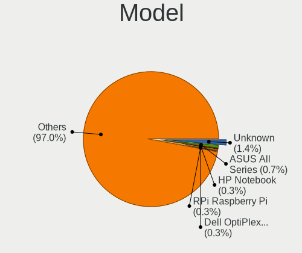

Ubuntu 22.04 - Tested Hardware & Statistics
-------------------------------------------

A project to collect tested hardware configurations for Ubuntu 22.04.

Anyone can contribute to this report by the [hw-probe](https://github.com/linuxhw/hw-probe) tool:

    sudo -E hw-probe -all -upload

Please contribute! Especially if your hardware is rare.

This is a report for all computer types. See also reports for [desktops](/Dist/Ubuntu_22.04/Desktop/README.md) and [notebooks](/Dist/Ubuntu_22.04/Notebook/README.md).

Contents
--------

* [ Test Cases ](#test-cases)

* [ System ](#system)
  - [ Kernel                   ](#kernel)
  - [ Kernel Family            ](#kernel-family)
  - [ Kernel Major Ver.        ](#kernel-major-ver)
  - [ Arch                     ](#arch)
  - [ DE                       ](#de)
  - [ Display Server           ](#display-server)
  - [ Display Manager          ](#display-manager)
  - [ OS Lang                  ](#os-lang)
  - [ Boot Mode                ](#boot-mode)
  - [ Filesystem               ](#filesystem)
  - [ Part. scheme             ](#part-scheme)
  - [ Dual Boot with Linux/BSD ](#dual-boot-with-linuxbsd)
  - [ Dual Boot (Win)          ](#dual-boot-win)

* [ Board ](#board)
  - [ Vendor                   ](#vendor)
  - [ Model                    ](#model)
  - [ Model Family             ](#model-family)
  - [ MFG Year                 ](#mfg-year)
  - [ Form Factor              ](#form-factor)
  - [ Secure Boot              ](#secure-boot)
  - [ Coreboot                 ](#coreboot)
  - [ RAM Size                 ](#ram-size)
  - [ RAM Used                 ](#ram-used)
  - [ Total Drives             ](#total-drives)
  - [ Has CD-ROM               ](#has-cd-rom)
  - [ Has Ethernet             ](#has-ethernet)
  - [ Has WiFi                 ](#has-wifi)
  - [ Has Bluetooth            ](#has-bluetooth)

* [ Location ](#location)
  - [ Country                  ](#country)
  - [ City                     ](#city)

* [ Drives ](#drives)
  - [ Drive Vendor             ](#drive-vendor)
  - [ Drive Model              ](#drive-model)
  - [ HDD Vendor               ](#hdd-vendor)
  - [ SSD Vendor               ](#ssd-vendor)
  - [ Drive Kind               ](#drive-kind)
  - [ Drive Connector          ](#drive-connector)
  - [ Drive Size               ](#drive-size)
  - [ Space Total              ](#space-total)
  - [ Space Used               ](#space-used)
  - [ Malfunc. Drives          ](#malfunc-drives)
  - [ Malfunc. Drive Vendor    ](#malfunc-drive-vendor)
  - [ Malfunc. HDD Vendor      ](#malfunc-hdd-vendor)
  - [ Malfunc. Drive Kind      ](#malfunc-drive-kind)
  - [ Failed Drives            ](#failed-drives)
  - [ Failed Drive Vendor      ](#failed-drive-vendor)
  - [ Drive Status             ](#drive-status)

* [ Storage controller ](#storage-controller)
  - [ Storage Vendor           ](#storage-vendor)
  - [ Storage Model            ](#storage-model)
  - [ Storage Kind             ](#storage-kind)

* [ Processor ](#processor)
  - [ CPU Vendor               ](#cpu-vendor)
  - [ CPU Model                ](#cpu-model)
  - [ CPU Model Family         ](#cpu-model-family)
  - [ CPU Cores                ](#cpu-cores)
  - [ CPU Sockets              ](#cpu-sockets)
  - [ CPU Threads              ](#cpu-threads)
  - [ CPU Op-Modes             ](#cpu-op-modes)
  - [ CPU Microcode            ](#cpu-microcode)
  - [ CPU Microarch            ](#cpu-microarch)

* [ Graphics ](#graphics)
  - [ GPU Vendor               ](#gpu-vendor)
  - [ GPU Model                ](#gpu-model)
  - [ GPU Combo                ](#gpu-combo)
  - [ GPU Driver               ](#gpu-driver)
  - [ GPU Memory               ](#gpu-memory)

* [ Monitor ](#monitor)
  - [ Monitor Vendor           ](#monitor-vendor)
  - [ Monitor Model            ](#monitor-model)
  - [ Monitor Resolution       ](#monitor-resolution)
  - [ Monitor Diagonal         ](#monitor-diagonal)
  - [ Monitor Width            ](#monitor-width)
  - [ Aspect Ratio             ](#aspect-ratio)
  - [ Monitor Area             ](#monitor-area)
  - [ Pixel Density            ](#pixel-density)
  - [ Multiple Monitors        ](#multiple-monitors)

* [ Network ](#network)
  - [ Net Controller Vendor    ](#net-controller-vendor)
  - [ Net Controller Model     ](#net-controller-model)
  - [ Wireless Vendor          ](#wireless-vendor)
  - [ Wireless Model           ](#wireless-model)
  - [ Ethernet Vendor          ](#ethernet-vendor)
  - [ Ethernet Model           ](#ethernet-model)
  - [ Net Controller Kind      ](#net-controller-kind)
  - [ Used Controller          ](#used-controller)
  - [ NICs                     ](#nics)
  - [ IPv6                     ](#ipv6)

* [ Bluetooth ](#bluetooth)
  - [ Bluetooth Vendor         ](#bluetooth-vendor)
  - [ Bluetooth Model          ](#bluetooth-model)

* [ Sound ](#sound)
  - [ Sound Vendor             ](#sound-vendor)
  - [ Sound Model              ](#sound-model)

* [ Memory ](#memory)
  - [ Memory Vendor            ](#memory-vendor)
  - [ Memory Model             ](#memory-model)
  - [ Memory Kind              ](#memory-kind)
  - [ Memory Form Factor       ](#memory-form-factor)
  - [ Memory Size              ](#memory-size)
  - [ Memory Speed             ](#memory-speed)

* [ Printers & scanners ](#printers--scanners)
  - [ Printer Vendor           ](#printer-vendor)
  - [ Printer Model            ](#printer-model)
  - [ Scanner Vendor           ](#scanner-vendor)
  - [ Scanner Model            ](#scanner-model)

* [ Camera ](#camera)
  - [ Camera Vendor            ](#camera-vendor)
  - [ Camera Model             ](#camera-model)

* [ Security ](#security)
  - [ Fingerprint Vendor       ](#fingerprint-vendor)
  - [ Fingerprint Model        ](#fingerprint-model)
  - [ Chipcard Vendor          ](#chipcard-vendor)
  - [ Chipcard Model           ](#chipcard-model)

* [ Unsupported ](#unsupported)
  - [ Unsupported Devices      ](#unsupported-devices)
  - [ Unsupported Device Types ](#unsupported-device-types)

Test Cases
----------

Total: 6841

| Vendor        | Model                       | Form-Factor | Probe                                                      | Date         |
|---------------|-----------------------------|-------------|------------------------------------------------------------|--------------|
| HP            | Laptop 15-dw1xxx            | Notebook    | [d8d5459ad6](https://linux-hardware.org/?probe=d8d5459ad6) | Dec 01, 2022 |
| AZW           | SEi                         | Notebook    | [3cd2f7f657](https://linux-hardware.org/?probe=3cd2f7f657) | Dec 01, 2022 |
| HP            | Laptop 15-dw1xxx            | Notebook    | [1dddd99280](https://linux-hardware.org/?probe=1dddd99280) | Dec 01, 2022 |
| Acer          | Aspire XC-705               | Desktop     | [86a503df2a](https://linux-hardware.org/?probe=86a503df2a) | Dec 01, 2022 |
| Lenovo        | IdeaPad Gaming 3 15IAH7 ... | Notebook    | [fe9e8854c5](https://linux-hardware.org/?probe=fe9e8854c5) | Dec 01, 2022 |
| Gigabyte      | B450M DS3H-CF               | Desktop     | [5e7bc65683](https://linux-hardware.org/?probe=5e7bc65683) | Dec 01, 2022 |
| Samsung       | R540/R538/SA41/E452         | Notebook    | [afad3c8828](https://linux-hardware.org/?probe=afad3c8828) | Dec 01, 2022 |
| Positivo B... | VJFE53F11X-B0511H           | Notebook    | [24b1be97d6](https://linux-hardware.org/?probe=24b1be97d6) | Dec 01, 2022 |
| Positivo B... | VJFE53F11X-B0511H           | Notebook    | [a2e91cba31](https://linux-hardware.org/?probe=a2e91cba31) | Dec 01, 2022 |
| Dell          | 0G254H A00                  | Desktop     | [473fb8a09a](https://linux-hardware.org/?probe=473fb8a09a) | Dec 01, 2022 |
| HP            | Notebook                    | Notebook    | [7c22b96a9a](https://linux-hardware.org/?probe=7c22b96a9a) | Dec 01, 2022 |
| Gigabyte      | GA-MA790FXT-UD5P            | Desktop     | [010349b87b](https://linux-hardware.org/?probe=010349b87b) | Dec 01, 2022 |
| Dell          | XPS 13 9343                 | Notebook    | [125fcd77b9](https://linux-hardware.org/?probe=125fcd77b9) | Dec 01, 2022 |
| Fujitsu       | D3128-A1 S26361-D3128-A1    | Desktop     | [ad24dc05a0](https://linux-hardware.org/?probe=ad24dc05a0) | Dec 01, 2022 |
| Fujitsu       | D3128-A1 S26361-D3128-A1    | Desktop     | [0e38c9a3be](https://linux-hardware.org/?probe=0e38c9a3be) | Dec 01, 2022 |
| HP            | EliteBook 8730w             | Notebook    | [fa27703043](https://linux-hardware.org/?probe=fa27703043) | Dec 01, 2022 |
| MSI           | MEG X570 UNIFY              | Desktop     | [df74bf8e13](https://linux-hardware.org/?probe=df74bf8e13) | Dec 01, 2022 |
| ASRock        | Z68 Extreme4 Gen3           | Desktop     | [c14e2149eb](https://linux-hardware.org/?probe=c14e2149eb) | Dec 01, 2022 |
| Lenovo        | MIIX 310-10ICR 80SG         | Tablet      | [64e68bf245](https://linux-hardware.org/?probe=64e68bf245) | Dec 01, 2022 |
| HP            | ENVY dv7                    | Notebook    | [1cef09f19a](https://linux-hardware.org/?probe=1cef09f19a) | Dec 01, 2022 |
| ASUSTek       | GL503VM                     | Notebook    | [dbd4aba670](https://linux-hardware.org/?probe=dbd4aba670) | Dec 01, 2022 |
| ASUSTek       | GL503VM                     | Notebook    | [3db38d22b3](https://linux-hardware.org/?probe=3db38d22b3) | Dec 01, 2022 |
| HP            | Spectre x360 Convertible... | Convertible | [443bd561a5](https://linux-hardware.org/?probe=443bd561a5) | Dec 01, 2022 |
| Lenovo        | ThinkPad T480S 20L8SBTD0... | Notebook    | [2d4a014ef1](https://linux-hardware.org/?probe=2d4a014ef1) | Dec 01, 2022 |
| Lenovo        | ThinkPad T480S 20L8SBTD0... | Notebook    | [e1cec664eb](https://linux-hardware.org/?probe=e1cec664eb) | Dec 01, 2022 |
| ASUSTek       | K52F                        | Notebook    | [4276cc2cb9](https://linux-hardware.org/?probe=4276cc2cb9) | Dec 01, 2022 |
| Dell          | Vostro 3480                 | Notebook    | [bf353a87c5](https://linux-hardware.org/?probe=bf353a87c5) | Dec 01, 2022 |
| W271ELQ       | Unknown                     | Notebook    | [ae170d1e81](https://linux-hardware.org/?probe=ae170d1e81) | Dec 01, 2022 |
| Lenovo        | ThinkPad L560 20F2S2UR02    | Notebook    | [29c5e0f7b1](https://linux-hardware.org/?probe=29c5e0f7b1) | Dec 01, 2022 |
| Dell          | Vostro 3578                 | Notebook    | [89161c2dee](https://linux-hardware.org/?probe=89161c2dee) | Dec 01, 2022 |
| Fujitsu       | D2917-A1 S26361-D2917-A1    | Desktop     | [dd124e3579](https://linux-hardware.org/?probe=dd124e3579) | Nov 30, 2022 |
| Gigabyte      | H170-HD3-CF                 | Desktop     | [1d293c6d72](https://linux-hardware.org/?probe=1d293c6d72) | Nov 30, 2022 |
| Acer          | Aspire A315-21              | Notebook    | [7c3a371165](https://linux-hardware.org/?probe=7c3a371165) | Nov 30, 2022 |
| Acer          | Aspire A315-21              | Notebook    | [5f14327a56](https://linux-hardware.org/?probe=5f14327a56) | Nov 30, 2022 |
| HP            | 1825                        | Desktop     | [5f8bff315d](https://linux-hardware.org/?probe=5f8bff315d) | Nov 30, 2022 |
| Samsung       | 300E4A/300E5A/300E7A/343... | Notebook    | [5f53eff4a6](https://linux-hardware.org/?probe=5f53eff4a6) | Nov 30, 2022 |
| ASUSTek       | PRIME B450M-A II            | Desktop     | [a5b34b67f2](https://linux-hardware.org/?probe=a5b34b67f2) | Nov 30, 2022 |
| MSI           | Boston                      | Desktop     | [0564f7ed2d](https://linux-hardware.org/?probe=0564f7ed2d) | Nov 30, 2022 |
| Apple         | Mac-F2238BAE iMac11,3       | All in one  | [473821d177](https://linux-hardware.org/?probe=473821d177) | Nov 30, 2022 |
| Dell          | 0WR7PY A03                  | Desktop     | [ba1e414d62](https://linux-hardware.org/?probe=ba1e414d62) | Nov 30, 2022 |
| ASUSTek       | H81M-PLUS                   | Desktop     | [8d98938198](https://linux-hardware.org/?probe=8d98938198) | Nov 30, 2022 |
| Gigabyte      | GB-BRR7H-4700               | Desktop     | [8398d00a16](https://linux-hardware.org/?probe=8398d00a16) | Nov 30, 2022 |
| Standard      | Unknown                     | Notebook    | [723d9c3551](https://linux-hardware.org/?probe=723d9c3551) | Nov 30, 2022 |
| Apple         | Mac-F2268CC8                | All in one  | [6e2f0af1b5](https://linux-hardware.org/?probe=6e2f0af1b5) | Nov 30, 2022 |
| Dell          | Inspiron 15-3567            | Notebook    | [ee99c81e47](https://linux-hardware.org/?probe=ee99c81e47) | Nov 30, 2022 |
| Lenovo        | ThinkPad T470s W10DG 20J... | Notebook    | [645418a0dd](https://linux-hardware.org/?probe=645418a0dd) | Nov 30, 2022 |
| HP            | EliteBook x360 1040 G8 N... | Convertible | [4b635dd9ef](https://linux-hardware.org/?probe=4b635dd9ef) | Nov 30, 2022 |
| ASUSTek       | UX550VD                     | Notebook    | [a3f2aafbf1](https://linux-hardware.org/?probe=a3f2aafbf1) | Nov 30, 2022 |
| Packard Be... | EasyNote TE69CXP            | Notebook    | [919275eb73](https://linux-hardware.org/?probe=919275eb73) | Nov 30, 2022 |
| HP            | OMEN Laptop 15-en0xxx       | Notebook    | [c3d55f501c](https://linux-hardware.org/?probe=c3d55f501c) | Nov 30, 2022 |
| ASUSTek       | M5A78L-M LE/USB3            | Desktop     | [dd3801095f](https://linux-hardware.org/?probe=dd3801095f) | Nov 30, 2022 |
| Dell          | Latitude 7390               | Notebook    | [7214cac96d](https://linux-hardware.org/?probe=7214cac96d) | Nov 30, 2022 |
| Dell          | XPS 15 9500                 | Notebook    | [f9215967d3](https://linux-hardware.org/?probe=f9215967d3) | Nov 30, 2022 |
| Lenovo        | ThinkPad T470p 20J7S1FR0... | Notebook    | [517347d2cf](https://linux-hardware.org/?probe=517347d2cf) | Nov 30, 2022 |
| Dell          | 0XJ5V0 A03                  | Desktop     | [b954e4c174](https://linux-hardware.org/?probe=b954e4c174) | Nov 30, 2022 |
| Lenovo        | 3190 SDK0J40697 WIN 3305... | Mini pc     | [1c03d54694](https://linux-hardware.org/?probe=1c03d54694) | Nov 30, 2022 |
| Samsung       | 300E4A/300E5A/300E7A/343... | Notebook    | [aadb9ff1d4](https://linux-hardware.org/?probe=aadb9ff1d4) | Nov 30, 2022 |
| Lenovo        | 3190 SDK0J40697 WIN 3305... | Mini pc     | [cafd86ffda](https://linux-hardware.org/?probe=cafd86ffda) | Nov 30, 2022 |
| HP            | Laptop 14-dk1xxx            | Notebook    | [9dbd54884d](https://linux-hardware.org/?probe=9dbd54884d) | Nov 30, 2022 |
| HP            | 1825                        | Desktop     | [a3f8ec5423](https://linux-hardware.org/?probe=a3f8ec5423) | Nov 30, 2022 |
| ASUSTek       | VivoBook_ASUSLaptop X140... | Notebook    | [55d95654c4](https://linux-hardware.org/?probe=55d95654c4) | Nov 30, 2022 |
| Dell          | Inspiron 15-3552            | Notebook    | [e740b148c1](https://linux-hardware.org/?probe=e740b148c1) | Nov 30, 2022 |
| Apple         | MacBook4,1                  | Notebook    | [0866a64897](https://linux-hardware.org/?probe=0866a64897) | Nov 30, 2022 |
| Medion        | D3F3-EM                     | Desktop     | [ae428a6a6a](https://linux-hardware.org/?probe=ae428a6a6a) | Nov 29, 2022 |
| ASUSTek       | PRIME B450M-A II            | Desktop     | [f0dfa48048](https://linux-hardware.org/?probe=f0dfa48048) | Nov 29, 2022 |
| Apple         | Mac-27ADBB7B4CEE8E61 iMa... | All in one  | [b7a1fc62d1](https://linux-hardware.org/?probe=b7a1fc62d1) | Nov 29, 2022 |
| Acer          | Nitro AN515-58              | Notebook    | [02f4319195](https://linux-hardware.org/?probe=02f4319195) | Nov 29, 2022 |
| Acer          | AO756                       | Notebook    | [c1ff6fe10c](https://linux-hardware.org/?probe=c1ff6fe10c) | Nov 29, 2022 |
| Acer          | Nitro AN515-58              | Notebook    | [77ad02b5bd](https://linux-hardware.org/?probe=77ad02b5bd) | Nov 29, 2022 |
| Dell          | Vostro 5470                 | Notebook    | [15c504a6ef](https://linux-hardware.org/?probe=15c504a6ef) | Nov 29, 2022 |
| Chuwi         | LarkBox Pro                 | Mini pc     | [9b78bb4bbf](https://linux-hardware.org/?probe=9b78bb4bbf) | Nov 29, 2022 |
| Lenovo        | Legion 5 15IMH05H 82CF      | Notebook    | [adb0404576](https://linux-hardware.org/?probe=adb0404576) | Nov 29, 2022 |
| Chuwi         | LarkBox Pro                 | Mini pc     | [65a673d91a](https://linux-hardware.org/?probe=65a673d91a) | Nov 29, 2022 |
| Dell          | Latitude E6410              | Notebook    | [d7abefea4b](https://linux-hardware.org/?probe=d7abefea4b) | Nov 29, 2022 |
| Apple         | Mac-F2268CC8                | All in one  | [0cb6dd7966](https://linux-hardware.org/?probe=0cb6dd7966) | Nov 29, 2022 |
| Gigabyte      | B250M-DS3H-CF               | Desktop     | [efacbf6215](https://linux-hardware.org/?probe=efacbf6215) | Nov 29, 2022 |
| Dell          | Inspiron 16 7620 2-in-1     | Convertible | [3e34521c45](https://linux-hardware.org/?probe=3e34521c45) | Nov 29, 2022 |
| Gigabyte      | B250M-DS3H-CF               | Desktop     | [85ac938c0c](https://linux-hardware.org/?probe=85ac938c0c) | Nov 29, 2022 |
| Dell          | Inspiron 16 7620 2-in-1     | Convertible | [e43c4c3053](https://linux-hardware.org/?probe=e43c4c3053) | Nov 29, 2022 |
| ASUSTek       | X756UVK                     | Notebook    | [93b549fb81](https://linux-hardware.org/?probe=93b549fb81) | Nov 29, 2022 |
| Lenovo        | ThinkPad X1 Carbon Gen 9... | Notebook    | [1f904e68af](https://linux-hardware.org/?probe=1f904e68af) | Nov 29, 2022 |
| HP            | 339A                        | Desktop     | [ea5cacd50e](https://linux-hardware.org/?probe=ea5cacd50e) | Nov 29, 2022 |
| Apple         | Mac-F2268DAE                | All in one  | [8d37e3e327](https://linux-hardware.org/?probe=8d37e3e327) | Nov 29, 2022 |
| Dell          | Latitude 5330               | Notebook    | [b8d907f2e8](https://linux-hardware.org/?probe=b8d907f2e8) | Nov 29, 2022 |
| Apple         | Mac-F2268DAE                | All in one  | [e41751f26a](https://linux-hardware.org/?probe=e41751f26a) | Nov 29, 2022 |
| Lenovo        | B590 20206                  | Notebook    | [5bec8860f3](https://linux-hardware.org/?probe=5bec8860f3) | Nov 29, 2022 |
| ASRock        | 960GM-GS3 FX                | Desktop     | [1474b9ee78](https://linux-hardware.org/?probe=1474b9ee78) | Nov 29, 2022 |
| Dell          | 0J8G6F A03                  | Desktop     | [1424a94eb0](https://linux-hardware.org/?probe=1424a94eb0) | Nov 29, 2022 |
| Gigabyte      | Z490 AORUS XTREME WF        | Desktop     | [6d4f229020](https://linux-hardware.org/?probe=6d4f229020) | Nov 29, 2022 |
| Medion        | H110H4-EM2                  | Desktop     | [38b9e166f2](https://linux-hardware.org/?probe=38b9e166f2) | Nov 29, 2022 |
| ASRock        | Z77 Extreme3                | Desktop     | [e473c1c45c](https://linux-hardware.org/?probe=e473c1c45c) | Nov 29, 2022 |
| Dell          | Latitude 3500               | Notebook    | [de0731ac74](https://linux-hardware.org/?probe=de0731ac74) | Nov 29, 2022 |
| Lenovo        | 1031 SBB0J05441 WIN 3305... | Desktop     | [cc75562371](https://linux-hardware.org/?probe=cc75562371) | Nov 29, 2022 |
| Lenovo        | IdeaPad S340-14IIL 81VV     | Notebook    | [2a4bb490d0](https://linux-hardware.org/?probe=2a4bb490d0) | Nov 29, 2022 |
| Lenovo        | IdeaPad S340-14IIL 81VV     | Notebook    | [a05b99b00e](https://linux-hardware.org/?probe=a05b99b00e) | Nov 29, 2022 |
| Lenovo        | 1031 SBB0J05441 WIN 3305... | Desktop     | [a6ea0d5259](https://linux-hardware.org/?probe=a6ea0d5259) | Nov 29, 2022 |
| MSI           | Z370 GAMING PRO CARBON      | Desktop     | [96b383097b](https://linux-hardware.org/?probe=96b383097b) | Nov 29, 2022 |
| ASRock        | B550 Phantom Gaming 4/ac    | Desktop     | [66525e5501](https://linux-hardware.org/?probe=66525e5501) | Nov 29, 2022 |
| Microsoft     | Surface Pro                 | Tablet      | [2fcba8743c](https://linux-hardware.org/?probe=2fcba8743c) | Nov 28, 2022 |
| Lenovo        | ThinkBook 15 G3 ACL 21A4    | Notebook    | [ef6247e6fd](https://linux-hardware.org/?probe=ef6247e6fd) | Nov 28, 2022 |
| ASUSTek       | ASUS TUF Dash F15 FX517Z... | Notebook    | [972f6f4355](https://linux-hardware.org/?probe=972f6f4355) | Nov 28, 2022 |
| Acer          | Aspire 5820TG               | Notebook    | [61cab6d996](https://linux-hardware.org/?probe=61cab6d996) | Nov 28, 2022 |
| Acer          | Aspire 5820TG               | Notebook    | [1e64d9426d](https://linux-hardware.org/?probe=1e64d9426d) | Nov 28, 2022 |
| Acer          | Swift SF314-43              | Notebook    | [1a6c47ad0e](https://linux-hardware.org/?probe=1a6c47ad0e) | Nov 28, 2022 |
| Apple         | MacBookPro8,1               | Notebook    | [7ba1690c68](https://linux-hardware.org/?probe=7ba1690c68) | Nov 28, 2022 |
| Apple         | Mac-F2238BAE iMac11,3       | All in one  | [6d711e74c3](https://linux-hardware.org/?probe=6d711e74c3) | Nov 28, 2022 |
| Dell          | G3 3500                     | Notebook    | [291b53ea79](https://linux-hardware.org/?probe=291b53ea79) | Nov 28, 2022 |
| HP            | ProBook 640 G2              | Notebook    | [56ceffe338](https://linux-hardware.org/?probe=56ceffe338) | Nov 28, 2022 |
| ASRock        | B450M Pro4                  | Desktop     | [219a616346](https://linux-hardware.org/?probe=219a616346) | Nov 28, 2022 |
| Gigabyte      | H410M H                     | Desktop     | [09129dad50](https://linux-hardware.org/?probe=09129dad50) | Nov 28, 2022 |
| Apple         | Mac-B809C3757DA9BB8D iMa... | All in one  | [916343aa23](https://linux-hardware.org/?probe=916343aa23) | Nov 28, 2022 |
| ASUSTek       | X756UVK                     | Notebook    | [4745940cf9](https://linux-hardware.org/?probe=4745940cf9) | Nov 28, 2022 |
| Intel         | H61                         | Desktop     | [42f943bc9c](https://linux-hardware.org/?probe=42f943bc9c) | Nov 28, 2022 |
| Notebook      | L140PU                      | Notebook    | [8893420e06](https://linux-hardware.org/?probe=8893420e06) | Nov 28, 2022 |
| ASRock        | Q1900M                      | Desktop     | [0a90a5d3a5](https://linux-hardware.org/?probe=0a90a5d3a5) | Nov 28, 2022 |
| Gigabyte      | Z97X-SLI-CF                 | Desktop     | [ae01075720](https://linux-hardware.org/?probe=ae01075720) | Nov 28, 2022 |
| Gigabyte      | H410M H                     | Desktop     | [88ca303518](https://linux-hardware.org/?probe=88ca303518) | Nov 28, 2022 |
| Gigabyte      | H81M-S                      | Desktop     | [fab21fa561](https://linux-hardware.org/?probe=fab21fa561) | Nov 28, 2022 |
| ASUSTek       | PN41                        | Mini pc     | [4f937eabac](https://linux-hardware.org/?probe=4f937eabac) | Nov 28, 2022 |
| Acer          | Aspire 5742G                | Notebook    | [d5f03d47ba](https://linux-hardware.org/?probe=d5f03d47ba) | Nov 28, 2022 |
| HUAWEI        | MRC-WX0                     | Notebook    | [98f550465b](https://linux-hardware.org/?probe=98f550465b) | Nov 28, 2022 |
| Acer          | Aspire 5742G                | Notebook    | [e0701bc81d](https://linux-hardware.org/?probe=e0701bc81d) | Nov 28, 2022 |
| HP            | Pavilion Laptop 15-cw1xx... | Notebook    | [1f4c5bfc57](https://linux-hardware.org/?probe=1f4c5bfc57) | Nov 28, 2022 |
| Dell          | XPS 13 9370                 | Notebook    | [d353a1624b](https://linux-hardware.org/?probe=d353a1624b) | Nov 28, 2022 |
| Pegatron      | VIOLET                      | Desktop     | [f0f25e6854](https://linux-hardware.org/?probe=f0f25e6854) | Nov 28, 2022 |
| PCWare        | IPMH61R1                    | Desktop     | [7872d8f10f](https://linux-hardware.org/?probe=7872d8f10f) | Nov 28, 2022 |
| Dell          | 0WMJ54 A01                  | Desktop     | [778a84af28](https://linux-hardware.org/?probe=778a84af28) | Nov 28, 2022 |
| PC Special... | NH5xAx                      | Notebook    | [8bd9aae635](https://linux-hardware.org/?probe=8bd9aae635) | Nov 28, 2022 |
| ASRock        | H87M Pro4                   | Desktop     | [c0511f2d46](https://linux-hardware.org/?probe=c0511f2d46) | Nov 28, 2022 |
| ASUSTek       | ZenBook UX325UA_UM325UA     | Notebook    | [c95bbb16de](https://linux-hardware.org/?probe=c95bbb16de) | Nov 28, 2022 |
| Dell          | XPS 15 7590                 | Notebook    | [8072eb50aa](https://linux-hardware.org/?probe=8072eb50aa) | Nov 28, 2022 |
| HP            | Stream Laptop 14-cb1xxx     | Notebook    | [1bf2bd6761](https://linux-hardware.org/?probe=1bf2bd6761) | Nov 28, 2022 |
| PC Special... | NH5xAx                      | Notebook    | [3be194cb8a](https://linux-hardware.org/?probe=3be194cb8a) | Nov 28, 2022 |
| Shuttle       | FS35V4                      | Desktop     | [46923496a3](https://linux-hardware.org/?probe=46923496a3) | Nov 28, 2022 |
| Dell          | 0T10XW A02                  | Desktop     | [e97a065fa8](https://linux-hardware.org/?probe=e97a065fa8) | Nov 28, 2022 |
| HP            | EliteBook 8470w             | Notebook    | [7008753054](https://linux-hardware.org/?probe=7008753054) | Nov 28, 2022 |
| Lenovo        | ThinkPad E580 20KS001QMX    | Notebook    | [97fda88c7b](https://linux-hardware.org/?probe=97fda88c7b) | Nov 28, 2022 |
| ASUSTek       | S551LB                      | Notebook    | [d74127627f](https://linux-hardware.org/?probe=d74127627f) | Nov 28, 2022 |
| Microsoft     | Surface Pro 8               | Tablet      | [c0f32e47f1](https://linux-hardware.org/?probe=c0f32e47f1) | Nov 28, 2022 |
| Lenovo        | ThinkPad E490 20N8000RUK    | Notebook    | [6816e8f5ca](https://linux-hardware.org/?probe=6816e8f5ca) | Nov 27, 2022 |
| Lenovo        | ThinkPad E490 20N8000RUK    | Notebook    | [06c690a0e1](https://linux-hardware.org/?probe=06c690a0e1) | Nov 27, 2022 |
| HP            | Laptop 14s-dq5xxx           | Notebook    | [e5164649e1](https://linux-hardware.org/?probe=e5164649e1) | Nov 27, 2022 |
| Dell          | XPS 13 9305                 | Notebook    | [c306dcfa4f](https://linux-hardware.org/?probe=c306dcfa4f) | Nov 27, 2022 |
| Gateway       | G33M05G1 MP                 | Desktop     | [193a69e5ee](https://linux-hardware.org/?probe=193a69e5ee) | Nov 27, 2022 |
| Acer          | Veriton X4620G V1.0         | Desktop     | [37be4a2bf8](https://linux-hardware.org/?probe=37be4a2bf8) | Nov 27, 2022 |
| HP            | ProBook 5330m               | Notebook    | [3763f505a0](https://linux-hardware.org/?probe=3763f505a0) | Nov 27, 2022 |
| ASUSTek       | PRIME A320M-K               | Desktop     | [37b51f19ef](https://linux-hardware.org/?probe=37b51f19ef) | Nov 27, 2022 |
| ASUSTek       | VivoBook_ASUSLaptop X412... | Notebook    | [2aba12235d](https://linux-hardware.org/?probe=2aba12235d) | Nov 27, 2022 |
| Gateway       | G33M05G1 MP                 | Desktop     | [291e32a741](https://linux-hardware.org/?probe=291e32a741) | Nov 27, 2022 |
| Acer          | AO756                       | Notebook    | [fa5c9df13a](https://linux-hardware.org/?probe=fa5c9df13a) | Nov 27, 2022 |
| Acer          | AO756                       | Notebook    | [d390d588fe](https://linux-hardware.org/?probe=d390d588fe) | Nov 27, 2022 |
| HUAWEI        | RLEF-XX                     | Notebook    | [bb5c736032](https://linux-hardware.org/?probe=bb5c736032) | Nov 27, 2022 |
| Lenovo        | ThinkBook 14 G2 ITL 20VD    | Notebook    | [2d1a576ee6](https://linux-hardware.org/?probe=2d1a576ee6) | Nov 27, 2022 |
| ASRock        | H87M Pro4                   | Desktop     | [8d15aa84d6](https://linux-hardware.org/?probe=8d15aa84d6) | Nov 27, 2022 |
| ASUSTek       | ROG STRIX B450-F GAMING ... | Desktop     | [a60076a8c2](https://linux-hardware.org/?probe=a60076a8c2) | Nov 27, 2022 |
| Dell          | G5 5587                     | Notebook    | [689db41249](https://linux-hardware.org/?probe=689db41249) | Nov 27, 2022 |
| Dell          | XPS 15 7590                 | Notebook    | [18b1ecf4fd](https://linux-hardware.org/?probe=18b1ecf4fd) | Nov 27, 2022 |
| HP            | 1589                        | Desktop     | [4e67735055](https://linux-hardware.org/?probe=4e67735055) | Nov 27, 2022 |
| Koloe         | X58                         | Desktop     | [8b80e1a74c](https://linux-hardware.org/?probe=8b80e1a74c) | Nov 27, 2022 |
| ASUSTek       | PRIME B365M-A               | Desktop     | [4f3216dfdc](https://linux-hardware.org/?probe=4f3216dfdc) | Nov 27, 2022 |
| ASUSTek       | PRIME B365M-A               | Desktop     | [498f0a31dc](https://linux-hardware.org/?probe=498f0a31dc) | Nov 27, 2022 |
| ASRock        | H110M-DGS                   | Desktop     | [6667ba2bc2](https://linux-hardware.org/?probe=6667ba2bc2) | Nov 27, 2022 |
| Dell          | G7 7700                     | Notebook    | [16407c6485](https://linux-hardware.org/?probe=16407c6485) | Nov 27, 2022 |
| Apple         | MacBookAir6,2               | Notebook    | [8e266a1137](https://linux-hardware.org/?probe=8e266a1137) | Nov 27, 2022 |
| SmbiosType... | SmbiosType1_SystemProduc... | Notebook    | [fc54a7e10e](https://linux-hardware.org/?probe=fc54a7e10e) | Nov 27, 2022 |
| HP            | 843B                        | Desktop     | [50065e4a79](https://linux-hardware.org/?probe=50065e4a79) | Nov 27, 2022 |
| Dell          | 0GXM1W A02                  | Desktop     | [3a801841e6](https://linux-hardware.org/?probe=3a801841e6) | Nov 27, 2022 |
| Gigabyte      | H81M-DS2                    | Desktop     | [f278eb7e59](https://linux-hardware.org/?probe=f278eb7e59) | Nov 27, 2022 |
| ASUSTek       | G75VX                       | Notebook    | [87ef485975](https://linux-hardware.org/?probe=87ef485975) | Nov 27, 2022 |
| Gigabyte      | B450 AORUS ELITE            | Desktop     | [b72ddeccb4](https://linux-hardware.org/?probe=b72ddeccb4) | Nov 27, 2022 |
| Dell          | Vostro 3580                 | Notebook    | [350202deed](https://linux-hardware.org/?probe=350202deed) | Nov 27, 2022 |
| Foxconn       | A74ML-K                     | Desktop     | [438e3ff761](https://linux-hardware.org/?probe=438e3ff761) | Nov 27, 2022 |
| HP            | Elite x2 1012 G2            | Tablet      | [669f6eaf1c](https://linux-hardware.org/?probe=669f6eaf1c) | Nov 26, 2022 |
| HP            | ProBook 440 G7              | Notebook    | [d923cda32c](https://linux-hardware.org/?probe=d923cda32c) | Nov 26, 2022 |
| HP            | ProBook 6470b               | Notebook    | [c8da54315e](https://linux-hardware.org/?probe=c8da54315e) | Nov 26, 2022 |
| MSI           | MPG X570 GAMING EDGE WIF... | Desktop     | [2813bdf250](https://linux-hardware.org/?probe=2813bdf250) | Nov 26, 2022 |
| ASUSTek       | H81M-K                      | Desktop     | [4de72d3d12](https://linux-hardware.org/?probe=4de72d3d12) | Nov 26, 2022 |
| ASUSTek       | U56E                        | Notebook    | [4222387904](https://linux-hardware.org/?probe=4222387904) | Nov 26, 2022 |
| ASUSTek       | P7P55D-E LX                 | Desktop     | [8b913d5510](https://linux-hardware.org/?probe=8b913d5510) | Nov 26, 2022 |
| Chuwi         | LarkBox Pro                 | Mini pc     | [2509c3dc5c](https://linux-hardware.org/?probe=2509c3dc5c) | Nov 26, 2022 |
| Dell          | 0DJ7HC A00                  | Server      | [fe865becbb](https://linux-hardware.org/?probe=fe865becbb) | Nov 26, 2022 |
| Lenovo        | ThinkPad L13 Yoga Gen 2 ... | Convertible | [27e7464a68](https://linux-hardware.org/?probe=27e7464a68) | Nov 26, 2022 |
| ASUSTek       | Rampage IV EXTREME          | Desktop     | [e70ff25b31](https://linux-hardware.org/?probe=e70ff25b31) | Nov 26, 2022 |
| Lenovo        | Y50-70 20378                | Notebook    | [57e4892065](https://linux-hardware.org/?probe=57e4892065) | Nov 26, 2022 |
| Acer          | Swift SFX14-41G             | Notebook    | [521cb4d847](https://linux-hardware.org/?probe=521cb4d847) | Nov 26, 2022 |
| Acer          | Aspire A315-58              | Notebook    | [df3e0f4b6c](https://linux-hardware.org/?probe=df3e0f4b6c) | Nov 26, 2022 |
| Acer          | Aspire A315-58              | Notebook    | [82ee1f1740](https://linux-hardware.org/?probe=82ee1f1740) | Nov 26, 2022 |
| MSI           | GE70 2OC\2OE                | Notebook    | [842781ccfc](https://linux-hardware.org/?probe=842781ccfc) | Nov 26, 2022 |
| Lenovo        | BRASWELL SDK0J40705 WIN ... | Desktop     | [fd73688b5c](https://linux-hardware.org/?probe=fd73688b5c) | Nov 26, 2022 |
| HUAWEI        | KLVL-WXX9                   | Notebook    | [ce7815f106](https://linux-hardware.org/?probe=ce7815f106) | Nov 26, 2022 |
| ASUSTek       | PRIME A320M-K               | Desktop     | [be12141830](https://linux-hardware.org/?probe=be12141830) | Nov 26, 2022 |
| MSI           | GL62M 7RDX                  | Notebook    | [1aa67b30d4](https://linux-hardware.org/?probe=1aa67b30d4) | Nov 26, 2022 |
| ASUSTek       | PRIME A320M-K               | Desktop     | [f34d75bde0](https://linux-hardware.org/?probe=f34d75bde0) | Nov 26, 2022 |
| ASUSTek       | B150M-C                     | Desktop     | [bbbdc2b291](https://linux-hardware.org/?probe=bbbdc2b291) | Nov 26, 2022 |
| Apple         | Mac-FC02E91DDD3FA6A4 iMa... | All in one  | [949860da0f](https://linux-hardware.org/?probe=949860da0f) | Nov 26, 2022 |
| Lenovo        | V145-15AST 81MT             | Notebook    | [759ad3eb43](https://linux-hardware.org/?probe=759ad3eb43) | Nov 26, 2022 |
| Lenovo        | ThinkCentre M58 6258AP4     | Desktop     | [54d4e3a0ae](https://linux-hardware.org/?probe=54d4e3a0ae) | Nov 26, 2022 |
| HP            | G61                         | Notebook    | [314cbc992f](https://linux-hardware.org/?probe=314cbc992f) | Nov 26, 2022 |
| Apple         | Mac-27ADBB7B4CEE8E61 iMa... | All in one  | [c1d5a26691](https://linux-hardware.org/?probe=c1d5a26691) | Nov 26, 2022 |
| Lenovo        | BRASWELL SDK0J40705 WIN ... | Desktop     | [cdc1c32b09](https://linux-hardware.org/?probe=cdc1c32b09) | Nov 26, 2022 |
| Lenovo        | ThinkPad X1 Carbon 5th 2... | Notebook    | [5a6ef91469](https://linux-hardware.org/?probe=5a6ef91469) | Nov 26, 2022 |
| ASUSTek       | U56E                        | Notebook    | [8b783ab1ac](https://linux-hardware.org/?probe=8b783ab1ac) | Nov 26, 2022 |
| MSI           | A78M-E35                    | Desktop     | [cf80d76e53](https://linux-hardware.org/?probe=cf80d76e53) | Nov 26, 2022 |
| System76      | Gazelle                     | Notebook    | [dd481baf69](https://linux-hardware.org/?probe=dd481baf69) | Nov 26, 2022 |
| Lenovo        | ThinkPad X1 Carbon 4th 2... | Convertible | [b128e800ec](https://linux-hardware.org/?probe=b128e800ec) | Nov 26, 2022 |
| Lenovo        | ThinkPad L13 20R3000FUK     | Notebook    | [c3ff5b014d](https://linux-hardware.org/?probe=c3ff5b014d) | Nov 26, 2022 |
| Sony          | SVP1121X9EB                 | Notebook    | [78df785a47](https://linux-hardware.org/?probe=78df785a47) | Nov 26, 2022 |
| HUAWEI        | HKD-WXX                     | Notebook    | [5271fa9ef9](https://linux-hardware.org/?probe=5271fa9ef9) | Nov 26, 2022 |
| HP            | Pavilion Power Laptop 15... | Notebook    | [913b35d3f0](https://linux-hardware.org/?probe=913b35d3f0) | Nov 25, 2022 |
| Lenovo        | ThinkPad T430 2349I62       | Notebook    | [ab0d49b5cd](https://linux-hardware.org/?probe=ab0d49b5cd) | Nov 25, 2022 |
| HUAWEI        | HVY-WXX9                    | Notebook    | [00d2cc22aa](https://linux-hardware.org/?probe=00d2cc22aa) | Nov 25, 2022 |
| Intel         | Unknown                     | Desktop     | [bcf46201bc](https://linux-hardware.org/?probe=bcf46201bc) | Nov 25, 2022 |
| ASUSTek       | F7SR                        | Notebook    | [ecdba533ea](https://linux-hardware.org/?probe=ecdba533ea) | Nov 25, 2022 |
| ASUSTek       | F7SR                        | Notebook    | [8102d8b361](https://linux-hardware.org/?probe=8102d8b361) | Nov 25, 2022 |
| Lenovo        | IdeaPad 3 15ALC6 82KU       | Notebook    | [86735d895f](https://linux-hardware.org/?probe=86735d895f) | Nov 25, 2022 |
| HP            | Presario CQ56               | Notebook    | [919fad0653](https://linux-hardware.org/?probe=919fad0653) | Nov 25, 2022 |
| ASRock        | Z77 Extreme4                | Desktop     | [40b3f85de8](https://linux-hardware.org/?probe=40b3f85de8) | Nov 25, 2022 |
| ASUSTek       | X751MA                      | Notebook    | [15ea4b4462](https://linux-hardware.org/?probe=15ea4b4462) | Nov 25, 2022 |
| Gigabyte      | 970A-DS3P                   | Desktop     | [2787600567](https://linux-hardware.org/?probe=2787600567) | Nov 25, 2022 |
| Dell          | OptiPlex 3020               | Desktop     | [2adcd09348](https://linux-hardware.org/?probe=2adcd09348) | Nov 25, 2022 |
| HP            | EliteBook 840 G6            | Notebook    | [a401adc095](https://linux-hardware.org/?probe=a401adc095) | Nov 25, 2022 |
| HP            | Pavilion 15                 | Notebook    | [b294971fc6](https://linux-hardware.org/?probe=b294971fc6) | Nov 25, 2022 |
| ASUSTek       | PRIME A320M-K               | Desktop     | [906ad9a3c1](https://linux-hardware.org/?probe=906ad9a3c1) | Nov 25, 2022 |
| Sony          | VAIO                        | All in one  | [132081ff74](https://linux-hardware.org/?probe=132081ff74) | Nov 25, 2022 |
| ASUSTek       | P8B75-M LX                  | Desktop     | [8522486d64](https://linux-hardware.org/?probe=8522486d64) | Nov 25, 2022 |
| Positivo      | P5VD2-MX                    | Desktop     | [c9d4c5ea2b](https://linux-hardware.org/?probe=c9d4c5ea2b) | Nov 25, 2022 |
| Dell          | Latitude 5410               | Notebook    | [1eeb98c3b0](https://linux-hardware.org/?probe=1eeb98c3b0) | Nov 25, 2022 |
| HP            | 18E9                        | Desktop     | [dab5e242fd](https://linux-hardware.org/?probe=dab5e242fd) | Nov 25, 2022 |
| Acer          | Aspire VN7-791G             | Notebook    | [7664866053](https://linux-hardware.org/?probe=7664866053) | Nov 25, 2022 |
| Sony          | VGN-FE770G                  | Notebook    | [c59f41adb7](https://linux-hardware.org/?probe=c59f41adb7) | Nov 25, 2022 |
| HUAWEI        | KLVD-WXX9                   | Notebook    | [04b855bde5](https://linux-hardware.org/?probe=04b855bde5) | Nov 25, 2022 |
| Samsung       | 350V5C/351V5C/3540VC/344... | Notebook    | [0a9d327f59](https://linux-hardware.org/?probe=0a9d327f59) | Nov 25, 2022 |
| Samsung       | 350V5C/351V5C/3540VC/344... | Notebook    | [869a5a808f](https://linux-hardware.org/?probe=869a5a808f) | Nov 25, 2022 |
| Unknown       | T3 MRD                      | Desktop     | [bec511830c](https://linux-hardware.org/?probe=bec511830c) | Nov 24, 2022 |
| ASUSTek       | PRIME B560M-A AC            | Desktop     | [51a24ed190](https://linux-hardware.org/?probe=51a24ed190) | Nov 24, 2022 |
| ASRock        | X570 Pro4                   | Desktop     | [dad186aa07](https://linux-hardware.org/?probe=dad186aa07) | Nov 24, 2022 |
| Lenovo        | ThinkPad T560 20FJS3YN00    | Notebook    | [636921b46c](https://linux-hardware.org/?probe=636921b46c) | Nov 24, 2022 |
| Lenovo        | ThinkPad P17 Gen 2i 20YU... | Notebook    | [cd660d3210](https://linux-hardware.org/?probe=cd660d3210) | Nov 24, 2022 |
| Dell          | Inspiron 3585               | Notebook    | [33485dee6d](https://linux-hardware.org/?probe=33485dee6d) | Nov 24, 2022 |
| HP            | 0AE8h                       | Desktop     | [c49d643fae](https://linux-hardware.org/?probe=c49d643fae) | Nov 24, 2022 |
| Gigabyte      | B75M-D3H                    | Desktop     | [d70a6e41ba](https://linux-hardware.org/?probe=d70a6e41ba) | Nov 24, 2022 |
| ASRock        | 960GM-GS3 FX                | Desktop     | [1af92d9936](https://linux-hardware.org/?probe=1af92d9936) | Nov 24, 2022 |
| Biostar       | H61MGV3                     | Desktop     | [b252a902f4](https://linux-hardware.org/?probe=b252a902f4) | Nov 24, 2022 |
| Avell High... | STORM TWO                   | Notebook    | [d8a406b26c](https://linux-hardware.org/?probe=d8a406b26c) | Nov 24, 2022 |
| Lenovo        | IdeaPad 320-15AST 80XV      | Notebook    | [b73b2c4c07](https://linux-hardware.org/?probe=b73b2c4c07) | Nov 24, 2022 |
| Lenovo        | ThinkPad X1 Nano Gen 2 2... | Notebook    | [4b6212908f](https://linux-hardware.org/?probe=4b6212908f) | Nov 24, 2022 |
| Lenovo        | ThinkPad X1 Nano Gen 2 2... | Notebook    | [69c89370b7](https://linux-hardware.org/?probe=69c89370b7) | Nov 24, 2022 |
| ASRock        | 960GC-GS FX                 | Desktop     | [30081f61ca](https://linux-hardware.org/?probe=30081f61ca) | Nov 24, 2022 |
| ASRock        | 960GC-GS FX                 | Desktop     | [9e33d3b8f1](https://linux-hardware.org/?probe=9e33d3b8f1) | Nov 24, 2022 |
| Lenovo        | ThinkPad T420s 41732BU      | Notebook    | [ac7791c167](https://linux-hardware.org/?probe=ac7791c167) | Nov 24, 2022 |
| Lenovo        | ThinkPad T580 20LAS01H00    | Notebook    | [3714ee0985](https://linux-hardware.org/?probe=3714ee0985) | Nov 24, 2022 |
| MSI           | MPG X570 GAMING EDGE WIF... | Desktop     | [b70689b098](https://linux-hardware.org/?probe=b70689b098) | Nov 24, 2022 |
| Fujitsu       | D3222-A1 S26361-D3222-A1    | Desktop     | [00f8658ee8](https://linux-hardware.org/?probe=00f8658ee8) | Nov 24, 2022 |
| MSI           | MPG X570 GAMING EDGE WIF... | Desktop     | [62c027aa0e](https://linux-hardware.org/?probe=62c027aa0e) | Nov 24, 2022 |
| ASUSTek       | PRIME A320M-K               | Desktop     | [5ea9d52f04](https://linux-hardware.org/?probe=5ea9d52f04) | Nov 24, 2022 |
| Acer          | Aspire A315-41              | Notebook    | [4408f2ceff](https://linux-hardware.org/?probe=4408f2ceff) | Nov 24, 2022 |
| Dell          | 0GXM1W A02                  | Desktop     | [8bb6ca52d6](https://linux-hardware.org/?probe=8bb6ca52d6) | Nov 24, 2022 |
| Lenovo        | ThinkCentre M58e 7514A2U    | Desktop     | [ba4f47be1a](https://linux-hardware.org/?probe=ba4f47be1a) | Nov 24, 2022 |
| ASUSTek       | K51AC                       | Notebook    | [0b2413e13c](https://linux-hardware.org/?probe=0b2413e13c) | Nov 24, 2022 |
| Dell          | 0WPMFG A00                  | Desktop     | [606cc8badf](https://linux-hardware.org/?probe=606cc8badf) | Nov 24, 2022 |
| Dell          | 0Y2MRG A00                  | Desktop     | [581cd43952](https://linux-hardware.org/?probe=581cd43952) | Nov 24, 2022 |
| Razer         | Blade 15 Advanced Model ... | Notebook    | [60732590be](https://linux-hardware.org/?probe=60732590be) | Nov 24, 2022 |
| Dell          | 02C2CP A00                  | Server      | [698093bbc6](https://linux-hardware.org/?probe=698093bbc6) | Nov 24, 2022 |
| AZW           | Green G1                    | Desktop     | [762182d13c](https://linux-hardware.org/?probe=762182d13c) | Nov 24, 2022 |
| Dell          | Latitude E6320              | Notebook    | [81f633b550](https://linux-hardware.org/?probe=81f633b550) | Nov 24, 2022 |
| Toshiba       | IS 1442                     | Notebook    | [8a2d7b5a48](https://linux-hardware.org/?probe=8a2d7b5a48) | Nov 23, 2022 |
| Unknown       | Unknown                     | Notebook    | [d96c2be612](https://linux-hardware.org/?probe=d96c2be612) | Nov 23, 2022 |
| HUAWEI        | KLVD-WXX9                   | Notebook    | [97b1b927ba](https://linux-hardware.org/?probe=97b1b927ba) | Nov 23, 2022 |
| Dell          | XPS 9320                    | Notebook    | [d63a585507](https://linux-hardware.org/?probe=d63a585507) | Nov 23, 2022 |
| Lenovo        | IdeaPad 3 15ADA05 81W1      | Notebook    | [66fca8e108](https://linux-hardware.org/?probe=66fca8e108) | Nov 23, 2022 |
| Lenovo        | 310B SDK0J40705 WIN 3425... | Desktop     | [7265ce493e](https://linux-hardware.org/?probe=7265ce493e) | Nov 23, 2022 |
| Gigabyte      | M61PME-S2                   | Desktop     | [4768ab429e](https://linux-hardware.org/?probe=4768ab429e) | Nov 23, 2022 |
| Lenovo        | IdeaPad 5 15ITL05 82FG      | Notebook    | [a7f0189359](https://linux-hardware.org/?probe=a7f0189359) | Nov 23, 2022 |
| Dell          | Latitude D530               | Notebook    | [1403a8c938](https://linux-hardware.org/?probe=1403a8c938) | Nov 23, 2022 |
| ASUSTek       | P8Z77-V LX                  | Desktop     | [62e12083b5](https://linux-hardware.org/?probe=62e12083b5) | Nov 23, 2022 |
| Acer          | Aspire A315-57G             | Notebook    | [93dc021b03](https://linux-hardware.org/?probe=93dc021b03) | Nov 23, 2022 |
| Acer          | Aspire V3-772G              | Notebook    | [7ce85c6de5](https://linux-hardware.org/?probe=7ce85c6de5) | Nov 23, 2022 |
| Dell          | Latitude E6230              | Notebook    | [28b93e0f7c](https://linux-hardware.org/?probe=28b93e0f7c) | Nov 23, 2022 |
| Lenovo        | ThinkPad X250 20CLS21F00    | Notebook    | [dee6d2a740](https://linux-hardware.org/?probe=dee6d2a740) | Nov 23, 2022 |
| Gateway       | DX4840                      | Desktop     | [e2a4cbcd27](https://linux-hardware.org/?probe=e2a4cbcd27) | Nov 23, 2022 |
| Lenovo        | ThinkPad L13 Yoga Gen 2 ... | Convertible | [90f931841d](https://linux-hardware.org/?probe=90f931841d) | Nov 23, 2022 |
| Lenovo        | IdeaPadFlex 5 14ALC05 82... | Convertible | [4dbcde603b](https://linux-hardware.org/?probe=4dbcde603b) | Nov 23, 2022 |
| Lenovo        | ThinkPad L13 Yoga Gen 2 ... | Convertible | [111f6a1fc2](https://linux-hardware.org/?probe=111f6a1fc2) | Nov 23, 2022 |
| Lenovo        | IdeaPadFlex 5 14ALC05 82... | Convertible | [b52fed6965](https://linux-hardware.org/?probe=b52fed6965) | Nov 23, 2022 |
| HP            | 0266                        | Desktop     | [13e2e10478](https://linux-hardware.org/?probe=13e2e10478) | Nov 23, 2022 |
| ASUSTek       | M5A97 R2.0                  | Desktop     | [495d972ae3](https://linux-hardware.org/?probe=495d972ae3) | Nov 23, 2022 |
| ASUSTek       | VivoBook_ASUSLaptop X760... | Notebook    | [028a796420](https://linux-hardware.org/?probe=028a796420) | Nov 23, 2022 |
| ASUSTek       | VivoBook_ASUSLaptop X760... | Notebook    | [c48ab2a2d5](https://linux-hardware.org/?probe=c48ab2a2d5) | Nov 23, 2022 |
| Lenovo        | ThinkBook 14 G2 ITL 20VD    | Notebook    | [2c077b8cde](https://linux-hardware.org/?probe=2c077b8cde) | Nov 23, 2022 |
| MSI           | 2A9C                        | Desktop     | [57c14b82bd](https://linux-hardware.org/?probe=57c14b82bd) | Nov 23, 2022 |
| Acer          | FIH57                       | Desktop     | [008bcadcd9](https://linux-hardware.org/?probe=008bcadcd9) | Nov 23, 2022 |
| MSI           | H61M-E33                    | Desktop     | [d0277334cf](https://linux-hardware.org/?probe=d0277334cf) | Nov 23, 2022 |
| HP            | EliteBook 845 G8 Noteboo... | Notebook    | [6d217fbd52](https://linux-hardware.org/?probe=6d217fbd52) | Nov 23, 2022 |
| Lenovo        | ThinkPad X1 Carbon 4th 2... | Notebook    | [f1d8974d71](https://linux-hardware.org/?probe=f1d8974d71) | Nov 23, 2022 |
| Sony          | SVD1321L2EW                 | Notebook    | [2fcc5aa10a](https://linux-hardware.org/?probe=2fcc5aa10a) | Nov 23, 2022 |
| Sony          | SVT13126CYS                 | Notebook    | [4ac3d95e3a](https://linux-hardware.org/?probe=4ac3d95e3a) | Nov 23, 2022 |
| Gigabyte      | B365M DS3H                  | Desktop     | [d3bf10a8f0](https://linux-hardware.org/?probe=d3bf10a8f0) | Nov 23, 2022 |
| HP            | 339A                        | Desktop     | [13c1a4b520](https://linux-hardware.org/?probe=13c1a4b520) | Nov 23, 2022 |
| HP            | Laptop 14-fq0xxx            | Notebook    | [21e8e154d5](https://linux-hardware.org/?probe=21e8e154d5) | Nov 23, 2022 |
| Acer          | Nitro AN517-55              | Notebook    | [c36c99c55a](https://linux-hardware.org/?probe=c36c99c55a) | Nov 23, 2022 |
| Samsung       | RF511/RF411/RF711           | Notebook    | [db9c9330b7](https://linux-hardware.org/?probe=db9c9330b7) | Nov 23, 2022 |
| HP            | Pavilion Laptop 15-cs0xx... | Notebook    | [1f12ee6869](https://linux-hardware.org/?probe=1f12ee6869) | Nov 23, 2022 |
| ASUSTek       | PRIME X570-PRO              | Desktop     | [30482f42d7](https://linux-hardware.org/?probe=30482f42d7) | Nov 22, 2022 |
| HUAWEI        | NBLK-WAX9X                  | Notebook    | [fd8121fecd](https://linux-hardware.org/?probe=fd8121fecd) | Nov 22, 2022 |
| ASUSTek       | B85M-E                      | Desktop     | [ce01aee504](https://linux-hardware.org/?probe=ce01aee504) | Nov 22, 2022 |
| Acer          | Aspire A515-43              | Notebook    | [9c91ce23b5](https://linux-hardware.org/?probe=9c91ce23b5) | Nov 22, 2022 |
| Acer          | Aspire A515-57              | Notebook    | [374b408342](https://linux-hardware.org/?probe=374b408342) | Nov 22, 2022 |
| Lenovo        | IdeaPad 3 15ITL6 82MD       | Notebook    | [0fd3b230e0](https://linux-hardware.org/?probe=0fd3b230e0) | Nov 22, 2022 |
| Lenovo        | ThinkPad X1 Carbon Gen 9... | Notebook    | [7121172cc6](https://linux-hardware.org/?probe=7121172cc6) | Nov 22, 2022 |
| Gigabyte      | A320M-S2H-CF                | Desktop     | [5d3424245f](https://linux-hardware.org/?probe=5d3424245f) | Nov 22, 2022 |
| ASRock        | 960GC-GS FX                 | Desktop     | [d0bd92a5e0](https://linux-hardware.org/?probe=d0bd92a5e0) | Nov 22, 2022 |
| Timi          | TM1701                      | Notebook    | [3d9c04ccd6](https://linux-hardware.org/?probe=3d9c04ccd6) | Nov 22, 2022 |
| ASRock        | 960GC-GS FX                 | Desktop     | [b4cc2dc00b](https://linux-hardware.org/?probe=b4cc2dc00b) | Nov 22, 2022 |
| HP            | 1495                        | Desktop     | [f8a70f9386](https://linux-hardware.org/?probe=f8a70f9386) | Nov 22, 2022 |
| Gigabyte      | B550 AORUS ELITE V2         | Desktop     | [76ac354e17](https://linux-hardware.org/?probe=76ac354e17) | Nov 22, 2022 |
| Lenovo        | ThinkPad T490 20N3S89D02    | Notebook    | [1d3c5d652a](https://linux-hardware.org/?probe=1d3c5d652a) | Nov 22, 2022 |
| ASUSTek       | B85M-E                      | Desktop     | [12aac56052](https://linux-hardware.org/?probe=12aac56052) | Nov 22, 2022 |
| Gigabyte      | 970A-DS3P FX                | Desktop     | [d4d9cadf9f](https://linux-hardware.org/?probe=d4d9cadf9f) | Nov 22, 2022 |
| ASUSTek       | H81M2                       | Desktop     | [f06b4252d7](https://linux-hardware.org/?probe=f06b4252d7) | Nov 22, 2022 |
| HP            | ENVY dv6                    | Notebook    | [0d28d09c70](https://linux-hardware.org/?probe=0d28d09c70) | Nov 22, 2022 |
| HP            | EliteBook 8530w             | Notebook    | [0c1d6d2201](https://linux-hardware.org/?probe=0c1d6d2201) | Nov 22, 2022 |
| Microtech     | etabPro4+                   | Tablet      | [4fe8061ebd](https://linux-hardware.org/?probe=4fe8061ebd) | Nov 22, 2022 |
| ASUSTek       | Pro WS C246-ACE             | Desktop     | [1a38780da8](https://linux-hardware.org/?probe=1a38780da8) | Nov 22, 2022 |
| MSI           | Creator Z17 A12UHST         | Notebook    | [e36ab20d8c](https://linux-hardware.org/?probe=e36ab20d8c) | Nov 22, 2022 |
| MSI           | Creator Z17 A12UHST         | Notebook    | [014cf9f78d](https://linux-hardware.org/?probe=014cf9f78d) | Nov 22, 2022 |
| Acer          | Aspire A315-57G             | Notebook    | [fd41589a1a](https://linux-hardware.org/?probe=fd41589a1a) | Nov 22, 2022 |
| Lenovo        | IdeaPad Gaming 3 15ARH05... | Notebook    | [a90e09948e](https://linux-hardware.org/?probe=a90e09948e) | Nov 22, 2022 |
| Apple         | MacBook5,1                  | Notebook    | [f2ecb3f4a8](https://linux-hardware.org/?probe=f2ecb3f4a8) | Nov 22, 2022 |
| Acer          | Swift SF314-512             | Notebook    | [c47110d9a5](https://linux-hardware.org/?probe=c47110d9a5) | Nov 22, 2022 |
| ASUSTek       | TUF Gaming B450-PLUS II     | Desktop     | [b66300c607](https://linux-hardware.org/?probe=b66300c607) | Nov 22, 2022 |
| ASUSTek       | P5GC-MX/1333                | Desktop     | [dd85fb5c80](https://linux-hardware.org/?probe=dd85fb5c80) | Nov 22, 2022 |
| Panasonic     | CF-193H101FW                | Notebook    | [ea4c2233bf](https://linux-hardware.org/?probe=ea4c2233bf) | Nov 22, 2022 |
| HP            | 2B3B                        | All in one  | [06799f4c58](https://linux-hardware.org/?probe=06799f4c58) | Nov 22, 2022 |
| Apple         | MacBookPro11,5              | Notebook    | [52bcd3f8b9](https://linux-hardware.org/?probe=52bcd3f8b9) | Nov 22, 2022 |
| Alienware     | 15 R3                       | Notebook    | [7ea992fb7a](https://linux-hardware.org/?probe=7ea992fb7a) | Nov 22, 2022 |
| Dell          | 0GXM1W A02                  | Desktop     | [50ed928fa5](https://linux-hardware.org/?probe=50ed928fa5) | Nov 22, 2022 |
| AZW           | BT3 PRO                     | Notebook    | [ee8fc8db42](https://linux-hardware.org/?probe=ee8fc8db42) | Nov 22, 2022 |
| HP            | EliteBook Folio 1040 G1     | Notebook    | [26ac531682](https://linux-hardware.org/?probe=26ac531682) | Nov 22, 2022 |
| Intel         | NUC6i5SYB H81131-504        | Mini pc     | [cb41ac9bc9](https://linux-hardware.org/?probe=cb41ac9bc9) | Nov 22, 2022 |
| HP            | ProBook 450 G1              | Notebook    | [c8d71bb807](https://linux-hardware.org/?probe=c8d71bb807) | Nov 22, 2022 |
| Acer          | Veriton X2631G V:1.0        | Desktop     | [af2a85dd3c](https://linux-hardware.org/?probe=af2a85dd3c) | Nov 22, 2022 |
| ASUSTek       | X99-DELUXE                  | Desktop     | [224156b7ea](https://linux-hardware.org/?probe=224156b7ea) | Nov 22, 2022 |
| AZW           | BT3 PRO                     | Notebook    | [48047be395](https://linux-hardware.org/?probe=48047be395) | Nov 21, 2022 |
| ASUSTek       | X99-DELUXE                  | Desktop     | [1a67a40a2f](https://linux-hardware.org/?probe=1a67a40a2f) | Nov 21, 2022 |
| Dell          | Inspiron 5548               | Notebook    | [8d8a193e7b](https://linux-hardware.org/?probe=8d8a193e7b) | Nov 21, 2022 |
| Biostar       | A320MH                      | Desktop     | [79eeacd665](https://linux-hardware.org/?probe=79eeacd665) | Nov 21, 2022 |
| Dell          | 0F3KHR A00                  | Desktop     | [72406b1647](https://linux-hardware.org/?probe=72406b1647) | Nov 21, 2022 |
| Dell          | Inspiron 3442               | Notebook    | [d9678fb5a7](https://linux-hardware.org/?probe=d9678fb5a7) | Nov 21, 2022 |
| Acer          | MCP73VE NVIDIA MCP73        | Desktop     | [c6b206401a](https://linux-hardware.org/?probe=c6b206401a) | Nov 21, 2022 |
| MSI           | B350 TOMAHAWK               | Desktop     | [d300e0c9cf](https://linux-hardware.org/?probe=d300e0c9cf) | Nov 21, 2022 |
| HP            | Pavilion g7                 | Notebook    | [cecc9627ef](https://linux-hardware.org/?probe=cecc9627ef) | Nov 21, 2022 |
| Lenovo        | ThinkPad P1 Gen 4i 20Y30... | Notebook    | [16859cf0ca](https://linux-hardware.org/?probe=16859cf0ca) | Nov 21, 2022 |
| Dell          | Latitude 6430U              | Notebook    | [19b72ef7ba](https://linux-hardware.org/?probe=19b72ef7ba) | Nov 21, 2022 |
| MSI           | MAG B560M MORTAR            | Desktop     | [18a3c1f2bf](https://linux-hardware.org/?probe=18a3c1f2bf) | Nov 21, 2022 |
| HP            | EliteBook 820 G4            | Notebook    | [d4ed3112e5](https://linux-hardware.org/?probe=d4ed3112e5) | Nov 21, 2022 |
| Dell          | Latitude 9420               | Notebook    | [ddf8c8749c](https://linux-hardware.org/?probe=ddf8c8749c) | Nov 21, 2022 |
| Lenovo        | Gardenia CRB SDK0J40709 ... | All in one  | [489592e334](https://linux-hardware.org/?probe=489592e334) | Nov 21, 2022 |
| Dell          | Latitude 5490               | Notebook    | [295073cd07](https://linux-hardware.org/?probe=295073cd07) | Nov 21, 2022 |
| HP            | Laptop 14s-fq0xxx           | Notebook    | [a94bd1fd5a](https://linux-hardware.org/?probe=a94bd1fd5a) | Nov 21, 2022 |
| Dell          | XPS 13 7390                 | Notebook    | [d5ff0e96dd](https://linux-hardware.org/?probe=d5ff0e96dd) | Nov 21, 2022 |
| Apple         | Mac-F2268DAE                | All in one  | [b2f3b998a2](https://linux-hardware.org/?probe=b2f3b998a2) | Nov 21, 2022 |
| IBM           | 00D4062                     | Server      | [3dc8dc7ac1](https://linux-hardware.org/?probe=3dc8dc7ac1) | Nov 21, 2022 |
| Lenovo        | Legion 5 17IMH05H 81Y8      | Notebook    | [b74040cd21](https://linux-hardware.org/?probe=b74040cd21) | Nov 21, 2022 |
| Acer          | FIH57                       | Desktop     | [70bcc47286](https://linux-hardware.org/?probe=70bcc47286) | Nov 21, 2022 |
| Shuttle       | FX79R                       | Desktop     | [76651bc71c](https://linux-hardware.org/?probe=76651bc71c) | Nov 21, 2022 |
| HP            | 1998                        | Desktop     | [7290e58261](https://linux-hardware.org/?probe=7290e58261) | Nov 21, 2022 |
| Apple         | MacBookPro11,5              | Notebook    | [e80e97466d](https://linux-hardware.org/?probe=e80e97466d) | Nov 21, 2022 |
| Apple         | MacBookPro11,5              | Notebook    | [12799c9216](https://linux-hardware.org/?probe=12799c9216) | Nov 21, 2022 |
| TUXEDO        | Pulse 15 Gen1               | Notebook    | [b65ee83a19](https://linux-hardware.org/?probe=b65ee83a19) | Nov 21, 2022 |
| TUXEDO        | Pulse 15 Gen1               | Notebook    | [c8d395cdcc](https://linux-hardware.org/?probe=c8d395cdcc) | Nov 21, 2022 |
| ASUSTek       | VivoBook_ASUSLaptop X515... | Notebook    | [7ffd8149f4](https://linux-hardware.org/?probe=7ffd8149f4) | Nov 21, 2022 |
| HP            | EliteBook 820 G4            | Notebook    | [c565a2d0fc](https://linux-hardware.org/?probe=c565a2d0fc) | Nov 21, 2022 |
| Dell          | Latitude E6320              | Notebook    | [91ebf30a5c](https://linux-hardware.org/?probe=91ebf30a5c) | Nov 21, 2022 |
| ASRock        | 960GM-VGS3 FX               | Desktop     | [c5ecd06a6f](https://linux-hardware.org/?probe=c5ecd06a6f) | Nov 21, 2022 |
| MSI           | Stealth GS77 12UHS          | Notebook    | [462cb0ce56](https://linux-hardware.org/?probe=462cb0ce56) | Nov 21, 2022 |
| Apple         | Mac-7BA5B2D9E42DDD94 iMa... | Desktop     | [fcf670d981](https://linux-hardware.org/?probe=fcf670d981) | Nov 21, 2022 |
| Acer          | Veriton X2631G V:1.0        | Desktop     | [df71eef5cb](https://linux-hardware.org/?probe=df71eef5cb) | Nov 21, 2022 |
| Microsoft     | Surface Laptop              | Tablet      | [b6697363ea](https://linux-hardware.org/?probe=b6697363ea) | Nov 20, 2022 |
| Lenovo        | IdeaPad 3 15ADA05 81W1      | Notebook    | [50c70cb811](https://linux-hardware.org/?probe=50c70cb811) | Nov 20, 2022 |
| Google        | Sasuke                      | Notebook    | [35330e59ad](https://linux-hardware.org/?probe=35330e59ad) | Nov 20, 2022 |
| Lenovo        | ThinkPad X1 Extreme Gen ... | Notebook    | [aaa2d66240](https://linux-hardware.org/?probe=aaa2d66240) | Nov 20, 2022 |
| Samsung       | 270E5J/2570EJ               | Notebook    | [f5b73b34c6](https://linux-hardware.org/?probe=f5b73b34c6) | Nov 20, 2022 |
| HUAWEI        | CREM-WXX9                   | Notebook    | [9630927dc1](https://linux-hardware.org/?probe=9630927dc1) | Nov 20, 2022 |
| HUAWEI        | NBLK-WAX9X                  | Notebook    | [3ecbc7acb4](https://linux-hardware.org/?probe=3ecbc7acb4) | Nov 20, 2022 |
| Lenovo        | ThinkPad P52 20M90017MX     | Notebook    | [65c874adbd](https://linux-hardware.org/?probe=65c874adbd) | Nov 20, 2022 |
| Gigabyte      | B450M DS3H-CF               | Desktop     | [ba7b519890](https://linux-hardware.org/?probe=ba7b519890) | Nov 20, 2022 |
| Samsung       | 950XCJ/951XCJ/950XCR        | Notebook    | [2bc3a22052](https://linux-hardware.org/?probe=2bc3a22052) | Nov 20, 2022 |
| ASUSTek       | PRIME Z590-P                | Desktop     | [ac1533973e](https://linux-hardware.org/?probe=ac1533973e) | Nov 20, 2022 |
| ASUSTek       | VivoBook_ASUSLaptop TP42... | Convertible | [07d9dc965a](https://linux-hardware.org/?probe=07d9dc965a) | Nov 20, 2022 |
| HP            | 339A                        | Desktop     | [f5f01373e9](https://linux-hardware.org/?probe=f5f01373e9) | Nov 20, 2022 |
| Acer          | Swift SF314-58G             | Notebook    | [9e729e43a7](https://linux-hardware.org/?probe=9e729e43a7) | Nov 20, 2022 |
| ASRock        | B450M Steel Legend          | Desktop     | [93bb909388](https://linux-hardware.org/?probe=93bb909388) | Nov 20, 2022 |
| HUAWEI        | HVY-WXX9                    | Notebook    | [2030d33f00](https://linux-hardware.org/?probe=2030d33f00) | Nov 20, 2022 |
| Gigabyte      | X570 AORUS ELITE WIFI       | Desktop     | [363b962909](https://linux-hardware.org/?probe=363b962909) | Nov 20, 2022 |
| Gigabyte      | X570 AORUS ELITE WIFI       | Desktop     | [08d670b40b](https://linux-hardware.org/?probe=08d670b40b) | Nov 20, 2022 |
| Dell          | XPS 13 7390                 | Notebook    | [52810e28da](https://linux-hardware.org/?probe=52810e28da) | Nov 20, 2022 |
| Dell          | Latitude E6520              | Notebook    | [855dc4dadd](https://linux-hardware.org/?probe=855dc4dadd) | Nov 20, 2022 |
| Acer          | Aspire XC-780               | Desktop     | [bfc11805d9](https://linux-hardware.org/?probe=bfc11805d9) | Nov 20, 2022 |
| HP            | EliteBook 850 G4            | Notebook    | [30c7f00ee5](https://linux-hardware.org/?probe=30c7f00ee5) | Nov 20, 2022 |
| Acer          | Aspire XC-780               | Desktop     | [a992606b70](https://linux-hardware.org/?probe=a992606b70) | Nov 20, 2022 |
| ASUSTek       | P7H55-M PRO                 | Desktop     | [b25dd25478](https://linux-hardware.org/?probe=b25dd25478) | Nov 20, 2022 |
| Acer          | Aspire 5742G                | Notebook    | [9c9af5a79e](https://linux-hardware.org/?probe=9c9af5a79e) | Nov 20, 2022 |
| Unknown       | V00                         | Mini pc     | [9b89fe3034](https://linux-hardware.org/?probe=9b89fe3034) | Nov 20, 2022 |
| Gigabyte      | GA-MA770T-UD3P              | Desktop     | [237b1cf2af](https://linux-hardware.org/?probe=237b1cf2af) | Nov 20, 2022 |
| ASRock        | 970 Extreme4                | Desktop     | [27756e9ad7](https://linux-hardware.org/?probe=27756e9ad7) | Nov 20, 2022 |
| Acer          | FX58M                       | Desktop     | [5e7abd5852](https://linux-hardware.org/?probe=5e7abd5852) | Nov 20, 2022 |
| ASUSTek       | P5QL-EM                     | Desktop     | [59925a7510](https://linux-hardware.org/?probe=59925a7510) | Nov 20, 2022 |
| MECER         | YA13Q20-DP_PRO              | Notebook    | [81cdfb4100](https://linux-hardware.org/?probe=81cdfb4100) | Nov 20, 2022 |
| Gigabyte      | Z68AP-D3                    | Desktop     | [f079712363](https://linux-hardware.org/?probe=f079712363) | Nov 20, 2022 |
| Acer          | Aspire E1-571               | Notebook    | [35fc3411ec](https://linux-hardware.org/?probe=35fc3411ec) | Nov 20, 2022 |
| Toshiba       | TECRA R940                  | Notebook    | [0f231b600d](https://linux-hardware.org/?probe=0f231b600d) | Nov 20, 2022 |
| HP            | ProBook 445 G8 Notebook ... | Notebook    | [dfd1c98a18](https://linux-hardware.org/?probe=dfd1c98a18) | Nov 20, 2022 |
| MSI           | H510M PRO                   | Desktop     | [182b91241d](https://linux-hardware.org/?probe=182b91241d) | Nov 20, 2022 |
| Dell          | Latitude 5285               | Notebook    | [145341899a](https://linux-hardware.org/?probe=145341899a) | Nov 20, 2022 |
| Samsung       | RV411/RV511/E3511/S3511/... | Notebook    | [1253590f60](https://linux-hardware.org/?probe=1253590f60) | Nov 20, 2022 |
| Samsung       | 767XCL                      | Notebook    | [729f4f303e](https://linux-hardware.org/?probe=729f4f303e) | Nov 20, 2022 |
| ASUSTek       | X756UVK                     | Notebook    | [d95739c475](https://linux-hardware.org/?probe=d95739c475) | Nov 20, 2022 |
| Acer          | Aspire VN7-572G             | Notebook    | [314902c0f1](https://linux-hardware.org/?probe=314902c0f1) | Nov 20, 2022 |
| ASUSTek       | VivoBook_ASUSLaptop X415... | Notebook    | [c5ec7b9dcc](https://linux-hardware.org/?probe=c5ec7b9dcc) | Nov 20, 2022 |
| HP            | ZBook 15 G2                 | Notebook    | [5df677d667](https://linux-hardware.org/?probe=5df677d667) | Nov 20, 2022 |
| HP            | Pavilion dv6                | Notebook    | [012b257351](https://linux-hardware.org/?probe=012b257351) | Nov 20, 2022 |
| Lenovo        | IdeaPad 3 15IAU7 82RK       | Notebook    | [3c721e9203](https://linux-hardware.org/?probe=3c721e9203) | Nov 20, 2022 |
| HP            | Spectre x360 2-in-1 Lapt... | Convertible | [554267b04d](https://linux-hardware.org/?probe=554267b04d) | Nov 20, 2022 |
| Lenovo        | IdeaPad 3 15ITL6 82H8       | Notebook    | [8bd0cdff15](https://linux-hardware.org/?probe=8bd0cdff15) | Nov 19, 2022 |
| Gigabyte      | Z690 AORUS ELITE AX DDR4    | Desktop     | [97d20263a0](https://linux-hardware.org/?probe=97d20263a0) | Nov 19, 2022 |
| Gigabyte      | Z690 AORUS ELITE AX DDR4    | Desktop     | [77dcbbbc76](https://linux-hardware.org/?probe=77dcbbbc76) | Nov 19, 2022 |
| Gigabyte      | B75M-D3H                    | Desktop     | [e5db58baec](https://linux-hardware.org/?probe=e5db58baec) | Nov 19, 2022 |
| MSI           | X299 RAIDER                 | Desktop     | [544b8ae2b7](https://linux-hardware.org/?probe=544b8ae2b7) | Nov 19, 2022 |
| ASUSTek       | Zenbook UM6702RA_RM6702R... | Notebook    | [4ea8f7dbb0](https://linux-hardware.org/?probe=4ea8f7dbb0) | Nov 19, 2022 |
| ASUSTek       | ROG STRIX B550-F GAMING     | Desktop     | [ae7e261a01](https://linux-hardware.org/?probe=ae7e261a01) | Nov 19, 2022 |
| HP            | 1495                        | Desktop     | [3ac774a6d6](https://linux-hardware.org/?probe=3ac774a6d6) | Nov 19, 2022 |
| HP            | 1495                        | Desktop     | [659062ad1d](https://linux-hardware.org/?probe=659062ad1d) | Nov 19, 2022 |
| HP            | Pavilion dv6                | Notebook    | [a7ca712256](https://linux-hardware.org/?probe=a7ca712256) | Nov 19, 2022 |
| Dell          | Precision 7740              | Notebook    | [4f8e2a6c24](https://linux-hardware.org/?probe=4f8e2a6c24) | Nov 19, 2022 |
| HP            | Pavilion dv6                | Notebook    | [571dc553f9](https://linux-hardware.org/?probe=571dc553f9) | Nov 19, 2022 |
| Apple         | MacBook5,1                  | Notebook    | [9311687e42](https://linux-hardware.org/?probe=9311687e42) | Nov 19, 2022 |
| HP            | Notebook                    | Notebook    | [2721a90e68](https://linux-hardware.org/?probe=2721a90e68) | Nov 19, 2022 |
| Apple         | MacBook4,1                  | Notebook    | [c2d79be90d](https://linux-hardware.org/?probe=c2d79be90d) | Nov 19, 2022 |
| Dell          | Inspiron 3537               | Notebook    | [b8d74d8e6f](https://linux-hardware.org/?probe=b8d74d8e6f) | Nov 19, 2022 |
| Dell          | 00V16R A00                  | All in one  | [627aab1df0](https://linux-hardware.org/?probe=627aab1df0) | Nov 19, 2022 |
| GPU Compan... | GWTC116-2                   | Notebook    | [2832277aea](https://linux-hardware.org/?probe=2832277aea) | Nov 19, 2022 |
| GPU Compan... | GWTC116-2                   | Notebook    | [1093c84975](https://linux-hardware.org/?probe=1093c84975) | Nov 19, 2022 |
| Lenovo        | ThinkPad E15 Gen 4 21EES... | Notebook    | [1572414802](https://linux-hardware.org/?probe=1572414802) | Nov 19, 2022 |
| MSI           | MEG Z490I UNIFY             | Desktop     | [89b7e22011](https://linux-hardware.org/?probe=89b7e22011) | Nov 19, 2022 |
| Dell          | Inspiron 3593               | Notebook    | [f5c9f5e8e1](https://linux-hardware.org/?probe=f5c9f5e8e1) | Nov 19, 2022 |
| Acer          | Extensa 5220                | Notebook    | [0bf5f727ac](https://linux-hardware.org/?probe=0bf5f727ac) | Nov 19, 2022 |
| Apple         | MacBookPro8,2               | Notebook    | [6fb901efa3](https://linux-hardware.org/?probe=6fb901efa3) | Nov 19, 2022 |
| ASUSTek       | CROSSHAIR VI HERO           | Desktop     | [8babb97c89](https://linux-hardware.org/?probe=8babb97c89) | Nov 18, 2022 |
| Gigabyte      | G31M-S2L                    | Desktop     | [bc588177c4](https://linux-hardware.org/?probe=bc588177c4) | Nov 18, 2022 |
| HP            | EliteBook 840 G6            | Notebook    | [1faf8e38b4](https://linux-hardware.org/?probe=1faf8e38b4) | Nov 18, 2022 |
| HP            | 8643 SMVB                   | Desktop     | [3556ffb814](https://linux-hardware.org/?probe=3556ffb814) | Nov 18, 2022 |
| Dell          | Latitude 7300               | Notebook    | [5ff7502b3e](https://linux-hardware.org/?probe=5ff7502b3e) | Nov 18, 2022 |
| Dell          | Latitude 7300               | Notebook    | [5c7f8f6d8c](https://linux-hardware.org/?probe=5c7f8f6d8c) | Nov 18, 2022 |
| HP            | Pavilion 17                 | Notebook    | [ab34ec642d](https://linux-hardware.org/?probe=ab34ec642d) | Nov 18, 2022 |
| Dell          | 0CRH6C A02                  | Desktop     | [4966822105](https://linux-hardware.org/?probe=4966822105) | Nov 18, 2022 |
| Timi          | TM1607                      | Notebook    | [a93d1611bb](https://linux-hardware.org/?probe=a93d1611bb) | Nov 18, 2022 |
| ASUSTek       | PRIME B365-PLUS             | Desktop     | [14318910c1](https://linux-hardware.org/?probe=14318910c1) | Nov 18, 2022 |
| ASUSTek       | PRIME B365-PLUS             | Desktop     | [c4bf12a3e5](https://linux-hardware.org/?probe=c4bf12a3e5) | Nov 18, 2022 |
| Gigabyte      | 990FXA-UD3                  | Desktop     | [d5c76baafa](https://linux-hardware.org/?probe=d5c76baafa) | Nov 18, 2022 |
| Lenovo        | IdeaPad S145-15AST 81N3     | Notebook    | [d22a7fff30](https://linux-hardware.org/?probe=d22a7fff30) | Nov 18, 2022 |
| Lenovo        | ThinkCentre M58 7373AJ5     | Desktop     | [ac213d4e52](https://linux-hardware.org/?probe=ac213d4e52) | Nov 18, 2022 |
| Apple         | MacBookPro15,1              | Notebook    | [c5f8626928](https://linux-hardware.org/?probe=c5f8626928) | Nov 18, 2022 |
| Dell          | Precision 5510              | Notebook    | [a9467ec69d](https://linux-hardware.org/?probe=a9467ec69d) | Nov 18, 2022 |
| Acer          | Aspire S5-371               | Notebook    | [6274604555](https://linux-hardware.org/?probe=6274604555) | Nov 18, 2022 |
| MSI           | GS75 Stealth 8SF            | Notebook    | [cac9097f80](https://linux-hardware.org/?probe=cac9097f80) | Nov 18, 2022 |
| HUAWEI        | BOD-WXX9                    | Notebook    | [9984093912](https://linux-hardware.org/?probe=9984093912) | Nov 18, 2022 |
| ASUSTek       | PRIME A320M-K               | Desktop     | [e6c324007b](https://linux-hardware.org/?probe=e6c324007b) | Nov 18, 2022 |
| ASUSTek       | PRIME Z690-P WIFI           | Desktop     | [763f309094](https://linux-hardware.org/?probe=763f309094) | Nov 18, 2022 |
| Lenovo        | ThinkCentre M58e 7514A2U    | Desktop     | [96ca5e0c1f](https://linux-hardware.org/?probe=96ca5e0c1f) | Nov 18, 2022 |
| Dell          | Inspiron 3541               | Notebook    | [2a6e669ccd](https://linux-hardware.org/?probe=2a6e669ccd) | Nov 18, 2022 |
| Lenovo        | ThinkPad T450 20BUS05B08    | Notebook    | [c73ccd5e36](https://linux-hardware.org/?probe=c73ccd5e36) | Nov 18, 2022 |
| ASUSTek       | X756UVK                     | Notebook    | [dfdd6c3ee2](https://linux-hardware.org/?probe=dfdd6c3ee2) | Nov 18, 2022 |
| HP            | 1850                        | Desktop     | [25c6e64b61](https://linux-hardware.org/?probe=25c6e64b61) | Nov 18, 2022 |
| Dell          | 0PC5F7 A01                  | Desktop     | [e30d0b204b](https://linux-hardware.org/?probe=e30d0b204b) | Nov 18, 2022 |
| Lenovo        | IdeaPad 320-15IKB 80YE      | Notebook    | [02c6e2e360](https://linux-hardware.org/?probe=02c6e2e360) | Nov 18, 2022 |
| MSI           | X570-A PRO                  | Desktop     | [891ed6f2dc](https://linux-hardware.org/?probe=891ed6f2dc) | Nov 18, 2022 |
| Acer          | Aspire V5-573G              | Notebook    | [f58db71272](https://linux-hardware.org/?probe=f58db71272) | Nov 18, 2022 |
| Lenovo        | IdeaPad 320-15IKB 80YE      | Notebook    | [d4c27f1388](https://linux-hardware.org/?probe=d4c27f1388) | Nov 18, 2022 |
| Lenovo        | ThinkPad L13 Yoga 20R5CT... | Convertible | [ae3bdad86d](https://linux-hardware.org/?probe=ae3bdad86d) | Nov 18, 2022 |
| Dell          | Inspiron N5110              | Notebook    | [1688df8c29](https://linux-hardware.org/?probe=1688df8c29) | Nov 18, 2022 |
| ASUSTek       | VivoBook_ASUSLaptop M760... | Notebook    | [c08218542c](https://linux-hardware.org/?probe=c08218542c) | Nov 18, 2022 |
| Dell          | Inspiron N5110              | Notebook    | [5bfb8e97b6](https://linux-hardware.org/?probe=5bfb8e97b6) | Nov 17, 2022 |
| ASUSTek       | ZenBook UX333FN_UX333FN     | Notebook    | [88336d65e7](https://linux-hardware.org/?probe=88336d65e7) | Nov 17, 2022 |
| Allview       | Allbook H                   | Notebook    | [4de72c8cba](https://linux-hardware.org/?probe=4de72c8cba) | Nov 17, 2022 |
| Samsung       | 270E5K/270E5Q/271E5K/257... | Notebook    | [f796cfccaa](https://linux-hardware.org/?probe=f796cfccaa) | Nov 17, 2022 |
| Lenovo        | IdeaPad S145-15IWL 81S9     | Notebook    | [873552cfae](https://linux-hardware.org/?probe=873552cfae) | Nov 17, 2022 |
| ASUSTek       | X442UA                      | Notebook    | [781e1c13ac](https://linux-hardware.org/?probe=781e1c13ac) | Nov 17, 2022 |
| System76      | Gazelle                     | Notebook    | [eaca9ddf02](https://linux-hardware.org/?probe=eaca9ddf02) | Nov 17, 2022 |
| Dell          | XPS 13 9310                 | Notebook    | [f65712c862](https://linux-hardware.org/?probe=f65712c862) | Nov 17, 2022 |
| HP            | Pavilion Laptop 14-ec0xx... | Notebook    | [0401b9e939](https://linux-hardware.org/?probe=0401b9e939) | Nov 17, 2022 |
| MSI           | A75MA-P35                   | Desktop     | [10016f0246](https://linux-hardware.org/?probe=10016f0246) | Nov 17, 2022 |
| Dynabook E... | PORTABLECD2021              | Notebook    | [17a064a3c3](https://linux-hardware.org/?probe=17a064a3c3) | Nov 17, 2022 |
| MSI           | Prestige 14 A12SC           | Notebook    | [008c444627](https://linux-hardware.org/?probe=008c444627) | Nov 17, 2022 |
| Lenovo        | IdeaPad 500-15ISK 80NT      | Notebook    | [d3d2afd2c3](https://linux-hardware.org/?probe=d3d2afd2c3) | Nov 17, 2022 |
| Lenovo        | ThinkPad L560 20F2S2UR02    | Notebook    | [5170b27e5c](https://linux-hardware.org/?probe=5170b27e5c) | Nov 17, 2022 |
| MSI           | H410M-A PRO                 | Desktop     | [36716fb1f4](https://linux-hardware.org/?probe=36716fb1f4) | Nov 17, 2022 |
| KOUZIRO       | KOUZIRONB                   | Notebook    | [5802e3e5d6](https://linux-hardware.org/?probe=5802e3e5d6) | Nov 17, 2022 |
| HP            | EliteBook 840 G4            | Notebook    | [943027284b](https://linux-hardware.org/?probe=943027284b) | Nov 17, 2022 |
| HP            | EliteBook 840 G7 Noteboo... | Notebook    | [3964f95a8c](https://linux-hardware.org/?probe=3964f95a8c) | Nov 17, 2022 |
| Mediacom      | FlexBook_edge13-M-FBE13     | Notebook    | [aa7f8583b6](https://linux-hardware.org/?probe=aa7f8583b6) | Nov 17, 2022 |
| TUXEDO        | Pulse 15 Gen1               | Notebook    | [7352c1f1ed](https://linux-hardware.org/?probe=7352c1f1ed) | Nov 17, 2022 |
| Dell          | Latitude 5420               | Notebook    | [72c303488d](https://linux-hardware.org/?probe=72c303488d) | Nov 17, 2022 |
| Lenovo        | ThinkPad X1 Yoga 3rd 20A... | Convertible | [341287988f](https://linux-hardware.org/?probe=341287988f) | Nov 17, 2022 |
| Mediacom      | FlexBook_edge13-M-FBE13     | Notebook    | [c15d4ee015](https://linux-hardware.org/?probe=c15d4ee015) | Nov 17, 2022 |
| Mediacom      | FlexBook_edge13-M-FBE13     | Notebook    | [b5106cb728](https://linux-hardware.org/?probe=b5106cb728) | Nov 17, 2022 |
| HP            | ZBook 14 G2                 | Notebook    | [c084bd4b99](https://linux-hardware.org/?probe=c084bd4b99) | Nov 17, 2022 |
| HP            | ZBook 14 G2                 | Notebook    | [e687234452](https://linux-hardware.org/?probe=e687234452) | Nov 17, 2022 |
| Lenovo        | IdeaPad 530S-15IKB 81EV     | Notebook    | [ca1def3570](https://linux-hardware.org/?probe=ca1def3570) | Nov 17, 2022 |
| ASUSTek       | Zenbook UX3402ZA_UX3402Z... | Convertible | [e4401c7591](https://linux-hardware.org/?probe=e4401c7591) | Nov 17, 2022 |
| Apple         | MacBookPro14,1              | Notebook    | [248fcb5f13](https://linux-hardware.org/?probe=248fcb5f13) | Nov 17, 2022 |
| HP            | ProBook 445 G8 Notebook ... | Notebook    | [7c8d905b3d](https://linux-hardware.org/?probe=7c8d905b3d) | Nov 17, 2022 |
| Acer          | Extensa 5220                | Notebook    | [8e9441be64](https://linux-hardware.org/?probe=8e9441be64) | Nov 17, 2022 |
| Toshiba       | IS 1413G                    | Notebook    | [7d7f4061fa](https://linux-hardware.org/?probe=7d7f4061fa) | Nov 17, 2022 |
| Toshiba       | IS 1413G                    | Notebook    | [d36317c3be](https://linux-hardware.org/?probe=d36317c3be) | Nov 17, 2022 |
| ASUSTek       | VivoBook_ASUSLaptop M760... | Notebook    | [4830cb0a27](https://linux-hardware.org/?probe=4830cb0a27) | Nov 17, 2022 |
| Lenovo        | ThinkPad T480s 20L8S34C0... | Notebook    | [87cbc6b719](https://linux-hardware.org/?probe=87cbc6b719) | Nov 17, 2022 |
| Login Info... | LOG-H61H2-M2                | Desktop     | [aff41de38e](https://linux-hardware.org/?probe=aff41de38e) | Nov 17, 2022 |
| Dell          | Inspiron MM061              | Notebook    | [ff50122fcf](https://linux-hardware.org/?probe=ff50122fcf) | Nov 17, 2022 |
| Toshiba       | Satellite A200              | Notebook    | [5648565f20](https://linux-hardware.org/?probe=5648565f20) | Nov 17, 2022 |
| Toshiba       | Satellite A200              | Notebook    | [7c530443f0](https://linux-hardware.org/?probe=7c530443f0) | Nov 17, 2022 |
| Acer          | Aspire ES1-511              | Notebook    | [0754a5633d](https://linux-hardware.org/?probe=0754a5633d) | Nov 16, 2022 |
| ASRock        | B450M Pro4                  | Desktop     | [39aedb7818](https://linux-hardware.org/?probe=39aedb7818) | Nov 16, 2022 |
| Dynabook E... | PORTABLECD2021              | Notebook    | [5d138b93b6](https://linux-hardware.org/?probe=5d138b93b6) | Nov 16, 2022 |
| Dell          | Vostro 3300                 | Notebook    | [ae100dd7e2](https://linux-hardware.org/?probe=ae100dd7e2) | Nov 16, 2022 |
| XDO.AI        | Pantera Pico PC             | Desktop     | [70071adfb0](https://linux-hardware.org/?probe=70071adfb0) | Nov 16, 2022 |
| Dell          | Latitude 5410               | Notebook    | [dd9eb324db](https://linux-hardware.org/?probe=dd9eb324db) | Nov 16, 2022 |
| Dell          | Vostro 3590                 | Notebook    | [67ffc3ab77](https://linux-hardware.org/?probe=67ffc3ab77) | Nov 16, 2022 |
| Dell          | Vostro 5490                 | Notebook    | [b19387a8f3](https://linux-hardware.org/?probe=b19387a8f3) | Nov 16, 2022 |
| HP            | 212B                        | Desktop     | [e1c7e7693e](https://linux-hardware.org/?probe=e1c7e7693e) | Nov 16, 2022 |
| Dell          | Precision 7560              | Notebook    | [0ee8814502](https://linux-hardware.org/?probe=0ee8814502) | Nov 16, 2022 |
| HP            | Pavilion g7                 | Notebook    | [256d553edb](https://linux-hardware.org/?probe=256d553edb) | Nov 16, 2022 |
| ASUSTek       | PRIME Z690-P D4             | Desktop     | [c22dce3d23](https://linux-hardware.org/?probe=c22dce3d23) | Nov 16, 2022 |
| Dell          | Inspiron 15 3511            | Notebook    | [6521122f46](https://linux-hardware.org/?probe=6521122f46) | Nov 16, 2022 |
| ASUSTek       | X556UQK                     | Notebook    | [fb33c2bdea](https://linux-hardware.org/?probe=fb33c2bdea) | Nov 16, 2022 |
| Dell          | Inspiron 15 3511            | Notebook    | [68942d8309](https://linux-hardware.org/?probe=68942d8309) | Nov 16, 2022 |
| Lenovo        | Legion 5 Pro 16ARH7H 82R... | Notebook    | [c43362b7ad](https://linux-hardware.org/?probe=c43362b7ad) | Nov 16, 2022 |
| ASUSTek       | X556UQK                     | Notebook    | [b4f8d67230](https://linux-hardware.org/?probe=b4f8d67230) | Nov 16, 2022 |
| Dell          | Latitude E7270              | Notebook    | [00ee9dd59e](https://linux-hardware.org/?probe=00ee9dd59e) | Nov 16, 2022 |
| Positivo B... | VJFE44F11X-B2111H           | Notebook    | [070af1bd42](https://linux-hardware.org/?probe=070af1bd42) | Nov 16, 2022 |
| ASUSTek       | A55BM-E                     | Desktop     | [9ed6d8ee1e](https://linux-hardware.org/?probe=9ed6d8ee1e) | Nov 16, 2022 |
| Intel         | D53427RKE G87971-406        | Desktop     | [e3bc504c6e](https://linux-hardware.org/?probe=e3bc504c6e) | Nov 15, 2022 |
| Clevo         | W240EU/W250EUQ/W270EUQ      | Notebook    | [71a871168d](https://linux-hardware.org/?probe=71a871168d) | Nov 15, 2022 |
| HP            | 86F3 00100                  | All in one  | [f435bc09b0](https://linux-hardware.org/?probe=f435bc09b0) | Nov 15, 2022 |
| HONOR         | HYM-WXX                     | Notebook    | [5cf42c99ef](https://linux-hardware.org/?probe=5cf42c99ef) | Nov 15, 2022 |
| HP            | Tablet 11m-be0xxx           | Tablet      | [a72f75289b](https://linux-hardware.org/?probe=a72f75289b) | Nov 15, 2022 |
| Lenovo        | Gardenia CRB SDK0J40709 ... | All in one  | [4c5b1fed6f](https://linux-hardware.org/?probe=4c5b1fed6f) | Nov 15, 2022 |
| Dell          | Latitude E5470              | Notebook    | [ae3d91be5a](https://linux-hardware.org/?probe=ae3d91be5a) | Nov 15, 2022 |
| HONOR         | HYM-WXX                     | Notebook    | [a6812ad12e](https://linux-hardware.org/?probe=a6812ad12e) | Nov 15, 2022 |
| Fujitsu       | LIFEBOOK E557               | Notebook    | [a57972523b](https://linux-hardware.org/?probe=a57972523b) | Nov 15, 2022 |
| ASUSTek       | ROG Zephyrus G15 GA503RW... | Notebook    | [1cb724a4d5](https://linux-hardware.org/?probe=1cb724a4d5) | Nov 15, 2022 |
| Lenovo        | IdeaPad 5 15ITL05 82FG      | Notebook    | [49ac6f08f9](https://linux-hardware.org/?probe=49ac6f08f9) | Nov 15, 2022 |
| Gigabyte      | H110M-DS2-CF                | Desktop     | [4adf740f59](https://linux-hardware.org/?probe=4adf740f59) | Nov 15, 2022 |
| Acer          | Swift SF314-71              | Notebook    | [c1eca34f9c](https://linux-hardware.org/?probe=c1eca34f9c) | Nov 15, 2022 |
| Minix         | NEO Z83-4 V1.1              | Desktop     | [b371514101](https://linux-hardware.org/?probe=b371514101) | Nov 15, 2022 |
| HP            | ProBook 440 14 inch G9 N... | Notebook    | [700e2ffc46](https://linux-hardware.org/?probe=700e2ffc46) | Nov 15, 2022 |
| Minix         | NEO Z83-4 V1.1              | Desktop     | [4f0c43a4d7](https://linux-hardware.org/?probe=4f0c43a4d7) | Nov 15, 2022 |
| Lenovo        | IdeaPad 5 15IAL7 82SF       | Notebook    | [a0e1c9ecce](https://linux-hardware.org/?probe=a0e1c9ecce) | Nov 15, 2022 |
| Lenovo        | IdeaPad L340-17API 81LY     | Notebook    | [06e1e49d75](https://linux-hardware.org/?probe=06e1e49d75) | Nov 15, 2022 |
| Dell          | 0RY007                      | Desktop     | [84453b7c4b](https://linux-hardware.org/?probe=84453b7c4b) | Nov 15, 2022 |
| Dell          | 0RY007                      | Desktop     | [dc49babf5c](https://linux-hardware.org/?probe=dc49babf5c) | Nov 15, 2022 |
| Dell          | Latitude E7440              | Notebook    | [22aa972c86](https://linux-hardware.org/?probe=22aa972c86) | Nov 15, 2022 |
| Toshiba       | Satellite L775              | Notebook    | [cdf5bd8045](https://linux-hardware.org/?probe=cdf5bd8045) | Nov 15, 2022 |
| Lenovo        | IdeaPad 5 15ITL05 82FG      | Notebook    | [0007401910](https://linux-hardware.org/?probe=0007401910) | Nov 15, 2022 |
| Lenovo        | 3716 SDK0K17763 WIN 1801... | Desktop     | [93c2091f01](https://linux-hardware.org/?probe=93c2091f01) | Nov 15, 2022 |
| Dell          | 040DDP A01                  | Desktop     | [5be1770be6](https://linux-hardware.org/?probe=5be1770be6) | Nov 15, 2022 |
| ASUSTek       | PHOENIX                     | Desktop     | [e643437e04](https://linux-hardware.org/?probe=e643437e04) | Nov 15, 2022 |
| ASUSTek       | PRIME B560M-A               | Desktop     | [db1488b844](https://linux-hardware.org/?probe=db1488b844) | Nov 15, 2022 |
| Apple         | Mac-031AEE4D24BFF0B1 Mac... | Mini pc     | [54afa1ee72](https://linux-hardware.org/?probe=54afa1ee72) | Nov 15, 2022 |
| Dell          | 040DDP A01                  | Desktop     | [6e0abbe24f](https://linux-hardware.org/?probe=6e0abbe24f) | Nov 15, 2022 |
| ASUSTek       | PRIME B560M-A               | Desktop     | [35f0fc8a5a](https://linux-hardware.org/?probe=35f0fc8a5a) | Nov 15, 2022 |
| MSI           | Modern 15 B11M              | Notebook    | [0ae136622d](https://linux-hardware.org/?probe=0ae136622d) | Nov 14, 2022 |
| Dell          | 0K240Y A03                  | Desktop     | [ef92c74ba4](https://linux-hardware.org/?probe=ef92c74ba4) | Nov 14, 2022 |
| Gigabyte      | B75M-D3H                    | Desktop     | [e7f0316884](https://linux-hardware.org/?probe=e7f0316884) | Nov 14, 2022 |
| Apple         | MacBookPro11,4              | Notebook    | [9028326508](https://linux-hardware.org/?probe=9028326508) | Nov 14, 2022 |
| Apple         | MacBookPro5,5               | Notebook    | [a35952fc68](https://linux-hardware.org/?probe=a35952fc68) | Nov 14, 2022 |
| Lenovo        | Yoga 730-13IWL 81JR         | Convertible | [76a063602a](https://linux-hardware.org/?probe=76a063602a) | Nov 14, 2022 |
| Gigabyte      | Q87M-D2H                    | Desktop     | [e7c7b6c8a7](https://linux-hardware.org/?probe=e7c7b6c8a7) | Nov 14, 2022 |
| MSI           | Prestige 15 A12SC           | Notebook    | [211fdda09b](https://linux-hardware.org/?probe=211fdda09b) | Nov 14, 2022 |
| Gigabyte      | Q87M-D2H                    | Desktop     | [8224e059c6](https://linux-hardware.org/?probe=8224e059c6) | Nov 14, 2022 |
| Dell          | Inspiron 3584               | Notebook    | [c3fde80859](https://linux-hardware.org/?probe=c3fde80859) | Nov 14, 2022 |
| HP            | ENVY x360 Convertible 13... | Convertible | [c9e0bcd9d6](https://linux-hardware.org/?probe=c9e0bcd9d6) | Nov 14, 2022 |
| ASUSTek       | ROG STRIX B550-E GAMING     | Desktop     | [2053688baa](https://linux-hardware.org/?probe=2053688baa) | Nov 14, 2022 |
| ASUSTek       | ROG STRIX B550-E GAMING     | Desktop     | [15f6c6a1aa](https://linux-hardware.org/?probe=15f6c6a1aa) | Nov 14, 2022 |
| ASRock        | 960GM-GS3 FX                | Desktop     | [b47205075c](https://linux-hardware.org/?probe=b47205075c) | Nov 14, 2022 |
| Lenovo        | 3106 SDK0J40697 WIN 3305... | Desktop     | [92a9bbc9a0](https://linux-hardware.org/?probe=92a9bbc9a0) | Nov 14, 2022 |
| Sony          | VGN-NS21M_W                 | Notebook    | [b3f4aef7a4](https://linux-hardware.org/?probe=b3f4aef7a4) | Nov 14, 2022 |
| Samsung       | 530U3C/530U4C/532U3C        | Notebook    | [3e1d185e6d](https://linux-hardware.org/?probe=3e1d185e6d) | Nov 14, 2022 |
| Biostar       | A320MH                      | Desktop     | [13a64b013b](https://linux-hardware.org/?probe=13a64b013b) | Nov 14, 2022 |
| Biostar       | A320MH                      | Desktop     | [d5135ec32f](https://linux-hardware.org/?probe=d5135ec32f) | Nov 14, 2022 |
| HP            | EliteBook Revolve 810 G3    | Notebook    | [b90f41b5c4](https://linux-hardware.org/?probe=b90f41b5c4) | Nov 14, 2022 |
| ASRock        | Z77 Extreme3                | Desktop     | [1485faa2cc](https://linux-hardware.org/?probe=1485faa2cc) | Nov 14, 2022 |
| MSI           | Modern 14 A10M              | Notebook    | [9708710429](https://linux-hardware.org/?probe=9708710429) | Nov 14, 2022 |
| Dell          | 0VNP2H A00                  | Desktop     | [8a9b31c73c](https://linux-hardware.org/?probe=8a9b31c73c) | Nov 14, 2022 |
| HUAWEI        | BOM-WXX9                    | Notebook    | [c54708e797](https://linux-hardware.org/?probe=c54708e797) | Nov 14, 2022 |
| Dell          | Vostro 5470                 | Notebook    | [5b542891b7](https://linux-hardware.org/?probe=5b542891b7) | Nov 14, 2022 |
| Gigabyte      | GA-78LMT-USB3               | Desktop     | [4a8a8314db](https://linux-hardware.org/?probe=4a8a8314db) | Nov 14, 2022 |
| Gigabyte      | B450 AORUS PRO WIFI-CF      | Desktop     | [25df2f9dc5](https://linux-hardware.org/?probe=25df2f9dc5) | Nov 14, 2022 |
| HP            | Pavilion g7                 | Notebook    | [04ea10864b](https://linux-hardware.org/?probe=04ea10864b) | Nov 14, 2022 |
| Fujitsu       | LIFEBOOK U938               | Notebook    | [428ad6215c](https://linux-hardware.org/?probe=428ad6215c) | Nov 14, 2022 |
| HP            | ENVY x360 Convertible 15... | Convertible | [2c8a884430](https://linux-hardware.org/?probe=2c8a884430) | Nov 14, 2022 |
| Dell          | 0VNP2H A00                  | Desktop     | [b49e089cbc](https://linux-hardware.org/?probe=b49e089cbc) | Nov 14, 2022 |
| Lenovo        | G510 20238                  | Notebook    | [99c1eee67d](https://linux-hardware.org/?probe=99c1eee67d) | Nov 14, 2022 |
| Lenovo        | ThinkPad T530 2359CTO       | Notebook    | [ddc4eaf057](https://linux-hardware.org/?probe=ddc4eaf057) | Nov 13, 2022 |
| Chuwi         | HeroBook Air                | Notebook    | [9749e5705a](https://linux-hardware.org/?probe=9749e5705a) | Nov 13, 2022 |
| HUAWEI        | NBLK-WAX9X                  | Notebook    | [e54df5cb0d](https://linux-hardware.org/?probe=e54df5cb0d) | Nov 13, 2022 |
| ASUSTek       | PRIME B550M-A               | Desktop     | [8600d864a4](https://linux-hardware.org/?probe=8600d864a4) | Nov 13, 2022 |
| Dell          | Vostro 3578                 | Notebook    | [1fa1c16736](https://linux-hardware.org/?probe=1fa1c16736) | Nov 13, 2022 |
| ASUSTek       | TUF B360-PLUS GAMING        | Desktop     | [d29245dafc](https://linux-hardware.org/?probe=d29245dafc) | Nov 13, 2022 |
| UNOWHY        | Y13G012S4EI                 | Notebook    | [9a214b41ec](https://linux-hardware.org/?probe=9a214b41ec) | Nov 13, 2022 |
| Dell          | 0GXM1W A02                  | Desktop     | [b6da53e29d](https://linux-hardware.org/?probe=b6da53e29d) | Nov 13, 2022 |
| ASUSTek       | M5A78L-M/USB3               | Desktop     | [851afe02f6](https://linux-hardware.org/?probe=851afe02f6) | Nov 13, 2022 |
| Dell          | 0GXM1W A02                  | Desktop     | [8d088bb873](https://linux-hardware.org/?probe=8d088bb873) | Nov 13, 2022 |
| HP            | Unknown                     | Notebook    | [1a144cae82](https://linux-hardware.org/?probe=1a144cae82) | Nov 13, 2022 |
| Alienware     | M17xR4                      | Notebook    | [9dbd88c02e](https://linux-hardware.org/?probe=9dbd88c02e) | Nov 13, 2022 |
| Lenovo        | IdeaPad S130-14IGM 81J2     | Notebook    | [62cbc0b03d](https://linux-hardware.org/?probe=62cbc0b03d) | Nov 13, 2022 |
| Lenovo        | IdeaPad S130-14IGM 81J2     | Notebook    | [305242c389](https://linux-hardware.org/?probe=305242c389) | Nov 13, 2022 |
| HUAWEI        | MACHD-WXX9                  | Notebook    | [91e169c039](https://linux-hardware.org/?probe=91e169c039) | Nov 13, 2022 |
| Acer          | Aspire A315-58              | Notebook    | [961b736faa](https://linux-hardware.org/?probe=961b736faa) | Nov 13, 2022 |
| HP            | EliteBook 850 G1            | Notebook    | [a83e2b1a92](https://linux-hardware.org/?probe=a83e2b1a92) | Nov 13, 2022 |
| ASUSTek       | VivoBook_ASUSLaptop X412... | Notebook    | [3f3280fa71](https://linux-hardware.org/?probe=3f3280fa71) | Nov 13, 2022 |
| Colorful T... | I-H110-SI1                  | Desktop     | [50c44868e2](https://linux-hardware.org/?probe=50c44868e2) | Nov 13, 2022 |
| Dell          | 04YP6J A02                  | Desktop     | [5ca546d877](https://linux-hardware.org/?probe=5ca546d877) | Nov 13, 2022 |
| Lenovo        | ThinkPad T14 Gen 1 20S0A... | Notebook    | [016d7c275d](https://linux-hardware.org/?probe=016d7c275d) | Nov 13, 2022 |
| Pegatron      | 2ACB                        | Desktop     | [fe088fdf62](https://linux-hardware.org/?probe=fe088fdf62) | Nov 13, 2022 |
| Dell          | 08NPPY A00                  | Desktop     | [0d10deec52](https://linux-hardware.org/?probe=0d10deec52) | Nov 13, 2022 |
| ASUSTek       | UX410UAK                    | Notebook    | [6653b6c4a5](https://linux-hardware.org/?probe=6653b6c4a5) | Nov 13, 2022 |
| Gigabyte      | B150M-D3H-CF                | Desktop     | [3b46bafe87](https://linux-hardware.org/?probe=3b46bafe87) | Nov 13, 2022 |
| Lenovo        | Yoga C930-13IKB 81C4        | Convertible | [78220bf9c5](https://linux-hardware.org/?probe=78220bf9c5) | Nov 13, 2022 |
| HP            | Pavilion Gaming Laptop 1... | Notebook    | [b966d9e8c9](https://linux-hardware.org/?probe=b966d9e8c9) | Nov 13, 2022 |
| Lenovo        | V15-IGL 82C3                | Notebook    | [bc0831aa5e](https://linux-hardware.org/?probe=bc0831aa5e) | Nov 13, 2022 |
| Hardkernel    | ODROID-N2Plus               | Soc         | [f61f103cf9](https://linux-hardware.org/?probe=f61f103cf9) | Nov 13, 2022 |
| Lenovo        | V15-IGL 82C3                | Notebook    | [c4811dfc5e](https://linux-hardware.org/?probe=c4811dfc5e) | Nov 12, 2022 |
| Gigabyte      | GA-MA785GT-UD3H             | Desktop     | [4e3e53f7bb](https://linux-hardware.org/?probe=4e3e53f7bb) | Nov 12, 2022 |
| Sony          | SVT1511M1ES                 | Notebook    | [2fd916d045](https://linux-hardware.org/?probe=2fd916d045) | Nov 12, 2022 |
| UNOWHY        | Y13G012S4EI                 | Notebook    | [51a7b4fca7](https://linux-hardware.org/?probe=51a7b4fca7) | Nov 12, 2022 |
| Lenovo        | 3111 SDK0J40697 WIN 3305... | Mini pc     | [a7c77ab00e](https://linux-hardware.org/?probe=a7c77ab00e) | Nov 12, 2022 |
| Gigabyte      | 970A-DS3                    | Desktop     | [7c25342680](https://linux-hardware.org/?probe=7c25342680) | Nov 12, 2022 |
| System76      | Oryx Pro                    | Notebook    | [5439d56b25](https://linux-hardware.org/?probe=5439d56b25) | Nov 12, 2022 |
| Gigabyte      | Q87M-D2H                    | Desktop     | [543c3778c3](https://linux-hardware.org/?probe=543c3778c3) | Nov 12, 2022 |
| Fujitsu       | D3230-A1 S26361-D3230-A1    | Desktop     | [091c048c2a](https://linux-hardware.org/?probe=091c048c2a) | Nov 12, 2022 |
| Lenovo        | 3704 SDK0R32862 WIN 3258... | Desktop     | [2c50d9e17e](https://linux-hardware.org/?probe=2c50d9e17e) | Nov 12, 2022 |
| Foxconn       | 2AAF                        | Desktop     | [8dee2ceeb0](https://linux-hardware.org/?probe=8dee2ceeb0) | Nov 12, 2022 |
| Acer          | aspire5740                  | Notebook    | [5218638790](https://linux-hardware.org/?probe=5218638790) | Nov 12, 2022 |
| Lenovo        | 3704 SDK0R32862 WIN 3258... | Desktop     | [9089a0e312](https://linux-hardware.org/?probe=9089a0e312) | Nov 12, 2022 |
| Acer          | aspire5740                  | Notebook    | [ba3ea314f0](https://linux-hardware.org/?probe=ba3ea314f0) | Nov 12, 2022 |
| Lenovo        | ThinkPad E14 Gen 4 21EB0... | Notebook    | [e19fef63c9](https://linux-hardware.org/?probe=e19fef63c9) | Nov 12, 2022 |
| ASUSTek       | P7P55D-E LX                 | Desktop     | [cef5f6aa9f](https://linux-hardware.org/?probe=cef5f6aa9f) | Nov 12, 2022 |
| Dell          | XPS 13 9343                 | Notebook    | [fed6627c3e](https://linux-hardware.org/?probe=fed6627c3e) | Nov 12, 2022 |
| ASUSTek       | M5A78L-M LX                 | Desktop     | [7998f1d9a3](https://linux-hardware.org/?probe=7998f1d9a3) | Nov 12, 2022 |
| Timi          | TM1701                      | Notebook    | [5ce9b1bb84](https://linux-hardware.org/?probe=5ce9b1bb84) | Nov 12, 2022 |
| Intel         | H61                         | Desktop     | [8b718d964b](https://linux-hardware.org/?probe=8b718d964b) | Nov 12, 2022 |
| Lenovo        | ThinkPad T480s 20L7001HR... | Notebook    | [3a37eb3bdf](https://linux-hardware.org/?probe=3a37eb3bdf) | Nov 12, 2022 |
| Packard Be... | EasyNote LV11HC             | Notebook    | [244d508935](https://linux-hardware.org/?probe=244d508935) | Nov 12, 2022 |
| Lenovo        | ThinkPad X131e 3371AL2      | Notebook    | [174f3ef66b](https://linux-hardware.org/?probe=174f3ef66b) | Nov 12, 2022 |
| MSI           | Summit E16Flip A11UCT       | Notebook    | [57ac3af417](https://linux-hardware.org/?probe=57ac3af417) | Nov 12, 2022 |
| Lenovo        | ThinkPad X131e 3371AL2      | Notebook    | [2d4ac113ec](https://linux-hardware.org/?probe=2d4ac113ec) | Nov 12, 2022 |
| ASUSTek       | PHOENIX                     | Desktop     | [d2670bac16](https://linux-hardware.org/?probe=d2670bac16) | Nov 12, 2022 |
| HP            | 15 Notebook PC              | Notebook    | [f1625a3969](https://linux-hardware.org/?probe=f1625a3969) | Nov 12, 2022 |
| Dell          | Precision 7760              | Notebook    | [89bd5c74fb](https://linux-hardware.org/?probe=89bd5c74fb) | Nov 12, 2022 |
| MSI           | B75MA-P45                   | Desktop     | [3db5e45a80](https://linux-hardware.org/?probe=3db5e45a80) | Nov 12, 2022 |
| ASUSTek       | TUF Gaming B550M-PLUS       | Desktop     | [69bf8bfced](https://linux-hardware.org/?probe=69bf8bfced) | Nov 12, 2022 |
| Sony          | VGN-CR31S_P                 | Notebook    | [ce99a279ca](https://linux-hardware.org/?probe=ce99a279ca) | Nov 11, 2022 |
| ASUSTek       | P8H61-M LX                  | Desktop     | [60675a2cd5](https://linux-hardware.org/?probe=60675a2cd5) | Nov 11, 2022 |
| Dell          | Latitude E6540              | Notebook    | [e28c12e783](https://linux-hardware.org/?probe=e28c12e783) | Nov 11, 2022 |
| Pegatron      | Benicia                     | Desktop     | [f345c0beb9](https://linux-hardware.org/?probe=f345c0beb9) | Nov 11, 2022 |
| HP            | EliteBook 8460p             | Notebook    | [0bf7762382](https://linux-hardware.org/?probe=0bf7762382) | Nov 11, 2022 |
| HP            | Laptop 17-cp0xxx            | Notebook    | [484a22794f](https://linux-hardware.org/?probe=484a22794f) | Nov 11, 2022 |
| Dell          | Latitude E6440              | Notebook    | [7d35b21aae](https://linux-hardware.org/?probe=7d35b21aae) | Nov 11, 2022 |
| Lenovo        | V310-14ISK 80SX             | Notebook    | [0e0de3ee86](https://linux-hardware.org/?probe=0e0de3ee86) | Nov 11, 2022 |
| Apple         | MacBookPro14,1              | Notebook    | [2981b232db](https://linux-hardware.org/?probe=2981b232db) | Nov 11, 2022 |
| Gigabyte      | Q87M-D2H                    | Desktop     | [f73ba4186b](https://linux-hardware.org/?probe=f73ba4186b) | Nov 11, 2022 |
| Lenovo        | 81VS                        | Notebook    | [fe442bef90](https://linux-hardware.org/?probe=fe442bef90) | Nov 11, 2022 |
| Lenovo        | 81VS                        | Notebook    | [82d3da4e42](https://linux-hardware.org/?probe=82d3da4e42) | Nov 11, 2022 |
| MSI           | H110M ECO                   | Desktop     | [f7a8135cee](https://linux-hardware.org/?probe=f7a8135cee) | Nov 11, 2022 |
| ASUSTek       | TUF Gaming X670E-PLUS WI... | Desktop     | [75ffcfaf88](https://linux-hardware.org/?probe=75ffcfaf88) | Nov 11, 2022 |
| Gigabyte      | Z77X-D3H                    | Desktop     | [a697dc0e99](https://linux-hardware.org/?probe=a697dc0e99) | Nov 11, 2022 |
| Dell          | Latitude E6420              | Notebook    | [70ebe12e06](https://linux-hardware.org/?probe=70ebe12e06) | Nov 11, 2022 |
| KOUZIRO       | KOUZIRONB                   | Notebook    | [16bf4c059c](https://linux-hardware.org/?probe=16bf4c059c) | Nov 11, 2022 |
| Dell          | Latitude 5590               | Notebook    | [bbb332cf90](https://linux-hardware.org/?probe=bbb332cf90) | Nov 11, 2022 |
| Gigabyte      | U24                         | Notebook    | [c0bf41df22](https://linux-hardware.org/?probe=c0bf41df22) | Nov 11, 2022 |
| Intel         | DQ57TM AAE70931-403         | Desktop     | [1759cf3bec](https://linux-hardware.org/?probe=1759cf3bec) | Nov 11, 2022 |
| HP            | EliteBook 820 G3            | Notebook    | [904ba7c436](https://linux-hardware.org/?probe=904ba7c436) | Nov 11, 2022 |
| Lenovo        | ThinkPad P53 20QNS00Y00     | Notebook    | [3ebec87cd1](https://linux-hardware.org/?probe=3ebec87cd1) | Nov 11, 2022 |
| HP            | Pavilion dv7                | Notebook    | [5b01559647](https://linux-hardware.org/?probe=5b01559647) | Nov 11, 2022 |
| HP            | Pavilion x360 Convertibl... | Convertible | [1772ec878e](https://linux-hardware.org/?probe=1772ec878e) | Nov 11, 2022 |
| Intel         | DP35DP AAD81073-207         | Desktop     | [c597415419](https://linux-hardware.org/?probe=c597415419) | Nov 11, 2022 |
| Dell          | 0D441T A00                  | Desktop     | [8825499c05](https://linux-hardware.org/?probe=8825499c05) | Nov 11, 2022 |
| Lenovo        | ThinkPad T14 Gen 3 21AHC... | Notebook    | [48f127b453](https://linux-hardware.org/?probe=48f127b453) | Nov 11, 2022 |
| HP            | 15                          | Notebook    | [417e49cdee](https://linux-hardware.org/?probe=417e49cdee) | Nov 11, 2022 |
| HP            | Laptop 15-da0xxx            | Notebook    | [bbf3d0b1ca](https://linux-hardware.org/?probe=bbf3d0b1ca) | Nov 11, 2022 |
| HP            | ProBook 450 G6              | Notebook    | [03b71f22e1](https://linux-hardware.org/?probe=03b71f22e1) | Nov 11, 2022 |
| Dell          | Latitude 7480               | Notebook    | [c75855bf16](https://linux-hardware.org/?probe=c75855bf16) | Nov 11, 2022 |
| ASUSTek       | ROG Zephyrus G15 GA503QR... | Notebook    | [bd41addcfd](https://linux-hardware.org/?probe=bd41addcfd) | Nov 11, 2022 |
| Gigabyte      | H110M-S2H DDR3-CF           | Desktop     | [13f37888d5](https://linux-hardware.org/?probe=13f37888d5) | Nov 11, 2022 |
| LG Electro... | 15Z970-E.BH91P1             | Notebook    | [347940efc3](https://linux-hardware.org/?probe=347940efc3) | Nov 11, 2022 |
| ASUSTek       | M5A99FX PRO R2.0            | Desktop     | [5d014a639b](https://linux-hardware.org/?probe=5d014a639b) | Nov 11, 2022 |
| IBM           | 47C9638                     | Server      | [bb8e2c7a6d](https://linux-hardware.org/?probe=bb8e2c7a6d) | Nov 11, 2022 |
| ASUSTek       | X99-DELUXE                  | Desktop     | [a1243611f4](https://linux-hardware.org/?probe=a1243611f4) | Nov 11, 2022 |
| ASUSTek       | VivoBook_ASUSLaptop X513... | Notebook    | [5d2ae18b0a](https://linux-hardware.org/?probe=5d2ae18b0a) | Nov 10, 2022 |
| Lenovo        | 310B SDK0J40705 WIN 3425... | Desktop     | [4c84942d2b](https://linux-hardware.org/?probe=4c84942d2b) | Nov 10, 2022 |
| Dell          | XPS 15 7590                 | Notebook    | [d05d4d5371](https://linux-hardware.org/?probe=d05d4d5371) | Nov 10, 2022 |
| ASUSTek       | VivoBook_ASUSLaptop X513... | Notebook    | [51a3c87183](https://linux-hardware.org/?probe=51a3c87183) | Nov 10, 2022 |
| ASUSTek       | G750JM                      | Notebook    | [a56072cda3](https://linux-hardware.org/?probe=a56072cda3) | Nov 10, 2022 |
| ASUSTek       | PRIME X570-P                | Desktop     | [0e930e7a64](https://linux-hardware.org/?probe=0e930e7a64) | Nov 10, 2022 |
| Dell          | Inspiron 7520               | Notebook    | [8d1eaa5bf0](https://linux-hardware.org/?probe=8d1eaa5bf0) | Nov 10, 2022 |
| Notebook      | N13_N140ZU                  | Notebook    | [d923893d7d](https://linux-hardware.org/?probe=d923893d7d) | Nov 10, 2022 |
| Lenovo        | IdeaPad 3 15ALC6 82MF       | Notebook    | [fb2b32db6a](https://linux-hardware.org/?probe=fb2b32db6a) | Nov 10, 2022 |
| Dell          | Venue 11 Pro 7140           | Notebook    | [78a6cdf739](https://linux-hardware.org/?probe=78a6cdf739) | Nov 10, 2022 |
| HP            | Pavilion Laptop 14-dv2xx... | Notebook    | [4ff5cb368c](https://linux-hardware.org/?probe=4ff5cb368c) | Nov 10, 2022 |
| HP            | ProLiant DL360e Gen8        | Server      | [132ffe6588](https://linux-hardware.org/?probe=132ffe6588) | Nov 10, 2022 |
| Acer          | Aspire A315-56              | Notebook    | [6c7663b7e0](https://linux-hardware.org/?probe=6c7663b7e0) | Nov 10, 2022 |
| ASUSTek       | N550JK                      | Notebook    | [befb8455f0](https://linux-hardware.org/?probe=befb8455f0) | Nov 10, 2022 |
| ASUSTek       | X99-DELUXE                  | Desktop     | [784b2e30e1](https://linux-hardware.org/?probe=784b2e30e1) | Nov 10, 2022 |
| ASRock        | X470 Gaming-ITX/ac          | Desktop     | [d39ea05c32](https://linux-hardware.org/?probe=d39ea05c32) | Nov 10, 2022 |
| Dell          | Latitude E6420              | Notebook    | [4be923e459](https://linux-hardware.org/?probe=4be923e459) | Nov 10, 2022 |
| SHENZHEN Y... | A8S PRO                     | Notebook    | [354471ab24](https://linux-hardware.org/?probe=354471ab24) | Nov 10, 2022 |
| MSI           | MPG Z690 FORCE WIFI         | Desktop     | [04701e62f2](https://linux-hardware.org/?probe=04701e62f2) | Nov 10, 2022 |
| ASRock        | B365 Pro4                   | Desktop     | [3069280223](https://linux-hardware.org/?probe=3069280223) | Nov 10, 2022 |
| Lenovo        | IdeaPad L3 15IML05 81Y3     | Notebook    | [89839b84cb](https://linux-hardware.org/?probe=89839b84cb) | Nov 10, 2022 |
| RIZZEN        | NOVABOOK R40                | Notebook    | [84890252a6](https://linux-hardware.org/?probe=84890252a6) | Nov 10, 2022 |
| Pegatron      | Benicia                     | Desktop     | [2dadd4e98d](https://linux-hardware.org/?probe=2dadd4e98d) | Nov 10, 2022 |
| Samsung       | SP55S                       | Notebook    | [92ae1cf763](https://linux-hardware.org/?probe=92ae1cf763) | Nov 10, 2022 |
| MSI           | Stealth GS77 12UGS          | Notebook    | [bf125e16a2](https://linux-hardware.org/?probe=bf125e16a2) | Nov 10, 2022 |
| Lenovo        | ThinkPad T580 20LAS01H00    | Notebook    | [4d41c7236e](https://linux-hardware.org/?probe=4d41c7236e) | Nov 10, 2022 |
| Gigabyte      | H55M-UD2H                   | Desktop     | [d32e991d14](https://linux-hardware.org/?probe=d32e991d14) | Nov 10, 2022 |
| Notebook      | NS5x_NS7xPU                 | Notebook    | [52b437b67f](https://linux-hardware.org/?probe=52b437b67f) | Nov 10, 2022 |
| ASUSTek       | ROG Strix G531GV_G531GV     | Notebook    | [cd4796484a](https://linux-hardware.org/?probe=cd4796484a) | Nov 10, 2022 |
| GreatWall     | TN140A2                     | Notebook    | [4bc596cd45](https://linux-hardware.org/?probe=4bc596cd45) | Nov 10, 2022 |
| Google        | Drallion                    | Notebook    | [7cb5922896](https://linux-hardware.org/?probe=7cb5922896) | Nov 10, 2022 |
| Dell          | G15 5511                    | Notebook    | [8a3246caed](https://linux-hardware.org/?probe=8a3246caed) | Nov 10, 2022 |
| MSI           | MPG Z690 FORCE WIFI         | Desktop     | [e2a318b8d3](https://linux-hardware.org/?probe=e2a318b8d3) | Nov 10, 2022 |
| ASUSTek       | KCMA-D8                     | Desktop     | [3d9ad6b8b1](https://linux-hardware.org/?probe=3d9ad6b8b1) | Nov 10, 2022 |
| ASUSTek       | ROG STRIX B450-F GAMING     | Desktop     | [4e1661b8a8](https://linux-hardware.org/?probe=4e1661b8a8) | Nov 10, 2022 |
| Acer          | Aspire E5-571               | Notebook    | [4577f6db37](https://linux-hardware.org/?probe=4577f6db37) | Nov 10, 2022 |
| LG Electro... | 16Z90Q-G.AD78B              | Notebook    | [e5129b607e](https://linux-hardware.org/?probe=e5129b607e) | Nov 09, 2022 |
| PCWare        | IPMH61R1                    | Desktop     | [6a668c9151](https://linux-hardware.org/?probe=6a668c9151) | Nov 09, 2022 |
| Dell          | Latitude E7470              | Notebook    | [e80d2221f5](https://linux-hardware.org/?probe=e80d2221f5) | Nov 09, 2022 |
| ASUSTek       | ASUS TUF Gaming F17 FX70... | Notebook    | [e77f7ce44e](https://linux-hardware.org/?probe=e77f7ce44e) | Nov 09, 2022 |
| Apple         | MacBookPro8,1               | Notebook    | [04f638ebcf](https://linux-hardware.org/?probe=04f638ebcf) | Nov 09, 2022 |
| Apple         | MacBookPro8,1               | Notebook    | [aadd864fe5](https://linux-hardware.org/?probe=aadd864fe5) | Nov 09, 2022 |
| Dell          | Inspiron 14 Plus 7420       | Notebook    | [a996c06867](https://linux-hardware.org/?probe=a996c06867) | Nov 09, 2022 |
| HP            | Pavilion g7                 | Notebook    | [3a18145808](https://linux-hardware.org/?probe=3a18145808) | Nov 09, 2022 |
| HP            | Laptop 15-da0xxx            | Notebook    | [9a652cbcbd](https://linux-hardware.org/?probe=9a652cbcbd) | Nov 09, 2022 |
| ASUSTek       | G752VS                      | Notebook    | [d64b6e685f](https://linux-hardware.org/?probe=d64b6e685f) | Nov 09, 2022 |
| SHENZHEN Y... | A8S PRO                     | Notebook    | [e6b195843f](https://linux-hardware.org/?probe=e6b195843f) | Nov 09, 2022 |
| Acer          | Aspire A315-42              | Notebook    | [8f4c16021c](https://linux-hardware.org/?probe=8f4c16021c) | Nov 09, 2022 |
| Acer          | Aspire 1825PTZ              | Notebook    | [c2dc801a81](https://linux-hardware.org/?probe=c2dc801a81) | Nov 09, 2022 |
| Dell          | Vostro 5402                 | Notebook    | [cca85a282e](https://linux-hardware.org/?probe=cca85a282e) | Nov 09, 2022 |
| HP            | 3397                        | Desktop     | [a456668069](https://linux-hardware.org/?probe=a456668069) | Nov 09, 2022 |
| ASUSTek       | VivoBook_ASUSLaptop S540... | Notebook    | [9cdaa4c88b](https://linux-hardware.org/?probe=9cdaa4c88b) | Nov 09, 2022 |
| Dell          | Latitude 5420               | Notebook    | [2eba4932bf](https://linux-hardware.org/?probe=2eba4932bf) | Nov 09, 2022 |
| MSI           | Creator Z17 A12UHST         | Notebook    | [a3b1e0d746](https://linux-hardware.org/?probe=a3b1e0d746) | Nov 09, 2022 |
| MSI           | MEG X570 UNIFY              | Desktop     | [f419558b59](https://linux-hardware.org/?probe=f419558b59) | Nov 09, 2022 |
| BESSTAR Te... | TH50                        | Desktop     | [9e0784517f](https://linux-hardware.org/?probe=9e0784517f) | Nov 09, 2022 |
| Dell          | 05842Y A00                  | Desktop     | [9619cbea2f](https://linux-hardware.org/?probe=9619cbea2f) | Nov 09, 2022 |
| HP            | Pavilion Laptop 14-ec0xx... | Notebook    | [94746f0b72](https://linux-hardware.org/?probe=94746f0b72) | Nov 09, 2022 |
| MSI           | GF615M-P33                  | Desktop     | [1a298da454](https://linux-hardware.org/?probe=1a298da454) | Nov 09, 2022 |
| HP            | Pavilion Laptop 14-ec0xx... | Notebook    | [61bf21f7dd](https://linux-hardware.org/?probe=61bf21f7dd) | Nov 09, 2022 |
| ASRock        | Z77 Extreme3                | Desktop     | [d8638412d9](https://linux-hardware.org/?probe=d8638412d9) | Nov 09, 2022 |
| Apple         | Mac-35C5E08120C7EEAF Mac... | Mini pc     | [5384de4df1](https://linux-hardware.org/?probe=5384de4df1) | Nov 09, 2022 |
| HUAWEI        | BOHK-WAX9X                  | Notebook    | [eac572ee3d](https://linux-hardware.org/?probe=eac572ee3d) | Nov 09, 2022 |
| Samsung       | 275E4E/275E5E               | Notebook    | [0eba8cf68e](https://linux-hardware.org/?probe=0eba8cf68e) | Nov 09, 2022 |
| HP            | 304Bh                       | Desktop     | [441e27ba6f](https://linux-hardware.org/?probe=441e27ba6f) | Nov 09, 2022 |
| HP            | 304Bh                       | Desktop     | [ec223d7334](https://linux-hardware.org/?probe=ec223d7334) | Nov 09, 2022 |
| Toshiba       | All In One PC MP            | All in one  | [2c34dbcccf](https://linux-hardware.org/?probe=2c34dbcccf) | Nov 09, 2022 |
| HP            | ProBook 6470b               | Notebook    | [bfe52d67a3](https://linux-hardware.org/?probe=bfe52d67a3) | Nov 09, 2022 |
| Alienware     | 17                          | Notebook    | [91358a0bec](https://linux-hardware.org/?probe=91358a0bec) | Nov 09, 2022 |
| Dell          | XPS 15 9560                 | Notebook    | [439ec3a470](https://linux-hardware.org/?probe=439ec3a470) | Nov 09, 2022 |
| Lenovo        | 364F SDK0J40700 WIN 3258... | Desktop     | [dbf32417df](https://linux-hardware.org/?probe=dbf32417df) | Nov 09, 2022 |
| Unknown       | 1.0                         | Desktop     | [23f2991c21](https://linux-hardware.org/?probe=23f2991c21) | Nov 09, 2022 |
| ASUSTek       | UX305FA                     | Notebook    | [4bdd2e5e51](https://linux-hardware.org/?probe=4bdd2e5e51) | Nov 08, 2022 |
| HP            | 806A                        | Desktop     | [e8bee1d38a](https://linux-hardware.org/?probe=e8bee1d38a) | Nov 08, 2022 |
| MSI           | Stealth GS77 12UGS          | Notebook    | [ae6b308816](https://linux-hardware.org/?probe=ae6b308816) | Nov 08, 2022 |
| MSI           | MAG B560M MORTAR            | Desktop     | [d06c10f1cf](https://linux-hardware.org/?probe=d06c10f1cf) | Nov 08, 2022 |
| Dell          | Precision 5550              | Notebook    | [16b375ce77](https://linux-hardware.org/?probe=16b375ce77) | Nov 08, 2022 |
| ASUSTek       | PRIME Z370-A                | Desktop     | [e8848bee9b](https://linux-hardware.org/?probe=e8848bee9b) | Nov 08, 2022 |
| Dell          | Precision 5550              | Notebook    | [1499c28fe9](https://linux-hardware.org/?probe=1499c28fe9) | Nov 08, 2022 |
| Unknown       | Unknown                     | Notebook    | [9247927a69](https://linux-hardware.org/?probe=9247927a69) | Nov 08, 2022 |
| Huanan        | X99-BD4 V1.3                | Desktop     | [e50441190a](https://linux-hardware.org/?probe=e50441190a) | Nov 08, 2022 |
| Dell          | G5 5587                     | Notebook    | [972a2dcaa0](https://linux-hardware.org/?probe=972a2dcaa0) | Nov 08, 2022 |
| ASRock        | B450 Gaming K4              | Desktop     | [7eca97a8ef](https://linux-hardware.org/?probe=7eca97a8ef) | Nov 08, 2022 |
| AZW           | Gemini T34                  | Desktop     | [b8aee41f46](https://linux-hardware.org/?probe=b8aee41f46) | Nov 08, 2022 |
| HP            | 625                         | Notebook    | [2d8090e61e](https://linux-hardware.org/?probe=2d8090e61e) | Nov 08, 2022 |
| Lenovo        | Flex 5-14ALC05 82HU         | Convertible | [2082ce8e0f](https://linux-hardware.org/?probe=2082ce8e0f) | Nov 08, 2022 |
| HP            | EliteBook 840 G5            | Notebook    | [42648b9002](https://linux-hardware.org/?probe=42648b9002) | Nov 08, 2022 |
| HP            | EliteBook 840 G5            | Notebook    | [e18a4a504d](https://linux-hardware.org/?probe=e18a4a504d) | Nov 08, 2022 |
| Acer          | Aspire 7735                 | Notebook    | [6134256155](https://linux-hardware.org/?probe=6134256155) | Nov 08, 2022 |
| MSI           | A68HM-E33 V2                | Desktop     | [7c473a4240](https://linux-hardware.org/?probe=7c473a4240) | Nov 08, 2022 |
| MSI           | A68HM-E33 V2                | Desktop     | [a6c90f4923](https://linux-hardware.org/?probe=a6c90f4923) | Nov 08, 2022 |
| Gigabyte      | B460M DS3H V2               | Desktop     | [bc5466e5ac](https://linux-hardware.org/?probe=bc5466e5ac) | Nov 08, 2022 |
| MSI           | 970 GAMING                  | Desktop     | [d2ab3af437](https://linux-hardware.org/?probe=d2ab3af437) | Nov 08, 2022 |
| HP            | EliteBook 840 G8 Noteboo... | Notebook    | [a62bf9ed3b](https://linux-hardware.org/?probe=a62bf9ed3b) | Nov 08, 2022 |
| HP            | ZBook 15 G3                 | Notebook    | [a641c45d6b](https://linux-hardware.org/?probe=a641c45d6b) | Nov 08, 2022 |
| ASUSTek       | VivoBook E14 E402WAS        | Notebook    | [9fe97ad66f](https://linux-hardware.org/?probe=9fe97ad66f) | Nov 08, 2022 |
| HP            | Pavilion Laptop 14-dv2xx... | Notebook    | [bbc7236402](https://linux-hardware.org/?probe=bbc7236402) | Nov 08, 2022 |
| Lenovo        | ThinkBook 13s G2 ITL 20V... | Notebook    | [cb9f2f3d87](https://linux-hardware.org/?probe=cb9f2f3d87) | Nov 08, 2022 |
| Apple         | MacBookPro11,4              | Notebook    | [9b54aae918](https://linux-hardware.org/?probe=9b54aae918) | Nov 08, 2022 |
| Apple         | MacBookPro11,4              | Notebook    | [46e5fff8cf](https://linux-hardware.org/?probe=46e5fff8cf) | Nov 08, 2022 |
| Microsoft     | Surface Laptop              | Tablet      | [4c163f617f](https://linux-hardware.org/?probe=4c163f617f) | Nov 08, 2022 |
| Apple         | MacBookPro12,1              | Notebook    | [2b5899e483](https://linux-hardware.org/?probe=2b5899e483) | Nov 08, 2022 |
| ASRock        | X570 Steel Legend           | Desktop     | [638b6a52ff](https://linux-hardware.org/?probe=638b6a52ff) | Nov 08, 2022 |
| Dell          | Precision 3571              | Notebook    | [9da55445b0](https://linux-hardware.org/?probe=9da55445b0) | Nov 08, 2022 |
| Medion        | MS-7797                     | Desktop     | [41ba0c8fdc](https://linux-hardware.org/?probe=41ba0c8fdc) | Nov 08, 2022 |
| HP            | EliteBook 8540w             | Notebook    | [b373db743a](https://linux-hardware.org/?probe=b373db743a) | Nov 08, 2022 |
| HP            | EliteBook 8540w             | Notebook    | [6d246a753e](https://linux-hardware.org/?probe=6d246a753e) | Nov 08, 2022 |
| Apple         | Mac-FFE5EF870D7BA81A iMa... | All in one  | [34afb194fc](https://linux-hardware.org/?probe=34afb194fc) | Nov 08, 2022 |
| Dell          | Latitude E7470              | Notebook    | [2c04c69ac3](https://linux-hardware.org/?probe=2c04c69ac3) | Nov 08, 2022 |
| Fujitsu       | D2950-A1 S26361-D2950-A1    | Desktop     | [5a88973f7b](https://linux-hardware.org/?probe=5a88973f7b) | Nov 07, 2022 |
| Unknown       | Unknown                     | Desktop     | [be28c34da3](https://linux-hardware.org/?probe=be28c34da3) | Nov 07, 2022 |
| Lenovo        | IdeaPad Gaming 3 15ACH6 ... | Notebook    | [ba8145934d](https://linux-hardware.org/?probe=ba8145934d) | Nov 07, 2022 |
| Monster       | TULPAR T7 V21.7             | Notebook    | [1106dc2d92](https://linux-hardware.org/?probe=1106dc2d92) | Nov 07, 2022 |
| Acer          | Enduro EN314-51W            | Notebook    | [ed2102b338](https://linux-hardware.org/?probe=ed2102b338) | Nov 07, 2022 |
| MSI           | Creator Z17 A12UHST         | Notebook    | [891dbf2492](https://linux-hardware.org/?probe=891dbf2492) | Nov 07, 2022 |
| MSI           | MAG B560M MORTAR            | Desktop     | [5fe681b53d](https://linux-hardware.org/?probe=5fe681b53d) | Nov 07, 2022 |
| Schenker      | XMG NEO (M22)               | Notebook    | [b1abd017f3](https://linux-hardware.org/?probe=b1abd017f3) | Nov 07, 2022 |
| Samsung       | RV411/RV511/E3511/S3511/... | Notebook    | [a4bce0a93a](https://linux-hardware.org/?probe=a4bce0a93a) | Nov 07, 2022 |
| ASUSTek       | Maximus VII HERO            | Desktop     | [010836bb97](https://linux-hardware.org/?probe=010836bb97) | Nov 07, 2022 |
| ASRock        | 960GM-GS3 FX                | Desktop     | [ff0d4c2010](https://linux-hardware.org/?probe=ff0d4c2010) | Nov 07, 2022 |
| Dell          | Inspiron 5415               | Notebook    | [48edcdeec1](https://linux-hardware.org/?probe=48edcdeec1) | Nov 07, 2022 |
| Acer          | Aspire A515-52              | Notebook    | [ed07b564ec](https://linux-hardware.org/?probe=ed07b564ec) | Nov 07, 2022 |
| ASUSTek       | PRIME X299-DELUXE           | Desktop     | [92cf5ed7b4](https://linux-hardware.org/?probe=92cf5ed7b4) | Nov 07, 2022 |
| Google        | Grunt                       | Notebook    | [dc9067b4b6](https://linux-hardware.org/?probe=dc9067b4b6) | Nov 07, 2022 |
| Packard Be... | EasyNote TK85               | Notebook    | [8a4f5a2c29](https://linux-hardware.org/?probe=8a4f5a2c29) | Nov 07, 2022 |
| T-Platform... | Tavolga                     | All in one  | [5824854f0e](https://linux-hardware.org/?probe=5824854f0e) | Nov 07, 2022 |
| HP            | EliteBook 830 G5            | Notebook    | [25756ad3c1](https://linux-hardware.org/?probe=25756ad3c1) | Nov 07, 2022 |
| HP            | ENVY 17                     | Notebook    | [83906ebbfc](https://linux-hardware.org/?probe=83906ebbfc) | Nov 07, 2022 |
| Dell          | 0X231R A01                  | Desktop     | [5846e23f06](https://linux-hardware.org/?probe=5846e23f06) | Nov 07, 2022 |
| ASUSTek       | ROG STRIX X570-E GAMING     | Desktop     | [a38da64b4f](https://linux-hardware.org/?probe=a38da64b4f) | Nov 07, 2022 |
| Gigabyte      | EP41-UD3L                   | Desktop     | [db0a79fbd9](https://linux-hardware.org/?probe=db0a79fbd9) | Nov 07, 2022 |
| Acer          | Nitro AN515-52              | Notebook    | [cbfa344eaa](https://linux-hardware.org/?probe=cbfa344eaa) | Nov 07, 2022 |
| Gigabyte      | B450M DS3H-CF               | Desktop     | [d71ebfae8b](https://linux-hardware.org/?probe=d71ebfae8b) | Nov 07, 2022 |
| Intel         | S1200BTL E98681-306         | Server      | [e7c499bc85](https://linux-hardware.org/?probe=e7c499bc85) | Nov 07, 2022 |
| HP            | Pavilion Laptop 15-cc1xx    | Notebook    | [b97ba1d3f0](https://linux-hardware.org/?probe=b97ba1d3f0) | Nov 07, 2022 |
| ASUSTek       | X55A                        | Notebook    | [6391006e3d](https://linux-hardware.org/?probe=6391006e3d) | Nov 07, 2022 |
| ASUSTek       | X55A                        | Notebook    | [ae4277aa87](https://linux-hardware.org/?probe=ae4277aa87) | Nov 07, 2022 |
| Dell          | Venue 11 Pro 7140           | Notebook    | [da4eb1c67f](https://linux-hardware.org/?probe=da4eb1c67f) | Nov 07, 2022 |
| ASUSTek       | P6X58D PREMIUM              | Desktop     | [ae581cab75](https://linux-hardware.org/?probe=ae581cab75) | Nov 07, 2022 |
| HP            | ZBook 15 G6                 | Notebook    | [3339953a1e](https://linux-hardware.org/?probe=3339953a1e) | Nov 07, 2022 |
| Fujitsu       | LIFEBOOK A512               | Notebook    | [c479fc2cea](https://linux-hardware.org/?probe=c479fc2cea) | Nov 06, 2022 |
| Dell          | Latitude 3340               | Notebook    | [2c6380f259](https://linux-hardware.org/?probe=2c6380f259) | Nov 06, 2022 |
| MSI           | GF65 Thin 10UE              | Notebook    | [ec09d9e22e](https://linux-hardware.org/?probe=ec09d9e22e) | Nov 06, 2022 |
| ASUSTek       | VivoBook_ASUSLaptop X350... | Notebook    | [0c0bde7c74](https://linux-hardware.org/?probe=0c0bde7c74) | Nov 06, 2022 |
| Dell          | Latitude E6440              | Notebook    | [68593d9a9d](https://linux-hardware.org/?probe=68593d9a9d) | Nov 06, 2022 |
| Acer          | Aspire E5-553G              | Notebook    | [d62b0333d7](https://linux-hardware.org/?probe=d62b0333d7) | Nov 06, 2022 |
| ASRock        | B365 Pro4                   | Desktop     | [6c37cfce25](https://linux-hardware.org/?probe=6c37cfce25) | Nov 06, 2022 |
| ASUSTek       | P8Z68-M PRO                 | Desktop     | [905a8c9fee](https://linux-hardware.org/?probe=905a8c9fee) | Nov 06, 2022 |
| Dell          | Inspiron 5515               | Notebook    | [fcb59bae39](https://linux-hardware.org/?probe=fcb59bae39) | Nov 06, 2022 |
| HUAWEI        | HN-WX9X                     | Notebook    | [4777921b9b](https://linux-hardware.org/?probe=4777921b9b) | Nov 06, 2022 |
| TUXEDO        | Pulse 15 Gen1               | Notebook    | [a37d4887e1](https://linux-hardware.org/?probe=a37d4887e1) | Nov 06, 2022 |
| HP            | 250 G8 Notebook PC          | Notebook    | [de8ffd02b1](https://linux-hardware.org/?probe=de8ffd02b1) | Nov 06, 2022 |
| HP            | Unknown                     | Notebook    | [aa28b92716](https://linux-hardware.org/?probe=aa28b92716) | Nov 06, 2022 |
| Gigabyte      | GA-990FX-GAMING             | Desktop     | [c383da71e1](https://linux-hardware.org/?probe=c383da71e1) | Nov 06, 2022 |
| Gigabyte      | A320M-HD2-CF                | Desktop     | [185fcc2c4f](https://linux-hardware.org/?probe=185fcc2c4f) | Nov 06, 2022 |
| BESSTAR Te... | GB3                         | Mini pc     | [351c4d18c3](https://linux-hardware.org/?probe=351c4d18c3) | Nov 06, 2022 |
| Samsung       | 350V5C/351V5C/3540VC/344... | Notebook    | [7e97bace0c](https://linux-hardware.org/?probe=7e97bace0c) | Nov 06, 2022 |
| Fujitsu       | D3222-A1 S26361-D3222-A1    | Desktop     | [99f14194db](https://linux-hardware.org/?probe=99f14194db) | Nov 06, 2022 |
| ASUSTek       | T101HA                      | Tablet      | [d6313173c8](https://linux-hardware.org/?probe=d6313173c8) | Nov 06, 2022 |
| Gigabyte      | A320M-HD2-CF                | Desktop     | [7d038a7549](https://linux-hardware.org/?probe=7d038a7549) | Nov 06, 2022 |
| ASUSTek       | M5A78L-M LX3 PLUS           | Desktop     | [4a3eefaf16](https://linux-hardware.org/?probe=4a3eefaf16) | Nov 06, 2022 |
| Acer          | Aspire 4739Z                | Notebook    | [d3ef4a43db](https://linux-hardware.org/?probe=d3ef4a43db) | Nov 06, 2022 |
| Lenovo        | ThinkStation S20 4157V4A    | Desktop     | [0d7a70be42](https://linux-hardware.org/?probe=0d7a70be42) | Nov 06, 2022 |
| Dell          | Inspiron 5515               | Notebook    | [001308a248](https://linux-hardware.org/?probe=001308a248) | Nov 06, 2022 |
| ASUSTek       | ROG STRIX B450-F GAMING     | Desktop     | [620fc76cb1](https://linux-hardware.org/?probe=620fc76cb1) | Nov 06, 2022 |
| HP            | Laptop 15s-eq0xxx           | Notebook    | [ec4fd96563](https://linux-hardware.org/?probe=ec4fd96563) | Nov 06, 2022 |
| HP            | Laptop 15s-eq0xxx           | Notebook    | [4c9e9f49aa](https://linux-hardware.org/?probe=4c9e9f49aa) | Nov 06, 2022 |
| ASUSTek       | TUF Gaming X570-PLUS        | Desktop     | [1a0fbb4d0d](https://linux-hardware.org/?probe=1a0fbb4d0d) | Nov 06, 2022 |
| Gigabyte      | X570 AORUS ELITE            | Desktop     | [2765ed4857](https://linux-hardware.org/?probe=2765ed4857) | Nov 05, 2022 |
| MSI           | MS-1688                     | Notebook    | [21dad91aac](https://linux-hardware.org/?probe=21dad91aac) | Nov 05, 2022 |
| Dell          | 06D7TR A00                  | Desktop     | [c216436e80](https://linux-hardware.org/?probe=c216436e80) | Nov 05, 2022 |
| Thomson       | NEO14A-4SL128               | Notebook    | [5f6993914c](https://linux-hardware.org/?probe=5f6993914c) | Nov 05, 2022 |
| HP            | Pavilion g7                 | Notebook    | [4ad4ed4c47](https://linux-hardware.org/?probe=4ad4ed4c47) | Nov 05, 2022 |
| ASUSTek       | VivoBook_ASUSLaptop TP47... | Convertible | [f754f9a6c7](https://linux-hardware.org/?probe=f754f9a6c7) | Nov 05, 2022 |
| HP            | Notebook                    | Notebook    | [49e26e62f7](https://linux-hardware.org/?probe=49e26e62f7) | Nov 05, 2022 |
| LG Electro... | 15Z990-V.AA78B              | Notebook    | [5ca4c426d8](https://linux-hardware.org/?probe=5ca4c426d8) | Nov 05, 2022 |
| HP            | 212B                        | Desktop     | [d2ccd70744](https://linux-hardware.org/?probe=d2ccd70744) | Nov 05, 2022 |
| ASUSTek       | T101HA                      | Tablet      | [10170218bb](https://linux-hardware.org/?probe=10170218bb) | Nov 05, 2022 |
| HP            | 1850                        | Desktop     | [948d3612b1](https://linux-hardware.org/?probe=948d3612b1) | Nov 05, 2022 |
| Apple         | MacBookAir6,1               | Notebook    | [ecf7278f83](https://linux-hardware.org/?probe=ecf7278f83) | Nov 05, 2022 |
| Medion        | E6222                       | Notebook    | [5e8852fe27](https://linux-hardware.org/?probe=5e8852fe27) | Nov 05, 2022 |
| Gigabyte      | Q87M-D2H                    | Desktop     | [143dc1e811](https://linux-hardware.org/?probe=143dc1e811) | Nov 05, 2022 |
| Medion        | E6222                       | Notebook    | [382425c8de](https://linux-hardware.org/?probe=382425c8de) | Nov 05, 2022 |
| Dell          | Latitude E5410              | Notebook    | [80819d6c1e](https://linux-hardware.org/?probe=80819d6c1e) | Nov 05, 2022 |
| Google        | Sasuke                      | Notebook    | [216a160b84](https://linux-hardware.org/?probe=216a160b84) | Nov 05, 2022 |
| Lenovo        | IdeaPad 330-15ARR 81D2      | Notebook    | [b74fb78620](https://linux-hardware.org/?probe=b74fb78620) | Nov 05, 2022 |
| ASUSTek       | ASUS TUF Gaming A15 FA50... | Notebook    | [8f3cf6499e](https://linux-hardware.org/?probe=8f3cf6499e) | Nov 05, 2022 |
| HP            | Stream 11 Pro               | Notebook    | [ff1118d35b](https://linux-hardware.org/?probe=ff1118d35b) | Nov 05, 2022 |
| HP            | EliteBook 840 G1            | Notebook    | [7d3eac2c7d](https://linux-hardware.org/?probe=7d3eac2c7d) | Nov 05, 2022 |
| HP            | Stream 11 Pro               | Notebook    | [0045507ded](https://linux-hardware.org/?probe=0045507ded) | Nov 05, 2022 |
| XDO.AI        | Pantera Pico PC             | Desktop     | [8c532d2ad0](https://linux-hardware.org/?probe=8c532d2ad0) | Nov 05, 2022 |
| ASUSTek       | M5A78L-M LE/USB3            | Desktop     | [82e39bdaf1](https://linux-hardware.org/?probe=82e39bdaf1) | Nov 05, 2022 |
| Gigabyte      | B450M GAMING-CF             | Desktop     | [4e35f6b15e](https://linux-hardware.org/?probe=4e35f6b15e) | Nov 05, 2022 |
| Samsung       | 700T1C                      | Notebook    | [c561c328b3](https://linux-hardware.org/?probe=c561c328b3) | Nov 05, 2022 |
| ASUSTek       | K56CA                       | Notebook    | [032fa97b2a](https://linux-hardware.org/?probe=032fa97b2a) | Nov 05, 2022 |
| Acer          | Predator G3610              | Desktop     | [783c053a62](https://linux-hardware.org/?probe=783c053a62) | Nov 05, 2022 |
| Dell          | 07C0H8 A00                  | Desktop     | [86194832b0](https://linux-hardware.org/?probe=86194832b0) | Nov 05, 2022 |
| Lenovo        | Z50-70 20354                | Notebook    | [0c65bd2797](https://linux-hardware.org/?probe=0c65bd2797) | Nov 05, 2022 |
| Dell          | 07C0H8 A00                  | Desktop     | [2c03bdd98e](https://linux-hardware.org/?probe=2c03bdd98e) | Nov 05, 2022 |
| ASUSTek       | P7P55D-E LX                 | Desktop     | [2a79c24ee2](https://linux-hardware.org/?probe=2a79c24ee2) | Nov 05, 2022 |
| MSI           | MPG Z690 EDGE WIFI DDR4     | Desktop     | [04f017d941](https://linux-hardware.org/?probe=04f017d941) | Nov 05, 2022 |
| ASRock        | AB350M Pro4                 | Desktop     | [96bd39af33](https://linux-hardware.org/?probe=96bd39af33) | Nov 05, 2022 |
| ASRock        | B450M Steel Legend          | Desktop     | [0f6ca0628c](https://linux-hardware.org/?probe=0f6ca0628c) | Nov 05, 2022 |
| XDO.AI        | Pantera Pico PC             | Desktop     | [faf3c3a1ae](https://linux-hardware.org/?probe=faf3c3a1ae) | Nov 05, 2022 |
| Lenovo        | ThinkPad E570 20H50078FR    | Notebook    | [156f337a82](https://linux-hardware.org/?probe=156f337a82) | Nov 05, 2022 |
| Dell          | 0MN1TX A01                  | Desktop     | [a788e75812](https://linux-hardware.org/?probe=a788e75812) | Nov 05, 2022 |
| Lenovo        | IdeaPad 5 15ITL05 82FG      | Notebook    | [461ea330b9](https://linux-hardware.org/?probe=461ea330b9) | Nov 05, 2022 |
| Lenovo        | IdeaPad 5 15ITL05 82FG      | Notebook    | [fffcccb5c7](https://linux-hardware.org/?probe=fffcccb5c7) | Nov 05, 2022 |
| ASUSTek       | PRIME A320M-K               | Desktop     | [c7dc8f4eb6](https://linux-hardware.org/?probe=c7dc8f4eb6) | Nov 05, 2022 |
| Dell          | Precision M4700             | Notebook    | [d4f03d4701](https://linux-hardware.org/?probe=d4f03d4701) | Nov 05, 2022 |
| ASUSTek       | ROG STRIX B550-F GAMING     | Desktop     | [517e3d0436](https://linux-hardware.org/?probe=517e3d0436) | Nov 05, 2022 |
| Dell          | Latitude E6510              | Notebook    | [befb811cfe](https://linux-hardware.org/?probe=befb811cfe) | Nov 05, 2022 |
| ASUSTek       | TUF Gaming X570-PLUS        | Desktop     | [6494c493cb](https://linux-hardware.org/?probe=6494c493cb) | Nov 04, 2022 |
| Gigabyte      | B550M AORUS ELITE           | Desktop     | [31234e156e](https://linux-hardware.org/?probe=31234e156e) | Nov 04, 2022 |
| Gigabyte      | B550M AORUS ELITE           | Desktop     | [787df838b7](https://linux-hardware.org/?probe=787df838b7) | Nov 04, 2022 |
| Lenovo        | ThinkPad X270 20HN0014FR    | Notebook    | [94abd977de](https://linux-hardware.org/?probe=94abd977de) | Nov 04, 2022 |
| Apple         | MacBookPro16,2              | Notebook    | [ad1ae18c98](https://linux-hardware.org/?probe=ad1ae18c98) | Nov 04, 2022 |
| Dell          | 0GX297                      | Desktop     | [fab653cbbe](https://linux-hardware.org/?probe=fab653cbbe) | Nov 04, 2022 |
| Acer          | Nitro AN515-44              | Notebook    | [03176fa010](https://linux-hardware.org/?probe=03176fa010) | Nov 04, 2022 |
| Dell          | G15 5511                    | Notebook    | [68f1e6d4f0](https://linux-hardware.org/?probe=68f1e6d4f0) | Nov 04, 2022 |
| Apple         | MacBookPro12,1              | Notebook    | [e63f3a94fa](https://linux-hardware.org/?probe=e63f3a94fa) | Nov 04, 2022 |
| Fujitsu       | D3061-B1 S26361-D3061-B1    | Desktop     | [0e897e5beb](https://linux-hardware.org/?probe=0e897e5beb) | Nov 04, 2022 |
| HP            | Pavilion Gaming Laptop 1... | Notebook    | [bd3b4f723e](https://linux-hardware.org/?probe=bd3b4f723e) | Nov 04, 2022 |
| ASUSTek       | E200HA                      | Notebook    | [6a9cb1ae1d](https://linux-hardware.org/?probe=6a9cb1ae1d) | Nov 04, 2022 |
| Gigabyte      | B450M GAMING-CF             | Desktop     | [0f4bdc1677](https://linux-hardware.org/?probe=0f4bdc1677) | Nov 04, 2022 |
| HUAWEI        | BOM-WXX9                    | Notebook    | [d78a7bd1a3](https://linux-hardware.org/?probe=d78a7bd1a3) | Nov 04, 2022 |
| HP            | EliteBook 8560w             | Notebook    | [422545fa5b](https://linux-hardware.org/?probe=422545fa5b) | Nov 04, 2022 |
| HP            | ProBook 6470b               | Notebook    | [78aa59a89a](https://linux-hardware.org/?probe=78aa59a89a) | Nov 04, 2022 |
| ASUSTek       | ROG Strix G513IE_G513IE     | Notebook    | [1d1783ca36](https://linux-hardware.org/?probe=1d1783ca36) | Nov 04, 2022 |
| HUAWEI        | KLVL-WXX9                   | Notebook    | [17bac11f6f](https://linux-hardware.org/?probe=17bac11f6f) | Nov 04, 2022 |
| ASUSTek       | ROG Strix G513IE_G513IE     | Notebook    | [1333104aae](https://linux-hardware.org/?probe=1333104aae) | Nov 04, 2022 |
| Unknown       | Unknown                     | Desktop     | [8493dcc5e8](https://linux-hardware.org/?probe=8493dcc5e8) | Nov 04, 2022 |
| HP            | 3029h                       | Desktop     | [2acf620628](https://linux-hardware.org/?probe=2acf620628) | Nov 04, 2022 |
| HP            | 470 G7 Notebook PC          | Notebook    | [ae68dc3b2d](https://linux-hardware.org/?probe=ae68dc3b2d) | Nov 04, 2022 |
| HP            | ProBook 650 G2              | Notebook    | [713f71652e](https://linux-hardware.org/?probe=713f71652e) | Nov 04, 2022 |
| HP            | EliteBook 840 G7 Noteboo... | Notebook    | [d04fddb1cc](https://linux-hardware.org/?probe=d04fddb1cc) | Nov 04, 2022 |
| HP            | EliteBook 840 G7 Noteboo... | Notebook    | [9cb27611ff](https://linux-hardware.org/?probe=9cb27611ff) | Nov 04, 2022 |
| Dell          | 0JP3NX A01                  | Desktop     | [be9c357263](https://linux-hardware.org/?probe=be9c357263) | Nov 04, 2022 |
| Lenovo        | ThinkPad X1 Carbon 5th 2... | Notebook    | [374292947f](https://linux-hardware.org/?probe=374292947f) | Nov 04, 2022 |
| Lenovo        | ThinkPad X1 Carbon 6th 2... | Notebook    | [55a11054db](https://linux-hardware.org/?probe=55a11054db) | Nov 04, 2022 |
| HP            | EliteBook 745 G2            | Notebook    | [6eca80dabf](https://linux-hardware.org/?probe=6eca80dabf) | Nov 04, 2022 |
| ASUSTek       | X751LB                      | Notebook    | [b9f1ea7699](https://linux-hardware.org/?probe=b9f1ea7699) | Nov 04, 2022 |
| ASUSTek       | X751LB                      | Notebook    | [e7334f33eb](https://linux-hardware.org/?probe=e7334f33eb) | Nov 04, 2022 |
| Lenovo        | ThinkPad Edge 0301GBG       | Notebook    | [8b50396928](https://linux-hardware.org/?probe=8b50396928) | Nov 04, 2022 |
| MSI           | MPG Z590 GAMING PLUS        | Desktop     | [96e0465554](https://linux-hardware.org/?probe=96e0465554) | Nov 04, 2022 |
| Gigabyte      | B450M GAMING-CF             | Desktop     | [ff19454b61](https://linux-hardware.org/?probe=ff19454b61) | Nov 04, 2022 |
| Gigabyte      | A320M-S2H-CF                | Desktop     | [2ff0e6e61e](https://linux-hardware.org/?probe=2ff0e6e61e) | Nov 04, 2022 |
| Dell          | 0GY6Y8 A03                  | Desktop     | [7ff8f0aecd](https://linux-hardware.org/?probe=7ff8f0aecd) | Nov 03, 2022 |
| Gigabyte      | B550M AORUS ELITE           | Desktop     | [0081f15a32](https://linux-hardware.org/?probe=0081f15a32) | Nov 03, 2022 |
| Gigabyte      | B550M AORUS ELITE           | Desktop     | [0f369008f6](https://linux-hardware.org/?probe=0f369008f6) | Nov 03, 2022 |
| ASUSTek       | PHOENIX                     | Desktop     | [f14fac0052](https://linux-hardware.org/?probe=f14fac0052) | Nov 03, 2022 |
| MSI           | MAG B560M MORTAR            | Desktop     | [82a755ae03](https://linux-hardware.org/?probe=82a755ae03) | Nov 03, 2022 |
| ASRock        | Q1900M                      | Desktop     | [97544ca916](https://linux-hardware.org/?probe=97544ca916) | Nov 03, 2022 |
| Intel         | DG31PR AAD97573-300         | Desktop     | [b2006d028b](https://linux-hardware.org/?probe=b2006d028b) | Nov 03, 2022 |
| Lenovo        | IdeaPad 110-15ACL 80TJ      | Notebook    | [52a97560d7](https://linux-hardware.org/?probe=52a97560d7) | Nov 03, 2022 |
| HP            | ProBook 6470b               | Notebook    | [ea7c42479d](https://linux-hardware.org/?probe=ea7c42479d) | Nov 03, 2022 |
| Gigabyte      | B75M-D3H                    | Desktop     | [6d8a634229](https://linux-hardware.org/?probe=6d8a634229) | Nov 03, 2022 |
| HP            | Pavilion Notebook           | Notebook    | [caaca6d1f1](https://linux-hardware.org/?probe=caaca6d1f1) | Nov 03, 2022 |
| Acer          | Aspire 5732Z                | Notebook    | [7c6f7aa3e8](https://linux-hardware.org/?probe=7c6f7aa3e8) | Nov 03, 2022 |
| Lenovo        | ThinkPad T430s 23539KU      | Notebook    | [34d3046ea4](https://linux-hardware.org/?probe=34d3046ea4) | Nov 03, 2022 |
| Lenovo        | ThinkPad T430s 23539KU      | Notebook    | [ff4e869df2](https://linux-hardware.org/?probe=ff4e869df2) | Nov 03, 2022 |
| Lenovo        | IdeaPad 720S-13ARR 81BR     | Notebook    | [e037d4019e](https://linux-hardware.org/?probe=e037d4019e) | Nov 03, 2022 |
| HP            | 3646h                       | Desktop     | [e49a380102](https://linux-hardware.org/?probe=e49a380102) | Nov 03, 2022 |
| Dell          | Precision 5520              | Notebook    | [a96e7097e1](https://linux-hardware.org/?probe=a96e7097e1) | Nov 03, 2022 |
| Dell          | 0X9M3X A04                  | Desktop     | [3bec3377a8](https://linux-hardware.org/?probe=3bec3377a8) | Nov 03, 2022 |
| Lenovo        | IdeaPad 3 15ARE05 81W4      | Notebook    | [7dc3ed5f76](https://linux-hardware.org/?probe=7dc3ed5f76) | Nov 03, 2022 |
| Gigabyte      | Z390 AORUS ELITE-CF         | Desktop     | [7007ab7df6](https://linux-hardware.org/?probe=7007ab7df6) | Nov 03, 2022 |
| ASUSTek       | P8Z77-V                     | Desktop     | [adb4579fb7](https://linux-hardware.org/?probe=adb4579fb7) | Nov 03, 2022 |
| HP            | EliteBook 865 16 inch G9... | Notebook    | [d1b0eff99b](https://linux-hardware.org/?probe=d1b0eff99b) | Nov 03, 2022 |
| Dell          | 07C0H8 A00                  | Desktop     | [e37cb102d3](https://linux-hardware.org/?probe=e37cb102d3) | Nov 03, 2022 |
| ASUSTek       | M5A78L-M LX3 PLUS           | Desktop     | [80dbb62739](https://linux-hardware.org/?probe=80dbb62739) | Nov 03, 2022 |
| ASUSTek       | TUF Gaming H570-PRO         | Desktop     | [573a028791](https://linux-hardware.org/?probe=573a028791) | Nov 03, 2022 |
| ASUSTek       | M5A78L-M LX3 PLUS           | Desktop     | [f942b801f7](https://linux-hardware.org/?probe=f942b801f7) | Nov 03, 2022 |
| Intel         | SandyBridge Platform        | Notebook    | [88c15d34e4](https://linux-hardware.org/?probe=88c15d34e4) | Nov 03, 2022 |
| Apple         | Mac-F2238BAE iMac11,3       | All in one  | [ab0a9cd47d](https://linux-hardware.org/?probe=ab0a9cd47d) | Nov 03, 2022 |
| Intel         | NUC7JYB J67967-404          | Mini pc     | [80e0ccbf42](https://linux-hardware.org/?probe=80e0ccbf42) | Nov 03, 2022 |
| Lenovo        | Yoga 900-13ISK 80MK         | Notebook    | [fe69e51efe](https://linux-hardware.org/?probe=fe69e51efe) | Nov 03, 2022 |
| Lenovo        | E41-25 81FS                 | Notebook    | [57df10cb95](https://linux-hardware.org/?probe=57df10cb95) | Nov 03, 2022 |
| Lenovo        | Yoga Slim 7 14ITL05 82A3    | Notebook    | [2d78dbce09](https://linux-hardware.org/?probe=2d78dbce09) | Nov 03, 2022 |
| MSI           | GF63 Thin 9SC               | Notebook    | [8465b2a3f1](https://linux-hardware.org/?probe=8465b2a3f1) | Nov 03, 2022 |
| Toshiba       | Satellite L55-B             | Notebook    | [ca03715db3](https://linux-hardware.org/?probe=ca03715db3) | Nov 03, 2022 |
| Lenovo        | IdeaPad Y700-15ISK 80NV     | Notebook    | [fe4a007f99](https://linux-hardware.org/?probe=fe4a007f99) | Nov 03, 2022 |
| Acer          | Aspire V5-573G              | Notebook    | [2bab719066](https://linux-hardware.org/?probe=2bab719066) | Nov 03, 2022 |
| Positivo      | Mobile                      | Notebook    | [f35235fdfa](https://linux-hardware.org/?probe=f35235fdfa) | Nov 03, 2022 |
| Apple         | Mac-031AEE4D24BFF0B1 Mac... | Mini pc     | [2ac949f7f9](https://linux-hardware.org/?probe=2ac949f7f9) | Nov 03, 2022 |
| ASUSTek       | PHOENIX                     | Desktop     | [5690cd422c](https://linux-hardware.org/?probe=5690cd422c) | Nov 03, 2022 |
| Positivo      | Mobile                      | Notebook    | [581c79bdee](https://linux-hardware.org/?probe=581c79bdee) | Nov 03, 2022 |
| Unknown       | Cherry Trail CR             | Notebook    | [0c0dcc0c23](https://linux-hardware.org/?probe=0c0dcc0c23) | Nov 03, 2022 |
| Dell          | Latitude E7250              | Notebook    | [0c36cbc6ca](https://linux-hardware.org/?probe=0c36cbc6ca) | Nov 03, 2022 |
| HP            | G62                         | Notebook    | [a00ba1aae7](https://linux-hardware.org/?probe=a00ba1aae7) | Nov 03, 2022 |
| Acer          | H57M01                      | Desktop     | [bfbf74ff75](https://linux-hardware.org/?probe=bfbf74ff75) | Nov 03, 2022 |
| HP            | Pavilion Gaming Laptop 1... | Notebook    | [020d8fd7e0](https://linux-hardware.org/?probe=020d8fd7e0) | Nov 03, 2022 |
| Lenovo        | ThinkPad Edge E530 3259M... | Notebook    | [2bca9d747b](https://linux-hardware.org/?probe=2bca9d747b) | Nov 03, 2022 |
| Lenovo        | Yoga 7 15ITL5 82BJ          | Convertible | [138422bc08](https://linux-hardware.org/?probe=138422bc08) | Nov 03, 2022 |
| HP            | 250 G4                      | Notebook    | [ff497e0d4c](https://linux-hardware.org/?probe=ff497e0d4c) | Nov 02, 2022 |
| Medion        | MS-7707                     | Desktop     | [d02f67ee8f](https://linux-hardware.org/?probe=d02f67ee8f) | Nov 02, 2022 |
| HP            | Laptop 15-db0xxx            | Notebook    | [14184ac3d9](https://linux-hardware.org/?probe=14184ac3d9) | Nov 02, 2022 |
| Lenovo        | G50-45 80E3                 | Notebook    | [d4f08c71a6](https://linux-hardware.org/?probe=d4f08c71a6) | Nov 02, 2022 |
| HP            | Pavilion Gaming Laptop      | Notebook    | [695b3d82a7](https://linux-hardware.org/?probe=695b3d82a7) | Nov 02, 2022 |
| MSI           | H81M-E35 V2                 | Desktop     | [db83c146a6](https://linux-hardware.org/?probe=db83c146a6) | Nov 02, 2022 |
| ASUSTek       | PRIME H410M-A               | Desktop     | [b3cac9f8b8](https://linux-hardware.org/?probe=b3cac9f8b8) | Nov 02, 2022 |
| HP            | 18E7                        | Desktop     | [c0d5c58895](https://linux-hardware.org/?probe=c0d5c58895) | Nov 02, 2022 |
| HP            | Pavilion Gaming Laptop      | Notebook    | [9b9e55c471](https://linux-hardware.org/?probe=9b9e55c471) | Nov 02, 2022 |

...

See full list of test cases in the file [Test_Cases.md](</Dist/Ubuntu_22.04/All/Test_Cases.md>).

System
------

Kernel
------

Version of the Linux kernel

| Version               | Computers | Percent |
|-----------------------|-----------|---------|
| 5.15.0-52-generic     | 655       | 12.19%  |
| 5.15.0-48-generic     | 522       | 9.72%   |
| 5.15.0-47-generic     | 486       | 9.05%   |
| 5.15.0-46-generic     | 393       | 7.32%   |
| 5.15.0-43-generic     | 366       | 6.81%   |
| 5.15.0-53-generic     | 347       | 6.46%   |
| 5.15.0-27-generic     | 308       | 5.73%   |
| 5.15.0-25-generic     | 308       | 5.73%   |
| 5.15.0-40-generic     | 281       | 5.23%   |
| 5.15.0-41-generic     | 274       | 5.1%    |
| 5.15.0-50-generic     | 238       | 4.43%   |
| 5.15.0-33-generic     | 175       | 3.26%   |
| 5.15.0-30-generic     | 157       | 2.92%   |
| 5.15.0-39-generic     | 133       | 2.48%   |
| 5.15.0-37-generic     | 107       | 1.99%   |
| 5.15.0-35-generic     | 101       | 1.88%   |
| 5.15.0-23-generic     | 37        | 0.69%   |
| 5.15.0-18-generic     | 26        | 0.48%   |
| 5.15.0-1006-raspi     | 16        | 0.3%    |
| 5.15.0-32-generic     | 13        | 0.24%   |
| 5.15.0-28-generic     | 12        | 0.22%   |
| 5.15.0-1012-raspi     | 12        | 0.22%   |
| 5.15.0-1011-raspi     | 12        | 0.22%   |
| 5.13.0-19-generic     | 12        | 0.22%   |
| 5.15.0-54-generic     | 10        | 0.19%   |
| 5.15.0-1013-raspi     | 10        | 0.19%   |
| 5.19.0-051900-generic | 9         | 0.17%   |
| 5.18.0-051800-generic | 9         | 0.17%   |
| 5.15.0-22-generic     | 9         | 0.17%   |
| 5.15.0-1005-raspi     | 9         | 0.17%   |
| 5.17.0-051700-generic | 8         | 0.15%   |
| 5.15.0-56-generic     | 8         | 0.15%   |
| 5.15.0-17-generic     | 8         | 0.15%   |
| 5.19.5-051905-generic | 7         | 0.13%   |
| 6.0.0-060000-generic  | 6         | 0.11%   |
| 5.15.0-1014-raspi     | 6         | 0.11%   |
| 5.17.1-051701-generic | 5         | 0.09%   |
| 5.17.0-1020-oem       | 5         | 0.09%   |
| 5.17.0-1016-oem       | 5         | 0.09%   |
| 5.17.0-1014-oem       | 5         | 0.09%   |

Kernel Family
-------------

Linux kernel without a distro release

| Version | Computers | Percent |
|---------|-----------|---------|
| 5.15.0  | 4773      | 94.5%   |
| 5.17.0  | 62        | 1.23%   |
| 5.13.0  | 26        | 0.51%   |
| 5.18.0  | 15        | 0.3%    |
| 5.14.0  | 14        | 0.28%   |
| 6.0.0   | 12        | 0.24%   |
| 5.19.0  | 12        | 0.24%   |
| 5.19.5  | 7         | 0.14%   |
| 5.17.1  | 7         | 0.14%   |
| 5.17.5  | 6         | 0.12%   |
| 5.17.9  | 5         | 0.1%    |
| 5.18.8  | 4         | 0.08%   |
| 5.17.8  | 4         | 0.08%   |
| 5.17.2  | 4         | 0.08%   |
| 5.16.0  | 4         | 0.08%   |
| 6.0.8   | 3         | 0.06%   |
| 5.8.0   | 3         | 0.06%   |
| 5.19.3  | 3         | 0.06%   |
| 5.18.10 | 3         | 0.06%   |
| 5.18.1  | 3         | 0.06%   |
| 5.17.4  | 3         | 0.06%   |
| 5.17.15 | 3         | 0.06%   |
| 6.1.0   | 2         | 0.04%   |
| 6.0.6   | 2         | 0.04%   |
| 6.0.3   | 2         | 0.04%   |
| 6.0.1   | 2         | 0.04%   |
| 5.4.0   | 2         | 0.04%   |
| 5.19.11 | 2         | 0.04%   |
| 5.18.6  | 2         | 0.04%   |
| 5.18.3  | 2         | 0.04%   |
| 5.18.15 | 2         | 0.04%   |
| 5.18.12 | 2         | 0.04%   |
| 5.17.7  | 2         | 0.04%   |
| 5.17.6  | 2         | 0.04%   |
| 5.17.11 | 2         | 0.04%   |
| 5.15.60 | 2         | 0.04%   |
| 5.15.13 | 2         | 0.04%   |
| 5.13.19 | 2         | 0.04%   |
| 5.11.0  | 2         | 0.04%   |
| 6.0.9   | 1         | 0.02%   |

Kernel Major Ver.
-----------------

Linux kernel major version

| Version | Computers | Percent |
|---------|-----------|---------|
| 5.15    | 4789      | 94.93%  |
| 5.17    | 100       | 1.98%   |
| 5.18    | 38        | 0.75%   |
| 5.19    | 29        | 0.57%   |
| 5.13    | 28        | 0.56%   |
| 6.0     | 25        | 0.5%    |
| 5.14    | 14        | 0.28%   |
| 5.16    | 7         | 0.14%   |
| 5.8     | 3         | 0.06%   |
| 5.4     | 3         | 0.06%   |
| 6.1     | 2         | 0.04%   |
| 5.11    | 2         | 0.04%   |
| 5.10    | 2         | 0.04%   |
| 6       | 1         | 0.02%   |
| 4.9     | 1         | 0.02%   |
| 3.16    | 1         | 0.02%   |

Arch
----

OS architecture (x86_64, i586, etc.)

| Name    | Computers | Percent |
|---------|-----------|---------|
| x86_64  | 4948      | 98.53%  |
| aarch64 | 73        | 1.45%   |
| armv7l  | 1         | 0.02%   |

DE
--

Desktop Environment

| Name              | Computers | Percent |
|-------------------|-----------|---------|
| GNOME             | 4737      | 94.14%  |
| Unknown           | 206       | 4.09%   |
| X-Cinnamon        | 32        | 0.64%   |
| GNOME Flashback   | 27        | 0.54%   |
| i3                | 9         | 0.18%   |
| GNOME Classic     | 8         | 0.16%   |
| Cinnamon          | 4         | 0.08%   |
| awesome           | 3         | 0.06%   |
| Yaru:ubuntu:GNOME | 1         | 0.02%   |
| ubuntu=GNOME      | 1         | 0.02%   |
| ubuntu            | 1         | 0.02%   |
| i3-with-shmlog    | 1         | 0.02%   |
| GNUstep           | 1         | 0.02%   |
| dwm               | 1         | 0.02%   |

Display Server
--------------

X11 or Wayland

| Name    | Computers | Percent |
|---------|-----------|---------|
| Wayland | 3214      | 63.16%  |
| X11     | 1663      | 32.68%  |
| Tty     | 127       | 2.5%    |
| Unknown | 84        | 1.65%   |
| Web     | 1         | 0.02%   |

Display Manager
---------------

SDDM, LightDM, etc.

| Name    | Computers | Percent |
|---------|-----------|---------|
| GDM3    | 4528      | 89.89%  |
| Unknown | 383       | 7.6%    |
| LightDM | 80        | 1.59%   |
| GDM     | 21        | 0.42%   |
| SDDM    | 20        | 0.4%    |
| SLiM    | 3         | 0.06%   |
| XDM     | 1         | 0.02%   |
| LXDM    | 1         | 0.02%   |

OS Lang
-------

Language

| Lang    | Computers | Percent |
|---------|-----------|---------|
| en_US   | 2294      | 45.59%  |
| de_DE   | 417       | 8.29%   |
| fr_FR   | 269       | 5.35%   |
| en_GB   | 252       | 5.01%   |
| pt_BR   | 196       | 3.9%    |
| it_IT   | 191       | 3.8%    |
| es_ES   | 135       | 2.68%   |
| en_IN   | 135       | 2.68%   |
| ru_RU   | 121       | 2.4%    |
| en_CA   | 107       | 2.13%   |
| en_AU   | 78        | 1.55%   |
| pl_PL   | 76        | 1.51%   |
| nl_NL   | 45        | 0.89%   |
| C       | 44        | 0.87%   |
| cs_CZ   | 42        | 0.83%   |
| zh_CN   | 38        | 0.76%   |
| es_AR   | 32        | 0.64%   |
| en_ZA   | 32        | 0.64%   |
| sv_SE   | 31        | 0.62%   |
| hu_HU   | 29        | 0.58%   |
| es_MX   | 29        | 0.58%   |
| Unknown | 27        | 0.54%   |
| de_AT   | 26        | 0.52%   |
| pt_PT   | 24        | 0.48%   |
| tr_TR   | 21        | 0.42%   |
| ja_JP   | 21        | 0.42%   |
| en_PH   | 19        | 0.38%   |
| de_CH   | 19        | 0.38%   |
| fr_BE   | 16        | 0.32%   |
| fi_FI   | 14        | 0.28%   |
| es_CO   | 14        | 0.28%   |
| en_NZ   | 14        | 0.28%   |
| el_GR   | 13        | 0.26%   |
| da_DK   | 13        | 0.26%   |
| ko_KR   | 12        | 0.24%   |
| en_HK   | 11        | 0.22%   |
| ro_RO   | 10        | 0.2%    |
| nl_BE   | 10        | 0.2%    |
| es_CL   | 10        | 0.2%    |
| en_IL   | 10        | 0.2%    |

Boot Mode
---------

EFI or BIOS

| Mode | Computers | Percent |
|------|-----------|---------|
| BIOS | 3087      | 61.04%  |
| EFI  | 1970      | 38.96%  |

Filesystem
----------

Type of filesystem

| Type          | Computers | Percent |
|---------------|-----------|---------|
| Ext4          | 4654      | 92.49%  |
| Overlay       | 148       | 2.94%   |
| Zfs           | 134       | 2.66%   |
| Btrfs         | 56        | 1.11%   |
| Xfs           | 20        | 0.4%    |
| Ext2          | 9         | 0.18%   |
| Ext3          | 6         | 0.12%   |
| XXXX          | 1         | 0.02%   |
| XXX4          | 1         | 0.02%   |
| Jfs           | 1         | 0.02%   |
| Fuse.snapfuse | 1         | 0.02%   |
| Unknown       | 1         | 0.02%   |

Part. scheme
------------

Scheme of partitioning

| Type    | Computers | Percent |
|---------|-----------|---------|
| GPT     | 2638      | 51.39%  |
| Unknown | 2188      | 42.63%  |
| MBR     | 307       | 5.98%   |

Dual Boot with Linux/BSD
------------------------

Hosting more than one Linux/BSD

| Dual boot | Computers | Percent |
|-----------|-----------|---------|
| No        | 4467      | 88.44%  |
| Yes       | 584       | 11.56%  |

Dual Boot (Win)
---------------

Hosting Linux and Windows

| Dual boot | Computers | Percent |
|-----------|-----------|---------|
| No        | 3138      | 62.06%  |
| Yes       | 1918      | 37.94%  |

Board
-----

Vendor
------

Motherboard manufacturer

| Name                    | Computers | Percent |
|-------------------------|-----------|---------|
| Hewlett-Packard         | 738       | 14.7%   |
| ASUSTek Computer        | 737       | 14.68%  |
| Lenovo                  | 720       | 14.34%  |
| Dell                    | 714       | 14.22%  |
| MSI                     | 290       | 5.77%   |
| Gigabyte Technology     | 277       | 5.52%   |
| Acer                    | 265       | 5.28%   |
| Apple                   | 134       | 2.67%   |
| ASRock                  | 121       | 2.41%   |
| Intel                   | 83        | 1.65%   |
| HUAWEI                  | 79        | 1.57%   |
| Raspberry Pi Foundation | 66        | 1.31%   |
| Toshiba                 | 64        | 1.27%   |
| Samsung Electronics     | 55        | 1.1%    |
| Unknown                 | 44        | 0.88%   |
| Fujitsu                 | 34        | 0.68%   |
| Sony                    | 33        | 0.66%   |
| Medion                  | 32        | 0.64%   |
| Alienware               | 28        | 0.56%   |
| Microsoft               | 25        | 0.5%    |
| Chuwi                   | 21        | 0.42%   |
| Positivo                | 20        | 0.4%    |
| Google                  | 18        | 0.36%   |
| Timi                    | 17        | 0.34%   |
| LG Electronics          | 17        | 0.34%   |
| Pegatron                | 16        | 0.32%   |
| Notebook                | 16        | 0.32%   |
| Foxconn                 | 16        | 0.32%   |
| Supermicro              | 15        | 0.3%    |
| Packard Bell            | 14        | 0.28%   |
| Shuttle                 | 12        | 0.24%   |
| AZW                     | 12        | 0.24%   |
| Biostar                 | 11        | 0.22%   |
| BESSTAR Tech            | 10        | 0.2%    |
| System76                | 9         | 0.18%   |
| Avell High Performance  | 9         | 0.18%   |
| AMI                     | 9         | 0.18%   |
| ECS                     | 8         | 0.16%   |
| TUXEDO                  | 7         | 0.14%   |
| Razer                   | 7         | 0.14%   |

Model
-----

Motherboard model

| Name                               | Computers | Percent |
|------------------------------------|-----------|---------|
| Unknown                            | 57        | 1.14%   |
| ASUS All Series                    | 47        | 0.94%   |
| RPi Raspberry Pi                   | 46        | 0.92%   |
| Dell OptiPlex 7010                 | 18        | 0.36%   |
| MSI MS-7721                        | 17        | 0.34%   |
| HP Notebook                        | 12        | 0.24%   |
| ASUS PRIME A320M-K                 | 12        | 0.24%   |
| Dell Latitude 5420                 | 11        | 0.22%   |
| ASUS TUF Gaming X570-PLUS          | 11        | 0.22%   |
| MSI MS-7C37                        | 10        | 0.2%    |
| HUAWEI HVY-WXX9                    | 10        | 0.2%    |
| HP Pavilion Notebook               | 10        | 0.2%    |
| HP Pavilion g6                     | 10        | 0.2%    |
| Dell OptiPlex 9020                 | 10        | 0.2%    |
| Dell OptiPlex 3020                 | 10        | 0.2%    |
| MSI MS-7C52                        | 9         | 0.18%   |
| HUAWEI BOM-WXX9                    | 9         | 0.18%   |
| HP Pavilion g7                     | 9         | 0.18%   |
| Dell OptiPlex 790                  | 9         | 0.18%   |
| HUAWEI NBLK-WAX9X                  | 8         | 0.16%   |
| HP Pavilion 15                     | 8         | 0.16%   |
| HP Compaq 8200 Elite SFF PC        | 8         | 0.16%   |
| Dell XPS 15 9500                   | 8         | 0.16%   |
| Dell XPS 15 7590                   | 8         | 0.16%   |
| Dell Latitude E6510                | 8         | 0.16%   |
| ASRock B450M Pro4                  | 8         | 0.16%   |
| RPi Raspberry Pi 4 Model B Rev 1.4 | 7         | 0.14%   |
| MSI MS-7C91                        | 7         | 0.14%   |
| MSI MS-7817                        | 7         | 0.14%   |
| Intel H61                          | 7         | 0.14%   |
| HP Pavilion dv6                    | 7         | 0.14%   |
| HP EliteBook 840 G8 Notebook PC    | 7         | 0.14%   |
| HP EliteBook 840 G1                | 7         | 0.14%   |
| HP 15                              | 7         | 0.14%   |
| Dell XPS 15 9520                   | 7         | 0.14%   |
| Apple MacBookPro14,1               | 7         | 0.14%   |
| Acer Aspire E5-571                 | 7         | 0.14%   |
| MSI MS-7C02                        | 6         | 0.12%   |
| Lenovo IdeaPadFlex 5 14ALC05 82HU  | 6         | 0.12%   |
| HUAWEI BOD-WXX9                    | 6         | 0.12%   |

Model Family
------------

Motherboard model prefix

| Name               | Computers | Percent |
|--------------------|-----------|---------|
| Lenovo ThinkPad    | 288       | 5.73%   |
| Dell Latitude      | 174       | 3.46%   |
| Acer Aspire        | 174       | 3.46%   |
| Dell Inspiron      | 169       | 3.37%   |
| Lenovo IdeaPad     | 152       | 3.03%   |
| HP Pavilion        | 120       | 2.39%   |
| Dell OptiPlex      | 111       | 2.21%   |
| HP EliteBook       | 105       | 2.09%   |
| Dell XPS           | 96        | 1.91%   |
| HP ProBook         | 86        | 1.71%   |
| ASUS ROG           | 80        | 1.59%   |
| ASUS VivoBook      | 79        | 1.57%   |
| HP Laptop          | 75        | 1.49%   |
| ASUS PRIME         | 74        | 1.47%   |
| Dell Precision     | 69        | 1.37%   |
| RPi Raspberry      | 66        | 1.31%   |
| HP Compaq          | 58        | 1.15%   |
| Unknown            | 57        | 1.14%   |
| HP ENVY            | 51        | 1.02%   |
| Toshiba Satellite  | 49        | 0.98%   |
| ASUS TUF           | 48        | 0.96%   |
| ASUS All           | 47        | 0.94%   |
| Dell Vostro        | 45        | 0.9%    |
| Lenovo ThinkCentre | 41        | 0.82%   |
| Lenovo ThinkBook   | 35        | 0.7%    |
| Lenovo Legion      | 33        | 0.66%   |
| Lenovo Yoga        | 32        | 0.64%   |
| Acer Swift         | 31        | 0.62%   |
| ASUS ZenBook       | 29        | 0.58%   |
| HP ZBook           | 27        | 0.54%   |
| Microsoft Surface  | 25        | 0.5%    |
| HP EliteDesk       | 24        | 0.48%   |
| ASUS ASUS          | 22        | 0.44%   |
| HP Spectre         | 20        | 0.4%    |
| Acer Nitro         | 20        | 0.4%    |
| Lenovo IdeaPadFlex | 19        | 0.38%   |
| Gigabyte X570      | 18        | 0.36%   |
| MSI MS-7721        | 17        | 0.34%   |
| HP ProDesk         | 14        | 0.28%   |
| HP Notebook        | 13        | 0.26%   |

MFG Year
--------

Motherboard manufacture year

| Year    | Computers | Percent |
|---------|-----------|---------|
| 2021    | 690       | 13.74%  |
| 2020    | 573       | 11.41%  |
| 2019    | 459       | 9.14%   |
| 2018    | 407       | 8.1%    |
| 2013    | 342       | 6.81%   |
| 2012    | 323       | 6.43%   |
| 2017    | 301       | 5.99%   |
| 2014    | 296       | 5.89%   |
| 2011    | 288       | 5.73%   |
| 2022    | 267       | 5.32%   |
| 2015    | 248       | 4.94%   |
| 2010    | 220       | 4.38%   |
| 2016    | 208       | 4.14%   |
| 2008    | 125       | 2.49%   |
| 2009    | 123       | 2.45%   |
| Unknown | 77        | 1.53%   |
| 2007    | 51        | 1.02%   |
| 2006    | 19        | 0.38%   |
| 2005    | 5         | 0.1%    |

Form Factor
-----------

Physical design of the computer

| Name           | Computers | Percent |
|----------------|-----------|---------|
| Notebook       | 2829      | 56.33%  |
| Desktop        | 1681      | 33.47%  |
| Convertible    | 179       | 3.56%   |
| Mini pc        | 94        | 1.87%   |
| System on chip | 72        | 1.43%   |
| All in one     | 72        | 1.43%   |
| Tablet         | 56        | 1.12%   |
| Server         | 38        | 0.76%   |
| Other          | 1         | 0.02%   |

Secure Boot
-----------

Enabled or disabled

| State    | Computers | Percent |
|----------|-----------|---------|
| Disabled | 4509      | 89.52%  |
| Enabled  | 528       | 10.48%  |

Coreboot
--------

Have coreboot on board

| Used | Computers | Percent |
|------|-----------|---------|
| No   | 4996      | 99.48%  |
| Yes  | 26        | 0.52%   |

RAM Size
--------

Total RAM memory

| Size in GB      | Computers | Percent |
|-----------------|-----------|---------|
| 4.01-8.0        | 1271      | 25.24%  |
| 16.01-24.0      | 1199      | 23.81%  |
| 8.01-16.0       | 840       | 16.68%  |
| 3.01-4.0        | 799       | 15.87%  |
| 32.01-64.0      | 525       | 10.42%  |
| 64.01-256.0     | 156       | 3.1%    |
| 1.01-2.0        | 100       | 1.99%   |
| 24.01-32.0      | 96        | 1.91%   |
| 2.01-3.0        | 35        | 0.69%   |
| More than 256.0 | 12        | 0.24%   |
| 0.51-1.0        | 3         | 0.06%   |

RAM Used
--------

Used RAM memory

| Used GB    | Computers | Percent |
|------------|-----------|---------|
| 2.01-3.0   | 1618      | 30.97%  |
| 1.01-2.0   | 1599      | 30.61%  |
| 4.01-8.0   | 834       | 15.96%  |
| 3.01-4.0   | 806       | 15.43%  |
| 8.01-16.0  | 226       | 4.33%   |
| 0.51-1.0   | 73        | 1.4%    |
| 16.01-24.0 | 29        | 0.56%   |
| 0.01-0.5   | 22        | 0.42%   |
| 24.01-32.0 | 11        | 0.21%   |
| 32.01-64.0 | 6         | 0.11%   |

Total Drives
------------

Number of drives on board

| Drives | Computers | Percent |
|--------|-----------|---------|
| 1      | 3187      | 62.88%  |
| 2      | 1204      | 23.76%  |
| 3      | 328       | 6.47%   |
| 4      | 133       | 2.62%   |
| 5      | 74        | 1.46%   |
| 0      | 61        | 1.2%    |
| 6      | 33        | 0.65%   |
| 7      | 17        | 0.34%   |
| 8      | 12        | 0.24%   |
| 9      | 6         | 0.12%   |
| 13     | 4         | 0.08%   |
| 11     | 4         | 0.08%   |
| 10     | 2         | 0.04%   |
| 20     | 1         | 0.02%   |
| 17     | 1         | 0.02%   |
| 12     | 1         | 0.02%   |

Has CD-ROM
----------

Has CD-ROM on board

| Presented | Computers | Percent |
|-----------|-----------|---------|
| No        | 3379      | 67.15%  |
| Yes       | 1653      | 32.85%  |

Has Ethernet
------------

Has Ethernet on board

| Presented | Computers | Percent |
|-----------|-----------|---------|
| Yes       | 4041      | 80.35%  |
| No        | 988       | 19.65%  |

Has WiFi
--------

Has WiFi module

| Presented | Computers | Percent |
|-----------|-----------|---------|
| Yes       | 3932      | 78.11%  |
| No        | 1102      | 21.89%  |

Has Bluetooth
-------------

Has Bluetooth module

| Presented | Computers | Percent |
|-----------|-----------|---------|
| Yes       | 3235      | 64.06%  |
| No        | 1815      | 35.94%  |

Location
--------

Country
-------

Geographic location (country)

| Country      | Computers | Percent |
|--------------|-----------|---------|
| USA          | 941       | 18.7%   |
| Germany      | 511       | 10.15%  |
| France       | 299       | 5.94%   |
| Italy        | 277       | 5.5%    |
| Brazil       | 266       | 5.29%   |
| UK           | 223       | 4.43%   |
| Russia       | 193       | 3.83%   |
| India        | 153       | 3.04%   |
| Spain        | 141       | 2.8%    |
| Canada       | 135       | 2.68%   |
| Poland       | 120       | 2.38%   |
| Netherlands  | 112       | 2.23%   |
| Australia    | 80        | 1.59%   |
| Sweden       | 74        | 1.47%   |
| Argentina    | 59        | 1.17%   |
| Turkey       | 58        | 1.15%   |
| Switzerland  | 58        | 1.15%   |
| Mexico       | 58        | 1.15%   |
| Czechia      | 58        | 1.15%   |
| Austria      | 57        | 1.13%   |
| Hungary      | 55        | 1.09%   |
| Belgium      | 54        | 1.07%   |
| Finland      | 46        | 0.91%   |
| China        | 44        | 0.87%   |
| Portugal     | 43        | 0.85%   |
| Romania      | 40        | 0.79%   |
| Greece       | 38        | 0.76%   |
| South Africa | 36        | 0.72%   |
| Japan        | 34        | 0.68%   |
| Indonesia    | 28        | 0.56%   |
| Denmark      | 27        | 0.54%   |
| Colombia     | 26        | 0.52%   |
| Bulgaria     | 26        | 0.52%   |
| Norway       | 24        | 0.48%   |
| Taiwan       | 21        | 0.42%   |
| South Korea  | 21        | 0.42%   |
| Egypt        | 21        | 0.42%   |
| Ukraine      | 20        | 0.4%    |
| Philippines  | 20        | 0.4%    |
| Iran         | 20        | 0.4%    |

City
----

Geographic location (city)

| City              | Computers | Percent |
|-------------------|-----------|---------|
| Berlin            | 50        | 0.98%   |
| Moscow            | 46        | 0.9%    |
| Milan             | 45        | 0.88%   |
| Paris             | 37        | 0.72%   |
| Madrid            | 33        | 0.64%   |
| Sydney            | 31        | 0.61%   |
| Sao Paulo         | 29        | 0.57%   |
| Budapest          | 29        | 0.57%   |
| Vienna            | 28        | 0.55%   |
| Helsinki          | 28        | 0.55%   |
| St Petersburg     | 27        | 0.53%   |
| Prague            | 26        | 0.51%   |
| Istanbul          | 26        | 0.51%   |
| Rome              | 25        | 0.49%   |
| Warsaw            | 24        | 0.47%   |
| Cheboksary        | 23        | 0.45%   |
| Rio de Janeiro    | 20        | 0.39%   |
| Athens            | 20        | 0.39%   |
| London            | 19        | 0.37%   |
| Dallas            | 19        | 0.37%   |
| Munich            | 17        | 0.33%   |
| San Jose          | 16        | 0.31%   |
| Los Angeles       | 16        | 0.31%   |
| Hamburg           | 16        | 0.31%   |
| Cape Town         | 16        | 0.31%   |
| Barcelona         | 16        | 0.31%   |
| Singapore         | 15        | 0.29%   |
| Amsterdam         | 15        | 0.29%   |
| Stockholm         | 14        | 0.27%   |
| New York          | 14        | 0.27%   |
| Frankfurt am Main | 14        | 0.27%   |
| Buenos Aires      | 14        | 0.27%   |
| Bengaluru         | 14        | 0.27%   |
| Zurich            | 13        | 0.25%   |
| Sofia             | 13        | 0.25%   |
| Seattle           | 13        | 0.25%   |
| Melbourne         | 13        | 0.25%   |
| Central           | 13        | 0.25%   |
| Bucharest         | 13        | 0.25%   |
| Tehran            | 12        | 0.23%   |

Drives
------

Drive Vendor
------------

Hard drive vendors

| Vendor                      | Computers | Drives | Percent |
|-----------------------------|-----------|--------|---------|
| Samsung Electronics         | 1124      | 1464   | 16.1%   |
| WDC                         | 944       | 1354   | 13.52%  |
| Seagate                     | 897       | 1248   | 12.85%  |
| Toshiba                     | 432       | 504    | 6.19%   |
| SanDisk                     | 397       | 478    | 5.69%   |
| Kingston                    | 379       | 434    | 5.43%   |
| Unknown                     | 294       | 362    | 4.21%   |
| Crucial                     | 247       | 295    | 3.54%   |
| SK hynix                    | 243       | 257    | 3.48%   |
| Intel                       | 184       | 252    | 2.64%   |
| Hitachi                     | 179       | 208    | 2.56%   |
| Micron Technology           | 163       | 173    | 2.33%   |
| HGST                        | 127       | 145    | 1.82%   |
| KIOXIA                      | 95        | 104    | 1.36%   |
| A-DATA Technology           | 89        | 105    | 1.27%   |
| Apple                       | 76        | 92     | 1.09%   |
| Phison                      | 72        | 91     | 1.03%   |
| Unknown                     | 56        | 58     | 0.8%    |
| China                       | 50        | 56     | 0.72%   |
| Silicon Motion              | 45        | 50     | 0.64%   |
| Intenso                     | 44        | 53     | 0.63%   |
| PNY                         | 42        | 49     | 0.6%    |
| SPCC                        | 31        | 35     | 0.44%   |
| Micron/Crucial Technology   | 29        | 36     | 0.42%   |
| LITEON                      | 28        | 29     | 0.4%    |
| Phison Electronics          | 25        | 32     | 0.36%   |
| Netac                       | 25        | 27     | 0.36%   |
| Patriot                     | 24        | 25     | 0.34%   |
| OCZ                         | 24        | 37     | 0.34%   |
| Transcend                   | 22        | 23     | 0.32%   |
| Gigabyte Technology         | 21        | 23     | 0.3%    |
| Hewlett-Packard             | 19        | 46     | 0.27%   |
| GOODRAM                     | 19        | 21     | 0.27%   |
| Kingston Technology Company | 18        | 20     | 0.26%   |
| Corsair                     | 18        | 19     | 0.26%   |
| Maxtor                      | 16        | 20     | 0.23%   |
| Lexar                       | 15        | 15     | 0.21%   |
| UMIS                        | 14        | 15     | 0.2%    |
| JMicron Technology          | 13        | 15     | 0.19%   |
| Fujitsu                     | 13        | 14     | 0.19%   |

Drive Model
-----------

Hard drive models

| Model                                             | Computers | Percent |
|---------------------------------------------------|-----------|---------|
| Kingston SA400S37240G 240GB SSD                   | 71        | 0.92%   |
| Unknown                                           | 56        | 0.73%   |
| Samsung NVMe SSD Controller SM981/PM981/PM983 1TB | 55        | 0.71%   |
| Seagate ST500DM002-1BD142 500GB                   | 52        | 0.68%   |
| Samsung SSD 860 EVO 500GB                         | 51        | 0.66%   |
| Seagate ST1000LM035-1RK172 1TB                    | 50        | 0.65%   |
| Samsung NVMe SSD Drive 512GB                      | 49        | 0.64%   |
| Seagate ST1000LM024 HN-M101MBB 1TB                | 48        | 0.62%   |
| Toshiba MQ01ABD100 1TB                            | 44        | 0.57%   |
| Seagate ST1000DM010-2EP102 1TB                    | 43        | 0.56%   |
| Crucial CT500MX500SSD1 500GB                      | 43        | 0.56%   |
| Samsung SSD 850 EVO 500GB                         | 42        | 0.55%   |
| Samsung SSD 850 EVO 250GB                         | 42        | 0.55%   |
| Unknown MMC Card  32GB                            | 41        | 0.53%   |
| Kingston SA400S37480G 480GB SSD                   | 41        | 0.53%   |
| Seagate ST2000DM008-2FR102 2TB                    | 37        | 0.48%   |
| Crucial CT1000MX500SSD1 1TB                       | 37        | 0.48%   |
| Toshiba MQ04ABF100 1TB                            | 36        | 0.47%   |
| SanDisk NVMe SSD Drive 1TB                        | 36        | 0.47%   |
| Kingston SA400S37120G 120GB SSD                   | 36        | 0.47%   |
| Samsung SSD 980 PRO 1TB                           | 34        | 0.44%   |
| Samsung NVMe SSD Drive 1TB                        | 33        | 0.43%   |
| Unknown MMC Card  64GB                            | 32        | 0.42%   |
| Unknown SD/MMC/MS PRO 8GB                         | 30        | 0.39%   |
| Toshiba DT01ACA100 1TB                            | 29        | 0.38%   |
| Samsung SM963 2.5" NVMe PCIe SSD 256GB            | 29        | 0.38%   |
| HGST HTS721010A9E630 1TB                          | 29        | 0.38%   |
| Toshiba DT01ACA050 500GB                          | 27        | 0.35%   |
| Seagate ST9500325AS 500GB                         | 27        | 0.35%   |
| Crucial CT240BX500SSD1 240GB                      | 27        | 0.35%   |
| Toshiba MQ01ABF050 500GB                          | 26        | 0.34%   |
| Seagate ST500LT012-1DG142 500GB                   | 26        | 0.34%   |
| Samsung SSD 980 1TB                               | 26        | 0.34%   |
| Samsung SSD 860 EVO 1TB                           | 26        | 0.34%   |
| Seagate ST1000DM003-1CH162 1TB                    | 25        | 0.32%   |
| SanDisk NVMe SSD Drive 256GB                      | 25        | 0.32%   |
| SanDisk NVMe SSD Drive 512GB                      | 24        | 0.31%   |
| Samsung SSD 970 EVO Plus 1TB                      | 24        | 0.31%   |
| Crucial CT480BX500SSD1 480GB                      | 24        | 0.31%   |
| Unknown MMC Card  128GB                           | 23        | 0.3%    |

HDD Vendor
----------

Hard disk drive vendors

| Vendor              | Computers | Drives | Percent |
|---------------------|-----------|--------|---------|
| Seagate             | 862       | 1198   | 35.81%  |
| WDC                 | 714       | 1054   | 29.66%  |
| Toshiba             | 308       | 348    | 12.8%   |
| Hitachi             | 178       | 207    | 7.4%    |
| HGST                | 127       | 145    | 5.28%   |
| Samsung Electronics | 99        | 133    | 4.11%   |
| Unknown             | 34        | 44     | 1.41%   |
| Apple               | 24        | 27     | 1%      |
| Maxtor              | 14        | 17     | 0.58%   |
| Fujitsu             | 13        | 14     | 0.54%   |
| Intenso             | 6         | 7      | 0.25%   |
| ASMT                | 6         | 8      | 0.25%   |
| Hewlett-Packard     | 3         | 28     | 0.12%   |
| ASMedia             | 3         | 3      | 0.12%   |
| WD MediaMax         | 2         | 2      | 0.08%   |
| USB3.0              | 2         | 3      | 0.08%   |
| External            | 2         | 2      | 0.08%   |
| USB                 | 1         | 1      | 0.04%   |
| StoreJet            | 1         | 1      | 0.04%   |
| SAGE                | 1         | 1      | 0.04%   |
| SABRENT             | 1         | 2      | 0.04%   |
| QUANTUM             | 1         | 1      | 0.04%   |
| Inateck             | 1         | 1      | 0.04%   |
| IBM-ESXS            | 1         | 1      | 0.04%   |
| HPE                 | 1         | 1      | 0.04%   |
| ExcelStor           | 1         | 1      | 0.04%   |
| DAS                 | 1         | 3      | 0.04%   |

SSD Vendor
----------

Solid state drive vendors

| Vendor              | Computers | Drives | Percent |
|---------------------|-----------|--------|---------|
| Samsung Electronics | 440       | 533    | 20.68%  |
| Kingston            | 287       | 334    | 13.49%  |
| Crucial             | 223       | 269    | 10.48%  |
| SanDisk             | 189       | 234    | 8.88%   |
| WDC                 | 124       | 148    | 5.83%   |
| A-DATA Technology   | 60        | 71     | 2.82%   |
| Toshiba             | 50        | 55     | 2.35%   |
| Micron Technology   | 50        | 53     | 2.35%   |
| China               | 49        | 54     | 2.3%    |
| SK hynix            | 46        | 52     | 2.16%   |
| Intel               | 44        | 48     | 2.07%   |
| PNY                 | 38        | 45     | 1.79%   |
| Apple               | 31        | 32     | 1.46%   |
| SPCC                | 29        | 32     | 1.36%   |
| Intenso             | 27        | 31     | 1.27%   |
| LITEON              | 26        | 27     | 1.22%   |
| Patriot             | 24        | 25     | 1.13%   |
| Netac               | 23        | 25     | 1.08%   |
| OCZ                 | 22        | 23     | 1.03%   |
| Transcend           | 20        | 21     | 0.94%   |
| GOODRAM             | 19        | 21     | 0.89%   |
| Unknown             | 18        | 19     | 0.85%   |
| Gigabyte Technology | 15        | 16     | 0.7%    |
| Lexar               | 14        | 14     | 0.66%   |
| Corsair             | 13        | 14     | 0.61%   |
| LITEONIT            | 12        | 14     | 0.56%   |
| KingSpec            | 12        | 12     | 0.56%   |
| Hewlett-Packard     | 11        | 13     | 0.52%   |
| Team                | 10        | 16     | 0.47%   |
| JMicron Technology  | 9         | 9      | 0.42%   |
| FORESEE             | 8         | 8      | 0.38%   |
| Apacer              | 8         | 8      | 0.38%   |
| Seagate             | 7         | 7      | 0.33%   |
| Emtec               | 7         | 7      | 0.33%   |
| BIWIN               | 7         | 7      | 0.33%   |
| Teclast             | 6         | 7      | 0.28%   |
| Plextor             | 6         | 6      | 0.28%   |
| Verbatim            | 4         | 4      | 0.19%   |
| USB3.0              | 4         | 4      | 0.19%   |
| Phison              | 4         | 4      | 0.19%   |

Drive Kind
----------

HDD or SSD

| Kind    | Computers | Drives | Percent |
|---------|-----------|--------|---------|
| HDD     | 2040      | 3253   | 31.93%  |
| NVMe    | 2018      | 2528   | 31.59%  |
| SSD     | 1904      | 2471   | 29.8%   |
| MMC     | 291       | 349    | 4.55%   |
| Unknown | 136       | 162    | 2.13%   |

Drive Connector
---------------

SATA, SAS, NVMe, etc.

| Type | Computers | Drives | Percent |
|------|-----------|--------|---------|
| SATA | 3223      | 5518   | 55.48%  |
| NVMe | 2002      | 2501   | 34.46%  |
| SAS  | 293       | 395    | 5.04%   |
| MMC  | 291       | 349    | 5.01%   |

Drive Size
----------

Size of hard drive

| Size in TB | Computers | Drives | Percent |
|------------|-----------|--------|---------|
| 0.01-0.5   | 2303      | 3118   | 55.76%  |
| 0.51-1.0   | 1252      | 1642   | 30.31%  |
| 1.01-2.0   | 302       | 469    | 7.31%   |
| 3.01-4.0   | 94        | 134    | 2.28%   |
| 4.01-10.0  | 87        | 194    | 2.11%   |
| 2.01-3.0   | 68        | 98     | 1.65%   |
| 10.01-20.0 | 24        | 69     | 0.58%   |

Space Total
-----------

Amount of disk space available on the file system

| Size in GB     | Computers | Percent |
|----------------|-----------|---------|
| 101-250        | 1466      | 28.64%  |
| 251-500        | 1277      | 24.95%  |
| 501-1000       | 866       | 16.92%  |
| 1001-2000      | 345       | 6.74%   |
| 51-100         | 316       | 6.17%   |
| 1-20           | 267       | 5.22%   |
| More than 3000 | 211       | 4.12%   |
| 21-50          | 197       | 3.85%   |
| 2001-3000      | 134       | 2.62%   |
| Unknown        | 39        | 0.76%   |

Space Used
----------

Amount of used disk space

| Used GB        | Computers | Percent |
|----------------|-----------|---------|
| 1-20           | 2017      | 38.8%   |
| 21-50          | 1009      | 19.41%  |
| 51-100         | 673       | 12.95%  |
| 101-250        | 634       | 12.2%   |
| 251-500        | 366       | 7.04%   |
| 501-1000       | 221       | 4.25%   |
| 1001-2000      | 115       | 2.21%   |
| More than 3000 | 85        | 1.64%   |
| Unknown        | 39        | 0.75%   |
| 2001-3000      | 37        | 0.71%   |
| 0              | 2         | 0.04%   |

Malfunc. Drives
---------------

Drive models with a malfunction

| Model                                          | Computers | Drives | Percent |
|------------------------------------------------|-----------|--------|---------|
| Seagate ST1000LM024 HN-M101MBB 1TB             | 6         | 7      | 2.03%   |
| Toshiba MQ01ABD100 1TB                         | 5         | 5      | 1.69%   |
| SK hynix BC711 HFM512GD3JX013N 512GB           | 5         | 5      | 1.69%   |
| Seagate ST9500325AS 500GB                      | 5         | 5      | 1.69%   |
| Seagate ST500DM002-1BD142 500GB                | 5         | 5      | 1.69%   |
| WDC WD40EFRX-68WT0N0 4TB                       | 4         | 5      | 1.36%   |
| Seagate ST500LT012-9WS142 500GB                | 4         | 4      | 1.36%   |
| Seagate ST1000LM035-1RK172 1TB                 | 4         | 4      | 1.36%   |
| HGST HTS541010A9E680 1TB                       | 4         | 4      | 1.36%   |
| Seagate ST1000LM014-1EJ164 1TB                 | 3         | 4      | 1.02%   |
| SanDisk SSD PLUS 480GB                         | 3         | 3      | 1.02%   |
| Samsung Electronics SSD 870 EVO 1TB            | 3         | 3      | 1.02%   |
| Kingston SA400S37240G 240GB SSD                | 3         | 3      | 1.02%   |
| HGST HTS721010A9E630 1TB                       | 3         | 4      | 1.02%   |
| HGST HTS545050A7E680 500GB                     | 3         | 3      | 1.02%   |
| WDC WDS240G2G0A-00JH30 240GB SSD               | 2         | 2      | 0.68%   |
| WDC WD5000AAKX-08ERMA0 500GB                   | 2         | 2      | 0.68%   |
| WDC WD5000AAKX-00ERMA0 500GB                   | 2         | 2      | 0.68%   |
| WDC WD10JPVX-60JC3T0 1TB                       | 2         | 2      | 0.68%   |
| WDC WD10JPVX-22JC3T0 1TB                       | 2         | 2      | 0.68%   |
| WDC WD10EZEX-22MFCA0 1TB                       | 2         | 2      | 0.68%   |
| Toshiba MQ01ABD075 752GB                       | 2         | 2      | 0.68%   |
| Toshiba MK6465GSX 640GB                        | 2         | 2      | 0.68%   |
| Seagate ST9500420AS 500GB                      | 2         | 2      | 0.68%   |
| Seagate ST3500418AS 500GB                      | 2         | 2      | 0.68%   |
| Seagate ST3320620AS 320GB                      | 2         | 2      | 0.68%   |
| Seagate ST31000528AS 1TB                       | 2         | 2      | 0.68%   |
| Seagate ST2000DM001-1CH164 2TB                 | 2         | 2      | 0.68%   |
| Seagate ST1000LM014-SSHD-8GB                   | 2         | 2      | 0.68%   |
| Seagate ST1000DX001-1CM162 1TB                 | 2         | 2      | 0.68%   |
| Seagate ST1000DM003-1CH162 1TB                 | 2         | 2      | 0.68%   |
| SanDisk SSD PLUS 1000GB                        | 2         | 2      | 0.68%   |
| Micron Technology 1100_MTFDDAV512TBN 512GB SSD | 2         | 2      | 0.68%   |
| Micron Technology 1100_MTFDDAK512TBN 512GB SSD | 2         | 2      | 0.68%   |
| Micron Technology 1100 SATA 256GB SSD          | 2         | 2      | 0.68%   |
| LITEONIT LCT-128M3S 128GB SSD                  | 2         | 2      | 0.68%   |
| Kingston SV300S37A120G 120GB SSD               | 2         | 3      | 0.68%   |
| Intel SSDSC2CW120A3 120GB                      | 2         | 2      | 0.68%   |
| Hitachi HUA722010CLA330 1TB                    | 2         | 2      | 0.68%   |
| Hitachi HTS545050A7E380 500GB                  | 2         | 2      | 0.68%   |

Malfunc. Drive Vendor
---------------------

Vendors of faulty drives

| Vendor              | Computers | Drives | Percent |
|---------------------|-----------|--------|---------|
| Seagate             | 68        | 74     | 23.29%  |
| WDC                 | 60        | 70     | 20.55%  |
| Samsung Electronics | 22        | 23     | 7.53%   |
| Hitachi             | 22        | 22     | 7.53%   |
| Toshiba             | 20        | 20     | 6.85%   |
| HGST                | 19        | 21     | 6.51%   |
| SK hynix            | 13        | 13     | 4.45%   |
| SanDisk             | 9         | 9      | 3.08%   |
| Micron Technology   | 8         | 8      | 2.74%   |
| Kingston            | 8         | 9      | 2.74%   |
| Intel               | 7         | 7      | 2.4%    |
| A-DATA Technology   | 6         | 6      | 2.05%   |
| Crucial             | 5         | 6      | 1.71%   |
| LITEON              | 4         | 4      | 1.37%   |
| Maxtor              | 3         | 4      | 1.03%   |
| LITEONIT            | 3         | 3      | 1.03%   |
| Apple               | 3         | 5      | 1.03%   |
| Intenso             | 2         | 2      | 0.68%   |
| YS                  | 1         | 1      | 0.34%   |
| WD MediaMax         | 1         | 1      | 0.34%   |
| WALRAM              | 1         | 1      | 0.34%   |
| VISIPRO             | 1         | 1      | 0.34%   |
| tecmiyo             | 1         | 1      | 0.34%   |
| PNY                 | 1         | 1      | 0.34%   |
| OCZ                 | 1         | 1      | 0.34%   |
| Netac               | 1         | 1      | 0.34%   |
| Fujitsu             | 1         | 1      | 0.34%   |
| Corsair             | 1         | 1      | 0.34%   |

Malfunc. HDD Vendor
-------------------

Vendors of faulty HDD drives

| Vendor              | Computers | Drives | Percent |
|---------------------|-----------|--------|---------|
| Seagate             | 68        | 74     | 33.83%  |
| WDC                 | 55        | 65     | 27.36%  |
| Hitachi             | 22        | 22     | 10.95%  |
| Toshiba             | 19        | 19     | 9.45%   |
| HGST                | 19        | 21     | 9.45%   |
| Samsung Electronics | 10        | 10     | 4.98%   |
| Maxtor              | 3         | 4      | 1.49%   |
| Apple               | 3         | 5      | 1.49%   |
| WD MediaMax         | 1         | 1      | 0.5%    |
| Fujitsu             | 1         | 1      | 0.5%    |

Malfunc. Drive Kind
-------------------

Kinds of faulty drives

| Kind | Computers | Drives | Percent |
|------|-----------|--------|---------|
| HDD  | 194       | 222    | 68.07%  |
| SSD  | 71        | 73     | 24.91%  |
| NVMe | 20        | 21     | 7.02%   |

Failed Drives
-------------

Failed drive models

| Model                                                           | Computers | Drives | Percent |
|-----------------------------------------------------------------|-----------|--------|---------|
| WDC WD5000BEVT-22A0RT0 500GB                                    | 1         | 1      | 20%     |
| Samsung Electronics SSD 980 500GB                               | 1         | 1      | 20%     |
| Samsung Electronics NVMe SSD Controller SM961/PM961/SM963 250GB | 1         | 1      | 20%     |
| HGST HTS721010A9E630 1TB                                        | 1         | 1      | 20%     |
| Hewlett-Packard EF0450FARMV 450GB                               | 1         | 4      | 20%     |

Failed Drive Vendor
-------------------

Failed drive vendors

| Vendor              | Computers | Drives | Percent |
|---------------------|-----------|--------|---------|
| Samsung Electronics | 2         | 2      | 40%     |
| WDC                 | 1         | 1      | 20%     |
| HGST                | 1         | 1      | 20%     |
| Hewlett-Packard     | 1         | 4      | 20%     |

Drive Status
------------

Number of failed and malfunc. drives

| Status   | Computers | Drives | Percent |
|----------|-----------|--------|---------|
| Detected | 3193      | 5711   | 60.48%  |
| Works    | 1808      | 2728   | 34.25%  |
| Malfunc  | 273       | 316    | 5.17%   |
| Failed   | 5         | 8      | 0.09%   |

Storage controller
------------------

Storage Vendor
--------------

Storage controller vendors

| Vendor                           | Computers | Percent |
|----------------------------------|-----------|---------|
| Intel                            | 3209      | 49.98%  |
| AMD                              | 866       | 13.49%  |
| Samsung Electronics              | 675       | 10.51%  |
| SanDisk                          | 328       | 5.11%   |
| SK hynix                         | 192       | 2.99%   |
| Micron Technology                | 113       | 1.76%   |
| Kingston Technology Company      | 113       | 1.76%   |
| Phison Electronics               | 108       | 1.68%   |
| Toshiba America Info Systems     | 98        | 1.53%   |
| ASMedia Technology               | 93        | 1.45%   |
| KIOXIA                           | 88        | 1.37%   |
| Nvidia                           | 68        | 1.06%   |
| Marvell Technology Group         | 67        | 1.04%   |
| Silicon Motion                   | 57        | 0.89%   |
| JMicron Technology               | 55        | 0.86%   |
| Micron/Crucial Technology        | 53        | 0.83%   |
| ADATA Technology                 | 38        | 0.59%   |
| Union Memory (Shenzhen)          | 22        | 0.34%   |
| Solid State Storage Technology   | 22        | 0.34%   |
| LSI Logic / Symbios Logic        | 22        | 0.34%   |
| Apple                            | 21        | 0.33%   |
| Realtek Semiconductor            | 16        | 0.25%   |
| Seagate Technology               | 13        | 0.2%    |
| Silicon Image                    | 9         | 0.14%   |
| Broadcom / LSI                   | 9         | 0.14%   |
| VIA Technologies                 | 8         | 0.12%   |
| Lite-On Technology               | 8         | 0.12%   |
| Yangtze Memory Technologies      | 7         | 0.11%   |
| Shenzhen Longsys Electronics     | 5         | 0.08%   |
| MAXIO Technology (Hangzhou)      | 5         | 0.08%   |
| Lenovo                           | 4         | 0.06%   |
| Hewlett-Packard                  | 4         | 0.06%   |
| Adaptec                          | 4         | 0.06%   |
| Biwin Storage Technology         | 3         | 0.05%   |
| OCZ Technology Group             | 2         | 0.03%   |
| INNOGRIT                         | 2         | 0.03%   |
| Zhaoxin                          | 1         | 0.02%   |
| Transcend                        | 1         | 0.02%   |
| Tekram Technology                | 1         | 0.02%   |
| Silicon Integrated Systems [SiS] | 1         | 0.02%   |

Storage Model
-------------

Storage controller models

| Model                                                                          | Computers | Percent |
|--------------------------------------------------------------------------------|-----------|---------|
| AMD FCH SATA Controller [AHCI mode]                                            | 604       | 8.41%   |
| Samsung NVMe SSD Controller SM981/PM981/PM983                                  | 271       | 3.77%   |
| Intel Volume Management Device NVMe RAID Controller                            | 251       | 3.49%   |
| Intel Sunrise Point-LP SATA Controller [AHCI mode]                             | 251       | 3.49%   |
| Intel 8 Series/C220 Series Chipset Family 6-port SATA Controller 1 [AHCI mode] | 234       | 3.26%   |
| Intel 7 Series Chipset Family 6-port SATA Controller [AHCI mode]               | 189       | 2.63%   |
| Samsung NVMe SSD Controller 980                                                | 181       | 2.52%   |
| Intel 82801 Mobile SATA Controller [RAID mode]                                 | 179       | 2.49%   |
| Samsung NVMe SSD Controller PM9A1/PM9A3/980PRO                                 | 133       | 1.85%   |
| Micron Non-Volatile memory controller                                          | 112       | 1.56%   |
| Intel Q170/Q150/B150/H170/H110/Z170/CM236 Chipset SATA Controller [AHCI Mode]  | 112       | 1.56%   |
| Intel 8 Series SATA Controller 1 [AHCI mode]                                   | 112       | 1.56%   |
| Intel 6 Series/C200 Series Chipset Family 6 port Mobile SATA AHCI Controller   | 109       | 1.52%   |
| AMD 400 Series Chipset SATA Controller                                         | 104       | 1.45%   |
| Intel Celeron/Pentium Silver Processor SATA Controller                         | 103       | 1.43%   |
| Intel 6 Series/C200 Series Chipset Family 6 port Desktop SATA AHCI Controller  | 101       | 1.41%   |
| SK hynix Gold P31/PC711 NVMe Solid State Drive                                 | 94        | 1.31%   |
| Intel SATA Controller [RAID mode]                                              | 92        | 1.28%   |
| AMD SB7x0/SB8x0/SB9x0 SATA Controller [AHCI mode]                              | 92        | 1.28%   |
| Intel 7 Series/C210 Series Chipset Family 6-port SATA Controller [AHCI mode]   | 91        | 1.27%   |
| Intel Wildcat Point-LP SATA Controller [AHCI Mode]                             | 89        | 1.24%   |
| ASMedia ASM1062 Serial ATA Controller                                          | 88        | 1.22%   |
| Intel Comet Lake SATA AHCI Controller                                          | 78        | 1.09%   |
| Intel Tiger Lake-LP SATA Controller                                            | 77        | 1.07%   |
| SanDisk WD Blue SN550 NVMe SSD                                                 | 76        | 1.06%   |
| AMD SB7x0/SB8x0/SB9x0 IDE Controller                                           | 75        | 1.04%   |
| Intel 500 Series Chipset Family SATA AHCI Controller                           | 74        | 1.03%   |
| KIOXIA NVMe SSD Controller BG4                                                 | 73        | 1.02%   |
| Intel Cannon Lake Mobile PCH SATA AHCI Controller                              | 71        | 0.99%   |
| Samsung NVMe SSD Controller SM961/PM961/SM963                                  | 67        | 0.93%   |
| Intel Non-Volatile memory controller                                           | 66        | 0.92%   |
| Intel 200 Series PCH SATA controller [AHCI mode]                               | 66        | 0.92%   |
| SanDisk WD Black SN750 / PC SN730 NVMe SSD                                     | 65        | 0.9%    |
| SanDisk Non-Volatile memory controller                                         | 65        | 0.9%    |
| Intel 5 Series/3400 Series Chipset 6 port SATA AHCI Controller                 | 61        | 0.85%   |
| AMD 500 Series Chipset SATA Controller                                         | 59        | 0.82%   |
| Intel 82801IBM/IEM (ICH9M/ICH9M-E) 4 port SATA Controller [AHCI mode]          | 52        | 0.72%   |
| Intel Cannon Point-LP SATA Controller [AHCI Mode]                              | 50        | 0.7%    |
| Intel 5 Series/3400 Series Chipset 4 port SATA AHCI Controller                 | 50        | 0.7%    |
| AMD SB7x0/SB8x0/SB9x0 SATA Controller [IDE mode]                               | 50        | 0.7%    |

Storage Kind
------------

Kind of storage controller (IDE, SATA, NVMe, SAS, ...)

| Kind | Computers | Percent |
|------|-----------|---------|
| SATA | 3385      | 52.47%  |
| NVMe | 2001      | 31.02%  |
| RAID | 584       | 9.05%   |
| IDE  | 450       | 6.98%   |
| SAS  | 22        | 0.34%   |
| SCSI | 9         | 0.14%   |

Processor
---------

CPU Vendor
----------

Processor vendors

| Vendor       | Computers | Percent |
|--------------|-----------|---------|
| Intel        | 3807      | 75.81%  |
| AMD          | 1140      | 22.7%   |
| ARM          | 73        | 1.45%   |
| Phytium      | 1         | 0.02%   |
| CentaurHauls | 1         | 0.02%   |

CPU Model
---------

Processor models

| Model                                         | Computers | Percent |
|-----------------------------------------------|-----------|---------|
| Intel 11th Gen Core i7-1165G7 @ 2.80GHz       | 112       | 2.23%   |
| Intel 11th Gen Core i5-1135G7 @ 2.40GHz       | 91        | 1.81%   |
| ARM Processor                                 | 72        | 1.43%   |
| Intel Core i7-8550U CPU @ 1.80GHz             | 57        | 1.13%   |
| Intel Core i5-8250U CPU @ 1.60GHz             | 52        | 1.04%   |
| AMD Ryzen 5 5500U with Radeon Graphics        | 49        | 0.98%   |
| Intel Core i5-10210U CPU @ 1.60GHz            | 46        | 0.92%   |
| Intel Core i7-10510U CPU @ 1.80GHz            | 42        | 0.84%   |
| Intel 11th Gen Core i7-11800H @ 2.30GHz       | 42        | 0.84%   |
| AMD Ryzen 7 5700U with Radeon Graphics        | 41        | 0.82%   |
| AMD Ryzen 5 3500U with Radeon Vega Mobile Gfx | 40        | 0.8%    |
| Intel Core i5-8265U CPU @ 1.60GHz             | 39        | 0.78%   |
| Intel Core i5-7200U CPU @ 2.50GHz             | 39        | 0.78%   |
| Intel Celeron N4020 CPU @ 1.10GHz             | 39        | 0.78%   |
| Intel Core i5-1035G1 CPU @ 1.00GHz            | 36        | 0.72%   |
| Intel Core i7-8565U CPU @ 1.80GHz             | 35        | 0.7%    |
| Intel 12th Gen Core i7-12700H                 | 34        | 0.68%   |
| Intel Core i5-6200U CPU @ 2.30GHz             | 32        | 0.64%   |
| Intel Core i5-3470 CPU @ 3.20GHz              | 32        | 0.64%   |
| AMD Ryzen 5 3600 6-Core Processor             | 32        | 0.64%   |
| Intel Core i5-3210M CPU @ 2.50GHz             | 31        | 0.62%   |
| Intel Core i7-10750H CPU @ 2.60GHz            | 30        | 0.6%    |
| Intel Core i5-5200U CPU @ 2.20GHz             | 30        | 0.6%    |
| Intel Core i5-6300U CPU @ 2.40GHz             | 29        | 0.58%   |
| AMD Ryzen 7 5800H with Radeon Graphics        | 28        | 0.56%   |
| Intel Core i7-8750H CPU @ 2.20GHz             | 27        | 0.54%   |
| Intel 11th Gen Core i7-1185G7 @ 3.00GHz       | 26        | 0.52%   |
| Intel Core i7-9750H CPU @ 2.60GHz             | 25        | 0.5%    |
| Intel Core i7-2600 CPU @ 3.40GHz              | 25        | 0.5%    |
| Intel Core i7-1065G7 CPU @ 1.30GHz            | 25        | 0.5%    |
| Intel Atom x5-Z8350 CPU @ 1.44GHz             | 25        | 0.5%    |
| AMD Ryzen 5 5600X 6-Core Processor            | 25        | 0.5%    |
| Intel Celeron CPU N3350 @ 1.10GHz             | 23        | 0.46%   |
| Intel Core i5-7300U CPU @ 2.60GHz             | 22        | 0.44%   |
| Intel Core i5-4210U CPU @ 1.70GHz             | 22        | 0.44%   |
| AMD Ryzen 7 3700X 8-Core Processor            | 22        | 0.44%   |
| Intel Core i7-8650U CPU @ 1.90GHz             | 21        | 0.42%   |
| Intel Core i7-7500U CPU @ 2.70GHz             | 20        | 0.4%    |
| Intel Celeron J4125 CPU @ 2.00GHz             | 20        | 0.4%    |
| AMD Ryzen 5 2600 Six-Core Processor           | 20        | 0.4%    |

CPU Model Family
----------------

Processor model prefix

| Model                   | Computers | Percent |
|-------------------------|-----------|---------|
| Intel Core i5           | 1110      | 22.1%   |
| Intel Core i7           | 893       | 17.78%  |
| Other                   | 672       | 13.38%  |
| Intel Core i3           | 361       | 7.19%   |
| AMD Ryzen 5             | 298       | 5.93%   |
| Intel Celeron           | 258       | 5.14%   |
| AMD Ryzen 7             | 239       | 4.76%   |
| Intel Xeon              | 135       | 2.69%   |
| Intel Core 2 Duo        | 129       | 2.57%   |
| Intel Pentium           | 105       | 2.09%   |
| AMD Ryzen 9             | 79        | 1.57%   |
| AMD FX                  | 71        | 1.41%   |
| AMD Ryzen 3             | 63        | 1.25%   |
| Intel Atom              | 51        | 1.02%   |
| AMD A6                  | 43        | 0.86%   |
| AMD A8                  | 42        | 0.84%   |
| AMD A10                 | 41        | 0.82%   |
| Intel Core i9           | 38        | 0.76%   |
| Intel Core 2 Quad       | 38        | 0.76%   |
| Intel Pentium Dual-Core | 34        | 0.68%   |
| AMD A4                  | 30        | 0.6%    |
| AMD Phenom II X4        | 25        | 0.5%    |
| AMD Ryzen 7 PRO         | 18        | 0.36%   |
| Intel Pentium Dual      | 16        | 0.32%   |
| Intel Core 2            | 16        | 0.32%   |
| AMD Athlon II X2        | 15        | 0.3%    |
| AMD Athlon              | 14        | 0.28%   |
| AMD Ryzen 5 PRO         | 13        | 0.26%   |
| AMD E2                  | 13        | 0.26%   |
| Intel Pentium Silver    | 12        | 0.24%   |
| AMD Ryzen Threadripper  | 10        | 0.2%    |
| AMD Phenom II X6        | 9         | 0.18%   |
| Intel Genuine           | 8         | 0.16%   |
| AMD E1                  | 7         | 0.14%   |
| AMD E                   | 7         | 0.14%   |
| AMD Athlon II X4        | 7         | 0.14%   |
| AMD Athlon 64 X2        | 7         | 0.14%   |
| AMD Athlon II X3        | 6         | 0.12%   |
| Intel Pentium Gold      | 5         | 0.1%    |
| Intel Pentium 4         | 5         | 0.1%    |

CPU Cores
---------

Number of processor cores

| Number  | Computers | Percent |
|---------|-----------|---------|
| 4       | 1975      | 39.31%  |
| 2       | 1740      | 34.63%  |
| 6       | 493       | 9.81%   |
| 8       | 451       | 8.98%   |
| 12      | 96        | 1.91%   |
| 14      | 67        | 1.33%   |
| 1       | 56        | 1.11%   |
| 16      | 46        | 0.92%   |
| 10      | 41        | 0.82%   |
| 3       | 26        | 0.52%   |
| Unknown | 13        | 0.26%   |
| 32      | 5         | 0.1%    |
| 20      | 4         | 0.08%   |
| 64      | 2         | 0.04%   |
| 28      | 2         | 0.04%   |
| 24      | 2         | 0.04%   |
| 5       | 2         | 0.04%   |
| 104     | 1         | 0.02%   |
| 80      | 1         | 0.02%   |
| 40      | 1         | 0.02%   |

CPU Sockets
-----------

Number of sockets

| Number  | Computers | Percent |
|---------|-----------|---------|
| 1       | 4959      | 98.75%  |
| 2       | 49        | 0.98%   |
| Unknown | 13        | 0.26%   |
| 4       | 1         | 0.02%   |

CPU Threads
-----------

Threads per core (Hyper-Threading)

| Number  | Computers | Percent |
|---------|-----------|---------|
| 2       | 3524      | 70.14%  |
| 1       | 1487      | 29.6%   |
| Unknown | 13        | 0.26%   |

CPU Op-Modes
------------

CPU Operation Modes (32-bit, 64-bit)

| Op mode        | Computers | Percent |
|----------------|-----------|---------|
| 32-bit, 64-bit | 4962      | 98.81%  |
| Unknown        | 59        | 1.17%   |
| 64-bit         | 1         | 0.02%   |

CPU Microcode
-------------

Microcode number

| Number     | Computers | Percent |
|------------|-----------|---------|
| Unknown    | 2827      | 55.4%   |
| 0x806c1    | 202       | 3.96%   |
| 0x306a9    | 128       | 2.51%   |
| 0x806ec    | 114       | 2.23%   |
| 0x306c3    | 102       | 2%      |
| 0x806ea    | 97        | 1.9%    |
| 0x206a7    | 89        | 1.74%   |
| 0x0a50000c | 78        | 1.53%   |
| 0x906ea    | 75        | 1.47%   |
| 0x906a3    | 75        | 1.47%   |
| 0x08608103 | 56        | 1.1%    |
| 0x806e9    | 55        | 1.08%   |
| 0x506e3    | 49        | 0.96%   |
| 0x706e5    | 48        | 0.94%   |
| 0x306d4    | 48        | 0.94%   |
| 0x706a8    | 47        | 0.92%   |
| 0x40651    | 46        | 0.9%    |
| 0x806d1    | 43        | 0.84%   |
| 0xa0652    | 42        | 0.82%   |
| 0x906e9    | 42        | 0.82%   |
| 0x406e3    | 41        | 0.8%    |
| 0x08108109 | 41        | 0.8%    |
| 0x1067a    | 34        | 0.67%   |
| 0x08600106 | 30        | 0.59%   |
| 0x08701021 | 28        | 0.55%   |
| 0x20655    | 25        | 0.49%   |
| 0x906ed    | 21        | 0.41%   |
| 0xa0653    | 19        | 0.37%   |
| 0x906a4    | 19        | 0.37%   |
| 0x806eb    | 18        | 0.35%   |
| 0x0a201016 | 18        | 0.35%   |
| 0x706a1    | 17        | 0.33%   |
| 0x08600104 | 17        | 0.33%   |
| 0x06001119 | 17        | 0.33%   |
| 0x06000852 | 17        | 0.33%   |
| 0x010000c8 | 17        | 0.33%   |
| 0x0800820d | 16        | 0.31%   |
| 0x06003106 | 16        | 0.31%   |
| 0x306f2    | 15        | 0.29%   |
| 0x06006705 | 15        | 0.29%   |

CPU Microarch
-------------

Microarchitecture

| Name             | Computers | Percent |
|------------------|-----------|---------|
| KabyLake         | 794       | 15.8%   |
| Haswell          | 451       | 8.98%   |
| IvyBridge        | 338       | 6.73%   |
| Unknown          | 315       | 6.27%   |
| TigerLake        | 309       | 6.15%   |
| SandyBridge      | 294       | 5.85%   |
| Skylake          | 243       | 4.84%   |
| Zen 3            | 213       | 4.24%   |
| Zen 2            | 192       | 3.82%   |
| Penryn           | 179       | 3.56%   |
| Zen+             | 155       | 3.09%   |
| Westmere         | 152       | 3.03%   |
| Icelake          | 141       | 2.81%   |
| CometLake        | 127       | 2.53%   |
| Broadwell        | 124       | 2.47%   |
| Silvermont       | 122       | 2.43%   |
| Goldmont plus    | 110       | 2.19%   |
| Alderlake Hybrid | 109       | 2.17%   |
| Piledriver       | 100       | 1.99%   |
| K10              | 90        | 1.79%   |
| Core             | 82        | 1.63%   |
| Excavator        | 69        | 1.37%   |
| Zen              | 63        | 1.25%   |
| Nehalem          | 50        | 1%      |
| Goldmont         | 44        | 0.88%   |
| Steamroller      | 34        | 0.68%   |
| Puma             | 31        | 0.62%   |
| K8 Hammer        | 19        | 0.38%   |
| Bobcat           | 14        | 0.28%   |
| K10 Llano        | 13        | 0.26%   |
| Bulldozer        | 12        | 0.24%   |
| Tremont          | 9         | 0.18%   |
| Jaguar           | 9         | 0.18%   |
| NetBurst         | 8         | 0.16%   |
| K8 & K10 hybrid  | 5         | 0.1%    |
| Bonnell          | 3         | 0.06%   |
| Sapphire Rapids  | 1         | 0.02%   |

Graphics
--------

GPU Vendor
----------

Vendors of graphics cards

| Vendor                                       | Computers | Percent |
|----------------------------------------------|-----------|---------|
| Intel                                        | 3038      | 51.2%   |
| Nvidia                                       | 1616      | 27.23%  |
| AMD                                          | 1227      | 20.68%  |
| ASPEED Technology                            | 24        | 0.4%    |
| Matrox Electronics Systems                   | 22        | 0.37%   |
| ATI Technologies                             | 3         | 0.05%   |
| Zhaoxin                                      | 1         | 0.02%   |
| XGI Technology (eXtreme Graphics Innovation) | 1         | 0.02%   |
| VIA Technologies                             | 1         | 0.02%   |
| Silicon Integrated Systems [SiS]             | 1         | 0.02%   |

GPU Model
---------

Graphics card models

| Model                                                                                    | Computers | Percent |
|------------------------------------------------------------------------------------------|-----------|---------|
| Intel TigerLake-LP GT2 [Iris Xe Graphics]                                                | 281       | 4.66%   |
| Intel 2nd Generation Core Processor Family Integrated Graphics Controller                | 214       | 3.55%   |
| Intel 3rd Gen Core processor Graphics Controller                                         | 176       | 2.92%   |
| Intel UHD Graphics 620                                                                   | 153       | 2.54%   |
| Intel Haswell-ULT Integrated Graphics Controller                                         | 122       | 2.02%   |
| AMD Picasso/Raven 2 [Radeon Vega Series / Radeon Vega Mobile Series]                     | 116       | 1.92%   |
| Intel Xeon E3-1200 v3/4th Gen Core Processor Integrated Graphics Controller              | 113       | 1.87%   |
| AMD Cezanne [Radeon Vega Series / Radeon Vega Mobile Series]                             | 113       | 1.87%   |
| Intel CometLake-U GT2 [UHD Graphics]                                                     | 109       | 1.81%   |
| Intel HD Graphics 620                                                                    | 107       | 1.77%   |
| Intel Alder Lake-P Integrated Graphics Controller                                        | 101       | 1.68%   |
| Intel WhiskeyLake-U GT2 [UHD Graphics 620]                                               | 99        | 1.64%   |
| Intel Skylake GT2 [HD Graphics 520]                                                      | 99        | 1.64%   |
| Intel GeminiLake [UHD Graphics 600]                                                      | 99        | 1.64%   |
| AMD Lucienne                                                                             | 98        | 1.63%   |
| Intel CoffeeLake-H GT2 [UHD Graphics 630]                                                | 90        | 1.49%   |
| AMD Renoir                                                                               | 89        | 1.48%   |
| Intel HD Graphics 5500                                                                   | 88        | 1.46%   |
| Intel 4th Gen Core Processor Integrated Graphics Controller                              | 81        | 1.34%   |
| Intel Core Processor Integrated Graphics Controller                                      | 74        | 1.23%   |
| Intel TigerLake-H GT1 [UHD Graphics]                                                     | 68        | 1.13%   |
| Intel HD Graphics 530                                                                    | 68        | 1.13%   |
| Intel Atom/Celeron/Pentium Processor x5-E8000/J3xxx/N3xxx Integrated Graphics Controller | 68        | 1.13%   |
| AMD Ellesmere [Radeon RX 470/480/570/570X/580/580X/590]                                  | 60        | 1%      |
| Intel HD Graphics 630                                                                    | 59        | 0.98%   |
| Nvidia GA106M [GeForce RTX 3060 Mobile / Max-Q]                                          | 58        | 0.96%   |
| Intel Xeon E3-1200 v2/3rd Gen Core processor Graphics Controller                         | 57        | 0.95%   |
| Intel CometLake-H GT2 [UHD Graphics]                                                     | 57        | 0.95%   |
| Intel Iris Plus Graphics G1 (Ice Lake)                                                   | 55        | 0.91%   |
| Intel Atom Processor Z36xxx/Z37xxx Series Graphics & Display                             | 54        | 0.9%    |
| AMD Stoney [Radeon R2/R3/R4/R5 Graphics]                                                 | 47        | 0.78%   |
| Nvidia GK208B [GeForce GT 710]                                                           | 42        | 0.7%    |
| Intel Mobile 4 Series Chipset Integrated Graphics Controller                             | 42        | 0.7%    |
| Nvidia GA107M [GeForce RTX 3050 Mobile]                                                  | 40        | 0.66%   |
| Intel HD Graphics 500                                                                    | 38        | 0.63%   |
| Intel 4 Series Chipset Integrated Graphics Controller                                    | 38        | 0.63%   |
| Nvidia GA107M [GeForce RTX 3050 Ti Mobile]                                               | 32        | 0.53%   |
| Intel CoffeeLake-S GT2 [UHD Graphics 630]                                                | 32        | 0.53%   |
| Nvidia GT218 [GeForce 210]                                                               | 30        | 0.5%    |
| Nvidia GP107 [GeForce GTX 1050 Ti]                                                       | 30        | 0.5%    |

GPU Combo
---------

Combinations of graphics cards

| Name                     | Computers | Percent |
|--------------------------|-----------|---------|
| 1 x Intel                | 2166      | 43.02%  |
| 1 x AMD                  | 961       | 19.09%  |
| 1 x Nvidia               | 810       | 16.09%  |
| Intel + Nvidia           | 685       | 13.6%   |
| Intel + AMD              | 126       | 2.5%    |
| AMD + Nvidia             | 92        | 1.83%   |
| Other                    | 80        | 1.59%   |
| 2 x AMD                  | 47        | 0.93%   |
| 1 x Matrox               | 18        | 0.36%   |
| 1 x ASPEED               | 16        | 0.32%   |
| 2 x Nvidia               | 14        | 0.28%   |
| Nvidia + ASPEED          | 7         | 0.14%   |
| Nvidia + Matrox          | 2         | 0.04%   |
| AMD + Matrox             | 2         | 0.04%   |
| 3 x AMD                  | 1         | 0.02%   |
| 2 x Intel                | 1         | 0.02%   |
| 1 x Zhaoxin              | 1         | 0.02%   |
| 1 x XGI                  | 1         | 0.02%   |
| 1 x VIA                  | 1         | 0.02%   |
| 1 x SiS                  | 1         | 0.02%   |
| Intel + 2 x Nvidia       | 1         | 0.02%   |
| Intel + AMD + 1 x Nvidia | 1         | 0.02%   |
| AMD + ASPEED             | 1         | 0.02%   |

GPU Driver
----------

Free vs proprietary

| Driver      | Computers | Percent |
|-------------|-----------|---------|
| Free        | 3879      | 76.78%  |
| Proprietary | 936       | 18.53%  |
| Unknown     | 237       | 4.69%   |

GPU Memory
----------

Total video memory

| Size in GB | Computers | Percent |
|------------|-----------|---------|
| Unknown    | 4038      | 79.79%  |
| 1.01-2.0   | 286       | 5.65%   |
| 0.01-0.5   | 236       | 4.66%   |
| 0.51-1.0   | 178       | 3.52%   |
| 3.01-4.0   | 139       | 2.75%   |
| 7.01-8.0   | 84        | 1.66%   |
| 5.01-6.0   | 51        | 1.01%   |
| 8.01-16.0  | 28        | 0.55%   |
| 2.01-3.0   | 16        | 0.32%   |
| 4.01-5.0   | 4         | 0.08%   |
| 16.01-24.0 | 1         | 0.02%   |

Monitor
-------

Monitor Vendor
--------------

Monitor vendors

| Vendor                  | Computers | Percent |
|-------------------------|-----------|---------|
| AU Optronics            | 670       | 12.08%  |
| Samsung Electronics     | 664       | 11.97%  |
| BOE                     | 594       | 10.71%  |
| Chimei Innolux          | 472       | 8.51%   |
| LG Display              | 452       | 8.15%   |
| Dell                    | 314       | 5.66%   |
| Goldstar                | 279       | 5.03%   |
| Hewlett-Packard         | 185       | 3.34%   |
| Acer                    | 157       | 2.83%   |
| Sharp                   | 133       | 2.4%    |
| BenQ                    | 127       | 2.29%   |
| Philips                 | 116       | 2.09%   |
| Ancor Communications    | 114       | 2.06%   |
| Apple                   | 113       | 2.04%   |
| Lenovo                  | 110       | 1.98%   |
| AOC                     | 103       | 1.86%   |
| Iiyama                  | 55        | 0.99%   |
| PANDA                   | 54        | 0.97%   |
| ASUSTek Computer        | 53        | 0.96%   |
| Chi Mei Optoelectronics | 52        | 0.94%   |
| ViewSonic               | 51        | 0.92%   |
| InfoVision              | 41        | 0.74%   |
| Sony                    | 40        | 0.72%   |
| CSO                     | 34        | 0.61%   |
| Fujitsu Siemens         | 26        | 0.47%   |
| Panasonic               | 23        | 0.41%   |
| Vizio                   | 21        | 0.38%   |
| Unknown                 | 17        | 0.31%   |
| Sceptre Tech            | 17        | 0.31%   |
| LG Electronics          | 17        | 0.31%   |
| MSI                     | 15        | 0.27%   |
| HannStar                | 15        | 0.27%   |
| Eizo                    | 15        | 0.27%   |
| Toshiba                 | 14        | 0.25%   |
| LG Philips              | 13        | 0.23%   |
| NEC Computers           | 12        | 0.22%   |
| Medion                  | 12        | 0.22%   |
| RTK                     | 11        | 0.2%    |
| Unknown                 | 11        | 0.2%    |
| HKC                     | 10        | 0.18%   |

Monitor Model
-------------

Monitor models

| Model                                                                    | Computers | Percent |
|--------------------------------------------------------------------------|-----------|---------|
| Chimei Innolux LCD Monitor CMN15F5 1920x1080 344x193mm 15.5-inch         | 28        | 0.49%   |
| Samsung Electronics LCD Monitor SEC5441 1366x768 344x194mm 15.5-inch     | 27        | 0.47%   |
| Chimei Innolux LCD Monitor CMN14D4 1920x1080 309x173mm 13.9-inch         | 26        | 0.46%   |
| LG Display LCD Monitor LGD02DC 1366x768 344x194mm 15.5-inch              | 20        | 0.35%   |
| Goldstar FULL HD GSM5B55 1920x1080 480x270mm 21.7-inch                   | 20        | 0.35%   |
| AU Optronics LCD Monitor AUO21ED 1920x1080 344x193mm 15.5-inch           | 20        | 0.35%   |
| BOE LCD Monitor BOE0872 1920x1080 344x194mm 15.5-inch                    | 19        | 0.33%   |
| AU Optronics LCD Monitor AUO38ED 1920x1080 344x193mm 15.5-inch           | 19        | 0.33%   |
| Chimei Innolux LCD Monitor CMN15DB 1366x768 344x193mm 15.5-inch          | 18        | 0.32%   |
| BenQ GL2460 BNQ78CE 1920x1080 531x299mm 24.0-inch                        | 17        | 0.3%    |
| AU Optronics LCD Monitor AUO26EC 1366x768 344x193mm 15.5-inch            | 17        | 0.3%    |
| Goldstar LG ULTRAWIDE GSM59F1 2560x1080 670x280mm 28.6-inch              | 16        | 0.28%   |
| Chimei Innolux LCD Monitor CMN15E6 1366x768 344x193mm 15.5-inch          | 16        | 0.28%   |
| Samsung Electronics C24F390 SAM0D2C 1920x1080 520x290mm 23.4-inch        | 15        | 0.26%   |
| Chimei Innolux LCD Monitor CMN1406 1920x1080 309x173mm 13.9-inch         | 15        | 0.26%   |
| AU Optronics LCD Monitor AUO403D 1920x1080 309x173mm 13.9-inch           | 14        | 0.25%   |
| Samsung Electronics S24F350 SAM0D20 1920x1080 521x293mm 23.5-inch        | 13        | 0.23%   |
| PANDA LCD Monitor NCP004D 1920x1080 344x194mm 15.5-inch                  | 12        | 0.21%   |
| BOE LCD Monitor BOE0878 1920x1080 355x200mm 16.0-inch                    | 12        | 0.21%   |
| AU Optronics LCD Monitor AUO61ED 1920x1080 344x193mm 15.5-inch           | 12        | 0.21%   |
| Lenovo LCD Monitor LEN40BA 1920x1080 344x194mm 15.5-inch                 | 11        | 0.19%   |
| BOE LCD Monitor BOE0893 2160x1440 296x197mm 14.0-inch                    | 11        | 0.19%   |
| Unknown                                                                  | 11        | 0.19%   |
| Panasonic LCD Monitor MEI96A2 2560x1440 309x173mm 13.9-inch              | 10        | 0.18%   |
| LG Display LCD Monitor LGD033A 1366x768 344x194mm 15.5-inch              | 10        | 0.18%   |
| Goldstar IPS FULLHD GSM5AB8 1920x1080 480x270mm 21.7-inch                | 10        | 0.18%   |
| Dell U2412M DELA07A 1920x1200 518x324mm 24.1-inch                        | 10        | 0.18%   |
| Chimei Innolux LCD Monitor CMN15C4 1920x1080 344x193mm 15.5-inch         | 10        | 0.18%   |
| BOE LCD Monitor BOE0877 1920x1080 309x173mm 13.9-inch                    | 10        | 0.18%   |
| AU Optronics LCD Monitor AUO71EC 1366x768 344x193mm 15.5-inch            | 10        | 0.18%   |
| Sharp LCD Monitor SHP14D0 3840x2400 336x210mm 15.6-inch                  | 9         | 0.16%   |
| Samsung Electronics C27F390 SAM0D32 1920x1080 598x336mm 27.0-inch        | 9         | 0.16%   |
| Goldstar Ultra HD GSM5B09 3840x2160 600x340mm 27.2-inch                  | 9         | 0.16%   |
| Goldstar HDR WFHD GSM7714 2560x1080 798x334mm 34.1-inch                  | 9         | 0.16%   |
| Dell P2419H DELD0DA 1920x1080 527x296mm 23.8-inch                        | 9         | 0.16%   |
| Chi Mei Optoelectronics LCD Monitor CMO15A7 1366x768 344x193mm 15.5-inch | 9         | 0.16%   |
| BOE LCD Monitor BOE0812 1920x1080 344x194mm 15.5-inch                    | 9         | 0.16%   |
| BOE LCD Monitor BOE0700 1920x1080 344x194mm 15.5-inch                    | 9         | 0.16%   |
| BOE LCD Monitor BOE06A4 1366x768 344x194mm 15.5-inch                     | 9         | 0.16%   |
| AU Optronics LCD Monitor AUOAF90 1920x1080 344x193mm 15.5-inch           | 9         | 0.16%   |

Monitor Resolution
------------------

Monitor screen resolution

| Resolution         | Computers | Percent |
|--------------------|-----------|---------|
| 1920x1080 (FHD)    | 2490      | 47.44%  |
| 1366x768 (WXGA)    | 862       | 16.42%  |
| 3840x2160 (4K)     | 387       | 7.37%   |
| 2560x1440 (QHD)    | 242       | 4.61%   |
| 1600x900 (HD+)     | 202       | 3.85%   |
| 1920x1200 (WUXGA)  | 137       | 2.61%   |
| 1280x1024 (SXGA)   | 124       | 2.36%   |
| 1680x1050 (WSXGA+) | 118       | 2.25%   |
| 1440x900 (WXGA+)   | 95        | 1.81%   |
| 1280x800 (WXGA)    | 73        | 1.39%   |
| 2560x1600          | 72        | 1.37%   |
| 2560x1080          | 54        | 1.03%   |
| 3440x1440          | 51        | 0.97%   |
| 2880x1800          | 39        | 0.74%   |
| 1360x768           | 35        | 0.67%   |
| 3840x2400          | 32        | 0.61%   |
| 1920x540           | 29        | 0.55%   |
| 2160x1440          | 27        | 0.51%   |
| 3840x1080          | 17        | 0.32%   |
| Unknown            | 16        | 0.3%    |
| 1280x720 (HD)      | 15        | 0.29%   |
| 1024x768 (XGA)     | 13        | 0.25%   |
| 2288x1287          | 9         | 0.17%   |
| 2736x1824          | 8         | 0.15%   |
| 3200x1800 (QHD+)   | 7         | 0.13%   |
| 3072x1920          | 7         | 0.13%   |
| 3000x2000          | 7         | 0.13%   |
| 2256x1504          | 7         | 0.13%   |
| 2520x1680          | 6         | 0.11%   |
| 2048x1152          | 6         | 0.11%   |
| 1600x1200          | 6         | 0.11%   |
| 2160x1350          | 5         | 0.1%    |
| 3456x2160          | 4         | 0.08%   |
| 1400x1050          | 4         | 0.08%   |
| 1280x960           | 4         | 0.08%   |
| 3840x1600          | 3         | 0.06%   |
| 3200x2000          | 3         | 0.06%   |
| 2240x1400          | 3         | 0.06%   |
| 1920x1280          | 3         | 0.06%   |
| 3600x1080          | 2         | 0.04%   |

Monitor Diagonal
----------------

Diagonal size in inches

| Inches  | Computers | Percent |
|---------|-----------|---------|
| 15      | 1452      | 26.18%  |
| 13      | 565       | 10.19%  |
| 14      | 469       | 8.46%   |
| 27      | 422       | 7.61%   |
| 24      | 409       | 7.37%   |
| 23      | 354       | 6.38%   |
| 17      | 301       | 5.43%   |
| 21      | 287       | 5.17%   |
| 19      | 135       | 2.43%   |
| Unknown | 134       | 2.42%   |
| 31      | 132       | 2.38%   |
| 34      | 90        | 1.62%   |
| 22      | 82        | 1.48%   |
| 16      | 78        | 1.41%   |
| 18      | 76        | 1.37%   |
| 12      | 70        | 1.26%   |
| 20      | 67        | 1.21%   |
| 11      | 64        | 1.15%   |
| 84      | 44        | 0.79%   |
| 32      | 38        | 0.69%   |
| 72      | 26        | 0.47%   |
| 54      | 26        | 0.47%   |
| 25      | 20        | 0.36%   |
| 26      | 19        | 0.34%   |
| 40      | 18        | 0.32%   |
| 28      | 16        | 0.29%   |
| 10      | 13        | 0.23%   |
| 43      | 12        | 0.22%   |
| 65      | 11        | 0.2%    |
| 52      | 10        | 0.18%   |
| 48      | 10        | 0.18%   |
| 29      | 10        | 0.18%   |
| 42      | 9         | 0.16%   |
| 37      | 8         | 0.14%   |
| 49      | 7         | 0.13%   |
| 46      | 7         | 0.13%   |
| 142     | 5         | 0.09%   |
| 55      | 4         | 0.07%   |
| 47      | 4         | 0.07%   |
| 36      | 4         | 0.07%   |

Monitor Width
-------------

Physical width

| Width in mm    | Computers | Percent |
|----------------|-----------|---------|
| 301-350        | 2243      | 41.07%  |
| 501-600        | 1109      | 20.31%  |
| 401-500        | 569       | 10.42%  |
| 201-300        | 459       | 8.41%   |
| 351-400        | 373       | 6.83%   |
| 601-700        | 205       | 3.75%   |
| 701-800        | 134       | 2.45%   |
| Unknown        | 134       | 2.45%   |
| 1001-1500      | 92        | 1.68%   |
| 1501-2000      | 79        | 1.45%   |
| 801-900        | 31        | 0.57%   |
| 901-1000       | 23        | 0.42%   |
| More than 2000 | 6         | 0.11%   |
| 101-200        | 4         | 0.07%   |

Aspect Ratio
------------

Proportional relationship between the width and the height

| Ratio   | Computers | Percent |
|---------|-----------|---------|
| 16/9    | 3886      | 78.35%  |
| 16/10   | 611       | 12.32%  |
| 5/4     | 115       | 2.32%   |
| 21/9    | 105       | 2.12%   |
| Unknown | 96        | 1.94%   |
| 3/2     | 73        | 1.47%   |
| 4/3     | 38        | 0.77%   |
| 32/9    | 17        | 0.34%   |
| 6/5     | 9         | 0.18%   |
| 1.00    | 5         | 0.1%    |
| 3.73    | 1         | 0.02%   |
| 3.20    | 1         | 0.02%   |
| 2.12    | 1         | 0.02%   |
| 1.96    | 1         | 0.02%   |
| 0.62    | 1         | 0.02%   |

Monitor Area
------------

Area in inch

| Area in inch | Computers | Percent |
|----------------|-----------|---------|
| 101-110        | 1451      | 26.4%   |
| 201-250        | 880       | 16.01%  |
| 81-90          | 781       | 14.21%  |
| 301-350        | 443       | 8.06%   |
| 151-200        | 299       | 5.44%   |
| 351-500        | 276       | 5.02%   |
| 71-80          | 255       | 4.64%   |
| 121-130        | 221       | 4.02%   |
| 251-300        | 156       | 2.84%   |
| More than 1000 | 152       | 2.77%   |
| Unknown        | 134       | 2.44%   |
| 141-150        | 114       | 2.07%   |
| 501-1000       | 81        | 1.47%   |
| 111-120        | 68        | 1.24%   |
| 51-60          | 65        | 1.18%   |
| 61-70          | 58        | 1.06%   |
| 131-140        | 30        | 0.55%   |
| 91-100         | 17        | 0.31%   |
| 41-50          | 12        | 0.22%   |
| 1-40           | 4         | 0.07%   |

Pixel Density
-------------

Pixels per inch

| Density       | Computers | Percent |
|---------------|-----------|---------|
| 51-100        | 1673      | 31.2%   |
| 121-160       | 1567      | 29.22%  |
| 101-120       | 1230      | 22.93%  |
| 161-240       | 447       | 8.33%   |
| More than 240 | 175       | 3.26%   |
| 1-50          | 137       | 2.55%   |
| Unknown       | 134       | 2.5%    |

Multiple Monitors
-----------------

Total monitors connected

| Total | Computers | Percent |
|-------|-----------|---------|
| 1     | 3900      | 76.82%  |
| 2     | 812       | 15.99%  |
| 0     | 258       | 5.08%   |
| 3     | 91        | 1.79%   |
| 4     | 14        | 0.28%   |
| 6     | 2         | 0.04%   |

Network
-------

Net Controller Vendor
---------------------

Controller vendors

| Vendor                            | Computers | Percent |
|-----------------------------------|-----------|---------|
| Realtek Semiconductor             | 2690      | 36.51%  |
| Intel                             | 2557      | 34.7%   |
| Qualcomm Atheros                  | 698       | 9.47%   |
| Broadcom                          | 366       | 4.97%   |
| MediaTek                          | 131       | 1.78%   |
| Broadcom Limited                  | 90        | 1.22%   |
| TP-Link                           | 79        | 1.07%   |
| Ralink Technology                 | 78        | 1.06%   |
| Ralink                            | 62        | 0.84%   |
| Marvell Technology Group          | 59        | 0.8%    |
| Nvidia                            | 55        | 0.75%   |
| ASIX Electronics                  | 54        | 0.73%   |
| NetGear                           | 31        | 0.42%   |
| DisplayLink                       | 31        | 0.42%   |
| Samsung Electronics               | 30        | 0.41%   |
| Microsoft                         | 20        | 0.27%   |
| Xiaomi                            | 19        | 0.26%   |
| Dell                              | 19        | 0.26%   |
| Aquantia                          | 18        | 0.24%   |
| Qualcomm                          | 17        | 0.23%   |
| Lenovo                            | 16        | 0.22%   |
| D-Link System                     | 15        | 0.2%    |
| Qualcomm Atheros Communications   | 14        | 0.19%   |
| Sierra Wireless                   | 13        | 0.18%   |
| D-Link                            | 13        | 0.18%   |
| Hewlett-Packard                   | 12        | 0.16%   |
| OPPO Electronics                  | 11        | 0.15%   |
| ICS Advent                        | 10        | 0.14%   |
| ASUSTek Computer                  | 10        | 0.14%   |
| Apple                             | 10        | 0.14%   |
| JMicron Technology                | 9         | 0.12%   |
| Huawei Technologies               | 9         | 0.12%   |
| IMC Networks                      | 7         | 0.1%    |
| Motorola PCS                      | 6         | 0.08%   |
| Google                            | 6         | 0.08%   |
| Edimax Technology                 | 6         | 0.08%   |
| Linksys                           | 5         | 0.07%   |
| Fibocom                           | 5         | 0.07%   |
| Ericsson Business Mobile Networks | 5         | 0.07%   |
| U-Blox                            | 4         | 0.05%   |

Net Controller Model
--------------------

Controller models

| Model                                                             | Computers | Percent |
|-------------------------------------------------------------------|-----------|---------|
| Realtek RTL8111/8168/8411 PCI Express Gigabit Ethernet Controller | 1712      | 19.89%  |
| Realtek RTL810xE PCI Express Fast Ethernet controller             | 252       | 2.93%   |
| Intel Wi-Fi 6 AX200                                               | 246       | 2.86%   |
| Intel Wi-Fi 6 AX201                                               | 236       | 2.74%   |
| Realtek RTL8153 Gigabit Ethernet Adapter                          | 183       | 2.13%   |
| Intel 82579LM Gigabit Network Connection (Lewisville)             | 166       | 1.93%   |
| Intel Wireless 8265 / 8275                                        | 156       | 1.81%   |
| Realtek RTL8125 2.5GbE Controller                                 | 136       | 1.58%   |
| Realtek RTL8821CE 802.11ac PCIe Wireless Network Adapter          | 132       | 1.53%   |
| Qualcomm Atheros QCA9377 802.11ac Wireless Network Adapter        | 126       | 1.46%   |
| Realtek RTL8822CE 802.11ac PCIe Wireless Network Adapter          | 119       | 1.38%   |
| Qualcomm Atheros QCA9565 / AR9565 Wireless Network Adapter        | 116       | 1.35%   |
| Intel Alder Lake-P PCH CNVi WiFi                                  | 116       | 1.35%   |
| Intel Wireless 7265                                               | 97        | 1.13%   |
| Intel Comet Lake PCH-LP CNVi WiFi                                 | 91        | 1.06%   |
| Intel I211 Gigabit Network Connection                             | 90        | 1.05%   |
| Qualcomm Atheros QCA6174 802.11ac Wireless Network Adapter        | 87        | 1.01%   |
| Qualcomm Atheros AR9485 Wireless Network Adapter                  | 86        | 1%      |
| Intel Wireless 8260                                               | 85        | 0.99%   |
| Intel Wireless 7260                                               | 84        | 0.98%   |
| Intel Wi-Fi 6 AX210/AX211/AX411 160MHz                            | 82        | 0.95%   |
| MediaTek MT7921 802.11ax PCI Express Wireless Network Adapter     | 77        | 0.89%   |
| Intel Ethernet Connection I217-LM                                 | 69        | 0.8%    |
| Intel Comet Lake PCH CNVi WiFi                                    | 69        | 0.8%    |
| Intel Cannon Point-LP CNVi [Wireless-AC]                          | 62        | 0.72%   |
| Intel Ethernet Connection (4) I219-LM                             | 61        | 0.71%   |
| Intel Cannon Lake PCH CNVi WiFi                                   | 61        | 0.71%   |
| Intel Wireless 3165                                               | 59        | 0.69%   |
| Intel Ethernet Connection (2) I219-V                              | 59        | 0.69%   |
| Qualcomm Atheros AR9285 Wireless Network Adapter (PCI-Express)    | 58        | 0.67%   |
| Intel Ethernet Controller I225-V                                  | 56        | 0.65%   |
| Intel Ice Lake-LP PCH CNVi WiFi                                   | 53        | 0.62%   |
| Intel Tiger Lake PCH CNVi WiFi                                    | 52        | 0.6%    |
| Intel Wireless-AC 9260                                            | 47        | 0.55%   |
| ASIX AX88179 Gigabit Ethernet                                     | 46        | 0.53%   |
| Realtek RTL8723BE PCIe Wireless Network Adapter                   | 44        | 0.51%   |
| Realtek RTL8188EUS 802.11n Wireless Network Adapter               | 41        | 0.48%   |
| Realtek RTL88x2bu [AC1200 Techkey]                                | 40        | 0.46%   |
| Intel Centrino Advanced-N 6205 [Taylor Peak]                      | 40        | 0.46%   |
| Intel 82579V Gigabit Network Connection                           | 40        | 0.46%   |

Wireless Vendor
---------------

Wireless vendors

| Vendor                          | Computers | Percent |
|---------------------------------|-----------|---------|
| Intel                           | 1972      | 47.9%   |
| Realtek Semiconductor           | 731       | 17.76%  |
| Qualcomm Atheros                | 576       | 13.99%  |
| Broadcom                        | 252       | 6.12%   |
| MediaTek                        | 121       | 2.94%   |
| Ralink Technology               | 78        | 1.89%   |
| TP-Link                         | 71        | 1.72%   |
| Ralink                          | 62        | 1.51%   |
| Broadcom Limited                | 62        | 1.51%   |
| NetGear                         | 30        | 0.73%   |
| Microsoft                       | 15        | 0.36%   |
| Qualcomm Atheros Communications | 14        | 0.34%   |
| Sierra Wireless                 | 13        | 0.32%   |
| Marvell Technology Group        | 13        | 0.32%   |
| Dell                            | 13        | 0.32%   |
| D-Link                          | 13        | 0.32%   |
| D-Link System                   | 12        | 0.29%   |
| ASUSTek Computer                | 10        | 0.24%   |
| Qualcomm                        | 9         | 0.22%   |
| IMC Networks                    | 7         | 0.17%   |
| Hewlett-Packard                 | 7         | 0.17%   |
| Edimax Technology               | 6         | 0.15%   |
| Linksys                         | 5         | 0.12%   |
| Fibocom                         | 5         | 0.12%   |
| Sitecom Europe                  | 4         | 0.1%    |
| Wilocity                        | 3         | 0.07%   |
| Encore Electronics              | 2         | 0.05%   |
| Belkin Components               | 2         | 0.05%   |
| ZyDAS                           | 1         | 0.02%   |
| U.S. Robotics                   | 1         | 0.02%   |
| TRENDnet                        | 1         | 0.02%   |
| Sagem                           | 1         | 0.02%   |
| Quectel Wireless Solutions      | 1         | 0.02%   |
| Philips (or NXP)                | 1         | 0.02%   |
| Micro Star International        | 1         | 0.02%   |
| BUFFALO                         | 1         | 0.02%   |
| AVM                             | 1         | 0.02%   |

Wireless Model
--------------

Wireless models

| Model                                                          | Computers | Percent |
|----------------------------------------------------------------|-----------|---------|
| Intel Wi-Fi 6 AX200                                            | 246       | 5.93%   |
| Intel Wi-Fi 6 AX201                                            | 236       | 5.69%   |
| Intel Wireless 8265 / 8275                                     | 156       | 3.76%   |
| Realtek RTL8821CE 802.11ac PCIe Wireless Network Adapter       | 132       | 3.18%   |
| Qualcomm Atheros QCA9377 802.11ac Wireless Network Adapter     | 126       | 3.04%   |
| Realtek RTL8822CE 802.11ac PCIe Wireless Network Adapter       | 119       | 2.87%   |
| Qualcomm Atheros QCA9565 / AR9565 Wireless Network Adapter     | 116       | 2.8%    |
| Intel Alder Lake-P PCH CNVi WiFi                               | 116       | 2.8%    |
| Intel Wireless 7265                                            | 97        | 2.34%   |
| Intel Comet Lake PCH-LP CNVi WiFi                              | 91        | 2.19%   |
| Qualcomm Atheros QCA6174 802.11ac Wireless Network Adapter     | 87        | 2.1%    |
| Qualcomm Atheros AR9485 Wireless Network Adapter               | 86        | 2.07%   |
| Intel Wireless 8260                                            | 85        | 2.05%   |
| Intel Wireless 7260                                            | 84        | 2.03%   |
| Intel Wi-Fi 6 AX210/AX211/AX411 160MHz                         | 82        | 1.98%   |
| MediaTek MT7921 802.11ax PCI Express Wireless Network Adapter  | 77        | 1.86%   |
| Intel Comet Lake PCH CNVi WiFi                                 | 69        | 1.66%   |
| Intel Cannon Point-LP CNVi [Wireless-AC]                       | 62        | 1.5%    |
| Intel Cannon Lake PCH CNVi WiFi                                | 61        | 1.47%   |
| Intel Wireless 3165                                            | 59        | 1.42%   |
| Qualcomm Atheros AR9285 Wireless Network Adapter (PCI-Express) | 58        | 1.4%    |
| Intel Ice Lake-LP PCH CNVi WiFi                                | 53        | 1.28%   |
| Intel Tiger Lake PCH CNVi WiFi                                 | 52        | 1.25%   |
| Intel Wireless-AC 9260                                         | 47        | 1.13%   |
| Realtek RTL8723BE PCIe Wireless Network Adapter                | 44        | 1.06%   |
| Realtek RTL8188EUS 802.11n Wireless Network Adapter            | 41        | 0.99%   |
| Realtek RTL88x2bu [AC1200 Techkey]                             | 40        | 0.96%   |
| Intel Centrino Advanced-N 6205 [Taylor Peak]                   | 40        | 0.96%   |
| Broadcom BCM4313 802.11bgn Wireless Network Adapter            | 39        | 0.94%   |
| Realtek RTL8852AE 802.11ax PCIe Wireless Network Adapter       | 38        | 0.92%   |
| Intel Dual Band Wireless-AC 3168NGW [Stone Peak]               | 38        | 0.92%   |
| Realtek RTL8822BE 802.11a/b/g/n/ac WiFi adapter                | 35        | 0.84%   |
| Intel Dual Band Wireless-AC 3165 Plus Bluetooth                | 35        | 0.84%   |
| Realtek 802.11ac NIC                                           | 34        | 0.82%   |
| Intel Centrino Wireless-N 2230                                 | 33        | 0.8%    |
| Intel Wireless 3160                                            | 32        | 0.77%   |
| Ralink MT7601U Wireless Adapter                                | 31        | 0.75%   |
| Broadcom BCM43142 802.11b/g/n                                  | 29        | 0.7%    |
| Realtek RTL8188EE Wireless Network Adapter                     | 27        | 0.65%   |
| Realtek RTL8188CE 802.11b/g/n WiFi Adapter                     | 27        | 0.65%   |

Ethernet Vendor
---------------

Ethernet vendors

| Vendor                                 | Computers | Percent |
|----------------------------------------|-----------|---------|
| Realtek Semiconductor                  | 2336      | 54.44%  |
| Intel                                  | 1190      | 27.73%  |
| Qualcomm Atheros                       | 178       | 4.15%   |
| Broadcom                               | 178       | 4.15%   |
| Nvidia                                 | 55        | 1.28%   |
| ASIX Electronics                       | 54        | 1.26%   |
| Marvell Technology Group               | 46        | 1.07%   |
| DisplayLink                            | 31        | 0.72%   |
| Samsung Electronics                    | 30        | 0.7%    |
| Broadcom Limited                       | 29        | 0.68%   |
| Xiaomi                                 | 19        | 0.44%   |
| Aquantia                               | 18        | 0.42%   |
| Lenovo                                 | 16        | 0.37%   |
| OPPO Electronics                       | 11        | 0.26%   |
| ICS Advent                             | 10        | 0.23%   |
| Apple                                  | 10        | 0.23%   |
| MediaTek                               | 9         | 0.21%   |
| JMicron Technology                     | 9         | 0.21%   |
| TP-Link                                | 8         | 0.19%   |
| Qualcomm                               | 7         | 0.16%   |
| Huawei Technologies                    | 5         | 0.12%   |
| Google                                 | 5         | 0.12%   |
| Microsoft                              | 4         | 0.09%   |
| VIA Technologies                       | 3         | 0.07%   |
| Sony Ericsson Mobile Communications AB | 3         | 0.07%   |
| Motorola PCS                           | 3         | 0.07%   |
| Mellanox Technologies                  | 3         | 0.07%   |
| IBM                                    | 3         | 0.07%   |
| D-Link System                          | 3         | 0.07%   |
| Sundance Technology Inc / IC Plus      | 2         | 0.05%   |
| ZTE WCDMA Technologies MSM             | 1         | 0.02%   |
| Tehuti Networks                        | 1         | 0.02%   |
| Spreadtrum Communications              | 1         | 0.02%   |
| Silicon Integrated Systems [SiS]       | 1         | 0.02%   |
| QLogic                                 | 1         | 0.02%   |
| OnePlus Technology (Shenzhen)          | 1         | 0.02%   |
| NetGear                                | 1         | 0.02%   |
| LG Electronics                         | 1         | 0.02%   |
| Insyde Software                        | 1         | 0.02%   |
| HMD Global                             | 1         | 0.02%   |

Ethernet Model
--------------

Ethernet models

| Model                                                             | Computers | Percent |
|-------------------------------------------------------------------|-----------|---------|
| Realtek RTL8111/8168/8411 PCI Express Gigabit Ethernet Controller | 1712      | 38.92%  |
| Realtek RTL810xE PCI Express Fast Ethernet controller             | 252       | 5.73%   |
| Realtek RTL8153 Gigabit Ethernet Adapter                          | 183       | 4.16%   |
| Intel 82579LM Gigabit Network Connection (Lewisville)             | 166       | 3.77%   |
| Realtek RTL8125 2.5GbE Controller                                 | 136       | 3.09%   |
| Intel I211 Gigabit Network Connection                             | 90        | 2.05%   |
| Intel Ethernet Connection I217-LM                                 | 69        | 1.57%   |
| Intel Ethernet Connection (4) I219-LM                             | 61        | 1.39%   |
| Intel Ethernet Connection (2) I219-V                              | 59        | 1.34%   |
| Intel Ethernet Controller I225-V                                  | 56        | 1.27%   |
| ASIX AX88179 Gigabit Ethernet                                     | 46        | 1.05%   |
| Intel 82579V Gigabit Network Connection                           | 40        | 0.91%   |
| Intel Ethernet Connection I219-LM                                 | 36        | 0.82%   |
| Intel Ethernet Connection I217-V                                  | 36        | 0.82%   |
| Intel Ethernet Connection (2) I219-LM                             | 34        | 0.77%   |
| Intel 82577LM Gigabit Network Connection                          | 34        | 0.77%   |
| Qualcomm Atheros AR8151 v2.0 Gigabit Ethernet                     | 30        | 0.68%   |
| Intel Ethernet Connection (7) I219-LM                             | 30        | 0.68%   |
| Broadcom NetXtreme BCM57766 Gigabit Ethernet PCIe                 | 30        | 0.68%   |
| Intel Ethernet Connection I218-LM                                 | 27        | 0.61%   |
| Intel Ethernet Connection (7) I219-V                              | 27        | 0.61%   |
| Realtek Killer E3000 2.5GbE Controller                            | 26        | 0.59%   |
| Intel Ethernet Connection (4) I219-V                              | 26        | 0.59%   |
| Intel 82574L Gigabit Network Connection                           | 26        | 0.59%   |
| Realtek Killer E2600 Gigabit Ethernet Controller                  | 24        | 0.55%   |
| Intel Ethernet Connection (6) I219-V                              | 24        | 0.55%   |
| Intel Ethernet Connection (3) I218-LM                             | 24        | 0.55%   |
| Qualcomm Atheros Killer E220x Gigabit Ethernet Controller         | 23        | 0.52%   |
| Intel Ethernet Connection (2) I218-V                              | 23        | 0.52%   |
| Intel 82567LM-3 Gigabit Network Connection                        | 23        | 0.52%   |
| Realtek RTL8152 Fast Ethernet Adapter                             | 22        | 0.5%    |
| Intel I210 Gigabit Network Connection                             | 22        | 0.5%    |
| Broadcom NetLink BCM57785 Gigabit Ethernet PCIe                   | 22        | 0.5%    |
| Samsung Galaxy series, misc. (tethering mode)                     | 21        | 0.48%   |
| Nvidia MCP61 Ethernet                                             | 19        | 0.43%   |
| Broadcom NetXtreme BCM57765 Gigabit Ethernet PCIe                 | 19        | 0.43%   |
| Qualcomm Atheros QCA8171 Gigabit Ethernet                         | 18        | 0.41%   |
| Broadcom NetXtreme BCM5764M Gigabit Ethernet PCIe                 | 18        | 0.41%   |
| Broadcom NetLink BCM57780 Gigabit Ethernet PCIe                   | 18        | 0.41%   |
| Intel Ethernet Connection (14) I219-V                             | 17        | 0.39%   |

Net Controller Kind
-------------------

Ethernet, WiFi or modem

| Kind     | Computers | Percent |
|----------|-----------|---------|
| Ethernet | 4026      | 50.2%   |
| WiFi     | 3934      | 49.05%  |
| Modem    | 49        | 0.61%   |
| Unknown  | 11        | 0.14%   |

Used Controller
---------------

Currently used network controller

| Kind     | Computers | Percent |
|----------|-----------|---------|
| WiFi     | 3063      | 58.97%  |
| Ethernet | 2130      | 41.01%  |
| Unknown  | 1         | 0.02%   |

NICs
----

Total network controllers on board

| Total | Computers | Percent |
|-------|-----------|---------|
| 2     | 2535      | 50.42%  |
| 1     | 2207      | 43.89%  |
| 0     | 149       | 2.96%   |
| 3     | 107       | 2.13%   |
| 4     | 21        | 0.42%   |
| 5     | 5         | 0.1%    |
| 12    | 1         | 0.02%   |
| 10    | 1         | 0.02%   |
| 8     | 1         | 0.02%   |
| 6     | 1         | 0.02%   |

IPv6
----

IPv6 vs IPv4

| Used | Computers | Percent |
|------|-----------|---------|
| No   | 3571      | 70.63%  |
| Yes  | 1485      | 29.37%  |

Bluetooth
---------

Bluetooth Vendor
----------------

Controller vendors

| Vendor                          | Computers | Percent |
|---------------------------------|-----------|---------|
| Intel                           | 1710      | 52.31%  |
| Realtek Semiconductor           | 354       | 10.83%  |
| Qualcomm Atheros Communications | 226       | 6.91%   |
| IMC Networks                    | 149       | 4.56%   |
| Cambridge Silicon Radio         | 143       | 4.37%   |
| Broadcom                        | 112       | 3.43%   |
| Lite-On Technology              | 107       | 3.27%   |
| Apple                           | 105       | 3.21%   |
| Foxconn / Hon Hai               | 96        | 2.94%   |
| ASUSTek Computer                | 44        | 1.35%   |
| Realtek                         | 40        | 1.22%   |
| Dell                            | 39        | 1.19%   |
| Ralink                          | 21        | 0.64%   |
| Toshiba                         | 19        | 0.58%   |
| Hewlett-Packard                 | 17        | 0.52%   |
| MediaTek                        | 16        | 0.49%   |
| Marvell Semiconductor           | 15        | 0.46%   |
| TP-Link                         | 9         | 0.28%   |
| Alps Electric                   | 8         | 0.24%   |
| Ralink Technology               | 6         | 0.18%   |
| Micro Star International        | 4         | 0.12%   |
| Integrated System Solution      | 4         | 0.12%   |
| Foxconn International           | 4         | 0.12%   |
| Logitech                        | 3         | 0.09%   |
| Edimax Technology               | 3         | 0.09%   |
| Belkin Components               | 3         | 0.09%   |
| Askey Computer                  | 3         | 0.09%   |
| Mobile Action Technology        | 2         | 0.06%   |
| D-Link System                   | 2         | 0.06%   |
| USI                             | 1         | 0.03%   |
| TRENDnet                        | 1         | 0.03%   |
| Opticis                         | 1         | 0.03%   |
| Conwise Technology              | 1         | 0.03%   |
| Unknown                         | 1         | 0.03%   |

Bluetooth Model
---------------

Controller models

| Model                                               | Computers | Percent |
|-----------------------------------------------------|-----------|---------|
| Intel Bluetooth wireless interface                  | 511       | 15.62%  |
| Intel AX201 Bluetooth                               | 439       | 13.42%  |
| Realtek Bluetooth Radio                             | 256       | 7.83%   |
| Intel AX200 Bluetooth                               | 228       | 6.97%   |
| Intel Bluetooth 9460/9560 Jefferson Peak (JfP)      | 218       | 6.66%   |
| Cambridge Silicon Radio Bluetooth Dongle (HCI mode) | 143       | 4.37%   |
| Qualcomm Atheros  Bluetooth Device                  | 106       | 3.24%   |
| Intel Bluetooth Device                              | 100       | 3.06%   |
| Intel AX210 Bluetooth                               | 80        | 2.45%   |
| Realtek  Bluetooth 4.2 Adapter                      | 73        | 2.23%   |
| Intel Centrino Bluetooth Wireless Transceiver       | 50        | 1.53%   |
| IMC Networks Wireless_Device                        | 47        | 1.44%   |
| IMC Networks Bluetooth Radio                        | 47        | 1.44%   |
| Apple Bluetooth USB Host Controller                 | 44        | 1.35%   |
| Lite-On Qualcomm Atheros QCA9377 Bluetooth          | 41        | 1.25%   |
| Intel Wireless-AC 9260 Bluetooth Adapter            | 41        | 1.25%   |
| Realtek Bluetooth Radio                             | 40        | 1.22%   |
| Apple Bluetooth Host Controller                     | 37        | 1.13%   |
| Qualcomm Atheros AR3012 Bluetooth 4.0               | 36        | 1.1%    |
| Intel Wireless-AC 3168 Bluetooth                    | 35        | 1.07%   |
| Foxconn / Hon Hai Wireless_Device                   | 35        | 1.07%   |
| IMC Networks Bluetooth Device                       | 34        | 1.04%   |
| Foxconn / Hon Hai Bluetooth Device                  | 32        | 0.98%   |
| Qualcomm Atheros QCA61x4 Bluetooth 4.0              | 30        | 0.92%   |
| Lite-On Bluetooth Device                            | 25        | 0.76%   |
| Qualcomm Atheros AR3011 Bluetooth                   | 22        | 0.67%   |
| Ralink RT3290 Bluetooth                             | 21        | 0.64%   |
| Broadcom BCM20702A0 Bluetooth 4.0                   | 20        | 0.61%   |
| Qualcomm Atheros AR9462 Bluetooth                   | 17        | 0.52%   |
| Realtek RTL8723B Bluetooth                          | 16        | 0.49%   |
| MediaTek Wireless_Device                            | 16        | 0.49%   |
| Lite-On Atheros AR3012 Bluetooth                    | 16        | 0.49%   |
| Apple Built-in Bluetooth 2.0+EDR HCI                | 15        | 0.46%   |
| ASUS ASUS USB-BT500                                 | 13        | 0.4%    |
| Lite-On Wireless_Device                             | 12        | 0.37%   |
| Dell BCM20702A0 Bluetooth Module                    | 12        | 0.37%   |
| Broadcom HP Portable SoftSailing                    | 12        | 0.37%   |
| ASUS Broadcom BCM20702A0 Bluetooth                  | 12        | 0.37%   |
| HP Broadcom 2070 Bluetooth Combo                    | 11        | 0.34%   |
| Dell DW375 Bluetooth Module                         | 10        | 0.31%   |

Sound
-----

Sound Vendor
------------

Sound card vendors

| Vendor                                       | Computers | Percent |
|----------------------------------------------|-----------|---------|
| Intel                                        | 3650      | 54.28%  |
| AMD                                          | 1333      | 19.82%  |
| Nvidia                                       | 1166      | 17.34%  |
| C-Media Electronics                          | 85        | 1.26%   |
| Logitech                                     | 46        | 0.68%   |
| GN Netcom                                    | 29        | 0.43%   |
| Creative Labs                                | 29        | 0.43%   |
| Realtek Semiconductor                        | 28        | 0.42%   |
| Plantronics                                  | 18        | 0.27%   |
| Lenovo                                       | 17        | 0.25%   |
| Corsair                                      | 17        | 0.25%   |
| Apple                                        | 17        | 0.25%   |
| Texas Instruments                            | 16        | 0.24%   |
| SteelSeries ApS                              | 15        | 0.22%   |
| Razer USA                                    | 15        | 0.22%   |
| JMTek                                        | 15        | 0.22%   |
| Kingston Technology                          | 14        | 0.21%   |
| Creative Technology                          | 14        | 0.21%   |
| Hewlett-Packard                              | 13        | 0.19%   |
| ASUSTek Computer                             | 13        | 0.19%   |
| Micro Star International                     | 9         | 0.13%   |
| Generalplus Technology                       | 8         | 0.12%   |
| Focusrite-Novation                           | 8         | 0.12%   |
| Sennheiser Communications                    | 7         | 0.1%    |
| VIA Technologies                             | 6         | 0.09%   |
| Zoran Co. Personal Media Division (Nogatech) | 5         | 0.07%   |
| RODE Microphones                             | 4         | 0.06%   |
| Huawei Technologies                          | 4         | 0.06%   |
| Dell                                         | 4         | 0.06%   |
| DCMT Technology                              | 4         | 0.06%   |
| Blue Microphones                             | 4         | 0.06%   |
| BEHRINGER International                      | 4         | 0.06%   |
| XMOS                                         | 3         | 0.04%   |
| WL80                                         | 3         | 0.04%   |
| Tenx Technology                              | 3         | 0.04%   |
| Syntek                                       | 3         | 0.04%   |
| Sony                                         | 3         | 0.04%   |
| Microsoft                                    | 3         | 0.04%   |
| Medeli Electronics                           | 3         | 0.04%   |
| JBL                                          | 3         | 0.04%   |

Sound Model
-----------

Sound card models

| Model                                                                      | Computers | Percent |
|----------------------------------------------------------------------------|-----------|---------|
| AMD Family 17h/19h HD Audio Controller                                     | 469       | 5.88%   |
| Intel Sunrise Point-LP HD Audio                                            | 396       | 4.97%   |
| Intel 7 Series/C216 Chipset Family High Definition Audio Controller        | 331       | 4.15%   |
| Intel Tiger Lake-LP Smart Sound Technology Audio Controller                | 308       | 3.86%   |
| AMD Renoir Radeon High Definition Audio Controller                         | 297       | 3.73%   |
| Intel 8 Series/C220 Series Chipset High Definition Audio Controller        | 268       | 3.36%   |
| Intel 6 Series/C200 Series Chipset Family High Definition Audio Controller | 262       | 3.29%   |
| Intel Xeon E3-1200 v3/4th Gen Core Processor HD Audio Controller           | 203       | 2.55%   |
| AMD Starship/Matisse HD Audio Controller                                   | 172       | 2.16%   |
| Intel Cannon Lake PCH cAVS                                                 | 157       | 1.97%   |
| Intel 5 Series/3400 Series Chipset High Definition Audio                   | 154       | 1.93%   |
| AMD SBx00 Azalia (Intel HDA)                                               | 145       | 1.82%   |
| AMD FCH Azalia Controller                                                  | 139       | 1.74%   |
| AMD Raven/Raven2/Fenghuang HDMI/DP Audio Controller                        | 137       | 1.72%   |
| Intel Alder Lake PCH-P High Definition Audio Controller                    | 127       | 1.59%   |
| Intel Haswell-ULT HD Audio Controller                                      | 125       | 1.57%   |
| Intel 8 Series HD Audio Controller                                         | 124       | 1.56%   |
| Intel 100 Series/C230 Series Chipset Family HD Audio Controller            | 122       | 1.53%   |
| Intel Cannon Point-LP High Definition Audio Controller                     | 119       | 1.49%   |
| Intel Comet Lake PCH-LP cAVS                                               | 117       | 1.47%   |
| Intel Broadwell-U Audio Controller                                         | 112       | 1.41%   |
| Intel Celeron/Pentium Silver Processor High Definition Audio               | 110       | 1.38%   |
| Intel Wildcat Point-LP High Definition Audio Controller                    | 104       | 1.3%    |
| Intel Tiger Lake-H HD Audio Controller                                     | 102       | 1.28%   |
| Intel Ice Lake-LP Smart Sound Technology Audio Controller                  | 84        | 1.05%   |
| Intel Comet Lake PCH cAVS                                                  | 84        | 1.05%   |
| Intel 82801I (ICH9 Family) HD Audio Controller                             | 81        | 1.02%   |
| Nvidia GA106 High Definition Audio Controller                              | 80        | 1%      |
| Nvidia GK208 HDMI/DP Audio Controller                                      | 78        | 0.98%   |
| Intel 200 Series PCH HD Audio                                              | 78        | 0.98%   |
| Nvidia GP107GL High Definition Audio Controller                            | 76        | 0.95%   |
| Nvidia GA104 High Definition Audio Controller                              | 74        | 0.93%   |
| Nvidia GF108 High Definition Audio Controller                              | 73        | 0.92%   |
| AMD Family 15h (Models 60h-6fh) Audio Controller                           | 67        | 0.84%   |
| AMD Family 17h (Models 00h-0fh) HD Audio Controller                        | 65        | 0.82%   |
| Nvidia TU106 High Definition Audio Controller                              | 64        | 0.8%    |
| Nvidia High Definition Audio Controller                                    | 63        | 0.79%   |
| AMD Ellesmere HDMI Audio [Radeon RX 470/480 / 570/580/590]                 | 60        | 0.75%   |
| Nvidia TU107 GeForce GTX 1650 High Definition Audio Controller             | 59        | 0.74%   |
| AMD Kabini HDMI/DP Audio                                                   | 58        | 0.73%   |

Memory
------

Memory Vendor
-------------

Memory module vendors

| Vendor                                  | Computers | Percent |
|-----------------------------------------|-----------|---------|
| Samsung Electronics                     | 762       | 25.83%  |
| SK hynix                                | 609       | 20.64%  |
| Micron Technology                       | 322       | 10.92%  |
| Kingston                                | 290       | 9.83%   |
| Unknown                                 | 153       | 5.19%   |
| Crucial                                 | 152       | 5.15%   |
| Corsair                                 | 134       | 4.54%   |
| G.Skill                                 | 78        | 2.64%   |
| A-DATA Technology                       | 58        | 1.97%   |
| Unknown (ABCD)                          | 55        | 1.86%   |
| Ramaxel Technology                      | 49        | 1.66%   |
| Unknown                                 | 38        | 1.29%   |
| Nanya Technology                        | 32        | 1.08%   |
| Team                                    | 27        | 0.92%   |
| Smart                                   | 21        | 0.71%   |
| Patriot                                 | 19        | 0.64%   |
| Elpida                                  | 17        | 0.58%   |
| GOODRAM                                 | 10        | 0.34%   |
| Transcend                               | 8         | 0.27%   |
| PNY                                     | 7         | 0.24%   |
| Hewlett-Packard                         | 6         | 0.2%    |
| Avant                                   | 5         | 0.17%   |
| ASint Technology                        | 5         | 0.17%   |
| Smart Brazil                            | 4         | 0.14%   |
| KETECH                                  | 4         | 0.14%   |
| GeIL                                    | 4         | 0.14%   |
| ChangXin Memory                         | 4         | 0.14%   |
| AMD                                     | 4         | 0.14%   |
| Timetec                                 | 3         | 0.1%    |
| Qimonda                                 | 3         | 0.1%    |
| Neo Forza                               | 3         | 0.1%    |
| Kllisre                                 | 3         | 0.1%    |
| Hikvision                               | 3         | 0.1%    |
| Goldkey                                 | 3         | 0.1%    |
| Apacer                                  | 3         | 0.1%    |
| Wilk                                    | 2         | 0.07%   |
| Undefi                                  | 2         | 0.07%   |
| Teikon                                  | 2         | 0.07%   |
| Super Talent                            | 2         | 0.07%   |
| Silicon Power Computer & Communications | 2         | 0.07%   |

Memory Model
------------

Memory module models

| Model                                                            | Computers | Percent |
|------------------------------------------------------------------|-----------|---------|
| Samsung RAM M471A1G44AB0-CWE 8GB SODIMM DDR4 3200MT/s            | 55        | 1.78%   |
| Unknown (ABCD) RAM 123456789012345678 2GB SODIMM LPDDR4 2400MT/s | 44        | 1.42%   |
| Unknown                                                          | 38        | 1.23%   |
| SK hynix RAM HMAA1GS6CJR6N-XN 8GB SODIMM DDR4 3200MT/s           | 30        | 0.97%   |
| SK hynix RAM HMA81GS6AFR8N-UH 8GB SODIMM DDR4 2667MT/s           | 27        | 0.87%   |
| Samsung RAM M471A5244CB0-CTD 4GB SODIMM DDR4 3266MT/s            | 25        | 0.81%   |
| Samsung RAM M471A1G44AB0-CWE 8GB Row Of Chips DDR4 3200MT/s      | 24        | 0.78%   |
| Samsung RAM M471A1K43DB1-CWE 8192MB SODIMM DDR4 3200MT/s         | 22        | 0.71%   |
| Micron RAM 4ATF1G64HZ-3G2E1 8GB Row Of Chips DDR4 3200MT/s       | 22        | 0.71%   |
| Samsung RAM M471B5173DB0-YK0 4096MB SODIMM DDR3 1600MT/s         | 21        | 0.68%   |
| Samsung RAM M471A5244CB0-CWE 4096MB SODIMM DDR4 3200MT/s         | 21        | 0.68%   |
| Samsung RAM M471A1K43EB1-CWE 8GB SODIMM DDR4 3200MT/s            | 21        | 0.68%   |
| Samsung RAM M471A1K43CB1-CTD 8GB SODIMM DDR4 2667MT/s            | 20        | 0.65%   |
| Micron RAM 4ATF1G64HZ-3G2E1 8GB SODIMM DDR4 3200MT/s             | 18        | 0.58%   |
| SK hynix RAM HMA851S6AFR6N-UH 4GB SODIMM DDR4 2667MT/s           | 17        | 0.55%   |
| SK hynix RAM HMA81GS6DJR8N-XN 8GB SODIMM DDR4 3200MT/s           | 17        | 0.55%   |
| Samsung RAM M471A1G44BB0-CWE 8GB SODIMM DDR4 3200MT/s            | 17        | 0.55%   |
| SK hynix RAM HMT351S6CFR8C-PB 4GB SODIMM DDR3 1600MT/s           | 16        | 0.52%   |
| Samsung RAM M471B5173QH0-YK0 4GB SODIMM DDR3 1600MT/s            | 16        | 0.52%   |
| SK hynix RAM HMA851S6CJR6N-VK 4GB SODIMM DDR4 2667MT/s           | 15        | 0.48%   |
| Samsung RAM M471A1K43BB1-CRC 8GB SODIMM DDR4 2667MT/s            | 15        | 0.48%   |
| SK hynix RAM HMAA2GS6CJR8N-XN 16GB SODIMM DDR4 3200MT/s          | 14        | 0.45%   |
| SK hynix RAM HMT451S6BFR8A-PB 4GB SODIMM DDR3 1600MT/s           | 13        | 0.42%   |
| SK hynix RAM HMAA1GS6CJR6N-XN 8GB Row Of Chips DDR4 3200MT/s     | 13        | 0.42%   |
| Samsung RAM M471B5173EB0-YK0 4GB SODIMM DDR3 1600MT/s            | 13        | 0.42%   |
| Samsung RAM M471B1G73DB0-YK0 8GB SODIMM DDR3 1600MT/s            | 13        | 0.42%   |
| SK hynix RAM HMCG78MEBSA095N 16GB SODIMM DDR5 4800MT/s           | 12        | 0.39%   |
| SK hynix RAM HMA81GS6JJR8N-VK 8GB SODIMM DDR4 2667MT/s           | 12        | 0.39%   |
| SK hynix RAM HCNNNCPMMLXR-NEE 2GB Row Of Chips LPDDR4 4267MT/s   | 12        | 0.39%   |
| Samsung RAM Module 16GB SODIMM DDR4 2667MT/s                     | 12        | 0.39%   |
| Samsung RAM M471A1K43DB1-CTD 8GB SODIMM DDR4 2667MT/s            | 12        | 0.39%   |
| Samsung RAM M471A1K43CB1-CRC 8GB SODIMM DDR4 2667MT/s            | 12        | 0.39%   |
| Micron RAM 4ATF51264HZ-2G6E1 4GB SODIMM DDR4 2667MT/s            | 12        | 0.39%   |
| Corsair RAM CMK16GX4M2B3200C16 8GB DIMM DDR4 3600MT/s            | 12        | 0.39%   |
| Unknown (ABCD) RAM 123456789012345678 4GB DIMM DDR4 2400MT/s     | 11        | 0.36%   |
| SK hynix RAM Module 4GB SODIMM DDR3 1600MT/s                     | 11        | 0.36%   |
| SK hynix RAM HMT451S6AFR8A-PB 4GB SODIMM DDR3 1600MT/s           | 11        | 0.36%   |
| SK hynix RAM HMT41GS6BFR8A-PB 8GB SODIMM DDR3 1600MT/s           | 11        | 0.36%   |
| SK hynix RAM HMA81GS6CJR8N-VK 8GB SODIMM DDR4 2667MT/s           | 11        | 0.36%   |
| Samsung RAM Module 16GB SODIMM DDR4 3200MT/s                     | 11        | 0.36%   |

Memory Kind
-----------

Memory module kinds

| Kind    | Computers | Percent |
|---------|-----------|---------|
| DDR4    | 1362      | 53.52%  |
| DDR3    | 665       | 26.13%  |
| LPDDR4  | 201       | 7.9%    |
| LPDDR3  | 86        | 3.38%   |
| DDR5    | 55        | 2.16%   |
| Unknown | 51        | 2%      |
| DDR2    | 50        | 1.96%   |
| SDRAM   | 41        | 1.61%   |
| LPDDR5  | 20        | 0.79%   |
| DDR     | 11        | 0.43%   |
| DRAM    | 3         | 0.12%   |

Memory Form Factor
------------------

Physical design of the memory module

| Name         | Computers | Percent |
|--------------|-----------|---------|
| SODIMM       | 1498      | 58.86%  |
| DIMM         | 691       | 27.15%  |
| Row Of Chips | 333       | 13.08%  |
| Unknown      | 11        | 0.43%   |
| Chip         | 8         | 0.31%   |
| RIMM         | 2         | 0.08%   |
| FB-DIMM      | 2         | 0.08%   |

Memory Size
-----------

Memory module size

| Size   | Computers | Percent |
|--------|-----------|---------|
| 8192   | 1130      | 41.41%  |
| 4096   | 734       | 26.9%   |
| 16384  | 469       | 17.19%  |
| 2048   | 230       | 8.43%   |
| 32768  | 117       | 4.29%   |
| 1024   | 42        | 1.54%   |
| 65536  | 3         | 0.11%   |
| 6144   | 2         | 0.07%   |
| 131072 | 1         | 0.04%   |
| 512    | 1         | 0.04%   |

Memory Speed
------------

Memory module speed

| Speed   | Computers | Percent |
|---------|-----------|---------|
| 3200    | 620       | 22.7%   |
| 1600    | 465       | 17.03%  |
| 2667    | 422       | 15.45%  |
| 2400    | 233       | 8.53%   |
| 2133    | 141       | 5.16%   |
| 1333    | 123       | 4.5%    |
| 4267    | 87        | 3.19%   |
| 4800    | 63        | 2.31%   |
| 3600    | 59        | 2.16%   |
| 1867    | 58        | 2.12%   |
| 1334    | 54        | 1.98%   |
| 667     | 35        | 1.28%   |
| 3266    | 26        | 0.95%   |
| 1067    | 25        | 0.92%   |
| 800     | 25        | 0.92%   |
| 2666    | 24        | 0.88%   |
| 6400    | 23        | 0.84%   |
| Unknown | 22        | 0.81%   |
| 3000    | 20        | 0.73%   |
| 2933    | 20        | 0.73%   |
| 1066    | 20        | 0.73%   |
| 4266    | 18        | 0.66%   |
| 3733    | 14        | 0.51%   |
| 3466    | 14        | 0.51%   |
| 1866    | 12        | 0.44%   |
| 1800    | 12        | 0.44%   |
| 4199    | 10        | 0.37%   |
| 3400    | 9         | 0.33%   |
| 8400    | 7         | 0.26%   |
| 533     | 5         | 0.18%   |
| 400     | 4         | 0.15%   |
| 333     | 4         | 0.15%   |
| 5600    | 3         | 0.11%   |
| 4000    | 3         | 0.11%   |
| 3800    | 3         | 0.11%   |
| 2800    | 3         | 0.11%   |
| 2733    | 3         | 0.11%   |
| 2048    | 3         | 0.11%   |
| 2000    | 3         | 0.11%   |
| 1648    | 3         | 0.11%   |

Printers & scanners
-------------------

Printer Vendor
--------------

Printer device vendors

| Vendor                | Computers | Percent |
|-----------------------|-----------|---------|
| Hewlett-Packard       | 43        | 34.68%  |
| Brother Industries    | 28        | 22.58%  |
| Canon                 | 19        | 15.32%  |
| Samsung Electronics   | 15        | 12.1%   |
| Seiko Epson           | 9         | 7.26%   |
| Prolific Technology   | 2         | 1.61%   |
| Lexmark International | 2         | 1.61%   |
| STMicroelectronics    | 1         | 0.81%   |
| QinHeng Electronics   | 1         | 0.81%   |
| Pantum                | 1         | 0.81%   |
| Dymo-CoStar           | 1         | 0.81%   |
| Apple                 | 1         | 0.81%   |
| Unknown               | 1         | 0.81%   |

Printer Model
-------------

Printer device models

| Model                                | Computers | Percent |
|--------------------------------------|-----------|---------|
| Samsung Composite Device             | 3         | 2.36%   |
| HP OfficeJet 3830 series             | 3         | 2.36%   |
| HP LaserJet M14-M17                  | 3         | 2.36%   |
| HP DeskJet 2300 series               | 3         | 2.36%   |
| HP DeskJet 2130 series               | 3         | 2.36%   |
| Seiko Epson L3250 Series             | 2         | 1.57%   |
| Seiko Epson L3160 Series             | 2         | 1.57%   |
| Seiko Epson L3110 Series             | 2         | 1.57%   |
| Samsung M2070 Series                 | 2         | 1.57%   |
| Samsung C43x Series                  | 2         | 1.57%   |
| Prolific PL2305 Parallel Port        | 2         | 1.57%   |
| HP LaserJet 4250                     | 2         | 1.57%   |
| HP DeskJet 4100 series               | 2         | 1.57%   |
| HP DeskJet 2700 series               | 2         | 1.57%   |
| HP DeskJet 1110 series               | 2         | 1.57%   |
| Canon LBP2900                        | 2         | 1.57%   |
| Brother MFC-L2700DW                  | 2         | 1.57%   |
| Brother HL-L2350DW series            | 2         | 1.57%   |
| Brother HL-1440 Laser Printer        | 2         | 1.57%   |
| Brother DCP-1510                     | 2         | 1.57%   |
| STMicroelectronics USB Printer P     | 1         | 0.79%   |
| Seiko Epson WF-2840 Series           | 1         | 0.79%   |
| Seiko Epson WF-2510 Series           | 1         | 0.79%   |
| Seiko Epson L222 Series              | 1         | 0.79%   |
| Seiko Epson ET-2600 Series           | 1         | 0.79%   |
| Samsung SCX-472x Series              | 1         | 0.79%   |
| Samsung SCX-4600 Series              | 1         | 0.79%   |
| Samsung ML-216x Series Laser Printer | 1         | 0.79%   |
| Samsung ML-1740 Printer              | 1         | 0.79%   |
| Samsung ML-1610 Mono Laser Printer   | 1         | 0.79%   |
| Samsung M267x 287x Series            | 1         | 0.79%   |
| Samsung C48x Series                  | 1         | 0.79%   |
| Samsung C1860 Series                 | 1         | 0.79%   |
| QinHeng CH340S                       | 1         | 0.79%   |
| Pantum P2000                         | 1         | 0.79%   |
| Lexmark International C3224dw        | 1         | 0.79%   |
| Lexmark International B2442dw        | 1         | 0.79%   |
| HP Smart Tank 7000 series            | 1         | 0.79%   |
| HP Smart Install                     | 1         | 0.79%   |
| HP Photosmart B010 series            | 1         | 0.79%   |

Scanner Vendor
--------------

Scanner device vendors

| Vendor                      | Computers | Percent |
|-----------------------------|-----------|---------|
| Canon                       | 13        | 61.9%   |
| Seiko Epson                 | 5         | 23.81%  |
| Hewlett-Packard             | 2         | 9.52%   |
| Acer Peripherals (now BenQ) | 1         | 4.76%   |

Scanner Model
-------------

Scanner device models

| Model                                               | Computers | Percent |
|-----------------------------------------------------|-----------|---------|
| Canon CanoScan LiDE 120                             | 3         | 14.29%  |
| Canon CanoScan LIDE 25                              | 2         | 9.52%   |
| Canon CanoScan LiDE 110                             | 2         | 9.52%   |
| Canon CanoScan LiDE 100                             | 2         | 9.52%   |
| Seiko Epson GT-X770 [Perfection V500]               | 1         | 4.76%   |
| Seiko Epson GT-F520/GT-F570 [Perfection 3590 PHOTO] | 1         | 4.76%   |
| Seiko Epson GT-8400UF [Perfection 1670/1670 PHOTO]  | 1         | 4.76%   |
| Seiko Epson GT-7700U [Perfection 1240U]             | 1         | 4.76%   |
| Seiko Epson ES-D200 [GT-S50]                        | 1         | 4.76%   |
| HP ScanJet 4850C/4890C                              | 1         | 4.76%   |
| HP OfficeJet 6110                                   | 1         | 4.76%   |
| Canon CanoScan N1240U/LiDE 30                       | 1         | 4.76%   |
| Canon CanoScan LiDE 220                             | 1         | 4.76%   |
| Canon CanoScan LiDE 200                             | 1         | 4.76%   |
| Canon CanoScan 4200F                                | 1         | 4.76%   |
| Acer Peripherals (now BenQ) Benq 5000               | 1         | 4.76%   |

Camera
------

Camera Vendor
-------------

Camera device vendors

| Vendor                                 | Computers | Percent |
|----------------------------------------|-----------|---------|
| Chicony Electronics                    | 582       | 18.32%  |
| IMC Networks                           | 319       | 10.04%  |
| Microdia                               | 311       | 9.79%   |
| Realtek Semiconductor                  | 244       | 7.68%   |
| Acer                                   | 230       | 7.24%   |
| Sunplus Innovation Technology          | 195       | 6.14%   |
| Quanta                                 | 191       | 6.01%   |
| Logitech                               | 166       | 5.23%   |
| Cheng Uei Precision Industry (Foxlink) | 118       | 3.72%   |
| Syntek                                 | 96        | 3.02%   |
| Apple                                  | 93        | 2.93%   |
| Suyin                                  | 74        | 2.33%   |
| Luxvisions Innotech Limited            | 68        | 2.14%   |
| Lite-On Technology                     | 59        | 1.86%   |
| Microsoft                              | 41        | 1.29%   |
| Silicon Motion                         | 34        | 1.07%   |
| Alcor Micro                            | 34        | 1.07%   |
| Samsung Electronics                    | 32        | 1.01%   |
| Ricoh                                  | 23        | 0.72%   |
| Sonix Technology                       | 19        | 0.6%    |
| Z-Star Microelectronics                | 17        | 0.54%   |
| SunplusIT                              | 14        | 0.44%   |
| Lenovo                                 | 14        | 0.44%   |
| USB Camera                             | 13        | 0.41%   |
| ALi                                    | 12        | 0.38%   |
| Primax Electronics                     | 11        | 0.35%   |
| Importek                               | 11        | 0.35%   |
| Generalplus Technology                 | 11        | 0.35%   |
| Unknown                                | 8         | 0.25%   |
| DJKANA19IDX53W                         | 8         | 0.25%   |
| Creative Technology                    | 8         | 0.25%   |
| GEMBIRD                                | 7         | 0.22%   |
| Y Media                                | 6         | 0.19%   |
| Trust                                  | 6         | 0.19%   |
| ARC International                      | 6         | 0.19%   |
| 2M UVC CAMERA                          | 6         | 0.19%   |
| Unknown                                | 6         | 0.19%   |
| Sunplus Technology                     | 5         | 0.16%   |
| Razer USA                              | 4         | 0.13%   |
| Intel                                  | 4         | 0.13%   |

Camera Model
------------

Camera device models

| Model                                               | Computers | Percent |
|-----------------------------------------------------|-----------|---------|
| Microdia Integrated_Webcam_HD                       | 154       | 4.79%   |
| Chicony Integrated Camera                           | 141       | 4.39%   |
| Realtek Integrated_Webcam_HD                        | 89        | 2.77%   |
| IMC Networks USB2.0 HD UVC WebCam                   | 83        | 2.58%   |
| Acer Integrated Camera                              | 83        | 2.58%   |
| IMC Networks Integrated Camera                      | 82        | 2.55%   |
| Syntek Integrated Camera                            | 62        | 1.93%   |
| Chicony HD Webcam                                   | 59        | 1.84%   |
| Sunplus Integrated_Webcam_HD                        | 58        | 1.8%    |
| Chicony HP HD Camera                                | 38        | 1.18%   |
| IMC Networks USB2.0 VGA UVC WebCam                  | 37        | 1.15%   |
| Logitech HD Pro Webcam C920                         | 33        | 1.03%   |
| Samsung Galaxy series, misc. (MTP mode)             | 32        | 1%      |
| Apple iPhone 5/5C/5S/6/SE                           | 31        | 0.96%   |
| Quanta HD User Facing                               | 30        | 0.93%   |
| Realtek USB Camera                                  | 29        | 0.9%    |
| Logitech Webcam C270                                | 29        | 0.9%    |
| Apple FaceTime HD Camera (Built-in)                 | 29        | 0.9%    |
| Quanta HP HD Camera                                 | 28        | 0.87%   |
| IMC Networks HD Camera                              | 26        | 0.81%   |
| Sunplus HD WebCam                                   | 22        | 0.68%   |
| Quanta HP TrueVision HD Camera                      | 21        | 0.65%   |
| Microdia Webcam Vitade AF                           | 21        | 0.65%   |
| Logitech C922 Pro Stream Webcam                     | 21        | 0.65%   |
| Chicony TOSHIBA Web Camera - HD                     | 21        | 0.65%   |
| Acer Lenovo EasyCamera                              | 21        | 0.65%   |
| Realtek Integrated Webcam                           | 20        | 0.62%   |
| Chicony HD User Facing                              | 20        | 0.62%   |
| Apple Built-in iSight                               | 20        | 0.62%   |
| Acer HD Webcam                                      | 20        | 0.62%   |
| Quanta HP Wide Vision HD Camera                     | 19        | 0.59%   |
| Luxvisions Innotech Limited HP HD Camera            | 19        | 0.59%   |
| Chicony HP TrueVision HD Camera                     | 18        | 0.56%   |
| Alcor Micro USB 2.0 Camera                          | 18        | 0.56%   |
| Microdia Integrated Webcam                          | 17        | 0.53%   |
| Luxvisions Innotech Limited Integrated Camera       | 17        | 0.53%   |
| Chicony USB2.0 Camera                               | 17        | 0.53%   |
| Chicony HP Wide Vision HD Camera                    | 17        | 0.53%   |
| Cheng Uei Precision Industry (Foxlink) HP HD Camera | 17        | 0.53%   |
| Quanta HD WebCam                                    | 16        | 0.5%    |

Security
--------

Fingerprint Vendor
------------------

Fingerprint sensor vendors

| Vendor                             | Computers | Percent |
|------------------------------------|-----------|---------|
| Synaptics                          | 202       | 29.49%  |
| Validity Sensors                   | 194       | 28.32%  |
| Shenzhen Goodix Technology         | 166       | 24.23%  |
| Elan Microelectronics              | 52        | 7.59%   |
| Upek                               | 20        | 2.92%   |
| LighTuning Technology              | 19        | 2.77%   |
| AuthenTec                          | 19        | 2.77%   |
| Realtek USB2.0 Finger Print Bridge | 3         | 0.44%   |
| STMicroelectronics                 | 2         | 0.29%   |
| Samsung Electronics                | 2         | 0.29%   |
| Focal-systems.Corp                 | 2         | 0.29%   |
| Dell                               | 2         | 0.29%   |
| HOLTEK                             | 1         | 0.15%   |
| DigitalPersona                     | 1         | 0.15%   |

Fingerprint Model
-----------------

Fingerprint sensor models

| Model                                                                      | Computers | Percent |
|----------------------------------------------------------------------------|-----------|---------|
| Shenzhen Goodix  Fingerprint Device                                        | 112       | 16.35%  |
| Unknown                                                                    | 84        | 12.26%  |
| Validity Sensors VFS495 Fingerprint Reader                                 | 56        | 8.18%   |
| Synaptics Prometheus MIS Touch Fingerprint Reader                          | 42        | 6.13%   |
| Shenzhen Goodix Fingerprint Reader                                         | 33        | 4.82%   |
| Elan ELAN:ARM-M4                                                           | 31        | 4.53%   |
| Synaptics Metallica MIS Touch Fingerprint Reader                           | 28        | 4.09%   |
| Validity Sensors Synaptics WBDI                                            | 21        | 3.07%   |
| Shenzhen Goodix FingerPrint                                                | 21        | 3.07%   |
| Elan ELAN:Fingerprint                                                      | 20        | 2.92%   |
| Upek Biometric Touchchip/Touchstrip Fingerprint Sensor                     | 18        | 2.63%   |
| Synaptics  FS7604 Touch Fingerprint Sensor with PurePrint                  | 17        | 2.48%   |
| Validity Sensors VFS5011 Fingerprint Reader                                | 15        | 2.19%   |
| Validity Sensors VFS471 Fingerprint Reader                                 | 14        | 2.04%   |
| Validity Sensors Synaptics VFS7552 Touch Fingerprint Sensor with PurePrint | 14        | 2.04%   |
| Synaptics  VFS7552 Touch Fingerprint Sensor with PurePrint                 | 14        | 2.04%   |
| Validity Sensors VFS491                                                    | 13        | 1.9%    |
| Validity Sensors VFS 5011 fingerprint sensor                               | 12        | 1.75%   |
| Validity Sensors Fingerprint scanner                                       | 11        | 1.61%   |
| Synaptics Metallica MOH Touch Fingerprint Reader                           | 9         | 1.31%   |
| LighTuning EgisTec Touch Fingerprint Sensor                                | 9         | 1.31%   |
| Validity Sensors VFS7500 Touch Fingerprint Sensor                          | 8         | 1.17%   |
| AuthenTec Fingerprint Sensor                                               | 8         | 1.17%   |
| Validity Sensors Synaptics VFS7552 Touch Fingerprint Sensor                | 7         | 1.02%   |
| Validity Sensors Swipe Fingerprint Sensor                                  | 7         | 1.02%   |
| Synaptics  WBDI                                                            | 7         | 1.02%   |
| Validity Sensors VFS451 Fingerprint Reader                                 | 6         | 0.88%   |
| LighTuning ES603 Swipe Fingerprint Sensor                                  | 5         | 0.73%   |
| AuthenTec AES2810                                                          | 5         | 0.73%   |
| AuthenTec AES1600                                                          | 4         | 0.58%   |
| Validity Sensors VFS7552 Touch Fingerprint Sensor                          | 3         | 0.44%   |
| Validity Sensors VFS Fingerprint sensor                                    | 3         | 0.44%   |
| Realtek USB2.0 Finger Print Bridge FocalTech Fingerprint Device            | 3         | 0.44%   |
| LighTuning Fingerprint Sensor                                              | 3         | 0.44%   |
| Validity Sensors VFS301 Fingerprint Reader                                 | 2         | 0.29%   |
| Validity Sensors VFS300 Fingerprint Reader                                 | 2         | 0.29%   |
| Upek TCS5B Fingerprint sensor                                              | 2         | 0.29%   |
| STMicroelectronics Fingerprint Reader                                      | 2         | 0.29%   |
| LighTuning Fingerprint Reader                                              | 2         | 0.29%   |
| Focal-systems.Corp FT9201Fingerprint.                                      | 2         | 0.29%   |

Chipcard Vendor
---------------

Chipcard module vendors

| Vendor                    | Computers | Percent |
|---------------------------|-----------|---------|
| Broadcom                  | 129       | 55.6%   |
| Alcor Micro               | 61        | 26.29%  |
| Gemalto (was Gemplus)     | 9         | 3.88%   |
| Upek                      | 7         | 3.02%   |
| O2 Micro                  | 5         | 2.16%   |
| SCM Microsystems          | 4         | 1.72%   |
| Lenovo                    | 4         | 1.72%   |
| Advanced Card Systems     | 3         | 1.29%   |
| Realtek Semiconductor     | 2         | 0.86%   |
| Watchdata                 | 1         | 0.43%   |
| Reiner SCT Kartensysteme  | 1         | 0.43%   |
| OmniKey                   | 1         | 0.43%   |
| NXP Semiconductors        | 1         | 0.43%   |
| Fujitsu Siemens Computers | 1         | 0.43%   |
| C3PO                      | 1         | 0.43%   |
| Aladdin Knowledge Systems | 1         | 0.43%   |
| Aktiv                     | 1         | 0.43%   |

Chipcard Model
--------------

Chipcard module models

| Model                                                                        | Computers | Percent |
|------------------------------------------------------------------------------|-----------|---------|
| Alcor Micro AU9540 Smartcard Reader                                          | 61        | 26.29%  |
| Broadcom 58200                                                               | 50        | 21.55%  |
| Broadcom BCM5880 Secure Applications Processor                               | 36        | 15.52%  |
| Broadcom 5880                                                                | 28        | 12.07%  |
| Broadcom BCM5880 Secure Applications Processor with fingerprint swipe sensor | 15        | 6.47%   |
| Upek TouchChip Fingerprint Coprocessor (WBF advanced mode)                   | 7         | 3.02%   |
| Gemalto (was Gemplus) GemPC Twin SmartCard Reader                            | 7         | 3.02%   |
| O2 Micro OZ776 CCID Smartcard Reader                                         | 5         | 2.16%   |
| SCM Microsystems SCR331-LC1 / SCR3310 SmartCard Reader                       | 4         | 1.72%   |
| Lenovo Integrated Smart Card Reader                                          | 3         | 1.29%   |
| Realtek Semiconductor Smart Card Reader Interface                            | 2         | 0.86%   |
| Watchdata USB Key                                                            | 1         | 0.43%   |
| Reiner SCT Kartensysteme cyberJack RFID basis contactless smartcard reader   | 1         | 0.43%   |
| OmniKey CardMan 4321                                                         | 1         | 0.43%   |
| NXP Semiconductors PR533                                                     | 1         | 0.43%   |
| Lenovo Smartcard Keyboard                                                    | 1         | 0.43%   |
| Gemalto (was Gemplus) GemPC Key SmartCard Reader                             | 1         | 0.43%   |
| Gemalto (was Gemplus) Compact Smart Card Reader Writer                       | 1         | 0.43%   |
| Fujitsu Siemens Computers SmartCard Reader 2A                                | 1         | 0.43%   |
| C3PO LTC31v2                                                                 | 1         | 0.43%   |
| Aladdin Knowledge Systems Token JC                                           | 1         | 0.43%   |
| Aktiv Rutoken lite                                                           | 1         | 0.43%   |
| Advanced Card Systems ACR39U                                                 | 1         | 0.43%   |
| Advanced Card Systems ACR1281 1S Dual Reader                                 | 1         | 0.43%   |
| Advanced Card Systems ACR122U                                                | 1         | 0.43%   |

Unsupported
-----------

Unsupported Devices
-------------------

Total unsupported devices on board

| Total | Computers | Percent |
|-------|-----------|---------|
| 0     | 3429      | 67.7%   |
| 1     | 1324      | 26.14%  |
| 2     | 273       | 5.39%   |
| 3     | 27        | 0.53%   |
| 5     | 4         | 0.08%   |
| 4     | 3         | 0.06%   |
| 7     | 2         | 0.04%   |
| 6     | 2         | 0.04%   |
| 8     | 1         | 0.02%   |

Unsupported Device Types
------------------------

Types of unsupported devices

| Type                     | Computers | Percent |
|--------------------------|-----------|---------|
| Fingerprint reader       | 668       | 34.15%  |
| Graphics card            | 469       | 23.98%  |
| Chipcard                 | 215       | 10.99%  |
| Net/wireless             | 213       | 10.89%  |
| Camera                   | 89        | 4.55%   |
| Multimedia controller    | 72        | 3.68%   |
| Bluetooth                | 50        | 2.56%   |
| Sound                    | 42        | 2.15%   |
| Communication controller | 40        | 2.04%   |
| Unassigned class         | 37        | 1.89%   |
| Storage                  | 16        | 0.82%   |
| Net/ethernet             | 15        | 0.77%   |
| Card reader              | 14        | 0.72%   |
| Network                  | 6         | 0.31%   |
| Storage/raid             | 4         | 0.2%    |
| Dvb card                 | 2         | 0.1%    |
| Wireless                 | 1         | 0.05%   |
| Storage/nvme             | 1         | 0.05%   |
| Storage/ata              | 1         | 0.05%   |
| Modem                    | 1         | 0.05%   |

