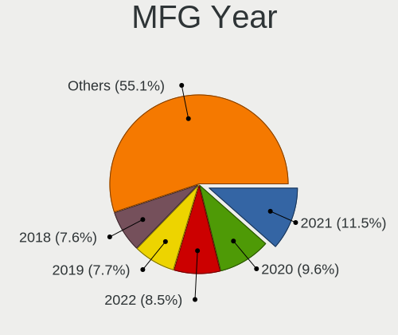
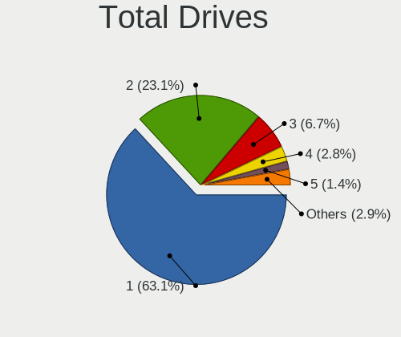
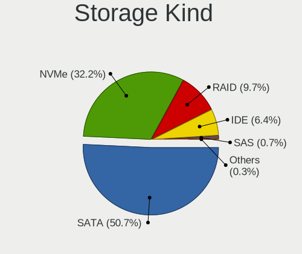
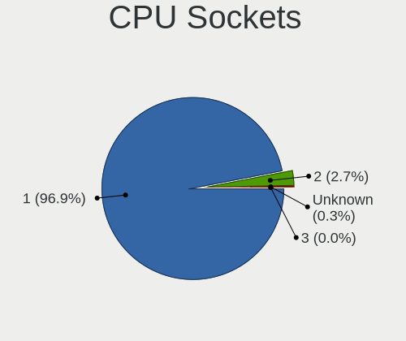
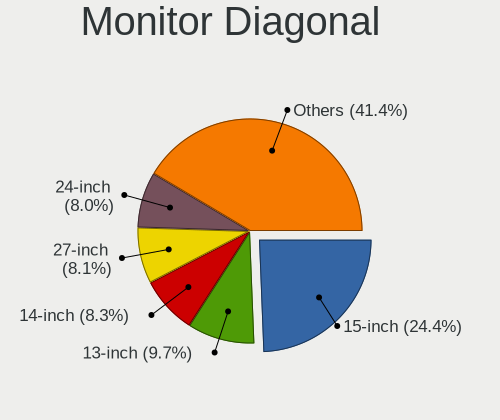

Ubuntu 22.04 - Tested Hardware & Statistics
-------------------------------------------

A project to collect tested hardware configurations for Ubuntu 22.04.

Anyone can contribute to this report by the [hw-probe](https://github.com/linuxhw/hw-probe) tool:

    sudo -E hw-probe -all -upload

Please contribute! Especially if your hardware is rare.

This is a report for all computer types. See also reports for [desktops](/Dist/Ubuntu_22.04/Desktop/README.md) and [notebooks](/Dist/Ubuntu_22.04/Notebook/README.md).

Contents
--------

* [ Test Cases ](#test-cases)

* [ System ](#system)
  - [ Kernel                   ](#kernel)
  - [ Kernel Family            ](#kernel-family)
  - [ Kernel Major Ver.        ](#kernel-major-ver)
  - [ Arch                     ](#arch)
  - [ DE                       ](#de)
  - [ Display Server           ](#display-server)
  - [ Display Manager          ](#display-manager)
  - [ OS Lang                  ](#os-lang)
  - [ Boot Mode                ](#boot-mode)
  - [ Filesystem               ](#filesystem)
  - [ Part. scheme             ](#part-scheme)
  - [ Dual Boot with Linux/BSD ](#dual-boot-with-linuxbsd)
  - [ Dual Boot (Win)          ](#dual-boot-win)

* [ Board ](#board)
  - [ Vendor                   ](#vendor)
  - [ Model                    ](#model)
  - [ Model Family             ](#model-family)
  - [ MFG Year                 ](#mfg-year)
  - [ Form Factor              ](#form-factor)
  - [ Secure Boot              ](#secure-boot)
  - [ Coreboot                 ](#coreboot)
  - [ RAM Size                 ](#ram-size)
  - [ RAM Used                 ](#ram-used)
  - [ Total Drives             ](#total-drives)
  - [ Has CD-ROM               ](#has-cd-rom)
  - [ Has Ethernet             ](#has-ethernet)
  - [ Has WiFi                 ](#has-wifi)
  - [ Has Bluetooth            ](#has-bluetooth)

* [ Location ](#location)
  - [ Country                  ](#country)
  - [ City                     ](#city)

* [ Drives ](#drives)
  - [ Drive Vendor             ](#drive-vendor)
  - [ Drive Model              ](#drive-model)
  - [ HDD Vendor               ](#hdd-vendor)
  - [ SSD Vendor               ](#ssd-vendor)
  - [ Drive Kind               ](#drive-kind)
  - [ Drive Connector          ](#drive-connector)
  - [ Drive Size               ](#drive-size)
  - [ Space Total              ](#space-total)
  - [ Space Used               ](#space-used)
  - [ Malfunc. Drives          ](#malfunc-drives)
  - [ Malfunc. Drive Vendor    ](#malfunc-drive-vendor)
  - [ Malfunc. HDD Vendor      ](#malfunc-hdd-vendor)
  - [ Malfunc. Drive Kind      ](#malfunc-drive-kind)
  - [ Failed Drives            ](#failed-drives)
  - [ Failed Drive Vendor      ](#failed-drive-vendor)
  - [ Drive Status             ](#drive-status)

* [ Storage controller ](#storage-controller)
  - [ Storage Vendor           ](#storage-vendor)
  - [ Storage Model            ](#storage-model)
  - [ Storage Kind             ](#storage-kind)

* [ Processor ](#processor)
  - [ CPU Vendor               ](#cpu-vendor)
  - [ CPU Model                ](#cpu-model)
  - [ CPU Model Family         ](#cpu-model-family)
  - [ CPU Cores                ](#cpu-cores)
  - [ CPU Sockets              ](#cpu-sockets)
  - [ CPU Threads              ](#cpu-threads)
  - [ CPU Op-Modes             ](#cpu-op-modes)
  - [ CPU Microcode            ](#cpu-microcode)
  - [ CPU Microarch            ](#cpu-microarch)

* [ Graphics ](#graphics)
  - [ GPU Vendor               ](#gpu-vendor)
  - [ GPU Model                ](#gpu-model)
  - [ GPU Combo                ](#gpu-combo)
  - [ GPU Driver               ](#gpu-driver)
  - [ GPU Memory               ](#gpu-memory)

* [ Monitor ](#monitor)
  - [ Monitor Vendor           ](#monitor-vendor)
  - [ Monitor Model            ](#monitor-model)
  - [ Monitor Resolution       ](#monitor-resolution)
  - [ Monitor Diagonal         ](#monitor-diagonal)
  - [ Monitor Width            ](#monitor-width)
  - [ Aspect Ratio             ](#aspect-ratio)
  - [ Monitor Area             ](#monitor-area)
  - [ Pixel Density            ](#pixel-density)
  - [ Multiple Monitors        ](#multiple-monitors)

* [ Network ](#network)
  - [ Net Controller Vendor    ](#net-controller-vendor)
  - [ Net Controller Model     ](#net-controller-model)
  - [ Wireless Vendor          ](#wireless-vendor)
  - [ Wireless Model           ](#wireless-model)
  - [ Ethernet Vendor          ](#ethernet-vendor)
  - [ Ethernet Model           ](#ethernet-model)
  - [ Net Controller Kind      ](#net-controller-kind)
  - [ Used Controller          ](#used-controller)
  - [ NICs                     ](#nics)
  - [ IPv6                     ](#ipv6)

* [ Bluetooth ](#bluetooth)
  - [ Bluetooth Vendor         ](#bluetooth-vendor)
  - [ Bluetooth Model          ](#bluetooth-model)

* [ Sound ](#sound)
  - [ Sound Vendor             ](#sound-vendor)
  - [ Sound Model              ](#sound-model)

* [ Memory ](#memory)
  - [ Memory Vendor            ](#memory-vendor)
  - [ Memory Model             ](#memory-model)
  - [ Memory Kind              ](#memory-kind)
  - [ Memory Form Factor       ](#memory-form-factor)
  - [ Memory Size              ](#memory-size)
  - [ Memory Speed             ](#memory-speed)

* [ Printers & scanners ](#printers--scanners)
  - [ Printer Vendor           ](#printer-vendor)
  - [ Printer Model            ](#printer-model)
  - [ Scanner Vendor           ](#scanner-vendor)
  - [ Scanner Model            ](#scanner-model)

* [ Camera ](#camera)
  - [ Camera Vendor            ](#camera-vendor)
  - [ Camera Model             ](#camera-model)

* [ Security ](#security)
  - [ Fingerprint Vendor       ](#fingerprint-vendor)
  - [ Fingerprint Model        ](#fingerprint-model)
  - [ Chipcard Vendor          ](#chipcard-vendor)
  - [ Chipcard Model           ](#chipcard-model)

* [ Unsupported ](#unsupported)
  - [ Unsupported Devices      ](#unsupported-devices)
  - [ Unsupported Device Types ](#unsupported-device-types)

Test Cases
----------

Total: 5846

| Vendor        | Model                       | Form-Factor | Probe                                                      | Date         |
|---------------|-----------------------------|-------------|------------------------------------------------------------|--------------|
| Lenovo        | G50-45 80E3                 | Notebook    | [d4f08c71a6](https://linux-hardware.org/?probe=d4f08c71a6) | Nov 02, 2022 |
| HP            | Pavilion Gaming Laptop      | Notebook    | [695b3d82a7](https://linux-hardware.org/?probe=695b3d82a7) | Nov 02, 2022 |
| MSI           | H81M-E35 V2                 | Desktop     | [db83c146a6](https://linux-hardware.org/?probe=db83c146a6) | Nov 02, 2022 |
| ASUSTek       | PRIME H410M-A               | Desktop     | [b3cac9f8b8](https://linux-hardware.org/?probe=b3cac9f8b8) | Nov 02, 2022 |
| HP            | 18E7                        | Desktop     | [c0d5c58895](https://linux-hardware.org/?probe=c0d5c58895) | Nov 02, 2022 |
| HP            | Pavilion Gaming Laptop      | Notebook    | [9b9e55c471](https://linux-hardware.org/?probe=9b9e55c471) | Nov 02, 2022 |
| HP            | EliteBook 8460p             | Notebook    | [565ad502cc](https://linux-hardware.org/?probe=565ad502cc) | Nov 02, 2022 |
| ASUSTek       | M5A78L-M LX3 PLUS           | Desktop     | [23a62c3509](https://linux-hardware.org/?probe=23a62c3509) | Nov 02, 2022 |
| Lenovo        | E41-25 81FS                 | Notebook    | [5d9743e91d](https://linux-hardware.org/?probe=5d9743e91d) | Nov 02, 2022 |
| Toshiba       | Satellite C70D-A            | Notebook    | [7a421ed810](https://linux-hardware.org/?probe=7a421ed810) | Nov 02, 2022 |
| Gigabyte      | B450 I AORUS PRO WIFI-CF    | Desktop     | [895a345eb9](https://linux-hardware.org/?probe=895a345eb9) | Nov 02, 2022 |
| Toshiba       | Satellite C70D-A            | Notebook    | [d82227846b](https://linux-hardware.org/?probe=d82227846b) | Nov 02, 2022 |
| Gigabyte      | B450 I AORUS PRO WIFI-CF    | Desktop     | [9d9d3a4967](https://linux-hardware.org/?probe=9d9d3a4967) | Nov 02, 2022 |
| Fujitsu       | D2628-C1 S26361-D2628-C1    | Desktop     | [a2af2980ad](https://linux-hardware.org/?probe=a2af2980ad) | Nov 02, 2022 |
| ASUSTek       | M5A78L-M LX3 PLUS           | Desktop     | [d34ccf5e7a](https://linux-hardware.org/?probe=d34ccf5e7a) | Nov 02, 2022 |
| ASUSTek       | M5A78L-M LX3 PLUS           | Desktop     | [eb06593b9e](https://linux-hardware.org/?probe=eb06593b9e) | Nov 02, 2022 |
| ASUSTek       | B85-PLUS                    | Desktop     | [dd24c26ffa](https://linux-hardware.org/?probe=dd24c26ffa) | Nov 02, 2022 |
| HP            | 18E5                        | Desktop     | [3df38ade7e](https://linux-hardware.org/?probe=3df38ade7e) | Nov 02, 2022 |
| Dell          | Latitude E5450              | Notebook    | [b39c12a9a4](https://linux-hardware.org/?probe=b39c12a9a4) | Nov 02, 2022 |
| Gigabyte      | B450M GAMING-CF             | Desktop     | [95e2a1e7d9](https://linux-hardware.org/?probe=95e2a1e7d9) | Nov 02, 2022 |
| Apple         | Mac-35C5E08120C7EEAF Mac... | Mini pc     | [452ec1a1ee](https://linux-hardware.org/?probe=452ec1a1ee) | Nov 02, 2022 |
| HP            | 18E5                        | Desktop     | [8204df7795](https://linux-hardware.org/?probe=8204df7795) | Nov 02, 2022 |
| HP            | ProBook 450 G8 Notebook ... | Notebook    | [44e281e52c](https://linux-hardware.org/?probe=44e281e52c) | Nov 02, 2022 |
| Dell          | Inspiron 7506 2n1           | Convertible | [93884d7e71](https://linux-hardware.org/?probe=93884d7e71) | Nov 02, 2022 |
| Gigabyte      | Q270M-D3H                   | Desktop     | [46874cc0a1](https://linux-hardware.org/?probe=46874cc0a1) | Nov 02, 2022 |
| Lenovo        | Legion 5 Pro 16ITH6 82JF    | Notebook    | [09c2704bb0](https://linux-hardware.org/?probe=09c2704bb0) | Nov 02, 2022 |
| HP            | 625                         | Notebook    | [830c5c0d14](https://linux-hardware.org/?probe=830c5c0d14) | Nov 02, 2022 |
| HP            | 625                         | Notebook    | [4c627cab51](https://linux-hardware.org/?probe=4c627cab51) | Nov 02, 2022 |
| Lenovo        | 312A SDK0J40697 WIN 3305... | Desktop     | [fe91c11062](https://linux-hardware.org/?probe=fe91c11062) | Nov 02, 2022 |
| HP            | Pavilion x2 Detachable P... | Notebook    | [b4d63f4835](https://linux-hardware.org/?probe=b4d63f4835) | Nov 02, 2022 |
| Acer          | Aspire A315-54              | Notebook    | [1421a5a4e9](https://linux-hardware.org/?probe=1421a5a4e9) | Nov 02, 2022 |
| HP            | Pavilion x360 Convertibl... | Convertible | [fd4d484f61](https://linux-hardware.org/?probe=fd4d484f61) | Nov 02, 2022 |
| ASRock        | AB350 Gaming K4             | Desktop     | [36387e4f11](https://linux-hardware.org/?probe=36387e4f11) | Nov 01, 2022 |
| HP            | Tablet 11m-be0xxx           | Tablet      | [fda7b35626](https://linux-hardware.org/?probe=fda7b35626) | Nov 01, 2022 |
| HP            | Tablet 11m-be0xxx           | Tablet      | [812c1bc398](https://linux-hardware.org/?probe=812c1bc398) | Nov 01, 2022 |
| HP            | ProLiant DL380p Gen8        | Server      | [9d0e85aed7](https://linux-hardware.org/?probe=9d0e85aed7) | Nov 01, 2022 |
| HP            | Pavilion Notebook           | Notebook    | [95d825cd94](https://linux-hardware.org/?probe=95d825cd94) | Nov 01, 2022 |
| ASUSTek       | H97I-PLUS                   | Desktop     | [13bf376807](https://linux-hardware.org/?probe=13bf376807) | Nov 01, 2022 |
| Dell          | Precision 5520              | Notebook    | [e1a819ec3e](https://linux-hardware.org/?probe=e1a819ec3e) | Nov 01, 2022 |
| HP            | 3646h                       | Desktop     | [f88c9632b4](https://linux-hardware.org/?probe=f88c9632b4) | Nov 01, 2022 |
| Dell          | 06D7TR A02                  | Desktop     | [a27d97c026](https://linux-hardware.org/?probe=a27d97c026) | Nov 01, 2022 |
| Lenovo        | ThinkPad L590 20Q7001KIX    | Notebook    | [c8e545615f](https://linux-hardware.org/?probe=c8e545615f) | Nov 01, 2022 |
| Dell          | 06D7TR A02                  | Desktop     | [f8a4053db1](https://linux-hardware.org/?probe=f8a4053db1) | Nov 01, 2022 |
| ASUSTek       | Z97-PRO GAMER               | Desktop     | [4b9071c932](https://linux-hardware.org/?probe=4b9071c932) | Nov 01, 2022 |
| Apple         | Mac-00BE6ED71E35EB86 iMa... | All in one  | [9704a12e23](https://linux-hardware.org/?probe=9704a12e23) | Nov 01, 2022 |
| ASUSTek       | BM2AD_D510MT_D310MT         | Desktop     | [8f2b0bc926](https://linux-hardware.org/?probe=8f2b0bc926) | Nov 01, 2022 |
| Acer          | Swift SF314-41              | Notebook    | [921b1a7ebf](https://linux-hardware.org/?probe=921b1a7ebf) | Nov 01, 2022 |
| ASUSTek       | Z170 PRO GAMING/AURA        | Desktop     | [f0db98f6bb](https://linux-hardware.org/?probe=f0db98f6bb) | Nov 01, 2022 |
| ASUSTek       | CROSSBLADE RANGER           | Desktop     | [5f92247b16](https://linux-hardware.org/?probe=5f92247b16) | Nov 01, 2022 |
| ASUSTek       | Z170 PRO GAMING/AURA        | Desktop     | [fc832e8881](https://linux-hardware.org/?probe=fc832e8881) | Nov 01, 2022 |
| Gigabyte      | H310M H                     | Desktop     | [115025ee59](https://linux-hardware.org/?probe=115025ee59) | Nov 01, 2022 |
| Gigabyte      | H310M H                     | Desktop     | [74af46599e](https://linux-hardware.org/?probe=74af46599e) | Nov 01, 2022 |
| Dell          | 07C0H8 A00                  | Desktop     | [1b2cb018d0](https://linux-hardware.org/?probe=1b2cb018d0) | Nov 01, 2022 |
| Fujitsu       | D2628-C1 S26361-D2628-C1    | Desktop     | [245ec71478](https://linux-hardware.org/?probe=245ec71478) | Nov 01, 2022 |
| ASUSTek       | VivoBook_ASUSLaptop M760... | Notebook    | [49d6eb853f](https://linux-hardware.org/?probe=49d6eb853f) | Nov 01, 2022 |
| ASUSTek       | VivoBook_ASUSLaptop M760... | Notebook    | [5de7efb403](https://linux-hardware.org/?probe=5de7efb403) | Nov 01, 2022 |
| Gigabyte      | Z170-HD3P-CF                | Desktop     | [5fd845ca54](https://linux-hardware.org/?probe=5fd845ca54) | Nov 01, 2022 |
| ASUSTek       | X501A                       | Notebook    | [d5a34df414](https://linux-hardware.org/?probe=d5a34df414) | Nov 01, 2022 |
| ASUSTek       | VivoBook 15_ASUS Laptop ... | Notebook    | [6323d7e1b3](https://linux-hardware.org/?probe=6323d7e1b3) | Nov 01, 2022 |
| ASUSTek       | H61M-K                      | Desktop     | [ca5a47c66a](https://linux-hardware.org/?probe=ca5a47c66a) | Nov 01, 2022 |
| Dell          | Inspiron 15 3511            | Notebook    | [85c215eebf](https://linux-hardware.org/?probe=85c215eebf) | Nov 01, 2022 |
| ASRock        | AB350 Gaming K4             | Desktop     | [560d84828c](https://linux-hardware.org/?probe=560d84828c) | Nov 01, 2022 |
| ASUSTek       | PRIME B360M-A               | Desktop     | [c46dd8d9b6](https://linux-hardware.org/?probe=c46dd8d9b6) | Nov 01, 2022 |
| Samsung       | 950QED                      | Convertible | [3fa8caa72f](https://linux-hardware.org/?probe=3fa8caa72f) | Nov 01, 2022 |
| ASUSTek       | SABERTOOTH Z87              | Desktop     | [d39c952932](https://linux-hardware.org/?probe=d39c952932) | Nov 01, 2022 |
| Dell          | 082WXT A03                  | Desktop     | [ab3dad5a31](https://linux-hardware.org/?probe=ab3dad5a31) | Nov 01, 2022 |
| Lenovo        | ThinkPad L14 Gen 2 20X2S... | Notebook    | [36d7199821](https://linux-hardware.org/?probe=36d7199821) | Nov 01, 2022 |
| AOpen         | aVKx-DE R1.03 55DEL10001... | Desktop     | [b487a7aee3](https://linux-hardware.org/?probe=b487a7aee3) | Oct 31, 2022 |
| HP            | 1850                        | Desktop     | [b39eac8f74](https://linux-hardware.org/?probe=b39eac8f74) | Oct 31, 2022 |
| Acer          | Aspire TC-280               | Desktop     | [68679c6495](https://linux-hardware.org/?probe=68679c6495) | Oct 31, 2022 |
| MSI           | B450 TOMAHAWK MAX           | Desktop     | [183545ed4e](https://linux-hardware.org/?probe=183545ed4e) | Oct 31, 2022 |
| ASUSTek       | Z97-P                       | Desktop     | [72467c5d61](https://linux-hardware.org/?probe=72467c5d61) | Oct 31, 2022 |
| MSI           | A320M-A PRO                 | Desktop     | [8769289ea5](https://linux-hardware.org/?probe=8769289ea5) | Oct 31, 2022 |
| Sony          | VPCZ12C5E                   | Notebook    | [b1e6524541](https://linux-hardware.org/?probe=b1e6524541) | Oct 31, 2022 |
| Dell          | 03NVJ6 A03                  | Desktop     | [adebd09dc4](https://linux-hardware.org/?probe=adebd09dc4) | Oct 31, 2022 |
| Lenovo        | IdeaPad S145-15API 81V7     | Notebook    | [973fc77891](https://linux-hardware.org/?probe=973fc77891) | Oct 31, 2022 |
| ASUSTek       | VM60                        | Desktop     | [2cb5cc2932](https://linux-hardware.org/?probe=2cb5cc2932) | Oct 31, 2022 |
| Dell          | Latitude E6330              | Notebook    | [51ded2feb1](https://linux-hardware.org/?probe=51ded2feb1) | Oct 31, 2022 |
| ASUSTek       | M4A78                       | Desktop     | [8eb1316a14](https://linux-hardware.org/?probe=8eb1316a14) | Oct 31, 2022 |
| Microsoft     | Surface 3                   | Tablet      | [71eeeaef9e](https://linux-hardware.org/?probe=71eeeaef9e) | Oct 31, 2022 |
| Dell          | Inspiron 3542               | Notebook    | [dcccad24af](https://linux-hardware.org/?probe=dcccad24af) | Oct 31, 2022 |
| Unknown       | Unknown                     | Desktop     | [7cce0a2867](https://linux-hardware.org/?probe=7cce0a2867) | Oct 31, 2022 |
| Dell          | Vostro 7620                 | Notebook    | [2ccd56ee29](https://linux-hardware.org/?probe=2ccd56ee29) | Oct 31, 2022 |
| HP            | EliteBook 745 G2            | Notebook    | [0786ded6c8](https://linux-hardware.org/?probe=0786ded6c8) | Oct 31, 2022 |
| TUXEDO        | InfinityBook S 15 Gen6      | Notebook    | [92e9764aa0](https://linux-hardware.org/?probe=92e9764aa0) | Oct 31, 2022 |
| Acer          | Swift SF314-512             | Notebook    | [d6bf187cc9](https://linux-hardware.org/?probe=d6bf187cc9) | Oct 31, 2022 |
| ASUSTek       | M4A78                       | Desktop     | [81374a561c](https://linux-hardware.org/?probe=81374a561c) | Oct 31, 2022 |
| Intel         | NUC6i3SYB H81132-503        | Mini pc     | [91aef8cd0f](https://linux-hardware.org/?probe=91aef8cd0f) | Oct 31, 2022 |
| HP            | Compaq 8000 Elite CMT PC    | Desktop     | [fbe835b8ef](https://linux-hardware.org/?probe=fbe835b8ef) | Oct 31, 2022 |
| Adlinktech    | SB-MLC                      | Notebook    | [203d95e012](https://linux-hardware.org/?probe=203d95e012) | Oct 31, 2022 |
| Lenovo        | ThinkBook 15 G2 ITL 20VE    | Notebook    | [451acdb910](https://linux-hardware.org/?probe=451acdb910) | Oct 31, 2022 |
| MSI           | 990FXA-GD80                 | Desktop     | [baaa1111ec](https://linux-hardware.org/?probe=baaa1111ec) | Oct 31, 2022 |
| Sony          | SVT13118FXS                 | Notebook    | [13b4af9ec3](https://linux-hardware.org/?probe=13b4af9ec3) | Oct 31, 2022 |
| MSI           | AM1I                        | Desktop     | [30014de18a](https://linux-hardware.org/?probe=30014de18a) | Oct 31, 2022 |
| WTM           | W-N95 B0                    | Desktop     | [56611d3c8f](https://linux-hardware.org/?probe=56611d3c8f) | Oct 31, 2022 |
| Intel         | D33217GKE G76540-201        | Desktop     | [b3403874f4](https://linux-hardware.org/?probe=b3403874f4) | Oct 31, 2022 |
| Dell          | Vostro 7620                 | Notebook    | [7f41a14301](https://linux-hardware.org/?probe=7f41a14301) | Oct 31, 2022 |
| ASUSTek       | VivoBook_ASUSLaptop X515... | Notebook    | [deac1b706f](https://linux-hardware.org/?probe=deac1b706f) | Oct 31, 2022 |
| Dell          | Vostro 7620                 | Notebook    | [00dae3fbc5](https://linux-hardware.org/?probe=00dae3fbc5) | Oct 31, 2022 |
| ASUSTek       | P5Q-E                       | Desktop     | [0ef6be44d0](https://linux-hardware.org/?probe=0ef6be44d0) | Oct 31, 2022 |
| Lenovo        | ThinkPad Edge E530 3259M... | Notebook    | [aa1f78db58](https://linux-hardware.org/?probe=aa1f78db58) | Oct 31, 2022 |
| Lenovo        | ThinkPad Edge E530 3259M... | Notebook    | [26b5f59993](https://linux-hardware.org/?probe=26b5f59993) | Oct 31, 2022 |
| HP            | 14                          | Notebook    | [7611c14813](https://linux-hardware.org/?probe=7611c14813) | Oct 31, 2022 |
| Toshiba       | Satellite A200              | Notebook    | [296d9a0f38](https://linux-hardware.org/?probe=296d9a0f38) | Oct 31, 2022 |
| Toshiba       | Satellite A200              | Notebook    | [07a165b373](https://linux-hardware.org/?probe=07a165b373) | Oct 31, 2022 |
| Lenovo        | IdeaPad S145-15IWL 81S9     | Notebook    | [c8970ae94a](https://linux-hardware.org/?probe=c8970ae94a) | Oct 31, 2022 |
| Acer          | Nitro AN517-55              | Notebook    | [9653f093e1](https://linux-hardware.org/?probe=9653f093e1) | Oct 31, 2022 |
| Panasonic     | CF-19RDRCHH7                | Notebook    | [99e94a7708](https://linux-hardware.org/?probe=99e94a7708) | Oct 31, 2022 |
| MSI           | MS-7309                     | Desktop     | [a6b1a7d329](https://linux-hardware.org/?probe=a6b1a7d329) | Oct 31, 2022 |
| ASUSTek       | K73SV                       | Notebook    | [d505f0c0d0](https://linux-hardware.org/?probe=d505f0c0d0) | Oct 30, 2022 |
| Lenovo        | ThinkPad X270 20HN0014FR    | Notebook    | [d6fc7c48a1](https://linux-hardware.org/?probe=d6fc7c48a1) | Oct 30, 2022 |
| MSI           | MS-7309                     | Desktop     | [3c519589ad](https://linux-hardware.org/?probe=3c519589ad) | Oct 30, 2022 |
| ASUSTek       | PHOENIX                     | Desktop     | [d4f8ae717d](https://linux-hardware.org/?probe=d4f8ae717d) | Oct 30, 2022 |
| ASUSTek       | A8N32-SLI-Deluxe            | Desktop     | [85389b6454](https://linux-hardware.org/?probe=85389b6454) | Oct 30, 2022 |
| ASRock        | FM2A88X-ITX+                | Desktop     | [08cf9e2ccd](https://linux-hardware.org/?probe=08cf9e2ccd) | Oct 30, 2022 |
| Acer          | Swift SFX14-51G             | Notebook    | [6812d7cf22](https://linux-hardware.org/?probe=6812d7cf22) | Oct 30, 2022 |
| Gigabyte      | B550 AORUS ELITE V2         | Desktop     | [738569f811](https://linux-hardware.org/?probe=738569f811) | Oct 30, 2022 |
| HP            | Laptop 15-da0xxx            | Notebook    | [b903c0e375](https://linux-hardware.org/?probe=b903c0e375) | Oct 30, 2022 |
| ASRock        | B550M Pro4                  | Desktop     | [078fd46e0a](https://linux-hardware.org/?probe=078fd46e0a) | Oct 30, 2022 |
| Lenovo        | IdeaPad 100S-14IBR 80R9     | Notebook    | [91d1732515](https://linux-hardware.org/?probe=91d1732515) | Oct 30, 2022 |
| Lenovo        | 0B98401 WIN                 | Desktop     | [25805a13b0](https://linux-hardware.org/?probe=25805a13b0) | Oct 30, 2022 |
| AZW           | GTR V01                     | Mini pc     | [03b291b957](https://linux-hardware.org/?probe=03b291b957) | Oct 30, 2022 |
| Dell          | XPS 15 9575                 | Convertible | [21aa0f31b3](https://linux-hardware.org/?probe=21aa0f31b3) | Oct 30, 2022 |
| ASRock        | FM2A88X-ITX+                | Desktop     | [e28a25b18a](https://linux-hardware.org/?probe=e28a25b18a) | Oct 30, 2022 |
| ASRock        | 960GM-VGS3 FX               | Desktop     | [ac82c6bda9](https://linux-hardware.org/?probe=ac82c6bda9) | Oct 30, 2022 |
| Lenovo        | ThinkPad T510 4384WKU       | Notebook    | [86fee6e260](https://linux-hardware.org/?probe=86fee6e260) | Oct 30, 2022 |
| ASUSTek       | PRIME X470-PRO              | Desktop     | [a8b08a47aa](https://linux-hardware.org/?probe=a8b08a47aa) | Oct 30, 2022 |
| ASUSTek       | A8N32-SLI-Deluxe            | Desktop     | [55be6f23ce](https://linux-hardware.org/?probe=55be6f23ce) | Oct 30, 2022 |
| Lenovo        | ThinkPad P1 Gen 5 21DC00... | Notebook    | [910b452558](https://linux-hardware.org/?probe=910b452558) | Oct 30, 2022 |
| ASUSTek       | VivoBook_ASUS Laptop E40... | Notebook    | [cbdfd56f05](https://linux-hardware.org/?probe=cbdfd56f05) | Oct 30, 2022 |
| LG Electro... | 15Z980-HA76K                | Notebook    | [914156672d](https://linux-hardware.org/?probe=914156672d) | Oct 30, 2022 |
| Lenovo        | ThinkBook 15p 20V3          | Notebook    | [8dfb7265a9](https://linux-hardware.org/?probe=8dfb7265a9) | Oct 30, 2022 |
| Huanan        | H510-D4 V4.0                | Desktop     | [89b298973c](https://linux-hardware.org/?probe=89b298973c) | Oct 30, 2022 |
| Gigabyte      | X570S AORUS PRO AX          | Desktop     | [03d14141e4](https://linux-hardware.org/?probe=03d14141e4) | Oct 30, 2022 |
| Intel         | NUC7i7BNB J31145-314        | Mini pc     | [9fd1f28183](https://linux-hardware.org/?probe=9fd1f28183) | Oct 30, 2022 |
| Medion        | MS-7707                     | Desktop     | [4f018e8577](https://linux-hardware.org/?probe=4f018e8577) | Oct 30, 2022 |
| Dell          | 0WMJ54 A01                  | Desktop     | [3760efa49c](https://linux-hardware.org/?probe=3760efa49c) | Oct 30, 2022 |
| Dell          | 0WMJ54 A01                  | Desktop     | [1b614b2744](https://linux-hardware.org/?probe=1b614b2744) | Oct 30, 2022 |
| Dell          | Latitude E6510              | Notebook    | [84a61bf436](https://linux-hardware.org/?probe=84a61bf436) | Oct 30, 2022 |
| HUAWEI        | KLVL-WXX9                   | Notebook    | [4e4e0ac802](https://linux-hardware.org/?probe=4e4e0ac802) | Oct 30, 2022 |
| HUAWEI        | KLVL-WXX9                   | Notebook    | [8887bce606](https://linux-hardware.org/?probe=8887bce606) | Oct 30, 2022 |
| Dell          | 0G214D A00                  | Desktop     | [2ee26099ae](https://linux-hardware.org/?probe=2ee26099ae) | Oct 30, 2022 |
| ASUSTek       | H97-PLUS                    | Desktop     | [f22f67754e](https://linux-hardware.org/?probe=f22f67754e) | Oct 29, 2022 |
| ASRock        | 960GM-VGS3 FX               | Desktop     | [5769997d2a](https://linux-hardware.org/?probe=5769997d2a) | Oct 29, 2022 |
| MSI           | A320M-A PRO                 | Desktop     | [23ad30db1a](https://linux-hardware.org/?probe=23ad30db1a) | Oct 29, 2022 |
| GEO           | GeoBook3                    | Notebook    | [133a4460f6](https://linux-hardware.org/?probe=133a4460f6) | Oct 29, 2022 |
| ASUSTek       | M4A78                       | Desktop     | [d88d101a3c](https://linux-hardware.org/?probe=d88d101a3c) | Oct 29, 2022 |
| Lenovo        | ThinkPad E14 Gen 3 20Y70... | Notebook    | [97425e2f52](https://linux-hardware.org/?probe=97425e2f52) | Oct 29, 2022 |
| HP            | ProLiant ML310e Gen8 v2     | Desktop     | [768d0e85c9](https://linux-hardware.org/?probe=768d0e85c9) | Oct 29, 2022 |
| HP            | Laptop 15-dw0xxx            | Notebook    | [f6b00cb10f](https://linux-hardware.org/?probe=f6b00cb10f) | Oct 29, 2022 |
| Dell          | Vostro 3500                 | Notebook    | [53754d84e7](https://linux-hardware.org/?probe=53754d84e7) | Oct 29, 2022 |
| Toshiba       | Satellite L50-A-1D6         | Notebook    | [77f308d89c](https://linux-hardware.org/?probe=77f308d89c) | Oct 29, 2022 |
| Lenovo        | ThinkPad T510 43145GG       | Notebook    | [d1e2bf7f33](https://linux-hardware.org/?probe=d1e2bf7f33) | Oct 29, 2022 |
| Gigabyte      | Z390 AORUS PRO-CF           | Desktop     | [05b5af2e63](https://linux-hardware.org/?probe=05b5af2e63) | Oct 29, 2022 |
| Dell          | Latitude E6510              | Notebook    | [b346d71347](https://linux-hardware.org/?probe=b346d71347) | Oct 29, 2022 |
| ASUSTek       | ASUS TUF Gaming F15 FX50... | Notebook    | [b8cfddfcbf](https://linux-hardware.org/?probe=b8cfddfcbf) | Oct 29, 2022 |
| HP            | Victus by Laptop 16-d1xx... | Notebook    | [c2d1799732](https://linux-hardware.org/?probe=c2d1799732) | Oct 29, 2022 |
| Dell          | Precision 3570              | Notebook    | [fb016d8d01](https://linux-hardware.org/?probe=fb016d8d01) | Oct 29, 2022 |
| HP            | EliteBook 830 G7 Noteboo... | Notebook    | [063675c104](https://linux-hardware.org/?probe=063675c104) | Oct 29, 2022 |
| HP            | OMEN by Laptop 15-dc1xxx    | Notebook    | [20d95ce78c](https://linux-hardware.org/?probe=20d95ce78c) | Oct 29, 2022 |
| Lenovo        | ThinkPad T480s 20L8S4PR1... | Notebook    | [d99f500b00](https://linux-hardware.org/?probe=d99f500b00) | Oct 29, 2022 |
| ASRock        | 890GX Extreme3              | Desktop     | [ff1af2eaf0](https://linux-hardware.org/?probe=ff1af2eaf0) | Oct 29, 2022 |
| HP            | 8653 A                      | Desktop     | [9c19089f51](https://linux-hardware.org/?probe=9c19089f51) | Oct 29, 2022 |
| HP            | Laptop 15s-eq2xxx           | Notebook    | [dbd930e552](https://linux-hardware.org/?probe=dbd930e552) | Oct 29, 2022 |
| Lenovo        | IdeaPad 3 15IIL05 81WE      | Notebook    | [d152b0a56c](https://linux-hardware.org/?probe=d152b0a56c) | Oct 29, 2022 |
| ASUSTek       | P5KPL-AM SE                 | Desktop     | [95af9b0439](https://linux-hardware.org/?probe=95af9b0439) | Oct 29, 2022 |
| Lenovo        | Legion Y740-17ICHg 81HH     | Notebook    | [ea1c9e069e](https://linux-hardware.org/?probe=ea1c9e069e) | Oct 29, 2022 |
| Lenovo        | IdeaPad 3 15ITL6 82H8       | Notebook    | [27dfa8687b](https://linux-hardware.org/?probe=27dfa8687b) | Oct 29, 2022 |
| AXIOO         | Mybook 14H                  | Notebook    | [f8a7c19640](https://linux-hardware.org/?probe=f8a7c19640) | Oct 29, 2022 |
| ASUSTek       | PRIME Q270M-C               | Desktop     | [4440c6ed51](https://linux-hardware.org/?probe=4440c6ed51) | Oct 29, 2022 |
| HP            | Pavilion dv6                | Notebook    | [6406b8b769](https://linux-hardware.org/?probe=6406b8b769) | Oct 29, 2022 |
| HP            | Pavilion dv6                | Notebook    | [7873dfb4cf](https://linux-hardware.org/?probe=7873dfb4cf) | Oct 29, 2022 |
| Medion        | X682X                       | Notebook    | [f05dd25a08](https://linux-hardware.org/?probe=f05dd25a08) | Oct 29, 2022 |
| Dell          | Precision 5750              | Notebook    | [9b9addd3b7](https://linux-hardware.org/?probe=9b9addd3b7) | Oct 29, 2022 |
| Lenovo        | ThinkPad X1 Carbon 7th 2... | Notebook    | [2ceb11d7b3](https://linux-hardware.org/?probe=2ceb11d7b3) | Oct 29, 2022 |
| Lenovo        | ThinkPad X1 Carbon 7th 2... | Notebook    | [5c3d640129](https://linux-hardware.org/?probe=5c3d640129) | Oct 29, 2022 |
| HP            | Laptop 15-dw3xxx            | Notebook    | [99ac55823d](https://linux-hardware.org/?probe=99ac55823d) | Oct 29, 2022 |
| HUAWEI        | BOD-WXX9                    | Notebook    | [880d3ba9c9](https://linux-hardware.org/?probe=880d3ba9c9) | Oct 29, 2022 |
| Dell          | Latitude 5531               | Notebook    | [cdea65fd5c](https://linux-hardware.org/?probe=cdea65fd5c) | Oct 29, 2022 |
| ASUSTek       | K53SV                       | Notebook    | [4ead64f80f](https://linux-hardware.org/?probe=4ead64f80f) | Oct 28, 2022 |
| Gigabyte      | B550M DS3H                  | Desktop     | [8a918b4739](https://linux-hardware.org/?probe=8a918b4739) | Oct 28, 2022 |
| MSI           | MS-AE3111 10                | Other       | [b21e69db4d](https://linux-hardware.org/?probe=b21e69db4d) | Oct 28, 2022 |
| IP3 Tech      | AP1                         | Notebook    | [0562a6a46d](https://linux-hardware.org/?probe=0562a6a46d) | Oct 28, 2022 |
| Lenovo        | IdeaPad 500-15ACZ 80K4      | Notebook    | [c079764998](https://linux-hardware.org/?probe=c079764998) | Oct 28, 2022 |
| Lenovo        | IdeaPad 500-15ACZ 80K4      | Notebook    | [5ef9b4213f](https://linux-hardware.org/?probe=5ef9b4213f) | Oct 28, 2022 |
| ASUSTek       | CM1730,CM1830               | Desktop     | [0915c0bf5a](https://linux-hardware.org/?probe=0915c0bf5a) | Oct 28, 2022 |
| Dell          | XPS 13 9310                 | Notebook    | [7205cfe7b4](https://linux-hardware.org/?probe=7205cfe7b4) | Oct 28, 2022 |
| Toshiba       | Satellite C75D-B            | Notebook    | [4f644b7d3b](https://linux-hardware.org/?probe=4f644b7d3b) | Oct 28, 2022 |
| HP            | Pavilion Laptop 15-eh2xx... | Notebook    | [f9238c2035](https://linux-hardware.org/?probe=f9238c2035) | Oct 28, 2022 |
| Lenovo        | ThinkPad T420 4236NUG       | Notebook    | [d0e3fa9699](https://linux-hardware.org/?probe=d0e3fa9699) | Oct 28, 2022 |
| MSI           | MS-AE3111 10                | Other       | [ad5c043471](https://linux-hardware.org/?probe=ad5c043471) | Oct 28, 2022 |
| MSI           | MAG B550 TOMAHAWK           | Desktop     | [f45ab957da](https://linux-hardware.org/?probe=f45ab957da) | Oct 28, 2022 |
| IP3 Tech      | AP1                         | Notebook    | [2a9c0ff1c5](https://linux-hardware.org/?probe=2a9c0ff1c5) | Oct 28, 2022 |
| Dell          | 02M8NY A01                  | Desktop     | [47c0e65f02](https://linux-hardware.org/?probe=47c0e65f02) | Oct 28, 2022 |
| Tactus        | GeoBook 110                 | Notebook    | [aad56b27f0](https://linux-hardware.org/?probe=aad56b27f0) | Oct 28, 2022 |
| Lenovo        | ThinkPad T560 20FHCTO1WW    | Notebook    | [05ff2d32fa](https://linux-hardware.org/?probe=05ff2d32fa) | Oct 28, 2022 |
| Microsoft     | Surface Go 2                | Tablet      | [b720c57302](https://linux-hardware.org/?probe=b720c57302) | Oct 28, 2022 |
| MSI           | Z370 KRAIT GAMING           | Desktop     | [cbf597cec1](https://linux-hardware.org/?probe=cbf597cec1) | Oct 28, 2022 |
| Lenovo        | ThinkPad T560 20FHCTO1WW    | Notebook    | [403a99d8b2](https://linux-hardware.org/?probe=403a99d8b2) | Oct 28, 2022 |
| Acer          | Aspire A315-58              | Notebook    | [7870d9b047](https://linux-hardware.org/?probe=7870d9b047) | Oct 28, 2022 |
| ASUSTek       | P8B75-V                     | Desktop     | [4783ed1083](https://linux-hardware.org/?probe=4783ed1083) | Oct 28, 2022 |
| HUAWEI        | BOM-WXX9                    | Notebook    | [203ac0880d](https://linux-hardware.org/?probe=203ac0880d) | Oct 28, 2022 |
| ASUSTek       | ET2700I                     | Desktop     | [ce0d0e61eb](https://linux-hardware.org/?probe=ce0d0e61eb) | Oct 28, 2022 |
| MSI           | Stealth GS66 12UGS          | Notebook    | [98b47019d1](https://linux-hardware.org/?probe=98b47019d1) | Oct 28, 2022 |
| MSI           | GF63 Thin 11UD              | Notebook    | [0084d271e4](https://linux-hardware.org/?probe=0084d271e4) | Oct 28, 2022 |
| MSI           | X470 GAMING PLUS            | Desktop     | [f296db20db](https://linux-hardware.org/?probe=f296db20db) | Oct 28, 2022 |
| ASUSTek       | X99-A/USB                   | Desktop     | [ca0810aab5](https://linux-hardware.org/?probe=ca0810aab5) | Oct 28, 2022 |
| ASUSTek       | ROG Zephyrus M16 GU603HM... | Notebook    | [3b67700f14](https://linux-hardware.org/?probe=3b67700f14) | Oct 28, 2022 |
| Acer          | Aspire TC-710 V:1.1         | Desktop     | [b9c0f59afa](https://linux-hardware.org/?probe=b9c0f59afa) | Oct 28, 2022 |
| Dell          | 06D7TR A02                  | Desktop     | [42e2c69893](https://linux-hardware.org/?probe=42e2c69893) | Oct 28, 2022 |
| MSI           | Z97 GAMING 3                | Desktop     | [4488ff5b26](https://linux-hardware.org/?probe=4488ff5b26) | Oct 28, 2022 |
| ASUSTek       | ROG CROSSHAIR VII HERO      | Desktop     | [1759cbebe1](https://linux-hardware.org/?probe=1759cbebe1) | Oct 28, 2022 |
| Compaq        | Presario 21 VerX            | Notebook    | [97ee92b9d1](https://linux-hardware.org/?probe=97ee92b9d1) | Oct 28, 2022 |
| Apple         | Mac-63001698E7A34814 iMa... | All in one  | [a6264d5664](https://linux-hardware.org/?probe=a6264d5664) | Oct 28, 2022 |
| Lenovo        | Yoga 7 15ITL5 82BJ          | Convertible | [70b5d97a3a](https://linux-hardware.org/?probe=70b5d97a3a) | Oct 28, 2022 |
| Dell          | Inspiron 15 3511            | Notebook    | [7cc13c49e2](https://linux-hardware.org/?probe=7cc13c49e2) | Oct 28, 2022 |
| Alienware     | 07W25T A01                  | Desktop     | [107ec47dd5](https://linux-hardware.org/?probe=107ec47dd5) | Oct 28, 2022 |
| Alienware     | 07W25T A01                  | Desktop     | [0338285f54](https://linux-hardware.org/?probe=0338285f54) | Oct 28, 2022 |
| ASUSTek       | PHOENIX                     | Desktop     | [827dd1396b](https://linux-hardware.org/?probe=827dd1396b) | Oct 28, 2022 |
| Alienware     | 07W25T A01                  | Desktop     | [e320ad09bc](https://linux-hardware.org/?probe=e320ad09bc) | Oct 28, 2022 |
| Lenovo        | ThinkCentre M71e 3134C2U    | Desktop     | [a1cec3edba](https://linux-hardware.org/?probe=a1cec3edba) | Oct 28, 2022 |
| Dell          | XPS 13 9305                 | Notebook    | [20bf043d6f](https://linux-hardware.org/?probe=20bf043d6f) | Oct 28, 2022 |
| HP            | ProLiant MicroServer Gen... | Desktop     | [6cfd4bdb14](https://linux-hardware.org/?probe=6cfd4bdb14) | Oct 28, 2022 |
| Gigabyte      | X58A-UD3R                   | Desktop     | [560f96a33a](https://linux-hardware.org/?probe=560f96a33a) | Oct 28, 2022 |
| Apple         | MacBookPro11,5              | Notebook    | [fc35e765fd](https://linux-hardware.org/?probe=fc35e765fd) | Oct 28, 2022 |
| MSI           | Katana GF66 11UC            | Notebook    | [83088617d3](https://linux-hardware.org/?probe=83088617d3) | Oct 28, 2022 |
| Alienware     | 046MHW A00                  | Desktop     | [5a5511a68b](https://linux-hardware.org/?probe=5a5511a68b) | Oct 27, 2022 |
| Dell          | Inspiron 3542               | Notebook    | [6c979bdf58](https://linux-hardware.org/?probe=6c979bdf58) | Oct 27, 2022 |
| HP            | 255 G7 Notebook PC          | Notebook    | [8cf00ceef5](https://linux-hardware.org/?probe=8cf00ceef5) | Oct 27, 2022 |
| Dell          | Latitude E6530              | Notebook    | [71b2df6eff](https://linux-hardware.org/?probe=71b2df6eff) | Oct 27, 2022 |
| Toshiba       | Satellite L300              | Notebook    | [60618ba137](https://linux-hardware.org/?probe=60618ba137) | Oct 27, 2022 |
| PC Special... | Recoil II                   | Notebook    | [9ec5a6ef20](https://linux-hardware.org/?probe=9ec5a6ef20) | Oct 27, 2022 |
| Lenovo        | G710 20252                  | Notebook    | [d15bee47c4](https://linux-hardware.org/?probe=d15bee47c4) | Oct 27, 2022 |
| PC Special... | Recoil II                   | Notebook    | [38ec5a7708](https://linux-hardware.org/?probe=38ec5a7708) | Oct 27, 2022 |
| Lenovo        | IdeaPad 320-14IKB 80YF      | Notebook    | [fe1166a134](https://linux-hardware.org/?probe=fe1166a134) | Oct 27, 2022 |
| Packard Be... | IMEDIA S3810                | Desktop     | [f492fb9369](https://linux-hardware.org/?probe=f492fb9369) | Oct 27, 2022 |
| MSI           | B450M GAMING PLUS           | Desktop     | [b31400d1d1](https://linux-hardware.org/?probe=b31400d1d1) | Oct 27, 2022 |
| Lenovo        | IdeaPad 320-14IKB 80YF      | Notebook    | [b35b1298a8](https://linux-hardware.org/?probe=b35b1298a8) | Oct 27, 2022 |
| HP            | Laptop 15-da0xxx            | Notebook    | [efdb76f667](https://linux-hardware.org/?probe=efdb76f667) | Oct 27, 2022 |
| HUAWEI        | DRC-WXX                     | Tablet      | [5d0f250345](https://linux-hardware.org/?probe=5d0f250345) | Oct 27, 2022 |
| LG Electro... | 16T90P-G.AA78G              | Convertible | [017014433e](https://linux-hardware.org/?probe=017014433e) | Oct 27, 2022 |
| Lenovo        | 3102 NOK                    | Desktop     | [973ebfcf3e](https://linux-hardware.org/?probe=973ebfcf3e) | Oct 27, 2022 |
| ASUSTek       | VivoBook_ASUSLaptop M140... | Notebook    | [0a0922ed82](https://linux-hardware.org/?probe=0a0922ed82) | Oct 27, 2022 |
| MSI           | GE66 Raider 10UE            | Notebook    | [334d883dd3](https://linux-hardware.org/?probe=334d883dd3) | Oct 27, 2022 |
| Lenovo        | ThinkPad L13 Yoga 20R6S0... | Convertible | [2a0a8d6127](https://linux-hardware.org/?probe=2a0a8d6127) | Oct 27, 2022 |
| Gigabyte      | H61N-USB3                   | Desktop     | [ff94581714](https://linux-hardware.org/?probe=ff94581714) | Oct 27, 2022 |
| Intel         | ArcherCity                  | Server      | [625da68153](https://linux-hardware.org/?probe=625da68153) | Oct 27, 2022 |
| ASUSTek       | TUF Gaming B550-PLUS        | Desktop     | [8948294711](https://linux-hardware.org/?probe=8948294711) | Oct 27, 2022 |
| Lenovo        | 3190 SDK0J40697 WIN 3305... | Mini pc     | [8a9839e050](https://linux-hardware.org/?probe=8a9839e050) | Oct 27, 2022 |
| HP            | 894B 10                     | Desktop     | [56afe0f581](https://linux-hardware.org/?probe=56afe0f581) | Oct 27, 2022 |
| Dell          | Latitude 5310               | Notebook    | [10b8371dbd](https://linux-hardware.org/?probe=10b8371dbd) | Oct 27, 2022 |
| Fujitsu       | LIFEBOOK AH530              | Notebook    | [a3f55b1301](https://linux-hardware.org/?probe=a3f55b1301) | Oct 27, 2022 |
| HP            | ZBook Fury 15.6 inch G8 ... | Notebook    | [f95081e76e](https://linux-hardware.org/?probe=f95081e76e) | Oct 27, 2022 |
| Fujitsu       | LIFEBOOK AH530              | Notebook    | [285a7d17e3](https://linux-hardware.org/?probe=285a7d17e3) | Oct 27, 2022 |
| MSI           | MS-B1061                    | All in one  | [6a736e8849](https://linux-hardware.org/?probe=6a736e8849) | Oct 27, 2022 |
| HP            | EliteBook 830 G7 Noteboo... | Notebook    | [0fcfd33f95](https://linux-hardware.org/?probe=0fcfd33f95) | Oct 27, 2022 |
| ZOTAC         | ZBOX-EN72080V/EN72070V/E... | Mini pc     | [9a540d96f5](https://linux-hardware.org/?probe=9a540d96f5) | Oct 27, 2022 |
| Lenovo        | ThinkPad L590 20Q7001HGE    | Notebook    | [187544b911](https://linux-hardware.org/?probe=187544b911) | Oct 27, 2022 |
| Intel         | H410M-E                     | Desktop     | [854c3ec5b1](https://linux-hardware.org/?probe=854c3ec5b1) | Oct 27, 2022 |
| ASUSTek       | ASUS EXPERTBOOK B1400CEP... | Notebook    | [9564d50ef8](https://linux-hardware.org/?probe=9564d50ef8) | Oct 27, 2022 |
| HP            | 8653 A                      | Desktop     | [92b68870ca](https://linux-hardware.org/?probe=92b68870ca) | Oct 27, 2022 |
| Acer          | Aspire 5750G                | Notebook    | [b51a20d480](https://linux-hardware.org/?probe=b51a20d480) | Oct 27, 2022 |
| HP            | EliteBook 840 G3            | Notebook    | [fdfd74a1ac](https://linux-hardware.org/?probe=fdfd74a1ac) | Oct 27, 2022 |
| HP            | 8425                        | Desktop     | [6d26af6597](https://linux-hardware.org/?probe=6d26af6597) | Oct 27, 2022 |
| MSI           | GL75 Leopard 10SFK          | Notebook    | [c05a05a275](https://linux-hardware.org/?probe=c05a05a275) | Oct 27, 2022 |
| Intel         | H55                         | Desktop     | [fb3cf518ac](https://linux-hardware.org/?probe=fb3cf518ac) | Oct 27, 2022 |
| Sun Micros... | ASSY,MOTHERBOARD,X4170 5... | Server      | [ddfefe06a3](https://linux-hardware.org/?probe=ddfefe06a3) | Oct 27, 2022 |
| Oracle        | ASSY,MOTHERBOARD,1U         | Server      | [fec3d1a36e](https://linux-hardware.org/?probe=fec3d1a36e) | Oct 27, 2022 |
| Lenovo        | B590 20206                  | Notebook    | [8a8967999b](https://linux-hardware.org/?probe=8a8967999b) | Oct 27, 2022 |
| Lenovo        | ThinkPad E15 Gen 2 20TD0... | Notebook    | [4386ec3fb8](https://linux-hardware.org/?probe=4386ec3fb8) | Oct 27, 2022 |
| Dell          | 0KWVT8 A02                  | Desktop     | [01613e9e80](https://linux-hardware.org/?probe=01613e9e80) | Oct 27, 2022 |
| HP            | Tablet 11m-be0xxx           | Tablet      | [2c3e7738c1](https://linux-hardware.org/?probe=2c3e7738c1) | Oct 27, 2022 |
| HP            | Pavilion Laptop 15-eh1xx... | Notebook    | [0d705b0971](https://linux-hardware.org/?probe=0d705b0971) | Oct 26, 2022 |
| Avell High... | A60 MUV                     | Notebook    | [ccdf105523](https://linux-hardware.org/?probe=ccdf105523) | Oct 26, 2022 |
| Dell          | Latitude E6530              | Notebook    | [c271a351aa](https://linux-hardware.org/?probe=c271a351aa) | Oct 26, 2022 |
| Oracle        | ASSY,MB,X4-2, 1U            | Server      | [4622ac730a](https://linux-hardware.org/?probe=4622ac730a) | Oct 26, 2022 |
| ASUSTek       | X555LAB                     | Notebook    | [44d47f5024](https://linux-hardware.org/?probe=44d47f5024) | Oct 26, 2022 |
| Gigabyte      | GA-990FXA-UD5               | Desktop     | [6faf6b40b1](https://linux-hardware.org/?probe=6faf6b40b1) | Oct 26, 2022 |
| Dell          | Inspiron 7773               | Notebook    | [34d97b7ea2](https://linux-hardware.org/?probe=34d97b7ea2) | Oct 26, 2022 |
| Lenovo        | Legion S7 15IMH5 82BC       | Notebook    | [7654e5f9c4](https://linux-hardware.org/?probe=7654e5f9c4) | Oct 26, 2022 |
| Dell          | Inspiron 7773               | Notebook    | [c2cff54e7c](https://linux-hardware.org/?probe=c2cff54e7c) | Oct 26, 2022 |
| HP            | 240 G8 Notebook PC          | Notebook    | [25765f4a76](https://linux-hardware.org/?probe=25765f4a76) | Oct 26, 2022 |
| Dell          | Vostro 7620                 | Notebook    | [90f96ae099](https://linux-hardware.org/?probe=90f96ae099) | Oct 26, 2022 |
| Gigabyte      | B450M DS3H V2               | Desktop     | [c2c9c1bb9b](https://linux-hardware.org/?probe=c2c9c1bb9b) | Oct 26, 2022 |
| ASUSTek       | X510UQ                      | Notebook    | [8907b3e019](https://linux-hardware.org/?probe=8907b3e019) | Oct 26, 2022 |
| HUAWEI        | HKD-WXX                     | Notebook    | [2ff7652d3a](https://linux-hardware.org/?probe=2ff7652d3a) | Oct 26, 2022 |
| Dell          | Latitude E6440              | Notebook    | [81a4c0f5d5](https://linux-hardware.org/?probe=81a4c0f5d5) | Oct 26, 2022 |
| HP            | Laptop 15-da0xxx            | Notebook    | [ed1b801fcd](https://linux-hardware.org/?probe=ed1b801fcd) | Oct 26, 2022 |
| ASRock        | H470M-STX                   | Desktop     | [02f3177542](https://linux-hardware.org/?probe=02f3177542) | Oct 26, 2022 |
| Dell          | Latitude 7320               | Notebook    | [f249267def](https://linux-hardware.org/?probe=f249267def) | Oct 26, 2022 |
| Dell          | XPS 13 9360                 | Notebook    | [e0c3407d30](https://linux-hardware.org/?probe=e0c3407d30) | Oct 26, 2022 |
| Fujitsu       | D3161-A1 S26361-D3161-A1    | Desktop     | [06f33f301b](https://linux-hardware.org/?probe=06f33f301b) | Oct 26, 2022 |
| Microsoft     | Surface Pro                 | Tablet      | [df069d17c5](https://linux-hardware.org/?probe=df069d17c5) | Oct 26, 2022 |
| Gigabyte      | EP43-DS3L                   | Desktop     | [f9e114a7e9](https://linux-hardware.org/?probe=f9e114a7e9) | Oct 26, 2022 |
| HP            | 3029h                       | Desktop     | [46c9e39101](https://linux-hardware.org/?probe=46c9e39101) | Oct 26, 2022 |
| ASRock        | B450 Pro4                   | Desktop     | [666aba57b3](https://linux-hardware.org/?probe=666aba57b3) | Oct 26, 2022 |
| Lenovo        | ThinkPad T450 20BUS0S902    | Notebook    | [1115da2433](https://linux-hardware.org/?probe=1115da2433) | Oct 26, 2022 |
| MSI           | Stealth GS66 12UH           | Notebook    | [3c985bb814](https://linux-hardware.org/?probe=3c985bb814) | Oct 26, 2022 |
| MSI           | Stealth GS66 12UH           | Notebook    | [336132b016](https://linux-hardware.org/?probe=336132b016) | Oct 26, 2022 |
| ASRock        | FM2A78M-HD+                 | Desktop     | [2d0d5ac22b](https://linux-hardware.org/?probe=2d0d5ac22b) | Oct 26, 2022 |
| Intel         | H410M-E                     | Desktop     | [69d7d07e13](https://linux-hardware.org/?probe=69d7d07e13) | Oct 26, 2022 |
| Lenovo        | 100w Gen 3 82J0             | Notebook    | [2554c81cce](https://linux-hardware.org/?probe=2554c81cce) | Oct 26, 2022 |
| Dell          | XPS 13 9305                 | Notebook    | [6062baa35c](https://linux-hardware.org/?probe=6062baa35c) | Oct 26, 2022 |
| HP            | ProBook 650 G2              | Notebook    | [7848c6d520](https://linux-hardware.org/?probe=7848c6d520) | Oct 26, 2022 |
| HP            | 8509                        | Desktop     | [81bfb5a782](https://linux-hardware.org/?probe=81bfb5a782) | Oct 26, 2022 |
| Lenovo        | Legion S7 15ACH6 82K8       | Notebook    | [082e572642](https://linux-hardware.org/?probe=082e572642) | Oct 26, 2022 |
| MSI           | MEG X570 GODLIKE            | Desktop     | [6659cbf83d](https://linux-hardware.org/?probe=6659cbf83d) | Oct 26, 2022 |
| HP            | Pavilion Laptop 15-cc1xx    | Notebook    | [a977f9c3e9](https://linux-hardware.org/?probe=a977f9c3e9) | Oct 26, 2022 |
| HP            | 1495                        | Desktop     | [64e8d1cff2](https://linux-hardware.org/?probe=64e8d1cff2) | Oct 26, 2022 |
| HP            | Laptop 17t-cn200            | Notebook    | [179c1e53a9](https://linux-hardware.org/?probe=179c1e53a9) | Oct 26, 2022 |
| Alienware     | 0PGRP5 A02                  | Desktop     | [126f440ca7](https://linux-hardware.org/?probe=126f440ca7) | Oct 26, 2022 |
| Lenovo        | ThinkPad E15 20RD001QFE     | Notebook    | [cc9f8c3aad](https://linux-hardware.org/?probe=cc9f8c3aad) | Oct 26, 2022 |
| Samsung       | 870Z5E/880Z5E/680Z5E        | Notebook    | [8ebb941ac6](https://linux-hardware.org/?probe=8ebb941ac6) | Oct 26, 2022 |
| MSI           | MS-7309                     | Desktop     | [fe0fae3528](https://linux-hardware.org/?probe=fe0fae3528) | Oct 26, 2022 |
| Dell          | Inspiron 7586               | Convertible | [1cc713f6d8](https://linux-hardware.org/?probe=1cc713f6d8) | Oct 25, 2022 |
| ASUSTek       | M4A87TD EVO                 | Desktop     | [c304ae4e48](https://linux-hardware.org/?probe=c304ae4e48) | Oct 25, 2022 |
| ASUSTek       | M4A87TD EVO                 | Desktop     | [1f62025135](https://linux-hardware.org/?probe=1f62025135) | Oct 25, 2022 |
| MSI           | MS-7309                     | Desktop     | [2db582d6dd](https://linux-hardware.org/?probe=2db582d6dd) | Oct 25, 2022 |
| Samsung       | 340XAA/350XAA/550XAA        | Notebook    | [562c9438d1](https://linux-hardware.org/?probe=562c9438d1) | Oct 25, 2022 |
| ASUSTek       | ROG Zephyrus G14 GA401QC... | Notebook    | [ae3d3abdf0](https://linux-hardware.org/?probe=ae3d3abdf0) | Oct 25, 2022 |
| ASUSTek       | ZenBook UX333FN_UX333FN     | Notebook    | [a128f79c0a](https://linux-hardware.org/?probe=a128f79c0a) | Oct 25, 2022 |
| ASUSTek       | K55VJ                       | Notebook    | [eac363d110](https://linux-hardware.org/?probe=eac363d110) | Oct 25, 2022 |
| Gigabyte      | GA-MA770-UD3                | Desktop     | [ef555f6161](https://linux-hardware.org/?probe=ef555f6161) | Oct 25, 2022 |
| Lenovo        | ThinkPad 10 20C3S0X000      | Tablet      | [f17ef87aca](https://linux-hardware.org/?probe=f17ef87aca) | Oct 25, 2022 |
| ASUSTek       | VivoBook E14 E402WAS        | Notebook    | [eadb224c05](https://linux-hardware.org/?probe=eadb224c05) | Oct 25, 2022 |
| Apple         | MacBook5,1                  | Notebook    | [da04330684](https://linux-hardware.org/?probe=da04330684) | Oct 25, 2022 |
| Lenovo        | V15-IGL 82C3                | Notebook    | [264fcfd9f1](https://linux-hardware.org/?probe=264fcfd9f1) | Oct 25, 2022 |
| Dell          | Precision M6800             | Notebook    | [6c15780d7a](https://linux-hardware.org/?probe=6c15780d7a) | Oct 25, 2022 |
| HP            | ENVY 15                     | Notebook    | [faf3ff2256](https://linux-hardware.org/?probe=faf3ff2256) | Oct 25, 2022 |
| Gigabyte      | P35-DS3L                    | Desktop     | [2f5cb804c0](https://linux-hardware.org/?probe=2f5cb804c0) | Oct 25, 2022 |
| Dell          | XPS 15 9500                 | Notebook    | [8260478f31](https://linux-hardware.org/?probe=8260478f31) | Oct 25, 2022 |
| ASUSTek       | H110M-K                     | Desktop     | [06c00dc8d5](https://linux-hardware.org/?probe=06c00dc8d5) | Oct 25, 2022 |
| Techvision    | TVI7309X B0                 | Desktop     | [cf2d75ffa9](https://linux-hardware.org/?probe=cf2d75ffa9) | Oct 25, 2022 |
| ALLDOCUBE     | i1402A                      | Notebook    | [22c255e8cd](https://linux-hardware.org/?probe=22c255e8cd) | Oct 25, 2022 |
| HP            | ZBook 15 G5                 | Notebook    | [0cb3fb3efc](https://linux-hardware.org/?probe=0cb3fb3efc) | Oct 25, 2022 |
| Lenovo        | ThinkPad T490 20N2001YUS    | Notebook    | [61b5a3092b](https://linux-hardware.org/?probe=61b5a3092b) | Oct 25, 2022 |
| ASUSTek       | ASUS TUF Gaming A15 FA50... | Notebook    | [09d3217ce4](https://linux-hardware.org/?probe=09d3217ce4) | Oct 25, 2022 |
| LG Electro... | 17Z90N-V.AA55D              | Notebook    | [bf40de3f5a](https://linux-hardware.org/?probe=bf40de3f5a) | Oct 25, 2022 |
| ASUSTek       | UX430UAR                    | Notebook    | [07d56a833e](https://linux-hardware.org/?probe=07d56a833e) | Oct 25, 2022 |
| Gigabyte      | X58A-UD7                    | Desktop     | [6d3bf37ff3](https://linux-hardware.org/?probe=6d3bf37ff3) | Oct 25, 2022 |
| MSI           | Creator Z17 A12UHST         | Notebook    | [18df556ca1](https://linux-hardware.org/?probe=18df556ca1) | Oct 25, 2022 |
| Lenovo        | ThinkPad X1 Nano Gen 1 2... | Notebook    | [491477817a](https://linux-hardware.org/?probe=491477817a) | Oct 25, 2022 |
| Dell          | Precision 3530              | Notebook    | [8d806f9e53](https://linux-hardware.org/?probe=8d806f9e53) | Oct 25, 2022 |
| Lenovo        | IdeaPad S340-15API 81NC     | Notebook    | [f8aa3a7277](https://linux-hardware.org/?probe=f8aa3a7277) | Oct 25, 2022 |
| ASUSTek       | PRO H410M-C                 | Desktop     | [00e64f6075](https://linux-hardware.org/?probe=00e64f6075) | Oct 25, 2022 |
| ASUSTek       | PRIME B450-PLUS             | Desktop     | [3a10949e83](https://linux-hardware.org/?probe=3a10949e83) | Oct 25, 2022 |
| Lenovo        | ThinkPad P1 20MD000NGE      | Notebook    | [561f09ba0f](https://linux-hardware.org/?probe=561f09ba0f) | Oct 25, 2022 |
| Supermicro    | A2SDi-4C-HLN4F              | Server      | [c3008c5d9a](https://linux-hardware.org/?probe=c3008c5d9a) | Oct 25, 2022 |
| Lenovo        | IdeaPad S340-15API 81NC     | Notebook    | [86b8ce83b2](https://linux-hardware.org/?probe=86b8ce83b2) | Oct 25, 2022 |
| ASUSTek       | ZenBook UX333FN_UX333FN     | Notebook    | [ec7f3834d1](https://linux-hardware.org/?probe=ec7f3834d1) | Oct 25, 2022 |
| Lenovo        | ThinkPad X1 Extreme 2nd ... | Notebook    | [28c38a498d](https://linux-hardware.org/?probe=28c38a498d) | Oct 25, 2022 |
| Lenovo        | ThinkPad T490s 20NYS6FL0... | Notebook    | [ef0cad4118](https://linux-hardware.org/?probe=ef0cad4118) | Oct 25, 2022 |
| HP            | Laptop 15-dw0xxx            | Notebook    | [4e87fd9438](https://linux-hardware.org/?probe=4e87fd9438) | Oct 25, 2022 |
| MSI           | Z97-G55 SLI                 | Desktop     | [25ddd5274f](https://linux-hardware.org/?probe=25ddd5274f) | Oct 25, 2022 |
| ASUSTek       | TUF Gaming B550-PLUS        | Desktop     | [74ca211759](https://linux-hardware.org/?probe=74ca211759) | Oct 25, 2022 |
| HUAWEI        | KLVD-WXX9                   | Notebook    | [e9ce57f1c1](https://linux-hardware.org/?probe=e9ce57f1c1) | Oct 25, 2022 |
| Dell          | 0MWYPT A02                  | Desktop     | [cf186994cc](https://linux-hardware.org/?probe=cf186994cc) | Oct 25, 2022 |
| MSI           | MAG X570S TOMAHAWK MAX W... | Desktop     | [c05a08e1af](https://linux-hardware.org/?probe=c05a08e1af) | Oct 25, 2022 |
| ASUSTek       | ROG ZENITH EXTREME          | Desktop     | [13830bd661](https://linux-hardware.org/?probe=13830bd661) | Oct 25, 2022 |
| ASUSTek       | ROG ZENITH EXTREME          | Desktop     | [6c8e8f4707](https://linux-hardware.org/?probe=6c8e8f4707) | Oct 25, 2022 |
| ASUSTek       | ROG ZENITH EXTREME          | Desktop     | [5fa6c73455](https://linux-hardware.org/?probe=5fa6c73455) | Oct 25, 2022 |
| ASRock        | B450 Gaming K4              | Desktop     | [122a54b0c2](https://linux-hardware.org/?probe=122a54b0c2) | Oct 25, 2022 |
| Microsoft     | Surface Pro 3               | Tablet      | [e3a6983caf](https://linux-hardware.org/?probe=e3a6983caf) | Oct 25, 2022 |
| ASRock        | N68-S                       | Desktop     | [f1f502f834](https://linux-hardware.org/?probe=f1f502f834) | Oct 25, 2022 |
| HP            | Laptop 17-ak0xx             | Notebook    | [09e77bbc9a](https://linux-hardware.org/?probe=09e77bbc9a) | Oct 25, 2022 |
| Lenovo        | ThinkPad T60 1952F75        | Notebook    | [a6f536ca3d](https://linux-hardware.org/?probe=a6f536ca3d) | Oct 25, 2022 |
| Lenovo        | ThinkPad T60 1952F75        | Notebook    | [813bd112f8](https://linux-hardware.org/?probe=813bd112f8) | Oct 25, 2022 |
| BESSTAR Te... | GB7                         | Mini pc     | [d761710495](https://linux-hardware.org/?probe=d761710495) | Oct 25, 2022 |
| Dell          | XPS 15 9500                 | Notebook    | [f827f47265](https://linux-hardware.org/?probe=f827f47265) | Oct 25, 2022 |
| Dell          | XPS 9315                    | Notebook    | [c18dd688a1](https://linux-hardware.org/?probe=c18dd688a1) | Oct 25, 2022 |
| Dell          | 0HY9JP A00                  | Desktop     | [ecbfb1ca5c](https://linux-hardware.org/?probe=ecbfb1ca5c) | Oct 25, 2022 |
| ASUSTek       | X555LI                      | Notebook    | [fe6b4aa2a6](https://linux-hardware.org/?probe=fe6b4aa2a6) | Oct 25, 2022 |
| Dell          | Latitude 5480               | Notebook    | [0b8576ce3b](https://linux-hardware.org/?probe=0b8576ce3b) | Oct 25, 2022 |
| HUAWEI        | KLVD-WXX9                   | Notebook    | [1bbbcd4843](https://linux-hardware.org/?probe=1bbbcd4843) | Oct 24, 2022 |
| Dell          | Inspiron 16 7610            | Notebook    | [96ae3c2941](https://linux-hardware.org/?probe=96ae3c2941) | Oct 24, 2022 |
| ASUSTek       | PRIME B350-PLUS             | Desktop     | [544988df6e](https://linux-hardware.org/?probe=544988df6e) | Oct 24, 2022 |
| MSI           | GE63 Raider RGB 8RE         | Notebook    | [0b3580c5fe](https://linux-hardware.org/?probe=0b3580c5fe) | Oct 24, 2022 |
| MSI           | MAG X570S TOMAHAWK MAX W... | Desktop     | [936e43f0bc](https://linux-hardware.org/?probe=936e43f0bc) | Oct 24, 2022 |
| Notebook      | PCX0DX                      | Notebook    | [e29790dc3c](https://linux-hardware.org/?probe=e29790dc3c) | Oct 24, 2022 |
| ASUSTek       | VivoBook_ASUS Laptop E21... | Notebook    | [9b7ac9b23e](https://linux-hardware.org/?probe=9b7ac9b23e) | Oct 24, 2022 |
| ASUSTek       | Maximus VI EXTREME          | Desktop     | [e5264df501](https://linux-hardware.org/?probe=e5264df501) | Oct 24, 2022 |
| HP            | Pavilion Notebook           | Notebook    | [d953ededc3](https://linux-hardware.org/?probe=d953ededc3) | Oct 24, 2022 |
| HP            | Laptop 17-ak0xx             | Notebook    | [88796bbb2b](https://linux-hardware.org/?probe=88796bbb2b) | Oct 24, 2022 |
| ASUSTek       | H170 PRO GAMING             | Desktop     | [905f41afd6](https://linux-hardware.org/?probe=905f41afd6) | Oct 24, 2022 |
| Dell          | Vostro 3501                 | Notebook    | [df16ec68c3](https://linux-hardware.org/?probe=df16ec68c3) | Oct 24, 2022 |
| AZW           | SER V1.0                    | Mini pc     | [ef17a33848](https://linux-hardware.org/?probe=ef17a33848) | Oct 24, 2022 |
| ASUSTek       | TUF B450-PLUS GAMING        | Desktop     | [1dea808353](https://linux-hardware.org/?probe=1dea808353) | Oct 24, 2022 |
| Gigabyte      | B85M-D3H                    | Desktop     | [f4182ec2e9](https://linux-hardware.org/?probe=f4182ec2e9) | Oct 24, 2022 |
| ASUSTek       | H170M-PLUS/BR               | Desktop     | [31cae2266e](https://linux-hardware.org/?probe=31cae2266e) | Oct 24, 2022 |
| ASUSTek       | M5A97 LE R2.0               | Desktop     | [93fdeacbba](https://linux-hardware.org/?probe=93fdeacbba) | Oct 24, 2022 |
| MSI           | Stealth 15M B12UE           | Notebook    | [a6190e6271](https://linux-hardware.org/?probe=a6190e6271) | Oct 24, 2022 |
| HUAWEI        | NBLK-WAX9X                  | Notebook    | [22a138a507](https://linux-hardware.org/?probe=22a138a507) | Oct 24, 2022 |
| HUAWEI        | MateBook D                  | Notebook    | [b219f88756](https://linux-hardware.org/?probe=b219f88756) | Oct 24, 2022 |
| Monster       | TULPAR T7                   | Notebook    | [5d01101cee](https://linux-hardware.org/?probe=5d01101cee) | Oct 24, 2022 |
| Dell          | Vostro 3501                 | Notebook    | [996a5a3b8d](https://linux-hardware.org/?probe=996a5a3b8d) | Oct 24, 2022 |
| Acer          | Aspire XC-830               | Desktop     | [2692d8c0cd](https://linux-hardware.org/?probe=2692d8c0cd) | Oct 24, 2022 |
| ASUSTek       | PRIME H510M-K               | Desktop     | [af2163c4dd](https://linux-hardware.org/?probe=af2163c4dd) | Oct 24, 2022 |
| HP            | 8055                        | Desktop     | [624dddbaec](https://linux-hardware.org/?probe=624dddbaec) | Oct 24, 2022 |
| Acer          | Aspire XC-830               | Desktop     | [8b6263dc68](https://linux-hardware.org/?probe=8b6263dc68) | Oct 24, 2022 |
| Dell          | 0GXH08 A01                  | Server      | [f3c7a026b6](https://linux-hardware.org/?probe=f3c7a026b6) | Oct 24, 2022 |
| Intel         | NUC5CPYB H61145-408         | Mini pc     | [0d42e2c113](https://linux-hardware.org/?probe=0d42e2c113) | Oct 24, 2022 |
| Intel         | NUC5CPYB H61145-408         | Mini pc     | [7c3c3f8b72](https://linux-hardware.org/?probe=7c3c3f8b72) | Oct 24, 2022 |
| Gigabyte      | Z690 UD DDR4                | Desktop     | [8cc3ca1253](https://linux-hardware.org/?probe=8cc3ca1253) | Oct 24, 2022 |
| LG Electro... | 15Z90N-HA76K                | Notebook    | [7805c272fb](https://linux-hardware.org/?probe=7805c272fb) | Oct 24, 2022 |
| Dell          | Inspiron 3505               | Notebook    | [891f846aac](https://linux-hardware.org/?probe=891f846aac) | Oct 24, 2022 |
| Acer          | Veriton Z4660G              | All in one  | [9949f21f98](https://linux-hardware.org/?probe=9949f21f98) | Oct 24, 2022 |
| Dell          | Latitude 7490               | Notebook    | [63d27972e4](https://linux-hardware.org/?probe=63d27972e4) | Oct 24, 2022 |
| Soyo          | SY-B250 BTC                 | Desktop     | [2be8fe0c55](https://linux-hardware.org/?probe=2be8fe0c55) | Oct 23, 2022 |
| K.A.Techno... | TM1                         | Notebook    | [48166b8360](https://linux-hardware.org/?probe=48166b8360) | Oct 23, 2022 |
| Medion        | MS-7707                     | Desktop     | [e6d2f4c633](https://linux-hardware.org/?probe=e6d2f4c633) | Oct 23, 2022 |
| Toshiba       | Satellite C50-B             | Notebook    | [a9041efc75](https://linux-hardware.org/?probe=a9041efc75) | Oct 23, 2022 |
| Sony          | VGN-SZ3XP_C                 | Notebook    | [72f83141a0](https://linux-hardware.org/?probe=72f83141a0) | Oct 23, 2022 |
| Apple         | Mac-27ADBB7B4CEE8E61 iMa... | All in one  | [f38198e874](https://linux-hardware.org/?probe=f38198e874) | Oct 23, 2022 |
| HP            | 3648h                       | Desktop     | [ca842c5896](https://linux-hardware.org/?probe=ca842c5896) | Oct 23, 2022 |
| Gigabyte      | G31M-S2L                    | Desktop     | [0c7ba9c00c](https://linux-hardware.org/?probe=0c7ba9c00c) | Oct 23, 2022 |
| Lenovo        | ThinkPad L15 Gen 1 20U70... | Notebook    | [b5315c133f](https://linux-hardware.org/?probe=b5315c133f) | Oct 23, 2022 |
| HP            | 8055                        | Desktop     | [27793140bf](https://linux-hardware.org/?probe=27793140bf) | Oct 23, 2022 |
| ASUSTek       | P9X79 WS                    | Desktop     | [86f91e4898](https://linux-hardware.org/?probe=86f91e4898) | Oct 23, 2022 |
| HP            | 0B40h                       | Desktop     | [981b4e9553](https://linux-hardware.org/?probe=981b4e9553) | Oct 23, 2022 |
| Mustek        | Z140C                       | Notebook    | [9188dbd3a5](https://linux-hardware.org/?probe=9188dbd3a5) | Oct 23, 2022 |
| HP            | 3647h                       | Desktop     | [b65d5d4bff](https://linux-hardware.org/?probe=b65d5d4bff) | Oct 23, 2022 |
| Dell          | 0JP3NX A00                  | Desktop     | [8b457c11e8](https://linux-hardware.org/?probe=8b457c11e8) | Oct 23, 2022 |
| Chuwi         | CoreBook X                  | Notebook    | [bc31018b26](https://linux-hardware.org/?probe=bc31018b26) | Oct 23, 2022 |
| Lenovo        | IdeaPad 110-15ACL 80TJ      | Notebook    | [e2e9f1a6e7](https://linux-hardware.org/?probe=e2e9f1a6e7) | Oct 23, 2022 |
| ASUSTek       | VivoBook_ASUSLaptop X513... | Notebook    | [9a104497e3](https://linux-hardware.org/?probe=9a104497e3) | Oct 23, 2022 |
| ASUSTek       | VivoBook_ASUSLaptop X513... | Notebook    | [bea9c6b47b](https://linux-hardware.org/?probe=bea9c6b47b) | Oct 23, 2022 |
| Dell          | 08HPGT A01                  | Desktop     | [6f5cd6be2e](https://linux-hardware.org/?probe=6f5cd6be2e) | Oct 23, 2022 |
| ASUSTek       | PRIME B450M-A               | Desktop     | [19c3c8e1f6](https://linux-hardware.org/?probe=19c3c8e1f6) | Oct 23, 2022 |
| HP            | Laptop 15-da0xxx            | Notebook    | [4e299308f5](https://linux-hardware.org/?probe=4e299308f5) | Oct 23, 2022 |
| Lenovo        | G505s 20255                 | Notebook    | [cff2326042](https://linux-hardware.org/?probe=cff2326042) | Oct 23, 2022 |
| Unknown       | Unknown                     | Desktop     | [cd2e9dd7af](https://linux-hardware.org/?probe=cd2e9dd7af) | Oct 23, 2022 |
| Unknown       | Unknown                     | Desktop     | [5962a98f24](https://linux-hardware.org/?probe=5962a98f24) | Oct 23, 2022 |
| Notebook      | W650EH                      | Notebook    | [6bb1a8b1f1](https://linux-hardware.org/?probe=6bb1a8b1f1) | Oct 23, 2022 |
| ASUSTek       | TUF Gaming B550M-PLUS       | Desktop     | [4adb8fc7ec](https://linux-hardware.org/?probe=4adb8fc7ec) | Oct 23, 2022 |
| LattePanda    | 3 Delta LP-BS-7-S70JR120... | Desktop     | [7b9901d0d3](https://linux-hardware.org/?probe=7b9901d0d3) | Oct 23, 2022 |
| Unknown       | Unknown                     | Notebook    | [05da6717ed](https://linux-hardware.org/?probe=05da6717ed) | Oct 23, 2022 |
| ASUSTek       | TUF Gaming B550M-PLUS       | Desktop     | [9be4a6cba7](https://linux-hardware.org/?probe=9be4a6cba7) | Oct 23, 2022 |
| HP            | OMEN by Laptop 17-ck0xxx    | Notebook    | [34f4204ae8](https://linux-hardware.org/?probe=34f4204ae8) | Oct 23, 2022 |
| GEO           | GeoBook 140                 | Notebook    | [e97f8024f4](https://linux-hardware.org/?probe=e97f8024f4) | Oct 22, 2022 |
| Acer          | Aspire A315-58              | Notebook    | [e5b07599e3](https://linux-hardware.org/?probe=e5b07599e3) | Oct 22, 2022 |
| HP            | Laptop 14-dk1xxx            | Notebook    | [65efc061c0](https://linux-hardware.org/?probe=65efc061c0) | Oct 22, 2022 |
| Acer          | Aspire 5733                 | Notebook    | [ef561df926](https://linux-hardware.org/?probe=ef561df926) | Oct 22, 2022 |
| Samsung       | 305E4A/305E5A/305E7A        | Notebook    | [77bbf74390](https://linux-hardware.org/?probe=77bbf74390) | Oct 22, 2022 |
| Samsung       | 305E4A/305E5A/305E7A        | Notebook    | [acbf2e94c1](https://linux-hardware.org/?probe=acbf2e94c1) | Oct 22, 2022 |
| Dell          | Latitude E6440              | Notebook    | [030896045a](https://linux-hardware.org/?probe=030896045a) | Oct 22, 2022 |
| Gigabyte      | B560M H                     | Desktop     | [cce3979970](https://linux-hardware.org/?probe=cce3979970) | Oct 22, 2022 |
| Dell          | 0WR7PY A02                  | Desktop     | [07fb028e18](https://linux-hardware.org/?probe=07fb028e18) | Oct 22, 2022 |
| HP            | Pavilion g6                 | Notebook    | [55a5d78e1c](https://linux-hardware.org/?probe=55a5d78e1c) | Oct 22, 2022 |
| Gigabyte      | G31M-S2L                    | Desktop     | [8a9c9435e3](https://linux-hardware.org/?probe=8a9c9435e3) | Oct 22, 2022 |
| HP            | EliteBook 8540w             | Notebook    | [093b0de584](https://linux-hardware.org/?probe=093b0de584) | Oct 22, 2022 |
| Lenovo        | ThinkPad L470 W10DG 20JV... | Notebook    | [f460f8dc4e](https://linux-hardware.org/?probe=f460f8dc4e) | Oct 22, 2022 |
| GEO           | GeoBook 140                 | Notebook    | [bbbe5e0fca](https://linux-hardware.org/?probe=bbbe5e0fca) | Oct 22, 2022 |
| Dell          | Precision 3561              | Notebook    | [dcf74e5715](https://linux-hardware.org/?probe=dcf74e5715) | Oct 22, 2022 |
| ASUSTek       | X705UAP                     | Notebook    | [97de42a1ec](https://linux-hardware.org/?probe=97de42a1ec) | Oct 22, 2022 |
| ASUSTek       | ZenBook UX534FAC_UX534FA    | Notebook    | [928997f65c](https://linux-hardware.org/?probe=928997f65c) | Oct 22, 2022 |
| Dell          | 0773VG A01                  | Desktop     | [32d7c24c6d](https://linux-hardware.org/?probe=32d7c24c6d) | Oct 22, 2022 |
| Samsung       | R519/R719                   | Notebook    | [da6668197e](https://linux-hardware.org/?probe=da6668197e) | Oct 22, 2022 |
| Lenovo        | ThinkPad L580 20LW0010GE    | Notebook    | [99da3e6f09](https://linux-hardware.org/?probe=99da3e6f09) | Oct 22, 2022 |
| Lenovo        | IdeaPad 3 15ALC6 82KU       | Notebook    | [57bfd1e0e9](https://linux-hardware.org/?probe=57bfd1e0e9) | Oct 22, 2022 |
| ASRock        | B450M Pro4-F                | Desktop     | [eb651764eb](https://linux-hardware.org/?probe=eb651764eb) | Oct 22, 2022 |
| Lenovo        | ThinkPad P52 20M90017MX     | Notebook    | [8f3fdb4d9c](https://linux-hardware.org/?probe=8f3fdb4d9c) | Oct 22, 2022 |
| Lenovo        | IdeaPad 5 15ALC05 82LN      | Notebook    | [66fae864f2](https://linux-hardware.org/?probe=66fae864f2) | Oct 22, 2022 |
| Apple         | MacBookPro14,1              | Notebook    | [2a02bdc30d](https://linux-hardware.org/?probe=2a02bdc30d) | Oct 22, 2022 |
| HP            | ENVY m6                     | Notebook    | [815a490c76](https://linux-hardware.org/?probe=815a490c76) | Oct 22, 2022 |
| Lenovo        | ThinkPad X270 W10DG 20K6... | Notebook    | [c097316857](https://linux-hardware.org/?probe=c097316857) | Oct 22, 2022 |
| Lenovo        | IdeaPad 5 15ALC05 82LN      | Notebook    | [eaff8befe8](https://linux-hardware.org/?probe=eaff8befe8) | Oct 22, 2022 |
| Lenovo        | ThinkPad SL500 27463ZG      | Notebook    | [88a93e44f9](https://linux-hardware.org/?probe=88a93e44f9) | Oct 22, 2022 |
| Unknown       | Unknown                     | Notebook    | [51af31314f](https://linux-hardware.org/?probe=51af31314f) | Oct 22, 2022 |
| Lenovo        | ThinkPad T430 2347BT4       | Notebook    | [c3576df0c7](https://linux-hardware.org/?probe=c3576df0c7) | Oct 22, 2022 |
| Gigabyte      | X470 AORUS ULTRA GAMING-... | Desktop     | [9042357a86](https://linux-hardware.org/?probe=9042357a86) | Oct 22, 2022 |
| Lenovo        | ThinkPad T480s 20L7CTO1W... | Notebook    | [df42ee1916](https://linux-hardware.org/?probe=df42ee1916) | Oct 22, 2022 |
| HP            | 2000                        | Notebook    | [0aa2a7b078](https://linux-hardware.org/?probe=0aa2a7b078) | Oct 22, 2022 |
| Dell          | 06D7TR A02                  | Desktop     | [cc9f0fae0e](https://linux-hardware.org/?probe=cc9f0fae0e) | Oct 22, 2022 |
| Dell          | 06D7TR A02                  | Desktop     | [8c5b1117a9](https://linux-hardware.org/?probe=8c5b1117a9) | Oct 22, 2022 |
| HP            | 304Bh                       | Desktop     | [c73d7e712d](https://linux-hardware.org/?probe=c73d7e712d) | Oct 22, 2022 |
| MSI           | PRO Z690-A                  | Desktop     | [9ea661d3b9](https://linux-hardware.org/?probe=9ea661d3b9) | Oct 22, 2022 |
| HP            | EliteBook x360 1030 G4      | Convertible | [c853f4446a](https://linux-hardware.org/?probe=c853f4446a) | Oct 22, 2022 |
| Dell          | Precision 3561              | Notebook    | [f514228295](https://linux-hardware.org/?probe=f514228295) | Oct 22, 2022 |
| Lenovo        | 3190 SDK0J40697 WIN 3305... | Mini pc     | [b9bff6bcb3](https://linux-hardware.org/?probe=b9bff6bcb3) | Oct 21, 2022 |
| ASUSTek       | PRIME X470-PRO              | Desktop     | [c830caee45](https://linux-hardware.org/?probe=c830caee45) | Oct 21, 2022 |
| Sony          | VPCEH3QFX                   | Notebook    | [def39e1ddd](https://linux-hardware.org/?probe=def39e1ddd) | Oct 21, 2022 |
| Lenovo        | ThinkPad E15 Gen 3 20YG0... | Notebook    | [8eebebb58f](https://linux-hardware.org/?probe=8eebebb58f) | Oct 21, 2022 |
| Acer          | Aspire A715-41G             | Notebook    | [afb2836a23](https://linux-hardware.org/?probe=afb2836a23) | Oct 21, 2022 |
| ASUSTek       | ROG STRIX B450-F GAMING     | Desktop     | [77463ad1d7](https://linux-hardware.org/?probe=77463ad1d7) | Oct 21, 2022 |
| HP            | 15                          | Notebook    | [937cf874b0](https://linux-hardware.org/?probe=937cf874b0) | Oct 21, 2022 |
| HP            | Pavilion Notebook           | Notebook    | [2900a3fd5d](https://linux-hardware.org/?probe=2900a3fd5d) | Oct 21, 2022 |
| ASUSTek       | P8Z68-V GEN3                | Desktop     | [24a7381e8b](https://linux-hardware.org/?probe=24a7381e8b) | Oct 21, 2022 |
| Lenovo        | Legion 5 15ACH6 82JW        | Notebook    | [f5af95bb9a](https://linux-hardware.org/?probe=f5af95bb9a) | Oct 21, 2022 |
| Lenovo        | Legion 5 15ACH6 82JW        | Notebook    | [5def3f5324](https://linux-hardware.org/?probe=5def3f5324) | Oct 21, 2022 |
| Radxa         | ROCK Pi X v1.4              | Notebook    | [133d713246](https://linux-hardware.org/?probe=133d713246) | Oct 21, 2022 |
| Dell          | 0FGCC7 A01                  | Server      | [5959883085](https://linux-hardware.org/?probe=5959883085) | Oct 21, 2022 |
| Gigabyte      | B150M-D3H-CF                | Desktop     | [3d5bfd2ba5](https://linux-hardware.org/?probe=3d5bfd2ba5) | Oct 21, 2022 |
| Zvezda        | Elizium X3216OCP-002        | Server      | [622dbdce79](https://linux-hardware.org/?probe=622dbdce79) | Oct 21, 2022 |
| Lenovo        | IdeaPad 5 15ALC05 82LN      | Notebook    | [bfdfd5d11e](https://linux-hardware.org/?probe=bfdfd5d11e) | Oct 21, 2022 |
| Lenovo        | ThinkPad X1 Carbon 6th 2... | Notebook    | [98928036d5](https://linux-hardware.org/?probe=98928036d5) | Oct 21, 2022 |
| HP            | EliteBook 830 G8 Noteboo... | Notebook    | [47ca27793e](https://linux-hardware.org/?probe=47ca27793e) | Oct 21, 2022 |
| Lenovo        | 310B SDK0J40705 WIN 3425... | Desktop     | [8a5ccf8170](https://linux-hardware.org/?probe=8a5ccf8170) | Oct 21, 2022 |
| Unknown       | CZ-17                       | Notebook    | [37035fb17f](https://linux-hardware.org/?probe=37035fb17f) | Oct 21, 2022 |
| Microsoft     | Surface Laptop              | Tablet      | [812626150e](https://linux-hardware.org/?probe=812626150e) | Oct 21, 2022 |
| Acer          | Extensa 215-52              | Notebook    | [aaf7209d03](https://linux-hardware.org/?probe=aaf7209d03) | Oct 21, 2022 |
| HP            | ENVY m6                     | Notebook    | [d11f002c16](https://linux-hardware.org/?probe=d11f002c16) | Oct 21, 2022 |
| ASUSTek       | H97I-PLUS                   | Desktop     | [b403dcc362](https://linux-hardware.org/?probe=b403dcc362) | Oct 21, 2022 |
| HP            | Laptop 15-da0xxx            | Notebook    | [f4510d3faa](https://linux-hardware.org/?probe=f4510d3faa) | Oct 21, 2022 |
| Intel         | NUC11PABi5 K90634-304       | Mini pc     | [a9c49ccd5d](https://linux-hardware.org/?probe=a9c49ccd5d) | Oct 21, 2022 |
| Gigabyte      | X570S AORUS ELITE           | Desktop     | [bc75d3cc30](https://linux-hardware.org/?probe=bc75d3cc30) | Oct 21, 2022 |
| HP            | Elite x2 1012 G2            | Tablet      | [5a8fcd3ffd](https://linux-hardware.org/?probe=5a8fcd3ffd) | Oct 21, 2022 |
| Dell          | Studio 1558                 | Notebook    | [b31ff30942](https://linux-hardware.org/?probe=b31ff30942) | Oct 21, 2022 |
| System76      | Galago Pro                  | Notebook    | [459c28f149](https://linux-hardware.org/?probe=459c28f149) | Oct 21, 2022 |
| Gigabyte      | Z370 HD3-CF                 | Desktop     | [a8b8079081](https://linux-hardware.org/?probe=a8b8079081) | Oct 21, 2022 |
| Dell          | Inspiron 7306 2n1           | Convertible | [7576e89847](https://linux-hardware.org/?probe=7576e89847) | Oct 21, 2022 |
| Dell          | XPS 15 9570                 | Notebook    | [85dd4861a0](https://linux-hardware.org/?probe=85dd4861a0) | Oct 21, 2022 |
| HP            | OMEN by Laptop 17-ck0xxx    | Notebook    | [0ed2f15c34](https://linux-hardware.org/?probe=0ed2f15c34) | Oct 21, 2022 |
| HP            | 304Bh                       | Desktop     | [b8b2e16db8](https://linux-hardware.org/?probe=b8b2e16db8) | Oct 20, 2022 |
| Fujitsu       | D3062-A1 S26361-D3062-A1    | Desktop     | [59f7d0820f](https://linux-hardware.org/?probe=59f7d0820f) | Oct 20, 2022 |
| Gigabyte      | H170N-WIFI-CF               | Desktop     | [b864fd7ffa](https://linux-hardware.org/?probe=b864fd7ffa) | Oct 20, 2022 |
| MSI           | MPG Z390 GAMING PLUS        | Desktop     | [d2fa2b9b63](https://linux-hardware.org/?probe=d2fa2b9b63) | Oct 20, 2022 |
| Acer          | Aspire XC-705               | Desktop     | [535cc5230e](https://linux-hardware.org/?probe=535cc5230e) | Oct 20, 2022 |
| Lenovo        | V110-15IAP 80TG             | Notebook    | [68a04f2544](https://linux-hardware.org/?probe=68a04f2544) | Oct 20, 2022 |
| AZW           | GTR V01                     | Mini pc     | [2c105ba46b](https://linux-hardware.org/?probe=2c105ba46b) | Oct 20, 2022 |
| HP            | Pavilion Gaming Laptop 1... | Notebook    | [f07691d6b1](https://linux-hardware.org/?probe=f07691d6b1) | Oct 20, 2022 |
| HP            | 1850                        | Desktop     | [786fd367d5](https://linux-hardware.org/?probe=786fd367d5) | Oct 20, 2022 |
| ASUSTek       | VivoBook_ASUSLaptop X509... | Notebook    | [7c284b1dfd](https://linux-hardware.org/?probe=7c284b1dfd) | Oct 20, 2022 |
| Dell          | 0JP3NX A01                  | Desktop     | [db876946e0](https://linux-hardware.org/?probe=db876946e0) | Oct 20, 2022 |
| Dell          | Latitude E6500              | Notebook    | [1f99367f55](https://linux-hardware.org/?probe=1f99367f55) | Oct 20, 2022 |
| Apple         | Mac-F42C88C8 Proto1         | Desktop     | [7cd35141b3](https://linux-hardware.org/?probe=7cd35141b3) | Oct 20, 2022 |
| HP            | Laptop 15-db0xxx            | Notebook    | [c9962923a9](https://linux-hardware.org/?probe=c9962923a9) | Oct 20, 2022 |
| HP            | Elite x2 1012 G2            | Tablet      | [a06bb81a2a](https://linux-hardware.org/?probe=a06bb81a2a) | Oct 20, 2022 |
| HP            | 2B1E                        | Desktop     | [1a79dbe66a](https://linux-hardware.org/?probe=1a79dbe66a) | Oct 20, 2022 |
| Dell          | 0K83V0 A00                  | Desktop     | [dde4cfd592](https://linux-hardware.org/?probe=dde4cfd592) | Oct 20, 2022 |
| Alienware     | x15 R2                      | Notebook    | [39d9f7988a](https://linux-hardware.org/?probe=39d9f7988a) | Oct 20, 2022 |
| Gigabyte      | X570 I AORUS PRO WIFI       | Desktop     | [e455bef105](https://linux-hardware.org/?probe=e455bef105) | Oct 20, 2022 |
| HP            | ENVY x360 Convertible 15... | Convertible | [c8bb32147f](https://linux-hardware.org/?probe=c8bb32147f) | Oct 20, 2022 |
| HP            | ENVY TS 15                  | Notebook    | [b27ee147cf](https://linux-hardware.org/?probe=b27ee147cf) | Oct 20, 2022 |
| Apple         | MacBookPro15,2              | Notebook    | [dac94a562a](https://linux-hardware.org/?probe=dac94a562a) | Oct 20, 2022 |
| HP            | ENVY Notebook               | Notebook    | [162bd58a21](https://linux-hardware.org/?probe=162bd58a21) | Oct 20, 2022 |
| Dell          | Inspiron 14 5410 2-in-1     | Convertible | [e39bc1af0b](https://linux-hardware.org/?probe=e39bc1af0b) | Oct 20, 2022 |
| HP            | 8956 010                    | Mini pc     | [d959cdb332](https://linux-hardware.org/?probe=d959cdb332) | Oct 20, 2022 |
| HP            | Unknown                     | Notebook    | [3b5effbcc5](https://linux-hardware.org/?probe=3b5effbcc5) | Oct 20, 2022 |
| Positivo      | C4120F                      | Notebook    | [92338290da](https://linux-hardware.org/?probe=92338290da) | Oct 20, 2022 |
| HP            | Laptop 14-dk1xxx            | Notebook    | [cac272451b](https://linux-hardware.org/?probe=cac272451b) | Oct 20, 2022 |
| Lenovo        | MAHOBAY 0B98401 PRO         | Desktop     | [a753c7bd58](https://linux-hardware.org/?probe=a753c7bd58) | Oct 20, 2022 |
| A-DATA Tec... | XENIA 14                    | Notebook    | [c8a0b8e94f](https://linux-hardware.org/?probe=c8a0b8e94f) | Oct 20, 2022 |
| ASUSTek       | V-P7H55E                    | Desktop     | [51f4793383](https://linux-hardware.org/?probe=51f4793383) | Oct 20, 2022 |
| Dell          | Latitude 5420               | Notebook    | [a6ef44d08a](https://linux-hardware.org/?probe=a6ef44d08a) | Oct 20, 2022 |
| Lenovo        | ThinkPad E590 20NB002BMB    | Notebook    | [4b272ef951](https://linux-hardware.org/?probe=4b272ef951) | Oct 20, 2022 |
| HP            | 829A                        | Mini pc     | [c5e5b3ca8f](https://linux-hardware.org/?probe=c5e5b3ca8f) | Oct 20, 2022 |
| Dell          | 0YXT71 A03                  | Desktop     | [c37d6f2369](https://linux-hardware.org/?probe=c37d6f2369) | Oct 20, 2022 |
| ASUSTek       | PRIME Z390-P                | Desktop     | [f3ac5bf3df](https://linux-hardware.org/?probe=f3ac5bf3df) | Oct 20, 2022 |
| ASUSTek       | K54C                        | Notebook    | [124cad3faf](https://linux-hardware.org/?probe=124cad3faf) | Oct 20, 2022 |
| Razer x La... | TensorBook (late 2021)      | Notebook    | [fef9e26716](https://linux-hardware.org/?probe=fef9e26716) | Oct 20, 2022 |
| Gigabyte      | 970A-UD3P                   | Desktop     | [9dffa26de0](https://linux-hardware.org/?probe=9dffa26de0) | Oct 20, 2022 |
| Lenovo        | ThinkCentre M71e 3134C2U    | Desktop     | [e7fa8a9822](https://linux-hardware.org/?probe=e7fa8a9822) | Oct 19, 2022 |
| MSI           | MPG Z390 GAMING PLUS        | Desktop     | [18c1a4a04d](https://linux-hardware.org/?probe=18c1a4a04d) | Oct 19, 2022 |
| ASRock        | H110M-DVS R3.0              | Desktop     | [86b7c01699](https://linux-hardware.org/?probe=86b7c01699) | Oct 19, 2022 |
| Lenovo        | ThinkPad E14 Gen 2 20TA0... | Notebook    | [238c40d2e4](https://linux-hardware.org/?probe=238c40d2e4) | Oct 19, 2022 |
| Microsoft     | Surface Pro 3               | Tablet      | [fed2714893](https://linux-hardware.org/?probe=fed2714893) | Oct 19, 2022 |
| MSI           | H81M-E33                    | Desktop     | [ff6334ee8f](https://linux-hardware.org/?probe=ff6334ee8f) | Oct 19, 2022 |
| Dell          | 0YXT71 A02                  | Desktop     | [137e154b2d](https://linux-hardware.org/?probe=137e154b2d) | Oct 19, 2022 |
| Lenovo        | 3102 NOK                    | Desktop     | [d46ae4e597](https://linux-hardware.org/?probe=d46ae4e597) | Oct 19, 2022 |
| Acer          | Veriton X2631G V:1.0        | Desktop     | [4becf50dac](https://linux-hardware.org/?probe=4becf50dac) | Oct 19, 2022 |
| Lenovo        | 3102 NOK                    | Desktop     | [e57ed46372](https://linux-hardware.org/?probe=e57ed46372) | Oct 19, 2022 |
| ASUSTek       | PRIME B360-PLUS             | Desktop     | [cd36bb86da](https://linux-hardware.org/?probe=cd36bb86da) | Oct 19, 2022 |
| Acer          | Swift SFX14-41G             | Notebook    | [7c689396eb](https://linux-hardware.org/?probe=7c689396eb) | Oct 19, 2022 |
| Dell          | 0XJ8C4 A00                  | Desktop     | [83da6e6509](https://linux-hardware.org/?probe=83da6e6509) | Oct 19, 2022 |
| Acer          | Swift SFX14-41G             | Notebook    | [357ad9257d](https://linux-hardware.org/?probe=357ad9257d) | Oct 19, 2022 |
| ASUSTek       | X555LF                      | Notebook    | [76a0525b50](https://linux-hardware.org/?probe=76a0525b50) | Oct 19, 2022 |
| Dell          | Latitude 7300               | Notebook    | [5674456b5d](https://linux-hardware.org/?probe=5674456b5d) | Oct 19, 2022 |
| ASUSTek       | H81I-PLUS                   | Desktop     | [c30eaa0009](https://linux-hardware.org/?probe=c30eaa0009) | Oct 19, 2022 |
| ASUSTek       | P8B75-M LX                  | Desktop     | [b97b4b3d9a](https://linux-hardware.org/?probe=b97b4b3d9a) | Oct 19, 2022 |
| ASUSTek       | P8B75-M LX                  | Desktop     | [827927ddce](https://linux-hardware.org/?probe=827927ddce) | Oct 19, 2022 |
| HP            | 339A                        | Desktop     | [bea86a9671](https://linux-hardware.org/?probe=bea86a9671) | Oct 19, 2022 |
| Fujitsu       | D3062-A1 S26361-D3062-A1    | Desktop     | [48d48d4c8e](https://linux-hardware.org/?probe=48d48d4c8e) | Oct 19, 2022 |
| Toshiba       | Satellite L300              | Notebook    | [ccd5c1a1d7](https://linux-hardware.org/?probe=ccd5c1a1d7) | Oct 19, 2022 |
| Lenovo        | ThinkPad E15 Gen 2 20TD0... | Notebook    | [9aea214116](https://linux-hardware.org/?probe=9aea214116) | Oct 19, 2022 |
| Microsoft     | Surface Laptop              | Tablet      | [e62cb4bee5](https://linux-hardware.org/?probe=e62cb4bee5) | Oct 19, 2022 |
| Dell          | Inspiron 7506 2n1           | Convertible | [d6e2247c19](https://linux-hardware.org/?probe=d6e2247c19) | Oct 19, 2022 |
| HP            | 620                         | Notebook    | [263e2a0ba9](https://linux-hardware.org/?probe=263e2a0ba9) | Oct 19, 2022 |
| MSI           | Creator Z17 A12UHST         | Notebook    | [5d65b94f2b](https://linux-hardware.org/?probe=5d65b94f2b) | Oct 19, 2022 |
| ASUSTek       | VivoBook_ASUSLaptop X421... | Notebook    | [3b87b259c8](https://linux-hardware.org/?probe=3b87b259c8) | Oct 19, 2022 |
| ASUSTek       | VivoBook_ASUSLaptop X421... | Notebook    | [e438393dca](https://linux-hardware.org/?probe=e438393dca) | Oct 19, 2022 |
| HP            | ENVY Notebook               | Notebook    | [5f45a29925](https://linux-hardware.org/?probe=5f45a29925) | Oct 19, 2022 |
| Lenovo        | MAHOBAY 0B98401 PRO         | Desktop     | [f275b2167f](https://linux-hardware.org/?probe=f275b2167f) | Oct 19, 2022 |
| HP            | ProBook 440 G2              | Notebook    | [9f40520008](https://linux-hardware.org/?probe=9f40520008) | Oct 19, 2022 |
| Intel         | NUC11PABi5 K90634-302       | Mini pc     | [4c9eafcd7f](https://linux-hardware.org/?probe=4c9eafcd7f) | Oct 19, 2022 |
| Acer          | Aspire V3-772G              | Notebook    | [b901145ed0](https://linux-hardware.org/?probe=b901145ed0) | Oct 19, 2022 |
| HP            | Tablet 11m-be0xxx           | Tablet      | [0a2a5069af](https://linux-hardware.org/?probe=0a2a5069af) | Oct 19, 2022 |
| AZW           | GTR V01                     | Mini pc     | [0405074aab](https://linux-hardware.org/?probe=0405074aab) | Oct 19, 2022 |
| Notebook      | NS50_70MU                   | Notebook    | [2df95e6892](https://linux-hardware.org/?probe=2df95e6892) | Oct 19, 2022 |
| Acer          | Aspire A315-21              | Notebook    | [3b8ac4e243](https://linux-hardware.org/?probe=3b8ac4e243) | Oct 19, 2022 |
| Acer          | Aspire V5-132P              | Notebook    | [420ad7ac8c](https://linux-hardware.org/?probe=420ad7ac8c) | Oct 19, 2022 |
| Gigabyte      | A320M-S2H-CF                | Desktop     | [a52d0f3c58](https://linux-hardware.org/?probe=a52d0f3c58) | Oct 19, 2022 |
| HP            | Pavilion Laptop 15-eh2xx... | Notebook    | [127f1add13](https://linux-hardware.org/?probe=127f1add13) | Oct 18, 2022 |
| HP            | 620                         | Notebook    | [ad17206515](https://linux-hardware.org/?probe=ad17206515) | Oct 18, 2022 |
| Gigabyte      | A320M-S2H-CF                | Desktop     | [62b055a110](https://linux-hardware.org/?probe=62b055a110) | Oct 18, 2022 |
| ASRock        | 980DE3/U3S3                 | Desktop     | [d86abdf5b9](https://linux-hardware.org/?probe=d86abdf5b9) | Oct 18, 2022 |
| Dell          | Inspiron 3520               | Notebook    | [a6631e1118](https://linux-hardware.org/?probe=a6631e1118) | Oct 18, 2022 |
| MSI           | H61M-E33                    | Desktop     | [7591f8fa5f](https://linux-hardware.org/?probe=7591f8fa5f) | Oct 18, 2022 |
| HUAWEI        | NBM-WXX9                    | Notebook    | [fec0dd03d5](https://linux-hardware.org/?probe=fec0dd03d5) | Oct 18, 2022 |
| MSI           | Katana GF66 11UE            | Notebook    | [0e2d9432e1](https://linux-hardware.org/?probe=0e2d9432e1) | Oct 18, 2022 |
| Dell          | 0C522T A03                  | Desktop     | [20703ba8b3](https://linux-hardware.org/?probe=20703ba8b3) | Oct 18, 2022 |
| HP            | EliteBook 850 G2            | Notebook    | [79a8b3d707](https://linux-hardware.org/?probe=79a8b3d707) | Oct 18, 2022 |
| Toshiba       | Satellite L300              | Notebook    | [5c7a54a7ad](https://linux-hardware.org/?probe=5c7a54a7ad) | Oct 18, 2022 |
| Insyde        | WindTab89                   | Notebook    | [8eb81874bb](https://linux-hardware.org/?probe=8eb81874bb) | Oct 18, 2022 |
| AZW           | GTR V01                     | Mini pc     | [800d8cceac](https://linux-hardware.org/?probe=800d8cceac) | Oct 18, 2022 |
| Dell          | Latitude 7300               | Notebook    | [c9bc03da26](https://linux-hardware.org/?probe=c9bc03da26) | Oct 18, 2022 |
| HP            | ZBook 14 G2                 | Notebook    | [fde830d956](https://linux-hardware.org/?probe=fde830d956) | Oct 18, 2022 |
| Acer          | Aspire V3-772G              | Notebook    | [8231c6e6ef](https://linux-hardware.org/?probe=8231c6e6ef) | Oct 18, 2022 |
| Lenovo        | ThinkPad T490 20N2S29E00    | Notebook    | [dd61a6ea26](https://linux-hardware.org/?probe=dd61a6ea26) | Oct 18, 2022 |
| HP            | Pavilion Notebook           | Notebook    | [462a0f1d13](https://linux-hardware.org/?probe=462a0f1d13) | Oct 18, 2022 |
| HP            | Pavilion Laptop 15-eg0xx... | Notebook    | [2c47736da1](https://linux-hardware.org/?probe=2c47736da1) | Oct 18, 2022 |
| Tactus        | GeoFlex 110                 | Convertible | [42fb435775](https://linux-hardware.org/?probe=42fb435775) | Oct 18, 2022 |
| Dell          | Inspiron 7506 2n1           | Convertible | [f497a2d72a](https://linux-hardware.org/?probe=f497a2d72a) | Oct 18, 2022 |
| Lenovo        | ThinkPad T14 Gen 2a 20XK... | Notebook    | [f5eec71426](https://linux-hardware.org/?probe=f5eec71426) | Oct 18, 2022 |
| EVOO          | EV-C-116-7                  | Notebook    | [ff4216edcd](https://linux-hardware.org/?probe=ff4216edcd) | Oct 18, 2022 |
| HP            | Pavilion dv7                | Notebook    | [4c6edfec3e](https://linux-hardware.org/?probe=4c6edfec3e) | Oct 18, 2022 |
| HP            | Pavilion dv7                | Notebook    | [22031176a8](https://linux-hardware.org/?probe=22031176a8) | Oct 18, 2022 |
| ASRock        | B450M Steel Legend          | Desktop     | [6718ea22a9](https://linux-hardware.org/?probe=6718ea22a9) | Oct 18, 2022 |
| Dell          | Latitude 5421               | Notebook    | [77cbc2b788](https://linux-hardware.org/?probe=77cbc2b788) | Oct 18, 2022 |
| Lenovo        | ThinkPad T480s 20L7CTO1W... | Notebook    | [9f41760316](https://linux-hardware.org/?probe=9f41760316) | Oct 18, 2022 |
| HP            | Pavilion g7                 | Notebook    | [fd7f103176](https://linux-hardware.org/?probe=fd7f103176) | Oct 17, 2022 |
| HP            | 250 G5 Notebook PC          | Notebook    | [e8e0acd06e](https://linux-hardware.org/?probe=e8e0acd06e) | Oct 17, 2022 |
| Dell          | Vostro 14-3468              | Notebook    | [c0958ba47f](https://linux-hardware.org/?probe=c0958ba47f) | Oct 17, 2022 |
| Dell          | Inspiron 1545               | Notebook    | [2f82a1bbaa](https://linux-hardware.org/?probe=2f82a1bbaa) | Oct 17, 2022 |
| HP            | 829A                        | Mini pc     | [3470bd9a76](https://linux-hardware.org/?probe=3470bd9a76) | Oct 17, 2022 |
| HP            | 829A                        | Mini pc     | [3ab01040ef](https://linux-hardware.org/?probe=3ab01040ef) | Oct 17, 2022 |
| ASUSTek       | ZenBook 13 UX331FAL_UX33... | Notebook    | [3e8ca06ac6](https://linux-hardware.org/?probe=3e8ca06ac6) | Oct 17, 2022 |
| Dell          | Latitude 7212 Rugged Ext... | Notebook    | [0a38646448](https://linux-hardware.org/?probe=0a38646448) | Oct 17, 2022 |
| Lenovo        | G500 20236                  | Notebook    | [e38bd0cb56](https://linux-hardware.org/?probe=e38bd0cb56) | Oct 17, 2022 |
| Dell          | 0T7D40 A01                  | Desktop     | [ce6f6580be](https://linux-hardware.org/?probe=ce6f6580be) | Oct 17, 2022 |
| Dell          | 0T7D40 A01                  | Desktop     | [6fb3c4740d](https://linux-hardware.org/?probe=6fb3c4740d) | Oct 17, 2022 |
| Lenovo        | ThinkBook 15 G2 ITL 20VE    | Notebook    | [bbff53957f](https://linux-hardware.org/?probe=bbff53957f) | Oct 17, 2022 |
| HP            | 3048h                       | Desktop     | [624ad8a33c](https://linux-hardware.org/?probe=624ad8a33c) | Oct 17, 2022 |
| HP            | 3048h                       | Desktop     | [1b3d31f720](https://linux-hardware.org/?probe=1b3d31f720) | Oct 17, 2022 |
| MSI           | H310M PRO-VD PLUS           | Desktop     | [359822ae5f](https://linux-hardware.org/?probe=359822ae5f) | Oct 17, 2022 |
| Dell          | 0T7D40 A01                  | Desktop     | [38888585db](https://linux-hardware.org/?probe=38888585db) | Oct 17, 2022 |
| Gigabyte      | M68MT-S2                    | Desktop     | [282e240d2b](https://linux-hardware.org/?probe=282e240d2b) | Oct 17, 2022 |
| Dell          | Inspiron 7720               | Notebook    | [1117fe6b9e](https://linux-hardware.org/?probe=1117fe6b9e) | Oct 17, 2022 |
| GEO           | GeoBook 120                 | Notebook    | [fe063a61a7](https://linux-hardware.org/?probe=fe063a61a7) | Oct 17, 2022 |
| ASUSTek       | VivoBook_ASUSLaptop X415... | Notebook    | [18893915f3](https://linux-hardware.org/?probe=18893915f3) | Oct 17, 2022 |
| Lenovo        | 310B SDK0J40705 WIN 3425... | Desktop     | [ca239da906](https://linux-hardware.org/?probe=ca239da906) | Oct 17, 2022 |
| ASUSTek       | TUF Gaming B550M-PLUS       | Desktop     | [7afa527ad7](https://linux-hardware.org/?probe=7afa527ad7) | Oct 17, 2022 |
| HP            | EliteBook 845 G7 Noteboo... | Notebook    | [0a8148f3b5](https://linux-hardware.org/?probe=0a8148f3b5) | Oct 17, 2022 |
| ASUSTek       | TUF Gaming B550M-PLUS       | Desktop     | [547c973486](https://linux-hardware.org/?probe=547c973486) | Oct 17, 2022 |
| Dell          | Latitude 7480               | Notebook    | [8d55df4648](https://linux-hardware.org/?probe=8d55df4648) | Oct 17, 2022 |
| HP            | 255 G3                      | Notebook    | [a6ef9f4649](https://linux-hardware.org/?probe=a6ef9f4649) | Oct 17, 2022 |
| Unknown       | Beelink GT-King Pro         | Soc         | [9d29015602](https://linux-hardware.org/?probe=9d29015602) | Oct 17, 2022 |
| MSI           | IONA                        | Desktop     | [7c164d5733](https://linux-hardware.org/?probe=7c164d5733) | Oct 17, 2022 |
| Dell          | Latitude E7250              | Notebook    | [f7089d8635](https://linux-hardware.org/?probe=f7089d8635) | Oct 17, 2022 |
| Dell          | Latitude 9420               | Convertible | [d1b9bb0a39](https://linux-hardware.org/?probe=d1b9bb0a39) | Oct 17, 2022 |
| HP            | Pavilion g6                 | Notebook    | [c19a6241e1](https://linux-hardware.org/?probe=c19a6241e1) | Oct 17, 2022 |
| HP            | EliteBook 840 G7 Noteboo... | Notebook    | [b8dbd1daf9](https://linux-hardware.org/?probe=b8dbd1daf9) | Oct 17, 2022 |
| HP            | ZBook 15                    | Notebook    | [6926e1a3c0](https://linux-hardware.org/?probe=6926e1a3c0) | Oct 17, 2022 |
| HP            | Pavilion Gaming Laptop 1... | Notebook    | [8ebbbf93e4](https://linux-hardware.org/?probe=8ebbbf93e4) | Oct 17, 2022 |
| ASUSTek       | PRIME B360M-A               | Desktop     | [4138cb5064](https://linux-hardware.org/?probe=4138cb5064) | Oct 17, 2022 |
| Dell          | Inspiron 7506 2n1           | Convertible | [0666c8f351](https://linux-hardware.org/?probe=0666c8f351) | Oct 17, 2022 |
| ASUSTek       | GL552VW                     | Notebook    | [a49ebeea02](https://linux-hardware.org/?probe=a49ebeea02) | Oct 17, 2022 |
| HP            | 3648h                       | Desktop     | [8249e3db9e](https://linux-hardware.org/?probe=8249e3db9e) | Oct 17, 2022 |
| ASRock        | Z87M Pro4                   | Desktop     | [cf5be4f1e6](https://linux-hardware.org/?probe=cf5be4f1e6) | Oct 17, 2022 |
| Lenovo        | ThinkPad X240 20AMS4AW00    | Notebook    | [b3de6f312b](https://linux-hardware.org/?probe=b3de6f312b) | Oct 17, 2022 |
| Unknown       | Beelink GT-King Pro         | Soc         | [2e5287f2cb](https://linux-hardware.org/?probe=2e5287f2cb) | Oct 17, 2022 |
| Dell          | Inspiron 3541               | Notebook    | [858e5b974b](https://linux-hardware.org/?probe=858e5b974b) | Oct 17, 2022 |
| Lenovo        | ThinkPad L15 Gen 2a 20X7... | Notebook    | [98238459e4](https://linux-hardware.org/?probe=98238459e4) | Oct 17, 2022 |
| Samsung       | R430/P430/R480              | Notebook    | [c2f91318fe](https://linux-hardware.org/?probe=c2f91318fe) | Oct 17, 2022 |
| Gigabyte      | 970A-UD3P                   | Desktop     | [210d7fdd5d](https://linux-hardware.org/?probe=210d7fdd5d) | Oct 17, 2022 |
| Dell          | 0KJCC5 A00                  | Desktop     | [d6a23d7f6d](https://linux-hardware.org/?probe=d6a23d7f6d) | Oct 17, 2022 |
| HP            | Laptop 15-ef2xxx            | Notebook    | [d8372069b0](https://linux-hardware.org/?probe=d8372069b0) | Oct 16, 2022 |
| Lenovo        | IdeaPad S145-15IGM 81WT     | Notebook    | [81cec7c137](https://linux-hardware.org/?probe=81cec7c137) | Oct 16, 2022 |
| HP            | ENVY dv6                    | Notebook    | [7fdc87c798](https://linux-hardware.org/?probe=7fdc87c798) | Oct 16, 2022 |
| Lenovo        | IdeaPad S145-15IGM 81WT     | Notebook    | [2d843ba905](https://linux-hardware.org/?probe=2d843ba905) | Oct 16, 2022 |
| Dell          | 0HY9JP A01                  | Desktop     | [3d94d514d2](https://linux-hardware.org/?probe=3d94d514d2) | Oct 16, 2022 |
| HP            | ENVY dv6                    | Notebook    | [db457a0ffc](https://linux-hardware.org/?probe=db457a0ffc) | Oct 16, 2022 |
| Positivo      | AT300i                      | Notebook    | [02190f570b](https://linux-hardware.org/?probe=02190f570b) | Oct 16, 2022 |
| Sony          | SVE1712C1EW                 | Notebook    | [d4f9a0d03b](https://linux-hardware.org/?probe=d4f9a0d03b) | Oct 16, 2022 |
| Gigabyte      | X570S AORUS PRO AX          | Desktop     | [61aeb93e12](https://linux-hardware.org/?probe=61aeb93e12) | Oct 16, 2022 |
| Dell          | Inspiron 13-7359            | Notebook    | [11b411f3c5](https://linux-hardware.org/?probe=11b411f3c5) | Oct 16, 2022 |
| ASRock        | N68-S                       | Desktop     | [356bdaf8d8](https://linux-hardware.org/?probe=356bdaf8d8) | Oct 16, 2022 |
| HUAWEI        | BOD-WXX9                    | Notebook    | [cf556bb7f7](https://linux-hardware.org/?probe=cf556bb7f7) | Oct 16, 2022 |
| Apple         | MacBookAir6,1               | Notebook    | [2438851671](https://linux-hardware.org/?probe=2438851671) | Oct 16, 2022 |
| HUAWEI        | BOD-WXX9                    | Notebook    | [a8a52af0f4](https://linux-hardware.org/?probe=a8a52af0f4) | Oct 16, 2022 |
| ASUSTek       | GD30CI                      | Desktop     | [e002a9ef5c](https://linux-hardware.org/?probe=e002a9ef5c) | Oct 16, 2022 |
| Lenovo        | IdeaPadFlex 3 11IGL05 82... | Convertible | [6e32a194d3](https://linux-hardware.org/?probe=6e32a194d3) | Oct 16, 2022 |
| ASUSTek       | VivoBook_ASUSLaptop K340... | Notebook    | [82ab4c516a](https://linux-hardware.org/?probe=82ab4c516a) | Oct 16, 2022 |
| Gigabyte      | X570 AORUS PRO              | Desktop     | [a7941186ab](https://linux-hardware.org/?probe=a7941186ab) | Oct 16, 2022 |
| MSI           | Stealth GS66 12UGS          | Notebook    | [10f52ac957](https://linux-hardware.org/?probe=10f52ac957) | Oct 16, 2022 |
| HP            | 3646h                       | Desktop     | [c7436e0f9e](https://linux-hardware.org/?probe=c7436e0f9e) | Oct 16, 2022 |
| Acer          | Aspire E5-575G              | Notebook    | [4aff854065](https://linux-hardware.org/?probe=4aff854065) | Oct 16, 2022 |
| HP            | 1495                        | Desktop     | [109913631a](https://linux-hardware.org/?probe=109913631a) | Oct 16, 2022 |
| ASUSTek       | M5A97 R2.0                  | Desktop     | [10a3014c1a](https://linux-hardware.org/?probe=10a3014c1a) | Oct 16, 2022 |
| MSI           | 2A9C                        | Desktop     | [74482fb396](https://linux-hardware.org/?probe=74482fb396) | Oct 16, 2022 |
| Timi          | Mi NoteBook Pro             | Notebook    | [dbdd6179c7](https://linux-hardware.org/?probe=dbdd6179c7) | Oct 16, 2022 |
| ASUSTek       | V-P7H55E                    | Desktop     | [289b913df1](https://linux-hardware.org/?probe=289b913df1) | Oct 16, 2022 |
| Lenovo        | SHARKBAY SDK0E50510 WIN     | Desktop     | [a897ba9d5d](https://linux-hardware.org/?probe=a897ba9d5d) | Oct 16, 2022 |
| Dell          | Latitude 3520               | Notebook    | [f556b42181](https://linux-hardware.org/?probe=f556b42181) | Oct 16, 2022 |
| Lenovo        | ThinkPad T510 43495KG       | Notebook    | [4668319862](https://linux-hardware.org/?probe=4668319862) | Oct 16, 2022 |
| Mustek        | Z140C                       | Notebook    | [02a81c2c1f](https://linux-hardware.org/?probe=02a81c2c1f) | Oct 16, 2022 |
| Dell          | Inspiron 7506 2n1           | Convertible | [94937610e7](https://linux-hardware.org/?probe=94937610e7) | Oct 16, 2022 |
| UNOWHY        | Y13G011S4EI                 | Notebook    | [c210cda35b](https://linux-hardware.org/?probe=c210cda35b) | Oct 16, 2022 |
| Dell          | Inspiron N4010              | Notebook    | [742bc1f2eb](https://linux-hardware.org/?probe=742bc1f2eb) | Oct 16, 2022 |
| Apple         | Mac-942B59F58194171B iMa... | All in one  | [cc9ca0830b](https://linux-hardware.org/?probe=cc9ca0830b) | Oct 16, 2022 |
| MSI           | Modern 15 A5M               | Notebook    | [6459e3fedb](https://linux-hardware.org/?probe=6459e3fedb) | Oct 16, 2022 |
| MSI           | MPG Z690 FORCE WIFI         | Desktop     | [1627dd0745](https://linux-hardware.org/?probe=1627dd0745) | Oct 16, 2022 |
| A-DATA Tec... | XENIAXe15TI7G11GXELX        | Notebook    | [87cf4b398b](https://linux-hardware.org/?probe=87cf4b398b) | Oct 16, 2022 |
| Lenovo        | ThinkPad 11e 20ED001HUS     | Notebook    | [3c26d95ed7](https://linux-hardware.org/?probe=3c26d95ed7) | Oct 16, 2022 |
| HP            | Laptop 15-db0xxx            | Notebook    | [2880d58cb7](https://linux-hardware.org/?probe=2880d58cb7) | Oct 16, 2022 |
| Dell          | 0XCR8D A03                  | Desktop     | [f28c1f59df](https://linux-hardware.org/?probe=f28c1f59df) | Oct 16, 2022 |
| MSI           | Modern 15 A5M               | Notebook    | [5192a80499](https://linux-hardware.org/?probe=5192a80499) | Oct 16, 2022 |
| MSI           | A320M-A PRO MAX             | Desktop     | [176bc5b449](https://linux-hardware.org/?probe=176bc5b449) | Oct 16, 2022 |
| Sony          | VAIO                        | All in one  | [a96b358a5a](https://linux-hardware.org/?probe=a96b358a5a) | Oct 16, 2022 |
| Dell          | Latitude E6430              | Notebook    | [3119285bf0](https://linux-hardware.org/?probe=3119285bf0) | Oct 16, 2022 |
| LG Electro... | 17Z95P-K.ADE9U1             | Notebook    | [6a926f9477](https://linux-hardware.org/?probe=6a926f9477) | Oct 15, 2022 |
| Gigabyte      | B450M DS3H-CF               | Desktop     | [1be458024b](https://linux-hardware.org/?probe=1be458024b) | Oct 15, 2022 |
| Samsung       | 700T1C                      | Notebook    | [b0b2e6712c](https://linux-hardware.org/?probe=b0b2e6712c) | Oct 15, 2022 |
| ASUSTek       | VivoBook_ASUSLaptop X415... | Notebook    | [a318dbfcc9](https://linux-hardware.org/?probe=a318dbfcc9) | Oct 15, 2022 |
| ASUSTek       | H87M-PRO                    | Desktop     | [4f1304fbdd](https://linux-hardware.org/?probe=4f1304fbdd) | Oct 15, 2022 |
| Foxconn       | H61MXT1/F2/-S/-V            | Desktop     | [a5a47837e5](https://linux-hardware.org/?probe=a5a47837e5) | Oct 15, 2022 |
| Apple         | Mac-8ED6AF5B48C039E1 Mac... | Mini pc     | [4f52cb1040](https://linux-hardware.org/?probe=4f52cb1040) | Oct 15, 2022 |
| ASUSTek       | X580VD                      | Notebook    | [59ecc7da84](https://linux-hardware.org/?probe=59ecc7da84) | Oct 15, 2022 |
| MSI           | 970 GAMING                  | Desktop     | [a6e072bc6b](https://linux-hardware.org/?probe=a6e072bc6b) | Oct 15, 2022 |
| ATOPNUC       | MA90                        | Mini pc     | [82abfb07f9](https://linux-hardware.org/?probe=82abfb07f9) | Oct 15, 2022 |
| Lenovo        | IdeaPad 110-15IBR 80T7      | Notebook    | [ee67e90b5f](https://linux-hardware.org/?probe=ee67e90b5f) | Oct 15, 2022 |
| ASUSTek       | X540LA                      | Notebook    | [1680f919c8](https://linux-hardware.org/?probe=1680f919c8) | Oct 15, 2022 |
| Acer          | AOD257                      | Notebook    | [41a717913c](https://linux-hardware.org/?probe=41a717913c) | Oct 15, 2022 |
| MSI           | 970 GAMING                  | Desktop     | [6bc730181f](https://linux-hardware.org/?probe=6bc730181f) | Oct 15, 2022 |
| Lenovo        | ThinkPad X230 2325CF6       | Notebook    | [622d37f892](https://linux-hardware.org/?probe=622d37f892) | Oct 15, 2022 |
| Lenovo        | Yoga Slim 7 14ARE05 82A2    | Notebook    | [cce0f23c1a](https://linux-hardware.org/?probe=cce0f23c1a) | Oct 15, 2022 |
| Lenovo        | SHARKBAY SDK0E50510 PRO     | Desktop     | [5038f48b66](https://linux-hardware.org/?probe=5038f48b66) | Oct 15, 2022 |
| Toshiba       | All In One PC MP            | All in one  | [5fbd89ac63](https://linux-hardware.org/?probe=5fbd89ac63) | Oct 15, 2022 |
| TUXEDO        | InfinityBook_Pro13_14_v4    | Notebook    | [ba752883e7](https://linux-hardware.org/?probe=ba752883e7) | Oct 15, 2022 |
| Toshiba       | All In One PC MP            | All in one  | [1d17da22db](https://linux-hardware.org/?probe=1d17da22db) | Oct 15, 2022 |
| Fujitsu       | LIFEBOOK E754               | Notebook    | [4a2e6b2db6](https://linux-hardware.org/?probe=4a2e6b2db6) | Oct 15, 2022 |
| Lenovo        | SDK0E50510 WIN              | Desktop     | [3f3d531577](https://linux-hardware.org/?probe=3f3d531577) | Oct 15, 2022 |
| Gigabyte      | X570 I AORUS PRO WIFI       | Desktop     | [b1eab51bd7](https://linux-hardware.org/?probe=b1eab51bd7) | Oct 15, 2022 |
| MSI           | MAG B560 TORPEDO            | Desktop     | [e4522a15ff](https://linux-hardware.org/?probe=e4522a15ff) | Oct 15, 2022 |
| Dell          | 0VD92X A00                  | Desktop     | [7f90427c64](https://linux-hardware.org/?probe=7f90427c64) | Oct 15, 2022 |
| MSI           | A320M-A PRO MAX             | Desktop     | [5f85879cf4](https://linux-hardware.org/?probe=5f85879cf4) | Oct 15, 2022 |
| Acer          | Nitro AN515-44              | Notebook    | [8e16d67f02](https://linux-hardware.org/?probe=8e16d67f02) | Oct 15, 2022 |
| Foxconn       | H61MXT1/F2/-S/-V            | Desktop     | [614d4b0dc3](https://linux-hardware.org/?probe=614d4b0dc3) | Oct 15, 2022 |
| A-DATA Tec... | XENIA 14                    | Notebook    | [85f4236c50](https://linux-hardware.org/?probe=85f4236c50) | Oct 15, 2022 |
| ASUSTek       | VivoBook 15_ASUS Laptop ... | Notebook    | [a360479032](https://linux-hardware.org/?probe=a360479032) | Oct 15, 2022 |
| HP            | 2AF7                        | Desktop     | [e5cd1d0cce](https://linux-hardware.org/?probe=e5cd1d0cce) | Oct 15, 2022 |
| HUAWEI        | CREM-WXX9                   | Notebook    | [3edd19f985](https://linux-hardware.org/?probe=3edd19f985) | Oct 15, 2022 |
| Gigabyte      | Z77X-UP5 TH-CF              | Desktop     | [74da27df2d](https://linux-hardware.org/?probe=74da27df2d) | Oct 14, 2022 |
| Intel         | SandyBridge Platform        | Notebook    | [3cc3d23297](https://linux-hardware.org/?probe=3cc3d23297) | Oct 14, 2022 |
| Gigabyte      | Z77X-UP5 TH-CF              | Desktop     | [696a7e9848](https://linux-hardware.org/?probe=696a7e9848) | Oct 14, 2022 |
| Gigabyte      | B75M-D3H                    | Desktop     | [7ead04b896](https://linux-hardware.org/?probe=7ead04b896) | Oct 14, 2022 |
| ASUSTek       | X555UA                      | Notebook    | [f0adae0aba](https://linux-hardware.org/?probe=f0adae0aba) | Oct 14, 2022 |
| Lenovo        | IdeaPad S145-15IWL 81S9     | Notebook    | [19d249aa9c](https://linux-hardware.org/?probe=19d249aa9c) | Oct 14, 2022 |
| Dell          | Latitude E4310              | Notebook    | [318726cca9](https://linux-hardware.org/?probe=318726cca9) | Oct 14, 2022 |
| HP            | 805D                        | Desktop     | [ece9f05ea6](https://linux-hardware.org/?probe=ece9f05ea6) | Oct 14, 2022 |
| Lenovo        | Legion 5 15ACH6H 82JU       | Notebook    | [b5cfcb5d6c](https://linux-hardware.org/?probe=b5cfcb5d6c) | Oct 14, 2022 |
| HP            | 805D                        | Desktop     | [f10271c447](https://linux-hardware.org/?probe=f10271c447) | Oct 14, 2022 |
| TUXEDO        | Pulse 15 Gen1               | Notebook    | [e93bd87f1b](https://linux-hardware.org/?probe=e93bd87f1b) | Oct 14, 2022 |
| Lenovo        | Legion 5 15ACH6H 82JU       | Notebook    | [a65b043bb7](https://linux-hardware.org/?probe=a65b043bb7) | Oct 14, 2022 |
| Toshiba       | Satellite C70-B             | Notebook    | [610178423d](https://linux-hardware.org/?probe=610178423d) | Oct 14, 2022 |
| MSI           | GE63 Raider RGB 8RE         | Notebook    | [094801b1ee](https://linux-hardware.org/?probe=094801b1ee) | Oct 14, 2022 |
| Medion        | MS-7797                     | Desktop     | [c6174b67dd](https://linux-hardware.org/?probe=c6174b67dd) | Oct 14, 2022 |
| Lenovo        | B40-70 80F3                 | Notebook    | [491ba5984a](https://linux-hardware.org/?probe=491ba5984a) | Oct 14, 2022 |
| Acer          | Aspire A515-45              | Notebook    | [f5f09c5dd6](https://linux-hardware.org/?probe=f5f09c5dd6) | Oct 14, 2022 |
| Acer          | Aspire A515-45              | Notebook    | [8b3d048a4b](https://linux-hardware.org/?probe=8b3d048a4b) | Oct 14, 2022 |
| Lenovo        | B40-70 80F3                 | Notebook    | [d22d4118a7](https://linux-hardware.org/?probe=d22d4118a7) | Oct 14, 2022 |
| HP            | ENVY 15                     | Notebook    | [09bfbadebe](https://linux-hardware.org/?probe=09bfbadebe) | Oct 14, 2022 |
| Intel         | NUC7i5BNB J31144-303        | Mini pc     | [452cd6dfd3](https://linux-hardware.org/?probe=452cd6dfd3) | Oct 14, 2022 |
| Acer          | Aspire 5820TG               | Notebook    | [21ed56e447](https://linux-hardware.org/?probe=21ed56e447) | Oct 14, 2022 |
| Lenovo        | Z50-75 80EC                 | Notebook    | [b36e579d37](https://linux-hardware.org/?probe=b36e579d37) | Oct 14, 2022 |
| Dell          | XPS 13 9305                 | Notebook    | [0bc0bf85be](https://linux-hardware.org/?probe=0bc0bf85be) | Oct 14, 2022 |
| Lenovo        | IdeaPadFlex 5 14ARE05 81... | Convertible | [afe4e30588](https://linux-hardware.org/?probe=afe4e30588) | Oct 14, 2022 |
| Dell          | 0VG93V A00                  | Desktop     | [e0c7462fba](https://linux-hardware.org/?probe=e0c7462fba) | Oct 14, 2022 |
| Lenovo        | IdeaPadFlex 5 14ARE05 81... | Convertible | [ea66320118](https://linux-hardware.org/?probe=ea66320118) | Oct 14, 2022 |
| Lenovo        | SHARKBAY 0B98401 PRO        | Desktop     | [b8ba7e41c8](https://linux-hardware.org/?probe=b8ba7e41c8) | Oct 14, 2022 |
| Lenovo        | IdeaPad Slim 1-14AST-05 ... | Notebook    | [a64b309cc1](https://linux-hardware.org/?probe=a64b309cc1) | Oct 14, 2022 |
| Lenovo        | IdeaPad Slim 1-14AST-05 ... | Notebook    | [aa84357510](https://linux-hardware.org/?probe=aa84357510) | Oct 14, 2022 |
| Acer          | TravelMate Spin P414RN-5... | Convertible | [ec1339e038](https://linux-hardware.org/?probe=ec1339e038) | Oct 14, 2022 |
| Lenovo        | IdeaPad 3 17ITL6 82H9       | Notebook    | [82bb539c72](https://linux-hardware.org/?probe=82bb539c72) | Oct 14, 2022 |
| HP            | Pavilion dv6000 (RG266UA... | Notebook    | [1601ca9a83](https://linux-hardware.org/?probe=1601ca9a83) | Oct 14, 2022 |
| MSI           | GV72 7RE                    | Notebook    | [84941aaa84](https://linux-hardware.org/?probe=84941aaa84) | Oct 14, 2022 |
| HP            | 339A                        | Desktop     | [f7dd678058](https://linux-hardware.org/?probe=f7dd678058) | Oct 14, 2022 |
| Dell          | Inspiron 3543               | Notebook    | [25556b5183](https://linux-hardware.org/?probe=25556b5183) | Oct 14, 2022 |
| Dell          | XPS 15 9570                 | Notebook    | [07b0072cfb](https://linux-hardware.org/?probe=07b0072cfb) | Oct 14, 2022 |
| Dell          | 0HHV7N A00                  | Desktop     | [e907fa03b0](https://linux-hardware.org/?probe=e907fa03b0) | Oct 14, 2022 |
| Dell          | 0HHV7N A00                  | Desktop     | [bfd7e8bd60](https://linux-hardware.org/?probe=bfd7e8bd60) | Oct 14, 2022 |
| Dell          | Latitude E6400              | Notebook    | [3516901ea0](https://linux-hardware.org/?probe=3516901ea0) | Oct 14, 2022 |
| Raspberry ... | Raspberry Pi 4 Model B R... | Soc         | [c01b933066](https://linux-hardware.org/?probe=c01b933066) | Oct 14, 2022 |
| Intel         | STK2MV64CC H89290-502       | Desktop     | [85670dc1fe](https://linux-hardware.org/?probe=85670dc1fe) | Oct 14, 2022 |
| ASUSTek       | PRIME B365M-A               | Desktop     | [e025a87662](https://linux-hardware.org/?probe=e025a87662) | Oct 13, 2022 |
| ASUSTek       | N53Jf                       | Notebook    | [a6a5cdbf04](https://linux-hardware.org/?probe=a6a5cdbf04) | Oct 13, 2022 |
| ASUSTek       | PRIME B365M-A               | Desktop     | [df44c77cfa](https://linux-hardware.org/?probe=df44c77cfa) | Oct 13, 2022 |
| Lenovo        | G500s 20245                 | Notebook    | [61539bde5e](https://linux-hardware.org/?probe=61539bde5e) | Oct 13, 2022 |
| ASUSTek       | VivoBook_ASUSLaptop X340... | Notebook    | [144c6cf207](https://linux-hardware.org/?probe=144c6cf207) | Oct 13, 2022 |
| HP            | Pavilion dv7                | Notebook    | [ff54530690](https://linux-hardware.org/?probe=ff54530690) | Oct 13, 2022 |
| ASUSTek       | VivoBook 15_ASUS Laptop ... | Notebook    | [72e2c65863](https://linux-hardware.org/?probe=72e2c65863) | Oct 13, 2022 |
| ASUSTek       | VivoBook_ASUSLaptop X340... | Notebook    | [61c8063781](https://linux-hardware.org/?probe=61c8063781) | Oct 13, 2022 |
| Fujitsu       | D3062-A1 S26361-D3062-A1    | Desktop     | [14891d8a26](https://linux-hardware.org/?probe=14891d8a26) | Oct 13, 2022 |
| Dell          | XPS 15 9550                 | Notebook    | [00d5f7c4b1](https://linux-hardware.org/?probe=00d5f7c4b1) | Oct 13, 2022 |
| Unknown       | Unknown                     | Notebook    | [2fa12ac832](https://linux-hardware.org/?probe=2fa12ac832) | Oct 13, 2022 |
| Lenovo        | ThinkPad X1 Carbon 4th 2... | Notebook    | [d1c1c4adea](https://linux-hardware.org/?probe=d1c1c4adea) | Oct 13, 2022 |
| Fujitsu       | LIFEBOOK E752               | Notebook    | [b4b93e4c15](https://linux-hardware.org/?probe=b4b93e4c15) | Oct 13, 2022 |
| Samsung       | 300E5M/300E5L               | Notebook    | [f8eae084ac](https://linux-hardware.org/?probe=f8eae084ac) | Oct 13, 2022 |
| Dell          | Precision 5550              | Notebook    | [c98624cbd4](https://linux-hardware.org/?probe=c98624cbd4) | Oct 13, 2022 |
| Dell          | Inspiron 5567               | Notebook    | [754608b701](https://linux-hardware.org/?probe=754608b701) | Oct 13, 2022 |
| Dell          | Latitude 5300               | Notebook    | [30d4b7fb75](https://linux-hardware.org/?probe=30d4b7fb75) | Oct 13, 2022 |
| Dell          | Inspiron 3505               | Notebook    | [04147466b3](https://linux-hardware.org/?probe=04147466b3) | Oct 13, 2022 |
| Lenovo        | ThinkPad X1 Carbon 6th 2... | Notebook    | [b604d02690](https://linux-hardware.org/?probe=b604d02690) | Oct 13, 2022 |
| ASUSTek       | PRO H410M-C                 | Desktop     | [13581dc0a2](https://linux-hardware.org/?probe=13581dc0a2) | Oct 13, 2022 |
| Apple         | MacBookPro15,2              | Notebook    | [0efd118ac1](https://linux-hardware.org/?probe=0efd118ac1) | Oct 13, 2022 |
| Apple         | MacBookPro15,2              | Notebook    | [375ecae8fb](https://linux-hardware.org/?probe=375ecae8fb) | Oct 13, 2022 |
| VANT          | MOOVE3-15                   | Notebook    | [ed3f1f2728](https://linux-hardware.org/?probe=ed3f1f2728) | Oct 13, 2022 |
| MSI           | B450 GAMING PLUS MAX        | Desktop     | [ce9dd32238](https://linux-hardware.org/?probe=ce9dd32238) | Oct 13, 2022 |
| Acer          | Aspire A315-53              | Notebook    | [3c99de982b](https://linux-hardware.org/?probe=3c99de982b) | Oct 13, 2022 |
| Gigabyte      | B550M DS3H AC               | Desktop     | [9ec02e49a3](https://linux-hardware.org/?probe=9ec02e49a3) | Oct 13, 2022 |
| ASUSTek       | PRIME Q270M-C               | Desktop     | [d6dc826a2b](https://linux-hardware.org/?probe=d6dc826a2b) | Oct 13, 2022 |
| ASUSTek       | PRIME Q270M-C               | Desktop     | [b9c83e4aa7](https://linux-hardware.org/?probe=b9c83e4aa7) | Oct 13, 2022 |
| HP            | Laptop 14s-ef1xxx           | Notebook    | [4a38e7efc3](https://linux-hardware.org/?probe=4a38e7efc3) | Oct 13, 2022 |
| AZW           | GTR V01                     | Mini pc     | [7982480a59](https://linux-hardware.org/?probe=7982480a59) | Oct 13, 2022 |
| Dell          | Inspiron 7506 2n1           | Convertible | [3c078d13a5](https://linux-hardware.org/?probe=3c078d13a5) | Oct 13, 2022 |
| Apple         | MacBookPro15,2              | Notebook    | [705e4f406a](https://linux-hardware.org/?probe=705e4f406a) | Oct 13, 2022 |
| Acer          | Aspire E5-575G              | Notebook    | [ccb288d56f](https://linux-hardware.org/?probe=ccb288d56f) | Oct 13, 2022 |
| Alienware     | M15x                        | Notebook    | [c97318d8ee](https://linux-hardware.org/?probe=c97318d8ee) | Oct 13, 2022 |
| Pegatron      | 2AD2A                       | Desktop     | [01827879c5](https://linux-hardware.org/?probe=01827879c5) | Oct 13, 2022 |
| Dell          | Latitude 7400               | Notebook    | [3b340aa7d4](https://linux-hardware.org/?probe=3b340aa7d4) | Oct 12, 2022 |
| Dell          | Latitude 7400               | Notebook    | [159021ed29](https://linux-hardware.org/?probe=159021ed29) | Oct 12, 2022 |
| Lenovo        | ThinkPad T540p 20BE00AKZ... | Notebook    | [2a1c89201f](https://linux-hardware.org/?probe=2a1c89201f) | Oct 12, 2022 |
| Fujitsu       | D3161-A1 S26361-D3161-A1    | Desktop     | [c39709c3b2](https://linux-hardware.org/?probe=c39709c3b2) | Oct 12, 2022 |
| ASUSTek       | P8Z68-V PRO                 | Desktop     | [977ba540ba](https://linux-hardware.org/?probe=977ba540ba) | Oct 12, 2022 |
| ASUSTek       | P8H61-M LE/USB3             | Desktop     | [7706fb5578](https://linux-hardware.org/?probe=7706fb5578) | Oct 12, 2022 |
| Lenovo        | ThinkPad T540p 20BE00AKZ... | Notebook    | [e952835a2f](https://linux-hardware.org/?probe=e952835a2f) | Oct 12, 2022 |
| ASUSTek       | N550JK                      | Notebook    | [457bef52a9](https://linux-hardware.org/?probe=457bef52a9) | Oct 12, 2022 |
| Supermicro    | C7P67                       | Desktop     | [70613229ac](https://linux-hardware.org/?probe=70613229ac) | Oct 12, 2022 |
| Acer          | Aspire A515-45              | Notebook    | [3ba623cebe](https://linux-hardware.org/?probe=3ba623cebe) | Oct 12, 2022 |
| ASUSTek       | VivoBook_ASUSLaptop X509... | Notebook    | [adfbedf6ef](https://linux-hardware.org/?probe=adfbedf6ef) | Oct 12, 2022 |
| Dell          | Inspiron 7520               | Notebook    | [df55c5c266](https://linux-hardware.org/?probe=df55c5c266) | Oct 12, 2022 |
| Gigabyte      | EP43-DS3L                   | Desktop     | [5b1999a241](https://linux-hardware.org/?probe=5b1999a241) | Oct 12, 2022 |
| Lenovo        | Z50-75 80EC                 | Notebook    | [7dbdbc1de9](https://linux-hardware.org/?probe=7dbdbc1de9) | Oct 12, 2022 |
| Hardkernel    | ODROID-M1                   | Soc         | [138708e2f1](https://linux-hardware.org/?probe=138708e2f1) | Oct 12, 2022 |
| Gigabyte      | H81M-H                      | Desktop     | [0dd7c3989e](https://linux-hardware.org/?probe=0dd7c3989e) | Oct 12, 2022 |
| Gigabyte      | AB350-Gaming-CF             | Desktop     | [0bc0b385c3](https://linux-hardware.org/?probe=0bc0b385c3) | Oct 12, 2022 |
| HP            | ProBook 650 G2              | Notebook    | [43ce2df718](https://linux-hardware.org/?probe=43ce2df718) | Oct 12, 2022 |
| ASRock        | N68-VS3 FX                  | Desktop     | [b271788734](https://linux-hardware.org/?probe=b271788734) | Oct 12, 2022 |
| HP            | ENVY Laptop 17-cr0xxx       | Notebook    | [67532c45cb](https://linux-hardware.org/?probe=67532c45cb) | Oct 12, 2022 |
| HP            | EliteBook 840 G2            | Notebook    | [d83c027361](https://linux-hardware.org/?probe=d83c027361) | Oct 12, 2022 |
| HP            | x2 210                      | Notebook    | [8b73f83532](https://linux-hardware.org/?probe=8b73f83532) | Oct 12, 2022 |
| MSI           | B450 GAMING PLUS MAX        | Desktop     | [eef59463ed](https://linux-hardware.org/?probe=eef59463ed) | Oct 12, 2022 |
| Dell          | Latitude 5530               | Notebook    | [9453558076](https://linux-hardware.org/?probe=9453558076) | Oct 12, 2022 |
| HP            | x2 210                      | Notebook    | [981b59c927](https://linux-hardware.org/?probe=981b59c927) | Oct 12, 2022 |
| Lenovo        | ThinkPad T440s 20AQ007SM... | Notebook    | [682dcf0b87](https://linux-hardware.org/?probe=682dcf0b87) | Oct 12, 2022 |
| Dell          | 0Y2MRG A00                  | Desktop     | [2e8206e823](https://linux-hardware.org/?probe=2e8206e823) | Oct 12, 2022 |
| Dell          | 0Y2MRG A00                  | Desktop     | [5eab8a8351](https://linux-hardware.org/?probe=5eab8a8351) | Oct 12, 2022 |
| Lenovo        | ThinkPad S1 Yoga 12 20DK... | Notebook    | [5112d236ce](https://linux-hardware.org/?probe=5112d236ce) | Oct 12, 2022 |
| Gigabyte      | 945GCM-S2C                  | Desktop     | [d0fe56248f](https://linux-hardware.org/?probe=d0fe56248f) | Oct 12, 2022 |
| Lenovo        | ThinkPad T510 43495KG       | Notebook    | [dbe29306f4](https://linux-hardware.org/?probe=dbe29306f4) | Oct 12, 2022 |
| Acer          | Aspire ES1-572              | Notebook    | [7741ed43d0](https://linux-hardware.org/?probe=7741ed43d0) | Oct 12, 2022 |
| HUAWEI        | BOHK-WAX9X                  | Notebook    | [bf2c25a350](https://linux-hardware.org/?probe=bf2c25a350) | Oct 12, 2022 |
| Acer          | Aspire A514-54              | Notebook    | [b566c0179a](https://linux-hardware.org/?probe=b566c0179a) | Oct 12, 2022 |
| HP            | ProBook 440 G2              | Notebook    | [f3f47fa6af](https://linux-hardware.org/?probe=f3f47fa6af) | Oct 12, 2022 |
| HP            | Laptop 14-dk1xxx            | Notebook    | [c596f161bc](https://linux-hardware.org/?probe=c596f161bc) | Oct 12, 2022 |
| ASUSTek       | H81I-PLUS                   | Desktop     | [1c508c2425](https://linux-hardware.org/?probe=1c508c2425) | Oct 12, 2022 |
| Lenovo        | ThinkPad T530 24297TG       | Notebook    | [d6dec1ab6d](https://linux-hardware.org/?probe=d6dec1ab6d) | Oct 12, 2022 |
| ASUSTek       | K53E                        | Notebook    | [ee3acd2da1](https://linux-hardware.org/?probe=ee3acd2da1) | Oct 11, 2022 |
| ASUSTek       | K53E                        | Notebook    | [8a8058467a](https://linux-hardware.org/?probe=8a8058467a) | Oct 11, 2022 |
| Fanless Mi... | Rev JSL1                    | Mini pc     | [e67263e24c](https://linux-hardware.org/?probe=e67263e24c) | Oct 11, 2022 |
| HP            | 3397                        | Desktop     | [c374208e14](https://linux-hardware.org/?probe=c374208e14) | Oct 11, 2022 |
| eMachines     | EL1352                      | Desktop     | [ff2899db03](https://linux-hardware.org/?probe=ff2899db03) | Oct 11, 2022 |
| Gigabyte      | TRX40 AORUS XTREME          | Desktop     | [7d4396e38e](https://linux-hardware.org/?probe=7d4396e38e) | Oct 11, 2022 |
| Dell          | XPS 15 9520                 | Notebook    | [338466b00c](https://linux-hardware.org/?probe=338466b00c) | Oct 11, 2022 |
| ASUSTek       | P7P55-M                     | Desktop     | [5f84ed0900](https://linux-hardware.org/?probe=5f84ed0900) | Oct 11, 2022 |
| Lenovo        | ThinkPad T460s 20FAS2K13... | Notebook    | [36abc6f39f](https://linux-hardware.org/?probe=36abc6f39f) | Oct 11, 2022 |
| Apple         | Mac-F4238CC8 PVT            | All in one  | [c69cf9f20a](https://linux-hardware.org/?probe=c69cf9f20a) | Oct 11, 2022 |
| ASUSTek       | PRIME X370-PRO              | Desktop     | [89070a8e96](https://linux-hardware.org/?probe=89070a8e96) | Oct 11, 2022 |
| Apple         | Mac-F4238CC8 PVT            | All in one  | [d96c361919](https://linux-hardware.org/?probe=d96c361919) | Oct 11, 2022 |
| Intel         | D54250WYK H13922-303        | Desktop     | [79236a7a89](https://linux-hardware.org/?probe=79236a7a89) | Oct 11, 2022 |
| HP            | 1495                        | Desktop     | [7125a7b95b](https://linux-hardware.org/?probe=7125a7b95b) | Oct 11, 2022 |
| ASUSTek       | P5B-Deluxe                  | Desktop     | [e3dcca8113](https://linux-hardware.org/?probe=e3dcca8113) | Oct 11, 2022 |
| Lenovo        | SHARKBAY SDK0E50510 PRO     | Desktop     | [cbadb49ecd](https://linux-hardware.org/?probe=cbadb49ecd) | Oct 11, 2022 |
| HP            | ProBook 4530s               | Notebook    | [62540370d6](https://linux-hardware.org/?probe=62540370d6) | Oct 11, 2022 |
| HP            | ProBook 4530s               | Notebook    | [a829511328](https://linux-hardware.org/?probe=a829511328) | Oct 11, 2022 |
| ASUSTek       | G750JW                      | Notebook    | [251f32c620](https://linux-hardware.org/?probe=251f32c620) | Oct 11, 2022 |
| Dell          | Latitude 5410               | Notebook    | [e468acae5c](https://linux-hardware.org/?probe=e468acae5c) | Oct 11, 2022 |
| HP            | ENVY x360 Convertible 15... | Convertible | [5be6738277](https://linux-hardware.org/?probe=5be6738277) | Oct 11, 2022 |
| eMachines     | EL1352                      | Desktop     | [805958ae53](https://linux-hardware.org/?probe=805958ae53) | Oct 11, 2022 |
| Gigabyte      | X570 AORUS PRO              | Desktop     | [6e83c73646](https://linux-hardware.org/?probe=6e83c73646) | Oct 11, 2022 |
| Gigabyte      | Z690 AORUS ELITE AX DDR4... | Desktop     | [080242408d](https://linux-hardware.org/?probe=080242408d) | Oct 11, 2022 |
| Acer          | Aspire 7750G                | Notebook    | [4eacf977db](https://linux-hardware.org/?probe=4eacf977db) | Oct 11, 2022 |
| HP            | Laptop 15-da0xxx            | Notebook    | [739b145e6e](https://linux-hardware.org/?probe=739b145e6e) | Oct 11, 2022 |
| Gigabyte      | B550 AORUS PRO AC           | Desktop     | [9f52e46640](https://linux-hardware.org/?probe=9f52e46640) | Oct 11, 2022 |
| Dell          | G3 3579                     | Notebook    | [2191706dd0](https://linux-hardware.org/?probe=2191706dd0) | Oct 11, 2022 |
| HP            | EliteBook 865 16 inch G9... | Notebook    | [b4a34edd03](https://linux-hardware.org/?probe=b4a34edd03) | Oct 11, 2022 |
| Lenovo        | ThinkPad X1 Carbon Gen 8... | Notebook    | [e060b11754](https://linux-hardware.org/?probe=e060b11754) | Oct 11, 2022 |
| Toshiba       | PORTEGE R830                | Notebook    | [ffda659565](https://linux-hardware.org/?probe=ffda659565) | Oct 11, 2022 |
| Lenovo        | Yoga 7 14ITL5 82BH          | Convertible | [0761be6b86](https://linux-hardware.org/?probe=0761be6b86) | Oct 11, 2022 |
| Gigabyte      | AB350-Gaming-CF             | Desktop     | [c213445487](https://linux-hardware.org/?probe=c213445487) | Oct 11, 2022 |
| ASUSTek       | VivoBook_ASUSLaptop X415... | Notebook    | [4ca8fc6d34](https://linux-hardware.org/?probe=4ca8fc6d34) | Oct 11, 2022 |
| Dell          | 0PC5F7 A01                  | Desktop     | [3e46f9b035](https://linux-hardware.org/?probe=3e46f9b035) | Oct 11, 2022 |
| LG Electro... | 17Z95P-K.ADE9U1             | Notebook    | [6f4dcc0770](https://linux-hardware.org/?probe=6f4dcc0770) | Oct 11, 2022 |
| Alienware     | M14xR2                      | Notebook    | [0c892d2ce0](https://linux-hardware.org/?probe=0c892d2ce0) | Oct 11, 2022 |
| Dell          | 0D441T A01                  | Desktop     | [f74cee10ac](https://linux-hardware.org/?probe=f74cee10ac) | Oct 11, 2022 |
| Intel         | DX79SI AAG28808-600         | Desktop     | [6e3b794116](https://linux-hardware.org/?probe=6e3b794116) | Oct 11, 2022 |
| Dell          | Precision 5530              | Notebook    | [cb79b7a190](https://linux-hardware.org/?probe=cb79b7a190) | Oct 11, 2022 |
| Dell          | Precision 5530              | Notebook    | [a3cdb3d17b](https://linux-hardware.org/?probe=a3cdb3d17b) | Oct 11, 2022 |
| Lenovo        | ThinkPad X200s 7470A98      | Notebook    | [2aea48a0f2](https://linux-hardware.org/?probe=2aea48a0f2) | Oct 11, 2022 |
| Lenovo        | ThinkPad X200s 7470A98      | Notebook    | [10d90de300](https://linux-hardware.org/?probe=10d90de300) | Oct 11, 2022 |
| Intel         | D34010WYK H14771-304        | Desktop     | [b8c2a39217](https://linux-hardware.org/?probe=b8c2a39217) | Oct 10, 2022 |
| Intel         | D34010WYK H14771-304        | Desktop     | [c3a4a7983b](https://linux-hardware.org/?probe=c3a4a7983b) | Oct 10, 2022 |
| Unknown       | Unknown                     | Desktop     | [3414f3f4c0](https://linux-hardware.org/?probe=3414f3f4c0) | Oct 10, 2022 |
| Dell          | G3 3579                     | Notebook    | [7f20851840](https://linux-hardware.org/?probe=7f20851840) | Oct 10, 2022 |
| Lenovo        | Legion Y530-15ICH 81FV      | Notebook    | [09225a1f01](https://linux-hardware.org/?probe=09225a1f01) | Oct 10, 2022 |
| Lenovo        | Yoga 300-11IBY 80M0         | Notebook    | [3c02b5a75c](https://linux-hardware.org/?probe=3c02b5a75c) | Oct 10, 2022 |
| Acer          | Aspire E5-575G              | Notebook    | [cc03ef8c66](https://linux-hardware.org/?probe=cc03ef8c66) | Oct 10, 2022 |
| Unknown       | Unknown                     | Desktop     | [a2979dfe6d](https://linux-hardware.org/?probe=a2979dfe6d) | Oct 10, 2022 |
| ASUSTek       | ZenBook UX325EA_UX325EA     | Notebook    | [7dcd7050ae](https://linux-hardware.org/?probe=7dcd7050ae) | Oct 10, 2022 |
| Apple         | MacBookAir7,2               | Notebook    | [703ab6caa2](https://linux-hardware.org/?probe=703ab6caa2) | Oct 10, 2022 |
| Lenovo        | G50-30 80G0                 | Notebook    | [f96c4889db](https://linux-hardware.org/?probe=f96c4889db) | Oct 10, 2022 |
| ASUSTek       | ROG STRIX B550-F GAMING     | Desktop     | [0872fdc0fe](https://linux-hardware.org/?probe=0872fdc0fe) | Oct 10, 2022 |
| Apple         | MacBookAir7,2               | Notebook    | [29f7444a6e](https://linux-hardware.org/?probe=29f7444a6e) | Oct 10, 2022 |
| Dell          | Inspiron 7520               | Notebook    | [aa8415aa98](https://linux-hardware.org/?probe=aa8415aa98) | Oct 10, 2022 |
| Lenovo        | ThinkPad SL500 27463ZG      | Notebook    | [4c575be5d7](https://linux-hardware.org/?probe=4c575be5d7) | Oct 10, 2022 |
| HP            | Berknip                     | Notebook    | [016d401f29](https://linux-hardware.org/?probe=016d401f29) | Oct 10, 2022 |
| Intel         | D54250WYK H13922-303        | Desktop     | [abc991002e](https://linux-hardware.org/?probe=abc991002e) | Oct 10, 2022 |
| ASUSTek       | ROG STRIX B450-F GAMING     | Desktop     | [e9928bbd81](https://linux-hardware.org/?probe=e9928bbd81) | Oct 10, 2022 |
| ASUSTek       | X99-A/USB                   | Desktop     | [11fc608e0a](https://linux-hardware.org/?probe=11fc608e0a) | Oct 10, 2022 |
| Intel         | DH67CL AAG10212-206         | Desktop     | [01ebc77ef1](https://linux-hardware.org/?probe=01ebc77ef1) | Oct 10, 2022 |
| ECS           | G31T-M9                     | Desktop     | [6f9e74945f](https://linux-hardware.org/?probe=6f9e74945f) | Oct 10, 2022 |
| ASUSTek       | N53SV                       | Notebook    | [2460d79ba8](https://linux-hardware.org/?probe=2460d79ba8) | Oct 10, 2022 |
| Dell          | Latitude 5400               | Notebook    | [ff8eb160c9](https://linux-hardware.org/?probe=ff8eb160c9) | Oct 10, 2022 |
| HUAWEI        | BOM-WXX9                    | Notebook    | [6540f46a13](https://linux-hardware.org/?probe=6540f46a13) | Oct 10, 2022 |
| HP            | ENVY Sleekbook 4            | Notebook    | [c14c5b1ee3](https://linux-hardware.org/?probe=c14c5b1ee3) | Oct 10, 2022 |
| HUAWEI        | BOM-WXX9                    | Notebook    | [3a10829c41](https://linux-hardware.org/?probe=3a10829c41) | Oct 10, 2022 |
| Acer          | Aspire A317-53              | Notebook    | [dadf436fd1](https://linux-hardware.org/?probe=dadf436fd1) | Oct 10, 2022 |
| Lenovo        | ThinkPad X270 20HMS04P00    | Notebook    | [ef19243b89](https://linux-hardware.org/?probe=ef19243b89) | Oct 10, 2022 |
| Dell          | Inspiron 5558               | Notebook    | [61f05a7c32](https://linux-hardware.org/?probe=61f05a7c32) | Oct 10, 2022 |
| Apple         | MacBookPro6,2               | Notebook    | [8315e5ed7d](https://linux-hardware.org/?probe=8315e5ed7d) | Oct 10, 2022 |
| HP            | EliteBook 8460p             | Notebook    | [639306ec8a](https://linux-hardware.org/?probe=639306ec8a) | Oct 10, 2022 |
| Dell          | Latitude 7300               | Notebook    | [a461f5a749](https://linux-hardware.org/?probe=a461f5a749) | Oct 10, 2022 |
| Gigabyte      | X58A-UD3R                   | Desktop     | [22b023a49f](https://linux-hardware.org/?probe=22b023a49f) | Oct 10, 2022 |
| MSI           | MPG Z690 FORCE WIFI         | Desktop     | [9349b16bc5](https://linux-hardware.org/?probe=9349b16bc5) | Oct 10, 2022 |
| MSI           | EX610                       | Notebook    | [60ac12983f](https://linux-hardware.org/?probe=60ac12983f) | Oct 10, 2022 |
| HP            | ProBook 470 G5              | Notebook    | [a7b96649da](https://linux-hardware.org/?probe=a7b96649da) | Oct 09, 2022 |
| HP            | Laptop 14-dk1xxx            | Notebook    | [16ce1ec6e1](https://linux-hardware.org/?probe=16ce1ec6e1) | Oct 09, 2022 |
| HP            | 1998                        | Desktop     | [da0833234b](https://linux-hardware.org/?probe=da0833234b) | Oct 09, 2022 |
| ASUSTek       | P5K-V                       | Desktop     | [62de8ffd0e](https://linux-hardware.org/?probe=62de8ffd0e) | Oct 09, 2022 |
| HP            | 1998                        | Desktop     | [29a4863889](https://linux-hardware.org/?probe=29a4863889) | Oct 09, 2022 |
| Gigabyte      | Z87X-UD4H-CF                | Desktop     | [f6ac0e9983](https://linux-hardware.org/?probe=f6ac0e9983) | Oct 09, 2022 |
| ASUSTek       | ASUS TUF Gaming A15 FA50... | Notebook    | [abb2efd530](https://linux-hardware.org/?probe=abb2efd530) | Oct 09, 2022 |
| ASRock        | Z68 Pro3-M                  | Desktop     | [45f8ee4bf6](https://linux-hardware.org/?probe=45f8ee4bf6) | Oct 09, 2022 |
| Dell          | 0HHV7N A00                  | Desktop     | [8f5981c0a5](https://linux-hardware.org/?probe=8f5981c0a5) | Oct 09, 2022 |
| Positivo      | AT300i                      | Notebook    | [62b9d61028](https://linux-hardware.org/?probe=62b9d61028) | Oct 09, 2022 |
| Dell          | Studio 1745                 | Notebook    | [0a38385b3c](https://linux-hardware.org/?probe=0a38385b3c) | Oct 09, 2022 |
| ASUSTek       | Maximus VIII HERO ALPHA     | Desktop     | [c8ee640a4d](https://linux-hardware.org/?probe=c8ee640a4d) | Oct 09, 2022 |
| Acer          | Nitro AN515-44              | Notebook    | [be45a704e2](https://linux-hardware.org/?probe=be45a704e2) | Oct 09, 2022 |
| Gigabyte      | M68MT-S2                    | Desktop     | [9122f26c80](https://linux-hardware.org/?probe=9122f26c80) | Oct 09, 2022 |
| HP            | Compaq 8000 Elite CMT PC    | Desktop     | [5dd9f2cda4](https://linux-hardware.org/?probe=5dd9f2cda4) | Oct 09, 2022 |
| Notebook      | NLx0MU                      | Notebook    | [900e75392f](https://linux-hardware.org/?probe=900e75392f) | Oct 09, 2022 |
| ASUSTek       | P552LA                      | Notebook    | [6985e4f01e](https://linux-hardware.org/?probe=6985e4f01e) | Oct 09, 2022 |
| HUAWEI        | KLVL-WXX9                   | Notebook    | [fda26adf83](https://linux-hardware.org/?probe=fda26adf83) | Oct 09, 2022 |
| HUAWEI        | KLVL-WXX9                   | Notebook    | [a5511bd426](https://linux-hardware.org/?probe=a5511bd426) | Oct 09, 2022 |
| Lenovo        | IdeaPadFlex 5 14ITL05 82... | Convertible | [ba9a081548](https://linux-hardware.org/?probe=ba9a081548) | Oct 09, 2022 |
| MSI           | 2A9C                        | Desktop     | [1c1d20a1ac](https://linux-hardware.org/?probe=1c1d20a1ac) | Oct 09, 2022 |
| Dell          | Latitude 3410               | Notebook    | [e32ea6d41b](https://linux-hardware.org/?probe=e32ea6d41b) | Oct 09, 2022 |
| MSI           | 2A9C                        | Desktop     | [98ff35e2a7](https://linux-hardware.org/?probe=98ff35e2a7) | Oct 09, 2022 |
| Dell          | Latitude 3410               | Notebook    | [3ceebebf71](https://linux-hardware.org/?probe=3ceebebf71) | Oct 09, 2022 |
| HP            | ProBook 6475b               | Notebook    | [e44eda5619](https://linux-hardware.org/?probe=e44eda5619) | Oct 09, 2022 |
| Gigabyte      | AERO 16 XE5                 | Notebook    | [d15dc371f4](https://linux-hardware.org/?probe=d15dc371f4) | Oct 09, 2022 |
| Positivo      | AT300i                      | Notebook    | [8bbd312832](https://linux-hardware.org/?probe=8bbd312832) | Oct 09, 2022 |
| ASRock        | H61M-HVS                    | Desktop     | [5348794267](https://linux-hardware.org/?probe=5348794267) | Oct 09, 2022 |
| HP            | Laptop 14-dq1xxx            | Notebook    | [61b68ac399](https://linux-hardware.org/?probe=61b68ac399) | Oct 09, 2022 |
| Lenovo        | IdeaPad 3 15ITL05 81X8      | Notebook    | [24d18c0f7f](https://linux-hardware.org/?probe=24d18c0f7f) | Oct 09, 2022 |
| Toshiba       | Satellite L750              | Notebook    | [9998a32d98](https://linux-hardware.org/?probe=9998a32d98) | Oct 09, 2022 |
| HP            | EliteBook 8470p             | Notebook    | [98149f60bb](https://linux-hardware.org/?probe=98149f60bb) | Oct 09, 2022 |
| HP            | EliteBook 8470p             | Notebook    | [78a84e1cfe](https://linux-hardware.org/?probe=78a84e1cfe) | Oct 09, 2022 |
| ASUSTek       | SABERTOOTH 990FX R2.0       | Desktop     | [7eccab2253](https://linux-hardware.org/?probe=7eccab2253) | Oct 09, 2022 |
| Gigabyte      | X570 AORUS ULTRA            | Desktop     | [7bed9aed61](https://linux-hardware.org/?probe=7bed9aed61) | Oct 09, 2022 |
| Lenovo        | SHARKBAY SDK0E50510 WIN     | Desktop     | [4965ccfef4](https://linux-hardware.org/?probe=4965ccfef4) | Oct 09, 2022 |
| MSI           | A68HM-E33 V2                | Desktop     | [6ea2c2d73b](https://linux-hardware.org/?probe=6ea2c2d73b) | Oct 08, 2022 |
| MSI           | MAG B550M MORTAR WIFI       | Desktop     | [c21c4e0c90](https://linux-hardware.org/?probe=c21c4e0c90) | Oct 08, 2022 |
| Dell          | Inspiron One 2320           | All in one  | [b482f70041](https://linux-hardware.org/?probe=b482f70041) | Oct 08, 2022 |
| ASUSTek       | M5A78L-M/USB3               | Desktop     | [a206b14914](https://linux-hardware.org/?probe=a206b14914) | Oct 08, 2022 |
| Dell          | Precision M4800             | Notebook    | [be05dcbe15](https://linux-hardware.org/?probe=be05dcbe15) | Oct 08, 2022 |
| Lenovo        | ThinkPad Helix 2nd 20CHS... | Tablet      | [18ac5ede65](https://linux-hardware.org/?probe=18ac5ede65) | Oct 08, 2022 |
| Apple         | Mac-F65AE981FFA204ED Mac... | Mini pc     | [dd8bbe4068](https://linux-hardware.org/?probe=dd8bbe4068) | Oct 08, 2022 |
| HP            | ENVY x360 Convertible 15... | Convertible | [99e4ec2539](https://linux-hardware.org/?probe=99e4ec2539) | Oct 08, 2022 |
| HP            | 1495                        | Desktop     | [bf20b30af3](https://linux-hardware.org/?probe=bf20b30af3) | Oct 08, 2022 |
| Dell          | Studio 1745                 | Notebook    | [35a2b9314f](https://linux-hardware.org/?probe=35a2b9314f) | Oct 08, 2022 |
| Lenovo        | IdeaPad Gaming 3 15ACH6 ... | Notebook    | [184ecb5e76](https://linux-hardware.org/?probe=184ecb5e76) | Oct 08, 2022 |
| Packard Be... | EasyNote LE69KB             | Notebook    | [8858f6d8f3](https://linux-hardware.org/?probe=8858f6d8f3) | Oct 08, 2022 |
| MSI           | MPG X570 GAMING EDGE WIF... | Desktop     | [1335441845](https://linux-hardware.org/?probe=1335441845) | Oct 08, 2022 |
| MSI           | MPG Z590M GAMING EDGE WI... | Desktop     | [b9c9bb7f82](https://linux-hardware.org/?probe=b9c9bb7f82) | Oct 08, 2022 |
| ASRock        | N68-S                       | Desktop     | [6483604e68](https://linux-hardware.org/?probe=6483604e68) | Oct 08, 2022 |
| ASRock        | N68-S                       | Desktop     | [49c45b72cf](https://linux-hardware.org/?probe=49c45b72cf) | Oct 08, 2022 |
| HP            | 0AE8h C                     | Desktop     | [f0b3766b7e](https://linux-hardware.org/?probe=f0b3766b7e) | Oct 08, 2022 |
| Lenovo        | SHARKBAY SDK0E50510 PRO     | Desktop     | [72f51c852d](https://linux-hardware.org/?probe=72f51c852d) | Oct 08, 2022 |
| Lenovo        | SDK0E50510 WIN              | Desktop     | [8f1aa49dc2](https://linux-hardware.org/?probe=8f1aa49dc2) | Oct 08, 2022 |
| HP            | 0AE8h C                     | Desktop     | [4a7d6ce6df](https://linux-hardware.org/?probe=4a7d6ce6df) | Oct 08, 2022 |
| Acer          | Aspire 5742G                | Notebook    | [0272592d8e](https://linux-hardware.org/?probe=0272592d8e) | Oct 08, 2022 |
| Toshiba       | Satellite C55D-B            | Notebook    | [46dd70675e](https://linux-hardware.org/?probe=46dd70675e) | Oct 08, 2022 |
| ASUSTek       | PRIME Z690-P WIFI           | Desktop     | [5e33c2b674](https://linux-hardware.org/?probe=5e33c2b674) | Oct 08, 2022 |
| ASUSTek       | M5A99X EVO                  | Desktop     | [baed8b1258](https://linux-hardware.org/?probe=baed8b1258) | Oct 08, 2022 |
| Lenovo        | SHARKBAY SDK0E50510 PRO     | Desktop     | [ac8df9496c](https://linux-hardware.org/?probe=ac8df9496c) | Oct 08, 2022 |
| HP            | 3396                        | Desktop     | [c5924b78db](https://linux-hardware.org/?probe=c5924b78db) | Oct 08, 2022 |
| MSI           | X399 SLI PLUS               | Desktop     | [027504f861](https://linux-hardware.org/?probe=027504f861) | Oct 08, 2022 |
| Lenovo        | IdeaPad S540-15IML D 81N... | Notebook    | [f7d3139c23](https://linux-hardware.org/?probe=f7d3139c23) | Oct 08, 2022 |
| HP            | 2129                        | Desktop     | [8471744447](https://linux-hardware.org/?probe=8471744447) | Oct 08, 2022 |
| Acer          | Aspire A315-53              | Notebook    | [cdd4dd4637](https://linux-hardware.org/?probe=cdd4dd4637) | Oct 08, 2022 |
| Foxconn       | H61MXT1/F2/-S/-V            | Desktop     | [be016db304](https://linux-hardware.org/?probe=be016db304) | Oct 08, 2022 |

...

See full list of test cases in the file [Test_Cases.md](</Dist/Ubuntu_22.04/All/Test_Cases.md>).

System
------

Kernel
------

Version of the Linux kernel

| Version               | Computers | Percent |
|-----------------------|-----------|---------|
| 5.15.0-48-generic     | 514       | 11.16%  |
| 5.15.0-47-generic     | 485       | 10.53%  |
| 5.15.0-46-generic     | 389       | 8.45%   |
| 5.15.0-52-generic     | 347       | 7.53%   |
| 5.15.0-43-generic     | 326       | 7.08%   |
| 5.15.0-27-generic     | 308       | 6.69%   |
| 5.15.0-25-generic     | 299       | 6.49%   |
| 5.15.0-40-generic     | 281       | 6.1%    |
| 5.15.0-41-generic     | 273       | 5.93%   |
| 5.15.0-50-generic     | 234       | 5.08%   |
| 5.15.0-33-generic     | 175       | 3.8%    |
| 5.15.0-30-generic     | 157       | 3.41%   |
| 5.15.0-39-generic     | 133       | 2.89%   |
| 5.15.0-37-generic     | 107       | 2.32%   |
| 5.15.0-35-generic     | 100       | 2.17%   |
| 5.15.0-23-generic     | 37        | 0.8%    |
| 5.15.0-18-generic     | 26        | 0.56%   |
| 5.15.0-1006-raspi     | 16        | 0.35%   |
| 5.15.0-53-generic     | 13        | 0.28%   |
| 5.15.0-32-generic     | 13        | 0.28%   |
| 5.15.0-28-generic     | 12        | 0.26%   |
| 5.15.0-1012-raspi     | 12        | 0.26%   |
| 5.15.0-1011-raspi     | 12        | 0.26%   |
| 5.13.0-19-generic     | 12        | 0.26%   |
| 5.15.0-1013-raspi     | 10        | 0.22%   |
| 5.19.0-051900-generic | 9         | 0.2%    |
| 5.18.0-051800-generic | 9         | 0.2%    |
| 5.15.0-22-generic     | 9         | 0.2%    |
| 5.15.0-1005-raspi     | 9         | 0.2%    |
| 5.15.0-17-generic     | 8         | 0.17%   |
| 5.17.0-051700-generic | 7         | 0.15%   |
| 6.0.0-060000-generic  | 6         | 0.13%   |
| 5.19.5-051905-generic | 6         | 0.13%   |
| 5.15.0-1014-raspi     | 6         | 0.13%   |
| 5.17.1-051701-generic | 5         | 0.11%   |
| 5.17.0-1016-oem       | 5         | 0.11%   |
| 5.17.0-1014-oem       | 5         | 0.11%   |
| 5.17.0-1013-oem       | 5         | 0.11%   |
| 5.15.0-1008-raspi     | 5         | 0.11%   |
| 5.17.9-051709-generic | 4         | 0.09%   |

Kernel Family
-------------

Linux kernel without a distro release

| Version | Computers | Percent |
|---------|-----------|---------|
| 5.15.0  | 4099      | 94.29%  |
| 5.17.0  | 52        | 1.2%    |
| 5.13.0  | 24        | 0.55%   |
| 5.18.0  | 15        | 0.35%   |
| 5.14.0  | 13        | 0.3%    |
| 6.0.0   | 12        | 0.28%   |
| 5.19.0  | 12        | 0.28%   |
| 5.17.1  | 7         | 0.16%   |
| 5.19.5  | 6         | 0.14%   |
| 5.17.9  | 5         | 0.12%   |
| 5.17.5  | 5         | 0.12%   |
| 5.18.8  | 4         | 0.09%   |
| 5.17.8  | 4         | 0.09%   |
| 5.17.2  | 4         | 0.09%   |
| 5.16.0  | 4         | 0.09%   |
| 5.19.3  | 3         | 0.07%   |
| 5.18.10 | 3         | 0.07%   |
| 5.18.1  | 3         | 0.07%   |
| 5.17.4  | 3         | 0.07%   |
| 6.0.3   | 2         | 0.05%   |
| 6.0.1   | 2         | 0.05%   |
| 5.8.0   | 2         | 0.05%   |
| 5.19.11 | 2         | 0.05%   |
| 5.18.6  | 2         | 0.05%   |
| 5.18.3  | 2         | 0.05%   |
| 5.18.15 | 2         | 0.05%   |
| 5.18.12 | 2         | 0.05%   |
| 5.17.7  | 2         | 0.05%   |
| 5.17.6  | 2         | 0.05%   |
| 5.17.15 | 2         | 0.05%   |
| 5.17.11 | 2         | 0.05%   |
| 5.15.60 | 2         | 0.05%   |
| 5.15.13 | 2         | 0.05%   |
| 5.13.19 | 2         | 0.05%   |
| 5.11.0  | 2         | 0.05%   |
| 6.0.5   | 1         | 0.02%   |
| 6.0     | 1         | 0.02%   |
| 5.4.196 | 1         | 0.02%   |
| 5.4.0   | 1         | 0.02%   |
| 5.19.6  | 1         | 0.02%   |

Kernel Major Ver.
-----------------

Linux kernel major version

| Version | Computers | Percent |
|---------|-----------|---------|
| 5.15    | 4115      | 94.79%  |
| 5.17    | 88        | 2.03%   |
| 5.18    | 37        | 0.85%   |
| 5.19    | 28        | 0.65%   |
| 5.13    | 26        | 0.6%    |
| 6.0     | 17        | 0.39%   |
| 5.14    | 13        | 0.3%    |
| 5.16    | 7         | 0.16%   |
| 5.8     | 2         | 0.05%   |
| 5.4     | 2         | 0.05%   |
| 5.11    | 2         | 0.05%   |
| 5.10    | 2         | 0.05%   |
| 6       | 1         | 0.02%   |
| 3.16    | 1         | 0.02%   |

Arch
----

OS architecture (x86_64, i586, etc.)

| Name    | Computers | Percent |
|---------|-----------|---------|
| x86_64  | 4250      | 98.33%  |
| aarch64 | 71        | 1.64%   |
| armv7l  | 1         | 0.02%   |

DE
--

Desktop Environment

| Name              | Computers | Percent |
|-------------------|-----------|---------|
| GNOME             | 4079      | 94.2%   |
| Unknown           | 177       | 4.09%   |
| X-Cinnamon        | 29        | 0.67%   |
| GNOME Flashback   | 23        | 0.53%   |
| i3                | 6         | 0.14%   |
| GNOME Classic     | 6         | 0.14%   |
| Cinnamon          | 3         | 0.07%   |
| awesome           | 3         | 0.07%   |
| Yaru:ubuntu:GNOME | 1         | 0.02%   |
| ubuntu            | 1         | 0.02%   |
| GNUstep           | 1         | 0.02%   |
| dwm               | 1         | 0.02%   |

Display Server
--------------

X11 or Wayland

| Name    | Computers | Percent |
|---------|-----------|---------|
| Wayland | 2775      | 63.37%  |
| X11     | 1426      | 32.56%  |
| Tty     | 108       | 2.47%   |
| Unknown | 70        | 1.6%    |

Display Manager
---------------

SDDM, LightDM, etc.

| Name    | Computers | Percent |
|---------|-----------|---------|
| GDM3    | 3884      | 89.64%  |
| Unknown | 341       | 7.87%   |
| LightDM | 67        | 1.55%   |
| GDM     | 19        | 0.44%   |
| SDDM    | 17        | 0.39%   |
| SLiM    | 3         | 0.07%   |
| XDM     | 1         | 0.02%   |
| LXDM    | 1         | 0.02%   |

OS Lang
-------

Language

| Lang    | Computers | Percent |
|---------|-----------|---------|
| en_US   | 1965      | 45.37%  |
| de_DE   | 360       | 8.31%   |
| fr_FR   | 220       | 5.08%   |
| en_GB   | 218       | 5.03%   |
| pt_BR   | 174       | 4.02%   |
| it_IT   | 155       | 3.58%   |
| en_IN   | 121       | 2.79%   |
| es_ES   | 118       | 2.72%   |
| ru_RU   | 106       | 2.45%   |
| en_CA   | 94        | 2.17%   |
| en_AU   | 72        | 1.66%   |
| pl_PL   | 70        | 1.62%   |
| cs_CZ   | 38        | 0.88%   |
| C       | 38        | 0.88%   |
| nl_NL   | 35        | 0.81%   |
| zh_CN   | 33        | 0.76%   |
| es_AR   | 27        | 0.62%   |
| en_ZA   | 27        | 0.62%   |
| sv_SE   | 26        | 0.6%    |
| hu_HU   | 26        | 0.6%    |
| es_MX   | 25        | 0.58%   |
| pt_PT   | 24        | 0.55%   |
| de_AT   | 22        | 0.51%   |
| tr_TR   | 21        | 0.48%   |
| Unknown | 21        | 0.48%   |
| ja_JP   | 19        | 0.44%   |
| en_PH   | 17        | 0.39%   |
| fr_BE   | 16        | 0.37%   |
| de_CH   | 16        | 0.37%   |
| fi_FI   | 13        | 0.3%    |
| da_DK   | 13        | 0.3%    |
| el_GR   | 12        | 0.28%   |
| es_CO   | 11        | 0.25%   |
| en_NZ   | 11        | 0.25%   |
| es_CL   | 10        | 0.23%   |
| ro_RO   | 9         | 0.21%   |
| ko_KR   | 9         | 0.21%   |
| en_HK   | 9         | 0.21%   |
| nb_NO   | 8         | 0.18%   |
| fr_CA   | 8         | 0.18%   |

Boot Mode
---------

EFI or BIOS

| Mode | Computers | Percent |
|------|-----------|---------|
| BIOS | 2676      | 61.56%  |
| EFI  | 1671      | 38.44%  |

Filesystem
----------

Type of filesystem

| Type          | Computers | Percent |
|---------------|-----------|---------|
| Ext4          | 4011      | 92.61%  |
| Overlay       | 126       | 2.91%   |
| Zfs           | 110       | 2.54%   |
| Btrfs         | 48        | 1.11%   |
| Xfs           | 20        | 0.46%   |
| Ext2          | 7         | 0.16%   |
| Ext3          | 5         | 0.12%   |
| XXXX          | 1         | 0.02%   |
| XXX4          | 1         | 0.02%   |
| Fuse.snapfuse | 1         | 0.02%   |
| Unknown       | 1         | 0.02%   |

Part. scheme
------------

Scheme of partitioning

| Type    | Computers | Percent |
|---------|-----------|---------|
| Unknown | 2169      | 49.26%  |
| GPT     | 2017      | 45.81%  |
| MBR     | 217       | 4.93%   |

Dual Boot with Linux/BSD
------------------------

Hosting more than one Linux/BSD

| Dual boot | Computers | Percent |
|-----------|-----------|---------|
| No        | 3845      | 88.51%  |
| Yes       | 499       | 11.49%  |

Dual Boot (Win)
---------------

Hosting Linux and Windows

| Dual boot | Computers | Percent |
|-----------|-----------|---------|
| No        | 2703      | 62.12%  |
| Yes       | 1648      | 37.88%  |

Board
-----

Vendor
------

Motherboard manufacturer

| Name                    | Computers | Percent |
|-------------------------|-----------|---------|
| ASUSTek Computer        | 644       | 14.9%   |
| Hewlett-Packard         | 635       | 14.69%  |
| Lenovo                  | 626       | 14.48%  |
| Dell                    | 609       | 14.09%  |
| MSI                     | 257       | 5.95%   |
| Gigabyte Technology     | 237       | 5.48%   |
| Acer                    | 224       | 5.18%   |
| Apple                   | 106       | 2.45%   |
| ASRock                  | 104       | 2.41%   |
| Intel                   | 75        | 1.74%   |
| Raspberry Pi Foundation | 66        | 1.53%   |
| HUAWEI                  | 64        | 1.48%   |
| Toshiba                 | 62        | 1.43%   |
| Samsung Electronics     | 43        | 0.99%   |
| Unknown                 | 38        | 0.88%   |
| Medion                  | 28        | 0.65%   |
| Sony                    | 25        | 0.58%   |
| Fujitsu                 | 25        | 0.58%   |
| Alienware               | 25        | 0.58%   |
| Microsoft               | 21        | 0.49%   |
| Positivo                | 18        | 0.42%   |
| Chuwi                   | 18        | 0.42%   |
| Timi                    | 16        | 0.37%   |
| Supermicro              | 15        | 0.35%   |
| Google                  | 15        | 0.35%   |
| Foxconn                 | 15        | 0.35%   |
| LG Electronics          | 14        | 0.32%   |
| Notebook                | 13        | 0.3%    |
| Pegatron                | 12        | 0.28%   |
| Packard Bell            | 11        | 0.25%   |
| Shuttle                 | 10        | 0.23%   |
| AMI                     | 9         | 0.21%   |
| ECS                     | 8         | 0.19%   |
| Biostar                 | 8         | 0.19%   |
| BESSTAR Tech            | 8         | 0.19%   |
| AZW                     | 8         | 0.19%   |
| Avell High Performance  | 8         | 0.19%   |
| Teclast                 | 6         | 0.14%   |
| System76                | 6         | 0.14%   |
| Razer                   | 6         | 0.14%   |

Model
-----

Motherboard model

| Name                               | Computers | Percent |
|------------------------------------|-----------|---------|
| Unknown                            | 47        | 1.09%   |
| RPi Raspberry Pi                   | 46        | 1.06%   |
| ASUS All Series                    | 41        | 0.95%   |
| MSI MS-7721                        | 15        | 0.35%   |
| Dell OptiPlex 7010                 | 14        | 0.32%   |
| HP Pavilion Notebook               | 10        | 0.23%   |
| HP Pavilion g6                     | 10        | 0.23%   |
| Dell OptiPlex 9020                 | 10        | 0.23%   |
| MSI MS-7C52                        | 9         | 0.21%   |
| HP Notebook                        | 9         | 0.21%   |
| Dell OptiPlex 790                  | 9         | 0.21%   |
| Dell Latitude 5420                 | 9         | 0.21%   |
| ASUS TUF Gaming X570-PLUS          | 9         | 0.21%   |
| ASUS PRIME A320M-K                 | 9         | 0.21%   |
| HUAWEI HVY-WXX9                    | 8         | 0.19%   |
| Dell Latitude E6510                | 8         | 0.19%   |
| RPi Raspberry Pi 4 Model B Rev 1.4 | 7         | 0.16%   |
| MSI MS-7C91                        | 7         | 0.16%   |
| MSI MS-7C37                        | 7         | 0.16%   |
| MSI MS-7817                        | 7         | 0.16%   |
| HUAWEI BOM-WXX9                    | 7         | 0.16%   |
| HP Pavilion 15                     | 7         | 0.16%   |
| Dell XPS 15 9520                   | 7         | 0.16%   |
| Dell XPS 15 9500                   | 7         | 0.16%   |
| MSI MS-7C02                        | 6         | 0.14%   |
| Intel H61                          | 6         | 0.14%   |
| HP Pavilion g7                     | 6         | 0.14%   |
| HP EliteBook 840 G8 Notebook PC    | 6         | 0.14%   |
| HP EliteBook 840 G3                | 6         | 0.14%   |
| HP EliteBook 840 G1                | 6         | 0.14%   |
| HP Compaq 8200 Elite SFF PC        | 6         | 0.14%   |
| HP 15                              | 6         | 0.14%   |
| Dell XPS 15 9570                   | 6         | 0.14%   |
| Dell OptiPlex 3020                 | 6         | 0.14%   |
| ASRock B450M Pro4                  | 6         | 0.14%   |
| Alienware x17 R2                   | 6         | 0.14%   |
| Acer Aspire E5-571                 | 6         | 0.14%   |
| Timi TM1701                        | 5         | 0.12%   |
| Supermicro Super Server            | 5         | 0.12%   |
| RPi Raspberry Pi 4 Model B Rev 1.2 | 5         | 0.12%   |

Model Family
------------

Motherboard model prefix

| Name               | Computers | Percent |
|--------------------|-----------|---------|
| Lenovo ThinkPad    | 251       | 5.81%   |
| Dell Inspiron      | 151       | 3.49%   |
| Dell Latitude      | 149       | 3.45%   |
| Acer Aspire        | 146       | 3.38%   |
| Lenovo IdeaPad     | 128       | 2.96%   |
| HP Pavilion        | 103       | 2.38%   |
| Dell OptiPlex      | 93        | 2.15%   |
| Dell XPS           | 82        | 1.9%    |
| HP EliteBook       | 81        | 1.87%   |
| HP ProBook         | 76        | 1.76%   |
| ASUS ROG           | 71        | 1.64%   |
| HP Laptop          | 69        | 1.6%    |
| ASUS VivoBook      | 67        | 1.55%   |
| RPi Raspberry      | 66        | 1.53%   |
| ASUS PRIME         | 63        | 1.46%   |
| Dell Precision     | 60        | 1.39%   |
| HP Compaq          | 50        | 1.16%   |
| Toshiba Satellite  | 48        | 1.11%   |
| HP ENVY            | 47        | 1.09%   |
| Unknown            | 47        | 1.09%   |
| ASUS TUF           | 43        | 0.99%   |
| ASUS All           | 41        | 0.95%   |
| Lenovo ThinkCentre | 35        | 0.81%   |
| Dell Vostro        | 34        | 0.79%   |
| Lenovo ThinkBook   | 31        | 0.72%   |
| Lenovo Legion      | 29        | 0.67%   |
| Lenovo Yoga        | 28        | 0.65%   |
| ASUS Zenbook       | 26        | 0.6%    |
| Acer Swift         | 26        | 0.6%    |
| HP ZBook           | 23        | 0.53%   |
| Microsoft Surface  | 21        | 0.49%   |
| HP EliteDesk       | 21        | 0.49%   |
| ASUS ASUS          | 20        | 0.46%   |
| Lenovo IdeaPadFlex | 18        | 0.42%   |
| HP Spectre         | 18        | 0.42%   |
| Acer Nitro         | 17        | 0.39%   |
| Gigabyte X570      | 16        | 0.37%   |
| MSI MS-7721        | 15        | 0.35%   |
| HP ProDesk         | 12        | 0.28%   |
| HP OMEN            | 11        | 0.25%   |

MFG Year
--------

Motherboard manufacture year

| Year    | Computers | Percent |
|---------|-----------|---------|
| 2021    | 611       | 14.14%  |
| 2020    | 503       | 11.64%  |
| 2019    | 393       | 9.09%   |
| 2018    | 349       | 8.07%   |
| 2013    | 293       | 6.78%   |
| 2012    | 274       | 6.34%   |
| 2014    | 260       | 6.02%   |
| 2017    | 251       | 5.81%   |
| 2011    | 248       | 5.74%   |
| 2015    | 213       | 4.93%   |
| 2022    | 208       | 4.81%   |
| 2010    | 196       | 4.53%   |
| 2016    | 178       | 4.12%   |
| 2008    | 106       | 2.45%   |
| 2009    | 99        | 2.29%   |
| Unknown | 76        | 1.76%   |
| 2007    | 42        | 0.97%   |
| 2006    | 17        | 0.39%   |
| 2005    | 5         | 0.12%   |

Form Factor
-----------

Physical design of the computer

| Name           | Computers | Percent |
|----------------|-----------|---------|
| Notebook       | 2409      | 55.74%  |
| Desktop        | 1454      | 33.64%  |
| Convertible    | 162       | 3.75%   |
| Mini pc        | 85        | 1.97%   |
| System on chip | 71        | 1.64%   |
| All in one     | 58        | 1.34%   |
| Tablet         | 48        | 1.11%   |
| Server         | 34        | 0.79%   |
| Other          | 1         | 0.02%   |

Secure Boot
-----------

Enabled or disabled

| State    | Computers | Percent |
|----------|-----------|---------|
| Disabled | 3893      | 89.85%  |
| Enabled  | 440       | 10.15%  |

Coreboot
--------

Have coreboot on board

| Used | Computers | Percent |
|------|-----------|---------|
| No   | 4301      | 99.51%  |
| Yes  | 21        | 0.49%   |

RAM Size
--------

Total RAM memory

| Size in GB      | Computers | Percent |
|-----------------|-----------|---------|
| 4.01-8.0        | 1093      | 25.21%  |
| 16.01-24.0      | 1033      | 23.83%  |
| 8.01-16.0       | 726       | 16.75%  |
| 3.01-4.0        | 679       | 15.66%  |
| 32.01-64.0      | 446       | 10.29%  |
| 64.01-256.0     | 137       | 3.16%   |
| 1.01-2.0        | 95        | 2.19%   |
| 24.01-32.0      | 85        | 1.96%   |
| 2.01-3.0        | 28        | 0.65%   |
| More than 256.0 | 10        | 0.23%   |
| 0.51-1.0        | 3         | 0.07%   |

RAM Used
--------

Used RAM memory

| Used GB    | Computers | Percent |
|------------|-----------|---------|
| 1.01-2.0   | 1383      | 30.84%  |
| 2.01-3.0   | 1379      | 30.75%  |
| 4.01-8.0   | 725       | 16.16%  |
| 3.01-4.0   | 693       | 15.45%  |
| 8.01-16.0  | 189       | 4.21%   |
| 0.51-1.0   | 63        | 1.4%    |
| 16.01-24.0 | 24        | 0.54%   |
| 0.01-0.5   | 17        | 0.38%   |
| 24.01-32.0 | 8         | 0.18%   |
| 32.01-64.0 | 4         | 0.09%   |

Total Drives
------------

Number of drives on board

| Drives | Computers | Percent |
|--------|-----------|---------|
| 1      | 2715      | 62.27%  |
| 2      | 1046      | 23.99%  |
| 3      | 288       | 6.61%   |
| 4      | 118       | 2.71%   |
| 5      | 65        | 1.49%   |
| 0      | 55        | 1.26%   |
| 6      | 30        | 0.69%   |
| 7      | 14        | 0.32%   |
| 8      | 11        | 0.25%   |
| 9      | 6         | 0.14%   |
| 13     | 4         | 0.09%   |
| 11     | 4         | 0.09%   |
| 20     | 1         | 0.02%   |
| 17     | 1         | 0.02%   |
| 12     | 1         | 0.02%   |
| 10     | 1         | 0.02%   |

Has CD-ROM
----------

Has CD-ROM on board

| Presented | Computers | Percent |
|-----------|-----------|---------|
| No        | 2906      | 67.11%  |
| Yes       | 1424      | 32.89%  |

Has Ethernet
------------

Has Ethernet on board

| Presented | Computers | Percent |
|-----------|-----------|---------|
| Yes       | 3465      | 80.04%  |
| No        | 864       | 19.96%  |

Has WiFi
--------

Has WiFi module

| Presented | Computers | Percent |
|-----------|-----------|---------|
| Yes       | 3384      | 78.13%  |
| No        | 947       | 21.87%  |

Has Bluetooth
-------------

Has Bluetooth module

| Presented | Computers | Percent |
|-----------|-----------|---------|
| Yes       | 2787      | 64.14%  |
| No        | 1558      | 35.86%  |

Location
--------

Country
-------

Geographic location (country)

| Country      | Computers | Percent |
|--------------|-----------|---------|
| USA          | 819       | 18.91%  |
| Germany      | 434       | 10.02%  |
| France       | 246       | 5.68%   |
| Brazil       | 233       | 5.38%   |
| Italy        | 232       | 5.36%   |
| UK           | 192       | 4.43%   |
| Russia       | 167       | 3.86%   |
| India        | 137       | 3.16%   |
| Spain        | 121       | 2.79%   |
| Canada       | 118       | 2.73%   |
| Poland       | 103       | 2.38%   |
| Netherlands  | 96        | 2.22%   |
| Australia    | 72        | 1.66%   |
| Sweden       | 64        | 1.48%   |
| Argentina    | 54        | 1.25%   |
| Turkey       | 52        | 1.2%    |
| Czechia      | 52        | 1.2%    |
| Hungary      | 50        | 1.15%   |
| Mexico       | 49        | 1.13%   |
| Austria      | 48        | 1.11%   |
| Switzerland  | 47        | 1.09%   |
| Belgium      | 47        | 1.09%   |
| Finland      | 41        | 0.95%   |
| Portugal     | 39        | 0.9%    |
| Romania      | 34        | 0.79%   |
| China        | 34        | 0.79%   |
| South Africa | 31        | 0.72%   |
| Japan        | 30        | 0.69%   |
| Greece       | 29        | 0.67%   |
| Indonesia    | 24        | 0.55%   |
| Norway       | 22        | 0.51%   |
| Denmark      | 21        | 0.48%   |
| Colombia     | 21        | 0.48%   |
| Bulgaria     | 21        | 0.48%   |
| Taiwan       | 19        | 0.44%   |
| Chile        | 19        | 0.44%   |
| Philippines  | 18        | 0.42%   |
| Iran         | 18        | 0.42%   |
| Hong Kong    | 18        | 0.42%   |
| Ukraine      | 17        | 0.39%   |

City
----

Geographic location (city)

| City           | Computers | Percent |
|----------------|-----------|---------|
| Moscow         | 43        | 0.98%   |
| Berlin         | 42        | 0.95%   |
| Milan          | 38        | 0.86%   |
| Sydney         | 29        | 0.66%   |
| Paris          | 29        | 0.66%   |
| Sao Paulo      | 28        | 0.64%   |
| Madrid         | 27        | 0.61%   |
| Budapest       | 27        | 0.61%   |
| Helsinki       | 26        | 0.59%   |
| Prague         | 25        | 0.57%   |
| Warsaw         | 24        | 0.54%   |
| Vienna         | 23        | 0.52%   |
| Istanbul       | 23        | 0.52%   |
| Cheboksary     | 23        | 0.52%   |
| St Petersburg  | 20        | 0.45%   |
| Rome           | 18        | 0.41%   |
| Dallas         | 18        | 0.41%   |
| Athens         | 16        | 0.36%   |
| Singapore      | 15        | 0.34%   |
| Rio de Janeiro | 15        | 0.34%   |
| New York       | 14        | 0.32%   |
| Munich         | 14        | 0.32%   |
| London         | 14        | 0.32%   |
| Barcelona      | 14        | 0.32%   |
| San Jose       | 13        | 0.3%    |
| Bengaluru      | 13        | 0.3%    |
| Amsterdam      | 13        | 0.3%    |
| Melbourne      | 12        | 0.27%   |
| Los Angeles    | 12        | 0.27%   |
| Hamburg        | 12        | 0.27%   |
| Cape Town      | 12        | 0.27%   |
| Buenos Aires   | 12        | 0.27%   |
| Toronto        | 11        | 0.25%   |
| Santiago       | 11        | 0.25%   |
| Central        | 11        | 0.25%   |
| Tehran         | 10        | 0.23%   |
| Taipei         | 10        | 0.23%   |
| Stuttgart      | 10        | 0.23%   |
| Sofia          | 10        | 0.23%   |
| Seattle        | 10        | 0.23%   |

Drives
------

Drive Vendor
------------

Hard drive vendors

| Vendor                      | Computers | Drives | Percent |
|-----------------------------|-----------|--------|---------|
| Samsung Electronics         | 956       | 1253   | 15.85%  |
| WDC                         | 823       | 1190   | 13.65%  |
| Seagate                     | 772       | 1074   | 12.8%   |
| Toshiba                     | 373       | 438    | 6.19%   |
| Sandisk                     | 341       | 404    | 5.66%   |
| Kingston                    | 331       | 380    | 5.49%   |
| Unknown                     | 260       | 319    | 4.31%   |
| SK hynix                    | 217       | 228    | 3.6%    |
| Crucial                     | 212       | 249    | 3.52%   |
| Intel                       | 160       | 221    | 2.65%   |
| Hitachi                     | 154       | 177    | 2.55%   |
| Micron Technology           | 136       | 146    | 2.26%   |
| HGST                        | 110       | 126    | 1.82%   |
| A-DATA Technology           | 82        | 97     | 1.36%   |
| KIOXIA                      | 81        | 88     | 1.34%   |
| Phison                      | 66        | 85     | 1.09%   |
| Apple                       | 59        | 71     | 0.98%   |
| Unknown                     | 53        | 54     | 0.88%   |
| China                       | 43        | 48     | 0.71%   |
| PNY                         | 38        | 45     | 0.63%   |
| Intenso                     | 37        | 45     | 0.61%   |
| Silicon Motion              | 36        | 40     | 0.6%    |
| SPCC                        | 29        | 33     | 0.48%   |
| Micron/Crucial Technology   | 25        | 31     | 0.41%   |
| Netac                       | 23        | 25     | 0.38%   |
| OCZ                         | 22        | 35     | 0.36%   |
| Patriot                     | 20        | 20     | 0.33%   |
| Transcend                   | 19        | 20     | 0.32%   |
| LITEON                      | 19        | 20     | 0.32%   |
| Gigabyte Technology         | 19        | 21     | 0.32%   |
| Phison Electronics          | 18        | 23     | 0.3%    |
| Hewlett-Packard             | 17        | 44     | 0.28%   |
| GOODRAM                     | 17        | 18     | 0.28%   |
| Corsair                     | 17        | 18     | 0.28%   |
| Maxtor                      | 15        | 19     | 0.25%   |
| Lexar                       | 14        | 14     | 0.23%   |
| Kingston Technology Company | 12        | 12     | 0.2%    |
| JMicron Technology          | 12        | 13     | 0.2%    |
| Fujitsu                     | 12        | 12     | 0.2%    |
| UMIS                        | 11        | 12     | 0.18%   |

Drive Model
-----------

Hard drive models

| Model                                               | Computers | Percent |
|-----------------------------------------------------|-----------|---------|
| Kingston SA400S37240G 240GB SSD                     | 58        | 0.87%   |
| Unknown                                             | 53        | 0.79%   |
| Samsung NVMe SSD Drive 512GB                        | 49        | 0.73%   |
| Seagate ST500DM002-1BD142 500GB                     | 47        | 0.7%    |
| Samsung SSD 860 EVO 500GB                           | 44        | 0.66%   |
| Seagate ST1000LM035-1RK172 1TB                      | 42        | 0.63%   |
| Seagate ST1000LM024 HN-M101MBB 1TB                  | 41        | 0.61%   |
| Samsung NVMe SSD Controller SM981/PM981/PM983 500GB | 41        | 0.61%   |
| Crucial CT500MX500SSD1 500GB                        | 38        | 0.57%   |
| Toshiba MQ01ABD100 1TB                              | 37        | 0.55%   |
| Seagate ST1000DM010-2EP102 1TB                      | 37        | 0.55%   |
| Samsung SSD 850 EVO 500GB                           | 37        | 0.55%   |
| Samsung SSD 850 EVO 250GB                           | 37        | 0.55%   |
| Kingston SA400S37480G 480GB SSD                     | 36        | 0.54%   |
| SanDisk NVMe SSD Drive 1TB                          | 35        | 0.52%   |
| Unknown MMC Card  32GB                              | 34        | 0.51%   |
| Toshiba MQ04ABF100 1TB                              | 33        | 0.49%   |
| Samsung NVMe SSD Drive 1TB                          | 33        | 0.49%   |
| Kingston SA400S37120G 120GB SSD                     | 32        | 0.48%   |
| Seagate ST2000DM008-2FR102 2TB                      | 30        | 0.45%   |
| Samsung SSD 980 PRO 1TB                             | 30        | 0.45%   |
| Crucial CT1000MX500SSD1 1TB                         | 30        | 0.45%   |
| Samsung SM963 2.5" NVMe PCIe SSD 256GB              | 29        | 0.43%   |
| Unknown SD/MMC/MS PRO 1TB                           | 28        | 0.42%   |
| SanDisk NVMe SSD Drive 256GB                        | 25        | 0.37%   |
| Samsung SSD 980 1TB                                 | 25        | 0.37%   |
| Toshiba DT01ACA050 500GB                            | 24        | 0.36%   |
| Seagate ST9500325AS 500GB                           | 24        | 0.36%   |
| SanDisk NVMe SSD Drive 512GB                        | 24        | 0.36%   |
| Toshiba VT180 240GB SSD                             | 23        | 0.34%   |
| Toshiba MQ01ABF050 500GB                            | 23        | 0.34%   |
| Seagate ST1000DM003-1CH162 1TB                      | 23        | 0.34%   |
| Samsung NVMe SSD Drive 1024GB                       | 23        | 0.34%   |
| Crucial CT240BX500SSD1 240GB                        | 23        | 0.34%   |
| Samsung SSD 860 EVO 1TB                             | 22        | 0.33%   |
| Intel NVMe SSD Drive 512GB                          | 22        | 0.33%   |
| HGST HTS721010A9E630 1TB                            | 22        | 0.33%   |
| Crucial CT480BX500SSD1 480GB                        | 22        | 0.33%   |
| Unknown MMC Card  64GB                              | 21        | 0.31%   |
| Unknown MMC Card  128GB                             | 21        | 0.31%   |

HDD Vendor
----------

Hard disk drive vendors

| Vendor              | Computers | Drives | Percent |
|---------------------|-----------|--------|---------|
| Seagate             | 745       | 1033   | 35.65%  |
| WDC                 | 620       | 921    | 29.67%  |
| Toshiba             | 265       | 301    | 12.68%  |
| Hitachi             | 153       | 176    | 7.32%   |
| HGST                | 110       | 126    | 5.26%   |
| Samsung Electronics | 84        | 110    | 4.02%   |
| Unknown             | 32        | 41     | 1.53%   |
| Apple               | 20        | 23     | 0.96%   |
| Maxtor              | 13        | 16     | 0.62%   |
| Fujitsu             | 12        | 12     | 0.57%   |
| SABRENT             | 9         | 11     | 0.43%   |
| USB3.0              | 5         | 6      | 0.24%   |
| Intenso             | 5         | 6      | 0.24%   |
| Hewlett-Packard     | 3         | 28     | 0.14%   |
| WD MediaMax         | 2         | 2      | 0.1%    |
| USB                 | 1         | 1      | 0.05%   |
| StoreJet            | 1         | 1      | 0.05%   |
| SAGE                | 1         | 1      | 0.05%   |
| QUANTUM             | 1         | 1      | 0.05%   |
| Inateck             | 1         | 1      | 0.05%   |
| IBM-ESXS            | 1         | 1      | 0.05%   |
| HPE                 | 1         | 1      | 0.05%   |
| External            | 1         | 1      | 0.05%   |
| ExcelStor           | 1         | 1      | 0.05%   |
| DAS                 | 1         | 3      | 0.05%   |
| ASMT                | 1         | 2      | 0.05%   |
| ASMedia             | 1         | 1      | 0.05%   |

SSD Vendor
----------

Solid state drive vendors

| Vendor              | Computers | Drives | Percent |
|---------------------|-----------|--------|---------|
| Samsung Electronics | 371       | 450    | 20.3%   |
| Kingston            | 245       | 286    | 13.4%   |
| Crucial             | 192       | 228    | 10.5%   |
| SanDisk             | 160       | 195    | 8.75%   |
| WDC                 | 109       | 133    | 5.96%   |
| A-DATA Technology   | 56        | 66     | 3.06%   |
| Toshiba             | 50        | 54     | 2.74%   |
| Micron Technology   | 45        | 48     | 2.46%   |
| China               | 42        | 47     | 2.3%    |
| SK hynix            | 41        | 45     | 2.24%   |
| Intel               | 36        | 39     | 1.97%   |
| PNY                 | 34        | 41     | 1.86%   |
| SPCC                | 27        | 30     | 1.48%   |
| Intenso             | 24        | 28     | 1.31%   |
| Netac               | 21        | 23     | 1.15%   |
| Patriot             | 20        | 20     | 1.09%   |
| OCZ                 | 20        | 21     | 1.09%   |
| Apple               | 20        | 21     | 1.09%   |
| LITEON              | 18        | 19     | 0.98%   |
| Unknown             | 18        | 19     | 0.98%   |
| Transcend           | 17        | 18     | 0.93%   |
| GOODRAM             | 17        | 18     | 0.93%   |
| Lexar               | 13        | 13     | 0.71%   |
| Gigabyte Technology | 13        | 14     | 0.71%   |
| Corsair             | 13        | 14     | 0.71%   |
| Hewlett-Packard     | 10        | 12     | 0.55%   |
| LITEONIT            | 9         | 10     | 0.49%   |
| Team                | 8         | 14     | 0.44%   |
| KingSpec            | 8         | 8      | 0.44%   |
| FORESEE             | 8         | 8      | 0.44%   |
| Apacer              | 8         | 8      | 0.44%   |
| Teclast             | 6         | 7      | 0.33%   |
| Emtec               | 6         | 6      | 0.33%   |
| BIWIN               | 6         | 6      | 0.33%   |
| ASMT                | 6         | 7      | 0.33%   |
| Seagate             | 5         | 5      | 0.27%   |
| Plextor             | 5         | 5      | 0.27%   |
| Verbatim            | 4         | 4      | 0.22%   |
| Phison              | 4         | 4      | 0.22%   |
| Dogfish             | 4         | 6      | 0.22%   |

Drive Kind
----------

HDD or SSD

| Kind    | Computers | Drives | Percent |
|---------|-----------|--------|---------|
| HDD     | 1764      | 2827   | 32.04%  |
| NVMe    | 1736      | 2185   | 31.53%  |
| SSD     | 1630      | 2121   | 29.6%   |
| MMC     | 259       | 310    | 4.7%    |
| Unknown | 117       | 137    | 2.12%   |

Drive Connector
---------------

SATA, SAS, NVMe, etc.

| Type | Computers | Drives | Percent |
|------|-----------|--------|---------|
| SATA | 2770      | 4763   | 55.34%  |
| NVMe | 1727      | 2170   | 34.51%  |
| MMC  | 259       | 310    | 5.17%   |
| SAS  | 249       | 337    | 4.98%   |

Drive Size
----------

Size of hard drive

| Size in TB | Computers | Drives | Percent |
|------------|-----------|--------|---------|
| 0.01-0.5   | 1962      | 2639   | 54.82%  |
| 0.51-1.0   | 1098      | 1436   | 30.68%  |
| 1.01-2.0   | 285       | 435    | 7.96%   |
| 3.01-4.0   | 94        | 134    | 2.63%   |
| 4.01-10.0  | 70        | 167    | 1.96%   |
| 2.01-3.0   | 49        | 71     | 1.37%   |
| 10.01-20.0 | 21        | 66     | 0.59%   |

Space Total
-----------

Amount of disk space available on the file system

| Size in GB     | Computers | Percent |
|----------------|-----------|---------|
| 101-250        | 1257      | 28.54%  |
| 251-500        | 1107      | 25.14%  |
| 501-1000       | 745       | 16.92%  |
| 1001-2000      | 293       | 6.65%   |
| 51-100         | 270       | 6.13%   |
| 1-20           | 229       | 5.2%    |
| More than 3000 | 182       | 4.13%   |
| 21-50          | 174       | 3.95%   |
| 2001-3000      | 115       | 2.61%   |
| Unknown        | 32        | 0.73%   |

Space Used
----------

Amount of used disk space

| Used GB        | Computers | Percent |
|----------------|-----------|---------|
| 1-20           | 1760      | 39.44%  |
| 21-50          | 852       | 19.09%  |
| 51-100         | 576       | 12.91%  |
| 101-250        | 540       | 12.1%   |
| 251-500        | 312       | 6.99%   |
| 501-1000       | 187       | 4.19%   |
| 1001-2000      | 98        | 2.2%    |
| More than 3000 | 72        | 1.61%   |
| Unknown        | 32        | 0.72%   |
| 2001-3000      | 31        | 0.69%   |
| 0              | 2         | 0.04%   |

Malfunc. Drives
---------------

Drive models with a malfunction

| Model                                          | Computers | Drives | Percent |
|------------------------------------------------|-----------|--------|---------|
| Seagate ST9500325AS 500GB                      | 5         | 5      | 1.97%   |
| Seagate ST500DM002-1BD142 500GB                | 5         | 5      | 1.97%   |
| Seagate ST1000LM024 HN-M101MBB 1TB             | 5         | 6      | 1.97%   |
| Toshiba MQ01ABD100 1TB                         | 4         | 4      | 1.57%   |
| SK hynix BC711 HFM512GD3JX013N 512GB           | 4         | 4      | 1.57%   |
| Seagate ST1000LM035-1RK172 1TB                 | 4         | 4      | 1.57%   |
| WDC WD40EFRX-68WT0N0 4TB                       | 3         | 4      | 1.18%   |
| Seagate ST500LT012-9WS142 500GB                | 3         | 3      | 1.18%   |
| Samsung Electronics SSD 870 EVO 1TB            | 3         | 3      | 1.18%   |
| Kingston SA400S37240G 240GB SSD                | 3         | 3      | 1.18%   |
| HGST HTS545050A7E680 500GB                     | 3         | 3      | 1.18%   |
| HGST HTS541010A9E680 1TB                       | 3         | 3      | 1.18%   |
| WDC WDS240G2G0A-00JH30 240GB SSD               | 2         | 2      | 0.79%   |
| WDC WD5000AAKX-08ERMA0 500GB                   | 2         | 2      | 0.79%   |
| WDC WD5000AAKX-00ERMA0 500GB                   | 2         | 2      | 0.79%   |
| WDC WD10JPVX-22JC3T0 1TB                       | 2         | 2      | 0.79%   |
| WDC WD10EZEX-22MFCA0 1TB                       | 2         | 2      | 0.79%   |
| Toshiba MK6465GSX 640GB                        | 2         | 2      | 0.79%   |
| Seagate ST9500420AS 500GB                      | 2         | 2      | 0.79%   |
| Seagate ST3320620AS 320GB                      | 2         | 2      | 0.79%   |
| Seagate ST31000528AS 1TB                       | 2         | 2      | 0.79%   |
| Seagate ST2000DM001-1CH164 2TB                 | 2         | 2      | 0.79%   |
| Seagate ST1000LM014-SSHD-8GB                   | 2         | 2      | 0.79%   |
| Seagate ST1000LM014-1EJ164 1TB                 | 2         | 3      | 0.79%   |
| Seagate ST1000DX001-1CM162 1TB                 | 2         | 2      | 0.79%   |
| Seagate ST1000DM003-1CH162 1TB                 | 2         | 2      | 0.79%   |
| Micron Technology 1100_MTFDDAV512TBN 512GB SSD | 2         | 2      | 0.79%   |
| Micron Technology 1100_MTFDDAK512TBN 512GB SSD | 2         | 2      | 0.79%   |
| Micron Technology 1100 SATA 256GB SSD          | 2         | 2      | 0.79%   |
| Kingston SV300S37A120G 120GB SSD               | 2         | 3      | 0.79%   |
| Hitachi HUA722010CLA330 1TB                    | 2         | 2      | 0.79%   |
| Hitachi HDS721010CLA332 1TB                    | 2         | 2      | 0.79%   |
| HGST HTS725050A7E630 500GB                     | 2         | 2      | 0.79%   |
| HGST HTS721010A9E630 1TB                       | 2         | 3      | 0.79%   |
| HGST HTS541075A9E680 752GB                     | 2         | 2      | 0.79%   |
| HGST HTS541010A7E630 1TB                       | 2         | 2      | 0.79%   |
| YS SSD 128GB                                   | 1         | 1      | 0.39%   |
| WDC WDS480G2G0A-00JH30 480GB SSD               | 1         | 1      | 0.39%   |
| WDC WDS120G2G0A-00JH30 120GB SSD               | 1         | 1      | 0.39%   |
| WDC WD7500BPKT-22PK4T0 752GB                   | 1         | 1      | 0.39%   |

Malfunc. Drive Vendor
---------------------

Vendors of faulty drives

| Vendor              | Computers | Drives | Percent |
|---------------------|-----------|--------|---------|
| Seagate             | 60        | 65     | 23.81%  |
| WDC                 | 54        | 62     | 21.43%  |
| Hitachi             | 19        | 19     | 7.54%   |
| Samsung Electronics | 18        | 19     | 7.14%   |
| HGST                | 17        | 19     | 6.75%   |
| Toshiba             | 16        | 16     | 6.35%   |
| SK hynix            | 11        | 11     | 4.37%   |
| Micron Technology   | 8         | 8      | 3.17%   |
| Kingston            | 7         | 8      | 2.78%   |
| SanDisk             | 5         | 5      | 1.98%   |
| Intel               | 5         | 5      | 1.98%   |
| Crucial             | 5         | 6      | 1.98%   |
| A-DATA Technology   | 5         | 5      | 1.98%   |
| Maxtor              | 3         | 4      | 1.19%   |
| Apple               | 3         | 5      | 1.19%   |
| LITEONIT            | 2         | 2      | 0.79%   |
| LITEON              | 2         | 2      | 0.79%   |
| Intenso             | 2         | 2      | 0.79%   |
| YS                  | 1         | 1      | 0.4%    |
| WD MediaMax         | 1         | 1      | 0.4%    |
| VISIPRO             | 1         | 1      | 0.4%    |
| tecmiyo             | 1         | 1      | 0.4%    |
| SPCC                | 1         | 1      | 0.4%    |
| PNY                 | 1         | 1      | 0.4%    |
| OCZ                 | 1         | 1      | 0.4%    |
| Netac               | 1         | 1      | 0.4%    |
| Fujitsu             | 1         | 1      | 0.4%    |
| Corsair             | 1         | 1      | 0.4%    |

Malfunc. HDD Vendor
-------------------

Vendors of faulty HDD drives

| Vendor              | Computers | Drives | Percent |
|---------------------|-----------|--------|---------|
| Seagate             | 60        | 65     | 33.9%   |
| WDC                 | 49        | 57     | 27.68%  |
| Hitachi             | 19        | 19     | 10.73%  |
| HGST                | 17        | 19     | 9.6%    |
| Toshiba             | 15        | 15     | 8.47%   |
| Samsung Electronics | 9         | 9      | 5.08%   |
| Maxtor              | 3         | 4      | 1.69%   |
| Apple               | 3         | 5      | 1.69%   |
| WD MediaMax         | 1         | 1      | 0.56%   |
| Fujitsu             | 1         | 1      | 0.56%   |

Malfunc. Drive Kind
-------------------

Kinds of faulty drives

| Kind | Computers | Drives | Percent |
|------|-----------|--------|---------|
| HDD  | 170       | 195    | 69.39%  |
| SSD  | 61        | 63     | 24.9%   |
| NVMe | 14        | 15     | 5.71%   |

Failed Drives
-------------

Failed drive models

| Model                             | Computers | Drives | Percent |
|-----------------------------------|-----------|--------|---------|
| Samsung Electronics SSD 980 500GB | 1         | 1      | 50%     |
| Hewlett-Packard EF0450FARMV 450GB | 1         | 4      | 50%     |

Failed Drive Vendor
-------------------

Failed drive vendors

| Vendor              | Computers | Drives | Percent |
|---------------------|-----------|--------|---------|
| Samsung Electronics | 1         | 1      | 50%     |
| Hewlett-Packard     | 1         | 4      | 50%     |

Drive Status
------------

Number of failed and malfunc. drives

| Status   | Computers | Drives | Percent |
|----------|-----------|--------|---------|
| Detected | 2770      | 4954   | 60.91%  |
| Works    | 1542      | 2348   | 33.91%  |
| Malfunc  | 234       | 273    | 5.15%   |
| Failed   | 2         | 5      | 0.04%   |

Storage controller
------------------

Storage Vendor
--------------

Storage controller vendors

| Vendor                               | Computers | Percent |
|--------------------------------------|-----------|---------|
| Intel                                | 2763      | 49.96%  |
| AMD                                  | 744       | 13.45%  |
| Samsung Electronics                  | 581       | 10.51%  |
| SanDisk                              | 287       | 5.19%   |
| SK hynix                             | 171       | 3.09%   |
| Kingston Technology Company          | 101       | 1.83%   |
| Phison Electronics                   | 94        | 1.7%    |
| Micron Technology                    | 91        | 1.65%   |
| ASMedia Technology                   | 82        | 1.48%   |
| Toshiba America Info Systems         | 81        | 1.46%   |
| KIOXIA                               | 73        | 1.32%   |
| Nvidia                               | 60        | 1.08%   |
| Marvell Technology Group             | 57        | 1.03%   |
| JMicron Technology                   | 50        | 0.9%    |
| Silicon Motion                       | 45        | 0.81%   |
| Micron/Crucial Technology            | 44        | 0.8%    |
| ADATA Technology                     | 33        | 0.6%    |
| LSI Logic / Symbios Logic            | 20        | 0.36%   |
| Union Memory (Shenzhen)              | 18        | 0.33%   |
| Apple                                | 17        | 0.31%   |
| Solid State Storage Technology       | 16        | 0.29%   |
| Realtek Semiconductor                | 14        | 0.25%   |
| Seagate Technology                   | 12        | 0.22%   |
| Silicon Image                        | 9         | 0.16%   |
| Yangtze Memory Technologies          | 7         | 0.13%   |
| VIA Technologies                     | 7         | 0.13%   |
| Lite-On Technology                   | 7         | 0.13%   |
| Broadcom / LSI                       | 7         | 0.13%   |
| Shenzhen Longsys Electronics         | 5         | 0.09%   |
| MAXIO Technology (Hangzhou)          | 5         | 0.09%   |
| Lenovo                               | 4         | 0.07%   |
| Hewlett-Packard                      | 4         | 0.07%   |
| Adaptec                              | 3         | 0.05%   |
| Unknown                              | 2         | 0.04%   |
| OCZ Technology Group                 | 2         | 0.04%   |
| Biwin Storage Technology             | 2         | 0.04%   |
| Zhaoxin                              | 1         | 0.02%   |
| Transcend                            | 1         | 0.02%   |
| Tekram Technology                    | 1         | 0.02%   |
| Ramaxel Technology(Shenzhen) Limited | 1         | 0.02%   |

Storage Model
-------------

Storage controller models

| Model                                                                          | Computers | Percent |
|--------------------------------------------------------------------------------|-----------|---------|
| AMD FCH SATA Controller [AHCI mode]                                            | 520       | 8.41%   |
| Samsung NVMe SSD Controller SM981/PM981/PM983                                  | 233       | 3.77%   |
| Intel Volume Management Device NVMe RAID Controller                            | 219       | 3.54%   |
| Intel Sunrise Point-LP SATA Controller [AHCI mode]                             | 215       | 3.48%   |
| Intel 8 Series/C220 Series Chipset Family 6-port SATA Controller 1 [AHCI mode] | 203       | 3.28%   |
| Samsung NVMe SSD Controller 980                                                | 166       | 2.68%   |
| Intel 82801 Mobile SATA Controller [RAID mode]                                 | 163       | 2.64%   |
| Intel 7 Series Chipset Family 6-port SATA Controller [AHCI mode]               | 162       | 2.62%   |
| Samsung NVMe SSD Controller PM9A1/PM9A3/980PRO                                 | 107       | 1.73%   |
| Intel Q170/Q150/B150/H170/H110/Z170/CM236 Chipset SATA Controller [AHCI Mode]  | 96        | 1.55%   |
| Intel 8 Series SATA Controller 1 [AHCI mode]                                   | 95        | 1.54%   |
| Intel 6 Series/C200 Series Chipset Family 6 port Desktop SATA AHCI Controller  | 94        | 1.52%   |
| Intel 6 Series/C200 Series Chipset Family 6 port Mobile SATA AHCI Controller   | 93        | 1.5%    |
| Micron Non-Volatile memory controller                                          | 90        | 1.46%   |
| AMD 400 Series Chipset SATA Controller                                         | 88        | 1.42%   |
| Intel Celeron/Pentium Silver Processor SATA Controller                         | 87        | 1.41%   |
| SK hynix Gold P31 SSD                                                          | 83        | 1.34%   |
| AMD SB7x0/SB8x0/SB9x0 SATA Controller [AHCI mode]                              | 81        | 1.31%   |
| Intel SATA Controller [RAID mode]                                              | 79        | 1.28%   |
| ASMedia ASM1062 Serial ATA Controller                                          | 77        | 1.24%   |
| Intel 7 Series/C210 Series Chipset Family 6-port SATA Controller [AHCI mode]   | 75        | 1.21%   |
| Intel Wildcat Point-LP SATA Controller [AHCI Mode]                             | 74        | 1.2%    |
| SanDisk WD Blue SN550 NVMe SSD                                                 | 69        | 1.12%   |
| Intel Tiger Lake-LP SATA Controller                                            | 67        | 1.08%   |
| Intel Comet Lake SATA AHCI Controller                                          | 66        | 1.07%   |
| Intel 500 Series Chipset Family SATA AHCI Controller                           | 62        | 1%      |
| AMD SB7x0/SB8x0/SB9x0 IDE Controller                                           | 61        | 0.99%   |
| KIOXIA NVMe SSD Controller BG4                                                 | 60        | 0.97%   |
| Samsung NVMe SSD Controller SM961/PM961/SM963                                  | 59        | 0.95%   |
| Intel Cannon Lake Mobile PCH SATA AHCI Controller                              | 59        | 0.95%   |
| SanDisk WD Black SN750 / PC SN730 NVMe SSD                                     | 57        | 0.92%   |
| SanDisk Non-Volatile memory controller                                         | 57        | 0.92%   |
| Intel 200 Series PCH SATA controller [AHCI mode]                               | 57        | 0.92%   |
| Intel Non-Volatile memory controller                                           | 55        | 0.89%   |
| AMD 500 Series Chipset SATA Controller                                         | 51        | 0.82%   |
| Intel 5 Series/3400 Series Chipset 6 port SATA AHCI Controller                 | 49        | 0.79%   |
| Intel 82801IBM/IEM (ICH9M/ICH9M-E) 4 port SATA Controller [AHCI mode]          | 47        | 0.76%   |
| Intel Cannon Point-LP SATA Controller [AHCI Mode]                              | 44        | 0.71%   |
| Kingston Company Company Non-Volatile memory controller                        | 43        | 0.7%    |
| Intel SSD 660P Series                                                          | 43        | 0.7%    |

Storage Kind
------------

Kind of storage controller (IDE, SATA, NVMe, SAS, ...)

| Kind | Computers | Percent |
|------|-----------|---------|
| SATA | 2904      | 52.32%  |
| NVMe | 1725      | 31.08%  |
| RAID | 512       | 9.23%   |
| IDE  | 381       | 6.86%   |
| SAS  | 20        | 0.36%   |
| SCSI | 8         | 0.14%   |

Processor
---------

CPU Vendor
----------

Processor vendors

| Vendor       | Computers | Percent |
|--------------|-----------|---------|
| Intel        | 3269      | 75.64%  |
| AMD          | 980       | 22.67%  |
| ARM          | 72        | 1.67%   |
| CentaurHauls | 1         | 0.02%   |

CPU Model
---------

Processor models

| Model                                         | Computers | Percent |
|-----------------------------------------------|-----------|---------|
| Intel 11th Gen Core i7-1165G7 @ 2.80GHz       | 98        | 2.27%   |
| Intel 11th Gen Core i5-1135G7 @ 2.40GHz       | 81        | 1.87%   |
| ARM Processor                                 | 71        | 1.64%   |
| Intel Core i7-8550U CPU @ 1.80GHz             | 51        | 1.18%   |
| Intel Core i5-8250U CPU @ 1.60GHz             | 45        | 1.04%   |
| AMD Ryzen 5 5500U with Radeon Graphics        | 43        | 0.99%   |
| Intel Core i5-10210U CPU @ 1.60GHz            | 40        | 0.93%   |
| Intel Core i7-10510U CPU @ 1.80GHz            | 36        | 0.83%   |
| Intel 11th Gen Core i7-11800H @ 2.30GHz       | 36        | 0.83%   |
| Intel Core i5-8265U CPU @ 1.60GHz             | 35        | 0.81%   |
| Intel Core i5-7200U CPU @ 2.50GHz             | 34        | 0.79%   |
| AMD Ryzen 7 5700U with Radeon Graphics        | 34        | 0.79%   |
| Intel Core i5-1035G1 CPU @ 1.00GHz            | 33        | 0.76%   |
| AMD Ryzen 5 3500U with Radeon Vega Mobile Gfx | 33        | 0.76%   |
| Intel Celeron N4020 CPU @ 1.10GHz             | 32        | 0.74%   |
| Intel Core i7-8565U CPU @ 1.80GHz             | 30        | 0.69%   |
| Intel Core i5-6200U CPU @ 2.30GHz             | 30        | 0.69%   |
| Intel 12th Gen Core i7-12700H                 | 29        | 0.67%   |
| Intel Core i5-3210M CPU @ 2.50GHz             | 28        | 0.65%   |
| AMD Ryzen 5 3600 6-Core Processor             | 28        | 0.65%   |
| AMD Ryzen 7 5800H with Radeon Graphics        | 27        | 0.62%   |
| Intel Core i7-10750H CPU @ 2.60GHz            | 25        | 0.58%   |
| Intel Core i5-5200U CPU @ 2.20GHz             | 25        | 0.58%   |
| Intel Core i5-3470 CPU @ 3.20GHz              | 25        | 0.58%   |
| Intel 11th Gen Core i7-1185G7 @ 3.00GHz       | 25        | 0.58%   |
| Intel Core i7-8750H CPU @ 2.20GHz             | 24        | 0.56%   |
| Intel Core i7-1065G7 CPU @ 1.30GHz            | 24        | 0.56%   |
| Intel Core i5-6300U CPU @ 2.40GHz             | 24        | 0.56%   |
| Intel Core i7-2600 CPU @ 3.40GHz              | 23        | 0.53%   |
| Intel Core i7-9750H CPU @ 2.60GHz             | 22        | 0.51%   |
| Intel Celeron CPU N3350 @ 1.10GHz             | 22        | 0.51%   |
| AMD Ryzen 5 5600X 6-Core Processor            | 22        | 0.51%   |
| Intel Core i7-4770 CPU @ 3.40GHz              | 19        | 0.44%   |
| Intel Core i7-8650U CPU @ 1.90GHz             | 18        | 0.42%   |
| Intel Core i7-7500U CPU @ 2.70GHz             | 18        | 0.42%   |
| Intel Core i5-4460 CPU @ 3.20GHz              | 18        | 0.42%   |
| Intel Core i3-1005G1 CPU @ 1.20GHz            | 18        | 0.42%   |
| AMD Ryzen 7 3700X 8-Core Processor            | 18        | 0.42%   |
| Intel Atom x5-Z8350 CPU @ 1.44GHz             | 17        | 0.39%   |
| Intel 11th Gen Core i3-1115G4 @ 3.00GHz       | 17        | 0.39%   |

CPU Model Family
----------------

Processor model prefix

| Model                   | Computers | Percent |
|-------------------------|-----------|---------|
| Intel Core i5           | 938       | 21.7%   |
| Intel Core i7           | 776       | 17.95%  |
| Other                   | 586       | 13.56%  |
| Intel Core i3           | 321       | 7.43%   |
| AMD Ryzen 5             | 259       | 5.99%   |
| Intel Celeron           | 221       | 5.11%   |
| AMD Ryzen 7             | 205       | 4.74%   |
| Intel Xeon              | 116       | 2.68%   |
| Intel Core 2 Duo        | 111       | 2.57%   |
| Intel Pentium           | 90        | 2.08%   |
| AMD Ryzen 9             | 64        | 1.48%   |
| AMD FX                  | 62        | 1.43%   |
| AMD Ryzen 3             | 45        | 1.04%   |
| Intel Atom              | 43        | 0.99%   |
| AMD A8                  | 38        | 0.88%   |
| AMD A10                 | 37        | 0.86%   |
| AMD A6                  | 33        | 0.76%   |
| Intel Pentium Dual-Core | 30        | 0.69%   |
| Intel Core i9           | 30        | 0.69%   |
| Intel Core 2 Quad       | 29        | 0.67%   |
| AMD A4                  | 27        | 0.62%   |
| AMD Phenom II X4        | 23        | 0.53%   |
| AMD Ryzen 7 PRO         | 18        | 0.42%   |
| Intel Pentium Dual      | 15        | 0.35%   |
| Intel Core 2            | 13        | 0.3%    |
| AMD Ryzen 5 PRO         | 13        | 0.3%    |
| AMD Athlon II X2        | 12        | 0.28%   |
| AMD Athlon              | 12        | 0.28%   |
| Intel Pentium Silver    | 11        | 0.25%   |
| AMD Ryzen Threadripper  | 10        | 0.23%   |
| AMD E2                  | 10        | 0.23%   |
| AMD Phenom II X6        | 9         | 0.21%   |
| Intel Genuine           | 7         | 0.16%   |
| AMD E1                  | 7         | 0.16%   |
| AMD Athlon II X4        | 7         | 0.16%   |
| AMD Athlon 64 X2        | 7         | 0.16%   |
| AMD E                   | 6         | 0.14%   |
| Intel Pentium Gold      | 5         | 0.12%   |
| Intel Pentium 4         | 5         | 0.12%   |
| AMD Athlon II X3        | 5         | 0.12%   |

CPU Cores
---------

Number of processor cores

| Number  | Computers | Percent |
|---------|-----------|---------|
| 4       | 1712      | 39.6%   |
| 2       | 1495      | 34.58%  |
| 6       | 431       | 9.97%   |
| 8       | 386       | 8.93%   |
| 12      | 74        | 1.71%   |
| 14      | 57        | 1.32%   |
| 1       | 48        | 1.11%   |
| 16      | 41        | 0.95%   |
| 10      | 29        | 0.67%   |
| 3       | 21        | 0.49%   |
| Unknown | 13        | 0.3%    |
| 32      | 4         | 0.09%   |
| 20      | 3         | 0.07%   |
| 64      | 2         | 0.05%   |
| 28      | 2         | 0.05%   |
| 24      | 2         | 0.05%   |
| 104     | 1         | 0.02%   |
| 80      | 1         | 0.02%   |
| 5       | 1         | 0.02%   |

CPU Sockets
-----------

Number of sockets

| Number  | Computers | Percent |
|---------|-----------|---------|
| 1       | 4265      | 98.68%  |
| 2       | 44        | 1.02%   |
| Unknown | 13        | 0.3%    |

CPU Threads
-----------

Threads per core (Hyper-Threading)

| Number  | Computers | Percent |
|---------|-----------|---------|
| 2       | 3043      | 70.37%  |
| 1       | 1268      | 29.32%  |
| Unknown | 13        | 0.3%    |

CPU Op-Modes
------------

CPU Operation Modes (32-bit, 64-bit)

| Op mode        | Computers | Percent |
|----------------|-----------|---------|
| 32-bit, 64-bit | 4262      | 98.61%  |
| Unknown        | 59        | 1.37%   |
| 64-bit         | 1         | 0.02%   |

CPU Microcode
-------------

Microcode number

| Number     | Computers | Percent |
|------------|-----------|---------|
| Unknown    | 2438      | 55.6%   |
| 0x806c1    | 182       | 4.15%   |
| 0x306a9    | 112       | 2.55%   |
| 0x806ec    | 96        | 2.19%   |
| 0x306c3    | 88        | 2.01%   |
| 0x806ea    | 84        | 1.92%   |
| 0x206a7    | 73        | 1.66%   |
| 0x0a50000c | 71        | 1.62%   |
| 0x906ea    | 65        | 1.48%   |
| 0x906a3    | 59        | 1.35%   |
| 0x706e5    | 44        | 1%      |
| 0x08608103 | 44        | 1%      |
| 0x806e9    | 42        | 0.96%   |
| 0x506e3    | 42        | 0.96%   |
| 0x40651    | 41        | 0.94%   |
| 0x706a8    | 40        | 0.91%   |
| 0x306d4    | 40        | 0.91%   |
| 0x406e3    | 39        | 0.89%   |
| 0x906e9    | 38        | 0.87%   |
| 0x806d1    | 36        | 0.82%   |
| 0x08108109 | 35        | 0.8%    |
| 0xa0652    | 34        | 0.78%   |
| 0x1067a    | 30        | 0.68%   |
| 0x08701021 | 26        | 0.59%   |
| 0x08600106 | 24        | 0.55%   |
| 0x20655    | 22        | 0.5%    |
| 0x806eb    | 18        | 0.41%   |
| 0xa0653    | 17        | 0.39%   |
| 0x906ed    | 17        | 0.39%   |
| 0x08600104 | 17        | 0.39%   |
| 0x706a1    | 16        | 0.36%   |
| 0x06001119 | 16        | 0.36%   |
| 0x0a201016 | 15        | 0.34%   |
| 0x06003106 | 15        | 0.34%   |
| 0x06000852 | 15        | 0.34%   |
| 0x010000c8 | 15        | 0.34%   |
| 0x0800820d | 14        | 0.32%   |
| 0x06006705 | 14        | 0.32%   |
| 0x90672    | 13        | 0.3%    |
| 0xa0671    | 12        | 0.27%   |

CPU Microarch
-------------

Microarchitecture

| Name             | Computers | Percent |
|------------------|-----------|---------|
| KabyLake         | 679       | 15.7%   |
| Haswell          | 389       | 9%      |
| IvyBridge        | 287       | 6.64%   |
| TigerLake        | 276       | 6.38%   |
| Unknown          | 273       | 6.31%   |
| SandyBridge      | 252       | 5.83%   |
| Skylake          | 215       | 4.97%   |
| Zen 3            | 189       | 4.37%   |
| Zen 2            | 165       | 3.82%   |
| Penryn           | 157       | 3.63%   |
| Zen+             | 130       | 3.01%   |
| Westmere         | 130       | 3.01%   |
| Icelake          | 128       | 2.96%   |
| CometLake        | 108       | 2.5%    |
| Broadwell        | 105       | 2.43%   |
| Silvermont       | 103       | 2.38%   |
| Goldmont plus    | 93        | 2.15%   |
| Piledriver       | 88        | 2.04%   |
| Alderlake Hybrid | 85        | 1.97%   |
| K10              | 76        | 1.76%   |
| Core             | 66        | 1.53%   |
| Excavator        | 57        | 1.32%   |
| Zen              | 52        | 1.2%    |
| Goldmont         | 40        | 0.93%   |
| Nehalem          | 39        | 0.9%    |
| Steamroller      | 31        | 0.72%   |
| Puma             | 27        | 0.62%   |
| K8 Hammer        | 18        | 0.42%   |
| Bobcat           | 12        | 0.28%   |
| Bulldozer        | 11        | 0.25%   |
| K10 Llano        | 10        | 0.23%   |
| Jaguar           | 9         | 0.21%   |
| Tremont          | 8         | 0.19%   |
| NetBurst         | 8         | 0.19%   |
| K8 & K10 hybrid  | 4         | 0.09%   |
| Bonnell          | 3         | 0.07%   |
| Sapphire Rapids  | 1         | 0.02%   |

Graphics
--------

GPU Vendor
----------

Vendors of graphics cards

| Vendor                                       | Computers | Percent |
|----------------------------------------------|-----------|---------|
| Intel                                        | 2606      | 51.18%  |
| Nvidia                                       | 1385      | 27.2%   |
| AMD                                          | 1055      | 20.72%  |
| ASPEED Technology                            | 23        | 0.45%   |
| Matrox Electronics Systems                   | 18        | 0.35%   |
| ATI Technologies                             | 3         | 0.06%   |
| Zhaoxin                                      | 1         | 0.02%   |
| XGI Technology (eXtreme Graphics Innovation) | 1         | 0.02%   |

GPU Model
---------

Graphics card models

| Model                                                                                    | Computers | Percent |
|------------------------------------------------------------------------------------------|-----------|---------|
| Intel TigerLake-LP GT2 [Iris Xe Graphics]                                                | 250       | 4.83%   |
| Intel 2nd Generation Core Processor Family Integrated Graphics Controller                | 178       | 3.44%   |
| Intel 3rd Gen Core processor Graphics Controller                                         | 152       | 2.94%   |
| Intel UHD Graphics 620                                                                   | 134       | 2.59%   |
| Intel Haswell-ULT Integrated Graphics Controller                                         | 103       | 1.99%   |
| AMD Cezanne                                                                              | 103       | 1.99%   |
| Intel Xeon E3-1200 v3/4th Gen Core Processor Integrated Graphics Controller              | 99        | 1.91%   |
| AMD Picasso/Raven 2 [Radeon Vega Series / Radeon Vega Mobile Series]                     | 95        | 1.84%   |
| Intel CometLake-U GT2 [UHD Graphics]                                                     | 92        | 1.78%   |
| Intel WhiskeyLake-U GT2 [UHD Graphics 620]                                               | 87        | 1.68%   |
| Intel Skylake GT2 [HD Graphics 520]                                                      | 86        | 1.66%   |
| Intel HD Graphics 620                                                                    | 84        | 1.62%   |
| AMD Lucienne                                                                             | 84        | 1.62%   |
| Intel GeminiLake [UHD Graphics 600]                                                      | 82        | 1.59%   |
| Intel Alder Lake-P Integrated Graphics Controller                                        | 80        | 1.55%   |
| AMD Renoir                                                                               | 77        | 1.49%   |
| Intel HD Graphics 5500                                                                   | 76        | 1.47%   |
| Intel CoffeeLake-H GT2 [UHD Graphics 630]                                                | 75        | 1.45%   |
| Intel 4th Gen Core Processor Integrated Graphics Controller                              | 70        | 1.35%   |
| Intel Core Processor Integrated Graphics Controller                                      | 62        | 1.2%    |
| Intel HD Graphics 530                                                                    | 61        | 1.18%   |
| Intel TigerLake-H GT1 [UHD Graphics]                                                     | 59        | 1.14%   |
| Intel Atom/Celeron/Pentium Processor x5-E8000/J3xxx/N3xxx Integrated Graphics Controller | 56        | 1.08%   |
| AMD Ellesmere [Radeon RX 470/480/570/570X/580/580X/590]                                  | 54        | 1.04%   |
| Nvidia GA106M [GeForce RTX 3060 Mobile / Max-Q]                                          | 51        | 0.99%   |
| Intel Iris Plus Graphics G1 (Ice Lake)                                                   | 51        | 0.99%   |
| Intel CometLake-H GT2 [UHD Graphics]                                                     | 50        | 0.97%   |
| Intel HD Graphics 630                                                                    | 48        | 0.93%   |
| Intel Atom Processor Z36xxx/Z37xxx Series Graphics & Display                             | 47        | 0.91%   |
| Intel Xeon E3-1200 v2/3rd Gen Core processor Graphics Controller                         | 44        | 0.85%   |
| Intel Mobile 4 Series Chipset Integrated Graphics Controller                             | 40        | 0.77%   |
| AMD Stoney [Radeon R2/R3/R4/R5 Graphics]                                                 | 39        | 0.75%   |
| Intel 4 Series Chipset Integrated Graphics Controller                                    | 35        | 0.68%   |
| Intel HD Graphics 500                                                                    | 34        | 0.66%   |
| Nvidia GA107M [GeForce RTX 3050 Mobile]                                                  | 32        | 0.62%   |
| Nvidia GK208B [GeForce GT 710]                                                           | 28        | 0.54%   |
| Intel Iris Plus Graphics G7                                                              | 28        | 0.54%   |
| Intel CoffeeLake-S GT2 [UHD Graphics 630]                                                | 28        | 0.54%   |
| Nvidia GA107M [GeForce RTX 3050 Ti Mobile]                                               | 27        | 0.52%   |
| Nvidia GP107 [GeForce GTX 1050 Ti]                                                       | 26        | 0.5%    |

GPU Combo
---------

Combinations of graphics cards

| Name                     | Computers | Percent |
|--------------------------|-----------|---------|
| 1 x Intel                | 1857      | 42.85%  |
| 1 x AMD                  | 825       | 19.04%  |
| 1 x Nvidia               | 699       | 16.13%  |
| Intel + Nvidia           | 587       | 13.54%  |
| Intel + AMD              | 108       | 2.49%   |
| AMD + Nvidia             | 80        | 1.85%   |
| Other                    | 79        | 1.82%   |
| 2 x AMD                  | 42        | 0.97%   |
| 1 x ASPEED               | 16        | 0.37%   |
| 1 x Matrox               | 15        | 0.35%   |
| 2 x Nvidia               | 11        | 0.25%   |
| Nvidia + ASPEED          | 6         | 0.14%   |
| Nvidia + Matrox          | 2         | 0.05%   |
| 3 x AMD                  | 1         | 0.02%   |
| 2 x Intel                | 1         | 0.02%   |
| 1 x Zhaoxin              | 1         | 0.02%   |
| 1 x XGI                  | 1         | 0.02%   |
| Intel + AMD + 1 x Nvidia | 1         | 0.02%   |
| AMD + Matrox             | 1         | 0.02%   |
| AMD + ASPEED             | 1         | 0.02%   |

GPU Driver
----------

Free vs proprietary

| Driver      | Computers | Percent |
|-------------|-----------|---------|
| Free        | 3330      | 76.57%  |
| Proprietary | 814       | 18.72%  |
| Unknown     | 205       | 4.71%   |

GPU Memory
----------

Total video memory

| Size in GB | Computers | Percent |
|------------|-----------|---------|
| Unknown    | 3483      | 80.01%  |
| 1.01-2.0   | 247       | 5.67%   |
| 0.01-0.5   | 196       | 4.5%    |
| 0.51-1.0   | 151       | 3.47%   |
| 3.01-4.0   | 117       | 2.69%   |
| 7.01-8.0   | 74        | 1.7%    |
| 5.01-6.0   | 43        | 0.99%   |
| 8.01-16.0  | 24        | 0.55%   |
| 2.01-3.0   | 13        | 0.3%    |
| 4.01-5.0   | 4         | 0.09%   |
| 16.01-24.0 | 1         | 0.02%   |

Monitor
-------

Monitor Vendor
--------------

Monitor vendors

| Vendor                  | Computers | Percent |
|-------------------------|-----------|---------|
| AU Optronics            | 586       | 12.26%  |
| Samsung Electronics     | 570       | 11.92%  |
| BOE                     | 514       | 10.75%  |
| Chimei Innolux          | 390       | 8.16%   |
| LG Display              | 388       | 8.12%   |
| Dell                    | 281       | 5.88%   |
| Goldstar                | 241       | 5.04%   |
| Hewlett-Packard         | 156       | 3.26%   |
| Acer                    | 131       | 2.74%   |
| BenQ                    | 115       | 2.41%   |
| Sharp                   | 114       | 2.38%   |
| Philips                 | 104       | 2.18%   |
| Lenovo                  | 100       | 2.09%   |
| Ancor Communications    | 100       | 2.09%   |
| AOC                     | 92        | 1.92%   |
| Apple                   | 88        | 1.84%   |
| PANDA                   | 50        | 1.05%   |
| ASUSTek Computer        | 47        | 0.98%   |
| ViewSonic               | 44        | 0.92%   |
| Chi Mei Optoelectronics | 42        | 0.88%   |
| Iiyama                  | 38        | 0.79%   |
| Sony                    | 36        | 0.75%   |
| InfoVision              | 33        | 0.69%   |
| CSO                     | 31        | 0.65%   |
| Fujitsu Siemens         | 21        | 0.44%   |
| Vizio                   | 19        | 0.4%    |
| Panasonic               | 17        | 0.36%   |
| Sceptre Tech            | 15        | 0.31%   |
| LG Electronics          | 15        | 0.31%   |
| Unknown                 | 14        | 0.29%   |
| Eizo                    | 14        | 0.29%   |
| Toshiba                 | 13        | 0.27%   |
| HannStar                | 13        | 0.27%   |
| RTK                     | 11        | 0.23%   |
| NEC Computers           | 11        | 0.23%   |
| MSI                     | 11        | 0.23%   |
| LG Philips              | 11        | 0.23%   |
| Medion                  | 10        | 0.21%   |
| Unknown                 | 10        | 0.21%   |
| MStar                   | 8         | 0.17%   |

Monitor Model
-------------

Monitor models

| Model                                                                    | Computers | Percent |
|--------------------------------------------------------------------------|-----------|---------|
| Samsung Electronics LCD Monitor SEC5441 1366x768 344x194mm 15.5-inch     | 25        | 0.51%   |
| Chimei Innolux LCD Monitor CMN15F5 1920x1080 344x193mm 15.5-inch         | 22        | 0.45%   |
| Chimei Innolux LCD Monitor CMN14D4 1920x1080 309x173mm 13.9-inch         | 20        | 0.41%   |
| LG Display LCD Monitor LGD02DC 1366x768 344x194mm 15.5-inch              | 18        | 0.37%   |
| Goldstar FULL HD GSM5B55 1920x1080 480x270mm 21.7-inch                   | 18        | 0.37%   |
| AU Optronics LCD Monitor AUO21ED 1920x1080 344x193mm 15.5-inch           | 18        | 0.37%   |
| Chimei Innolux LCD Monitor CMN15DB 1366x768 344x193mm 15.5-inch          | 17        | 0.35%   |
| BenQ GL2460 BNQ78CE 1920x1080 531x299mm 24.0-inch                        | 17        | 0.35%   |
| BOE LCD Monitor BOE0872 1920x1080 344x194mm 15.5-inch                    | 16        | 0.33%   |
| AU Optronics LCD Monitor AUO38ED 1920x1080 344x193mm 15.5-inch           | 16        | 0.33%   |
| AU Optronics LCD Monitor AUO26EC 1366x768 344x193mm 15.5-inch            | 15        | 0.31%   |
| Samsung Electronics C24F390 SAM0D2C 1920x1080 520x290mm 23.4-inch        | 13        | 0.27%   |
| PANDA LCD Monitor NCP004D 1920x1080 344x194mm 15.5-inch                  | 12        | 0.24%   |
| Goldstar ULTRAWIDE GSM59F1 2560x1080 798x334mm 34.1-inch                 | 12        | 0.24%   |
| Chimei Innolux LCD Monitor CMN1406 1920x1080 309x173mm 13.9-inch         | 12        | 0.24%   |
| Samsung Electronics S24F350 SAM0D20 1920x1080 521x293mm 23.5-inch        | 11        | 0.22%   |
| Lenovo LCD Monitor LEN40BA 1920x1080 344x194mm 15.5-inch                 | 11        | 0.22%   |
| Chimei Innolux LCD Monitor CMN15E6 1366x768 344x193mm 15.5-inch          | 11        | 0.22%   |
| AU Optronics LCD Monitor AUO61ED 1920x1080 344x194mm 15.5-inch           | 11        | 0.22%   |
| AU Optronics LCD Monitor AUO403D 1920x1080 309x173mm 13.9-inch           | 11        | 0.22%   |
| LG Display LCD Monitor LGD033A 1366x768 344x194mm 15.5-inch              | 10        | 0.2%    |
| Chimei Innolux LCD Monitor CMN15C4 1920x1080 344x193mm 15.5-inch         | 10        | 0.2%    |
| Unknown                                                                  | 10        | 0.2%    |
| Goldstar Ultra HD GSM5B09 3840x2160 600x340mm 27.2-inch                  | 9         | 0.18%   |
| Goldstar IPS FULLHD GSM5AB8 1920x1080 480x270mm 21.7-inch                | 9         | 0.18%   |
| Chi Mei Optoelectronics LCD Monitor CMO15A7 1366x768 344x193mm 15.5-inch | 9         | 0.18%   |
| BOE LCD Monitor BOE0893 2160x1440 296x197mm 14.0-inch                    | 9         | 0.18%   |
| BOE LCD Monitor BOE0878 1920x1080 355x200mm 16.0-inch                    | 9         | 0.18%   |
| BOE LCD Monitor BOE0877 1920x1080 309x173mm 13.9-inch                    | 9         | 0.18%   |
| Samsung Electronics C27F390 SAM0D32 1920x1080 598x336mm 27.0-inch        | 8         | 0.16%   |
| Philips 247EL PHLC084 1920x1080 521x293mm 23.5-inch                      | 8         | 0.16%   |
| Dell U2412M DELA07A 1920x1200 518x324mm 24.1-inch                        | 8         | 0.16%   |
| Dell P2419H DELD0DA 1920x1080 527x296mm 23.8-inch                        | 8         | 0.16%   |
| BOE LCD Monitor BOE0812 1920x1080 344x194mm 15.5-inch                    | 8         | 0.16%   |
| BOE LCD Monitor BOE0700 1920x1080 344x194mm 15.5-inch                    | 8         | 0.16%   |
| BOE LCD Monitor BOE06A4 1366x768 344x194mm 15.5-inch                     | 8         | 0.16%   |
| AU Optronics LCD Monitor AUOAF90 1920x1080 344x193mm 15.5-inch           | 8         | 0.16%   |
| AU Optronics LCD Monitor AUO71EC 1366x768 344x193mm 15.5-inch            | 8         | 0.16%   |
| AU Optronics LCD Monitor AUO683D 1920x1080 309x174mm 14.0-inch           | 8         | 0.16%   |
| AU Optronics LCD Monitor AUO40EC 1366x768 344x193mm 15.5-inch            | 8         | 0.16%   |

Monitor Resolution
------------------

Monitor screen resolution

| Resolution         | Computers | Percent |
|--------------------|-----------|---------|
| 1920x1080 (FHD)    | 2158      | 47.69%  |
| 1366x768 (WXGA)    | 743       | 16.42%  |
| 3840x2160 (4K)     | 342       | 7.56%   |
| 2560x1440 (QHD)    | 209       | 4.62%   |
| 1600x900 (HD+)     | 170       | 3.76%   |
| 1920x1200 (WUXGA)  | 117       | 2.59%   |
| 1280x1024 (SXGA)   | 109       | 2.41%   |
| 1680x1050 (WSXGA+) | 98        | 2.17%   |
| 1440x900 (WXGA+)   | 81        | 1.79%   |
| 2560x1600          | 63        | 1.39%   |
| 1280x800 (WXGA)    | 62        | 1.37%   |
| 2560x1080          | 45        | 0.99%   |
| 3440x1440          | 39        | 0.86%   |
| 2880x1800          | 31        | 0.69%   |
| 1360x768           | 28        | 0.62%   |
| 3840x2400          | 26        | 0.57%   |
| 1920x540           | 25        | 0.55%   |
| 2160x1440          | 24        | 0.53%   |
| 3840x1080          | 15        | 0.33%   |
| Unknown            | 15        | 0.33%   |
| 1280x720 (HD)      | 11        | 0.24%   |
| 1024x768 (XGA)     | 10        | 0.22%   |
| 2288x1287          | 8         | 0.18%   |
| 3072x1920          | 7         | 0.15%   |
| 2256x1504          | 7         | 0.15%   |
| 2736x1824          | 6         | 0.13%   |
| 2048x1152          | 6         | 0.13%   |
| 3200x1800 (QHD+)   | 5         | 0.11%   |
| 3000x2000          | 5         | 0.11%   |
| 2520x1680          | 5         | 0.11%   |
| 1600x1200          | 5         | 0.11%   |
| 3456x2160          | 4         | 0.09%   |
| 2160x1350          | 4         | 0.09%   |
| 1400x1050          | 4         | 0.09%   |
| 1280x960           | 4         | 0.09%   |
| 3200x2000          | 3         | 0.07%   |
| 3840x1600          | 2         | 0.04%   |
| 3600x1080          | 2         | 0.04%   |
| 2240x1400          | 2         | 0.04%   |
| 1920x1280          | 2         | 0.04%   |

Monitor Diagonal
----------------

Diagonal size in inches

| Inches  | Computers | Percent |
|---------|-----------|---------|
| 15      | 1261      | 26.4%   |
| 13      | 480       | 10.05%  |
| 14      | 399       | 8.35%   |
| 27      | 372       | 7.79%   |
| 24      | 353       | 7.39%   |
| 23      | 310       | 6.49%   |
| 17      | 252       | 5.28%   |
| 21      | 250       | 5.23%   |
| Unknown | 117       | 2.45%   |
| 19      | 114       | 2.39%   |
| 31      | 110       | 2.3%    |
| 34      | 70        | 1.47%   |
| 22      | 70        | 1.47%   |
| 16      | 65        | 1.36%   |
| 12      | 61        | 1.28%   |
| 18      | 59        | 1.24%   |
| 20      | 56        | 1.17%   |
| 11      | 55        | 1.15%   |
| 84      | 39        | 0.82%   |
| 32      | 35        | 0.73%   |
| 54      | 24        | 0.5%    |
| 72      | 23        | 0.48%   |
| 26      | 19        | 0.4%    |
| 25      | 16        | 0.33%   |
| 40      | 15        | 0.31%   |
| 28      | 13        | 0.27%   |
| 10      | 13        | 0.27%   |
| 43      | 11        | 0.23%   |
| 65      | 10        | 0.21%   |
| 29      | 10        | 0.21%   |
| 52      | 9         | 0.19%   |
| 42      | 9         | 0.19%   |
| 48      | 8         | 0.17%   |
| 46      | 7         | 0.15%   |
| 37      | 7         | 0.15%   |
| 49      | 6         | 0.13%   |
| 142     | 4         | 0.08%   |
| 55      | 4         | 0.08%   |
| 47      | 4         | 0.08%   |
| 33      | 4         | 0.08%   |

Monitor Width
-------------

Physical width

| Width in mm    | Computers | Percent |
|----------------|-----------|---------|
| 301-350        | 1934      | 41.11%  |
| 501-600        | 969       | 20.6%   |
| 401-500        | 485       | 10.31%  |
| 201-300        | 393       | 8.35%   |
| 351-400        | 311       | 6.61%   |
| 601-700        | 175       | 3.72%   |
| Unknown        | 117       | 2.49%   |
| 701-800        | 110       | 2.34%   |
| 1001-1500      | 82        | 1.74%   |
| 1501-2000      | 71        | 1.51%   |
| 801-900        | 26        | 0.55%   |
| 901-1000       | 22        | 0.47%   |
| More than 2000 | 5         | 0.11%   |
| 101-200        | 4         | 0.09%   |

Aspect Ratio
------------

Proportional relationship between the width and the height

| Ratio   | Computers | Percent |
|---------|-----------|---------|
| 16/9    | 3358      | 78.64%  |
| 16/10   | 519       | 12.15%  |
| 5/4     | 101       | 2.37%   |
| 21/9    | 83        | 1.94%   |
| Unknown | 82        | 1.92%   |
| 3/2     | 62        | 1.45%   |
| 4/3     | 35        | 0.82%   |
| 32/9    | 14        | 0.33%   |
| 6/5     | 7         | 0.16%   |
| 1.00    | 4         | 0.09%   |
| 3.73    | 1         | 0.02%   |
| 3.20    | 1         | 0.02%   |
| 2.12    | 1         | 0.02%   |
| 1.96    | 1         | 0.02%   |
| 0.62    | 1         | 0.02%   |

Monitor Area
------------

Area in inch

| Area in inch | Computers | Percent |
|----------------|-----------|---------|
| 101-110        | 1259      | 26.61%  |
| 201-250        | 758       | 16.02%  |
| 81-90          | 665       | 14.06%  |
| 301-350        | 393       | 8.31%   |
| 151-200        | 258       | 5.45%   |
| 351-500        | 228       | 4.82%   |
| 71-80          | 217       | 4.59%   |
| 121-130        | 182       | 3.85%   |
| More than 1000 | 135       | 2.85%   |
| 251-300        | 135       | 2.85%   |
| Unknown        | 117       | 2.47%   |
| 141-150        | 94        | 1.99%   |
| 501-1000       | 73        | 1.54%   |
| 111-120        | 57        | 1.2%    |
| 51-60          | 56        | 1.18%   |
| 61-70          | 51        | 1.08%   |
| 131-140        | 23        | 0.49%   |
| 91-100         | 14        | 0.3%    |
| 41-50          | 12        | 0.25%   |
| 1-40           | 4         | 0.08%   |

Pixel Density
-------------

Pixels per inch

| Density       | Computers | Percent |
|---------------|-----------|---------|
| 51-100        | 1439      | 31.15%  |
| 121-160       | 1355      | 29.34%  |
| 101-120       | 1060      | 22.95%  |
| 161-240       | 381       | 8.25%   |
| More than 240 | 147       | 3.18%   |
| 1-50          | 120       | 2.6%    |
| Unknown       | 117       | 2.53%   |

Multiple Monitors
-----------------

Total monitors connected

| Total | Computers | Percent |
|-------|-----------|---------|
| 1     | 3359      | 76.85%  |
| 2     | 707       | 16.17%  |
| 0     | 216       | 4.94%   |
| 3     | 77        | 1.76%   |
| 4     | 11        | 0.25%   |
| 6     | 1         | 0.02%   |

Network
-------

Net Controller Vendor
---------------------

Controller vendors

| Vendor                          | Computers | Percent |
|---------------------------------|-----------|---------|
| Realtek Semiconductor           | 2321      | 36.75%  |
| Intel                           | 2202      | 34.86%  |
| Qualcomm Atheros                | 587       | 9.29%   |
| Broadcom                        | 298       | 4.72%   |
| MediaTek                        | 110       | 1.74%   |
| Broadcom Limited                | 76        | 1.2%    |
| Ralink Technology               | 68        | 1.08%   |
| TP-Link                         | 65        | 1.03%   |
| Ralink                          | 57        | 0.9%    |
| Marvell Technology Group        | 51        | 0.81%   |
| Nvidia                          | 49        | 0.78%   |
| ASIX Electronics                | 43        | 0.68%   |
| Samsung Electronics             | 27        | 0.43%   |
| NetGear                         | 27        | 0.43%   |
| DisplayLink                     | 27        | 0.43%   |
| Microsoft                       | 19        | 0.3%    |
| Xiaomi                          | 16        | 0.25%   |
| Dell                            | 16        | 0.25%   |
| Lenovo                          | 14        | 0.22%   |
| Aquantia                        | 14        | 0.22%   |
| Qualcomm                        | 13        | 0.21%   |
| Qualcomm Atheros Communications | 12        | 0.19%   |
| D-Link System                   | 12        | 0.19%   |
| D-Link                          | 12        | 0.19%   |
| Sierra Wireless                 | 11        | 0.17%   |
| OPPO Electronics                | 10        | 0.16%   |
| ICS Advent                      | 10        | 0.16%   |
| Hewlett-Packard                 | 10        | 0.16%   |
| ASUSTek Computer                | 10        | 0.16%   |
| JMicron Technology              | 9         | 0.14%   |
| Apple                           | 8         | 0.13%   |
| IMC Networks                    | 7         | 0.11%   |
| Huawei Technologies             | 7         | 0.11%   |
| Motorola PCS                    | 6         | 0.09%   |
| Google                          | 5         | 0.08%   |
| Edimax Technology               | 5         | 0.08%   |
| Toshiba                         | 4         | 0.06%   |
| Mellanox Technologies           | 4         | 0.06%   |
| Linksys                         | 4         | 0.06%   |
| FIBOCOM                         | 4         | 0.06%   |

Net Controller Model
--------------------

Controller models

| Model                                                             | Computers | Percent |
|-------------------------------------------------------------------|-----------|---------|
| Realtek RTL8111/8168/8411 PCI Express Gigabit Ethernet Controller | 1472      | 19.91%  |
| Realtek RTL810xE PCI Express Fast Ethernet controller             | 223       | 3.02%   |
| Intel Wi-Fi 6 AX201                                               | 214       | 2.9%    |
| Intel Wi-Fi 6 AX200                                               | 214       | 2.9%    |
| Realtek RTL8153 Gigabit Ethernet Adapter                          | 150       | 2.03%   |
| Intel 82579LM Gigabit Network Connection (Lewisville)             | 132       | 1.79%   |
| Intel Wireless 8265 / 8275                                        | 129       | 1.75%   |
| Realtek RTL8821CE 802.11ac PCIe Wireless Network Adapter          | 118       | 1.6%    |
| Realtek RTL8125 2.5GbE Controller                                 | 118       | 1.6%    |
| Qualcomm Atheros QCA9377 802.11ac Wireless Network Adapter        | 102       | 1.38%   |
| Realtek RTL8822CE 802.11ac PCIe Wireless Network Adapter          | 101       | 1.37%   |
| Qualcomm Atheros QCA9565 / AR9565 Wireless Network Adapter        | 101       | 1.37%   |
| Intel Alder Lake-P PCH CNVi WiFi                                  | 90        | 1.22%   |
| Intel Wireless 7265                                               | 85        | 1.15%   |
| Intel I211 Gigabit Network Connection                             | 77        | 1.04%   |
| Intel Comet Lake PCH-LP CNVi WiFi                                 | 77        | 1.04%   |
| Intel Wi-Fi 6 AX210/AX211/AX411 160MHz                            | 75        | 1.01%   |
| Qualcomm Atheros AR9485 Wireless Network Adapter                  | 73        | 0.99%   |
| Intel Wireless 8260                                               | 70        | 0.95%   |
| Qualcomm Atheros QCA6174 802.11ac Wireless Network Adapter        | 69        | 0.93%   |
| Intel Wireless 7260                                               | 69        | 0.93%   |
| MediaTek MT7921 802.11ax PCI Express Wireless Network Adapter     | 63        | 0.85%   |
| Intel Ethernet Connection I217-LM                                 | 61        | 0.83%   |
| Intel Comet Lake PCH CNVi WiFi                                    | 59        | 0.8%    |
| Intel Cannon Point-LP CNVi [Wireless-AC]                          | 57        | 0.77%   |
| Intel Cannon Lake PCH CNVi WiFi                                   | 54        | 0.73%   |
| Qualcomm Atheros AR9285 Wireless Network Adapter (PCI-Express)    | 53        | 0.72%   |
| Intel Wireless 3165                                               | 52        | 0.7%    |
| Intel Ice Lake-LP PCH CNVi WiFi                                   | 52        | 0.7%    |
| Intel Ethernet Connection (2) I219-V                              | 52        | 0.7%    |
| Intel Ethernet Controller I225-V                                  | 48        | 0.65%   |
| Intel Ethernet Connection (4) I219-LM                             | 48        | 0.65%   |
| Intel Tiger Lake PCH CNVi WiFi                                    | 46        | 0.62%   |
| Realtek RTL8723BE PCIe Wireless Network Adapter                   | 43        | 0.58%   |
| Intel Wireless-AC 9260                                            | 42        | 0.57%   |
| Realtek RTL88x2bu [AC1200 Techkey]                                | 38        | 0.51%   |
| Realtek RTL8188EUS 802.11n Wireless Network Adapter               | 37        | 0.5%    |
| Intel 82579V Gigabit Network Connection                           | 36        | 0.49%   |
| Realtek RTL8852AE 802.11ax PCIe Wireless Network Adapter          | 35        | 0.47%   |
| ASIX AX88179 Gigabit Ethernet                                     | 35        | 0.47%   |

Wireless Vendor
---------------

Wireless vendors

| Vendor                          | Computers | Percent |
|---------------------------------|-----------|---------|
| Intel                           | 1705      | 48.12%  |
| Realtek Semiconductor           | 645       | 18.2%   |
| Qualcomm Atheros                | 485       | 13.69%  |
| Broadcom                        | 202       | 5.7%    |
| MediaTek                        | 101       | 2.85%   |
| Ralink Technology               | 68        | 1.92%   |
| TP-Link                         | 61        | 1.72%   |
| Ralink                          | 57        | 1.61%   |
| Broadcom Limited                | 54        | 1.52%   |
| NetGear                         | 26        | 0.73%   |
| Microsoft                       | 14        | 0.4%    |
| Qualcomm Atheros Communications | 12        | 0.34%   |
| D-Link                          | 12        | 0.34%   |
| Sierra Wireless                 | 11        | 0.31%   |
| Dell                            | 11        | 0.31%   |
| Marvell Technology Group        | 10        | 0.28%   |
| D-Link System                   | 10        | 0.28%   |
| ASUSTek Computer                | 10        | 0.28%   |
| Qualcomm                        | 7         | 0.2%    |
| IMC Networks                    | 7         | 0.2%    |
| Hewlett-Packard                 | 5         | 0.14%   |
| Edimax Technology               | 5         | 0.14%   |
| Linksys                         | 4         | 0.11%   |
| FIBOCOM                         | 4         | 0.11%   |
| Sitecom Europe                  | 3         | 0.08%   |
| Wilocity                        | 2         | 0.06%   |
| Encore Electronics              | 2         | 0.06%   |
| ZyDAS                           | 1         | 0.03%   |
| U.S. Robotics                   | 1         | 0.03%   |
| TRENDnet                        | 1         | 0.03%   |
| Sagem                           | 1         | 0.03%   |
| Quectel Wireless Solutions      | 1         | 0.03%   |
| Philips (or NXP)                | 1         | 0.03%   |
| Micro Star International        | 1         | 0.03%   |
| BUFFALO                         | 1         | 0.03%   |
| Belkin Components               | 1         | 0.03%   |
| AVM                             | 1         | 0.03%   |

Wireless Model
--------------

Wireless models

| Model                                                          | Computers | Percent |
|----------------------------------------------------------------|-----------|---------|
| Intel Wi-Fi 6 AX201                                            | 214       | 5.99%   |
| Intel Wi-Fi 6 AX200                                            | 214       | 5.99%   |
| Intel Wireless 8265 / 8275                                     | 129       | 3.61%   |
| Realtek RTL8821CE 802.11ac PCIe Wireless Network Adapter       | 118       | 3.31%   |
| Qualcomm Atheros QCA9377 802.11ac Wireless Network Adapter     | 102       | 2.86%   |
| Realtek RTL8822CE 802.11ac PCIe Wireless Network Adapter       | 101       | 2.83%   |
| Qualcomm Atheros QCA9565 / AR9565 Wireless Network Adapter     | 101       | 2.83%   |
| Intel Alder Lake-P PCH CNVi WiFi                               | 90        | 2.52%   |
| Intel Wireless 7265                                            | 85        | 2.38%   |
| Intel Comet Lake PCH-LP CNVi WiFi                              | 77        | 2.16%   |
| Intel Wi-Fi 6 AX210/AX211/AX411 160MHz                         | 75        | 2.1%    |
| Qualcomm Atheros AR9485 Wireless Network Adapter               | 73        | 2.04%   |
| Intel Wireless 8260                                            | 70        | 1.96%   |
| Qualcomm Atheros QCA6174 802.11ac Wireless Network Adapter     | 69        | 1.93%   |
| Intel Wireless 7260                                            | 69        | 1.93%   |
| MediaTek MT7921 802.11ax PCI Express Wireless Network Adapter  | 63        | 1.76%   |
| Intel Comet Lake PCH CNVi WiFi                                 | 59        | 1.65%   |
| Intel Cannon Point-LP CNVi [Wireless-AC]                       | 57        | 1.6%    |
| Intel Cannon Lake PCH CNVi WiFi                                | 54        | 1.51%   |
| Qualcomm Atheros AR9285 Wireless Network Adapter (PCI-Express) | 53        | 1.48%   |
| Intel Wireless 3165                                            | 52        | 1.46%   |
| Intel Ice Lake-LP PCH CNVi WiFi                                | 52        | 1.46%   |
| Intel Tiger Lake PCH CNVi WiFi                                 | 46        | 1.29%   |
| Realtek RTL8723BE PCIe Wireless Network Adapter                | 43        | 1.2%    |
| Intel Wireless-AC 9260                                         | 42        | 1.18%   |
| Realtek RTL88x2bu [AC1200 Techkey]                             | 38        | 1.06%   |
| Realtek RTL8188EUS 802.11n Wireless Network Adapter            | 37        | 1.04%   |
| Realtek RTL8852AE 802.11ax PCIe Wireless Network Adapter       | 35        | 0.98%   |
| Broadcom BCM4313 802.11bgn Wireless Network Adapter            | 34        | 0.95%   |
| Intel Centrino Advanced-N 6205 [Taylor Peak]                   | 32        | 0.9%    |
| Intel Dual Band Wireless-AC 3165 Plus Bluetooth                | 31        | 0.87%   |
| Intel Wireless 3160                                            | 30        | 0.84%   |
| Intel Dual Band Wireless-AC 3168NGW [Stone Peak]               | 30        | 0.84%   |
| Intel Centrino Wireless-N 2230                                 | 30        | 0.84%   |
| Realtek RTL8822BE 802.11a/b/g/n/ac WiFi adapter                | 29        | 0.81%   |
| Realtek 802.11ac NIC                                           | 26        | 0.73%   |
| Ralink MT7601U Wireless Adapter                                | 26        | 0.73%   |
| Qualcomm Atheros AR9462 Wireless Network Adapter               | 24        | 0.67%   |
| Broadcom BCM43142 802.11b/g/n                                  | 24        | 0.67%   |
| Realtek RTL8188CE 802.11b/g/n WiFi Adapter                     | 23        | 0.64%   |

Ethernet Vendor
---------------

Ethernet vendors

| Vendor                                 | Computers | Percent |
|----------------------------------------|-----------|---------|
| Realtek Semiconductor                  | 2007      | 54.54%  |
| Intel                                  | 1020      | 27.72%  |
| Qualcomm Atheros                       | 153       | 4.16%   |
| Broadcom                               | 149       | 4.05%   |
| Nvidia                                 | 49        | 1.33%   |
| ASIX Electronics                       | 43        | 1.17%   |
| Marvell Technology Group               | 41        | 1.11%   |
| Samsung Electronics                    | 27        | 0.73%   |
| DisplayLink                            | 27        | 0.73%   |
| Broadcom Limited                       | 23        | 0.63%   |
| Xiaomi                                 | 16        | 0.43%   |
| Lenovo                                 | 14        | 0.38%   |
| Aquantia                               | 14        | 0.38%   |
| OPPO Electronics                       | 10        | 0.27%   |
| ICS Advent                             | 10        | 0.27%   |
| JMicron Technology                     | 9         | 0.24%   |
| MediaTek                               | 8         | 0.22%   |
| Apple                                  | 8         | 0.22%   |
| Qualcomm                               | 6         | 0.16%   |
| Huawei Technologies                    | 5         | 0.14%   |
| Google                                 | 5         | 0.14%   |
| TP-Link                                | 4         | 0.11%   |
| Microsoft                              | 4         | 0.11%   |
| Sony Ericsson Mobile Communications AB | 3         | 0.08%   |
| Motorola PCS                           | 3         | 0.08%   |
| Mellanox Technologies                  | 3         | 0.08%   |
| VIA Technologies                       | 2         | 0.05%   |
| IBM                                    | 2         | 0.05%   |
| Hewlett-Packard                        | 2         | 0.05%   |
| D-Link System                          | 2         | 0.05%   |
| ZTE WCDMA Technologies MSM             | 1         | 0.03%   |
| Tehuti Networks                        | 1         | 0.03%   |
| Sundance Technology Inc / IC Plus      | 1         | 0.03%   |
| QLogic                                 | 1         | 0.03%   |
| OnePlus                                | 1         | 0.03%   |
| NetGear                                | 1         | 0.03%   |
| LG Electronics                         | 1         | 0.03%   |
| Insyde Software                        | 1         | 0.03%   |
| HMD Global                             | 1         | 0.03%   |
| Chelsio Communications                 | 1         | 0.03%   |

Ethernet Model
--------------

Ethernet models

| Model                                                             | Computers | Percent |
|-------------------------------------------------------------------|-----------|---------|
| Realtek RTL8111/8168/8411 PCI Express Gigabit Ethernet Controller | 1472      | 39.05%  |
| Realtek RTL810xE PCI Express Fast Ethernet controller             | 223       | 5.92%   |
| Realtek RTL8153 Gigabit Ethernet Adapter                          | 150       | 3.98%   |
| Intel 82579LM Gigabit Network Connection (Lewisville)             | 132       | 3.5%    |
| Realtek RTL8125 2.5GbE Controller                                 | 118       | 3.13%   |
| Intel I211 Gigabit Network Connection                             | 77        | 2.04%   |
| Intel Ethernet Connection I217-LM                                 | 61        | 1.62%   |
| Intel Ethernet Connection (2) I219-V                              | 52        | 1.38%   |
| Intel Ethernet Controller I225-V                                  | 48        | 1.27%   |
| Intel Ethernet Connection (4) I219-LM                             | 48        | 1.27%   |
| Intel 82579V Gigabit Network Connection                           | 36        | 0.95%   |
| ASIX AX88179 Gigabit Ethernet                                     | 35        | 0.93%   |
| Intel Ethernet Connection I217-V                                  | 34        | 0.9%    |
| Intel Ethernet Connection (2) I219-LM                             | 32        | 0.85%   |
| Intel 82577LM Gigabit Network Connection                          | 32        | 0.85%   |
| Intel Ethernet Connection I219-LM                                 | 29        | 0.77%   |
| Intel Ethernet Connection (7) I219-LM                             | 26        | 0.69%   |
| Realtek Killer E3000 2.5GbE Controller                            | 24        | 0.64%   |
| Broadcom NetXtreme BCM57766 Gigabit Ethernet PCIe                 | 24        | 0.64%   |
| Qualcomm Atheros AR8151 v2.0 Gigabit Ethernet                     | 23        | 0.61%   |
| Intel Ethernet Connection I218-LM                                 | 23        | 0.61%   |
| Intel Ethernet Connection (7) I219-V                              | 23        | 0.61%   |
| Intel Ethernet Connection (6) I219-V                              | 23        | 0.61%   |
| Intel Ethernet Connection (4) I219-V                              | 22        | 0.58%   |
| Intel 82574L Gigabit Network Connection                           | 22        | 0.58%   |
| Realtek Killer E2600 Gigabit Ethernet Controller                  | 21        | 0.56%   |
| Intel I210 Gigabit Network Connection                             | 21        | 0.56%   |
| Intel 82567LM-3 Gigabit Network Connection                        | 21        | 0.56%   |
| Broadcom NetLink BCM57785 Gigabit Ethernet PCIe                   | 21        | 0.56%   |
| Intel Ethernet Connection (3) I218-LM                             | 20        | 0.53%   |
| Intel Ethernet Connection (2) I218-V                              | 20        | 0.53%   |
| Realtek RTL8152 Fast Ethernet Adapter                             | 19        | 0.5%    |
| Qualcomm Atheros Killer E220x Gigabit Ethernet Controller         | 19        | 0.5%    |
| Nvidia MCP61 Ethernet                                             | 19        | 0.5%    |
| Samsung Galaxy series, misc. (tethering mode)                     | 18        | 0.48%   |
| Broadcom NetXtreme BCM57765 Gigabit Ethernet PCIe                 | 16        | 0.42%   |
| Qualcomm Atheros QCA8171 Gigabit Ethernet                         | 15        | 0.4%    |
| Intel Ethernet Connection (14) I219-V                             | 15        | 0.4%    |
| Broadcom NetLink BCM57780 Gigabit Ethernet PCIe                   | 15        | 0.4%    |
| Intel Ethernet Connection (13) I219-V                             | 14        | 0.37%   |

Net Controller Kind
-------------------

Ethernet, WiFi or modem

| Kind     | Computers | Percent |
|----------|-----------|---------|
| Ethernet | 3452      | 50.13%  |
| WiFi     | 3385      | 49.16%  |
| Modem    | 41        | 0.6%    |
| Unknown  | 8         | 0.12%   |

Used Controller
---------------

Currently used network controller

| Kind     | Computers | Percent |
|----------|-----------|---------|
| WiFi     | 2628      | 59.14%  |
| Ethernet | 1815      | 40.84%  |
| Unknown  | 1         | 0.02%   |

NICs
----

Total network controllers on board

| Total | Computers | Percent |
|-------|-----------|---------|
| 2     | 2176      | 50.28%  |
| 1     | 1891      | 43.69%  |
| 0     | 139       | 3.21%   |
| 3     | 97        | 2.24%   |
| 4     | 19        | 0.44%   |
| 5     | 3         | 0.07%   |
| 12    | 1         | 0.02%   |
| 8     | 1         | 0.02%   |
| 6     | 1         | 0.02%   |

IPv6
----

IPv6 vs IPv4

| Used | Computers | Percent |
|------|-----------|---------|
| No   | 3080      | 70.8%   |
| Yes  | 1270      | 29.2%   |

Bluetooth
---------

Bluetooth Vendor
----------------

Controller vendors

| Vendor                          | Computers | Percent |
|---------------------------------|-----------|---------|
| Intel                           | 1483      | 52.68%  |
| Realtek Semiconductor           | 310       | 11.01%  |
| Qualcomm Atheros Communications | 184       | 6.54%   |
| Cambridge Silicon Radio         | 131       | 4.65%   |
| IMC Networks                    | 128       | 4.55%   |
| Broadcom                        | 95        | 3.37%   |
| Lite-On Technology              | 93        | 3.3%    |
| Apple                           | 83        | 2.95%   |
| Foxconn / Hon Hai               | 77        | 2.74%   |
| Dell                            | 36        | 1.28%   |
| ASUSTek Computer                | 36        | 1.28%   |
| Realtek                         | 32        | 1.14%   |
| Ralink                          | 20        | 0.71%   |
| Toshiba                         | 19        | 0.67%   |
| MediaTek                        | 14        | 0.5%    |
| Hewlett-Packard                 | 14        | 0.5%    |
| Marvell Semiconductor           | 12        | 0.43%   |
| TP-Link                         | 7         | 0.25%   |
| Ralink Technology               | 5         | 0.18%   |
| Alps Electric                   | 5         | 0.18%   |
| Integrated System Solution      | 4         | 0.14%   |
| Foxconn International           | 4         | 0.14%   |
| Micro Star International        | 3         | 0.11%   |
| Logitech                        | 3         | 0.11%   |
| Edimax Technology               | 3         | 0.11%   |
| Belkin Components               | 3         | 0.11%   |
| Askey Computer                  | 3         | 0.11%   |
| Mobile Action Technology        | 2         | 0.07%   |
| D-Link System                   | 2         | 0.07%   |
| USI                             | 1         | 0.04%   |
| TRENDnet                        | 1         | 0.04%   |
| Opticis                         | 1         | 0.04%   |
| Unknown                         | 1         | 0.04%   |

Bluetooth Model
---------------

Controller models

| Model                                               | Computers | Percent |
|-----------------------------------------------------|-----------|---------|
| Intel Bluetooth wireless interface                  | 436       | 15.48%  |
| Intel AX201 Bluetooth                               | 386       | 13.7%   |
| Realtek Bluetooth Radio                             | 223       | 7.92%   |
| Intel AX200 Bluetooth                               | 199       | 7.06%   |
| Intel Bluetooth 9460/9560 Jefferson Peak (JfP)      | 191       | 6.78%   |
| Cambridge Silicon Radio Bluetooth Dongle (HCI mode) | 131       | 4.65%   |
| Qualcomm Atheros  Bluetooth Device                  | 85        | 3.02%   |
| Intel Bluetooth Device                              | 83        | 2.95%   |
| Intel AX210 Bluetooth                               | 73        | 2.59%   |
| Realtek  Bluetooth 4.2 Adapter                      | 61        | 2.17%   |
| Intel Centrino Bluetooth Wireless Transceiver       | 45        | 1.6%    |
| IMC Networks Bluetooth Radio                        | 43        | 1.53%   |
| IMC Networks Wireless_Device                        | 39        | 1.38%   |
| Apple Bluetooth USB Host Controller                 | 37        | 1.31%   |
| Lite-On Qualcomm Atheros QCA9377 Bluetooth          | 36        | 1.28%   |
| Intel Wireless-AC 9260 Bluetooth Adapter            | 36        | 1.28%   |
| Realtek Bluetooth Radio                             | 32        | 1.14%   |
| IMC Networks Bluetooth Device                       | 30        | 1.06%   |
| Qualcomm Atheros AR3012 Bluetooth 4.0               | 28        | 0.99%   |
| Foxconn / Hon Hai Wireless_Device                   | 28        | 0.99%   |
| Intel Wireless-AC 3168 Bluetooth                    | 27        | 0.96%   |
| Apple Bluetooth Host Controller                     | 27        | 0.96%   |
| Qualcomm Atheros QCA61x4 Bluetooth 4.0              | 24        | 0.85%   |
| Foxconn / Hon Hai Bluetooth Device                  | 24        | 0.85%   |
| Qualcomm Atheros AR3011 Bluetooth                   | 21        | 0.75%   |
| Lite-On Bluetooth Device                            | 21        | 0.75%   |
| Ralink RT3290 Bluetooth                             | 20        | 0.71%   |
| Broadcom BCM20702A0 Bluetooth 4.0                   | 20        | 0.71%   |
| Realtek RTL8723B Bluetooth                          | 16        | 0.57%   |
| Lite-On Atheros AR3012 Bluetooth                    | 15        | 0.53%   |
| MediaTek Wireless_Device                            | 14        | 0.5%    |
| Qualcomm Atheros AR9462 Bluetooth                   | 13        | 0.46%   |
| ASUS Broadcom BCM20702A0 Bluetooth                  | 12        | 0.43%   |
| Apple Built-in Bluetooth 2.0+EDR HCI                | 11        | 0.39%   |
| Dell DW375 Bluetooth Module                         | 10        | 0.35%   |
| Dell BCM20702A0 Bluetooth Module                    | 10        | 0.35%   |
| Lite-On Wireless_Device                             | 9         | 0.32%   |
| HP Broadcom 2070 Bluetooth Combo                    | 9         | 0.32%   |
| ASUS ASUS USB-BT500                                 | 9         | 0.32%   |
| Toshiba Bluetooth Device                            | 8         | 0.28%   |

Sound
-----

Sound Vendor
------------

Sound card vendors

| Vendor                                       | Computers | Percent |
|----------------------------------------------|-----------|---------|
| Intel                                        | 3136      | 54.4%   |
| AMD                                          | 1143      | 19.83%  |
| Nvidia                                       | 997       | 17.29%  |
| C-Media Electronics                          | 73        | 1.27%   |
| Logitech                                     | 37        | 0.64%   |
| GN Netcom                                    | 28        | 0.49%   |
| Creative Labs                                | 24        | 0.42%   |
| Realtek Semiconductor                        | 22        | 0.38%   |
| Lenovo                                       | 16        | 0.28%   |
| Texas Instruments                            | 15        | 0.26%   |
| Plantronics                                  | 15        | 0.26%   |
| Razer USA                                    | 14        | 0.24%   |
| Apple                                        | 14        | 0.24%   |
| SteelSeries ApS                              | 13        | 0.23%   |
| Corsair                                      | 13        | 0.23%   |
| Kingston Technology                          | 12        | 0.21%   |
| Hewlett-Packard                              | 12        | 0.21%   |
| Creative Technology                          | 11        | 0.19%   |
| ASUSTek Computer                             | 11        | 0.19%   |
| JMTek                                        | 10        | 0.17%   |
| Generalplus Technology                       | 8         | 0.14%   |
| Micro Star International                     | 7         | 0.12%   |
| Focusrite-Novation                           | 7         | 0.12%   |
| VIA Technologies                             | 5         | 0.09%   |
| Zoran Co. Personal Media Division (Nogatech) | 4         | 0.07%   |
| Sennheiser Communications                    | 4         | 0.07%   |
| RODE Microphones                             | 4         | 0.07%   |
| Huawei Technologies                          | 4         | 0.07%   |
| Dell                                         | 4         | 0.07%   |
| Blue Microphones                             | 4         | 0.07%   |
| XMOS                                         | 3         | 0.05%   |
| Sony                                         | 3         | 0.05%   |
| Medeli Electronics                           | 3         | 0.05%   |
| Giga-Byte Technology                         | 3         | 0.05%   |
| DSEA A/S                                     | 3         | 0.05%   |
| DCMT Technology                              | 3         | 0.05%   |
| Cooler Master                                | 3         | 0.05%   |
| Cambridge Silicon Radio                      | 3         | 0.05%   |
| BEHRINGER International                      | 3         | 0.05%   |
| Astro Gaming                                 | 3         | 0.05%   |

Sound Model
-----------

Sound card models

| Model                                                                      | Computers | Percent |
|----------------------------------------------------------------------------|-----------|---------|
| AMD Family 17h/19h HD Audio Controller                                     | 400       | 5.85%   |
| Intel Sunrise Point-LP HD Audio                                            | 340       | 4.97%   |
| Intel 7 Series/C216 Chipset Family High Definition Audio Controller        | 278       | 4.07%   |
| Intel Tiger Lake-LP Smart Sound Technology Audio Controller                | 275       | 4.02%   |
| AMD Renoir Radeon High Definition Audio Controller                         | 260       | 3.8%    |
| Intel 8 Series/C220 Series Chipset High Definition Audio Controller        | 232       | 3.39%   |
| Intel 6 Series/C200 Series Chipset Family High Definition Audio Controller | 229       | 3.35%   |
| Intel Xeon E3-1200 v3/4th Gen Core Processor HD Audio Controller           | 177       | 2.59%   |
| AMD Starship/Matisse HD Audio Controller                                   | 148       | 2.17%   |
| Intel Cannon Lake PCH cAVS                                                 | 136       | 1.99%   |
| Intel 5 Series/3400 Series Chipset High Definition Audio                   | 127       | 1.86%   |
| AMD SBx00 Azalia (Intel HDA)                                               | 124       | 1.81%   |
| AMD FCH Azalia Controller                                                  | 123       | 1.8%    |
| AMD Raven/Raven2/Fenghuang HDMI/DP Audio Controller                        | 110       | 1.61%   |
| Intel 100 Series/C230 Series Chipset Family HD Audio Controller            | 109       | 1.59%   |
| Intel Haswell-ULT HD Audio Controller                                      | 106       | 1.55%   |
| Intel Cannon Point-LP High Definition Audio Controller                     | 106       | 1.55%   |
| Intel 8 Series HD Audio Controller                                         | 105       | 1.54%   |
| Intel Comet Lake PCH-LP cAVS                                               | 99        | 1.45%   |
| Intel Alder Lake PCH-P High Definition Audio Controller                    | 96        | 1.4%    |
| Intel Broadwell-U Audio Controller                                         | 94        | 1.38%   |
| Intel Celeron/Pentium Silver Processor High Definition Audio               | 93        | 1.36%   |
| Intel Wildcat Point-LP High Definition Audio Controller                    | 88        | 1.29%   |
| Intel Tiger Lake-H HD Audio Controller                                     | 88        | 1.29%   |
| Intel Ice Lake-LP Smart Sound Technology Audio Controller                  | 79        | 1.16%   |
| Nvidia GA106 High Definition Audio Controller                              | 71        | 1.04%   |
| Intel Comet Lake PCH cAVS                                                  | 71        | 1.04%   |
| Intel 82801I (ICH9 Family) HD Audio Controller                             | 69        | 1.01%   |
| Intel 200 Series PCH HD Audio                                              | 68        | 0.99%   |
| Nvidia GP107GL High Definition Audio Controller                            | 65        | 0.95%   |
| Nvidia GF108 High Definition Audio Controller                              | 65        | 0.95%   |
| Nvidia GA104 High Definition Audio Controller                              | 65        | 0.95%   |
| Nvidia GK208 HDMI/DP Audio Controller                                      | 60        | 0.88%   |
| AMD Family 17h (Models 00h-0fh) HD Audio Controller                        | 58        | 0.85%   |
| AMD Family 15h (Models 60h-6fh) Audio Controller                           | 56        | 0.82%   |
| Nvidia TU107 GeForce GTX 1650 High Definition Audio Controller             | 55        | 0.8%    |
| Nvidia High Definition Audio Controller                                    | 54        | 0.79%   |
| AMD Ellesmere HDMI Audio [Radeon RX 470/480 / 570/580/590]                 | 54        | 0.79%   |
| AMD Kabini HDMI/DP Audio                                                   | 51        | 0.75%   |
| Nvidia TU106 High Definition Audio Controller                              | 49        | 0.72%   |

Memory
------

Memory Vendor
-------------

Memory module vendors

| Vendor                                  | Computers | Percent |
|-----------------------------------------|-----------|---------|
| Samsung Electronics                     | 645       | 25.5%   |
| SK hynix                                | 510       | 20.17%  |
| Micron Technology                       | 287       | 11.35%  |
| Kingston                                | 243       | 9.61%   |
| Crucial                                 | 138       | 5.46%   |
| Unknown                                 | 136       | 5.38%   |
| Corsair                                 | 118       | 4.67%   |
| G.Skill                                 | 75        | 2.97%   |
| A-DATA Technology                       | 51        | 2.02%   |
| Unknown (ABCD)                          | 47        | 1.86%   |
| Ramaxel Technology                      | 45        | 1.78%   |
| Unknown                                 | 27        | 1.07%   |
| Nanya Technology                        | 25        | 0.99%   |
| Team                                    | 24        | 0.95%   |
| Smart                                   | 17        | 0.67%   |
| Patriot                                 | 16        | 0.63%   |
| Elpida                                  | 13        | 0.51%   |
| GOODRAM                                 | 8         | 0.32%   |
| Transcend                               | 7         | 0.28%   |
| PNY                                     | 7         | 0.28%   |
| Hewlett-Packard                         | 6         | 0.24%   |
| Avant                                   | 5         | 0.2%    |
| KETECH                                  | 4         | 0.16%   |
| GeIL                                    | 4         | 0.16%   |
| ASint Technology                        | 4         | 0.16%   |
| AMD                                     | 4         | 0.16%   |
| Timetec                                 | 3         | 0.12%   |
| Smart Brazil                            | 3         | 0.12%   |
| Kllisre                                 | 3         | 0.12%   |
| Hikvision                               | 3         | 0.12%   |
| Goldkey                                 | 3         | 0.12%   |
| Apacer                                  | 3         | 0.12%   |
| Wilk                                    | 2         | 0.08%   |
| Undefi                                  | 2         | 0.08%   |
| Super Talent                            | 2         | 0.08%   |
| Silicon Power Computer & Communications | 2         | 0.08%   |
| Qumo                                    | 2         | 0.08%   |
| KLEVV                                   | 2         | 0.08%   |
| Kingmax                                 | 2         | 0.08%   |
| fef5                                    | 2         | 0.08%   |

Memory Model
------------

Memory module models

| Model                                                            | Computers | Percent |
|------------------------------------------------------------------|-----------|---------|
| Samsung RAM M471A1G44AB0-CWE 8GB SODIMM DDR4 3200MT/s            | 48        | 1.81%   |
| Unknown (ABCD) RAM 123456789012345678 2GB SODIMM LPDDR4 2400MT/s | 40        | 1.51%   |
| Unknown                                                          | 27        | 1.02%   |
| SK hynix RAM HMA81GS6AFR8N-UH 8GB SODIMM DDR4 2667MT/s           | 23        | 0.87%   |
| Samsung RAM M471A1G44AB0-CWE 8GB Row Of Chips DDR4 3200MT/s      | 23        | 0.87%   |
| Samsung RAM M471A5244CB0-CTD 4GB SODIMM DDR4 3266MT/s            | 21        | 0.79%   |
| Samsung RAM M471B5173DB0-YK0 4GB SODIMM DDR3 1600MT/s            | 19        | 0.72%   |
| Samsung RAM M471A1K43DB1-CWE 8GB SODIMM DDR4 3200MT/s            | 19        | 0.72%   |
| Samsung RAM M471A1K43EB1-CWE 8GB SODIMM DDR4 3200MT/s            | 18        | 0.68%   |
| Samsung RAM M471A1K43CB1-CTD 8GB SODIMM DDR4 2667MT/s            | 18        | 0.68%   |
| Micron RAM 4ATF1G64HZ-3G2E1 8GB Row Of Chips DDR4 3200MT/s       | 18        | 0.68%   |
| Samsung RAM M471A5244CB0-CWE 4GB SODIMM DDR4 3200MT/s            | 17        | 0.64%   |
| Micron RAM 4ATF1G64HZ-3G2E1 8GB SODIMM DDR4 3200MT/s             | 17        | 0.64%   |
| SK hynix RAM HMA851S6AFR6N-UH 4GB SODIMM DDR4 2667MT/s           | 16        | 0.6%    |
| SK hynix RAM HMA81GS6DJR8N-XN 8GB SODIMM DDR4 3200MT/s           | 15        | 0.57%   |
| Samsung RAM M471A1G44BB0-CWE 8GB SODIMM DDR4 3200MT/s            | 14        | 0.53%   |
| SK hynix RAM HMT351S6CFR8C-PB 4GB SODIMM DDR3 1600MT/s           | 13        | 0.49%   |
| SK hynix RAM HMAA2GS6CJR8N-XN 16GB SODIMM DDR4 3200MT/s          | 13        | 0.49%   |
| SK hynix RAM HMAA1GS6CJR6N-XN 8192MB SODIMM DDR4 3200MT/s        | 13        | 0.49%   |
| SK hynix RAM HMA851S6CJR6N-VK 4GB SODIMM DDR4 2667MT/s           | 13        | 0.49%   |
| Samsung RAM M471B5173QH0-YK0 4GB SODIMM DDR3 1600MT/s            | 13        | 0.49%   |
| Samsung RAM M471A1K43BB1-CRC 8GB SODIMM DDR4 2667MT/s            | 13        | 0.49%   |
| Samsung RAM M471A1K43CB1-CRC 8GB SODIMM DDR4 2667MT/s            | 12        | 0.45%   |
| Micron RAM 4ATF51264HZ-2G6E1 4GB SODIMM DDR4 2667MT/s            | 12        | 0.45%   |
| SK hynix RAM HMCG78MEBSA095N 16GB SODIMM DDR5 4800MT/s           | 11        | 0.41%   |
| SK hynix RAM HCNNNCPMMLXR-NEE 2GB Row Of Chips LPDDR4 4267MT/s   | 11        | 0.41%   |
| Samsung RAM M471B5173EB0-YK0 4GB SODIMM DDR3 1600MT/s            | 11        | 0.41%   |
| Samsung RAM M471B1G73DB0-YK0 8GB SODIMM DDR3 1600MT/s            | 11        | 0.41%   |
| Samsung RAM M471A2K43DB1-CWE 16GB SODIMM DDR4 3200MT/s           | 11        | 0.41%   |
| Corsair RAM CMK16GX4M2B3200C16 8192MB DIMM DDR4 3600MT/s         | 11        | 0.41%   |
| SK hynix RAM Module 4GB SODIMM DDR3 1600MT/s                     | 10        | 0.38%   |
| SK hynix RAM HMT41GS6BFR8A-PB 8GB SODIMM DDR3 1600MT/s           | 10        | 0.38%   |
| SK hynix RAM HMAA1GS6CJR6N-XN 8GB Row Of Chips DDR4 3200MT/s     | 10        | 0.38%   |
| Samsung RAM Module 16GB SODIMM DDR4 2667MT/s                     | 10        | 0.38%   |
| Samsung RAM M471A5244CB0-CRC 4GB SODIMM DDR4 2667MT/s            | 10        | 0.38%   |
| Samsung RAM M471A1K43DB1-CTD 8GB SODIMM DDR4 2667MT/s            | 10        | 0.38%   |
| Micron RAM 8ATF1G64HZ-3G2J1 8GB SODIMM DDR4 3200MT/s             | 10        | 0.38%   |
| SK hynix RAM HMT451S6BFR8A-PB 4GB SODIMM DDR3 1600MT/s           | 9         | 0.34%   |
| SK hynix RAM HMT451S6AFR8A-PB 4GB SODIMM DDR3 1600MT/s           | 9         | 0.34%   |
| SK hynix RAM HMAA1GS6CJR6N-XN 8GB SODIMM DDR4 3200MT/s           | 9         | 0.34%   |

Memory Kind
-----------

Memory module kinds

| Kind    | Computers | Percent |
|---------|-----------|---------|
| DDR4    | 1171      | 53.72%  |
| DDR3    | 573       | 26.28%  |
| LPDDR4  | 173       | 7.94%   |
| LPDDR3  | 70        | 3.21%   |
| Unknown | 50        | 2.29%   |
| DDR5    | 45        | 2.06%   |
| DDR2    | 40        | 1.83%   |
| SDRAM   | 33        | 1.51%   |
| LPDDR5  | 13        | 0.6%    |
| DDR     | 10        | 0.46%   |
| DRAM    | 2         | 0.09%   |

Memory Form Factor
------------------

Physical design of the memory module

| Name         | Computers | Percent |
|--------------|-----------|---------|
| SODIMM       | 1288      | 59.16%  |
| DIMM         | 594       | 27.29%  |
| Row Of Chips | 275       | 12.63%  |
| Unknown      | 9         | 0.41%   |
| Chip         | 8         | 0.37%   |
| FB-DIMM      | 2         | 0.09%   |
| RIMM         | 1         | 0.05%   |

Memory Size
-----------

Memory module size

| Size   | Computers | Percent |
|--------|-----------|---------|
| 8192   | 935       | 39.92%  |
| 4096   | 672       | 28.69%  |
| 16384  | 404       | 17.25%  |
| 2048   | 184       | 7.86%   |
| 32768  | 102       | 4.36%   |
| 1024   | 38        | 1.62%   |
| 65536  | 3         | 0.13%   |
| 6144   | 2         | 0.09%   |
| 131072 | 1         | 0.04%   |
| 512    | 1         | 0.04%   |

Memory Speed
------------

Memory module speed

| Speed   | Computers | Percent |
|---------|-----------|---------|
| 3200    | 531       | 22.71%  |
| 1600    | 410       | 17.54%  |
| 2667    | 369       | 15.78%  |
| 2400    | 199       | 8.51%   |
| 2133    | 119       | 5.09%   |
| 1333    | 104       | 4.45%   |
| 4267    | 75        | 3.21%   |
| 3600    | 55        | 2.35%   |
| 4800    | 53        | 2.27%   |
| 1334    | 44        | 1.88%   |
| 1867    | 43        | 1.84%   |
| 667     | 28        | 1.2%    |
| 3266    | 23        | 0.98%   |
| 1067    | 23        | 0.98%   |
| 2666    | 21        | 0.9%    |
| 800     | 21        | 0.9%    |
| Unknown | 19        | 0.81%   |
| 6400    | 17        | 0.73%   |
| 2933    | 17        | 0.73%   |
| 3000    | 16        | 0.68%   |
| 1066    | 16        | 0.68%   |
| 4266    | 15        | 0.64%   |
| 3466    | 13        | 0.56%   |
| 4199    | 10        | 0.43%   |
| 1866    | 10        | 0.43%   |
| 1800    | 10        | 0.43%   |
| 3733    | 8         | 0.34%   |
| 3400    | 8         | 0.34%   |
| 8400    | 6         | 0.26%   |
| 533     | 5         | 0.21%   |
| 4000    | 4         | 0.17%   |
| 400     | 4         | 0.17%   |
| 5600    | 3         | 0.13%   |
| 3800    | 3         | 0.13%   |
| 2800    | 3         | 0.13%   |
| 2000    | 3         | 0.13%   |
| 333     | 3         | 0.13%   |
| 3866    | 2         | 0.09%   |
| 3666    | 2         | 0.09%   |
| 3467    | 2         | 0.09%   |

Printers & scanners
-------------------

Printer Vendor
--------------

Printer device vendors

| Vendor                | Computers | Percent |
|-----------------------|-----------|---------|
| Hewlett-Packard       | 35        | 35.71%  |
| Brother Industries    | 22        | 22.45%  |
| Canon                 | 18        | 18.37%  |
| Samsung Electronics   | 11        | 11.22%  |
| Seiko Epson           | 6         | 6.12%   |
| Prolific Technology   | 2         | 2.04%   |
| STMicroelectronics    | 1         | 1.02%   |
| QinHeng Electronics   | 1         | 1.02%   |
| Lexmark International | 1         | 1.02%   |
| Dymo-CoStar           | 1         | 1.02%   |

Printer Model
-------------

Printer device models

| Model                                                 | Computers | Percent |
|-------------------------------------------------------|-----------|---------|
| Samsung Composite Device                              | 3         | 2.97%   |
| HP LaserJet M14-M17                                   | 3         | 2.97%   |
| HP DeskJet 2300 series                                | 3         | 2.97%   |
| Seiko Epson L3250 Series                              | 2         | 1.98%   |
| Seiko Epson L3160 Series                              | 2         | 1.98%   |
| Seiko Epson L3110 Series                              | 2         | 1.98%   |
| Samsung C43x Series                                   | 2         | 1.98%   |
| Prolific PL2305 Parallel Port                         | 2         | 1.98%   |
| HP LaserJet 4250                                      | 2         | 1.98%   |
| HP DeskJet 4100 series                                | 2         | 1.98%   |
| HP DeskJet 2130 series                                | 2         | 1.98%   |
| HP DeskJet 1110 series                                | 2         | 1.98%   |
| Canon LBP2900                                         | 2         | 1.98%   |
| Brother MFC-L2700DW                                   | 2         | 1.98%   |
| Brother HL-L2350DW series                             | 2         | 1.98%   |
| Brother HL-1440 Laser Printer                         | 2         | 1.98%   |
| Brother DCP-1510                                      | 2         | 1.98%   |
| STMicroelectronics USB Printer P                      | 1         | 0.99%   |
| Seiko Epson L222 Series                               | 1         | 0.99%   |
| Samsung SCX-4600 Series                               | 1         | 0.99%   |
| Samsung ML-216x Series Laser Printer                  | 1         | 0.99%   |
| Samsung ML-1740 Printer                               | 1         | 0.99%   |
| Samsung M267x 287x Series                             | 1         | 0.99%   |
| Samsung M2070 Series                                  | 1         | 0.99%   |
| Samsung C48x Series Color Laser Multifunction Printer | 1         | 0.99%   |
| QinHeng CH340S                                        | 1         | 0.99%   |
| Lexmark International B2442dw                         | 1         | 0.99%   |
| HP Smart Tank 7000 series                             | 1         | 0.99%   |
| HP Smart Install                                      | 1         | 0.99%   |
| HP Officejet Pro 8630                                 | 1         | 0.99%   |
| HP Officejet Pro 8100                                 | 1         | 0.99%   |
| HP OfficeJet 8700                                     | 1         | 0.99%   |
| HP OfficeJet 5600 (USBHUB)                            | 1         | 0.99%   |
| HP OfficeJet 5500 series                              | 1         | 0.99%   |
| HP Officejet 4630 series                              | 1         | 0.99%   |
| HP Officejet 4500 G510n-z                             | 1         | 0.99%   |
| HP OfficeJet 3830 series                              | 1         | 0.99%   |
| HP LaserJet Professional P1102w                       | 1         | 0.99%   |
| HP LaserJet Pro M428f-M429f                           | 1         | 0.99%   |
| HP LaserJet P1005                                     | 1         | 0.99%   |

Scanner Vendor
--------------

Scanner device vendors

| Vendor                      | Computers | Percent |
|-----------------------------|-----------|---------|
| Canon                       | 13        | 68.42%  |
| Seiko Epson                 | 3         | 15.79%  |
| Hewlett-Packard             | 2         | 10.53%  |
| Acer Peripherals (now BenQ) | 1         | 5.26%   |

Scanner Model
-------------

Scanner device models

| Model                                               | Computers | Percent |
|-----------------------------------------------------|-----------|---------|
| Canon CanoScan LiDE 120                             | 3         | 15.79%  |
| Canon CanoScan LIDE 25                              | 2         | 10.53%  |
| Canon CanoScan LiDE 110                             | 2         | 10.53%  |
| Canon CanoScan LiDE 100                             | 2         | 10.53%  |
| Seiko Epson GT-X770 [Perfection V500]               | 1         | 5.26%   |
| Seiko Epson GT-F520/GT-F570 [Perfection 3590 PHOTO] | 1         | 5.26%   |
| Seiko Epson GT-8400UF [Perfection 1670/1670 PHOTO]  | 1         | 5.26%   |
| HP ScanJet 4850C/4890C                              | 1         | 5.26%   |
| HP OfficeJet 6110                                   | 1         | 5.26%   |
| Canon CanoScan N1240U/LiDE 30                       | 1         | 5.26%   |
| Canon CanoScan LiDE 220                             | 1         | 5.26%   |
| Canon CanoScan LiDE 200                             | 1         | 5.26%   |
| Canon CanoScan 4200F                                | 1         | 5.26%   |
| Acer Peripherals (now BenQ) Benq 5000               | 1         | 5.26%   |

Camera
------

Camera Vendor
-------------

Camera device vendors

| Vendor                                 | Computers | Percent |
|----------------------------------------|-----------|---------|
| Chicony Electronics                    | 499       | 18.22%  |
| IMC Networks                           | 275       | 10.04%  |
| Microdia                               | 263       | 9.6%    |
| Realtek Semiconductor                  | 210       | 7.67%   |
| Acer                                   | 199       | 7.27%   |
| Quanta                                 | 172       | 6.28%   |
| Sunplus Innovation Technology          | 169       | 6.17%   |
| Logitech                               | 151       | 5.51%   |
| Cheng Uei Precision Industry (Foxlink) | 98        | 3.58%   |
| Syntek                                 | 84        | 3.07%   |
| Apple                                  | 75        | 2.74%   |
| Luxvisions Innotech Limited            | 66        | 2.41%   |
| Suyin                                  | 63        | 2.3%    |
| Lite-On Technology                     | 49        | 1.79%   |
| Microsoft                              | 38        | 1.39%   |
| Alcor Micro                            | 32        | 1.17%   |
| Silicon Motion                         | 29        | 1.06%   |
| Samsung Electronics                    | 27        | 0.99%   |
| Ricoh                                  | 17        | 0.62%   |
| Sonix Technology                       | 15        | 0.55%   |
| Z-Star Microelectronics                | 13        | 0.47%   |
| Lenovo                                 | 13        | 0.47%   |
| SunplusIT                              | 12        | 0.44%   |
| Importek                               | 11        | 0.4%    |
| Generalplus Technology                 | 11        | 0.4%    |
| ALi                                    | 11        | 0.4%    |
| Primax Electronics                     | 9         | 0.33%   |
| icSpring                               | 9         | 0.33%   |
| Y Media                                | 6         | 0.22%   |
| Unknown                                | 6         | 0.22%   |
| GEMBIRD                                | 6         | 0.22%   |
| Creative Technology                    | 6         | 0.22%   |
| Trust                                  | 5         | 0.18%   |
| ARC International                      | 5         | 0.18%   |
| 2M UVC CAMERA                          | 5         | 0.18%   |
| Sunplus Technology                     | 4         | 0.15%   |
| Razer USA                              | 4         | 0.15%   |
| Intel                                  | 4         | 0.15%   |
| Unknown                                | 4         | 0.15%   |
| OmniVision Technologies                | 3         | 0.11%   |

Camera Model
------------

Camera device models

| Model                                               | Computers | Percent |
|-----------------------------------------------------|-----------|---------|
| Microdia Integrated_Webcam_HD                       | 130       | 4.69%   |
| Chicony Integrated Camera                           | 126       | 4.55%   |
| Realtek Integrated_Webcam_HD                        | 76        | 2.74%   |
| IMC Networks USB2.0 HD UVC WebCam                   | 72        | 2.6%    |
| Acer Integrated Camera                              | 69        | 2.49%   |
| IMC Networks Integrated Camera                      | 66        | 2.38%   |
| Syntek Integrated Camera                            | 53        | 1.91%   |
| Chicony HD WebCam                                   | 49        | 1.77%   |
| Sunplus Integrated_Webcam_HD                        | 48        | 1.73%   |
| IMC Networks USB2.0 VGA UVC WebCam                  | 34        | 1.23%   |
| Chicony HP HD Camera                                | 33        | 1.19%   |
| Logitech HD Pro Webcam C920                         | 32        | 1.15%   |
| Quanta HD User Facing                               | 29        | 1.05%   |
| Samsung Galaxy series, misc. (MTP mode)             | 27        | 0.97%   |
| Apple iPhone 5/5C/5S/6/SE                           | 27        | 0.97%   |
| Logitech Webcam C270                                | 26        | 0.94%   |
| Quanta HP HD Camera                                 | 25        | 0.9%    |
| Apple FaceTime HD Camera (Built-in)                 | 24        | 0.87%   |
| IMC Networks HD Camera                              | 23        | 0.83%   |
| Quanta HP TrueVision HD Camera                      | 20        | 0.72%   |
| Chicony TOSHIBA Web Camera - HD                     | 20        | 0.72%   |
| Sunplus HD WebCam                                   | 19        | 0.69%   |
| Realtek USB Camera                                  | 19        | 0.69%   |
| Realtek Integrated Webcam                           | 19        | 0.69%   |
| Microdia Webcam Vitade AF                           | 19        | 0.69%   |
| Quanta HP Wide Vision HD Camera                     | 18        | 0.65%   |
| Chicony HD User Facing                              | 18        | 0.65%   |
| Acer Lenovo EasyCamera                              | 18        | 0.65%   |
| Acer HD Webcam                                      | 18        | 0.65%   |
| Luxvisions Innotech Limited Integrated Camera       | 17        | 0.61%   |
| Luxvisions Innotech Limited HP HD Camera            | 16        | 0.58%   |
| Logitech C922 Pro Stream Webcam                     | 16        | 0.58%   |
| Cheng Uei Precision Industry (Foxlink) Webcam       | 16        | 0.58%   |
| Quanta HD Camera                                    | 15        | 0.54%   |
| Microdia Integrated Webcam                          | 15        | 0.54%   |
| Lite-On HP HD Webcam                                | 15        | 0.54%   |
| Chicony USB2.0 HD UVC WebCam                        | 15        | 0.54%   |
| Chicony HP Wide Vision HD Camera                    | 15        | 0.54%   |
| Chicony HP Truevision HD camera                     | 15        | 0.54%   |
| Luxvisions Innotech Limited HP TrueVision HD Camera | 14        | 0.51%   |

Security
--------

Fingerprint Vendor
------------------

Fingerprint sensor vendors

| Vendor                             | Computers | Percent |
|------------------------------------|-----------|---------|
| Synaptics                          | 176       | 30.03%  |
| Validity Sensors                   | 163       | 27.82%  |
| Shenzhen Goodix Technology         | 138       | 23.55%  |
| Elan Microelectronics              | 46        | 7.85%   |
| Upek                               | 20        | 3.41%   |
| LighTuning Technology              | 18        | 3.07%   |
| AuthenTec                          | 16        | 2.73%   |
| STMicroelectronics                 | 2         | 0.34%   |
| Dell                               | 2         | 0.34%   |
| Samsung Electronics                | 1         | 0.17%   |
| Realtek USB2.0 Finger Print Bridge | 1         | 0.17%   |
| HOLTEK                             | 1         | 0.17%   |
| Focal-systems.Corp                 | 1         | 0.17%   |
| DigitalPersona                     | 1         | 0.17%   |

Fingerprint Model
-----------------

Fingerprint sensor models

| Model                                                                      | Computers | Percent |
|----------------------------------------------------------------------------|-----------|---------|
| Shenzhen Goodix  FingerPrint Device                                        | 92        | 15.7%   |
| Unknown                                                                    | 79        | 13.48%  |
| Validity Sensors VFS495 Fingerprint Reader                                 | 45        | 7.68%   |
| Synaptics Prometheus MIS Touch Fingerprint Reader                          | 37        | 6.31%   |
| Shenzhen Goodix Fingerprint Reader                                         | 28        | 4.78%   |
| Elan ELAN:ARM-M4                                                           | 27        | 4.61%   |
| Synaptics Metallica MIS Touch Fingerprint Reader                           | 23        | 3.92%   |
| Upek Biometric Touchchip/Touchstrip Fingerprint Sensor                     | 18        | 3.07%   |
| Shenzhen Goodix FingerPrint                                                | 18        | 3.07%   |
| Elan ELAN:Fingerprint                                                      | 18        | 3.07%   |
| Validity Sensors Synaptics WBDI                                            | 17        | 2.9%    |
| Synaptics  FS7604 Touch Fingerprint Sensor with PurePrint                  | 14        | 2.39%   |
| Validity Sensors VFS471 Fingerprint Reader                                 | 13        | 2.22%   |
| Validity Sensors VFS491                                                    | 12        | 2.05%   |
| Validity Sensors Synaptics VFS7552 Touch Fingerprint Sensor with PurePrint | 12        | 2.05%   |
| Validity Sensors VFS5011 Fingerprint Reader                                | 11        | 1.88%   |
| Validity Sensors VFS 5011 fingerprint sensor                               | 11        | 1.88%   |
| Synaptics  VFS7552 Touch Fingerprint Sensor with PurePrint                 | 11        | 1.88%   |
| Validity Sensors Fingerprint scanner                                       | 9         | 1.54%   |
| LighTuning EgisTec Touch Fingerprint Sensor                                | 8         | 1.37%   |
| Validity Sensors VFS7500 Touch Fingerprint Sensor                          | 7         | 1.19%   |
| Synaptics Metallica MOH Touch Fingerprint Reader                           | 7         | 1.19%   |
| AuthenTec Fingerprint Sensor                                               | 7         | 1.19%   |
| Validity Sensors Synaptics VFS7552 Touch Fingerprint Sensor                | 6         | 1.02%   |
| Validity Sensors VFS451 Fingerprint Reader                                 | 5         | 0.85%   |
| Validity Sensors Swipe Fingerprint Sensor                                  | 5         | 0.85%   |
| LighTuning EgisTec_ES603                                                   | 5         | 0.85%   |
| Synaptics  WBDI                                                            | 4         | 0.68%   |
| AuthenTec AES1600                                                          | 4         | 0.68%   |
| Validity Sensors VFS7552 Touch Fingerprint Sensor                          | 3         | 0.51%   |
| Validity Sensors VFS Fingerprint sensor                                    | 3         | 0.51%   |
| LighTuning Fingerprint Sensor                                              | 3         | 0.51%   |
| AuthenTec AES2810                                                          | 3         | 0.51%   |
| Validity Sensors VFS301 Fingerprint Reader                                 | 2         | 0.34%   |
| Validity Sensors VFS300 Fingerprint Reader                                 | 2         | 0.34%   |
| Upek TCS5B Fingerprint sensor                                              | 2         | 0.34%   |
| STMicroelectronics Fingerprint Reader                                      | 2         | 0.34%   |
| LighTuning Fingerprint Reader                                              | 2         | 0.34%   |
| Dell MS819 Wired Mouse With Fingerprint Reader                             | 2         | 0.34%   |
| AuthenTec AES2501 Fingerprint Sensor                                       | 2         | 0.34%   |

Chipcard Vendor
---------------

Chipcard module vendors

| Vendor                    | Computers | Percent |
|---------------------------|-----------|---------|
| Broadcom                  | 115       | 56.93%  |
| Alcor Micro               | 50        | 24.75%  |
| Gemalto (was Gemplus)     | 7         | 3.47%   |
| Upek                      | 6         | 2.97%   |
| SCM Microsystems          | 4         | 1.98%   |
| O2 Micro                  | 4         | 1.98%   |
| Lenovo                    | 3         | 1.49%   |
| Advanced Card Systems     | 3         | 1.49%   |
| Realtek Semiconductor     | 2         | 0.99%   |
| Watchdata                 | 1         | 0.5%    |
| Reiner SCT Kartensysteme  | 1         | 0.5%    |
| OmniKey                   | 1         | 0.5%    |
| NXP Semiconductors        | 1         | 0.5%    |
| Fujitsu Siemens Computers | 1         | 0.5%    |
| C3PO                      | 1         | 0.5%    |
| Aladdin Knowledge Systems | 1         | 0.5%    |
| Aktiv                     | 1         | 0.5%    |

Chipcard Model
--------------

Chipcard module models

| Model                                                                        | Computers | Percent |
|------------------------------------------------------------------------------|-----------|---------|
| Alcor Micro AU9540 Smartcard Reader                                          | 50        | 24.75%  |
| Broadcom 58200                                                               | 45        | 22.28%  |
| Broadcom BCM5880 Secure Applications Processor                               | 33        | 16.34%  |
| Broadcom 5880                                                                | 24        | 11.88%  |
| Broadcom BCM5880 Secure Applications Processor with fingerprint swipe sensor | 13        | 6.44%   |
| Upek TouchChip Fingerprint Coprocessor (WBF advanced mode)                   | 6         | 2.97%   |
| Gemalto (was Gemplus) GemPC Twin SmartCard Reader                            | 5         | 2.48%   |
| SCM Microsystems SCR331-LC1 / SCR3310 SmartCard Reader                       | 4         | 1.98%   |
| O2 Micro OZ776 CCID Smartcard Reader                                         | 4         | 1.98%   |
| Realtek Semiconductor Smart Card Reader Interface                            | 2         | 0.99%   |
| Lenovo Integrated Smart Card Reader                                          | 2         | 0.99%   |
| Watchdata USB Key                                                            | 1         | 0.5%    |
| Reiner SCT Kartensysteme cyberJack RFID basis contactless smartcard reader   | 1         | 0.5%    |
| OmniKey CardMan 4321                                                         | 1         | 0.5%    |
| NXP Semiconductors PR533                                                     | 1         | 0.5%    |
| Lenovo Smartcard Keyboard                                                    | 1         | 0.5%    |
| Gemalto (was Gemplus) GemPC Key SmartCard Reader                             | 1         | 0.5%    |
| Gemalto (was Gemplus) Compact Smart Card Reader Writer                       | 1         | 0.5%    |
| Fujitsu Siemens Computers SmartCard Reader 2A                                | 1         | 0.5%    |
| C3PO LTC31v2                                                                 | 1         | 0.5%    |
| Aladdin Knowledge Systems Token JC                                           | 1         | 0.5%    |
| Aktiv Rutoken lite                                                           | 1         | 0.5%    |
| Advanced Card Systems ACR39U                                                 | 1         | 0.5%    |
| Advanced Card Systems ACR1281 1S Dual Reader                                 | 1         | 0.5%    |
| Advanced Card Systems ACR122U                                                | 1         | 0.5%    |

Unsupported
-----------

Unsupported Devices
-------------------

Total unsupported devices on board

| Total | Computers | Percent |
|-------|-----------|---------|
| 0     | 2955      | 67.81%  |
| 1     | 1148      | 26.34%  |
| 2     | 226       | 5.19%   |
| 3     | 21        | 0.48%   |
| 5     | 3         | 0.07%   |
| 7     | 2         | 0.05%   |
| 4     | 2         | 0.05%   |
| 6     | 1         | 0.02%   |

Unsupported Device Types
------------------------

Types of unsupported devices

| Type                     | Computers | Percent |
|--------------------------|-----------|---------|
| Fingerprint reader       | 572       | 34.56%  |
| Graphics card            | 386       | 23.32%  |
| Net/wireless             | 187       | 11.3%   |
| Chipcard                 | 187       | 11.3%   |
| Camera                   | 76        | 4.59%   |
| Multimedia controller    | 59        | 3.56%   |
| Bluetooth                | 42        | 2.54%   |
| Sound                    | 33        | 1.99%   |
| Communication controller | 32        | 1.93%   |
| Unassigned class         | 31        | 1.87%   |
| Storage                  | 13        | 0.79%   |
| Card reader              | 13        | 0.79%   |
| Net/ethernet             | 12        | 0.73%   |
| Storage/raid             | 4         | 0.24%   |
| Network                  | 4         | 0.24%   |
| Dvb card                 | 2         | 0.12%   |
| Storage/nvme             | 1         | 0.06%   |
| Storage/ata              | 1         | 0.06%   |

