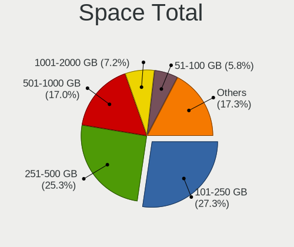
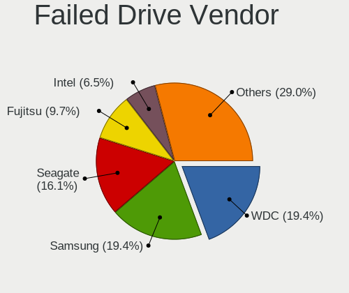

Ubuntu 22.04 - Tested Hardware & Statistics
-------------------------------------------

A project to collect tested hardware configurations for Ubuntu 22.04.

Anyone can contribute to this report by the [hw-probe](https://github.com/linuxhw/hw-probe) tool:

    sudo -E hw-probe -all -upload

Please contribute! Especially if your hardware is rare.

This is a report for all computer types. See also reports for [desktops](/Dist/Ubuntu_22.04/Desktop/README.md) and [notebooks](/Dist/Ubuntu_22.04/Notebook/README.md).

Contents
--------

* [ Test Cases ](#test-cases)

* [ System ](#system)
  - [ Kernel                   ](#kernel)
  - [ Kernel Family            ](#kernel-family)
  - [ Kernel Major Ver.        ](#kernel-major-ver)
  - [ Arch                     ](#arch)
  - [ DE                       ](#de)
  - [ Display Server           ](#display-server)
  - [ Display Manager          ](#display-manager)
  - [ OS Lang                  ](#os-lang)
  - [ Boot Mode                ](#boot-mode)
  - [ Filesystem               ](#filesystem)
  - [ Part. scheme             ](#part-scheme)
  - [ Dual Boot with Linux/BSD ](#dual-boot-with-linuxbsd)
  - [ Dual Boot (Win)          ](#dual-boot-win)

* [ Board ](#board)
  - [ Vendor                   ](#vendor)
  - [ Model                    ](#model)
  - [ Model Family             ](#model-family)
  - [ MFG Year                 ](#mfg-year)
  - [ Form Factor              ](#form-factor)
  - [ Secure Boot              ](#secure-boot)
  - [ Coreboot                 ](#coreboot)
  - [ RAM Size                 ](#ram-size)
  - [ RAM Used                 ](#ram-used)
  - [ Total Drives             ](#total-drives)
  - [ Has CD-ROM               ](#has-cd-rom)
  - [ Has Ethernet             ](#has-ethernet)
  - [ Has WiFi                 ](#has-wifi)
  - [ Has Bluetooth            ](#has-bluetooth)

* [ Location ](#location)
  - [ Country                  ](#country)
  - [ City                     ](#city)

* [ Drives ](#drives)
  - [ Drive Vendor             ](#drive-vendor)
  - [ Drive Model              ](#drive-model)
  - [ HDD Vendor               ](#hdd-vendor)
  - [ SSD Vendor               ](#ssd-vendor)
  - [ Drive Kind               ](#drive-kind)
  - [ Drive Connector          ](#drive-connector)
  - [ Drive Size               ](#drive-size)
  - [ Space Total              ](#space-total)
  - [ Space Used               ](#space-used)
  - [ Malfunc. Drives          ](#malfunc-drives)
  - [ Malfunc. Drive Vendor    ](#malfunc-drive-vendor)
  - [ Malfunc. HDD Vendor      ](#malfunc-hdd-vendor)
  - [ Malfunc. Drive Kind      ](#malfunc-drive-kind)
  - [ Failed Drives            ](#failed-drives)
  - [ Failed Drive Vendor      ](#failed-drive-vendor)
  - [ Drive Status             ](#drive-status)

* [ Storage controller ](#storage-controller)
  - [ Storage Vendor           ](#storage-vendor)
  - [ Storage Model            ](#storage-model)
  - [ Storage Kind             ](#storage-kind)

* [ Processor ](#processor)
  - [ CPU Vendor               ](#cpu-vendor)
  - [ CPU Model                ](#cpu-model)
  - [ CPU Model Family         ](#cpu-model-family)
  - [ CPU Cores                ](#cpu-cores)
  - [ CPU Sockets              ](#cpu-sockets)
  - [ CPU Threads              ](#cpu-threads)
  - [ CPU Op-Modes             ](#cpu-op-modes)
  - [ CPU Microcode            ](#cpu-microcode)
  - [ CPU Microarch            ](#cpu-microarch)

* [ Graphics ](#graphics)
  - [ GPU Vendor               ](#gpu-vendor)
  - [ GPU Model                ](#gpu-model)
  - [ GPU Combo                ](#gpu-combo)
  - [ GPU Driver               ](#gpu-driver)
  - [ GPU Memory               ](#gpu-memory)

* [ Monitor ](#monitor)
  - [ Monitor Vendor           ](#monitor-vendor)
  - [ Monitor Model            ](#monitor-model)
  - [ Monitor Resolution       ](#monitor-resolution)
  - [ Monitor Diagonal         ](#monitor-diagonal)
  - [ Monitor Width            ](#monitor-width)
  - [ Aspect Ratio             ](#aspect-ratio)
  - [ Monitor Area             ](#monitor-area)
  - [ Pixel Density            ](#pixel-density)
  - [ Multiple Monitors        ](#multiple-monitors)

* [ Network ](#network)
  - [ Net Controller Vendor    ](#net-controller-vendor)
  - [ Net Controller Model     ](#net-controller-model)
  - [ Wireless Vendor          ](#wireless-vendor)
  - [ Wireless Model           ](#wireless-model)
  - [ Ethernet Vendor          ](#ethernet-vendor)
  - [ Ethernet Model           ](#ethernet-model)
  - [ Net Controller Kind      ](#net-controller-kind)
  - [ Used Controller          ](#used-controller)
  - [ NICs                     ](#nics)
  - [ IPv6                     ](#ipv6)

* [ Bluetooth ](#bluetooth)
  - [ Bluetooth Vendor         ](#bluetooth-vendor)
  - [ Bluetooth Model          ](#bluetooth-model)

* [ Sound ](#sound)
  - [ Sound Vendor             ](#sound-vendor)
  - [ Sound Model              ](#sound-model)

* [ Memory ](#memory)
  - [ Memory Vendor            ](#memory-vendor)
  - [ Memory Model             ](#memory-model)
  - [ Memory Kind              ](#memory-kind)
  - [ Memory Form Factor       ](#memory-form-factor)
  - [ Memory Size              ](#memory-size)
  - [ Memory Speed             ](#memory-speed)

* [ Printers & scanners ](#printers--scanners)
  - [ Printer Vendor           ](#printer-vendor)
  - [ Printer Model            ](#printer-model)
  - [ Scanner Vendor           ](#scanner-vendor)
  - [ Scanner Model            ](#scanner-model)

* [ Camera ](#camera)
  - [ Camera Vendor            ](#camera-vendor)
  - [ Camera Model             ](#camera-model)

* [ Security ](#security)
  - [ Fingerprint Vendor       ](#fingerprint-vendor)
  - [ Fingerprint Model        ](#fingerprint-model)
  - [ Chipcard Vendor          ](#chipcard-vendor)
  - [ Chipcard Model           ](#chipcard-model)

* [ Unsupported ](#unsupported)
  - [ Unsupported Devices      ](#unsupported-devices)
  - [ Unsupported Device Types ](#unsupported-device-types)

Test Cases
----------

Total: 15135

| Vendor        | Model                       | Form-Factor | Probe                                                      | Date         |
|---------------|-----------------------------|-------------|------------------------------------------------------------|--------------|
| HP            | OMEN by Laptop 15-dc1xxx    | Notebook    | [fb024a9374](https://linux-hardware.org/?probe=fb024a9374) | Aug 12, 2023 |
| HP            | OMEN by Laptop 15-dc1xxx    | Notebook    | [398f85e94a](https://linux-hardware.org/?probe=398f85e94a) | Aug 12, 2023 |
| Toshiba       | Satellite C50D-A-13G        | Notebook    | [e1a3542078](https://linux-hardware.org/?probe=e1a3542078) | Aug 12, 2023 |
| MSI           | P67A-GD65                   | Desktop     | [1024e95ca9](https://linux-hardware.org/?probe=1024e95ca9) | Aug 12, 2023 |
| Fujitsu       | D2990-A1 S26361-D2990-A1    | Desktop     | [ae7ae594f1](https://linux-hardware.org/?probe=ae7ae594f1) | Aug 12, 2023 |
| Apple         | Mac-F2218EA9                | All in one  | [63861067de](https://linux-hardware.org/?probe=63861067de) | Aug 12, 2023 |
| Gigabyte      | Z390 AORUS PRO WIFI-CF      | Desktop     | [7298d533c9](https://linux-hardware.org/?probe=7298d533c9) | Aug 12, 2023 |
| Gigabyte      | Z390 AORUS PRO WIFI-CF      | Desktop     | [13e0e622f3](https://linux-hardware.org/?probe=13e0e622f3) | Aug 12, 2023 |
| HP            | 0A04h                       | Desktop     | [61b0d9bc15](https://linux-hardware.org/?probe=61b0d9bc15) | Aug 12, 2023 |
| Fujitsu       | JIQ87Y                      | Desktop     | [b11d99014e](https://linux-hardware.org/?probe=b11d99014e) | Aug 12, 2023 |
| ASUSTek       | H81M-PLUS                   | Desktop     | [af419fe003](https://linux-hardware.org/?probe=af419fe003) | Aug 12, 2023 |
| ASUSTek       | H81M-PLUS                   | Desktop     | [16cd37e4fe](https://linux-hardware.org/?probe=16cd37e4fe) | Aug 12, 2023 |
| Dell          | 0Y2MRG A00                  | Desktop     | [04ce264a3e](https://linux-hardware.org/?probe=04ce264a3e) | Aug 12, 2023 |
| Dell          | G3 3579                     | Notebook    | [09ba53e3c1](https://linux-hardware.org/?probe=09ba53e3c1) | Aug 12, 2023 |
| Intel         | DG31PR AAE58249-301         | Desktop     | [28bc891b6d](https://linux-hardware.org/?probe=28bc891b6d) | Aug 12, 2023 |
| Intel         | NUC11PABi7 M68262-501       | Mini pc     | [422a91a4eb](https://linux-hardware.org/?probe=422a91a4eb) | Aug 12, 2023 |
| HP            | Pavilion g7                 | Notebook    | [325b804863](https://linux-hardware.org/?probe=325b804863) | Aug 12, 2023 |
| ASUSTek       | T200TA                      | Notebook    | [24d6504b2c](https://linux-hardware.org/?probe=24d6504b2c) | Aug 12, 2023 |
| Intel         | DG31PR AAE58249-301         | Desktop     | [3050db3fbf](https://linux-hardware.org/?probe=3050db3fbf) | Aug 12, 2023 |
| HP            | Laptop 15-dy2xxx            | Notebook    | [bc66f59ac5](https://linux-hardware.org/?probe=bc66f59ac5) | Aug 12, 2023 |
| Microsoft     | Surface Pro 4               | Tablet      | [2b46218f49](https://linux-hardware.org/?probe=2b46218f49) | Aug 11, 2023 |
| Microsoft     | Surface Pro 4               | Tablet      | [77714a2920](https://linux-hardware.org/?probe=77714a2920) | Aug 11, 2023 |
| MSI           | Boston                      | Desktop     | [62ad275a7d](https://linux-hardware.org/?probe=62ad275a7d) | Aug 11, 2023 |
| Apple         | Mac-F2268DAE                | All in one  | [b4a67f9e6d](https://linux-hardware.org/?probe=b4a67f9e6d) | Aug 11, 2023 |
| HP            | EliteBook 840 14 inch G1... | Notebook    | [73b7fc1fc9](https://linux-hardware.org/?probe=73b7fc1fc9) | Aug 11, 2023 |
| Acer          | Aspire F5-573G              | Notebook    | [019f3a6d1f](https://linux-hardware.org/?probe=019f3a6d1f) | Aug 11, 2023 |
| MSI           | Boston                      | Desktop     | [a34a89c083](https://linux-hardware.org/?probe=a34a89c083) | Aug 11, 2023 |
| Intel         | B75                         | Desktop     | [17641de345](https://linux-hardware.org/?probe=17641de345) | Aug 11, 2023 |
| Acer          | Extensa 215-55              | Notebook    | [aea9ada5e8](https://linux-hardware.org/?probe=aea9ada5e8) | Aug 11, 2023 |
| ASUSTek       | ROG STRIX X570-E GAMING     | Desktop     | [483fc71762](https://linux-hardware.org/?probe=483fc71762) | Aug 11, 2023 |
| Dell          | Latitude E6430              | Notebook    | [79f523548b](https://linux-hardware.org/?probe=79f523548b) | Aug 11, 2023 |
| Dell          | Latitude E6330              | Notebook    | [b3081e041e](https://linux-hardware.org/?probe=b3081e041e) | Aug 11, 2023 |
| Dell          | Latitude E6430              | Notebook    | [fd3c9b15f8](https://linux-hardware.org/?probe=fd3c9b15f8) | Aug 11, 2023 |
| Unknown       | Unknown                     | Desktop     | [62ef56dbab](https://linux-hardware.org/?probe=62ef56dbab) | Aug 11, 2023 |
| Lenovo        | ThinkPad L520 5017BW5       | Notebook    | [1a9bbdc058](https://linux-hardware.org/?probe=1a9bbdc058) | Aug 11, 2023 |
| Dell          | G15 5520                    | Notebook    | [3bec284af8](https://linux-hardware.org/?probe=3bec284af8) | Aug 11, 2023 |
| ASRock        | B450M Pro4                  | Desktop     | [65d55091fa](https://linux-hardware.org/?probe=65d55091fa) | Aug 11, 2023 |
| ASUSTek       | VivoBook_ASUSLaptop M140... | Notebook    | [a4a009cd79](https://linux-hardware.org/?probe=a4a009cd79) | Aug 11, 2023 |
| Intel         | D915GEV AAC63667-501        | Desktop     | [4d65f6d8fa](https://linux-hardware.org/?probe=4d65f6d8fa) | Aug 11, 2023 |
| HP            | ProLiant DL360 Gen9         | Server      | [262bb059eb](https://linux-hardware.org/?probe=262bb059eb) | Aug 11, 2023 |
| Acer          | Extensa 215-55              | Notebook    | [036866525c](https://linux-hardware.org/?probe=036866525c) | Aug 11, 2023 |
| Gigabyte      | B85M-D2V                    | Desktop     | [d8d7d7bad7](https://linux-hardware.org/?probe=d8d7d7bad7) | Aug 11, 2023 |
| ASRock        | B550M-ITX/ac                | Desktop     | [e6624cc619](https://linux-hardware.org/?probe=e6624cc619) | Aug 11, 2023 |
| ASUSTek       | PRIME X670-P WIFI           | Desktop     | [7d31344218](https://linux-hardware.org/?probe=7d31344218) | Aug 11, 2023 |
| Dell          | 0HY9JP A01                  | Desktop     | [48d92d85c7](https://linux-hardware.org/?probe=48d92d85c7) | Aug 11, 2023 |
| Acer          | Aspire ES1-111M             | Notebook    | [3c7140c389](https://linux-hardware.org/?probe=3c7140c389) | Aug 11, 2023 |
| Intel Clie... | LAPQC71A                    | Notebook    | [c87bff1d43](https://linux-hardware.org/?probe=c87bff1d43) | Aug 11, 2023 |
| Acer          | Aspire G7713                | Desktop     | [cb79bdce06](https://linux-hardware.org/?probe=cb79bdce06) | Aug 11, 2023 |
| Fujitsu       | LIFEBOOK S762               | Notebook    | [1ced8ae4d0](https://linux-hardware.org/?probe=1ced8ae4d0) | Aug 11, 2023 |
| Fujitsu       | LIFEBOOK S762               | Notebook    | [cb0b5cbd5d](https://linux-hardware.org/?probe=cb0b5cbd5d) | Aug 11, 2023 |
| Gigabyte      | Z77-D3H                     | Desktop     | [e71fc09944](https://linux-hardware.org/?probe=e71fc09944) | Aug 11, 2023 |
| MSI           | Creator Z16 A11UET          | Notebook    | [7883e9a69d](https://linux-hardware.org/?probe=7883e9a69d) | Aug 11, 2023 |
| ASUSTek       | PRIME H510M-K               | Desktop     | [3c239efc46](https://linux-hardware.org/?probe=3c239efc46) | Aug 11, 2023 |
| AZW           | Green G4 10                 | Desktop     | [a574280172](https://linux-hardware.org/?probe=a574280172) | Aug 11, 2023 |
| MSI           | MS-7380                     | Desktop     | [584074ca03](https://linux-hardware.org/?probe=584074ca03) | Aug 11, 2023 |
| Lenovo        | B50-70 20384                | Notebook    | [607103b8f5](https://linux-hardware.org/?probe=607103b8f5) | Aug 11, 2023 |
| Alienware     | Area-51 R2                  | Desktop     | [07a6f57292](https://linux-hardware.org/?probe=07a6f57292) | Aug 11, 2023 |
| TYAN Compu... | S8030GM2NE                  | Server      | [bc9cacebe8](https://linux-hardware.org/?probe=bc9cacebe8) | Aug 11, 2023 |
| Intel         | NUC8v5PNB K59997-403        | Mini pc     | [24a49fba6d](https://linux-hardware.org/?probe=24a49fba6d) | Aug 11, 2023 |
| Google        | Bobba360                    | Notebook    | [128700115a](https://linux-hardware.org/?probe=128700115a) | Aug 10, 2023 |
| Gigabyte      | GA-78LMT-USB3               | Desktop     | [6a1d87f2aa](https://linux-hardware.org/?probe=6a1d87f2aa) | Aug 10, 2023 |
| ASUSTek       | P8P67 PRO                   | Desktop     | [c0d6900ba3](https://linux-hardware.org/?probe=c0d6900ba3) | Aug 10, 2023 |
| Lenovo        | G40-45 80E1                 | Notebook    | [d6f18c79f6](https://linux-hardware.org/?probe=d6f18c79f6) | Aug 10, 2023 |
| TYAN Compu... | S8030GM2NE                  | Server      | [99458c04da](https://linux-hardware.org/?probe=99458c04da) | Aug 10, 2023 |
| Fujitsu Si... | G31T-M2 V3.02               | Desktop     | [1c32da7aed](https://linux-hardware.org/?probe=1c32da7aed) | Aug 10, 2023 |
| Lenovo        | ThinkStation S30 056848U    | Desktop     | [e6bc23d815](https://linux-hardware.org/?probe=e6bc23d815) | Aug 10, 2023 |
| HUAWEI        | KLVD-WXX9                   | Notebook    | [19cadaab1b](https://linux-hardware.org/?probe=19cadaab1b) | Aug 10, 2023 |
| Lenovo        | ThinkPad E14 20RA0076US     | Notebook    | [ab98272b50](https://linux-hardware.org/?probe=ab98272b50) | Aug 10, 2023 |
| Gateway       | MD7309U                     | Notebook    | [18dbacfdab](https://linux-hardware.org/?probe=18dbacfdab) | Aug 10, 2023 |
| HP            | OMEN by Laptop 15-dc1xxx    | Notebook    | [9627b6d632](https://linux-hardware.org/?probe=9627b6d632) | Aug 10, 2023 |
| ASUSTek       | VivoBook_ASUSLaptop M350... | Notebook    | [ffa9b97bf7](https://linux-hardware.org/?probe=ffa9b97bf7) | Aug 10, 2023 |
| HP            | OMEN by Laptop 15-dc1xxx    | Notebook    | [099d1ac0de](https://linux-hardware.org/?probe=099d1ac0de) | Aug 10, 2023 |
| BANGHO        | MAX L5                      | Notebook    | [4661b7a0f7](https://linux-hardware.org/?probe=4661b7a0f7) | Aug 10, 2023 |
| Avell High... | A70 HYB                     | Notebook    | [9b03ae1cd3](https://linux-hardware.org/?probe=9b03ae1cd3) | Aug 10, 2023 |
| ASUSTek       | ROG STRIX B650-A GAMING ... | Desktop     | [6bf6a38fba](https://linux-hardware.org/?probe=6bf6a38fba) | Aug 10, 2023 |
| HP            | Pavilion Laptop 14-dv2xx... | Notebook    | [479f066821](https://linux-hardware.org/?probe=479f066821) | Aug 10, 2023 |
| Avell         | A70 ION                     | Notebook    | [b71c176ce3](https://linux-hardware.org/?probe=b71c176ce3) | Aug 10, 2023 |
| Gigabyte      | H270N-WIFI-CF               | Desktop     | [bd9c532bbc](https://linux-hardware.org/?probe=bd9c532bbc) | Aug 10, 2023 |
| Dell          | 04YP6J A02                  | Desktop     | [5d5ce952b3](https://linux-hardware.org/?probe=5d5ce952b3) | Aug 10, 2023 |
| Gigabyte      | B560M DS3H                  | Desktop     | [96d3419a5f](https://linux-hardware.org/?probe=96d3419a5f) | Aug 10, 2023 |
| Lenovo        | ThinkBook 14-IIL 20SL       | Notebook    | [e323e9cd7e](https://linux-hardware.org/?probe=e323e9cd7e) | Aug 10, 2023 |
| Gigabyte      | Z390 AORUS ULTRA-CF         | Desktop     | [5264c46571](https://linux-hardware.org/?probe=5264c46571) | Aug 10, 2023 |
| YANYU         | EPIC-C57                    | Desktop     | [6d42c0f9af](https://linux-hardware.org/?probe=6d42c0f9af) | Aug 10, 2023 |
| Dell          | XPS L421X                   | Notebook    | [ba412a439b](https://linux-hardware.org/?probe=ba412a439b) | Aug 10, 2023 |
| MSI           | A320M PRO-VD/S              | Desktop     | [7f7c988470](https://linux-hardware.org/?probe=7f7c988470) | Aug 10, 2023 |
| Gigabyte      | Z390 AORUS PRO WIFI-CF      | Desktop     | [307c7bbe9c](https://linux-hardware.org/?probe=307c7bbe9c) | Aug 10, 2023 |
| Google        | Kindred                     | Notebook    | [a45439e295](https://linux-hardware.org/?probe=a45439e295) | Aug 10, 2023 |
| HP            | Pavilion Laptop 14-dv1xx... | Notebook    | [385c88301b](https://linux-hardware.org/?probe=385c88301b) | Aug 10, 2023 |
| Dell          | Vostro 3501                 | Notebook    | [d606f83745](https://linux-hardware.org/?probe=d606f83745) | Aug 10, 2023 |
| Gateway       | NV57H                       | Notebook    | [826aaf5dd8](https://linux-hardware.org/?probe=826aaf5dd8) | Aug 10, 2023 |
| Lenovo        | ThinkPad E15 20RD0086UE     | Notebook    | [cb8ad3e0fc](https://linux-hardware.org/?probe=cb8ad3e0fc) | Aug 10, 2023 |
| Acer          | Aspire V3-571G              | Notebook    | [6c4354fa1c](https://linux-hardware.org/?probe=6c4354fa1c) | Aug 10, 2023 |
| Dell          | 0JP3NX A01                  | Desktop     | [a9c4812d66](https://linux-hardware.org/?probe=a9c4812d66) | Aug 09, 2023 |
| ASUSTek       | PRIME Z270-A                | Desktop     | [a6eabbbfef](https://linux-hardware.org/?probe=a6eabbbfef) | Aug 09, 2023 |
| Siragon       | MN-50                       | Notebook    | [8eafa43cb5](https://linux-hardware.org/?probe=8eafa43cb5) | Aug 09, 2023 |
| MSI           | 970 GAMING                  | Desktop     | [a499728742](https://linux-hardware.org/?probe=a499728742) | Aug 09, 2023 |
| ASUSTek       | VivoBook_ASUSLaptop X321... | Notebook    | [204b2fa0a0](https://linux-hardware.org/?probe=204b2fa0a0) | Aug 09, 2023 |
| Lenovo        | V145-15AST 81MT             | Notebook    | [304b175b3c](https://linux-hardware.org/?probe=304b175b3c) | Aug 09, 2023 |
| Toshiba       | Satellite C70D-B            | Notebook    | [ac775a3228](https://linux-hardware.org/?probe=ac775a3228) | Aug 09, 2023 |
| Supermicro    | X10DRU-i+                   | Server      | [6ea2dae05b](https://linux-hardware.org/?probe=6ea2dae05b) | Aug 09, 2023 |
| Supermicro    | X10DRU-i+                   | Server      | [1c9d71f553](https://linux-hardware.org/?probe=1c9d71f553) | Aug 09, 2023 |
| Supermicro    | X10DRU-i+                   | Server      | [47da29a7a0](https://linux-hardware.org/?probe=47da29a7a0) | Aug 09, 2023 |
| Supermicro    | X10DRU-i+                   | Server      | [d464f66e20](https://linux-hardware.org/?probe=d464f66e20) | Aug 09, 2023 |
| Supermicro    | X10DRU-i+                   | Server      | [9f725868e8](https://linux-hardware.org/?probe=9f725868e8) | Aug 09, 2023 |
| Supermicro    | X10DRU-i+                   | Server      | [dd82024730](https://linux-hardware.org/?probe=dd82024730) | Aug 09, 2023 |
| Supermicro    | X10DRU-i+                   | Server      | [11d70c86e3](https://linux-hardware.org/?probe=11d70c86e3) | Aug 09, 2023 |
| Supermicro    | X10DRU-i+                   | Server      | [1b3e4092b5](https://linux-hardware.org/?probe=1b3e4092b5) | Aug 09, 2023 |
| Supermicro    | X10DRU-i+                   | Server      | [92f521b3e8](https://linux-hardware.org/?probe=92f521b3e8) | Aug 09, 2023 |
| Supermicro    | X10DRU-i+                   | Server      | [e6cc7a97b6](https://linux-hardware.org/?probe=e6cc7a97b6) | Aug 09, 2023 |
| Dell          | 0WR7PY A03                  | Desktop     | [b97d54f6d8](https://linux-hardware.org/?probe=b97d54f6d8) | Aug 09, 2023 |
| Supermicro    | X9SRE/X9SRE-3F/X9SRi/X9S... | Server      | [52ff19e47c](https://linux-hardware.org/?probe=52ff19e47c) | Aug 09, 2023 |
| ASUSTek       | ASUS TUF Gaming F17 FX70... | Notebook    | [bf81bbf7b4](https://linux-hardware.org/?probe=bf81bbf7b4) | Aug 09, 2023 |
| Gigabyte      | B150M-D3H DDR3-CF           | Desktop     | [5df6fee2f9](https://linux-hardware.org/?probe=5df6fee2f9) | Aug 09, 2023 |
| ASRock        | H77M-ITX                    | Desktop     | [01dc3bfc4b](https://linux-hardware.org/?probe=01dc3bfc4b) | Aug 09, 2023 |
| Google        | Bobba360                    | Notebook    | [fa4a78b024](https://linux-hardware.org/?probe=fa4a78b024) | Aug 09, 2023 |
| Lenovo        | ThinkPad X1 Yoga Gen 6 2... | Convertible | [bb7891de93](https://linux-hardware.org/?probe=bb7891de93) | Aug 09, 2023 |
| Medion        | Akoya THE TOUCH 10          | Notebook    | [d45603bb4e](https://linux-hardware.org/?probe=d45603bb4e) | Aug 09, 2023 |
| HP            | 894D                        | Desktop     | [e1c397df93](https://linux-hardware.org/?probe=e1c397df93) | Aug 09, 2023 |
| Lenovo        | Legion 5 15ACH6 82JW        | Notebook    | [5bd12768fa](https://linux-hardware.org/?probe=5bd12768fa) | Aug 09, 2023 |
| Toshiba       | Satellite C70D-B            | Notebook    | [e3f3b2fcfb](https://linux-hardware.org/?probe=e3f3b2fcfb) | Aug 09, 2023 |
| HP            | ENVY x360 2-in-1 Laptop ... | Convertible | [37b2f22e1f](https://linux-hardware.org/?probe=37b2f22e1f) | Aug 09, 2023 |
| MSI           | A78M-E45                    | Desktop     | [d39f224497](https://linux-hardware.org/?probe=d39f224497) | Aug 09, 2023 |
| HP            | EliteBook 830 G8 Noteboo... | Notebook    | [5e79da69ed](https://linux-hardware.org/?probe=5e79da69ed) | Aug 09, 2023 |
| Dell          | Latitude 5520               | Notebook    | [478f0a6a07](https://linux-hardware.org/?probe=478f0a6a07) | Aug 09, 2023 |
| HP            | EliteBook 830 G8 Noteboo... | Notebook    | [c761edfea1](https://linux-hardware.org/?probe=c761edfea1) | Aug 09, 2023 |
| Dell          | XPS 15 9520                 | Notebook    | [0620b6b11a](https://linux-hardware.org/?probe=0620b6b11a) | Aug 09, 2023 |
| MSI           | 970 GAMING                  | Desktop     | [4751920c96](https://linux-hardware.org/?probe=4751920c96) | Aug 09, 2023 |
| HP            | EliteBook 8470p             | Notebook    | [16acf13ed8](https://linux-hardware.org/?probe=16acf13ed8) | Aug 09, 2023 |
| Lenovo        | 30C1                        | Desktop     | [dda7ed4e8b](https://linux-hardware.org/?probe=dda7ed4e8b) | Aug 09, 2023 |
| HP            | EliteBook 2540p             | Notebook    | [2a02492c01](https://linux-hardware.org/?probe=2a02492c01) | Aug 09, 2023 |
| Dell          | Precision 3551              | Notebook    | [a9b776ade0](https://linux-hardware.org/?probe=a9b776ade0) | Aug 09, 2023 |
| HP            | EliteBook 2540p             | Notebook    | [509b979b88](https://linux-hardware.org/?probe=509b979b88) | Aug 09, 2023 |
| Dell          | 02YYK5 A00                  | Desktop     | [14382141e9](https://linux-hardware.org/?probe=14382141e9) | Aug 09, 2023 |
| HP            | EliteBook 8560w             | Notebook    | [ea34946fbd](https://linux-hardware.org/?probe=ea34946fbd) | Aug 09, 2023 |
| Toshiba       | Satellite C55-C             | Notebook    | [199924c140](https://linux-hardware.org/?probe=199924c140) | Aug 09, 2023 |
| HP            | ENVY Laptop 17-ch0xxx       | Notebook    | [01fe285324](https://linux-hardware.org/?probe=01fe285324) | Aug 09, 2023 |
| Toshiba       | Satellite C55-C             | Notebook    | [324b952d6b](https://linux-hardware.org/?probe=324b952d6b) | Aug 09, 2023 |
| ASUSTek       | ET2011A 0405                | All in one  | [a236196a29](https://linux-hardware.org/?probe=a236196a29) | Aug 08, 2023 |
| ASUSTek       | N56VJ                       | Notebook    | [d552e1a450](https://linux-hardware.org/?probe=d552e1a450) | Aug 08, 2023 |
| BANGHO        | MAX L5                      | Notebook    | [b21781af81](https://linux-hardware.org/?probe=b21781af81) | Aug 08, 2023 |
| MSI           | MAG B760 TOMAHAWK WIFI      | Desktop     | [64fbeeca5e](https://linux-hardware.org/?probe=64fbeeca5e) | Aug 08, 2023 |
| HP            | EliteBook 820 G1            | Notebook    | [62889fd683](https://linux-hardware.org/?probe=62889fd683) | Aug 08, 2023 |
| Lenovo        | ThinkPad X1 Yoga Gen 6 2... | Convertible | [c86462ba1b](https://linux-hardware.org/?probe=c86462ba1b) | Aug 08, 2023 |
| Lenovo        | ThinkPad P50 20EQS0T800     | Notebook    | [8316628b28](https://linux-hardware.org/?probe=8316628b28) | Aug 08, 2023 |
| Supermicro    | X10DRU-i+                   | Server      | [42b79d59b6](https://linux-hardware.org/?probe=42b79d59b6) | Aug 08, 2023 |
| Supermicro    | X10DRU-i+                   | Server      | [0503a83389](https://linux-hardware.org/?probe=0503a83389) | Aug 08, 2023 |
| Supermicro    | X10DRU-i+                   | Server      | [29e048b78b](https://linux-hardware.org/?probe=29e048b78b) | Aug 08, 2023 |
| Supermicro    | X10DRU-i+                   | Server      | [9183ba34b1](https://linux-hardware.org/?probe=9183ba34b1) | Aug 08, 2023 |
| Lenovo        | ThinkPad P50 20EQS0T800     | Notebook    | [05d33f11b5](https://linux-hardware.org/?probe=05d33f11b5) | Aug 08, 2023 |
| Supermicro    | X10DRU-i+                   | Server      | [f07e24722e](https://linux-hardware.org/?probe=f07e24722e) | Aug 08, 2023 |
| Supermicro    | X10DRU-i+                   | Server      | [f26c990dc3](https://linux-hardware.org/?probe=f26c990dc3) | Aug 08, 2023 |
| Notebook      | W65_W67RZ1                  | Notebook    | [ab4b3c8f47](https://linux-hardware.org/?probe=ab4b3c8f47) | Aug 08, 2023 |
| Supermicro    | X10DRU-i+                   | Server      | [f190fa8e05](https://linux-hardware.org/?probe=f190fa8e05) | Aug 08, 2023 |
| Supermicro    | X10DRU-i+                   | Server      | [183e9d899a](https://linux-hardware.org/?probe=183e9d899a) | Aug 08, 2023 |
| Supermicro    | X10DRU-i+                   | Server      | [33d78efc8a](https://linux-hardware.org/?probe=33d78efc8a) | Aug 08, 2023 |
| Supermicro    | X10DRU-i+                   | Server      | [7053bcfeac](https://linux-hardware.org/?probe=7053bcfeac) | Aug 08, 2023 |
| Fujitsu       | D2990-A1 S26361-D2990-A1    | Desktop     | [c48e0220d8](https://linux-hardware.org/?probe=c48e0220d8) | Aug 08, 2023 |
| Intel         | D33217GKE G76540-203        | Desktop     | [fa0fbda262](https://linux-hardware.org/?probe=fa0fbda262) | Aug 08, 2023 |
| HP            | ZBook 14 G2                 | Notebook    | [c52b1e963f](https://linux-hardware.org/?probe=c52b1e963f) | Aug 08, 2023 |
| HP            | ProBook 445 G8 Notebook ... | Notebook    | [f69459e15a](https://linux-hardware.org/?probe=f69459e15a) | Aug 08, 2023 |
| Dell          | Latitude 7440               | Notebook    | [0cfa45fbd8](https://linux-hardware.org/?probe=0cfa45fbd8) | Aug 08, 2023 |
| Intel         | D33217GKE G76540-203        | Desktop     | [f75916b7c7](https://linux-hardware.org/?probe=f75916b7c7) | Aug 08, 2023 |
| Lenovo        | ThinkPad T14 Gen 2a 20XL... | Notebook    | [4148b505d6](https://linux-hardware.org/?probe=4148b505d6) | Aug 08, 2023 |
| Dell          | Latitude 7440               | Notebook    | [e476a3e532](https://linux-hardware.org/?probe=e476a3e532) | Aug 08, 2023 |
| Dell          | Latitude E7450              | Notebook    | [a426887b24](https://linux-hardware.org/?probe=a426887b24) | Aug 08, 2023 |
| HP            | ZBook 14 G2                 | Notebook    | [211978450c](https://linux-hardware.org/?probe=211978450c) | Aug 08, 2023 |
| HP            | ZBook 14 G2                 | Notebook    | [23dd3e572c](https://linux-hardware.org/?probe=23dd3e572c) | Aug 08, 2023 |
| Supermicro    | X11DDW-L                    | Server      | [d6fe66b73c](https://linux-hardware.org/?probe=d6fe66b73c) | Aug 08, 2023 |
| Supermicro    | X9DRW                       | Server      | [007ab23cd1](https://linux-hardware.org/?probe=007ab23cd1) | Aug 08, 2023 |
| Lenovo        | Bantry CRB SDK0E50510 WI... | Desktop     | [6ffda81a5e](https://linux-hardware.org/?probe=6ffda81a5e) | Aug 08, 2023 |
| HP            | ProLiant DL360 Gen9         | Server      | [d292db651b](https://linux-hardware.org/?probe=d292db651b) | Aug 08, 2023 |
| Dell          | Latitude 5540               | Notebook    | [08c875f58b](https://linux-hardware.org/?probe=08c875f58b) | Aug 08, 2023 |
| HP            | 2129                        | Desktop     | [f005bdb494](https://linux-hardware.org/?probe=f005bdb494) | Aug 08, 2023 |
| MSI           | Creator Z16 A11UET          | Notebook    | [ea05388cf5](https://linux-hardware.org/?probe=ea05388cf5) | Aug 08, 2023 |
| Gigabyte      | Z97M-DS3H                   | Desktop     | [f2547c0339](https://linux-hardware.org/?probe=f2547c0339) | Aug 08, 2023 |
| Dell          | Inspiron 5402               | Notebook    | [9004ee7aa2](https://linux-hardware.org/?probe=9004ee7aa2) | Aug 08, 2023 |
| Dell          | Inspiron 5485 2n1           | Convertible | [f4c69a94e9](https://linux-hardware.org/?probe=f4c69a94e9) | Aug 08, 2023 |
| Dell          | Inspiron 5485 2n1           | Convertible | [e5efd1b16c](https://linux-hardware.org/?probe=e5efd1b16c) | Aug 08, 2023 |
| ASUSTek       | PRIME X670-P WIFI           | Desktop     | [2335e10b59](https://linux-hardware.org/?probe=2335e10b59) | Aug 08, 2023 |
| Lenovo        | B40-80 80LS                 | Notebook    | [2865a9d402](https://linux-hardware.org/?probe=2865a9d402) | Aug 08, 2023 |
| Lenovo        | Legion 5 15ARH7H 82RD       | Notebook    | [1e2412e487](https://linux-hardware.org/?probe=1e2412e487) | Aug 08, 2023 |
| Khadas        | Edge2                       | Soc         | [e9c9d4e1d3](https://linux-hardware.org/?probe=e9c9d4e1d3) | Aug 08, 2023 |
| Dell          | Latitude E6430              | Notebook    | [313d3616c4](https://linux-hardware.org/?probe=313d3616c4) | Aug 08, 2023 |
| Dell          | XPS 15 9575                 | Convertible | [695f56bfd8](https://linux-hardware.org/?probe=695f56bfd8) | Aug 08, 2023 |
| Google        | Parrot                      | Notebook    | [a0820a5e0c](https://linux-hardware.org/?probe=a0820a5e0c) | Aug 07, 2023 |
| Google        | Parrot                      | Notebook    | [f03c4efc0b](https://linux-hardware.org/?probe=f03c4efc0b) | Aug 07, 2023 |
| Lenovo        | ThinkPad T15 Gen 2i 20W4... | Notebook    | [ce593ff6c7](https://linux-hardware.org/?probe=ce593ff6c7) | Aug 07, 2023 |
| Acer          | Aspire A515-56              | Notebook    | [84b0c88b0a](https://linux-hardware.org/?probe=84b0c88b0a) | Aug 07, 2023 |
| Pegatron      | 2AB5                        | Desktop     | [9579022e6f](https://linux-hardware.org/?probe=9579022e6f) | Aug 07, 2023 |
| MSI           | GL63 8RC                    | Notebook    | [d91d6193e6](https://linux-hardware.org/?probe=d91d6193e6) | Aug 07, 2023 |
| ASRock        | H610M-ITX/ac                | Desktop     | [205fab2707](https://linux-hardware.org/?probe=205fab2707) | Aug 07, 2023 |
| HP            | Notebook                    | Notebook    | [02ceb78a4f](https://linux-hardware.org/?probe=02ceb78a4f) | Aug 07, 2023 |
| Gigabyte      | B450M DS3H-CF               | Desktop     | [40b0ea74b1](https://linux-hardware.org/?probe=40b0ea74b1) | Aug 07, 2023 |
| Fujitsu       | D3062-A1 S26361-D3062-A1    | Desktop     | [873825c261](https://linux-hardware.org/?probe=873825c261) | Aug 07, 2023 |
| Lenovo        | B40-70 20392                | Notebook    | [ebf45c27f4](https://linux-hardware.org/?probe=ebf45c27f4) | Aug 07, 2023 |
| SGIN          | laptop                      | Notebook    | [d80389ea87](https://linux-hardware.org/?probe=d80389ea87) | Aug 07, 2023 |
| Acer          | Swift SF514-53T             | Notebook    | [30d8fefda4](https://linux-hardware.org/?probe=30d8fefda4) | Aug 07, 2023 |
| HP            | 8055                        | Desktop     | [5124119ce1](https://linux-hardware.org/?probe=5124119ce1) | Aug 07, 2023 |
| Acer          | Swift SF514-53T             | Notebook    | [f1cef350fb](https://linux-hardware.org/?probe=f1cef350fb) | Aug 07, 2023 |
| Dell          | 00KM0D A00                  | All in one  | [f6d752be40](https://linux-hardware.org/?probe=f6d752be40) | Aug 07, 2023 |
| Lenovo        | ThinkPad E14 Gen 5 21JRS... | Notebook    | [ebcf58253e](https://linux-hardware.org/?probe=ebcf58253e) | Aug 07, 2023 |
| Lenovo        | ThinkPad X1 Carbon Gen 1... | Notebook    | [a3dd4fadf3](https://linux-hardware.org/?probe=a3dd4fadf3) | Aug 07, 2023 |
| Dell          | XPS 13 9350                 | Notebook    | [fb1aaeae43](https://linux-hardware.org/?probe=fb1aaeae43) | Aug 07, 2023 |
| HP            | Laptop 17-ak0xx             | Notebook    | [67749cdc51](https://linux-hardware.org/?probe=67749cdc51) | Aug 07, 2023 |
| Notebook      | NHxxRZQ                     | Notebook    | [0cd17c8b5c](https://linux-hardware.org/?probe=0cd17c8b5c) | Aug 07, 2023 |
| Dell          | 00KM0D A00                  | All in one  | [30324c6293](https://linux-hardware.org/?probe=30324c6293) | Aug 07, 2023 |
| Fujitsu       | LIFEBOOK A359               | Notebook    | [60a09f6ca3](https://linux-hardware.org/?probe=60a09f6ca3) | Aug 07, 2023 |
| Dell          | XPS 15 9500                 | Notebook    | [309b546405](https://linux-hardware.org/?probe=309b546405) | Aug 07, 2023 |
| HP            | Pavilion 15                 | Notebook    | [227895bca8](https://linux-hardware.org/?probe=227895bca8) | Aug 07, 2023 |
| ASUSTek       | ROG Zephyrus G14 GA401IH... | Notebook    | [0b3bf57b84](https://linux-hardware.org/?probe=0b3bf57b84) | Aug 07, 2023 |
| Gigabyte      | Z97M-DS3H                   | Desktop     | [beecacb434](https://linux-hardware.org/?probe=beecacb434) | Aug 07, 2023 |
| Gigabyte      | Z390 AORUS PRO WIFI-CF      | Desktop     | [002014034b](https://linux-hardware.org/?probe=002014034b) | Aug 07, 2023 |
| HP            | ProBook 650 G1              | Notebook    | [b02660749d](https://linux-hardware.org/?probe=b02660749d) | Aug 07, 2023 |
| ASUSTek       | P5N-E SLI                   | Desktop     | [d552e347f5](https://linux-hardware.org/?probe=d552e347f5) | Aug 07, 2023 |
| AZW           | SEi                         | Desktop     | [b38e4eec2e](https://linux-hardware.org/?probe=b38e4eec2e) | Aug 07, 2023 |
| Gigabyte      | Z390 AORUS PRO WIFI-CF      | Desktop     | [fbfc0c60bd](https://linux-hardware.org/?probe=fbfc0c60bd) | Aug 07, 2023 |
| Lenovo        | B40-80 80LS                 | Notebook    | [bfb069ff41](https://linux-hardware.org/?probe=bfb069ff41) | Aug 07, 2023 |
| HP            | EliteBook 840 G3            | Notebook    | [2e239a5f09](https://linux-hardware.org/?probe=2e239a5f09) | Aug 07, 2023 |
| Lenovo        | ThinkPad T480 20L6S42000    | Notebook    | [3e9ce860b6](https://linux-hardware.org/?probe=3e9ce860b6) | Aug 07, 2023 |
| Acer          | Aspire 4750                 | Notebook    | [8491f5fc3b](https://linux-hardware.org/?probe=8491f5fc3b) | Aug 07, 2023 |
| Apple         | Mac-F2268DAE                | All in one  | [7c6e6aaaea](https://linux-hardware.org/?probe=7c6e6aaaea) | Aug 07, 2023 |
| Apple         | MacBookAir6,1               | Notebook    | [acf60b5aa8](https://linux-hardware.org/?probe=acf60b5aa8) | Aug 06, 2023 |
| HP            | OMEN Laptop 15-en0xxx       | Notebook    | [32c2f39f3a](https://linux-hardware.org/?probe=32c2f39f3a) | Aug 06, 2023 |
| Acer          | E1-510                      | Notebook    | [2d6776c4fe](https://linux-hardware.org/?probe=2d6776c4fe) | Aug 06, 2023 |
| Notebook      | NS5x_NS7xPU                 | Notebook    | [d71ac9524e](https://linux-hardware.org/?probe=d71ac9524e) | Aug 06, 2023 |
| MSI           | Z97 GAMING 5                | Desktop     | [d076b394d9](https://linux-hardware.org/?probe=d076b394d9) | Aug 06, 2023 |
| Dell          | Latitude 5290 2-in-1        | Notebook    | [62e2743cda](https://linux-hardware.org/?probe=62e2743cda) | Aug 06, 2023 |
| HP            | EliteBook 8540p             | Notebook    | [4709894444](https://linux-hardware.org/?probe=4709894444) | Aug 06, 2023 |
| Intel         | NUC5i7RYB H73774-101        | Mini pc     | [0d4b1c489f](https://linux-hardware.org/?probe=0d4b1c489f) | Aug 06, 2023 |
| Dell          | 0WMJ54 A01                  | Desktop     | [7f6aa0ed0c](https://linux-hardware.org/?probe=7f6aa0ed0c) | Aug 06, 2023 |
| Dell          | Latitude E5540              | Notebook    | [928c427cbc](https://linux-hardware.org/?probe=928c427cbc) | Aug 06, 2023 |
| ASUSTek       | UX32VD                      | Notebook    | [298a3261a0](https://linux-hardware.org/?probe=298a3261a0) | Aug 06, 2023 |
| Lenovo        | B40-70 20392                | Notebook    | [221f9de00a](https://linux-hardware.org/?probe=221f9de00a) | Aug 06, 2023 |
| Apple         | Mac-F226BEC8 PVT            | All in one  | [8ee3625d12](https://linux-hardware.org/?probe=8ee3625d12) | Aug 06, 2023 |
| ASUSTek       | M5A97 EVO R2.0              | Desktop     | [80c705f1a7](https://linux-hardware.org/?probe=80c705f1a7) | Aug 06, 2023 |
| HP            | EliteBook 840 G4            | Notebook    | [44d851d327](https://linux-hardware.org/?probe=44d851d327) | Aug 06, 2023 |
| HP            | ZBook Firefly 15.6 inch ... | Notebook    | [a3c7d29211](https://linux-hardware.org/?probe=a3c7d29211) | Aug 06, 2023 |
| HP            | EliteBook 840 G5            | Notebook    | [9688966097](https://linux-hardware.org/?probe=9688966097) | Aug 06, 2023 |
| HP            | Laptop 15-db0xxx            | Notebook    | [51442067d5](https://linux-hardware.org/?probe=51442067d5) | Aug 06, 2023 |
| Chuwi         | GemiBook Pro                | Notebook    | [2726702c6a](https://linux-hardware.org/?probe=2726702c6a) | Aug 06, 2023 |
| Lenovo        | B570e HuronRiver Platfor... | Notebook    | [270c9a3ea0](https://linux-hardware.org/?probe=270c9a3ea0) | Aug 06, 2023 |
| Dell          | Inspiron 7572               | Notebook    | [2509709a1e](https://linux-hardware.org/?probe=2509709a1e) | Aug 06, 2023 |
| HP            | Pavilion TS Sleekbook 15    | Notebook    | [8360dc045f](https://linux-hardware.org/?probe=8360dc045f) | Aug 06, 2023 |
| Apple         | Mac-35C5E08120C7EEAF Mac... | Mini pc     | [feaab502d6](https://linux-hardware.org/?probe=feaab502d6) | Aug 06, 2023 |
| HP            | Pavilion TS Sleekbook 15    | Notebook    | [cad443cf78](https://linux-hardware.org/?probe=cad443cf78) | Aug 06, 2023 |
| Fujitsu       | D3062-A1 S26361-D3062-A1    | Desktop     | [28ee020bed](https://linux-hardware.org/?probe=28ee020bed) | Aug 06, 2023 |
| HP            | 805D                        | Desktop     | [672e431e69](https://linux-hardware.org/?probe=672e431e69) | Aug 06, 2023 |
| Acer          | Aspire 5750G                | Notebook    | [3b589d53bc](https://linux-hardware.org/?probe=3b589d53bc) | Aug 06, 2023 |
| Lenovo        | B570e HuronRiver Platfor... | Notebook    | [db5a797fc0](https://linux-hardware.org/?probe=db5a797fc0) | Aug 06, 2023 |
| Dell          | 08VT7V A01                  | Server      | [422a30cacf](https://linux-hardware.org/?probe=422a30cacf) | Aug 06, 2023 |
| Acer          | Nitro AN515-57              | Notebook    | [dbb09ef76f](https://linux-hardware.org/?probe=dbb09ef76f) | Aug 06, 2023 |
| Acer          | Nitro AN515-57              | Notebook    | [0aa699dc73](https://linux-hardware.org/?probe=0aa699dc73) | Aug 06, 2023 |
| Lenovo        | ThinkPad T430 2342CTO       | Notebook    | [96dae933b5](https://linux-hardware.org/?probe=96dae933b5) | Aug 06, 2023 |
| Dell          | Latitude 7480               | Notebook    | [eeb7f6e8fe](https://linux-hardware.org/?probe=eeb7f6e8fe) | Aug 06, 2023 |
| HP            | Laptop 15-db0xxx            | Notebook    | [5889bc8dc7](https://linux-hardware.org/?probe=5889bc8dc7) | Aug 06, 2023 |
| Acer          | Aspire 5551                 | Notebook    | [4db1866796](https://linux-hardware.org/?probe=4db1866796) | Aug 06, 2023 |
| HP            | EliteBook 8560w             | Notebook    | [b2177d3c55](https://linux-hardware.org/?probe=b2177d3c55) | Aug 06, 2023 |
| ASUSTek       | PRIME H410M-E               | Desktop     | [8618a7051f](https://linux-hardware.org/?probe=8618a7051f) | Aug 06, 2023 |
| Lenovo        | 110536U ThinkServer TS13... | Desktop     | [5084897812](https://linux-hardware.org/?probe=5084897812) | Aug 05, 2023 |
| HP            | 1791                        | Desktop     | [4a89aab3d6](https://linux-hardware.org/?probe=4a89aab3d6) | Aug 05, 2023 |
| Supermicro    | X8DTU-LN4+                  | Server      | [fe2ea0ea4b](https://linux-hardware.org/?probe=fe2ea0ea4b) | Aug 05, 2023 |
| HP            | Pavilion Laptop 15-cc5xx    | Notebook    | [8baf99b470](https://linux-hardware.org/?probe=8baf99b470) | Aug 05, 2023 |
| ASUSTek       | VivoBook_ASUSLaptop M350... | Notebook    | [c8d1e98a60](https://linux-hardware.org/?probe=c8d1e98a60) | Aug 05, 2023 |
| Dell          | 0K6VXP A00                  | Mini pc     | [4f0b615c8e](https://linux-hardware.org/?probe=4f0b615c8e) | Aug 05, 2023 |
| HP            | ProBook x360 435 G7         | Convertible | [f9a938863a](https://linux-hardware.org/?probe=f9a938863a) | Aug 05, 2023 |
| HP            | 198E                        | Desktop     | [34023c0d62](https://linux-hardware.org/?probe=34023c0d62) | Aug 05, 2023 |
| Dell          | Latitude 5410               | Notebook    | [2838e5d74c](https://linux-hardware.org/?probe=2838e5d74c) | Aug 05, 2023 |
| MSI           | B450 GAMING PLUS MAX        | Desktop     | [8cc106746a](https://linux-hardware.org/?probe=8cc106746a) | Aug 05, 2023 |
| HP            | 15                          | Notebook    | [77ae1d8e7e](https://linux-hardware.org/?probe=77ae1d8e7e) | Aug 05, 2023 |
| Dell          | Inspiron 15 5510            | Notebook    | [6d78d72399](https://linux-hardware.org/?probe=6d78d72399) | Aug 05, 2023 |
| Apple         | Mac-942B5BF58194151B        | All in one  | [ef5d8ca763](https://linux-hardware.org/?probe=ef5d8ca763) | Aug 05, 2023 |
| Toshiba       | Satellite C670D-11P         | Notebook    | [a5c49672d6](https://linux-hardware.org/?probe=a5c49672d6) | Aug 05, 2023 |
| HP            | 829A                        | Mini pc     | [03a93a19f6](https://linux-hardware.org/?probe=03a93a19f6) | Aug 05, 2023 |
| Apple         | MacBookPro14,1              | Notebook    | [d3630fa2ed](https://linux-hardware.org/?probe=d3630fa2ed) | Aug 05, 2023 |
| ASUSTek       | VivoBook_ASUSLaptop M140... | Notebook    | [5f516e849d](https://linux-hardware.org/?probe=5f516e849d) | Aug 05, 2023 |
| MSI           | A78M-E45                    | Desktop     | [988c1f5878](https://linux-hardware.org/?probe=988c1f5878) | Aug 05, 2023 |
| ASUSTek       | WS-C621E-SAGE Series        | Server      | [ae0b8a9e36](https://linux-hardware.org/?probe=ae0b8a9e36) | Aug 05, 2023 |
| MSI           | B450 GAMING PLUS MAX        | Desktop     | [4f2449c578](https://linux-hardware.org/?probe=4f2449c578) | Aug 05, 2023 |
| Chuwi         | CoreBook XPro               | Notebook    | [776bcc618a](https://linux-hardware.org/?probe=776bcc618a) | Aug 05, 2023 |
| HP            | Notebook                    | Notebook    | [d86cc7b5ba](https://linux-hardware.org/?probe=d86cc7b5ba) | Aug 05, 2023 |
| HP            | 87A4 10100                  | All in one  | [ac3d0deece](https://linux-hardware.org/?probe=ac3d0deece) | Aug 05, 2023 |
| Lenovo        | ThinkPad T15 Gen 2i 20W5... | Notebook    | [e2dee68ce7](https://linux-hardware.org/?probe=e2dee68ce7) | Aug 05, 2023 |
| HP            | 87A4 10100                  | All in one  | [1dac28eee7](https://linux-hardware.org/?probe=1dac28eee7) | Aug 05, 2023 |
| Gigabyte      | G31M-S2C                    | Desktop     | [9cda5ca576](https://linux-hardware.org/?probe=9cda5ca576) | Aug 05, 2023 |
| ASUSTek       | P5QD TURBO                  | Desktop     | [50be5e5725](https://linux-hardware.org/?probe=50be5e5725) | Aug 05, 2023 |
| ALLDOCUBE     | i1502                       | Notebook    | [1ccf0b8f71](https://linux-hardware.org/?probe=1ccf0b8f71) | Aug 05, 2023 |
| ASUSTek       | ROG Maximus XII EXTREME     | Desktop     | [f5ebaad3b1](https://linux-hardware.org/?probe=f5ebaad3b1) | Aug 05, 2023 |
| Gigabyte      | H110M-H-CF                  | Desktop     | [17ea53b0c6](https://linux-hardware.org/?probe=17ea53b0c6) | Aug 05, 2023 |
| HP            | ProBook 450 G5              | Notebook    | [0482630783](https://linux-hardware.org/?probe=0482630783) | Aug 05, 2023 |
| Dell          | Latitude 5421               | Notebook    | [d01013b679](https://linux-hardware.org/?probe=d01013b679) | Aug 05, 2023 |
| Dell          | Latitude 5421               | Notebook    | [5dfde4e6ac](https://linux-hardware.org/?probe=5dfde4e6ac) | Aug 05, 2023 |
| ASUSTek       | VivoBook_ASUSLaptop X512... | Notebook    | [8292d9f518](https://linux-hardware.org/?probe=8292d9f518) | Aug 04, 2023 |
| Dell          | 07THW3 A00                  | Server      | [2e54c9c025](https://linux-hardware.org/?probe=2e54c9c025) | Aug 04, 2023 |
| Supermicro    | X9SRE/X9SRE-3F/X9SRi/X9S... | Server      | [b19db5b96a](https://linux-hardware.org/?probe=b19db5b96a) | Aug 04, 2023 |
| Lenovo        | ThinkPad 13 2nd Gen 20J2... | Notebook    | [ff55512c0e](https://linux-hardware.org/?probe=ff55512c0e) | Aug 04, 2023 |
| Dell          | Latitude E6420              | Notebook    | [4f67a219dc](https://linux-hardware.org/?probe=4f67a219dc) | Aug 04, 2023 |
| HP            | ProBook 450 G8 Notebook ... | Notebook    | [9eac356b0a](https://linux-hardware.org/?probe=9eac356b0a) | Aug 04, 2023 |
| Acer          | Predator PH315-53           | Notebook    | [6c13f7a1f0](https://linux-hardware.org/?probe=6c13f7a1f0) | Aug 04, 2023 |
| HP            | 829A                        | Mini pc     | [ce4068d660](https://linux-hardware.org/?probe=ce4068d660) | Aug 04, 2023 |
| HP            | ZHAN 99 Mobile Workstati... | Notebook    | [b3422c4e37](https://linux-hardware.org/?probe=b3422c4e37) | Aug 04, 2023 |
| ASUSTek       | VivoBook_ASUSLaptop M650... | Notebook    | [db2732f0e8](https://linux-hardware.org/?probe=db2732f0e8) | Aug 04, 2023 |
| ASUSTek       | TUF Z390-PLUS GAMING        | Desktop     | [cc0ea700cc](https://linux-hardware.org/?probe=cc0ea700cc) | Aug 04, 2023 |
| Lenovo        | ThinkPad X1 Carbon Gen 1... | Notebook    | [7abc08a315](https://linux-hardware.org/?probe=7abc08a315) | Aug 04, 2023 |
| ASUSTek       | VivoBook_ASUSLaptop X509... | Notebook    | [87febc0242](https://linux-hardware.org/?probe=87febc0242) | Aug 04, 2023 |
| Lenovo        | IdeaPad 3 15IML05 81WB      | Notebook    | [2825bbd67b](https://linux-hardware.org/?probe=2825bbd67b) | Aug 04, 2023 |
| Medion        | E3223                       | Convertible | [6202d5444f](https://linux-hardware.org/?probe=6202d5444f) | Aug 04, 2023 |
| ASUSTek       | VivoBook_ASUSLaptop X412... | Notebook    | [d8caf086ad](https://linux-hardware.org/?probe=d8caf086ad) | Aug 04, 2023 |
| HP            | Spectre x360 Convertible... | Convertible | [ee37fdd75a](https://linux-hardware.org/?probe=ee37fdd75a) | Aug 04, 2023 |
| Dell          | Vostro 15 3510              | Notebook    | [bd994e4cc6](https://linux-hardware.org/?probe=bd994e4cc6) | Aug 04, 2023 |
| Apple         | MacBookPro8,2               | Notebook    | [44f5a672b7](https://linux-hardware.org/?probe=44f5a672b7) | Aug 04, 2023 |
| Medion        | Erazer X7841 MD99556        | Notebook    | [c9f4247fc1](https://linux-hardware.org/?probe=c9f4247fc1) | Aug 04, 2023 |
| Dell          | Vostro 15 3510              | Notebook    | [ab2f3b8c7b](https://linux-hardware.org/?probe=ab2f3b8c7b) | Aug 04, 2023 |
| Lenovo        | ThinkPad T480s 20L8S84H0... | Notebook    | [d64e9809fa](https://linux-hardware.org/?probe=d64e9809fa) | Aug 04, 2023 |
| Apple         | MacBookPro8,2               | Notebook    | [a8de87477f](https://linux-hardware.org/?probe=a8de87477f) | Aug 04, 2023 |
| Microsoft     | Surface Pro 4               | Tablet      | [2f83556733](https://linux-hardware.org/?probe=2f83556733) | Aug 04, 2023 |
| ASRock        | B450 Gaming-ITX/ac          | Desktop     | [af4ef366cf](https://linux-hardware.org/?probe=af4ef366cf) | Aug 04, 2023 |
| Apple         | MacBookPro9,2               | Notebook    | [cf25fc0b62](https://linux-hardware.org/?probe=cf25fc0b62) | Aug 04, 2023 |
| HP            | ENVY x360 2-in-1 Laptop ... | Convertible | [494d702028](https://linux-hardware.org/?probe=494d702028) | Aug 04, 2023 |
| HP            | 87A4 10100                  | All in one  | [a62908af95](https://linux-hardware.org/?probe=a62908af95) | Aug 04, 2023 |
| HP            | 87A4 10100                  | All in one  | [eb7ae8bbb2](https://linux-hardware.org/?probe=eb7ae8bbb2) | Aug 04, 2023 |
| HP            | 255 G3                      | Notebook    | [c8b3db6b0b](https://linux-hardware.org/?probe=c8b3db6b0b) | Aug 03, 2023 |
| Gigabyte      | GA-MA69VM-S2                | Desktop     | [197a9b0139](https://linux-hardware.org/?probe=197a9b0139) | Aug 03, 2023 |
| MSI           | MS-7380                     | Desktop     | [98aa00b9e1](https://linux-hardware.org/?probe=98aa00b9e1) | Aug 03, 2023 |
| HP            | EliteBook Folio G1          | Notebook    | [b9bb38ddd4](https://linux-hardware.org/?probe=b9bb38ddd4) | Aug 03, 2023 |
| Sony          | VGN-NS38E_S                 | Notebook    | [a21051f2a8](https://linux-hardware.org/?probe=a21051f2a8) | Aug 03, 2023 |
| Lenovo        | ThinkPad X280 20KES3D900    | Notebook    | [865dbfa247](https://linux-hardware.org/?probe=865dbfa247) | Aug 03, 2023 |
| Medion        | MS-7616                     | Desktop     | [7b9dae91ad](https://linux-hardware.org/?probe=7b9dae91ad) | Aug 03, 2023 |
| INET          | Z12B                        | Mini pc     | [6acbb961c7](https://linux-hardware.org/?probe=6acbb961c7) | Aug 03, 2023 |
| Acer          | Aspire 7750G                | Notebook    | [71f5ef03f9](https://linux-hardware.org/?probe=71f5ef03f9) | Aug 03, 2023 |
| Notebook      | NP5x_NP6x_NP7xPNP           | Notebook    | [508c18e563](https://linux-hardware.org/?probe=508c18e563) | Aug 03, 2023 |
| Acer          | Aspire A515-57              | Notebook    | [87c4730d07](https://linux-hardware.org/?probe=87c4730d07) | Aug 03, 2023 |
| Dell          | 0CRH6C A02                  | Desktop     | [79d26043a0](https://linux-hardware.org/?probe=79d26043a0) | Aug 03, 2023 |
| GIADA         | Unknown                     | Notebook    | [cd8b23468a](https://linux-hardware.org/?probe=cd8b23468a) | Aug 03, 2023 |
| Lenovo        | IdeaPad S130-11IGM 81J1     | Notebook    | [e5be227d11](https://linux-hardware.org/?probe=e5be227d11) | Aug 03, 2023 |
| Supermicro    | X7DWU                       | Desktop     | [beddea6e34](https://linux-hardware.org/?probe=beddea6e34) | Aug 03, 2023 |
| Supermicro    | X7DWN+                      | Desktop     | [92bf3762f2](https://linux-hardware.org/?probe=92bf3762f2) | Aug 03, 2023 |
| Dell          | Latitude E6440              | Notebook    | [c00884f2cd](https://linux-hardware.org/?probe=c00884f2cd) | Aug 03, 2023 |
| Supermicro    | X7DWU                       | Desktop     | [37ebe498c2](https://linux-hardware.org/?probe=37ebe498c2) | Aug 03, 2023 |
| Supermicro    | X7DWN+                      | Desktop     | [53edc778db](https://linux-hardware.org/?probe=53edc778db) | Aug 03, 2023 |
| Supermicro    | X7DWU                       | Desktop     | [dc1c75a471](https://linux-hardware.org/?probe=dc1c75a471) | Aug 03, 2023 |
| Lenovo        | ThinkPad P14s Gen 3 21AK... | Notebook    | [deeafc23f9](https://linux-hardware.org/?probe=deeafc23f9) | Aug 03, 2023 |
| Lenovo        | V510-15IKB 80WQ             | Notebook    | [a3ff56579a](https://linux-hardware.org/?probe=a3ff56579a) | Aug 03, 2023 |
| Supermicro    | X8DAH                       | Server      | [5db60ccf19](https://linux-hardware.org/?probe=5db60ccf19) | Aug 03, 2023 |
| MSI           | PRO Z790-P WIFI             | Desktop     | [8f3eaca764](https://linux-hardware.org/?probe=8f3eaca764) | Aug 03, 2023 |
| Dell          | 0GTK4K A10                  | Desktop     | [b6586709f2](https://linux-hardware.org/?probe=b6586709f2) | Aug 03, 2023 |
| HP            | 843E                        | Desktop     | [dbbfb83ae4](https://linux-hardware.org/?probe=dbbfb83ae4) | Aug 03, 2023 |
| HP            | 843E                        | Desktop     | [952db006c3](https://linux-hardware.org/?probe=952db006c3) | Aug 03, 2023 |
| Notebook      | N9x0TD_TF                   | Notebook    | [033c07e1d3](https://linux-hardware.org/?probe=033c07e1d3) | Aug 03, 2023 |
| Notebook      | N9x0TD_TF                   | Notebook    | [3ab98d3af1](https://linux-hardware.org/?probe=3ab98d3af1) | Aug 03, 2023 |
| Acer          | Aspire ES1-520              | Notebook    | [437e15fae7](https://linux-hardware.org/?probe=437e15fae7) | Aug 03, 2023 |
| Gigabyte      | Z390 AORUS PRO WIFI-CF      | Desktop     | [6b22568f3f](https://linux-hardware.org/?probe=6b22568f3f) | Aug 03, 2023 |
| Dell          | 0VWT90 A10                  | Server      | [eb5673e494](https://linux-hardware.org/?probe=eb5673e494) | Aug 03, 2023 |
| Lenovo        | 3102 SDK0J40697 WIN 3305... | Desktop     | [9dcbf7b10c](https://linux-hardware.org/?probe=9dcbf7b10c) | Aug 03, 2023 |
| MSI           | Prestige 14Evo A12M         | Notebook    | [c9e4b6dd90](https://linux-hardware.org/?probe=c9e4b6dd90) | Aug 03, 2023 |
| ASUSTek       | ROG STRIX B760-A GAMING ... | Desktop     | [f629b6e16e](https://linux-hardware.org/?probe=f629b6e16e) | Aug 03, 2023 |
| HP            | EliteBook 8570p             | Notebook    | [9b2c783e20](https://linux-hardware.org/?probe=9b2c783e20) | Aug 03, 2023 |
| Dell          | Latitude 5440               | Notebook    | [5791d15bc8](https://linux-hardware.org/?probe=5791d15bc8) | Aug 02, 2023 |
| Win elemen... | M600                        | Desktop     | [b9537c621c](https://linux-hardware.org/?probe=b9537c621c) | Aug 02, 2023 |
| Acer          | Aspire A515-56              | Notebook    | [8b2ffc9837](https://linux-hardware.org/?probe=8b2ffc9837) | Aug 02, 2023 |
| HUAWEI        | HVY-WXX9                    | Notebook    | [906ab3334f](https://linux-hardware.org/?probe=906ab3334f) | Aug 02, 2023 |
| Dell          | Latitude 5540               | Notebook    | [e521b93e2f](https://linux-hardware.org/?probe=e521b93e2f) | Aug 02, 2023 |
| Notebook      | PB50_70RF,RD,RC             | Notebook    | [deb7c70ef0](https://linux-hardware.org/?probe=deb7c70ef0) | Aug 02, 2023 |
| Acer          | Aspire ES1-520              | Notebook    | [1cf260b959](https://linux-hardware.org/?probe=1cf260b959) | Aug 02, 2023 |
| Dell          | 03FV9K A00                  | Server      | [8da3603455](https://linux-hardware.org/?probe=8da3603455) | Aug 02, 2023 |
| Gigabyte      | Z690 AORUS ELITE AX         | Desktop     | [0e28c2aae2](https://linux-hardware.org/?probe=0e28c2aae2) | Aug 02, 2023 |
| Intel         | DH67BL AAG10189-211         | Desktop     | [db043e1572](https://linux-hardware.org/?probe=db043e1572) | Aug 02, 2023 |
| Dell          | 03FV9K A00                  | Server      | [ee17baafc2](https://linux-hardware.org/?probe=ee17baafc2) | Aug 02, 2023 |
| HP            | 255 G8 Notebook PC          | Notebook    | [d0e963d600](https://linux-hardware.org/?probe=d0e963d600) | Aug 02, 2023 |
| ECS           | H61H2-M6                    | Desktop     | [12990c5c80](https://linux-hardware.org/?probe=12990c5c80) | Aug 02, 2023 |
| Supermicro    | X9DAi                       | Desktop     | [d7390704d8](https://linux-hardware.org/?probe=d7390704d8) | Aug 02, 2023 |
| HUAWEI        | NBLB-WAX9N                  | Notebook    | [28ff7ce482](https://linux-hardware.org/?probe=28ff7ce482) | Aug 02, 2023 |
| Lenovo        | IdeaPad 3 15ALC6 82KU       | Notebook    | [502969280a](https://linux-hardware.org/?probe=502969280a) | Aug 02, 2023 |
| ASUSTek       | X540NA                      | Notebook    | [c7724d9c7c](https://linux-hardware.org/?probe=c7724d9c7c) | Aug 02, 2023 |
| Lenovo        | IdeaPad 3 15ITL6 82H8       | Notebook    | [34ef2db095](https://linux-hardware.org/?probe=34ef2db095) | Aug 02, 2023 |
| Lenovo        | Legion 5 Pro 16ACH6H 82J... | Notebook    | [8767df67f4](https://linux-hardware.org/?probe=8767df67f4) | Aug 02, 2023 |
| Dell          | 0FR6WH A01                  | Desktop     | [38feb4d1f7](https://linux-hardware.org/?probe=38feb4d1f7) | Aug 02, 2023 |
| Samsung       | 950XCJ/951XCJ/950XCR        | Notebook    | [dd11fc89fe](https://linux-hardware.org/?probe=dd11fc89fe) | Aug 02, 2023 |
| Gigabyte      | Z97M-DS3H                   | Desktop     | [8bc1531bf6](https://linux-hardware.org/?probe=8bc1531bf6) | Aug 02, 2023 |
| ASUSTek       | Zenbook UP5401EA_UP5401E... | Convertible | [c279d0ba16](https://linux-hardware.org/?probe=c279d0ba16) | Aug 02, 2023 |
| Panasonic     | CF-31Q2A731M                | Notebook    | [28a7b62627](https://linux-hardware.org/?probe=28a7b62627) | Aug 02, 2023 |
| Lenovo        | Bantry CRB SDK0E50510 WI... | Desktop     | [69cd0aae71](https://linux-hardware.org/?probe=69cd0aae71) | Aug 02, 2023 |
| Acer          | Aspire E1-572               | Notebook    | [af04d8d764](https://linux-hardware.org/?probe=af04d8d764) | Aug 02, 2023 |
| Dell          | 0GRJJ9 A01                  | Desktop     | [dca7ee3fdc](https://linux-hardware.org/?probe=dca7ee3fdc) | Aug 02, 2023 |
| Lenovo        | ThinkPad T470s W10DG 20J... | Notebook    | [74f1782ead](https://linux-hardware.org/?probe=74f1782ead) | Aug 02, 2023 |
| ASUSTek       | UX430UNR                    | Notebook    | [89c8324528](https://linux-hardware.org/?probe=89c8324528) | Aug 01, 2023 |
| Pegatron      | Benicia                     | Desktop     | [5db4c563c6](https://linux-hardware.org/?probe=5db4c563c6) | Aug 01, 2023 |
| MSI           | MS-7380                     | Desktop     | [6f3e83e5a2](https://linux-hardware.org/?probe=6f3e83e5a2) | Aug 01, 2023 |
| ASUSTek       | ROG STRIX Z690-E GAMING ... | Desktop     | [9b314ec48b](https://linux-hardware.org/?probe=9b314ec48b) | Aug 01, 2023 |
| Intel         | NUC11PABi7 K90104-302       | Mini pc     | [1fa056944b](https://linux-hardware.org/?probe=1fa056944b) | Aug 01, 2023 |
| Lenovo        | IdeaPad Gaming 3 15ACH6 ... | Notebook    | [d9db031e65](https://linux-hardware.org/?probe=d9db031e65) | Aug 01, 2023 |
| Dell          | Inspiron 5567               | Notebook    | [6f220fcf23](https://linux-hardware.org/?probe=6f220fcf23) | Aug 01, 2023 |
| Gigabyte      | P35-DS4                     | Desktop     | [9116e4042c](https://linux-hardware.org/?probe=9116e4042c) | Aug 01, 2023 |
| HP            | OMEN by Laptop 16-c0xxx     | Notebook    | [8e7e80c44e](https://linux-hardware.org/?probe=8e7e80c44e) | Aug 01, 2023 |
| Supermicro    | X8DTT                       | Server      | [246d7ec81b](https://linux-hardware.org/?probe=246d7ec81b) | Aug 01, 2023 |
| Lenovo        | IdeaPad Gaming 3 15ACH6 ... | Notebook    | [7ed6a80c20](https://linux-hardware.org/?probe=7ed6a80c20) | Aug 01, 2023 |
| ASUSTek       | Vivobook ASUSLaptop TP34... | Convertible | [3efa8549a5](https://linux-hardware.org/?probe=3efa8549a5) | Aug 01, 2023 |
| HP            | 18E4                        | Desktop     | [20ebffd9a8](https://linux-hardware.org/?probe=20ebffd9a8) | Aug 01, 2023 |
| Supermicro    | X8DTT                       | Server      | [f3d30d9bdb](https://linux-hardware.org/?probe=f3d30d9bdb) | Aug 01, 2023 |
| Lenovo        | IdeaPad Gaming 3 15ACH6 ... | Notebook    | [bbf2e1b3b3](https://linux-hardware.org/?probe=bbf2e1b3b3) | Aug 01, 2023 |
| Supermicro    | X8DTT                       | Server      | [74803958ac](https://linux-hardware.org/?probe=74803958ac) | Aug 01, 2023 |
| Lenovo        | ThinkPad X250 20CL0007SG    | Notebook    | [f30d61c851](https://linux-hardware.org/?probe=f30d61c851) | Aug 01, 2023 |
| Supermicro    | X8DTT                       | Server      | [b0c1b2fbb0](https://linux-hardware.org/?probe=b0c1b2fbb0) | Aug 01, 2023 |
| Acer          | Aspire A315-23              | Notebook    | [ef1917aa93](https://linux-hardware.org/?probe=ef1917aa93) | Aug 01, 2023 |
| Acer          | Aspire A315-23              | Notebook    | [9164151f28](https://linux-hardware.org/?probe=9164151f28) | Aug 01, 2023 |
| ECS           | H61H2-M6                    | Desktop     | [836267e5f7](https://linux-hardware.org/?probe=836267e5f7) | Aug 01, 2023 |
| HP            | 2B2C                        | Desktop     | [3f0b3f8811](https://linux-hardware.org/?probe=3f0b3f8811) | Aug 01, 2023 |
| Dell          | 06NWYK A00                  | Desktop     | [1c3a3db0ec](https://linux-hardware.org/?probe=1c3a3db0ec) | Aug 01, 2023 |
| ASUSTek       | M5A78L-M PLUS/USB3          | Desktop     | [668eb36a4a](https://linux-hardware.org/?probe=668eb36a4a) | Aug 01, 2023 |
| Toshiba       | Satellite C850-F74T         | Notebook    | [7756db419e](https://linux-hardware.org/?probe=7756db419e) | Aug 01, 2023 |
| Dell          | Inspiron 5567               | Notebook    | [d6c2eae395](https://linux-hardware.org/?probe=d6c2eae395) | Aug 01, 2023 |
| Dell          | 09KPNV A01                  | Desktop     | [1768a6834a](https://linux-hardware.org/?probe=1768a6834a) | Aug 01, 2023 |
| ASUSTek       | X751LA                      | Notebook    | [928a69b9af](https://linux-hardware.org/?probe=928a69b9af) | Aug 01, 2023 |
| Dell          | OptiPlex 980                | Desktop     | [7ec85c3865](https://linux-hardware.org/?probe=7ec85c3865) | Aug 01, 2023 |
| ASUSTek       | VivoBook_ASUS Laptop E41... | Notebook    | [2dcefa3349](https://linux-hardware.org/?probe=2dcefa3349) | Aug 01, 2023 |
| Unknown       | Orange Pi 5B                | Soc         | [ae416d0390](https://linux-hardware.org/?probe=ae416d0390) | Aug 01, 2023 |
| HP            | 3048h                       | Desktop     | [02df08e8ab](https://linux-hardware.org/?probe=02df08e8ab) | Jul 31, 2023 |
| AZW           | SER                         | Mini pc     | [26cf19da86](https://linux-hardware.org/?probe=26cf19da86) | Jul 31, 2023 |
| HP            | Pavilion Laptop 15-cc5xx    | Notebook    | [d1af2e2c9f](https://linux-hardware.org/?probe=d1af2e2c9f) | Jul 31, 2023 |
| HP            | 3398                        | Desktop     | [c271d5d40e](https://linux-hardware.org/?probe=c271d5d40e) | Jul 31, 2023 |
| Raspberry ... | Raspberry Pi Compute Mod... | Soc         | [9379499eda](https://linux-hardware.org/?probe=9379499eda) | Jul 31, 2023 |
| HP            | 355 G2                      | Notebook    | [db5f6adcd7](https://linux-hardware.org/?probe=db5f6adcd7) | Jul 31, 2023 |
| Gigabyte      | B85M-D3H                    | Desktop     | [9ddb5c2ea3](https://linux-hardware.org/?probe=9ddb5c2ea3) | Jul 31, 2023 |
| ASUSTek       | VivoBook_ASUSLaptop M650... | Notebook    | [5650f66cd4](https://linux-hardware.org/?probe=5650f66cd4) | Jul 31, 2023 |
| Dell          | Inspiron 7520               | Notebook    | [b87690f890](https://linux-hardware.org/?probe=b87690f890) | Jul 31, 2023 |
| Google        | Woomax                      | Notebook    | [da717e8156](https://linux-hardware.org/?probe=da717e8156) | Jul 31, 2023 |
| VPU Compan... | VWNC71429-S                 | Notebook    | [2a21ab7b53](https://linux-hardware.org/?probe=2a21ab7b53) | Jul 31, 2023 |
| Lenovo        | ThinkPad E15 Gen 3 20YG0... | Notebook    | [762d07665a](https://linux-hardware.org/?probe=762d07665a) | Jul 31, 2023 |
| Intel         | NUC11PABi7 K90104-302       | Mini pc     | [1fe93c22b0](https://linux-hardware.org/?probe=1fe93c22b0) | Jul 31, 2023 |
| ASUSTek       | TUF Gaming X570-PLUS        | Desktop     | [4e4e6cd3eb](https://linux-hardware.org/?probe=4e4e6cd3eb) | Jul 31, 2023 |
| ASUSTek       | ROG Strix G513RM_G513RM     | Notebook    | [c42c13e7be](https://linux-hardware.org/?probe=c42c13e7be) | Jul 31, 2023 |
| HP            | Pavilion 17                 | Notebook    | [38fe3ae501](https://linux-hardware.org/?probe=38fe3ae501) | Jul 31, 2023 |
| Lenovo        | ThinkPad L440 20ASS19B03    | Notebook    | [560cd8b4fb](https://linux-hardware.org/?probe=560cd8b4fb) | Jul 31, 2023 |
| Lenovo        | V15-ADA 82C7                | Notebook    | [e3999da810](https://linux-hardware.org/?probe=e3999da810) | Jul 31, 2023 |
| Supermicro    | X11SCL-F                    | Server      | [89115fb3d2](https://linux-hardware.org/?probe=89115fb3d2) | Jul 31, 2023 |
| Lenovo        | IdeaPad 110-15ISK 80UD      | Notebook    | [ad721ddbad](https://linux-hardware.org/?probe=ad721ddbad) | Jul 31, 2023 |
| Medion        | Erazer X7841 MD99556        | Notebook    | [7b9d9dfa25](https://linux-hardware.org/?probe=7b9d9dfa25) | Jul 31, 2023 |
| Dell          | 08NPPY A00                  | Desktop     | [26acefc1b8](https://linux-hardware.org/?probe=26acefc1b8) | Jul 31, 2023 |
| ASUSTek       | P6T SE                      | Desktop     | [aead9f82b2](https://linux-hardware.org/?probe=aead9f82b2) | Jul 31, 2023 |
| HP            | ProLiant DL360 Gen9         | Server      | [62fd226197](https://linux-hardware.org/?probe=62fd226197) | Jul 31, 2023 |
| ASUSTek       | P6T SE                      | Desktop     | [9e8f131101](https://linux-hardware.org/?probe=9e8f131101) | Jul 31, 2023 |
| HP            | 212A                        | Desktop     | [4f81f09718](https://linux-hardware.org/?probe=4f81f09718) | Jul 30, 2023 |
| HP            | 3398                        | Desktop     | [444f9d27d5](https://linux-hardware.org/?probe=444f9d27d5) | Jul 30, 2023 |
| HP            | ProBook 430 G3              | Notebook    | [a42e1c787e](https://linux-hardware.org/?probe=a42e1c787e) | Jul 30, 2023 |
| Intel         | DH67BL AAG10189-211         | Desktop     | [33ac97b0c6](https://linux-hardware.org/?probe=33ac97b0c6) | Jul 30, 2023 |
| ASUSTek       | VivoBook_ASUSLaptop X513... | Notebook    | [250fc62328](https://linux-hardware.org/?probe=250fc62328) | Jul 30, 2023 |
| Gigabyte      | X58A-UD7                    | Desktop     | [98759e7a12](https://linux-hardware.org/?probe=98759e7a12) | Jul 30, 2023 |
| Lenovo        | Legion 5 15IAH7 82RC        | Notebook    | [aea2ba0da6](https://linux-hardware.org/?probe=aea2ba0da6) | Jul 30, 2023 |
| Acer          | Aspire G7713                | Desktop     | [e0624d410e](https://linux-hardware.org/?probe=e0624d410e) | Jul 30, 2023 |
| HP            | 355 G2                      | Notebook    | [25362ed5e2](https://linux-hardware.org/?probe=25362ed5e2) | Jul 30, 2023 |
| ASUSTek       | PRIME A320M-K               | Desktop     | [de6e904009](https://linux-hardware.org/?probe=de6e904009) | Jul 30, 2023 |
| ASUSTek       | PRIME A320M-K               | Desktop     | [6928788f05](https://linux-hardware.org/?probe=6928788f05) | Jul 30, 2023 |
| Lenovo        | SHARKBAY 31900058 STD       | Desktop     | [4ff0e84129](https://linux-hardware.org/?probe=4ff0e84129) | Jul 30, 2023 |
| ASUSTek       | M5A78L-M PLUS/USB3          | Desktop     | [fe48f2b4d4](https://linux-hardware.org/?probe=fe48f2b4d4) | Jul 30, 2023 |
| ASUSTek       | PRIME Z270-A                | Desktop     | [eb13fb97fb](https://linux-hardware.org/?probe=eb13fb97fb) | Jul 30, 2023 |
| Lenovo        | Legion 5 15IAH7 82RC        | Notebook    | [4299540699](https://linux-hardware.org/?probe=4299540699) | Jul 30, 2023 |
| Dell          | 0RF705                      | Desktop     | [9370437c75](https://linux-hardware.org/?probe=9370437c75) | Jul 30, 2023 |
| ASUSTek       | TUF Gaming B550-PLUS        | Desktop     | [d788283742](https://linux-hardware.org/?probe=d788283742) | Jul 30, 2023 |
| Lenovo        | 0C48431 WIN                 | Desktop     | [4e0d5538b2](https://linux-hardware.org/?probe=4e0d5538b2) | Jul 30, 2023 |
| Gigabyte      | B460M DS3H V2               | Desktop     | [42b35cd473](https://linux-hardware.org/?probe=42b35cd473) | Jul 30, 2023 |
| Dell          | 0RF705                      | Desktop     | [fe3118bd3c](https://linux-hardware.org/?probe=fe3118bd3c) | Jul 30, 2023 |
| BOSGAME       | U56                         | Notebook    | [39d52e51f5](https://linux-hardware.org/?probe=39d52e51f5) | Jul 30, 2023 |
| HPE           | ProLiant DL360 Gen10        | Server      | [84ee3138c6](https://linux-hardware.org/?probe=84ee3138c6) | Jul 30, 2023 |
| HONOR         | NBR-WAX9                    | Notebook    | [b69caa0c17](https://linux-hardware.org/?probe=b69caa0c17) | Jul 29, 2023 |
| HONOR         | NBR-WAX9                    | Notebook    | [d7434fdb2a](https://linux-hardware.org/?probe=d7434fdb2a) | Jul 29, 2023 |
| ASUSTek       | ROG Zephyrus M16 GU604VZ... | Notebook    | [928fd8c7cb](https://linux-hardware.org/?probe=928fd8c7cb) | Jul 29, 2023 |
| Lenovo        | ThinkPad T470s W10DG 20J... | Notebook    | [74a7a53f6a](https://linux-hardware.org/?probe=74a7a53f6a) | Jul 29, 2023 |
| ASUSTek       | PRIME A320M-K               | Desktop     | [a4d7919584](https://linux-hardware.org/?probe=a4d7919584) | Jul 29, 2023 |
| HP            | Laptop 15-dy2xxx            | Notebook    | [3467c205e1](https://linux-hardware.org/?probe=3467c205e1) | Jul 29, 2023 |
| MSI           | Z270 TOMAHAWK OPT BOOST     | Desktop     | [9cc0db1a3d](https://linux-hardware.org/?probe=9cc0db1a3d) | Jul 29, 2023 |
| HP            | ZBook Fury 16 G9 Mobile ... | Notebook    | [5518dab193](https://linux-hardware.org/?probe=5518dab193) | Jul 29, 2023 |
| Intel         | D33217GKE G76540-203        | Desktop     | [d551e6904d](https://linux-hardware.org/?probe=d551e6904d) | Jul 29, 2023 |
| Dell          | Latitude 7380               | Notebook    | [ec068abcb3](https://linux-hardware.org/?probe=ec068abcb3) | Jul 29, 2023 |
| Medion        | H110H4-EM                   | Desktop     | [7c2b005f92](https://linux-hardware.org/?probe=7c2b005f92) | Jul 29, 2023 |
| Lenovo        | SHARKBAY NOK                | Desktop     | [6e89d2949a](https://linux-hardware.org/?probe=6e89d2949a) | Jul 29, 2023 |
| Dell          | Latitude 7380               | Notebook    | [a5ea12f136](https://linux-hardware.org/?probe=a5ea12f136) | Jul 29, 2023 |
| Positivo      | POS-EINM70CS POSITIVO       | Desktop     | [bee5e6175b](https://linux-hardware.org/?probe=bee5e6175b) | Jul 29, 2023 |
| Apple         | Mac-F60DEB81FF30ACF6 Mac... | Desktop     | [a69e475106](https://linux-hardware.org/?probe=a69e475106) | Jul 29, 2023 |
| Lenovo        | ThinkPad E15 Gen 2 20TES... | Notebook    | [ec5a50d1d8](https://linux-hardware.org/?probe=ec5a50d1d8) | Jul 29, 2023 |
| Lenovo        | ThinkBook 13x G2 IAP 21A... | Notebook    | [bc18b4b7ed](https://linux-hardware.org/?probe=bc18b4b7ed) | Jul 29, 2023 |
| Lenovo        | ThinkBook 13x G2 IAP 21A... | Notebook    | [9b4b9b9d59](https://linux-hardware.org/?probe=9b4b9b9d59) | Jul 29, 2023 |
| Dell          | Inspiron 3501               | Notebook    | [42ca7b346e](https://linux-hardware.org/?probe=42ca7b346e) | Jul 29, 2023 |
| Dell          | Inspiron 3501               | Notebook    | [fdcac9e445](https://linux-hardware.org/?probe=fdcac9e445) | Jul 29, 2023 |
| Lenovo        | G50-45 80E3                 | Notebook    | [002504b8be](https://linux-hardware.org/?probe=002504b8be) | Jul 29, 2023 |
| HP            | 2B1B                        | Desktop     | [8454c98fbb](https://linux-hardware.org/?probe=8454c98fbb) | Jul 29, 2023 |
| HP            | 250 G8 Notebook PC          | Notebook    | [502747dd18](https://linux-hardware.org/?probe=502747dd18) | Jul 29, 2023 |
| Dell          | Inspiron 7520               | Notebook    | [7509644961](https://linux-hardware.org/?probe=7509644961) | Jul 28, 2023 |
| Sony          | VGN-NS38E_S                 | Notebook    | [703b459140](https://linux-hardware.org/?probe=703b459140) | Jul 28, 2023 |
| Gigabyte      | X570S AERO G                | Desktop     | [d500093891](https://linux-hardware.org/?probe=d500093891) | Jul 28, 2023 |
| ASUSTek       | PRIME H370M-PLUS            | Desktop     | [099c883745](https://linux-hardware.org/?probe=099c883745) | Jul 28, 2023 |
| Lenovo        | NO DPK                      | Desktop     | [15d3803dcc](https://linux-hardware.org/?probe=15d3803dcc) | Jul 28, 2023 |
| ASRock        | H81 Pro BTC R2.0            | Desktop     | [b322ef8e74](https://linux-hardware.org/?probe=b322ef8e74) | Jul 28, 2023 |
| HP            | Laptop 15-fc0xxx            | Notebook    | [30dabbbc28](https://linux-hardware.org/?probe=30dabbbc28) | Jul 28, 2023 |
| Lenovo        | ThinkPad T14 Gen 2i 20W0... | Notebook    | [03b716e2bf](https://linux-hardware.org/?probe=03b716e2bf) | Jul 28, 2023 |
| MSI           | X370 GAMING PRO CARBON      | Desktop     | [d4774401e3](https://linux-hardware.org/?probe=d4774401e3) | Jul 28, 2023 |
| HP            | OMEN by Laptop 17-cb1xxx    | Notebook    | [b24aea2d95](https://linux-hardware.org/?probe=b24aea2d95) | Jul 28, 2023 |
| MSI           | X370 GAMING PRO CARBON      | Desktop     | [45c79840cc](https://linux-hardware.org/?probe=45c79840cc) | Jul 28, 2023 |
| ASUSTek       | TUF Gaming B550-PLUS        | Desktop     | [735d4f8f84](https://linux-hardware.org/?probe=735d4f8f84) | Jul 28, 2023 |
| Dell          | 0FR6WH A01                  | Desktop     | [d20434fd50](https://linux-hardware.org/?probe=d20434fd50) | Jul 28, 2023 |
| MECHREVO      | WUJIE 14                    | Notebook    | [e6c48375f0](https://linux-hardware.org/?probe=e6c48375f0) | Jul 28, 2023 |
| ASUSTek       | ROG Zephyrus G15 GA503RM... | Notebook    | [216622d3d0](https://linux-hardware.org/?probe=216622d3d0) | Jul 28, 2023 |
| ASUSTek       | ROG Zephyrus G15 GA503RM... | Notebook    | [96f70f73b1](https://linux-hardware.org/?probe=96f70f73b1) | Jul 28, 2023 |
| MECHREVO      | WUJIE 14                    | Notebook    | [89b0f29570](https://linux-hardware.org/?probe=89b0f29570) | Jul 28, 2023 |
| HP            | 2B0B 100                    | Desktop     | [586d94bacc](https://linux-hardware.org/?probe=586d94bacc) | Jul 28, 2023 |
| HP            | 2B0B 100                    | Desktop     | [da33776470](https://linux-hardware.org/?probe=da33776470) | Jul 28, 2023 |
| HP            | 0A04h                       | Desktop     | [aaf7bb9453](https://linux-hardware.org/?probe=aaf7bb9453) | Jul 28, 2023 |
| ASUSTek       | VivoBook_ASUS Laptop E41... | Notebook    | [61321e569d](https://linux-hardware.org/?probe=61321e569d) | Jul 28, 2023 |
| Apple         | MacBookPro12,1              | Notebook    | [5bc4bf8334](https://linux-hardware.org/?probe=5bc4bf8334) | Jul 28, 2023 |
| ASUSTek       | PRIME X470-PRO              | Desktop     | [f689c31a17](https://linux-hardware.org/?probe=f689c31a17) | Jul 28, 2023 |
| Dell          | Latitude 3410               | Notebook    | [449e4c62f3](https://linux-hardware.org/?probe=449e4c62f3) | Jul 28, 2023 |
| HP            | 829A                        | Mini pc     | [b68367db4c](https://linux-hardware.org/?probe=b68367db4c) | Jul 27, 2023 |
| ASUSTek       | PRIME B450-PLUS             | Desktop     | [ccfe4b2234](https://linux-hardware.org/?probe=ccfe4b2234) | Jul 27, 2023 |
| Google        | Akemi                       | Notebook    | [b6a327a843](https://linux-hardware.org/?probe=b6a327a843) | Jul 27, 2023 |
| Samsung       | 700T                        | Notebook    | [a6c83540ad](https://linux-hardware.org/?probe=a6c83540ad) | Jul 27, 2023 |
| ASRock        | X670E Pro RS                | Desktop     | [27a13f80b2](https://linux-hardware.org/?probe=27a13f80b2) | Jul 27, 2023 |
| Medion        | MS-7616                     | Desktop     | [349360bcba](https://linux-hardware.org/?probe=349360bcba) | Jul 27, 2023 |
| MSI           | MS-B1831                    | Desktop     | [35f0e625f1](https://linux-hardware.org/?probe=35f0e625f1) | Jul 27, 2023 |
| Pegatron      | 2A99                        | Desktop     | [068f8c77fd](https://linux-hardware.org/?probe=068f8c77fd) | Jul 27, 2023 |
| Microsoft     | Surface Pro 3               | Tablet      | [2f511d7378](https://linux-hardware.org/?probe=2f511d7378) | Jul 27, 2023 |
| Dell          | XPS 15 9570                 | Notebook    | [af7b522b57](https://linux-hardware.org/?probe=af7b522b57) | Jul 27, 2023 |
| Medion        | H110H4-EM                   | Desktop     | [080a30ad72](https://linux-hardware.org/?probe=080a30ad72) | Jul 27, 2023 |
| Dell          | Inspiron 13-5378            | Notebook    | [cd318f6b75](https://linux-hardware.org/?probe=cd318f6b75) | Jul 27, 2023 |
| Microsoft     | Surface Pro 3               | Tablet      | [a9a2a45ce6](https://linux-hardware.org/?probe=a9a2a45ce6) | Jul 27, 2023 |
| Apple         | MacBookPro11,5              | Notebook    | [57e295e5cf](https://linux-hardware.org/?probe=57e295e5cf) | Jul 27, 2023 |
| Lenovo        | Z50-70 20354                | Notebook    | [f213363233](https://linux-hardware.org/?probe=f213363233) | Jul 27, 2023 |
| Acer          | Aspire A517-58M             | Notebook    | [c39540fbbc](https://linux-hardware.org/?probe=c39540fbbc) | Jul 27, 2023 |
| Lenovo        | ThinkPad T16 Gen 1 21CJC... | Notebook    | [d7fa33e7b1](https://linux-hardware.org/?probe=d7fa33e7b1) | Jul 27, 2023 |
| Gigabyte      | Z97M-DS3H                   | Desktop     | [f0bd5c3409](https://linux-hardware.org/?probe=f0bd5c3409) | Jul 27, 2023 |
| Intel         | NUC8i7HVB J68196-504        | Mini pc     | [1143f5a175](https://linux-hardware.org/?probe=1143f5a175) | Jul 27, 2023 |
| MSI           | GF63 Thin 11UC              | Notebook    | [20fff2edd2](https://linux-hardware.org/?probe=20fff2edd2) | Jul 27, 2023 |
| MSI           | PS63 Modern 8M              | Notebook    | [96e7b96787](https://linux-hardware.org/?probe=96e7b96787) | Jul 27, 2023 |
| ASUSTek       | P6X58D PREMIUM              | Desktop     | [0a84eeb8e2](https://linux-hardware.org/?probe=0a84eeb8e2) | Jul 26, 2023 |
| Dell          | Latitude 9420               | Notebook    | [03c3ca79c4](https://linux-hardware.org/?probe=03c3ca79c4) | Jul 26, 2023 |
| ASUSTek       | ROG STRIX Z690-E GAMING ... | Desktop     | [d54ad601d0](https://linux-hardware.org/?probe=d54ad601d0) | Jul 26, 2023 |
| Alienware     | 04VWF2 A02                  | Desktop     | [e6c2096ce5](https://linux-hardware.org/?probe=e6c2096ce5) | Jul 26, 2023 |
| Intel         | D33217GKE G76540-203        | Desktop     | [b4089ed499](https://linux-hardware.org/?probe=b4089ed499) | Jul 26, 2023 |
| ASUSTek       | K55DR                       | Notebook    | [47e831a79a](https://linux-hardware.org/?probe=47e831a79a) | Jul 26, 2023 |
| HP            | ENVY Laptop 13-aq0xxx       | Notebook    | [6632226064](https://linux-hardware.org/?probe=6632226064) | Jul 26, 2023 |
| Cincoze       | DS-1300.00.001              | Desktop     | [e359107d20](https://linux-hardware.org/?probe=e359107d20) | Jul 26, 2023 |
| Gigabyte      | Z490 UD                     | Desktop     | [29aa67256f](https://linux-hardware.org/?probe=29aa67256f) | Jul 26, 2023 |
| Cincoze       | DS-1300.00.001              | Desktop     | [01309bf370](https://linux-hardware.org/?probe=01309bf370) | Jul 26, 2023 |
| AZW           | SEi                         | Desktop     | [115142c288](https://linux-hardware.org/?probe=115142c288) | Jul 26, 2023 |
| HP            | ProBook 450 G3              | Notebook    | [fef5d6f571](https://linux-hardware.org/?probe=fef5d6f571) | Jul 26, 2023 |
| ASUSTek       | PRIME X370-PRO              | Desktop     | [45e8471971](https://linux-hardware.org/?probe=45e8471971) | Jul 26, 2023 |
| Chuwi         | GemiBook Pro                | Notebook    | [d626a17105](https://linux-hardware.org/?probe=d626a17105) | Jul 26, 2023 |
| Acer          | Aspire A715-42G             | Notebook    | [a6abe36eef](https://linux-hardware.org/?probe=a6abe36eef) | Jul 26, 2023 |
| Toshiba       | Satellite A135              | Notebook    | [91f5602ed7](https://linux-hardware.org/?probe=91f5602ed7) | Jul 26, 2023 |
| Lenovo        | ThinkPad E14 Gen 3 20Y70... | Notebook    | [a060c0999b](https://linux-hardware.org/?probe=a060c0999b) | Jul 26, 2023 |
| Acer          | Aspire A515-57G             | Notebook    | [8a297cb644](https://linux-hardware.org/?probe=8a297cb644) | Jul 26, 2023 |
| Gigabyte      | B650 AORUS ELITE AX         | Desktop     | [88dd1326f2](https://linux-hardware.org/?probe=88dd1326f2) | Jul 26, 2023 |
| Supermicro    | X10DRH-iT                   | Server      | [d1ff1af77c](https://linux-hardware.org/?probe=d1ff1af77c) | Jul 26, 2023 |
| HP            | 8169                        | Desktop     | [f2885ba2de](https://linux-hardware.org/?probe=f2885ba2de) | Jul 26, 2023 |
| Acer          | Aspire A515-45              | Notebook    | [58d8bbebcd](https://linux-hardware.org/?probe=58d8bbebcd) | Jul 26, 2023 |
| Minix         | NEO Z83-4A                  | Notebook    | [3a884d55d3](https://linux-hardware.org/?probe=3a884d55d3) | Jul 26, 2023 |
| Chuwi         | GemiBook Pro                | Notebook    | [01f9930ae2](https://linux-hardware.org/?probe=01f9930ae2) | Jul 26, 2023 |
| Intel         | X79                         | Desktop     | [46434d0a2c](https://linux-hardware.org/?probe=46434d0a2c) | Jul 26, 2023 |
| Gigabyte      | Z390 AORUS PRO WIFI-CF      | Desktop     | [ded7cda68f](https://linux-hardware.org/?probe=ded7cda68f) | Jul 26, 2023 |
| HP            | ProBook 640 G2              | Notebook    | [f6400e37f6](https://linux-hardware.org/?probe=f6400e37f6) | Jul 26, 2023 |
| ASUSTek       | VivoBook_ASUSLaptop TN34... | Convertible | [04aeffbcf4](https://linux-hardware.org/?probe=04aeffbcf4) | Jul 26, 2023 |
| HP            | ProBook 640 G2              | Notebook    | [7814bf14ac](https://linux-hardware.org/?probe=7814bf14ac) | Jul 26, 2023 |
| HP            | Laptop 14s-fq1xxx           | Notebook    | [ee10ac6c06](https://linux-hardware.org/?probe=ee10ac6c06) | Jul 26, 2023 |
| ASUSTek       | Zenbook UX3402ZA_UX3402Z... | Notebook    | [9878121979](https://linux-hardware.org/?probe=9878121979) | Jul 26, 2023 |
| Lenovo        | ThinkPad L14 Gen 1 20U6S... | Notebook    | [1c52a031c7](https://linux-hardware.org/?probe=1c52a031c7) | Jul 26, 2023 |
| Gigabyte      | B550M DS3H                  | Desktop     | [94a5fdec96](https://linux-hardware.org/?probe=94a5fdec96) | Jul 26, 2023 |
| ASUSTek       | Rampage II GENE             | Desktop     | [c3df12e6ea](https://linux-hardware.org/?probe=c3df12e6ea) | Jul 25, 2023 |
| Samsung       | 700T                        | Notebook    | [881cb15d92](https://linux-hardware.org/?probe=881cb15d92) | Jul 25, 2023 |
| MSI           | A68HM-E33 V2                | Desktop     | [858b41037e](https://linux-hardware.org/?probe=858b41037e) | Jul 25, 2023 |
| ASUSTek       | ROG STRIX B550-F GAMING ... | Desktop     | [5e77384bb8](https://linux-hardware.org/?probe=5e77384bb8) | Jul 25, 2023 |
| Lenovo        | MAHOBAY Win8 Pro DPK TPG    | Desktop     | [a08da8df65](https://linux-hardware.org/?probe=a08da8df65) | Jul 25, 2023 |
| Lenovo        | 36ED SDK0J40700 WIN 3258... | All in one  | [2c730fd2b8](https://linux-hardware.org/?probe=2c730fd2b8) | Jul 25, 2023 |
| Lenovo        | 36ED SDK0J40700 WIN 3258... | All in one  | [d179eaf4eb](https://linux-hardware.org/?probe=d179eaf4eb) | Jul 25, 2023 |
| Intel         | X79                         | Desktop     | [520788cdc8](https://linux-hardware.org/?probe=520788cdc8) | Jul 25, 2023 |
| Intel         | DQ965GF AAD41676-601        | Desktop     | [384577dee3](https://linux-hardware.org/?probe=384577dee3) | Jul 25, 2023 |
| Dell          | 0M5DCD A00                  | Desktop     | [f03fba3891](https://linux-hardware.org/?probe=f03fba3891) | Jul 25, 2023 |
| Lenovo        | IdeaPad 5 14ARE05 81YM      | Notebook    | [7970e46266](https://linux-hardware.org/?probe=7970e46266) | Jul 25, 2023 |
| Lenovo        | Yoga 520-14IKB 80X8         | Convertible | [22c5b2df49](https://linux-hardware.org/?probe=22c5b2df49) | Jul 25, 2023 |
| Gigabyte      | Z390 AORUS PRO WIFI-CF      | Desktop     | [b5380c8836](https://linux-hardware.org/?probe=b5380c8836) | Jul 25, 2023 |
| ASRock        | B450M Pro4                  | Desktop     | [ab5995e72d](https://linux-hardware.org/?probe=ab5995e72d) | Jul 25, 2023 |
| ASUSTek       | ROG Strix G731GT_GL731GT    | Notebook    | [df5fa32e56](https://linux-hardware.org/?probe=df5fa32e56) | Jul 25, 2023 |
| Lenovo        | ThinkPad T460 20FMS15W07    | Notebook    | [6a77133959](https://linux-hardware.org/?probe=6a77133959) | Jul 25, 2023 |
| HP            | Pavilion Gaming Laptop 1... | Notebook    | [f3cc428da8](https://linux-hardware.org/?probe=f3cc428da8) | Jul 25, 2023 |
| Apple         | MacBookPro5,1               | Notebook    | [b5771a9e3f](https://linux-hardware.org/?probe=b5771a9e3f) | Jul 25, 2023 |
| HP            | Pavilion Gaming Laptop 1... | Notebook    | [6c03bf1d0d](https://linux-hardware.org/?probe=6c03bf1d0d) | Jul 25, 2023 |
| Gigabyte      | X570 AORUS XTREME           | Desktop     | [9b3ed16747](https://linux-hardware.org/?probe=9b3ed16747) | Jul 25, 2023 |
| Apple         | MacBookPro8,1               | Notebook    | [86c44eb9f0](https://linux-hardware.org/?probe=86c44eb9f0) | Jul 25, 2023 |
| Dell          | Inspiron 5559               | Notebook    | [08569be07e](https://linux-hardware.org/?probe=08569be07e) | Jul 25, 2023 |
| ASUSTek       | UN45                        | Desktop     | [ea2bebc887](https://linux-hardware.org/?probe=ea2bebc887) | Jul 25, 2023 |
| Microsoft     | Surface Go 3                | Tablet      | [ac0ba8e136](https://linux-hardware.org/?probe=ac0ba8e136) | Jul 25, 2023 |
| MSI           | Z270 TOMAHAWK OPT BOOST     | Desktop     | [6417b2e0e3](https://linux-hardware.org/?probe=6417b2e0e3) | Jul 24, 2023 |
| HUAWEI        | NBLK-WAX9X                  | Notebook    | [f347019f85](https://linux-hardware.org/?probe=f347019f85) | Jul 24, 2023 |
| Dell          | 0U880P A01                  | Desktop     | [91d0931125](https://linux-hardware.org/?probe=91d0931125) | Jul 24, 2023 |
| Lenovo        | ThinkPad T480 20L6S9R600    | Notebook    | [c97957b91a](https://linux-hardware.org/?probe=c97957b91a) | Jul 24, 2023 |
| Lenovo        | ThinkPad T420s 417152U      | Notebook    | [22e09689b0](https://linux-hardware.org/?probe=22e09689b0) | Jul 24, 2023 |
| Pegatron      | Benicia                     | Desktop     | [ad8b67f72e](https://linux-hardware.org/?probe=ad8b67f72e) | Jul 24, 2023 |
| Lenovo        | IdeaPad 5 15ITL05 82FG      | Notebook    | [295d363d3e](https://linux-hardware.org/?probe=295d363d3e) | Jul 24, 2023 |
| ASRock        | Z690 Phantom Gaming 4       | Desktop     | [0a334297a5](https://linux-hardware.org/?probe=0a334297a5) | Jul 24, 2023 |
| ASUSTek       | ROG CROSSHAIR VIII DARK ... | Desktop     | [ce1c4f4026](https://linux-hardware.org/?probe=ce1c4f4026) | Jul 24, 2023 |
| HP            | EliteBook 840 G2            | Notebook    | [598e9ca129](https://linux-hardware.org/?probe=598e9ca129) | Jul 24, 2023 |
| Dell          | 088DT1 A01                  | Desktop     | [f796a78d27](https://linux-hardware.org/?probe=f796a78d27) | Jul 24, 2023 |
| Dell          | 088DT1 A01                  | Desktop     | [e130e8c0f2](https://linux-hardware.org/?probe=e130e8c0f2) | Jul 24, 2023 |
| ASUSTek       | ASUS TUF Gaming F15 FX50... | Notebook    | [19aa0d748d](https://linux-hardware.org/?probe=19aa0d748d) | Jul 24, 2023 |
| Lenovo        | IdeaPad 3 15ALC6 82MF       | Notebook    | [f1844a5f28](https://linux-hardware.org/?probe=f1844a5f28) | Jul 24, 2023 |
| Gigabyte      | Z97M-DS3H                   | Desktop     | [816a8d70bb](https://linux-hardware.org/?probe=816a8d70bb) | Jul 24, 2023 |
| Acer          | Nitro AN515-57              | Notebook    | [d4b572d070](https://linux-hardware.org/?probe=d4b572d070) | Jul 24, 2023 |
| Intel         | X79                         | Desktop     | [c0c619638e](https://linux-hardware.org/?probe=c0c619638e) | Jul 24, 2023 |
| Lenovo        | ThinkPad X230 23246V9       | Notebook    | [e7bc7dac48](https://linux-hardware.org/?probe=e7bc7dac48) | Jul 24, 2023 |
| Lenovo        | MAHOBAY NOK                 | Desktop     | [e391e5bca6](https://linux-hardware.org/?probe=e391e5bca6) | Jul 24, 2023 |
| ASUSTek       | VivoBook_ASUSLaptop X415... | Notebook    | [8377b87a66](https://linux-hardware.org/?probe=8377b87a66) | Jul 24, 2023 |
| SLIMBOOK      | Executive                   | Notebook    | [2def302827](https://linux-hardware.org/?probe=2def302827) | Jul 24, 2023 |
| SLIMBOOK      | Executive                   | Notebook    | [2f0b072622](https://linux-hardware.org/?probe=2f0b072622) | Jul 24, 2023 |
| Acer          | Aspire A3SP14-31PT          | Convertible | [97f835b6ca](https://linux-hardware.org/?probe=97f835b6ca) | Jul 24, 2023 |
| Intel         | NUC11PABi7 M68262-501       | Mini pc     | [f3d1b0d511](https://linux-hardware.org/?probe=f3d1b0d511) | Jul 24, 2023 |
| Acer          | Nitro AN515-54              | Notebook    | [696b36cfb3](https://linux-hardware.org/?probe=696b36cfb3) | Jul 24, 2023 |
| Lenovo        | E41-25 81FS                 | Notebook    | [d9f18f8f28](https://linux-hardware.org/?probe=d9f18f8f28) | Jul 24, 2023 |
| Lenovo        | ThinkPad T420 4180AQ3       | Notebook    | [823eca937c](https://linux-hardware.org/?probe=823eca937c) | Jul 24, 2023 |
| Apple         | Mac-F226BEC8 PVT            | All in one  | [60c98c273e](https://linux-hardware.org/?probe=60c98c273e) | Jul 24, 2023 |
| HP            | Pavilion Laptop 14-ec1xx... | Notebook    | [e822964466](https://linux-hardware.org/?probe=e822964466) | Jul 24, 2023 |
| Dell          | G15 5510                    | Notebook    | [18ceaecd85](https://linux-hardware.org/?probe=18ceaecd85) | Jul 24, 2023 |
| Gigabyte      | X570 AORUS XTREME           | Desktop     | [955c69d2b2](https://linux-hardware.org/?probe=955c69d2b2) | Jul 24, 2023 |
| Fujitsu       | FujitsuTP7000 -1            | Desktop     | [96e8002856](https://linux-hardware.org/?probe=96e8002856) | Jul 24, 2023 |
| MSI           | X370 GAMING PRO CARBON      | Desktop     | [f6c6668305](https://linux-hardware.org/?probe=f6c6668305) | Jul 23, 2023 |
| Lenovo        | ThinkPad L14 Gen 2 20X2S... | Notebook    | [3f4e603493](https://linux-hardware.org/?probe=3f4e603493) | Jul 23, 2023 |
| Microsoft     | Surface Go 3                | Tablet      | [bc4c439514](https://linux-hardware.org/?probe=bc4c439514) | Jul 23, 2023 |
| Dell          | Inspiron 3541               | Notebook    | [0a146a40d9](https://linux-hardware.org/?probe=0a146a40d9) | Jul 23, 2023 |
| HP            | Pavilion x360 Convertibl... | Convertible | [ea86598c31](https://linux-hardware.org/?probe=ea86598c31) | Jul 23, 2023 |
| Lenovo        | IdeaPad Pro 5 16ARP8 83A... | Notebook    | [6750fae080](https://linux-hardware.org/?probe=6750fae080) | Jul 23, 2023 |
| Lenovo        | Legion 5 Pro 16IAH7H 82R... | Notebook    | [de58b924e1](https://linux-hardware.org/?probe=de58b924e1) | Jul 23, 2023 |
| ASUSTek       | TUF Gaming Z790-PLUS D4     | Desktop     | [4c4109b8f3](https://linux-hardware.org/?probe=4c4109b8f3) | Jul 23, 2023 |
| Gigabyte      | Z370P D3-CF                 | Desktop     | [5b4c2db6cf](https://linux-hardware.org/?probe=5b4c2db6cf) | Jul 23, 2023 |
| Lenovo        | Yoga 7 16IAP7 82QG          | Convertible | [d47fdd358d](https://linux-hardware.org/?probe=d47fdd358d) | Jul 23, 2023 |
| HP            | 81BB                        | Desktop     | [75973dea3f](https://linux-hardware.org/?probe=75973dea3f) | Jul 23, 2023 |
| ASUSTek       | TUF Gaming Z790-PLUS D4     | Desktop     | [d89bdeec87](https://linux-hardware.org/?probe=d89bdeec87) | Jul 23, 2023 |
| Gigabyte      | X570S AERO G                | Desktop     | [8e3dbf7ff9](https://linux-hardware.org/?probe=8e3dbf7ff9) | Jul 23, 2023 |
| ASUSTek       | VivoBook_ASUS Laptop E21... | Notebook    | [a61cd014ac](https://linux-hardware.org/?probe=a61cd014ac) | Jul 23, 2023 |
| HP            | ProBook 6570b               | Notebook    | [31ef725f16](https://linux-hardware.org/?probe=31ef725f16) | Jul 23, 2023 |
| HP            | ProBook 6570b               | Notebook    | [62e92dfa4e](https://linux-hardware.org/?probe=62e92dfa4e) | Jul 23, 2023 |
| ASRock        | 960GM-GS3 FX                | Desktop     | [3ddda4afa3](https://linux-hardware.org/?probe=3ddda4afa3) | Jul 23, 2023 |
| Lenovo        | IdeaPadFlex 5 14ALC7 82R... | Convertible | [a4b823b309](https://linux-hardware.org/?probe=a4b823b309) | Jul 23, 2023 |
| HUAWEI        | KPRC-WX0                    | Notebook    | [b8c39bfcff](https://linux-hardware.org/?probe=b8c39bfcff) | Jul 23, 2023 |
| ASRock        | 4X4-4000 Series             | Desktop     | [d95040e760](https://linux-hardware.org/?probe=d95040e760) | Jul 23, 2023 |
| GPU Compan... | GWNC21524                   | Notebook    | [10606e6e69](https://linux-hardware.org/?probe=10606e6e69) | Jul 23, 2023 |
| CWWK          | CW-AD4L-N V1                | Desktop     | [8d9ea8214d](https://linux-hardware.org/?probe=8d9ea8214d) | Jul 23, 2023 |
| HP            | ProBook 450 G2              | Notebook    | [3466d6ab26](https://linux-hardware.org/?probe=3466d6ab26) | Jul 23, 2023 |
| Microsoft     | Surface Laptop Go 2         | Tablet      | [e9d3b3fe8e](https://linux-hardware.org/?probe=e9d3b3fe8e) | Jul 23, 2023 |
| Dell          | 02YYK5 A01                  | Desktop     | [13da37735a](https://linux-hardware.org/?probe=13da37735a) | Jul 23, 2023 |
| HP            | ProBook 450 G2              | Notebook    | [94df828438](https://linux-hardware.org/?probe=94df828438) | Jul 22, 2023 |
| BESSTAR Te... | JB9                         | Desktop     | [ea014bad4f](https://linux-hardware.org/?probe=ea014bad4f) | Jul 22, 2023 |
| HP            | EliteBook 840 G5            | Notebook    | [f371e0efe5](https://linux-hardware.org/?probe=f371e0efe5) | Jul 22, 2023 |
| MSI           | MEG Z490I UNIFY             | Desktop     | [9a414330bf](https://linux-hardware.org/?probe=9a414330bf) | Jul 22, 2023 |
| TUXEDO        | Gemini Gen2                 | Notebook    | [94fe3784a3](https://linux-hardware.org/?probe=94fe3784a3) | Jul 22, 2023 |
| Acer          | Aspire V3-372               | Notebook    | [7223651dee](https://linux-hardware.org/?probe=7223651dee) | Jul 22, 2023 |
| ASUSTek       | VivoBook_ASUSLaptop X421... | Notebook    | [cc08425e5b](https://linux-hardware.org/?probe=cc08425e5b) | Jul 22, 2023 |
| Acer          | Extensa 215-31              | Notebook    | [968f0d7741](https://linux-hardware.org/?probe=968f0d7741) | Jul 22, 2023 |
| Fujitsu       | D3403-A1 S26361-D3403-A1    | Desktop     | [9f52ae219f](https://linux-hardware.org/?probe=9f52ae219f) | Jul 22, 2023 |
| Acer          | Extensa 215-31              | Notebook    | [e937f82e9d](https://linux-hardware.org/?probe=e937f82e9d) | Jul 22, 2023 |
| Shenzhen M... | F7BFC                       | Desktop     | [a9639fb963](https://linux-hardware.org/?probe=a9639fb963) | Jul 22, 2023 |
| ASUSTek       | SABERTOOTH X58              | Desktop     | [8841163f3b](https://linux-hardware.org/?probe=8841163f3b) | Jul 22, 2023 |
| HP            | Pavilion Notebook           | Notebook    | [e50470a456](https://linux-hardware.org/?probe=e50470a456) | Jul 22, 2023 |
| Lenovo        | ThinkPad X1 Carbon 6th 2... | Notebook    | [727fd6d08d](https://linux-hardware.org/?probe=727fd6d08d) | Jul 22, 2023 |
| Lenovo        | ThinkPad Yoga 11e 5th Ge... | Convertible | [bcd5455f58](https://linux-hardware.org/?probe=bcd5455f58) | Jul 22, 2023 |
| ASRock        | J3355B-ITX                  | Desktop     | [3edbf4710e](https://linux-hardware.org/?probe=3edbf4710e) | Jul 22, 2023 |
| ASUSTek       | ROG STRIX B450-F GAMING ... | Desktop     | [50641feb57](https://linux-hardware.org/?probe=50641feb57) | Jul 22, 2023 |
| Intel         | NUC11PABi7 M68262-501       | Mini pc     | [39f954742c](https://linux-hardware.org/?probe=39f954742c) | Jul 21, 2023 |
| Timi          | Mi NoteBook Horizon Edit... | Notebook    | [72a5dfb7cd](https://linux-hardware.org/?probe=72a5dfb7cd) | Jul 21, 2023 |
| Intel         | DH61WW AAG23116-206         | Desktop     | [9ab47777ca](https://linux-hardware.org/?probe=9ab47777ca) | Jul 21, 2023 |
| ALLDOCUBE     | i1502                       | Notebook    | [1006fc7673](https://linux-hardware.org/?probe=1006fc7673) | Jul 21, 2023 |
| ASUSTek       | S551LB                      | Notebook    | [edfa5090fc](https://linux-hardware.org/?probe=edfa5090fc) | Jul 21, 2023 |
| Lenovo        | IdeaPad 100-15IBY 80MJ      | Notebook    | [2af4d18efd](https://linux-hardware.org/?probe=2af4d18efd) | Jul 21, 2023 |
| HP            | 2B0B 100                    | Desktop     | [42df5ab3e8](https://linux-hardware.org/?probe=42df5ab3e8) | Jul 21, 2023 |
| Lenovo        | Z50-70 20354                | Notebook    | [33150ea27b](https://linux-hardware.org/?probe=33150ea27b) | Jul 21, 2023 |
| HUAWEI        | BOD-WXX9                    | Notebook    | [e98c83ea9b](https://linux-hardware.org/?probe=e98c83ea9b) | Jul 21, 2023 |
| HUAWEI        | BOD-WXX9                    | Notebook    | [c0d9daee63](https://linux-hardware.org/?probe=c0d9daee63) | Jul 21, 2023 |
| ASUSTek       | ASUS TUF Gaming A15 FA50... | Notebook    | [49b784f5e2](https://linux-hardware.org/?probe=49b784f5e2) | Jul 21, 2023 |
| Gigabyte      | H270-HD3-CF                 | Desktop     | [73a56d2df7](https://linux-hardware.org/?probe=73a56d2df7) | Jul 21, 2023 |
| HP            | ENVY x360 Convertible 15... | Convertible | [672064fe7a](https://linux-hardware.org/?probe=672064fe7a) | Jul 21, 2023 |
| Lenovo        | ThinkPad T540p 20BFA06B0... | Notebook    | [15e3320bb0](https://linux-hardware.org/?probe=15e3320bb0) | Jul 21, 2023 |
| Dell          | Latitude E6420              | Notebook    | [35d8d85f3c](https://linux-hardware.org/?probe=35d8d85f3c) | Jul 21, 2023 |
| Dell          | 00010C A00                  | Desktop     | [40543af7a5](https://linux-hardware.org/?probe=40543af7a5) | Jul 21, 2023 |
| Apple         | MacBookPro14,3              | Notebook    | [e24c8a224e](https://linux-hardware.org/?probe=e24c8a224e) | Jul 21, 2023 |
| Dell          | Inspiron 5559               | Notebook    | [1cd1874bc1](https://linux-hardware.org/?probe=1cd1874bc1) | Jul 21, 2023 |
| Lenovo        | Yoga 710-14IKB 80V4         | Convertible | [c81d7372fb](https://linux-hardware.org/?probe=c81d7372fb) | Jul 21, 2023 |
| Intel         | DP67BG AAG10491-400         | Desktop     | [084b222fa7](https://linux-hardware.org/?probe=084b222fa7) | Jul 21, 2023 |
| Apple         | Mac-F2238AC8                | All in one  | [a260bf2985](https://linux-hardware.org/?probe=a260bf2985) | Jul 21, 2023 |
| MSI           | Z170A GAMING M7             | Desktop     | [0e79ff628d](https://linux-hardware.org/?probe=0e79ff628d) | Jul 21, 2023 |
| Dell          | Studio 1737                 | Notebook    | [df1ff5b464](https://linux-hardware.org/?probe=df1ff5b464) | Jul 21, 2023 |
| Lenovo        | G50-80 80E5                 | Notebook    | [0f212dfabe](https://linux-hardware.org/?probe=0f212dfabe) | Jul 21, 2023 |
| ASUSTek       | VivoBook_ASUSLaptop X415... | Notebook    | [35d1400354](https://linux-hardware.org/?probe=35d1400354) | Jul 20, 2023 |
| ASUSTek       | VivoBook_ASUSLaptop X712... | Notebook    | [5c4d93901b](https://linux-hardware.org/?probe=5c4d93901b) | Jul 20, 2023 |
| MW            | NAS-N5105                   | Desktop     | [1a5c7ab436](https://linux-hardware.org/?probe=1a5c7ab436) | Jul 20, 2023 |
| F-Plus Mob... | FLAPTOP r                   | Notebook    | [de2decf47b](https://linux-hardware.org/?probe=de2decf47b) | Jul 20, 2023 |
| HUAWEI        | BOD-WXX9                    | Notebook    | [10c841c8ae](https://linux-hardware.org/?probe=10c841c8ae) | Jul 20, 2023 |
| Dell          | XPS 15 7590                 | Notebook    | [714d6a38d3](https://linux-hardware.org/?probe=714d6a38d3) | Jul 20, 2023 |
| Intel         | DP67BG AAG10491-400         | Desktop     | [e0ff2f40fa](https://linux-hardware.org/?probe=e0ff2f40fa) | Jul 20, 2023 |
| ECS           | H61H2-MV                    | Desktop     | [69a0cd41e0](https://linux-hardware.org/?probe=69a0cd41e0) | Jul 20, 2023 |
| Fujitsu       | LIFEBOOK E556               | Notebook    | [d02422eb33](https://linux-hardware.org/?probe=d02422eb33) | Jul 20, 2023 |
| ASUSTek       | ROG Maximus XII FORMULA     | Desktop     | [a77eda6cc3](https://linux-hardware.org/?probe=a77eda6cc3) | Jul 20, 2023 |
| F-Plus Mob... | FLAPTOP r                   | Notebook    | [f21f00d216](https://linux-hardware.org/?probe=f21f00d216) | Jul 20, 2023 |
| Timi          | Mi NoteBook Ultra           | Notebook    | [6bb2b5bfb6](https://linux-hardware.org/?probe=6bb2b5bfb6) | Jul 20, 2023 |
| ASUSTek       | ROG Maximus XII FORMULA     | Desktop     | [ad0df808cb](https://linux-hardware.org/?probe=ad0df808cb) | Jul 20, 2023 |
| Lenovo        | ThinkPad T470s W10DG 20J... | Notebook    | [54eaa7c86b](https://linux-hardware.org/?probe=54eaa7c86b) | Jul 20, 2023 |
| HP            | ProBook 6460b               | Notebook    | [c135a2ae0e](https://linux-hardware.org/?probe=c135a2ae0e) | Jul 20, 2023 |
| Dell          | 0D28YY A01                  | Desktop     | [6b01835487](https://linux-hardware.org/?probe=6b01835487) | Jul 20, 2023 |
| Fujitsu       | FMVNA9K3C                   | Notebook    | [64c67e920e](https://linux-hardware.org/?probe=64c67e920e) | Jul 20, 2023 |
| Fujitsu       | FMVNA9K3C                   | Notebook    | [0b0d110403](https://linux-hardware.org/?probe=0b0d110403) | Jul 20, 2023 |
| Gigabyte      | Z77MX-D3H                   | Desktop     | [044cf93e31](https://linux-hardware.org/?probe=044cf93e31) | Jul 20, 2023 |
| Toshiba       | Satellite P505              | Notebook    | [67f92fe378](https://linux-hardware.org/?probe=67f92fe378) | Jul 20, 2023 |
| ASRock        | X99M Extreme4               | Desktop     | [caf88d9f9d](https://linux-hardware.org/?probe=caf88d9f9d) | Jul 20, 2023 |
| Dell          | 0HN7XN A01                  | Desktop     | [567369da67](https://linux-hardware.org/?probe=567369da67) | Jul 20, 2023 |
| Lenovo        | ThinkPad E15 Gen 3 20YG0... | Notebook    | [fcdb1fdeed](https://linux-hardware.org/?probe=fcdb1fdeed) | Jul 20, 2023 |
| ASUSTek       | ROG Strix G733PZ_G733PZ     | Notebook    | [fe9e1671cc](https://linux-hardware.org/?probe=fe9e1671cc) | Jul 20, 2023 |
| Lenovo        | ThinkPad E15 Gen 3 20YG0... | Notebook    | [0bd52b9adf](https://linux-hardware.org/?probe=0bd52b9adf) | Jul 20, 2023 |
| Dell          | XPS 15 7590                 | Notebook    | [f7edcc8364](https://linux-hardware.org/?probe=f7edcc8364) | Jul 20, 2023 |
| Gigabyte      | 990FXA-UD3                  | Desktop     | [8be5de827d](https://linux-hardware.org/?probe=8be5de827d) | Jul 20, 2023 |
| HP            | Pavilion Gaming Laptop 1... | Notebook    | [fb09f582c5](https://linux-hardware.org/?probe=fb09f582c5) | Jul 20, 2023 |
| Dell          | Latitude E6410              | Notebook    | [2a09336b72](https://linux-hardware.org/?probe=2a09336b72) | Jul 20, 2023 |
| HP            | Pavilion Gaming Laptop 1... | Notebook    | [2fcc9e6028](https://linux-hardware.org/?probe=2fcc9e6028) | Jul 20, 2023 |
| ASUSTek       | ASUS EXPERTBOOK P2451FA_... | Notebook    | [0e18492205](https://linux-hardware.org/?probe=0e18492205) | Jul 20, 2023 |
| ASUSTek       | K55A                        | Notebook    | [57730763fa](https://linux-hardware.org/?probe=57730763fa) | Jul 20, 2023 |
| Dell          | 0HD5W2 A01                  | Desktop     | [26c19ee81f](https://linux-hardware.org/?probe=26c19ee81f) | Jul 19, 2023 |
| ASUSTek       | H97I-PLUS                   | Desktop     | [d244fb3ef9](https://linux-hardware.org/?probe=d244fb3ef9) | Jul 19, 2023 |
| Dell          | Latitude 9420               | Notebook    | [750f80b869](https://linux-hardware.org/?probe=750f80b869) | Jul 19, 2023 |
| Dell          | Latitude 9420               | Notebook    | [a4ba4bfde1](https://linux-hardware.org/?probe=a4ba4bfde1) | Jul 19, 2023 |
| Unknown       | Unknown                     | Desktop     | [39d3820e1a](https://linux-hardware.org/?probe=39d3820e1a) | Jul 19, 2023 |
| ASUSTek       | ASUS TUF Gaming F15 FX50... | Notebook    | [ec673415b4](https://linux-hardware.org/?probe=ec673415b4) | Jul 19, 2023 |
| ASUSTek       | ASUS TUF Gaming A17 FA70... | Notebook    | [77468bcff7](https://linux-hardware.org/?probe=77468bcff7) | Jul 19, 2023 |
| ASUSTek       | ASUS TUF Gaming A17 FA70... | Notebook    | [eb7b37c1d2](https://linux-hardware.org/?probe=eb7b37c1d2) | Jul 19, 2023 |
| HP            | ProLiant DL360 G7           | Server      | [73a1fb5c14](https://linux-hardware.org/?probe=73a1fb5c14) | Jul 19, 2023 |
| Lenovo        | 310B SDK0J40705 WIN 3425... | Desktop     | [ececa8856a](https://linux-hardware.org/?probe=ececa8856a) | Jul 19, 2023 |
| Dell          | 0XC7MM A00                  | Desktop     | [8d7dd80fa4](https://linux-hardware.org/?probe=8d7dd80fa4) | Jul 19, 2023 |
| ASUSTek       | ROG Maximus XII EXTREME     | Desktop     | [0f7fea54eb](https://linux-hardware.org/?probe=0f7fea54eb) | Jul 19, 2023 |
| MSI           | PRO B660M-E DDR4            | Desktop     | [62aa29ec8e](https://linux-hardware.org/?probe=62aa29ec8e) | Jul 19, 2023 |
| Lenovo        | 36C5 SDK0K17763 WIN 1801... | Desktop     | [290f64f841](https://linux-hardware.org/?probe=290f64f841) | Jul 19, 2023 |
| Dell          | 0HN7XN A01                  | Desktop     | [a7c167f16f](https://linux-hardware.org/?probe=a7c167f16f) | Jul 19, 2023 |
| MSI           | H81M-E33                    | Desktop     | [dc821e7080](https://linux-hardware.org/?probe=dc821e7080) | Jul 19, 2023 |
| Gigabyte      | H61M-DS2                    | Desktop     | [06e511f834](https://linux-hardware.org/?probe=06e511f834) | Jul 19, 2023 |
| ASUSTek       | VivoBook_ASUSLaptop X512... | Notebook    | [ebed32abef](https://linux-hardware.org/?probe=ebed32abef) | Jul 19, 2023 |
| Intel         | Skylake U DDR3L RVP7 1      | All in one  | [d1342e70a2](https://linux-hardware.org/?probe=d1342e70a2) | Jul 19, 2023 |
| ASUSTek       | H97M-E                      | Desktop     | [7171de16ea](https://linux-hardware.org/?probe=7171de16ea) | Jul 19, 2023 |
| Gigabyte      | H61M-DS2                    | Desktop     | [0c537839b2](https://linux-hardware.org/?probe=0c537839b2) | Jul 19, 2023 |
| ASUSTek       | PRIME Z390-A                | Desktop     | [94856d413f](https://linux-hardware.org/?probe=94856d413f) | Jul 19, 2023 |
| Gigabyte      | B450M DS3H V2               | Desktop     | [67db76ffed](https://linux-hardware.org/?probe=67db76ffed) | Jul 19, 2023 |
| Dell          | Latitude 7440               | Notebook    | [508d0e46e7](https://linux-hardware.org/?probe=508d0e46e7) | Jul 19, 2023 |
| HP            | Spectre x360 2-in-1 Lapt... | Convertible | [556e1f1fd7](https://linux-hardware.org/?probe=556e1f1fd7) | Jul 19, 2023 |
| Alienware     | 0VDT73 A00                  | Desktop     | [dfdf19c0f1](https://linux-hardware.org/?probe=dfdf19c0f1) | Jul 19, 2023 |
| ASUSTek       | X550CL                      | Notebook    | [15f6e3e7e0](https://linux-hardware.org/?probe=15f6e3e7e0) | Jul 19, 2023 |
| Apple         | MacBookAir6,1               | Notebook    | [1e5c6bb3a9](https://linux-hardware.org/?probe=1e5c6bb3a9) | Jul 18, 2023 |
| Positivo      | N4340                       | Notebook    | [fdcc9c264b](https://linux-hardware.org/?probe=fdcc9c264b) | Jul 18, 2023 |
| Positivo      | N4340                       | Notebook    | [1a7db9f33d](https://linux-hardware.org/?probe=1a7db9f33d) | Jul 18, 2023 |
| Apple         | Mac-F226BEC8 PVT            | All in one  | [92efeaeef7](https://linux-hardware.org/?probe=92efeaeef7) | Jul 18, 2023 |
| MSI           | Modern 15 A5M               | Notebook    | [1763ff7356](https://linux-hardware.org/?probe=1763ff7356) | Jul 18, 2023 |
| ASUSTek       | VivoBook_ASUSLaptop X415... | Notebook    | [3358d2f649](https://linux-hardware.org/?probe=3358d2f649) | Jul 18, 2023 |
| ASUSTek       | ROG STRIX Z690-E GAMING ... | Desktop     | [140d426127](https://linux-hardware.org/?probe=140d426127) | Jul 18, 2023 |
| Dell          | 02YRK5 A02                  | Desktop     | [a09aa96e91](https://linux-hardware.org/?probe=a09aa96e91) | Jul 18, 2023 |
| HP            | ElitePad 1000 G2            | Notebook    | [0878c1fae6](https://linux-hardware.org/?probe=0878c1fae6) | Jul 18, 2023 |
| Acer          | Nitro AN17-41               | Notebook    | [cfd05752a7](https://linux-hardware.org/?probe=cfd05752a7) | Jul 18, 2023 |
| Dell          | Precision 3581              | Notebook    | [68d58784d5](https://linux-hardware.org/?probe=68d58784d5) | Jul 18, 2023 |
| Dell          | Latitude 3590               | Notebook    | [6386a869e5](https://linux-hardware.org/?probe=6386a869e5) | Jul 18, 2023 |
| HP            | 18E7                        | Desktop     | [bddd22fb18](https://linux-hardware.org/?probe=bddd22fb18) | Jul 18, 2023 |
| Lenovo        | Legion Pro 7 16IRX8H 82W... | Notebook    | [efd490f52d](https://linux-hardware.org/?probe=efd490f52d) | Jul 18, 2023 |
| ASUSTek       | PRIME Z370-A II             | Desktop     | [6ca4720242](https://linux-hardware.org/?probe=6ca4720242) | Jul 18, 2023 |
| HP            | 889C                        | Desktop     | [3124074b5a](https://linux-hardware.org/?probe=3124074b5a) | Jul 18, 2023 |
| AMI           | Intel                       | Desktop     | [fb562a8b94](https://linux-hardware.org/?probe=fb562a8b94) | Jul 18, 2023 |
| AMI           | Intel                       | Desktop     | [52cb51f3c6](https://linux-hardware.org/?probe=52cb51f3c6) | Jul 18, 2023 |
| Acer          | Aspire A515-56              | Notebook    | [4df2761b3c](https://linux-hardware.org/?probe=4df2761b3c) | Jul 18, 2023 |
| Toshiba       | TECRA Z50-A                 | Notebook    | [d2b1eef8ac](https://linux-hardware.org/?probe=d2b1eef8ac) | Jul 18, 2023 |
| ASUSTek       | VivoBook_ASUSLaptop X531... | Notebook    | [a8779931a8](https://linux-hardware.org/?probe=a8779931a8) | Jul 18, 2023 |
| Acer          | Swift SF314-512             | Notebook    | [7ca00c03d6](https://linux-hardware.org/?probe=7ca00c03d6) | Jul 18, 2023 |
| HP            | 304Ah                       | Desktop     | [649b673c7e](https://linux-hardware.org/?probe=649b673c7e) | Jul 18, 2023 |
| HP            | 304Ah                       | Desktop     | [8cd2a48010](https://linux-hardware.org/?probe=8cd2a48010) | Jul 18, 2023 |
| Teclast       | X6 plus                     | Tablet      | [fdab7cee03](https://linux-hardware.org/?probe=fdab7cee03) | Jul 18, 2023 |
| Lenovo        | ThinkPad T430 2344BPU       | Notebook    | [d2ffcfdd6b](https://linux-hardware.org/?probe=d2ffcfdd6b) | Jul 18, 2023 |
| Toshiba       | Satellite L850              | Notebook    | [afdd53cd2f](https://linux-hardware.org/?probe=afdd53cd2f) | Jul 18, 2023 |
| Toshiba       | Satellite L850              | Notebook    | [23c31a7c87](https://linux-hardware.org/?probe=23c31a7c87) | Jul 17, 2023 |
| ASUSTek       | G75VW                       | Notebook    | [2bd8f70433](https://linux-hardware.org/?probe=2bd8f70433) | Jul 17, 2023 |
| Dell          | Inspiron 5748               | Notebook    | [94e04f8baf](https://linux-hardware.org/?probe=94e04f8baf) | Jul 17, 2023 |
| ASUSTek       | P8H61-M LE/BR               | Desktop     | [0d9c612141](https://linux-hardware.org/?probe=0d9c612141) | Jul 17, 2023 |
| MSI           | MS-AEC11                    | All in one  | [9b9bcbddf0](https://linux-hardware.org/?probe=9b9bcbddf0) | Jul 17, 2023 |
| Gigabyte      | GA-78LMT-S2                 | Desktop     | [a58b13cf37](https://linux-hardware.org/?probe=a58b13cf37) | Jul 17, 2023 |
| MSI           | MAG B650 TOMAHAWK WIFI      | Desktop     | [0f497ef7f8](https://linux-hardware.org/?probe=0f497ef7f8) | Jul 17, 2023 |
| Dell          | 0GXM1W A00                  | Desktop     | [692ba8a4af](https://linux-hardware.org/?probe=692ba8a4af) | Jul 17, 2023 |
| ASUSTek       | VivoBook_ASUSLaptop X160... | Notebook    | [be44ef471d](https://linux-hardware.org/?probe=be44ef471d) | Jul 17, 2023 |
| Shenzhen P... | MOMO8W_P806                 | Notebook    | [fef8b63a34](https://linux-hardware.org/?probe=fef8b63a34) | Jul 17, 2023 |
| MSI           | MAG B760 TOMAHAWK WIFI      | Desktop     | [e7e1588ebf](https://linux-hardware.org/?probe=e7e1588ebf) | Jul 17, 2023 |
| Apple         | MacBookPro8,1               | Notebook    | [27c0999421](https://linux-hardware.org/?probe=27c0999421) | Jul 17, 2023 |
| ASRock Ind... | NUC-1220P                   | Desktop     | [3b1cedb39d](https://linux-hardware.org/?probe=3b1cedb39d) | Jul 17, 2023 |
| MSI           | MAG B760 TOMAHAWK WIFI      | Desktop     | [b729a884f0](https://linux-hardware.org/?probe=b729a884f0) | Jul 17, 2023 |
| Lenovo        | 36C5 SDK0K17763 WIN 1801... | Desktop     | [d4b5c25500](https://linux-hardware.org/?probe=d4b5c25500) | Jul 17, 2023 |
| Dell          | Inspiron 7400               | Notebook    | [793ffb4349](https://linux-hardware.org/?probe=793ffb4349) | Jul 17, 2023 |
| HP            | ProBook 455 15.6 inch G9... | Notebook    | [7f25599ad8](https://linux-hardware.org/?probe=7f25599ad8) | Jul 17, 2023 |
| Dell          | Inspiron 7400               | Notebook    | [5bfc86eb6b](https://linux-hardware.org/?probe=5bfc86eb6b) | Jul 17, 2023 |
| HP            | EliteBook 6930p (NG813UP... | Notebook    | [4c6736fd14](https://linux-hardware.org/?probe=4c6736fd14) | Jul 17, 2023 |
| HP            | EliteBook 6930p (NG813UP... | Notebook    | [33b2f9227b](https://linux-hardware.org/?probe=33b2f9227b) | Jul 17, 2023 |
| HP            | ProBook 455 15.6 inch G9... | Notebook    | [8c94595be0](https://linux-hardware.org/?probe=8c94595be0) | Jul 17, 2023 |
| Supermicro    | X8DAH                       | Server      | [f2fa22d78b](https://linux-hardware.org/?probe=f2fa22d78b) | Jul 17, 2023 |
| Olivetti      | Olipad Graphos W811         | Notebook    | [d303fe2826](https://linux-hardware.org/?probe=d303fe2826) | Jul 17, 2023 |
| HP            | Pavilion dv6                | Notebook    | [2abf53d250](https://linux-hardware.org/?probe=2abf53d250) | Jul 17, 2023 |
| Acer          | Swift SF314-71              | Notebook    | [462a41184d](https://linux-hardware.org/?probe=462a41184d) | Jul 17, 2023 |
| HP            | Pavilion 15                 | Notebook    | [86870a7a20](https://linux-hardware.org/?probe=86870a7a20) | Jul 17, 2023 |
| ASUSTek       | SABERTOOTH X58              | Desktop     | [d206dfdfed](https://linux-hardware.org/?probe=d206dfdfed) | Jul 17, 2023 |
| ASUSTek       | X751LA                      | Notebook    | [345fab37ab](https://linux-hardware.org/?probe=345fab37ab) | Jul 17, 2023 |
| Dell          | 0PC5F7 A02                  | Desktop     | [b6fe9245e4](https://linux-hardware.org/?probe=b6fe9245e4) | Jul 17, 2023 |
| Samsung       | RV420/RV520/RV720/E3530/... | Notebook    | [25f8458274](https://linux-hardware.org/?probe=25f8458274) | Jul 17, 2023 |
| ASRock Ind... | NUC-1220P                   | Desktop     | [8094cfcbe6](https://linux-hardware.org/?probe=8094cfcbe6) | Jul 16, 2023 |
| Lenovo        | Yoga 3 Pro-1370 80HE        | Notebook    | [111c0b962d](https://linux-hardware.org/?probe=111c0b962d) | Jul 16, 2023 |
| HP            | 82F2 A01                    | Desktop     | [d4033cf114](https://linux-hardware.org/?probe=d4033cf114) | Jul 16, 2023 |
| Apple         | Mac-F226BEC8 PVT            | All in one  | [e22c4ba5ee](https://linux-hardware.org/?probe=e22c4ba5ee) | Jul 16, 2023 |
| MSI           | Z97 GAMING 7                | Desktop     | [28c6cd48b8](https://linux-hardware.org/?probe=28c6cd48b8) | Jul 16, 2023 |
| Apple         | MacBookPro15,4              | Notebook    | [e456628b0c](https://linux-hardware.org/?probe=e456628b0c) | Jul 16, 2023 |
| MSI           | Z97 GAMING 7                | Desktop     | [9ef499d31f](https://linux-hardware.org/?probe=9ef499d31f) | Jul 16, 2023 |
| Apple         | MacBookPro15,4              | Notebook    | [9b86ebabe3](https://linux-hardware.org/?probe=9b86ebabe3) | Jul 16, 2023 |
| Unknown       | Unknown                     | Notebook    | [85d7cb63b8](https://linux-hardware.org/?probe=85d7cb63b8) | Jul 16, 2023 |
| MSI           | MAG Z690 TORPEDO            | Desktop     | [8f4a9f7202](https://linux-hardware.org/?probe=8f4a9f7202) | Jul 16, 2023 |
| Dell          | 0CRH6C A02                  | Desktop     | [abf1be3307](https://linux-hardware.org/?probe=abf1be3307) | Jul 16, 2023 |
| Acidanther... | Mac-27AD2F918AE68F61 Mac... | Desktop     | [20ee7f8016](https://linux-hardware.org/?probe=20ee7f8016) | Jul 16, 2023 |
| MSI           | PRESTIGE X570 CREATION      | Desktop     | [08d99231a6](https://linux-hardware.org/?probe=08d99231a6) | Jul 16, 2023 |
| MSI           | GX60 3CC                    | Notebook    | [99566dd038](https://linux-hardware.org/?probe=99566dd038) | Jul 16, 2023 |
| Gigabyte      | Z690 GAMING X DDR4          | Desktop     | [7fe3a6b5b2](https://linux-hardware.org/?probe=7fe3a6b5b2) | Jul 16, 2023 |
| HP            | ProLiant MicroServer Gen... | Desktop     | [ec8fee15ed](https://linux-hardware.org/?probe=ec8fee15ed) | Jul 16, 2023 |
| ASUSTek       | VivoBook_ASUSLaptop X515... | Notebook    | [9287464155](https://linux-hardware.org/?probe=9287464155) | Jul 16, 2023 |
| Raspberry ... | Raspberry Pi 4 Model B R... | Soc         | [d6593b6113](https://linux-hardware.org/?probe=d6593b6113) | Jul 16, 2023 |
| Shenzhen M... | F7BFC                       | Desktop     | [a6bcd9758f](https://linux-hardware.org/?probe=a6bcd9758f) | Jul 15, 2023 |
| Shenzhen M... | F7BFC                       | Desktop     | [c7eadb3912](https://linux-hardware.org/?probe=c7eadb3912) | Jul 15, 2023 |
| HP            | Laptop                      | Notebook    | [c516791822](https://linux-hardware.org/?probe=c516791822) | Jul 15, 2023 |
| Unknown       | Orange Pi 5B                | Soc         | [c243b04e6e](https://linux-hardware.org/?probe=c243b04e6e) | Jul 15, 2023 |
| MSI           | MS-7369                     | Desktop     | [7cd5c6d6f0](https://linux-hardware.org/?probe=7cd5c6d6f0) | Jul 15, 2023 |
| Raspberry ... | Raspberry Pi 4 Model B R... | Soc         | [71e9341f94](https://linux-hardware.org/?probe=71e9341f94) | Jul 15, 2023 |
| Hungaro Fl... | Navon Loop 360              | Notebook    | [b4325e403a](https://linux-hardware.org/?probe=b4325e403a) | Jul 15, 2023 |
| HP            | EliteBook 840 G1            | Notebook    | [420ffaec41](https://linux-hardware.org/?probe=420ffaec41) | Jul 15, 2023 |
| ASUSTek       | PRIME B450M-A               | Desktop     | [8296b2914a](https://linux-hardware.org/?probe=8296b2914a) | Jul 15, 2023 |
| HP            | Pavilion 17                 | Notebook    | [c8775bcc36](https://linux-hardware.org/?probe=c8775bcc36) | Jul 15, 2023 |
| HP            | Pavilion Laptop 14-ec0xx... | Notebook    | [7d2f78f0d3](https://linux-hardware.org/?probe=7d2f78f0d3) | Jul 15, 2023 |
| Pegatron      | 2AB5                        | Desktop     | [f625288322](https://linux-hardware.org/?probe=f625288322) | Jul 15, 2023 |
| Dell          | 0D24M8 A01                  | Desktop     | [9e82c71281](https://linux-hardware.org/?probe=9e82c71281) | Jul 15, 2023 |
| Dell          | Latitude 7290               | Notebook    | [4675215b5f](https://linux-hardware.org/?probe=4675215b5f) | Jul 15, 2023 |
| MSI           | Z590-A PRO                  | Desktop     | [8c4fe85b51](https://linux-hardware.org/?probe=8c4fe85b51) | Jul 15, 2023 |
| Lenovo        | IdeaPad 3 15ADA05 81W1      | Notebook    | [f22c6fa671](https://linux-hardware.org/?probe=f22c6fa671) | Jul 15, 2023 |
| Lenovo        | ThinkPad T450 20BUS0S902    | Notebook    | [34329ab49c](https://linux-hardware.org/?probe=34329ab49c) | Jul 15, 2023 |
| BESSTAR Te... | U820                        | Notebook    | [6e79cbdccc](https://linux-hardware.org/?probe=6e79cbdccc) | Jul 15, 2023 |
| BESSTAR Te... | U820                        | Notebook    | [1c9da1be8b](https://linux-hardware.org/?probe=1c9da1be8b) | Jul 15, 2023 |
| Notebook      | NS5x_NS7xPU                 | Notebook    | [41283a1f4e](https://linux-hardware.org/?probe=41283a1f4e) | Jul 15, 2023 |
| BESSTAR Te... | U820                        | Notebook    | [274b5bed12](https://linux-hardware.org/?probe=274b5bed12) | Jul 15, 2023 |
| ASUSTek       | PRIME B450M-A               | Desktop     | [7d3eea9c76](https://linux-hardware.org/?probe=7d3eea9c76) | Jul 15, 2023 |
| ASUSTek       | ASUS TUF Gaming F15 FX50... | Notebook    | [48b3d62237](https://linux-hardware.org/?probe=48b3d62237) | Jul 15, 2023 |
| HP            | 212A                        | Desktop     | [5ed0059210](https://linux-hardware.org/?probe=5ed0059210) | Jul 15, 2023 |
| ASUSTek       | H81M-V3                     | Desktop     | [017671472c](https://linux-hardware.org/?probe=017671472c) | Jul 15, 2023 |
| ASUSTek       | AT3IONT-I                   | Desktop     | [f1a7e1dbb3](https://linux-hardware.org/?probe=f1a7e1dbb3) | Jul 15, 2023 |
| Toshiba       | Satellite Pro L500          | Notebook    | [605c123888](https://linux-hardware.org/?probe=605c123888) | Jul 15, 2023 |
| Lenovo        | ThinkPad X1 Carbon Gen 1... | Notebook    | [038a62a49f](https://linux-hardware.org/?probe=038a62a49f) | Jul 15, 2023 |
| ASUSTek       | PRIME Z490-P                | Desktop     | [9eff556aca](https://linux-hardware.org/?probe=9eff556aca) | Jul 15, 2023 |
| Notebook      | PCX0DX                      | Notebook    | [4b7f45adc4](https://linux-hardware.org/?probe=4b7f45adc4) | Jul 15, 2023 |
| ASRock        | G41M-VS3                    | Desktop     | [f472934f38](https://linux-hardware.org/?probe=f472934f38) | Jul 15, 2023 |
| ASUSTek       | TP500LA                     | Notebook    | [aace85ddbc](https://linux-hardware.org/?probe=aace85ddbc) | Jul 14, 2023 |
| Intel         | DH67BL AAG10189-211         | Desktop     | [3ac8b2e91d](https://linux-hardware.org/?probe=3ac8b2e91d) | Jul 14, 2023 |
| Apple         | MacBookPro6,2               | Notebook    | [990cd83468](https://linux-hardware.org/?probe=990cd83468) | Jul 14, 2023 |
| Apple         | MacBookPro8,1               | Notebook    | [4de092adb7](https://linux-hardware.org/?probe=4de092adb7) | Jul 14, 2023 |
| Apple         | MacBookAir8,1               | Notebook    | [44ea5a1e75](https://linux-hardware.org/?probe=44ea5a1e75) | Jul 14, 2023 |
| Dell          | XPS 13 9300                 | Notebook    | [ca425f6c38](https://linux-hardware.org/?probe=ca425f6c38) | Jul 14, 2023 |
| Gigabyte      | H510M H                     | Desktop     | [8771f0ddd0](https://linux-hardware.org/?probe=8771f0ddd0) | Jul 14, 2023 |
| Gigabyte      | Z97M-DS3H                   | Desktop     | [9e829a5538](https://linux-hardware.org/?probe=9e829a5538) | Jul 14, 2023 |
| HP            | Pavilion x360 Convertibl... | Convertible | [e462c362aa](https://linux-hardware.org/?probe=e462c362aa) | Jul 14, 2023 |
| HP            | Pavilion m6                 | Notebook    | [8566e9607f](https://linux-hardware.org/?probe=8566e9607f) | Jul 14, 2023 |
| Samsung       | 530U3BI/530U4BI/530U4BH     | Notebook    | [2f552150c5](https://linux-hardware.org/?probe=2f552150c5) | Jul 14, 2023 |
| HP            | Laptop 17-cp0xxx            | Notebook    | [bb135cf850](https://linux-hardware.org/?probe=bb135cf850) | Jul 14, 2023 |
| Dell          | 0GXM1W A00                  | Desktop     | [cbdd93f7d6](https://linux-hardware.org/?probe=cbdd93f7d6) | Jul 14, 2023 |
| HP            | Laptop 17-cp0xxx            | Notebook    | [ded1de1af6](https://linux-hardware.org/?probe=ded1de1af6) | Jul 14, 2023 |
| ASRock        | B650M PG Riptide WiFi       | Desktop     | [62890116b3](https://linux-hardware.org/?probe=62890116b3) | Jul 14, 2023 |
| ASRock        | B650M PG Riptide WiFi       | Desktop     | [476c241a58](https://linux-hardware.org/?probe=476c241a58) | Jul 14, 2023 |
| Apple         | Mac-8ED6AF5B48C039E1 Mac... | Mini pc     | [81107abdff](https://linux-hardware.org/?probe=81107abdff) | Jul 14, 2023 |
| Lenovo        | ThinkPad T430 23427YU       | Notebook    | [ccdb0e4b0e](https://linux-hardware.org/?probe=ccdb0e4b0e) | Jul 14, 2023 |
| Huanan        | X99-F8 V5.0 JX              | Desktop     | [a45c6e5f27](https://linux-hardware.org/?probe=a45c6e5f27) | Jul 14, 2023 |
| ASUSTek       | PRIME A320M-K               | Desktop     | [6776e11ac9](https://linux-hardware.org/?probe=6776e11ac9) | Jul 14, 2023 |
| Unknown       | Unknown                     | Desktop     | [cdf60a9582](https://linux-hardware.org/?probe=cdf60a9582) | Jul 14, 2023 |
| ASUSTek       | J1800I-A                    | Desktop     | [ce7f031b0a](https://linux-hardware.org/?probe=ce7f031b0a) | Jul 14, 2023 |
| Dell          | Latitude 5290 2-in-1        | Notebook    | [b1665dca99](https://linux-hardware.org/?probe=b1665dca99) | Jul 14, 2023 |
| Apple         | MacBookAir6,1               | Notebook    | [663f63dc47](https://linux-hardware.org/?probe=663f63dc47) | Jul 14, 2023 |
| Positivo      | W2150G-V2 11171347          | All in one  | [7aef4523aa](https://linux-hardware.org/?probe=7aef4523aa) | Jul 13, 2023 |
| HP            | 255 G8 Notebook PC          | Notebook    | [584f2a2ac4](https://linux-hardware.org/?probe=584f2a2ac4) | Jul 13, 2023 |
| ASUSTek       | P5E-V HDMI                  | Desktop     | [460e520a69](https://linux-hardware.org/?probe=460e520a69) | Jul 13, 2023 |
| HUAWEI        | BOHB-WAX9                   | Notebook    | [b72c043646](https://linux-hardware.org/?probe=b72c043646) | Jul 13, 2023 |
| Shenzhen M... | F7BFC                       | Desktop     | [a0c045bcd6](https://linux-hardware.org/?probe=a0c045bcd6) | Jul 13, 2023 |
| Shenzhen M... | F7BFC                       | Desktop     | [c0c4f2abb6](https://linux-hardware.org/?probe=c0c4f2abb6) | Jul 13, 2023 |
| Acer          | Aspire TC-895 V:1.0         | Desktop     | [bc805d82a7](https://linux-hardware.org/?probe=bc805d82a7) | Jul 13, 2023 |
| Dell          | Latitude 5501               | Notebook    | [b10b0e72f0](https://linux-hardware.org/?probe=b10b0e72f0) | Jul 13, 2023 |
| Dell          | Precision M4800             | Notebook    | [58f17cf0a4](https://linux-hardware.org/?probe=58f17cf0a4) | Jul 13, 2023 |
| MSI           | GE62 2QD                    | Notebook    | [1a937fa00c](https://linux-hardware.org/?probe=1a937fa00c) | Jul 13, 2023 |
| HP            | Laptop 15-db0xxx            | Notebook    | [301dbaa508](https://linux-hardware.org/?probe=301dbaa508) | Jul 13, 2023 |
| HP            | Notebook                    | Notebook    | [50376757dd](https://linux-hardware.org/?probe=50376757dd) | Jul 13, 2023 |
| Dell          | XPS 13 9343                 | Notebook    | [0ae6ff1386](https://linux-hardware.org/?probe=0ae6ff1386) | Jul 13, 2023 |
| ASUSTek       | PRIME H410M-K               | Desktop     | [0dbf02ef16](https://linux-hardware.org/?probe=0dbf02ef16) | Jul 13, 2023 |
| ASUSTek       | P8Z68-V LX                  | Desktop     | [7c9bb65c6a](https://linux-hardware.org/?probe=7c9bb65c6a) | Jul 13, 2023 |
| ASUSTek       | P8Z68-V LX                  | Desktop     | [3795772e96](https://linux-hardware.org/?probe=3795772e96) | Jul 13, 2023 |
| Unknown       | Unknown                     | Desktop     | [beea313884](https://linux-hardware.org/?probe=beea313884) | Jul 13, 2023 |
| GPU Compan... | GWTC51427                   | Notebook    | [138ef93d27](https://linux-hardware.org/?probe=138ef93d27) | Jul 13, 2023 |
| ASUSTek       | AT3IONT-I                   | Desktop     | [773d5ee9aa](https://linux-hardware.org/?probe=773d5ee9aa) | Jul 13, 2023 |
| ASUSTek       | PRIME X370-PRO              | Desktop     | [3428c47b0c](https://linux-hardware.org/?probe=3428c47b0c) | Jul 13, 2023 |
| Dell          | 00V62H A01                  | Desktop     | [7462f134fc](https://linux-hardware.org/?probe=7462f134fc) | Jul 13, 2023 |
| HP            | 1495                        | Desktop     | [fdbc0b7f33](https://linux-hardware.org/?probe=fdbc0b7f33) | Jul 13, 2023 |
| Toshiba       | Satellite Pro S500          | Notebook    | [b9b5f89f0c](https://linux-hardware.org/?probe=b9b5f89f0c) | Jul 12, 2023 |
| HP            | Notebook                    | Notebook    | [38c068a51a](https://linux-hardware.org/?probe=38c068a51a) | Jul 12, 2023 |
| Lenovo        | IdeaPad S130-11IGM 81J1     | Notebook    | [f742573138](https://linux-hardware.org/?probe=f742573138) | Jul 12, 2023 |
| Lenovo        | Legion 5 15ACH6H 82JU       | Notebook    | [dd2c7b0c60](https://linux-hardware.org/?probe=dd2c7b0c60) | Jul 12, 2023 |
| ASUSTek       | VivoBook_ASUSLaptop X150... | Notebook    | [d7c5b64bcb](https://linux-hardware.org/?probe=d7c5b64bcb) | Jul 12, 2023 |
| ASUSTek       | ROG Zephyrus G14 GA402XV... | Notebook    | [eedf073788](https://linux-hardware.org/?probe=eedf073788) | Jul 12, 2023 |
| ASUSTek       | VivoBook_ASUSLaptop X512... | Notebook    | [b1ceb90106](https://linux-hardware.org/?probe=b1ceb90106) | Jul 12, 2023 |
| Dell          | 01V648 A06                  | Server      | [b0ef762893](https://linux-hardware.org/?probe=b0ef762893) | Jul 12, 2023 |
| Samsung       | 940X5N                      | Convertible | [469c3a0113](https://linux-hardware.org/?probe=469c3a0113) | Jul 12, 2023 |
| Radxa         | ROCK 5B                     | Soc         | [6e8dd65f63](https://linux-hardware.org/?probe=6e8dd65f63) | Jul 12, 2023 |
| Dell          | 00V62H A01                  | Desktop     | [f2878312b2](https://linux-hardware.org/?probe=f2878312b2) | Jul 12, 2023 |
| HP            | Unknown                     | Notebook    | [6100712075](https://linux-hardware.org/?probe=6100712075) | Jul 12, 2023 |
| Biostar       | H61MGV                      | Desktop     | [4fadeeb5bd](https://linux-hardware.org/?probe=4fadeeb5bd) | Jul 12, 2023 |
| HP            | EliteBook Folio 1040 G3     | Notebook    | [95c073864d](https://linux-hardware.org/?probe=95c073864d) | Jul 12, 2023 |
| Timi          | Mi NoteBook Ultra           | Notebook    | [04c4e233af](https://linux-hardware.org/?probe=04c4e233af) | Jul 12, 2023 |
| Lenovo        | Legion 5 15ACH6H 82JU       | Notebook    | [9479004a7e](https://linux-hardware.org/?probe=9479004a7e) | Jul 12, 2023 |
| Gigabyte      | Z97MX-Gaming 5              | Desktop     | [f8ffcb4828](https://linux-hardware.org/?probe=f8ffcb4828) | Jul 12, 2023 |
| HP            | 83DD                        | Mini pc     | [38e991673e](https://linux-hardware.org/?probe=38e991673e) | Jul 12, 2023 |
| HP            | Pavilion dv3                | Notebook    | [94eeea2364](https://linux-hardware.org/?probe=94eeea2364) | Jul 12, 2023 |
| HP            | 1495                        | Desktop     | [8fa2ff9487](https://linux-hardware.org/?probe=8fa2ff9487) | Jul 12, 2023 |
| Dell          | XPS 13 9305                 | Notebook    | [a4f7584ee4](https://linux-hardware.org/?probe=a4f7584ee4) | Jul 12, 2023 |
| Gigabyte      | Z270X-Gaming 5              | Desktop     | [949ca22bb2](https://linux-hardware.org/?probe=949ca22bb2) | Jul 12, 2023 |
| Fujitsu       | D3061-A1 S26361-D3061-A1    | Desktop     | [40281279ab](https://linux-hardware.org/?probe=40281279ab) | Jul 12, 2023 |
| Lenovo        | IdeaPad Pro 5 16ARP8 83A... | Notebook    | [151cc29e31](https://linux-hardware.org/?probe=151cc29e31) | Jul 12, 2023 |
| Supermicro    | X10DRU-i+                   | Server      | [c06d8dad73](https://linux-hardware.org/?probe=c06d8dad73) | Jul 12, 2023 |
| HP            | 81BB                        | Desktop     | [ae0ad9c6fb](https://linux-hardware.org/?probe=ae0ad9c6fb) | Jul 12, 2023 |
| HP            | ProBook 6570b               | Notebook    | [0c933d2dd8](https://linux-hardware.org/?probe=0c933d2dd8) | Jul 12, 2023 |
| ASUSTek       | P8Z68-V PRO                 | Desktop     | [077367f0bd](https://linux-hardware.org/?probe=077367f0bd) | Jul 12, 2023 |
| Gigabyte      | GA-78LMT-USB3 x.x           | Desktop     | [58c9a4c19c](https://linux-hardware.org/?probe=58c9a4c19c) | Jul 12, 2023 |
| HP            | 630                         | Notebook    | [671710637c](https://linux-hardware.org/?probe=671710637c) | Jul 11, 2023 |
| Dell          | 0CRH6C A02                  | Desktop     | [333813fa10](https://linux-hardware.org/?probe=333813fa10) | Jul 11, 2023 |
| Dell          | 0CRH6C A02                  | Desktop     | [66fb93438f](https://linux-hardware.org/?probe=66fb93438f) | Jul 11, 2023 |
| Gigabyte      | B450 AORUS M                | Desktop     | [500fee1ce5](https://linux-hardware.org/?probe=500fee1ce5) | Jul 11, 2023 |
| ASUSTek       | PRIME B450M-A               | Desktop     | [6c541c67b9](https://linux-hardware.org/?probe=6c541c67b9) | Jul 11, 2023 |
| HP            | G62                         | Notebook    | [c202be1723](https://linux-hardware.org/?probe=c202be1723) | Jul 11, 2023 |
| Dell          | 09M8Y8 A01                  | Desktop     | [7a6bfcf1a9](https://linux-hardware.org/?probe=7a6bfcf1a9) | Jul 11, 2023 |
| Dell          | Inspiron 7373               | Notebook    | [ae34ac968a](https://linux-hardware.org/?probe=ae34ac968a) | Jul 11, 2023 |
| Dell          | 09M8Y8 A01                  | Desktop     | [2397913be3](https://linux-hardware.org/?probe=2397913be3) | Jul 11, 2023 |
| Lenovo        | IdeaPad 310-15ISK 80UH      | Notebook    | [e688a998bc](https://linux-hardware.org/?probe=e688a998bc) | Jul 11, 2023 |
| HP            | Compaq 6730s                | Notebook    | [1c3f1f1005](https://linux-hardware.org/?probe=1c3f1f1005) | Jul 11, 2023 |
| ASUSTek       | ROG STRIX B650E-E GAMING... | Desktop     | [6481c63fee](https://linux-hardware.org/?probe=6481c63fee) | Jul 11, 2023 |
| Gigabyte      | B650 AORUS ELITE AX         | Desktop     | [9b3b477b44](https://linux-hardware.org/?probe=9b3b477b44) | Jul 11, 2023 |
| Positivo      | POS-PIQ77CL POSITIVO        | Desktop     | [bad8c925e6](https://linux-hardware.org/?probe=bad8c925e6) | Jul 11, 2023 |
| Positivo      | POS-PIQ77CL POSITIVO        | Desktop     | [f754f1e59b](https://linux-hardware.org/?probe=f754f1e59b) | Jul 11, 2023 |
| ASRock        | H81M                        | Desktop     | [042e2e3b56](https://linux-hardware.org/?probe=042e2e3b56) | Jul 11, 2023 |
| ASRock        | H81M                        | Desktop     | [c4b398d08c](https://linux-hardware.org/?probe=c4b398d08c) | Jul 11, 2023 |
| Lenovo        | ThinkPad T14s Gen 3 21BR... | Notebook    | [11eed5426e](https://linux-hardware.org/?probe=11eed5426e) | Jul 11, 2023 |
| Dell          | Inspiron 7520               | Notebook    | [154a4104b1](https://linux-hardware.org/?probe=154a4104b1) | Jul 11, 2023 |
| Apple         | Mac-F2268DC8                | All in one  | [44af6cae51](https://linux-hardware.org/?probe=44af6cae51) | Jul 11, 2023 |
| Gigabyte      | B650I AORUS ULTRA           | Desktop     | [7dc652ae30](https://linux-hardware.org/?probe=7dc652ae30) | Jul 11, 2023 |
| Lenovo        | Legion 5 15ACH6A 82NW       | Notebook    | [481920c1a6](https://linux-hardware.org/?probe=481920c1a6) | Jul 11, 2023 |
| Dell          | Inspiron 13-5368            | Notebook    | [902469d3db](https://linux-hardware.org/?probe=902469d3db) | Jul 11, 2023 |
| MSI           | MAG Z690 TOMAHAWK WIFI      | Desktop     | [8131ccf070](https://linux-hardware.org/?probe=8131ccf070) | Jul 11, 2023 |
| ASUSTek       | Zenbook UX562UG_Q508UG      | Convertible | [058522b2ca](https://linux-hardware.org/?probe=058522b2ca) | Jul 11, 2023 |
| MSI           | Cyborg 15 A12VF             | Notebook    | [e9de99bb41](https://linux-hardware.org/?probe=e9de99bb41) | Jul 11, 2023 |
| HP            | 250 G2                      | Notebook    | [7fd1832150](https://linux-hardware.org/?probe=7fd1832150) | Jul 11, 2023 |
| HP            | 250 G2                      | Notebook    | [738b04c947](https://linux-hardware.org/?probe=738b04c947) | Jul 11, 2023 |
| MSI           | Cyborg 15 A12VF             | Notebook    | [c98fe25d37](https://linux-hardware.org/?probe=c98fe25d37) | Jul 11, 2023 |
| HP            | 212A                        | Desktop     | [65b433407e](https://linux-hardware.org/?probe=65b433407e) | Jul 11, 2023 |
| Lenovo        | IdeaPad Slim 3 14AMN8 82... | Notebook    | [f09d4ec214](https://linux-hardware.org/?probe=f09d4ec214) | Jul 11, 2023 |
| HP            | 3047h                       | Desktop     | [1a4c2d4702](https://linux-hardware.org/?probe=1a4c2d4702) | Jul 11, 2023 |
| ASUSTek       | H110M-A                     | Desktop     | [b2de29a3db](https://linux-hardware.org/?probe=b2de29a3db) | Jul 10, 2023 |
| Lenovo        | IdeaPad Slim 3 14AMN8 82... | Notebook    | [47c4706927](https://linux-hardware.org/?probe=47c4706927) | Jul 10, 2023 |
| Apple         | MacBookPro9,2               | Notebook    | [3ad7db3176](https://linux-hardware.org/?probe=3ad7db3176) | Jul 10, 2023 |
| HP            | Pavilion - 14-CE2068ST      | Notebook    | [bdf8b67813](https://linux-hardware.org/?probe=bdf8b67813) | Jul 10, 2023 |
| Dell          | Latitude E5430 non-vPro     | Notebook    | [71329b9909](https://linux-hardware.org/?probe=71329b9909) | Jul 10, 2023 |
| Gigabyte      | B550I AORUS PRO AX          | Desktop     | [00e22b8fa7](https://linux-hardware.org/?probe=00e22b8fa7) | Jul 10, 2023 |
| ASRock        | Z390 Phantom Gaming-ITX/... | Desktop     | [3aae868be2](https://linux-hardware.org/?probe=3aae868be2) | Jul 10, 2023 |
| ASRock        | Z390 Phantom Gaming-ITX/... | Desktop     | [08c3b18c08](https://linux-hardware.org/?probe=08c3b18c08) | Jul 10, 2023 |
| Dell          | 0VV4V0 A00                  | All in one  | [84398237a8](https://linux-hardware.org/?probe=84398237a8) | Jul 10, 2023 |
| Lenovo        | ThinkPad T14s Gen 3 21BR... | Notebook    | [33c3fbd9ff](https://linux-hardware.org/?probe=33c3fbd9ff) | Jul 10, 2023 |
| HP            | Pavilion Laptop 15-eh2xx... | Notebook    | [d4ca6c4f81](https://linux-hardware.org/?probe=d4ca6c4f81) | Jul 10, 2023 |
| HUAWEI        | BOD-WXX9                    | Notebook    | [e157c2b1d6](https://linux-hardware.org/?probe=e157c2b1d6) | Jul 10, 2023 |
| Lenovo        | IdeaPad S340-15IIL 81VW     | Notebook    | [7d5e51d9a8](https://linux-hardware.org/?probe=7d5e51d9a8) | Jul 10, 2023 |
| WeiBu         | ADL-N Prod                  | Desktop     | [23746411d7](https://linux-hardware.org/?probe=23746411d7) | Jul 10, 2023 |
| Avalue        | NUC-APL E9697JAI006R        | Desktop     | [8e289dc3f9](https://linux-hardware.org/?probe=8e289dc3f9) | Jul 10, 2023 |
| Lenovo        | IdeaPad 510-15IKB 80SV      | Notebook    | [4ee2490bde](https://linux-hardware.org/?probe=4ee2490bde) | Jul 10, 2023 |
| Avalue        | NUC-APL E9697JAI006R        | Desktop     | [8f7a02d8b5](https://linux-hardware.org/?probe=8f7a02d8b5) | Jul 10, 2023 |
| MSI           | MPG X570 GAMING PLUS        | Desktop     | [7c9b47b69f](https://linux-hardware.org/?probe=7c9b47b69f) | Jul 10, 2023 |
| Dell          | 02YRK5 A02                  | Desktop     | [113d7e1853](https://linux-hardware.org/?probe=113d7e1853) | Jul 10, 2023 |
| Dell          | 0JP3NX A01                  | Desktop     | [fb5723d423](https://linux-hardware.org/?probe=fb5723d423) | Jul 10, 2023 |
| Dell          | Latitude 5290 2-in-1        | Notebook    | [93af7b652d](https://linux-hardware.org/?probe=93af7b652d) | Jul 10, 2023 |
| HP            | Notebook                    | Notebook    | [ab3a4d4234](https://linux-hardware.org/?probe=ab3a4d4234) | Jul 10, 2023 |
| ASUSTek       | M5A78L-M/USB3               | Desktop     | [7c3e56e08a](https://linux-hardware.org/?probe=7c3e56e08a) | Jul 10, 2023 |
| Acer          | Aspire A515-43              | Notebook    | [e511abad14](https://linux-hardware.org/?probe=e511abad14) | Jul 09, 2023 |
| Apple         | Mac-F2268CC8                | All in one  | [741a8e5050](https://linux-hardware.org/?probe=741a8e5050) | Jul 09, 2023 |
| Dell          | Inspiron 13-7359            | Notebook    | [0af0ff75dc](https://linux-hardware.org/?probe=0af0ff75dc) | Jul 09, 2023 |
| HP            | ENVY 17                     | Notebook    | [0d1714007f](https://linux-hardware.org/?probe=0d1714007f) | Jul 09, 2023 |
| Dell          | Latitude E6440              | Notebook    | [6265e6109a](https://linux-hardware.org/?probe=6265e6109a) | Jul 09, 2023 |
| Acer          | Aspire A515-51G             | Notebook    | [044dd1e5a7](https://linux-hardware.org/?probe=044dd1e5a7) | Jul 09, 2023 |
| ASUSTek       | X202EP                      | Notebook    | [37c48d7aa1](https://linux-hardware.org/?probe=37c48d7aa1) | Jul 09, 2023 |
| HP            | Compaq Presario CQ60        | Notebook    | [60e671ef49](https://linux-hardware.org/?probe=60e671ef49) | Jul 09, 2023 |
| MSI           | B550-A PRO                  | Desktop     | [483109bdd9](https://linux-hardware.org/?probe=483109bdd9) | Jul 09, 2023 |
| Lenovo        | 30D2 SDK0J40697 WIN 3305... | Desktop     | [08ae4ea22e](https://linux-hardware.org/?probe=08ae4ea22e) | Jul 09, 2023 |
| TR            | ST Plus-KN                  | Notebook    | [3d549b50a3](https://linux-hardware.org/?probe=3d549b50a3) | Jul 09, 2023 |
| MSI           | GL72 6QF                    | Notebook    | [487fd6cc0e](https://linux-hardware.org/?probe=487fd6cc0e) | Jul 09, 2023 |
| ASUSTek       | P8Z77-V                     | Desktop     | [13ece994a6](https://linux-hardware.org/?probe=13ece994a6) | Jul 09, 2023 |
| HP            | ZBook Fury 15.6 inch G8 ... | Notebook    | [5ac5b565cd](https://linux-hardware.org/?probe=5ac5b565cd) | Jul 09, 2023 |
| Acer          | Nitro AN17-41               | Notebook    | [3003d5f2d7](https://linux-hardware.org/?probe=3003d5f2d7) | Jul 09, 2023 |
| ASUSTek       | G60VX                       | Notebook    | [3273a8de27](https://linux-hardware.org/?probe=3273a8de27) | Jul 09, 2023 |
| Gigabyte      | P55-USB3L                   | Desktop     | [b225c530bd](https://linux-hardware.org/?probe=b225c530bd) | Jul 09, 2023 |
| Notebook      | V1x0PNPx                    | Notebook    | [5a37402681](https://linux-hardware.org/?probe=5a37402681) | Jul 09, 2023 |
| Unknown       | CoffeeLake                  | Desktop     | [b3f96a87d5](https://linux-hardware.org/?probe=b3f96a87d5) | Jul 09, 2023 |
| HP            | Pavilion g7                 | Notebook    | [5e2cf6a804](https://linux-hardware.org/?probe=5e2cf6a804) | Jul 09, 2023 |
| Dell          | Latitude E6220              | Notebook    | [5e17659f32](https://linux-hardware.org/?probe=5e17659f32) | Jul 09, 2023 |

...

See full list of test cases in the file [Test_Cases.md](</Dist/Ubuntu_22.04/All/Test_Cases.md>).

System
------

Kernel
------

Version of the Linux kernel

| Version           | Computers | Percent |
|-------------------|-----------|---------|
| 5.15.0-56-generic | 786       | 6.69%   |
| 5.15.0-52-generic | 679       | 5.78%   |
| 5.15.0-58-generic | 640       | 5.45%   |
| 5.15.0-43-generic | 548       | 4.66%   |
| 5.19.0-35-generic | 528       | 4.49%   |
| 5.15.0-48-generic | 528       | 4.49%   |
| 5.19.0-32-generic | 526       | 4.48%   |
| 5.15.0-47-generic | 490       | 4.17%   |
| 5.19.0-41-generic | 449       | 3.82%   |
| 5.15.0-46-generic | 406       | 3.46%   |
| 5.19.0-46-generic | 404       | 3.44%   |
| 5.15.0-53-generic | 392       | 3.34%   |
| 5.19.0-38-generic | 378       | 3.22%   |
| 5.15.0-25-generic | 333       | 2.83%   |
| 5.15.0-27-generic | 308       | 2.62%   |
| 5.19.0-43-generic | 284       | 2.42%   |
| 5.15.0-40-generic | 282       | 2.4%    |
| 5.15.0-41-generic | 279       | 2.37%   |
| 5.15.0-50-generic | 242       | 2.06%   |
| 5.15.0-60-generic | 239       | 2.03%   |
| 5.15.0-57-generic | 202       | 1.72%   |
| 5.19.0-45-generic | 200       | 1.7%    |
| 5.15.0-33-generic | 178       | 1.51%   |
| 5.19.0-40-generic | 169       | 1.44%   |
| 5.15.0-30-generic | 157       | 1.34%   |
| 5.19.0-50-generic | 145       | 1.23%   |
| 6.2.0-26-generic  | 141       | 1.2%    |
| 5.15.0-39-generic | 135       | 1.15%   |
| 5.19.0-42-generic | 130       | 1.11%   |
| 5.15.0-69-generic | 118       | 1%      |
| 5.15.0-37-generic | 107       | 0.91%   |
| 5.15.0-35-generic | 101       | 0.86%   |
| 5.15.0-67-generic | 96        | 0.82%   |
| 5.15.0-71-generic | 61        | 0.52%   |
| 5.15.0-76-generic | 47        | 0.4%    |
| 5.15.0-23-generic | 37        | 0.31%   |
| 5.15.0-78-generic | 35        | 0.3%    |
| 5.15.0-73-generic | 32        | 0.27%   |
| 5.15.0-72-generic | 31        | 0.26%   |
| 5.15.0-18-generic | 26        | 0.22%   |

Kernel Family
-------------

Linux kernel without a distro release

| Version  | Computers | Percent |
|----------|-----------|---------|
| 5.15.0   | 7185      | 65.91%  |
| 5.19.0   | 3019      | 27.69%  |
| 6.2.0    | 155       | 1.42%   |
| 5.17.0   | 87        | 0.8%    |
| 5.14.0   | 36        | 0.33%   |
| 6.0.0    | 29        | 0.27%   |
| 5.13.0   | 29        | 0.27%   |
| 6.1.0    | 27        | 0.25%   |
| 5.18.0   | 17        | 0.16%   |
| 5.19.5   | 11        | 0.1%    |
| 6.2.11   | 10        | 0.09%   |
| 6.0.9    | 9         | 0.08%   |
| 5.17.5   | 8         | 0.07%   |
| 5.17.1   | 8         | 0.07%   |
| 6.4.0    | 7         | 0.06%   |
| 6.3.1    | 7         | 0.06%   |
| 6.2.8    | 7         | 0.06%   |
| 6.2.2    | 7         | 0.06%   |
| 6.2.10   | 7         | 0.06%   |
| 5.10.110 | 7         | 0.06%   |
| 6.0.1    | 5         | 0.05%   |
| 5.4.0    | 5         | 0.05%   |
| 5.18.10  | 5         | 0.05%   |
| 5.17.9   | 5         | 0.05%   |
| 6.4.3    | 4         | 0.04%   |
| 6.3.3    | 4         | 0.04%   |
| 6.2.9    | 4         | 0.04%   |
| 6.2.6    | 4         | 0.04%   |
| 6.1.12   | 4         | 0.04%   |
| 6.1.11   | 4         | 0.04%   |
| 6.0.6    | 4         | 0.04%   |
| 5.19.17  | 4         | 0.04%   |
| 5.18.8   | 4         | 0.04%   |
| 5.17.8   | 4         | 0.04%   |
| 5.17.2   | 4         | 0.04%   |
| 5.17.15  | 4         | 0.04%   |
| 5.16.0   | 4         | 0.04%   |
| 5.13.19  | 4         | 0.04%   |
| 6.3.7    | 3         | 0.03%   |
| 6.2.1    | 3         | 0.03%   |

Kernel Major Ver.
-----------------

Linux kernel major version

| Version | Computers | Percent |
|---------|-----------|---------|
| 5.15    | 7208      | 66.18%  |
| 5.19    | 3044      | 27.95%  |
| 6.2     | 204       | 1.87%   |
| 5.17    | 129       | 1.18%   |
| 6.0     | 62        | 0.57%   |
| 6.1     | 56        | 0.51%   |
| 5.18    | 44        | 0.4%    |
| 5.14    | 36        | 0.33%   |
| 5.13    | 33        | 0.3%    |
| 6.3     | 19        | 0.17%   |
| 6.4     | 16        | 0.15%   |
| 5.10    | 15        | 0.14%   |
| 5.4     | 7         | 0.06%   |
| 5.16    | 7         | 0.06%   |
| 5.8     | 3         | 0.03%   |
| 5.11    | 3         | 0.03%   |
| 6.5     | 1         | 0.01%   |
| 6       | 1         | 0.01%   |
| 4.9     | 1         | 0.01%   |
| 3.16    | 1         | 0.01%   |
| Unknown | 1         | 0.01%   |

Arch
----

OS architecture (x86_64, i586, etc.)

| Name    | Computers | Percent |
|---------|-----------|---------|
| x86_64  | 10458     | 99.01%  |
| aarch64 | 97        | 0.92%   |
| armv7l  | 7         | 0.07%   |
| Unknown | 1         | 0.01%   |

DE
--

Desktop Environment

| Name              | Computers | Percent |
|-------------------|-----------|---------|
| GNOME             | 9846      | 93.04%  |
| Unknown           | 468       | 4.42%   |
| X-Cinnamon        | 88        | 0.83%   |
| GNUstep           | 73        | 0.69%   |
| GNOME Flashback   | 51        | 0.48%   |
| GNOME Classic     | 17        | 0.16%   |
| i3                | 15        | 0.14%   |
| Cinnamon          | 5         | 0.05%   |
| sway              | 4         | 0.04%   |
| awesome           | 4         | 0.04%   |
| DWM               | 2         | 0.02%   |
| Yaru:ubuntu:GNOME | 1         | 0.01%   |
| xsession          | 1         | 0.01%   |
| ubuntu=GNOME      | 1         | 0.01%   |
| ubuntu            | 1         | 0.01%   |
| ratflow           | 1         | 0.01%   |
| Pantheon          | 1         | 0.01%   |
| INPT              | 1         | 0.01%   |
| i3-with-shmlog    | 1         | 0.01%   |
| fluxbox           | 1         | 0.01%   |
| Enlightenment     | 1         | 0.01%   |

Display Server
--------------

X11 or Wayland

| Name    | Computers | Percent |
|---------|-----------|---------|
| Wayland | 6705      | 62.4%   |
| X11     | 3405      | 31.69%  |
| Tty     | 359       | 3.34%   |
| Unknown | 275       | 2.56%   |
| Web     | 1         | 0.01%   |

Display Manager
---------------

SDDM, LightDM, etc.

| Name    | Computers | Percent |
|---------|-----------|---------|
| GDM3    | 9454      | 89.16%  |
| Unknown | 836       | 7.88%   |
| LightDM | 227       | 2.14%   |
| GDM     | 41        | 0.39%   |
| SDDM    | 35        | 0.33%   |
| SLiM    | 9         | 0.08%   |
| XDM     | 1         | 0.01%   |
| LXDM    | 1         | 0.01%   |

OS Lang
-------

Language

| Lang    | Computers | Percent |
|---------|-----------|---------|
| en_US   | 4916      | 46.4%   |
| de_DE   | 870       | 8.21%   |
| fr_FR   | 617       | 5.82%   |
| en_GB   | 525       | 4.96%   |
| pt_BR   | 396       | 3.74%   |
| it_IT   | 342       | 3.23%   |
| en_IN   | 285       | 2.69%   |
| ru_RU   | 269       | 2.54%   |
| en_CA   | 254       | 2.4%    |
| es_ES   | 237       | 2.24%   |
| C       | 154       | 1.45%   |
| en_AU   | 153       | 1.44%   |
| pl_PL   | 134       | 1.26%   |
| nl_NL   | 106       | 1%      |
| Unknown | 89        | 0.84%   |
| es_MX   | 76        | 0.72%   |
| cs_CZ   | 73        | 0.69%   |
| zh_CN   | 72        | 0.68%   |
| hu_HU   | 59        | 0.56%   |
| es_AR   | 58        | 0.55%   |
| sv_SE   | 57        | 0.54%   |
| en_ZA   | 55        | 0.52%   |
| de_AT   | 53        | 0.5%    |
| ja_JP   | 45        | 0.42%   |
| pt_PT   | 43        | 0.41%   |
| de_CH   | 37        | 0.35%   |
| tr_TR   | 34        | 0.32%   |
| en_NZ   | 33        | 0.31%   |
| fi_FI   | 32        | 0.3%    |
| es_CO   | 30        | 0.28%   |
| en_PH   | 30        | 0.28%   |
| fr_BE   | 27        | 0.25%   |
| ko_KR   | 26        | 0.25%   |
| es_CL   | 22        | 0.21%   |
| el_GR   | 22        | 0.21%   |
| en_IL   | 19        | 0.18%   |
| nb_NO   | 18        | 0.17%   |
| en_HK   | 18        | 0.17%   |
| da_DK   | 18        | 0.17%   |
| ro_RO   | 16        | 0.15%   |

Boot Mode
---------

EFI or BIOS

| Mode | Computers | Percent |
|------|-----------|---------|
| BIOS | 6345      | 59.43%  |
| EFI  | 4331      | 40.57%  |

Filesystem
----------

Type of filesystem

| Type          | Computers | Percent |
|---------------|-----------|---------|
| Ext4          | 8885      | 82.46%  |
| Tmpfs         | 1129      | 10.48%  |
| Overlay       | 345       | 3.2%    |
| Zfs           | 236       | 2.19%   |
| Btrfs         | 111       | 1.03%   |
| Xfs           | 37        | 0.34%   |
| Ext2          | 15        | 0.14%   |
| Ext3          | 9         | 0.08%   |
| Unknown       | 4         | 0.04%   |
| XXXX          | 1         | 0.01%   |
| XXX4          | 1         | 0.01%   |
| Jfs           | 1         | 0.01%   |
| Fuse.snapfuse | 1         | 0.01%   |

Part. scheme
------------

Scheme of partitioning

| Type    | Computers | Percent |
|---------|-----------|---------|
| GPT     | 7465      | 69.07%  |
| Unknown | 2458      | 22.74%  |
| MBR     | 885       | 8.19%   |

Dual Boot with Linux/BSD
------------------------

Hosting more than one Linux/BSD

| Dual boot | Computers | Percent |
|-----------|-----------|---------|
| No        | 9399      | 88.2%   |
| Yes       | 1257      | 11.8%   |

Dual Boot (Win)
---------------

Hosting Linux and Windows

| Dual boot | Computers | Percent |
|-----------|-----------|---------|
| No        | 6659      | 62.54%  |
| Yes       | 3988      | 37.46%  |

Board
-----

Vendor
------

Motherboard manufacturer

| Name                    | Computers | Percent |
|-------------------------|-----------|---------|
| ASUSTek Computer        | 1606      | 15.21%  |
| Hewlett-Packard         | 1518      | 14.37%  |
| Dell                    | 1495      | 14.15%  |
| Lenovo                  | 1481      | 14.02%  |
| MSI                     | 604       | 5.72%   |
| Gigabyte Technology     | 566       | 5.36%   |
| Acer                    | 534       | 5.06%   |
| Apple                   | 308       | 2.92%   |
| ASRock                  | 280       | 2.65%   |
| Intel                   | 202       | 1.91%   |
| HUAWEI                  | 139       | 1.32%   |
| Toshiba                 | 123       | 1.16%   |
| Samsung Electronics     | 108       | 1.02%   |
| Fujitsu                 | 104       | 0.98%   |
| Unknown                 | 103       | 0.98%   |
| Raspberry Pi Foundation | 76        | 0.72%   |
| Supermicro              | 74        | 0.7%    |
| Medion                  | 64        | 0.61%   |
| Sony                    | 59        | 0.56%   |
| Notebook                | 52        | 0.49%   |
| Microsoft               | 52        | 0.49%   |
| Alienware               | 49        | 0.46%   |
| Google                  | 42        | 0.4%    |
| Timi                    | 40        | 0.38%   |
| Pegatron                | 35        | 0.33%   |
| Positivo                | 33        | 0.31%   |
| Chuwi                   | 32        | 0.3%    |
| Packard Bell            | 31        | 0.29%   |
| AZW                     | 31        | 0.29%   |
| Foxconn                 | 29        | 0.27%   |
| Biostar                 | 27        | 0.26%   |
| LG Electronics          | 26        | 0.25%   |
| Gateway                 | 23        | 0.22%   |
| ECS                     | 22        | 0.21%   |
| BESSTAR Tech            | 20        | 0.19%   |
| TUXEDO                  | 19        | 0.18%   |
| Shuttle                 | 18        | 0.17%   |
| AMI                     | 17        | 0.16%   |
| System76                | 16        | 0.15%   |
| Avell High Performance  | 14        | 0.13%   |

Model
-----

Motherboard model

| Name                            | Computers | Percent |
|---------------------------------|-----------|---------|
| Unknown                         | 127       | 1.2%    |
| ASUS All Series                 | 92        | 0.87%   |
| RPi Raspberry Pi                | 49        | 0.46%   |
| Dell OptiPlex 7010              | 31        | 0.29%   |
| HP Notebook                     | 27        | 0.26%   |
| Dell OptiPlex 9020              | 27        | 0.26%   |
| ASUS PRIME A320M-K              | 25        | 0.24%   |
| Supermicro Super Server         | 23        | 0.22%   |
| ASUS TUF Gaming X570-PLUS       | 23        | 0.22%   |
| MSI MS-7C37                     | 19        | 0.18%   |
| MSI MS-7721                     | 19        | 0.18%   |
| Dell OptiPlex 3020              | 19        | 0.18%   |
| Dell Latitude 5420              | 18        | 0.17%   |
| ASUS PRIME Z590-P               | 18        | 0.17%   |
| HP Pavilion Notebook            | 17        | 0.16%   |
| Dell XPS 15 9520                | 17        | 0.16%   |
| HUAWEI HVY-WXX9                 | 16        | 0.15%   |
| HP Pavilion dv6                 | 16        | 0.15%   |
| Dell OptiPlex 790               | 16        | 0.15%   |
| MSI MS-7C91                     | 15        | 0.14%   |
| HP Pavilion dv7                 | 15        | 0.14%   |
| HP EliteBook 840 G8 Notebook PC | 15        | 0.14%   |
| HP 15                           | 15        | 0.14%   |
| ASUS ROG STRIX B550-F GAMING    | 15        | 0.14%   |
| HUAWEI BOD-WXX9                 | 14        | 0.13%   |
| HP Pavilion g6                  | 14        | 0.13%   |
| HP Pavilion 15                  | 14        | 0.13%   |
| HP EliteBook 840 G5             | 14        | 0.13%   |
| HP EliteBook 840 G3             | 14        | 0.13%   |
| Dell OptiPlex 3050              | 14        | 0.13%   |
| ASUS PRIME X570-PRO             | 14        | 0.13%   |
| ASUS PRIME B550M-A              | 14        | 0.13%   |
| HP Compaq 8200 Elite SFF PC     | 13        | 0.12%   |
| Dell XPS 15 9500                | 13        | 0.12%   |
| HUAWEI NBLK-WAX9X               | 12        | 0.11%   |
| HUAWEI NBLB-WAX9N               | 12        | 0.11%   |
| HUAWEI BOM-WXX9                 | 12        | 0.11%   |
| HUAWEI BOHB-WAX9                | 12        | 0.11%   |
| HP Pavilion g7                  | 12        | 0.11%   |
| HP EliteBook 8470p              | 12        | 0.11%   |

Model Family
------------

Motherboard model prefix

| Name               | Computers | Percent |
|--------------------|-----------|---------|
| Lenovo ThinkPad    | 618       | 5.85%   |
| Dell Latitude      | 365       | 3.46%   |
| Acer Aspire        | 353       | 3.34%   |
| Dell Inspiron      | 316       | 2.99%   |
| Lenovo IdeaPad     | 286       | 2.71%   |
| Dell OptiPlex      | 253       | 2.4%    |
| HP Pavilion        | 247       | 2.34%   |
| HP EliteBook       | 218       | 2.06%   |
| ASUS PRIME         | 215       | 2.04%   |
| Dell XPS           | 192       | 1.82%   |
| ASUS ROG           | 190       | 1.8%    |
| ASUS VivoBook      | 184       | 1.74%   |
| HP ProBook         | 164       | 1.55%   |
| Dell Precision     | 153       | 1.45%   |
| HP Laptop          | 150       | 1.42%   |
| Unknown            | 127       | 1.2%    |
| HP Compaq          | 110       | 1.04%   |
| ASUS TUF           | 106       | 1%      |
| Toshiba Satellite  | 96        | 0.91%   |
| HP ENVY            | 95        | 0.9%    |
| Dell Vostro        | 94        | 0.89%   |
| ASUS All           | 92        | 0.87%   |
| Lenovo ThinkCentre | 86        | 0.81%   |
| RPi Raspberry      | 76        | 0.72%   |
| Lenovo ThinkBook   | 71        | 0.67%   |
| Lenovo Yoga        | 68        | 0.64%   |
| Lenovo Legion      | 65        | 0.62%   |
| ASUS ZenBook       | 65        | 0.62%   |
| Microsoft Surface  | 52        | 0.49%   |
| HP ZBook           | 52        | 0.49%   |
| HP EliteDesk       | 51        | 0.48%   |
| ASUS ASUS          | 50        | 0.47%   |
| Acer Swift         | 47        | 0.44%   |
| Acer Nitro         | 43        | 0.41%   |
| HP ProDesk         | 38        | 0.36%   |
| Dell PowerEdge     | 38        | 0.36%   |
| HP Spectre         | 36        | 0.34%   |
| Lenovo IdeaPadFlex | 35        | 0.33%   |
| Fujitsu ESPRIMO    | 35        | 0.33%   |
| Fujitsu LIFEBOOK   | 34        | 0.32%   |

MFG Year
--------

Motherboard manufacture year

| Year    | Computers | Percent |
|---------|-----------|---------|
| 2021    | 1359      | 12.87%  |
| 2020    | 1130      | 10.7%   |
| 2019    | 898       | 8.5%    |
| 2018    | 845       | 8%      |
| 2022    | 825       | 7.81%   |
| 2013    | 702       | 6.65%   |
| 2012    | 693       | 6.56%   |
| 2017    | 635       | 6.01%   |
| 2011    | 610       | 5.78%   |
| 2014    | 579       | 5.48%   |
| 2015    | 539       | 5.1%    |
| 2016    | 458       | 4.34%   |
| 2010    | 431       | 4.08%   |
| 2009    | 275       | 2.6%    |
| 2008    | 234       | 2.22%   |
| 2007    | 107       | 1.01%   |
| Unknown | 107       | 1.01%   |
| 2023    | 92        | 0.87%   |
| 2006    | 37        | 0.35%   |
| 2005    | 6         | 0.06%   |

Form Factor
-----------

Physical design of the computer

| Name           | Computers | Percent |
|----------------|-----------|---------|
| Notebook       | 5758      | 54.52%  |
| Desktop        | 3697      | 35%     |
| Convertible    | 351       | 3.32%   |
| Mini pc        | 217       | 2.05%   |
| All in one     | 171       | 1.62%   |
| Server         | 161       | 1.52%   |
| Tablet         | 106       | 1%      |
| System on chip | 101       | 0.96%   |

Secure Boot
-----------

Enabled or disabled

| State    | Computers | Percent |
|----------|-----------|---------|
| Disabled | 9530      | 89.81%  |
| Enabled  | 1081      | 10.19%  |

Coreboot
--------

Have coreboot on board

| Used | Computers | Percent |
|------|-----------|---------|
| No   | 10508     | 99.49%  |
| Yes  | 54        | 0.51%   |

RAM Size
--------

Total RAM memory

| Size in GB      | Computers | Percent |
|-----------------|-----------|---------|
| 4.01-8.0        | 2629      | 24.75%  |
| 16.01-24.0      | 2468      | 23.23%  |
| 8.01-16.0       | 1751      | 16.48%  |
| 3.01-4.0        | 1554      | 14.63%  |
| 32.01-64.0      | 1273      | 11.98%  |
| 64.01-256.0     | 427       | 4.02%   |
| 24.01-32.0      | 215       | 2.02%   |
| 1.01-2.0        | 172       | 1.62%   |
| 2.01-3.0        | 80        | 0.75%   |
| More than 256.0 | 45        | 0.42%   |
| 0.51-1.0        | 8         | 0.08%   |
| 0.01-0.5        | 1         | 0.01%   |
| Unknown         | 1         | 0.01%   |

RAM Used
--------

Used RAM memory

| Used GB     | Computers | Percent |
|-------------|-----------|---------|
| 2.01-3.0    | 3470      | 31.07%  |
| 1.01-2.0    | 3156      | 28.25%  |
| 4.01-8.0    | 1922      | 17.21%  |
| 3.01-4.0    | 1730      | 15.49%  |
| 8.01-16.0   | 561       | 5.02%   |
| 0.51-1.0    | 162       | 1.45%   |
| 16.01-24.0  | 76        | 0.68%   |
| 0.01-0.5    | 43        | 0.38%   |
| 24.01-32.0  | 26        | 0.23%   |
| 32.01-64.0  | 18        | 0.16%   |
| 64.01-256.0 | 5         | 0.04%   |
| Unknown     | 1         | 0.01%   |

Total Drives
------------

Number of drives on board

| Drives | Computers | Percent |
|--------|-----------|---------|
| 1      | 6743      | 62.87%  |
| 2      | 2527      | 23.56%  |
| 3      | 703       | 6.55%   |
| 4      | 309       | 2.88%   |
| 5      | 143       | 1.33%   |
| 0      | 118       | 1.1%    |
| 6      | 71        | 0.66%   |
| 7      | 42        | 0.39%   |
| 8      | 19        | 0.18%   |
| 9      | 15        | 0.14%   |
| 11     | 11        | 0.1%    |
| 10     | 7         | 0.07%   |
| 13     | 5         | 0.05%   |
| 12     | 3         | 0.03%   |
| 25     | 2         | 0.02%   |
| 40     | 1         | 0.01%   |
| 38     | 1         | 0.01%   |
| 27     | 1         | 0.01%   |
| 26     | 1         | 0.01%   |
| 20     | 1         | 0.01%   |
| 17     | 1         | 0.01%   |
| 14     | 1         | 0.01%   |

Has CD-ROM
----------

Has CD-ROM on board

| Presented | Computers | Percent |
|-----------|-----------|---------|
| No        | 7241      | 68.27%  |
| Yes       | 3365      | 31.73%  |

Has Ethernet
------------

Has Ethernet on board

| Presented | Computers | Percent |
|-----------|-----------|---------|
| Yes       | 8660      | 81.85%  |
| No        | 1920      | 18.15%  |

Has WiFi
--------

Has WiFi module

| Presented | Computers | Percent |
|-----------|-----------|---------|
| Yes       | 8170      | 77.13%  |
| No        | 2423      | 22.87%  |

Has Bluetooth
-------------

Has Bluetooth module

| Presented | Computers | Percent |
|-----------|-----------|---------|
| Yes       | 6733      | 63.33%  |
| No        | 3899      | 36.67%  |

Location
--------

Country
-------

Geographic location (country)

| Country      | Computers | Percent |
|--------------|-----------|---------|
| USA          | 2018      | 19.05%  |
| Germany      | 1111      | 10.49%  |
| France       | 719       | 6.79%   |
| Brazil       | 555       | 5.24%   |
| Italy        | 462       | 4.36%   |
| UK           | 454       | 4.29%   |
| Russia       | 438       | 4.13%   |
| Canada       | 322       | 3.04%   |
| India        | 319       | 3.01%   |
| Spain        | 284       | 2.68%   |
| Netherlands  | 243       | 2.29%   |
| Poland       | 241       | 2.27%   |
| Switzerland  | 220       | 2.08%   |
| Australia    | 162       | 1.53%   |
| Sweden       | 144       | 1.36%   |
| Mexico       | 140       | 1.32%   |
| Austria      | 115       | 1.09%   |
| Czechia      | 113       | 1.07%   |
| Turkey       | 108       | 1.02%   |
| Belgium      | 107       | 1.01%   |
| Argentina    | 107       | 1.01%   |
| Hungary      | 99        | 0.93%   |
| China        | 86        | 0.81%   |
| Portugal     | 81        | 0.76%   |
| Greece       | 79        | 0.75%   |
| Romania      | 78        | 0.74%   |
| Finland      | 77        | 0.73%   |
| Japan        | 73        | 0.69%   |
| Indonesia    | 67        | 0.63%   |
| South Africa | 62        | 0.59%   |
| Denmark      | 55        | 0.52%   |
| Colombia     | 55        | 0.52%   |
| Bulgaria     | 54        | 0.51%   |
| South Korea  | 50        | 0.47%   |
| Norway       | 48        | 0.45%   |
| Serbia       | 45        | 0.42%   |
| Chile        | 43        | 0.41%   |
| New Zealand  | 42        | 0.4%    |
| Iran         | 41        | 0.39%   |
| Pakistan     | 40        | 0.38%   |

City
----

Geographic location (city)

| City              | Computers | Percent |
|-------------------|-----------|---------|
| Moscow            | 145       | 1.32%   |
| Berlin            | 111       | 1.01%   |
| Paris             | 107       | 0.98%   |
| Zurich            | 105       | 0.96%   |
| Milan             | 80        | 0.73%   |
| Madrid            | 71        | 0.65%   |
| Vienna            | 65        | 0.59%   |
| St Petersburg     | 64        | 0.58%   |
| Sao Paulo         | 62        | 0.57%   |
| Warsaw            | 57        | 0.52%   |
| Sydney            | 55        | 0.5%    |
| Budapest          | 51        | 0.46%   |
| Rome              | 49        | 0.45%   |
| Prague            | 45        | 0.41%   |
| Munich            | 44        | 0.4%    |
| Istanbul          | 44        | 0.4%    |
| Hamburg           | 43        | 0.39%   |
| Rio de Janeiro    | 42        | 0.38%   |
| Bengaluru         | 42        | 0.38%   |
| New York          | 41        | 0.37%   |
| Helsinki          | 41        | 0.37%   |
| Athens            | 41        | 0.37%   |
| Toronto           | 40        | 0.36%   |
| London            | 38        | 0.35%   |
| Amsterdam         | 38        | 0.35%   |
| Melbourne         | 36        | 0.33%   |
| Los Angeles       | 36        | 0.33%   |
| Barcelona         | 35        | 0.32%   |
| Stockholm         | 32        | 0.29%   |
| Frankfurt am Main | 32        | 0.29%   |
| Seattle           | 30        | 0.27%   |
| Belgrade          | 30        | 0.27%   |
| Tehran            | 28        | 0.26%   |
| Sofia             | 28        | 0.26%   |
| Singapore         | 28        | 0.26%   |
| Mexico City       | 28        | 0.26%   |
| Bogot           | 28        | 0.26%   |
| San Jose          | 27        | 0.25%   |
| Dublin            | 27        | 0.25%   |
| Denver            | 27        | 0.25%   |

Drives
------

Drive Vendor
------------

Hard drive vendors

| Vendor                      | Computers | Drives | Percent |
|-----------------------------|-----------|--------|---------|
| Samsung Electronics         | 2420      | 3270   | 16.43%  |
| WDC                         | 1957      | 2943   | 13.29%  |
| Seagate                     | 1876      | 2758   | 12.74%  |
| SanDisk                     | 835       | 1057   | 5.67%   |
| Toshiba                     | 831       | 999    | 5.64%   |
| Kingston                    | 796       | 942    | 5.4%    |
| Unknown                     | 571       | 721    | 3.88%   |
| Crucial                     | 524       | 704    | 3.56%   |
| SK hynix                    | 491       | 540    | 3.33%   |
| Intel                       | 423       | 550    | 2.87%   |
| Hitachi                     | 371       | 463    | 2.52%   |
| Micron Technology           | 357       | 406    | 2.42%   |
| HGST                        | 238       | 294    | 1.62%   |
| KIOXIA                      | 205       | 238    | 1.39%   |
| A-DATA Technology           | 205       | 241    | 1.39%   |
| Apple                       | 160       | 193    | 1.09%   |
| China                       | 133       | 154    | 0.9%    |
| Phison                      | 110       | 131    | 0.75%   |
| Unknown                     | 107       | 113    | 0.73%   |
| Silicon Motion              | 94        | 115    | 0.64%   |
| Phison Electronics          | 92        | 117    | 0.62%   |
| Intenso                     | 91        | 112    | 0.62%   |
| Kingston Technology Company | 86        | 101    | 0.58%   |
| Micron/Crucial Technology   | 85        | 105    | 0.58%   |
| SPCC                        | 83        | 116    | 0.56%   |
| PNY                         | 83        | 95     | 0.56%   |
| LITEON                      | 61        | 66     | 0.41%   |
| Fujitsu                     | 48        | 76     | 0.33%   |
| Netac                       | 45        | 52     | 0.31%   |
| Transcend                   | 43        | 46     | 0.29%   |
| Patriot                     | 42        | 49     | 0.29%   |
| Gigabyte Technology         | 41        | 51     | 0.28%   |
| OCZ                         | 39        | 57     | 0.26%   |
| Hewlett-Packard             | 38        | 114    | 0.26%   |
| Team                        | 37        | 50     | 0.25%   |
| ADATA Technology            | 36        | 47     | 0.24%   |
| Lexar                       | 34        | 35     | 0.23%   |
| JMicron Technology          | 34        | 37     | 0.23%   |
| Maxtor                      | 31        | 41     | 0.21%   |
| Corsair                     | 31        | 34     | 0.21%   |

Drive Model
-----------

Hard drive models

| Model                                               | Computers | Percent |
|-----------------------------------------------------|-----------|---------|
| Samsung NVMe SSD Controller SM981/PM981/PM983 500GB | 188       | 1.17%   |
| Kingston SA400S37240G 240GB SSD                     | 153       | 0.95%   |
| Unknown                                             | 107       | 0.66%   |
| Seagate ST1000LM035-1RK172 1TB                      | 102       | 0.63%   |
| Seagate ST1000DM010-2EP102 1TB                      | 99        | 0.61%   |
| Kingston SA400S37480G 480GB SSD                     | 99        | 0.61%   |
| Seagate ST500DM002-1BD142 500GB                     | 98        | 0.61%   |
| Samsung SSD 860 EVO 500GB                           | 96        | 0.6%    |
| Samsung SSD 850 EVO 500GB                           | 95        | 0.59%   |
| Samsung NVMe SSD Controller PM9A1/PM9A3/980PRO 1TB  | 90        | 0.56%   |
| Unknown MMC Card  64GB                              | 89        | 0.55%   |
| Seagate ST2000DM008-2FR102 2TB                      | 86        | 0.53%   |
| Samsung SSD 850 EVO 250GB                           | 86        | 0.53%   |
| Unknown MMC Card  32GB                              | 85        | 0.53%   |
| Seagate ST1000LM024 HN-M101MBB 1TB                  | 83        | 0.51%   |
| Crucial CT500MX500SSD1 500GB                        | 79        | 0.49%   |
| Toshiba MQ01ABD100 1TB                              | 77        | 0.48%   |
| Samsung SSD 980 PRO 1TB                             | 75        | 0.47%   |
| Toshiba MQ04ABF100 1TB                              | 68        | 0.42%   |
| Crucial CT1000MX500SSD1 1TB                         | 68        | 0.42%   |
| Crucial CT240BX500SSD1 240GB                        | 66        | 0.41%   |
| SanDisk NVMe SSD Drive 1TB                          | 64        | 0.4%    |
| Kingston SA400S37120G 120GB SSD                     | 64        | 0.4%    |
| Samsung SSD 980 1TB                                 | 62        | 0.38%   |
| Unknown SD/MMC/MS PRO 128GB                         | 61        | 0.38%   |
| Unknown MMC Card  128GB                             | 53        | 0.33%   |
| Toshiba MQ01ABF050 500GB                            | 52        | 0.32%   |
| Seagate ST500LT012-1DG142 500GB                     | 52        | 0.32%   |
| Sandisk WD Black SN750 / PC SN730 NVMe SSD 1024GB   | 52        | 0.32%   |
| Seagate ST1000DM003-1CH162 1TB                      | 51        | 0.32%   |
| Sandisk WD Blue SN550 NVMe SSD 250GB                | 51        | 0.32%   |
| Micron/Crucial P2 NVMe PCIe SSD 1TB                 | 51        | 0.32%   |
| HGST HTS721010A9E630 1TB                            | 51        | 0.32%   |
| Samsung NVMe SSD Drive 512GB                        | 50        | 0.31%   |
| Toshiba DT01ACA100 1TB                              | 49        | 0.3%    |
| Samsung SSD 970 EVO Plus 1TB                        | 49        | 0.3%    |
| Seagate ST4000DM004-2CV104 4TB                      | 48        | 0.3%    |
| WDC WD10EZEX-08WN4A0 1TB                            | 45        | 0.28%   |
| Toshiba DT01ACA050 500GB                            | 45        | 0.28%   |
| Samsung NVMe SSD Drive 1TB                          | 45        | 0.28%   |

HDD Vendor
----------

Hard disk drive vendors

| Vendor              | Computers | Drives | Percent |
|---------------------|-----------|--------|---------|
| Seagate             | 1819      | 2666   | 36.34%  |
| WDC                 | 1483      | 2311   | 29.62%  |
| Toshiba             | 589       | 703    | 11.77%  |
| Hitachi             | 369       | 461    | 7.37%   |
| HGST                | 238       | 290    | 4.75%   |
| Samsung Electronics | 193       | 270    | 3.86%   |
| Unknown             | 67        | 83     | 1.34%   |
| Fujitsu             | 48        | 76     | 0.96%   |
| Apple               | 48        | 54     | 0.96%   |
| JMicron Technology  | 26        | 27     | 0.52%   |
| Maxtor              | 25        | 33     | 0.5%    |
| Intenso             | 19        | 20     | 0.38%   |
| ASMT                | 19        | 31     | 0.38%   |
| Hewlett-Packard     | 7         | 39     | 0.14%   |
| External            | 7         | 11     | 0.14%   |
| USB3.0              | 6         | 7      | 0.12%   |
| ASMedia             | 6         | 6      | 0.12%   |
| WD MediaMax         | 4         | 4      | 0.08%   |
| SSK                 | 4         | 5      | 0.08%   |
| LaCie               | 4         | 5      | 0.08%   |
| SABRENT             | 3         | 4      | 0.06%   |
| Inateck             | 3         | 3      | 0.06%   |
| StoreJet            | 2         | 2      | 0.04%   |
| HPE                 | 2         | 3      | 0.04%   |
| HGST HTS            | 2         | 3      | 0.04%   |
| USB                 | 1         | 1      | 0.02%   |
| RSH-339             | 1         | 1      | 0.02%   |
| QUANTUM             | 1         | 1      | 0.02%   |
| PHD 3.0             | 1         | 1      | 0.02%   |
| Min Yi U            | 1         | 2      | 0.02%   |
| MARVELL             | 1         | 1      | 0.02%   |
| MARSHAL             | 1         | 1      | 0.02%   |
| Lenovo              | 1         | 2      | 0.02%   |
| IBM-ESXS            | 1         | 1      | 0.02%   |
| ExcelStor           | 1         | 1      | 0.02%   |
| DellEMC             | 1         | 8      | 0.02%   |
| DELLBOSS            | 1         | 1      | 0.02%   |
| DAS                 | 1         | 3      | 0.02%   |

SSD Vendor
----------

Solid state drive vendors

| Vendor              | Computers | Drives | Percent |
|---------------------|-----------|--------|---------|
| Samsung Electronics | 970       | 1240   | 21.63%  |
| Kingston            | 597       | 718    | 13.31%  |
| Crucial             | 464       | 626    | 10.35%  |
| SanDisk             | 396       | 513    | 8.83%   |
| WDC                 | 262       | 326    | 5.84%   |
| A-DATA Technology   | 138       | 164    | 3.08%   |
| China               | 130       | 146    | 2.9%    |
| Intel               | 124       | 146    | 2.77%   |
| Micron Technology   | 92        | 111    | 2.05%   |
| Toshiba             | 90        | 102    | 2.01%   |
| SK hynix            | 88        | 106    | 1.96%   |
| SPCC                | 75        | 107    | 1.67%   |
| PNY                 | 74        | 85     | 1.65%   |
| LITEON              | 57        | 62     | 1.27%   |
| Apple               | 56        | 60     | 1.25%   |
| Intenso             | 51        | 65     | 1.14%   |
| Patriot             | 41        | 48     | 0.91%   |
| Transcend           | 40        | 43     | 0.89%   |
| Netac               | 40        | 46     | 0.89%   |
| OCZ                 | 37        | 43     | 0.83%   |
| Unknown             | 37        | 38     | 0.83%   |
| Team                | 33        | 44     | 0.74%   |
| KingSpec            | 28        | 28     | 0.62%   |
| GOODRAM             | 28        | 35     | 0.62%   |
| Gigabyte Technology | 28        | 37     | 0.62%   |
| Lexar               | 25        | 26     | 0.56%   |
| LITEONIT            | 24        | 31     | 0.54%   |
| Hewlett-Packard     | 23        | 37     | 0.51%   |
| Apacer              | 23        | 23     | 0.51%   |
| Corsair             | 20        | 22     | 0.45%   |
| Seagate             | 14        | 18     | 0.31%   |
| Teclast             | 13        | 14     | 0.29%   |
| Emtec               | 13        | 14     | 0.29%   |
| FORESEE             | 12        | 12     | 0.27%   |
| Plextor             | 10        | 10     | 0.22%   |
| Fanxiang            | 10        | 13     | 0.22%   |
| Verbatim            | 9         | 10     | 0.2%    |
| BIWIN               | 8         | 8      | 0.18%   |
| Phison              | 7         | 8      | 0.16%   |
| Leven               | 7         | 10     | 0.16%   |

Drive Kind
----------

HDD or SSD

| Kind    | Computers | Drives | Percent |
|---------|-----------|--------|---------|
| NVMe    | 4370      | 5614   | 32.52%  |
| HDD     | 4239      | 7141   | 31.55%  |
| SSD     | 4030      | 5532   | 29.99%  |
| MMC     | 532       | 660    | 3.96%   |
| Unknown | 266       | 389    | 1.98%   |

Drive Connector
---------------

SATA, SAS, NVMe, etc.

| Type | Computers | Drives | Percent |
|------|-----------|--------|---------|
| SATA | 6758      | 12150  | 55.08%  |
| NVMe | 4352      | 5577   | 35.47%  |
| SAS  | 628       | 949    | 5.12%   |
| MMC  | 532       | 660    | 4.34%   |

Drive Size
----------

Size of hard drive

| Size in TB | Computers | Drives | Percent |
|------------|-----------|--------|---------|
| 0.01-0.5   | 4723      | 6723   | 54.57%  |
| 0.51-1.0   | 2619      | 3660   | 30.26%  |
| 1.01-2.0   | 706       | 1084   | 8.16%   |
| 3.01-4.0   | 257       | 412    | 2.97%   |
| 4.01-10.0  | 173       | 438    | 2%      |
| 2.01-3.0   | 125       | 184    | 1.44%   |
| 10.01-20.0 | 51        | 171    | 0.59%   |
| 0          | 1         | 1      | 0.01%   |

Space Total
-----------

Amount of disk space available on the file system

| Size in GB     | Computers | Percent |
|----------------|-----------|---------|
| 101-250        | 3047      | 28.1%   |
| 251-500        | 2751      | 25.37%  |
| 501-1000       | 1805      | 16.65%  |
| 1001-2000      | 772       | 7.12%   |
| 51-100         | 634       | 5.85%   |
| 1-20           | 511       | 4.71%   |
| More than 3000 | 492       | 4.54%   |
| 21-50          | 363       | 3.35%   |
| 2001-3000      | 279       | 2.57%   |
| Unknown        | 189       | 1.74%   |

Space Used
----------

Amount of used disk space

| Used GB        | Computers | Percent |
|----------------|-----------|---------|
| 1-20           | 3896      | 35%     |
| 21-50          | 2286      | 20.54%  |
| 51-100         | 1473      | 13.23%  |
| 101-250        | 1438      | 12.92%  |
| 251-500        | 806       | 7.24%   |
| 501-1000       | 502       | 4.51%   |
| 1001-2000      | 252       | 2.26%   |
| More than 3000 | 200       | 1.8%    |
| Unknown        | 189       | 1.7%    |
| 2001-3000      | 86        | 0.77%   |
| 0              | 2         | 0.02%   |

Malfunc. Drives
---------------

Drive models with a malfunction

| Model                                 | Computers | Drives | Percent |
|---------------------------------------|-----------|--------|---------|
| WDC WD40EFRX-68WT0N0 4TB              | 8         | 10     | 1.25%   |
| Seagate ST500DM002-1BD142 500GB       | 8         | 8      | 1.25%   |
| Seagate ST1000LM035-1RK172 1TB        | 8         | 8      | 1.25%   |
| Seagate ST1000LM024 HN-M101MBB 1TB    | 8         | 11     | 1.25%   |
| Toshiba MQ01ABD100 1TB                | 7         | 7      | 1.1%    |
| SK hynix BC711 HFM512GD3JX013N 512GB  | 6         | 6      | 0.94%   |
| Seagate ST9500325AS 500GB             | 6         | 6      | 0.94%   |
| HGST HTS541010A9E680 1TB              | 6         | 6      | 0.94%   |
| Seagate ST500LT012-9WS142 500GB       | 5         | 5      | 0.78%   |
| Seagate ST1000LM014-1EJ164 1TB        | 5         | 6      | 0.78%   |
| SanDisk SSD PLUS 480GB                | 5         | 5      | 0.78%   |
| Kingston SV300S37A120G 120GB SSD      | 5         | 6      | 0.78%   |
| WDC WD10EARS-00Y5B1 1TB               | 4         | 5      | 0.63%   |
| Toshiba MQ04ABF100 1TB                | 4         | 4      | 0.63%   |
| Seagate ST500LT012-1DG142 500GB       | 4         | 4      | 0.63%   |
| Seagate ST3500418AS 500GB             | 4         | 5      | 0.63%   |
| Seagate ST2000DM001-1CH164 2TB        | 4         | 4      | 0.63%   |
| Seagate ST1000LX015-1U7172 1TB        | 4         | 4      | 0.63%   |
| Samsung Electronics SSD 970 EVO 500GB | 4         | 4      | 0.63%   |
| Samsung Electronics SSD 870 EVO 1TB   | 4         | 4      | 0.63%   |
| Hitachi HTS545050A7E380 500GB         | 4         | 4      | 0.63%   |
| Hitachi HTS543232A7A384 320GB         | 4         | 4      | 0.63%   |
| HGST HTS725050A7E630 500GB            | 4         | 4      | 0.63%   |
| HGST HTS721010A9E630 1TB              | 4         | 5      | 0.63%   |
| WDC WDS240G2G0A-00JH30 240GB SSD      | 3         | 3      | 0.47%   |
| WDC WD5000AAKX-08ERMA0 500GB          | 3         | 3      | 0.47%   |
| WDC WD5000AAKX-00ERMA0 500GB          | 3         | 4      | 0.47%   |
| WDC WD10JPVX-60JC3T0 1TB              | 3         | 3      | 0.47%   |
| WDC WD10JPCX-24UE4T0 1TB              | 3         | 3      | 0.47%   |
| Toshiba DT01ACA050 500GB              | 3         | 3      | 0.47%   |
| SK hynix HFS256G39TND-N210A 256GB SSD | 3         | 3      | 0.47%   |
| Seagate ST9320325AS 320GB             | 3         | 3      | 0.47%   |
| Seagate ST3250310AS 250GB             | 3         | 3      | 0.47%   |
| Seagate ST1000LM014-SSHD-8GB          | 3         | 3      | 0.47%   |
| Seagate ST1000DM003-1CH162 1TB        | 3         | 3      | 0.47%   |
| SanDisk SSD PLUS 1000GB               | 3         | 4      | 0.47%   |
| Samsung Electronics SSD 870 EVO 500GB | 3         | 3      | 0.47%   |
| Micron Technology 1100 SATA 256GB SSD | 3         | 3      | 0.47%   |
| Kingston SA400S37240G 240GB SSD       | 3         | 3      | 0.47%   |
| HGST HTS545050A7E680 500GB            | 3         | 3      | 0.47%   |

Malfunc. Drive Vendor
---------------------

Vendors of faulty drives

| Vendor              | Computers | Drives | Percent |
|---------------------|-----------|--------|---------|
| Seagate             | 145       | 171    | 23.13%  |
| WDC                 | 139       | 165    | 22.17%  |
| Samsung Electronics | 57        | 63     | 9.09%   |
| Toshiba             | 45        | 52     | 7.18%   |
| Hitachi             | 42        | 43     | 6.7%    |
| SK hynix            | 28        | 28     | 4.47%   |
| HGST                | 25        | 27     | 3.99%   |
| Intel               | 22        | 22     | 3.51%   |
| SanDisk             | 19        | 21     | 3.03%   |
| Kingston            | 15        | 17     | 2.39%   |
| Micron Technology   | 14        | 20     | 2.23%   |
| Crucial             | 12        | 14     | 1.91%   |
| A-DATA Technology   | 10        | 10     | 1.59%   |
| LITEON              | 6         | 6      | 0.96%   |
| China               | 6         | 6      | 0.96%   |
| Maxtor              | 5         | 6      | 0.8%    |
| Apple               | 4         | 6      | 0.64%   |
| LITEONIT            | 3         | 3      | 0.48%   |
| Intenso             | 3         | 3      | 0.48%   |
| Netac               | 2         | 2      | 0.32%   |
| LDLC                | 2         | 2      | 0.32%   |
| KingSpec            | 2         | 2      | 0.32%   |
| YS                  | 1         | 1      | 0.16%   |
| XPG                 | 1         | 1      | 0.16%   |
| WD MediaMax         | 1         | 1      | 0.16%   |
| WALRAM              | 1         | 1      | 0.16%   |
| VISIPRO             | 1         | 1      | 0.16%   |
| tecmiyo             | 1         | 1      | 0.16%   |
| SSSTC               | 1         | 1      | 0.16%   |
| Silicon Motion      | 1         | 1      | 0.16%   |
| ShiJi               | 1         | 1      | 0.16%   |
| RX7                 | 1         | 1      | 0.16%   |
| PNY                 | 1         | 1      | 0.16%   |
| Patriot             | 1         | 1      | 0.16%   |
| OCZ                 | 1         | 1      | 0.16%   |
| Mushkin             | 1         | 1      | 0.16%   |
| HS-SSD-E100         | 1         | 1      | 0.16%   |
| Gigabyte Technology | 1         | 1      | 0.16%   |
| Fujitsu             | 1         | 1      | 0.16%   |
| Corsair             | 1         | 1      | 0.16%   |

Malfunc. HDD Vendor
-------------------

Vendors of faulty HDD drives

| Vendor              | Computers | Drives | Percent |
|---------------------|-----------|--------|---------|
| Seagate             | 145       | 171    | 34.52%  |
| WDC                 | 129       | 155    | 30.71%  |
| Toshiba             | 42        | 49     | 10%     |
| Hitachi             | 42        | 43     | 10%     |
| HGST                | 25        | 27     | 5.95%   |
| Samsung Electronics | 24        | 27     | 5.71%   |
| Maxtor              | 5         | 6      | 1.19%   |
| Apple               | 4         | 6      | 0.95%   |
| WD MediaMax         | 1         | 1      | 0.24%   |
| Fujitsu             | 1         | 1      | 0.24%   |
| ASMT                | 1         | 1      | 0.24%   |
| ASMedia             | 1         | 1      | 0.24%   |

Malfunc. Drive Kind
-------------------

Kinds of faulty drives

| Kind | Computers | Drives | Percent |
|------|-----------|--------|---------|
| HDD  | 400       | 488    | 65.9%   |
| SSD  | 155       | 168    | 25.54%  |
| NVMe | 52        | 54     | 8.57%   |

Failed Drives
-------------

Failed drive models

| Model                                                           | Computers | Drives | Percent |
|-----------------------------------------------------------------|-----------|--------|---------|
| Samsung Electronics SSD 980 500GB                               | 2         | 2      | 14.29%  |
| WDC WD800BB-00FJA0 80GB                                         | 1         | 1      | 7.14%   |
| WDC WD7500BPVT-22HXZT1 752GB                                    | 1         | 1      | 7.14%   |
| WDC WD5000BEVT-22A0RT0 500GB                                    | 1         | 1      | 7.14%   |
| WDC WD3200AAJS-22VWA0 320GB                                     | 1         | 1      | 7.14%   |
| Seagate ST3500630AS 500GB                                       | 1         | 1      | 7.14%   |
| Seagate ST3300657SS 304GB                                       | 1         | 2      | 7.14%   |
| Samsung Electronics SSD 960 EVO 250GB                           | 1         | 1      | 7.14%   |
| Samsung Electronics NVMe SSD Controller SM961/PM961/SM963 256GB | 1         | 1      | 7.14%   |
| Intel SSDPEKKW256G7 256GB                                       | 1         | 1      | 7.14%   |
| HGST HTS721010A9E630 1TB                                        | 1         | 1      | 7.14%   |
| Hewlett-Packard EF0450FARMV 450GB                               | 1         | 4      | 7.14%   |
| Crucial M4-CT256M4SSD3 256GB                                    | 1         | 1      | 7.14%   |

Failed Drive Vendor
-------------------

Failed drive vendors

| Vendor              | Computers | Drives | Percent |
|---------------------|-----------|--------|---------|
| WDC                 | 4         | 4      | 28.57%  |
| Samsung Electronics | 4         | 4      | 28.57%  |
| Seagate             | 2         | 3      | 14.29%  |
| Intel               | 1         | 1      | 7.14%   |
| HGST                | 1         | 1      | 7.14%   |
| Hewlett-Packard     | 1         | 4      | 7.14%   |
| Crucial             | 1         | 1      | 7.14%   |

Drive Status
------------

Number of failed and malfunc. drives

| Status   | Computers | Drives | Percent |
|----------|-----------|--------|---------|
| Detected | 6540      | 12324  | 58.6%   |
| Works    | 4025      | 6283   | 36.07%  |
| Malfunc  | 580       | 710    | 5.2%    |
| Failed   | 14        | 18     | 0.13%   |
| Fixed    | 1         | 1      | 0.01%   |

Storage controller
------------------

Storage Vendor
--------------

Storage controller vendors

| Vendor                                  | Computers | Percent |
|-----------------------------------------|-----------|---------|
| Intel                                   | 6851      | 49.59%  |
| AMD                                     | 1815      | 13.14%  |
| Samsung Electronics                     | 1434      | 10.38%  |
| SanDisk                                 | 681       | 4.93%   |
| SK hynix                                | 393       | 2.84%   |
| Kingston Technology Company             | 287       | 2.08%   |
| Micron Technology                       | 267       | 1.93%   |
| Phison Electronics                      | 226       | 1.64%   |
| ASMedia Technology                      | 223       | 1.61%   |
| KIOXIA                                  | 199       | 1.44%   |
| Toshiba America Info Systems            | 181       | 1.31%   |
| Micron/Crucial Technology               | 149       | 1.08%   |
| Marvell Technology Group                | 134       | 0.97%   |
| Nvidia                                  | 131       | 0.95%   |
| Silicon Motion                          | 123       | 0.89%   |
| JMicron Technology                      | 106       | 0.77%   |
| ADATA Technology                        | 102       | 0.74%   |
| LSI Logic / Symbios Logic               | 71        | 0.51%   |
| Apple                                   | 55        | 0.4%    |
| Solid State Storage Technology          | 53        | 0.38%   |
| Broadcom / LSI                          | 47        | 0.34%   |
| Union Memory (Shenzhen)                 | 37        | 0.27%   |
| Realtek Semiconductor                   | 32        | 0.23%   |
| MAXIO Technology (Hangzhou)             | 26        | 0.19%   |
| Shenzhen Longsys Electronics            | 19        | 0.14%   |
| Seagate Technology                      | 19        | 0.14%   |
| Adaptec                                 | 19        | 0.14%   |
| Hewlett-Packard                         | 18        | 0.13%   |
| Silicon Image                           | 17        | 0.12%   |
| Yangtze Memory Technologies             | 16        | 0.12%   |
| VIA Technologies                        | 15        | 0.11%   |
| Lite-On Technology                      | 13        | 0.09%   |
| Lenovo                                  | 7         | 0.05%   |
| INNOGRIT                                | 7         | 0.05%   |
| Transcend                               | 4         | 0.03%   |
| Biwin Storage Technology                | 4         | 0.03%   |
| Unknown                                 | 4         | 0.03%   |
| Solidigm                                | 3         | 0.02%   |
| Shenzhen Unionmemory Information System | 3         | 0.02%   |
| Silicon Integrated Systems [SiS]        | 2         | 0.01%   |

Storage Model
-------------

Storage controller models

| Model                                                                          | Computers | Percent |
|--------------------------------------------------------------------------------|-----------|---------|
| AMD FCH SATA Controller [AHCI mode]                                            | 1237      | 7.98%   |
| Samsung NVMe SSD Controller SM981/PM981/PM983                                  | 546       | 3.52%   |
| Intel Volume Management Device NVMe RAID Controller                            | 528       | 3.41%   |
| Intel Sunrise Point-LP SATA Controller [AHCI mode]                             | 512       | 3.3%    |
| Intel 8 Series/C220 Series Chipset Family 6-port SATA Controller 1 [AHCI mode] | 483       | 3.12%   |
| Intel 7 Series Chipset Family 6-port SATA Controller [AHCI mode]               | 371       | 2.39%   |
| Samsung NVMe SSD Controller 980                                                | 364       | 2.35%   |
| Intel 82801 Mobile SATA Controller [RAID mode]                                 | 353       | 2.28%   |
| Samsung NVMe SSD Controller PM9A1/PM9A3/980PRO                                 | 326       | 2.1%    |
| Intel Q170/Q150/B150/H170/H110/Z170/CM236 Chipset SATA Controller [AHCI Mode]  | 254       | 1.64%   |
| Intel 6 Series/C200 Series Chipset Family 6 port Mobile SATA AHCI Controller   | 247       | 1.59%   |
| Intel 8 Series SATA Controller 1 [AHCI mode]                                   | 218       | 1.41%   |
| Intel 6 Series/C200 Series Chipset Family 6 port Desktop SATA AHCI Controller  | 216       | 1.39%   |
| Intel SATA Controller [RAID mode]                                              | 208       | 1.34%   |
| Intel Celeron/Pentium Silver Processor SATA Controller                         | 203       | 1.31%   |
| AMD 400 Series Chipset SATA Controller                                         | 203       | 1.31%   |
| ASMedia ASM1062 Serial ATA Controller                                          | 199       | 1.28%   |
| SK hynix Gold P31/BC711/PC711 NVMe Solid State Drive                           | 193       | 1.25%   |
| Intel Comet Lake SATA AHCI Controller                                          | 182       | 1.17%   |
| Intel 7 Series/C210 Series Chipset Family 6-port SATA Controller [AHCI mode]   | 174       | 1.12%   |
| AMD 500 Series Chipset SATA Controller                                         | 172       | 1.11%   |
| Intel 200 Series PCH SATA controller [AHCI mode]                               | 171       | 1.1%    |
| AMD SB7x0/SB8x0/SB9x0 SATA Controller [AHCI mode]                              | 170       | 1.1%    |
| Intel Tiger Lake-LP SATA Controller                                            | 168       | 1.08%   |
| Intel Wildcat Point-LP SATA Controller [AHCI Mode]                             | 163       | 1.05%   |
| KIOXIA NVMe SSD Controller BG4 (DRAM-less)                                     | 157       | 1.01%   |
| AMD SB7x0/SB8x0/SB9x0 IDE Controller                                           | 154       | 0.99%   |
| Intel Cannon Lake Mobile PCH SATA AHCI Controller                              | 141       | 0.91%   |
| SanDisk WD Blue SN550 NVMe SSD                                                 | 139       | 0.9%    |
| Samsung NVMe SSD Controller SM961/PM961/SM963                                  | 137       | 0.88%   |
| SanDisk WD Black SN750 / PC SN730 NVMe SSD                                     | 135       | 0.87%   |
| Intel Cannon Lake PCH SATA AHCI Controller                                     | 128       | 0.83%   |
| Intel 5 Series/3400 Series Chipset 6 port SATA AHCI Controller                 | 125       | 0.81%   |
| Intel 500 Series Chipset Family SATA AHCI Controller                           | 112       | 0.72%   |
| AMD SB7x0/SB8x0/SB9x0 SATA Controller [IDE mode]                               | 109       | 0.7%    |
| Intel SSD 660P Series                                                          | 103       | 0.66%   |
| Intel 82801IBM/IEM (ICH9M/ICH9M-E) 4 port SATA Controller [AHCI mode]          | 103       | 0.66%   |
| Intel Alder Lake-S PCH SATA Controller [AHCI Mode]                             | 102       | 0.66%   |
| Intel 5 Series/3400 Series Chipset 4 port SATA AHCI Controller                 | 102       | 0.66%   |
| Intel SSD 670p Series [Keystone Harbor]                                        | 99        | 0.64%   |

Storage Kind
------------

Kind of storage controller (IDE, SATA, NVMe, SAS, ...)

| Kind | Computers | Percent |
|------|-----------|---------|
| SATA | 7242      | 52.11%  |
| NVMe | 4347      | 31.28%  |
| RAID | 1273      | 9.16%   |
| IDE  | 925       | 6.66%   |
| SAS  | 82        | 0.59%   |
| SCSI | 29        | 0.21%   |

Processor
---------

CPU Vendor
----------

Processor vendors

| Vendor       | Computers | Percent |
|--------------|-----------|---------|
| Intel        | 8092      | 76.61%  |
| AMD          | 2366      | 22.4%   |
| ARM          | 103       | 0.98%   |
| Phytium      | 1         | 0.01%   |
| CentaurHauls | 1         | 0.01%   |

CPU Model
---------

Processor models

| Model                                         | Computers | Percent |
|-----------------------------------------------|-----------|---------|
| Intel 11th Gen Core i7-1165G7 @ 2.80GHz       | 205       | 1.94%   |
| Intel 11th Gen Core i5-1135G7 @ 2.40GHz       | 190       | 1.8%    |
| Intel Core i7-8550U CPU @ 1.80GHz             | 106       | 1%      |
| ARM Processor                                 | 96        | 0.91%   |
| Intel Core i5-8250U CPU @ 1.60GHz             | 94        | 0.89%   |
| AMD Ryzen 5 5500U with Radeon Graphics        | 94        | 0.89%   |
| Intel Core i7-10510U CPU @ 1.80GHz            | 88        | 0.83%   |
| Intel Core i5-10210U CPU @ 1.60GHz            | 85        | 0.8%    |
| Intel 12th Gen Core i7-12700H                 | 85        | 0.8%    |
| Intel Core i5-7200U CPU @ 2.50GHz             | 81        | 0.77%   |
| Intel Celeron N4020 CPU @ 1.10GHz             | 79        | 0.75%   |
| Intel Core i7-8565U CPU @ 1.80GHz             | 75        | 0.71%   |
| AMD Ryzen 7 5700U with Radeon Graphics        | 74        | 0.7%    |
| Intel Core i5-8265U CPU @ 1.60GHz             | 72        | 0.68%   |
| AMD Ryzen 7 5800H with Radeon Graphics        | 71        | 0.67%   |
| Intel Core i5-6300U CPU @ 2.40GHz             | 68        | 0.64%   |
| Intel Core i5-1035G1 CPU @ 1.00GHz            | 68        | 0.64%   |
| Intel 11th Gen Core i7-11800H @ 2.30GHz       | 66        | 0.62%   |
| AMD Ryzen 5 3600 6-Core Processor             | 65        | 0.61%   |
| Intel Core i5-6200U CPU @ 2.30GHz             | 63        | 0.6%    |
| AMD Ryzen 5 3500U with Radeon Vega Mobile Gfx | 63        | 0.6%    |
| Intel Core i7-10750H CPU @ 2.60GHz            | 62        | 0.59%   |
| Intel 11th Gen Core i7-1185G7 @ 3.00GHz       | 59        | 0.56%   |
| Intel Core i5-3470 CPU @ 3.20GHz              | 57        | 0.54%   |
| Intel Core i5-3210M CPU @ 2.50GHz             | 54        | 0.51%   |
| Intel 12th Gen Core i7-1260P                  | 53        | 0.5%    |
| Intel Core i7-8750H CPU @ 2.20GHz             | 52        | 0.49%   |
| Intel Core i5-5200U CPU @ 2.20GHz             | 52        | 0.49%   |
| Intel Core i7-9750H CPU @ 2.60GHz             | 51        | 0.48%   |
| Intel Celeron CPU N3350 @ 1.10GHz             | 51        | 0.48%   |
| Intel 12th Gen Core i7-1255U                  | 51        | 0.48%   |
| Intel Core i7-1065G7 CPU @ 1.30GHz            | 49        | 0.46%   |
| AMD Ryzen 5 5600X 6-Core Processor            | 45        | 0.43%   |
| Intel Core i7-8650U CPU @ 1.90GHz             | 44        | 0.42%   |
| Intel Core i5-7300U CPU @ 2.60GHz             | 44        | 0.42%   |
| Intel Atom x5-Z8350 CPU @ 1.44GHz             | 44        | 0.42%   |
| AMD Ryzen 7 5800X 8-Core Processor            | 44        | 0.42%   |
| Intel Core i7-3770 CPU @ 3.40GHz              | 43        | 0.41%   |
| Intel Core i7-7500U CPU @ 2.70GHz             | 42        | 0.4%    |
| Intel Core i7-4790 CPU @ 3.60GHz              | 42        | 0.4%    |

CPU Model Family
----------------

Processor model prefix

| Model                   | Computers | Percent |
|-------------------------|-----------|---------|
| Intel Core i5           | 2277      | 21.54%  |
| Intel Core i7           | 1885      | 17.83%  |
| Other                   | 1500      | 14.19%  |
| Intel Core i3           | 748       | 7.08%   |
| AMD Ryzen 5             | 619       | 5.86%   |
| Intel Celeron           | 531       | 5.02%   |
| AMD Ryzen 7             | 522       | 4.94%   |
| Intel Xeon              | 372       | 3.52%   |
| Intel Core 2 Duo        | 250       | 2.37%   |
| Intel Pentium           | 218       | 2.06%   |
| AMD Ryzen 9             | 197       | 1.86%   |
| AMD FX                  | 126       | 1.19%   |
| AMD Ryzen 3             | 112       | 1.06%   |
| Intel Atom              | 95        | 0.9%    |
| Intel Core 2 Quad       | 81        | 0.77%   |
| AMD A6                  | 80        | 0.76%   |
| AMD A10                 | 74        | 0.7%    |
| AMD A8                  | 73        | 0.69%   |
| Intel Pentium Dual-Core | 64        | 0.61%   |
| Intel Core i9           | 62        | 0.59%   |
| AMD A4                  | 52        | 0.49%   |
| AMD Ryzen 7 PRO         | 44        | 0.42%   |
| AMD Phenom II X4        | 34        | 0.32%   |
| AMD Athlon              | 32        | 0.3%    |
| AMD Ryzen Threadripper  | 31        | 0.29%   |
| AMD Athlon II X2        | 31        | 0.29%   |
| AMD Ryzen 5 PRO         | 29        | 0.27%   |
| Intel Pentium Dual      | 27        | 0.26%   |
| Intel Core 2            | 27        | 0.26%   |
| AMD E2                  | 27        | 0.26%   |
| Intel Pentium Silver    | 26        | 0.25%   |
| AMD E1                  | 20        | 0.19%   |
| AMD Athlon 64 X2        | 20        | 0.19%   |
| AMD E                   | 18        | 0.17%   |
| AMD Phenom II X6        | 17        | 0.16%   |
| AMD Athlon II X4        | 16        | 0.15%   |
| Intel Genuine           | 12        | 0.11%   |
| AMD Sempron             | 12        | 0.11%   |
| AMD EPYC                | 11        | 0.1%    |
| Intel Pentium Gold      | 10        | 0.09%   |

CPU Cores
---------

Number of processor cores

| Number  | Computers | Percent |
|---------|-----------|---------|
| 4       | 4010      | 37.93%  |
| 2       | 3493      | 33.04%  |
| 6       | 1080      | 10.22%  |
| 8       | 975       | 9.22%   |
| 12      | 287       | 2.71%   |
| 14      | 168       | 1.59%   |
| 10      | 151       | 1.43%   |
| 16      | 135       | 1.28%   |
| 1       | 95        | 0.9%    |
| 3       | 52        | 0.49%   |
| 24      | 28        | 0.26%   |
| Unknown | 24        | 0.23%   |
| 28      | 20        | 0.19%   |
| 32      | 14        | 0.13%   |
| 20      | 11        | 0.1%    |
| 64      | 5         | 0.05%   |
| 18      | 5         | 0.05%   |
| 48      | 4         | 0.04%   |
| 40      | 3         | 0.03%   |
| 128     | 2         | 0.02%   |
| 104     | 2         | 0.02%   |
| 44      | 2         | 0.02%   |
| 5       | 2         | 0.02%   |
| 80      | 1         | 0.01%   |
| 52      | 1         | 0.01%   |
| 36      | 1         | 0.01%   |

CPU Sockets
-----------

Number of sockets

| Number  | Computers | Percent |
|---------|-----------|---------|
| 1       | 10353     | 98.01%  |
| 2       | 183       | 1.73%   |
| Unknown | 24        | 0.23%   |
| 4       | 3         | 0.03%   |

CPU Threads
-----------

Threads per core (Hyper-Threading)

| Number  | Computers | Percent |
|---------|-----------|---------|
| 2       | 7456      | 70.52%  |
| 1       | 3091      | 29.23%  |
| Unknown | 24        | 0.23%   |
| 6       | 1         | 0.01%   |
| 4       | 1         | 0.01%   |

CPU Op-Modes
------------

CPU Operation Modes (32-bit, 64-bit)

| Op mode        | Computers | Percent |
|----------------|-----------|---------|
| 32-bit, 64-bit | 10492     | 99.32%  |
| Unknown        | 67        | 0.63%   |
| 64-bit         | 5         | 0.05%   |

CPU Microcode
-------------

Microcode number

| Number     | Computers | Percent |
|------------|-----------|---------|
| Unknown    | 5884      | 54.53%  |
| 0x806c1    | 385       | 3.57%   |
| 0x306a9    | 247       | 2.29%   |
| 0x806ec    | 234       | 2.17%   |
| 0x306c3    | 223       | 2.07%   |
| 0x206a7    | 193       | 1.79%   |
| 0x806ea    | 182       | 1.69%   |
| 0x906a3    | 169       | 1.57%   |
| 0x906ea    | 162       | 1.5%    |
| 0x0a50000c | 142       | 1.32%   |
| 0x506e3    | 132       | 1.22%   |
| 0x906e9    | 104       | 0.96%   |
| 0x08608103 | 101       | 0.94%   |
| 0x806e9    | 99        | 0.92%   |
| 0x406e3    | 98        | 0.91%   |
| 0x40651    | 96        | 0.89%   |
| 0x706e5    | 94        | 0.87%   |
| 0x306d4    | 89        | 0.82%   |
| 0x706a8    | 86        | 0.8%    |
| 0xa0652    | 84        | 0.78%   |
| 0x806d1    | 80        | 0.74%   |
| 0x08108109 | 79        | 0.73%   |
| 0x08600106 | 70        | 0.65%   |
| 0x1067a    | 66        | 0.61%   |
| 0x906a4    | 64        | 0.59%   |
| 0x08701021 | 64        | 0.59%   |
| 0x906ed    | 55        | 0.51%   |
| 0x20655    | 52        | 0.48%   |
| 0x90672    | 44        | 0.41%   |
| 0x806eb    | 40        | 0.37%   |
| 0x0a50000d | 38        | 0.35%   |
| 0x0a201016 | 38        | 0.35%   |
| 0x306f2    | 37        | 0.34%   |
| 0xa0653    | 36        | 0.33%   |
| 0x506c9    | 36        | 0.33%   |
| 0xa0671    | 35        | 0.32%   |
| 0x0a20120a | 34        | 0.32%   |
| 0x06000852 | 34        | 0.32%   |
| 0x30678    | 33        | 0.31%   |
| 0x0800820d | 33        | 0.31%   |

CPU Microarch
-------------

Microarchitecture

| Name             | Computers | Percent |
|------------------|-----------|---------|
| KabyLake         | 1651      | 15.61%  |
| Haswell          | 935       | 8.84%   |
| Unknown          | 732       | 6.92%   |
| IvyBridge        | 704       | 6.66%   |
| SandyBridge      | 624       | 5.9%    |
| TigerLake        | 613       | 5.8%    |
| Skylake          | 575       | 5.44%   |
| Zen 3            | 495       | 4.68%   |
| Zen 2            | 385       | 3.64%   |
| Penryn           | 343       | 3.24%   |
| Alderlake Hybrid | 333       | 3.15%   |
| Westmere         | 319       | 3.02%   |
| Zen+             | 293       | 2.77%   |
| Icelake          | 289       | 2.73%   |
| CometLake        | 266       | 2.51%   |
| Broadwell        | 254       | 2.4%    |
| Silvermont       | 237       | 2.24%   |
| Goldmont plus    | 220       | 2.08%   |
| Piledriver       | 191       | 1.81%   |
| K10              | 162       | 1.53%   |
| Core             | 160       | 1.51%   |
| Zen              | 139       | 1.31%   |
| Excavator        | 118       | 1.12%   |
| Nehalem          | 104       | 0.98%   |
| Goldmont         | 100       | 0.95%   |
| Puma             | 57        | 0.54%   |
| Steamroller      | 55        | 0.52%   |
| K8 Hammer        | 45        | 0.43%   |
| Bobcat           | 43        | 0.41%   |
| Jaguar           | 27        | 0.26%   |
| Bulldozer        | 26        | 0.25%   |
| Tremont          | 24        | 0.23%   |
| K10 Llano        | 24        | 0.23%   |
| NetBurst         | 12        | 0.11%   |
| K8 & K10 hybrid  | 12        | 0.11%   |
| Bonnell          | 9         | 0.09%   |
| Sapphire Rapids  | 1         | 0.01%   |
| Gracemont        | 1         | 0.01%   |

Graphics
--------

GPU Vendor
----------

Vendors of graphics cards

| Vendor                                       | Computers | Percent |
|----------------------------------------------|-----------|---------|
| Intel                                        | 6342      | 50.61%  |
| Nvidia                                       | 3427      | 27.35%  |
| AMD                                          | 2580      | 20.59%  |
| Matrox Electronics Systems                   | 100       | 0.8%    |
| ASPEED Technology                            | 69        | 0.55%   |
| ATI Technologies                             | 7         | 0.06%   |
| Zhaoxin                                      | 1         | 0.01%   |
| XGI Technology (eXtreme Graphics Innovation) | 1         | 0.01%   |
| VIA Technologies                             | 1         | 0.01%   |
| Silicon Integrated Systems [SiS]             | 1         | 0.01%   |
| Huawei Technologies                          | 1         | 0.01%   |

GPU Model
---------

Graphics card models

| Model                                                                                    | Computers | Percent |
|------------------------------------------------------------------------------------------|-----------|---------|
| Intel TigerLake-LP GT2 [Iris Xe Graphics]                                                | 556       | 4.37%   |
| Intel 2nd Generation Core Processor Family Integrated Graphics Controller                | 460       | 3.61%   |
| Intel 3rd Gen Core processor Graphics Controller                                         | 348       | 2.73%   |
| Intel UHD Graphics 620                                                                   | 283       | 2.22%   |
| Intel Alder Lake-P Integrated Graphics Controller                                        | 253       | 1.99%   |
| Intel Haswell-ULT Integrated Graphics Controller                                         | 243       | 1.91%   |
| AMD Cezanne [Radeon Vega Series / Radeon Vega Mobile Series]                             | 237       | 1.86%   |
| Intel Xeon E3-1200 v3/4th Gen Core Processor Integrated Graphics Controller              | 236       | 1.85%   |
| Intel CometLake-U GT2 [UHD Graphics]                                                     | 230       | 1.81%   |
| Intel Skylake GT2 [HD Graphics 520]                                                      | 222       | 1.74%   |
| Intel HD Graphics 620                                                                    | 214       | 1.68%   |
| AMD Picasso/Raven 2 [Radeon Vega Series / Radeon Vega Mobile Series]                     | 212       | 1.67%   |
| Intel GeminiLake [UHD Graphics 600]                                                      | 197       | 1.55%   |
| Intel WhiskeyLake-U GT2 [UHD Graphics 620]                                               | 191       | 1.5%    |
| AMD Lucienne                                                                             | 181       | 1.42%   |
| Intel HD Graphics 530                                                                    | 174       | 1.37%   |
| Intel CoffeeLake-H GT2 [UHD Graphics 630]                                                | 173       | 1.36%   |
| AMD Renoir                                                                               | 171       | 1.34%   |
| Intel HD Graphics 5500                                                                   | 158       | 1.24%   |
| Intel 4th Gen Core Processor Integrated Graphics Controller                              | 154       | 1.21%   |
| Intel Core Processor Integrated Graphics Controller                                      | 146       | 1.15%   |
| Intel HD Graphics 630                                                                    | 131       | 1.03%   |
| Intel Atom/Celeron/Pentium Processor x5-E8000/J3xxx/N3xxx Integrated Graphics Controller | 129       | 1.01%   |
| Intel Xeon E3-1200 v2/3rd Gen Core processor Graphics Controller                         | 124       | 0.97%   |
| Intel TigerLake-H GT1 [UHD Graphics]                                                     | 124       | 0.97%   |
| AMD Ellesmere [Radeon RX 470/480/570/570X/580/580X/590]                                  | 123       | 0.97%   |
| Intel CometLake-H GT2 [UHD Graphics]                                                     | 121       | 0.95%   |
| Nvidia GA106M [GeForce RTX 3060 Mobile / Max-Q]                                          | 117       | 0.92%   |
| Intel Atom Processor Z36xxx/Z37xxx Series Graphics & Display                             | 108       | 0.85%   |
| Intel CoffeeLake-S GT2 [UHD Graphics 630]                                                | 105       | 0.82%   |
| Intel Iris Plus Graphics G1 (Ice Lake)                                                   | 103       | 0.81%   |
| Intel HD Graphics 500                                                                    | 86        | 0.68%   |
| Nvidia GK208B [GeForce GT 710]                                                           | 82        | 0.64%   |
| Nvidia GA107M [GeForce RTX 3050 Mobile]                                                  | 82        | 0.64%   |
| AMD Stoney [Radeon R2/R3/R4/R5 Graphics]                                                 | 76        | 0.6%    |
| Intel Mobile 4 Series Chipset Integrated Graphics Controller                             | 75        | 0.59%   |
| Intel Alder Lake-UP3 GT2 [Iris Xe Graphics]                                              | 72        | 0.57%   |
| Nvidia TU117M [GeForce GTX 1650 Mobile / Max-Q]                                          | 71        | 0.56%   |
| ASPEED Technology ASPEED Graphics Family                                                 | 69        | 0.54%   |
| Nvidia GA107M [GeForce RTX 3050 Ti Mobile]                                               | 66        | 0.52%   |

GPU Combo
---------

Combinations of graphics cards

| Name                     | Computers | Percent |
|--------------------------|-----------|---------|
| 1 x Intel                | 4551      | 42.96%  |
| 1 x AMD                  | 2008      | 18.95%  |
| 1 x Nvidia               | 1741      | 16.43%  |
| Intel + Nvidia           | 1402      | 13.23%  |
| Intel + AMD              | 240       | 2.27%   |
| AMD + Nvidia             | 222       | 2.1%    |
| Other                    | 115       | 1.09%   |
| 2 x AMD                  | 104       | 0.98%   |
| 1 x Matrox               | 86        | 0.81%   |
| 1 x ASPEED               | 52        | 0.49%   |
| 2 x Nvidia               | 27        | 0.25%   |
| Nvidia + ASPEED          | 14        | 0.13%   |
| Nvidia + Matrox          | 10        | 0.09%   |
| AMD + Matrox             | 4         | 0.04%   |
| AMD + ASPEED             | 3         | 0.03%   |
| 2 x Intel                | 2         | 0.02%   |
| Intel + AMD + 1 x Nvidia | 2         | 0.02%   |
| 3 x AMD                  | 1         | 0.01%   |
| 1 x Zhaoxin              | 1         | 0.01%   |
| 1 x XGI                  | 1         | 0.01%   |
| 1 x VIA                  | 1         | 0.01%   |
| 1 x SiS                  | 1         | 0.01%   |
| 1 x Intel + 3 x Nvidia   | 1         | 0.01%   |
| Intel + 2 x Nvidia       | 1         | 0.01%   |
| Intel + 2 x AMD          | 1         | 0.01%   |
| Intel + AMD + 3 x Nvidia | 1         | 0.01%   |
| 1 x Huawei Technologies  | 1         | 0.01%   |
| AMD + 2 x Nvidia         | 1         | 0.01%   |

GPU Driver
----------

Free vs proprietary

| Driver      | Computers | Percent |
|-------------|-----------|---------|
| Free        | 8203      | 76.93%  |
| Proprietary | 1977      | 18.54%  |
| Unknown     | 483       | 4.53%   |

GPU Memory
----------

Total video memory

| Size in GB | Computers | Percent |
|------------|-----------|---------|
| Unknown    | 8463      | 79.34%  |
| 1.01-2.0   | 562       | 5.27%   |
| 0.01-0.5   | 511       | 4.79%   |
| 0.51-1.0   | 343       | 3.22%   |
| 3.01-4.0   | 314       | 2.94%   |
| 7.01-8.0   | 207       | 1.94%   |
| 5.01-6.0   | 104       | 0.97%   |
| 8.01-16.0  | 94        | 0.88%   |
| 2.01-3.0   | 37        | 0.35%   |
| 16.01-24.0 | 26        | 0.24%   |
| 4.01-5.0   | 6         | 0.06%   |

Monitor
-------

Monitor Vendor
--------------

Monitor vendors

| Vendor                  | Computers | Percent |
|-------------------------|-----------|---------|
| Samsung Electronics     | 1401      | 12.26%  |
| AU Optronics            | 1301      | 11.38%  |
| BOE                     | 1207      | 10.56%  |
| Chimei Innolux          | 970       | 8.48%   |
| LG Display              | 911       | 7.97%   |
| Dell                    | 716       | 6.26%   |
| Goldstar                | 534       | 4.67%   |
| Hewlett-Packard         | 395       | 3.46%   |
| Acer                    | 345       | 3.02%   |
| Apple                   | 255       | 2.23%   |
| AOC                     | 251       | 2.2%    |
| Sharp                   | 244       | 2.13%   |
| BenQ                    | 237       | 2.07%   |
| Philips                 | 236       | 2.06%   |
| Lenovo                  | 205       | 1.79%   |
| Ancor Communications    | 200       | 1.75%   |
| Iiyama                  | 131       | 1.15%   |
| PANDA                   | 123       | 1.08%   |
| Chi Mei Optoelectronics | 118       | 1.03%   |
| ASUSTek Computer        | 108       | 0.94%   |
| ViewSonic               | 102       | 0.89%   |
| Sony                    | 96        | 0.84%   |
| InfoVision              | 90        | 0.79%   |
| CSO                     | 70        | 0.61%   |
| Vizio                   | 50        | 0.44%   |
| Panasonic               | 45        | 0.39%   |
| MSI                     | 41        | 0.36%   |
| Fujitsu Siemens         | 40        | 0.35%   |
| Eizo                    | 36        | 0.31%   |
| Sceptre Tech            | 34        | 0.3%    |
| NEC Computers           | 33        | 0.29%   |
| LG Electronics          | 32        | 0.28%   |
| Unknown                 | 31        | 0.27%   |
| Toshiba                 | 31        | 0.27%   |
| TMX                     | 26        | 0.23%   |
| HannStar                | 25        | 0.22%   |
| RTK                     | 24        | 0.21%   |
| Mi                      | 24        | 0.21%   |
| LG Philips              | 24        | 0.21%   |
| Medion                  | 22        | 0.19%   |

Monitor Model
-------------

Monitor models

| Model                                                                    | Computers | Percent |
|--------------------------------------------------------------------------|-----------|---------|
| Chimei Innolux LCD Monitor CMN15F5 1920x1080 344x193mm 15.5-inch         | 53        | 0.45%   |
| Chimei Innolux LCD Monitor CMN14D4 1920x1080 309x173mm 13.9-inch         | 52        | 0.44%   |
| AU Optronics LCD Monitor AUO21ED 1920x1080 344x194mm 15.5-inch           | 40        | 0.34%   |
| AU Optronics LCD Monitor AUO38ED 1920x1080 344x193mm 15.5-inch           | 39        | 0.33%   |
| Samsung Electronics LCD Monitor SEC5441 1366x768 344x194mm 15.5-inch     | 38        | 0.32%   |
| BOE LCD Monitor BOE0872 1920x1080 344x194mm 15.5-inch                    | 38        | 0.32%   |
| LG Display LCD Monitor LGD02DC 1366x768 344x194mm 15.5-inch              | 32        | 0.27%   |
| Goldstar FULL HD GSM5B55 1920x1080 480x270mm 21.7-inch                   | 32        | 0.27%   |
| Chimei Innolux LCD Monitor CMN15E7 1920x1080 344x193mm 15.5-inch         | 32        | 0.27%   |
| AU Optronics LCD Monitor AUO403D 1920x1080 309x174mm 14.0-inch           | 30        | 0.26%   |
| PANDA LCD Monitor NCP004D 1920x1080 344x194mm 15.5-inch                  | 29        | 0.25%   |
| Samsung Electronics S24F350 SAM0D20 1920x1080 521x293mm 23.5-inch        | 28        | 0.24%   |
| Chimei Innolux LCD Monitor CMN15E6 1366x768 344x193mm 15.5-inch          | 27        | 0.23%   |
| Chimei Innolux LCD Monitor CMN15DB 1366x768 344x193mm 15.5-inch          | 27        | 0.23%   |
| Samsung Electronics C24F390 SAM0D2C 1920x1080 521x293mm 23.5-inch        | 26        | 0.22%   |
| AU Optronics LCD Monitor AUO26EC 1366x768 344x193mm 15.5-inch            | 26        | 0.22%   |
| Samsung Electronics C27F390 SAM0D32 1920x1080 598x336mm 27.0-inch        | 24        | 0.2%    |
| BOE LCD Monitor BOE0812 1920x1080 344x194mm 15.5-inch                    | 24        | 0.2%    |
| BenQ GL2460 BNQ78CE 1920x1080 531x299mm 24.0-inch                        | 24        | 0.2%    |
| LG Display LCD Monitor LGD033A 1366x768 344x194mm 15.5-inch              | 23        | 0.2%    |
| Goldstar ULTRAWIDE GSM59F1 2560x1080 673x284mm 28.8-inch                 | 23        | 0.2%    |
| Chimei Innolux LCD Monitor CMN1406 1920x1080 309x173mm 13.9-inch         | 23        | 0.2%    |
| Lenovo LCD Monitor LEN40BA 1920x1080 344x194mm 15.5-inch                 | 22        | 0.19%   |
| Goldstar LG IPS FULLHD GSM5AB8 1920x1080 480x270mm 21.7-inch             | 21        | 0.18%   |
| Chimei Innolux LCD Monitor CMN1521 1920x1080 344x193mm 15.5-inch         | 21        | 0.18%   |
| Chi Mei Optoelectronics LCD Monitor CMO15A7 1366x768 344x193mm 15.5-inch | 21        | 0.18%   |
| BOE LCD Monitor BOE0877 1920x1080 309x173mm 13.9-inch                    | 21        | 0.18%   |
| Unknown                                                                  | 21        | 0.18%   |
| Samsung Electronics LCD Monitor SDC4171 2880x1800 302x189mm 14.0-inch    | 20        | 0.17%   |
| Dell U2412M DELA07A 1920x1200 518x324mm 24.1-inch                        | 20        | 0.17%   |
| Vestel Elektronik 42 FHD_LCD-TV VES3700 1920x540                         | 19        | 0.16%   |
| BOE LCD Monitor BOE0893 2160x1440 296x197mm 14.0-inch                    | 19        | 0.16%   |
| BOE LCD Monitor BOE0878 1920x1080 355x200mm 16.0-inch                    | 19        | 0.16%   |
| AU Optronics LCD Monitor AUO71EC 1366x768 344x193mm 15.5-inch            | 19        | 0.16%   |
| AOC 24B2W1 AOC2402 1920x1080 527x296mm 23.8-inch                         | 19        | 0.16%   |
| Goldstar Ultra HD GSM5B09 3840x2160 600x340mm 27.2-inch                  | 18        | 0.15%   |
| Goldstar LG HDR WFHD GSM7714 2560x1080 800x340mm 34.2-inch               | 18        | 0.15%   |
| BOE LCD Monitor BOE0700 1920x1080 344x194mm 15.5-inch                    | 18        | 0.15%   |
| Dell P2419H DELD0DA 1920x1080 527x296mm 23.8-inch                        | 17        | 0.14%   |
| Chimei Innolux LCD Monitor CMN151E 1920x1080 344x193mm 15.5-inch         | 17        | 0.14%   |

Monitor Resolution
------------------

Monitor screen resolution

| Resolution         | Computers | Percent |
|--------------------|-----------|---------|
| 1920x1080 (FHD)    | 5120      | 47.07%  |
| 1366x768 (WXGA)    | 1712      | 15.74%  |
| 3840x2160 (4K)     | 799       | 7.35%   |
| 2560x1440 (QHD)    | 535       | 4.92%   |
| 1600x900 (HD+)     | 437       | 4.02%   |
| 1920x1200 (WUXGA)  | 320       | 2.94%   |
| 1680x1050 (WSXGA+) | 244       | 2.24%   |
| 1280x1024 (SXGA)   | 244       | 2.24%   |
| 1440x900 (WXGA+)   | 193       | 1.77%   |
| 2560x1600          | 152       | 1.4%    |
| 1280x800 (WXGA)    | 148       | 1.36%   |
| 3440x1440          | 115       | 1.06%   |
| 2560x1080          | 112       | 1.03%   |
| 2880x1800          | 89        | 0.82%   |
| 1360x768           | 73        | 0.67%   |
| 3840x2400          | 60        | 0.55%   |
| Unknown            | 57        | 0.52%   |
| 1920x540           | 53        | 0.49%   |
| 2160x1440          | 44        | 0.4%    |
| 3840x1080          | 38        | 0.35%   |
| 1024x768 (XGA)     | 35        | 0.32%   |
| 1280x720 (HD)      | 24        | 0.22%   |
| 1600x1200          | 21        | 0.19%   |
| 2736x1824          | 16        | 0.15%   |
| 2256x1504          | 16        | 0.15%   |
| 3840x1600          | 15        | 0.14%   |
| 1920x1280          | 13        | 0.12%   |
| 3200x1800 (QHD+)   | 12        | 0.11%   |
| 2288x1287          | 12        | 0.11%   |
| 3200x2000          | 11        | 0.1%    |
| 3000x2000          | 11        | 0.1%    |
| 2520x1680          | 10        | 0.09%   |
| 3072x1920          | 9         | 0.08%   |
| 3456x2160          | 8         | 0.07%   |
| 2880x1620          | 8         | 0.07%   |
| 2160x1350          | 7         | 0.06%   |
| 1280x960           | 7         | 0.06%   |
| 3840x1200          | 6         | 0.06%   |
| 2048x1152          | 6         | 0.06%   |
| 1680x945           | 6         | 0.06%   |

Monitor Diagonal
----------------

Diagonal size in inches

| Inches  | Computers | Percent |
|---------|-----------|---------|
| 15      | 2862      | 25.04%  |
| 13      | 1141      | 9.98%   |
| 14      | 949       | 8.3%    |
| 27      | 883       | 7.73%   |
| 24      | 830       | 7.26%   |
| 23      | 717       | 6.27%   |
| 21      | 608       | 5.32%   |
| 17      | 608       | 5.32%   |
| Unknown | 327       | 2.86%   |
| 31      | 282       | 2.47%   |
| 19      | 271       | 2.37%   |
| 34      | 184       | 1.61%   |
| 16      | 176       | 1.54%   |
| 18      | 173       | 1.51%   |
| 20      | 167       | 1.46%   |
| 22      | 156       | 1.37%   |
| 12      | 151       | 1.32%   |
| 11      | 124       | 1.09%   |
| 84      | 100       | 0.88%   |
| 32      | 76        | 0.67%   |
| 72      | 68        | 0.6%    |
| 40      | 68        | 0.6%    |
| 54      | 49        | 0.43%   |
| 25      | 47        | 0.41%   |
| 26      | 44        | 0.39%   |
| 28      | 36        | 0.32%   |
| 10      | 27        | 0.24%   |
| 37      | 23        | 0.2%    |
| 65      | 22        | 0.19%   |
| 46      | 22        | 0.19%   |
| 29      | 21        | 0.18%   |
| 42      | 20        | 0.18%   |
| 52      | 19        | 0.17%   |
| 43      | 19        | 0.17%   |
| 48      | 16        | 0.14%   |
| 36      | 14        | 0.12%   |
| 49      | 13        | 0.11%   |
| 47      | 13        | 0.11%   |
| 35      | 12        | 0.11%   |
| 38      | 9         | 0.08%   |

Monitor Width
-------------

Physical width

| Width in mm    | Computers | Percent |
|----------------|-----------|---------|
| 301-350        | 4497      | 39.9%   |
| 501-600        | 2299      | 20.4%   |
| 401-500        | 1233      | 10.94%  |
| 201-300        | 924       | 8.2%    |
| 351-400        | 738       | 6.55%   |
| 601-700        | 430       | 3.82%   |
| Unknown        | 327       | 2.9%    |
| 701-800        | 281       | 2.49%   |
| 1501-2000      | 185       | 1.64%   |
| 1001-1500      | 185       | 1.64%   |
| 801-900        | 118       | 1.05%   |
| 901-1000       | 42        | 0.37%   |
| More than 2000 | 7         | 0.06%   |
| 101-200        | 5         | 0.04%   |

Aspect Ratio
------------

Proportional relationship between the width and the height

| Ratio   | Computers | Percent |
|---------|-----------|---------|
| 16/9    | 7958      | 77.59%  |
| 16/10   | 1287      | 12.55%  |
| Unknown | 238       | 2.32%   |
| 21/9    | 237       | 2.31%   |
| 5/4     | 230       | 2.24%   |
| 3/2     | 151       | 1.47%   |
| 4/3     | 83        | 0.81%   |
| 32/9    | 33        | 0.32%   |
| 6/5     | 14        | 0.14%   |
| 1.00    | 8         | 0.08%   |
| 2.12    | 3         | 0.03%   |
| 2.00    | 3         | 0.03%   |
| 3.20    | 2         | 0.02%   |
| 1.96    | 2         | 0.02%   |
| 0.62    | 2         | 0.02%   |
| 0.56    | 2         | 0.02%   |
| 3.73    | 1         | 0.01%   |
| 3.33    | 1         | 0.01%   |
| 0.89    | 1         | 0.01%   |

Monitor Area
------------

Area in inch

| Area in inch | Computers | Percent |
|----------------|-----------|---------|
| 101-110        | 2858      | 25.18%  |
| 201-250        | 1829      | 16.12%  |
| 81-90          | 1593      | 14.04%  |
| 301-350        | 925       | 8.15%   |
| 151-200        | 627       | 5.52%   |
| 351-500        | 589       | 5.19%   |
| 71-80          | 497       | 4.38%   |
| 121-130        | 443       | 3.9%    |
| Unknown        | 327       | 2.88%   |
| 251-300        | 324       | 2.85%   |
| More than 1000 | 320       | 2.82%   |
| 141-150        | 254       | 2.24%   |
| 501-1000       | 218       | 1.92%   |
| 111-120        | 159       | 1.4%    |
| 61-70          | 128       | 1.13%   |
| 51-60          | 127       | 1.12%   |
| 131-140        | 63        | 0.56%   |
| 91-100         | 39        | 0.34%   |
| 41-50          | 25        | 0.22%   |
| 1-40           | 4         | 0.04%   |

Pixel Density
-------------

Pixels per inch

| Density       | Computers | Percent |
|---------------|-----------|---------|
| 51-100        | 3473      | 31.44%  |
| 121-160       | 3200      | 28.97%  |
| 101-120       | 2531      | 22.92%  |
| 161-240       | 911       | 8.25%   |
| Unknown       | 327       | 2.96%   |
| More than 240 | 321       | 2.91%   |
| 1-50          | 282       | 2.55%   |

Multiple Monitors
-----------------

Total monitors connected

| Total | Computers | Percent |
|-------|-----------|---------|
| 1     | 8095      | 75.52%  |
| 2     | 1750      | 16.33%  |
| 0     | 637       | 5.94%   |
| 3     | 212       | 1.98%   |
| 4     | 21        | 0.2%    |
| 6     | 2         | 0.02%   |
| 5     | 2         | 0.02%   |

Network
-------

Net Controller Vendor
---------------------

Controller vendors

| Vendor                            | Computers | Percent |
|-----------------------------------|-----------|---------|
| Realtek Semiconductor             | 5539      | 35.62%  |
| Intel                             | 5516      | 35.47%  |
| Qualcomm Atheros                  | 1393      | 8.96%   |
| Broadcom                          | 827       | 5.32%   |
| MediaTek                          | 340       | 2.19%   |
| TP-Link                           | 173       | 1.11%   |
| Broadcom Limited                  | 173       | 1.11%   |
| Ralink Technology                 | 144       | 0.93%   |
| Ralink                            | 126       | 0.81%   |
| Marvell Technology Group          | 121       | 0.78%   |
| ASIX Electronics                  | 116       | 0.75%   |
| Nvidia                            | 105       | 0.68%   |
| Samsung Electronics               | 71        | 0.46%   |
| DisplayLink                       | 63        | 0.41%   |
| NetGear                           | 57        | 0.37%   |
| Xiaomi                            | 45        | 0.29%   |
| Dell                              | 43        | 0.28%   |
| Aquantia                          | 41        | 0.26%   |
| Qualcomm                          | 39        | 0.25%   |
| Qualcomm Atheros Communications   | 35        | 0.23%   |
| Microsoft                         | 34        | 0.22%   |
| Sierra Wireless                   | 33        | 0.21%   |
| Lenovo                            | 30        | 0.19%   |
| D-Link System                     | 26        | 0.17%   |
| D-Link                            | 25        | 0.16%   |
| JMicron Technology                | 22        | 0.14%   |
| Hewlett-Packard                   | 22        | 0.14%   |
| Ericsson Business Mobile Networks | 22        | 0.14%   |
| Apple                             | 22        | 0.14%   |
| OPPO Electronics                  | 19        | 0.12%   |
| Huawei Technologies               | 18        | 0.12%   |
| Edimax Technology                 | 18        | 0.12%   |
| Linksys                           | 17        | 0.11%   |
| ICS Advent                        | 17        | 0.11%   |
| Google                            | 16        | 0.1%    |
| ASUSTek Computer                  | 16        | 0.1%    |
| Motorola PCS                      | 11        | 0.07%   |
| IMC Networks                      | 11        | 0.07%   |
| Mellanox Technologies             | 9         | 0.06%   |
| Fibocom                           | 8         | 0.05%   |

Net Controller Model
--------------------

Controller models

| Model                                                             | Computers | Percent |
|-------------------------------------------------------------------|-----------|---------|
| Realtek RTL8111/8168/8411 PCI Express Gigabit Ethernet Controller | 3582      | 19.58%  |
| Realtek RTL810xE PCI Express Fast Ethernet controller             | 482       | 2.63%   |
| Intel Wi-Fi 6 AX201                                               | 476       | 2.6%    |
| Intel Wi-Fi 6 AX200                                               | 442       | 2.42%   |
| Realtek RTL8153 Gigabit Ethernet Adapter                          | 377       | 2.06%   |
| Intel 82579LM Gigabit Network Connection (Lewisville)             | 346       | 1.89%   |
| Intel Wireless 8265 / 8275                                        | 330       | 1.8%    |
| Realtek RTL8125 2.5GbE Controller                                 | 321       | 1.75%   |
| Intel Alder Lake-P PCH CNVi WiFi                                  | 307       | 1.68%   |
| Realtek RTL8821CE 802.11ac PCIe Wireless Network Adapter          | 245       | 1.34%   |
| Qualcomm Atheros QCA9377 802.11ac Wireless Network Adapter        | 232       | 1.27%   |
| Realtek RTL8822CE 802.11ac PCIe Wireless Network Adapter          | 230       | 1.26%   |
| Qualcomm Atheros QCA9565 / AR9565 Wireless Network Adapter        | 218       | 1.19%   |
| Intel Wireless 7265                                               | 209       | 1.14%   |
| Intel I211 Gigabit Network Connection                             | 192       | 1.05%   |
| Intel Comet Lake PCH-LP CNVi WiFi                                 | 190       | 1.04%   |
| MediaTek MT7921 802.11ax PCI Express Wireless Network Adapter     | 182       | 0.99%   |
| Intel Ethernet Connection I217-LM                                 | 178       | 0.97%   |
| Qualcomm Atheros QCA6174 802.11ac Wireless Network Adapter        | 177       | 0.97%   |
| Qualcomm Atheros AR9485 Wireless Network Adapter                  | 177       | 0.97%   |
| Intel Wireless 8260                                               | 174       | 0.95%   |
| Intel Wireless 7260                                               | 170       | 0.93%   |
| Intel Wi-Fi 6 AX210/AX211/AX411 160MHz                            | 164       | 0.9%    |
| Intel Ethernet Controller I225-V                                  | 161       | 0.88%   |
| Intel Comet Lake PCH CNVi WiFi                                    | 141       | 0.77%   |
| Intel Wireless 3165                                               | 133       | 0.73%   |
| Intel Ethernet Connection (2) I219-V                              | 133       | 0.73%   |
| Intel Cannon Lake PCH CNVi WiFi                                   | 133       | 0.73%   |
| Intel Cannon Point-LP CNVi [Wireless-AC]                          | 131       | 0.72%   |
| Intel Ethernet Connection (4) I219-LM                             | 119       | 0.65%   |
| Qualcomm Atheros AR9285 Wireless Network Adapter (PCI-Express)    | 113       | 0.62%   |
| Intel Centrino Advanced-N 6205 [Taylor Peak]                      | 108       | 0.59%   |
| Intel Ice Lake-LP PCH CNVi WiFi                                   | 105       | 0.57%   |
| ASIX AX88179 Gigabit Ethernet                                     | 104       | 0.57%   |
| Intel Tiger Lake PCH CNVi WiFi                                    | 100       | 0.55%   |
| Intel Dual Band Wireless-AC 3168NGW [Stone Peak]                  | 100       | 0.55%   |
| Intel 82579V Gigabit Network Connection                           | 99        | 0.54%   |
| Realtek 802.11ac NIC                                              | 97        | 0.53%   |
| Intel Ethernet Connection (2) I219-LM                             | 93        | 0.51%   |
| Intel Wireless-AC 9260                                            | 90        | 0.49%   |

Wireless Vendor
---------------

Wireless vendors

| Vendor                                | Computers | Percent |
|---------------------------------------|-----------|---------|
| Intel                                 | 4136      | 48.18%  |
| Realtek Semiconductor                 | 1504      | 17.52%  |
| Qualcomm Atheros                      | 1129      | 13.15%  |
| Broadcom                              | 537       | 6.26%   |
| MediaTek                              | 324       | 3.77%   |
| TP-Link                               | 158       | 1.84%   |
| Ralink Technology                     | 144       | 1.68%   |
| Ralink                                | 126       | 1.47%   |
| Broadcom Limited                      | 116       | 1.35%   |
| NetGear                               | 56        | 0.65%   |
| Qualcomm Atheros Communications       | 35        | 0.41%   |
| Sierra Wireless                       | 33        | 0.38%   |
| Microsoft                             | 28        | 0.33%   |
| Marvell Technology Group              | 28        | 0.33%   |
| Dell                                  | 26        | 0.3%    |
| Qualcomm                              | 24        | 0.28%   |
| D-Link                                | 24        | 0.28%   |
| D-Link System                         | 21        | 0.24%   |
| Edimax Technology                     | 18        | 0.21%   |
| ASUSTek Computer                      | 16        | 0.19%   |
| Linksys                               | 15        | 0.17%   |
| IMC Networks                          | 11        | 0.13%   |
| Fibocom                               | 8         | 0.09%   |
| Hewlett-Packard                       | 7         | 0.08%   |
| Ericsson Business Mobile Networks     | 7         | 0.08%   |
| Belkin Components                     | 7         | 0.08%   |
| Sitecom Europe                        | 6         | 0.07%   |
| AVM                                   | 5         | 0.06%   |
| ZyDAS                                 | 4         | 0.05%   |
| Wilocity                              | 4         | 0.05%   |
| TRENDnet                              | 3         | 0.03%   |
| Micro Star International              | 3         | 0.03%   |
| Mercucys                              | 3         | 0.03%   |
| Guillemot                             | 2         | 0.02%   |
| Encore Electronics                    | 2         | 0.02%   |
| BUFFALO                               | 2         | 0.02%   |
| 802.11g Adapter [Linksys WUSB54GC v3] | 2         | 0.02%   |
| Wacom                                 | 1         | 0.01%   |
| U.S. Robotics                         | 1         | 0.01%   |
| Sagem                                 | 1         | 0.01%   |

Wireless Model
--------------

Wireless models

| Model                                                          | Computers | Percent |
|----------------------------------------------------------------|-----------|---------|
| Intel Wi-Fi 6 AX201                                            | 476       | 5.5%    |
| Intel Wi-Fi 6 AX200                                            | 442       | 5.11%   |
| Intel Wireless 8265 / 8275                                     | 330       | 3.81%   |
| Intel Alder Lake-P PCH CNVi WiFi                               | 307       | 3.55%   |
| Realtek RTL8821CE 802.11ac PCIe Wireless Network Adapter       | 245       | 2.83%   |
| Qualcomm Atheros QCA9377 802.11ac Wireless Network Adapter     | 232       | 2.68%   |
| Realtek RTL8822CE 802.11ac PCIe Wireless Network Adapter       | 230       | 2.66%   |
| Qualcomm Atheros QCA9565 / AR9565 Wireless Network Adapter     | 218       | 2.52%   |
| Intel Wireless 7265                                            | 209       | 2.41%   |
| Intel Comet Lake PCH-LP CNVi WiFi                              | 190       | 2.19%   |
| MediaTek MT7921 802.11ax PCI Express Wireless Network Adapter  | 182       | 2.1%    |
| Qualcomm Atheros QCA6174 802.11ac Wireless Network Adapter     | 177       | 2.04%   |
| Qualcomm Atheros AR9485 Wireless Network Adapter               | 177       | 2.04%   |
| Intel Wireless 8260                                            | 174       | 2.01%   |
| Intel Wireless 7260                                            | 170       | 1.96%   |
| Intel Wi-Fi 6 AX210/AX211/AX411 160MHz                         | 164       | 1.89%   |
| Intel Comet Lake PCH CNVi WiFi                                 | 141       | 1.63%   |
| Intel Wireless 3165                                            | 133       | 1.54%   |
| Intel Cannon Lake PCH CNVi WiFi                                | 133       | 1.54%   |
| Intel Cannon Point-LP CNVi [Wireless-AC]                       | 131       | 1.51%   |
| Qualcomm Atheros AR9285 Wireless Network Adapter (PCI-Express) | 113       | 1.31%   |
| Intel Centrino Advanced-N 6205 [Taylor Peak]                   | 108       | 1.25%   |
| Intel Ice Lake-LP PCH CNVi WiFi                                | 105       | 1.21%   |
| Intel Tiger Lake PCH CNVi WiFi                                 | 100       | 1.16%   |
| Intel Dual Band Wireless-AC 3168NGW [Stone Peak]               | 100       | 1.16%   |
| Realtek 802.11ac NIC                                           | 97        | 1.12%   |
| Intel Wireless-AC 9260                                         | 90        | 1.04%   |
| Realtek RTL88x2bu [AC1200 Techkey]                             | 84        | 0.97%   |
| Realtek RTL8188EUS 802.11n Wireless Network Adapter            | 82        | 0.95%   |
| Broadcom BCM4313 802.11bgn Wireless Network Adapter            | 82        | 0.95%   |
| Realtek RTL8723BE PCIe Wireless Network Adapter                | 80        | 0.92%   |
| Realtek RTL8852AE 802.11ax PCIe Wireless Network Adapter       | 79        | 0.91%   |
| Broadcom BCM43142 802.11b/g/n                                  | 73        | 0.84%   |
| MediaTek MT7922 802.11ax PCI Express Wireless Network Adapter  | 70        | 0.81%   |
| Realtek RTL8852BE PCIe 802.11ax Wireless Network Controller    | 65        | 0.75%   |
| Intel Wireless 3160                                            | 63        | 0.73%   |
| Intel Dual Band Wireless-AC 3165 Plus Bluetooth                | 63        | 0.73%   |
| Qualcomm Atheros AR9462 Wireless Network Adapter               | 58        | 0.67%   |
| Realtek RTL8188CE 802.11b/g/n WiFi Adapter                     | 57        | 0.66%   |
| Realtek RTL8822BE 802.11a/b/g/n/ac WiFi adapter                | 56        | 0.65%   |

Ethernet Vendor
---------------

Ethernet vendors

| Vendor                                 | Computers | Percent |
|----------------------------------------|-----------|---------|
| Realtek Semiconductor                  | 4859      | 52.65%  |
| Intel                                  | 2722      | 29.5%   |
| Broadcom                               | 425       | 4.61%   |
| Qualcomm Atheros                       | 381       | 4.13%   |
| ASIX Electronics                       | 116       | 1.26%   |
| Nvidia                                 | 105       | 1.14%   |
| Marvell Technology Group               | 93        | 1.01%   |
| DisplayLink                            | 63        | 0.68%   |
| Broadcom Limited                       | 60        | 0.65%   |
| Samsung Electronics                    | 51        | 0.55%   |
| Xiaomi                                 | 45        | 0.49%   |
| Aquantia                               | 41        | 0.44%   |
| Lenovo                                 | 30        | 0.33%   |
| JMicron Technology                     | 22        | 0.24%   |
| Apple                                  | 22        | 0.24%   |
| OPPO Electronics                       | 19        | 0.21%   |
| ICS Advent                             | 17        | 0.18%   |
| TP-Link                                | 15        | 0.16%   |
| Google                                 | 15        | 0.16%   |
| Qualcomm                               | 14        | 0.15%   |
| MediaTek                               | 14        | 0.15%   |
| Huawei Technologies                    | 10        | 0.11%   |
| Motorola PCS                           | 7         | 0.08%   |
| Hewlett-Packard                        | 6         | 0.07%   |
| Microsoft                              | 5         | 0.05%   |
| IBM                                    | 5         | 0.05%   |
| Dell                                   | 5         | 0.05%   |
| D-Link System                          | 5         | 0.05%   |
| ZTE WCDMA Technologies MSM             | 4         | 0.04%   |
| VIA Technologies                       | 4         | 0.04%   |
| Mellanox Technologies                  | 4         | 0.04%   |
| Insyde Software                        | 4         | 0.04%   |
| Chelsio Communications                 | 4         | 0.04%   |
| Sony Ericsson Mobile Communications AB | 3         | 0.03%   |
| Tehuti Networks                        | 2         | 0.02%   |
| Sundance Technology Inc / IC Plus      | 2         | 0.02%   |
| Spreadtrum Communications              | 2         | 0.02%   |
| Silicon Integrated Systems [SiS]       | 2         | 0.02%   |
| OnePlus Technology (Shenzhen)          | 2         | 0.02%   |
| Linksys                                | 2         | 0.02%   |

Ethernet Model
--------------

Ethernet models

| Model                                                             | Computers | Percent |
|-------------------------------------------------------------------|-----------|---------|
| Realtek RTL8111/8168/8411 PCI Express Gigabit Ethernet Controller | 3582      | 37.81%  |
| Realtek RTL810xE PCI Express Fast Ethernet controller             | 482       | 5.09%   |
| Realtek RTL8153 Gigabit Ethernet Adapter                          | 377       | 3.98%   |
| Intel 82579LM Gigabit Network Connection (Lewisville)             | 346       | 3.65%   |
| Realtek RTL8125 2.5GbE Controller                                 | 321       | 3.39%   |
| Intel I211 Gigabit Network Connection                             | 192       | 2.03%   |
| Intel Ethernet Connection I217-LM                                 | 178       | 1.88%   |
| Intel Ethernet Controller I225-V                                  | 161       | 1.7%    |
| Intel Ethernet Connection (2) I219-V                              | 133       | 1.4%    |
| Intel Ethernet Connection (4) I219-LM                             | 119       | 1.26%   |
| ASIX AX88179 Gigabit Ethernet                                     | 104       | 1.1%    |
| Intel 82579V Gigabit Network Connection                           | 99        | 1.05%   |
| Intel Ethernet Connection (2) I219-LM                             | 93        | 0.98%   |
| Intel Ethernet Connection I219-LM                                 | 89        | 0.94%   |
| Intel Ethernet Connection (7) I219-V                              | 76        | 0.8%    |
| Intel Ethernet Connection I217-V                                  | 66        | 0.7%    |
| Broadcom NetXtreme BCM57766 Gigabit Ethernet PCIe                 | 63        | 0.67%   |
| Intel Ethernet Connection (7) I219-LM                             | 62        | 0.65%   |
| Qualcomm Atheros AR8151 v2.0 Gigabit Ethernet                     | 60        | 0.63%   |
| Intel 82577LM Gigabit Network Connection                          | 60        | 0.63%   |
| Intel I210 Gigabit Network Connection                             | 57        | 0.6%    |
| Realtek Killer E2600 Gigabit Ethernet Controller                  | 56        | 0.59%   |
| Intel Ethernet Connection I218-LM                                 | 56        | 0.59%   |
| Intel Ethernet Connection (6) I219-V                              | 54        | 0.57%   |
| Broadcom NetXtreme BCM57765 Gigabit Ethernet PCIe                 | 54        | 0.57%   |
| Qualcomm Atheros Killer E220x Gigabit Ethernet Controller         | 52        | 0.55%   |
| Intel Ethernet Connection (4) I219-V                              | 52        | 0.55%   |
| Samsung Galaxy series, misc. (tethering mode)                     | 51        | 0.54%   |
| Intel 82574L Gigabit Network Connection                           | 51        | 0.54%   |
| Intel Ethernet Connection (3) I218-LM                             | 47        | 0.5%    |
| Intel Ethernet Connection (2) I218-V                              | 46        | 0.49%   |
| Realtek Killer E3000 2.5GbE Controller                            | 45        | 0.48%   |
| Broadcom NetLink BCM57785 Gigabit Ethernet PCIe                   | 43        | 0.45%   |
| Intel I350 Gigabit Network Connection                             | 41        | 0.43%   |
| Broadcom NetXtreme BCM5764M Gigabit Ethernet PCIe                 | 41        | 0.43%   |
| Realtek RTL8152 Fast Ethernet Adapter                             | 38        | 0.4%    |
| Qualcomm Atheros AR8161 Gigabit Ethernet                          | 38        | 0.4%    |
| Intel Ethernet Connection (5) I219-LM                             | 38        | 0.4%    |
| Qualcomm Atheros QCA8171 Gigabit Ethernet                         | 37        | 0.39%   |
| Xiaomi Mi/Redmi series (RNDIS)                                    | 34        | 0.36%   |

Net Controller Kind
-------------------

Ethernet, WiFi or modem

| Kind     | Computers | Percent |
|----------|-----------|---------|
| Ethernet | 8640      | 50.89%  |
| WiFi     | 8174      | 48.15%  |
| Modem    | 132       | 0.78%   |
| Unknown  | 31        | 0.18%   |

Used Controller
---------------

Currently used network controller

| Kind     | Computers | Percent |
|----------|-----------|---------|
| WiFi     | 6360      | 58%     |
| Ethernet | 4602      | 41.97%  |
| Modem    | 2         | 0.02%   |
| Unknown  | 1         | 0.01%   |

NICs
----

Total network controllers on board

| Total | Computers | Percent |
|-------|-----------|---------|
| 2     | 5432      | 51.32%  |
| 1     | 4561      | 43.09%  |
| 3     | 241       | 2.28%   |
| 0     | 240       | 2.27%   |
| 4     | 81        | 0.77%   |
| 5     | 14        | 0.13%   |
| 8     | 4         | 0.04%   |
| 6     | 4         | 0.04%   |
| 10    | 3         | 0.03%   |
| 7     | 2         | 0.02%   |
| 12    | 1         | 0.01%   |
| 9     | 1         | 0.01%   |

IPv6
----

IPv6 vs IPv4

| Used | Computers | Percent |
|------|-----------|---------|
| No   | 7365      | 69.07%  |
| Yes  | 3298      | 30.93%  |

Bluetooth
---------

Bluetooth Vendor
----------------

Controller vendors

| Vendor                          | Computers | Percent |
|---------------------------------|-----------|---------|
| Intel                           | 3601      | 52.9%   |
| Realtek Semiconductor           | 698       | 10.25%  |
| Qualcomm Atheros Communications | 439       | 6.45%   |
| IMC Networks                    | 320       | 4.7%    |
| Cambridge Silicon Radio         | 294       | 4.32%   |
| Apple                           | 245       | 3.6%    |
| Foxconn / Hon Hai               | 229       | 3.36%   |
| Broadcom                        | 227       | 3.33%   |
| Lite-On Technology              | 217       | 3.19%   |
| ASUSTek Computer                | 90        | 1.32%   |
| Dell                            | 71        | 1.04%   |
| Realtek                         | 60        | 0.88%   |
| MediaTek                        | 49        | 0.72%   |
| Hewlett-Packard                 | 48        | 0.71%   |
| Ralink                          | 36        | 0.53%   |
| Toshiba                         | 32        | 0.47%   |
| Marvell Semiconductor           | 31        | 0.46%   |
| TP-Link                         | 22        | 0.32%   |
| Alps Electric                   | 13        | 0.19%   |
| Foxconn International           | 10        | 0.15%   |
| Ralink Technology               | 9         | 0.13%   |
| USI                             | 8         | 0.12%   |
| Micro Star International        | 6         | 0.09%   |
| Belkin Components               | 6         | 0.09%   |
| Logitech                        | 5         | 0.07%   |
| Integrated System Solution      | 5         | 0.07%   |
| Edimax Technology               | 5         | 0.07%   |
| Askey Computer                  | 5         | 0.07%   |
| Opticis                         | 4         | 0.06%   |
| Mobile Action Technology        | 2         | 0.03%   |
| Dynex                           | 2         | 0.03%   |
| D-Link System                   | 2         | 0.03%   |
| Conwise Technology              | 2         | 0.03%   |
| Unknown                         | 2         | 0.03%   |
| TRENDnet                        | 1         | 0.01%   |
| Taiyo Yuden                     | 1         | 0.01%   |
| Smart Modular Technologies      | 1         | 0.01%   |
| Roper                           | 1         | 0.01%   |
| Qcom                            | 1         | 0.01%   |
| Primax Electronics              | 1         | 0.01%   |

Bluetooth Model
---------------

Controller models

| Model                                               | Computers | Percent |
|-----------------------------------------------------|-----------|---------|
| Intel Bluetooth wireless interface                  | 1059      | 15.54%  |
| Intel AX201 Bluetooth                               | 909       | 13.34%  |
| Realtek Bluetooth Radio                             | 510       | 7.49%   |
| Intel Bluetooth 9460/9560 Jefferson Peak (JfP)      | 477       | 7%      |
| Intel AX200 Bluetooth                               | 414       | 6.08%   |
| Cambridge Silicon Radio Bluetooth Dongle (HCI mode) | 294       | 4.32%   |
| Intel Bluetooth Device                              | 291       | 4.27%   |
| Qualcomm Atheros  Bluetooth Device                  | 218       | 3.2%    |
| Intel AX210 Bluetooth                               | 158       | 2.32%   |
| Realtek  Bluetooth 4.2 Adapter                      | 130       | 1.91%   |
| IMC Networks Wireless_Device                        | 117       | 1.72%   |
| IMC Networks Bluetooth Radio                        | 99        | 1.45%   |
| Intel Wireless-AC 3168 Bluetooth                    | 97        | 1.42%   |
| Intel Centrino Bluetooth Wireless Transceiver       | 94        | 1.38%   |
| Apple Bluetooth Host Controller                     | 93        | 1.37%   |
| Apple Bluetooth USB Host Controller                 | 87        | 1.28%   |
| Intel Wireless-AC 9260 Bluetooth Adapter            | 85        | 1.25%   |
| Lite-On Qualcomm Atheros QCA9377 Bluetooth          | 69        | 1.01%   |
| Foxconn / Hon Hai Bluetooth Device                  | 66        | 0.97%   |
| Qualcomm Atheros QCA61x4 Bluetooth 4.0              | 63        | 0.92%   |
| Qualcomm Atheros AR3012 Bluetooth 4.0               | 62        | 0.91%   |
| IMC Networks Bluetooth Device                       | 60        | 0.88%   |
| Realtek 802.11ac WLAN Adapter                       | 50        | 0.73%   |
| Foxconn / Hon Hai MediaTek Bluetooth Adapter        | 50        | 0.73%   |
| MediaTek Wireless_Device                            | 49        | 0.72%   |
| Lite-On Bluetooth Device                            | 46        | 0.68%   |
| Apple Built-in Bluetooth 2.0+EDR HCI                | 45        | 0.66%   |
| Qualcomm Atheros AR3011 Bluetooth                   | 42        | 0.62%   |
| Foxconn / Hon Hai Wireless_Device                   | 41        | 0.6%    |
| Lite-On Atheros AR3012 Bluetooth                    | 39        | 0.57%   |
| Broadcom BCM20702A0 Bluetooth 4.0                   | 39        | 0.57%   |
| Ralink RT3290 Bluetooth                             | 36        | 0.53%   |
| Lite-On Wireless_Device                             | 35        | 0.51%   |
| ASUS ASUS USB-BT500                                 | 31        | 0.46%   |
| HP Broadcom 2070 Bluetooth Combo                    | 30        | 0.44%   |
| Qualcomm Atheros AR9462 Bluetooth                   | 29        | 0.43%   |
| Dell DW375 Bluetooth Module                         | 26        | 0.38%   |
| Broadcom BCM2045B (BDC-2.1)                         | 25        | 0.37%   |
| Broadcom HP Portable SoftSailing                    | 23        | 0.34%   |
| Broadcom BCM20702 Bluetooth 4.0 [ThinkPad]          | 23        | 0.34%   |

Sound
-----

Sound Vendor
------------

Sound card vendors

| Vendor                                       | Computers | Percent |
|----------------------------------------------|-----------|---------|
| Intel                                        | 7714      | 53.55%  |
| AMD                                          | 2824      | 19.6%   |
| Nvidia                                       | 2521      | 17.5%   |
| C-Media Electronics                          | 179       | 1.24%   |
| Logitech                                     | 109       | 0.76%   |
| GN Netcom                                    | 73        | 0.51%   |
| Creative Labs                                | 62        | 0.43%   |
| Realtek Semiconductor                        | 55        | 0.38%   |
| ASUSTek Computer                             | 52        | 0.36%   |
| Apple                                        | 46        | 0.32%   |
| Hewlett-Packard                              | 43        | 0.3%    |
| Plantronics                                  | 41        | 0.28%   |
| JMTek                                        | 41        | 0.28%   |
| Texas Instruments                            | 39        | 0.27%   |
| Lenovo                                       | 37        | 0.26%   |
| Generalplus Technology                       | 37        | 0.26%   |
| Kingston Technology                          | 34        | 0.24%   |
| Razer USA                                    | 30        | 0.21%   |
| Corsair                                      | 30        | 0.21%   |
| Micro Star International                     | 29        | 0.2%    |
| Creative Technology                          | 27        | 0.19%   |
| SteelSeries ApS                              | 24        | 0.17%   |
| Focusrite-Novation                           | 17        | 0.12%   |
| Sennheiser Communications                    | 15        | 0.1%    |
| Jieli Technology                             | 11        | 0.08%   |
| Dell                                         | 11        | 0.08%   |
| Tenx Technology                              | 10        | 0.07%   |
| Sony                                         | 10        | 0.07%   |
| DSEA A/S                                     | 10        | 0.07%   |
| Zoran Co. Personal Media Division (Nogatech) | 9         | 0.06%   |
| Blue Microphones                             | 9         | 0.06%   |
| Giga-Byte Technology                         | 8         | 0.06%   |
| VIA Technologies                             | 7         | 0.05%   |
| RODE Microphones                             | 7         | 0.05%   |
| Microsoft                                    | 7         | 0.05%   |
| M-Audio                                      | 7         | 0.05%   |
| FUXIN                                        | 7         | 0.05%   |
| BEHRINGER International                      | 7         | 0.05%   |
| Conexant Systems                             | 6         | 0.04%   |
| Samson Technologies                          | 5         | 0.03%   |

Sound Model
-----------

Sound card models

| Model                                                                      | Computers | Percent |
|----------------------------------------------------------------------------|-----------|---------|
| AMD Family 17h/19h HD Audio Controller                                     | 1005      | 5.93%   |
| Intel Sunrise Point-LP HD Audio                                            | 805       | 4.75%   |
| Intel 7 Series/C216 Chipset Family High Definition Audio Controller        | 645       | 3.8%    |
| Intel Tiger Lake-LP Smart Sound Technology Audio Controller                | 611       | 3.6%    |
| AMD Renoir Radeon High Definition Audio Controller                         | 606       | 3.57%   |
| Intel 6 Series/C200 Series Chipset Family High Definition Audio Controller | 576       | 3.4%    |
| Intel 8 Series/C220 Series Chipset High Definition Audio Controller        | 551       | 3.25%   |
| Intel Xeon E3-1200 v3/4th Gen Core Processor HD Audio Controller           | 406       | 2.39%   |
| AMD Starship/Matisse HD Audio Controller                                   | 387       | 2.28%   |
| Intel Alder Lake PCH-P High Definition Audio Controller                    | 366       | 2.16%   |
| Intel Cannon Lake PCH cAVS                                                 | 343       | 2.02%   |
| Intel 5 Series/3400 Series Chipset High Definition Audio                   | 305       | 1.8%    |
| Intel 100 Series/C230 Series Chipset Family HD Audio Controller            | 290       | 1.71%   |
| AMD SBx00 Azalia (Intel HDA)                                               | 288       | 1.7%    |
| AMD FCH Azalia Controller                                                  | 272       | 1.6%    |
| AMD Raven/Raven2/Fenghuang HDMI/DP Audio Controller                        | 261       | 1.54%   |
| Intel Haswell-ULT HD Audio Controller                                      | 248       | 1.46%   |
| Intel 8 Series HD Audio Controller                                         | 247       | 1.46%   |
| Intel Comet Lake PCH-LP cAVS                                               | 240       | 1.42%   |
| Intel Cannon Point-LP High Definition Audio Controller                     | 233       | 1.37%   |
| Intel Celeron/Pentium Silver Processor High Definition Audio               | 220       | 1.3%    |
| Intel Broadwell-U Audio Controller                                         | 204       | 1.2%    |
| Intel 200 Series PCH HD Audio                                              | 201       | 1.19%   |
| Intel Tiger Lake-H HD Audio Controller                                     | 200       | 1.18%   |
| Intel Wildcat Point-LP High Definition Audio Controller                    | 190       | 1.12%   |
| Intel Comet Lake PCH cAVS                                                  | 176       | 1.04%   |
| Nvidia GA104 High Definition Audio Controller                              | 173       | 1.02%   |
| Nvidia GA106 High Definition Audio Controller                              | 171       | 1.01%   |
| Intel 82801I (ICH9 Family) HD Audio Controller                             | 168       | 0.99%   |
| Nvidia GP107GL High Definition Audio Controller                            | 165       | 0.97%   |
| Intel Ice Lake-LP Smart Sound Technology Audio Controller                  | 158       | 0.93%   |
| Nvidia GK208 HDMI/DP Audio Controller                                      | 153       | 0.9%    |
| Nvidia TU107 GeForce GTX 1650 High Definition Audio Controller             | 145       | 0.85%   |
| Nvidia Audio device                                                        | 142       | 0.84%   |
| AMD Family 17h (Models 00h-0fh) HD Audio Controller                        | 141       | 0.83%   |
| AMD Ellesmere HDMI Audio [Radeon RX 470/480 / 570/580/590]                 | 132       | 0.78%   |
| Nvidia TU106 High Definition Audio Controller                              | 124       | 0.73%   |
| Nvidia High Definition Audio Controller                                    | 120       | 0.71%   |
| AMD Kabini HDMI/DP Audio                                                   | 116       | 0.68%   |
| Nvidia GF108 High Definition Audio Controller                              | 114       | 0.67%   |

Memory
------

Memory Vendor
-------------

Memory module vendors

| Vendor                                  | Computers | Percent |
|-----------------------------------------|-----------|---------|
| Samsung Electronics                     | 1600      | 24.91%  |
| SK hynix                                | 1233      | 19.19%  |
| Micron Technology                       | 729       | 11.35%  |
| Kingston                                | 697       | 10.85%  |
| Crucial                                 | 377       | 5.87%   |
| Corsair                                 | 341       | 5.31%   |
| Unknown                                 | 307       | 4.78%   |
| G.Skill                                 | 189       | 2.94%   |
| A-DATA Technology                       | 145       | 2.26%   |
| Unknown (ABCD)                          | 106       | 1.65%   |
| Ramaxel Technology                      | 96        | 1.49%   |
| Unknown                                 | 71        | 1.11%   |
| Nanya Technology                        | 61        | 0.95%   |
| Team                                    | 55        | 0.86%   |
| Elpida                                  | 46        | 0.72%   |
| Smart                                   | 38        | 0.59%   |
| Patriot                                 | 33        | 0.51%   |
| Transcend                               | 21        | 0.33%   |
| GOODRAM                                 | 16        | 0.25%   |
| Hewlett-Packard                         | 14        | 0.22%   |
| Apacer                                  | 12        | 0.19%   |
| AMD                                     | 11        | 0.17%   |
| Smart Brazil                            | 10        | 0.16%   |
| PNY                                     | 10        | 0.16%   |
| Silicon Power                           | 8         | 0.12%   |
| ChangXin Memory                         | 8         | 0.12%   |
| Avant                                   | 8         | 0.12%   |
| ASint Technology                        | 8         | 0.12%   |
| Neo Forza                               | 7         | 0.11%   |
| Timetec                                 | 6         | 0.09%   |
| Goldkey                                 | 6         | 0.09%   |
| Teikon                                  | 5         | 0.08%   |
| KLEVV                                   | 5         | 0.08%   |
| GeIL                                    | 5         | 0.08%   |
| Wilk                                    | 4         | 0.06%   |
| Silicon Power Computer & Communications | 4         | 0.06%   |
| Patriot Memory (PDP Systems)            | 4         | 0.06%   |
| Netac                                   | 4         | 0.06%   |
| KETECH                                  | 4         | 0.06%   |
| Innodisk                                | 4         | 0.06%   |

Memory Model
------------

Memory module models

| Model                                                             | Computers | Percent |
|-------------------------------------------------------------------|-----------|---------|
| Samsung RAM M471A1G44AB0-CWE 8GB SODIMM DDR4 3200MT/s             | 93        | 1.37%   |
| Unknown (ABCD) RAM 123456789012345678 2GB SODIMM LPDDR4 2400MT/s  | 78        | 1.15%   |
| Unknown                                                           | 71        | 1.05%   |
| SK hynix RAM HMAA1GS6CJR6N-XN 8GB SODIMM DDR4 3200MT/s            | 57        | 0.84%   |
| Samsung RAM M471A1K43EB1-CWE 8GB SODIMM DDR4 3200MT/s             | 57        | 0.84%   |
| Samsung RAM M471A5244CB0-CWE 4GB SODIMM DDR4 3200MT/s             | 49        | 0.72%   |
| Samsung RAM M471A5244CB0-CTD 4GB SODIMM DDR4 3266MT/s             | 48        | 0.71%   |
| SK hynix RAM HMA81GS6AFR8N-UH 8GB SODIMM DDR4 2667MT/s            | 47        | 0.69%   |
| SK hynix RAM HMA81GS6DJR8N-XN 8GB SODIMM DDR4 3200MT/s            | 43        | 0.63%   |
| Samsung RAM M471A1K43DB1-CWE 8192MB SODIMM DDR4 3200MT/s          | 42        | 0.62%   |
| Samsung RAM M471A1G44AB0-CWE 8GB Row Of Chips DDR4 3200MT/s       | 42        | 0.62%   |
| Samsung RAM M471B5173DB0-YK0 4GB SODIMM DDR3 1600MT/s             | 40        | 0.59%   |
| Samsung RAM M471A1G44BB0-CWE 8GB SODIMM DDR4 3200MT/s             | 37        | 0.54%   |
| Micron RAM 4ATF1G64HZ-3G2E1 8GB Row Of Chips DDR4 3200MT/s        | 37        | 0.54%   |
| Samsung RAM M471A1K43CB1-CTD 8GB SODIMM DDR4 2667MT/s             | 34        | 0.5%    |
| SK hynix RAM HMT351S6CFR8C-PB 4GB SODIMM DDR3 1600MT/s            | 32        | 0.47%   |
| Samsung RAM M471A1K43BB1-CRC 8GB SODIMM DDR4 2667MT/s             | 32        | 0.47%   |
| Samsung RAM M471A1K43DB1-CTD 8GB SODIMM DDR4 2667MT/s             | 29        | 0.43%   |
| Micron RAM 4ATF1G64HZ-3G2E1 8GB SODIMM DDR4 3200MT/s              | 29        | 0.43%   |
| Unknown (ABCD) RAM 123456789012345678 1536MB DIMM LPDDR4 2400MT/s | 28        | 0.41%   |
| SK hynix RAM HMAA1GS6CJR6N-XN 8GB Row Of Chips DDR4 3200MT/s      | 28        | 0.41%   |
| Samsung RAM M471B5173QH0-YK0 4096MB SODIMM DDR3 1600MT/s          | 28        | 0.41%   |
| Samsung RAM M471A1K43CB1-CRC 8GB SODIMM DDR4 2667MT/s             | 28        | 0.41%   |
| Micron RAM 8ATF1G64HZ-3G2R1 8GB SODIMM DDR4 3200MT/s              | 26        | 0.38%   |
| SK hynix RAM HMT451S6BFR8A-PB 4GB SODIMM DDR3 1600MT/s            | 25        | 0.37%   |
| SK hynix RAM HMA851S6AFR6N-UH 4096MB SODIMM DDR4 2667MT/s         | 25        | 0.37%   |
| Samsung RAM M471B5273DH0-CH9 4GB SODIMM DDR3 1334MT/s             | 24        | 0.35%   |
| Samsung RAM M471B5173EB0-YK0 4GB SODIMM DDR3 1600MT/s             | 24        | 0.35%   |
| Samsung RAM M471A2K43DB1-CWE 16GB SODIMM DDR4 3200MT/s            | 24        | 0.35%   |
| SK hynix RAM HMA81GS6JJR8N-VK 8GB SODIMM DDR4 2667MT/s            | 23        | 0.34%   |
| SK hynix RAM HMA81GS6CJR8N-VK 8GB SODIMM DDR4 2667MT/s            | 23        | 0.34%   |
| SK hynix RAM HMA851S6DJR6N-XN 4GB SODIMM DDR4 3200MT/s            | 22        | 0.32%   |
| SK hynix RAM HMA851S6CJR6N-VK 4GB SODIMM DDR4 2667MT/s            | 22        | 0.32%   |
| SK hynix RAM H9CCNNNCLGALAR-NVD 8GB Row Of Chips LPDDR3 2133MT/s  | 22        | 0.32%   |
| Samsung RAM Module 16GB SODIMM DDR4 3200MT/s                      | 22        | 0.32%   |
| SK hynix RAM HMT41GS6BFR8A-PB 8GB SODIMM DDR3 1600MT/s            | 21        | 0.31%   |
| Samsung RAM M471B5273CH0-CH9 4GB SODIMM DDR3 1334MT/s             | 21        | 0.31%   |
| Samsung RAM M471B1G73QH0-YK0 8GB SODIMM DDR3 1867MT/s             | 21        | 0.31%   |
| Samsung RAM M471B1G73DB0-YK0 8GB SODIMM DDR3 1600MT/s             | 21        | 0.31%   |
| Samsung RAM M471A5244CB0-CRC 4GB SODIMM DDR4 2667MT/s             | 21        | 0.31%   |

Memory Kind
-----------

Memory module kinds

| Kind         | Computers | Percent |
|--------------|-----------|---------|
| DDR4         | 3061      | 54.81%  |
| DDR3         | 1416      | 25.35%  |
| LPDDR4       | 380       | 6.8%    |
| DDR5         | 207       | 3.71%   |
| LPDDR3       | 165       | 2.95%   |
| DDR2         | 93        | 1.67%   |
| Unknown      | 85        | 1.52%   |
| SDRAM        | 79        | 1.41%   |
| LPDDR5       | 79        | 1.41%   |
| DDR          | 14        | 0.25%   |
| DRAM         | 5         | 0.09%   |
| DDR2 FB-DIMM | 1         | 0.02%   |

Memory Form Factor
------------------

Physical design of the memory module

| Name            | Computers | Percent |
|-----------------|-----------|---------|
| SODIMM          | 3166      | 56.6%   |
| DIMM            | 1703      | 30.44%  |
| Row Of Chips    | 664       | 11.87%  |
| Unknown         | 24        | 0.43%   |
| Chip            | 22        | 0.39%   |
| RIMM            | 9         | 0.16%   |
| FB-DIMM         | 4         | 0.07%   |
| Proprietary Car | 2         | 0.04%   |

Memory Size
-----------

Memory module size

| Size   | Computers | Percent |
|--------|-----------|---------|
| 8192   | 2489      | 41.42%  |
| 4096   | 1438      | 23.93%  |
| 16384  | 1227      | 20.42%  |
| 2048   | 446       | 7.42%   |
| 32768  | 302       | 5.03%   |
| 1024   | 86        | 1.43%   |
| 65536  | 13        | 0.22%   |
| 6144   | 3         | 0.05%   |
| 131072 | 2         | 0.03%   |
| 12288  | 1         | 0.02%   |
| 1536   | 1         | 0.02%   |
| 512    | 1         | 0.02%   |

Memory Speed
------------

Memory module speed

| Speed   | Computers | Percent |
|---------|-----------|---------|
| 3200    | 1398      | 23.37%  |
| 1600    | 945       | 15.8%   |
| 2667    | 872       | 14.58%  |
| 2400    | 508       | 8.49%   |
| 1333    | 302       | 5.05%   |
| 2133    | 297       | 4.97%   |
| 4800    | 172       | 2.88%   |
| 4267    | 162       | 2.71%   |
| 3600    | 136       | 2.27%   |
| 1334    | 113       | 1.89%   |
| 1867    | 112       | 1.87%   |
| 6400    | 89        | 1.49%   |
| 3266    | 60        | 1%      |
| 800     | 56        | 0.94%   |
| 667     | 55        | 0.92%   |
| 3000    | 50        | 0.84%   |
| 1067    | 46        | 0.77%   |
| 3733    | 42        | 0.7%    |
| Unknown | 41        | 0.69%   |
| 2666    | 40        | 0.67%   |
| 1066    | 36        | 0.6%    |
| 2933    | 35        | 0.59%   |
| 4266    | 31        | 0.52%   |
| 1800    | 28        | 0.47%   |
| 1866    | 26        | 0.43%   |
| 3800    | 25        | 0.42%   |
| 3400    | 25        | 0.42%   |
| 3533    | 22        | 0.37%   |
| 4199    | 19        | 0.32%   |
| 8400    | 14        | 0.23%   |
| 5600    | 13        | 0.22%   |
| 3534    | 13        | 0.22%   |
| 3466    | 11        | 0.18%   |
| 2800    | 11        | 0.18%   |
| 5200    | 10        | 0.17%   |
| 3666    | 9         | 0.15%   |
| 3866    | 8         | 0.13%   |
| 3500    | 8         | 0.13%   |
| 2048    | 8         | 0.13%   |
| 2000    | 8         | 0.13%   |

Printers & scanners
-------------------

Printer Vendor
--------------

Printer device vendors

| Vendor                 | Computers | Percent |
|------------------------|-----------|---------|
| Hewlett-Packard        | 85        | 33.46%  |
| Brother Industries     | 54        | 21.26%  |
| Canon                  | 35        | 13.78%  |
| Samsung Electronics    | 26        | 10.24%  |
| Seiko Epson            | 25        | 9.84%   |
| STMicroelectronics     | 4         | 1.57%   |
| QinHeng Electronics    | 3         | 1.18%   |
| Prolific Technology    | 3         | 1.18%   |
| Lexmark International  | 3         | 1.18%   |
| Kyocera                | 3         | 1.18%   |
| Dymo-CoStar            | 3         | 1.18%   |
| Zebra                  | 1         | 0.39%   |
| Xiaomi                 | 1         | 0.39%   |
| Xerox                  | 1         | 0.39%   |
| Pantum                 | 1         | 0.39%   |
| Oki Data               | 1         | 0.39%   |
| Fuji Xerox             | 1         | 0.39%   |
| Custom Engineering SPA | 1         | 0.39%   |
| BESTEASY               | 1         | 0.39%   |
| Apple                  | 1         | 0.39%   |
| Unknown                | 1         | 0.39%   |

Printer Model
-------------

Printer device models

| Model                                                     | Computers | Percent |
|-----------------------------------------------------------|-----------|---------|
| HP DeskJet 2300 series                                    | 6         | 2.32%   |
| HP DeskJet 2130 series                                    | 5         | 1.93%   |
| Seiko Epson L360 Series                                   | 4         | 1.54%   |
| STMicroelectronics LED badge -- mini LED display -- 11x44 | 3         | 1.16%   |
| Seiko Epson ET-2720 Series                                | 3         | 1.16%   |
| Samsung ML-216x Series Laser Printer                      | 3         | 1.16%   |
| Samsung Composite Device                                  | 3         | 1.16%   |
| QinHeng CH340S                                            | 3         | 1.16%   |
| Prolific PL2305 Parallel Port                             | 3         | 1.16%   |
| HP OfficeJet 5600 (USBHUB)                                | 3         | 1.16%   |
| HP Officejet 4500 G510n-z                                 | 3         | 1.16%   |
| HP OfficeJet 3830 series                                  | 3         | 1.16%   |
| HP LaserJet M14-M17                                       | 3         | 1.16%   |
| HP LaserJet 4250                                          | 3         | 1.16%   |
| HP DeskJet 2700 series                                    | 3         | 1.16%   |
| HP DeskJet 2620 All-in-One Printer                        | 3         | 1.16%   |
| Canon LBP2900                                             | 3         | 1.16%   |
| Brother Printer                                           | 3         | 1.16%   |
| Brother HL-1440 Laser Printer                             | 3         | 1.16%   |
| Seiko Epson XP-2100 Series                                | 2         | 0.77%   |
| Seiko Epson L3250 Series                                  | 2         | 0.77%   |
| Seiko Epson L3110 Series                                  | 2         | 0.77%   |
| Samsung SCX-472x Series                                   | 2         | 0.77%   |
| Samsung M2070 Series                                      | 2         | 0.77%   |
| Samsung C460 Series                                       | 2         | 0.77%   |
| Samsung C43x Series                                       | 2         | 0.77%   |
| HP OfficeJet Pro 8020 series                              | 2         | 0.77%   |
| HP LaserJet P1005                                         | 2         | 0.77%   |
| HP LaserJet M203-M206                                     | 2         | 0.77%   |
| HP LaserJet 3015                                          | 2         | 0.77%   |
| HP LaserJet 1020                                          | 2         | 0.77%   |
| HP DeskJet 4100 series                                    | 2         | 0.77%   |
| HP DeskJet 3700 series                                    | 2         | 0.77%   |
| HP DeskJet 1110 series                                    | 2         | 0.77%   |
| HP Color LaserJet CP1215                                  | 2         | 0.77%   |
| Dymo-CoStar LabelWriter 400                               | 2         | 0.77%   |
| Canon TS3100 series                                       | 2         | 0.77%   |
| Canon PIXMA MG2500 Series                                 | 2         | 0.77%   |
| Brother MFC-L2700DW                                       | 2         | 0.77%   |
| Brother HL-L2375DW series                                 | 2         | 0.77%   |

Scanner Vendor
--------------

Scanner device vendors

| Vendor                      | Computers | Percent |
|-----------------------------|-----------|---------|
| Canon                       | 24        | 53.33%  |
| Seiko Epson                 | 10        | 22.22%  |
| Hewlett-Packard             | 7         | 15.56%  |
| Mustek Systems              | 1         | 2.22%   |
| KYE Systems (Mouse Systems) | 1         | 2.22%   |
| AGFA-Gevaert NV             | 1         | 2.22%   |
| Acer Peripherals (now BenQ) | 1         | 2.22%   |

Scanner Model
-------------

Scanner device models

| Model                                                    | Computers | Percent |
|----------------------------------------------------------|-----------|---------|
| Canon CanoScan LiDE 120                                  | 5         | 11.11%  |
| Canon CanoScan LiDE 100                                  | 4         | 8.89%   |
| Canon CanoScan LiDE 110                                  | 3         | 6.67%   |
| Seiko Epson GT-F520/GT-F570 [Perfection 3590 PHOTO]      | 2         | 4.44%   |
| Canon CanoScan LIDE 25                                   | 2         | 4.44%   |
| Canon CanoScan LiDE 220                                  | 2         | 4.44%   |
| Canon CanoScan 4200F                                     | 2         | 4.44%   |
| Seiko Epson GT-X770 [Perfection V500]                    | 1         | 2.22%   |
| Seiko Epson GT-F700 [Perfection V350]                    | 1         | 2.22%   |
| Seiko Epson GT-F500/GT-F550 [Perfection 2480/2580 PHOTO] | 1         | 2.22%   |
| Seiko Epson GT-8400UF [Perfection 1670/1670 PHOTO]       | 1         | 2.22%   |
| Seiko Epson GT-8300UF [Perfection 1660 PHOTO]            | 1         | 2.22%   |
| Seiko Epson GT-7700U [Perfection 1240U]                  | 1         | 2.22%   |
| Seiko Epson GT-7300U [Perfection 1260/1260 PHOTO]        | 1         | 2.22%   |
| Seiko Epson ES-D200 [GT-S50]                             | 1         | 2.22%   |
| Mustek Systems BearPaw 2448 CU Pro                       | 1         | 2.22%   |
| KYE Systems (Mouse Systems) ColorPage-SF600              | 1         | 2.22%   |
| HP Scanjet N6010                                         | 1         | 2.22%   |
| HP ScanJet G4010                                         | 1         | 2.22%   |
| HP Scanjet G2710                                         | 1         | 2.22%   |
| HP ScanJet 4850C/4890C                                   | 1         | 2.22%   |
| HP ScanJet 3970c                                         | 1         | 2.22%   |
| HP ScanJet 3400cse                                       | 1         | 2.22%   |
| HP OfficeJet 6110                                        | 1         | 2.22%   |
| Canon CanoScan N670U/N676U/LiDE 20                       | 1         | 2.22%   |
| Canon CanoScan N1240U/LiDE 30                            | 1         | 2.22%   |
| Canon CanoScan LiDE 50/LiDE 35/LiDE 40                   | 1         | 2.22%   |
| Canon CanoScan LiDE 200                                  | 1         | 2.22%   |
| Canon CanoScan 9000F Mark II                             | 1         | 2.22%   |
| Canon CanoScan 1220U                                     | 1         | 2.22%   |
| AGFA-Gevaert NV SnapScan 1212U (?)                       | 1         | 2.22%   |
| Acer Peripherals (now BenQ) Benq 5000                    | 1         | 2.22%   |

Camera
------

Camera Vendor
-------------

Camera device vendors

| Vendor                                 | Computers | Percent |
|----------------------------------------|-----------|---------|
| Chicony Electronics                    | 1224      | 18.72%  |
| IMC Networks                           | 654       | 10%     |
| Microdia                               | 612       | 9.36%   |
| Realtek Semiconductor                  | 483       | 7.39%   |
| Quanta                                 | 395       | 6.04%   |
| Sunplus Innovation Technology          | 393       | 6.01%   |
| Logitech                               | 342       | 5.23%   |
| Bison Electronics                      | 265       | 4.05%   |
| Apple                                  | 242       | 3.7%    |
| Cheng Uei Precision Industry (Foxlink) | 231       | 3.53%   |
| Luxvisions Innotech Limited            | 177       | 2.71%   |
| Syntek                                 | 174       | 2.66%   |
| Acer                                   | 173       | 2.65%   |
| Suyin                                  | 147       | 2.25%   |
| Lite-On Technology                     | 130       | 1.99%   |
| Microsoft                              | 76        | 1.16%   |
| Samsung Electronics                    | 74        | 1.13%   |
| Alcor Micro                            | 71        | 1.09%   |
| Silicon Motion                         | 63        | 0.96%   |
| Sonix Technology                       | 58        | 0.89%   |
| Ricoh                                  | 42        | 0.64%   |
| SunplusIT                              | 38        | 0.58%   |
| Z-Star Microelectronics                | 31        | 0.47%   |
| Lenovo                                 | 24        | 0.37%   |
| Generalplus Technology                 | 24        | 0.37%   |
| icSpring                               | 23        | 0.35%   |
| Primax Electronics                     | 21        | 0.32%   |
| Importek                               | 21        | 0.32%   |
| ARC International                      | 19        | 0.29%   |
| Y Media                                | 16        | 0.24%   |
| ALi                                    | 15        | 0.23%   |
| Trust                                  | 10        | 0.15%   |
| Creative Technology                    | 10        | 0.15%   |
| Sunplus Technology                     | 9         | 0.14%   |
| Jieli Technology                       | 9         | 0.14%   |
| 2M UVC CAMERA                          | 9         | 0.14%   |
| Razer USA                              | 8         | 0.12%   |
| MacroSilicon                           | 8         | 0.12%   |
| GEMBIRD                                | 8         | 0.12%   |
| WaveRider Communications               | 7         | 0.11%   |

Camera Model
------------

Camera device models

| Model                                               | Computers | Percent |
|-----------------------------------------------------|-----------|---------|
| Microdia Integrated_Webcam_HD                       | 303       | 4.59%   |
| Chicony Integrated Camera                           | 272       | 4.12%   |
| IMC Networks USB2.0 HD UVC WebCam                   | 190       | 2.88%   |
| Realtek Integrated_Webcam_HD                        | 183       | 2.77%   |
| IMC Networks Integrated Camera                      | 177       | 2.68%   |
| Syntek Integrated Camera                            | 122       | 1.85%   |
| Sunplus Integrated_Webcam_HD                        | 105       | 1.59%   |
| Chicony HD WebCam                                   | 104       | 1.57%   |
| Bison Integrated Camera                             | 88        | 1.33%   |
| Logitech Webcam C270                                | 80        | 1.21%   |
| Chicony HP HD Camera                                | 78        | 1.18%   |
| Apple FaceTime HD Camera (Built-in)                 | 75        | 1.13%   |
| Samsung Galaxy series, misc. (MTP mode)             | 72        | 1.09%   |
| Apple iPhone 5/5C/5S/6/SE/7/8/X                     | 72        | 1.09%   |
| IMC Networks USB2.0 VGA UVC WebCam                  | 66        | 1%      |
| Quanta HP HD Camera                                 | 59        | 0.89%   |
| Quanta HD User Facing                               | 58        | 0.88%   |
| Apple Built-in iSight                               | 58        | 0.88%   |
| Acer Integrated Camera                              | 58        | 0.88%   |
| Sunplus HD WebCam                                   | 56        | 0.85%   |
| Logitech HD Pro Webcam C920                         | 51        | 0.77%   |
| Realtek USB Camera                                  | 50        | 0.76%   |
| IMC Networks HD Camera                              | 50        | 0.76%   |
| Quanta HP TrueVision HD Camera                      | 47        | 0.71%   |
| Chicony HP Wide Vision HD Camera                    | 46        | 0.7%    |
| Microdia Webcam Vitade AF                           | 44        | 0.67%   |
| Luxvisions Innotech Limited Integrated Camera       | 43        | 0.65%   |
| Quanta HP Wide Vision HD Camera                     | 42        | 0.64%   |
| Lite-On Integrated Camera                           | 42        | 0.64%   |
| Luxvisions Innotech Limited HP TrueVision HD Camera | 41        | 0.62%   |
| Chicony USB2.0 Camera                               | 40        | 0.61%   |
| Chicony TOSHIBA Web Camera - HD                     | 40        | 0.61%   |
| Chicony HD User Facing                              | 40        | 0.61%   |
| Alcor Micro USB 2.0 Camera                          | 39        | 0.59%   |
| Microdia USB 2.0 Camera                             | 38        | 0.58%   |
| Luxvisions Innotech Limited HP HD Camera            | 36        | 0.54%   |
| Chicony HP Truevision HD camera                     | 36        | 0.54%   |
| Logitech C922 Pro Stream Webcam                     | 35        | 0.53%   |
| Acer BisonCam,NB Pro                                | 35        | 0.53%   |
| Chicony USB2.0 HD UVC WebCam                        | 34        | 0.51%   |

Security
--------

Fingerprint Vendor
------------------

Fingerprint sensor vendors

| Vendor                             | Computers | Percent |
|------------------------------------|-----------|---------|
| Synaptics                          | 402       | 30.02%  |
| Validity Sensors                   | 392       | 29.28%  |
| Shenzhen Goodix Technology         | 282       | 21.06%  |
| Elan Microelectronics              | 106       | 7.92%   |
| Upek                               | 40        | 2.99%   |
| AuthenTec                          | 37        | 2.76%   |
| LighTuning Technology              | 31        | 2.32%   |
| Realtek USB2.0 Finger Print Bridge | 21        | 1.57%   |
| STMicroelectronics                 | 7         | 0.52%   |
| Samsung Electronics                | 7         | 0.52%   |
| Focal-systems.Corp                 | 5         | 0.37%   |
| HOLTEK                             | 3         | 0.22%   |
| DigitalPersona                     | 2         | 0.15%   |
| Dell                               | 2         | 0.15%   |
| Microsoft                          | 1         | 0.07%   |
| GDMicroelectronics                 | 1         | 0.07%   |

Fingerprint Model
-----------------

Fingerprint sensor models

| Model                                                                      | Computers | Percent |
|----------------------------------------------------------------------------|-----------|---------|
| Shenzhen Goodix  Fingerprint Device                                        | 191       | 14.26%  |
| Validity Sensors VFS495 Fingerprint Reader                                 | 99        | 7.39%   |
| Synaptics Prometheus MIS Touch Fingerprint Reader                          | 93        | 6.95%   |
| Elan ELAN:ARM-M4                                                           | 65        | 4.85%   |
| Shenzhen Goodix Fingerprint Reader                                         | 56        | 4.18%   |
| Synaptics Metallica MIS Touch Fingerprint Reader                           | 51        | 3.81%   |
| Elan ELAN:Fingerprint                                                      | 40        | 2.99%   |
| Synaptics UWP WBDI                                                         | 39        | 2.91%   |
| Validity Sensors Synaptics WBDI                                            | 38        | 2.84%   |
| Synaptics FS7604 Touch Fingerprint Sensor with PurePrint                   | 37        | 2.76%   |
| Upek Biometric Touchchip/Touchstrip Fingerprint Sensor                     | 35        | 2.61%   |
| Synaptics WBDI                                                             | 35        | 2.61%   |
| Shenzhen Goodix FingerPrint                                                | 35        | 2.61%   |
| Validity Sensors Synaptics VFS7552 Touch Fingerprint Sensor with PurePrint | 33        | 2.46%   |
| Validity Sensors VFS5011 Fingerprint Reader                                | 31        | 2.32%   |
| Validity Sensors VFS471 Fingerprint Reader                                 | 31        | 2.32%   |
| Synaptics  FS7604 Touch Fingerprint Sensor with PurePrint                  | 30        | 2.24%   |
| Validity Sensors VFS 5011 fingerprint sensor                               | 25        | 1.87%   |
| Synaptics WBDI Fingerprint Reader USB 086                                  | 25        | 1.87%   |
| Validity Sensors VFS491                                                    | 23        | 1.72%   |
| Validity Sensors Fingerprint scanner                                       | 22        | 1.64%   |
| Realtek USB2.0 Finger Print Bridge FocalTech Fingerprint Device            | 21        | 1.57%   |
| Validity Sensors VFS7500 Touch Fingerprint Sensor                          | 19        | 1.42%   |
| Synaptics Fingerprint reader [HP G6]                                       | 19        | 1.42%   |
| Validity Sensors VFS451 Fingerprint Reader                                 | 18        | 1.34%   |
| Synaptics UWP WBDI Device                                                  | 18        | 1.34%   |
| Validity Sensors Swipe Fingerprint Sensor                                  | 17        | 1.27%   |
| Synaptics  WBDI                                                            | 17        | 1.27%   |
| Synaptics Metallica MOH Touch Fingerprint Reader                           | 17        | 1.27%   |
| LighTuning EgisTec Touch Fingerprint Sensor                                | 16        | 1.19%   |
| AuthenTec Fingerprint Sensor                                               | 16        | 1.19%   |
| Validity Sensors Synaptics VFS7552 Touch Fingerprint Sensor                | 11        | 0.82%   |
| Unknown                                                                    | 10        | 0.75%   |
| Validity Sensors VFS301 Fingerprint Reader                                 | 9         | 0.67%   |
| AuthenTec AES2810                                                          | 8         | 0.6%    |
| STMicroelectronics Fingerprint Reader                                      | 7         | 0.52%   |
| LighTuning ES603 Swipe Fingerprint Sensor                                  | 7         | 0.52%   |
| Validity Sensors VFS Fingerprint sensor                                    | 6         | 0.45%   |
| Synaptics WBDI Fingerprint Reader USB 102                                  | 6         | 0.45%   |
| AuthenTec AES2501 Fingerprint Sensor                                       | 6         | 0.45%   |

Chipcard Vendor
---------------

Chipcard module vendors

| Vendor                    | Computers | Percent |
|---------------------------|-----------|---------|
| Broadcom                  | 266       | 52.99%  |
| Alcor Micro               | 130       | 25.9%   |
| O2 Micro                  | 22        | 4.38%   |
| Upek                      | 18        | 3.59%   |
| Gemalto (was Gemplus)     | 13        | 2.59%   |
| Lenovo                    | 9         | 1.79%   |
| SCM Microsystems          | 8         | 1.59%   |
| Advanced Card Systems     | 7         | 1.39%   |
| Chicony Electronics       | 5         | 1%      |
| Realtek Semiconductor     | 4         | 0.8%    |
| Cherry                    | 3         | 0.6%    |
| Aladdin Knowledge Systems | 3         | 0.6%    |
| Watchdata                 | 2         | 0.4%    |
| Reiner SCT Kartensysteme  | 2         | 0.4%    |
| OmniKey                   | 2         | 0.4%    |
| Giesecke & Devrient       | 2         | 0.4%    |
| Fujitsu Siemens Computers | 2         | 0.4%    |
| NXP Semiconductors        | 1         | 0.2%    |
| C3PO                      | 1         | 0.2%    |
| BIT4ID                    | 1         | 0.2%    |
| Aktiv                     | 1         | 0.2%    |

Chipcard Model
--------------

Chipcard module models

| Model                                                                        | Computers | Percent |
|------------------------------------------------------------------------------|-----------|---------|
| Alcor Micro AU9540 Smartcard Reader                                          | 129       | 25.7%   |
| Broadcom 58200                                                               | 102       | 20.32%  |
| Broadcom BCM5880 Secure Applications Processor                               | 75        | 14.94%  |
| Broadcom 5880                                                                | 58        | 11.55%  |
| Broadcom BCM5880 Secure Applications Processor with fingerprint swipe sensor | 31        | 6.18%   |
| O2 Micro OZ776 CCID Smartcard Reader                                         | 20        | 3.98%   |
| Upek TouchChip Fingerprint Coprocessor (WBF advanced mode)                   | 18        | 3.59%   |
| Gemalto (was Gemplus) GemPC Twin SmartCard Reader                            | 11        | 2.19%   |
| Lenovo Integrated Smart Card Reader                                          | 8         | 1.59%   |
| SCM Microsystems SCR331-LC1 / SCR3310 SmartCard Reader                       | 7         | 1.39%   |
| Chicony Electronics HP Skylab USB Smartcard Keyboard                         | 5         | 1%      |
| Realtek Semiconductor Smart Card Reader Interface                            | 4         | 0.8%    |
| Cherry SmartCard Reader Keyboard KC 1000 SC                                  | 3         | 0.6%    |
| Aladdin Knowledge Systems Token JC                                           | 3         | 0.6%    |
| Advanced Card Systems ACR38 SmartCard Reader                                 | 3         | 0.6%    |
| Watchdata USB Key                                                            | 2         | 0.4%    |
| Reiner SCT Kartensysteme cyberJack RFID basis contactless smartcard reader   | 2         | 0.4%    |
| O2 Micro Oz776 SmartCard Reader                                              | 2         | 0.4%    |
| Advanced Card Systems ACR122U                                                | 2         | 0.4%    |
| SCM Microsystems SCR3340 - ExpressCard54 Smart Card Reader                   | 1         | 0.2%    |
| OmniKey CardMan 4321                                                         | 1         | 0.2%    |
| OmniKey CardMan 3121 (HID Technologies)                                      | 1         | 0.2%    |
| NXP Semiconductors PR533                                                     | 1         | 0.2%    |
| Lenovo Smartcard Keyboard                                                    | 1         | 0.2%    |
| Giesecke & Devrient StarSign CUT S                                           | 1         | 0.2%    |
| Giesecke & Devrient StarSign CUT                                             | 1         | 0.2%    |
| Gemalto (was Gemplus) GemPC Key SmartCard Reader                             | 1         | 0.2%    |
| Gemalto (was Gemplus) Compact Smart Card Reader Writer                       | 1         | 0.2%    |
| Fujitsu Siemens Computers SmartCard Reader 2A                                | 1         | 0.2%    |
| Fujitsu Siemens Computers Keyboard KB SCR                                    | 1         | 0.2%    |
| C3PO LTC31v2                                                                 | 1         | 0.2%    |
| BIT4ID miniLector EVO                                                        | 1         | 0.2%    |
| Alcor Micro Watchdata W 1981                                                 | 1         | 0.2%    |
| Aktiv Rutoken lite                                                           | 1         | 0.2%    |
| Advanced Card Systems ACR39U                                                 | 1         | 0.2%    |
| Advanced Card Systems ACR1281 1S Dual Reader                                 | 1         | 0.2%    |

Unsupported
-----------

Unsupported Devices
-------------------

Total unsupported devices on board

| Total | Computers | Percent |
|-------|-----------|---------|
| 0     | 7170      | 66.99%  |
| 1     | 2802      | 26.18%  |
| 2     | 575       | 5.37%   |
| 3     | 98        | 0.92%   |
| 4     | 30        | 0.28%   |
| 5     | 14        | 0.13%   |
| 6     | 6         | 0.06%   |
| 8     | 4         | 0.04%   |
| 7     | 2         | 0.02%   |
| 10    | 1         | 0.01%   |
| 9     | 1         | 0.01%   |

Unsupported Device Types
------------------------

Types of unsupported devices

| Type                     | Computers | Percent |
|--------------------------|-----------|---------|
| Fingerprint reader       | 1311      | 30.14%  |
| Graphics card            | 1081      | 24.85%  |
| Net/wireless             | 472       | 10.85%  |
| Chipcard                 | 462       | 10.62%  |
| Camera                   | 219       | 5.03%   |
| Multimedia controller    | 150       | 3.45%   |
| Communication controller | 145       | 3.33%   |
| Unassigned class         | 127       | 2.92%   |
| Sound                    | 102       | 2.34%   |
| Bluetooth                | 94        | 2.16%   |
| Storage                  | 44        | 1.01%   |
| Net/ethernet             | 36        | 0.83%   |
| Card reader              | 34        | 0.78%   |
| Network                  | 28        | 0.64%   |
| Storage/raid             | 15        | 0.34%   |
| Dvb card                 | 7         | 0.16%   |
| Modem                    | 6         | 0.14%   |
| Storage/ata              | 4         | 0.09%   |
| Storage/nvme             | 3         | 0.07%   |
| Flash memory             | 3         | 0.07%   |
| Wireless                 | 2         | 0.05%   |
| Tv card                  | 2         | 0.05%   |
| Unclassified device      | 1         | 0.02%   |
| Storage/ide              | 1         | 0.02%   |
| Firewire controller      | 1         | 0.02%   |

