Ubuntu 23.04 - Tested Hardware & Statistics
-------------------------------------------

A project to collect tested hardware configurations for Ubuntu 23.04.

Anyone can contribute to this report by the [hw-probe](https://github.com/linuxhw/hw-probe) tool:

    sudo -E hw-probe -all -upload

Please contribute! Especially if your hardware is rare.

This is a report for all computer types. See also reports for [desktops](/Dist/Ubuntu_23.04/Desktop/README.md) and [notebooks](/Dist/Ubuntu_23.04/Notebook/README.md).

Contents
--------

* [ Test Cases ](#test-cases)

* [ System ](#system)
  - [ Kernel                   ](#kernel)
  - [ Kernel Family            ](#kernel-family)
  - [ Kernel Major Ver.        ](#kernel-major-ver)
  - [ Arch                     ](#arch)
  - [ DE                       ](#de)
  - [ Display Server           ](#display-server)
  - [ Display Manager          ](#display-manager)
  - [ OS Lang                  ](#os-lang)
  - [ Boot Mode                ](#boot-mode)
  - [ Filesystem               ](#filesystem)
  - [ Part. scheme             ](#part-scheme)
  - [ Dual Boot with Linux/BSD ](#dual-boot-with-linuxbsd)
  - [ Dual Boot (Win)          ](#dual-boot-win)

* [ Board ](#board)
  - [ Vendor                   ](#vendor)
  - [ Model                    ](#model)
  - [ Model Family             ](#model-family)
  - [ MFG Year                 ](#mfg-year)
  - [ Form Factor              ](#form-factor)
  - [ Secure Boot              ](#secure-boot)
  - [ Coreboot                 ](#coreboot)
  - [ RAM Size                 ](#ram-size)
  - [ RAM Used                 ](#ram-used)
  - [ Total Drives             ](#total-drives)
  - [ Has CD-ROM               ](#has-cd-rom)
  - [ Has Ethernet             ](#has-ethernet)
  - [ Has WiFi                 ](#has-wifi)
  - [ Has Bluetooth            ](#has-bluetooth)

* [ Location ](#location)
  - [ Country                  ](#country)
  - [ City                     ](#city)

* [ Drives ](#drives)
  - [ Drive Vendor             ](#drive-vendor)
  - [ Drive Model              ](#drive-model)
  - [ HDD Vendor               ](#hdd-vendor)
  - [ SSD Vendor               ](#ssd-vendor)
  - [ Drive Kind               ](#drive-kind)
  - [ Drive Connector          ](#drive-connector)
  - [ Drive Size               ](#drive-size)
  - [ Space Total              ](#space-total)
  - [ Space Used               ](#space-used)
  - [ Malfunc. Drives          ](#malfunc-drives)
  - [ Malfunc. Drive Vendor    ](#malfunc-drive-vendor)
  - [ Malfunc. HDD Vendor      ](#malfunc-hdd-vendor)
  - [ Malfunc. Drive Kind      ](#malfunc-drive-kind)
  - [ Failed Drives            ](#failed-drives)
  - [ Failed Drive Vendor      ](#failed-drive-vendor)
  - [ Drive Status             ](#drive-status)

* [ Storage controller ](#storage-controller)
  - [ Storage Vendor           ](#storage-vendor)
  - [ Storage Model            ](#storage-model)
  - [ Storage Kind             ](#storage-kind)

* [ Processor ](#processor)
  - [ CPU Vendor               ](#cpu-vendor)
  - [ CPU Model                ](#cpu-model)
  - [ CPU Model Family         ](#cpu-model-family)
  - [ CPU Cores                ](#cpu-cores)
  - [ CPU Sockets              ](#cpu-sockets)
  - [ CPU Threads              ](#cpu-threads)
  - [ CPU Op-Modes             ](#cpu-op-modes)
  - [ CPU Microcode            ](#cpu-microcode)
  - [ CPU Microarch            ](#cpu-microarch)

* [ Graphics ](#graphics)
  - [ GPU Vendor               ](#gpu-vendor)
  - [ GPU Model                ](#gpu-model)
  - [ GPU Combo                ](#gpu-combo)
  - [ GPU Driver               ](#gpu-driver)
  - [ GPU Memory               ](#gpu-memory)

* [ Monitor ](#monitor)
  - [ Monitor Vendor           ](#monitor-vendor)
  - [ Monitor Model            ](#monitor-model)
  - [ Monitor Resolution       ](#monitor-resolution)
  - [ Monitor Diagonal         ](#monitor-diagonal)
  - [ Monitor Width            ](#monitor-width)
  - [ Aspect Ratio             ](#aspect-ratio)
  - [ Monitor Area             ](#monitor-area)
  - [ Pixel Density            ](#pixel-density)
  - [ Multiple Monitors        ](#multiple-monitors)

* [ Network ](#network)
  - [ Net Controller Vendor    ](#net-controller-vendor)
  - [ Net Controller Model     ](#net-controller-model)
  - [ Wireless Vendor          ](#wireless-vendor)
  - [ Wireless Model           ](#wireless-model)
  - [ Ethernet Vendor          ](#ethernet-vendor)
  - [ Ethernet Model           ](#ethernet-model)
  - [ Net Controller Kind      ](#net-controller-kind)
  - [ Used Controller          ](#used-controller)
  - [ NICs                     ](#nics)
  - [ IPv6                     ](#ipv6)

* [ Bluetooth ](#bluetooth)
  - [ Bluetooth Vendor         ](#bluetooth-vendor)
  - [ Bluetooth Model          ](#bluetooth-model)

* [ Sound ](#sound)
  - [ Sound Vendor             ](#sound-vendor)
  - [ Sound Model              ](#sound-model)

* [ Memory ](#memory)
  - [ Memory Vendor            ](#memory-vendor)
  - [ Memory Model             ](#memory-model)
  - [ Memory Kind              ](#memory-kind)
  - [ Memory Form Factor       ](#memory-form-factor)
  - [ Memory Size              ](#memory-size)
  - [ Memory Speed             ](#memory-speed)

* [ Printers & scanners ](#printers--scanners)
  - [ Printer Vendor           ](#printer-vendor)
  - [ Printer Model            ](#printer-model)
  - [ Scanner Vendor           ](#scanner-vendor)
  - [ Scanner Model            ](#scanner-model)

* [ Camera ](#camera)
  - [ Camera Vendor            ](#camera-vendor)
  - [ Camera Model             ](#camera-model)

* [ Security ](#security)
  - [ Fingerprint Vendor       ](#fingerprint-vendor)
  - [ Fingerprint Model        ](#fingerprint-model)
  - [ Chipcard Vendor          ](#chipcard-vendor)
  - [ Chipcard Model           ](#chipcard-model)

* [ Unsupported ](#unsupported)
  - [ Unsupported Devices      ](#unsupported-devices)
  - [ Unsupported Device Types ](#unsupported-device-types)

Test Cases
----------

Total: 248

| Vendor        | Model                       | Form-Factor | Probe                                                      | Date         |
|---------------|-----------------------------|-------------|------------------------------------------------------------|--------------|
| Shuttle       | FS35V4                      | Desktop     | [137fda9bc6](https://linux-hardware.org/?probe=137fda9bc6) | May 01, 2023 |
| Medion        | E16402                      | Notebook    | [cff2f785ad](https://linux-hardware.org/?probe=cff2f785ad) | May 01, 2023 |
| Dell          | Latitude E6400              | Notebook    | [33b7764234](https://linux-hardware.org/?probe=33b7764234) | May 01, 2023 |
| HP            | ENVY x360 Convertible 13... | Convertible | [5cfdd30fa7](https://linux-hardware.org/?probe=5cfdd30fa7) | May 01, 2023 |
| MSI           | A520M-A PRO                 | Desktop     | [aa8e8397f6](https://linux-hardware.org/?probe=aa8e8397f6) | May 01, 2023 |
| Lenovo        | ThinkPad X260 20F5002NAU    | Notebook    | [7fcb72c132](https://linux-hardware.org/?probe=7fcb72c132) | May 01, 2023 |
| HP            | EliteBook 840 G3            | Notebook    | [c490c44357](https://linux-hardware.org/?probe=c490c44357) | May 01, 2023 |
| Lenovo        | Legion S7 15IMH5 82BC       | Notebook    | [a57d01b946](https://linux-hardware.org/?probe=a57d01b946) | May 01, 2023 |
| ASUSTek       | Zenbook UM5302TA_UM5302T... | Notebook    | [4bec088d90](https://linux-hardware.org/?probe=4bec088d90) | Apr 30, 2023 |
| Lenovo        | 3111 SDK0J40697 WIN 3305... | Desktop     | [705ff684a9](https://linux-hardware.org/?probe=705ff684a9) | Apr 30, 2023 |
| Dell          | XPS 15 9500                 | Notebook    | [93fef964a7](https://linux-hardware.org/?probe=93fef964a7) | Apr 30, 2023 |
| ASRock        | FM2A68M-HD+                 | Desktop     | [467bb5ded2](https://linux-hardware.org/?probe=467bb5ded2) | Apr 30, 2023 |
| Lenovo        | 370A SDK0J40700 WIN 3258... | Desktop     | [9a1d443928](https://linux-hardware.org/?probe=9a1d443928) | Apr 30, 2023 |
| Samsung       | 950XED                      | Notebook    | [41f620de17](https://linux-hardware.org/?probe=41f620de17) | Apr 30, 2023 |
| Lenovo        | V15 G2 IJL 82QY             | Notebook    | [1714bffa0e](https://linux-hardware.org/?probe=1714bffa0e) | Apr 30, 2023 |
| Colorful T... | CVN B550M GAMING FROZEN ... | Desktop     | [233ea7cdd8](https://linux-hardware.org/?probe=233ea7cdd8) | Apr 30, 2023 |
| Colorful T... | CVN B550M GAMING FROZEN ... | Desktop     | [177fe2fc00](https://linux-hardware.org/?probe=177fe2fc00) | Apr 30, 2023 |
| Acer          | Peppy                       | Notebook    | [4caf11594a](https://linux-hardware.org/?probe=4caf11594a) | Apr 30, 2023 |
| ASUSTek       | B85M-G R2.0                 | Desktop     | [243a170e5a](https://linux-hardware.org/?probe=243a170e5a) | Apr 30, 2023 |
| HP            | Laptop 15s-eq2xxx           | Notebook    | [7a86bdd993](https://linux-hardware.org/?probe=7a86bdd993) | Apr 30, 2023 |
| HP            | Laptop 15s-eq2xxx           | Notebook    | [6206b317f2](https://linux-hardware.org/?probe=6206b317f2) | Apr 30, 2023 |
| HP            | ProLiant ML10 v2            | Desktop     | [3582be2f06](https://linux-hardware.org/?probe=3582be2f06) | Apr 30, 2023 |
| Dell          | 0T10XW A02                  | Desktop     | [2cd32d1efe](https://linux-hardware.org/?probe=2cd32d1efe) | Apr 30, 2023 |
| Lenovo        | ThinkPad E580 20KS001JUK    | Notebook    | [da5f050510](https://linux-hardware.org/?probe=da5f050510) | Apr 29, 2023 |
| Lenovo        | ThinkPad E580 20KS001JUK    | Notebook    | [1e65b46a12](https://linux-hardware.org/?probe=1e65b46a12) | Apr 29, 2023 |
| Acer          | Aspire Z5600                | All in one  | [8a9edf5a44](https://linux-hardware.org/?probe=8a9edf5a44) | Apr 29, 2023 |
| ASUSTek       | X751MA                      | Notebook    | [c952010dbb](https://linux-hardware.org/?probe=c952010dbb) | Apr 29, 2023 |
| Acer          | Aspire E5-575G              | Notebook    | [6a102a2c37](https://linux-hardware.org/?probe=6a102a2c37) | Apr 29, 2023 |
| Dell          | Inspiron N5110              | Notebook    | [04da6f1db9](https://linux-hardware.org/?probe=04da6f1db9) | Apr 29, 2023 |
| MSI           | Modern 14 A10M              | Notebook    | [22ad1f6bfb](https://linux-hardware.org/?probe=22ad1f6bfb) | Apr 29, 2023 |
| Hampoo        | I1D6_C109S_Hi10Pro          | Tablet      | [91011c02d6](https://linux-hardware.org/?probe=91011c02d6) | Apr 29, 2023 |
| Acer          | Aspire E5-553               | Notebook    | [ff448e32c3](https://linux-hardware.org/?probe=ff448e32c3) | Apr 29, 2023 |
| Hampoo        | I1D6_C109S_Hi10Pro          | Tablet      | [c374148e49](https://linux-hardware.org/?probe=c374148e49) | Apr 29, 2023 |
| ASUSTek       | SABERTOOTH 990FX            | Desktop     | [4801547d54](https://linux-hardware.org/?probe=4801547d54) | Apr 29, 2023 |
| Hampoo        | I1D6_C109S_Hi10Pro          | Tablet      | [e70ee6019c](https://linux-hardware.org/?probe=e70ee6019c) | Apr 29, 2023 |
| Apple         | Mac-942B5BF58194151B        | All in one  | [e4718d8b12](https://linux-hardware.org/?probe=e4718d8b12) | Apr 29, 2023 |
| HUAWEI        | BOHK-WAX9X                  | Notebook    | [4490476bd2](https://linux-hardware.org/?probe=4490476bd2) | Apr 29, 2023 |
| Samsung       | 930X2K/931X2K               | Notebook    | [bc4f78f7e7](https://linux-hardware.org/?probe=bc4f78f7e7) | Apr 29, 2023 |
| Microsoft     | Surface Pro                 | Tablet      | [740c70097e](https://linux-hardware.org/?probe=740c70097e) | Apr 29, 2023 |
| Apple         | Mac-F221BEC8                | Desktop     | [033718212c](https://linux-hardware.org/?probe=033718212c) | Apr 28, 2023 |
| Acer          | Aspire E5-575G              | Notebook    | [004e0007e4](https://linux-hardware.org/?probe=004e0007e4) | Apr 28, 2023 |
| Lenovo        | ThinkPad T420 4238AB4       | Notebook    | [3f6a89023c](https://linux-hardware.org/?probe=3f6a89023c) | Apr 28, 2023 |
| ASUSTek       | VivoBook_ASUS Laptop E41... | Notebook    | [216a4b9b67](https://linux-hardware.org/?probe=216a4b9b67) | Apr 28, 2023 |
| Fujitsu       | D3500-A1 S26361-D3500-A1    | Desktop     | [77150d1166](https://linux-hardware.org/?probe=77150d1166) | Apr 28, 2023 |
| Lenovo        | 36DB No DPK                 | All in one  | [01458c55a9](https://linux-hardware.org/?probe=01458c55a9) | Apr 28, 2023 |
| ASUSTek       | VivoBook_ASUS Laptop E41... | Notebook    | [6736f3d911](https://linux-hardware.org/?probe=6736f3d911) | Apr 28, 2023 |
| Lenovo        | 36DB No DPK                 | All in one  | [df53e54c69](https://linux-hardware.org/?probe=df53e54c69) | Apr 28, 2023 |
| ASUSTek       | PRIME X670-P WIFI           | Desktop     | [d97d6d6dff](https://linux-hardware.org/?probe=d97d6d6dff) | Apr 28, 2023 |
| Lenovo        | G50-70 20351                | Notebook    | [a808e47839](https://linux-hardware.org/?probe=a808e47839) | Apr 28, 2023 |
| Lenovo        | G50-70 20351                | Notebook    | [67ae1efc54](https://linux-hardware.org/?probe=67ae1efc54) | Apr 28, 2023 |
| Lenovo        | Legion Y7000 81FW           | Notebook    | [b1e6130b77](https://linux-hardware.org/?probe=b1e6130b77) | Apr 28, 2023 |
| Acer          | Swift SF314-512             | Notebook    | [2ba1bab0fe](https://linux-hardware.org/?probe=2ba1bab0fe) | Apr 28, 2023 |
| MSI           | Katana GF66 12UGS           | Notebook    | [3607ee704e](https://linux-hardware.org/?probe=3607ee704e) | Apr 28, 2023 |
| Lenovo        | NOK                         | Desktop     | [cf3db26781](https://linux-hardware.org/?probe=cf3db26781) | Apr 28, 2023 |
| Unknown       | G41                         | Desktop     | [2a6a185bec](https://linux-hardware.org/?probe=2a6a185bec) | Apr 28, 2023 |
| Dell          | XPS 15 9570                 | Notebook    | [3479673283](https://linux-hardware.org/?probe=3479673283) | Apr 28, 2023 |
| Acer          | ConceptD CN315-71P          | Notebook    | [3cc902ff5c](https://linux-hardware.org/?probe=3cc902ff5c) | Apr 28, 2023 |
| Dell          | Latitude E5470              | Notebook    | [caac023f65](https://linux-hardware.org/?probe=caac023f65) | Apr 27, 2023 |
| Valve         | Jupiter                     | Notebook    | [f65ece2859](https://linux-hardware.org/?probe=f65ece2859) | Apr 27, 2023 |
| ASUSTek       | X751MA                      | Notebook    | [eb9967626a](https://linux-hardware.org/?probe=eb9967626a) | Apr 27, 2023 |
| ASUSTek       | ZenBook UX425IA_UM425IA     | Notebook    | [404ec697ac](https://linux-hardware.org/?probe=404ec697ac) | Apr 27, 2023 |
| Dell          | Inspiron 5567               | Notebook    | [012329ee1f](https://linux-hardware.org/?probe=012329ee1f) | Apr 27, 2023 |
| MSI           | PE60 6QE                    | Notebook    | [1a5ae975ee](https://linux-hardware.org/?probe=1a5ae975ee) | Apr 27, 2023 |
| Acer          | Aspire 5742G                | Notebook    | [a1391b4372](https://linux-hardware.org/?probe=a1391b4372) | Apr 27, 2023 |
| MSI           | PRO B760M-A WIFI DDR4       | Desktop     | [de581801e8](https://linux-hardware.org/?probe=de581801e8) | Apr 27, 2023 |
| Lenovo        | ThinkPad T16 Gen 1 21CH0... | Notebook    | [f0a2365878](https://linux-hardware.org/?probe=f0a2365878) | Apr 27, 2023 |
| Dell          | Inspiron 5558               | Notebook    | [9f3b8c952d](https://linux-hardware.org/?probe=9f3b8c952d) | Apr 27, 2023 |
| Acer          | Aspire E1-571               | Notebook    | [c95605ef8e](https://linux-hardware.org/?probe=c95605ef8e) | Apr 27, 2023 |
| ASUSTek       | ASUS TUF Dash F15 FX516P... | Notebook    | [d49ace71b4](https://linux-hardware.org/?probe=d49ace71b4) | Apr 27, 2023 |
| Dell          | Latitude 5520               | Notebook    | [bec614b168](https://linux-hardware.org/?probe=bec614b168) | Apr 26, 2023 |
| HP            | 1905                        | Desktop     | [7b15ec2d7d](https://linux-hardware.org/?probe=7b15ec2d7d) | Apr 26, 2023 |
| Gigabyte      | Z97X-UD3H-CF                | Desktop     | [eaac4c0ba0](https://linux-hardware.org/?probe=eaac4c0ba0) | Apr 26, 2023 |
| ASUSTek       | TUF Gaming Z690-PLUS D4     | Desktop     | [8f417742d1](https://linux-hardware.org/?probe=8f417742d1) | Apr 26, 2023 |
| Lenovo        | V15 G2 IJL 82QY             | Notebook    | [7ca1ebbe7f](https://linux-hardware.org/?probe=7ca1ebbe7f) | Apr 26, 2023 |
| Dell          | Latitude 7420               | Notebook    | [513e0f8b18](https://linux-hardware.org/?probe=513e0f8b18) | Apr 26, 2023 |
| HP            | 1489                        | All in one  | [ebd3760355](https://linux-hardware.org/?probe=ebd3760355) | Apr 26, 2023 |
| ASUSTek       | X541SA                      | Notebook    | [362ede5435](https://linux-hardware.org/?probe=362ede5435) | Apr 26, 2023 |
| ASUSTek       | H110-PLUS                   | Desktop     | [f8317bce7b](https://linux-hardware.org/?probe=f8317bce7b) | Apr 26, 2023 |
| Acer          | Swift SF313-53              | Notebook    | [b487229ea2](https://linux-hardware.org/?probe=b487229ea2) | Apr 25, 2023 |
| Raspberry ... | Raspberry Pi 4 Model B R... | Soc         | [37b593294a](https://linux-hardware.org/?probe=37b593294a) | Apr 25, 2023 |
| Dell          | 0JP3NX A01                  | Desktop     | [2fa64e56ff](https://linux-hardware.org/?probe=2fa64e56ff) | Apr 25, 2023 |
| MSI           | Modern 14 A10M              | Notebook    | [dc3595e3cc](https://linux-hardware.org/?probe=dc3595e3cc) | Apr 25, 2023 |
| HP            | 240 G8                      | Notebook    | [ab322ed08e](https://linux-hardware.org/?probe=ab322ed08e) | Apr 25, 2023 |
| HP            | 240 G8                      | Notebook    | [8cf9892fe9](https://linux-hardware.org/?probe=8cf9892fe9) | Apr 25, 2023 |
| ASRock        | X670E Pro RS                | Desktop     | [e36216c3c7](https://linux-hardware.org/?probe=e36216c3c7) | Apr 25, 2023 |
| Intel         | NUC10i7FNB K61360-305       | Mini pc     | [4c775782ea](https://linux-hardware.org/?probe=4c775782ea) | Apr 25, 2023 |
| Lenovo        | IdeaPad 5 15ARE05 81YQ      | Notebook    | [e7b20d71b7](https://linux-hardware.org/?probe=e7b20d71b7) | Apr 25, 2023 |
| Lenovo        | V15 G2 IJL 82QY             | Notebook    | [2732f4b096](https://linux-hardware.org/?probe=2732f4b096) | Apr 25, 2023 |
| ASUSTek       | VivoBook_ASUSLaptop X350... | Notebook    | [7d3b6ba1a3](https://linux-hardware.org/?probe=7d3b6ba1a3) | Apr 25, 2023 |
| Dell          | 0K071D A01                  | Desktop     | [0c7edbd8ea](https://linux-hardware.org/?probe=0c7edbd8ea) | Apr 25, 2023 |
| Microsoft     | Surface Laptop Go           | Tablet      | [c5fa59465b](https://linux-hardware.org/?probe=c5fa59465b) | Apr 25, 2023 |
| Lenovo        | Legion 5 15IMH05H 81Y6      | Notebook    | [93b15a590f](https://linux-hardware.org/?probe=93b15a590f) | Apr 25, 2023 |
| Lenovo        | ThinkPad E15 Gen 2 20TD0... | Notebook    | [5fb905227b](https://linux-hardware.org/?probe=5fb905227b) | Apr 25, 2023 |
| ASUSTek       | P8B75-V                     | Desktop     | [f60927a4d8](https://linux-hardware.org/?probe=f60927a4d8) | Apr 24, 2023 |
| Dell          | XPS 13 9310                 | Notebook    | [65ccee11a0](https://linux-hardware.org/?probe=65ccee11a0) | Apr 24, 2023 |
| ICL           | RAYbook Si1512              | Notebook    | [4e960cbe90](https://linux-hardware.org/?probe=4e960cbe90) | Apr 24, 2023 |
| ASUSTek       | GL752VW                     | Notebook    | [26c754e5f0](https://linux-hardware.org/?probe=26c754e5f0) | Apr 24, 2023 |
| Dell          | XPS 13 9310                 | Notebook    | [070d7e791f](https://linux-hardware.org/?probe=070d7e791f) | Apr 24, 2023 |
| Acer          | Aspire 5742G                | Notebook    | [84679bc442](https://linux-hardware.org/?probe=84679bc442) | Apr 24, 2023 |
| Dell          | 0JP3NX A01                  | Desktop     | [609eeb8038](https://linux-hardware.org/?probe=609eeb8038) | Apr 24, 2023 |
| MSI           | H81M PRO-VD                 | Desktop     | [00ade274cb](https://linux-hardware.org/?probe=00ade274cb) | Apr 24, 2023 |
| Lenovo        | ThinkPad A285 20MXS0NJ00    | Notebook    | [f155ad2bf4](https://linux-hardware.org/?probe=f155ad2bf4) | Apr 24, 2023 |
| ASUSTek       | GL752VW                     | Notebook    | [216aaf8fff](https://linux-hardware.org/?probe=216aaf8fff) | Apr 24, 2023 |
| Gigabyte      | Z97X-UD3H-CF                | Desktop     | [88c455761b](https://linux-hardware.org/?probe=88c455761b) | Apr 24, 2023 |
| Gateway       | NV55C                       | Notebook    | [3c560a28cf](https://linux-hardware.org/?probe=3c560a28cf) | Apr 24, 2023 |
| ASUSTek       | PRIME B450M-K II            | Desktop     | [2d0269750e](https://linux-hardware.org/?probe=2d0269750e) | Apr 24, 2023 |
| Lenovo        | IdeaPad 3 15ALC6 82MF       | Notebook    | [2e7585d261](https://linux-hardware.org/?probe=2e7585d261) | Apr 24, 2023 |
| MSI           | B460M PRO-VDH               | Desktop     | [f7709c23a1](https://linux-hardware.org/?probe=f7709c23a1) | Apr 24, 2023 |
| Lenovo        | IdeaPad 5 Pro 14ACN6 82L... | Notebook    | [59c225df6e](https://linux-hardware.org/?probe=59c225df6e) | Apr 24, 2023 |
| Lenovo        | 20RD001FHV                  | Notebook    | [782ded0435](https://linux-hardware.org/?probe=782ded0435) | Apr 24, 2023 |
| Samsung       | 950XED                      | Notebook    | [6226147e11](https://linux-hardware.org/?probe=6226147e11) | Apr 24, 2023 |
| ASUSTek       | TUF Gaming FX705GD_FX705... | Notebook    | [b1c3492700](https://linux-hardware.org/?probe=b1c3492700) | Apr 24, 2023 |
| Acer          | Aspire A515-47              | Notebook    | [35a591e26a](https://linux-hardware.org/?probe=35a591e26a) | Apr 24, 2023 |
| Apple         | MacBookPro9,2               | Notebook    | [c820da6570](https://linux-hardware.org/?probe=c820da6570) | Apr 24, 2023 |
| Shanghai Z... | ZXE CRB                     | Notebook    | [298d51ae78](https://linux-hardware.org/?probe=298d51ae78) | Apr 24, 2023 |
| Dell          | Latitude E5470              | Notebook    | [bc1dca3c78](https://linux-hardware.org/?probe=bc1dca3c78) | Apr 24, 2023 |
| HP            | ZBook 17 G5                 | Notebook    | [c1d71592a4](https://linux-hardware.org/?probe=c1d71592a4) | Apr 24, 2023 |
| MSI           | Z97S SLI Krait Edition      | Desktop     | [6ed93f8338](https://linux-hardware.org/?probe=6ed93f8338) | Apr 24, 2023 |
| Acer          | Aspire A317-53              | Notebook    | [c47ec3530e](https://linux-hardware.org/?probe=c47ec3530e) | Apr 24, 2023 |
| Dell          | G5 5590                     | Notebook    | [eef3722c35](https://linux-hardware.org/?probe=eef3722c35) | Apr 23, 2023 |
| Gigabyte      | X570 AORUS XTREME           | Desktop     | [0dfc7cce7a](https://linux-hardware.org/?probe=0dfc7cce7a) | Apr 23, 2023 |
| Apple         | Mac-F4238CC8 PVT            | All in one  | [b80d03be6d](https://linux-hardware.org/?probe=b80d03be6d) | Apr 23, 2023 |
| Apple         | Mac-F4238CC8 PVT            | All in one  | [09d116d762](https://linux-hardware.org/?probe=09d116d762) | Apr 23, 2023 |
| ASUSTek       | M5A78L LE                   | Desktop     | [df70910ec6](https://linux-hardware.org/?probe=df70910ec6) | Apr 23, 2023 |
| HP            | ZBook 17 G5                 | Notebook    | [ce9fd79431](https://linux-hardware.org/?probe=ce9fd79431) | Apr 23, 2023 |
| Gigabyte      | X570 AORUS XTREME           | Desktop     | [4e664e5e26](https://linux-hardware.org/?probe=4e664e5e26) | Apr 23, 2023 |
| Dell          | Precision M4400             | Notebook    | [0c367cbf45](https://linux-hardware.org/?probe=0c367cbf45) | Apr 23, 2023 |
| Lenovo        | ThinkPad X220 4286A44       | Notebook    | [6b6e909d11](https://linux-hardware.org/?probe=6b6e909d11) | Apr 23, 2023 |
| ASUSTek       | ASUS TUF Dash F15 FX516P... | Notebook    | [641374c815](https://linux-hardware.org/?probe=641374c815) | Apr 23, 2023 |
| HP            | Pavilion Laptop 15-eg0xx... | Notebook    | [aa01246f8b](https://linux-hardware.org/?probe=aa01246f8b) | Apr 23, 2023 |
| Lenovo        | Yoga 7 14ITL5 82BH          | Convertible | [c9691c3866](https://linux-hardware.org/?probe=c9691c3866) | Apr 23, 2023 |
| ASUSTek       | TUF Gaming B550-PLUS WIF... | Desktop     | [658450824e](https://linux-hardware.org/?probe=658450824e) | Apr 23, 2023 |
| Lenovo        | ThinkPad E480 20KQ000EBR    | Notebook    | [90b7213592](https://linux-hardware.org/?probe=90b7213592) | Apr 23, 2023 |
| Lenovo        | ThinkPad T14 Gen 1 20UES... | Notebook    | [620334c0fc](https://linux-hardware.org/?probe=620334c0fc) | Apr 23, 2023 |
| Lenovo        | IdeaPadFlex 5 16IAU7 82R... | Convertible | [66cfd6f9a3](https://linux-hardware.org/?probe=66cfd6f9a3) | Apr 23, 2023 |
| ASRock        | A75M-HVS                    | Desktop     | [a4964506f7](https://linux-hardware.org/?probe=a4964506f7) | Apr 23, 2023 |
| Fujitsu       | D3161-A1 S26361-D3161-A1    | Desktop     | [67f15c6f4a](https://linux-hardware.org/?probe=67f15c6f4a) | Apr 22, 2023 |
| Dell          | Latitude E6420              | Notebook    | [475a16531a](https://linux-hardware.org/?probe=475a16531a) | Apr 22, 2023 |
| Dell          | Precision M4400             | Notebook    | [291a0de9a8](https://linux-hardware.org/?probe=291a0de9a8) | Apr 22, 2023 |
| Acer          | Nitro AN515-58              | Notebook    | [60251e08f5](https://linux-hardware.org/?probe=60251e08f5) | Apr 22, 2023 |
| ASUSTek       | TUF Gaming X670E-PLUS WI... | Desktop     | [180784b3a2](https://linux-hardware.org/?probe=180784b3a2) | Apr 22, 2023 |
| ASRock        | Z170 Gaming K4              | Desktop     | [8209f53171](https://linux-hardware.org/?probe=8209f53171) | Apr 22, 2023 |
| ASUSTek       | VivoBook_ASUSLaptop X150... | Notebook    | [ce5e9aad85](https://linux-hardware.org/?probe=ce5e9aad85) | Apr 22, 2023 |
| Gigabyte      | B660M GAMING DDR4           | Desktop     | [2afc5398b8](https://linux-hardware.org/?probe=2afc5398b8) | Apr 22, 2023 |
| Acer          | Aspire 7750G                | Notebook    | [afdab44276](https://linux-hardware.org/?probe=afdab44276) | Apr 22, 2023 |
| Acer          | Aspire 7750G                | Notebook    | [1f6e58080a](https://linux-hardware.org/?probe=1f6e58080a) | Apr 22, 2023 |
| HP            | Pavilion Laptop 15-eg2xx... | Notebook    | [0f5a55a8d1](https://linux-hardware.org/?probe=0f5a55a8d1) | Apr 22, 2023 |
| ASRock        | Z97E-ITX/ac                 | Desktop     | [f916f697ed](https://linux-hardware.org/?probe=f916f697ed) | Apr 22, 2023 |
| Biostar       | H410MH S2                   | Desktop     | [0f2593dc78](https://linux-hardware.org/?probe=0f2593dc78) | Apr 22, 2023 |
| ASUSTek       | ROG STRIX B650E-I GAMING... | Desktop     | [a60c54ec31](https://linux-hardware.org/?probe=a60c54ec31) | Apr 22, 2023 |
| Dell          | XPS 13 9350                 | Notebook    | [63cafebe06](https://linux-hardware.org/?probe=63cafebe06) | Apr 21, 2023 |
| ASUSTek       | N53SN                       | Notebook    | [7c0a7d4494](https://linux-hardware.org/?probe=7c0a7d4494) | Apr 21, 2023 |
| HP            | Elite Dragonfly 13.5 inc... | Notebook    | [2a5d9adcd4](https://linux-hardware.org/?probe=2a5d9adcd4) | Apr 21, 2023 |
| HP            | Victus by Laptop 16-e0xx... | Notebook    | [85fa6bf3d5](https://linux-hardware.org/?probe=85fa6bf3d5) | Apr 21, 2023 |
| MSI           | H310M PRO-VDH PLUS          | Desktop     | [f89cce4966](https://linux-hardware.org/?probe=f89cce4966) | Apr 21, 2023 |
| Dell          | Latitude E6420              | Notebook    | [5e3466ce98](https://linux-hardware.org/?probe=5e3466ce98) | Apr 21, 2023 |
| Apple         | MacBookAir7,2               | Notebook    | [d34d10b1ad](https://linux-hardware.org/?probe=d34d10b1ad) | Apr 20, 2023 |
| Dell          | Inspiron 7506 2n1           | Convertible | [293cc42c9d](https://linux-hardware.org/?probe=293cc42c9d) | Apr 20, 2023 |
| HP            | Pavilion Laptop 15-eh1xx... | Notebook    | [05321d1ddd](https://linux-hardware.org/?probe=05321d1ddd) | Apr 20, 2023 |
| Lenovo        | IdeaPadFlex 5 14IAU7 82R... | Convertible | [42ef555f6c](https://linux-hardware.org/?probe=42ef555f6c) | Apr 20, 2023 |
| Dell          | Inspiron 3501               | Notebook    | [e09f00bead](https://linux-hardware.org/?probe=e09f00bead) | Apr 20, 2023 |
| HP            | Pavilion g4                 | Notebook    | [96a0210940](https://linux-hardware.org/?probe=96a0210940) | Apr 20, 2023 |
| Gigabyte      | X670 AORUS ELITE AX         | Desktop     | [170b38e40f](https://linux-hardware.org/?probe=170b38e40f) | Apr 20, 2023 |
| MSI           | MAG Z390 TOMAHAWK           | Desktop     | [9f81660d12](https://linux-hardware.org/?probe=9f81660d12) | Apr 20, 2023 |
| Apple         | MacBookAir7,2               | Notebook    | [b54a612e76](https://linux-hardware.org/?probe=b54a612e76) | Apr 20, 2023 |
| Crusaders ... | CS14D01                     | Notebook    | [b25acea9f7](https://linux-hardware.org/?probe=b25acea9f7) | Apr 19, 2023 |
| ASUSTek       | M5A78L-M LX                 | Desktop     | [c34c1abf02](https://linux-hardware.org/?probe=c34c1abf02) | Apr 18, 2023 |
| Apple         | Mac-F226BEC8 PVT            | All in one  | [88b9080a8c](https://linux-hardware.org/?probe=88b9080a8c) | Apr 17, 2023 |
| Dell          | Vostro 15 7510              | Notebook    | [d9e766f446](https://linux-hardware.org/?probe=d9e766f446) | Apr 16, 2023 |
| HUAWEI        | BOM-WXX9                    | Notebook    | [04eead074d](https://linux-hardware.org/?probe=04eead074d) | Apr 14, 2023 |
| HUAWEI        | HLY-WX9XX                   | Notebook    | [d0742654bb](https://linux-hardware.org/?probe=d0742654bb) | Apr 14, 2023 |
| HP            | Pavilion Laptop 15-eg2xx... | Notebook    | [df35f6916a](https://linux-hardware.org/?probe=df35f6916a) | Apr 14, 2023 |
| Lenovo        | ThinkPad T420 4236WR1       | Notebook    | [0c4578a674](https://linux-hardware.org/?probe=0c4578a674) | Apr 14, 2023 |
| HP            | ProBook 640 G8 Notebook ... | Notebook    | [6b481f17c2](https://linux-hardware.org/?probe=6b481f17c2) | Apr 13, 2023 |
| Raspberry ... | Raspberry Pi                | Soc         | [bcb170c5f0](https://linux-hardware.org/?probe=bcb170c5f0) | Apr 13, 2023 |
| HUAWEI        | BOM-WXX9                    | Notebook    | [c56952417d](https://linux-hardware.org/?probe=c56952417d) | Apr 11, 2023 |
| Toshiba       | IS 1413G                    | Notebook    | [be9d1636a7](https://linux-hardware.org/?probe=be9d1636a7) | Apr 09, 2023 |
| Acer          | Swift SF314-55G             | Notebook    | [e15eaec4c0](https://linux-hardware.org/?probe=e15eaec4c0) | Apr 07, 2023 |
| Notebook      | NP5x_NP6x_NP7xRNJ_RNH       | Notebook    | [29f00590fb](https://linux-hardware.org/?probe=29f00590fb) | Apr 05, 2023 |
| HP            | Pavilion Laptop 15-eg2xx... | Notebook    | [a1dceb9ce7](https://linux-hardware.org/?probe=a1dceb9ce7) | Apr 04, 2023 |
| Google        | Akemi                       | Notebook    | [14e5c7b93b](https://linux-hardware.org/?probe=14e5c7b93b) | Apr 04, 2023 |
| HUAWEI        | CREM-WXX9                   | Notebook    | [dd3c0ff2e5](https://linux-hardware.org/?probe=dd3c0ff2e5) | Apr 03, 2023 |
| Samsung       | 767XCL                      | Notebook    | [b5a44d9194](https://linux-hardware.org/?probe=b5a44d9194) | Apr 03, 2023 |
| BESSTAR Te... | UM700                       | Desktop     | [2e820040bc](https://linux-hardware.org/?probe=2e820040bc) | Apr 02, 2023 |
| Dell          | Inspiron 5458               | Notebook    | [38b9db2538](https://linux-hardware.org/?probe=38b9db2538) | Apr 01, 2023 |
| Samsung       | 767XCL                      | Notebook    | [a3167908c0](https://linux-hardware.org/?probe=a3167908c0) | Apr 01, 2023 |
| ASUSTek       | M5A78L LE                   | Desktop     | [7a23362aac](https://linux-hardware.org/?probe=7a23362aac) | Mar 31, 2023 |
| Lenovo        | ThinkPad T431s 20AA0016G... | Notebook    | [13e8d4f50b](https://linux-hardware.org/?probe=13e8d4f50b) | Mar 31, 2023 |
| HP            | Pavilion Laptop 15-eh1xx... | Notebook    | [b56e2a41ed](https://linux-hardware.org/?probe=b56e2a41ed) | Mar 31, 2023 |
| Raspberry ... | Raspberry Pi                | Soc         | [426c2d06fd](https://linux-hardware.org/?probe=426c2d06fd) | Mar 30, 2023 |
| Intel         | NUC10i7FNB M38062-307       | Mini pc     | [8e1c758a05](https://linux-hardware.org/?probe=8e1c758a05) | Mar 26, 2023 |
| Shanghai Z... | ZXE CRB                     | Notebook    | [aafbb2815f](https://linux-hardware.org/?probe=aafbb2815f) | Mar 25, 2023 |
| Lenovo        | ThinkPad X1 Carbon 5th 2... | Notebook    | [4f2d3a2402](https://linux-hardware.org/?probe=4f2d3a2402) | Mar 25, 2023 |
| Shanghai Z... | ZXE CRB                     | Notebook    | [7f98044a04](https://linux-hardware.org/?probe=7f98044a04) | Mar 24, 2023 |
| Lenovo        | IdeaPad 320-15AST 80XV      | Notebook    | [8c5fde8c1e](https://linux-hardware.org/?probe=8c5fde8c1e) | Mar 22, 2023 |
| Dell          | Latitude 7520               | Notebook    | [09c8e699d3](https://linux-hardware.org/?probe=09c8e699d3) | Mar 16, 2023 |
| HP            | Pavilion Laptop 15-eh2xx... | Notebook    | [66094e937a](https://linux-hardware.org/?probe=66094e937a) | Mar 11, 2023 |
| Shanghai Z... | ZXE CRB                     | Notebook    | [49130084c4](https://linux-hardware.org/?probe=49130084c4) | Mar 11, 2023 |
| Shanghai Z... | ZXE CRB                     | Notebook    | [a6091bc2e2](https://linux-hardware.org/?probe=a6091bc2e2) | Mar 11, 2023 |
| HP            | 18E5                        | Desktop     | [82e5831486](https://linux-hardware.org/?probe=82e5831486) | Mar 10, 2023 |
| Lenovo        | ThinkPad T431s 20AA0016G... | Notebook    | [89e2fd827d](https://linux-hardware.org/?probe=89e2fd827d) | Mar 05, 2023 |
| Shanghai Z... | ZXE CRB                     | Notebook    | [bb68a61939](https://linux-hardware.org/?probe=bb68a61939) | Mar 05, 2023 |
| Lenovo        | E51-80 80QB                 | Notebook    | [824ece168f](https://linux-hardware.org/?probe=824ece168f) | Mar 03, 2023 |
| Lenovo        | ThinkPad T14 Gen 1 20S0C... | Notebook    | [525be1bcbe](https://linux-hardware.org/?probe=525be1bcbe) | Mar 02, 2023 |
| Lenovo        | ThinkPad T431s 20AA0016G... | Notebook    | [830a8a94e2](https://linux-hardware.org/?probe=830a8a94e2) | Mar 02, 2023 |
| Lenovo        | ThinkPad T431s 20AA0016G... | Notebook    | [0bf8c9ca74](https://linux-hardware.org/?probe=0bf8c9ca74) | Mar 02, 2023 |
| AZW           | GTR V01                     | Mini pc     | [bfe7635484](https://linux-hardware.org/?probe=bfe7635484) | Mar 01, 2023 |
| Toshiba       | IS 1413G                    | Notebook    | [05ad6c694b](https://linux-hardware.org/?probe=05ad6c694b) | Mar 01, 2023 |
| HP            | Laptop 17-by3xxx            | Notebook    | [5beb40c486](https://linux-hardware.org/?probe=5beb40c486) | Feb 28, 2023 |
| MSI           | A320M PRO-VD PLUS           | Desktop     | [6677ab11b2](https://linux-hardware.org/?probe=6677ab11b2) | Feb 28, 2023 |
| Samsung       | 370E4K                      | Notebook    | [aba5535c2a](https://linux-hardware.org/?probe=aba5535c2a) | Feb 28, 2023 |
| Toshiba       | IS 1413G                    | Notebook    | [c361aabb21](https://linux-hardware.org/?probe=c361aabb21) | Feb 27, 2023 |
| Toshiba       | IS 1413G                    | Notebook    | [17338cbd01](https://linux-hardware.org/?probe=17338cbd01) | Feb 27, 2023 |
| Lenovo        | 36F7 SDK0J40700 WIN 3258... | Desktop     | [580db05e08](https://linux-hardware.org/?probe=580db05e08) | Feb 27, 2023 |
| Apple         | MacBookPro10,1              | Notebook    | [816a4eb27e](https://linux-hardware.org/?probe=816a4eb27e) | Feb 26, 2023 |
| Apple         | Mac-F22C86C8                | Mini pc     | [a206715ec6](https://linux-hardware.org/?probe=a206715ec6) | Feb 26, 2023 |
| Apple         | Mac-F22C86C8                | Mini pc     | [d227d114f4](https://linux-hardware.org/?probe=d227d114f4) | Feb 25, 2023 |
| HP            | EliteBook 840 G2            | Notebook    | [33dc8202e9](https://linux-hardware.org/?probe=33dc8202e9) | Feb 25, 2023 |
| Gigabyte      | GA-880GM-USB3               | Desktop     | [bb5da28703](https://linux-hardware.org/?probe=bb5da28703) | Feb 23, 2023 |
| HUAWEI        | CREM-WXX9                   | Notebook    | [643d79fd46](https://linux-hardware.org/?probe=643d79fd46) | Feb 21, 2023 |
| Lenovo        | ThinkPad X1 Carbon 4th 2... | Notebook    | [ba0144c710](https://linux-hardware.org/?probe=ba0144c710) | Feb 20, 2023 |
| Apple         | MacBookPro13,3              | Notebook    | [628feb8b19](https://linux-hardware.org/?probe=628feb8b19) | Feb 13, 2023 |
| Apple         | MacBookPro13,3              | Notebook    | [2f591ee9e3](https://linux-hardware.org/?probe=2f591ee9e3) | Feb 13, 2023 |
| ASUSTek       | ZenBook UX562FD_UX562FD     | Convertible | [9e28099913](https://linux-hardware.org/?probe=9e28099913) | Feb 11, 2023 |
| Timi          | RedmiBook 15                | Notebook    | [6dffda8f11](https://linux-hardware.org/?probe=6dffda8f11) | Feb 10, 2023 |
| ASUSTek       | VivoBook_ASUSLaptop X415... | Notebook    | [b3eaee0a71](https://linux-hardware.org/?probe=b3eaee0a71) | Feb 10, 2023 |
| Unknown       | Unknown                     | Soc         | [2ba7af4017](https://linux-hardware.org/?probe=2ba7af4017) | Feb 09, 2023 |
| Fanless Mi... | Rev JSL1                    | Mini pc     | [99dda6c06c](https://linux-hardware.org/?probe=99dda6c06c) | Feb 09, 2023 |
| Acer          | Aspire V5-552G              | Notebook    | [2750863407](https://linux-hardware.org/?probe=2750863407) | Feb 02, 2023 |
| Lenovo        | 3309 SDK0T76530 WIN 3556... | Mini pc     | [dc858e1b6d](https://linux-hardware.org/?probe=dc858e1b6d) | Jan 23, 2023 |
| HP            | ProBook 6560b               | Notebook    | [a9eba68b79](https://linux-hardware.org/?probe=a9eba68b79) | Jan 14, 2023 |
| Samsung       | SBB-DA                      | Notebook    | [a4c6b4f454](https://linux-hardware.org/?probe=a4c6b4f454) | Jan 07, 2023 |
| Fujitsu Si... | D2420 S26361-D2420          | Desktop     | [9e8c937daa](https://linux-hardware.org/?probe=9e8c937daa) | Dec 31, 2022 |
| Fujitsu Si... | D2420 S26361-D2420          | Desktop     | [019236854d](https://linux-hardware.org/?probe=019236854d) | Dec 30, 2022 |
| Fujitsu Si... | D2420 S26361-D2420          | Desktop     | [d6f064e643](https://linux-hardware.org/?probe=d6f064e643) | Dec 30, 2022 |
| MSI           | Raider GE67HX 12UGS         | Notebook    | [28822be06e](https://linux-hardware.org/?probe=28822be06e) | Dec 29, 2022 |
| ASUSTek       | VivoBook_ASUSLaptop E210... | Notebook    | [e1ae2ba145](https://linux-hardware.org/?probe=e1ae2ba145) | Dec 24, 2022 |
| Gigabyte      | F2A68HM-DS2                 | Desktop     | [ba498df129](https://linux-hardware.org/?probe=ba498df129) | Dec 23, 2022 |
| Lenovo        | IdeaPad 5 15ITL05 82FG      | Notebook    | [d1342c521a](https://linux-hardware.org/?probe=d1342c521a) | Dec 15, 2022 |
| Lenovo        | IdeaPad 5 15ITL05 82FG      | Notebook    | [5c0099832f](https://linux-hardware.org/?probe=5c0099832f) | Dec 15, 2022 |
| Lenovo        | B50-70 20384                | Notebook    | [82edcc6c08](https://linux-hardware.org/?probe=82edcc6c08) | Dec 15, 2022 |
| HUAWEI        | HVY-WXX9                    | Notebook    | [6f8c8644e2](https://linux-hardware.org/?probe=6f8c8644e2) | Dec 10, 2022 |
| Gigabyte      | B85M-D3H                    | Desktop     | [1550136432](https://linux-hardware.org/?probe=1550136432) | Dec 06, 2022 |
| HUAWEI        | CREM-WXX9                   | Notebook    | [33f7ac03f4](https://linux-hardware.org/?probe=33f7ac03f4) | Nov 30, 2022 |
| Lenovo        | IdeaPad 5 Pro 16ACH6 82L... | Notebook    | [8e6e8471a7](https://linux-hardware.org/?probe=8e6e8471a7) | Nov 29, 2022 |
| Apple         | MacBookPro9,2               | Notebook    | [e87a096d85](https://linux-hardware.org/?probe=e87a096d85) | Nov 27, 2022 |
| Apple         | MacBookPro9,2               | Notebook    | [9e465f741d](https://linux-hardware.org/?probe=9e465f741d) | Nov 26, 2022 |
| ASUSTek       | ROG STRIX Z790-E GAMING ... | Desktop     | [1817579f89](https://linux-hardware.org/?probe=1817579f89) | Nov 25, 2022 |

System
------

Kernel
------

Version of the Linux kernel

| Version                 | Computers | Percent |
|-------------------------|-----------|---------|
| 6.2.0-20-generic        | 117       | 59.39%  |
| 5.19.0-21-generic       | 19        | 9.64%   |
| 6.2.0-18-generic        | 13        | 6.6%    |
| 6.1.0-16-generic        | 6         | 3.05%   |
| 6.2.0-19-generic        | 3         | 1.52%   |
| 5.19.0-31-generic       | 3         | 1.52%   |
| 5.19.0-28-generic       | 3         | 1.52%   |
| 6.2.9-060209-generic    | 2         | 1.02%   |
| 5.19.0-42-generic       | 2         | 1.02%   |
| 5.19.0-41-generic       | 2         | 1.02%   |
| 5.19.0-40-generic       | 2         | 1.02%   |
| 6.3.1-060301-generic    | 1         | 0.51%   |
| 6.3.0-rc7               | 1         | 0.51%   |
| 6.3.0-060300rc7-generic | 1         | 0.51%   |
| 6.3.0-060300rc2-generic | 1         | 0.51%   |
| 6.3.0-060300-generic    | 1         | 0.51%   |
| 6.3.0+                  | 1         | 0.51%   |
| 6.2.6-060206-generic    | 1         | 0.51%   |
| 6.2.12-060212-generic   | 1         | 0.51%   |
| 6.2.10-060210-generic   | 1         | 0.51%   |
| 6.2.0-1004-raspi        | 1         | 0.51%   |
| 6.2.0-1003-raspi        | 1         | 0.51%   |
| 6.2.0-1003-lowlatency   | 1         | 0.51%   |
| 6.2.0-060200rc7-generic | 1         | 0.51%   |
| 6.1.12-060112-generic   | 1         | 0.51%   |
| 6.1.0-daily-20221223    | 1         | 0.51%   |
| 6.0.9-060009-generic    | 1         | 0.51%   |
| 5.19.5-051905-generic   | 1         | 0.51%   |
| 5.19.17                 | 1         | 0.51%   |
| 5.19.0-38-generic       | 1         | 0.51%   |
| 5.19.0-35-generic       | 1         | 0.51%   |
| 5.19.0-30-generic       | 1         | 0.51%   |
| 5.19.0-29-generic       | 1         | 0.51%   |
| 5.19.0-26-generic       | 1         | 0.51%   |
| 5.19.0-1012-starfive    | 1         | 0.51%   |
| 5.11.0-33-generic       | 1         | 0.51%   |

Kernel Family
-------------

Linux kernel without a distro release

| Version | Computers | Percent |
|---------|-----------|---------|
| 6.2.0   | 136       | 69.39%  |
| 5.19.0  | 37        | 18.88%  |
| 6.1.0   | 7         | 3.57%   |
| 6.3.0   | 5         | 2.55%   |
| 6.2.9   | 2         | 1.02%   |
| 6.3.1   | 1         | 0.51%   |
| 6.2.6   | 1         | 0.51%   |
| 6.2.12  | 1         | 0.51%   |
| 6.2.10  | 1         | 0.51%   |
| 6.1.12  | 1         | 0.51%   |
| 6.0.9   | 1         | 0.51%   |
| 5.19.5  | 1         | 0.51%   |
| 5.19.17 | 1         | 0.51%   |
| 5.11.0  | 1         | 0.51%   |

Kernel Major Ver.
-----------------

Linux kernel major version

| Version | Computers | Percent |
|---------|-----------|---------|
| 6.2     | 141       | 71.94%  |
| 5.19    | 39        | 19.9%   |
| 6.1     | 8         | 4.08%   |
| 6.3     | 6         | 3.06%   |
| 6.0     | 1         | 0.51%   |
| 5.11    | 1         | 0.51%   |

Arch
----

OS architecture (x86_64, i586, etc.)

| Name    | Computers | Percent |
|---------|-----------|---------|
| x86_64  | 192       | 98.46%  |
| aarch64 | 2         | 1.03%   |
| riscv64 | 1         | 0.51%   |

DE
--

Desktop Environment

| Name       | Computers | Percent |
|------------|-----------|---------|
| GNOME      | 188       | 95.92%  |
| X-Cinnamon | 5         | 2.55%   |
| Unknown    | 3         | 1.53%   |

Display Server
--------------

X11 or Wayland

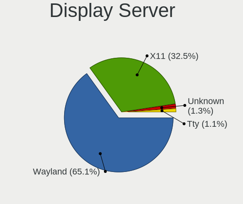

| Name    | Computers | Percent |
|---------|-----------|---------|
| Wayland | 119       | 60.41%  |
| X11     | 73        | 37.06%  |
| Unknown | 3         | 1.52%   |
| Tty     | 2         | 1.02%   |

Display Manager
---------------

SDDM, LightDM, etc.

| Name    | Computers | Percent |
|---------|-----------|---------|
| GDM3    | 170       | 86.73%  |
| Unknown | 23        | 11.73%  |
| LightDM | 3         | 1.53%   |

OS Lang
-------

Language

| Lang    | Computers | Percent |
|---------|-----------|---------|
| en_US   | 77        | 39.29%  |
| de_DE   | 23        | 11.73%  |
| C       | 16        | 8.16%   |
| fr_FR   | 10        | 5.1%    |
| pt_BR   | 8         | 4.08%   |
| ru_RU   | 6         | 3.06%   |
| en_GB   | 6         | 3.06%   |
| it_IT   | 4         | 2.04%   |
| es_ES   | 4         | 2.04%   |
| en_AU   | 4         | 2.04%   |
| zh_CN   | 3         | 1.53%   |
| tr_TR   | 2         | 1.02%   |
| sv_SE   | 2         | 1.02%   |
| en_CA   | 2         | 1.02%   |
| de_CH   | 2         | 1.02%   |
| cs_CZ   | 2         | 1.02%   |
| ca_ES   | 2         | 1.02%   |
| bg_BG   | 2         | 1.02%   |
| ro_RO   | 1         | 0.51%   |
| pt_PT   | 1         | 0.51%   |
| pl_PL   | 1         | 0.51%   |
| lt_LT   | 1         | 0.51%   |
| ko_KR   | 1         | 0.51%   |
| hu_HU   | 1         | 0.51%   |
| hr_HR   | 1         | 0.51%   |
| fa_IR   | 1         | 0.51%   |
| et_EE   | 1         | 0.51%   |
| es_MX   | 1         | 0.51%   |
| es_CR   | 1         | 0.51%   |
| es_CL   | 1         | 0.51%   |
| es_AR   | 1         | 0.51%   |
| en_ZA   | 1         | 0.51%   |
| en_SG   | 1         | 0.51%   |
| en_NZ   | 1         | 0.51%   |
| en_IL   | 1         | 0.51%   |
| el_GR   | 1         | 0.51%   |
| de_AT   | 1         | 0.51%   |
| da_DK   | 1         | 0.51%   |
| Unknown | 1         | 0.51%   |

Boot Mode
---------

EFI or BIOS

| Mode | Computers | Percent |
|------|-----------|---------|
| BIOS | 114       | 58.46%  |
| EFI  | 81        | 41.54%  |

Filesystem
----------

Type of filesystem

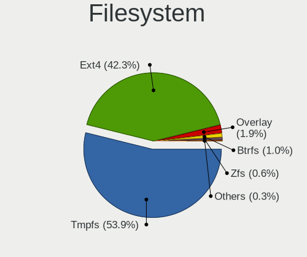

| Type    | Computers | Percent |
|---------|-----------|---------|
| Ext4    | 106       | 54.36%  |
| Tmpfs   | 74        | 37.95%  |
| Overlay | 7         | 3.59%   |
| Zfs     | 4         | 2.05%   |
| Btrfs   | 4         | 2.05%   |

Part. scheme
------------

Scheme of partitioning

| Type    | Computers | Percent |
|---------|-----------|---------|
| GPT     | 166       | 84.69%  |
| Unknown | 20        | 10.2%   |
| MBR     | 10        | 5.1%    |

Dual Boot with Linux/BSD
------------------------

Hosting more than one Linux/BSD

| Dual boot | Computers | Percent |
|-----------|-----------|---------|
| No        | 173       | 88.72%  |
| Yes       | 22        | 11.28%  |

Dual Boot (Win)
---------------

Hosting Linux and Windows

| Dual boot | Computers | Percent |
|-----------|-----------|---------|
| No        | 127       | 64.8%   |
| Yes       | 69        | 35.2%   |

Board
-----

Vendor
------

Motherboard manufacturer

| Name                           | Computers | Percent |
|--------------------------------|-----------|---------|
| Lenovo                         | 36        | 18.46%  |
| ASUSTek Computer               | 27        | 13.85%  |
| Dell                           | 23        | 11.79%  |
| Hewlett-Packard                | 20        | 10.26%  |
| Acer                           | 14        | 7.18%   |
| MSI                            | 13        | 6.67%   |
| Apple                          | 10        | 5.13%   |
| HUAWEI                         | 7         | 3.59%   |
| Gigabyte Technology            | 7         | 3.59%   |
| Samsung Electronics            | 4         | 2.05%   |
| ASRock                         | 4         | 2.05%   |
| Shanghai Zhaoxin Semiconductor | 3         | 1.54%   |
| Raspberry Pi Foundation        | 2         | 1.03%   |
| Microsoft                      | 2         | 1.03%   |
| Intel                          | 2         | 1.03%   |
| Hampoo                         | 2         | 1.03%   |
| Fujitsu                        | 2         | 1.03%   |
| Unknown                        | 2         | 1.03%   |
| Timi                           | 1         | 0.51%   |
| Shuttle                        | 1         | 0.51%   |
| Semp Toshiba                   | 1         | 0.51%   |
| Notebook                       | 1         | 0.51%   |
| Medion                         | 1         | 0.51%   |
| ICL                            | 1         | 0.51%   |
| Google                         | 1         | 0.51%   |
| Gateway                        | 1         | 0.51%   |
| Fujitsu Siemens                | 1         | 0.51%   |
| Fanless Mini PC                | 1         | 0.51%   |
| Crusaders Corporate (Pty)      | 1         | 0.51%   |
| Colorful Technology            | 1         | 0.51%   |
| Biostar                        | 1         | 0.51%   |
| BESSTAR Tech                   | 1         | 0.51%   |
| AZW                            | 1         | 0.51%   |

Model
-----

Motherboard model

| Name                                     | Computers | Percent |
|------------------------------------------|-----------|---------|
| Shanghai Zhaoxin ZXE CRB                 | 3         | 1.54%   |
| MSI Modern 14 A10M                       | 2         | 1.03%   |
| Intel NUC10i7FNH                         | 2         | 1.03%   |
| HUAWEI CREM-WXX9                         | 2         | 1.03%   |
| HUAWEI BOM-WXX9                          | 2         | 1.03%   |
| Hampoo I1D6_C109S_Hi10Pro                | 2         | 1.03%   |
| Dell Latitude E5470                      | 2         | 1.03%   |
| Apple MacBookPro9,2                      | 2         | 1.03%   |
| Unknown                                  | 2         | 1.03%   |
| Timi RedmiBook 15                        | 1         | 0.51%   |
| Shuttle XS35V4                           | 1         | 0.51%   |
| Semp Toshiba IS 1413G                    | 1         | 0.51%   |
| Samsung SBB-DA                           | 1         | 0.51%   |
| Samsung 930X2K/931X2K                    | 1         | 0.51%   |
| Samsung 767XCL                           | 1         | 0.51%   |
| Samsung 370E4K                           | 1         | 0.51%   |
| RPi Raspberry Pi 4 Model B Rev 1.4       | 1         | 0.51%   |
| RPi Raspberry Pi                         | 1         | 0.51%   |
| Notebook NP5x_NP6x_NP7xRNJ_RNH           | 1         | 0.51%   |
| MSI Raider GE67HX 12UGS                  | 1         | 0.51%   |
| MSI PE60 6QE                             | 1         | 0.51%   |
| MSI MS-7D99                              | 1         | 0.51%   |
| MSI MS-7C96                              | 1         | 0.51%   |
| MSI MS-7C83                              | 1         | 0.51%   |
| MSI MS-7C09                              | 1         | 0.51%   |
| MSI MS-7B38                              | 1         | 0.51%   |
| MSI MS-7B18                              | 1         | 0.51%   |
| MSI MS-7922                              | 1         | 0.51%   |
| MSI MS-7846                              | 1         | 0.51%   |
| MSI Katana GF66 12UGS                    | 1         | 0.51%   |
| Microsoft Surface Pro                    | 1         | 0.51%   |
| Microsoft Surface Laptop Go              | 1         | 0.51%   |
| Medion E16402                            | 1         | 0.51%   |
| Lenovo Yoga 7 14ITL5 82BH                | 1         | 0.51%   |
| Lenovo V15 G2 IJL 82QY                   | 1         | 0.51%   |
| Lenovo ThinkPad X260 20F5002NAU          | 1         | 0.51%   |
| Lenovo ThinkPad X220 4286A44             | 1         | 0.51%   |
| Lenovo ThinkPad X1 Carbon 5th 20HR000MUS | 1         | 0.51%   |
| Lenovo ThinkPad X1 Carbon 4th 20FCS2L300 | 1         | 0.51%   |
| Lenovo ThinkPad T431s 20AA0016GE         | 1         | 0.51%   |

Model Family
------------

Motherboard model prefix

| Name                 | Computers | Percent |
|----------------------|-----------|---------|
| Lenovo ThinkPad      | 13        | 6.67%   |
| Acer Aspire          | 9         | 4.62%   |
| Dell Latitude        | 7         | 3.59%   |
| Dell Inspiron        | 7         | 3.59%   |
| Lenovo IdeaPad       | 6         | 3.08%   |
| HP Pavilion          | 5         | 2.56%   |
| ASUS VivoBook        | 5         | 2.56%   |
| Dell XPS             | 4         | 2.05%   |
| ASUS TUF             | 4         | 2.05%   |
| Shanghai Zhaoxin ZXE | 3         | 1.54%   |
| Lenovo ThinkCentre   | 3         | 1.54%   |
| Lenovo Legion        | 3         | 1.54%   |
| Lenovo IdeaCentre    | 3         | 1.54%   |
| ASUS ZenBook         | 3         | 1.54%   |
| Acer Swift           | 3         | 1.54%   |
| RPi Raspberry        | 2         | 1.03%   |
| MSI Modern           | 2         | 1.03%   |
| Microsoft Surface    | 2         | 1.03%   |
| Lenovo IdeaPadFlex   | 2         | 1.03%   |
| Intel NUC10i7FNH     | 2         | 1.03%   |
| HUAWEI CREM-WXX9     | 2         | 1.03%   |
| HUAWEI BOM-WXX9      | 2         | 1.03%   |
| HP ProBook           | 2         | 1.03%   |
| HP Laptop            | 2         | 1.03%   |
| HP EliteBook         | 2         | 1.03%   |
| Hampoo I1D6          | 2         | 1.03%   |
| Fujitsu ESPRIMO      | 2         | 1.03%   |
| Dell OptiPlex        | 2         | 1.03%   |
| ASUS PRIME           | 2         | 1.03%   |
| ASUS ASUS            | 2         | 1.03%   |
| Apple MacBookPro9    | 2         | 1.03%   |
| Unknown              | 2         | 1.03%   |
| Timi RedmiBook       | 1         | 0.51%   |
| Shuttle XS35V4       | 1         | 0.51%   |
| Semp Toshiba IS      | 1         | 0.51%   |
| Samsung SBB-DA       | 1         | 0.51%   |
| Samsung 930X2K       | 1         | 0.51%   |
| Samsung 767XCL       | 1         | 0.51%   |
| Samsung 370E4K       | 1         | 0.51%   |
| Notebook NP5x        | 1         | 0.51%   |

MFG Year
--------

Motherboard manufacture year

| Year    | Computers | Percent |
|---------|-----------|---------|
| 2021    | 37        | 18.97%  |
| 2020    | 26        | 13.33%  |
| 2022    | 20        | 10.26%  |
| 2015    | 13        | 6.67%   |
| 2011    | 13        | 6.67%   |
| 2019    | 12        | 6.15%   |
| 2016    | 11        | 5.64%   |
| 2014    | 10        | 5.13%   |
| 2018    | 9         | 4.62%   |
| 2013    | 9         | 4.62%   |
| 2017    | 7         | 3.59%   |
| 2012    | 7         | 3.59%   |
| 2010    | 6         | 3.08%   |
| 2023    | 4         | 2.05%   |
| Unknown | 4         | 2.05%   |
| 2009    | 3         | 1.54%   |
| 2008    | 2         | 1.03%   |
| 2007    | 1         | 0.51%   |
| 2006    | 1         | 0.51%   |

Form Factor
-----------

Physical design of the computer

| Name           | Computers | Percent |
|----------------|-----------|---------|
| Notebook       | 120       | 61.54%  |
| Desktop        | 50        | 25.64%  |
| Convertible    | 6         | 3.08%   |
| Mini pc        | 6         | 3.08%   |
| All in one     | 6         | 3.08%   |
| Tablet         | 4         | 2.05%   |
| System on chip | 3         | 1.54%   |

Secure Boot
-----------

Enabled or disabled

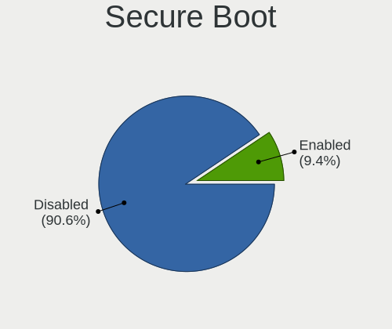

| State    | Computers | Percent |
|----------|-----------|---------|
| Disabled | 179       | 91.79%  |
| Enabled  | 16        | 8.21%   |

Coreboot
--------

Have coreboot on board

| Used | Computers | Percent |
|------|-----------|---------|
| No   | 194       | 99.49%  |
| Yes  | 1         | 0.51%   |

RAM Size
--------

Total RAM memory

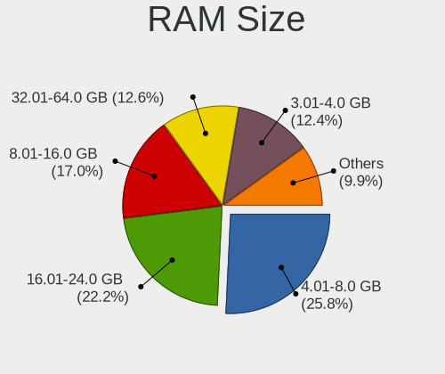

| Size in GB  | Computers | Percent |
|-------------|-----------|---------|
| 4.01-8.0    | 59        | 30.26%  |
| 16.01-24.0  | 44        | 22.56%  |
| 3.01-4.0    | 27        | 13.85%  |
| 8.01-16.0   | 27        | 13.85%  |
| 32.01-64.0  | 16        | 8.21%   |
| 24.01-32.0  | 12        | 6.15%   |
| 64.01-256.0 | 8         | 4.1%    |
| 1.01-2.0    | 2         | 1.03%   |

RAM Used
--------

Used RAM memory

| Used GB    | Computers | Percent |
|------------|-----------|---------|
| 2.01-3.0   | 73        | 37.06%  |
| 1.01-2.0   | 44        | 22.34%  |
| 4.01-8.0   | 41        | 20.81%  |
| 3.01-4.0   | 29        | 14.72%  |
| 8.01-16.0  | 8         | 4.06%   |
| 24.01-32.0 | 1         | 0.51%   |
| 0.51-1.0   | 1         | 0.51%   |

Total Drives
------------

Number of drives on board

| Drives | Computers | Percent |
|--------|-----------|---------|
| 1      | 126       | 64.62%  |
| 2      | 47        | 24.1%   |
| 3      | 8         | 4.1%    |
| 4      | 7         | 3.59%   |
| 5      | 3         | 1.54%   |
| 6      | 2         | 1.03%   |
| 8      | 1         | 0.51%   |
| 0      | 1         | 0.51%   |

Has CD-ROM
----------

Has CD-ROM on board

| Presented | Computers | Percent |
|-----------|-----------|---------|
| No        | 148       | 75.9%   |
| Yes       | 47        | 24.1%   |

Has Ethernet
------------

Has Ethernet on board

| Presented | Computers | Percent |
|-----------|-----------|---------|
| Yes       | 143       | 73.33%  |
| No        | 52        | 26.67%  |

Has WiFi
--------

Has WiFi module

| Presented | Computers | Percent |
|-----------|-----------|---------|
| Yes       | 165       | 84.62%  |
| No        | 30        | 15.38%  |

Has Bluetooth
-------------

Has Bluetooth module

| Presented | Computers | Percent |
|-----------|-----------|---------|
| Yes       | 144       | 73.85%  |
| No        | 51        | 26.15%  |

Location
--------

Country
-------

Geographic location (country)

| Country      | Computers | Percent |
|--------------|-----------|---------|
| USA          | 27        | 13.85%  |
| Germany      | 25        | 12.82%  |
| France       | 12        | 6.15%   |
| Brazil       | 12        | 6.15%   |
| Russia       | 10        | 5.13%   |
| China        | 7         | 3.59%   |
| Australia    | 6         | 3.08%   |
| Spain        | 5         | 2.56%   |
| Italy        | 5         | 2.56%   |
| Canada       | 5         | 2.56%   |
| UK           | 4         | 2.05%   |
| Sweden       | 4         | 2.05%   |
| India        | 4         | 2.05%   |
| Austria      | 4         | 2.05%   |
| Turkey       | 3         | 1.54%   |
| Romania      | 3         | 1.54%   |
| Portugal     | 3         | 1.54%   |
| Norway       | 3         | 1.54%   |
| Netherlands  | 3         | 1.54%   |
| Finland      | 3         | 1.54%   |
| Czechia      | 3         | 1.54%   |
| Belgium      | 3         | 1.54%   |
| Vietnam      | 2         | 1.03%   |
| Mexico       | 2         | 1.03%   |
| Israel       | 2         | 1.03%   |
| Ireland      | 2         | 1.03%   |
| Iran         | 2         | 1.03%   |
| Greece       | 2         | 1.03%   |
| Colombia     | 2         | 1.03%   |
| Belarus      | 2         | 1.03%   |
| UAE          | 1         | 0.51%   |
| Switzerland  | 1         | 0.51%   |
| South Korea  | 1         | 0.51%   |
| South Africa | 1         | 0.51%   |
| Slovenia     | 1         | 0.51%   |
| Singapore    | 1         | 0.51%   |
| Serbia       | 1         | 0.51%   |
| Puerto Rico  | 1         | 0.51%   |
| Poland       | 1         | 0.51%   |
| New Zealand  | 1         | 0.51%   |

City
----

Geographic location (city)

| City              | Computers | Percent |
|-------------------|-----------|---------|
| Sao Paulo         | 4         | 2.05%   |
| Frankfurt am Main | 4         | 2.05%   |
| Denver            | 3         | 1.54%   |
| Tehran            | 2         | 1.03%   |
| St Petersburg     | 2         | 1.03%   |
| Shenzhen          | 2         | 1.03%   |
| Paris             | 2         | 1.03%   |
| Oslo              | 2         | 1.03%   |
| Orenburg          | 2         | 1.03%   |
| Kalsdorf bei Graz | 2         | 1.03%   |
| Fortaleza         | 2         | 1.03%   |
| Dublin            | 2         | 1.03%   |
| Da Nang           | 2         | 1.03%   |
| Brussels          | 2         | 1.03%   |
| Berlin            | 2         | 1.03%   |
| Barcelona         | 2         | 1.03%   |
| Zheleznovodskiy   | 1         | 0.51%   |
| Zaandam           | 1         | 0.51%   |
| Wuhan             | 1         | 0.51%   |
| Winterthur        | 1         | 0.51%   |
| Walsall           | 1         | 0.51%   |
| Voronezh          | 1         | 0.51%   |
| Vitebsk           | 1         | 0.51%   |
| Visakhapatnam     | 1         | 0.51%   |
| Via del Mar     | 1         | 0.51%   |
| Victoria          | 1         | 0.51%   |
| Ufa               | 1         | 0.51%   |
| Uberlndia       | 1         | 0.51%   |
| Turda             | 1         | 0.51%   |
| Toronto           | 1         | 0.51%   |
| Thorofare         | 1         | 0.51%   |
| The Hague         | 1         | 0.51%   |
| Terre Haute       | 1         | 0.51%   |
| Tauranga          | 1         | 0.51%   |
| Tampere           | 1         | 0.51%   |
| Tampa             | 1         | 0.51%   |
| Sydney            | 1         | 0.51%   |
| Stow              | 1         | 0.51%   |
| Stockholm         | 1         | 0.51%   |
| Stenungsund       | 1         | 0.51%   |

Drives
------

Drive Vendor
------------

Hard drive vendors

| Vendor                      | Computers | Drives | Percent |
|-----------------------------|-----------|--------|---------|
| Samsung Electronics         | 45        | 55     | 16.48%  |
| WDC                         | 34        | 43     | 12.45%  |
| Seagate                     | 28        | 37     | 10.26%  |
| Kingston                    | 20        | 22     | 7.33%   |
| Sandisk                     | 18        | 23     | 6.59%   |
| Toshiba                     | 14        | 14     | 5.13%   |
| SK hynix                    | 13        | 13     | 4.76%   |
| KIOXIA                      | 11        | 11     | 4.03%   |
| Intel                       | 11        | 12     | 4.03%   |
| Unknown                     | 9         | 10     | 3.3%    |
| China                       | 7         | 7      | 2.56%   |
| Micron Technology           | 6         | 6      | 2.2%    |
| Phison Electronics          | 5         | 5      | 1.83%   |
| Hitachi                     | 5         | 5      | 1.83%   |
| Apple                       | 5         | 5      | 1.83%   |
| Crucial                     | 4         | 4      | 1.47%   |
| Kingston Technology Company | 3         | 4      | 1.1%    |
| Realtek Semiconductor       | 2         | 2      | 0.73%   |
| Phison                      | 2         | 2      | 0.73%   |
| Patriot                     | 2         | 2      | 0.73%   |
| LITEON                      | 2         | 2      | 0.73%   |
| YMTC                        | 1         | 1      | 0.37%   |
| Yangtze Memory Technologies | 1         | 1      | 0.37%   |
| XrayDisk                    | 1         | 1      | 0.37%   |
| Union Memory                | 1         | 1      | 0.37%   |
| UMIS                        | 1         | 1      | 0.37%   |
| Team                        | 1         | 1      | 0.37%   |
| SSSTC                       | 1         | 1      | 0.37%   |
| Solid State Storage         | 1         | 1      | 0.37%   |
| Smartbuy                    | 1         | 2      | 0.37%   |
| Silicon Motion              | 1         | 1      | 0.37%   |
| S3+                         | 1         | 1      | 0.37%   |
| Realtek                     | 1         | 1      | 0.37%   |
| PNY                         | 1         | 1      | 0.37%   |
| Pioneer                     | 1         | 1      | 0.37%   |
| OWC                         | 1         | 2      | 0.37%   |
| Neo                         | 1         | 2      | 0.37%   |
| MAXIO Technology (Hangzhou) | 1         | 1      | 0.37%   |
| Lenovo                      | 1         | 1      | 0.37%   |
| KIOXIA-EXCERIA              | 1         | 1      | 0.37%   |

Drive Model
-----------

Hard drive models

| Model                                                 | Computers | Percent |
|-------------------------------------------------------|-----------|---------|
| Kingston SA400S37240G 240GB SSD                       | 7         | 2.41%   |
| Samsung NVMe SSD Controller SM981/PM981/PM983 1TB     | 6         | 2.06%   |
| Seagate ST1000DM010-2EP102 1TB                        | 4         | 1.37%   |
| WDC WDS240G2G0A-00JH30 240GB SSD                      | 3         | 1.03%   |
| WDC WD10EZEX-22MFCA0 1TB                              | 3         | 1.03%   |
| Toshiba MQ01ABF050 500GB                              | 3         | 1.03%   |
| Seagate ST3500418AS 500GB                             | 3         | 1.03%   |
| Samsung SSD 870 EVO 500GB                             | 3         | 1.03%   |
| Samsung NVMe SSD Controller PM9A1/PM9A3/980PRO 2TB    | 3         | 1.03%   |
| Phison E12 NVMe Controller 512GB                      | 3         | 1.03%   |
| KIOXIA KBG40ZNV512G 512GB                             | 3         | 1.03%   |
| Kingston SA400S37480G 480GB SSD                       | 3         | 1.03%   |
| China 256GB SSD                                       | 3         | 1.03%   |
| WDC WD80EFAX-68KNBN0 8TB                              | 2         | 0.69%   |
| WDC WD10EZEX-08WN4A0 1TB                              | 2         | 0.69%   |
| Unknown MMC Card  64GB                                | 2         | 0.69%   |
| Toshiba MQ04ABF100 1TB                                | 2         | 0.69%   |
| Seagate ST2000LM007-1R8174 2TB                        | 2         | 0.69%   |
| Seagate ST1000LM035-1RK172 970GB                      | 2         | 0.69%   |
| Seagate ST1000LM024 HN-M101MBB 1TB                    | 2         | 0.69%   |
| Seagate ST1000DM003-1SB10C 1TB                        | 2         | 0.69%   |
| Seagate ST1000DM003-1CH162 1TB                        | 2         | 0.69%   |
| Sandisk WD Blue SN550 NVMe SSD 1024GB                 | 2         | 0.69%   |
| Sandisk WD Black 2018/SN750 / PC SN720 NVMe SSD 500GB | 2         | 0.69%   |
| SanDisk SD8SB8U-128G-1016 128GB SSD                   | 2         | 0.69%   |
| SanDisk NVMe SSD Drive 1TB                            | 2         | 0.69%   |
| Samsung SSD 990 PRO 1TB                               | 2         | 0.69%   |
| Samsung SSD 980 1TB                                   | 2         | 0.69%   |
| Samsung SSD 850 EVO 250GB                             | 2         | 0.69%   |
| Samsung NVMe SSD Controller SM961/PM961/SM963 500GB   | 2         | 0.69%   |
| Phison PS5013 E13 NVMe Controller 500GB               | 2         | 0.69%   |
| KIOXIA KBG40ZNV256G 256GB                             | 2         | 0.69%   |
| Kingston Company SNV2S2000G 2TB                       | 2         | 0.69%   |
| Kingston SA400S37960G 960GB SSD                       | 2         | 0.69%   |
| Intel SSDPEKNU512GZ 512GB                             | 2         | 0.69%   |
| YMTC PC005 512GB                                      | 1         | 0.34%   |
| Yangtze Memory ZHITAI TiPlus5000 1TB                  | 1         | 0.34%   |
| XrayDisk 1TB SSD                                      | 1         | 0.34%   |
| WDC WDS500G2B0B-00YS70 500GB SSD                      | 1         | 0.34%   |
| WDC WDS100T2G0A-00JH30 1TB SSD                        | 1         | 0.34%   |

HDD Vendor
----------

Hard disk drive vendors

| Vendor              | Computers | Drives | Percent |
|---------------------|-----------|--------|---------|
| Seagate             | 28        | 37     | 40%     |
| WDC                 | 21        | 28     | 30%     |
| Toshiba             | 9         | 9      | 12.86%  |
| Hitachi             | 5         | 5      | 7.14%   |
| Samsung Electronics | 2         | 2      | 2.86%   |
| Apple               | 2         | 2      | 2.86%   |
| JMicron Technology  | 1         | 1      | 1.43%   |
| HGST HTS            | 1         | 1      | 1.43%   |
| HGST                | 1         | 1      | 1.43%   |

SSD Vendor
----------

Solid state drive vendors

| Vendor              | Computers | Drives | Percent |
|---------------------|-----------|--------|---------|
| Kingston            | 18        | 20     | 21.18%  |
| Samsung Electronics | 17        | 19     | 20%     |
| WDC                 | 8         | 8      | 9.41%   |
| China               | 7         | 7      | 8.24%   |
| SanDisk             | 5         | 5      | 5.88%   |
| Intel               | 4         | 4      | 4.71%   |
| Crucial             | 3         | 3      | 3.53%   |
| SK hynix            | 2         | 2      | 2.35%   |
| Patriot             | 2         | 2      | 2.35%   |
| Micron Technology   | 2         | 2      | 2.35%   |
| LITEON              | 2         | 2      | 2.35%   |
| Apple               | 2         | 2      | 2.35%   |
| XrayDisk            | 1         | 1      | 1.18%   |
| Toshiba             | 1         | 1      | 1.18%   |
| Team                | 1         | 1      | 1.18%   |
| Smartbuy            | 1         | 2      | 1.18%   |
| S3+                 | 1         | 1      | 1.18%   |
| PNY                 | 1         | 1      | 1.18%   |
| Pioneer             | 1         | 1      | 1.18%   |
| OWC                 | 1         | 2      | 1.18%   |
| Neo                 | 1         | 2      | 1.18%   |
| KIOXIA-EXCERIA      | 1         | 1      | 1.18%   |
| KingDian            | 1         | 1      | 1.18%   |
| Intenso             | 1         | 1      | 1.18%   |
| A-DATA Technology   | 1         | 1      | 1.18%   |

Drive Kind
----------

HDD or SSD

| Kind    | Computers | Drives | Percent |
|---------|-----------|--------|---------|
| NVMe    | 104       | 124    | 41.43%  |
| SSD     | 74        | 92     | 29.48%  |
| HDD     | 63        | 86     | 25.1%   |
| MMC     | 9         | 10     | 3.59%   |
| Unknown | 1         | 2      | 0.4%    |

Drive Connector
---------------

SATA, SAS, NVMe, etc.

| Type | Computers | Drives | Percent |
|------|-----------|--------|---------|
| SATA | 110       | 168    | 47.41%  |
| NVMe | 104       | 123    | 44.83%  |
| SAS  | 9         | 13     | 3.88%   |
| MMC  | 9         | 10     | 3.88%   |

Drive Size
----------

Size of hard drive

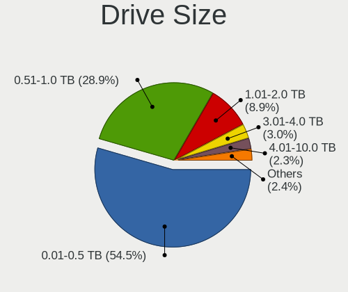

| Size in TB | Computers | Drives | Percent |
|------------|-----------|--------|---------|
| 0.01-0.5   | 80        | 104    | 58.39%  |
| 0.51-1.0   | 44        | 57     | 32.12%  |
| 1.01-2.0   | 6         | 6      | 4.38%   |
| 4.01-10.0  | 3         | 4      | 2.19%   |
| 3.01-4.0   | 2         | 5      | 1.46%   |
| 2.01-3.0   | 1         | 1      | 0.73%   |
| 10.01-20.0 | 1         | 1      | 0.73%   |

Space Total
-----------

Amount of disk space available on the file system

| Size in GB     | Computers | Percent |
|----------------|-----------|---------|
| 101-250        | 60        | 30.61%  |
| 251-500        | 53        | 27.04%  |
| 501-1000       | 40        | 20.41%  |
| 1-20           | 16        | 8.16%   |
| 51-100         | 9         | 4.59%   |
| 1001-2000      | 6         | 3.06%   |
| 21-50          | 5         | 2.55%   |
| 2001-3000      | 3         | 1.53%   |
| More than 3000 | 2         | 1.02%   |
| Unknown        | 2         | 1.02%   |

Space Used
----------

Amount of used disk space

| Used GB        | Computers | Percent |
|----------------|-----------|---------|
| 1-20           | 68        | 34.52%  |
| 21-50          | 48        | 24.37%  |
| 101-250        | 29        | 14.72%  |
| 51-100         | 24        | 12.18%  |
| 251-500        | 15        | 7.61%   |
| 501-1000       | 8         | 4.06%   |
| 1001-2000      | 2         | 1.02%   |
| Unknown        | 2         | 1.02%   |
| More than 3000 | 1         | 0.51%   |

Malfunc. Drives
---------------

Drive models with a malfunction

| Model                                   | Computers | Drives | Percent |
|-----------------------------------------|-----------|--------|---------|
| WDC WD10EZEX-22MFCA0 1TB                | 1         | 2      | 20%     |
| SK hynix BC711 HFM001TD3JX013N 1TB      | 1         | 1      | 20%     |
| Neo Forza NFS121SA312-6007000 120GB SSD | 1         | 2      | 20%     |
| Hitachi HDS721010CLA332 1TB             | 1         | 1      | 20%     |
| Gigabyte Technology GP-GM30512G-G 512GB | 1         | 1      | 20%     |

Malfunc. Drive Vendor
---------------------

Vendors of faulty drives

| Vendor              | Computers | Drives | Percent |
|---------------------|-----------|--------|---------|
| WDC                 | 1         | 2      | 20%     |
| SK hynix            | 1         | 1      | 20%     |
| Neo                 | 1         | 2      | 20%     |
| Hitachi             | 1         | 1      | 20%     |
| Gigabyte Technology | 1         | 1      | 20%     |

Malfunc. HDD Vendor
-------------------

Vendors of faulty HDD drives

| Vendor  | Computers | Drives | Percent |
|---------|-----------|--------|---------|
| WDC     | 1         | 2      | 50%     |
| Hitachi | 1         | 1      | 50%     |

Malfunc. Drive Kind
-------------------

Kinds of faulty drives

| Kind | Computers | Drives | Percent |
|------|-----------|--------|---------|
| NVMe | 2         | 2      | 40%     |
| HDD  | 2         | 3      | 40%     |
| SSD  | 1         | 2      | 20%     |

Failed Drives
-------------

Failed drive models

| Model                   | Computers | Drives | Percent |
|-------------------------|-----------|--------|---------|
| KingDian S400 120GB SSD | 1         | 1      | 100%    |

Failed Drive Vendor
-------------------

Failed drive vendors

| Vendor   | Computers | Drives | Percent |
|----------|-----------|--------|---------|
| KingDian | 1         | 1      | 100%    |

Drive Status
------------

Number of failed and malfunc. drives

| Status   | Computers | Drives | Percent |
|----------|-----------|--------|---------|
| Detected | 128       | 210    | 64.32%  |
| Works    | 66        | 96     | 33.17%  |
| Malfunc  | 4         | 7      | 2.01%   |
| Failed   | 1         | 1      | 0.5%    |

Storage controller
------------------

Storage Vendor
--------------

Storage controller vendors

| Vendor                         | Computers | Percent |
|--------------------------------|-----------|---------|
| Intel                          | 119       | 44.57%  |
| AMD                            | 34        | 12.73%  |
| Samsung Electronics            | 30        | 11.24%  |
| SanDisk                        | 20        | 7.49%   |
| SK hynix                       | 11        | 4.12%   |
| KIOXIA                         | 10        | 3.75%   |
| Phison Electronics             | 7         | 2.62%   |
| Toshiba America Info Systems   | 5         | 1.87%   |
| Kingston Technology Company    | 5         | 1.87%   |
| Micron Technology              | 4         | 1.5%    |
| Zhaoxin                        | 3         | 1.12%   |
| Realtek Semiconductor          | 3         | 1.12%   |
| Yangtze Memory Technologies    | 2         | 0.75%   |
| Union Memory (Shenzhen)        | 2         | 0.75%   |
| Solid State Storage Technology | 2         | 0.75%   |
| ASMedia Technology             | 2         | 0.75%   |
| Silicon Motion                 | 1         | 0.37%   |
| Nvidia                         | 1         | 0.37%   |
| Micron/Crucial Technology      | 1         | 0.37%   |
| MAXIO Technology (Hangzhou)    | 1         | 0.37%   |
| Marvell Technology Group       | 1         | 0.37%   |
| Lenovo                         | 1         | 0.37%   |
| JMicron Technology             | 1         | 0.37%   |
| INNOGRIT                       | 1         | 0.37%   |

Storage Model
-------------

Storage controller models

| Model                                                                          | Computers | Percent |
|--------------------------------------------------------------------------------|-----------|---------|
| AMD FCH SATA Controller [AHCI mode]                                            | 24        | 8.22%   |
| Intel Volume Management Device NVMe RAID Controller                            | 16        | 5.48%   |
| Samsung NVMe SSD Controller SM981/PM981/PM983                                  | 9         | 3.08%   |
| KIOXIA NVMe SSD Controller BG4                                                 | 9         | 3.08%   |
| Intel Sunrise Point-LP SATA Controller [AHCI mode]                             | 9         | 3.08%   |
| Intel 6 Series/C200 Series Chipset Family 6 port Mobile SATA AHCI Controller   | 9         | 3.08%   |
| Samsung NVMe SSD Controller PM9A1/PM9A3/980PRO                                 | 7         | 2.4%    |
| Samsung NVMe SSD Controller 980                                                | 7         | 2.4%    |
| Intel Cannon Lake Mobile PCH SATA AHCI Controller                              | 6         | 2.05%   |
| Intel 82801 Mobile SATA Controller [RAID mode]                                 | 6         | 2.05%   |
| SK hynix Gold P31/PC711 NVMe Solid State Drive                                 | 5         | 1.71%   |
| SanDisk WD Black SN750 / PC SN730 NVMe SSD                                     | 5         | 1.71%   |
| Intel Wildcat Point-LP SATA Controller [AHCI Mode]                             | 5         | 1.71%   |
| Intel Tiger Lake-LP SATA Controller                                            | 5         | 1.71%   |
| Intel 8 Series/C220 Series Chipset Family 6-port SATA Controller 1 [AHCI mode] | 5         | 1.71%   |
| Intel 7 Series Chipset Family 6-port SATA Controller [AHCI mode]               | 5         | 1.71%   |
| Samsung NVMe SSD Controller SM961/PM961/SM963                                  | 4         | 1.37%   |
| Micron NVMe Storage Controller                                                 | 4         | 1.37%   |
| Intel Non-Volatile memory controller                                           | 4         | 1.37%   |
| Intel Comet Lake SATA AHCI Controller                                          | 4         | 1.37%   |
| AMD SB7x0/SB8x0/SB9x0 IDE Controller                                           | 4         | 1.37%   |
| Zhaoxin ZX-100/ZX-200/KX-6000/KX-6000G StorX AHCI Controller                   | 3         | 1.03%   |
| SanDisk WD Blue SN550 NVMe SSD                                                 | 3         | 1.03%   |
| SanDisk WD Black SN770 NVMe SSD                                                | 3         | 1.03%   |
| SanDisk WD Black 2018/SN750 / PC SN720 NVMe SSD                                | 3         | 1.03%   |
| SanDisk Non-Volatile memory controller                                         | 3         | 1.03%   |
| Phison PS5013 E13 NVMe Controller                                              | 3         | 1.03%   |
| Phison E12 NVMe Controller                                                     | 3         | 1.03%   |
| Kingston Company Company Non-Volatile memory controller                        | 3         | 1.03%   |
| Intel Q170/Q150/B150/H170/H110/Z170/CM236 Chipset SATA Controller [AHCI Mode]  | 3         | 1.03%   |
| Intel Alder Lake-S PCH SATA Controller [AHCI Mode]                             | 3         | 1.03%   |
| Intel Alder Lake-P SATA AHCI Controller                                        | 3         | 1.03%   |
| Intel 9 Series Chipset Family SATA Controller [AHCI Mode]                      | 3         | 1.03%   |
| Intel 6 Series/C200 Series Chipset Family 6 port Desktop SATA AHCI Controller  | 3         | 1.03%   |
| Intel 400 Series Chipset Family SATA AHCI Controller                           | 3         | 1.03%   |
| Intel 200 Series PCH SATA controller [AHCI mode]                               | 3         | 1.03%   |
| AMD SB7x0/SB8x0/SB9x0 SATA Controller [AHCI mode]                              | 3         | 1.03%   |
| AMD 500 Series Chipset SATA Controller                                         | 3         | 1.03%   |
| Union Memory (Shenzhen) Non-Volatile memory controller                         | 2         | 0.68%   |
| Toshiba America Info Systems XG6 NVMe SSD Controller                           | 2         | 0.68%   |

Storage Kind
------------

Kind of storage controller (IDE, SATA, NVMe, SAS, ...)

| Kind | Computers | Percent |
|------|-----------|---------|
| SATA | 135       | 49.27%  |
| NVMe | 104       | 37.96%  |
| RAID | 24        | 8.76%   |
| IDE  | 11        | 4.01%   |

Processor
---------

CPU Vendor
----------

Processor vendors

| Vendor        | Computers | Percent |
|---------------|-----------|---------|
| Intel         | 143       | 73.33%  |
| AMD           | 46        | 23.59%  |
| CentaurHauls  | 3         | 1.54%   |
| ARM           | 2         | 1.03%   |
| sifive,u74-mc | 1         | 0.51%   |

CPU Model
---------

Processor models

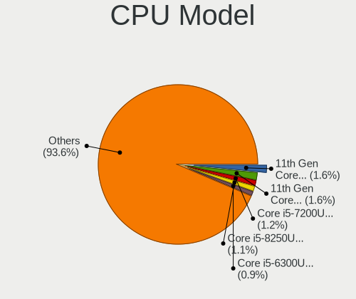

| Model                                          | Computers | Percent |
|------------------------------------------------|-----------|---------|
| Intel 11th Gen Core i7-1165G7 @ 2.80GHz        | 8         | 4.1%    |
| Intel Core i7-6600U CPU @ 2.60GHz              | 4         | 2.05%   |
| Intel Core i5-10210U CPU @ 1.60GHz             | 4         | 2.05%   |
| AMD Ryzen 5 5500U with Radeon Graphics         | 4         | 2.05%   |
| Intel Core i7-6700HQ CPU @ 2.60GHz             | 3         | 1.54%   |
| Intel Core i7-2630QM CPU @ 2.00GHz             | 3         | 1.54%   |
| Intel Core i5-3470 CPU @ 3.20GHz               | 3         | 1.54%   |
| Intel Core i5-1035G1 CPU @ 1.00GHz             | 3         | 1.54%   |
| Intel 11th Gen Core i7-11370H @ 3.30GHz        | 3         | 1.54%   |
| Intel 11th Gen Core i3-1115G4 @ 3.00GHz        | 3         | 1.54%   |
| CentaurHauls ZHAOXIN KaiXian KX-6640MA@2.2+GHz | 3         | 1.54%   |
| AMD Ryzen 7 5800H with Radeon Graphics         | 3         | 1.54%   |
| Intel Core i7-9750H CPU @ 2.60GHz              | 2         | 1.03%   |
| Intel Core i7-8750H CPU @ 2.20GHz              | 2         | 1.03%   |
| Intel Core i7-8565U CPU @ 1.80GHz              | 2         | 1.03%   |
| Intel Core i7-7500U CPU @ 2.70GHz              | 2         | 1.03%   |
| Intel Core i7-4790 CPU @ 3.60GHz               | 2         | 1.03%   |
| Intel Core i7-10875H CPU @ 2.30GHz             | 2         | 1.03%   |
| Intel Core i7-10710U CPU @ 1.10GHz             | 2         | 1.03%   |
| Intel Core i5-5200U CPU @ 2.20GHz              | 2         | 1.03%   |
| Intel Core i5-4690 CPU @ 3.50GHz               | 2         | 1.03%   |
| Intel Core i5-2520M CPU @ 2.50GHz              | 2         | 1.03%   |
| Intel Core i3-10100 CPU @ 3.60GHz              | 2         | 1.03%   |
| Intel Core i3 CPU M 380 @ 2.53GHz              | 2         | 1.03%   |
| Intel Atom x5-Z8350 CPU @ 1.44GHz              | 2         | 1.03%   |
| Intel 11th Gen Core i7-1185G7 @ 3.00GHz        | 2         | 1.03%   |
| Intel 11th Gen Core i5-1135G7 @ 2.40GHz        | 2         | 1.03%   |
| ARM Processor                                  | 2         | 1.03%   |
| AMD Ryzen 9 7950X 16-Core Processor            | 2         | 1.03%   |
| AMD Ryzen 9 7900X 12-Core Processor            | 2         | 1.03%   |
| AMD Ryzen 7 5825U with Radeon Graphics         | 2         | 1.03%   |
| AMD Ryzen 7 4700U with Radeon Graphics         | 2         | 1.03%   |
| AMD Ryzen 5 5500                               | 2         | 1.03%   |
| AMD Phenom II X4 965 Processor                 | 2         | 1.03%   |
| sifive,u74-mc rv64imafdc                       | 1         | 0.51%   |
| Intel Xeon CPU X5690 @ 3.47GHz                 | 1         | 0.51%   |
| Intel Xeon CPU E3-1220 v3 @ 3.10GHz            | 1         | 0.51%   |
| Intel Pentium Silver N5030 CPU @ 1.10GHz       | 1         | 0.51%   |
| Intel Pentium CPU N3710 @ 1.60GHz              | 1         | 0.51%   |
| Intel Pentium CPU N3530 @ 2.16GHz              | 1         | 0.51%   |

CPU Model Family
----------------

Processor model prefix

| Model                | Computers | Percent |
|----------------------|-----------|---------|
| Other                | 42        | 21.54%  |
| Intel Core i7        | 40        | 20.51%  |
| Intel Core i5        | 39        | 20%     |
| AMD Ryzen 5          | 13        | 6.67%   |
| AMD Ryzen 7          | 11        | 5.64%   |
| Intel Core 2 Duo     | 8         | 4.1%    |
| AMD Ryzen 9          | 7         | 3.59%   |
| Intel Core i3        | 6         | 3.08%   |
| Intel Celeron        | 5         | 2.56%   |
| Intel Pentium        | 3         | 1.54%   |
| AMD A10              | 3         | 1.54%   |
| Intel Xeon           | 2         | 1.03%   |
| Intel Atom           | 2         | 1.03%   |
| AMD Ryzen 5 PRO      | 2         | 1.03%   |
| AMD Phenom II X4     | 2         | 1.03%   |
| Intel Pentium Silver | 1         | 0.51%   |
| Intel Core M         | 1         | 0.51%   |
| Intel Core 2 Quad    | 1         | 0.51%   |
| Intel Celeron D      | 1         | 0.51%   |
| AMD Ryzen 3          | 1         | 0.51%   |
| AMD E2               | 1         | 0.51%   |
| AMD Athlon II X4     | 1         | 0.51%   |
| AMD Athlon II X3     | 1         | 0.51%   |
| AMD Athlon Dual Core | 1         | 0.51%   |
| AMD A6               | 1         | 0.51%   |

CPU Cores
---------

Number of processor cores

| Number  | Computers | Percent |
|---------|-----------|---------|
| 4       | 80        | 41.03%  |
| 2       | 52        | 26.67%  |
| 6       | 26        | 13.33%  |
| 8       | 14        | 7.18%   |
| 12      | 8         | 4.1%    |
| 16      | 4         | 2.05%   |
| 10      | 3         | 1.54%   |
| 14      | 2         | 1.03%   |
| 1       | 2         | 1.03%   |
| Unknown | 2         | 1.03%   |
| 5       | 1         | 0.51%   |
| 3       | 1         | 0.51%   |

CPU Sockets
-----------

Number of sockets

| Number  | Computers | Percent |
|---------|-----------|---------|
| 1       | 193       | 98.97%  |
| Unknown | 2         | 1.03%   |

CPU Threads
-----------

Threads per core (Hyper-Threading)

| Number  | Computers | Percent |
|---------|-----------|---------|
| 2       | 139       | 71.28%  |
| 1       | 54        | 27.69%  |
| Unknown | 2         | 1.03%   |

CPU Op-Modes
------------

CPU Operation Modes (32-bit, 64-bit)

| Op mode        | Computers | Percent |
|----------------|-----------|---------|
| 32-bit, 64-bit | 193       | 98.97%  |
| 64-bit         | 1         | 0.51%   |
| Unknown        | 1         | 0.51%   |

CPU Microcode
-------------

Microcode number

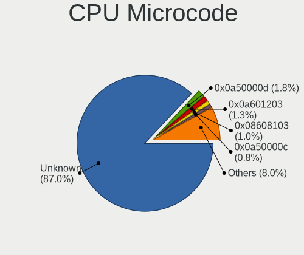

| Number     | Computers | Percent |
|------------|-----------|---------|
| Unknown    | 159       | 81.54%  |
| 0x0a50000c | 5         | 2.56%   |
| 0x08600106 | 3         | 1.54%   |
| 0x806ec    | 2         | 1.03%   |
| 0x306a9    | 2         | 1.03%   |
| 0x0a601203 | 2         | 1.03%   |
| 0x0a50000d | 2         | 1.03%   |
| 0x08608103 | 2         | 1.03%   |
| 0x010000c8 | 2         | 1.03%   |
| 0xf64      | 1         | 0.51%   |
| 0x906ea    | 1         | 0.51%   |
| 0x90675    | 1         | 0.51%   |
| 0x806eb    | 1         | 0.51%   |
| 0x806c1    | 1         | 0.51%   |
| 0x506e3    | 1         | 0.51%   |
| 0x406e3    | 1         | 0.51%   |
| 0x306d4    | 1         | 0.51%   |
| 0x306c3    | 1         | 0.51%   |
| 0x1067a    | 1         | 0.51%   |
| 0x0a404101 | 1         | 0.51%   |
| 0x0a20120a | 1         | 0.51%   |
| 0x08608104 | 1         | 0.51%   |
| 0x08108109 | 1         | 0.51%   |
| 0x0810100b | 1         | 0.51%   |
| 0x06006705 | 1         | 0.51%   |

CPU Microarch
-------------

Microarchitecture

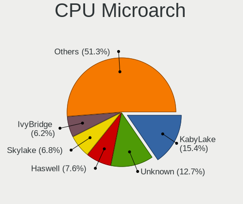

| Name             | Computers | Percent |
|------------------|-----------|---------|
| Unknown          | 28        | 14.36%  |
| KabyLake         | 26        | 13.33%  |
| TigerLake        | 19        | 9.74%   |
| Zen 3            | 12        | 6.15%   |
| Skylake          | 12        | 6.15%   |
| Haswell          | 11        | 5.64%   |
| SandyBridge      | 10        | 5.13%   |
| IvyBridge        | 9         | 4.62%   |
| Penryn           | 8         | 4.1%    |
| CometLake        | 8         | 4.1%    |
| Zen 2            | 6         | 3.08%   |
| Broadwell        | 6         | 3.08%   |
| Alderlake Hybrid | 6         | 3.08%   |
| Silvermont       | 5         | 2.56%   |
| Zen+             | 4         | 2.05%   |
| K10              | 4         | 2.05%   |
| Westmere         | 3         | 1.54%   |
| Piledriver       | 3         | 1.54%   |
| IceLake          | 3         | 1.54%   |
| Excavator        | 3         | 1.54%   |
| Goldmont plus    | 2         | 1.03%   |
| Zen              | 1         | 0.51%   |
| Tremont          | 1         | 0.51%   |
| Steamroller      | 1         | 0.51%   |
| NetBurst         | 1         | 0.51%   |
| K8 Hammer        | 1         | 0.51%   |
| Goldmont         | 1         | 0.51%   |
| Core             | 1         | 0.51%   |

Graphics
--------

GPU Vendor
----------

Vendors of graphics cards

| Vendor                     | Computers | Percent |
|----------------------------|-----------|---------|
| Intel                      | 124       | 52.1%   |
| AMD                        | 61        | 25.63%  |
| Nvidia                     | 49        | 20.59%  |
| Zhaoxin                    | 3         | 1.26%   |
| Matrox Electronics Systems | 1         | 0.42%   |

GPU Model
---------

Graphics card models

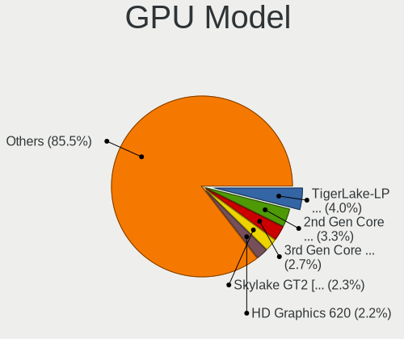

| Model                                                                                    | Computers | Percent |
|------------------------------------------------------------------------------------------|-----------|---------|
| Intel TigerLake-LP GT2 [Iris Xe Graphics]                                                | 16        | 6.64%   |
| Intel 2nd Generation Core Processor Family Integrated Graphics Controller                | 9         | 3.73%   |
| Intel Skylake GT2 [HD Graphics 520]                                                      | 6         | 2.49%   |
| Intel CoffeeLake-H GT2 [UHD Graphics 630]                                                | 6         | 2.49%   |
| AMD Cezanne [Radeon Vega Series / Radeon Vega Mobile Series]                             | 6         | 2.49%   |
| Intel CometLake-U GT2 [UHD Graphics]                                                     | 5         | 2.07%   |
| Intel 3rd Gen Core processor Graphics Controller                                         | 5         | 2.07%   |
| AMD Renoir                                                                               | 5         | 2.07%   |
| AMD Raphael                                                                              | 5         | 2.07%   |
| AMD Lucienne                                                                             | 5         | 2.07%   |
| Intel Xeon E3-1200 v3/4th Gen Core Processor Integrated Graphics Controller              | 4         | 1.66%   |
| Intel HD Graphics 5500                                                                   | 4         | 1.66%   |
| Intel HD Graphics 530                                                                    | 4         | 1.66%   |
| Intel Alder Lake-P Integrated Graphics Controller                                        | 4         | 1.66%   |
| AMD Ellesmere [Radeon RX 470/480/570/570X/580/580X/590]                                  | 4         | 1.66%   |
| Zhaoxin ZX-E C-960 GPU                                                                   | 3         | 1.24%   |
| Nvidia GP107M [GeForce GTX 1050 Mobile]                                                  | 3         | 1.24%   |
| Nvidia GA107M [GeForce RTX 3050 Ti Mobile]                                               | 3         | 1.24%   |
| Intel Xeon E3-1200 v2/3rd Gen Core processor Graphics Controller                         | 3         | 1.24%   |
| Intel Tiger Lake-LP GT2 [UHD Graphics G4]                                                | 3         | 1.24%   |
| Intel Iris Plus Graphics G1 (Ice Lake)                                                   | 3         | 1.24%   |
| Intel HD Graphics 630                                                                    | 3         | 1.24%   |
| Intel HD Graphics 620                                                                    | 3         | 1.24%   |
| Intel CometLake-H GT2 [UHD Graphics]                                                     | 3         | 1.24%   |
| Intel Atom/Celeron/Pentium Processor x5-E8000/J3xxx/N3xxx Integrated Graphics Controller | 3         | 1.24%   |
| Intel 4 Series Chipset Integrated Graphics Controller                                    | 3         | 1.24%   |
| AMD Topaz XT [Radeon R7 M260/M265 / M340/M360 / M440/M445 / 530/535 / 620/625 Mobile]    | 3         | 1.24%   |
| AMD Picasso/Raven 2 [Radeon Vega Series / Radeon Vega Mobile Series]                     | 3         | 1.24%   |
| AMD Navi 23 [Radeon RX 6600/6600 XT/6600M]                                               | 3         | 1.24%   |
| Nvidia TU117M [GeForce MX450]                                                            | 2         | 0.83%   |
| Nvidia TU116M [GeForce GTX 1660 Ti Mobile]                                               | 2         | 0.83%   |
| Nvidia GM107M [GeForce GTX 960M]                                                         | 2         | 0.83%   |
| Nvidia GA107M [GeForce RTX 3050 Mobile]                                                  | 2         | 0.83%   |
| Nvidia GA106M [GeForce RTX 3060 Mobile / Max-Q]                                          | 2         | 0.83%   |
| Nvidia GA104 [Geforce RTX 3070 Ti Laptop GPU]                                            | 2         | 0.83%   |
| Intel WhiskeyLake-U GT2 [UHD Graphics 620]                                               | 2         | 0.83%   |
| Intel UHD Graphics 620                                                                   | 2         | 0.83%   |
| Intel Mobile 4 Series Chipset Integrated Graphics Controller                             | 2         | 0.83%   |
| Intel JasperLake [UHD Graphics]                                                          | 2         | 0.83%   |
| Intel Haswell-ULT Integrated Graphics Controller                                         | 2         | 0.83%   |

GPU Combo
---------

Combinations of graphics cards

| Name           | Computers | Percent |
|----------------|-----------|---------|
| 1 x Intel      | 83        | 42.56%  |
| 1 x AMD        | 46        | 23.59%  |
| Intel + Nvidia | 32        | 16.41%  |
| 1 x Nvidia     | 12        | 6.15%   |
| Intel + AMD    | 7         | 3.59%   |
| AMD + Nvidia   | 5         | 2.56%   |
| Other          | 3         | 1.54%   |
| 2 x AMD        | 3         | 1.54%   |
| 1 x Zhaoxin    | 3         | 1.54%   |
| 1 x Matrox     | 1         | 0.51%   |

GPU Driver
----------

Free vs proprietary

| Driver      | Computers | Percent |
|-------------|-----------|---------|
| Free        | 159       | 81.54%  |
| Proprietary | 26        | 13.33%  |
| Unknown     | 10        | 5.13%   |

GPU Memory
----------

Total video memory

| Size in GB | Computers | Percent |
|------------|-----------|---------|
| Unknown    | 157       | 80.51%  |
| 0.01-0.5   | 14        | 7.18%   |
| 1.01-2.0   | 11        | 5.64%   |
| 3.01-4.0   | 6         | 3.08%   |
| 7.01-8.0   | 2         | 1.03%   |
| 5.01-6.0   | 2         | 1.03%   |
| 0.51-1.0   | 2         | 1.03%   |
| 16.01-24.0 | 1         | 0.51%   |

Monitor
-------

Monitor Vendor
--------------

Monitor vendors

| Vendor               | Computers | Percent |
|----------------------|-----------|---------|
| BOE                  | 29        | 14.08%  |
| Chimei Innolux       | 22        | 10.68%  |
| AU Optronics         | 20        | 9.71%   |
| Samsung Electronics  | 15        | 7.28%   |
| LG Display           | 15        | 7.28%   |
| Goldstar             | 12        | 5.83%   |
| Dell                 | 8         | 3.88%   |
| Hewlett-Packard      | 7         | 3.4%    |
| Apple                | 7         | 3.4%    |
| Acer                 | 6         | 2.91%   |
| Sharp                | 5         | 2.43%   |
| PANDA                | 5         | 2.43%   |
| Lenovo               | 5         | 2.43%   |
| ViewSonic            | 4         | 1.94%   |
| CSO                  | 4         | 1.94%   |
| Philips              | 3         | 1.46%   |
| InfoVision           | 3         | 1.46%   |
| Iiyama               | 3         | 1.46%   |
| BenQ                 | 3         | 1.46%   |
| AOC                  | 3         | 1.46%   |
| Ancor Communications | 3         | 1.46%   |
| Denver               | 2         | 0.97%   |
| ASUSTek Computer     | 2         | 0.97%   |
| WST                  | 1         | 0.49%   |
| Unknown              | 1         | 0.49%   |
| Sony                 | 1         | 0.49%   |
| SANYO                | 1         | 0.49%   |
| Panasonic            | 1         | 0.49%   |
| NECCI                | 1         | 0.49%   |
| NEC Computers        | 1         | 0.49%   |
| MSI                  | 1         | 0.49%   |
| MiTAC                | 1         | 0.49%   |
| Medion Akoya         | 1         | 0.49%   |
| LG Philips           | 1         | 0.49%   |
| HUAWEI               | 1         | 0.49%   |
| HKM                  | 1         | 0.49%   |
| Hannspree            | 1         | 0.49%   |
| Gigabyte Technology  | 1         | 0.49%   |
| Fujitsu Siemens      | 1         | 0.49%   |
| FAY                  | 1         | 0.49%   |

Monitor Model
-------------

Monitor models

| Model                                                                 | Computers | Percent |
|-----------------------------------------------------------------------|-----------|---------|
| Chimei Innolux LCD Monitor CMN14D5 1920x1080 309x173mm 13.9-inch      | 3         | 1.43%   |
| LG Display LCD Monitor LGD0555 2736x1824 260x173mm 12.3-inch          | 2         | 0.95%   |
| Goldstar FULL HD GSM5B55 1920x1080 480x270mm 21.7-inch                | 2         | 0.95%   |
| Chimei Innolux LCD Monitor CMN1604 1920x1080 355x199mm 16.0-inch      | 2         | 0.95%   |
| Chimei Innolux LCD Monitor CMN15E7 1920x1080 344x193mm 15.5-inch      | 2         | 0.95%   |
| BOE LCD Monitor BOE092F 2520x1680 338x226mm 16.0-inch                 | 2         | 0.95%   |
| BOE LCD Monitor BOE0872 1920x1080 344x194mm 15.5-inch                 | 2         | 0.95%   |
| AU Optronics LCD Monitor AUO5799 1920x1080 344x194mm 15.5-inch        | 2         | 0.95%   |
| WST LCD Monitor WST1560 1920x1080 344x194mm 15.5-inch                 | 1         | 0.48%   |
| ViewSonic VX2235wm VSC591E 1680x1050 474x296mm 22.0-inch              | 1         | 0.48%   |
| ViewSonic VP2768-4k VSC9636 3840x2160 597x336mm 27.0-inch             | 1         | 0.48%   |
| ViewSonic VP2756-2K VSCE63B 2560x1440 597x336mm 27.0-inch             | 1         | 0.48%   |
| ViewSonic VA2702w VSCE727 1920x1080 598x336mm 27.0-inch               | 1         | 0.48%   |
| Unknown SMART TV 0563 1920x1080 1209x680mm 54.6-inch                  | 1         | 0.48%   |
| Sony TV SNY4502 1920x1080                                             | 1         | 0.48%   |
| Sharp LQ156M1JW26 SHP1559 1920x1080 344x194mm 15.5-inch               | 1         | 0.48%   |
| Sharp LCD Monitor SHP14FA 3840x2400 288x180mm 13.4-inch               | 1         | 0.48%   |
| Sharp LCD Monitor SHP14D0 3840x2400 336x210mm 15.6-inch               | 1         | 0.48%   |
| Sharp LCD Monitor SHP149A 1920x1080 344x194mm 15.5-inch               | 1         | 0.48%   |
| Sharp LCD Monitor SHP144A 3200x1800 294x165mm 13.3-inch               | 1         | 0.48%   |
| SANYO LCD-42S SAN0A28 1920x540 708x398mm 32.0-inch                    | 1         | 0.48%   |
| Samsung Electronics U28E590 SAM0C4E 3840x2160 608x345mm 27.5-inch     | 1         | 0.48%   |
| Samsung Electronics S24F350 SAM0D20 1920x1080 521x293mm 23.5-inch     | 1         | 0.48%   |
| Samsung Electronics S22F350 SAM0D1A 1920x1080 477x268mm 21.5-inch     | 1         | 0.48%   |
| Samsung Electronics LS27AG32x SAM71DC 1920x1080 597x336mm 27.0-inch   | 1         | 0.48%   |
| Samsung Electronics LCD Monitor SEC5443 1920x1200 331x207mm 15.4-inch | 1         | 0.48%   |
| Samsung Electronics LCD Monitor SDC5441 1366x768 344x193mm 15.5-inch  | 1         | 0.48%   |
| Samsung Electronics LCD Monitor SDC4852 1366x768 344x194mm 15.5-inch  | 1         | 0.48%   |
| Samsung Electronics LCD Monitor SDC4179 2560x1440 344x194mm 15.5-inch | 1         | 0.48%   |
| Samsung Electronics LCD Monitor SDC4172 2880x1800 289x186mm 13.5-inch | 1         | 0.48%   |
| Samsung Electronics LCD Monitor SDC4161 1920x1080 344x194mm 15.5-inch | 1         | 0.48%   |
| Samsung Electronics LCD Monitor SDC3030 2560x1600 262x164mm 12.2-inch | 1         | 0.48%   |
| Samsung Electronics LCD Monitor C32JG5x 2560x1440                     | 1         | 0.48%   |
| Samsung Electronics LC27T55 SAM701E 1920x1080 609x349mm 27.6-inch     | 1         | 0.48%   |
| Samsung Electronics C32F391 SAM0D34 1920x1080 698x393mm 31.5-inch     | 1         | 0.48%   |
| Samsung Electronics C27F390 SAM0D32 1920x1080 598x336mm 27.0-inch     | 1         | 0.48%   |
| Philips PHL 284E5 PHLC0DE 1920x1080 621x341mm 27.9-inch               | 1         | 0.48%   |
| Philips PHL 243V7 PHLC155 1920x1080 527x296mm 23.8-inch               | 1         | 0.48%   |
| Philips PHL 241E1 PHLC207 1920x1080 527x296mm 23.8-inch               | 1         | 0.48%   |
| PANDA LCD Monitor NCP0057 1920x1080 344x194mm 15.5-inch               | 1         | 0.48%   |

Monitor Resolution
------------------

Monitor screen resolution

| Resolution         | Computers | Percent |
|--------------------|-----------|---------|
| 1920x1080 (FHD)    | 94        | 48.45%  |
| 1366x768 (WXGA)    | 24        | 12.37%  |
| 3840x2160 (4K)     | 17        | 8.76%   |
| 2560x1440 (QHD)    | 13        | 6.7%    |
| 1600x900 (HD+)     | 8         | 4.12%   |
| 1440x900 (WXGA+)   | 5         | 2.58%   |
| 1920x1200 (WUXGA)  | 4         | 2.06%   |
| 3440x1440          | 3         | 1.55%   |
| 2880x1800          | 3         | 1.55%   |
| 2560x1600          | 3         | 1.55%   |
| 1680x1050 (WSXGA+) | 3         | 1.55%   |
| 1280x800 (WXGA)    | 3         | 1.55%   |
| 3840x2400          | 2         | 1.03%   |
| 2736x1824          | 2         | 1.03%   |
| 2520x1680          | 2         | 1.03%   |
| 1920x540           | 2         | 1.03%   |
| 3840x1600          | 1         | 0.52%   |
| 3200x1800 (QHD+)   | 1         | 0.52%   |
| 2256x1504          | 1         | 0.52%   |
| 1920x1280          | 1         | 0.52%   |
| 1280x1024 (SXGA)   | 1         | 0.52%   |
| 1024x768 (XGA)     | 1         | 0.52%   |

Monitor Diagonal
----------------

Diagonal size in inches

| Inches  | Computers | Percent |
|---------|-----------|---------|
| 15      | 56        | 26.92%  |
| 13      | 21        | 10.1%   |
| 14      | 18        | 8.65%   |
| 27      | 17        | 8.17%   |
| 21      | 15        | 7.21%   |
| 24      | 12        | 5.77%   |
| 23      | 10        | 4.81%   |
| 17      | 8         | 3.85%   |
| 16      | 8         | 3.85%   |
| 31      | 6         | 2.88%   |
| 20      | 6         | 2.88%   |
| 12      | 6         | 2.88%   |
| Unknown | 3         | 1.44%   |
| 72      | 2         | 0.96%   |
| 34      | 2         | 0.96%   |
| 26      | 2         | 0.96%   |
| 22      | 2         | 0.96%   |
| 19      | 2         | 0.96%   |
| 63      | 1         | 0.48%   |
| 54      | 1         | 0.48%   |
| 52      | 1         | 0.48%   |
| 49      | 1         | 0.48%   |
| 42      | 1         | 0.48%   |
| 40      | 1         | 0.48%   |
| 37      | 1         | 0.48%   |
| 35      | 1         | 0.48%   |
| 32      | 1         | 0.48%   |
| 25      | 1         | 0.48%   |
| 11      | 1         | 0.48%   |
| 10      | 1         | 0.48%   |

Monitor Width
-------------

Physical width

| Width in mm | Computers | Percent |
|-------------|-----------|---------|
| 301-350     | 89        | 43.41%  |
| 501-600     | 36        | 17.56%  |
| 401-500     | 25        | 12.2%   |
| 201-300     | 18        | 8.78%   |
| 351-400     | 12        | 5.85%   |
| 601-700     | 9         | 4.39%   |
| 1001-1500   | 4         | 1.95%   |
| 801-900     | 3         | 1.46%   |
| 701-800     | 3         | 1.46%   |
| Unknown     | 3         | 1.46%   |
| 1501-2000   | 2         | 0.98%   |
| 901-1000    | 1         | 0.49%   |

Aspect Ratio
------------

Proportional relationship between the width and the height

| Ratio   | Computers | Percent |
|---------|-----------|---------|
| 16/9    | 147       | 80.33%  |
| 16/10   | 22        | 12.02%  |
| 3/2     | 6         | 3.28%   |
| 21/9    | 4         | 2.19%   |
| Unknown | 2         | 1.09%   |
| 4/3     | 1         | 0.55%   |
| 32/9    | 1         | 0.55%   |

Monitor Area
------------

Area in inch

| Area in inch | Computers | Percent |
|----------------|-----------|---------|
| 101-110        | 60        | 28.85%  |
| 81-90          | 35        | 16.83%  |
| 201-250        | 29        | 13.94%  |
| 301-350        | 19        | 9.13%   |
| 151-200        | 13        | 6.25%   |
| 351-500        | 10        | 4.81%   |
| More than 1000 | 6         | 2.88%   |
| 71-80          | 6         | 2.88%   |
| 251-300        | 6         | 2.88%   |
| 121-130        | 5         | 2.4%    |
| 61-70          | 4         | 1.92%   |
| 111-120        | 4         | 1.92%   |
| 131-140        | 3         | 1.44%   |
| 501-1000       | 3         | 1.44%   |
| Unknown        | 3         | 1.44%   |
| 51-60          | 2         | 0.96%   |

Pixel Density
-------------

Pixels per inch

| Density       | Computers | Percent |
|---------------|-----------|---------|
| 121-160       | 72        | 35.64%  |
| 101-120       | 51        | 25.25%  |
| 51-100        | 47        | 23.27%  |
| 161-240       | 16        | 7.92%   |
| More than 240 | 9         | 4.46%   |
| 1-50          | 4         | 1.98%   |
| Unknown       | 3         | 1.49%   |

Multiple Monitors
-----------------

Total monitors connected

| Total | Computers | Percent |
|-------|-----------|---------|
| 1     | 150       | 76.92%  |
| 2     | 28        | 14.36%  |
| 0     | 14        | 7.18%   |
| 3     | 3         | 1.54%   |

Network
-------

Net Controller Vendor
---------------------

Controller vendors

| Vendor                   | Computers | Percent |
|--------------------------|-----------|---------|
| Realtek Semiconductor    | 105       | 36.71%  |
| Intel                    | 91        | 31.82%  |
| Qualcomm Atheros         | 21        | 7.34%   |
| MediaTek                 | 13        | 4.55%   |
| Broadcom                 | 13        | 4.55%   |
| TP-Link                  | 5         | 1.75%   |
| Ralink                   | 4         | 1.4%    |
| Broadcom Limited         | 4         | 1.4%    |
| ASIX Electronics         | 4         | 1.4%    |
| Ralink Technology        | 3         | 1.05%   |
| Marvell Technology Group | 3         | 1.05%   |
| DisplayLink              | 2         | 0.7%    |
| Z-Com                    | 1         | 0.35%   |
| Xiaomi                   | 1         | 0.35%   |
| Vimtron Electronics      | 1         | 0.35%   |
| Samsung Electronics      | 1         | 0.35%   |
| Nvidia                   | 1         | 0.35%   |
| NetGear                  | 1         | 0.35%   |
| MosChip Semiconductor    | 1         | 0.35%   |
| Mellanox Technologies    | 1         | 0.35%   |
| Lenovo                   | 1         | 0.35%   |
| Huawei Technologies      | 1         | 0.35%   |
| Google                   | 1         | 0.35%   |
| Edimax Technology        | 1         | 0.35%   |
| Dresden Elektronik       | 1         | 0.35%   |
| Dell                     | 1         | 0.35%   |
| D-Link System            | 1         | 0.35%   |
| AVM                      | 1         | 0.35%   |
| ASUSTek Computer         | 1         | 0.35%   |
| Aquantia                 | 1         | 0.35%   |

Net Controller Model
--------------------

Controller models

| Model                                                             | Computers | Percent |
|-------------------------------------------------------------------|-----------|---------|
| Realtek RTL8111/8168/8411 PCI Express Gigabit Ethernet Controller | 58        | 17.26%  |
| Intel Wi-Fi 6 AX201                                               | 15        | 4.46%   |
| Realtek RTL8822CE 802.11ac PCIe Wireless Network Adapter          | 13        | 3.87%   |
| Realtek RTL8153 Gigabit Ethernet Adapter                          | 9         | 2.68%   |
| Realtek RTL810xE PCI Express Fast Ethernet controller             | 9         | 2.68%   |
| Intel Wi-Fi 6 AX200                                               | 8         | 2.38%   |
| Realtek RTL8125 2.5GbE Controller                                 | 7         | 2.08%   |
| Intel Wireless 8260                                               | 7         | 2.08%   |
| Intel Wireless 7265                                               | 6         | 1.79%   |
| Intel Comet Lake PCH-LP CNVi WiFi                                 | 6         | 1.79%   |
| Intel Alder Lake-P PCH CNVi WiFi                                  | 6         | 1.79%   |
| MediaTek MT7921 802.11ax PCI Express Wireless Network Adapter     | 5         | 1.49%   |
| Intel Ethernet Connection I219-LM                                 | 5         | 1.49%   |
| Intel 82579LM Gigabit Network Connection (Lewisville)             | 5         | 1.49%   |
| Realtek RTL8821CE 802.11ac PCIe Wireless Network Adapter          | 4         | 1.19%   |
| Qualcomm Atheros QCA9377 802.11ac Wireless Network Adapter        | 4         | 1.19%   |
| MediaTek MT7922 802.11ax PCI Express Wireless Network Adapter     | 4         | 1.19%   |
| ASIX AX88179 Gigabit Ethernet                                     | 4         | 1.19%   |
| Realtek RTL88x2bu [AC1200 Techkey]                                | 3         | 0.89%   |
| Realtek RTL8852BE PCIe 802.11ax Wireless Network Controller       | 3         | 0.89%   |
| Qualcomm Atheros QCA9565 / AR9565 Wireless Network Adapter        | 3         | 0.89%   |
| Qualcomm Atheros QCA6174 802.11ac Wireless Network Adapter        | 3         | 0.89%   |
| Intel Wireless 3165                                               | 3         | 0.89%   |
| Intel Ethernet Controller I225-V                                  | 3         | 0.89%   |
| Intel Comet Lake PCH CNVi WiFi                                    | 3         | 0.89%   |
| Intel Cannon Point-LP CNVi [Wireless-AC]                          | 3         | 0.89%   |
| Intel Cannon Lake PCH CNVi WiFi                                   | 3         | 0.89%   |
| Broadcom NetXtreme BCM57765 Gigabit Ethernet PCIe                 | 3         | 0.89%   |
| Realtek RTL8822BE 802.11a/b/g/n/ac WiFi adapter                   | 2         | 0.6%    |
| Realtek RTL8723BE PCIe Wireless Network Adapter                   | 2         | 0.6%    |
| Realtek PCIe GbE Family Controller                                | 2         | 0.6%    |
| Ralink MT7601U Wireless Adapter                                   | 2         | 0.6%    |
| Qualcomm Atheros AR9462 Wireless Network Adapter                  | 2         | 0.6%    |
| Qualcomm Atheros AR9285 Wireless Network Adapter (PCI-Express)    | 2         | 0.6%    |
| MediaTek MT7921K (RZ608) Wi-Fi 6E 80MHz                           | 2         | 0.6%    |
| Marvell Group 88E8058 PCI-E Gigabit Ethernet Controller           | 2         | 0.6%    |
| Intel I211 Gigabit Network Connection                             | 2         | 0.6%    |
| Intel Ethernet Connection I217-LM                                 | 2         | 0.6%    |
| Intel Ethernet Connection (10) I219-V                             | 2         | 0.6%    |
| Intel Centrino Ultimate-N 6300                                    | 2         | 0.6%    |

Wireless Vendor
---------------

Wireless vendors

| Vendor                   | Computers | Percent |
|--------------------------|-----------|---------|
| Intel                    | 78        | 45.09%  |
| Realtek Semiconductor    | 35        | 20.23%  |
| Qualcomm Atheros         | 18        | 10.4%   |
| MediaTek                 | 12        | 6.94%   |
| Broadcom                 | 9         | 5.2%    |
| TP-Link                  | 5         | 2.89%   |
| Ralink                   | 4         | 2.31%   |
| Ralink Technology        | 3         | 1.73%   |
| Broadcom Limited         | 2         | 1.16%   |
| Z-Com                    | 1         | 0.58%   |
| NetGear                  | 1         | 0.58%   |
| Marvell Technology Group | 1         | 0.58%   |
| Edimax Technology        | 1         | 0.58%   |
| D-Link System            | 1         | 0.58%   |
| AVM                      | 1         | 0.58%   |
| ASUSTek Computer         | 1         | 0.58%   |

Wireless Model
--------------

Wireless models

| Model                                                          | Computers | Percent |
|----------------------------------------------------------------|-----------|---------|
| Intel Wi-Fi 6 AX201                                            | 15        | 8.52%   |
| Realtek RTL8822CE 802.11ac PCIe Wireless Network Adapter       | 13        | 7.39%   |
| Intel Wi-Fi 6 AX200                                            | 8         | 4.55%   |
| Intel Wireless 8260                                            | 7         | 3.98%   |
| Intel Wireless 7265                                            | 6         | 3.41%   |
| Intel Comet Lake PCH-LP CNVi WiFi                              | 6         | 3.41%   |
| Intel Alder Lake-P PCH CNVi WiFi                               | 6         | 3.41%   |
| MediaTek MT7921 802.11ax PCI Express Wireless Network Adapter  | 5         | 2.84%   |
| Realtek RTL8821CE 802.11ac PCIe Wireless Network Adapter       | 4         | 2.27%   |
| Qualcomm Atheros QCA9377 802.11ac Wireless Network Adapter     | 4         | 2.27%   |
| MediaTek MT7922 802.11ax PCI Express Wireless Network Adapter  | 4         | 2.27%   |
| Realtek RTL88x2bu [AC1200 Techkey]                             | 3         | 1.7%    |
| Realtek RTL8852BE PCIe 802.11ax Wireless Network Controller    | 3         | 1.7%    |
| Qualcomm Atheros QCA9565 / AR9565 Wireless Network Adapter     | 3         | 1.7%    |
| Qualcomm Atheros QCA6174 802.11ac Wireless Network Adapter     | 3         | 1.7%    |
| Intel Wireless 3165                                            | 3         | 1.7%    |
| Intel Comet Lake PCH CNVi WiFi                                 | 3         | 1.7%    |
| Intel Cannon Point-LP CNVi [Wireless-AC]                       | 3         | 1.7%    |
| Intel Cannon Lake PCH CNVi WiFi                                | 3         | 1.7%    |
| Realtek RTL8822BE 802.11a/b/g/n/ac WiFi adapter                | 2         | 1.14%   |
| Realtek RTL8723BE PCIe Wireless Network Adapter                | 2         | 1.14%   |
| Ralink MT7601U Wireless Adapter                                | 2         | 1.14%   |
| Qualcomm Atheros AR9462 Wireless Network Adapter               | 2         | 1.14%   |
| Qualcomm Atheros AR9285 Wireless Network Adapter (PCI-Express) | 2         | 1.14%   |
| MediaTek MT7921K (RZ608) Wi-Fi 6E 80MHz                        | 2         | 1.14%   |
| Intel Centrino Ultimate-N 6300                                 | 2         | 1.14%   |
| Intel Alder Lake-S PCH CNVi WiFi                               | 2         | 1.14%   |
| Broadcom BCM4331 802.11a/b/g/n                                 | 2         | 1.14%   |
| Broadcom BCM4321 802.11a/b/g/n                                 | 2         | 1.14%   |
| Z-Com XG-703A 802.11g Wireless Adapter [Intersil ISL3887]      | 1         | 0.57%   |
| TP-Link TL-WN821N v5/v6 [RTL8192EU]                            | 1         | 0.57%   |
| TP-Link Archer T4U ver.3                                       | 1         | 0.57%   |
| TP-Link Archer T2U PLUS [RTL8821AU]                            | 1         | 0.57%   |
| TP-Link AC600 wireless Realtek RTL8811AU [Archer T2U Nano]     | 1         | 0.57%   |
| TP-Link 802.11n NIC                                            | 1         | 0.57%   |
| Realtek RTL8852AE WiFi 6 802.11ax PCIe Adapter                 | 1         | 0.57%   |
| Realtek RTL8852AE 802.11ax PCIe Wireless Network Adapter       | 1         | 0.57%   |
| Realtek RTL8812AU 802.11a/b/g/n/ac 2T2R DB WLAN Adapter        | 1         | 0.57%   |
| Realtek RTL8192EE PCIe Wireless Network Adapter                | 1         | 0.57%   |
| Realtek RTL8191SEvA Wireless LAN Controller                    | 1         | 0.57%   |

Ethernet Vendor
---------------

Ethernet vendors

| Vendor                   | Computers | Percent |
|--------------------------|-----------|---------|
| Realtek Semiconductor    | 87        | 56.49%  |
| Intel                    | 36        | 23.38%  |
| Broadcom                 | 6         | 3.9%    |
| Qualcomm Atheros         | 4         | 2.6%    |
| ASIX Electronics         | 4         | 2.6%    |
| Marvell Technology Group | 2         | 1.3%    |
| DisplayLink              | 2         | 1.3%    |
| Broadcom Limited         | 2         | 1.3%    |
| Xiaomi                   | 1         | 0.65%   |
| Vimtron Electronics      | 1         | 0.65%   |
| TP-Link                  | 1         | 0.65%   |
| Samsung Electronics      | 1         | 0.65%   |
| Nvidia                   | 1         | 0.65%   |
| MosChip Semiconductor    | 1         | 0.65%   |
| Mellanox Technologies    | 1         | 0.65%   |
| MediaTek                 | 1         | 0.65%   |
| Lenovo                   | 1         | 0.65%   |
| Google                   | 1         | 0.65%   |
| Aquantia                 | 1         | 0.65%   |

Ethernet Model
--------------

Ethernet models

| Model                                                             | Computers | Percent |
|-------------------------------------------------------------------|-----------|---------|
| Realtek RTL8111/8168/8411 PCI Express Gigabit Ethernet Controller | 58        | 36.94%  |
| Realtek RTL8153 Gigabit Ethernet Adapter                          | 9         | 5.73%   |
| Realtek RTL810xE PCI Express Fast Ethernet controller             | 9         | 5.73%   |
| Realtek RTL8125 2.5GbE Controller                                 | 7         | 4.46%   |
| Intel Ethernet Connection I219-LM                                 | 5         | 3.18%   |
| Intel 82579LM Gigabit Network Connection (Lewisville)             | 5         | 3.18%   |
| ASIX AX88179 Gigabit Ethernet                                     | 4         | 2.55%   |
| Intel Ethernet Controller I225-V                                  | 3         | 1.91%   |
| Broadcom NetXtreme BCM57765 Gigabit Ethernet PCIe                 | 3         | 1.91%   |
| Realtek PCIe GbE Family Controller                                | 2         | 1.27%   |
| Marvell Group 88E8058 PCI-E Gigabit Ethernet Controller           | 2         | 1.27%   |
| Intel I211 Gigabit Network Connection                             | 2         | 1.27%   |
| Intel Ethernet Connection I217-LM                                 | 2         | 1.27%   |
| Intel Ethernet Connection (10) I219-V                             | 2         | 1.27%   |
| Intel 82579V Gigabit Network Connection                           | 2         | 1.27%   |
| Intel 82567LM Gigabit Network Connection                          | 2         | 1.27%   |
| Broadcom Limited NetLink BCM57780 Gigabit Ethernet PCIe           | 2         | 1.27%   |
| Xiaomi Mi/Redmi series (RNDIS)                                    | 1         | 0.64%   |
| Vimtron Mobile Composite Device Bus                               | 1         | 0.64%   |
| TP-Link UE300 10/100/1000 LAN (ethernet mode) [Realtek RTL8153]   | 1         | 0.64%   |
| Samsung Galaxy series, misc. (tethering mode)                     | 1         | 0.64%   |
| Realtek RTL-8100/8101L/8139 PCI Fast Ethernet Adapter             | 1         | 0.64%   |
| Realtek Killer E3000 2.5GbE Controller                            | 1         | 0.64%   |
| Realtek Killer E2600 Gigabit Ethernet Controller                  | 1         | 0.64%   |
| Realtek Killer E2500 Gigabit Ethernet Controller                  | 1         | 0.64%   |
| Qualcomm Atheros QCA8171 Gigabit Ethernet                         | 1         | 0.64%   |
| Qualcomm Atheros Killer E2400 Gigabit Ethernet Controller         | 1         | 0.64%   |
| Qualcomm Atheros AR8161 Gigabit Ethernet                          | 1         | 0.64%   |
| Qualcomm Atheros AR8151 v2.0 Gigabit Ethernet                     | 1         | 0.64%   |
| Nvidia MCP79 Ethernet                                             | 1         | 0.64%   |
| MosChip MCS7830 10/100 Mbps Ethernet adapter                      | 1         | 0.64%   |
| Mellanox MT26448 [ConnectX EN 10GigE, PCIe 2.0 5GT/s]             | 1         | 0.64%   |
| MediaTek PRESIDENT_GOLD_10                                        | 1         | 0.64%   |
| Lenovo ThinkPad TBT 3 Dock                                        | 1         | 0.64%   |
| Intel Ethernet Connection I217-V                                  | 1         | 0.64%   |
| Intel Ethernet Connection (7) I219-V                              | 1         | 0.64%   |
| Intel Ethernet Connection (7) I219-LM                             | 1         | 0.64%   |
| Intel Ethernet Connection (4) I219-LM                             | 1         | 0.64%   |
| Intel Ethernet Connection (3) I218-LM                             | 1         | 0.64%   |
| Intel Ethernet Connection (2) I219-V                              | 1         | 0.64%   |

Net Controller Kind
-------------------

Ethernet, WiFi or modem

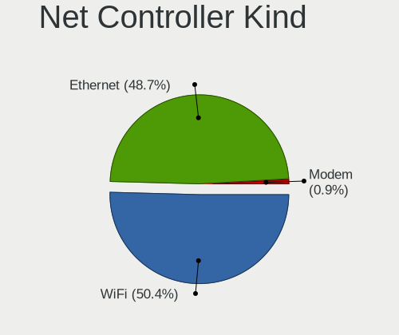

| Kind     | Computers | Percent |
|----------|-----------|---------|
| WiFi     | 165       | 52.88%  |
| Ethernet | 144       | 46.15%  |
| Modem    | 3         | 0.96%   |

Used Controller
---------------

Currently used network controller

| Kind     | Computers | Percent |
|----------|-----------|---------|
| WiFi     | 124       | 63.27%  |
| Ethernet | 72        | 36.73%  |

NICs
----

Total network controllers on board

| Total | Computers | Percent |
|-------|-----------|---------|
| 2     | 95        | 48.72%  |
| 1     | 87        | 44.62%  |
| 0     | 8         | 4.1%    |
| 3     | 5         | 2.56%   |

IPv6
----

IPv6 vs IPv4

| Used | Computers | Percent |
|------|-----------|---------|
| No   | 139       | 71.28%  |
| Yes  | 56        | 28.72%  |

Bluetooth
---------

Bluetooth Vendor
----------------

Controller vendors

| Vendor                          | Computers | Percent |
|---------------------------------|-----------|---------|
| Intel                           | 71        | 48.63%  |
| Realtek Semiconductor           | 18        | 12.33%  |
| Qualcomm Atheros Communications | 10        | 6.85%   |
| Apple                           | 8         | 5.48%   |
| Realtek                         | 7         | 4.79%   |
| IMC Networks                    | 7         | 4.79%   |
| Foxconn / Hon Hai               | 5         | 3.42%   |
| Cambridge Silicon Radio         | 5         | 3.42%   |
| MediaTek                        | 4         | 2.74%   |
| Lite-On Technology              | 2         | 1.37%   |
| Broadcom                        | 2         | 1.37%   |
| ASUSTek Computer                | 2         | 1.37%   |
| TP-Link                         | 1         | 0.68%   |
| Ralink Technology               | 1         | 0.68%   |
| Marvell Semiconductor           | 1         | 0.68%   |
| Hewlett-Packard                 | 1         | 0.68%   |
| Fujitsu                         | 1         | 0.68%   |

Bluetooth Model
---------------

Controller models

| Model                                               | Computers | Percent |
|-----------------------------------------------------|-----------|---------|
| Intel AX201 Bluetooth                               | 27        | 18.49%  |
| Intel Bluetooth wireless interface                  | 18        | 12.33%  |
| Realtek Bluetooth Radio                             | 14        | 9.59%   |
| Intel Bluetooth 9460/9560 Jefferson Peak (JfP)      | 10        | 6.85%   |
| Qualcomm Atheros  Bluetooth Device                  | 7         | 4.79%   |
| Intel AX200 Bluetooth                               | 7         | 4.79%   |
| Realtek 802.11ac WLAN Adapter                       | 6         | 4.11%   |
| Intel Bluetooth Device                              | 6         | 4.11%   |
| Cambridge Silicon Radio Bluetooth Dongle (HCI mode) | 5         | 3.42%   |
| MediaTek Wireless_Device                            | 4         | 2.74%   |
| Foxconn / Hon Hai Wireless_Device                   | 4         | 2.74%   |
| IMC Networks Wireless_Device                        | 3         | 2.05%   |
| IMC Networks Bluetooth Radio                        | 3         | 2.05%   |
| Apple Bluetooth USB Host Controller                 | 3         | 2.05%   |
| Realtek RTL8822BE Bluetooth 4.2 Adapter             | 2         | 1.37%   |
| Realtek RTL8723B Bluetooth                          | 2         | 1.37%   |
| Qualcomm Atheros AR3011 Bluetooth                   | 2         | 1.37%   |
| ASUS Broadcom BCM20702A0 Bluetooth                  | 2         | 1.37%   |
| Apple Bluetooth Host Controller                     | 2         | 1.37%   |
| Apple Bluetooth HCI                                 | 2         | 1.37%   |
| TP-Link UB500 Adapter                               | 1         | 0.68%   |
| Realtek Bluetooth Radio                             | 1         | 0.68%   |
| Ralink Motorola BC4 Bluetooth 3.0+HS Adapter        | 1         | 0.68%   |
| Qualcomm Atheros AR3012 Bluetooth 4.0               | 1         | 0.68%   |
| Marvell Bluetooth and Wireless LAN Composite        | 1         | 0.68%   |
| Lite-On Wireless_Device                             | 1         | 0.68%   |
| Lite-On Qualcomm Atheros QCA9377 Bluetooth          | 1         | 0.68%   |
| Intel Wireless-AC 9260 Bluetooth Adapter            | 1         | 0.68%   |
| Intel Centrino Bluetooth Wireless Transceiver       | 1         | 0.68%   |
| Intel AX210 Bluetooth                               | 1         | 0.68%   |
| IMC Networks BCM20702A0                             | 1         | 0.68%   |
| HP Broadcom 2070 Bluetooth Combo                    | 1         | 0.68%   |
| Fujitsu Bluetooth Device                            | 1         | 0.68%   |
| Foxconn / Hon Hai Bluetooth Device                  | 1         | 0.68%   |
| Broadcom BCM2070 Bluetooth Device                   | 1         | 0.68%   |
| Broadcom BCM2045B (BDC-2.1)                         | 1         | 0.68%   |
| Apple Built-in Bluetooth 2.0+EDR HCI                | 1         | 0.68%   |

Sound
-----

Sound Vendor
------------

Sound card vendors

| Vendor                 | Computers | Percent |
|------------------------|-----------|---------|
| Intel                  | 139       | 51.48%  |
| AMD                    | 55        | 20.37%  |
| Nvidia                 | 35        | 12.96%  |
| C-Media Electronics    | 7         | 2.59%   |
| Realtek Semiconductor  | 4         | 1.48%   |
| Logitech               | 4         | 1.48%   |
| Zhaoxin                | 3         | 1.11%   |
| GN Netcom              | 3         | 1.11%   |
| VIA Technologies       | 2         | 0.74%   |
| Texas Instruments      | 2         | 0.74%   |
| Plantronics            | 2         | 0.74%   |
| Superlux digit         | 1         | 0.37%   |
| SteelSeries ApS        | 1         | 0.37%   |
| Samsung Electronics    | 1         | 0.37%   |
| Samson Technologies    | 1         | 0.37%   |
| M-Audio                | 1         | 0.37%   |
| Lenovo                 | 1         | 0.37%   |
| JBL                    | 1         | 0.37%   |
| Huawei Technologies    | 1         | 0.37%   |
| Hewlett-Packard        | 1         | 0.37%   |
| Generalplus Technology | 1         | 0.37%   |
| DSEA A/S               | 1         | 0.37%   |
| Creative Technology    | 1         | 0.37%   |
| Bose                   | 1         | 0.37%   |
| ASUSTek Computer       | 1         | 0.37%   |

Sound Model
-----------

Sound card models

| Model                                                                      | Computers | Percent |
|----------------------------------------------------------------------------|-----------|---------|
| AMD Family 17h/19h HD Audio Controller                                     | 26        | 8%      |
| Intel Tiger Lake-LP Smart Sound Technology Audio Controller                | 19        | 5.85%   |
| AMD Renoir Radeon High Definition Audio Controller                         | 19        | 5.85%   |
| Intel Sunrise Point-LP HD Audio                                            | 13        | 4%      |
| Intel 6 Series/C200 Series Chipset Family High Definition Audio Controller | 12        | 3.69%   |
| Intel Alder Lake PCH-P High Definition Audio Controller                    | 8         | 2.46%   |
| Intel Comet Lake PCH-LP cAVS                                               | 7         | 2.15%   |
| Intel Cannon Lake PCH cAVS                                                 | 7         | 2.15%   |
| Intel 7 Series/C216 Chipset Family High Definition Audio Controller        | 7         | 2.15%   |
| Intel Wildcat Point-LP High Definition Audio Controller                    | 6         | 1.85%   |
| Intel Broadwell-U Audio Controller                                         | 6         | 1.85%   |
| Intel 100 Series/C230 Series Chipset Family HD Audio Controller            | 6         | 1.85%   |
| AMD Rembrandt Radeon High Definition Audio Controller                      | 6         | 1.85%   |
| AMD Navi 21/23 HDMI/DP Audio Controller                                    | 6         | 1.85%   |
| Intel 8 Series/C220 Series Chipset High Definition Audio Controller        | 5         | 1.54%   |
| AMD SBx00 Azalia (Intel HDA)                                               | 5         | 1.54%   |
| Realtek Semiconductor USB Audio                                            | 4         | 1.23%   |
| Nvidia GK208 HDMI/DP Audio Controller                                      | 4         | 1.23%   |
| Intel Xeon E3-1200 v3/4th Gen Core Processor HD Audio Controller           | 4         | 1.23%   |
| Intel Alder Lake-S HD Audio Controller                                     | 4         | 1.23%   |
| Intel 200 Series PCH HD Audio                                              | 4         | 1.23%   |
| AMD Raven/Raven2/Fenghuang HDMI/DP Audio Controller                        | 4         | 1.23%   |
| AMD FCH Azalia Controller                                                  | 4         | 1.23%   |
| AMD Ellesmere HDMI Audio [Radeon RX 470/480 / 570/580/590]                 | 4         | 1.23%   |
| Zhaoxin ZX-E High Definition Audio Controller                              | 3         | 0.92%   |
| Zhaoxin ZX-100/KX-5000/KX-6000/KX-6000G High Definition Audio Controller   | 3         | 0.92%   |
| Nvidia TU116 High Definition Audio Controller                              | 3         | 0.92%   |
| Nvidia GP107GL High Definition Audio Controller                            | 3         | 0.92%   |
| Nvidia GA104 High Definition Audio Controller                              | 3         | 0.92%   |
| Intel Ice Lake-LP Smart Sound Technology Audio Controller                  | 3         | 0.92%   |
| Intel Comet Lake PCH cAVS                                                  | 3         | 0.92%   |
| Intel Cannon Point-LP High Definition Audio Controller                     | 3         | 0.92%   |
| Intel 9 Series Chipset Family HD Audio Controller                          | 3         | 0.92%   |
| Intel 82801I (ICH9 Family) HD Audio Controller                             | 3         | 0.92%   |
| AMD Starship/Matisse HD Audio Controller                                   | 3         | 0.92%   |
| AMD Family 15h (Models 60h-6fh) Audio Controller                           | 3         | 0.92%   |
| VIA Technologies FX-Audio DAC-X6                                           | 2         | 0.62%   |
| Nvidia GK107 HDMI Audio Controller                                         | 2         | 0.62%   |
| Nvidia GK106 HDMI Audio Controller                                         | 2         | 0.62%   |
| Nvidia GF108 High Definition Audio Controller                              | 2         | 0.62%   |

Memory
------

Memory Vendor
-------------

Memory module vendors

| Vendor              | Computers | Percent |
|---------------------|-----------|---------|
| Samsung Electronics | 23        | 21.3%   |
| SK hynix            | 21        | 19.44%  |
| Micron Technology   | 17        | 15.74%  |
| Kingston            | 9         | 8.33%   |
| Unknown             | 7         | 6.48%   |
| Smart               | 4         | 3.7%    |
| Crucial             | 4         | 3.7%    |
| Shenzhen WODPOSIT   | 3         | 2.78%   |
| Ramaxel Technology  | 3         | 2.78%   |
| A-DATA Technology   | 3         | 2.78%   |
| G.Skill             | 2         | 1.85%   |
| Unknown (ABCD)      | 1         | 0.93%   |
| Transcend           | 1         | 0.93%   |
| Team                | 1         | 0.93%   |
| Strontium           | 1         | 0.93%   |
| Patriot Memory      | 1         | 0.93%   |
| KINGBANK            | 1         | 0.93%   |
| Juhor               | 1         | 0.93%   |
| Hewlett-Packard     | 1         | 0.93%   |
| GOODRAM             | 1         | 0.93%   |
| Gold Key            | 1         | 0.93%   |
| Corsair             | 1         | 0.93%   |
| Unknown             | 1         | 0.93%   |

Memory Model
------------

Memory module models

| Model                                                            | Computers | Percent |
|------------------------------------------------------------------|-----------|---------|
| Shenzhen WODPOSIT RAM Module 8GB SODIMM DDR4 2666MT/s            | 3         | 2.61%   |
| Micron RAM 4ATF1G64HZ-3G2E1 8GB Row Of Chips DDR4 3200MT/s       | 3         | 2.61%   |
| Unknown RAM Module 4GB DIMM 1333MT/s                             | 2         | 1.74%   |
| SK hynix RAM HMA81GS6DJR8N-XN 8GB SODIMM DDR4 3200MT/s           | 2         | 1.74%   |
| SK hynix RAM HMA81GS6AFR8N-UH 8GB SODIMM DDR4 2667MT/s           | 2         | 1.74%   |
| Samsung RAM M471A2K43CB1-CTD 16384MB SODIMM DDR4 8400MT/s        | 2         | 1.74%   |
| Micron RAM 8ATF1G64HZ-3G2R1 8GB SODIMM DDR4 3200MT/s             | 2         | 1.74%   |
| Micron RAM 4ATF1G64HZ-3G2F1 8GB SODIMM DDR4 3200MT/s             | 2         | 1.74%   |
| Kingston RAM 99P5700-042.A00G 16GB SODIMM DDR4 3200MT/s          | 2         | 1.74%   |
| Unknown RAM Module 4GB SODIMM DDR4 2667MT/s                      | 1         | 0.87%   |
| Unknown RAM Module 4GB DIMM SDRAM                                | 1         | 0.87%   |
| Unknown RAM Module 2GB SODIMM DDR2 800MT/s                       | 1         | 0.87%   |
| Unknown RAM Module 2GB Row Of Chips LPDDR4 4267MT/s              | 1         | 0.87%   |
| Unknown RAM Module 2GB DIMM DDR 533MT/s                          | 1         | 0.87%   |
| Unknown RAM Module 2GB DIMM 1333MT/s                             | 1         | 0.87%   |
| Unknown (ABCD) RAM 123456789012345678 3GB SODIMM LPDDR4 2400MT/s | 1         | 0.87%   |
| Transcend RAM JM2666HLB-8G 8GB DIMM DDR4 2667MT/s                | 1         | 0.87%   |
| Team RAM TEAMGROUP-SD4-3200 16GB SODIMM DDR4 3200MT/s            | 1         | 0.87%   |
| Strontium RAM SRT2G88S1-H9H 2GB SODIMM DDR3 1333MT/s             | 1         | 0.87%   |
| Smart RAM SH564568FH8NZPHSCG 2GB SODIMM DDR3 1333MT/s            | 1         | 0.87%   |
| Smart RAM SH564128FJ8NWRNSQR 4GB SODIMM DDR3 1600MT/s            | 1         | 0.87%   |
| Smart RAM SH564128FH8NZQNSCG 4GB SODIMM DDR3 1600MT/s            | 1         | 0.87%   |
| Smart RAM SG564568FG8NWKFSQR 2GB SODIMM DDR2 800MT/s             | 1         | 0.87%   |
| Smart RAM SF4641G8CK8IWGKSEG 8GB SODIMM DDR4 2400MT/s            | 1         | 0.87%   |
| SK hynix RAM Module 8GB SODIMM DDR4 2667MT/s                     | 1         | 0.87%   |
| SK hynix RAM Module 8GB SODIMM DDR3 1600MT/s                     | 1         | 0.87%   |
| SK hynix RAM Module 4GB Row Of Chips LPDDR4 4267MT/s             | 1         | 0.87%   |
| SK hynix RAM HMT125S6TFR8C-H9 2GB SODIMM DDR3 1334MT/s           | 1         | 0.87%   |
| SK hynix RAM HMAB2GS6AMR6N-XN 16GB SODIMM DDR4 3200MT/s          | 1         | 0.87%   |
| SK hynix RAM HMAA2GS6CJR8N-XN 16GB SODIMM DDR4 3200MT/s          | 1         | 0.87%   |
| SK hynix RAM HMAA1GS6CMR6N-XN 8GB SODIMM DDR4 3200MT/s           | 1         | 0.87%   |
| SK hynix RAM HMAA1GS6CJR6N-XN 8GB SODIMM DDR4 3200MT/s           | 1         | 0.87%   |
| SK hynix RAM HMA851S6CJR6N-VK 4GB SODIMM DDR4 2667MT/s           | 1         | 0.87%   |
| SK hynix RAM HMA82GS6DJR8N-XN 16GB SODIMM DDR4 3200MT/s          | 1         | 0.87%   |
| SK hynix RAM HMA81GU6CJR8N-VK 8GB DIMM DDR4 2400MT/s             | 1         | 0.87%   |
| SK hynix RAM HMA81GS6CJR8N-VK 8GB SODIMM DDR4 2667MT/s           | 1         | 0.87%   |
| SK hynix RAM HMA41GS6AFR8N-TF 8GB SODIMM DDR4 2667MT/s           | 1         | 0.87%   |
| SK hynix RAM HCNNNBKMMLXR-NEE 1GB Row Of Chips LPDDR4 4267MT/s   | 1         | 0.87%   |
| SK hynix RAM H9HCNNNBKMALHR-NEE 4GB Row Of Chips LPDDR4 4267MT/s | 1         | 0.87%   |
| SK hynix RAM H9CCNNNCLTMLAR-NUD 8GB Chip LPDDR3 1867MT/s         | 1         | 0.87%   |

Memory Kind
-----------

Memory module kinds

| Kind    | Computers | Percent |
|---------|-----------|---------|
| DDR4    | 59        | 61.46%  |
| DDR3    | 10        | 10.42%  |
| LPDDR4  | 8         | 8.33%   |
| DDR5    | 5         | 5.21%   |
| SDRAM   | 3         | 3.13%   |
| LPDDR3  | 3         | 3.13%   |
| DDR2    | 3         | 3.13%   |
| LPDDR5  | 2         | 2.08%   |
| Unknown | 2         | 2.08%   |
| DDR     | 1         | 1.04%   |

Memory Form Factor
------------------

Physical design of the memory module

| Name         | Computers | Percent |
|--------------|-----------|---------|
| SODIMM       | 61        | 63.54%  |
| DIMM         | 17        | 17.71%  |
| Row Of Chips | 16        | 16.67%  |
| Chip         | 2         | 2.08%   |

Memory Size
-----------

Memory module size

| Size  | Computers | Percent |
|-------|-----------|---------|
| 8192  | 46        | 43.81%  |
| 4096  | 23        | 21.9%   |
| 16384 | 21        | 20%     |
| 2048  | 9         | 8.57%   |
| 32768 | 5         | 4.76%   |
| 1024  | 1         | 0.95%   |

Memory Speed
------------

Memory module speed

| Speed   | Computers | Percent |
|---------|-----------|---------|
| 3200    | 34        | 31.78%  |
| 2667    | 18        | 16.82%  |
| 1600    | 8         | 7.48%   |
| 4267    | 6         | 5.61%   |
| 2400    | 6         | 5.61%   |
| 1333    | 4         | 3.74%   |
| 6400    | 3         | 2.8%    |
| 2666    | 3         | 2.8%    |
| 8400    | 2         | 1.87%   |
| 4800    | 2         | 1.87%   |
| 2133    | 2         | 1.87%   |
| 1867    | 2         | 1.87%   |
| 1334    | 2         | 1.87%   |
| 800     | 2         | 1.87%   |
| 6000    | 1         | 0.93%   |
| 5808    | 1         | 0.93%   |
| 4199    | 1         | 0.93%   |
| 3600    | 1         | 0.93%   |
| 3334    | 1         | 0.93%   |
| 3266    | 1         | 0.93%   |
| 3066    | 1         | 0.93%   |
| 2933    | 1         | 0.93%   |
| 2048    | 1         | 0.93%   |
| 1067    | 1         | 0.93%   |
| 667     | 1         | 0.93%   |
| 533     | 1         | 0.93%   |
| Unknown | 1         | 0.93%   |

Printers & scanners
-------------------

Printer Vendor
--------------

Printer device vendors

| Vendor              | Computers | Percent |
|---------------------|-----------|---------|
| Hewlett-Packard     | 2         | 66.67%  |
| Samsung Electronics | 1         | 33.33%  |

Printer Model
-------------

Printer device models

| Model                      | Computers | Percent |
|----------------------------|-----------|---------|
| Samsung SCX-3400 Series    | 1         | 33.33%  |
| HP DeskJet 960c            | 1         | 33.33%  |
| HP ColorLaserJet M253-M254 | 1         | 33.33%  |

Scanner Vendor
--------------

Scanner device vendors

Zero info for selected period =(

Scanner Model
-------------

Scanner device models

Zero info for selected period =(

Camera
------

Camera Vendor
-------------

Camera device vendors

| Vendor                                 | Computers | Percent |
|----------------------------------------|-----------|---------|
| Chicony Electronics                    | 30        | 23.62%  |
| IMC Networks                           | 13        | 10.24%  |
| Microdia                               | 10        | 7.87%   |
| Realtek Semiconductor                  | 9         | 7.09%   |
| Sunplus Innovation Technology          | 7         | 5.51%   |
| Apple                                  | 7         | 5.51%   |
| Quanta                                 | 6         | 4.72%   |
| Luxvisions Innotech Limited            | 6         | 4.72%   |
| Logitech                               | 6         | 4.72%   |
| Syntek                                 | 5         | 3.94%   |
| Bison Electronics                      | 5         | 3.94%   |
| Cheng Uei Precision Industry (Foxlink) | 4         | 3.15%   |
| Acer                                   | 3         | 2.36%   |
| Silicon Motion                         | 2         | 1.57%   |
| ShineTech                              | 2         | 1.57%   |
| Lite-On Technology                     | 2         | 1.57%   |
| Suyin                                  | 1         | 0.79%   |
| Sunplus Technology                     | 1         | 0.79%   |
| Sonix Technology                       | 1         | 0.79%   |
| Shine-optics                           | 1         | 0.79%   |
| Samsung Electronics                    | 1         | 0.79%   |
| Microsoft                              | 1         | 0.79%   |
| Linux Foundation HS                    | 1         | 0.79%   |
| icSpring                               | 1         | 0.79%   |
| eMeet-200611                           | 1         | 0.79%   |
| Alcor Micro                            | 1         | 0.79%   |

Camera Model
------------

Camera device models

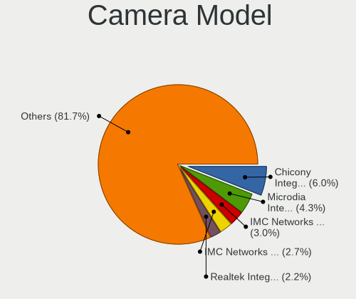

| Model                                                          | Computers | Percent |
|----------------------------------------------------------------|-----------|---------|
| Chicony integrated camera                                      | 12        | 9.45%   |
| Microdia Integrated_Webcam_HD                                  | 5         | 3.94%   |
| Quanta ov9734_techfront_camera                                 | 4         | 3.15%   |
| Luxvisions Innotech Limited HP Wide Vision HD Camera           | 4         | 3.15%   |
| IMC Networks USB2.0 HD UVC WebCam                              | 4         | 3.15%   |
| Syntek Integrated Camera                                       | 3         | 2.36%   |
| Realtek Integrated_Webcam_HD                                   | 3         | 2.36%   |
| IMC Networks USB2.0 VGA UVC WebCam                             | 3         | 2.36%   |
| IMC Networks Integrated Camera                                 | 3         | 2.36%   |
| Chicony HP HD Camera                                           | 3         | 2.36%   |
| Chicony HD WebCam                                              | 3         | 2.36%   |
| Acer Integrated Camera                                         | 3         | 2.36%   |
| Sunplus Integrated_Webcam_HD                                   | 2         | 1.57%   |
| ShineTech HD Camera                                            | 2         | 1.57%   |
| Realtek USB 2.0 Camera                                         | 2         | 1.57%   |
| Lite-On Integrated Camera                                      | 2         | 1.57%   |
| Chicony HP Wide Vision HD Camera                               | 2         | 1.57%   |
| Cheng Uei Precision Industry (Foxlink) HP TrueVision HD Camera | 2         | 1.57%   |
| Bison SunplusIT Integrated Camera                              | 2         | 1.57%   |
| Apple FaceTime HD Camera (Built-in)                            | 2         | 1.57%   |
| Apple FaceTime HD Camera                                       | 2         | 1.57%   |
| Apple Built-in iSight                                          | 2         | 1.57%   |
| Syntek Lenovo EasyCamera                                       | 1         | 0.79%   |
| Syntek EasyCamera                                              | 1         | 0.79%   |
| Suyin Integrated_Webcam_HD                                     | 1         | 0.79%   |
| Sunplus 1.3M HD WebCam                                         | 1         | 0.79%   |
| Sunplus Laptop_Integrated_Webcam_FHD                           | 1         | 0.79%   |
| Sunplus Integrated_Webcam_FHD                                  | 1         | 0.79%   |
| Sunplus HP HD Webcam [Fixed]                                   | 1         | 0.79%   |
| Sunplus FHD Camera Microphone                                  | 1         | 0.79%   |
| Sunplus Dell Integrated HD Webcam                              | 1         | 0.79%   |
| Sonix USB2.0 HD UVC WebCam                                     | 1         | 0.79%   |
| Silicon Motion ATIV VGA Camera                                 | 1         | 0.79%   |
| Silicon Motion ATIV Real HD Camera                             | 1         | 0.79%   |
| Shine-optics USB2.0 HD UVC WebCam                              | 1         | 0.79%   |
| Samsung Galaxy series, misc. (MTP mode)                        | 1         | 0.79%   |
| Realtek USB2.0 camera                                          | 1         | 0.79%   |
| Realtek USB Camera                                             | 1         | 0.79%   |
| Realtek Integrated Webcam                                      | 1         | 0.79%   |
| Realtek HD WebCam                                              | 1         | 0.79%   |

Security
--------

Fingerprint Vendor
------------------

Fingerprint sensor vendors

| Vendor                     | Computers | Percent |
|----------------------------|-----------|---------|
| Shenzhen Goodix Technology | 15        | 42.86%  |
| Validity Sensors           | 6         | 17.14%  |
| Synaptics                  | 6         | 17.14%  |
| Elan Microelectronics      | 4         | 11.43%  |
| LighTuning Technology      | 3         | 8.57%   |
| Upek                       | 1         | 2.86%   |

Fingerprint Model
-----------------

Fingerprint sensor models

| Model                                                  | Computers | Percent |
|--------------------------------------------------------|-----------|---------|
| Shenzhen Goodix  FingerPrint Device                    | 10        | 28.57%  |
| Elan ELAN:ARM-M4                                       | 4         | 11.43%  |
| Shenzhen Goodix Fingerprint Reader                     | 3         | 8.57%   |
| Validity Sensors VFS5011 Fingerprint Reader            | 2         | 5.71%   |
| Synaptics Metallica MOH Touch Fingerprint Reader       | 2         | 5.71%   |
| Shenzhen Goodix FingerPrint                            | 2         | 5.71%   |
| LighTuning EgisTec Touch Fingerprint Sensor            | 2         | 5.71%   |
| Validity Sensors VFS7500 Touch Fingerprint Sensor      | 1         | 2.86%   |
| Validity Sensors VFS495 Fingerprint Reader             | 1         | 2.86%   |
| Validity Sensors VFS 5011 fingerprint sensor           | 1         | 2.86%   |
| Validity Sensors Synaptics WBDI                        | 1         | 2.86%   |
| Upek Biometric Touchchip/Touchstrip Fingerprint Sensor | 1         | 2.86%   |
| Synaptics WBDI                                         | 1         | 2.86%   |
| Synaptics UWP WBDI                                     | 1         | 2.86%   |
| Synaptics Prometheus MIS Touch Fingerprint Reader      | 1         | 2.86%   |
| Synaptics Metallica MIS Touch Fingerprint Reader       | 1         | 2.86%   |
| LighTuning Fingerprint Sensor                          | 1         | 2.86%   |

Chipcard Vendor
---------------

Chipcard module vendors

| Vendor      | Computers | Percent |
|-------------|-----------|---------|
| Broadcom    | 8         | 80%     |
| Upek        | 1         | 10%     |
| Alcor Micro | 1         | 10%     |

Chipcard Model
--------------

Chipcard module models

| Model                                                      | Computers | Percent |
|------------------------------------------------------------|-----------|---------|
| Broadcom BCM5880 Secure Applications Processor             | 3         | 30%     |
| Broadcom 58200                                             | 3         | 30%     |
| Broadcom 5880                                              | 2         | 20%     |
| Upek TouchChip Fingerprint Coprocessor (WBF advanced mode) | 1         | 10%     |
| Alcor Micro AU9540 Smartcard Reader                        | 1         | 10%     |

Unsupported
-----------

Unsupported Devices
-------------------

Total unsupported devices on board

| Total | Computers | Percent |
|-------|-----------|---------|
| 0     | 119       | 61.03%  |
| 1     | 57        | 29.23%  |
| 2     | 14        | 7.18%   |
| 3     | 3         | 1.54%   |
| 10    | 1         | 0.51%   |
| 4     | 1         | 0.51%   |

Unsupported Device Types
------------------------

Types of unsupported devices

| Type                     | Computers | Percent |
|--------------------------|-----------|---------|
| Fingerprint reader       | 36        | 37.11%  |
| Graphics card            | 16        | 16.49%  |
| Net/wireless             | 12        | 12.37%  |
| Chipcard                 | 9         | 9.28%   |
| Sound                    | 6         | 6.19%   |
| Camera                   | 5         | 5.15%   |
| Multimedia controller    | 4         | 4.12%   |
| Communication controller | 3         | 3.09%   |
| Storage                  | 1         | 1.03%   |
| Network                  | 1         | 1.03%   |
| Net/ethernet             | 1         | 1.03%   |
| Modem                    | 1         | 1.03%   |
| Card reader              | 1         | 1.03%   |
| Bluetooth                | 1         | 1.03%   |

