Ubuntu 23.04 - Tested Hardware & Statistics
-------------------------------------------

A project to collect tested hardware configurations for Ubuntu 23.04.

Anyone can contribute to this report by the [hw-probe](https://github.com/linuxhw/hw-probe) tool:

    sudo -E hw-probe -all -upload

Please contribute! Especially if your hardware is rare.

This is a report for all computer types. See also reports for [desktops](/Dist/Ubuntu_23.04/Desktop/README.md) and [notebooks](/Dist/Ubuntu_23.04/Notebook/README.md).

Contents
--------

* [ Test Cases ](#test-cases)

* [ System ](#system)
  - [ Kernel                   ](#kernel)
  - [ Kernel Family            ](#kernel-family)
  - [ Kernel Major Ver.        ](#kernel-major-ver)
  - [ Arch                     ](#arch)
  - [ DE                       ](#de)
  - [ Display Server           ](#display-server)
  - [ Display Manager          ](#display-manager)
  - [ OS Lang                  ](#os-lang)
  - [ Boot Mode                ](#boot-mode)
  - [ Filesystem               ](#filesystem)
  - [ Part. scheme             ](#part-scheme)
  - [ Dual Boot with Linux/BSD ](#dual-boot-with-linuxbsd)
  - [ Dual Boot (Win)          ](#dual-boot-win)

* [ Board ](#board)
  - [ Vendor                   ](#vendor)
  - [ Model                    ](#model)
  - [ Model Family             ](#model-family)
  - [ MFG Year                 ](#mfg-year)
  - [ Form Factor              ](#form-factor)
  - [ Secure Boot              ](#secure-boot)
  - [ Coreboot                 ](#coreboot)
  - [ RAM Size                 ](#ram-size)
  - [ RAM Used                 ](#ram-used)
  - [ Total Drives             ](#total-drives)
  - [ Has CD-ROM               ](#has-cd-rom)
  - [ Has Ethernet             ](#has-ethernet)
  - [ Has WiFi                 ](#has-wifi)
  - [ Has Bluetooth            ](#has-bluetooth)

* [ Location ](#location)
  - [ Country                  ](#country)
  - [ City                     ](#city)

* [ Drives ](#drives)
  - [ Drive Vendor             ](#drive-vendor)
  - [ Drive Model              ](#drive-model)
  - [ HDD Vendor               ](#hdd-vendor)
  - [ SSD Vendor               ](#ssd-vendor)
  - [ Drive Kind               ](#drive-kind)
  - [ Drive Connector          ](#drive-connector)
  - [ Drive Size               ](#drive-size)
  - [ Space Total              ](#space-total)
  - [ Space Used               ](#space-used)
  - [ Malfunc. Drives          ](#malfunc-drives)
  - [ Malfunc. Drive Vendor    ](#malfunc-drive-vendor)
  - [ Malfunc. HDD Vendor      ](#malfunc-hdd-vendor)
  - [ Malfunc. Drive Kind      ](#malfunc-drive-kind)
  - [ Failed Drives            ](#failed-drives)
  - [ Failed Drive Vendor      ](#failed-drive-vendor)
  - [ Drive Status             ](#drive-status)

* [ Storage controller ](#storage-controller)
  - [ Storage Vendor           ](#storage-vendor)
  - [ Storage Model            ](#storage-model)
  - [ Storage Kind             ](#storage-kind)

* [ Processor ](#processor)
  - [ CPU Vendor               ](#cpu-vendor)
  - [ CPU Model                ](#cpu-model)
  - [ CPU Model Family         ](#cpu-model-family)
  - [ CPU Cores                ](#cpu-cores)
  - [ CPU Sockets              ](#cpu-sockets)
  - [ CPU Threads              ](#cpu-threads)
  - [ CPU Op-Modes             ](#cpu-op-modes)
  - [ CPU Microcode            ](#cpu-microcode)
  - [ CPU Microarch            ](#cpu-microarch)

* [ Graphics ](#graphics)
  - [ GPU Vendor               ](#gpu-vendor)
  - [ GPU Model                ](#gpu-model)
  - [ GPU Combo                ](#gpu-combo)
  - [ GPU Driver               ](#gpu-driver)
  - [ GPU Memory               ](#gpu-memory)

* [ Monitor ](#monitor)
  - [ Monitor Vendor           ](#monitor-vendor)
  - [ Monitor Model            ](#monitor-model)
  - [ Monitor Resolution       ](#monitor-resolution)
  - [ Monitor Diagonal         ](#monitor-diagonal)
  - [ Monitor Width            ](#monitor-width)
  - [ Aspect Ratio             ](#aspect-ratio)
  - [ Monitor Area             ](#monitor-area)
  - [ Pixel Density            ](#pixel-density)
  - [ Multiple Monitors        ](#multiple-monitors)

* [ Network ](#network)
  - [ Net Controller Vendor    ](#net-controller-vendor)
  - [ Net Controller Model     ](#net-controller-model)
  - [ Wireless Vendor          ](#wireless-vendor)
  - [ Wireless Model           ](#wireless-model)
  - [ Ethernet Vendor          ](#ethernet-vendor)
  - [ Ethernet Model           ](#ethernet-model)
  - [ Net Controller Kind      ](#net-controller-kind)
  - [ Used Controller          ](#used-controller)
  - [ NICs                     ](#nics)
  - [ IPv6                     ](#ipv6)

* [ Bluetooth ](#bluetooth)
  - [ Bluetooth Vendor         ](#bluetooth-vendor)
  - [ Bluetooth Model          ](#bluetooth-model)

* [ Sound ](#sound)
  - [ Sound Vendor             ](#sound-vendor)
  - [ Sound Model              ](#sound-model)

* [ Memory ](#memory)
  - [ Memory Vendor            ](#memory-vendor)
  - [ Memory Model             ](#memory-model)
  - [ Memory Kind              ](#memory-kind)
  - [ Memory Form Factor       ](#memory-form-factor)
  - [ Memory Size              ](#memory-size)
  - [ Memory Speed             ](#memory-speed)

* [ Printers & scanners ](#printers--scanners)
  - [ Printer Vendor           ](#printer-vendor)
  - [ Printer Model            ](#printer-model)
  - [ Scanner Vendor           ](#scanner-vendor)
  - [ Scanner Model            ](#scanner-model)

* [ Camera ](#camera)
  - [ Camera Vendor            ](#camera-vendor)
  - [ Camera Model             ](#camera-model)

* [ Security ](#security)
  - [ Fingerprint Vendor       ](#fingerprint-vendor)
  - [ Fingerprint Model        ](#fingerprint-model)
  - [ Chipcard Vendor          ](#chipcard-vendor)
  - [ Chipcard Model           ](#chipcard-model)

* [ Unsupported ](#unsupported)
  - [ Unsupported Devices      ](#unsupported-devices)
  - [ Unsupported Device Types ](#unsupported-device-types)

Test Cases
----------

Total: 1608

| Vendor        | Model                       | Form-Factor | Probe                                                      | Date         |
|---------------|-----------------------------|-------------|------------------------------------------------------------|--------------|
| Shenzhen M... | AHBAA OEM                   | Desktop     | [d4e6f24af3](https://linux-hardware.org/?probe=d4e6f24af3) | Sep 07, 2023 |
| HP            | ENVY 15                     | Notebook    | [996948fd3c](https://linux-hardware.org/?probe=996948fd3c) | Sep 07, 2023 |
| ASUSTek       | P7H55-M PRO                 | Desktop     | [26a5d8b449](https://linux-hardware.org/?probe=26a5d8b449) | Sep 06, 2023 |
| ASUSTek       | PRIME X370-PRO              | Desktop     | [d095848fec](https://linux-hardware.org/?probe=d095848fec) | Sep 06, 2023 |
| Dell          | XPS 15 9550                 | Notebook    | [c9f30a2b26](https://linux-hardware.org/?probe=c9f30a2b26) | Sep 06, 2023 |
| HP            | 844C                        | Desktop     | [6f4911cda7](https://linux-hardware.org/?probe=6f4911cda7) | Sep 06, 2023 |
| HP            | EliteBook x360 1020 G2      | Convertible | [583006d2de](https://linux-hardware.org/?probe=583006d2de) | Sep 06, 2023 |
| Lenovo        | ThinkPad T16 Gen 2 21HH0... | Notebook    | [94c99c8274](https://linux-hardware.org/?probe=94c99c8274) | Sep 06, 2023 |
| Lenovo        | ThinkPad P1 Gen 4i 20Y30... | Notebook    | [b6b2af8418](https://linux-hardware.org/?probe=b6b2af8418) | Sep 06, 2023 |
| Lenovo        | ThinkPad P1 Gen 4i 20Y30... | Notebook    | [89767db9e4](https://linux-hardware.org/?probe=89767db9e4) | Sep 06, 2023 |
| Biostar       | TB360-BTC Expert            | Desktop     | [7bfb24d8e3](https://linux-hardware.org/?probe=7bfb24d8e3) | Sep 06, 2023 |
| ASUSTek       | PRIME B550-PLUS             | Desktop     | [7fa390fcc4](https://linux-hardware.org/?probe=7fa390fcc4) | Sep 06, 2023 |
| Dell          | Vostro 5470                 | Notebook    | [aa37593b87](https://linux-hardware.org/?probe=aa37593b87) | Sep 06, 2023 |
| Dell          | Vostro 5470                 | Notebook    | [230cd8c32e](https://linux-hardware.org/?probe=230cd8c32e) | Sep 06, 2023 |
| Dell          | Precision 5570              | Notebook    | [9baca62616](https://linux-hardware.org/?probe=9baca62616) | Sep 06, 2023 |
| Framework     | Laptop (12th Gen Intel C... | Notebook    | [8d550b32d9](https://linux-hardware.org/?probe=8d550b32d9) | Sep 06, 2023 |
| HP            | ZBook Studio G3             | Notebook    | [208f21a716](https://linux-hardware.org/?probe=208f21a716) | Sep 05, 2023 |
| Biostar       | TB360-BTC Expert            | Desktop     | [650e71b107](https://linux-hardware.org/?probe=650e71b107) | Sep 05, 2023 |
| ASRock        | FM2A68M-HD+                 | Desktop     | [5971b283b6](https://linux-hardware.org/?probe=5971b283b6) | Sep 05, 2023 |
| Dell          | G5 5590                     | Notebook    | [40098c0a79](https://linux-hardware.org/?probe=40098c0a79) | Sep 05, 2023 |
| Dell          | G5 5590                     | Notebook    | [1af9fd689a](https://linux-hardware.org/?probe=1af9fd689a) | Sep 05, 2023 |
| HP            | Spectre x360 Convertible... | Convertible | [acdd8a41d9](https://linux-hardware.org/?probe=acdd8a41d9) | Sep 05, 2023 |
| HP            | ENVY x360 2-in-1 Laptop ... | Convertible | [606f54ecca](https://linux-hardware.org/?probe=606f54ecca) | Sep 04, 2023 |
| HP            | Spectre x360 Convertible... | Convertible | [9f577988e1](https://linux-hardware.org/?probe=9f577988e1) | Sep 04, 2023 |
| Acer          | Aspire A315-24P             | Notebook    | [d082fdd668](https://linux-hardware.org/?probe=d082fdd668) | Sep 04, 2023 |
| ASUSTek       | ASUS TUF Gaming F15 FX50... | Notebook    | [9accfe317a](https://linux-hardware.org/?probe=9accfe317a) | Sep 04, 2023 |
| Lenovo        | IdeaPad 5 Pro 16ARH7 82S... | Notebook    | [daeb81e2f6](https://linux-hardware.org/?probe=daeb81e2f6) | Sep 04, 2023 |
| HUAWEI        | NBLB-WAX9N                  | Notebook    | [b7d2eae326](https://linux-hardware.org/?probe=b7d2eae326) | Sep 04, 2023 |
| ASUSTek       | A88XM-E                     | Desktop     | [464ff29a95](https://linux-hardware.org/?probe=464ff29a95) | Sep 04, 2023 |
| MSI           | B450M BAZOOKA MAX WIFI      | Desktop     | [06571c70a0](https://linux-hardware.org/?probe=06571c70a0) | Sep 04, 2023 |
| Dell          | Inspiron 5770               | Notebook    | [1f2c94fe31](https://linux-hardware.org/?probe=1f2c94fe31) | Sep 03, 2023 |
| ASUSTek       | Zenbook UX3404VA_Q420VA     | Notebook    | [f9ae8ae2db](https://linux-hardware.org/?probe=f9ae8ae2db) | Sep 03, 2023 |
| HP            | OMEN by Laptop              | Notebook    | [a135074689](https://linux-hardware.org/?probe=a135074689) | Sep 03, 2023 |
| ASUSTek       | X540NA                      | Notebook    | [e335c8210f](https://linux-hardware.org/?probe=e335c8210f) | Sep 03, 2023 |
| ASUSTek       | X55A                        | Notebook    | [da721dec12](https://linux-hardware.org/?probe=da721dec12) | Sep 03, 2023 |
| Lenovo        | Legion Slim 5 16APH8 82Y... | Notebook    | [e27673ed4c](https://linux-hardware.org/?probe=e27673ed4c) | Sep 03, 2023 |
| Fujitsu       | D3223-C1 S26361-D3223-C1    | Desktop     | [75c1744e6f](https://linux-hardware.org/?probe=75c1744e6f) | Sep 03, 2023 |
| HUAWEI        | FRD-WX9                     | Notebook    | [5831652a84](https://linux-hardware.org/?probe=5831652a84) | Sep 03, 2023 |
| ASUSTek       | PRIME H610M-A WIFI D4       | Desktop     | [499d13e212](https://linux-hardware.org/?probe=499d13e212) | Sep 03, 2023 |
| Acer          | Aspire A715-75G             | Notebook    | [69b91f1c46](https://linux-hardware.org/?probe=69b91f1c46) | Sep 03, 2023 |
| ASUSTek       | ROG STRIX Z690-E GAMING ... | Desktop     | [93b9808859](https://linux-hardware.org/?probe=93b9808859) | Sep 03, 2023 |
| VENEZOLANA... | VIT P2460-02                | Notebook    | [9c1d875ec4](https://linux-hardware.org/?probe=9c1d875ec4) | Sep 03, 2023 |
| ASUSTek       | ZenBook UX325EA_UX325EA     | Notebook    | [c5787921e3](https://linux-hardware.org/?probe=c5787921e3) | Sep 03, 2023 |
| ASRock        | Z790 PG SONIC               | Desktop     | [72f1cf1ac0](https://linux-hardware.org/?probe=72f1cf1ac0) | Sep 02, 2023 |
| Acer          | Aspire A517-51G             | Notebook    | [762498a914](https://linux-hardware.org/?probe=762498a914) | Sep 02, 2023 |
| Lenovo        | IdeaPad 3 15ADA05 81W1      | Notebook    | [ddae17d733](https://linux-hardware.org/?probe=ddae17d733) | Sep 02, 2023 |
| ReachingTe... | Dream Quest Office 2021     | Mini pc     | [1283f01588](https://linux-hardware.org/?probe=1283f01588) | Sep 02, 2023 |
| HP            | EliteBook 8460p             | Notebook    | [b6f6192ef9](https://linux-hardware.org/?probe=b6f6192ef9) | Sep 02, 2023 |
| Lenovo        | IdeaPad Slim 5 16IAH8 83... | Notebook    | [2cfbf5b20c](https://linux-hardware.org/?probe=2cfbf5b20c) | Sep 02, 2023 |
| Lenovo        | IdeaPad 3 15ADA05 81W1      | Notebook    | [60889fc028](https://linux-hardware.org/?probe=60889fc028) | Sep 02, 2023 |
| HP            | Spectre x360 2-in-1 Lapt... | Convertible | [aab4c37d85](https://linux-hardware.org/?probe=aab4c37d85) | Sep 02, 2023 |
| Gigabyte      | GA-970A-D3                  | Desktop     | [193a173166](https://linux-hardware.org/?probe=193a173166) | Sep 02, 2023 |
| HP            | 245 G7 Notebook PC          | Notebook    | [bb268c3828](https://linux-hardware.org/?probe=bb268c3828) | Sep 02, 2023 |
| Dell          | Inspiron 5720               | Notebook    | [9b802cfff6](https://linux-hardware.org/?probe=9b802cfff6) | Sep 02, 2023 |
| Lenovo        | YB1-X91L                    | Convertible | [af7d9b26da](https://linux-hardware.org/?probe=af7d9b26da) | Sep 01, 2023 |
| Intel         | NUC10i7FNB M38062-307       | Mini pc     | [bfb348ab81](https://linux-hardware.org/?probe=bfb348ab81) | Sep 01, 2023 |
| ASUSTek       | PRIME B350-PLUS             | Desktop     | [238b7ca83d](https://linux-hardware.org/?probe=238b7ca83d) | Sep 01, 2023 |
| Gigabyte      | B450M DS3H-CF               | Desktop     | [7940f23184](https://linux-hardware.org/?probe=7940f23184) | Sep 01, 2023 |
| Dell          | Inspiron 1545               | Notebook    | [cb4847f435](https://linux-hardware.org/?probe=cb4847f435) | Sep 01, 2023 |
| ASUSTek       | M2N68-AM SE2                | Desktop     | [78cb25f581](https://linux-hardware.org/?probe=78cb25f581) | Aug 31, 2023 |
| ASUSTek       | ROG STRIX B660-F GAMING ... | Desktop     | [d0a3fefd23](https://linux-hardware.org/?probe=d0a3fefd23) | Aug 31, 2023 |
| Acer          | Swift SF114-34              | Notebook    | [987f4bab43](https://linux-hardware.org/?probe=987f4bab43) | Aug 31, 2023 |
| ASUSTek       | ROG STRIX B660-F GAMING ... | Desktop     | [710315c4f1](https://linux-hardware.org/?probe=710315c4f1) | Aug 31, 2023 |
| Toshiba       | Satellite S75-B             | Notebook    | [2ffc319636](https://linux-hardware.org/?probe=2ffc319636) | Aug 31, 2023 |
| Lenovo        | V15 G4 AMN 82YU             | Notebook    | [23242fe856](https://linux-hardware.org/?probe=23242fe856) | Aug 31, 2023 |
| ASUSTek       | PRIME A320M-K               | Desktop     | [8c1eeceddd](https://linux-hardware.org/?probe=8c1eeceddd) | Aug 31, 2023 |
| Lenovo        | ThinkPad P53 MFG_IN_GO     | Notebook    | [5cfa9a748f](https://linux-hardware.org/?probe=5cfa9a748f) | Aug 31, 2023 |
| Lenovo        | ThinkBook 15 G2 ITL 20VE    | Notebook    | [f01ca37e4c](https://linux-hardware.org/?probe=f01ca37e4c) | Aug 31, 2023 |
| ASUSTek       | PRIME B660M-A D4            | Desktop     | [d4f09e50b2](https://linux-hardware.org/?probe=d4f09e50b2) | Aug 30, 2023 |
| ASUSTek       | Zenbook UX6404VV_UX6404V... | Notebook    | [b7be264a8d](https://linux-hardware.org/?probe=b7be264a8d) | Aug 30, 2023 |
| Fujitsu       | D3061-B1 S26361-D3061-B1    | Desktop     | [5de56db01e](https://linux-hardware.org/?probe=5de56db01e) | Aug 30, 2023 |
| ASUSTek       | M5A78L-M LE                 | Desktop     | [58446213e2](https://linux-hardware.org/?probe=58446213e2) | Aug 30, 2023 |
| Pegatron      | 2AB6                        | Desktop     | [272508eb60](https://linux-hardware.org/?probe=272508eb60) | Aug 30, 2023 |
| Apple         | Mac-031AEE4D24BFF0B1 Mac... | Mini pc     | [c051ef93ac](https://linux-hardware.org/?probe=c051ef93ac) | Aug 30, 2023 |
| HP            | EliteBook x360 1020 G2      | Convertible | [2a5e5f7d35](https://linux-hardware.org/?probe=2a5e5f7d35) | Aug 30, 2023 |
| HP            | 250 G7 Notebook PC          | Notebook    | [1964cb4738](https://linux-hardware.org/?probe=1964cb4738) | Aug 30, 2023 |
| HP            | 250 G7 Notebook PC          | Notebook    | [7176f2933c](https://linux-hardware.org/?probe=7176f2933c) | Aug 30, 2023 |
| HP            | Dragonfly Pro Laptop PC     | Notebook    | [2b08121ea1](https://linux-hardware.org/?probe=2b08121ea1) | Aug 30, 2023 |
| Infinix       | INBOOK X2 SLIM              | Notebook    | [93fd8245ab](https://linux-hardware.org/?probe=93fd8245ab) | Aug 29, 2023 |
| Infinix       | INBOOK X2 SLIM              | Notebook    | [fafc374d46](https://linux-hardware.org/?probe=fafc374d46) | Aug 29, 2023 |
| ASUSTek       | Zenbook UP5401ZA_UP5401Z... | Convertible | [63414c002c](https://linux-hardware.org/?probe=63414c002c) | Aug 29, 2023 |
| HP            | Laptop 14s-dy2xxx           | Notebook    | [8a7f22304b](https://linux-hardware.org/?probe=8a7f22304b) | Aug 29, 2023 |
| Dell          | Inspiron 16 7635 2-in-1     | Convertible | [3ebe1769c0](https://linux-hardware.org/?probe=3ebe1769c0) | Aug 29, 2023 |
| HP            | ZBook Studio G3             | Notebook    | [bdaea6156d](https://linux-hardware.org/?probe=bdaea6156d) | Aug 29, 2023 |
| Dell          | Inspiron 16 7635 2-in-1     | Convertible | [2e6f42e754](https://linux-hardware.org/?probe=2e6f42e754) | Aug 29, 2023 |
| HP            | EliteBook x360 1040 G6      | Convertible | [e4b73c6be1](https://linux-hardware.org/?probe=e4b73c6be1) | Aug 29, 2023 |
| ASUSTek       | ASUS TUF Gaming F15 FX50... | Notebook    | [863b7d7901](https://linux-hardware.org/?probe=863b7d7901) | Aug 29, 2023 |
| Packard Be... | EasyNote ENTF71BM           | Notebook    | [e5923577ad](https://linux-hardware.org/?probe=e5923577ad) | Aug 28, 2023 |
| ASUSTek       | ROG CROSSHAIR VIII IMPAC... | Desktop     | [b70096c6f9](https://linux-hardware.org/?probe=b70096c6f9) | Aug 28, 2023 |
| Dell          | 0D24M8 A00                  | Desktop     | [08229cf960](https://linux-hardware.org/?probe=08229cf960) | Aug 28, 2023 |
| Fanless Mi... | Rev JSL1                    | Mini pc     | [ed544a4405](https://linux-hardware.org/?probe=ed544a4405) | Aug 28, 2023 |
| Lenovo        | V15 G3 IAP 82TT             | Notebook    | [c6e30be0e9](https://linux-hardware.org/?probe=c6e30be0e9) | Aug 27, 2023 |
| HP            | EliteBook 840 G5            | Notebook    | [cd64a75511](https://linux-hardware.org/?probe=cd64a75511) | Aug 27, 2023 |
| HP            | Compaq nx6325 (EN188UT#A... | Notebook    | [4324feffa1](https://linux-hardware.org/?probe=4324feffa1) | Aug 27, 2023 |
| Dell          | XPS 13 9310                 | Notebook    | [9dddd0c80b](https://linux-hardware.org/?probe=9dddd0c80b) | Aug 27, 2023 |
| LG Electro... | White Tip Mountain FAB3     | All in one  | [91204c1c19](https://linux-hardware.org/?probe=91204c1c19) | Aug 27, 2023 |
| Microsoft     | Surface Pro 7               | Tablet      | [0f05e92358](https://linux-hardware.org/?probe=0f05e92358) | Aug 27, 2023 |
| Dell          | 0FGCC7 A02                  | Server      | [dc59cd86a0](https://linux-hardware.org/?probe=dc59cd86a0) | Aug 27, 2023 |
| HP            | ProBook 440 G8 Notebook ... | Notebook    | [0fd39b7eb6](https://linux-hardware.org/?probe=0fd39b7eb6) | Aug 27, 2023 |
| Lenovo        | ThinkPad X200 7459ED2       | Notebook    | [4885ef4597](https://linux-hardware.org/?probe=4885ef4597) | Aug 27, 2023 |
| HP            | 843C                        | Desktop     | [6ad21e7d94](https://linux-hardware.org/?probe=6ad21e7d94) | Aug 27, 2023 |
| MSI           | B450 TOMAHAWK MAX           | Desktop     | [d76b06bfd3](https://linux-hardware.org/?probe=d76b06bfd3) | Aug 27, 2023 |
| ASUSTek       | TUF Gaming X670E-PLUS       | Desktop     | [f108558763](https://linux-hardware.org/?probe=f108558763) | Aug 27, 2023 |
| Apple         | MacBookPro16,2              | Notebook    | [f153f48649](https://linux-hardware.org/?probe=f153f48649) | Aug 27, 2023 |
| ASUSTek       | ROG CROSSHAIR VIII IMPAC... | Desktop     | [7a67556942](https://linux-hardware.org/?probe=7a67556942) | Aug 27, 2023 |
| HP            | ENVY x360 2-in-1 Laptop ... | Convertible | [623f136c0f](https://linux-hardware.org/?probe=623f136c0f) | Aug 27, 2023 |
| HP            | 2000                        | Notebook    | [a63dd6e0f1](https://linux-hardware.org/?probe=a63dd6e0f1) | Aug 26, 2023 |
| Dell          | Latitude 7380               | Notebook    | [396738805e](https://linux-hardware.org/?probe=396738805e) | Aug 26, 2023 |
| Dell          | Latitude 7380               | Notebook    | [4a0db5ad8a](https://linux-hardware.org/?probe=4a0db5ad8a) | Aug 26, 2023 |
| Acer          | Aspire V5-571               | Notebook    | [033994cebf](https://linux-hardware.org/?probe=033994cebf) | Aug 26, 2023 |
| Gigabyte      | A320M-S2H-CF                | Desktop     | [4ea7c3580b](https://linux-hardware.org/?probe=4ea7c3580b) | Aug 26, 2023 |
| ASUSTek       | Z10PE-D8 WS                 | Desktop     | [206043f3a7](https://linux-hardware.org/?probe=206043f3a7) | Aug 26, 2023 |
| Dell          | 07PR60 A00                  | Desktop     | [6f26d24018](https://linux-hardware.org/?probe=6f26d24018) | Aug 26, 2023 |
| Apple         | MacBookPro7,1               | Notebook    | [a8d794f4bb](https://linux-hardware.org/?probe=a8d794f4bb) | Aug 26, 2023 |
| ASUSTek       | VivoBook_ASUSLaptop M140... | Notebook    | [a305956d47](https://linux-hardware.org/?probe=a305956d47) | Aug 26, 2023 |
| HP            | ProLiant ML10 v2            | Desktop     | [86cb962a7d](https://linux-hardware.org/?probe=86cb962a7d) | Aug 26, 2023 |
| Dell          | XPS 13 9300                 | Notebook    | [ca90d2134f](https://linux-hardware.org/?probe=ca90d2134f) | Aug 26, 2023 |
| ASUSTek       | ROG STRIX B550-F GAMING ... | Desktop     | [04426b4b83](https://linux-hardware.org/?probe=04426b4b83) | Aug 25, 2023 |
| Lenovo        | ThinkPad E560 20EV000UUK    | Notebook    | [01ae0852df](https://linux-hardware.org/?probe=01ae0852df) | Aug 25, 2023 |
| Lenovo        | G50-70 20351                | Notebook    | [25c5011587](https://linux-hardware.org/?probe=25c5011587) | Aug 25, 2023 |
| Casper        | NIRVANA NB X400             | Notebook    | [e8aa46ffbc](https://linux-hardware.org/?probe=e8aa46ffbc) | Aug 25, 2023 |
| Dell          | G3 3579                     | Notebook    | [843084a77c](https://linux-hardware.org/?probe=843084a77c) | Aug 25, 2023 |
| HP            | Notebook                    | Notebook    | [6404f1dc3a](https://linux-hardware.org/?probe=6404f1dc3a) | Aug 25, 2023 |
| ASUSTek       | VivoBook_ASUSLaptop M140... | Notebook    | [aa3de32445](https://linux-hardware.org/?probe=aa3de32445) | Aug 25, 2023 |
| Lenovo        | V15-IIL 82C5                | Notebook    | [cee65701f2](https://linux-hardware.org/?probe=cee65701f2) | Aug 25, 2023 |
| Acer          | Nitro AN515-45              | Notebook    | [de7752b138](https://linux-hardware.org/?probe=de7752b138) | Aug 25, 2023 |
| Notebook      | NL5xNU                      | Notebook    | [116561b889](https://linux-hardware.org/?probe=116561b889) | Aug 25, 2023 |
| ASUSTek       | VivoBook_ASUSLaptop M140... | Notebook    | [3ce0d3817d](https://linux-hardware.org/?probe=3ce0d3817d) | Aug 25, 2023 |
| Lenovo        | ThinkPad T460s 20F90039U... | Notebook    | [e632335144](https://linux-hardware.org/?probe=e632335144) | Aug 25, 2023 |
| Dell          | Latitude E5570              | Notebook    | [2694b6c409](https://linux-hardware.org/?probe=2694b6c409) | Aug 24, 2023 |
| ASUSTek       | ZenBook Pro Duo UX582HM_... | Notebook    | [2281d96afb](https://linux-hardware.org/?probe=2281d96afb) | Aug 24, 2023 |
| HP            | ENVY 15                     | Notebook    | [6367186102](https://linux-hardware.org/?probe=6367186102) | Aug 24, 2023 |
| Acer          | Aspire 5750G                | Notebook    | [b7ab89701b](https://linux-hardware.org/?probe=b7ab89701b) | Aug 24, 2023 |
| Dell          | 0T7D40 A00                  | Desktop     | [85e74676ed](https://linux-hardware.org/?probe=85e74676ed) | Aug 24, 2023 |
| ASUSTek       | TUF Gaming B550M-PLUS       | Desktop     | [9a98c147d4](https://linux-hardware.org/?probe=9a98c147d4) | Aug 24, 2023 |
| ASUSTek       | TUF Gaming B550M-PLUS       | Desktop     | [3723979edb](https://linux-hardware.org/?probe=3723979edb) | Aug 24, 2023 |
| HP            | Notebook                    | Notebook    | [1d3025a033](https://linux-hardware.org/?probe=1d3025a033) | Aug 24, 2023 |
| Lenovo        | ThinkPad Yoga 11e 3rd Ge... | Convertible | [c2e1396370](https://linux-hardware.org/?probe=c2e1396370) | Aug 23, 2023 |
| Dell          | System XPS L502X            | Notebook    | [a5357a41b4](https://linux-hardware.org/?probe=a5357a41b4) | Aug 23, 2023 |
| Lenovo        | 313C SDK0J40697 WIN 3305... | Desktop     | [536f3c29b6](https://linux-hardware.org/?probe=536f3c29b6) | Aug 23, 2023 |
| HP            | Pavilion x2 Detachable      | Notebook    | [a8fb075a9a](https://linux-hardware.org/?probe=a8fb075a9a) | Aug 23, 2023 |
| HP            | Pavilion Gaming Laptop 1... | Notebook    | [1d0505af7f](https://linux-hardware.org/?probe=1d0505af7f) | Aug 23, 2023 |
| HP            | Pro x2 612 G2               | Tablet      | [09820a2ab9](https://linux-hardware.org/?probe=09820a2ab9) | Aug 23, 2023 |
| Biostar       | B450MH                      | Desktop     | [21f8924d2c](https://linux-hardware.org/?probe=21f8924d2c) | Aug 23, 2023 |
| Infinix       | INBOOK X2                   | Notebook    | [297d07a2e3](https://linux-hardware.org/?probe=297d07a2e3) | Aug 22, 2023 |
| Dell          | Latitude E6430              | Notebook    | [8125ef4bf1](https://linux-hardware.org/?probe=8125ef4bf1) | Aug 22, 2023 |
| Intel         | HuronRiver Platform         | Notebook    | [7cf233eb4d](https://linux-hardware.org/?probe=7cf233eb4d) | Aug 22, 2023 |
| HP            | ZBook Studio G3             | Notebook    | [cc07dc8140](https://linux-hardware.org/?probe=cc07dc8140) | Aug 22, 2023 |
| Lenovo        | ThinkPad T460s 20F90036U... | Notebook    | [f30e9be6d0](https://linux-hardware.org/?probe=f30e9be6d0) | Aug 22, 2023 |
| ASUSTek       | ZenBook UX325EA_UX325EA     | Notebook    | [210e9d3b38](https://linux-hardware.org/?probe=210e9d3b38) | Aug 21, 2023 |
| HP            | EliteBook 845 14 inch G9... | Notebook    | [75776f43bf](https://linux-hardware.org/?probe=75776f43bf) | Aug 21, 2023 |
| Intel         | NUC7i3BNB J22859-314        | Mini pc     | [ce4752c5b7](https://linux-hardware.org/?probe=ce4752c5b7) | Aug 21, 2023 |
| Lenovo        | IdeaPad 510-15ISK 80SR      | Notebook    | [81bc5661ca](https://linux-hardware.org/?probe=81bc5661ca) | Aug 21, 2023 |
| Fujitsu       | D3233-A1 S26361-D3233-A1    | Desktop     | [a7cd220563](https://linux-hardware.org/?probe=a7cd220563) | Aug 21, 2023 |
| Dell          | Inspiron 5720               | Notebook    | [c2ca279bdd](https://linux-hardware.org/?probe=c2ca279bdd) | Aug 21, 2023 |
| Medion        | WIM2210                     | Notebook    | [5ef8675128](https://linux-hardware.org/?probe=5ef8675128) | Aug 21, 2023 |
| ASUSTek       | X99-DELUXE II               | Desktop     | [d59b79adfe](https://linux-hardware.org/?probe=d59b79adfe) | Aug 21, 2023 |
| HP            | EliteBook 835 13 inch G9... | Notebook    | [f973c9678d](https://linux-hardware.org/?probe=f973c9678d) | Aug 20, 2023 |
| Fujitsu       | D3223-C1 S26361-D3223-C1    | Desktop     | [bca7b6990c](https://linux-hardware.org/?probe=bca7b6990c) | Aug 20, 2023 |
| ASUSTek       | ROG STRIX B650E-E GAMING... | Desktop     | [b9701cd43c](https://linux-hardware.org/?probe=b9701cd43c) | Aug 20, 2023 |
| Samsung       | DP500A2D-A01UK SEC_SW_RE... | All in one  | [e3f7de5c66](https://linux-hardware.org/?probe=e3f7de5c66) | Aug 20, 2023 |
| ASUSTek       | B85M-E                      | Desktop     | [158cc5fe6f](https://linux-hardware.org/?probe=158cc5fe6f) | Aug 20, 2023 |
| HP            | Victus by Gaming Laptop ... | Notebook    | [872053c50b](https://linux-hardware.org/?probe=872053c50b) | Aug 20, 2023 |
| Fujitsu       | D3233-A1 S26361-D3233-A1    | Desktop     | [fee22676ae](https://linux-hardware.org/?probe=fee22676ae) | Aug 20, 2023 |
| Lenovo        | IdeaPadFlex 5 14IAU7 82R... | Convertible | [5ca28d9b12](https://linux-hardware.org/?probe=5ca28d9b12) | Aug 20, 2023 |
| Lenovo        | ThinkPad P16s Gen 1 21CK... | Notebook    | [a11383f5b3](https://linux-hardware.org/?probe=a11383f5b3) | Aug 19, 2023 |
| ASRock        | Q1900M                      | Desktop     | [1e1e781c93](https://linux-hardware.org/?probe=1e1e781c93) | Aug 19, 2023 |
| Foxconn       | A74MX-S/A74MX-K             | Desktop     | [1cd8a1d54a](https://linux-hardware.org/?probe=1cd8a1d54a) | Aug 19, 2023 |
| Samsung       | DP500A2D-A01UK SEC_SW_RE... | All in one  | [f56bdd302b](https://linux-hardware.org/?probe=f56bdd302b) | Aug 19, 2023 |
| ASUSTek       | ROG STRIX X570-F GAMING     | Desktop     | [b52dbe962f](https://linux-hardware.org/?probe=b52dbe962f) | Aug 19, 2023 |
| HP            | ENVY x360 Convertible 15... | Convertible | [816ff5d908](https://linux-hardware.org/?probe=816ff5d908) | Aug 19, 2023 |
| ECS           | 7AT-3LB                     | Desktop     | [fe545a2a23](https://linux-hardware.org/?probe=fe545a2a23) | Aug 19, 2023 |
| HP            | Spectre x360 2-in-1 Lapt... | Convertible | [a75b18f36c](https://linux-hardware.org/?probe=a75b18f36c) | Aug 19, 2023 |
| Lenovo        | V320-17ISK 81B6             | Notebook    | [cc96bcc8d9](https://linux-hardware.org/?probe=cc96bcc8d9) | Aug 19, 2023 |
| Acer          | Veriton M2611G v1.0         | Desktop     | [1527c20b46](https://linux-hardware.org/?probe=1527c20b46) | Aug 19, 2023 |
| Dell          | XPS 15 7590                 | Notebook    | [b7347b4f7c](https://linux-hardware.org/?probe=b7347b4f7c) | Aug 19, 2023 |
| Intel         | DH67CL AAG10212-205         | Desktop     | [329cfbcae1](https://linux-hardware.org/?probe=329cfbcae1) | Aug 18, 2023 |
| HP            | Laptop 14-fq0xxx            | Notebook    | [950ffc31ff](https://linux-hardware.org/?probe=950ffc31ff) | Aug 18, 2023 |
| Dell          | 0X8582                      | Desktop     | [c9661782e6](https://linux-hardware.org/?probe=c9661782e6) | Aug 18, 2023 |
| ASUSTek       | PRIME Z270-A                | Desktop     | [c6918bacbd](https://linux-hardware.org/?probe=c6918bacbd) | Aug 18, 2023 |
| Apple         | MacBookAir7,2               | Notebook    | [e37325dbc2](https://linux-hardware.org/?probe=e37325dbc2) | Aug 18, 2023 |
| HP            | 255 G7 Notebook PC          | Notebook    | [79d5cb1a00](https://linux-hardware.org/?probe=79d5cb1a00) | Aug 18, 2023 |
| Lenovo        | IdeaPadFlex 5 14ABR8 82X... | Convertible | [0edbb9bdf1](https://linux-hardware.org/?probe=0edbb9bdf1) | Aug 17, 2023 |
| Apple         | MacBookAir6,1               | Notebook    | [ed669d11d8](https://linux-hardware.org/?probe=ed669d11d8) | Aug 17, 2023 |
| Lenovo        | IdeaPadFlex 5 14ABR8 82X... | Convertible | [645171b203](https://linux-hardware.org/?probe=645171b203) | Aug 17, 2023 |
| Acer          | Aspire Z5710                | All in one  | [10e9ce60c2](https://linux-hardware.org/?probe=10e9ce60c2) | Aug 17, 2023 |
| HP            | Pavilion Gaming Laptop 1... | Notebook    | [b65293c5a8](https://linux-hardware.org/?probe=b65293c5a8) | Aug 17, 2023 |
| Intel         | SandyBridge Platform        | Notebook    | [0e1961a9b3](https://linux-hardware.org/?probe=0e1961a9b3) | Aug 17, 2023 |
| Acer          | Swift SF314-510G            | Notebook    | [11a4bc0bac](https://linux-hardware.org/?probe=11a4bc0bac) | Aug 16, 2023 |
| Dell          | Precision 7530              | Notebook    | [dfaa8829e1](https://linux-hardware.org/?probe=dfaa8829e1) | Aug 16, 2023 |
| Gigabyte      | H81M-D2V                    | Desktop     | [68639ddf06](https://linux-hardware.org/?probe=68639ddf06) | Aug 16, 2023 |
| ASUSTek       | X55A                        | Notebook    | [03099661ec](https://linux-hardware.org/?probe=03099661ec) | Aug 16, 2023 |
| Lenovo        | ThinkPad E14 Gen 2 20TA0... | Notebook    | [4c4e9222ce](https://linux-hardware.org/?probe=4c4e9222ce) | Aug 16, 2023 |
| Shuttle       | NC03U                       | Notebook    | [91097c1ebf](https://linux-hardware.org/?probe=91097c1ebf) | Aug 16, 2023 |
| Acer          | Aspire V5-571               | Notebook    | [bb39a5a125](https://linux-hardware.org/?probe=bb39a5a125) | Aug 15, 2023 |
| HP            | 15                          | Notebook    | [c4b30192fa](https://linux-hardware.org/?probe=c4b30192fa) | Aug 15, 2023 |
| Apple         | Mac-7BA5B2DFE22DDD8C Mac... | Mini pc     | [529613b5c7](https://linux-hardware.org/?probe=529613b5c7) | Aug 15, 2023 |
| Lenovo        | G50-70 20351                | Notebook    | [ea9845e55b](https://linux-hardware.org/?probe=ea9845e55b) | Aug 15, 2023 |
| ASRock        | FM2A68M-DG3+                | Desktop     | [fd5dd48ab1](https://linux-hardware.org/?probe=fd5dd48ab1) | Aug 15, 2023 |
| Lenovo        | IdeaPadFlex 5 14IIL05 81... | Convertible | [088582c57c](https://linux-hardware.org/?probe=088582c57c) | Aug 15, 2023 |
| MSI           | B450-A PRO MAX              | Desktop     | [bf2f7b52d1](https://linux-hardware.org/?probe=bf2f7b52d1) | Aug 15, 2023 |
| MSI           | B450-A PRO MAX              | Desktop     | [7b94897e1a](https://linux-hardware.org/?probe=7b94897e1a) | Aug 15, 2023 |
| HP            | ENVY 15                     | Notebook    | [caa5e1d37a](https://linux-hardware.org/?probe=caa5e1d37a) | Aug 14, 2023 |
| AK3V          | 1.0                         | Desktop     | [02b6f071a6](https://linux-hardware.org/?probe=02b6f071a6) | Aug 14, 2023 |
| HP            | 21F5 0A                     | Desktop     | [7a8b1ea89a](https://linux-hardware.org/?probe=7a8b1ea89a) | Aug 14, 2023 |
| Gigabyte      | H81M-S2PV                   | Desktop     | [0e51f02009](https://linux-hardware.org/?probe=0e51f02009) | Aug 14, 2023 |
| MSI           | Stealth 14Studio A13VG      | Notebook    | [a8035775f2](https://linux-hardware.org/?probe=a8035775f2) | Aug 14, 2023 |
| Panasonic     | CF-SX1WEVHR                 | Notebook    | [9a680df78d](https://linux-hardware.org/?probe=9a680df78d) | Aug 14, 2023 |
| Lenovo        | ThinkCentre Edge71 1577K... | Desktop     | [8127e491dc](https://linux-hardware.org/?probe=8127e491dc) | Aug 14, 2023 |
| Alienware     | m15 R7                      | Notebook    | [a501a43d37](https://linux-hardware.org/?probe=a501a43d37) | Aug 14, 2023 |
| Gigabyte      | G41MT-S2                    | Desktop     | [da23ffa8ca](https://linux-hardware.org/?probe=da23ffa8ca) | Aug 13, 2023 |
| ASUSTek       | M5A78L-M PLUS/USB3          | Desktop     | [3decac5b92](https://linux-hardware.org/?probe=3decac5b92) | Aug 13, 2023 |
| Gigabyte      | Z97X-Gaming 5               | Desktop     | [74e54546c6](https://linux-hardware.org/?probe=74e54546c6) | Aug 13, 2023 |
| Acer          | Aspire A317-33              | Notebook    | [e069c1f3d5](https://linux-hardware.org/?probe=e069c1f3d5) | Aug 13, 2023 |
| Acer          | Aspire A315-51              | Notebook    | [c94361f09d](https://linux-hardware.org/?probe=c94361f09d) | Aug 13, 2023 |
| Acer          | Extensa 5220                | Notebook    | [fb3e613b5c](https://linux-hardware.org/?probe=fb3e613b5c) | Aug 13, 2023 |
| ASUSTek       | PRIME B550-PLUS             | Desktop     | [396327d1fa](https://linux-hardware.org/?probe=396327d1fa) | Aug 13, 2023 |
| Dell          | Inspiron 14 7435 2-in-1     | Convertible | [ee7ca4926f](https://linux-hardware.org/?probe=ee7ca4926f) | Aug 13, 2023 |
| Gigabyte      | B450M DS3H-CF               | Desktop     | [b232e62577](https://linux-hardware.org/?probe=b232e62577) | Aug 13, 2023 |
| HP            | EliteBook 840 G6            | Notebook    | [bcf7b9bd8f](https://linux-hardware.org/?probe=bcf7b9bd8f) | Aug 13, 2023 |
| Unknown       | Unknown                     | Desktop     | [e52e8ee5df](https://linux-hardware.org/?probe=e52e8ee5df) | Aug 13, 2023 |
| Lenovo        | ThinkBook 14 G3 ACL 21A2    | Notebook    | [fee93b31f5](https://linux-hardware.org/?probe=fee93b31f5) | Aug 13, 2023 |
| Gigabyte      | H81M-D2V                    | Desktop     | [2996bc5d6c](https://linux-hardware.org/?probe=2996bc5d6c) | Aug 13, 2023 |
| Lenovo        | IdeaPad S540-14API 81NH     | Notebook    | [4d954b8546](https://linux-hardware.org/?probe=4d954b8546) | Aug 12, 2023 |
| ASUSTek       | ASUS TUF Gaming F15 FX50... | Notebook    | [7d7349fef7](https://linux-hardware.org/?probe=7d7349fef7) | Aug 12, 2023 |
| ASUSTek       | ZenBook Q406DA              | Convertible | [eb228fe415](https://linux-hardware.org/?probe=eb228fe415) | Aug 12, 2023 |
| Toshiba       | Satellite C50D-B            | Notebook    | [61f00a0418](https://linux-hardware.org/?probe=61f00a0418) | Aug 12, 2023 |
| Acer          | TravelMate Spin P414RN-5... | Convertible | [68175aa949](https://linux-hardware.org/?probe=68175aa949) | Aug 12, 2023 |
| Lenovo        | IdeaPadFlex 5 14ALC05 82... | Convertible | [4963974f47](https://linux-hardware.org/?probe=4963974f47) | Aug 12, 2023 |
| Dell          | Inspiron 13 5310            | Notebook    | [d42fa686e5](https://linux-hardware.org/?probe=d42fa686e5) | Aug 12, 2023 |
| Dell          | Inspiron 13 5310            | Notebook    | [45509c2727](https://linux-hardware.org/?probe=45509c2727) | Aug 12, 2023 |
| Dell          | XPS 15 9560                 | Notebook    | [756901f27f](https://linux-hardware.org/?probe=756901f27f) | Aug 12, 2023 |
| ASUSTek       | M5A78L-M LE                 | Desktop     | [a68db843ea](https://linux-hardware.org/?probe=a68db843ea) | Aug 12, 2023 |
| Panasonic     | CF-SX1WEVHR                 | Notebook    | [8abafe1b65](https://linux-hardware.org/?probe=8abafe1b65) | Aug 12, 2023 |
| Lenovo        | IdeaPadFlex 5 14ALC05 82... | Convertible | [2939f44178](https://linux-hardware.org/?probe=2939f44178) | Aug 12, 2023 |
| Lenovo        | ThinkBook 14 G3 ACL 21A2    | Notebook    | [5892469c5b](https://linux-hardware.org/?probe=5892469c5b) | Aug 12, 2023 |
| Intel         | B85 V5.56                   | Desktop     | [7fb2d45505](https://linux-hardware.org/?probe=7fb2d45505) | Aug 12, 2023 |
| Lenovo        | ThinkPad T14 Gen 1 20S00... | Notebook    | [53196a01fa](https://linux-hardware.org/?probe=53196a01fa) | Aug 12, 2023 |
| ASUSTek       | J1800I-C/BR                 | Desktop     | [5226916c20](https://linux-hardware.org/?probe=5226916c20) | Aug 12, 2023 |
| ASUSTek       | J1800I-C/BR                 | Desktop     | [f59a93f116](https://linux-hardware.org/?probe=f59a93f116) | Aug 12, 2023 |
| Dell          | 0HD5W2 A01                  | Desktop     | [be4514c366](https://linux-hardware.org/?probe=be4514c366) | Aug 12, 2023 |
| Lenovo        | ThinkPad W500 4063JR4       | Notebook    | [f8c24a1b02](https://linux-hardware.org/?probe=f8c24a1b02) | Aug 11, 2023 |
| ASUSTek       | K55A                        | Notebook    | [bf260cea2c](https://linux-hardware.org/?probe=bf260cea2c) | Aug 11, 2023 |
| Intel         | B85 V5.56                   | Desktop     | [f278787ab5](https://linux-hardware.org/?probe=f278787ab5) | Aug 11, 2023 |
| ASUSTek       | PRIME B550-PLUS             | Desktop     | [76078461ae](https://linux-hardware.org/?probe=76078461ae) | Aug 11, 2023 |
| Lenovo        | SHARKBAY SDK0E50510 WIN     | Desktop     | [ab2473ff49](https://linux-hardware.org/?probe=ab2473ff49) | Aug 11, 2023 |
| Apple         | Mac-F2238BAE iMac11,3       | All in one  | [b50bdc5845](https://linux-hardware.org/?probe=b50bdc5845) | Aug 11, 2023 |
| Apple         | Mac-F2238BAE iMac11,3       | All in one  | [8a3df803a6](https://linux-hardware.org/?probe=8a3df803a6) | Aug 11, 2023 |
| HUAWEI        | BOD-WXX9                    | Notebook    | [b21e9793a5](https://linux-hardware.org/?probe=b21e9793a5) | Aug 11, 2023 |
| HP            | Pavilion Laptop 14-ec0xx... | Notebook    | [fadee3e38d](https://linux-hardware.org/?probe=fadee3e38d) | Aug 11, 2023 |
| ASUSTek       | PRIME B550-PLUS             | Desktop     | [7f2903e1a4](https://linux-hardware.org/?probe=7f2903e1a4) | Aug 11, 2023 |
| Dell          | Precision 5530              | Notebook    | [f74dac5dcf](https://linux-hardware.org/?probe=f74dac5dcf) | Aug 11, 2023 |
| Dell          | Latitude 5400               | Notebook    | [1ec248c607](https://linux-hardware.org/?probe=1ec248c607) | Aug 10, 2023 |
| ASUSTek       | PRIME B450-PLUS             | Desktop     | [44fe085499](https://linux-hardware.org/?probe=44fe085499) | Aug 10, 2023 |
| Lenovo        | ThinkPad Edge 03193VG       | Notebook    | [abb370836a](https://linux-hardware.org/?probe=abb370836a) | Aug 10, 2023 |
| Avell         | A70 ION                     | Notebook    | [6ab02a34e4](https://linux-hardware.org/?probe=6ab02a34e4) | Aug 10, 2023 |
| Lenovo        | ThinkPad X1 Yoga 20FRS02... | Convertible | [ba520853af](https://linux-hardware.org/?probe=ba520853af) | Aug 10, 2023 |
| Lenovo        | ThinkPad X1 Yoga 20FRS02... | Convertible | [534fd57945](https://linux-hardware.org/?probe=534fd57945) | Aug 10, 2023 |
| Lenovo        | ThinkPad E15 Gen 4 21ED0... | Notebook    | [89e3ef8e6c](https://linux-hardware.org/?probe=89e3ef8e6c) | Aug 10, 2023 |
| Lenovo        | ThinkPad T420 4180X06       | Notebook    | [77e54b4b97](https://linux-hardware.org/?probe=77e54b4b97) | Aug 10, 2023 |
| ASUSTek       | PRIME X570-PRO              | Desktop     | [f7fe8fc7f3](https://linux-hardware.org/?probe=f7fe8fc7f3) | Aug 10, 2023 |
| ASRock        | B450M-HDV R4.0              | Desktop     | [ab3503021a](https://linux-hardware.org/?probe=ab3503021a) | Aug 10, 2023 |
| Lenovo        | ThinkPad T420 4180X06       | Notebook    | [ba950eb9e1](https://linux-hardware.org/?probe=ba950eb9e1) | Aug 10, 2023 |
| Google        | Snappy                      | Notebook    | [73ecdd5048](https://linux-hardware.org/?probe=73ecdd5048) | Aug 10, 2023 |
| ASUSTek       | ROG Strix G713PI_G713PI     | Notebook    | [92fda27219](https://linux-hardware.org/?probe=92fda27219) | Aug 10, 2023 |
| Lenovo        | IdeaPadFlex 5 14ABR8 82X... | Convertible | [ae87c6938f](https://linux-hardware.org/?probe=ae87c6938f) | Aug 10, 2023 |
| ASUSTek       | ROG Strix G713PI_G713PI     | Notebook    | [3bd085d1a5](https://linux-hardware.org/?probe=3bd085d1a5) | Aug 10, 2023 |
| Lenovo        | ThinkPad T430 2347AT2       | Notebook    | [a874870955](https://linux-hardware.org/?probe=a874870955) | Aug 09, 2023 |
| MSI           | Z590-A PRO                  | Desktop     | [4448c9f2e1](https://linux-hardware.org/?probe=4448c9f2e1) | Aug 09, 2023 |
| MSI           | Z590-A PRO                  | Desktop     | [6e1d11025a](https://linux-hardware.org/?probe=6e1d11025a) | Aug 09, 2023 |
| Acer          | Aspire A317-53              | Notebook    | [de8d362cb8](https://linux-hardware.org/?probe=de8d362cb8) | Aug 09, 2023 |
| MSI           | Z97-G45 GAMING              | Desktop     | [65d491c109](https://linux-hardware.org/?probe=65d491c109) | Aug 09, 2023 |
| Lenovo        | ThinkPad E15 Gen 2 20TD0... | Notebook    | [194ec12831](https://linux-hardware.org/?probe=194ec12831) | Aug 09, 2023 |
| ASUSTek       | X510URR                     | Notebook    | [abf7479cb8](https://linux-hardware.org/?probe=abf7479cb8) | Aug 09, 2023 |
| Acer          | Aspire V3-112P              | Notebook    | [e6305472c5](https://linux-hardware.org/?probe=e6305472c5) | Aug 09, 2023 |
| Dell          | Latitude 3350               | Notebook    | [77100b2ef6](https://linux-hardware.org/?probe=77100b2ef6) | Aug 09, 2023 |
| Dell          | Latitude 5400               | Notebook    | [773e9320a8](https://linux-hardware.org/?probe=773e9320a8) | Aug 09, 2023 |
| ASUSTek       | X510URR                     | Notebook    | [f3ee04187f](https://linux-hardware.org/?probe=f3ee04187f) | Aug 09, 2023 |
| Lenovo        | ThinkPad X1 Titanium Gen... | Convertible | [057ef3751d](https://linux-hardware.org/?probe=057ef3751d) | Aug 08, 2023 |
| Acer          | Aspire 4820TG               | Notebook    | [49a63e5cc4](https://linux-hardware.org/?probe=49a63e5cc4) | Aug 08, 2023 |
| HP            | EliteBook 840 G6            | Notebook    | [60a28c22c7](https://linux-hardware.org/?probe=60a28c22c7) | Aug 08, 2023 |
| HP            | EliteBook 840 G6            | Notebook    | [9f044dbe9e](https://linux-hardware.org/?probe=9f044dbe9e) | Aug 08, 2023 |
| Lenovo        | 1037 SDK0Q40104 WIN 3305... | Server      | [f9d26a8832](https://linux-hardware.org/?probe=f9d26a8832) | Aug 08, 2023 |
| HP            | ENVY x360 Convertible 15... | Convertible | [791adb121f](https://linux-hardware.org/?probe=791adb121f) | Aug 07, 2023 |
| HP            | ProBook 455 G7              | Notebook    | [bd9f67ee72](https://linux-hardware.org/?probe=bd9f67ee72) | Aug 07, 2023 |
| HP            | Pavilion Gaming Laptop 1... | Notebook    | [3ec4223487](https://linux-hardware.org/?probe=3ec4223487) | Aug 07, 2023 |
| Dell          | Latitude 7300               | Notebook    | [932f04033c](https://linux-hardware.org/?probe=932f04033c) | Aug 07, 2023 |
| ASUSTek       | M5A97 R2.0                  | Desktop     | [783906b878](https://linux-hardware.org/?probe=783906b878) | Aug 07, 2023 |
| Intel         | NUC7i3BNB J22859-314        | Mini pc     | [36410845ea](https://linux-hardware.org/?probe=36410845ea) | Aug 07, 2023 |
| Microsoft     | Surface Book 2              | Tablet      | [ae0cada933](https://linux-hardware.org/?probe=ae0cada933) | Aug 07, 2023 |
| Dell          | XPS 15 9500                 | Notebook    | [dbefafc94d](https://linux-hardware.org/?probe=dbefafc94d) | Aug 07, 2023 |
| HP            | EliteBook 850 G8 Noteboo... | Notebook    | [ce02da2586](https://linux-hardware.org/?probe=ce02da2586) | Aug 07, 2023 |
| Acer          | Nitro AN517-52              | Notebook    | [d24385ceb8](https://linux-hardware.org/?probe=d24385ceb8) | Aug 07, 2023 |
| Timi          | TM1607                      | Notebook    | [c545853106](https://linux-hardware.org/?probe=c545853106) | Aug 07, 2023 |
| HP            | EliteBook 840 G6            | Notebook    | [9f230de889](https://linux-hardware.org/?probe=9f230de889) | Aug 07, 2023 |
| HP            | ProBook 450 G2              | Notebook    | [de0ce7c424](https://linux-hardware.org/?probe=de0ce7c424) | Aug 06, 2023 |
| HP            | ProBook 640 G2              | Notebook    | [8dae611904](https://linux-hardware.org/?probe=8dae611904) | Aug 06, 2023 |
| ASUSTek       | M5A97 R2.0                  | Desktop     | [1d8737323b](https://linux-hardware.org/?probe=1d8737323b) | Aug 06, 2023 |
| ASUSTek       | P8H61-M LX3                 | Desktop     | [6875c17337](https://linux-hardware.org/?probe=6875c17337) | Aug 06, 2023 |
| MSI           | 2AE0                        | Desktop     | [9d3b59de32](https://linux-hardware.org/?probe=9d3b59de32) | Aug 06, 2023 |
| MSI           | H81M-P33                    | Desktop     | [ebed30097f](https://linux-hardware.org/?probe=ebed30097f) | Aug 06, 2023 |
| ASUSTek       | K54L                        | Notebook    | [3ce0c0b7b2](https://linux-hardware.org/?probe=3ce0c0b7b2) | Aug 06, 2023 |
| HP            | EliteBook 840 G1            | Notebook    | [8a0a837f0b](https://linux-hardware.org/?probe=8a0a837f0b) | Aug 06, 2023 |
| ASUSTek       | K54L                        | Notebook    | [b28f27325f](https://linux-hardware.org/?probe=b28f27325f) | Aug 06, 2023 |
| Acer          | Aspire A515-56              | Notebook    | [dfe905b869](https://linux-hardware.org/?probe=dfe905b869) | Aug 06, 2023 |
| Panasonic     | CF-SX1WEVHR                 | Notebook    | [4bd753037a](https://linux-hardware.org/?probe=4bd753037a) | Aug 06, 2023 |
| Dell          | Inspiron 15 5510            | Notebook    | [88f7813621](https://linux-hardware.org/?probe=88f7813621) | Aug 06, 2023 |
| HP            | EliteBook 840 G1            | Notebook    | [cc48d8c23e](https://linux-hardware.org/?probe=cc48d8c23e) | Aug 06, 2023 |
| Intel         | B85 V5.56                   | Desktop     | [9c9e999e7f](https://linux-hardware.org/?probe=9c9e999e7f) | Aug 06, 2023 |
| Intel         | B85 V5.56                   | Desktop     | [54f0bde318](https://linux-hardware.org/?probe=54f0bde318) | Aug 06, 2023 |
| Lenovo        | IdeaPad 3 15IGL05 82BU      | Notebook    | [52b9918d42](https://linux-hardware.org/?probe=52b9918d42) | Aug 06, 2023 |
| Unknown       | Unknown                     | Notebook    | [9431f6f4e8](https://linux-hardware.org/?probe=9431f6f4e8) | Aug 06, 2023 |
| MSI           | MPG X570S EDGE MAX WIFI     | Desktop     | [ffa55735b6](https://linux-hardware.org/?probe=ffa55735b6) | Aug 06, 2023 |
| Dell          | Latitude 5590               | Notebook    | [83d389e795](https://linux-hardware.org/?probe=83d389e795) | Aug 06, 2023 |
| Gigabyte      | A320M-S2H V2-CF             | Desktop     | [ac7079fac9](https://linux-hardware.org/?probe=ac7079fac9) | Aug 05, 2023 |
| ASRock        | B450M Pro4                  | Desktop     | [1e157ae535](https://linux-hardware.org/?probe=1e157ae535) | Aug 05, 2023 |
| Dell          | Latitude 5400               | Notebook    | [e788e3a534](https://linux-hardware.org/?probe=e788e3a534) | Aug 05, 2023 |
| Dell          | Latitude E6420              | Notebook    | [3636e69adb](https://linux-hardware.org/?probe=3636e69adb) | Aug 05, 2023 |
| ASUSTek       | K52Je                       | Notebook    | [34fa8887dd](https://linux-hardware.org/?probe=34fa8887dd) | Aug 05, 2023 |
| ASUSTek       | Z97-K                       | Desktop     | [5ca4ca286b](https://linux-hardware.org/?probe=5ca4ca286b) | Aug 05, 2023 |
| HP            | Spectre x360 2-in-1 Lapt... | Convertible | [6c24c9f7a9](https://linux-hardware.org/?probe=6c24c9f7a9) | Aug 05, 2023 |
| Lenovo        | IdeaPad 5 15ARE05 81YQ      | Notebook    | [24dc4f34a2](https://linux-hardware.org/?probe=24dc4f34a2) | Aug 05, 2023 |
| GMKtec        | NucBox K4                   | Desktop     | [64b27a1390](https://linux-hardware.org/?probe=64b27a1390) | Aug 05, 2023 |
| ASUSTek       | ASUS TUF Gaming A16 FA61... | Notebook    | [779c23fe06](https://linux-hardware.org/?probe=779c23fe06) | Aug 05, 2023 |
| Lenovo        | ThinkPad X131e 33671S2      | Notebook    | [3f83b5efac](https://linux-hardware.org/?probe=3f83b5efac) | Aug 05, 2023 |
| MSI           | GF75 Thin 10SCXR            | Notebook    | [21d2f0b558](https://linux-hardware.org/?probe=21d2f0b558) | Aug 05, 2023 |
| ASUSTek       | VivoBook_ASUSLaptop X350... | Notebook    | [364aa911cf](https://linux-hardware.org/?probe=364aa911cf) | Aug 05, 2023 |
| Apple         | MacBookPro14,1              | Notebook    | [08f78bf99a](https://linux-hardware.org/?probe=08f78bf99a) | Aug 05, 2023 |
| HP            | EliteBook 8740w             | Notebook    | [b30001b3fe](https://linux-hardware.org/?probe=b30001b3fe) | Aug 05, 2023 |
| ASUSTek       | PRIME B450M-K II            | Desktop     | [fed2da6500](https://linux-hardware.org/?probe=fed2da6500) | Aug 05, 2023 |
| ASUSTek       | PRIME B450M-K II            | Desktop     | [2531b9d0db](https://linux-hardware.org/?probe=2531b9d0db) | Aug 05, 2023 |
| HP            | ZBook Studio G3             | Notebook    | [3f7f45a94e](https://linux-hardware.org/?probe=3f7f45a94e) | Aug 04, 2023 |
| Lenovo        | IdeaPad 5 Pro 14ACN6 82L... | Notebook    | [f7354ee466](https://linux-hardware.org/?probe=f7354ee466) | Aug 04, 2023 |
| ASUSTek       | ROG STRIX Z690-A GAMING ... | Desktop     | [67cea35f6d](https://linux-hardware.org/?probe=67cea35f6d) | Aug 04, 2023 |
| Apple         | MacBookAir7,2               | Notebook    | [e21469f818](https://linux-hardware.org/?probe=e21469f818) | Aug 04, 2023 |
| ASUSTek       | Zenbook UX3402ZA_Q409ZA     | Notebook    | [8a2dafef83](https://linux-hardware.org/?probe=8a2dafef83) | Aug 04, 2023 |
| HP            | Laptop 14s-dq2xxx           | Notebook    | [8aad3290a7](https://linux-hardware.org/?probe=8aad3290a7) | Aug 03, 2023 |
| ASUSTek       | M3A78-T                     | Desktop     | [e97447ea9d](https://linux-hardware.org/?probe=e97447ea9d) | Aug 03, 2023 |
| Apple         | MacBookAir7,2               | Notebook    | [89c0c5c135](https://linux-hardware.org/?probe=89c0c5c135) | Aug 03, 2023 |
| HP            | ZBook Studio G3             | Notebook    | [69b35fdf25](https://linux-hardware.org/?probe=69b35fdf25) | Aug 03, 2023 |
| Shanghai Z... | ZXE CRB                     | Notebook    | [2d4fc6f4ce](https://linux-hardware.org/?probe=2d4fc6f4ce) | Aug 03, 2023 |
| Dell          | Latitude 5490               | Notebook    | [e93c786075](https://linux-hardware.org/?probe=e93c786075) | Aug 03, 2023 |
| ZOTAC         | ZBOX-PI335                  | Mini pc     | [8b5204eccf](https://linux-hardware.org/?probe=8b5204eccf) | Aug 03, 2023 |
| MSI           | Z97 GAMING 3                | Desktop     | [caac03a431](https://linux-hardware.org/?probe=caac03a431) | Aug 03, 2023 |
| Acer          | Nitro AN515-44              | Notebook    | [38f33f3878](https://linux-hardware.org/?probe=38f33f3878) | Aug 03, 2023 |
| Samsung       | 930X2K/931X2K               | Notebook    | [5985901bef](https://linux-hardware.org/?probe=5985901bef) | Aug 03, 2023 |
| HP            | EliteBook 8740w             | Notebook    | [49a27fb8fb](https://linux-hardware.org/?probe=49a27fb8fb) | Aug 03, 2023 |
| HP            | EliteBook 8740w             | Notebook    | [e2d58e4a51](https://linux-hardware.org/?probe=e2d58e4a51) | Aug 03, 2023 |
| HP            | Notebook                    | Notebook    | [0e8585ef71](https://linux-hardware.org/?probe=0e8585ef71) | Aug 02, 2023 |
| MSI           | A320M-A PRO MAX             | Desktop     | [881ac0a0e0](https://linux-hardware.org/?probe=881ac0a0e0) | Aug 02, 2023 |
| MSI           | A320M-A PRO MAX             | Desktop     | [c3beec95b8](https://linux-hardware.org/?probe=c3beec95b8) | Aug 02, 2023 |
| HP            | 8653 A                      | Desktop     | [09f876ab04](https://linux-hardware.org/?probe=09f876ab04) | Aug 02, 2023 |
| ASUSTek       | VivoBook_ASUSLaptop M350... | Notebook    | [5f2529e42b](https://linux-hardware.org/?probe=5f2529e42b) | Aug 02, 2023 |
| Panasonic     | CF-SX1WEVHR                 | Notebook    | [4d0d3b78e7](https://linux-hardware.org/?probe=4d0d3b78e7) | Aug 02, 2023 |
| Unknown       | Unknown                     | Notebook    | [41ff18df05](https://linux-hardware.org/?probe=41ff18df05) | Aug 02, 2023 |
| Unknown       | Unknown                     | Notebook    | [eb3d428d41](https://linux-hardware.org/?probe=eb3d428d41) | Aug 02, 2023 |
| ASRock        | B365M-HDV                   | Desktop     | [994853ef26](https://linux-hardware.org/?probe=994853ef26) | Aug 01, 2023 |
| ASUSTek       | VivoBook_ASUSLaptop X415... | Notebook    | [cbc721a89f](https://linux-hardware.org/?probe=cbc721a89f) | Aug 01, 2023 |
| HP            | Unknown                     | Notebook    | [f7ffb3c085](https://linux-hardware.org/?probe=f7ffb3c085) | Aug 01, 2023 |
| HP            | 82B5                        | All in one  | [e63af4a7b9](https://linux-hardware.org/?probe=e63af4a7b9) | Aug 01, 2023 |
| HP            | ProLiant DL380p Gen8        | Server      | [53468c11bf](https://linux-hardware.org/?probe=53468c11bf) | Aug 01, 2023 |
| ASUSTek       | TUF Gaming X570-PLUS        | Desktop     | [66000207b0](https://linux-hardware.org/?probe=66000207b0) | Aug 01, 2023 |
| Lenovo        | 1066 SDK0T76528 WIN 3556... | Desktop     | [df0702afb0](https://linux-hardware.org/?probe=df0702afb0) | Aug 01, 2023 |
| Lenovo        | 1066 SDK0T76528 WIN 3556... | Desktop     | [0ac623dd70](https://linux-hardware.org/?probe=0ac623dd70) | Aug 01, 2023 |
| Lenovo        | ThinkPad Helix 2nd 20CG0... | Tablet      | [3775167d2f](https://linux-hardware.org/?probe=3775167d2f) | Aug 01, 2023 |
| Itautec       | ST 4271 ST-4271 Padrao 0... | Desktop     | [2e4793aa6c](https://linux-hardware.org/?probe=2e4793aa6c) | Aug 01, 2023 |
| Raspberry ... | Raspberry Pi 4 Model B R... | Soc         | [16858eae01](https://linux-hardware.org/?probe=16858eae01) | Jul 31, 2023 |
| Fujitsu       | D3401-H2 S26361-D3401-H2    | Desktop     | [36c7268653](https://linux-hardware.org/?probe=36c7268653) | Jul 31, 2023 |
| Acer          | Aspire E5-573G              | Notebook    | [7e3e1a7ee9](https://linux-hardware.org/?probe=7e3e1a7ee9) | Jul 31, 2023 |
| HP            | Pavilion Laptop 14-ec1xx... | Notebook    | [ff6816b285](https://linux-hardware.org/?probe=ff6816b285) | Jul 31, 2023 |
| ASRock        | FM2A75 Pro4                 | Desktop     | [831157a9ac](https://linux-hardware.org/?probe=831157a9ac) | Jul 31, 2023 |
| Gigabyte      | B550 AORUS ELITE AX V2      | Desktop     | [45405639f5](https://linux-hardware.org/?probe=45405639f5) | Jul 31, 2023 |
| MACHINIST     | E5 MR9A PRO MAX V1.1        | Desktop     | [42a2df4c91](https://linux-hardware.org/?probe=42a2df4c91) | Jul 30, 2023 |
| Intel         | NUC13ANBi7 M89645-203       | Mini pc     | [42bf6e1e48](https://linux-hardware.org/?probe=42bf6e1e48) | Jul 30, 2023 |
| ASUSTek       | ZenBook UX363EA_UX363EA     | Convertible | [be9923f6d2](https://linux-hardware.org/?probe=be9923f6d2) | Jul 30, 2023 |
| Timi          | Redmi Book Pro 14 2022      | Notebook    | [71379f70f2](https://linux-hardware.org/?probe=71379f70f2) | Jul 30, 2023 |
| Dell          | Latitude E6510              | Notebook    | [f8ebba29c6](https://linux-hardware.org/?probe=f8ebba29c6) | Jul 30, 2023 |
| HP            | ProBook 4540s               | Notebook    | [0fae07b574](https://linux-hardware.org/?probe=0fae07b574) | Jul 30, 2023 |
| Apple         | Mac-42FD25EABCABB274 iMa... | All in one  | [2672322c34](https://linux-hardware.org/?probe=2672322c34) | Jul 30, 2023 |
| Gigabyte      | MZAPLBP-00                  | Desktop     | [b70677782d](https://linux-hardware.org/?probe=b70677782d) | Jul 29, 2023 |
| Gigabyte      | MZAPLBP-00                  | Desktop     | [ae8a9f3aaf](https://linux-hardware.org/?probe=ae8a9f3aaf) | Jul 29, 2023 |
| ASUSTek       | H110M-R                     | Desktop     | [471516b82e](https://linux-hardware.org/?probe=471516b82e) | Jul 29, 2023 |
| MSI           | MPG Z490 GAMING EDGE WIF... | Desktop     | [f36740f05f](https://linux-hardware.org/?probe=f36740f05f) | Jul 29, 2023 |
| ASUSTek       | Zenbook UM5302TA_UM5302T... | Notebook    | [579d4eebb8](https://linux-hardware.org/?probe=579d4eebb8) | Jul 29, 2023 |
| Dell          | Precision 5510              | Notebook    | [56b4073d3f](https://linux-hardware.org/?probe=56b4073d3f) | Jul 29, 2023 |
| ASUSTek       | PRIME H510M-K R2.0          | Desktop     | [7b5aebd006](https://linux-hardware.org/?probe=7b5aebd006) | Jul 28, 2023 |
| Lenovo        | ThinkPad T470s 20HGS0180... | Notebook    | [cde4989301](https://linux-hardware.org/?probe=cde4989301) | Jul 28, 2023 |
| Lenovo        | Yoga 520-14IKB 80X8         | Convertible | [30afe43d32](https://linux-hardware.org/?probe=30afe43d32) | Jul 28, 2023 |
| Apple         | MacBookAir7,2               | Notebook    | [3e7b8ae52e](https://linux-hardware.org/?probe=3e7b8ae52e) | Jul 28, 2023 |
| HP            | ZBook Studio G3             | Notebook    | [68618d14ef](https://linux-hardware.org/?probe=68618d14ef) | Jul 28, 2023 |
| Dell          | Vostro 15 3515              | Notebook    | [08990a8da3](https://linux-hardware.org/?probe=08990a8da3) | Jul 28, 2023 |
| Fujitsu       | LIFEBOOK U939X              | Convertible | [354787d766](https://linux-hardware.org/?probe=354787d766) | Jul 28, 2023 |
| HUAWEI        | BOM-WXX9                    | Notebook    | [1e0ad64e6f](https://linux-hardware.org/?probe=1e0ad64e6f) | Jul 27, 2023 |
| Toshiba       | PORTEGE X30-E               | Notebook    | [c610464fb5](https://linux-hardware.org/?probe=c610464fb5) | Jul 27, 2023 |
| Gigabyte      | Z490 UD                     | Desktop     | [370243099a](https://linux-hardware.org/?probe=370243099a) | Jul 27, 2023 |
| Apple         | MacBookPro8,1               | Notebook    | [d54574b3f8](https://linux-hardware.org/?probe=d54574b3f8) | Jul 27, 2023 |
| HP            | Laptop 14s-fq1xxx           | Notebook    | [84ab2faa6f](https://linux-hardware.org/?probe=84ab2faa6f) | Jul 27, 2023 |
| HUAWEI        | BOHB-WAX9                   | Notebook    | [44647ce47e](https://linux-hardware.org/?probe=44647ce47e) | Jul 26, 2023 |
| Apple         | MacBookPro8,1               | Notebook    | [d0d94c9be7](https://linux-hardware.org/?probe=d0d94c9be7) | Jul 26, 2023 |
| ASUSTek       | PRIME B450M-K II            | Desktop     | [87bb7b0b79](https://linux-hardware.org/?probe=87bb7b0b79) | Jul 26, 2023 |
| Acer          | Nitro AN17-41               | Notebook    | [7909f8c5f3](https://linux-hardware.org/?probe=7909f8c5f3) | Jul 26, 2023 |
| Dell          | XPS 15 9530                 | Notebook    | [d6855eabe2](https://linux-hardware.org/?probe=d6855eabe2) | Jul 26, 2023 |
| HP            | Pavilion dv6                | Notebook    | [1ed1c25f7e](https://linux-hardware.org/?probe=1ed1c25f7e) | Jul 26, 2023 |
| Lenovo        | ThinkPad X380 Yoga 20LJS... | Convertible | [863a5cb9da](https://linux-hardware.org/?probe=863a5cb9da) | Jul 26, 2023 |
| ASUSTek       | PRIME H510M-K R2.0          | Desktop     | [c7ec8db97e](https://linux-hardware.org/?probe=c7ec8db97e) | Jul 26, 2023 |
| HP            | 3646h                       | Desktop     | [fbc7ac7c08](https://linux-hardware.org/?probe=fbc7ac7c08) | Jul 26, 2023 |
| HP            | ProBook 450 G2              | Notebook    | [18eceddda0](https://linux-hardware.org/?probe=18eceddda0) | Jul 26, 2023 |
| HP            | ProBook 4540s               | Notebook    | [f41d6c4f4b](https://linux-hardware.org/?probe=f41d6c4f4b) | Jul 26, 2023 |
| ASUSTek       | PRIME B450M-K II            | Desktop     | [2fe1d4509a](https://linux-hardware.org/?probe=2fe1d4509a) | Jul 26, 2023 |
| Sony          | VPCSB1V9R                   | Notebook    | [12b5777cff](https://linux-hardware.org/?probe=12b5777cff) | Jul 26, 2023 |
| ASUSTek       | VivoBook_ASUSLaptop X415... | Notebook    | [802ba60219](https://linux-hardware.org/?probe=802ba60219) | Jul 25, 2023 |
| ASRock        | B560M Pro4                  | Desktop     | [d96478ff29](https://linux-hardware.org/?probe=d96478ff29) | Jul 25, 2023 |
| Apple         | MacBookPro9,2               | Notebook    | [af0355313e](https://linux-hardware.org/?probe=af0355313e) | Jul 25, 2023 |
| ASUSTek       | PRIME B450M-K II            | Desktop     | [32707549f9](https://linux-hardware.org/?probe=32707549f9) | Jul 25, 2023 |
| HP            | Laptop 17-cp0xxx            | Notebook    | [f8720bbd07](https://linux-hardware.org/?probe=f8720bbd07) | Jul 25, 2023 |
| Lenovo        | Yoga 9 14IRP8 83B1          | Convertible | [3f563f695c](https://linux-hardware.org/?probe=3f563f695c) | Jul 25, 2023 |
| Lenovo        | B590 62743QG                | Notebook    | [d8bd2493ec](https://linux-hardware.org/?probe=d8bd2493ec) | Jul 25, 2023 |
| Lenovo        | IdeaPadFlex 5 14ABR8 82X... | Convertible | [42ee46f6c4](https://linux-hardware.org/?probe=42ee46f6c4) | Jul 25, 2023 |
| MSI           | WF66 11UJ                   | Notebook    | [305e24e26d](https://linux-hardware.org/?probe=305e24e26d) | Jul 25, 2023 |
| HP            | ProBook 4540s               | Notebook    | [5c4b165cea](https://linux-hardware.org/?probe=5c4b165cea) | Jul 25, 2023 |
| HP            | ProBook 4540s               | Notebook    | [4ad8be01ca](https://linux-hardware.org/?probe=4ad8be01ca) | Jul 25, 2023 |
| Unknown       | 1.2                         | Desktop     | [b18dd168dd](https://linux-hardware.org/?probe=b18dd168dd) | Jul 24, 2023 |
| ASUSTek       | PRIME H510M-K R2.0          | Desktop     | [ffee60fde7](https://linux-hardware.org/?probe=ffee60fde7) | Jul 24, 2023 |
| Dell          | Latitude 5420               | Notebook    | [c286ff883f](https://linux-hardware.org/?probe=c286ff883f) | Jul 24, 2023 |
| Gigabyte      | B450 AORUS M                | Desktop     | [858d935d25](https://linux-hardware.org/?probe=858d935d25) | Jul 24, 2023 |
| HP            | EliteBook 840 G3            | Notebook    | [72a17a2b8f](https://linux-hardware.org/?probe=72a17a2b8f) | Jul 24, 2023 |
| Lenovo        | IdeaPad 5 15ARE05 81YQ      | Notebook    | [02cae62d32](https://linux-hardware.org/?probe=02cae62d32) | Jul 24, 2023 |
| Google        | Treeya                      | Notebook    | [808e203694](https://linux-hardware.org/?probe=808e203694) | Jul 24, 2023 |
| Google        | Treeya                      | Notebook    | [db2b782253](https://linux-hardware.org/?probe=db2b782253) | Jul 24, 2023 |
| Dell          | Inspiron 3543               | Notebook    | [3fd49d8f38](https://linux-hardware.org/?probe=3fd49d8f38) | Jul 24, 2023 |
| Intel         | Unknown                     | Desktop     | [74d458db75](https://linux-hardware.org/?probe=74d458db75) | Jul 23, 2023 |
| Lenovo        | ThinkPad P50 20EQS2A500     | Notebook    | [d25f59d64d](https://linux-hardware.org/?probe=d25f59d64d) | Jul 23, 2023 |
| ASUSTek       | X45U                        | Notebook    | [53a411cd41](https://linux-hardware.org/?probe=53a411cd41) | Jul 23, 2023 |
| Google        | Lillipup                    | Notebook    | [3915bca457](https://linux-hardware.org/?probe=3915bca457) | Jul 23, 2023 |
| ASUSTek       | PRIME X570-P                | Desktop     | [c052f51a67](https://linux-hardware.org/?probe=c052f51a67) | Jul 23, 2023 |
| Intel         | B75                         | Desktop     | [f6b0d91a50](https://linux-hardware.org/?probe=f6b0d91a50) | Jul 23, 2023 |
| Gigabyte      | Z97X-UD5H                   | Desktop     | [3511a9786a](https://linux-hardware.org/?probe=3511a9786a) | Jul 23, 2023 |
| HP            | Elite x2 G4                 | Tablet      | [1705d2fd99](https://linux-hardware.org/?probe=1705d2fd99) | Jul 23, 2023 |
| Lenovo        | IdeaPad L340-17IRH Gamin... | Notebook    | [383118634e](https://linux-hardware.org/?probe=383118634e) | Jul 23, 2023 |
| ASUSTek       | CG8480                      | Desktop     | [2b839ca54f](https://linux-hardware.org/?probe=2b839ca54f) | Jul 23, 2023 |
| Lenovo        | ThinkPad T470p 20J7S0XV0... | Notebook    | [4a5ded3dcc](https://linux-hardware.org/?probe=4a5ded3dcc) | Jul 23, 2023 |
| Lenovo        | ThinkPad P53 20QN004BCA     | Notebook    | [04a2ed4bd2](https://linux-hardware.org/?probe=04a2ed4bd2) | Jul 23, 2023 |
| MSI           | Cyborg 15 A12VF             | Notebook    | [62efe51727](https://linux-hardware.org/?probe=62efe51727) | Jul 23, 2023 |
| Dell          | Latitude 3500               | Notebook    | [fcfa320897](https://linux-hardware.org/?probe=fcfa320897) | Jul 23, 2023 |
| Dell          | 08NPPY A00                  | Desktop     | [63fb3abc69](https://linux-hardware.org/?probe=63fb3abc69) | Jul 23, 2023 |
| MSI           | MPG X570 GAMING EDGE WIF... | Desktop     | [0e830a2330](https://linux-hardware.org/?probe=0e830a2330) | Jul 23, 2023 |
| Lenovo        | Legion 7 16ITHg6 82K6       | Notebook    | [1ee910fc1c](https://linux-hardware.org/?probe=1ee910fc1c) | Jul 22, 2023 |
| Lenovo        | Legion 7 16ITHg6 82K6       | Notebook    | [d02b0e9f74](https://linux-hardware.org/?probe=d02b0e9f74) | Jul 22, 2023 |
| ASUSTek       | ROG STRIX X570-E GAMING     | Desktop     | [719e8b9ad3](https://linux-hardware.org/?probe=719e8b9ad3) | Jul 22, 2023 |
| Itautec       | ST 4271 ST-4271 Padrao 0... | Desktop     | [5e02d0f4e4](https://linux-hardware.org/?probe=5e02d0f4e4) | Jul 22, 2023 |
| Lenovo        | ThinkPad X1 Carbon 2nd 2... | Notebook    | [808ae8a334](https://linux-hardware.org/?probe=808ae8a334) | Jul 22, 2023 |
| ATOPNUC       | AG40                        | Mini pc     | [06a69f0d48](https://linux-hardware.org/?probe=06a69f0d48) | Jul 22, 2023 |
| Lenovo        | ThinkPad W500 4063JR4       | Notebook    | [ca2f317f1a](https://linux-hardware.org/?probe=ca2f317f1a) | Jul 22, 2023 |
| Lenovo        | ThinkPad W500 4063JR4       | Notebook    | [9f14acd318](https://linux-hardware.org/?probe=9f14acd318) | Jul 22, 2023 |
| ASUSTek       | VivoBook_ASUSLaptop X531... | Notebook    | [fee4019ae0](https://linux-hardware.org/?probe=fee4019ae0) | Jul 22, 2023 |
| Itautec       | ST 4271 ST-4271 Padrao 0... | Desktop     | [a12700ebb8](https://linux-hardware.org/?probe=a12700ebb8) | Jul 22, 2023 |
| Microsoft     | Surface Pro 4               | Tablet      | [dee00fe6af](https://linux-hardware.org/?probe=dee00fe6af) | Jul 22, 2023 |
| Chuwi         | Hi10 X                      | Tablet      | [1e0063a74a](https://linux-hardware.org/?probe=1e0063a74a) | Jul 22, 2023 |
| Gigabyte      | B450 AORUS M                | Desktop     | [574d6f4393](https://linux-hardware.org/?probe=574d6f4393) | Jul 21, 2023 |
| Acer          | Aspire A514-53              | Notebook    | [b754fb3410](https://linux-hardware.org/?probe=b754fb3410) | Jul 21, 2023 |
| Acer          | Aspire Z5710                | All in one  | [8d0478cf81](https://linux-hardware.org/?probe=8d0478cf81) | Jul 21, 2023 |
| Dell          | XPS 9315                    | Notebook    | [f97422b64b](https://linux-hardware.org/?probe=f97422b64b) | Jul 21, 2023 |
| ASUSTek       | B53E                        | Notebook    | [08012052d5](https://linux-hardware.org/?probe=08012052d5) | Jul 21, 2023 |
| Acer          | Aspire E5-553               | Notebook    | [1321d9a034](https://linux-hardware.org/?probe=1321d9a034) | Jul 21, 2023 |
| Acer          | Aspire E5-553               | Notebook    | [7ef01e963d](https://linux-hardware.org/?probe=7ef01e963d) | Jul 21, 2023 |
| Fujitsu       | D3223-C1 S26361-D3223-C1    | Desktop     | [e35d64a41b](https://linux-hardware.org/?probe=e35d64a41b) | Jul 21, 2023 |
| Dell          | 0WXD1Y A01                  | Server      | [477343a949](https://linux-hardware.org/?probe=477343a949) | Jul 21, 2023 |
| Lenovo        | Yoga 6 13ALC6 82ND          | Convertible | [b6432541ed](https://linux-hardware.org/?probe=b6432541ed) | Jul 21, 2023 |
| HP            | Laptop 14-fq0xxx            | Notebook    | [ce5f140a90](https://linux-hardware.org/?probe=ce5f140a90) | Jul 21, 2023 |
| Gigabyte      | B250M-DS3H-CF               | Desktop     | [a07f95cdcc](https://linux-hardware.org/?probe=a07f95cdcc) | Jul 21, 2023 |
| MSI           | B450M PRO-VDH MAX           | Desktop     | [b0efbdb752](https://linux-hardware.org/?probe=b0efbdb752) | Jul 20, 2023 |
| Gigabyte      | A520M DS3H                  | Desktop     | [3bd7501f03](https://linux-hardware.org/?probe=3bd7501f03) | Jul 20, 2023 |
| ASUSTek       | Zenbook UX3402ZA_UX3402Z... | Convertible | [4b7b13a46d](https://linux-hardware.org/?probe=4b7b13a46d) | Jul 20, 2023 |
| Lenovo        | Legion Y540-17IRH 81Q4      | Notebook    | [e9a58d14e7](https://linux-hardware.org/?probe=e9a58d14e7) | Jul 20, 2023 |
| Lenovo        | Y520-15IKBN 80WK            | Notebook    | [64b51936ea](https://linux-hardware.org/?probe=64b51936ea) | Jul 20, 2023 |
| ASUSTek       | ROG CROSSHAIR X670E HERO    | Desktop     | [413194ce8c](https://linux-hardware.org/?probe=413194ce8c) | Jul 20, 2023 |
| Lenovo        | ThinkPad X1 Carbon Gen 1... | Notebook    | [903099ae11](https://linux-hardware.org/?probe=903099ae11) | Jul 20, 2023 |
| Samsung       | DP500A2D-A01UB SEC_SW_RE... | All in one  | [99e81c0d0e](https://linux-hardware.org/?probe=99e81c0d0e) | Jul 19, 2023 |
| HP            | ENVY x360 Convertible 15... | Convertible | [991cab2fa3](https://linux-hardware.org/?probe=991cab2fa3) | Jul 19, 2023 |
| Lenovo        | ThinkPad E15 Gen 3 20YG0... | Notebook    | [26a2238069](https://linux-hardware.org/?probe=26a2238069) | Jul 19, 2023 |
| Gigabyte      | Z77-DS3H                    | Desktop     | [f99a99e95e](https://linux-hardware.org/?probe=f99a99e95e) | Jul 19, 2023 |
| Lenovo        | ThinkPad E560 20EV000YUK    | Notebook    | [0e89144534](https://linux-hardware.org/?probe=0e89144534) | Jul 19, 2023 |
| Fujitsu       | LIFEBOOK A544               | Notebook    | [5643f29431](https://linux-hardware.org/?probe=5643f29431) | Jul 19, 2023 |
| ASUSTek       | VivoBook 15_ASUS Laptop ... | Notebook    | [a646f5d0fb](https://linux-hardware.org/?probe=a646f5d0fb) | Jul 19, 2023 |
| Apple         | MacBookPro5,5               | Notebook    | [b5b8d4fce2](https://linux-hardware.org/?probe=b5b8d4fce2) | Jul 19, 2023 |
| Unknown       | G41 Series                  | Desktop     | [5890a777c5](https://linux-hardware.org/?probe=5890a777c5) | Jul 19, 2023 |
| Apple         | Mac-F42386C8 PVT            | All in one  | [3a257c75fc](https://linux-hardware.org/?probe=3a257c75fc) | Jul 19, 2023 |
| Acer          | Nitro AN17-41               | Notebook    | [81c4c542a9](https://linux-hardware.org/?probe=81c4c542a9) | Jul 19, 2023 |
| Lenovo        | ThinkBook 16p Gen 2 20YM    | Notebook    | [dac4434339](https://linux-hardware.org/?probe=dac4434339) | Jul 18, 2023 |
| Lenovo        | ThinkPad L15 Gen 4 21H30... | Notebook    | [631e54097b](https://linux-hardware.org/?probe=631e54097b) | Jul 18, 2023 |
| HP            | EliteBook 745 G5            | Notebook    | [7b7cf50cba](https://linux-hardware.org/?probe=7b7cf50cba) | Jul 18, 2023 |
| ASUSTek       | Zenbook UM3402YA_UM3402Y... | Notebook    | [dc76c90236](https://linux-hardware.org/?probe=dc76c90236) | Jul 18, 2023 |
| Lenovo        | ThinkPad L15 Gen 4 21H30... | Notebook    | [192f8de028](https://linux-hardware.org/?probe=192f8de028) | Jul 18, 2023 |
| Dell          | Latitude 7480               | Notebook    | [83caa544f7](https://linux-hardware.org/?probe=83caa544f7) | Jul 18, 2023 |
| Dell          | Latitude 7480               | Notebook    | [526e020c94](https://linux-hardware.org/?probe=526e020c94) | Jul 18, 2023 |
| Dell          | Latitude 3500               | Notebook    | [bd6b4ea554](https://linux-hardware.org/?probe=bd6b4ea554) | Jul 18, 2023 |
| Lenovo        | ThinkCentre M58e 7268C5F    | Desktop     | [e62367803c](https://linux-hardware.org/?probe=e62367803c) | Jul 18, 2023 |
| Lenovo        | ThinkCentre M58e 7268C5F    | Desktop     | [41e06d3720](https://linux-hardware.org/?probe=41e06d3720) | Jul 18, 2023 |
| Lenovo        | 1037 SDK0Q40104 WIN 3305... | Server      | [13654f5014](https://linux-hardware.org/?probe=13654f5014) | Jul 18, 2023 |
| Sony          | VAIO                        | All in one  | [ea7a51d543](https://linux-hardware.org/?probe=ea7a51d543) | Jul 18, 2023 |
| ASRock        | A300M-STX                   | Desktop     | [2fd0158946](https://linux-hardware.org/?probe=2fd0158946) | Jul 17, 2023 |
| Packard Be... | IMEDIA S2885                | Desktop     | [fa20588062](https://linux-hardware.org/?probe=fa20588062) | Jul 17, 2023 |
| ASUSTek       | X756UQ                      | Notebook    | [be24f941c7](https://linux-hardware.org/?probe=be24f941c7) | Jul 17, 2023 |
| Google        | Lick                        | Notebook    | [be8f8d1fd5](https://linux-hardware.org/?probe=be8f8d1fd5) | Jul 17, 2023 |
| Lenovo        | SHARKBAY SDK0E50510 WIN     | Desktop     | [60280e0708](https://linux-hardware.org/?probe=60280e0708) | Jul 17, 2023 |
| MSI           | FM2-A85XA-G65               | Desktop     | [8e6741f497](https://linux-hardware.org/?probe=8e6741f497) | Jul 17, 2023 |
| Dell          | Inspiron 5521               | Notebook    | [16715e16b9](https://linux-hardware.org/?probe=16715e16b9) | Jul 17, 2023 |
| Dell          | Latitude 7420               | Notebook    | [acf0339a4c](https://linux-hardware.org/?probe=acf0339a4c) | Jul 17, 2023 |
| Dell          | Latitude E7470              | Notebook    | [a3b762c162](https://linux-hardware.org/?probe=a3b762c162) | Jul 17, 2023 |
| Dell          | Latitude E7470              | Notebook    | [69531585c0](https://linux-hardware.org/?probe=69531585c0) | Jul 17, 2023 |
| Google        | Lick                        | Notebook    | [177ed7483f](https://linux-hardware.org/?probe=177ed7483f) | Jul 16, 2023 |
| ASRock        | FM2A68M-HD+                 | Desktop     | [5abf5fb1c3](https://linux-hardware.org/?probe=5abf5fb1c3) | Jul 16, 2023 |
| Lenovo        | ThinkPad L390 Yoga 20NUS... | Convertible | [c9f052e7ff](https://linux-hardware.org/?probe=c9f052e7ff) | Jul 16, 2023 |
| Dell          | G5 5587                     | Notebook    | [fc861c593a](https://linux-hardware.org/?probe=fc861c593a) | Jul 16, 2023 |
| Gigabyte      | H61M-DS2                    | Desktop     | [5b68d7d6e2](https://linux-hardware.org/?probe=5b68d7d6e2) | Jul 16, 2023 |
| Intel         | DH61BF AAG81311-102         | Desktop     | [bc2e347565](https://linux-hardware.org/?probe=bc2e347565) | Jul 16, 2023 |
| Unknown       | EMB-BT1                     | Desktop     | [90dbc847d2](https://linux-hardware.org/?probe=90dbc847d2) | Jul 16, 2023 |
| Apple         | MacBookAir6,2               | Notebook    | [0059901b85](https://linux-hardware.org/?probe=0059901b85) | Jul 16, 2023 |
| Lenovo        | ThinkPad X1 Carbon 2nd 2... | Notebook    | [45c881b739](https://linux-hardware.org/?probe=45c881b739) | Jul 16, 2023 |
| MSI           | G41M4                       | Desktop     | [b7bda60261](https://linux-hardware.org/?probe=b7bda60261) | Jul 16, 2023 |
| MSI           | G41M4                       | Desktop     | [a3e5e23a49](https://linux-hardware.org/?probe=a3e5e23a49) | Jul 16, 2023 |
| ASUSTek       | PRIME Z790-A WIFI           | Desktop     | [79af0f54f4](https://linux-hardware.org/?probe=79af0f54f4) | Jul 15, 2023 |
| Dell          | Inspiron 3442               | Notebook    | [4767e5dc31](https://linux-hardware.org/?probe=4767e5dc31) | Jul 15, 2023 |
| Gigabyte      | P65                         | Notebook    | [b46e8302f7](https://linux-hardware.org/?probe=b46e8302f7) | Jul 15, 2023 |
| ASUSTek       | PRIME B650M-A II            | Desktop     | [bf4a6e7eea](https://linux-hardware.org/?probe=bf4a6e7eea) | Jul 15, 2023 |
| Acer          | TravelMate Spin B118-R      | Convertible | [c0ad7a539d](https://linux-hardware.org/?probe=c0ad7a539d) | Jul 15, 2023 |
| Apple         | Mac-F2238BAE iMac11,3       | All in one  | [ad21a4bc5e](https://linux-hardware.org/?probe=ad21a4bc5e) | Jul 15, 2023 |
| Unknown       | Unknown                     | Desktop     | [3820e840f0](https://linux-hardware.org/?probe=3820e840f0) | Jul 15, 2023 |
| Acer          | Aspire A315-51              | Notebook    | [938e7cd384](https://linux-hardware.org/?probe=938e7cd384) | Jul 15, 2023 |
| Samsung       | 300E5K/300E5Q               | Notebook    | [92bd2944cb](https://linux-hardware.org/?probe=92bd2944cb) | Jul 15, 2023 |
| Lenovo        | ThinkPad X250 20CL00DHBR    | Notebook    | [dd92f9ce05](https://linux-hardware.org/?probe=dd92f9ce05) | Jul 14, 2023 |
| ASRock        | A320M-HDV R4.0              | Desktop     | [8df4f1a098](https://linux-hardware.org/?probe=8df4f1a098) | Jul 14, 2023 |
| Alienware     | m15 R7                      | Notebook    | [99e796a389](https://linux-hardware.org/?probe=99e796a389) | Jul 14, 2023 |
| Lenovo        | IdeaPad 5 15ITL05 82FG      | Notebook    | [ea96a066b6](https://linux-hardware.org/?probe=ea96a066b6) | Jul 14, 2023 |
| Lenovo        | G50-70 20351                | Notebook    | [b8481d7a4c](https://linux-hardware.org/?probe=b8481d7a4c) | Jul 14, 2023 |
| ASUSTek       | P8Z77-V LX2                 | Desktop     | [eedcf805f7](https://linux-hardware.org/?probe=eedcf805f7) | Jul 14, 2023 |
| Alienware     | m15 R7                      | Notebook    | [e80cfeb390](https://linux-hardware.org/?probe=e80cfeb390) | Jul 14, 2023 |
| Notebook      | N150ZU                      | Notebook    | [61be22ac36](https://linux-hardware.org/?probe=61be22ac36) | Jul 14, 2023 |
| ASUSTek       | ZenBook UX562FD_UX562FD     | Convertible | [d2cef330bf](https://linux-hardware.org/?probe=d2cef330bf) | Jul 14, 2023 |
| Apple         | MacBookAir6,2               | Notebook    | [5932f3d2eb](https://linux-hardware.org/?probe=5932f3d2eb) | Jul 14, 2023 |
| HP            | ENVY 15                     | Notebook    | [d69bc2702c](https://linux-hardware.org/?probe=d69bc2702c) | Jul 14, 2023 |
| Dell          | Latitude 7480               | Notebook    | [b0ce3265f2](https://linux-hardware.org/?probe=b0ce3265f2) | Jul 14, 2023 |
| Lenovo        | ThinkPad Edge E535 3260C... | Notebook    | [9ff1a61e2a](https://linux-hardware.org/?probe=9ff1a61e2a) | Jul 14, 2023 |
| HP            | Laptop 17-bs1xx             | Notebook    | [26a95caa91](https://linux-hardware.org/?probe=26a95caa91) | Jul 14, 2023 |
| Unknown       | Unknown                     | Notebook    | [a67315ae3e](https://linux-hardware.org/?probe=a67315ae3e) | Jul 13, 2023 |
| Acer          | Swift SF314-71              | Notebook    | [95a7d172c2](https://linux-hardware.org/?probe=95a7d172c2) | Jul 13, 2023 |
| Acer          | Swift SF314-71              | Notebook    | [876eb35009](https://linux-hardware.org/?probe=876eb35009) | Jul 13, 2023 |
| MSI           | FM2-A85XA-G65               | Desktop     | [00b4b2f7b0](https://linux-hardware.org/?probe=00b4b2f7b0) | Jul 13, 2023 |
| Lenovo        | ThinkPad T460s 20FAS2A50... | Notebook    | [69bd0f2129](https://linux-hardware.org/?probe=69bd0f2129) | Jul 13, 2023 |
| Lenovo        | ThinkPad T460s 20FAS2A50... | Notebook    | [20225a0680](https://linux-hardware.org/?probe=20225a0680) | Jul 13, 2023 |
| Acer          | Aspire 4820TG               | Notebook    | [a93793ae9c](https://linux-hardware.org/?probe=a93793ae9c) | Jul 13, 2023 |
| Lenovo        | ThinkPad Edge E530 62724... | Notebook    | [1412ecd811](https://linux-hardware.org/?probe=1412ecd811) | Jul 13, 2023 |
| Lenovo        | ThinkPad Edge E530 62724... | Notebook    | [49657bd961](https://linux-hardware.org/?probe=49657bd961) | Jul 13, 2023 |
| MSI           | Z87-G43                     | Desktop     | [86d9a28ae8](https://linux-hardware.org/?probe=86d9a28ae8) | Jul 13, 2023 |
| HUAWEI        | CREM-WXX9                   | Notebook    | [d5ff5f9f79](https://linux-hardware.org/?probe=d5ff5f9f79) | Jul 13, 2023 |
| Positivo      | A14CR6A                     | Notebook    | [7ad49c61bd](https://linux-hardware.org/?probe=7ad49c61bd) | Jul 13, 2023 |
| ASUSTek       | ROG Ally RC71L_RC71L        | Tablet      | [15101e4f9b](https://linux-hardware.org/?probe=15101e4f9b) | Jul 13, 2023 |
| HP            | Notebook                    | Notebook    | [adbdafe73d](https://linux-hardware.org/?probe=adbdafe73d) | Jul 13, 2023 |
| Lenovo        | ThinkPad T440p 20AWS0V30... | Notebook    | [174cb234d5](https://linux-hardware.org/?probe=174cb234d5) | Jul 12, 2023 |
| HP            | 83EE                        | Desktop     | [af63e7b8fd](https://linux-hardware.org/?probe=af63e7b8fd) | Jul 12, 2023 |
| HUAWEI        | RLEF-XX                     | Notebook    | [8974860f56](https://linux-hardware.org/?probe=8974860f56) | Jul 12, 2023 |
| Intel Clie... | LAPBC710                    | Notebook    | [c957ebba28](https://linux-hardware.org/?probe=c957ebba28) | Jul 12, 2023 |
| ASUSTek       | ROG Flow X16 GV601RW_GV6... | Convertible | [c3b936e87a](https://linux-hardware.org/?probe=c3b936e87a) | Jul 12, 2023 |
| ASUSTek       | VivoBook_ASUSLaptop K340... | Notebook    | [e594307388](https://linux-hardware.org/?probe=e594307388) | Jul 12, 2023 |
| Lenovo        | 3102 SDK0J40697 WIN 3305... | Desktop     | [67ef58f2b3](https://linux-hardware.org/?probe=67ef58f2b3) | Jul 12, 2023 |
| ASUSTek       | Zenbook UM3402YAR_UM3402... | Notebook    | [706f24ffe5](https://linux-hardware.org/?probe=706f24ffe5) | Jul 12, 2023 |
| Lenovo        | ThinkPad X230 2324DP1       | Notebook    | [5b139ff19a](https://linux-hardware.org/?probe=5b139ff19a) | Jul 12, 2023 |
| Samsung       | 950XED                      | Notebook    | [2f8f9d9277](https://linux-hardware.org/?probe=2f8f9d9277) | Jul 12, 2023 |
| Lenovo        | ThinkPad W500 4063JR4       | Notebook    | [e40458ffe3](https://linux-hardware.org/?probe=e40458ffe3) | Jul 12, 2023 |
| Lenovo        | ThinkPad P14s Gen 1 20Y1... | Notebook    | [90466d16ca](https://linux-hardware.org/?probe=90466d16ca) | Jul 11, 2023 |
| Lenovo        | IdeaPad 3 17IIL05 81WF      | Notebook    | [5a1636d8ce](https://linux-hardware.org/?probe=5a1636d8ce) | Jul 11, 2023 |
| Lenovo        | ThinkPad 13 2nd Gen 20J2... | Notebook    | [0fbc8ca097](https://linux-hardware.org/?probe=0fbc8ca097) | Jul 11, 2023 |
| Lenovo        | ThinkPad 13 2nd Gen 20J2... | Notebook    | [fddbab0cf6](https://linux-hardware.org/?probe=fddbab0cf6) | Jul 11, 2023 |
| HP            | 82B5                        | All in one  | [3f1fecd5c3](https://linux-hardware.org/?probe=3f1fecd5c3) | Jul 11, 2023 |
| Lenovo        | ThinkPad E15 Gen 4 21E60... | Notebook    | [443e3f909c](https://linux-hardware.org/?probe=443e3f909c) | Jul 11, 2023 |
| Acer          | Aspire A715-71G             | Notebook    | [cd76343b6e](https://linux-hardware.org/?probe=cd76343b6e) | Jul 11, 2023 |
| Chuwi         | Hi10 X                      | Tablet      | [4483ce93af](https://linux-hardware.org/?probe=4483ce93af) | Jul 11, 2023 |
| ASRock        | X79 Extreme9                | Desktop     | [bfd488feb9](https://linux-hardware.org/?probe=bfd488feb9) | Jul 10, 2023 |
| Lenovo        | ThinkPad T550 20CK000GCA    | Notebook    | [52f242e136](https://linux-hardware.org/?probe=52f242e136) | Jul 10, 2023 |
| Lenovo        | ThinkPad X13 Yoga Gen 1 ... | Convertible | [6d76fdbcd6](https://linux-hardware.org/?probe=6d76fdbcd6) | Jul 10, 2023 |
| ASUSTek       | TUF Gaming B550-PLUS WIF... | Desktop     | [f4f002c37a](https://linux-hardware.org/?probe=f4f002c37a) | Jul 10, 2023 |
| ASUSTek       | ROG Flow X16 GV601RW_GV6... | Convertible | [2992a0aea9](https://linux-hardware.org/?probe=2992a0aea9) | Jul 10, 2023 |
| Dell          | Latitude 3580               | Notebook    | [b1bfa37b93](https://linux-hardware.org/?probe=b1bfa37b93) | Jul 10, 2023 |
| Gigabyte      | H61M-DS2 DVI                | Desktop     | [44f9b46596](https://linux-hardware.org/?probe=44f9b46596) | Jul 10, 2023 |
| ASRock        | Z77 Extreme3                | Desktop     | [1312271ad3](https://linux-hardware.org/?probe=1312271ad3) | Jul 10, 2023 |
| Dell          | XPS 15 9530                 | Notebook    | [f60d21d84f](https://linux-hardware.org/?probe=f60d21d84f) | Jul 10, 2023 |
| Lenovo        | 3716 SDK0T76463 WIN 3422... | Desktop     | [fe6456ff43](https://linux-hardware.org/?probe=fe6456ff43) | Jul 09, 2023 |
| Acer          | ConceptD CN315-71P          | Notebook    | [a211dd78de](https://linux-hardware.org/?probe=a211dd78de) | Jul 09, 2023 |
| Dell          | Inspiron 3521               | Notebook    | [49c5ec535d](https://linux-hardware.org/?probe=49c5ec535d) | Jul 09, 2023 |
| Gigabyte      | MZAPLBP-00                  | Desktop     | [8f57c74864](https://linux-hardware.org/?probe=8f57c74864) | Jul 09, 2023 |
| Dell          | 0GXM1W A00                  | Desktop     | [b320d70c27](https://linux-hardware.org/?probe=b320d70c27) | Jul 09, 2023 |
| Acer          | Aspire 4720Z                | Notebook    | [312486a5b7](https://linux-hardware.org/?probe=312486a5b7) | Jul 09, 2023 |
| ASUSTek       | Zenbook UX3404VA_UX3404V... | Notebook    | [e9410cf823](https://linux-hardware.org/?probe=e9410cf823) | Jul 09, 2023 |
| Lenovo        | ThinkPad P50 20EQS2A500     | Notebook    | [d053bea459](https://linux-hardware.org/?probe=d053bea459) | Jul 09, 2023 |
| ASUSTek       | BM2AD_D510MT_D310MT         | Desktop     | [d7f7dc2ef3](https://linux-hardware.org/?probe=d7f7dc2ef3) | Jul 08, 2023 |
| Acer          | Nitro AN515-46              | Notebook    | [010208e38d](https://linux-hardware.org/?probe=010208e38d) | Jul 08, 2023 |
| Lenovo        | MIIX 310-10ICR 80SG         | Tablet      | [7e1543a378](https://linux-hardware.org/?probe=7e1543a378) | Jul 08, 2023 |
| Lenovo        | IdeaCentre K330A            | Desktop     | [8d98ff8f86](https://linux-hardware.org/?probe=8d98ff8f86) | Jul 08, 2023 |
| ASUSTek       | VivoBook_ASUSLaptop M150... | Notebook    | [b01bdb1bd6](https://linux-hardware.org/?probe=b01bdb1bd6) | Jul 08, 2023 |
| Dell          | 0GXM1W A00                  | Desktop     | [91cab30323](https://linux-hardware.org/?probe=91cab30323) | Jul 08, 2023 |
| HP            | 14                          | Notebook    | [71d49b008d](https://linux-hardware.org/?probe=71d49b008d) | Jul 08, 2023 |
| HP            | 14                          | Notebook    | [ba511c29ac](https://linux-hardware.org/?probe=ba511c29ac) | Jul 08, 2023 |
| Dell          | Latitude 5290 2-in-1        | Notebook    | [61e7b20b21](https://linux-hardware.org/?probe=61e7b20b21) | Jul 08, 2023 |
| ASUSTek       | M5A97 R2.0                  | Desktop     | [89a1894d2a](https://linux-hardware.org/?probe=89a1894d2a) | Jul 08, 2023 |
| Toshiba       | PORTEGE X30T-E              | Tablet      | [2942c2e2d5](https://linux-hardware.org/?probe=2942c2e2d5) | Jul 07, 2023 |
| HP            | EliteBook 655 15.6 inch ... | Notebook    | [31d5e724ba](https://linux-hardware.org/?probe=31d5e724ba) | Jul 07, 2023 |
| Apple         | Mac-942B5BF58194151B        | All in one  | [88c77852f0](https://linux-hardware.org/?probe=88c77852f0) | Jul 07, 2023 |
| HP            | ZBook Studio G3             | Notebook    | [790145611f](https://linux-hardware.org/?probe=790145611f) | Jul 07, 2023 |
| Samsung       | 930X2K/931X2K               | Notebook    | [fd0d25039d](https://linux-hardware.org/?probe=fd0d25039d) | Jul 07, 2023 |
| Samsung       | 930X2K/931X2K               | Notebook    | [294e57d915](https://linux-hardware.org/?probe=294e57d915) | Jul 07, 2023 |
| MSI           | Z97S SLI Krait Edition      | Desktop     | [c353b62b15](https://linux-hardware.org/?probe=c353b62b15) | Jul 07, 2023 |
| ASUSTek       | ROG STRIX B650E-I GAMING... | Desktop     | [7e3f6aabfb](https://linux-hardware.org/?probe=7e3f6aabfb) | Jul 06, 2023 |
| Notebook      | NJx0PU                      | Notebook    | [29ebf426d1](https://linux-hardware.org/?probe=29ebf426d1) | Jul 06, 2023 |
| Apple         | Mac-F221BEC8                | Desktop     | [5e66adbc36](https://linux-hardware.org/?probe=5e66adbc36) | Jul 06, 2023 |
| MSI           | H110 PC MATE                | Desktop     | [cc74c165b7](https://linux-hardware.org/?probe=cc74c165b7) | Jul 06, 2023 |
| Gigabyte      | X670 AORUS ELITE AX         | Desktop     | [56c3cb8200](https://linux-hardware.org/?probe=56c3cb8200) | Jul 06, 2023 |
| Intel         | NUC7i5BNB J31144-314        | Mini pc     | [8e5fbbccbf](https://linux-hardware.org/?probe=8e5fbbccbf) | Jul 06, 2023 |
| Toshiba       | PORTEGE X30-E               | Notebook    | [d68e9cd764](https://linux-hardware.org/?probe=d68e9cd764) | Jul 06, 2023 |
| HP            | Laptop 15-fc0xxx            | Notebook    | [a0183085b8](https://linux-hardware.org/?probe=a0183085b8) | Jul 06, 2023 |
| ASUSTek       | VivoBook_ASUSLaptop M160... | Notebook    | [265dc6c0e9](https://linux-hardware.org/?probe=265dc6c0e9) | Jul 06, 2023 |
| HUAWEI        | HVY-WXX9                    | Notebook    | [8d64c46d1d](https://linux-hardware.org/?probe=8d64c46d1d) | Jul 06, 2023 |
| HP            | ENVY x360 Convertible 15... | Convertible | [818272b52c](https://linux-hardware.org/?probe=818272b52c) | Jul 05, 2023 |
| Sony          | VPCEA1AGG                   | Notebook    | [edbc1fff31](https://linux-hardware.org/?probe=edbc1fff31) | Jul 05, 2023 |
| HP            | EliteBook 755 G5            | Notebook    | [356eae0e07](https://linux-hardware.org/?probe=356eae0e07) | Jul 05, 2023 |
| Acer          | Predator G9-591             | Notebook    | [3c20dda613](https://linux-hardware.org/?probe=3c20dda613) | Jul 05, 2023 |
| MSI           | 760GM-E51                   | Desktop     | [757eefb29d](https://linux-hardware.org/?probe=757eefb29d) | Jul 05, 2023 |
| Dell          | Latitude 5480               | Notebook    | [ac446902dd](https://linux-hardware.org/?probe=ac446902dd) | Jul 05, 2023 |
| Microsoft     | Surface Pro 7+              | Tablet      | [df06d6577c](https://linux-hardware.org/?probe=df06d6577c) | Jul 05, 2023 |
| Lenovo        | IdeaPad 100-15IBY 80MJ      | Notebook    | [8e16561151](https://linux-hardware.org/?probe=8e16561151) | Jul 05, 2023 |
| MSI           | PRO X670-P WIFI             | Desktop     | [12e2330b5a](https://linux-hardware.org/?probe=12e2330b5a) | Jul 05, 2023 |
| HP            | 650                         | Notebook    | [a3077996ad](https://linux-hardware.org/?probe=a3077996ad) | Jul 05, 2023 |
| Lenovo        | IdeaPadFlex 5 15ALC05 82... | Convertible | [622cc306bf](https://linux-hardware.org/?probe=622cc306bf) | Jul 05, 2023 |
| Dell          | Latitude 3500               | Notebook    | [2ab8fe06f8](https://linux-hardware.org/?probe=2ab8fe06f8) | Jul 05, 2023 |
| Apple         | MacBook8,1                  | Notebook    | [d27490cbe0](https://linux-hardware.org/?probe=d27490cbe0) | Jul 04, 2023 |
| Lenovo        | ThinkPad X250 20CL00DHBR    | Notebook    | [e8f0daea94](https://linux-hardware.org/?probe=e8f0daea94) | Jul 04, 2023 |
| HP            | 829A                        | Mini pc     | [b44dd014a4](https://linux-hardware.org/?probe=b44dd014a4) | Jul 04, 2023 |
| HP            | 829A                        | Mini pc     | [b44d11a69a](https://linux-hardware.org/?probe=b44d11a69a) | Jul 04, 2023 |
| Dell          | 081N4V A06                  | Server      | [a49814e5bd](https://linux-hardware.org/?probe=a49814e5bd) | Jul 04, 2023 |
| Lenovo        | IdeaPad 5 Pro 14ACN6 82L... | Notebook    | [d47bc7229c](https://linux-hardware.org/?probe=d47bc7229c) | Jul 04, 2023 |
| Acer          | Aspire 4820TG               | Notebook    | [69e40b4481](https://linux-hardware.org/?probe=69e40b4481) | Jul 04, 2023 |
| MSI           | GF63 Thin 11UC              | Notebook    | [86c82575ec](https://linux-hardware.org/?probe=86c82575ec) | Jul 04, 2023 |
| ASRock        | A320M-HDV R3.0              | Desktop     | [df1fff149d](https://linux-hardware.org/?probe=df1fff149d) | Jul 04, 2023 |
| Acer          | Aspire E5-771G              | Notebook    | [39716dd662](https://linux-hardware.org/?probe=39716dd662) | Jul 03, 2023 |
| Samsung       | 950XED                      | Notebook    | [e81ef31b14](https://linux-hardware.org/?probe=e81ef31b14) | Jul 03, 2023 |
| Lenovo        | Yoga 900-13ISK 80MK         | Notebook    | [75a8750d34](https://linux-hardware.org/?probe=75a8750d34) | Jul 03, 2023 |
| HP            | Laptop 15-da0xxx            | Notebook    | [4e2a9c1363](https://linux-hardware.org/?probe=4e2a9c1363) | Jul 03, 2023 |
| HP            | ENVY x360 2-in-1 Laptop ... | Convertible | [45cdc9b462](https://linux-hardware.org/?probe=45cdc9b462) | Jul 03, 2023 |
| Lenovo        | ThinkPad Z13 Gen 1 21D20... | Notebook    | [275acaaa00](https://linux-hardware.org/?probe=275acaaa00) | Jul 03, 2023 |
| ASUSTek       | PRIME A520M-K               | Desktop     | [9b1631574e](https://linux-hardware.org/?probe=9b1631574e) | Jul 03, 2023 |
| HP            | ENVY x360 2-in-1 Laptop ... | Convertible | [ce8989caa8](https://linux-hardware.org/?probe=ce8989caa8) | Jul 03, 2023 |
| ASUSTek       | PRIME X570-P                | Desktop     | [0302d7f3a8](https://linux-hardware.org/?probe=0302d7f3a8) | Jul 03, 2023 |
| ASUSTek       | TUF Gaming B550M-PLUS       | Desktop     | [d17e5d7807](https://linux-hardware.org/?probe=d17e5d7807) | Jul 03, 2023 |
| ASUSTek       | TUF Gaming B550M-PLUS       | Desktop     | [29897719d5](https://linux-hardware.org/?probe=29897719d5) | Jul 03, 2023 |
| Dell          | Latitude 3500               | Notebook    | [4f287ac318](https://linux-hardware.org/?probe=4f287ac318) | Jul 03, 2023 |
| Acer          | Aspire A315-21              | Notebook    | [eaeac1cc79](https://linux-hardware.org/?probe=eaeac1cc79) | Jul 03, 2023 |
| Sony          | VPCEA1AGG                   | Notebook    | [de28a65daa](https://linux-hardware.org/?probe=de28a65daa) | Jul 02, 2023 |
| Lenovo        | MIIX 310-10ICR 80SG         | Tablet      | [9d82f4cd8a](https://linux-hardware.org/?probe=9d82f4cd8a) | Jul 02, 2023 |
| ASUSTek       | VivoBook_ASUSLaptop S540... | Notebook    | [51d003ae6a](https://linux-hardware.org/?probe=51d003ae6a) | Jul 02, 2023 |
| Lenovo        | G50-70 20351                | Notebook    | [033ce7c13d](https://linux-hardware.org/?probe=033ce7c13d) | Jul 02, 2023 |
| Dell          | XPS 17 9710                 | Notebook    | [8f6145f929](https://linux-hardware.org/?probe=8f6145f929) | Jul 02, 2023 |
| ASRock        | P67 Performance             | Desktop     | [5abbfdce39](https://linux-hardware.org/?probe=5abbfdce39) | Jul 02, 2023 |
| Gigabyte      | B150M-DS3H-CF               | Desktop     | [1a3056376b](https://linux-hardware.org/?probe=1a3056376b) | Jul 02, 2023 |
| Gigabyte      | B150M-DS3H-CF               | Desktop     | [648742f6d3](https://linux-hardware.org/?probe=648742f6d3) | Jul 02, 2023 |
| ASUSTek       | PRIME X570-P                | Desktop     | [40ab1ca8ab](https://linux-hardware.org/?probe=40ab1ca8ab) | Jul 02, 2023 |
| Intel         | H55                         | Desktop     | [446ffab057](https://linux-hardware.org/?probe=446ffab057) | Jul 02, 2023 |
| Samsung       | RV410/RV510/S3510/E3510     | Notebook    | [d703fd9378](https://linux-hardware.org/?probe=d703fd9378) | Jul 02, 2023 |
| ASUSTek       | PRIME X570-P                | Desktop     | [5c7d4754d6](https://linux-hardware.org/?probe=5c7d4754d6) | Jul 02, 2023 |
| Lenovo        | ThinkPad E14 20RBCTO1WW     | Notebook    | [3271b3b559](https://linux-hardware.org/?probe=3271b3b559) | Jul 02, 2023 |
| HP            | OMEN by Laptop              | Notebook    | [6ad6d2e8c6](https://linux-hardware.org/?probe=6ad6d2e8c6) | Jul 02, 2023 |
| Biostar       | A10N-8800E                  | Desktop     | [261bb38239](https://linux-hardware.org/?probe=261bb38239) | Jul 02, 2023 |
| Gigabyte      | Q2532N                      | Notebook    | [4560685060](https://linux-hardware.org/?probe=4560685060) | Jul 02, 2023 |
| HP            | 245 G6 Notebook PC          | Notebook    | [48195d85f8](https://linux-hardware.org/?probe=48195d85f8) | Jul 02, 2023 |
| Acer          | Aspire A315-21              | Notebook    | [079e6d2d51](https://linux-hardware.org/?probe=079e6d2d51) | Jul 02, 2023 |
| ASUSTek       | ROG STRIX B650E-E GAMING... | Desktop     | [669754af36](https://linux-hardware.org/?probe=669754af36) | Jul 02, 2023 |
| Dell          | 05XGC8 A00                  | Desktop     | [83da477284](https://linux-hardware.org/?probe=83da477284) | Jul 02, 2023 |
| Samsung       | 300E5K/300E5Q               | Notebook    | [5248df0795](https://linux-hardware.org/?probe=5248df0795) | Jul 01, 2023 |
| Acer          | Aspire A315-21              | Notebook    | [079de94ff1](https://linux-hardware.org/?probe=079de94ff1) | Jul 01, 2023 |
| Dell          | Latitude E6410              | Notebook    | [675794fe6e](https://linux-hardware.org/?probe=675794fe6e) | Jul 01, 2023 |
| Lenovo        | ThinkPad X1 Carbon 4th 2... | Notebook    | [c66f880677](https://linux-hardware.org/?probe=c66f880677) | Jul 01, 2023 |
| Lenovo        | ThinkPad E15 Gen 3 20YG0... | Notebook    | [a1a9486fc8](https://linux-hardware.org/?probe=a1a9486fc8) | Jul 01, 2023 |
| Dell          | Latitude 7390               | Notebook    | [ef05796af7](https://linux-hardware.org/?probe=ef05796af7) | Jul 01, 2023 |
| Lenovo        | 3716 SDK0T76463 WIN 3422... | Desktop     | [e0e64ac6a1](https://linux-hardware.org/?probe=e0e64ac6a1) | Jul 01, 2023 |
| Timi          | TM1701                      | Notebook    | [5dee3c6b81](https://linux-hardware.org/?probe=5dee3c6b81) | Jul 01, 2023 |
| Dell          | Latitude 7390               | Notebook    | [ea8982e574](https://linux-hardware.org/?probe=ea8982e574) | Jul 01, 2023 |
| HP            | Pavilion TS 11              | Notebook    | [88b4565c0b](https://linux-hardware.org/?probe=88b4565c0b) | Jul 01, 2023 |
| HP            | Pavilion TS 11              | Notebook    | [7e1b98b585](https://linux-hardware.org/?probe=7e1b98b585) | Jul 01, 2023 |
| HP            | 245 G6 Notebook PC          | Notebook    | [189320a2cf](https://linux-hardware.org/?probe=189320a2cf) | Jul 01, 2023 |
| Apple         | Mac-63001698E7A34814 iMa... | All in one  | [2ee9ffdaa0](https://linux-hardware.org/?probe=2ee9ffdaa0) | Jun 30, 2023 |
| Apple         | Mac-63001698E7A34814 iMa... | All in one  | [6ab7575bed](https://linux-hardware.org/?probe=6ab7575bed) | Jun 30, 2023 |
| ASUSTek       | PRIME Z790-A WIFI           | Desktop     | [fa055ceb7c](https://linux-hardware.org/?probe=fa055ceb7c) | Jun 30, 2023 |
| ASUSTek       | ROG CROSSHAIR VII HERO      | Desktop     | [d42cdc8551](https://linux-hardware.org/?probe=d42cdc8551) | Jun 30, 2023 |
| Timi          | Redmi Book Pro 14 2022      | Notebook    | [b5d1a7e115](https://linux-hardware.org/?probe=b5d1a7e115) | Jun 30, 2023 |
| Lenovo        | ThinkPad T430 2347AT2       | Notebook    | [951adb91cd](https://linux-hardware.org/?probe=951adb91cd) | Jun 30, 2023 |
| HP            | ProBook 650 G5              | Notebook    | [99a03772fb](https://linux-hardware.org/?probe=99a03772fb) | Jun 30, 2023 |
| Gigabyte      | B650M AORUS ELITE AX        | Desktop     | [ffcfef2edb](https://linux-hardware.org/?probe=ffcfef2edb) | Jun 30, 2023 |
| HP            | Laptop 17-cp2xxx            | Notebook    | [2012cd2c37](https://linux-hardware.org/?probe=2012cd2c37) | Jun 30, 2023 |
| Timi          | Xiaomi Book Air 13 2022     | Convertible | [2d7ee2c4a8](https://linux-hardware.org/?probe=2d7ee2c4a8) | Jun 30, 2023 |
| HP            | 245 G6 Notebook PC          | Notebook    | [22a896d74b](https://linux-hardware.org/?probe=22a896d74b) | Jun 30, 2023 |
| Dell          | Latitude 5440               | Notebook    | [7868400967](https://linux-hardware.org/?probe=7868400967) | Jun 30, 2023 |
| HP            | Pavilion Laptop 15-eh1xx... | Notebook    | [1e4c2cf905](https://linux-hardware.org/?probe=1e4c2cf905) | Jun 30, 2023 |
| Lenovo        | 0B98401 WIN                 | Desktop     | [35871c9acc](https://linux-hardware.org/?probe=35871c9acc) | Jun 30, 2023 |
| Timi          | Redmi Book Pro 14 2022      | Notebook    | [b98433fa84](https://linux-hardware.org/?probe=b98433fa84) | Jun 29, 2023 |
| ASUSTek       | CM6330_CM6630_CM6730_CM6... | Desktop     | [42624c8bb1](https://linux-hardware.org/?probe=42624c8bb1) | Jun 29, 2023 |
| Acer          | NC-A515-51G-59DM            | Notebook    | [a521f2cc60](https://linux-hardware.org/?probe=a521f2cc60) | Jun 29, 2023 |
| Intel         | Whiskey Platform            | Notebook    | [1caca06d89](https://linux-hardware.org/?probe=1caca06d89) | Jun 29, 2023 |
| Acer          | Aspire XC-840               | Desktop     | [76c750aae4](https://linux-hardware.org/?probe=76c750aae4) | Jun 29, 2023 |
| ASUSTek       | K56CB                       | Notebook    | [952909bc80](https://linux-hardware.org/?probe=952909bc80) | Jun 29, 2023 |
| HP            | EliteBook 845 G7 Noteboo... | Notebook    | [61930889dc](https://linux-hardware.org/?probe=61930889dc) | Jun 29, 2023 |
| Unknown       | Unknown                     | Notebook    | [d358089f32](https://linux-hardware.org/?probe=d358089f32) | Jun 29, 2023 |
| HP            | Laptop 17-cp2xxx            | Notebook    | [f1a1aa76e2](https://linux-hardware.org/?probe=f1a1aa76e2) | Jun 29, 2023 |
| Sony          | SVE17137CXB                 | Notebook    | [ed6f82dc16](https://linux-hardware.org/?probe=ed6f82dc16) | Jun 29, 2023 |
| Acer          | Nitro AN515-55              | Notebook    | [a41ff8c573](https://linux-hardware.org/?probe=a41ff8c573) | Jun 29, 2023 |
| ASUSTek       | PRIME Z590-P                | Desktop     | [6147d58cdf](https://linux-hardware.org/?probe=6147d58cdf) | Jun 29, 2023 |
| Lenovo        | ThinkPad X240 20AL00C7MD    | Notebook    | [5c5334f633](https://linux-hardware.org/?probe=5c5334f633) | Jun 28, 2023 |
| Acer          | Aspire 5750G                | Notebook    | [3c4acbf380](https://linux-hardware.org/?probe=3c4acbf380) | Jun 28, 2023 |
| Lenovo        | IdeaPad 5 15ARE05 81YQ      | Notebook    | [ff560998d8](https://linux-hardware.org/?probe=ff560998d8) | Jun 28, 2023 |
| Lenovo        | IdeaPad 5 15ALC05 82LN      | Notebook    | [7017964456](https://linux-hardware.org/?probe=7017964456) | Jun 28, 2023 |
| ASUSTek       | H170-PRO                    | Desktop     | [506c909e37](https://linux-hardware.org/?probe=506c909e37) | Jun 28, 2023 |
| Acer          | Aspire 5750G                | Notebook    | [8ae62960d8](https://linux-hardware.org/?probe=8ae62960d8) | Jun 28, 2023 |
| HP            | Spectre x360 2-in-1 Lapt... | Convertible | [ad91997e3e](https://linux-hardware.org/?probe=ad91997e3e) | Jun 28, 2023 |
| Acer          | Nitro AN515-54              | Notebook    | [b30ff15571](https://linux-hardware.org/?probe=b30ff15571) | Jun 28, 2023 |
| Lenovo        | ThinkPad X1 Tablet Gen 3... | Tablet      | [e2ea94e083](https://linux-hardware.org/?probe=e2ea94e083) | Jun 28, 2023 |
| Lenovo        | ThinkPad Z13 Gen 1 21D2C... | Notebook    | [90a10ed8ed](https://linux-hardware.org/?probe=90a10ed8ed) | Jun 28, 2023 |
| Acer          | Aspire Z3-705               | All in one  | [058c58505d](https://linux-hardware.org/?probe=058c58505d) | Jun 28, 2023 |
| ASUSTek       | VivoBook_ASUSLaptop X170... | Notebook    | [4e40b350ca](https://linux-hardware.org/?probe=4e40b350ca) | Jun 28, 2023 |
| Lenovo        | XiaoXinPro 16 ARP8 83AS     | Notebook    | [1d6bf708ce](https://linux-hardware.org/?probe=1d6bf708ce) | Jun 28, 2023 |
| ASUSTek       | P8Z77-V                     | Desktop     | [177c923e5a](https://linux-hardware.org/?probe=177c923e5a) | Jun 27, 2023 |
| Packard Be... | EasyNote ENTF71BM           | Notebook    | [8ef6f6f24a](https://linux-hardware.org/?probe=8ef6f6f24a) | Jun 27, 2023 |
| HP            | ProBook 455 15.6 inch G9... | Notebook    | [d4c9f8de35](https://linux-hardware.org/?probe=d4c9f8de35) | Jun 27, 2023 |
| HP            | ENVY 15                     | Notebook    | [0d46d829d2](https://linux-hardware.org/?probe=0d46d829d2) | Jun 27, 2023 |
| HP            | ENVY 15                     | Notebook    | [189cf01c37](https://linux-hardware.org/?probe=189cf01c37) | Jun 27, 2023 |
| HP            | Laptop 15s-eq2xxx           | Notebook    | [7497c404d4](https://linux-hardware.org/?probe=7497c404d4) | Jun 27, 2023 |
| Daten Tecn... | ESTELAR                     | Notebook    | [0052df6a90](https://linux-hardware.org/?probe=0052df6a90) | Jun 27, 2023 |
| ASRock        | A320M-DVS R4.0              | Desktop     | [742d015edb](https://linux-hardware.org/?probe=742d015edb) | Jun 26, 2023 |
| ASRock        | A320M-DVS R4.0              | Desktop     | [6c659f8e1f](https://linux-hardware.org/?probe=6c659f8e1f) | Jun 26, 2023 |
| Daten Tecn... | ESTELAR                     | Notebook    | [d5f99bced6](https://linux-hardware.org/?probe=d5f99bced6) | Jun 26, 2023 |
| Lenovo        | IdeaPadFlex 5 14ABR8 82X... | Convertible | [076507dc77](https://linux-hardware.org/?probe=076507dc77) | Jun 26, 2023 |
| HUAWEI        | BOM-WXX9                    | Notebook    | [2e9bc10188](https://linux-hardware.org/?probe=2e9bc10188) | Jun 26, 2023 |
| MSI           | B550M PRO-VDH WIFI          | Desktop     | [544c014552](https://linux-hardware.org/?probe=544c014552) | Jun 26, 2023 |
| Gateway       | NV57H                       | Notebook    | [a49db45595](https://linux-hardware.org/?probe=a49db45595) | Jun 26, 2023 |
| Gateway       | NV57H                       | Notebook    | [ee84597590](https://linux-hardware.org/?probe=ee84597590) | Jun 26, 2023 |
| Lenovo        | ThinkPad T460s 20F90036U... | Notebook    | [70a6547925](https://linux-hardware.org/?probe=70a6547925) | Jun 26, 2023 |
| Gigabyte      | 970A-DS3P                   | Desktop     | [77e0f0541a](https://linux-hardware.org/?probe=77e0f0541a) | Jun 26, 2023 |
| Star Labs     | LabTop                      | Notebook    | [87a0d9dc09](https://linux-hardware.org/?probe=87a0d9dc09) | Jun 26, 2023 |
| Acer          | TravelMate 6493             | Notebook    | [490906b996](https://linux-hardware.org/?probe=490906b996) | Jun 25, 2023 |
| Dell          | 0KJCC5 A00                  | Desktop     | [3ec1b71f5c](https://linux-hardware.org/?probe=3ec1b71f5c) | Jun 25, 2023 |
| ASUSTek       | VivoBook_ASUSLaptop X415... | Notebook    | [286826f3b2](https://linux-hardware.org/?probe=286826f3b2) | Jun 25, 2023 |
| ASUSTek       | VivoBook_ASUSLaptop X415... | Notebook    | [b15f68a294](https://linux-hardware.org/?probe=b15f68a294) | Jun 25, 2023 |
| Intel         | H61                         | Desktop     | [8af1bf1ada](https://linux-hardware.org/?probe=8af1bf1ada) | Jun 25, 2023 |
| Acer          | Nitro AN517-54              | Notebook    | [9a87719748](https://linux-hardware.org/?probe=9a87719748) | Jun 25, 2023 |
| ASUSTek       | PRIME A320M-K               | Desktop     | [3505659de8](https://linux-hardware.org/?probe=3505659de8) | Jun 25, 2023 |
| Razer         | Blade 16 - RZ09-0483        | Notebook    | [9f1f9757a2](https://linux-hardware.org/?probe=9f1f9757a2) | Jun 25, 2023 |
| Dell          | 07N90W A01                  | Desktop     | [67a12e071e](https://linux-hardware.org/?probe=67a12e071e) | Jun 25, 2023 |
| ASRock        | X570 Extreme4               | Desktop     | [0ab63facb3](https://linux-hardware.org/?probe=0ab63facb3) | Jun 25, 2023 |
| Lenovo        | Yoga Slim 7 14ARE05 82A2    | Notebook    | [223911e8f0](https://linux-hardware.org/?probe=223911e8f0) | Jun 25, 2023 |
| Lenovo        | ThinkPad T460s 20F90036U... | Notebook    | [1809b4709e](https://linux-hardware.org/?probe=1809b4709e) | Jun 25, 2023 |
| HP            | EliteBook 840 G4            | Notebook    | [2e20ab8996](https://linux-hardware.org/?probe=2e20ab8996) | Jun 25, 2023 |
| Intel         | NUC6i7KYB H90766-402        | Mini pc     | [94afcaf73d](https://linux-hardware.org/?probe=94afcaf73d) | Jun 25, 2023 |
| HP            | 805D                        | Desktop     | [d55246de23](https://linux-hardware.org/?probe=d55246de23) | Jun 24, 2023 |
| Razer         | Blade 16 - RZ09-0483        | Notebook    | [7d8f0212e9](https://linux-hardware.org/?probe=7d8f0212e9) | Jun 24, 2023 |
| Notebook      | NLxxPUx                     | Notebook    | [ade3806ebb](https://linux-hardware.org/?probe=ade3806ebb) | Jun 24, 2023 |
| Lenovo        | IdeaPad 5 15ABA7 82SG       | Notebook    | [8a22a7fba4](https://linux-hardware.org/?probe=8a22a7fba4) | Jun 24, 2023 |
| Notebook      | NLxxPUx                     | Notebook    | [b82cc440a0](https://linux-hardware.org/?probe=b82cc440a0) | Jun 24, 2023 |
| Gigabyte      | A520M S2H                   | Desktop     | [cc2b3ff1ad](https://linux-hardware.org/?probe=cc2b3ff1ad) | Jun 24, 2023 |
| Dell          | G5 5590                     | Notebook    | [6d6974b0eb](https://linux-hardware.org/?probe=6d6974b0eb) | Jun 24, 2023 |
| Gigabyte      | H61M-DS2                    | Desktop     | [1a8f2401f1](https://linux-hardware.org/?probe=1a8f2401f1) | Jun 24, 2023 |
| Apple         | Mac-63001698E7A34814 iMa... | All in one  | [ed70d540cd](https://linux-hardware.org/?probe=ed70d540cd) | Jun 24, 2023 |
| Apple         | Mac-63001698E7A34814 iMa... | All in one  | [dd17969875](https://linux-hardware.org/?probe=dd17969875) | Jun 24, 2023 |
| System76      | Desktop leox5               | Desktop     | [210eb3f1e8](https://linux-hardware.org/?probe=210eb3f1e8) | Jun 24, 2023 |
| Apple         | Mac-27AD2F918AE68F61 Mac... | Desktop     | [45575cf0cc](https://linux-hardware.org/?probe=45575cf0cc) | Jun 24, 2023 |
| ASUSTek       | TUF H310M-PLUS GAMING/BR    | Desktop     | [e3d196b0b5](https://linux-hardware.org/?probe=e3d196b0b5) | Jun 24, 2023 |
| Apple         | Mac-27AD2F918AE68F61 Mac... | Desktop     | [77d2d05995](https://linux-hardware.org/?probe=77d2d05995) | Jun 24, 2023 |
| ASUSTek       | TUF H310M-PLUS GAMING/BR    | Desktop     | [e5b4e8d2d4](https://linux-hardware.org/?probe=e5b4e8d2d4) | Jun 24, 2023 |
| MSI           | H270-A PRO                  | Desktop     | [169bbe5f04](https://linux-hardware.org/?probe=169bbe5f04) | Jun 23, 2023 |
| Gigabyte      | H61M-DS2                    | Desktop     | [a9079161b0](https://linux-hardware.org/?probe=a9079161b0) | Jun 23, 2023 |
| Lenovo        | ThinkPad X1 Titanium Gen... | Convertible | [ac715f3941](https://linux-hardware.org/?probe=ac715f3941) | Jun 23, 2023 |
| HP            | ENVY 15                     | Notebook    | [3918cca1e5](https://linux-hardware.org/?probe=3918cca1e5) | Jun 23, 2023 |
| ASUSTek       | P8P67 PRO                   | Desktop     | [7b33fc2cb8](https://linux-hardware.org/?probe=7b33fc2cb8) | Jun 23, 2023 |
| HP            | Spectre x360 2-in-1 Lapt... | Convertible | [23ea485e5e](https://linux-hardware.org/?probe=23ea485e5e) | Jun 22, 2023 |
| MSI           | 760GM -E51                  | Desktop     | [3f0c7f7d21](https://linux-hardware.org/?probe=3f0c7f7d21) | Jun 22, 2023 |
| Acer          | Swift SFE16-42              | Notebook    | [9afa4fb174](https://linux-hardware.org/?probe=9afa4fb174) | Jun 22, 2023 |
| Lenovo        | IdeaPad 3 15IGL05 81WQ      | Notebook    | [44050251e9](https://linux-hardware.org/?probe=44050251e9) | Jun 22, 2023 |
| ASUSTek       | PRIME Z790M-PLUS            | Desktop     | [ea7090722f](https://linux-hardware.org/?probe=ea7090722f) | Jun 22, 2023 |
| Gigabyte      | H77-D3H                     | Desktop     | [67f3cd78e2](https://linux-hardware.org/?probe=67f3cd78e2) | Jun 22, 2023 |
| Positivo      | Mobile                      | Notebook    | [f9a55866f0](https://linux-hardware.org/?probe=f9a55866f0) | Jun 22, 2023 |
| Positivo      | Mobile                      | Notebook    | [25df2e5abc](https://linux-hardware.org/?probe=25df2e5abc) | Jun 22, 2023 |
| Dell          | 0YXG0N A00                  | Desktop     | [546af4a5d6](https://linux-hardware.org/?probe=546af4a5d6) | Jun 22, 2023 |
| Acer          | Aspire E5-575G              | Notebook    | [0fb6c61a2b](https://linux-hardware.org/?probe=0fb6c61a2b) | Jun 21, 2023 |
| Acer          | Aspire A515-53G             | Notebook    | [430cfefc6a](https://linux-hardware.org/?probe=430cfefc6a) | Jun 21, 2023 |
| Toshiba       | Satellite Pro C70-B         | Notebook    | [f96a1a3552](https://linux-hardware.org/?probe=f96a1a3552) | Jun 21, 2023 |
| Toshiba       | Satellite Pro C70-B         | Notebook    | [52c4c32098](https://linux-hardware.org/?probe=52c4c32098) | Jun 21, 2023 |
| Lenovo        | Yoga 7 15ITL5 82BJ          | Convertible | [53ef3811fc](https://linux-hardware.org/?probe=53ef3811fc) | Jun 21, 2023 |
| HP            | 339A                        | Desktop     | [420903b9cc](https://linux-hardware.org/?probe=420903b9cc) | Jun 21, 2023 |
| HP            | EliteBook 830 G6            | Notebook    | [7a29f3d086](https://linux-hardware.org/?probe=7a29f3d086) | Jun 20, 2023 |
| Dell          | Inspiron 14 7425 2-in-1     | Convertible | [881e4f3437](https://linux-hardware.org/?probe=881e4f3437) | Jun 20, 2023 |
| Lenovo        | ThinkPad X1 Yoga 1st 20F... | Convertible | [7a4754357e](https://linux-hardware.org/?probe=7a4754357e) | Jun 20, 2023 |
| Shenzhen M... | F7BFC                       | Desktop     | [6840ce5f21](https://linux-hardware.org/?probe=6840ce5f21) | Jun 20, 2023 |
| Lenovo        | ThinkPad L15 Gen 1 20U70... | Notebook    | [513165d4f6](https://linux-hardware.org/?probe=513165d4f6) | Jun 20, 2023 |
| Lenovo        | B570 HuronRiver Platform    | Notebook    | [b51dda105a](https://linux-hardware.org/?probe=b51dda105a) | Jun 20, 2023 |
| Lenovo        | ThinkPad E15 Gen 3 20YG0... | Notebook    | [bff08fbf94](https://linux-hardware.org/?probe=bff08fbf94) | Jun 20, 2023 |
| Lenovo        | ThinkPad L15 Gen 1 20U70... | Notebook    | [15e75e17fc](https://linux-hardware.org/?probe=15e75e17fc) | Jun 20, 2023 |
| Lenovo        | Yoga 720-15IKB 80X7         | Convertible | [226b3173fe](https://linux-hardware.org/?probe=226b3173fe) | Jun 20, 2023 |
| Lenovo        | Yoga 720-15IKB 80X7         | Convertible | [97fb6e5a1b](https://linux-hardware.org/?probe=97fb6e5a1b) | Jun 20, 2023 |
| Apple         | Mac-F221BEC8                | Desktop     | [05b8720dce](https://linux-hardware.org/?probe=05b8720dce) | Jun 19, 2023 |
| Lenovo        | IdeaPad 3 14ITL6 82H7       | Notebook    | [6dea148dd7](https://linux-hardware.org/?probe=6dea148dd7) | Jun 19, 2023 |
| ASUSTek       | ZenBook UX325EA_UX325EA     | Notebook    | [91f85b5bb5](https://linux-hardware.org/?probe=91f85b5bb5) | Jun 19, 2023 |
| ASUSTek       | ZenBook UX325EA_UX325EA     | Notebook    | [93f576698e](https://linux-hardware.org/?probe=93f576698e) | Jun 19, 2023 |
| Lenovo        | ThinkPad X1 Yoga 1st 20F... | Convertible | [8031890e56](https://linux-hardware.org/?probe=8031890e56) | Jun 19, 2023 |
| HP            | Laptop 15-rb0xx             | Notebook    | [067eeb10e5](https://linux-hardware.org/?probe=067eeb10e5) | Jun 19, 2023 |
| Otazak        | iPC45                       | Convertible | [5448e32422](https://linux-hardware.org/?probe=5448e32422) | Jun 19, 2023 |
| HP            | Notebook                    | Notebook    | [6df5e3f6ff](https://linux-hardware.org/?probe=6df5e3f6ff) | Jun 19, 2023 |
| HP            | Pavilion Laptop 15-eh1xx... | Notebook    | [948225d98e](https://linux-hardware.org/?probe=948225d98e) | Jun 18, 2023 |
| Toshiba       | Satellite-L845              | Notebook    | [cfe5a81354](https://linux-hardware.org/?probe=cfe5a81354) | Jun 18, 2023 |
| ASUSTek       | X555LJ                      | Notebook    | [a4bea0f3e3](https://linux-hardware.org/?probe=a4bea0f3e3) | Jun 18, 2023 |
| ASUSTek       | Zenbook UM5302TA_UM5302T... | Notebook    | [8bf2dd01d7](https://linux-hardware.org/?probe=8bf2dd01d7) | Jun 18, 2023 |
| Panasonic     | CF-54-2                     | Notebook    | [48b7e4f212](https://linux-hardware.org/?probe=48b7e4f212) | Jun 18, 2023 |
| ASUSTek       | TUF Gaming Z590-PLUS WIF... | Desktop     | [c867520de1](https://linux-hardware.org/?probe=c867520de1) | Jun 18, 2023 |
| AMI           | Aptio CRB                   | Mini pc     | [159b20029e](https://linux-hardware.org/?probe=159b20029e) | Jun 18, 2023 |
| ASUSTek       | TUF Gaming Z590-PLUS WIF... | Desktop     | [bc9f4e0f09](https://linux-hardware.org/?probe=bc9f4e0f09) | Jun 18, 2023 |
| HP            | Pavilion dv6                | Notebook    | [f47b055767](https://linux-hardware.org/?probe=f47b055767) | Jun 18, 2023 |
| HUAWEI        | MACHC-WAX9                  | Notebook    | [8f32e75d6e](https://linux-hardware.org/?probe=8f32e75d6e) | Jun 18, 2023 |
| Intel         | NUC13SBBi9 M58736-302       | Mini pc     | [66ef514141](https://linux-hardware.org/?probe=66ef514141) | Jun 17, 2023 |
| HP            | 84FD                        | Desktop     | [968b4e287f](https://linux-hardware.org/?probe=968b4e287f) | Jun 17, 2023 |
| HP            | 84FD                        | Desktop     | [1711c65b62](https://linux-hardware.org/?probe=1711c65b62) | Jun 17, 2023 |
| Medion        | S15449                      | Notebook    | [9ee17b411b](https://linux-hardware.org/?probe=9ee17b411b) | Jun 17, 2023 |
| Dell          | 0P301D A00                  | Desktop     | [91bec0952f](https://linux-hardware.org/?probe=91bec0952f) | Jun 17, 2023 |
| HP            | 2B3B                        | All in one  | [5e96206d26](https://linux-hardware.org/?probe=5e96206d26) | Jun 17, 2023 |
| HP            | ENVY 15                     | Notebook    | [10a4cb8865](https://linux-hardware.org/?probe=10a4cb8865) | Jun 17, 2023 |
| Acer          | Aspire A715-71G             | Notebook    | [0ef00ccccc](https://linux-hardware.org/?probe=0ef00ccccc) | Jun 16, 2023 |
| Toshiba       | Satellite C870-199          | Notebook    | [cc18b4ff53](https://linux-hardware.org/?probe=cc18b4ff53) | Jun 16, 2023 |
| ASUSTek       | PRIME B650M-A WIFI          | Desktop     | [2734ce8c5d](https://linux-hardware.org/?probe=2734ce8c5d) | Jun 16, 2023 |
| MSI           | GF63 Thin 10SC              | Notebook    | [cd928f7cc4](https://linux-hardware.org/?probe=cd928f7cc4) | Jun 16, 2023 |
| MSI           | GF63 Thin 10SC              | Notebook    | [3204bd2215](https://linux-hardware.org/?probe=3204bd2215) | Jun 16, 2023 |
| Supermicro    | X10DRi                      | Server      | [2adac716cd](https://linux-hardware.org/?probe=2adac716cd) | Jun 16, 2023 |
| HP            | 1496                        | Desktop     | [ccc9943e2d](https://linux-hardware.org/?probe=ccc9943e2d) | Jun 16, 2023 |
| Apple         | Mac-F227BEC8 PVT            | All in one  | [3b94657fa0](https://linux-hardware.org/?probe=3b94657fa0) | Jun 16, 2023 |
| Unknown       | G41 Series                  | Desktop     | [07122155fa](https://linux-hardware.org/?probe=07122155fa) | Jun 15, 2023 |
| Packard Be... | EasyNote TK87               | Notebook    | [eeb1bdc4d1](https://linux-hardware.org/?probe=eeb1bdc4d1) | Jun 15, 2023 |
| Packard Be... | EasyNote TK87               | Notebook    | [3ba89fb405](https://linux-hardware.org/?probe=3ba89fb405) | Jun 15, 2023 |
| ASUSTek       | VivoBook_ASUSLaptop K650... | Notebook    | [fe65868ffe](https://linux-hardware.org/?probe=fe65868ffe) | Jun 15, 2023 |
| ASUSTek       | Rev                         | Desktop     | [6c5d91db68](https://linux-hardware.org/?probe=6c5d91db68) | Jun 15, 2023 |
| Dell          | Inspiron 14 7435 2-in-1     | Convertible | [b6b86a1205](https://linux-hardware.org/?probe=b6b86a1205) | Jun 15, 2023 |
| MSI           | Stealth GS77 12UE           | Notebook    | [48df655e45](https://linux-hardware.org/?probe=48df655e45) | Jun 15, 2023 |
| ASUSTek       | TUF X470-PLUS GAMING        | Desktop     | [7df89b77f2](https://linux-hardware.org/?probe=7df89b77f2) | Jun 15, 2023 |
| HP            | ENVY x360 2-in-1 Laptop ... | Convertible | [2e1608028d](https://linux-hardware.org/?probe=2e1608028d) | Jun 15, 2023 |
| Gigabyte      | B450M DS3H-CF               | Desktop     | [dcfab5627c](https://linux-hardware.org/?probe=dcfab5627c) | Jun 14, 2023 |
| Unknown       | G41T-M7                     | Desktop     | [18a63d3a27](https://linux-hardware.org/?probe=18a63d3a27) | Jun 14, 2023 |
| Lenovo        | ThinkPad A275 20KDS01T00    | Notebook    | [e9aeb26aeb](https://linux-hardware.org/?probe=e9aeb26aeb) | Jun 14, 2023 |
| Lenovo        | ThinkPad A275 20KDS01T00    | Notebook    | [f675b70f23](https://linux-hardware.org/?probe=f675b70f23) | Jun 14, 2023 |
| Gigabyte      | Z77X-UD3H                   | Desktop     | [5cbee4094a](https://linux-hardware.org/?probe=5cbee4094a) | Jun 14, 2023 |
| Dell          | XPS 15 9510                 | Notebook    | [9a8a71741e](https://linux-hardware.org/?probe=9a8a71741e) | Jun 14, 2023 |
| Sony          | SVS1312J3EW                 | Notebook    | [6668ed0dbe](https://linux-hardware.org/?probe=6668ed0dbe) | Jun 14, 2023 |
| ASUSTek       | M5A97 PRO                   | Desktop     | [a5cbd2e848](https://linux-hardware.org/?probe=a5cbd2e848) | Jun 14, 2023 |
| PC Special... | P65_P67RGRERA               | Notebook    | [49773a4767](https://linux-hardware.org/?probe=49773a4767) | Jun 14, 2023 |
| ASRock        | Z77 Extreme3                | Desktop     | [143672bf6c](https://linux-hardware.org/?probe=143672bf6c) | Jun 14, 2023 |
| ASUSTek       | N73SV                       | Notebook    | [b3b70ef13b](https://linux-hardware.org/?probe=b3b70ef13b) | Jun 14, 2023 |
| Toshiba       | PORTEGE X30-D               | Notebook    | [9f26d41d53](https://linux-hardware.org/?probe=9f26d41d53) | Jun 14, 2023 |
| Samsung       | 670Z5E                      | Notebook    | [20f84530c7](https://linux-hardware.org/?probe=20f84530c7) | Jun 14, 2023 |
| Acer          | Nitro AN517-54              | Notebook    | [d0187875be](https://linux-hardware.org/?probe=d0187875be) | Jun 13, 2023 |
| Medion        | Z370H4-EM                   | Desktop     | [e2df546273](https://linux-hardware.org/?probe=e2df546273) | Jun 13, 2023 |
| Medion        | Z370H4-EM                   | Desktop     | [bcfcd0b59d](https://linux-hardware.org/?probe=bcfcd0b59d) | Jun 13, 2023 |
| Dell          | Vostro 3420                 | Notebook    | [1ede32fb28](https://linux-hardware.org/?probe=1ede32fb28) | Jun 13, 2023 |
| ASRock        | A520M-HVS                   | Desktop     | [0834ca7236](https://linux-hardware.org/?probe=0834ca7236) | Jun 13, 2023 |
| Gigabyte      | G41M-Combo                  | Desktop     | [a22e7ac3ea](https://linux-hardware.org/?probe=a22e7ac3ea) | Jun 13, 2023 |
| Dell          | Inspiron 13-7359            | Notebook    | [3ddafcad45](https://linux-hardware.org/?probe=3ddafcad45) | Jun 13, 2023 |
| Alienware     | m15 R7                      | Notebook    | [c4a2634a83](https://linux-hardware.org/?probe=c4a2634a83) | Jun 13, 2023 |
| Alienware     | m15 R7                      | Notebook    | [7b53840b8b](https://linux-hardware.org/?probe=7b53840b8b) | Jun 13, 2023 |
| Apple         | MacBookPro5,5               | Notebook    | [b303846ade](https://linux-hardware.org/?probe=b303846ade) | Jun 13, 2023 |
| Lenovo        | ThinkCentre M58 7360PL9     | Desktop     | [da837e8612](https://linux-hardware.org/?probe=da837e8612) | Jun 13, 2023 |
| Toshiba       | Satellite P755              | Notebook    | [3b0c830987](https://linux-hardware.org/?probe=3b0c830987) | Jun 13, 2023 |
| ASRock        | Z77 Extreme3                | Desktop     | [0579a4f6f3](https://linux-hardware.org/?probe=0579a4f6f3) | Jun 13, 2023 |
| Dell          | Latitude E7250              | Notebook    | [cc9fc2bace](https://linux-hardware.org/?probe=cc9fc2bace) | Jun 13, 2023 |
| HP            | Spectre x360 2-in-1 Lapt... | Convertible | [794030a707](https://linux-hardware.org/?probe=794030a707) | Jun 12, 2023 |
| Dell          | 500                         | Notebook    | [b220c5553e](https://linux-hardware.org/?probe=b220c5553e) | Jun 12, 2023 |
| MSI           | Stealth 15M B12UE           | Notebook    | [aabb8192ee](https://linux-hardware.org/?probe=aabb8192ee) | Jun 12, 2023 |
| HP            | Pavilion Notebook           | Notebook    | [b31d9c8e55](https://linux-hardware.org/?probe=b31d9c8e55) | Jun 12, 2023 |
| MSI           | B250M MORTAR ARCTIC         | Desktop     | [5e0e6586b7](https://linux-hardware.org/?probe=5e0e6586b7) | Jun 11, 2023 |
| HUAWEI        | KLVL-WXX9                   | Notebook    | [235239b42b](https://linux-hardware.org/?probe=235239b42b) | Jun 11, 2023 |
| Lenovo        | ThinkPad P1 Gen 3 20TH00... | Notebook    | [d2c4574d58](https://linux-hardware.org/?probe=d2c4574d58) | Jun 11, 2023 |
| Entroware     | Poseidon                    | Desktop     | [506bfb1a08](https://linux-hardware.org/?probe=506bfb1a08) | Jun 11, 2023 |
| ASUSTek       | G750JM                      | Notebook    | [da1f33a87b](https://linux-hardware.org/?probe=da1f33a87b) | Jun 11, 2023 |
| Lenovo        | ThinkPad X13 Yoga Gen 3 ... | Convertible | [786dd354ed](https://linux-hardware.org/?probe=786dd354ed) | Jun 11, 2023 |
| Dell          | Latitude 7480               | Notebook    | [03b8f5a162](https://linux-hardware.org/?probe=03b8f5a162) | Jun 11, 2023 |
| Dell          | Precision 5570              | Notebook    | [32975fdf08](https://linux-hardware.org/?probe=32975fdf08) | Jun 11, 2023 |
| ASUSTek       | GX501VIK                    | Notebook    | [e54a895262](https://linux-hardware.org/?probe=e54a895262) | Jun 11, 2023 |
| Intel         | DP45SG AAE27733-404         | Desktop     | [7abba8629e](https://linux-hardware.org/?probe=7abba8629e) | Jun 10, 2023 |
| Intel         | DP45SG AAE27733-404         | Desktop     | [afaced265f](https://linux-hardware.org/?probe=afaced265f) | Jun 10, 2023 |
| HP            | 81B4                        | Desktop     | [2d7748536f](https://linux-hardware.org/?probe=2d7748536f) | Jun 10, 2023 |
| Lenovo        | ThinkPad T550 20CJS1XB00    | Notebook    | [3d3375df75](https://linux-hardware.org/?probe=3d3375df75) | Jun 10, 2023 |
| Lenovo        | ThinkPad P1 Gen 3 20TH00... | Notebook    | [65a47406b0](https://linux-hardware.org/?probe=65a47406b0) | Jun 10, 2023 |
| Lenovo        | ThinkPad T470p 20J7S0XV0... | Notebook    | [b2f7d876c7](https://linux-hardware.org/?probe=b2f7d876c7) | Jun 10, 2023 |
| ASUSTek       | PRIME Z690-P WIFI           | Desktop     | [63c110632a](https://linux-hardware.org/?probe=63c110632a) | Jun 10, 2023 |
| MSI           | Prestige 13Evo A13M         | Notebook    | [3feb3bce01](https://linux-hardware.org/?probe=3feb3bce01) | Jun 10, 2023 |
| Lenovo        | ThinkPad W500 4058CTO       | Notebook    | [4b6aa9a912](https://linux-hardware.org/?probe=4b6aa9a912) | Jun 10, 2023 |
| Dell          | Latitude E5500              | Notebook    | [41ad12c465](https://linux-hardware.org/?probe=41ad12c465) | Jun 10, 2023 |
| Lenovo        | ThinkPad P16 Gen 1 21D7S... | Notebook    | [246facab73](https://linux-hardware.org/?probe=246facab73) | Jun 10, 2023 |
| Sony          | VPCF120FD                   | Notebook    | [47f02bd498](https://linux-hardware.org/?probe=47f02bd498) | Jun 10, 2023 |
| HP            | 0B4Ch D                     | Desktop     | [672a491915](https://linux-hardware.org/?probe=672a491915) | Jun 09, 2023 |
| Lenovo        | ThinkPad P16 Gen 1 21D7S... | Notebook    | [233dac6c68](https://linux-hardware.org/?probe=233dac6c68) | Jun 09, 2023 |
| Lenovo        | 3172 SDK0J40697 WIN 3305... | Mini pc     | [7f437dc929](https://linux-hardware.org/?probe=7f437dc929) | Jun 09, 2023 |
| Raspberry ... | Raspberry Pi 2 Model B R... | Soc         | [5ad9f9e0bf](https://linux-hardware.org/?probe=5ad9f9e0bf) | Jun 09, 2023 |
| ASUSTek       | M2N68-AM SE2                | Desktop     | [4f69ba649a](https://linux-hardware.org/?probe=4f69ba649a) | Jun 09, 2023 |
| Dell          | XPS 9320                    | Notebook    | [c9f26e18c2](https://linux-hardware.org/?probe=c9f26e18c2) | Jun 09, 2023 |
| Lenovo        | 1037 SDK0Q40104 WIN 3305... | Server      | [c7ced127f8](https://linux-hardware.org/?probe=c7ced127f8) | Jun 09, 2023 |
| Dell          | Inspiron 15-5568            | Notebook    | [19b686b7d7](https://linux-hardware.org/?probe=19b686b7d7) | Jun 09, 2023 |
| HP            | Laptop 15s-fq2xxx           | Notebook    | [09ba95bf3b](https://linux-hardware.org/?probe=09ba95bf3b) | Jun 08, 2023 |
| ASRock        | X670E Pro RS                | Desktop     | [9770971a47](https://linux-hardware.org/?probe=9770971a47) | Jun 08, 2023 |
| ASUSTek       | X455LA                      | Notebook    | [583596672d](https://linux-hardware.org/?probe=583596672d) | Jun 08, 2023 |
| Lenovo        | ThinkPad T490 20N2CTO1WW    | Notebook    | [8fa2e2acc9](https://linux-hardware.org/?probe=8fa2e2acc9) | Jun 08, 2023 |
| AZW           | Green G4 10                 | Desktop     | [326b499893](https://linux-hardware.org/?probe=326b499893) | Jun 08, 2023 |
| Dell          | Inspiron 5379               | Notebook    | [b161b2177a](https://linux-hardware.org/?probe=b161b2177a) | Jun 08, 2023 |
| BESSTAR Te... | UM700                       | Desktop     | [92645b42ac](https://linux-hardware.org/?probe=92645b42ac) | Jun 08, 2023 |
| HP            | Spectre x360 Convertible... | Convertible | [5bec216150](https://linux-hardware.org/?probe=5bec216150) | Jun 08, 2023 |
| HP            | Spectre x360 Convertible... | Convertible | [7fa12c3607](https://linux-hardware.org/?probe=7fa12c3607) | Jun 08, 2023 |
| Dell          | 0HN7XN A01                  | Desktop     | [c44abee9e7](https://linux-hardware.org/?probe=c44abee9e7) | Jun 08, 2023 |
| Gigabyte      | P2542                       | Notebook    | [12a2415432](https://linux-hardware.org/?probe=12a2415432) | Jun 08, 2023 |
| ASUSTek       | WS Z390 PRO                 | Desktop     | [7346eaf346](https://linux-hardware.org/?probe=7346eaf346) | Jun 07, 2023 |
| MSI           | A88XM-E35                   | Desktop     | [efe1285363](https://linux-hardware.org/?probe=efe1285363) | Jun 07, 2023 |
| Lenovo        | ThinkPad X220 Tablet 429... | Notebook    | [ea8584cbda](https://linux-hardware.org/?probe=ea8584cbda) | Jun 07, 2023 |
| Acer          | Aspire E5-553               | Notebook    | [76ca69b8cc](https://linux-hardware.org/?probe=76ca69b8cc) | Jun 07, 2023 |
| Acer          | Aspire E5-553               | Notebook    | [3932ac5190](https://linux-hardware.org/?probe=3932ac5190) | Jun 07, 2023 |
| ASUSTek       | B85M-E                      | Desktop     | [9ea0a82205](https://linux-hardware.org/?probe=9ea0a82205) | Jun 07, 2023 |
| MSI           | Stealth 15M B12UE           | Notebook    | [ff2ebbb0ae](https://linux-hardware.org/?probe=ff2ebbb0ae) | Jun 07, 2023 |
| Lenovo        | Yoga Slim 7 Pro 16ARH7 8... | Notebook    | [265c19be27](https://linux-hardware.org/?probe=265c19be27) | Jun 07, 2023 |
| Apple         | MacBookPro14,1              | Notebook    | [b0435761df](https://linux-hardware.org/?probe=b0435761df) | Jun 07, 2023 |
| Apple         | MacBookPro14,1              | Notebook    | [a76212cc40](https://linux-hardware.org/?probe=a76212cc40) | Jun 07, 2023 |
| Dell          | 0R6PCT A01                  | Desktop     | [e1623fbc8e](https://linux-hardware.org/?probe=e1623fbc8e) | Jun 07, 2023 |
| HP            | Laptop 15s-fq2xxx           | Notebook    | [9d0aa12b81](https://linux-hardware.org/?probe=9d0aa12b81) | Jun 06, 2023 |
| HUAWEI        | NBLB-WAX9N                  | Notebook    | [e56988bf8e](https://linux-hardware.org/?probe=e56988bf8e) | Jun 06, 2023 |
| Dell          | Latitude 7480               | Notebook    | [61c800a3b4](https://linux-hardware.org/?probe=61c800a3b4) | Jun 06, 2023 |
| Notebook      | P65xHP                      | Notebook    | [bf35e218d7](https://linux-hardware.org/?probe=bf35e218d7) | Jun 06, 2023 |
| Dell          | 0RY007                      | Desktop     | [49c7cbbfde](https://linux-hardware.org/?probe=49c7cbbfde) | Jun 06, 2023 |
| ASUSTek       | PRIME Z790-A WIFI           | Desktop     | [fe852e8a1d](https://linux-hardware.org/?probe=fe852e8a1d) | Jun 06, 2023 |
| Toshiba       | PORTEGE X30-D               | Notebook    | [262ee566e1](https://linux-hardware.org/?probe=262ee566e1) | Jun 06, 2023 |
| Pegatron      | H81-M1                      | Desktop     | [2641e6773e](https://linux-hardware.org/?probe=2641e6773e) | Jun 05, 2023 |
| HP            | EliteBook 840 G6            | Notebook    | [0763f751ac](https://linux-hardware.org/?probe=0763f751ac) | Jun 05, 2023 |
| Notebook      | P65xHP                      | Notebook    | [51834b893c](https://linux-hardware.org/?probe=51834b893c) | Jun 05, 2023 |
| MSI           | 990FXA GAMING               | Desktop     | [1c99e1316c](https://linux-hardware.org/?probe=1c99e1316c) | Jun 05, 2023 |
| MSI           | 990FXA GAMING               | Desktop     | [60fb09bf5e](https://linux-hardware.org/?probe=60fb09bf5e) | Jun 05, 2023 |
| MECER         | MW10Q17                     | Tablet      | [36fd3d704b](https://linux-hardware.org/?probe=36fd3d704b) | Jun 05, 2023 |
| MECER         | MW10Q17                     | Tablet      | [3cdab95833](https://linux-hardware.org/?probe=3cdab95833) | Jun 05, 2023 |
| Unknown       | Unknown                     | Tablet      | [33c4d481d9](https://linux-hardware.org/?probe=33c4d481d9) | Jun 05, 2023 |
| MSI           | B250 GAMING PRO CARBON      | Desktop     | [32da3735d9](https://linux-hardware.org/?probe=32da3735d9) | Jun 05, 2023 |
| ASUSTek       | Z170-K                      | Desktop     | [a2c31cdc69](https://linux-hardware.org/?probe=a2c31cdc69) | Jun 05, 2023 |
| ASUSTek       | PRIME Z590-V                | Desktop     | [d0fd3fd90a](https://linux-hardware.org/?probe=d0fd3fd90a) | Jun 04, 2023 |
| ASUSTek       | PRIME Z590-V                | Desktop     | [bc93ac1588](https://linux-hardware.org/?probe=bc93ac1588) | Jun 04, 2023 |
| Toshiba       | Satellite Pro C70-B         | Notebook    | [d4bc6d6c8c](https://linux-hardware.org/?probe=d4bc6d6c8c) | Jun 04, 2023 |
| Sony          | VPCEH2H4E                   | Notebook    | [793e883d0c](https://linux-hardware.org/?probe=793e883d0c) | Jun 04, 2023 |
| Dell          | Inspiron 3442               | Notebook    | [5c1f2cc0d3](https://linux-hardware.org/?probe=5c1f2cc0d3) | Jun 04, 2023 |
| HP            | Spectre x360 2-in-1 Lapt... | Convertible | [5b7a78b32e](https://linux-hardware.org/?probe=5b7a78b32e) | Jun 04, 2023 |
| Acer          | Swift SF314-43              | Notebook    | [969354604a](https://linux-hardware.org/?probe=969354604a) | Jun 04, 2023 |
| Dell          | Latitude E5520              | Notebook    | [7e2d1fdd22](https://linux-hardware.org/?probe=7e2d1fdd22) | Jun 04, 2023 |
| Acer          | Swift SF314-512             | Notebook    | [f39742476c](https://linux-hardware.org/?probe=f39742476c) | Jun 04, 2023 |
| Acer          | Swift SF314-512             | Notebook    | [efa49bf468](https://linux-hardware.org/?probe=efa49bf468) | Jun 04, 2023 |
| ASRock        | A320M-HDV R4.0              | Desktop     | [f472cba5a6](https://linux-hardware.org/?probe=f472cba5a6) | Jun 04, 2023 |
| ASUSTek       | H170-PRO                    | Desktop     | [b9fd75507c](https://linux-hardware.org/?probe=b9fd75507c) | Jun 04, 2023 |
| Dell          | Latitude E5510              | Notebook    | [353a2174af](https://linux-hardware.org/?probe=353a2174af) | Jun 04, 2023 |
| ASUSTek       | PRIME X670-P WIFI           | Desktop     | [82542c4daa](https://linux-hardware.org/?probe=82542c4daa) | Jun 04, 2023 |
| ASUSTek       | ROG STRIX B360-I GAMING     | Desktop     | [0c8afa948b](https://linux-hardware.org/?probe=0c8afa948b) | Jun 04, 2023 |
| Lenovo        | IdeaPad Gaming 3 16IAH7 ... | Notebook    | [6d8d7f6384](https://linux-hardware.org/?probe=6d8d7f6384) | Jun 04, 2023 |
| Lenovo        | ThinkPad P72 20MBCTO1WW     | Notebook    | [4f62d33d84](https://linux-hardware.org/?probe=4f62d33d84) | Jun 04, 2023 |
| MSI           | B450 TOMAHAWK               | Desktop     | [aaed1b39af](https://linux-hardware.org/?probe=aaed1b39af) | Jun 03, 2023 |
| Huanan        | X99-F8 GAMING V2.0          | Desktop     | [8b790b76a6](https://linux-hardware.org/?probe=8b790b76a6) | Jun 03, 2023 |
| ASUSTek       | K52Je                       | Notebook    | [0190eef08c](https://linux-hardware.org/?probe=0190eef08c) | Jun 03, 2023 |
| Intel         | X99 V102                    | Desktop     | [ed5a67e8a5](https://linux-hardware.org/?probe=ed5a67e8a5) | Jun 03, 2023 |
| MSI           | H97M-G43                    | Desktop     | [6bd1b61977](https://linux-hardware.org/?probe=6bd1b61977) | Jun 03, 2023 |
| ASUSTek       | Z97-PRO GAMER               | Desktop     | [8d783c6b00](https://linux-hardware.org/?probe=8d783c6b00) | Jun 03, 2023 |
| Dell          | Latitude E6420              | Notebook    | [069b512b91](https://linux-hardware.org/?probe=069b512b91) | Jun 03, 2023 |
| Lenovo        | ThinkPad T420 4236WQD       | Notebook    | [69a63f31e1](https://linux-hardware.org/?probe=69a63f31e1) | Jun 03, 2023 |
| ASUSTek       | TUF Gaming Z590-PLUS WIF... | Desktop     | [51868dd3c8](https://linux-hardware.org/?probe=51868dd3c8) | Jun 03, 2023 |
| HP            | ENVY 17                     | Notebook    | [79fd438f05](https://linux-hardware.org/?probe=79fd438f05) | Jun 03, 2023 |
| Gigabyte      | Z590 AORUS ULTRA            | Desktop     | [44571410f0](https://linux-hardware.org/?probe=44571410f0) | Jun 03, 2023 |
| Gigabyte      | Z590 AORUS ULTRA            | Desktop     | [d54d77b051](https://linux-hardware.org/?probe=d54d77b051) | Jun 03, 2023 |
| HP            | 3047h                       | Desktop     | [1825675e99](https://linux-hardware.org/?probe=1825675e99) | Jun 03, 2023 |
| MSI           | B250 GAMING PRO CARBON      | Desktop     | [ef7acf6baa](https://linux-hardware.org/?probe=ef7acf6baa) | Jun 03, 2023 |
| Dell          | 0M6C7G A00                  | Desktop     | [93bdbbdafb](https://linux-hardware.org/?probe=93bdbbdafb) | Jun 03, 2023 |
| ASUSTek       | PRIME Z790-A WIFI           | Desktop     | [4e17d7c6e8](https://linux-hardware.org/?probe=4e17d7c6e8) | Jun 03, 2023 |
| ASUSTek       | PRIME Z790-A WIFI           | Desktop     | [965de576c7](https://linux-hardware.org/?probe=965de576c7) | Jun 03, 2023 |
| Dell          | Latitude 5491               | Notebook    | [6a8a7e6188](https://linux-hardware.org/?probe=6a8a7e6188) | Jun 03, 2023 |
| Dell          | 0RY007                      | Desktop     | [f3028ff55d](https://linux-hardware.org/?probe=f3028ff55d) | Jun 02, 2023 |
| Acer          | Aspire 7750G                | Notebook    | [160d4525c6](https://linux-hardware.org/?probe=160d4525c6) | Jun 02, 2023 |
| ASUSTek       | TUF Gaming FX505DT_FX505... | Notebook    | [fa4bd41f4b](https://linux-hardware.org/?probe=fa4bd41f4b) | Jun 02, 2023 |
| ASUSTek       | ASUS TUF Gaming F17 FX70... | Notebook    | [959b76650d](https://linux-hardware.org/?probe=959b76650d) | Jun 02, 2023 |
| Samsung       | 730QED                      | Convertible | [f447d7526c](https://linux-hardware.org/?probe=f447d7526c) | Jun 02, 2023 |
| Samsung       | 730QED                      | Convertible | [ca8f4d1ff7](https://linux-hardware.org/?probe=ca8f4d1ff7) | Jun 02, 2023 |
| Acer          | Aspire ES1-523              | Notebook    | [a080a07f52](https://linux-hardware.org/?probe=a080a07f52) | Jun 02, 2023 |
| Acer          | Aspire 7750G                | Notebook    | [e94cab5008](https://linux-hardware.org/?probe=e94cab5008) | Jun 02, 2023 |
| ASUSTek       | VivoBook_ASUSLaptop M350... | Notebook    | [1aea71b6c0](https://linux-hardware.org/?probe=1aea71b6c0) | Jun 02, 2023 |
| Unknown       | Unknown                     | Notebook    | [655398fc94](https://linux-hardware.org/?probe=655398fc94) | Jun 02, 2023 |
| ASUSTek       | VivoBook_ASUSLaptop M350... | Notebook    | [1bdb74a8ba](https://linux-hardware.org/?probe=1bdb74a8ba) | Jun 02, 2023 |
| ASUSTek       | Pro WS WRX80E-SAGE SE WI... | Desktop     | [8aab7c6536](https://linux-hardware.org/?probe=8aab7c6536) | Jun 01, 2023 |
| Dell          | XPS 13 9310 2-in-1          | Convertible | [e2d37b2d66](https://linux-hardware.org/?probe=e2d37b2d66) | Jun 01, 2023 |
| HP            | ProBook 6450b               | Notebook    | [d3d4e45f9d](https://linux-hardware.org/?probe=d3d4e45f9d) | Jun 01, 2023 |
| ASUSTek       | VivoBook_ASUSLaptop X580... | Notebook    | [f66667b7fb](https://linux-hardware.org/?probe=f66667b7fb) | Jun 01, 2023 |
| Dell          | XPS 15 9570                 | Notebook    | [6d7803788d](https://linux-hardware.org/?probe=6d7803788d) | Jun 01, 2023 |
| Dell          | Vostro 15 3515              | Notebook    | [8a69d6c123](https://linux-hardware.org/?probe=8a69d6c123) | Jun 01, 2023 |
| HP            | 83E2                        | Desktop     | [eaf5f90360](https://linux-hardware.org/?probe=eaf5f90360) | Jun 01, 2023 |
| Dell          | Vostro 15 3515              | Notebook    | [ecfe7565f4](https://linux-hardware.org/?probe=ecfe7565f4) | Jun 01, 2023 |
| HP            | EliteBook 2560p             | Notebook    | [e822eb4072](https://linux-hardware.org/?probe=e822eb4072) | Jun 01, 2023 |
| ASUSTek       | K53SK                       | Notebook    | [9b376cdd45](https://linux-hardware.org/?probe=9b376cdd45) | Jun 01, 2023 |
| HP            | Pavilion Notebook           | Notebook    | [3fb05bfb0b](https://linux-hardware.org/?probe=3fb05bfb0b) | May 31, 2023 |

...

See full list of test cases in the file [Test_Cases.md](</Dist/Ubuntu_23.04/All/Test_Cases.md>).

System
------

Kernel
------

Version of the Linux kernel

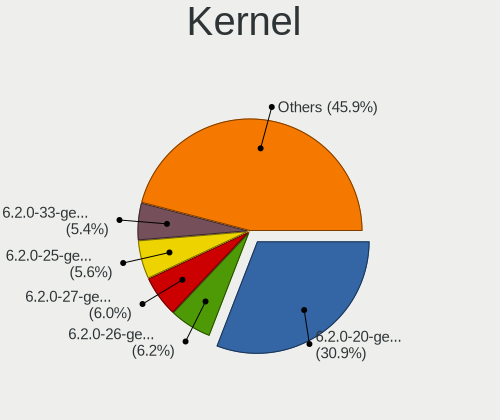

| Version                 | Computers | Percent |
|-------------------------|-----------|---------|
| 6.2.0-20-generic        | 530       | 42.3%   |
| 6.2.0-26-generic        | 110       | 8.78%   |
| 6.2.0-27-generic        | 105       | 8.38%   |
| 6.2.0-25-generic        | 100       | 7.98%   |
| 6.2.0-24-generic        | 99        | 7.9%    |
| 6.2.0-23-generic        | 81        | 6.46%   |
| 6.2.0-31-generic        | 48        | 3.83%   |
| 5.19.0-21-generic       | 20        | 1.6%    |
| 6.2.0-18-generic        | 13        | 1.04%   |
| 6.2.0-32-generic        | 11        | 0.88%   |
| 6.4.0-060400-generic    | 8         | 0.64%   |
| 5.19.0-41-generic       | 8         | 0.64%   |
| 6.3.2-060302-generic    | 6         | 0.48%   |
| 6.1.0-16-generic        | 6         | 0.48%   |
| 5.19.0-46-generic       | 6         | 0.48%   |
| 6.3.4-060304-generic    | 4         | 0.32%   |
| 6.2.0-1004-raspi        | 4         | 0.32%   |
| 6.5.0-060500-generic    | 3         | 0.24%   |
| 6.3.6-060306-generic    | 3         | 0.24%   |
| 6.2.9-060209-generic    | 3         | 0.24%   |
| 6.2.0-19-generic        | 3         | 0.24%   |
| 6.2.0-1003-lowlatency   | 3         | 0.24%   |
| 5.19.0-40-generic       | 3         | 0.24%   |
| 5.19.0-31-generic       | 3         | 0.24%   |
| 5.19.0-28-generic       | 3         | 0.24%   |
| 6.5.0-060500rc5-generic | 2         | 0.16%   |
| 6.4.6-060406-generic    | 2         | 0.16%   |
| 6.3.5-060305-generic    | 2         | 0.16%   |
| 6.2.12-060212-generic   | 2         | 0.16%   |
| 6.2.11-060211-generic   | 2         | 0.16%   |
| 5.19.0-45-generic       | 2         | 0.16%   |
| 5.19.0-42-generic       | 2         | 0.16%   |
| 5.19.0-38-generic       | 2         | 0.16%   |
| 6.5.1-tkg-cfs           | 1         | 0.08%   |
| 6.5.0-060500rc3-generic | 1         | 0.08%   |
| 6.4.8-tkg-cfs           | 1         | 0.08%   |
| 6.4.8-060408-generic    | 1         | 0.08%   |
| 6.4.7-t2-lunar          | 1         | 0.08%   |
| 6.4.7-surface           | 1         | 0.08%   |
| 6.4.5-x64v3-xanmod1     | 1         | 0.08%   |

Kernel Family
-------------

Linux kernel without a distro release

| Version  | Computers | Percent |
|----------|-----------|---------|
| 6.2.0    | 1059      | 88.84%  |
| 5.19.0   | 57        | 4.78%   |
| 6.4.0    | 9         | 0.76%   |
| 6.1.0    | 7         | 0.59%   |
| 6.3.2    | 6         | 0.5%    |
| 6.3.0    | 5         | 0.42%   |
| 6.5.0    | 4         | 0.34%   |
| 6.3.4    | 4         | 0.34%   |
| 6.3.6    | 3         | 0.25%   |
| 6.2.9    | 3         | 0.25%   |
| 5.14.0   | 3         | 0.25%   |
| 6.4.8    | 2         | 0.17%   |
| 6.4.7    | 2         | 0.17%   |
| 6.4.6    | 2         | 0.17%   |
| 6.3.5    | 2         | 0.17%   |
| 6.3.1    | 2         | 0.17%   |
| 6.2.12   | 2         | 0.17%   |
| 6.2.11   | 2         | 0.17%   |
| 6.5.1    | 1         | 0.08%   |
| 6.4.5    | 1         | 0.08%   |
| 6.4.3    | 1         | 0.08%   |
| 6.4.2    | 1         | 0.08%   |
| 6.3.8    | 1         | 0.08%   |
| 6.3.7    | 1         | 0.08%   |
| 6.3.3    | 1         | 0.08%   |
| 6.2.6    | 1         | 0.08%   |
| 6.2.16   | 1         | 0.08%   |
| 6.2.10   | 1         | 0.08%   |
| 6.1.12   | 1         | 0.08%   |
| 6.0.9    | 1         | 0.08%   |
| 5.19.5   | 1         | 0.08%   |
| 5.19.17  | 1         | 0.08%   |
| 5.17.0   | 1         | 0.08%   |
| 5.15.108 | 1         | 0.08%   |
| 5.15.0   | 1         | 0.08%   |
| 5.11.0   | 1         | 0.08%   |

Kernel Major Ver.
-----------------

Linux kernel major version

| Version | Computers | Percent |
|---------|-----------|---------|
| 6.2     | 1068      | 89.82%  |
| 5.19    | 59        | 4.96%   |
| 6.3     | 25        | 2.1%    |
| 6.4     | 16        | 1.35%   |
| 6.1     | 8         | 0.67%   |
| 6.5     | 5         | 0.42%   |
| 5.14    | 3         | 0.25%   |
| 5.15    | 2         | 0.17%   |
| 6.0     | 1         | 0.08%   |
| 5.17    | 1         | 0.08%   |
| 5.11    | 1         | 0.08%   |

Arch
----

OS architecture (x86_64, i586, etc.)

| Name    | Computers | Percent |
|---------|-----------|---------|
| x86_64  | 1173      | 99.41%  |
| aarch64 | 5         | 0.42%   |
| riscv64 | 1         | 0.08%   |
| armv7l  | 1         | 0.08%   |

DE
--

Desktop Environment

| Name            | Computers | Percent |
|-----------------|-----------|---------|
| GNOME           | 1140      | 96.53%  |
| Unknown         | 19        | 1.61%   |
| X-Cinnamon      | 16        | 1.35%   |
| sway            | 2         | 0.17%   |
| GNOME Flashback | 2         | 0.17%   |
| mwm             | 1         | 0.08%   |
| GNOME Classic   | 1         | 0.08%   |

Display Server
--------------

X11 or Wayland

| Name    | Computers | Percent |
|---------|-----------|---------|
| Wayland | 785       | 65.53%  |
| X11     | 383       | 31.97%  |
| Tty     | 15        | 1.25%   |
| Unknown | 15        | 1.25%   |

Display Manager
---------------

SDDM, LightDM, etc.

| Name    | Computers | Percent |
|---------|-----------|---------|
| GDM3    | 1040      | 87.91%  |
| Unknown | 114       | 9.64%   |
| LightDM | 24        | 2.03%   |
| GDM     | 4         | 0.34%   |
| GREETD  | 1         | 0.08%   |

OS Lang
-------

Language

| Lang    | Computers | Percent |
|---------|-----------|---------|
| en_US   | 552       | 46.54%  |
| de_DE   | 137       | 11.55%  |
| fr_FR   | 63        | 5.31%   |
| C       | 53        | 4.47%   |
| es_ES   | 45        | 3.79%   |
| pt_BR   | 44        | 3.71%   |
| ru_RU   | 36        | 3.04%   |
| en_GB   | 35        | 2.95%   |
| it_IT   | 26        | 2.19%   |
| en_CA   | 21        | 1.77%   |
| pl_PL   | 17        | 1.43%   |
| en_AU   | 17        | 1.43%   |
| nl_NL   | 12        | 1.01%   |
| cs_CZ   | 8         | 0.67%   |
| Unknown | 8         | 0.67%   |
| hu_HU   | 7         | 0.59%   |
| en_IN   | 7         | 0.59%   |
| fi_FI   | 6         | 0.51%   |
| es_MX   | 6         | 0.51%   |
| de_AT   | 6         | 0.51%   |
| zh_CN   | 5         | 0.42%   |
| el_GR   | 5         | 0.42%   |
| bg_BG   | 5         | 0.42%   |
| sv_SE   | 4         | 0.34%   |
| nb_NO   | 4         | 0.34%   |
| fr_CA   | 4         | 0.34%   |
| ro_RO   | 3         | 0.25%   |
| pt_PT   | 3         | 0.25%   |
| ja_JP   | 3         | 0.25%   |
| en_ZA   | 3         | 0.25%   |
| en_NZ   | 3         | 0.25%   |
| en_IL   | 3         | 0.25%   |
| de_CH   | 3         | 0.25%   |
| zh_TW   | 2         | 0.17%   |
| tr_TR   | 2         | 0.17%   |
| lt_LT   | 2         | 0.17%   |
| ko_KR   | 2         | 0.17%   |
| es_CL   | 2         | 0.17%   |
| en_SG   | 2         | 0.17%   |
| da_DK   | 2         | 0.17%   |

Boot Mode
---------

EFI or BIOS

| Mode | Computers | Percent |
|------|-----------|---------|
| BIOS | 723       | 60.91%  |
| EFI  | 464       | 39.09%  |

Filesystem
----------

Type of filesystem

| Type    | Computers | Percent |
|---------|-----------|---------|
| Tmpfs   | 623       | 52.49%  |
| Ext4    | 517       | 43.56%  |
| Overlay | 23        | 1.94%   |
| Btrfs   | 13        | 1.1%    |
| Zfs     | 7         | 0.59%   |
| XXX4    | 2         | 0.17%   |
| Xfs     | 2         | 0.17%   |

Part. scheme
------------

Scheme of partitioning

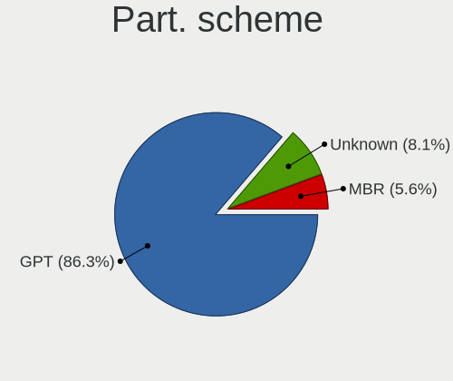

| Type    | Computers | Percent |
|---------|-----------|---------|
| GPT     | 1018      | 85.98%  |
| Unknown | 97        | 8.19%   |
| MBR     | 69        | 5.83%   |

Dual Boot with Linux/BSD
------------------------

Hosting more than one Linux/BSD

| Dual boot | Computers | Percent |
|-----------|-----------|---------|
| No        | 1038      | 87.37%  |
| Yes       | 150       | 12.63%  |

Dual Boot (Win)
---------------

Hosting Linux and Windows

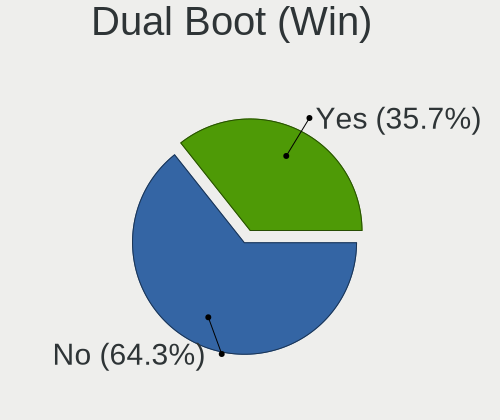

| Dual boot | Computers | Percent |
|-----------|-----------|---------|
| No        | 750       | 63.03%  |
| Yes       | 440       | 36.97%  |

Board
-----

Vendor
------

Motherboard manufacturer

| Name                                 | Computers | Percent |
|--------------------------------------|-----------|---------|
| ASUSTek Computer                     | 194       | 16.44%  |
| Lenovo                               | 193       | 16.36%  |
| Hewlett-Packard                      | 161       | 13.64%  |
| Dell                                 | 148       | 12.54%  |
| Acer                                 | 70        | 5.93%   |
| MSI                                  | 65        | 5.51%   |
| Gigabyte Technology                  | 52        | 4.41%   |
| Apple                                | 41        | 3.47%   |
| ASRock                               | 27        | 2.29%   |
| Intel                                | 24        | 2.03%   |
| HUAWEI                               | 23        | 1.95%   |
| Unknown                              | 17        | 1.44%   |
| Toshiba                              | 13        | 1.1%    |
| Samsung Electronics                  | 13        | 1.1%    |
| Fujitsu                              | 9         | 0.76%   |
| Microsoft                            | 8         | 0.68%   |
| Google                               | 8         | 0.68%   |
| Timi                                 | 7         | 0.59%   |
| Sony                                 | 7         | 0.59%   |
| Raspberry Pi Foundation              | 6         | 0.51%   |
| Notebook                             | 6         | 0.51%   |
| Packard Bell                         | 4         | 0.34%   |
| Medion                               | 4         | 0.34%   |
| Biostar                              | 4         | 0.34%   |
| AZW                                  | 4         | 0.34%   |
| Shanghai Zhaoxin Semiconductor       | 3         | 0.25%   |
| Razer                                | 3         | 0.25%   |
| Gateway                              | 3         | 0.25%   |
| Alienware                            | 3         | 0.25%   |
| ZOTAC                                | 2         | 0.17%   |
| Shuttle                              | 2         | 0.17%   |
| Shenzhen Meigao Electronic Equipment | 2         | 0.17%   |
| Positivo                             | 2         | 0.17%   |
| Pegatron                             | 2         | 0.17%   |
| Panasonic                            | 2         | 0.17%   |
| Infinix                              | 2         | 0.17%   |
| HONOR                                | 2         | 0.17%   |
| Hampoo                               | 2         | 0.17%   |
| Chuwi                                | 2         | 0.17%   |
| ATOPNUC                              | 2         | 0.17%   |

Model
-----

Motherboard model

| Name                               | Computers | Percent |
|------------------------------------|-----------|---------|
| Unknown                            | 20        | 1.69%   |
| ASUS All Series                    | 7         | 0.59%   |
| HP EliteBook 840 G6                | 5         | 0.42%   |
| Dell Latitude 7480                 | 5         | 0.42%   |
| HUAWEI BOM-WXX9                    | 4         | 0.34%   |
| HP Notebook                        | 4         | 0.34%   |
| Apple MacBookPro9,2                | 4         | 0.34%   |
| Apple MacBookAir7,2                | 4         | 0.34%   |
| Shanghai Zhaoxin ZXE CRB           | 3         | 0.25%   |
| Lenovo IdeaPad 5 Pro 14ACN6 82L7   | 3         | 0.25%   |
| Lenovo G50-70 20351                | 3         | 0.25%   |
| HUAWEI BOHB-WAX9                   | 3         | 0.25%   |
| Dell XPS 15 9500                   | 3         | 0.25%   |
| Dell Precision 5570                | 3         | 0.25%   |
| Dell Inspiron 3442                 | 3         | 0.25%   |
| Dell G5 5590                       | 3         | 0.25%   |
| ASUS ZenBook UX325EA_UX325EA       | 3         | 0.25%   |
| ASUS Zenbook UM5302TA_UM5302TA     | 3         | 0.25%   |
| Acer Swift SF314-512               | 3         | 0.25%   |
| Toshiba Satellite Pro C70-B        | 2         | 0.17%   |
| Timi Redmi Book Pro 14 2022        | 2         | 0.17%   |
| Samsung P500A2D                    | 2         | 0.17%   |
| RPi Raspberry Pi 4 Model B Rev 1.4 | 2         | 0.17%   |
| RPi Raspberry Pi                   | 2         | 0.17%   |
| Packard Bell EasyNote ENTF71BM     | 2         | 0.17%   |
| MSI Stealth 15M B12UE              | 2         | 0.17%   |
| MSI MS-7C95                        | 2         | 0.17%   |
| MSI MS-7C02                        | 2         | 0.17%   |
| MSI MS-7B86                        | 2         | 0.17%   |
| MSI MS-7721                        | 2         | 0.17%   |
| MSI MS-7596                        | 2         | 0.17%   |
| MSI Modern 14 A10M                 | 2         | 0.17%   |
| Microsoft Surface Pro 7            | 2         | 0.17%   |
| Microsoft Surface Laptop Go        | 2         | 0.17%   |
| Lenovo IdeaPadFlex 5 14ABR8 82XX   | 2         | 0.17%   |
| Lenovo IdeaPad 5 15ITL05 82FG      | 2         | 0.17%   |
| Lenovo IdeaPad 5 15ARE05 81YQ      | 2         | 0.17%   |
| Intel NUC10i7FNH                   | 2         | 0.17%   |
| Intel H61                          | 2         | 0.17%   |
| HUAWEI NBLB-WAX9N                  | 2         | 0.17%   |

Model Family
------------

Motherboard model prefix

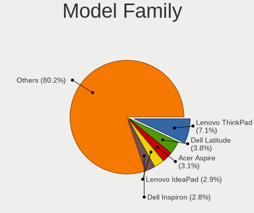

| Name               | Computers | Percent |
|--------------------|-----------|---------|
| Lenovo ThinkPad    | 89        | 7.54%   |
| Dell Latitude      | 45        | 3.81%   |
| Acer Aspire        | 37        | 3.14%   |
| ASUS PRIME         | 35        | 2.97%   |
| Dell Inspiron      | 34        | 2.88%   |
| Lenovo IdeaPad     | 30        | 2.54%   |
| HP EliteBook       | 28        | 2.37%   |
| ASUS VivoBook      | 24        | 2.03%   |
| Dell XPS           | 23        | 1.95%   |
| HP Pavilion        | 22        | 1.86%   |
| ASUS ZenBook       | 21        | 1.78%   |
| HP Laptop          | 20        | 1.69%   |
| ASUS ROG           | 20        | 1.69%   |
| Unknown            | 20        | 1.69%   |
| ASUS TUF           | 16        | 1.36%   |
| HP ENVY            | 15        | 1.27%   |
| Dell OptiPlex      | 15        | 1.27%   |
| Lenovo Yoga        | 14        | 1.19%   |
| Dell Precision     | 13        | 1.1%    |
| HP ProBook         | 12        | 1.02%   |
| Acer Swift         | 12        | 1.02%   |
| Lenovo ThinkCentre | 11        | 0.93%   |
| Acer Nitro         | 11        | 0.93%   |
| Lenovo IdeaPadFlex | 9         | 0.76%   |
| ASUS ASUS          | 9         | 0.76%   |
| Toshiba Satellite  | 8         | 0.68%   |
| Microsoft Surface  | 8         | 0.68%   |
| Lenovo Legion      | 8         | 0.68%   |
| HP Compaq          | 7         | 0.59%   |
| Dell Vostro        | 7         | 0.59%   |
| ASUS All           | 7         | 0.59%   |
| RPi Raspberry      | 6         | 0.51%   |
| MSI Stealth        | 5         | 0.42%   |
| Lenovo ThinkBook   | 5         | 0.42%   |
| Lenovo IdeaCentre  | 5         | 0.42%   |
| HP EliteDesk       | 5         | 0.42%   |
| Toshiba PORTEGE    | 4         | 0.34%   |
| HUAWEI BOM-WXX9    | 4         | 0.34%   |
| HP ZBook           | 4         | 0.34%   |
| HP ProLiant        | 4         | 0.34%   |

MFG Year
--------

Motherboard manufacture year

| Year    | Computers | Percent |
|---------|-----------|---------|
| 2021    | 154       | 13.05%  |
| 2022    | 147       | 12.46%  |
| 2020    | 124       | 10.51%  |
| 2019    | 92        | 7.8%    |
| 2018    | 78        | 6.61%   |
| 2017    | 68        | 5.76%   |
| 2023    | 66        | 5.59%   |
| 2012    | 66        | 5.59%   |
| 2016    | 63        | 5.34%   |
| 2014    | 62        | 5.25%   |
| 2015    | 57        | 4.83%   |
| 2011    | 55        | 4.66%   |
| 2013    | 46        | 3.9%    |
| 2010    | 44        | 3.73%   |
| 2009    | 21        | 1.78%   |
| 2008    | 20        | 1.69%   |
| Unknown | 8         | 0.68%   |
| 2007    | 6         | 0.51%   |
| 2006    | 3         | 0.25%   |

Form Factor
-----------

Physical design of the computer

| Name           | Computers | Percent |
|----------------|-----------|---------|
| Notebook       | 660       | 55.93%  |
| Desktop        | 360       | 30.51%  |
| Convertible    | 78        | 6.61%   |
| Mini pc        | 25        | 2.12%   |
| Tablet         | 22        | 1.86%   |
| All in one     | 21        | 1.78%   |
| System on chip | 7         | 0.59%   |
| Server         | 7         | 0.59%   |

Secure Boot
-----------

Enabled or disabled

| State    | Computers | Percent |
|----------|-----------|---------|
| Disabled | 1064      | 90.02%  |
| Enabled  | 118       | 9.98%   |

Coreboot
--------

Have coreboot on board

| Used | Computers | Percent |
|------|-----------|---------|
| No   | 1170      | 99.15%  |
| Yes  | 10        | 0.85%   |

RAM Size
--------

Total RAM memory

| Size in GB      | Computers | Percent |
|-----------------|-----------|---------|
| 4.01-8.0        | 307       | 25.99%  |
| 16.01-24.0      | 256       | 21.68%  |
| 8.01-16.0       | 199       | 16.85%  |
| 3.01-4.0        | 152       | 12.87%  |
| 32.01-64.0      | 148       | 12.53%  |
| 64.01-256.0     | 59        | 5%      |
| 24.01-32.0      | 39        | 3.3%    |
| 1.01-2.0        | 12        | 1.02%   |
| 2.01-3.0        | 5         | 0.42%   |
| More than 256.0 | 2         | 0.17%   |
| 0.51-1.0        | 1         | 0.08%   |
| 0.01-0.5        | 1         | 0.08%   |

RAM Used
--------

Used RAM memory

| Used GB    | Computers | Percent |
|------------|-----------|---------|
| 2.01-3.0   | 383       | 31.37%  |
| 1.01-2.0   | 288       | 23.59%  |
| 4.01-8.0   | 265       | 21.7%   |
| 3.01-4.0   | 214       | 17.53%  |
| 8.01-16.0  | 50        | 4.1%    |
| 16.01-24.0 | 6         | 0.49%   |
| 0.51-1.0   | 5         | 0.41%   |
| 32.01-64.0 | 4         | 0.33%   |
| 24.01-32.0 | 3         | 0.25%   |
| 0.01-0.5   | 3         | 0.25%   |

Total Drives
------------

Number of drives on board

| Drives | Computers | Percent |
|--------|-----------|---------|
| 1      | 784       | 65.72%  |
| 2      | 255       | 21.37%  |
| 3      | 71        | 5.95%   |
| 4      | 39        | 3.27%   |
| 5      | 20        | 1.68%   |
| 6      | 13        | 1.09%   |
| 0      | 4         | 0.34%   |
| 8      | 3         | 0.25%   |
| 7      | 3         | 0.25%   |
| 9      | 1         | 0.08%   |

Has CD-ROM
----------

Has CD-ROM on board

| Presented | Computers | Percent |
|-----------|-----------|---------|
| No        | 887       | 75.04%  |
| Yes       | 295       | 24.96%  |

Has Ethernet
------------

Has Ethernet on board

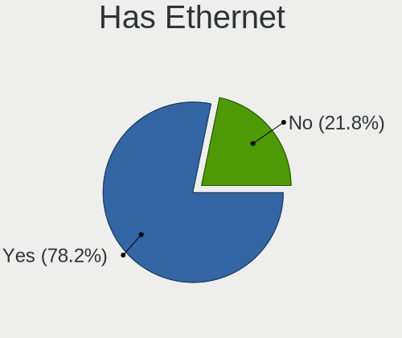

| Presented | Computers | Percent |
|-----------|-----------|---------|
| Yes       | 898       | 75.97%  |
| No        | 284       | 24.03%  |

Has WiFi
--------

Has WiFi module

| Presented | Computers | Percent |
|-----------|-----------|---------|
| Yes       | 990       | 83.9%   |
| No        | 190       | 16.1%   |

Has Bluetooth
-------------

Has Bluetooth module

| Presented | Computers | Percent |
|-----------|-----------|---------|
| Yes       | 856       | 72.3%   |
| No        | 328       | 27.7%   |

Location
--------

Country
-------

Geographic location (country)

| Country      | Computers | Percent |
|--------------|-----------|---------|
| USA          | 197       | 16.68%  |
| Germany      | 154       | 13.04%  |
| France       | 72        | 6.1%    |
| Brazil       | 63        | 5.33%   |
| UK           | 53        | 4.49%   |
| Russia       | 52        | 4.4%    |
| Canada       | 50        | 4.23%   |
| Italy        | 47        | 3.98%   |
| Australia    | 29        | 2.46%   |
| Spain        | 27        | 2.29%   |
| India        | 27        | 2.29%   |
| Netherlands  | 24        | 2.03%   |
| Poland       | 19        | 1.61%   |
| Mexico       | 17        | 1.44%   |
| Switzerland  | 16        | 1.35%   |
| Sweden       | 15        | 1.27%   |
| Norway       | 15        | 1.27%   |
| Czechia      | 14        | 1.19%   |
| Turkey       | 13        | 1.1%    |
| Finland      | 13        | 1.1%    |
| Austria      | 13        | 1.1%    |
| Romania      | 12        | 1.02%   |
| Portugal     | 12        | 1.02%   |
| Belgium      | 12        | 1.02%   |
| China        | 11        | 0.93%   |
| Hungary      | 10        | 0.85%   |
| Indonesia    | 9         | 0.76%   |
| Greece       | 9         | 0.76%   |
| Chile        | 9         | 0.76%   |
| South Africa | 7         | 0.59%   |
| Serbia       | 7         | 0.59%   |
| Israel       | 7         | 0.59%   |
| Ireland      | 7         | 0.59%   |
| Argentina    | 7         | 0.59%   |
| Philippines  | 6         | 0.51%   |
| Colombia     | 6         | 0.51%   |
| New Zealand  | 5         | 0.42%   |
| Malaysia     | 5         | 0.42%   |
| Kenya        | 5         | 0.42%   |
| Japan        | 5         | 0.42%   |

City
----

Geographic location (city)

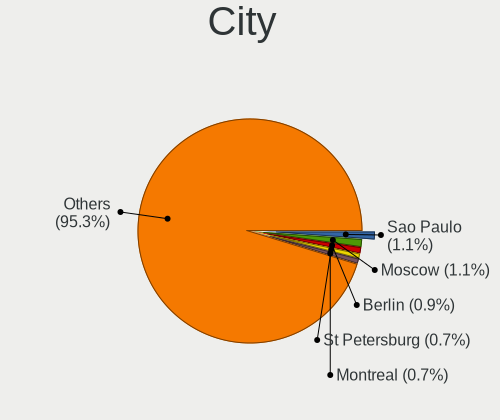

| City              | Computers | Percent |
|-------------------|-----------|---------|
| Sao Paulo         | 15        | 1.25%   |
| Moscow            | 13        | 1.08%   |
| Berlin            | 13        | 1.08%   |
| Melbourne         | 10        | 0.83%   |
| St Petersburg     | 8         | 0.67%   |
| Montreal          | 8         | 0.67%   |
| Helsinki          | 8         | 0.67%   |
| Oslo              | 7         | 0.58%   |
| Hamburg           | 7         | 0.58%   |
| Barcelona         | 7         | 0.58%   |
| Prague            | 6         | 0.5%    |
| Brisbane          | 6         | 0.5%    |
| Atlanta           | 6         | 0.5%    |
| Warsaw            | 5         | 0.42%   |
| Valencia          | 5         | 0.42%   |
| Toronto           | 5         | 0.42%   |
| Oshawa            | 5         | 0.42%   |
| New York          | 5         | 0.42%   |
| Nairobi           | 5         | 0.42%   |
| Munich            | 5         | 0.42%   |
| Frankfurt am Main | 5         | 0.42%   |
| Denver            | 5         | 0.42%   |
| Cologne           | 5         | 0.42%   |
| Brussels          | 5         | 0.42%   |
| Belgrade          | 5         | 0.42%   |
| Vienna            | 4         | 0.33%   |
| Tehran            | 4         | 0.33%   |
| Sydney            | 4         | 0.33%   |
| Santiago          | 4         | 0.33%   |
| San Francisco     | 4         | 0.33%   |
| Rome              | 4         | 0.33%   |
| Rio de Janeiro    | 4         | 0.33%   |
| Paris             | 4         | 0.33%   |
| Milan             | 4         | 0.33%   |
| Madrid            | 4         | 0.33%   |
| Edmonton          | 4         | 0.33%   |
| Dublin            | 4         | 0.33%   |
| Central           | 4         | 0.33%   |
| Beijing           | 4         | 0.33%   |
| Antalya           | 4         | 0.33%   |

Drives
------

Drive Vendor
------------

Hard drive vendors

| Vendor                      | Computers | Drives | Percent |
|-----------------------------|-----------|--------|---------|
| Samsung Electronics         | 295       | 382    | 17.71%  |
| Seagate                     | 189       | 248    | 11.34%  |
| WDC                         | 169       | 228    | 10.14%  |
| SanDisk                     | 117       | 144    | 7.02%   |
| Kingston                    | 85        | 98     | 5.1%    |
| SK hynix                    | 69        | 74     | 4.14%   |
| Toshiba                     | 68        | 74     | 4.08%   |
| Unknown                     | 60        | 71     | 3.6%    |
| Crucial                     | 59        | 66     | 3.54%   |
| Micron Technology           | 57        | 65     | 3.42%   |
| Intel                       | 54        | 64     | 3.24%   |
| KIOXIA                      | 35        | 39     | 2.1%    |
| Hitachi                     | 30        | 38     | 1.8%    |
| Phison Electronics          | 25        | 29     | 1.5%    |
| Apple                       | 22        | 27     | 1.32%   |
| Kingston Technology Company | 19        | 23     | 1.14%   |
| China                       | 19        | 21     | 1.14%   |
| HGST                        | 16        | 18     | 0.96%   |
| Micron/Crucial Technology   | 13        | 16     | 0.78%   |
| A-DATA Technology           | 12        | 14     | 0.72%   |
| Phison                      | 11        | 12     | 0.66%   |
| Silicon Motion              | 10        | 10     | 0.6%    |
| Unknown                     | 10        | 13     | 0.6%    |
| Intenso                     | 8         | 10     | 0.48%   |
| SPCC                        | 6         | 6      | 0.36%   |
| PNY                         | 6         | 7      | 0.36%   |
| MAXIO Technology (Hangzhou) | 6         | 6      | 0.36%   |
| LITEONIT                    | 6         | 7      | 0.36%   |
| Gigabyte Technology         | 6         | 6      | 0.36%   |
| Team                        | 5         | 5      | 0.3%    |
| Realtek Semiconductor       | 5         | 6      | 0.3%    |
| Patriot                     | 5         | 5      | 0.3%    |
| LITEON                      | 5         | 8      | 0.3%    |
| FORESEE                     | 5         | 6      | 0.3%    |
| Corsair                     | 5         | 6      | 0.3%    |
| ASMT                        | 5         | 7      | 0.3%    |
| Apacer                      | 5         | 6      | 0.3%    |
| ADATA Technology            | 5         | 6      | 0.3%    |
| UMIS                        | 4         | 4      | 0.24%   |
| Transcend                   | 4         | 4      | 0.24%   |

Drive Model
-----------

Hard drive models

| Model                                                 | Computers | Percent |
|-------------------------------------------------------|-----------|---------|
| Samsung NVMe SSD Controller SM981/PM981/PM983 500GB   | 39        | 2.18%   |
| Samsung NVMe SSD Controller PM9A1/PM9A3/980PRO 1024GB | 24        | 1.34%   |
| Kingston SA400S37240G 240GB SSD                       | 20        | 1.12%   |
| Unknown MMC Card  64GB                                | 16        | 0.89%   |
| Seagate ST1000LM035-1RK172 1TB                        | 15        | 0.84%   |
| Samsung SSD 980 1TB                                   | 13        | 0.73%   |
| Samsung NVMe SSD Controller SM961/PM961/SM963 1024GB  | 13        | 0.73%   |
| Micron/Crucial P2 NVMe PCIe SSD 1TB                   | 13        | 0.73%   |
| Samsung SSD 850 EVO 250GB                             | 12        | 0.67%   |
| Kingston SA400S37480G 480GB SSD                       | 12        | 0.67%   |
| Phison E12 NVMe Controller 256GB                      | 11        | 0.61%   |
| Unknown MMC Card  128GB                               | 10        | 0.56%   |
| Seagate ST1000DM010-2EP102 1TB                        | 10        | 0.56%   |
| Unknown                                               | 10        | 0.56%   |
| Sandisk WD Black SN750 / PC SN730 NVMe SSD 1024GB     | 9         | 0.5%    |
| SanDisk NVMe SSD Drive 512GB                          | 9         | 0.5%    |
| Samsung SSD 870 EVO 500GB                             | 9         | 0.5%    |
| Samsung SSD 870 EVO 1TB                               | 9         | 0.5%    |
| Samsung SSD 860 EVO 500GB                             | 9         | 0.5%    |
| WDC WDS240G2G0A-00JH30 240GB SSD                      | 8         | 0.45%   |
| Unknown MMC Card  32GB                                | 8         | 0.45%   |
| Seagate ST1000LM024 HN-M101MBB 1TB                    | 8         | 0.45%   |
| Sandisk WD Blue SN550 NVMe SSD 250GB                  | 8         | 0.45%   |
| Samsung SSD 850 EVO 500GB                             | 8         | 0.45%   |
| Micron 2450_MTFDKBA1T0TFK 1TB                         | 8         | 0.45%   |
| Intel SSDPEKNU512GZ 512GB                             | 8         | 0.45%   |
| HGST HTS721010A9E630 1TB                              | 8         | 0.45%   |
| Crucial CT500MX500SSD1 500GB                          | 8         | 0.45%   |
| Silicon Motion SM2263EN/SM2263XT SSD Controller 256GB | 7         | 0.39%   |
| Seagate ST3500418AS 500GB                             | 7         | 0.39%   |
| Seagate ST2000LM007-1R8174 2TB                        | 7         | 0.39%   |
| Seagate ST2000DM008-2FR102 2TB                        | 7         | 0.39%   |
| Samsung SSD 860 EVO 250GB                             | 7         | 0.39%   |
| Phison PS5013 E13 NVMe Controller 512GB               | 7         | 0.39%   |
| Unknown SD/MMC/MS PRO 1GB                             | 6         | 0.34%   |
| Toshiba XG6 NVMe SSD Controller 1024GB                | 6         | 0.34%   |
| Toshiba MQ01ABF050 500GB                              | 6         | 0.34%   |
| Seagate ST500LT012-1DG142 500GB                       | 6         | 0.34%   |
| Seagate ST500DM002-1BD142 500GB                       | 6         | 0.34%   |
| Seagate ST4000DM004-2CV104 4TB                        | 6         | 0.34%   |

HDD Vendor
----------

Hard disk drive vendors

| Vendor              | Computers | Drives | Percent |
|---------------------|-----------|--------|---------|
| Seagate             | 181       | 239    | 40.77%  |
| WDC                 | 128       | 174    | 28.83%  |
| Toshiba             | 46        | 51     | 10.36%  |
| Hitachi             | 30        | 38     | 6.76%   |
| Samsung Electronics | 18        | 20     | 4.05%   |
| HGST                | 16        | 18     | 3.6%    |
| Unknown             | 6         | 6      | 1.35%   |
| Apple               | 5         | 5      | 1.13%   |
| SABRENT             | 4         | 7      | 0.9%    |
| Maxtor              | 2         | 3      | 0.45%   |
| HGST HTS            | 2         | 2      | 0.45%   |
| USB3.0              | 1         | 1      | 0.23%   |
| JMicron Technology  | 1         | 1      | 0.23%   |
| Intenso             | 1         | 1      | 0.23%   |
| Fujitsu             | 1         | 1      | 0.23%   |
| ASMT                | 1         | 3      | 0.23%   |
| ASMedia             | 1         | 1      | 0.23%   |

SSD Vendor
----------

Solid state drive vendors

| Vendor              | Computers | Drives | Percent |
|---------------------|-----------|--------|---------|
| Samsung Electronics | 112       | 143    | 22%     |
| Kingston            | 63        | 75     | 12.38%  |
| SanDisk             | 47        | 59     | 9.23%   |
| Crucial             | 47        | 51     | 9.23%   |
| WDC                 | 27        | 32     | 5.3%    |
| China               | 19        | 21     | 3.73%   |
| Intel               | 15        | 17     | 2.95%   |
| SK hynix            | 12        | 12     | 2.36%   |
| Micron Technology   | 12        | 14     | 2.36%   |
| Apple               | 10        | 11     | 1.96%   |
| A-DATA Technology   | 9         | 11     | 1.77%   |
| LITEONIT            | 6         | 7      | 1.18%   |
| Toshiba             | 5         | 5      | 0.98%   |
| Team                | 5         | 5      | 0.98%   |
| PNY                 | 5         | 5      | 0.98%   |
| Patriot             | 5         | 5      | 0.98%   |
| LITEON              | 5         | 8      | 0.98%   |
| Intenso             | 5         | 6      | 0.98%   |
| Apacer              | 5         | 6      | 0.98%   |
| Unknown             | 5         | 5      | 0.98%   |
| SPCC                | 4         | 4      | 0.79%   |
| KingSpec            | 4         | 5      | 0.79%   |
| Gigabyte Technology | 4         | 4      | 0.79%   |
| ASMT                | 4         | 4      | 0.79%   |
| Smartbuy            | 3         | 4      | 0.59%   |
| OWC                 | 3         | 7      | 0.59%   |
| OCZ                 | 3         | 3      | 0.59%   |
| Netac               | 3         | 3      | 0.59%   |
| Lexar               | 3         | 3      | 0.59%   |
| Vaseky              | 2         | 2      | 0.39%   |
| Transcend           | 2         | 2      | 0.39%   |
| Neo                 | 2         | 3      | 0.39%   |
| Kingchuxing         | 2         | 2      | 0.39%   |
| Hewlett-Packard     | 2         | 2      | 0.39%   |
| GOODRAM             | 2         | 2      | 0.39%   |
| Gigastone           | 2         | 2      | 0.39%   |
| FORESEE             | 2         | 2      | 0.39%   |
| Emtec               | 2         | 2      | 0.39%   |
| XrayDisk            | 1         | 1      | 0.2%    |
| Wodposit            | 1         | 1      | 0.2%    |

Drive Kind
----------

HDD or SSD

| Kind    | Computers | Drives | Percent |
|---------|-----------|--------|---------|
| NVMe    | 605       | 767    | 39.99%  |
| SSD     | 452       | 602    | 29.87%  |
| HDD     | 382       | 571    | 25.25%  |
| MMC     | 53        | 65     | 3.5%    |
| Unknown | 21        | 24     | 1.39%   |

Drive Connector
---------------

SATA, SAS, NVMe, etc.

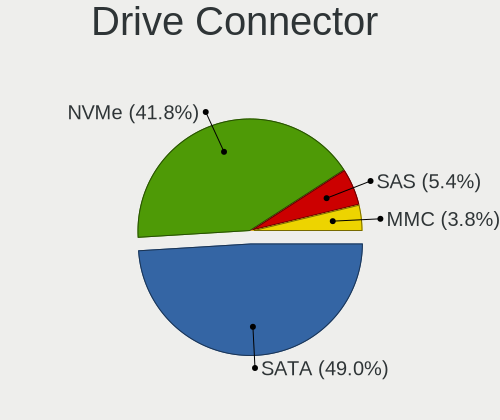

| Type | Computers | Drives | Percent |
|------|-----------|--------|---------|
| SATA | 669       | 1114   | 47.92%  |
| NVMe | 605       | 763    | 43.34%  |
| SAS  | 69        | 87     | 4.94%   |
| MMC  | 53        | 65     | 3.8%    |

Drive Size
----------

Size of hard drive

| Size in TB | Computers | Drives | Percent |
|------------|-----------|--------|---------|
| 0.01-0.5   | 480       | 643    | 54.92%  |
| 0.51-1.0   | 260       | 347    | 29.75%  |
| 1.01-2.0   | 74        | 97     | 8.47%   |
| 3.01-4.0   | 24        | 37     | 2.75%   |
| 4.01-10.0  | 21        | 31     | 2.4%    |
| 2.01-3.0   | 12        | 14     | 1.37%   |
| 10.01-20.0 | 3         | 4      | 0.34%   |

Space Total
-----------

Amount of disk space available on the file system

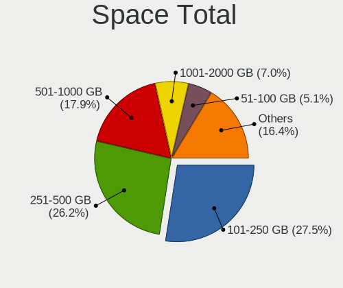

| Size in GB     | Computers | Percent |
|----------------|-----------|---------|
| 251-500        | 335       | 27.78%  |
| 101-250        | 316       | 26.2%   |
| 501-1000       | 207       | 17.16%  |
| 1001-2000      | 88        | 7.3%    |
| 51-100         | 61        | 5.06%   |
| More than 3000 | 58        | 4.81%   |
| 1-20           | 57        | 4.73%   |
| 21-50          | 41        | 3.4%    |
| 2001-3000      | 34        | 2.82%   |
| Unknown        | 9         | 0.75%   |

Space Used
----------

Amount of used disk space

| Used GB        | Computers | Percent |
|----------------|-----------|---------|
| 1-20           | 395       | 32.35%  |
| 21-50          | 313       | 25.63%  |
| 101-250        | 146       | 11.96%  |
| 51-100         | 145       | 11.88%  |
| 251-500        | 95        | 7.78%   |
| 501-1000       | 50        | 4.1%    |
| 1001-2000      | 31        | 2.54%   |
| More than 3000 | 22        | 1.8%    |
| 2001-3000      | 15        | 1.23%   |
| Unknown        | 9         | 0.74%   |

Malfunc. Drives
---------------

Drive models with a malfunction

| Model                                    | Computers | Drives | Percent |
|------------------------------------------|-----------|--------|---------|
| WDC WD10EZEX-22MFCA0 1TB                 | 2         | 3      | 3.51%   |
| Seagate ST1000LM035-1RK172 1TB           | 2         | 2      | 3.51%   |
| Neo Forza NFS121SA312-6007000 120GB SSD  | 2         | 3      | 3.51%   |
| Kingston SV300S37A120G 120GB SSD         | 2         | 2      | 3.51%   |
| WDC WD6400AACS-00G8B1 640GB              | 1         | 1      | 1.75%   |
| WDC WD60EFRX-68L0BN1 6TB                 | 1         | 1      | 1.75%   |
| WDC WD5000HHTZ-04N21V0 500GB             | 1         | 1      | 1.75%   |
| WDC WD5000AZLX-22JKKA0 500GB             | 1         | 1      | 1.75%   |
| WDC WD5000AAKX-001CA0 500GB              | 1         | 1      | 1.75%   |
| WDC WD5000AAKS-00UU3A0 500GB             | 1         | 1      | 1.75%   |
| WDC WD2500AAKX-753CA1 250GB              | 1         | 1      | 1.75%   |
| WDC WD10SPZX-21Z10T0 1TB                 | 1         | 1      | 1.75%   |
| WDC WD10EZRZ-00HTKB0 1TB                 | 1         | 1      | 1.75%   |
| WDC WD10EZEX-60WN4A0 1TB                 | 1         | 1      | 1.75%   |
| WDC WD10EARS-22Y5B1 1TB                  | 1         | 1      | 1.75%   |
| WDC WD1003FZEX-00MK2A0 1TB               | 1         | 1      | 1.75%   |
| WDC WD Green M.2 2280 240GB SSD          | 1         | 1      | 1.75%   |
| Toshiba MQ01ABD100 1TB                   | 1         | 1      | 1.75%   |
| Toshiba MK5065GSXF 500GB                 | 1         | 1      | 1.75%   |
| Toshiba MK3261GSYN 320GB                 | 1         | 1      | 1.75%   |
| Toshiba MK2555GSXF 250GB                 | 1         | 1      | 1.75%   |
| SSSTC CA6-8D2048-Q11 NVMe 2048GB         | 1         | 1      | 1.75%   |
| SK hynix BC711 HFM001TD3JX013N 1TB       | 1         | 1      | 1.75%   |
| Seagate ST500LM012 HN-M500MBB 500GB      | 1         | 1      | 1.75%   |
| Seagate ST500DM002-1BD142 500GB          | 1         | 1      | 1.75%   |
| Seagate ST3500418AS 500GB                | 1         | 1      | 1.75%   |
| Seagate ST2000LX001-1RG174 2TB           | 1         | 1      | 1.75%   |
| Seagate ST2000LM007-1R8174 2TB           | 1         | 1      | 1.75%   |
| Seagate ST1000LM024 HN-M101MBB 1TB       | 1         | 1      | 1.75%   |
| SanDisk SSD PLUS 240GB                   | 1         | 1      | 1.75%   |
| SanDisk SDSSDX120GG25 120GB              | 1         | 1      | 1.75%   |
| SanDisk SD7SB2Q-512G-1006 512GB SSD      | 1         | 1      | 1.75%   |
| Samsung Electronics SSD 960 EVO 250GB    | 1         | 1      | 1.75%   |
| Samsung Electronics HD502HJ 500GB        | 1         | 1      | 1.75%   |
| Samsung Electronics HD161GJ 160GB        | 1         | 1      | 1.75%   |
| Maxtor 6L160M0 160GB                     | 1         | 2      | 1.75%   |
| LITEONIT LCT-256M3S-41 7mm 256GB FDE SSD | 1         | 1      | 1.75%   |
| Kingston SUV400S37240G 240GB SSD         | 1         | 1      | 1.75%   |
| Intel SSDSC2KW240H6 240GB                | 1         | 1      | 1.75%   |
| Intel SSDSC2BF180A5L 180GB               | 1         | 1      | 1.75%   |

Malfunc. Drive Vendor
---------------------

Vendors of faulty drives

| Vendor              | Computers | Drives | Percent |
|---------------------|-----------|--------|---------|
| WDC                 | 15        | 16     | 26.32%  |
| Seagate             | 8         | 8      | 14.04%  |
| Toshiba             | 4         | 4      | 7.02%   |
| Hitachi             | 4         | 4      | 7.02%   |
| Crucial             | 4         | 4      | 7.02%   |
| SanDisk             | 3         | 3      | 5.26%   |
| Samsung Electronics | 3         | 3      | 5.26%   |
| Kingston            | 3         | 3      | 5.26%   |
| Neo                 | 2         | 3      | 3.51%   |
| Intel               | 2         | 2      | 3.51%   |
| HGST                | 2         | 2      | 3.51%   |
| SSSTC               | 1         | 1      | 1.75%   |
| SK hynix            | 1         | 1      | 1.75%   |
| Maxtor              | 1         | 2      | 1.75%   |
| LITEONIT            | 1         | 1      | 1.75%   |
| Gigabyte Technology | 1         | 1      | 1.75%   |
| Fujitsu             | 1         | 1      | 1.75%   |
| Unknown             | 1         | 1      | 1.75%   |

Malfunc. HDD Vendor
-------------------

Vendors of faulty HDD drives

| Vendor              | Computers | Drives | Percent |
|---------------------|-----------|--------|---------|
| WDC                 | 14        | 15     | 38.89%  |
| Seagate             | 8         | 8      | 22.22%  |
| Toshiba             | 4         | 4      | 11.11%  |
| Hitachi             | 4         | 4      | 11.11%  |
| Samsung Electronics | 2         | 2      | 5.56%   |
| HGST                | 2         | 2      | 5.56%   |
| Maxtor              | 1         | 2      | 2.78%   |
| Fujitsu             | 1         | 1      | 2.78%   |

Malfunc. Drive Kind
-------------------

Kinds of faulty drives

| Kind | Computers | Drives | Percent |
|------|-----------|--------|---------|
| HDD  | 35        | 38     | 62.5%   |
| SSD  | 17        | 18     | 30.36%  |
| NVMe | 4         | 4      | 7.14%   |

Failed Drives
-------------

Failed drive models

| Model                               | Computers | Drives | Percent |
|-------------------------------------|-----------|--------|---------|
| Toshiba KBG30ZMS128G 128GB NVMe SSD | 1         | 1      | 50%     |
| KingDian S400 120GB                 | 1         | 1      | 50%     |

Failed Drive Vendor
-------------------

Failed drive vendors

| Vendor   | Computers | Drives | Percent |
|----------|-----------|--------|---------|
| Toshiba  | 1         | 1      | 50%     |
| KingDian | 1         | 1      | 50%     |

Drive Status
------------

Number of failed and malfunc. drives

| Status   | Computers | Drives | Percent |
|----------|-----------|--------|---------|
| Detected | 784       | 1379   | 63.12%  |
| Works    | 405       | 588    | 32.61%  |
| Malfunc  | 51        | 60     | 4.11%   |
| Failed   | 2         | 2      | 0.16%   |

Storage controller
------------------

Storage Vendor
--------------

Storage controller vendors

| Vendor                                  | Computers | Percent |
|-----------------------------------------|-----------|---------|
| Intel                                   | 732       | 45.55%  |
| AMD                                     | 195       | 12.13%  |
| Samsung Electronics                     | 191       | 11.89%  |
| SanDisk                                 | 91        | 5.66%   |
| SK hynix                                | 56        | 3.48%   |
| Micron Technology                       | 45        | 2.8%    |
| Phison Electronics                      | 43        | 2.68%   |
| Kingston Technology Company             | 41        | 2.55%   |
| KIOXIA                                  | 32        | 1.99%   |
| Micron/Crucial Technology               | 27        | 1.68%   |
| Toshiba America Info Systems            | 22        | 1.37%   |
| ASMedia Technology                      | 17        | 1.06%   |
| Silicon Motion                          | 11        | 0.68%   |
| Union Memory (Shenzhen)                 | 9         | 0.56%   |
| ADATA Technology                        | 9         | 0.56%   |
| Realtek Semiconductor                   | 8         | 0.5%    |
| MAXIO Technology (Hangzhou)             | 8         | 0.5%    |
| Marvell Technology Group                | 8         | 0.5%    |
| Nvidia                                  | 7         | 0.44%   |
| Apple                                   | 7         | 0.44%   |
| Solid State Storage Technology          | 6         | 0.37%   |
| Shenzhen Longsys Electronics            | 6         | 0.37%   |
| Seagate Technology                      | 6         | 0.37%   |
| JMicron Technology                      | 5         | 0.31%   |
| Zhaoxin                                 | 3         | 0.19%   |
| Yangtze Memory Technologies             | 3         | 0.19%   |
| Broadcom / LSI                          | 3         | 0.19%   |
| Solidigm                                | 2         | 0.12%   |
| LSI Logic / Symbios Logic               | 2         | 0.12%   |
| Lenovo                                  | 2         | 0.12%   |
| Hewlett-Packard                         | 2         | 0.12%   |
| VIA Technologies                        | 1         | 0.06%   |
| Transcend                               | 1         | 0.06%   |
| Silicon Image                           | 1         | 0.06%   |
| Shenzhen Unionmemory Information System | 1         | 0.06%   |
| OCZ Technology Group                    | 1         | 0.06%   |
| Netac Technology                        | 1         | 0.06%   |
| Lite-On Technology                      | 1         | 0.06%   |
| INNOGRIT                                | 1         | 0.06%   |

Storage Model
-------------

Storage controller models

| Model                                                                          | Computers | Percent |
|--------------------------------------------------------------------------------|-----------|---------|
| AMD FCH SATA Controller [AHCI mode]                                            | 145       | 8.15%   |
| Intel Volume Management Device NVMe RAID Controller                            | 86        | 4.83%   |
| Samsung NVMe SSD Controller SM981/PM981/PM983                                  | 60        | 3.37%   |
| Intel Sunrise Point-LP SATA Controller [AHCI mode]                             | 60        | 3.37%   |
| Samsung NVMe SSD Controller PM9A1/PM9A3/980PRO                                 | 45        | 2.53%   |
| Samsung NVMe SSD Controller 980                                                | 41        | 2.3%    |
| Intel 7 Series Chipset Family 6-port SATA Controller [AHCI mode]               | 39        | 2.19%   |
| Intel 82801 Mobile SATA Controller [RAID mode]                                 | 36        | 2.02%   |
| Intel 8 Series/C220 Series Chipset Family 6-port SATA Controller 1 [AHCI mode] | 32        | 1.8%    |
| Intel 6 Series/C200 Series Chipset Family 6 port Mobile SATA AHCI Controller   | 30        | 1.69%   |
| Intel Q170/Q150/B150/H170/H110/Z170/CM236 Chipset SATA Controller [AHCI Mode]  | 26        | 1.46%   |
| SK hynix Gold P31/BC711/PC711 NVMe Solid State Drive                           | 24        | 1.35%   |
| Samsung NVMe SSD Controller SM961/PM961/SM963                                  | 23        | 1.29%   |
| Micron/Crucial P2 [Nick P2] / P3 / P3 Plus NVMe PCIe SSD (DRAM-less)           | 22        | 1.24%   |
| Intel Wildcat Point-LP SATA Controller [AHCI Mode]                             | 22        | 1.24%   |
| Intel 8 Series SATA Controller 1 [AHCI mode]                                   | 20        | 1.12%   |
| AMD 400 Series Chipset SATA Controller                                         | 20        | 1.12%   |
| Intel Comet Lake SATA AHCI Controller                                          | 19        | 1.07%   |
| Intel Alder Lake-S PCH SATA Controller [AHCI Mode]                             | 19        | 1.07%   |
| Intel 6 Series/C200 Series Chipset Family 6 port Desktop SATA AHCI Controller  | 19        | 1.07%   |
| AMD 500 Series Chipset SATA Controller                                         | 19        | 1.07%   |
| Intel Tiger Lake-LP SATA Controller                                            | 18        | 1.01%   |
| Intel Cannon Lake Mobile PCH SATA AHCI Controller                              | 18        | 1.01%   |
| SanDisk WD Black SN750 / PC SN730 NVMe SSD                                     | 17        | 0.96%   |
| Intel Celeron/Pentium Silver Processor SATA Controller                         | 17        | 0.96%   |
| Phison E12 NVMe Controller                                                     | 16        | 0.9%    |
| KIOXIA NVMe SSD Controller BG4 (DRAM-less)                                     | 16        | 0.9%    |
| Kingston Company Company Non-Volatile memory controller                        | 16        | 0.9%    |
| Intel Cannon Lake PCH SATA AHCI Controller                                     | 16        | 0.9%    |
| Intel SSD 670p Series [Keystone Harbor]                                        | 15        | 0.84%   |
| Intel 200 Series PCH SATA controller [AHCI mode]                               | 15        | 0.84%   |
| ASMedia ASM1062 Serial ATA Controller                                          | 15        | 0.84%   |
| Micron 2450 NVMe SSD [HendrixV] (DRAM-less)                                    | 14        | 0.79%   |
| Intel SATA Controller [RAID mode]                                              | 14        | 0.79%   |
| AMD SB7x0/SB8x0/SB9x0 SATA Controller [AHCI mode]                              | 14        | 0.79%   |
| Intel Volume Management Device NVMe RAID Controller Intel Corporation          | 13        | 0.73%   |
| Intel 7 Series/C210 Series Chipset Family 6-port SATA Controller [AHCI mode]   | 13        | 0.73%   |
| AMD SB7x0/SB8x0/SB9x0 IDE Controller                                           | 13        | 0.73%   |
| SanDisk WD Blue SN550 NVMe SSD                                                 | 12        | 0.67%   |
| Phison PS5013 E13 NVMe Controller                                              | 12        | 0.67%   |

Storage Kind
------------

Kind of storage controller (IDE, SATA, NVMe, SAS, ...)

| Kind | Computers | Percent |
|------|-----------|---------|
| SATA | 766       | 47.67%  |
| NVMe | 604       | 37.59%  |
| RAID | 159       | 9.89%   |
| IDE  | 76        | 4.73%   |
| SAS  | 2         | 0.12%   |

Processor
---------

CPU Vendor
----------

Processor vendors

| Vendor        | Computers | Percent |
|---------------|-----------|---------|
| Intel         | 883       | 74.83%  |
| AMD           | 287       | 24.32%  |
| ARM           | 6         | 0.51%   |
| CentaurHauls  | 3         | 0.25%   |
| sifive,u74-mc | 1         | 0.08%   |

CPU Model
---------

Processor models

| Model                                   | Computers | Percent |
|-----------------------------------------|-----------|---------|
| Intel 11th Gen Core i5-1135G7 @ 2.40GHz | 19        | 1.61%   |
| Intel 11th Gen Core i7-1165G7 @ 2.80GHz | 18        | 1.52%   |
| Intel Core i5-8250U CPU @ 1.60GHz       | 12        | 1.02%   |
| Intel Core i5-6300U CPU @ 2.40GHz       | 12        | 1.02%   |
| Intel 12th Gen Core i7-12700H           | 12        | 1.02%   |
| AMD Ryzen 7 5700U with Radeon Graphics  | 12        | 1.02%   |
| Intel 11th Gen Core i3-1115G4 @ 3.00GHz | 11        | 0.93%   |
| Intel Core i7-9750H CPU @ 2.60GHz       | 10        | 0.85%   |
| Intel Core i7-8565U CPU @ 1.80GHz       | 10        | 0.85%   |
| Intel Core i5-3210M CPU @ 2.50GHz       | 10        | 0.85%   |
| Intel Core i7-6600U CPU @ 2.60GHz       | 9         | 0.76%   |
| Intel Core i5-8265U CPU @ 1.60GHz       | 9         | 0.76%   |
| Intel Core i5-7200U CPU @ 2.50GHz       | 9         | 0.76%   |
| Intel Core i5-1035G1 CPU @ 1.00GHz      | 9         | 0.76%   |
| Intel Celeron N4020 CPU @ 1.10GHz       | 9         | 0.76%   |
| Intel Core i5-5200U CPU @ 2.20GHz       | 8         | 0.68%   |
| Intel 12th Gen Core i7-1260P            | 8         | 0.68%   |
| Intel 12th Gen Core i5-1240P            | 8         | 0.68%   |
| AMD Ryzen 5 5500U with Radeon Graphics  | 8         | 0.68%   |
| Intel Core i7-8750H CPU @ 2.20GHz       | 7         | 0.59%   |
| Intel Core i7-7700HQ CPU @ 2.80GHz      | 7         | 0.59%   |
| Intel Core i7-6700HQ CPU @ 2.60GHz      | 7         | 0.59%   |
| Intel Core i5-7300U CPU @ 2.60GHz       | 7         | 0.59%   |
| Intel Core i5-10210U CPU @ 1.60GHz      | 7         | 0.59%   |
| Intel 11th Gen Core i7-11370H @ 3.30GHz | 7         | 0.59%   |
| AMD Ryzen 7 5825U with Radeon Graphics  | 7         | 0.59%   |
| AMD Ryzen 7 5800H with Radeon Graphics  | 7         | 0.59%   |
| AMD Ryzen 7 4700U with Radeon Graphics  | 7         | 0.59%   |
| Intel Core i7-8550U CPU @ 1.80GHz       | 6         | 0.51%   |
| Intel Core i7-4790 CPU @ 3.60GHz        | 6         | 0.51%   |
| Intel Core i5-6200U CPU @ 2.30GHz       | 6         | 0.51%   |
| Intel Core i5-3470 CPU @ 3.20GHz        | 6         | 0.51%   |
| Intel Celeron CPU N3350 @ 1.10GHz       | 6         | 0.51%   |
| Intel 11th Gen Core i7-11800H @ 2.30GHz | 6         | 0.51%   |
| AMD Ryzen 5 5600G with Radeon Graphics  | 6         | 0.51%   |
| Intel Core i7-6500U CPU @ 2.50GHz       | 5         | 0.42%   |
| Intel Core i7-4790K CPU @ 4.00GHz       | 5         | 0.42%   |
| Intel Core i7-4600U CPU @ 2.10GHz       | 5         | 0.42%   |
| Intel Core i7-3770 CPU @ 3.40GHz        | 5         | 0.42%   |
| Intel Core i7-2630QM CPU @ 2.00GHz      | 5         | 0.42%   |

CPU Model Family
----------------

Processor model prefix

| Model                   | Computers | Percent |
|-------------------------|-----------|---------|
| Intel Core i5           | 252       | 21.34%  |
| Other                   | 220       | 18.63%  |
| Intel Core i7           | 189       | 16%     |
| AMD Ryzen 7             | 88        | 7.45%   |
| Intel Core i3           | 74        | 6.27%   |
| AMD Ryzen 5             | 71        | 6.01%   |
| Intel Celeron           | 43        | 3.64%   |
| Intel Core 2 Duo        | 37        | 3.13%   |
| AMD Ryzen 9             | 35        | 2.96%   |
| Intel Xeon              | 25        | 2.12%   |
| Intel Pentium           | 16        | 1.35%   |
| AMD Ryzen 3             | 12        | 1.02%   |
| AMD Ryzen 5 PRO         | 9         | 0.76%   |
| Intel Atom              | 8         | 0.68%   |
| AMD Ryzen 7 PRO         | 8         | 0.68%   |
| Intel Pentium Silver    | 7         | 0.59%   |
| AMD FX                  | 7         | 0.59%   |
| AMD A8                  | 7         | 0.59%   |
| AMD A4                  | 6         | 0.51%   |
| AMD A10                 | 6         | 0.51%   |
| Intel Pentium Dual-Core | 5         | 0.42%   |
| Intel Core i9           | 5         | 0.42%   |
| Intel Core 2 Quad       | 5         | 0.42%   |
| AMD Phenom II X4        | 4         | 0.34%   |
| AMD E2                  | 4         | 0.34%   |
| AMD Athlon II X2        | 4         | 0.34%   |
| Intel Pentium Dual      | 3         | 0.25%   |
| Intel Core M            | 3         | 0.25%   |
| AMD A6                  | 3         | 0.25%   |
| AMD Athlon X4           | 2         | 0.17%   |
| AMD Athlon              | 2         | 0.17%   |
| Intel Xeon Silver       | 1         | 0.08%   |
| Intel Xeon Gold         | 1         | 0.08%   |
| Intel Pentium 4         | 1         | 0.08%   |
| Intel Genuine           | 1         | 0.08%   |
| Intel Core m7           | 1         | 0.08%   |
| Intel Core m3           | 1         | 0.08%   |
| Intel Celeron D         | 1         | 0.08%   |
| ARM BCM                 | 1         | 0.08%   |
| AMD Turion 64 X2 Mobile | 1         | 0.08%   |

CPU Cores
---------

Number of processor cores

| Number  | Computers | Percent |
|---------|-----------|---------|
| 4       | 393       | 33.28%  |
| 2       | 365       | 30.91%  |
| 6       | 138       | 11.69%  |
| 8       | 137       | 11.6%   |
| 12      | 52        | 4.4%    |
| 14      | 33        | 2.79%   |
| 10      | 23        | 1.95%   |
| 16      | 13        | 1.1%    |
| 24      | 7         | 0.59%   |
| 1       | 6         | 0.51%   |
| 3       | 5         | 0.42%   |
| Unknown | 4         | 0.34%   |
| 32      | 2         | 0.17%   |
| 20      | 1         | 0.08%   |
| 7       | 1         | 0.08%   |
| 5       | 1         | 0.08%   |

CPU Sockets
-----------

Number of sockets

| Number  | Computers | Percent |
|---------|-----------|---------|
| 1       | 1166      | 98.81%  |
| 2       | 10        | 0.85%   |
| Unknown | 4         | 0.34%   |

CPU Threads
-----------

Threads per core (Hyper-Threading)

| Number  | Computers | Percent |
|---------|-----------|---------|
| 2       | 870       | 73.67%  |
| 1       | 307       | 25.99%  |
| Unknown | 4         | 0.34%   |

CPU Op-Modes
------------

CPU Operation Modes (32-bit, 64-bit)

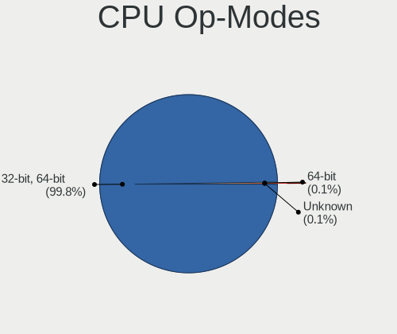

| Op mode        | Computers | Percent |
|----------------|-----------|---------|
| 32-bit, 64-bit | 1176      | 99.66%  |
| 64-bit         | 2         | 0.17%   |
| Unknown        | 2         | 0.17%   |

CPU Microcode
-------------

Microcode number

| Number     | Computers | Percent |
|------------|-----------|---------|
| Unknown    | 1016      | 85.88%  |
| 0x0a50000d | 23        | 1.94%   |
| 0x0a601203 | 14        | 1.18%   |
| 0x0a50000c | 12        | 1.01%   |
| 0x0a404102 | 12        | 1.01%   |
| 0x08608103 | 11        | 0.93%   |
| 0x08600106 | 8         | 0.68%   |
| 0x0a404101 | 5         | 0.42%   |
| 0x906a3    | 4         | 0.34%   |
| 0x0a20120a | 4         | 0.34%   |
| 0x08108109 | 4         | 0.34%   |
| 0x806ec    | 3         | 0.25%   |
| 0x0a704101 | 3         | 0.25%   |
| 0x08a00006 | 3         | 0.25%   |
| 0x08600109 | 3         | 0.25%   |
| 0x08101016 | 3         | 0.25%   |
| 0x0800820d | 3         | 0.25%   |
| 0x010000c8 | 3         | 0.25%   |
| 0x306a9    | 2         | 0.17%   |
| 0x0a704103 | 2         | 0.17%   |
| 0x0a201025 | 2         | 0.17%   |
| 0x08701030 | 2         | 0.17%   |
| 0x08701021 | 2         | 0.17%   |
| 0x08608104 | 2         | 0.17%   |
| 0x08608102 | 2         | 0.17%   |
| 0x08108102 | 2         | 0.17%   |
| 0x0810100b | 2         | 0.17%   |
| 0x06001119 | 2         | 0.17%   |
| 0xf64      | 1         | 0.08%   |
| 0x906ea    | 1         | 0.08%   |
| 0x90675    | 1         | 0.08%   |
| 0x806eb    | 1         | 0.08%   |
| 0x806d1    | 1         | 0.08%   |
| 0x806c1    | 1         | 0.08%   |
| 0x506e3    | 1         | 0.08%   |
| 0x406e3    | 1         | 0.08%   |
| 0x40651    | 1         | 0.08%   |
| 0x306d4    | 1         | 0.08%   |
| 0x306c3    | 1         | 0.08%   |
| 0x206a7    | 1         | 0.08%   |

CPU Microarch
-------------

Microarchitecture

| Name             | Computers | Percent |
|------------------|-----------|---------|
| KabyLake         | 180       | 15.22%  |
| Unknown          | 160       | 13.52%  |
| Skylake          | 79        | 6.68%   |
| Haswell          | 77        | 6.51%   |
| Zen 3            | 71        | 6%      |
| TigerLake        | 71        | 6%      |
| IvyBridge        | 67        | 5.66%   |
| Alderlake Hybrid | 65        | 5.49%   |
| SandyBridge      | 58        | 4.9%    |
| Penryn           | 41        | 3.47%   |
| Zen 2            | 40        | 3.38%   |
| Broadwell        | 31        | 2.62%   |
| CometLake        | 26        | 2.2%    |
| Zen+             | 24        | 2.03%   |
| Westmere         | 22        | 1.86%   |
| IceLake          | 22        | 1.86%   |
| Goldmont plus    | 22        | 1.86%   |
| Silvermont       | 20        | 1.69%   |
| Piledriver       | 16        | 1.35%   |
| Zen              | 15        | 1.27%   |
| K10              | 14        | 1.18%   |
| Core             | 12        | 1.01%   |
| Excavator        | 11        | 0.93%   |
| Goldmont         | 9         | 0.76%   |
| Nehalem          | 6         | 0.51%   |
| Puma             | 5         | 0.42%   |
| K8 Hammer        | 3         | 0.25%   |
| Tremont          | 2         | 0.17%   |
| Steamroller      | 2         | 0.17%   |
| NetBurst         | 2         | 0.17%   |
| Jaguar           | 2         | 0.17%   |
| Gracemont        | 2         | 0.17%   |
| Bulldozer        | 2         | 0.17%   |
| Bobcat           | 2         | 0.17%   |
| K10 Llano        | 1         | 0.08%   |
| Bonnell          | 1         | 0.08%   |

Graphics
--------

GPU Vendor
----------

Vendors of graphics cards

| Vendor                     | Computers | Percent |
|----------------------------|-----------|---------|
| Intel                      | 731       | 51.77%  |
| Nvidia                     | 337       | 23.87%  |
| AMD                        | 333       | 23.58%  |
| Matrox Electronics Systems | 7         | 0.5%    |
| Zhaoxin                    | 3         | 0.21%   |
| Silicon Motion             | 1         | 0.07%   |

GPU Model
---------

Graphics card models

| Model                                                                       | Computers | Percent |
|-----------------------------------------------------------------------------|-----------|---------|
| Intel TigerLake-LP GT2 [Iris Xe Graphics]                                   | 56        | 3.9%    |
| Intel 2nd Generation Core Processor Family Integrated Graphics Controller   | 45        | 3.13%   |
| Intel Alder Lake-P Integrated Graphics Controller                           | 37        | 2.57%   |
| Intel 3rd Gen Core processor Graphics Controller                            | 37        | 2.57%   |
| Intel Skylake GT2 [HD Graphics 520]                                         | 33        | 2.3%    |
| AMD Cezanne [Radeon Vega Series / Radeon Vega Mobile Series]                | 31        | 2.16%   |
| Intel HD Graphics 620                                                       | 29        | 2.02%   |
| Intel WhiskeyLake-U GT2 [UHD Graphics 620]                                  | 27        | 1.88%   |
| Intel UHD Graphics 620                                                      | 26        | 1.81%   |
| Intel CoffeeLake-H GT2 [UHD Graphics 630]                                   | 26        | 1.81%   |
| AMD Renoir                                                                  | 26        | 1.81%   |
| AMD Rembrandt [Radeon 680M]                                                 | 25        | 1.74%   |
| Intel HD Graphics 530                                                       | 24        | 1.67%   |
| AMD Lucienne                                                                | 23        | 1.6%    |
| Intel Haswell-ULT Integrated Graphics Controller                            | 22        | 1.53%   |
| Intel HD Graphics 5500                                                      | 21        | 1.46%   |
| AMD Barcelo                                                                 | 20        | 1.39%   |
| Intel Xeon E3-1200 v3/4th Gen Core Processor Integrated Graphics Controller | 19        | 1.32%   |
| Intel Raptor Lake-P [Iris Xe Graphics]                                      | 19        | 1.32%   |
| AMD Raphael                                                                 | 19        | 1.32%   |
| Intel GeminiLake [UHD Graphics 600]                                         | 18        | 1.25%   |
| Intel CometLake-U GT2 [UHD Graphics]                                        | 18        | 1.25%   |
| Intel HD Graphics 630                                                       | 17        | 1.18%   |
| Nvidia GA106M [GeForce RTX 3060 Mobile / Max-Q]                             | 16        | 1.11%   |
| Intel Xeon E3-1200 v2/3rd Gen Core processor Graphics Controller            | 16        | 1.11%   |
| AMD Ellesmere [Radeon RX 470/480/570/570X/580/580X/590]                     | 15        | 1.04%   |
| AMD Picasso/Raven 2 [Radeon Vega Series / Radeon Vega Mobile Series]        | 14        | 0.97%   |
| Intel Tiger Lake-LP GT2 [UHD Graphics G4]                                   | 13        | 0.9%    |
| Nvidia GA107M [GeForce RTX 3050 Mobile]                                     | 12        | 0.84%   |
| Intel TigerLake-H GT1 [UHD Graphics]                                        | 12        | 0.84%   |
| Intel Mobile 4 Series Chipset Integrated Graphics Controller                | 12        | 0.84%   |
| Intel Core Processor Integrated Graphics Controller                         | 12        | 0.84%   |
| Intel CometLake-H GT2 [UHD Graphics]                                        | 12        | 0.84%   |
| Nvidia TU117M [GeForce GTX 1650 Mobile / Max-Q]                             | 11        | 0.77%   |
| Intel Atom Processor Z36xxx/Z37xxx Series Graphics & Display                | 11        | 0.77%   |
| Intel 4 Series Chipset Integrated Graphics Controller                       | 11        | 0.77%   |
| Nvidia GP107 [GeForce GTX 1050 Ti]                                          | 10        | 0.7%    |
| Intel Iris Plus Graphics G1 (Ice Lake)                                      | 10        | 0.7%    |
| AMD Raven Ridge [Radeon Vega Series / Radeon Vega Mobile Series]            | 10        | 0.7%    |
| Nvidia GP107M [GeForce GTX 1050 Mobile]                                     | 9         | 0.63%   |

GPU Combo
---------

Combinations of graphics cards

| Name                | Computers | Percent |
|---------------------|-----------|---------|
| 1 x Intel           | 524       | 44.29%  |
| 1 x AMD             | 259       | 21.89%  |
| Intel + Nvidia      | 161       | 13.61%  |
| 1 x Nvidia          | 133       | 11.24%  |
| AMD + Nvidia        | 36        | 3.04%   |
| Intel + AMD         | 29        | 2.45%   |
| 2 x AMD             | 10        | 0.85%   |
| Other               | 9         | 0.76%   |
| 2 x Intel           | 6         | 0.51%   |
| 1 x Matrox          | 5         | 0.42%   |
| 1 x Zhaoxin         | 3         | 0.25%   |
| 2 x Nvidia          | 2         | 0.17%   |
| Nvidia + Matrox     | 2         | 0.17%   |
| Intel + 2 x Nvidia  | 2         | 0.17%   |
| 2 x Intel + 1 x AMD | 1         | 0.08%   |
| 1 x Silicon Motion  | 1         | 0.08%   |

GPU Driver
----------

Free vs proprietary

| Driver      | Computers | Percent |
|-------------|-----------|---------|
| Free        | 940       | 79.26%  |
| Proprietary | 208       | 17.54%  |
| Unknown     | 38        | 3.2%    |

GPU Memory
----------

Total video memory

| Size in GB | Computers | Percent |
|------------|-----------|---------|
| Unknown    | 959       | 80.66%  |
| 0.01-0.5   | 83        | 6.98%   |
| 1.01-2.0   | 49        | 4.12%   |
| 3.01-4.0   | 34        | 2.86%   |
| 0.51-1.0   | 24        | 2.02%   |
| 7.01-8.0   | 20        | 1.68%   |
| 5.01-6.0   | 8         | 0.67%   |
| 8.01-16.0  | 6         | 0.5%    |
| 16.01-24.0 | 5         | 0.42%   |
| 2.01-3.0   | 1         | 0.08%   |

Monitor
-------

Monitor Vendor
--------------

Monitor vendors

| Vendor                  | Computers | Percent |
|-------------------------|-----------|---------|
| AU Optronics            | 175       | 13.32%  |
| Samsung Electronics     | 158       | 12.02%  |
| BOE                     | 145       | 11.04%  |
| Chimei Innolux          | 109       | 8.3%    |
| LG Display              | 97        | 7.38%   |
| Goldstar                | 69        | 5.25%   |
| Dell                    | 69        | 5.25%   |
| Hewlett-Packard         | 40        | 3.04%   |
| Acer                    | 40        | 3.04%   |
| Apple                   | 33        | 2.51%   |
| Sharp                   | 31        | 2.36%   |
| Ancor Communications    | 28        | 2.13%   |
| AOC                     | 27        | 2.05%   |
| Philips                 | 25        | 1.9%    |
| Lenovo                  | 22        | 1.67%   |
| Iiyama                  | 20        | 1.52%   |
| BenQ                    | 19        | 1.45%   |
| InfoVision              | 17        | 1.29%   |
| PANDA                   | 16        | 1.22%   |
| CSO                     | 16        | 1.22%   |
| ViewSonic               | 14        | 1.07%   |
| ASUSTek Computer        | 11        | 0.84%   |
| Sony                    | 9         | 0.68%   |
| MSI                     | 6         | 0.46%   |
| Vestel Elektronik       | 5         | 0.38%   |
| Panasonic               | 5         | 0.38%   |
| NEC Computers           | 5         | 0.38%   |
| Chi Mei Optoelectronics | 5         | 0.38%   |
| HKC                     | 4         | 0.3%    |
| Denver                  | 4         | 0.3%    |
| Wacom                   | 3         | 0.23%   |
| Unknown (XXX)           | 3         | 0.23%   |
| Unknown                 | 3         | 0.23%   |
| Sceptre Tech            | 3         | 0.23%   |
| MiTAC                   | 3         | 0.23%   |
| Medion                  | 3         | 0.23%   |
| LG Philips              | 3         | 0.23%   |
| Gigabyte Technology     | 3         | 0.23%   |
| Fujitsu Siemens         | 3         | 0.23%   |
| Eizo                    | 3         | 0.23%   |

Monitor Model
-------------

Monitor models

| Model                                                                 | Computers | Percent |
|-----------------------------------------------------------------------|-----------|---------|
| BOE LCD Monitor BOE0872 1920x1080 344x194mm 15.5-inch                 | 11        | 0.82%   |
| Samsung Electronics LCD Monitor SDC4161 1920x1080 344x194mm 15.5-inch | 7         | 0.52%   |
| LG Display LCD Monitor LGD02DC 1366x768 344x194mm 15.5-inch           | 7         | 0.52%   |
| Chimei Innolux LCD Monitor CMN15E7 1920x1080 344x193mm 15.5-inch      | 7         | 0.52%   |
| AU Optronics LCD Monitor AUO243D 1920x1080 310x170mm 13.9-inch        | 7         | 0.52%   |
| Samsung Electronics LCD Monitor SDC4171 2880x1800 302x189mm 14.0-inch | 6         | 0.45%   |
| LG Display LCD Monitor LGD0555 2736x1824 260x173mm 12.3-inch          | 6         | 0.45%   |
| Goldstar FULL HD GSM5B55 1920x1080 480x270mm 21.7-inch                | 6         | 0.45%   |
| Chimei Innolux LCD Monitor CMN14D4 1920x1080 309x173mm 13.9-inch      | 6         | 0.45%   |
| Vestel Elektronik 40W_LCD_TV VES3700 1920x540                         | 5         | 0.37%   |
| Chimei Innolux LCD Monitor CMN1521 1920x1080 344x193mm 15.5-inch      | 5         | 0.37%   |
| Chimei Innolux LCD Monitor CMN14D5 1920x1080 309x173mm 13.9-inch      | 5         | 0.37%   |
| AU Optronics LCD Monitor AUO22EC 1366x768 344x193mm 15.5-inch         | 5         | 0.37%   |
| Samsung Electronics LCD Monitor SEC5441 1280x800 331x207mm 15.4-inch  | 4         | 0.3%    |
| Samsung Electronics C27F390 SAM0D32 1920x1080 598x336mm 27.0-inch     | 4         | 0.3%    |
| PANDA LCD Monitor NCP004D 1920x1080 344x194mm 15.5-inch               | 4         | 0.3%    |
| Goldstar ULTRAWIDE GSM59F1 2560x1080 673x284mm 28.8-inch              | 4         | 0.3%    |
| Goldstar HDR 4K GSM7707 3840x2160 600x340mm 27.2-inch                 | 4         | 0.3%    |
| Goldstar HDR 4K GSM7706 3840x2160 600x340mm 27.2-inch                 | 4         | 0.3%    |
| Chimei Innolux LCD Monitor CMN15F5 1920x1080 344x193mm 15.5-inch      | 4         | 0.3%    |
| Chimei Innolux LCD Monitor CMN1470 1366x768 309x174mm 14.0-inch       | 4         | 0.3%    |
| BOE LCD Monitor BOE08E2 1920x1080 344x194mm 15.5-inch                 | 4         | 0.3%    |
| AU Optronics LCD Monitor AUOAF90 1920x1080 344x193mm 15.5-inch        | 4         | 0.3%    |
| AU Optronics LCD Monitor AUO61ED 1920x1080 344x194mm 15.5-inch        | 4         | 0.3%    |
| AU Optronics LCD Monitor AUO5799 1920x1080 344x194mm 15.5-inch        | 4         | 0.3%    |
| AU Optronics LCD Monitor AUO106C 1366x768 276x155mm 12.5-inch         | 4         | 0.3%    |
| Samsung Electronics LCD Monitor SDC4172 2880x1800 289x186mm 13.5-inch | 3         | 0.22%   |
| Samsung Electronics LCD Monitor SDC416D 2880x1800 312x195mm 14.5-inch | 3         | 0.22%   |
| Samsung Electronics C24F390 SAM0D2C 1920x1080 521x293mm 23.5-inch     | 3         | 0.22%   |
| LG Display LCD Monitor LGD056D 1920x1080 382x215mm 17.3-inch          | 3         | 0.22%   |
| LG Display LCD Monitor LGD0456 1366x768 344x194mm 15.5-inch           | 3         | 0.22%   |
| Goldstar Ultra HD GSM5B09 3840x2160 600x340mm 27.2-inch               | 3         | 0.22%   |
| Dell SE198WFP DELF003 1440x900 408x255mm 18.9-inch                    | 3         | 0.22%   |
| Chimei Innolux LCD Monitor CMN15DB 1366x768 344x193mm 15.5-inch       | 3         | 0.22%   |
| Chimei Innolux LCD Monitor CMN14C3 1366x768 309x173mm 13.9-inch       | 3         | 0.22%   |
| BOE LCD Monitor BOE0893 2160x1440 296x197mm 14.0-inch                 | 3         | 0.22%   |
| BOE LCD Monitor BOE084E 1920x1080 382x215mm 17.3-inch                 | 3         | 0.22%   |
| BOE LCD Monitor BOE0672 1366x768 344x194mm 15.5-inch                  | 3         | 0.22%   |
| AU Optronics LCD Monitor AUO978F 1920x1080 382x215mm 17.3-inch        | 3         | 0.22%   |
| AU Optronics LCD Monitor AUO333D 1920x1080 309x174mm 14.0-inch        | 3         | 0.22%   |

Monitor Resolution
------------------

Monitor screen resolution

| Resolution         | Computers | Percent |
|--------------------|-----------|---------|
| 1920x1080 (FHD)    | 574       | 46.1%   |
| 1366x768 (WXGA)    | 175       | 14.06%  |
| 3840x2160 (4K)     | 105       | 8.43%   |
| 2560x1440 (QHD)    | 74        | 5.94%   |
| 1920x1200 (WUXGA)  | 47        | 3.78%   |
| 1600x900 (HD+)     | 30        | 2.41%   |
| 2560x1600          | 28        | 2.25%   |
| 3440x1440          | 27        | 2.17%   |
| 2880x1800          | 26        | 2.09%   |
| 1440x900 (WXGA+)   | 24        | 1.93%   |
| 1280x800 (WXGA)    | 19        | 1.53%   |
| 1280x1024 (SXGA)   | 15        | 1.2%    |
| 3840x2400          | 13        | 1.04%   |
| 1680x1050 (WSXGA+) | 11        | 0.88%   |
| 2560x1080          | 10        | 0.8%    |
| 2736x1824          | 7         | 0.56%   |
| 3840x1080          | 5         | 0.4%    |
| 1920x540           | 5         | 0.4%    |
| 3840x1600          | 4         | 0.32%   |
| 2240x1400          | 4         | 0.32%   |
| 1280x720 (HD)      | 4         | 0.32%   |
| Unknown            | 4         | 0.32%   |
| 3200x1800 (QHD+)   | 3         | 0.24%   |
| 3000x2000          | 3         | 0.24%   |
| 2256x1504          | 3         | 0.24%   |
| 2160x1440          | 3         | 0.24%   |
| 1920x1280          | 3         | 0.24%   |
| 3456x2160          | 2         | 0.16%   |
| 2520x1680          | 2         | 0.16%   |
| 1360x768           | 2         | 0.16%   |
| 1024x768 (XGA)     | 2         | 0.16%   |
| 5760x2160          | 1         | 0.08%   |
| 3240x2160          | 1         | 0.08%   |
| 3072x1920          | 1         | 0.08%   |
| 2880x1920          | 1         | 0.08%   |
| 2880x1620          | 1         | 0.08%   |
| 2304x1440          | 1         | 0.08%   |
| 1920x550           | 1         | 0.08%   |
| 1600x1200          | 1         | 0.08%   |
| 1280x960           | 1         | 0.08%   |

Monitor Diagonal
----------------

Diagonal size in inches

| Inches  | Computers | Percent |
|---------|-----------|---------|
| 15      | 306       | 23.25%  |
| 13      | 155       | 11.78%  |
| 14      | 141       | 10.71%  |
| 27      | 103       | 7.83%   |
| 24      | 81        | 6.16%   |
| 23      | 73        | 5.55%   |
| 21      | 65        | 4.94%   |
| 17      | 62        | 4.71%   |
| 31      | 38        | 2.89%   |
| 16      | 34        | 2.58%   |
| 34      | 28        | 2.13%   |
| 12      | 27        | 2.05%   |
| 19      | 23        | 1.75%   |
| Unknown | 22        | 1.67%   |
| 18      | 16        | 1.22%   |
| 11      | 16        | 1.22%   |
| 84      | 15        | 1.14%   |
| 20      | 14        | 1.06%   |
| 40      | 11        | 0.84%   |
| 22      | 10        | 0.76%   |
| 72      | 9         | 0.68%   |
| 35      | 8         | 0.61%   |
| 32      | 6         | 0.46%   |
| 26      | 6         | 0.46%   |
| 65      | 4         | 0.3%    |
| 54      | 4         | 0.3%    |
| 52      | 4         | 0.3%    |
| 48      | 4         | 0.3%    |
| 42      | 4         | 0.3%    |
| 28      | 4         | 0.3%    |
| 25      | 4         | 0.3%    |
| 37      | 3         | 0.23%   |
| 49      | 2         | 0.15%   |
| 10      | 2         | 0.15%   |
| 63      | 1         | 0.08%   |
| 61      | 1         | 0.08%   |
| 60      | 1         | 0.08%   |
| 58      | 1         | 0.08%   |
| 46      | 1         | 0.08%   |
| 43      | 1         | 0.08%   |

Monitor Width
-------------

Physical width

| Width in mm | Computers | Percent |
|-------------|-----------|---------|
| 301-350     | 528       | 40.58%  |
| 501-600     | 247       | 18.99%  |
| 201-300     | 145       | 11.15%  |
| 401-500     | 117       | 8.99%   |
| 351-400     | 76        | 5.84%   |
| 601-700     | 53        | 4.07%   |
| 701-800     | 35        | 2.69%   |
| 1501-2000   | 24        | 1.84%   |
| 1001-1500   | 23        | 1.77%   |
| 801-900     | 22        | 1.69%   |
| Unknown     | 22        | 1.69%   |
| 901-1000    | 6         | 0.46%   |
| 101-200     | 3         | 0.23%   |

Aspect Ratio
------------

Proportional relationship between the width and the height

| Ratio   | Computers | Percent |
|---------|-----------|---------|
| 16/9    | 871       | 74.25%  |
| 16/10   | 185       | 15.77%  |
| 21/9    | 41        | 3.5%    |
| 3/2     | 24        | 2.05%   |
| 5/4     | 19        | 1.62%   |
| Unknown | 14        | 1.19%   |
| 32/9    | 9         | 0.77%   |
| 4/3     | 8         | 0.68%   |
| 6/5     | 1         | 0.09%   |
| 0.62    | 1         | 0.09%   |

Monitor Area
------------

Area in inch

| Area in inch | Computers | Percent |
|----------------|-----------|---------|
| 101-110        | 307       | 23.38%  |
| 81-90          | 221       | 16.83%  |
| 201-250        | 174       | 13.25%  |
| 301-350        | 108       | 8.23%   |
| 351-500        | 84        | 6.4%    |
| 71-80          | 77        | 5.86%   |
| 151-200        | 60        | 4.57%   |
| 121-130        | 48        | 3.66%   |
| More than 1000 | 42        | 3.2%    |
| 251-300        | 42        | 3.2%    |
| 111-120        | 32        | 2.44%   |
| 501-1000       | 24        | 1.83%   |
| Unknown        | 22        | 1.68%   |
| 141-150        | 21        | 1.6%    |
| 61-70          | 20        | 1.52%   |
| 51-60          | 17        | 1.29%   |
| 131-140        | 5         | 0.38%   |
| 91-100         | 5         | 0.38%   |
| 41-50          | 2         | 0.15%   |
| 1-40           | 2         | 0.15%   |

Pixel Density
-------------

Pixels per inch

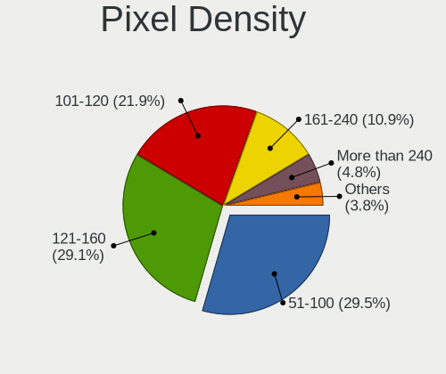

| Density       | Computers | Percent |
|---------------|-----------|---------|
| 121-160       | 387       | 30.23%  |
| 51-100        | 350       | 27.34%  |
| 101-120       | 288       | 22.5%   |
| 161-240       | 146       | 11.41%  |
| More than 240 | 63        | 4.92%   |
| 1-50          | 24        | 1.88%   |
| Unknown       | 22        | 1.72%   |

Multiple Monitors
-----------------

Total monitors connected

| Total | Computers | Percent |
|-------|-----------|---------|
| 1     | 918       | 76.95%  |
| 2     | 190       | 15.93%  |
| 0     | 60        | 5.03%   |
| 3     | 22        | 1.84%   |
| 4     | 3         | 0.25%   |

Network
-------

Net Controller Vendor
---------------------

Controller vendors

| Vendor                            | Computers | Percent |
|-----------------------------------|-----------|---------|
| Realtek Semiconductor             | 614       | 34.91%  |
| Intel                             | 607       | 34.51%  |
| Qualcomm Atheros                  | 124       | 7.05%   |
| Broadcom                          | 88        | 5%      |
| MediaTek                          | 76        | 4.32%   |
| TP-Link                           | 29        | 1.65%   |
| Broadcom Limited                  | 18        | 1.02%   |
| ASIX Electronics                  | 16        | 0.91%   |
| Marvell Technology Group          | 15        | 0.85%   |
| Ralink                            | 12        | 0.68%   |
| Ralink Technology                 | 11        | 0.63%   |
| Lenovo                            | 11        | 0.63%   |
| Xiaomi                            | 9         | 0.51%   |
| DisplayLink                       | 9         | 0.51%   |
| NetGear                           | 8         | 0.45%   |
| Microsoft                         | 8         | 0.45%   |
| D-Link                            | 7         | 0.4%    |
| Sierra Wireless                   | 6         | 0.34%   |
| Samsung Electronics               | 6         | 0.34%   |
| Qualcomm                          | 6         | 0.34%   |
| Aquantia                          | 6         | 0.34%   |
| Nvidia                            | 5         | 0.28%   |
| Huawei Technologies               | 4         | 0.23%   |
| Hewlett-Packard                   | 4         | 0.23%   |
| Google                            | 4         | 0.23%   |
| Dell                              | 4         | 0.23%   |
| ASUSTek Computer                  | 4         | 0.23%   |
| Apple                             | 4         | 0.23%   |
| Qualcomm Atheros Communications   | 3         | 0.17%   |
| Mellanox Technologies             | 3         | 0.17%   |
| JMicron Technology                | 3         | 0.17%   |
| Edimax Technology                 | 3         | 0.17%   |
| D-Link System                     | 3         | 0.17%   |
| Ericsson Business Mobile Networks | 2         | 0.11%   |
| Dresden Elektronik                | 2         | 0.11%   |
| AVM                               | 2         | 0.11%   |
| ZyDAS                             | 1         | 0.06%   |
| ZTE WCDMA Technologies MSM        | 1         | 0.06%   |
| Z-Com                             | 1         | 0.06%   |
| Vimtron Electronics               | 1         | 0.06%   |

Net Controller Model
--------------------

Controller models

| Model                                                             | Computers | Percent |
|-------------------------------------------------------------------|-----------|---------|
| Realtek RTL8111/8168/8411 PCI Express Gigabit Ethernet Controller | 372       | 18.16%  |
| Intel Wi-Fi 6 AX201                                               | 57        | 2.78%   |
| Realtek RTL810xE PCI Express Fast Ethernet controller             | 51        | 2.49%   |
| Intel Wi-Fi 6 AX200                                               | 49        | 2.39%   |
| Intel Alder Lake-P PCH CNVi WiFi                                  | 49        | 2.39%   |
| Realtek RTL8153 Gigabit Ethernet Adapter                          | 48        | 2.34%   |
| Intel Wireless 8265 / 8275                                        | 44        | 2.15%   |
| Realtek RTL8822CE 802.11ac PCIe Wireless Network Adapter          | 38        | 1.86%   |
| Realtek RTL8125 2.5GbE Controller                                 | 35        | 1.71%   |
| MediaTek MT7922 802.11ax PCI Express Wireless Network Adapter     | 35        | 1.71%   |
| Intel Wireless 8260                                               | 29        | 1.42%   |
| MediaTek MT7921 802.11ax PCI Express Wireless Network Adapter     | 28        | 1.37%   |
| Intel Wireless 7265                                               | 26        | 1.27%   |
| Realtek RTL8821CE 802.11ac PCIe Wireless Network Adapter          | 25        | 1.22%   |
| Intel 82579LM Gigabit Network Connection (Lewisville)             | 24        | 1.17%   |
| Realtek RTL8852BE PCIe 802.11ax Wireless Network Controller       | 23        | 1.12%   |
| Intel Ethernet Controller I225-V                                  | 23        | 1.12%   |
| Intel Wi-Fi 6 AX210/AX211/AX411 160MHz                            | 22        | 1.07%   |
| Qualcomm Atheros QCA6174 802.11ac Wireless Network Adapter        | 21        | 1.03%   |
| Intel Ethernet Connection (4) I219-LM                             | 21        | 1.03%   |
| Intel Comet Lake PCH-LP CNVi WiFi                                 | 20        | 0.98%   |
| Intel Raptor Lake PCH CNVi WiFi                                   | 19        | 0.93%   |
| Qualcomm Atheros QCA9565 / AR9565 Wireless Network Adapter        | 18        | 0.88%   |
| Qualcomm Atheros QCA9377 802.11ac Wireless Network Adapter        | 18        | 0.88%   |
| Intel Ethernet Connection I219-LM                                 | 17        | 0.83%   |
| Qualcomm Atheros AR9485 Wireless Network Adapter                  | 16        | 0.78%   |
| Intel Comet Lake PCH CNVi WiFi                                    | 16        | 0.78%   |
| Intel Cannon Lake PCH CNVi WiFi                                   | 16        | 0.78%   |
| ASIX AX88179 Gigabit Ethernet                                     | 16        | 0.78%   |
| Intel Cannon Point-LP CNVi [Wireless-AC]                          | 15        | 0.73%   |
| Intel I211 Gigabit Network Connection                             | 14        | 0.68%   |
| Qualcomm Atheros AR9285 Wireless Network Adapter (PCI-Express)    | 13        | 0.63%   |
| Realtek Killer E2600 Gigabit Ethernet Controller                  | 12        | 0.59%   |
| Realtek 802.11ac NIC                                              | 12        | 0.59%   |
| Intel Centrino Advanced-N 6205 [Taylor Peak]                      | 12        | 0.59%   |
| Broadcom BCM43142 802.11b/g/n                                     | 12        | 0.59%   |
| Realtek RTL8723BE PCIe Wireless Network Adapter                   | 11        | 0.54%   |
| Intel Tiger Lake PCH CNVi WiFi                                    | 11        | 0.54%   |
| Intel Ice Lake-LP PCH CNVi WiFi                                   | 11        | 0.54%   |
| Intel Alder Lake-S PCH CNVi WiFi                                  | 11        | 0.54%   |

Wireless Vendor
---------------

Wireless vendors

| Vendor                          | Computers | Percent |
|---------------------------------|-----------|---------|
| Intel                           | 503       | 48.23%  |
| Realtek Semiconductor           | 171       | 16.4%   |
| Qualcomm Atheros                | 104       | 9.97%   |
| MediaTek                        | 73        | 7%      |
| Broadcom                        | 63        | 6.04%   |
| TP-Link                         | 28        | 2.68%   |
| Broadcom Limited                | 13        | 1.25%   |
| Ralink                          | 12        | 1.15%   |
| Ralink Technology               | 11        | 1.05%   |
| NetGear                         | 8         | 0.77%   |
| Microsoft                       | 8         | 0.77%   |
| D-Link                          | 7         | 0.67%   |
| Sierra Wireless                 | 6         | 0.58%   |
| Qualcomm                        | 5         | 0.48%   |
| ASUSTek Computer                | 4         | 0.38%   |
| Qualcomm Atheros Communications | 3         | 0.29%   |
| Marvell Technology Group        | 3         | 0.29%   |
| Edimax Technology               | 3         | 0.29%   |
| Dell                            | 2         | 0.19%   |
| D-Link System                   | 2         | 0.19%   |
| AVM                             | 2         | 0.19%   |
| ZyDAS                           | 1         | 0.1%    |
| Z-Com                           | 1         | 0.1%    |
| TRENDnet                        | 1         | 0.1%    |
| Tenda                           | 1         | 0.1%    |
| Quectel Wireless Solutions      | 1         | 0.1%    |
| Qualcomm Technologies           | 1         | 0.1%    |
| Philips (or NXP)                | 1         | 0.1%    |
| Linksys                         | 1         | 0.1%    |
| Guillemot                       | 1         | 0.1%    |
| Fibocom                         | 1         | 0.1%    |
| Belkin Components               | 1         | 0.1%    |
| AboCom Systems                  | 1         | 0.1%    |

Wireless Model
--------------

Wireless models

| Model                                                          | Computers | Percent |
|----------------------------------------------------------------|-----------|---------|
| Intel Wi-Fi 6 AX201                                            | 57        | 5.43%   |
| Intel Wi-Fi 6 AX200                                            | 49        | 4.67%   |
| Intel Alder Lake-P PCH CNVi WiFi                               | 49        | 4.67%   |
| Intel Wireless 8265 / 8275                                     | 44        | 4.19%   |
| Realtek RTL8822CE 802.11ac PCIe Wireless Network Adapter       | 38        | 3.62%   |
| MediaTek MT7922 802.11ax PCI Express Wireless Network Adapter  | 35        | 3.33%   |
| Intel Wireless 8260                                            | 29        | 2.76%   |
| MediaTek MT7921 802.11ax PCI Express Wireless Network Adapter  | 28        | 2.67%   |
| Intel Wireless 7265                                            | 26        | 2.48%   |
| Realtek RTL8821CE 802.11ac PCIe Wireless Network Adapter       | 25        | 2.38%   |
| Realtek RTL8852BE PCIe 802.11ax Wireless Network Controller    | 23        | 2.19%   |
| Intel Wi-Fi 6 AX210/AX211/AX411 160MHz                         | 22        | 2.1%    |
| Qualcomm Atheros QCA6174 802.11ac Wireless Network Adapter     | 21        | 2%      |
| Intel Comet Lake PCH-LP CNVi WiFi                              | 20        | 1.9%    |
| Intel Raptor Lake PCH CNVi WiFi                                | 19        | 1.81%   |
| Qualcomm Atheros QCA9565 / AR9565 Wireless Network Adapter     | 18        | 1.71%   |
| Qualcomm Atheros QCA9377 802.11ac Wireless Network Adapter     | 18        | 1.71%   |
| Qualcomm Atheros AR9485 Wireless Network Adapter               | 16        | 1.52%   |
| Intel Comet Lake PCH CNVi WiFi                                 | 16        | 1.52%   |
| Intel Cannon Lake PCH CNVi WiFi                                | 16        | 1.52%   |
| Intel Cannon Point-LP CNVi [Wireless-AC]                       | 15        | 1.43%   |
| Qualcomm Atheros AR9285 Wireless Network Adapter (PCI-Express) | 13        | 1.24%   |
| Realtek 802.11ac NIC                                           | 12        | 1.14%   |
| Intel Centrino Advanced-N 6205 [Taylor Peak]                   | 12        | 1.14%   |
| Broadcom BCM43142 802.11b/g/n                                  | 12        | 1.14%   |
| Realtek RTL8723BE PCIe Wireless Network Adapter                | 11        | 1.05%   |
| Intel Tiger Lake PCH CNVi WiFi                                 | 11        | 1.05%   |
| Intel Ice Lake-LP PCH CNVi WiFi                                | 11        | 1.05%   |
| Intel Alder Lake-S PCH CNVi WiFi                               | 11        | 1.05%   |
| Intel Wireless 7260                                            | 10        | 0.95%   |
| Intel Wireless 3165                                            | 10        | 0.95%   |
| Realtek RTL8822BE 802.11a/b/g/n/ac WiFi adapter                | 9         | 0.86%   |
| Qualcomm Atheros AR9462 Wireless Network Adapter               | 9         | 0.86%   |
| Intel Gemini Lake PCH CNVi WiFi                                | 9         | 0.86%   |
| Broadcom BCM4331 802.11a/b/g/n                                 | 8         | 0.76%   |
| TP-Link TL-WN823N v2/v3 [Realtek RTL8192EU]                    | 7         | 0.67%   |
| TP-Link AC600 wireless Realtek RTL8811AU [Archer T2U Nano]     | 7         | 0.67%   |
| Realtek RTL8852AE 802.11ax PCIe Wireless Network Adapter       | 7         | 0.67%   |
| Intel Wireless-AC 9260                                         | 7         | 0.67%   |
| Broadcom Limited BCM4360 802.11ac Wireless Network Adapter     | 7         | 0.67%   |

Ethernet Vendor
---------------

Ethernet vendors

| Vendor                     | Computers | Percent |
|----------------------------|-----------|---------|
| Realtek Semiconductor      | 527       | 54.5%   |
| Intel                      | 259       | 26.78%  |
| Broadcom                   | 39        | 4.03%   |
| Qualcomm Atheros           | 30        | 3.1%    |
| ASIX Electronics           | 16        | 1.65%   |
| Marvell Technology Group   | 12        | 1.24%   |
| Lenovo                     | 11        | 1.14%   |
| Xiaomi                     | 9         | 0.93%   |
| DisplayLink                | 9         | 0.93%   |
| Samsung Electronics        | 6         | 0.62%   |
| Broadcom Limited           | 6         | 0.62%   |
| Aquantia                   | 6         | 0.62%   |
| Nvidia                     | 5         | 0.52%   |
| Google                     | 4         | 0.41%   |
| Mellanox Technologies      | 3         | 0.31%   |
| MediaTek                   | 3         | 0.31%   |
| JMicron Technology         | 3         | 0.31%   |
| Apple                      | 3         | 0.31%   |
| TP-Link                    | 2         | 0.21%   |
| Huawei Technologies        | 2         | 0.21%   |
| ZTE WCDMA Technologies MSM | 1         | 0.1%    |
| Vimtron Electronics        | 1         | 0.1%    |
| Toshiba                    | 1         | 0.1%    |
| Qualcomm                   | 1         | 0.1%    |
| OPPO Electronics           | 1         | 0.1%    |
| Motorola PCS               | 1         | 0.1%    |
| MosChip Semiconductor      | 1         | 0.1%    |
| Microchip Technology       | 1         | 0.1%    |
| ICS Advent                 | 1         | 0.1%    |
| Hewlett-Packard            | 1         | 0.1%    |
| D-Link System              | 1         | 0.1%    |
| 3Com                       | 1         | 0.1%    |

Ethernet Model
--------------

Ethernet models

| Model                                                             | Computers | Percent |
|-------------------------------------------------------------------|-----------|---------|
| Realtek RTL8111/8168/8411 PCI Express Gigabit Ethernet Controller | 372       | 37.8%   |
| Realtek RTL810xE PCI Express Fast Ethernet controller             | 51        | 5.18%   |
| Realtek RTL8153 Gigabit Ethernet Adapter                          | 48        | 4.88%   |
| Realtek RTL8125 2.5GbE Controller                                 | 35        | 3.56%   |
| Intel 82579LM Gigabit Network Connection (Lewisville)             | 24        | 2.44%   |
| Intel Ethernet Controller I225-V                                  | 23        | 2.34%   |
| Intel Ethernet Connection (4) I219-LM                             | 21        | 2.13%   |
| Intel Ethernet Connection I219-LM                                 | 17        | 1.73%   |
| ASIX AX88179 Gigabit Ethernet                                     | 16        | 1.63%   |
| Intel I211 Gigabit Network Connection                             | 14        | 1.42%   |
| Realtek Killer E2600 Gigabit Ethernet Controller                  | 12        | 1.22%   |
| Qualcomm Atheros AR8151 v2.0 Gigabit Ethernet                     | 9         | 0.91%   |
| Intel Ethernet Connection (7) I219-LM                             | 9         | 0.91%   |
| Intel Ethernet Connection I217-LM                                 | 8         | 0.81%   |
| Intel Ethernet Connection (2) I219-V                              | 8         | 0.81%   |
| Intel Ethernet Connection (2) I219-LM                             | 8         | 0.81%   |
| Xiaomi Mi/Redmi series (RNDIS)                                    | 7         | 0.71%   |
| Intel Ethernet Connection (7) I219-V                              | 7         | 0.71%   |
| Intel Ethernet Connection (6) I219-V                              | 7         | 0.71%   |
| Intel 82579V Gigabit Network Connection                           | 7         | 0.71%   |
| Realtek Killer E3000 2.5GbE Controller                            | 6         | 0.61%   |
| Intel I210 Gigabit Network Connection                             | 6         | 0.61%   |
| Intel Ethernet Connection (5) I219-LM                             | 6         | 0.61%   |
| Intel Ethernet Connection (2) I218-V                              | 6         | 0.61%   |
| Intel 82567LM Gigabit Network Connection                          | 6         | 0.61%   |
| Broadcom NetXtreme BCM57765 Gigabit Ethernet PCIe                 | 6         | 0.61%   |
| Samsung Galaxy series, misc. (tethering mode)                     | 5         | 0.51%   |
| Qualcomm Atheros Killer E220x Gigabit Ethernet Controller         | 5         | 0.51%   |
| Qualcomm Atheros AR8161 Gigabit Ethernet                          | 5         | 0.51%   |
| Intel Ethernet Controller I226-V                                  | 5         | 0.51%   |
| Intel Ethernet Connection (6) I219-LM                             | 5         | 0.51%   |
| Intel Ethernet Connection (3) I218-LM                             | 5         | 0.51%   |
| Intel Ethernet Connection (17) I219-V                             | 5         | 0.51%   |
| Intel Ethernet Connection (10) I219-V                             | 5         | 0.51%   |
| Intel 82574L Gigabit Network Connection                           | 5         | 0.51%   |
| Broadcom NetXtreme BCM57766 Gigabit Ethernet PCIe                 | 5         | 0.51%   |
| Broadcom NetXtreme BCM5764M Gigabit Ethernet PCIe                 | 5         | 0.51%   |
| Nvidia MCP79 Ethernet                                             | 4         | 0.41%   |
| Marvell Group 88E8058 PCI-E Gigabit Ethernet Controller           | 4         | 0.41%   |
| Marvell Group 88E8040 PCI-E Fast Ethernet Controller              | 4         | 0.41%   |

Net Controller Kind
-------------------

Ethernet, WiFi or modem

| Kind     | Computers | Percent |
|----------|-----------|---------|
| WiFi     | 990       | 52.13%  |
| Ethernet | 895       | 47.13%  |
| Modem    | 13        | 0.68%   |
| Unknown  | 1         | 0.05%   |

Used Controller
---------------

Currently used network controller

| Kind     | Computers | Percent |
|----------|-----------|---------|
| WiFi     | 759       | 62.26%  |
| Ethernet | 460       | 37.74%  |

NICs
----

Total network controllers on board

| Total | Computers | Percent |
|-------|-----------|---------|
| 2     | 567       | 48.01%  |
| 1     | 562       | 47.59%  |
| 3     | 31        | 2.62%   |
| 0     | 18        | 1.52%   |
| 6     | 1         | 0.08%   |
| 5     | 1         | 0.08%   |
| 4     | 1         | 0.08%   |

IPv6
----

IPv6 vs IPv4

| Used | Computers | Percent |
|------|-----------|---------|
| No   | 808       | 68.01%  |
| Yes  | 380       | 31.99%  |

Bluetooth
---------

Bluetooth Vendor
----------------

Controller vendors

| Vendor                          | Computers | Percent |
|---------------------------------|-----------|---------|
| Intel                           | 449       | 51.67%  |
| Realtek Semiconductor           | 97        | 11.16%  |
| Qualcomm Atheros Communications | 45        | 5.18%   |
| Foxconn / Hon Hai               | 44        | 5.06%   |
| IMC Networks                    | 42        | 4.83%   |
| Apple                           | 32        | 3.68%   |
| Cambridge Silicon Radio         | 31        | 3.57%   |
| Lite-On Technology              | 24        | 2.76%   |
| Broadcom                        | 23        | 2.65%   |
| Realtek                         | 13        | 1.5%    |
| MediaTek                        | 12        | 1.38%   |
| ASUSTek Computer                | 12        | 1.38%   |
| TP-Link                         | 7         | 0.81%   |
| Dell                            | 6         | 0.69%   |
| Hewlett-Packard                 | 5         | 0.58%   |
| Toshiba                         | 4         | 0.46%   |
| Ralink                          | 4         | 0.46%   |
| USI                             | 3         | 0.35%   |
| Marvell Semiconductor           | 3         | 0.35%   |
| Opticis                         | 2         | 0.23%   |
| Fujitsu                         | 2         | 0.23%   |
| Ralink Technology               | 1         | 0.12%   |
| Logitech                        | 1         | 0.12%   |
| Integrated System Solution      | 1         | 0.12%   |
| HTC (High Tech Computer)        | 1         | 0.12%   |
| Edimax Technology               | 1         | 0.12%   |
| Dynex                           | 1         | 0.12%   |
| Chicony Electronics             | 1         | 0.12%   |
| Belkin Components               | 1         | 0.12%   |
| Actions                         | 1         | 0.12%   |

Bluetooth Model
---------------

Controller models

| Model                                               | Computers | Percent |
|-----------------------------------------------------|-----------|---------|
| Intel Bluetooth wireless interface                  | 119       | 13.68%  |
| Intel AX201 Bluetooth                               | 118       | 13.56%  |
| Realtek Bluetooth Radio                             | 80        | 9.2%    |
| Intel Bluetooth Device                              | 68        | 7.82%   |
| Intel Bluetooth 9460/9560 Jefferson Peak (JfP)      | 63        | 7.24%   |
| Intel AX200 Bluetooth                               | 45        | 5.17%   |
| Cambridge Silicon Radio Bluetooth Dongle (HCI mode) | 31        | 3.56%   |
| IMC Networks Wireless_Device                        | 23        | 2.64%   |
| Foxconn / Hon Hai Wireless_Device                   | 23        | 2.64%   |
| Qualcomm Atheros  Bluetooth Device                  | 21        | 2.41%   |
| Intel AX210 Bluetooth                               | 19        | 2.18%   |
| IMC Networks Bluetooth Radio                        | 16        | 1.84%   |
| Realtek  Bluetooth 4.2 Adapter                      | 13        | 1.49%   |
| MediaTek Wireless_Device                            | 12        | 1.38%   |
| Apple Bluetooth USB Host Controller                 | 12        | 1.38%   |
| Apple Bluetooth Host Controller                     | 12        | 1.38%   |
| Realtek 802.11ac WLAN Adapter                       | 11        | 1.26%   |
| Intel Centrino Bluetooth Wireless Transceiver       | 10        | 1.15%   |
| Lite-On Qualcomm Atheros QCA9377 Bluetooth          | 9         | 1.03%   |
| Qualcomm Atheros QCA61x4 Bluetooth 4.0              | 8         | 0.92%   |
| Foxconn / Hon Hai MediaTek Bluetooth Adapter        | 8         | 0.92%   |
| TP-Link UB5A Adapter                                | 7         | 0.8%    |
| Lite-On Bluetooth Device                            | 7         | 0.8%    |
| Intel Wireless-AC 9260 Bluetooth Adapter            | 7         | 0.8%    |
| Foxconn / Hon Hai Bluetooth Device                  | 7         | 0.8%    |
| Qualcomm Atheros AR3012 Bluetooth 4.0               | 6         | 0.69%   |
| Qualcomm Atheros AR9462 Bluetooth                   | 5         | 0.57%   |
| Broadcom BCM43142A0 Bluetooth 4.0                   | 5         | 0.57%   |
| Broadcom BCM2045B (BDC-2.1)                         | 5         | 0.57%   |
| ASUS ASUS USB-BT500                                 | 5         | 0.57%   |
| Ralink RT3290 Bluetooth                             | 4         | 0.46%   |
| Qualcomm Atheros AR3011 Bluetooth                   | 4         | 0.46%   |
| Lite-On Wireless_Device                             | 4         | 0.46%   |
| HP Broadcom 2070 Bluetooth Combo                    | 4         | 0.46%   |
| ASUS Broadcom BCM20702A0 Bluetooth                  | 4         | 0.46%   |
| Apple Built-in Bluetooth 2.0+EDR HCI                | 4         | 0.46%   |
| Apple Bluetooth HCI                                 | 4         | 0.46%   |
| USI Bluetooth Device                                | 3         | 0.34%   |
| Realtek RTL8822BE Bluetooth 4.2 Adapter             | 3         | 0.34%   |
| Marvell Bluetooth and Wireless LAN Composite        | 3         | 0.34%   |

Sound
-----

Sound Vendor
------------

Sound card vendors

| Vendor                                       | Computers | Percent |
|----------------------------------------------|-----------|---------|
| Intel                                        | 855       | 52.45%  |
| AMD                                          | 335       | 20.55%  |
| Nvidia                                       | 249       | 15.28%  |
| C-Media Electronics                          | 29        | 1.78%   |
| Realtek Semiconductor                        | 15        | 0.92%   |
| Logitech                                     | 15        | 0.92%   |
| GN Netcom                                    | 14        | 0.86%   |
| ASUSTek Computer                             | 10        | 0.61%   |
| Lenovo                                       | 9         | 0.55%   |
| Texas Instruments                            | 6         | 0.37%   |
| VIA Technologies                             | 5         | 0.31%   |
| Razer USA                                    | 5         | 0.31%   |
| Plantronics                                  | 5         | 0.31%   |
| Generalplus Technology                       | 4         | 0.25%   |
| Zhaoxin                                      | 3         | 0.18%   |
| Micro Star International                     | 3         | 0.18%   |
| KORG                                         | 3         | 0.18%   |
| Kingston Technology                          | 3         | 0.18%   |
| JMTek                                        | 3         | 0.18%   |
| Hewlett-Packard                              | 3         | 0.18%   |
| Focusrite-Novation                           | 3         | 0.18%   |
| Creative Technology                          | 3         | 0.18%   |
| Creative Labs                                | 3         | 0.18%   |
| BEHRINGER International                      | 3         | 0.18%   |
| Apple                                        | 3         | 0.18%   |
| Zoran Co. Personal Media Division (Nogatech) | 2         | 0.12%   |
| SteelSeries ApS                              | 2         | 0.12%   |
| Samson Technologies                          | 2         | 0.12%   |
| Native Instruments                           | 2         | 0.12%   |
| Jieli Technology                             | 2         | 0.12%   |
| Giga-Byte Technology                         | 2         | 0.12%   |
| DSEA A/S                                     | 2         | 0.12%   |
| Corsair                                      | 2         | 0.12%   |
| Yamaha                                       | 1         | 0.06%   |
| XMOS                                         | 1         | 0.06%   |
| USB Audio                                    | 1         | 0.06%   |
| Thesycon Systemsoftware & Consulting         | 1         | 0.06%   |
| Tenx Technology                              | 1         | 0.06%   |
| Superlux digit                               | 1         | 0.06%   |
| Sony                                         | 1         | 0.06%   |

Sound Model
-----------

Sound card models

| Model                                                                      | Computers | Percent |
|----------------------------------------------------------------------------|-----------|---------|
| AMD Family 17h/19h HD Audio Controller                                     | 171       | 8.72%   |
| Intel Sunrise Point-LP HD Audio                                            | 102       | 5.2%    |
| AMD Renoir Radeon High Definition Audio Controller                         | 98        | 4.99%   |
| Intel Tiger Lake-LP Smart Sound Technology Audio Controller                | 71        | 3.62%   |
| Intel 6 Series/C200 Series Chipset Family High Definition Audio Controller | 59        | 3.01%   |
| Intel 7 Series/C216 Chipset Family High Definition Audio Controller        | 57        | 2.91%   |
| Intel Alder Lake PCH-P High Definition Audio Controller                    | 55        | 2.8%    |
| AMD Rembrandt Radeon High Definition Audio Controller                      | 52        | 2.65%   |
| Intel Cannon Lake PCH cAVS                                                 | 44        | 2.24%   |
| Intel 8 Series/C220 Series Chipset High Definition Audio Controller        | 33        | 1.68%   |
| Intel 100 Series/C230 Series Chipset Family HD Audio Controller            | 33        | 1.68%   |
| Intel Xeon E3-1200 v3/4th Gen Core Processor HD Audio Controller           | 29        | 1.48%   |
| Intel Broadwell-U Audio Controller                                         | 29        | 1.48%   |
| AMD Starship/Matisse HD Audio Controller                                   | 29        | 1.48%   |
| Intel Cannon Point-LP High Definition Audio Controller                     | 28        | 1.43%   |
| Nvidia Audio device                                                        | 26        | 1.33%   |
| Intel Wildcat Point-LP High Definition Audio Controller                    | 26        | 1.33%   |
| AMD FCH Azalia Controller                                                  | 25        | 1.27%   |
| Nvidia GA106 High Definition Audio Controller                              | 23        | 1.17%   |
| Intel 5 Series/3400 Series Chipset High Definition Audio                   | 23        | 1.17%   |
| AMD Raven/Raven2/Fenghuang HDMI/DP Audio Controller                        | 23        | 1.17%   |
| Intel Tiger Lake-H HD Audio Controller                                     | 22        | 1.12%   |
| Intel Haswell-ULT HD Audio Controller                                      | 22        | 1.12%   |
| Intel Celeron/Pentium Silver Processor High Definition Audio               | 22        | 1.12%   |
| Intel 8 Series HD Audio Controller                                         | 22        | 1.12%   |
| Intel Comet Lake PCH-LP cAVS                                               | 21        | 1.07%   |
| Intel Alder Lake-S HD Audio Controller                                     | 21        | 1.07%   |
| AMD SBx00 Azalia (Intel HDA)                                               | 21        | 1.07%   |
| Intel Raptor Lake-P/U/H cAVS                                               | 20        | 1.02%   |
| Nvidia GP107GL High Definition Audio Controller                            | 19        | 0.97%   |
| Nvidia TU107 GeForce GTX 1650 High Definition Audio Controller             | 18        | 0.92%   |
| Nvidia GK208 HDMI/DP Audio Controller                                      | 18        | 0.92%   |
| Intel 200 Series PCH HD Audio                                              | 18        | 0.92%   |
| Nvidia GA104 High Definition Audio Controller                              | 17        | 0.87%   |
| Intel Comet Lake PCH cAVS                                                  | 17        | 0.87%   |
| AMD Ellesmere HDMI Audio [Radeon RX 470/480 / 570/580/590]                 | 17        | 0.87%   |
| Intel Ice Lake-LP Smart Sound Technology Audio Controller                  | 15        | 0.76%   |
| Intel 82801I (ICH9 Family) HD Audio Controller                             | 15        | 0.76%   |
| AMD Navi 21/23 HDMI/DP Audio Controller                                    | 14        | 0.71%   |
| Realtek Semiconductor USB Audio                                            | 13        | 0.66%   |

Memory
------

Memory Vendor
-------------

Memory module vendors

| Vendor                 | Computers | Percent |
|------------------------|-----------|---------|
| Samsung Electronics    | 155       | 23.77%  |
| SK hynix               | 113       | 17.33%  |
| Micron Technology      | 92        | 14.11%  |
| Kingston               | 68        | 10.43%  |
| Crucial                | 36        | 5.52%   |
| Unknown                | 34        | 5.21%   |
| Corsair                | 25        | 3.83%   |
| G.Skill                | 17        | 2.61%   |
| A-DATA Technology      | 16        | 2.45%   |
| Ramaxel Technology     | 11        | 1.69%   |
| Unknown (ABCD)         | 8         | 1.23%   |
| Smart                  | 7         | 1.07%   |
| Team                   | 6         | 0.92%   |
| Elpida                 | 6         | 0.92%   |
| Unknown                | 6         | 0.92%   |
| Transcend              | 5         | 0.77%   |
| Patriot                | 4         | 0.61%   |
| GOODRAM                | 4         | 0.61%   |
| Timetec                | 3         | 0.46%   |
| Shenzhen WODPOSIT      | 3         | 0.46%   |
| PNY                    | 3         | 0.46%   |
| Nanya Technology       | 3         | 0.46%   |
| Hewlett-Packard        | 2         | 0.31%   |
| ASint Technology       | 2         | 0.31%   |
| Unknown (AB)           | 1         | 0.15%   |
| Unknown (0x9801)       | 1         | 0.15%   |
| Unknown (0x0CDC)       | 1         | 0.15%   |
| Unknown (0x0C26)       | 1         | 0.15%   |
| Unknown (0B85)         | 1         | 0.15%   |
| Unknown (0000000080CE) | 1         | 0.15%   |
| Unifosa                | 1         | 0.15%   |
| Teikon                 | 1         | 0.15%   |
| Strontium              | 1         | 0.15%   |
| Saikano                | 1         | 0.15%   |
| PUSKILL                | 1         | 0.15%   |
| Patriot Memory         | 1         | 0.15%   |
| Lexar                  | 1         | 0.15%   |
| Kingmax                | 1         | 0.15%   |
| KINGBANK               | 1         | 0.15%   |
| Juhor                  | 1         | 0.15%   |

Memory Model
------------

Memory module models

| Model                                                            | Computers | Percent |
|------------------------------------------------------------------|-----------|---------|
| Micron RAM 4ATF1G64HZ-3G2E1 8GB Row Of Chips DDR4 3200MT/s       | 8         | 1.16%   |
| SK hynix RAM HMT451S6BFR8A-PB 4GB SODIMM DDR3 1600MT/s           | 7         | 1.02%   |
| Unknown (ABCD) RAM 123456789012345678 4GB SODIMM LPDDR4 2400MT/s | 6         | 0.87%   |
| SK hynix RAM HMA81GS6AFR8N-UH 8GB SODIMM DDR4 2667MT/s           | 6         | 0.87%   |
| Samsung RAM K3LKBKB@BM-MGCP 2GB Row Of Chips LPDDR5 6400MT/s     | 6         | 0.87%   |
| Unknown                                                          | 6         | 0.87%   |
| SK hynix RAM Module 8GB SODIMM DDR4 2133MT/s                     | 5         | 0.73%   |
| SK hynix RAM HMAA1GS6CJR6N-XN 8GB SODIMM DDR4 3200MT/s           | 5         | 0.73%   |
| SK hynix RAM HMAA1GS6CJR6N-XN 8GB Row Of Chips DDR4 3200MT/s     | 5         | 0.73%   |
| Samsung RAM M471A1G44AB0-CWE 8GB SODIMM DDR4 3200MT/s            | 5         | 0.73%   |
| Samsung RAM M425R2GA3BB0-CQKOL 16GB SODIMM DDR5 4800MT/s         | 5         | 0.73%   |
| Unknown RAM Module 2GB Row Of Chips LPDDR4 4267MT/s              | 4         | 0.58%   |
| SK hynix RAM H9JCNNNCP3MLYR-N6E 2GB Row Of Chips LPDDR5 6400MT/s | 4         | 0.58%   |
| Samsung RAM M471B5173DB0-YK0 4GB SODIMM DDR3 1600MT/s            | 4         | 0.58%   |
| Samsung RAM M471B1G73DB0-YK0 8GB SODIMM DDR3 1600MT/s            | 4         | 0.58%   |
| Samsung RAM M471A5244CB0-CWE 4GB SODIMM DDR4 3200MT/s            | 4         | 0.58%   |
| Samsung RAM M471A1K43CB1-CTD 8GB SODIMM DDR4 2667MT/s            | 4         | 0.58%   |
| Samsung RAM M425R1GB4BB0-CQKOL 8GB SODIMM DDR5 4800MT/s          | 4         | 0.58%   |
| Samsung RAM K3LKBKB0BM-MGCP 4GB SODIMM LPDDR5 6400MT/s           | 4         | 0.58%   |
| Micron RAM 4ATF1G64HZ-3G2E1 8GB SODIMM DDR4 3200MT/s             | 4         | 0.58%   |
| Unknown RAM Module 8GB Row Of Chips LPDDR4 4267MT/s              | 3         | 0.44%   |
| SK hynix RAM Module 16GB SODIMM DDR4 2667MT/s                    | 3         | 0.44%   |
| SK hynix RAM HMA82GS6AFR8N-UH 16GB SODIMM DDR4 2667MT/s          | 3         | 0.44%   |
| SK hynix RAM HMA81GS6DJR8N-XN 8GB SODIMM DDR4 3200MT/s           | 3         | 0.44%   |
| Shenzhen WODPOSIT RAM Module 8GB SODIMM DDR4 2666MT/s            | 3         | 0.44%   |
| Samsung RAM Module 8GB SODIMM DDR4 2133MT/s                      | 3         | 0.44%   |
| Samsung RAM M471A5244CB0-CWE 4GB Row Of Chips DDR4 3200MT/s      | 3         | 0.44%   |
| Samsung RAM M471A1K43EB1-CWE 8GB SODIMM DDR4 3200MT/s            | 3         | 0.44%   |
| Samsung RAM M471A1G44BB0-CWE 8GB SODIMM DDR4 3200MT/s            | 3         | 0.44%   |
| Samsung RAM M425R2GA3BB0-CQKOD 16GB SODIMM DDR5 4800MT/s         | 3         | 0.44%   |
| Samsung RAM K4UBE3D4AA-MGCR 8GB Row Of Chips LPDDR4 4267MT/s     | 3         | 0.44%   |
| Micron RAM MT62F1G32D4DR-031 2GB Row Of Chips LPDDR5 6400MT/s    | 3         | 0.44%   |
| Micron RAM MT40A512M16LY-075:E 4GB SODIMM DDR4 3200MT/s          | 3         | 0.44%   |
| Micron RAM 8ATF1G64HZ-3G2R1 8GB SODIMM DDR4 3200MT/s             | 3         | 0.44%   |
| Micron RAM 8ATF1G64HZ-3G2J1 8GB SODIMM DDR4 3200MT/s             | 3         | 0.44%   |
| Micron RAM 4ATF51264HZ-3G2J1 4GB SODIMM DDR4 3200MT/s            | 3         | 0.44%   |
| Micron RAM 4ATF1G64HZ-3G2F1 8GB SODIMM DDR4 3200MT/s             | 3         | 0.44%   |
| Kingston RAM KF3200C16D4/16GX 16GB DIMM DDR4 3200MT/s            | 3         | 0.44%   |
| G.Skill RAM F4-3200C16-8GVKB 8192MB DIMM DDR4 3866MT/s           | 3         | 0.44%   |
| Elpida RAM Module 4GB SODIMM DDR3 1600MT/s                       | 3         | 0.44%   |

Memory Kind
-----------

Memory module kinds

| Kind    | Computers | Percent |
|---------|-----------|---------|
| DDR4    | 282       | 48.45%  |
| DDR3    | 104       | 17.87%  |
| DDR5    | 51        | 8.76%   |
| LPDDR4  | 50        | 8.59%   |
| LPDDR5  | 40        | 6.87%   |
| LPDDR3  | 23        | 3.95%   |
| SDRAM   | 15        | 2.58%   |
| DDR2    | 10        | 1.72%   |
| Unknown | 5         | 0.86%   |
| DDR     | 2         | 0.34%   |

Memory Form Factor
------------------

Physical design of the memory module

| Name         | Computers | Percent |
|--------------|-----------|---------|
| SODIMM       | 332       | 57.04%  |
| DIMM         | 139       | 23.88%  |
| Row Of Chips | 100       | 17.18%  |
| Chip         | 7         | 1.2%    |
| Unknown      | 4         | 0.69%   |

Memory Size
-----------

Memory module size

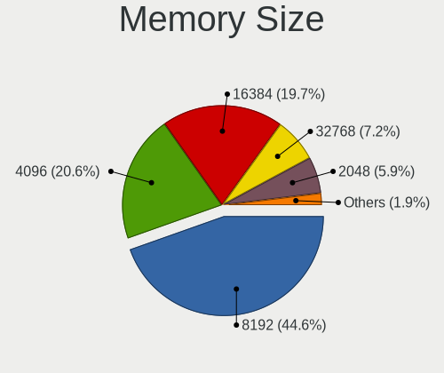

| Size  | Computers | Percent |
|-------|-----------|---------|
| 8192  | 275       | 44.28%  |
| 4096  | 132       | 21.26%  |
| 16384 | 116       | 18.68%  |
| 32768 | 44        | 7.09%   |
| 2048  | 42        | 6.76%   |
| 1024  | 10        | 1.61%   |
| 1536  | 1         | 0.16%   |
| 512   | 1         | 0.16%   |

Memory Speed
------------

Memory module speed

| Speed   | Computers | Percent |
|---------|-----------|---------|
| 3200    | 142       | 23.05%  |
| 1600    | 80        | 12.99%  |
| 2667    | 71        | 11.53%  |
| 6400    | 40        | 6.49%   |
| 2400    | 40        | 6.49%   |
| 4267    | 29        | 4.71%   |
| 4800    | 28        | 4.55%   |
| 2133    | 28        | 4.55%   |
| 1333    | 16        | 2.6%    |
| 3600    | 15        | 2.44%   |
| 1867    | 13        | 2.11%   |
| 5600    | 8         | 1.3%    |
| 1334    | 8         | 1.3%    |
| 3733    | 7         | 1.14%   |
| 2666    | 7         | 1.14%   |
| Unknown | 7         | 1.14%   |
| 6000    | 6         | 0.97%   |
| 800     | 6         | 0.97%   |
| 5200    | 5         | 0.81%   |
| 667     | 5         | 0.81%   |
| 4266    | 4         | 0.65%   |
| 2933    | 4         | 0.65%   |
| 2048    | 4         | 0.65%   |
| 8400    | 3         | 0.49%   |
| 4199    | 3         | 0.49%   |
| 3866    | 3         | 0.49%   |
| 3266    | 3         | 0.49%   |
| 1067    | 3         | 0.49%   |
| 5808    | 2         | 0.32%   |
| 5500    | 2         | 0.32%   |
| 3666    | 2         | 0.32%   |
| 3400    | 2         | 0.32%   |
| 1866    | 2         | 0.32%   |
| 975     | 2         | 0.32%   |
| 533     | 2         | 0.32%   |
| 400     | 2         | 0.32%   |
| 6800    | 1         | 0.16%   |
| 3933    | 1         | 0.16%   |
| 3800    | 1         | 0.16%   |
| 3534    | 1         | 0.16%   |

Printers & scanners
-------------------

Printer Vendor
--------------

Printer device vendors

| Vendor                | Computers | Percent |
|-----------------------|-----------|---------|
| Hewlett-Packard       | 8         | 25.81%  |
| Samsung Electronics   | 6         | 19.35%  |
| Brother Industries    | 6         | 19.35%  |
| Seiko Epson           | 4         | 12.9%   |
| Canon                 | 3         | 9.68%   |
| Pantum                | 2         | 6.45%   |
| QinHeng Electronics   | 1         | 3.23%   |
| Lexmark International | 1         | 3.23%   |

Printer Model
-------------

Printer device models

| Model                                        | Computers | Percent |
|----------------------------------------------|-----------|---------|
| Seiko Epson ME 320/330 Series [Stylus SX125] | 1         | 3.23%   |
| Seiko Epson ET-8550 Series                   | 1         | 3.23%   |
| Seiko Epson ET-2820 Series                   | 1         | 3.23%   |
| Seiko Epson ET-2810 Series                   | 1         | 3.23%   |
| Samsung SCX-4623 Series                      | 1         | 3.23%   |
| Samsung SCX-3400 Series                      | 1         | 3.23%   |
| Samsung ML-216x Series Laser Printer         | 1         | 3.23%   |
| Samsung M2020 Series                         | 1         | 3.23%   |
| Samsung CLX-3170 Series                      | 1         | 3.23%   |
| Samsung C1860 Series                         | 1         | 3.23%   |
| QinHeng CH340S                               | 1         | 3.23%   |
| Pantum P2200 series                          | 1         | 3.23%   |
| Pantum M6550NW series                        | 1         | 3.23%   |
| Lexmark International MC3326adwe             | 1         | 3.23%   |
| HP OfficeJet 5200 series                     | 1         | 3.23%   |
| HP LaserJet Pro M201dw                       | 1         | 3.23%   |
| HP LaserJet P2055 series                     | 1         | 3.23%   |
| HP LaserJet P2015 series                     | 1         | 3.23%   |
| HP DeskJet 960c                              | 1         | 3.23%   |
| HP DeskJet 4100 series                       | 1         | 3.23%   |
| HP ColorLaserJet M253-M254                   | 1         | 3.23%   |
| HP Color LaserJet Pro M453-4                 | 1         | 3.23%   |
| Canon TS3100 series                          | 1         | 3.23%   |
| Canon TR4500 series                          | 1         | 3.23%   |
| Canon iP7200 series                          | 1         | 3.23%   |
| Brother MFC-J1010DW                          | 1         | 3.23%   |
| Brother MFC-9330CDW                          | 1         | 3.23%   |
| Brother HL-2250DN Laser Printer              | 1         | 3.23%   |
| Brother HL-2030 Laser Printer                | 1         | 3.23%   |
| Brother DCP-7055W                            | 1         | 3.23%   |
| Brother DCP-1610W                            | 1         | 3.23%   |

Scanner Vendor
--------------

Scanner device vendors

| Vendor  | Computers | Percent |
|---------|-----------|---------|
| Canon   | 4         | 80%     |
| Plustek | 1         | 20%     |

Scanner Model
-------------

Scanner device models

| Model                              | Computers | Percent |
|------------------------------------|-----------|---------|
| Plustek 600dpi USB Scanner         | 1         | 20%     |
| Canon CanoScan N670U/N676U/LiDE 20 | 1         | 20%     |
| Canon CanoScan LiDE 120            | 1         | 20%     |
| Canon CanoScan LiDE 100            | 1         | 20%     |
| Canon CanoScan 8800F               | 1         | 20%     |

Camera
------

Camera Vendor
-------------

Camera device vendors

| Vendor                                 | Computers | Percent |
|----------------------------------------|-----------|---------|
| Chicony Electronics                    | 152       | 19.46%  |
| IMC Networks                           | 77        | 9.86%   |
| Microdia                               | 71        | 9.09%   |
| Quanta                                 | 64        | 8.19%   |
| Realtek Semiconductor                  | 58        | 7.43%   |
| Logitech                               | 40        | 5.12%   |
| Bison Electronics                      | 40        | 5.12%   |
| Luxvisions Innotech Limited            | 35        | 4.48%   |
| Sunplus Innovation Technology          | 33        | 4.23%   |
| Apple                                  | 33        | 4.23%   |
| Cheng Uei Precision Industry (Foxlink) | 19        | 2.43%   |
| Sonix Technology                       | 18        | 2.3%    |
| Syntek                                 | 17        | 2.18%   |
| Lite-On Technology                     | 17        | 2.18%   |
| Acer                                   | 14        | 1.79%   |
| Suyin                                  | 8         | 1.02%   |
| Silicon Motion                         | 8         | 1.02%   |
| Samsung Electronics                    | 7         | 0.9%    |
| Microsoft                              | 7         | 0.9%    |
| Alcor Micro                            | 7         | 0.9%    |
| Importek                               | 6         | 0.77%   |
| SunplusIT                              | 5         | 0.64%   |
| ShineTech                              | 5         | 0.64%   |
| Shine-optics                           | 3         | 0.38%   |
| icSpring                               | 3         | 0.38%   |
| ARC International                      | 3         | 0.38%   |
| Ricoh                                  | 2         | 0.26%   |
| Razer USA                              | 2         | 0.26%   |
| Pixart Imaging                         | 2         | 0.26%   |
| Lenovo                                 | 2         | 0.26%   |
| Google                                 | 2         | 0.26%   |
| YT-221117-J                            | 1         | 0.13%   |
| WCM_USB                                | 1         | 0.13%   |
| Trust                                  | 1         | 0.13%   |
| Sunplus Technology                     | 1         | 0.13%   |
| SHENZHEN AONI ELECTRONIC               | 1         | 0.13%   |
| OmniVision Technologies                | 1         | 0.13%   |
| Linux Foundation HS                    | 1         | 0.13%   |
| KYE Systems (Mouse Systems)            | 1         | 0.13%   |
| Hewlett-Packard                        | 1         | 0.13%   |

Camera Model
------------

Camera device models

| Model                                               | Computers | Percent |
|-----------------------------------------------------|-----------|---------|
| Chicony Integrated Camera                           | 46        | 5.79%   |
| Microdia Integrated_Webcam_HD                       | 35        | 4.41%   |
| IMC Networks USB2.0 HD UVC WebCam                   | 25        | 3.15%   |
| IMC Networks Integrated Camera                      | 23        | 2.9%    |
| Realtek Integrated_Webcam_HD                        | 17        | 2.14%   |
| Chicony HP HD Camera                                | 17        | 2.14%   |
| Syntek Integrated Camera                            | 13        | 1.64%   |
| Bison Integrated Camera                             | 13        | 1.64%   |
| Luxvisions Innotech Limited HP TrueVision HD Camera | 11        | 1.39%   |
| Quanta HD User Facing                               | 10        | 1.26%   |
| Logitech Webcam C270                                | 10        | 1.26%   |
| Apple iPhone 5/5C/5S/6/SE/7/8/X                     | 10        | 1.26%   |
| Apple Built-in iSight                               | 10        | 1.26%   |
| Sonix USB2.0 HD UVC WebCam                          | 9         | 1.13%   |
| Logitech HD Pro Webcam C920                         | 9         | 1.13%   |
| Lite-On Integrated Camera                           | 9         | 1.13%   |
| Sunplus Integrated_Webcam_HD                        | 8         | 1.01%   |
| Sonix USB2.0 FHD UVC WebCam                         | 8         | 1.01%   |
| Quanta ov9734_techfront_camera                      | 8         | 1.01%   |
| Luxvisions Innotech Limited Integrated Camera       | 8         | 1.01%   |
| Chicony HP Wide Vision HD Camera                    | 8         | 1.01%   |
| Chicony HP Truevision HD                            | 8         | 1.01%   |
| Chicony HD WebCam                                   | 8         | 1.01%   |
| Samsung Galaxy series, misc. (MTP mode)             | 7         | 0.88%   |
| Quanta HD Camera                                    | 7         | 0.88%   |
| Microdia Integrated_Webcam_FHD                      | 7         | 0.88%   |
| Luxvisions Innotech Limited Integrated RGB Camera   | 7         | 0.88%   |
| Chicony HD User Facing                              | 7         | 0.88%   |
| Realtek USB Camera                                  | 6         | 0.76%   |
| Chicony TOSHIBA Web Camera - HD                     | 6         | 0.76%   |
| Apple FaceTime HD Camera (Built-in)                 | 6         | 0.76%   |
| Realtek Integrated Webcam_HD                        | 5         | 0.63%   |
| Realtek Integrated Webcam HD                        | 5         | 0.63%   |
| Quanta HP TrueVision HD Camera                      | 5         | 0.63%   |
| Quanta HP HD Camera                                 | 5         | 0.63%   |
| Quanta HD Webcam                                    | 5         | 0.63%   |
| Quanta ACER HD User Facing                          | 5         | 0.63%   |
| IMC Networks USB2.0 VGA UVC WebCam                  | 5         | 0.63%   |
| IMC Networks HD Camera                              | 5         | 0.63%   |
| Bison SunplusIT Integrated Camera                   | 5         | 0.63%   |

Security
--------

Fingerprint Vendor
------------------

Fingerprint sensor vendors

| Vendor                             | Computers | Percent |
|------------------------------------|-----------|---------|
| Validity Sensors                   | 50        | 28.57%  |
| Synaptics                          | 47        | 26.86%  |
| Shenzhen Goodix Technology         | 46        | 26.29%  |
| Elan Microelectronics              | 13        | 7.43%   |
| LighTuning Technology              | 5         | 2.86%   |
| Upek                               | 4         | 2.29%   |
| Realtek USB2.0 Finger Print Bridge | 4         | 2.29%   |
| AuthenTec                          | 4         | 2.29%   |
| STMicroelectronics                 | 1         | 0.57%   |
| Focal-systems.Corp                 | 1         | 0.57%   |

Fingerprint Model
-----------------

Fingerprint sensor models

| Model                                                                      | Computers | Percent |
|----------------------------------------------------------------------------|-----------|---------|
| Shenzhen Goodix  FingerPrint Device                                        | 30        | 17.14%  |
| Validity Sensors VFS7500 Touch Fingerprint Sensor                          | 9         | 5.14%   |
| Validity Sensors VFS495 Fingerprint Reader                                 | 9         | 5.14%   |
| Shenzhen Goodix Fingerprint Reader                                         | 9         | 5.14%   |
| Synaptics Prometheus MIS Touch Fingerprint Reader                          | 8         | 4.57%   |
| Elan ELAN:ARM-M4                                                           | 8         | 4.57%   |
| Synaptics WBDI                                                             | 7         | 4%      |
| Synaptics Fingerprint reader [HP G6]                                       | 7         | 4%      |
| Shenzhen Goodix FingerPrint                                                | 7         | 4%      |
| Validity Sensors VFS5011 Fingerprint Reader                                | 6         | 3.43%   |
| Validity Sensors VFS 5011 fingerprint sensor                               | 6         | 3.43%   |
| Synaptics Metallica MIS Touch Fingerprint Reader                           | 6         | 3.43%   |
| Synaptics FS7604 Touch Fingerprint Sensor with PurePrint                   | 5         | 2.86%   |
| Validity Sensors Synaptics WBDI                                            | 4         | 2.29%   |
| Validity Sensors Synaptics VFS7552 Touch Fingerprint Sensor with PurePrint | 4         | 2.29%   |
| Upek Biometric Touchchip/Touchstrip Fingerprint Sensor                     | 4         | 2.29%   |
| Synaptics UWP WBDI Device                                                  | 4         | 2.29%   |
| Realtek USB2.0 Finger Print Bridge FocalTech Fingerprint Device            | 4         | 2.29%   |
| Elan WBF Fingerprint Sensor                                                | 4         | 2.29%   |
| Validity Sensors Swipe Fingerprint Sensor                                  | 3         | 1.71%   |
| Synaptics  WBDI                                                            | 3         | 1.71%   |
| Synaptics  FS7604 Touch Fingerprint Sensor with PurePrint                  | 3         | 1.71%   |
| Validity Sensors Synaptics VFS7552 Touch Fingerprint Sensor                | 2         | 1.14%   |
| Synaptics Metallica MOH Touch Fingerprint Reader                           | 2         | 1.14%   |
| LighTuning EgisTec Touch Fingerprint Sensor                                | 2         | 1.14%   |
| AuthenTec AES2810                                                          | 2         | 1.14%   |
| Validity Sensors VFS7552 Touch Fingerprint Sensor                          | 1         | 0.57%   |
| Validity Sensors VFS471 Fingerprint Reader                                 | 1         | 0.57%   |
| Validity Sensors VFS451 Fingerprint Reader                                 | 1         | 0.57%   |
| Validity Sensors VFS300 Fingerprint Reader                                 | 1         | 0.57%   |
| Validity Sensors VFS101 Fingerprint Reader                                 | 1         | 0.57%   |
| Validity Sensors VFS Fingerprint sensor                                    | 1         | 0.57%   |
| Validity Sensors Fingerprint scanner                                       | 1         | 0.57%   |
| Synaptics UWP WBDI                                                         | 1         | 0.57%   |
| STMicroelectronics Fingerprint Reader                                      | 1         | 0.57%   |
| LighTuning Fingerprint Sensor                                              | 1         | 0.57%   |
| LighTuning Fingerprint Reader                                              | 1         | 0.57%   |
| LighTuning ES603 Swipe Fingerprint Sensor                                  | 1         | 0.57%   |
| Focal-systems.Corp FT9201Fingerprint.                                      | 1         | 0.57%   |
| Elan ELAN:Fingerprint                                                      | 1         | 0.57%   |

Chipcard Vendor
---------------

Chipcard module vendors

| Vendor                | Computers | Percent |
|-----------------------|-----------|---------|
| Broadcom              | 27        | 56.25%  |
| Alcor Micro           | 15        | 31.25%  |
| Upek                  | 3         | 6.25%   |
| Realtek Semiconductor | 1         | 2.08%   |
| Hewlett-Packard       | 1         | 2.08%   |
| Advanced Card Systems | 1         | 2.08%   |

Chipcard Model
--------------

Chipcard module models

| Model                                                                        | Computers | Percent |
|------------------------------------------------------------------------------|-----------|---------|
| Alcor Micro AU9540 Smartcard Reader                                          | 15        | 31.25%  |
| Broadcom 5880                                                                | 13        | 27.08%  |
| Broadcom 58200                                                               | 7         | 14.58%  |
| Broadcom BCM5880 Secure Applications Processor                               | 6         | 12.5%   |
| Upek TouchChip Fingerprint Coprocessor (WBF advanced mode)                   | 3         | 6.25%   |
| Realtek Semiconductor Smart Card Reader Interface                            | 1         | 2.08%   |
| Hewlett-Packard SC Keyboard - Apollo (Liteon)                                | 1         | 2.08%   |
| Broadcom BCM5880 Secure Applications Processor with fingerprint swipe sensor | 1         | 2.08%   |
| Advanced Card Systems ACR122U                                                | 1         | 2.08%   |

Unsupported
-----------

Unsupported Devices
-------------------

Total unsupported devices on board

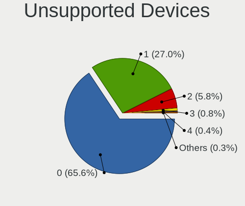

| Total | Computers | Percent |
|-------|-----------|---------|
| 0     | 767       | 64.24%  |
| 1     | 341       | 28.56%  |
| 2     | 67        | 5.61%   |
| 3     | 11        | 0.92%   |
| 4     | 6         | 0.5%    |
| 10    | 1         | 0.08%   |
| 6     | 1         | 0.08%   |

Unsupported Device Types
------------------------

Types of unsupported devices

| Type                     | Computers | Percent |
|--------------------------|-----------|---------|
| Fingerprint reader       | 175       | 34.93%  |
| Graphics card            | 106       | 21.16%  |
| Chipcard                 | 46        | 9.18%   |
| Net/wireless             | 41        | 8.18%   |
| Multimedia controller    | 35        | 6.99%   |
| Camera                   | 34        | 6.79%   |
| Unassigned class         | 14        | 2.79%   |
| Communication controller | 12        | 2.4%    |
| Sound                    | 11        | 2.2%    |
| Bluetooth                | 8         | 1.6%    |
| Storage                  | 5         | 1%      |
| Card reader              | 5         | 1%      |
| Network                  | 3         | 0.6%    |
| Net/ethernet             | 3         | 0.6%    |
| Storage/ide              | 1         | 0.2%    |
| Modem                    | 1         | 0.2%    |
| Dvb card                 | 1         | 0.2%    |

