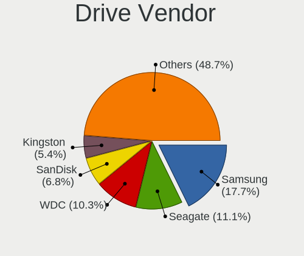
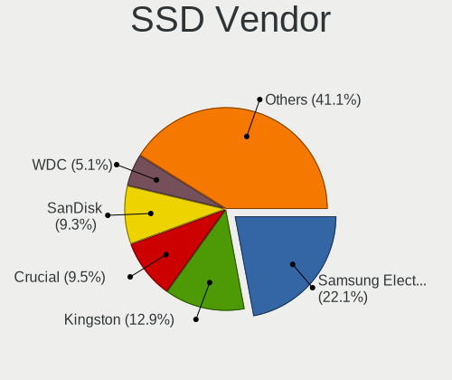
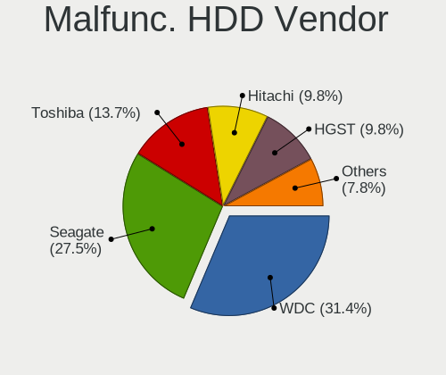
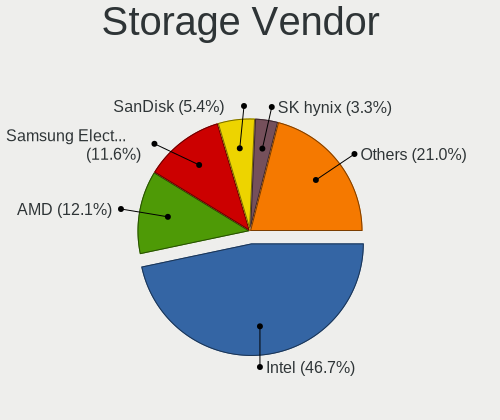
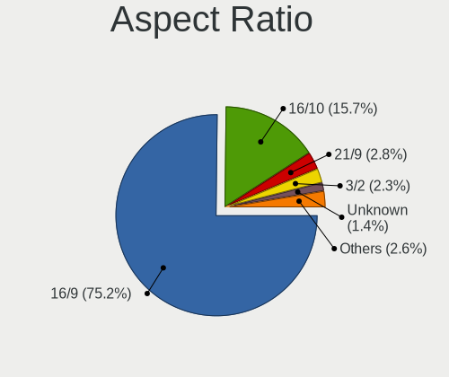
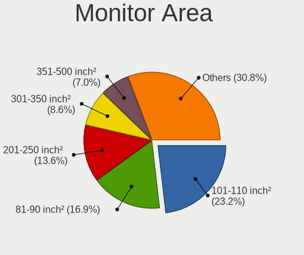
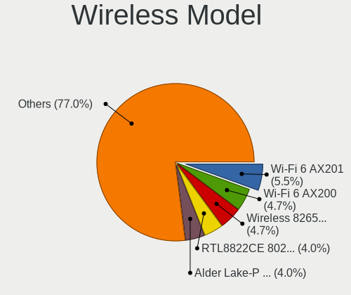
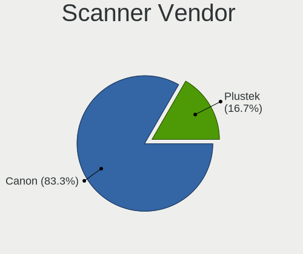
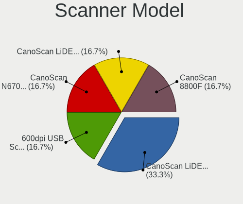

Ubuntu 23.04 - Tested Hardware & Statistics
-------------------------------------------

A project to collect tested hardware configurations for Ubuntu 23.04.

Anyone can contribute to this report by the [hw-probe](https://github.com/linuxhw/hw-probe) tool:

    sudo -E hw-probe -all -upload

Please contribute! Especially if your hardware is rare.

This is a report for all computer types. See also reports for [desktops](/Dist/Ubuntu_23.04/Desktop/README.md) and [notebooks](/Dist/Ubuntu_23.04/Notebook/README.md).

Contents
--------

* [ Test Cases ](#test-cases)

* [ System ](#system)
  - [ Kernel                   ](#kernel)
  - [ Kernel Family            ](#kernel-family)
  - [ Kernel Major Ver.        ](#kernel-major-ver)
  - [ Arch                     ](#arch)
  - [ DE                       ](#de)
  - [ Display Server           ](#display-server)
  - [ Display Manager          ](#display-manager)
  - [ OS Lang                  ](#os-lang)
  - [ Boot Mode                ](#boot-mode)
  - [ Filesystem               ](#filesystem)
  - [ Part. scheme             ](#part-scheme)
  - [ Dual Boot with Linux/BSD ](#dual-boot-with-linuxbsd)
  - [ Dual Boot (Win)          ](#dual-boot-win)

* [ Board ](#board)
  - [ Vendor                   ](#vendor)
  - [ Model                    ](#model)
  - [ Model Family             ](#model-family)
  - [ MFG Year                 ](#mfg-year)
  - [ Form Factor              ](#form-factor)
  - [ Secure Boot              ](#secure-boot)
  - [ Coreboot                 ](#coreboot)
  - [ RAM Size                 ](#ram-size)
  - [ RAM Used                 ](#ram-used)
  - [ Total Drives             ](#total-drives)
  - [ Has CD-ROM               ](#has-cd-rom)
  - [ Has Ethernet             ](#has-ethernet)
  - [ Has WiFi                 ](#has-wifi)
  - [ Has Bluetooth            ](#has-bluetooth)

* [ Location ](#location)
  - [ Country                  ](#country)
  - [ City                     ](#city)

* [ Drives ](#drives)
  - [ Drive Vendor             ](#drive-vendor)
  - [ Drive Model              ](#drive-model)
  - [ HDD Vendor               ](#hdd-vendor)
  - [ SSD Vendor               ](#ssd-vendor)
  - [ Drive Kind               ](#drive-kind)
  - [ Drive Connector          ](#drive-connector)
  - [ Drive Size               ](#drive-size)
  - [ Space Total              ](#space-total)
  - [ Space Used               ](#space-used)
  - [ Malfunc. Drives          ](#malfunc-drives)
  - [ Malfunc. Drive Vendor    ](#malfunc-drive-vendor)
  - [ Malfunc. HDD Vendor      ](#malfunc-hdd-vendor)
  - [ Malfunc. Drive Kind      ](#malfunc-drive-kind)
  - [ Failed Drives            ](#failed-drives)
  - [ Failed Drive Vendor      ](#failed-drive-vendor)
  - [ Drive Status             ](#drive-status)

* [ Storage controller ](#storage-controller)
  - [ Storage Vendor           ](#storage-vendor)
  - [ Storage Model            ](#storage-model)
  - [ Storage Kind             ](#storage-kind)

* [ Processor ](#processor)
  - [ CPU Vendor               ](#cpu-vendor)
  - [ CPU Model                ](#cpu-model)
  - [ CPU Model Family         ](#cpu-model-family)
  - [ CPU Cores                ](#cpu-cores)
  - [ CPU Sockets              ](#cpu-sockets)
  - [ CPU Threads              ](#cpu-threads)
  - [ CPU Op-Modes             ](#cpu-op-modes)
  - [ CPU Microcode            ](#cpu-microcode)
  - [ CPU Microarch            ](#cpu-microarch)

* [ Graphics ](#graphics)
  - [ GPU Vendor               ](#gpu-vendor)
  - [ GPU Model                ](#gpu-model)
  - [ GPU Combo                ](#gpu-combo)
  - [ GPU Driver               ](#gpu-driver)
  - [ GPU Memory               ](#gpu-memory)

* [ Monitor ](#monitor)
  - [ Monitor Vendor           ](#monitor-vendor)
  - [ Monitor Model            ](#monitor-model)
  - [ Monitor Resolution       ](#monitor-resolution)
  - [ Monitor Diagonal         ](#monitor-diagonal)
  - [ Monitor Width            ](#monitor-width)
  - [ Aspect Ratio             ](#aspect-ratio)
  - [ Monitor Area             ](#monitor-area)
  - [ Pixel Density            ](#pixel-density)
  - [ Multiple Monitors        ](#multiple-monitors)

* [ Network ](#network)
  - [ Net Controller Vendor    ](#net-controller-vendor)
  - [ Net Controller Model     ](#net-controller-model)
  - [ Wireless Vendor          ](#wireless-vendor)
  - [ Wireless Model           ](#wireless-model)
  - [ Ethernet Vendor          ](#ethernet-vendor)
  - [ Ethernet Model           ](#ethernet-model)
  - [ Net Controller Kind      ](#net-controller-kind)
  - [ Used Controller          ](#used-controller)
  - [ NICs                     ](#nics)
  - [ IPv6                     ](#ipv6)

* [ Bluetooth ](#bluetooth)
  - [ Bluetooth Vendor         ](#bluetooth-vendor)
  - [ Bluetooth Model          ](#bluetooth-model)

* [ Sound ](#sound)
  - [ Sound Vendor             ](#sound-vendor)
  - [ Sound Model              ](#sound-model)

* [ Memory ](#memory)
  - [ Memory Vendor            ](#memory-vendor)
  - [ Memory Model             ](#memory-model)
  - [ Memory Kind              ](#memory-kind)
  - [ Memory Form Factor       ](#memory-form-factor)
  - [ Memory Size              ](#memory-size)
  - [ Memory Speed             ](#memory-speed)

* [ Printers & scanners ](#printers--scanners)
  - [ Printer Vendor           ](#printer-vendor)
  - [ Printer Model            ](#printer-model)
  - [ Scanner Vendor           ](#scanner-vendor)
  - [ Scanner Model            ](#scanner-model)

* [ Camera ](#camera)
  - [ Camera Vendor            ](#camera-vendor)
  - [ Camera Model             ](#camera-model)

* [ Security ](#security)
  - [ Fingerprint Vendor       ](#fingerprint-vendor)
  - [ Fingerprint Model        ](#fingerprint-model)
  - [ Chipcard Vendor          ](#chipcard-vendor)
  - [ Chipcard Model           ](#chipcard-model)

* [ Unsupported ](#unsupported)
  - [ Unsupported Devices      ](#unsupported-devices)
  - [ Unsupported Device Types ](#unsupported-device-types)

Test Cases
----------

Total: 2236

| Vendor        | Model                       | Form-Factor | Probe                                                      | Date         |
|---------------|-----------------------------|-------------|------------------------------------------------------------|--------------|
| ASUSTek       | ROG STRIX X570-F GAMING     | Notebook    | [ec8f742a7f](https://linux-hardware.org/?probe=ec8f742a7f) | Dec 31, 2023 |
| Apple         | MacBookPro9,2               | Notebook    | [7f113211a4](https://linux-hardware.org/?probe=7f113211a4) | Dec 31, 2023 |
| Toshiba       | Satellite P70-B             | Notebook    | [2a5acedd16](https://linux-hardware.org/?probe=2a5acedd16) | Dec 29, 2023 |
| Dell          | Latitude E7450              | Notebook    | [50b3989c19](https://linux-hardware.org/?probe=50b3989c19) | Dec 28, 2023 |
| Samsung       | 900X3C/900X3D/900X4C/900... | Notebook    | [e0bfd9face](https://linux-hardware.org/?probe=e0bfd9face) | Dec 28, 2023 |
| HP            | ProBook 455 G1              | Notebook    | [d132700b11](https://linux-hardware.org/?probe=d132700b11) | Dec 28, 2023 |
| Dell          | Latitude 5420               | Notebook    | [07b64f5dfe](https://linux-hardware.org/?probe=07b64f5dfe) | Dec 27, 2023 |
| Lenovo        | IdeaPad 3 17ITL6 82H9       | Notebook    | [a82bef9300](https://linux-hardware.org/?probe=a82bef9300) | Dec 25, 2023 |
| Dell          | Inspiron 1564               | Notebook    | [a1945990cc](https://linux-hardware.org/?probe=a1945990cc) | Dec 24, 2023 |
| Dell          | Inspiron 1564               | Notebook    | [e02428db4a](https://linux-hardware.org/?probe=e02428db4a) | Dec 24, 2023 |
| Apple         | MacBookPro9,1               | Notebook    | [a70e7da743](https://linux-hardware.org/?probe=a70e7da743) | Dec 23, 2023 |
| Lenovo        | SHARKBAY SDK0E50510 WIN     | Desktop     | [ab3cc8a89c](https://linux-hardware.org/?probe=ab3cc8a89c) | Dec 23, 2023 |
| ASUSTek       | X550LD                      | Notebook    | [bc65f1d620](https://linux-hardware.org/?probe=bc65f1d620) | Dec 21, 2023 |
| Supermicro    | X9DRD-7LN4F                 | Desktop     | [56a303c264](https://linux-hardware.org/?probe=56a303c264) | Dec 20, 2023 |
| Lenovo        | 330B SDK0T76530 WIN 3556... | Mini pc     | [97d6dd408b](https://linux-hardware.org/?probe=97d6dd408b) | Dec 19, 2023 |
| Toshiba       | Satellite C55-A             | Notebook    | [6c0f2ad0c9](https://linux-hardware.org/?probe=6c0f2ad0c9) | Dec 18, 2023 |
| Toshiba       | Satellite C55-A             | Notebook    | [0ae780878c](https://linux-hardware.org/?probe=0ae780878c) | Dec 18, 2023 |
| Toshiba       | IS 1413G                    | Notebook    | [458a8fb3f1](https://linux-hardware.org/?probe=458a8fb3f1) | Dec 18, 2023 |
| Lenovo        | SHARKBAY 0B98401 WIN        | Desktop     | [ad8a2053bc](https://linux-hardware.org/?probe=ad8a2053bc) | Dec 17, 2023 |
| HP            | ENVY Laptop 17-ch0xxx       | Notebook    | [43602a664e](https://linux-hardware.org/?probe=43602a664e) | Dec 17, 2023 |
| Toshiba       | IS 1413G                    | Notebook    | [dde306e444](https://linux-hardware.org/?probe=dde306e444) | Dec 17, 2023 |
| ASUSTek       | X456UB                      | Notebook    | [5a4a0662e1](https://linux-hardware.org/?probe=5a4a0662e1) | Dec 17, 2023 |
| Apple         | MacBookPro9,2               | Notebook    | [4c8c4e1c68](https://linux-hardware.org/?probe=4c8c4e1c68) | Dec 17, 2023 |
| ASUSTek       | X550LD                      | Notebook    | [f46b47b272](https://linux-hardware.org/?probe=f46b47b272) | Dec 16, 2023 |
| Lenovo        | IdeaPad S145-15AST 81N3     | Notebook    | [dc5e6d8ad5](https://linux-hardware.org/?probe=dc5e6d8ad5) | Dec 16, 2023 |
| MSI           | X470 GAMING PLUS MAX        | Desktop     | [20a11e4c01](https://linux-hardware.org/?probe=20a11e4c01) | Dec 15, 2023 |
| ASUSTek       | P5E WS Pro                  | Desktop     | [9c68d265b1](https://linux-hardware.org/?probe=9c68d265b1) | Dec 12, 2023 |
| Lenovo        | IdeaPad 1 14IGL7 82V6       | Notebook    | [8d9963d61d](https://linux-hardware.org/?probe=8d9963d61d) | Dec 11, 2023 |
| Dell          | Latitude 5400               | Notebook    | [6e887e1547](https://linux-hardware.org/?probe=6e887e1547) | Dec 11, 2023 |
| MSI           | MS-AA811 100                | All in one  | [ce3691f366](https://linux-hardware.org/?probe=ce3691f366) | Dec 08, 2023 |
| MSI           | Katana 17 B13VGK            | Notebook    | [e91a23fa88](https://linux-hardware.org/?probe=e91a23fa88) | Dec 08, 2023 |
| Dell          | Latitude E7470              | Notebook    | [81a17083f6](https://linux-hardware.org/?probe=81a17083f6) | Dec 08, 2023 |
| HP            | Pavilion Gaming Laptop 1... | Notebook    | [e0f14fb199](https://linux-hardware.org/?probe=e0f14fb199) | Dec 07, 2023 |
| Google        | Chell                       | Notebook    | [b19b6452e3](https://linux-hardware.org/?probe=b19b6452e3) | Dec 07, 2023 |
| MSI           | B450 GAMING PLUS MAX        | Desktop     | [bd9d40cd17](https://linux-hardware.org/?probe=bd9d40cd17) | Dec 06, 2023 |
| MSI           | B450 GAMING PLUS MAX        | Desktop     | [6aaaa355d3](https://linux-hardware.org/?probe=6aaaa355d3) | Dec 06, 2023 |
| HP            | Pavilion Gaming Laptop 1... | Notebook    | [21c49766ca](https://linux-hardware.org/?probe=21c49766ca) | Dec 06, 2023 |
| HP            | 250 G7 Notebook PC          | Notebook    | [bed4fa69c4](https://linux-hardware.org/?probe=bed4fa69c4) | Dec 06, 2023 |
| HP            | 250 G7 Notebook PC          | Notebook    | [52cdd2c7b2](https://linux-hardware.org/?probe=52cdd2c7b2) | Dec 06, 2023 |
| ASUSTek       | PRIME B660M-A D4            | Desktop     | [12c6da7b14](https://linux-hardware.org/?probe=12c6da7b14) | Dec 05, 2023 |
| LG Electro... | 16Z90R-G.AA76G              | Notebook    | [5ac1d1605a](https://linux-hardware.org/?probe=5ac1d1605a) | Dec 05, 2023 |
| HP            | 1497                        | Desktop     | [d6ef1fa27d](https://linux-hardware.org/?probe=d6ef1fa27d) | Dec 04, 2023 |
| Huanan        | X99-F8D PLUS V1.3           | Desktop     | [848f3c01c3](https://linux-hardware.org/?probe=848f3c01c3) | Dec 03, 2023 |
| ONDA          | H81M                        | Desktop     | [76c44af7fc](https://linux-hardware.org/?probe=76c44af7fc) | Dec 02, 2023 |
| HP            | 82B4                        | Desktop     | [fae1e016be](https://linux-hardware.org/?probe=fae1e016be) | Dec 02, 2023 |
| Lenovo        | IdeaPad 330-15IKB 81DE      | Notebook    | [9560de18b6](https://linux-hardware.org/?probe=9560de18b6) | Dec 01, 2023 |
| Dell          | 0VRWRC A00                  | Desktop     | [55c38cfaa9](https://linux-hardware.org/?probe=55c38cfaa9) | Dec 01, 2023 |
| MSI           | B450 GAMING PLUS            | Desktop     | [8b41445765](https://linux-hardware.org/?probe=8b41445765) | Nov 30, 2023 |
| Apple         | MacBookPro9,2               | Notebook    | [cfeac0b40f](https://linux-hardware.org/?probe=cfeac0b40f) | Nov 30, 2023 |
| Lenovo        | ThinkPad E560 20EV002FUS    | Notebook    | [e9f95fd344](https://linux-hardware.org/?probe=e9f95fd344) | Nov 29, 2023 |
| Dell          | 02YYK5 A01                  | Desktop     | [44dd5b984b](https://linux-hardware.org/?probe=44dd5b984b) | Nov 28, 2023 |
| MSI           | Z97 PC Mate                 | Desktop     | [3bc66597b8](https://linux-hardware.org/?probe=3bc66597b8) | Nov 27, 2023 |
| Biostar       | A78MD                       | Desktop     | [c7e8dd6939](https://linux-hardware.org/?probe=c7e8dd6939) | Nov 27, 2023 |
| Lenovo        | ThinkPad X201 3323RKG       | Notebook    | [71242a9bc0](https://linux-hardware.org/?probe=71242a9bc0) | Nov 26, 2023 |
| HP            | ENVY 15                     | Notebook    | [66a7391daf](https://linux-hardware.org/?probe=66a7391daf) | Nov 25, 2023 |
| Acer          | TravelMate P215-51          | Notebook    | [fd03901ed8](https://linux-hardware.org/?probe=fd03901ed8) | Nov 25, 2023 |
| FUTOPIA GL... | ULTIMUS PRO                 | Notebook    | [96b6b163d8](https://linux-hardware.org/?probe=96b6b163d8) | Nov 24, 2023 |
| HP            | 340S G7 Notebook PC         | Notebook    | [5f8d3105b5](https://linux-hardware.org/?probe=5f8d3105b5) | Nov 22, 2023 |
| HP            | 1825                        | Desktop     | [78c3833b1a](https://linux-hardware.org/?probe=78c3833b1a) | Nov 21, 2023 |
| Dell          | Latitude 5400               | Notebook    | [a2994234ca](https://linux-hardware.org/?probe=a2994234ca) | Nov 21, 2023 |
| Timi          | RedmiBook 15                | Notebook    | [00a6933cf0](https://linux-hardware.org/?probe=00a6933cf0) | Nov 20, 2023 |
| Dell          | Latitude E5500              | Notebook    | [657426e5e9](https://linux-hardware.org/?probe=657426e5e9) | Nov 20, 2023 |
| eMachines     | EL1360G                     | Desktop     | [5b2ab65e0a](https://linux-hardware.org/?probe=5b2ab65e0a) | Nov 20, 2023 |
| ASUSTek       | X540NA                      | Notebook    | [d0f4cc3a98](https://linux-hardware.org/?probe=d0f4cc3a98) | Nov 19, 2023 |
| HP            | Pavilion dv6                | Notebook    | [bab0d77625](https://linux-hardware.org/?probe=bab0d77625) | Nov 19, 2023 |
| Notebook      | W54_55SU1,SUW               | Notebook    | [c11c5d127d](https://linux-hardware.org/?probe=c11c5d127d) | Nov 18, 2023 |
| Notebook      | W54_55SU1,SUW               | Notebook    | [12a0c7cc59](https://linux-hardware.org/?probe=12a0c7cc59) | Nov 18, 2023 |
| Dell          | 0J3C2F A00                  | Desktop     | [28440e547a](https://linux-hardware.org/?probe=28440e547a) | Nov 18, 2023 |
| Apple         | Mac-F2218EA9                | All in one  | [eeda9a88f3](https://linux-hardware.org/?probe=eeda9a88f3) | Nov 18, 2023 |
| ONDA          | H61V Ver:4.01               | Desktop     | [9686807789](https://linux-hardware.org/?probe=9686807789) | Nov 18, 2023 |
| HP            | 255 G7 Notebook PC          | Notebook    | [9e5738b77f](https://linux-hardware.org/?probe=9e5738b77f) | Nov 18, 2023 |
| HP            | ProBook 430 G7              | Notebook    | [093edd002d](https://linux-hardware.org/?probe=093edd002d) | Nov 18, 2023 |
| ASUSTek       | VivoBook_ASUSLaptop K350... | Notebook    | [70ca4894ab](https://linux-hardware.org/?probe=70ca4894ab) | Nov 18, 2023 |
| Lenovo        | ThinkPad T420 4180ED3       | Notebook    | [f963bd64fa](https://linux-hardware.org/?probe=f963bd64fa) | Nov 16, 2023 |
| ASUSTek       | ASUS EXPERTBOOK B1500CEA... | Notebook    | [ab7968d6da](https://linux-hardware.org/?probe=ab7968d6da) | Nov 15, 2023 |
| ASUSTek       | ASUS EXPERTBOOK B1500CEA... | Notebook    | [95f01d6e47](https://linux-hardware.org/?probe=95f01d6e47) | Nov 15, 2023 |
| HP            | EliteBook 840 G6            | Notebook    | [d702c8d829](https://linux-hardware.org/?probe=d702c8d829) | Nov 15, 2023 |
| Gigabyte      | B550M AORUS ELITE           | Desktop     | [09ef1df759](https://linux-hardware.org/?probe=09ef1df759) | Nov 14, 2023 |
| HP            | ENVY dv6                    | Notebook    | [f86a52da6d](https://linux-hardware.org/?probe=f86a52da6d) | Nov 14, 2023 |
| Dell          | Latitude E5500              | Notebook    | [f6a14cca8f](https://linux-hardware.org/?probe=f6a14cca8f) | Nov 14, 2023 |
| Lenovo        | IdeaPad Gaming 3 15IAH7 ... | Notebook    | [46cfd3f6bf](https://linux-hardware.org/?probe=46cfd3f6bf) | Nov 13, 2023 |
| Lenovo        | IdeaPad 300-15IBR 80M3      | Notebook    | [46e69016d1](https://linux-hardware.org/?probe=46e69016d1) | Nov 11, 2023 |
| HP            | Pavilion g4                 | Notebook    | [8e86232d90](https://linux-hardware.org/?probe=8e86232d90) | Nov 11, 2023 |
| Gigabyte      | H610M H V2 DDR4             | Desktop     | [bafab6bf21](https://linux-hardware.org/?probe=bafab6bf21) | Nov 10, 2023 |
| ASUSTek       | PRIME H310M-E R2.0          | Desktop     | [2788382d20](https://linux-hardware.org/?probe=2788382d20) | Nov 10, 2023 |
| Gigabyte      | H67MA-USB3-B3               | Desktop     | [a6a53a60f0](https://linux-hardware.org/?probe=a6a53a60f0) | Nov 10, 2023 |
| HP            | EliteBook 840 G6            | Notebook    | [33e3267f6a](https://linux-hardware.org/?probe=33e3267f6a) | Nov 10, 2023 |
| Dell          | Latitude 13                 | Notebook    | [4999e3eba9](https://linux-hardware.org/?probe=4999e3eba9) | Nov 09, 2023 |
| Lenovo        | ThinkCentre M58e 7514A2U    | Desktop     | [59554fada7](https://linux-hardware.org/?probe=59554fada7) | Nov 09, 2023 |
| Dell          | Latitude 13                 | Notebook    | [acb0bd4f9d](https://linux-hardware.org/?probe=acb0bd4f9d) | Nov 09, 2023 |
| HP            | ENVY x360 Convertible 15... | Convertible | [d566deea22](https://linux-hardware.org/?probe=d566deea22) | Nov 08, 2023 |
| HP            | ENVY x360 Convertible 15... | Convertible | [f8b6335bea](https://linux-hardware.org/?probe=f8b6335bea) | Nov 08, 2023 |
| Gigabyte      | H61M-DS2                    | Desktop     | [5a6cfb8bce](https://linux-hardware.org/?probe=5a6cfb8bce) | Nov 07, 2023 |
| HP            | 2AF3                        | Desktop     | [19333e743d](https://linux-hardware.org/?probe=19333e743d) | Nov 07, 2023 |
| Lenovo        | Z50-75 80EC                 | Notebook    | [c98cdea69b](https://linux-hardware.org/?probe=c98cdea69b) | Nov 07, 2023 |
| HP            | Pavilion Gaming Laptop 1... | Notebook    | [bcd7a71a14](https://linux-hardware.org/?probe=bcd7a71a14) | Nov 06, 2023 |
| HP            | 8594                        | Desktop     | [d51c507511](https://linux-hardware.org/?probe=d51c507511) | Nov 06, 2023 |
| ASUSTek       | TUF Gaming B560M-PLUS       | Desktop     | [9655bf2db1](https://linux-hardware.org/?probe=9655bf2db1) | Nov 06, 2023 |
| Apple         | Mac-7BA5B2DFE22DDD8C Mac... | Mini pc     | [ce6a053669](https://linux-hardware.org/?probe=ce6a053669) | Nov 06, 2023 |
| HP            | Pavilion 17                 | Notebook    | [50a9cf65b3](https://linux-hardware.org/?probe=50a9cf65b3) | Nov 05, 2023 |
| Lenovo        | ThinkPad T580 20LAS62M07    | Notebook    | [56d9dc4a36](https://linux-hardware.org/?probe=56d9dc4a36) | Nov 05, 2023 |
| Samsung       | 305E4A/305E5A/305E7A        | Notebook    | [257e40f6bd](https://linux-hardware.org/?probe=257e40f6bd) | Nov 05, 2023 |
| Acer          | Aspire E1-571G              | Notebook    | [fac63c4d5c](https://linux-hardware.org/?probe=fac63c4d5c) | Nov 05, 2023 |
| ASRockRack    | EPC602D8A                   | Desktop     | [c1b6c06dc5](https://linux-hardware.org/?probe=c1b6c06dc5) | Nov 05, 2023 |
| Sony          | SVE15137CGW                 | Notebook    | [5d2a4746af](https://linux-hardware.org/?probe=5d2a4746af) | Nov 04, 2023 |
| Lenovo        | Legion 5 15ARH05H 82B1      | Notebook    | [3d8056e30e](https://linux-hardware.org/?probe=3d8056e30e) | Nov 04, 2023 |
| HP            | Pavilion Laptop 15-eh1xx... | Notebook    | [d0f3cf43b7](https://linux-hardware.org/?probe=d0f3cf43b7) | Nov 04, 2023 |
| Lenovo        | Legion 5 15ARH05H 82B1      | Notebook    | [546178d07d](https://linux-hardware.org/?probe=546178d07d) | Nov 04, 2023 |
| MSI           | A68HM-E33 V2                | Desktop     | [f029848e7d](https://linux-hardware.org/?probe=f029848e7d) | Nov 03, 2023 |
| Lenovo        | IdeaPad 100-15IBY 80MJ      | Notebook    | [abe3da8a30](https://linux-hardware.org/?probe=abe3da8a30) | Nov 03, 2023 |
| Lenovo        | IdeaPad 100-15IBY 80MJ      | Notebook    | [e7ccaf83d7](https://linux-hardware.org/?probe=e7ccaf83d7) | Nov 03, 2023 |
| MSI           | B550M PRO-VDH WIFI          | Desktop     | [baf30122ca](https://linux-hardware.org/?probe=baf30122ca) | Nov 03, 2023 |
| ASUSTek       | PRIME X299-A                | Desktop     | [387194bdf6](https://linux-hardware.org/?probe=387194bdf6) | Nov 03, 2023 |
| Dell          | Inspiron 16 5625            | Notebook    | [157f3bd86a](https://linux-hardware.org/?probe=157f3bd86a) | Nov 03, 2023 |
| Dell          | Vostro 3525                 | Notebook    | [48103e7e91](https://linux-hardware.org/?probe=48103e7e91) | Nov 03, 2023 |
| ASUSTek       | PRIME H370M-PLUS            | Desktop     | [328a40f6fe](https://linux-hardware.org/?probe=328a40f6fe) | Nov 03, 2023 |
| HP            | 0AECh D                     | Desktop     | [2ddad2bbf2](https://linux-hardware.org/?probe=2ddad2bbf2) | Nov 03, 2023 |
| Dell          | 0X8DXD A00                  | Desktop     | [e972336105](https://linux-hardware.org/?probe=e972336105) | Nov 03, 2023 |
| Dell          | Vostro 5590                 | Notebook    | [aa355fcc89](https://linux-hardware.org/?probe=aa355fcc89) | Nov 02, 2023 |
| Chuwi         | CoreBook Pro                | Notebook    | [ac0f4a1ea9](https://linux-hardware.org/?probe=ac0f4a1ea9) | Nov 01, 2023 |
| Lenovo        | Yoga Duet 7 13ITL6 82MA     | Tablet      | [d3d4d3dea3](https://linux-hardware.org/?probe=d3d4d3dea3) | Nov 01, 2023 |
| MSI           | Titan GT77HX 13VI           | Notebook    | [1fb8b0ccb3](https://linux-hardware.org/?probe=1fb8b0ccb3) | Nov 01, 2023 |
| HUAWEI        | MACH-WX9                    | Notebook    | [f557533925](https://linux-hardware.org/?probe=f557533925) | Nov 01, 2023 |
| HUAWEI        | MACH-WX9                    | Notebook    | [50880de513](https://linux-hardware.org/?probe=50880de513) | Nov 01, 2023 |
| Lenovo        | 3647 SDK0J40709 WIN 3259... | All in one  | [4f99b79f9e](https://linux-hardware.org/?probe=4f99b79f9e) | Nov 01, 2023 |
| HP            | EliteBook x360 1030 G4      | Convertible | [69d243d2db](https://linux-hardware.org/?probe=69d243d2db) | Nov 01, 2023 |
| Apple         | Mac-942B59F58194171B iMa... | All in one  | [9eed6b298a](https://linux-hardware.org/?probe=9eed6b298a) | Oct 31, 2023 |
| ASRock        | Z790 Taichi                 | Desktop     | [01ba7dff2f](https://linux-hardware.org/?probe=01ba7dff2f) | Oct 31, 2023 |
| HP            | Laptop 15s-fq5xxx           | Notebook    | [18398fe53c](https://linux-hardware.org/?probe=18398fe53c) | Oct 31, 2023 |
| ASUSTek       | TUF Gaming Z690-PLUS WIF... | Desktop     | [f1d5844389](https://linux-hardware.org/?probe=f1d5844389) | Oct 31, 2023 |
| Unknown       | Unknown                     | Desktop     | [4aa5e757eb](https://linux-hardware.org/?probe=4aa5e757eb) | Oct 31, 2023 |
| Apple         | Mac-77EB7D7DAF985301 iMa... | All in one  | [e5a9bbe278](https://linux-hardware.org/?probe=e5a9bbe278) | Oct 31, 2023 |
| ASRock        | Z370 Pro4                   | Desktop     | [55f20f6750](https://linux-hardware.org/?probe=55f20f6750) | Oct 31, 2023 |
| ASRock        | Z170 Extreme4               | Desktop     | [90fc87e07a](https://linux-hardware.org/?probe=90fc87e07a) | Oct 31, 2023 |
| ASRock        | Z170 Extreme4               | Desktop     | [5d99367248](https://linux-hardware.org/?probe=5d99367248) | Oct 31, 2023 |
| Lenovo        | IdeaPad 5 14ALC05 82LM      | Notebook    | [32d642cc3b](https://linux-hardware.org/?probe=32d642cc3b) | Oct 30, 2023 |
| HP            | Victus by Laptop 16-e0xx... | Notebook    | [309695dc7e](https://linux-hardware.org/?probe=309695dc7e) | Oct 30, 2023 |
| HP            | ZBook Studio G3             | Notebook    | [173639f83c](https://linux-hardware.org/?probe=173639f83c) | Oct 30, 2023 |
| HP            | EliteBook x360 1040 G7 N... | Convertible | [49eeb546b4](https://linux-hardware.org/?probe=49eeb546b4) | Oct 30, 2023 |
| HP            | EliteBook x360 1040 G7 N... | Convertible | [9b470b594c](https://linux-hardware.org/?probe=9b470b594c) | Oct 30, 2023 |
| ASRock        | FM2A88X+ Killer             | Desktop     | [2310075f2d](https://linux-hardware.org/?probe=2310075f2d) | Oct 30, 2023 |
| Dell          | Latitude 5400               | Notebook    | [e7f91d1c69](https://linux-hardware.org/?probe=e7f91d1c69) | Oct 30, 2023 |
| Apple         | Mac-77EB7D7DAF985301 iMa... | All in one  | [d8590bb026](https://linux-hardware.org/?probe=d8590bb026) | Oct 30, 2023 |
| Intel         | H61                         | Desktop     | [0f282da58e](https://linux-hardware.org/?probe=0f282da58e) | Oct 30, 2023 |
| HP            | ProBook 6570b               | Notebook    | [5b574791fa](https://linux-hardware.org/?probe=5b574791fa) | Oct 30, 2023 |
| Lenovo        | ThinkPad T460s 20F90039U... | Notebook    | [8df2c91111](https://linux-hardware.org/?probe=8df2c91111) | Oct 29, 2023 |
| Dell          | 02YYK5 A00                  | Desktop     | [bda6b9ff10](https://linux-hardware.org/?probe=bda6b9ff10) | Oct 29, 2023 |
| Lenovo        | ThinkPad T590 20N5S56P00    | Notebook    | [c410852108](https://linux-hardware.org/?probe=c410852108) | Oct 29, 2023 |
| Dell          | Latitude E5450              | Notebook    | [64e3601d4c](https://linux-hardware.org/?probe=64e3601d4c) | Oct 29, 2023 |
| Lenovo        | ThinkPad T450s 20BWS58K0... | Notebook    | [11b2f76301](https://linux-hardware.org/?probe=11b2f76301) | Oct 29, 2023 |
| Dell          | Latitude E5450              | Notebook    | [aebf2cd9fb](https://linux-hardware.org/?probe=aebf2cd9fb) | Oct 29, 2023 |
| Lenovo        | ThinkPad X1 Titanium Gen... | Convertible | [7f556dd124](https://linux-hardware.org/?probe=7f556dd124) | Oct 28, 2023 |
| Gigabyte      | X58A-UD3R                   | Desktop     | [7c4b363241](https://linux-hardware.org/?probe=7c4b363241) | Oct 28, 2023 |
| HP            | ZBook Studio G3             | Notebook    | [9659254017](https://linux-hardware.org/?probe=9659254017) | Oct 27, 2023 |
| HP            | Laptop 15s-fq5xxx           | Notebook    | [773814f03f](https://linux-hardware.org/?probe=773814f03f) | Oct 27, 2023 |
| ASRock        | Z790 PG SONIC               | Desktop     | [3d8af896cc](https://linux-hardware.org/?probe=3d8af896cc) | Oct 27, 2023 |
| Dell          | Inspiron MM061              | Notebook    | [d4b3f62ecb](https://linux-hardware.org/?probe=d4b3f62ecb) | Oct 27, 2023 |
| Intel         | DB85FL AAG89861-201         | Desktop     | [44b772393d](https://linux-hardware.org/?probe=44b772393d) | Oct 27, 2023 |
| HUAWEI        | NBM-WXX9                    | Notebook    | [9444fd16a7](https://linux-hardware.org/?probe=9444fd16a7) | Oct 26, 2023 |
| Lenovo        | ThinkPad E14 Gen 4 21ECS... | Notebook    | [b6925d5638](https://linux-hardware.org/?probe=b6925d5638) | Oct 26, 2023 |
| Apple         | Mac-F226BEC8 PVT            | All in one  | [4b51bd3321](https://linux-hardware.org/?probe=4b51bd3321) | Oct 25, 2023 |
| ASUSTek       | Zenbook UX3402ZA            | Notebook    | [f321493adb](https://linux-hardware.org/?probe=f321493adb) | Oct 25, 2023 |
| GEEKOM        | A5                          | Desktop     | [2a6fe744c1](https://linux-hardware.org/?probe=2a6fe744c1) | Oct 25, 2023 |
| MSI           | MPG B550 GAMING PLUS        | Desktop     | [fc849b0e23](https://linux-hardware.org/?probe=fc849b0e23) | Oct 25, 2023 |
| MSI           | MPG B550 GAMING PLUS        | Desktop     | [3a0c166a2f](https://linux-hardware.org/?probe=3a0c166a2f) | Oct 25, 2023 |
| Dell          | 0D24M8 A01                  | Desktop     | [74e623d263](https://linux-hardware.org/?probe=74e623d263) | Oct 25, 2023 |
| Samsung       | 305E4A/305E5A/305E7A        | Notebook    | [3ce0f8310d](https://linux-hardware.org/?probe=3ce0f8310d) | Oct 25, 2023 |
| Lenovo        | SHARKBAY SDK0E50510 WIN     | Desktop     | [e622e81e16](https://linux-hardware.org/?probe=e622e81e16) | Oct 24, 2023 |
| Dell          | Latitude E7270              | Notebook    | [07d72d2a9d](https://linux-hardware.org/?probe=07d72d2a9d) | Oct 24, 2023 |
| ASUSTek       | Crosshair IV Formula        | Desktop     | [9664d44f1e](https://linux-hardware.org/?probe=9664d44f1e) | Oct 24, 2023 |
| Lenovo        | ThinkPad X1 Yoga Gen 6 2... | Convertible | [a5c5c4cd3d](https://linux-hardware.org/?probe=a5c5c4cd3d) | Oct 24, 2023 |
| HP            | 339A                        | Desktop     | [2e0eb78de2](https://linux-hardware.org/?probe=2e0eb78de2) | Oct 24, 2023 |
| Lenovo        | ThinkPad T480 20L6S5FF0S    | Notebook    | [4a4fe99b2d](https://linux-hardware.org/?probe=4a4fe99b2d) | Oct 23, 2023 |
| Dell          | XPS 13 9370                 | Notebook    | [f45a5143fc](https://linux-hardware.org/?probe=f45a5143fc) | Oct 23, 2023 |
| HP            | Laptop 15-da2xxx            | Notebook    | [6f746b3af3](https://linux-hardware.org/?probe=6f746b3af3) | Oct 23, 2023 |
| Intel Clie... | LAPAC71H                    | Notebook    | [257d890bfb](https://linux-hardware.org/?probe=257d890bfb) | Oct 23, 2023 |
| Fujitsu       | LIFEBOOK E754               | Notebook    | [17e7fcc400](https://linux-hardware.org/?probe=17e7fcc400) | Oct 23, 2023 |
| Dell          | 0VD5HY A07                  | Desktop     | [5e68194dd0](https://linux-hardware.org/?probe=5e68194dd0) | Oct 23, 2023 |
| HP            | Pavilion 17                 | Notebook    | [7e822923ca](https://linux-hardware.org/?probe=7e822923ca) | Oct 23, 2023 |
| HP            | 18E7                        | Desktop     | [eec2c6a2fd](https://linux-hardware.org/?probe=eec2c6a2fd) | Oct 23, 2023 |
| MSI           | X58 Pro SLI                 | Desktop     | [e127c69a3f](https://linux-hardware.org/?probe=e127c69a3f) | Oct 23, 2023 |
| Shenzhen M... | F6BFC                       | Desktop     | [04dd8d9baf](https://linux-hardware.org/?probe=04dd8d9baf) | Oct 23, 2023 |
| GPU Compan... | GWTC116-2                   | Convertible | [8daced51b5](https://linux-hardware.org/?probe=8daced51b5) | Oct 22, 2023 |
| Dell          | Inspiron 3443               | Notebook    | [bbe3093cb4](https://linux-hardware.org/?probe=bbe3093cb4) | Oct 22, 2023 |
| HP            | 18E7                        | Desktop     | [18f7dbf492](https://linux-hardware.org/?probe=18f7dbf492) | Oct 22, 2023 |
| Apple         | Mac-F226BEC8 PVT            | All in one  | [60926fccde](https://linux-hardware.org/?probe=60926fccde) | Oct 22, 2023 |
| HP            | Spectre x360 2-in-1 Lapt... | Convertible | [6ef86fc1b9](https://linux-hardware.org/?probe=6ef86fc1b9) | Oct 22, 2023 |
| Lenovo        | IdeaPad 5 15ITL05 Ua 82F... | Notebook    | [735bb309a1](https://linux-hardware.org/?probe=735bb309a1) | Oct 22, 2023 |
| Lenovo        | IdeaPad 1 15AMN7 82VG       | Notebook    | [9dae3fabcb](https://linux-hardware.org/?probe=9dae3fabcb) | Oct 22, 2023 |
| Lenovo        | IdeaPad 1 15AMN7 82VG       | Notebook    | [38fcbd8bc7](https://linux-hardware.org/?probe=38fcbd8bc7) | Oct 21, 2023 |
| Lenovo        | IdeaPad 5 14ALC05 82LM      | Notebook    | [8ceed23497](https://linux-hardware.org/?probe=8ceed23497) | Oct 21, 2023 |
| Dell          | Latitude 7420               | Notebook    | [33e4aebc37](https://linux-hardware.org/?probe=33e4aebc37) | Oct 21, 2023 |
| Gigabyte      | B85M-D2V                    | Desktop     | [f7b3792e3e](https://linux-hardware.org/?probe=f7b3792e3e) | Oct 21, 2023 |
| ASUSTek       | ASUS BR1100FKA BR1100FKA... | Convertible | [336cca4c8b](https://linux-hardware.org/?probe=336cca4c8b) | Oct 21, 2023 |
| ASUSTek       | X540LJ                      | Notebook    | [2aea2077db](https://linux-hardware.org/?probe=2aea2077db) | Oct 20, 2023 |
| Lenovo        | IdeaPadFlex 5 14ALC05 82... | Convertible | [2f7b2cf78e](https://linux-hardware.org/?probe=2f7b2cf78e) | Oct 20, 2023 |
| ASRock        | B450 Steel Legend           | Desktop     | [d3036ca319](https://linux-hardware.org/?probe=d3036ca319) | Oct 20, 2023 |
| Dell          | Vostro 3400                 | Notebook    | [1b518a8409](https://linux-hardware.org/?probe=1b518a8409) | Oct 20, 2023 |
| Lenovo        | SHARKBAY SDK0E50510 WIN     | Desktop     | [ed9af05f78](https://linux-hardware.org/?probe=ed9af05f78) | Oct 20, 2023 |
| Fujitsu       | LIFEBOOK A555               | Notebook    | [73592fa9fb](https://linux-hardware.org/?probe=73592fa9fb) | Oct 20, 2023 |
| HP            | Laptop 15-bs0xx             | Notebook    | [e07bf20a8a](https://linux-hardware.org/?probe=e07bf20a8a) | Oct 20, 2023 |
| ASUSTek       | Z170-P                      | Desktop     | [4f6fad364d](https://linux-hardware.org/?probe=4f6fad364d) | Oct 20, 2023 |
| HP            | Spectre x360 2-in-1 Lapt... | Convertible | [b7e0b6aac3](https://linux-hardware.org/?probe=b7e0b6aac3) | Oct 19, 2023 |
| HUAWEI        | KLVL-WXX9                   | Notebook    | [ca05cc8c35](https://linux-hardware.org/?probe=ca05cc8c35) | Oct 19, 2023 |
| Dell          | 0J3C2F A00                  | Desktop     | [eb391611f3](https://linux-hardware.org/?probe=eb391611f3) | Oct 19, 2023 |
| ASRock        | Z370 Taichi                 | Desktop     | [ca57155c40](https://linux-hardware.org/?probe=ca57155c40) | Oct 19, 2023 |
| Intel         | NUC5i7RYB H73774-101        | Mini pc     | [8d58200a98](https://linux-hardware.org/?probe=8d58200a98) | Oct 19, 2023 |
| Lenovo        | Yoga Slim 7 Carbon 13ITL... | Notebook    | [0815767d1d](https://linux-hardware.org/?probe=0815767d1d) | Oct 18, 2023 |
| HP            | EliteBook 840 G5            | Notebook    | [728b29b59d](https://linux-hardware.org/?probe=728b29b59d) | Oct 18, 2023 |
| Dell          | 0J3C2F A00                  | Desktop     | [df408e2203](https://linux-hardware.org/?probe=df408e2203) | Oct 18, 2023 |
| Lenovo        | IdeaPad 1 15AMN7 82VG       | Notebook    | [417e10e47c](https://linux-hardware.org/?probe=417e10e47c) | Oct 18, 2023 |
| Lenovo        | ThinkPad P14s Gen 2i 20V... | Notebook    | [686e5c87a9](https://linux-hardware.org/?probe=686e5c87a9) | Oct 18, 2023 |
| ASUSTek       | ROG STRIX B550-F GAMING     | Desktop     | [b28a7b8c25](https://linux-hardware.org/?probe=b28a7b8c25) | Oct 17, 2023 |
| Foxconn       | 2ADA                        | Desktop     | [da4ea80916](https://linux-hardware.org/?probe=da4ea80916) | Oct 17, 2023 |
| Dell          | XPS 15 9530                 | Notebook    | [96f3c530df](https://linux-hardware.org/?probe=96f3c530df) | Oct 17, 2023 |
| ASUSTek       | ASUS TUF Dash F15 FX516P... | Notebook    | [3bdd0db02e](https://linux-hardware.org/?probe=3bdd0db02e) | Oct 17, 2023 |
| Gigabyte      | H110M-D2P-WG-CF             | Desktop     | [113b3d362d](https://linux-hardware.org/?probe=113b3d362d) | Oct 17, 2023 |
| Google        | Bobba                       | Notebook    | [f8cdd51f65](https://linux-hardware.org/?probe=f8cdd51f65) | Oct 17, 2023 |
| ASUSTek       | Maximus IX HERO             | Desktop     | [58e17c747d](https://linux-hardware.org/?probe=58e17c747d) | Oct 17, 2023 |
| ASRock        | FM2A68M-HD+                 | Desktop     | [3597183b2f](https://linux-hardware.org/?probe=3597183b2f) | Oct 17, 2023 |
| ASUSTek       | Maximus IX HERO             | Desktop     | [fcd9389f36](https://linux-hardware.org/?probe=fcd9389f36) | Oct 17, 2023 |
| Lenovo        | ThinkPad T590 20N5S56P00    | Notebook    | [913c616ff6](https://linux-hardware.org/?probe=913c616ff6) | Oct 17, 2023 |
| Intel         | DH77KC AAG39641-401         | Desktop     | [abfbdc1640](https://linux-hardware.org/?probe=abfbdc1640) | Oct 17, 2023 |
| Gigabyte      | AORUS 15G XB                | Notebook    | [9e4c6d48d4](https://linux-hardware.org/?probe=9e4c6d48d4) | Oct 16, 2023 |
| Apple         | Mac-F226BEC8 PVT            | All in one  | [07b407d18a](https://linux-hardware.org/?probe=07b407d18a) | Oct 16, 2023 |
| ASUSTek       | TUF X299 MARK 2             | Desktop     | [52a3f75a39](https://linux-hardware.org/?probe=52a3f75a39) | Oct 16, 2023 |
| ASUSTek       | PRIME H510M-A               | Desktop     | [8f5d44a983](https://linux-hardware.org/?probe=8f5d44a983) | Oct 16, 2023 |
| Lenovo        | IdeaPad 3 14IML05 81WA      | Notebook    | [cb6f45e005](https://linux-hardware.org/?probe=cb6f45e005) | Oct 16, 2023 |
| Lenovo        | G50-80 80E5                 | Notebook    | [3120810bcd](https://linux-hardware.org/?probe=3120810bcd) | Oct 15, 2023 |
| Gigabyte      | H61M-S2V-B3                 | Desktop     | [3a8e72ab3b](https://linux-hardware.org/?probe=3a8e72ab3b) | Oct 15, 2023 |
| Trigkey       | S5 V2.0                     | Mini pc     | [5639ebab82](https://linux-hardware.org/?probe=5639ebab82) | Oct 15, 2023 |
| Gigabyte      | B760 GAMING X DDR4          | Desktop     | [1f718e54bf](https://linux-hardware.org/?probe=1f718e54bf) | Oct 15, 2023 |
| Samsung       | 340XAA/350XAA/550XAA        | Notebook    | [079342de2b](https://linux-hardware.org/?probe=079342de2b) | Oct 15, 2023 |
| Dell          | XPS 15 9530                 | Notebook    | [6c14bb7f6c](https://linux-hardware.org/?probe=6c14bb7f6c) | Oct 15, 2023 |
| Dell          | Inspiron 5759               | Notebook    | [cfc646c366](https://linux-hardware.org/?probe=cfc646c366) | Oct 15, 2023 |
| ASRock        | A320M-HDV R4.0              | Desktop     | [70c2a81f9f](https://linux-hardware.org/?probe=70c2a81f9f) | Oct 14, 2023 |
| HUAWEI        | BOHK-WAX9X                  | Notebook    | [d83bb1e709](https://linux-hardware.org/?probe=d83bb1e709) | Oct 14, 2023 |
| ASRock        | X399 Taichi                 | Desktop     | [10b572c94a](https://linux-hardware.org/?probe=10b572c94a) | Oct 14, 2023 |
| Lenovo        | 3111 SDK0J40697 WIN 3305... | Desktop     | [1d1e26c1fe](https://linux-hardware.org/?probe=1d1e26c1fe) | Oct 14, 2023 |
| Dell          | Inspiron 3521               | Notebook    | [a4ed11bb84](https://linux-hardware.org/?probe=a4ed11bb84) | Oct 14, 2023 |
| Dell          | 0K3CM7 A00                  | Desktop     | [35d569ea79](https://linux-hardware.org/?probe=35d569ea79) | Oct 14, 2023 |
| Lenovo        | ThinkPad W500 4063JR4       | Notebook    | [5b0b094b32](https://linux-hardware.org/?probe=5b0b094b32) | Oct 14, 2023 |
| ASUSTek       | X542UQ                      | Notebook    | [ca22dfa5cd](https://linux-hardware.org/?probe=ca22dfa5cd) | Oct 14, 2023 |
| Dell          | 042P49 A02                  | Desktop     | [dd056a62d3](https://linux-hardware.org/?probe=dd056a62d3) | Oct 14, 2023 |
| ASUSTek       | X542UQ                      | Notebook    | [b795b184d0](https://linux-hardware.org/?probe=b795b184d0) | Oct 14, 2023 |
| Lenovo        | IdeaPad Gaming 3 15ARH05... | Notebook    | [584433cc95](https://linux-hardware.org/?probe=584433cc95) | Oct 14, 2023 |
| Acer          | Aspire 7750G                | Notebook    | [d634013b16](https://linux-hardware.org/?probe=d634013b16) | Oct 13, 2023 |
| ASUSTek       | P9X79 PRO                   | Desktop     | [d9361064fd](https://linux-hardware.org/?probe=d9361064fd) | Oct 13, 2023 |
| ASRockRack    | EPC602D8A                   | Desktop     | [a47c7098c0](https://linux-hardware.org/?probe=a47c7098c0) | Oct 13, 2023 |
| HP            | ProBook 450 G3              | Notebook    | [53c0055ced](https://linux-hardware.org/?probe=53c0055ced) | Oct 13, 2023 |
| Lenovo        | 15ARE05 81W4                | Notebook    | [c0066cda83](https://linux-hardware.org/?probe=c0066cda83) | Oct 13, 2023 |
| HP            | Spectre x360 Convertible... | Convertible | [95b2484948](https://linux-hardware.org/?probe=95b2484948) | Oct 13, 2023 |
| Panasonic     | CF-C1AD06GDE                | Notebook    | [473265139b](https://linux-hardware.org/?probe=473265139b) | Oct 13, 2023 |
| ASUSTek       | UX430UAR                    | Notebook    | [e66e176aac](https://linux-hardware.org/?probe=e66e176aac) | Oct 13, 2023 |
| Acer          | Aspire E5-575               | Notebook    | [ab55bb1001](https://linux-hardware.org/?probe=ab55bb1001) | Oct 12, 2023 |
| Lenovo        | Yoga Slim 7 Carbon 13ITL... | Notebook    | [7901d1df27](https://linux-hardware.org/?probe=7901d1df27) | Oct 12, 2023 |
| HP            | 250 G6 Notebook PC          | Notebook    | [1e08b73cc3](https://linux-hardware.org/?probe=1e08b73cc3) | Oct 12, 2023 |
| MSI           | MAG B650 TOMAHAWK WIFI      | Desktop     | [2869814e7d](https://linux-hardware.org/?probe=2869814e7d) | Oct 12, 2023 |
| HP            | 89E8 0100                   | All in one  | [d77da738f7](https://linux-hardware.org/?probe=d77da738f7) | Oct 12, 2023 |
| HP            | 2B5E                        | Desktop     | [9dff375d05](https://linux-hardware.org/?probe=9dff375d05) | Oct 12, 2023 |
| HP            | ProBook 455 15.6 inch G9... | Notebook    | [8368fe3d29](https://linux-hardware.org/?probe=8368fe3d29) | Oct 12, 2023 |
| Gigabyte      | A320M-H-CF                  | Desktop     | [a549a213f1](https://linux-hardware.org/?probe=a549a213f1) | Oct 12, 2023 |
| Acer          | Swift SF315-41              | Notebook    | [804f28fe5b](https://linux-hardware.org/?probe=804f28fe5b) | Oct 12, 2023 |
| HP            | 805D                        | Desktop     | [8fb0d8213e](https://linux-hardware.org/?probe=8fb0d8213e) | Oct 12, 2023 |
| Fujitsu       | D2991-A1 S26361-D2991-A1    | Desktop     | [9ca6bc0b08](https://linux-hardware.org/?probe=9ca6bc0b08) | Oct 11, 2023 |
| ASUSTek       | H61M-K                      | Desktop     | [77ff5b185a](https://linux-hardware.org/?probe=77ff5b185a) | Oct 11, 2023 |
| Dell          | XPS 15 9550                 | Notebook    | [4bb651a7a6](https://linux-hardware.org/?probe=4bb651a7a6) | Oct 11, 2023 |
| Lenovo        | Legion 5 15ARH7 82RE        | Notebook    | [c83831e304](https://linux-hardware.org/?probe=c83831e304) | Oct 11, 2023 |
| Dell          | XPS 15 9550                 | Notebook    | [52bbb0243a](https://linux-hardware.org/?probe=52bbb0243a) | Oct 11, 2023 |
| Samsung       | 305E4A/305E5A/305E7A        | Notebook    | [cca48ceee9](https://linux-hardware.org/?probe=cca48ceee9) | Oct 11, 2023 |
| Lenovo        | MAHOBAY NOK                 | Desktop     | [83ed978b53](https://linux-hardware.org/?probe=83ed978b53) | Oct 11, 2023 |
| HP            | Pavilion dv6                | Notebook    | [cc8161a063](https://linux-hardware.org/?probe=cc8161a063) | Oct 11, 2023 |
| HP            | 18E7                        | Desktop     | [fd71ca186e](https://linux-hardware.org/?probe=fd71ca186e) | Oct 11, 2023 |
| Samsung       | 305E4A/305E5A/305E7A        | Notebook    | [22df79ec5d](https://linux-hardware.org/?probe=22df79ec5d) | Oct 11, 2023 |
| Dell          | 0XJ8C4 A00                  | Desktop     | [c95c8a8a2e](https://linux-hardware.org/?probe=c95c8a8a2e) | Oct 11, 2023 |
| VALE          | Notebook Classic C140       | Notebook    | [b31403a384](https://linux-hardware.org/?probe=b31403a384) | Oct 11, 2023 |
| Intel         | H61 V1.5                    | Desktop     | [ed796dbba7](https://linux-hardware.org/?probe=ed796dbba7) | Oct 11, 2023 |
| Quanta        | 2ABB 101                    | Desktop     | [1ae3a7098e](https://linux-hardware.org/?probe=1ae3a7098e) | Oct 11, 2023 |
| HP            | ZBook Studio G3             | Notebook    | [2ed8ec821a](https://linux-hardware.org/?probe=2ed8ec821a) | Oct 10, 2023 |
| Lenovo        | Yoga 7 14ACN6 82N7          | Convertible | [875dd4eedb](https://linux-hardware.org/?probe=875dd4eedb) | Oct 10, 2023 |
| Gigabyte      | H81M-S                      | Desktop     | [9799f9f959](https://linux-hardware.org/?probe=9799f9f959) | Oct 10, 2023 |
| Apple         | Mac-F2268DAE                | All in one  | [fed7f26361](https://linux-hardware.org/?probe=fed7f26361) | Oct 10, 2023 |
| MSI           | MS-7125                     | Desktop     | [2e6837be6d](https://linux-hardware.org/?probe=2e6837be6d) | Oct 10, 2023 |
| ASUSTek       | M4A89GTD-PRO/USB3           | Desktop     | [9e03b4745f](https://linux-hardware.org/?probe=9e03b4745f) | Oct 10, 2023 |
| MSI           | MS-7380                     | Desktop     | [b2c3a106ca](https://linux-hardware.org/?probe=b2c3a106ca) | Oct 10, 2023 |
| ASUSTek       | ASUS EXPERTBOOK B1500CEA... | Notebook    | [5b710d03c5](https://linux-hardware.org/?probe=5b710d03c5) | Oct 09, 2023 |
| ASUSTek       | ZenBook UX363EA_UX363EA     | Convertible | [5513cf503c](https://linux-hardware.org/?probe=5513cf503c) | Oct 09, 2023 |
| ASUSTek       | ZenBook UX363EA_UX363EA     | Convertible | [2fc37ab8c6](https://linux-hardware.org/?probe=2fc37ab8c6) | Oct 09, 2023 |
| ASUSTek       | PRIME B365M-K               | Desktop     | [e5e897e96a](https://linux-hardware.org/?probe=e5e897e96a) | Oct 09, 2023 |
| HP            | EliteBook 850 G8 Noteboo... | Notebook    | [d6b0808093](https://linux-hardware.org/?probe=d6b0808093) | Oct 09, 2023 |
| HP            | EliteBook 840 G3            | Notebook    | [29af84698a](https://linux-hardware.org/?probe=29af84698a) | Oct 09, 2023 |
| ASUSTek       | H81M-A                      | Desktop     | [38a83d68e5](https://linux-hardware.org/?probe=38a83d68e5) | Oct 09, 2023 |
| ASUSTek       | H81M-A                      | Desktop     | [fd663ca7fa](https://linux-hardware.org/?probe=fd663ca7fa) | Oct 09, 2023 |
| HP            | 845A                        | Desktop     | [b3bd3f3036](https://linux-hardware.org/?probe=b3bd3f3036) | Oct 09, 2023 |
| Apple         | MacBookPro11,5              | Notebook    | [98784d1e51](https://linux-hardware.org/?probe=98784d1e51) | Oct 08, 2023 |
| HP            | Elite x2 1012 G2            | Tablet      | [b197f3a0b2](https://linux-hardware.org/?probe=b197f3a0b2) | Oct 08, 2023 |
| Lenovo        | ThinkPad L13 Yoga Gen 3 ... | Convertible | [b3f3a17f8c](https://linux-hardware.org/?probe=b3f3a17f8c) | Oct 08, 2023 |
| HP            | EliteBook 745 G4            | Notebook    | [8a9290f8a1](https://linux-hardware.org/?probe=8a9290f8a1) | Oct 08, 2023 |
| Lenovo        | IdeaPad Y700-15ISK 80NV     | Notebook    | [69383bf7da](https://linux-hardware.org/?probe=69383bf7da) | Oct 08, 2023 |
| Gigabyte      | B660M DS3H AX DDR4          | Desktop     | [d8cf994cfe](https://linux-hardware.org/?probe=d8cf994cfe) | Oct 08, 2023 |
| Apple         | MacBookPro11,1              | Notebook    | [dae43772d4](https://linux-hardware.org/?probe=dae43772d4) | Oct 08, 2023 |
| PC Special... | P65_P67RGRERA               | Notebook    | [c2779bc01c](https://linux-hardware.org/?probe=c2779bc01c) | Oct 08, 2023 |
| Acer          | Swift SF514-56T             | Notebook    | [0d2d2cf2ae](https://linux-hardware.org/?probe=0d2d2cf2ae) | Oct 08, 2023 |
| Samsung       | 550P5C/550P7C               | Notebook    | [a95183052c](https://linux-hardware.org/?probe=a95183052c) | Oct 08, 2023 |
| ASUSTek       | ROG STRIX B450-E GAMING     | Desktop     | [a07ec0ee55](https://linux-hardware.org/?probe=a07ec0ee55) | Oct 08, 2023 |
| Lenovo        | ThinkPad T420s 4171CTO      | Notebook    | [334da57291](https://linux-hardware.org/?probe=334da57291) | Oct 08, 2023 |
| Apple         | MacBookPro12,1              | Notebook    | [1a179deb84](https://linux-hardware.org/?probe=1a179deb84) | Oct 08, 2023 |
| MSI           | B550M PRO-VDH WIFI          | Desktop     | [687287904f](https://linux-hardware.org/?probe=687287904f) | Oct 08, 2023 |
| HP            | 14                          | Notebook    | [3d65da2b45](https://linux-hardware.org/?probe=3d65da2b45) | Oct 08, 2023 |
| Acer          | Aspire E5-575G              | Notebook    | [3d7751b41e](https://linux-hardware.org/?probe=3d7751b41e) | Oct 08, 2023 |
| ASUSTek       | P8Z77-V DELUXE              | Desktop     | [8ea6db3dbb](https://linux-hardware.org/?probe=8ea6db3dbb) | Oct 08, 2023 |
| GIADA         | Braswell JHS60S             | Desktop     | [ed113a0bc0](https://linux-hardware.org/?probe=ed113a0bc0) | Oct 08, 2023 |
| Dell          | 042P49 A02                  | Desktop     | [5e51e3dabc](https://linux-hardware.org/?probe=5e51e3dabc) | Oct 08, 2023 |
| HP            | ENVY x360 Convertible 13... | Convertible | [93e4a63cfa](https://linux-hardware.org/?probe=93e4a63cfa) | Oct 08, 2023 |
| HP            | ENVY x360 Convertible 13... | Convertible | [4ab4a75cc2](https://linux-hardware.org/?probe=4ab4a75cc2) | Oct 08, 2023 |
| Unknown       | Phitronics G31VS-M          | Desktop     | [7b7ac9e326](https://linux-hardware.org/?probe=7b7ac9e326) | Oct 07, 2023 |
| Acer          | Swift SF514-56T             | Notebook    | [9f94f8934f](https://linux-hardware.org/?probe=9f94f8934f) | Oct 07, 2023 |
| ASUSTek       | PRIME B550M-A               | Desktop     | [5324f47bcf](https://linux-hardware.org/?probe=5324f47bcf) | Oct 07, 2023 |
| HP            | ENVY 15                     | Notebook    | [082502c7d2](https://linux-hardware.org/?probe=082502c7d2) | Oct 07, 2023 |
| Acer          | Swift SF313-52G             | Notebook    | [754ae78e39](https://linux-hardware.org/?probe=754ae78e39) | Oct 07, 2023 |
| Dell          | 0X9M3X A01                  | Desktop     | [59c96d1008](https://linux-hardware.org/?probe=59c96d1008) | Oct 07, 2023 |
| Gigabyte      | H61M-D2H-USB3               | Desktop     | [00fa623097](https://linux-hardware.org/?probe=00fa623097) | Oct 07, 2023 |
| HP            | 18E7                        | Desktop     | [4d548e9668](https://linux-hardware.org/?probe=4d548e9668) | Oct 06, 2023 |
| HUAWEI        | KPL-W0X                     | Notebook    | [0a4d13a8f8](https://linux-hardware.org/?probe=0a4d13a8f8) | Oct 06, 2023 |
| MSI           | X570-A PRO                  | Desktop     | [fbd07d95c2](https://linux-hardware.org/?probe=fbd07d95c2) | Oct 06, 2023 |
| ASUSTek       | Z170-P                      | Desktop     | [634ca46a18](https://linux-hardware.org/?probe=634ca46a18) | Oct 06, 2023 |
| Lenovo        | ThinkPad T460 20FN003HUK    | Notebook    | [fd35988069](https://linux-hardware.org/?probe=fd35988069) | Oct 06, 2023 |
| Apple         | MacBookPro9,2               | Notebook    | [21d197e617](https://linux-hardware.org/?probe=21d197e617) | Oct 05, 2023 |
| Dell          | Inspiron 7577               | Notebook    | [ddadccf492](https://linux-hardware.org/?probe=ddadccf492) | Oct 05, 2023 |
| Dell          | Latitude 3420               | Notebook    | [c5a2d75e6c](https://linux-hardware.org/?probe=c5a2d75e6c) | Oct 05, 2023 |
| Lenovo        | IdeaPad Gaming 3 15IAH7 ... | Notebook    | [3b55566de3](https://linux-hardware.org/?probe=3b55566de3) | Oct 05, 2023 |
| MSI           | H310M PRO-VDH PLUS          | Desktop     | [6a56e8a819](https://linux-hardware.org/?probe=6a56e8a819) | Oct 05, 2023 |
| Dell          | G5 5590                     | Notebook    | [25826e46a6](https://linux-hardware.org/?probe=25826e46a6) | Oct 05, 2023 |
| Pegatron      | H81-M1                      | Desktop     | [a2af980b4f](https://linux-hardware.org/?probe=a2af980b4f) | Oct 04, 2023 |
| Dell          | 0GXM1W A00                  | Desktop     | [529f4a7005](https://linux-hardware.org/?probe=529f4a7005) | Oct 04, 2023 |
| Intel         | X79M-S                      | Desktop     | [a62dc4f931](https://linux-hardware.org/?probe=a62dc4f931) | Oct 04, 2023 |
| SHANGZHAOY... | H97M-PRO V1.0               | Desktop     | [0056cb50c2](https://linux-hardware.org/?probe=0056cb50c2) | Oct 04, 2023 |
| ASUSTek       | S550CB                      | Notebook    | [9dc3e0f9f9](https://linux-hardware.org/?probe=9dc3e0f9f9) | Oct 04, 2023 |
| ASUSTek       | TUF Gaming X670E-PLUS WI... | Desktop     | [e590e7eb2c](https://linux-hardware.org/?probe=e590e7eb2c) | Oct 04, 2023 |
| ASUSTek       | VivoBook_ASUSLaptop K360... | Notebook    | [bdfa072267](https://linux-hardware.org/?probe=bdfa072267) | Oct 04, 2023 |
| Google        | Fleex                       | Notebook    | [534bbe966a](https://linux-hardware.org/?probe=534bbe966a) | Oct 04, 2023 |
| Dell          | 0J051K A01                  | Server      | [d3dfb8b571](https://linux-hardware.org/?probe=d3dfb8b571) | Oct 04, 2023 |
| HP            | EliteBook 850 G1            | Notebook    | [49b19b9f02](https://linux-hardware.org/?probe=49b19b9f02) | Oct 03, 2023 |
| Gigabyte      | B250M-DS3H-CF               | Desktop     | [f93ae6a15c](https://linux-hardware.org/?probe=f93ae6a15c) | Oct 03, 2023 |
| HP            | Pavilion Laptop 14-dv0xx... | Notebook    | [eebbbc30b8](https://linux-hardware.org/?probe=eebbbc30b8) | Oct 03, 2023 |
| HP            | Pavilion Laptop 14-dv0xx... | Notebook    | [f332024d38](https://linux-hardware.org/?probe=f332024d38) | Oct 03, 2023 |
| Lenovo        | ThinkPad L13 Yoga Gen 2 ... | Convertible | [eb2d379320](https://linux-hardware.org/?probe=eb2d379320) | Oct 03, 2023 |
| Lenovo        | ThinkPad T14s Gen 3 21CQ... | Notebook    | [98961e6b78](https://linux-hardware.org/?probe=98961e6b78) | Oct 03, 2023 |
| Lenovo        | ThinkPad T14s Gen 3 21BS... | Notebook    | [332fe81da5](https://linux-hardware.org/?probe=332fe81da5) | Oct 03, 2023 |
| HUAWEI        | KLVD-WXX9                   | Notebook    | [b4dc684d6a](https://linux-hardware.org/?probe=b4dc684d6a) | Oct 03, 2023 |
| HP            | ENVY Laptop 16-h1xxx        | Notebook    | [ff7dc27288](https://linux-hardware.org/?probe=ff7dc27288) | Oct 03, 2023 |
| ASUSTek       | X555LJ                      | Notebook    | [251b560f75](https://linux-hardware.org/?probe=251b560f75) | Oct 03, 2023 |
| Dell          | Inspiron 3543               | Notebook    | [45ec0b8337](https://linux-hardware.org/?probe=45ec0b8337) | Oct 03, 2023 |
| Dell          | Inspiron 3543               | Notebook    | [27eac828a3](https://linux-hardware.org/?probe=27eac828a3) | Oct 03, 2023 |
| HP            | EliteBook 840 G5            | Notebook    | [880b4780ee](https://linux-hardware.org/?probe=880b4780ee) | Oct 03, 2023 |
| MSI           | MPG B650I EDGE WIFI         | Desktop     | [30ff6af03d](https://linux-hardware.org/?probe=30ff6af03d) | Oct 03, 2023 |
| HP            | Laptop 15-da2xxx            | Notebook    | [1959705750](https://linux-hardware.org/?probe=1959705750) | Oct 03, 2023 |
| ASUSTek       | ROG Zephyrus G14 GA401II... | Notebook    | [0df81159a2](https://linux-hardware.org/?probe=0df81159a2) | Oct 03, 2023 |
| HP            | ENVY Laptop 16-h1xxx        | Notebook    | [d4fcdc44c7](https://linux-hardware.org/?probe=d4fcdc44c7) | Oct 03, 2023 |
| Toshiba       | Satellite C55-C             | Notebook    | [dff87c66a9](https://linux-hardware.org/?probe=dff87c66a9) | Oct 03, 2023 |
| Toshiba       | Satellite C55-C             | Notebook    | [9d6298eb43](https://linux-hardware.org/?probe=9d6298eb43) | Oct 03, 2023 |
| Unknown       | Phitronics G31VS-M          | Desktop     | [a30a4e0d2e](https://linux-hardware.org/?probe=a30a4e0d2e) | Oct 03, 2023 |
| ASUSTek       | Pro Q670M-C                 | Desktop     | [8bbc915322](https://linux-hardware.org/?probe=8bbc915322) | Oct 03, 2023 |
| Gigabyte      | B760 GAMING X DDR4          | Desktop     | [d7108a55e5](https://linux-hardware.org/?probe=d7108a55e5) | Oct 02, 2023 |
| ASUSTek       | ROG STRIX X670E-F GAMING... | Desktop     | [06f658c722](https://linux-hardware.org/?probe=06f658c722) | Oct 02, 2023 |
| Dell          | Latitude E6410              | Notebook    | [4e19cdbfe7](https://linux-hardware.org/?probe=4e19cdbfe7) | Oct 02, 2023 |
| Dell          | Latitude 5580               | Notebook    | [cf79594d59](https://linux-hardware.org/?probe=cf79594d59) | Oct 02, 2023 |
| Dell          | 084J0R A00                  | Desktop     | [93abdf2d50](https://linux-hardware.org/?probe=93abdf2d50) | Oct 02, 2023 |
| Dell          | Latitude 5580               | Notebook    | [9cb7ac852c](https://linux-hardware.org/?probe=9cb7ac852c) | Oct 02, 2023 |
| Dell          | Latitude E6410              | Notebook    | [76cbbaf618](https://linux-hardware.org/?probe=76cbbaf618) | Oct 02, 2023 |
| Acer          | Aspire 7745G                | Notebook    | [e261210eb7](https://linux-hardware.org/?probe=e261210eb7) | Oct 02, 2023 |
| ASUSTek       | G53SX                       | Notebook    | [21e6d88bd9](https://linux-hardware.org/?probe=21e6d88bd9) | Oct 02, 2023 |
| Dell          | Precision 5530              | Notebook    | [3df6ff5560](https://linux-hardware.org/?probe=3df6ff5560) | Oct 02, 2023 |
| Intel         | DP45SG AAE27733-404         | Desktop     | [2b0868267b](https://linux-hardware.org/?probe=2b0868267b) | Oct 02, 2023 |
| Intel         | DP45SG AAE27733-404         | Desktop     | [d8e6101d6d](https://linux-hardware.org/?probe=d8e6101d6d) | Oct 02, 2023 |
| Foxconn       | 2ADA                        | Desktop     | [be587ff5b8](https://linux-hardware.org/?probe=be587ff5b8) | Oct 02, 2023 |
| Acer          | Aspire 7745G                | Notebook    | [4e0f7a8051](https://linux-hardware.org/?probe=4e0f7a8051) | Oct 01, 2023 |
| Lenovo        | ThinkPad T14s Gen 3 21CQ... | Notebook    | [be49d6acd9](https://linux-hardware.org/?probe=be49d6acd9) | Oct 01, 2023 |
| ASUSTek       | ROG STRIX B650E-F GAMING... | Desktop     | [0236b6af15](https://linux-hardware.org/?probe=0236b6af15) | Oct 01, 2023 |
| AZW           | GTR V01                     | Mini pc     | [975e318361](https://linux-hardware.org/?probe=975e318361) | Oct 01, 2023 |
| HUAWEI        | KLVD-WXX9                   | Notebook    | [a566eb0467](https://linux-hardware.org/?probe=a566eb0467) | Oct 01, 2023 |
| Lenovo        | ThinkPad L570 W10DG 20JR... | Notebook    | [8cb6a92a75](https://linux-hardware.org/?probe=8cb6a92a75) | Oct 01, 2023 |
| Apple         | MacBookPro14,3              | Notebook    | [e26d66c131](https://linux-hardware.org/?probe=e26d66c131) | Oct 01, 2023 |
| Apple         | MacBookPro14,3              | Notebook    | [21f405ccbe](https://linux-hardware.org/?probe=21f405ccbe) | Oct 01, 2023 |
| Intel         | NUC5i3RYB H41000-506        | Mini pc     | [d95636108b](https://linux-hardware.org/?probe=d95636108b) | Oct 01, 2023 |
| ASUSTek       | G73Jh                       | Notebook    | [0b9b84be03](https://linux-hardware.org/?probe=0b9b84be03) | Oct 01, 2023 |
| Apple         | MacBookPro14,3              | Notebook    | [ec90ed2076](https://linux-hardware.org/?probe=ec90ed2076) | Oct 01, 2023 |
| NZXT          | N7 B550                     | Desktop     | [53a99b69e6](https://linux-hardware.org/?probe=53a99b69e6) | Sep 30, 2023 |
| Foxconn       | 2ADA                        | Desktop     | [da117a4e6a](https://linux-hardware.org/?probe=da117a4e6a) | Sep 30, 2023 |
| ASUSTek       | ROG STRIX B450-F GAMING     | Desktop     | [0b4432877e](https://linux-hardware.org/?probe=0b4432877e) | Sep 30, 2023 |
| HUAWEI        | HLYL-WXX9                   | Notebook    | [d39169bf21](https://linux-hardware.org/?probe=d39169bf21) | Sep 30, 2023 |
| ASUSTek       | CG8480                      | Desktop     | [dc174e8f73](https://linux-hardware.org/?probe=dc174e8f73) | Sep 30, 2023 |
| Lenovo        | ThinkCentre M58e 7514A2U    | Desktop     | [68f162bf42](https://linux-hardware.org/?probe=68f162bf42) | Sep 30, 2023 |
| MSI           | B550M PRO-VDH WIFI          | Desktop     | [770e7037d3](https://linux-hardware.org/?probe=770e7037d3) | Sep 30, 2023 |
| Apple         | MacBookPro12,1              | Notebook    | [b3617a1e58](https://linux-hardware.org/?probe=b3617a1e58) | Sep 30, 2023 |
| Apple         | Mac-F221BEC8                | Desktop     | [7b4a0099a9](https://linux-hardware.org/?probe=7b4a0099a9) | Sep 29, 2023 |
| Acer          | Aspire 7745G                | Notebook    | [55ea55a771](https://linux-hardware.org/?probe=55ea55a771) | Sep 29, 2023 |
| Acer          | Nitro AN517-54              | Notebook    | [3e1448c388](https://linux-hardware.org/?probe=3e1448c388) | Sep 29, 2023 |
| GEEKOM        | Mini IT 8                   | Desktop     | [fc5d6092da](https://linux-hardware.org/?probe=fc5d6092da) | Sep 29, 2023 |
| ASUSTek       | H81M-K                      | Desktop     | [16dabb2f6e](https://linux-hardware.org/?probe=16dabb2f6e) | Sep 29, 2023 |
| Foxconn       | 2ADA                        | Desktop     | [0c29af254c](https://linux-hardware.org/?probe=0c29af254c) | Sep 29, 2023 |
| HP            | ENVY Laptop 13-ah0xxx       | Notebook    | [6f19668c91](https://linux-hardware.org/?probe=6f19668c91) | Sep 29, 2023 |
| Lenovo        | 1031 SBB0J05441 WIN 3305... | Desktop     | [26580dc672](https://linux-hardware.org/?probe=26580dc672) | Sep 29, 2023 |
| HP            | 8923 00100                  | All in one  | [31d524cec8](https://linux-hardware.org/?probe=31d524cec8) | Sep 28, 2023 |
| HP            | ZBook Studio G3             | Notebook    | [0005d20c0d](https://linux-hardware.org/?probe=0005d20c0d) | Sep 28, 2023 |
| MSI           | A520M-A PRO                 | Desktop     | [27d7959e57](https://linux-hardware.org/?probe=27d7959e57) | Sep 28, 2023 |
| Acer          | Aspire 7745G                | Notebook    | [6def421696](https://linux-hardware.org/?probe=6def421696) | Sep 28, 2023 |
| ASRock        | Z370 Pro4                   | Desktop     | [a70543ae67](https://linux-hardware.org/?probe=a70543ae67) | Sep 28, 2023 |
| Acer          | Nitro AN515-52              | Notebook    | [e7fb14ee98](https://linux-hardware.org/?probe=e7fb14ee98) | Sep 28, 2023 |
| Acer          | Swift SF314-42              | Notebook    | [f436f21240](https://linux-hardware.org/?probe=f436f21240) | Sep 27, 2023 |
| HP            | Laptop 17-by0xxx            | Notebook    | [6eefb5fdd2](https://linux-hardware.org/?probe=6eefb5fdd2) | Sep 27, 2023 |
| Lenovo        | ThinkPad T460s 20FAS2G90... | Notebook    | [50c8df3b79](https://linux-hardware.org/?probe=50c8df3b79) | Sep 27, 2023 |
| Lenovo        | ThinkPad T460s 20FAS2G90... | Notebook    | [6cfd6e2b34](https://linux-hardware.org/?probe=6cfd6e2b34) | Sep 27, 2023 |
| HP            | 8594                        | Desktop     | [374067df48](https://linux-hardware.org/?probe=374067df48) | Sep 27, 2023 |
| MSI           | Z77A-S01                    | Desktop     | [277586f152](https://linux-hardware.org/?probe=277586f152) | Sep 27, 2023 |
| HUAWEI        | KLVL-WXX9                   | Notebook    | [5646b6da22](https://linux-hardware.org/?probe=5646b6da22) | Sep 27, 2023 |
| Dell          | XPS 15 9510                 | Notebook    | [72bb0c5858](https://linux-hardware.org/?probe=72bb0c5858) | Sep 27, 2023 |
| HP            | Spectre x360 2-in-1 Lapt... | Convertible | [af863ee3d6](https://linux-hardware.org/?probe=af863ee3d6) | Sep 27, 2023 |
| Intel         | X79F1 V2.0                  | Desktop     | [919b208284](https://linux-hardware.org/?probe=919b208284) | Sep 27, 2023 |
| MSI           | B550-A PRO                  | Desktop     | [c60600b4f0](https://linux-hardware.org/?probe=c60600b4f0) | Sep 27, 2023 |
| Gigabyte      | B450M DS3H-CF               | Desktop     | [812b06784e](https://linux-hardware.org/?probe=812b06784e) | Sep 27, 2023 |
| HP            | ENVY x360 Convertible 15... | Convertible | [ded4cabd95](https://linux-hardware.org/?probe=ded4cabd95) | Sep 26, 2023 |
| Lenovo        | IdeaPadFlex 5 14IAU7 82R... | Convertible | [ab5af00a13](https://linux-hardware.org/?probe=ab5af00a13) | Sep 26, 2023 |
| Acer          | Aspire E1-572G              | Notebook    | [45b934b885](https://linux-hardware.org/?probe=45b934b885) | Sep 26, 2023 |
| Infinix       | INBOOK Y1 PLUS NEO          | Notebook    | [30998449af](https://linux-hardware.org/?probe=30998449af) | Sep 26, 2023 |
| HP            | ENVY x360 Convertible 15... | Convertible | [b5951d8a34](https://linux-hardware.org/?probe=b5951d8a34) | Sep 26, 2023 |
| Apple         | MacBookPro8,1               | Notebook    | [ee86e0d81e](https://linux-hardware.org/?probe=ee86e0d81e) | Sep 26, 2023 |
| Apple         | MacBookPro8,1               | Notebook    | [1630b56fe3](https://linux-hardware.org/?probe=1630b56fe3) | Sep 26, 2023 |
| MSI           | MPG B650I EDGE WIFI         | Desktop     | [fc79d63b87](https://linux-hardware.org/?probe=fc79d63b87) | Sep 26, 2023 |
| HP            | ENVY x360 Convertible 13... | Convertible | [cf4e6d50dd](https://linux-hardware.org/?probe=cf4e6d50dd) | Sep 26, 2023 |
| HP            | G62                         | Notebook    | [50fef7b3fa](https://linux-hardware.org/?probe=50fef7b3fa) | Sep 26, 2023 |
| AZW           | GTR V01                     | Mini pc     | [07e408ce48](https://linux-hardware.org/?probe=07e408ce48) | Sep 25, 2023 |
| AZW           | GTR V01                     | Mini pc     | [f3e5c047af](https://linux-hardware.org/?probe=f3e5c047af) | Sep 25, 2023 |
| VPU Compan... | VWNC71429                   | Notebook    | [285eb8a521](https://linux-hardware.org/?probe=285eb8a521) | Sep 25, 2023 |
| VPU Compan... | VWNC71429                   | Notebook    | [ec5aecc69d](https://linux-hardware.org/?probe=ec5aecc69d) | Sep 25, 2023 |
| Lenovo        | IdeaPad 3 15IIL05 81WE      | Notebook    | [dbe3003db5](https://linux-hardware.org/?probe=dbe3003db5) | Sep 25, 2023 |
| HP            | ProBook 640 G1              | Notebook    | [a941b27d32](https://linux-hardware.org/?probe=a941b27d32) | Sep 25, 2023 |
| ASUSTek       | M51AC                       | Desktop     | [b4bd7fad24](https://linux-hardware.org/?probe=b4bd7fad24) | Sep 25, 2023 |
| Lenovo        | LOQ 15IRH8 82XV             | Notebook    | [a1e01ab80d](https://linux-hardware.org/?probe=a1e01ab80d) | Sep 25, 2023 |
| HP            | EliteBook x360 1030 G2      | Convertible | [8895bccd1c](https://linux-hardware.org/?probe=8895bccd1c) | Sep 25, 2023 |
| Infinix       | INBOOK X1 SLIM              | Notebook    | [bd6f358c7f](https://linux-hardware.org/?probe=bd6f358c7f) | Sep 25, 2023 |
| HP            | 255 G8 Notebook PC          | Notebook    | [38b5be59cc](https://linux-hardware.org/?probe=38b5be59cc) | Sep 25, 2023 |
| HP            | ProBook 450 15.6 inch G9... | Notebook    | [2e717c304e](https://linux-hardware.org/?probe=2e717c304e) | Sep 25, 2023 |
| Lenovo        | ThinkPad X270 20HMS0EXOO    | Notebook    | [0818b5e737](https://linux-hardware.org/?probe=0818b5e737) | Sep 24, 2023 |
| HP            | 3047h                       | Desktop     | [03fd91188a](https://linux-hardware.org/?probe=03fd91188a) | Sep 24, 2023 |
| ASUSTek       | B85M-E                      | Desktop     | [25c109d366](https://linux-hardware.org/?probe=25c109d366) | Sep 24, 2023 |
| Dell          | 0T10XW A02                  | Desktop     | [5df1a942d9](https://linux-hardware.org/?probe=5df1a942d9) | Sep 24, 2023 |
| Acer          | Aspire 5520                 | Notebook    | [5bcc67211c](https://linux-hardware.org/?probe=5bcc67211c) | Sep 24, 2023 |
| Foxconn       | 2ADA                        | Desktop     | [8a1af94640](https://linux-hardware.org/?probe=8a1af94640) | Sep 24, 2023 |
| Acer          | Aspire V3-771               | Notebook    | [8d87ce31c5](https://linux-hardware.org/?probe=8d87ce31c5) | Sep 24, 2023 |
| Acer          | Aspire V3-771               | Notebook    | [10dfbbd349](https://linux-hardware.org/?probe=10dfbbd349) | Sep 24, 2023 |
| HP            | EliteBook 6930p (KK082AV... | Notebook    | [5e61b319b6](https://linux-hardware.org/?probe=5e61b319b6) | Sep 23, 2023 |
| Dell          | Latitude E7450              | Notebook    | [6ba017a802](https://linux-hardware.org/?probe=6ba017a802) | Sep 23, 2023 |
| Lenovo        | ThinkPad W550s 20E1S0VW0... | Notebook    | [e5c12ca1ce](https://linux-hardware.org/?probe=e5c12ca1ce) | Sep 23, 2023 |
| Dell          | Latitude 9430               | Convertible | [d9199fcb7a](https://linux-hardware.org/?probe=d9199fcb7a) | Sep 23, 2023 |
| MSI           | B450M MORTAR MAX            | Desktop     | [da277c4d5a](https://linux-hardware.org/?probe=da277c4d5a) | Sep 23, 2023 |
| ASUSTek       | VivoBook_ASUSLaptop M760... | Notebook    | [3b18f2e874](https://linux-hardware.org/?probe=3b18f2e874) | Sep 23, 2023 |
| Gigabyte      | X570 AORUS PRO              | Desktop     | [45c1c156af](https://linux-hardware.org/?probe=45c1c156af) | Sep 23, 2023 |
| Pegatron      | 2AB6                        | Desktop     | [9b814d0254](https://linux-hardware.org/?probe=9b814d0254) | Sep 23, 2023 |
| MACHINIST     | E5-D8-MAX V1.0              | Desktop     | [41ac03cc3a](https://linux-hardware.org/?probe=41ac03cc3a) | Sep 23, 2023 |
| Gigabyte      | B450M DS3H-CF               | Desktop     | [898219c64a](https://linux-hardware.org/?probe=898219c64a) | Sep 23, 2023 |
| Google        | Asuka                       | Notebook    | [cf59aebc4c](https://linux-hardware.org/?probe=cf59aebc4c) | Sep 23, 2023 |
| Panasonic     | CF-31JHG8M1M                | Notebook    | [3dc21238c6](https://linux-hardware.org/?probe=3dc21238c6) | Sep 23, 2023 |
| ASUSTek       | ROG STRIX B650E-I GAMING... | Desktop     | [2a0c1d15f9](https://linux-hardware.org/?probe=2a0c1d15f9) | Sep 23, 2023 |
| VPU Compan... | VWNC71429                   | Notebook    | [c601e6192f](https://linux-hardware.org/?probe=c601e6192f) | Sep 23, 2023 |
| Apple         | MacBookPro10,2              | Notebook    | [3580b7d8d6](https://linux-hardware.org/?probe=3580b7d8d6) | Sep 22, 2023 |
| ASUSTek       | F1A75-V PRO                 | Desktop     | [ce054bb837](https://linux-hardware.org/?probe=ce054bb837) | Sep 22, 2023 |
| Acer          | Aspire 5520                 | Notebook    | [8329086779](https://linux-hardware.org/?probe=8329086779) | Sep 22, 2023 |
| ASUSTek       | ASUS TUF Gaming A15 FA50... | Notebook    | [3bb5a0e5a0](https://linux-hardware.org/?probe=3bb5a0e5a0) | Sep 22, 2023 |
| Lenovo        | IdeaPad 3 15ALC6 82KU       | Notebook    | [347b768d57](https://linux-hardware.org/?probe=347b768d57) | Sep 22, 2023 |
| Lenovo        | IdeaPad 3 15ALC6 82KU       | Notebook    | [6ae9f9d9f2](https://linux-hardware.org/?probe=6ae9f9d9f2) | Sep 22, 2023 |
| HP            | EliteBook 840 G7 Noteboo... | Notebook    | [e63d1ae740](https://linux-hardware.org/?probe=e63d1ae740) | Sep 22, 2023 |
| ASUSTek       | X540LA                      | Notebook    | [adf0d97721](https://linux-hardware.org/?probe=adf0d97721) | Sep 22, 2023 |
| Panasonic     | CF-SX1WEVHR                 | Notebook    | [be07169f5c](https://linux-hardware.org/?probe=be07169f5c) | Sep 22, 2023 |
| MSI           | GF65 Thin 9SEXR             | Notebook    | [9fbc54dcb7](https://linux-hardware.org/?probe=9fbc54dcb7) | Sep 22, 2023 |
| Lenovo        | ThinkBook 15-IML 20RW       | Notebook    | [a8c067b868](https://linux-hardware.org/?probe=a8c067b868) | Sep 22, 2023 |
| Acer          | Aspire E5-575G              | Notebook    | [01f346ff26](https://linux-hardware.org/?probe=01f346ff26) | Sep 22, 2023 |
| Acer          | Aspire E5-575G              | Notebook    | [ba1ec3eb6d](https://linux-hardware.org/?probe=ba1ec3eb6d) | Sep 22, 2023 |
| Dell          | 02YYK5 A01                  | Desktop     | [a204305d1e](https://linux-hardware.org/?probe=a204305d1e) | Sep 22, 2023 |
| AZW           | GTR V21                     | Desktop     | [c3da1f2fd5](https://linux-hardware.org/?probe=c3da1f2fd5) | Sep 22, 2023 |
| Dell          | 02YYK5 A01                  | Desktop     | [d43d654621](https://linux-hardware.org/?probe=d43d654621) | Sep 22, 2023 |
| ASUSTek       | VivoBook_ASUSLaptop K650... | Notebook    | [290e0fd96b](https://linux-hardware.org/?probe=290e0fd96b) | Sep 21, 2023 |
| Gigabyte      | P55-UD4                     | Desktop     | [16f768ab94](https://linux-hardware.org/?probe=16f768ab94) | Sep 21, 2023 |
| Microsoft     | Surface Pro 7               | Tablet      | [9d97540a6e](https://linux-hardware.org/?probe=9d97540a6e) | Sep 21, 2023 |
| Lenovo        | IdeaPad 310-15IKB 80TV      | Notebook    | [966f802eb6](https://linux-hardware.org/?probe=966f802eb6) | Sep 21, 2023 |
| Fujitsu       | D3233-A1 S26361-D3233-A1    | Desktop     | [c933105cd8](https://linux-hardware.org/?probe=c933105cd8) | Sep 21, 2023 |
| Lenovo        | IdeaPad 3 15ITL6 82MD       | Notebook    | [dd328a6f1f](https://linux-hardware.org/?probe=dd328a6f1f) | Sep 21, 2023 |
| Lenovo        | IdeaPadFlex 5-1570 81CA     | Convertible | [895d259026](https://linux-hardware.org/?probe=895d259026) | Sep 21, 2023 |
| Dell          | Precision 5550              | Notebook    | [c5183a7443](https://linux-hardware.org/?probe=c5183a7443) | Sep 21, 2023 |
| Dell          | Precision 5550              | Notebook    | [3d927d3dee](https://linux-hardware.org/?probe=3d927d3dee) | Sep 21, 2023 |
| MSI           | Summit E13FlipEvo A12MT     | Notebook    | [bd096f1ae3](https://linux-hardware.org/?probe=bd096f1ae3) | Sep 20, 2023 |
| HP            | Spectre x360 2-in-1 Lapt... | Convertible | [e04968b0ab](https://linux-hardware.org/?probe=e04968b0ab) | Sep 20, 2023 |
| Acer          | Swift SF314-512             | Notebook    | [5c5a2a36e2](https://linux-hardware.org/?probe=5c5a2a36e2) | Sep 20, 2023 |
| Gigabyte      | B450M DS3H-CF               | Desktop     | [f65b051dc9](https://linux-hardware.org/?probe=f65b051dc9) | Sep 20, 2023 |
| Lenovo        | ThinkPad T470s 20HFCTO1W... | Notebook    | [f8f954cde7](https://linux-hardware.org/?probe=f8f954cde7) | Sep 20, 2023 |
| Raspberry ... | Raspberry Pi                | Soc         | [d630bfea5b](https://linux-hardware.org/?probe=d630bfea5b) | Sep 20, 2023 |
| VPU Compan... | VWNC71429                   | Notebook    | [4dd816ef81](https://linux-hardware.org/?probe=4dd816ef81) | Sep 20, 2023 |
| Apple         | MacBookPro12,1              | Notebook    | [0c71c0240e](https://linux-hardware.org/?probe=0c71c0240e) | Sep 20, 2023 |
| HP            | EliteBook x360 1030 G3      | Convertible | [2d3de22b4b](https://linux-hardware.org/?probe=2d3de22b4b) | Sep 20, 2023 |
| Dell          | Latitude E6430              | Notebook    | [32cf98639a](https://linux-hardware.org/?probe=32cf98639a) | Sep 20, 2023 |
| Gigabyte      | B365M DS3H                  | Desktop     | [b66d6be0cf](https://linux-hardware.org/?probe=b66d6be0cf) | Sep 19, 2023 |
| Lenovo        | ThinkPad P53 MFG_IN_GO     | Notebook    | [98a32c8241](https://linux-hardware.org/?probe=98a32c8241) | Sep 19, 2023 |
| Apple         | Mac-35C5E08120C7EEAF Mac... | Mini pc     | [43f5468ce8](https://linux-hardware.org/?probe=43f5468ce8) | Sep 19, 2023 |
| Acer          | Aspire E1-572G              | Notebook    | [139fc573bf](https://linux-hardware.org/?probe=139fc573bf) | Sep 19, 2023 |
| Supermicro    | X11DPi-N 123456789          | Server      | [ab60e84146](https://linux-hardware.org/?probe=ab60e84146) | Sep 19, 2023 |
| Huanan        | X99-F8 V2.0                 | Desktop     | [f832424d90](https://linux-hardware.org/?probe=f832424d90) | Sep 19, 2023 |
| MSI           | GF65 Thin 9SEXR             | Notebook    | [d8166ef941](https://linux-hardware.org/?probe=d8166ef941) | Sep 19, 2023 |
| Acer          | Aspire 7715Z                | Notebook    | [7abea387dc](https://linux-hardware.org/?probe=7abea387dc) | Sep 19, 2023 |
| Sony          | SVE15137CGW                 | Notebook    | [b454be55a2](https://linux-hardware.org/?probe=b454be55a2) | Sep 19, 2023 |
| Acer          | Aspire A314-35              | Notebook    | [5f584efb57](https://linux-hardware.org/?probe=5f584efb57) | Sep 19, 2023 |
| Acer          | Aspire A317-53              | Notebook    | [7dfeb3f7ff](https://linux-hardware.org/?probe=7dfeb3f7ff) | Sep 19, 2023 |
| ASUSTek       | ASUS TUF Gaming F15 FX50... | Notebook    | [acd1c47b9d](https://linux-hardware.org/?probe=acd1c47b9d) | Sep 19, 2023 |
| Lenovo        | IdeaCentre K320 10031       | Desktop     | [35cbc95f9e](https://linux-hardware.org/?probe=35cbc95f9e) | Sep 18, 2023 |
| ASUSTek       | TUF Gaming B650-PLUS WIF... | Desktop     | [bb285c7da5](https://linux-hardware.org/?probe=bb285c7da5) | Sep 18, 2023 |
| Lenovo        | IdeaCentre K320 10031       | Desktop     | [bc9d2f6691](https://linux-hardware.org/?probe=bc9d2f6691) | Sep 18, 2023 |
| KUU           | Andes II                    | Notebook    | [a104ad8142](https://linux-hardware.org/?probe=a104ad8142) | Sep 18, 2023 |
| Acer          | Aspire A315-24P             | Notebook    | [f9c346c325](https://linux-hardware.org/?probe=f9c346c325) | Sep 18, 2023 |
| Raspberry ... | Raspberry Pi 4 Model B R... | Soc         | [8f32398315](https://linux-hardware.org/?probe=8f32398315) | Sep 18, 2023 |
| HP            | Laptop 15s-fq5xxx           | Notebook    | [11d6fae345](https://linux-hardware.org/?probe=11d6fae345) | Sep 18, 2023 |
| Acer          | Aspire E1-572G              | Notebook    | [0578825483](https://linux-hardware.org/?probe=0578825483) | Sep 18, 2023 |
| ASUSTek       | X450CA                      | Notebook    | [b43a3aa61c](https://linux-hardware.org/?probe=b43a3aa61c) | Sep 18, 2023 |
| Lenovo        | IdeaPadFlex 5 14ABR8 82X... | Convertible | [60e5e9a3db](https://linux-hardware.org/?probe=60e5e9a3db) | Sep 18, 2023 |
| ASUSTek       | TUF Gaming B650-PLUS WIF... | Desktop     | [c323f31788](https://linux-hardware.org/?probe=c323f31788) | Sep 17, 2023 |
| ASRock        | Z77 Pro4                    | Desktop     | [13f3de6336](https://linux-hardware.org/?probe=13f3de6336) | Sep 17, 2023 |
| Apple         | MacBookAir4,2               | Notebook    | [1e61961aef](https://linux-hardware.org/?probe=1e61961aef) | Sep 17, 2023 |
| ReachingTe... | Dream Quest Office 2021     | Mini pc     | [77c0a6ded9](https://linux-hardware.org/?probe=77c0a6ded9) | Sep 17, 2023 |
| ASUSTek       | TUF Gaming B550M-PLUS       | Desktop     | [88a398f990](https://linux-hardware.org/?probe=88a398f990) | Sep 17, 2023 |
| Lenovo        | G50-45 80E3                 | Notebook    | [cdfa321c48](https://linux-hardware.org/?probe=cdfa321c48) | Sep 17, 2023 |
| HP            | 86C6 0010                   | All in one  | [1a9df16f39](https://linux-hardware.org/?probe=1a9df16f39) | Sep 16, 2023 |
| HP            | Laptop 15-fc0xxx            | Notebook    | [9720b79b9d](https://linux-hardware.org/?probe=9720b79b9d) | Sep 16, 2023 |
| Lenovo        | ThinkPad T470 W10DG 20JN... | Notebook    | [1212656ddf](https://linux-hardware.org/?probe=1212656ddf) | Sep 16, 2023 |
| Lenovo        | IdeaPad 3 15ITL6 82H8       | Notebook    | [d37d40b74c](https://linux-hardware.org/?probe=d37d40b74c) | Sep 16, 2023 |
| ASUSTek       | TUF Gaming B550M-PLUS       | Desktop     | [0c7cb04f38](https://linux-hardware.org/?probe=0c7cb04f38) | Sep 16, 2023 |
| ASUSTek       | ROG STRIX B650E-F GAMING... | Desktop     | [c47a157971](https://linux-hardware.org/?probe=c47a157971) | Sep 16, 2023 |
| ASUSTek       | K55DR                       | Notebook    | [f3b7f92416](https://linux-hardware.org/?probe=f3b7f92416) | Sep 16, 2023 |
| Lenovo        | IdeaPad 5 14ALC05 82LM      | Notebook    | [10e74a88da](https://linux-hardware.org/?probe=10e74a88da) | Sep 16, 2023 |
| Lenovo        | IdeaPad 5 14ALC05 82LM      | Notebook    | [bdfc48de30](https://linux-hardware.org/?probe=bdfc48de30) | Sep 16, 2023 |
| ASUSTek       | A88XM-E                     | Desktop     | [2dae5fb442](https://linux-hardware.org/?probe=2dae5fb442) | Sep 16, 2023 |
| Lenovo        | ThinkPad E14 Gen 2 20T7S... | Notebook    | [3e8e61353c](https://linux-hardware.org/?probe=3e8e61353c) | Sep 15, 2023 |
| HP            | 829A                        | Mini pc     | [d42ad3bd44](https://linux-hardware.org/?probe=d42ad3bd44) | Sep 15, 2023 |
| ASUSTek       | A88XM-E                     | Desktop     | [a3d82edc9c](https://linux-hardware.org/?probe=a3d82edc9c) | Sep 15, 2023 |
| Apple         | MacBookPro16,2              | Notebook    | [601a3eed6e](https://linux-hardware.org/?probe=601a3eed6e) | Sep 15, 2023 |
| COM1          | NBINF-X5-9G5                | Notebook    | [aca0ed1105](https://linux-hardware.org/?probe=aca0ed1105) | Sep 15, 2023 |
| MSI           | Cyborg 15 A12VF             | Notebook    | [d1ef9fa580](https://linux-hardware.org/?probe=d1ef9fa580) | Sep 15, 2023 |
| Gigabyte      | B450M DS3H-CF               | Desktop     | [27d7589428](https://linux-hardware.org/?probe=27d7589428) | Sep 15, 2023 |
| Dell          | 0XJ8C4 A00                  | Desktop     | [35d0557ca0](https://linux-hardware.org/?probe=35d0557ca0) | Sep 14, 2023 |
| Dell          | Inspiron 5770               | Notebook    | [ca5dd06f20](https://linux-hardware.org/?probe=ca5dd06f20) | Sep 14, 2023 |
| HP            | Pavilion Laptop 14-bf0xx    | Notebook    | [3b71101d09](https://linux-hardware.org/?probe=3b71101d09) | Sep 14, 2023 |
| Lenovo        | Legion 5 Pro 16ACH6H 82J... | Notebook    | [08e8a9a1a7](https://linux-hardware.org/?probe=08e8a9a1a7) | Sep 14, 2023 |
| HP            | 255 15.6 inch G9 Noteboo... | Notebook    | [6d61c93aef](https://linux-hardware.org/?probe=6d61c93aef) | Sep 14, 2023 |
| ASUSTek       | ROG Strix G713IC_G713IC     | Notebook    | [fd2d28b8af](https://linux-hardware.org/?probe=fd2d28b8af) | Sep 14, 2023 |
| Dell          | XPS 15 7590                 | Notebook    | [dc3d71404d](https://linux-hardware.org/?probe=dc3d71404d) | Sep 14, 2023 |
| HP            | ENVY Laptop 17-ch0xxx       | Notebook    | [e7463cdeb1](https://linux-hardware.org/?probe=e7463cdeb1) | Sep 14, 2023 |
| HP            | ZBook Studio G3             | Notebook    | [0a5342952c](https://linux-hardware.org/?probe=0a5342952c) | Sep 14, 2023 |
| Lenovo        | ThinkPad T570 20H90011ZA    | Notebook    | [f59a257ab5](https://linux-hardware.org/?probe=f59a257ab5) | Sep 14, 2023 |
| Lenovo        | ThinkPad E15 Gen 2 20TD0... | Notebook    | [a9cdcdc284](https://linux-hardware.org/?probe=a9cdcdc284) | Sep 14, 2023 |
| ASUSTek       | ROG Strix G713IC_G713IC     | Notebook    | [1cf96bfa0e](https://linux-hardware.org/?probe=1cf96bfa0e) | Sep 14, 2023 |
| MSI           | MAG B550 TOMAHAWK MAX WI... | Desktop     | [14874e9d32](https://linux-hardware.org/?probe=14874e9d32) | Sep 14, 2023 |
| ASUSTek       | PRIME Z690-P D4             | Desktop     | [3c09b49188](https://linux-hardware.org/?probe=3c09b49188) | Sep 14, 2023 |
| Dell          | 0XJ8C4 A00                  | Desktop     | [4f9a4f7031](https://linux-hardware.org/?probe=4f9a4f7031) | Sep 14, 2023 |
| Dell          | Inspiron 5770               | Notebook    | [7056e15dc2](https://linux-hardware.org/?probe=7056e15dc2) | Sep 14, 2023 |
| KUU           | Andes II                    | Notebook    | [6270750e1e](https://linux-hardware.org/?probe=6270750e1e) | Sep 14, 2023 |
| Notebook      | NJ5x_NJ7xLU                 | Notebook    | [7ee403f2a2](https://linux-hardware.org/?probe=7ee403f2a2) | Sep 13, 2023 |
| Lenovo        | ThinkPad E14 20RA005MMX     | Notebook    | [d9d0c012b3](https://linux-hardware.org/?probe=d9d0c012b3) | Sep 13, 2023 |
| ASRock        | H97 Anniversary             | Desktop     | [37014ea895](https://linux-hardware.org/?probe=37014ea895) | Sep 13, 2023 |
| Intel         | X99H                        | Desktop     | [e38e67a30c](https://linux-hardware.org/?probe=e38e67a30c) | Sep 13, 2023 |
| HUAWEI        | WRT-WX9                     | Notebook    | [6bc54e3a67](https://linux-hardware.org/?probe=6bc54e3a67) | Sep 13, 2023 |
| Gigabyte      | MKLP3AP-00                  | Mini pc     | [ca3874e5b8](https://linux-hardware.org/?probe=ca3874e5b8) | Sep 13, 2023 |
| HUAWEI        | KLVL-WXXW                   | Notebook    | [138dfabe47](https://linux-hardware.org/?probe=138dfabe47) | Sep 13, 2023 |
| ASUSTek       | ZenBook UX363EA_UX363EA     | Convertible | [380736a3f4](https://linux-hardware.org/?probe=380736a3f4) | Sep 13, 2023 |
| AZW           | SER V01                     | Mini pc     | [bbbc14d0c3](https://linux-hardware.org/?probe=bbbc14d0c3) | Sep 13, 2023 |
| Apple         | Mac-F2268CC8                | All in one  | [79a3f818f2](https://linux-hardware.org/?probe=79a3f818f2) | Sep 12, 2023 |
| HP            | EliteBook 840 G6            | Notebook    | [4318e0630c](https://linux-hardware.org/?probe=4318e0630c) | Sep 12, 2023 |
| Lenovo        | ThinkPad T470s 20HGS0180... | Notebook    | [2f123cee8b](https://linux-hardware.org/?probe=2f123cee8b) | Sep 12, 2023 |
| Biostar       | TB360-BTC Expert            | Desktop     | [4ab8e8a944](https://linux-hardware.org/?probe=4ab8e8a944) | Sep 12, 2023 |
| Dell          | Precision 3571              | Notebook    | [cf2bec0e5b](https://linux-hardware.org/?probe=cf2bec0e5b) | Sep 12, 2023 |
| Dell          | Latitude E6420              | Notebook    | [2a15e9a8e0](https://linux-hardware.org/?probe=2a15e9a8e0) | Sep 12, 2023 |
| HUAWEI        | NBM-WXX9                    | Notebook    | [74914c875f](https://linux-hardware.org/?probe=74914c875f) | Sep 12, 2023 |
| Lenovo        | Yoga Pro 14s IAH7 82TK      | Notebook    | [53961bd222](https://linux-hardware.org/?probe=53961bd222) | Sep 12, 2023 |
| Razer         | Blade 15 Base Model (Ear... | Notebook    | [09ae29ce64](https://linux-hardware.org/?probe=09ae29ce64) | Sep 12, 2023 |
| HP            | 829A                        | Mini pc     | [dcb9e7ae5b](https://linux-hardware.org/?probe=dcb9e7ae5b) | Sep 11, 2023 |
| HP            | Unknown                     | Notebook    | [defc1de0cf](https://linux-hardware.org/?probe=defc1de0cf) | Sep 11, 2023 |
| ASUSTek       | Z170-P                      | Desktop     | [4070a28418](https://linux-hardware.org/?probe=4070a28418) | Sep 11, 2023 |
| ASUSTek       | Z170-P                      | Desktop     | [3abcd33b9c](https://linux-hardware.org/?probe=3abcd33b9c) | Sep 11, 2023 |
| Dell          | Inspiron 5570               | Notebook    | [005f0b4e53](https://linux-hardware.org/?probe=005f0b4e53) | Sep 11, 2023 |
| ASRock        | B360M-HDV                   | Desktop     | [d4b0ae4d0c](https://linux-hardware.org/?probe=d4b0ae4d0c) | Sep 11, 2023 |
| Dell          | Latitude E6420              | Notebook    | [7e57362cdc](https://linux-hardware.org/?probe=7e57362cdc) | Sep 11, 2023 |
| Login Info... | LOG-H61H2-M2                | Desktop     | [fa6e51b9bf](https://linux-hardware.org/?probe=fa6e51b9bf) | Sep 11, 2023 |
| ASUSTek       | TUF Gaming B550M-PLUS WI... | Desktop     | [772c3204b4](https://linux-hardware.org/?probe=772c3204b4) | Sep 10, 2023 |
| Positivo      | C464F                       | Notebook    | [e8154e06d4](https://linux-hardware.org/?probe=e8154e06d4) | Sep 10, 2023 |
| ASUSTek       | ROG STRIX TRX40-E GAMING    | Desktop     | [0562141e37](https://linux-hardware.org/?probe=0562141e37) | Sep 10, 2023 |
| Acer          | Predator PH315-51           | Notebook    | [80b1b18a60](https://linux-hardware.org/?probe=80b1b18a60) | Sep 10, 2023 |
| Dell          | 0HY9JP A00                  | Desktop     | [3b642be7da](https://linux-hardware.org/?probe=3b642be7da) | Sep 10, 2023 |
| MSI           | Modern 14 A10M              | Notebook    | [978f30c076](https://linux-hardware.org/?probe=978f30c076) | Sep 10, 2023 |
| MSI           | B350M MORTAR                | Desktop     | [71f9c8579d](https://linux-hardware.org/?probe=71f9c8579d) | Sep 10, 2023 |
| ASRock        | H81 Pro BTC                 | Desktop     | [33891eebf8](https://linux-hardware.org/?probe=33891eebf8) | Sep 10, 2023 |
| Lenovo        | Yoga S740-14IIL 81RS        | Notebook    | [5fc8984800](https://linux-hardware.org/?probe=5fc8984800) | Sep 10, 2023 |
| Dell          | Latitude 7280               | Notebook    | [fb9b253bd8](https://linux-hardware.org/?probe=fb9b253bd8) | Sep 10, 2023 |
| Dell          | Latitude 7280               | Notebook    | [936b42d3f3](https://linux-hardware.org/?probe=936b42d3f3) | Sep 10, 2023 |
| Acer          | Aspire E1-572G              | Notebook    | [9f3f71e147](https://linux-hardware.org/?probe=9f3f71e147) | Sep 10, 2023 |
| Acer          | Aspire E1-572G              | Notebook    | [f56c6e875b](https://linux-hardware.org/?probe=f56c6e875b) | Sep 10, 2023 |
| HP            | ProBook x360 11 G3 EE       | Convertible | [03ce2f9b74](https://linux-hardware.org/?probe=03ce2f9b74) | Sep 09, 2023 |
| Lenovo        | IdeaPadFlex 5-1570 81CA     | Convertible | [58e321a88b](https://linux-hardware.org/?probe=58e321a88b) | Sep 09, 2023 |
| Lenovo        | V15 G4 AMN 82YU             | Notebook    | [e8f4b3bf42](https://linux-hardware.org/?probe=e8f4b3bf42) | Sep 09, 2023 |
| Lenovo        | V15 G4 AMN 82YU             | Notebook    | [69458a43ef](https://linux-hardware.org/?probe=69458a43ef) | Sep 09, 2023 |
| Dell          | G15 5511                    | Notebook    | [c382a29576](https://linux-hardware.org/?probe=c382a29576) | Sep 09, 2023 |
| Acer          | Aspire V5-472               | Notebook    | [198d33eff6](https://linux-hardware.org/?probe=198d33eff6) | Sep 09, 2023 |
| HP            | Laptop 15-dy1xxx            | Notebook    | [ae24b6af25](https://linux-hardware.org/?probe=ae24b6af25) | Sep 09, 2023 |
| ONDA          | H61V Ver:4.01               | Desktop     | [7423e0ce99](https://linux-hardware.org/?probe=7423e0ce99) | Sep 09, 2023 |
| HP            | Spectre x360 2-in-1 Lapt... | Convertible | [4a63a68d47](https://linux-hardware.org/?probe=4a63a68d47) | Sep 09, 2023 |
| ASRock        | B550M-ITX/ac                | Desktop     | [cdf1a3f17b](https://linux-hardware.org/?probe=cdf1a3f17b) | Sep 09, 2023 |
| Intel         | DN2820FYK H24582-204        | Desktop     | [625b62078a](https://linux-hardware.org/?probe=625b62078a) | Sep 09, 2023 |
| Intel         | DN2820FYK H24582-204        | Desktop     | [440c9854ff](https://linux-hardware.org/?probe=440c9854ff) | Sep 09, 2023 |
| Apple         | Mac-F2268CC8                | All in one  | [af11868673](https://linux-hardware.org/?probe=af11868673) | Sep 09, 2023 |
| HP            | Pavilion dv9700             | Notebook    | [a747d33ab9](https://linux-hardware.org/?probe=a747d33ab9) | Sep 09, 2023 |
| HP            | EliteBook x360 1030 G2      | Convertible | [db1e55d494](https://linux-hardware.org/?probe=db1e55d494) | Sep 08, 2023 |
| Thomson       | N14C4WH64                   | Notebook    | [1e817297bb](https://linux-hardware.org/?probe=1e817297bb) | Sep 08, 2023 |
| Thomson       | N14C4WH64                   | Notebook    | [c1dae32be6](https://linux-hardware.org/?probe=c1dae32be6) | Sep 08, 2023 |
| Apple         | MacBookPro5,5               | Notebook    | [3ab6390052](https://linux-hardware.org/?probe=3ab6390052) | Sep 08, 2023 |
| ASUSTek       | X540LA                      | Notebook    | [b4ef54e230](https://linux-hardware.org/?probe=b4ef54e230) | Sep 08, 2023 |
| Notebook      | W65_67SC                    | Notebook    | [cefbf3383a](https://linux-hardware.org/?probe=cefbf3383a) | Sep 08, 2023 |
| Notebook      | W65_67SC                    | Notebook    | [73eae4d8a0](https://linux-hardware.org/?probe=73eae4d8a0) | Sep 08, 2023 |
| Biostar       | TB360-BTC Expert            | Desktop     | [e392e78b0d](https://linux-hardware.org/?probe=e392e78b0d) | Sep 08, 2023 |
| HP            | 82B4                        | Desktop     | [e702194024](https://linux-hardware.org/?probe=e702194024) | Sep 08, 2023 |
| HP            | 82B4                        | Desktop     | [5c85d3bf3c](https://linux-hardware.org/?probe=5c85d3bf3c) | Sep 08, 2023 |
| Intel         | H61                         | Desktop     | [929cfae9af](https://linux-hardware.org/?probe=929cfae9af) | Sep 08, 2023 |
| Raspberry ... | Raspberry Pi 4 Model B R... | Soc         | [08cdf9f2f5](https://linux-hardware.org/?probe=08cdf9f2f5) | Sep 08, 2023 |
| ASUSTek       | M51AC                       | Desktop     | [2cd8d3959a](https://linux-hardware.org/?probe=2cd8d3959a) | Sep 07, 2023 |
| Shenzhen M... | AHBAA OEM                   | Desktop     | [d4e6f24af3](https://linux-hardware.org/?probe=d4e6f24af3) | Sep 07, 2023 |
| HP            | ENVY 15                     | Notebook    | [996948fd3c](https://linux-hardware.org/?probe=996948fd3c) | Sep 07, 2023 |
| ASUSTek       | P7H55-M PRO                 | Desktop     | [26a5d8b449](https://linux-hardware.org/?probe=26a5d8b449) | Sep 06, 2023 |
| ASUSTek       | PRIME X370-PRO              | Desktop     | [d095848fec](https://linux-hardware.org/?probe=d095848fec) | Sep 06, 2023 |
| Dell          | XPS 15 9550                 | Notebook    | [c9f30a2b26](https://linux-hardware.org/?probe=c9f30a2b26) | Sep 06, 2023 |
| HP            | 844C                        | Desktop     | [6f4911cda7](https://linux-hardware.org/?probe=6f4911cda7) | Sep 06, 2023 |
| HP            | EliteBook x360 1020 G2      | Convertible | [583006d2de](https://linux-hardware.org/?probe=583006d2de) | Sep 06, 2023 |
| Lenovo        | ThinkPad T16 Gen 2 21HH0... | Notebook    | [94c99c8274](https://linux-hardware.org/?probe=94c99c8274) | Sep 06, 2023 |
| Lenovo        | ThinkPad P1 Gen 4i 20Y30... | Notebook    | [b6b2af8418](https://linux-hardware.org/?probe=b6b2af8418) | Sep 06, 2023 |
| Lenovo        | ThinkPad P1 Gen 4i 20Y30... | Notebook    | [89767db9e4](https://linux-hardware.org/?probe=89767db9e4) | Sep 06, 2023 |
| Biostar       | TB360-BTC Expert            | Desktop     | [7bfb24d8e3](https://linux-hardware.org/?probe=7bfb24d8e3) | Sep 06, 2023 |
| ASUSTek       | PRIME B550-PLUS             | Desktop     | [7fa390fcc4](https://linux-hardware.org/?probe=7fa390fcc4) | Sep 06, 2023 |
| Dell          | Vostro 5470                 | Notebook    | [aa37593b87](https://linux-hardware.org/?probe=aa37593b87) | Sep 06, 2023 |
| Dell          | Vostro 5470                 | Notebook    | [230cd8c32e](https://linux-hardware.org/?probe=230cd8c32e) | Sep 06, 2023 |
| Dell          | Precision 5570              | Notebook    | [9baca62616](https://linux-hardware.org/?probe=9baca62616) | Sep 06, 2023 |
| Framework     | Laptop (12th Gen Intel C... | Notebook    | [8d550b32d9](https://linux-hardware.org/?probe=8d550b32d9) | Sep 06, 2023 |
| HP            | ZBook Studio G3             | Notebook    | [208f21a716](https://linux-hardware.org/?probe=208f21a716) | Sep 05, 2023 |
| Biostar       | TB360-BTC Expert            | Desktop     | [650e71b107](https://linux-hardware.org/?probe=650e71b107) | Sep 05, 2023 |
| ASRock        | FM2A68M-HD+                 | Desktop     | [5971b283b6](https://linux-hardware.org/?probe=5971b283b6) | Sep 05, 2023 |
| Dell          | G5 5590                     | Notebook    | [40098c0a79](https://linux-hardware.org/?probe=40098c0a79) | Sep 05, 2023 |
| Dell          | G5 5590                     | Notebook    | [1af9fd689a](https://linux-hardware.org/?probe=1af9fd689a) | Sep 05, 2023 |
| HP            | Spectre x360 Convertible... | Convertible | [acdd8a41d9](https://linux-hardware.org/?probe=acdd8a41d9) | Sep 05, 2023 |
| HP            | ENVY x360 2-in-1 Laptop ... | Convertible | [606f54ecca](https://linux-hardware.org/?probe=606f54ecca) | Sep 04, 2023 |
| HP            | Spectre x360 Convertible... | Convertible | [9f577988e1](https://linux-hardware.org/?probe=9f577988e1) | Sep 04, 2023 |
| Acer          | Aspire A315-24P             | Notebook    | [d082fdd668](https://linux-hardware.org/?probe=d082fdd668) | Sep 04, 2023 |
| ASUSTek       | ASUS TUF Gaming F15 FX50... | Notebook    | [9accfe317a](https://linux-hardware.org/?probe=9accfe317a) | Sep 04, 2023 |
| Lenovo        | IdeaPad 5 Pro 16ARH7 82S... | Notebook    | [daeb81e2f6](https://linux-hardware.org/?probe=daeb81e2f6) | Sep 04, 2023 |
| HUAWEI        | NBLB-WAX9N                  | Notebook    | [b7d2eae326](https://linux-hardware.org/?probe=b7d2eae326) | Sep 04, 2023 |
| ASUSTek       | A88XM-E                     | Desktop     | [464ff29a95](https://linux-hardware.org/?probe=464ff29a95) | Sep 04, 2023 |
| MSI           | B450M BAZOOKA MAX WIFI      | Desktop     | [06571c70a0](https://linux-hardware.org/?probe=06571c70a0) | Sep 04, 2023 |
| Dell          | Inspiron 5770               | Notebook    | [1f2c94fe31](https://linux-hardware.org/?probe=1f2c94fe31) | Sep 03, 2023 |
| ASUSTek       | Zenbook UX3404VA_Q420VA     | Notebook    | [f9ae8ae2db](https://linux-hardware.org/?probe=f9ae8ae2db) | Sep 03, 2023 |
| HP            | OMEN by Laptop              | Notebook    | [a135074689](https://linux-hardware.org/?probe=a135074689) | Sep 03, 2023 |
| ASUSTek       | X540NA                      | Notebook    | [e335c8210f](https://linux-hardware.org/?probe=e335c8210f) | Sep 03, 2023 |
| ASUSTek       | X55A                        | Notebook    | [da721dec12](https://linux-hardware.org/?probe=da721dec12) | Sep 03, 2023 |
| Lenovo        | Legion Slim 5 16APH8 82Y... | Notebook    | [e27673ed4c](https://linux-hardware.org/?probe=e27673ed4c) | Sep 03, 2023 |
| Fujitsu       | D3223-C1 S26361-D3223-C1    | Desktop     | [75c1744e6f](https://linux-hardware.org/?probe=75c1744e6f) | Sep 03, 2023 |
| HUAWEI        | FRD-WX9                     | Notebook    | [5831652a84](https://linux-hardware.org/?probe=5831652a84) | Sep 03, 2023 |
| ASUSTek       | PRIME H610M-A WIFI D4       | Desktop     | [499d13e212](https://linux-hardware.org/?probe=499d13e212) | Sep 03, 2023 |
| Acer          | Aspire A715-75G             | Notebook    | [69b91f1c46](https://linux-hardware.org/?probe=69b91f1c46) | Sep 03, 2023 |
| ASUSTek       | ROG STRIX Z690-E GAMING ... | Desktop     | [93b9808859](https://linux-hardware.org/?probe=93b9808859) | Sep 03, 2023 |
| VENEZOLANA... | VIT P2460-02                | Notebook    | [9c1d875ec4](https://linux-hardware.org/?probe=9c1d875ec4) | Sep 03, 2023 |
| ASUSTek       | ZenBook UX325EA_UX325EA     | Notebook    | [c5787921e3](https://linux-hardware.org/?probe=c5787921e3) | Sep 03, 2023 |
| ASRock        | Z790 PG SONIC               | Desktop     | [72f1cf1ac0](https://linux-hardware.org/?probe=72f1cf1ac0) | Sep 02, 2023 |
| Acer          | Aspire A517-51G             | Notebook    | [762498a914](https://linux-hardware.org/?probe=762498a914) | Sep 02, 2023 |
| Lenovo        | IdeaPad 3 15ADA05 81W1      | Notebook    | [ddae17d733](https://linux-hardware.org/?probe=ddae17d733) | Sep 02, 2023 |
| ReachingTe... | Dream Quest Office 2021     | Mini pc     | [1283f01588](https://linux-hardware.org/?probe=1283f01588) | Sep 02, 2023 |
| HP            | EliteBook 8460p             | Notebook    | [b6f6192ef9](https://linux-hardware.org/?probe=b6f6192ef9) | Sep 02, 2023 |
| Lenovo        | IdeaPad Slim 5 16IAH8 83... | Notebook    | [2cfbf5b20c](https://linux-hardware.org/?probe=2cfbf5b20c) | Sep 02, 2023 |
| Lenovo        | IdeaPad 3 15ADA05 81W1      | Notebook    | [60889fc028](https://linux-hardware.org/?probe=60889fc028) | Sep 02, 2023 |
| HP            | Spectre x360 2-in-1 Lapt... | Convertible | [aab4c37d85](https://linux-hardware.org/?probe=aab4c37d85) | Sep 02, 2023 |
| Gigabyte      | GA-970A-D3                  | Desktop     | [193a173166](https://linux-hardware.org/?probe=193a173166) | Sep 02, 2023 |
| HP            | 245 G7 Notebook PC          | Notebook    | [bb268c3828](https://linux-hardware.org/?probe=bb268c3828) | Sep 02, 2023 |
| Dell          | Inspiron 5720               | Notebook    | [9b802cfff6](https://linux-hardware.org/?probe=9b802cfff6) | Sep 02, 2023 |
| Lenovo        | YB1-X91L                    | Convertible | [af7d9b26da](https://linux-hardware.org/?probe=af7d9b26da) | Sep 01, 2023 |
| Intel         | NUC10i7FNB M38062-307       | Mini pc     | [bfb348ab81](https://linux-hardware.org/?probe=bfb348ab81) | Sep 01, 2023 |
| ASUSTek       | PRIME B350-PLUS             | Desktop     | [238b7ca83d](https://linux-hardware.org/?probe=238b7ca83d) | Sep 01, 2023 |
| Gigabyte      | B450M DS3H-CF               | Desktop     | [7940f23184](https://linux-hardware.org/?probe=7940f23184) | Sep 01, 2023 |
| Dell          | Inspiron 1545               | Notebook    | [cb4847f435](https://linux-hardware.org/?probe=cb4847f435) | Sep 01, 2023 |
| ASUSTek       | M2N68-AM SE2                | Desktop     | [78cb25f581](https://linux-hardware.org/?probe=78cb25f581) | Aug 31, 2023 |
| ASUSTek       | ROG STRIX B660-F GAMING ... | Desktop     | [d0a3fefd23](https://linux-hardware.org/?probe=d0a3fefd23) | Aug 31, 2023 |
| Acer          | Swift SF114-34              | Notebook    | [987f4bab43](https://linux-hardware.org/?probe=987f4bab43) | Aug 31, 2023 |
| ASUSTek       | ROG STRIX B660-F GAMING ... | Desktop     | [710315c4f1](https://linux-hardware.org/?probe=710315c4f1) | Aug 31, 2023 |
| Toshiba       | Satellite S75-B             | Notebook    | [2ffc319636](https://linux-hardware.org/?probe=2ffc319636) | Aug 31, 2023 |
| Lenovo        | V15 G4 AMN 82YU             | Notebook    | [23242fe856](https://linux-hardware.org/?probe=23242fe856) | Aug 31, 2023 |
| ASUSTek       | PRIME A320M-K               | Desktop     | [8c1eeceddd](https://linux-hardware.org/?probe=8c1eeceddd) | Aug 31, 2023 |
| Lenovo        | ThinkPad P53 MFG_IN_GO     | Notebook    | [5cfa9a748f](https://linux-hardware.org/?probe=5cfa9a748f) | Aug 31, 2023 |
| Lenovo        | ThinkBook 15 G2 ITL 20VE    | Notebook    | [f01ca37e4c](https://linux-hardware.org/?probe=f01ca37e4c) | Aug 31, 2023 |
| ASUSTek       | PRIME B660M-A D4            | Desktop     | [d4f09e50b2](https://linux-hardware.org/?probe=d4f09e50b2) | Aug 30, 2023 |
| ASUSTek       | Zenbook UX6404VV_UX6404V... | Notebook    | [b7be264a8d](https://linux-hardware.org/?probe=b7be264a8d) | Aug 30, 2023 |
| Fujitsu       | D3061-B1 S26361-D3061-B1    | Desktop     | [5de56db01e](https://linux-hardware.org/?probe=5de56db01e) | Aug 30, 2023 |
| ASUSTek       | M5A78L-M LE                 | Desktop     | [58446213e2](https://linux-hardware.org/?probe=58446213e2) | Aug 30, 2023 |
| Pegatron      | 2AB6                        | Desktop     | [272508eb60](https://linux-hardware.org/?probe=272508eb60) | Aug 30, 2023 |
| Apple         | Mac-031AEE4D24BFF0B1 Mac... | Mini pc     | [c051ef93ac](https://linux-hardware.org/?probe=c051ef93ac) | Aug 30, 2023 |
| HP            | EliteBook x360 1020 G2      | Convertible | [2a5e5f7d35](https://linux-hardware.org/?probe=2a5e5f7d35) | Aug 30, 2023 |
| HP            | 250 G7 Notebook PC          | Notebook    | [1964cb4738](https://linux-hardware.org/?probe=1964cb4738) | Aug 30, 2023 |
| HP            | 250 G7 Notebook PC          | Notebook    | [7176f2933c](https://linux-hardware.org/?probe=7176f2933c) | Aug 30, 2023 |
| HP            | Dragonfly Pro Laptop PC     | Notebook    | [2b08121ea1](https://linux-hardware.org/?probe=2b08121ea1) | Aug 30, 2023 |
| Infinix       | INBOOK X2 SLIM              | Notebook    | [93fd8245ab](https://linux-hardware.org/?probe=93fd8245ab) | Aug 29, 2023 |
| Infinix       | INBOOK X2 SLIM              | Notebook    | [fafc374d46](https://linux-hardware.org/?probe=fafc374d46) | Aug 29, 2023 |
| ASUSTek       | Zenbook UP5401ZA_UP5401Z... | Convertible | [63414c002c](https://linux-hardware.org/?probe=63414c002c) | Aug 29, 2023 |
| HP            | Laptop 14s-dy2xxx           | Notebook    | [8a7f22304b](https://linux-hardware.org/?probe=8a7f22304b) | Aug 29, 2023 |
| Dell          | Inspiron 16 7635 2-in-1     | Convertible | [3ebe1769c0](https://linux-hardware.org/?probe=3ebe1769c0) | Aug 29, 2023 |
| HP            | ZBook Studio G3             | Notebook    | [bdaea6156d](https://linux-hardware.org/?probe=bdaea6156d) | Aug 29, 2023 |
| Dell          | Inspiron 16 7635 2-in-1     | Convertible | [2e6f42e754](https://linux-hardware.org/?probe=2e6f42e754) | Aug 29, 2023 |
| HP            | EliteBook x360 1040 G6      | Convertible | [e4b73c6be1](https://linux-hardware.org/?probe=e4b73c6be1) | Aug 29, 2023 |
| ASUSTek       | ASUS TUF Gaming F15 FX50... | Notebook    | [863b7d7901](https://linux-hardware.org/?probe=863b7d7901) | Aug 29, 2023 |
| Packard Be... | EasyNote ENTF71BM           | Notebook    | [e5923577ad](https://linux-hardware.org/?probe=e5923577ad) | Aug 28, 2023 |
| ASUSTek       | ROG CROSSHAIR VIII IMPAC... | Desktop     | [b70096c6f9](https://linux-hardware.org/?probe=b70096c6f9) | Aug 28, 2023 |
| Dell          | 0D24M8 A00                  | Desktop     | [08229cf960](https://linux-hardware.org/?probe=08229cf960) | Aug 28, 2023 |
| Fanless Mi... | Rev JSL1                    | Mini pc     | [ed544a4405](https://linux-hardware.org/?probe=ed544a4405) | Aug 28, 2023 |
| Lenovo        | V15 G3 IAP 82TT             | Notebook    | [c6e30be0e9](https://linux-hardware.org/?probe=c6e30be0e9) | Aug 27, 2023 |
| HP            | EliteBook 840 G5            | Notebook    | [cd64a75511](https://linux-hardware.org/?probe=cd64a75511) | Aug 27, 2023 |
| HP            | Compaq nx6325 (EN188UT#A... | Notebook    | [4324feffa1](https://linux-hardware.org/?probe=4324feffa1) | Aug 27, 2023 |
| Dell          | XPS 13 9310                 | Notebook    | [9dddd0c80b](https://linux-hardware.org/?probe=9dddd0c80b) | Aug 27, 2023 |
| LG Electro... | White Tip Mountain FAB3     | All in one  | [91204c1c19](https://linux-hardware.org/?probe=91204c1c19) | Aug 27, 2023 |
| Microsoft     | Surface Pro 7               | Tablet      | [0f05e92358](https://linux-hardware.org/?probe=0f05e92358) | Aug 27, 2023 |
| Dell          | 0FGCC7 A02                  | Server      | [dc59cd86a0](https://linux-hardware.org/?probe=dc59cd86a0) | Aug 27, 2023 |
| HP            | ProBook 440 G8 Notebook ... | Notebook    | [0fd39b7eb6](https://linux-hardware.org/?probe=0fd39b7eb6) | Aug 27, 2023 |
| Lenovo        | ThinkPad X200 7459ED2       | Notebook    | [4885ef4597](https://linux-hardware.org/?probe=4885ef4597) | Aug 27, 2023 |
| HP            | 843C                        | Desktop     | [6ad21e7d94](https://linux-hardware.org/?probe=6ad21e7d94) | Aug 27, 2023 |
| MSI           | B450 TOMAHAWK MAX           | Desktop     | [d76b06bfd3](https://linux-hardware.org/?probe=d76b06bfd3) | Aug 27, 2023 |
| ASUSTek       | TUF Gaming X670E-PLUS       | Desktop     | [f108558763](https://linux-hardware.org/?probe=f108558763) | Aug 27, 2023 |
| Apple         | MacBookPro16,2              | Notebook    | [f153f48649](https://linux-hardware.org/?probe=f153f48649) | Aug 27, 2023 |
| ASUSTek       | ROG CROSSHAIR VIII IMPAC... | Desktop     | [7a67556942](https://linux-hardware.org/?probe=7a67556942) | Aug 27, 2023 |
| HP            | ENVY x360 2-in-1 Laptop ... | Convertible | [623f136c0f](https://linux-hardware.org/?probe=623f136c0f) | Aug 27, 2023 |
| HP            | 2000                        | Notebook    | [a63dd6e0f1](https://linux-hardware.org/?probe=a63dd6e0f1) | Aug 26, 2023 |
| Dell          | Latitude 7380               | Notebook    | [396738805e](https://linux-hardware.org/?probe=396738805e) | Aug 26, 2023 |
| Dell          | Latitude 7380               | Notebook    | [4a0db5ad8a](https://linux-hardware.org/?probe=4a0db5ad8a) | Aug 26, 2023 |
| Acer          | Aspire V5-571               | Notebook    | [033994cebf](https://linux-hardware.org/?probe=033994cebf) | Aug 26, 2023 |
| Gigabyte      | A320M-S2H-CF                | Desktop     | [4ea7c3580b](https://linux-hardware.org/?probe=4ea7c3580b) | Aug 26, 2023 |
| ASUSTek       | Z10PE-D8 WS                 | Desktop     | [206043f3a7](https://linux-hardware.org/?probe=206043f3a7) | Aug 26, 2023 |
| Dell          | 07PR60 A00                  | Desktop     | [6f26d24018](https://linux-hardware.org/?probe=6f26d24018) | Aug 26, 2023 |
| Apple         | MacBookPro7,1               | Notebook    | [a8d794f4bb](https://linux-hardware.org/?probe=a8d794f4bb) | Aug 26, 2023 |
| ASUSTek       | VivoBook_ASUSLaptop M140... | Notebook    | [a305956d47](https://linux-hardware.org/?probe=a305956d47) | Aug 26, 2023 |
| HP            | ProLiant ML10 v2            | Desktop     | [86cb962a7d](https://linux-hardware.org/?probe=86cb962a7d) | Aug 26, 2023 |
| Dell          | XPS 13 9300                 | Notebook    | [ca90d2134f](https://linux-hardware.org/?probe=ca90d2134f) | Aug 26, 2023 |
| ASUSTek       | ROG STRIX B550-F GAMING ... | Desktop     | [04426b4b83](https://linux-hardware.org/?probe=04426b4b83) | Aug 25, 2023 |
| Lenovo        | ThinkPad E560 20EV000UUK    | Notebook    | [01ae0852df](https://linux-hardware.org/?probe=01ae0852df) | Aug 25, 2023 |
| Lenovo        | G50-70 20351                | Notebook    | [25c5011587](https://linux-hardware.org/?probe=25c5011587) | Aug 25, 2023 |
| Casper        | NIRVANA NB X400             | Notebook    | [e8aa46ffbc](https://linux-hardware.org/?probe=e8aa46ffbc) | Aug 25, 2023 |
| Dell          | G3 3579                     | Notebook    | [843084a77c](https://linux-hardware.org/?probe=843084a77c) | Aug 25, 2023 |
| HP            | Notebook                    | Notebook    | [6404f1dc3a](https://linux-hardware.org/?probe=6404f1dc3a) | Aug 25, 2023 |
| ASUSTek       | VivoBook_ASUSLaptop M140... | Notebook    | [aa3de32445](https://linux-hardware.org/?probe=aa3de32445) | Aug 25, 2023 |
| Lenovo        | V15-IIL 82C5                | Notebook    | [cee65701f2](https://linux-hardware.org/?probe=cee65701f2) | Aug 25, 2023 |
| Acer          | Nitro AN515-45              | Notebook    | [de7752b138](https://linux-hardware.org/?probe=de7752b138) | Aug 25, 2023 |
| Notebook      | NL5xNU                      | Notebook    | [116561b889](https://linux-hardware.org/?probe=116561b889) | Aug 25, 2023 |
| ASUSTek       | VivoBook_ASUSLaptop M140... | Notebook    | [3ce0d3817d](https://linux-hardware.org/?probe=3ce0d3817d) | Aug 25, 2023 |
| Lenovo        | ThinkPad T460s 20F90039U... | Notebook    | [e632335144](https://linux-hardware.org/?probe=e632335144) | Aug 25, 2023 |
| Dell          | Latitude E5570              | Notebook    | [2694b6c409](https://linux-hardware.org/?probe=2694b6c409) | Aug 24, 2023 |
| ASUSTek       | ZenBook Pro Duo UX582HM_... | Notebook    | [2281d96afb](https://linux-hardware.org/?probe=2281d96afb) | Aug 24, 2023 |
| HP            | ENVY 15                     | Notebook    | [6367186102](https://linux-hardware.org/?probe=6367186102) | Aug 24, 2023 |
| Acer          | Aspire 5750G                | Notebook    | [b7ab89701b](https://linux-hardware.org/?probe=b7ab89701b) | Aug 24, 2023 |
| Dell          | 0T7D40 A00                  | Desktop     | [85e74676ed](https://linux-hardware.org/?probe=85e74676ed) | Aug 24, 2023 |
| ASUSTek       | TUF Gaming B550M-PLUS       | Desktop     | [9a98c147d4](https://linux-hardware.org/?probe=9a98c147d4) | Aug 24, 2023 |
| ASUSTek       | TUF Gaming B550M-PLUS       | Desktop     | [3723979edb](https://linux-hardware.org/?probe=3723979edb) | Aug 24, 2023 |
| HP            | Notebook                    | Notebook    | [1d3025a033](https://linux-hardware.org/?probe=1d3025a033) | Aug 24, 2023 |
| Lenovo        | ThinkPad Yoga 11e 3rd Ge... | Convertible | [c2e1396370](https://linux-hardware.org/?probe=c2e1396370) | Aug 23, 2023 |
| Dell          | System XPS L502X            | Notebook    | [a5357a41b4](https://linux-hardware.org/?probe=a5357a41b4) | Aug 23, 2023 |
| Lenovo        | 313C SDK0J40697 WIN 3305... | Desktop     | [536f3c29b6](https://linux-hardware.org/?probe=536f3c29b6) | Aug 23, 2023 |
| HP            | Pavilion x2 Detachable      | Notebook    | [a8fb075a9a](https://linux-hardware.org/?probe=a8fb075a9a) | Aug 23, 2023 |
| HP            | Pavilion Gaming Laptop 1... | Notebook    | [1d0505af7f](https://linux-hardware.org/?probe=1d0505af7f) | Aug 23, 2023 |
| HP            | Pro x2 612 G2               | Tablet      | [09820a2ab9](https://linux-hardware.org/?probe=09820a2ab9) | Aug 23, 2023 |
| Biostar       | B450MH                      | Desktop     | [21f8924d2c](https://linux-hardware.org/?probe=21f8924d2c) | Aug 23, 2023 |
| Infinix       | INBOOK X2                   | Notebook    | [297d07a2e3](https://linux-hardware.org/?probe=297d07a2e3) | Aug 22, 2023 |
| Dell          | Latitude E6430              | Notebook    | [8125ef4bf1](https://linux-hardware.org/?probe=8125ef4bf1) | Aug 22, 2023 |
| Intel         | HuronRiver Platform         | Notebook    | [7cf233eb4d](https://linux-hardware.org/?probe=7cf233eb4d) | Aug 22, 2023 |
| HP            | ZBook Studio G3             | Notebook    | [cc07dc8140](https://linux-hardware.org/?probe=cc07dc8140) | Aug 22, 2023 |
| Lenovo        | ThinkPad T460s 20F90036U... | Notebook    | [f30e9be6d0](https://linux-hardware.org/?probe=f30e9be6d0) | Aug 22, 2023 |
| ASUSTek       | ZenBook UX325EA_UX325EA     | Notebook    | [210e9d3b38](https://linux-hardware.org/?probe=210e9d3b38) | Aug 21, 2023 |
| HP            | EliteBook 845 14 inch G9... | Notebook    | [75776f43bf](https://linux-hardware.org/?probe=75776f43bf) | Aug 21, 2023 |
| Intel         | NUC7i3BNB J22859-314        | Mini pc     | [ce4752c5b7](https://linux-hardware.org/?probe=ce4752c5b7) | Aug 21, 2023 |
| Lenovo        | IdeaPad 510-15ISK 80SR      | Notebook    | [81bc5661ca](https://linux-hardware.org/?probe=81bc5661ca) | Aug 21, 2023 |
| Fujitsu       | D3233-A1 S26361-D3233-A1    | Desktop     | [a7cd220563](https://linux-hardware.org/?probe=a7cd220563) | Aug 21, 2023 |
| Dell          | Inspiron 5720               | Notebook    | [c2ca279bdd](https://linux-hardware.org/?probe=c2ca279bdd) | Aug 21, 2023 |
| Medion        | WIM2210                     | Notebook    | [5ef8675128](https://linux-hardware.org/?probe=5ef8675128) | Aug 21, 2023 |
| ASUSTek       | X99-DELUXE II               | Desktop     | [d59b79adfe](https://linux-hardware.org/?probe=d59b79adfe) | Aug 21, 2023 |
| HP            | EliteBook 835 13 inch G9... | Notebook    | [f973c9678d](https://linux-hardware.org/?probe=f973c9678d) | Aug 20, 2023 |
| Fujitsu       | D3223-C1 S26361-D3223-C1    | Desktop     | [bca7b6990c](https://linux-hardware.org/?probe=bca7b6990c) | Aug 20, 2023 |
| ASUSTek       | ROG STRIX B650E-E GAMING... | Desktop     | [b9701cd43c](https://linux-hardware.org/?probe=b9701cd43c) | Aug 20, 2023 |
| Samsung       | DP500A2D-A01UK SEC_SW_RE... | All in one  | [e3f7de5c66](https://linux-hardware.org/?probe=e3f7de5c66) | Aug 20, 2023 |
| ASUSTek       | B85M-E                      | Desktop     | [158cc5fe6f](https://linux-hardware.org/?probe=158cc5fe6f) | Aug 20, 2023 |
| HP            | Victus by Gaming Laptop ... | Notebook    | [872053c50b](https://linux-hardware.org/?probe=872053c50b) | Aug 20, 2023 |
| Fujitsu       | D3233-A1 S26361-D3233-A1    | Desktop     | [fee22676ae](https://linux-hardware.org/?probe=fee22676ae) | Aug 20, 2023 |
| Lenovo        | IdeaPadFlex 5 14IAU7 82R... | Convertible | [5ca28d9b12](https://linux-hardware.org/?probe=5ca28d9b12) | Aug 20, 2023 |
| Lenovo        | ThinkPad P16s Gen 1 21CK... | Notebook    | [a11383f5b3](https://linux-hardware.org/?probe=a11383f5b3) | Aug 19, 2023 |
| ASRock        | Q1900M                      | Desktop     | [1e1e781c93](https://linux-hardware.org/?probe=1e1e781c93) | Aug 19, 2023 |
| Foxconn       | A74MX-S/A74MX-K             | Desktop     | [1cd8a1d54a](https://linux-hardware.org/?probe=1cd8a1d54a) | Aug 19, 2023 |
| Samsung       | DP500A2D-A01UK SEC_SW_RE... | All in one  | [f56bdd302b](https://linux-hardware.org/?probe=f56bdd302b) | Aug 19, 2023 |
| ASUSTek       | ROG STRIX X570-F GAMING     | Desktop     | [b52dbe962f](https://linux-hardware.org/?probe=b52dbe962f) | Aug 19, 2023 |
| HP            | ENVY x360 Convertible 15... | Convertible | [816ff5d908](https://linux-hardware.org/?probe=816ff5d908) | Aug 19, 2023 |
| ECS           | 7AT-3LB                     | Desktop     | [fe545a2a23](https://linux-hardware.org/?probe=fe545a2a23) | Aug 19, 2023 |
| HP            | Spectre x360 2-in-1 Lapt... | Convertible | [a75b18f36c](https://linux-hardware.org/?probe=a75b18f36c) | Aug 19, 2023 |
| Lenovo        | V320-17ISK 81B6             | Notebook    | [cc96bcc8d9](https://linux-hardware.org/?probe=cc96bcc8d9) | Aug 19, 2023 |
| Acer          | Veriton M2611G v1.0         | Desktop     | [1527c20b46](https://linux-hardware.org/?probe=1527c20b46) | Aug 19, 2023 |
| Dell          | XPS 15 7590                 | Notebook    | [b7347b4f7c](https://linux-hardware.org/?probe=b7347b4f7c) | Aug 19, 2023 |
| Intel         | DH67CL AAG10212-205         | Desktop     | [329cfbcae1](https://linux-hardware.org/?probe=329cfbcae1) | Aug 18, 2023 |
| HP            | Laptop 14-fq0xxx            | Notebook    | [950ffc31ff](https://linux-hardware.org/?probe=950ffc31ff) | Aug 18, 2023 |
| Dell          | 0X8582                      | Desktop     | [c9661782e6](https://linux-hardware.org/?probe=c9661782e6) | Aug 18, 2023 |
| ASUSTek       | PRIME Z270-A                | Desktop     | [c6918bacbd](https://linux-hardware.org/?probe=c6918bacbd) | Aug 18, 2023 |
| Apple         | MacBookAir7,2               | Notebook    | [e37325dbc2](https://linux-hardware.org/?probe=e37325dbc2) | Aug 18, 2023 |
| HP            | 255 G7 Notebook PC          | Notebook    | [79d5cb1a00](https://linux-hardware.org/?probe=79d5cb1a00) | Aug 18, 2023 |
| Lenovo        | IdeaPadFlex 5 14ABR8 82X... | Convertible | [0edbb9bdf1](https://linux-hardware.org/?probe=0edbb9bdf1) | Aug 17, 2023 |
| Apple         | MacBookAir6,1               | Notebook    | [ed669d11d8](https://linux-hardware.org/?probe=ed669d11d8) | Aug 17, 2023 |
| Lenovo        | IdeaPadFlex 5 14ABR8 82X... | Convertible | [645171b203](https://linux-hardware.org/?probe=645171b203) | Aug 17, 2023 |
| Acer          | Aspire Z5710                | All in one  | [10e9ce60c2](https://linux-hardware.org/?probe=10e9ce60c2) | Aug 17, 2023 |
| HP            | Pavilion Gaming Laptop 1... | Notebook    | [b65293c5a8](https://linux-hardware.org/?probe=b65293c5a8) | Aug 17, 2023 |
| Intel         | SandyBridge Platform        | Notebook    | [0e1961a9b3](https://linux-hardware.org/?probe=0e1961a9b3) | Aug 17, 2023 |
| Acer          | Swift SF314-510G            | Notebook    | [11a4bc0bac](https://linux-hardware.org/?probe=11a4bc0bac) | Aug 16, 2023 |
| Dell          | Precision 7530              | Notebook    | [dfaa8829e1](https://linux-hardware.org/?probe=dfaa8829e1) | Aug 16, 2023 |
| Gigabyte      | H81M-D2V                    | Desktop     | [68639ddf06](https://linux-hardware.org/?probe=68639ddf06) | Aug 16, 2023 |
| ASUSTek       | X55A                        | Notebook    | [03099661ec](https://linux-hardware.org/?probe=03099661ec) | Aug 16, 2023 |
| Lenovo        | ThinkPad E14 Gen 2 20TA0... | Notebook    | [4c4e9222ce](https://linux-hardware.org/?probe=4c4e9222ce) | Aug 16, 2023 |
| Shuttle       | NC03U                       | Notebook    | [91097c1ebf](https://linux-hardware.org/?probe=91097c1ebf) | Aug 16, 2023 |
| Acer          | Aspire V5-571               | Notebook    | [bb39a5a125](https://linux-hardware.org/?probe=bb39a5a125) | Aug 15, 2023 |
| HP            | 15                          | Notebook    | [c4b30192fa](https://linux-hardware.org/?probe=c4b30192fa) | Aug 15, 2023 |
| Apple         | Mac-7BA5B2DFE22DDD8C Mac... | Mini pc     | [529613b5c7](https://linux-hardware.org/?probe=529613b5c7) | Aug 15, 2023 |
| Lenovo        | G50-70 20351                | Notebook    | [ea9845e55b](https://linux-hardware.org/?probe=ea9845e55b) | Aug 15, 2023 |
| ASRock        | FM2A68M-DG3+                | Desktop     | [fd5dd48ab1](https://linux-hardware.org/?probe=fd5dd48ab1) | Aug 15, 2023 |
| Lenovo        | IdeaPadFlex 5 14IIL05 81... | Convertible | [088582c57c](https://linux-hardware.org/?probe=088582c57c) | Aug 15, 2023 |
| MSI           | B450-A PRO MAX              | Desktop     | [bf2f7b52d1](https://linux-hardware.org/?probe=bf2f7b52d1) | Aug 15, 2023 |
| MSI           | B450-A PRO MAX              | Desktop     | [7b94897e1a](https://linux-hardware.org/?probe=7b94897e1a) | Aug 15, 2023 |
| HP            | ENVY 15                     | Notebook    | [caa5e1d37a](https://linux-hardware.org/?probe=caa5e1d37a) | Aug 14, 2023 |
| AK3V          | 1.0                         | Desktop     | [02b6f071a6](https://linux-hardware.org/?probe=02b6f071a6) | Aug 14, 2023 |
| HP            | 21F5 0A                     | Desktop     | [7a8b1ea89a](https://linux-hardware.org/?probe=7a8b1ea89a) | Aug 14, 2023 |
| Gigabyte      | H81M-S2PV                   | Desktop     | [0e51f02009](https://linux-hardware.org/?probe=0e51f02009) | Aug 14, 2023 |
| MSI           | Stealth 14Studio A13VG      | Notebook    | [a8035775f2](https://linux-hardware.org/?probe=a8035775f2) | Aug 14, 2023 |
| Panasonic     | CF-SX1WEVHR                 | Notebook    | [9a680df78d](https://linux-hardware.org/?probe=9a680df78d) | Aug 14, 2023 |
| Lenovo        | ThinkCentre Edge71 1577K... | Desktop     | [8127e491dc](https://linux-hardware.org/?probe=8127e491dc) | Aug 14, 2023 |
| Alienware     | m15 R7                      | Notebook    | [a501a43d37](https://linux-hardware.org/?probe=a501a43d37) | Aug 14, 2023 |
| Gigabyte      | G41MT-S2                    | Desktop     | [da23ffa8ca](https://linux-hardware.org/?probe=da23ffa8ca) | Aug 13, 2023 |
| ASUSTek       | M5A78L-M PLUS/USB3          | Desktop     | [3decac5b92](https://linux-hardware.org/?probe=3decac5b92) | Aug 13, 2023 |
| Gigabyte      | Z97X-Gaming 5               | Desktop     | [74e54546c6](https://linux-hardware.org/?probe=74e54546c6) | Aug 13, 2023 |
| Acer          | Aspire A317-33              | Notebook    | [e069c1f3d5](https://linux-hardware.org/?probe=e069c1f3d5) | Aug 13, 2023 |
| Acer          | Aspire A315-51              | Notebook    | [c94361f09d](https://linux-hardware.org/?probe=c94361f09d) | Aug 13, 2023 |
| Acer          | Extensa 5220                | Notebook    | [fb3e613b5c](https://linux-hardware.org/?probe=fb3e613b5c) | Aug 13, 2023 |
| ASUSTek       | PRIME B550-PLUS             | Desktop     | [396327d1fa](https://linux-hardware.org/?probe=396327d1fa) | Aug 13, 2023 |
| Dell          | Inspiron 14 7435 2-in-1     | Convertible | [ee7ca4926f](https://linux-hardware.org/?probe=ee7ca4926f) | Aug 13, 2023 |
| Gigabyte      | B450M DS3H-CF               | Desktop     | [b232e62577](https://linux-hardware.org/?probe=b232e62577) | Aug 13, 2023 |
| HP            | EliteBook 840 G6            | Notebook    | [bcf7b9bd8f](https://linux-hardware.org/?probe=bcf7b9bd8f) | Aug 13, 2023 |
| Unknown       | Unknown                     | Desktop     | [e52e8ee5df](https://linux-hardware.org/?probe=e52e8ee5df) | Aug 13, 2023 |
| Lenovo        | ThinkBook 14 G3 ACL 21A2    | Notebook    | [fee93b31f5](https://linux-hardware.org/?probe=fee93b31f5) | Aug 13, 2023 |
| Gigabyte      | H81M-D2V                    | Desktop     | [2996bc5d6c](https://linux-hardware.org/?probe=2996bc5d6c) | Aug 13, 2023 |
| Lenovo        | IdeaPad S540-14API 81NH     | Notebook    | [4d954b8546](https://linux-hardware.org/?probe=4d954b8546) | Aug 12, 2023 |
| ASUSTek       | ASUS TUF Gaming F15 FX50... | Notebook    | [7d7349fef7](https://linux-hardware.org/?probe=7d7349fef7) | Aug 12, 2023 |
| ASUSTek       | ZenBook Q406DA              | Convertible | [eb228fe415](https://linux-hardware.org/?probe=eb228fe415) | Aug 12, 2023 |
| Toshiba       | Satellite C50D-B            | Notebook    | [61f00a0418](https://linux-hardware.org/?probe=61f00a0418) | Aug 12, 2023 |
| Acer          | TravelMate Spin P414RN-5... | Convertible | [68175aa949](https://linux-hardware.org/?probe=68175aa949) | Aug 12, 2023 |
| Lenovo        | IdeaPadFlex 5 14ALC05 82... | Convertible | [4963974f47](https://linux-hardware.org/?probe=4963974f47) | Aug 12, 2023 |
| Dell          | Inspiron 13 5310            | Notebook    | [d42fa686e5](https://linux-hardware.org/?probe=d42fa686e5) | Aug 12, 2023 |
| Dell          | Inspiron 13 5310            | Notebook    | [45509c2727](https://linux-hardware.org/?probe=45509c2727) | Aug 12, 2023 |
| Dell          | XPS 15 9560                 | Notebook    | [756901f27f](https://linux-hardware.org/?probe=756901f27f) | Aug 12, 2023 |
| ASUSTek       | M5A78L-M LE                 | Desktop     | [a68db843ea](https://linux-hardware.org/?probe=a68db843ea) | Aug 12, 2023 |
| Panasonic     | CF-SX1WEVHR                 | Notebook    | [8abafe1b65](https://linux-hardware.org/?probe=8abafe1b65) | Aug 12, 2023 |
| Lenovo        | IdeaPadFlex 5 14ALC05 82... | Convertible | [2939f44178](https://linux-hardware.org/?probe=2939f44178) | Aug 12, 2023 |
| Lenovo        | ThinkBook 14 G3 ACL 21A2    | Notebook    | [5892469c5b](https://linux-hardware.org/?probe=5892469c5b) | Aug 12, 2023 |
| Intel         | B85 V5.56                   | Desktop     | [7fb2d45505](https://linux-hardware.org/?probe=7fb2d45505) | Aug 12, 2023 |
| Lenovo        | ThinkPad T14 Gen 1 20S00... | Notebook    | [53196a01fa](https://linux-hardware.org/?probe=53196a01fa) | Aug 12, 2023 |
| ASUSTek       | J1800I-C/BR                 | Desktop     | [5226916c20](https://linux-hardware.org/?probe=5226916c20) | Aug 12, 2023 |
| ASUSTek       | J1800I-C/BR                 | Desktop     | [f59a93f116](https://linux-hardware.org/?probe=f59a93f116) | Aug 12, 2023 |
| Dell          | 0HD5W2 A01                  | Desktop     | [be4514c366](https://linux-hardware.org/?probe=be4514c366) | Aug 12, 2023 |
| Lenovo        | ThinkPad W500 4063JR4       | Notebook    | [f8c24a1b02](https://linux-hardware.org/?probe=f8c24a1b02) | Aug 11, 2023 |
| ASUSTek       | K55A                        | Notebook    | [bf260cea2c](https://linux-hardware.org/?probe=bf260cea2c) | Aug 11, 2023 |
| Intel         | B85 V5.56                   | Desktop     | [f278787ab5](https://linux-hardware.org/?probe=f278787ab5) | Aug 11, 2023 |
| ASUSTek       | PRIME B550-PLUS             | Desktop     | [76078461ae](https://linux-hardware.org/?probe=76078461ae) | Aug 11, 2023 |
| Lenovo        | SHARKBAY SDK0E50510 WIN     | Desktop     | [ab2473ff49](https://linux-hardware.org/?probe=ab2473ff49) | Aug 11, 2023 |
| Apple         | Mac-F2238BAE iMac11,3       | All in one  | [b50bdc5845](https://linux-hardware.org/?probe=b50bdc5845) | Aug 11, 2023 |
| Apple         | Mac-F2238BAE iMac11,3       | All in one  | [8a3df803a6](https://linux-hardware.org/?probe=8a3df803a6) | Aug 11, 2023 |
| HUAWEI        | BOD-WXX9                    | Notebook    | [b21e9793a5](https://linux-hardware.org/?probe=b21e9793a5) | Aug 11, 2023 |
| HP            | Pavilion Laptop 14-ec0xx... | Notebook    | [fadee3e38d](https://linux-hardware.org/?probe=fadee3e38d) | Aug 11, 2023 |
| ASUSTek       | PRIME B550-PLUS             | Desktop     | [7f2903e1a4](https://linux-hardware.org/?probe=7f2903e1a4) | Aug 11, 2023 |
| Dell          | Precision 5530              | Notebook    | [f74dac5dcf](https://linux-hardware.org/?probe=f74dac5dcf) | Aug 11, 2023 |
| Dell          | Latitude 5400               | Notebook    | [1ec248c607](https://linux-hardware.org/?probe=1ec248c607) | Aug 10, 2023 |
| ASUSTek       | PRIME B450-PLUS             | Desktop     | [44fe085499](https://linux-hardware.org/?probe=44fe085499) | Aug 10, 2023 |
| Lenovo        | ThinkPad Edge 03193VG       | Notebook    | [abb370836a](https://linux-hardware.org/?probe=abb370836a) | Aug 10, 2023 |
| Avell         | A70 ION                     | Notebook    | [6ab02a34e4](https://linux-hardware.org/?probe=6ab02a34e4) | Aug 10, 2023 |
| Lenovo        | ThinkPad X1 Yoga 20FRS02... | Convertible | [ba520853af](https://linux-hardware.org/?probe=ba520853af) | Aug 10, 2023 |
| Lenovo        | ThinkPad X1 Yoga 20FRS02... | Convertible | [534fd57945](https://linux-hardware.org/?probe=534fd57945) | Aug 10, 2023 |
| Lenovo        | ThinkPad E15 Gen 4 21ED0... | Notebook    | [89e3ef8e6c](https://linux-hardware.org/?probe=89e3ef8e6c) | Aug 10, 2023 |
| Lenovo        | ThinkPad T420 4180X06       | Notebook    | [77e54b4b97](https://linux-hardware.org/?probe=77e54b4b97) | Aug 10, 2023 |
| ASUSTek       | PRIME X570-PRO              | Desktop     | [f7fe8fc7f3](https://linux-hardware.org/?probe=f7fe8fc7f3) | Aug 10, 2023 |
| ASRock        | B450M-HDV R4.0              | Desktop     | [ab3503021a](https://linux-hardware.org/?probe=ab3503021a) | Aug 10, 2023 |
| Lenovo        | ThinkPad T420 4180X06       | Notebook    | [ba950eb9e1](https://linux-hardware.org/?probe=ba950eb9e1) | Aug 10, 2023 |
| Google        | Snappy                      | Notebook    | [73ecdd5048](https://linux-hardware.org/?probe=73ecdd5048) | Aug 10, 2023 |
| ASUSTek       | ROG Strix G713PI_G713PI     | Notebook    | [92fda27219](https://linux-hardware.org/?probe=92fda27219) | Aug 10, 2023 |
| Lenovo        | IdeaPadFlex 5 14ABR8 82X... | Convertible | [ae87c6938f](https://linux-hardware.org/?probe=ae87c6938f) | Aug 10, 2023 |
| ASUSTek       | ROG Strix G713PI_G713PI     | Notebook    | [3bd085d1a5](https://linux-hardware.org/?probe=3bd085d1a5) | Aug 10, 2023 |
| Lenovo        | ThinkPad T430 2347AT2       | Notebook    | [a874870955](https://linux-hardware.org/?probe=a874870955) | Aug 09, 2023 |
| MSI           | Z590-A PRO                  | Desktop     | [4448c9f2e1](https://linux-hardware.org/?probe=4448c9f2e1) | Aug 09, 2023 |
| MSI           | Z590-A PRO                  | Desktop     | [6e1d11025a](https://linux-hardware.org/?probe=6e1d11025a) | Aug 09, 2023 |
| Acer          | Aspire A317-53              | Notebook    | [de8d362cb8](https://linux-hardware.org/?probe=de8d362cb8) | Aug 09, 2023 |
| MSI           | Z97-G45 GAMING              | Desktop     | [65d491c109](https://linux-hardware.org/?probe=65d491c109) | Aug 09, 2023 |
| Lenovo        | ThinkPad E15 Gen 2 20TD0... | Notebook    | [194ec12831](https://linux-hardware.org/?probe=194ec12831) | Aug 09, 2023 |
| ASUSTek       | X510URR                     | Notebook    | [abf7479cb8](https://linux-hardware.org/?probe=abf7479cb8) | Aug 09, 2023 |
| Acer          | Aspire V3-112P              | Notebook    | [e6305472c5](https://linux-hardware.org/?probe=e6305472c5) | Aug 09, 2023 |
| Dell          | Latitude 3350               | Notebook    | [77100b2ef6](https://linux-hardware.org/?probe=77100b2ef6) | Aug 09, 2023 |
| Dell          | Latitude 5400               | Notebook    | [773e9320a8](https://linux-hardware.org/?probe=773e9320a8) | Aug 09, 2023 |
| ASUSTek       | X510URR                     | Notebook    | [f3ee04187f](https://linux-hardware.org/?probe=f3ee04187f) | Aug 09, 2023 |
| Lenovo        | ThinkPad X1 Titanium Gen... | Convertible | [057ef3751d](https://linux-hardware.org/?probe=057ef3751d) | Aug 08, 2023 |
| Acer          | Aspire 4820TG               | Notebook    | [49a63e5cc4](https://linux-hardware.org/?probe=49a63e5cc4) | Aug 08, 2023 |
| HP            | EliteBook 840 G6            | Notebook    | [60a28c22c7](https://linux-hardware.org/?probe=60a28c22c7) | Aug 08, 2023 |
| HP            | EliteBook 840 G6            | Notebook    | [9f044dbe9e](https://linux-hardware.org/?probe=9f044dbe9e) | Aug 08, 2023 |
| Lenovo        | 1037 SDK0Q40104 WIN 3305... | Server      | [f9d26a8832](https://linux-hardware.org/?probe=f9d26a8832) | Aug 08, 2023 |
| HP            | ENVY x360 Convertible 15... | Convertible | [791adb121f](https://linux-hardware.org/?probe=791adb121f) | Aug 07, 2023 |
| HP            | ProBook 455 G7              | Notebook    | [bd9f67ee72](https://linux-hardware.org/?probe=bd9f67ee72) | Aug 07, 2023 |
| HP            | Pavilion Gaming Laptop 1... | Notebook    | [3ec4223487](https://linux-hardware.org/?probe=3ec4223487) | Aug 07, 2023 |
| Dell          | Latitude 7300               | Notebook    | [932f04033c](https://linux-hardware.org/?probe=932f04033c) | Aug 07, 2023 |
| ASUSTek       | M5A97 R2.0                  | Desktop     | [783906b878](https://linux-hardware.org/?probe=783906b878) | Aug 07, 2023 |
| Intel         | NUC7i3BNB J22859-314        | Mini pc     | [36410845ea](https://linux-hardware.org/?probe=36410845ea) | Aug 07, 2023 |
| Microsoft     | Surface Book 2              | Tablet      | [ae0cada933](https://linux-hardware.org/?probe=ae0cada933) | Aug 07, 2023 |
| Dell          | XPS 15 9500                 | Notebook    | [dbefafc94d](https://linux-hardware.org/?probe=dbefafc94d) | Aug 07, 2023 |
| HP            | EliteBook 850 G8 Noteboo... | Notebook    | [ce02da2586](https://linux-hardware.org/?probe=ce02da2586) | Aug 07, 2023 |
| Acer          | Nitro AN517-52              | Notebook    | [d24385ceb8](https://linux-hardware.org/?probe=d24385ceb8) | Aug 07, 2023 |
| Timi          | TM1607                      | Notebook    | [c545853106](https://linux-hardware.org/?probe=c545853106) | Aug 07, 2023 |
| HP            | EliteBook 840 G6            | Notebook    | [9f230de889](https://linux-hardware.org/?probe=9f230de889) | Aug 07, 2023 |
| HP            | ProBook 450 G2              | Notebook    | [de0ce7c424](https://linux-hardware.org/?probe=de0ce7c424) | Aug 06, 2023 |
| HP            | ProBook 640 G2              | Notebook    | [8dae611904](https://linux-hardware.org/?probe=8dae611904) | Aug 06, 2023 |
| ASUSTek       | M5A97 R2.0                  | Desktop     | [1d8737323b](https://linux-hardware.org/?probe=1d8737323b) | Aug 06, 2023 |
| ASUSTek       | P8H61-M LX3                 | Desktop     | [6875c17337](https://linux-hardware.org/?probe=6875c17337) | Aug 06, 2023 |
| MSI           | 2AE0                        | Desktop     | [9d3b59de32](https://linux-hardware.org/?probe=9d3b59de32) | Aug 06, 2023 |
| MSI           | H81M-P33                    | Desktop     | [ebed30097f](https://linux-hardware.org/?probe=ebed30097f) | Aug 06, 2023 |
| ASUSTek       | K54L                        | Notebook    | [3ce0c0b7b2](https://linux-hardware.org/?probe=3ce0c0b7b2) | Aug 06, 2023 |
| HP            | EliteBook 840 G1            | Notebook    | [8a0a837f0b](https://linux-hardware.org/?probe=8a0a837f0b) | Aug 06, 2023 |
| ASUSTek       | K54L                        | Notebook    | [b28f27325f](https://linux-hardware.org/?probe=b28f27325f) | Aug 06, 2023 |
| Acer          | Aspire A515-56              | Notebook    | [dfe905b869](https://linux-hardware.org/?probe=dfe905b869) | Aug 06, 2023 |
| Panasonic     | CF-SX1WEVHR                 | Notebook    | [4bd753037a](https://linux-hardware.org/?probe=4bd753037a) | Aug 06, 2023 |
| Dell          | Inspiron 15 5510            | Notebook    | [88f7813621](https://linux-hardware.org/?probe=88f7813621) | Aug 06, 2023 |
| HP            | EliteBook 840 G1            | Notebook    | [cc48d8c23e](https://linux-hardware.org/?probe=cc48d8c23e) | Aug 06, 2023 |
| Intel         | B85 V5.56                   | Desktop     | [9c9e999e7f](https://linux-hardware.org/?probe=9c9e999e7f) | Aug 06, 2023 |
| Intel         | B85 V5.56                   | Desktop     | [54f0bde318](https://linux-hardware.org/?probe=54f0bde318) | Aug 06, 2023 |
| Lenovo        | IdeaPad 3 15IGL05 82BU      | Notebook    | [52b9918d42](https://linux-hardware.org/?probe=52b9918d42) | Aug 06, 2023 |
| Unknown       | Unknown                     | Notebook    | [9431f6f4e8](https://linux-hardware.org/?probe=9431f6f4e8) | Aug 06, 2023 |
| MSI           | MPG X570S EDGE MAX WIFI     | Desktop     | [ffa55735b6](https://linux-hardware.org/?probe=ffa55735b6) | Aug 06, 2023 |
| Dell          | Latitude 5590               | Notebook    | [83d389e795](https://linux-hardware.org/?probe=83d389e795) | Aug 06, 2023 |
| Gigabyte      | A320M-S2H V2-CF             | Desktop     | [ac7079fac9](https://linux-hardware.org/?probe=ac7079fac9) | Aug 05, 2023 |
| ASRock        | B450M Pro4                  | Desktop     | [1e157ae535](https://linux-hardware.org/?probe=1e157ae535) | Aug 05, 2023 |
| Dell          | Latitude 5400               | Notebook    | [e788e3a534](https://linux-hardware.org/?probe=e788e3a534) | Aug 05, 2023 |
| Dell          | Latitude E6420              | Notebook    | [3636e69adb](https://linux-hardware.org/?probe=3636e69adb) | Aug 05, 2023 |
| ASUSTek       | K52Je                       | Notebook    | [34fa8887dd](https://linux-hardware.org/?probe=34fa8887dd) | Aug 05, 2023 |
| ASUSTek       | Z97-K                       | Desktop     | [5ca4ca286b](https://linux-hardware.org/?probe=5ca4ca286b) | Aug 05, 2023 |
| HP            | Spectre x360 2-in-1 Lapt... | Convertible | [6c24c9f7a9](https://linux-hardware.org/?probe=6c24c9f7a9) | Aug 05, 2023 |
| Lenovo        | IdeaPad 5 15ARE05 81YQ      | Notebook    | [24dc4f34a2](https://linux-hardware.org/?probe=24dc4f34a2) | Aug 05, 2023 |
| GMKtec        | NucBox K4                   | Desktop     | [64b27a1390](https://linux-hardware.org/?probe=64b27a1390) | Aug 05, 2023 |
| ASUSTek       | ASUS TUF Gaming A16 FA61... | Notebook    | [779c23fe06](https://linux-hardware.org/?probe=779c23fe06) | Aug 05, 2023 |
| Lenovo        | ThinkPad X131e 33671S2      | Notebook    | [3f83b5efac](https://linux-hardware.org/?probe=3f83b5efac) | Aug 05, 2023 |
| MSI           | GF75 Thin 10SCXR            | Notebook    | [21d2f0b558](https://linux-hardware.org/?probe=21d2f0b558) | Aug 05, 2023 |
| ASUSTek       | VivoBook_ASUSLaptop X350... | Notebook    | [364aa911cf](https://linux-hardware.org/?probe=364aa911cf) | Aug 05, 2023 |
| Apple         | MacBookPro14,1              | Notebook    | [08f78bf99a](https://linux-hardware.org/?probe=08f78bf99a) | Aug 05, 2023 |
| HP            | EliteBook 8740w             | Notebook    | [b30001b3fe](https://linux-hardware.org/?probe=b30001b3fe) | Aug 05, 2023 |
| ASUSTek       | PRIME B450M-K II            | Desktop     | [fed2da6500](https://linux-hardware.org/?probe=fed2da6500) | Aug 05, 2023 |
| ASUSTek       | PRIME B450M-K II            | Desktop     | [2531b9d0db](https://linux-hardware.org/?probe=2531b9d0db) | Aug 05, 2023 |
| HP            | ZBook Studio G3             | Notebook    | [3f7f45a94e](https://linux-hardware.org/?probe=3f7f45a94e) | Aug 04, 2023 |
| Lenovo        | IdeaPad 5 Pro 14ACN6 82L... | Notebook    | [f7354ee466](https://linux-hardware.org/?probe=f7354ee466) | Aug 04, 2023 |
| ASUSTek       | ROG STRIX Z690-A GAMING ... | Desktop     | [67cea35f6d](https://linux-hardware.org/?probe=67cea35f6d) | Aug 04, 2023 |
| Apple         | MacBookAir7,2               | Notebook    | [e21469f818](https://linux-hardware.org/?probe=e21469f818) | Aug 04, 2023 |
| ASUSTek       | Zenbook UX3402ZA_Q409ZA     | Notebook    | [8a2dafef83](https://linux-hardware.org/?probe=8a2dafef83) | Aug 04, 2023 |
| HP            | Laptop 14s-dq2xxx           | Notebook    | [8aad3290a7](https://linux-hardware.org/?probe=8aad3290a7) | Aug 03, 2023 |
| ASUSTek       | M3A78-T                     | Desktop     | [e97447ea9d](https://linux-hardware.org/?probe=e97447ea9d) | Aug 03, 2023 |
| Apple         | MacBookAir7,2               | Notebook    | [89c0c5c135](https://linux-hardware.org/?probe=89c0c5c135) | Aug 03, 2023 |
| HP            | ZBook Studio G3             | Notebook    | [69b35fdf25](https://linux-hardware.org/?probe=69b35fdf25) | Aug 03, 2023 |
| Shanghai Z... | ZXE CRB                     | Notebook    | [2d4fc6f4ce](https://linux-hardware.org/?probe=2d4fc6f4ce) | Aug 03, 2023 |
| Dell          | Latitude 5490               | Notebook    | [e93c786075](https://linux-hardware.org/?probe=e93c786075) | Aug 03, 2023 |
| ZOTAC         | ZBOX-PI335                  | Mini pc     | [8b5204eccf](https://linux-hardware.org/?probe=8b5204eccf) | Aug 03, 2023 |
| MSI           | Z97 GAMING 3                | Desktop     | [caac03a431](https://linux-hardware.org/?probe=caac03a431) | Aug 03, 2023 |
| Acer          | Nitro AN515-44              | Notebook    | [38f33f3878](https://linux-hardware.org/?probe=38f33f3878) | Aug 03, 2023 |
| Samsung       | 930X2K/931X2K               | Notebook    | [5985901bef](https://linux-hardware.org/?probe=5985901bef) | Aug 03, 2023 |
| HP            | EliteBook 8740w             | Notebook    | [49a27fb8fb](https://linux-hardware.org/?probe=49a27fb8fb) | Aug 03, 2023 |
| HP            | EliteBook 8740w             | Notebook    | [e2d58e4a51](https://linux-hardware.org/?probe=e2d58e4a51) | Aug 03, 2023 |
| HP            | Notebook                    | Notebook    | [0e8585ef71](https://linux-hardware.org/?probe=0e8585ef71) | Aug 02, 2023 |
| MSI           | A320M-A PRO MAX             | Desktop     | [881ac0a0e0](https://linux-hardware.org/?probe=881ac0a0e0) | Aug 02, 2023 |
| MSI           | A320M-A PRO MAX             | Desktop     | [c3beec95b8](https://linux-hardware.org/?probe=c3beec95b8) | Aug 02, 2023 |
| HP            | 8653 A                      | Desktop     | [09f876ab04](https://linux-hardware.org/?probe=09f876ab04) | Aug 02, 2023 |
| ASUSTek       | VivoBook_ASUSLaptop M350... | Notebook    | [5f2529e42b](https://linux-hardware.org/?probe=5f2529e42b) | Aug 02, 2023 |
| Panasonic     | CF-SX1WEVHR                 | Notebook    | [4d0d3b78e7](https://linux-hardware.org/?probe=4d0d3b78e7) | Aug 02, 2023 |
| Unknown       | Unknown                     | Notebook    | [41ff18df05](https://linux-hardware.org/?probe=41ff18df05) | Aug 02, 2023 |
| Unknown       | Unknown                     | Notebook    | [eb3d428d41](https://linux-hardware.org/?probe=eb3d428d41) | Aug 02, 2023 |
| ASRock        | B365M-HDV                   | Desktop     | [994853ef26](https://linux-hardware.org/?probe=994853ef26) | Aug 01, 2023 |
| ASUSTek       | VivoBook_ASUSLaptop X415... | Notebook    | [cbc721a89f](https://linux-hardware.org/?probe=cbc721a89f) | Aug 01, 2023 |
| HP            | Unknown                     | Notebook    | [f7ffb3c085](https://linux-hardware.org/?probe=f7ffb3c085) | Aug 01, 2023 |
| HP            | 82B5                        | All in one  | [e63af4a7b9](https://linux-hardware.org/?probe=e63af4a7b9) | Aug 01, 2023 |
| HP            | ProLiant DL380p Gen8        | Server      | [53468c11bf](https://linux-hardware.org/?probe=53468c11bf) | Aug 01, 2023 |
| ASUSTek       | TUF Gaming X570-PLUS        | Desktop     | [66000207b0](https://linux-hardware.org/?probe=66000207b0) | Aug 01, 2023 |
| Lenovo        | 1066 SDK0T76528 WIN 3556... | Desktop     | [df0702afb0](https://linux-hardware.org/?probe=df0702afb0) | Aug 01, 2023 |
| Lenovo        | 1066 SDK0T76528 WIN 3556... | Desktop     | [0ac623dd70](https://linux-hardware.org/?probe=0ac623dd70) | Aug 01, 2023 |
| Lenovo        | ThinkPad Helix 2nd 20CG0... | Tablet      | [3775167d2f](https://linux-hardware.org/?probe=3775167d2f) | Aug 01, 2023 |
| Itautec       | ST 4271 ST-4271 Padrao 0... | Desktop     | [2e4793aa6c](https://linux-hardware.org/?probe=2e4793aa6c) | Aug 01, 2023 |
| Raspberry ... | Raspberry Pi 4 Model B R... | Soc         | [16858eae01](https://linux-hardware.org/?probe=16858eae01) | Jul 31, 2023 |
| Fujitsu       | D3401-H2 S26361-D3401-H2    | Desktop     | [36c7268653](https://linux-hardware.org/?probe=36c7268653) | Jul 31, 2023 |
| Acer          | Aspire E5-573G              | Notebook    | [7e3e1a7ee9](https://linux-hardware.org/?probe=7e3e1a7ee9) | Jul 31, 2023 |
| HP            | Pavilion Laptop 14-ec1xx... | Notebook    | [ff6816b285](https://linux-hardware.org/?probe=ff6816b285) | Jul 31, 2023 |
| ASRock        | FM2A75 Pro4                 | Desktop     | [831157a9ac](https://linux-hardware.org/?probe=831157a9ac) | Jul 31, 2023 |
| Gigabyte      | B550 AORUS ELITE AX V2      | Desktop     | [45405639f5](https://linux-hardware.org/?probe=45405639f5) | Jul 31, 2023 |
| MACHINIST     | E5 MR9A PRO MAX V1.1        | Desktop     | [42a2df4c91](https://linux-hardware.org/?probe=42a2df4c91) | Jul 30, 2023 |

...

See full list of test cases in the file [Test_Cases.md](</Dist/Ubuntu_23.04/All/Test_Cases.md>).

System
------

Kernel
------

Version of the Linux kernel

| Version                 | Computers | Percent |
|-------------------------|-----------|---------|
| 6.2.0-20-generic        | 560       | 32.24%  |
| 6.2.0-26-generic        | 112       | 6.45%   |
| 6.2.0-27-generic        | 108       | 6.22%   |
| 6.2.0-25-generic        | 101       | 5.81%   |
| 6.2.0-24-generic        | 99        | 5.7%    |
| 6.2.0-33-generic        | 97        | 5.58%   |
| 6.2.0-32-generic        | 95        | 5.47%   |
| 6.2.0-34-generic        | 92        | 5.3%    |
| 6.2.0-23-generic        | 81        | 4.66%   |
| 6.2.0-35-generic        | 54        | 3.11%   |
| 6.2.0-36-generic        | 48        | 2.76%   |
| 6.2.0-31-generic        | 48        | 2.76%   |
| 6.2.0-39-generic        | 23        | 1.32%   |
| 5.19.0-21-generic       | 20        | 1.15%   |
| 6.2.0-37-generic        | 14        | 0.81%   |
| 6.2.0-18-generic        | 13        | 0.75%   |
| 6.4.0-060400-generic    | 8         | 0.46%   |
| 5.19.0-41-generic       | 8         | 0.46%   |
| 6.3.2-060302-generic    | 6         | 0.35%   |
| 6.1.0-16-generic        | 6         | 0.35%   |
| 5.19.0-46-generic       | 6         | 0.35%   |
| 6.3.4-060304-generic    | 4         | 0.23%   |
| 6.2.0-1004-raspi        | 4         | 0.23%   |
| 6.5.0-060500-generic    | 3         | 0.17%   |
| 6.3.6-060306-generic    | 3         | 0.17%   |
| 6.2.9-060209-generic    | 3         | 0.17%   |
| 6.2.0-38-generic        | 3         | 0.17%   |
| 6.2.0-19-generic        | 3         | 0.17%   |
| 6.2.0-1007-lowlatency   | 3         | 0.17%   |
| 6.2.0-1003-lowlatency   | 3         | 0.17%   |
| 5.19.0-40-generic       | 3         | 0.17%   |
| 5.19.0-31-generic       | 3         | 0.17%   |
| 5.19.0-28-generic       | 3         | 0.17%   |
| 6.5.1-060501-generic    | 2         | 0.12%   |
| 6.5.0-14-generic        | 2         | 0.12%   |
| 6.5.0-060500rc5-generic | 2         | 0.12%   |
| 6.4.7-t2-lunar          | 2         | 0.12%   |
| 6.4.6-060406-generic    | 2         | 0.12%   |
| 6.4.3-060403-generic    | 2         | 0.12%   |
| 6.3.7-060307-generic    | 2         | 0.12%   |

Kernel Family
-------------

Linux kernel without a distro release

| Version | Computers | Percent |
|---------|-----------|---------|
| 6.2.0   | 1470      | 90.35%  |
| 5.19.0  | 57        | 3.5%    |
| 6.4.0   | 9         | 0.55%   |
| 6.1.0   | 7         | 0.43%   |
| 6.5.0   | 6         | 0.37%   |
| 6.3.2   | 6         | 0.37%   |
| 6.3.0   | 5         | 0.31%   |
| 6.3.4   | 4         | 0.25%   |
| 5.14.0  | 4         | 0.25%   |
| 6.5.1   | 3         | 0.18%   |
| 6.4.7   | 3         | 0.18%   |
| 6.3.6   | 3         | 0.18%   |
| 6.2.9   | 3         | 0.18%   |
| 6.2.16  | 3         | 0.18%   |
| 6.5.5   | 2         | 0.12%   |
| 6.5.3   | 2         | 0.12%   |
| 6.4.8   | 2         | 0.12%   |
| 6.4.6   | 2         | 0.12%   |
| 6.4.3   | 2         | 0.12%   |
| 6.3.7   | 2         | 0.12%   |
| 6.3.5   | 2         | 0.12%   |
| 6.3.1   | 2         | 0.12%   |
| 6.2.12  | 2         | 0.12%   |
| 6.2.11  | 2         | 0.12%   |
| 5.15.0  | 2         | 0.12%   |
| 6.6.0   | 1         | 0.06%   |
| 6.5.9   | 1         | 0.06%   |
| 6.5.7   | 1         | 0.06%   |
| 6.5.6   | 1         | 0.06%   |
| 6.5.4   | 1         | 0.06%   |
| 6.5.2   | 1         | 0.06%   |
| 6.4.5   | 1         | 0.06%   |
| 6.4.2   | 1         | 0.06%   |
| 6.4.12  | 1         | 0.06%   |
| 6.4.11  | 1         | 0.06%   |
| 6.3.8   | 1         | 0.06%   |
| 6.3.3   | 1         | 0.06%   |
| 6.2.6   | 1         | 0.06%   |
| 6.2.10  | 1         | 0.06%   |
| 6.2.1   | 1         | 0.06%   |

Kernel Major Ver.
-----------------

Linux kernel major version

| Version | Computers | Percent |
|---------|-----------|---------|
| 6.2     | 1481      | 91.36%  |
| 5.19    | 59        | 3.64%   |
| 6.3     | 26        | 1.6%    |
| 6.4     | 20        | 1.23%   |
| 6.5     | 16        | 0.99%   |
| 6.1     | 8         | 0.49%   |
| 5.14    | 4         | 0.25%   |
| 5.15    | 3         | 0.19%   |
| 6.6     | 1         | 0.06%   |
| 6.0     | 1         | 0.06%   |
| 5.17    | 1         | 0.06%   |
| 5.11    | 1         | 0.06%   |

Arch
----

OS architecture (x86_64, i586, etc.)

| Name    | Computers | Percent |
|---------|-----------|---------|
| x86_64  | 1600      | 99.38%  |
| aarch64 | 8         | 0.5%    |
| riscv64 | 1         | 0.06%   |
| armv7l  | 1         | 0.06%   |

DE
--

Desktop Environment

| Name            | Computers | Percent |
|-----------------|-----------|---------|
| GNOME           | 1550      | 96.15%  |
| X-Cinnamon      | 23        | 1.43%   |
| Unknown         | 23        | 1.43%   |
| GNOME Flashback | 6         | 0.37%   |
| i3              | 4         | 0.25%   |
| sway            | 2         | 0.12%   |
| GNOME Classic   | 2         | 0.12%   |
| mwm             | 1         | 0.06%   |
| DDE             | 1         | 0.06%   |

Display Server
--------------

X11 or Wayland

| Name    | Computers | Percent |
|---------|-----------|---------|
| Wayland | 1068      | 65.36%  |
| X11     | 524       | 32.07%  |
| Unknown | 24        | 1.47%   |
| Tty     | 18        | 1.1%    |

Display Manager
---------------

SDDM, LightDM, etc.

| Name    | Computers | Percent |
|---------|-----------|---------|
| GDM3    | 1422      | 88.16%  |
| Unknown | 149       | 9.24%   |
| LightDM | 34        | 2.11%   |
| GDM     | 5         | 0.31%   |
| SDDM    | 2         | 0.12%   |
| GREETD  | 1         | 0.06%   |

OS Lang
-------

Language

| Lang    | Computers | Percent |
|---------|-----------|---------|
| en_US   | 752       | 46.48%  |
| de_DE   | 182       | 11.25%  |
| fr_FR   | 95        | 5.87%   |
| C       | 71        | 4.39%   |
| es_ES   | 59        | 3.65%   |
| pt_BR   | 56        | 3.46%   |
| en_GB   | 49        | 3.03%   |
| it_IT   | 48        | 2.97%   |
| ru_RU   | 45        | 2.78%   |
| en_CA   | 25        | 1.55%   |
| pl_PL   | 23        | 1.42%   |
| en_AU   | 20        | 1.24%   |
| nl_NL   | 15        | 0.93%   |
| en_IN   | 14        | 0.87%   |
| Unknown | 11        | 0.68%   |
| cs_CZ   | 10        | 0.62%   |
| sv_SE   | 9         | 0.56%   |
| hu_HU   | 9         | 0.56%   |
| zh_CN   | 7         | 0.43%   |
| fi_FI   | 7         | 0.43%   |
| de_AT   | 7         | 0.43%   |
| bg_BG   | 7         | 0.43%   |
| pt_PT   | 6         | 0.37%   |
| ja_JP   | 6         | 0.37%   |
| fr_CA   | 6         | 0.37%   |
| es_MX   | 6         | 0.37%   |
| en_ZA   | 6         | 0.37%   |
| el_GR   | 5         | 0.31%   |
| tr_TR   | 4         | 0.25%   |
| nb_NO   | 4         | 0.25%   |
| en_NZ   | 4         | 0.25%   |
| ro_RO   | 3         | 0.19%   |
| en_IL   | 3         | 0.19%   |
| de_CH   | 3         | 0.19%   |
| da_DK   | 3         | 0.19%   |
| ca_ES   | 3         | 0.19%   |
| zh_TW   | 2         | 0.12%   |
| sk_SK   | 2         | 0.12%   |
| lt_LT   | 2         | 0.12%   |
| ko_KR   | 2         | 0.12%   |

Boot Mode
---------

EFI or BIOS

| Mode | Computers | Percent |
|------|-----------|---------|
| BIOS | 1001      | 61.68%  |
| EFI  | 622       | 38.32%  |

Filesystem
----------

Type of filesystem

| Type    | Computers | Percent |
|---------|-----------|---------|
| Tmpfs   | 873       | 53.89%  |
| Ext4    | 685       | 42.28%  |
| Overlay | 31        | 1.91%   |
| Btrfs   | 16        | 0.99%   |
| Zfs     | 11        | 0.68%   |
| XXX4    | 2         | 0.12%   |
| Xfs     | 2         | 0.12%   |

Part. scheme
------------

Scheme of partitioning

| Type    | Computers | Percent |
|---------|-----------|---------|
| GPT     | 1392      | 86.19%  |
| Unknown | 129       | 7.99%   |
| MBR     | 94        | 5.82%   |

Dual Boot with Linux/BSD
------------------------

Hosting more than one Linux/BSD

| Dual boot | Computers | Percent |
|-----------|-----------|---------|
| No        | 1422      | 87.72%  |
| Yes       | 199       | 12.28%  |

Dual Boot (Win)
---------------

Hosting Linux and Windows

| Dual boot | Computers | Percent |
|-----------|-----------|---------|
| No        | 1038      | 63.84%  |
| Yes       | 588       | 36.16%  |

Board
-----

Vendor
------

Motherboard manufacturer

| Name                                 | Computers | Percent |
|--------------------------------------|-----------|---------|
| Lenovo                               | 258       | 16.02%  |
| ASUSTek Computer                     | 253       | 15.71%  |
| Hewlett-Packard                      | 237       | 14.72%  |
| Dell                                 | 200       | 12.42%  |
| MSI                                  | 90        | 5.59%   |
| Acer                                 | 90        | 5.59%   |
| Gigabyte Technology                  | 71        | 4.41%   |
| Apple                                | 61        | 3.79%   |
| ASRock                               | 41        | 2.55%   |
| Intel                                | 34        | 2.11%   |
| HUAWEI                               | 33        | 2.05%   |
| Unknown                              | 19        | 1.18%   |
| Samsung Electronics                  | 17        | 1.06%   |
| Toshiba                              | 16        | 0.99%   |
| Fujitsu                              | 12        | 0.75%   |
| Google                               | 11        | 0.68%   |
| Raspberry Pi Foundation              | 9         | 0.56%   |
| Notebook                             | 9         | 0.56%   |
| Microsoft                            | 9         | 0.56%   |
| Timi                                 | 8         | 0.5%    |
| Sony                                 | 8         | 0.5%    |
| AZW                                  | 7         | 0.43%   |
| Biostar                              | 5         | 0.31%   |
| Razer                                | 4         | 0.25%   |
| Panasonic                            | 4         | 0.25%   |
| Packard Bell                         | 4         | 0.25%   |
| Medion                               | 4         | 0.25%   |
| Infinix                              | 4         | 0.25%   |
| Supermicro                           | 3         | 0.19%   |
| Shenzhen Meigao Electronic Equipment | 3         | 0.19%   |
| Shanghai Zhaoxin Semiconductor       | 3         | 0.19%   |
| Positivo                             | 3         | 0.19%   |
| Huanan                               | 3         | 0.19%   |
| Gateway                              | 3         | 0.19%   |
| Chuwi                                | 3         | 0.19%   |
| Alienware                            | 3         | 0.19%   |
| ZOTAC                                | 2         | 0.12%   |
| Shuttle                              | 2         | 0.12%   |
| Pegatron                             | 2         | 0.12%   |
| ONDA                                 | 2         | 0.12%   |

Model
-----

Motherboard model

| Name                             | Computers | Percent |
|----------------------------------|-----------|---------|
| Unknown                          | 23        | 1.43%   |
| ASUS All Series                  | 9         | 0.56%   |
| HP EliteBook 840 G6              | 7         | 0.43%   |
| Apple MacBookPro9,2              | 6         | 0.37%   |
| Dell Latitude 7480               | 5         | 0.31%   |
| MSI MS-7B86                      | 4         | 0.25%   |
| HUAWEI BOM-WXX9                  | 4         | 0.25%   |
| HP Notebook                      | 4         | 0.25%   |
| Dell Latitude 5400               | 4         | 0.25%   |
| Dell G5 5590                     | 4         | 0.25%   |
| Apple MacBookAir7,2              | 4         | 0.25%   |
| Shanghai Zhaoxin ZXE CRB         | 3         | 0.19%   |
| RPi Raspberry Pi                 | 3         | 0.19%   |
| MSI MS-7C95                      | 3         | 0.19%   |
| MSI MS-7721                      | 3         | 0.19%   |
| MSI Modern 14 A10M               | 3         | 0.19%   |
| Microsoft Surface Pro 7          | 3         | 0.19%   |
| Lenovo IdeaPad 5 Pro 14ACN6 82L7 | 3         | 0.19%   |
| Lenovo IdeaPad 5 14ALC05 82LM    | 3         | 0.19%   |
| Lenovo G50-70 20351              | 3         | 0.19%   |
| Intel H61                        | 3         | 0.19%   |
| HUAWEI KLVL-WXX9                 | 3         | 0.19%   |
| HUAWEI KLVD-WXX9                 | 3         | 0.19%   |
| HUAWEI BOHB-WAX9                 | 3         | 0.19%   |
| HP ZBook Studio G3               | 3         | 0.19%   |
| HP Pavilion dv6                  | 3         | 0.19%   |
| HP ENVY 15                       | 3         | 0.19%   |
| HP EliteBook 840 G5              | 3         | 0.19%   |
| HP EliteBook 840 G3              | 3         | 0.19%   |
| Gigabyte B450M DS3H              | 3         | 0.19%   |
| Dell XPS 15 9500                 | 3         | 0.19%   |
| Dell Precision 5570              | 3         | 0.19%   |
| Dell OptiPlex 790                | 3         | 0.19%   |
| Dell OptiPlex 3010               | 3         | 0.19%   |
| Dell Latitude E6420              | 3         | 0.19%   |
| Dell Latitude 7420               | 3         | 0.19%   |
| Dell Inspiron 3442               | 3         | 0.19%   |
| AZW SER                          | 3         | 0.19%   |
| AZW GTR                          | 3         | 0.19%   |
| ASUS ZenBook UX363EA_UX363EA     | 3         | 0.19%   |

Model Family
------------

Motherboard model prefix

| Name               | Computers | Percent |
|--------------------|-----------|---------|
| Lenovo ThinkPad    | 113       | 7.02%   |
| Dell Latitude      | 62        | 3.85%   |
| Acer Aspire        | 50        | 3.11%   |
| Lenovo IdeaPad     | 48        | 2.98%   |
| Dell Inspiron      | 43        | 2.67%   |
| HP EliteBook       | 42        | 2.61%   |
| ASUS PRIME         | 41        | 2.55%   |
| HP Pavilion        | 31        | 1.93%   |
| Dell XPS           | 30        | 1.86%   |
| ASUS ROG           | 30        | 1.86%   |
| HP Laptop          | 27        | 1.68%   |
| ASUS VivoBook      | 27        | 1.68%   |
| HP ENVY            | 26        | 1.61%   |
| ASUS Zenbook       | 24        | 1.49%   |
| Dell OptiPlex      | 23        | 1.43%   |
| ASUS TUF           | 23        | 1.43%   |
| Unknown            | 23        | 1.43%   |
| HP ProBook         | 20        | 1.24%   |
| Lenovo Yoga        | 18        | 1.12%   |
| Dell Precision     | 18        | 1.12%   |
| Lenovo ThinkCentre | 17        | 1.06%   |
| Acer Swift         | 15        | 0.93%   |
| ASUS ASUS          | 13        | 0.81%   |
| Acer Nitro         | 13        | 0.81%   |
| Toshiba Satellite  | 11        | 0.68%   |
| Lenovo Legion      | 11        | 0.68%   |
| Lenovo IdeaPadFlex | 11        | 0.68%   |
| HP EliteDesk       | 10        | 0.62%   |
| RPi Raspberry      | 9         | 0.56%   |
| Microsoft Surface  | 9         | 0.56%   |
| HP ProDesk         | 9         | 0.56%   |
| HP Compaq          | 9         | 0.56%   |
| Dell Vostro        | 9         | 0.56%   |
| ASUS All           | 9         | 0.56%   |
| Apple MacBookPro9  | 7         | 0.43%   |
| Lenovo ThinkBook   | 6         | 0.37%   |
| Lenovo IdeaCentre  | 6         | 0.37%   |
| MSI Stealth        | 5         | 0.31%   |
| HP ZBook           | 5         | 0.31%   |
| Fujitsu ESPRIMO    | 5         | 0.31%   |

MFG Year
--------

Motherboard manufacture year

| Year    | Computers | Percent |
|---------|-----------|---------|
| 2022    | 199       | 12.36%  |
| 2021    | 197       | 12.24%  |
| 2020    | 159       | 9.88%   |
| 2019    | 127       | 7.89%   |
| 2018    | 104       | 6.46%   |
| 2017    | 96        | 5.96%   |
| 2012    | 95        | 5.9%    |
| 2014    | 91        | 5.65%   |
| 2023    | 89        | 5.53%   |
| 2015    | 83        | 5.16%   |
| 2016    | 79        | 4.91%   |
| 2013    | 77        | 4.78%   |
| 2011    | 72        | 4.47%   |
| 2010    | 58        | 3.6%    |
| 2009    | 33        | 2.05%   |
| 2008    | 23        | 1.43%   |
| 2007    | 12        | 0.75%   |
| Unknown | 11        | 0.68%   |
| 2006    | 4         | 0.25%   |
| 2005    | 1         | 0.06%   |

Form Factor
-----------

Physical design of the computer

| Name           | Computers | Percent |
|----------------|-----------|---------|
| Notebook       | 891       | 55.34%  |
| Desktop        | 511       | 31.74%  |
| Convertible    | 99        | 6.15%   |
| Mini pc        | 34        | 2.11%   |
| All in one     | 31        | 1.93%   |
| Tablet         | 25        | 1.55%   |
| System on chip | 10        | 0.62%   |
| Server         | 9         | 0.56%   |

Secure Boot
-----------

Enabled or disabled

| State    | Computers | Percent |
|----------|-----------|---------|
| Disabled | 1462      | 90.47%  |
| Enabled  | 154       | 9.53%   |

Coreboot
--------

Have coreboot on board

| Used | Computers | Percent |
|------|-----------|---------|
| No   | 1597      | 99.19%  |
| Yes  | 13        | 0.81%   |

RAM Size
--------

Total RAM memory

| Size in GB      | Computers | Percent |
|-----------------|-----------|---------|
| 4.01-8.0        | 419       | 25.91%  |
| 16.01-24.0      | 355       | 21.95%  |
| 8.01-16.0       | 277       | 17.13%  |
| 3.01-4.0        | 205       | 12.68%  |
| 32.01-64.0      | 199       | 12.31%  |
| 64.01-256.0     | 81        | 5.01%   |
| 24.01-32.0      | 56        | 3.46%   |
| 1.01-2.0        | 13        | 0.8%    |
| 2.01-3.0        | 6         | 0.37%   |
| More than 256.0 | 4         | 0.25%   |
| 0.51-1.0        | 1         | 0.06%   |
| 0.01-0.5        | 1         | 0.06%   |

RAM Used
--------

Used RAM memory

| Used GB    | Computers | Percent |
|------------|-----------|---------|
| 2.01-3.0   | 525       | 31.19%  |
| 1.01-2.0   | 400       | 23.77%  |
| 4.01-8.0   | 359       | 21.33%  |
| 3.01-4.0   | 288       | 17.11%  |
| 8.01-16.0  | 77        | 4.58%   |
| 16.01-24.0 | 14        | 0.83%   |
| 24.01-32.0 | 7         | 0.42%   |
| 32.01-64.0 | 5         | 0.3%    |
| 0.51-1.0   | 5         | 0.3%    |
| 0.01-0.5   | 3         | 0.18%   |

Total Drives
------------

Number of drives on board

| Drives | Computers | Percent |
|--------|-----------|---------|
| 1      | 1072      | 65.73%  |
| 2      | 342       | 20.97%  |
| 3      | 113       | 6.93%   |
| 4      | 49        | 3%      |
| 5      | 22        | 1.35%   |
| 6      | 16        | 0.98%   |
| 0      | 6         | 0.37%   |
| 8      | 4         | 0.25%   |
| 7      | 4         | 0.25%   |
| 101    | 1         | 0.06%   |
| 11     | 1         | 0.06%   |
| 9      | 1         | 0.06%   |

Has CD-ROM
----------

Has CD-ROM on board

| Presented | Computers | Percent |
|-----------|-----------|---------|
| No        | 1194      | 73.93%  |
| Yes       | 421       | 26.07%  |

Has Ethernet
------------

Has Ethernet on board

| Presented | Computers | Percent |
|-----------|-----------|---------|
| Yes       | 1250      | 77.45%  |
| No        | 364       | 22.55%  |

Has WiFi
--------

Has WiFi module

| Presented | Computers | Percent |
|-----------|-----------|---------|
| Yes       | 1339      | 83.06%  |
| No        | 273       | 16.94%  |

Has Bluetooth
-------------

Has Bluetooth module

| Presented | Computers | Percent |
|-----------|-----------|---------|
| Yes       | 1165      | 71.91%  |
| No        | 455       | 28.09%  |

Location
--------

Country
-------

Geographic location (country)

| Country      | Computers | Percent |
|--------------|-----------|---------|
| USA          | 282       | 17.49%  |
| Germany      | 208       | 12.9%   |
| France       | 100       | 6.2%    |
| Brazil       | 77        | 4.78%   |
| Italy        | 75        | 4.65%   |
| Canada       | 70        | 4.34%   |
| UK           | 67        | 4.16%   |
| Russia       | 65        | 4.03%   |
| India        | 42        | 2.61%   |
| Spain        | 37        | 2.3%    |
| Netherlands  | 36        | 2.23%   |
| Australia    | 36        | 2.23%   |
| Poland       | 27        | 1.67%   |
| Switzerland  | 21        | 1.3%    |
| Sweden       | 21        | 1.3%    |
| Norway       | 21        | 1.3%    |
| Mexico       | 19        | 1.18%   |
| Czechia      | 19        | 1.18%   |
| Austria      | 18        | 1.12%   |
| Romania      | 17        | 1.05%   |
| Finland      | 17        | 1.05%   |
| Turkey       | 16        | 0.99%   |
| Portugal     | 16        | 0.99%   |
| Hungary      | 15        | 0.93%   |
| China        | 15        | 0.93%   |
| Belgium      | 14        | 0.87%   |
| South Africa | 12        | 0.74%   |
| Greece       | 12        | 0.74%   |
| Pakistan     | 10        | 0.62%   |
| Chile        | 10        | 0.62%   |
| Argentina    | 10        | 0.62%   |
| Japan        | 9         | 0.56%   |
| Israel       | 9         | 0.56%   |
| Indonesia    | 9         | 0.56%   |
| Serbia       | 8         | 0.5%    |
| Philippines  | 8         | 0.5%    |
| Ireland      | 8         | 0.5%    |
| Bulgaria     | 8         | 0.5%    |
| New Zealand  | 7         | 0.43%   |
| Denmark      | 7         | 0.43%   |

City
----

Geographic location (city)

| City              | Computers | Percent |
|-------------------|-----------|---------|
| Sao Paulo         | 20        | 1.21%   |
| Moscow            | 18        | 1.09%   |
| Berlin            | 15        | 0.91%   |
| St Petersburg     | 12        | 0.73%   |
| Montreal          | 12        | 0.73%   |
| Helsinki          | 12        | 0.73%   |
| Melbourne         | 11        | 0.67%   |
| Prague            | 10        | 0.61%   |
| Oslo              | 10        | 0.61%   |
| Warsaw            | 9         | 0.55%   |
| Hamburg           | 9         | 0.55%   |
| Munich            | 8         | 0.49%   |
| Barcelona         | 8         | 0.49%   |
| Vienna            | 7         | 0.42%   |
| Toronto           | 7         | 0.42%   |
| Paris             | 7         | 0.42%   |
| Oshawa            | 7         | 0.42%   |
| Milan             | 7         | 0.42%   |
| Brisbane          | 7         | 0.42%   |
| Valencia          | 6         | 0.36%   |
| Rome              | 6         | 0.36%   |
| Frankfurt am Main | 6         | 0.36%   |
| Brussels          | 6         | 0.36%   |
| Belgrade          | 6         | 0.36%   |
| Atlanta           | 6         | 0.36%   |
| Tokyo             | 5         | 0.3%    |
| Tehran            | 5         | 0.3%    |
| Sydney            | 5         | 0.3%    |
| Sofia             | 5         | 0.3%    |
| Rio de Janeiro    | 5         | 0.3%    |
| Perth             | 5         | 0.3%    |
| New York          | 5         | 0.3%    |
| Nairobi           | 5         | 0.3%    |
| Milano            | 5         | 0.3%    |
| Madrid            | 5         | 0.3%    |
| Los Angeles       | 5         | 0.3%    |
| Leipzig           | 5         | 0.3%    |
| Essen             | 5         | 0.3%    |
| Edmonton          | 5         | 0.3%    |
| Dsseldorf       | 5         | 0.3%    |

Drives
------

Drive Vendor
------------

Hard drive vendors

| Vendor                      | Computers | Drives | Percent |
|-----------------------------|-----------|--------|---------|
| Samsung Electronics         | 404       | 533    | 17.88%  |
| Seagate                     | 249       | 346    | 11.02%  |
| WDC                         | 234       | 350    | 10.35%  |
| Sandisk                     | 150       | 186    | 6.64%   |
| Kingston                    | 117       | 135    | 5.18%   |
| Toshiba                     | 94        | 110    | 4.16%   |
| SK hynix                    | 91        | 99     | 4.03%   |
| Unknown                     | 81        | 97     | 3.58%   |
| Crucial                     | 80        | 95     | 3.54%   |
| Micron Technology           | 79        | 100    | 3.5%    |
| Intel                       | 76        | 92     | 3.36%   |
| Hitachi                     | 41        | 51     | 1.81%   |
| KIOXIA                      | 38        | 42     | 1.68%   |
| Phison Electronics          | 31        | 38     | 1.37%   |
| Apple                       | 30        | 38     | 1.33%   |
| Micron/Crucial Technology   | 25        | 29     | 1.11%   |
| Kingston Technology Company | 24        | 31     | 1.06%   |
| HGST                        | 24        | 53     | 1.06%   |
| China                       | 23        | 29     | 1.02%   |
| A-DATA Technology           | 19        | 24     | 0.84%   |
| Silicon Motion              | 14        | 14     | 0.62%   |
| Intenso                     | 14        | 19     | 0.62%   |
| Unknown                     | 14        | 20     | 0.62%   |
| Phison                      | 13        | 14     | 0.58%   |
| PNY                         | 10        | 14     | 0.44%   |
| SPCC                        | 9         | 10     | 0.4%    |
| Patriot                     | 8         | 8      | 0.35%   |
| Netac                       | 8         | 8      | 0.35%   |
| Lexar                       | 8         | 8      | 0.35%   |
| ADATA Technology            | 8         | 10     | 0.35%   |
| SABRENT                     | 7         | 10     | 0.31%   |
| MAXIO Technology (Hangzhou) | 7         | 7      | 0.31%   |
| LITEON                      | 7         | 10     | 0.31%   |
| Gigabyte Technology         | 7         | 7      | 0.31%   |
| FORESEE                     | 7         | 8      | 0.31%   |
| Realtek Semiconductor       | 6         | 7      | 0.27%   |
| OCZ                         | 6         | 6      | 0.27%   |
| LITEONIT                    | 6         | 7      | 0.27%   |
| Hewlett-Packard             | 6         | 6      | 0.27%   |
| GOODRAM                     | 6         | 7      | 0.27%   |

Drive Model
-----------

Hard drive models

| Model                                                 | Computers | Percent |
|-------------------------------------------------------|-----------|---------|
| Samsung NVMe SSD Controller SM981/PM981/PM983 512GB   | 57        | 2.31%   |
| Samsung NVMe SSD Controller PM9A1/PM9A3/980PRO 2TB    | 28        | 1.14%   |
| Kingston SA400S37240G 240GB SSD                       | 28        | 1.14%   |
| Unknown MMC Card  64GB                                | 23        | 0.93%   |
| Micron/Crucial P2 NVMe PCIe SSD 4TB                   | 22        | 0.89%   |
| Seagate ST1000LM035-1RK172 1TB                        | 19        | 0.77%   |
| Samsung SSD 850 EVO 250GB                             | 16        | 0.65%   |
| Kingston SA400S37480G 480GB SSD                       | 16        | 0.65%   |
| Seagate ST1000DM010-2EP102 1TB                        | 14        | 0.57%   |
| Samsung SSD 980 1TB                                   | 14        | 0.57%   |
| Samsung NVMe SSD Controller SM961/PM961/SM963 250GB   | 14        | 0.57%   |
| Unknown                                               | 14        | 0.57%   |
| Seagate ST1000LM024 HN-M101MBB 1TB                    | 13        | 0.53%   |
| Samsung SSD 860 EVO 500GB                             | 13        | 0.53%   |
| Unknown MMC Card  128GB                               | 12        | 0.49%   |
| Silicon Motion SM2263EN/SM2263XT SSD Controller 500GB | 12        | 0.49%   |
| Sandisk WD Blue SN550 NVMe SSD 1TB                    | 12        | 0.49%   |
| Phison E12 NVMe Controller 1TB                        | 12        | 0.49%   |
| Crucial CT500MX500SSD1 500GB                          | 12        | 0.49%   |
| Samsung SSD 870 EVO 1TB                               | 11        | 0.45%   |
| Toshiba MQ01ABF050 500GB                              | 10        | 0.41%   |
| Seagate ST2000DM008-2FR102 2TB                        | 10        | 0.41%   |
| Sandisk WD Black SN750 / PC SN730 NVMe SSD 2TB        | 10        | 0.41%   |
| SanDisk NVMe SSD Drive 512GB                          | 10        | 0.41%   |
| Samsung SSD 870 EVO 500GB                             | 10        | 0.41%   |
| Crucial CT240BX500SSD1 240GB                          | 10        | 0.41%   |
| Unknown MMC Card  32GB                                | 9         | 0.37%   |
| Seagate ST500LT012-1DG142 500GB                       | 9         | 0.37%   |
| Samsung SSD 850 EVO 500GB                             | 9         | 0.37%   |
| Phison PS5013 E13 NVMe Controller 512GB               | 9         | 0.37%   |
| Kingston SV300S37A120G 120GB SSD                      | 9         | 0.37%   |
| Intel SSD 660P Series 1TB                             | 9         | 0.37%   |
| HGST HTS721010A9E630 1TB                              | 9         | 0.37%   |
| Crucial CT1000MX500SSD1 1TB                           | 9         | 0.37%   |
| WDC WDS240G2G0A-00JH30 240GB SSD                      | 8         | 0.32%   |
| Toshiba XG6 NVMe SSD Controller 512GB                 | 8         | 0.32%   |
| Seagate ST3500418AS 500GB                             | 8         | 0.32%   |
| Samsung SSD 860 EVO 250GB                             | 8         | 0.32%   |
| Samsung SSD 860 EVO 1TB                               | 8         | 0.32%   |
| Micron 2450_MTFDKBA1T0TFK 1TB                         | 8         | 0.32%   |

HDD Vendor
----------

Hard disk drive vendors

| Vendor              | Computers | Drives | Percent |
|---------------------|-----------|--------|---------|
| Seagate             | 237       | 332    | 39.11%  |
| WDC                 | 178       | 271    | 29.37%  |
| Toshiba             | 64        | 77     | 10.56%  |
| Hitachi             | 41        | 51     | 6.77%   |
| Samsung Electronics | 25        | 29     | 4.13%   |
| HGST                | 24        | 31     | 3.96%   |
| Apple               | 8         | 9      | 1.32%   |
| Unknown             | 6         | 7      | 0.99%   |
| SABRENT             | 6         | 9      | 0.99%   |
| USB3.0              | 3         | 3      | 0.5%    |
| Maxtor              | 2         | 3      | 0.33%   |
| HGST HTS            | 2         | 2      | 0.33%   |
| USB                 | 1         | 1      | 0.17%   |
| TO Exter            | 1         | 1      | 0.17%   |
| OOS16000            | 1         | 1      | 0.17%   |
| NETAPP              | 1         | 12     | 0.17%   |
| JMicron Technology  | 1         | 1      | 0.17%   |
| Intenso             | 1         | 1      | 0.17%   |
| Hewlett-Packard     | 1         | 1      | 0.17%   |
| Fujitsu             | 1         | 1      | 0.17%   |
| ASMT                | 1         | 3      | 0.17%   |
| Unknown             | 1         | 1      | 0.17%   |

SSD Vendor
----------

Solid state drive vendors

| Vendor              | Computers | Drives | Percent |
|---------------------|-----------|--------|---------|
| Samsung Electronics | 156       | 202    | 22.25%  |
| Kingston            | 88        | 102    | 12.55%  |
| Crucial             | 66        | 78     | 9.42%   |
| SanDisk             | 62        | 76     | 8.84%   |
| WDC                 | 37        | 44     | 5.28%   |
| China               | 23        | 29     | 3.28%   |
| SK hynix            | 18        | 19     | 2.57%   |
| Micron Technology   | 16        | 25     | 2.28%   |
| Intel               | 16        | 19     | 2.28%   |
| Apple               | 15        | 17     | 2.14%   |
| A-DATA Technology   | 13        | 17     | 1.85%   |
| Intenso             | 11        | 15     | 1.57%   |
| PNY                 | 9         | 12     | 1.28%   |
| Patriot             | 8         | 8      | 1.14%   |
| LITEON              | 7         | 10     | 1%      |
| Toshiba             | 6         | 7      | 0.86%   |
| SPCC                | 6         | 6      | 0.86%   |
| OCZ                 | 6         | 6      | 0.86%   |
| LITEONIT            | 6         | 7      | 0.86%   |
| Apacer              | 6         | 7      | 0.86%   |
| Unknown             | 6         | 6      | 0.86%   |
| Team                | 5         | 5      | 0.71%   |
| Netac               | 5         | 5      | 0.71%   |
| Lexar               | 5         | 5      | 0.71%   |
| KingSpec            | 5         | 6      | 0.71%   |
| GOODRAM             | 5         | 6      | 0.71%   |
| Gigabyte Technology | 5         | 5      | 0.71%   |
| ASMT                | 5         | 5      | 0.71%   |
| OWC                 | 4         | 8      | 0.57%   |
| Hewlett-Packard     | 4         | 4      | 0.57%   |
| Transcend           | 3         | 3      | 0.43%   |
| Verbatim            | 2         | 7      | 0.29%   |
| Vaseky              | 2         | 2      | 0.29%   |
| Smartbuy            | 2         | 3      | 0.29%   |
| Plextor             | 2         | 2      | 0.29%   |
| KingDian            | 2         | 2      | 0.29%   |
| Kingchuxing         | 2         | 2      | 0.29%   |
| JMicron Technology  | 2         | 2      | 0.29%   |
| INNOVATION IT       | 2         | 2      | 0.29%   |
| Gigastone           | 2         | 2      | 0.29%   |

Drive Kind
----------

HDD or SSD

| Kind    | Computers | Drives | Percent |
|---------|-----------|--------|---------|
| NVMe    | 810       | 1040   | 39.24%  |
| SSD     | 622       | 849    | 30.14%  |
| HDD     | 524       | 847    | 25.39%  |
| MMC     | 74        | 90     | 3.59%   |
| Unknown | 34        | 69     | 1.65%   |

Drive Connector
---------------

SATA, SAS, NVMe, etc.

| Type | Computers | Drives | Percent |
|------|-----------|--------|---------|
| SATA | 929       | 1583   | 48.56%  |
| NVMe | 809       | 1035   | 42.29%  |
| SAS  | 101       | 187    | 5.28%   |
| MMC  | 74        | 90     | 3.87%   |

Drive Size
----------

Size of hard drive

| Size in TB | Computers | Drives | Percent |
|------------|-----------|--------|---------|
| 0.01-0.5   | 652       | 891    | 54.2%   |
| 0.51-1.0   | 361       | 471    | 30.01%  |
| 1.01-2.0   | 108       | 152    | 8.98%   |
| 3.01-4.0   | 34        | 59     | 2.83%   |
| 4.01-10.0  | 25        | 55     | 2.08%   |
| 2.01-3.0   | 16        | 19     | 1.33%   |
| 10.01-20.0 | 7         | 49     | 0.58%   |

Space Total
-----------

Amount of disk space available on the file system

| Size in GB     | Computers | Percent |
|----------------|-----------|---------|
| 101-250        | 447       | 27.09%  |
| 251-500        | 438       | 26.55%  |
| 501-1000       | 292       | 17.7%   |
| 1001-2000      | 118       | 7.15%   |
| 51-100         | 86        | 5.21%   |
| More than 3000 | 83        | 5.03%   |
| 1-20           | 73        | 4.42%   |
| 2001-3000      | 54        | 3.27%   |
| 21-50          | 48        | 2.91%   |
| Unknown        | 11        | 0.67%   |

Space Used
----------

Amount of used disk space

| Used GB        | Computers | Percent |
|----------------|-----------|---------|
| 1-20           | 510       | 30.45%  |
| 21-50          | 421       | 25.13%  |
| 51-100         | 214       | 12.78%  |
| 101-250        | 212       | 12.66%  |
| 251-500        | 136       | 8.12%   |
| 501-1000       | 78        | 4.66%   |
| 1001-2000      | 40        | 2.39%   |
| More than 3000 | 33        | 1.97%   |
| 2001-3000      | 20        | 1.19%   |
| Unknown        | 11        | 0.66%   |

Malfunc. Drives
---------------

Drive models with a malfunction

| Model                                 | Computers | Drives | Percent |
|---------------------------------------|-----------|--------|---------|
| HGST HTS541010A9E680 1TB              | 3         | 3      | 4.35%   |
| Seagate ST1000LM035-1RK172 1TB        | 2         | 2      | 2.9%    |
| Kingston SV300S37A120G 120GB SSD      | 2         | 2      | 2.9%    |
| WDC WD6400AACS-00G8B1 640GB           | 1         | 1      | 1.45%   |
| WDC WD60EFRX-68L0BN1 6TB              | 1         | 1      | 1.45%   |
| WDC WD5000LPCX-75VHAT0 500GB          | 1         | 1      | 1.45%   |
| WDC WD5000HHTZ-04N21V0 500GB          | 1         | 1      | 1.45%   |
| WDC WD5000AZLX-22JKKA0 500GB          | 1         | 1      | 1.45%   |
| WDC WD5000AAKX-001CA0 500GB           | 1         | 1      | 1.45%   |
| WDC WD5000AAKS-00UU3A0 500GB          | 1         | 1      | 1.45%   |
| WDC WD2500AAKX-753CA1 250GB           | 1         | 1      | 1.45%   |
| WDC WD2500AAJS-75M0A0 250GB           | 1         | 1      | 1.45%   |
| WDC WD10SPZX-21Z10T0 1TB              | 1         | 1      | 1.45%   |
| WDC WD10EZRZ-00HTKB0 1TB              | 1         | 1      | 1.45%   |
| WDC WD10EZEX-60WN4A0 1TB              | 1         | 1      | 1.45%   |
| WDC WD10EZEX-22MFCA0 1TB              | 1         | 2      | 1.45%   |
| WDC WD10EARS-22Y5B1 1TB               | 1         | 1      | 1.45%   |
| WDC WD1003FZEX-00MK2A0 1TB            | 1         | 1      | 1.45%   |
| WDC WD Green M.2 2280 240GB           | 1         | 1      | 1.45%   |
| Toshiba MQ01ABD100 1TB                | 1         | 1      | 1.45%   |
| Toshiba MQ01ABD050 500GB              | 1         | 1      | 1.45%   |
| Toshiba MK5065GSXF 500GB              | 1         | 1      | 1.45%   |
| Toshiba MK3261GSYN 320GB              | 1         | 1      | 1.45%   |
| Toshiba MK2555GSXF 250GB              | 1         | 1      | 1.45%   |
| SSSTC CA6-8D2048-Q11 NVMe 2048GB      | 1         | 1      | 1.45%   |
| SK hynix SC308 SATA 256GB SSD         | 1         | 1      | 1.45%   |
| SK hynix PC711 HFS001TDE9X073N 1024GB | 1         | 1      | 1.45%   |
| SK hynix BC711 HFM001TD3JX013N 1024GB | 1         | 1      | 1.45%   |
| Seagate ST9500325AS 500GB             | 1         | 1      | 1.45%   |
| Seagate ST8000DM0004-1ZC11G 8TB       | 1         | 1      | 1.45%   |
| Seagate ST500LT012-9WS142 500GB       | 1         | 1      | 1.45%   |
| Seagate ST500LM012 HN-M500MBB 500GB   | 1         | 1      | 1.45%   |
| Seagate ST500DM002-1BD142 500GB       | 1         | 1      | 1.45%   |
| Seagate ST3500418AS 500GB             | 1         | 1      | 1.45%   |
| Seagate ST2000LX001-1RG174 2TB        | 1         | 1      | 1.45%   |
| Seagate ST2000LM007-1R8174 2TB        | 1         | 1      | 1.45%   |
| Seagate ST2000DM008-2FR102 2TB        | 1         | 1      | 1.45%   |
| Seagate ST1000LM024 HN-M101MBB 1TB    | 1         | 1      | 1.45%   |
| SanDisk SSD PLUS 240GB                | 1         | 1      | 1.45%   |
| SanDisk SDSSDX120GG25 120GB           | 1         | 1      | 1.45%   |

Malfunc. Drive Vendor
---------------------

Vendors of faulty drives

| Vendor              | Computers | Drives | Percent |
|---------------------|-----------|--------|---------|
| WDC                 | 16        | 17     | 23.19%  |
| Seagate             | 12        | 12     | 17.39%  |
| Toshiba             | 5         | 5      | 7.25%   |
| Hitachi             | 5         | 6      | 7.25%   |
| Samsung Electronics | 4         | 4      | 5.8%    |
| HGST                | 4         | 4      | 5.8%    |
| Crucial             | 4         | 4      | 5.8%    |
| SK hynix            | 3         | 3      | 4.35%   |
| SanDisk             | 3         | 3      | 4.35%   |
| Kingston            | 3         | 3      | 4.35%   |
| Intel               | 2         | 2      | 2.9%    |
| SSSTC               | 1         | 1      | 1.45%   |
| Patriot             | 1         | 1      | 1.45%   |
| Neo                 | 1         | 2      | 1.45%   |
| Maxtor              | 1         | 2      | 1.45%   |
| LITEONIT            | 1         | 1      | 1.45%   |
| Gigabyte Technology | 1         | 1      | 1.45%   |
| Fujitsu             | 1         | 1      | 1.45%   |
| Unknown             | 1         | 1      | 1.45%   |

Malfunc. HDD Vendor
-------------------

Vendors of faulty HDD drives

| Vendor              | Computers | Drives | Percent |
|---------------------|-----------|--------|---------|
| WDC                 | 15        | 16     | 33.33%  |
| Seagate             | 12        | 12     | 26.67%  |
| Toshiba             | 5         | 5      | 11.11%  |
| Hitachi             | 5         | 6      | 11.11%  |
| HGST                | 4         | 4      | 8.89%   |
| Samsung Electronics | 2         | 2      | 4.44%   |
| Maxtor              | 1         | 2      | 2.22%   |
| Fujitsu             | 1         | 1      | 2.22%   |

Malfunc. Drive Kind
-------------------

Kinds of faulty drives

| Kind | Computers | Drives | Percent |
|------|-----------|--------|---------|
| HDD  | 44        | 48     | 64.71%  |
| SSD  | 19        | 20     | 27.94%  |
| NVMe | 5         | 5      | 7.35%   |

Failed Drives
-------------

Failed drive models

| Model                           | Computers | Drives | Percent |
|---------------------------------|-----------|--------|---------|
| Toshiba NVMe SSD Drive 256GB    | 1         | 1      | 25%     |
| Seagate ST500LT012-1DG142 500GB | 1         | 1      | 25%     |
| KingDian S400 120GB             | 1         | 1      | 25%     |
| Hitachi HUS724040ALE640 4TB     | 1         | 1      | 25%     |

Failed Drive Vendor
-------------------

Failed drive vendors

| Vendor   | Computers | Drives | Percent |
|----------|-----------|--------|---------|
| Toshiba  | 1         | 1      | 25%     |
| Seagate  | 1         | 1      | 25%     |
| KingDian | 1         | 1      | 25%     |
| Hitachi  | 1         | 1      | 25%     |

Drive Status
------------

Number of failed and malfunc. drives

| Status   | Computers | Drives | Percent |
|----------|-----------|--------|---------|
| Detected | 1086      | 1982   | 64.11%  |
| Works    | 540       | 836    | 31.88%  |
| Malfunc  | 64        | 73     | 3.78%   |
| Failed   | 4         | 4      | 0.24%   |

Storage controller
------------------

Storage Vendor
--------------

Storage controller vendors

| Vendor                                  | Computers | Percent |
|-----------------------------------------|-----------|---------|
| Intel                                   | 1008      | 46.15%  |
| AMD                                     | 271       | 12.41%  |
| Samsung Electronics                     | 257       | 11.77%  |
| SanDisk                                 | 118       | 5.4%    |
| SK hynix                                | 72        | 3.3%    |
| Micron Technology                       | 63        | 2.88%   |
| Kingston Technology Company             | 52        | 2.38%   |
| Phison Electronics                      | 51        | 2.34%   |
| Micron/Crucial Technology               | 41        | 1.88%   |
| KIOXIA                                  | 35        | 1.6%    |
| Toshiba America Info Systems            | 29        | 1.33%   |
| ASMedia Technology                      | 25        | 1.14%   |
| Silicon Motion                          | 16        | 0.73%   |
| Marvell Technology Group                | 14        | 0.64%   |
| ADATA Technology                        | 14        | 0.64%   |
| Nvidia                                  | 12        | 0.55%   |
| Shenzhen Longsys Electronics            | 11        | 0.5%    |
| MAXIO Technology (Hangzhou)             | 11        | 0.5%    |
| Union Memory (Shenzhen)                 | 10        | 0.46%   |
| Realtek Semiconductor                   | 10        | 0.46%   |
| JMicron Technology                      | 10        | 0.46%   |
| Apple                                   | 8         | 0.37%   |
| Solid State Storage Technology          | 7         | 0.32%   |
| Seagate Technology                      | 7         | 0.32%   |
| LSI Logic / Symbios Logic               | 4         | 0.18%   |
| Broadcom / LSI                          | 4         | 0.18%   |
| Zhaoxin                                 | 3         | 0.14%   |
| Yangtze Memory Technologies             | 3         | 0.14%   |
| Solidigm                                | 3         | 0.14%   |
| Netac Technology                        | 3         | 0.14%   |
| Lenovo                                  | 2         | 0.09%   |
| Hewlett-Packard                         | 2         | 0.09%   |
| VIA Technologies                        | 1         | 0.05%   |
| Transcend                               | 1         | 0.05%   |
| Silicon Image                           | 1         | 0.05%   |
| Shenzhen Unionmemory Information System | 1         | 0.05%   |
| OCZ Technology Group                    | 1         | 0.05%   |
| Lite-On Technology                      | 1         | 0.05%   |
| INNOGRIT                                | 1         | 0.05%   |
| Biwin Storage Technology                | 1         | 0.05%   |

Storage Model
-------------

Storage controller models

| Model                                                                          | Computers | Percent |
|--------------------------------------------------------------------------------|-----------|---------|
| AMD FCH SATA Controller [AHCI mode]                                            | 200       | 8.25%   |
| Intel Volume Management Device NVMe RAID Controller                            | 112       | 4.62%   |
| Samsung NVMe SSD Controller SM981/PM981/PM983                                  | 96        | 3.96%   |
| Intel Sunrise Point-LP SATA Controller [AHCI mode]                             | 86        | 3.55%   |
| Samsung NVMe SSD Controller PM9A1/PM9A3/980PRO                                 | 61        | 2.52%   |
| Intel 8 Series/C220 Series Chipset Family 6-port SATA Controller 1 [AHCI mode] | 57        | 2.35%   |
| Intel 7 Series Chipset Family 6-port SATA Controller [AHCI mode]               | 53        | 2.19%   |
| Samsung NVMe SSD Controller 980 (DRAM-less)                                    | 50        | 2.06%   |
| Intel 82801 Mobile SATA Controller [RAID mode]                                 | 47        | 1.94%   |
| Intel 6 Series/C200 Series Chipset Family 6 port Mobile SATA AHCI Controller   | 38        | 1.57%   |
| Intel 6 Series/C200 Series Chipset Family 6 port Desktop SATA AHCI Controller  | 35        | 1.44%   |
| Intel Wildcat Point-LP SATA Controller [AHCI Mode]                             | 34        | 1.4%    |
| Micron/Crucial P2 [Nick P2] / P3 / P3 Plus NVMe PCIe SSD (DRAM-less)           | 33        | 1.36%   |
| Intel Q170/Q150/B150/H170/H110/Z170/CM236 Chipset SATA Controller [AHCI Mode]  | 33        | 1.36%   |
| SK hynix Gold P31/BC711/PC711 NVMe Solid State Drive                           | 31        | 1.28%   |
| AMD 500 Series Chipset SATA Controller                                         | 30        | 1.24%   |
| Samsung NVMe SSD Controller SM961/PM961/SM963                                  | 28        | 1.15%   |
| AMD 400 Series Chipset SATA Controller                                         | 28        | 1.15%   |
| Intel 8 Series SATA Controller 1 [AHCI mode]                                   | 27        | 1.11%   |
| Intel Alder Lake-S PCH SATA Controller [AHCI Mode]                             | 26        | 1.07%   |
| Intel 200 Series PCH SATA controller [AHCI mode]                               | 26        | 1.07%   |
| Intel Comet Lake SATA AHCI Controller                                          | 25        | 1.03%   |
| Intel Tiger Lake-LP SATA Controller                                            | 24        | 0.99%   |
| Intel Celeron/Pentium Silver Processor SATA Controller                         | 23        | 0.95%   |
| Intel Cannon Lake Mobile PCH SATA AHCI Controller                              | 23        | 0.95%   |
| ASMedia ASM1062 Serial ATA Controller                                          | 23        | 0.95%   |
| SanDisk Extreme Pro / WD Black SN750 / PC SN730 / Red SN700 NVMe SSD           | 21        | 0.87%   |
| Intel Cannon Lake PCH SATA AHCI Controller                                     | 21        | 0.87%   |
| Intel 7 Series/C210 Series Chipset Family 6-port SATA Controller [AHCI mode]   | 21        | 0.87%   |
| Intel SSD 670p Series [Keystone Harbor]                                        | 20        | 0.82%   |
| Intel SATA Controller [RAID mode]                                              | 20        | 0.82%   |
| KIOXIA NVMe SSD Controller BG4 (DRAM-less)                                     | 19        | 0.78%   |
| Kingston Company NV2 NVMe SSD SM2267XT                                         | 19        | 0.78%   |
| Intel Volume Management Device NVMe RAID Controller Intel Corporation          | 19        | 0.78%   |
| Intel SSD 660P Series                                                          | 19        | 0.78%   |
| Phison E12 NVMe Controller                                                     | 18        | 0.74%   |
| Micron 2450 NVMe SSD [HendrixV] (DRAM-less)                                    | 18        | 0.74%   |
| SanDisk Ultra 3D / WD Blue SN550 NVMe SSD                                      | 16        | 0.66%   |
| AMD SB7x0/SB8x0/SB9x0 SATA Controller [AHCI mode]                              | 16        | 0.66%   |
| AMD SB7x0/SB8x0/SB9x0 IDE Controller                                           | 16        | 0.66%   |

Storage Kind
------------

Kind of storage controller (IDE, SATA, NVMe, SAS, ...)

| Kind | Computers | Percent |
|------|-----------|---------|
| SATA | 1067      | 48.72%  |
| NVMe | 807       | 36.85%  |
| RAID | 210       | 9.59%   |
| IDE  | 101       | 4.61%   |
| SAS  | 4         | 0.18%   |
| SCSI | 1         | 0.05%   |

Processor
---------

CPU Vendor
----------

Processor vendors

| Vendor        | Computers | Percent |
|---------------|-----------|---------|
| Intel         | 1208      | 75.03%  |
| AMD           | 389       | 24.16%  |
| ARM           | 9         | 0.56%   |
| CentaurHauls  | 3         | 0.19%   |
| sifive,u74-mc | 1         | 0.06%   |

CPU Model
---------

Processor models

| Model                                   | Computers | Percent |
|-----------------------------------------|-----------|---------|
| Intel 11th Gen Core i7-1165G7 @ 2.80GHz | 27        | 1.67%   |
| Intel 11th Gen Core i5-1135G7 @ 2.40GHz | 26        | 1.61%   |
| Intel Core i5-8250U CPU @ 1.60GHz       | 18        | 1.12%   |
| Intel Core i5-7200U CPU @ 2.50GHz       | 17        | 1.05%   |
| Intel Core i5-6300U CPU @ 2.40GHz       | 15        | 0.93%   |
| Intel Core i5-3210M CPU @ 2.50GHz       | 15        | 0.93%   |
| Intel Celeron N4020 CPU @ 1.10GHz       | 14        | 0.87%   |
| Intel 12th Gen Core i7-12700H           | 14        | 0.87%   |
| AMD Ryzen 7 5700U with Radeon Graphics  | 14        | 0.87%   |
| Intel Core i7-6600U CPU @ 2.60GHz       | 13        | 0.81%   |
| Intel Core i5-10210U CPU @ 1.60GHz      | 13        | 0.81%   |
| AMD Ryzen 5 5500U with Radeon Graphics  | 13        | 0.81%   |
| Intel Core i7-9750H CPU @ 2.60GHz       | 12        | 0.74%   |
| Intel Core i5-1035G1 CPU @ 1.00GHz      | 12        | 0.74%   |
| Intel 11th Gen Core i3-1115G4 @ 3.00GHz | 12        | 0.74%   |
| AMD Ryzen 7 5800H with Radeon Graphics  | 12        | 0.74%   |
| Intel Core i7-8565U CPU @ 1.80GHz       | 11        | 0.68%   |
| Intel Core i5-5200U CPU @ 2.20GHz       | 11        | 0.68%   |
| Intel Core i7-6700HQ CPU @ 2.60GHz      | 10        | 0.62%   |
| AMD Ryzen 5 5625U with Radeon Graphics  | 10        | 0.62%   |
| AMD Ryzen 5 5600G with Radeon Graphics  | 10        | 0.62%   |
| AMD Ryzen 5 3600 6-Core Processor       | 10        | 0.62%   |
| Intel Core i7-8550U CPU @ 1.80GHz       | 9         | 0.56%   |
| Intel Core i5-8365U CPU @ 1.60GHz       | 9         | 0.56%   |
| Intel Core i5-8265U CPU @ 1.60GHz       | 9         | 0.56%   |
| Intel Core i5-7300U CPU @ 2.60GHz       | 9         | 0.56%   |
| Intel Core i5-6200U CPU @ 2.30GHz       | 9         | 0.56%   |
| Intel Core i5-3470 CPU @ 3.20GHz        | 9         | 0.56%   |
| Intel 12th Gen Core i5-1240P            | 9         | 0.56%   |
| Intel Core i7-8750H CPU @ 2.20GHz       | 8         | 0.5%    |
| Intel Core i7-7700HQ CPU @ 2.80GHz      | 8         | 0.5%    |
| Intel Core i3-5005U CPU @ 2.00GHz       | 8         | 0.5%    |
| Intel 12th Gen Core i7-1260P            | 8         | 0.5%    |
| Intel 11th Gen Core i7-11370H @ 3.30GHz | 8         | 0.5%    |
| ARM Processor                           | 8         | 0.5%    |
| AMD Ryzen 7 4700U with Radeon Graphics  | 8         | 0.5%    |
| AMD Ryzen 5 4600H with Radeon Graphics  | 8         | 0.5%    |
| Intel Core i7-4790 CPU @ 3.60GHz        | 7         | 0.43%   |
| Intel Core i7-2630QM CPU @ 2.00GHz      | 7         | 0.43%   |
| Intel Core i7-10510U CPU @ 1.80GHz      | 7         | 0.43%   |

CPU Model Family
----------------

Processor model prefix

| Model                   | Computers | Percent |
|-------------------------|-----------|---------|
| Intel Core i5           | 371       | 23.03%  |
| Other                   | 280       | 17.38%  |
| Intel Core i7           | 255       | 15.83%  |
| AMD Ryzen 7             | 110       | 6.83%   |
| AMD Ryzen 5             | 107       | 6.64%   |
| Intel Core i3           | 100       | 6.21%   |
| Intel Celeron           | 59        | 3.66%   |
| AMD Ryzen 9             | 48        | 2.98%   |
| Intel Core 2 Duo        | 46        | 2.86%   |
| Intel Xeon              | 40        | 2.48%   |
| Intel Pentium           | 24        | 1.49%   |
| AMD Ryzen 3             | 16        | 0.99%   |
| AMD A8                  | 15        | 0.93%   |
| AMD Ryzen 7 PRO         | 10        | 0.62%   |
| Intel Pentium Silver    | 9         | 0.56%   |
| AMD Ryzen 5 PRO         | 9         | 0.56%   |
| Intel Atom              | 8         | 0.5%    |
| Intel Pentium Dual-Core | 7         | 0.43%   |
| AMD FX                  | 7         | 0.43%   |
| AMD A4                  | 7         | 0.43%   |
| AMD A10                 | 7         | 0.43%   |
| Intel Core i9           | 5         | 0.31%   |
| Intel Core 2 Quad       | 5         | 0.31%   |
| AMD E2                  | 5         | 0.31%   |
| AMD A6                  | 5         | 0.31%   |
| AMD Phenom II X4        | 4         | 0.25%   |
| AMD Athlon X4           | 4         | 0.25%   |
| AMD Athlon II X2        | 4         | 0.25%   |
| Intel Pentium Dual      | 3         | 0.19%   |
| Intel Core M            | 3         | 0.19%   |
| AMD Ryzen Threadripper  | 3         | 0.19%   |
| AMD E                   | 3         | 0.19%   |
| AMD Athlon              | 3         | 0.19%   |
| Intel Genuine           | 2         | 0.12%   |
| AMD Turion 64 X2 Mobile | 2         | 0.12%   |
| AMD Phenom II X6        | 2         | 0.12%   |
| AMD Phenom II X2        | 2         | 0.12%   |
| AMD Athlon 64 X2        | 2         | 0.12%   |
| Intel Xeon Silver       | 1         | 0.06%   |
| Intel Xeon Platinum     | 1         | 0.06%   |

CPU Cores
---------

Number of processor cores

| Number  | Computers | Percent |
|---------|-----------|---------|
| 4       | 542       | 33.64%  |
| 2       | 508       | 31.53%  |
| 6       | 195       | 12.1%   |
| 8       | 173       | 10.74%  |
| 12      | 65        | 4.03%   |
| 14      | 41        | 2.55%   |
| 10      | 32        | 1.99%   |
| 16      | 17        | 1.06%   |
| 24      | 11        | 0.68%   |
| 1       | 7         | 0.43%   |
| 3       | 5         | 0.31%   |
| Unknown | 5         | 0.31%   |
| 32      | 4         | 0.25%   |
| 20      | 2         | 0.12%   |
| 52      | 1         | 0.06%   |
| 36      | 1         | 0.06%   |
| 7       | 1         | 0.06%   |
| 5       | 1         | 0.06%   |

CPU Sockets
-----------

Number of sockets

| Number  | Computers | Percent |
|---------|-----------|---------|
| 1       | 1588      | 98.63%  |
| 2       | 17        | 1.06%   |
| Unknown | 5         | 0.31%   |

CPU Threads
-----------

Threads per core (Hyper-Threading)

| Number  | Computers | Percent |
|---------|-----------|---------|
| 2       | 1184      | 73.49%  |
| 1       | 422       | 26.19%  |
| Unknown | 5         | 0.31%   |

CPU Op-Modes
------------

CPU Operation Modes (32-bit, 64-bit)

| Op mode        | Computers | Percent |
|----------------|-----------|---------|
| 32-bit, 64-bit | 1606      | 99.75%  |
| 64-bit         | 2         | 0.12%   |
| Unknown        | 2         | 0.12%   |

CPU Microcode
-------------

Microcode number

| Number     | Computers | Percent |
|------------|-----------|---------|
| Unknown    | 1401      | 86.7%   |
| 0x0a50000d | 30        | 1.86%   |
| 0x0a601203 | 22        | 1.36%   |
| 0x08608103 | 15        | 0.93%   |
| 0x0a50000c | 14        | 0.87%   |
| 0x0a404102 | 13        | 0.8%    |
| 0x08600106 | 12        | 0.74%   |
| 0x906a3    | 5         | 0.31%   |
| 0x0a404101 | 5         | 0.31%   |
| 0x0a20120a | 5         | 0.31%   |
| 0x0a704101 | 4         | 0.25%   |
| 0x08701021 | 4         | 0.25%   |
| 0x08108109 | 4         | 0.25%   |
| 0x0800820d | 4         | 0.25%   |
| 0x010000c8 | 4         | 0.25%   |
| 0x806ec    | 3         | 0.19%   |
| 0x08a00006 | 3         | 0.19%   |
| 0x08608104 | 3         | 0.19%   |
| 0x08608102 | 3         | 0.19%   |
| 0x08600109 | 3         | 0.19%   |
| 0x08600104 | 3         | 0.19%   |
| 0x08101016 | 3         | 0.19%   |
| 0x306a9    | 2         | 0.12%   |
| 0x0a704103 | 2         | 0.12%   |
| 0x0a50000b | 2         | 0.12%   |
| 0x0a201025 | 2         | 0.12%   |
| 0x08a00008 | 2         | 0.12%   |
| 0x08701030 | 2         | 0.12%   |
| 0x08600103 | 2         | 0.12%   |
| 0x08108102 | 2         | 0.12%   |
| 0x0810100b | 2         | 0.12%   |
| 0x08101007 | 2         | 0.12%   |
| 0x07030105 | 2         | 0.12%   |
| 0x06001119 | 2         | 0.12%   |
| 0xf64      | 1         | 0.06%   |
| 0x906ea    | 1         | 0.06%   |
| 0x90675    | 1         | 0.06%   |
| 0x806eb    | 1         | 0.06%   |
| 0x806d1    | 1         | 0.06%   |
| 0x806c1    | 1         | 0.06%   |

CPU Microarch
-------------

Microarchitecture

| Name             | Computers | Percent |
|------------------|-----------|---------|
| KabyLake         | 244       | 15.1%   |
| Unknown          | 209       | 12.93%  |
| Haswell          | 117       | 7.24%   |
| Skylake          | 110       | 6.81%   |
| IvyBridge        | 98        | 6.06%   |
| Zen 3            | 96        | 5.94%   |
| TigerLake        | 96        | 5.94%   |
| SandyBridge      | 84        | 5.2%    |
| Alderlake Hybrid | 81        | 5.01%   |
| Zen 2            | 61        | 3.77%   |
| Penryn           | 52        | 3.22%   |
| Broadwell        | 48        | 2.97%   |
| IceLake          | 32        | 1.98%   |
| CometLake        | 32        | 1.98%   |
| Zen+             | 31        | 1.92%   |
| Westmere         | 30        | 1.86%   |
| Goldmont plus    | 29        | 1.79%   |
| Silvermont       | 25        | 1.55%   |
| Piledriver       | 21        | 1.3%    |
| Zen              | 17        | 1.05%   |
| K10              | 16        | 0.99%   |
| Core             | 14        | 0.87%   |
| Excavator        | 13        | 0.8%    |
| Nehalem          | 12        | 0.74%   |
| Goldmont         | 10        | 0.62%   |
| Puma             | 7         | 0.43%   |
| K8 Hammer        | 5         | 0.31%   |
| Steamroller      | 4         | 0.25%   |
| K10 Llano        | 4         | 0.25%   |
| Jaguar           | 4         | 0.25%   |
| Bobcat           | 4         | 0.25%   |
| Tremont          | 3         | 0.19%   |
| NetBurst         | 2         | 0.12%   |
| Gracemont        | 2         | 0.12%   |
| Bulldozer        | 2         | 0.12%   |
| Bonnell          | 1         | 0.06%   |

Graphics
--------

GPU Vendor
----------

Vendors of graphics cards

| Vendor                     | Computers | Percent |
|----------------------------|-----------|---------|
| Intel                      | 990       | 51.24%  |
| Nvidia                     | 474       | 24.53%  |
| AMD                        | 454       | 23.5%   |
| Matrox Electronics Systems | 9         | 0.47%   |
| Zhaoxin                    | 3         | 0.16%   |
| Silicon Motion             | 1         | 0.05%   |
| ASPEED Technology          | 1         | 0.05%   |

GPU Model
---------

Graphics card models

| Model                                                                                    | Computers | Percent |
|------------------------------------------------------------------------------------------|-----------|---------|
| Intel TigerLake-LP GT2 [Iris Xe Graphics]                                                | 79        | 4.03%   |
| Intel 2nd Generation Core Processor Family Integrated Graphics Controller                | 64        | 3.26%   |
| Intel 3rd Gen Core processor Graphics Controller                                         | 52        | 2.65%   |
| Intel Skylake GT2 [HD Graphics 520]                                                      | 46        | 2.35%   |
| AMD Cezanne [Radeon Vega Series / Radeon Vega Mobile Series]                             | 44        | 2.24%   |
| Intel HD Graphics 620                                                                    | 41        | 2.09%   |
| Intel Alder Lake-P GT2 [Iris Xe Graphics]                                                | 40        | 2.04%   |
| Intel Xeon E3-1200 v3/4th Gen Core Processor Integrated Graphics Controller              | 38        | 1.94%   |
| Intel UHD Graphics 620                                                                   | 38        | 1.94%   |
| Intel WhiskeyLake-U GT2 [UHD Graphics 620]                                               | 34        | 1.73%   |
| Intel HD Graphics 530                                                                    | 34        | 1.73%   |
| AMD Renoir [Radeon RX Vega 6 (Ryzen 4000/5000 Mobile Series)]                            | 34        | 1.73%   |
| Intel CoffeeLake-H GT2 [UHD Graphics 630]                                                | 33        | 1.68%   |
| Intel HD Graphics 5500                                                                   | 32        | 1.63%   |
| AMD Lucienne                                                                             | 31        | 1.58%   |
| Intel Haswell-ULT Integrated Graphics Controller                                         | 30        | 1.53%   |
| AMD Rembrandt [Radeon 680M]                                                              | 28        | 1.43%   |
| AMD Raphael                                                                              | 28        | 1.43%   |
| AMD Barcelo                                                                              | 27        | 1.38%   |
| Intel CometLake-U GT2 [UHD Graphics]                                                     | 26        | 1.33%   |
| Intel GeminiLake [UHD Graphics 600]                                                      | 24        | 1.22%   |
| AMD Ellesmere [Radeon RX 470/480/570/570X/580/580X/590]                                  | 24        | 1.22%   |
| Intel Xeon E3-1200 v2/3rd Gen Core processor Graphics Controller                         | 23        | 1.17%   |
| Intel Raptor Lake-P [Iris Xe Graphics]                                                   | 21        | 1.07%   |
| Nvidia TU117M [GeForce GTX 1650 Mobile / Max-Q]                                          | 20        | 1.02%   |
| Nvidia GA106M [GeForce RTX 3060 Mobile / Max-Q]                                          | 18        | 0.92%   |
| Intel HD Graphics 630                                                                    | 18        | 0.92%   |
| Intel Core Processor Integrated Graphics Controller                                      | 17        | 0.87%   |
| Intel Mobile 4 Series Chipset Integrated Graphics Controller                             | 16        | 0.82%   |
| AMD Picasso/Raven 2 [Radeon Vega Series / Radeon Vega Mobile Series]                     | 16        | 0.82%   |
| Nvidia GA107M [GeForce RTX 3050 Mobile]                                                  | 15        | 0.76%   |
| Intel TigerLake-H GT1 [UHD Graphics]                                                     | 15        | 0.76%   |
| Intel Tiger Lake-LP GT2 [UHD Graphics G4]                                                | 15        | 0.76%   |
| Intel Iris Plus Graphics G1 (Ice Lake)                                                   | 15        | 0.76%   |
| Intel CometLake-H GT2 [UHD Graphics]                                                     | 14        | 0.71%   |
| Intel Atom Processor Z36xxx/Z37xxx Series Graphics & Display                             | 13        | 0.66%   |
| AMD Raven Ridge [Radeon Vega Series / Radeon Vega Mobile Series]                         | 13        | 0.66%   |
| Nvidia GP107 [GeForce GTX 1050 Ti]                                                       | 12        | 0.61%   |
| Intel CoffeeLake-S GT2 [UHD Graphics 630]                                                | 12        | 0.61%   |
| Intel Atom/Celeron/Pentium Processor x5-E8000/J3xxx/N3xxx Integrated Graphics Controller | 12        | 0.61%   |

GPU Combo
---------

Combinations of graphics cards

| Name                | Computers | Percent |
|---------------------|-----------|---------|
| 1 x Intel           | 709       | 43.9%   |
| 1 x AMD             | 351       | 21.73%  |
| Intel + Nvidia      | 221       | 13.68%  |
| 1 x Nvidia          | 191       | 11.83%  |
| AMD + Nvidia        | 53        | 3.28%   |
| Intel + AMD         | 39        | 2.41%   |
| Other               | 12        | 0.74%   |
| 2 x AMD             | 12        | 0.74%   |
| 2 x Intel           | 7         | 0.43%   |
| 1 x Matrox          | 7         | 0.43%   |
| 2 x Nvidia          | 3         | 0.19%   |
| 1 x Zhaoxin         | 3         | 0.19%   |
| Nvidia + Matrox     | 2         | 0.12%   |
| Intel + 2 x Nvidia  | 2         | 0.12%   |
| 2 x Intel + 1 x AMD | 1         | 0.06%   |
| 1 x Silicon Motion  | 1         | 0.06%   |
| AMD + ASPEED        | 1         | 0.06%   |

GPU Driver
----------

Free vs proprietary

| Driver      | Computers | Percent |
|-------------|-----------|---------|
| Free        | 1274      | 78.64%  |
| Proprietary | 293       | 18.09%  |
| Unknown     | 53        | 3.27%   |

GPU Memory
----------

Total video memory

| Size in GB | Computers | Percent |
|------------|-----------|---------|
| Unknown    | 1312      | 80.89%  |
| 0.01-0.5   | 109       | 6.72%   |
| 1.01-2.0   | 68        | 4.19%   |
| 3.01-4.0   | 42        | 2.59%   |
| 0.51-1.0   | 35        | 2.16%   |
| 7.01-8.0   | 29        | 1.79%   |
| 5.01-6.0   | 11        | 0.68%   |
| 8.01-16.0  | 8         | 0.49%   |
| 16.01-24.0 | 7         | 0.43%   |
| 2.01-3.0   | 1         | 0.06%   |

Monitor
-------

Monitor Vendor
--------------

Monitor vendors

| Vendor                  | Computers | Percent |
|-------------------------|-----------|---------|
| AU Optronics            | 229       | 12.8%   |
| Samsung Electronics     | 214       | 11.96%  |
| BOE                     | 194       | 10.84%  |
| Chimei Innolux          | 150       | 8.38%   |
| LG Display              | 134       | 7.49%   |
| Dell                    | 100       | 5.59%   |
| Goldstar                | 99        | 5.53%   |
| Hewlett-Packard         | 58        | 3.24%   |
| Acer                    | 51        | 2.85%   |
| Apple                   | 48        | 2.68%   |
| Sharp                   | 40        | 2.24%   |
| AOC                     | 38        | 2.12%   |
| Ancor Communications    | 35        | 1.96%   |
| Philips                 | 31        | 1.73%   |
| Lenovo                  | 30        | 1.68%   |
| BenQ                    | 28        | 1.57%   |
| Iiyama                  | 27        | 1.51%   |
| CSO                     | 21        | 1.17%   |
| InfoVision              | 20        | 1.12%   |
| PANDA                   | 18        | 1.01%   |
| ViewSonic               | 17        | 0.95%   |
| ASUSTek Computer        | 17        | 0.95%   |
| Sony                    | 13        | 0.73%   |
| MSI                     | 10        | 0.56%   |
| HKC                     | 8         | 0.45%   |
| Chi Mei Optoelectronics | 8         | 0.45%   |
| Panasonic               | 7         | 0.39%   |
| Vestel Elektronik       | 5         | 0.28%   |
| Unknown                 | 5         | 0.28%   |
| NEC Computers           | 5         | 0.28%   |
| Hitachi                 | 5         | 0.28%   |
| Medion                  | 4         | 0.22%   |
| Fujitsu Siemens         | 4         | 0.22%   |
| Eizo                    | 4         | 0.22%   |
| Denver                  | 4         | 0.22%   |
| Unknown                 | 4         | 0.22%   |
| Wacom                   | 3         | 0.17%   |
| Vizio                   | 3         | 0.17%   |
| Unknown (XXX)           | 3         | 0.17%   |
| TMX                     | 3         | 0.17%   |

Monitor Model
-------------

Monitor models

| Model                                                                  | Computers | Percent |
|------------------------------------------------------------------------|-----------|---------|
| BOE LCD Monitor BOE0872 1920x1080 344x194mm 15.5-inch                  | 12        | 0.66%   |
| Goldstar FULL HD GSM5B55 1920x1080 480x270mm 21.7-inch                 | 9         | 0.49%   |
| Chimei Innolux LCD Monitor CMN14D4 1920x1080 309x173mm 13.9-inch       | 9         | 0.49%   |
| Samsung Electronics LCD Monitor SDC4161 1920x1080 344x194mm 15.5-inch  | 8         | 0.44%   |
| LG Display LCD Monitor LGD0555 2736x1824 260x173mm 12.3-inch           | 7         | 0.38%   |
| LG Display LCD Monitor LGD02DC 1366x768 344x194mm 15.5-inch            | 7         | 0.38%   |
| Goldstar HDR 4K GSM7707 3840x2160 600x340mm 27.2-inch                  | 7         | 0.38%   |
| Chimei Innolux LCD Monitor CMN15E7 1920x1080 344x193mm 15.5-inch       | 7         | 0.38%   |
| BOE LCD Monitor BOE0893 2160x1440 296x197mm 14.0-inch                  | 7         | 0.38%   |
| AU Optronics LCD Monitor AUO38ED 1920x1080 344x193mm 15.5-inch         | 7         | 0.38%   |
| AU Optronics LCD Monitor AUO243D 1920x1080 309x173mm 13.9-inch         | 7         | 0.38%   |
| Samsung Electronics LCD Monitor SDC4171 2880x1800 302x189mm 14.0-inch  | 6         | 0.33%   |
| Chimei Innolux LCD Monitor CMN15F5 1920x1080 344x193mm 15.5-inch       | 6         | 0.33%   |
| Chimei Innolux LCD Monitor CMN1521 1920x1080 344x193mm 15.5-inch       | 6         | 0.33%   |
| Chimei Innolux LCD Monitor CMN14D5 1920x1080 309x173mm 13.9-inch       | 6         | 0.33%   |
| Vestel Elektronik 55UHD_LCD_TV VES3700 3840x2160 1872x1053mm 84.6-inch | 5         | 0.27%   |
| Samsung Electronics LCD Monitor SEC5441 1366x768 344x194mm 15.5-inch   | 5         | 0.27%   |
| Samsung Electronics C27F390 SAM0D32 1920x1080 598x336mm 27.0-inch      | 5         | 0.27%   |
| Goldstar ULTRAWIDE GSM59F1 2560x1080 673x284mm 28.8-inch               | 5         | 0.27%   |
| Goldstar HDR 4K GSM7706 3840x2160 600x340mm 27.2-inch                  | 5         | 0.27%   |
| BOE LCD Monitor BOE08E2 1920x1080 344x194mm 15.5-inch                  | 5         | 0.27%   |
| AU Optronics LCD Monitor AUO61ED 1920x1080 344x194mm 15.5-inch         | 5         | 0.27%   |
| AU Optronics LCD Monitor AUO22EC 1366x768 344x193mm 15.5-inch          | 5         | 0.27%   |
| AU Optronics LCD Monitor AUO21ED 1920x1080 344x193mm 15.5-inch         | 5         | 0.27%   |
| AU Optronics LCD Monitor AUO106C 1366x768 277x156mm 12.5-inch          | 5         | 0.27%   |
| Samsung Electronics LCD Monitor SDC4158 1920x1080 294x165mm 13.3-inch  | 4         | 0.22%   |
| Samsung Electronics C24F390 SAM0D2C 1920x1080 521x293mm 23.5-inch      | 4         | 0.22%   |
| PANDA LCD Monitor NCP004D 1920x1080 344x194mm 15.5-inch                | 4         | 0.22%   |
| Goldstar LG Ultra HD GSM5B09 3840x2160 600x340mm 27.2-inch             | 4         | 0.22%   |
| Dell SE198WFP DELF003 1440x900 408x255mm 18.9-inch                     | 4         | 0.22%   |
| Chimei Innolux LCD Monitor CMN15DB 1366x768 344x193mm 15.5-inch        | 4         | 0.22%   |
| Chimei Innolux LCD Monitor CMN14D6 1366x768 309x173mm 13.9-inch        | 4         | 0.22%   |
| Chimei Innolux LCD Monitor CMN14C3 1366x768 309x173mm 13.9-inch        | 4         | 0.22%   |
| Chimei Innolux LCD Monitor CMN1470 1366x768 309x174mm 14.0-inch        | 4         | 0.22%   |
| BOE LCD Monitor BOE091D 1920x1080 309x174mm 14.0-inch                  | 4         | 0.22%   |
| BOE LCD Monitor BOE07DB 1920x1080 309x174mm 14.0-inch                  | 4         | 0.22%   |
| AU Optronics LCD Monitor AUOAF90 1920x1080 344x193mm 15.5-inch         | 4         | 0.22%   |
| AU Optronics LCD Monitor AUO5799 1920x1080 344x194mm 15.5-inch         | 4         | 0.22%   |
| AU Optronics LCD Monitor AUO403D 1920x1080 309x173mm 13.9-inch         | 4         | 0.22%   |
| AU Optronics LCD Monitor AUO139E 1600x900 382x214mm 17.2-inch          | 4         | 0.22%   |

Monitor Resolution
------------------

Monitor screen resolution

| Resolution         | Computers | Percent |
|--------------------|-----------|---------|
| 1920x1080 (FHD)    | 782       | 46.16%  |
| 1366x768 (WXGA)    | 238       | 14.05%  |
| 3840x2160 (4K)     | 149       | 8.8%    |
| 2560x1440 (QHD)    | 101       | 5.96%   |
| 1920x1200 (WUXGA)  | 57        | 3.36%   |
| 1600x900 (HD+)     | 47        | 2.77%   |
| 2560x1600          | 38        | 2.24%   |
| 1440x900 (WXGA+)   | 34        | 2.01%   |
| 3440x1440          | 30        | 1.77%   |
| 2880x1800          | 28        | 1.65%   |
| 1280x800 (WXGA)    | 24        | 1.42%   |
| 1680x1050 (WSXGA+) | 23        | 1.36%   |
| 1280x1024 (SXGA)   | 19        | 1.12%   |
| 3840x2400          | 17        | 1%      |
| 2560x1080          | 12        | 0.71%   |
| 2736x1824          | 9         | 0.53%   |
| 2160x1440          | 9         | 0.53%   |
| 3840x1080          | 8         | 0.47%   |
| 3840x1600          | 5         | 0.3%    |
| 2240x1400          | 5         | 0.3%    |
| 1920x540           | 5         | 0.3%    |
| Unknown            | 5         | 0.3%    |
| 3456x2160          | 4         | 0.24%   |
| 3000x2000          | 4         | 0.24%   |
| 2256x1504          | 4         | 0.24%   |
| 1360x768           | 4         | 0.24%   |
| 1280x720 (HD)      | 4         | 0.24%   |
| 1024x768 (XGA)     | 4         | 0.24%   |
| 3200x1800 (QHD+)   | 3         | 0.18%   |
| 1920x1280          | 3         | 0.18%   |
| 3200x2000          | 2         | 0.12%   |
| 3072x1920          | 2         | 0.12%   |
| 2880x1920          | 2         | 0.12%   |
| 2520x1680          | 2         | 0.12%   |
| 5760x2160          | 1         | 0.06%   |
| 3600x1080          | 1         | 0.06%   |
| 3240x2160          | 1         | 0.06%   |
| 2880x1620          | 1         | 0.06%   |
| 2304x1440          | 1         | 0.06%   |
| 2160x1350          | 1         | 0.06%   |

Monitor Diagonal
----------------

Diagonal size in inches

| Inches  | Computers | Percent |
|---------|-----------|---------|
| 15      | 409       | 22.93%  |
| 13      | 216       | 12.11%  |
| 14      | 184       | 10.31%  |
| 27      | 146       | 8.18%   |
| 24      | 122       | 6.84%   |
| 23      | 100       | 5.61%   |
| 17      | 87        | 4.88%   |
| 21      | 84        | 4.71%   |
| 31      | 57        | 3.2%    |
| 16      | 43        | 2.41%   |
| 12      | 34        | 1.91%   |
| 34      | 32        | 1.79%   |
| Unknown | 30        | 1.68%   |
| 19      | 28        | 1.57%   |
| 20      | 23        | 1.29%   |
| 84      | 21        | 1.18%   |
| 18      | 21        | 1.18%   |
| 11      | 20        | 1.12%   |
| 22      | 17        | 0.95%   |
| 40      | 14        | 0.78%   |
| 72      | 9         | 0.5%    |
| 26      | 8         | 0.45%   |
| 48      | 7         | 0.39%   |
| 35      | 7         | 0.39%   |
| 32      | 7         | 0.39%   |
| 65      | 6         | 0.34%   |
| 28      | 6         | 0.34%   |
| 25      | 6         | 0.34%   |
| 54      | 5         | 0.28%   |
| 52      | 4         | 0.22%   |
| 49      | 4         | 0.22%   |
| 42      | 4         | 0.22%   |
| 37      | 4         | 0.22%   |
| 29      | 3         | 0.17%   |
| 46      | 2         | 0.11%   |
| 10      | 2         | 0.11%   |
| 69      | 1         | 0.06%   |
| 63      | 1         | 0.06%   |
| 61      | 1         | 0.06%   |
| 60      | 1         | 0.06%   |

Monitor Width
-------------

Physical width

| Width in mm | Computers | Percent |
|-------------|-----------|---------|
| 301-350     | 703       | 40.01%  |
| 501-600     | 348       | 19.81%  |
| 201-300     | 192       | 10.93%  |
| 401-500     | 162       | 9.22%   |
| 351-400     | 105       | 5.98%   |
| 601-700     | 79        | 4.5%    |
| 701-800     | 41        | 2.33%   |
| 1001-1500   | 32        | 1.82%   |
| 1501-2000   | 31        | 1.76%   |
| Unknown     | 30        | 1.71%   |
| 801-900     | 25        | 1.42%   |
| 901-1000    | 6         | 0.34%   |
| 101-200     | 3         | 0.17%   |

Aspect Ratio
------------

Proportional relationship between the width and the height

| Ratio   | Computers | Percent |
|---------|-----------|---------|
| 16/9    | 1200      | 75%     |
| 16/10   | 250       | 15.63%  |
| 21/9    | 46        | 2.88%   |
| 3/2     | 37        | 2.31%   |
| 5/4     | 21        | 1.31%   |
| Unknown | 21        | 1.31%   |
| 32/9    | 13        | 0.81%   |
| 4/3     | 10        | 0.63%   |
| 6/5     | 1         | 0.06%   |
| 0.62    | 1         | 0.06%   |

Monitor Area
------------

Area in inch

| Area in inch | Computers | Percent |
|----------------|-----------|---------|
| 101-110        | 411       | 23.13%  |
| 81-90          | 300       | 16.88%  |
| 201-250        | 249       | 14.01%  |
| 301-350        | 153       | 8.61%   |
| 351-500        | 110       | 6.19%   |
| 71-80          | 102       | 5.74%   |
| 151-200        | 78        | 4.39%   |
| 121-130        | 69        | 3.88%   |
| 251-300        | 57        | 3.21%   |
| More than 1000 | 52        | 2.93%   |
| 111-120        | 38        | 2.14%   |
| 501-1000       | 34        | 1.91%   |
| Unknown        | 30        | 1.69%   |
| 141-150        | 27        | 1.52%   |
| 61-70          | 26        | 1.46%   |
| 51-60          | 21        | 1.18%   |
| 131-140        | 9         | 0.51%   |
| 91-100         | 7         | 0.39%   |
| 41-50          | 2         | 0.11%   |
| 1-40           | 2         | 0.11%   |

Pixel Density
-------------

Pixels per inch

| Density       | Computers | Percent |
|---------------|-----------|---------|
| 121-160       | 525       | 30.24%  |
| 51-100        | 495       | 28.51%  |
| 101-120       | 382       | 22%     |
| 161-240       | 192       | 11.06%  |
| More than 240 | 81        | 4.67%   |
| 1-50          | 31        | 1.79%   |
| Unknown       | 30        | 1.73%   |

Multiple Monitors
-----------------

Total monitors connected

| Total | Computers | Percent |
|-------|-----------|---------|
| 1     | 1267      | 77.73%  |
| 2     | 248       | 15.21%  |
| 0     | 77        | 4.72%   |
| 3     | 35        | 2.15%   |
| 4     | 3         | 0.18%   |

Network
-------

Net Controller Vendor
---------------------

Controller vendors

| Vendor                            | Computers | Percent |
|-----------------------------------|-----------|---------|
| Realtek Semiconductor             | 854       | 35.57%  |
| Intel                             | 826       | 34.4%   |
| Qualcomm Atheros                  | 168       | 7%      |
| Broadcom                          | 125       | 5.21%   |
| MediaTek                          | 105       | 4.37%   |
| TP-Link                           | 35        | 1.46%   |
| Broadcom Limited                  | 24        | 1%      |
| ASIX Electronics                  | 21        | 0.87%   |
| Marvell Technology Group          | 20        | 0.83%   |
| Ralink Technology                 | 18        | 0.75%   |
| Ralink                            | 15        | 0.62%   |
| DisplayLink                       | 14        | 0.58%   |
| Lenovo                            | 13        | 0.54%   |
| Nvidia                            | 10        | 0.42%   |
| Xiaomi                            | 9         | 0.37%   |
| Samsung Electronics               | 9         | 0.37%   |
| NetGear                           | 9         | 0.37%   |
| Sierra Wireless                   | 8         | 0.33%   |
| Microsoft                         | 8         | 0.33%   |
| Qualcomm                          | 7         | 0.29%   |
| D-Link                            | 7         | 0.29%   |
| Aquantia                          | 7         | 0.29%   |
| Huawei Technologies               | 6         | 0.25%   |
| Qualcomm Atheros Communications   | 5         | 0.21%   |
| Google                            | 5         | 0.21%   |
| Dell                              | 5         | 0.21%   |
| D-Link System                     | 5         | 0.21%   |
| Apple                             | 5         | 0.21%   |
| Hewlett-Packard                   | 4         | 0.17%   |
| Edimax Technology                 | 4         | 0.17%   |
| Dresden Elektronik                | 4         | 0.17%   |
| ASUSTek Computer                  | 4         | 0.17%   |
| Mellanox Technologies             | 3         | 0.12%   |
| JMicron Technology                | 3         | 0.12%   |
| Ericsson Business Mobile Networks | 3         | 0.12%   |
| QinHeng Electronics               | 2         | 0.08%   |
| Motorola PCS                      | 2         | 0.08%   |
| AVM                               | 2         | 0.08%   |
| ZyXEL Communications              | 1         | 0.04%   |
| ZyDAS                             | 1         | 0.04%   |

Net Controller Model
--------------------

Controller models

| Model                                                             | Computers | Percent |
|-------------------------------------------------------------------|-----------|---------|
| Realtek RTL8111/8168/8411 PCI Express Gigabit Ethernet Controller | 519       | 18.44%  |
| Intel Wi-Fi 6 AX201                                               | 78        | 2.77%   |
| Realtek RTL810xE PCI Express Fast Ethernet controller             | 69        | 2.45%   |
| Intel Wi-Fi 6 AX200                                               | 66        | 2.35%   |
| Realtek RTL8153 Gigabit Ethernet Adapter                          | 62        | 2.2%    |
| Intel Wireless 8265 / 8275                                        | 62        | 2.2%    |
| Intel Alder Lake-P PCH CNVi WiFi                                  | 58        | 2.06%   |
| Realtek RTL8822CE 802.11ac PCIe Wireless Network Adapter          | 56        | 1.99%   |
| Realtek RTL8125 2.5GbE Controller                                 | 52        | 1.85%   |
| MediaTek MT7922 802.11ax PCI Express Wireless Network Adapter     | 44        | 1.56%   |
| Intel 82579LM Gigabit Network Connection (Lewisville)             | 37        | 1.31%   |
| MediaTek MT7921 802.11ax PCI Express Wireless Network Adapter     | 36        | 1.28%   |
| Intel Wireless 8260                                               | 36        | 1.28%   |
| Intel Wireless 7265                                               | 36        | 1.28%   |
| Realtek RTL8852BE PCIe 802.11ax Wireless Network Controller       | 33        | 1.17%   |
| Intel Ethernet Controller I225-V                                  | 32        | 1.14%   |
| Realtek RTL8821CE 802.11ac PCIe Wireless Network Adapter          | 29        | 1.03%   |
| Intel Wi-Fi 6 AX210/AX211/AX411 160MHz                            | 29        | 1.03%   |
| Intel Comet Lake PCH-LP CNVi WiFi                                 | 28        | 1%      |
| Qualcomm Atheros QCA6174 802.11ac Wireless Network Adapter        | 27        | 0.96%   |
| Intel Ethernet Connection (4) I219-LM                             | 26        | 0.92%   |
| Qualcomm Atheros AR9485 Wireless Network Adapter                  | 25        | 0.89%   |
| Qualcomm Atheros QCA9565 / AR9565 Wireless Network Adapter        | 24        | 0.85%   |
| Qualcomm Atheros QCA9377 802.11ac Wireless Network Adapter        | 23        | 0.82%   |
| Intel Raptor Lake PCH CNVi WiFi                                   | 23        | 0.82%   |
| Intel Ethernet Connection I219-LM                                 | 23        | 0.82%   |
| Intel Cannon Lake PCH CNVi WiFi                                   | 21        | 0.75%   |
| Intel I211 Gigabit Network Connection                             | 20        | 0.71%   |
| Intel Cannon Point-LP CNVi [Wireless-AC]                          | 20        | 0.71%   |
| ASIX AX88179 Gigabit Ethernet                                     | 20        | 0.71%   |
| Realtek RTL8723BE PCIe Wireless Network Adapter                   | 19        | 0.68%   |
| Intel Ethernet Connection I217-LM                                 | 19        | 0.68%   |
| Intel Comet Lake PCH CNVi WiFi                                    | 19        | 0.68%   |
| Intel Ice Lake-LP PCH CNVi WiFi                                   | 17        | 0.6%    |
| Intel Centrino Advanced-N 6205 [Taylor Peak]                      | 17        | 0.6%    |
| Realtek Killer E2600 Gigabit Ethernet Controller                  | 15        | 0.53%   |
| Qualcomm Atheros AR9285 Wireless Network Adapter (PCI-Express)    | 15        | 0.53%   |
| MediaTek MT7921K (RZ608) Wi-Fi 6E 80MHz                           | 15        | 0.53%   |
| Intel Ethernet Connection (2) I219-V                              | 15        | 0.53%   |
| Broadcom BCM43142 802.11b/g/n                                     | 15        | 0.53%   |

Wireless Vendor
---------------

Wireless vendors

| Vendor                          | Computers | Percent |
|---------------------------------|-----------|---------|
| Intel                           | 668       | 47.61%  |
| Realtek Semiconductor           | 247       | 17.61%  |
| Qualcomm Atheros                | 142       | 10.12%  |
| MediaTek                        | 99        | 7.06%   |
| Broadcom                        | 88        | 6.27%   |
| TP-Link                         | 33        | 2.35%   |
| Ralink Technology               | 18        | 1.28%   |
| Broadcom Limited                | 18        | 1.28%   |
| Ralink                          | 15        | 1.07%   |
| NetGear                         | 9         | 0.64%   |
| Sierra Wireless                 | 8         | 0.57%   |
| Microsoft                       | 8         | 0.57%   |
| D-Link                          | 7         | 0.5%    |
| Qualcomm                        | 6         | 0.43%   |
| Qualcomm Atheros Communications | 5         | 0.36%   |
| ASUSTek Computer                | 4         | 0.29%   |
| Marvell Technology Group        | 3         | 0.21%   |
| Edimax Technology               | 3         | 0.21%   |
| Dell                            | 3         | 0.21%   |
| D-Link System                   | 3         | 0.21%   |
| AVM                             | 2         | 0.14%   |
| ZyXEL Communications            | 1         | 0.07%   |
| ZyDAS                           | 1         | 0.07%   |
| Z-Com                           | 1         | 0.07%   |
| TRENDnet                        | 1         | 0.07%   |
| Tenda                           | 1         | 0.07%   |
| Quectel Wireless Solutions      | 1         | 0.07%   |
| Qualcomm Technologies           | 1         | 0.07%   |
| Philips (or NXP)                | 1         | 0.07%   |
| Linksys                         | 1         | 0.07%   |
| IMC Networks                    | 1         | 0.07%   |
| Guillemot                       | 1         | 0.07%   |
| Fibocom                         | 1         | 0.07%   |
| Belkin Components               | 1         | 0.07%   |
| AboCom Systems                  | 1         | 0.07%   |

Wireless Model
--------------

Wireless models

| Model                                                                | Computers | Percent |
|----------------------------------------------------------------------|-----------|---------|
| Intel Wi-Fi 6 AX201                                                  | 78        | 5.51%   |
| Intel Wi-Fi 6 AX200                                                  | 66        | 4.66%   |
| Intel Wireless 8265 / 8275                                           | 62        | 4.38%   |
| Intel Alder Lake-P PCH CNVi WiFi                                     | 58        | 4.1%    |
| Realtek RTL8822CE 802.11ac PCIe Wireless Network Adapter             | 56        | 3.96%   |
| MediaTek MT7922 802.11ax PCI Express Wireless Network Adapter        | 42        | 2.97%   |
| MediaTek MT7921 802.11ax PCI Express Wireless Network Adapter        | 36        | 2.54%   |
| Intel Wireless 8260                                                  | 36        | 2.54%   |
| Intel Wireless 7265                                                  | 36        | 2.54%   |
| Realtek RTL8852BE PCIe 802.11ax Wireless Network Controller          | 33        | 2.33%   |
| Realtek RTL8821CE 802.11ac PCIe Wireless Network Adapter             | 29        | 2.05%   |
| Intel Wi-Fi 6 AX210/AX211/AX411 160MHz                               | 29        | 2.05%   |
| Intel Comet Lake PCH-LP CNVi WiFi                                    | 28        | 1.98%   |
| Qualcomm Atheros QCA6174 802.11ac Wireless Network Adapter           | 27        | 1.91%   |
| Qualcomm Atheros AR9485 Wireless Network Adapter                     | 25        | 1.77%   |
| Qualcomm Atheros QCA9565 / AR9565 Wireless Network Adapter           | 24        | 1.7%    |
| Qualcomm Atheros QCA9377 802.11ac Wireless Network Adapter           | 23        | 1.63%   |
| Intel Raptor Lake PCH CNVi WiFi                                      | 23        | 1.63%   |
| Intel Cannon Lake PCH CNVi WiFi                                      | 21        | 1.48%   |
| Intel Cannon Point-LP CNVi [Wireless-AC]                             | 20        | 1.41%   |
| Realtek RTL8723BE PCIe Wireless Network Adapter                      | 19        | 1.34%   |
| Intel Comet Lake PCH CNVi WiFi                                       | 19        | 1.34%   |
| Intel Ice Lake-LP PCH CNVi WiFi                                      | 17        | 1.2%    |
| Intel Centrino Advanced-N 6205 [Taylor Peak]                         | 17        | 1.2%    |
| Qualcomm Atheros AR9285 Wireless Network Adapter (PCI-Express)       | 15        | 1.06%   |
| MediaTek MT7921K (RZ608) Wi-Fi 6E 80MHz                              | 15        | 1.06%   |
| Broadcom BCM43142 802.11b/g/n                                        | 15        | 1.06%   |
| Intel Wireless 7260                                                  | 14        | 0.99%   |
| Intel Tiger Lake PCH CNVi WiFi                                       | 14        | 0.99%   |
| Realtek 802.11ac NIC                                                 | 13        | 0.92%   |
| Intel Wireless 3165                                                  | 13        | 0.92%   |
| Intel Alder Lake-S PCH CNVi WiFi                                     | 13        | 0.92%   |
| Broadcom BCM4331 802.11a/b/g/n                                       | 13        | 0.92%   |
| Realtek RTL8852AE 802.11ax PCIe Wireless Network Adapter             | 12        | 0.85%   |
| Qualcomm Atheros AR9462 Wireless Network Adapter                     | 11        | 0.78%   |
| Intel Dual Band Wireless-AC 3168NGW [Stone Peak]                     | 11        | 0.78%   |
| Realtek RTL8822BE 802.11a/b/g/n/ac WiFi adapter                      | 10        | 0.71%   |
| Intel Wireless-AC 9260                                               | 10        | 0.71%   |
| Intel Gemini Lake PCH CNVi WiFi                                      | 10        | 0.71%   |
| Broadcom Limited BCM4360 802.11ac Dual Band Wireless Network Adapter | 10        | 0.71%   |

Ethernet Vendor
---------------

Ethernet vendors

| Vendor                                 | Computers | Percent |
|----------------------------------------|-----------|---------|
| Realtek Semiconductor                  | 731       | 54.31%  |
| Intel                                  | 369       | 27.41%  |
| Broadcom                               | 58        | 4.31%   |
| Qualcomm Atheros                       | 40        | 2.97%   |
| ASIX Electronics                       | 21        | 1.56%   |
| Marvell Technology Group               | 17        | 1.26%   |
| DisplayLink                            | 14        | 1.04%   |
| Lenovo                                 | 13        | 0.97%   |
| Nvidia                                 | 10        | 0.74%   |
| Xiaomi                                 | 9         | 0.67%   |
| Broadcom Limited                       | 7         | 0.52%   |
| Aquantia                               | 7         | 0.52%   |
| Samsung Electronics                    | 6         | 0.45%   |
| MediaTek                               | 6         | 0.45%   |
| Google                                 | 5         | 0.37%   |
| Huawei Technologies                    | 4         | 0.3%    |
| Apple                                  | 4         | 0.3%    |
| TP-Link                                | 3         | 0.22%   |
| Mellanox Technologies                  | 3         | 0.22%   |
| JMicron Technology                     | 3         | 0.22%   |
| Motorola PCS                           | 2         | 0.15%   |
| D-Link System                          | 2         | 0.15%   |
| ZTE WCDMA Technologies MSM             | 1         | 0.07%   |
| Vimtron Electronics                    | 1         | 0.07%   |
| Toshiba                                | 1         | 0.07%   |
| Sony Ericsson Mobile Communications AB | 1         | 0.07%   |
| Qualcomm                               | 1         | 0.07%   |
| OPPO Electronics                       | 1         | 0.07%   |
| MosChip Semiconductor                  | 1         | 0.07%   |
| Microchip Technology                   | 1         | 0.07%   |
| ICS Advent                             | 1         | 0.07%   |
| Hewlett-Packard                        | 1         | 0.07%   |
| Edimax Technology                      | 1         | 0.07%   |
| 3Com                                   | 1         | 0.07%   |

Ethernet Model
--------------

Ethernet models

| Model                                                             | Computers | Percent |
|-------------------------------------------------------------------|-----------|---------|
| Realtek RTL8111/8168/8411 PCI Express Gigabit Ethernet Controller | 519       | 37.75%  |
| Realtek RTL810xE PCI Express Fast Ethernet controller             | 69        | 5.02%   |
| Realtek RTL8153 Gigabit Ethernet Adapter                          | 62        | 4.51%   |
| Realtek RTL8125 2.5GbE Controller                                 | 52        | 3.78%   |
| Intel 82579LM Gigabit Network Connection (Lewisville)             | 37        | 2.69%   |
| Intel Ethernet Controller I225-V                                  | 32        | 2.33%   |
| Intel Ethernet Connection (4) I219-LM                             | 26        | 1.89%   |
| Intel Ethernet Connection I219-LM                                 | 23        | 1.67%   |
| Intel I211 Gigabit Network Connection                             | 20        | 1.45%   |
| ASIX AX88179 Gigabit Ethernet                                     | 20        | 1.45%   |
| Intel Ethernet Connection I217-LM                                 | 19        | 1.38%   |
| Realtek Killer E2600 Gigabit Ethernet Controller                  | 15        | 1.09%   |
| Intel Ethernet Connection (2) I219-V                              | 15        | 1.09%   |
| Qualcomm Atheros AR8151 v2.0 Gigabit Ethernet                     | 13        | 0.95%   |
| Intel Ethernet Connection (7) I219-LM                             | 12        | 0.87%   |
| Broadcom NetXtreme BCM57765 Gigabit Ethernet PCIe                 | 11        | 0.8%    |
| Realtek RTL8152 Fast Ethernet Adapter                             | 10        | 0.73%   |
| Intel Ethernet Connection (6) I219-LM                             | 10        | 0.73%   |
| Intel Ethernet Connection (5) I219-LM                             | 10        | 0.73%   |
| Intel 82579V Gigabit Network Connection                           | 10        | 0.73%   |
| Intel Ethernet Connection (7) I219-V                              | 9         | 0.65%   |
| Intel Ethernet Connection (2) I219-LM                             | 9         | 0.65%   |
| Realtek Killer E3000 2.5GbE Controller                            | 8         | 0.58%   |
| Intel I210 Gigabit Network Connection                             | 8         | 0.58%   |
| Intel Ethernet Connection (6) I219-V                              | 8         | 0.58%   |
| Intel Ethernet Connection (4) I219-V                              | 8         | 0.58%   |
| Intel Ethernet Connection (3) I218-LM                             | 8         | 0.58%   |
| Broadcom NetXtreme BCM57766 Gigabit Ethernet PCIe                 | 8         | 0.58%   |
| Xiaomi Mi/Redmi series (RNDIS)                                    | 7         | 0.51%   |
| Nvidia MCP79 Ethernet                                             | 7         | 0.51%   |
| Intel Ethernet Connection (17) I219-V                             | 7         | 0.51%   |
| Intel Ethernet Connection (13) I219-V                             | 7         | 0.51%   |
| Intel 82567LM Gigabit Network Connection                          | 7         | 0.51%   |
| Broadcom NetXtreme BCM5764M Gigabit Ethernet PCIe                 | 7         | 0.51%   |
| Samsung Galaxy series, misc. (tethering mode)                     | 6         | 0.44%   |
| Qualcomm Atheros Killer E220x Gigabit Ethernet Controller         | 6         | 0.44%   |
| Intel Ethernet Connection I219-V                                  | 6         | 0.44%   |
| Intel Ethernet Connection I217-V                                  | 6         | 0.44%   |
| Intel Ethernet Connection (2) I218-V                              | 6         | 0.44%   |
| Intel 82574L Gigabit Network Connection                           | 6         | 0.44%   |

Net Controller Kind
-------------------

Ethernet, WiFi or modem

| Kind     | Computers | Percent |
|----------|-----------|---------|
| WiFi     | 1337      | 51.29%  |
| Ethernet | 1247      | 47.83%  |
| Modem    | 22        | 0.84%   |
| Unknown  | 1         | 0.04%   |

Used Controller
---------------

Currently used network controller

| Kind     | Computers | Percent |
|----------|-----------|---------|
| WiFi     | 1023      | 61%     |
| Ethernet | 654       | 39%     |

NICs
----

Total network controllers on board

| Total | Computers | Percent |
|-------|-----------|---------|
| 2     | 790       | 48.98%  |
| 1     | 745       | 46.19%  |
| 3     | 45        | 2.79%   |
| 0     | 26        | 1.61%   |
| 4     | 3         | 0.19%   |
| 6     | 2         | 0.12%   |
| 5     | 2         | 0.12%   |

IPv6
----

IPv6 vs IPv4

| Used | Computers | Percent |
|------|-----------|---------|
| No   | 1085      | 66.85%  |
| Yes  | 538       | 33.15%  |

Bluetooth
---------

Bluetooth Vendor
----------------

Controller vendors

| Vendor                          | Computers | Percent |
|---------------------------------|-----------|---------|
| Intel                           | 591       | 50%     |
| Realtek Semiconductor           | 141       | 11.93%  |
| Qualcomm Atheros Communications | 60        | 5.08%   |
| Foxconn / Hon Hai               | 57        | 4.82%   |
| IMC Networks                    | 53        | 4.48%   |
| Apple                           | 52        | 4.4%    |
| Cambridge Silicon Radio         | 48        | 4.06%   |
| Lite-On Technology              | 31        | 2.62%   |
| Broadcom                        | 31        | 2.62%   |
| MediaTek                        | 24        | 2.03%   |
| Realtek                         | 21        | 1.78%   |
| ASUSTek Computer                | 15        | 1.27%   |
| TP-Link                         | 10        | 0.85%   |
| Dell                            | 9         | 0.76%   |
| Hewlett-Packard                 | 6         | 0.51%   |
| Toshiba                         | 5         | 0.42%   |
| Ralink                          | 5         | 0.42%   |
| USI                             | 3         | 0.25%   |
| Marvell Semiconductor           | 3         | 0.25%   |
| Opticis                         | 2         | 0.17%   |
| Fujitsu                         | 2         | 0.17%   |
| Edimax Technology               | 2         | 0.17%   |
| Chicony Electronics             | 2         | 0.17%   |
| Alps Electric                   | 2         | 0.17%   |
| Ralink Technology               | 1         | 0.08%   |
| Logitech                        | 1         | 0.08%   |
| Integrated System Solution      | 1         | 0.08%   |
| HTC (High Tech Computer)        | 1         | 0.08%   |
| Dynex                           | 1         | 0.08%   |
| Belkin Components               | 1         | 0.08%   |
| Actions                         | 1         | 0.08%   |

Bluetooth Model
---------------

Controller models

| Model                                               | Computers | Percent |
|-----------------------------------------------------|-----------|---------|
| Intel Bluetooth Device                              | 230       | 19.43%  |
| Intel Bluetooth wireless interface                  | 163       | 13.77%  |
| Realtek Bluetooth Radio                             | 112       | 9.46%   |
| Intel Bluetooth 9460/9560 Jefferson Peak (JfP)      | 81        | 6.84%   |
| Intel AX200 Bluetooth                               | 60        | 5.07%   |
| Cambridge Silicon Radio Bluetooth Dongle (HCI mode) | 48        | 4.05%   |
| Foxconn / Hon Hai Wireless_Device                   | 26        | 2.2%    |
| IMC Networks Wireless_Device                        | 25        | 2.11%   |
| Qualcomm Atheros  Bluetooth Device                  | 24        | 2.03%   |
| MediaTek Wireless_Device                            | 24        | 2.03%   |
| Intel AX210 Bluetooth                               | 24        | 2.03%   |
| Realtek Bluetooth Radio                             | 21        | 1.77%   |
| IMC Networks Bluetooth Radio                        | 21        | 1.77%   |
| Apple Bluetooth USB Host Controller                 | 21        | 1.77%   |
| Realtek  Bluetooth 4.2 Adapter                      | 17        | 1.44%   |
| Apple Bluetooth Host Controller                     | 16        | 1.35%   |
| Qualcomm Atheros QCA61x4 Bluetooth 4.0              | 14        | 1.18%   |
| Intel Wireless-AC 3168 Bluetooth                    | 12        | 1.01%   |
| Intel Centrino Bluetooth Wireless Transceiver       | 12        | 1.01%   |
| Foxconn / Hon Hai MediaTek Bluetooth Adapter        | 12        | 1.01%   |
| Lite-On Qualcomm Atheros QCA9377 Bluetooth          | 11        | 0.93%   |
| TP-Link UB500 Adapter                               | 10        | 0.84%   |
| Intel Wireless-AC 9260 Bluetooth Adapter            | 10        | 0.84%   |
| Apple Built-in Bluetooth 2.0+EDR HCI                | 10        | 0.84%   |
| Lite-On Bluetooth Device                            | 9         | 0.76%   |
| Foxconn / Hon Hai Bluetooth Device                  | 9         | 0.76%   |
| Qualcomm Atheros AR9462 Bluetooth                   | 7         | 0.59%   |
| Qualcomm Atheros AR3012 Bluetooth 4.0               | 7         | 0.59%   |
| Broadcom BCM2045B (BDC-2.1)                         | 7         | 0.59%   |
| Realtek RTL8723B Bluetooth                          | 6         | 0.51%   |
| Qualcomm Atheros AR3011 Bluetooth                   | 6         | 0.51%   |
| ASUS Broadcom BCM20702A0 Bluetooth                  | 6         | 0.51%   |
| ASUS Bluetooth Device                               | 6         | 0.51%   |
| Ralink RT3290 Bluetooth                             | 5         | 0.42%   |
| Lite-On Atheros AR3012 Bluetooth                    | 5         | 0.42%   |
| Broadcom BCM43142A0 Bluetooth 4.0                   | 5         | 0.42%   |
| Apple Bluetooth HCI                                 | 5         | 0.42%   |
| Lite-On Wireless_Device                             | 4         | 0.34%   |
| HP Broadcom 2070 Bluetooth Combo                    | 4         | 0.34%   |
| USI Bluetooth Device                                | 3         | 0.25%   |

Sound
-----

Sound Vendor
------------

Sound card vendors

| Vendor                                          | Computers | Percent |
|-------------------------------------------------|-----------|---------|
| Intel                                           | 1171      | 52.21%  |
| AMD                                             | 459       | 20.46%  |
| Nvidia                                          | 354       | 15.78%  |
| C-Media Electronics                             | 38        | 1.69%   |
| Logitech                                        | 18        | 0.8%    |
| GN Netcom                                       | 18        | 0.8%    |
| Realtek Semiconductor                           | 17        | 0.76%   |
| ASUSTek Computer                                | 15        | 0.67%   |
| Lenovo                                          | 11        | 0.49%   |
| Plantronics                                     | 9         | 0.4%    |
| Texas Instruments                               | 7         | 0.31%   |
| Kingston Technology                             | 7         | 0.31%   |
| Generalplus Technology                          | 7         | 0.31%   |
| Razer USA                                       | 6         | 0.27%   |
| Micro Star International                        | 6         | 0.27%   |
| VIA Technologies                                | 5         | 0.22%   |
| JMTek                                           | 5         | 0.22%   |
| Sony                                            | 4         | 0.18%   |
| Native Instruments                              | 4         | 0.18%   |
| Hewlett-Packard                                 | 4         | 0.18%   |
| Focusrite-Novation                              | 4         | 0.18%   |
| Creative Labs                                   | 4         | 0.18%   |
| Apple                                           | 4         | 0.18%   |
| Zoran Co. Personal Media Division (Nogatech)    | 3         | 0.13%   |
| Zhaoxin                                         | 3         | 0.13%   |
| KORG                                            | 3         | 0.13%   |
| DSEA A/S                                        | 3         | 0.13%   |
| Creative Technology                             | 3         | 0.13%   |
| BEHRINGER International                         | 3         | 0.13%   |
| SteelSeries ApS                                 | 2         | 0.09%   |
| Samson Technologies                             | 2         | 0.09%   |
| PreSonus Audio Electronics                      | 2         | 0.09%   |
| Licensed by Sony Computer Entertainment America | 2         | 0.09%   |
| Jieli Technology                                | 2         | 0.09%   |
| Giga-Byte Technology                            | 2         | 0.09%   |
| DCMT Technology                                 | 2         | 0.09%   |
| Corsair                                         | 2         | 0.09%   |
| Blue Microphones                                | 2         | 0.09%   |
| Yamaha                                          | 1         | 0.04%   |
| XMOS                                            | 1         | 0.04%   |

Sound Model
-----------

Sound card models

| Model                                                                      | Computers | Percent |
|----------------------------------------------------------------------------|-----------|---------|
| AMD Family 17h/19h HD Audio Controller                                     | 226       | 8.37%   |
| Intel Sunrise Point-LP HD Audio                                            | 143       | 5.3%    |
| AMD Renoir Radeon High Definition Audio Controller                         | 130       | 4.82%   |
| Intel Tiger Lake-LP Smart Sound Technology Audio Controller                | 96        | 3.56%   |
| Intel 6 Series/C200 Series Chipset Family High Definition Audio Controller | 87        | 3.22%   |
| Intel 7 Series/C216 Chipset Family High Definition Audio Controller        | 83        | 3.08%   |
| AMD Rembrandt Radeon High Definition Audio Controller                      | 68        | 2.52%   |
| Intel Alder Lake PCH-P High Definition Audio Controller                    | 67        | 2.48%   |
| Intel 8 Series/C220 Series Chipset High Definition Audio Controller        | 61        | 2.26%   |
| Intel Cannon Lake PCH cAVS                                                 | 55        | 2.04%   |
| Intel Xeon E3-1200 v3/4th Gen Core Processor HD Audio Controller           | 51        | 1.89%   |
| AMD Starship/Matisse HD Audio Controller                                   | 45        | 1.67%   |
| Intel 100 Series/C230 Series Chipset Family HD Audio Controller            | 44        | 1.63%   |
| Intel Broadwell-U Audio Controller                                         | 43        | 1.59%   |
| Intel Wildcat Point-LP High Definition Audio Controller                    | 40        | 1.48%   |
| Nvidia Audio device                                                        | 39        | 1.44%   |
| AMD FCH Azalia Controller                                                  | 39        | 1.44%   |
| Intel Cannon Point-LP High Definition Audio Controller                     | 36        | 1.33%   |
| Intel Comet Lake PCH-LP cAVS                                               | 32        | 1.19%   |
| Intel 5 Series/3400 Series Chipset High Definition Audio                   | 31        | 1.15%   |
| Nvidia GA106 High Definition Audio Controller                              | 30        | 1.11%   |
| Intel Haswell-ULT HD Audio Controller                                      | 30        | 1.11%   |
| Intel 8 Series HD Audio Controller                                         | 30        | 1.11%   |
| Intel 200 Series PCH HD Audio                                              | 30        | 1.11%   |
| Intel Celeron/Pentium Silver Processor High Definition Audio               | 29        | 1.07%   |
| Intel Alder Lake-S HD Audio Controller                                     | 28        | 1.04%   |
| AMD Raven/Raven2/Fenghuang HDMI/DP Audio Controller                        | 28        | 1.04%   |
| Intel Tiger Lake-H HD Audio Controller                                     | 26        | 0.96%   |
| AMD Ellesmere HDMI Audio [Radeon RX 470/480 / 570/580/590]                 | 26        | 0.96%   |
| Nvidia GP107GL High Definition Audio Controller                            | 25        | 0.93%   |
| Intel Raptor Lake-P/U/H cAVS                                               | 25        | 0.93%   |
| AMD SBx00 Azalia (Intel HDA)                                               | 25        | 0.93%   |
| Nvidia GA104 High Definition Audio Controller                              | 24        | 0.89%   |
| Intel Ice Lake-LP Smart Sound Technology Audio Controller                  | 23        | 0.85%   |
| Nvidia GK208 HDMI/DP Audio Controller                                      | 22        | 0.82%   |
| Nvidia TU107 GeForce GTX 1650 High Definition Audio Controller             | 21        | 0.78%   |
| AMD Navi 21/23 HDMI/DP Audio Controller                                    | 21        | 0.78%   |
| Intel Comet Lake PCH cAVS                                                  | 20        | 0.74%   |
| Intel 82801I (ICH9 Family) HD Audio Controller                             | 20        | 0.74%   |
| Nvidia GP104 High Definition Audio Controller                              | 17        | 0.63%   |

Memory
------

Memory Vendor
-------------

Memory module vendors

| Vendor                 | Computers | Percent |
|------------------------|-----------|---------|
| Samsung Electronics    | 219       | 24.75%  |
| SK hynix               | 155       | 17.51%  |
| Micron Technology      | 123       | 13.9%   |
| Kingston               | 92        | 10.4%   |
| Crucial                | 51        | 5.76%   |
| Unknown                | 43        | 4.86%   |
| Corsair                | 35        | 3.95%   |
| G.Skill                | 24        | 2.71%   |
| A-DATA Technology      | 18        | 2.03%   |
| Ramaxel Technology     | 14        | 1.58%   |
| Unknown (ABCD)         | 11        | 1.24%   |
| Elpida                 | 10        | 1.13%   |
| Unknown                | 10        | 1.13%   |
| Team                   | 8         | 0.9%    |
| Smart                  | 8         | 0.9%    |
| Transcend              | 6         | 0.68%   |
| Patriot                | 5         | 0.56%   |
| Nanya Technology       | 5         | 0.56%   |
| GOODRAM                | 4         | 0.45%   |
| Timetec                | 3         | 0.34%   |
| Shenzhen WODPOSIT      | 3         | 0.34%   |
| PNY                    | 3         | 0.34%   |
| Wodposit               | 2         | 0.23%   |
| Patriot Memory         | 2         | 0.23%   |
| Hewlett-Packard        | 2         | 0.23%   |
| ASint Technology       | 2         | 0.23%   |
| Apacer                 | 2         | 0.23%   |
| Unknown (AB)           | 1         | 0.11%   |
| Unknown (0x9801)       | 1         | 0.11%   |
| Unknown (0x0CDC)       | 1         | 0.11%   |
| Unknown (0x0C26)       | 1         | 0.11%   |
| Unknown (0B85)         | 1         | 0.11%   |
| Unknown (0000000080CE) | 1         | 0.11%   |
| Unifosa                | 1         | 0.11%   |
| Teikon                 | 1         | 0.11%   |
| Strontium              | 1         | 0.11%   |
| Sesame                 | 1         | 0.11%   |
| Saikano                | 1         | 0.11%   |
| PUSKILL                | 1         | 0.11%   |
| Lexar                  | 1         | 0.11%   |

Memory Model
------------

Memory module models

| Model                                                            | Computers | Percent |
|------------------------------------------------------------------|-----------|---------|
| Unknown                                                          | 10        | 1.08%   |
| SK hynix RAM HMA81GS6AFR8N-UH 8GB SODIMM DDR4 2667MT/s           | 9         | 0.97%   |
| Micron RAM 4ATF1G64HZ-3G2E1 8GB Row Of Chips DDR4 3200MT/s       | 9         | 0.97%   |
| Unknown (ABCD) RAM 123456789012345678 2GB SODIMM LPDDR4 2400MT/s | 8         | 0.86%   |
| SK hynix RAM HMT451S6BFR8A-PB 4GB SODIMM DDR3 1600MT/s           | 8         | 0.86%   |
| Samsung RAM M471A1G44AB0-CWE 8GB SODIMM DDR4 3200MT/s            | 8         | 0.86%   |
| Samsung RAM K3LKBKB@BM-MGCP 8GB Row Of Chips LPDDR5 6400MT/s     | 7         | 0.75%   |
| SK hynix RAM HMAA1GS6CJR6N-XN 8GB SODIMM DDR4 3200MT/s           | 6         | 0.65%   |
| Samsung RAM M471A1K43EB1-CWE 8GB SODIMM DDR4 3200MT/s            | 6         | 0.65%   |
| Samsung RAM M471A1G44BB0-CWE 8GB SODIMM DDR4 3200MT/s            | 6         | 0.65%   |
| Samsung RAM M425R2GA3BB0-CQKOL 16GB SODIMM DDR5 4800MT/s         | 6         | 0.65%   |
| Micron RAM 8ATF1G64HZ-3G2R1 8GB SODIMM DDR4 3200MT/s             | 6         | 0.65%   |
| SK hynix RAM Module 8GB SODIMM DDR4 2133MT/s                     | 5         | 0.54%   |
| SK hynix RAM HMAA1GS6CJR6N-XN 8GB Row Of Chips DDR4 3200MT/s     | 5         | 0.54%   |
| SK hynix RAM H9JCNNNCP3MLYR-N6E 2GB Row Of Chips LPDDR5 6400MT/s | 5         | 0.54%   |
| Samsung RAM M471B1G73DB0-YK0 8GB SODIMM DDR3 1600MT/s            | 5         | 0.54%   |
| Samsung RAM M471A1K43CB1-CTD 8192MB SODIMM DDR4 2667MT/s         | 5         | 0.54%   |
| Samsung RAM M425R1GB4BB0-CQKOL 8GB SODIMM DDR5 4800MT/s          | 5         | 0.54%   |
| Samsung RAM K3LKBKB0BM-MGCP 4GB SODIMM LPDDR5 6400MT/s           | 5         | 0.54%   |
| Micron RAM 8ATF1G64HZ-3G2J1 8GB SODIMM DDR4 3200MT/s             | 5         | 0.54%   |
| Micron RAM 4ATF1G64HZ-3G2E2 8GB SODIMM DDR4 3200MT/s             | 5         | 0.54%   |
| Unknown RAM Module 2GB Row Of Chips LPDDR4 4267MT/s              | 4         | 0.43%   |
| SK hynix RAM Module 16GB SODIMM DDR4 2667MT/s                    | 4         | 0.43%   |
| SK hynix RAM HMT41GS6BFR8A-PB 8GB SODIMM DDR3 1600MT/s           | 4         | 0.43%   |
| SK hynix RAM HMA82GS6AFR8N-UH 16GB SODIMM DDR4 2667MT/s          | 4         | 0.43%   |
| SK hynix RAM HMA81GS6DJR8N-XN 8GB SODIMM DDR4 3200MT/s           | 4         | 0.43%   |
| Samsung RAM Module 8GB SODIMM DDR4 2133MT/s                      | 4         | 0.43%   |
| Samsung RAM M471B5273CH0-CH9 4096MB SODIMM DDR3 1334MT/s         | 4         | 0.43%   |
| Samsung RAM M471B5173EB0-YK0 4GB SODIMM DDR3 1600MT/s            | 4         | 0.43%   |
| Samsung RAM M471B5173DB0-YK0 4GB SODIMM DDR3 1600MT/s            | 4         | 0.43%   |
| Samsung RAM M471A5244CB0-CWE 4GB SODIMM DDR4 3200MT/s            | 4         | 0.43%   |
| Samsung RAM M471A5244CB0-CWE 4GB Row Of Chips DDR4 3200MT/s      | 4         | 0.43%   |
| Samsung RAM M471A1G44AB0-CWE 8GB Row Of Chips DDR4 3200MT/s      | 4         | 0.43%   |
| Samsung RAM K4UBE3D4AA-MGCR 2GB Row Of Chips LPDDR4 4267MT/s     | 4         | 0.43%   |
| Micron RAM 4ATF51264HZ-3G2J1 4GB SODIMM DDR4 3200MT/s            | 4         | 0.43%   |
| Micron RAM 4ATF1G64HZ-3G2E1 8GB SODIMM DDR4 3200MT/s             | 4         | 0.43%   |
| Kingston RAM KF3200C16D4/16GX 16GB DIMM DDR4 3200MT/s            | 4         | 0.43%   |
| G.Skill RAM F4-3200C16-8GVKB 8GB DIMM DDR4 3866MT/s              | 4         | 0.43%   |
| Unknown RAM Module 8GB Row Of Chips LPDDR4 4267MT/s              | 3         | 0.32%   |
| Unknown (ABCD) RAM 123456789012345678 2GB DIMM LPDDR4 2400MT/s   | 3         | 0.32%   |

Memory Kind
-----------

Memory module kinds

| Kind    | Computers | Percent |
|---------|-----------|---------|
| DDR4    | 380       | 48.91%  |
| DDR3    | 155       | 19.95%  |
| DDR5    | 67        | 8.62%   |
| LPDDR4  | 64        | 8.24%   |
| LPDDR5  | 46        | 5.92%   |
| LPDDR3  | 28        | 3.6%    |
| SDRAM   | 16        | 2.06%   |
| DDR2    | 11        | 1.42%   |
| Unknown | 8         | 1.03%   |
| DDR     | 2         | 0.26%   |

Memory Form Factor
------------------

Physical design of the memory module

| Name         | Computers | Percent |
|--------------|-----------|---------|
| SODIMM       | 451       | 57.89%  |
| DIMM         | 187       | 24.01%  |
| Row Of Chips | 127       | 16.3%   |
| Chip         | 8         | 1.03%   |
| Unknown      | 6         | 0.77%   |

Memory Size
-----------

Memory module size

| Size  | Computers | Percent |
|-------|-----------|---------|
| 8192  | 375       | 44.59%  |
| 4096  | 180       | 21.4%   |
| 16384 | 158       | 18.79%  |
| 32768 | 61        | 7.25%   |
| 2048  | 51        | 6.06%   |
| 1024  | 13        | 1.55%   |
| 49152 | 1         | 0.12%   |
| 1536  | 1         | 0.12%   |
| 512   | 1         | 0.12%   |

Memory Speed
------------

Memory module speed

| Speed   | Computers | Percent |
|---------|-----------|---------|
| 3200    | 195       | 23.69%  |
| 1600    | 119       | 14.46%  |
| 2667    | 98        | 11.91%  |
| 2400    | 56        | 6.8%    |
| 6400    | 47        | 5.71%   |
| 2133    | 41        | 4.98%   |
| 4800    | 39        | 4.74%   |
| 4267    | 33        | 4.01%   |
| 1333    | 22        | 2.67%   |
| 1867    | 19        | 2.31%   |
| 3600    | 16        | 1.94%   |
| 1334    | 12        | 1.46%   |
| 5600    | 10        | 1.22%   |
| 800     | 9         | 1.09%   |
| 3733    | 8         | 0.97%   |
| Unknown | 8         | 0.97%   |
| 6000    | 7         | 0.85%   |
| 2666    | 6         | 0.73%   |
| 667     | 6         | 0.73%   |
| 5200    | 5         | 0.61%   |
| 4266    | 5         | 0.61%   |
| 8400    | 4         | 0.49%   |
| 3866    | 4         | 0.49%   |
| 2933    | 4         | 0.49%   |
| 2048    | 4         | 0.49%   |
| 5808    | 3         | 0.36%   |
| 4199    | 3         | 0.36%   |
| 3400    | 3         | 0.36%   |
| 3266    | 3         | 0.36%   |
| 1067    | 3         | 0.36%   |
| 5500    | 2         | 0.24%   |
| 3800    | 2         | 0.24%   |
| 3666    | 2         | 0.24%   |
| 3466    | 2         | 0.24%   |
| 1866    | 2         | 0.24%   |
| 1800    | 2         | 0.24%   |
| 975     | 2         | 0.24%   |
| 533     | 2         | 0.24%   |
| 400     | 2         | 0.24%   |
| 6800    | 1         | 0.12%   |

Printers & scanners
-------------------

Printer Vendor
--------------

Printer device vendors

| Vendor                | Computers | Percent |
|-----------------------|-----------|---------|
| Hewlett-Packard       | 9         | 23.68%  |
| Brother Industries    | 9         | 23.68%  |
| Seiko Epson           | 6         | 15.79%  |
| Samsung Electronics   | 6         | 15.79%  |
| Canon                 | 3         | 7.89%   |
| Pantum                | 2         | 5.26%   |
| QinHeng Electronics   | 1         | 2.63%   |
| Lexmark International | 1         | 2.63%   |
| Dymo-CoStar           | 1         | 2.63%   |

Printer Model
-------------

Printer device models

| Model                                        | Computers | Percent |
|----------------------------------------------|-----------|---------|
| Seiko Epson XP-2200 Series                   | 1         | 2.63%   |
| Seiko Epson ME 320/330 Series [Stylus SX125] | 1         | 2.63%   |
| Seiko Epson L6160 Series                     | 1         | 2.63%   |
| Seiko Epson ET-8550 Series                   | 1         | 2.63%   |
| Seiko Epson ET-2820 Series                   | 1         | 2.63%   |
| Seiko Epson ET-2810 Series                   | 1         | 2.63%   |
| Samsung SCX-4623 Series                      | 1         | 2.63%   |
| Samsung SCX-3400 Series                      | 1         | 2.63%   |
| Samsung ML-216x Series Laser Printer         | 1         | 2.63%   |
| Samsung M2020 Series                         | 1         | 2.63%   |
| Samsung CLX-3170 Series                      | 1         | 2.63%   |
| Samsung C1860 Series                         | 1         | 2.63%   |
| QinHeng CH340S                               | 1         | 2.63%   |
| Pantum P2200 series                          | 1         | 2.63%   |
| Pantum M6550NW series                        | 1         | 2.63%   |
| Lexmark International MC3326adwe             | 1         | 2.63%   |
| HP OfficeJet 5200 series                     | 1         | 2.63%   |
| HP LaserJet Pro M201dw                       | 1         | 2.63%   |
| HP LaserJet P2055 series                     | 1         | 2.63%   |
| HP LaserJet P2015 series                     | 1         | 2.63%   |
| HP DeskJet 960c                              | 1         | 2.63%   |
| HP DeskJet 4100 series                       | 1         | 2.63%   |
| HP DeskJet 3830 series                       | 1         | 2.63%   |
| HP ColorLaserJet M253-M254                   | 1         | 2.63%   |
| HP Color LaserJet Pro M453-4                 | 1         | 2.63%   |
| Dymo-CoStar DYMO LabelWriter 4XL             | 1         | 2.63%   |
| Canon TS3100 series                          | 1         | 2.63%   |
| Canon TR4500 series                          | 1         | 2.63%   |
| Canon iP7200 series                          | 1         | 2.63%   |
| Brother MFC-J6530DW                          | 1         | 2.63%   |
| Brother MFC-J1010DW                          | 1         | 2.63%   |
| Brother MFC-9330CDW                          | 1         | 2.63%   |
| Brother HL-L5000D series                     | 1         | 2.63%   |
| Brother HL-52x0 series                       | 1         | 2.63%   |
| Brother HL-2250DN Laser Printer              | 1         | 2.63%   |
| Brother HL-2030 Laser Printer                | 1         | 2.63%   |
| Brother DCP-7055W                            | 1         | 2.63%   |
| Brother DCP-1610W                            | 1         | 2.63%   |

Scanner Vendor
--------------

Scanner device vendors

| Vendor  | Computers | Percent |
|---------|-----------|---------|
| Canon   | 5         | 83.33%  |
| Plustek | 1         | 16.67%  |

Scanner Model
-------------

Scanner device models

| Model                              | Computers | Percent |
|------------------------------------|-----------|---------|
| Canon CanoScan LiDE 100            | 2         | 33.33%  |
| Plustek 600dpi USB Scanner         | 1         | 16.67%  |
| Canon CanoScan N670U/N676U/LiDE 20 | 1         | 16.67%  |
| Canon CanoScan LiDE 120            | 1         | 16.67%  |
| Canon CanoScan 8800F               | 1         | 16.67%  |

Camera
------

Camera Vendor
-------------

Camera device vendors

| Vendor                                 | Computers | Percent |
|----------------------------------------|-----------|---------|
| Chicony Electronics                    | 215       | 20.42%  |
| IMC Networks                           | 98        | 9.31%   |
| Microdia                               | 96        | 9.12%   |
| Quanta                                 | 78        | 7.41%   |
| Realtek Semiconductor                  | 71        | 6.74%   |
| Bison Electronics                      | 57        | 5.41%   |
| Logitech                               | 50        | 4.75%   |
| Apple                                  | 49        | 4.65%   |
| Sunplus Innovation Technology          | 46        | 4.37%   |
| Luxvisions Innotech Limited            | 36        | 3.42%   |
| Cheng Uei Precision Industry (Foxlink) | 33        | 3.13%   |
| Syntek                                 | 27        | 2.56%   |
| Lite-On Technology                     | 23        | 2.18%   |
| Sonix Technology                       | 20        | 1.9%    |
| Acer                                   | 16        | 1.52%   |
| Suyin                                  | 13        | 1.23%   |
| Silicon Motion                         | 12        | 1.14%   |
| Samsung Electronics                    | 12        | 1.14%   |
| Microsoft                              | 9         | 0.85%   |
| Alcor Micro                            | 9         | 0.85%   |
| SunplusIT                              | 8         | 0.76%   |
| Importek                               | 8         | 0.76%   |
| ShineTech                              | 6         | 0.57%   |
| Z-Star Microelectronics                | 4         | 0.38%   |
| Ricoh                                  | 4         | 0.38%   |
| Shine-optics                           | 3         | 0.28%   |
| Razer USA                              | 3         | 0.28%   |
| Lenovo                                 | 3         | 0.28%   |
| icSpring                               | 3         | 0.28%   |
| Generalplus Technology                 | 3         | 0.28%   |
| ARC International                      | 3         | 0.28%   |
| 8SSC21D67422V1SR28902JL                | 3         | 0.28%   |
| Trust                                  | 2         | 0.19%   |
| Pixart Imaging                         | 2         | 0.19%   |
| Hewlett-Packard                        | 2         | 0.19%   |
| Google                                 | 2         | 0.19%   |
| Unknown                                | 2         | 0.19%   |
| YT-221117-J                            | 1         | 0.09%   |
| WCM_USB                                | 1         | 0.09%   |
| WaveRider Communications               | 1         | 0.09%   |

Camera Model
------------

Camera device models

| Model                                               | Computers | Percent |
|-----------------------------------------------------|-----------|---------|
| Chicony Integrated Camera                           | 63        | 5.9%    |
| Microdia Integrated_Webcam_HD                       | 48        | 4.5%    |
| IMC Networks USB2.0 HD UVC WebCam                   | 32        | 3%      |
| IMC Networks Integrated Camera                      | 29        | 2.72%   |
| Chicony HP HD Camera                                | 25        | 2.34%   |
| Bison Integrated Camera                             | 25        | 2.34%   |
| Realtek Integrated_Webcam_HD                        | 23        | 2.16%   |
| Syntek Integrated Camera                            | 20        | 1.87%   |
| Chicony HD WebCam                                   | 17        | 1.59%   |
| Sunplus Integrated_Webcam_HD                        | 16        | 1.5%    |
| Apple Built-in iSight                               | 15        | 1.41%   |
| Apple iPhone 5/5C/5S/6/SE                           | 13        | 1.22%   |
| Samsung Galaxy series, misc. (MTP mode)             | 12        | 1.12%   |
| Luxvisions Innotech Limited HP TrueVision HD Camera | 12        | 1.12%   |
| Logitech Webcam C270                                | 12        | 1.12%   |
| Lite-On Integrated Camera                           | 11        | 1.03%   |
| Chicony HP Wide Vision HD Camera                    | 11        | 1.03%   |
| Sonix USB2.0 HD UVC WebCam                          | 10        | 0.94%   |
| Realtek USB Camera                                  | 10        | 0.94%   |
| Quanta HD User Facing                               | 10        | 0.94%   |
| Logitech HD Pro Webcam C920                         | 10        | 0.94%   |
| Chicony HD User Facing                              | 10        | 0.94%   |
| Apple FaceTime HD Camera (Built-in)                 | 10        | 0.94%   |
| Sonix USB2.0 FHD UVC WebCam                         | 9         | 0.84%   |
| Quanta HP TrueVision HD Camera                      | 9         | 0.84%   |
| Chicony HP Truevision HD                            | 9         | 0.84%   |
| Apple FaceTime HD Camera                            | 9         | 0.84%   |
| Quanta ov9734_techfront_camera                      | 8         | 0.75%   |
| Microdia Integrated_Webcam_FHD                      | 8         | 0.75%   |
| Luxvisions Innotech Limited Integrated Camera       | 8         | 0.75%   |
| Chicony HP Truevision HD camera                     | 8         | 0.75%   |
| Quanta HP HD Camera                                 | 7         | 0.66%   |
| Quanta HD Camera                                    | 7         | 0.66%   |
| IMC Networks HD Camera                              | 7         | 0.66%   |
| Cheng Uei Precision Industry (Foxlink) HD Camera    | 7         | 0.66%   |
| Realtek Integrated Webcam HD                        | 6         | 0.56%   |
| Luxvisions Innotech Limited Integrated RGB Camera   | 6         | 0.56%   |
| IMC Networks USB2.0 VGA UVC WebCam                  | 6         | 0.56%   |
| Chicony TOSHIBA Web Camera - HD                     | 6         | 0.56%   |
| Bison SunplusIT Integrated Camera                   | 6         | 0.56%   |

Security
--------

Fingerprint Vendor
------------------

Fingerprint sensor vendors

| Vendor                             | Computers | Percent |
|------------------------------------|-----------|---------|
| Validity Sensors                   | 66        | 28.82%  |
| Synaptics                          | 59        | 25.76%  |
| Shenzhen Goodix Technology         | 58        | 25.33%  |
| Elan Microelectronics              | 17        | 7.42%   |
| LighTuning Technology              | 9         | 3.93%   |
| Upek                               | 7         | 3.06%   |
| Realtek USB2.0 Finger Print Bridge | 6         | 2.62%   |
| AuthenTec                          | 5         | 2.18%   |
| STMicroelectronics                 | 1         | 0.44%   |
| Focal-systems.Corp                 | 1         | 0.44%   |

Fingerprint Model
-----------------

Fingerprint sensor models

| Model                                                                      | Computers | Percent |
|----------------------------------------------------------------------------|-----------|---------|
| Shenzhen Goodix  FingerPrint Device                                        | 39        | 17.03%  |
| Validity Sensors VFS495 Fingerprint Reader                                 | 14        | 6.11%   |
| Shenzhen Goodix Fingerprint Reader                                         | 11        | 4.8%    |
| Elan ELAN:ARM-M4                                                           | 11        | 4.8%    |
| Validity Sensors VFS7500 Touch Fingerprint Sensor                          | 10        | 4.37%   |
| Synaptics Prometheus MIS Touch Fingerprint Reader                          | 10        | 4.37%   |
| Synaptics Fingerprint reader [HP G6]                                       | 8         | 3.49%   |
| Shenzhen Goodix FingerPrint                                                | 8         | 3.49%   |
| Validity Sensors VFS5011 Fingerprint Reader                                | 7         | 3.06%   |
| Validity Sensors Synaptics VFS7552 Touch Fingerprint Sensor with PurePrint | 7         | 3.06%   |
| Upek Biometric Touchchip/Touchstrip Fingerprint Sensor                     | 7         | 3.06%   |
| Synaptics WBDI                                                             | 7         | 3.06%   |
| Synaptics Metallica MIS Touch Fingerprint Reader                           | 7         | 3.06%   |
| Validity Sensors VFS 5011 fingerprint sensor                               | 6         | 2.62%   |
| Synaptics UWP WBDI Device                                                  | 6         | 2.62%   |
| Realtek USB2.0 Finger Print Bridge FocalTech Fingerprint Device            | 6         | 2.62%   |
| Elan ELAN:Fingerprint                                                      | 6         | 2.62%   |
| Validity Sensors Synaptics WBDI                                            | 5         | 2.18%   |
| Synaptics  FS7604 Touch Fingerprint Sensor with PurePrint                  | 5         | 2.18%   |
| Synaptics FS7604 Touch Fingerprint Sensor with PurePrint                   | 5         | 2.18%   |
| Validity Sensors Synaptics VFS7552 Touch Fingerprint Sensor                | 4         | 1.75%   |
| Validity Sensors Swipe Fingerprint Sensor                                  | 4         | 1.75%   |
| Synaptics UWP WBDI                                                         | 4         | 1.75%   |
| Synaptics  WBDI                                                            | 4         | 1.75%   |
| LighTuning EgisTec Touch Fingerprint Sensor                                | 4         | 1.75%   |
| Validity Sensors Fingerprint scanner                                       | 3         | 1.31%   |
| LighTuning Fingerprint Sensor                                              | 3         | 1.31%   |
| AuthenTec AES2810                                                          | 3         | 1.31%   |
| Synaptics Metallica MOH Touch Fingerprint Reader                           | 2         | 0.87%   |
| Validity Sensors VFS7552 Touch Fingerprint Sensor                          | 1         | 0.44%   |
| Validity Sensors VFS471 Fingerprint Reader                                 | 1         | 0.44%   |
| Validity Sensors VFS451 Fingerprint Reader                                 | 1         | 0.44%   |
| Validity Sensors VFS300 Fingerprint Reader                                 | 1         | 0.44%   |
| Validity Sensors VFS101 Fingerprint Reader                                 | 1         | 0.44%   |
| Validity Sensors VFS Fingerprint sensor                                    | 1         | 0.44%   |
| STMicroelectronics Fingerprint Reader                                      | 1         | 0.44%   |
| LighTuning Fingerprint Reader                                              | 1         | 0.44%   |
| LighTuning ES603 Swipe Fingerprint Sensor                                  | 1         | 0.44%   |
| Focal-systems.Corp FT9201Fingerprint.                                      | 1         | 0.44%   |
| AuthenTec AES2501 Fingerprint Sensor                                       | 1         | 0.44%   |

Chipcard Vendor
---------------

Chipcard module vendors

| Vendor                | Computers | Percent |
|-----------------------|-----------|---------|
| Broadcom              | 39        | 56.52%  |
| Alcor Micro           | 23        | 33.33%  |
| Upek                  | 3         | 4.35%   |
| Realtek Semiconductor | 1         | 1.45%   |
| Lenovo                | 1         | 1.45%   |
| Hewlett-Packard       | 1         | 1.45%   |
| Advanced Card Systems | 1         | 1.45%   |

Chipcard Model
--------------

Chipcard module models

| Model                                                                        | Computers | Percent |
|------------------------------------------------------------------------------|-----------|---------|
| Alcor Micro AU9540 Smartcard Reader                                          | 23        | 33.33%  |
| Broadcom 5880                                                                | 17        | 24.64%  |
| Broadcom 58200                                                               | 12        | 17.39%  |
| Broadcom BCM5880 Secure Applications Processor                               | 8         | 11.59%  |
| Upek TouchChip Fingerprint Coprocessor (WBF advanced mode)                   | 3         | 4.35%   |
| Broadcom BCM5880 Secure Applications Processor with fingerprint swipe sensor | 2         | 2.9%    |
| Realtek Semiconductor Smart Card Reader Interface                            | 1         | 1.45%   |
| Lenovo Integrated Smart Card Reader                                          | 1         | 1.45%   |
| Hewlett-Packard SC Keyboard - Apollo (Liteon)                                | 1         | 1.45%   |
| Advanced Card Systems ACR122U                                                | 1         | 1.45%   |

Unsupported
-----------

Unsupported Devices
-------------------

Total unsupported devices on board

| Total | Computers | Percent |
|-------|-----------|---------|
| 0     | 1072      | 65.77%  |
| 1     | 446       | 27.36%  |
| 2     | 87        | 5.34%   |
| 3     | 14        | 0.86%   |
| 4     | 7         | 0.43%   |
| 10    | 1         | 0.06%   |
| 7     | 1         | 0.06%   |
| 6     | 1         | 0.06%   |
| 5     | 1         | 0.06%   |

Unsupported Device Types
------------------------

Types of unsupported devices

| Type                     | Computers | Percent |
|--------------------------|-----------|---------|
| Fingerprint reader       | 229       | 34.38%  |
| Graphics card            | 148       | 22.22%  |
| Chipcard                 | 67        | 10.06%  |
| Net/wireless             | 47        | 7.06%   |
| Multimedia controller    | 45        | 6.76%   |
| Camera                   | 44        | 6.61%   |
| Communication controller | 20        | 3%      |
| Unassigned class         | 19        | 2.85%   |
| Sound                    | 13        | 1.95%   |
| Bluetooth                | 11        | 1.65%   |
| Storage                  | 6         | 0.9%    |
| Card reader              | 6         | 0.9%    |
| Net/ethernet             | 4         | 0.6%    |
| Network                  | 3         | 0.45%   |
| Modem                    | 2         | 0.3%    |
| Storage/ide              | 1         | 0.15%   |
| Dvb card                 | 1         | 0.15%   |

