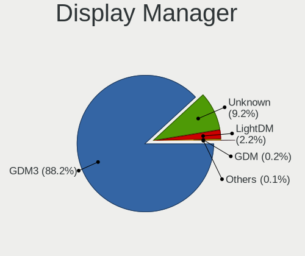
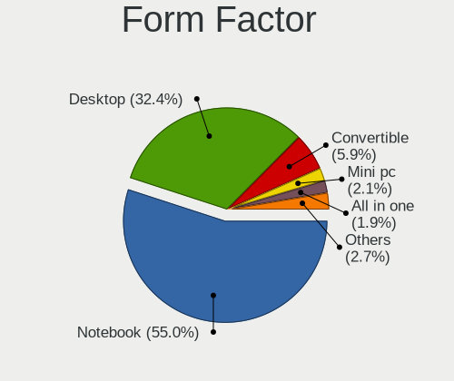
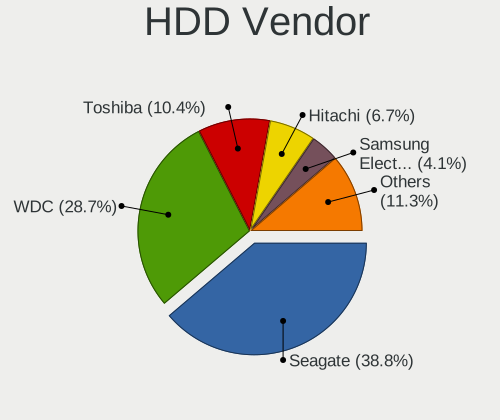
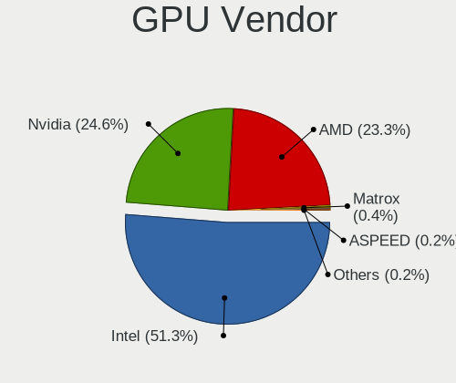
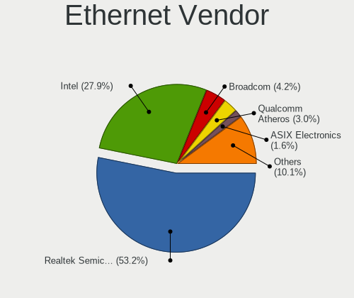

Ubuntu 23.04 - Tested Hardware & Statistics
-------------------------------------------

A project to collect tested hardware configurations for Ubuntu 23.04.

Anyone can contribute to this report by the [hw-probe](https://github.com/linuxhw/hw-probe) tool:

    sudo -E hw-probe -all -upload

Please contribute! Especially if your hardware is rare.

This is a report for all computer types. See also reports for [desktops](/Dist/Ubuntu_23.04/Desktop/README.md) and [notebooks](/Dist/Ubuntu_23.04/Notebook/README.md).

Contents
--------

* [ Test Cases ](#test-cases)

* [ System ](#system)
  - [ Kernel                   ](#kernel)
  - [ Kernel Family            ](#kernel-family)
  - [ Kernel Major Ver.        ](#kernel-major-ver)
  - [ Arch                     ](#arch)
  - [ DE                       ](#de)
  - [ Display Server           ](#display-server)
  - [ Display Manager          ](#display-manager)
  - [ OS Lang                  ](#os-lang)
  - [ Boot Mode                ](#boot-mode)
  - [ Filesystem               ](#filesystem)
  - [ Part. scheme             ](#part-scheme)
  - [ Dual Boot with Linux/BSD ](#dual-boot-with-linuxbsd)
  - [ Dual Boot (Win)          ](#dual-boot-win)

* [ Board ](#board)
  - [ Vendor                   ](#vendor)
  - [ Model                    ](#model)
  - [ Model Family             ](#model-family)
  - [ MFG Year                 ](#mfg-year)
  - [ Form Factor              ](#form-factor)
  - [ Secure Boot              ](#secure-boot)
  - [ Coreboot                 ](#coreboot)
  - [ RAM Size                 ](#ram-size)
  - [ RAM Used                 ](#ram-used)
  - [ Total Drives             ](#total-drives)
  - [ Has CD-ROM               ](#has-cd-rom)
  - [ Has Ethernet             ](#has-ethernet)
  - [ Has WiFi                 ](#has-wifi)
  - [ Has Bluetooth            ](#has-bluetooth)

* [ Location ](#location)
  - [ Country                  ](#country)
  - [ City                     ](#city)

* [ Drives ](#drives)
  - [ Drive Vendor             ](#drive-vendor)
  - [ Drive Model              ](#drive-model)
  - [ HDD Vendor               ](#hdd-vendor)
  - [ SSD Vendor               ](#ssd-vendor)
  - [ Drive Kind               ](#drive-kind)
  - [ Drive Connector          ](#drive-connector)
  - [ Drive Size               ](#drive-size)
  - [ Space Total              ](#space-total)
  - [ Space Used               ](#space-used)
  - [ Malfunc. Drives          ](#malfunc-drives)
  - [ Malfunc. Drive Vendor    ](#malfunc-drive-vendor)
  - [ Malfunc. HDD Vendor      ](#malfunc-hdd-vendor)
  - [ Malfunc. Drive Kind      ](#malfunc-drive-kind)
  - [ Failed Drives            ](#failed-drives)
  - [ Failed Drive Vendor      ](#failed-drive-vendor)
  - [ Drive Status             ](#drive-status)

* [ Storage controller ](#storage-controller)
  - [ Storage Vendor           ](#storage-vendor)
  - [ Storage Model            ](#storage-model)
  - [ Storage Kind             ](#storage-kind)

* [ Processor ](#processor)
  - [ CPU Vendor               ](#cpu-vendor)
  - [ CPU Model                ](#cpu-model)
  - [ CPU Model Family         ](#cpu-model-family)
  - [ CPU Cores                ](#cpu-cores)
  - [ CPU Sockets              ](#cpu-sockets)
  - [ CPU Threads              ](#cpu-threads)
  - [ CPU Op-Modes             ](#cpu-op-modes)
  - [ CPU Microcode            ](#cpu-microcode)
  - [ CPU Microarch            ](#cpu-microarch)

* [ Graphics ](#graphics)
  - [ GPU Vendor               ](#gpu-vendor)
  - [ GPU Model                ](#gpu-model)
  - [ GPU Combo                ](#gpu-combo)
  - [ GPU Driver               ](#gpu-driver)
  - [ GPU Memory               ](#gpu-memory)

* [ Monitor ](#monitor)
  - [ Monitor Vendor           ](#monitor-vendor)
  - [ Monitor Model            ](#monitor-model)
  - [ Monitor Resolution       ](#monitor-resolution)
  - [ Monitor Diagonal         ](#monitor-diagonal)
  - [ Monitor Width            ](#monitor-width)
  - [ Aspect Ratio             ](#aspect-ratio)
  - [ Monitor Area             ](#monitor-area)
  - [ Pixel Density            ](#pixel-density)
  - [ Multiple Monitors        ](#multiple-monitors)

* [ Network ](#network)
  - [ Net Controller Vendor    ](#net-controller-vendor)
  - [ Net Controller Model     ](#net-controller-model)
  - [ Wireless Vendor          ](#wireless-vendor)
  - [ Wireless Model           ](#wireless-model)
  - [ Ethernet Vendor          ](#ethernet-vendor)
  - [ Ethernet Model           ](#ethernet-model)
  - [ Net Controller Kind      ](#net-controller-kind)
  - [ Used Controller          ](#used-controller)
  - [ NICs                     ](#nics)
  - [ IPv6                     ](#ipv6)

* [ Bluetooth ](#bluetooth)
  - [ Bluetooth Vendor         ](#bluetooth-vendor)
  - [ Bluetooth Model          ](#bluetooth-model)

* [ Sound ](#sound)
  - [ Sound Vendor             ](#sound-vendor)
  - [ Sound Model              ](#sound-model)

* [ Memory ](#memory)
  - [ Memory Vendor            ](#memory-vendor)
  - [ Memory Model             ](#memory-model)
  - [ Memory Kind              ](#memory-kind)
  - [ Memory Form Factor       ](#memory-form-factor)
  - [ Memory Size              ](#memory-size)
  - [ Memory Speed             ](#memory-speed)

* [ Printers & scanners ](#printers--scanners)
  - [ Printer Vendor           ](#printer-vendor)
  - [ Printer Model            ](#printer-model)
  - [ Scanner Vendor           ](#scanner-vendor)
  - [ Scanner Model            ](#scanner-model)

* [ Camera ](#camera)
  - [ Camera Vendor            ](#camera-vendor)
  - [ Camera Model             ](#camera-model)

* [ Security ](#security)
  - [ Fingerprint Vendor       ](#fingerprint-vendor)
  - [ Fingerprint Model        ](#fingerprint-model)
  - [ Chipcard Vendor          ](#chipcard-vendor)
  - [ Chipcard Model           ](#chipcard-model)

* [ Unsupported ](#unsupported)
  - [ Unsupported Devices      ](#unsupported-devices)
  - [ Unsupported Device Types ](#unsupported-device-types)

Test Cases
----------

Total: 723

| Vendor        | Model                       | Form-Factor | Probe                                                      | Date         |
|---------------|-----------------------------|-------------|------------------------------------------------------------|--------------|
| Intel         | DP45SG AAE27733-404         | Desktop     | [7abba8629e](https://linux-hardware.org/?probe=7abba8629e) | Jun 10, 2023 |
| Intel         | DP45SG AAE27733-404         | Desktop     | [afaced265f](https://linux-hardware.org/?probe=afaced265f) | Jun 10, 2023 |
| HP            | 81B4                        | Desktop     | [2d7748536f](https://linux-hardware.org/?probe=2d7748536f) | Jun 10, 2023 |
| Lenovo        | ThinkPad T550 20CJS1XB00    | Notebook    | [3d3375df75](https://linux-hardware.org/?probe=3d3375df75) | Jun 10, 2023 |
| Lenovo        | ThinkPad P1 Gen 3 20TH00... | Notebook    | [65a47406b0](https://linux-hardware.org/?probe=65a47406b0) | Jun 10, 2023 |
| Lenovo        | ThinkPad T470p 20J7S0XV0... | Notebook    | [b2f7d876c7](https://linux-hardware.org/?probe=b2f7d876c7) | Jun 10, 2023 |
| ASUSTek       | PRIME Z690-P WIFI           | Desktop     | [63c110632a](https://linux-hardware.org/?probe=63c110632a) | Jun 10, 2023 |
| MSI           | Prestige 13Evo A13M         | Notebook    | [3feb3bce01](https://linux-hardware.org/?probe=3feb3bce01) | Jun 10, 2023 |
| Lenovo        | ThinkPad W500 4058CTO       | Notebook    | [4b6aa9a912](https://linux-hardware.org/?probe=4b6aa9a912) | Jun 10, 2023 |
| Dell          | Latitude E5500              | Notebook    | [41ad12c465](https://linux-hardware.org/?probe=41ad12c465) | Jun 10, 2023 |
| Lenovo        | ThinkPad P16 Gen 1 21D7S... | Notebook    | [246facab73](https://linux-hardware.org/?probe=246facab73) | Jun 10, 2023 |
| Sony          | VPCF120FD                   | Notebook    | [47f02bd498](https://linux-hardware.org/?probe=47f02bd498) | Jun 10, 2023 |
| HP            | 0B4Ch D                     | Desktop     | [672a491915](https://linux-hardware.org/?probe=672a491915) | Jun 09, 2023 |
| Lenovo        | ThinkPad P16 Gen 1 21D7S... | Notebook    | [233dac6c68](https://linux-hardware.org/?probe=233dac6c68) | Jun 09, 2023 |
| Lenovo        | 3172 SDK0J40697 WIN 3305... | Mini pc     | [7f437dc929](https://linux-hardware.org/?probe=7f437dc929) | Jun 09, 2023 |
| Raspberry ... | Raspberry Pi 2 Model B R... | Soc         | [5ad9f9e0bf](https://linux-hardware.org/?probe=5ad9f9e0bf) | Jun 09, 2023 |
| ASUSTek       | M2N68-AM SE2                | Desktop     | [4f69ba649a](https://linux-hardware.org/?probe=4f69ba649a) | Jun 09, 2023 |
| Dell          | XPS 9320                    | Notebook    | [c9f26e18c2](https://linux-hardware.org/?probe=c9f26e18c2) | Jun 09, 2023 |
| Lenovo        | 1037 SDK0Q40104 WIN 3305... | Server      | [c7ced127f8](https://linux-hardware.org/?probe=c7ced127f8) | Jun 09, 2023 |
| Dell          | Inspiron 15-5568            | Notebook    | [19b686b7d7](https://linux-hardware.org/?probe=19b686b7d7) | Jun 09, 2023 |
| HP            | Laptop 15s-fq2xxx           | Notebook    | [09ba95bf3b](https://linux-hardware.org/?probe=09ba95bf3b) | Jun 08, 2023 |
| ASRock        | X670E Pro RS                | Desktop     | [9770971a47](https://linux-hardware.org/?probe=9770971a47) | Jun 08, 2023 |
| ASUSTek       | X455LA                      | Notebook    | [583596672d](https://linux-hardware.org/?probe=583596672d) | Jun 08, 2023 |
| Lenovo        | ThinkPad T490 20N2CTO1WW    | Notebook    | [8fa2e2acc9](https://linux-hardware.org/?probe=8fa2e2acc9) | Jun 08, 2023 |
| AZW           | Green G4 10                 | Desktop     | [326b499893](https://linux-hardware.org/?probe=326b499893) | Jun 08, 2023 |
| Dell          | Inspiron 5379               | Notebook    | [b161b2177a](https://linux-hardware.org/?probe=b161b2177a) | Jun 08, 2023 |
| BESSTAR Te... | UM700                       | Desktop     | [92645b42ac](https://linux-hardware.org/?probe=92645b42ac) | Jun 08, 2023 |
| HP            | Spectre x360 Convertible... | Convertible | [5bec216150](https://linux-hardware.org/?probe=5bec216150) | Jun 08, 2023 |
| HP            | Spectre x360 Convertible... | Convertible | [7fa12c3607](https://linux-hardware.org/?probe=7fa12c3607) | Jun 08, 2023 |
| Dell          | 0HN7XN A01                  | Desktop     | [c44abee9e7](https://linux-hardware.org/?probe=c44abee9e7) | Jun 08, 2023 |
| Gigabyte      | P2542                       | Notebook    | [12a2415432](https://linux-hardware.org/?probe=12a2415432) | Jun 08, 2023 |
| ASUSTek       | WS Z390 PRO                 | Desktop     | [7346eaf346](https://linux-hardware.org/?probe=7346eaf346) | Jun 07, 2023 |
| MSI           | A88XM-E35                   | Desktop     | [efe1285363](https://linux-hardware.org/?probe=efe1285363) | Jun 07, 2023 |
| Lenovo        | ThinkPad X220 Tablet 429... | Notebook    | [ea8584cbda](https://linux-hardware.org/?probe=ea8584cbda) | Jun 07, 2023 |
| Acer          | Aspire E5-553               | Notebook    | [76ca69b8cc](https://linux-hardware.org/?probe=76ca69b8cc) | Jun 07, 2023 |
| Acer          | Aspire E5-553               | Notebook    | [3932ac5190](https://linux-hardware.org/?probe=3932ac5190) | Jun 07, 2023 |
| ASUSTek       | B85M-E                      | Desktop     | [9ea0a82205](https://linux-hardware.org/?probe=9ea0a82205) | Jun 07, 2023 |
| MSI           | Stealth 15M B12UE           | Notebook    | [ff2ebbb0ae](https://linux-hardware.org/?probe=ff2ebbb0ae) | Jun 07, 2023 |
| Lenovo        | Yoga Slim 7 Pro 16ARH7 8... | Notebook    | [265c19be27](https://linux-hardware.org/?probe=265c19be27) | Jun 07, 2023 |
| Apple         | MacBookPro14,1              | Notebook    | [b0435761df](https://linux-hardware.org/?probe=b0435761df) | Jun 07, 2023 |
| Apple         | MacBookPro14,1              | Notebook    | [a76212cc40](https://linux-hardware.org/?probe=a76212cc40) | Jun 07, 2023 |
| Dell          | 0R6PCT A01                  | Desktop     | [e1623fbc8e](https://linux-hardware.org/?probe=e1623fbc8e) | Jun 07, 2023 |
| HP            | Laptop 15s-fq2xxx           | Notebook    | [9d0aa12b81](https://linux-hardware.org/?probe=9d0aa12b81) | Jun 06, 2023 |
| HUAWEI        | NBLB-WAX9N                  | Notebook    | [e56988bf8e](https://linux-hardware.org/?probe=e56988bf8e) | Jun 06, 2023 |
| Dell          | Latitude 7480               | Notebook    | [61c800a3b4](https://linux-hardware.org/?probe=61c800a3b4) | Jun 06, 2023 |
| Notebook      | P65xHP                      | Notebook    | [bf35e218d7](https://linux-hardware.org/?probe=bf35e218d7) | Jun 06, 2023 |
| Dell          | 0RY007                      | Desktop     | [49c7cbbfde](https://linux-hardware.org/?probe=49c7cbbfde) | Jun 06, 2023 |
| ASUSTek       | PRIME Z790-A WIFI           | Desktop     | [fe852e8a1d](https://linux-hardware.org/?probe=fe852e8a1d) | Jun 06, 2023 |
| Toshiba       | PORTEGE X30-D               | Notebook    | [262ee566e1](https://linux-hardware.org/?probe=262ee566e1) | Jun 06, 2023 |
| Pegatron      | H81-M1                      | Desktop     | [2641e6773e](https://linux-hardware.org/?probe=2641e6773e) | Jun 05, 2023 |
| HP            | EliteBook 840 G6            | Notebook    | [0763f751ac](https://linux-hardware.org/?probe=0763f751ac) | Jun 05, 2023 |
| Notebook      | P65xHP                      | Notebook    | [51834b893c](https://linux-hardware.org/?probe=51834b893c) | Jun 05, 2023 |
| MSI           | 990FXA GAMING               | Desktop     | [1c99e1316c](https://linux-hardware.org/?probe=1c99e1316c) | Jun 05, 2023 |
| MSI           | 990FXA GAMING               | Desktop     | [60fb09bf5e](https://linux-hardware.org/?probe=60fb09bf5e) | Jun 05, 2023 |
| MECER         | MW10Q17                     | Tablet      | [36fd3d704b](https://linux-hardware.org/?probe=36fd3d704b) | Jun 05, 2023 |
| MECER         | MW10Q17                     | Tablet      | [3cdab95833](https://linux-hardware.org/?probe=3cdab95833) | Jun 05, 2023 |
| Unknown       | Unknown                     | Tablet      | [33c4d481d9](https://linux-hardware.org/?probe=33c4d481d9) | Jun 05, 2023 |
| MSI           | B250 GAMING PRO CARBON      | Desktop     | [32da3735d9](https://linux-hardware.org/?probe=32da3735d9) | Jun 05, 2023 |
| ASUSTek       | Z170-K                      | Desktop     | [a2c31cdc69](https://linux-hardware.org/?probe=a2c31cdc69) | Jun 05, 2023 |
| ASUSTek       | PRIME Z590-V                | Desktop     | [d0fd3fd90a](https://linux-hardware.org/?probe=d0fd3fd90a) | Jun 04, 2023 |
| ASUSTek       | PRIME Z590-V                | Desktop     | [bc93ac1588](https://linux-hardware.org/?probe=bc93ac1588) | Jun 04, 2023 |
| Toshiba       | Satellite Pro C70-B         | Notebook    | [d4bc6d6c8c](https://linux-hardware.org/?probe=d4bc6d6c8c) | Jun 04, 2023 |
| Sony          | VPCEH2H4E                   | Notebook    | [793e883d0c](https://linux-hardware.org/?probe=793e883d0c) | Jun 04, 2023 |
| Dell          | Inspiron 3442               | Notebook    | [5c1f2cc0d3](https://linux-hardware.org/?probe=5c1f2cc0d3) | Jun 04, 2023 |
| HP            | Spectre x360 2-in-1 Lapt... | Convertible | [5b7a78b32e](https://linux-hardware.org/?probe=5b7a78b32e) | Jun 04, 2023 |
| Acer          | Swift SF314-43              | Notebook    | [969354604a](https://linux-hardware.org/?probe=969354604a) | Jun 04, 2023 |
| Dell          | Latitude E5520              | Notebook    | [7e2d1fdd22](https://linux-hardware.org/?probe=7e2d1fdd22) | Jun 04, 2023 |
| Acer          | Swift SF314-512             | Notebook    | [f39742476c](https://linux-hardware.org/?probe=f39742476c) | Jun 04, 2023 |
| Acer          | Swift SF314-512             | Notebook    | [efa49bf468](https://linux-hardware.org/?probe=efa49bf468) | Jun 04, 2023 |
| ASRock        | A320M-HDV R4.0              | Desktop     | [f472cba5a6](https://linux-hardware.org/?probe=f472cba5a6) | Jun 04, 2023 |
| ASUSTek       | H170-PRO                    | Desktop     | [b9fd75507c](https://linux-hardware.org/?probe=b9fd75507c) | Jun 04, 2023 |
| Dell          | Latitude E5510              | Notebook    | [353a2174af](https://linux-hardware.org/?probe=353a2174af) | Jun 04, 2023 |
| ASUSTek       | PRIME X670-P WIFI           | Desktop     | [82542c4daa](https://linux-hardware.org/?probe=82542c4daa) | Jun 04, 2023 |
| ASUSTek       | ROG STRIX B360-I GAMING     | Desktop     | [0c8afa948b](https://linux-hardware.org/?probe=0c8afa948b) | Jun 04, 2023 |
| Lenovo        | IdeaPad Gaming 3 16IAH7 ... | Notebook    | [6d8d7f6384](https://linux-hardware.org/?probe=6d8d7f6384) | Jun 04, 2023 |
| Lenovo        | ThinkPad P72 20MBCTO1WW     | Notebook    | [4f62d33d84](https://linux-hardware.org/?probe=4f62d33d84) | Jun 04, 2023 |
| MSI           | B450 TOMAHAWK               | Desktop     | [aaed1b39af](https://linux-hardware.org/?probe=aaed1b39af) | Jun 03, 2023 |
| Huanan        | X99-F8 GAMING V2.0          | Desktop     | [8b790b76a6](https://linux-hardware.org/?probe=8b790b76a6) | Jun 03, 2023 |
| ASUSTek       | K52Je                       | Notebook    | [0190eef08c](https://linux-hardware.org/?probe=0190eef08c) | Jun 03, 2023 |
| Intel         | X99 V102                    | Desktop     | [ed5a67e8a5](https://linux-hardware.org/?probe=ed5a67e8a5) | Jun 03, 2023 |
| MSI           | H97M-G43                    | Desktop     | [6bd1b61977](https://linux-hardware.org/?probe=6bd1b61977) | Jun 03, 2023 |
| ASUSTek       | Z97-PRO GAMER               | Desktop     | [8d783c6b00](https://linux-hardware.org/?probe=8d783c6b00) | Jun 03, 2023 |
| Dell          | Latitude E6420              | Notebook    | [069b512b91](https://linux-hardware.org/?probe=069b512b91) | Jun 03, 2023 |
| Lenovo        | ThinkPad T420 4236WQD       | Notebook    | [69a63f31e1](https://linux-hardware.org/?probe=69a63f31e1) | Jun 03, 2023 |
| ASUSTek       | TUF Gaming Z590-PLUS WIF... | Desktop     | [51868dd3c8](https://linux-hardware.org/?probe=51868dd3c8) | Jun 03, 2023 |
| HP            | ENVY 17                     | Notebook    | [79fd438f05](https://linux-hardware.org/?probe=79fd438f05) | Jun 03, 2023 |
| Gigabyte      | Z590 AORUS ULTRA            | Desktop     | [44571410f0](https://linux-hardware.org/?probe=44571410f0) | Jun 03, 2023 |
| Gigabyte      | Z590 AORUS ULTRA            | Desktop     | [d54d77b051](https://linux-hardware.org/?probe=d54d77b051) | Jun 03, 2023 |
| HP            | 3047h                       | Desktop     | [1825675e99](https://linux-hardware.org/?probe=1825675e99) | Jun 03, 2023 |
| MSI           | B250 GAMING PRO CARBON      | Desktop     | [ef7acf6baa](https://linux-hardware.org/?probe=ef7acf6baa) | Jun 03, 2023 |
| Dell          | 0M6C7G A00                  | Desktop     | [93bdbbdafb](https://linux-hardware.org/?probe=93bdbbdafb) | Jun 03, 2023 |
| ASUSTek       | PRIME Z790-A WIFI           | Desktop     | [4e17d7c6e8](https://linux-hardware.org/?probe=4e17d7c6e8) | Jun 03, 2023 |
| ASUSTek       | PRIME Z790-A WIFI           | Desktop     | [965de576c7](https://linux-hardware.org/?probe=965de576c7) | Jun 03, 2023 |
| Dell          | Latitude 5491               | Notebook    | [6a8a7e6188](https://linux-hardware.org/?probe=6a8a7e6188) | Jun 03, 2023 |
| Dell          | 0RY007                      | Desktop     | [f3028ff55d](https://linux-hardware.org/?probe=f3028ff55d) | Jun 02, 2023 |
| Acer          | Aspire 7750G                | Notebook    | [160d4525c6](https://linux-hardware.org/?probe=160d4525c6) | Jun 02, 2023 |
| ASUSTek       | TUF Gaming FX505DT_FX505... | Notebook    | [fa4bd41f4b](https://linux-hardware.org/?probe=fa4bd41f4b) | Jun 02, 2023 |
| ASUSTek       | ASUS TUF Gaming F17 FX70... | Notebook    | [959b76650d](https://linux-hardware.org/?probe=959b76650d) | Jun 02, 2023 |
| Samsung       | 730QED                      | Convertible | [f447d7526c](https://linux-hardware.org/?probe=f447d7526c) | Jun 02, 2023 |
| Samsung       | 730QED                      | Convertible | [ca8f4d1ff7](https://linux-hardware.org/?probe=ca8f4d1ff7) | Jun 02, 2023 |
| Acer          | Aspire ES1-523              | Notebook    | [a080a07f52](https://linux-hardware.org/?probe=a080a07f52) | Jun 02, 2023 |
| Acer          | Aspire 7750G                | Notebook    | [e94cab5008](https://linux-hardware.org/?probe=e94cab5008) | Jun 02, 2023 |
| ASUSTek       | VivoBook_ASUSLaptop M350... | Notebook    | [1aea71b6c0](https://linux-hardware.org/?probe=1aea71b6c0) | Jun 02, 2023 |
| Unknown       | Unknown                     | Notebook    | [655398fc94](https://linux-hardware.org/?probe=655398fc94) | Jun 02, 2023 |
| ASUSTek       | VivoBook_ASUSLaptop M350... | Notebook    | [1bdb74a8ba](https://linux-hardware.org/?probe=1bdb74a8ba) | Jun 02, 2023 |
| ASUSTek       | Pro WS WRX80E-SAGE SE WI... | Desktop     | [8aab7c6536](https://linux-hardware.org/?probe=8aab7c6536) | Jun 01, 2023 |
| Dell          | XPS 13 9310 2-in-1          | Convertible | [e2d37b2d66](https://linux-hardware.org/?probe=e2d37b2d66) | Jun 01, 2023 |
| HP            | ProBook 6450b               | Notebook    | [d3d4e45f9d](https://linux-hardware.org/?probe=d3d4e45f9d) | Jun 01, 2023 |
| ASUSTek       | VivoBook_ASUSLaptop X580... | Notebook    | [f66667b7fb](https://linux-hardware.org/?probe=f66667b7fb) | Jun 01, 2023 |
| Dell          | XPS 15 9570                 | Notebook    | [6d7803788d](https://linux-hardware.org/?probe=6d7803788d) | Jun 01, 2023 |
| Dell          | Vostro 15 3515              | Notebook    | [8a69d6c123](https://linux-hardware.org/?probe=8a69d6c123) | Jun 01, 2023 |
| HP            | 83E2                        | Desktop     | [eaf5f90360](https://linux-hardware.org/?probe=eaf5f90360) | Jun 01, 2023 |
| Dell          | Vostro 15 3515              | Notebook    | [ecfe7565f4](https://linux-hardware.org/?probe=ecfe7565f4) | Jun 01, 2023 |
| HP            | EliteBook 2560p             | Notebook    | [e822eb4072](https://linux-hardware.org/?probe=e822eb4072) | Jun 01, 2023 |
| ASUSTek       | K53SK                       | Notebook    | [9b376cdd45](https://linux-hardware.org/?probe=9b376cdd45) | Jun 01, 2023 |
| HP            | Pavilion Notebook           | Notebook    | [3fb05bfb0b](https://linux-hardware.org/?probe=3fb05bfb0b) | May 31, 2023 |
| Gigabyte      | X570 AORUS ELITE            | Desktop     | [3b9639141c](https://linux-hardware.org/?probe=3b9639141c) | May 31, 2023 |
| HP            | Pavilion Laptop 15-cw1xx... | Notebook    | [560680687c](https://linux-hardware.org/?probe=560680687c) | May 31, 2023 |
| Dell          | 0RY007                      | Desktop     | [b726df555b](https://linux-hardware.org/?probe=b726df555b) | May 31, 2023 |
| Dell          | 0RY007                      | Desktop     | [32e931c79b](https://linux-hardware.org/?probe=32e931c79b) | May 31, 2023 |
| Lenovo        | ThinkPad T480 20L6S7PE0G    | Notebook    | [239faf8c55](https://linux-hardware.org/?probe=239faf8c55) | May 31, 2023 |
| HONOR         | BBR-WAX9                    | Notebook    | [8630cfad52](https://linux-hardware.org/?probe=8630cfad52) | May 31, 2023 |
| ASUSTek       | P8H61-M LX3 PLUS R2.0       | Desktop     | [953ee1ef05](https://linux-hardware.org/?probe=953ee1ef05) | May 31, 2023 |
| Gigabyte      | X99-UD7 WIFI-CF             | Desktop     | [955e65b76f](https://linux-hardware.org/?probe=955e65b76f) | May 31, 2023 |
| Acer          | Nitro AN515-54              | Notebook    | [7c031081c5](https://linux-hardware.org/?probe=7c031081c5) | May 31, 2023 |
| ASRock        | Z77 Extreme3                | Desktop     | [e45b1707bd](https://linux-hardware.org/?probe=e45b1707bd) | May 31, 2023 |
| Acer          | Swift SF314-512             | Notebook    | [a8c97baf10](https://linux-hardware.org/?probe=a8c97baf10) | May 31, 2023 |
| ASUSTek       | ROG Strix G513RS_G513RS     | Notebook    | [69b1782cce](https://linux-hardware.org/?probe=69b1782cce) | May 31, 2023 |
| ZOTAC         | Unknown                     | Desktop     | [0626de1b2a](https://linux-hardware.org/?probe=0626de1b2a) | May 31, 2023 |
| ASUSTek       | PRIME B450M-K II            | Desktop     | [2703e7856e](https://linux-hardware.org/?probe=2703e7856e) | May 30, 2023 |
| ASUSTek       | K53SK                       | Notebook    | [bfd926c8da](https://linux-hardware.org/?probe=bfd926c8da) | May 30, 2023 |
| VALE          | Notebook Classic C140       | Notebook    | [cdc6168586](https://linux-hardware.org/?probe=cdc6168586) | May 30, 2023 |
| Gigabyte      | P2542                       | Notebook    | [b1064cae7a](https://linux-hardware.org/?probe=b1064cae7a) | May 30, 2023 |
| Lenovo        | Yoga C940-14IIL 81Q9        | Convertible | [b79113b0b5](https://linux-hardware.org/?probe=b79113b0b5) | May 30, 2023 |
| ASUSTek       | TUF Gaming Z590-PLUS WIF... | Desktop     | [45e5adbb22](https://linux-hardware.org/?probe=45e5adbb22) | May 30, 2023 |
| Dell          | Inspiron 15-3567            | Notebook    | [e51e0ef0da](https://linux-hardware.org/?probe=e51e0ef0da) | May 30, 2023 |
| Gigabyte      | P2542                       | Notebook    | [7cded000f2](https://linux-hardware.org/?probe=7cded000f2) | May 30, 2023 |
| Dell          | XPS 13 9310 2-in-1          | Convertible | [0c3b8da8d5](https://linux-hardware.org/?probe=0c3b8da8d5) | May 30, 2023 |
| Dell          | XPS 13 9310 2-in-1          | Convertible | [dfe30c4e4a](https://linux-hardware.org/?probe=dfe30c4e4a) | May 30, 2023 |
| Lenovo        | ThinkPad X1 Carbon 4th 2... | Notebook    | [8002face48](https://linux-hardware.org/?probe=8002face48) | May 30, 2023 |
| Intel         | DH61BF AAG81311-102         | Desktop     | [22123492ab](https://linux-hardware.org/?probe=22123492ab) | May 30, 2023 |
| ASUSTek       | VivoBook_ASUSLaptop M350... | Notebook    | [cddd43859b](https://linux-hardware.org/?probe=cddd43859b) | May 30, 2023 |
| Lenovo        | IdeaPad 5 14ALC05 82LM      | Notebook    | [46f455ce35](https://linux-hardware.org/?probe=46f455ce35) | May 30, 2023 |
| ASRock        | Z77 Extreme3                | Desktop     | [67c96085bf](https://linux-hardware.org/?probe=67c96085bf) | May 30, 2023 |
| HP            | Elite Dragonfly 13.5 inc... | Notebook    | [1e0fbe86da](https://linux-hardware.org/?probe=1e0fbe86da) | May 29, 2023 |
| Alienware     | x15 R1                      | Notebook    | [19e9b8e338](https://linux-hardware.org/?probe=19e9b8e338) | May 29, 2023 |
| ASUSTek       | ROG STRIX Z790-H GAMING ... | Desktop     | [11432ddeb6](https://linux-hardware.org/?probe=11432ddeb6) | May 29, 2023 |
| ASUSTek       | PRIME H610M-A D4            | Desktop     | [312b05f0a4](https://linux-hardware.org/?probe=312b05f0a4) | May 29, 2023 |
| HONOR         | BBR-WAX9                    | Notebook    | [e57b9850f8](https://linux-hardware.org/?probe=e57b9850f8) | May 28, 2023 |
| ALLDOCUBE     | i1405C                      | Notebook    | [7e4475ef13](https://linux-hardware.org/?probe=7e4475ef13) | May 28, 2023 |
| HP            | ProBook x360 435 G7         | Convertible | [8d113fecb4](https://linux-hardware.org/?probe=8d113fecb4) | May 28, 2023 |
| Lenovo        | IdeaPad 100-15IBD 80QQ      | Notebook    | [c2408a1885](https://linux-hardware.org/?probe=c2408a1885) | May 28, 2023 |
| Apple         | MacBookPro10,2              | Notebook    | [34d96aa1df](https://linux-hardware.org/?probe=34d96aa1df) | May 28, 2023 |
| HUAWEI        | BOHB-WAX9                   | Notebook    | [c7afdbbd76](https://linux-hardware.org/?probe=c7afdbbd76) | May 28, 2023 |
| AVITA         | NE14A2                      | Notebook    | [89c5edafbc](https://linux-hardware.org/?probe=89c5edafbc) | May 28, 2023 |
| Lenovo        | ThinkPad T460 20FMS1JA00    | Notebook    | [618a907425](https://linux-hardware.org/?probe=618a907425) | May 27, 2023 |
| Dell          | Vostro 15 3515              | Notebook    | [2fadb86df4](https://linux-hardware.org/?probe=2fadb86df4) | May 27, 2023 |
| Dell          | Latitude 5440               | Notebook    | [9ed4f0e7ac](https://linux-hardware.org/?probe=9ed4f0e7ac) | May 27, 2023 |
| Dell          | Latitude 5480               | Notebook    | [c7566d1ab9](https://linux-hardware.org/?probe=c7566d1ab9) | May 27, 2023 |
| Dell          | Latitude 5480               | Notebook    | [5327e82af6](https://linux-hardware.org/?probe=5327e82af6) | May 27, 2023 |
| Lenovo        | ThinkPad T14s Gen 3 21BR... | Notebook    | [57b9304725](https://linux-hardware.org/?probe=57b9304725) | May 27, 2023 |
| Acer          | Aspire A315-22              | Notebook    | [18a13174aa](https://linux-hardware.org/?probe=18a13174aa) | May 27, 2023 |
| Gigabyte      | B360M D2V                   | Desktop     | [7fce8e04b2](https://linux-hardware.org/?probe=7fce8e04b2) | May 27, 2023 |
| ASUSTek       | TUF Gaming B650-PLUS WIF... | Desktop     | [7e895c167b](https://linux-hardware.org/?probe=7e895c167b) | May 27, 2023 |
| ASUSTek       | TUF Gaming B650-PLUS WIF... | Desktop     | [526503fef7](https://linux-hardware.org/?probe=526503fef7) | May 27, 2023 |
| Dell          | Latitude 7480               | Notebook    | [2c74ec8198](https://linux-hardware.org/?probe=2c74ec8198) | May 27, 2023 |
| Toshiba       | Satellite Pro C70-B         | Notebook    | [3058a75499](https://linux-hardware.org/?probe=3058a75499) | May 26, 2023 |
| Acer          | Aspire A515-52G             | Notebook    | [433b367e58](https://linux-hardware.org/?probe=433b367e58) | May 26, 2023 |
| Acer          | Aspire A515-52G             | Notebook    | [ac85063e46](https://linux-hardware.org/?probe=ac85063e46) | May 26, 2023 |
| HP            | ZBook Firefly 14 inch G8... | Notebook    | [b8bb801b93](https://linux-hardware.org/?probe=b8bb801b93) | May 26, 2023 |
| HP            | ZBook Firefly 14 inch G8... | Notebook    | [a8c4cf6158](https://linux-hardware.org/?probe=a8c4cf6158) | May 26, 2023 |
| AAEON         | UP-CHCR1 V0.4               | Desktop     | [b77201e825](https://linux-hardware.org/?probe=b77201e825) | May 26, 2023 |
| Dell          | 0MGK50 A02                  | Desktop     | [4572d76da5](https://linux-hardware.org/?probe=4572d76da5) | May 26, 2023 |
| Gigabyte      | P43-ES3G                    | Desktop     | [9683a94030](https://linux-hardware.org/?probe=9683a94030) | May 26, 2023 |
| HP            | 2B3B                        | All in one  | [7819836b92](https://linux-hardware.org/?probe=7819836b92) | May 26, 2023 |
| Acer          | Predator PT316-51s          | Notebook    | [0242988287](https://linux-hardware.org/?probe=0242988287) | May 26, 2023 |
| Dell          | 0RY007                      | Desktop     | [6fb4081584](https://linux-hardware.org/?probe=6fb4081584) | May 25, 2023 |
| Microsoft     | Surface Pro 7               | Tablet      | [f9567774d9](https://linux-hardware.org/?probe=f9567774d9) | May 25, 2023 |
| HP            | ENVY Laptop 13-ah0503na     | Notebook    | [cdf2d7b4b4](https://linux-hardware.org/?probe=cdf2d7b4b4) | May 25, 2023 |
| Timi          | Xiaomi NoteBook Pro         | Notebook    | [0316f8d274](https://linux-hardware.org/?probe=0316f8d274) | May 25, 2023 |
| Lenovo        | ThinkPad T580 20LAS62M07    | Notebook    | [48ad025649](https://linux-hardware.org/?probe=48ad025649) | May 25, 2023 |
| Google        | Akali 360                   | Notebook    | [2a4bbc5d81](https://linux-hardware.org/?probe=2a4bbc5d81) | May 25, 2023 |
| ASUSTek       | PRIME B460M-K               | Desktop     | [e55e554596](https://linux-hardware.org/?probe=e55e554596) | May 25, 2023 |
| Acer          | Aspire A715-51G             | Notebook    | [53cbfa6255](https://linux-hardware.org/?probe=53cbfa6255) | May 25, 2023 |
| ASUSTek       | A88XM-PLUS                  | Desktop     | [55790e804a](https://linux-hardware.org/?probe=55790e804a) | May 25, 2023 |
| Toshiba       | Satellite Pro C650          | Notebook    | [50fc04b16c](https://linux-hardware.org/?probe=50fc04b16c) | May 25, 2023 |
| Mediacom      | SMARTBOOK ONE               | Notebook    | [ad010a6b3e](https://linux-hardware.org/?probe=ad010a6b3e) | May 25, 2023 |
| Dell          | 03KWTV A02                  | Desktop     | [60ade2d50f](https://linux-hardware.org/?probe=60ade2d50f) | May 25, 2023 |
| Gigabyte      | Z590 AORUS ULTRA            | Desktop     | [b291f783a2](https://linux-hardware.org/?probe=b291f783a2) | May 25, 2023 |
| HP            | ZBook Studio G3             | Notebook    | [a7274d19af](https://linux-hardware.org/?probe=a7274d19af) | May 24, 2023 |
| HP            | ProLiant DL380p Gen8        | Server      | [7a892801c0](https://linux-hardware.org/?probe=7a892801c0) | May 24, 2023 |
| Dell          | Latitude 7390               | Notebook    | [999bb94a31](https://linux-hardware.org/?probe=999bb94a31) | May 24, 2023 |
| ASUSTek       | CM6330_CM6630_CM6730_CM6... | Desktop     | [a2a31dbbee](https://linux-hardware.org/?probe=a2a31dbbee) | May 24, 2023 |
| HUAWEI        | BOD-WXX9                    | Notebook    | [9486b7ca4f](https://linux-hardware.org/?probe=9486b7ca4f) | May 24, 2023 |
| HP            | Laptop 15s-fq4xxx           | Notebook    | [810c2ac411](https://linux-hardware.org/?probe=810c2ac411) | May 24, 2023 |
| Dell          | XPS 15 9500                 | Notebook    | [4c512786cc](https://linux-hardware.org/?probe=4c512786cc) | May 24, 2023 |
| Dell          | XPS 15 9500                 | Notebook    | [da0b980bc3](https://linux-hardware.org/?probe=da0b980bc3) | May 24, 2023 |
| Allview       | Allbook H                   | Notebook    | [8b0c0a3436](https://linux-hardware.org/?probe=8b0c0a3436) | May 24, 2023 |
| Dell          | Precision 3571              | Notebook    | [3806fcdb9c](https://linux-hardware.org/?probe=3806fcdb9c) | May 24, 2023 |
| Lenovo        | ThinkPad T480 20L50005GE    | Notebook    | [306ecade71](https://linux-hardware.org/?probe=306ecade71) | May 24, 2023 |
| Dell          | Inspiron 5720               | Notebook    | [c9eaabeb95](https://linux-hardware.org/?probe=c9eaabeb95) | May 24, 2023 |
| HP            | Pavilion dv5                | Notebook    | [2906e3ff3b](https://linux-hardware.org/?probe=2906e3ff3b) | May 24, 2023 |
| HP            | 15                          | Notebook    | [b62229cac1](https://linux-hardware.org/?probe=b62229cac1) | May 24, 2023 |
| ASUSTek       | Z87-DELUXE/DUAL             | Desktop     | [0f0c4f64ce](https://linux-hardware.org/?probe=0f0c4f64ce) | May 23, 2023 |
| Gigabyte      | X570 AORUS ELITE            | Desktop     | [ed936908c9](https://linux-hardware.org/?probe=ed936908c9) | May 23, 2023 |
| HUAWEI        | KLVD-WXX9                   | Notebook    | [4c3c861f80](https://linux-hardware.org/?probe=4c3c861f80) | May 23, 2023 |
| Lenovo        | ThinkPad Helix 36986DG      | Notebook    | [77f092da32](https://linux-hardware.org/?probe=77f092da32) | May 23, 2023 |
| Intel         | DG31PR AAD97573-302         | Desktop     | [a36e076c17](https://linux-hardware.org/?probe=a36e076c17) | May 23, 2023 |
| Lenovo        | 312D SDK0J40697 WIN 3305... | Mini pc     | [3cb0dd251d](https://linux-hardware.org/?probe=3cb0dd251d) | May 23, 2023 |
| Dell          | Inspiron 1525               | Notebook    | [a92437f5aa](https://linux-hardware.org/?probe=a92437f5aa) | May 23, 2023 |
| ASUSTek       | X751MA                      | Notebook    | [674b64f381](https://linux-hardware.org/?probe=674b64f381) | May 23, 2023 |
| HP            | Laptop 14s-fq1xxx           | Notebook    | [73d0ff64b6](https://linux-hardware.org/?probe=73d0ff64b6) | May 23, 2023 |
| Acer          | Aspire E5-553               | Notebook    | [3740264eb0](https://linux-hardware.org/?probe=3740264eb0) | May 23, 2023 |
| HP            | 250 G6 Notebook PC          | Notebook    | [431f2db1fc](https://linux-hardware.org/?probe=431f2db1fc) | May 23, 2023 |
| Lenovo        | Yoga 7 16IAH7 82UF          | Convertible | [241bd90f1f](https://linux-hardware.org/?probe=241bd90f1f) | May 23, 2023 |
| HP            | Laptop 14-dq2xxx            | Notebook    | [fe7d1e1f90](https://linux-hardware.org/?probe=fe7d1e1f90) | May 22, 2023 |
| Dell          | Inspiron 1525               | Notebook    | [2afda2396c](https://linux-hardware.org/?probe=2afda2396c) | May 22, 2023 |
| Acer          | Nitro AN515-46              | Notebook    | [702a597b36](https://linux-hardware.org/?probe=702a597b36) | May 22, 2023 |
| MSI           | MPG B650 CARBON WIFI        | Desktop     | [8b3acda484](https://linux-hardware.org/?probe=8b3acda484) | May 22, 2023 |
| Acer          | Swift SF514-56T             | Notebook    | [81a0e002b7](https://linux-hardware.org/?probe=81a0e002b7) | May 22, 2023 |
| Dell          | Latitude 3420               | Notebook    | [d598f2634f](https://linux-hardware.org/?probe=d598f2634f) | May 22, 2023 |
| Gigabyte      | Z590 AORUS ULTRA            | Desktop     | [76bd19169a](https://linux-hardware.org/?probe=76bd19169a) | May 22, 2023 |
| Lenovo        | ThinkPad T450 20BUS1GQ00    | Notebook    | [1ea9bac322](https://linux-hardware.org/?probe=1ea9bac322) | May 22, 2023 |
| Lenovo        | IdeaPadFlex 5-1570 80XB     | Convertible | [f783691b47](https://linux-hardware.org/?probe=f783691b47) | May 22, 2023 |
| ASUSTek       | STRIX Z270F GAMING          | Desktop     | [11c329d15a](https://linux-hardware.org/?probe=11c329d15a) | May 22, 2023 |
| Dell          | Inspiron 7590 2n1           | Convertible | [15f4105418](https://linux-hardware.org/?probe=15f4105418) | May 22, 2023 |
| MSI           | Stealth 15M B12UE           | Notebook    | [4051f4b27d](https://linux-hardware.org/?probe=4051f4b27d) | May 22, 2023 |
| HUAWEI        | NBM-WXX9                    | Notebook    | [e3ea42dd02](https://linux-hardware.org/?probe=e3ea42dd02) | May 22, 2023 |
| Unknown       | DT138IB                     | Desktop     | [130e17f9e3](https://linux-hardware.org/?probe=130e17f9e3) | May 21, 2023 |
| Acer          | TravelMate Spin P414RN-4... | Convertible | [cb8bc926b8](https://linux-hardware.org/?probe=cb8bc926b8) | May 21, 2023 |
| Lenovo        | ThinkPad X395 20NLCTO1WW    | Notebook    | [55a289b426](https://linux-hardware.org/?probe=55a289b426) | May 21, 2023 |
| Apple         | MacBookPro14,2              | Notebook    | [d29f7a36f9](https://linux-hardware.org/?probe=d29f7a36f9) | May 21, 2023 |
| Gigabyte      | Z590 AORUS ULTRA            | Desktop     | [f511a54601](https://linux-hardware.org/?probe=f511a54601) | May 21, 2023 |
| Dell          | Latitude E6530              | Notebook    | [7c04efc558](https://linux-hardware.org/?probe=7c04efc558) | May 21, 2023 |
| ASUSTek       | TUF Gaming B550M-E          | Desktop     | [4a68db15c2](https://linux-hardware.org/?probe=4a68db15c2) | May 21, 2023 |
| ASUSTek       | ROG Flow X13 GV302XI_GV3... | Convertible | [5d4070956a](https://linux-hardware.org/?probe=5d4070956a) | May 21, 2023 |
| HP            | 2B3B                        | All in one  | [2ed92e9c21](https://linux-hardware.org/?probe=2ed92e9c21) | May 21, 2023 |
| Raspberry ... | Raspberry Pi 4 Model B R... | Soc         | [596f37cc9d](https://linux-hardware.org/?probe=596f37cc9d) | May 21, 2023 |
| MSI           | MAG X570 TOMAHAWK WIFI      | Desktop     | [8952bab351](https://linux-hardware.org/?probe=8952bab351) | May 21, 2023 |
| Gigabyte      | H77M-D3H                    | Desktop     | [88cf891056](https://linux-hardware.org/?probe=88cf891056) | May 21, 2023 |
| Lenovo        | IdeaPadFlex 5 14ALC7 82R... | Convertible | [ab706a91d4](https://linux-hardware.org/?probe=ab706a91d4) | May 20, 2023 |
| Dell          | Inspiron 3542               | Notebook    | [166b73ef05](https://linux-hardware.org/?probe=166b73ef05) | May 20, 2023 |
| MSI           | H110M PRO-VD PLUS           | Desktop     | [d549fb62db](https://linux-hardware.org/?probe=d549fb62db) | May 20, 2023 |
| ASUSTek       | TUF Gaming X570-PLUS        | Desktop     | [c242460e72](https://linux-hardware.org/?probe=c242460e72) | May 20, 2023 |
| HP            | 8055                        | Desktop     | [ddfca600c1](https://linux-hardware.org/?probe=ddfca600c1) | May 20, 2023 |
| HP            | Pavilion dv6                | Notebook    | [17ac43247a](https://linux-hardware.org/?probe=17ac43247a) | May 20, 2023 |
| Unknown       | Unknown                     | Notebook    | [c7157cc723](https://linux-hardware.org/?probe=c7157cc723) | May 20, 2023 |
| ASUSTek       | PRIME B460M-K               | Desktop     | [c6ce2f365a](https://linux-hardware.org/?probe=c6ce2f365a) | May 20, 2023 |
| ASUSTek       | VivoBook_ASUSLaptop M350... | Notebook    | [de162ff16c](https://linux-hardware.org/?probe=de162ff16c) | May 20, 2023 |
| ASUSTek       | PRIME B660M-A WIFI D4       | Desktop     | [5da7add39a](https://linux-hardware.org/?probe=5da7add39a) | May 20, 2023 |
| HP            | 8055                        | Desktop     | [d7b466e881](https://linux-hardware.org/?probe=d7b466e881) | May 20, 2023 |
| Acer          | Nitro AN517-54              | Notebook    | [105fb43fc1](https://linux-hardware.org/?probe=105fb43fc1) | May 20, 2023 |
| Samsung       | 300E5EV/300E4EV/270E5EV/... | Notebook    | [42ab4c7e67](https://linux-hardware.org/?probe=42ab4c7e67) | May 20, 2023 |
| AZW           | SER V01                     | Mini pc     | [e0c2283aa1](https://linux-hardware.org/?probe=e0c2283aa1) | May 20, 2023 |
| ASRock        | Z77 Extreme3                | Desktop     | [b60db9bc14](https://linux-hardware.org/?probe=b60db9bc14) | May 20, 2023 |
| ASUSTek       | Z170-A                      | Desktop     | [e168b46b94](https://linux-hardware.org/?probe=e168b46b94) | May 19, 2023 |
| ASUSTek       | PRIME B450-PLUS             | Desktop     | [9f1830f264](https://linux-hardware.org/?probe=9f1830f264) | May 19, 2023 |
| ASUSTek       | PRIME Z690-P WIFI           | Desktop     | [061e1e2aec](https://linux-hardware.org/?probe=061e1e2aec) | May 19, 2023 |
| ASUSTek       | PRIME B650M-A II            | Desktop     | [183b85c77c](https://linux-hardware.org/?probe=183b85c77c) | May 19, 2023 |
| Lenovo        | 3102 SDK0J40697 WIN 3305... | Desktop     | [9dbbfc6c8e](https://linux-hardware.org/?probe=9dbbfc6c8e) | May 19, 2023 |
| Gigabyte      | H67A-D3H-B3                 | Desktop     | [606bb335e6](https://linux-hardware.org/?probe=606bb335e6) | May 19, 2023 |
| ASUSTek       | PRIME B660-PLUS D4          | Desktop     | [f79cecb83e](https://linux-hardware.org/?probe=f79cecb83e) | May 19, 2023 |
| MSI           | VR601                       | Notebook    | [7f9381407d](https://linux-hardware.org/?probe=7f9381407d) | May 19, 2023 |
| Gigabyte      | Z590 AORUS ULTRA            | Desktop     | [e4b87f1e56](https://linux-hardware.org/?probe=e4b87f1e56) | May 19, 2023 |
| ASUSTek       | ASUS TUF Gaming A17 FA70... | Notebook    | [5bac34a5f5](https://linux-hardware.org/?probe=5bac34a5f5) | May 19, 2023 |
| Dell          | Inspiron 3442               | Notebook    | [a8bb37c78e](https://linux-hardware.org/?probe=a8bb37c78e) | May 19, 2023 |
| Samsung       | 300E5EV/300E4EV/270E5EV/... | Notebook    | [9475bc847b](https://linux-hardware.org/?probe=9475bc847b) | May 19, 2023 |
| MSI           | MS-B9311                    | Desktop     | [3cfc1fbb83](https://linux-hardware.org/?probe=3cfc1fbb83) | May 19, 2023 |
| HP            | Pavilion dv6                | Notebook    | [4fb1281981](https://linux-hardware.org/?probe=4fb1281981) | May 18, 2023 |
| ASUSTek       | PRIME B450-PLUS             | Desktop     | [d8d391a609](https://linux-hardware.org/?probe=d8d391a609) | May 18, 2023 |
| ASUSTek       | VivoBook_ASUSLaptop M140... | Notebook    | [7af74c5864](https://linux-hardware.org/?probe=7af74c5864) | May 18, 2023 |
| Fujitsu       | D3222-A1 S26361-D3222-A1    | Desktop     | [87418d1634](https://linux-hardware.org/?probe=87418d1634) | May 18, 2023 |
| Acer          | TravelMate Spin P414RN-4... | Convertible | [69d4abb6e4](https://linux-hardware.org/?probe=69d4abb6e4) | May 18, 2023 |
| Lenovo        | IdeaPad 3 15ITL6 82H8       | Notebook    | [161776168b](https://linux-hardware.org/?probe=161776168b) | May 18, 2023 |
| ASUSTek       | PRIME B660M-A WIFI D4       | Desktop     | [c3626b71ae](https://linux-hardware.org/?probe=c3626b71ae) | May 18, 2023 |
| ASUSTek       | Zenbook UX3402ZA_UX3402Z... | Convertible | [52ee676c29](https://linux-hardware.org/?probe=52ee676c29) | May 18, 2023 |
| Lenovo        | IdeaPad Slim 7 Pro 14IHU... | Notebook    | [e17fc662cc](https://linux-hardware.org/?probe=e17fc662cc) | May 18, 2023 |
| Lenovo        | ThinkPad T14s Gen 3 21BR... | Notebook    | [b5d454d4ec](https://linux-hardware.org/?probe=b5d454d4ec) | May 18, 2023 |
| Lenovo        | ThinkPad T550 20CJS1XB00    | Notebook    | [d1569df0f6](https://linux-hardware.org/?probe=d1569df0f6) | May 18, 2023 |
| Gateway       | DS10G                       | Desktop     | [556a92e56a](https://linux-hardware.org/?probe=556a92e56a) | May 18, 2023 |
| Hampoo        | I1D6_C109S_Hi10Pro          | Tablet      | [9d66e80652](https://linux-hardware.org/?probe=9d66e80652) | May 18, 2023 |
| HP            | Laptop 14-dq0xxx            | Notebook    | [1923d74fbc](https://linux-hardware.org/?probe=1923d74fbc) | May 18, 2023 |
| AZW           | SER V1.0                    | Mini pc     | [59902928be](https://linux-hardware.org/?probe=59902928be) | May 18, 2023 |
| Dell          | Precision 5570              | Notebook    | [c9e52e6e8c](https://linux-hardware.org/?probe=c9e52e6e8c) | May 18, 2023 |
| ASUSTek       | M2N68-AM SE2                | Desktop     | [41971afc9c](https://linux-hardware.org/?probe=41971afc9c) | May 17, 2023 |
| HP            | ProBook x360 435 G7         | Convertible | [073a6b791a](https://linux-hardware.org/?probe=073a6b791a) | May 17, 2023 |
| Raspberry ... | Raspberry Pi                | Soc         | [07a430eb2b](https://linux-hardware.org/?probe=07a430eb2b) | May 17, 2023 |
| Gigabyte      | H61M-DS2                    | Desktop     | [3c3f22e8c7](https://linux-hardware.org/?probe=3c3f22e8c7) | May 17, 2023 |
| Dell          | 0M3F6C A01                  | Desktop     | [d0fc9b65d0](https://linux-hardware.org/?probe=d0fc9b65d0) | May 17, 2023 |
| MSI           | GF63 Thin 11SC              | Notebook    | [89e05e4477](https://linux-hardware.org/?probe=89e05e4477) | May 17, 2023 |
| Gigabyte      | Z690 AORUS MASTER           | Desktop     | [74b2c2122c](https://linux-hardware.org/?probe=74b2c2122c) | May 17, 2023 |
| Dell          | Latitude E6530              | Notebook    | [e6064ac95c](https://linux-hardware.org/?probe=e6064ac95c) | May 17, 2023 |
| Lenovo        | ThinkPad X1 Yoga 3rd 20L... | Convertible | [478f988430](https://linux-hardware.org/?probe=478f988430) | May 16, 2023 |
| MSI           | MAG B760M MORTAR WIFI       | Desktop     | [f7c208d0f0](https://linux-hardware.org/?probe=f7c208d0f0) | May 16, 2023 |
| ASUSTek       | PRIME B650-PLUS             | Desktop     | [212936564d](https://linux-hardware.org/?probe=212936564d) | May 16, 2023 |
| ASUSTek       | PRIME B660M-A D4            | Desktop     | [5553ae2ec9](https://linux-hardware.org/?probe=5553ae2ec9) | May 16, 2023 |
| ASUSTek       | PRIME B660M-A D4            | Desktop     | [f297fbda85](https://linux-hardware.org/?probe=f297fbda85) | May 16, 2023 |
| ASUSTek       | Zenbook UX3402ZA_UX3402Z... | Convertible | [9ea7971a18](https://linux-hardware.org/?probe=9ea7971a18) | May 16, 2023 |
| Lenovo        | ThinkPad T480 20L50005GE    | Notebook    | [58b895e713](https://linux-hardware.org/?probe=58b895e713) | May 16, 2023 |
| Toshiba       | IS 1413G                    | Notebook    | [df01be5efd](https://linux-hardware.org/?probe=df01be5efd) | May 16, 2023 |
| Dell          | 0WXD1Y A01                  | Server      | [9d5a4b579e](https://linux-hardware.org/?probe=9d5a4b579e) | May 16, 2023 |
| Intel         | H61                         | Desktop     | [c54c89a4b1](https://linux-hardware.org/?probe=c54c89a4b1) | May 16, 2023 |
| MSI           | 3664h                       | Desktop     | [b45eee9c3a](https://linux-hardware.org/?probe=b45eee9c3a) | May 16, 2023 |
| HP            | 8055                        | Desktop     | [639cc3308f](https://linux-hardware.org/?probe=639cc3308f) | May 16, 2023 |
| HP            | 8055                        | Desktop     | [15c8401c45](https://linux-hardware.org/?probe=15c8401c45) | May 16, 2023 |
| Hampoo        | I1D6_C109S_Hi10Pro          | Tablet      | [82db8cdf8a](https://linux-hardware.org/?probe=82db8cdf8a) | May 15, 2023 |
| HUAWEI        | KLVD-WXX9                   | Notebook    | [ba609eb1e6](https://linux-hardware.org/?probe=ba609eb1e6) | May 15, 2023 |
| HP            | 3397                        | Desktop     | [3cfe6e2812](https://linux-hardware.org/?probe=3cfe6e2812) | May 15, 2023 |
| Dell          | 0KV3RP A00                  | Desktop     | [d324b5e64d](https://linux-hardware.org/?probe=d324b5e64d) | May 15, 2023 |
| Intel         | DX79SI AAG28808-600         | Desktop     | [d222ee2f89](https://linux-hardware.org/?probe=d222ee2f89) | May 14, 2023 |
| Apple         | Mac-F65AE981FFA204ED Mac... | Mini pc     | [9cda219db5](https://linux-hardware.org/?probe=9cda219db5) | May 14, 2023 |
| VALE          | Notebook Classic C140       | Notebook    | [656e811dfb](https://linux-hardware.org/?probe=656e811dfb) | May 14, 2023 |
| Microsoft     | Surface Laptop Go           | Tablet      | [a2c1fd19aa](https://linux-hardware.org/?probe=a2c1fd19aa) | May 14, 2023 |
| Lenovo        | NOK                         | Desktop     | [9c6f0bae8f](https://linux-hardware.org/?probe=9c6f0bae8f) | May 14, 2023 |
| Acer          | Aspire A717-72G             | Notebook    | [1ab0673015](https://linux-hardware.org/?probe=1ab0673015) | May 14, 2023 |
| Acer          | Aspire A717-72G             | Notebook    | [62a46acc18](https://linux-hardware.org/?probe=62a46acc18) | May 14, 2023 |
| HUAWEI        | CREM-WXX9                   | Notebook    | [b08b887e1a](https://linux-hardware.org/?probe=b08b887e1a) | May 14, 2023 |
| Gigabyte      | H61M-DS2                    | Desktop     | [423359d677](https://linux-hardware.org/?probe=423359d677) | May 14, 2023 |
| HP            | OMEN by Laptop 15-dc1xxx    | Notebook    | [020d4612bd](https://linux-hardware.org/?probe=020d4612bd) | May 14, 2023 |
| HP            | Notebook                    | Notebook    | [decd46d3ed](https://linux-hardware.org/?probe=decd46d3ed) | May 14, 2023 |
| Hampoo        | I1D6_C109S_Hi10Pro          | Tablet      | [66ae15a360](https://linux-hardware.org/?probe=66ae15a360) | May 14, 2023 |
| HP            | Laptop 14-dq2xxx            | Notebook    | [274fbdb43e](https://linux-hardware.org/?probe=274fbdb43e) | May 14, 2023 |
| Toshiba       | IS 1413G                    | Notebook    | [821d79dc3f](https://linux-hardware.org/?probe=821d79dc3f) | May 14, 2023 |
| Gigabyte      | 970A-DS3                    | Desktop     | [97ef085eca](https://linux-hardware.org/?probe=97ef085eca) | May 14, 2023 |
| ASUSTek       | P8Z77-V LX                  | Desktop     | [07bf228811](https://linux-hardware.org/?probe=07bf228811) | May 14, 2023 |
| MSI           | GS75 Stealth 10SFS          | Notebook    | [a2116b61ea](https://linux-hardware.org/?probe=a2116b61ea) | May 14, 2023 |
| Lenovo        | Slim 7 ProX 14ARH7 82V2     | Notebook    | [803f9dba3c](https://linux-hardware.org/?probe=803f9dba3c) | May 13, 2023 |
| Lenovo        | ThinkPad T14s Gen 3 21BR... | Notebook    | [09eb36df64](https://linux-hardware.org/?probe=09eb36df64) | May 13, 2023 |
| Dell          | Inspiron 7520               | Notebook    | [d06731c12e](https://linux-hardware.org/?probe=d06731c12e) | May 13, 2023 |
| ASUSTek       | ASUS TUF Gaming A17 FA70... | Notebook    | [5768cd981e](https://linux-hardware.org/?probe=5768cd981e) | May 13, 2023 |
| Lenovo        | ThinkPad X1 Yoga 2nd 20J... | Convertible | [a8c81eafb0](https://linux-hardware.org/?probe=a8c81eafb0) | May 13, 2023 |
| Dell          | 0GWHMW A00                  | Desktop     | [d2dbc10885](https://linux-hardware.org/?probe=d2dbc10885) | May 13, 2023 |
| MSI           | MAG B550M BAZOOKA           | Desktop     | [bfff1b604f](https://linux-hardware.org/?probe=bfff1b604f) | May 13, 2023 |
| HP            | ENVY x360 2-in-1 Laptop ... | Convertible | [4491067060](https://linux-hardware.org/?probe=4491067060) | May 13, 2023 |
| Dell          | 0D883F A05                  | Desktop     | [99e782e805](https://linux-hardware.org/?probe=99e782e805) | May 13, 2023 |
| Lenovo        | Slim 7 ProX 14ARH7 82V2     | Notebook    | [66bff684b7](https://linux-hardware.org/?probe=66bff684b7) | May 13, 2023 |
| Gigabyte      | X570 AORUS XTREME           | Desktop     | [6d362f8c74](https://linux-hardware.org/?probe=6d362f8c74) | May 13, 2023 |
| HP            | 2B3B                        | All in one  | [4785289345](https://linux-hardware.org/?probe=4785289345) | May 13, 2023 |
| Samsung       | 930X2K/931X2K               | Notebook    | [14eae60f4f](https://linux-hardware.org/?probe=14eae60f4f) | May 13, 2023 |
| Samsung       | 930X2K/931X2K               | Notebook    | [7ac717a41d](https://linux-hardware.org/?probe=7ac717a41d) | May 13, 2023 |
| Samsung       | 960XFH                      | Notebook    | [6d6b4a9c5e](https://linux-hardware.org/?probe=6d6b4a9c5e) | May 12, 2023 |
| Intel         | DG43GT AAE62768-303         | Desktop     | [4cc21b00e7](https://linux-hardware.org/?probe=4cc21b00e7) | May 12, 2023 |
| Lenovo        | ThinkPad T420 4238AB4       | Notebook    | [795e44d159](https://linux-hardware.org/?probe=795e44d159) | May 12, 2023 |
| ASUSTek       | X555LJ                      | Notebook    | [f39ba53533](https://linux-hardware.org/?probe=f39ba53533) | May 12, 2023 |
| HP            | Stream Notebook             | Notebook    | [5ed3be74da](https://linux-hardware.org/?probe=5ed3be74da) | May 12, 2023 |
| Apple         | MacBookPro11,2              | Notebook    | [ceea346358](https://linux-hardware.org/?probe=ceea346358) | May 12, 2023 |
| Apple         | MacBookPro11,4              | Notebook    | [576d66cba7](https://linux-hardware.org/?probe=576d66cba7) | May 12, 2023 |
| Unknown       | Unknown                     | Notebook    | [8375f52559](https://linux-hardware.org/?probe=8375f52559) | May 12, 2023 |
| HP            | EliteBook 840 G6            | Notebook    | [80158c51fb](https://linux-hardware.org/?probe=80158c51fb) | May 12, 2023 |
| HP            | 2B3B                        | All in one  | [a4c65ac28f](https://linux-hardware.org/?probe=a4c65ac28f) | May 12, 2023 |
| HP            | 2B3B                        | All in one  | [ca83ed5e3f](https://linux-hardware.org/?probe=ca83ed5e3f) | May 12, 2023 |
| Dell          | Vostro 3500                 | Notebook    | [81f86e6678](https://linux-hardware.org/?probe=81f86e6678) | May 11, 2023 |
| Dell          | XPS 13 9365                 | Convertible | [988367a195](https://linux-hardware.org/?probe=988367a195) | May 11, 2023 |
| Rombica       | myBook Zenith               | Notebook    | [f7438f1448](https://linux-hardware.org/?probe=f7438f1448) | May 11, 2023 |
| Apple         | MacBookPro9,2               | Notebook    | [ecb43775d1](https://linux-hardware.org/?probe=ecb43775d1) | May 11, 2023 |
| HP            | EliteBook 840 G8 Noteboo... | Notebook    | [f9c1eb381f](https://linux-hardware.org/?probe=f9c1eb381f) | May 11, 2023 |
| ASUSTek       | ROG STRIX Z390-I GAMING     | Desktop     | [33f3e64e8f](https://linux-hardware.org/?probe=33f3e64e8f) | May 11, 2023 |
| Gigabyte      | B75M-D3H                    | Desktop     | [dbf711a2f5](https://linux-hardware.org/?probe=dbf711a2f5) | May 11, 2023 |
| Apple         | Mac-F2218EC8                | All in one  | [6cab4970b0](https://linux-hardware.org/?probe=6cab4970b0) | May 11, 2023 |
| Dell          | 0GU083 A00                  | Desktop     | [eec8f60d12](https://linux-hardware.org/?probe=eec8f60d12) | May 11, 2023 |
| Dell          | 0J3C2F A02                  | Desktop     | [622dd024aa](https://linux-hardware.org/?probe=622dd024aa) | May 11, 2023 |
| Unknown       | Unknown                     | Notebook    | [3fbabd3df0](https://linux-hardware.org/?probe=3fbabd3df0) | May 11, 2023 |
| Dell          | Latitude 5490               | Notebook    | [2cba18ddec](https://linux-hardware.org/?probe=2cba18ddec) | May 11, 2023 |
| Lenovo        | Yoga 7 14IRL8 82YL          | Notebook    | [ae2fd3b0ae](https://linux-hardware.org/?probe=ae2fd3b0ae) | May 11, 2023 |
| ASRock        | H110M-HG4                   | Desktop     | [7995d3740a](https://linux-hardware.org/?probe=7995d3740a) | May 10, 2023 |
| MSI           | Stealth 14Studio A13VE      | Notebook    | [86f43bbff1](https://linux-hardware.org/?probe=86f43bbff1) | May 10, 2023 |
| ASRock        | H110M-HG4                   | Desktop     | [2864ff8227](https://linux-hardware.org/?probe=2864ff8227) | May 10, 2023 |
| Intel         | NUC11PABi5 K90634-305       | Mini pc     | [99af0c1e17](https://linux-hardware.org/?probe=99af0c1e17) | May 10, 2023 |
| Gigabyte      | B360N WIFI-CF               | Desktop     | [e4b3bba2b5](https://linux-hardware.org/?probe=e4b3bba2b5) | May 10, 2023 |
| ASRock        | B450M-HDV R4.0              | Desktop     | [297c4b54d4](https://linux-hardware.org/?probe=297c4b54d4) | May 10, 2023 |
| Acer          | Aspire 3935                 | Notebook    | [39cbd19b39](https://linux-hardware.org/?probe=39cbd19b39) | May 10, 2023 |
| MSI           | B450 GAMING PLUS            | Desktop     | [df94e4a72a](https://linux-hardware.org/?probe=df94e4a72a) | May 10, 2023 |
| Razer         | Blade 14 (2022) - RZ09-0... | Notebook    | [2e58ce6bd7](https://linux-hardware.org/?probe=2e58ce6bd7) | May 10, 2023 |
| Dell          | 03NVJ6 A02                  | Desktop     | [9f509a2647](https://linux-hardware.org/?probe=9f509a2647) | May 10, 2023 |
| HP            | Pavilion x360 Convertibl... | Convertible | [5f4146c326](https://linux-hardware.org/?probe=5f4146c326) | May 10, 2023 |
| Unknown       | Unknown                     | Notebook    | [87e3ae6f24](https://linux-hardware.org/?probe=87e3ae6f24) | May 10, 2023 |
| ASUSTek       | M2N68-AM SE2                | Desktop     | [39b8aee709](https://linux-hardware.org/?probe=39b8aee709) | May 10, 2023 |
| ASUSTek       | ROG STRIX B650E-F GAMING... | Desktop     | [1e41703eca](https://linux-hardware.org/?probe=1e41703eca) | May 09, 2023 |
| Lenovo        | IdeaPad 5 15ARE05 81YQ      | Notebook    | [727163d7b9](https://linux-hardware.org/?probe=727163d7b9) | May 09, 2023 |
| ASRock        | Z97 Extreme4                | Desktop     | [5803f15c1d](https://linux-hardware.org/?probe=5803f15c1d) | May 09, 2023 |
| ASUSTek       | M2N68-AM SE2                | Desktop     | [669dc67190](https://linux-hardware.org/?probe=669dc67190) | May 09, 2023 |
| Dell          | XPS 13 9380                 | Notebook    | [af31929040](https://linux-hardware.org/?probe=af31929040) | May 09, 2023 |
| ASUSTek       | VivoBook_ASUSLaptop TN34... | Convertible | [8ca147188a](https://linux-hardware.org/?probe=8ca147188a) | May 09, 2023 |
| Acer          | Aspire TC-1760              | Desktop     | [24664f3383](https://linux-hardware.org/?probe=24664f3383) | May 09, 2023 |
| ASRock        | B550 Phantom Gaming 4       | Desktop     | [de7b924fdb](https://linux-hardware.org/?probe=de7b924fdb) | May 08, 2023 |
| Medion        | E6234                       | Notebook    | [6c3bd7d77f](https://linux-hardware.org/?probe=6c3bd7d77f) | May 08, 2023 |
| Toshiba       | Satellite L650              | Notebook    | [ba32d27df1](https://linux-hardware.org/?probe=ba32d27df1) | May 08, 2023 |
| HP            | 625                         | Notebook    | [956346de67](https://linux-hardware.org/?probe=956346de67) | May 08, 2023 |
| Lenovo        | ThinkPad X1 Carbon Gen 1... | Notebook    | [0628913a60](https://linux-hardware.org/?probe=0628913a60) | May 08, 2023 |
| Lenovo        | ThinkPad T460 20FMS1JA00    | Notebook    | [db609197b4](https://linux-hardware.org/?probe=db609197b4) | May 08, 2023 |
| ASUSTek       | PRIME B450M-A               | Desktop     | [83c0648d66](https://linux-hardware.org/?probe=83c0648d66) | May 08, 2023 |
| Acer          | Swift SFA16-41              | Notebook    | [7934eebd9b](https://linux-hardware.org/?probe=7934eebd9b) | May 08, 2023 |
| HP            | Pavilion x360 Convertibl... | Convertible | [7f274b189d](https://linux-hardware.org/?probe=7f274b189d) | May 08, 2023 |
| Dell          | 0VNP2H A00                  | Desktop     | [ec04c034d3](https://linux-hardware.org/?probe=ec04c034d3) | May 08, 2023 |
| ASUSTek       | TUF Gaming FX505DT_FX505... | Notebook    | [f23fb5cca0](https://linux-hardware.org/?probe=f23fb5cca0) | May 08, 2023 |
| HP            | Meep                        | Notebook    | [4b99a0c5f8](https://linux-hardware.org/?probe=4b99a0c5f8) | May 08, 2023 |
| Apple         | MacBookPro9,2               | Notebook    | [a8d45ac430](https://linux-hardware.org/?probe=a8d45ac430) | May 07, 2023 |
| Toshiba       | IS 1413G                    | Notebook    | [c437a16a33](https://linux-hardware.org/?probe=c437a16a33) | May 07, 2023 |
| Lenovo        | ThinkBook 15 G2 ARE 20VG    | Notebook    | [a312f0545f](https://linux-hardware.org/?probe=a312f0545f) | May 07, 2023 |
| HP            | EliteBook 850 G3            | Notebook    | [9a068c66d5](https://linux-hardware.org/?probe=9a068c66d5) | May 07, 2023 |
| Medion        | E6234                       | Notebook    | [5afe99ed93](https://linux-hardware.org/?probe=5afe99ed93) | May 07, 2023 |
| Gigabyte      | Z690 AERO G                 | Desktop     | [7673380766](https://linux-hardware.org/?probe=7673380766) | May 07, 2023 |
| HP            | Meep                        | Notebook    | [46a81f105c](https://linux-hardware.org/?probe=46a81f105c) | May 07, 2023 |
| Dell          | XPS 13 9380                 | Notebook    | [b4e9bb9147](https://linux-hardware.org/?probe=b4e9bb9147) | May 07, 2023 |
| ASUSTek       | X555LJ                      | Notebook    | [febe8d60fc](https://linux-hardware.org/?probe=febe8d60fc) | May 07, 2023 |
| ASUSTek       | X555LJ                      | Notebook    | [2e25cad4b3](https://linux-hardware.org/?probe=2e25cad4b3) | May 07, 2023 |
| Razer         | Blade                       | Notebook    | [d90bda8f52](https://linux-hardware.org/?probe=d90bda8f52) | May 07, 2023 |
| Dell          | Latitude 5290               | Notebook    | [255da608b8](https://linux-hardware.org/?probe=255da608b8) | May 07, 2023 |
| Dell          | XPS 13 9343                 | Notebook    | [5e91733408](https://linux-hardware.org/?probe=5e91733408) | May 07, 2023 |
| Lenovo        | IdeaPad Gaming 3 15ARH7 ... | Notebook    | [9355511511](https://linux-hardware.org/?probe=9355511511) | May 07, 2023 |
| Dell          | Inspiron 5521               | Notebook    | [d5f70fc2eb](https://linux-hardware.org/?probe=d5f70fc2eb) | May 07, 2023 |
| HP            | Elite Dragonfly 13.5 inc... | Notebook    | [50b503ae3e](https://linux-hardware.org/?probe=50b503ae3e) | May 07, 2023 |
| HP            | Elite Dragonfly 13.5 inc... | Notebook    | [64bbfa416b](https://linux-hardware.org/?probe=64bbfa416b) | May 07, 2023 |
| Lenovo        | ThinkBook 13s-IWL 20R9      | Notebook    | [abc9ce4fa4](https://linux-hardware.org/?probe=abc9ce4fa4) | May 06, 2023 |
| Dell          | Latitude E6410              | Notebook    | [535fd92f64](https://linux-hardware.org/?probe=535fd92f64) | May 06, 2023 |
| Dell          | Latitude E4200              | Notebook    | [af2baa1787](https://linux-hardware.org/?probe=af2baa1787) | May 06, 2023 |
| ASUSTek       | M11BB                       | Desktop     | [35d2ca0280](https://linux-hardware.org/?probe=35d2ca0280) | May 06, 2023 |
| ASUSTek       | TUF Gaming X570-PLUS        | Desktop     | [6a4a95e86f](https://linux-hardware.org/?probe=6a4a95e86f) | May 06, 2023 |
| Google        | Zako                        | Desktop     | [5d6aa6c0df](https://linux-hardware.org/?probe=5d6aa6c0df) | May 06, 2023 |
| Acer          | Aspire 5810T                | Notebook    | [d4b401ef3f](https://linux-hardware.org/?probe=d4b401ef3f) | May 06, 2023 |
| ASUSTek       | Q405UA                      | Convertible | [f8f69fc110](https://linux-hardware.org/?probe=f8f69fc110) | May 06, 2023 |
| Dell          | Vostro 3360                 | Notebook    | [13a1e30b53](https://linux-hardware.org/?probe=13a1e30b53) | May 06, 2023 |
| Dell          | Precision 7740              | Notebook    | [4cd3b0701e](https://linux-hardware.org/?probe=4cd3b0701e) | May 06, 2023 |
| ASRock        | Z97 Extreme4                | Desktop     | [7b83def3e1](https://linux-hardware.org/?probe=7b83def3e1) | May 06, 2023 |
| Acer          | Aspire 5810T                | Notebook    | [ecdd99c704](https://linux-hardware.org/?probe=ecdd99c704) | May 05, 2023 |
| MSI           | H310M PRO-VDH PLUS          | Desktop     | [7cf447e261](https://linux-hardware.org/?probe=7cf447e261) | May 05, 2023 |
| ASUSTek       | P8H61-M LX                  | Desktop     | [6c96dbe3f3](https://linux-hardware.org/?probe=6c96dbe3f3) | May 05, 2023 |
| HP            | Pavilion g6                 | Notebook    | [9e469df99e](https://linux-hardware.org/?probe=9e469df99e) | May 05, 2023 |
| MSI           | H110M PRO-VD PLUS           | Desktop     | [af27e2497a](https://linux-hardware.org/?probe=af27e2497a) | May 05, 2023 |
| Toshiba       | PORTEGE Z30t-A              | Notebook    | [18cc14eee0](https://linux-hardware.org/?probe=18cc14eee0) | May 05, 2023 |
| HP            | 212B                        | Desktop     | [d71b834a1c](https://linux-hardware.org/?probe=d71b834a1c) | May 05, 2023 |
| ASRock        | Z77 Extreme3                | Desktop     | [0da080327f](https://linux-hardware.org/?probe=0da080327f) | May 05, 2023 |
| Shanghai Z... | ZXE CRB                     | Notebook    | [d63ef842c1](https://linux-hardware.org/?probe=d63ef842c1) | May 05, 2023 |
| Lenovo        | ThinkPad X1 Carbon Gen 1... | Notebook    | [b9cfd37540](https://linux-hardware.org/?probe=b9cfd37540) | May 05, 2023 |
| ATOPNUC       | MA90                        | Mini pc     | [1bc88df7d6](https://linux-hardware.org/?probe=1bc88df7d6) | May 05, 2023 |
| HP            | Pavilion x360 Convertibl... | Convertible | [2fb5ac306a](https://linux-hardware.org/?probe=2fb5ac306a) | May 04, 2023 |
| MSI           | A68HM-E33 V2                | Desktop     | [14a87bc11a](https://linux-hardware.org/?probe=14a87bc11a) | May 04, 2023 |
| MSI           | A68HM-E33 V2                | Desktop     | [2f3264f25f](https://linux-hardware.org/?probe=2f3264f25f) | May 04, 2023 |
| Lenovo        | ThinkPad L13 Yoga Gen 3 ... | Convertible | [23d2c52019](https://linux-hardware.org/?probe=23d2c52019) | May 04, 2023 |
| Google        | Meep                        | Notebook    | [1e5e0e6673](https://linux-hardware.org/?probe=1e5e0e6673) | May 04, 2023 |
| Dell          | XPS 13 9300                 | Notebook    | [8864ce10e7](https://linux-hardware.org/?probe=8864ce10e7) | May 03, 2023 |
| Dell          | XPS 13 9300                 | Notebook    | [8ef1ddf82a](https://linux-hardware.org/?probe=8ef1ddf82a) | May 03, 2023 |
| Dell          | 0RY007                      | Desktop     | [3ec4846de7](https://linux-hardware.org/?probe=3ec4846de7) | May 03, 2023 |
| Lenovo        | Yoga C940-15IRH 81TE        | Convertible | [b8764f73bc](https://linux-hardware.org/?probe=b8764f73bc) | May 03, 2023 |
| Lenovo        | Yoga C940-15IRH 81TE        | Convertible | [da5caa8155](https://linux-hardware.org/?probe=da5caa8155) | May 03, 2023 |
| Olivetti      | OLIBOOK P35-XXXAEU          | Notebook    | [bb924b0c19](https://linux-hardware.org/?probe=bb924b0c19) | May 03, 2023 |
| HP            | EliteBook x360 1030 G3      | Convertible | [3ec0caf9e8](https://linux-hardware.org/?probe=3ec0caf9e8) | May 03, 2023 |
| MSI           | Katana GF66 12UE            | Notebook    | [799a951714](https://linux-hardware.org/?probe=799a951714) | May 03, 2023 |
| ASUSTek       | B150M-A/M.2                 | Desktop     | [cd68a79e95](https://linux-hardware.org/?probe=cd68a79e95) | May 03, 2023 |
| Lenovo        | Yoga 510-14ISK 80S7         | Convertible | [47ff74d363](https://linux-hardware.org/?probe=47ff74d363) | May 03, 2023 |
| Lenovo        | G500s 20245                 | Notebook    | [560b69d616](https://linux-hardware.org/?probe=560b69d616) | May 03, 2023 |
| Lenovo        | IdeaCentre K320 10031       | Desktop     | [86fc44372c](https://linux-hardware.org/?probe=86fc44372c) | May 03, 2023 |
| Toshiba       | IS 1413G                    | Notebook    | [81a4d2ac8b](https://linux-hardware.org/?probe=81a4d2ac8b) | May 03, 2023 |
| Dell          | 0RY007                      | Desktop     | [54e2c92bb9](https://linux-hardware.org/?probe=54e2c92bb9) | May 02, 2023 |
| HP            | 198E                        | Desktop     | [9c02a85763](https://linux-hardware.org/?probe=9c02a85763) | May 02, 2023 |
| Acer          | Aspire E1-571               | Notebook    | [46ecc78df6](https://linux-hardware.org/?probe=46ecc78df6) | May 02, 2023 |
| HP            | EliteBook Folio G1          | Notebook    | [a31ef5e00e](https://linux-hardware.org/?probe=a31ef5e00e) | May 02, 2023 |
| Gigabyte      | X570 AORUS MASTER           | Desktop     | [0dd7d869b2](https://linux-hardware.org/?probe=0dd7d869b2) | May 02, 2023 |
| HP            | Pavilion x360 Convertibl... | Convertible | [983ec204ab](https://linux-hardware.org/?probe=983ec204ab) | May 02, 2023 |
| Lenovo        | ThinkPad T14 Gen 1 20S00... | Notebook    | [5101f4e19d](https://linux-hardware.org/?probe=5101f4e19d) | May 02, 2023 |
| ASUSTek       | VivoBook_ASUSLaptop M650... | Notebook    | [000c0450b9](https://linux-hardware.org/?probe=000c0450b9) | May 02, 2023 |
| Lenovo        | IdeaPad Duet 5 12IAU7 82... | Tablet      | [ed4aeb2282](https://linux-hardware.org/?probe=ed4aeb2282) | May 02, 2023 |
| ASUSTek       | P8H67-M PRO                 | Desktop     | [1362f2e3df](https://linux-hardware.org/?probe=1362f2e3df) | May 02, 2023 |
| HP            | Notebook                    | Notebook    | [749fa6a38e](https://linux-hardware.org/?probe=749fa6a38e) | May 02, 2023 |
| Acer          | Nitro AN515-44              | Notebook    | [e26aee893f](https://linux-hardware.org/?probe=e26aee893f) | May 01, 2023 |
| HUAWEI        | BOHB-WAX9                   | Notebook    | [3a9a2590e3](https://linux-hardware.org/?probe=3a9a2590e3) | May 01, 2023 |
| HP            | ProBook 430 G4              | Notebook    | [3c422c5e96](https://linux-hardware.org/?probe=3c422c5e96) | May 01, 2023 |
| Acer          | Aspire E1-571               | Notebook    | [7b4e78233a](https://linux-hardware.org/?probe=7b4e78233a) | May 01, 2023 |
| Gigabyte      | H110M-DS2-CF                | Desktop     | [211eb49a00](https://linux-hardware.org/?probe=211eb49a00) | May 01, 2023 |
| Lenovo        | Legion 5 15ACH6H 82JU       | Notebook    | [3be920565f](https://linux-hardware.org/?probe=3be920565f) | May 01, 2023 |
| HP            | EliteBook x360 1030 G2      | Convertible | [03edfd3da7](https://linux-hardware.org/?probe=03edfd3da7) | May 01, 2023 |
| ASUSTek       | PRIME X670-P WIFI           | Desktop     | [22cf2ddf02](https://linux-hardware.org/?probe=22cf2ddf02) | May 01, 2023 |
| ASRock        | Z77 Extreme3                | Desktop     | [e89da96576](https://linux-hardware.org/?probe=e89da96576) | May 01, 2023 |
| ASRock        | Z77 Extreme3                | Desktop     | [0aa06876c7](https://linux-hardware.org/?probe=0aa06876c7) | May 01, 2023 |
| Shuttle       | FS35V4                      | Desktop     | [137fda9bc6](https://linux-hardware.org/?probe=137fda9bc6) | May 01, 2023 |
| Medion        | E16402                      | Notebook    | [cff2f785ad](https://linux-hardware.org/?probe=cff2f785ad) | May 01, 2023 |
| Dell          | Latitude E6400              | Notebook    | [33b7764234](https://linux-hardware.org/?probe=33b7764234) | May 01, 2023 |
| HP            | ENVY x360 Convertible 13... | Convertible | [5cfdd30fa7](https://linux-hardware.org/?probe=5cfdd30fa7) | May 01, 2023 |
| MSI           | A520M-A PRO                 | Desktop     | [aa8e8397f6](https://linux-hardware.org/?probe=aa8e8397f6) | May 01, 2023 |
| Lenovo        | ThinkPad X260 20F5002NAU    | Notebook    | [7fcb72c132](https://linux-hardware.org/?probe=7fcb72c132) | May 01, 2023 |
| HP            | EliteBook 840 G3            | Notebook    | [c490c44357](https://linux-hardware.org/?probe=c490c44357) | May 01, 2023 |
| Lenovo        | Legion S7 15IMH5 82BC       | Notebook    | [a57d01b946](https://linux-hardware.org/?probe=a57d01b946) | May 01, 2023 |
| ASUSTek       | Zenbook UM5302TA_UM5302T... | Notebook    | [4bec088d90](https://linux-hardware.org/?probe=4bec088d90) | Apr 30, 2023 |
| Lenovo        | 3111 SDK0J40697 WIN 3305... | Desktop     | [705ff684a9](https://linux-hardware.org/?probe=705ff684a9) | Apr 30, 2023 |
| Dell          | XPS 15 9500                 | Notebook    | [93fef964a7](https://linux-hardware.org/?probe=93fef964a7) | Apr 30, 2023 |
| ASRock        | FM2A68M-HD+                 | Desktop     | [467bb5ded2](https://linux-hardware.org/?probe=467bb5ded2) | Apr 30, 2023 |
| Lenovo        | 370A SDK0J40700 WIN 3258... | Desktop     | [9a1d443928](https://linux-hardware.org/?probe=9a1d443928) | Apr 30, 2023 |
| Samsung       | 950XED                      | Notebook    | [41f620de17](https://linux-hardware.org/?probe=41f620de17) | Apr 30, 2023 |
| Lenovo        | V15 G2 IJL 82QY             | Notebook    | [1714bffa0e](https://linux-hardware.org/?probe=1714bffa0e) | Apr 30, 2023 |
| Colorful T... | CVN B550M GAMING FROZEN ... | Desktop     | [233ea7cdd8](https://linux-hardware.org/?probe=233ea7cdd8) | Apr 30, 2023 |
| Colorful T... | CVN B550M GAMING FROZEN ... | Desktop     | [177fe2fc00](https://linux-hardware.org/?probe=177fe2fc00) | Apr 30, 2023 |
| Acer          | Peppy                       | Notebook    | [4caf11594a](https://linux-hardware.org/?probe=4caf11594a) | Apr 30, 2023 |
| ASUSTek       | B85M-G R2.0                 | Desktop     | [243a170e5a](https://linux-hardware.org/?probe=243a170e5a) | Apr 30, 2023 |
| HP            | Laptop 15s-eq2xxx           | Notebook    | [7a86bdd993](https://linux-hardware.org/?probe=7a86bdd993) | Apr 30, 2023 |
| HP            | Laptop 15s-eq2xxx           | Notebook    | [6206b317f2](https://linux-hardware.org/?probe=6206b317f2) | Apr 30, 2023 |
| HP            | ProLiant ML10 v2            | Desktop     | [3582be2f06](https://linux-hardware.org/?probe=3582be2f06) | Apr 30, 2023 |
| Dell          | 0T10XW A02                  | Desktop     | [2cd32d1efe](https://linux-hardware.org/?probe=2cd32d1efe) | Apr 30, 2023 |
| Lenovo        | ThinkPad E580 20KS001JUK    | Notebook    | [da5f050510](https://linux-hardware.org/?probe=da5f050510) | Apr 29, 2023 |
| Lenovo        | ThinkPad E580 20KS001JUK    | Notebook    | [1e65b46a12](https://linux-hardware.org/?probe=1e65b46a12) | Apr 29, 2023 |
| Acer          | Aspire Z5600                | All in one  | [8a9edf5a44](https://linux-hardware.org/?probe=8a9edf5a44) | Apr 29, 2023 |
| ASUSTek       | X751MA                      | Notebook    | [c952010dbb](https://linux-hardware.org/?probe=c952010dbb) | Apr 29, 2023 |
| Acer          | Aspire E5-575G              | Notebook    | [6a102a2c37](https://linux-hardware.org/?probe=6a102a2c37) | Apr 29, 2023 |
| Dell          | Inspiron N5110              | Notebook    | [04da6f1db9](https://linux-hardware.org/?probe=04da6f1db9) | Apr 29, 2023 |
| MSI           | Modern 14 A10M              | Notebook    | [22ad1f6bfb](https://linux-hardware.org/?probe=22ad1f6bfb) | Apr 29, 2023 |
| Hampoo        | I1D6_C109S_Hi10Pro          | Tablet      | [91011c02d6](https://linux-hardware.org/?probe=91011c02d6) | Apr 29, 2023 |
| Acer          | Aspire E5-553               | Notebook    | [ff448e32c3](https://linux-hardware.org/?probe=ff448e32c3) | Apr 29, 2023 |
| Hampoo        | I1D6_C109S_Hi10Pro          | Tablet      | [c374148e49](https://linux-hardware.org/?probe=c374148e49) | Apr 29, 2023 |
| ASUSTek       | SABERTOOTH 990FX            | Desktop     | [4801547d54](https://linux-hardware.org/?probe=4801547d54) | Apr 29, 2023 |
| Hampoo        | I1D6_C109S_Hi10Pro          | Tablet      | [e70ee6019c](https://linux-hardware.org/?probe=e70ee6019c) | Apr 29, 2023 |
| Apple         | Mac-942B5BF58194151B        | All in one  | [e4718d8b12](https://linux-hardware.org/?probe=e4718d8b12) | Apr 29, 2023 |
| HUAWEI        | BOHK-WAX9X                  | Notebook    | [4490476bd2](https://linux-hardware.org/?probe=4490476bd2) | Apr 29, 2023 |
| Samsung       | 930X2K/931X2K               | Notebook    | [bc4f78f7e7](https://linux-hardware.org/?probe=bc4f78f7e7) | Apr 29, 2023 |
| Microsoft     | Surface Pro                 | Tablet      | [740c70097e](https://linux-hardware.org/?probe=740c70097e) | Apr 29, 2023 |
| Apple         | Mac-F221BEC8                | Desktop     | [033718212c](https://linux-hardware.org/?probe=033718212c) | Apr 28, 2023 |
| Acer          | Aspire E5-575G              | Notebook    | [004e0007e4](https://linux-hardware.org/?probe=004e0007e4) | Apr 28, 2023 |
| Lenovo        | ThinkPad T420 4238AB4       | Notebook    | [3f6a89023c](https://linux-hardware.org/?probe=3f6a89023c) | Apr 28, 2023 |
| ASUSTek       | VivoBook_ASUS Laptop E41... | Notebook    | [216a4b9b67](https://linux-hardware.org/?probe=216a4b9b67) | Apr 28, 2023 |
| Fujitsu       | D3500-A1 S26361-D3500-A1    | Desktop     | [77150d1166](https://linux-hardware.org/?probe=77150d1166) | Apr 28, 2023 |
| Lenovo        | 36DB No DPK                 | All in one  | [01458c55a9](https://linux-hardware.org/?probe=01458c55a9) | Apr 28, 2023 |
| ASUSTek       | VivoBook_ASUS Laptop E41... | Notebook    | [6736f3d911](https://linux-hardware.org/?probe=6736f3d911) | Apr 28, 2023 |
| Lenovo        | 36DB No DPK                 | All in one  | [df53e54c69](https://linux-hardware.org/?probe=df53e54c69) | Apr 28, 2023 |
| ASUSTek       | PRIME X670-P WIFI           | Desktop     | [d97d6d6dff](https://linux-hardware.org/?probe=d97d6d6dff) | Apr 28, 2023 |
| Lenovo        | G50-70 20351                | Notebook    | [a808e47839](https://linux-hardware.org/?probe=a808e47839) | Apr 28, 2023 |
| Lenovo        | G50-70 20351                | Notebook    | [67ae1efc54](https://linux-hardware.org/?probe=67ae1efc54) | Apr 28, 2023 |
| Lenovo        | Legion Y7000 81FW           | Notebook    | [b1e6130b77](https://linux-hardware.org/?probe=b1e6130b77) | Apr 28, 2023 |
| Acer          | Swift SF314-512             | Notebook    | [2ba1bab0fe](https://linux-hardware.org/?probe=2ba1bab0fe) | Apr 28, 2023 |
| MSI           | Katana GF66 12UGS           | Notebook    | [3607ee704e](https://linux-hardware.org/?probe=3607ee704e) | Apr 28, 2023 |
| Lenovo        | NOK                         | Desktop     | [cf3db26781](https://linux-hardware.org/?probe=cf3db26781) | Apr 28, 2023 |
| Unknown       | G41                         | Desktop     | [2a6a185bec](https://linux-hardware.org/?probe=2a6a185bec) | Apr 28, 2023 |
| Dell          | XPS 15 9570                 | Notebook    | [3479673283](https://linux-hardware.org/?probe=3479673283) | Apr 28, 2023 |
| Acer          | ConceptD CN315-71P          | Notebook    | [3cc902ff5c](https://linux-hardware.org/?probe=3cc902ff5c) | Apr 28, 2023 |
| Dell          | Latitude E5470              | Notebook    | [caac023f65](https://linux-hardware.org/?probe=caac023f65) | Apr 27, 2023 |
| Valve         | Jupiter                     | Notebook    | [f65ece2859](https://linux-hardware.org/?probe=f65ece2859) | Apr 27, 2023 |
| ASUSTek       | X751MA                      | Notebook    | [eb9967626a](https://linux-hardware.org/?probe=eb9967626a) | Apr 27, 2023 |
| ASUSTek       | ZenBook UX425IA_UM425IA     | Notebook    | [404ec697ac](https://linux-hardware.org/?probe=404ec697ac) | Apr 27, 2023 |
| Dell          | Inspiron 5567               | Notebook    | [012329ee1f](https://linux-hardware.org/?probe=012329ee1f) | Apr 27, 2023 |
| MSI           | PE60 6QE                    | Notebook    | [1a5ae975ee](https://linux-hardware.org/?probe=1a5ae975ee) | Apr 27, 2023 |
| Acer          | Aspire 5742G                | Notebook    | [a1391b4372](https://linux-hardware.org/?probe=a1391b4372) | Apr 27, 2023 |
| MSI           | PRO B760M-A WIFI DDR4       | Desktop     | [de581801e8](https://linux-hardware.org/?probe=de581801e8) | Apr 27, 2023 |
| Lenovo        | ThinkPad T16 Gen 1 21CH0... | Notebook    | [f0a2365878](https://linux-hardware.org/?probe=f0a2365878) | Apr 27, 2023 |
| Dell          | Inspiron 5558               | Notebook    | [9f3b8c952d](https://linux-hardware.org/?probe=9f3b8c952d) | Apr 27, 2023 |
| Acer          | Aspire E1-571               | Notebook    | [c95605ef8e](https://linux-hardware.org/?probe=c95605ef8e) | Apr 27, 2023 |
| ASUSTek       | ASUS TUF Dash F15 FX516P... | Notebook    | [d49ace71b4](https://linux-hardware.org/?probe=d49ace71b4) | Apr 27, 2023 |
| Dell          | Latitude 5520               | Notebook    | [bec614b168](https://linux-hardware.org/?probe=bec614b168) | Apr 26, 2023 |
| HP            | 1905                        | Desktop     | [7b15ec2d7d](https://linux-hardware.org/?probe=7b15ec2d7d) | Apr 26, 2023 |
| Gigabyte      | Z97X-UD3H-CF                | Desktop     | [eaac4c0ba0](https://linux-hardware.org/?probe=eaac4c0ba0) | Apr 26, 2023 |
| ASUSTek       | TUF Gaming Z690-PLUS D4     | Desktop     | [8f417742d1](https://linux-hardware.org/?probe=8f417742d1) | Apr 26, 2023 |
| Lenovo        | V15 G2 IJL 82QY             | Notebook    | [7ca1ebbe7f](https://linux-hardware.org/?probe=7ca1ebbe7f) | Apr 26, 2023 |
| Dell          | Latitude 7420               | Notebook    | [513e0f8b18](https://linux-hardware.org/?probe=513e0f8b18) | Apr 26, 2023 |
| HP            | 1489                        | All in one  | [ebd3760355](https://linux-hardware.org/?probe=ebd3760355) | Apr 26, 2023 |
| ASUSTek       | X541SA                      | Notebook    | [362ede5435](https://linux-hardware.org/?probe=362ede5435) | Apr 26, 2023 |
| ASUSTek       | H110-PLUS                   | Desktop     | [f8317bce7b](https://linux-hardware.org/?probe=f8317bce7b) | Apr 26, 2023 |
| Acer          | Swift SF313-53              | Notebook    | [b487229ea2](https://linux-hardware.org/?probe=b487229ea2) | Apr 25, 2023 |
| Raspberry ... | Raspberry Pi 4 Model B R... | Soc         | [37b593294a](https://linux-hardware.org/?probe=37b593294a) | Apr 25, 2023 |
| Dell          | 0JP3NX A01                  | Desktop     | [2fa64e56ff](https://linux-hardware.org/?probe=2fa64e56ff) | Apr 25, 2023 |
| MSI           | Modern 14 A10M              | Notebook    | [dc3595e3cc](https://linux-hardware.org/?probe=dc3595e3cc) | Apr 25, 2023 |
| HP            | 240 G8                      | Notebook    | [ab322ed08e](https://linux-hardware.org/?probe=ab322ed08e) | Apr 25, 2023 |
| HP            | 240 G8                      | Notebook    | [8cf9892fe9](https://linux-hardware.org/?probe=8cf9892fe9) | Apr 25, 2023 |
| ASRock        | X670E Pro RS                | Desktop     | [e36216c3c7](https://linux-hardware.org/?probe=e36216c3c7) | Apr 25, 2023 |
| Intel         | NUC10i7FNB K61360-305       | Mini pc     | [4c775782ea](https://linux-hardware.org/?probe=4c775782ea) | Apr 25, 2023 |
| Lenovo        | IdeaPad 5 15ARE05 81YQ      | Notebook    | [e7b20d71b7](https://linux-hardware.org/?probe=e7b20d71b7) | Apr 25, 2023 |
| Lenovo        | V15 G2 IJL 82QY             | Notebook    | [2732f4b096](https://linux-hardware.org/?probe=2732f4b096) | Apr 25, 2023 |
| ASUSTek       | VivoBook_ASUSLaptop X350... | Notebook    | [7d3b6ba1a3](https://linux-hardware.org/?probe=7d3b6ba1a3) | Apr 25, 2023 |
| Dell          | 0K071D A01                  | Desktop     | [0c7edbd8ea](https://linux-hardware.org/?probe=0c7edbd8ea) | Apr 25, 2023 |
| Microsoft     | Surface Laptop Go           | Tablet      | [c5fa59465b](https://linux-hardware.org/?probe=c5fa59465b) | Apr 25, 2023 |
| Lenovo        | Legion 5 15IMH05H 81Y6      | Notebook    | [93b15a590f](https://linux-hardware.org/?probe=93b15a590f) | Apr 25, 2023 |
| Lenovo        | ThinkPad E15 Gen 2 20TD0... | Notebook    | [5fb905227b](https://linux-hardware.org/?probe=5fb905227b) | Apr 25, 2023 |
| ASUSTek       | P8B75-V                     | Desktop     | [f60927a4d8](https://linux-hardware.org/?probe=f60927a4d8) | Apr 24, 2023 |
| Dell          | XPS 13 9310                 | Notebook    | [65ccee11a0](https://linux-hardware.org/?probe=65ccee11a0) | Apr 24, 2023 |
| ICL           | RAYbook Si1512              | Notebook    | [4e960cbe90](https://linux-hardware.org/?probe=4e960cbe90) | Apr 24, 2023 |
| ASUSTek       | GL752VW                     | Notebook    | [26c754e5f0](https://linux-hardware.org/?probe=26c754e5f0) | Apr 24, 2023 |
| Dell          | XPS 13 9310                 | Notebook    | [070d7e791f](https://linux-hardware.org/?probe=070d7e791f) | Apr 24, 2023 |
| Acer          | Aspire 5742G                | Notebook    | [84679bc442](https://linux-hardware.org/?probe=84679bc442) | Apr 24, 2023 |
| Dell          | 0JP3NX A01                  | Desktop     | [609eeb8038](https://linux-hardware.org/?probe=609eeb8038) | Apr 24, 2023 |
| MSI           | H81M PRO-VD                 | Desktop     | [00ade274cb](https://linux-hardware.org/?probe=00ade274cb) | Apr 24, 2023 |
| Lenovo        | ThinkPad A285 20MXS0NJ00    | Notebook    | [f155ad2bf4](https://linux-hardware.org/?probe=f155ad2bf4) | Apr 24, 2023 |
| ASUSTek       | GL752VW                     | Notebook    | [216aaf8fff](https://linux-hardware.org/?probe=216aaf8fff) | Apr 24, 2023 |
| Gigabyte      | Z97X-UD3H-CF                | Desktop     | [88c455761b](https://linux-hardware.org/?probe=88c455761b) | Apr 24, 2023 |
| Gateway       | NV55C                       | Notebook    | [3c560a28cf](https://linux-hardware.org/?probe=3c560a28cf) | Apr 24, 2023 |
| ASUSTek       | PRIME B450M-K II            | Desktop     | [2d0269750e](https://linux-hardware.org/?probe=2d0269750e) | Apr 24, 2023 |
| Lenovo        | IdeaPad 3 15ALC6 82MF       | Notebook    | [2e7585d261](https://linux-hardware.org/?probe=2e7585d261) | Apr 24, 2023 |
| MSI           | B460M PRO-VDH               | Desktop     | [f7709c23a1](https://linux-hardware.org/?probe=f7709c23a1) | Apr 24, 2023 |
| Lenovo        | IdeaPad 5 Pro 14ACN6 82L... | Notebook    | [59c225df6e](https://linux-hardware.org/?probe=59c225df6e) | Apr 24, 2023 |
| Lenovo        | 20RD001FHV                  | Notebook    | [782ded0435](https://linux-hardware.org/?probe=782ded0435) | Apr 24, 2023 |
| Samsung       | 950XED                      | Notebook    | [6226147e11](https://linux-hardware.org/?probe=6226147e11) | Apr 24, 2023 |
| ASUSTek       | TUF Gaming FX705GD_FX705... | Notebook    | [b1c3492700](https://linux-hardware.org/?probe=b1c3492700) | Apr 24, 2023 |
| ASUSTek       | TUF Gaming FX705GD_FX705... | Notebook    | [db8e950d12](https://linux-hardware.org/?probe=db8e950d12) | Apr 24, 2023 |
| Acer          | Aspire A515-47              | Notebook    | [35a591e26a](https://linux-hardware.org/?probe=35a591e26a) | Apr 24, 2023 |
| Apple         | MacBookPro9,2               | Notebook    | [c820da6570](https://linux-hardware.org/?probe=c820da6570) | Apr 24, 2023 |
| Shanghai Z... | ZXE CRB                     | Notebook    | [298d51ae78](https://linux-hardware.org/?probe=298d51ae78) | Apr 24, 2023 |
| Dell          | Latitude E5470              | Notebook    | [bc1dca3c78](https://linux-hardware.org/?probe=bc1dca3c78) | Apr 24, 2023 |
| HP            | ZBook 17 G5                 | Notebook    | [c1d71592a4](https://linux-hardware.org/?probe=c1d71592a4) | Apr 24, 2023 |
| MSI           | Z97S SLI Krait Edition      | Desktop     | [6ed93f8338](https://linux-hardware.org/?probe=6ed93f8338) | Apr 24, 2023 |
| Acer          | Aspire A317-53              | Notebook    | [c47ec3530e](https://linux-hardware.org/?probe=c47ec3530e) | Apr 24, 2023 |
| Dell          | G5 5590                     | Notebook    | [eef3722c35](https://linux-hardware.org/?probe=eef3722c35) | Apr 23, 2023 |
| Gigabyte      | X570 AORUS XTREME           | Desktop     | [0dfc7cce7a](https://linux-hardware.org/?probe=0dfc7cce7a) | Apr 23, 2023 |
| Apple         | Mac-F4238CC8 PVT            | All in one  | [b80d03be6d](https://linux-hardware.org/?probe=b80d03be6d) | Apr 23, 2023 |
| Apple         | Mac-F4238CC8 PVT            | All in one  | [09d116d762](https://linux-hardware.org/?probe=09d116d762) | Apr 23, 2023 |
| ASUSTek       | M5A78L LE                   | Desktop     | [df70910ec6](https://linux-hardware.org/?probe=df70910ec6) | Apr 23, 2023 |
| HP            | ZBook 17 G5                 | Notebook    | [ce9fd79431](https://linux-hardware.org/?probe=ce9fd79431) | Apr 23, 2023 |
| Gigabyte      | X570 AORUS XTREME           | Desktop     | [4e664e5e26](https://linux-hardware.org/?probe=4e664e5e26) | Apr 23, 2023 |
| Dell          | Precision M4400             | Notebook    | [0c367cbf45](https://linux-hardware.org/?probe=0c367cbf45) | Apr 23, 2023 |
| Lenovo        | ThinkPad X220 4286A44       | Notebook    | [6b6e909d11](https://linux-hardware.org/?probe=6b6e909d11) | Apr 23, 2023 |
| ASUSTek       | ASUS TUF Dash F15 FX516P... | Notebook    | [641374c815](https://linux-hardware.org/?probe=641374c815) | Apr 23, 2023 |
| HP            | Pavilion Laptop 15-eg0xx... | Notebook    | [aa01246f8b](https://linux-hardware.org/?probe=aa01246f8b) | Apr 23, 2023 |
| Lenovo        | Yoga 7 14ITL5 82BH          | Convertible | [c9691c3866](https://linux-hardware.org/?probe=c9691c3866) | Apr 23, 2023 |
| ASUSTek       | TUF Gaming B550-PLUS WIF... | Desktop     | [658450824e](https://linux-hardware.org/?probe=658450824e) | Apr 23, 2023 |
| Lenovo        | ThinkPad E480 20KQ000EBR    | Notebook    | [90b7213592](https://linux-hardware.org/?probe=90b7213592) | Apr 23, 2023 |
| Lenovo        | ThinkPad T14 Gen 1 20UES... | Notebook    | [620334c0fc](https://linux-hardware.org/?probe=620334c0fc) | Apr 23, 2023 |
| Lenovo        | IdeaPadFlex 5 16IAU7 82R... | Convertible | [66cfd6f9a3](https://linux-hardware.org/?probe=66cfd6f9a3) | Apr 23, 2023 |
| ASRock        | A75M-HVS                    | Desktop     | [a4964506f7](https://linux-hardware.org/?probe=a4964506f7) | Apr 23, 2023 |
| Fujitsu       | D3161-A1 S26361-D3161-A1    | Desktop     | [67f15c6f4a](https://linux-hardware.org/?probe=67f15c6f4a) | Apr 22, 2023 |
| Dell          | Latitude E6420              | Notebook    | [475a16531a](https://linux-hardware.org/?probe=475a16531a) | Apr 22, 2023 |
| Dell          | Precision M4400             | Notebook    | [291a0de9a8](https://linux-hardware.org/?probe=291a0de9a8) | Apr 22, 2023 |
| Acer          | Nitro AN515-58              | Notebook    | [60251e08f5](https://linux-hardware.org/?probe=60251e08f5) | Apr 22, 2023 |
| ASUSTek       | TUF Gaming X670E-PLUS WI... | Desktop     | [180784b3a2](https://linux-hardware.org/?probe=180784b3a2) | Apr 22, 2023 |
| ASRock        | Z170 Gaming K4              | Desktop     | [8209f53171](https://linux-hardware.org/?probe=8209f53171) | Apr 22, 2023 |
| ASUSTek       | VivoBook_ASUSLaptop X150... | Notebook    | [ce5e9aad85](https://linux-hardware.org/?probe=ce5e9aad85) | Apr 22, 2023 |
| Gigabyte      | B660M GAMING DDR4           | Desktop     | [2afc5398b8](https://linux-hardware.org/?probe=2afc5398b8) | Apr 22, 2023 |
| Acer          | Aspire 7750G                | Notebook    | [afdab44276](https://linux-hardware.org/?probe=afdab44276) | Apr 22, 2023 |
| Acer          | Aspire 7750G                | Notebook    | [1f6e58080a](https://linux-hardware.org/?probe=1f6e58080a) | Apr 22, 2023 |
| HP            | Pavilion Laptop 15-eg2xx... | Notebook    | [0f5a55a8d1](https://linux-hardware.org/?probe=0f5a55a8d1) | Apr 22, 2023 |
| ASRock        | Z97E-ITX/ac                 | Desktop     | [f916f697ed](https://linux-hardware.org/?probe=f916f697ed) | Apr 22, 2023 |
| Biostar       | H410MH S2                   | Desktop     | [0f2593dc78](https://linux-hardware.org/?probe=0f2593dc78) | Apr 22, 2023 |
| ASUSTek       | ROG STRIX B650E-I GAMING... | Desktop     | [a60c54ec31](https://linux-hardware.org/?probe=a60c54ec31) | Apr 22, 2023 |
| Dell          | XPS 13 9350                 | Notebook    | [63cafebe06](https://linux-hardware.org/?probe=63cafebe06) | Apr 21, 2023 |
| ASUSTek       | N53SN                       | Notebook    | [7c0a7d4494](https://linux-hardware.org/?probe=7c0a7d4494) | Apr 21, 2023 |
| HP            | Elite Dragonfly 13.5 inc... | Notebook    | [2a5d9adcd4](https://linux-hardware.org/?probe=2a5d9adcd4) | Apr 21, 2023 |
| HP            | Victus by Laptop 16-e0xx... | Notebook    | [85fa6bf3d5](https://linux-hardware.org/?probe=85fa6bf3d5) | Apr 21, 2023 |
| MSI           | H310M PRO-VDH PLUS          | Desktop     | [f89cce4966](https://linux-hardware.org/?probe=f89cce4966) | Apr 21, 2023 |
| Dell          | Latitude E6420              | Notebook    | [5e3466ce98](https://linux-hardware.org/?probe=5e3466ce98) | Apr 21, 2023 |
| Apple         | MacBookAir7,2               | Notebook    | [d34d10b1ad](https://linux-hardware.org/?probe=d34d10b1ad) | Apr 20, 2023 |
| Dell          | Inspiron 7506 2n1           | Convertible | [293cc42c9d](https://linux-hardware.org/?probe=293cc42c9d) | Apr 20, 2023 |
| HP            | Pavilion Laptop 15-eh1xx... | Notebook    | [05321d1ddd](https://linux-hardware.org/?probe=05321d1ddd) | Apr 20, 2023 |
| Lenovo        | IdeaPadFlex 5 14IAU7 82R... | Convertible | [42ef555f6c](https://linux-hardware.org/?probe=42ef555f6c) | Apr 20, 2023 |
| Dell          | Inspiron 3501               | Notebook    | [e09f00bead](https://linux-hardware.org/?probe=e09f00bead) | Apr 20, 2023 |
| HP            | Pavilion g4                 | Notebook    | [96a0210940](https://linux-hardware.org/?probe=96a0210940) | Apr 20, 2023 |
| Gigabyte      | X670 AORUS ELITE AX         | Desktop     | [170b38e40f](https://linux-hardware.org/?probe=170b38e40f) | Apr 20, 2023 |
| MSI           | MAG Z390 TOMAHAWK           | Desktop     | [9f81660d12](https://linux-hardware.org/?probe=9f81660d12) | Apr 20, 2023 |
| Apple         | MacBookAir7,2               | Notebook    | [b54a612e76](https://linux-hardware.org/?probe=b54a612e76) | Apr 20, 2023 |
| Crusaders ... | CS14D01                     | Notebook    | [b25acea9f7](https://linux-hardware.org/?probe=b25acea9f7) | Apr 19, 2023 |
| ASUSTek       | M5A78L-M LX                 | Desktop     | [c34c1abf02](https://linux-hardware.org/?probe=c34c1abf02) | Apr 18, 2023 |
| Apple         | Mac-F226BEC8 PVT            | All in one  | [88b9080a8c](https://linux-hardware.org/?probe=88b9080a8c) | Apr 17, 2023 |
| Dell          | Vostro 15 7510              | Notebook    | [d9e766f446](https://linux-hardware.org/?probe=d9e766f446) | Apr 16, 2023 |
| HUAWEI        | BOM-WXX9                    | Notebook    | [04eead074d](https://linux-hardware.org/?probe=04eead074d) | Apr 14, 2023 |
| HUAWEI        | HLY-WX9XX                   | Notebook    | [d0742654bb](https://linux-hardware.org/?probe=d0742654bb) | Apr 14, 2023 |
| HP            | Pavilion Laptop 15-eg2xx... | Notebook    | [df35f6916a](https://linux-hardware.org/?probe=df35f6916a) | Apr 14, 2023 |
| Lenovo        | ThinkPad T420 4236WR1       | Notebook    | [0c4578a674](https://linux-hardware.org/?probe=0c4578a674) | Apr 14, 2023 |
| HP            | ProBook 640 G8 Notebook ... | Notebook    | [6b481f17c2](https://linux-hardware.org/?probe=6b481f17c2) | Apr 13, 2023 |
| Raspberry ... | Raspberry Pi                | Soc         | [bcb170c5f0](https://linux-hardware.org/?probe=bcb170c5f0) | Apr 13, 2023 |
| HUAWEI        | BOM-WXX9                    | Notebook    | [c56952417d](https://linux-hardware.org/?probe=c56952417d) | Apr 11, 2023 |
| Toshiba       | IS 1413G                    | Notebook    | [be9d1636a7](https://linux-hardware.org/?probe=be9d1636a7) | Apr 09, 2023 |
| Acer          | Swift SF314-55G             | Notebook    | [e15eaec4c0](https://linux-hardware.org/?probe=e15eaec4c0) | Apr 07, 2023 |
| Notebook      | NP5x_NP6x_NP7xRNJ_RNH       | Notebook    | [29f00590fb](https://linux-hardware.org/?probe=29f00590fb) | Apr 05, 2023 |
| HP            | Pavilion Laptop 15-eg2xx... | Notebook    | [a1dceb9ce7](https://linux-hardware.org/?probe=a1dceb9ce7) | Apr 04, 2023 |
| Google        | Akemi                       | Notebook    | [14e5c7b93b](https://linux-hardware.org/?probe=14e5c7b93b) | Apr 04, 2023 |
| HUAWEI        | CREM-WXX9                   | Notebook    | [dd3c0ff2e5](https://linux-hardware.org/?probe=dd3c0ff2e5) | Apr 03, 2023 |
| Samsung       | 767XCL                      | Notebook    | [b5a44d9194](https://linux-hardware.org/?probe=b5a44d9194) | Apr 03, 2023 |
| BESSTAR Te... | UM700                       | Desktop     | [2e820040bc](https://linux-hardware.org/?probe=2e820040bc) | Apr 02, 2023 |
| Dell          | Inspiron 5458               | Notebook    | [38b9db2538](https://linux-hardware.org/?probe=38b9db2538) | Apr 01, 2023 |
| Samsung       | 767XCL                      | Notebook    | [a3167908c0](https://linux-hardware.org/?probe=a3167908c0) | Apr 01, 2023 |
| ASUSTek       | M5A78L LE                   | Desktop     | [7a23362aac](https://linux-hardware.org/?probe=7a23362aac) | Mar 31, 2023 |
| Lenovo        | ThinkPad T431s 20AA0016G... | Notebook    | [13e8d4f50b](https://linux-hardware.org/?probe=13e8d4f50b) | Mar 31, 2023 |
| HP            | Pavilion Laptop 15-eh1xx... | Notebook    | [b56e2a41ed](https://linux-hardware.org/?probe=b56e2a41ed) | Mar 31, 2023 |
| Raspberry ... | Raspberry Pi                | Soc         | [426c2d06fd](https://linux-hardware.org/?probe=426c2d06fd) | Mar 30, 2023 |
| Intel         | NUC10i7FNB M38062-307       | Mini pc     | [8e1c758a05](https://linux-hardware.org/?probe=8e1c758a05) | Mar 26, 2023 |
| Shanghai Z... | ZXE CRB                     | Notebook    | [aafbb2815f](https://linux-hardware.org/?probe=aafbb2815f) | Mar 25, 2023 |
| Lenovo        | ThinkPad X1 Carbon 5th 2... | Notebook    | [4f2d3a2402](https://linux-hardware.org/?probe=4f2d3a2402) | Mar 25, 2023 |
| Shanghai Z... | ZXE CRB                     | Notebook    | [7f98044a04](https://linux-hardware.org/?probe=7f98044a04) | Mar 24, 2023 |
| Lenovo        | IdeaPad 320-15AST 80XV      | Notebook    | [8c5fde8c1e](https://linux-hardware.org/?probe=8c5fde8c1e) | Mar 22, 2023 |
| Dell          | Latitude 7520               | Notebook    | [09c8e699d3](https://linux-hardware.org/?probe=09c8e699d3) | Mar 16, 2023 |
| HP            | Pavilion Laptop 15-eh2xx... | Notebook    | [66094e937a](https://linux-hardware.org/?probe=66094e937a) | Mar 11, 2023 |
| Shanghai Z... | ZXE CRB                     | Notebook    | [49130084c4](https://linux-hardware.org/?probe=49130084c4) | Mar 11, 2023 |
| Shanghai Z... | ZXE CRB                     | Notebook    | [a6091bc2e2](https://linux-hardware.org/?probe=a6091bc2e2) | Mar 11, 2023 |
| HP            | 18E5                        | Desktop     | [82e5831486](https://linux-hardware.org/?probe=82e5831486) | Mar 10, 2023 |
| Lenovo        | ThinkPad T431s 20AA0016G... | Notebook    | [89e2fd827d](https://linux-hardware.org/?probe=89e2fd827d) | Mar 05, 2023 |
| Shanghai Z... | ZXE CRB                     | Notebook    | [bb68a61939](https://linux-hardware.org/?probe=bb68a61939) | Mar 05, 2023 |
| Lenovo        | E51-80 80QB                 | Notebook    | [824ece168f](https://linux-hardware.org/?probe=824ece168f) | Mar 03, 2023 |
| Lenovo        | ThinkPad T14 Gen 1 20S0C... | Notebook    | [525be1bcbe](https://linux-hardware.org/?probe=525be1bcbe) | Mar 02, 2023 |
| Lenovo        | ThinkPad T431s 20AA0016G... | Notebook    | [830a8a94e2](https://linux-hardware.org/?probe=830a8a94e2) | Mar 02, 2023 |
| Lenovo        | ThinkPad T431s 20AA0016G... | Notebook    | [0bf8c9ca74](https://linux-hardware.org/?probe=0bf8c9ca74) | Mar 02, 2023 |
| AZW           | GTR V01                     | Mini pc     | [bfe7635484](https://linux-hardware.org/?probe=bfe7635484) | Mar 01, 2023 |
| Toshiba       | IS 1413G                    | Notebook    | [05ad6c694b](https://linux-hardware.org/?probe=05ad6c694b) | Mar 01, 2023 |
| HP            | Laptop 17-by3xxx            | Notebook    | [5beb40c486](https://linux-hardware.org/?probe=5beb40c486) | Feb 28, 2023 |
| MSI           | A320M PRO-VD PLUS           | Desktop     | [6677ab11b2](https://linux-hardware.org/?probe=6677ab11b2) | Feb 28, 2023 |
| Samsung       | 370E4K                      | Notebook    | [aba5535c2a](https://linux-hardware.org/?probe=aba5535c2a) | Feb 28, 2023 |
| Toshiba       | IS 1413G                    | Notebook    | [c361aabb21](https://linux-hardware.org/?probe=c361aabb21) | Feb 27, 2023 |
| Toshiba       | IS 1413G                    | Notebook    | [17338cbd01](https://linux-hardware.org/?probe=17338cbd01) | Feb 27, 2023 |
| Lenovo        | 36F7 SDK0J40700 WIN 3258... | Desktop     | [580db05e08](https://linux-hardware.org/?probe=580db05e08) | Feb 27, 2023 |
| Apple         | MacBookPro10,1              | Notebook    | [816a4eb27e](https://linux-hardware.org/?probe=816a4eb27e) | Feb 26, 2023 |
| Apple         | Mac-F22C86C8                | Mini pc     | [a206715ec6](https://linux-hardware.org/?probe=a206715ec6) | Feb 26, 2023 |
| Apple         | Mac-F22C86C8                | Mini pc     | [d227d114f4](https://linux-hardware.org/?probe=d227d114f4) | Feb 25, 2023 |
| HP            | EliteBook 840 G2            | Notebook    | [33dc8202e9](https://linux-hardware.org/?probe=33dc8202e9) | Feb 25, 2023 |
| Gigabyte      | GA-880GM-USB3               | Desktop     | [bb5da28703](https://linux-hardware.org/?probe=bb5da28703) | Feb 23, 2023 |
| HUAWEI        | CREM-WXX9                   | Notebook    | [643d79fd46](https://linux-hardware.org/?probe=643d79fd46) | Feb 21, 2023 |
| Lenovo        | ThinkPad X1 Carbon 4th 2... | Notebook    | [ba0144c710](https://linux-hardware.org/?probe=ba0144c710) | Feb 20, 2023 |
| Apple         | MacBookPro13,3              | Notebook    | [628feb8b19](https://linux-hardware.org/?probe=628feb8b19) | Feb 13, 2023 |
| Apple         | MacBookPro13,3              | Notebook    | [2f591ee9e3](https://linux-hardware.org/?probe=2f591ee9e3) | Feb 13, 2023 |
| ASUSTek       | ZenBook UX562FD_UX562FD     | Convertible | [9e28099913](https://linux-hardware.org/?probe=9e28099913) | Feb 11, 2023 |
| Timi          | RedmiBook 15                | Notebook    | [6dffda8f11](https://linux-hardware.org/?probe=6dffda8f11) | Feb 10, 2023 |
| ASUSTek       | VivoBook_ASUSLaptop X415... | Notebook    | [b3eaee0a71](https://linux-hardware.org/?probe=b3eaee0a71) | Feb 10, 2023 |
| Unknown       | Unknown                     | Soc         | [2ba7af4017](https://linux-hardware.org/?probe=2ba7af4017) | Feb 09, 2023 |
| Fanless Mi... | Rev JSL1                    | Mini pc     | [99dda6c06c](https://linux-hardware.org/?probe=99dda6c06c) | Feb 09, 2023 |
| Acer          | Aspire V5-552G              | Notebook    | [2750863407](https://linux-hardware.org/?probe=2750863407) | Feb 02, 2023 |
| Lenovo        | 3309 SDK0T76530 WIN 3556... | Mini pc     | [dc858e1b6d](https://linux-hardware.org/?probe=dc858e1b6d) | Jan 23, 2023 |
| HP            | ProBook 6560b               | Notebook    | [a9eba68b79](https://linux-hardware.org/?probe=a9eba68b79) | Jan 14, 2023 |
| Samsung       | SBB-DA                      | Notebook    | [a4c6b4f454](https://linux-hardware.org/?probe=a4c6b4f454) | Jan 07, 2023 |
| Fujitsu Si... | D2420 S26361-D2420          | Desktop     | [9e8c937daa](https://linux-hardware.org/?probe=9e8c937daa) | Dec 31, 2022 |
| Fujitsu Si... | D2420 S26361-D2420          | Desktop     | [019236854d](https://linux-hardware.org/?probe=019236854d) | Dec 30, 2022 |
| Fujitsu Si... | D2420 S26361-D2420          | Desktop     | [d6f064e643](https://linux-hardware.org/?probe=d6f064e643) | Dec 30, 2022 |
| MSI           | Raider GE67HX 12UGS         | Notebook    | [28822be06e](https://linux-hardware.org/?probe=28822be06e) | Dec 29, 2022 |
| ASUSTek       | VivoBook_ASUSLaptop E210... | Notebook    | [e1ae2ba145](https://linux-hardware.org/?probe=e1ae2ba145) | Dec 24, 2022 |
| Gigabyte      | F2A68HM-DS2                 | Desktop     | [ba498df129](https://linux-hardware.org/?probe=ba498df129) | Dec 23, 2022 |
| Lenovo        | IdeaPad 5 15ITL05 82FG      | Notebook    | [d1342c521a](https://linux-hardware.org/?probe=d1342c521a) | Dec 15, 2022 |
| Lenovo        | IdeaPad 5 15ITL05 82FG      | Notebook    | [5c0099832f](https://linux-hardware.org/?probe=5c0099832f) | Dec 15, 2022 |
| Lenovo        | B50-70 20384                | Notebook    | [82edcc6c08](https://linux-hardware.org/?probe=82edcc6c08) | Dec 15, 2022 |
| HUAWEI        | HVY-WXX9                    | Notebook    | [6f8c8644e2](https://linux-hardware.org/?probe=6f8c8644e2) | Dec 10, 2022 |
| Gigabyte      | B85M-D3H                    | Desktop     | [1550136432](https://linux-hardware.org/?probe=1550136432) | Dec 06, 2022 |
| HUAWEI        | CREM-WXX9                   | Notebook    | [33f7ac03f4](https://linux-hardware.org/?probe=33f7ac03f4) | Nov 30, 2022 |
| Lenovo        | IdeaPad 5 Pro 16ACH6 82L... | Notebook    | [8e6e8471a7](https://linux-hardware.org/?probe=8e6e8471a7) | Nov 29, 2022 |
| Apple         | MacBookPro9,2               | Notebook    | [e87a096d85](https://linux-hardware.org/?probe=e87a096d85) | Nov 27, 2022 |
| Apple         | MacBookPro9,2               | Notebook    | [9e465f741d](https://linux-hardware.org/?probe=9e465f741d) | Nov 26, 2022 |
| ASUSTek       | ROG STRIX Z790-E GAMING ... | Desktop     | [1817579f89](https://linux-hardware.org/?probe=1817579f89) | Nov 25, 2022 |

...

See full list of test cases in the file [Test_Cases.md](</Dist/Ubuntu_23.04/All/Test_Cases.md>).

System
------

Kernel
------

Version of the Linux kernel

| Version                 | Computers | Percent |
|-------------------------|-----------|---------|
| 6.2.0-20-generic        | 443       | 80.4%   |
| 5.19.0-21-generic       | 20        | 3.63%   |
| 6.2.0-18-generic        | 13        | 2.36%   |
| 5.19.0-41-generic       | 7         | 1.27%   |
| 6.3.2-060302-generic    | 6         | 1.09%   |
| 6.1.0-16-generic        | 6         | 1.09%   |
| 6.2.0-1004-raspi        | 4         | 0.73%   |
| 6.2.9-060209-generic    | 3         | 0.54%   |
| 6.2.0-19-generic        | 3         | 0.54%   |
| 6.2.0-1003-lowlatency   | 3         | 0.54%   |
| 5.19.0-31-generic       | 3         | 0.54%   |
| 5.19.0-28-generic       | 3         | 0.54%   |
| 6.3.5-060305-generic    | 2         | 0.36%   |
| 6.3.4-060304-generic    | 2         | 0.36%   |
| 5.19.0-42-generic       | 2         | 0.36%   |
| 5.19.0-40-generic       | 2         | 0.36%   |
| 6.3.6-060306-generic    | 1         | 0.18%   |
| 6.3.3-surface           | 1         | 0.18%   |
| 6.3.1-x64v3-xanmod1     | 1         | 0.18%   |
| 6.3.1-060301-generic    | 1         | 0.18%   |
| 6.3.0-rc7               | 1         | 0.18%   |
| 6.3.0-060300rc7-generic | 1         | 0.18%   |
| 6.3.0-060300rc2-generic | 1         | 0.18%   |
| 6.3.0-060300-generic    | 1         | 0.18%   |
| 6.3.0+                  | 1         | 0.18%   |
| 6.2.6-060206-generic    | 1         | 0.18%   |
| 6.2.12-060212-generic   | 1         | 0.18%   |
| 6.2.11-060211-generic   | 1         | 0.18%   |
| 6.2.10-060210-generic   | 1         | 0.18%   |
| 6.2.0-1003-raspi        | 1         | 0.18%   |
| 6.2.0-060200rc7-generic | 1         | 0.18%   |
| 6.1.12-060112-generic   | 1         | 0.18%   |
| 6.1.0-daily-20221223    | 1         | 0.18%   |
| 6.0.9-060009-generic    | 1         | 0.18%   |
| 5.19.5-051905-generic   | 1         | 0.18%   |
| 5.19.17                 | 1         | 0.18%   |
| 5.19.0-43-generic       | 1         | 0.18%   |
| 5.19.0-38-generic       | 1         | 0.18%   |
| 5.19.0-35-generic       | 1         | 0.18%   |
| 5.19.0-30-generic       | 1         | 0.18%   |

Kernel Family
-------------

Linux kernel without a distro release

| Version | Computers | Percent |
|---------|-----------|---------|
| 6.2.0   | 467       | 84.91%  |
| 5.19.0  | 44        | 8%      |
| 6.1.0   | 7         | 1.27%   |
| 6.3.2   | 6         | 1.09%   |
| 6.3.0   | 5         | 0.91%   |
| 6.2.9   | 3         | 0.55%   |
| 6.3.5   | 2         | 0.36%   |
| 6.3.4   | 2         | 0.36%   |
| 6.3.1   | 2         | 0.36%   |
| 6.3.6   | 1         | 0.18%   |
| 6.3.3   | 1         | 0.18%   |
| 6.2.6   | 1         | 0.18%   |
| 6.2.12  | 1         | 0.18%   |
| 6.2.11  | 1         | 0.18%   |
| 6.2.10  | 1         | 0.18%   |
| 6.1.12  | 1         | 0.18%   |
| 6.0.9   | 1         | 0.18%   |
| 5.19.5  | 1         | 0.18%   |
| 5.19.17 | 1         | 0.18%   |
| 5.14.0  | 1         | 0.18%   |
| 5.11.0  | 1         | 0.18%   |

Kernel Major Ver.
-----------------

Linux kernel major version

| Version | Computers | Percent |
|---------|-----------|---------|
| 6.2     | 474       | 86.18%  |
| 5.19    | 46        | 8.36%   |
| 6.3     | 19        | 3.45%   |
| 6.1     | 8         | 1.45%   |
| 6.0     | 1         | 0.18%   |
| 5.14    | 1         | 0.18%   |
| 5.11    | 1         | 0.18%   |

Arch
----

OS architecture (x86_64, i586, etc.)

| Name    | Computers | Percent |
|---------|-----------|---------|
| x86_64  | 541       | 98.9%   |
| aarch64 | 4         | 0.73%   |
| riscv64 | 1         | 0.18%   |
| armv7l  | 1         | 0.18%   |

DE
--

Desktop Environment

| Name            | Computers | Percent |
|-----------------|-----------|---------|
| GNOME           | 528       | 96.35%  |
| X-Cinnamon      | 10        | 1.82%   |
| Unknown         | 7         | 1.28%   |
| GNOME Flashback | 2         | 0.36%   |
| mwm             | 1         | 0.18%   |

Display Server
--------------

X11 or Wayland

| Name    | Computers | Percent |
|---------|-----------|---------|
| Wayland | 345       | 62.5%   |
| X11     | 197       | 35.69%  |
| Unknown | 6         | 1.09%   |
| Tty     | 4         | 0.72%   |

Display Manager
---------------

SDDM, LightDM, etc.

| Name    | Computers | Percent |
|---------|-----------|---------|
| GDM3    | 484       | 88.32%  |
| Unknown | 52        | 9.49%   |
| LightDM | 11        | 2.01%   |
| GDM     | 1         | 0.18%   |

OS Lang
-------

Language

| Lang    | Computers | Percent |
|---------|-----------|---------|
| en_US   | 260       | 47.19%  |
| de_DE   | 64        | 11.62%  |
| C       | 28        | 5.08%   |
| fr_FR   | 24        | 4.36%   |
| es_ES   | 21        | 3.81%   |
| en_GB   | 17        | 3.09%   |
| pt_BR   | 15        | 2.72%   |
| en_AU   | 13        | 2.36%   |
| it_IT   | 11        | 2%      |
| ru_RU   | 10        | 1.81%   |
| en_CA   | 9         | 1.63%   |
| pl_PL   | 7         | 1.27%   |
| cs_CZ   | 6         | 1.09%   |
| zh_CN   | 4         | 0.73%   |
| nl_NL   | 4         | 0.73%   |
| es_MX   | 4         | 0.73%   |
| sv_SE   | 3         | 0.54%   |
| ro_RO   | 3         | 0.54%   |
| hu_HU   | 3         | 0.54%   |
| en_IN   | 3         | 0.54%   |
| en_IL   | 3         | 0.54%   |
| de_CH   | 3         | 0.54%   |
| tr_TR   | 2         | 0.36%   |
| fi_FI   | 2         | 0.36%   |
| en_ZA   | 2         | 0.36%   |
| en_SG   | 2         | 0.36%   |
| en_NZ   | 2         | 0.36%   |
| el_GR   | 2         | 0.36%   |
| de_AT   | 2         | 0.36%   |
| ca_ES   | 2         | 0.36%   |
| bg_BG   | 2         | 0.36%   |
| Unknown | 2         | 0.36%   |
| pt_PT   | 1         | 0.18%   |
| nb_NO   | 1         | 0.18%   |
| lt_LT   | 1         | 0.18%   |
| ko_KR   | 1         | 0.18%   |
| ja_JP   | 1         | 0.18%   |
| hr_HR   | 1         | 0.18%   |
| fr_CH   | 1         | 0.18%   |
| fr_CA   | 1         | 0.18%   |

Boot Mode
---------

EFI or BIOS

| Mode | Computers | Percent |
|------|-----------|---------|
| BIOS | 335       | 61.02%  |
| EFI  | 214       | 38.98%  |

Filesystem
----------

Type of filesystem

| Type    | Computers | Percent |
|---------|-----------|---------|
| Tmpfs   | 277       | 50.55%  |
| Ext4    | 251       | 45.8%   |
| Overlay | 10        | 1.82%   |
| Btrfs   | 5         | 0.91%   |
| Zfs     | 4         | 0.73%   |
| Xfs     | 1         | 0.18%   |

Part. scheme
------------

Scheme of partitioning

| Type    | Computers | Percent |
|---------|-----------|---------|
| GPT     | 472       | 86.13%  |
| Unknown | 44        | 8.03%   |
| MBR     | 32        | 5.84%   |

Dual Boot with Linux/BSD
------------------------

Hosting more than one Linux/BSD

| Dual boot | Computers | Percent |
|-----------|-----------|---------|
| No        | 484       | 88.32%  |
| Yes       | 64        | 11.68%  |

Dual Boot (Win)
---------------

Hosting Linux and Windows

| Dual boot | Computers | Percent |
|-----------|-----------|---------|
| No        | 350       | 63.41%  |
| Yes       | 202       | 36.59%  |

Board
-----

Vendor
------

Motherboard manufacturer

| Name                           | Computers | Percent |
|--------------------------------|-----------|---------|
| ASUSTek Computer               | 86        | 15.72%  |
| Lenovo                         | 85        | 15.54%  |
| Dell                           | 78        | 14.26%  |
| Hewlett-Packard                | 72        | 13.16%  |
| MSI                            | 35        | 6.4%    |
| Acer                           | 32        | 5.85%   |
| Gigabyte Technology            | 23        | 4.2%    |
| Apple                          | 18        | 3.29%   |
| HUAWEI                         | 14        | 2.56%   |
| ASRock                         | 11        | 2.01%   |
| Intel                          | 10        | 1.83%   |
| Unknown                        | 8         | 1.46%   |
| Samsung Electronics            | 7         | 1.28%   |
| Toshiba                        | 5         | 0.91%   |
| Raspberry Pi Foundation        | 5         | 0.91%   |
| Microsoft                      | 4         | 0.73%   |
| Google                         | 4         | 0.73%   |
| AZW                            | 4         | 0.73%   |
| Shanghai Zhaoxin Semiconductor | 3         | 0.55%   |
| Fujitsu                        | 3         | 0.55%   |
| Timi                           | 2         | 0.37%   |
| Sony                           | 2         | 0.37%   |
| Razer                          | 2         | 0.37%   |
| Notebook                       | 2         | 0.37%   |
| Medion                         | 2         | 0.37%   |
| HONOR                          | 2         | 0.37%   |
| Hampoo                         | 2         | 0.37%   |
| Gateway                        | 2         | 0.37%   |
| BESSTAR Tech                   | 2         | 0.37%   |
| ZOTAC                          | 1         | 0.18%   |
| VALE                           | 1         | 0.18%   |
| Shuttle                        | 1         | 0.18%   |
| Semp Toshiba                   | 1         | 0.18%   |
| Rombica                        | 1         | 0.18%   |
| Pegatron                       | 1         | 0.18%   |
| Olivetti                       | 1         | 0.18%   |
| Mediacom                       | 1         | 0.18%   |
| MECER                          | 1         | 0.18%   |
| ICL                            | 1         | 0.18%   |
| Huanan                         | 1         | 0.18%   |

Model
-----

Motherboard model

| Name                                     | Computers | Percent |
|------------------------------------------|-----------|---------|
| Unknown                                  | 9         | 1.65%   |
| ASUS All Series                          | 4         | 0.73%   |
| Shanghai Zhaoxin ZXE CRB                 | 3         | 0.55%   |
| Apple MacBookPro9,2                      | 3         | 0.55%   |
| Acer Swift SF314-512                     | 3         | 0.55%   |
| RPi Raspberry Pi                         | 2         | 0.37%   |
| MSI Stealth 15M B12UE                    | 2         | 0.37%   |
| MSI MS-7721                              | 2         | 0.37%   |
| MSI Modern 14 A10M                       | 2         | 0.37%   |
| Microsoft Surface Laptop Go              | 2         | 0.37%   |
| Intel NUC10i7FNH                         | 2         | 0.37%   |
| HUAWEI KLVD-WXX9                         | 2         | 0.37%   |
| HUAWEI CREM-WXX9                         | 2         | 0.37%   |
| HUAWEI BOM-WXX9                          | 2         | 0.37%   |
| HUAWEI BOHB-WAX9                         | 2         | 0.37%   |
| HONOR BBR-WAX9                           | 2         | 0.37%   |
| HP Pavilion x360 Convertible             | 2         | 0.37%   |
| HP Notebook                              | 2         | 0.37%   |
| HP Meep                                  | 2         | 0.37%   |
| HP Laptop 14-dq2xxx                      | 2         | 0.37%   |
| HP EliteDesk 800 G2 DM 35W               | 2         | 0.37%   |
| HP EliteBook 840 G6                      | 2         | 0.37%   |
| Hampoo I1D6_C109S_Hi10Pro                | 2         | 0.37%   |
| Dell XPS 15 9570                         | 2         | 0.37%   |
| Dell XPS 15 9500                         | 2         | 0.37%   |
| Dell Latitude E5470                      | 2         | 0.37%   |
| Dell Latitude 7480                       | 2         | 0.37%   |
| Dell Inspiron 3442                       | 2         | 0.37%   |
| BESSTAR Tech UM700                       | 2         | 0.37%   |
| AZW SER                                  | 2         | 0.37%   |
| ASUS X751MA                              | 2         | 0.37%   |
| ASUS VivoBook_ASUSLaptop M3500QA_M3500QA | 2         | 0.37%   |
| ASUS TUF Gaming X570-PLUS                | 2         | 0.37%   |
| ASUS PRIME X670-P WIFI                   | 2         | 0.37%   |
| ASUS PRIME B450M-K II                    | 2         | 0.37%   |
| ASRock X670E Pro RS                      | 2         | 0.37%   |
| VALE Notebook Classic C140               | 1         | 0.18%   |
| Toshiba Satellite Pro C70-B              | 1         | 0.18%   |
| Toshiba Satellite Pro C650               | 1         | 0.18%   |
| Toshiba Satellite L650                   | 1         | 0.18%   |

Model Family
------------

Motherboard model prefix

| Name                 | Computers | Percent |
|----------------------|-----------|---------|
| Lenovo ThinkPad      | 37        | 6.76%   |
| Dell Latitude        | 22        | 4.02%   |
| Dell Inspiron        | 19        | 3.47%   |
| ASUS PRIME           | 16        | 2.93%   |
| Acer Aspire          | 16        | 2.93%   |
| Dell XPS             | 14        | 2.56%   |
| Lenovo IdeaPad       | 13        | 2.38%   |
| HP Pavilion          | 13        | 2.38%   |
| ASUS VivoBook        | 12        | 2.19%   |
| HP EliteBook         | 10        | 1.83%   |
| Dell OptiPlex        | 9         | 1.65%   |
| ASUS TUF             | 9         | 1.65%   |
| Unknown              | 9         | 1.65%   |
| HP Laptop            | 8         | 1.46%   |
| Acer Swift           | 8         | 1.46%   |
| Lenovo Yoga          | 7         | 1.28%   |
| Dell Precision       | 7         | 1.28%   |
| ASUS ROG             | 6         | 1.1%    |
| RPi Raspberry        | 5         | 0.91%   |
| Lenovo ThinkCentre   | 5         | 0.91%   |
| HP ProBook           | 5         | 0.91%   |
| ASUS ASUS            | 5         | 0.91%   |
| Acer Nitro           | 5         | 0.91%   |
| Microsoft Surface    | 4         | 0.73%   |
| Lenovo Legion        | 4         | 0.73%   |
| Lenovo IdeaPadFlex   | 4         | 0.73%   |
| Lenovo IdeaCentre    | 4         | 0.73%   |
| HP ENVY              | 4         | 0.73%   |
| HP EliteDesk         | 4         | 0.73%   |
| Dell Vostro          | 4         | 0.73%   |
| ASUS Zenbook         | 4         | 0.73%   |
| ASUS All             | 4         | 0.73%   |
| Toshiba Satellite    | 3         | 0.55%   |
| Shanghai Zhaoxin ZXE | 3         | 0.55%   |
| MSI Stealth          | 3         | 0.55%   |
| HP ZBook             | 3         | 0.55%   |
| HP Compaq            | 3         | 0.55%   |
| Gigabyte X570        | 3         | 0.55%   |
| Apple MacBookPro9    | 3         | 0.55%   |
| Toshiba PORTEGE      | 2         | 0.37%   |

MFG Year
--------

Motherboard manufacture year

| Year    | Computers | Percent |
|---------|-----------|---------|
| 2021    | 87        | 15.9%   |
| 2022    | 74        | 13.53%  |
| 2020    | 51        | 9.32%   |
| 2019    | 41        | 7.5%    |
| 2018    | 35        | 6.4%    |
| 2015    | 35        | 6.4%    |
| 2016    | 34        | 6.22%   |
| 2011    | 28        | 5.12%   |
| 2014    | 26        | 4.75%   |
| 2012    | 24        | 4.39%   |
| 2010    | 24        | 4.39%   |
| 2013    | 21        | 3.84%   |
| 2023    | 20        | 3.66%   |
| 2017    | 19        | 3.47%   |
| 2009    | 9         | 1.65%   |
| 2008    | 7         | 1.28%   |
| Unknown | 7         | 1.28%   |
| 2007    | 3         | 0.55%   |
| 2006    | 2         | 0.37%   |

Form Factor
-----------

Physical design of the computer

| Name           | Computers | Percent |
|----------------|-----------|---------|
| Notebook       | 307       | 56.12%  |
| Desktop        | 168       | 30.71%  |
| Convertible    | 33        | 6.03%   |
| Mini pc        | 13        | 2.38%   |
| Tablet         | 9         | 1.65%   |
| All in one     | 8         | 1.46%   |
| System on chip | 6         | 1.1%    |
| Server         | 3         | 0.55%   |

Secure Boot
-----------

Enabled or disabled

| State    | Computers | Percent |
|----------|-----------|---------|
| Disabled | 495       | 90.33%  |
| Enabled  | 53        | 9.67%   |

Coreboot
--------

Have coreboot on board

| Used | Computers | Percent |
|------|-----------|---------|
| No   | 541       | 98.9%   |
| Yes  | 6         | 1.1%    |

RAM Size
--------

Total RAM memory

| Size in GB      | Computers | Percent |
|-----------------|-----------|---------|
| 4.01-8.0        | 146       | 26.69%  |
| 16.01-24.0      | 121       | 22.12%  |
| 8.01-16.0       | 82        | 14.99%  |
| 3.01-4.0        | 75        | 13.71%  |
| 32.01-64.0      | 62        | 11.33%  |
| 64.01-256.0     | 30        | 5.48%   |
| 24.01-32.0      | 23        | 4.2%    |
| 1.01-2.0        | 5         | 0.91%   |
| More than 256.0 | 1         | 0.18%   |
| 2.01-3.0        | 1         | 0.18%   |
| 0.51-1.0        | 1         | 0.18%   |

RAM Used
--------

Used RAM memory

| Used GB    | Computers | Percent |
|------------|-----------|---------|
| 2.01-3.0   | 173       | 31.06%  |
| 1.01-2.0   | 134       | 24.06%  |
| 4.01-8.0   | 131       | 23.52%  |
| 3.01-4.0   | 91        | 16.34%  |
| 8.01-16.0  | 20        | 3.59%   |
| 16.01-24.0 | 4         | 0.72%   |
| 24.01-32.0 | 2         | 0.36%   |
| 0.51-1.0   | 1         | 0.18%   |
| 0.01-0.5   | 1         | 0.18%   |

Total Drives
------------

Number of drives on board

| Drives | Computers | Percent |
|--------|-----------|---------|
| 1      | 357       | 65.03%  |
| 2      | 124       | 22.59%  |
| 3      | 30        | 5.46%   |
| 4      | 20        | 3.64%   |
| 5      | 11        | 2%      |
| 6      | 5         | 0.91%   |
| 8      | 1         | 0.18%   |
| 0      | 1         | 0.18%   |

Has CD-ROM
----------

Has CD-ROM on board

| Presented | Computers | Percent |
|-----------|-----------|---------|
| No        | 419       | 76.6%   |
| Yes       | 128       | 23.4%   |

Has Ethernet
------------

Has Ethernet on board

| Presented | Computers | Percent |
|-----------|-----------|---------|
| Yes       | 403       | 73.54%  |
| No        | 145       | 26.46%  |

Has WiFi
--------

Has WiFi module

| Presented | Computers | Percent |
|-----------|-----------|---------|
| Yes       | 463       | 84.64%  |
| No        | 84        | 15.36%  |

Has Bluetooth
-------------

Has Bluetooth module

| Presented | Computers | Percent |
|-----------|-----------|---------|
| Yes       | 399       | 72.68%  |
| No        | 150       | 27.32%  |

Location
--------

Country
-------

Geographic location (country)

| Country                | Computers | Percent |
|------------------------|-----------|---------|
| USA                    | 92        | 16.79%  |
| Germany                | 67        | 12.23%  |
| France                 | 28        | 5.11%   |
| Brazil                 | 25        | 4.56%   |
| Canada                 | 21        | 3.83%   |
| UK                     | 20        | 3.65%   |
| Italy                  | 20        | 3.65%   |
| Spain                  | 19        | 3.47%   |
| Russia                 | 19        | 3.47%   |
| Australia              | 19        | 3.47%   |
| Netherlands            | 13        | 2.37%   |
| India                  | 11        | 2.01%   |
| Switzerland            | 10        | 1.82%   |
| China                  | 10        | 1.82%   |
| Sweden                 | 9         | 1.64%   |
| Romania                | 9         | 1.64%   |
| Poland                 | 9         | 1.64%   |
| Mexico                 | 9         | 1.64%   |
| Czechia                | 8         | 1.46%   |
| Turkey                 | 6         | 1.09%   |
| Norway                 | 6         | 1.09%   |
| Finland                | 6         | 1.09%   |
| Austria                | 6         | 1.09%   |
| Portugal               | 5         | 0.91%   |
| Israel                 | 5         | 0.91%   |
| Greece                 | 5         | 0.91%   |
| Chile                  | 5         | 0.91%   |
| Belgium                | 5         | 0.91%   |
| South Africa           | 4         | 0.73%   |
| Serbia                 | 4         | 0.73%   |
| Philippines            | 4         | 0.73%   |
| Ireland                | 4         | 0.73%   |
| Iran                   | 4         | 0.73%   |
| Indonesia              | 4         | 0.73%   |
| Hong Kong              | 4         | 0.73%   |
| Vietnam                | 3         | 0.55%   |
| Kenya                  | 3         | 0.55%   |
| Hungary                | 3         | 0.55%   |
| Bosnia and Herzegovina | 3         | 0.55%   |
| Sri Lanka              | 2         | 0.36%   |

City
----

Geographic location (city)

| City              | Computers | Percent |
|-------------------|-----------|---------|
| Sao Paulo         | 8         | 1.44%   |
| Melbourne         | 6         | 1.08%   |
| Berlin            | 6         | 1.08%   |
| Moscow            | 5         | 0.9%    |
| Frankfurt am Main | 5         | 0.9%    |
| Barcelona         | 5         | 0.9%    |
| Prague            | 4         | 0.72%   |
| Montreal          | 4         | 0.72%   |
| Brussels          | 4         | 0.72%   |
| Warsaw            | 3         | 0.54%   |
| Toronto           | 3         | 0.54%   |
| Tehran            | 3         | 0.54%   |
| Sydney            | 3         | 0.54%   |
| St Petersburg     | 3         | 0.54%   |
| Santiago          | 3         | 0.54%   |
| Rio de Janeiro    | 3         | 0.54%   |
| Paris             | 3         | 0.54%   |
| Oslo              | 3         | 0.54%   |
| Nairobi           | 3         | 0.54%   |
| Madrid            | 3         | 0.54%   |
| Kunming           | 3         | 0.54%   |
| Helsinki          | 3         | 0.54%   |
| Hamburg           | 3         | 0.54%   |
| Denver            | 3         | 0.54%   |
| Central           | 3         | 0.54%   |
| Brisbane          | 3         | 0.54%   |
| Belgrade          | 3         | 0.54%   |
| Amsterdam         | 3         | 0.54%   |
| Wil               | 2         | 0.36%   |
| Vienna            | 2         | 0.36%   |
| Valencia          | 2         | 0.36%   |
| Turin             | 2         | 0.36%   |
| Surrey            | 2         | 0.36%   |
| Stockholm         | 2         | 0.36%   |
| Singapore         | 2         | 0.36%   |
| Sarajevo          | 2         | 0.36%   |
| San Jos         | 2         | 0.36%   |
| San Francisco     | 2         | 0.36%   |
| Petah Tikva       | 2         | 0.36%   |
| Perth             | 2         | 0.36%   |

Drives
------

Drive Vendor
------------

Hard drive vendors

| Vendor                      | Computers | Drives | Percent |
|-----------------------------|-----------|--------|---------|
| Samsung Electronics         | 147       | 182    | 18.99%  |
| Seagate                     | 89        | 107    | 11.5%   |
| WDC                         | 85        | 106    | 10.98%  |
| SanDisk                     | 48        | 56     | 6.2%    |
| Kingston                    | 43        | 51     | 5.56%   |
| Toshiba                     | 34        | 37     | 4.39%   |
| SK hynix                    | 32        | 33     | 4.13%   |
| Unknown                     | 31        | 34     | 4.01%   |
| Micron Technology           | 27        | 29     | 3.49%   |
| Intel                       | 22        | 26     | 2.84%   |
| Crucial                     | 19        | 20     | 2.45%   |
| KIOXIA                      | 18        | 19     | 2.33%   |
| Hitachi                     | 18        | 20     | 2.33%   |
| Phison Electronics          | 12        | 13     | 1.55%   |
| China                       | 11        | 11     | 1.42%   |
| Apple                       | 11        | 13     | 1.42%   |
| Kingston Technology Company | 8         | 10     | 1.03%   |
| Phison                      | 7         | 8      | 0.9%    |
| HGST                        | 6         | 7      | 0.78%   |
| A-DATA Technology           | 6         | 6      | 0.78%   |
| Realtek Semiconductor       | 4         | 5      | 0.52%   |
| Micron/Crucial Technology   | 4         | 4      | 0.52%   |
| LITEONIT                    | 4         | 5      | 0.52%   |
| LITEON                      | 4         | 6      | 0.52%   |
| UMIS                        | 3         | 3      | 0.39%   |
| Team                        | 3         | 3      | 0.39%   |
| PNY                         | 3         | 4      | 0.39%   |
| Patriot                     | 3         | 3      | 0.39%   |
| Intenso                     | 3         | 5      | 0.39%   |
| Gigabyte Technology         | 3         | 3      | 0.39%   |
| Unknown                     | 3         | 3      | 0.39%   |
| SSSTC                       | 2         | 2      | 0.26%   |
| Smartbuy                    | 2         | 3      | 0.26%   |
| Silicon Motion              | 2         | 2      | 0.26%   |
| SABRENT                     | 2         | 5      | 0.26%   |
| OCZ                         | 2         | 2      | 0.26%   |
| MAXIO Technology (Hangzhou) | 2         | 2      | 0.26%   |
| Lexar                       | 2         | 2      | 0.26%   |
| KingSpec                    | 2         | 2      | 0.26%   |
| GOODRAM                     | 2         | 2      | 0.26%   |

Drive Model
-----------

Hard drive models

| Model                                               | Computers | Percent |
|-----------------------------------------------------|-----------|---------|
| Samsung NVMe SSD Controller SM981/PM981/PM983 256GB | 24        | 2.89%   |
| Samsung NVMe SSD Controller PM9A1/PM9A3/980PRO 1TB  | 11        | 1.32%   |
| Kingston SA400S37480G 480GB SSD                     | 10        | 1.2%    |
| Kingston SA400S37240G 240GB SSD                     | 10        | 1.2%    |
| Unknown MMC Card  64GB                              | 8         | 0.96%   |
| Samsung SSD 850 EVO 250GB                           | 8         | 0.96%   |
| Seagate ST1000DM010-2EP102 1TB                      | 7         | 0.84%   |
| Samsung NVMe SSD Controller SM961/PM961/SM963 256GB | 7         | 0.84%   |
| Seagate ST1000LM035-1RK172 1TB                      | 6         | 0.72%   |
| Seagate ST1000LM024 HN-M101MBB 1TB                  | 6         | 0.72%   |
| Phison E12 NVMe Controller 256GB                    | 6         | 0.72%   |
| Micron 2450_MTFDKBA1T0TFK 1TB                       | 6         | 0.72%   |
| Unknown MMC Card  32GB                              | 5         | 0.6%    |
| Toshiba MQ01ABF050 500GB                            | 5         | 0.6%    |
| Samsung SSD 990 PRO 1TB                             | 5         | 0.6%    |
| Samsung SSD 980 1TB                                 | 5         | 0.6%    |
| Samsung SSD 870 EVO 500GB                           | 5         | 0.6%    |
| WDC WDS240G2G0A-00JH30 240GB SSD                    | 4         | 0.48%   |
| WDC WD20EZRX-00D8PB0 2TB                            | 4         | 0.48%   |
| Toshiba XG6 NVMe SSD Controller 256GB               | 4         | 0.48%   |
| SK hynix HFM512GD3JX013N 512GB                      | 4         | 0.48%   |
| Seagate ST2000LM007-1R8174 2TB                      | 4         | 0.48%   |
| Seagate ST1000DM003-1CH162 1TB                      | 4         | 0.48%   |
| Sandisk WD Blue SN550 NVMe SSD 512GB                | 4         | 0.48%   |
| Sandisk WD Black SN750 / PC SN730 NVMe SSD 256GB    | 4         | 0.48%   |
| SanDisk NVMe SSD Drive 512GB                        | 4         | 0.48%   |
| Samsung SSD 860 EVO 500GB                           | 4         | 0.48%   |
| Samsung SSD 860 EVO 250GB                           | 4         | 0.48%   |
| Phison PS5013 E13 NVMe Controller 512GB             | 4         | 0.48%   |
| Micron/Crucial P2 NVMe PCIe SSD 1TB                 | 4         | 0.48%   |
| HGST HTS721010A9E630 1TB                            | 4         | 0.48%   |
| Crucial CT240BX500SSD1 240GB                        | 4         | 0.48%   |
| WDC WD10EZEX-22MFCA0 1TB                            | 3         | 0.36%   |
| WDC WD10EZEX-08WN4A0 1TB                            | 3         | 0.36%   |
| Unknown SD/MMC/MS PRO 64GB                          | 3         | 0.36%   |
| Unknown MMC Card  16GB                              | 3         | 0.36%   |
| Unknown MMC Card  128GB                             | 3         | 0.36%   |
| Toshiba DT01ACA200 2TB                              | 3         | 0.36%   |
| Toshiba DT01ACA100 1TB                              | 3         | 0.36%   |
| Seagate ST4000DM004-2CV104 4TB                      | 3         | 0.36%   |

HDD Vendor
----------

Hard disk drive vendors

| Vendor              | Computers | Drives | Percent |
|---------------------|-----------|--------|---------|
| Seagate             | 87        | 105    | 40.65%  |
| WDC                 | 63        | 79     | 29.44%  |
| Toshiba             | 21        | 24     | 9.81%   |
| Hitachi             | 18        | 20     | 8.41%   |
| Samsung Electronics | 7         | 8      | 3.27%   |
| HGST                | 6         | 7      | 2.8%    |
| Apple               | 4         | 4      | 1.87%   |
| Unknown             | 3         | 3      | 1.4%    |
| JMicron Technology  | 1         | 1      | 0.47%   |
| HGST HTS            | 1         | 1      | 0.47%   |
| Fujitsu             | 1         | 1      | 0.47%   |
| ASMT                | 1         | 3      | 0.47%   |
| ASMedia             | 1         | 1      | 0.47%   |

SSD Vendor
----------

Solid state drive vendors

| Vendor              | Computers | Drives | Percent |
|---------------------|-----------|--------|---------|
| Samsung Electronics | 56        | 67     | 24.24%  |
| Kingston            | 33        | 40     | 14.29%  |
| SanDisk             | 17        | 18     | 7.36%   |
| WDC                 | 15        | 16     | 6.49%   |
| Crucial             | 15        | 16     | 6.49%   |
| China               | 11        | 11     | 4.76%   |
| Intel               | 6         | 8      | 2.6%    |
| A-DATA Technology   | 6         | 6      | 2.6%    |
| Micron Technology   | 5         | 6      | 2.16%   |
| SK hynix            | 4         | 4      | 1.73%   |
| LITEONIT            | 4         | 5      | 1.73%   |
| LITEON              | 4         | 6      | 1.73%   |
| Apple               | 4         | 4      | 1.73%   |
| Team                | 3         | 3      | 1.3%    |
| Patriot             | 3         | 3      | 1.3%    |
| Toshiba             | 2         | 2      | 0.87%   |
| Smartbuy            | 2         | 3      | 0.87%   |
| SABRENT             | 2         | 5      | 0.87%   |
| PNY                 | 2         | 2      | 0.87%   |
| OCZ                 | 2         | 2      | 0.87%   |
| KingSpec            | 2         | 2      | 0.87%   |
| Intenso             | 2         | 3      | 0.87%   |
| XrayDisk            | 1         | 1      | 0.43%   |
| WDC WDS2            | 1         | 1      | 0.43%   |
| Verbatim            | 1         | 2      | 0.43%   |
| TEXTORM             | 1         | 1      | 0.43%   |
| SPCC                | 1         | 1      | 0.43%   |
| S3+                 | 1         | 1      | 0.43%   |
| Rogueware           | 1         | 1      | 0.43%   |
| Plextor             | 1         | 1      | 0.43%   |
| Pioneer             | 1         | 1      | 0.43%   |
| Phison              | 1         | 1      | 0.43%   |
| OWC                 | 1         | 2      | 0.43%   |
| ORTIAL              | 1         | 1      | 0.43%   |
| NT-512              | 1         | 1      | 0.43%   |
| Netac               | 1         | 1      | 0.43%   |
| Neo                 | 1         | 2      | 0.43%   |
| MSI                 | 1         | 1      | 0.43%   |
| MaiChai             | 1         | 1      | 0.43%   |
| Londisk             | 1         | 1      | 0.43%   |

Drive Kind
----------

HDD or SSD

| Kind    | Computers | Drives | Percent |
|---------|-----------|--------|---------|
| NVMe    | 280       | 342    | 39.83%  |
| SSD     | 204       | 267    | 29.02%  |
| HDD     | 184       | 257    | 26.17%  |
| MMC     | 27        | 30     | 3.84%   |
| Unknown | 8         | 9      | 1.14%   |

Drive Connector
---------------

SATA, SAS, NVMe, etc.

| Type | Computers | Drives | Percent |
|------|-----------|--------|---------|
| SATA | 308       | 491    | 47.75%  |
| NVMe | 280       | 341    | 43.41%  |
| SAS  | 30        | 43     | 4.65%   |
| MMC  | 27        | 30     | 4.19%   |

Drive Size
----------

Size of hard drive

| Size in TB | Computers | Drives | Percent |
|------------|-----------|--------|---------|
| 0.01-0.5   | 224       | 298    | 55.31%  |
| 0.51-1.0   | 116       | 143    | 28.64%  |
| 1.01-2.0   | 35        | 40     | 8.64%   |
| 3.01-4.0   | 13        | 19     | 3.21%   |
| 4.01-10.0  | 9         | 12     | 2.22%   |
| 2.01-3.0   | 4         | 4      | 0.99%   |
| 10.01-20.0 | 4         | 8      | 0.99%   |

Space Total
-----------

Amount of disk space available on the file system

| Size in GB     | Computers | Percent |
|----------------|-----------|---------|
| 251-500        | 155       | 27.88%  |
| 101-250        | 144       | 25.9%   |
| 501-1000       | 100       | 17.99%  |
| 51-100         | 38        | 6.83%   |
| 1001-2000      | 31        | 5.58%   |
| 1-20           | 26        | 4.68%   |
| More than 3000 | 24        | 4.32%   |
| 21-50          | 18        | 3.24%   |
| 2001-3000      | 17        | 3.06%   |
| Unknown        | 3         | 0.54%   |

Space Used
----------

Amount of used disk space

| Used GB        | Computers | Percent |
|----------------|-----------|---------|
| 1-20           | 203       | 36.51%  |
| 21-50          | 135       | 24.28%  |
| 51-100         | 65        | 11.69%  |
| 101-250        | 64        | 11.51%  |
| 251-500        | 41        | 7.37%   |
| 501-1000       | 17        | 3.06%   |
| 1001-2000      | 11        | 1.98%   |
| 2001-3000      | 9         | 1.62%   |
| More than 3000 | 8         | 1.44%   |
| Unknown        | 3         | 0.54%   |

Malfunc. Drives
---------------

Drive models with a malfunction

| Model                                   | Computers | Drives | Percent |
|-----------------------------------------|-----------|--------|---------|
| WDC WD5000HHTZ-04N21V0 500GB            | 1         | 1      | 5.26%   |
| WDC WD5000AAKS-00UU3A0 500GB            | 1         | 1      | 5.26%   |
| WDC WD10EZRZ-00HTKB0 1TB                | 1         | 1      | 5.26%   |
| WDC WD10EZEX-22MFCA0 1TB                | 1         | 2      | 5.26%   |
| WDC WD10EARS-22Y5B1 1TB                 | 1         | 1      | 5.26%   |
| WDC WD Green M.2 2280 240GB SSD         | 1         | 1      | 5.26%   |
| SK hynix BC711 HFM001TD3JX013N 1TB      | 1         | 1      | 5.26%   |
| Seagate ST500DM002-1BD142 500GB         | 1         | 1      | 5.26%   |
| Seagate ST1000LM035-1RK172 1TB          | 1         | 1      | 5.26%   |
| Seagate ST1000LM024 HN-M101MBB 1TB      | 1         | 1      | 5.26%   |
| Samsung Electronics SSD 960 EVO 250GB   | 1         | 1      | 5.26%   |
| Neo Forza NFS121SA312-6007000 120GB SSD | 1         | 2      | 5.26%   |
| Hitachi HTS723225A7A365 OPAL 250GB      | 1         | 1      | 5.26%   |
| Hitachi HTS547564A9E384 640GB           | 1         | 1      | 5.26%   |
| Hitachi HDS721010CLA332 1TB             | 1         | 1      | 5.26%   |
| HGST HTS721010A9E630 1TB                | 1         | 1      | 5.26%   |
| Gigabyte Technology GP-GM30512G-G 512GB | 1         | 1      | 5.26%   |
| Fujitsu MHW2160BH 160GB                 | 1         | 1      | 5.26%   |
| Unknown                                 | 1         | 1      | 5.26%   |

Malfunc. Drive Vendor
---------------------

Vendors of faulty drives

| Vendor              | Computers | Drives | Percent |
|---------------------|-----------|--------|---------|
| WDC                 | 6         | 7      | 31.58%  |
| Seagate             | 3         | 3      | 15.79%  |
| Hitachi             | 3         | 3      | 15.79%  |
| SK hynix            | 1         | 1      | 5.26%   |
| Samsung Electronics | 1         | 1      | 5.26%   |
| Neo                 | 1         | 2      | 5.26%   |
| HGST                | 1         | 1      | 5.26%   |
| Gigabyte Technology | 1         | 1      | 5.26%   |
| Fujitsu             | 1         | 1      | 5.26%   |
| Unknown             | 1         | 1      | 5.26%   |

Malfunc. HDD Vendor
-------------------

Vendors of faulty HDD drives

| Vendor  | Computers | Drives | Percent |
|---------|-----------|--------|---------|
| WDC     | 5         | 6      | 38.46%  |
| Seagate | 3         | 3      | 23.08%  |
| Hitachi | 3         | 3      | 23.08%  |
| HGST    | 1         | 1      | 7.69%   |
| Fujitsu | 1         | 1      | 7.69%   |

Malfunc. Drive Kind
-------------------

Kinds of faulty drives

| Kind | Computers | Drives | Percent |
|------|-----------|--------|---------|
| HDD  | 13        | 14     | 68.42%  |
| NVMe | 3         | 3      | 15.79%  |
| SSD  | 3         | 4      | 15.79%  |

Failed Drives
-------------

Failed drive models

| Model               | Computers | Drives | Percent |
|---------------------|-----------|--------|---------|
| KingDian S400 120GB | 1         | 1      | 100%    |

Failed Drive Vendor
-------------------

Failed drive vendors

| Vendor   | Computers | Drives | Percent |
|----------|-----------|--------|---------|
| KingDian | 1         | 1      | 100%    |

Drive Status
------------

Number of failed and malfunc. drives

| Status   | Computers | Drives | Percent |
|----------|-----------|--------|---------|
| Detected | 369       | 628    | 65.31%  |
| Works    | 177       | 255    | 31.33%  |
| Malfunc  | 18        | 21     | 3.19%   |
| Failed   | 1         | 1      | 0.18%   |

Storage controller
------------------

Storage Vendor
--------------

Storage controller vendors

| Vendor                         | Computers | Percent |
|--------------------------------|-----------|---------|
| Intel                          | 342       | 46.28%  |
| Samsung Electronics            | 95        | 12.86%  |
| AMD                            | 85        | 11.5%   |
| SanDisk                        | 41        | 5.55%   |
| SK hynix                       | 28        | 3.79%   |
| Micron Technology              | 22        | 2.98%   |
| Phison Electronics             | 21        | 2.84%   |
| Kingston Technology Company    | 20        | 2.71%   |
| KIOXIA                         | 16        | 2.17%   |
| Toshiba America Info Systems   | 13        | 1.76%   |
| Micron/Crucial Technology      | 8         | 1.08%   |
| ASMedia Technology             | 7         | 0.95%   |
| Realtek Semiconductor          | 5         | 0.68%   |
| Union Memory (Shenzhen)        | 4         | 0.54%   |
| Zhaoxin                        | 3         | 0.41%   |
| Solid State Storage Technology | 3         | 0.41%   |
| Silicon Motion                 | 3         | 0.41%   |
| Nvidia                         | 3         | 0.41%   |
| Marvell Technology Group       | 3         | 0.41%   |
| Yangtze Memory Technologies    | 2         | 0.27%   |
| Shenzhen Longsys Electronics   | 2         | 0.27%   |
| Seagate Technology             | 2         | 0.27%   |
| MAXIO Technology (Hangzhou)    | 2         | 0.27%   |
| Apple                          | 2         | 0.27%   |
| ADATA Technology               | 2         | 0.27%   |
| Lenovo                         | 1         | 0.14%   |
| JMicron Technology             | 1         | 0.14%   |
| INNOGRIT                       | 1         | 0.14%   |
| Hewlett-Packard                | 1         | 0.14%   |
| Broadcom / LSI                 | 1         | 0.14%   |

Storage Model
-------------

Storage controller models

| Model                                                                          | Computers | Percent |
|--------------------------------------------------------------------------------|-----------|---------|
| AMD FCH SATA Controller [AHCI mode]                                            | 66        | 8.07%   |
| Intel Volume Management Device NVMe RAID Controller                            | 42        | 5.13%   |
| Samsung NVMe SSD Controller SM981/PM981/PM983                                  | 35        | 4.28%   |
| Intel Sunrise Point-LP SATA Controller [AHCI mode]                             | 30        | 3.67%   |
| Samsung NVMe SSD Controller PM9A1/PM9A3/980PRO                                 | 22        | 2.69%   |
| Micron NVMe Storage Controller                                                 | 20        | 2.44%   |
| Intel 7 Series Chipset Family 6-port SATA Controller [AHCI mode]               | 18        | 2.2%    |
| Samsung NVMe SSD Controller 980                                                | 17        | 2.08%   |
| Intel Q170/Q150/B150/H170/H110/Z170/CM236 Chipset SATA Controller [AHCI Mode]  | 16        | 1.96%   |
| Intel 82801 Mobile SATA Controller [RAID mode]                                 | 16        | 1.96%   |
| Intel 6 Series/C200 Series Chipset Family 6 port Mobile SATA AHCI Controller   | 15        | 1.83%   |
| SK hynix Gold P31/PC711 NVMe Solid State Drive                                 | 13        | 1.59%   |
| Samsung NVMe SSD Controller SM961/PM961/SM963                                  | 12        | 1.47%   |
| Kingston Company Company Non-Volatile memory controller                        | 12        | 1.47%   |
| Intel Wildcat Point-LP SATA Controller [AHCI Mode]                             | 12        | 1.47%   |
| Intel Comet Lake SATA AHCI Controller                                          | 12        | 1.47%   |
| Intel Alder Lake-S PCH SATA Controller [AHCI Mode]                             | 12        | 1.47%   |
| Intel 8 Series/C220 Series Chipset Family 6-port SATA Controller 1 [AHCI mode] | 12        | 1.47%   |
| KIOXIA NVMe SSD Controller BG4                                                 | 11        | 1.34%   |
| Intel Cannon Lake Mobile PCH SATA AHCI Controller                              | 10        | 1.22%   |
| SanDisk WD Black SN750 / PC SN730 NVMe SSD                                     | 9         | 1.1%    |
| Intel Tiger Lake-LP SATA Controller                                            | 9         | 1.1%    |
| Intel 8 Series SATA Controller 1 [AHCI mode]                                   | 9         | 1.1%    |
| Toshiba America Info Systems XG6 NVMe SSD Controller                           | 8         | 0.98%   |
| Phison PS5013 E13 NVMe Controller                                              | 8         | 0.98%   |
| Intel Celeron/Pentium Silver Processor SATA Controller                         | 8         | 0.98%   |
| SK hynix Non-Volatile memory controller                                        | 7         | 0.86%   |
| SanDisk Non-Volatile memory controller                                         | 7         | 0.86%   |
| Phison E12 NVMe Controller                                                     | 7         | 0.86%   |
| Micron/Crucial P2 NVMe PCIe SSD                                                | 7         | 0.86%   |
| Intel SATA Controller [RAID mode]                                              | 7         | 0.86%   |
| Intel Cannon Lake PCH SATA AHCI Controller                                     | 7         | 0.86%   |
| Intel 6 Series/C200 Series Chipset Family 6 port Desktop SATA AHCI Controller  | 7         | 0.86%   |
| AMD SB7x0/SB8x0/SB9x0 SATA Controller [AHCI mode]                              | 7         | 0.86%   |
| AMD 400 Series Chipset SATA Controller                                         | 7         | 0.86%   |
| SanDisk WD Black SN770 NVMe SSD                                                | 6         | 0.73%   |
| Samsung Electronics Non-Volatile memory controller                             | 6         | 0.73%   |
| Intel SSD 660P Series                                                          | 6         | 0.73%   |
| Intel 500 Series Chipset Family SATA AHCI Controller                           | 6         | 0.73%   |
| Intel 5 Series/3400 Series Chipset 4 port SATA AHCI Controller                 | 6         | 0.73%   |

Storage Kind
------------

Kind of storage controller (IDE, SATA, NVMe, SAS, ...)

| Kind | Computers | Percent |
|------|-----------|---------|
| SATA | 360       | 48.19%  |
| NVMe | 279       | 37.35%  |
| RAID | 75        | 10.04%  |
| IDE  | 33        | 4.42%   |

Processor
---------

CPU Vendor
----------

Processor vendors

| Vendor        | Computers | Percent |
|---------------|-----------|---------|
| Intel         | 420       | 76.78%  |
| AMD           | 118       | 21.57%  |
| ARM           | 5         | 0.91%   |
| CentaurHauls  | 3         | 0.55%   |
| sifive,u74-mc | 1         | 0.18%   |

CPU Model
---------

Processor models

| Model                                   | Computers | Percent |
|-----------------------------------------|-----------|---------|
| Intel 11th Gen Core i7-1165G7 @ 2.80GHz | 10        | 1.83%   |
| Intel 11th Gen Core i5-1135G7 @ 2.40GHz | 8         | 1.46%   |
| AMD Ryzen 7 5800H with Radeon Graphics  | 7         | 1.28%   |
| AMD Ryzen 5 5500U with Radeon Graphics  | 7         | 1.28%   |
| Intel Core i7-8750H CPU @ 2.20GHz       | 6         | 1.1%    |
| Intel Core i7-8565U CPU @ 1.80GHz       | 6         | 1.1%    |
| Intel 12th Gen Core i7-1260P            | 6         | 1.1%    |
| Intel Core i7-9750H CPU @ 2.60GHz       | 5         | 0.91%   |
| Intel Core i7-8550U CPU @ 1.80GHz       | 5         | 0.91%   |
| Intel Core i7-6600U CPU @ 2.60GHz       | 5         | 0.91%   |
| Intel Core i5-5200U CPU @ 2.20GHz       | 5         | 0.91%   |
| Intel Core i5-10210U CPU @ 1.60GHz      | 5         | 0.91%   |
| Intel Celeron N4020 CPU @ 1.10GHz       | 5         | 0.91%   |
| Intel 12th Gen Core i7-12700H           | 5         | 0.91%   |
| Intel 12th Gen Core i5-1240P            | 5         | 0.91%   |
| Intel 11th Gen Core i3-1115G4 @ 3.00GHz | 5         | 0.91%   |
| Intel Core i7-4790 CPU @ 3.60GHz        | 4         | 0.73%   |
| Intel Core i5-8250U CPU @ 1.60GHz       | 4         | 0.73%   |
| Intel Core i5-7200U CPU @ 2.50GHz       | 4         | 0.73%   |
| Intel Core i5-3470 CPU @ 3.20GHz        | 4         | 0.73%   |
| Intel Core i5-3210M CPU @ 2.50GHz       | 4         | 0.73%   |
| Intel Core i5-1035G1 CPU @ 1.00GHz      | 4         | 0.73%   |
| Intel Core i3-10110U CPU @ 2.10GHz      | 4         | 0.73%   |
| Intel 12th Gen Core i7-12700            | 4         | 0.73%   |
| Intel 11th Gen Core i7-11370H @ 3.30GHz | 4         | 0.73%   |
| ARM Processor                           | 4         | 0.73%   |
| AMD Ryzen 9 7900X 12-Core Processor     | 4         | 0.73%   |
| AMD Ryzen 5 5600H with Radeon Graphics  | 4         | 0.73%   |
| Intel Core i7-7600U CPU @ 2.80GHz       | 3         | 0.55%   |
| Intel Core i7-7500U CPU @ 2.70GHz       | 3         | 0.55%   |
| Intel Core i7-6700HQ CPU @ 2.60GHz      | 3         | 0.55%   |
| Intel Core i7-5500U CPU @ 2.40GHz       | 3         | 0.55%   |
| Intel Core i7-2630QM CPU @ 2.00GHz      | 3         | 0.55%   |
| Intel Core i7-1065G7 CPU @ 1.30GHz      | 3         | 0.55%   |
| Intel Core i5-7300U CPU @ 2.60GHz       | 3         | 0.55%   |
| Intel Core i5-6300U CPU @ 2.40GHz       | 3         | 0.55%   |
| Intel Core i5-4570 CPU @ 3.20GHz        | 3         | 0.55%   |
| Intel Core i5-2520M CPU @ 2.50GHz       | 3         | 0.55%   |
| Intel Core i5-2400 CPU @ 3.10GHz        | 3         | 0.55%   |
| Intel Atom x5-Z8350 CPU @ 1.44GHz       | 3         | 0.55%   |

CPU Model Family
----------------

Processor model prefix

| Model                  | Computers | Percent |
|------------------------|-----------|---------|
| Other                  | 111       | 20.29%  |
| Intel Core i7          | 106       | 19.38%  |
| Intel Core i5          | 105       | 19.2%   |
| AMD Ryzen 5            | 34        | 6.22%   |
| Intel Core i3          | 31        | 5.67%   |
| AMD Ryzen 7            | 31        | 5.67%   |
| Intel Core 2 Duo       | 21        | 3.84%   |
| Intel Celeron          | 20        | 3.66%   |
| AMD Ryzen 9            | 19        | 3.47%   |
| Intel Xeon             | 13        | 2.38%   |
| Intel Pentium          | 8         | 1.46%   |
| AMD A10                | 5         | 0.91%   |
| Intel Pentium Silver   | 3         | 0.55%   |
| Intel Atom             | 3         | 0.55%   |
| AMD Phenom II X4       | 3         | 0.55%   |
| AMD A8                 | 3         | 0.55%   |
| AMD A4                 | 3         | 0.55%   |
| Intel Core i9          | 2         | 0.37%   |
| Intel Core 2 Quad      | 2         | 0.37%   |
| AMD Ryzen 7 PRO        | 2         | 0.37%   |
| AMD Ryzen 5 PRO        | 2         | 0.37%   |
| AMD Ryzen 3            | 2         | 0.37%   |
| AMD FX                 | 2         | 0.37%   |
| AMD A6                 | 2         | 0.37%   |
| Intel Xeon Silver      | 1         | 0.18%   |
| Intel Xeon Gold        | 1         | 0.18%   |
| Intel Pentium Dual     | 1         | 0.18%   |
| Intel Core m7          | 1         | 0.18%   |
| Intel Core M           | 1         | 0.18%   |
| Intel Celeron D        | 1         | 0.18%   |
| ARM BCM                | 1         | 0.18%   |
| AMD Ryzen Threadripper | 1         | 0.18%   |
| AMD Phenom             | 1         | 0.18%   |
| AMD E2                 | 1         | 0.18%   |
| AMD Athlon II X4       | 1         | 0.18%   |
| AMD Athlon II X3       | 1         | 0.18%   |
| AMD Athlon II          | 1         | 0.18%   |
| AMD Athlon Dual Core   | 1         | 0.18%   |

CPU Cores
---------

Number of processor cores

| Number  | Computers | Percent |
|---------|-----------|---------|
| 4       | 188       | 34.37%  |
| 2       | 159       | 29.07%  |
| 6       | 72        | 13.16%  |
| 8       | 53        | 9.69%   |
| 12      | 33        | 6.03%   |
| 14      | 13        | 2.38%   |
| 16      | 8         | 1.46%   |
| 10      | 7         | 1.28%   |
| 3       | 3         | 0.55%   |
| 1       | 3         | 0.55%   |
| Unknown | 3         | 0.55%   |
| 32      | 2         | 0.37%   |
| 24      | 2         | 0.37%   |
| 5       | 1         | 0.18%   |

CPU Sockets
-----------

Number of sockets

| Number  | Computers | Percent |
|---------|-----------|---------|
| 1       | 538       | 98.35%  |
| 2       | 6         | 1.1%    |
| Unknown | 3         | 0.55%   |

CPU Threads
-----------

Threads per core (Hyper-Threading)

| Number  | Computers | Percent |
|---------|-----------|---------|
| 2       | 396       | 72.26%  |
| 1       | 149       | 27.19%  |
| Unknown | 3         | 0.55%   |

CPU Op-Modes
------------

CPU Operation Modes (32-bit, 64-bit)

| Op mode        | Computers | Percent |
|----------------|-----------|---------|
| 32-bit, 64-bit | 543       | 99.27%  |
| 64-bit         | 2         | 0.37%   |
| Unknown        | 2         | 0.37%   |

CPU Microcode
-------------

Microcode number

| Number     | Computers | Percent |
|------------|-----------|---------|
| Unknown    | 477       | 87.04%  |
| 0x0a601203 | 8         | 1.46%   |
| 0x0a50000c | 7         | 1.28%   |
| 0x0a50000d | 5         | 0.91%   |
| 0x0a404102 | 5         | 0.91%   |
| 0x08608103 | 4         | 0.73%   |
| 0x08600106 | 4         | 0.73%   |
| 0x0a404101 | 3         | 0.55%   |
| 0x806ec    | 2         | 0.36%   |
| 0x306a9    | 2         | 0.36%   |
| 0x0a704101 | 2         | 0.36%   |
| 0x0a20120a | 2         | 0.36%   |
| 0x08108109 | 2         | 0.36%   |
| 0x010000c8 | 2         | 0.36%   |
| 0xf64      | 1         | 0.18%   |
| 0x906ea    | 1         | 0.18%   |
| 0x906a3    | 1         | 0.18%   |
| 0x90675    | 1         | 0.18%   |
| 0x806eb    | 1         | 0.18%   |
| 0x806c1    | 1         | 0.18%   |
| 0x506e3    | 1         | 0.18%   |
| 0x406e3    | 1         | 0.18%   |
| 0x306d4    | 1         | 0.18%   |
| 0x306c3    | 1         | 0.18%   |
| 0x1067a    | 1         | 0.18%   |
| 0x0a201205 | 1         | 0.18%   |
| 0x0a201025 | 1         | 0.18%   |
| 0x08701021 | 1         | 0.18%   |
| 0x08608104 | 1         | 0.18%   |
| 0x08608102 | 1         | 0.18%   |
| 0x08600103 | 1         | 0.18%   |
| 0x08108102 | 1         | 0.18%   |
| 0x0810100b | 1         | 0.18%   |
| 0x07030105 | 1         | 0.18%   |
| 0x06006705 | 1         | 0.18%   |
| 0x06006113 | 1         | 0.18%   |
| 0x06000852 | 1         | 0.18%   |

CPU Microarch
-------------

Microarchitecture

| Name             | Computers | Percent |
|------------------|-----------|---------|
| KabyLake         | 88        | 16.03%  |
| Unknown          | 78        | 14.21%  |
| TigerLake        | 36        | 6.56%   |
| Haswell          | 35        | 6.38%   |
| Skylake          | 34        | 6.19%   |
| Alderlake Hybrid | 31        | 5.65%   |
| Zen 3            | 30        | 5.46%   |
| IvyBridge        | 30        | 5.46%   |
| SandyBridge      | 27        | 4.92%   |
| Penryn           | 21        | 3.83%   |
| CometLake        | 16        | 2.91%   |
| Zen 2            | 15        | 2.73%   |
| Broadwell        | 14        | 2.55%   |
| Zen+             | 12        | 2.19%   |
| Westmere         | 12        | 2.19%   |
| Goldmont plus    | 12        | 2.19%   |
| Silvermont       | 9         | 1.64%   |
| Piledriver       | 9         | 1.64%   |
| IceLake          | 8         | 1.46%   |
| K10              | 7         | 1.28%   |
| Core             | 6         | 1.09%   |
| Excavator        | 5         | 0.91%   |
| Puma             | 3         | 0.55%   |
| Goldmont         | 3         | 0.55%   |
| Zen              | 1         | 0.18%   |
| Tremont          | 1         | 0.18%   |
| Steamroller      | 1         | 0.18%   |
| NetBurst         | 1         | 0.18%   |
| Nehalem          | 1         | 0.18%   |
| K8 Hammer        | 1         | 0.18%   |
| K10 Llano        | 1         | 0.18%   |
| Gracemont        | 1         | 0.18%   |

Graphics
--------

GPU Vendor
----------

Vendors of graphics cards

| Vendor                     | Computers | Percent |
|----------------------------|-----------|---------|
| Intel                      | 347       | 52.58%  |
| Nvidia                     | 166       | 25.15%  |
| AMD                        | 141       | 21.36%  |
| Zhaoxin                    | 3         | 0.45%   |
| Matrox Electronics Systems | 3         | 0.45%   |

GPU Model
---------

Graphics card models

| Model                                                                                    | Computers | Percent |
|------------------------------------------------------------------------------------------|-----------|---------|
| Intel TigerLake-LP GT2 [Iris Xe Graphics]                                                | 28        | 4.18%   |
| Intel Alder Lake-P Integrated Graphics Controller                                        | 20        | 2.99%   |
| Intel 2nd Generation Core Processor Family Integrated Graphics Controller                | 20        | 2.99%   |
| Intel 3rd Gen Core processor Graphics Controller                                         | 19        | 2.84%   |
| AMD Cezanne [Radeon Vega Series / Radeon Vega Mobile Series]                             | 17        | 2.54%   |
| Intel HD Graphics 620                                                                    | 14        | 2.09%   |
| Intel CoffeeLake-H GT2 [UHD Graphics 630]                                                | 14        | 2.09%   |
| Intel UHD Graphics 620                                                                   | 13        | 1.94%   |
| Intel Skylake GT2 [HD Graphics 520]                                                      | 12        | 1.79%   |
| Intel Xeon E3-1200 v3/4th Gen Core Processor Integrated Graphics Controller              | 11        | 1.64%   |
| Intel HD Graphics 5500                                                                   | 11        | 1.64%   |
| Intel CometLake-U GT2 [UHD Graphics]                                                     | 11        | 1.64%   |
| Intel HD Graphics 530                                                                    | 10        | 1.49%   |
| AMD Renoir                                                                               | 10        | 1.49%   |
| AMD Raphael                                                                              | 10        | 1.49%   |
| AMD Lucienne                                                                             | 10        | 1.49%   |
| Nvidia GA106M [GeForce RTX 3060 Mobile / Max-Q]                                          | 9         | 1.34%   |
| Intel WhiskeyLake-U GT2 [UHD Graphics 620]                                               | 9         | 1.34%   |
| Intel Haswell-ULT Integrated Graphics Controller                                         | 9         | 1.34%   |
| Intel GeminiLake [UHD Graphics 600]                                                      | 9         | 1.34%   |
| AMD Rembrandt [Radeon 680M]                                                              | 9         | 1.34%   |
| AMD Picasso/Raven 2 [Radeon Vega Series / Radeon Vega Mobile Series]                     | 8         | 1.19%   |
| Nvidia GA107M [GeForce RTX 3050 Mobile]                                                  | 7         | 1.04%   |
| Intel Tiger Lake-LP GT2 [UHD Graphics G4]                                                | 7         | 1.04%   |
| Intel Raptor Lake-P [Iris Xe Graphics]                                                   | 7         | 1.04%   |
| Intel Mobile 4 Series Chipset Integrated Graphics Controller                             | 7         | 1.04%   |
| Intel HD Graphics 630                                                                    | 7         | 1.04%   |
| Intel Core Processor Integrated Graphics Controller                                      | 7         | 1.04%   |
| AMD Ellesmere [Radeon RX 470/480/570/570X/580/580X/590]                                  | 7         | 1.04%   |
| Nvidia TU117M [GeForce GTX 1650 Mobile / Max-Q]                                          | 6         | 0.9%    |
| Intel Xeon E3-1200 v2/3rd Gen Core processor Graphics Controller                         | 6         | 0.9%    |
| Intel Atom/Celeron/Pentium Processor x5-E8000/J3xxx/N3xxx Integrated Graphics Controller | 6         | 0.9%    |
| Intel TigerLake-H GT1 [UHD Graphics]                                                     | 5         | 0.75%   |
| Intel CometLake-H GT2 [UHD Graphics]                                                     | 5         | 0.75%   |
| Intel 4 Series Chipset Integrated Graphics Controller                                    | 5         | 0.75%   |
| Nvidia GP108M [GeForce MX150]                                                            | 4         | 0.6%    |
| Nvidia GP107M [GeForce GTX 1050 Mobile]                                                  | 4         | 0.6%    |
| Nvidia GK208B [GeForce GT 730]                                                           | 4         | 0.6%    |
| Nvidia GK208B [GeForce GT 710]                                                           | 4         | 0.6%    |
| Intel Iris Plus Graphics G1 (Ice Lake)                                                   | 4         | 0.6%    |

GPU Combo
---------

Combinations of graphics cards

| Name            | Computers | Percent |
|-----------------|-----------|---------|
| 1 x Intel       | 248       | 45.34%  |
| 1 x AMD         | 102       | 18.65%  |
| Intel + Nvidia  | 80        | 14.63%  |
| 1 x Nvidia      | 62        | 11.33%  |
| AMD + Nvidia    | 22        | 4.02%   |
| Intel + AMD     | 13        | 2.38%   |
| Other           | 7         | 1.28%   |
| 2 x AMD         | 4         | 0.73%   |
| 1 x Zhaoxin     | 3         | 0.55%   |
| 2 x Intel       | 2         | 0.37%   |
| 1 x Matrox      | 2         | 0.37%   |
| 2 x Nvidia      | 1         | 0.18%   |
| Nvidia + Matrox | 1         | 0.18%   |

GPU Driver
----------

Free vs proprietary

| Driver      | Computers | Percent |
|-------------|-----------|---------|
| Free        | 422       | 77.15%  |
| Proprietary | 106       | 19.38%  |
| Unknown     | 19        | 3.47%   |

GPU Memory
----------

Total video memory

| Size in GB | Computers | Percent |
|------------|-----------|---------|
| Unknown    | 446       | 81.54%  |
| 0.01-0.5   | 35        | 6.4%    |
| 1.01-2.0   | 25        | 4.57%   |
| 3.01-4.0   | 10        | 1.83%   |
| 0.51-1.0   | 10        | 1.83%   |
| 7.01-8.0   | 9         | 1.65%   |
| 5.01-6.0   | 4         | 0.73%   |
| 16.01-24.0 | 4         | 0.73%   |
| 8.01-16.0  | 3         | 0.55%   |
| 2.01-3.0   | 1         | 0.18%   |

Monitor
-------

Monitor Vendor
--------------

Monitor vendors

| Vendor                  | Computers | Percent |
|-------------------------|-----------|---------|
| AU Optronics            | 80        | 13.31%  |
| Samsung Electronics     | 68        | 11.31%  |
| BOE                     | 65        | 10.82%  |
| Chimei Innolux          | 50        | 8.32%   |
| LG Display              | 41        | 6.82%   |
| Dell                    | 29        | 4.83%   |
| Goldstar                | 28        | 4.66%   |
| Hewlett-Packard         | 24        | 3.99%   |
| Ancor Communications    | 18        | 3%      |
| AOC                     | 17        | 2.83%   |
| Acer                    | 17        | 2.83%   |
| Sharp                   | 16        | 2.66%   |
| Apple                   | 14        | 2.33%   |
| Philips                 | 11        | 1.83%   |
| Lenovo                  | 11        | 1.83%   |
| PANDA                   | 9         | 1.5%    |
| Iiyama                  | 9         | 1.5%    |
| CSO                     | 9         | 1.5%    |
| ViewSonic               | 8         | 1.33%   |
| BenQ                    | 8         | 1.33%   |
| InfoVision              | 7         | 1.16%   |
| ASUSTek Computer        | 5         | 0.83%   |
| Unknown (XXX)           | 3         | 0.5%    |
| Sony                    | 3         | 0.5%    |
| NEC Computers           | 3         | 0.5%    |
| MSI                     | 3         | 0.5%    |
| Denver                  | 3         | 0.5%    |
| Sceptre Tech            | 2         | 0.33%   |
| Panasonic               | 2         | 0.33%   |
| MiTAC                   | 2         | 0.33%   |
| LG Philips              | 2         | 0.33%   |
| HKC                     | 2         | 0.33%   |
| Hitachi                 | 2         | 0.33%   |
| Gigabyte Technology     | 2         | 0.33%   |
| Chi Mei Optoelectronics | 2         | 0.33%   |
| WST                     | 1         | 0.17%   |
| Wacom                   | 1         | 0.17%   |
| Vizio                   | 1         | 0.17%   |
| Unknown                 | 1         | 0.17%   |
| Toshiba                 | 1         | 0.17%   |

Monitor Model
-------------

Monitor models

| Model                                                                 | Computers | Percent |
|-----------------------------------------------------------------------|-----------|---------|
| BOE LCD Monitor BOE0872 1920x1080 344x194mm 15.5-inch                 | 7         | 1.14%   |
| Samsung Electronics LCD Monitor SDC4161 1920x1080 344x194mm 15.5-inch | 5         | 0.82%   |
| LG Display LCD Monitor LGD0555 1536x1024 263x175mm 12.4-inch          | 4         | 0.65%   |
| LG Display LCD Monitor LGD02DC 1366x768 344x194mm 15.5-inch           | 4         | 0.65%   |
| Chimei Innolux LCD Monitor CMN15E7 1920x1080 344x193mm 15.5-inch      | 4         | 0.65%   |
| Samsung Electronics LCD Monitor SEC5441 1280x800 331x207mm 15.4-inch  | 3         | 0.49%   |
| Goldstar HDR 4K GSM7707 3840x2160 600x340mm 27.2-inch                 | 3         | 0.49%   |
| Chimei Innolux LCD Monitor CMN15F5 1920x1080 344x193mm 15.5-inch      | 3         | 0.49%   |
| Chimei Innolux LCD Monitor CMN14D5 1920x1080 309x173mm 13.9-inch      | 3         | 0.49%   |
| AU Optronics LCD Monitor AUOAF90 1920x1080 344x193mm 15.5-inch        | 3         | 0.49%   |
| AU Optronics LCD Monitor AUO5799 1920x1080 344x194mm 15.5-inch        | 3         | 0.49%   |
| AU Optronics LCD Monitor AUO243D 1920x1080 309x173mm 13.9-inch        | 3         | 0.49%   |
| AU Optronics LCD Monitor AUO0BA2 2560x1440 309x174mm 14.0-inch        | 3         | 0.49%   |
| Sharp LCD Monitor SHP149A 1920x1080 344x194mm 15.5-inch               | 2         | 0.33%   |
| Samsung Electronics LCD Monitor SDC5441 1366x768 344x193mm 15.5-inch  | 2         | 0.33%   |
| Samsung Electronics LCD Monitor SAM0B60 1920x1080 887x500mm 40.1-inch | 2         | 0.33%   |
| Samsung Electronics LC49G95T SAM7053 3840x1080 1193x336mm 48.8-inch   | 2         | 0.33%   |
| Samsung Electronics C24F390 SAM0D2C 1920x1080 521x293mm 23.5-inch     | 2         | 0.33%   |
| Philips FTV PHL01EA 1920x1080 1440x810mm 65.0-inch                    | 2         | 0.33%   |
| PANDA LCD Monitor NCP004D 1920x1080 344x194mm 15.5-inch               | 2         | 0.33%   |
| Lenovo LCD Monitor LEN40BA 1920x1080 344x194mm 15.5-inch              | 2         | 0.33%   |
| InfoVision LCD Monitor IVO057E 1366x768 309x174mm 14.0-inch           | 2         | 0.33%   |
| InfoVision LCD Monitor IVO0535 1920x1080 294x165mm 13.3-inch          | 2         | 0.33%   |
| Hewlett-Packard E233 HPN3460 1920x1080 509x286mm 23.0-inch            | 2         | 0.33%   |
| Goldstar ULTRAWIDE GSM76F9 2560x1080 531x298mm 24.0-inch              | 2         | 0.33%   |
| Goldstar ULTRAWIDE GSM59F1 2560x1080 673x284mm 28.8-inch              | 2         | 0.33%   |
| Goldstar LG TV SSCR2 GSMC0C8 3840x2160                                | 2         | 0.33%   |
| Goldstar HDR 4K GSM7706 3840x2160 600x340mm 27.2-inch                 | 2         | 0.33%   |
| Goldstar FULL HD GSM5B55 1920x1080 480x270mm 21.7-inch                | 2         | 0.33%   |
| Denver UWQHD-100-V2 LHC3500 3440x1440 798x342mm 34.2-inch             | 2         | 0.33%   |
| Dell U2719D DEL415A 2560x1440 597x336mm 27.0-inch                     | 2         | 0.33%   |
| Dell P2217H DELA0D8 1920x1080 476x267mm 21.5-inch                     | 2         | 0.33%   |
| Chimei Innolux LCD Monitor CMN1728 1600x900 382x215mm 17.3-inch       | 2         | 0.33%   |
| Chimei Innolux LCD Monitor CMN1604 1920x1080 355x199mm 16.0-inch      | 2         | 0.33%   |
| Chimei Innolux LCD Monitor CMN15BD 1366x768 344x193mm 15.5-inch       | 2         | 0.33%   |
| Chimei Innolux LCD Monitor CMN15AB 1366x768 344x193mm 15.5-inch       | 2         | 0.33%   |
| Chimei Innolux LCD Monitor CMN14E5 1920x1080 309x173mm 13.9-inch      | 2         | 0.33%   |
| Chimei Innolux LCD Monitor CMN1132 1366x768 256x144mm 11.6-inch       | 2         | 0.33%   |
| BOE LCD Monitor BOE0ACC 1920x1080 344x194mm 15.5-inch                 | 2         | 0.33%   |
| BOE LCD Monitor BOE097D 1920x1080 344x194mm 15.5-inch                 | 2         | 0.33%   |

Monitor Resolution
------------------

Monitor screen resolution

| Resolution         | Computers | Percent |
|--------------------|-----------|---------|
| 1920x1080 (FHD)    | 260       | 45.53%  |
| 1366x768 (WXGA)    | 75        | 13.13%  |
| 3840x2160 (4K)     | 49        | 8.58%   |
| 2560x1440 (QHD)    | 43        | 7.53%   |
| 1600x900 (HD+)     | 19        | 3.33%   |
| 1920x1200 (WUXGA)  | 18        | 3.15%   |
| 2560x1600          | 12        | 2.1%    |
| 2880x1800          | 11        | 1.93%   |
| 1440x900 (WXGA+)   | 10        | 1.75%   |
| 3440x1440          | 9         | 1.58%   |
| 1680x1050 (WSXGA+) | 8         | 1.4%    |
| 1280x800 (WXGA)    | 7         | 1.23%   |
| 1280x1024 (SXGA)   | 7         | 1.23%   |
| 3840x2400          | 6         | 1.05%   |
| 2560x1080          | 5         | 0.88%   |
| 3840x1080          | 4         | 0.7%    |
| 2736x1824          | 4         | 0.7%    |
| 1920x540           | 3         | 0.53%   |
| 3840x1600          | 2         | 0.35%   |
| 3200x1800 (QHD+)   | 2         | 0.35%   |
| 2520x1680          | 2         | 0.35%   |
| 2256x1504          | 2         | 0.35%   |
| 2240x1400          | 2         | 0.35%   |
| 2160x1440          | 2         | 0.35%   |
| Unknown            | 2         | 0.35%   |
| 3456x2160          | 1         | 0.18%   |
| 3072x1920          | 1         | 0.18%   |
| 2880x1920          | 1         | 0.18%   |
| 1920x1280          | 1         | 0.18%   |
| 1360x768           | 1         | 0.18%   |
| 1280x720 (HD)      | 1         | 0.18%   |
| 1024x768 (XGA)     | 1         | 0.18%   |

Monitor Diagonal
----------------

Diagonal size in inches

| Inches  | Computers | Percent |
|---------|-----------|---------|
| 15      | 140       | 23.22%  |
| 13      | 69        | 11.44%  |
| 14      | 67        | 11.11%  |
| 27      | 56        | 9.29%   |
| 23      | 34        | 5.64%   |
| 24      | 29        | 4.81%   |
| 21      | 29        | 4.81%   |
| 17      | 25        | 4.15%   |
| 31      | 21        | 3.48%   |
| 16      | 16        | 2.65%   |
| 12      | 13        | 2.16%   |
| 34      | 11        | 1.82%   |
| 19      | 11        | 1.82%   |
| Unknown | 10        | 1.66%   |
| 20      | 9         | 1.49%   |
| 11      | 6         | 1%      |
| 26      | 5         | 0.83%   |
| 22      | 5         | 0.83%   |
| 52      | 4         | 0.66%   |
| 40      | 4         | 0.66%   |
| 32      | 4         | 0.66%   |
| 84      | 3         | 0.5%    |
| 72      | 3         | 0.5%    |
| 48      | 3         | 0.5%    |
| 18      | 3         | 0.5%    |
| 65      | 2         | 0.33%   |
| 54      | 2         | 0.33%   |
| 42      | 2         | 0.33%   |
| 37      | 2         | 0.33%   |
| 35      | 2         | 0.33%   |
| 25      | 2         | 0.33%   |
| 63      | 1         | 0.17%   |
| 60      | 1         | 0.17%   |
| 58      | 1         | 0.17%   |
| 49      | 1         | 0.17%   |
| 46      | 1         | 0.17%   |
| 43      | 1         | 0.17%   |
| 38      | 1         | 0.17%   |
| 33      | 1         | 0.17%   |
| 28      | 1         | 0.17%   |

Monitor Width
-------------

Physical width

| Width in mm | Computers | Percent |
|-------------|-----------|---------|
| 301-350     | 238       | 39.93%  |
| 501-600     | 115       | 19.3%   |
| 201-300     | 67        | 11.24%  |
| 401-500     | 53        | 8.89%   |
| 351-400     | 34        | 5.7%    |
| 601-700     | 28        | 4.7%    |
| 701-800     | 16        | 2.68%   |
| 1001-1500   | 16        | 2.68%   |
| Unknown     | 10        | 1.68%   |
| 801-900     | 8         | 1.34%   |
| 1501-2000   | 6         | 1.01%   |
| 901-1000    | 4         | 0.67%   |
| 101-200     | 1         | 0.17%   |

Aspect Ratio
------------

Proportional relationship between the width and the height

| Ratio   | Computers | Percent |
|---------|-----------|---------|
| 16/9    | 407       | 76.07%  |
| 16/10   | 76        | 14.21%  |
| 21/9    | 16        | 2.99%   |
| 3/2     | 12        | 2.24%   |
| 5/4     | 7         | 1.31%   |
| 32/9    | 6         | 1.12%   |
| Unknown | 6         | 1.12%   |
| 4/3     | 3         | 0.56%   |
| 6/5     | 1         | 0.19%   |
| 0.62    | 1         | 0.19%   |

Monitor Area
------------

Area in inch

| Area in inch | Computers | Percent |
|----------------|-----------|---------|
| 101-110        | 142       | 23.63%  |
| 81-90          | 101       | 16.81%  |
| 201-250        | 70        | 11.65%  |
| 301-350        | 60        | 9.98%   |
| 351-500        | 39        | 6.49%   |
| 71-80          | 37        | 6.16%   |
| 151-200        | 32        | 5.32%   |
| 121-130        | 19        | 3.16%   |
| More than 1000 | 18        | 3%      |
| 251-300        | 18        | 3%      |
| 111-120        | 14        | 2.33%   |
| 501-1000       | 13        | 2.16%   |
| Unknown        | 10        | 1.66%   |
| 61-70          | 9         | 1.5%    |
| 51-60          | 7         | 1.16%   |
| 141-150        | 6         | 1%      |
| 131-140        | 4         | 0.67%   |
| 1-40           | 1         | 0.17%   |
| 91-100         | 1         | 0.17%   |

Pixel Density
-------------

Pixels per inch

| Density       | Computers | Percent |
|---------------|-----------|---------|
| 121-160       | 177       | 30.36%  |
| 51-100        | 160       | 27.44%  |
| 101-120       | 130       | 22.3%   |
| 161-240       | 65        | 11.15%  |
| More than 240 | 28        | 4.8%    |
| 1-50          | 13        | 2.23%   |
| Unknown       | 10        | 1.72%   |

Multiple Monitors
-----------------

Total monitors connected

| Total | Computers | Percent |
|-------|-----------|---------|
| 1     | 423       | 77.05%  |
| 2     | 85        | 15.48%  |
| 0     | 28        | 5.1%    |
| 3     | 10        | 1.82%   |
| 4     | 3         | 0.55%   |

Network
-------

Net Controller Vendor
---------------------

Controller vendors

| Vendor                            | Computers | Percent |
|-----------------------------------|-----------|---------|
| Intel                             | 282       | 34.86%  |
| Realtek Semiconductor             | 281       | 34.73%  |
| Qualcomm Atheros                  | 56        | 6.92%   |
| Broadcom                          | 47        | 5.81%   |
| MediaTek                          | 31        | 3.83%   |
| TP-Link                           | 15        | 1.85%   |
| Ralink Technology                 | 8         | 0.99%   |
| DisplayLink                       | 7         | 0.87%   |
| ASIX Electronics                  | 7         | 0.87%   |
| Broadcom Limited                  | 6         | 0.74%   |
| Marvell Technology Group          | 5         | 0.62%   |
| Lenovo                            | 5         | 0.62%   |
| Xiaomi                            | 4         | 0.49%   |
| Samsung Electronics               | 4         | 0.49%   |
| Ralink                            | 4         | 0.49%   |
| D-Link                            | 4         | 0.49%   |
| Nvidia                            | 3         | 0.37%   |
| Microsoft                         | 3         | 0.37%   |
| Google                            | 3         | 0.37%   |
| Dell                              | 3         | 0.37%   |
| ASUSTek Computer                  | 3         | 0.37%   |
| Aquantia                          | 3         | 0.37%   |
| Mellanox Technologies             | 2         | 0.25%   |
| Huawei Technologies               | 2         | 0.25%   |
| Hewlett-Packard                   | 2         | 0.25%   |
| Ericsson Business Mobile Networks | 2         | 0.25%   |
| Z-Com                             | 1         | 0.12%   |
| Vimtron Electronics               | 1         | 0.12%   |
| U-Blox                            | 1         | 0.12%   |
| Sierra Wireless                   | 1         | 0.12%   |
| Quectel Wireless Solutions        | 1         | 0.12%   |
| Qualcomm Atheros Communications   | 1         | 0.12%   |
| NetGear                           | 1         | 0.12%   |
| MosChip Semiconductor             | 1         | 0.12%   |
| Microchip Technology              | 1         | 0.12%   |
| Linksys                           | 1         | 0.12%   |
| JMicron Technology                | 1         | 0.12%   |
| Guillemot                         | 1         | 0.12%   |
| Edimax Technology                 | 1         | 0.12%   |
| Dresden Elektronik                | 1         | 0.12%   |

Net Controller Model
--------------------

Controller models

| Model                                                             | Computers | Percent |
|-------------------------------------------------------------------|-----------|---------|
| Realtek RTL8111/8168/8411 PCI Express Gigabit Ethernet Controller | 159       | 16.83%  |
| Intel Wi-Fi 6 AX201                                               | 27        | 2.86%   |
| Realtek RTL810xE PCI Express Fast Ethernet controller             | 25        | 2.65%   |
| Intel Alder Lake-P PCH CNVi WiFi                                  | 25        | 2.65%   |
| Realtek RTL8153 Gigabit Ethernet Adapter                          | 24        | 2.54%   |
| Realtek RTL8822CE 802.11ac PCIe Wireless Network Adapter          | 22        | 2.33%   |
| Intel Wi-Fi 6 AX200                                               | 21        | 2.22%   |
| Realtek RTL8125 2.5GbE Controller                                 | 19        | 2.01%   |
| Intel Wireless 8265 / 8275                                        | 18        | 1.9%    |
| Intel Wireless 7265                                               | 14        | 1.48%   |
| MediaTek MT7921 802.11ax PCI Express Wireless Network Adapter     | 13        | 1.38%   |
| Intel 82579LM Gigabit Network Connection (Lewisville)             | 13        | 1.38%   |
| MediaTek MT7922 802.11ax PCI Express Wireless Network Adapter     | 12        | 1.27%   |
| Intel Wireless 8260                                               | 12        | 1.27%   |
| Intel Comet Lake PCH-LP CNVi WiFi                                 | 12        | 1.27%   |
| Intel Cannon Lake PCH CNVi WiFi                                   | 12        | 1.27%   |
| Realtek RTL8852BE PCIe 802.11ax Wireless Network Controller       | 11        | 1.16%   |
| Realtek RTL8821CE 802.11ac PCIe Wireless Network Adapter          | 11        | 1.16%   |
| Intel Ethernet Controller I225-V                                  | 11        | 1.16%   |
| Intel Ethernet Connection (4) I219-LM                             | 10        | 1.06%   |
| Qualcomm Atheros QCA9565 / AR9565 Wireless Network Adapter        | 9         | 0.95%   |
| Qualcomm Atheros QCA9377 802.11ac Wireless Network Adapter        | 9         | 0.95%   |
| Qualcomm Atheros QCA6174 802.11ac Wireless Network Adapter        | 9         | 0.95%   |
| Intel Ethernet Connection I219-LM                                 | 8         | 0.85%   |
| Intel Comet Lake PCH CNVi WiFi                                    | 8         | 0.85%   |
| Intel Alder Lake-S PCH CNVi WiFi                                  | 8         | 0.85%   |
| Realtek Killer E2600 Gigabit Ethernet Controller                  | 7         | 0.74%   |
| Intel Wi-Fi 6 AX210/AX211/AX411 160MHz                            | 7         | 0.74%   |
| Intel Cannon Point-LP CNVi [Wireless-AC]                          | 7         | 0.74%   |
| Intel Alder Lake-U CNVi: Wireless-AC                              | 7         | 0.74%   |
| ASIX AX88179 Gigabit Ethernet                                     | 7         | 0.74%   |
| Realtek RTL8723BE PCIe Wireless Network Adapter                   | 6         | 0.63%   |
| Qualcomm Atheros AR9485 Wireless Network Adapter                  | 6         | 0.63%   |
| Qualcomm Atheros AR9462 Wireless Network Adapter                  | 6         | 0.63%   |
| Intel Ethernet Connection (7) I219-V                              | 6         | 0.63%   |
| Realtek 802.11ac NIC                                              | 5         | 0.53%   |
| Qualcomm Atheros AR9285 Wireless Network Adapter (PCI-Express)    | 5         | 0.53%   |
| Intel Wireless 3165                                               | 5         | 0.53%   |
| Intel Ice Lake-LP PCH CNVi WiFi                                   | 5         | 0.53%   |
| Intel I211 Gigabit Network Connection                             | 5         | 0.53%   |

Wireless Vendor
---------------

Wireless vendors

| Vendor                          | Computers | Percent |
|---------------------------------|-----------|---------|
| Intel                           | 238       | 49.17%  |
| Realtek Semiconductor           | 84        | 17.36%  |
| Qualcomm Atheros                | 49        | 10.12%  |
| Broadcom                        | 32        | 6.61%   |
| MediaTek                        | 30        | 6.2%    |
| TP-Link                         | 14        | 2.89%   |
| Ralink Technology               | 8         | 1.65%   |
| Ralink                          | 4         | 0.83%   |
| D-Link                          | 4         | 0.83%   |
| Microsoft                       | 3         | 0.62%   |
| Broadcom Limited                | 3         | 0.62%   |
| ASUSTek Computer                | 3         | 0.62%   |
| Z-Com                           | 1         | 0.21%   |
| Sierra Wireless                 | 1         | 0.21%   |
| Quectel Wireless Solutions      | 1         | 0.21%   |
| Qualcomm Atheros Communications | 1         | 0.21%   |
| NetGear                         | 1         | 0.21%   |
| Marvell Technology Group        | 1         | 0.21%   |
| Linksys                         | 1         | 0.21%   |
| Guillemot                       | 1         | 0.21%   |
| Edimax Technology               | 1         | 0.21%   |
| Dell                            | 1         | 0.21%   |
| D-Link System                   | 1         | 0.21%   |
| AVM                             | 1         | 0.21%   |

Wireless Model
--------------

Wireless models

| Model                                                          | Computers | Percent |
|----------------------------------------------------------------|-----------|---------|
| Intel Wi-Fi 6 AX201                                            | 27        | 5.52%   |
| Intel Alder Lake-P PCH CNVi WiFi                               | 25        | 5.11%   |
| Realtek RTL8822CE 802.11ac PCIe Wireless Network Adapter       | 22        | 4.5%    |
| Intel Wi-Fi 6 AX200                                            | 21        | 4.29%   |
| Intel Wireless 8265 / 8275                                     | 18        | 3.68%   |
| Intel Wireless 7265                                            | 14        | 2.86%   |
| MediaTek MT7921 802.11ax PCI Express Wireless Network Adapter  | 13        | 2.66%   |
| MediaTek MT7922 802.11ax PCI Express Wireless Network Adapter  | 12        | 2.45%   |
| Intel Wireless 8260                                            | 12        | 2.45%   |
| Intel Comet Lake PCH-LP CNVi WiFi                              | 12        | 2.45%   |
| Intel Cannon Lake PCH CNVi WiFi                                | 12        | 2.45%   |
| Realtek RTL8852BE PCIe 802.11ax Wireless Network Controller    | 11        | 2.25%   |
| Realtek RTL8821CE 802.11ac PCIe Wireless Network Adapter       | 11        | 2.25%   |
| Qualcomm Atheros QCA9565 / AR9565 Wireless Network Adapter     | 9         | 1.84%   |
| Qualcomm Atheros QCA9377 802.11ac Wireless Network Adapter     | 9         | 1.84%   |
| Qualcomm Atheros QCA6174 802.11ac Wireless Network Adapter     | 9         | 1.84%   |
| Intel Comet Lake PCH CNVi WiFi                                 | 8         | 1.64%   |
| Intel Alder Lake-S PCH CNVi WiFi                               | 8         | 1.64%   |
| Intel Wi-Fi 6 AX210/AX211/AX411 160MHz                         | 7         | 1.43%   |
| Intel Cannon Point-LP CNVi [Wireless-AC]                       | 7         | 1.43%   |
| Intel Alder Lake-U CNVi: Wireless-AC                           | 7         | 1.43%   |
| Realtek RTL8723BE PCIe Wireless Network Adapter                | 6         | 1.23%   |
| Qualcomm Atheros AR9485 Wireless Network Adapter               | 6         | 1.23%   |
| Qualcomm Atheros AR9462 Wireless Network Adapter               | 6         | 1.23%   |
| Realtek 802.11ac NIC                                           | 5         | 1.02%   |
| Qualcomm Atheros AR9285 Wireless Network Adapter (PCI-Express) | 5         | 1.02%   |
| Intel Wireless 3165                                            | 5         | 1.02%   |
| Intel Ice Lake-LP PCH CNVi WiFi                                | 5         | 1.02%   |
| Intel Gemini Lake PCH CNVi WiFi                                | 5         | 1.02%   |
| Intel Centrino Advanced-N 6205 [Taylor Peak]                   | 5         | 1.02%   |
| Broadcom BCM4331 802.11a/b/g/n                                 | 5         | 1.02%   |
| Broadcom BCM43142 802.11b/g/n                                  | 5         | 1.02%   |
| Broadcom BCM4313 802.11bgn Wireless Network Adapter            | 5         | 1.02%   |
| TP-Link TL-WN823N v2/v3 [Realtek RTL8192EU]                    | 4         | 0.82%   |
| TP-Link AC600 wireless Realtek RTL8811AU [Archer T2U Nano]     | 4         | 0.82%   |
| Realtek RTL88x2bu [AC1200 Techkey]                             | 4         | 0.82%   |
| Ralink MT7601U Wireless Adapter                                | 4         | 0.82%   |
| Intel Wireless-AC 9260                                         | 4         | 0.82%   |
| Intel WiFi Link 5100                                           | 4         | 0.82%   |
| Intel Tiger Lake PCH CNVi WiFi                                 | 4         | 0.82%   |

Ethernet Vendor
---------------

Ethernet vendors

| Vendor                   | Computers | Percent |
|--------------------------|-----------|---------|
| Realtek Semiconductor    | 237       | 54.36%  |
| Intel                    | 115       | 26.38%  |
| Broadcom                 | 20        | 4.59%   |
| Qualcomm Atheros         | 10        | 2.29%   |
| DisplayLink              | 7         | 1.61%   |
| ASIX Electronics         | 7         | 1.61%   |
| Lenovo                   | 5         | 1.15%   |
| Xiaomi                   | 4         | 0.92%   |
| Marvell Technology Group | 4         | 0.92%   |
| Samsung Electronics      | 3         | 0.69%   |
| Nvidia                   | 3         | 0.69%   |
| Google                   | 3         | 0.69%   |
| Broadcom Limited         | 3         | 0.69%   |
| Aquantia                 | 3         | 0.69%   |
| TP-Link                  | 2         | 0.46%   |
| Mellanox Technologies    | 2         | 0.46%   |
| Vimtron Electronics      | 1         | 0.23%   |
| MosChip Semiconductor    | 1         | 0.23%   |
| Microchip Technology     | 1         | 0.23%   |
| MediaTek                 | 1         | 0.23%   |
| JMicron Technology       | 1         | 0.23%   |
| Huawei Technologies      | 1         | 0.23%   |
| Hewlett-Packard          | 1         | 0.23%   |
| Apple                    | 1         | 0.23%   |

Ethernet Model
--------------

Ethernet models

| Model                                                             | Computers | Percent |
|-------------------------------------------------------------------|-----------|---------|
| Realtek RTL8111/8168/8411 PCI Express Gigabit Ethernet Controller | 159       | 35.57%  |
| Realtek RTL810xE PCI Express Fast Ethernet controller             | 25        | 5.59%   |
| Realtek RTL8153 Gigabit Ethernet Adapter                          | 24        | 5.37%   |
| Realtek RTL8125 2.5GbE Controller                                 | 19        | 4.25%   |
| Intel 82579LM Gigabit Network Connection (Lewisville)             | 13        | 2.91%   |
| Intel Ethernet Controller I225-V                                  | 11        | 2.46%   |
| Intel Ethernet Connection (4) I219-LM                             | 10        | 2.24%   |
| Intel Ethernet Connection I219-LM                                 | 8         | 1.79%   |
| Realtek Killer E2600 Gigabit Ethernet Controller                  | 7         | 1.57%   |
| ASIX AX88179 Gigabit Ethernet                                     | 7         | 1.57%   |
| Intel Ethernet Connection (7) I219-V                              | 6         | 1.34%   |
| Intel I211 Gigabit Network Connection                             | 5         | 1.12%   |
| Intel Ethernet Connection (7) I219-LM                             | 5         | 1.12%   |
| Xiaomi Mi/Redmi series (RNDIS)                                    | 4         | 0.89%   |
| Intel I210 Gigabit Network Connection                             | 4         | 0.89%   |
| Intel Ethernet Connection I217-LM                                 | 4         | 0.89%   |
| Intel Ethernet Connection (2) I219-V                              | 4         | 0.89%   |
| Intel Ethernet Connection (2) I218-V                              | 4         | 0.89%   |
| Intel Ethernet Connection (10) I219-V                             | 4         | 0.89%   |
| Broadcom NetXtreme BCM57765 Gigabit Ethernet PCIe                 | 4         | 0.89%   |
| Samsung Galaxy series, misc. (tethering mode)                     | 3         | 0.67%   |
| Intel Ethernet Connection (3) I218-LM                             | 3         | 0.67%   |
| Intel Ethernet Connection (17) I219-V                             | 3         | 0.67%   |
| Intel 82567LM Gigabit Network Connection                          | 3         | 0.67%   |
| Broadcom NetXtreme BCM5761 Gigabit Ethernet PCIe                  | 3         | 0.67%   |
| Realtek PCIe GbE Family Controller                                | 2         | 0.45%   |
| Realtek Killer E3000 2.5GbE Controller                            | 2         | 0.45%   |
| Qualcomm Atheros AR8161 Gigabit Ethernet                          | 2         | 0.45%   |
| Qualcomm Atheros AR8152 v1.1 Fast Ethernet                        | 2         | 0.45%   |
| Qualcomm Atheros AR8151 v2.0 Gigabit Ethernet                     | 2         | 0.45%   |
| Nvidia MCP79 Ethernet                                             | 2         | 0.45%   |
| Marvell Group 88E8058 PCI-E Gigabit Ethernet Controller           | 2         | 0.45%   |
| Lenovo USB-C Dock Ethernet                                        | 2         | 0.45%   |
| Lenovo ThinkPad TBT 3 Dock                                        | 2         | 0.45%   |
| Intel Ethernet Connection I217-V                                  | 2         | 0.45%   |
| Intel Ethernet Connection (6) I219-V                              | 2         | 0.45%   |
| Intel Ethernet Connection (5) I219-LM                             | 2         | 0.45%   |
| Intel Ethernet Connection (2) I219-LM                             | 2         | 0.45%   |
| Intel Ethernet Connection (14) I219-V                             | 2         | 0.45%   |
| Intel 82579V Gigabit Network Connection                           | 2         | 0.45%   |

Net Controller Kind
-------------------

Ethernet, WiFi or modem

| Kind     | Computers | Percent |
|----------|-----------|---------|
| WiFi     | 463       | 52.97%  |
| Ethernet | 402       | 46%     |
| Modem    | 9         | 1.03%   |

Used Controller
---------------

Currently used network controller

| Kind     | Computers | Percent |
|----------|-----------|---------|
| WiFi     | 354       | 62.99%  |
| Ethernet | 208       | 37.01%  |

NICs
----

Total network controllers on board

| Total | Computers | Percent |
|-------|-----------|---------|
| 1     | 263       | 47.99%  |
| 2     | 254       | 46.35%  |
| 0     | 16        | 2.92%   |
| 3     | 12        | 2.19%   |
| 6     | 1         | 0.18%   |
| 5     | 1         | 0.18%   |
| 4     | 1         | 0.18%   |

IPv6
----

IPv6 vs IPv4

| Used | Computers | Percent |
|------|-----------|---------|
| No   | 376       | 68.49%  |
| Yes  | 173       | 31.51%  |

Bluetooth
---------

Bluetooth Vendor
----------------

Controller vendors

| Vendor                          | Computers | Percent |
|---------------------------------|-----------|---------|
| Intel                           | 214       | 53.23%  |
| Realtek Semiconductor           | 44        | 10.95%  |
| Qualcomm Atheros Communications | 29        | 7.21%   |
| IMC Networks                    | 20        | 4.98%   |
| Foxconn / Hon Hai               | 15        | 3.73%   |
| Apple                           | 14        | 3.48%   |
| Broadcom                        | 13        | 3.23%   |
| Cambridge Silicon Radio         | 11        | 2.74%   |
| Realtek                         | 8         | 1.99%   |
| MediaTek                        | 7         | 1.74%   |
| Lite-On Technology              | 7         | 1.74%   |
| ASUSTek Computer                | 6         | 1.49%   |
| TP-Link                         | 4         | 1%      |
| Hewlett-Packard                 | 2         | 0.5%    |
| Dell                            | 2         | 0.5%    |
| Ralink Technology               | 1         | 0.25%   |
| Opticis                         | 1         | 0.25%   |
| Marvell Semiconductor           | 1         | 0.25%   |
| Integrated System Solution      | 1         | 0.25%   |
| Fujitsu                         | 1         | 0.25%   |
| Dynex                           | 1         | 0.25%   |

Bluetooth Model
---------------

Controller models

| Model                                               | Computers | Percent |
|-----------------------------------------------------|-----------|---------|
| Intel AX201 Bluetooth                               | 59        | 14.68%  |
| Intel Bluetooth wireless interface                  | 53        | 13.18%  |
| Realtek Bluetooth Radio                             | 37        | 9.2%    |
| Intel Bluetooth 9460/9560 Jefferson Peak (JfP)      | 34        | 8.46%   |
| Intel Bluetooth Device                              | 32        | 7.96%   |
| Intel AX200 Bluetooth                               | 20        | 4.98%   |
| Qualcomm Atheros  Bluetooth Device                  | 14        | 3.48%   |
| Cambridge Silicon Radio Bluetooth Dongle (HCI mode) | 11        | 2.74%   |
| IMC Networks Bluetooth Radio                        | 10        | 2.49%   |
| IMC Networks Wireless_Device                        | 9         | 2.24%   |
| Realtek Bluetooth Radio                             | 8         | 1.99%   |
| Foxconn / Hon Hai Wireless_Device                   | 8         | 1.99%   |
| MediaTek Wireless_Device                            | 7         | 1.74%   |
| Intel AX210 Bluetooth                               | 6         | 1.49%   |
| Apple Bluetooth USB Host Controller                 | 5         | 1.24%   |
| Apple Bluetooth Host Controller                     | 5         | 1.24%   |
| TP-Link UB500 Adapter                               | 4         | 1%      |
| Qualcomm Atheros QCA61x4 Bluetooth 4.0              | 4         | 1%      |
| Qualcomm Atheros AR9462 Bluetooth                   | 4         | 1%      |
| Intel Wireless-AC 9260 Bluetooth Adapter            | 4         | 1%      |
| Intel Centrino Bluetooth Wireless Transceiver       | 4         | 1%      |
| Broadcom BCM43142A0 Bluetooth 4.0                   | 4         | 1%      |
| ASUS Broadcom BCM20702A0 Bluetooth                  | 4         | 1%      |
| Realtek RTL8822BE Bluetooth 4.2 Adapter             | 3         | 0.75%   |
| Realtek RTL8723B Bluetooth                          | 3         | 0.75%   |
| Qualcomm Atheros AR3012 Bluetooth 4.0               | 3         | 0.75%   |
| Qualcomm Atheros AR3011 Bluetooth                   | 3         | 0.75%   |
| Lite-On Qualcomm Atheros QCA9377 Bluetooth          | 3         | 0.75%   |
| Foxconn / Hon Hai MediaTek Bluetooth Adapter        | 3         | 0.75%   |
| Foxconn / Hon Hai Bluetooth Device                  | 3         | 0.75%   |
| Broadcom BCM2045B (BDC-2.1)                         | 3         | 0.75%   |
| Lite-On Wireless_Device                             | 2         | 0.5%    |
| Intel Wireless-AC 3168 Bluetooth                    | 2         | 0.5%    |
| HP Broadcom 2070 Bluetooth Combo                    | 2         | 0.5%    |
| Broadcom HP Portable Valentine                      | 2         | 0.5%    |
| Apple Built-in Bluetooth 2.0+EDR HCI                | 2         | 0.5%    |
| Apple Bluetooth HCI                                 | 2         | 0.5%    |
| Realtek  Bluetooth 4.2 Adapter                      | 1         | 0.25%   |
| Ralink Motorola BC4 Bluetooth 3.0+HS Adapter        | 1         | 0.25%   |
| Qualcomm Atheros Bluetooth USB Host Controller      | 1         | 0.25%   |

Sound
-----

Sound Vendor
------------

Sound card vendors

| Vendor                                          | Computers | Percent |
|-------------------------------------------------|-----------|---------|
| Intel                                           | 409       | 53.89%  |
| AMD                                             | 139       | 18.31%  |
| Nvidia                                          | 119       | 15.68%  |
| C-Media Electronics                             | 13        | 1.71%   |
| GN Netcom                                       | 8         | 1.05%   |
| Realtek Semiconductor                           | 6         | 0.79%   |
| Logitech                                        | 6         | 0.79%   |
| Lenovo                                          | 6         | 0.79%   |
| Texas Instruments                               | 4         | 0.53%   |
| Zhaoxin                                         | 3         | 0.4%    |
| VIA Technologies                                | 3         | 0.4%    |
| ASUSTek Computer                                | 3         | 0.4%    |
| SteelSeries ApS                                 | 2         | 0.26%   |
| Razer USA                                       | 2         | 0.26%   |
| Plantronics                                     | 2         | 0.26%   |
| Native Instruments                              | 2         | 0.26%   |
| Giga-Byte Technology                            | 2         | 0.26%   |
| Generalplus Technology                          | 2         | 0.26%   |
| DSEA A/S                                        | 2         | 0.26%   |
| USB Audio                                       | 1         | 0.13%   |
| Trust                                           | 1         | 0.13%   |
| Tenx Technology                                 | 1         | 0.13%   |
| Superlux digit                                  | 1         | 0.13%   |
| SAVITECH                                        | 1         | 0.13%   |
| Samsung Electronics                             | 1         | 0.13%   |
| Samson Technologies                             | 1         | 0.13%   |
| Nektar                                          | 1         | 0.13%   |
| Micro Star International                        | 1         | 0.13%   |
| M-Audio                                         | 1         | 0.13%   |
| Licensed by Sony Computer Entertainment America | 1         | 0.13%   |
| KORG                                            | 1         | 0.13%   |
| JBL                                             | 1         | 0.13%   |
| Huawei Technologies                             | 1         | 0.13%   |
| Hewlett-Packard                                 | 1         | 0.13%   |
| Focusrite-Novation                              | 1         | 0.13%   |
| ESS Technology                                  | 1         | 0.13%   |
| Creative Technology                             | 1         | 0.13%   |
| Creative Labs                                   | 1         | 0.13%   |
| Corsair                                         | 1         | 0.13%   |
| Conexant Systems                                | 1         | 0.13%   |

Sound Model
-----------

Sound card models

| Model                                                                      | Computers | Percent |
|----------------------------------------------------------------------------|-----------|---------|
| AMD Family 17h/19h HD Audio Controller                                     | 68        | 7.56%   |
| Intel Sunrise Point-LP HD Audio                                            | 47        | 5.22%   |
| AMD Renoir Radeon High Definition Audio Controller                         | 39        | 4.33%   |
| Intel Tiger Lake-LP Smart Sound Technology Audio Controller                | 36        | 4%      |
| Intel Alder Lake PCH-P High Definition Audio Controller                    | 28        | 3.11%   |
| Intel 6 Series/C200 Series Chipset Family High Definition Audio Controller | 27        | 3%      |
| Intel 7 Series/C216 Chipset Family High Definition Audio Controller        | 26        | 2.89%   |
| Intel Cannon Lake PCH cAVS                                                 | 24        | 2.67%   |
| AMD Rembrandt Radeon High Definition Audio Controller                      | 20        | 2.22%   |
| Intel 100 Series/C230 Series Chipset Family HD Audio Controller            | 18        | 2%      |
| Intel 8 Series/C220 Series Chipset High Definition Audio Controller        | 15        | 1.67%   |
| Nvidia Audio device                                                        | 14        | 1.56%   |
| Intel Broadwell-U Audio Controller                                         | 14        | 1.56%   |
| Intel Alder Lake-S HD Audio Controller                                     | 14        | 1.56%   |
| AMD Starship/Matisse HD Audio Controller                                   | 14        | 1.56%   |
| Intel Xeon E3-1200 v3/4th Gen Core Processor HD Audio Controller           | 13        | 1.44%   |
| Intel Comet Lake PCH-LP cAVS                                               | 13        | 1.44%   |
| Nvidia GA106 High Definition Audio Controller                              | 12        | 1.33%   |
| Intel Wildcat Point-LP High Definition Audio Controller                    | 12        | 1.33%   |
| Intel Celeron/Pentium Silver Processor High Definition Audio               | 12        | 1.33%   |
| AMD FCH Azalia Controller                                                  | 12        | 1.33%   |
| Nvidia GK208 HDMI/DP Audio Controller                                      | 11        | 1.22%   |
| Intel Cannon Point-LP High Definition Audio Controller                     | 10        | 1.11%   |
| Intel 5 Series/3400 Series Chipset High Definition Audio                   | 10        | 1.11%   |
| Intel Tiger Lake-H HD Audio Controller                                     | 9         | 1%      |
| Intel Haswell-ULT HD Audio Controller                                      | 9         | 1%      |
| Intel Comet Lake PCH cAVS                                                  | 9         | 1%      |
| Intel 82801I (ICH9 Family) HD Audio Controller                             | 9         | 1%      |
| Intel 8 Series HD Audio Controller                                         | 9         | 1%      |
| AMD SBx00 Azalia (Intel HDA)                                               | 9         | 1%      |
| Nvidia GA104 High Definition Audio Controller                              | 8         | 0.89%   |
| Intel Alder Lake-U cAVS (Audio, Voice, Speech)                             | 8         | 0.89%   |
| Intel 82801JI (ICH10 Family) HD Audio Controller                           | 8         | 0.89%   |
| AMD Raven/Raven2/Fenghuang HDMI/DP Audio Controller                        | 8         | 0.89%   |
| AMD Navi 21/23 HDMI/DP Audio Controller                                    | 8         | 0.89%   |
| Nvidia TU107 GeForce GTX 1650 High Definition Audio Controller             | 7         | 0.78%   |
| Nvidia GP107GL High Definition Audio Controller                            | 7         | 0.78%   |
| Intel Ice Lake-LP Smart Sound Technology Audio Controller                  | 7         | 0.78%   |
| Intel 200 Series PCH HD Audio                                              | 7         | 0.78%   |
| AMD Ellesmere HDMI Audio [Radeon RX 470/480 / 570/580/590]                 | 7         | 0.78%   |

Memory
------

Memory Vendor
-------------

Memory module vendors

| Vendor                               | Computers | Percent |
|--------------------------------------|-----------|---------|
| Samsung Electronics                  | 62        | 21.16%  |
| SK hynix                             | 57        | 19.45%  |
| Micron Technology                    | 45        | 15.36%  |
| Kingston                             | 30        | 10.24%  |
| Crucial                              | 17        | 5.8%    |
| Unknown                              | 11        | 3.75%   |
| Corsair                              | 11        | 3.75%   |
| G.Skill                              | 8         | 2.73%   |
| Unknown (ABCD)                       | 6         | 2.05%   |
| Ramaxel Technology                   | 6         | 2.05%   |
| Smart                                | 5         | 1.71%   |
| GOODRAM                              | 4         | 1.37%   |
| Transcend                            | 3         | 1.02%   |
| Shenzhen WODPOSIT                    | 3         | 1.02%   |
| A-DATA Technology                    | 3         | 1.02%   |
| Unknown                              | 3         | 1.02%   |
| Elpida                               | 2         | 0.68%   |
| Unknown (0x9801)                     | 1         | 0.34%   |
| Unknown (0x0CDC)                     | 1         | 0.34%   |
| Unifosa                              | 1         | 0.34%   |
| Timetec                              | 1         | 0.34%   |
| Team                                 | 1         | 0.34%   |
| Strontium                            | 1         | 0.34%   |
| Patriot Memory                       | 1         | 0.34%   |
| Nanya Technology                     | 1         | 0.34%   |
| Lexar                                | 1         | 0.34%   |
| KINGBANK                             | 1         | 0.34%   |
| Juhor                                | 1         | 0.34%   |
| Hewlett-Packard                      | 1         | 0.34%   |
| Gold Key                             | 1         | 0.34%   |
| Chun Well Technology Holding Limited | 1         | 0.34%   |
| ChangXin Memory                      | 1         | 0.34%   |
| Atermiter                            | 1         | 0.34%   |
| ASint Technology                     | 1         | 0.34%   |

Memory Model
------------

Memory module models

| Model                                                            | Computers | Percent |
|------------------------------------------------------------------|-----------|---------|
| Unknown (ABCD) RAM 123456789012345678 2GB SODIMM LPDDR4 2400MT/s | 6         | 1.95%   |
| SK hynix RAM HMA81GS6AFR8N-UH 8GB SODIMM DDR4 2667MT/s           | 6         | 1.95%   |
| Samsung RAM K3LKBKB@BM-MGCP 2GB Row Of Chips LPDDR5 6400MT/s     | 4         | 1.3%    |
| SK hynix RAM HMT451S6BFR8A-PB 4GB SODIMM DDR3 1600MT/s           | 3         | 0.97%   |
| Shenzhen WODPOSIT RAM Module 8GB SODIMM DDR4 2666MT/s            | 3         | 0.97%   |
| Samsung RAM M425R2GA3BB0-CQKOL 16GB SODIMM DDR5 4800MT/s         | 3         | 0.97%   |
| Samsung RAM M425R1GB4BB0-CQKOL 8GB SODIMM DDR5 4800MT/s          | 3         | 0.97%   |
| Micron RAM 4ATF1G64HZ-3G2F1 8GB SODIMM DDR4 3200MT/s             | 3         | 0.97%   |
| Micron RAM 4ATF1G64HZ-3G2E1 8GB Row Of Chips DDR4 3200MT/s       | 3         | 0.97%   |
| Unknown                                                          | 3         | 0.97%   |
| Unknown RAM Module 4GB DIMM 1333MT/s                             | 2         | 0.65%   |
| Unknown RAM Module 2GB Row Of Chips LPDDR4 4267MT/s              | 2         | 0.65%   |
| Smart RAM SH564128FJ8NWRNSQR 4GB SODIMM DDR3 1600MT/s            | 2         | 0.65%   |
| SK hynix RAM HMCG78MEBSA092N 16GB SODIMM DDR5 4800MT/s           | 2         | 0.65%   |
| SK hynix RAM HMCG66MEBSA092N 8GB SODIMM DDR5 4800MT/s            | 2         | 0.65%   |
| SK hynix RAM HMAB2GS6AMR6N-XN 16GB SODIMM DDR4 3200MT/s          | 2         | 0.65%   |
| SK hynix RAM HMA82GS6AFR8N-UH 16GB SODIMM DDR4 2667MT/s          | 2         | 0.65%   |
| SK hynix RAM HMA81GS6DJR8N-XN 8GB SODIMM DDR4 3200MT/s           | 2         | 0.65%   |
| Samsung RAM M471B5173DB0-YK0 4GB SODIMM DDR3 1600MT/s            | 2         | 0.65%   |
| Samsung RAM M471B1G73QH0-YK0 8GB SODIMM DDR3 1867MT/s            | 2         | 0.65%   |
| Samsung RAM M471A5244CB0-CWE 4GB SODIMM DDR4 3200MT/s            | 2         | 0.65%   |
| Samsung RAM M471A2K43CB1-CTD 16GB SODIMM DDR4 8400MT/s           | 2         | 0.65%   |
| Samsung RAM M471A1K43DB1-CTD 8GB SODIMM DDR4 2667MT/s            | 2         | 0.65%   |
| Samsung RAM M471A1K43CB1-CTD 8GB SODIMM DDR4 2667MT/s            | 2         | 0.65%   |
| Samsung RAM M471A1G44AB0-CWE 8GB SODIMM DDR4 3200MT/s            | 2         | 0.65%   |
| Samsung RAM K4UBE3D4AA-MGCR 2GB Row Of Chips LPDDR4 4267MT/s     | 2         | 0.65%   |
| Micron RAM MT40A512M16LY-075:E 4GB SODIMM DDR4 3200MT/s          | 2         | 0.65%   |
| Micron RAM Module 4GB SODIMM LPDDR3 2133MT/s                     | 2         | 0.65%   |
| Micron RAM 8ATF1G64HZ-3G2R1 8GB SODIMM DDR4 3200MT/s             | 2         | 0.65%   |
| Micron RAM 4ATF51264HZ-3G2J1 4GB SODIMM DDR4 3200MT/s            | 2         | 0.65%   |
| Micron RAM 4ATF1G64HZ-3G2E1 8GB SODIMM DDR4 3200MT/s             | 2         | 0.65%   |
| Kingston RAM KF560C36-16 16GB DIMM 6000MT/s                      | 2         | 0.65%   |
| Kingston RAM KF556C40-32 32GB DIMM DDR5 5808MT/s                 | 2         | 0.65%   |
| Kingston RAM KF3200C16D4/16GX 16GB DIMM DDR4 3200MT/s            | 2         | 0.65%   |
| Kingston RAM 99P5700-042.A00G 16GB SODIMM DDR4 3200MT/s          | 2         | 0.65%   |
| G.Skill RAM F4-3200C16-8GVKB 8GB DIMM DDR4 3866MT/s              | 2         | 0.65%   |
| Crucial RAM CT16G4SFS832A.C8FF 16GB SODIMM DDR4 3200MT/s         | 2         | 0.65%   |
| Unknown RAM Module 8GB Row Of Chips LPDDR4 4267MT/s              | 1         | 0.32%   |
| Unknown RAM Module 4GB SODIMM DDR4 2667MT/s                      | 1         | 0.32%   |
| Unknown RAM Module 4GB DIMM SDRAM                                | 1         | 0.32%   |

Memory Kind
-----------

Memory module kinds

| Kind    | Computers | Percent |
|---------|-----------|---------|
| DDR4    | 132       | 50%     |
| DDR3    | 42        | 15.91%  |
| LPDDR4  | 25        | 9.47%   |
| DDR5    | 25        | 9.47%   |
| LPDDR5  | 15        | 5.68%   |
| LPDDR3  | 10        | 3.79%   |
| SDRAM   | 6         | 2.27%   |
| DDR2    | 6         | 2.27%   |
| Unknown | 2         | 0.76%   |
| DDR     | 1         | 0.38%   |

Memory Form Factor
------------------

Physical design of the memory module

| Name         | Computers | Percent |
|--------------|-----------|---------|
| SODIMM       | 152       | 58.24%  |
| DIMM         | 60        | 22.99%  |
| Row Of Chips | 46        | 17.62%  |
| Chip         | 3         | 1.15%   |

Memory Size
-----------

Memory module size

| Size  | Computers | Percent |
|-------|-----------|---------|
| 8192  | 129       | 46.07%  |
| 4096  | 59        | 21.07%  |
| 16384 | 55        | 19.64%  |
| 2048  | 18        | 6.43%   |
| 32768 | 13        | 4.64%   |
| 1024  | 5         | 1.79%   |
| 1536  | 1         | 0.36%   |

Memory Speed
------------

Memory module speed

| Speed   | Computers | Percent |
|---------|-----------|---------|
| 3200    | 69        | 24.04%  |
| 2667    | 41        | 14.29%  |
| 1600    | 35        | 12.2%   |
| 2400    | 20        | 6.97%   |
| 6400    | 17        | 5.92%   |
| 4267    | 15        | 5.23%   |
| 4800    | 13        | 4.53%   |
| 2133    | 11        | 3.83%   |
| 1333    | 8         | 2.79%   |
| 1867    | 5         | 1.74%   |
| 5600    | 4         | 1.39%   |
| 3600    | 4         | 1.39%   |
| 2666    | 4         | 1.39%   |
| 1334    | 4         | 1.39%   |
| 800     | 4         | 1.39%   |
| 6000    | 3         | 1.05%   |
| 667     | 3         | 1.05%   |
| 8400    | 2         | 0.7%    |
| 5808    | 2         | 0.7%    |
| 5200    | 2         | 0.7%    |
| 3866    | 2         | 0.7%    |
| 3733    | 2         | 0.7%    |
| 2933    | 2         | 0.7%    |
| 4266    | 1         | 0.35%   |
| 4199    | 1         | 0.35%   |
| 3666    | 1         | 0.35%   |
| 3466    | 1         | 0.35%   |
| 3400    | 1         | 0.35%   |
| 3334    | 1         | 0.35%   |
| 3266    | 1         | 0.35%   |
| 3066    | 1         | 0.35%   |
| 2048    | 1         | 0.35%   |
| 1866    | 1         | 0.35%   |
| 1067    | 1         | 0.35%   |
| 1066    | 1         | 0.35%   |
| 975     | 1         | 0.35%   |
| 533     | 1         | 0.35%   |
| Unknown | 1         | 0.35%   |

Printers & scanners
-------------------

Printer Vendor
--------------

Printer device vendors

| Vendor              | Computers | Percent |
|---------------------|-----------|---------|
| Samsung Electronics | 3         | 30%     |
| Hewlett-Packard     | 3         | 30%     |
| Seiko Epson         | 1         | 10%     |
| QinHeng Electronics | 1         | 10%     |
| Canon               | 1         | 10%     |
| Brother Industries  | 1         | 10%     |

Printer Model
-------------

Printer device models

| Model                                | Computers | Percent |
|--------------------------------------|-----------|---------|
| Seiko Epson ET-2820 Series           | 1         | 10%     |
| Samsung SCX-3400 Series              | 1         | 10%     |
| Samsung ML-216x Series Laser Printer | 1         | 10%     |
| Samsung CLX-3170 Series              | 1         | 10%     |
| QinHeng CH340S                       | 1         | 10%     |
| HP LaserJet Pro M201dw               | 1         | 10%     |
| HP DeskJet 960c                      | 1         | 10%     |
| HP ColorLaserJet M253-M254           | 1         | 10%     |
| Canon TR4500 series                  | 1         | 10%     |
| Brother MFC-9330CDW                  | 1         | 10%     |

Scanner Vendor
--------------

Scanner device vendors

Zero info for selected period =(

Scanner Model
-------------

Scanner device models

Zero info for selected period =(

Camera
------

Camera Vendor
-------------

Camera device vendors

| Vendor                                 | Computers | Percent |
|----------------------------------------|-----------|---------|
| Chicony Electronics                    | 66        | 18.75%  |
| Microdia                               | 38        | 10.8%   |
| IMC Networks                           | 34        | 9.66%   |
| Realtek Semiconductor                  | 29        | 8.24%   |
| Quanta                                 | 28        | 7.95%   |
| Logitech                               | 20        | 5.68%   |
| Luxvisions Innotech Limited            | 18        | 5.11%   |
| Apple                                  | 17        | 4.83%   |
| Sunplus Innovation Technology          | 14        | 3.98%   |
| Bison Electronics                      | 10        | 2.84%   |
| Acer                                   | 9         | 2.56%   |
| Syntek                                 | 8         | 2.27%   |
| Sonix Technology                       | 8         | 2.27%   |
| Cheng Uei Precision Industry (Foxlink) | 6         | 1.7%    |
| Microsoft                              | 5         | 1.42%   |
| Alcor Micro                            | 5         | 1.42%   |
| Samsung Electronics                    | 4         | 1.14%   |
| Lite-On Technology                     | 4         | 1.14%   |
| Suyin                                  | 3         | 0.85%   |
| Silicon Motion                         | 3         | 0.85%   |
| Importek                               | 3         | 0.85%   |
| ShineTech                              | 2         | 0.57%   |
| Pixart Imaging                         | 2         | 0.57%   |
| icSpring                               | 2         | 0.57%   |
| SunplusIT                              | 1         | 0.28%   |
| Sunplus Technology                     | 1         | 0.28%   |
| Shine-optics                           | 1         | 0.28%   |
| Ricoh                                  | 1         | 0.28%   |
| Razer USA                              | 1         | 0.28%   |
| Linux Foundation HS                    | 1         | 0.28%   |
| Lenovo                                 | 1         | 0.28%   |
| KYE Systems (Mouse Systems)            | 1         | 0.28%   |
| Generalplus Technology                 | 1         | 0.28%   |
| eMeet-200611                           | 1         | 0.28%   |
| eMeet                                  | 1         | 0.28%   |
| BKX-210918                             | 1         | 0.28%   |
| AVerMedia Technologies                 | 1         | 0.28%   |
| ARC International                      | 1         | 0.28%   |

Camera Model
------------

Camera device models

| Model                                                | Computers | Percent |
|------------------------------------------------------|-----------|---------|
| Chicony Integrated Camera                            | 20        | 5.54%   |
| Microdia Integrated_Webcam_HD                        | 17        | 4.71%   |
| Chicony HP HD Camera                                 | 11        | 3.05%   |
| IMC Networks USB2.0 HD UVC WebCam                    | 10        | 2.77%   |
| IMC Networks Integrated Camera                       | 10        | 2.77%   |
| Realtek Integrated_Webcam_HD                         | 9         | 2.49%   |
| Realtek USB Camera                                   | 7         | 1.94%   |
| Luxvisions Innotech Limited HP TrueVision HD Camera  | 7         | 1.94%   |
| Logitech Webcam C270                                 | 6         | 1.66%   |
| Apple iPhone 5/5C/5S/6/SE/7/8/X                      | 6         | 1.66%   |
| Syntek Integrated Camera                             | 5         | 1.39%   |
| Quanta ov9734_techfront_camera                       | 5         | 1.39%   |
| Quanta HD User Facing                                | 5         | 1.39%   |
| Quanta HD Camera                                     | 5         | 1.39%   |
| Luxvisions Innotech Limited Integrated Camera        | 5         | 1.39%   |
| Sunplus Integrated_Webcam_HD                         | 4         | 1.11%   |
| Sonix USB2.0 HD UVC WebCam                           | 4         | 1.11%   |
| Sonix USB2.0 FHD UVC WebCam                          | 4         | 1.11%   |
| Samsung Galaxy series, misc. (MTP mode)              | 4         | 1.11%   |
| Microdia Webcam Vitade AF                            | 4         | 1.11%   |
| Luxvisions Innotech Limited HP Wide Vision HD Camera | 4         | 1.11%   |
| Logitech HD Pro Webcam C920                          | 4         | 1.11%   |
| IMC Networks HD Camera                               | 4         | 1.11%   |
| Chicony HP Truevision HD                             | 4         | 1.11%   |
| Chicony HD WebCam                                    | 4         | 1.11%   |
| Bison SunplusIT Integrated Camera                    | 4         | 1.11%   |
| Bison Integrated Camera                              | 4         | 1.11%   |
| Acer Integrated Camera                               | 4         | 1.11%   |
| Microdia Laptop_Integrated_Webcam_E4HD               | 3         | 0.83%   |
| Lite-On Integrated Camera                            | 3         | 0.83%   |
| IMC Networks USB2.0 VGA UVC WebCam                   | 3         | 0.83%   |
| Chicony HP Wide Vision HD Camera                     | 3         | 0.83%   |
| Chicony ACER HD User Facing                          | 3         | 0.83%   |
| Apple FaceTime HD Camera (Built-in)                  | 3         | 0.83%   |
| Apple FaceTime HD Camera                             | 3         | 0.83%   |
| Apple Built-in iSight                                | 3         | 0.83%   |
| Syntek EasyCamera                                    | 2         | 0.55%   |
| Sunplus HD WebCam                                    | 2         | 0.55%   |
| ShineTech HD Camera                                  | 2         | 0.55%   |
| Realtek USB 2.0 Camera                               | 2         | 0.55%   |

Security
--------

Fingerprint Vendor
------------------

Fingerprint sensor vendors

| Vendor                             | Computers | Percent |
|------------------------------------|-----------|---------|
| Shenzhen Goodix Technology         | 26        | 30.95%  |
| Validity Sensors                   | 22        | 26.19%  |
| Synaptics                          | 20        | 23.81%  |
| Elan Microelectronics              | 7         | 8.33%   |
| LighTuning Technology              | 3         | 3.57%   |
| Upek                               | 2         | 2.38%   |
| Realtek USB2.0 Finger Print Bridge | 2         | 2.38%   |
| STMicroelectronics                 | 1         | 1.19%   |
| Focal-systems.Corp                 | 1         | 1.19%   |

Fingerprint Model
-----------------

Fingerprint sensor models

| Model                                                                      | Computers | Percent |
|----------------------------------------------------------------------------|-----------|---------|
| Shenzhen Goodix  Fingerprint Device                                        | 16        | 19.05%  |
| Synaptics Metallica MIS Touch Fingerprint Reader                           | 6         | 7.14%   |
| Shenzhen Goodix Fingerprint Reader                                         | 6         | 7.14%   |
| Elan ELAN:ARM-M4                                                           | 5         | 5.95%   |
| Synaptics Prometheus MIS Touch Fingerprint Reader                          | 4         | 4.76%   |
| Shenzhen Goodix FingerPrint                                                | 4         | 4.76%   |
| Validity Sensors VFS5011 Fingerprint Reader                                | 3         | 3.57%   |
| Validity Sensors VFS495 Fingerprint Reader                                 | 3         | 3.57%   |
| Validity Sensors Synaptics WBDI                                            | 3         | 3.57%   |
| Validity Sensors VFS7500 Touch Fingerprint Sensor                          | 2         | 2.38%   |
| Validity Sensors VFS 5011 fingerprint sensor                               | 2         | 2.38%   |
| Upek Biometric Touchchip/Touchstrip Fingerprint Sensor                     | 2         | 2.38%   |
| Synaptics WBDI                                                             | 2         | 2.38%   |
| Synaptics Metallica MOH Touch Fingerprint Reader                           | 2         | 2.38%   |
| Synaptics FS7604 Touch Fingerprint Sensor with PurePrint                   | 2         | 2.38%   |
| Realtek USB2.0 Finger Print Bridge FocalTech Fingerprint Device            | 2         | 2.38%   |
| LighTuning EgisTec Touch Fingerprint Sensor                                | 2         | 2.38%   |
| Elan ELAN:Fingerprint                                                      | 2         | 2.38%   |
| Validity Sensors VFS7552 Touch Fingerprint Sensor                          | 1         | 1.19%   |
| Validity Sensors VFS471 Fingerprint Reader                                 | 1         | 1.19%   |
| Validity Sensors VFS451 Fingerprint Reader                                 | 1         | 1.19%   |
| Validity Sensors VFS101 Fingerprint Reader                                 | 1         | 1.19%   |
| Validity Sensors VFS Fingerprint sensor                                    | 1         | 1.19%   |
| Validity Sensors Synaptics VFS7552 Touch Fingerprint Sensor with PurePrint | 1         | 1.19%   |
| Validity Sensors Synaptics VFS7552 Touch Fingerprint Sensor                | 1         | 1.19%   |
| Validity Sensors Swipe Fingerprint Sensor                                  | 1         | 1.19%   |
| Validity Sensors Fingerprint scanner                                       | 1         | 1.19%   |
| Synaptics UWP WBDI                                                         | 1         | 1.19%   |
| Synaptics  WBDI                                                            | 1         | 1.19%   |
| Synaptics  VFS7552 Touch Fingerprint Sensor with PurePrint                 | 1         | 1.19%   |
| Synaptics  FS7604 Touch Fingerprint Sensor with PurePrint                  | 1         | 1.19%   |
| STMicroelectronics Fingerprint Reader                                      | 1         | 1.19%   |
| LighTuning Fingerprint Sensor                                              | 1         | 1.19%   |
| Focal-systems.Corp FT9201Fingerprint.                                      | 1         | 1.19%   |

Chipcard Vendor
---------------

Chipcard module vendors

| Vendor          | Computers | Percent |
|-----------------|-----------|---------|
| Broadcom        | 17        | 65.38%  |
| Alcor Micro     | 7         | 26.92%  |
| Upek            | 1         | 3.85%   |
| Hewlett-Packard | 1         | 3.85%   |

Chipcard Model
--------------

Chipcard module models

| Model                                                      | Computers | Percent |
|------------------------------------------------------------|-----------|---------|
| Alcor Micro AU9540 Smartcard Reader                        | 7         | 26.92%  |
| Broadcom 5880                                              | 6         | 23.08%  |
| Broadcom 58200                                             | 6         | 23.08%  |
| Broadcom BCM5880 Secure Applications Processor             | 5         | 19.23%  |
| Upek TouchChip Fingerprint Coprocessor (WBF advanced mode) | 1         | 3.85%   |
| Hewlett-Packard SC Keyboard - Apollo (Liteon)              | 1         | 3.85%   |

Unsupported
-----------

Unsupported Devices
-------------------

Total unsupported devices on board

| Total | Computers | Percent |
|-------|-----------|---------|
| 0     | 349       | 63.11%  |
| 1     | 160       | 28.93%  |
| 2     | 32        | 5.79%   |
| 3     | 8         | 1.45%   |
| 4     | 3         | 0.54%   |
| 10    | 1         | 0.18%   |

Unsupported Device Types
------------------------

Types of unsupported devices

| Type                     | Computers | Percent |
|--------------------------|-----------|---------|
| Fingerprint reader       | 85        | 34.69%  |
| Graphics card            | 43        | 17.55%  |
| Net/wireless             | 25        | 10.2%   |
| Chipcard                 | 24        | 9.8%    |
| Multimedia controller    | 18        | 7.35%   |
| Camera                   | 17        | 6.94%   |
| Unassigned class         | 7         | 2.86%   |
| Sound                    | 6         | 2.45%   |
| Communication controller | 5         | 2.04%   |
| Bluetooth                | 4         | 1.63%   |
| Storage                  | 3         | 1.22%   |
| Card reader              | 3         | 1.22%   |
| Net/ethernet             | 2         | 0.82%   |
| Storage/ide              | 1         | 0.41%   |
| Network                  | 1         | 0.41%   |
| Modem                    | 1         | 0.41%   |

