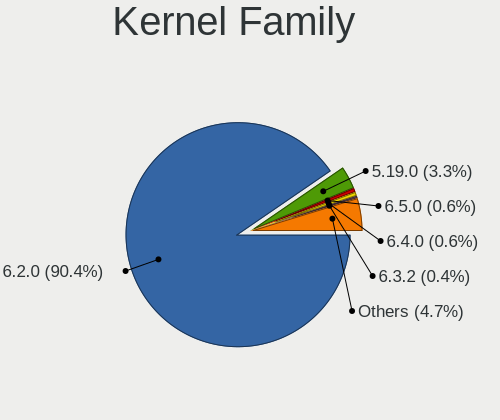
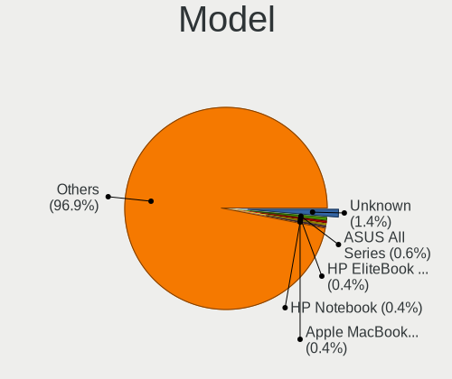
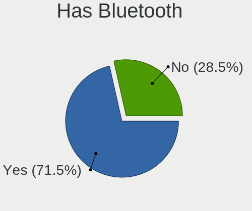
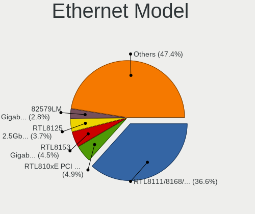
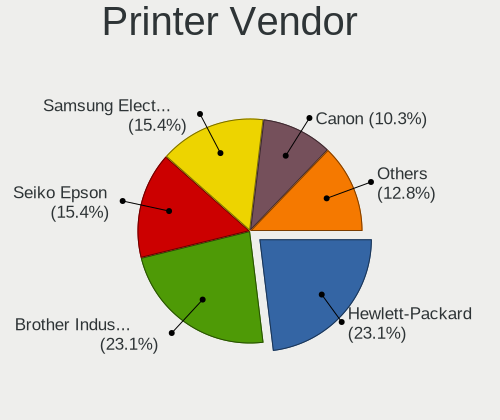

Ubuntu 23.04 - Tested Hardware & Statistics
-------------------------------------------

A project to collect tested hardware configurations for Ubuntu 23.04.

Anyone can contribute to this report by the [hw-probe](https://github.com/linuxhw/hw-probe) tool:

    sudo -E hw-probe -all -upload

Please contribute! Especially if your hardware is rare.

This is a report for all computer types. See also reports for [desktops](/Dist/Ubuntu_23.04/Desktop/README.md) and [notebooks](/Dist/Ubuntu_23.04/Notebook/README.md).

Contents
--------

* [ Test Cases ](#test-cases)

* [ System ](#system)
  - [ Kernel                   ](#kernel)
  - [ Kernel Family            ](#kernel-family)
  - [ Kernel Major Ver.        ](#kernel-major-ver)
  - [ Arch                     ](#arch)
  - [ DE                       ](#de)
  - [ Display Server           ](#display-server)
  - [ Display Manager          ](#display-manager)
  - [ OS Lang                  ](#os-lang)
  - [ Boot Mode                ](#boot-mode)
  - [ Filesystem               ](#filesystem)
  - [ Part. scheme             ](#part-scheme)
  - [ Dual Boot with Linux/BSD ](#dual-boot-with-linuxbsd)
  - [ Dual Boot (Win)          ](#dual-boot-win)

* [ Board ](#board)
  - [ Vendor                   ](#vendor)
  - [ Model                    ](#model)
  - [ Model Family             ](#model-family)
  - [ MFG Year                 ](#mfg-year)
  - [ Form Factor              ](#form-factor)
  - [ Secure Boot              ](#secure-boot)
  - [ Coreboot                 ](#coreboot)
  - [ RAM Size                 ](#ram-size)
  - [ RAM Used                 ](#ram-used)
  - [ Total Drives             ](#total-drives)
  - [ Has CD-ROM               ](#has-cd-rom)
  - [ Has Ethernet             ](#has-ethernet)
  - [ Has WiFi                 ](#has-wifi)
  - [ Has Bluetooth            ](#has-bluetooth)

* [ Location ](#location)
  - [ Country                  ](#country)
  - [ City                     ](#city)

* [ Drives ](#drives)
  - [ Drive Vendor             ](#drive-vendor)
  - [ Drive Model              ](#drive-model)
  - [ HDD Vendor               ](#hdd-vendor)
  - [ SSD Vendor               ](#ssd-vendor)
  - [ Drive Kind               ](#drive-kind)
  - [ Drive Connector          ](#drive-connector)
  - [ Drive Size               ](#drive-size)
  - [ Space Total              ](#space-total)
  - [ Space Used               ](#space-used)
  - [ Malfunc. Drives          ](#malfunc-drives)
  - [ Malfunc. Drive Vendor    ](#malfunc-drive-vendor)
  - [ Malfunc. HDD Vendor      ](#malfunc-hdd-vendor)
  - [ Malfunc. Drive Kind      ](#malfunc-drive-kind)
  - [ Failed Drives            ](#failed-drives)
  - [ Failed Drive Vendor      ](#failed-drive-vendor)
  - [ Drive Status             ](#drive-status)

* [ Storage controller ](#storage-controller)
  - [ Storage Vendor           ](#storage-vendor)
  - [ Storage Model            ](#storage-model)
  - [ Storage Kind             ](#storage-kind)

* [ Processor ](#processor)
  - [ CPU Vendor               ](#cpu-vendor)
  - [ CPU Model                ](#cpu-model)
  - [ CPU Model Family         ](#cpu-model-family)
  - [ CPU Cores                ](#cpu-cores)
  - [ CPU Sockets              ](#cpu-sockets)
  - [ CPU Threads              ](#cpu-threads)
  - [ CPU Op-Modes             ](#cpu-op-modes)
  - [ CPU Microcode            ](#cpu-microcode)
  - [ CPU Microarch            ](#cpu-microarch)

* [ Graphics ](#graphics)
  - [ GPU Vendor               ](#gpu-vendor)
  - [ GPU Model                ](#gpu-model)
  - [ GPU Combo                ](#gpu-combo)
  - [ GPU Driver               ](#gpu-driver)
  - [ GPU Memory               ](#gpu-memory)

* [ Monitor ](#monitor)
  - [ Monitor Vendor           ](#monitor-vendor)
  - [ Monitor Model            ](#monitor-model)
  - [ Monitor Resolution       ](#monitor-resolution)
  - [ Monitor Diagonal         ](#monitor-diagonal)
  - [ Monitor Width            ](#monitor-width)
  - [ Aspect Ratio             ](#aspect-ratio)
  - [ Monitor Area             ](#monitor-area)
  - [ Pixel Density            ](#pixel-density)
  - [ Multiple Monitors        ](#multiple-monitors)

* [ Network ](#network)
  - [ Net Controller Vendor    ](#net-controller-vendor)
  - [ Net Controller Model     ](#net-controller-model)
  - [ Wireless Vendor          ](#wireless-vendor)
  - [ Wireless Model           ](#wireless-model)
  - [ Ethernet Vendor          ](#ethernet-vendor)
  - [ Ethernet Model           ](#ethernet-model)
  - [ Net Controller Kind      ](#net-controller-kind)
  - [ Used Controller          ](#used-controller)
  - [ NICs                     ](#nics)
  - [ IPv6                     ](#ipv6)

* [ Bluetooth ](#bluetooth)
  - [ Bluetooth Vendor         ](#bluetooth-vendor)
  - [ Bluetooth Model          ](#bluetooth-model)

* [ Sound ](#sound)
  - [ Sound Vendor             ](#sound-vendor)
  - [ Sound Model              ](#sound-model)

* [ Memory ](#memory)
  - [ Memory Vendor            ](#memory-vendor)
  - [ Memory Model             ](#memory-model)
  - [ Memory Kind              ](#memory-kind)
  - [ Memory Form Factor       ](#memory-form-factor)
  - [ Memory Size              ](#memory-size)
  - [ Memory Speed             ](#memory-speed)

* [ Printers & scanners ](#printers--scanners)
  - [ Printer Vendor           ](#printer-vendor)
  - [ Printer Model            ](#printer-model)
  - [ Scanner Vendor           ](#scanner-vendor)
  - [ Scanner Model            ](#scanner-model)

* [ Camera ](#camera)
  - [ Camera Vendor            ](#camera-vendor)
  - [ Camera Model             ](#camera-model)

* [ Security ](#security)
  - [ Fingerprint Vendor       ](#fingerprint-vendor)
  - [ Fingerprint Model        ](#fingerprint-model)
  - [ Chipcard Vendor          ](#chipcard-vendor)
  - [ Chipcard Model           ](#chipcard-model)

* [ Unsupported ](#unsupported)
  - [ Unsupported Devices      ](#unsupported-devices)
  - [ Unsupported Device Types ](#unsupported-device-types)

Test Cases
----------

Total: 1380

| Vendor        | Model                       | Form-Factor | Probe                                                      | Date         |
|---------------|-----------------------------|-------------|------------------------------------------------------------|--------------|
| Lenovo        | IdeaPadFlex 5 14ALC05 82... | Convertible | [4963974f47](https://linux-hardware.org/?probe=4963974f47) | Aug 12, 2023 |
| Dell          | Inspiron 13 5310            | Notebook    | [d42fa686e5](https://linux-hardware.org/?probe=d42fa686e5) | Aug 12, 2023 |
| Dell          | Inspiron 13 5310            | Notebook    | [45509c2727](https://linux-hardware.org/?probe=45509c2727) | Aug 12, 2023 |
| Dell          | XPS 15 9560                 | Notebook    | [756901f27f](https://linux-hardware.org/?probe=756901f27f) | Aug 12, 2023 |
| ASUSTek       | M5A78L-M LE                 | Desktop     | [a68db843ea](https://linux-hardware.org/?probe=a68db843ea) | Aug 12, 2023 |
| Panasonic     | CF-SX1WEVHR                 | Notebook    | [8abafe1b65](https://linux-hardware.org/?probe=8abafe1b65) | Aug 12, 2023 |
| Lenovo        | IdeaPadFlex 5 14ALC05 82... | Convertible | [2939f44178](https://linux-hardware.org/?probe=2939f44178) | Aug 12, 2023 |
| Lenovo        | ThinkBook 14 G3 ACL 21A2    | Notebook    | [5892469c5b](https://linux-hardware.org/?probe=5892469c5b) | Aug 12, 2023 |
| Intel         | B85 V5.56                   | Desktop     | [7fb2d45505](https://linux-hardware.org/?probe=7fb2d45505) | Aug 12, 2023 |
| Lenovo        | ThinkPad T14 Gen 1 20S00... | Notebook    | [53196a01fa](https://linux-hardware.org/?probe=53196a01fa) | Aug 12, 2023 |
| ASUSTek       | J1800I-C/BR                 | Desktop     | [5226916c20](https://linux-hardware.org/?probe=5226916c20) | Aug 12, 2023 |
| ASUSTek       | J1800I-C/BR                 | Desktop     | [f59a93f116](https://linux-hardware.org/?probe=f59a93f116) | Aug 12, 2023 |
| Dell          | 0HD5W2 A01                  | Desktop     | [be4514c366](https://linux-hardware.org/?probe=be4514c366) | Aug 12, 2023 |
| Lenovo        | ThinkPad W500 4063JR4       | Notebook    | [f8c24a1b02](https://linux-hardware.org/?probe=f8c24a1b02) | Aug 11, 2023 |
| ASUSTek       | K55A                        | Notebook    | [bf260cea2c](https://linux-hardware.org/?probe=bf260cea2c) | Aug 11, 2023 |
| Intel         | B85 V5.56                   | Desktop     | [f278787ab5](https://linux-hardware.org/?probe=f278787ab5) | Aug 11, 2023 |
| ASUSTek       | PRIME B550-PLUS             | Desktop     | [76078461ae](https://linux-hardware.org/?probe=76078461ae) | Aug 11, 2023 |
| Lenovo        | SHARKBAY SDK0E50510 WIN     | Desktop     | [ab2473ff49](https://linux-hardware.org/?probe=ab2473ff49) | Aug 11, 2023 |
| Apple         | Mac-F2238BAE iMac11,3       | All in one  | [b50bdc5845](https://linux-hardware.org/?probe=b50bdc5845) | Aug 11, 2023 |
| Apple         | Mac-F2238BAE iMac11,3       | All in one  | [8a3df803a6](https://linux-hardware.org/?probe=8a3df803a6) | Aug 11, 2023 |
| HUAWEI        | BOD-WXX9                    | Notebook    | [b21e9793a5](https://linux-hardware.org/?probe=b21e9793a5) | Aug 11, 2023 |
| HP            | Pavilion Laptop 14-ec0xx... | Notebook    | [fadee3e38d](https://linux-hardware.org/?probe=fadee3e38d) | Aug 11, 2023 |
| ASUSTek       | PRIME B550-PLUS             | Desktop     | [7f2903e1a4](https://linux-hardware.org/?probe=7f2903e1a4) | Aug 11, 2023 |
| Dell          | Precision 5530              | Notebook    | [f74dac5dcf](https://linux-hardware.org/?probe=f74dac5dcf) | Aug 11, 2023 |
| Dell          | Latitude 5400               | Notebook    | [1ec248c607](https://linux-hardware.org/?probe=1ec248c607) | Aug 10, 2023 |
| ASUSTek       | PRIME B450-PLUS             | Desktop     | [44fe085499](https://linux-hardware.org/?probe=44fe085499) | Aug 10, 2023 |
| Lenovo        | ThinkPad Edge 03193VG       | Notebook    | [abb370836a](https://linux-hardware.org/?probe=abb370836a) | Aug 10, 2023 |
| Avell         | A70 ION                     | Notebook    | [6ab02a34e4](https://linux-hardware.org/?probe=6ab02a34e4) | Aug 10, 2023 |
| Lenovo        | ThinkPad X1 Yoga 20FRS02... | Convertible | [ba520853af](https://linux-hardware.org/?probe=ba520853af) | Aug 10, 2023 |
| Lenovo        | ThinkPad X1 Yoga 20FRS02... | Convertible | [534fd57945](https://linux-hardware.org/?probe=534fd57945) | Aug 10, 2023 |
| Lenovo        | ThinkPad E15 Gen 4 21ED0... | Notebook    | [89e3ef8e6c](https://linux-hardware.org/?probe=89e3ef8e6c) | Aug 10, 2023 |
| Lenovo        | ThinkPad T420 4180X06       | Notebook    | [77e54b4b97](https://linux-hardware.org/?probe=77e54b4b97) | Aug 10, 2023 |
| ASUSTek       | PRIME X570-PRO              | Desktop     | [f7fe8fc7f3](https://linux-hardware.org/?probe=f7fe8fc7f3) | Aug 10, 2023 |
| ASRock        | B450M-HDV R4.0              | Desktop     | [ab3503021a](https://linux-hardware.org/?probe=ab3503021a) | Aug 10, 2023 |
| Lenovo        | ThinkPad T420 4180X06       | Notebook    | [ba950eb9e1](https://linux-hardware.org/?probe=ba950eb9e1) | Aug 10, 2023 |
| Google        | Snappy                      | Notebook    | [73ecdd5048](https://linux-hardware.org/?probe=73ecdd5048) | Aug 10, 2023 |
| ASUSTek       | ROG Strix G713PI_G713PI     | Notebook    | [92fda27219](https://linux-hardware.org/?probe=92fda27219) | Aug 10, 2023 |
| Lenovo        | IdeaPadFlex 5 14ABR8 82X... | Convertible | [ae87c6938f](https://linux-hardware.org/?probe=ae87c6938f) | Aug 10, 2023 |
| ASUSTek       | ROG Strix G713PI_G713PI     | Notebook    | [3bd085d1a5](https://linux-hardware.org/?probe=3bd085d1a5) | Aug 10, 2023 |
| Lenovo        | ThinkPad T430 2347AT2       | Notebook    | [a874870955](https://linux-hardware.org/?probe=a874870955) | Aug 09, 2023 |
| MSI           | Z590-A PRO                  | Desktop     | [4448c9f2e1](https://linux-hardware.org/?probe=4448c9f2e1) | Aug 09, 2023 |
| MSI           | Z590-A PRO                  | Desktop     | [6e1d11025a](https://linux-hardware.org/?probe=6e1d11025a) | Aug 09, 2023 |
| Acer          | Aspire A317-53              | Notebook    | [de8d362cb8](https://linux-hardware.org/?probe=de8d362cb8) | Aug 09, 2023 |
| MSI           | Z97-G45 GAMING              | Desktop     | [65d491c109](https://linux-hardware.org/?probe=65d491c109) | Aug 09, 2023 |
| Lenovo        | ThinkPad E15 Gen 2 20TD0... | Notebook    | [194ec12831](https://linux-hardware.org/?probe=194ec12831) | Aug 09, 2023 |
| ASUSTek       | X510URR                     | Notebook    | [abf7479cb8](https://linux-hardware.org/?probe=abf7479cb8) | Aug 09, 2023 |
| Acer          | Aspire V3-112P              | Notebook    | [e6305472c5](https://linux-hardware.org/?probe=e6305472c5) | Aug 09, 2023 |
| Dell          | Latitude 3350               | Notebook    | [77100b2ef6](https://linux-hardware.org/?probe=77100b2ef6) | Aug 09, 2023 |
| Dell          | Latitude 5400               | Notebook    | [773e9320a8](https://linux-hardware.org/?probe=773e9320a8) | Aug 09, 2023 |
| ASUSTek       | X510URR                     | Notebook    | [f3ee04187f](https://linux-hardware.org/?probe=f3ee04187f) | Aug 09, 2023 |
| Lenovo        | ThinkPad X1 Titanium Gen... | Convertible | [057ef3751d](https://linux-hardware.org/?probe=057ef3751d) | Aug 08, 2023 |
| Acer          | Aspire 4820TG               | Notebook    | [49a63e5cc4](https://linux-hardware.org/?probe=49a63e5cc4) | Aug 08, 2023 |
| HP            | EliteBook 840 G6            | Notebook    | [60a28c22c7](https://linux-hardware.org/?probe=60a28c22c7) | Aug 08, 2023 |
| HP            | EliteBook 840 G6            | Notebook    | [9f044dbe9e](https://linux-hardware.org/?probe=9f044dbe9e) | Aug 08, 2023 |
| Lenovo        | 1037 SDK0Q40104 WIN 3305... | Server      | [f9d26a8832](https://linux-hardware.org/?probe=f9d26a8832) | Aug 08, 2023 |
| HP            | ENVY x360 Convertible 15... | Convertible | [791adb121f](https://linux-hardware.org/?probe=791adb121f) | Aug 07, 2023 |
| HP            | ProBook 455 G7              | Notebook    | [bd9f67ee72](https://linux-hardware.org/?probe=bd9f67ee72) | Aug 07, 2023 |
| HP            | Pavilion Gaming Laptop 1... | Notebook    | [3ec4223487](https://linux-hardware.org/?probe=3ec4223487) | Aug 07, 2023 |
| Dell          | Latitude 7300               | Notebook    | [932f04033c](https://linux-hardware.org/?probe=932f04033c) | Aug 07, 2023 |
| ASUSTek       | M5A97 R2.0                  | Desktop     | [783906b878](https://linux-hardware.org/?probe=783906b878) | Aug 07, 2023 |
| Intel         | NUC7i3BNB J22859-314        | Mini pc     | [36410845ea](https://linux-hardware.org/?probe=36410845ea) | Aug 07, 2023 |
| Microsoft     | Surface Book 2              | Tablet      | [ae0cada933](https://linux-hardware.org/?probe=ae0cada933) | Aug 07, 2023 |
| Dell          | XPS 15 9500                 | Notebook    | [dbefafc94d](https://linux-hardware.org/?probe=dbefafc94d) | Aug 07, 2023 |
| HP            | EliteBook 850 G8 Noteboo... | Notebook    | [ce02da2586](https://linux-hardware.org/?probe=ce02da2586) | Aug 07, 2023 |
| Acer          | Nitro AN517-52              | Notebook    | [d24385ceb8](https://linux-hardware.org/?probe=d24385ceb8) | Aug 07, 2023 |
| Timi          | TM1607                      | Notebook    | [c545853106](https://linux-hardware.org/?probe=c545853106) | Aug 07, 2023 |
| HP            | EliteBook 840 G6            | Notebook    | [9f230de889](https://linux-hardware.org/?probe=9f230de889) | Aug 07, 2023 |
| HP            | ProBook 450 G2              | Notebook    | [de0ce7c424](https://linux-hardware.org/?probe=de0ce7c424) | Aug 06, 2023 |
| HP            | ProBook 640 G2              | Notebook    | [8dae611904](https://linux-hardware.org/?probe=8dae611904) | Aug 06, 2023 |
| ASUSTek       | M5A97 R2.0                  | Desktop     | [1d8737323b](https://linux-hardware.org/?probe=1d8737323b) | Aug 06, 2023 |
| ASUSTek       | P8H61-M LX3                 | Desktop     | [6875c17337](https://linux-hardware.org/?probe=6875c17337) | Aug 06, 2023 |
| MSI           | 2AE0                        | Desktop     | [9d3b59de32](https://linux-hardware.org/?probe=9d3b59de32) | Aug 06, 2023 |
| MSI           | H81M-P33                    | Desktop     | [ebed30097f](https://linux-hardware.org/?probe=ebed30097f) | Aug 06, 2023 |
| ASUSTek       | K54L                        | Notebook    | [3ce0c0b7b2](https://linux-hardware.org/?probe=3ce0c0b7b2) | Aug 06, 2023 |
| HP            | EliteBook 840 G1            | Notebook    | [8a0a837f0b](https://linux-hardware.org/?probe=8a0a837f0b) | Aug 06, 2023 |
| ASUSTek       | K54L                        | Notebook    | [b28f27325f](https://linux-hardware.org/?probe=b28f27325f) | Aug 06, 2023 |
| Acer          | Aspire A515-56              | Notebook    | [dfe905b869](https://linux-hardware.org/?probe=dfe905b869) | Aug 06, 2023 |
| Panasonic     | CF-SX1WEVHR                 | Notebook    | [4bd753037a](https://linux-hardware.org/?probe=4bd753037a) | Aug 06, 2023 |
| Dell          | Inspiron 15 5510            | Notebook    | [88f7813621](https://linux-hardware.org/?probe=88f7813621) | Aug 06, 2023 |
| HP            | EliteBook 840 G1            | Notebook    | [cc48d8c23e](https://linux-hardware.org/?probe=cc48d8c23e) | Aug 06, 2023 |
| Intel         | B85 V5.56                   | Desktop     | [9c9e999e7f](https://linux-hardware.org/?probe=9c9e999e7f) | Aug 06, 2023 |
| Intel         | B85 V5.56                   | Desktop     | [54f0bde318](https://linux-hardware.org/?probe=54f0bde318) | Aug 06, 2023 |
| Lenovo        | IdeaPad 3 15IGL05 82BU      | Notebook    | [52b9918d42](https://linux-hardware.org/?probe=52b9918d42) | Aug 06, 2023 |
| Unknown       | Unknown                     | Notebook    | [9431f6f4e8](https://linux-hardware.org/?probe=9431f6f4e8) | Aug 06, 2023 |
| MSI           | MPG X570S EDGE MAX WIFI     | Desktop     | [ffa55735b6](https://linux-hardware.org/?probe=ffa55735b6) | Aug 06, 2023 |
| Dell          | Latitude 5590               | Notebook    | [83d389e795](https://linux-hardware.org/?probe=83d389e795) | Aug 06, 2023 |
| Gigabyte      | A320M-S2H V2-CF             | Desktop     | [ac7079fac9](https://linux-hardware.org/?probe=ac7079fac9) | Aug 05, 2023 |
| ASRock        | B450M Pro4                  | Desktop     | [1e157ae535](https://linux-hardware.org/?probe=1e157ae535) | Aug 05, 2023 |
| Dell          | Latitude 5400               | Notebook    | [e788e3a534](https://linux-hardware.org/?probe=e788e3a534) | Aug 05, 2023 |
| Dell          | Latitude E6420              | Notebook    | [3636e69adb](https://linux-hardware.org/?probe=3636e69adb) | Aug 05, 2023 |
| ASUSTek       | K52Je                       | Notebook    | [34fa8887dd](https://linux-hardware.org/?probe=34fa8887dd) | Aug 05, 2023 |
| ASUSTek       | Z97-K                       | Desktop     | [5ca4ca286b](https://linux-hardware.org/?probe=5ca4ca286b) | Aug 05, 2023 |
| HP            | Spectre x360 2-in-1 Lapt... | Convertible | [6c24c9f7a9](https://linux-hardware.org/?probe=6c24c9f7a9) | Aug 05, 2023 |
| Lenovo        | IdeaPad 5 15ARE05 81YQ      | Notebook    | [24dc4f34a2](https://linux-hardware.org/?probe=24dc4f34a2) | Aug 05, 2023 |
| GMKtec        | NucBox K4                   | Desktop     | [64b27a1390](https://linux-hardware.org/?probe=64b27a1390) | Aug 05, 2023 |
| ASUSTek       | ASUS TUF Gaming A16 FA61... | Notebook    | [779c23fe06](https://linux-hardware.org/?probe=779c23fe06) | Aug 05, 2023 |
| Lenovo        | ThinkPad X131e 33671S2      | Notebook    | [3f83b5efac](https://linux-hardware.org/?probe=3f83b5efac) | Aug 05, 2023 |
| MSI           | GF75 Thin 10SCXR            | Notebook    | [21d2f0b558](https://linux-hardware.org/?probe=21d2f0b558) | Aug 05, 2023 |
| ASUSTek       | VivoBook_ASUSLaptop X350... | Notebook    | [364aa911cf](https://linux-hardware.org/?probe=364aa911cf) | Aug 05, 2023 |
| Apple         | MacBookPro14,1              | Notebook    | [08f78bf99a](https://linux-hardware.org/?probe=08f78bf99a) | Aug 05, 2023 |
| HP            | EliteBook 8740w             | Notebook    | [b30001b3fe](https://linux-hardware.org/?probe=b30001b3fe) | Aug 05, 2023 |
| ASUSTek       | PRIME B450M-K II            | Desktop     | [fed2da6500](https://linux-hardware.org/?probe=fed2da6500) | Aug 05, 2023 |
| ASUSTek       | PRIME B450M-K II            | Desktop     | [2531b9d0db](https://linux-hardware.org/?probe=2531b9d0db) | Aug 05, 2023 |
| HP            | ZBook Studio G3             | Notebook    | [3f7f45a94e](https://linux-hardware.org/?probe=3f7f45a94e) | Aug 04, 2023 |
| Lenovo        | IdeaPad 5 Pro 14ACN6 82L... | Notebook    | [f7354ee466](https://linux-hardware.org/?probe=f7354ee466) | Aug 04, 2023 |
| ASUSTek       | ROG STRIX Z690-A GAMING ... | Desktop     | [67cea35f6d](https://linux-hardware.org/?probe=67cea35f6d) | Aug 04, 2023 |
| Apple         | MacBookAir7,2               | Notebook    | [e21469f818](https://linux-hardware.org/?probe=e21469f818) | Aug 04, 2023 |
| ASUSTek       | Zenbook UX3402ZA_Q409ZA     | Notebook    | [8a2dafef83](https://linux-hardware.org/?probe=8a2dafef83) | Aug 04, 2023 |
| HP            | Laptop 14s-dq2xxx           | Notebook    | [8aad3290a7](https://linux-hardware.org/?probe=8aad3290a7) | Aug 03, 2023 |
| ASUSTek       | M3A78-T                     | Desktop     | [e97447ea9d](https://linux-hardware.org/?probe=e97447ea9d) | Aug 03, 2023 |
| Apple         | MacBookAir7,2               | Notebook    | [89c0c5c135](https://linux-hardware.org/?probe=89c0c5c135) | Aug 03, 2023 |
| HP            | ZBook Studio G3             | Notebook    | [69b35fdf25](https://linux-hardware.org/?probe=69b35fdf25) | Aug 03, 2023 |
| Shanghai Z... | ZXE CRB                     | Notebook    | [2d4fc6f4ce](https://linux-hardware.org/?probe=2d4fc6f4ce) | Aug 03, 2023 |
| Dell          | Latitude 5490               | Notebook    | [e93c786075](https://linux-hardware.org/?probe=e93c786075) | Aug 03, 2023 |
| ZOTAC         | ZBOX-PI335                  | Mini pc     | [8b5204eccf](https://linux-hardware.org/?probe=8b5204eccf) | Aug 03, 2023 |
| MSI           | Z97 GAMING 3                | Desktop     | [caac03a431](https://linux-hardware.org/?probe=caac03a431) | Aug 03, 2023 |
| Acer          | Nitro AN515-44              | Notebook    | [38f33f3878](https://linux-hardware.org/?probe=38f33f3878) | Aug 03, 2023 |
| Samsung       | 930X2K/931X2K               | Notebook    | [5985901bef](https://linux-hardware.org/?probe=5985901bef) | Aug 03, 2023 |
| HP            | EliteBook 8740w             | Notebook    | [49a27fb8fb](https://linux-hardware.org/?probe=49a27fb8fb) | Aug 03, 2023 |
| HP            | EliteBook 8740w             | Notebook    | [e2d58e4a51](https://linux-hardware.org/?probe=e2d58e4a51) | Aug 03, 2023 |
| HP            | Notebook                    | Notebook    | [0e8585ef71](https://linux-hardware.org/?probe=0e8585ef71) | Aug 02, 2023 |
| MSI           | A320M-A PRO MAX             | Desktop     | [881ac0a0e0](https://linux-hardware.org/?probe=881ac0a0e0) | Aug 02, 2023 |
| MSI           | A320M-A PRO MAX             | Desktop     | [c3beec95b8](https://linux-hardware.org/?probe=c3beec95b8) | Aug 02, 2023 |
| HP            | 8653 A                      | Desktop     | [09f876ab04](https://linux-hardware.org/?probe=09f876ab04) | Aug 02, 2023 |
| ASUSTek       | VivoBook_ASUSLaptop M350... | Notebook    | [5f2529e42b](https://linux-hardware.org/?probe=5f2529e42b) | Aug 02, 2023 |
| Panasonic     | CF-SX1WEVHR                 | Notebook    | [4d0d3b78e7](https://linux-hardware.org/?probe=4d0d3b78e7) | Aug 02, 2023 |
| Unknown       | Unknown                     | Notebook    | [41ff18df05](https://linux-hardware.org/?probe=41ff18df05) | Aug 02, 2023 |
| Unknown       | Unknown                     | Notebook    | [eb3d428d41](https://linux-hardware.org/?probe=eb3d428d41) | Aug 02, 2023 |
| ASRock        | B365M-HDV                   | Desktop     | [994853ef26](https://linux-hardware.org/?probe=994853ef26) | Aug 01, 2023 |
| ASUSTek       | VivoBook_ASUSLaptop X415... | Notebook    | [cbc721a89f](https://linux-hardware.org/?probe=cbc721a89f) | Aug 01, 2023 |
| HP            | Unknown                     | Notebook    | [f7ffb3c085](https://linux-hardware.org/?probe=f7ffb3c085) | Aug 01, 2023 |
| HP            | 82B5                        | All in one  | [e63af4a7b9](https://linux-hardware.org/?probe=e63af4a7b9) | Aug 01, 2023 |
| HP            | ProLiant DL380p Gen8        | Server      | [53468c11bf](https://linux-hardware.org/?probe=53468c11bf) | Aug 01, 2023 |
| ASUSTek       | TUF Gaming X570-PLUS        | Desktop     | [66000207b0](https://linux-hardware.org/?probe=66000207b0) | Aug 01, 2023 |
| Lenovo        | 1066 SDK0T76528 WIN 3556... | Desktop     | [df0702afb0](https://linux-hardware.org/?probe=df0702afb0) | Aug 01, 2023 |
| Lenovo        | 1066 SDK0T76528 WIN 3556... | Desktop     | [0ac623dd70](https://linux-hardware.org/?probe=0ac623dd70) | Aug 01, 2023 |
| Lenovo        | ThinkPad Helix 2nd 20CG0... | Tablet      | [3775167d2f](https://linux-hardware.org/?probe=3775167d2f) | Aug 01, 2023 |
| Itautec       | ST 4271 ST-4271 Padrao 0... | Desktop     | [2e4793aa6c](https://linux-hardware.org/?probe=2e4793aa6c) | Aug 01, 2023 |
| Raspberry ... | Raspberry Pi 4 Model B R... | Soc         | [16858eae01](https://linux-hardware.org/?probe=16858eae01) | Jul 31, 2023 |
| Fujitsu       | D3401-H2 S26361-D3401-H2    | Desktop     | [36c7268653](https://linux-hardware.org/?probe=36c7268653) | Jul 31, 2023 |
| Acer          | Aspire E5-573G              | Notebook    | [7e3e1a7ee9](https://linux-hardware.org/?probe=7e3e1a7ee9) | Jul 31, 2023 |
| HP            | Pavilion Laptop 14-ec1xx... | Notebook    | [ff6816b285](https://linux-hardware.org/?probe=ff6816b285) | Jul 31, 2023 |
| ASRock        | FM2A75 Pro4                 | Desktop     | [831157a9ac](https://linux-hardware.org/?probe=831157a9ac) | Jul 31, 2023 |
| Gigabyte      | B550 AORUS ELITE AX V2      | Desktop     | [45405639f5](https://linux-hardware.org/?probe=45405639f5) | Jul 31, 2023 |
| MACHINIST     | E5 MR9A PRO MAX V1.1        | Desktop     | [42a2df4c91](https://linux-hardware.org/?probe=42a2df4c91) | Jul 30, 2023 |
| Intel         | NUC13ANBi7 M89645-203       | Mini pc     | [42bf6e1e48](https://linux-hardware.org/?probe=42bf6e1e48) | Jul 30, 2023 |
| ASUSTek       | ZenBook UX363EA_UX363EA     | Convertible | [be9923f6d2](https://linux-hardware.org/?probe=be9923f6d2) | Jul 30, 2023 |
| Timi          | Redmi Book Pro 14 2022      | Notebook    | [71379f70f2](https://linux-hardware.org/?probe=71379f70f2) | Jul 30, 2023 |
| Dell          | Latitude E6510              | Notebook    | [f8ebba29c6](https://linux-hardware.org/?probe=f8ebba29c6) | Jul 30, 2023 |
| HP            | ProBook 4540s               | Notebook    | [0fae07b574](https://linux-hardware.org/?probe=0fae07b574) | Jul 30, 2023 |
| Apple         | Mac-42FD25EABCABB274 iMa... | All in one  | [2672322c34](https://linux-hardware.org/?probe=2672322c34) | Jul 30, 2023 |
| Gigabyte      | MZAPLBP-00                  | Desktop     | [b70677782d](https://linux-hardware.org/?probe=b70677782d) | Jul 29, 2023 |
| Gigabyte      | MZAPLBP-00                  | Desktop     | [ae8a9f3aaf](https://linux-hardware.org/?probe=ae8a9f3aaf) | Jul 29, 2023 |
| ASUSTek       | H110M-R                     | Desktop     | [471516b82e](https://linux-hardware.org/?probe=471516b82e) | Jul 29, 2023 |
| MSI           | MPG Z490 GAMING EDGE WIF... | Desktop     | [f36740f05f](https://linux-hardware.org/?probe=f36740f05f) | Jul 29, 2023 |
| ASUSTek       | Zenbook UM5302TA_UM5302T... | Notebook    | [579d4eebb8](https://linux-hardware.org/?probe=579d4eebb8) | Jul 29, 2023 |
| Dell          | Precision 5510              | Notebook    | [56b4073d3f](https://linux-hardware.org/?probe=56b4073d3f) | Jul 29, 2023 |
| ASUSTek       | PRIME H510M-K R2.0          | Desktop     | [7b5aebd006](https://linux-hardware.org/?probe=7b5aebd006) | Jul 28, 2023 |
| Lenovo        | ThinkPad T470s 20HGS0180... | Notebook    | [cde4989301](https://linux-hardware.org/?probe=cde4989301) | Jul 28, 2023 |
| Lenovo        | Yoga 520-14IKB 80X8         | Convertible | [30afe43d32](https://linux-hardware.org/?probe=30afe43d32) | Jul 28, 2023 |
| Apple         | MacBookAir7,2               | Notebook    | [3e7b8ae52e](https://linux-hardware.org/?probe=3e7b8ae52e) | Jul 28, 2023 |
| HP            | ZBook Studio G3             | Notebook    | [68618d14ef](https://linux-hardware.org/?probe=68618d14ef) | Jul 28, 2023 |
| Dell          | Vostro 15 3515              | Notebook    | [08990a8da3](https://linux-hardware.org/?probe=08990a8da3) | Jul 28, 2023 |
| Fujitsu       | LIFEBOOK U939X              | Convertible | [354787d766](https://linux-hardware.org/?probe=354787d766) | Jul 28, 2023 |
| HUAWEI        | BOM-WXX9                    | Notebook    | [1e0ad64e6f](https://linux-hardware.org/?probe=1e0ad64e6f) | Jul 27, 2023 |
| Toshiba       | PORTEGE X30-E               | Notebook    | [c610464fb5](https://linux-hardware.org/?probe=c610464fb5) | Jul 27, 2023 |
| Gigabyte      | Z490 UD                     | Desktop     | [370243099a](https://linux-hardware.org/?probe=370243099a) | Jul 27, 2023 |
| Apple         | MacBookPro8,1               | Notebook    | [d54574b3f8](https://linux-hardware.org/?probe=d54574b3f8) | Jul 27, 2023 |
| HP            | Laptop 14s-fq1xxx           | Notebook    | [84ab2faa6f](https://linux-hardware.org/?probe=84ab2faa6f) | Jul 27, 2023 |
| HUAWEI        | BOHB-WAX9                   | Notebook    | [44647ce47e](https://linux-hardware.org/?probe=44647ce47e) | Jul 26, 2023 |
| Apple         | MacBookPro8,1               | Notebook    | [d0d94c9be7](https://linux-hardware.org/?probe=d0d94c9be7) | Jul 26, 2023 |
| ASUSTek       | PRIME B450M-K II            | Desktop     | [87bb7b0b79](https://linux-hardware.org/?probe=87bb7b0b79) | Jul 26, 2023 |
| Acer          | Nitro AN17-41               | Notebook    | [7909f8c5f3](https://linux-hardware.org/?probe=7909f8c5f3) | Jul 26, 2023 |
| Dell          | XPS 15 9530                 | Notebook    | [d6855eabe2](https://linux-hardware.org/?probe=d6855eabe2) | Jul 26, 2023 |
| HP            | Pavilion dv6                | Notebook    | [1ed1c25f7e](https://linux-hardware.org/?probe=1ed1c25f7e) | Jul 26, 2023 |
| Lenovo        | ThinkPad X380 Yoga 20LJS... | Convertible | [863a5cb9da](https://linux-hardware.org/?probe=863a5cb9da) | Jul 26, 2023 |
| ASUSTek       | PRIME H510M-K R2.0          | Desktop     | [c7ec8db97e](https://linux-hardware.org/?probe=c7ec8db97e) | Jul 26, 2023 |
| HP            | 3646h                       | Desktop     | [fbc7ac7c08](https://linux-hardware.org/?probe=fbc7ac7c08) | Jul 26, 2023 |
| HP            | ProBook 450 G2              | Notebook    | [18eceddda0](https://linux-hardware.org/?probe=18eceddda0) | Jul 26, 2023 |
| HP            | ProBook 4540s               | Notebook    | [f41d6c4f4b](https://linux-hardware.org/?probe=f41d6c4f4b) | Jul 26, 2023 |
| ASUSTek       | PRIME B450M-K II            | Desktop     | [2fe1d4509a](https://linux-hardware.org/?probe=2fe1d4509a) | Jul 26, 2023 |
| Sony          | VPCSB1V9R                   | Notebook    | [12b5777cff](https://linux-hardware.org/?probe=12b5777cff) | Jul 26, 2023 |
| ASUSTek       | VivoBook_ASUSLaptop X415... | Notebook    | [802ba60219](https://linux-hardware.org/?probe=802ba60219) | Jul 25, 2023 |
| ASRock        | B560M Pro4                  | Desktop     | [d96478ff29](https://linux-hardware.org/?probe=d96478ff29) | Jul 25, 2023 |
| Apple         | MacBookPro9,2               | Notebook    | [af0355313e](https://linux-hardware.org/?probe=af0355313e) | Jul 25, 2023 |
| ASUSTek       | PRIME B450M-K II            | Desktop     | [32707549f9](https://linux-hardware.org/?probe=32707549f9) | Jul 25, 2023 |
| HP            | Laptop 17-cp0xxx            | Notebook    | [f8720bbd07](https://linux-hardware.org/?probe=f8720bbd07) | Jul 25, 2023 |
| Lenovo        | Yoga 9 14IRP8 83B1          | Convertible | [3f563f695c](https://linux-hardware.org/?probe=3f563f695c) | Jul 25, 2023 |
| Lenovo        | B590 62743QG                | Notebook    | [d8bd2493ec](https://linux-hardware.org/?probe=d8bd2493ec) | Jul 25, 2023 |
| Lenovo        | IdeaPadFlex 5 14ABR8 82X... | Convertible | [42ee46f6c4](https://linux-hardware.org/?probe=42ee46f6c4) | Jul 25, 2023 |
| MSI           | WF66 11UJ                   | Notebook    | [305e24e26d](https://linux-hardware.org/?probe=305e24e26d) | Jul 25, 2023 |
| HP            | ProBook 4540s               | Notebook    | [5c4b165cea](https://linux-hardware.org/?probe=5c4b165cea) | Jul 25, 2023 |
| HP            | ProBook 4540s               | Notebook    | [4ad8be01ca](https://linux-hardware.org/?probe=4ad8be01ca) | Jul 25, 2023 |
| Unknown       | 1.2                         | Desktop     | [b18dd168dd](https://linux-hardware.org/?probe=b18dd168dd) | Jul 24, 2023 |
| ASUSTek       | PRIME H510M-K R2.0          | Desktop     | [ffee60fde7](https://linux-hardware.org/?probe=ffee60fde7) | Jul 24, 2023 |
| Dell          | Latitude 5420               | Notebook    | [c286ff883f](https://linux-hardware.org/?probe=c286ff883f) | Jul 24, 2023 |
| Gigabyte      | B450 AORUS M                | Desktop     | [858d935d25](https://linux-hardware.org/?probe=858d935d25) | Jul 24, 2023 |
| HP            | EliteBook 840 G3            | Notebook    | [72a17a2b8f](https://linux-hardware.org/?probe=72a17a2b8f) | Jul 24, 2023 |
| Lenovo        | IdeaPad 5 15ARE05 81YQ      | Notebook    | [02cae62d32](https://linux-hardware.org/?probe=02cae62d32) | Jul 24, 2023 |
| Google        | Treeya                      | Notebook    | [808e203694](https://linux-hardware.org/?probe=808e203694) | Jul 24, 2023 |
| Google        | Treeya                      | Notebook    | [db2b782253](https://linux-hardware.org/?probe=db2b782253) | Jul 24, 2023 |
| Dell          | Inspiron 3543               | Notebook    | [3fd49d8f38](https://linux-hardware.org/?probe=3fd49d8f38) | Jul 24, 2023 |
| Intel         | Unknown                     | Desktop     | [74d458db75](https://linux-hardware.org/?probe=74d458db75) | Jul 23, 2023 |
| Lenovo        | ThinkPad P50 20EQS2A500     | Notebook    | [d25f59d64d](https://linux-hardware.org/?probe=d25f59d64d) | Jul 23, 2023 |
| ASUSTek       | X45U                        | Notebook    | [53a411cd41](https://linux-hardware.org/?probe=53a411cd41) | Jul 23, 2023 |
| Google        | Lillipup                    | Notebook    | [3915bca457](https://linux-hardware.org/?probe=3915bca457) | Jul 23, 2023 |
| ASUSTek       | PRIME X570-P                | Desktop     | [c052f51a67](https://linux-hardware.org/?probe=c052f51a67) | Jul 23, 2023 |
| Intel         | B75                         | Desktop     | [f6b0d91a50](https://linux-hardware.org/?probe=f6b0d91a50) | Jul 23, 2023 |
| Gigabyte      | Z97X-UD5H                   | Desktop     | [3511a9786a](https://linux-hardware.org/?probe=3511a9786a) | Jul 23, 2023 |
| HP            | Elite x2 G4                 | Tablet      | [1705d2fd99](https://linux-hardware.org/?probe=1705d2fd99) | Jul 23, 2023 |
| Lenovo        | IdeaPad L340-17IRH Gamin... | Notebook    | [383118634e](https://linux-hardware.org/?probe=383118634e) | Jul 23, 2023 |
| ASUSTek       | CG8480                      | Desktop     | [2b839ca54f](https://linux-hardware.org/?probe=2b839ca54f) | Jul 23, 2023 |
| Lenovo        | ThinkPad T470p 20J7S0XV0... | Notebook    | [4a5ded3dcc](https://linux-hardware.org/?probe=4a5ded3dcc) | Jul 23, 2023 |
| Lenovo        | ThinkPad P53 20QN004BCA     | Notebook    | [04a2ed4bd2](https://linux-hardware.org/?probe=04a2ed4bd2) | Jul 23, 2023 |
| MSI           | Cyborg 15 A12VF             | Notebook    | [62efe51727](https://linux-hardware.org/?probe=62efe51727) | Jul 23, 2023 |
| Dell          | Latitude 3500               | Notebook    | [fcfa320897](https://linux-hardware.org/?probe=fcfa320897) | Jul 23, 2023 |
| Dell          | 08NPPY A00                  | Desktop     | [63fb3abc69](https://linux-hardware.org/?probe=63fb3abc69) | Jul 23, 2023 |
| MSI           | MPG X570 GAMING EDGE WIF... | Desktop     | [0e830a2330](https://linux-hardware.org/?probe=0e830a2330) | Jul 23, 2023 |
| Lenovo        | Legion 7 16ITHg6 82K6       | Notebook    | [1ee910fc1c](https://linux-hardware.org/?probe=1ee910fc1c) | Jul 22, 2023 |
| Lenovo        | Legion 7 16ITHg6 82K6       | Notebook    | [d02b0e9f74](https://linux-hardware.org/?probe=d02b0e9f74) | Jul 22, 2023 |
| ASUSTek       | ROG STRIX X570-E GAMING     | Desktop     | [719e8b9ad3](https://linux-hardware.org/?probe=719e8b9ad3) | Jul 22, 2023 |
| Itautec       | ST 4271 ST-4271 Padrao 0... | Desktop     | [5e02d0f4e4](https://linux-hardware.org/?probe=5e02d0f4e4) | Jul 22, 2023 |
| Lenovo        | ThinkPad X1 Carbon 2nd 2... | Notebook    | [808ae8a334](https://linux-hardware.org/?probe=808ae8a334) | Jul 22, 2023 |
| ATOPNUC       | AG40                        | Mini pc     | [06a69f0d48](https://linux-hardware.org/?probe=06a69f0d48) | Jul 22, 2023 |
| Lenovo        | ThinkPad W500 4063JR4       | Notebook    | [ca2f317f1a](https://linux-hardware.org/?probe=ca2f317f1a) | Jul 22, 2023 |
| Lenovo        | ThinkPad W500 4063JR4       | Notebook    | [9f14acd318](https://linux-hardware.org/?probe=9f14acd318) | Jul 22, 2023 |
| ASUSTek       | VivoBook_ASUSLaptop X531... | Notebook    | [fee4019ae0](https://linux-hardware.org/?probe=fee4019ae0) | Jul 22, 2023 |
| Itautec       | ST 4271 ST-4271 Padrao 0... | Desktop     | [a12700ebb8](https://linux-hardware.org/?probe=a12700ebb8) | Jul 22, 2023 |
| Microsoft     | Surface Pro 4               | Tablet      | [dee00fe6af](https://linux-hardware.org/?probe=dee00fe6af) | Jul 22, 2023 |
| Chuwi         | Hi10 X                      | Tablet      | [1e0063a74a](https://linux-hardware.org/?probe=1e0063a74a) | Jul 22, 2023 |
| Gigabyte      | B450 AORUS M                | Desktop     | [574d6f4393](https://linux-hardware.org/?probe=574d6f4393) | Jul 21, 2023 |
| Acer          | Aspire A514-53              | Notebook    | [b754fb3410](https://linux-hardware.org/?probe=b754fb3410) | Jul 21, 2023 |
| Acer          | Aspire Z5710                | All in one  | [8d0478cf81](https://linux-hardware.org/?probe=8d0478cf81) | Jul 21, 2023 |
| Dell          | XPS 9315                    | Notebook    | [f97422b64b](https://linux-hardware.org/?probe=f97422b64b) | Jul 21, 2023 |
| ASUSTek       | B53E                        | Notebook    | [08012052d5](https://linux-hardware.org/?probe=08012052d5) | Jul 21, 2023 |
| Acer          | Aspire E5-553               | Notebook    | [1321d9a034](https://linux-hardware.org/?probe=1321d9a034) | Jul 21, 2023 |
| Acer          | Aspire E5-553               | Notebook    | [7ef01e963d](https://linux-hardware.org/?probe=7ef01e963d) | Jul 21, 2023 |
| Fujitsu       | D3223-C1 S26361-D3223-C1    | Desktop     | [e35d64a41b](https://linux-hardware.org/?probe=e35d64a41b) | Jul 21, 2023 |
| Dell          | 0WXD1Y A01                  | Server      | [477343a949](https://linux-hardware.org/?probe=477343a949) | Jul 21, 2023 |
| Lenovo        | Yoga 6 13ALC6 82ND          | Convertible | [b6432541ed](https://linux-hardware.org/?probe=b6432541ed) | Jul 21, 2023 |
| HP            | Laptop 14-fq0xxx            | Notebook    | [ce5f140a90](https://linux-hardware.org/?probe=ce5f140a90) | Jul 21, 2023 |
| Gigabyte      | B250M-DS3H-CF               | Desktop     | [a07f95cdcc](https://linux-hardware.org/?probe=a07f95cdcc) | Jul 21, 2023 |
| MSI           | B450M PRO-VDH MAX           | Desktop     | [b0efbdb752](https://linux-hardware.org/?probe=b0efbdb752) | Jul 20, 2023 |
| Gigabyte      | A520M DS3H                  | Desktop     | [3bd7501f03](https://linux-hardware.org/?probe=3bd7501f03) | Jul 20, 2023 |
| ASUSTek       | Zenbook UX3402ZA_UX3402Z... | Convertible | [4b7b13a46d](https://linux-hardware.org/?probe=4b7b13a46d) | Jul 20, 2023 |
| Lenovo        | Legion Y540-17IRH 81Q4      | Notebook    | [e9a58d14e7](https://linux-hardware.org/?probe=e9a58d14e7) | Jul 20, 2023 |
| Lenovo        | Y520-15IKBN 80WK            | Notebook    | [64b51936ea](https://linux-hardware.org/?probe=64b51936ea) | Jul 20, 2023 |
| ASUSTek       | ROG CROSSHAIR X670E HERO    | Desktop     | [413194ce8c](https://linux-hardware.org/?probe=413194ce8c) | Jul 20, 2023 |
| Lenovo        | ThinkPad X1 Carbon Gen 1... | Notebook    | [903099ae11](https://linux-hardware.org/?probe=903099ae11) | Jul 20, 2023 |
| Samsung       | DP500A2D-A01UB SEC_SW_RE... | All in one  | [99e81c0d0e](https://linux-hardware.org/?probe=99e81c0d0e) | Jul 19, 2023 |
| HP            | ENVY x360 Convertible 15... | Convertible | [991cab2fa3](https://linux-hardware.org/?probe=991cab2fa3) | Jul 19, 2023 |
| Lenovo        | ThinkPad E15 Gen 3 20YG0... | Notebook    | [26a2238069](https://linux-hardware.org/?probe=26a2238069) | Jul 19, 2023 |
| Gigabyte      | Z77-DS3H                    | Desktop     | [f99a99e95e](https://linux-hardware.org/?probe=f99a99e95e) | Jul 19, 2023 |
| Lenovo        | ThinkPad E560 20EV000YUK    | Notebook    | [0e89144534](https://linux-hardware.org/?probe=0e89144534) | Jul 19, 2023 |
| Fujitsu       | LIFEBOOK A544               | Notebook    | [5643f29431](https://linux-hardware.org/?probe=5643f29431) | Jul 19, 2023 |
| ASUSTek       | VivoBook 15_ASUS Laptop ... | Notebook    | [a646f5d0fb](https://linux-hardware.org/?probe=a646f5d0fb) | Jul 19, 2023 |
| Apple         | MacBookPro5,5               | Notebook    | [b5b8d4fce2](https://linux-hardware.org/?probe=b5b8d4fce2) | Jul 19, 2023 |
| Unknown       | G41 Series                  | Desktop     | [5890a777c5](https://linux-hardware.org/?probe=5890a777c5) | Jul 19, 2023 |
| Apple         | Mac-F42386C8 PVT            | All in one  | [3a257c75fc](https://linux-hardware.org/?probe=3a257c75fc) | Jul 19, 2023 |
| Acer          | Nitro AN17-41               | Notebook    | [81c4c542a9](https://linux-hardware.org/?probe=81c4c542a9) | Jul 19, 2023 |
| Lenovo        | ThinkBook 16p Gen 2 20YM    | Notebook    | [dac4434339](https://linux-hardware.org/?probe=dac4434339) | Jul 18, 2023 |
| Lenovo        | ThinkPad L15 Gen 4 21H30... | Notebook    | [631e54097b](https://linux-hardware.org/?probe=631e54097b) | Jul 18, 2023 |
| HP            | EliteBook 745 G5            | Notebook    | [7b7cf50cba](https://linux-hardware.org/?probe=7b7cf50cba) | Jul 18, 2023 |
| ASUSTek       | Zenbook UM3402YA_UM3402Y... | Notebook    | [dc76c90236](https://linux-hardware.org/?probe=dc76c90236) | Jul 18, 2023 |
| Lenovo        | ThinkPad L15 Gen 4 21H30... | Notebook    | [192f8de028](https://linux-hardware.org/?probe=192f8de028) | Jul 18, 2023 |
| Dell          | Latitude 7480               | Notebook    | [83caa544f7](https://linux-hardware.org/?probe=83caa544f7) | Jul 18, 2023 |
| Dell          | Latitude 7480               | Notebook    | [526e020c94](https://linux-hardware.org/?probe=526e020c94) | Jul 18, 2023 |
| Dell          | Latitude 3500               | Notebook    | [bd6b4ea554](https://linux-hardware.org/?probe=bd6b4ea554) | Jul 18, 2023 |
| Lenovo        | ThinkCentre M58e 7268C5F    | Desktop     | [e62367803c](https://linux-hardware.org/?probe=e62367803c) | Jul 18, 2023 |
| Lenovo        | ThinkCentre M58e 7268C5F    | Desktop     | [41e06d3720](https://linux-hardware.org/?probe=41e06d3720) | Jul 18, 2023 |
| Lenovo        | 1037 SDK0Q40104 WIN 3305... | Server      | [13654f5014](https://linux-hardware.org/?probe=13654f5014) | Jul 18, 2023 |
| Sony          | VAIO                        | All in one  | [ea7a51d543](https://linux-hardware.org/?probe=ea7a51d543) | Jul 18, 2023 |
| ASRock        | A300M-STX                   | Desktop     | [2fd0158946](https://linux-hardware.org/?probe=2fd0158946) | Jul 17, 2023 |
| Packard Be... | IMEDIA S2885                | Desktop     | [fa20588062](https://linux-hardware.org/?probe=fa20588062) | Jul 17, 2023 |
| ASUSTek       | X756UQ                      | Notebook    | [be24f941c7](https://linux-hardware.org/?probe=be24f941c7) | Jul 17, 2023 |
| Google        | Lick                        | Notebook    | [be8f8d1fd5](https://linux-hardware.org/?probe=be8f8d1fd5) | Jul 17, 2023 |
| Lenovo        | SHARKBAY SDK0E50510 WIN     | Desktop     | [60280e0708](https://linux-hardware.org/?probe=60280e0708) | Jul 17, 2023 |
| MSI           | FM2-A85XA-G65               | Desktop     | [8e6741f497](https://linux-hardware.org/?probe=8e6741f497) | Jul 17, 2023 |
| Dell          | Inspiron 5521               | Notebook    | [16715e16b9](https://linux-hardware.org/?probe=16715e16b9) | Jul 17, 2023 |
| Dell          | Latitude 7420               | Notebook    | [acf0339a4c](https://linux-hardware.org/?probe=acf0339a4c) | Jul 17, 2023 |
| Dell          | Latitude E7470              | Notebook    | [a3b762c162](https://linux-hardware.org/?probe=a3b762c162) | Jul 17, 2023 |
| Dell          | Latitude E7470              | Notebook    | [69531585c0](https://linux-hardware.org/?probe=69531585c0) | Jul 17, 2023 |
| Google        | Lick                        | Notebook    | [177ed7483f](https://linux-hardware.org/?probe=177ed7483f) | Jul 16, 2023 |
| ASRock        | FM2A68M-HD+                 | Desktop     | [5abf5fb1c3](https://linux-hardware.org/?probe=5abf5fb1c3) | Jul 16, 2023 |
| Lenovo        | ThinkPad L390 Yoga 20NUS... | Convertible | [c9f052e7ff](https://linux-hardware.org/?probe=c9f052e7ff) | Jul 16, 2023 |
| Dell          | G5 5587                     | Notebook    | [fc861c593a](https://linux-hardware.org/?probe=fc861c593a) | Jul 16, 2023 |
| Gigabyte      | H61M-DS2                    | Desktop     | [5b68d7d6e2](https://linux-hardware.org/?probe=5b68d7d6e2) | Jul 16, 2023 |
| Intel         | DH61BF AAG81311-102         | Desktop     | [bc2e347565](https://linux-hardware.org/?probe=bc2e347565) | Jul 16, 2023 |
| Unknown       | EMB-BT1                     | Desktop     | [90dbc847d2](https://linux-hardware.org/?probe=90dbc847d2) | Jul 16, 2023 |
| Apple         | MacBookAir6,2               | Notebook    | [0059901b85](https://linux-hardware.org/?probe=0059901b85) | Jul 16, 2023 |
| Lenovo        | ThinkPad X1 Carbon 2nd 2... | Notebook    | [45c881b739](https://linux-hardware.org/?probe=45c881b739) | Jul 16, 2023 |
| MSI           | G41M4                       | Desktop     | [b7bda60261](https://linux-hardware.org/?probe=b7bda60261) | Jul 16, 2023 |
| MSI           | G41M4                       | Desktop     | [a3e5e23a49](https://linux-hardware.org/?probe=a3e5e23a49) | Jul 16, 2023 |
| ASUSTek       | PRIME Z790-A WIFI           | Desktop     | [79af0f54f4](https://linux-hardware.org/?probe=79af0f54f4) | Jul 15, 2023 |
| Dell          | Inspiron 3442               | Notebook    | [4767e5dc31](https://linux-hardware.org/?probe=4767e5dc31) | Jul 15, 2023 |
| Gigabyte      | P65                         | Notebook    | [b46e8302f7](https://linux-hardware.org/?probe=b46e8302f7) | Jul 15, 2023 |
| ASUSTek       | PRIME B650M-A II            | Desktop     | [bf4a6e7eea](https://linux-hardware.org/?probe=bf4a6e7eea) | Jul 15, 2023 |
| Acer          | TravelMate Spin B118-R      | Convertible | [c0ad7a539d](https://linux-hardware.org/?probe=c0ad7a539d) | Jul 15, 2023 |
| Apple         | Mac-F2238BAE iMac11,3       | All in one  | [ad21a4bc5e](https://linux-hardware.org/?probe=ad21a4bc5e) | Jul 15, 2023 |
| Unknown       | Unknown                     | Desktop     | [3820e840f0](https://linux-hardware.org/?probe=3820e840f0) | Jul 15, 2023 |
| Acer          | Aspire A315-51              | Notebook    | [938e7cd384](https://linux-hardware.org/?probe=938e7cd384) | Jul 15, 2023 |
| Samsung       | 300E5K/300E5Q               | Notebook    | [92bd2944cb](https://linux-hardware.org/?probe=92bd2944cb) | Jul 15, 2023 |
| Lenovo        | ThinkPad X250 20CL00DHBR    | Notebook    | [dd92f9ce05](https://linux-hardware.org/?probe=dd92f9ce05) | Jul 14, 2023 |
| ASRock        | A320M-HDV R4.0              | Desktop     | [8df4f1a098](https://linux-hardware.org/?probe=8df4f1a098) | Jul 14, 2023 |
| Alienware     | m15 R7                      | Notebook    | [99e796a389](https://linux-hardware.org/?probe=99e796a389) | Jul 14, 2023 |
| Lenovo        | IdeaPad 5 15ITL05 82FG      | Notebook    | [ea96a066b6](https://linux-hardware.org/?probe=ea96a066b6) | Jul 14, 2023 |
| Lenovo        | G50-70 20351                | Notebook    | [b8481d7a4c](https://linux-hardware.org/?probe=b8481d7a4c) | Jul 14, 2023 |
| ASUSTek       | P8Z77-V LX2                 | Desktop     | [eedcf805f7](https://linux-hardware.org/?probe=eedcf805f7) | Jul 14, 2023 |
| Alienware     | m15 R7                      | Notebook    | [e80cfeb390](https://linux-hardware.org/?probe=e80cfeb390) | Jul 14, 2023 |
| Notebook      | N150ZU                      | Notebook    | [61be22ac36](https://linux-hardware.org/?probe=61be22ac36) | Jul 14, 2023 |
| ASUSTek       | ZenBook UX562FD_UX562FD     | Convertible | [d2cef330bf](https://linux-hardware.org/?probe=d2cef330bf) | Jul 14, 2023 |
| Apple         | MacBookAir6,2               | Notebook    | [5932f3d2eb](https://linux-hardware.org/?probe=5932f3d2eb) | Jul 14, 2023 |
| HP            | ENVY 15                     | Notebook    | [d69bc2702c](https://linux-hardware.org/?probe=d69bc2702c) | Jul 14, 2023 |
| Dell          | Latitude 7480               | Notebook    | [b0ce3265f2](https://linux-hardware.org/?probe=b0ce3265f2) | Jul 14, 2023 |
| Lenovo        | ThinkPad Edge E535 3260C... | Notebook    | [9ff1a61e2a](https://linux-hardware.org/?probe=9ff1a61e2a) | Jul 14, 2023 |
| HP            | Laptop 17-bs1xx             | Notebook    | [26a95caa91](https://linux-hardware.org/?probe=26a95caa91) | Jul 14, 2023 |
| Unknown       | Unknown                     | Notebook    | [a67315ae3e](https://linux-hardware.org/?probe=a67315ae3e) | Jul 13, 2023 |
| Acer          | Swift SF314-71              | Notebook    | [95a7d172c2](https://linux-hardware.org/?probe=95a7d172c2) | Jul 13, 2023 |
| Acer          | Swift SF314-71              | Notebook    | [876eb35009](https://linux-hardware.org/?probe=876eb35009) | Jul 13, 2023 |
| MSI           | FM2-A85XA-G65               | Desktop     | [00b4b2f7b0](https://linux-hardware.org/?probe=00b4b2f7b0) | Jul 13, 2023 |
| Lenovo        | ThinkPad T460s 20FAS2A50... | Notebook    | [69bd0f2129](https://linux-hardware.org/?probe=69bd0f2129) | Jul 13, 2023 |
| Lenovo        | ThinkPad T460s 20FAS2A50... | Notebook    | [20225a0680](https://linux-hardware.org/?probe=20225a0680) | Jul 13, 2023 |
| Acer          | Aspire 4820TG               | Notebook    | [a93793ae9c](https://linux-hardware.org/?probe=a93793ae9c) | Jul 13, 2023 |
| Lenovo        | ThinkPad Edge E530 62724... | Notebook    | [1412ecd811](https://linux-hardware.org/?probe=1412ecd811) | Jul 13, 2023 |
| Lenovo        | ThinkPad Edge E530 62724... | Notebook    | [49657bd961](https://linux-hardware.org/?probe=49657bd961) | Jul 13, 2023 |
| MSI           | Z87-G43                     | Desktop     | [86d9a28ae8](https://linux-hardware.org/?probe=86d9a28ae8) | Jul 13, 2023 |
| HUAWEI        | CREM-WXX9                   | Notebook    | [d5ff5f9f79](https://linux-hardware.org/?probe=d5ff5f9f79) | Jul 13, 2023 |
| Positivo      | A14CR6A                     | Notebook    | [7ad49c61bd](https://linux-hardware.org/?probe=7ad49c61bd) | Jul 13, 2023 |
| ASUSTek       | ROG Ally RC71L_RC71L        | Tablet      | [15101e4f9b](https://linux-hardware.org/?probe=15101e4f9b) | Jul 13, 2023 |
| HP            | Notebook                    | Notebook    | [adbdafe73d](https://linux-hardware.org/?probe=adbdafe73d) | Jul 13, 2023 |
| Lenovo        | ThinkPad T440p 20AWS0V30... | Notebook    | [174cb234d5](https://linux-hardware.org/?probe=174cb234d5) | Jul 12, 2023 |
| HP            | 83EE                        | Desktop     | [af63e7b8fd](https://linux-hardware.org/?probe=af63e7b8fd) | Jul 12, 2023 |
| HUAWEI        | RLEF-XX                     | Notebook    | [8974860f56](https://linux-hardware.org/?probe=8974860f56) | Jul 12, 2023 |
| Intel Clie... | LAPBC710                    | Notebook    | [c957ebba28](https://linux-hardware.org/?probe=c957ebba28) | Jul 12, 2023 |
| ASUSTek       | ROG Flow X16 GV601RW_GV6... | Convertible | [c3b936e87a](https://linux-hardware.org/?probe=c3b936e87a) | Jul 12, 2023 |
| ASUSTek       | VivoBook_ASUSLaptop K340... | Notebook    | [e594307388](https://linux-hardware.org/?probe=e594307388) | Jul 12, 2023 |
| Lenovo        | 3102 SDK0J40697 WIN 3305... | Desktop     | [67ef58f2b3](https://linux-hardware.org/?probe=67ef58f2b3) | Jul 12, 2023 |
| ASUSTek       | Zenbook UM3402YAR_UM3402... | Notebook    | [706f24ffe5](https://linux-hardware.org/?probe=706f24ffe5) | Jul 12, 2023 |
| Lenovo        | ThinkPad X230 2324DP1       | Notebook    | [5b139ff19a](https://linux-hardware.org/?probe=5b139ff19a) | Jul 12, 2023 |
| Samsung       | 950XED                      | Notebook    | [2f8f9d9277](https://linux-hardware.org/?probe=2f8f9d9277) | Jul 12, 2023 |
| Lenovo        | ThinkPad W500 4063JR4       | Notebook    | [e40458ffe3](https://linux-hardware.org/?probe=e40458ffe3) | Jul 12, 2023 |
| Lenovo        | ThinkPad P14s Gen 1 20Y1... | Notebook    | [90466d16ca](https://linux-hardware.org/?probe=90466d16ca) | Jul 11, 2023 |
| Lenovo        | IdeaPad 3 17IIL05 81WF      | Notebook    | [5a1636d8ce](https://linux-hardware.org/?probe=5a1636d8ce) | Jul 11, 2023 |
| Lenovo        | ThinkPad 13 2nd Gen 20J2... | Notebook    | [0fbc8ca097](https://linux-hardware.org/?probe=0fbc8ca097) | Jul 11, 2023 |
| Lenovo        | ThinkPad 13 2nd Gen 20J2... | Notebook    | [fddbab0cf6](https://linux-hardware.org/?probe=fddbab0cf6) | Jul 11, 2023 |
| HP            | 82B5                        | All in one  | [3f1fecd5c3](https://linux-hardware.org/?probe=3f1fecd5c3) | Jul 11, 2023 |
| Lenovo        | ThinkPad E15 Gen 4 21E60... | Notebook    | [443e3f909c](https://linux-hardware.org/?probe=443e3f909c) | Jul 11, 2023 |
| Acer          | Aspire A715-71G             | Notebook    | [cd76343b6e](https://linux-hardware.org/?probe=cd76343b6e) | Jul 11, 2023 |
| Chuwi         | Hi10 X                      | Tablet      | [4483ce93af](https://linux-hardware.org/?probe=4483ce93af) | Jul 11, 2023 |
| ASRock        | X79 Extreme9                | Desktop     | [bfd488feb9](https://linux-hardware.org/?probe=bfd488feb9) | Jul 10, 2023 |
| Lenovo        | ThinkPad T550 20CK000GCA    | Notebook    | [52f242e136](https://linux-hardware.org/?probe=52f242e136) | Jul 10, 2023 |
| Lenovo        | ThinkPad X13 Yoga Gen 1 ... | Convertible | [6d76fdbcd6](https://linux-hardware.org/?probe=6d76fdbcd6) | Jul 10, 2023 |
| ASUSTek       | TUF Gaming B550-PLUS WIF... | Desktop     | [f4f002c37a](https://linux-hardware.org/?probe=f4f002c37a) | Jul 10, 2023 |
| ASUSTek       | ROG Flow X16 GV601RW_GV6... | Convertible | [2992a0aea9](https://linux-hardware.org/?probe=2992a0aea9) | Jul 10, 2023 |
| Dell          | Latitude 3580               | Notebook    | [b1bfa37b93](https://linux-hardware.org/?probe=b1bfa37b93) | Jul 10, 2023 |
| Gigabyte      | H61M-DS2 DVI                | Desktop     | [44f9b46596](https://linux-hardware.org/?probe=44f9b46596) | Jul 10, 2023 |
| ASRock        | Z77 Extreme3                | Desktop     | [1312271ad3](https://linux-hardware.org/?probe=1312271ad3) | Jul 10, 2023 |
| Dell          | XPS 15 9530                 | Notebook    | [f60d21d84f](https://linux-hardware.org/?probe=f60d21d84f) | Jul 10, 2023 |
| Lenovo        | 3716 SDK0T76463 WIN 3422... | Desktop     | [fe6456ff43](https://linux-hardware.org/?probe=fe6456ff43) | Jul 09, 2023 |
| Acer          | ConceptD CN315-71P          | Notebook    | [a211dd78de](https://linux-hardware.org/?probe=a211dd78de) | Jul 09, 2023 |
| Dell          | Inspiron 3521               | Notebook    | [49c5ec535d](https://linux-hardware.org/?probe=49c5ec535d) | Jul 09, 2023 |
| Gigabyte      | MZAPLBP-00                  | Desktop     | [8f57c74864](https://linux-hardware.org/?probe=8f57c74864) | Jul 09, 2023 |
| Dell          | 0GXM1W A00                  | Desktop     | [b320d70c27](https://linux-hardware.org/?probe=b320d70c27) | Jul 09, 2023 |
| Acer          | Aspire 4720Z                | Notebook    | [312486a5b7](https://linux-hardware.org/?probe=312486a5b7) | Jul 09, 2023 |
| ASUSTek       | Zenbook UX3404VA_UX3404V... | Notebook    | [e9410cf823](https://linux-hardware.org/?probe=e9410cf823) | Jul 09, 2023 |
| Lenovo        | ThinkPad P50 20EQS2A500     | Notebook    | [d053bea459](https://linux-hardware.org/?probe=d053bea459) | Jul 09, 2023 |
| ASUSTek       | BM2AD_D510MT_D310MT         | Desktop     | [d7f7dc2ef3](https://linux-hardware.org/?probe=d7f7dc2ef3) | Jul 08, 2023 |
| Acer          | Nitro AN515-46              | Notebook    | [010208e38d](https://linux-hardware.org/?probe=010208e38d) | Jul 08, 2023 |
| Lenovo        | MIIX 310-10ICR 80SG         | Tablet      | [7e1543a378](https://linux-hardware.org/?probe=7e1543a378) | Jul 08, 2023 |
| Lenovo        | IdeaCentre K330A            | Desktop     | [8d98ff8f86](https://linux-hardware.org/?probe=8d98ff8f86) | Jul 08, 2023 |
| ASUSTek       | VivoBook_ASUSLaptop M150... | Notebook    | [b01bdb1bd6](https://linux-hardware.org/?probe=b01bdb1bd6) | Jul 08, 2023 |
| Dell          | 0GXM1W A00                  | Desktop     | [91cab30323](https://linux-hardware.org/?probe=91cab30323) | Jul 08, 2023 |
| HP            | 14                          | Notebook    | [71d49b008d](https://linux-hardware.org/?probe=71d49b008d) | Jul 08, 2023 |
| HP            | 14                          | Notebook    | [ba511c29ac](https://linux-hardware.org/?probe=ba511c29ac) | Jul 08, 2023 |
| Dell          | Latitude 5290 2-in-1        | Notebook    | [61e7b20b21](https://linux-hardware.org/?probe=61e7b20b21) | Jul 08, 2023 |
| ASUSTek       | M5A97 R2.0                  | Desktop     | [89a1894d2a](https://linux-hardware.org/?probe=89a1894d2a) | Jul 08, 2023 |
| Toshiba       | PORTEGE X30T-E              | Tablet      | [2942c2e2d5](https://linux-hardware.org/?probe=2942c2e2d5) | Jul 07, 2023 |
| HP            | EliteBook 655 15.6 inch ... | Notebook    | [31d5e724ba](https://linux-hardware.org/?probe=31d5e724ba) | Jul 07, 2023 |
| Apple         | Mac-942B5BF58194151B        | All in one  | [88c77852f0](https://linux-hardware.org/?probe=88c77852f0) | Jul 07, 2023 |
| HP            | ZBook Studio G3             | Notebook    | [790145611f](https://linux-hardware.org/?probe=790145611f) | Jul 07, 2023 |
| Samsung       | 930X2K/931X2K               | Notebook    | [fd0d25039d](https://linux-hardware.org/?probe=fd0d25039d) | Jul 07, 2023 |
| Samsung       | 930X2K/931X2K               | Notebook    | [294e57d915](https://linux-hardware.org/?probe=294e57d915) | Jul 07, 2023 |
| MSI           | Z97S SLI Krait Edition      | Desktop     | [c353b62b15](https://linux-hardware.org/?probe=c353b62b15) | Jul 07, 2023 |
| ASUSTek       | ROG STRIX B650E-I GAMING... | Desktop     | [7e3f6aabfb](https://linux-hardware.org/?probe=7e3f6aabfb) | Jul 06, 2023 |
| Notebook      | NJx0PU                      | Notebook    | [29ebf426d1](https://linux-hardware.org/?probe=29ebf426d1) | Jul 06, 2023 |
| Apple         | Mac-F221BEC8                | Desktop     | [5e66adbc36](https://linux-hardware.org/?probe=5e66adbc36) | Jul 06, 2023 |
| MSI           | H110 PC MATE                | Desktop     | [cc74c165b7](https://linux-hardware.org/?probe=cc74c165b7) | Jul 06, 2023 |
| Gigabyte      | X670 AORUS ELITE AX         | Desktop     | [56c3cb8200](https://linux-hardware.org/?probe=56c3cb8200) | Jul 06, 2023 |
| Intel         | NUC7i5BNB J31144-314        | Mini pc     | [8e5fbbccbf](https://linux-hardware.org/?probe=8e5fbbccbf) | Jul 06, 2023 |
| Toshiba       | PORTEGE X30-E               | Notebook    | [d68e9cd764](https://linux-hardware.org/?probe=d68e9cd764) | Jul 06, 2023 |
| HP            | Laptop 15-fc0xxx            | Notebook    | [a0183085b8](https://linux-hardware.org/?probe=a0183085b8) | Jul 06, 2023 |
| ASUSTek       | VivoBook_ASUSLaptop M160... | Notebook    | [265dc6c0e9](https://linux-hardware.org/?probe=265dc6c0e9) | Jul 06, 2023 |
| HUAWEI        | HVY-WXX9                    | Notebook    | [8d64c46d1d](https://linux-hardware.org/?probe=8d64c46d1d) | Jul 06, 2023 |
| HP            | ENVY x360 Convertible 15... | Convertible | [818272b52c](https://linux-hardware.org/?probe=818272b52c) | Jul 05, 2023 |
| Sony          | VPCEA1AGG                   | Notebook    | [edbc1fff31](https://linux-hardware.org/?probe=edbc1fff31) | Jul 05, 2023 |
| HP            | EliteBook 755 G5            | Notebook    | [356eae0e07](https://linux-hardware.org/?probe=356eae0e07) | Jul 05, 2023 |
| Acer          | Predator G9-591             | Notebook    | [3c20dda613](https://linux-hardware.org/?probe=3c20dda613) | Jul 05, 2023 |
| MSI           | 760GM-E51                   | Desktop     | [757eefb29d](https://linux-hardware.org/?probe=757eefb29d) | Jul 05, 2023 |
| Dell          | Latitude 5480               | Notebook    | [ac446902dd](https://linux-hardware.org/?probe=ac446902dd) | Jul 05, 2023 |
| Microsoft     | Surface Pro 7+              | Tablet      | [df06d6577c](https://linux-hardware.org/?probe=df06d6577c) | Jul 05, 2023 |
| Lenovo        | IdeaPad 100-15IBY 80MJ      | Notebook    | [8e16561151](https://linux-hardware.org/?probe=8e16561151) | Jul 05, 2023 |
| MSI           | PRO X670-P WIFI             | Desktop     | [12e2330b5a](https://linux-hardware.org/?probe=12e2330b5a) | Jul 05, 2023 |
| HP            | 650                         | Notebook    | [a3077996ad](https://linux-hardware.org/?probe=a3077996ad) | Jul 05, 2023 |
| Lenovo        | IdeaPadFlex 5 15ALC05 82... | Convertible | [622cc306bf](https://linux-hardware.org/?probe=622cc306bf) | Jul 05, 2023 |
| Dell          | Latitude 3500               | Notebook    | [2ab8fe06f8](https://linux-hardware.org/?probe=2ab8fe06f8) | Jul 05, 2023 |
| Apple         | MacBook8,1                  | Notebook    | [d27490cbe0](https://linux-hardware.org/?probe=d27490cbe0) | Jul 04, 2023 |
| Lenovo        | ThinkPad X250 20CL00DHBR    | Notebook    | [e8f0daea94](https://linux-hardware.org/?probe=e8f0daea94) | Jul 04, 2023 |
| HP            | 829A                        | Mini pc     | [b44dd014a4](https://linux-hardware.org/?probe=b44dd014a4) | Jul 04, 2023 |
| HP            | 829A                        | Mini pc     | [b44d11a69a](https://linux-hardware.org/?probe=b44d11a69a) | Jul 04, 2023 |
| Dell          | 081N4V A06                  | Server      | [a49814e5bd](https://linux-hardware.org/?probe=a49814e5bd) | Jul 04, 2023 |
| Lenovo        | IdeaPad 5 Pro 14ACN6 82L... | Notebook    | [d47bc7229c](https://linux-hardware.org/?probe=d47bc7229c) | Jul 04, 2023 |
| Acer          | Aspire 4820TG               | Notebook    | [69e40b4481](https://linux-hardware.org/?probe=69e40b4481) | Jul 04, 2023 |
| MSI           | GF63 Thin 11UC              | Notebook    | [86c82575ec](https://linux-hardware.org/?probe=86c82575ec) | Jul 04, 2023 |
| ASRock        | A320M-HDV R3.0              | Desktop     | [df1fff149d](https://linux-hardware.org/?probe=df1fff149d) | Jul 04, 2023 |
| Acer          | Aspire E5-771G              | Notebook    | [39716dd662](https://linux-hardware.org/?probe=39716dd662) | Jul 03, 2023 |
| Samsung       | 950XED                      | Notebook    | [e81ef31b14](https://linux-hardware.org/?probe=e81ef31b14) | Jul 03, 2023 |
| Lenovo        | Yoga 900-13ISK 80MK         | Notebook    | [75a8750d34](https://linux-hardware.org/?probe=75a8750d34) | Jul 03, 2023 |
| HP            | Laptop 15-da0xxx            | Notebook    | [4e2a9c1363](https://linux-hardware.org/?probe=4e2a9c1363) | Jul 03, 2023 |
| HP            | ENVY x360 2-in-1 Laptop ... | Convertible | [45cdc9b462](https://linux-hardware.org/?probe=45cdc9b462) | Jul 03, 2023 |
| Lenovo        | ThinkPad Z13 Gen 1 21D20... | Notebook    | [275acaaa00](https://linux-hardware.org/?probe=275acaaa00) | Jul 03, 2023 |
| ASUSTek       | PRIME A520M-K               | Desktop     | [9b1631574e](https://linux-hardware.org/?probe=9b1631574e) | Jul 03, 2023 |
| HP            | ENVY x360 2-in-1 Laptop ... | Convertible | [ce8989caa8](https://linux-hardware.org/?probe=ce8989caa8) | Jul 03, 2023 |
| ASUSTek       | PRIME X570-P                | Desktop     | [0302d7f3a8](https://linux-hardware.org/?probe=0302d7f3a8) | Jul 03, 2023 |
| ASUSTek       | TUF Gaming B550M-PLUS       | Desktop     | [d17e5d7807](https://linux-hardware.org/?probe=d17e5d7807) | Jul 03, 2023 |
| ASUSTek       | TUF Gaming B550M-PLUS       | Desktop     | [29897719d5](https://linux-hardware.org/?probe=29897719d5) | Jul 03, 2023 |
| Dell          | Latitude 3500               | Notebook    | [4f287ac318](https://linux-hardware.org/?probe=4f287ac318) | Jul 03, 2023 |
| Acer          | Aspire A315-21              | Notebook    | [eaeac1cc79](https://linux-hardware.org/?probe=eaeac1cc79) | Jul 03, 2023 |
| Sony          | VPCEA1AGG                   | Notebook    | [de28a65daa](https://linux-hardware.org/?probe=de28a65daa) | Jul 02, 2023 |
| Lenovo        | MIIX 310-10ICR 80SG         | Tablet      | [9d82f4cd8a](https://linux-hardware.org/?probe=9d82f4cd8a) | Jul 02, 2023 |
| ASUSTek       | VivoBook_ASUSLaptop S540... | Notebook    | [51d003ae6a](https://linux-hardware.org/?probe=51d003ae6a) | Jul 02, 2023 |
| Lenovo        | G50-70 20351                | Notebook    | [033ce7c13d](https://linux-hardware.org/?probe=033ce7c13d) | Jul 02, 2023 |
| Dell          | XPS 17 9710                 | Notebook    | [8f6145f929](https://linux-hardware.org/?probe=8f6145f929) | Jul 02, 2023 |
| ASRock        | P67 Performance             | Desktop     | [5abbfdce39](https://linux-hardware.org/?probe=5abbfdce39) | Jul 02, 2023 |
| Gigabyte      | B150M-DS3H-CF               | Desktop     | [1a3056376b](https://linux-hardware.org/?probe=1a3056376b) | Jul 02, 2023 |
| Gigabyte      | B150M-DS3H-CF               | Desktop     | [648742f6d3](https://linux-hardware.org/?probe=648742f6d3) | Jul 02, 2023 |
| ASUSTek       | PRIME X570-P                | Desktop     | [40ab1ca8ab](https://linux-hardware.org/?probe=40ab1ca8ab) | Jul 02, 2023 |
| Intel         | H55                         | Desktop     | [446ffab057](https://linux-hardware.org/?probe=446ffab057) | Jul 02, 2023 |
| Samsung       | RV410/RV510/S3510/E3510     | Notebook    | [d703fd9378](https://linux-hardware.org/?probe=d703fd9378) | Jul 02, 2023 |
| ASUSTek       | PRIME X570-P                | Desktop     | [5c7d4754d6](https://linux-hardware.org/?probe=5c7d4754d6) | Jul 02, 2023 |
| Lenovo        | ThinkPad E14 20RBCTO1WW     | Notebook    | [3271b3b559](https://linux-hardware.org/?probe=3271b3b559) | Jul 02, 2023 |
| HP            | OMEN by Laptop              | Notebook    | [6ad6d2e8c6](https://linux-hardware.org/?probe=6ad6d2e8c6) | Jul 02, 2023 |
| Biostar       | A10N-8800E                  | Desktop     | [261bb38239](https://linux-hardware.org/?probe=261bb38239) | Jul 02, 2023 |
| Gigabyte      | Q2532N                      | Notebook    | [4560685060](https://linux-hardware.org/?probe=4560685060) | Jul 02, 2023 |
| HP            | 245 G6 Notebook PC          | Notebook    | [48195d85f8](https://linux-hardware.org/?probe=48195d85f8) | Jul 02, 2023 |
| Acer          | Aspire A315-21              | Notebook    | [079e6d2d51](https://linux-hardware.org/?probe=079e6d2d51) | Jul 02, 2023 |
| ASUSTek       | ROG STRIX B650E-E GAMING... | Desktop     | [669754af36](https://linux-hardware.org/?probe=669754af36) | Jul 02, 2023 |
| Dell          | 05XGC8 A00                  | Desktop     | [83da477284](https://linux-hardware.org/?probe=83da477284) | Jul 02, 2023 |
| Samsung       | 300E5K/300E5Q               | Notebook    | [5248df0795](https://linux-hardware.org/?probe=5248df0795) | Jul 01, 2023 |
| Acer          | Aspire A315-21              | Notebook    | [079de94ff1](https://linux-hardware.org/?probe=079de94ff1) | Jul 01, 2023 |
| Dell          | Latitude E6410              | Notebook    | [675794fe6e](https://linux-hardware.org/?probe=675794fe6e) | Jul 01, 2023 |
| Lenovo        | ThinkPad X1 Carbon 4th 2... | Notebook    | [c66f880677](https://linux-hardware.org/?probe=c66f880677) | Jul 01, 2023 |
| Lenovo        | ThinkPad E15 Gen 3 20YG0... | Notebook    | [a1a9486fc8](https://linux-hardware.org/?probe=a1a9486fc8) | Jul 01, 2023 |
| Dell          | Latitude 7390               | Notebook    | [ef05796af7](https://linux-hardware.org/?probe=ef05796af7) | Jul 01, 2023 |
| Lenovo        | 3716 SDK0T76463 WIN 3422... | Desktop     | [e0e64ac6a1](https://linux-hardware.org/?probe=e0e64ac6a1) | Jul 01, 2023 |
| Timi          | TM1701                      | Notebook    | [5dee3c6b81](https://linux-hardware.org/?probe=5dee3c6b81) | Jul 01, 2023 |
| Dell          | Latitude 7390               | Notebook    | [ea8982e574](https://linux-hardware.org/?probe=ea8982e574) | Jul 01, 2023 |
| HP            | Pavilion TS 11              | Notebook    | [88b4565c0b](https://linux-hardware.org/?probe=88b4565c0b) | Jul 01, 2023 |
| HP            | Pavilion TS 11              | Notebook    | [7e1b98b585](https://linux-hardware.org/?probe=7e1b98b585) | Jul 01, 2023 |
| HP            | 245 G6 Notebook PC          | Notebook    | [189320a2cf](https://linux-hardware.org/?probe=189320a2cf) | Jul 01, 2023 |
| Apple         | Mac-63001698E7A34814 iMa... | All in one  | [2ee9ffdaa0](https://linux-hardware.org/?probe=2ee9ffdaa0) | Jun 30, 2023 |
| Apple         | Mac-63001698E7A34814 iMa... | All in one  | [6ab7575bed](https://linux-hardware.org/?probe=6ab7575bed) | Jun 30, 2023 |
| ASUSTek       | PRIME Z790-A WIFI           | Desktop     | [fa055ceb7c](https://linux-hardware.org/?probe=fa055ceb7c) | Jun 30, 2023 |
| ASUSTek       | ROG CROSSHAIR VII HERO      | Desktop     | [d42cdc8551](https://linux-hardware.org/?probe=d42cdc8551) | Jun 30, 2023 |
| Timi          | Redmi Book Pro 14 2022      | Notebook    | [b5d1a7e115](https://linux-hardware.org/?probe=b5d1a7e115) | Jun 30, 2023 |
| Lenovo        | ThinkPad T430 2347AT2       | Notebook    | [951adb91cd](https://linux-hardware.org/?probe=951adb91cd) | Jun 30, 2023 |
| HP            | ProBook 650 G5              | Notebook    | [99a03772fb](https://linux-hardware.org/?probe=99a03772fb) | Jun 30, 2023 |
| Gigabyte      | B650M AORUS ELITE AX        | Desktop     | [ffcfef2edb](https://linux-hardware.org/?probe=ffcfef2edb) | Jun 30, 2023 |
| HP            | Laptop 17-cp2xxx            | Notebook    | [2012cd2c37](https://linux-hardware.org/?probe=2012cd2c37) | Jun 30, 2023 |
| Timi          | Xiaomi Book Air 13 2022     | Convertible | [2d7ee2c4a8](https://linux-hardware.org/?probe=2d7ee2c4a8) | Jun 30, 2023 |
| HP            | 245 G6 Notebook PC          | Notebook    | [22a896d74b](https://linux-hardware.org/?probe=22a896d74b) | Jun 30, 2023 |
| Dell          | Latitude 5440               | Notebook    | [7868400967](https://linux-hardware.org/?probe=7868400967) | Jun 30, 2023 |
| HP            | Pavilion Laptop 15-eh1xx... | Notebook    | [1e4c2cf905](https://linux-hardware.org/?probe=1e4c2cf905) | Jun 30, 2023 |
| Lenovo        | 0B98401 WIN                 | Desktop     | [35871c9acc](https://linux-hardware.org/?probe=35871c9acc) | Jun 30, 2023 |
| Timi          | Redmi Book Pro 14 2022      | Notebook    | [b98433fa84](https://linux-hardware.org/?probe=b98433fa84) | Jun 29, 2023 |
| ASUSTek       | CM6330_CM6630_CM6730_CM6... | Desktop     | [42624c8bb1](https://linux-hardware.org/?probe=42624c8bb1) | Jun 29, 2023 |
| Acer          | NC-A515-51G-59DM            | Notebook    | [a521f2cc60](https://linux-hardware.org/?probe=a521f2cc60) | Jun 29, 2023 |
| Intel         | Whiskey Platform            | Notebook    | [1caca06d89](https://linux-hardware.org/?probe=1caca06d89) | Jun 29, 2023 |
| Acer          | Aspire XC-840               | Desktop     | [76c750aae4](https://linux-hardware.org/?probe=76c750aae4) | Jun 29, 2023 |
| ASUSTek       | K56CB                       | Notebook    | [952909bc80](https://linux-hardware.org/?probe=952909bc80) | Jun 29, 2023 |
| HP            | EliteBook 845 G7 Noteboo... | Notebook    | [61930889dc](https://linux-hardware.org/?probe=61930889dc) | Jun 29, 2023 |
| Unknown       | Unknown                     | Notebook    | [d358089f32](https://linux-hardware.org/?probe=d358089f32) | Jun 29, 2023 |
| HP            | Laptop 17-cp2xxx            | Notebook    | [f1a1aa76e2](https://linux-hardware.org/?probe=f1a1aa76e2) | Jun 29, 2023 |
| Sony          | SVE17137CXB                 | Notebook    | [ed6f82dc16](https://linux-hardware.org/?probe=ed6f82dc16) | Jun 29, 2023 |
| Acer          | Nitro AN515-55              | Notebook    | [a41ff8c573](https://linux-hardware.org/?probe=a41ff8c573) | Jun 29, 2023 |
| ASUSTek       | PRIME Z590-P                | Desktop     | [6147d58cdf](https://linux-hardware.org/?probe=6147d58cdf) | Jun 29, 2023 |
| Lenovo        | ThinkPad X240 20AL00C7MD    | Notebook    | [5c5334f633](https://linux-hardware.org/?probe=5c5334f633) | Jun 28, 2023 |
| Acer          | Aspire 5750G                | Notebook    | [3c4acbf380](https://linux-hardware.org/?probe=3c4acbf380) | Jun 28, 2023 |
| Lenovo        | IdeaPad 5 15ARE05 81YQ      | Notebook    | [ff560998d8](https://linux-hardware.org/?probe=ff560998d8) | Jun 28, 2023 |
| Lenovo        | IdeaPad 5 15ALC05 82LN      | Notebook    | [7017964456](https://linux-hardware.org/?probe=7017964456) | Jun 28, 2023 |
| ASUSTek       | H170-PRO                    | Desktop     | [506c909e37](https://linux-hardware.org/?probe=506c909e37) | Jun 28, 2023 |
| Acer          | Aspire 5750G                | Notebook    | [8ae62960d8](https://linux-hardware.org/?probe=8ae62960d8) | Jun 28, 2023 |
| HP            | Spectre x360 2-in-1 Lapt... | Convertible | [ad91997e3e](https://linux-hardware.org/?probe=ad91997e3e) | Jun 28, 2023 |
| Acer          | Nitro AN515-54              | Notebook    | [b30ff15571](https://linux-hardware.org/?probe=b30ff15571) | Jun 28, 2023 |
| Lenovo        | ThinkPad X1 Tablet Gen 3... | Tablet      | [e2ea94e083](https://linux-hardware.org/?probe=e2ea94e083) | Jun 28, 2023 |
| Lenovo        | ThinkPad Z13 Gen 1 21D2C... | Notebook    | [90a10ed8ed](https://linux-hardware.org/?probe=90a10ed8ed) | Jun 28, 2023 |
| Acer          | Aspire Z3-705               | All in one  | [058c58505d](https://linux-hardware.org/?probe=058c58505d) | Jun 28, 2023 |
| ASUSTek       | VivoBook_ASUSLaptop X170... | Notebook    | [4e40b350ca](https://linux-hardware.org/?probe=4e40b350ca) | Jun 28, 2023 |
| Lenovo        | XiaoXinPro 16 ARP8 83AS     | Notebook    | [1d6bf708ce](https://linux-hardware.org/?probe=1d6bf708ce) | Jun 28, 2023 |
| ASUSTek       | P8Z77-V                     | Desktop     | [177c923e5a](https://linux-hardware.org/?probe=177c923e5a) | Jun 27, 2023 |
| Packard Be... | EasyNote ENTF71BM           | Notebook    | [8ef6f6f24a](https://linux-hardware.org/?probe=8ef6f6f24a) | Jun 27, 2023 |
| HP            | ProBook 455 15.6 inch G9... | Notebook    | [d4c9f8de35](https://linux-hardware.org/?probe=d4c9f8de35) | Jun 27, 2023 |
| HP            | ENVY 15                     | Notebook    | [0d46d829d2](https://linux-hardware.org/?probe=0d46d829d2) | Jun 27, 2023 |
| HP            | ENVY 15                     | Notebook    | [189cf01c37](https://linux-hardware.org/?probe=189cf01c37) | Jun 27, 2023 |
| HP            | Laptop 15s-eq2xxx           | Notebook    | [7497c404d4](https://linux-hardware.org/?probe=7497c404d4) | Jun 27, 2023 |
| Daten Tecn... | ESTELAR                     | Notebook    | [0052df6a90](https://linux-hardware.org/?probe=0052df6a90) | Jun 27, 2023 |
| ASRock        | A320M-DVS R4.0              | Desktop     | [742d015edb](https://linux-hardware.org/?probe=742d015edb) | Jun 26, 2023 |
| ASRock        | A320M-DVS R4.0              | Desktop     | [6c659f8e1f](https://linux-hardware.org/?probe=6c659f8e1f) | Jun 26, 2023 |
| Daten Tecn... | ESTELAR                     | Notebook    | [d5f99bced6](https://linux-hardware.org/?probe=d5f99bced6) | Jun 26, 2023 |
| Lenovo        | IdeaPadFlex 5 14ABR8 82X... | Convertible | [076507dc77](https://linux-hardware.org/?probe=076507dc77) | Jun 26, 2023 |
| HUAWEI        | BOM-WXX9                    | Notebook    | [2e9bc10188](https://linux-hardware.org/?probe=2e9bc10188) | Jun 26, 2023 |
| MSI           | B550M PRO-VDH WIFI          | Desktop     | [544c014552](https://linux-hardware.org/?probe=544c014552) | Jun 26, 2023 |
| Gateway       | NV57H                       | Notebook    | [a49db45595](https://linux-hardware.org/?probe=a49db45595) | Jun 26, 2023 |
| Gateway       | NV57H                       | Notebook    | [ee84597590](https://linux-hardware.org/?probe=ee84597590) | Jun 26, 2023 |
| Lenovo        | ThinkPad T460s 20F90036U... | Notebook    | [70a6547925](https://linux-hardware.org/?probe=70a6547925) | Jun 26, 2023 |
| Gigabyte      | 970A-DS3P                   | Desktop     | [77e0f0541a](https://linux-hardware.org/?probe=77e0f0541a) | Jun 26, 2023 |
| Star Labs     | LabTop                      | Notebook    | [87a0d9dc09](https://linux-hardware.org/?probe=87a0d9dc09) | Jun 26, 2023 |
| Acer          | TravelMate 6493             | Notebook    | [490906b996](https://linux-hardware.org/?probe=490906b996) | Jun 25, 2023 |
| Dell          | 0KJCC5 A00                  | Desktop     | [3ec1b71f5c](https://linux-hardware.org/?probe=3ec1b71f5c) | Jun 25, 2023 |
| ASUSTek       | VivoBook_ASUSLaptop X415... | Notebook    | [286826f3b2](https://linux-hardware.org/?probe=286826f3b2) | Jun 25, 2023 |
| ASUSTek       | VivoBook_ASUSLaptop X415... | Notebook    | [b15f68a294](https://linux-hardware.org/?probe=b15f68a294) | Jun 25, 2023 |
| Intel         | H61                         | Desktop     | [8af1bf1ada](https://linux-hardware.org/?probe=8af1bf1ada) | Jun 25, 2023 |
| Acer          | Nitro AN517-54              | Notebook    | [9a87719748](https://linux-hardware.org/?probe=9a87719748) | Jun 25, 2023 |
| ASUSTek       | PRIME A320M-K               | Desktop     | [3505659de8](https://linux-hardware.org/?probe=3505659de8) | Jun 25, 2023 |
| Razer         | Blade 16 - RZ09-0483        | Notebook    | [9f1f9757a2](https://linux-hardware.org/?probe=9f1f9757a2) | Jun 25, 2023 |
| Dell          | 07N90W A01                  | Desktop     | [67a12e071e](https://linux-hardware.org/?probe=67a12e071e) | Jun 25, 2023 |
| ASRock        | X570 Extreme4               | Desktop     | [0ab63facb3](https://linux-hardware.org/?probe=0ab63facb3) | Jun 25, 2023 |
| Lenovo        | Yoga Slim 7 14ARE05 82A2    | Notebook    | [223911e8f0](https://linux-hardware.org/?probe=223911e8f0) | Jun 25, 2023 |
| Lenovo        | ThinkPad T460s 20F90036U... | Notebook    | [1809b4709e](https://linux-hardware.org/?probe=1809b4709e) | Jun 25, 2023 |
| HP            | EliteBook 840 G4            | Notebook    | [2e20ab8996](https://linux-hardware.org/?probe=2e20ab8996) | Jun 25, 2023 |
| Intel         | NUC6i7KYB H90766-402        | Mini pc     | [94afcaf73d](https://linux-hardware.org/?probe=94afcaf73d) | Jun 25, 2023 |
| HP            | 805D                        | Desktop     | [d55246de23](https://linux-hardware.org/?probe=d55246de23) | Jun 24, 2023 |
| Razer         | Blade 16 - RZ09-0483        | Notebook    | [7d8f0212e9](https://linux-hardware.org/?probe=7d8f0212e9) | Jun 24, 2023 |
| Notebook      | NLxxPUx                     | Notebook    | [ade3806ebb](https://linux-hardware.org/?probe=ade3806ebb) | Jun 24, 2023 |
| Lenovo        | IdeaPad 5 15ABA7 82SG       | Notebook    | [8a22a7fba4](https://linux-hardware.org/?probe=8a22a7fba4) | Jun 24, 2023 |
| Notebook      | NLxxPUx                     | Notebook    | [b82cc440a0](https://linux-hardware.org/?probe=b82cc440a0) | Jun 24, 2023 |
| Gigabyte      | A520M S2H                   | Desktop     | [cc2b3ff1ad](https://linux-hardware.org/?probe=cc2b3ff1ad) | Jun 24, 2023 |
| Dell          | G5 5590                     | Notebook    | [6d6974b0eb](https://linux-hardware.org/?probe=6d6974b0eb) | Jun 24, 2023 |
| Gigabyte      | H61M-DS2                    | Desktop     | [1a8f2401f1](https://linux-hardware.org/?probe=1a8f2401f1) | Jun 24, 2023 |
| Apple         | Mac-63001698E7A34814 iMa... | All in one  | [ed70d540cd](https://linux-hardware.org/?probe=ed70d540cd) | Jun 24, 2023 |
| Apple         | Mac-63001698E7A34814 iMa... | All in one  | [dd17969875](https://linux-hardware.org/?probe=dd17969875) | Jun 24, 2023 |
| System76      | Desktop leox5               | Desktop     | [210eb3f1e8](https://linux-hardware.org/?probe=210eb3f1e8) | Jun 24, 2023 |
| Apple         | Mac-27AD2F918AE68F61 Mac... | Desktop     | [45575cf0cc](https://linux-hardware.org/?probe=45575cf0cc) | Jun 24, 2023 |
| ASUSTek       | TUF H310M-PLUS GAMING/BR    | Desktop     | [e3d196b0b5](https://linux-hardware.org/?probe=e3d196b0b5) | Jun 24, 2023 |
| Apple         | Mac-27AD2F918AE68F61 Mac... | Desktop     | [77d2d05995](https://linux-hardware.org/?probe=77d2d05995) | Jun 24, 2023 |
| ASUSTek       | TUF H310M-PLUS GAMING/BR    | Desktop     | [e5b4e8d2d4](https://linux-hardware.org/?probe=e5b4e8d2d4) | Jun 24, 2023 |
| MSI           | H270-A PRO                  | Desktop     | [169bbe5f04](https://linux-hardware.org/?probe=169bbe5f04) | Jun 23, 2023 |
| Gigabyte      | H61M-DS2                    | Desktop     | [a9079161b0](https://linux-hardware.org/?probe=a9079161b0) | Jun 23, 2023 |
| Lenovo        | ThinkPad X1 Titanium Gen... | Convertible | [ac715f3941](https://linux-hardware.org/?probe=ac715f3941) | Jun 23, 2023 |
| HP            | ENVY 15                     | Notebook    | [3918cca1e5](https://linux-hardware.org/?probe=3918cca1e5) | Jun 23, 2023 |
| ASUSTek       | P8P67 PRO                   | Desktop     | [7b33fc2cb8](https://linux-hardware.org/?probe=7b33fc2cb8) | Jun 23, 2023 |
| HP            | Spectre x360 2-in-1 Lapt... | Convertible | [23ea485e5e](https://linux-hardware.org/?probe=23ea485e5e) | Jun 22, 2023 |
| MSI           | 760GM -E51                  | Desktop     | [3f0c7f7d21](https://linux-hardware.org/?probe=3f0c7f7d21) | Jun 22, 2023 |
| Acer          | Swift SFE16-42              | Notebook    | [9afa4fb174](https://linux-hardware.org/?probe=9afa4fb174) | Jun 22, 2023 |
| Lenovo        | IdeaPad 3 15IGL05 81WQ      | Notebook    | [44050251e9](https://linux-hardware.org/?probe=44050251e9) | Jun 22, 2023 |
| ASUSTek       | PRIME Z790M-PLUS            | Desktop     | [ea7090722f](https://linux-hardware.org/?probe=ea7090722f) | Jun 22, 2023 |
| Gigabyte      | H77-D3H                     | Desktop     | [67f3cd78e2](https://linux-hardware.org/?probe=67f3cd78e2) | Jun 22, 2023 |
| Positivo      | Mobile                      | Notebook    | [f9a55866f0](https://linux-hardware.org/?probe=f9a55866f0) | Jun 22, 2023 |
| Positivo      | Mobile                      | Notebook    | [25df2e5abc](https://linux-hardware.org/?probe=25df2e5abc) | Jun 22, 2023 |
| Dell          | 0YXG0N A00                  | Desktop     | [546af4a5d6](https://linux-hardware.org/?probe=546af4a5d6) | Jun 22, 2023 |
| Acer          | Aspire E5-575G              | Notebook    | [0fb6c61a2b](https://linux-hardware.org/?probe=0fb6c61a2b) | Jun 21, 2023 |
| Acer          | Aspire A515-53G             | Notebook    | [430cfefc6a](https://linux-hardware.org/?probe=430cfefc6a) | Jun 21, 2023 |
| Toshiba       | Satellite Pro C70-B         | Notebook    | [f96a1a3552](https://linux-hardware.org/?probe=f96a1a3552) | Jun 21, 2023 |
| Toshiba       | Satellite Pro C70-B         | Notebook    | [52c4c32098](https://linux-hardware.org/?probe=52c4c32098) | Jun 21, 2023 |
| Lenovo        | Yoga 7 15ITL5 82BJ          | Convertible | [53ef3811fc](https://linux-hardware.org/?probe=53ef3811fc) | Jun 21, 2023 |
| HP            | 339A                        | Desktop     | [420903b9cc](https://linux-hardware.org/?probe=420903b9cc) | Jun 21, 2023 |
| HP            | EliteBook 830 G6            | Notebook    | [7a29f3d086](https://linux-hardware.org/?probe=7a29f3d086) | Jun 20, 2023 |
| Dell          | Inspiron 14 7425 2-in-1     | Convertible | [881e4f3437](https://linux-hardware.org/?probe=881e4f3437) | Jun 20, 2023 |
| Lenovo        | ThinkPad X1 Yoga 1st 20F... | Convertible | [7a4754357e](https://linux-hardware.org/?probe=7a4754357e) | Jun 20, 2023 |
| Shenzhen M... | F7BFC                       | Desktop     | [6840ce5f21](https://linux-hardware.org/?probe=6840ce5f21) | Jun 20, 2023 |
| Lenovo        | ThinkPad L15 Gen 1 20U70... | Notebook    | [513165d4f6](https://linux-hardware.org/?probe=513165d4f6) | Jun 20, 2023 |
| Lenovo        | B570 HuronRiver Platform    | Notebook    | [b51dda105a](https://linux-hardware.org/?probe=b51dda105a) | Jun 20, 2023 |
| Lenovo        | ThinkPad E15 Gen 3 20YG0... | Notebook    | [bff08fbf94](https://linux-hardware.org/?probe=bff08fbf94) | Jun 20, 2023 |
| Lenovo        | ThinkPad L15 Gen 1 20U70... | Notebook    | [15e75e17fc](https://linux-hardware.org/?probe=15e75e17fc) | Jun 20, 2023 |
| Lenovo        | Yoga 720-15IKB 80X7         | Convertible | [226b3173fe](https://linux-hardware.org/?probe=226b3173fe) | Jun 20, 2023 |
| Lenovo        | Yoga 720-15IKB 80X7         | Convertible | [97fb6e5a1b](https://linux-hardware.org/?probe=97fb6e5a1b) | Jun 20, 2023 |
| Apple         | Mac-F221BEC8                | Desktop     | [05b8720dce](https://linux-hardware.org/?probe=05b8720dce) | Jun 19, 2023 |
| Lenovo        | IdeaPad 3 14ITL6 82H7       | Notebook    | [6dea148dd7](https://linux-hardware.org/?probe=6dea148dd7) | Jun 19, 2023 |
| ASUSTek       | ZenBook UX325EA_UX325EA     | Notebook    | [91f85b5bb5](https://linux-hardware.org/?probe=91f85b5bb5) | Jun 19, 2023 |
| ASUSTek       | ZenBook UX325EA_UX325EA     | Notebook    | [93f576698e](https://linux-hardware.org/?probe=93f576698e) | Jun 19, 2023 |
| Lenovo        | ThinkPad X1 Yoga 1st 20F... | Convertible | [8031890e56](https://linux-hardware.org/?probe=8031890e56) | Jun 19, 2023 |
| HP            | Laptop 15-rb0xx             | Notebook    | [067eeb10e5](https://linux-hardware.org/?probe=067eeb10e5) | Jun 19, 2023 |
| Otazak        | iPC45                       | Convertible | [5448e32422](https://linux-hardware.org/?probe=5448e32422) | Jun 19, 2023 |
| HP            | Notebook                    | Notebook    | [6df5e3f6ff](https://linux-hardware.org/?probe=6df5e3f6ff) | Jun 19, 2023 |
| HP            | Pavilion Laptop 15-eh1xx... | Notebook    | [948225d98e](https://linux-hardware.org/?probe=948225d98e) | Jun 18, 2023 |
| Toshiba       | Satellite-L845              | Notebook    | [cfe5a81354](https://linux-hardware.org/?probe=cfe5a81354) | Jun 18, 2023 |
| ASUSTek       | X555LJ                      | Notebook    | [a4bea0f3e3](https://linux-hardware.org/?probe=a4bea0f3e3) | Jun 18, 2023 |
| ASUSTek       | Zenbook UM5302TA_UM5302T... | Notebook    | [8bf2dd01d7](https://linux-hardware.org/?probe=8bf2dd01d7) | Jun 18, 2023 |
| Panasonic     | CF-54-2                     | Notebook    | [48b7e4f212](https://linux-hardware.org/?probe=48b7e4f212) | Jun 18, 2023 |
| ASUSTek       | TUF Gaming Z590-PLUS WIF... | Desktop     | [c867520de1](https://linux-hardware.org/?probe=c867520de1) | Jun 18, 2023 |
| AMI           | Aptio CRB                   | Mini pc     | [159b20029e](https://linux-hardware.org/?probe=159b20029e) | Jun 18, 2023 |
| ASUSTek       | TUF Gaming Z590-PLUS WIF... | Desktop     | [bc9f4e0f09](https://linux-hardware.org/?probe=bc9f4e0f09) | Jun 18, 2023 |
| HP            | Pavilion dv6                | Notebook    | [f47b055767](https://linux-hardware.org/?probe=f47b055767) | Jun 18, 2023 |
| HUAWEI        | MACHC-WAX9                  | Notebook    | [8f32e75d6e](https://linux-hardware.org/?probe=8f32e75d6e) | Jun 18, 2023 |
| Intel         | NUC13SBBi9 M58736-302       | Mini pc     | [66ef514141](https://linux-hardware.org/?probe=66ef514141) | Jun 17, 2023 |
| HP            | 84FD                        | Desktop     | [968b4e287f](https://linux-hardware.org/?probe=968b4e287f) | Jun 17, 2023 |
| HP            | 84FD                        | Desktop     | [1711c65b62](https://linux-hardware.org/?probe=1711c65b62) | Jun 17, 2023 |
| Medion        | S15449                      | Notebook    | [9ee17b411b](https://linux-hardware.org/?probe=9ee17b411b) | Jun 17, 2023 |
| Dell          | 0P301D A00                  | Desktop     | [91bec0952f](https://linux-hardware.org/?probe=91bec0952f) | Jun 17, 2023 |
| HP            | 2B3B                        | All in one  | [5e96206d26](https://linux-hardware.org/?probe=5e96206d26) | Jun 17, 2023 |
| HP            | ENVY 15                     | Notebook    | [10a4cb8865](https://linux-hardware.org/?probe=10a4cb8865) | Jun 17, 2023 |
| Acer          | Aspire A715-71G             | Notebook    | [0ef00ccccc](https://linux-hardware.org/?probe=0ef00ccccc) | Jun 16, 2023 |
| Toshiba       | Satellite C870-199          | Notebook    | [cc18b4ff53](https://linux-hardware.org/?probe=cc18b4ff53) | Jun 16, 2023 |
| ASUSTek       | PRIME B650M-A WIFI          | Desktop     | [2734ce8c5d](https://linux-hardware.org/?probe=2734ce8c5d) | Jun 16, 2023 |
| MSI           | GF63 Thin 10SC              | Notebook    | [cd928f7cc4](https://linux-hardware.org/?probe=cd928f7cc4) | Jun 16, 2023 |
| MSI           | GF63 Thin 10SC              | Notebook    | [3204bd2215](https://linux-hardware.org/?probe=3204bd2215) | Jun 16, 2023 |
| Supermicro    | X10DRi                      | Server      | [2adac716cd](https://linux-hardware.org/?probe=2adac716cd) | Jun 16, 2023 |
| HP            | 1496                        | Desktop     | [ccc9943e2d](https://linux-hardware.org/?probe=ccc9943e2d) | Jun 16, 2023 |
| Apple         | Mac-F227BEC8 PVT            | All in one  | [3b94657fa0](https://linux-hardware.org/?probe=3b94657fa0) | Jun 16, 2023 |
| Unknown       | G41 Series                  | Desktop     | [07122155fa](https://linux-hardware.org/?probe=07122155fa) | Jun 15, 2023 |
| Packard Be... | EasyNote TK87               | Notebook    | [eeb1bdc4d1](https://linux-hardware.org/?probe=eeb1bdc4d1) | Jun 15, 2023 |
| Packard Be... | EasyNote TK87               | Notebook    | [3ba89fb405](https://linux-hardware.org/?probe=3ba89fb405) | Jun 15, 2023 |
| ASUSTek       | VivoBook_ASUSLaptop K650... | Notebook    | [fe65868ffe](https://linux-hardware.org/?probe=fe65868ffe) | Jun 15, 2023 |
| ASUSTek       | Rev                         | Desktop     | [6c5d91db68](https://linux-hardware.org/?probe=6c5d91db68) | Jun 15, 2023 |
| Dell          | Inspiron 14 7435 2-in-1     | Convertible | [b6b86a1205](https://linux-hardware.org/?probe=b6b86a1205) | Jun 15, 2023 |
| MSI           | Stealth GS77 12UE           | Notebook    | [48df655e45](https://linux-hardware.org/?probe=48df655e45) | Jun 15, 2023 |
| ASUSTek       | TUF X470-PLUS GAMING        | Desktop     | [7df89b77f2](https://linux-hardware.org/?probe=7df89b77f2) | Jun 15, 2023 |
| HP            | ENVY x360 2-in-1 Laptop ... | Convertible | [2e1608028d](https://linux-hardware.org/?probe=2e1608028d) | Jun 15, 2023 |
| Gigabyte      | B450M DS3H-CF               | Desktop     | [dcfab5627c](https://linux-hardware.org/?probe=dcfab5627c) | Jun 14, 2023 |
| Unknown       | G41T-M7                     | Desktop     | [18a63d3a27](https://linux-hardware.org/?probe=18a63d3a27) | Jun 14, 2023 |
| Lenovo        | ThinkPad A275 20KDS01T00    | Notebook    | [e9aeb26aeb](https://linux-hardware.org/?probe=e9aeb26aeb) | Jun 14, 2023 |
| Lenovo        | ThinkPad A275 20KDS01T00    | Notebook    | [f675b70f23](https://linux-hardware.org/?probe=f675b70f23) | Jun 14, 2023 |
| Gigabyte      | Z77X-UD3H                   | Desktop     | [5cbee4094a](https://linux-hardware.org/?probe=5cbee4094a) | Jun 14, 2023 |
| Dell          | XPS 15 9510                 | Notebook    | [9a8a71741e](https://linux-hardware.org/?probe=9a8a71741e) | Jun 14, 2023 |
| Sony          | SVS1312J3EW                 | Notebook    | [6668ed0dbe](https://linux-hardware.org/?probe=6668ed0dbe) | Jun 14, 2023 |
| ASUSTek       | M5A97 PRO                   | Desktop     | [a5cbd2e848](https://linux-hardware.org/?probe=a5cbd2e848) | Jun 14, 2023 |
| PC Special... | P65_P67RGRERA               | Notebook    | [49773a4767](https://linux-hardware.org/?probe=49773a4767) | Jun 14, 2023 |
| ASRock        | Z77 Extreme3                | Desktop     | [143672bf6c](https://linux-hardware.org/?probe=143672bf6c) | Jun 14, 2023 |
| ASUSTek       | N73SV                       | Notebook    | [b3b70ef13b](https://linux-hardware.org/?probe=b3b70ef13b) | Jun 14, 2023 |
| Toshiba       | PORTEGE X30-D               | Notebook    | [9f26d41d53](https://linux-hardware.org/?probe=9f26d41d53) | Jun 14, 2023 |
| Samsung       | 670Z5E                      | Notebook    | [20f84530c7](https://linux-hardware.org/?probe=20f84530c7) | Jun 14, 2023 |
| Acer          | Nitro AN517-54              | Notebook    | [d0187875be](https://linux-hardware.org/?probe=d0187875be) | Jun 13, 2023 |
| Medion        | Z370H4-EM                   | Desktop     | [e2df546273](https://linux-hardware.org/?probe=e2df546273) | Jun 13, 2023 |
| Medion        | Z370H4-EM                   | Desktop     | [bcfcd0b59d](https://linux-hardware.org/?probe=bcfcd0b59d) | Jun 13, 2023 |
| Dell          | Vostro 3420                 | Notebook    | [1ede32fb28](https://linux-hardware.org/?probe=1ede32fb28) | Jun 13, 2023 |
| ASRock        | A520M-HVS                   | Desktop     | [0834ca7236](https://linux-hardware.org/?probe=0834ca7236) | Jun 13, 2023 |
| Gigabyte      | G41M-Combo                  | Desktop     | [a22e7ac3ea](https://linux-hardware.org/?probe=a22e7ac3ea) | Jun 13, 2023 |
| Dell          | Inspiron 13-7359            | Notebook    | [3ddafcad45](https://linux-hardware.org/?probe=3ddafcad45) | Jun 13, 2023 |
| Alienware     | m15 R7                      | Notebook    | [c4a2634a83](https://linux-hardware.org/?probe=c4a2634a83) | Jun 13, 2023 |
| Alienware     | m15 R7                      | Notebook    | [7b53840b8b](https://linux-hardware.org/?probe=7b53840b8b) | Jun 13, 2023 |
| Apple         | MacBookPro5,5               | Notebook    | [b303846ade](https://linux-hardware.org/?probe=b303846ade) | Jun 13, 2023 |
| Lenovo        | ThinkCentre M58 7360PL9     | Desktop     | [da837e8612](https://linux-hardware.org/?probe=da837e8612) | Jun 13, 2023 |
| Toshiba       | Satellite P755              | Notebook    | [3b0c830987](https://linux-hardware.org/?probe=3b0c830987) | Jun 13, 2023 |
| ASRock        | Z77 Extreme3                | Desktop     | [0579a4f6f3](https://linux-hardware.org/?probe=0579a4f6f3) | Jun 13, 2023 |
| Dell          | Latitude E7250              | Notebook    | [cc9fc2bace](https://linux-hardware.org/?probe=cc9fc2bace) | Jun 13, 2023 |
| HP            | Spectre x360 2-in-1 Lapt... | Convertible | [794030a707](https://linux-hardware.org/?probe=794030a707) | Jun 12, 2023 |
| Dell          | 500                         | Notebook    | [b220c5553e](https://linux-hardware.org/?probe=b220c5553e) | Jun 12, 2023 |
| MSI           | Stealth 15M B12UE           | Notebook    | [aabb8192ee](https://linux-hardware.org/?probe=aabb8192ee) | Jun 12, 2023 |
| HP            | Pavilion Notebook           | Notebook    | [b31d9c8e55](https://linux-hardware.org/?probe=b31d9c8e55) | Jun 12, 2023 |
| MSI           | B250M MORTAR ARCTIC         | Desktop     | [5e0e6586b7](https://linux-hardware.org/?probe=5e0e6586b7) | Jun 11, 2023 |
| HUAWEI        | KLVL-WXX9                   | Notebook    | [235239b42b](https://linux-hardware.org/?probe=235239b42b) | Jun 11, 2023 |
| Lenovo        | ThinkPad P1 Gen 3 20TH00... | Notebook    | [d2c4574d58](https://linux-hardware.org/?probe=d2c4574d58) | Jun 11, 2023 |
| Entroware     | Poseidon                    | Desktop     | [506bfb1a08](https://linux-hardware.org/?probe=506bfb1a08) | Jun 11, 2023 |
| ASUSTek       | G750JM                      | Notebook    | [da1f33a87b](https://linux-hardware.org/?probe=da1f33a87b) | Jun 11, 2023 |
| Lenovo        | ThinkPad X13 Yoga Gen 3 ... | Convertible | [786dd354ed](https://linux-hardware.org/?probe=786dd354ed) | Jun 11, 2023 |
| Dell          | Latitude 7480               | Notebook    | [03b8f5a162](https://linux-hardware.org/?probe=03b8f5a162) | Jun 11, 2023 |
| Dell          | Precision 5570              | Notebook    | [32975fdf08](https://linux-hardware.org/?probe=32975fdf08) | Jun 11, 2023 |
| ASUSTek       | GX501VIK                    | Notebook    | [e54a895262](https://linux-hardware.org/?probe=e54a895262) | Jun 11, 2023 |
| Intel         | DP45SG AAE27733-404         | Desktop     | [7abba8629e](https://linux-hardware.org/?probe=7abba8629e) | Jun 10, 2023 |
| Intel         | DP45SG AAE27733-404         | Desktop     | [afaced265f](https://linux-hardware.org/?probe=afaced265f) | Jun 10, 2023 |
| HP            | 81B4                        | Desktop     | [2d7748536f](https://linux-hardware.org/?probe=2d7748536f) | Jun 10, 2023 |
| Lenovo        | ThinkPad T550 20CJS1XB00    | Notebook    | [3d3375df75](https://linux-hardware.org/?probe=3d3375df75) | Jun 10, 2023 |
| Lenovo        | ThinkPad P1 Gen 3 20TH00... | Notebook    | [65a47406b0](https://linux-hardware.org/?probe=65a47406b0) | Jun 10, 2023 |
| Lenovo        | ThinkPad T470p 20J7S0XV0... | Notebook    | [b2f7d876c7](https://linux-hardware.org/?probe=b2f7d876c7) | Jun 10, 2023 |
| ASUSTek       | PRIME Z690-P WIFI           | Desktop     | [63c110632a](https://linux-hardware.org/?probe=63c110632a) | Jun 10, 2023 |
| MSI           | Prestige 13Evo A13M         | Notebook    | [3feb3bce01](https://linux-hardware.org/?probe=3feb3bce01) | Jun 10, 2023 |
| Lenovo        | ThinkPad W500 4058CTO       | Notebook    | [4b6aa9a912](https://linux-hardware.org/?probe=4b6aa9a912) | Jun 10, 2023 |
| Dell          | Latitude E5500              | Notebook    | [41ad12c465](https://linux-hardware.org/?probe=41ad12c465) | Jun 10, 2023 |
| Lenovo        | ThinkPad P16 Gen 1 21D7S... | Notebook    | [246facab73](https://linux-hardware.org/?probe=246facab73) | Jun 10, 2023 |
| Sony          | VPCF120FD                   | Notebook    | [47f02bd498](https://linux-hardware.org/?probe=47f02bd498) | Jun 10, 2023 |
| HP            | 0B4Ch D                     | Desktop     | [672a491915](https://linux-hardware.org/?probe=672a491915) | Jun 09, 2023 |
| Lenovo        | ThinkPad P16 Gen 1 21D7S... | Notebook    | [233dac6c68](https://linux-hardware.org/?probe=233dac6c68) | Jun 09, 2023 |
| Lenovo        | 3172 SDK0J40697 WIN 3305... | Mini pc     | [7f437dc929](https://linux-hardware.org/?probe=7f437dc929) | Jun 09, 2023 |
| Raspberry ... | Raspberry Pi 2 Model B R... | Soc         | [5ad9f9e0bf](https://linux-hardware.org/?probe=5ad9f9e0bf) | Jun 09, 2023 |
| ASUSTek       | M2N68-AM SE2                | Desktop     | [4f69ba649a](https://linux-hardware.org/?probe=4f69ba649a) | Jun 09, 2023 |
| Dell          | XPS 9320                    | Notebook    | [c9f26e18c2](https://linux-hardware.org/?probe=c9f26e18c2) | Jun 09, 2023 |
| Lenovo        | 1037 SDK0Q40104 WIN 3305... | Server      | [c7ced127f8](https://linux-hardware.org/?probe=c7ced127f8) | Jun 09, 2023 |
| Dell          | Inspiron 15-5568            | Notebook    | [19b686b7d7](https://linux-hardware.org/?probe=19b686b7d7) | Jun 09, 2023 |
| HP            | Laptop 15s-fq2xxx           | Notebook    | [09ba95bf3b](https://linux-hardware.org/?probe=09ba95bf3b) | Jun 08, 2023 |
| ASRock        | X670E Pro RS                | Desktop     | [9770971a47](https://linux-hardware.org/?probe=9770971a47) | Jun 08, 2023 |
| ASUSTek       | X455LA                      | Notebook    | [583596672d](https://linux-hardware.org/?probe=583596672d) | Jun 08, 2023 |
| Lenovo        | ThinkPad T490 20N2CTO1WW    | Notebook    | [8fa2e2acc9](https://linux-hardware.org/?probe=8fa2e2acc9) | Jun 08, 2023 |
| AZW           | Green G4 10                 | Desktop     | [326b499893](https://linux-hardware.org/?probe=326b499893) | Jun 08, 2023 |
| Dell          | Inspiron 5379               | Notebook    | [b161b2177a](https://linux-hardware.org/?probe=b161b2177a) | Jun 08, 2023 |
| BESSTAR Te... | UM700                       | Desktop     | [92645b42ac](https://linux-hardware.org/?probe=92645b42ac) | Jun 08, 2023 |
| HP            | Spectre x360 Convertible... | Convertible | [5bec216150](https://linux-hardware.org/?probe=5bec216150) | Jun 08, 2023 |
| HP            | Spectre x360 Convertible... | Convertible | [7fa12c3607](https://linux-hardware.org/?probe=7fa12c3607) | Jun 08, 2023 |
| Dell          | 0HN7XN A01                  | Desktop     | [c44abee9e7](https://linux-hardware.org/?probe=c44abee9e7) | Jun 08, 2023 |
| Gigabyte      | P2542                       | Notebook    | [12a2415432](https://linux-hardware.org/?probe=12a2415432) | Jun 08, 2023 |
| ASUSTek       | WS Z390 PRO                 | Desktop     | [7346eaf346](https://linux-hardware.org/?probe=7346eaf346) | Jun 07, 2023 |
| MSI           | A88XM-E35                   | Desktop     | [efe1285363](https://linux-hardware.org/?probe=efe1285363) | Jun 07, 2023 |
| Lenovo        | ThinkPad X220 Tablet 429... | Notebook    | [ea8584cbda](https://linux-hardware.org/?probe=ea8584cbda) | Jun 07, 2023 |
| Acer          | Aspire E5-553               | Notebook    | [76ca69b8cc](https://linux-hardware.org/?probe=76ca69b8cc) | Jun 07, 2023 |
| Acer          | Aspire E5-553               | Notebook    | [3932ac5190](https://linux-hardware.org/?probe=3932ac5190) | Jun 07, 2023 |
| ASUSTek       | B85M-E                      | Desktop     | [9ea0a82205](https://linux-hardware.org/?probe=9ea0a82205) | Jun 07, 2023 |
| MSI           | Stealth 15M B12UE           | Notebook    | [ff2ebbb0ae](https://linux-hardware.org/?probe=ff2ebbb0ae) | Jun 07, 2023 |
| Lenovo        | Yoga Slim 7 Pro 16ARH7 8... | Notebook    | [265c19be27](https://linux-hardware.org/?probe=265c19be27) | Jun 07, 2023 |
| Apple         | MacBookPro14,1              | Notebook    | [b0435761df](https://linux-hardware.org/?probe=b0435761df) | Jun 07, 2023 |
| Apple         | MacBookPro14,1              | Notebook    | [a76212cc40](https://linux-hardware.org/?probe=a76212cc40) | Jun 07, 2023 |
| Dell          | 0R6PCT A01                  | Desktop     | [e1623fbc8e](https://linux-hardware.org/?probe=e1623fbc8e) | Jun 07, 2023 |
| HP            | Laptop 15s-fq2xxx           | Notebook    | [9d0aa12b81](https://linux-hardware.org/?probe=9d0aa12b81) | Jun 06, 2023 |
| HUAWEI        | NBLB-WAX9N                  | Notebook    | [e56988bf8e](https://linux-hardware.org/?probe=e56988bf8e) | Jun 06, 2023 |
| Dell          | Latitude 7480               | Notebook    | [61c800a3b4](https://linux-hardware.org/?probe=61c800a3b4) | Jun 06, 2023 |
| Notebook      | P65xHP                      | Notebook    | [bf35e218d7](https://linux-hardware.org/?probe=bf35e218d7) | Jun 06, 2023 |
| Dell          | 0RY007                      | Desktop     | [49c7cbbfde](https://linux-hardware.org/?probe=49c7cbbfde) | Jun 06, 2023 |
| ASUSTek       | PRIME Z790-A WIFI           | Desktop     | [fe852e8a1d](https://linux-hardware.org/?probe=fe852e8a1d) | Jun 06, 2023 |
| Toshiba       | PORTEGE X30-D               | Notebook    | [262ee566e1](https://linux-hardware.org/?probe=262ee566e1) | Jun 06, 2023 |
| Pegatron      | H81-M1                      | Desktop     | [2641e6773e](https://linux-hardware.org/?probe=2641e6773e) | Jun 05, 2023 |
| HP            | EliteBook 840 G6            | Notebook    | [0763f751ac](https://linux-hardware.org/?probe=0763f751ac) | Jun 05, 2023 |
| Notebook      | P65xHP                      | Notebook    | [51834b893c](https://linux-hardware.org/?probe=51834b893c) | Jun 05, 2023 |
| MSI           | 990FXA GAMING               | Desktop     | [1c99e1316c](https://linux-hardware.org/?probe=1c99e1316c) | Jun 05, 2023 |
| MSI           | 990FXA GAMING               | Desktop     | [60fb09bf5e](https://linux-hardware.org/?probe=60fb09bf5e) | Jun 05, 2023 |
| MECER         | MW10Q17                     | Tablet      | [36fd3d704b](https://linux-hardware.org/?probe=36fd3d704b) | Jun 05, 2023 |
| MECER         | MW10Q17                     | Tablet      | [3cdab95833](https://linux-hardware.org/?probe=3cdab95833) | Jun 05, 2023 |
| Unknown       | Unknown                     | Tablet      | [33c4d481d9](https://linux-hardware.org/?probe=33c4d481d9) | Jun 05, 2023 |
| MSI           | B250 GAMING PRO CARBON      | Desktop     | [32da3735d9](https://linux-hardware.org/?probe=32da3735d9) | Jun 05, 2023 |
| ASUSTek       | Z170-K                      | Desktop     | [a2c31cdc69](https://linux-hardware.org/?probe=a2c31cdc69) | Jun 05, 2023 |
| ASUSTek       | PRIME Z590-V                | Desktop     | [d0fd3fd90a](https://linux-hardware.org/?probe=d0fd3fd90a) | Jun 04, 2023 |
| ASUSTek       | PRIME Z590-V                | Desktop     | [bc93ac1588](https://linux-hardware.org/?probe=bc93ac1588) | Jun 04, 2023 |
| Toshiba       | Satellite Pro C70-B         | Notebook    | [d4bc6d6c8c](https://linux-hardware.org/?probe=d4bc6d6c8c) | Jun 04, 2023 |
| Sony          | VPCEH2H4E                   | Notebook    | [793e883d0c](https://linux-hardware.org/?probe=793e883d0c) | Jun 04, 2023 |
| Dell          | Inspiron 3442               | Notebook    | [5c1f2cc0d3](https://linux-hardware.org/?probe=5c1f2cc0d3) | Jun 04, 2023 |
| HP            | Spectre x360 2-in-1 Lapt... | Convertible | [5b7a78b32e](https://linux-hardware.org/?probe=5b7a78b32e) | Jun 04, 2023 |
| Acer          | Swift SF314-43              | Notebook    | [969354604a](https://linux-hardware.org/?probe=969354604a) | Jun 04, 2023 |
| Dell          | Latitude E5520              | Notebook    | [7e2d1fdd22](https://linux-hardware.org/?probe=7e2d1fdd22) | Jun 04, 2023 |
| Acer          | Swift SF314-512             | Notebook    | [f39742476c](https://linux-hardware.org/?probe=f39742476c) | Jun 04, 2023 |
| Acer          | Swift SF314-512             | Notebook    | [efa49bf468](https://linux-hardware.org/?probe=efa49bf468) | Jun 04, 2023 |
| ASRock        | A320M-HDV R4.0              | Desktop     | [f472cba5a6](https://linux-hardware.org/?probe=f472cba5a6) | Jun 04, 2023 |
| ASUSTek       | H170-PRO                    | Desktop     | [b9fd75507c](https://linux-hardware.org/?probe=b9fd75507c) | Jun 04, 2023 |
| Dell          | Latitude E5510              | Notebook    | [353a2174af](https://linux-hardware.org/?probe=353a2174af) | Jun 04, 2023 |
| ASUSTek       | PRIME X670-P WIFI           | Desktop     | [82542c4daa](https://linux-hardware.org/?probe=82542c4daa) | Jun 04, 2023 |
| ASUSTek       | ROG STRIX B360-I GAMING     | Desktop     | [0c8afa948b](https://linux-hardware.org/?probe=0c8afa948b) | Jun 04, 2023 |
| Lenovo        | IdeaPad Gaming 3 16IAH7 ... | Notebook    | [6d8d7f6384](https://linux-hardware.org/?probe=6d8d7f6384) | Jun 04, 2023 |
| Lenovo        | ThinkPad P72 20MBCTO1WW     | Notebook    | [4f62d33d84](https://linux-hardware.org/?probe=4f62d33d84) | Jun 04, 2023 |
| MSI           | B450 TOMAHAWK               | Desktop     | [aaed1b39af](https://linux-hardware.org/?probe=aaed1b39af) | Jun 03, 2023 |
| Huanan        | X99-F8 GAMING V2.0          | Desktop     | [8b790b76a6](https://linux-hardware.org/?probe=8b790b76a6) | Jun 03, 2023 |
| ASUSTek       | K52Je                       | Notebook    | [0190eef08c](https://linux-hardware.org/?probe=0190eef08c) | Jun 03, 2023 |
| Intel         | X99 V102                    | Desktop     | [ed5a67e8a5](https://linux-hardware.org/?probe=ed5a67e8a5) | Jun 03, 2023 |
| MSI           | H97M-G43                    | Desktop     | [6bd1b61977](https://linux-hardware.org/?probe=6bd1b61977) | Jun 03, 2023 |
| ASUSTek       | Z97-PRO GAMER               | Desktop     | [8d783c6b00](https://linux-hardware.org/?probe=8d783c6b00) | Jun 03, 2023 |
| Dell          | Latitude E6420              | Notebook    | [069b512b91](https://linux-hardware.org/?probe=069b512b91) | Jun 03, 2023 |
| Lenovo        | ThinkPad T420 4236WQD       | Notebook    | [69a63f31e1](https://linux-hardware.org/?probe=69a63f31e1) | Jun 03, 2023 |
| ASUSTek       | TUF Gaming Z590-PLUS WIF... | Desktop     | [51868dd3c8](https://linux-hardware.org/?probe=51868dd3c8) | Jun 03, 2023 |
| HP            | ENVY 17                     | Notebook    | [79fd438f05](https://linux-hardware.org/?probe=79fd438f05) | Jun 03, 2023 |
| Gigabyte      | Z590 AORUS ULTRA            | Desktop     | [44571410f0](https://linux-hardware.org/?probe=44571410f0) | Jun 03, 2023 |
| Gigabyte      | Z590 AORUS ULTRA            | Desktop     | [d54d77b051](https://linux-hardware.org/?probe=d54d77b051) | Jun 03, 2023 |
| HP            | 3047h                       | Desktop     | [1825675e99](https://linux-hardware.org/?probe=1825675e99) | Jun 03, 2023 |
| MSI           | B250 GAMING PRO CARBON      | Desktop     | [ef7acf6baa](https://linux-hardware.org/?probe=ef7acf6baa) | Jun 03, 2023 |
| Dell          | 0M6C7G A00                  | Desktop     | [93bdbbdafb](https://linux-hardware.org/?probe=93bdbbdafb) | Jun 03, 2023 |
| ASUSTek       | PRIME Z790-A WIFI           | Desktop     | [4e17d7c6e8](https://linux-hardware.org/?probe=4e17d7c6e8) | Jun 03, 2023 |
| ASUSTek       | PRIME Z790-A WIFI           | Desktop     | [965de576c7](https://linux-hardware.org/?probe=965de576c7) | Jun 03, 2023 |
| Dell          | Latitude 5491               | Notebook    | [6a8a7e6188](https://linux-hardware.org/?probe=6a8a7e6188) | Jun 03, 2023 |
| Dell          | 0RY007                      | Desktop     | [f3028ff55d](https://linux-hardware.org/?probe=f3028ff55d) | Jun 02, 2023 |
| Acer          | Aspire 7750G                | Notebook    | [160d4525c6](https://linux-hardware.org/?probe=160d4525c6) | Jun 02, 2023 |
| ASUSTek       | TUF Gaming FX505DT_FX505... | Notebook    | [fa4bd41f4b](https://linux-hardware.org/?probe=fa4bd41f4b) | Jun 02, 2023 |
| ASUSTek       | ASUS TUF Gaming F17 FX70... | Notebook    | [959b76650d](https://linux-hardware.org/?probe=959b76650d) | Jun 02, 2023 |
| Samsung       | 730QED                      | Convertible | [f447d7526c](https://linux-hardware.org/?probe=f447d7526c) | Jun 02, 2023 |
| Samsung       | 730QED                      | Convertible | [ca8f4d1ff7](https://linux-hardware.org/?probe=ca8f4d1ff7) | Jun 02, 2023 |
| Acer          | Aspire ES1-523              | Notebook    | [a080a07f52](https://linux-hardware.org/?probe=a080a07f52) | Jun 02, 2023 |
| Acer          | Aspire 7750G                | Notebook    | [e94cab5008](https://linux-hardware.org/?probe=e94cab5008) | Jun 02, 2023 |
| ASUSTek       | VivoBook_ASUSLaptop M350... | Notebook    | [1aea71b6c0](https://linux-hardware.org/?probe=1aea71b6c0) | Jun 02, 2023 |
| Unknown       | Unknown                     | Notebook    | [655398fc94](https://linux-hardware.org/?probe=655398fc94) | Jun 02, 2023 |
| ASUSTek       | VivoBook_ASUSLaptop M350... | Notebook    | [1bdb74a8ba](https://linux-hardware.org/?probe=1bdb74a8ba) | Jun 02, 2023 |
| ASUSTek       | Pro WS WRX80E-SAGE SE WI... | Desktop     | [8aab7c6536](https://linux-hardware.org/?probe=8aab7c6536) | Jun 01, 2023 |
| Dell          | XPS 13 9310 2-in-1          | Convertible | [e2d37b2d66](https://linux-hardware.org/?probe=e2d37b2d66) | Jun 01, 2023 |
| HP            | ProBook 6450b               | Notebook    | [d3d4e45f9d](https://linux-hardware.org/?probe=d3d4e45f9d) | Jun 01, 2023 |
| ASUSTek       | VivoBook_ASUSLaptop X580... | Notebook    | [f66667b7fb](https://linux-hardware.org/?probe=f66667b7fb) | Jun 01, 2023 |
| Dell          | XPS 15 9570                 | Notebook    | [6d7803788d](https://linux-hardware.org/?probe=6d7803788d) | Jun 01, 2023 |
| Dell          | Vostro 15 3515              | Notebook    | [8a69d6c123](https://linux-hardware.org/?probe=8a69d6c123) | Jun 01, 2023 |
| HP            | 83E2                        | Desktop     | [eaf5f90360](https://linux-hardware.org/?probe=eaf5f90360) | Jun 01, 2023 |
| Dell          | Vostro 15 3515              | Notebook    | [ecfe7565f4](https://linux-hardware.org/?probe=ecfe7565f4) | Jun 01, 2023 |
| HP            | EliteBook 2560p             | Notebook    | [e822eb4072](https://linux-hardware.org/?probe=e822eb4072) | Jun 01, 2023 |
| ASUSTek       | K53SK                       | Notebook    | [9b376cdd45](https://linux-hardware.org/?probe=9b376cdd45) | Jun 01, 2023 |
| HP            | Pavilion Notebook           | Notebook    | [3fb05bfb0b](https://linux-hardware.org/?probe=3fb05bfb0b) | May 31, 2023 |
| Gigabyte      | X570 AORUS ELITE            | Desktop     | [3b9639141c](https://linux-hardware.org/?probe=3b9639141c) | May 31, 2023 |
| HP            | Pavilion Laptop 15-cw1xx... | Notebook    | [560680687c](https://linux-hardware.org/?probe=560680687c) | May 31, 2023 |
| Dell          | 0RY007                      | Desktop     | [b726df555b](https://linux-hardware.org/?probe=b726df555b) | May 31, 2023 |
| Dell          | 0RY007                      | Desktop     | [32e931c79b](https://linux-hardware.org/?probe=32e931c79b) | May 31, 2023 |
| Lenovo        | ThinkPad T480 20L6S7PE0G    | Notebook    | [239faf8c55](https://linux-hardware.org/?probe=239faf8c55) | May 31, 2023 |
| HONOR         | BBR-WAX9                    | Notebook    | [8630cfad52](https://linux-hardware.org/?probe=8630cfad52) | May 31, 2023 |
| ASUSTek       | P8H61-M LX3 PLUS R2.0       | Desktop     | [953ee1ef05](https://linux-hardware.org/?probe=953ee1ef05) | May 31, 2023 |
| Gigabyte      | X99-UD7 WIFI-CF             | Desktop     | [955e65b76f](https://linux-hardware.org/?probe=955e65b76f) | May 31, 2023 |
| Acer          | Nitro AN515-54              | Notebook    | [7c031081c5](https://linux-hardware.org/?probe=7c031081c5) | May 31, 2023 |
| ASRock        | Z77 Extreme3                | Desktop     | [e45b1707bd](https://linux-hardware.org/?probe=e45b1707bd) | May 31, 2023 |
| Acer          | Swift SF314-512             | Notebook    | [a8c97baf10](https://linux-hardware.org/?probe=a8c97baf10) | May 31, 2023 |
| ASUSTek       | ROG Strix G513RS_G513RS     | Notebook    | [69b1782cce](https://linux-hardware.org/?probe=69b1782cce) | May 31, 2023 |
| ZOTAC         | Unknown                     | Desktop     | [0626de1b2a](https://linux-hardware.org/?probe=0626de1b2a) | May 31, 2023 |
| ASUSTek       | PRIME B450M-K II            | Desktop     | [2703e7856e](https://linux-hardware.org/?probe=2703e7856e) | May 30, 2023 |
| ASUSTek       | K53SK                       | Notebook    | [bfd926c8da](https://linux-hardware.org/?probe=bfd926c8da) | May 30, 2023 |
| VALE          | Notebook Classic C140       | Notebook    | [cdc6168586](https://linux-hardware.org/?probe=cdc6168586) | May 30, 2023 |
| Gigabyte      | P2542                       | Notebook    | [b1064cae7a](https://linux-hardware.org/?probe=b1064cae7a) | May 30, 2023 |
| Lenovo        | Yoga C940-14IIL 81Q9        | Convertible | [b79113b0b5](https://linux-hardware.org/?probe=b79113b0b5) | May 30, 2023 |
| ASUSTek       | TUF Gaming Z590-PLUS WIF... | Desktop     | [45e5adbb22](https://linux-hardware.org/?probe=45e5adbb22) | May 30, 2023 |
| Dell          | Inspiron 15-3567            | Notebook    | [e51e0ef0da](https://linux-hardware.org/?probe=e51e0ef0da) | May 30, 2023 |
| Gigabyte      | P2542                       | Notebook    | [7cded000f2](https://linux-hardware.org/?probe=7cded000f2) | May 30, 2023 |
| Dell          | XPS 13 9310 2-in-1          | Convertible | [0c3b8da8d5](https://linux-hardware.org/?probe=0c3b8da8d5) | May 30, 2023 |
| Dell          | XPS 13 9310 2-in-1          | Convertible | [dfe30c4e4a](https://linux-hardware.org/?probe=dfe30c4e4a) | May 30, 2023 |
| Lenovo        | ThinkPad X1 Carbon 4th 2... | Notebook    | [8002face48](https://linux-hardware.org/?probe=8002face48) | May 30, 2023 |
| Intel         | DH61BF AAG81311-102         | Desktop     | [22123492ab](https://linux-hardware.org/?probe=22123492ab) | May 30, 2023 |
| ASUSTek       | VivoBook_ASUSLaptop M350... | Notebook    | [cddd43859b](https://linux-hardware.org/?probe=cddd43859b) | May 30, 2023 |
| Lenovo        | IdeaPad 5 14ALC05 82LM      | Notebook    | [46f455ce35](https://linux-hardware.org/?probe=46f455ce35) | May 30, 2023 |
| ASRock        | Z77 Extreme3                | Desktop     | [67c96085bf](https://linux-hardware.org/?probe=67c96085bf) | May 30, 2023 |
| HP            | Elite Dragonfly 13.5 inc... | Notebook    | [1e0fbe86da](https://linux-hardware.org/?probe=1e0fbe86da) | May 29, 2023 |
| Alienware     | x15 R1                      | Notebook    | [19e9b8e338](https://linux-hardware.org/?probe=19e9b8e338) | May 29, 2023 |
| ASUSTek       | ROG STRIX Z790-H GAMING ... | Desktop     | [11432ddeb6](https://linux-hardware.org/?probe=11432ddeb6) | May 29, 2023 |
| ASUSTek       | PRIME H610M-A D4            | Desktop     | [312b05f0a4](https://linux-hardware.org/?probe=312b05f0a4) | May 29, 2023 |
| HONOR         | BBR-WAX9                    | Notebook    | [e57b9850f8](https://linux-hardware.org/?probe=e57b9850f8) | May 28, 2023 |
| ALLDOCUBE     | i1405C                      | Notebook    | [7e4475ef13](https://linux-hardware.org/?probe=7e4475ef13) | May 28, 2023 |
| HP            | ProBook x360 435 G7         | Convertible | [8d113fecb4](https://linux-hardware.org/?probe=8d113fecb4) | May 28, 2023 |
| Lenovo        | IdeaPad 100-15IBD 80QQ      | Notebook    | [c2408a1885](https://linux-hardware.org/?probe=c2408a1885) | May 28, 2023 |
| Apple         | MacBookPro10,2              | Notebook    | [34d96aa1df](https://linux-hardware.org/?probe=34d96aa1df) | May 28, 2023 |
| HUAWEI        | BOHB-WAX9                   | Notebook    | [c7afdbbd76](https://linux-hardware.org/?probe=c7afdbbd76) | May 28, 2023 |
| AVITA         | NE14A2                      | Notebook    | [89c5edafbc](https://linux-hardware.org/?probe=89c5edafbc) | May 28, 2023 |
| Lenovo        | ThinkPad T460 20FMS1JA00    | Notebook    | [618a907425](https://linux-hardware.org/?probe=618a907425) | May 27, 2023 |
| Dell          | Vostro 15 3515              | Notebook    | [2fadb86df4](https://linux-hardware.org/?probe=2fadb86df4) | May 27, 2023 |
| Dell          | Latitude 5440               | Notebook    | [9ed4f0e7ac](https://linux-hardware.org/?probe=9ed4f0e7ac) | May 27, 2023 |
| Dell          | Latitude 5480               | Notebook    | [c7566d1ab9](https://linux-hardware.org/?probe=c7566d1ab9) | May 27, 2023 |
| Dell          | Latitude 5480               | Notebook    | [5327e82af6](https://linux-hardware.org/?probe=5327e82af6) | May 27, 2023 |
| Lenovo        | ThinkPad T14s Gen 3 21BR... | Notebook    | [57b9304725](https://linux-hardware.org/?probe=57b9304725) | May 27, 2023 |
| Acer          | Aspire A315-22              | Notebook    | [18a13174aa](https://linux-hardware.org/?probe=18a13174aa) | May 27, 2023 |
| Gigabyte      | B360M D2V                   | Desktop     | [7fce8e04b2](https://linux-hardware.org/?probe=7fce8e04b2) | May 27, 2023 |
| ASUSTek       | TUF Gaming B650-PLUS WIF... | Desktop     | [7e895c167b](https://linux-hardware.org/?probe=7e895c167b) | May 27, 2023 |
| ASUSTek       | TUF Gaming B650-PLUS WIF... | Desktop     | [526503fef7](https://linux-hardware.org/?probe=526503fef7) | May 27, 2023 |
| Dell          | Latitude 7480               | Notebook    | [2c74ec8198](https://linux-hardware.org/?probe=2c74ec8198) | May 27, 2023 |
| Toshiba       | Satellite Pro C70-B         | Notebook    | [3058a75499](https://linux-hardware.org/?probe=3058a75499) | May 26, 2023 |
| Acer          | Aspire A515-52G             | Notebook    | [433b367e58](https://linux-hardware.org/?probe=433b367e58) | May 26, 2023 |
| Acer          | Aspire A515-52G             | Notebook    | [ac85063e46](https://linux-hardware.org/?probe=ac85063e46) | May 26, 2023 |
| HP            | ZBook Firefly 14 inch G8... | Notebook    | [b8bb801b93](https://linux-hardware.org/?probe=b8bb801b93) | May 26, 2023 |
| HP            | ZBook Firefly 14 inch G8... | Notebook    | [a8c4cf6158](https://linux-hardware.org/?probe=a8c4cf6158) | May 26, 2023 |
| AAEON         | UP-CHCR1 V0.4               | Desktop     | [b77201e825](https://linux-hardware.org/?probe=b77201e825) | May 26, 2023 |
| Dell          | 0MGK50 A02                  | Desktop     | [4572d76da5](https://linux-hardware.org/?probe=4572d76da5) | May 26, 2023 |
| Gigabyte      | P43-ES3G                    | Desktop     | [9683a94030](https://linux-hardware.org/?probe=9683a94030) | May 26, 2023 |
| HP            | 2B3B                        | All in one  | [7819836b92](https://linux-hardware.org/?probe=7819836b92) | May 26, 2023 |
| Acer          | Predator PT316-51s          | Notebook    | [0242988287](https://linux-hardware.org/?probe=0242988287) | May 26, 2023 |
| Dell          | 0RY007                      | Desktop     | [6fb4081584](https://linux-hardware.org/?probe=6fb4081584) | May 25, 2023 |
| Microsoft     | Surface Pro 7               | Tablet      | [f9567774d9](https://linux-hardware.org/?probe=f9567774d9) | May 25, 2023 |
| HP            | ENVY Laptop 13-ah0503na     | Notebook    | [cdf2d7b4b4](https://linux-hardware.org/?probe=cdf2d7b4b4) | May 25, 2023 |
| Timi          | Xiaomi NoteBook Pro         | Notebook    | [0316f8d274](https://linux-hardware.org/?probe=0316f8d274) | May 25, 2023 |
| Lenovo        | ThinkPad T580 20LAS62M07    | Notebook    | [48ad025649](https://linux-hardware.org/?probe=48ad025649) | May 25, 2023 |
| Google        | Akali 360                   | Notebook    | [2a4bbc5d81](https://linux-hardware.org/?probe=2a4bbc5d81) | May 25, 2023 |
| ASUSTek       | PRIME B460M-K               | Desktop     | [e55e554596](https://linux-hardware.org/?probe=e55e554596) | May 25, 2023 |
| Acer          | Aspire A715-51G             | Notebook    | [53cbfa6255](https://linux-hardware.org/?probe=53cbfa6255) | May 25, 2023 |
| ASUSTek       | A88XM-PLUS                  | Desktop     | [55790e804a](https://linux-hardware.org/?probe=55790e804a) | May 25, 2023 |
| Toshiba       | Satellite Pro C650          | Notebook    | [50fc04b16c](https://linux-hardware.org/?probe=50fc04b16c) | May 25, 2023 |
| Mediacom      | SMARTBOOK ONE               | Notebook    | [ad010a6b3e](https://linux-hardware.org/?probe=ad010a6b3e) | May 25, 2023 |
| Dell          | 03KWTV A02                  | Desktop     | [60ade2d50f](https://linux-hardware.org/?probe=60ade2d50f) | May 25, 2023 |
| Gigabyte      | Z590 AORUS ULTRA            | Desktop     | [b291f783a2](https://linux-hardware.org/?probe=b291f783a2) | May 25, 2023 |
| HP            | ZBook Studio G3             | Notebook    | [a7274d19af](https://linux-hardware.org/?probe=a7274d19af) | May 24, 2023 |
| HP            | ProLiant DL380p Gen8        | Server      | [7a892801c0](https://linux-hardware.org/?probe=7a892801c0) | May 24, 2023 |
| Dell          | Latitude 7390               | Notebook    | [999bb94a31](https://linux-hardware.org/?probe=999bb94a31) | May 24, 2023 |
| ASUSTek       | CM6330_CM6630_CM6730_CM6... | Desktop     | [a2a31dbbee](https://linux-hardware.org/?probe=a2a31dbbee) | May 24, 2023 |
| HUAWEI        | BOD-WXX9                    | Notebook    | [9486b7ca4f](https://linux-hardware.org/?probe=9486b7ca4f) | May 24, 2023 |
| HP            | Laptop 15s-fq4xxx           | Notebook    | [810c2ac411](https://linux-hardware.org/?probe=810c2ac411) | May 24, 2023 |
| Dell          | XPS 15 9500                 | Notebook    | [4c512786cc](https://linux-hardware.org/?probe=4c512786cc) | May 24, 2023 |
| Dell          | XPS 15 9500                 | Notebook    | [da0b980bc3](https://linux-hardware.org/?probe=da0b980bc3) | May 24, 2023 |
| Allview       | Allbook H                   | Notebook    | [8b0c0a3436](https://linux-hardware.org/?probe=8b0c0a3436) | May 24, 2023 |
| Dell          | Precision 3571              | Notebook    | [3806fcdb9c](https://linux-hardware.org/?probe=3806fcdb9c) | May 24, 2023 |
| Lenovo        | ThinkPad T480 20L50005GE    | Notebook    | [306ecade71](https://linux-hardware.org/?probe=306ecade71) | May 24, 2023 |
| Dell          | Inspiron 5720               | Notebook    | [c9eaabeb95](https://linux-hardware.org/?probe=c9eaabeb95) | May 24, 2023 |
| HP            | Pavilion dv5                | Notebook    | [2906e3ff3b](https://linux-hardware.org/?probe=2906e3ff3b) | May 24, 2023 |
| HP            | 15                          | Notebook    | [b62229cac1](https://linux-hardware.org/?probe=b62229cac1) | May 24, 2023 |
| ASUSTek       | Z87-DELUXE/DUAL             | Desktop     | [0f0c4f64ce](https://linux-hardware.org/?probe=0f0c4f64ce) | May 23, 2023 |
| Gigabyte      | X570 AORUS ELITE            | Desktop     | [ed936908c9](https://linux-hardware.org/?probe=ed936908c9) | May 23, 2023 |
| HUAWEI        | KLVD-WXX9                   | Notebook    | [4c3c861f80](https://linux-hardware.org/?probe=4c3c861f80) | May 23, 2023 |
| Lenovo        | ThinkPad Helix 36986DG      | Notebook    | [77f092da32](https://linux-hardware.org/?probe=77f092da32) | May 23, 2023 |
| Intel         | DG31PR AAD97573-302         | Desktop     | [a36e076c17](https://linux-hardware.org/?probe=a36e076c17) | May 23, 2023 |
| Lenovo        | 312D SDK0J40697 WIN 3305... | Mini pc     | [3cb0dd251d](https://linux-hardware.org/?probe=3cb0dd251d) | May 23, 2023 |
| Dell          | Inspiron 1525               | Notebook    | [a92437f5aa](https://linux-hardware.org/?probe=a92437f5aa) | May 23, 2023 |
| ASUSTek       | X751MA                      | Notebook    | [674b64f381](https://linux-hardware.org/?probe=674b64f381) | May 23, 2023 |
| HP            | Laptop 14s-fq1xxx           | Notebook    | [73d0ff64b6](https://linux-hardware.org/?probe=73d0ff64b6) | May 23, 2023 |
| Acer          | Aspire E5-553               | Notebook    | [3740264eb0](https://linux-hardware.org/?probe=3740264eb0) | May 23, 2023 |
| HP            | 250 G6 Notebook PC          | Notebook    | [431f2db1fc](https://linux-hardware.org/?probe=431f2db1fc) | May 23, 2023 |
| Lenovo        | Yoga 7 16IAH7 82UF          | Convertible | [241bd90f1f](https://linux-hardware.org/?probe=241bd90f1f) | May 23, 2023 |
| HP            | Laptop 14-dq2xxx            | Notebook    | [fe7d1e1f90](https://linux-hardware.org/?probe=fe7d1e1f90) | May 22, 2023 |
| Dell          | Inspiron 1525               | Notebook    | [2afda2396c](https://linux-hardware.org/?probe=2afda2396c) | May 22, 2023 |
| Acer          | Nitro AN515-46              | Notebook    | [702a597b36](https://linux-hardware.org/?probe=702a597b36) | May 22, 2023 |
| MSI           | MPG B650 CARBON WIFI        | Desktop     | [8b3acda484](https://linux-hardware.org/?probe=8b3acda484) | May 22, 2023 |
| Acer          | Swift SF514-56T             | Notebook    | [81a0e002b7](https://linux-hardware.org/?probe=81a0e002b7) | May 22, 2023 |
| Dell          | Latitude 3420               | Notebook    | [d598f2634f](https://linux-hardware.org/?probe=d598f2634f) | May 22, 2023 |
| Gigabyte      | Z590 AORUS ULTRA            | Desktop     | [76bd19169a](https://linux-hardware.org/?probe=76bd19169a) | May 22, 2023 |
| Lenovo        | ThinkPad T450 20BUS1GQ00    | Notebook    | [1ea9bac322](https://linux-hardware.org/?probe=1ea9bac322) | May 22, 2023 |
| Lenovo        | IdeaPadFlex 5-1570 80XB     | Convertible | [f783691b47](https://linux-hardware.org/?probe=f783691b47) | May 22, 2023 |
| ASUSTek       | STRIX Z270F GAMING          | Desktop     | [11c329d15a](https://linux-hardware.org/?probe=11c329d15a) | May 22, 2023 |
| Dell          | Inspiron 7590 2n1           | Convertible | [15f4105418](https://linux-hardware.org/?probe=15f4105418) | May 22, 2023 |
| MSI           | Stealth 15M B12UE           | Notebook    | [4051f4b27d](https://linux-hardware.org/?probe=4051f4b27d) | May 22, 2023 |
| HUAWEI        | NBM-WXX9                    | Notebook    | [e3ea42dd02](https://linux-hardware.org/?probe=e3ea42dd02) | May 22, 2023 |
| Unknown       | DT138IB                     | Desktop     | [130e17f9e3](https://linux-hardware.org/?probe=130e17f9e3) | May 21, 2023 |
| Acer          | TravelMate Spin P414RN-4... | Convertible | [cb8bc926b8](https://linux-hardware.org/?probe=cb8bc926b8) | May 21, 2023 |
| Lenovo        | ThinkPad X395 20NLCTO1WW    | Notebook    | [55a289b426](https://linux-hardware.org/?probe=55a289b426) | May 21, 2023 |
| Apple         | MacBookPro14,2              | Notebook    | [d29f7a36f9](https://linux-hardware.org/?probe=d29f7a36f9) | May 21, 2023 |
| Gigabyte      | Z590 AORUS ULTRA            | Desktop     | [f511a54601](https://linux-hardware.org/?probe=f511a54601) | May 21, 2023 |
| Dell          | Latitude E6530              | Notebook    | [7c04efc558](https://linux-hardware.org/?probe=7c04efc558) | May 21, 2023 |
| ASUSTek       | TUF Gaming B550M-E          | Desktop     | [4a68db15c2](https://linux-hardware.org/?probe=4a68db15c2) | May 21, 2023 |
| ASUSTek       | ROG Flow X13 GV302XI_GV3... | Convertible | [5d4070956a](https://linux-hardware.org/?probe=5d4070956a) | May 21, 2023 |
| HP            | 2B3B                        | All in one  | [2ed92e9c21](https://linux-hardware.org/?probe=2ed92e9c21) | May 21, 2023 |
| Raspberry ... | Raspberry Pi 4 Model B R... | Soc         | [596f37cc9d](https://linux-hardware.org/?probe=596f37cc9d) | May 21, 2023 |
| MSI           | MAG X570 TOMAHAWK WIFI      | Desktop     | [8952bab351](https://linux-hardware.org/?probe=8952bab351) | May 21, 2023 |
| Gigabyte      | H77M-D3H                    | Desktop     | [88cf891056](https://linux-hardware.org/?probe=88cf891056) | May 21, 2023 |
| Lenovo        | IdeaPadFlex 5 14ALC7 82R... | Convertible | [ab706a91d4](https://linux-hardware.org/?probe=ab706a91d4) | May 20, 2023 |
| Dell          | Inspiron 3542               | Notebook    | [166b73ef05](https://linux-hardware.org/?probe=166b73ef05) | May 20, 2023 |
| MSI           | H110M PRO-VD PLUS           | Desktop     | [d549fb62db](https://linux-hardware.org/?probe=d549fb62db) | May 20, 2023 |
| ASUSTek       | TUF Gaming X570-PLUS        | Desktop     | [c242460e72](https://linux-hardware.org/?probe=c242460e72) | May 20, 2023 |
| HP            | 8055                        | Desktop     | [ddfca600c1](https://linux-hardware.org/?probe=ddfca600c1) | May 20, 2023 |
| HP            | Pavilion dv6                | Notebook    | [17ac43247a](https://linux-hardware.org/?probe=17ac43247a) | May 20, 2023 |
| Unknown       | Unknown                     | Notebook    | [c7157cc723](https://linux-hardware.org/?probe=c7157cc723) | May 20, 2023 |
| ASUSTek       | PRIME B460M-K               | Desktop     | [c6ce2f365a](https://linux-hardware.org/?probe=c6ce2f365a) | May 20, 2023 |
| ASUSTek       | VivoBook_ASUSLaptop M350... | Notebook    | [de162ff16c](https://linux-hardware.org/?probe=de162ff16c) | May 20, 2023 |
| ASUSTek       | PRIME B660M-A WIFI D4       | Desktop     | [5da7add39a](https://linux-hardware.org/?probe=5da7add39a) | May 20, 2023 |
| HP            | 8055                        | Desktop     | [d7b466e881](https://linux-hardware.org/?probe=d7b466e881) | May 20, 2023 |
| Acer          | Nitro AN517-54              | Notebook    | [105fb43fc1](https://linux-hardware.org/?probe=105fb43fc1) | May 20, 2023 |
| Samsung       | 300E5EV/300E4EV/270E5EV/... | Notebook    | [42ab4c7e67](https://linux-hardware.org/?probe=42ab4c7e67) | May 20, 2023 |
| AZW           | SER V01                     | Mini pc     | [e0c2283aa1](https://linux-hardware.org/?probe=e0c2283aa1) | May 20, 2023 |
| ASRock        | Z77 Extreme3                | Desktop     | [b60db9bc14](https://linux-hardware.org/?probe=b60db9bc14) | May 20, 2023 |
| ASUSTek       | Z170-A                      | Desktop     | [e168b46b94](https://linux-hardware.org/?probe=e168b46b94) | May 19, 2023 |
| ASUSTek       | PRIME B450-PLUS             | Desktop     | [9f1830f264](https://linux-hardware.org/?probe=9f1830f264) | May 19, 2023 |
| ASUSTek       | PRIME Z690-P WIFI           | Desktop     | [061e1e2aec](https://linux-hardware.org/?probe=061e1e2aec) | May 19, 2023 |
| ASUSTek       | PRIME B650M-A II            | Desktop     | [183b85c77c](https://linux-hardware.org/?probe=183b85c77c) | May 19, 2023 |
| Lenovo        | 3102 SDK0J40697 WIN 3305... | Desktop     | [9dbbfc6c8e](https://linux-hardware.org/?probe=9dbbfc6c8e) | May 19, 2023 |
| Gigabyte      | H67A-D3H-B3                 | Desktop     | [606bb335e6](https://linux-hardware.org/?probe=606bb335e6) | May 19, 2023 |
| ASUSTek       | PRIME B660-PLUS D4          | Desktop     | [f79cecb83e](https://linux-hardware.org/?probe=f79cecb83e) | May 19, 2023 |
| MSI           | VR601                       | Notebook    | [7f9381407d](https://linux-hardware.org/?probe=7f9381407d) | May 19, 2023 |
| Gigabyte      | Z590 AORUS ULTRA            | Desktop     | [e4b87f1e56](https://linux-hardware.org/?probe=e4b87f1e56) | May 19, 2023 |
| ASUSTek       | ASUS TUF Gaming A17 FA70... | Notebook    | [5bac34a5f5](https://linux-hardware.org/?probe=5bac34a5f5) | May 19, 2023 |
| Dell          | Inspiron 3442               | Notebook    | [a8bb37c78e](https://linux-hardware.org/?probe=a8bb37c78e) | May 19, 2023 |
| Samsung       | 300E5EV/300E4EV/270E5EV/... | Notebook    | [9475bc847b](https://linux-hardware.org/?probe=9475bc847b) | May 19, 2023 |
| MSI           | MS-B9311                    | Desktop     | [3cfc1fbb83](https://linux-hardware.org/?probe=3cfc1fbb83) | May 19, 2023 |
| HP            | Pavilion dv6                | Notebook    | [4fb1281981](https://linux-hardware.org/?probe=4fb1281981) | May 18, 2023 |
| ASUSTek       | PRIME B450-PLUS             | Desktop     | [d8d391a609](https://linux-hardware.org/?probe=d8d391a609) | May 18, 2023 |
| ASUSTek       | VivoBook_ASUSLaptop M140... | Notebook    | [7af74c5864](https://linux-hardware.org/?probe=7af74c5864) | May 18, 2023 |
| Fujitsu       | D3222-A1 S26361-D3222-A1    | Desktop     | [87418d1634](https://linux-hardware.org/?probe=87418d1634) | May 18, 2023 |
| Acer          | TravelMate Spin P414RN-4... | Convertible | [69d4abb6e4](https://linux-hardware.org/?probe=69d4abb6e4) | May 18, 2023 |
| Lenovo        | IdeaPad 3 15ITL6 82H8       | Notebook    | [161776168b](https://linux-hardware.org/?probe=161776168b) | May 18, 2023 |
| ASUSTek       | PRIME B660M-A WIFI D4       | Desktop     | [c3626b71ae](https://linux-hardware.org/?probe=c3626b71ae) | May 18, 2023 |
| ASUSTek       | Zenbook UX3402ZA_UX3402Z... | Convertible | [52ee676c29](https://linux-hardware.org/?probe=52ee676c29) | May 18, 2023 |
| Lenovo        | IdeaPad Slim 7 Pro 14IHU... | Notebook    | [e17fc662cc](https://linux-hardware.org/?probe=e17fc662cc) | May 18, 2023 |
| Lenovo        | ThinkPad T14s Gen 3 21BR... | Notebook    | [b5d454d4ec](https://linux-hardware.org/?probe=b5d454d4ec) | May 18, 2023 |
| Lenovo        | ThinkPad T550 20CJS1XB00    | Notebook    | [d1569df0f6](https://linux-hardware.org/?probe=d1569df0f6) | May 18, 2023 |
| Gateway       | DS10G                       | Desktop     | [556a92e56a](https://linux-hardware.org/?probe=556a92e56a) | May 18, 2023 |
| Hampoo        | I1D6_C109S_Hi10Pro          | Tablet      | [9d66e80652](https://linux-hardware.org/?probe=9d66e80652) | May 18, 2023 |
| HP            | Laptop 14-dq0xxx            | Notebook    | [1923d74fbc](https://linux-hardware.org/?probe=1923d74fbc) | May 18, 2023 |
| AZW           | SER V1.0                    | Mini pc     | [59902928be](https://linux-hardware.org/?probe=59902928be) | May 18, 2023 |
| Dell          | Precision 5570              | Notebook    | [c9e52e6e8c](https://linux-hardware.org/?probe=c9e52e6e8c) | May 18, 2023 |
| ASUSTek       | M2N68-AM SE2                | Desktop     | [41971afc9c](https://linux-hardware.org/?probe=41971afc9c) | May 17, 2023 |
| HP            | ProBook x360 435 G7         | Convertible | [073a6b791a](https://linux-hardware.org/?probe=073a6b791a) | May 17, 2023 |
| Raspberry ... | Raspberry Pi                | Soc         | [07a430eb2b](https://linux-hardware.org/?probe=07a430eb2b) | May 17, 2023 |
| Gigabyte      | H61M-DS2                    | Desktop     | [3c3f22e8c7](https://linux-hardware.org/?probe=3c3f22e8c7) | May 17, 2023 |
| Dell          | 0M3F6C A01                  | Desktop     | [d0fc9b65d0](https://linux-hardware.org/?probe=d0fc9b65d0) | May 17, 2023 |
| MSI           | GF63 Thin 11SC              | Notebook    | [89e05e4477](https://linux-hardware.org/?probe=89e05e4477) | May 17, 2023 |
| Gigabyte      | Z690 AORUS MASTER           | Desktop     | [74b2c2122c](https://linux-hardware.org/?probe=74b2c2122c) | May 17, 2023 |
| Dell          | Latitude E6530              | Notebook    | [e6064ac95c](https://linux-hardware.org/?probe=e6064ac95c) | May 17, 2023 |
| Lenovo        | ThinkPad X1 Yoga 3rd 20L... | Convertible | [478f988430](https://linux-hardware.org/?probe=478f988430) | May 16, 2023 |
| MSI           | MAG B760M MORTAR WIFI       | Desktop     | [f7c208d0f0](https://linux-hardware.org/?probe=f7c208d0f0) | May 16, 2023 |
| ASUSTek       | PRIME B650-PLUS             | Desktop     | [212936564d](https://linux-hardware.org/?probe=212936564d) | May 16, 2023 |
| ASUSTek       | PRIME B660M-A D4            | Desktop     | [5553ae2ec9](https://linux-hardware.org/?probe=5553ae2ec9) | May 16, 2023 |
| ASUSTek       | PRIME B660M-A D4            | Desktop     | [f297fbda85](https://linux-hardware.org/?probe=f297fbda85) | May 16, 2023 |
| ASUSTek       | Zenbook UX3402ZA_UX3402Z... | Convertible | [9ea7971a18](https://linux-hardware.org/?probe=9ea7971a18) | May 16, 2023 |
| Lenovo        | ThinkPad T480 20L50005GE    | Notebook    | [58b895e713](https://linux-hardware.org/?probe=58b895e713) | May 16, 2023 |
| Toshiba       | IS 1413G                    | Notebook    | [df01be5efd](https://linux-hardware.org/?probe=df01be5efd) | May 16, 2023 |
| Dell          | 0WXD1Y A01                  | Server      | [9d5a4b579e](https://linux-hardware.org/?probe=9d5a4b579e) | May 16, 2023 |
| Intel         | H61                         | Desktop     | [c54c89a4b1](https://linux-hardware.org/?probe=c54c89a4b1) | May 16, 2023 |
| MSI           | 3664h                       | Desktop     | [b45eee9c3a](https://linux-hardware.org/?probe=b45eee9c3a) | May 16, 2023 |
| HP            | 8055                        | Desktop     | [639cc3308f](https://linux-hardware.org/?probe=639cc3308f) | May 16, 2023 |
| HP            | 8055                        | Desktop     | [15c8401c45](https://linux-hardware.org/?probe=15c8401c45) | May 16, 2023 |
| Hampoo        | I1D6_C109S_Hi10Pro          | Tablet      | [82db8cdf8a](https://linux-hardware.org/?probe=82db8cdf8a) | May 15, 2023 |
| HUAWEI        | KLVD-WXX9                   | Notebook    | [ba609eb1e6](https://linux-hardware.org/?probe=ba609eb1e6) | May 15, 2023 |
| HP            | 3397                        | Desktop     | [3cfe6e2812](https://linux-hardware.org/?probe=3cfe6e2812) | May 15, 2023 |
| Dell          | 0KV3RP A00                  | Desktop     | [d324b5e64d](https://linux-hardware.org/?probe=d324b5e64d) | May 15, 2023 |
| Intel         | DX79SI AAG28808-600         | Desktop     | [d222ee2f89](https://linux-hardware.org/?probe=d222ee2f89) | May 14, 2023 |
| Apple         | Mac-F65AE981FFA204ED Mac... | Mini pc     | [9cda219db5](https://linux-hardware.org/?probe=9cda219db5) | May 14, 2023 |
| VALE          | Notebook Classic C140       | Notebook    | [656e811dfb](https://linux-hardware.org/?probe=656e811dfb) | May 14, 2023 |
| Microsoft     | Surface Laptop Go           | Tablet      | [a2c1fd19aa](https://linux-hardware.org/?probe=a2c1fd19aa) | May 14, 2023 |
| Lenovo        | NOK                         | Desktop     | [9c6f0bae8f](https://linux-hardware.org/?probe=9c6f0bae8f) | May 14, 2023 |
| Acer          | Aspire A717-72G             | Notebook    | [1ab0673015](https://linux-hardware.org/?probe=1ab0673015) | May 14, 2023 |
| Acer          | Aspire A717-72G             | Notebook    | [62a46acc18](https://linux-hardware.org/?probe=62a46acc18) | May 14, 2023 |
| HUAWEI        | CREM-WXX9                   | Notebook    | [b08b887e1a](https://linux-hardware.org/?probe=b08b887e1a) | May 14, 2023 |
| Gigabyte      | H61M-DS2                    | Desktop     | [423359d677](https://linux-hardware.org/?probe=423359d677) | May 14, 2023 |
| HP            | OMEN by Laptop 15-dc1xxx    | Notebook    | [020d4612bd](https://linux-hardware.org/?probe=020d4612bd) | May 14, 2023 |
| HP            | Notebook                    | Notebook    | [decd46d3ed](https://linux-hardware.org/?probe=decd46d3ed) | May 14, 2023 |
| Hampoo        | I1D6_C109S_Hi10Pro          | Tablet      | [66ae15a360](https://linux-hardware.org/?probe=66ae15a360) | May 14, 2023 |
| HP            | Laptop 14-dq2xxx            | Notebook    | [274fbdb43e](https://linux-hardware.org/?probe=274fbdb43e) | May 14, 2023 |
| Toshiba       | IS 1413G                    | Notebook    | [821d79dc3f](https://linux-hardware.org/?probe=821d79dc3f) | May 14, 2023 |
| Gigabyte      | 970A-DS3                    | Desktop     | [97ef085eca](https://linux-hardware.org/?probe=97ef085eca) | May 14, 2023 |
| ASUSTek       | P8Z77-V LX                  | Desktop     | [07bf228811](https://linux-hardware.org/?probe=07bf228811) | May 14, 2023 |
| MSI           | GS75 Stealth 10SFS          | Notebook    | [a2116b61ea](https://linux-hardware.org/?probe=a2116b61ea) | May 14, 2023 |
| Lenovo        | Slim 7 ProX 14ARH7 82V2     | Notebook    | [803f9dba3c](https://linux-hardware.org/?probe=803f9dba3c) | May 13, 2023 |
| Lenovo        | ThinkPad T14s Gen 3 21BR... | Notebook    | [09eb36df64](https://linux-hardware.org/?probe=09eb36df64) | May 13, 2023 |
| Dell          | Inspiron 7520               | Notebook    | [d06731c12e](https://linux-hardware.org/?probe=d06731c12e) | May 13, 2023 |
| ASUSTek       | ASUS TUF Gaming A17 FA70... | Notebook    | [5768cd981e](https://linux-hardware.org/?probe=5768cd981e) | May 13, 2023 |
| Lenovo        | ThinkPad X1 Yoga 2nd 20J... | Convertible | [a8c81eafb0](https://linux-hardware.org/?probe=a8c81eafb0) | May 13, 2023 |
| Dell          | 0GWHMW A00                  | Desktop     | [d2dbc10885](https://linux-hardware.org/?probe=d2dbc10885) | May 13, 2023 |
| MSI           | MAG B550M BAZOOKA           | Desktop     | [bfff1b604f](https://linux-hardware.org/?probe=bfff1b604f) | May 13, 2023 |
| HP            | ENVY x360 2-in-1 Laptop ... | Convertible | [4491067060](https://linux-hardware.org/?probe=4491067060) | May 13, 2023 |
| Dell          | 0D883F A05                  | Desktop     | [99e782e805](https://linux-hardware.org/?probe=99e782e805) | May 13, 2023 |
| Lenovo        | Slim 7 ProX 14ARH7 82V2     | Notebook    | [66bff684b7](https://linux-hardware.org/?probe=66bff684b7) | May 13, 2023 |
| Gigabyte      | X570 AORUS XTREME           | Desktop     | [6d362f8c74](https://linux-hardware.org/?probe=6d362f8c74) | May 13, 2023 |
| HP            | 2B3B                        | All in one  | [4785289345](https://linux-hardware.org/?probe=4785289345) | May 13, 2023 |
| Samsung       | 930X2K/931X2K               | Notebook    | [14eae60f4f](https://linux-hardware.org/?probe=14eae60f4f) | May 13, 2023 |
| Samsung       | 930X2K/931X2K               | Notebook    | [7ac717a41d](https://linux-hardware.org/?probe=7ac717a41d) | May 13, 2023 |
| Samsung       | 960XFH                      | Notebook    | [6d6b4a9c5e](https://linux-hardware.org/?probe=6d6b4a9c5e) | May 12, 2023 |
| Intel         | DG43GT AAE62768-303         | Desktop     | [4cc21b00e7](https://linux-hardware.org/?probe=4cc21b00e7) | May 12, 2023 |
| Lenovo        | ThinkPad T420 4238AB4       | Notebook    | [795e44d159](https://linux-hardware.org/?probe=795e44d159) | May 12, 2023 |
| ASUSTek       | X555LJ                      | Notebook    | [f39ba53533](https://linux-hardware.org/?probe=f39ba53533) | May 12, 2023 |

...

See full list of test cases in the file [Test_Cases.md](</Dist/Ubuntu_23.04/All/Test_Cases.md>).

System
------

Kernel
------

Version of the Linux kernel

| Version                 | Computers | Percent |
|-------------------------|-----------|---------|
| 6.2.0-20-generic        | 518       | 48.73%  |
| 6.2.0-26-generic        | 106       | 9.97%   |
| 6.2.0-24-generic        | 99        | 9.31%   |
| 6.2.0-25-generic        | 97        | 9.13%   |
| 6.2.0-23-generic        | 81        | 7.62%   |
| 5.19.0-21-generic       | 20        | 1.88%   |
| 6.2.0-18-generic        | 13        | 1.22%   |
| 6.2.0-27-generic        | 10        | 0.94%   |
| 6.4.0-060400-generic    | 8         | 0.75%   |
| 5.19.0-41-generic       | 7         | 0.66%   |
| 6.3.2-060302-generic    | 6         | 0.56%   |
| 6.1.0-16-generic        | 6         | 0.56%   |
| 5.19.0-46-generic       | 6         | 0.56%   |
| 6.3.4-060304-generic    | 4         | 0.38%   |
| 6.2.0-1004-raspi        | 4         | 0.38%   |
| 6.3.6-060306-generic    | 3         | 0.28%   |
| 6.2.9-060209-generic    | 3         | 0.28%   |
| 6.2.0-19-generic        | 3         | 0.28%   |
| 6.2.0-1003-lowlatency   | 3         | 0.28%   |
| 5.19.0-31-generic       | 3         | 0.28%   |
| 5.19.0-28-generic       | 3         | 0.28%   |
| 6.4.6-060406-generic    | 2         | 0.19%   |
| 6.3.5-060305-generic    | 2         | 0.19%   |
| 6.2.11-060211-generic   | 2         | 0.19%   |
| 5.19.0-42-generic       | 2         | 0.19%   |
| 5.19.0-40-generic       | 2         | 0.19%   |
| 5.19.0-38-generic       | 2         | 0.19%   |
| 6.5.0-060500rc5-generic | 1         | 0.09%   |
| 6.5.0-060500rc3-generic | 1         | 0.09%   |
| 6.4.8-tkg-cfs           | 1         | 0.09%   |
| 6.4.8-060408-generic    | 1         | 0.09%   |
| 6.4.5-x64v3-xanmod1     | 1         | 0.09%   |
| 6.4.3-060403-generic    | 1         | 0.09%   |
| 6.4.2-tkg-cfs           | 1         | 0.09%   |
| 6.4.0-rc6+              | 1         | 0.09%   |
| 6.3.8-x64v4-xanmod1     | 1         | 0.09%   |
| 6.3.3-surface           | 1         | 0.09%   |
| 6.3.1-x64v3-xanmod1     | 1         | 0.09%   |
| 6.3.1-060301-generic    | 1         | 0.09%   |
| 6.3.0-rc7               | 1         | 0.09%   |

Kernel Family
-------------

Linux kernel without a distro release

| Version | Computers | Percent |
|---------|-----------|---------|
| 6.2.0   | 903       | 88.36%  |
| 5.19.0  | 53        | 5.19%   |
| 6.4.0   | 9         | 0.88%   |
| 6.1.0   | 7         | 0.68%   |
| 6.3.2   | 6         | 0.59%   |
| 6.3.0   | 5         | 0.49%   |
| 6.3.4   | 4         | 0.39%   |
| 6.3.6   | 3         | 0.29%   |
| 6.2.9   | 3         | 0.29%   |
| 5.14.0  | 3         | 0.29%   |
| 6.4.8   | 2         | 0.2%    |
| 6.4.6   | 2         | 0.2%    |
| 6.3.5   | 2         | 0.2%    |
| 6.3.1   | 2         | 0.2%    |
| 6.2.11  | 2         | 0.2%    |
| 6.5.0   | 1         | 0.1%    |
| 6.4.5   | 1         | 0.1%    |
| 6.4.3   | 1         | 0.1%    |
| 6.4.2   | 1         | 0.1%    |
| 6.3.8   | 1         | 0.1%    |
| 6.3.3   | 1         | 0.1%    |
| 6.2.6   | 1         | 0.1%    |
| 6.2.16  | 1         | 0.1%    |
| 6.2.12  | 1         | 0.1%    |
| 6.2.10  | 1         | 0.1%    |
| 6.1.12  | 1         | 0.1%    |
| 6.0.9   | 1         | 0.1%    |
| 5.19.5  | 1         | 0.1%    |
| 5.19.17 | 1         | 0.1%    |
| 5.15.0  | 1         | 0.1%    |
| 5.11.0  | 1         | 0.1%    |

Kernel Major Ver.
-----------------

Linux kernel major version

| Version | Computers | Percent |
|---------|-----------|---------|
| 6.2     | 912       | 89.41%  |
| 5.19    | 55        | 5.39%   |
| 6.3     | 24        | 2.35%   |
| 6.4     | 14        | 1.37%   |
| 6.1     | 8         | 0.78%   |
| 5.14    | 3         | 0.29%   |
| 6.5     | 1         | 0.1%    |
| 6.0     | 1         | 0.1%    |
| 5.15    | 1         | 0.1%    |
| 5.11    | 1         | 0.1%    |

Arch
----

OS architecture (x86_64, i586, etc.)

| Name    | Computers | Percent |
|---------|-----------|---------|
| x86_64  | 1006      | 99.31%  |
| aarch64 | 5         | 0.49%   |
| riscv64 | 1         | 0.1%    |
| armv7l  | 1         | 0.1%    |

DE
--

Desktop Environment

| Name            | Computers | Percent |
|-----------------|-----------|---------|
| GNOME           | 982       | 96.84%  |
| X-Cinnamon      | 16        | 1.58%   |
| Unknown         | 12        | 1.18%   |
| GNOME Flashback | 2         | 0.2%    |
| sway            | 1         | 0.1%    |
| mwm             | 1         | 0.1%    |

Display Server
--------------

X11 or Wayland

| Name    | Computers | Percent |
|---------|-----------|---------|
| Wayland | 663       | 64.56%  |
| X11     | 341       | 33.2%   |
| Unknown | 13        | 1.27%   |
| Tty     | 10        | 0.97%   |

Display Manager
---------------

SDDM, LightDM, etc.

| Name    | Computers | Percent |
|---------|-----------|---------|
| GDM3    | 896       | 88.19%  |
| Unknown | 94        | 9.25%   |
| LightDM | 21        | 2.07%   |
| GDM     | 4         | 0.39%   |
| GREETD  | 1         | 0.1%    |

OS Lang
-------

Language

| Lang    | Computers | Percent |
|---------|-----------|---------|
| en_US   | 479       | 47.01%  |
| de_DE   | 110       | 10.79%  |
| fr_FR   | 52        | 5.1%    |
| C       | 48        | 4.71%   |
| pt_BR   | 38        | 3.73%   |
| es_ES   | 38        | 3.73%   |
| ru_RU   | 29        | 2.85%   |
| en_GB   | 27        | 2.65%   |
| it_IT   | 22        | 2.16%   |
| en_CA   | 18        | 1.77%   |
| en_AU   | 17        | 1.67%   |
| pl_PL   | 15        | 1.47%   |
| nl_NL   | 10        | 0.98%   |
| hu_HU   | 8         | 0.79%   |
| cs_CZ   | 8         | 0.79%   |
| en_IN   | 7         | 0.69%   |
| es_MX   | 6         | 0.59%   |
| de_AT   | 6         | 0.59%   |
| Unknown | 6         | 0.59%   |
| zh_CN   | 5         | 0.49%   |
| fi_FI   | 5         | 0.49%   |
| el_GR   | 5         | 0.49%   |
| bg_BG   | 5         | 0.49%   |
| sv_SE   | 3         | 0.29%   |
| ro_RO   | 3         | 0.29%   |
| pt_PT   | 3         | 0.29%   |
| en_ZA   | 3         | 0.29%   |
| en_NZ   | 3         | 0.29%   |
| en_IL   | 3         | 0.29%   |
| de_CH   | 3         | 0.29%   |
| zh_TW   | 2         | 0.2%    |
| tr_TR   | 2         | 0.2%    |
| nb_NO   | 2         | 0.2%    |
| ko_KR   | 2         | 0.2%    |
| ja_JP   | 2         | 0.2%    |
| fr_CA   | 2         | 0.2%    |
| es_CL   | 2         | 0.2%    |
| en_SG   | 2         | 0.2%    |
| da_DK   | 2         | 0.2%    |
| ca_ES   | 2         | 0.2%    |

Boot Mode
---------

EFI or BIOS

| Mode | Computers | Percent |
|------|-----------|---------|
| BIOS | 617       | 60.55%  |
| EFI  | 402       | 39.45%  |

Filesystem
----------

Type of filesystem

| Type    | Computers | Percent |
|---------|-----------|---------|
| Tmpfs   | 532       | 52.21%  |
| Ext4    | 447       | 43.87%  |
| Overlay | 21        | 2.06%   |
| Btrfs   | 9         | 0.88%   |
| Zfs     | 6         | 0.59%   |
| XXX4    | 2         | 0.2%    |
| Xfs     | 2         | 0.2%    |

Part. scheme
------------

Scheme of partitioning

| Type    | Computers | Percent |
|---------|-----------|---------|
| GPT     | 877       | 86.23%  |
| Unknown | 81        | 7.96%   |
| MBR     | 59        | 5.8%    |

Dual Boot with Linux/BSD
------------------------

Hosting more than one Linux/BSD

| Dual boot | Computers | Percent |
|-----------|-----------|---------|
| No        | 896       | 87.93%  |
| Yes       | 123       | 12.07%  |

Dual Boot (Win)
---------------

Hosting Linux and Windows

| Dual boot | Computers | Percent |
|-----------|-----------|---------|
| No        | 643       | 63.04%  |
| Yes       | 377       | 36.96%  |

Board
-----

Vendor
------

Motherboard manufacturer

| Name                           | Computers | Percent |
|--------------------------------|-----------|---------|
| Lenovo                         | 169       | 16.68%  |
| ASUSTek Computer               | 163       | 16.09%  |
| Hewlett-Packard                | 130       | 12.83%  |
| Dell                           | 127       | 12.54%  |
| MSI                            | 61        | 6.02%   |
| Acer                           | 59        | 5.82%   |
| Gigabyte Technology            | 45        | 4.44%   |
| Apple                          | 36        | 3.55%   |
| ASRock                         | 24        | 2.37%   |
| Intel                          | 21        | 2.07%   |
| HUAWEI                         | 21        | 2.07%   |
| Unknown                        | 16        | 1.58%   |
| Samsung Electronics            | 12        | 1.18%   |
| Toshiba                        | 11        | 1.09%   |
| Google                         | 8         | 0.79%   |
| Timi                           | 7         | 0.69%   |
| Sony                           | 7         | 0.69%   |
| Microsoft                      | 7         | 0.69%   |
| Fujitsu                        | 7         | 0.69%   |
| Raspberry Pi Foundation        | 6         | 0.59%   |
| Notebook                       | 5         | 0.49%   |
| AZW                            | 4         | 0.39%   |
| Shanghai Zhaoxin Semiconductor | 3         | 0.3%    |
| Razer                          | 3         | 0.3%    |
| Packard Bell                   | 3         | 0.3%    |
| Medion                         | 3         | 0.3%    |
| Gateway                        | 3         | 0.3%    |
| Alienware                      | 3         | 0.3%    |
| ZOTAC                          | 2         | 0.2%    |
| Positivo                       | 2         | 0.2%    |
| Panasonic                      | 2         | 0.2%    |
| HONOR                          | 2         | 0.2%    |
| Hampoo                         | 2         | 0.2%    |
| Chuwi                          | 2         | 0.2%    |
| Biostar                        | 2         | 0.2%    |
| ATOPNUC                        | 2         | 0.2%    |
| VALE                           | 1         | 0.1%    |
| System76                       | 1         | 0.1%    |
| Supermicro                     | 1         | 0.1%    |
| Star Labs                      | 1         | 0.1%    |

Model
-----

Motherboard model

| Name                               | Computers | Percent |
|------------------------------------|-----------|---------|
| Unknown                            | 19        | 1.88%   |
| ASUS All Series                    | 6         | 0.59%   |
| Dell Latitude 7480                 | 5         | 0.49%   |
| HUAWEI BOM-WXX9                    | 4         | 0.39%   |
| HP Notebook                        | 4         | 0.39%   |
| HP EliteBook 840 G6                | 4         | 0.39%   |
| Apple MacBookPro9,2                | 4         | 0.39%   |
| Apple MacBookAir7,2                | 4         | 0.39%   |
| Shanghai Zhaoxin ZXE CRB           | 3         | 0.3%    |
| Lenovo IdeaPad 5 Pro 14ACN6 82L7   | 3         | 0.3%    |
| Lenovo G50-70 20351                | 3         | 0.3%    |
| HUAWEI BOHB-WAX9                   | 3         | 0.3%    |
| Dell XPS 15 9500                   | 3         | 0.3%    |
| Dell Inspiron 3442                 | 3         | 0.3%    |
| ASUS Zenbook UM5302TA_UM5302TA     | 3         | 0.3%    |
| Acer Swift SF314-512               | 3         | 0.3%    |
| Toshiba Satellite Pro C70-B        | 2         | 0.2%    |
| Timi Redmi Book Pro 14 2022        | 2         | 0.2%    |
| RPi Raspberry Pi 4 Model B Rev 1.4 | 2         | 0.2%    |
| RPi Raspberry Pi                   | 2         | 0.2%    |
| MSI Stealth 15M B12UE              | 2         | 0.2%    |
| MSI MS-7C95                        | 2         | 0.2%    |
| MSI MS-7721                        | 2         | 0.2%    |
| MSI MS-7596                        | 2         | 0.2%    |
| MSI Modern 14 A10M                 | 2         | 0.2%    |
| Microsoft Surface Laptop Go        | 2         | 0.2%    |
| Lenovo IdeaPadFlex 5 14ABR8 82XX   | 2         | 0.2%    |
| Lenovo IdeaPad 5 15ITL05 82FG      | 2         | 0.2%    |
| Lenovo IdeaPad 5 15ARE05 81YQ      | 2         | 0.2%    |
| Intel NUC10i7FNH                   | 2         | 0.2%    |
| Intel H61                          | 2         | 0.2%    |
| HUAWEI KLVD-WXX9                   | 2         | 0.2%    |
| HUAWEI HVY-WXX9                    | 2         | 0.2%    |
| HUAWEI CREM-WXX9                   | 2         | 0.2%    |
| HUAWEI BOD-WXX9                    | 2         | 0.2%    |
| HONOR BBR-WAX9                     | 2         | 0.2%    |
| HP ZBook Studio G3                 | 2         | 0.2%    |
| HP ProLiant DL380p Gen8            | 2         | 0.2%    |
| HP Pavilion x360 Convertible       | 2         | 0.2%    |
| HP Pavilion Notebook               | 2         | 0.2%    |

Model Family
------------

Motherboard model prefix

| Name               | Computers | Percent |
|--------------------|-----------|---------|
| Lenovo ThinkPad    | 80        | 7.9%    |
| Dell Latitude      | 42        | 4.15%   |
| Acer Aspire        | 32        | 3.16%   |
| ASUS PRIME         | 30        | 2.96%   |
| Dell Inspiron      | 29        | 2.86%   |
| Lenovo IdeaPad     | 25        | 2.47%   |
| ASUS VivoBook      | 23        | 2.27%   |
| HP EliteBook       | 21        | 2.07%   |
| Dell XPS           | 20        | 1.97%   |
| HP Pavilion        | 19        | 1.88%   |
| Unknown            | 19        | 1.88%   |
| HP Laptop          | 18        | 1.78%   |
| ASUS ROG           | 15        | 1.48%   |
| Lenovo Yoga        | 14        | 1.38%   |
| ASUS ZenBook       | 14        | 1.38%   |
| ASUS TUF           | 14        | 1.38%   |
| Dell OptiPlex      | 13        | 1.28%   |
| HP ProBook         | 11        | 1.09%   |
| HP ENVY            | 11        | 1.09%   |
| Dell Precision     | 11        | 1.09%   |
| Acer Swift         | 10        | 0.99%   |
| Acer Nitro         | 10        | 0.99%   |
| Lenovo ThinkCentre | 9         | 0.89%   |
| Lenovo IdeaPadFlex | 8         | 0.79%   |
| Microsoft Surface  | 7         | 0.69%   |
| Lenovo Legion      | 7         | 0.69%   |
| Toshiba Satellite  | 6         | 0.59%   |
| RPi Raspberry      | 6         | 0.59%   |
| HP Compaq          | 6         | 0.59%   |
| Dell Vostro        | 6         | 0.59%   |
| ASUS ASUS          | 6         | 0.59%   |
| ASUS All           | 6         | 0.59%   |
| Lenovo IdeaCentre  | 5         | 0.49%   |
| HP EliteDesk       | 5         | 0.49%   |
| Toshiba PORTEGE    | 4         | 0.39%   |
| MSI Stealth        | 4         | 0.39%   |
| Lenovo ThinkBook   | 4         | 0.39%   |
| HUAWEI BOM-WXX9    | 4         | 0.39%   |
| HP ZBook           | 4         | 0.39%   |
| HP Notebook        | 4         | 0.39%   |

MFG Year
--------

Motherboard manufacture year

| Year    | Computers | Percent |
|---------|-----------|---------|
| 2021    | 136       | 13.43%  |
| 2022    | 130       | 12.83%  |
| 2020    | 102       | 10.07%  |
| 2019    | 80        | 7.9%    |
| 2018    | 64        | 6.32%   |
| 2016    | 58        | 5.73%   |
| 2017    | 57        | 5.63%   |
| 2012    | 57        | 5.63%   |
| 2014    | 53        | 5.23%   |
| 2015    | 50        | 4.94%   |
| 2023    | 49        | 4.84%   |
| 2011    | 47        | 4.64%   |
| 2013    | 40        | 3.95%   |
| 2010    | 40        | 3.95%   |
| 2009    | 20        | 1.97%   |
| 2008    | 16        | 1.58%   |
| Unknown | 8         | 0.79%   |
| 2007    | 4         | 0.39%   |
| 2006    | 2         | 0.2%    |

Form Factor
-----------

Physical design of the computer

| Name           | Computers | Percent |
|----------------|-----------|---------|
| Notebook       | 569       | 56.17%  |
| Desktop        | 306       | 30.21%  |
| Convertible    | 64        | 6.32%   |
| Mini pc        | 22        | 2.17%   |
| Tablet         | 20        | 1.97%   |
| All in one     | 19        | 1.88%   |
| System on chip | 7         | 0.69%   |
| Server         | 6         | 0.59%   |

Secure Boot
-----------

Enabled or disabled

| State    | Computers | Percent |
|----------|-----------|---------|
| Disabled | 916       | 90.25%  |
| Enabled  | 99        | 9.75%   |

Coreboot
--------

Have coreboot on board

| Used | Computers | Percent |
|------|-----------|---------|
| No   | 1003      | 99.01%  |
| Yes  | 10        | 0.99%   |

RAM Size
--------

Total RAM memory

| Size in GB      | Computers | Percent |
|-----------------|-----------|---------|
| 4.01-8.0        | 266       | 26.23%  |
| 16.01-24.0      | 212       | 20.91%  |
| 8.01-16.0       | 171       | 16.86%  |
| 3.01-4.0        | 135       | 13.31%  |
| 32.01-64.0      | 129       | 12.72%  |
| 64.01-256.0     | 53        | 5.23%   |
| 24.01-32.0      | 34        | 3.35%   |
| 1.01-2.0        | 8         | 0.79%   |
| 2.01-3.0        | 3         | 0.3%    |
| More than 256.0 | 2         | 0.2%    |
| 0.51-1.0        | 1         | 0.1%    |

RAM Used
--------

Used RAM memory

| Used GB    | Computers | Percent |
|------------|-----------|---------|
| 2.01-3.0   | 340       | 32.44%  |
| 1.01-2.0   | 248       | 23.66%  |
| 4.01-8.0   | 228       | 21.76%  |
| 3.01-4.0   | 176       | 16.79%  |
| 8.01-16.0  | 43        | 4.1%    |
| 16.01-24.0 | 5         | 0.48%   |
| 24.01-32.0 | 3         | 0.29%   |
| 32.01-64.0 | 2         | 0.19%   |
| 0.01-0.5   | 2         | 0.19%   |
| 0.51-1.0   | 1         | 0.1%    |

Total Drives
------------

Number of drives on board

| Drives | Computers | Percent |
|--------|-----------|---------|
| 1      | 668       | 65.23%  |
| 2      | 225       | 21.97%  |
| 3      | 61        | 5.96%   |
| 4      | 34        | 3.32%   |
| 5      | 17        | 1.66%   |
| 6      | 11        | 1.07%   |
| 0      | 4         | 0.39%   |
| 7      | 3         | 0.29%   |
| 8      | 1         | 0.1%    |

Has CD-ROM
----------

Has CD-ROM on board

| Presented | Computers | Percent |
|-----------|-----------|---------|
| No        | 759       | 74.85%  |
| Yes       | 255       | 25.15%  |

Has Ethernet
------------

Has Ethernet on board

| Presented | Computers | Percent |
|-----------|-----------|---------|
| Yes       | 765       | 75.37%  |
| No        | 250       | 24.63%  |

Has WiFi
--------

Has WiFi module

| Presented | Computers | Percent |
|-----------|-----------|---------|
| Yes       | 854       | 84.3%   |
| No        | 159       | 15.7%   |

Has Bluetooth
-------------

Has Bluetooth module

| Presented | Computers | Percent |
|-----------|-----------|---------|
| Yes       | 737       | 72.61%  |
| No        | 278       | 27.39%  |

Location
--------

Country
-------

Geographic location (country)

| Country      | Computers | Percent |
|--------------|-----------|---------|
| USA          | 172       | 16.96%  |
| Germany      | 124       | 12.23%  |
| France       | 58        | 5.72%   |
| Brazil       | 57        | 5.62%   |
| Canada       | 44        | 4.34%   |
| Russia       | 43        | 4.24%   |
| Italy        | 43        | 4.24%   |
| UK           | 38        | 3.75%   |
| Spain        | 26        | 2.56%   |
| Australia    | 26        | 2.56%   |
| Netherlands  | 22        | 2.17%   |
| India        | 22        | 2.17%   |
| Poland       | 18        | 1.78%   |
| Switzerland  | 14        | 1.38%   |
| Sweden       | 13        | 1.28%   |
| Norway       | 13        | 1.28%   |
| Mexico       | 13        | 1.28%   |
| Turkey       | 12        | 1.18%   |
| Romania      | 12        | 1.18%   |
| Portugal     | 12        | 1.18%   |
| Czechia      | 12        | 1.18%   |
| Austria      | 12        | 1.18%   |
| Finland      | 11        | 1.08%   |
| China        | 11        | 1.08%   |
| Belgium      | 10        | 0.99%   |
| Greece       | 9         | 0.89%   |
| Chile        | 9         | 0.89%   |
| South Africa | 7         | 0.69%   |
| Serbia       | 7         | 0.69%   |
| Israel       | 7         | 0.69%   |
| Indonesia    | 7         | 0.69%   |
| Hungary      | 7         | 0.69%   |
| Argentina    | 6         | 0.59%   |
| Philippines  | 5         | 0.49%   |
| New Zealand  | 5         | 0.49%   |
| Ireland      | 5         | 0.49%   |
| Iran         | 5         | 0.49%   |
| Colombia     | 5         | 0.49%   |
| Bulgaria     | 5         | 0.49%   |
| Malaysia     | 4         | 0.39%   |

City
----

Geographic location (city)

| City              | Computers | Percent |
|-------------------|-----------|---------|
| Sao Paulo         | 14        | 1.36%   |
| Moscow            | 12        | 1.16%   |
| Berlin            | 11        | 1.07%   |
| Melbourne         | 10        | 0.97%   |
| St Petersburg     | 8         | 0.78%   |
| Oslo              | 7         | 0.68%   |
| Montreal          | 7         | 0.68%   |
| Helsinki          | 7         | 0.68%   |
| Barcelona         | 7         | 0.68%   |
| Atlanta           | 6         | 0.58%   |
| Warsaw            | 5         | 0.48%   |
| Toronto           | 5         | 0.48%   |
| Prague            | 5         | 0.48%   |
| Oshawa            | 5         | 0.48%   |
| Munich            | 5         | 0.48%   |
| Frankfurt am Main | 5         | 0.48%   |
| Denver            | 5         | 0.48%   |
| Belgrade          | 5         | 0.48%   |
| Valencia          | 4         | 0.39%   |
| Tehran            | 4         | 0.39%   |
| Santiago          | 4         | 0.39%   |
| San Francisco     | 4         | 0.39%   |
| Rio de Janeiro    | 4         | 0.39%   |
| Paris             | 4         | 0.39%   |
| Nairobi           | 4         | 0.39%   |
| Milan             | 4         | 0.39%   |
| Madrid            | 4         | 0.39%   |
| Hamburg           | 4         | 0.39%   |
| Cologne           | 4         | 0.39%   |
| Brussels          | 4         | 0.39%   |
| Brisbane          | 4         | 0.39%   |
| Beijing           | 4         | 0.39%   |
| Antalya           | 4         | 0.39%   |
| Zurich            | 3         | 0.29%   |
| Vienna            | 3         | 0.29%   |
| Sydney            | 3         | 0.29%   |
| Sofia             | 3         | 0.29%   |
| Singapore         | 3         | 0.29%   |
| Santo Andr      | 3         | 0.29%   |
| Roubaix           | 3         | 0.29%   |

Drives
------

Drive Vendor
------------

Hard drive vendors

| Vendor                      | Computers | Drives | Percent |
|-----------------------------|-----------|--------|---------|
| Samsung Electronics         | 260       | 336    | 18.18%  |
| Seagate                     | 161       | 209    | 11.26%  |
| WDC                         | 149       | 193    | 10.42%  |
| Sandisk                     | 91        | 111    | 6.36%   |
| Kingston                    | 74        | 87     | 5.17%   |
| SK hynix                    | 60        | 65     | 4.2%    |
| Toshiba                     | 58        | 63     | 4.06%   |
| Unknown                     | 51        | 59     | 3.57%   |
| Micron Technology           | 49        | 55     | 3.43%   |
| Crucial                     | 48        | 55     | 3.36%   |
| Intel                       | 47        | 54     | 3.29%   |
| KIOXIA                      | 31        | 33     | 2.17%   |
| Hitachi                     | 27        | 32     | 1.89%   |
| Phison Electronics          | 23        | 27     | 1.61%   |
| Apple                       | 19        | 23     | 1.33%   |
| China                       | 18        | 19     | 1.26%   |
| Kingston Technology Company | 16        | 19     | 1.12%   |
| HGST                        | 15        | 17     | 1.05%   |
| Micron/Crucial Technology   | 12        | 14     | 0.84%   |
| Phison                      | 10        | 11     | 0.7%    |
| Unknown                     | 10        | 11     | 0.7%    |
| Silicon Motion              | 9         | 9      | 0.63%   |
| A-DATA Technology           | 9         | 11     | 0.63%   |
| Intenso                     | 7         | 9      | 0.49%   |
| LITEONIT                    | 6         | 7      | 0.42%   |
| Team                        | 5         | 5      | 0.35%   |
| PNY                         | 5         | 6      | 0.35%   |
| MAXIO Technology (Hangzhou) | 5         | 5      | 0.35%   |
| LITEON                      | 5         | 8      | 0.35%   |
| Corsair                     | 5         | 6      | 0.35%   |
| UMIS                        | 4         | 4      | 0.28%   |
| Transcend                   | 4         | 4      | 0.28%   |
| SPCC                        | 4         | 4      | 0.28%   |
| Realtek Semiconductor       | 4         | 5      | 0.28%   |
| Patriot                     | 4         | 4      | 0.28%   |
| Netac                       | 4         | 4      | 0.28%   |
| Lexar                       | 4         | 4      | 0.28%   |
| Gigabyte Technology         | 4         | 4      | 0.28%   |
| ASMT                        | 4         | 6      | 0.28%   |
| ADATA Technology            | 4         | 4      | 0.28%   |

Drive Model
-----------

Hard drive models

| Model                                                 | Computers | Percent |
|-------------------------------------------------------|-----------|---------|
| Samsung NVMe SSD Controller SM981/PM981/PM983 500GB   | 36        | 2.34%   |
| Samsung NVMe SSD Controller PM9A1/PM9A3/980PRO 1TB    | 21        | 1.37%   |
| Kingston SA400S37240G 240GB SSD                       | 17        | 1.11%   |
| Unknown MMC Card  64GB                                | 14        | 0.91%   |
| Samsung NVMe SSD Controller SM961/PM961/SM963 256GB   | 13        | 0.85%   |
| Seagate ST1000LM035-1RK172 1TB                        | 12        | 0.78%   |
| Samsung SSD 980 1TB                                   | 12        | 0.78%   |
| Micron/Crucial P2 NVMe PCIe SSD 1TB                   | 12        | 0.78%   |
| Samsung SSD 850 EVO 250GB                             | 11        | 0.72%   |
| Phison E12 NVMe Controller 2TB                        | 10        | 0.65%   |
| Kingston SA400S37480G 480GB SSD                       | 10        | 0.65%   |
| Unknown                                               | 10        | 0.65%   |
| Unknown MMC Card  128GB                               | 9         | 0.59%   |
| Seagate ST1000DM010-2EP102 1TB                        | 9         | 0.59%   |
| WDC WDS240G2G0A-00JH30 240GB SSD                      | 8         | 0.52%   |
| Samsung SSD 870 EVO 500GB                             | 8         | 0.52%   |
| Samsung SSD 870 EVO 1TB                               | 8         | 0.52%   |
| HGST HTS721010A9E630 1TB                              | 8         | 0.52%   |
| Unknown MMC Card  32GB                                | 7         | 0.46%   |
| Silicon Motion SM2263EN/SM2263XT SSD Controller 500GB | 7         | 0.46%   |
| Seagate ST2000DM008-2FR102 2TB                        | 7         | 0.46%   |
| Seagate ST1000LM024 HN-M101MBB 1TB                    | 7         | 0.46%   |
| SanDisk NVMe SSD Drive 512GB                          | 7         | 0.46%   |
| Samsung SSD 860 EVO 500GB                             | 7         | 0.46%   |
| Samsung SSD 850 EVO 500GB                             | 7         | 0.46%   |
| Phison PS5013 E13 NVMe Controller 256GB               | 7         | 0.46%   |
| Micron 2450_MTFDKBA1T0TFK 1TB                         | 7         | 0.46%   |
| Crucial CT500MX500SSD1 500GB                          | 7         | 0.46%   |
| Unknown SD/MMC/MS PRO 128GB                           | 6         | 0.39%   |
| Toshiba MQ01ABF050 500GB                              | 6         | 0.39%   |
| Seagate ST500DM002-1BD142 500GB                       | 6         | 0.39%   |
| Seagate ST2000LM007-1R8174 2TB                        | 6         | 0.39%   |
| Sandisk WD Blue SN550 NVMe SSD 250GB                  | 6         | 0.39%   |
| Sandisk WD Black SN750 / PC SN730 NVMe SSD 1024GB     | 6         | 0.39%   |
| Samsung SSD 990 PRO 1TB                               | 6         | 0.39%   |
| Samsung SSD 860 EVO 250GB                             | 6         | 0.39%   |
| WDC WD20EZRX-00D8PB0 2TB                              | 5         | 0.33%   |
| Toshiba XG6 NVMe SSD Controller 512GB                 | 5         | 0.33%   |
| Seagate ST4000DM004-2CV104 4TB                        | 5         | 0.33%   |
| Seagate ST3500418AS 500GB                             | 5         | 0.33%   |

HDD Vendor
----------

Hard disk drive vendors

| Vendor              | Computers | Drives | Percent |
|---------------------|-----------|--------|---------|
| Seagate             | 154       | 202    | 40.1%   |
| WDC                 | 110       | 143    | 28.65%  |
| Toshiba             | 41        | 45     | 10.68%  |
| Hitachi             | 27        | 32     | 7.03%   |
| Samsung Electronics | 16        | 18     | 4.17%   |
| HGST                | 15        | 17     | 3.91%   |
| Unknown             | 6         | 6      | 1.56%   |
| Apple               | 5         | 5      | 1.3%    |
| ASMT                | 3         | 5      | 0.78%   |
| HGST HTS            | 2         | 2      | 0.52%   |
| USB3.0              | 1         | 1      | 0.26%   |
| JMicron Technology  | 1         | 1      | 0.26%   |
| Intenso             | 1         | 1      | 0.26%   |
| Fujitsu             | 1         | 1      | 0.26%   |
| ASMedia             | 1         | 1      | 0.26%   |

SSD Vendor
----------

Solid state drive vendors

| Vendor              | Computers | Drives | Percent |
|---------------------|-----------|--------|---------|
| Samsung Electronics | 101       | 124    | 23.11%  |
| Kingston            | 55        | 67     | 12.59%  |
| Crucial             | 39        | 43     | 8.92%   |
| SanDisk             | 35        | 42     | 8.01%   |
| WDC                 | 26        | 29     | 5.95%   |
| China               | 18        | 19     | 4.12%   |
| Intel               | 14        | 16     | 3.2%    |
| Micron Technology   | 11        | 12     | 2.52%   |
| SK hynix            | 9         | 9      | 2.06%   |
| Apple               | 9         | 9      | 2.06%   |
| A-DATA Technology   | 8         | 10     | 1.83%   |
| LITEONIT            | 6         | 7      | 1.37%   |
| Toshiba             | 5         | 5      | 1.14%   |
| Team                | 5         | 5      | 1.14%   |
| LITEON              | 5         | 8      | 1.14%   |
| Unknown             | 5         | 5      | 1.14%   |
| PNY                 | 4         | 4      | 0.92%   |
| Patriot             | 4         | 4      | 0.92%   |
| Intenso             | 4         | 5      | 0.92%   |
| SPCC                | 3         | 3      | 0.69%   |
| OWC                 | 3         | 7      | 0.69%   |
| OCZ                 | 3         | 3      | 0.69%   |
| Netac               | 3         | 3      | 0.69%   |
| Lexar               | 3         | 3      | 0.69%   |
| KingSpec            | 3         | 4      | 0.69%   |
| Transcend           | 2         | 2      | 0.46%   |
| Smartbuy            | 2         | 3      | 0.46%   |
| Kingchuxing         | 2         | 2      | 0.46%   |
| Hewlett-Packard     | 2         | 2      | 0.46%   |
| GOODRAM             | 2         | 2      | 0.46%   |
| Gigastone           | 2         | 2      | 0.46%   |
| Gigabyte Technology | 2         | 2      | 0.46%   |
| FORESEE             | 2         | 2      | 0.46%   |
| Apacer              | 2         | 2      | 0.46%   |
| XrayDisk            | 1         | 1      | 0.23%   |
| Wodposit            | 1         | 1      | 0.23%   |
| WDC WDS2            | 1         | 1      | 0.23%   |
| WALRAM              | 1         | 1      | 0.23%   |
| Verbatim            | 1         | 6      | 0.23%   |
| Vaseky              | 1         | 1      | 0.23%   |

Drive Kind
----------

HDD or SSD

| Kind    | Computers | Drives | Percent |
|---------|-----------|--------|---------|
| NVMe    | 515       | 661    | 39.65%  |
| SSD     | 390       | 511    | 30.02%  |
| HDD     | 332       | 480    | 25.56%  |
| MMC     | 45        | 54     | 3.46%   |
| Unknown | 17        | 19     | 1.31%   |

Drive Connector
---------------

SATA, SAS, NVMe, etc.

| Type | Computers | Drives | Percent |
|------|-----------|--------|---------|
| SATA | 580       | 946    | 48.45%  |
| NVMe | 514       | 652    | 42.94%  |
| SAS  | 58        | 73     | 4.85%   |
| MMC  | 45        | 54     | 3.76%   |

Drive Size
----------

Size of hard drive

| Size in TB | Computers | Drives | Percent |
|------------|-----------|--------|---------|
| 0.01-0.5   | 416       | 567    | 55.39%  |
| 0.51-1.0   | 219       | 278    | 29.16%  |
| 1.01-2.0   | 64        | 77     | 8.52%   |
| 3.01-4.0   | 24        | 35     | 3.2%    |
| 4.01-10.0  | 16        | 21     | 2.13%   |
| 2.01-3.0   | 10        | 10     | 1.33%   |
| 10.01-20.0 | 2         | 3      | 0.27%   |

Space Total
-----------

Amount of disk space available on the file system

| Size in GB     | Computers | Percent |
|----------------|-----------|---------|
| 251-500        | 289       | 27.92%  |
| 101-250        | 277       | 26.76%  |
| 501-1000       | 177       | 17.1%   |
| 1001-2000      | 74        | 7.15%   |
| 51-100         | 55        | 5.31%   |
| 1-20           | 50        | 4.83%   |
| More than 3000 | 47        | 4.54%   |
| 21-50          | 33        | 3.19%   |
| 2001-3000      | 27        | 2.61%   |
| Unknown        | 6         | 0.58%   |

Space Used
----------

Amount of used disk space

| Used GB        | Computers | Percent |
|----------------|-----------|---------|
| 1-20           | 344       | 32.89%  |
| 21-50          | 273       | 26.1%   |
| 101-250        | 126       | 12.05%  |
| 51-100         | 125       | 11.95%  |
| 251-500        | 77        | 7.36%   |
| 501-1000       | 42        | 4.02%   |
| 1001-2000      | 23        | 2.2%    |
| More than 3000 | 18        | 1.72%   |
| 2001-3000      | 12        | 1.15%   |
| Unknown        | 6         | 0.57%   |

Malfunc. Drives
---------------

Drive models with a malfunction

| Model                                    | Computers | Drives | Percent |
|------------------------------------------|-----------|--------|---------|
| Kingston SV300S37A120G 120GB SSD         | 2         | 2      | 4.44%   |
| WDC WD5000HHTZ-04N21V0 500GB             | 1         | 1      | 2.22%   |
| WDC WD5000AZLX-22JKKA0 500GB             | 1         | 1      | 2.22%   |
| WDC WD5000AAKX-001CA0 500GB              | 1         | 1      | 2.22%   |
| WDC WD5000AAKS-00UU3A0 500GB             | 1         | 1      | 2.22%   |
| WDC WD2500AAKX-753CA1 250GB              | 1         | 1      | 2.22%   |
| WDC WD10SPZX-21Z10T0 1TB                 | 1         | 1      | 2.22%   |
| WDC WD10EZRZ-00HTKB0 1TB                 | 1         | 1      | 2.22%   |
| WDC WD10EZEX-60WN4A0 1TB                 | 1         | 1      | 2.22%   |
| WDC WD10EZEX-22MFCA0 1TB                 | 1         | 2      | 2.22%   |
| WDC WD10EARS-22Y5B1 1TB                  | 1         | 1      | 2.22%   |
| WDC WD Green M.2 2280 240GB SSD          | 1         | 1      | 2.22%   |
| Toshiba MK5065GSXF 500GB                 | 1         | 1      | 2.22%   |
| Toshiba MK3261GSYN 320GB                 | 1         | 1      | 2.22%   |
| Toshiba MK2555GSXF 250GB                 | 1         | 1      | 2.22%   |
| SK hynix BC711 HFM001TD3JX013N 1TB       | 1         | 1      | 2.22%   |
| Seagate ST500LM012 HN-M500MBB 500GB      | 1         | 1      | 2.22%   |
| Seagate ST500DM002-1BD142 500GB          | 1         | 1      | 2.22%   |
| Seagate ST2000LX001-1RG174 2TB           | 1         | 1      | 2.22%   |
| Seagate ST2000LM007-1R8174 2TB           | 1         | 1      | 2.22%   |
| Seagate ST1000LM035-1RK172 1TB           | 1         | 1      | 2.22%   |
| Seagate ST1000LM024 HN-M101MBB 1TB       | 1         | 1      | 2.22%   |
| SanDisk SSD PLUS 240GB                   | 1         | 1      | 2.22%   |
| SanDisk SDSSDX120GG25 120GB              | 1         | 1      | 2.22%   |
| Samsung Electronics SSD 960 EVO 250GB    | 1         | 1      | 2.22%   |
| Samsung Electronics HD502HJ 500GB        | 1         | 1      | 2.22%   |
| Samsung Electronics HD161GJ 160GB        | 1         | 1      | 2.22%   |
| Neo Forza NFS121SA312-6007000 120GB SSD  | 1         | 2      | 2.22%   |
| LITEONIT LCT-256M3S-41 7mm 256GB FDE SSD | 1         | 1      | 2.22%   |
| Kingston SUV400S37240G 240GB SSD         | 1         | 1      | 2.22%   |
| Intel SSDSC2KW240H6 240GB                | 1         | 1      | 2.22%   |
| Intel SSDSC2BF180A5L 180GB               | 1         | 1      | 2.22%   |
| Hitachi HTS723225A7A365 OPAL 250GB       | 1         | 1      | 2.22%   |
| Hitachi HTS547564A9E384 640GB            | 1         | 1      | 2.22%   |
| Hitachi HDT721010SLA360 1TB              | 1         | 1      | 2.22%   |
| Hitachi HDS721010CLA332 1TB              | 1         | 1      | 2.22%   |
| HGST HTS721010A9E630 1TB                 | 1         | 1      | 2.22%   |
| HGST HTS541010A9E680 1TB                 | 1         | 1      | 2.22%   |
| Gigabyte Technology GP-GM30512G-G 512GB  | 1         | 1      | 2.22%   |
| Fujitsu MHW2160BH 160GB                  | 1         | 1      | 2.22%   |

Malfunc. Drive Vendor
---------------------

Vendors of faulty drives

| Vendor              | Computers | Drives | Percent |
|---------------------|-----------|--------|---------|
| WDC                 | 11        | 12     | 24.44%  |
| Seagate             | 6         | 6      | 13.33%  |
| Hitachi             | 4         | 4      | 8.89%   |
| Toshiba             | 3         | 3      | 6.67%   |
| Samsung Electronics | 3         | 3      | 6.67%   |
| Kingston            | 3         | 3      | 6.67%   |
| Crucial             | 3         | 3      | 6.67%   |
| SanDisk             | 2         | 2      | 4.44%   |
| Intel               | 2         | 2      | 4.44%   |
| HGST                | 2         | 2      | 4.44%   |
| SK hynix            | 1         | 1      | 2.22%   |
| Neo                 | 1         | 2      | 2.22%   |
| LITEONIT            | 1         | 1      | 2.22%   |
| Gigabyte Technology | 1         | 1      | 2.22%   |
| Fujitsu             | 1         | 1      | 2.22%   |
| Unknown             | 1         | 1      | 2.22%   |

Malfunc. HDD Vendor
-------------------

Vendors of faulty HDD drives

| Vendor              | Computers | Drives | Percent |
|---------------------|-----------|--------|---------|
| WDC                 | 10        | 11     | 35.71%  |
| Seagate             | 6         | 6      | 21.43%  |
| Hitachi             | 4         | 4      | 14.29%  |
| Toshiba             | 3         | 3      | 10.71%  |
| Samsung Electronics | 2         | 2      | 7.14%   |
| HGST                | 2         | 2      | 7.14%   |
| Fujitsu             | 1         | 1      | 3.57%   |

Malfunc. Drive Kind
-------------------

Kinds of faulty drives

| Kind | Computers | Drives | Percent |
|------|-----------|--------|---------|
| HDD  | 27        | 29     | 61.36%  |
| SSD  | 14        | 15     | 31.82%  |
| NVMe | 3         | 3      | 6.82%   |

Failed Drives
-------------

Failed drive models

| Model                               | Computers | Drives | Percent |
|-------------------------------------|-----------|--------|---------|
| Toshiba KBG30ZMS128G 128GB NVMe SSD | 1         | 1      | 50%     |
| KingDian S400 120GB                 | 1         | 1      | 50%     |

Failed Drive Vendor
-------------------

Failed drive vendors

| Vendor   | Computers | Drives | Percent |
|----------|-----------|--------|---------|
| Toshiba  | 1         | 1      | 50%     |
| KingDian | 1         | 1      | 50%     |

Drive Status
------------

Number of failed and malfunc. drives

| Status   | Computers | Drives | Percent |
|----------|-----------|--------|---------|
| Detected | 671       | 1173   | 63.3%   |
| Works    | 347       | 503    | 32.74%  |
| Malfunc  | 40        | 47     | 3.77%   |
| Failed   | 2         | 2      | 0.19%   |

Storage controller
------------------

Storage Vendor
--------------

Storage controller vendors

| Vendor                                  | Computers | Percent |
|-----------------------------------------|-----------|---------|
| Intel                                   | 637       | 46.29%  |
| Samsung Electronics                     | 168       | 12.21%  |
| AMD                                     | 159       | 11.56%  |
| SanDisk                                 | 76        | 5.52%   |
| SK hynix                                | 50        | 3.63%   |
| Phison Electronics                      | 39        | 2.83%   |
| Micron Technology                       | 38        | 2.76%   |
| Kingston Technology Company             | 35        | 2.54%   |
| KIOXIA                                  | 28        | 2.03%   |
| Micron/Crucial Technology               | 23        | 1.67%   |
| Toshiba America Info Systems            | 16        | 1.16%   |
| ASMedia Technology                      | 16        | 1.16%   |
| Silicon Motion                          | 10        | 0.73%   |
| Union Memory (Shenzhen)                 | 9         | 0.65%   |
| Marvell Technology Group                | 8         | 0.58%   |
| Realtek Semiconductor                   | 6         | 0.44%   |
| MAXIO Technology (Hangzhou)             | 6         | 0.44%   |
| ADATA Technology                        | 6         | 0.44%   |
| Solid State Storage Technology          | 5         | 0.36%   |
| Seagate Technology                      | 5         | 0.36%   |
| Nvidia                                  | 5         | 0.36%   |
| Apple                                   | 5         | 0.36%   |
| JMicron Technology                      | 4         | 0.29%   |
| Zhaoxin                                 | 3         | 0.22%   |
| Yangtze Memory Technologies             | 3         | 0.22%   |
| Shenzhen Longsys Electronics            | 3         | 0.22%   |
| Solidigm                                | 2         | 0.15%   |
| Lenovo                                  | 2         | 0.15%   |
| Hewlett-Packard                         | 2         | 0.15%   |
| Broadcom / LSI                          | 2         | 0.15%   |
| VIA Technologies                        | 1         | 0.07%   |
| Transcend                               | 1         | 0.07%   |
| Shenzhen Unionmemory Information System | 1         | 0.07%   |
| Netac Technology                        | 1         | 0.07%   |
| INNOGRIT                                | 1         | 0.07%   |

Storage Model
-------------

Storage controller models

| Model                                                                          | Computers | Percent |
|--------------------------------------------------------------------------------|-----------|---------|
| AMD FCH SATA Controller [AHCI mode]                                            | 118       | 7.75%   |
| Intel Volume Management Device NVMe RAID Controller                            | 69        | 4.53%   |
| Samsung NVMe SSD Controller SM981/PM981/PM983                                  | 55        | 3.61%   |
| Intel Sunrise Point-LP SATA Controller [AHCI mode]                             | 53        | 3.48%   |
| Samsung NVMe SSD Controller PM9A1/PM9A3/980PRO                                 | 37        | 2.43%   |
| Intel 7 Series Chipset Family 6-port SATA Controller [AHCI mode]               | 37        | 2.43%   |
| Samsung NVMe SSD Controller 980                                                | 36        | 2.36%   |
| Intel 82801 Mobile SATA Controller [RAID mode]                                 | 31        | 2.04%   |
| Intel 8 Series/C220 Series Chipset Family 6-port SATA Controller 1 [AHCI mode] | 27        | 1.77%   |
| Intel 6 Series/C200 Series Chipset Family 6 port Mobile SATA AHCI Controller   | 27        | 1.77%   |
| Intel Q170/Q150/B150/H170/H110/Z170/CM236 Chipset SATA Controller [AHCI Mode]  | 25        | 1.64%   |
| SK hynix Gold P31/BC711/PC711 NVMe Solid State Drive                           | 22        | 1.44%   |
| Samsung NVMe SSD Controller SM961/PM961/SM963                                  | 22        | 1.44%   |
| Intel Wildcat Point-LP SATA Controller [AHCI Mode]                             | 21        | 1.38%   |
| Micron/Crucial P2 [Nick P2] / P3 / P3 Plus NVMe PCIe SSD (DRAM-less)           | 20        | 1.31%   |
| Intel 8 Series SATA Controller 1 [AHCI mode]                                   | 19        | 1.25%   |
| Intel Comet Lake SATA AHCI Controller                                          | 18        | 1.18%   |
| AMD 500 Series Chipset SATA Controller                                         | 17        | 1.12%   |
| Intel Celeron/Pentium Silver Processor SATA Controller                         | 16        | 1.05%   |
| Phison E12 NVMe Controller                                                     | 15        | 0.98%   |
| KIOXIA NVMe SSD Controller BG4 (DRAM-less)                                     | 15        | 0.98%   |
| Intel Alder Lake-S PCH SATA Controller [AHCI Mode]                             | 15        | 0.98%   |
| AMD 400 Series Chipset SATA Controller                                         | 15        | 0.98%   |
| SanDisk WD Black SN750 / PC SN730 NVMe SSD                                     | 14        | 0.92%   |
| Kingston Company Company Non-Volatile memory controller                        | 14        | 0.92%   |
| Intel Tiger Lake-LP SATA Controller                                            | 14        | 0.92%   |
| Intel Cannon Lake Mobile PCH SATA AHCI Controller                              | 14        | 0.92%   |
| ASMedia ASM1062 Serial ATA Controller                                          | 14        | 0.92%   |
| Intel 7 Series/C210 Series Chipset Family 6-port SATA Controller [AHCI mode]   | 13        | 0.85%   |
| Intel 6 Series/C200 Series Chipset Family 6 port Desktop SATA AHCI Controller  | 13        | 0.85%   |
| Intel 200 Series PCH SATA controller [AHCI mode]                               | 13        | 0.85%   |
| Phison PS5013 E13 NVMe Controller                                              | 12        | 0.79%   |
| Micron 2450 NVMe SSD [HendrixV] (DRAM-less)                                    | 12        | 0.79%   |
| Intel Cannon Lake PCH SATA AHCI Controller                                     | 12        | 0.79%   |
| Intel 5 Series/3400 Series Chipset 4 port SATA AHCI Controller                 | 12        | 0.79%   |
| AMD SB7x0/SB8x0/SB9x0 SATA Controller [AHCI mode]                              | 12        | 0.79%   |
| Intel Volume Management Device NVMe RAID Controller Intel Corporation          | 11        | 0.72%   |
| Intel SSD 670p Series [Keystone Harbor]                                        | 11        | 0.72%   |
| Intel SATA Controller [RAID mode]                                              | 11        | 0.72%   |
| Intel 400 Series Chipset Family SATA AHCI Controller                           | 10        | 0.66%   |

Storage Kind
------------

Kind of storage controller (IDE, SATA, NVMe, SAS, ...)

| Kind | Computers | Percent |
|------|-----------|---------|
| SATA | 663       | 48.43%  |
| NVMe | 512       | 37.4%   |
| RAID | 130       | 9.5%    |
| IDE  | 64        | 4.67%   |

Processor
---------

CPU Vendor
----------

Processor vendors

| Vendor        | Computers | Percent |
|---------------|-----------|---------|
| Intel         | 763       | 75.32%  |
| AMD           | 240       | 23.69%  |
| ARM           | 6         | 0.59%   |
| CentaurHauls  | 3         | 0.3%    |
| sifive,u74-mc | 1         | 0.1%    |

CPU Model
---------

Processor models

| Model                                   | Computers | Percent |
|-----------------------------------------|-----------|---------|
| Intel 11th Gen Core i5-1135G7 @ 2.40GHz | 15        | 1.48%   |
| Intel 11th Gen Core i7-1165G7 @ 2.80GHz | 13        | 1.28%   |
| AMD Ryzen 7 5700U with Radeon Graphics  | 12        | 1.18%   |
| Intel Core i5-6300U CPU @ 2.40GHz       | 11        | 1.08%   |
| Intel 12th Gen Core i7-12700H           | 11        | 1.08%   |
| Intel Core i5-8250U CPU @ 1.60GHz       | 10        | 0.99%   |
| Intel Core i7-8565U CPU @ 1.80GHz       | 9         | 0.89%   |
| Intel Core i5-7200U CPU @ 2.50GHz       | 9         | 0.89%   |
| Intel Core i5-3210M CPU @ 2.50GHz       | 9         | 0.89%   |
| Intel Celeron N4020 CPU @ 1.10GHz       | 9         | 0.89%   |
| Intel 11th Gen Core i3-1115G4 @ 3.00GHz | 9         | 0.89%   |
| Intel Core i7-9750H CPU @ 2.60GHz       | 8         | 0.79%   |
| Intel Core i7-6600U CPU @ 2.60GHz       | 8         | 0.79%   |
| Intel Core i5-5200U CPU @ 2.20GHz       | 8         | 0.79%   |
| AMD Ryzen 5 5500U with Radeon Graphics  | 8         | 0.79%   |
| Intel Core i5-8265U CPU @ 1.60GHz       | 7         | 0.69%   |
| Intel Core i5-1035G1 CPU @ 1.00GHz      | 7         | 0.69%   |
| Intel Core i5-10210U CPU @ 1.60GHz      | 7         | 0.69%   |
| Intel 12th Gen Core i7-1260P            | 7         | 0.69%   |
| Intel 12th Gen Core i5-1240P            | 7         | 0.69%   |
| Intel 11th Gen Core i7-11370H @ 3.30GHz | 7         | 0.69%   |
| AMD Ryzen 7 5800H with Radeon Graphics  | 7         | 0.69%   |
| AMD Ryzen 7 4700U with Radeon Graphics  | 7         | 0.69%   |
| Intel Core i7-8750H CPU @ 2.20GHz       | 6         | 0.59%   |
| Intel Core i7-8550U CPU @ 1.80GHz       | 6         | 0.59%   |
| Intel Core i7-7700HQ CPU @ 2.80GHz      | 6         | 0.59%   |
| Intel Core i7-6700HQ CPU @ 2.60GHz      | 6         | 0.59%   |
| Intel Core i5-7300U CPU @ 2.60GHz       | 6         | 0.59%   |
| Intel Core i5-3470 CPU @ 3.20GHz        | 6         | 0.59%   |
| AMD Ryzen 7 5825U with Radeon Graphics  | 6         | 0.59%   |
| Intel Core i7-6500U CPU @ 2.50GHz       | 5         | 0.49%   |
| Intel Core i7-4790 CPU @ 3.60GHz        | 5         | 0.49%   |
| Intel Core i7-4600U CPU @ 2.10GHz       | 5         | 0.49%   |
| Intel Core i7-3770 CPU @ 3.40GHz        | 5         | 0.49%   |
| Intel Core i5-8365U CPU @ 1.60GHz       | 5         | 0.49%   |
| Intel Core i5-4210U CPU @ 1.70GHz       | 5         | 0.49%   |
| Intel Core i5-2450M CPU @ 2.50GHz       | 5         | 0.49%   |
| Intel Core i3-5005U CPU @ 2.00GHz       | 5         | 0.49%   |
| Intel Core 2 Duo CPU E7500 @ 2.93GHz    | 5         | 0.49%   |
| Intel 13th Gen Core i9-13900K           | 5         | 0.49%   |

CPU Model Family
----------------

Processor model prefix

| Model                   | Computers | Percent |
|-------------------------|-----------|---------|
| Intel Core i5           | 221       | 21.79%  |
| Other                   | 183       | 18.05%  |
| Intel Core i7           | 170       | 16.77%  |
| AMD Ryzen 7             | 78        | 7.69%   |
| Intel Core i3           | 65        | 6.41%   |
| AMD Ryzen 5             | 56        | 5.52%   |
| Intel Celeron           | 39        | 3.85%   |
| Intel Core 2 Duo        | 33        | 3.25%   |
| AMD Ryzen 9             | 32        | 3.16%   |
| Intel Xeon              | 22        | 2.17%   |
| Intel Pentium           | 13        | 1.28%   |
| AMD Ryzen 5 PRO         | 9         | 0.89%   |
| AMD Ryzen 7 PRO         | 7         | 0.69%   |
| AMD Ryzen 3             | 7         | 0.69%   |
| AMD FX                  | 6         | 0.59%   |
| AMD A8                  | 6         | 0.59%   |
| AMD A10                 | 6         | 0.59%   |
| Intel Core 2 Quad       | 5         | 0.49%   |
| Intel Atom              | 5         | 0.49%   |
| AMD A4                  | 5         | 0.49%   |
| Intel Pentium Silver    | 4         | 0.39%   |
| Intel Pentium Dual-Core | 4         | 0.39%   |
| Intel Core i9           | 4         | 0.39%   |
| AMD Phenom II X4        | 4         | 0.39%   |
| AMD E2                  | 4         | 0.39%   |
| Intel Core M            | 3         | 0.3%    |
| AMD Athlon II X2        | 3         | 0.3%    |
| AMD A6                  | 3         | 0.3%    |
| Intel Pentium Dual      | 2         | 0.2%    |
| Intel Xeon Silver       | 1         | 0.1%    |
| Intel Xeon Gold         | 1         | 0.1%    |
| Intel Core m7           | 1         | 0.1%    |
| Intel Core m3           | 1         | 0.1%    |
| Intel Celeron D         | 1         | 0.1%    |
| ARM BCM                 | 1         | 0.1%    |
| AMD Ryzen Threadripper  | 1         | 0.1%    |
| AMD Ryzen 3 PRO         | 1         | 0.1%    |
| AMD Phenom II X2        | 1         | 0.1%    |
| AMD Phenom              | 1         | 0.1%    |
| AMD Athlon II X4        | 1         | 0.1%    |

CPU Cores
---------

Number of processor cores

| Number  | Computers | Percent |
|---------|-----------|---------|
| 4       | 337       | 33.23%  |
| 2       | 315       | 31.07%  |
| 8       | 119       | 11.74%  |
| 6       | 114       | 11.24%  |
| 12      | 47        | 4.64%   |
| 14      | 26        | 2.56%   |
| 10      | 19        | 1.87%   |
| 16      | 13        | 1.28%   |
| 24      | 7         | 0.69%   |
| 1       | 5         | 0.49%   |
| 3       | 4         | 0.39%   |
| Unknown | 4         | 0.39%   |
| 32      | 2         | 0.2%    |
| 7       | 1         | 0.1%    |
| 5       | 1         | 0.1%    |

CPU Sockets
-----------

Number of sockets

| Number  | Computers | Percent |
|---------|-----------|---------|
| 1       | 1000      | 98.72%  |
| 2       | 9         | 0.89%   |
| Unknown | 4         | 0.39%   |

CPU Threads
-----------

Threads per core (Hyper-Threading)

| Number  | Computers | Percent |
|---------|-----------|---------|
| 2       | 746       | 73.57%  |
| 1       | 264       | 26.04%  |
| Unknown | 4         | 0.39%   |

CPU Op-Modes
------------

CPU Operation Modes (32-bit, 64-bit)

| Op mode        | Computers | Percent |
|----------------|-----------|---------|
| 32-bit, 64-bit | 1009      | 99.61%  |
| 64-bit         | 2         | 0.2%    |
| Unknown        | 2         | 0.2%    |

CPU Microcode
-------------

Microcode number

| Number     | Computers | Percent |
|------------|-----------|---------|
| Unknown    | 874       | 86.02%  |
| 0x0a50000d | 19        | 1.87%   |
| 0x0a601203 | 14        | 1.38%   |
| 0x0a50000c | 11        | 1.08%   |
| 0x08608103 | 11        | 1.08%   |
| 0x0a404102 | 9         | 0.89%   |
| 0x08600106 | 7         | 0.69%   |
| 0x0a404101 | 5         | 0.49%   |
| 0x0a20120a | 4         | 0.39%   |
| 0x906a3    | 3         | 0.3%    |
| 0x806ec    | 3         | 0.3%    |
| 0x0a704101 | 3         | 0.3%    |
| 0x08600109 | 3         | 0.3%    |
| 0x08101016 | 3         | 0.3%    |
| 0x010000c8 | 3         | 0.3%    |
| 0x306a9    | 2         | 0.2%    |
| 0x0a704103 | 2         | 0.2%    |
| 0x0a201025 | 2         | 0.2%    |
| 0x08a00006 | 2         | 0.2%    |
| 0x08701021 | 2         | 0.2%    |
| 0x08608104 | 2         | 0.2%    |
| 0x08608102 | 2         | 0.2%    |
| 0x08108109 | 2         | 0.2%    |
| 0x0810100b | 2         | 0.2%    |
| 0x0800820d | 2         | 0.2%    |
| 0xf64      | 1         | 0.1%    |
| 0x906ea    | 1         | 0.1%    |
| 0x90675    | 1         | 0.1%    |
| 0x806eb    | 1         | 0.1%    |
| 0x806c1    | 1         | 0.1%    |
| 0x506e3    | 1         | 0.1%    |
| 0x406e3    | 1         | 0.1%    |
| 0x306d4    | 1         | 0.1%    |
| 0x306c3    | 1         | 0.1%    |
| 0x1067a    | 1         | 0.1%    |
| 0x0a50000b | 1         | 0.1%    |
| 0x0a201205 | 1         | 0.1%    |
| 0x08701030 | 1         | 0.1%    |
| 0x08600103 | 1         | 0.1%    |
| 0x08600102 | 1         | 0.1%    |

CPU Microarch
-------------

Microarchitecture

| Name             | Computers | Percent |
|------------------|-----------|---------|
| KabyLake         | 159       | 15.67%  |
| Unknown          | 137       | 13.5%   |
| Skylake          | 68        | 6.7%    |
| Haswell          | 68        | 6.7%    |
| IvyBridge        | 63        | 6.21%   |
| Zen 3            | 61        | 6.01%   |
| TigerLake        | 57        | 5.62%   |
| Alderlake Hybrid | 57        | 5.62%   |
| SandyBridge      | 49        | 4.83%   |
| Penryn           | 37        | 3.65%   |
| Zen 2            | 36        | 3.55%   |
| Broadwell        | 28        | 2.76%   |
| CometLake        | 23        | 2.27%   |
| Westmere         | 21        | 2.07%   |
| Goldmont plus    | 21        | 2.07%   |
| Zen+             | 17        | 1.67%   |
| Silvermont       | 16        | 1.58%   |
| Piledriver       | 15        | 1.48%   |
| Icelake          | 15        | 1.48%   |
| K10              | 12        | 1.18%   |
| Excavator        | 10        | 0.99%   |
| Core             | 10        | 0.99%   |
| Zen              | 8         | 0.79%   |
| Goldmont         | 7         | 0.69%   |
| Nehalem          | 6         | 0.59%   |
| Puma             | 4         | 0.39%   |
| Gracemont        | 2         | 0.2%    |
| Tremont          | 1         | 0.1%    |
| Steamroller      | 1         | 0.1%    |
| NetBurst         | 1         | 0.1%    |
| K8 Hammer        | 1         | 0.1%    |
| K10 Llano        | 1         | 0.1%    |
| Jaguar           | 1         | 0.1%    |
| Bulldozer        | 1         | 0.1%    |
| Bobcat           | 1         | 0.1%    |

Graphics
--------

GPU Vendor
----------

Vendors of graphics cards

| Vendor                     | Computers | Percent |
|----------------------------|-----------|---------|
| Intel                      | 631       | 51.85%  |
| Nvidia                     | 290       | 23.83%  |
| AMD                        | 288       | 23.66%  |
| Matrox Electronics Systems | 5         | 0.41%   |
| Zhaoxin                    | 3         | 0.25%   |

GPU Model
---------

Graphics card models

| Model                                                                                    | Computers | Percent |
|------------------------------------------------------------------------------------------|-----------|---------|
| Intel TigerLake-LP GT2 [Iris Xe Graphics]                                                | 44        | 3.56%   |
| Intel 2nd Generation Core Processor Family Integrated Graphics Controller                | 37        | 2.99%   |
| Intel 3rd Gen Core processor Graphics Controller                                         | 35        | 2.83%   |
| Intel Alder Lake-P Integrated Graphics Controller                                        | 32        | 2.59%   |
| Intel Skylake GT2 [HD Graphics 520]                                                      | 28        | 2.26%   |
| Intel HD Graphics 620                                                                    | 27        | 2.18%   |
| AMD Cezanne [Radeon Vega Series / Radeon Vega Mobile Series]                             | 27        | 2.18%   |
| Intel WhiskeyLake-U GT2 [UHD Graphics 620]                                               | 24        | 1.94%   |
| AMD Renoir                                                                               | 24        | 1.94%   |
| Intel UHD Graphics 620                                                                   | 23        | 1.86%   |
| AMD Lucienne                                                                             | 23        | 1.86%   |
| Intel HD Graphics 530                                                                    | 22        | 1.78%   |
| Intel HD Graphics 5500                                                                   | 20        | 1.62%   |
| Intel Haswell-ULT Integrated Graphics Controller                                         | 20        | 1.62%   |
| Intel CoffeeLake-H GT2 [UHD Graphics 630]                                                | 20        | 1.62%   |
| AMD Rembrandt [Radeon 680M]                                                              | 20        | 1.62%   |
| Intel GeminiLake [UHD Graphics 600]                                                      | 18        | 1.46%   |
| AMD Raphael                                                                              | 18        | 1.46%   |
| Intel CometLake-U GT2 [UHD Graphics]                                                     | 17        | 1.37%   |
| Intel Xeon E3-1200 v3/4th Gen Core Processor Integrated Graphics Controller              | 16        | 1.29%   |
| Intel HD Graphics 630                                                                    | 16        | 1.29%   |
| AMD Barcelo                                                                              | 16        | 1.29%   |
| Intel Xeon E3-1200 v2/3rd Gen Core processor Graphics Controller                         | 15        | 1.21%   |
| Nvidia GA106M [GeForce RTX 3060 Mobile / Max-Q]                                          | 14        | 1.13%   |
| Intel Raptor Lake-P [Iris Xe Graphics]                                                   | 14        | 1.13%   |
| AMD Ellesmere [Radeon RX 470/480/570/570X/580/580X/590]                                  | 14        | 1.13%   |
| Nvidia GA107M [GeForce RTX 3050 Mobile]                                                  | 11        | 0.89%   |
| Intel Tiger Lake-LP GT2 [UHD Graphics G4]                                                | 11        | 0.89%   |
| Intel Core Processor Integrated Graphics Controller                                      | 11        | 0.89%   |
| Nvidia GP107 [GeForce GTX 1050 Ti]                                                       | 10        | 0.81%   |
| Intel Mobile 4 Series Chipset Integrated Graphics Controller                             | 10        | 0.81%   |
| Intel CometLake-H GT2 [UHD Graphics]                                                     | 10        | 0.81%   |
| Intel 4 Series Chipset Integrated Graphics Controller                                    | 10        | 0.81%   |
| Nvidia TU117M [GeForce GTX 1650 Mobile / Max-Q]                                          | 9         | 0.73%   |
| Nvidia GP107M [GeForce GTX 1050 Mobile]                                                  | 9         | 0.73%   |
| Intel TigerLake-H GT1 [UHD Graphics]                                                     | 9         | 0.73%   |
| Intel Atom Processor Z36xxx/Z37xxx Series Graphics & Display                             | 9         | 0.73%   |
| AMD Picasso/Raven 2 [Radeon Vega Series / Radeon Vega Mobile Series]                     | 8         | 0.65%   |
| Intel Iris Plus Graphics G1 (Ice Lake)                                                   | 7         | 0.57%   |
| Intel Atom/Celeron/Pentium Processor x5-E8000/J3xxx/N3xxx Integrated Graphics Controller | 7         | 0.57%   |

GPU Combo
---------

Combinations of graphics cards

| Name                | Computers | Percent |
|---------------------|-----------|---------|
| 1 x Intel           | 449       | 44.24%  |
| 1 x AMD             | 220       | 21.67%  |
| Intel + Nvidia      | 140       | 13.79%  |
| 1 x Nvidia          | 112       | 11.03%  |
| AMD + Nvidia        | 33        | 3.25%   |
| Intel + AMD         | 27        | 2.66%   |
| Other               | 9         | 0.89%   |
| 2 x AMD             | 8         | 0.79%   |
| 2 x Intel           | 5         | 0.49%   |
| 1 x Zhaoxin         | 3         | 0.3%    |
| 1 x Matrox          | 3         | 0.3%    |
| 2 x Nvidia          | 2         | 0.2%    |
| Nvidia + Matrox     | 2         | 0.2%    |
| 2 x Intel + 1 x AMD | 1         | 0.1%    |
| Intel + 2 x Nvidia  | 1         | 0.1%    |

GPU Driver
----------

Free vs proprietary

| Driver      | Computers | Percent |
|-------------|-----------|---------|
| Free        | 802       | 78.94%  |
| Proprietary | 180       | 17.72%  |
| Unknown     | 34        | 3.35%   |

GPU Memory
----------

Total video memory

| Size in GB | Computers | Percent |
|------------|-----------|---------|
| Unknown    | 821       | 80.41%  |
| 0.01-0.5   | 75        | 7.35%   |
| 1.01-2.0   | 41        | 4.02%   |
| 3.01-4.0   | 29        | 2.84%   |
| 0.51-1.0   | 21        | 2.06%   |
| 7.01-8.0   | 16        | 1.57%   |
| 5.01-6.0   | 6         | 0.59%   |
| 8.01-16.0  | 6         | 0.59%   |
| 16.01-24.0 | 5         | 0.49%   |
| 2.01-3.0   | 1         | 0.1%    |

Monitor
-------

Monitor Vendor
--------------

Monitor vendors

| Vendor                  | Computers | Percent |
|-------------------------|-----------|---------|
| AU Optronics            | 150       | 13.29%  |
| Samsung Electronics     | 138       | 12.22%  |
| BOE                     | 124       | 10.98%  |
| Chimei Innolux          | 93        | 8.24%   |
| LG Display              | 83        | 7.35%   |
| Dell                    | 58        | 5.14%   |
| Goldstar                | 57        | 5.05%   |
| Hewlett-Packard         | 38        | 3.37%   |
| Acer                    | 33        | 2.92%   |
| Apple                   | 30        | 2.66%   |
| Sharp                   | 26        | 2.3%    |
| Ancor Communications    | 26        | 2.3%    |
| AOC                     | 25        | 2.21%   |
| Philips                 | 22        | 1.95%   |
| Iiyama                  | 18        | 1.59%   |
| Lenovo                  | 16        | 1.42%   |
| CSO                     | 15        | 1.33%   |
| BenQ                    | 15        | 1.33%   |
| ViewSonic               | 14        | 1.24%   |
| PANDA                   | 14        | 1.24%   |
| InfoVision              | 13        | 1.15%   |
| ASUSTek Computer        | 10        | 0.89%   |
| Sony                    | 8         | 0.71%   |
| MSI                     | 7         | 0.62%   |
| Panasonic               | 5         | 0.44%   |
| Chi Mei Optoelectronics | 5         | 0.44%   |
| NEC Computers           | 4         | 0.35%   |
| Denver                  | 4         | 0.35%   |
| Wacom                   | 3         | 0.27%   |
| Vestel Elektronik       | 3         | 0.27%   |
| Unknown (XXX)           | 3         | 0.27%   |
| Unknown                 | 3         | 0.27%   |
| Sceptre Tech            | 3         | 0.27%   |
| Fujitsu Siemens         | 3         | 0.27%   |
| Eizo                    | 3         | 0.27%   |
| TMX                     | 2         | 0.18%   |
| SGT                     | 2         | 0.18%   |
| SANYO                   | 2         | 0.18%   |
| MiTAC                   | 2         | 0.18%   |
| LG Philips              | 2         | 0.18%   |

Monitor Model
-------------

Monitor models

| Model                                                                 | Computers | Percent |
|-----------------------------------------------------------------------|-----------|---------|
| BOE LCD Monitor BOE0872 1920x1080 344x194mm 15.5-inch                 | 11        | 0.96%   |
| Chimei Innolux LCD Monitor CMN15E7 1920x1080 344x193mm 15.5-inch      | 7         | 0.61%   |
| Samsung Electronics LCD Monitor SDC4171 2880x1800 302x189mm 14.0-inch | 6         | 0.52%   |
| Samsung Electronics LCD Monitor SDC4161 1920x1080 344x194mm 15.5-inch | 6         | 0.52%   |
| LG Display LCD Monitor LGD02DC 1366x768 344x194mm 15.5-inch           | 6         | 0.52%   |
| AU Optronics LCD Monitor AUO243D 1920x1080 309x173mm 13.9-inch        | 6         | 0.52%   |
| LG Display LCD Monitor LGD0555 2736x1824 260x173mm 12.3-inch          | 5         | 0.43%   |
| Goldstar FULL HD GSM5B55 1920x1080 480x270mm 21.7-inch                | 5         | 0.43%   |
| Samsung Electronics LCD Monitor SEC5441 1366x768 344x194mm 15.5-inch  | 4         | 0.35%   |
| Goldstar HDR 4K GSM7707 3840x2160 600x340mm 27.2-inch                 | 4         | 0.35%   |
| Chimei Innolux LCD Monitor CMN15F5 1920x1080 344x193mm 15.5-inch      | 4         | 0.35%   |
| Chimei Innolux LCD Monitor CMN14D4 1920x1080 309x173mm 13.9-inch      | 4         | 0.35%   |
| Chimei Innolux LCD Monitor CMN1470 1366x768 309x174mm 14.0-inch       | 4         | 0.35%   |
| BOE LCD Monitor BOE08E2 1920x1080 344x194mm 15.5-inch                 | 4         | 0.35%   |
| AU Optronics LCD Monitor AUOAF90 1920x1080 344x193mm 15.5-inch        | 4         | 0.35%   |
| AU Optronics LCD Monitor AUO61ED 1920x1080 344x193mm 15.5-inch        | 4         | 0.35%   |
| AU Optronics LCD Monitor AUO5799 1920x1080 344x194mm 15.5-inch        | 4         | 0.35%   |
| AU Optronics LCD Monitor AUO106C 1366x768 277x156mm 12.5-inch         | 4         | 0.35%   |
| Vestel Elektronik 42 FHD_LCD-TV VES3700 1920x540                      | 3         | 0.26%   |
| Samsung Electronics LCD Monitor SDC4172 2880x1800 289x186mm 13.5-inch | 3         | 0.26%   |
| Samsung Electronics C27F390 SAM0D32 1920x1080 598x336mm 27.0-inch     | 3         | 0.26%   |
| Samsung Electronics C24F390 SAM0D2C 1920x1080 521x293mm 23.5-inch     | 3         | 0.26%   |
| PANDA LCD Monitor NCP004D 1920x1080 344x194mm 15.5-inch               | 3         | 0.26%   |
| LG Display LCD Monitor LGD0456 1366x768 344x194mm 15.5-inch           | 3         | 0.26%   |
| Goldstar ULTRAWIDE GSM59F1 2560x1080 673x284mm 28.8-inch              | 3         | 0.26%   |
| Goldstar HDR 4K GSM7706 3840x2160 600x340mm 27.2-inch                 | 3         | 0.26%   |
| Dell SE198WFP DELF003 1440x900 408x255mm 18.9-inch                    | 3         | 0.26%   |
| Chimei Innolux LCD Monitor CMN14D5 1920x1080 309x173mm 13.9-inch      | 3         | 0.26%   |
| BOE LCD Monitor BOE0893 2160x1440 296x197mm 14.0-inch                 | 3         | 0.26%   |
| BOE LCD Monitor BOE084E 1920x1080 382x215mm 17.3-inch                 | 3         | 0.26%   |
| AU Optronics LCD Monitor AUO978F 1920x1080 382x215mm 17.3-inch        | 3         | 0.26%   |
| AU Optronics LCD Monitor AUO333D 1920x1080 309x174mm 14.0-inch        | 3         | 0.26%   |
| AU Optronics LCD Monitor AUO22EC 1366x768 344x193mm 15.5-inch         | 3         | 0.26%   |
| AU Optronics LCD Monitor AUO21ED 1920x1080 344x194mm 15.5-inch        | 3         | 0.26%   |
| AU Optronics LCD Monitor AUO0BA2 2560x1440 309x174mm 14.0-inch        | 3         | 0.26%   |
| Apple LCD Monitor APP9CC3 1280x800 286x179mm 13.3-inch                | 3         | 0.26%   |
| Ancor Communications ASUS VE278 ACI27F6 1920x1080 598x336mm 27.0-inch | 3         | 0.26%   |
| Wacom Cintiq 13HD WAC1040 1920x1080 293x165mm 13.2-inch               | 2         | 0.17%   |
| Sony TV SNY4502 1920x1080                                             | 2         | 0.17%   |
| Sony LCD SNY06FA 1600x900 291x164mm 13.2-inch                         | 2         | 0.17%   |

Monitor Resolution
------------------

Monitor screen resolution

| Resolution         | Computers | Percent |
|--------------------|-----------|---------|
| 1920x1080 (FHD)    | 492       | 46.15%  |
| 1366x768 (WXGA)    | 156       | 14.63%  |
| 3840x2160 (4K)     | 89        | 8.35%   |
| 2560x1440 (QHD)    | 69        | 6.47%   |
| 1920x1200 (WUXGA)  | 37        | 3.47%   |
| 1600x900 (HD+)     | 27        | 2.53%   |
| 2880x1800          | 23        | 2.16%   |
| 3440x1440          | 22        | 2.06%   |
| 2560x1600          | 22        | 2.06%   |
| 1440x900 (WXGA+)   | 21        | 1.97%   |
| 1280x1024 (SXGA)   | 15        | 1.41%   |
| 1280x800 (WXGA)    | 14        | 1.31%   |
| 3840x2400          | 10        | 0.94%   |
| 1680x1050 (WSXGA+) | 9         | 0.84%   |
| 2560x1080          | 8         | 0.75%   |
| 2736x1824          | 6         | 0.56%   |
| 3840x1080          | 5         | 0.47%   |
| 1920x540           | 4         | 0.38%   |
| Unknown            | 4         | 0.38%   |
| 3840x1600          | 3         | 0.28%   |
| 3200x1800 (QHD+)   | 3         | 0.28%   |
| 3000x2000          | 3         | 0.28%   |
| 2240x1400          | 3         | 0.28%   |
| 2160x1440          | 3         | 0.28%   |
| 3456x2160          | 2         | 0.19%   |
| 2520x1680          | 2         | 0.19%   |
| 2256x1504          | 2         | 0.19%   |
| 1280x720 (HD)      | 2         | 0.19%   |
| 5760x2160          | 1         | 0.09%   |
| 3240x2160          | 1         | 0.09%   |
| 3072x1920          | 1         | 0.09%   |
| 2880x1920          | 1         | 0.09%   |
| 2880x1620          | 1         | 0.09%   |
| 2304x1440          | 1         | 0.09%   |
| 1920x1280          | 1         | 0.09%   |
| 1360x768           | 1         | 0.09%   |
| 1128x1504          | 1         | 0.09%   |
| 1024x768 (XGA)     | 1         | 0.09%   |

Monitor Diagonal
----------------

Diagonal size in inches

| Inches  | Computers | Percent |
|---------|-----------|---------|
| 15      | 263       | 23.25%  |
| 13      | 135       | 11.94%  |
| 14      | 120       | 10.61%  |
| 27      | 92        | 8.13%   |
| 24      | 71        | 6.28%   |
| 23      | 63        | 5.57%   |
| 21      | 58        | 5.13%   |
| 17      | 53        | 4.69%   |
| 31      | 33        | 2.92%   |
| 16      | 25        | 2.21%   |
| 34      | 23        | 2.03%   |
| 12      | 23        | 2.03%   |
| 19      | 20        | 1.77%   |
| Unknown | 20        | 1.77%   |
| 18      | 14        | 1.24%   |
| 11      | 14        | 1.24%   |
| 84      | 11        | 0.97%   |
| 20      | 11        | 0.97%   |
| 72      | 9         | 0.8%    |
| 40      | 9         | 0.8%    |
| 22      | 8         | 0.71%   |
| 35      | 7         | 0.62%   |
| 26      | 6         | 0.53%   |
| 52      | 4         | 0.35%   |
| 42      | 4         | 0.35%   |
| 32      | 4         | 0.35%   |
| 65      | 3         | 0.27%   |
| 54      | 3         | 0.27%   |
| 48      | 3         | 0.27%   |
| 28      | 3         | 0.27%   |
| 25      | 3         | 0.27%   |
| 49      | 2         | 0.18%   |
| 37      | 2         | 0.18%   |
| 63      | 1         | 0.09%   |
| 61      | 1         | 0.09%   |
| 60      | 1         | 0.09%   |
| 58      | 1         | 0.09%   |
| 46      | 1         | 0.09%   |
| 43      | 1         | 0.09%   |
| 38      | 1         | 0.09%   |

Monitor Width
-------------

Physical width

| Width in mm | Computers | Percent |
|-------------|-----------|---------|
| 301-350     | 446       | 39.96%  |
| 501-600     | 215       | 19.27%  |
| 201-300     | 128       | 11.47%  |
| 401-500     | 100       | 8.96%   |
| 351-400     | 66        | 5.91%   |
| 601-700     | 47        | 4.21%   |
| 701-800     | 28        | 2.51%   |
| 1501-2000   | 20        | 1.79%   |
| 1001-1500   | 20        | 1.79%   |
| Unknown     | 20        | 1.79%   |
| 801-900     | 18        | 1.61%   |
| 901-1000    | 6         | 0.54%   |
| 101-200     | 2         | 0.18%   |

Aspect Ratio
------------

Proportional relationship between the width and the height

| Ratio   | Computers | Percent |
|---------|-----------|---------|
| 16/9    | 756       | 75.3%   |
| 16/10   | 151       | 15.04%  |
| 21/9    | 33        | 3.29%   |
| 3/2     | 20        | 1.99%   |
| 5/4     | 18        | 1.79%   |
| Unknown | 13        | 1.29%   |
| 32/9    | 8         | 0.8%    |
| 4/3     | 3         | 0.3%    |
| 6/5     | 1         | 0.1%    |
| 0.62    | 1         | 0.1%    |

Monitor Area
------------

Area in inch

| Area in inch | Computers | Percent |
|----------------|-----------|---------|
| 101-110        | 265       | 23.51%  |
| 81-90          | 188       | 16.68%  |
| 201-250        | 149       | 13.22%  |
| 301-350        | 97        | 8.61%   |
| 351-500        | 71        | 6.3%    |
| 71-80          | 69        | 6.12%   |
| 151-200        | 49        | 4.35%   |
| 121-130        | 41        | 3.64%   |
| 251-300        | 38        | 3.37%   |
| More than 1000 | 35        | 3.11%   |
| 111-120        | 23        | 2.04%   |
| 501-1000       | 21        | 1.86%   |
| Unknown        | 20        | 1.77%   |
| 141-150        | 19        | 1.69%   |
| 61-70          | 17        | 1.51%   |
| 51-60          | 15        | 1.33%   |
| 131-140        | 5         | 0.44%   |
| 91-100         | 3         | 0.27%   |
| 1-40           | 2         | 0.18%   |

Pixel Density
-------------

Pixels per inch

| Density       | Computers | Percent |
|---------------|-----------|---------|
| 121-160       | 327       | 29.78%  |
| 51-100        | 297       | 27.05%  |
| 101-120       | 253       | 23.04%  |
| 161-240       | 124       | 11.29%  |
| More than 240 | 55        | 5.01%   |
| 1-50          | 22        | 2%      |
| Unknown       | 20        | 1.82%   |

Multiple Monitors
-----------------

Total monitors connected

| Total | Computers | Percent |
|-------|-----------|---------|
| 1     | 785       | 76.74%  |
| 2     | 164       | 16.03%  |
| 0     | 53        | 5.18%   |
| 3     | 18        | 1.76%   |
| 4     | 3         | 0.29%   |

Network
-------

Net Controller Vendor
---------------------

Controller vendors

| Vendor                            | Computers | Percent |
|-----------------------------------|-----------|---------|
| Realtek Semiconductor             | 524       | 34.68%  |
| Intel                             | 521       | 34.48%  |
| Qualcomm Atheros                  | 109       | 7.21%   |
| Broadcom                          | 76        | 5.03%   |
| MediaTek                          | 63        | 4.17%   |
| TP-Link                           | 27        | 1.79%   |
| Broadcom Limited                  | 15        | 0.99%   |
| Marvell Technology Group          | 14        | 0.93%   |
| ASIX Electronics                  | 12        | 0.79%   |
| Ralink Technology                 | 11        | 0.73%   |
| Ralink                            | 10        | 0.66%   |
| Lenovo                            | 10        | 0.66%   |
| Xiaomi                            | 8         | 0.53%   |
| DisplayLink                       | 8         | 0.53%   |
| NetGear                           | 7         | 0.46%   |
| D-Link                            | 7         | 0.46%   |
| Sierra Wireless                   | 6         | 0.4%    |
| Microsoft                         | 6         | 0.4%    |
| Aquantia                          | 6         | 0.4%    |
| Samsung Electronics               | 5         | 0.33%   |
| Nvidia                            | 5         | 0.33%   |
| Huawei Technologies               | 4         | 0.26%   |
| Google                            | 4         | 0.26%   |
| Dell                              | 4         | 0.26%   |
| Qualcomm Atheros Communications   | 3         | 0.2%    |
| JMicron Technology                | 3         | 0.2%    |
| Hewlett-Packard                   | 3         | 0.2%    |
| Edimax Technology                 | 3         | 0.2%    |
| ASUSTek Computer                  | 3         | 0.2%    |
| Apple                             | 3         | 0.2%    |
| Qualcomm                          | 2         | 0.13%   |
| Mellanox Technologies             | 2         | 0.13%   |
| Ericsson Business Mobile Networks | 2         | 0.13%   |
| Dresden Elektronik                | 2         | 0.13%   |
| D-Link System                     | 2         | 0.13%   |
| AVM                               | 2         | 0.13%   |
| ZyDAS                             | 1         | 0.07%   |
| Z-Com                             | 1         | 0.07%   |
| Vimtron Electronics               | 1         | 0.07%   |
| U-Blox                            | 1         | 0.07%   |

Net Controller Model
--------------------

Controller models

| Model                                                             | Computers | Percent |
|-------------------------------------------------------------------|-----------|---------|
| Realtek RTL8111/8168/8411 PCI Express Gigabit Ethernet Controller | 311       | 17.66%  |
| Intel Wi-Fi 6 AX201                                               | 46        | 2.61%   |
| Realtek RTL810xE PCI Express Fast Ethernet controller             | 45        | 2.56%   |
| Intel Alder Lake-P PCH CNVi WiFi                                  | 45        | 2.56%   |
| Realtek RTL8153 Gigabit Ethernet Adapter                          | 41        | 2.33%   |
| Intel Wi-Fi 6 AX200                                               | 41        | 2.33%   |
| Intel Wireless 8265 / 8275                                        | 39        | 2.21%   |
| Realtek RTL8125 2.5GbE Controller                                 | 34        | 1.93%   |
| Realtek RTL8822CE 802.11ac PCIe Wireless Network Adapter          | 32        | 1.82%   |
| MediaTek MT7922 802.11ax PCI Express Wireless Network Adapter     | 31        | 1.76%   |
| Intel Wireless 8260                                               | 28        | 1.59%   |
| Realtek RTL8821CE 802.11ac PCIe Wireless Network Adapter          | 21        | 1.19%   |
| MediaTek MT7921 802.11ax PCI Express Wireless Network Adapter     | 21        | 1.19%   |
| Intel Wireless 7265                                               | 21        | 1.19%   |
| Intel 82579LM Gigabit Network Connection (Lewisville)             | 21        | 1.19%   |
| Realtek RTL8852BE PCIe 802.11ax Wireless Network Controller       | 20        | 1.14%   |
| Qualcomm Atheros QCA6174 802.11ac Wireless Network Adapter        | 19        | 1.08%   |
| Intel Ethernet Connection (4) I219-LM                             | 19        | 1.08%   |
| Intel Comet Lake PCH-LP CNVi WiFi                                 | 19        | 1.08%   |
| Intel Ethernet Controller I225-V                                  | 18        | 1.02%   |
| Intel Wi-Fi 6 AX210/AX211/AX411 160MHz                            | 16        | 0.91%   |
| Intel Ethernet Connection I219-LM                                 | 16        | 0.91%   |
| Qualcomm Atheros QCA9565 / AR9565 Wireless Network Adapter        | 15        | 0.85%   |
| Qualcomm Atheros QCA9377 802.11ac Wireless Network Adapter        | 15        | 0.85%   |
| Intel Cannon Point-LP CNVi [Wireless-AC]                          | 15        | 0.85%   |
| Intel Raptor Lake PCH CNVi WiFi                                   | 14        | 0.8%    |
| Intel Comet Lake PCH CNVi WiFi                                    | 14        | 0.8%    |
| Intel Cannon Lake PCH CNVi WiFi                                   | 14        | 0.8%    |
| Qualcomm Atheros AR9485 Wireless Network Adapter                  | 13        | 0.74%   |
| Qualcomm Atheros AR9285 Wireless Network Adapter (PCI-Express)    | 12        | 0.68%   |
| ASIX AX88179 Gigabit Ethernet                                     | 12        | 0.68%   |
| Realtek RTL8723BE PCIe Wireless Network Adapter                   | 11        | 0.62%   |
| Realtek Killer E2600 Gigabit Ethernet Controller                  | 11        | 0.62%   |
| Broadcom BCM43142 802.11b/g/n                                     | 11        | 0.62%   |
| Realtek 802.11ac NIC                                              | 10        | 0.57%   |
| Intel Tiger Lake PCH CNVi WiFi                                    | 10        | 0.57%   |
| Intel Centrino Advanced-N 6205 [Taylor Peak]                      | 10        | 0.57%   |
| Intel Alder Lake-S PCH CNVi WiFi                                  | 10        | 0.57%   |
| Qualcomm Atheros AR8151 v2.0 Gigabit Ethernet                     | 9         | 0.51%   |
| Intel Wireless 7260                                               | 9         | 0.51%   |

Wireless Vendor
---------------

Wireless vendors

| Vendor                          | Computers | Percent |
|---------------------------------|-----------|---------|
| Intel                           | 435       | 48.28%  |
| Realtek Semiconductor           | 150       | 16.65%  |
| Qualcomm Atheros                | 91        | 10.1%   |
| MediaTek                        | 61        | 6.77%   |
| Broadcom                        | 54        | 5.99%   |
| TP-Link                         | 26        | 2.89%   |
| Ralink Technology               | 11        | 1.22%   |
| Ralink                          | 10        | 1.11%   |
| Broadcom Limited                | 10        | 1.11%   |
| NetGear                         | 7         | 0.78%   |
| D-Link                          | 7         | 0.78%   |
| Sierra Wireless                 | 6         | 0.67%   |
| Microsoft                       | 6         | 0.67%   |
| Qualcomm Atheros Communications | 3         | 0.33%   |
| Marvell Technology Group        | 3         | 0.33%   |
| Edimax Technology               | 3         | 0.33%   |
| ASUSTek Computer                | 3         | 0.33%   |
| Qualcomm                        | 2         | 0.22%   |
| Dell                            | 2         | 0.22%   |
| AVM                             | 2         | 0.22%   |
| ZyDAS                           | 1         | 0.11%   |
| Z-Com                           | 1         | 0.11%   |
| TRENDnet                        | 1         | 0.11%   |
| Quectel Wireless Solutions      | 1         | 0.11%   |
| Philips (or NXP)                | 1         | 0.11%   |
| Linksys                         | 1         | 0.11%   |
| Guillemot                       | 1         | 0.11%   |
| Fibocom                         | 1         | 0.11%   |
| D-Link System                   | 1         | 0.11%   |

Wireless Model
--------------

Wireless models

| Model                                                          | Computers | Percent |
|----------------------------------------------------------------|-----------|---------|
| Intel Wi-Fi 6 AX201                                            | 46        | 5.07%   |
| Intel Alder Lake-P PCH CNVi WiFi                               | 45        | 4.96%   |
| Intel Wi-Fi 6 AX200                                            | 41        | 4.52%   |
| Intel Wireless 8265 / 8275                                     | 39        | 4.3%    |
| Realtek RTL8822CE 802.11ac PCIe Wireless Network Adapter       | 32        | 3.53%   |
| MediaTek MT7922 802.11ax PCI Express Wireless Network Adapter  | 31        | 3.42%   |
| Intel Wireless 8260                                            | 28        | 3.09%   |
| Realtek RTL8821CE 802.11ac PCIe Wireless Network Adapter       | 21        | 2.32%   |
| MediaTek MT7921 802.11ax PCI Express Wireless Network Adapter  | 21        | 2.32%   |
| Intel Wireless 7265                                            | 21        | 2.32%   |
| Realtek RTL8852BE PCIe 802.11ax Wireless Network Controller    | 20        | 2.21%   |
| Qualcomm Atheros QCA6174 802.11ac Wireless Network Adapter     | 19        | 2.09%   |
| Intel Comet Lake PCH-LP CNVi WiFi                              | 19        | 2.09%   |
| Intel Wi-Fi 6 AX210/AX211/AX411 160MHz                         | 16        | 1.76%   |
| Qualcomm Atheros QCA9565 / AR9565 Wireless Network Adapter     | 15        | 1.65%   |
| Qualcomm Atheros QCA9377 802.11ac Wireless Network Adapter     | 15        | 1.65%   |
| Intel Cannon Point-LP CNVi [Wireless-AC]                       | 15        | 1.65%   |
| Intel Raptor Lake PCH CNVi WiFi                                | 14        | 1.54%   |
| Intel Comet Lake PCH CNVi WiFi                                 | 14        | 1.54%   |
| Intel Cannon Lake PCH CNVi WiFi                                | 14        | 1.54%   |
| Qualcomm Atheros AR9485 Wireless Network Adapter               | 13        | 1.43%   |
| Qualcomm Atheros AR9285 Wireless Network Adapter (PCI-Express) | 12        | 1.32%   |
| Realtek RTL8723BE PCIe Wireless Network Adapter                | 11        | 1.21%   |
| Broadcom BCM43142 802.11b/g/n                                  | 11        | 1.21%   |
| Realtek 802.11ac NIC                                           | 10        | 1.1%    |
| Intel Tiger Lake PCH CNVi WiFi                                 | 10        | 1.1%    |
| Intel Centrino Advanced-N 6205 [Taylor Peak]                   | 10        | 1.1%    |
| Intel Alder Lake-S PCH CNVi WiFi                               | 10        | 1.1%    |
| Intel Wireless 7260                                            | 9         | 0.99%   |
| Intel Wireless 3165                                            | 9         | 0.99%   |
| Intel Gemini Lake PCH CNVi WiFi                                | 9         | 0.99%   |
| Qualcomm Atheros AR9462 Wireless Network Adapter               | 8         | 0.88%   |
| TP-Link TL-WN823N v2/v3 [Realtek RTL8192EU]                    | 7         | 0.77%   |
| TP-Link AC600 wireless Realtek RTL8811AU [Archer T2U Nano]     | 7         | 0.77%   |
| Realtek RTL8822BE 802.11a/b/g/n/ac WiFi adapter                | 7         | 0.77%   |
| Intel Wireless-AC 9260                                         | 7         | 0.77%   |
| Broadcom BCM4331 802.11a/b/g/n                                 | 7         | 0.77%   |
| Realtek RTL88x2bu [AC1200 Techkey]                             | 6         | 0.66%   |
| Realtek RTL8852AE 802.11ax PCIe Wireless Network Adapter       | 6         | 0.66%   |
| Intel Ice Lake-LP PCH CNVi WiFi                                | 6         | 0.66%   |

Ethernet Vendor
---------------

Ethernet vendors

| Vendor                   | Computers | Percent |
|--------------------------|-----------|---------|
| Realtek Semiconductor    | 448       | 54.24%  |
| Intel                    | 222       | 26.88%  |
| Broadcom                 | 31        | 3.75%   |
| Qualcomm Atheros         | 27        | 3.27%   |
| ASIX Electronics         | 12        | 1.45%   |
| Marvell Technology Group | 11        | 1.33%   |
| Lenovo                   | 10        | 1.21%   |
| Xiaomi                   | 8         | 0.97%   |
| DisplayLink              | 8         | 0.97%   |
| Broadcom Limited         | 6         | 0.73%   |
| Aquantia                 | 6         | 0.73%   |
| Nvidia                   | 5         | 0.61%   |
| Samsung Electronics      | 4         | 0.48%   |
| Google                   | 4         | 0.48%   |
| JMicron Technology       | 3         | 0.36%   |
| TP-Link                  | 2         | 0.24%   |
| Mellanox Technologies    | 2         | 0.24%   |
| MediaTek                 | 2         | 0.24%   |
| Huawei Technologies      | 2         | 0.24%   |
| Apple                    | 2         | 0.24%   |
| Vimtron Electronics      | 1         | 0.12%   |
| Toshiba                  | 1         | 0.12%   |
| Tenda                    | 1         | 0.12%   |
| OPPO Electronics         | 1         | 0.12%   |
| Motorola PCS             | 1         | 0.12%   |
| MosChip Semiconductor    | 1         | 0.12%   |
| Microchip Technology     | 1         | 0.12%   |
| ICS Advent               | 1         | 0.12%   |
| Hewlett-Packard          | 1         | 0.12%   |
| D-Link System            | 1         | 0.12%   |
| 3Com                     | 1         | 0.12%   |

Ethernet Model
--------------

Ethernet models

| Model                                                             | Computers | Percent |
|-------------------------------------------------------------------|-----------|---------|
| Realtek RTL8111/8168/8411 PCI Express Gigabit Ethernet Controller | 311       | 37.02%  |
| Realtek RTL810xE PCI Express Fast Ethernet controller             | 45        | 5.36%   |
| Realtek RTL8153 Gigabit Ethernet Adapter                          | 41        | 4.88%   |
| Realtek RTL8125 2.5GbE Controller                                 | 34        | 4.05%   |
| Intel 82579LM Gigabit Network Connection (Lewisville)             | 21        | 2.5%    |
| Intel Ethernet Connection (4) I219-LM                             | 19        | 2.26%   |
| Intel Ethernet Controller I225-V                                  | 18        | 2.14%   |
| Intel Ethernet Connection I219-LM                                 | 16        | 1.9%    |
| ASIX AX88179 Gigabit Ethernet                                     | 12        | 1.43%   |
| Realtek Killer E2600 Gigabit Ethernet Controller                  | 11        | 1.31%   |
| Qualcomm Atheros AR8151 v2.0 Gigabit Ethernet                     | 9         | 1.07%   |
| Intel I211 Gigabit Network Connection                             | 9         | 1.07%   |
| Intel Ethernet Connection (2) I219-LM                             | 8         | 0.95%   |
| Intel Ethernet Connection I217-LM                                 | 7         | 0.83%   |
| Intel Ethernet Connection (7) I219-V                              | 7         | 0.83%   |
| Intel Ethernet Connection (7) I219-LM                             | 7         | 0.83%   |
| Xiaomi Mi/Redmi series (RNDIS)                                    | 6         | 0.71%   |
| Intel Ethernet Connection (6) I219-V                              | 6         | 0.71%   |
| Intel Ethernet Connection (2) I219-V                              | 6         | 0.71%   |
| Broadcom NetXtreme BCM57765 Gigabit Ethernet PCIe                 | 6         | 0.71%   |
| Realtek Killer E3000 2.5GbE Controller                            | 5         | 0.6%    |
| Intel I210 Gigabit Network Connection                             | 5         | 0.6%    |
| Intel Ethernet Controller I226-V                                  | 5         | 0.6%    |
| Intel Ethernet Connection (6) I219-LM                             | 5         | 0.6%    |
| Intel Ethernet Connection (5) I219-LM                             | 5         | 0.6%    |
| Intel Ethernet Connection (3) I218-LM                             | 5         | 0.6%    |
| Intel Ethernet Connection (2) I218-V                              | 5         | 0.6%    |
| Intel Ethernet Connection (10) I219-V                             | 5         | 0.6%    |
| Intel 82579V Gigabit Network Connection                           | 5         | 0.6%    |
| Intel 82567LM Gigabit Network Connection                          | 5         | 0.6%    |
| Samsung Galaxy series, misc. (tethering mode)                     | 4         | 0.48%   |
| Qualcomm Atheros Killer E220x Gigabit Ethernet Controller         | 4         | 0.48%   |
| Qualcomm Atheros AR8161 Gigabit Ethernet                          | 4         | 0.48%   |
| Nvidia MCP79 Ethernet                                             | 4         | 0.48%   |
| Marvell Group 88E8058 PCI-E Gigabit Ethernet Controller           | 4         | 0.48%   |
| Intel Ethernet Connection I218-LM                                 | 4         | 0.48%   |
| Intel Ethernet Connection I217-V                                  | 4         | 0.48%   |
| Intel Ethernet Connection (4) I219-V                              | 4         | 0.48%   |
| Intel 82574L Gigabit Network Connection                           | 4         | 0.48%   |
| Intel 82567LM-3 Gigabit Network Connection                        | 4         | 0.48%   |

Net Controller Kind
-------------------

Ethernet, WiFi or modem

| Kind     | Computers | Percent |
|----------|-----------|---------|
| WiFi     | 854       | 52.39%  |
| Ethernet | 762       | 46.75%  |
| Modem    | 13        | 0.8%    |
| Unknown  | 1         | 0.06%   |

Used Controller
---------------

Currently used network controller

| Kind     | Computers | Percent |
|----------|-----------|---------|
| WiFi     | 658       | 62.79%  |
| Ethernet | 390       | 37.21%  |

NICs
----

Total network controllers on board

| Total | Computers | Percent |
|-------|-----------|---------|
| 2     | 484       | 47.73%  |
| 1     | 482       | 47.53%  |
| 3     | 27        | 2.66%   |
| 0     | 18        | 1.78%   |
| 6     | 1         | 0.1%    |
| 5     | 1         | 0.1%    |
| 4     | 1         | 0.1%    |

IPv6
----

IPv6 vs IPv4

| Used | Computers | Percent |
|------|-----------|---------|
| No   | 690       | 67.58%  |
| Yes  | 331       | 32.42%  |

Bluetooth
---------

Bluetooth Vendor
----------------

Controller vendors

| Vendor                          | Computers | Percent |
|---------------------------------|-----------|---------|
| Intel                           | 388       | 51.94%  |
| Realtek Semiconductor           | 83        | 11.11%  |
| Qualcomm Atheros Communications | 40        | 5.35%   |
| Foxconn / Hon Hai               | 39        | 5.22%   |
| IMC Networks                    | 35        | 4.69%   |
| Apple                           | 29        | 3.88%   |
| Cambridge Silicon Radio         | 27        | 3.61%   |
| Broadcom                        | 22        | 2.95%   |
| Lite-On Technology              | 19        | 2.54%   |
| Realtek                         | 12        | 1.61%   |
| MediaTek                        | 11        | 1.47%   |
| ASUSTek Computer                | 9         | 1.2%    |
| TP-Link                         | 7         | 0.94%   |
| Dell                            | 4         | 0.54%   |
| Ralink                          | 3         | 0.4%    |
| Marvell Semiconductor           | 3         | 0.4%    |
| Hewlett-Packard                 | 3         | 0.4%    |
| Toshiba                         | 2         | 0.27%   |
| Opticis                         | 2         | 0.27%   |
| Fujitsu                         | 2         | 0.27%   |
| USI                             | 1         | 0.13%   |
| Ralink Technology               | 1         | 0.13%   |
| Integrated System Solution      | 1         | 0.13%   |
| Edimax Technology               | 1         | 0.13%   |
| Dynex                           | 1         | 0.13%   |
| Chicony Electronics             | 1         | 0.13%   |
| Actions                         | 1         | 0.13%   |

Bluetooth Model
---------------

Controller models

| Model                                               | Computers | Percent |
|-----------------------------------------------------|-----------|---------|
| Intel Bluetooth wireless interface                  | 104       | 13.92%  |
| Intel AX201 Bluetooth                               | 101       | 13.52%  |
| Realtek Bluetooth Radio                             | 65        | 8.7%    |
| Intel Bluetooth Device                              | 54        | 7.23%   |
| Intel Bluetooth 9460/9560 Jefferson Peak (JfP)      | 53        | 7.1%    |
| Intel AX200 Bluetooth                               | 38        | 5.09%   |
| Cambridge Silicon Radio Bluetooth Dongle (HCI mode) | 27        | 3.61%   |
| Foxconn / Hon Hai Wireless_Device                   | 20        | 2.68%   |
| Qualcomm Atheros  Bluetooth Device                  | 17        | 2.28%   |
| IMC Networks Wireless_Device                        | 17        | 2.28%   |
| Intel AX210 Bluetooth                               | 15        | 2.01%   |
| IMC Networks Bluetooth Radio                        | 14        | 1.87%   |
| Apple Bluetooth USB Host Controller                 | 14        | 1.87%   |
| Realtek 802.11ac WLAN Adapter                       | 11        | 1.47%   |
| MediaTek Wireless_Device                            | 11        | 1.47%   |
| Realtek  Bluetooth 4.2 Adapter                      | 9         | 1.2%    |
| Intel Centrino Bluetooth Wireless Transceiver       | 9         | 1.2%    |
| Qualcomm Atheros QCA61x4 Bluetooth 4.0              | 8         | 1.07%   |
| Lite-On Qualcomm Atheros QCA9377 Bluetooth          | 8         | 1.07%   |
| Foxconn / Hon Hai MediaTek Bluetooth Adapter        | 8         | 1.07%   |
| TP-Link UB500 Adapter                               | 7         | 0.94%   |
| Intel Wireless-AC 9260 Bluetooth Adapter            | 7         | 0.94%   |
| Apple Bluetooth Host Controller                     | 7         | 0.94%   |
| Lite-On Bluetooth Device                            | 6         | 0.8%    |
| Intel Wireless-AC 3168 Bluetooth                    | 6         | 0.8%    |
| Qualcomm Atheros AR9462 Bluetooth                   | 5         | 0.67%   |
| Qualcomm Atheros AR3012 Bluetooth 4.0               | 5         | 0.67%   |
| Foxconn / Hon Hai Bluetooth Device                  | 5         | 0.67%   |
| Broadcom BCM43142A0 Bluetooth 4.0                   | 5         | 0.67%   |
| Broadcom BCM2045B (BDC-2.1)                         | 5         | 0.67%   |
| Realtek RTL8723B Bluetooth                          | 4         | 0.54%   |
| Qualcomm Atheros AR3011 Bluetooth                   | 4         | 0.54%   |
| ASUS Broadcom BCM20702A0 Bluetooth                  | 4         | 0.54%   |
| ASUS ASUS USB-BT500                                 | 4         | 0.54%   |
| Apple Built-in Bluetooth 2.0+EDR HCI                | 4         | 0.54%   |
| Apple Bluetooth HCI                                 | 4         | 0.54%   |
| Realtek RTL8822BE Bluetooth 4.2 Adapter             | 3         | 0.4%    |
| Ralink RT3290 Bluetooth                             | 3         | 0.4%    |
| Marvell Bluetooth and Wireless LAN Composite        | 3         | 0.4%    |
| HP Broadcom 2070 Bluetooth Combo                    | 3         | 0.4%    |

Sound
-----

Sound Vendor
------------

Sound card vendors

| Vendor                                       | Computers | Percent |
|----------------------------------------------|-----------|---------|
| Intel                                        | 742       | 53.11%  |
| AMD                                          | 284       | 20.33%  |
| Nvidia                                       | 210       | 15.03%  |
| C-Media Electronics                          | 23        | 1.65%   |
| Logitech                                     | 14        | 1%      |
| GN Netcom                                    | 14        | 1%      |
| Realtek Semiconductor                        | 13        | 0.93%   |
| Lenovo                                       | 8         | 0.57%   |
| ASUSTek Computer                             | 8         | 0.57%   |
| Texas Instruments                            | 6         | 0.43%   |
| VIA Technologies                             | 4         | 0.29%   |
| Razer USA                                    | 4         | 0.29%   |
| Zhaoxin                                      | 3         | 0.21%   |
| Plantronics                                  | 3         | 0.21%   |
| Micro Star International                     | 3         | 0.21%   |
| KORG                                         | 3         | 0.21%   |
| Kingston Technology                          | 3         | 0.21%   |
| Generalplus Technology                       | 3         | 0.21%   |
| Zoran Co. Personal Media Division (Nogatech) | 2         | 0.14%   |
| SteelSeries ApS                              | 2         | 0.14%   |
| Samson Technologies                          | 2         | 0.14%   |
| Native Instruments                           | 2         | 0.14%   |
| Jieli Technology                             | 2         | 0.14%   |
| Hewlett-Packard                              | 2         | 0.14%   |
| Giga-Byte Technology                         | 2         | 0.14%   |
| Focusrite-Novation                           | 2         | 0.14%   |
| DSEA A/S                                     | 2         | 0.14%   |
| Creative Technology                          | 2         | 0.14%   |
| Corsair                                      | 2         | 0.14%   |
| BEHRINGER International                      | 2         | 0.14%   |
| Yamaha                                       | 1         | 0.07%   |
| USB Audio                                    | 1         | 0.07%   |
| Tenx Technology                              | 1         | 0.07%   |
| Superlux digit                               | 1         | 0.07%   |
| Sony                                         | 1         | 0.07%   |
| Sennheiser Communications                    | 1         | 0.07%   |
| Scarlett                                     | 1         | 0.07%   |
| Samsung Electronics                          | 1         | 0.07%   |
| Nektar                                       | 1         | 0.07%   |
| Microsoft                                    | 1         | 0.07%   |

Sound Model
-----------

Sound card models

| Model                                                                      | Computers | Percent |
|----------------------------------------------------------------------------|-----------|---------|
| AMD Family 17h/19h HD Audio Controller                                     | 144       | 8.54%   |
| AMD Renoir Radeon High Definition Audio Controller                         | 90        | 5.33%   |
| Intel Sunrise Point-LP HD Audio                                            | 89        | 5.28%   |
| Intel Tiger Lake-LP Smart Sound Technology Audio Controller                | 57        | 3.38%   |
| Intel 7 Series/C216 Chipset Family High Definition Audio Controller        | 54        | 3.2%    |
| Intel 6 Series/C200 Series Chipset Family High Definition Audio Controller | 50        | 2.96%   |
| Intel Alder Lake PCH-P High Definition Audio Controller                    | 47        | 2.79%   |
| AMD Rembrandt Radeon High Definition Audio Controller                      | 43        | 2.55%   |
| Intel Cannon Lake PCH cAVS                                                 | 35        | 2.07%   |
| Intel 100 Series/C230 Series Chipset Family HD Audio Controller            | 31        | 1.84%   |
| Intel 8 Series/C220 Series Chipset High Definition Audio Controller        | 29        | 1.72%   |
| Intel Broadwell-U Audio Controller                                         | 28        | 1.66%   |
| AMD Starship/Matisse HD Audio Controller                                   | 26        | 1.54%   |
| Intel Wildcat Point-LP High Definition Audio Controller                    | 25        | 1.48%   |
| Intel Cannon Point-LP High Definition Audio Controller                     | 25        | 1.48%   |
| Intel Xeon E3-1200 v3/4th Gen Core Processor HD Audio Controller           | 24        | 1.42%   |
| Intel 5 Series/3400 Series Chipset High Definition Audio                   | 22        | 1.3%    |
| Intel Celeron/Pentium Silver Processor High Definition Audio               | 21        | 1.24%   |
| Nvidia GA106 High Definition Audio Controller                              | 20        | 1.19%   |
| Nvidia Audio device                                                        | 20        | 1.19%   |
| Intel Haswell-ULT HD Audio Controller                                      | 20        | 1.19%   |
| Intel Comet Lake PCH-LP cAVS                                               | 20        | 1.19%   |
| Intel 8 Series HD Audio Controller                                         | 20        | 1.19%   |
| AMD FCH Azalia Controller                                                  | 19        | 1.13%   |
| Nvidia GP107GL High Definition Audio Controller                            | 18        | 1.07%   |
| Intel Tiger Lake-H HD Audio Controller                                     | 18        | 1.07%   |
| Intel Alder Lake-S HD Audio Controller                                     | 17        | 1.01%   |
| AMD SBx00 Azalia (Intel HDA)                                               | 17        | 1.01%   |
| AMD Ellesmere HDMI Audio [Radeon RX 470/480 / 570/580/590]                 | 16        | 0.95%   |
| Nvidia GK208 HDMI/DP Audio Controller                                      | 15        | 0.89%   |
| Nvidia GA104 High Definition Audio Controller                              | 15        | 0.89%   |
| Intel Raptor Lake-P/U/H cAVS                                               | 15        | 0.89%   |
| Intel 200 Series PCH HD Audio                                              | 15        | 0.89%   |
| Intel Comet Lake PCH cAVS                                                  | 14        | 0.83%   |
| AMD Raven/Raven2/Fenghuang HDMI/DP Audio Controller                        | 14        | 0.83%   |
| Nvidia TU107 GeForce GTX 1650 High Definition Audio Controller             | 13        | 0.77%   |
| Intel 82801I (ICH9 Family) HD Audio Controller                             | 13        | 0.77%   |
| AMD Navi 21/23 HDMI/DP Audio Controller                                    | 13        | 0.77%   |
| Realtek Semiconductor USB Audio                                            | 12        | 0.71%   |
| Nvidia GM204 High Definition Audio Controller                              | 11        | 0.65%   |

Memory
------

Memory Vendor
-------------

Memory module vendors

| Vendor              | Computers | Percent |
|---------------------|-----------|---------|
| Samsung Electronics | 134       | 23.93%  |
| SK hynix            | 98        | 17.5%   |
| Micron Technology   | 76        | 13.57%  |
| Kingston            | 57        | 10.18%  |
| Crucial             | 34        | 6.07%   |
| Unknown             | 27        | 4.82%   |
| Corsair             | 20        | 3.57%   |
| G.Skill             | 15        | 2.68%   |
| A-DATA Technology   | 12        | 2.14%   |
| Ramaxel Technology  | 10        | 1.79%   |
| Unknown (ABCD)      | 7         | 1.25%   |
| Smart               | 7         | 1.25%   |
| Elpida              | 6         | 1.07%   |
| Transcend           | 5         | 0.89%   |
| Team                | 5         | 0.89%   |
| Unknown             | 5         | 0.89%   |
| GOODRAM             | 4         | 0.71%   |
| Timetec             | 3         | 0.54%   |
| Shenzhen WODPOSIT   | 3         | 0.54%   |
| Patriot             | 3         | 0.54%   |
| Nanya Technology    | 3         | 0.54%   |
| PNY                 | 2         | 0.36%   |
| Hewlett-Packard     | 2         | 0.36%   |
| ASint Technology    | 2         | 0.36%   |
| Unknown (0x9801)    | 1         | 0.18%   |
| Unknown (0x0CDC)    | 1         | 0.18%   |
| Unknown (0x0C26)    | 1         | 0.18%   |
| Unknown (0B85)      | 1         | 0.18%   |
| Unifosa             | 1         | 0.18%   |
| Teikon              | 1         | 0.18%   |
| Strontium           | 1         | 0.18%   |
| Saikano             | 1         | 0.18%   |
| PUSKILL             | 1         | 0.18%   |
| Patriot Memory      | 1         | 0.18%   |
| Lexar               | 1         | 0.18%   |
| Kingmax             | 1         | 0.18%   |
| KINGBANK            | 1         | 0.18%   |
| Juhor               | 1         | 0.18%   |
| Gold Key            | 1         | 0.18%   |
| fef5                | 1         | 0.18%   |

Memory Model
------------

Memory module models

| Model                                                            | Computers | Percent |
|------------------------------------------------------------------|-----------|---------|
| Micron RAM 4ATF1G64HZ-3G2E1 8GB Row Of Chips DDR4 3200MT/s       | 8         | 1.35%   |
| SK hynix RAM HMT451S6BFR8A-PB 4GB SODIMM DDR3 1600MT/s           | 7         | 1.18%   |
| Unknown (ABCD) RAM 123456789012345678 2GB SODIMM LPDDR4 2400MT/s | 6         | 1.01%   |
| SK hynix RAM HMA81GS6AFR8N-UH 8GB SODIMM DDR4 2667MT/s           | 6         | 1.01%   |
| Samsung RAM K3LKBKB@BM-MGCP 2GB Row Of Chips LPDDR5 6400MT/s     | 6         | 1.01%   |
| SK hynix RAM Module 8GB SODIMM DDR4 2133MT/s                     | 5         | 0.84%   |
| SK hynix RAM HMAA1GS6CJR6N-XN 8GB SODIMM DDR4 3200MT/s           | 5         | 0.84%   |
| Samsung RAM M425R2GA3BB0-CQKOL 16GB SODIMM DDR5 4800MT/s         | 5         | 0.84%   |
| Unknown                                                          | 5         | 0.84%   |
| SK hynix RAM HMAA1GS6CJR6N-XN 8GB Row Of Chips DDR4 3200MT/s     | 4         | 0.67%   |
| Samsung RAM M471B5173DB0-YK0 4GB SODIMM DDR3 1600MT/s            | 4         | 0.67%   |
| Samsung RAM M471A5244CB0-CWE 4GB SODIMM DDR4 3200MT/s            | 4         | 0.67%   |
| Samsung RAM M471A1G44AB0-CWE 8GB SODIMM DDR4 3200MT/s            | 4         | 0.67%   |
| Samsung RAM M425R1GB4BB0-CQKOL 8GB SODIMM DDR5 4800MT/s          | 4         | 0.67%   |
| Samsung RAM K3LKBKB0BM-MGCP 4GB SODIMM LPDDR5 6400MT/s           | 4         | 0.67%   |
| Micron RAM 4ATF1G64HZ-3G2E1 8GB SODIMM DDR4 3200MT/s             | 4         | 0.67%   |
| Unknown RAM Module 2GB Row Of Chips LPDDR4 4267MT/s              | 3         | 0.51%   |
| SK hynix RAM Module 16GB SODIMM DDR4 2667MT/s                    | 3         | 0.51%   |
| SK hynix RAM HMA82GS6AFR8N-UH 16GB SODIMM DDR4 2667MT/s          | 3         | 0.51%   |
| SK hynix RAM HMA81GS6DJR8N-XN 8GB SODIMM DDR4 3200MT/s           | 3         | 0.51%   |
| SK hynix RAM H9JCNNNCP3MLYR-N6E 2GB Row Of Chips 6400MT/s        | 3         | 0.51%   |
| Shenzhen WODPOSIT RAM Module 8GB SODIMM DDR4 2666MT/s            | 3         | 0.51%   |
| Samsung RAM Module 8GB SODIMM DDR4 2133MT/s                      | 3         | 0.51%   |
| Samsung RAM M471B1G73DB0-YK0 8GB SODIMM DDR3 1600MT/s            | 3         | 0.51%   |
| Samsung RAM M471A5244CB0-CWE 4GB Row Of Chips DDR4 3200MT/s      | 3         | 0.51%   |
| Samsung RAM M471A1K43CB1-CTD 8GB SODIMM DDR4 2667MT/s            | 3         | 0.51%   |
| Samsung RAM M471A1G44BB0-CWE 8GB SODIMM DDR4 3200MT/s            | 3         | 0.51%   |
| Micron RAM MT40A512M16LY-075:E 4GB SODIMM DDR4 3200MT/s          | 3         | 0.51%   |
| Micron RAM 8ATF1G64HZ-3G2R1 8GB SODIMM DDR4 3200MT/s             | 3         | 0.51%   |
| Micron RAM 8ATF1G64HZ-3G2J1 8GB SODIMM DDR4 3200MT/s             | 3         | 0.51%   |
| Micron RAM 4ATF51264HZ-3G2J1 4GB SODIMM DDR4 3200MT/s            | 3         | 0.51%   |
| Micron RAM 4ATF1G64HZ-3G2F1 8GB SODIMM DDR4 3200MT/s             | 3         | 0.51%   |
| G.Skill RAM F4-3200C16-8GVKB 8GB DIMM DDR4 3866MT/s              | 3         | 0.51%   |
| Elpida RAM Module 4GB SODIMM DDR3 1600MT/s                       | 3         | 0.51%   |
| Unknown RAM Module 8GB Row Of Chips LPDDR4 4267MT/s              | 2         | 0.34%   |
| Unknown RAM Module 4GB SODIMM DDR3                               | 2         | 0.34%   |
| Unknown RAM Module 4GB DIMM 1333MT/s                             | 2         | 0.34%   |
| Unknown RAM Module 2GB DIMM SDRAM 800MT/s                        | 2         | 0.34%   |
| Transcend RAM JM3200HSE-32G 32GB SODIMM DDR4 3200MT/s            | 2         | 0.34%   |
| Timetec RAM S8G-1600 8GB SODIMM DDR3 1600MT/s                    | 2         | 0.34%   |

Memory Kind
-----------

Memory module kinds

| Kind    | Computers | Percent |
|---------|-----------|---------|
| DDR4    | 244       | 48.61%  |
| DDR3    | 94        | 18.73%  |
| DDR5    | 46        | 9.16%   |
| LPDDR4  | 37        | 7.37%   |
| LPDDR5  | 33        | 6.57%   |
| LPDDR3  | 20        | 3.98%   |
| SDRAM   | 14        | 2.79%   |
| DDR2    | 9         | 1.79%   |
| Unknown | 4         | 0.8%    |
| DDR     | 1         | 0.2%    |

Memory Form Factor
------------------

Physical design of the memory module

| Name         | Computers | Percent |
|--------------|-----------|---------|
| SODIMM       | 294       | 58.45%  |
| DIMM         | 119       | 23.66%  |
| Row Of Chips | 81        | 16.1%   |
| Chip         | 6         | 1.19%   |
| Unknown      | 3         | 0.6%    |

Memory Size
-----------

Memory module size

| Size  | Computers | Percent |
|-------|-----------|---------|
| 8192  | 235       | 43.6%   |
| 4096  | 119       | 22.08%  |
| 16384 | 101       | 18.74%  |
| 2048  | 39        | 7.24%   |
| 32768 | 35        | 6.49%   |
| 1024  | 9         | 1.67%   |
| 1536  | 1         | 0.19%   |

Memory Speed
------------

Memory module speed

| Speed   | Computers | Percent |
|---------|-----------|---------|
| 3200    | 123       | 23.08%  |
| 1600    | 74        | 13.88%  |
| 2667    | 62        | 11.63%  |
| 2400    | 36        | 6.75%   |
| 6400    | 33        | 6.19%   |
| 4800    | 25        | 4.69%   |
| 2133    | 24        | 4.5%    |
| 4267    | 22        | 4.13%   |
| 1333    | 14        | 2.63%   |
| 1867    | 11        | 2.06%   |
| 3600    | 9         | 1.69%   |
| 5600    | 7         | 1.31%   |
| 1334    | 7         | 1.31%   |
| 3733    | 6         | 1.13%   |
| 800     | 6         | 1.13%   |
| Unknown | 6         | 1.13%   |
| 6000    | 5         | 0.94%   |
| 5200    | 5         | 0.94%   |
| 2666    | 5         | 0.94%   |
| 667     | 5         | 0.94%   |
| 2933    | 4         | 0.75%   |
| 8400    | 3         | 0.56%   |
| 4199    | 3         | 0.56%   |
| 3866    | 3         | 0.56%   |
| 3266    | 3         | 0.56%   |
| 2048    | 3         | 0.56%   |
| 1067    | 3         | 0.56%   |
| 5808    | 2         | 0.38%   |
| 5500    | 2         | 0.38%   |
| 4266    | 2         | 0.38%   |
| 3666    | 2         | 0.38%   |
| 3400    | 2         | 0.38%   |
| 1866    | 2         | 0.38%   |
| 533     | 2         | 0.38%   |
| 6800    | 1         | 0.19%   |
| 3800    | 1         | 0.19%   |
| 3534    | 1         | 0.19%   |
| 3466    | 1         | 0.19%   |
| 3334    | 1         | 0.19%   |
| 3066    | 1         | 0.19%   |

Printers & scanners
-------------------

Printer Vendor
--------------

Printer device vendors

| Vendor                | Computers | Percent |
|-----------------------|-----------|---------|
| Hewlett-Packard       | 7         | 29.17%  |
| Samsung Electronics   | 6         | 25%     |
| Brother Industries    | 4         | 16.67%  |
| Canon                 | 3         | 12.5%   |
| Seiko Epson           | 2         | 8.33%   |
| QinHeng Electronics   | 1         | 4.17%   |
| Lexmark International | 1         | 4.17%   |

Printer Model
-------------

Printer device models

| Model                                        | Computers | Percent |
|----------------------------------------------|-----------|---------|
| Seiko Epson ME 320/330 Series [Stylus SX125] | 1         | 4.17%   |
| Seiko Epson ET-2820 Series                   | 1         | 4.17%   |
| Samsung SCX-4623 Series                      | 1         | 4.17%   |
| Samsung SCX-3400 Series                      | 1         | 4.17%   |
| Samsung ML-216x Series Laser Printer         | 1         | 4.17%   |
| Samsung M2020 Series                         | 1         | 4.17%   |
| Samsung CLX-3170 Series                      | 1         | 4.17%   |
| Samsung C1860 Series                         | 1         | 4.17%   |
| QinHeng CH340S                               | 1         | 4.17%   |
| Lexmark International MC3326adwe             | 1         | 4.17%   |
| HP LaserJet Pro M201dw                       | 1         | 4.17%   |
| HP LaserJet P2055 series                     | 1         | 4.17%   |
| HP LaserJet P2015 series                     | 1         | 4.17%   |
| HP DeskJet 960c                              | 1         | 4.17%   |
| HP DeskJet 4100 series                       | 1         | 4.17%   |
| HP ColorLaserJet M253-M254                   | 1         | 4.17%   |
| HP Color LaserJet Pro M453-4                 | 1         | 4.17%   |
| Canon TS3100 series                          | 1         | 4.17%   |
| Canon TR4500 series                          | 1         | 4.17%   |
| Canon iP7200 series                          | 1         | 4.17%   |
| Brother MFC-J1010DW                          | 1         | 4.17%   |
| Brother MFC-9330CDW                          | 1         | 4.17%   |
| Brother HL-2250DN Laser Printer              | 1         | 4.17%   |
| Brother HL-2030 Laser Printer                | 1         | 4.17%   |

Scanner Vendor
--------------

Scanner device vendors

| Vendor  | Computers | Percent |
|---------|-----------|---------|
| Canon   | 3         | 75%     |
| Plustek | 1         | 25%     |

Scanner Model
-------------

Scanner device models

| Model                      | Computers | Percent |
|----------------------------|-----------|---------|
| Plustek 600dpi USB Scanner | 1         | 25%     |
| Canon CanoScan LiDE 120    | 1         | 25%     |
| Canon CanoScan LiDE 100    | 1         | 25%     |
| Canon CanoScan 8800F       | 1         | 25%     |

Camera
------

Camera Vendor
-------------

Camera device vendors

| Vendor                                 | Computers | Percent |
|----------------------------------------|-----------|---------|
| Chicony Electronics                    | 138       | 20.72%  |
| IMC Networks                           | 68        | 10.21%  |
| Microdia                               | 59        | 8.86%   |
| Realtek Semiconductor                  | 54        | 8.11%   |
| Quanta                                 | 45        | 6.76%   |
| Logitech                               | 34        | 5.11%   |
| Apple                                  | 31        | 4.65%   |
| Luxvisions Innotech Limited            | 29        | 4.35%   |
| Sunplus Innovation Technology          | 28        | 4.2%    |
| Bison Electronics                      | 28        | 4.2%    |
| Acer                                   | 19        | 2.85%   |
| Lite-On Technology                     | 16        | 2.4%    |
| Cheng Uei Precision Industry (Foxlink) | 16        | 2.4%    |
| Sonix Technology                       | 14        | 2.1%    |
| Syntek                                 | 11        | 1.65%   |
| Suyin                                  | 7         | 1.05%   |
| Alcor Micro                            | 7         | 1.05%   |
| Silicon Motion                         | 6         | 0.9%    |
| Samsung Electronics                    | 6         | 0.9%    |
| Microsoft                              | 6         | 0.9%    |
| Importek                               | 5         | 0.75%   |
| SunplusIT                              | 4         | 0.6%    |
| ShineTech                              | 3         | 0.45%   |
| icSpring                               | 3         | 0.45%   |
| ARC International                      | 3         | 0.45%   |
| Shine-optics                           | 2         | 0.3%    |
| Ricoh                                  | 2         | 0.3%    |
| Pixart Imaging                         | 2         | 0.3%    |
| Lenovo                                 | 2         | 0.3%    |
| YT-221117-J                            | 1         | 0.15%   |
| WCM_USB                                | 1         | 0.15%   |
| Trust                                  | 1         | 0.15%   |
| Sunplus Technology                     | 1         | 0.15%   |
| SHENZHEN AONI ELECTRONIC               | 1         | 0.15%   |
| Razer USA                              | 1         | 0.15%   |
| Linux Foundation HS                    | 1         | 0.15%   |
| KYE Systems (Mouse Systems)            | 1         | 0.15%   |
| Hewlett-Packard                        | 1         | 0.15%   |
| Google                                 | 1         | 0.15%   |
| Generalplus Technology                 | 1         | 0.15%   |

Camera Model
------------

Camera device models

| Model                                               | Computers | Percent |
|-----------------------------------------------------|-----------|---------|
| Chicony Integrated Camera                           | 42        | 6.18%   |
| Microdia Integrated_Webcam_HD                       | 31        | 4.56%   |
| IMC Networks Integrated Camera                      | 22        | 3.24%   |
| IMC Networks USB2.0 HD UVC WebCam                   | 21        | 3.09%   |
| Realtek Integrated_Webcam_HD                        | 16        | 2.35%   |
| Chicony HP HD Camera                                | 16        | 2.35%   |
| Luxvisions Innotech Limited HP TrueVision HD Camera | 10        | 1.47%   |
| Logitech Webcam C270                                | 10        | 1.47%   |
| Apple iPhone 5/5C/5S/6/SE/7/8/X                     | 10        | 1.47%   |
| Lite-On Integrated Camera                           | 9         | 1.32%   |
| Apple Built-in iSight                               | 9         | 1.32%   |
| Syntek Integrated Camera                            | 8         | 1.18%   |
| Sonix USB2.0 FHD UVC WebCam                         | 8         | 1.18%   |
| Realtek USB Camera                                  | 8         | 1.18%   |
| Chicony HP Truevision HD                            | 8         | 1.18%   |
| Chicony HD WebCam                                   | 8         | 1.18%   |
| Acer Integrated Camera                              | 8         | 1.18%   |
| Quanta ov9734_techfront_camera                      | 7         | 1.03%   |
| Luxvisions Innotech Limited Integrated Camera       | 7         | 1.03%   |
| Chicony HP Wide Vision HD Camera                    | 7         | 1.03%   |
| Chicony HD User Facing                              | 7         | 1.03%   |
| Bison Integrated Camera                             | 7         | 1.03%   |
| Sunplus Integrated_Webcam_HD                        | 6         | 0.88%   |
| Sonix USB2.0 HD UVC WebCam                          | 6         | 0.88%   |
| Samsung Galaxy series, misc. (MTP mode)             | 6         | 0.88%   |
| Quanta HD User Facing                               | 6         | 0.88%   |
| Quanta HD Camera                                    | 6         | 0.88%   |
| Logitech HD Pro Webcam C920                         | 6         | 0.88%   |
| Realtek Integrated Webcam HD                        | 5         | 0.74%   |
| Microdia Integrated_Webcam_FHD                      | 5         | 0.74%   |
| IMC Networks HD Camera                              | 5         | 0.74%   |
| Chicony TOSHIBA Web Camera - HD                     | 5         | 0.74%   |
| Bison SunplusIT Integrated Camera                   | 5         | 0.74%   |
| Apple FaceTime HD Camera (Built-in)                 | 5         | 0.74%   |
| Apple FaceTime HD Camera                            | 5         | 0.74%   |
| Sunplus HD WebCam                                   | 4         | 0.59%   |
| Sunplus 1080P Webcam                                | 4         | 0.59%   |
| Realtek Integrated Webcam_HD                        | 4         | 0.59%   |
| Quanta HP TrueVision HD Camera                      | 4         | 0.59%   |
| Quanta HP HD Camera                                 | 4         | 0.59%   |

Security
--------

Fingerprint Vendor
------------------

Fingerprint sensor vendors

| Vendor                             | Computers | Percent |
|------------------------------------|-----------|---------|
| Validity Sensors                   | 44        | 28.76%  |
| Shenzhen Goodix Technology         | 40        | 26.14%  |
| Synaptics                          | 39        | 25.49%  |
| Elan Microelectronics              | 13        | 8.5%    |
| LighTuning Technology              | 5         | 3.27%   |
| Upek                               | 4         | 2.61%   |
| Realtek USB2.0 Finger Print Bridge | 4         | 2.61%   |
| AuthenTec                          | 2         | 1.31%   |
| STMicroelectronics                 | 1         | 0.65%   |
| Focal-systems.Corp                 | 1         | 0.65%   |

Fingerprint Model
-----------------

Fingerprint sensor models

| Model                                                                      | Computers | Percent |
|----------------------------------------------------------------------------|-----------|---------|
| Shenzhen Goodix  FingerPrint Device                                        | 28        | 18.3%   |
| Validity Sensors VFS495 Fingerprint Reader                                 | 9         | 5.88%   |
| Validity Sensors VFS7500 Touch Fingerprint Sensor                          | 8         | 5.23%   |
| Elan ELAN:ARM-M4                                                           | 8         | 5.23%   |
| Synaptics Prometheus MIS Touch Fingerprint Reader                          | 7         | 4.58%   |
| Shenzhen Goodix Fingerprint Reader                                         | 7         | 4.58%   |
| Validity Sensors VFS 5011 fingerprint sensor                               | 6         | 3.92%   |
| Synaptics WBDI                                                             | 6         | 3.92%   |
| Synaptics Metallica MIS Touch Fingerprint Reader                           | 6         | 3.92%   |
| Synaptics Fingerprint reader [HP G6]                                       | 5         | 3.27%   |
| Shenzhen Goodix FingerPrint                                                | 5         | 3.27%   |
| Elan ELAN:Fingerprint                                                      | 5         | 3.27%   |
| Validity Sensors VFS5011 Fingerprint Reader                                | 4         | 2.61%   |
| Validity Sensors Synaptics WBDI                                            | 4         | 2.61%   |
| Upek Biometric Touchchip/Touchstrip Fingerprint Sensor                     | 4         | 2.61%   |
| Realtek USB2.0 Finger Print Bridge FocalTech Fingerprint Device            | 4         | 2.61%   |
| Validity Sensors Synaptics VFS7552 Touch Fingerprint Sensor with PurePrint | 3         | 1.96%   |
| Synaptics  WBDI                                                            | 3         | 1.96%   |
| Synaptics  FS7604 Touch Fingerprint Sensor with PurePrint                  | 3         | 1.96%   |
| Synaptics FS7604 Touch Fingerprint Sensor with PurePrint                   | 3         | 1.96%   |
| Validity Sensors Swipe Fingerprint Sensor                                  | 2         | 1.31%   |
| Synaptics UWP WBDI Device                                                  | 2         | 1.31%   |
| Synaptics Metallica MOH Touch Fingerprint Reader                           | 2         | 1.31%   |
| LighTuning EgisTec Touch Fingerprint Sensor                                | 2         | 1.31%   |
| Validity Sensors VFS7552 Touch Fingerprint Sensor                          | 1         | 0.65%   |
| Validity Sensors VFS471 Fingerprint Reader                                 | 1         | 0.65%   |
| Validity Sensors VFS451 Fingerprint Reader                                 | 1         | 0.65%   |
| Validity Sensors VFS300 Fingerprint Reader                                 | 1         | 0.65%   |
| Validity Sensors VFS101 Fingerprint Reader                                 | 1         | 0.65%   |
| Validity Sensors VFS Fingerprint sensor                                    | 1         | 0.65%   |
| Validity Sensors Synaptics VFS7552 Touch Fingerprint Sensor                | 1         | 0.65%   |
| Validity Sensors Fingerprint scanner                                       | 1         | 0.65%   |
| Synaptics UWP WBDI                                                         | 1         | 0.65%   |
| STMicroelectronics Fingerprint Reader                                      | 1         | 0.65%   |
| LighTuning Fingerprint Sensor                                              | 1         | 0.65%   |
| LighTuning Fingerprint Reader                                              | 1         | 0.65%   |
| LighTuning ES603 Swipe Fingerprint Sensor                                  | 1         | 0.65%   |
| Focal-systems.Corp FT9201Fingerprint.                                      | 1         | 0.65%   |
| AuthenTec AES2810                                                          | 1         | 0.65%   |
| AuthenTec AES1660 Fingerprint Sensor                                       | 1         | 0.65%   |

Chipcard Vendor
---------------

Chipcard module vendors

| Vendor                | Computers | Percent |
|-----------------------|-----------|---------|
| Broadcom              | 25        | 56.82%  |
| Alcor Micro           | 14        | 31.82%  |
| Upek                  | 3         | 6.82%   |
| Hewlett-Packard       | 1         | 2.27%   |
| Advanced Card Systems | 1         | 2.27%   |

Chipcard Model
--------------

Chipcard module models

| Model                                                                        | Computers | Percent |
|------------------------------------------------------------------------------|-----------|---------|
| Alcor Micro AU9540 Smartcard Reader                                          | 14        | 31.82%  |
| Broadcom 5880                                                                | 11        | 25%     |
| Broadcom 58200                                                               | 7         | 15.91%  |
| Broadcom BCM5880 Secure Applications Processor                               | 6         | 13.64%  |
| Upek TouchChip Fingerprint Coprocessor (WBF advanced mode)                   | 3         | 6.82%   |
| Hewlett-Packard SC Keyboard - Apollo (Liteon)                                | 1         | 2.27%   |
| Broadcom BCM5880 Secure Applications Processor with fingerprint swipe sensor | 1         | 2.27%   |
| Advanced Card Systems ACR122U                                                | 1         | 2.27%   |

Unsupported
-----------

Unsupported Devices
-------------------

Total unsupported devices on board

| Total | Computers | Percent |
|-------|-----------|---------|
| 0     | 647       | 63.25%  |
| 1     | 298       | 29.13%  |
| 2     | 60        | 5.87%   |
| 3     | 11        | 1.08%   |
| 4     | 5         | 0.49%   |
| 10    | 1         | 0.1%    |
| 6     | 1         | 0.1%    |

Unsupported Device Types
------------------------

Types of unsupported devices

| Type                     | Computers | Percent |
|--------------------------|-----------|---------|
| Fingerprint reader       | 154       | 34.61%  |
| Graphics card            | 93        | 20.9%   |
| Chipcard                 | 42        | 9.44%   |
| Net/wireless             | 37        | 8.31%   |
| Multimedia controller    | 32        | 7.19%   |
| Camera                   | 31        | 6.97%   |
| Unassigned class         | 12        | 2.7%    |
| Communication controller | 10        | 2.25%   |
| Sound                    | 8         | 1.8%    |
| Bluetooth                | 7         | 1.57%   |
| Storage                  | 5         | 1.12%   |
| Card reader              | 5         | 1.12%   |
| Network                  | 3         | 0.67%   |
| Net/ethernet             | 3         | 0.67%   |
| Storage/ide              | 1         | 0.22%   |
| Modem                    | 1         | 0.22%   |
| Dvb card                 | 1         | 0.22%   |

