Ubuntu 23.04 - Tested Hardware & Statistics (Desktops)
------------------------------------------------------

A project to collect tested hardware configurations for Ubuntu 23.04.

Anyone can contribute to this report by the [hw-probe](https://github.com/linuxhw/hw-probe) tool:

    sudo -E hw-probe -all -upload

Please contribute! Especially if your hardware is rare.

Contents
--------

* [ Test Cases ](#test-cases)

* [ System ](#system)
  - [ Kernel                   ](#kernel)
  - [ Kernel Family            ](#kernel-family)
  - [ Kernel Major Ver.        ](#kernel-major-ver)
  - [ Arch                     ](#arch)
  - [ DE                       ](#de)
  - [ Display Server           ](#display-server)
  - [ Display Manager          ](#display-manager)
  - [ OS Lang                  ](#os-lang)
  - [ Boot Mode                ](#boot-mode)
  - [ Filesystem               ](#filesystem)
  - [ Part. scheme             ](#part-scheme)
  - [ Dual Boot with Linux/BSD ](#dual-boot-with-linuxbsd)
  - [ Dual Boot (Win)          ](#dual-boot-win)

* [ Board ](#board)
  - [ Vendor                   ](#vendor)
  - [ Model                    ](#model)
  - [ Model Family             ](#model-family)
  - [ MFG Year                 ](#mfg-year)
  - [ Form Factor              ](#form-factor)
  - [ Secure Boot              ](#secure-boot)
  - [ Coreboot                 ](#coreboot)
  - [ RAM Size                 ](#ram-size)
  - [ RAM Used                 ](#ram-used)
  - [ Total Drives             ](#total-drives)
  - [ Has CD-ROM               ](#has-cd-rom)
  - [ Has Ethernet             ](#has-ethernet)
  - [ Has WiFi                 ](#has-wifi)
  - [ Has Bluetooth            ](#has-bluetooth)

* [ Location ](#location)
  - [ Country                  ](#country)
  - [ City                     ](#city)

* [ Drives ](#drives)
  - [ Drive Vendor             ](#drive-vendor)
  - [ Drive Model              ](#drive-model)
  - [ HDD Vendor               ](#hdd-vendor)
  - [ SSD Vendor               ](#ssd-vendor)
  - [ Drive Kind               ](#drive-kind)
  - [ Drive Connector          ](#drive-connector)
  - [ Drive Size               ](#drive-size)
  - [ Space Total              ](#space-total)
  - [ Space Used               ](#space-used)
  - [ Malfunc. Drives          ](#malfunc-drives)
  - [ Malfunc. Drive Vendor    ](#malfunc-drive-vendor)
  - [ Malfunc. HDD Vendor      ](#malfunc-hdd-vendor)
  - [ Malfunc. Drive Kind      ](#malfunc-drive-kind)
  - [ Failed Drives            ](#failed-drives)
  - [ Failed Drive Vendor      ](#failed-drive-vendor)
  - [ Drive Status             ](#drive-status)

* [ Storage controller ](#storage-controller)
  - [ Storage Vendor           ](#storage-vendor)
  - [ Storage Model            ](#storage-model)
  - [ Storage Kind             ](#storage-kind)

* [ Processor ](#processor)
  - [ CPU Vendor               ](#cpu-vendor)
  - [ CPU Model                ](#cpu-model)
  - [ CPU Model Family         ](#cpu-model-family)
  - [ CPU Cores                ](#cpu-cores)
  - [ CPU Sockets              ](#cpu-sockets)
  - [ CPU Threads              ](#cpu-threads)
  - [ CPU Op-Modes             ](#cpu-op-modes)
  - [ CPU Microcode            ](#cpu-microcode)
  - [ CPU Microarch            ](#cpu-microarch)

* [ Graphics ](#graphics)
  - [ GPU Vendor               ](#gpu-vendor)
  - [ GPU Model                ](#gpu-model)
  - [ GPU Combo                ](#gpu-combo)
  - [ GPU Driver               ](#gpu-driver)
  - [ GPU Memory               ](#gpu-memory)

* [ Monitor ](#monitor)
  - [ Monitor Vendor           ](#monitor-vendor)
  - [ Monitor Model            ](#monitor-model)
  - [ Monitor Resolution       ](#monitor-resolution)
  - [ Monitor Diagonal         ](#monitor-diagonal)
  - [ Monitor Width            ](#monitor-width)
  - [ Aspect Ratio             ](#aspect-ratio)
  - [ Monitor Area             ](#monitor-area)
  - [ Pixel Density            ](#pixel-density)
  - [ Multiple Monitors        ](#multiple-monitors)

* [ Network ](#network)
  - [ Net Controller Vendor    ](#net-controller-vendor)
  - [ Net Controller Model     ](#net-controller-model)
  - [ Wireless Vendor          ](#wireless-vendor)
  - [ Wireless Model           ](#wireless-model)
  - [ Ethernet Vendor          ](#ethernet-vendor)
  - [ Ethernet Model           ](#ethernet-model)
  - [ Net Controller Kind      ](#net-controller-kind)
  - [ Used Controller          ](#used-controller)
  - [ NICs                     ](#nics)
  - [ IPv6                     ](#ipv6)

* [ Bluetooth ](#bluetooth)
  - [ Bluetooth Vendor         ](#bluetooth-vendor)
  - [ Bluetooth Model          ](#bluetooth-model)

* [ Sound ](#sound)
  - [ Sound Vendor             ](#sound-vendor)
  - [ Sound Model              ](#sound-model)

* [ Memory ](#memory)
  - [ Memory Vendor            ](#memory-vendor)
  - [ Memory Model             ](#memory-model)
  - [ Memory Kind              ](#memory-kind)
  - [ Memory Form Factor       ](#memory-form-factor)
  - [ Memory Size              ](#memory-size)
  - [ Memory Speed             ](#memory-speed)

* [ Printers & scanners ](#printers--scanners)
  - [ Printer Vendor           ](#printer-vendor)
  - [ Printer Model            ](#printer-model)
  - [ Scanner Vendor           ](#scanner-vendor)
  - [ Scanner Model            ](#scanner-model)

* [ Camera ](#camera)
  - [ Camera Vendor            ](#camera-vendor)
  - [ Camera Model             ](#camera-model)

* [ Security ](#security)
  - [ Fingerprint Vendor       ](#fingerprint-vendor)
  - [ Fingerprint Model        ](#fingerprint-model)
  - [ Chipcard Vendor          ](#chipcard-vendor)
  - [ Chipcard Model           ](#chipcard-model)

* [ Unsupported ](#unsupported)
  - [ Unsupported Devices      ](#unsupported-devices)
  - [ Unsupported Device Types ](#unsupported-device-types)

Test Cases
----------

Total: 693

| Vendor        | Model                       | Probe                                                      | Date         |
|---------------|-----------------------------|------------------------------------------------------------|--------------|
| Lenovo        | SHARKBAY SDK0E50510 WIN     | [ab3cc8a89c](https://linux-hardware.org/?probe=ab3cc8a89c) | Dec 23, 2023 |
| Supermicro    | X9DRD-7LN4F                 | [56a303c264](https://linux-hardware.org/?probe=56a303c264) | Dec 20, 2023 |
| Lenovo        | SHARKBAY 0B98401 WIN        | [ad8a2053bc](https://linux-hardware.org/?probe=ad8a2053bc) | Dec 17, 2023 |
| MSI           | X470 GAMING PLUS MAX        | [20a11e4c01](https://linux-hardware.org/?probe=20a11e4c01) | Dec 15, 2023 |
| ASUSTek       | P5E WS Pro                  | [9c68d265b1](https://linux-hardware.org/?probe=9c68d265b1) | Dec 12, 2023 |
| MSI           | B450 GAMING PLUS MAX        | [bd9d40cd17](https://linux-hardware.org/?probe=bd9d40cd17) | Dec 06, 2023 |
| MSI           | B450 GAMING PLUS MAX        | [6aaaa355d3](https://linux-hardware.org/?probe=6aaaa355d3) | Dec 06, 2023 |
| ASUSTek       | PRIME B660M-A D4            | [12c6da7b14](https://linux-hardware.org/?probe=12c6da7b14) | Dec 05, 2023 |
| HP            | 1497                        | [d6ef1fa27d](https://linux-hardware.org/?probe=d6ef1fa27d) | Dec 04, 2023 |
| Huanan        | X99-F8D PLUS V1.3           | [848f3c01c3](https://linux-hardware.org/?probe=848f3c01c3) | Dec 03, 2023 |
| ONDA          | H81M                        | [76c44af7fc](https://linux-hardware.org/?probe=76c44af7fc) | Dec 02, 2023 |
| HP            | 82B4                        | [fae1e016be](https://linux-hardware.org/?probe=fae1e016be) | Dec 02, 2023 |
| Dell          | 0VRWRC A00                  | [55c38cfaa9](https://linux-hardware.org/?probe=55c38cfaa9) | Dec 01, 2023 |
| MSI           | B450 GAMING PLUS            | [8b41445765](https://linux-hardware.org/?probe=8b41445765) | Nov 30, 2023 |
| Dell          | 02YYK5 A01                  | [44dd5b984b](https://linux-hardware.org/?probe=44dd5b984b) | Nov 28, 2023 |
| MSI           | Z97 PC Mate                 | [3bc66597b8](https://linux-hardware.org/?probe=3bc66597b8) | Nov 27, 2023 |
| Biostar       | A78MD                       | [c7e8dd6939](https://linux-hardware.org/?probe=c7e8dd6939) | Nov 27, 2023 |
| HP            | 1825                        | [78c3833b1a](https://linux-hardware.org/?probe=78c3833b1a) | Nov 21, 2023 |
| eMachines     | EL1360G                     | [5b2ab65e0a](https://linux-hardware.org/?probe=5b2ab65e0a) | Nov 20, 2023 |
| Dell          | 0J3C2F A00                  | [28440e547a](https://linux-hardware.org/?probe=28440e547a) | Nov 18, 2023 |
| ONDA          | H61V Ver:4.01               | [9686807789](https://linux-hardware.org/?probe=9686807789) | Nov 18, 2023 |
| Gigabyte      | B550M AORUS ELITE           | [09ef1df759](https://linux-hardware.org/?probe=09ef1df759) | Nov 14, 2023 |
| Gigabyte      | H610M H V2 DDR4             | [bafab6bf21](https://linux-hardware.org/?probe=bafab6bf21) | Nov 10, 2023 |
| ASUSTek       | PRIME H310M-E R2.0          | [2788382d20](https://linux-hardware.org/?probe=2788382d20) | Nov 10, 2023 |
| Gigabyte      | H67MA-USB3-B3               | [a6a53a60f0](https://linux-hardware.org/?probe=a6a53a60f0) | Nov 10, 2023 |
| Lenovo        | ThinkCentre M58e 7514A2U    | [59554fada7](https://linux-hardware.org/?probe=59554fada7) | Nov 09, 2023 |
| Gigabyte      | H61M-DS2                    | [5a6cfb8bce](https://linux-hardware.org/?probe=5a6cfb8bce) | Nov 07, 2023 |
| HP            | 2AF3                        | [19333e743d](https://linux-hardware.org/?probe=19333e743d) | Nov 07, 2023 |
| HP            | 8594                        | [d51c507511](https://linux-hardware.org/?probe=d51c507511) | Nov 06, 2023 |
| ASUSTek       | TUF Gaming B560M-PLUS       | [9655bf2db1](https://linux-hardware.org/?probe=9655bf2db1) | Nov 06, 2023 |
| ASRockRack    | EPC602D8A                   | [c1b6c06dc5](https://linux-hardware.org/?probe=c1b6c06dc5) | Nov 05, 2023 |
| MSI           | A68HM-E33 V2                | [f029848e7d](https://linux-hardware.org/?probe=f029848e7d) | Nov 03, 2023 |
| MSI           | B550M PRO-VDH WIFI          | [baf30122ca](https://linux-hardware.org/?probe=baf30122ca) | Nov 03, 2023 |
| ASUSTek       | PRIME X299-A                | [387194bdf6](https://linux-hardware.org/?probe=387194bdf6) | Nov 03, 2023 |
| ASUSTek       | PRIME H370M-PLUS            | [328a40f6fe](https://linux-hardware.org/?probe=328a40f6fe) | Nov 03, 2023 |
| HP            | 0AECh D                     | [2ddad2bbf2](https://linux-hardware.org/?probe=2ddad2bbf2) | Nov 03, 2023 |
| Dell          | 0X8DXD A00                  | [e972336105](https://linux-hardware.org/?probe=e972336105) | Nov 03, 2023 |
| ASRock        | Z790 Taichi                 | [01ba7dff2f](https://linux-hardware.org/?probe=01ba7dff2f) | Oct 31, 2023 |
| ASUSTek       | TUF Gaming Z690-PLUS WIF... | [f1d5844389](https://linux-hardware.org/?probe=f1d5844389) | Oct 31, 2023 |
| Unknown       | Unknown                     | [4aa5e757eb](https://linux-hardware.org/?probe=4aa5e757eb) | Oct 31, 2023 |
| ASRock        | Z370 Pro4                   | [55f20f6750](https://linux-hardware.org/?probe=55f20f6750) | Oct 31, 2023 |
| ASRock        | Z170 Extreme4               | [90fc87e07a](https://linux-hardware.org/?probe=90fc87e07a) | Oct 31, 2023 |
| ASRock        | Z170 Extreme4               | [5d99367248](https://linux-hardware.org/?probe=5d99367248) | Oct 31, 2023 |
| ASRock        | FM2A88X+ Killer             | [2310075f2d](https://linux-hardware.org/?probe=2310075f2d) | Oct 30, 2023 |
| Intel         | H61                         | [0f282da58e](https://linux-hardware.org/?probe=0f282da58e) | Oct 30, 2023 |
| Dell          | 02YYK5 A00                  | [bda6b9ff10](https://linux-hardware.org/?probe=bda6b9ff10) | Oct 29, 2023 |
| Gigabyte      | X58A-UD3R                   | [7c4b363241](https://linux-hardware.org/?probe=7c4b363241) | Oct 28, 2023 |
| ASRock        | Z790 PG SONIC               | [3d8af896cc](https://linux-hardware.org/?probe=3d8af896cc) | Oct 27, 2023 |
| Intel         | DB85FL AAG89861-201         | [44b772393d](https://linux-hardware.org/?probe=44b772393d) | Oct 27, 2023 |
| GEEKOM        | A5                          | [2a6fe744c1](https://linux-hardware.org/?probe=2a6fe744c1) | Oct 25, 2023 |
| MSI           | MPG B550 GAMING PLUS        | [fc849b0e23](https://linux-hardware.org/?probe=fc849b0e23) | Oct 25, 2023 |
| MSI           | MPG B550 GAMING PLUS        | [3a0c166a2f](https://linux-hardware.org/?probe=3a0c166a2f) | Oct 25, 2023 |
| Dell          | 0D24M8 A01                  | [74e623d263](https://linux-hardware.org/?probe=74e623d263) | Oct 25, 2023 |
| Lenovo        | SHARKBAY SDK0E50510 WIN     | [e622e81e16](https://linux-hardware.org/?probe=e622e81e16) | Oct 24, 2023 |
| ASUSTek       | Crosshair IV Formula        | [9664d44f1e](https://linux-hardware.org/?probe=9664d44f1e) | Oct 24, 2023 |
| HP            | 339A                        | [2e0eb78de2](https://linux-hardware.org/?probe=2e0eb78de2) | Oct 24, 2023 |
| Dell          | 0VD5HY A07                  | [5e68194dd0](https://linux-hardware.org/?probe=5e68194dd0) | Oct 23, 2023 |
| HP            | 18E7                        | [eec2c6a2fd](https://linux-hardware.org/?probe=eec2c6a2fd) | Oct 23, 2023 |
| MSI           | X58 Pro SLI                 | [e127c69a3f](https://linux-hardware.org/?probe=e127c69a3f) | Oct 23, 2023 |
| Shenzhen M... | F6BFC                       | [04dd8d9baf](https://linux-hardware.org/?probe=04dd8d9baf) | Oct 23, 2023 |
| HP            | 18E7                        | [18f7dbf492](https://linux-hardware.org/?probe=18f7dbf492) | Oct 22, 2023 |
| Gigabyte      | B85M-D2V                    | [f7b3792e3e](https://linux-hardware.org/?probe=f7b3792e3e) | Oct 21, 2023 |
| ASRock        | B450 Steel Legend           | [d3036ca319](https://linux-hardware.org/?probe=d3036ca319) | Oct 20, 2023 |
| Lenovo        | SHARKBAY SDK0E50510 WIN     | [ed9af05f78](https://linux-hardware.org/?probe=ed9af05f78) | Oct 20, 2023 |
| ASUSTek       | Z170-P                      | [4f6fad364d](https://linux-hardware.org/?probe=4f6fad364d) | Oct 20, 2023 |
| Dell          | 0J3C2F A00                  | [eb391611f3](https://linux-hardware.org/?probe=eb391611f3) | Oct 19, 2023 |
| ASRock        | Z370 Taichi                 | [ca57155c40](https://linux-hardware.org/?probe=ca57155c40) | Oct 19, 2023 |
| Dell          | 0J3C2F A00                  | [df408e2203](https://linux-hardware.org/?probe=df408e2203) | Oct 18, 2023 |
| ASUSTek       | ROG STRIX B550-F GAMING     | [b28a7b8c25](https://linux-hardware.org/?probe=b28a7b8c25) | Oct 17, 2023 |
| Foxconn       | 2ADA                        | [da4ea80916](https://linux-hardware.org/?probe=da4ea80916) | Oct 17, 2023 |
| Gigabyte      | H110M-D2P-WG-CF             | [113b3d362d](https://linux-hardware.org/?probe=113b3d362d) | Oct 17, 2023 |
| ASUSTek       | Maximus IX HERO             | [58e17c747d](https://linux-hardware.org/?probe=58e17c747d) | Oct 17, 2023 |
| ASRock        | FM2A68M-HD+                 | [3597183b2f](https://linux-hardware.org/?probe=3597183b2f) | Oct 17, 2023 |
| ASUSTek       | Maximus IX HERO             | [fcd9389f36](https://linux-hardware.org/?probe=fcd9389f36) | Oct 17, 2023 |
| Intel         | DH77KC AAG39641-401         | [abfbdc1640](https://linux-hardware.org/?probe=abfbdc1640) | Oct 17, 2023 |
| ASUSTek       | TUF X299 MARK 2             | [52a3f75a39](https://linux-hardware.org/?probe=52a3f75a39) | Oct 16, 2023 |
| ASUSTek       | PRIME H510M-A               | [8f5d44a983](https://linux-hardware.org/?probe=8f5d44a983) | Oct 16, 2023 |
| Gigabyte      | H61M-S2V-B3                 | [3a8e72ab3b](https://linux-hardware.org/?probe=3a8e72ab3b) | Oct 15, 2023 |
| Gigabyte      | B760 GAMING X DDR4          | [1f718e54bf](https://linux-hardware.org/?probe=1f718e54bf) | Oct 15, 2023 |
| ASRock        | A320M-HDV R4.0              | [70c2a81f9f](https://linux-hardware.org/?probe=70c2a81f9f) | Oct 14, 2023 |
| ASRock        | X399 Taichi                 | [10b572c94a](https://linux-hardware.org/?probe=10b572c94a) | Oct 14, 2023 |
| Lenovo        | 3111 SDK0J40697 WIN 3305... | [1d1e26c1fe](https://linux-hardware.org/?probe=1d1e26c1fe) | Oct 14, 2023 |
| Dell          | 0K3CM7 A00                  | [35d569ea79](https://linux-hardware.org/?probe=35d569ea79) | Oct 14, 2023 |
| Dell          | 042P49 A02                  | [dd056a62d3](https://linux-hardware.org/?probe=dd056a62d3) | Oct 14, 2023 |
| ASUSTek       | P9X79 PRO                   | [d9361064fd](https://linux-hardware.org/?probe=d9361064fd) | Oct 13, 2023 |
| ASRockRack    | EPC602D8A                   | [a47c7098c0](https://linux-hardware.org/?probe=a47c7098c0) | Oct 13, 2023 |
| MSI           | MAG B650 TOMAHAWK WIFI      | [2869814e7d](https://linux-hardware.org/?probe=2869814e7d) | Oct 12, 2023 |
| HP            | 2B5E                        | [9dff375d05](https://linux-hardware.org/?probe=9dff375d05) | Oct 12, 2023 |
| Gigabyte      | A320M-H-CF                  | [a549a213f1](https://linux-hardware.org/?probe=a549a213f1) | Oct 12, 2023 |
| HP            | 805D                        | [8fb0d8213e](https://linux-hardware.org/?probe=8fb0d8213e) | Oct 12, 2023 |
| Fujitsu       | D2991-A1 S26361-D2991-A1    | [9ca6bc0b08](https://linux-hardware.org/?probe=9ca6bc0b08) | Oct 11, 2023 |
| ASUSTek       | H61M-K                      | [77ff5b185a](https://linux-hardware.org/?probe=77ff5b185a) | Oct 11, 2023 |
| Lenovo        | MAHOBAY NOK                 | [83ed978b53](https://linux-hardware.org/?probe=83ed978b53) | Oct 11, 2023 |
| HP            | 18E7                        | [fd71ca186e](https://linux-hardware.org/?probe=fd71ca186e) | Oct 11, 2023 |
| Dell          | 0XJ8C4 A00                  | [c95c8a8a2e](https://linux-hardware.org/?probe=c95c8a8a2e) | Oct 11, 2023 |
| Intel         | H61 V1.5                    | [ed796dbba7](https://linux-hardware.org/?probe=ed796dbba7) | Oct 11, 2023 |
| Quanta        | 2ABB 101                    | [1ae3a7098e](https://linux-hardware.org/?probe=1ae3a7098e) | Oct 11, 2023 |
| Gigabyte      | H81M-S                      | [9799f9f959](https://linux-hardware.org/?probe=9799f9f959) | Oct 10, 2023 |
| MSI           | MS-7125                     | [2e6837be6d](https://linux-hardware.org/?probe=2e6837be6d) | Oct 10, 2023 |
| ASUSTek       | M4A89GTD-PRO/USB3           | [9e03b4745f](https://linux-hardware.org/?probe=9e03b4745f) | Oct 10, 2023 |
| MSI           | MS-7380                     | [b2c3a106ca](https://linux-hardware.org/?probe=b2c3a106ca) | Oct 10, 2023 |
| ASUSTek       | PRIME B365M-K               | [e5e897e96a](https://linux-hardware.org/?probe=e5e897e96a) | Oct 09, 2023 |
| ASUSTek       | H81M-A                      | [38a83d68e5](https://linux-hardware.org/?probe=38a83d68e5) | Oct 09, 2023 |
| ASUSTek       | H81M-A                      | [fd663ca7fa](https://linux-hardware.org/?probe=fd663ca7fa) | Oct 09, 2023 |
| HP            | 845A                        | [b3bd3f3036](https://linux-hardware.org/?probe=b3bd3f3036) | Oct 09, 2023 |
| Gigabyte      | B660M DS3H AX DDR4          | [d8cf994cfe](https://linux-hardware.org/?probe=d8cf994cfe) | Oct 08, 2023 |
| ASUSTek       | ROG STRIX B450-E GAMING     | [a07ec0ee55](https://linux-hardware.org/?probe=a07ec0ee55) | Oct 08, 2023 |
| MSI           | B550M PRO-VDH WIFI          | [687287904f](https://linux-hardware.org/?probe=687287904f) | Oct 08, 2023 |
| ASUSTek       | P8Z77-V DELUXE              | [8ea6db3dbb](https://linux-hardware.org/?probe=8ea6db3dbb) | Oct 08, 2023 |
| GIADA         | Braswell JHS60S             | [ed113a0bc0](https://linux-hardware.org/?probe=ed113a0bc0) | Oct 08, 2023 |
| Dell          | 042P49 A02                  | [5e51e3dabc](https://linux-hardware.org/?probe=5e51e3dabc) | Oct 08, 2023 |
| Unknown       | Phitronics G31VS-M          | [7b7ac9e326](https://linux-hardware.org/?probe=7b7ac9e326) | Oct 07, 2023 |
| ASUSTek       | PRIME B550M-A               | [5324f47bcf](https://linux-hardware.org/?probe=5324f47bcf) | Oct 07, 2023 |
| Dell          | 0X9M3X A01                  | [59c96d1008](https://linux-hardware.org/?probe=59c96d1008) | Oct 07, 2023 |
| Gigabyte      | H61M-D2H-USB3               | [00fa623097](https://linux-hardware.org/?probe=00fa623097) | Oct 07, 2023 |
| HP            | 18E7                        | [4d548e9668](https://linux-hardware.org/?probe=4d548e9668) | Oct 06, 2023 |
| MSI           | X570-A PRO                  | [fbd07d95c2](https://linux-hardware.org/?probe=fbd07d95c2) | Oct 06, 2023 |
| ASUSTek       | Z170-P                      | [634ca46a18](https://linux-hardware.org/?probe=634ca46a18) | Oct 06, 2023 |
| MSI           | H310M PRO-VDH PLUS          | [6a56e8a819](https://linux-hardware.org/?probe=6a56e8a819) | Oct 05, 2023 |
| Pegatron      | H81-M1                      | [a2af980b4f](https://linux-hardware.org/?probe=a2af980b4f) | Oct 04, 2023 |
| Dell          | 0GXM1W A00                  | [529f4a7005](https://linux-hardware.org/?probe=529f4a7005) | Oct 04, 2023 |
| Intel         | X79M-S                      | [a62dc4f931](https://linux-hardware.org/?probe=a62dc4f931) | Oct 04, 2023 |
| SHANGZHAOY... | H97M-PRO V1.0               | [0056cb50c2](https://linux-hardware.org/?probe=0056cb50c2) | Oct 04, 2023 |
| ASUSTek       | TUF Gaming X670E-PLUS WI... | [e590e7eb2c](https://linux-hardware.org/?probe=e590e7eb2c) | Oct 04, 2023 |
| Gigabyte      | B250M-DS3H-CF               | [f93ae6a15c](https://linux-hardware.org/?probe=f93ae6a15c) | Oct 03, 2023 |
| MSI           | MPG B650I EDGE WIFI         | [30ff6af03d](https://linux-hardware.org/?probe=30ff6af03d) | Oct 03, 2023 |
| Unknown       | Phitronics G31VS-M          | [a30a4e0d2e](https://linux-hardware.org/?probe=a30a4e0d2e) | Oct 03, 2023 |
| ASUSTek       | Pro Q670M-C                 | [8bbc915322](https://linux-hardware.org/?probe=8bbc915322) | Oct 03, 2023 |
| Gigabyte      | B760 GAMING X DDR4          | [d7108a55e5](https://linux-hardware.org/?probe=d7108a55e5) | Oct 02, 2023 |
| ASUSTek       | ROG STRIX X670E-F GAMING... | [06f658c722](https://linux-hardware.org/?probe=06f658c722) | Oct 02, 2023 |
| Dell          | 084J0R A00                  | [93abdf2d50](https://linux-hardware.org/?probe=93abdf2d50) | Oct 02, 2023 |
| Intel         | DP45SG AAE27733-404         | [2b0868267b](https://linux-hardware.org/?probe=2b0868267b) | Oct 02, 2023 |
| Intel         | DP45SG AAE27733-404         | [d8e6101d6d](https://linux-hardware.org/?probe=d8e6101d6d) | Oct 02, 2023 |
| Foxconn       | 2ADA                        | [be587ff5b8](https://linux-hardware.org/?probe=be587ff5b8) | Oct 02, 2023 |
| ASUSTek       | ROG STRIX B650E-F GAMING... | [0236b6af15](https://linux-hardware.org/?probe=0236b6af15) | Oct 01, 2023 |
| NZXT          | N7 B550                     | [53a99b69e6](https://linux-hardware.org/?probe=53a99b69e6) | Sep 30, 2023 |
| Foxconn       | 2ADA                        | [da117a4e6a](https://linux-hardware.org/?probe=da117a4e6a) | Sep 30, 2023 |
| ASUSTek       | ROG STRIX B450-F GAMING     | [0b4432877e](https://linux-hardware.org/?probe=0b4432877e) | Sep 30, 2023 |
| ASUSTek       | CG8480                      | [dc174e8f73](https://linux-hardware.org/?probe=dc174e8f73) | Sep 30, 2023 |
| Lenovo        | ThinkCentre M58e 7514A2U    | [68f162bf42](https://linux-hardware.org/?probe=68f162bf42) | Sep 30, 2023 |
| MSI           | B550M PRO-VDH WIFI          | [770e7037d3](https://linux-hardware.org/?probe=770e7037d3) | Sep 30, 2023 |
| Apple         | Mac-F221BEC8                | [7b4a0099a9](https://linux-hardware.org/?probe=7b4a0099a9) | Sep 29, 2023 |
| GEEKOM        | Mini IT 8                   | [fc5d6092da](https://linux-hardware.org/?probe=fc5d6092da) | Sep 29, 2023 |
| ASUSTek       | H81M-K                      | [16dabb2f6e](https://linux-hardware.org/?probe=16dabb2f6e) | Sep 29, 2023 |
| Foxconn       | 2ADA                        | [0c29af254c](https://linux-hardware.org/?probe=0c29af254c) | Sep 29, 2023 |
| Lenovo        | 1031 SBB0J05441 WIN 3305... | [26580dc672](https://linux-hardware.org/?probe=26580dc672) | Sep 29, 2023 |
| MSI           | A520M-A PRO                 | [27d7959e57](https://linux-hardware.org/?probe=27d7959e57) | Sep 28, 2023 |
| ASRock        | Z370 Pro4                   | [a70543ae67](https://linux-hardware.org/?probe=a70543ae67) | Sep 28, 2023 |
| HP            | 8594                        | [374067df48](https://linux-hardware.org/?probe=374067df48) | Sep 27, 2023 |
| MSI           | Z77A-S01                    | [277586f152](https://linux-hardware.org/?probe=277586f152) | Sep 27, 2023 |
| Intel         | X79F1 V2.0                  | [919b208284](https://linux-hardware.org/?probe=919b208284) | Sep 27, 2023 |
| MSI           | B550-A PRO                  | [c60600b4f0](https://linux-hardware.org/?probe=c60600b4f0) | Sep 27, 2023 |
| Gigabyte      | B450M DS3H-CF               | [812b06784e](https://linux-hardware.org/?probe=812b06784e) | Sep 27, 2023 |
| MSI           | MPG B650I EDGE WIFI         | [fc79d63b87](https://linux-hardware.org/?probe=fc79d63b87) | Sep 26, 2023 |
| ASUSTek       | M51AC                       | [b4bd7fad24](https://linux-hardware.org/?probe=b4bd7fad24) | Sep 25, 2023 |
| HP            | 3047h                       | [03fd91188a](https://linux-hardware.org/?probe=03fd91188a) | Sep 24, 2023 |
| ASUSTek       | B85M-E                      | [25c109d366](https://linux-hardware.org/?probe=25c109d366) | Sep 24, 2023 |
| Dell          | 0T10XW A02                  | [5df1a942d9](https://linux-hardware.org/?probe=5df1a942d9) | Sep 24, 2023 |
| Foxconn       | 2ADA                        | [8a1af94640](https://linux-hardware.org/?probe=8a1af94640) | Sep 24, 2023 |
| MSI           | B450M MORTAR MAX            | [da277c4d5a](https://linux-hardware.org/?probe=da277c4d5a) | Sep 23, 2023 |
| Gigabyte      | X570 AORUS PRO              | [45c1c156af](https://linux-hardware.org/?probe=45c1c156af) | Sep 23, 2023 |
| Pegatron      | 2AB6                        | [9b814d0254](https://linux-hardware.org/?probe=9b814d0254) | Sep 23, 2023 |
| MACHINIST     | E5-D8-MAX V1.0              | [41ac03cc3a](https://linux-hardware.org/?probe=41ac03cc3a) | Sep 23, 2023 |
| Gigabyte      | B450M DS3H-CF               | [898219c64a](https://linux-hardware.org/?probe=898219c64a) | Sep 23, 2023 |
| ASUSTek       | ROG STRIX B650E-I GAMING... | [2a0c1d15f9](https://linux-hardware.org/?probe=2a0c1d15f9) | Sep 23, 2023 |
| ASUSTek       | F1A75-V PRO                 | [ce054bb837](https://linux-hardware.org/?probe=ce054bb837) | Sep 22, 2023 |
| Dell          | 02YYK5 A01                  | [a204305d1e](https://linux-hardware.org/?probe=a204305d1e) | Sep 22, 2023 |
| AZW           | GTR V21                     | [c3da1f2fd5](https://linux-hardware.org/?probe=c3da1f2fd5) | Sep 22, 2023 |
| Dell          | 02YYK5 A01                  | [d43d654621](https://linux-hardware.org/?probe=d43d654621) | Sep 22, 2023 |
| Gigabyte      | P55-UD4                     | [16f768ab94](https://linux-hardware.org/?probe=16f768ab94) | Sep 21, 2023 |
| Fujitsu       | D3233-A1 S26361-D3233-A1    | [c933105cd8](https://linux-hardware.org/?probe=c933105cd8) | Sep 21, 2023 |
| Gigabyte      | B450M DS3H-CF               | [f65b051dc9](https://linux-hardware.org/?probe=f65b051dc9) | Sep 20, 2023 |
| Gigabyte      | B365M DS3H                  | [b66d6be0cf](https://linux-hardware.org/?probe=b66d6be0cf) | Sep 19, 2023 |
| Huanan        | X99-F8 V2.0                 | [f832424d90](https://linux-hardware.org/?probe=f832424d90) | Sep 19, 2023 |
| Lenovo        | IdeaCentre K320 10031       | [35cbc95f9e](https://linux-hardware.org/?probe=35cbc95f9e) | Sep 18, 2023 |
| ASUSTek       | TUF Gaming B650-PLUS WIF... | [bb285c7da5](https://linux-hardware.org/?probe=bb285c7da5) | Sep 18, 2023 |
| Lenovo        | IdeaCentre K320 10031       | [bc9d2f6691](https://linux-hardware.org/?probe=bc9d2f6691) | Sep 18, 2023 |
| ASUSTek       | TUF Gaming B650-PLUS WIF... | [c323f31788](https://linux-hardware.org/?probe=c323f31788) | Sep 17, 2023 |
| ASRock        | Z77 Pro4                    | [13f3de6336](https://linux-hardware.org/?probe=13f3de6336) | Sep 17, 2023 |
| ASUSTek       | TUF Gaming B550M-PLUS       | [88a398f990](https://linux-hardware.org/?probe=88a398f990) | Sep 17, 2023 |
| ASUSTek       | TUF Gaming B550M-PLUS       | [0c7cb04f38](https://linux-hardware.org/?probe=0c7cb04f38) | Sep 16, 2023 |
| ASUSTek       | ROG STRIX B650E-F GAMING... | [c47a157971](https://linux-hardware.org/?probe=c47a157971) | Sep 16, 2023 |
| ASUSTek       | A88XM-E                     | [2dae5fb442](https://linux-hardware.org/?probe=2dae5fb442) | Sep 16, 2023 |
| ASUSTek       | A88XM-E                     | [a3d82edc9c](https://linux-hardware.org/?probe=a3d82edc9c) | Sep 15, 2023 |
| Gigabyte      | B450M DS3H-CF               | [27d7589428](https://linux-hardware.org/?probe=27d7589428) | Sep 15, 2023 |
| Dell          | 0XJ8C4 A00                  | [35d0557ca0](https://linux-hardware.org/?probe=35d0557ca0) | Sep 14, 2023 |
| MSI           | MAG B550 TOMAHAWK MAX WI... | [14874e9d32](https://linux-hardware.org/?probe=14874e9d32) | Sep 14, 2023 |
| ASUSTek       | PRIME Z690-P D4             | [3c09b49188](https://linux-hardware.org/?probe=3c09b49188) | Sep 14, 2023 |
| Dell          | 0XJ8C4 A00                  | [4f9a4f7031](https://linux-hardware.org/?probe=4f9a4f7031) | Sep 14, 2023 |
| ASRock        | H97 Anniversary             | [37014ea895](https://linux-hardware.org/?probe=37014ea895) | Sep 13, 2023 |
| Intel         | X99H                        | [e38e67a30c](https://linux-hardware.org/?probe=e38e67a30c) | Sep 13, 2023 |
| Biostar       | TB360-BTC Expert            | [4ab8e8a944](https://linux-hardware.org/?probe=4ab8e8a944) | Sep 12, 2023 |
| ASUSTek       | Z170-P                      | [4070a28418](https://linux-hardware.org/?probe=4070a28418) | Sep 11, 2023 |
| ASUSTek       | Z170-P                      | [3abcd33b9c](https://linux-hardware.org/?probe=3abcd33b9c) | Sep 11, 2023 |
| ASRock        | B360M-HDV                   | [d4b0ae4d0c](https://linux-hardware.org/?probe=d4b0ae4d0c) | Sep 11, 2023 |
| Login Info... | LOG-H61H2-M2                | [fa6e51b9bf](https://linux-hardware.org/?probe=fa6e51b9bf) | Sep 11, 2023 |
| ASUSTek       | TUF Gaming B550M-PLUS WI... | [772c3204b4](https://linux-hardware.org/?probe=772c3204b4) | Sep 10, 2023 |
| ASUSTek       | ROG STRIX TRX40-E GAMING    | [0562141e37](https://linux-hardware.org/?probe=0562141e37) | Sep 10, 2023 |
| Dell          | 0HY9JP A00                  | [3b642be7da](https://linux-hardware.org/?probe=3b642be7da) | Sep 10, 2023 |
| MSI           | B350M MORTAR                | [71f9c8579d](https://linux-hardware.org/?probe=71f9c8579d) | Sep 10, 2023 |
| ASRock        | H81 Pro BTC                 | [33891eebf8](https://linux-hardware.org/?probe=33891eebf8) | Sep 10, 2023 |
| ONDA          | H61V Ver:4.01               | [7423e0ce99](https://linux-hardware.org/?probe=7423e0ce99) | Sep 09, 2023 |
| ASRock        | B550M-ITX/ac                | [cdf1a3f17b](https://linux-hardware.org/?probe=cdf1a3f17b) | Sep 09, 2023 |
| Intel         | DN2820FYK H24582-204        | [625b62078a](https://linux-hardware.org/?probe=625b62078a) | Sep 09, 2023 |
| Intel         | DN2820FYK H24582-204        | [440c9854ff](https://linux-hardware.org/?probe=440c9854ff) | Sep 09, 2023 |
| Biostar       | TB360-BTC Expert            | [e392e78b0d](https://linux-hardware.org/?probe=e392e78b0d) | Sep 08, 2023 |
| HP            | 82B4                        | [e702194024](https://linux-hardware.org/?probe=e702194024) | Sep 08, 2023 |
| HP            | 82B4                        | [5c85d3bf3c](https://linux-hardware.org/?probe=5c85d3bf3c) | Sep 08, 2023 |
| Intel         | H61                         | [929cfae9af](https://linux-hardware.org/?probe=929cfae9af) | Sep 08, 2023 |
| ASUSTek       | M51AC                       | [2cd8d3959a](https://linux-hardware.org/?probe=2cd8d3959a) | Sep 07, 2023 |
| Shenzhen M... | AHBAA OEM                   | [d4e6f24af3](https://linux-hardware.org/?probe=d4e6f24af3) | Sep 07, 2023 |
| ASUSTek       | P7H55-M PRO                 | [26a5d8b449](https://linux-hardware.org/?probe=26a5d8b449) | Sep 06, 2023 |
| ASUSTek       | PRIME X370-PRO              | [d095848fec](https://linux-hardware.org/?probe=d095848fec) | Sep 06, 2023 |
| HP            | 844C                        | [6f4911cda7](https://linux-hardware.org/?probe=6f4911cda7) | Sep 06, 2023 |
| Biostar       | TB360-BTC Expert            | [7bfb24d8e3](https://linux-hardware.org/?probe=7bfb24d8e3) | Sep 06, 2023 |
| ASUSTek       | PRIME B550-PLUS             | [7fa390fcc4](https://linux-hardware.org/?probe=7fa390fcc4) | Sep 06, 2023 |
| Biostar       | TB360-BTC Expert            | [650e71b107](https://linux-hardware.org/?probe=650e71b107) | Sep 05, 2023 |
| ASRock        | FM2A68M-HD+                 | [5971b283b6](https://linux-hardware.org/?probe=5971b283b6) | Sep 05, 2023 |
| ASUSTek       | A88XM-E                     | [464ff29a95](https://linux-hardware.org/?probe=464ff29a95) | Sep 04, 2023 |
| MSI           | B450M BAZOOKA MAX WIFI      | [06571c70a0](https://linux-hardware.org/?probe=06571c70a0) | Sep 04, 2023 |
| Fujitsu       | D3223-C1 S26361-D3223-C1    | [75c1744e6f](https://linux-hardware.org/?probe=75c1744e6f) | Sep 03, 2023 |
| ASUSTek       | PRIME H610M-A WIFI D4       | [499d13e212](https://linux-hardware.org/?probe=499d13e212) | Sep 03, 2023 |
| ASUSTek       | ROG STRIX Z690-E GAMING ... | [93b9808859](https://linux-hardware.org/?probe=93b9808859) | Sep 03, 2023 |
| ASRock        | Z790 PG SONIC               | [72f1cf1ac0](https://linux-hardware.org/?probe=72f1cf1ac0) | Sep 02, 2023 |
| Gigabyte      | GA-970A-D3                  | [193a173166](https://linux-hardware.org/?probe=193a173166) | Sep 02, 2023 |
| ASUSTek       | PRIME B350-PLUS             | [238b7ca83d](https://linux-hardware.org/?probe=238b7ca83d) | Sep 01, 2023 |
| Gigabyte      | B450M DS3H-CF               | [7940f23184](https://linux-hardware.org/?probe=7940f23184) | Sep 01, 2023 |
| ASUSTek       | M2N68-AM SE2                | [78cb25f581](https://linux-hardware.org/?probe=78cb25f581) | Aug 31, 2023 |
| ASUSTek       | ROG STRIX B660-F GAMING ... | [d0a3fefd23](https://linux-hardware.org/?probe=d0a3fefd23) | Aug 31, 2023 |
| ASUSTek       | ROG STRIX B660-F GAMING ... | [710315c4f1](https://linux-hardware.org/?probe=710315c4f1) | Aug 31, 2023 |
| ASUSTek       | PRIME A320M-K               | [8c1eeceddd](https://linux-hardware.org/?probe=8c1eeceddd) | Aug 31, 2023 |
| ASUSTek       | PRIME B660M-A D4            | [d4f09e50b2](https://linux-hardware.org/?probe=d4f09e50b2) | Aug 30, 2023 |
| Fujitsu       | D3061-B1 S26361-D3061-B1    | [5de56db01e](https://linux-hardware.org/?probe=5de56db01e) | Aug 30, 2023 |
| ASUSTek       | M5A78L-M LE                 | [58446213e2](https://linux-hardware.org/?probe=58446213e2) | Aug 30, 2023 |
| Pegatron      | 2AB6                        | [272508eb60](https://linux-hardware.org/?probe=272508eb60) | Aug 30, 2023 |
| ASUSTek       | ROG CROSSHAIR VIII IMPAC... | [b70096c6f9](https://linux-hardware.org/?probe=b70096c6f9) | Aug 28, 2023 |
| Dell          | 0D24M8 A00                  | [08229cf960](https://linux-hardware.org/?probe=08229cf960) | Aug 28, 2023 |
| HP            | 843C                        | [6ad21e7d94](https://linux-hardware.org/?probe=6ad21e7d94) | Aug 27, 2023 |
| MSI           | B450 TOMAHAWK MAX           | [d76b06bfd3](https://linux-hardware.org/?probe=d76b06bfd3) | Aug 27, 2023 |
| ASUSTek       | TUF Gaming X670E-PLUS       | [f108558763](https://linux-hardware.org/?probe=f108558763) | Aug 27, 2023 |
| ASUSTek       | ROG CROSSHAIR VIII IMPAC... | [7a67556942](https://linux-hardware.org/?probe=7a67556942) | Aug 27, 2023 |
| Gigabyte      | A320M-S2H-CF                | [4ea7c3580b](https://linux-hardware.org/?probe=4ea7c3580b) | Aug 26, 2023 |
| ASUSTek       | Z10PE-D8 WS                 | [206043f3a7](https://linux-hardware.org/?probe=206043f3a7) | Aug 26, 2023 |
| Dell          | 07PR60 A00                  | [6f26d24018](https://linux-hardware.org/?probe=6f26d24018) | Aug 26, 2023 |
| HP            | ProLiant ML10 v2            | [86cb962a7d](https://linux-hardware.org/?probe=86cb962a7d) | Aug 26, 2023 |
| ASUSTek       | ROG STRIX B550-F GAMING ... | [04426b4b83](https://linux-hardware.org/?probe=04426b4b83) | Aug 25, 2023 |
| Dell          | 0T7D40 A00                  | [85e74676ed](https://linux-hardware.org/?probe=85e74676ed) | Aug 24, 2023 |
| ASUSTek       | TUF Gaming B550M-PLUS       | [9a98c147d4](https://linux-hardware.org/?probe=9a98c147d4) | Aug 24, 2023 |
| ASUSTek       | TUF Gaming B550M-PLUS       | [3723979edb](https://linux-hardware.org/?probe=3723979edb) | Aug 24, 2023 |
| Lenovo        | 313C SDK0J40697 WIN 3305... | [536f3c29b6](https://linux-hardware.org/?probe=536f3c29b6) | Aug 23, 2023 |
| Biostar       | B450MH                      | [21f8924d2c](https://linux-hardware.org/?probe=21f8924d2c) | Aug 23, 2023 |
| Fujitsu       | D3233-A1 S26361-D3233-A1    | [a7cd220563](https://linux-hardware.org/?probe=a7cd220563) | Aug 21, 2023 |
| ASUSTek       | X99-DELUXE II               | [d59b79adfe](https://linux-hardware.org/?probe=d59b79adfe) | Aug 21, 2023 |
| Fujitsu       | D3223-C1 S26361-D3223-C1    | [bca7b6990c](https://linux-hardware.org/?probe=bca7b6990c) | Aug 20, 2023 |
| ASUSTek       | ROG STRIX B650E-E GAMING... | [b9701cd43c](https://linux-hardware.org/?probe=b9701cd43c) | Aug 20, 2023 |
| ASUSTek       | B85M-E                      | [158cc5fe6f](https://linux-hardware.org/?probe=158cc5fe6f) | Aug 20, 2023 |
| Fujitsu       | D3233-A1 S26361-D3233-A1    | [fee22676ae](https://linux-hardware.org/?probe=fee22676ae) | Aug 20, 2023 |
| ASRock        | Q1900M                      | [1e1e781c93](https://linux-hardware.org/?probe=1e1e781c93) | Aug 19, 2023 |
| Foxconn       | A74MX-S/A74MX-K             | [1cd8a1d54a](https://linux-hardware.org/?probe=1cd8a1d54a) | Aug 19, 2023 |
| ASUSTek       | ROG STRIX X570-F GAMING     | [b52dbe962f](https://linux-hardware.org/?probe=b52dbe962f) | Aug 19, 2023 |
| ECS           | 7AT-3LB                     | [fe545a2a23](https://linux-hardware.org/?probe=fe545a2a23) | Aug 19, 2023 |
| Acer          | Veriton M2611G v1.0         | [1527c20b46](https://linux-hardware.org/?probe=1527c20b46) | Aug 19, 2023 |
| Intel         | DH67CL AAG10212-205         | [329cfbcae1](https://linux-hardware.org/?probe=329cfbcae1) | Aug 18, 2023 |
| Dell          | 0X8582                      | [c9661782e6](https://linux-hardware.org/?probe=c9661782e6) | Aug 18, 2023 |
| ASUSTek       | PRIME Z270-A                | [c6918bacbd](https://linux-hardware.org/?probe=c6918bacbd) | Aug 18, 2023 |
| Gigabyte      | H81M-D2V                    | [68639ddf06](https://linux-hardware.org/?probe=68639ddf06) | Aug 16, 2023 |
| ASRock        | FM2A68M-DG3+                | [fd5dd48ab1](https://linux-hardware.org/?probe=fd5dd48ab1) | Aug 15, 2023 |
| MSI           | B450-A PRO MAX              | [bf2f7b52d1](https://linux-hardware.org/?probe=bf2f7b52d1) | Aug 15, 2023 |
| MSI           | B450-A PRO MAX              | [7b94897e1a](https://linux-hardware.org/?probe=7b94897e1a) | Aug 15, 2023 |
| AK3V          | 1.0                         | [02b6f071a6](https://linux-hardware.org/?probe=02b6f071a6) | Aug 14, 2023 |
| HP            | 21F5 0A                     | [7a8b1ea89a](https://linux-hardware.org/?probe=7a8b1ea89a) | Aug 14, 2023 |
| Gigabyte      | H81M-S2PV                   | [0e51f02009](https://linux-hardware.org/?probe=0e51f02009) | Aug 14, 2023 |
| Lenovo        | ThinkCentre Edge71 1577K... | [8127e491dc](https://linux-hardware.org/?probe=8127e491dc) | Aug 14, 2023 |
| Gigabyte      | G41MT-S2                    | [da23ffa8ca](https://linux-hardware.org/?probe=da23ffa8ca) | Aug 13, 2023 |
| ASUSTek       | M5A78L-M PLUS/USB3          | [3decac5b92](https://linux-hardware.org/?probe=3decac5b92) | Aug 13, 2023 |
| Gigabyte      | Z97X-Gaming 5               | [74e54546c6](https://linux-hardware.org/?probe=74e54546c6) | Aug 13, 2023 |
| ASUSTek       | PRIME B550-PLUS             | [396327d1fa](https://linux-hardware.org/?probe=396327d1fa) | Aug 13, 2023 |
| Gigabyte      | B450M DS3H-CF               | [b232e62577](https://linux-hardware.org/?probe=b232e62577) | Aug 13, 2023 |
| Unknown       | Unknown                     | [e52e8ee5df](https://linux-hardware.org/?probe=e52e8ee5df) | Aug 13, 2023 |
| Gigabyte      | H81M-D2V                    | [2996bc5d6c](https://linux-hardware.org/?probe=2996bc5d6c) | Aug 13, 2023 |
| ASUSTek       | M5A78L-M LE                 | [a68db843ea](https://linux-hardware.org/?probe=a68db843ea) | Aug 12, 2023 |
| Intel         | B85 V5.56                   | [7fb2d45505](https://linux-hardware.org/?probe=7fb2d45505) | Aug 12, 2023 |
| ASUSTek       | J1800I-C/BR                 | [5226916c20](https://linux-hardware.org/?probe=5226916c20) | Aug 12, 2023 |
| ASUSTek       | J1800I-C/BR                 | [f59a93f116](https://linux-hardware.org/?probe=f59a93f116) | Aug 12, 2023 |
| Dell          | 0HD5W2 A01                  | [be4514c366](https://linux-hardware.org/?probe=be4514c366) | Aug 12, 2023 |
| Intel         | B85 V5.56                   | [f278787ab5](https://linux-hardware.org/?probe=f278787ab5) | Aug 11, 2023 |
| ASUSTek       | PRIME B550-PLUS             | [76078461ae](https://linux-hardware.org/?probe=76078461ae) | Aug 11, 2023 |
| Lenovo        | SHARKBAY SDK0E50510 WIN     | [ab2473ff49](https://linux-hardware.org/?probe=ab2473ff49) | Aug 11, 2023 |
| ASUSTek       | PRIME B550-PLUS             | [7f2903e1a4](https://linux-hardware.org/?probe=7f2903e1a4) | Aug 11, 2023 |
| ASUSTek       | PRIME B450-PLUS             | [44fe085499](https://linux-hardware.org/?probe=44fe085499) | Aug 10, 2023 |
| ASUSTek       | PRIME X570-PRO              | [f7fe8fc7f3](https://linux-hardware.org/?probe=f7fe8fc7f3) | Aug 10, 2023 |
| ASRock        | B450M-HDV R4.0              | [ab3503021a](https://linux-hardware.org/?probe=ab3503021a) | Aug 10, 2023 |
| MSI           | Z590-A PRO                  | [4448c9f2e1](https://linux-hardware.org/?probe=4448c9f2e1) | Aug 09, 2023 |
| MSI           | Z590-A PRO                  | [6e1d11025a](https://linux-hardware.org/?probe=6e1d11025a) | Aug 09, 2023 |
| MSI           | Z97-G45 GAMING              | [65d491c109](https://linux-hardware.org/?probe=65d491c109) | Aug 09, 2023 |
| ASUSTek       | M5A97 R2.0                  | [783906b878](https://linux-hardware.org/?probe=783906b878) | Aug 07, 2023 |
| ASUSTek       | M5A97 R2.0                  | [1d8737323b](https://linux-hardware.org/?probe=1d8737323b) | Aug 06, 2023 |
| ASUSTek       | P8H61-M LX3                 | [6875c17337](https://linux-hardware.org/?probe=6875c17337) | Aug 06, 2023 |
| MSI           | 2AE0                        | [9d3b59de32](https://linux-hardware.org/?probe=9d3b59de32) | Aug 06, 2023 |
| MSI           | H81M-P33                    | [ebed30097f](https://linux-hardware.org/?probe=ebed30097f) | Aug 06, 2023 |
| Intel         | B85 V5.56                   | [9c9e999e7f](https://linux-hardware.org/?probe=9c9e999e7f) | Aug 06, 2023 |
| Intel         | B85 V5.56                   | [54f0bde318](https://linux-hardware.org/?probe=54f0bde318) | Aug 06, 2023 |
| MSI           | MPG X570S EDGE MAX WIFI     | [ffa55735b6](https://linux-hardware.org/?probe=ffa55735b6) | Aug 06, 2023 |
| Gigabyte      | A320M-S2H V2-CF             | [ac7079fac9](https://linux-hardware.org/?probe=ac7079fac9) | Aug 05, 2023 |
| ASRock        | B450M Pro4                  | [1e157ae535](https://linux-hardware.org/?probe=1e157ae535) | Aug 05, 2023 |
| ASUSTek       | Z97-K                       | [5ca4ca286b](https://linux-hardware.org/?probe=5ca4ca286b) | Aug 05, 2023 |
| GMKtec        | NucBox K4                   | [64b27a1390](https://linux-hardware.org/?probe=64b27a1390) | Aug 05, 2023 |
| ASUSTek       | PRIME B450M-K II            | [fed2da6500](https://linux-hardware.org/?probe=fed2da6500) | Aug 05, 2023 |
| ASUSTek       | PRIME B450M-K II            | [2531b9d0db](https://linux-hardware.org/?probe=2531b9d0db) | Aug 05, 2023 |
| ASUSTek       | ROG STRIX Z690-A GAMING ... | [67cea35f6d](https://linux-hardware.org/?probe=67cea35f6d) | Aug 04, 2023 |
| ASUSTek       | M3A78-T                     | [e97447ea9d](https://linux-hardware.org/?probe=e97447ea9d) | Aug 03, 2023 |
| MSI           | Z97 GAMING 3                | [caac03a431](https://linux-hardware.org/?probe=caac03a431) | Aug 03, 2023 |
| MSI           | A320M-A PRO MAX             | [881ac0a0e0](https://linux-hardware.org/?probe=881ac0a0e0) | Aug 02, 2023 |
| MSI           | A320M-A PRO MAX             | [c3beec95b8](https://linux-hardware.org/?probe=c3beec95b8) | Aug 02, 2023 |
| HP            | 8653 A                      | [09f876ab04](https://linux-hardware.org/?probe=09f876ab04) | Aug 02, 2023 |
| ASRock        | B365M-HDV                   | [994853ef26](https://linux-hardware.org/?probe=994853ef26) | Aug 01, 2023 |
| ASUSTek       | TUF Gaming X570-PLUS        | [66000207b0](https://linux-hardware.org/?probe=66000207b0) | Aug 01, 2023 |
| Lenovo        | 1066 SDK0T76528 WIN 3556... | [df0702afb0](https://linux-hardware.org/?probe=df0702afb0) | Aug 01, 2023 |
| Lenovo        | 1066 SDK0T76528 WIN 3556... | [0ac623dd70](https://linux-hardware.org/?probe=0ac623dd70) | Aug 01, 2023 |
| Itautec       | ST 4271 ST-4271 Padrao 0... | [2e4793aa6c](https://linux-hardware.org/?probe=2e4793aa6c) | Aug 01, 2023 |
| Fujitsu       | D3401-H2 S26361-D3401-H2    | [36c7268653](https://linux-hardware.org/?probe=36c7268653) | Jul 31, 2023 |
| ASRock        | FM2A75 Pro4                 | [831157a9ac](https://linux-hardware.org/?probe=831157a9ac) | Jul 31, 2023 |
| Gigabyte      | B550 AORUS ELITE AX V2      | [45405639f5](https://linux-hardware.org/?probe=45405639f5) | Jul 31, 2023 |
| MACHINIST     | E5 MR9A PRO MAX V1.1        | [42a2df4c91](https://linux-hardware.org/?probe=42a2df4c91) | Jul 30, 2023 |
| Gigabyte      | MZAPLBP-00                  | [b70677782d](https://linux-hardware.org/?probe=b70677782d) | Jul 29, 2023 |
| Gigabyte      | MZAPLBP-00                  | [ae8a9f3aaf](https://linux-hardware.org/?probe=ae8a9f3aaf) | Jul 29, 2023 |
| ASUSTek       | H110M-R                     | [471516b82e](https://linux-hardware.org/?probe=471516b82e) | Jul 29, 2023 |
| MSI           | MPG Z490 GAMING EDGE WIF... | [f36740f05f](https://linux-hardware.org/?probe=f36740f05f) | Jul 29, 2023 |
| ASUSTek       | PRIME H510M-K R2.0          | [7b5aebd006](https://linux-hardware.org/?probe=7b5aebd006) | Jul 28, 2023 |
| Gigabyte      | Z490 UD                     | [370243099a](https://linux-hardware.org/?probe=370243099a) | Jul 27, 2023 |
| ASUSTek       | PRIME B450M-K II            | [87bb7b0b79](https://linux-hardware.org/?probe=87bb7b0b79) | Jul 26, 2023 |
| ASUSTek       | PRIME H510M-K R2.0          | [c7ec8db97e](https://linux-hardware.org/?probe=c7ec8db97e) | Jul 26, 2023 |
| HP            | 3646h                       | [fbc7ac7c08](https://linux-hardware.org/?probe=fbc7ac7c08) | Jul 26, 2023 |
| ASUSTek       | PRIME B450M-K II            | [2fe1d4509a](https://linux-hardware.org/?probe=2fe1d4509a) | Jul 26, 2023 |
| ASRock        | B560M Pro4                  | [d96478ff29](https://linux-hardware.org/?probe=d96478ff29) | Jul 25, 2023 |
| ASUSTek       | PRIME B450M-K II            | [32707549f9](https://linux-hardware.org/?probe=32707549f9) | Jul 25, 2023 |
| Unknown       | 1.2                         | [b18dd168dd](https://linux-hardware.org/?probe=b18dd168dd) | Jul 24, 2023 |
| ASUSTek       | PRIME H510M-K R2.0          | [ffee60fde7](https://linux-hardware.org/?probe=ffee60fde7) | Jul 24, 2023 |
| Gigabyte      | B450 AORUS M                | [858d935d25](https://linux-hardware.org/?probe=858d935d25) | Jul 24, 2023 |
| Intel         | Unknown                     | [74d458db75](https://linux-hardware.org/?probe=74d458db75) | Jul 23, 2023 |
| ASUSTek       | PRIME X570-P                | [c052f51a67](https://linux-hardware.org/?probe=c052f51a67) | Jul 23, 2023 |
| Intel         | B75                         | [f6b0d91a50](https://linux-hardware.org/?probe=f6b0d91a50) | Jul 23, 2023 |
| Gigabyte      | Z97X-UD5H                   | [3511a9786a](https://linux-hardware.org/?probe=3511a9786a) | Jul 23, 2023 |
| ASUSTek       | CG8480                      | [2b839ca54f](https://linux-hardware.org/?probe=2b839ca54f) | Jul 23, 2023 |
| Dell          | 08NPPY A00                  | [63fb3abc69](https://linux-hardware.org/?probe=63fb3abc69) | Jul 23, 2023 |
| MSI           | MPG X570 GAMING EDGE WIF... | [0e830a2330](https://linux-hardware.org/?probe=0e830a2330) | Jul 23, 2023 |
| ASUSTek       | ROG STRIX X570-E GAMING     | [719e8b9ad3](https://linux-hardware.org/?probe=719e8b9ad3) | Jul 22, 2023 |
| Itautec       | ST 4271 ST-4271 Padrao 0... | [5e02d0f4e4](https://linux-hardware.org/?probe=5e02d0f4e4) | Jul 22, 2023 |
| Itautec       | ST 4271 ST-4271 Padrao 0... | [a12700ebb8](https://linux-hardware.org/?probe=a12700ebb8) | Jul 22, 2023 |
| Gigabyte      | B450 AORUS M                | [574d6f4393](https://linux-hardware.org/?probe=574d6f4393) | Jul 21, 2023 |
| Fujitsu       | D3223-C1 S26361-D3223-C1    | [e35d64a41b](https://linux-hardware.org/?probe=e35d64a41b) | Jul 21, 2023 |
| Gigabyte      | B250M-DS3H-CF               | [a07f95cdcc](https://linux-hardware.org/?probe=a07f95cdcc) | Jul 21, 2023 |
| MSI           | B450M PRO-VDH MAX           | [b0efbdb752](https://linux-hardware.org/?probe=b0efbdb752) | Jul 20, 2023 |
| Gigabyte      | A520M DS3H                  | [3bd7501f03](https://linux-hardware.org/?probe=3bd7501f03) | Jul 20, 2023 |
| ASUSTek       | ROG CROSSHAIR X670E HERO    | [413194ce8c](https://linux-hardware.org/?probe=413194ce8c) | Jul 20, 2023 |
| Gigabyte      | Z77-DS3H                    | [f99a99e95e](https://linux-hardware.org/?probe=f99a99e95e) | Jul 19, 2023 |
| Unknown       | G41 Series                  | [5890a777c5](https://linux-hardware.org/?probe=5890a777c5) | Jul 19, 2023 |
| Lenovo        | ThinkCentre M58e 7268C5F    | [e62367803c](https://linux-hardware.org/?probe=e62367803c) | Jul 18, 2023 |
| Lenovo        | ThinkCentre M58e 7268C5F    | [41e06d3720](https://linux-hardware.org/?probe=41e06d3720) | Jul 18, 2023 |
| ASRock        | A300M-STX                   | [2fd0158946](https://linux-hardware.org/?probe=2fd0158946) | Jul 17, 2023 |
| Packard Be... | IMEDIA S2885                | [fa20588062](https://linux-hardware.org/?probe=fa20588062) | Jul 17, 2023 |
| Lenovo        | SHARKBAY SDK0E50510 WIN     | [60280e0708](https://linux-hardware.org/?probe=60280e0708) | Jul 17, 2023 |
| MSI           | FM2-A85XA-G65               | [8e6741f497](https://linux-hardware.org/?probe=8e6741f497) | Jul 17, 2023 |
| ASRock        | FM2A68M-HD+                 | [5abf5fb1c3](https://linux-hardware.org/?probe=5abf5fb1c3) | Jul 16, 2023 |
| Gigabyte      | H61M-DS2                    | [5b68d7d6e2](https://linux-hardware.org/?probe=5b68d7d6e2) | Jul 16, 2023 |
| Intel         | DH61BF AAG81311-102         | [bc2e347565](https://linux-hardware.org/?probe=bc2e347565) | Jul 16, 2023 |
| Unknown       | EMB-BT1                     | [90dbc847d2](https://linux-hardware.org/?probe=90dbc847d2) | Jul 16, 2023 |
| MSI           | G41M4                       | [b7bda60261](https://linux-hardware.org/?probe=b7bda60261) | Jul 16, 2023 |
| MSI           | G41M4                       | [a3e5e23a49](https://linux-hardware.org/?probe=a3e5e23a49) | Jul 16, 2023 |
| ASUSTek       | PRIME Z790-A WIFI           | [79af0f54f4](https://linux-hardware.org/?probe=79af0f54f4) | Jul 15, 2023 |
| ASUSTek       | PRIME B650M-A II            | [bf4a6e7eea](https://linux-hardware.org/?probe=bf4a6e7eea) | Jul 15, 2023 |
| Unknown       | Unknown                     | [3820e840f0](https://linux-hardware.org/?probe=3820e840f0) | Jul 15, 2023 |
| ASRock        | A320M-HDV R4.0              | [8df4f1a098](https://linux-hardware.org/?probe=8df4f1a098) | Jul 14, 2023 |
| ASUSTek       | P8Z77-V LX2                 | [eedcf805f7](https://linux-hardware.org/?probe=eedcf805f7) | Jul 14, 2023 |
| MSI           | FM2-A85XA-G65               | [00b4b2f7b0](https://linux-hardware.org/?probe=00b4b2f7b0) | Jul 13, 2023 |
| MSI           | Z87-G43                     | [86d9a28ae8](https://linux-hardware.org/?probe=86d9a28ae8) | Jul 13, 2023 |
| HP            | 83EE                        | [af63e7b8fd](https://linux-hardware.org/?probe=af63e7b8fd) | Jul 12, 2023 |
| Lenovo        | 3102 SDK0J40697 WIN 3305... | [67ef58f2b3](https://linux-hardware.org/?probe=67ef58f2b3) | Jul 12, 2023 |
| ASRock        | X79 Extreme9                | [bfd488feb9](https://linux-hardware.org/?probe=bfd488feb9) | Jul 10, 2023 |
| ASUSTek       | TUF Gaming B550-PLUS WIF... | [f4f002c37a](https://linux-hardware.org/?probe=f4f002c37a) | Jul 10, 2023 |
| Gigabyte      | H61M-DS2 DVI                | [44f9b46596](https://linux-hardware.org/?probe=44f9b46596) | Jul 10, 2023 |
| ASRock        | Z77 Extreme3                | [1312271ad3](https://linux-hardware.org/?probe=1312271ad3) | Jul 10, 2023 |
| Lenovo        | 3716 SDK0T76463 WIN 3422... | [fe6456ff43](https://linux-hardware.org/?probe=fe6456ff43) | Jul 09, 2023 |
| Gigabyte      | MZAPLBP-00                  | [8f57c74864](https://linux-hardware.org/?probe=8f57c74864) | Jul 09, 2023 |
| Dell          | 0GXM1W A00                  | [b320d70c27](https://linux-hardware.org/?probe=b320d70c27) | Jul 09, 2023 |
| ASUSTek       | BM2AD_D510MT_D310MT         | [d7f7dc2ef3](https://linux-hardware.org/?probe=d7f7dc2ef3) | Jul 08, 2023 |
| Lenovo        | IdeaCentre K330A            | [8d98ff8f86](https://linux-hardware.org/?probe=8d98ff8f86) | Jul 08, 2023 |
| Dell          | 0GXM1W A00                  | [91cab30323](https://linux-hardware.org/?probe=91cab30323) | Jul 08, 2023 |
| ASUSTek       | M5A97 R2.0                  | [89a1894d2a](https://linux-hardware.org/?probe=89a1894d2a) | Jul 08, 2023 |
| MSI           | Z97S SLI Krait Edition      | [c353b62b15](https://linux-hardware.org/?probe=c353b62b15) | Jul 07, 2023 |
| ASUSTek       | ROG STRIX B650E-I GAMING... | [7e3f6aabfb](https://linux-hardware.org/?probe=7e3f6aabfb) | Jul 06, 2023 |
| Apple         | Mac-F221BEC8                | [5e66adbc36](https://linux-hardware.org/?probe=5e66adbc36) | Jul 06, 2023 |
| MSI           | H110 PC MATE                | [cc74c165b7](https://linux-hardware.org/?probe=cc74c165b7) | Jul 06, 2023 |
| Gigabyte      | X670 AORUS ELITE AX         | [56c3cb8200](https://linux-hardware.org/?probe=56c3cb8200) | Jul 06, 2023 |
| MSI           | 760GM-E51                   | [757eefb29d](https://linux-hardware.org/?probe=757eefb29d) | Jul 05, 2023 |
| MSI           | PRO X670-P WIFI             | [12e2330b5a](https://linux-hardware.org/?probe=12e2330b5a) | Jul 05, 2023 |
| ASRock        | A320M-HDV R3.0              | [df1fff149d](https://linux-hardware.org/?probe=df1fff149d) | Jul 04, 2023 |
| ASUSTek       | PRIME A520M-K               | [9b1631574e](https://linux-hardware.org/?probe=9b1631574e) | Jul 03, 2023 |
| ASUSTek       | PRIME X570-P                | [0302d7f3a8](https://linux-hardware.org/?probe=0302d7f3a8) | Jul 03, 2023 |
| ASUSTek       | TUF Gaming B550M-PLUS       | [d17e5d7807](https://linux-hardware.org/?probe=d17e5d7807) | Jul 03, 2023 |
| ASUSTek       | TUF Gaming B550M-PLUS       | [29897719d5](https://linux-hardware.org/?probe=29897719d5) | Jul 03, 2023 |
| ASRock        | P67 Performance             | [5abbfdce39](https://linux-hardware.org/?probe=5abbfdce39) | Jul 02, 2023 |
| Gigabyte      | B150M-DS3H-CF               | [1a3056376b](https://linux-hardware.org/?probe=1a3056376b) | Jul 02, 2023 |
| Gigabyte      | B150M-DS3H-CF               | [648742f6d3](https://linux-hardware.org/?probe=648742f6d3) | Jul 02, 2023 |
| ASUSTek       | PRIME X570-P                | [40ab1ca8ab](https://linux-hardware.org/?probe=40ab1ca8ab) | Jul 02, 2023 |
| Intel         | H55                         | [446ffab057](https://linux-hardware.org/?probe=446ffab057) | Jul 02, 2023 |
| ASUSTek       | PRIME X570-P                | [5c7d4754d6](https://linux-hardware.org/?probe=5c7d4754d6) | Jul 02, 2023 |
| Biostar       | A10N-8800E                  | [261bb38239](https://linux-hardware.org/?probe=261bb38239) | Jul 02, 2023 |
| ASUSTek       | ROG STRIX B650E-E GAMING... | [669754af36](https://linux-hardware.org/?probe=669754af36) | Jul 02, 2023 |
| Dell          | 05XGC8 A00                  | [83da477284](https://linux-hardware.org/?probe=83da477284) | Jul 02, 2023 |
| Lenovo        | 3716 SDK0T76463 WIN 3422... | [e0e64ac6a1](https://linux-hardware.org/?probe=e0e64ac6a1) | Jul 01, 2023 |
| ASUSTek       | PRIME Z790-A WIFI           | [fa055ceb7c](https://linux-hardware.org/?probe=fa055ceb7c) | Jun 30, 2023 |
| ASUSTek       | ROG CROSSHAIR VII HERO      | [d42cdc8551](https://linux-hardware.org/?probe=d42cdc8551) | Jun 30, 2023 |
| Gigabyte      | B650M AORUS ELITE AX        | [ffcfef2edb](https://linux-hardware.org/?probe=ffcfef2edb) | Jun 30, 2023 |
| Lenovo        | 0B98401 WIN                 | [35871c9acc](https://linux-hardware.org/?probe=35871c9acc) | Jun 30, 2023 |
| ASUSTek       | CM6330_CM6630_CM6730_CM6... | [42624c8bb1](https://linux-hardware.org/?probe=42624c8bb1) | Jun 29, 2023 |
| Acer          | Aspire XC-840               | [76c750aae4](https://linux-hardware.org/?probe=76c750aae4) | Jun 29, 2023 |
| ASUSTek       | PRIME Z590-P                | [6147d58cdf](https://linux-hardware.org/?probe=6147d58cdf) | Jun 29, 2023 |
| ASUSTek       | H170-PRO                    | [506c909e37](https://linux-hardware.org/?probe=506c909e37) | Jun 28, 2023 |
| ASUSTek       | P8Z77-V                     | [177c923e5a](https://linux-hardware.org/?probe=177c923e5a) | Jun 27, 2023 |
| ASRock        | A320M-DVS R4.0              | [742d015edb](https://linux-hardware.org/?probe=742d015edb) | Jun 26, 2023 |
| ASRock        | A320M-DVS R4.0              | [6c659f8e1f](https://linux-hardware.org/?probe=6c659f8e1f) | Jun 26, 2023 |
| MSI           | B550M PRO-VDH WIFI          | [544c014552](https://linux-hardware.org/?probe=544c014552) | Jun 26, 2023 |
| Gigabyte      | 970A-DS3P                   | [77e0f0541a](https://linux-hardware.org/?probe=77e0f0541a) | Jun 26, 2023 |
| Dell          | 0KJCC5 A00                  | [3ec1b71f5c](https://linux-hardware.org/?probe=3ec1b71f5c) | Jun 25, 2023 |
| Intel         | H61                         | [8af1bf1ada](https://linux-hardware.org/?probe=8af1bf1ada) | Jun 25, 2023 |
| ASUSTek       | PRIME A320M-K               | [3505659de8](https://linux-hardware.org/?probe=3505659de8) | Jun 25, 2023 |
| Dell          | 07N90W A01                  | [67a12e071e](https://linux-hardware.org/?probe=67a12e071e) | Jun 25, 2023 |
| ASRock        | X570 Extreme4               | [0ab63facb3](https://linux-hardware.org/?probe=0ab63facb3) | Jun 25, 2023 |
| HP            | 805D                        | [d55246de23](https://linux-hardware.org/?probe=d55246de23) | Jun 24, 2023 |
| Gigabyte      | A520M S2H                   | [cc2b3ff1ad](https://linux-hardware.org/?probe=cc2b3ff1ad) | Jun 24, 2023 |
| Gigabyte      | H61M-DS2                    | [1a8f2401f1](https://linux-hardware.org/?probe=1a8f2401f1) | Jun 24, 2023 |
| System76      | Desktop leox5               | [210eb3f1e8](https://linux-hardware.org/?probe=210eb3f1e8) | Jun 24, 2023 |
| Apple         | Mac-27AD2F918AE68F61 Mac... | [45575cf0cc](https://linux-hardware.org/?probe=45575cf0cc) | Jun 24, 2023 |
| ASUSTek       | TUF H310M-PLUS GAMING/BR    | [e3d196b0b5](https://linux-hardware.org/?probe=e3d196b0b5) | Jun 24, 2023 |
| Apple         | Mac-27AD2F918AE68F61 Mac... | [77d2d05995](https://linux-hardware.org/?probe=77d2d05995) | Jun 24, 2023 |
| ASUSTek       | TUF H310M-PLUS GAMING/BR    | [e5b4e8d2d4](https://linux-hardware.org/?probe=e5b4e8d2d4) | Jun 24, 2023 |
| MSI           | H270-A PRO                  | [169bbe5f04](https://linux-hardware.org/?probe=169bbe5f04) | Jun 23, 2023 |
| Gigabyte      | H61M-DS2                    | [a9079161b0](https://linux-hardware.org/?probe=a9079161b0) | Jun 23, 2023 |
| ASUSTek       | P8P67 PRO                   | [7b33fc2cb8](https://linux-hardware.org/?probe=7b33fc2cb8) | Jun 23, 2023 |
| MSI           | 760GM -E51                  | [3f0c7f7d21](https://linux-hardware.org/?probe=3f0c7f7d21) | Jun 22, 2023 |
| ASUSTek       | PRIME Z790M-PLUS            | [ea7090722f](https://linux-hardware.org/?probe=ea7090722f) | Jun 22, 2023 |
| Gigabyte      | H77-D3H                     | [67f3cd78e2](https://linux-hardware.org/?probe=67f3cd78e2) | Jun 22, 2023 |
| Dell          | 0YXG0N A00                  | [546af4a5d6](https://linux-hardware.org/?probe=546af4a5d6) | Jun 22, 2023 |
| HP            | 339A                        | [420903b9cc](https://linux-hardware.org/?probe=420903b9cc) | Jun 21, 2023 |
| Shenzhen M... | F7BFC                       | [6840ce5f21](https://linux-hardware.org/?probe=6840ce5f21) | Jun 20, 2023 |
| Apple         | Mac-F221BEC8                | [05b8720dce](https://linux-hardware.org/?probe=05b8720dce) | Jun 19, 2023 |
| ASUSTek       | TUF Gaming Z590-PLUS WIF... | [c867520de1](https://linux-hardware.org/?probe=c867520de1) | Jun 18, 2023 |
| ASUSTek       | TUF Gaming Z590-PLUS WIF... | [bc9f4e0f09](https://linux-hardware.org/?probe=bc9f4e0f09) | Jun 18, 2023 |
| HP            | 84FD                        | [968b4e287f](https://linux-hardware.org/?probe=968b4e287f) | Jun 17, 2023 |
| HP            | 84FD                        | [1711c65b62](https://linux-hardware.org/?probe=1711c65b62) | Jun 17, 2023 |
| Dell          | 0P301D A00                  | [91bec0952f](https://linux-hardware.org/?probe=91bec0952f) | Jun 17, 2023 |
| ASUSTek       | PRIME B650M-A WIFI          | [2734ce8c5d](https://linux-hardware.org/?probe=2734ce8c5d) | Jun 16, 2023 |
| HP            | 1496                        | [ccc9943e2d](https://linux-hardware.org/?probe=ccc9943e2d) | Jun 16, 2023 |
| Unknown       | G41 Series                  | [07122155fa](https://linux-hardware.org/?probe=07122155fa) | Jun 15, 2023 |
| ASUSTek       | Rev                         | [6c5d91db68](https://linux-hardware.org/?probe=6c5d91db68) | Jun 15, 2023 |
| ASUSTek       | TUF X470-PLUS GAMING        | [7df89b77f2](https://linux-hardware.org/?probe=7df89b77f2) | Jun 15, 2023 |
| Gigabyte      | B450M DS3H-CF               | [dcfab5627c](https://linux-hardware.org/?probe=dcfab5627c) | Jun 14, 2023 |
| Unknown       | G41T-M7                     | [18a63d3a27](https://linux-hardware.org/?probe=18a63d3a27) | Jun 14, 2023 |
| Gigabyte      | Z77X-UD3H                   | [5cbee4094a](https://linux-hardware.org/?probe=5cbee4094a) | Jun 14, 2023 |
| ASUSTek       | M5A97 PRO                   | [a5cbd2e848](https://linux-hardware.org/?probe=a5cbd2e848) | Jun 14, 2023 |
| ASRock        | Z77 Extreme3                | [143672bf6c](https://linux-hardware.org/?probe=143672bf6c) | Jun 14, 2023 |
| Medion        | Z370H4-EM                   | [e2df546273](https://linux-hardware.org/?probe=e2df546273) | Jun 13, 2023 |
| Medion        | Z370H4-EM                   | [bcfcd0b59d](https://linux-hardware.org/?probe=bcfcd0b59d) | Jun 13, 2023 |
| ASRock        | A520M-HVS                   | [0834ca7236](https://linux-hardware.org/?probe=0834ca7236) | Jun 13, 2023 |
| Gigabyte      | G41M-Combo                  | [a22e7ac3ea](https://linux-hardware.org/?probe=a22e7ac3ea) | Jun 13, 2023 |
| Lenovo        | ThinkCentre M58 7360PL9     | [da837e8612](https://linux-hardware.org/?probe=da837e8612) | Jun 13, 2023 |
| ASRock        | Z77 Extreme3                | [0579a4f6f3](https://linux-hardware.org/?probe=0579a4f6f3) | Jun 13, 2023 |
| MSI           | B250M MORTAR ARCTIC         | [5e0e6586b7](https://linux-hardware.org/?probe=5e0e6586b7) | Jun 11, 2023 |
| Entroware     | Poseidon                    | [506bfb1a08](https://linux-hardware.org/?probe=506bfb1a08) | Jun 11, 2023 |
| Intel         | DP45SG AAE27733-404         | [7abba8629e](https://linux-hardware.org/?probe=7abba8629e) | Jun 10, 2023 |
| Intel         | DP45SG AAE27733-404         | [afaced265f](https://linux-hardware.org/?probe=afaced265f) | Jun 10, 2023 |
| HP            | 81B4                        | [2d7748536f](https://linux-hardware.org/?probe=2d7748536f) | Jun 10, 2023 |
| ASUSTek       | PRIME Z690-P WIFI           | [63c110632a](https://linux-hardware.org/?probe=63c110632a) | Jun 10, 2023 |
| HP            | 0B4Ch D                     | [672a491915](https://linux-hardware.org/?probe=672a491915) | Jun 09, 2023 |
| ASUSTek       | M2N68-AM SE2                | [4f69ba649a](https://linux-hardware.org/?probe=4f69ba649a) | Jun 09, 2023 |
| ASRock        | X670E Pro RS                | [9770971a47](https://linux-hardware.org/?probe=9770971a47) | Jun 08, 2023 |
| AZW           | Green G4 10                 | [326b499893](https://linux-hardware.org/?probe=326b499893) | Jun 08, 2023 |
| BESSTAR Te... | UM700                       | [92645b42ac](https://linux-hardware.org/?probe=92645b42ac) | Jun 08, 2023 |
| Dell          | 0HN7XN A01                  | [c44abee9e7](https://linux-hardware.org/?probe=c44abee9e7) | Jun 08, 2023 |
| ASUSTek       | WS Z390 PRO                 | [7346eaf346](https://linux-hardware.org/?probe=7346eaf346) | Jun 07, 2023 |
| MSI           | A88XM-E35                   | [efe1285363](https://linux-hardware.org/?probe=efe1285363) | Jun 07, 2023 |
| ASUSTek       | B85M-E                      | [9ea0a82205](https://linux-hardware.org/?probe=9ea0a82205) | Jun 07, 2023 |
| Dell          | 0R6PCT A01                  | [e1623fbc8e](https://linux-hardware.org/?probe=e1623fbc8e) | Jun 07, 2023 |
| Dell          | 0RY007                      | [49c7cbbfde](https://linux-hardware.org/?probe=49c7cbbfde) | Jun 06, 2023 |
| ASUSTek       | PRIME Z790-A WIFI           | [fe852e8a1d](https://linux-hardware.org/?probe=fe852e8a1d) | Jun 06, 2023 |
| Pegatron      | H81-M1                      | [2641e6773e](https://linux-hardware.org/?probe=2641e6773e) | Jun 05, 2023 |
| MSI           | 990FXA GAMING               | [1c99e1316c](https://linux-hardware.org/?probe=1c99e1316c) | Jun 05, 2023 |
| MSI           | 990FXA GAMING               | [60fb09bf5e](https://linux-hardware.org/?probe=60fb09bf5e) | Jun 05, 2023 |
| MSI           | B250 GAMING PRO CARBON      | [32da3735d9](https://linux-hardware.org/?probe=32da3735d9) | Jun 05, 2023 |
| ASUSTek       | Z170-K                      | [a2c31cdc69](https://linux-hardware.org/?probe=a2c31cdc69) | Jun 05, 2023 |
| ASUSTek       | PRIME Z590-V                | [d0fd3fd90a](https://linux-hardware.org/?probe=d0fd3fd90a) | Jun 04, 2023 |
| ASUSTek       | PRIME Z590-V                | [bc93ac1588](https://linux-hardware.org/?probe=bc93ac1588) | Jun 04, 2023 |
| ASRock        | A320M-HDV R4.0              | [f472cba5a6](https://linux-hardware.org/?probe=f472cba5a6) | Jun 04, 2023 |
| ASUSTek       | H170-PRO                    | [b9fd75507c](https://linux-hardware.org/?probe=b9fd75507c) | Jun 04, 2023 |
| ASUSTek       | PRIME X670-P WIFI           | [82542c4daa](https://linux-hardware.org/?probe=82542c4daa) | Jun 04, 2023 |
| ASUSTek       | ROG STRIX B360-I GAMING     | [0c8afa948b](https://linux-hardware.org/?probe=0c8afa948b) | Jun 04, 2023 |
| MSI           | B450 TOMAHAWK               | [aaed1b39af](https://linux-hardware.org/?probe=aaed1b39af) | Jun 03, 2023 |
| Huanan        | X99-F8 GAMING V2.0          | [8b790b76a6](https://linux-hardware.org/?probe=8b790b76a6) | Jun 03, 2023 |
| Intel         | X99 V102                    | [ed5a67e8a5](https://linux-hardware.org/?probe=ed5a67e8a5) | Jun 03, 2023 |
| MSI           | H97M-G43                    | [6bd1b61977](https://linux-hardware.org/?probe=6bd1b61977) | Jun 03, 2023 |
| ASUSTek       | Z97-PRO GAMER               | [8d783c6b00](https://linux-hardware.org/?probe=8d783c6b00) | Jun 03, 2023 |
| ASUSTek       | TUF Gaming Z590-PLUS WIF... | [51868dd3c8](https://linux-hardware.org/?probe=51868dd3c8) | Jun 03, 2023 |
| Gigabyte      | Z590 AORUS ULTRA            | [44571410f0](https://linux-hardware.org/?probe=44571410f0) | Jun 03, 2023 |
| Gigabyte      | Z590 AORUS ULTRA            | [d54d77b051](https://linux-hardware.org/?probe=d54d77b051) | Jun 03, 2023 |
| HP            | 3047h                       | [1825675e99](https://linux-hardware.org/?probe=1825675e99) | Jun 03, 2023 |
| MSI           | B250 GAMING PRO CARBON      | [ef7acf6baa](https://linux-hardware.org/?probe=ef7acf6baa) | Jun 03, 2023 |
| Dell          | 0M6C7G A00                  | [93bdbbdafb](https://linux-hardware.org/?probe=93bdbbdafb) | Jun 03, 2023 |
| ASUSTek       | PRIME Z790-A WIFI           | [4e17d7c6e8](https://linux-hardware.org/?probe=4e17d7c6e8) | Jun 03, 2023 |
| ASUSTek       | PRIME Z790-A WIFI           | [965de576c7](https://linux-hardware.org/?probe=965de576c7) | Jun 03, 2023 |
| Dell          | 0RY007                      | [f3028ff55d](https://linux-hardware.org/?probe=f3028ff55d) | Jun 02, 2023 |
| ASUSTek       | Pro WS WRX80E-SAGE SE WI... | [8aab7c6536](https://linux-hardware.org/?probe=8aab7c6536) | Jun 01, 2023 |
| HP            | 83E2                        | [eaf5f90360](https://linux-hardware.org/?probe=eaf5f90360) | Jun 01, 2023 |
| Gigabyte      | X570 AORUS ELITE            | [3b9639141c](https://linux-hardware.org/?probe=3b9639141c) | May 31, 2023 |
| Dell          | 0RY007                      | [b726df555b](https://linux-hardware.org/?probe=b726df555b) | May 31, 2023 |
| Dell          | 0RY007                      | [32e931c79b](https://linux-hardware.org/?probe=32e931c79b) | May 31, 2023 |
| ASUSTek       | P8H61-M LX3 PLUS R2.0       | [953ee1ef05](https://linux-hardware.org/?probe=953ee1ef05) | May 31, 2023 |
| Gigabyte      | X99-UD7 WIFI-CF             | [955e65b76f](https://linux-hardware.org/?probe=955e65b76f) | May 31, 2023 |
| ASRock        | Z77 Extreme3                | [e45b1707bd](https://linux-hardware.org/?probe=e45b1707bd) | May 31, 2023 |
| ZOTAC         | Unknown                     | [0626de1b2a](https://linux-hardware.org/?probe=0626de1b2a) | May 31, 2023 |
| ASUSTek       | PRIME B450M-K II            | [2703e7856e](https://linux-hardware.org/?probe=2703e7856e) | May 30, 2023 |
| ASUSTek       | TUF Gaming Z590-PLUS WIF... | [45e5adbb22](https://linux-hardware.org/?probe=45e5adbb22) | May 30, 2023 |
| Intel         | DH61BF AAG81311-102         | [22123492ab](https://linux-hardware.org/?probe=22123492ab) | May 30, 2023 |
| ASRock        | Z77 Extreme3                | [67c96085bf](https://linux-hardware.org/?probe=67c96085bf) | May 30, 2023 |
| ASUSTek       | ROG STRIX Z790-H GAMING ... | [11432ddeb6](https://linux-hardware.org/?probe=11432ddeb6) | May 29, 2023 |
| ASUSTek       | PRIME H610M-A D4            | [312b05f0a4](https://linux-hardware.org/?probe=312b05f0a4) | May 29, 2023 |
| Gigabyte      | B360M D2V                   | [7fce8e04b2](https://linux-hardware.org/?probe=7fce8e04b2) | May 27, 2023 |
| ASUSTek       | TUF Gaming B650-PLUS WIF... | [7e895c167b](https://linux-hardware.org/?probe=7e895c167b) | May 27, 2023 |
| ASUSTek       | TUF Gaming B650-PLUS WIF... | [526503fef7](https://linux-hardware.org/?probe=526503fef7) | May 27, 2023 |
| AAEON         | UP-CHCR1 V0.4               | [b77201e825](https://linux-hardware.org/?probe=b77201e825) | May 26, 2023 |
| Dell          | 0MGK50 A02                  | [4572d76da5](https://linux-hardware.org/?probe=4572d76da5) | May 26, 2023 |
| Gigabyte      | P43-ES3G                    | [9683a94030](https://linux-hardware.org/?probe=9683a94030) | May 26, 2023 |
| Dell          | 0RY007                      | [6fb4081584](https://linux-hardware.org/?probe=6fb4081584) | May 25, 2023 |
| ASUSTek       | PRIME B460M-K               | [e55e554596](https://linux-hardware.org/?probe=e55e554596) | May 25, 2023 |
| ASUSTek       | A88XM-PLUS                  | [55790e804a](https://linux-hardware.org/?probe=55790e804a) | May 25, 2023 |
| Dell          | 03KWTV A02                  | [60ade2d50f](https://linux-hardware.org/?probe=60ade2d50f) | May 25, 2023 |
| Gigabyte      | Z590 AORUS ULTRA            | [b291f783a2](https://linux-hardware.org/?probe=b291f783a2) | May 25, 2023 |
| ASUSTek       | CM6330_CM6630_CM6730_CM6... | [a2a31dbbee](https://linux-hardware.org/?probe=a2a31dbbee) | May 24, 2023 |
| ASUSTek       | Z87-DELUXE/DUAL             | [0f0c4f64ce](https://linux-hardware.org/?probe=0f0c4f64ce) | May 23, 2023 |
| Gigabyte      | X570 AORUS ELITE            | [ed936908c9](https://linux-hardware.org/?probe=ed936908c9) | May 23, 2023 |
| Intel         | DG31PR AAD97573-302         | [a36e076c17](https://linux-hardware.org/?probe=a36e076c17) | May 23, 2023 |
| MSI           | MPG B650 CARBON WIFI        | [8b3acda484](https://linux-hardware.org/?probe=8b3acda484) | May 22, 2023 |
| Gigabyte      | Z590 AORUS ULTRA            | [76bd19169a](https://linux-hardware.org/?probe=76bd19169a) | May 22, 2023 |
| ASUSTek       | STRIX Z270F GAMING          | [11c329d15a](https://linux-hardware.org/?probe=11c329d15a) | May 22, 2023 |
| Unknown       | DT138IB                     | [130e17f9e3](https://linux-hardware.org/?probe=130e17f9e3) | May 21, 2023 |
| Gigabyte      | Z590 AORUS ULTRA            | [f511a54601](https://linux-hardware.org/?probe=f511a54601) | May 21, 2023 |
| ASUSTek       | TUF Gaming B550M-E          | [4a68db15c2](https://linux-hardware.org/?probe=4a68db15c2) | May 21, 2023 |
| MSI           | MAG X570 TOMAHAWK WIFI      | [8952bab351](https://linux-hardware.org/?probe=8952bab351) | May 21, 2023 |
| Gigabyte      | H77M-D3H                    | [88cf891056](https://linux-hardware.org/?probe=88cf891056) | May 21, 2023 |
| MSI           | H110M PRO-VD PLUS           | [d549fb62db](https://linux-hardware.org/?probe=d549fb62db) | May 20, 2023 |
| ASUSTek       | TUF Gaming X570-PLUS        | [c242460e72](https://linux-hardware.org/?probe=c242460e72) | May 20, 2023 |
| HP            | 8055                        | [ddfca600c1](https://linux-hardware.org/?probe=ddfca600c1) | May 20, 2023 |
| ASUSTek       | PRIME B460M-K               | [c6ce2f365a](https://linux-hardware.org/?probe=c6ce2f365a) | May 20, 2023 |
| ASUSTek       | PRIME B660M-A WIFI D4       | [5da7add39a](https://linux-hardware.org/?probe=5da7add39a) | May 20, 2023 |
| HP            | 8055                        | [d7b466e881](https://linux-hardware.org/?probe=d7b466e881) | May 20, 2023 |
| ASRock        | Z77 Extreme3                | [b60db9bc14](https://linux-hardware.org/?probe=b60db9bc14) | May 20, 2023 |
| ASUSTek       | Z170-A                      | [e168b46b94](https://linux-hardware.org/?probe=e168b46b94) | May 19, 2023 |
| ASUSTek       | PRIME B450-PLUS             | [9f1830f264](https://linux-hardware.org/?probe=9f1830f264) | May 19, 2023 |
| ASUSTek       | PRIME Z690-P WIFI           | [061e1e2aec](https://linux-hardware.org/?probe=061e1e2aec) | May 19, 2023 |
| ASUSTek       | PRIME B650M-A II            | [183b85c77c](https://linux-hardware.org/?probe=183b85c77c) | May 19, 2023 |
| Lenovo        | 3102 SDK0J40697 WIN 3305... | [9dbbfc6c8e](https://linux-hardware.org/?probe=9dbbfc6c8e) | May 19, 2023 |
| Gigabyte      | H67A-D3H-B3                 | [606bb335e6](https://linux-hardware.org/?probe=606bb335e6) | May 19, 2023 |
| ASUSTek       | PRIME B660-PLUS D4          | [f79cecb83e](https://linux-hardware.org/?probe=f79cecb83e) | May 19, 2023 |
| Gigabyte      | Z590 AORUS ULTRA            | [e4b87f1e56](https://linux-hardware.org/?probe=e4b87f1e56) | May 19, 2023 |
| MSI           | MS-B9311                    | [3cfc1fbb83](https://linux-hardware.org/?probe=3cfc1fbb83) | May 19, 2023 |
| ASUSTek       | PRIME B450-PLUS             | [d8d391a609](https://linux-hardware.org/?probe=d8d391a609) | May 18, 2023 |
| Fujitsu       | D3222-A1 S26361-D3222-A1    | [87418d1634](https://linux-hardware.org/?probe=87418d1634) | May 18, 2023 |
| ASUSTek       | PRIME B660M-A WIFI D4       | [c3626b71ae](https://linux-hardware.org/?probe=c3626b71ae) | May 18, 2023 |
| Gateway       | DS10G                       | [556a92e56a](https://linux-hardware.org/?probe=556a92e56a) | May 18, 2023 |
| ASUSTek       | M2N68-AM SE2                | [41971afc9c](https://linux-hardware.org/?probe=41971afc9c) | May 17, 2023 |
| Gigabyte      | H61M-DS2                    | [3c3f22e8c7](https://linux-hardware.org/?probe=3c3f22e8c7) | May 17, 2023 |
| Dell          | 0M3F6C A01                  | [d0fc9b65d0](https://linux-hardware.org/?probe=d0fc9b65d0) | May 17, 2023 |
| Gigabyte      | Z690 AORUS MASTER           | [74b2c2122c](https://linux-hardware.org/?probe=74b2c2122c) | May 17, 2023 |
| MSI           | MAG B760M MORTAR WIFI       | [f7c208d0f0](https://linux-hardware.org/?probe=f7c208d0f0) | May 16, 2023 |
| ASUSTek       | PRIME B650-PLUS             | [212936564d](https://linux-hardware.org/?probe=212936564d) | May 16, 2023 |
| ASUSTek       | PRIME B660M-A D4            | [5553ae2ec9](https://linux-hardware.org/?probe=5553ae2ec9) | May 16, 2023 |
| ASUSTek       | PRIME B660M-A D4            | [f297fbda85](https://linux-hardware.org/?probe=f297fbda85) | May 16, 2023 |
| Intel         | H61                         | [c54c89a4b1](https://linux-hardware.org/?probe=c54c89a4b1) | May 16, 2023 |
| MSI           | 3664h                       | [b45eee9c3a](https://linux-hardware.org/?probe=b45eee9c3a) | May 16, 2023 |
| HP            | 8055                        | [639cc3308f](https://linux-hardware.org/?probe=639cc3308f) | May 16, 2023 |
| HP            | 8055                        | [15c8401c45](https://linux-hardware.org/?probe=15c8401c45) | May 16, 2023 |
| HP            | 3397                        | [3cfe6e2812](https://linux-hardware.org/?probe=3cfe6e2812) | May 15, 2023 |
| Dell          | 0KV3RP A00                  | [d324b5e64d](https://linux-hardware.org/?probe=d324b5e64d) | May 15, 2023 |
| Intel         | DX79SI AAG28808-600         | [d222ee2f89](https://linux-hardware.org/?probe=d222ee2f89) | May 14, 2023 |
| Lenovo        | NOK                         | [9c6f0bae8f](https://linux-hardware.org/?probe=9c6f0bae8f) | May 14, 2023 |
| Gigabyte      | H61M-DS2                    | [423359d677](https://linux-hardware.org/?probe=423359d677) | May 14, 2023 |
| Gigabyte      | 970A-DS3                    | [97ef085eca](https://linux-hardware.org/?probe=97ef085eca) | May 14, 2023 |
| ASUSTek       | P8Z77-V LX                  | [07bf228811](https://linux-hardware.org/?probe=07bf228811) | May 14, 2023 |
| Dell          | 0GWHMW A00                  | [d2dbc10885](https://linux-hardware.org/?probe=d2dbc10885) | May 13, 2023 |
| MSI           | MAG B550M BAZOOKA           | [bfff1b604f](https://linux-hardware.org/?probe=bfff1b604f) | May 13, 2023 |
| Dell          | 0D883F A05                  | [99e782e805](https://linux-hardware.org/?probe=99e782e805) | May 13, 2023 |
| Gigabyte      | X570 AORUS XTREME           | [6d362f8c74](https://linux-hardware.org/?probe=6d362f8c74) | May 13, 2023 |
| Intel         | DG43GT AAE62768-303         | [4cc21b00e7](https://linux-hardware.org/?probe=4cc21b00e7) | May 12, 2023 |
| ASUSTek       | ROG STRIX Z390-I GAMING     | [33f3e64e8f](https://linux-hardware.org/?probe=33f3e64e8f) | May 11, 2023 |
| Gigabyte      | B75M-D3H                    | [dbf711a2f5](https://linux-hardware.org/?probe=dbf711a2f5) | May 11, 2023 |
| Dell          | 0GU083 A00                  | [eec8f60d12](https://linux-hardware.org/?probe=eec8f60d12) | May 11, 2023 |
| Dell          | 0J3C2F A02                  | [622dd024aa](https://linux-hardware.org/?probe=622dd024aa) | May 11, 2023 |
| ASRock        | H110M-HG4                   | [7995d3740a](https://linux-hardware.org/?probe=7995d3740a) | May 10, 2023 |
| ASRock        | H110M-HG4                   | [2864ff8227](https://linux-hardware.org/?probe=2864ff8227) | May 10, 2023 |
| Gigabyte      | B360N WIFI-CF               | [e4b3bba2b5](https://linux-hardware.org/?probe=e4b3bba2b5) | May 10, 2023 |
| ASRock        | B450M-HDV R4.0              | [297c4b54d4](https://linux-hardware.org/?probe=297c4b54d4) | May 10, 2023 |
| MSI           | B450 GAMING PLUS            | [df94e4a72a](https://linux-hardware.org/?probe=df94e4a72a) | May 10, 2023 |
| Dell          | 03NVJ6 A02                  | [9f509a2647](https://linux-hardware.org/?probe=9f509a2647) | May 10, 2023 |
| ASUSTek       | M2N68-AM SE2                | [39b8aee709](https://linux-hardware.org/?probe=39b8aee709) | May 10, 2023 |
| ASUSTek       | ROG STRIX B650E-F GAMING... | [1e41703eca](https://linux-hardware.org/?probe=1e41703eca) | May 09, 2023 |
| ASRock        | Z97 Extreme4                | [5803f15c1d](https://linux-hardware.org/?probe=5803f15c1d) | May 09, 2023 |
| ASUSTek       | M2N68-AM SE2                | [669dc67190](https://linux-hardware.org/?probe=669dc67190) | May 09, 2023 |
| Acer          | Aspire TC-1760              | [24664f3383](https://linux-hardware.org/?probe=24664f3383) | May 09, 2023 |
| ASRock        | B550 Phantom Gaming 4       | [de7b924fdb](https://linux-hardware.org/?probe=de7b924fdb) | May 08, 2023 |
| ASUSTek       | PRIME B450M-A               | [83c0648d66](https://linux-hardware.org/?probe=83c0648d66) | May 08, 2023 |
| Dell          | 0VNP2H A00                  | [ec04c034d3](https://linux-hardware.org/?probe=ec04c034d3) | May 08, 2023 |
| Gigabyte      | Z690 AERO G                 | [7673380766](https://linux-hardware.org/?probe=7673380766) | May 07, 2023 |
| ASUSTek       | M11BB                       | [35d2ca0280](https://linux-hardware.org/?probe=35d2ca0280) | May 06, 2023 |
| ASUSTek       | TUF Gaming X570-PLUS        | [6a4a95e86f](https://linux-hardware.org/?probe=6a4a95e86f) | May 06, 2023 |
| Google        | Zako                        | [5d6aa6c0df](https://linux-hardware.org/?probe=5d6aa6c0df) | May 06, 2023 |
| ASRock        | Z97 Extreme4                | [7b83def3e1](https://linux-hardware.org/?probe=7b83def3e1) | May 06, 2023 |
| MSI           | H310M PRO-VDH PLUS          | [7cf447e261](https://linux-hardware.org/?probe=7cf447e261) | May 05, 2023 |
| ASUSTek       | P8H61-M LX                  | [6c96dbe3f3](https://linux-hardware.org/?probe=6c96dbe3f3) | May 05, 2023 |
| MSI           | H110M PRO-VD PLUS           | [af27e2497a](https://linux-hardware.org/?probe=af27e2497a) | May 05, 2023 |
| HP            | 212B                        | [d71b834a1c](https://linux-hardware.org/?probe=d71b834a1c) | May 05, 2023 |
| ASRock        | Z77 Extreme3                | [0da080327f](https://linux-hardware.org/?probe=0da080327f) | May 05, 2023 |
| MSI           | A68HM-E33 V2                | [14a87bc11a](https://linux-hardware.org/?probe=14a87bc11a) | May 04, 2023 |
| MSI           | A68HM-E33 V2                | [2f3264f25f](https://linux-hardware.org/?probe=2f3264f25f) | May 04, 2023 |
| Dell          | 0RY007                      | [3ec4846de7](https://linux-hardware.org/?probe=3ec4846de7) | May 03, 2023 |
| ASUSTek       | B150M-A/M.2                 | [cd68a79e95](https://linux-hardware.org/?probe=cd68a79e95) | May 03, 2023 |
| Lenovo        | IdeaCentre K320 10031       | [86fc44372c](https://linux-hardware.org/?probe=86fc44372c) | May 03, 2023 |
| Dell          | 0RY007                      | [54e2c92bb9](https://linux-hardware.org/?probe=54e2c92bb9) | May 02, 2023 |
| HP            | 198E                        | [9c02a85763](https://linux-hardware.org/?probe=9c02a85763) | May 02, 2023 |
| Gigabyte      | X570 AORUS MASTER           | [0dd7d869b2](https://linux-hardware.org/?probe=0dd7d869b2) | May 02, 2023 |
| ASUSTek       | P8H67-M PRO                 | [1362f2e3df](https://linux-hardware.org/?probe=1362f2e3df) | May 02, 2023 |
| Gigabyte      | H110M-DS2-CF                | [211eb49a00](https://linux-hardware.org/?probe=211eb49a00) | May 01, 2023 |
| ASUSTek       | PRIME X670-P WIFI           | [22cf2ddf02](https://linux-hardware.org/?probe=22cf2ddf02) | May 01, 2023 |
| ASRock        | Z77 Extreme3                | [e89da96576](https://linux-hardware.org/?probe=e89da96576) | May 01, 2023 |
| ASRock        | Z77 Extreme3                | [0aa06876c7](https://linux-hardware.org/?probe=0aa06876c7) | May 01, 2023 |
| Shuttle       | FS35V4                      | [137fda9bc6](https://linux-hardware.org/?probe=137fda9bc6) | May 01, 2023 |
| MSI           | A520M-A PRO                 | [aa8e8397f6](https://linux-hardware.org/?probe=aa8e8397f6) | May 01, 2023 |
| Lenovo        | 3111 SDK0J40697 WIN 3305... | [705ff684a9](https://linux-hardware.org/?probe=705ff684a9) | Apr 30, 2023 |
| ASRock        | FM2A68M-HD+                 | [467bb5ded2](https://linux-hardware.org/?probe=467bb5ded2) | Apr 30, 2023 |
| Lenovo        | 370A SDK0J40700 WIN 3258... | [9a1d443928](https://linux-hardware.org/?probe=9a1d443928) | Apr 30, 2023 |
| Colorful T... | CVN B550M GAMING FROZEN ... | [233ea7cdd8](https://linux-hardware.org/?probe=233ea7cdd8) | Apr 30, 2023 |
| Colorful T... | CVN B550M GAMING FROZEN ... | [177fe2fc00](https://linux-hardware.org/?probe=177fe2fc00) | Apr 30, 2023 |
| ASUSTek       | B85M-G R2.0                 | [243a170e5a](https://linux-hardware.org/?probe=243a170e5a) | Apr 30, 2023 |
| HP            | ProLiant ML10 v2            | [3582be2f06](https://linux-hardware.org/?probe=3582be2f06) | Apr 30, 2023 |
| Dell          | 0T10XW A02                  | [2cd32d1efe](https://linux-hardware.org/?probe=2cd32d1efe) | Apr 30, 2023 |
| ASUSTek       | SABERTOOTH 990FX            | [4801547d54](https://linux-hardware.org/?probe=4801547d54) | Apr 29, 2023 |
| Apple         | Mac-F221BEC8                | [033718212c](https://linux-hardware.org/?probe=033718212c) | Apr 28, 2023 |
| Fujitsu       | D3500-A1 S26361-D3500-A1    | [77150d1166](https://linux-hardware.org/?probe=77150d1166) | Apr 28, 2023 |
| ASUSTek       | PRIME X670-P WIFI           | [d97d6d6dff](https://linux-hardware.org/?probe=d97d6d6dff) | Apr 28, 2023 |
| Lenovo        | NOK                         | [cf3db26781](https://linux-hardware.org/?probe=cf3db26781) | Apr 28, 2023 |
| Unknown       | G41                         | [2a6a185bec](https://linux-hardware.org/?probe=2a6a185bec) | Apr 28, 2023 |
| MSI           | PRO B760M-A WIFI DDR4       | [de581801e8](https://linux-hardware.org/?probe=de581801e8) | Apr 27, 2023 |
| HP            | 1905                        | [7b15ec2d7d](https://linux-hardware.org/?probe=7b15ec2d7d) | Apr 26, 2023 |
| Gigabyte      | Z97X-UD3H-CF                | [eaac4c0ba0](https://linux-hardware.org/?probe=eaac4c0ba0) | Apr 26, 2023 |
| ASUSTek       | TUF Gaming Z690-PLUS D4     | [8f417742d1](https://linux-hardware.org/?probe=8f417742d1) | Apr 26, 2023 |
| ASUSTek       | H110-PLUS                   | [f8317bce7b](https://linux-hardware.org/?probe=f8317bce7b) | Apr 26, 2023 |
| Dell          | 0JP3NX A01                  | [2fa64e56ff](https://linux-hardware.org/?probe=2fa64e56ff) | Apr 25, 2023 |
| ASRock        | X670E Pro RS                | [e36216c3c7](https://linux-hardware.org/?probe=e36216c3c7) | Apr 25, 2023 |
| Dell          | 0K071D A01                  | [0c7edbd8ea](https://linux-hardware.org/?probe=0c7edbd8ea) | Apr 25, 2023 |
| ASUSTek       | P8B75-V                     | [f60927a4d8](https://linux-hardware.org/?probe=f60927a4d8) | Apr 24, 2023 |
| Dell          | 0JP3NX A01                  | [609eeb8038](https://linux-hardware.org/?probe=609eeb8038) | Apr 24, 2023 |
| MSI           | H81M PRO-VD                 | [00ade274cb](https://linux-hardware.org/?probe=00ade274cb) | Apr 24, 2023 |
| Gigabyte      | Z97X-UD3H-CF                | [88c455761b](https://linux-hardware.org/?probe=88c455761b) | Apr 24, 2023 |
| ASUSTek       | PRIME B450M-K II            | [2d0269750e](https://linux-hardware.org/?probe=2d0269750e) | Apr 24, 2023 |
| MSI           | B460M PRO-VDH               | [f7709c23a1](https://linux-hardware.org/?probe=f7709c23a1) | Apr 24, 2023 |
| MSI           | Z97S SLI Krait Edition      | [6ed93f8338](https://linux-hardware.org/?probe=6ed93f8338) | Apr 24, 2023 |
| Gigabyte      | X570 AORUS XTREME           | [0dfc7cce7a](https://linux-hardware.org/?probe=0dfc7cce7a) | Apr 23, 2023 |
| ASUSTek       | M5A78L LE                   | [df70910ec6](https://linux-hardware.org/?probe=df70910ec6) | Apr 23, 2023 |
| Gigabyte      | X570 AORUS XTREME           | [4e664e5e26](https://linux-hardware.org/?probe=4e664e5e26) | Apr 23, 2023 |
| ASUSTek       | TUF Gaming B550-PLUS WIF... | [658450824e](https://linux-hardware.org/?probe=658450824e) | Apr 23, 2023 |
| ASRock        | A75M-HVS                    | [a4964506f7](https://linux-hardware.org/?probe=a4964506f7) | Apr 23, 2023 |
| Fujitsu       | D3161-A1 S26361-D3161-A1    | [67f15c6f4a](https://linux-hardware.org/?probe=67f15c6f4a) | Apr 22, 2023 |
| ASUSTek       | TUF Gaming X670E-PLUS WI... | [180784b3a2](https://linux-hardware.org/?probe=180784b3a2) | Apr 22, 2023 |
| ASRock        | Z170 Gaming K4              | [8209f53171](https://linux-hardware.org/?probe=8209f53171) | Apr 22, 2023 |
| Gigabyte      | B660M GAMING DDR4           | [2afc5398b8](https://linux-hardware.org/?probe=2afc5398b8) | Apr 22, 2023 |
| ASRock        | Z97E-ITX/ac                 | [f916f697ed](https://linux-hardware.org/?probe=f916f697ed) | Apr 22, 2023 |
| Biostar       | H410MH S2                   | [0f2593dc78](https://linux-hardware.org/?probe=0f2593dc78) | Apr 22, 2023 |
| ASUSTek       | ROG STRIX B650E-I GAMING... | [a60c54ec31](https://linux-hardware.org/?probe=a60c54ec31) | Apr 22, 2023 |
| MSI           | H310M PRO-VDH PLUS          | [f89cce4966](https://linux-hardware.org/?probe=f89cce4966) | Apr 21, 2023 |
| Gigabyte      | X670 AORUS ELITE AX         | [170b38e40f](https://linux-hardware.org/?probe=170b38e40f) | Apr 20, 2023 |
| MSI           | MAG Z390 TOMAHAWK           | [9f81660d12](https://linux-hardware.org/?probe=9f81660d12) | Apr 20, 2023 |
| ASUSTek       | M5A78L-M LX                 | [c34c1abf02](https://linux-hardware.org/?probe=c34c1abf02) | Apr 18, 2023 |
| BESSTAR Te... | UM700                       | [2e820040bc](https://linux-hardware.org/?probe=2e820040bc) | Apr 02, 2023 |
| ASUSTek       | M5A78L LE                   | [7a23362aac](https://linux-hardware.org/?probe=7a23362aac) | Mar 31, 2023 |
| HP            | 18E5                        | [82e5831486](https://linux-hardware.org/?probe=82e5831486) | Mar 10, 2023 |
| MSI           | A320M PRO-VD PLUS           | [6677ab11b2](https://linux-hardware.org/?probe=6677ab11b2) | Feb 28, 2023 |
| Lenovo        | 36F7 SDK0J40700 WIN 3258... | [580db05e08](https://linux-hardware.org/?probe=580db05e08) | Feb 27, 2023 |
| Gigabyte      | GA-880GM-USB3               | [bb5da28703](https://linux-hardware.org/?probe=bb5da28703) | Feb 23, 2023 |
| Fujitsu Si... | D2420 S26361-D2420          | [9e8c937daa](https://linux-hardware.org/?probe=9e8c937daa) | Dec 31, 2022 |
| Fujitsu Si... | D2420 S26361-D2420          | [019236854d](https://linux-hardware.org/?probe=019236854d) | Dec 30, 2022 |
| Fujitsu Si... | D2420 S26361-D2420          | [d6f064e643](https://linux-hardware.org/?probe=d6f064e643) | Dec 30, 2022 |
| Gigabyte      | F2A68HM-DS2                 | [ba498df129](https://linux-hardware.org/?probe=ba498df129) | Dec 23, 2022 |
| Gigabyte      | B85M-D3H                    | [1550136432](https://linux-hardware.org/?probe=1550136432) | Dec 06, 2022 |
| ASUSTek       | ROG STRIX Z790-E GAMING ... | [1817579f89](https://linux-hardware.org/?probe=1817579f89) | Nov 25, 2022 |

...

See full list of test cases in the file [Test_Cases.md](</Dist/Ubuntu_23.04/Desktop/Test_Cases.md>).

System
------

Kernel
------

Version of the Linux kernel

| Version                 | Desktops | Percent |
|-------------------------|----------|---------|
| 6.2.0-20-generic        | 185      | 33.51%  |
| 6.2.0-34-generic        | 44       | 7.97%   |
| 6.2.0-27-generic        | 37       | 6.7%    |
| 6.2.0-33-generic        | 32       | 5.8%    |
| 6.2.0-26-generic        | 32       | 5.8%    |
| 6.2.0-24-generic        | 31       | 5.62%   |
| 6.2.0-25-generic        | 30       | 5.43%   |
| 6.2.0-32-generic        | 27       | 4.89%   |
| 6.2.0-23-generic        | 27       | 4.89%   |
| 6.2.0-36-generic        | 21       | 3.8%    |
| 6.2.0-35-generic        | 18       | 3.26%   |
| 6.2.0-31-generic        | 16       | 2.9%    |
| 6.2.0-37-generic        | 7        | 1.27%   |
| 5.19.0-21-generic       | 5        | 0.91%   |
| 6.2.0-39-generic        | 4        | 0.72%   |
| 6.3.6-060306-generic    | 2        | 0.36%   |
| 6.3.4-060304-generic    | 2        | 0.36%   |
| 6.3.2-060302-generic    | 2        | 0.36%   |
| 6.2.16-060216-generic   | 2        | 0.36%   |
| 6.2.0-18-generic        | 2        | 0.36%   |
| 6.2.0-1007-lowlatency   | 2        | 0.36%   |
| 6.5.5-zen1-1-zen        | 1        | 0.18%   |
| 6.5.4-060504-generic    | 1        | 0.18%   |
| 6.5.2-tkg-bore-llvm     | 1        | 0.18%   |
| 6.5.0-060500rc5-generic | 1        | 0.18%   |
| 6.5.0-060500-generic    | 1        | 0.18%   |
| 6.4.6-060406-generic    | 1        | 0.18%   |
| 6.4.0-060400-generic    | 1        | 0.18%   |
| 6.2.16-3-pve            | 1        | 0.18%   |
| 6.2.11-060211-generic   | 1        | 0.18%   |
| 6.2.1-060201-generic    | 1        | 0.18%   |
| 6.2.0-19-generic        | 1        | 0.18%   |
| 6.2.0-1017-lowlatency   | 1        | 0.18%   |
| 6.2.0-1014-gcp          | 1        | 0.18%   |
| 6.2.0-1010-lowlatency   | 1        | 0.18%   |
| 6.2.0-1009-lowlatency   | 1        | 0.18%   |
| 6.2.0-1007-gcp          | 1        | 0.18%   |
| 6.2.0-1003-oracle       | 1        | 0.18%   |
| 6.2.0-1003-lowlatency   | 1        | 0.18%   |
| 6.2.0-060200-generic    | 1        | 0.18%   |

Kernel Family
-------------

Linux kernel without a distro release

| Version | Desktops | Percent |
|---------|----------|---------|
| 6.2.0   | 485      | 94.73%  |
| 5.19.0  | 9        | 1.76%   |
| 6.2.16  | 3        | 0.59%   |
| 6.3.6   | 2        | 0.39%   |
| 6.3.4   | 2        | 0.39%   |
| 6.3.2   | 2        | 0.39%   |
| 6.5.5   | 1        | 0.2%    |
| 6.5.4   | 1        | 0.2%    |
| 6.5.2   | 1        | 0.2%    |
| 6.5.0   | 1        | 0.2%    |
| 6.4.6   | 1        | 0.2%    |
| 6.4.0   | 1        | 0.2%    |
| 6.2.11  | 1        | 0.2%    |
| 6.2.1   | 1        | 0.2%    |
| 6.1.0   | 1        | 0.2%    |

Kernel Major Ver.
-----------------

Linux kernel major version

| Version | Desktops | Percent |
|---------|----------|---------|
| 6.2     | 489      | 95.69%  |
| 5.19    | 9        | 1.76%   |
| 6.3     | 6        | 1.17%   |
| 6.5     | 4        | 0.78%   |
| 6.4     | 2        | 0.39%   |
| 6.1     | 1        | 0.2%    |

Arch
----

OS architecture (x86_64, i586, etc.)

| Name   | Desktops | Percent |
|--------|----------|---------|
| x86_64 | 511      | 100%    |

DE
--

Desktop Environment

| Name            | Desktops | Percent |
|-----------------|----------|---------|
| GNOME           | 489      | 95.69%  |
| Unknown         | 11       | 2.15%   |
| X-Cinnamon      | 8        | 1.57%   |
| GNOME Flashback | 2        | 0.39%   |
| i3              | 1        | 0.2%    |

Display Server
--------------

X11 or Wayland

| Name    | Desktops | Percent |
|---------|----------|---------|
| Wayland | 296      | 57.03%  |
| X11     | 201      | 38.73%  |
| Tty     | 11       | 2.12%   |
| Unknown | 11       | 2.12%   |

Display Manager
---------------

SDDM, LightDM, etc.

| Name    | Desktops | Percent |
|---------|----------|---------|
| GDM3    | 448      | 87.33%  |
| Unknown | 51       | 9.94%   |
| LightDM | 11       | 2.14%   |
| GDM     | 3        | 0.58%   |

OS Lang
-------

Language

| Lang             | Desktops | Percent |
|------------------|----------|---------|
| en_US            | 233      | 45.24%  |
| de_DE            | 64       | 12.43%  |
| fr_FR            | 29       | 5.63%   |
| C                | 23       | 4.47%   |
| pt_BR            | 21       | 4.08%   |
| en_GB            | 16       | 3.11%   |
| es_ES            | 15       | 2.91%   |
| it_IT            | 12       | 2.33%   |
| en_CA            | 11       | 2.14%   |
| ru_RU            | 10       | 1.94%   |
| pl_PL            | 8        | 1.55%   |
| en_AU            | 6        | 1.17%   |
| nl_NL            | 5        | 0.97%   |
| Unknown          | 5        | 0.97%   |
| zh_CN            | 4        | 0.78%   |
| fi_FI            | 4        | 0.78%   |
| de_AT            | 4        | 0.78%   |
| cs_CZ            | 4        | 0.78%   |
| sv_SE            | 3        | 0.58%   |
| pt_PT            | 3        | 0.58%   |
| hu_HU            | 3        | 0.58%   |
| en_IN            | 3        | 0.58%   |
| zh_TW            | 2        | 0.39%   |
| sk_SK            | 2        | 0.39%   |
| en_ZA            | 2        | 0.39%   |
| en_NZ            | 2        | 0.39%   |
| en_IL            | 2        | 0.39%   |
| el_GR            | 2        | 0.39%   |
| bg_BG            | 2        | 0.39%   |
| tr_TR            | 1        | 0.19%   |
| nl_BE            | 1        | 0.19%   |
| nb_NO            | 1        | 0.19%   |
| lt_LT            | 1        | 0.19%   |
| ko_KR            | 1        | 0.19%   |
| ja_JP            | 1        | 0.19%   |
| fr_CH            | 1        | 0.19%   |
| fr_CA            | 1        | 0.19%   |
| es_CL            | 1        | 0.19%   |
| es_AR            | 1        | 0.19%   |
| en_US.ISO-8859-1 | 1        | 0.19%   |

Boot Mode
---------

EFI or BIOS

| Mode | Desktops | Percent |
|------|----------|---------|
| BIOS | 373      | 72.43%  |
| EFI  | 142      | 27.57%  |

Filesystem
----------

Type of filesystem

| Type    | Desktops | Percent |
|---------|----------|---------|
| Tmpfs   | 314      | 60.74%  |
| Ext4    | 186      | 35.98%  |
| Overlay | 6        | 1.16%   |
| Zfs     | 5        | 0.97%   |
| Btrfs   | 5        | 0.97%   |
| Xfs     | 1        | 0.19%   |

Part. scheme
------------

Scheme of partitioning

| Type    | Desktops | Percent |
|---------|----------|---------|
| GPT     | 435      | 84.63%  |
| Unknown | 41       | 7.98%   |
| MBR     | 38       | 7.39%   |

Dual Boot with Linux/BSD
------------------------

Hosting more than one Linux/BSD

| Dual boot | Desktops | Percent |
|-----------|----------|---------|
| No        | 415      | 80.12%  |
| Yes       | 103      | 19.88%  |

Dual Boot (Win)
---------------

Hosting Linux and Windows

| Dual boot | Desktops | Percent |
|-----------|----------|---------|
| No        | 317      | 61.2%   |
| Yes       | 201      | 38.8%   |

Board
-----

Vendor
------

Motherboard manufacturer

| Name                                 | Desktops | Percent |
|--------------------------------------|----------|---------|
| ASUSTek Computer                     | 147      | 28.77%  |
| Gigabyte Technology                  | 66       | 12.92%  |
| MSI                                  | 64       | 12.52%  |
| Dell                                 | 42       | 8.22%   |
| ASRock                               | 41       | 8.02%   |
| Hewlett-Packard                      | 37       | 7.24%   |
| Lenovo                               | 22       | 4.31%   |
| Intel                                | 21       | 4.11%   |
| Unknown                              | 10       | 1.96%   |
| Fujitsu                              | 8        | 1.57%   |
| Biostar                              | 5        | 0.98%   |
| Apple                                | 4        | 0.78%   |
| Shenzhen Meigao Electronic Equipment | 3        | 0.59%   |
| Huanan                               | 3        | 0.59%   |
| Acer                                 | 3        | 0.59%   |
| Pegatron                             | 2        | 0.39%   |
| ONDA                                 | 2        | 0.39%   |
| MACHINIST                            | 2        | 0.39%   |
| GEEKOM                               | 2        | 0.39%   |
| Foxconn                              | 2        | 0.39%   |
| AZW                                  | 2        | 0.39%   |
| ZOTAC                                | 1        | 0.2%    |
| System76                             | 1        | 0.2%    |
| Supermicro                           | 1        | 0.2%    |
| Shuttle                              | 1        | 0.2%    |
| SHANGZHAOYUAN                        | 1        | 0.2%    |
| Quanta                               | 1        | 0.2%    |
| Packard Bell                         | 1        | 0.2%    |
| NZXT                                 | 1        | 0.2%    |
| Login Informatica                    | 1        | 0.2%    |
| Itautec                              | 1        | 0.2%    |
| Google                               | 1        | 0.2%    |
| GMKtec                               | 1        | 0.2%    |
| GIADA                                | 1        | 0.2%    |
| Gateway                              | 1        | 0.2%    |
| Fujitsu Siemens                      | 1        | 0.2%    |
| Entroware                            | 1        | 0.2%    |
| eMachines                            | 1        | 0.2%    |
| ECS                                  | 1        | 0.2%    |
| Colorful Technology                  | 1        | 0.2%    |

Model
-----

Motherboard model

| Name                               | Desktops | Percent |
|------------------------------------|----------|---------|
| Unknown                            | 12       | 2.35%   |
| ASUS All Series                    | 9        | 1.76%   |
| MSI MS-7B86                        | 4        | 0.78%   |
| MSI MS-7C95                        | 3        | 0.59%   |
| MSI MS-7721                        | 3        | 0.59%   |
| Intel H61                          | 3        | 0.59%   |
| Gigabyte B450M DS3H                | 3        | 0.59%   |
| Dell OptiPlex 790                  | 3        | 0.59%   |
| Dell OptiPlex 3010                 | 3        | 0.59%   |
| ASUS ROG STRIX B650E-I GAMING WIFI | 3        | 0.59%   |
| ASUS PRIME B660M-A D4              | 3        | 0.59%   |
| ASRock A320M-HDV R4.0              | 3        | 0.59%   |
| Apple MacPro5,1                    | 3        | 0.59%   |
| MSI MS-7D73                        | 2        | 0.39%   |
| MSI MS-7C96                        | 2        | 0.39%   |
| MSI MS-7C56                        | 2        | 0.39%   |
| MSI MS-7C37                        | 2        | 0.39%   |
| MSI MS-7C02                        | 2        | 0.39%   |
| MSI MS-7596                        | 2        | 0.39%   |
| HP ProLiant ML10 v2                | 2        | 0.39%   |
| HP ProDesk 600 G3 SFF              | 2        | 0.39%   |
| HP ProDesk 600 G2 SFF              | 2        | 0.39%   |
| HP ProDesk 600 G1 SFF              | 2        | 0.39%   |
| HP EliteDesk 800 G5 Desktop Mini   | 2        | 0.39%   |
| HP EliteDesk 800 G2 DM 35W         | 2        | 0.39%   |
| Gigabyte X670 AORUS ELITE AX       | 2        | 0.39%   |
| Gigabyte H61M-DS2                  | 2        | 0.39%   |
| Fujitsu ESPRIMO Q920               | 2        | 0.39%   |
| Dell XPS 8940                      | 2        | 0.39%   |
| Dell Precision Tower 7810          | 2        | 0.39%   |
| Dell OptiPlex 7020                 | 2        | 0.39%   |
| Dell OptiPlex 7010                 | 2        | 0.39%   |
| Dell OptiPlex 3050                 | 2        | 0.39%   |
| Dell OptiPlex 3040                 | 2        | 0.39%   |
| ASUS Z170-P                        | 2        | 0.39%   |
| ASUS TUF Gaming Z590-PLUS WIFI     | 2        | 0.39%   |
| ASUS TUF Gaming X670E-PLUS WIFI    | 2        | 0.39%   |
| ASUS TUF Gaming X570-PLUS          | 2        | 0.39%   |
| ASUS TUF Gaming B650-PLUS WIFI     | 2        | 0.39%   |
| ASUS TUF Gaming B550M-PLUS         | 2        | 0.39%   |

Model Family
------------

Motherboard model prefix

| Name                | Desktops | Percent |
|---------------------|----------|---------|
| ASUS PRIME          | 41       | 8.02%   |
| Dell OptiPlex       | 23       | 4.5%    |
| ASUS ROG            | 23       | 4.5%    |
| ASUS TUF            | 21       | 4.11%   |
| Lenovo ThinkCentre  | 14       | 2.74%   |
| Unknown             | 12       | 2.35%   |
| HP ProDesk          | 9        | 1.76%   |
| ASUS All            | 9        | 1.76%   |
| HP EliteDesk        | 8        | 1.57%   |
| HP Compaq           | 7        | 1.37%   |
| Dell Precision      | 6        | 1.17%   |
| Fujitsu ESPRIMO     | 5        | 0.98%   |
| Dell Inspiron       | 5        | 0.98%   |
| MSI MS-7B86         | 4        | 0.78%   |
| Lenovo IdeaCentre   | 4        | 0.78%   |
| Intel H61           | 4        | 0.78%   |
| Gigabyte X570       | 4        | 0.78%   |
| Gigabyte H61M-DS2   | 4        | 0.78%   |
| Dell XPS            | 4        | 0.78%   |
| ASUS P8Z77-V        | 4        | 0.78%   |
| ASUS M5A78L-M       | 4        | 0.78%   |
| ASRock A320M-HDV    | 4        | 0.78%   |
| MSI MS-7C95         | 3        | 0.59%   |
| MSI MS-7721         | 3        | 0.59%   |
| Gigabyte B450M      | 3        | 0.59%   |
| ASUS P8H61-M        | 3        | 0.59%   |
| ASUS M5A97          | 3        | 0.59%   |
| ASRock Z370         | 3        | 0.59%   |
| Apple MacPro5       | 3        | 0.59%   |
| MSI MS-7D73         | 2        | 0.39%   |
| MSI MS-7C96         | 2        | 0.39%   |
| MSI MS-7C56         | 2        | 0.39%   |
| MSI MS-7C37         | 2        | 0.39%   |
| MSI MS-7C02         | 2        | 0.39%   |
| MSI MS-7596         | 2        | 0.39%   |
| Lenovo ThinkStation | 2        | 0.39%   |
| Intel X99           | 2        | 0.39%   |
| Huanan X99-F8       | 2        | 0.39%   |
| HP ProLiant         | 2        | 0.39%   |
| Gigabyte Z690       | 2        | 0.39%   |

MFG Year
--------

Motherboard manufacture year

| Year | Desktops | Percent |
|------|----------|---------|
| 2022 | 59       | 11.55%  |
| 2018 | 45       | 8.81%   |
| 2014 | 44       | 8.61%   |
| 2012 | 42       | 8.22%   |
| 2021 | 39       | 7.63%   |
| 2013 | 39       | 7.63%   |
| 2019 | 38       | 7.44%   |
| 2020 | 36       | 7.05%   |
| 2017 | 28       | 5.48%   |
| 2015 | 28       | 5.48%   |
| 2011 | 25       | 4.89%   |
| 2023 | 22       | 4.31%   |
| 2010 | 21       | 4.11%   |
| 2016 | 19       | 3.72%   |
| 2009 | 16       | 3.13%   |
| 2008 | 5        | 0.98%   |
| 2006 | 3        | 0.59%   |
| 2007 | 1        | 0.2%    |
| 2005 | 1        | 0.2%    |

Form Factor
-----------

Physical design of the computer

| Name    | Desktops | Percent |
|---------|----------|---------|
| Desktop | 511      | 100%    |

Secure Boot
-----------

Enabled or disabled

| State    | Desktops | Percent |
|----------|----------|---------|
| Disabled | 494      | 96.48%  |
| Enabled  | 18       | 3.52%   |

Coreboot
--------

Have coreboot on board

| Used | Desktops | Percent |
|------|----------|---------|
| No   | 510      | 99.8%   |
| Yes  | 1        | 0.2%    |

RAM Size
--------

Total RAM memory

| Size in GB      | Desktops | Percent |
|-----------------|----------|---------|
| 16.01-24.0      | 128      | 24.85%  |
| 32.01-64.0      | 99       | 19.22%  |
| 4.01-8.0        | 87       | 16.89%  |
| 8.01-16.0       | 63       | 12.23%  |
| 64.01-256.0     | 55       | 10.68%  |
| 3.01-4.0        | 47       | 9.13%   |
| 24.01-32.0      | 26       | 5.05%   |
| 1.01-2.0        | 4        | 0.78%   |
| More than 256.0 | 3        | 0.58%   |
| 2.01-3.0        | 3        | 0.58%   |

RAM Used
--------

Used RAM memory

| Used GB    | Desktops | Percent |
|------------|----------|---------|
| 2.01-3.0   | 160      | 29.91%  |
| 1.01-2.0   | 140      | 26.17%  |
| 4.01-8.0   | 110      | 20.56%  |
| 3.01-4.0   | 82       | 15.33%  |
| 8.01-16.0  | 30       | 5.61%   |
| 24.01-32.0 | 5        | 0.93%   |
| 32.01-64.0 | 3        | 0.56%   |
| 0.51-1.0   | 3        | 0.56%   |
| 16.01-24.0 | 2        | 0.37%   |

Total Drives
------------

Number of drives on board

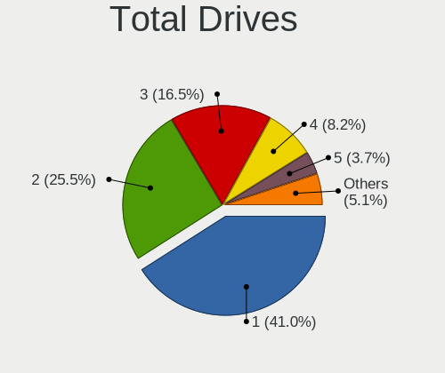

| Drives | Desktops | Percent |
|--------|----------|---------|
| 1      | 217      | 41.49%  |
| 2      | 127      | 24.28%  |
| 3      | 89       | 17.02%  |
| 4      | 45       | 8.6%    |
| 5      | 20       | 3.82%   |
| 6      | 14       | 2.68%   |
| 8      | 4        | 0.76%   |
| 7      | 4        | 0.76%   |
| 101    | 1        | 0.19%   |
| 9      | 1        | 0.19%   |
| 0      | 1        | 0.19%   |

Has CD-ROM
----------

Has CD-ROM on board

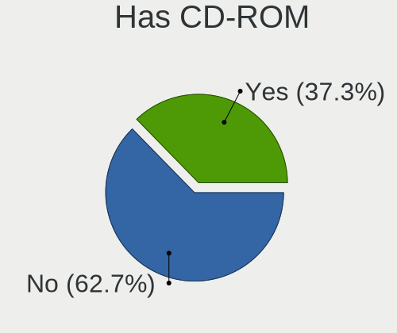

| Presented | Desktops | Percent |
|-----------|----------|---------|
| No        | 328      | 63.57%  |
| Yes       | 188      | 36.43%  |

Has Ethernet
------------

Has Ethernet on board

| Presented | Desktops | Percent |
|-----------|----------|---------|
| Yes       | 505      | 98.63%  |
| No        | 7        | 1.37%   |

Has WiFi
--------

Has WiFi module

| Presented | Desktops | Percent |
|-----------|----------|---------|
| Yes       | 273      | 53.32%  |
| No        | 239      | 46.68%  |

Has Bluetooth
-------------

Has Bluetooth module

| Presented | Desktops | Percent |
|-----------|----------|---------|
| No        | 299      | 57.95%  |
| Yes       | 217      | 42.05%  |

Location
--------

Country
-------

Geographic location (country)

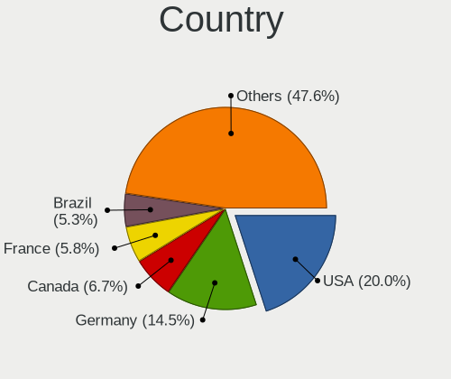

| Country      | Desktops | Percent |
|--------------|----------|---------|
| USA          | 104      | 20.35%  |
| Germany      | 75       | 14.68%  |
| France       | 31       | 6.07%   |
| Canada       | 31       | 6.07%   |
| Brazil       | 27       | 5.28%   |
| UK           | 24       | 4.7%    |
| Italy        | 21       | 4.11%   |
| Russia       | 15       | 2.94%   |
| Australia    | 15       | 2.94%   |
| Netherlands  | 12       | 2.35%   |
| Sweden       | 10       | 1.96%   |
| Spain        | 10       | 1.96%   |
| India        | 10       | 1.96%   |
| Czechia      | 8        | 1.57%   |
| Switzerland  | 7        | 1.37%   |
| Poland       | 7        | 1.37%   |
| Finland      | 7        | 1.37%   |
| Portugal     | 6        | 1.17%   |
| Austria      | 6        | 1.17%   |
| Turkey       | 5        | 0.98%   |
| Norway       | 5        | 0.98%   |
| Belgium      | 5        | 0.98%   |
| Philippines  | 4        | 0.78%   |
| New Zealand  | 4        | 0.78%   |
| Hungary      | 4        | 0.78%   |
| Greece       | 4        | 0.78%   |
| China        | 4        | 0.78%   |
| South Africa | 3        | 0.59%   |
| Peru         | 3        | 0.59%   |
| Israel       | 3        | 0.59%   |
| Iran         | 3        | 0.59%   |
| Argentina    | 3        | 0.59%   |
| Taiwan       | 2        | 0.39%   |
| South Korea  | 2        | 0.39%   |
| Serbia       | 2        | 0.39%   |
| Romania      | 2        | 0.39%   |
| Mexico       | 2        | 0.39%   |
| Malaysia     | 2        | 0.39%   |
| Lithuania    | 2        | 0.39%   |
| Japan        | 2        | 0.39%   |

City
----

Geographic location (city)

| City          | Desktops | Percent |
|---------------|----------|---------|
| Sao Paulo     | 7        | 1.34%   |
| Moscow        | 5        | 0.96%   |
| Montreal      | 5        | 0.96%   |
| Helsinki      | 5        | 0.96%   |
| Hamburg       | 5        | 0.96%   |
| St Petersburg | 4        | 0.77%   |
| Prague        | 4        | 0.77%   |
| Melbourne     | 4        | 0.77%   |
| Brisbane      | 4        | 0.77%   |
| Winnipeg      | 3        | 0.57%   |
| Warsaw        | 3        | 0.57%   |
| Valencia      | 3        | 0.57%   |
| Tourcoing     | 3        | 0.57%   |
| Toronto       | 3        | 0.57%   |
| Tehran        | 3        | 0.57%   |
| Sydney        | 3        | 0.57%   |
| Rome          | 3        | 0.57%   |
| Hanover       | 3        | 0.57%   |
| Gothenburg    | 3        | 0.57%   |
| Edmonton      | 3        | 0.57%   |
| Brussels      | 3        | 0.57%   |
| Berlin        | 3        | 0.57%   |
| Auckland      | 3        | 0.57%   |
| Amsterdam     | 3        | 0.57%   |
| Waynesboro    | 2        | 0.38%   |
| Vienna        | 2        | 0.38%   |
| Surat         | 2        | 0.38%   |
| Sorocaba      | 2        | 0.38%   |
| Seattle       | 2        | 0.38%   |
| Sacramento    | 2        | 0.38%   |
| Porto Alegre  | 2        | 0.38%   |
| Plaisir       | 2        | 0.38%   |
| Petah Tikva   | 2        | 0.38%   |
| Oshawa        | 2        | 0.38%   |
| Munich        | 2        | 0.38%   |
| Minneapolis   | 2        | 0.38%   |
| Marcon        | 2        | 0.38%   |
| Makati City   | 2        | 0.38%   |
| Lima          | 2        | 0.38%   |
| Krasnoyarsk   | 2        | 0.38%   |

Drives
------

Drive Vendor
------------

Hard drive vendors

| Vendor                      | Desktops | Drives | Percent |
|-----------------------------|----------|--------|---------|
| Samsung Electronics         | 163      | 242    | 17.21%  |
| Seagate                     | 150      | 227    | 15.84%  |
| WDC                         | 148      | 250    | 15.63%  |
| SanDisk                     | 55       | 77     | 5.81%   |
| Kingston                    | 51       | 60     | 5.39%   |
| Crucial                     | 41       | 48     | 4.33%   |
| Toshiba                     | 35       | 47     | 3.7%    |
| Hitachi                     | 24       | 31     | 2.53%   |
| Intel                       | 17       | 19     | 1.8%    |
| Phison Electronics          | 16       | 19     | 1.69%   |
| Micron/Crucial Technology   | 15       | 18     | 1.58%   |
| SK hynix                    | 12       | 12     | 1.27%   |
| Kingston Technology Company | 11       | 17     | 1.16%   |
| China                       | 10       | 14     | 1.06%   |
| HGST                        | 9        | 35     | 0.95%   |
| PNY                         | 8        | 12     | 0.84%   |
| Intenso                     | 8        | 10     | 0.84%   |
| A-DATA Technology           | 8        | 12     | 0.84%   |
| Unknown                     | 7        | 9      | 0.74%   |
| Silicon Motion              | 6        | 6      | 0.63%   |
| SABRENT                     | 6        | 9      | 0.63%   |
| OCZ                         | 6        | 6      | 0.63%   |
| Micron Technology           | 6        | 8      | 0.63%   |
| Patriot                     | 5        | 5      | 0.53%   |
| MAXIO Technology (Hangzhou) | 5        | 5      | 0.53%   |
| Hewlett-Packard             | 5        | 5      | 0.53%   |
| Corsair                     | 5        | 6      | 0.53%   |
| Apacer                      | 5        | 6      | 0.53%   |
| SPCC                        | 4        | 5      | 0.42%   |
| Phison                      | 4        | 5      | 0.42%   |
| Netac                       | 4        | 4      | 0.42%   |
| Lexar                       | 4        | 4      | 0.42%   |
| KIOXIA                      | 4        | 4      | 0.42%   |
| Gigabyte Technology         | 4        | 4      | 0.42%   |
| Unknown                     | 4        | 6      | 0.42%   |
| KingSpec                    | 3        | 4      | 0.32%   |
| ASMT                        | 3        | 5      | 0.32%   |
| Vaseky                      | 2        | 2      | 0.21%   |
| Team                        | 2        | 2      | 0.21%   |
| Seagate Technology          | 2        | 3      | 0.21%   |

Drive Model
-----------

Hard drive models

| Model                                                 | Desktops | Percent |
|-------------------------------------------------------|----------|---------|
| Samsung NVMe SSD Controller SM981/PM981/PM983 512GB   | 29       | 2.64%   |
| Seagate ST1000DM010-2EP102 1TB                        | 14       | 1.27%   |
| Samsung NVMe SSD Controller PM9A1/PM9A3/980PRO 2TB    | 14       | 1.27%   |
| Micron/Crucial P2 NVMe PCIe SSD 4TB                   | 13       | 1.18%   |
| Samsung SSD 860 EVO 500GB                             | 11       | 1%      |
| Kingston SA400S37240G 240GB SSD                       | 11       | 1%      |
| Seagate ST2000DM008-2FR102 2TB                        | 10       | 0.91%   |
| Samsung SSD 980 1TB                                   | 10       | 0.91%   |
| Samsung SSD 850 EVO 250GB                             | 10       | 0.91%   |
| WDC WDS240G2G0A-00JH30 240GB SSD                      | 6        | 0.55%   |
| Silicon Motion SM2263EN/SM2263XT SSD Controller 500GB | 6        | 0.55%   |
| Seagate ST500DM002-1BD142 500GB                       | 6        | 0.55%   |
| Seagate ST4000DM004-2CV104 4TB                        | 6        | 0.55%   |
| Seagate ST3500418AS 500GB                             | 6        | 0.55%   |
| Seagate ST1000DM003-1CH162 1TB                        | 6        | 0.55%   |
| Samsung SSD 870 EVO 1TB                               | 6        | 0.55%   |
| Samsung SSD 860 QVO 1TB                               | 6        | 0.55%   |
| Samsung SSD 850 EVO 500GB                             | 6        | 0.55%   |
| Samsung NVMe SSD Controller SM961/PM961/SM963 250GB   | 6        | 0.55%   |
| Phison E12 NVMe Controller 1TB                        | 6        | 0.55%   |
| Kingston SV300S37A120G 120GB SSD                      | 6        | 0.55%   |
| Kingston SA400S37480G 480GB SSD                       | 6        | 0.55%   |
| Crucial CT1000MX500SSD1 1TB                           | 6        | 0.55%   |
| WDC WD20EZRX-00D8PB0 2TB                              | 5        | 0.45%   |
| WDC WD10EZEX-08WN4A0 1TB                              | 5        | 0.45%   |
| Seagate ST2000DM001-1ER164 2TB                        | 5        | 0.45%   |
| Seagate ST2000DM001-1CH164 2TB                        | 5        | 0.45%   |
| Seagate ST1000DM003-1SB102 1TB                        | 5        | 0.45%   |
| SanDisk SSD PLUS 1000GB                               | 5        | 0.45%   |
| Samsung SSD 990 PRO 1TB                               | 5        | 0.45%   |
| Samsung SSD 870 EVO 500GB                             | 5        | 0.45%   |
| Samsung PSSD T7 1TB                                   | 5        | 0.45%   |
| SABRENT Disk 2TB                                      | 5        | 0.45%   |
| Crucial CT240BX500SSD1 240GB                          | 5        | 0.45%   |
| WDC WD5000AAKX-001CA0 500GB                           | 4        | 0.36%   |
| Toshiba DT01ACA100 1TB                                | 4        | 0.36%   |
| Seagate ST2000DM006-2DM164 2TB                        | 4        | 0.36%   |
| Seagate ST1000DM003-1ER162 1TB                        | 4        | 0.36%   |
| Samsung SSD 860 EVO 250GB                             | 4        | 0.36%   |
| Samsung SSD 860 EVO 1TB                               | 4        | 0.36%   |

HDD Vendor
----------

Hard disk drive vendors

| Vendor              | Desktops | Drives | Percent |
|---------------------|----------|--------|---------|
| Seagate             | 143      | 218    | 38.03%  |
| WDC                 | 134      | 222    | 35.64%  |
| Toshiba             | 29       | 39     | 7.71%   |
| Hitachi             | 24       | 31     | 6.38%   |
| Samsung Electronics | 19       | 23     | 5.05%   |
| HGST                | 9        | 13     | 2.39%   |
| SABRENT             | 5        | 8      | 1.33%   |
| Unknown             | 2        | 2      | 0.53%   |
| Maxtor              | 2        | 3      | 0.53%   |
| USB3.0              | 1        | 1      | 0.27%   |
| TO Exter            | 1        | 1      | 0.27%   |
| OOS16000            | 1        | 1      | 0.27%   |
| NETAPP              | 1        | 12     | 0.27%   |
| Intenso             | 1        | 1      | 0.27%   |
| Hewlett-Packard     | 1        | 1      | 0.27%   |
| ASMT                | 1        | 3      | 0.27%   |
| Apple               | 1        | 1      | 0.27%   |
| Unknown             | 1        | 1      | 0.27%   |

SSD Vendor
----------

Solid state drive vendors

| Vendor              | Desktops | Drives | Percent |
|---------------------|----------|--------|---------|
| Samsung Electronics | 78       | 108    | 24.3%   |
| Kingston            | 37       | 44     | 11.53%  |
| Crucial             | 33       | 37     | 10.28%  |
| SanDisk             | 30       | 40     | 9.35%   |
| WDC                 | 19       | 20     | 5.92%   |
| China               | 10       | 14     | 3.12%   |
| Intel               | 8        | 10     | 2.49%   |
| PNY                 | 7        | 10     | 2.18%   |
| OCZ                 | 6        | 6      | 1.87%   |
| Intenso             | 6        | 8      | 1.87%   |
| A-DATA Technology   | 6        | 10     | 1.87%   |
| Patriot             | 5        | 5      | 1.56%   |
| Apacer              | 5        | 6      | 1.56%   |
| Toshiba             | 3        | 4      | 0.93%   |
| Micron Technology   | 3        | 4      | 0.93%   |
| KingSpec            | 3        | 4      | 0.93%   |
| Hewlett-Packard     | 3        | 3      | 0.93%   |
| Vaseky              | 2        | 2      | 0.62%   |
| Team                | 2        | 2      | 0.62%   |
| SPCC                | 2        | 2      | 0.62%   |
| SK hynix            | 2        | 2      | 0.62%   |
| OWC                 | 2        | 6      | 0.62%   |
| INNOVATION IT       | 2        | 2      | 0.62%   |
| GOODRAM             | 2        | 3      | 0.62%   |
| Gigastone           | 2        | 2      | 0.62%   |
| Gigabyte Technology | 2        | 2      | 0.62%   |
| Emtec               | 2        | 2      | 0.62%   |
| ASMT                | 2        | 2      | 0.62%   |
| Unknown             | 2        | 2      | 0.62%   |
| WALRAM              | 1        | 1      | 0.31%   |
| Verbatim            | 1        | 6      | 0.31%   |
| V7                  | 1        | 1      | 0.31%   |
| TEXTORM             | 1        | 1      | 0.31%   |
| TCSUNBOW            | 1        | 1      | 0.31%   |
| T-FORCE             | 1        | 1      | 0.31%   |
| SUNEAST             | 1        | 1      | 0.31%   |
| Smartbuy            | 1        | 2      | 0.31%   |
| SILICONMOTION       | 1        | 1      | 0.31%   |
| Seagate             | 1        | 1      | 0.31%   |
| SABRENT             | 1        | 1      | 0.31%   |

Drive Kind
----------

HDD or SSD

| Kind    | Desktops | Drives | Percent |
|---------|----------|--------|---------|
| HDD     | 301      | 581    | 37.3%   |
| SSD     | 269      | 407    | 33.33%  |
| NVMe    | 217      | 323    | 26.89%  |
| Unknown | 18       | 49     | 2.23%   |
| MMC     | 2        | 2      | 0.25%   |

Drive Connector
---------------

SATA, SAS, NVMe, etc.

| Type | Desktops | Drives | Percent |
|------|----------|--------|---------|
| SATA | 422      | 918    | 61.34%  |
| NVMe | 217      | 321    | 31.54%  |
| SAS  | 47       | 121    | 6.83%   |
| MMC  | 2        | 2      | 0.29%   |

Drive Size
----------

Size of hard drive

| Size in TB | Desktops | Drives | Percent |
|------------|----------|--------|---------|
| 0.01-0.5   | 276      | 430    | 44.81%  |
| 0.51-1.0   | 186      | 278    | 30.19%  |
| 1.01-2.0   | 81       | 110    | 13.15%  |
| 3.01-4.0   | 31       | 54     | 5.03%   |
| 4.01-10.0  | 21       | 50     | 3.41%   |
| 2.01-3.0   | 16       | 19     | 2.6%    |
| 10.01-20.0 | 5        | 47     | 0.81%   |

Space Total
-----------

Amount of disk space available on the file system

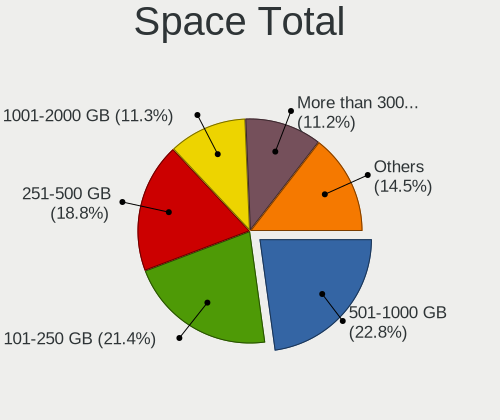

| Size in GB     | Desktops | Percent |
|----------------|----------|---------|
| 501-1000       | 118      | 22.43%  |
| 101-250        | 109      | 20.72%  |
| 251-500        | 101      | 19.2%   |
| 1001-2000      | 62       | 11.79%  |
| More than 3000 | 58       | 11.03%  |
| 2001-3000      | 34       | 6.46%   |
| 1-20           | 17       | 3.23%   |
| 51-100         | 15       | 2.85%   |
| 21-50          | 8        | 1.52%   |
| Unknown        | 4        | 0.76%   |

Space Used
----------

Amount of used disk space

| Used GB        | Desktops | Percent |
|----------------|----------|---------|
| 1-20           | 137      | 25.75%  |
| 21-50          | 113      | 21.24%  |
| 101-250        | 71       | 13.35%  |
| 51-100         | 64       | 12.03%  |
| 251-500        | 45       | 8.46%   |
| 501-1000       | 40       | 7.52%   |
| More than 3000 | 25       | 4.7%    |
| 1001-2000      | 19       | 3.57%   |
| 2001-3000      | 14       | 2.63%   |
| Unknown        | 4        | 0.75%   |

Malfunc. Drives
---------------

Drive models with a malfunction

| Model                                   | Desktops | Drives | Percent |
|-----------------------------------------|----------|--------|---------|
| Kingston SV300S37A120G 120GB SSD        | 2        | 2      | 5%      |
| WDC WD6400AACS-00G8B1 640GB             | 1        | 1      | 2.5%    |
| WDC WD60EFRX-68L0BN1 6TB                | 1        | 1      | 2.5%    |
| WDC WD5000HHTZ-04N21V0 500GB            | 1        | 1      | 2.5%    |
| WDC WD5000AZLX-22JKKA0 500GB            | 1        | 1      | 2.5%    |
| WDC WD5000AAKX-001CA0 500GB             | 1        | 1      | 2.5%    |
| WDC WD5000AAKS-00UU3A0 500GB            | 1        | 1      | 2.5%    |
| WDC WD2500AAKX-753CA1 250GB             | 1        | 1      | 2.5%    |
| WDC WD2500AAJS-75M0A0 250GB             | 1        | 1      | 2.5%    |
| WDC WD10EZRZ-00HTKB0 1TB                | 1        | 1      | 2.5%    |
| WDC WD10EZEX-60WN4A0 1TB                | 1        | 1      | 2.5%    |
| WDC WD10EZEX-22MFCA0 1TB                | 1        | 2      | 2.5%    |
| WDC WD10EARS-22Y5B1 1TB                 | 1        | 1      | 2.5%    |
| WDC WD1003FZEX-00MK2A0 1TB              | 1        | 1      | 2.5%    |
| Toshiba MK3261GSYN 320GB                | 1        | 1      | 2.5%    |
| Toshiba MK2555GSXF 250GB                | 1        | 1      | 2.5%    |
| Seagate ST8000DM0004-1ZC11G 8TB         | 1        | 1      | 2.5%    |
| Seagate ST500DM002-1BD142 500GB         | 1        | 1      | 2.5%    |
| Seagate ST3500418AS 500GB               | 1        | 1      | 2.5%    |
| Seagate ST2000LX001-1RG174 2TB          | 1        | 1      | 2.5%    |
| Seagate ST2000LM007-1R8174 2TB          | 1        | 1      | 2.5%    |
| Seagate ST2000DM008-2FR102 2TB          | 1        | 1      | 2.5%    |
| SanDisk SSD PLUS 240GB                  | 1        | 1      | 2.5%    |
| SanDisk SD7SB2Q-512G-1006 512GB SSD     | 1        | 1      | 2.5%    |
| Samsung Electronics SSD 960 EVO 250GB   | 1        | 1      | 2.5%    |
| Samsung Electronics HD502HJ 500GB       | 1        | 1      | 2.5%    |
| Samsung Electronics HD161GJ 160GB       | 1        | 1      | 2.5%    |
| Patriot P210 1TB SSD                    | 1        | 1      | 2.5%    |
| Neo Forza NFS121SA312-6007000 120GB SSD | 1        | 2      | 2.5%    |
| Maxtor 6L160M0 160GB                    | 1        | 2      | 2.5%    |
| Kingston SUV400S37240G 240GB SSD        | 1        | 1      | 2.5%    |
| Intel SSDSC2KW240H6 240GB               | 1        | 1      | 2.5%    |
| Intel SSDSC2BF180A5L 180GB              | 1        | 1      | 2.5%    |
| Hitachi HDT721010SLA360 1TB             | 1        | 1      | 2.5%    |
| Hitachi HDS721010CLA332 1TB             | 1        | 1      | 2.5%    |
| Gigabyte Technology GP-GM30512G-G 512GB | 1        | 1      | 2.5%    |
| Crucial CT512MX100SSD1 512GB            | 1        | 1      | 2.5%    |
| Crucial CT240M500SSD1 240GB             | 1        | 1      | 2.5%    |
| Crucial CT1050MX300SSD1 1TB             | 1        | 1      | 2.5%    |

Malfunc. Drive Vendor
---------------------

Vendors of faulty drives

| Vendor              | Desktops | Drives | Percent |
|---------------------|----------|--------|---------|
| WDC                 | 13       | 14     | 32.5%   |
| Seagate             | 6        | 6      | 15%     |
| Samsung Electronics | 3        | 3      | 7.5%    |
| Kingston            | 3        | 3      | 7.5%    |
| Crucial             | 3        | 3      | 7.5%    |
| Toshiba             | 2        | 2      | 5%      |
| SanDisk             | 2        | 2      | 5%      |
| Intel               | 2        | 2      | 5%      |
| Hitachi             | 2        | 2      | 5%      |
| Patriot             | 1        | 1      | 2.5%    |
| Neo                 | 1        | 2      | 2.5%    |
| Maxtor              | 1        | 2      | 2.5%    |
| Gigabyte Technology | 1        | 1      | 2.5%    |

Malfunc. HDD Vendor
-------------------

Vendors of faulty HDD drives

| Vendor              | Desktops | Drives | Percent |
|---------------------|----------|--------|---------|
| WDC                 | 13       | 14     | 50%     |
| Seagate             | 6        | 6      | 23.08%  |
| Toshiba             | 2        | 2      | 7.69%   |
| Samsung Electronics | 2        | 2      | 7.69%   |
| Hitachi             | 2        | 2      | 7.69%   |
| Maxtor              | 1        | 2      | 3.85%   |

Malfunc. Drive Kind
-------------------

Kinds of faulty drives

| Kind | Desktops | Drives | Percent |
|------|----------|--------|---------|
| HDD  | 25       | 28     | 64.1%   |
| SSD  | 12       | 13     | 30.77%  |
| NVMe | 2        | 2      | 5.13%   |

Failed Drives
-------------

Failed drive models

| Model                        | Desktops | Drives | Percent |
|------------------------------|----------|--------|---------|
| Toshiba NVMe SSD Drive 256GB | 1        | 1      | 50%     |
| Hitachi HUS724040ALE640 4TB  | 1        | 1      | 50%     |

Failed Drive Vendor
-------------------

Failed drive vendors

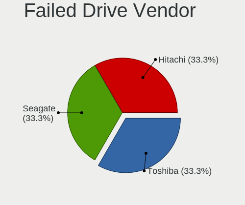

| Vendor  | Desktops | Drives | Percent |
|---------|----------|--------|---------|
| Toshiba | 1        | 1      | 50%     |
| Hitachi | 1        | 1      | 50%     |

Drive Status
------------

Number of failed and malfunc. drives

| Status   | Desktops | Drives | Percent |
|----------|----------|--------|---------|
| Detected | 377      | 950    | 67.08%  |
| Works    | 148      | 367    | 26.33%  |
| Malfunc  | 35       | 43     | 6.23%   |
| Failed   | 2        | 2      | 0.36%   |

Storage controller
------------------

Storage Vendor
--------------

Storage controller vendors

| Vendor                       | Desktops | Percent |
|------------------------------|----------|---------|
| Intel                        | 335      | 41.61%  |
| AMD                          | 167      | 20.75%  |
| Samsung Electronics          | 85       | 10.56%  |
| Sandisk                      | 28       | 3.48%   |
| Phison Electronics           | 25       | 3.11%   |
| Micron/Crucial Technology    | 25       | 3.11%   |
| Kingston Technology Company  | 25       | 3.11%   |
| ASMedia Technology           | 24       | 2.98%   |
| Marvell Technology Group     | 12       | 1.49%   |
| JMicron Technology           | 10       | 1.24%   |
| SK hynix                     | 9        | 1.12%   |
| MAXIO Technology (Hangzhou)  | 8        | 0.99%   |
| Silicon Motion               | 7        | 0.87%   |
| Seagate Technology           | 7        | 0.87%   |
| Toshiba America Info Systems | 5        | 0.62%   |
| Realtek Semiconductor        | 5        | 0.62%   |
| KIOXIA                       | 4        | 0.5%    |
| Nvidia                       | 3        | 0.37%   |
| Netac Technology             | 3        | 0.37%   |
| Micron Technology            | 3        | 0.37%   |
| Broadcom / LSI               | 3        | 0.37%   |
| Shenzhen Longsys Electronics | 2        | 0.25%   |
| LSI Logic / Symbios Logic    | 2        | 0.25%   |
| ADATA Technology             | 2        | 0.25%   |
| Yangtze Memory Technologies  | 1        | 0.12%   |
| VIA Technologies             | 1        | 0.12%   |
| OCZ Technology Group         | 1        | 0.12%   |
| INNOGRIT                     | 1        | 0.12%   |
| Biwin Storage Technology     | 1        | 0.12%   |
| Apple                        | 1        | 0.12%   |

Storage Model
-------------

Storage controller models

| Model                                                                                   | Desktops | Percent |
|-----------------------------------------------------------------------------------------|----------|---------|
| AMD FCH SATA Controller [AHCI mode]                                                     | 100      | 10.47%  |
| Intel 8 Series/C220 Series Chipset Family 6-port SATA Controller 1 [AHCI mode]          | 42       | 4.4%    |
| Samsung NVMe SSD Controller SM981/PM981/PM983                                           | 37       | 3.87%   |
| Intel 6 Series/C200 Series Chipset Family 6 port Desktop SATA AHCI Controller           | 30       | 3.14%   |
| AMD 500 Series Chipset SATA Controller                                                  | 30       | 3.14%   |
| AMD 400 Series Chipset SATA Controller                                                  | 28       | 2.93%   |
| Intel Q170/Q150/B150/H170/H110/Z170/CM236 Chipset SATA Controller [AHCI Mode]           | 27       | 2.83%   |
| Samsung NVMe SSD Controller PM9A1/PM9A3/980PRO                                          | 23       | 2.41%   |
| Intel Alder Lake-S PCH SATA Controller [AHCI Mode]                                      | 23       | 2.41%   |
| Intel 200 Series PCH SATA controller [AHCI mode]                                        | 22       | 2.3%    |
| ASMedia ASM1062 Serial ATA Controller                                                   | 22       | 2.3%    |
| Intel 7 Series/C210 Series Chipset Family 6-port SATA Controller [AHCI mode]            | 21       | 2.2%    |
| Micron/Crucial P2 [Nick P2] / P3 / P3 Plus NVMe PCIe SSD (DRAM-less)                    | 19       | 1.99%   |
| Intel Cannon Lake PCH SATA AHCI Controller                                              | 18       | 1.88%   |
| Intel Volume Management Device NVMe RAID Controller                                     | 16       | 1.68%   |
| Intel SATA Controller [RAID mode]                                                       | 16       | 1.68%   |
| AMD SB7x0/SB8x0/SB9x0 IDE Controller                                                    | 16       | 1.68%   |
| Samsung NVMe SSD Controller 980 (DRAM-less)                                             | 14       | 1.47%   |
| AMD SB7x0/SB8x0/SB9x0 SATA Controller [AHCI mode]                                       | 14       | 1.47%   |
| Intel NM10/ICH7 Family SATA Controller [IDE mode]                                       | 13       | 1.36%   |
| Intel 9 Series Chipset Family SATA Controller [AHCI Mode]                               | 12       | 1.26%   |
| Intel 6 Series/C200 Series Chipset Family Desktop SATA Controller (IDE mode, ports 4-5) | 12       | 1.26%   |
| Intel 6 Series/C200 Series Chipset Family Desktop SATA Controller (IDE mode, ports 0-3) | 12       | 1.26%   |
| Intel 500 Series Chipset Family SATA AHCI Controller                                    | 11       | 1.15%   |
| AMD FCH SATA Controller D                                                               | 11       | 1.15%   |
| Samsung NVMe SSD Controller SM961/PM961/SM963                                           | 10       | 1.05%   |
| Phison E12 NVMe Controller                                                              | 10       | 1.05%   |
| Intel 82801G (ICH7 Family) IDE Controller                                               | 10       | 1.05%   |
| AMD SB7x0/SB8x0/SB9x0 SATA Controller [IDE mode]                                        | 10       | 1.05%   |
| Kingston Company NV2 NVMe SSD SM2267XT                                                  | 9        | 0.94%   |
| Intel C610/X99 series chipset 6-Port SATA Controller [AHCI mode]                        | 9        | 0.94%   |
| Intel 700 Series Chipset Family SATA AHCI Controller                                    | 9        | 0.94%   |
| Intel C610/X99 series chipset sSATA Controller [AHCI mode]                              | 8        | 0.84%   |
| Samsung NVMe SSD Controller S4LV008[Pascal]                                             | 7        | 0.73%   |
| Silicon Motion SM2263EN/SM2263XT (DRAM-less) NVMe SSD Controllers                       | 6        | 0.63%   |
| Sandisk WD Black SN850X NVMe SSD                                                        | 6        | 0.63%   |
| Intel Volume Management Device NVMe RAID Controller Intel Corporation                   | 6        | 0.63%   |
| Intel 82801JI (ICH10 Family) 4 port SATA IDE Controller #1                              | 6        | 0.63%   |
| Intel 82801JI (ICH10 Family) 2 port SATA IDE Controller #2                              | 6        | 0.63%   |
| Phison E18 PCIe4 NVMe Controller                                                        | 5        | 0.52%   |

Storage Kind
------------

Kind of storage controller (IDE, SATA, NVMe, SAS, ...)

| Kind | Desktops | Percent |
|------|----------|---------|
| SATA | 441      | 56.76%  |
| NVMe | 217      | 27.93%  |
| IDE  | 71       | 9.14%   |
| RAID | 43       | 5.53%   |
| SAS  | 4        | 0.51%   |
| SCSI | 1        | 0.13%   |

Processor
---------

CPU Vendor
----------

Processor vendors

| Vendor | Desktops | Percent |
|--------|----------|---------|
| Intel  | 338      | 66.14%  |
| AMD    | 173      | 33.86%  |

CPU Model
---------

Processor models

| Model                                       | Desktops | Percent |
|---------------------------------------------|----------|---------|
| AMD Ryzen 5 5600G with Radeon Graphics      | 10       | 1.95%   |
| AMD Ryzen 5 3600 6-Core Processor           | 10       | 1.95%   |
| Intel Core i5-3470 CPU @ 3.20GHz            | 9        | 1.75%   |
| Intel Core i7-4790 CPU @ 3.60GHz            | 7        | 1.36%   |
| Intel Core i5-9400F CPU @ 2.90GHz           | 7        | 1.36%   |
| Intel Core i5-4590 CPU @ 3.30GHz            | 7        | 1.36%   |
| AMD Ryzen 7 5800X 8-Core Processor          | 7        | 1.36%   |
| Intel Core i7-4790K CPU @ 4.00GHz           | 6        | 1.17%   |
| Intel Core i7-3770 CPU @ 3.40GHz            | 6        | 1.17%   |
| Intel Core i5-6500 CPU @ 3.20GHz            | 6        | 1.17%   |
| Intel Core i5-2500 CPU @ 3.30GHz            | 6        | 1.17%   |
| AMD Ryzen 9 7950X 16-Core Processor         | 6        | 1.17%   |
| AMD Ryzen 9 7900X 12-Core Processor         | 6        | 1.17%   |
| AMD Ryzen 5 2600 Six-Core Processor         | 6        | 1.17%   |
| Intel Core i5-4570 CPU @ 3.20GHz            | 5        | 0.97%   |
| Intel Core 2 Duo CPU E7500 @ 2.93GHz        | 5        | 0.97%   |
| Intel 13th Gen Core i9-13900K               | 5        | 0.97%   |
| Intel 12th Gen Core i7-12700                | 5        | 0.97%   |
| AMD Ryzen 9 7900 12-Core Processor          | 5        | 0.97%   |
| AMD Ryzen 9 5900X 12-Core Processor         | 5        | 0.97%   |
| AMD Ryzen 9 3900X 12-Core Processor         | 5        | 0.97%   |
| AMD Ryzen 7 5700G with Radeon Graphics      | 5        | 0.97%   |
| Intel Core i7-6700K CPU @ 4.00GHz           | 4        | 0.78%   |
| Intel Core i5-8400 CPU @ 2.80GHz            | 4        | 0.78%   |
| Intel Core i5-6600 CPU @ 3.30GHz            | 4        | 0.78%   |
| Intel Core i5-6400 CPU @ 2.70GHz            | 4        | 0.78%   |
| Intel Core i5-4590T CPU @ 2.00GHz           | 4        | 0.78%   |
| Intel Core i3-2100 CPU @ 3.10GHz            | 4        | 0.78%   |
| Intel Core 2 Duo CPU E8400 @ 3.00GHz        | 4        | 0.78%   |
| Intel 11th Gen Core i7-11700K @ 3.60GHz     | 4        | 0.78%   |
| AMD Ryzen 7 3700X 8-Core Processor          | 4        | 0.78%   |
| AMD Ryzen 7 2700X Eight-Core Processor      | 4        | 0.78%   |
| AMD Ryzen 5 5600X 6-Core Processor          | 4        | 0.78%   |
| AMD Ryzen 5 5500                            | 4        | 0.78%   |
| Intel Pentium Dual-Core CPU E6500 @ 2.93GHz | 3        | 0.58%   |
| Intel N100                                  | 3        | 0.58%   |
| Intel Core i7-4770 CPU @ 3.40GHz            | 3        | 0.58%   |
| Intel Core i7-3770K CPU @ 3.50GHz           | 3        | 0.58%   |
| Intel Core i7-2600K CPU @ 3.40GHz           | 3        | 0.58%   |
| Intel Core i7-2600 CPU @ 3.40GHz            | 3        | 0.58%   |

CPU Model Family
----------------

Processor model prefix

| Model                   | Desktops | Percent |
|-------------------------|----------|---------|
| Intel Core i5           | 112      | 21.88%  |
| Intel Core i7           | 65       | 12.7%   |
| Other                   | 51       | 9.96%   |
| AMD Ryzen 5             | 46       | 8.98%   |
| AMD Ryzen 7             | 36       | 7.03%   |
| Intel Core i3           | 33       | 6.45%   |
| AMD Ryzen 9             | 33       | 6.45%   |
| Intel Xeon              | 31       | 6.05%   |
| Intel Core 2 Duo        | 12       | 2.34%   |
| Intel Celeron           | 12       | 2.34%   |
| Intel Pentium           | 7        | 1.37%   |
| AMD FX                  | 7        | 1.37%   |
| AMD Ryzen 3             | 6        | 1.17%   |
| AMD A8                  | 6        | 1.17%   |
| Intel Pentium Dual-Core | 5        | 0.98%   |
| Intel Core 2 Quad       | 4        | 0.78%   |
| AMD Phenom II X4        | 4        | 0.78%   |
| AMD Athlon X4           | 4        | 0.78%   |
| AMD Athlon II X2        | 4        | 0.78%   |
| AMD A10                 | 4        | 0.78%   |
| Intel Atom              | 3        | 0.59%   |
| AMD Ryzen Threadripper  | 3        | 0.59%   |
| AMD Ryzen 5 PRO         | 3        | 0.59%   |
| Intel Core i9           | 2        | 0.39%   |
| AMD Phenom II X6        | 2        | 0.39%   |
| AMD Phenom II X2        | 2        | 0.39%   |
| AMD Athlon 64 X2        | 2        | 0.39%   |
| Intel Pentium Silver    | 1        | 0.2%    |
| Intel Pentium 4         | 1        | 0.2%    |
| Intel Celeron D         | 1        | 0.2%    |
| AMD Ryzen 7 PRO         | 1        | 0.2%    |
| AMD Ryzen 3 PRO         | 1        | 0.2%    |
| AMD Phenom              | 1        | 0.2%    |
| AMD E                   | 1        | 0.2%    |
| AMD Athlon II X4        | 1        | 0.2%    |
| AMD Athlon II X3        | 1        | 0.2%    |
| AMD Athlon Dual Core    | 1        | 0.2%    |
| AMD Athlon              | 1        | 0.2%    |
| AMD A6                  | 1        | 0.2%    |
| AMD A4                  | 1        | 0.2%    |

CPU Cores
---------

Number of processor cores

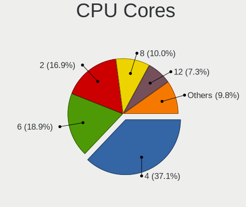

| Number | Desktops | Percent |
|--------|----------|---------|
| 4      | 188      | 36.79%  |
| 6      | 96       | 18.79%  |
| 2      | 88       | 17.22%  |
| 8      | 53       | 10.37%  |
| 12     | 37       | 7.24%   |
| 16     | 13       | 2.54%   |
| 24     | 8        | 1.57%   |
| 10     | 6        | 1.17%   |
| 14     | 5        | 0.98%   |
| 3      | 5        | 0.98%   |
| 1      | 5        | 0.98%   |
| 32     | 3        | 0.59%   |
| 20     | 2        | 0.39%   |
| 36     | 1        | 0.2%    |
| 7      | 1        | 0.2%    |

CPU Sockets
-----------

Number of sockets

| Number | Desktops | Percent |
|--------|----------|---------|
| 1      | 501      | 98.04%  |
| 2      | 10       | 1.96%   |

CPU Threads
-----------

Threads per core (Hyper-Threading)

| Number | Desktops | Percent |
|--------|----------|---------|
| 2      | 311      | 60.74%  |
| 1      | 201      | 39.26%  |

CPU Op-Modes
------------

CPU Operation Modes (32-bit, 64-bit)

| Op mode        | Desktops | Percent |
|----------------|----------|---------|
| 32-bit, 64-bit | 511      | 100%    |

CPU Microcode
-------------

Microcode number

| Number     | Desktops | Percent |
|------------|----------|---------|
| Unknown    | 440      | 85.77%  |
| 0x0a601203 | 21       | 4.09%   |
| 0x0a50000d | 9        | 1.75%   |
| 0x0a20120a | 5        | 0.97%   |
| 0x08701021 | 4        | 0.78%   |
| 0x0800820d | 4        | 0.78%   |
| 0x010000c8 | 4        | 0.78%   |
| 0x0a50000b | 2        | 0.39%   |
| 0x0a201025 | 2        | 0.39%   |
| 0x08701030 | 2        | 0.39%   |
| 0x08108109 | 2        | 0.39%   |
| 0xf64      | 1        | 0.19%   |
| 0x306c3    | 1        | 0.19%   |
| 0x0a704103 | 1        | 0.19%   |
| 0x0a50000c | 1        | 0.19%   |
| 0x0a404102 | 1        | 0.19%   |
| 0x0a201205 | 1        | 0.19%   |
| 0x0a201009 | 1        | 0.19%   |
| 0x08600109 | 1        | 0.19%   |
| 0x08101016 | 1        | 0.19%   |
| 0x0810100b | 1        | 0.19%   |
| 0x06006705 | 1        | 0.19%   |
| 0x06003104 | 1        | 0.19%   |
| 0x06001119 | 1        | 0.19%   |
| 0x06000852 | 1        | 0.19%   |
| 0x0600063e | 1        | 0.19%   |
| 0x03000027 | 1        | 0.19%   |
| 0x010000dc | 1        | 0.19%   |
| 0x00000000 | 1        | 0.19%   |

CPU Microarch
-------------

Microarchitecture

| Name             | Desktops | Percent |
|------------------|----------|---------|
| Haswell          | 69       | 13.45%  |
| Unknown          | 69       | 13.45%  |
| KabyLake         | 44       | 8.58%   |
| Zen 3            | 41       | 7.99%   |
| IvyBridge        | 41       | 7.99%   |
| Skylake          | 34       | 6.63%   |
| SandyBridge      | 33       | 6.43%   |
| Zen 2            | 29       | 5.65%   |
| Penryn           | 21       | 4.09%   |
| Zen+             | 18       | 3.51%   |
| Piledriver       | 16       | 3.12%   |
| K10              | 15       | 2.92%   |
| Alderlake Hybrid | 12       | 2.34%   |
| Zen              | 9        | 1.75%   |
| CometLake        | 9        | 1.75%   |
| Nehalem          | 8        | 1.56%   |
| Silvermont       | 7        | 1.36%   |
| Westmere         | 6        | 1.17%   |
| Broadwell        | 6        | 1.17%   |
| K8 Hammer        | 3        | 0.58%   |
| Icelake          | 3        | 0.58%   |
| Excavator        | 3        | 0.58%   |
| Core             | 3        | 0.58%   |
| Steamroller      | 2        | 0.39%   |
| NetBurst         | 2        | 0.39%   |
| Gracemont        | 2        | 0.39%   |
| Goldmont         | 2        | 0.39%   |
| Bulldozer        | 2        | 0.39%   |
| TigerLake        | 1        | 0.19%   |
| K10 Llano        | 1        | 0.19%   |
| Bonnell          | 1        | 0.19%   |
| Bobcat           | 1        | 0.19%   |

Graphics
--------

GPU Vendor
----------

Vendors of graphics cards

| Vendor                     | Desktops | Percent |
|----------------------------|----------|---------|
| Nvidia                     | 201      | 35.7%   |
| Intel                      | 183      | 32.5%   |
| AMD                        | 176      | 31.26%  |
| Matrox Electronics Systems | 3        | 0.53%   |

GPU Model
---------

Graphics card models

| Model                                                                       | Desktops | Percent |
|-----------------------------------------------------------------------------|----------|---------|
| Intel Xeon E3-1200 v3/4th Gen Core Processor Integrated Graphics Controller | 38       | 6.59%   |
| AMD Raphael                                                                 | 27       | 4.68%   |
| AMD Ellesmere [Radeon RX 470/480/570/570X/580/580X/590]                     | 23       | 3.99%   |
| Intel Xeon E3-1200 v2/3rd Gen Core processor Graphics Controller            | 22       | 3.81%   |
| Intel HD Graphics 530                                                       | 21       | 3.64%   |
| Intel 2nd Generation Core Processor Family Integrated Graphics Controller   | 19       | 3.29%   |
| AMD Cezanne [Radeon Vega Series / Radeon Vega Mobile Series]                | 16       | 2.77%   |
| Nvidia GP107 [GeForce GTX 1050 Ti]                                          | 12       | 2.08%   |
| Intel CoffeeLake-S GT2 [UHD Graphics 630]                                   | 10       | 1.73%   |
| Intel 4 Series Chipset Integrated Graphics Controller                       | 10       | 1.73%   |
| Nvidia GK208B [GeForce GT 710]                                              | 9        | 1.56%   |
| Intel HD Graphics 630                                                       | 8        | 1.39%   |
| Nvidia GK208B [GeForce GT 730]                                              | 7        | 1.21%   |
| Nvidia GA106 [GeForce RTX 3060 Lite Hash Rate]                              | 7        | 1.21%   |
| AMD Navi 22 [Radeon RX 6700/6700 XT/6750 XT / 6800M/6850M XT]               | 7        | 1.21%   |
| Nvidia GT218 [GeForce 210]                                                  | 6        | 1.04%   |
| Nvidia GP107 [GeForce GTX 1050]                                             | 6        | 1.04%   |
| Nvidia GM204 [GeForce GTX 970]                                              | 6        | 1.04%   |
| Nvidia GK107 [GeForce GTX 650]                                              | 6        | 1.04%   |
| Nvidia GA104 [GeForce RTX 3070 Lite Hash Rate]                              | 6        | 1.04%   |
| Nvidia AD102 [GeForce RTX 4090]                                             | 6        | 1.04%   |
| AMD Raven Ridge [Radeon Vega Series / Radeon Vega Mobile Series]            | 6        | 1.04%   |
| AMD Navi 23 [Radeon RX 6600/6600 XT/6600M]                                  | 6        | 1.04%   |
| AMD Navi 10 [Radeon RX 5600 OEM/5600 XT / 5700/5700 XT]                     | 6        | 1.04%   |
| AMD Lexa PRO [Radeon 540/540X/550/550X / RX 540X/550/550X]                  | 6        | 1.04%   |
| Intel CometLake-S GT2 [UHD Graphics 630]                                    | 5        | 0.87%   |
| Intel Atom Processor Z36xxx/Z37xxx Series Graphics & Display                | 5        | 0.87%   |
| Nvidia TU116 [GeForce GTX 1650 SUPER]                                       | 4        | 0.69%   |
| Nvidia GP108 [GeForce GT 1030]                                              | 4        | 0.69%   |
| Nvidia GP106 [GeForce GTX 1060 6GB]                                         | 4        | 0.69%   |
| Nvidia GP104 [GeForce GTX 1070]                                             | 4        | 0.69%   |
| Nvidia GM206 [GeForce GTX 960]                                              | 4        | 0.69%   |
| Nvidia GM200 [GeForce GTX 980 Ti]                                           | 4        | 0.69%   |
| Nvidia G96C [GeForce 9400 GT]                                               | 4        | 0.69%   |
| Intel RocketLake-S GT1 [UHD Graphics 750]                                   | 4        | 0.69%   |
| Intel IvyBridge GT2 [HD Graphics 4000]                                      | 4        | 0.69%   |
| Intel AlderLake-S GT1                                                       | 4        | 0.69%   |
| Intel 4th Generation Core Processor Family Integrated Graphics Controller   | 4        | 0.69%   |
| AMD Caicos [Radeon HD 6450/7450/8450 / R5 230 OEM]                          | 4        | 0.69%   |
| Nvidia TU104 [GeForce RTX 2080 SUPER]                                       | 3        | 0.52%   |

GPU Combo
---------

Combinations of graphics cards

| Name                | Desktops | Percent |
|---------------------|----------|---------|
| 1 x Nvidia          | 159      | 30.93%  |
| 1 x Intel           | 151      | 29.38%  |
| 1 x AMD             | 147      | 28.6%   |
| AMD + Nvidia        | 19       | 3.7%    |
| Intel + Nvidia      | 18       | 3.5%    |
| 2 x AMD             | 8        | 1.56%   |
| 1 x Matrox          | 3        | 0.58%   |
| Intel + AMD         | 3        | 0.58%   |
| 2 x Nvidia          | 2        | 0.39%   |
| Intel + 2 x Nvidia  | 2        | 0.39%   |
| 2 x Intel + 1 x AMD | 1        | 0.19%   |
| 2 x Intel           | 1        | 0.19%   |

GPU Driver
----------

Free vs proprietary

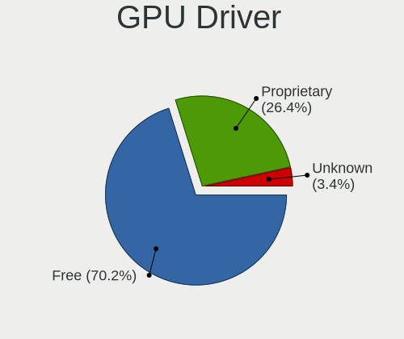

| Driver      | Desktops | Percent |
|-------------|----------|---------|
| Free        | 361      | 69.69%  |
| Proprietary | 138      | 26.64%  |
| Unknown     | 19       | 3.67%   |

GPU Memory
----------

Total video memory

| Size in GB | Desktops | Percent |
|------------|----------|---------|
| Unknown    | 379      | 73.31%  |
| 1.01-2.0   | 27       | 5.22%   |
| 0.01-0.5   | 27       | 5.22%   |
| 7.01-8.0   | 26       | 5.03%   |
| 3.01-4.0   | 24       | 4.64%   |
| 0.51-1.0   | 15       | 2.9%    |
| 16.01-24.0 | 7        | 1.35%   |
| 8.01-16.0  | 7        | 1.35%   |
| 5.01-6.0   | 5        | 0.97%   |

Monitor
-------

Monitor Vendor
--------------

Monitor vendors

| Vendor               | Desktops | Percent |
|----------------------|----------|---------|
| Samsung Electronics  | 84       | 15.64%  |
| Goldstar             | 67       | 12.48%  |
| Dell                 | 59       | 10.99%  |
| Acer                 | 36       | 6.7%    |
| Hewlett-Packard      | 34       | 6.33%   |
| AOC                  | 29       | 5.4%    |
| Ancor Communications | 25       | 4.66%   |
| Philips              | 23       | 4.28%   |
| Iiyama               | 20       | 3.72%   |
| BenQ                 | 18       | 3.35%   |
| ViewSonic            | 12       | 2.23%   |
| ASUSTek Computer     | 12       | 2.23%   |
| Lenovo               | 9        | 1.68%   |
| MSI                  | 8        | 1.49%   |
| Sony                 | 5        | 0.93%   |
| HKC                  | 5        | 0.93%   |
| Fujitsu Siemens      | 4        | 0.74%   |
| Eizo                 | 4        | 0.74%   |
| Unknown              | 4        | 0.74%   |
| Vestel Elektronik    | 3        | 0.56%   |
| Unknown              | 3        | 0.56%   |
| NEC Computers        | 3        | 0.56%   |
| MiTAC                | 3        | 0.56%   |
| Medion               | 3        | 0.56%   |
| Gigabyte Technology  | 3        | 0.56%   |
| Wacom                | 2        | 0.37%   |
| Vizio                | 2        | 0.37%   |
| Unknown (XXX)        | 2        | 0.37%   |
| TCL                  | 2        | 0.37%   |
| SGT                  | 2        | 0.37%   |
| Sceptre Tech         | 2        | 0.37%   |
| Hitachi              | 2        | 0.37%   |
| Gericom              | 2        | 0.37%   |
| CVT                  | 2        | 0.37%   |
| ___                  | 1        | 0.19%   |
| Yashi                | 1        | 0.19%   |
| Xiaomi               | 1        | 0.19%   |
| Westinghouse         | 1        | 0.19%   |
| VIE                  | 1        | 0.19%   |
| Unknown (AAA)        | 1        | 0.19%   |

Monitor Model
-------------

Monitor models

| Model                                                                   | Desktops | Percent |
|-------------------------------------------------------------------------|----------|---------|
| Goldstar HDR 4K GSM7707 3840x2160 600x340mm 27.2-inch                   | 7        | 1.25%   |
| Goldstar FULL HD GSM5B55 1920x1080 480x270mm 21.7-inch                  | 6        | 1.07%   |
| Samsung Electronics C24F390 SAM0D2C 1920x1080 521x293mm 23.5-inch       | 4        | 0.71%   |
| Goldstar ULTRAWIDE GSM59F1 2560x1080 673x284mm 28.8-inch                | 4        | 0.71%   |
| Unknown                                                                 | 4        | 0.71%   |
| Vestel Elektronik 55UHD_LCD_TV VES3700 3840x2160 1872x1053mm 84.6-inch  | 3        | 0.54%   |
| Samsung Electronics C27F390 SAM0D32 1920x1080 598x336mm 27.0-inch       | 3        | 0.54%   |
| Goldstar LG Ultra HD GSM5B09 3840x2160 600x340mm 27.2-inch              | 3        | 0.54%   |
| Goldstar HD GSM5ACB 1366x768 410x230mm 18.5-inch                        | 3        | 0.54%   |
| Dell SE198WFP DELF003 1440x900 408x255mm 18.9-inch                      | 3        | 0.54%   |
| Ancor Communications ASUS VE278 ACI27F6 1920x1080 598x336mm 27.0-inch   | 3        | 0.54%   |
| Ancor Communications ASUS PB278 ACI27A3 2560x1440 597x336mm 27.0-inch   | 3        | 0.54%   |
| Acer XB273U ACR074A 2560x1440 597x336mm 27.0-inch                       | 3        | 0.54%   |
| Wacom Cintiq 13HD WAC1040 1920x1080 293x165mm 13.2-inch                 | 2        | 0.36%   |
| ViewSonic VX2457 VSCB931 1920x1080 521x293mm 23.5-inch                  | 2        | 0.36%   |
| TCL SMART TV TCL6586 3840x2160 1209x680mm 54.6-inch                     | 2        | 0.36%   |
| Samsung Electronics S24D300 SAM0B43 1920x1080 531x299mm 24.0-inch       | 2        | 0.36%   |
| Samsung Electronics LF24T35 SAM707D 1920x1080 528x297mm 23.9-inch       | 2        | 0.36%   |
| Samsung Electronics LCD Monitor SAM71B4 3840x2160 1872x1053mm 84.6-inch | 2        | 0.36%   |
| Samsung Electronics LCD Monitor SAM0D47 1920x1080 480x270mm 21.7-inch   | 2        | 0.36%   |
| Samsung Electronics LC49G95T SAM7053 3840x1080 1193x336mm 48.8-inch     | 2        | 0.36%   |
| Philips PHL 243V7 PHLC155 1920x1080 527x296mm 23.8-inch                 | 2        | 0.36%   |
| Philips FTV PHL01EA 1920x1080 1440x810mm 65.0-inch                      | 2        | 0.36%   |
| Philips 247E4 PHLC0C0 1920x1080 521x293mm 23.5-inch                     | 2        | 0.36%   |
| MSI MAG241C MSI3EA2 1920x1080 521x293mm 23.5-inch                       | 2        | 0.36%   |
| Iiyama PLE2483H IVM6113 1920x1080 531x299mm 24.0-inch                   | 2        | 0.36%   |
| HKC '' HKC2160 1920x1080 360x270mm 17.7-inch                            | 2        | 0.36%   |
| Hewlett-Packard 27m HPN3579 1920x1080 598x336mm 27.0-inch               | 2        | 0.36%   |
| Goldstar W2361 GSM56FB 1920x1080 510x290mm 23.1-inch                    | 2        | 0.36%   |
| Goldstar ULTRAGEAR GSM5BB2 1920x1080 527x296mm 23.8-inch                | 2        | 0.36%   |
| Goldstar ULTRAGEAR GSM5B7F 2560x1440 597x336mm 27.0-inch                | 2        | 0.36%   |
| Goldstar IPS FULLHD GSM5AB6 1920x1080 480x270mm 21.7-inch               | 2        | 0.36%   |
| Goldstar HDR 4K GSM7706 3840x2160 600x340mm 27.2-inch                   | 2        | 0.36%   |
| Dell U2415 DELA0BC 1920x1200 518x324mm 24.1-inch                        | 2        | 0.36%   |
| Dell SE2422H DEL424A 1920x1080 527x296mm 23.8-inch                      | 2        | 0.36%   |
| Dell SE178WFP DELD017 1440x900 370x230mm 17.2-inch                      | 2        | 0.36%   |
| CVT CVTE TV CVT0003 1360x768 575x323mm 26.0-inch                        | 2        | 0.36%   |
| BenQ GW2270 BNQ78DB 1920x1080 476x268mm 21.5-inch                       | 2        | 0.36%   |
| BenQ GW2255 BNQ78CD 1920x1080 477x268mm 21.5-inch                       | 2        | 0.36%   |
| BenQ EW3270U BNQ7950 3840x2160 698x393mm 31.5-inch                      | 2        | 0.36%   |

Monitor Resolution
------------------

Monitor screen resolution

| Resolution         | Desktops | Percent |
|--------------------|----------|---------|
| 1920x1080 (FHD)    | 252      | 49.41%  |
| 3840x2160 (4K)     | 74       | 14.51%  |
| 2560x1440 (QHD)    | 56       | 10.98%  |
| 1440x900 (WXGA+)   | 18       | 3.53%   |
| 1366x768 (WXGA)    | 18       | 3.53%   |
| 1280x1024 (SXGA)   | 12       | 2.35%   |
| 3440x1440          | 11       | 2.16%   |
| 1680x1050 (WSXGA+) | 11       | 2.16%   |
| 1920x1200 (WUXGA)  | 9        | 1.76%   |
| 2560x1080          | 8        | 1.57%   |
| 1600x900 (HD+)     | 7        | 1.37%   |
| 3840x1080          | 6        | 1.18%   |
| Unknown            | 5        | 0.98%   |
| 1280x720 (HD)      | 4        | 0.78%   |
| 3840x1600          | 3        | 0.59%   |
| 2560x1600          | 3        | 0.59%   |
| 1920x540           | 3        | 0.59%   |
| 1360x768           | 3        | 0.59%   |
| 1024x768 (XGA)     | 2        | 0.39%   |
| 5760x2160          | 1        | 0.2%    |
| 3600x1080          | 1        | 0.2%    |
| 1600x1200          | 1        | 0.2%    |
| 1280x960           | 1        | 0.2%    |
| 1024x600           | 1        | 0.2%    |

Monitor Diagonal
----------------

Diagonal size in inches

| Inches  | Desktops | Percent |
|---------|----------|---------|
| 27      | 90       | 17.05%  |
| 24      | 80       | 15.15%  |
| 23      | 70       | 13.26%  |
| 21      | 56       | 10.61%  |
| 31      | 37       | 7.01%   |
| 19      | 22       | 4.17%   |
| Unknown | 22       | 4.17%   |
| 18      | 17       | 3.22%   |
| 34      | 13       | 2.46%   |
| 84      | 12       | 2.27%   |
| 17      | 11       | 2.08%   |
| 22      | 10       | 1.89%   |
| 20      | 9        | 1.7%    |
| 40      | 8        | 1.52%   |
| 32      | 6        | 1.14%   |
| 65      | 5        | 0.95%   |
| 48      | 5        | 0.95%   |
| 28      | 5        | 0.95%   |
| 26      | 5        | 0.95%   |
| 13      | 5        | 0.95%   |
| 35      | 4        | 0.76%   |
| 72      | 3        | 0.57%   |
| 52      | 3        | 0.57%   |
| 42      | 3        | 0.57%   |
| 16      | 3        | 0.57%   |
| 54      | 2        | 0.38%   |
| 49      | 2        | 0.38%   |
| 46      | 2        | 0.38%   |
| 37      | 2        | 0.38%   |
| 29      | 2        | 0.38%   |
| 25      | 2        | 0.38%   |
| 15      | 2        | 0.38%   |
| 63      | 1        | 0.19%   |
| 61      | 1        | 0.19%   |
| 60      | 1        | 0.19%   |
| 43      | 1        | 0.19%   |
| 38      | 1        | 0.19%   |
| 36      | 1        | 0.19%   |
| 33      | 1        | 0.19%   |
| 14      | 1        | 0.19%   |

Monitor Width
-------------

Physical width

| Width in mm | Desktops | Percent |
|-------------|----------|---------|
| 501-600     | 221      | 43.08%  |
| 401-500     | 106      | 20.66%  |
| 601-700     | 54       | 10.53%  |
| 1001-1500   | 22       | 4.29%   |
| Unknown     | 22       | 4.29%   |
| 701-800     | 21       | 4.09%   |
| 351-400     | 16       | 3.12%   |
| 1501-2000   | 15       | 2.92%   |
| 801-900     | 14       | 2.73%   |
| 301-350     | 9        | 1.75%   |
| 201-300     | 7        | 1.36%   |
| 901-1000    | 5        | 0.97%   |
| 101-200     | 1        | 0.19%   |

Aspect Ratio
------------

Proportional relationship between the width and the height

| Ratio   | Desktops | Percent |
|---------|----------|---------|
| 16/9    | 362      | 74.33%  |
| 16/10   | 53       | 10.88%  |
| 21/9    | 21       | 4.31%   |
| Unknown | 19       | 3.9%    |
| 5/4     | 15       | 3.08%   |
| 4/3     | 8        | 1.64%   |
| 32/9    | 8        | 1.64%   |
| 3/2     | 1        | 0.21%   |

Monitor Area
------------

Area in inch

| Area in inch | Desktops | Percent |
|----------------|----------|---------|
| 201-250        | 163      | 31.41%  |
| 301-350        | 93       | 17.92%  |
| 351-500        | 66       | 12.72%  |
| 151-200        | 50       | 9.63%   |
| 251-300        | 38       | 7.32%   |
| More than 1000 | 29       | 5.59%   |
| 501-1000       | 22       | 4.24%   |
| Unknown        | 22       | 4.24%   |
| 141-150        | 20       | 3.85%   |
| 71-80          | 4        | 0.77%   |
| 101-110        | 4        | 0.77%   |
| 131-140        | 3        | 0.58%   |
| 81-90          | 1        | 0.19%   |
| 51-60          | 1        | 0.19%   |
| 41-50          | 1        | 0.19%   |
| 121-130        | 1        | 0.19%   |
| 111-120        | 1        | 0.19%   |

Pixel Density
-------------

Pixels per inch

| Density       | Desktops | Percent |
|---------------|----------|---------|
| 51-100        | 302      | 59.68%  |
| 101-120       | 111      | 21.94%  |
| 121-160       | 31       | 6.13%   |
| Unknown       | 22       | 4.35%   |
| 161-240       | 20       | 3.95%   |
| 1-50          | 19       | 3.75%   |
| More than 240 | 1        | 0.2%    |

Multiple Monitors
-----------------

Total monitors connected

| Total | Desktops | Percent |
|-------|----------|---------|
| 1     | 395      | 76.4%   |
| 2     | 79       | 15.28%  |
| 0     | 30       | 5.8%    |
| 3     | 12       | 2.32%   |
| 4     | 1        | 0.19%   |

Network
-------

Net Controller Vendor
---------------------

Controller vendors

| Vendor                          | Desktops | Percent |
|---------------------------------|----------|---------|
| Realtek Semiconductor           | 334      | 44.01%  |
| Intel                           | 220      | 28.99%  |
| MediaTek                        | 33       | 4.35%   |
| Qualcomm Atheros                | 29       | 3.82%   |
| Broadcom                        | 27       | 3.56%   |
| TP-Link                         | 20       | 2.64%   |
| Ralink Technology               | 13       | 1.71%   |
| Microsoft                       | 8        | 1.05%   |
| NetGear                         | 7        | 0.92%   |
| Marvell Technology Group        | 6        | 0.79%   |
| D-Link                          | 6        | 0.79%   |
| Aquantia                        | 5        | 0.66%   |
| Ralink                          | 4        | 0.53%   |
| Qualcomm Atheros Communications | 4        | 0.53%   |
| Xiaomi                          | 3        | 0.4%    |
| Mellanox Technologies           | 3        | 0.4%    |
| Edimax Technology               | 3        | 0.4%    |
| D-Link System                   | 3        | 0.4%    |
| Samsung Electronics             | 2        | 0.26%   |
| Nvidia                          | 2        | 0.26%   |
| Huawei Technologies             | 2        | 0.26%   |
| Google                          | 2        | 0.26%   |
| Dresden Elektronik              | 2        | 0.26%   |
| Broadcom Limited                | 2        | 0.26%   |
| AVM                             | 2        | 0.26%   |
| ASUSTek Computer                | 2        | 0.26%   |
| Apple                           | 2        | 0.26%   |
| ZyXEL Communications            | 1        | 0.13%   |
| ZyDAS                           | 1        | 0.13%   |
| Z-Com                           | 1        | 0.13%   |
| Qualcomm                        | 1        | 0.13%   |
| QinHeng Electronics             | 1        | 0.13%   |
| Philips (or NXP)                | 1        | 0.13%   |
| Motorola PCS                    | 1        | 0.13%   |
| Linksys                         | 1        | 0.13%   |
| Lenovo                          | 1        | 0.13%   |
| IMC Networks                    | 1        | 0.13%   |
| Guillemot                       | 1        | 0.13%   |
| DisplayLink                     | 1        | 0.13%   |
| 3Com                            | 1        | 0.13%   |

Net Controller Model
--------------------

Controller models

| Model                                                             | Desktops | Percent |
|-------------------------------------------------------------------|----------|---------|
| Realtek RTL8111/8168/8411 PCI Express Gigabit Ethernet Controller | 245      | 28.59%  |
| Realtek RTL8125 2.5GbE Controller                                 | 47       | 5.48%   |
| Intel Ethernet Controller I225-V                                  | 27       | 3.15%   |
| Intel Wi-Fi 6 AX200                                               | 23       | 2.68%   |
| Intel Wi-Fi 6 AX210/AX211/AX411 160MHz                            | 20       | 2.33%   |
| Intel I211 Gigabit Network Connection                             | 18       | 2.1%    |
| Intel Ethernet Connection I217-LM                                 | 17       | 1.98%   |
| MediaTek MT7922 802.11ax PCI Express Wireless Network Adapter     | 16       | 1.87%   |
| Intel Ethernet Connection (2) I219-V                              | 15       | 1.75%   |
| Intel 82579LM Gigabit Network Connection (Lewisville)             | 14       | 1.63%   |
| Realtek RTL810xE PCI Express Fast Ethernet controller             | 11       | 1.28%   |
| MediaTek MT7921K (RZ608) Wi-Fi 6E 80MHz                           | 11       | 1.28%   |
| Intel 82579V Gigabit Network Connection                           | 9        | 1.05%   |
| Realtek 802.11ac NIC                                              | 8        | 0.93%   |
| Intel Alder Lake-S PCH CNVi WiFi                                  | 8        | 0.93%   |
| Qualcomm Atheros AR8151 v2.0 Gigabit Ethernet                     | 7        | 0.82%   |
| Intel I210 Gigabit Network Connection                             | 7        | 0.82%   |
| Intel Ethernet Connection (7) I219-V                              | 7        | 0.82%   |
| Intel Ethernet Connection (17) I219-V                             | 7        | 0.82%   |
| Realtek RTL8852BE PCIe 802.11ax Wireless Network Controller       | 6        | 0.7%    |
| Realtek RTL8188FTV 802.11b/g/n 1T1R 2.4G WLAN Adapter             | 6        | 0.7%    |
| Qualcomm Atheros Killer E220x Gigabit Ethernet Controller         | 6        | 0.7%    |
| Qualcomm Atheros AR9485 Wireless Network Adapter                  | 6        | 0.7%    |
| Intel Ethernet Connection (7) I219-LM                             | 6        | 0.7%    |
| Intel Ethernet Connection (2) I218-V                              | 6        | 0.7%    |
| Intel Dual Band Wireless-AC 3168NGW [Stone Peak]                  | 6        | 0.7%    |
| Intel 700 Series Chipset Family Wi-Fi                             | 6        | 0.7%    |
| TP-Link TL-WN823N v2/v3 [Realtek RTL8192EU]                       | 5        | 0.58%   |
| Realtek RTL88x2bu [AC1200 Techkey]                                | 5        | 0.58%   |
| Microsoft Xbox 360 Wireless Adapter                               | 5        | 0.58%   |
| Intel Ethernet Connection I217-V                                  | 5        | 0.58%   |
| Intel Ethernet Connection (2) I219-LM                             | 5        | 0.58%   |
| Broadcom BCM4360 802.11ac Dual Band Wireless Network Adapter      | 5        | 0.58%   |
| Realtek RTL8821CE 802.11ac PCIe Wireless Network Adapter          | 4        | 0.47%   |
| Realtek RTL8188EUS 802.11n Wireless Network Adapter               | 4        | 0.47%   |
| Ralink MT7601U Wireless Adapter                                   | 4        | 0.47%   |
| Qualcomm Atheros AR9462 Wireless Network Adapter                  | 4        | 0.47%   |
| Intel Wireless-AC 9260                                            | 4        | 0.47%   |
| Intel Wireless 7260                                               | 4        | 0.47%   |
| Intel Ethernet Connection (5) I219-LM                             | 4        | 0.47%   |

Wireless Vendor
---------------

Wireless vendors

| Vendor                          | Desktops | Percent |
|---------------------------------|----------|---------|
| Intel                           | 88       | 30.45%  |
| Realtek Semiconductor           | 61       | 21.11%  |
| MediaTek                        | 32       | 11.07%  |
| TP-Link                         | 20       | 6.92%   |
| Broadcom                        | 16       | 5.54%   |
| Ralink Technology               | 13       | 4.5%    |
| Qualcomm Atheros                | 13       | 4.5%    |
| Microsoft                       | 8        | 2.77%   |
| NetGear                         | 7        | 2.42%   |
| D-Link                          | 6        | 2.08%   |
| Ralink                          | 4        | 1.38%   |
| Qualcomm Atheros Communications | 4        | 1.38%   |
| Edimax Technology               | 3        | 1.04%   |
| Broadcom Limited                | 2        | 0.69%   |
| AVM                             | 2        | 0.69%   |
| ASUSTek Computer                | 2        | 0.69%   |
| ZyXEL Communications            | 1        | 0.35%   |
| ZyDAS                           | 1        | 0.35%   |
| Z-Com                           | 1        | 0.35%   |
| Philips (or NXP)                | 1        | 0.35%   |
| Linksys                         | 1        | 0.35%   |
| IMC Networks                    | 1        | 0.35%   |
| Guillemot                       | 1        | 0.35%   |
| D-Link System                   | 1        | 0.35%   |

Wireless Model
--------------

Wireless models

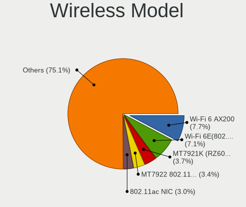

| Model                                                         | Desktops | Percent |
|---------------------------------------------------------------|----------|---------|
| Intel Wi-Fi 6 AX200                                           | 23       | 7.85%   |
| Intel Wi-Fi 6 AX210/AX211/AX411 160MHz                        | 20       | 6.83%   |
| MediaTek MT7922 802.11ax PCI Express Wireless Network Adapter | 16       | 5.46%   |
| MediaTek MT7921K (RZ608) Wi-Fi 6E 80MHz                       | 11       | 3.75%   |
| Realtek 802.11ac NIC                                          | 8        | 2.73%   |
| Intel Alder Lake-S PCH CNVi WiFi                              | 8        | 2.73%   |
| Realtek RTL8852BE PCIe 802.11ax Wireless Network Controller   | 6        | 2.05%   |
| Realtek RTL8188FTV 802.11b/g/n 1T1R 2.4G WLAN Adapter         | 6        | 2.05%   |
| Qualcomm Atheros AR9485 Wireless Network Adapter              | 6        | 2.05%   |
| Intel Dual Band Wireless-AC 3168NGW [Stone Peak]              | 6        | 2.05%   |
| Intel 700 Series Chipset Family Wi-Fi                         | 6        | 2.05%   |
| TP-Link TL-WN823N v2/v3 [Realtek RTL8192EU]                   | 5        | 1.71%   |
| Realtek RTL88x2bu [AC1200 Techkey]                            | 5        | 1.71%   |
| Microsoft Xbox 360 Wireless Adapter                           | 5        | 1.71%   |
| Broadcom BCM4360 802.11ac Dual Band Wireless Network Adapter  | 5        | 1.71%   |
| Realtek RTL8821CE 802.11ac PCIe Wireless Network Adapter      | 4        | 1.37%   |
| Realtek RTL8188EUS 802.11n Wireless Network Adapter           | 4        | 1.37%   |
| Ralink MT7601U Wireless Adapter                               | 4        | 1.37%   |
| Qualcomm Atheros AR9462 Wireless Network Adapter              | 4        | 1.37%   |
| Intel Wireless-AC 9260                                        | 4        | 1.37%   |
| Intel Wireless 7260                                           | 4        | 1.37%   |
| Intel Cannon Lake PCH CNVi WiFi                               | 4        | 1.37%   |
| D-Link 802.11ac NIC                                           | 4        | 1.37%   |
| Broadcom BCM4352 802.11ac Dual Band Wireless Network Adapter  | 4        | 1.37%   |
| TP-Link Archer T3U [Realtek RTL8812BU]                        | 3        | 1.02%   |
| TP-Link 802.11ac NIC                                          | 3        | 1.02%   |
| Realtek RTL8812AE 802.11ac PCIe Wireless Network Adapter      | 3        | 1.02%   |
| Realtek RTL8723BE PCIe Wireless Network Adapter               | 3        | 1.02%   |
| Ralink RT5370 Wireless Adapter                                | 3        | 1.02%   |
| Ralink MT7610U ("Archer T2U" 2.4G+5G WLAN Adapter             | 3        | 1.02%   |
| Qualcomm Atheros AR9271 802.11n                               | 3        | 1.02%   |
| MediaTek MT7921 802.11ax PCI Express Wireless Network Adapter | 3        | 1.02%   |
| Intel Comet Lake PCH CNVi WiFi                                | 3        | 1.02%   |
| TP-Link TL-WN722N v2/v3 [Realtek RTL8188EUS]                  | 2        | 0.68%   |
| TP-Link Archer T4U ver.3                                      | 2        | 0.68%   |
| TP-Link AC600 wireless Realtek RTL8811AU [Archer T2U Nano]    | 2        | 0.68%   |
| Realtek RTL8822BE 802.11a/b/g/n/ac WiFi adapter               | 2        | 0.68%   |
| Realtek RTL8821AE 802.11ac PCIe Wireless Network Adapter      | 2        | 0.68%   |
| Realtek RTL8812AU 802.11a/b/g/n/ac 2T2R DB WLAN Adapter       | 2        | 0.68%   |
| Realtek RTL8192EU 802.11b/g/n WLAN Adapter                    | 2        | 0.68%   |

Ethernet Vendor
---------------

Ethernet vendors

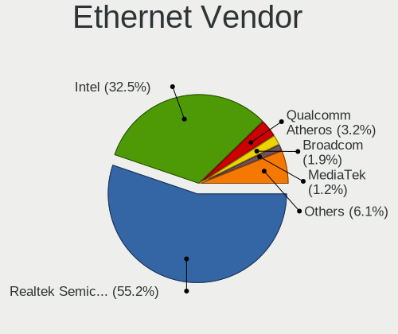

| Vendor                   | Desktops | Percent |
|--------------------------|----------|---------|
| Realtek Semiconductor    | 312      | 57.35%  |
| Intel                    | 172      | 31.62%  |
| Qualcomm Atheros         | 17       | 3.13%   |
| Broadcom                 | 11       | 2.02%   |
| Marvell Technology Group | 6        | 1.1%    |
| Aquantia                 | 5        | 0.92%   |
| Xiaomi                   | 3        | 0.55%   |
| Mellanox Technologies    | 3        | 0.55%   |
| Nvidia                   | 2        | 0.37%   |
| Google                   | 2        | 0.37%   |
| D-Link System            | 2        | 0.37%   |
| Samsung Electronics      | 1        | 0.18%   |
| Qualcomm                 | 1        | 0.18%   |
| Motorola PCS             | 1        | 0.18%   |
| MediaTek                 | 1        | 0.18%   |
| Lenovo                   | 1        | 0.18%   |
| Huawei Technologies      | 1        | 0.18%   |
| DisplayLink              | 1        | 0.18%   |
| Apple                    | 1        | 0.18%   |
| 3Com                     | 1        | 0.18%   |

Ethernet Model
--------------

Ethernet models

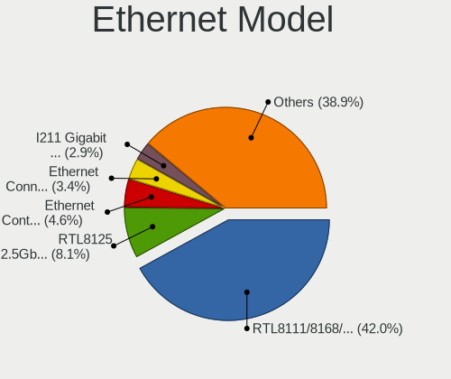

| Model                                                                         | Desktops | Percent |
|-------------------------------------------------------------------------------|----------|---------|
| Realtek RTL8111/8168/8411 PCI Express Gigabit Ethernet Controller             | 245      | 43.91%  |
| Realtek RTL8125 2.5GbE Controller                                             | 47       | 8.42%   |
| Intel Ethernet Controller I225-V                                              | 27       | 4.84%   |
| Intel I211 Gigabit Network Connection                                         | 18       | 3.23%   |
| Intel Ethernet Connection I217-LM                                             | 17       | 3.05%   |
| Intel Ethernet Connection (2) I219-V                                          | 15       | 2.69%   |
| Intel 82579LM Gigabit Network Connection (Lewisville)                         | 14       | 2.51%   |
| Realtek RTL810xE PCI Express Fast Ethernet controller                         | 11       | 1.97%   |
| Intel 82579V Gigabit Network Connection                                       | 9        | 1.61%   |
| Qualcomm Atheros AR8151 v2.0 Gigabit Ethernet                                 | 7        | 1.25%   |
| Intel I210 Gigabit Network Connection                                         | 7        | 1.25%   |
| Intel Ethernet Connection (7) I219-V                                          | 7        | 1.25%   |
| Intel Ethernet Connection (17) I219-V                                         | 7        | 1.25%   |
| Qualcomm Atheros Killer E220x Gigabit Ethernet Controller                     | 6        | 1.08%   |
| Intel Ethernet Connection (7) I219-LM                                         | 6        | 1.08%   |
| Intel Ethernet Connection (2) I218-V                                          | 6        | 1.08%   |
| Intel Ethernet Connection I217-V                                              | 5        | 0.9%    |
| Intel Ethernet Connection (2) I219-LM                                         | 5        | 0.9%    |
| Intel Ethernet Connection (5) I219-LM                                         | 4        | 0.72%   |
| Intel 82574L Gigabit Network Connection                                       | 4        | 0.72%   |
| Aquantia AQC107 NBase-T/IEEE 802.3bz Ethernet Controller [AQtion]             | 4        | 0.72%   |
| Realtek RTL8153 Gigabit Ethernet Adapter                                      | 3        | 0.54%   |
| Realtek Killer E3000 2.5GbE Controller                                        | 3        | 0.54%   |
| Intel Ethernet Controller I226-V                                              | 3        | 0.54%   |
| Intel Ethernet Connection (14) I219-V                                         | 3        | 0.54%   |
| Intel 82599ES 10-Gigabit SFI/SFP+ Network Connection                          | 3        | 0.54%   |
| Intel 82567LM-3 Gigabit Network Connection                                    | 3        | 0.54%   |
| Broadcom NetXtreme BCM5764M Gigabit Ethernet PCIe                             | 3        | 0.54%   |
| Xiaomi Mi/Redmi series (RNDIS)                                                | 2        | 0.36%   |
| Realtek Killer E2600 Gigabit Ethernet Controller                              | 2        | 0.36%   |
| Mellanox MT26448 [ConnectX EN 10GigE, PCIe 2.0 5GT/s]                         | 2        | 0.36%   |
| Marvell Group 88E8057 PCI-E Gigabit Ethernet Controller                       | 2        | 0.36%   |
| Marvell Group 88E8056 PCI-E Gigabit Ethernet Controller                       | 2        | 0.36%   |
| Intel Ethernet Controller X550                                                | 2        | 0.36%   |
| Intel Ethernet Connection (2) I218-LM                                         | 2        | 0.36%   |
| Intel 82571EB/82571GB Gigabit Ethernet Controller D0/D1 (copper applications) | 2        | 0.36%   |
| D-Link System DGE-528T Gigabit Ethernet Adapter                               | 2        | 0.36%   |
| Broadcom NetXtreme BCM5761 Gigabit Ethernet PCIe                              | 2        | 0.36%   |
| Broadcom NetXtreme BCM5720 Gigabit Ethernet PCIe                              | 2        | 0.36%   |
| Xiaomi Mi/Redmi series (RNDIS + ADB)                                          | 1        | 0.18%   |

Net Controller Kind
-------------------

Ethernet, WiFi or modem

| Kind     | Desktops | Percent |
|----------|----------|---------|
| Ethernet | 504      | 64.45%  |
| WiFi     | 272      | 34.78%  |
| Modem    | 6        | 0.77%   |

Used Controller
---------------

Currently used network controller

| Kind     | Desktops | Percent |
|----------|----------|---------|
| Ethernet | 388      | 72.52%  |
| WiFi     | 147      | 27.48%  |

NICs
----

Total network controllers on board

| Total | Desktops | Percent |
|-------|----------|---------|
| 1     | 299      | 58.4%   |
| 2     | 170      | 33.2%   |
| 3     | 34       | 6.64%   |
| 0     | 5        | 0.98%   |
| 5     | 2        | 0.39%   |
| 6     | 1        | 0.2%    |
| 4     | 1        | 0.2%    |

IPv6
----

IPv6 vs IPv4

| Used | Desktops | Percent |
|------|----------|---------|
| No   | 330      | 64.08%  |
| Yes  | 185      | 35.92%  |

Bluetooth
---------

Bluetooth Vendor
----------------

Controller vendors

| Vendor                          | Desktops | Percent |
|---------------------------------|----------|---------|
| Intel                           | 83       | 36.73%  |
| Cambridge Silicon Radio         | 36       | 15.93%  |
| Realtek Semiconductor           | 26       | 11.5%   |
| MediaTek                        | 19       | 8.41%   |
| IMC Networks                    | 12       | 5.31%   |
| ASUSTek Computer                | 11       | 4.87%   |
| TP-Link                         | 7        | 3.1%    |
| Broadcom                        | 7        | 3.1%    |
| Foxconn / Hon Hai               | 5        | 2.21%   |
| Apple                           | 5        | 2.21%   |
| Qualcomm Atheros Communications | 4        | 1.77%   |
| Realtek                         | 2        | 0.88%   |
| Lite-On Technology              | 2        | 0.88%   |
| Logitech                        | 1        | 0.44%   |
| Integrated System Solution      | 1        | 0.44%   |
| HTC (High Tech Computer)        | 1        | 0.44%   |
| Fujitsu                         | 1        | 0.44%   |
| Edimax Technology               | 1        | 0.44%   |
| Dynex                           | 1        | 0.44%   |
| Belkin Components               | 1        | 0.44%   |

Bluetooth Model
---------------

Controller models

| Model                                                                | Desktops | Percent |
|----------------------------------------------------------------------|----------|---------|
| Cambridge Silicon Radio Bluetooth Dongle (HCI mode)                  | 36       | 15.86%  |
| Realtek Bluetooth Radio                                              | 21       | 9.25%   |
| Intel Bluetooth Device                                               | 20       | 8.81%   |
| Intel AX200 Bluetooth                                                | 20       | 8.81%   |
| MediaTek Wireless_Device                                             | 19       | 8.37%   |
| Intel AX210 Bluetooth                                                | 16       | 7.05%   |
| Intel Bluetooth wireless interface                                   | 12       | 5.29%   |
| IMC Networks Bluetooth Radio                                         | 8        | 3.52%   |
| TP-Link UB500 Adapter                                                | 7        | 3.08%   |
| Intel Wireless-AC 3168 Bluetooth                                     | 7        | 3.08%   |
| Intel Bluetooth 9460/9560 Jefferson Peak (JfP)                       | 5        | 2.2%    |
| ASUS Broadcom BCM20702A0 Bluetooth                                   | 5        | 2.2%    |
| Intel Wireless-AC 9260 Bluetooth Adapter                             | 4        | 1.76%   |
| Foxconn / Hon Hai Wireless_Device                                    | 4        | 1.76%   |
| Apple Bluetooth USB Host Controller                                  | 4        | 1.76%   |
| Realtek  Bluetooth 4.2 Adapter                                       | 3        | 1.32%   |
| IMC Networks Wireless_Device                                         | 3        | 1.32%   |
| Broadcom BCM20702A0 Bluetooth 4.0                                    | 3        | 1.32%   |
| ASUS Bluetooth Device                                                | 3        | 1.32%   |
| Realtek Bluetooth Radio                                              | 2        | 0.88%   |
| Qualcomm Atheros  Bluetooth Device                                   | 2        | 0.88%   |
| Realtek RTL8723B Bluetooth                                           | 1        | 0.44%   |
| Realtek Bluetooth 5.1 Radio                                          | 1        | 0.44%   |
| Qualcomm Atheros Bluetooth USB Host Controller                       | 1        | 0.44%   |
| Qualcomm Atheros AR3011 Bluetooth                                    | 1        | 0.44%   |
| Logitech BT Mini-Receiver (HCI mode)                                 | 1        | 0.44%   |
| Lite-On Qualcomm Atheros QCA9377 Bluetooth                           | 1        | 0.44%   |
| Lite-On Bluetooth Device                                             | 1        | 0.44%   |
| Integrated System Solution KY-BT100 Bluetooth Adapter                | 1        | 0.44%   |
| IMC Networks BCM20702A0                                              | 1        | 0.44%   |
| HTC (High Tech Computer) Vive Hub Bluetooth 4.1 (Broadcom BCM920703) | 1        | 0.44%   |
| Fujitsu Bluetooth Device                                             | 1        | 0.44%   |
| Foxconn / Hon Hai Bluetooth Device                                   | 1        | 0.44%   |
| Edimax EW-7611ULB 802.11b/g/n and Bluetooth 4.0 Adapter              | 1        | 0.44%   |
| Dynex Bluetooth 4.0 Adapter [Broadcom, 1.12, BCM20702A0]             | 1        | 0.44%   |
| Broadcom HP Bluethunder                                              | 1        | 0.44%   |
| Broadcom BCM92046DG-CL1ROM Bluetooth 2.1 Adapter                     | 1        | 0.44%   |
| Broadcom BCM43142 Bluetooth 4.0                                      | 1        | 0.44%   |
| Broadcom BCM20702A0                                                  | 1        | 0.44%   |
| Belkin Components F8T065BF Mini Bluetooth 4.0 Adapter                | 1        | 0.44%   |

Sound
-----

Sound Vendor
------------

Sound card vendors

| Vendor                                          | Desktops | Percent |
|-------------------------------------------------|----------|---------|
| Intel                                           | 325      | 36.76%  |
| AMD                                             | 218      | 24.66%  |
| Nvidia                                          | 194      | 21.95%  |
| C-Media Electronics                             | 26       | 2.94%   |
| Logitech                                        | 16       | 1.81%   |
| ASUSTek Computer                                | 15       | 1.7%    |
| Texas Instruments                               | 6        | 0.68%   |
| Micro Star International                        | 6        | 0.68%   |
| Kingston Technology                             | 5        | 0.57%   |
| Razer USA                                       | 4        | 0.45%   |
| GN Netcom                                       | 4        | 0.45%   |
| Creative Labs                                   | 4        | 0.45%   |
| VIA Technologies                                | 3        | 0.34%   |
| Sony                                            | 3        | 0.34%   |
| KORG                                            | 3        | 0.34%   |
| JMTek                                           | 3        | 0.34%   |
| Zoran Co. Personal Media Division (Nogatech)    | 2        | 0.23%   |
| SteelSeries ApS                                 | 2        | 0.23%   |
| Samson Technologies                             | 2        | 0.23%   |
| PreSonus Audio Electronics                      | 2        | 0.23%   |
| Native Instruments                              | 2        | 0.23%   |
| Licensed by Sony Computer Entertainment America | 2        | 0.23%   |
| Lenovo                                          | 2        | 0.23%   |
| Jieli Technology                                | 2        | 0.23%   |
| Giga-Byte Technology                            | 2        | 0.23%   |
| Generalplus Technology                          | 2        | 0.23%   |
| Focusrite-Novation                              | 2        | 0.23%   |
| Creative Technology                             | 2        | 0.23%   |
| BEHRINGER International                         | 2        | 0.23%   |
| Yamaha                                          | 1        | 0.11%   |
| USB Audio                                       | 1        | 0.11%   |
| Turtle Beach                                    | 1        | 0.11%   |
| Thesycon Systemsoftware & Consulting            | 1        | 0.11%   |
| Tenx Technology                                 | 1        | 0.11%   |
| ROCCAT                                          | 1        | 0.11%   |
| Realtek Semiconductor                           | 1        | 0.11%   |
| Plantronics                                     | 1        | 0.11%   |
| Nektar                                          | 1        | 0.11%   |
| Microdia                                        | 1        | 0.11%   |
| JBL                                             | 1        | 0.11%   |

Sound Model
-----------

Sound card models

| Model                                                                      | Desktops | Percent |
|----------------------------------------------------------------------------|----------|---------|
| AMD Family 17h/19h HD Audio Controller                                     | 60       | 5.63%   |
| Intel 8 Series/C220 Series Chipset High Definition Audio Controller        | 44       | 4.13%   |
| AMD Starship/Matisse HD Audio Controller                                   | 44       | 4.13%   |
| Intel 6 Series/C200 Series Chipset Family High Definition Audio Controller | 42       | 3.94%   |
| Intel Xeon E3-1200 v3/4th Gen Core Processor HD Audio Controller           | 39       | 3.66%   |
| AMD Rembrandt Radeon High Definition Audio Controller                      | 30       | 2.81%   |
| Intel 100 Series/C230 Series Chipset Family HD Audio Controller            | 29       | 2.72%   |
| Intel 200 Series PCH HD Audio                                              | 26       | 2.44%   |
| AMD Renoir Radeon High Definition Audio Controller                         | 25       | 2.35%   |
| AMD Ellesmere HDMI Audio [Radeon RX 470/480 / 570/580/590]                 | 25       | 2.35%   |
| Intel Alder Lake-S HD Audio Controller                                     | 23       | 2.16%   |
| Intel 7 Series/C216 Chipset Family High Definition Audio Controller        | 23       | 2.16%   |
| AMD SBx00 Azalia (Intel HDA)                                               | 23       | 2.16%   |
| AMD Navi 21/23 HDMI/DP Audio Controller                                    | 21       | 1.97%   |
| Intel Cannon Lake PCH cAVS                                                 | 19       | 1.78%   |
| Nvidia GP107GL High Definition Audio Controller                            | 17       | 1.59%   |
| Nvidia GK208 HDMI/DP Audio Controller                                      | 17       | 1.59%   |
| AMD FCH Azalia Controller                                                  | 16       | 1.5%    |
| AMD Family 17h (Models 00h-0fh) HD Audio Controller                        | 16       | 1.5%    |
| Intel 9 Series Chipset Family HD Audio Controller                          | 15       | 1.41%   |
| Nvidia GA104 High Definition Audio Controller                              | 14       | 1.31%   |
| ASUSTek Computer USB Audio                                                 | 14       | 1.31%   |
| Intel NM10/ICH7 Family High Definition Audio Controller                    | 13       | 1.22%   |
| Intel 82801JI (ICH10 Family) HD Audio Controller                           | 13       | 1.22%   |
| Nvidia GA106 High Definition Audio Controller                              | 12       | 1.13%   |
| Intel C610/X99 series chipset HD Audio Controller                          | 12       | 1.13%   |
| Nvidia TU116 High Definition Audio Controller                              | 11       | 1.03%   |
| Nvidia GP104 High Definition Audio Controller                              | 11       | 1.03%   |
| Nvidia GK107 HDMI Audio Controller                                         | 10       | 0.94%   |
| Nvidia GA102 High Definition Audio Controller                              | 10       | 0.94%   |
| Intel 700 Series Chipset Family Precise Touch and Stylus Port #1           | 10       | 0.94%   |
| AMD Baffin HDMI/DP Audio [Radeon RX 550 640SP / RX 560/560X]               | 10       | 0.94%   |
| Nvidia GM204 High Definition Audio Controller                              | 9        | 0.84%   |
| Intel Tiger Lake-H HD Audio Controller                                     | 9        | 0.84%   |
| AMD Trinity HDMI Audio Controller                                          | 9        | 0.84%   |
| Nvidia Audio device                                                        | 8        | 0.75%   |
| AMD Raven/Raven2/Fenghuang HDMI/DP Audio Controller                        | 8        | 0.75%   |
| AMD Oland/Hainan/Cape Verde/Pitcairn HDMI Audio [Radeon HD 7000 Series]    | 8        | 0.75%   |
| AMD Navi 10 HDMI Audio                                                     | 8        | 0.75%   |
| Nvidia High Definition Audio Controller                                    | 7        | 0.66%   |

Memory
------

Memory Vendor
-------------

Memory module vendors

| Vendor                               | Desktops | Percent |
|--------------------------------------|----------|---------|
| Kingston                             | 44       | 19.21%  |
| Corsair                              | 31       | 13.54%  |
| Samsung Electronics                  | 24       | 10.48%  |
| Unknown                              | 21       | 9.17%   |
| G.Skill                              | 21       | 9.17%   |
| Crucial                              | 18       | 7.86%   |
| SK hynix                             | 13       | 5.68%   |
| Micron Technology                    | 12       | 5.24%   |
| A-DATA Technology                    | 7        | 3.06%   |
| Team                                 | 5        | 2.18%   |
| Patriot                              | 3        | 1.31%   |
| Unknown                              | 3        | 1.31%   |
| Wodposit                             | 2        | 0.87%   |
| Transcend                            | 2        | 0.87%   |
| Ramaxel Technology                   | 2        | 0.87%   |
| Patriot Memory                       | 2        | 0.87%   |
| Nanya Technology                     | 2        | 0.87%   |
| GOODRAM                              | 2        | 0.87%   |
| Elpida                               | 2        | 0.87%   |
| Unknown (ABCD)                       | 1        | 0.44%   |
| Unknown (AB)                         | 1        | 0.44%   |
| Unknown (0x9801)                     | 1        | 0.44%   |
| Unknown (0x0C26)                     | 1        | 0.44%   |
| Unknown (0B85)                       | 1        | 0.44%   |
| Unifosa                              | 1        | 0.44%   |
| Sesame                               | 1        | 0.44%   |
| Lexar                                | 1        | 0.44%   |
| Juhor                                | 1        | 0.44%   |
| Hewlett-Packard                      | 1        | 0.44%   |
| Chun Well Technology Holding Limited | 1        | 0.44%   |
| Atermiter                            | 1        | 0.44%   |
| ASint Technology                     | 1        | 0.44%   |

Memory Model
------------

Memory module models

| Model                                                     | Desktops | Percent |
|-----------------------------------------------------------|----------|---------|
| Kingston RAM KF3200C16D4/16GX 16GB DIMM DDR4 3200MT/s     | 4        | 1.65%   |
| G.Skill RAM F4-3200C16-8GVKB 8GB DIMM DDR4 3866MT/s       | 4        | 1.65%   |
| Kingston RAM KF556C40-32 32GB DIMM DDR5 5808MT/s          | 3        | 1.24%   |
| Corsair RAM CMK16GX4M2B3200C16 8GB DIMM DDR4 3600MT/s     | 3        | 1.24%   |
| Unknown                                                   | 3        | 1.24%   |
| Unknown RAM Module 4GB DIMM DDR3 1600MT/s                 | 2        | 0.83%   |
| Unknown RAM Module 4GB DIMM 1333MT/s                      | 2        | 0.83%   |
| Unknown RAM Module 2GB DIMM SDRAM 800MT/s                 | 2        | 0.83%   |
| Samsung RAM Module 8GB DIMM DDR4 2400MT/s                 | 2        | 0.83%   |
| Patriot Memory RAM 3200 C16 Series 4GB DIMM DDR4 3200MT/s | 2        | 0.83%   |
| Kingston RAM KHX2400C11D3/4GX 4GB DIMM DDR3 2400MT/s      | 2        | 0.83%   |
| Kingston RAM KHX1600C10D3/8G 8GB DIMM DDR3 1648MT/s       | 2        | 0.83%   |
| Kingston RAM KF560C36-16 16GB DIMM DDR5 6000MT/s          | 2        | 0.83%   |
| G.Skill RAM F5-6000J3636F16G 16GB DIMM 6400MT/s           | 2        | 0.83%   |
| G.Skill RAM F5-6000J3040G32G 32GB DIMM DDR5 6000MT/s      | 2        | 0.83%   |
| G.Skill RAM F4-3600C19-16GVRB 16GB DIMM DDR4 3600MT/s     | 2        | 0.83%   |
| G.Skill RAM F3-1600C11-8GNT 8GB DIMM DDR3 1600MT/s        | 2        | 0.83%   |
| Corsair RAM CMV4GX3M1A1333C9 4GB DIMM DDR3 1600MT/s       | 2        | 0.83%   |
| Corsair RAM CMK32GX4M2B3200C16 16GB DIMM DDR4 3400MT/s    | 2        | 0.83%   |
| A-DATA RAM Module 16GB DIMM DDR4 3200MT/s                 | 2        | 0.83%   |
| A-DATA RAM DDR4 3200 8GB DIMM DDR4 3600MT/s               | 2        | 0.83%   |
| Wodposit RAM WPBH32D408SWM-16G 16GB SODIMM DDR4 3200MT/s  | 1        | 0.41%   |
| Wodposit RAM WPBH26D416SXA-8G 8GB SODIMM DDR4 2667MT/s    | 1        | 0.41%   |
| Unknown RAM Module 8GB DIMM SDRAM                         | 1        | 0.41%   |
| Unknown RAM Module 8GB DIMM DDR4 2400MT/s                 | 1        | 0.41%   |
| Unknown RAM Module 8GB DIMM 1333MT/s                      | 1        | 0.41%   |
| Unknown RAM Module 8GB DIMM                               | 1        | 0.41%   |
| Unknown RAM Module 4GB DIMM SDRAM                         | 1        | 0.41%   |
| Unknown RAM Module 4GB DIMM DDR3 1333MT/s                 | 1        | 0.41%   |
| Unknown RAM Module 4GB DIMM 400MT/s                       | 1        | 0.41%   |
| Unknown RAM Module 32GB DIMM DDR4 2400MT/s                | 1        | 0.41%   |
| Unknown RAM Module 2GB DIMM SDRAM 667MT/s                 | 1        | 0.41%   |
| Unknown RAM Module 2GB DIMM DDR2                          | 1        | 0.41%   |
| Unknown RAM Module 2GB DIMM DDR 533MT/s                   | 1        | 0.41%   |
| Unknown RAM Module 2GB DIMM 1333MT/s                      | 1        | 0.41%   |
| Unknown RAM Module 1GB DIMM SDRAM 800MT/s                 | 1        | 0.41%   |
| Unknown RAM Module 1GB DIMM DDR2 800MT/s                  | 1        | 0.41%   |
| Unknown RAM Module 1GB DIMM DDR2 667MT/s                  | 1        | 0.41%   |
| Unknown RAM Module 1GB DIMM                               | 1        | 0.41%   |
| Unknown RAM DDR4 16GB 2666MHz 16GB SODIMM DDR4 2667MT/s   | 1        | 0.41%   |

Memory Kind
-----------

Memory module kinds

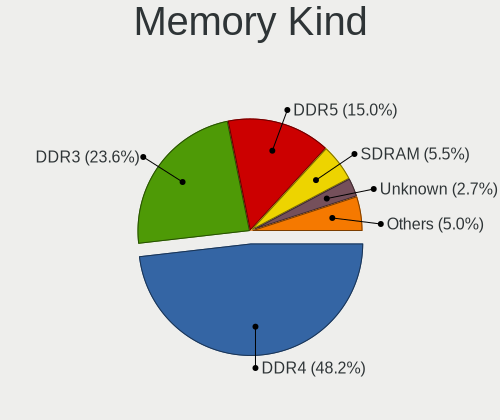

| Kind    | Desktops | Percent |
|---------|----------|---------|
| DDR4    | 99       | 47.6%   |
| DDR3    | 51       | 24.52%  |
| DDR5    | 32       | 15.38%  |
| SDRAM   | 12       | 5.77%   |
| Unknown | 6        | 2.88%   |
| DDR2    | 3        | 1.44%   |
| DDR     | 2        | 0.96%   |
| LPDDR5  | 1        | 0.48%   |
| LPDDR4  | 1        | 0.48%   |
| LPDDR3  | 1        | 0.48%   |

Memory Form Factor
------------------

Physical design of the memory module

| Name         | Desktops | Percent |
|--------------|----------|---------|
| DIMM         | 184      | 90.64%  |
| SODIMM       | 18       | 8.87%   |
| Row Of Chips | 1        | 0.49%   |

Memory Size
-----------

Memory module size

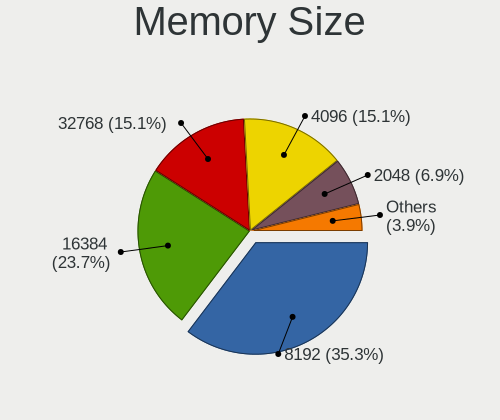

| Size  | Desktops | Percent |
|-------|----------|---------|
| 8192  | 78       | 35.62%  |
| 16384 | 48       | 21.92%  |
| 4096  | 36       | 16.44%  |
| 32768 | 34       | 15.53%  |
| 2048  | 15       | 6.85%   |
| 1024  | 6        | 2.74%   |
| 49152 | 1        | 0.46%   |
| 512   | 1        | 0.46%   |

Memory Speed
------------

Memory module speed

| Speed   | Desktops | Percent |
|---------|----------|---------|
| 1600    | 34       | 15.45%  |
| 3200    | 26       | 11.82%  |
| 2400    | 20       | 9.09%   |
| 3600    | 16       | 7.27%   |
| 1333    | 12       | 5.45%   |
| 4800    | 10       | 4.55%   |
| 2667    | 9        | 4.09%   |
| 2133    | 9        | 4.09%   |
| 6000    | 7        | 3.18%   |
| Unknown | 6        | 2.73%   |
| 6400    | 4        | 1.82%   |
| 5200    | 4        | 1.82%   |
| 3866    | 4        | 1.82%   |
| 3733    | 4        | 1.82%   |
| 1867    | 4        | 1.82%   |
| 800     | 4        | 1.82%   |
| 5808    | 3        | 1.36%   |
| 5600    | 3        | 1.36%   |
| 3400    | 3        | 1.36%   |
| 2933    | 3        | 1.36%   |
| 2666    | 3        | 1.36%   |
| 3800    | 2        | 0.91%   |
| 3666    | 2        | 0.91%   |
| 3466    | 2        | 0.91%   |
| 2048    | 2        | 0.91%   |
| 1866    | 2        | 0.91%   |
| 1800    | 2        | 0.91%   |
| 667     | 2        | 0.91%   |
| 400     | 2        | 0.91%   |
| 6800    | 1        | 0.45%   |
| 5800    | 1        | 0.45%   |
| 4199    | 1        | 0.45%   |
| 3933    | 1        | 0.45%   |
| 3534    | 1        | 0.45%   |
| 3533    | 1        | 0.45%   |
| 3334    | 1        | 0.45%   |
| 3266    | 1        | 0.45%   |
| 3066    | 1        | 0.45%   |
| 2800    | 1        | 0.45%   |
| 2176    | 1        | 0.45%   |

Printers & scanners
-------------------

Printer Vendor
--------------

Printer device vendors

| Vendor                | Desktops | Percent |
|-----------------------|----------|---------|
| Brother Industries    | 8        | 27.59%  |
| Seiko Epson           | 6        | 20.69%  |
| Hewlett-Packard       | 5        | 17.24%  |
| Samsung Electronics   | 4        | 13.79%  |
| Canon                 | 2        | 6.9%    |
| QinHeng Electronics   | 1        | 3.45%   |
| Pantum                | 1        | 3.45%   |
| Lexmark International | 1        | 3.45%   |
| Dymo-CoStar           | 1        | 3.45%   |

Printer Model
-------------

Printer device models

| Model                                        | Desktops | Percent |
|----------------------------------------------|----------|---------|
| Seiko Epson XP-2200 Series                   | 1        | 3.45%   |
| Seiko Epson ME 320/330 Series [Stylus SX125] | 1        | 3.45%   |
| Seiko Epson L6160 Series                     | 1        | 3.45%   |
| Seiko Epson ET-8550 Series                   | 1        | 3.45%   |
| Seiko Epson ET-2820 Series                   | 1        | 3.45%   |
| Seiko Epson ET-2810 Series                   | 1        | 3.45%   |
| Samsung SCX-4623 Series                      | 1        | 3.45%   |
| Samsung SCX-3400 Series                      | 1        | 3.45%   |
| Samsung M2020 Series                         | 1        | 3.45%   |
| Samsung CLX-3170 Series                      | 1        | 3.45%   |
| QinHeng CH340S                               | 1        | 3.45%   |
| Pantum P2200 series                          | 1        | 3.45%   |
| Lexmark International MC3326adwe             | 1        | 3.45%   |
| HP OfficeJet 5200 series                     | 1        | 3.45%   |
| HP LaserJet P2055 series                     | 1        | 3.45%   |
| HP DeskJet 960c                              | 1        | 3.45%   |
| HP ColorLaserJet M253-M254                   | 1        | 3.45%   |
| HP Color LaserJet Pro M453-4                 | 1        | 3.45%   |
| Dymo-CoStar DYMO LabelWriter 4XL             | 1        | 3.45%   |
| Canon TR4500 series                          | 1        | 3.45%   |
| Canon iP7200 series                          | 1        | 3.45%   |
| Brother MFC-J6530DW                          | 1        | 3.45%   |
| Brother MFC-J1010DW                          | 1        | 3.45%   |
| Brother MFC-9330CDW                          | 1        | 3.45%   |
| Brother HL-L5000D series                     | 1        | 3.45%   |
| Brother HL-52x0 series                       | 1        | 3.45%   |
| Brother HL-2030 Laser Printer                | 1        | 3.45%   |
| Brother DCP-7055W                            | 1        | 3.45%   |
| Brother DCP-1610W                            | 1        | 3.45%   |

Scanner Vendor
--------------

Scanner device vendors

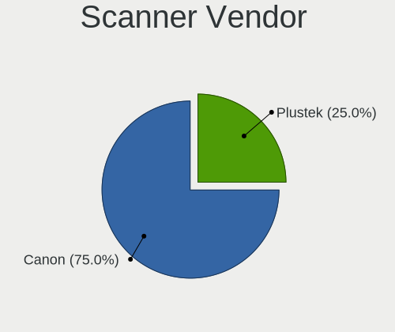

| Vendor  | Desktops | Percent |
|---------|----------|---------|
| Canon   | 3        | 75%     |
| Plustek | 1        | 25%     |

Scanner Model
-------------

Scanner device models

| Model                              | Desktops | Percent |
|------------------------------------|----------|---------|
| Canon CanoScan LiDE 100            | 2        | 50%     |
| Plustek 600dpi USB Scanner         | 1        | 25%     |
| Canon CanoScan N670U/N676U/LiDE 20 | 1        | 25%     |

Camera
------

Camera Vendor
-------------

Camera device vendors

| Vendor                              | Desktops | Percent |
|-------------------------------------|----------|---------|
| Logitech                            | 35       | 37.23%  |
| Sunplus Innovation Technology       | 6        | 6.38%   |
| Microsoft                           | 6        | 6.38%   |
| Apple                               | 5        | 5.32%   |
| Samsung Electronics                 | 4        | 4.26%   |
| Microdia                            | 4        | 4.26%   |
| Z-Star Microelectronics             | 3        | 3.19%   |
| Razer USA                           | 3        | 3.19%   |
| Generalplus Technology              | 3        | 3.19%   |
| ARC International                   | 3        | 3.19%   |
| Trust                               | 2        | 2.13%   |
| YT-221117-J                         | 1        | 1.06%   |
| WCM_USB                             | 1        | 1.06%   |
| WaveRider Communications            | 1        | 1.06%   |
| SunplusIT                           | 1        | 1.06%   |
| Sonix Technology                    | 1        | 1.06%   |
| Pixart Imaging                      | 1        | 1.06%   |
| MacroSilicon                        | 1        | 1.06%   |
| Lite-On Technology                  | 1        | 1.06%   |
| KYE Systems (Mouse Systems)         | 1        | 1.06%   |
| Hewlett-Packard                     | 1        | 1.06%   |
| Hauppauge                           | 1        | 1.06%   |
| Genesys Logic                       | 1        | 1.06%   |
| Fuzhou Rockchip Electronics Company | 1        | 1.06%   |
| eMeet                               | 1        | 1.06%   |
| Creality 3D Technology              | 1        | 1.06%   |
| Chicony Electronics                 | 1        | 1.06%   |
| AVerMedia Technologies              | 1        | 1.06%   |
| Arkmicro Technologies               | 1        | 1.06%   |
| Anchor Chips                        | 1        | 1.06%   |
| Unknown                             | 1        | 1.06%   |

Camera Model
------------

Camera device models

| Model                                   | Desktops | Percent |
|-----------------------------------------|----------|---------|
| Logitech Webcam C270                    | 10       | 10.53%  |
| Samsung Galaxy series, misc. (MTP mode) | 4        | 4.21%   |
| Logitech HD Pro Webcam C920             | 4        | 4.21%   |
| Apple iPhone 5/5C/5S/6/SE               | 4        | 4.21%   |
| Microsoft LifeCam HD-3000               | 3        | 3.16%   |
| Logitech BRIO Ultra HD Webcam           | 3        | 3.16%   |
| Sunplus Integrated_Webcam_HD            | 2        | 2.11%   |
| Razer USA Gaming Webcam [Kiyo]          | 2        | 2.11%   |
| Logitech HD Webcam C510                 | 2        | 2.11%   |
| Generalplus GENERAL WEBCAM              | 2        | 2.11%   |
| ARC International Camera                | 2        | 2.11%   |
| Z-Star USB 2.0 Web Camera               | 1        | 1.05%   |
| Z-Star Lenovo USB 2.0 UVC Camera        | 1        | 1.05%   |
| Z-Star A4 TECH USB2.0 PC Camera E       | 1        | 1.05%   |
| YT-221117-J USB2.0 Camera               | 1        | 1.05%   |
| WCM_USB WEB CAM                         | 1        | 1.05%   |
| WaveRider USB 2.0 Camera                | 1        | 1.05%   |
| Trust Widescreen 3MP Webcam             | 1        | 1.05%   |
| Trust USB Camera                        | 1        | 1.05%   |
| SunplusIT USB 2.0 Camera                | 1        | 1.05%   |
| Sunplus ZET USB WEBCAM                  | 1        | 1.05%   |
| Sunplus WEBCAM ESSENTIELB W1            | 1        | 1.05%   |
| Sunplus iContact Camera                 | 1        | 1.05%   |
| Sunplus Full HD webcam                  | 1        | 1.05%   |
| Sonix FHD Webcam                        | 1        | 1.05%   |
| Razer USA Razer Kiyo Pro                | 1        | 1.05%   |
| Pixart Imaging GE 1.3 MP MiniCam Pro    | 1        | 1.05%   |
| Microsoft Microsoft LifeCam Studio    | 1        | 1.05%   |
| Microsoft LifeCam NX-6000               | 1        | 1.05%   |
| Microsoft LifeCam HD-5000               | 1        | 1.05%   |
| Microdia Sonix USB 2.0 Camera           | 1        | 1.05%   |
| Microdia Laptop_Integrated_Webcam_HD    | 1        | 1.05%   |
| Microdia HP Integrated Webcam           | 1        | 1.05%   |
| Microdia Camera                         | 1        | 1.05%   |
| MacroSilicon USB3. 0 capture            | 1        | 1.05%   |
| Logitech Webcam Pro 9000                | 1        | 1.05%   |
| Logitech Webcam C930e                   | 1        | 1.05%   |
| Logitech Webcam C300                    | 1        | 1.05%   |
| Logitech Webcam C250                    | 1        | 1.05%   |
| Logitech Webcam C210                    | 1        | 1.05%   |

Security
--------

Fingerprint Vendor
------------------

Fingerprint sensor vendors

| Vendor                | Desktops | Percent |
|-----------------------|----------|---------|
| LighTuning Technology | 1        | 100%    |

Fingerprint Model
-----------------

Fingerprint sensor models

| Model                         | Desktops | Percent |
|-------------------------------|----------|---------|
| LighTuning Fingerprint Sensor | 1        | 100%    |

Chipcard Vendor
---------------

Chipcard module vendors

| Vendor                | Desktops | Percent |
|-----------------------|----------|---------|
| Realtek Semiconductor | 1        | 100%    |

Chipcard Model
--------------

Chipcard module models

| Model                                             | Desktops | Percent |
|---------------------------------------------------|----------|---------|
| Realtek Semiconductor Smart Card Reader Interface | 1        | 100%    |

Unsupported
-----------

Unsupported Devices
-------------------

Total unsupported devices on board

| Total | Desktops | Percent |
|-------|----------|---------|
| 0     | 440      | 85.27%  |
| 1     | 63       | 12.21%  |
| 2     | 10       | 1.94%   |
| 6     | 1        | 0.19%   |
| 5     | 1        | 0.19%   |
| 3     | 1        | 0.19%   |

Unsupported Device Types
------------------------

Types of unsupported devices

| Type                     | Desktops | Percent |
|--------------------------|----------|---------|
| Graphics card            | 31       | 36.47%  |
| Unassigned class         | 14       | 16.47%  |
| Communication controller | 13       | 15.29%  |
| Net/wireless             | 12       | 14.12%  |
| Sound                    | 5        | 5.88%   |
| Camera                   | 3        | 3.53%   |
| Bluetooth                | 3        | 3.53%   |
| Multimedia controller    | 2        | 2.35%   |
| Fingerprint reader       | 1        | 1.18%   |
| Chipcard                 | 1        | 1.18%   |

