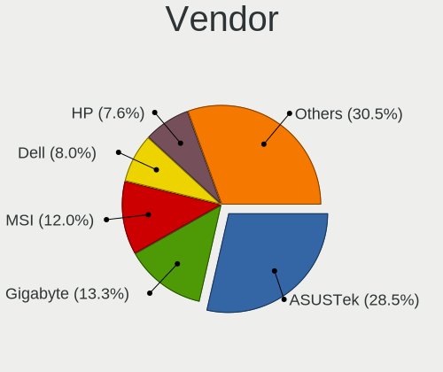
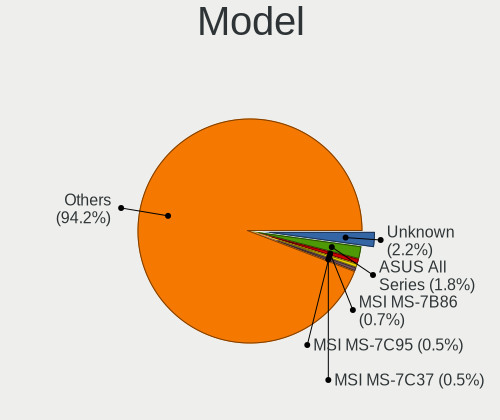
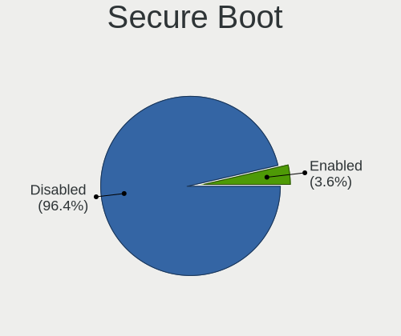
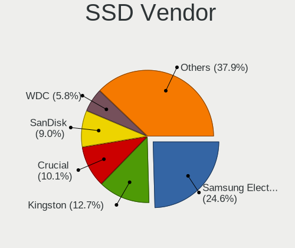
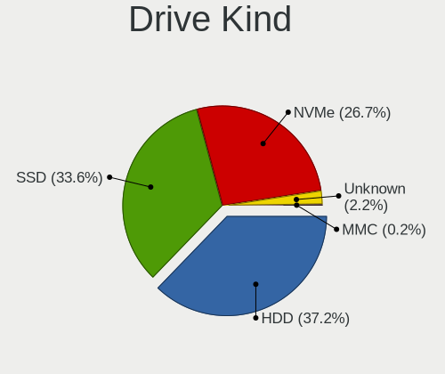
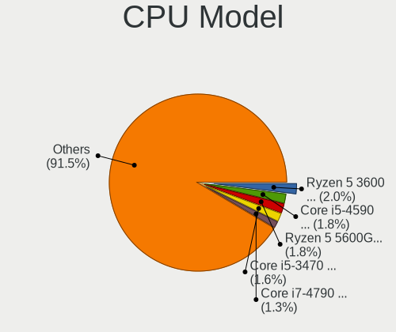
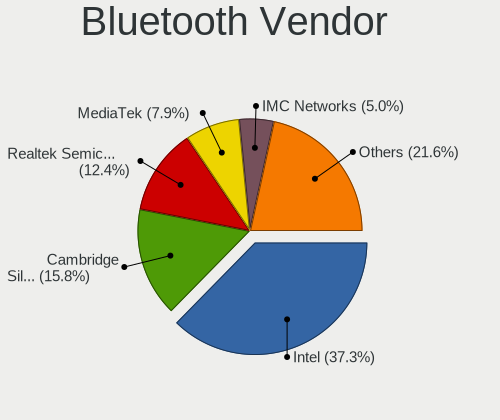

Ubuntu 23.04 - Tested Hardware & Statistics (Desktops)
------------------------------------------------------

A project to collect tested hardware configurations for Ubuntu 23.04.

Anyone can contribute to this report by the [hw-probe](https://github.com/linuxhw/hw-probe) tool:

    sudo -E hw-probe -all -upload

Please contribute! Especially if your hardware is rare.

Contents
--------

* [ Test Cases ](#test-cases)

* [ System ](#system)
  - [ Kernel                   ](#kernel)
  - [ Kernel Family            ](#kernel-family)
  - [ Kernel Major Ver.        ](#kernel-major-ver)
  - [ Arch                     ](#arch)
  - [ DE                       ](#de)
  - [ Display Server           ](#display-server)
  - [ Display Manager          ](#display-manager)
  - [ OS Lang                  ](#os-lang)
  - [ Boot Mode                ](#boot-mode)
  - [ Filesystem               ](#filesystem)
  - [ Part. scheme             ](#part-scheme)
  - [ Dual Boot with Linux/BSD ](#dual-boot-with-linuxbsd)
  - [ Dual Boot (Win)          ](#dual-boot-win)

* [ Board ](#board)
  - [ Vendor                   ](#vendor)
  - [ Model                    ](#model)
  - [ Model Family             ](#model-family)
  - [ MFG Year                 ](#mfg-year)
  - [ Form Factor              ](#form-factor)
  - [ Secure Boot              ](#secure-boot)
  - [ Coreboot                 ](#coreboot)
  - [ RAM Size                 ](#ram-size)
  - [ RAM Used                 ](#ram-used)
  - [ Total Drives             ](#total-drives)
  - [ Has CD-ROM               ](#has-cd-rom)
  - [ Has Ethernet             ](#has-ethernet)
  - [ Has WiFi                 ](#has-wifi)
  - [ Has Bluetooth            ](#has-bluetooth)

* [ Location ](#location)
  - [ Country                  ](#country)
  - [ City                     ](#city)

* [ Drives ](#drives)
  - [ Drive Vendor             ](#drive-vendor)
  - [ Drive Model              ](#drive-model)
  - [ HDD Vendor               ](#hdd-vendor)
  - [ SSD Vendor               ](#ssd-vendor)
  - [ Drive Kind               ](#drive-kind)
  - [ Drive Connector          ](#drive-connector)
  - [ Drive Size               ](#drive-size)
  - [ Space Total              ](#space-total)
  - [ Space Used               ](#space-used)
  - [ Malfunc. Drives          ](#malfunc-drives)
  - [ Malfunc. Drive Vendor    ](#malfunc-drive-vendor)
  - [ Malfunc. HDD Vendor      ](#malfunc-hdd-vendor)
  - [ Malfunc. Drive Kind      ](#malfunc-drive-kind)
  - [ Failed Drives            ](#failed-drives)
  - [ Failed Drive Vendor      ](#failed-drive-vendor)
  - [ Drive Status             ](#drive-status)

* [ Storage controller ](#storage-controller)
  - [ Storage Vendor           ](#storage-vendor)
  - [ Storage Model            ](#storage-model)
  - [ Storage Kind             ](#storage-kind)

* [ Processor ](#processor)
  - [ CPU Vendor               ](#cpu-vendor)
  - [ CPU Model                ](#cpu-model)
  - [ CPU Model Family         ](#cpu-model-family)
  - [ CPU Cores                ](#cpu-cores)
  - [ CPU Sockets              ](#cpu-sockets)
  - [ CPU Threads              ](#cpu-threads)
  - [ CPU Op-Modes             ](#cpu-op-modes)
  - [ CPU Microcode            ](#cpu-microcode)
  - [ CPU Microarch            ](#cpu-microarch)

* [ Graphics ](#graphics)
  - [ GPU Vendor               ](#gpu-vendor)
  - [ GPU Model                ](#gpu-model)
  - [ GPU Combo                ](#gpu-combo)
  - [ GPU Driver               ](#gpu-driver)
  - [ GPU Memory               ](#gpu-memory)

* [ Monitor ](#monitor)
  - [ Monitor Vendor           ](#monitor-vendor)
  - [ Monitor Model            ](#monitor-model)
  - [ Monitor Resolution       ](#monitor-resolution)
  - [ Monitor Diagonal         ](#monitor-diagonal)
  - [ Monitor Width            ](#monitor-width)
  - [ Aspect Ratio             ](#aspect-ratio)
  - [ Monitor Area             ](#monitor-area)
  - [ Pixel Density            ](#pixel-density)
  - [ Multiple Monitors        ](#multiple-monitors)

* [ Network ](#network)
  - [ Net Controller Vendor    ](#net-controller-vendor)
  - [ Net Controller Model     ](#net-controller-model)
  - [ Wireless Vendor          ](#wireless-vendor)
  - [ Wireless Model           ](#wireless-model)
  - [ Ethernet Vendor          ](#ethernet-vendor)
  - [ Ethernet Model           ](#ethernet-model)
  - [ Net Controller Kind      ](#net-controller-kind)
  - [ Used Controller          ](#used-controller)
  - [ NICs                     ](#nics)
  - [ IPv6                     ](#ipv6)

* [ Bluetooth ](#bluetooth)
  - [ Bluetooth Vendor         ](#bluetooth-vendor)
  - [ Bluetooth Model          ](#bluetooth-model)

* [ Sound ](#sound)
  - [ Sound Vendor             ](#sound-vendor)
  - [ Sound Model              ](#sound-model)

* [ Memory ](#memory)
  - [ Memory Vendor            ](#memory-vendor)
  - [ Memory Model             ](#memory-model)
  - [ Memory Kind              ](#memory-kind)
  - [ Memory Form Factor       ](#memory-form-factor)
  - [ Memory Size              ](#memory-size)
  - [ Memory Speed             ](#memory-speed)

* [ Printers & scanners ](#printers--scanners)
  - [ Printer Vendor           ](#printer-vendor)
  - [ Printer Model            ](#printer-model)
  - [ Scanner Vendor           ](#scanner-vendor)
  - [ Scanner Model            ](#scanner-model)

* [ Camera ](#camera)
  - [ Camera Vendor            ](#camera-vendor)
  - [ Camera Model             ](#camera-model)

* [ Security ](#security)
  - [ Fingerprint Vendor       ](#fingerprint-vendor)
  - [ Fingerprint Model        ](#fingerprint-model)
  - [ Chipcard Vendor          ](#chipcard-vendor)
  - [ Chipcard Model           ](#chipcard-model)

* [ Unsupported ](#unsupported)
  - [ Unsupported Devices      ](#unsupported-devices)
  - [ Unsupported Device Types ](#unsupported-device-types)

Test Cases
----------

Total: 59

| Vendor        | Model                       | Probe                                                      | Date         |
|---------------|-----------------------------|------------------------------------------------------------|--------------|
| Shuttle       | FS35V4                      | [137fda9bc6](https://linux-hardware.org/?probe=137fda9bc6) | May 01, 2023 |
| MSI           | A520M-A PRO                 | [aa8e8397f6](https://linux-hardware.org/?probe=aa8e8397f6) | May 01, 2023 |
| Lenovo        | 3111 SDK0J40697 WIN 3305... | [705ff684a9](https://linux-hardware.org/?probe=705ff684a9) | Apr 30, 2023 |
| ASRock        | FM2A68M-HD+                 | [467bb5ded2](https://linux-hardware.org/?probe=467bb5ded2) | Apr 30, 2023 |
| Lenovo        | 370A SDK0J40700 WIN 3258... | [9a1d443928](https://linux-hardware.org/?probe=9a1d443928) | Apr 30, 2023 |
| Colorful T... | CVN B550M GAMING FROZEN ... | [233ea7cdd8](https://linux-hardware.org/?probe=233ea7cdd8) | Apr 30, 2023 |
| Colorful T... | CVN B550M GAMING FROZEN ... | [177fe2fc00](https://linux-hardware.org/?probe=177fe2fc00) | Apr 30, 2023 |
| ASUSTek       | B85M-G R2.0                 | [243a170e5a](https://linux-hardware.org/?probe=243a170e5a) | Apr 30, 2023 |
| HP            | ProLiant ML10 v2            | [3582be2f06](https://linux-hardware.org/?probe=3582be2f06) | Apr 30, 2023 |
| Dell          | 0T10XW A02                  | [2cd32d1efe](https://linux-hardware.org/?probe=2cd32d1efe) | Apr 30, 2023 |
| ASUSTek       | SABERTOOTH 990FX            | [4801547d54](https://linux-hardware.org/?probe=4801547d54) | Apr 29, 2023 |
| Apple         | Mac-F221BEC8                | [033718212c](https://linux-hardware.org/?probe=033718212c) | Apr 28, 2023 |
| Fujitsu       | D3500-A1 S26361-D3500-A1    | [77150d1166](https://linux-hardware.org/?probe=77150d1166) | Apr 28, 2023 |
| ASUSTek       | PRIME X670-P WIFI           | [d97d6d6dff](https://linux-hardware.org/?probe=d97d6d6dff) | Apr 28, 2023 |
| Lenovo        | NOK                         | [cf3db26781](https://linux-hardware.org/?probe=cf3db26781) | Apr 28, 2023 |
| Unknown       | G41                         | [2a6a185bec](https://linux-hardware.org/?probe=2a6a185bec) | Apr 28, 2023 |
| MSI           | PRO B760M-A WIFI DDR4       | [de581801e8](https://linux-hardware.org/?probe=de581801e8) | Apr 27, 2023 |
| HP            | 1905                        | [7b15ec2d7d](https://linux-hardware.org/?probe=7b15ec2d7d) | Apr 26, 2023 |
| Gigabyte      | Z97X-UD3H-CF                | [eaac4c0ba0](https://linux-hardware.org/?probe=eaac4c0ba0) | Apr 26, 2023 |
| ASUSTek       | TUF Gaming Z690-PLUS D4     | [8f417742d1](https://linux-hardware.org/?probe=8f417742d1) | Apr 26, 2023 |
| ASUSTek       | H110-PLUS                   | [f8317bce7b](https://linux-hardware.org/?probe=f8317bce7b) | Apr 26, 2023 |
| Dell          | 0JP3NX A01                  | [2fa64e56ff](https://linux-hardware.org/?probe=2fa64e56ff) | Apr 25, 2023 |
| ASRock        | X670E Pro RS                | [e36216c3c7](https://linux-hardware.org/?probe=e36216c3c7) | Apr 25, 2023 |
| Dell          | 0K071D A01                  | [0c7edbd8ea](https://linux-hardware.org/?probe=0c7edbd8ea) | Apr 25, 2023 |
| ASUSTek       | P8B75-V                     | [f60927a4d8](https://linux-hardware.org/?probe=f60927a4d8) | Apr 24, 2023 |
| Dell          | 0JP3NX A01                  | [609eeb8038](https://linux-hardware.org/?probe=609eeb8038) | Apr 24, 2023 |
| MSI           | H81M PRO-VD                 | [00ade274cb](https://linux-hardware.org/?probe=00ade274cb) | Apr 24, 2023 |
| Gigabyte      | Z97X-UD3H-CF                | [88c455761b](https://linux-hardware.org/?probe=88c455761b) | Apr 24, 2023 |
| ASUSTek       | PRIME B450M-K II            | [2d0269750e](https://linux-hardware.org/?probe=2d0269750e) | Apr 24, 2023 |
| MSI           | B460M PRO-VDH               | [f7709c23a1](https://linux-hardware.org/?probe=f7709c23a1) | Apr 24, 2023 |
| MSI           | Z97S SLI Krait Edition      | [6ed93f8338](https://linux-hardware.org/?probe=6ed93f8338) | Apr 24, 2023 |
| Gigabyte      | X570 AORUS XTREME           | [0dfc7cce7a](https://linux-hardware.org/?probe=0dfc7cce7a) | Apr 23, 2023 |
| ASUSTek       | M5A78L LE                   | [df70910ec6](https://linux-hardware.org/?probe=df70910ec6) | Apr 23, 2023 |
| Gigabyte      | X570 AORUS XTREME           | [4e664e5e26](https://linux-hardware.org/?probe=4e664e5e26) | Apr 23, 2023 |
| ASUSTek       | TUF Gaming B550-PLUS WIF... | [658450824e](https://linux-hardware.org/?probe=658450824e) | Apr 23, 2023 |
| ASRock        | A75M-HVS                    | [a4964506f7](https://linux-hardware.org/?probe=a4964506f7) | Apr 23, 2023 |
| Fujitsu       | D3161-A1 S26361-D3161-A1    | [67f15c6f4a](https://linux-hardware.org/?probe=67f15c6f4a) | Apr 22, 2023 |
| ASUSTek       | TUF Gaming X670E-PLUS WI... | [180784b3a2](https://linux-hardware.org/?probe=180784b3a2) | Apr 22, 2023 |
| ASRock        | Z170 Gaming K4              | [8209f53171](https://linux-hardware.org/?probe=8209f53171) | Apr 22, 2023 |
| Gigabyte      | B660M GAMING DDR4           | [2afc5398b8](https://linux-hardware.org/?probe=2afc5398b8) | Apr 22, 2023 |
| ASRock        | Z97E-ITX/ac                 | [f916f697ed](https://linux-hardware.org/?probe=f916f697ed) | Apr 22, 2023 |
| Biostar       | H410MH S2                   | [0f2593dc78](https://linux-hardware.org/?probe=0f2593dc78) | Apr 22, 2023 |
| ASUSTek       | ROG STRIX B650E-I GAMING... | [a60c54ec31](https://linux-hardware.org/?probe=a60c54ec31) | Apr 22, 2023 |
| MSI           | H310M PRO-VDH PLUS          | [f89cce4966](https://linux-hardware.org/?probe=f89cce4966) | Apr 21, 2023 |
| Gigabyte      | X670 AORUS ELITE AX         | [170b38e40f](https://linux-hardware.org/?probe=170b38e40f) | Apr 20, 2023 |
| MSI           | MAG Z390 TOMAHAWK           | [9f81660d12](https://linux-hardware.org/?probe=9f81660d12) | Apr 20, 2023 |
| ASUSTek       | M5A78L-M LX                 | [c34c1abf02](https://linux-hardware.org/?probe=c34c1abf02) | Apr 18, 2023 |
| BESSTAR Te... | UM700                       | [2e820040bc](https://linux-hardware.org/?probe=2e820040bc) | Apr 02, 2023 |
| ASUSTek       | M5A78L LE                   | [7a23362aac](https://linux-hardware.org/?probe=7a23362aac) | Mar 31, 2023 |
| HP            | 18E5                        | [82e5831486](https://linux-hardware.org/?probe=82e5831486) | Mar 10, 2023 |
| MSI           | A320M PRO-VD PLUS           | [6677ab11b2](https://linux-hardware.org/?probe=6677ab11b2) | Feb 28, 2023 |
| Lenovo        | 36F7 SDK0J40700 WIN 3258... | [580db05e08](https://linux-hardware.org/?probe=580db05e08) | Feb 27, 2023 |
| Gigabyte      | GA-880GM-USB3               | [bb5da28703](https://linux-hardware.org/?probe=bb5da28703) | Feb 23, 2023 |
| Fujitsu Si... | D2420 S26361-D2420          | [9e8c937daa](https://linux-hardware.org/?probe=9e8c937daa) | Dec 31, 2022 |
| Fujitsu Si... | D2420 S26361-D2420          | [019236854d](https://linux-hardware.org/?probe=019236854d) | Dec 30, 2022 |
| Fujitsu Si... | D2420 S26361-D2420          | [d6f064e643](https://linux-hardware.org/?probe=d6f064e643) | Dec 30, 2022 |
| Gigabyte      | F2A68HM-DS2                 | [ba498df129](https://linux-hardware.org/?probe=ba498df129) | Dec 23, 2022 |
| Gigabyte      | B85M-D3H                    | [1550136432](https://linux-hardware.org/?probe=1550136432) | Dec 06, 2022 |
| ASUSTek       | ROG STRIX Z790-E GAMING ... | [1817579f89](https://linux-hardware.org/?probe=1817579f89) | Nov 25, 2022 |

System
------

Kernel
------

Version of the Linux kernel

| Version           | Desktops | Percent |
|-------------------|----------|---------|
| 6.2.0-20-generic  | 40       | 78.43%  |
| 5.19.0-21-generic | 5        | 9.8%    |
| 6.2.0-18-generic  | 2        | 3.92%   |
| 6.2.0-19-generic  | 1        | 1.96%   |
| 6.1.0-16-generic  | 1        | 1.96%   |
| 5.19.0-42-generic | 1        | 1.96%   |
| 5.19.0-28-generic | 1        | 1.96%   |

Kernel Family
-------------

Linux kernel without a distro release

| Version | Desktops | Percent |
|---------|----------|---------|
| 6.2.0   | 42       | 84%     |
| 5.19.0  | 7        | 14%     |
| 6.1.0   | 1        | 2%      |

Kernel Major Ver.
-----------------

Linux kernel major version

| Version | Desktops | Percent |
|---------|----------|---------|
| 6.2     | 42       | 84%     |
| 5.19    | 7        | 14%     |
| 6.1     | 1        | 2%      |

Arch
----

OS architecture (x86_64, i586, etc.)

| Name   | Desktops | Percent |
|--------|----------|---------|
| x86_64 | 50       | 100%    |

DE
--

Desktop Environment

| Name    | Desktops | Percent |
|---------|----------|---------|
| GNOME   | 49       | 98%     |
| Unknown | 1        | 2%      |

Display Server
--------------

X11 or Wayland

| Name    | Desktops | Percent |
|---------|----------|---------|
| Wayland | 30       | 60%     |
| X11     | 18       | 36%     |
| Tty     | 2        | 4%      |

Display Manager
---------------

SDDM, LightDM, etc.

| Name    | Desktops | Percent |
|---------|----------|---------|
| GDM3    | 43       | 86%     |
| Unknown | 7        | 14%     |

OS Lang
-------

Language

| Lang  | Desktops | Percent |
|-------|----------|---------|
| en_US | 21       | 42%     |
| de_DE | 6        | 12%     |
| C     | 4        | 8%      |
| zh_CN | 2        | 4%      |
| it_IT | 2        | 4%      |
| fr_FR | 2        | 4%      |
| cs_CZ | 2        | 4%      |
| tr_TR | 1        | 2%      |
| sv_SE | 1        | 2%      |
| ru_RU | 1        | 2%      |
| pt_BR | 1        | 2%      |
| lt_LT | 1        | 2%      |
| ko_KR | 1        | 2%      |
| es_ES | 1        | 2%      |
| es_AR | 1        | 2%      |
| en_SG | 1        | 2%      |
| en_IL | 1        | 2%      |
| de_AT | 1        | 2%      |

Boot Mode
---------

EFI or BIOS

| Mode | Desktops | Percent |
|------|----------|---------|
| BIOS | 37       | 74%     |
| EFI  | 13       | 26%     |

Filesystem
----------

Type of filesystem

| Type  | Desktops | Percent |
|-------|----------|---------|
| Tmpfs | 25       | 50%     |
| Ext4  | 22       | 44%     |
| Btrfs | 2        | 4%      |
| Zfs   | 1        | 2%      |

Part. scheme
------------

Scheme of partitioning

| Type    | Desktops | Percent |
|---------|----------|---------|
| GPT     | 41       | 82%     |
| Unknown | 6        | 12%     |
| MBR     | 3        | 6%      |

Dual Boot with Linux/BSD
------------------------

Hosting more than one Linux/BSD

| Dual boot | Desktops | Percent |
|-----------|----------|---------|
| No        | 38       | 76%     |
| Yes       | 12       | 24%     |

Dual Boot (Win)
---------------

Hosting Linux and Windows

| Dual boot | Desktops | Percent |
|-----------|----------|---------|
| No        | 32       | 64%     |
| Yes       | 18       | 36%     |

Board
-----

Vendor
------

Motherboard manufacturer

| Name                | Desktops | Percent |
|---------------------|----------|---------|
| ASUSTek Computer    | 12       | 24%     |
| MSI                 | 8        | 16%     |
| Gigabyte Technology | 7        | 14%     |
| Lenovo              | 4        | 8%      |
| ASRock              | 4        | 8%      |
| Hewlett-Packard     | 3        | 6%      |
| Dell                | 3        | 6%      |
| Fujitsu             | 2        | 4%      |
| Shuttle             | 1        | 2%      |
| Fujitsu Siemens     | 1        | 2%      |
| Colorful Technology | 1        | 2%      |
| Biostar             | 1        | 2%      |
| BESSTAR Tech        | 1        | 2%      |
| Apple               | 1        | 2%      |
| Unknown             | 1        | 2%      |

Model
-----

Motherboard model

| Name                                    | Desktops | Percent |
|-----------------------------------------|----------|---------|
| Shuttle XS35V4                          | 1        | 2%      |
| MSI MS-7D99                             | 1        | 2%      |
| MSI MS-7C96                             | 1        | 2%      |
| MSI MS-7C83                             | 1        | 2%      |
| MSI MS-7C09                             | 1        | 2%      |
| MSI MS-7B38                             | 1        | 2%      |
| MSI MS-7B18                             | 1        | 2%      |
| MSI MS-7922                             | 1        | 2%      |
| MSI MS-7846                             | 1        | 2%      |
| Lenovo ThinkCentre M72e 35972Z8         | 1        | 2%      |
| Lenovo ThinkCentre M710q 10MR0021GE     | 1        | 2%      |
| Lenovo IdeaCentre G5 14IMB05 90N900CTFR | 1        | 2%      |
| Lenovo IdeaCentre 310S-08ASR 90G9006DIX | 1        | 2%      |
| HP Z230 Tower Workstation               | 1        | 2%      |
| HP ProLiant ML10 v2                     | 1        | 2%      |
| HP EliteDesk 800 G1 USDT                | 1        | 2%      |
| Gigabyte Z97X-UD3H                      | 1        | 2%      |
| Gigabyte X670 AORUS ELITE AX            | 1        | 2%      |
| Gigabyte X570 AORUS XTREME              | 1        | 2%      |
| Gigabyte GA-880GM-USB3                  | 1        | 2%      |
| Gigabyte F2A68HM-DS2                    | 1        | 2%      |
| Gigabyte B85M-D3H                       | 1        | 2%      |
| Gigabyte B660M GAMING DDR4              | 1        | 2%      |
| Fujitsu Siemens EDITION P               | 1        | 2%      |
| Fujitsu ESPRIMO P557                    | 1        | 2%      |
| Fujitsu ESPRIMO E710                    | 1        | 2%      |
| Dell OptiPlex 3050                      | 1        | 2%      |
| Dell OptiPlex 3010                      | 1        | 2%      |
| Dell Inspiron 519                       | 1        | 2%      |
| Colorful CVN B550M GAMING FROZEN        | 1        | 2%      |
| Biostar H410MH S2                       | 1        | 2%      |
| BESSTAR Tech UM700                      | 1        | 2%      |
| ASUS TUF Gaming Z690-PLUS D4            | 1        | 2%      |
| ASUS TUF Gaming X670E-PLUS WIFI         | 1        | 2%      |
| ASUS TUF Gaming B550-PLUS WIFI II       | 1        | 2%      |
| ASUS SABERTOOTH 990FX                   | 1        | 2%      |
| ASUS ROG STRIX B650E-I GAMING WIFI      | 1        | 2%      |
| ASUS PRIME X670-P WIFI                  | 1        | 2%      |
| ASUS PRIME B450M-K II                   | 1        | 2%      |
| ASUS P8B75-V                            | 1        | 2%      |

Model Family
------------

Motherboard model prefix

| Name                    | Desktops | Percent |
|-------------------------|----------|---------|
| ASUS TUF                | 3        | 6%      |
| Lenovo ThinkCentre      | 2        | 4%      |
| Lenovo IdeaCentre       | 2        | 4%      |
| Fujitsu ESPRIMO         | 2        | 4%      |
| Dell OptiPlex           | 2        | 4%      |
| ASUS PRIME              | 2        | 4%      |
| Shuttle XS35V4          | 1        | 2%      |
| MSI MS-7D99             | 1        | 2%      |
| MSI MS-7C96             | 1        | 2%      |
| MSI MS-7C83             | 1        | 2%      |
| MSI MS-7C09             | 1        | 2%      |
| MSI MS-7B38             | 1        | 2%      |
| MSI MS-7B18             | 1        | 2%      |
| MSI MS-7922             | 1        | 2%      |
| MSI MS-7846             | 1        | 2%      |
| HP Z230                 | 1        | 2%      |
| HP ProLiant             | 1        | 2%      |
| HP EliteDesk            | 1        | 2%      |
| Gigabyte Z97X-UD3H      | 1        | 2%      |
| Gigabyte X670           | 1        | 2%      |
| Gigabyte X570           | 1        | 2%      |
| Gigabyte GA-880GM-USB3  | 1        | 2%      |
| Gigabyte F2A68HM-DS2    | 1        | 2%      |
| Gigabyte B85M-D3H       | 1        | 2%      |
| Gigabyte B660M          | 1        | 2%      |
| Fujitsu Siemens EDITION | 1        | 2%      |
| Dell Inspiron           | 1        | 2%      |
| Colorful CVN            | 1        | 2%      |
| Biostar H410MH          | 1        | 2%      |
| BESSTAR Tech UM700      | 1        | 2%      |
| ASUS SABERTOOTH         | 1        | 2%      |
| ASUS ROG                | 1        | 2%      |
| ASUS P8B75-V            | 1        | 2%      |
| ASUS M5A78L-M           | 1        | 2%      |
| ASUS M5A78L             | 1        | 2%      |
| ASUS H110-PLUS          | 1        | 2%      |
| ASUS All                | 1        | 2%      |
| ASRock Z97E-ITX         | 1        | 2%      |
| ASRock Z170             | 1        | 2%      |
| ASRock X670E            | 1        | 2%      |

MFG Year
--------

Motherboard manufacture year

| Year | Desktops | Percent |
|------|----------|---------|
| 2014 | 7        | 14%     |
| 2022 | 6        | 12%     |
| 2021 | 6        | 12%     |
| 2013 | 5        | 10%     |
| 2020 | 4        | 8%      |
| 2015 | 4        | 8%      |
| 2018 | 3        | 6%      |
| 2017 | 3        | 6%      |
| 2011 | 3        | 6%      |
| 2019 | 2        | 4%      |
| 2012 | 2        | 4%      |
| 2010 | 2        | 4%      |
| 2023 | 1        | 2%      |
| 2009 | 1        | 2%      |
| 2006 | 1        | 2%      |

Form Factor
-----------

Physical design of the computer

| Name    | Desktops | Percent |
|---------|----------|---------|
| Desktop | 50       | 100%    |

Secure Boot
-----------

Enabled or disabled

| State    | Desktops | Percent |
|----------|----------|---------|
| Disabled | 48       | 96%     |
| Enabled  | 2        | 4%      |

Coreboot
--------

Have coreboot on board

| Used | Desktops | Percent |
|------|----------|---------|
| No   | 50       | 100%    |

RAM Size
--------

Total RAM memory

| Size in GB  | Desktops | Percent |
|-------------|----------|---------|
| 16.01-24.0  | 12       | 24%     |
| 4.01-8.0    | 8        | 16%     |
| 3.01-4.0    | 7        | 14%     |
| 64.01-256.0 | 7        | 14%     |
| 8.01-16.0   | 6        | 12%     |
| 24.01-32.0  | 5        | 10%     |
| 32.01-64.0  | 4        | 8%      |
| 1.01-2.0    | 1        | 2%      |

RAM Used
--------

Used RAM memory

| Used GB   | Desktops | Percent |
|-----------|----------|---------|
| 2.01-3.0  | 18       | 35.29%  |
| 1.01-2.0  | 13       | 25.49%  |
| 4.01-8.0  | 9        | 17.65%  |
| 3.01-4.0  | 8        | 15.69%  |
| 8.01-16.0 | 2        | 3.92%   |
| 0.51-1.0  | 1        | 1.96%   |

Total Drives
------------

Number of drives on board

| Drives | Desktops | Percent |
|--------|----------|---------|
| 1      | 18       | 36%     |
| 2      | 13       | 26%     |
| 4      | 7        | 14%     |
| 3      | 5        | 10%     |
| 5      | 3        | 6%      |
| 6      | 2        | 4%      |
| 8      | 1        | 2%      |
| 0      | 1        | 2%      |

Has CD-ROM
----------

Has CD-ROM on board

| Presented | Desktops | Percent |
|-----------|----------|---------|
| No        | 29       | 58%     |
| Yes       | 21       | 42%     |

Has Ethernet
------------

Has Ethernet on board

| Presented | Desktops | Percent |
|-----------|----------|---------|
| Yes       | 47       | 94%     |
| No        | 3        | 6%      |

Has WiFi
--------

Has WiFi module

| Presented | Desktops | Percent |
|-----------|----------|---------|
| Yes       | 29       | 58%     |
| No        | 21       | 42%     |

Has Bluetooth
-------------

Has Bluetooth module

| Presented | Desktops | Percent |
|-----------|----------|---------|
| No        | 29       | 58%     |
| Yes       | 21       | 42%     |

Location
--------

Country
-------

Geographic location (country)

| Country     | Desktops | Percent |
|-------------|----------|---------|
| USA         | 9        | 18%     |
| Germany     | 7        | 14%     |
| Sweden      | 3        | 6%      |
| Italy       | 3        | 6%      |
| France      | 3        | 6%      |
| Czechia     | 2        | 4%      |
| China       | 2        | 4%      |
| Brazil      | 2        | 4%      |
| UK          | 1        | 2%      |
| Turkey      | 1        | 2%      |
| Spain       | 1        | 2%      |
| South Korea | 1        | 2%      |
| Singapore   | 1        | 2%      |
| Russia      | 1        | 2%      |
| Portugal    | 1        | 2%      |
| Netherlands | 1        | 2%      |
| Malaysia    | 1        | 2%      |
| Lithuania   | 1        | 2%      |
| Israel      | 1        | 2%      |
| Iran        | 1        | 2%      |
| India       | 1        | 2%      |
| Greece      | 1        | 2%      |
| Canada      | 1        | 2%      |
| Belgium     | 1        | 2%      |
| Austria     | 1        | 2%      |
| Australia   | 1        | 2%      |
| Argentina   | 1        | 2%      |

City
----

Geographic location (city)

| City                     | Desktops | Percent |
|--------------------------|----------|---------|
| Zaandam                  | 1        | 2%      |
| Wuhan                    | 1        | 2%      |
| Visakhapatnam            | 1        | 2%      |
| Tehran                   | 1        | 2%      |
| Tampa                    | 1        | 2%      |
| Stenungsund              | 1        | 2%      |
| Singapore                | 1        | 2%      |
| Sao Paulo                | 1        | 2%      |
| Santa Perpetua de Mogoda | 1        | 2%      |
| San-Martino-di-Lota      | 1        | 2%      |
| Richmond                 | 1        | 2%      |
| Quimper                  | 1        | 2%      |
| Prague                   | 1        | 2%      |
| Petaling Jaya            | 1        | 2%      |
| Perth                    | 1        | 2%      |
| Patchogue                | 1        | 2%      |
| Paris                    | 1        | 2%      |
| Oordegem                 | 1        | 2%      |
| Olivos                   | 1        | 2%      |
| Oklahoma City            | 1        | 2%      |
| Odivelas                 | 1        | 2%      |
| Nizhniy Novgorod         | 1        | 2%      |
| Munich                   | 1        | 2%      |
| Mombello di Torino       | 1        | 2%      |
| Mattoon                  | 1        | 2%      |
| Marcon                   | 1        | 2%      |
| Lorch                    | 1        | 2%      |
| London                   | 1        | 2%      |
| Liberec                  | 1        | 2%      |
| Lansing                  | 1        | 2%      |
| Kiato                    | 1        | 2%      |
| Kaunas                   | 1        | 2%      |
| Jacksonville             | 1        | 2%      |
| Heilbronn                | 1        | 2%      |
| Halle                    | 1        | 2%      |
| Hadera                   | 1        | 2%      |
| Gothenburg               | 1        | 2%      |
| Frankfurt am Main        | 1        | 2%      |
| Fortaleza                | 1        | 2%      |
| Ebersbach                | 1        | 2%      |

Drives
------

Drive Vendor
------------

Hard drive vendors

| Vendor                      | Desktops | Drives | Percent |
|-----------------------------|----------|--------|---------|
| Samsung Electronics         | 20       | 25     | 20.62%  |
| Seagate                     | 19       | 28     | 19.59%  |
| WDC                         | 17       | 26     | 17.53%  |
| SanDisk                     | 6        | 9      | 6.19%   |
| Hitachi                     | 5        | 5      | 5.15%   |
| Kingston                    | 4        | 5      | 4.12%   |
| Toshiba                     | 3        | 3      | 3.09%   |
| Kingston Technology Company | 3        | 4      | 3.09%   |
| Phison Electronics          | 2        | 2      | 2.06%   |
| Intel                       | 2        | 2      | 2.06%   |
| Yangtze Memory Technologies | 1        | 1      | 1.03%   |
| Unknown                     | 1        | 1      | 1.03%   |
| Smartbuy                    | 1        | 2      | 1.03%   |
| SK hynix                    | 1        | 1      | 1.03%   |
| Realtek                     | 1        | 1      | 1.03%   |
| PNY                         | 1        | 1      | 1.03%   |
| Patriot                     | 1        | 1      | 1.03%   |
| OWC                         | 1        | 2      | 1.03%   |
| Neo                         | 1        | 2      | 1.03%   |
| Micron Technology           | 1        | 1      | 1.03%   |
| MAXIO Technology (Hangzhou) | 1        | 1      | 1.03%   |
| KIOXIA-EXCERIA              | 1        | 1      | 1.03%   |
| Gigabyte Technology         | 1        | 1      | 1.03%   |
| Crucial                     | 1        | 1      | 1.03%   |
| China                       | 1        | 1      | 1.03%   |
| Apple                       | 1        | 1      | 1.03%   |

Drive Model
-----------

Hard drive models

| Model                                              | Desktops | Percent |
|----------------------------------------------------|----------|---------|
| Seagate ST1000DM010-2EP102 1TB                     | 4        | 3.6%    |
| WDC WD10EZEX-22MFCA0 1TB                           | 3        | 2.7%    |
| WDC WDS240G2G0A-00JH30 240GB SSD                   | 2        | 1.8%    |
| WDC WD80EFAX-68KNBN0 8TB                           | 2        | 1.8%    |
| Seagate ST3500418AS 500GB                          | 2        | 1.8%    |
| Seagate ST1000DM003-1SB10C 1TB                     | 2        | 1.8%    |
| Seagate ST1000DM003-1CH162 1TB                     | 2        | 1.8%    |
| SanDisk SD8SB8U-128G-1016 128GB SSD                | 2        | 1.8%    |
| Samsung SSD 990 PRO 1TB                            | 2        | 1.8%    |
| Samsung SSD 870 EVO 500GB                          | 2        | 1.8%    |
| Samsung NVMe SSD Controller SM981/PM981/PM983 1TB  | 2        | 1.8%    |
| Samsung NVMe SSD Controller PM9A1/PM9A3/980PRO 2TB | 2        | 1.8%    |
| Kingston Company SNV2S2000G 2TB                    | 2        | 1.8%    |
| Kingston SA400S37240G 240GB SSD                    | 2        | 1.8%    |
| Yangtze Memory ZHITAI TiPlus5000 1TB               | 1        | 0.9%    |
| WDC WDS500G2B0B-00YS70 500GB SSD                   | 1        | 0.9%    |
| WDC WDS100T2G0A-00JH30 1TB SSD                     | 1        | 0.9%    |
| WDC WD6400AAKS-75A7B2 640GB                        | 1        | 0.9%    |
| WDC WD6003FZBX-00GXAB0 6TB                         | 1        | 0.9%    |
| WDC WD5000LPCX-24C6HT0 500GB                       | 1        | 0.9%    |
| WDC WD5000BPVT-00HXZT1 500GB                       | 1        | 0.9%    |
| WDC WD5000AAKX-07U6AA0 500GB                       | 1        | 0.9%    |
| WDC WD5000AAKS-00V1A0 500GB                        | 1        | 0.9%    |
| WDC WD4005FZBX-00K5WB0 4TB                         | 1        | 0.9%    |
| WDC WD2500BEVS-22UST0 250GB                        | 1        | 0.9%    |
| WDC WD20EZRX-00D8PB0 2TB                           | 1        | 0.9%    |
| WDC WD20EADS-00R6B0 2TB                            | 1        | 0.9%    |
| WDC WD10EZEX-08WN4A0 1TB                           | 1        | 0.9%    |
| WDC WD1003FZEX-00MK2A0 1TB                         | 1        | 0.9%    |
| WDC WD1003FZEX-00K3CA0 1TB                         | 1        | 0.9%    |
| Unknown NVMe SSD Drive 2TB                         | 1        | 0.9%    |
| Toshiba XG6 NVMe SSD Controller 1024GB             | 1        | 0.9%    |
| Toshiba MQ01ACF050 500GB                           | 1        | 0.9%    |
| Toshiba MG08ACA16TE 16TB                           | 1        | 0.9%    |
| Smartbuy SSD 120GB                                 | 1        | 0.9%    |
| SK hynix SHPP41-500GM 500GB                        | 1        | 0.9%    |
| Seagate ST9320325AS 320GB                          | 1        | 0.9%    |
| Seagate ST500DM002-1BD142 500GB                    | 1        | 0.9%    |
| Seagate ST4000DM004-2U9104 4TB                     | 1        | 0.9%    |
| Seagate ST350041 8AS 500GB                         | 1        | 0.9%    |

HDD Vendor
----------

Hard disk drive vendors

| Vendor              | Desktops | Drives | Percent |
|---------------------|----------|--------|---------|
| Seagate             | 19       | 28     | 44.19%  |
| WDC                 | 15       | 22     | 34.88%  |
| Hitachi             | 5        | 5      | 11.63%  |
| Toshiba             | 2        | 2      | 4.65%   |
| Samsung Electronics | 1        | 1      | 2.33%   |
| Apple               | 1        | 1      | 2.33%   |

SSD Vendor
----------

Solid state drive vendors

| Vendor              | Desktops | Drives | Percent |
|---------------------|----------|--------|---------|
| Samsung Electronics | 9        | 11     | 31.03%  |
| WDC                 | 4        | 4      | 13.79%  |
| SanDisk             | 3        | 3      | 10.34%  |
| Kingston            | 3        | 4      | 10.34%  |
| Intel               | 2        | 2      | 6.9%    |
| Smartbuy            | 1        | 2      | 3.45%   |
| PNY                 | 1        | 1      | 3.45%   |
| Patriot             | 1        | 1      | 3.45%   |
| OWC                 | 1        | 2      | 3.45%   |
| Neo                 | 1        | 2      | 3.45%   |
| KIOXIA-EXCERIA      | 1        | 1      | 3.45%   |
| Crucial             | 1        | 1      | 3.45%   |
| China               | 1        | 1      | 3.45%   |

Drive Kind
----------

HDD or SSD

| Kind | Desktops | Drives | Percent |
|------|----------|--------|---------|
| HDD  | 36       | 59     | 44.44%  |
| SSD  | 23       | 35     | 28.4%   |
| NVMe | 22       | 34     | 27.16%  |

Drive Connector
---------------

SATA, SAS, NVMe, etc.

| Type | Desktops | Drives | Percent |
|------|----------|--------|---------|
| SATA | 43       | 91     | 63.24%  |
| NVMe | 22       | 33     | 32.35%  |
| SAS  | 3        | 4      | 4.41%   |

Drive Size
----------

Size of hard drive

| Size in TB | Desktops | Drives | Percent |
|------------|----------|--------|---------|
| 0.01-0.5   | 26       | 45     | 44.07%  |
| 0.51-1.0   | 22       | 34     | 37.29%  |
| 1.01-2.0   | 4        | 4      | 6.78%   |
| 4.01-10.0  | 3        | 4      | 5.08%   |
| 3.01-4.0   | 2        | 5      | 3.39%   |
| 2.01-3.0   | 1        | 1      | 1.69%   |
| 10.01-20.0 | 1        | 1      | 1.69%   |

Space Total
-----------

Amount of disk space available on the file system

| Size in GB     | Desktops | Percent |
|----------------|----------|---------|
| 501-1000       | 18       | 36%     |
| 251-500        | 14       | 28%     |
| 101-250        | 9        | 18%     |
| 1001-2000      | 3        | 6%      |
| 1-20           | 2        | 4%      |
| More than 3000 | 1        | 2%      |
| 2001-3000      | 1        | 2%      |
| 51-100         | 1        | 2%      |
| Unknown        | 1        | 2%      |

Space Used
----------

Amount of used disk space

| Used GB        | Desktops | Percent |
|----------------|----------|---------|
| 1-20           | 15       | 30%     |
| 101-250        | 11       | 22%     |
| 21-50          | 8        | 16%     |
| 251-500        | 7        | 14%     |
| 51-100         | 5        | 10%     |
| 501-1000       | 2        | 4%      |
| More than 3000 | 1        | 2%      |
| Unknown        | 1        | 2%      |

Malfunc. Drives
---------------

Drive models with a malfunction

| Model                                   | Desktops | Drives | Percent |
|-----------------------------------------|----------|--------|---------|
| WDC WD10EZEX-22MFCA0 1TB                | 1        | 2      | 25%     |
| Neo Forza NFS121SA312-6007000 120GB SSD | 1        | 2      | 25%     |
| Hitachi HDS721010CLA332 1TB             | 1        | 1      | 25%     |
| Gigabyte Technology GP-GM30512G-G 512GB | 1        | 1      | 25%     |

Malfunc. Drive Vendor
---------------------

Vendors of faulty drives

| Vendor              | Desktops | Drives | Percent |
|---------------------|----------|--------|---------|
| WDC                 | 1        | 2      | 25%     |
| Neo                 | 1        | 2      | 25%     |
| Hitachi             | 1        | 1      | 25%     |
| Gigabyte Technology | 1        | 1      | 25%     |

Malfunc. HDD Vendor
-------------------

Vendors of faulty HDD drives

| Vendor  | Desktops | Drives | Percent |
|---------|----------|--------|---------|
| WDC     | 1        | 2      | 50%     |
| Hitachi | 1        | 1      | 50%     |

Malfunc. Drive Kind
-------------------

Kinds of faulty drives

| Kind | Desktops | Drives | Percent |
|------|----------|--------|---------|
| HDD  | 2        | 3      | 50%     |
| NVMe | 1        | 1      | 25%     |
| SSD  | 1        | 2      | 25%     |

Failed Drives
-------------

Failed drive models

Zero info for selected period =(

Failed Drive Vendor
-------------------

Failed drive vendors

Zero info for selected period =(

Drive Status
------------

Number of failed and malfunc. drives

| Status   | Desktops | Drives | Percent |
|----------|----------|--------|---------|
| Detected | 36       | 88     | 69.23%  |
| Works    | 13       | 34     | 25%     |
| Malfunc  | 3        | 6      | 5.77%   |

Storage controller
------------------

Storage Vendor
--------------

Storage controller vendors

| Vendor                       | Desktops | Percent |
|------------------------------|----------|---------|
| Intel                        | 29       | 36.71%  |
| AMD                          | 20       | 25.32%  |
| Samsung Electronics          | 11       | 13.92%  |
| Kingston Technology Company  | 4        | 5.06%   |
| SanDisk                      | 3        | 3.8%    |
| Phison Electronics           | 2        | 2.53%   |
| Yangtze Memory Technologies  | 1        | 1.27%   |
| Toshiba America Info Systems | 1        | 1.27%   |
| SK hynix                     | 1        | 1.27%   |
| Realtek Semiconductor        | 1        | 1.27%   |
| Micron Technology            | 1        | 1.27%   |
| MAXIO Technology (Hangzhou)  | 1        | 1.27%   |
| Marvell Technology Group     | 1        | 1.27%   |
| JMicron Technology           | 1        | 1.27%   |
| INNOGRIT                     | 1        | 1.27%   |
| ASMedia Technology           | 1        | 1.27%   |

Storage Model
-------------

Storage controller models

| Model                                                                          | Desktops | Percent |
|--------------------------------------------------------------------------------|----------|---------|
| AMD FCH SATA Controller [AHCI mode]                                            | 10       | 10.99%  |
| Intel 8 Series/C220 Series Chipset Family 6-port SATA Controller 1 [AHCI mode] | 5        | 5.49%   |
| Samsung NVMe SSD Controller SM981/PM981/PM983                                  | 4        | 4.4%    |
| AMD SB7x0/SB8x0/SB9x0 IDE Controller                                           | 4        | 4.4%    |
| Samsung NVMe SSD Controller PM9A1/PM9A3/980PRO                                 | 3        | 3.3%    |
| Kingston Company Company Non-Volatile memory controller                        | 3        | 3.3%    |
| Intel Q170/Q150/B150/H170/H110/Z170/CM236 Chipset SATA Controller [AHCI Mode]  | 3        | 3.3%    |
| Intel 9 Series Chipset Family SATA Controller [AHCI Mode]                      | 3        | 3.3%    |
| AMD SB7x0/SB8x0/SB9x0 SATA Controller [AHCI mode]                              | 3        | 3.3%    |
| AMD 500 Series Chipset SATA Controller                                         | 3        | 3.3%    |
| Samsung NVMe SSD Controller SM961/PM961/SM963                                  | 2        | 2.2%    |
| Samsung NVMe SSD Controller 980                                                | 2        | 2.2%    |
| Samsung Electronics Non-Volatile memory controller                             | 2        | 2.2%    |
| Intel Alder Lake-S PCH SATA Controller [AHCI Mode]                             | 2        | 2.2%    |
| Intel 7 Series/C210 Series Chipset Family 6-port SATA Controller [AHCI mode]   | 2        | 2.2%    |
| Intel 6 Series/C200 Series Chipset Family 6 port Desktop SATA AHCI Controller  | 2        | 2.2%    |
| Intel 400 Series Chipset Family SATA AHCI Controller                           | 2        | 2.2%    |
| Intel 200 Series PCH SATA controller [AHCI mode]                               | 2        | 2.2%    |
| AMD SB7x0/SB8x0/SB9x0 SATA Controller [IDE mode]                               | 2        | 2.2%    |
| AMD FCH SATA Controller [IDE mode]                                             | 2        | 2.2%    |
| Yangtze Memory ZHITAI TiPro5000 NVMe SSD                                       | 1        | 1.1%    |
| Toshiba America Info Systems XG6 NVMe SSD Controller                           | 1        | 1.1%    |
| SK hynix Platinum P41 NVMe Solid State Drive 2TB                               | 1        | 1.1%    |
| SanDisk WD PC SN810 / Black SN850 NVMe SSD                                     | 1        | 1.1%    |
| SanDisk WD Black SN770 NVMe SSD                                                | 1        | 1.1%    |
| SanDisk Non-Volatile memory controller                                         | 1        | 1.1%    |
| Realtek RTS5763DL NVMe SSD Controller                                          | 1        | 1.1%    |
| Phison PS5013 E13 NVMe Controller                                              | 1        | 1.1%    |
| Phison E12 NVMe Controller                                                     | 1        | 1.1%    |
| Micron NVMe Storage Controller                                                 | 1        | 1.1%    |
| MAXIO (Hangzhou) NVMe SSD Controller MAP1202                                   | 1        | 1.1%    |
| Marvell Group 88SE912x IDE Controller                                          | 1        | 1.1%    |
| Marvell Group 88SE9120 SATA 6Gb/s Controller                                   | 1        | 1.1%    |
| Kingston Company KC2000 NVMe SSD                                               | 1        | 1.1%    |
| JMicron JMB362 SATA Controller                                                 | 1        | 1.1%    |
| Intel Volume Management Device NVMe RAID Controller                            | 1        | 1.1%    |
| Intel SATA Controller [RAID mode]                                              | 1        | 1.1%    |
| Intel NM10/ICH7 Family SATA Controller [IDE mode]                              | 1        | 1.1%    |
| Intel Cannon Lake PCH SATA AHCI Controller                                     | 1        | 1.1%    |
| Intel Atom Processor E3800 Series SATA AHCI Controller                         | 1        | 1.1%    |

Storage Kind
------------

Kind of storage controller (IDE, SATA, NVMe, SAS, ...)

| Kind | Desktops | Percent |
|------|----------|---------|
| SATA | 46       | 59.74%  |
| NVMe | 22       | 28.57%  |
| IDE  | 7        | 9.09%   |
| RAID | 2        | 2.6%    |

Processor
---------

CPU Vendor
----------

Processor vendors

| Vendor | Desktops | Percent |
|--------|----------|---------|
| Intel  | 30       | 60%     |
| AMD    | 20       | 40%     |

CPU Model
---------

Processor models

| Model                                         | Desktops | Percent |
|-----------------------------------------------|----------|---------|
| Intel Core i5-3470 CPU @ 3.20GHz              | 3        | 6%      |
| Intel Core i7-4790 CPU @ 3.60GHz              | 2        | 4%      |
| Intel Core i5-4690 CPU @ 3.50GHz              | 2        | 4%      |
| Intel Core i3-10100 CPU @ 3.60GHz             | 2        | 4%      |
| AMD Ryzen 9 7950X 16-Core Processor           | 2        | 4%      |
| AMD Ryzen 9 7900X 12-Core Processor           | 2        | 4%      |
| AMD Ryzen 5 5500                              | 2        | 4%      |
| AMD Phenom II X4 965 Processor                | 2        | 4%      |
| Intel Xeon CPU X5690 @ 3.47GHz                | 1        | 2%      |
| Intel Xeon CPU E3-1220 v3 @ 3.10GHz           | 1        | 2%      |
| Intel Pentium CPU G4560 @ 3.50GHz             | 1        | 2%      |
| Intel Core i7-8700K CPU @ 3.70GHz             | 1        | 2%      |
| Intel Core i7-7700T CPU @ 2.90GHz             | 1        | 2%      |
| Intel Core i7-6700K CPU @ 4.00GHz             | 1        | 2%      |
| Intel Core i7-4790K CPU @ 4.00GHz             | 1        | 2%      |
| Intel Core i7-4770K CPU @ 3.50GHz             | 1        | 2%      |
| Intel Core i7-3770 CPU @ 3.40GHz              | 1        | 2%      |
| Intel Core i5-9400 CPU @ 2.90GHz              | 1        | 2%      |
| Intel Core i5-7500T CPU @ 2.70GHz             | 1        | 2%      |
| Intel Core i5-6600K CPU @ 3.50GHz             | 1        | 2%      |
| Intel Core i5-4570S CPU @ 2.90GHz             | 1        | 2%      |
| Intel Core i5-4570 CPU @ 3.20GHz              | 1        | 2%      |
| Intel Core i5-10400F CPU @ 2.90GHz            | 1        | 2%      |
| Intel Core 2 Duo CPU E7500 @ 2.93GHz          | 1        | 2%      |
| Intel Celeron D CPU 3.20GHz                   | 1        | 2%      |
| Intel Celeron CPU J1900 @ 1.99GHz             | 1        | 2%      |
| Intel 13th Gen Core i7-13700KF                | 1        | 2%      |
| Intel 12th Gen Core i7-12700                  | 1        | 2%      |
| Intel 12th Gen Core i5-12400                  | 1        | 2%      |
| AMD Ryzen 9 7900 12-Core Processor            | 1        | 2%      |
| AMD Ryzen 9 5900X 12-Core Processor           | 1        | 2%      |
| AMD Ryzen 7 5800X 8-Core Processor            | 1        | 2%      |
| AMD Ryzen 7 3750H with Radeon Vega Mobile Gfx | 1        | 2%      |
| AMD Ryzen 5 3600X 6-Core Processor            | 1        | 2%      |
| AMD Ryzen 5 2600X Six-Core Processor          | 1        | 2%      |
| AMD Athlon II X4 640 Processor                | 1        | 2%      |
| AMD Athlon II X3 455 Processor                | 1        | 2%      |
| AMD Athlon Dual Core Processor 4450e          | 1        | 2%      |
| AMD A9-9425 RADEON R5, 5 COMPUTE CORES 2C+3G  | 1        | 2%      |
| AMD A6-6400K APU with Radeon HD Graphics      | 1        | 2%      |

CPU Model Family
----------------

Processor model prefix

| Model                | Desktops | Percent |
|----------------------|----------|---------|
| Intel Core i5        | 11       | 22%     |
| Intel Core i7        | 8        | 16%     |
| AMD Ryzen 9          | 6        | 12%     |
| Other                | 4        | 8%      |
| AMD Ryzen 5          | 4        | 8%      |
| Intel Xeon           | 2        | 4%      |
| Intel Core i3        | 2        | 4%      |
| AMD Ryzen 7          | 2        | 4%      |
| AMD Phenom II X4     | 2        | 4%      |
| Intel Pentium        | 1        | 2%      |
| Intel Core 2 Duo     | 1        | 2%      |
| Intel Celeron D      | 1        | 2%      |
| Intel Celeron        | 1        | 2%      |
| AMD Athlon II X4     | 1        | 2%      |
| AMD Athlon II X3     | 1        | 2%      |
| AMD Athlon Dual Core | 1        | 2%      |
| AMD A6               | 1        | 2%      |
| AMD A10              | 1        | 2%      |

CPU Cores
---------

Number of processor cores

| Number | Desktops | Percent |
|--------|----------|---------|
| 4      | 24       | 48%     |
| 6      | 9        | 18%     |
| 12     | 5        | 10%     |
| 2      | 5        | 10%     |
| 16     | 3        | 6%      |
| 1      | 2        | 4%      |
| 8      | 1        | 2%      |
| 3      | 1        | 2%      |

CPU Sockets
-----------

Number of sockets

| Number | Desktops | Percent |
|--------|----------|---------|
| 1      | 50       | 100%    |

CPU Threads
-----------

Threads per core (Hyper-Threading)

| Number | Desktops | Percent |
|--------|----------|---------|
| 2      | 29       | 58%     |
| 1      | 21       | 42%     |

CPU Op-Modes
------------

CPU Operation Modes (32-bit, 64-bit)

| Op mode        | Desktops | Percent |
|----------------|----------|---------|
| 32-bit, 64-bit | 50       | 100%    |

CPU Microcode
-------------

Microcode number

| Number     | Desktops | Percent |
|------------|----------|---------|
| Unknown    | 40       | 80%     |
| 0x0a601203 | 2        | 4%      |
| 0x010000c8 | 2        | 4%      |
| 0xf64      | 1        | 2%      |
| 0x306c3    | 1        | 2%      |
| 0x0a50000c | 1        | 2%      |
| 0x0a20120a | 1        | 2%      |
| 0x08108109 | 1        | 2%      |
| 0x06006705 | 1        | 2%      |

CPU Microarch
-------------

Microarchitecture

| Name       | Desktops | Percent |
|------------|----------|---------|
| Haswell    | 9        | 18%     |
| Unknown    | 8        | 16%     |
| KabyLake   | 5        | 10%     |
| Zen 3      | 4        | 8%      |
| K10        | 4        | 8%      |
| IvyBridge  | 4        | 8%      |
| CometLake  | 3        | 6%      |
| Zen+       | 2        | 4%      |
| Skylake    | 2        | 4%      |
| Piledriver | 2        | 4%      |
| Zen 2      | 1        | 2%      |
| Westmere   | 1        | 2%      |
| Silvermont | 1        | 2%      |
| Penryn     | 1        | 2%      |
| NetBurst   | 1        | 2%      |
| K8 Hammer  | 1        | 2%      |
| Excavator  | 1        | 2%      |

Graphics
--------

GPU Vendor
----------

Vendors of graphics cards

| Vendor                     | Desktops | Percent |
|----------------------------|----------|---------|
| AMD                        | 23       | 41.07%  |
| Intel                      | 17       | 30.36%  |
| Nvidia                     | 15       | 26.79%  |
| Matrox Electronics Systems | 1        | 1.79%   |

GPU Model
---------

Graphics card models

| Model                                                                       | Desktops | Percent |
|-----------------------------------------------------------------------------|----------|---------|
| AMD Raphael                                                                 | 5        | 8.62%   |
| Intel Xeon E3-1200 v3/4th Gen Core Processor Integrated Graphics Controller | 4        | 6.9%    |
| AMD Ellesmere [Radeon RX 470/480/570/570X/580/580X/590]                     | 4        | 6.9%    |
| Intel Xeon E3-1200 v2/3rd Gen Core processor Graphics Controller            | 3        | 5.17%   |
| AMD Navi 23 [Radeon RX 6600/6600 XT/6600M]                                  | 3        | 5.17%   |
| Intel HD Graphics 630                                                       | 2        | 3.45%   |
| Intel HD Graphics 530                                                       | 2        | 3.45%   |
| AMD Navi 22 [Radeon RX 6700/6700 XT/6750 XT / 6800M/6850M XT]               | 2        | 3.45%   |
| Nvidia TU116 [GeForce GTX 1650 SUPER]                                       | 1        | 1.72%   |
| Nvidia TU104 [GeForce RTX 2080 SUPER]                                       | 1        | 1.72%   |
| Nvidia GP107 [GeForce GTX 1050]                                             | 1        | 1.72%   |
| Nvidia GP102 [GeForce GTX 1080 Ti]                                          | 1        | 1.72%   |
| Nvidia GM206 [GeForce GTX 960]                                              | 1        | 1.72%   |
| Nvidia GM204 [GeForce GTX 970]                                              | 1        | 1.72%   |
| Nvidia GK208B [GeForce GT 730]                                              | 1        | 1.72%   |
| Nvidia GK208B [GeForce GT 720]                                              | 1        | 1.72%   |
| Nvidia GK208B [GeForce GT 710]                                              | 1        | 1.72%   |
| Nvidia GK107 [GeForce GTX 650]                                              | 1        | 1.72%   |
| Nvidia GK106 [GeForce GTX 660]                                              | 1        | 1.72%   |
| Nvidia GK106 [GeForce GTX 650 Ti Boost]                                     | 1        | 1.72%   |
| Nvidia GA104 [GeForce RTX 3060 Ti GDDR6X]                                   | 1        | 1.72%   |
| Nvidia GA102 [GeForce RTX 3090]                                             | 1        | 1.72%   |
| Nvidia AD102 [GeForce RTX 4090]                                             | 1        | 1.72%   |
| Matrox Electronics Systems MGA G200EH                                       | 1        | 1.72%   |
| Intel CometLake-S GT2 [UHD Graphics 630]                                    | 1        | 1.72%   |
| Intel Atom Processor Z36xxx/Z37xxx Series Graphics & Display                | 1        | 1.72%   |
| Intel AlderLake-S GT1                                                       | 1        | 1.72%   |
| Intel Alder Lake-S GT1 [UHD Graphics 730]                                   | 1        | 1.72%   |
| Intel 82915G/GV/910GL Integrated Graphics Controller                        | 1        | 1.72%   |
| Intel 4 Series Chipset Integrated Graphics Controller                       | 1        | 1.72%   |
| AMD Turks PRO [Radeon HD 6570/7570/8550 / R5 230]                           | 1        | 1.72%   |
| AMD Stoney [Radeon R2/R3/R4/R5 Graphics]                                    | 1        | 1.72%   |
| AMD RS880 [Radeon HD 4250]                                                  | 1        | 1.72%   |
| AMD RS780L [Radeon 3000]                                                    | 1        | 1.72%   |
| AMD RS780 [Radeon HD 3200]                                                  | 1        | 1.72%   |
| AMD Richland [Radeon HD 8470D]                                              | 1        | 1.72%   |
| AMD Picasso/Raven 2 [Radeon Vega Series / Radeon Vega Mobile Series]        | 1        | 1.72%   |
| AMD Navi 31 [Radeon RX 7900 XT/7900 XTX]                                    | 1        | 1.72%   |
| AMD Navi 21 [Radeon RX 6900 XT]                                             | 1        | 1.72%   |
| AMD Lexa PRO [Radeon 540/540X/550/550X / RX 540X/550/550X]                  | 1        | 1.72%   |

GPU Combo
---------

Combinations of graphics cards

| Name           | Desktops | Percent |
|----------------|----------|---------|
| 1 x AMD        | 18       | 36%     |
| 1 x Intel      | 14       | 28%     |
| 1 x Nvidia     | 10       | 20%     |
| AMD + Nvidia   | 3        | 6%      |
| 2 x AMD        | 2        | 4%      |
| Intel + Nvidia | 2        | 4%      |
| 1 x Matrox     | 1        | 2%      |

GPU Driver
----------

Free vs proprietary

| Driver      | Desktops | Percent |
|-------------|----------|---------|
| Free        | 41       | 82%     |
| Proprietary | 9        | 18%     |

GPU Memory
----------

Total video memory

| Size in GB | Desktops | Percent |
|------------|----------|---------|
| Unknown    | 38       | 76%     |
| 3.01-4.0   | 3        | 6%      |
| 1.01-2.0   | 3        | 6%      |
| 7.01-8.0   | 2        | 4%      |
| 0.01-0.5   | 2        | 4%      |
| 16.01-24.0 | 1        | 2%      |
| 0.51-1.0   | 1        | 2%      |

Monitor
-------

Monitor Vendor
--------------

Monitor vendors

| Vendor               | Desktops | Percent |
|----------------------|----------|---------|
| Goldstar             | 9        | 18%     |
| Samsung Electronics  | 6        | 12%     |
| Acer                 | 4        | 8%      |
| Hewlett-Packard      | 3        | 6%      |
| BenQ                 | 3        | 6%      |
| Ancor Communications | 3        | 6%      |
| ViewSonic            | 2        | 4%      |
| Philips              | 2        | 4%      |
| Iiyama               | 2        | 4%      |
| Dell                 | 2        | 4%      |
| AOC                  | 2        | 4%      |
| SANYO                | 1        | 2%      |
| NECCI                | 1        | 2%      |
| NEC Computers        | 1        | 2%      |
| MSI                  | 1        | 2%      |
| MiTAC                | 1        | 2%      |
| Lenovo               | 1        | 2%      |
| HKM                  | 1        | 2%      |
| Gigabyte Technology  | 1        | 2%      |
| Fujitsu Siemens      | 1        | 2%      |
| FAY                  | 1        | 2%      |
| Eizo                 | 1        | 2%      |
| CHD                  | 1        | 2%      |

Monitor Model
-------------

Monitor models

| Model                                                                 | Desktops | Percent |
|-----------------------------------------------------------------------|----------|---------|
| Goldstar FULL HD GSM5B55 1920x1080 480x270mm 21.7-inch                | 2        | 3.85%   |
| ViewSonic VX2235wm VSC591E 1680x1050 474x296mm 22.0-inch              | 1        | 1.92%   |
| ViewSonic VA2702w VSCE727 1920x1080 598x336mm 27.0-inch               | 1        | 1.92%   |
| SANYO LCD-42S SAN0A28 1920x540 708x398mm 32.0-inch                    | 1        | 1.92%   |
| Samsung Electronics U28E590 SAM0C4E 3840x2160 608x345mm 27.5-inch     | 1        | 1.92%   |
| Samsung Electronics S22F350 SAM0D1A 1920x1080 477x268mm 21.5-inch     | 1        | 1.92%   |
| Samsung Electronics LCD Monitor C32JG5x 2560x1440                     | 1        | 1.92%   |
| Samsung Electronics LC27T55 SAM701E 1920x1080 609x349mm 27.6-inch     | 1        | 1.92%   |
| Samsung Electronics C32F391 SAM0D34 1920x1080 698x393mm 31.5-inch     | 1        | 1.92%   |
| Samsung Electronics C27F390 SAM0D32 1920x1080 598x336mm 27.0-inch     | 1        | 1.92%   |
| Philips PHL 243V7 PHLC155 1920x1080 527x296mm 23.8-inch               | 1        | 1.92%   |
| Philips PHL 241E1 PHLC207 1920x1080 527x296mm 23.8-inch               | 1        | 1.92%   |
| NECCI MAE190W NCI5050 1440x900 410x256mm 19.0-inch                    | 1        | 1.92%   |
| NEC Computers EA271Q NEC2DDD 2560x1440 596x335mm 26.9-inch            | 1        | 1.92%   |
| MSI G241 MSI3BA4 1920x1080 527x296mm 23.8-inch                        | 1        | 1.92%   |
| MiTAC Smart TV MTC0030 3840x2160 708x398mm 32.0-inch                  | 1        | 1.92%   |
| Lenovo LEN T2454pA LEN60C9 1920x1080 518x324mm 24.1-inch              | 1        | 1.92%   |
| Iiyama PLE2483H IVM6113 1920x1080 531x299mm 24.0-inch                 | 1        | 1.92%   |
| Iiyama PL2560H IVM613E 1920x1080 544x303mm 24.5-inch                  | 1        | 1.92%   |
| HKM TM24RFA HKM2400 1920x1080 530x300mm 24.0-inch                     | 1        | 1.92%   |
| Hewlett-Packard VH240a HPN349A 1920x1080 527x296mm 23.8-inch          | 1        | 1.92%   |
| Hewlett-Packard V221 HWP3112 1920x1080 477x268mm 21.5-inch            | 1        | 1.92%   |
| Hewlett-Packard V221 HWP3111 1920x1080 477x268mm 21.5-inch            | 1        | 1.92%   |
| Hewlett-Packard P27q G4 HPN367C 2560x1440 597x336mm 27.0-inch         | 1        | 1.92%   |
| Goldstar W1752 GSM4490 1440x900 370x232mm 17.2-inch                   | 1        | 1.92%   |
| Goldstar ULTRAGEAR GSM5BD2 2560x1440 697x392mm 31.5-inch              | 1        | 1.92%   |
| Goldstar ULTRAGEAR GSM5BB2 1920x1080 527x296mm 23.8-inch              | 1        | 1.92%   |
| Goldstar TV SSCR2 GSMC0C8 3840x2160                                   | 1        | 1.92%   |
| Goldstar HDR WQHD GSM7717 3840x1600 879x366mm 37.5-inch               | 1        | 1.92%   |
| Goldstar HDR 4K GSM7707 3840x2160 600x340mm 27.2-inch                 | 1        | 1.92%   |
| Goldstar E2251 GSM586D 1920x1080 477x268mm 21.5-inch                  | 1        | 1.92%   |
| Gigabyte Technology AORUS FV43U GBT4300 3840x2160 697x392mm 31.5-inch | 1        | 1.92%   |
| Fujitsu Siemens SL27T-1 LED FUS07E6 1920x1080 598x336mm 27.0-inch     | 1        | 1.92%   |
| FAY Faytech-Monit FAY008D 1024x768 210x160mm 10.4-inch                | 1        | 1.92%   |
| Eizo HD2441W ENC1904 1920x1200 519x324mm 24.1-inch                    | 1        | 1.92%   |
| Dell U2719DC DEL417E 2560x1440 597x336mm 27.0-inch                    | 1        | 1.92%   |
| Dell U2719DC DEL417C 2560x1440 597x336mm 27.0-inch                    | 1        | 1.92%   |
| Dell ST2010 DELF019 1600x900 443x249mm 20.0-inch                      | 1        | 1.92%   |
| CHD CHUD CHD0030 3840x2160 1394x784mm 63.0-inch                       | 1        | 1.92%   |
| BenQ GW2270 BNQ78DB 1920x1080 476x268mm 21.5-inch                     | 1        | 1.92%   |

Monitor Resolution
------------------

Monitor screen resolution

| Resolution         | Desktops | Percent |
|--------------------|----------|---------|
| 1920x1080 (FHD)    | 24       | 48.98%  |
| 3840x2160 (4K)     | 11       | 22.45%  |
| 2560x1440 (QHD)    | 5        | 10.2%   |
| 1440x900 (WXGA+)   | 3        | 6.12%   |
| 3840x1600          | 1        | 2.04%   |
| 1920x540           | 1        | 2.04%   |
| 1920x1200 (WUXGA)  | 1        | 2.04%   |
| 1680x1050 (WSXGA+) | 1        | 2.04%   |
| 1600x900 (HD+)     | 1        | 2.04%   |
| 1024x768 (XGA)     | 1        | 2.04%   |

Monitor Diagonal
----------------

Diagonal size in inches

| Inches  | Desktops | Percent |
|---------|----------|---------|
| 27      | 10       | 20%     |
| 21      | 9        | 18%     |
| 24      | 8        | 16%     |
| 31      | 4        | 8%      |
| 23      | 4        | 8%      |
| 19      | 2        | 4%      |
| 72      | 1        | 2%      |
| 63      | 1        | 2%      |
| 52      | 1        | 2%      |
| 42      | 1        | 2%      |
| 40      | 1        | 2%      |
| 37      | 1        | 2%      |
| 32      | 1        | 2%      |
| 26      | 1        | 2%      |
| 22      | 1        | 2%      |
| 20      | 1        | 2%      |
| 17      | 1        | 2%      |
| 10      | 1        | 2%      |
| Unknown | 1        | 2%      |

Monitor Width
-------------

Physical width

| Width in mm | Desktops | Percent |
|-------------|----------|---------|
| 501-600     | 20       | 40.82%  |
| 401-500     | 13       | 26.53%  |
| 601-700     | 6        | 12.24%  |
| 801-900     | 2        | 4.08%   |
| 1001-1500   | 2        | 4.08%   |
| 701-800     | 1        | 2.04%   |
| 351-400     | 1        | 2.04%   |
| 201-300     | 1        | 2.04%   |
| 1501-2000   | 1        | 2.04%   |
| 901-1000    | 1        | 2.04%   |
| Unknown     | 1        | 2.04%   |

Aspect Ratio
------------

Proportional relationship between the width and the height

| Ratio   | Desktops | Percent |
|---------|----------|---------|
| 16/9    | 39       | 84.78%  |
| 16/10   | 4        | 8.7%    |
| 4/3     | 1        | 2.17%   |
| 21/9    | 1        | 2.17%   |
| Unknown | 1        | 2.17%   |

Monitor Area
------------

Area in inch

| Area in inch | Desktops | Percent |
|----------------|----------|---------|
| 201-250        | 17       | 34%     |
| 301-350        | 11       | 22%     |
| 351-500        | 5        | 10%     |
| 151-200        | 5        | 10%     |
| More than 1000 | 3        | 6%      |
| 251-300        | 3        | 6%      |
| 501-1000       | 3        | 6%      |
| 51-60          | 1        | 2%      |
| 131-140        | 1        | 2%      |
| Unknown        | 1        | 2%      |

Pixel Density
-------------

Pixels per inch

| Density | Desktops | Percent |
|---------|----------|---------|
| 51-100  | 27       | 57.45%  |
| 101-120 | 14       | 29.79%  |
| 121-160 | 3        | 6.38%   |
| 1-50    | 1        | 2.13%   |
| 161-240 | 1        | 2.13%   |
| Unknown | 1        | 2.13%   |

Multiple Monitors
-----------------

Total monitors connected

| Total | Desktops | Percent |
|-------|----------|---------|
| 1     | 38       | 76%     |
| 2     | 8        | 16%     |
| 0     | 4        | 8%      |

Network
-------

Net Controller Vendor
---------------------

Controller vendors

| Vendor                | Desktops | Percent |
|-----------------------|----------|---------|
| Realtek Semiconductor | 33       | 45.83%  |
| Intel                 | 17       | 23.61%  |
| MediaTek              | 4        | 5.56%   |
| TP-Link               | 3        | 4.17%   |
| Broadcom              | 3        | 4.17%   |
| Qualcomm Atheros      | 2        | 2.78%   |
| Z-Com                 | 1        | 1.39%   |
| Samsung Electronics   | 1        | 1.39%   |
| Ralink Technology     | 1        | 1.39%   |
| Ralink                | 1        | 1.39%   |
| NetGear               | 1        | 1.39%   |
| Mellanox Technologies | 1        | 1.39%   |
| Edimax Technology     | 1        | 1.39%   |
| Dresden Elektronik    | 1        | 1.39%   |
| AVM                   | 1        | 1.39%   |
| Aquantia              | 1        | 1.39%   |

Net Controller Model
--------------------

Controller models

| Model                                                                         | Desktops | Percent |
|-------------------------------------------------------------------------------|----------|---------|
| Realtek RTL8111/8168/8411 PCI Express Gigabit Ethernet Controller             | 24       | 29.27%  |
| Realtek RTL8125 2.5GbE Controller                                             | 6        | 7.32%   |
| Intel Ethernet Controller I225-V                                              | 3        | 3.66%   |
| Realtek RTL88x2bu [AC1200 Techkey]                                            | 2        | 2.44%   |
| MediaTek MT7922 802.11ax PCI Express Wireless Network Adapter                 | 2        | 2.44%   |
| Intel Wi-Fi 6 AX200                                                           | 2        | 2.44%   |
| Intel I211 Gigabit Network Connection                                         | 2        | 2.44%   |
| Intel Ethernet Connection I217-LM                                             | 2        | 2.44%   |
| Z-Com XG-703A 802.11g Wireless Adapter [Intersil ISL3887]                     | 1        | 1.22%   |
| TP-Link Archer T4U ver.3                                                      | 1        | 1.22%   |
| TP-Link AC600 wireless Realtek RTL8811AU [Archer T2U Nano]                    | 1        | 1.22%   |
| TP-Link 802.11n NIC                                                           | 1        | 1.22%   |
| Samsung Galaxy series, misc. (tethering mode)                                 | 1        | 1.22%   |
| Realtek RTL8852BE PCIe 802.11ax Wireless Network Controller                   | 1        | 1.22%   |
| Realtek RTL8822CE 802.11ac PCIe Wireless Network Adapter                      | 1        | 1.22%   |
| Realtek RTL8812AU 802.11a/b/g/n/ac 2T2R DB WLAN Adapter                       | 1        | 1.22%   |
| Realtek RTL8192EE PCIe Wireless Network Adapter                               | 1        | 1.22%   |
| Realtek RTL8188EE Wireless Network Adapter                                    | 1        | 1.22%   |
| Realtek RTL810xE PCI Express Fast Ethernet controller                         | 1        | 1.22%   |
| Realtek RTL-8100/8101L/8139 PCI Fast Ethernet Adapter                         | 1        | 1.22%   |
| Ralink MT7601U Wireless Adapter                                               | 1        | 1.22%   |
| Ralink RT2561/RT61 rev B 802.11g                                              | 1        | 1.22%   |
| Qualcomm Atheros Killer E2400 Gigabit Ethernet Controller                     | 1        | 1.22%   |
| Qualcomm Atheros AR2413/AR2414 Wireless Network Adapter [AR5005G(S) 802.11bg] | 1        | 1.22%   |
| NetGear WNDA3100v2 802.11abgn [Broadcom BCM4323]                              | 1        | 1.22%   |
| Mellanox MT26448 [ConnectX EN 10GigE, PCIe 2.0 5GT/s]                         | 1        | 1.22%   |
| MediaTek MT7921K (RZ608) Wi-Fi 6E 80MHz                                       | 1        | 1.22%   |
| MediaTek MT7921 802.11ax PCI Express Wireless Network Adapter                 | 1        | 1.22%   |
| Intel Wireless-AC 9260                                                        | 1        | 1.22%   |
| Intel Wireless 8260                                                           | 1        | 1.22%   |
| Intel Wireless 7265                                                           | 1        | 1.22%   |
| Intel Wireless 3165                                                           | 1        | 1.22%   |
| Intel Ethernet Connection I217-V                                              | 1        | 1.22%   |
| Intel Ethernet Connection (7) I219-V                                          | 1        | 1.22%   |
| Intel Ethernet Connection (2) I219-V                                          | 1        | 1.22%   |
| Intel Ethernet Connection (2) I218-V                                          | 1        | 1.22%   |
| Intel Ethernet Connection (14) I219-V                                         | 1        | 1.22%   |
| Intel 82579V Gigabit Network Connection                                       | 1        | 1.22%   |
| Intel 82574L Gigabit Network Connection                                       | 1        | 1.22%   |
| Intel 700 Series Chipset Family Wi-Fi                                         | 1        | 1.22%   |

Wireless Vendor
---------------

Wireless vendors

| Vendor                | Desktops | Percent |
|-----------------------|----------|---------|
| Intel                 | 7        | 24.14%  |
| Realtek Semiconductor | 6        | 20.69%  |
| MediaTek              | 4        | 13.79%  |
| TP-Link               | 3        | 10.34%  |
| Broadcom              | 2        | 6.9%    |
| Z-Com                 | 1        | 3.45%   |
| Ralink Technology     | 1        | 3.45%   |
| Ralink                | 1        | 3.45%   |
| Qualcomm Atheros      | 1        | 3.45%   |
| NetGear               | 1        | 3.45%   |
| Edimax Technology     | 1        | 3.45%   |
| AVM                   | 1        | 3.45%   |

Wireless Model
--------------

Wireless models

| Model                                                                         | Desktops | Percent |
|-------------------------------------------------------------------------------|----------|---------|
| Realtek RTL88x2bu [AC1200 Techkey]                                            | 2        | 6.67%   |
| MediaTek MT7922 802.11ax PCI Express Wireless Network Adapter                 | 2        | 6.67%   |
| Intel Wi-Fi 6 AX200                                                           | 2        | 6.67%   |
| Z-Com XG-703A 802.11g Wireless Adapter [Intersil ISL3887]                     | 1        | 3.33%   |
| TP-Link Archer T4U ver.3                                                      | 1        | 3.33%   |
| TP-Link AC600 wireless Realtek RTL8811AU [Archer T2U Nano]                    | 1        | 3.33%   |
| TP-Link 802.11n NIC                                                           | 1        | 3.33%   |
| Realtek RTL8852BE PCIe 802.11ax Wireless Network Controller                   | 1        | 3.33%   |
| Realtek RTL8822CE 802.11ac PCIe Wireless Network Adapter                      | 1        | 3.33%   |
| Realtek RTL8812AU 802.11a/b/g/n/ac 2T2R DB WLAN Adapter                       | 1        | 3.33%   |
| Realtek RTL8192EE PCIe Wireless Network Adapter                               | 1        | 3.33%   |
| Realtek RTL8188EE Wireless Network Adapter                                    | 1        | 3.33%   |
| Ralink MT7601U Wireless Adapter                                               | 1        | 3.33%   |
| Ralink RT2561/RT61 rev B 802.11g                                              | 1        | 3.33%   |
| Qualcomm Atheros AR2413/AR2414 Wireless Network Adapter [AR5005G(S) 802.11bg] | 1        | 3.33%   |
| NetGear WNDA3100v2 802.11abgn [Broadcom BCM4323]                              | 1        | 3.33%   |
| MediaTek MT7921K (RZ608) Wi-Fi 6E 80MHz                                       | 1        | 3.33%   |
| MediaTek MT7921 802.11ax PCI Express Wireless Network Adapter                 | 1        | 3.33%   |
| Intel Wireless-AC 9260                                                        | 1        | 3.33%   |
| Intel Wireless 8260                                                           | 1        | 3.33%   |
| Intel Wireless 7265                                                           | 1        | 3.33%   |
| Intel Wireless 3165                                                           | 1        | 3.33%   |
| Intel 700 Series Chipset Family Wi-Fi                                         | 1        | 3.33%   |
| Edimax EW-7811Un 802.11n Wireless Adapter [Realtek RTL8188CUS]                | 1        | 3.33%   |
| Broadcom BCM4360 802.11ac Wireless Network Adapter                            | 1        | 3.33%   |
| Broadcom BCM4352 802.11ac Wireless Network Adapter                            | 1        | 3.33%   |
| AVM FRITZ WLAN N v2 [RT5572/rt2870.bin]                                       | 1        | 3.33%   |

Ethernet Vendor
---------------

Ethernet vendors

| Vendor                | Desktops | Percent |
|-----------------------|----------|---------|
| Realtek Semiconductor | 32       | 64%     |
| Intel                 | 13       | 26%     |
| Samsung Electronics   | 1        | 2%      |
| Qualcomm Atheros      | 1        | 2%      |
| Mellanox Technologies | 1        | 2%      |
| Broadcom              | 1        | 2%      |
| Aquantia              | 1        | 2%      |

Ethernet Model
--------------

Ethernet models

| Model                                                             | Desktops | Percent |
|-------------------------------------------------------------------|----------|---------|
| Realtek RTL8111/8168/8411 PCI Express Gigabit Ethernet Controller | 24       | 47.06%  |
| Realtek RTL8125 2.5GbE Controller                                 | 6        | 11.76%  |
| Intel Ethernet Controller I225-V                                  | 3        | 5.88%   |
| Intel I211 Gigabit Network Connection                             | 2        | 3.92%   |
| Intel Ethernet Connection I217-LM                                 | 2        | 3.92%   |
| Samsung Galaxy series, misc. (tethering mode)                     | 1        | 1.96%   |
| Realtek RTL810xE PCI Express Fast Ethernet controller             | 1        | 1.96%   |
| Realtek RTL-8100/8101L/8139 PCI Fast Ethernet Adapter             | 1        | 1.96%   |
| Qualcomm Atheros Killer E2400 Gigabit Ethernet Controller         | 1        | 1.96%   |
| Mellanox MT26448 [ConnectX EN 10GigE, PCIe 2.0 5GT/s]             | 1        | 1.96%   |
| Intel Ethernet Connection I217-V                                  | 1        | 1.96%   |
| Intel Ethernet Connection (7) I219-V                              | 1        | 1.96%   |
| Intel Ethernet Connection (2) I219-V                              | 1        | 1.96%   |
| Intel Ethernet Connection (2) I218-V                              | 1        | 1.96%   |
| Intel Ethernet Connection (14) I219-V                             | 1        | 1.96%   |
| Intel 82579V Gigabit Network Connection                           | 1        | 1.96%   |
| Intel 82574L Gigabit Network Connection                           | 1        | 1.96%   |
| Broadcom NetXtreme BCM5720 Gigabit Ethernet PCIe                  | 1        | 1.96%   |
| Aquantia AQC107 NBase-T/IEEE 802.3bz Ethernet Controller [AQtion] | 1        | 1.96%   |

Net Controller Kind
-------------------

Ethernet, WiFi or modem

| Kind     | Desktops | Percent |
|----------|----------|---------|
| Ethernet | 47       | 61.04%  |
| WiFi     | 29       | 37.66%  |
| Modem    | 1        | 1.3%    |

Used Controller
---------------

Currently used network controller

| Kind     | Desktops | Percent |
|----------|----------|---------|
| Ethernet | 39       | 72.22%  |
| WiFi     | 15       | 27.78%  |

NICs
----

Total network controllers on board

| Total | Desktops | Percent |
|-------|----------|---------|
| 1     | 27       | 54%     |
| 2     | 19       | 38%     |
| 3     | 2        | 4%      |
| 0     | 2        | 4%      |

IPv6
----

IPv6 vs IPv4

| Used | Desktops | Percent |
|------|----------|---------|
| No   | 36       | 72%     |
| Yes  | 14       | 28%     |

Bluetooth
---------

Bluetooth Vendor
----------------

Controller vendors

| Vendor                  | Desktops | Percent |
|-------------------------|----------|---------|
| Intel                   | 7        | 31.82%  |
| Cambridge Silicon Radio | 4        | 18.18%  |
| MediaTek                | 3        | 13.64%  |
| IMC Networks            | 3        | 13.64%  |
| Realtek Semiconductor   | 2        | 9.09%   |
| TP-Link                 | 1        | 4.55%   |
| ASUSTek Computer        | 1        | 4.55%   |
| Apple                   | 1        | 4.55%   |

Bluetooth Model
---------------

Controller models

| Model                                               | Desktops | Percent |
|-----------------------------------------------------|----------|---------|
| Cambridge Silicon Radio Bluetooth Dongle (HCI mode) | 4        | 18.18%  |
| MediaTek Wireless_Device                            | 3        | 13.64%  |
| Intel Bluetooth wireless interface                  | 3        | 13.64%  |
| Realtek Bluetooth Radio                             | 2        | 9.09%   |
| Intel AX200 Bluetooth                               | 2        | 9.09%   |
| TP-Link UB500 Adapter                               | 1        | 4.55%   |
| Intel Wireless-AC 9260 Bluetooth Adapter            | 1        | 4.55%   |
| Intel Bluetooth Device                              | 1        | 4.55%   |
| IMC Networks Wireless_Device                        | 1        | 4.55%   |
| IMC Networks Bluetooth Radio                        | 1        | 4.55%   |
| IMC Networks BCM20702A0                             | 1        | 4.55%   |
| ASUS Broadcom BCM20702A0 Bluetooth                  | 1        | 4.55%   |
| Apple Bluetooth Host Controller                     | 1        | 4.55%   |

Sound
-----

Sound Vendor
------------

Sound card vendors

| Vendor                | Desktops | Percent |
|-----------------------|----------|---------|
| Intel                 | 29       | 33.33%  |
| AMD                   | 26       | 29.89%  |
| Nvidia                | 15       | 17.24%  |
| Logitech              | 4        | 4.6%    |
| C-Media Electronics   | 3        | 3.45%   |
| Texas Instruments     | 2        | 2.3%    |
| VIA Technologies      | 1        | 1.15%   |
| SteelSeries ApS       | 1        | 1.15%   |
| Samson Technologies   | 1        | 1.15%   |
| Realtek Semiconductor | 1        | 1.15%   |
| JBL                   | 1        | 1.15%   |
| GN Netcom             | 1        | 1.15%   |
| Creative Technology   | 1        | 1.15%   |
| ASUSTek Computer      | 1        | 1.15%   |

Sound Model
-----------

Sound card models

| Model                                                                      | Desktops | Percent |
|----------------------------------------------------------------------------|----------|---------|
| AMD Family 17h/19h HD Audio Controller                                     | 7        | 6.48%   |
| AMD Navi 21/23 HDMI/DP Audio Controller                                    | 6        | 5.56%   |
| Intel 8 Series/C220 Series Chipset High Definition Audio Controller        | 5        | 4.63%   |
| AMD SBx00 Azalia (Intel HDA)                                               | 5        | 4.63%   |
| AMD Rembrandt Radeon High Definition Audio Controller                      | 5        | 4.63%   |
| Intel Xeon E3-1200 v3/4th Gen Core Processor HD Audio Controller           | 4        | 3.7%    |
| AMD Ellesmere HDMI Audio [Radeon RX 470/480 / 570/580/590]                 | 4        | 3.7%    |
| Nvidia GK208 HDMI/DP Audio Controller                                      | 3        | 2.78%   |
| Intel 9 Series Chipset Family HD Audio Controller                          | 3        | 2.78%   |
| Intel 200 Series PCH HD Audio                                              | 3        | 2.78%   |
| Intel 100 Series/C230 Series Chipset Family HD Audio Controller            | 3        | 2.78%   |
| AMD Starship/Matisse HD Audio Controller                                   | 3        | 2.78%   |
| Nvidia GK106 HDMI Audio Controller                                         | 2        | 1.85%   |
| Intel Comet Lake PCH-V cAVS                                                | 2        | 1.85%   |
| Intel Alder Lake-S HD Audio Controller                                     | 2        | 1.85%   |
| Intel 7 Series/C216 Chipset Family High Definition Audio Controller        | 2        | 1.85%   |
| Intel 6 Series/C200 Series Chipset Family High Definition Audio Controller | 2        | 1.85%   |
| AMD FCH Azalia Controller                                                  | 2        | 1.85%   |
| VIA Technologies FX-Audio DAC-X6                                           | 1        | 0.93%   |
| Texas Instruments PCM2902 Audio Codec                                      | 1        | 0.93%   |
| Texas Instruments PCM2704 16-bit stereo audio DAC                          | 1        | 0.93%   |
| SteelSeries ApS Arctis Nova Pro Wireless                                   | 1        | 0.93%   |
| Samson Technologies Meteor condenser microphone                            | 1        | 0.93%   |
| Realtek Semiconductor USB Audio                                            | 1        | 0.93%   |
| Nvidia TU116 High Definition Audio Controller                              | 1        | 0.93%   |
| Nvidia TU104 HD Audio Controller                                           | 1        | 0.93%   |
| Nvidia GP107GL High Definition Audio Controller                            | 1        | 0.93%   |
| Nvidia GP102 HDMI Audio Controller                                         | 1        | 0.93%   |
| Nvidia GM206 High Definition Audio Controller                              | 1        | 0.93%   |
| Nvidia GM204 High Definition Audio Controller                              | 1        | 0.93%   |
| Nvidia GK107 HDMI Audio Controller                                         | 1        | 0.93%   |
| Nvidia GA104 High Definition Audio Controller                              | 1        | 0.93%   |
| Nvidia GA102 High Definition Audio Controller                              | 1        | 0.93%   |
| Nvidia AD102 High Definition Audio Controller                              | 1        | 0.93%   |
| Logitech V20 portable speakers (USB powered)                               | 1        | 0.93%   |
| Logitech H600 [Wireless Headset]                                           | 1        | 0.93%   |
| Logitech G560 Gaming Speaker                                               | 1        | 0.93%   |
| Logitech G435 Wireless Gaming Headset                                      | 1        | 0.93%   |
| JBL Quantum 400                                                            | 1        | 0.93%   |
| Intel Smart Sound Technology (SST) Audio Controller                        | 1        | 0.93%   |

Memory
------

Memory Vendor
-------------

Memory module vendors

| Vendor              | Desktops | Percent |
|---------------------|----------|---------|
| Unknown             | 4        | 18.18%  |
| Kingston            | 4        | 18.18%  |
| Samsung Electronics | 3        | 13.64%  |
| G.Skill             | 2        | 9.09%   |
| Crucial             | 2        | 9.09%   |
| Transcend           | 1        | 4.55%   |
| SK hynix            | 1        | 4.55%   |
| Patriot Memory      | 1        | 4.55%   |
| Micron Technology   | 1        | 4.55%   |
| Juhor               | 1        | 4.55%   |
| Hewlett-Packard     | 1        | 4.55%   |
| Corsair             | 1        | 4.55%   |

Memory Model
------------

Memory module models

| Model                                                      | Desktops | Percent |
|------------------------------------------------------------|----------|---------|
| Unknown RAM Module 4GB DIMM 1333MT/s                       | 2        | 8.33%   |
| Unknown RAM Module 4GB DIMM SDRAM                          | 1        | 4.17%   |
| Unknown RAM Module 2GB DIMM DDR 533MT/s                    | 1        | 4.17%   |
| Unknown RAM Module 2GB DIMM 1333MT/s                       | 1        | 4.17%   |
| Transcend RAM JM2666HLB-8G 8GB DIMM DDR4 2667MT/s          | 1        | 4.17%   |
| SK hynix RAM HMA81GU6CJR8N-VK 8GB DIMM DDR4 2400MT/s       | 1        | 4.17%   |
| Samsung RAM M471B5773CHS-CH9 2GB SODIMM DDR3 4199MT/s      | 1        | 4.17%   |
| Samsung RAM M378A5244CB0-CTD 4GB DIMM DDR4 3334MT/s        | 1        | 4.17%   |
| Samsung RAM M378A5244CB0-CRC 4GB DIMM DDR4 3066MT/s        | 1        | 4.17%   |
| Samsung RAM M378A1G44AB0-CWE 8192MB DIMM DDR4 3200MT/s     | 1        | 4.17%   |
| Patriot Memory RAM 3200 C16 Series 32GB DIMM DDR4 3200MT/s | 1        | 4.17%   |
| Micron RAM 4ATF51264AZ-3G2R1 4GB DIMM DDR4 3200MT/s        | 1        | 4.17%   |
| Kingston RAM KF560C36-16 16GB DIMM DDR5 6000MT/s           | 1        | 4.17%   |
| Kingston RAM KF556C40-32 32GB DIMM DDR5 5808MT/s           | 1        | 4.17%   |
| Kingston RAM CBD26D4S9S8K2A-8 8GB SODIMM DDR4 2667MT/s     | 1        | 4.17%   |
| Kingston RAM ASU16D3LFS1KBG/2G 2GB SODIMM DDR3 1600MT/s    | 1        | 4.17%   |
| Juhor RAM JHD2666U1932JG 32GB DIMM DDR4 2667MT/s           | 1        | 4.17%   |
| HP RAM 669239-081 8GB DIMM DDR3 1600MT/s                   | 1        | 4.17%   |
| G.Skill RAM F5-6000J3636F16G 16GB DIMM 6400MT/s            | 1        | 4.17%   |
| G.Skill RAM F3-12800CL10-8GBXL 8GB DIMM DDR3 1600MT/s      | 1        | 4.17%   |
| Crucial RAM CT8G4DFRA266.C16FG 8GB DIMM DDR4 2667MT/s      | 1        | 4.17%   |
| Crucial RAM CT16G4DFRA32A.M8FB 16GB DIMM DDR4 2400MT/s     | 1        | 4.17%   |
| Corsair RAM CMK16GX4M1Z3600C18 16GB DIMM DDR4 3600MT/s     | 1        | 4.17%   |

Memory Kind
-----------

Memory module kinds

| Kind    | Desktops | Percent |
|---------|----------|---------|
| DDR4    | 9        | 45%     |
| DDR5    | 3        | 15%     |
| DDR3    | 3        | 15%     |
| SDRAM   | 2        | 10%     |
| Unknown | 2        | 10%     |
| DDR     | 1        | 5%      |

Memory Form Factor
------------------

Physical design of the memory module

| Name   | Desktops | Percent |
|--------|----------|---------|
| DIMM   | 17       | 89.47%  |
| SODIMM | 2        | 10.53%  |

Memory Size
-----------

Memory module size

| Size  | Desktops | Percent |
|-------|----------|---------|
| 8192  | 6        | 28.57%  |
| 4096  | 5        | 23.81%  |
| 16384 | 4        | 19.05%  |
| 32768 | 3        | 14.29%  |
| 2048  | 3        | 14.29%  |

Memory Speed
------------

Memory module speed

| Speed   | Desktops | Percent |
|---------|----------|---------|
| 3200    | 3        | 13.64%  |
| 2667    | 3        | 13.64%  |
| 1600    | 3        | 13.64%  |
| 2400    | 2        | 9.09%   |
| 1333    | 2        | 9.09%   |
| 6400    | 1        | 4.55%   |
| 6000    | 1        | 4.55%   |
| 5808    | 1        | 4.55%   |
| 4199    | 1        | 4.55%   |
| 3600    | 1        | 4.55%   |
| 3334    | 1        | 4.55%   |
| 3066    | 1        | 4.55%   |
| 533     | 1        | 4.55%   |
| Unknown | 1        | 4.55%   |

Printers & scanners
-------------------

Printer Vendor
--------------

Printer device vendors

| Vendor              | Desktops | Percent |
|---------------------|----------|---------|
| Hewlett-Packard     | 2        | 66.67%  |
| Samsung Electronics | 1        | 33.33%  |

Printer Model
-------------

Printer device models

| Model                      | Desktops | Percent |
|----------------------------|----------|---------|
| Samsung SCX-3400 Series    | 1        | 33.33%  |
| HP DeskJet 960c            | 1        | 33.33%  |
| HP ColorLaserJet M253-M254 | 1        | 33.33%  |

Scanner Vendor
--------------

Scanner device vendors

Zero info for selected period =(

Scanner Model
-------------

Scanner device models

Zero info for selected period =(

Camera
------

Camera Vendor
-------------

Camera device vendors

| Vendor              | Desktops | Percent |
|---------------------|----------|---------|
| Logitech            | 5        | 62.5%   |
| Samsung Electronics | 1        | 12.5%   |
| Microsoft           | 1        | 12.5%   |
| eMeet-200611        | 1        | 12.5%   |

Camera Model
------------

Camera device models

| Model                                   | Desktops | Percent |
|-----------------------------------------|----------|---------|
| Samsung Galaxy series, misc. (MTP mode) | 1        | 12.5%   |
| Microsoft LifeCam NX-6000               | 1        | 12.5%   |
| Logitech Webcam C270                    | 1        | 12.5%   |
| Logitech StreamCam                      | 1        | 12.5%   |
| Logitech QuickCam Pro 9000              | 1        | 12.5%   |
| Logitech HD Pro Webcam C920             | 1        | 12.5%   |
| Logitech BRIO Ultra HD Webcam           | 1        | 12.5%   |
| eMeet-200611 eMeet Nova                 | 1        | 12.5%   |

Security
--------

Fingerprint Vendor
------------------

Fingerprint sensor vendors

Zero info for selected period =(

Fingerprint Model
-----------------

Fingerprint sensor models

Zero info for selected period =(

Chipcard Vendor
---------------

Chipcard module vendors

Zero info for selected period =(

Chipcard Model
--------------

Chipcard module models

Zero info for selected period =(

Unsupported
-----------

Unsupported Devices
-------------------

Total unsupported devices on board

| Total | Desktops | Percent |
|-------|----------|---------|
| 0     | 44       | 88%     |
| 1     | 6        | 12%     |

Unsupported Device Types
------------------------

Types of unsupported devices

| Type                     | Desktops | Percent |
|--------------------------|----------|---------|
| Net/wireless             | 3        | 75%     |
| Communication controller | 1        | 25%     |

