Ubuntu 23.04 - Tested Hardware & Statistics (Desktops)
------------------------------------------------------

A project to collect tested hardware configurations for Ubuntu 23.04.

Anyone can contribute to this report by the [hw-probe](https://github.com/linuxhw/hw-probe) tool:

    sudo -E hw-probe -all -upload

Please contribute! Especially if your hardware is rare.

Contents
--------

* [ Test Cases ](#test-cases)

* [ System ](#system)
  - [ Kernel                   ](#kernel)
  - [ Kernel Family            ](#kernel-family)
  - [ Kernel Major Ver.        ](#kernel-major-ver)
  - [ Arch                     ](#arch)
  - [ DE                       ](#de)
  - [ Display Server           ](#display-server)
  - [ Display Manager          ](#display-manager)
  - [ OS Lang                  ](#os-lang)
  - [ Boot Mode                ](#boot-mode)
  - [ Filesystem               ](#filesystem)
  - [ Part. scheme             ](#part-scheme)
  - [ Dual Boot with Linux/BSD ](#dual-boot-with-linuxbsd)
  - [ Dual Boot (Win)          ](#dual-boot-win)

* [ Board ](#board)
  - [ Vendor                   ](#vendor)
  - [ Model                    ](#model)
  - [ Model Family             ](#model-family)
  - [ MFG Year                 ](#mfg-year)
  - [ Form Factor              ](#form-factor)
  - [ Secure Boot              ](#secure-boot)
  - [ Coreboot                 ](#coreboot)
  - [ RAM Size                 ](#ram-size)
  - [ RAM Used                 ](#ram-used)
  - [ Total Drives             ](#total-drives)
  - [ Has CD-ROM               ](#has-cd-rom)
  - [ Has Ethernet             ](#has-ethernet)
  - [ Has WiFi                 ](#has-wifi)
  - [ Has Bluetooth            ](#has-bluetooth)

* [ Location ](#location)
  - [ Country                  ](#country)
  - [ City                     ](#city)

* [ Drives ](#drives)
  - [ Drive Vendor             ](#drive-vendor)
  - [ Drive Model              ](#drive-model)
  - [ HDD Vendor               ](#hdd-vendor)
  - [ SSD Vendor               ](#ssd-vendor)
  - [ Drive Kind               ](#drive-kind)
  - [ Drive Connector          ](#drive-connector)
  - [ Drive Size               ](#drive-size)
  - [ Space Total              ](#space-total)
  - [ Space Used               ](#space-used)
  - [ Malfunc. Drives          ](#malfunc-drives)
  - [ Malfunc. Drive Vendor    ](#malfunc-drive-vendor)
  - [ Malfunc. HDD Vendor      ](#malfunc-hdd-vendor)
  - [ Malfunc. Drive Kind      ](#malfunc-drive-kind)
  - [ Failed Drives            ](#failed-drives)
  - [ Failed Drive Vendor      ](#failed-drive-vendor)
  - [ Drive Status             ](#drive-status)

* [ Storage controller ](#storage-controller)
  - [ Storage Vendor           ](#storage-vendor)
  - [ Storage Model            ](#storage-model)
  - [ Storage Kind             ](#storage-kind)

* [ Processor ](#processor)
  - [ CPU Vendor               ](#cpu-vendor)
  - [ CPU Model                ](#cpu-model)
  - [ CPU Model Family         ](#cpu-model-family)
  - [ CPU Cores                ](#cpu-cores)
  - [ CPU Sockets              ](#cpu-sockets)
  - [ CPU Threads              ](#cpu-threads)
  - [ CPU Op-Modes             ](#cpu-op-modes)
  - [ CPU Microcode            ](#cpu-microcode)
  - [ CPU Microarch            ](#cpu-microarch)

* [ Graphics ](#graphics)
  - [ GPU Vendor               ](#gpu-vendor)
  - [ GPU Model                ](#gpu-model)
  - [ GPU Combo                ](#gpu-combo)
  - [ GPU Driver               ](#gpu-driver)
  - [ GPU Memory               ](#gpu-memory)

* [ Monitor ](#monitor)
  - [ Monitor Vendor           ](#monitor-vendor)
  - [ Monitor Model            ](#monitor-model)
  - [ Monitor Resolution       ](#monitor-resolution)
  - [ Monitor Diagonal         ](#monitor-diagonal)
  - [ Monitor Width            ](#monitor-width)
  - [ Aspect Ratio             ](#aspect-ratio)
  - [ Monitor Area             ](#monitor-area)
  - [ Pixel Density            ](#pixel-density)
  - [ Multiple Monitors        ](#multiple-monitors)

* [ Network ](#network)
  - [ Net Controller Vendor    ](#net-controller-vendor)
  - [ Net Controller Model     ](#net-controller-model)
  - [ Wireless Vendor          ](#wireless-vendor)
  - [ Wireless Model           ](#wireless-model)
  - [ Ethernet Vendor          ](#ethernet-vendor)
  - [ Ethernet Model           ](#ethernet-model)
  - [ Net Controller Kind      ](#net-controller-kind)
  - [ Used Controller          ](#used-controller)
  - [ NICs                     ](#nics)
  - [ IPv6                     ](#ipv6)

* [ Bluetooth ](#bluetooth)
  - [ Bluetooth Vendor         ](#bluetooth-vendor)
  - [ Bluetooth Model          ](#bluetooth-model)

* [ Sound ](#sound)
  - [ Sound Vendor             ](#sound-vendor)
  - [ Sound Model              ](#sound-model)

* [ Memory ](#memory)
  - [ Memory Vendor            ](#memory-vendor)
  - [ Memory Model             ](#memory-model)
  - [ Memory Kind              ](#memory-kind)
  - [ Memory Form Factor       ](#memory-form-factor)
  - [ Memory Size              ](#memory-size)
  - [ Memory Speed             ](#memory-speed)

* [ Printers & scanners ](#printers--scanners)
  - [ Printer Vendor           ](#printer-vendor)
  - [ Printer Model            ](#printer-model)
  - [ Scanner Vendor           ](#scanner-vendor)
  - [ Scanner Model            ](#scanner-model)

* [ Camera ](#camera)
  - [ Camera Vendor            ](#camera-vendor)
  - [ Camera Model             ](#camera-model)

* [ Security ](#security)
  - [ Fingerprint Vendor       ](#fingerprint-vendor)
  - [ Fingerprint Model        ](#fingerprint-model)
  - [ Chipcard Vendor          ](#chipcard-vendor)
  - [ Chipcard Model           ](#chipcard-model)

* [ Unsupported ](#unsupported)
  - [ Unsupported Devices      ](#unsupported-devices)
  - [ Unsupported Device Types ](#unsupported-device-types)

Test Cases
----------

Total: 282

| Vendor        | Model                       | Probe                                                      | Date         |
|---------------|-----------------------------|------------------------------------------------------------|--------------|
| ASUSTek       | PRIME Z790-A WIFI           | [fa055ceb7c](https://linux-hardware.org/?probe=fa055ceb7c) | Jun 30, 2023 |
| ASUSTek       | ROG CROSSHAIR VII HERO      | [d42cdc8551](https://linux-hardware.org/?probe=d42cdc8551) | Jun 30, 2023 |
| Gigabyte      | B650M AORUS ELITE AX        | [ffcfef2edb](https://linux-hardware.org/?probe=ffcfef2edb) | Jun 30, 2023 |
| Lenovo        | 0B98401 WIN                 | [35871c9acc](https://linux-hardware.org/?probe=35871c9acc) | Jun 30, 2023 |
| ASUSTek       | CM6330_CM6630_CM6730_CM6... | [42624c8bb1](https://linux-hardware.org/?probe=42624c8bb1) | Jun 29, 2023 |
| Acer          | Aspire XC-840               | [76c750aae4](https://linux-hardware.org/?probe=76c750aae4) | Jun 29, 2023 |
| ASUSTek       | PRIME Z590-P                | [6147d58cdf](https://linux-hardware.org/?probe=6147d58cdf) | Jun 29, 2023 |
| ASUSTek       | H170-PRO                    | [506c909e37](https://linux-hardware.org/?probe=506c909e37) | Jun 28, 2023 |
| ASUSTek       | P8Z77-V                     | [177c923e5a](https://linux-hardware.org/?probe=177c923e5a) | Jun 27, 2023 |
| ASRock        | A320M-DVS R4.0              | [742d015edb](https://linux-hardware.org/?probe=742d015edb) | Jun 26, 2023 |
| ASRock        | A320M-DVS R4.0              | [6c659f8e1f](https://linux-hardware.org/?probe=6c659f8e1f) | Jun 26, 2023 |
| MSI           | B550M PRO-VDH WIFI          | [544c014552](https://linux-hardware.org/?probe=544c014552) | Jun 26, 2023 |
| Gigabyte      | 970A-DS3P                   | [77e0f0541a](https://linux-hardware.org/?probe=77e0f0541a) | Jun 26, 2023 |
| Dell          | 0KJCC5 A00                  | [3ec1b71f5c](https://linux-hardware.org/?probe=3ec1b71f5c) | Jun 25, 2023 |
| Intel         | H61                         | [8af1bf1ada](https://linux-hardware.org/?probe=8af1bf1ada) | Jun 25, 2023 |
| ASUSTek       | PRIME A320M-K               | [3505659de8](https://linux-hardware.org/?probe=3505659de8) | Jun 25, 2023 |
| Dell          | 07N90W A01                  | [67a12e071e](https://linux-hardware.org/?probe=67a12e071e) | Jun 25, 2023 |
| ASRock        | X570 Extreme4               | [0ab63facb3](https://linux-hardware.org/?probe=0ab63facb3) | Jun 25, 2023 |
| HP            | 805D                        | [d55246de23](https://linux-hardware.org/?probe=d55246de23) | Jun 24, 2023 |
| Gigabyte      | A520M S2H                   | [cc2b3ff1ad](https://linux-hardware.org/?probe=cc2b3ff1ad) | Jun 24, 2023 |
| Gigabyte      | H61M-DS2                    | [1a8f2401f1](https://linux-hardware.org/?probe=1a8f2401f1) | Jun 24, 2023 |
| System76      | Desktop leox5               | [210eb3f1e8](https://linux-hardware.org/?probe=210eb3f1e8) | Jun 24, 2023 |
| Apple         | Mac-27AD2F918AE68F61 Mac... | [45575cf0cc](https://linux-hardware.org/?probe=45575cf0cc) | Jun 24, 2023 |
| ASUSTek       | TUF H310M-PLUS GAMING/BR    | [e3d196b0b5](https://linux-hardware.org/?probe=e3d196b0b5) | Jun 24, 2023 |
| Apple         | Mac-27AD2F918AE68F61 Mac... | [77d2d05995](https://linux-hardware.org/?probe=77d2d05995) | Jun 24, 2023 |
| ASUSTek       | TUF H310M-PLUS GAMING/BR    | [e5b4e8d2d4](https://linux-hardware.org/?probe=e5b4e8d2d4) | Jun 24, 2023 |
| MSI           | H270-A PRO                  | [169bbe5f04](https://linux-hardware.org/?probe=169bbe5f04) | Jun 23, 2023 |
| Gigabyte      | H61M-DS2                    | [a9079161b0](https://linux-hardware.org/?probe=a9079161b0) | Jun 23, 2023 |
| ASUSTek       | P8P67 PRO                   | [7b33fc2cb8](https://linux-hardware.org/?probe=7b33fc2cb8) | Jun 23, 2023 |
| MSI           | 760GM -E51                  | [3f0c7f7d21](https://linux-hardware.org/?probe=3f0c7f7d21) | Jun 22, 2023 |
| ASUSTek       | PRIME Z790M-PLUS            | [ea7090722f](https://linux-hardware.org/?probe=ea7090722f) | Jun 22, 2023 |
| Gigabyte      | H77-D3H                     | [67f3cd78e2](https://linux-hardware.org/?probe=67f3cd78e2) | Jun 22, 2023 |
| Dell          | 0YXG0N A00                  | [546af4a5d6](https://linux-hardware.org/?probe=546af4a5d6) | Jun 22, 2023 |
| HP            | 339A                        | [420903b9cc](https://linux-hardware.org/?probe=420903b9cc) | Jun 21, 2023 |
| Shenzhen M... | F7BFC                       | [6840ce5f21](https://linux-hardware.org/?probe=6840ce5f21) | Jun 20, 2023 |
| Apple         | Mac-F221BEC8                | [05b8720dce](https://linux-hardware.org/?probe=05b8720dce) | Jun 19, 2023 |
| ASUSTek       | TUF Gaming Z590-PLUS WIF... | [c867520de1](https://linux-hardware.org/?probe=c867520de1) | Jun 18, 2023 |
| ASUSTek       | TUF Gaming Z590-PLUS WIF... | [bc9f4e0f09](https://linux-hardware.org/?probe=bc9f4e0f09) | Jun 18, 2023 |
| HP            | 84FD                        | [968b4e287f](https://linux-hardware.org/?probe=968b4e287f) | Jun 17, 2023 |
| HP            | 84FD                        | [1711c65b62](https://linux-hardware.org/?probe=1711c65b62) | Jun 17, 2023 |
| Dell          | 0P301D A00                  | [91bec0952f](https://linux-hardware.org/?probe=91bec0952f) | Jun 17, 2023 |
| ASUSTek       | PRIME B650M-A WIFI          | [2734ce8c5d](https://linux-hardware.org/?probe=2734ce8c5d) | Jun 16, 2023 |
| HP            | 1496                        | [ccc9943e2d](https://linux-hardware.org/?probe=ccc9943e2d) | Jun 16, 2023 |
| Unknown       | G41 Series                  | [07122155fa](https://linux-hardware.org/?probe=07122155fa) | Jun 15, 2023 |
| ASUSTek       | Rev                         | [6c5d91db68](https://linux-hardware.org/?probe=6c5d91db68) | Jun 15, 2023 |
| ASUSTek       | TUF X470-PLUS GAMING        | [7df89b77f2](https://linux-hardware.org/?probe=7df89b77f2) | Jun 15, 2023 |
| Gigabyte      | B450M DS3H-CF               | [dcfab5627c](https://linux-hardware.org/?probe=dcfab5627c) | Jun 14, 2023 |
| Unknown       | G41T-M7                     | [18a63d3a27](https://linux-hardware.org/?probe=18a63d3a27) | Jun 14, 2023 |
| Gigabyte      | Z77X-UD3H                   | [5cbee4094a](https://linux-hardware.org/?probe=5cbee4094a) | Jun 14, 2023 |
| ASUSTek       | M5A97 PRO                   | [a5cbd2e848](https://linux-hardware.org/?probe=a5cbd2e848) | Jun 14, 2023 |
| ASRock        | Z77 Extreme3                | [143672bf6c](https://linux-hardware.org/?probe=143672bf6c) | Jun 14, 2023 |
| Medion        | Z370H4-EM                   | [e2df546273](https://linux-hardware.org/?probe=e2df546273) | Jun 13, 2023 |
| Medion        | Z370H4-EM                   | [bcfcd0b59d](https://linux-hardware.org/?probe=bcfcd0b59d) | Jun 13, 2023 |
| ASRock        | A520M-HVS                   | [0834ca7236](https://linux-hardware.org/?probe=0834ca7236) | Jun 13, 2023 |
| Gigabyte      | G41M-Combo                  | [a22e7ac3ea](https://linux-hardware.org/?probe=a22e7ac3ea) | Jun 13, 2023 |
| Lenovo        | ThinkCentre M58 7360PL9     | [da837e8612](https://linux-hardware.org/?probe=da837e8612) | Jun 13, 2023 |
| ASRock        | Z77 Extreme3                | [0579a4f6f3](https://linux-hardware.org/?probe=0579a4f6f3) | Jun 13, 2023 |
| MSI           | B250M MORTAR ARCTIC         | [5e0e6586b7](https://linux-hardware.org/?probe=5e0e6586b7) | Jun 11, 2023 |
| Entroware     | Poseidon                    | [506bfb1a08](https://linux-hardware.org/?probe=506bfb1a08) | Jun 11, 2023 |
| Intel         | DP45SG AAE27733-404         | [7abba8629e](https://linux-hardware.org/?probe=7abba8629e) | Jun 10, 2023 |
| Intel         | DP45SG AAE27733-404         | [afaced265f](https://linux-hardware.org/?probe=afaced265f) | Jun 10, 2023 |
| HP            | 81B4                        | [2d7748536f](https://linux-hardware.org/?probe=2d7748536f) | Jun 10, 2023 |
| ASUSTek       | PRIME Z690-P WIFI           | [63c110632a](https://linux-hardware.org/?probe=63c110632a) | Jun 10, 2023 |
| HP            | 0B4Ch D                     | [672a491915](https://linux-hardware.org/?probe=672a491915) | Jun 09, 2023 |
| ASUSTek       | M2N68-AM SE2                | [4f69ba649a](https://linux-hardware.org/?probe=4f69ba649a) | Jun 09, 2023 |
| ASRock        | X670E Pro RS                | [9770971a47](https://linux-hardware.org/?probe=9770971a47) | Jun 08, 2023 |
| AZW           | Green G4 10                 | [326b499893](https://linux-hardware.org/?probe=326b499893) | Jun 08, 2023 |
| BESSTAR Te... | UM700                       | [92645b42ac](https://linux-hardware.org/?probe=92645b42ac) | Jun 08, 2023 |
| Dell          | 0HN7XN A01                  | [c44abee9e7](https://linux-hardware.org/?probe=c44abee9e7) | Jun 08, 2023 |
| ASUSTek       | WS Z390 PRO                 | [7346eaf346](https://linux-hardware.org/?probe=7346eaf346) | Jun 07, 2023 |
| MSI           | A88XM-E35                   | [efe1285363](https://linux-hardware.org/?probe=efe1285363) | Jun 07, 2023 |
| ASUSTek       | B85M-E                      | [9ea0a82205](https://linux-hardware.org/?probe=9ea0a82205) | Jun 07, 2023 |
| Dell          | 0R6PCT A01                  | [e1623fbc8e](https://linux-hardware.org/?probe=e1623fbc8e) | Jun 07, 2023 |
| Dell          | 0RY007                      | [49c7cbbfde](https://linux-hardware.org/?probe=49c7cbbfde) | Jun 06, 2023 |
| ASUSTek       | PRIME Z790-A WIFI           | [fe852e8a1d](https://linux-hardware.org/?probe=fe852e8a1d) | Jun 06, 2023 |
| Pegatron      | H81-M1                      | [2641e6773e](https://linux-hardware.org/?probe=2641e6773e) | Jun 05, 2023 |
| MSI           | 990FXA GAMING               | [1c99e1316c](https://linux-hardware.org/?probe=1c99e1316c) | Jun 05, 2023 |
| MSI           | 990FXA GAMING               | [60fb09bf5e](https://linux-hardware.org/?probe=60fb09bf5e) | Jun 05, 2023 |
| MSI           | B250 GAMING PRO CARBON      | [32da3735d9](https://linux-hardware.org/?probe=32da3735d9) | Jun 05, 2023 |
| ASUSTek       | Z170-K                      | [a2c31cdc69](https://linux-hardware.org/?probe=a2c31cdc69) | Jun 05, 2023 |
| ASUSTek       | PRIME Z590-V                | [d0fd3fd90a](https://linux-hardware.org/?probe=d0fd3fd90a) | Jun 04, 2023 |
| ASUSTek       | PRIME Z590-V                | [bc93ac1588](https://linux-hardware.org/?probe=bc93ac1588) | Jun 04, 2023 |
| ASRock        | A320M-HDV R4.0              | [f472cba5a6](https://linux-hardware.org/?probe=f472cba5a6) | Jun 04, 2023 |
| ASUSTek       | H170-PRO                    | [b9fd75507c](https://linux-hardware.org/?probe=b9fd75507c) | Jun 04, 2023 |
| ASUSTek       | PRIME X670-P WIFI           | [82542c4daa](https://linux-hardware.org/?probe=82542c4daa) | Jun 04, 2023 |
| ASUSTek       | ROG STRIX B360-I GAMING     | [0c8afa948b](https://linux-hardware.org/?probe=0c8afa948b) | Jun 04, 2023 |
| MSI           | B450 TOMAHAWK               | [aaed1b39af](https://linux-hardware.org/?probe=aaed1b39af) | Jun 03, 2023 |
| Huanan        | X99-F8 GAMING V2.0          | [8b790b76a6](https://linux-hardware.org/?probe=8b790b76a6) | Jun 03, 2023 |
| Intel         | X99 V102                    | [ed5a67e8a5](https://linux-hardware.org/?probe=ed5a67e8a5) | Jun 03, 2023 |
| MSI           | H97M-G43                    | [6bd1b61977](https://linux-hardware.org/?probe=6bd1b61977) | Jun 03, 2023 |
| ASUSTek       | Z97-PRO GAMER               | [8d783c6b00](https://linux-hardware.org/?probe=8d783c6b00) | Jun 03, 2023 |
| ASUSTek       | TUF Gaming Z590-PLUS WIF... | [51868dd3c8](https://linux-hardware.org/?probe=51868dd3c8) | Jun 03, 2023 |
| Gigabyte      | Z590 AORUS ULTRA            | [44571410f0](https://linux-hardware.org/?probe=44571410f0) | Jun 03, 2023 |
| Gigabyte      | Z590 AORUS ULTRA            | [d54d77b051](https://linux-hardware.org/?probe=d54d77b051) | Jun 03, 2023 |
| HP            | 3047h                       | [1825675e99](https://linux-hardware.org/?probe=1825675e99) | Jun 03, 2023 |
| MSI           | B250 GAMING PRO CARBON      | [ef7acf6baa](https://linux-hardware.org/?probe=ef7acf6baa) | Jun 03, 2023 |
| Dell          | 0M6C7G A00                  | [93bdbbdafb](https://linux-hardware.org/?probe=93bdbbdafb) | Jun 03, 2023 |
| ASUSTek       | PRIME Z790-A WIFI           | [4e17d7c6e8](https://linux-hardware.org/?probe=4e17d7c6e8) | Jun 03, 2023 |
| ASUSTek       | PRIME Z790-A WIFI           | [965de576c7](https://linux-hardware.org/?probe=965de576c7) | Jun 03, 2023 |
| Dell          | 0RY007                      | [f3028ff55d](https://linux-hardware.org/?probe=f3028ff55d) | Jun 02, 2023 |
| ASUSTek       | Pro WS WRX80E-SAGE SE WI... | [8aab7c6536](https://linux-hardware.org/?probe=8aab7c6536) | Jun 01, 2023 |
| HP            | 83E2                        | [eaf5f90360](https://linux-hardware.org/?probe=eaf5f90360) | Jun 01, 2023 |
| Gigabyte      | X570 AORUS ELITE            | [3b9639141c](https://linux-hardware.org/?probe=3b9639141c) | May 31, 2023 |
| Dell          | 0RY007                      | [b726df555b](https://linux-hardware.org/?probe=b726df555b) | May 31, 2023 |
| Dell          | 0RY007                      | [32e931c79b](https://linux-hardware.org/?probe=32e931c79b) | May 31, 2023 |
| ASUSTek       | P8H61-M LX3 PLUS R2.0       | [953ee1ef05](https://linux-hardware.org/?probe=953ee1ef05) | May 31, 2023 |
| Gigabyte      | X99-UD7 WIFI-CF             | [955e65b76f](https://linux-hardware.org/?probe=955e65b76f) | May 31, 2023 |
| ASRock        | Z77 Extreme3                | [e45b1707bd](https://linux-hardware.org/?probe=e45b1707bd) | May 31, 2023 |
| ZOTAC         | Unknown                     | [0626de1b2a](https://linux-hardware.org/?probe=0626de1b2a) | May 31, 2023 |
| ASUSTek       | PRIME B450M-K II            | [2703e7856e](https://linux-hardware.org/?probe=2703e7856e) | May 30, 2023 |
| ASUSTek       | TUF Gaming Z590-PLUS WIF... | [45e5adbb22](https://linux-hardware.org/?probe=45e5adbb22) | May 30, 2023 |
| Intel         | DH61BF AAG81311-102         | [22123492ab](https://linux-hardware.org/?probe=22123492ab) | May 30, 2023 |
| ASRock        | Z77 Extreme3                | [67c96085bf](https://linux-hardware.org/?probe=67c96085bf) | May 30, 2023 |
| ASUSTek       | ROG STRIX Z790-H GAMING ... | [11432ddeb6](https://linux-hardware.org/?probe=11432ddeb6) | May 29, 2023 |
| ASUSTek       | PRIME H610M-A D4            | [312b05f0a4](https://linux-hardware.org/?probe=312b05f0a4) | May 29, 2023 |
| Gigabyte      | B360M D2V                   | [7fce8e04b2](https://linux-hardware.org/?probe=7fce8e04b2) | May 27, 2023 |
| ASUSTek       | TUF Gaming B650-PLUS WIF... | [7e895c167b](https://linux-hardware.org/?probe=7e895c167b) | May 27, 2023 |
| ASUSTek       | TUF Gaming B650-PLUS WIF... | [526503fef7](https://linux-hardware.org/?probe=526503fef7) | May 27, 2023 |
| AAEON         | UP-CHCR1 V0.4               | [b77201e825](https://linux-hardware.org/?probe=b77201e825) | May 26, 2023 |
| Dell          | 0MGK50 A02                  | [4572d76da5](https://linux-hardware.org/?probe=4572d76da5) | May 26, 2023 |
| Gigabyte      | P43-ES3G                    | [9683a94030](https://linux-hardware.org/?probe=9683a94030) | May 26, 2023 |
| Dell          | 0RY007                      | [6fb4081584](https://linux-hardware.org/?probe=6fb4081584) | May 25, 2023 |
| ASUSTek       | PRIME B460M-K               | [e55e554596](https://linux-hardware.org/?probe=e55e554596) | May 25, 2023 |
| ASUSTek       | A88XM-PLUS                  | [55790e804a](https://linux-hardware.org/?probe=55790e804a) | May 25, 2023 |
| Dell          | 03KWTV A02                  | [60ade2d50f](https://linux-hardware.org/?probe=60ade2d50f) | May 25, 2023 |
| Gigabyte      | Z590 AORUS ULTRA            | [b291f783a2](https://linux-hardware.org/?probe=b291f783a2) | May 25, 2023 |
| ASUSTek       | CM6330_CM6630_CM6730_CM6... | [a2a31dbbee](https://linux-hardware.org/?probe=a2a31dbbee) | May 24, 2023 |
| ASUSTek       | Z87-DELUXE/DUAL             | [0f0c4f64ce](https://linux-hardware.org/?probe=0f0c4f64ce) | May 23, 2023 |
| Gigabyte      | X570 AORUS ELITE            | [ed936908c9](https://linux-hardware.org/?probe=ed936908c9) | May 23, 2023 |
| Intel         | DG31PR AAD97573-302         | [a36e076c17](https://linux-hardware.org/?probe=a36e076c17) | May 23, 2023 |
| MSI           | MPG B650 CARBON WIFI        | [8b3acda484](https://linux-hardware.org/?probe=8b3acda484) | May 22, 2023 |
| Gigabyte      | Z590 AORUS ULTRA            | [76bd19169a](https://linux-hardware.org/?probe=76bd19169a) | May 22, 2023 |
| ASUSTek       | STRIX Z270F GAMING          | [11c329d15a](https://linux-hardware.org/?probe=11c329d15a) | May 22, 2023 |
| Unknown       | DT138IB                     | [130e17f9e3](https://linux-hardware.org/?probe=130e17f9e3) | May 21, 2023 |
| Gigabyte      | Z590 AORUS ULTRA            | [f511a54601](https://linux-hardware.org/?probe=f511a54601) | May 21, 2023 |
| ASUSTek       | TUF Gaming B550M-E          | [4a68db15c2](https://linux-hardware.org/?probe=4a68db15c2) | May 21, 2023 |
| MSI           | MAG X570 TOMAHAWK WIFI      | [8952bab351](https://linux-hardware.org/?probe=8952bab351) | May 21, 2023 |
| Gigabyte      | H77M-D3H                    | [88cf891056](https://linux-hardware.org/?probe=88cf891056) | May 21, 2023 |
| MSI           | H110M PRO-VD PLUS           | [d549fb62db](https://linux-hardware.org/?probe=d549fb62db) | May 20, 2023 |
| ASUSTek       | TUF Gaming X570-PLUS        | [c242460e72](https://linux-hardware.org/?probe=c242460e72) | May 20, 2023 |
| HP            | 8055                        | [ddfca600c1](https://linux-hardware.org/?probe=ddfca600c1) | May 20, 2023 |
| ASUSTek       | PRIME B460M-K               | [c6ce2f365a](https://linux-hardware.org/?probe=c6ce2f365a) | May 20, 2023 |
| ASUSTek       | PRIME B660M-A WIFI D4       | [5da7add39a](https://linux-hardware.org/?probe=5da7add39a) | May 20, 2023 |
| HP            | 8055                        | [d7b466e881](https://linux-hardware.org/?probe=d7b466e881) | May 20, 2023 |
| ASRock        | Z77 Extreme3                | [b60db9bc14](https://linux-hardware.org/?probe=b60db9bc14) | May 20, 2023 |
| ASUSTek       | Z170-A                      | [e168b46b94](https://linux-hardware.org/?probe=e168b46b94) | May 19, 2023 |
| ASUSTek       | PRIME B450-PLUS             | [9f1830f264](https://linux-hardware.org/?probe=9f1830f264) | May 19, 2023 |
| ASUSTek       | PRIME Z690-P WIFI           | [061e1e2aec](https://linux-hardware.org/?probe=061e1e2aec) | May 19, 2023 |
| ASUSTek       | PRIME B650M-A II            | [183b85c77c](https://linux-hardware.org/?probe=183b85c77c) | May 19, 2023 |
| Lenovo        | 3102 SDK0J40697 WIN 3305... | [9dbbfc6c8e](https://linux-hardware.org/?probe=9dbbfc6c8e) | May 19, 2023 |
| Gigabyte      | H67A-D3H-B3                 | [606bb335e6](https://linux-hardware.org/?probe=606bb335e6) | May 19, 2023 |
| ASUSTek       | PRIME B660-PLUS D4          | [f79cecb83e](https://linux-hardware.org/?probe=f79cecb83e) | May 19, 2023 |
| Gigabyte      | Z590 AORUS ULTRA            | [e4b87f1e56](https://linux-hardware.org/?probe=e4b87f1e56) | May 19, 2023 |
| MSI           | MS-B9311                    | [3cfc1fbb83](https://linux-hardware.org/?probe=3cfc1fbb83) | May 19, 2023 |
| ASUSTek       | PRIME B450-PLUS             | [d8d391a609](https://linux-hardware.org/?probe=d8d391a609) | May 18, 2023 |
| Fujitsu       | D3222-A1 S26361-D3222-A1    | [87418d1634](https://linux-hardware.org/?probe=87418d1634) | May 18, 2023 |
| ASUSTek       | PRIME B660M-A WIFI D4       | [c3626b71ae](https://linux-hardware.org/?probe=c3626b71ae) | May 18, 2023 |
| Gateway       | DS10G                       | [556a92e56a](https://linux-hardware.org/?probe=556a92e56a) | May 18, 2023 |
| ASUSTek       | M2N68-AM SE2                | [41971afc9c](https://linux-hardware.org/?probe=41971afc9c) | May 17, 2023 |
| Gigabyte      | H61M-DS2                    | [3c3f22e8c7](https://linux-hardware.org/?probe=3c3f22e8c7) | May 17, 2023 |
| Dell          | 0M3F6C A01                  | [d0fc9b65d0](https://linux-hardware.org/?probe=d0fc9b65d0) | May 17, 2023 |
| Gigabyte      | Z690 AORUS MASTER           | [74b2c2122c](https://linux-hardware.org/?probe=74b2c2122c) | May 17, 2023 |
| MSI           | MAG B760M MORTAR WIFI       | [f7c208d0f0](https://linux-hardware.org/?probe=f7c208d0f0) | May 16, 2023 |
| ASUSTek       | PRIME B650-PLUS             | [212936564d](https://linux-hardware.org/?probe=212936564d) | May 16, 2023 |
| ASUSTek       | PRIME B660M-A D4            | [5553ae2ec9](https://linux-hardware.org/?probe=5553ae2ec9) | May 16, 2023 |
| ASUSTek       | PRIME B660M-A D4            | [f297fbda85](https://linux-hardware.org/?probe=f297fbda85) | May 16, 2023 |
| Intel         | H61                         | [c54c89a4b1](https://linux-hardware.org/?probe=c54c89a4b1) | May 16, 2023 |
| MSI           | 3664h                       | [b45eee9c3a](https://linux-hardware.org/?probe=b45eee9c3a) | May 16, 2023 |
| HP            | 8055                        | [639cc3308f](https://linux-hardware.org/?probe=639cc3308f) | May 16, 2023 |
| HP            | 8055                        | [15c8401c45](https://linux-hardware.org/?probe=15c8401c45) | May 16, 2023 |
| HP            | 3397                        | [3cfe6e2812](https://linux-hardware.org/?probe=3cfe6e2812) | May 15, 2023 |
| Dell          | 0KV3RP A00                  | [d324b5e64d](https://linux-hardware.org/?probe=d324b5e64d) | May 15, 2023 |
| Intel         | DX79SI AAG28808-600         | [d222ee2f89](https://linux-hardware.org/?probe=d222ee2f89) | May 14, 2023 |
| Lenovo        | NOK                         | [9c6f0bae8f](https://linux-hardware.org/?probe=9c6f0bae8f) | May 14, 2023 |
| Gigabyte      | H61M-DS2                    | [423359d677](https://linux-hardware.org/?probe=423359d677) | May 14, 2023 |
| Gigabyte      | 970A-DS3                    | [97ef085eca](https://linux-hardware.org/?probe=97ef085eca) | May 14, 2023 |
| ASUSTek       | P8Z77-V LX                  | [07bf228811](https://linux-hardware.org/?probe=07bf228811) | May 14, 2023 |
| Dell          | 0GWHMW A00                  | [d2dbc10885](https://linux-hardware.org/?probe=d2dbc10885) | May 13, 2023 |
| MSI           | MAG B550M BAZOOKA           | [bfff1b604f](https://linux-hardware.org/?probe=bfff1b604f) | May 13, 2023 |
| Dell          | 0D883F A05                  | [99e782e805](https://linux-hardware.org/?probe=99e782e805) | May 13, 2023 |
| Gigabyte      | X570 AORUS XTREME           | [6d362f8c74](https://linux-hardware.org/?probe=6d362f8c74) | May 13, 2023 |
| Intel         | DG43GT AAE62768-303         | [4cc21b00e7](https://linux-hardware.org/?probe=4cc21b00e7) | May 12, 2023 |
| ASUSTek       | ROG STRIX Z390-I GAMING     | [33f3e64e8f](https://linux-hardware.org/?probe=33f3e64e8f) | May 11, 2023 |
| Gigabyte      | B75M-D3H                    | [dbf711a2f5](https://linux-hardware.org/?probe=dbf711a2f5) | May 11, 2023 |
| Dell          | 0GU083 A00                  | [eec8f60d12](https://linux-hardware.org/?probe=eec8f60d12) | May 11, 2023 |
| Dell          | 0J3C2F A02                  | [622dd024aa](https://linux-hardware.org/?probe=622dd024aa) | May 11, 2023 |
| ASRock        | H110M-HG4                   | [7995d3740a](https://linux-hardware.org/?probe=7995d3740a) | May 10, 2023 |
| ASRock        | H110M-HG4                   | [2864ff8227](https://linux-hardware.org/?probe=2864ff8227) | May 10, 2023 |
| Gigabyte      | B360N WIFI-CF               | [e4b3bba2b5](https://linux-hardware.org/?probe=e4b3bba2b5) | May 10, 2023 |
| ASRock        | B450M-HDV R4.0              | [297c4b54d4](https://linux-hardware.org/?probe=297c4b54d4) | May 10, 2023 |
| MSI           | B450 GAMING PLUS            | [df94e4a72a](https://linux-hardware.org/?probe=df94e4a72a) | May 10, 2023 |
| Dell          | 03NVJ6 A02                  | [9f509a2647](https://linux-hardware.org/?probe=9f509a2647) | May 10, 2023 |
| ASUSTek       | M2N68-AM SE2                | [39b8aee709](https://linux-hardware.org/?probe=39b8aee709) | May 10, 2023 |
| ASUSTek       | ROG STRIX B650E-F GAMING... | [1e41703eca](https://linux-hardware.org/?probe=1e41703eca) | May 09, 2023 |
| ASRock        | Z97 Extreme4                | [5803f15c1d](https://linux-hardware.org/?probe=5803f15c1d) | May 09, 2023 |
| ASUSTek       | M2N68-AM SE2                | [669dc67190](https://linux-hardware.org/?probe=669dc67190) | May 09, 2023 |
| Acer          | Aspire TC-1760              | [24664f3383](https://linux-hardware.org/?probe=24664f3383) | May 09, 2023 |
| ASRock        | B550 Phantom Gaming 4       | [de7b924fdb](https://linux-hardware.org/?probe=de7b924fdb) | May 08, 2023 |
| ASUSTek       | PRIME B450M-A               | [83c0648d66](https://linux-hardware.org/?probe=83c0648d66) | May 08, 2023 |
| Dell          | 0VNP2H A00                  | [ec04c034d3](https://linux-hardware.org/?probe=ec04c034d3) | May 08, 2023 |
| Gigabyte      | Z690 AERO G                 | [7673380766](https://linux-hardware.org/?probe=7673380766) | May 07, 2023 |
| ASUSTek       | M11BB                       | [35d2ca0280](https://linux-hardware.org/?probe=35d2ca0280) | May 06, 2023 |
| ASUSTek       | TUF Gaming X570-PLUS        | [6a4a95e86f](https://linux-hardware.org/?probe=6a4a95e86f) | May 06, 2023 |
| Google        | Zako                        | [5d6aa6c0df](https://linux-hardware.org/?probe=5d6aa6c0df) | May 06, 2023 |
| ASRock        | Z97 Extreme4                | [7b83def3e1](https://linux-hardware.org/?probe=7b83def3e1) | May 06, 2023 |
| MSI           | H310M PRO-VDH PLUS          | [7cf447e261](https://linux-hardware.org/?probe=7cf447e261) | May 05, 2023 |
| ASUSTek       | P8H61-M LX                  | [6c96dbe3f3](https://linux-hardware.org/?probe=6c96dbe3f3) | May 05, 2023 |
| MSI           | H110M PRO-VD PLUS           | [af27e2497a](https://linux-hardware.org/?probe=af27e2497a) | May 05, 2023 |
| HP            | 212B                        | [d71b834a1c](https://linux-hardware.org/?probe=d71b834a1c) | May 05, 2023 |
| ASRock        | Z77 Extreme3                | [0da080327f](https://linux-hardware.org/?probe=0da080327f) | May 05, 2023 |
| MSI           | A68HM-E33 V2                | [14a87bc11a](https://linux-hardware.org/?probe=14a87bc11a) | May 04, 2023 |
| MSI           | A68HM-E33 V2                | [2f3264f25f](https://linux-hardware.org/?probe=2f3264f25f) | May 04, 2023 |
| Dell          | 0RY007                      | [3ec4846de7](https://linux-hardware.org/?probe=3ec4846de7) | May 03, 2023 |
| ASUSTek       | B150M-A/M.2                 | [cd68a79e95](https://linux-hardware.org/?probe=cd68a79e95) | May 03, 2023 |
| Lenovo        | IdeaCentre K320 10031       | [86fc44372c](https://linux-hardware.org/?probe=86fc44372c) | May 03, 2023 |
| Dell          | 0RY007                      | [54e2c92bb9](https://linux-hardware.org/?probe=54e2c92bb9) | May 02, 2023 |
| HP            | 198E                        | [9c02a85763](https://linux-hardware.org/?probe=9c02a85763) | May 02, 2023 |
| Gigabyte      | X570 AORUS MASTER           | [0dd7d869b2](https://linux-hardware.org/?probe=0dd7d869b2) | May 02, 2023 |
| ASUSTek       | P8H67-M PRO                 | [1362f2e3df](https://linux-hardware.org/?probe=1362f2e3df) | May 02, 2023 |
| Gigabyte      | H110M-DS2-CF                | [211eb49a00](https://linux-hardware.org/?probe=211eb49a00) | May 01, 2023 |
| ASUSTek       | PRIME X670-P WIFI           | [22cf2ddf02](https://linux-hardware.org/?probe=22cf2ddf02) | May 01, 2023 |
| ASRock        | Z77 Extreme3                | [e89da96576](https://linux-hardware.org/?probe=e89da96576) | May 01, 2023 |
| ASRock        | Z77 Extreme3                | [0aa06876c7](https://linux-hardware.org/?probe=0aa06876c7) | May 01, 2023 |
| Shuttle       | FS35V4                      | [137fda9bc6](https://linux-hardware.org/?probe=137fda9bc6) | May 01, 2023 |
| MSI           | A520M-A PRO                 | [aa8e8397f6](https://linux-hardware.org/?probe=aa8e8397f6) | May 01, 2023 |
| Lenovo        | 3111 SDK0J40697 WIN 3305... | [705ff684a9](https://linux-hardware.org/?probe=705ff684a9) | Apr 30, 2023 |
| ASRock        | FM2A68M-HD+                 | [467bb5ded2](https://linux-hardware.org/?probe=467bb5ded2) | Apr 30, 2023 |
| Lenovo        | 370A SDK0J40700 WIN 3258... | [9a1d443928](https://linux-hardware.org/?probe=9a1d443928) | Apr 30, 2023 |
| Colorful T... | CVN B550M GAMING FROZEN ... | [233ea7cdd8](https://linux-hardware.org/?probe=233ea7cdd8) | Apr 30, 2023 |
| Colorful T... | CVN B550M GAMING FROZEN ... | [177fe2fc00](https://linux-hardware.org/?probe=177fe2fc00) | Apr 30, 2023 |
| ASUSTek       | B85M-G R2.0                 | [243a170e5a](https://linux-hardware.org/?probe=243a170e5a) | Apr 30, 2023 |
| HP            | ProLiant ML10 v2            | [3582be2f06](https://linux-hardware.org/?probe=3582be2f06) | Apr 30, 2023 |
| Dell          | 0T10XW A02                  | [2cd32d1efe](https://linux-hardware.org/?probe=2cd32d1efe) | Apr 30, 2023 |
| ASUSTek       | SABERTOOTH 990FX            | [4801547d54](https://linux-hardware.org/?probe=4801547d54) | Apr 29, 2023 |
| Apple         | Mac-F221BEC8                | [033718212c](https://linux-hardware.org/?probe=033718212c) | Apr 28, 2023 |
| Fujitsu       | D3500-A1 S26361-D3500-A1    | [77150d1166](https://linux-hardware.org/?probe=77150d1166) | Apr 28, 2023 |
| ASUSTek       | PRIME X670-P WIFI           | [d97d6d6dff](https://linux-hardware.org/?probe=d97d6d6dff) | Apr 28, 2023 |
| Lenovo        | NOK                         | [cf3db26781](https://linux-hardware.org/?probe=cf3db26781) | Apr 28, 2023 |
| Unknown       | G41                         | [2a6a185bec](https://linux-hardware.org/?probe=2a6a185bec) | Apr 28, 2023 |
| MSI           | PRO B760M-A WIFI DDR4       | [de581801e8](https://linux-hardware.org/?probe=de581801e8) | Apr 27, 2023 |
| HP            | 1905                        | [7b15ec2d7d](https://linux-hardware.org/?probe=7b15ec2d7d) | Apr 26, 2023 |
| Gigabyte      | Z97X-UD3H-CF                | [eaac4c0ba0](https://linux-hardware.org/?probe=eaac4c0ba0) | Apr 26, 2023 |
| ASUSTek       | TUF Gaming Z690-PLUS D4     | [8f417742d1](https://linux-hardware.org/?probe=8f417742d1) | Apr 26, 2023 |
| ASUSTek       | H110-PLUS                   | [f8317bce7b](https://linux-hardware.org/?probe=f8317bce7b) | Apr 26, 2023 |
| Dell          | 0JP3NX A01                  | [2fa64e56ff](https://linux-hardware.org/?probe=2fa64e56ff) | Apr 25, 2023 |
| ASRock        | X670E Pro RS                | [e36216c3c7](https://linux-hardware.org/?probe=e36216c3c7) | Apr 25, 2023 |
| Dell          | 0K071D A01                  | [0c7edbd8ea](https://linux-hardware.org/?probe=0c7edbd8ea) | Apr 25, 2023 |
| ASUSTek       | P8B75-V                     | [f60927a4d8](https://linux-hardware.org/?probe=f60927a4d8) | Apr 24, 2023 |
| Dell          | 0JP3NX A01                  | [609eeb8038](https://linux-hardware.org/?probe=609eeb8038) | Apr 24, 2023 |
| MSI           | H81M PRO-VD                 | [00ade274cb](https://linux-hardware.org/?probe=00ade274cb) | Apr 24, 2023 |
| Gigabyte      | Z97X-UD3H-CF                | [88c455761b](https://linux-hardware.org/?probe=88c455761b) | Apr 24, 2023 |
| ASUSTek       | PRIME B450M-K II            | [2d0269750e](https://linux-hardware.org/?probe=2d0269750e) | Apr 24, 2023 |
| MSI           | B460M PRO-VDH               | [f7709c23a1](https://linux-hardware.org/?probe=f7709c23a1) | Apr 24, 2023 |
| MSI           | Z97S SLI Krait Edition      | [6ed93f8338](https://linux-hardware.org/?probe=6ed93f8338) | Apr 24, 2023 |
| Gigabyte      | X570 AORUS XTREME           | [0dfc7cce7a](https://linux-hardware.org/?probe=0dfc7cce7a) | Apr 23, 2023 |
| ASUSTek       | M5A78L LE                   | [df70910ec6](https://linux-hardware.org/?probe=df70910ec6) | Apr 23, 2023 |
| Gigabyte      | X570 AORUS XTREME           | [4e664e5e26](https://linux-hardware.org/?probe=4e664e5e26) | Apr 23, 2023 |
| ASUSTek       | TUF Gaming B550-PLUS WIF... | [658450824e](https://linux-hardware.org/?probe=658450824e) | Apr 23, 2023 |
| ASRock        | A75M-HVS                    | [a4964506f7](https://linux-hardware.org/?probe=a4964506f7) | Apr 23, 2023 |
| Fujitsu       | D3161-A1 S26361-D3161-A1    | [67f15c6f4a](https://linux-hardware.org/?probe=67f15c6f4a) | Apr 22, 2023 |
| ASUSTek       | TUF Gaming X670E-PLUS WI... | [180784b3a2](https://linux-hardware.org/?probe=180784b3a2) | Apr 22, 2023 |
| ASRock        | Z170 Gaming K4              | [8209f53171](https://linux-hardware.org/?probe=8209f53171) | Apr 22, 2023 |
| Gigabyte      | B660M GAMING DDR4           | [2afc5398b8](https://linux-hardware.org/?probe=2afc5398b8) | Apr 22, 2023 |
| ASRock        | Z97E-ITX/ac                 | [f916f697ed](https://linux-hardware.org/?probe=f916f697ed) | Apr 22, 2023 |
| Biostar       | H410MH S2                   | [0f2593dc78](https://linux-hardware.org/?probe=0f2593dc78) | Apr 22, 2023 |
| ASUSTek       | ROG STRIX B650E-I GAMING... | [a60c54ec31](https://linux-hardware.org/?probe=a60c54ec31) | Apr 22, 2023 |
| MSI           | H310M PRO-VDH PLUS          | [f89cce4966](https://linux-hardware.org/?probe=f89cce4966) | Apr 21, 2023 |
| Gigabyte      | X670 AORUS ELITE AX         | [170b38e40f](https://linux-hardware.org/?probe=170b38e40f) | Apr 20, 2023 |
| MSI           | MAG Z390 TOMAHAWK           | [9f81660d12](https://linux-hardware.org/?probe=9f81660d12) | Apr 20, 2023 |
| ASUSTek       | M5A78L-M LX                 | [c34c1abf02](https://linux-hardware.org/?probe=c34c1abf02) | Apr 18, 2023 |
| BESSTAR Te... | UM700                       | [2e820040bc](https://linux-hardware.org/?probe=2e820040bc) | Apr 02, 2023 |
| ASUSTek       | M5A78L LE                   | [7a23362aac](https://linux-hardware.org/?probe=7a23362aac) | Mar 31, 2023 |
| HP            | 18E5                        | [82e5831486](https://linux-hardware.org/?probe=82e5831486) | Mar 10, 2023 |
| MSI           | A320M PRO-VD PLUS           | [6677ab11b2](https://linux-hardware.org/?probe=6677ab11b2) | Feb 28, 2023 |
| Lenovo        | 36F7 SDK0J40700 WIN 3258... | [580db05e08](https://linux-hardware.org/?probe=580db05e08) | Feb 27, 2023 |
| Gigabyte      | GA-880GM-USB3               | [bb5da28703](https://linux-hardware.org/?probe=bb5da28703) | Feb 23, 2023 |
| Fujitsu Si... | D2420 S26361-D2420          | [9e8c937daa](https://linux-hardware.org/?probe=9e8c937daa) | Dec 31, 2022 |
| Fujitsu Si... | D2420 S26361-D2420          | [019236854d](https://linux-hardware.org/?probe=019236854d) | Dec 30, 2022 |
| Fujitsu Si... | D2420 S26361-D2420          | [d6f064e643](https://linux-hardware.org/?probe=d6f064e643) | Dec 30, 2022 |
| Gigabyte      | F2A68HM-DS2                 | [ba498df129](https://linux-hardware.org/?probe=ba498df129) | Dec 23, 2022 |
| Gigabyte      | B85M-D3H                    | [1550136432](https://linux-hardware.org/?probe=1550136432) | Dec 06, 2022 |
| ASUSTek       | ROG STRIX Z790-E GAMING ... | [1817579f89](https://linux-hardware.org/?probe=1817579f89) | Nov 25, 2022 |

System
------

Kernel
------

Version of the Linux kernel

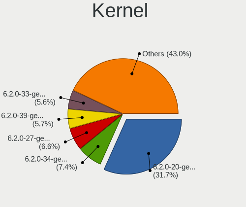

| Version               | Desktops | Percent |
|-----------------------|----------|---------|
| 6.2.0-20-generic      | 165      | 76.39%  |
| 6.2.0-23-generic      | 26       | 12.04%  |
| 5.19.0-21-generic     | 5        | 2.31%   |
| 6.2.0-24-generic      | 4        | 1.85%   |
| 6.3.6-060306-generic  | 2        | 0.93%   |
| 6.3.4-060304-generic  | 2        | 0.93%   |
| 6.3.2-060302-generic  | 2        | 0.93%   |
| 6.2.0-18-generic      | 2        | 0.93%   |
| 6.2.0-19-generic      | 1        | 0.46%   |
| 6.2.0-1007-gcp        | 1        | 0.46%   |
| 6.2.0-1003-lowlatency | 1        | 0.46%   |
| 6.1.0-16-generic      | 1        | 0.46%   |
| 5.19.0-45-generic     | 1        | 0.46%   |
| 5.19.0-42-generic     | 1        | 0.46%   |
| 5.19.0-38-generic     | 1        | 0.46%   |
| 5.19.0-28-generic     | 1        | 0.46%   |

Kernel Family
-------------

Linux kernel without a distro release

| Version | Desktops | Percent |
|---------|----------|---------|
| 6.2.0   | 197      | 92.49%  |
| 5.19.0  | 9        | 4.23%   |
| 6.3.6   | 2        | 0.94%   |
| 6.3.4   | 2        | 0.94%   |
| 6.3.2   | 2        | 0.94%   |
| 6.1.0   | 1        | 0.47%   |

Kernel Major Ver.
-----------------

Linux kernel major version

| Version | Desktops | Percent |
|---------|----------|---------|
| 6.2     | 197      | 92.49%  |
| 5.19    | 9        | 4.23%   |
| 6.3     | 6        | 2.82%   |
| 6.1     | 1        | 0.47%   |

Arch
----

OS architecture (x86_64, i586, etc.)

| Name   | Desktops | Percent |
|--------|----------|---------|
| x86_64 | 213      | 100%    |

DE
--

Desktop Environment

| Name            | Desktops | Percent |
|-----------------|----------|---------|
| GNOME           | 204      | 95.77%  |
| X-Cinnamon      | 5        | 2.35%   |
| Unknown         | 3        | 1.41%   |
| GNOME Flashback | 1        | 0.47%   |

Display Server
--------------

X11 or Wayland

| Name    | Desktops | Percent |
|---------|----------|---------|
| Wayland | 126      | 58.33%  |
| X11     | 86       | 39.81%  |
| Tty     | 4        | 1.85%   |

Display Manager
---------------

SDDM, LightDM, etc.

| Name    | Desktops | Percent |
|---------|----------|---------|
| GDM3    | 184      | 86.38%  |
| Unknown | 23       | 10.8%   |
| LightDM | 5        | 2.35%   |
| GDM     | 1        | 0.47%   |

OS Lang
-------

Language

| Lang             | Desktops | Percent |
|------------------|----------|---------|
| en_US            | 112      | 52.09%  |
| de_DE            | 23       | 10.7%   |
| fr_FR            | 11       | 5.12%   |
| C                | 9        | 4.19%   |
| pt_BR            | 7        | 3.26%   |
| es_ES            | 6        | 2.79%   |
| en_GB            | 6        | 2.79%   |
| ru_RU            | 4        | 1.86%   |
| en_CA            | 4        | 1.86%   |
| it_IT            | 3        | 1.4%    |
| en_AU            | 3        | 1.4%    |
| cs_CZ            | 3        | 1.4%    |
| zh_TW            | 2        | 0.93%   |
| zh_CN            | 2        | 0.93%   |
| fi_FI            | 2        | 0.93%   |
| en_IL            | 2        | 0.93%   |
| de_AT            | 2        | 0.93%   |
| tr_TR            | 1        | 0.47%   |
| sv_SE            | 1        | 0.47%   |
| pt_PT            | 1        | 0.47%   |
| pl_PL            | 1        | 0.47%   |
| nl_NL            | 1        | 0.47%   |
| lt_LT            | 1        | 0.47%   |
| ko_KR            | 1        | 0.47%   |
| fr_CH            | 1        | 0.47%   |
| es_AR            | 1        | 0.47%   |
| en_US.ISO-8859-1 | 1        | 0.47%   |
| en_SG            | 1        | 0.47%   |
| en_NZ            | 1        | 0.47%   |
| el_GR            | 1        | 0.47%   |
| de_CH            | 1        | 0.47%   |

Boot Mode
---------

EFI or BIOS

| Mode | Desktops | Percent |
|------|----------|---------|
| BIOS | 161      | 74.88%  |
| EFI  | 54       | 25.12%  |

Filesystem
----------

Type of filesystem

| Type  | Desktops | Percent |
|-------|----------|---------|
| Tmpfs | 126      | 58.6%   |
| Ext4  | 85       | 39.53%  |
| Btrfs | 2        | 0.93%   |
| Zfs   | 1        | 0.47%   |
| Xfs   | 1        | 0.47%   |

Part. scheme
------------

Scheme of partitioning

| Type    | Desktops | Percent |
|---------|----------|---------|
| GPT     | 171      | 79.91%  |
| MBR     | 24       | 11.21%  |
| Unknown | 19       | 8.88%   |

Dual Boot with Linux/BSD
------------------------

Hosting more than one Linux/BSD

| Dual boot | Desktops | Percent |
|-----------|----------|---------|
| No        | 173      | 80.84%  |
| Yes       | 41       | 19.16%  |

Dual Boot (Win)
---------------

Hosting Linux and Windows

| Dual boot | Desktops | Percent |
|-----------|----------|---------|
| No        | 124      | 57.94%  |
| Yes       | 90       | 42.06%  |

Board
-----

Vendor
------

Motherboard manufacturer

| Name                                 | Desktops | Percent |
|--------------------------------------|----------|---------|
| ASUSTek Computer                     | 65       | 30.52%  |
| Gigabyte Technology                  | 29       | 13.62%  |
| MSI                                  | 26       | 12.21%  |
| Dell                                 | 20       | 9.39%   |
| Hewlett-Packard                      | 16       | 7.51%   |
| ASRock                               | 14       | 6.57%   |
| Lenovo                               | 8        | 3.76%   |
| Intel                                | 8        | 3.76%   |
| Unknown                              | 4        | 1.88%   |
| Fujitsu                              | 3        | 1.41%   |
| Apple                                | 3        | 1.41%   |
| Acer                                 | 2        | 0.94%   |
| ZOTAC                                | 1        | 0.47%   |
| System76                             | 1        | 0.47%   |
| Shuttle                              | 1        | 0.47%   |
| Shenzhen Meigao Electronic Equipment | 1        | 0.47%   |
| Pegatron                             | 1        | 0.47%   |
| Huanan                               | 1        | 0.47%   |
| Google                               | 1        | 0.47%   |
| Gateway                              | 1        | 0.47%   |
| Fujitsu Siemens                      | 1        | 0.47%   |
| Entroware                            | 1        | 0.47%   |
| Colorful Technology                  | 1        | 0.47%   |
| Biostar                              | 1        | 0.47%   |
| BESSTAR Tech                         | 1        | 0.47%   |
| AZW                                  | 1        | 0.47%   |
| AAEON                                | 1        | 0.47%   |

Model
-----

Motherboard model

| Name                                       | Desktops | Percent |
|--------------------------------------------|----------|---------|
| Unknown                                    | 5        | 2.35%   |
| ASUS All Series                            | 4        | 1.88%   |
| MSI MS-7C95                                | 2        | 0.94%   |
| MSI MS-7721                                | 2        | 0.94%   |
| Intel H61                                  | 2        | 0.94%   |
| HP EliteDesk 800 G2 DM 35W                 | 2        | 0.94%   |
| Dell Precision Tower 7810                  | 2        | 0.94%   |
| ASUS TUF Gaming Z590-PLUS WIFI             | 2        | 0.94%   |
| ASUS TUF Gaming X570-PLUS                  | 2        | 0.94%   |
| ASUS PRIME Z790-A WIFI                     | 2        | 0.94%   |
| ASUS PRIME X670-P WIFI                     | 2        | 0.94%   |
| ASUS PRIME B450M-K II                      | 2        | 0.94%   |
| ASUS H170-PRO                              | 2        | 0.94%   |
| ASRock X670E Pro RS                        | 2        | 0.94%   |
| Apple MacPro5,1                            | 2        | 0.94%   |
| System76 Leopard Extreme                   | 1        | 0.47%   |
| Shuttle XS35V4                             | 1        | 0.47%   |
| Shenzhen Meigao Electronic Equipment UM690 | 1        | 0.47%   |
| Pegatron H81-M1                            | 1        | 0.47%   |
| MSI Pro 3000/3080                          | 1        | 0.47%   |
| MSI MS-7E01                                | 1        | 0.47%   |
| MSI MS-7D99                                | 1        | 0.47%   |
| MSI MS-7D74                                | 1        | 0.47%   |
| MSI MS-7C96                                | 1        | 0.47%   |
| MSI MS-7C84                                | 1        | 0.47%   |
| MSI MS-7C83                                | 1        | 0.47%   |
| MSI MS-7C09                                | 1        | 0.47%   |
| MSI MS-7C02                                | 1        | 0.47%   |
| MSI MS-7B86                                | 1        | 0.47%   |
| MSI MS-7B38                                | 1        | 0.47%   |
| MSI MS-7B18                                | 1        | 0.47%   |
| MSI MS-7A71                                | 1        | 0.47%   |
| MSI MS-7A69                                | 1        | 0.47%   |
| MSI MS-7A64                                | 1        | 0.47%   |
| MSI MS-7A15                                | 1        | 0.47%   |
| MSI MS-7924                                | 1        | 0.47%   |
| MSI MS-7922                                | 1        | 0.47%   |
| MSI MS-7893                                | 1        | 0.47%   |
| MSI MS-7846                                | 1        | 0.47%   |
| MSI MS-7596                                | 1        | 0.47%   |

Model Family
------------

Motherboard model prefix

| Name                                       | Desktops | Percent |
|--------------------------------------------|----------|---------|
| ASUS PRIME                                 | 21       | 9.86%   |
| ASUS TUF                                   | 10       | 4.69%   |
| Dell OptiPlex                              | 9        | 4.23%   |
| Lenovo ThinkCentre                         | 5        | 2.35%   |
| ASUS ROG                                   | 5        | 2.35%   |
| Unknown                                    | 5        | 2.35%   |
| HP EliteDesk                               | 4        | 1.88%   |
| HP Compaq                                  | 4        | 1.88%   |
| Dell Precision                             | 4        | 1.88%   |
| ASUS All                                   | 4        | 1.88%   |
| Lenovo IdeaCentre                          | 3        | 1.41%   |
| Gigabyte X570                              | 3        | 1.41%   |
| Dell Inspiron                              | 3        | 1.41%   |
| MSI MS-7C95                                | 2        | 0.94%   |
| MSI MS-7721                                | 2        | 0.94%   |
| Intel H61                                  | 2        | 0.94%   |
| HP ProDesk                                 | 2        | 0.94%   |
| Gigabyte Z690                              | 2        | 0.94%   |
| Fujitsu ESPRIMO                            | 2        | 0.94%   |
| Dell XPS                                   | 2        | 0.94%   |
| Dell Vostro                                | 2        | 0.94%   |
| ASUS P8Z77-V                               | 2        | 0.94%   |
| ASUS P8H61-M                               | 2        | 0.94%   |
| ASUS H170-PRO                              | 2        | 0.94%   |
| ASRock X670E                               | 2        | 0.94%   |
| Apple MacPro5                              | 2        | 0.94%   |
| Acer Aspire                                | 2        | 0.94%   |
| System76 Leopard                           | 1        | 0.47%   |
| Shuttle XS35V4                             | 1        | 0.47%   |
| Shenzhen Meigao Electronic Equipment UM690 | 1        | 0.47%   |
| Pegatron H81-M1                            | 1        | 0.47%   |
| MSI Pro                                    | 1        | 0.47%   |
| MSI MS-7E01                                | 1        | 0.47%   |
| MSI MS-7D99                                | 1        | 0.47%   |
| MSI MS-7D74                                | 1        | 0.47%   |
| MSI MS-7C96                                | 1        | 0.47%   |
| MSI MS-7C84                                | 1        | 0.47%   |
| MSI MS-7C83                                | 1        | 0.47%   |
| MSI MS-7C09                                | 1        | 0.47%   |
| MSI MS-7C02                                | 1        | 0.47%   |

MFG Year
--------

Motherboard manufacture year

| Year | Desktops | Percent |
|------|----------|---------|
| 2021 | 24       | 11.27%  |
| 2022 | 23       | 10.8%   |
| 2018 | 18       | 8.45%   |
| 2015 | 17       | 7.98%   |
| 2013 | 16       | 7.51%   |
| 2020 | 15       | 7.04%   |
| 2014 | 15       | 7.04%   |
| 2010 | 15       | 7.04%   |
| 2012 | 13       | 6.1%    |
| 2019 | 11       | 5.16%   |
| 2011 | 11       | 5.16%   |
| 2017 | 10       | 4.69%   |
| 2023 | 7        | 3.29%   |
| 2016 | 7        | 3.29%   |
| 2009 | 5        | 2.35%   |
| 2008 | 3        | 1.41%   |
| 2006 | 2        | 0.94%   |
| 2007 | 1        | 0.47%   |

Form Factor
-----------

Physical design of the computer

| Name    | Desktops | Percent |
|---------|----------|---------|
| Desktop | 213      | 100%    |

Secure Boot
-----------

Enabled or disabled

| State    | Desktops | Percent |
|----------|----------|---------|
| Disabled | 207      | 96.73%  |
| Enabled  | 7        | 3.27%   |

Coreboot
--------

Have coreboot on board

| Used | Desktops | Percent |
|------|----------|---------|
| No   | 212      | 99.53%  |
| Yes  | 1        | 0.47%   |

RAM Size
--------

Total RAM memory

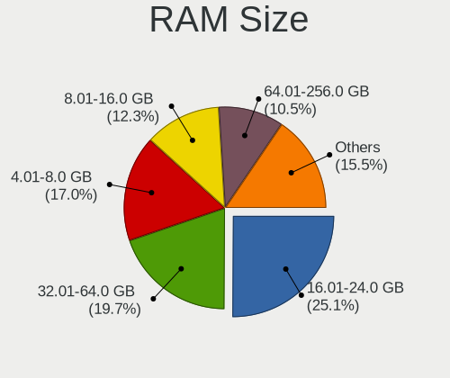

| Size in GB      | Desktops | Percent |
|-----------------|----------|---------|
| 16.01-24.0      | 44       | 20.56%  |
| 32.01-64.0      | 41       | 19.16%  |
| 4.01-8.0        | 36       | 16.82%  |
| 8.01-16.0       | 26       | 12.15%  |
| 3.01-4.0        | 25       | 11.68%  |
| 64.01-256.0     | 24       | 11.21%  |
| 24.01-32.0      | 13       | 6.07%   |
| More than 256.0 | 2        | 0.93%   |
| 1.01-2.0        | 2        | 0.93%   |
| 2.01-3.0        | 1        | 0.47%   |

RAM Used
--------

Used RAM memory

| Used GB    | Desktops | Percent |
|------------|----------|---------|
| 2.01-3.0   | 66       | 30.56%  |
| 1.01-2.0   | 57       | 26.39%  |
| 4.01-8.0   | 50       | 23.15%  |
| 3.01-4.0   | 27       | 12.5%   |
| 8.01-16.0  | 13       | 6.02%   |
| 24.01-32.0 | 1        | 0.46%   |
| 16.01-24.0 | 1        | 0.46%   |
| 0.51-1.0   | 1        | 0.46%   |

Total Drives
------------

Number of drives on board

| Drives | Desktops | Percent |
|--------|----------|---------|
| 1      | 83       | 38.6%   |
| 2      | 53       | 24.65%  |
| 3      | 36       | 16.74%  |
| 4      | 21       | 9.77%   |
| 5      | 11       | 5.12%   |
| 6      | 8        | 3.72%   |
| 8      | 1        | 0.47%   |
| 7      | 1        | 0.47%   |
| 0      | 1        | 0.47%   |

Has CD-ROM
----------

Has CD-ROM on board

| Presented | Desktops | Percent |
|-----------|----------|---------|
| No        | 132      | 61.97%  |
| Yes       | 81       | 38.03%  |

Has Ethernet
------------

Has Ethernet on board

| Presented | Desktops | Percent |
|-----------|----------|---------|
| Yes       | 209      | 97.66%  |
| No        | 5        | 2.34%   |

Has WiFi
--------

Has WiFi module

| Presented | Desktops | Percent |
|-----------|----------|---------|
| Yes       | 130      | 61.03%  |
| No        | 83       | 38.97%  |

Has Bluetooth
-------------

Has Bluetooth module

| Presented | Desktops | Percent |
|-----------|----------|---------|
| No        | 120      | 56.34%  |
| Yes       | 93       | 43.66%  |

Location
--------

Country
-------

Geographic location (country)

| Country      | Desktops | Percent |
|--------------|----------|---------|
| USA          | 49       | 23%     |
| Germany      | 24       | 11.27%  |
| Canada       | 14       | 6.57%   |
| France       | 13       | 6.1%    |
| Brazil       | 10       | 4.69%   |
| UK           | 6        | 2.82%   |
| Sweden       | 6        | 2.82%   |
| Russia       | 6        | 2.82%   |
| Italy        | 6        | 2.82%   |
| Australia    | 6        | 2.82%   |
| Spain        | 5        | 2.35%   |
| Netherlands  | 5        | 2.35%   |
| Switzerland  | 4        | 1.88%   |
| Portugal     | 4        | 1.88%   |
| Czechia      | 4        | 1.88%   |
| Turkey       | 3        | 1.41%   |
| Israel       | 3        | 1.41%   |
| Iran         | 3        | 1.41%   |
| India        | 3        | 1.41%   |
| Finland      | 3        | 1.41%   |
| Austria      | 3        | 1.41%   |
| Taiwan       | 2        | 0.94%   |
| Serbia       | 2        | 0.94%   |
| Poland       | 2        | 0.94%   |
| Philippines  | 2        | 0.94%   |
| New Zealand  | 2        | 0.94%   |
| Lithuania    | 2        | 0.94%   |
| Hong Kong    | 2        | 0.94%   |
| Greece       | 2        | 0.94%   |
| China        | 2        | 0.94%   |
| Belgium      | 2        | 0.94%   |
| Sri Lanka    | 1        | 0.47%   |
| South Korea  | 1        | 0.47%   |
| South Africa | 1        | 0.47%   |
| Singapore    | 1        | 0.47%   |
| Peru         | 1        | 0.47%   |
| Paraguay     | 1        | 0.47%   |
| Norway       | 1        | 0.47%   |
| Namibia      | 1        | 0.47%   |
| Malaysia     | 1        | 0.47%   |

City
----

Geographic location (city)

| City               | Desktops | Percent |
|--------------------|----------|---------|
| Sao Paulo          | 4        | 1.87%   |
| Tehran             | 3        | 1.4%    |
| Melbourne          | 3        | 1.4%    |
| Valencia           | 2        | 0.93%   |
| Sacramento         | 2        | 0.93%   |
| Prague             | 2        | 0.93%   |
| Petah Tikva        | 2        | 0.93%   |
| Munich             | 2        | 0.93%   |
| Montreal           | 2        | 0.93%   |
| Kaohsiung City     | 2        | 0.93%   |
| Helsinki           | 2        | 0.93%   |
| Heilbronn          | 2        | 0.93%   |
| Hanover            | 2        | 0.93%   |
| Calgary            | 2        | 0.93%   |
| Biel/Bienne        | 2        | 0.93%   |
| Belgrade           | 2        | 0.93%   |
| Amsterdam          | 2        | 0.93%   |
| Zaandam            | 1        | 0.47%   |
| Yuma               | 1        | 0.47%   |
| Ypsilanti          | 1        | 0.47%   |
| York               | 1        | 0.47%   |
| Wrzburg          | 1        | 0.47%   |
| Wuhan              | 1        | 0.47%   |
| Winston-Salem      | 1        | 0.47%   |
| Winnipeg           | 1        | 0.47%   |
| Windsor            | 1        | 0.47%   |
| Windhoek           | 1        | 0.47%   |
| Wil                | 1        | 0.47%   |
| Wedel              | 1        | 0.47%   |
| Warsaw             | 1        | 0.47%   |
| Vitry-le-Franois | 1        | 0.47%   |
| Visakhapatnam      | 1        | 0.47%   |
| Virginia Beach     | 1        | 0.47%   |
| Vienna             | 1        | 0.47%   |
| Viana do Castelo   | 1        | 0.47%   |
| Versailles         | 1        | 0.47%   |
| Tupelo             | 1        | 0.47%   |
| Tourcoing          | 1        | 0.47%   |
| Toronto            | 1        | 0.47%   |
| Tampa              | 1        | 0.47%   |

Drives
------

Drive Vendor
------------

Hard drive vendors

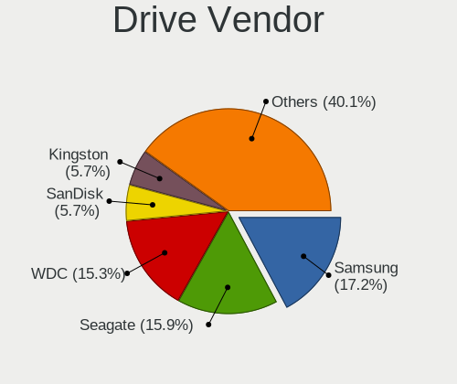

| Vendor                      | Desktops | Drives | Percent |
|-----------------------------|----------|--------|---------|
| Seagate                     | 78       | 100    | 18.62%  |
| Samsung Electronics         | 75       | 102    | 17.9%   |
| WDC                         | 70       | 98     | 16.71%  |
| SanDisk                     | 22       | 27     | 5.25%   |
| Kingston                    | 19       | 22     | 4.53%   |
| Toshiba                     | 17       | 19     | 4.06%   |
| Hitachi                     | 15       | 18     | 3.58%   |
| Crucial                     | 14       | 15     | 3.34%   |
| SK hynix                    | 8        | 8      | 1.91%   |
| Phison Electronics          | 7        | 8      | 1.67%   |
| Unknown                     | 5        | 5      | 1.19%   |
| Micron/Crucial Technology   | 5        | 6      | 1.19%   |
| Kingston Technology Company | 5        | 7      | 1.19%   |
| Intel                       | 5        | 6      | 1.19%   |
| Phison                      | 4        | 5      | 0.95%   |
| KIOXIA                      | 4        | 4      | 0.95%   |
| China                       | 4        | 4      | 0.95%   |
| SABRENT                     | 3        | 6      | 0.72%   |
| PNY                         | 3        | 4      | 0.72%   |
| OCZ                         | 3        | 3      | 0.72%   |
| Micron Technology           | 3        | 5      | 0.72%   |
| HGST                        | 3        | 3      | 0.72%   |
| Realtek                     | 2        | 2      | 0.48%   |
| Patriot                     | 2        | 2      | 0.48%   |
| OWC                         | 2        | 4      | 0.48%   |
| MAXIO Technology (Hangzhou) | 2        | 2      | 0.48%   |
| Gigastone                   | 2        | 2      | 0.48%   |
| Gigabyte Technology         | 2        | 2      | 0.48%   |
| Apple                       | 2        | 2      | 0.48%   |
| A-DATA Technology           | 2        | 3      | 0.48%   |
| Yangtze Memory Technologies | 1        | 1      | 0.24%   |
| Verbatim                    | 1        | 2      | 0.24%   |
| Vaseky                      | 1        | 1      | 0.24%   |
| Transcend                   | 1        | 1      | 0.24%   |
| TEXTORM                     | 1        | 1      | 0.24%   |
| T-FORCE                     | 1        | 1      | 0.24%   |
| SPCC                        | 1        | 1      | 0.24%   |
| Smartbuy                    | 1        | 2      | 0.24%   |
| Silicon Motion              | 1        | 1      | 0.24%   |
| Rogueware                   | 1        | 1      | 0.24%   |

Drive Model
-----------

Hard drive models

| Model                                               | Desktops | Percent |
|-----------------------------------------------------|----------|---------|
| Samsung NVMe SSD Controller SM981/PM981/PM983 250GB | 11       | 2.33%   |
| Samsung NVMe SSD Controller PM9A1/PM9A3/980PRO 2TB  | 8        | 1.69%   |
| Seagate ST1000DM010-2EP102 1TB                      | 7        | 1.48%   |
| Seagate ST2000DM008-2FR102 2TB                      | 6        | 1.27%   |
| Samsung SSD 850 EVO 250GB                           | 6        | 1.27%   |
| WDC WD20EZRX-00D8PB0 2TB                            | 5        | 1.06%   |
| Seagate ST1000DM003-1CH162 1TB                      | 5        | 1.06%   |
| Samsung SSD 980 1TB                                 | 5        | 1.06%   |
| Samsung NVMe SSD Controller SM961/PM961/SM963 256GB | 5        | 1.06%   |
| Micron/Crucial P2 NVMe PCIe SSD 4TB                 | 5        | 1.06%   |
| WDC WDS240G2G0A-00JH30 240GB SSD                    | 4        | 0.85%   |
| Toshiba DT01ACA100 1TB                              | 4        | 0.85%   |
| Seagate ST500DM002-1BD142 500GB                     | 4        | 0.85%   |
| Seagate ST4000DM004-2CV104 4TB                      | 4        | 0.85%   |
| Seagate ST2000DM001-1ER164 2TB                      | 4        | 0.85%   |
| Samsung SSD 990 PRO 1TB                             | 4        | 0.85%   |
| Samsung SSD 860 EVO 500GB                           | 4        | 0.85%   |
| WDC WD5000AAKX-00ERMA0 500GB                        | 3        | 0.63%   |
| WDC WD5000AAKX-001CA0 500GB                         | 3        | 0.63%   |
| WDC WD10EZEX-22MFCA0 1TB                            | 3        | 0.63%   |
| Toshiba DT01ACA200 2TB                              | 3        | 0.63%   |
| Seagate ST3500418AS 500GB                           | 3        | 0.63%   |
| Seagate ST2000DM006-2DM164 2TB                      | 3        | 0.63%   |
| Seagate ST1000DM003-9YN162 1TB                      | 3        | 0.63%   |
| Samsung SSD 870 EVO 500GB                           | 3        | 0.63%   |
| Samsung SSD 860 EVO 250GB                           | 3        | 0.63%   |
| SABRENT Disk 1TB                                    | 3        | 0.63%   |
| Kingston Company SNV2S2000G 2TB                     | 3        | 0.63%   |
| Kingston SA400S37480G 480GB SSD                     | 3        | 0.63%   |
| Kingston SA400S37240G 240GB SSD                     | 3        | 0.63%   |
| WDC WD80EFAX-68KNBN0 8TB                            | 2        | 0.42%   |
| WDC WD20EZRZ-00Z5HB0 2TB                            | 2        | 0.42%   |
| WDC WD20EZAZ-00L9GB0 2TB                            | 2        | 0.42%   |
| WDC WD10EZRZ-00HTKB0 1TB                            | 2        | 0.42%   |
| WDC WD10EZEX-08WN4A0 1TB                            | 2        | 0.42%   |
| WDC WD10EURX-63FH1Y0 1TB                            | 2        | 0.42%   |
| WDC WD1003FZEX-00K3CA0 1TB                          | 2        | 0.42%   |
| Unknown SD/MMC/MS PRO 250GB                         | 2        | 0.42%   |
| Seagate ST6000DM003-2CY186 6TB                      | 2        | 0.42%   |
| Seagate ST2000LM007-1R8174 2TB                      | 2        | 0.42%   |

HDD Vendor
----------

Hard disk drive vendors

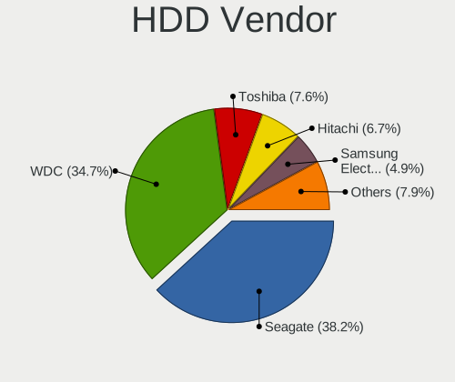

| Vendor              | Desktops | Drives | Percent |
|---------------------|----------|--------|---------|
| Seagate             | 76       | 98     | 41.08%  |
| WDC                 | 64       | 88     | 34.59%  |
| Hitachi             | 15       | 18     | 8.11%   |
| Toshiba             | 14       | 16     | 7.57%   |
| Samsung Electronics | 9        | 10     | 4.86%   |
| HGST                | 3        | 3      | 1.62%   |
| Unknown             | 2        | 2      | 1.08%   |
| ASMT                | 1        | 3      | 0.54%   |
| Apple               | 1        | 1      | 0.54%   |

SSD Vendor
----------

Solid state drive vendors

| Vendor              | Desktops | Drives | Percent |
|---------------------|----------|--------|---------|
| Samsung Electronics | 34       | 44     | 28.57%  |
| Kingston            | 15       | 18     | 12.61%  |
| SanDisk             | 11       | 12     | 9.24%   |
| Crucial             | 11       | 12     | 9.24%   |
| WDC                 | 8        | 8      | 6.72%   |
| China               | 4        | 4      | 3.36%   |
| OCZ                 | 3        | 3      | 2.52%   |
| Intel               | 3        | 4      | 2.52%   |
| PNY                 | 2        | 2      | 1.68%   |
| Patriot             | 2        | 2      | 1.68%   |
| OWC                 | 2        | 4      | 1.68%   |
| Gigastone           | 2        | 2      | 1.68%   |
| A-DATA Technology   | 2        | 3      | 1.68%   |
| Verbatim            | 1        | 2      | 0.84%   |
| Vaseky              | 1        | 1      | 0.84%   |
| Toshiba             | 1        | 1      | 0.84%   |
| TEXTORM             | 1        | 1      | 0.84%   |
| T-FORCE             | 1        | 1      | 0.84%   |
| SPCC                | 1        | 1      | 0.84%   |
| Smartbuy            | 1        | 2      | 0.84%   |
| Rogueware           | 1        | 1      | 0.84%   |
| Phison              | 1        | 1      | 0.84%   |
| Neo                 | 1        | 2      | 0.84%   |
| MSI                 | 1        | 1      | 0.84%   |
| Micron Technology   | 1        | 2      | 0.84%   |
| LITEONIT            | 1        | 1      | 0.84%   |
| LITEON              | 1        | 1      | 0.84%   |
| LDLC                | 1        | 2      | 0.84%   |
| KIOXIA-EXCERIA      | 1        | 1      | 0.84%   |
| KingSpec            | 1        | 1      | 0.84%   |
| INNOVATION IT       | 1        | 1      | 0.84%   |
| Inland              | 1        | 1      | 0.84%   |
| Apacer              | 1        | 1      | 0.84%   |

Drive Kind
----------

HDD or SSD

| Kind    | Desktops | Drives | Percent |
|---------|----------|--------|---------|
| HDD     | 146      | 239    | 42.57%  |
| SSD     | 98       | 143    | 28.57%  |
| NVMe    | 92       | 143    | 26.82%  |
| Unknown | 6        | 6      | 1.75%   |
| MMC     | 1        | 1      | 0.29%   |

Drive Connector
---------------

SATA, SAS, NVMe, etc.

| Type | Desktops | Drives | Percent |
|------|----------|--------|---------|
| SATA | 175      | 369    | 61.4%   |
| NVMe | 91       | 135    | 31.93%  |
| SAS  | 18       | 27     | 6.32%   |
| MMC  | 1        | 1      | 0.35%   |

Drive Size
----------

Size of hard drive

| Size in TB | Desktops | Drives | Percent |
|------------|----------|--------|---------|
| 0.01-0.5   | 113      | 183    | 43.46%  |
| 0.51-1.0   | 80       | 119    | 30.77%  |
| 1.01-2.0   | 37       | 39     | 14.23%  |
| 3.01-4.0   | 14       | 21     | 5.38%   |
| 4.01-10.0  | 10       | 13     | 3.85%   |
| 2.01-3.0   | 4        | 4      | 1.54%   |
| 10.01-20.0 | 2        | 3      | 0.77%   |

Space Total
-----------

Amount of disk space available on the file system

| Size in GB     | Desktops | Percent |
|----------------|----------|---------|
| 501-1000       | 52       | 23.96%  |
| 251-500        | 45       | 20.74%  |
| 101-250        | 43       | 19.82%  |
| 1001-2000      | 23       | 10.6%   |
| More than 3000 | 22       | 10.14%  |
| 2001-3000      | 11       | 5.07%   |
| 51-100         | 9        | 4.15%   |
| 1-20           | 8        | 3.69%   |
| 21-50          | 3        | 1.38%   |
| Unknown        | 1        | 0.46%   |

Space Used
----------

Amount of used disk space

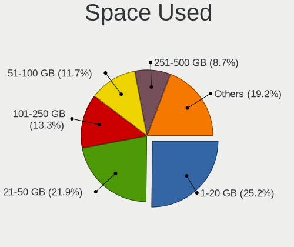

| Used GB        | Desktops | Percent |
|----------------|----------|---------|
| 1-20           | 64       | 29.91%  |
| 21-50          | 46       | 21.5%   |
| 101-250        | 30       | 14.02%  |
| 51-100         | 21       | 9.81%   |
| 251-500        | 20       | 9.35%   |
| 501-1000       | 10       | 4.67%   |
| More than 3000 | 9        | 4.21%   |
| 2001-3000      | 7        | 3.27%   |
| 1001-2000      | 6        | 2.8%    |
| Unknown        | 1        | 0.47%   |

Malfunc. Drives
---------------

Drive models with a malfunction

| Model                                   | Desktops | Drives | Percent |
|-----------------------------------------|----------|--------|---------|
| WDC WD5000HHTZ-04N21V0 500GB            | 1        | 1      | 5.26%   |
| WDC WD5000AZLX-22JKKA0 500GB            | 1        | 1      | 5.26%   |
| WDC WD5000AAKX-001CA0 500GB             | 1        | 1      | 5.26%   |
| WDC WD5000AAKS-00UU3A0 500GB            | 1        | 1      | 5.26%   |
| WDC WD10EZRZ-00HTKB0 1TB                | 1        | 1      | 5.26%   |
| WDC WD10EZEX-60WN4A0 1TB                | 1        | 1      | 5.26%   |
| WDC WD10EZEX-22MFCA0 1TB                | 1        | 2      | 5.26%   |
| WDC WD10EARS-22Y5B1 1TB                 | 1        | 1      | 5.26%   |
| Seagate ST500DM002-1BD142 500GB         | 1        | 1      | 5.26%   |
| Seagate ST2000LX001-1RG174 2TB          | 1        | 1      | 5.26%   |
| Samsung Electronics SSD 960 EVO 250GB   | 1        | 1      | 5.26%   |
| Samsung Electronics HD502HJ 500GB       | 1        | 1      | 5.26%   |
| Samsung Electronics HD161GJ 160GB       | 1        | 1      | 5.26%   |
| Neo Forza NFS121SA312-6007000 120GB SSD | 1        | 2      | 5.26%   |
| Kingston SV300S37A120G 120GB SSD        | 1        | 1      | 5.26%   |
| Kingston SUV400S37240G 240GB SSD        | 1        | 1      | 5.26%   |
| Hitachi HDS721010CLA332 1TB             | 1        | 1      | 5.26%   |
| Gigabyte Technology GP-GM30512G-G 512GB | 1        | 1      | 5.26%   |
| Crucial CT512MX100SSD1 512GB            | 1        | 1      | 5.26%   |

Malfunc. Drive Vendor
---------------------

Vendors of faulty drives

| Vendor              | Desktops | Drives | Percent |
|---------------------|----------|--------|---------|
| WDC                 | 8        | 9      | 42.11%  |
| Samsung Electronics | 3        | 3      | 15.79%  |
| Seagate             | 2        | 2      | 10.53%  |
| Kingston            | 2        | 2      | 10.53%  |
| Neo                 | 1        | 2      | 5.26%   |
| Hitachi             | 1        | 1      | 5.26%   |
| Gigabyte Technology | 1        | 1      | 5.26%   |
| Crucial             | 1        | 1      | 5.26%   |

Malfunc. HDD Vendor
-------------------

Vendors of faulty HDD drives

| Vendor              | Desktops | Drives | Percent |
|---------------------|----------|--------|---------|
| WDC                 | 8        | 9      | 61.54%  |
| Seagate             | 2        | 2      | 15.38%  |
| Samsung Electronics | 2        | 2      | 15.38%  |
| Hitachi             | 1        | 1      | 7.69%   |

Malfunc. Drive Kind
-------------------

Kinds of faulty drives

| Kind | Desktops | Drives | Percent |
|------|----------|--------|---------|
| HDD  | 12       | 14     | 66.67%  |
| SSD  | 4        | 5      | 22.22%  |
| NVMe | 2        | 2      | 11.11%  |

Failed Drives
-------------

Failed drive models

Zero info for selected period =(

Failed Drive Vendor
-------------------

Failed drive vendors

Zero info for selected period =(

Drive Status
------------

Number of failed and malfunc. drives

| Status   | Desktops | Drives | Percent |
|----------|----------|--------|---------|
| Detected | 158      | 380    | 68.1%   |
| Works    | 58       | 131    | 25%     |
| Malfunc  | 16       | 21     | 6.9%    |

Storage controller
------------------

Storage Vendor
--------------

Storage controller vendors

| Vendor                       | Desktops | Percent |
|------------------------------|----------|---------|
| Intel                        | 144      | 42.99%  |
| AMD                          | 63       | 18.81%  |
| Samsung Electronics          | 39       | 11.64%  |
| SanDisk                      | 13       | 3.88%   |
| Phison Electronics           | 12       | 3.58%   |
| Kingston Technology Company  | 10       | 2.99%   |
| Micron/Crucial Technology    | 8        | 2.39%   |
| ASMedia Technology           | 8        | 2.39%   |
| SK hynix                     | 7        | 2.09%   |
| Marvell Technology Group     | 5        | 1.49%   |
| KIOXIA                       | 4        | 1.19%   |
| MAXIO Technology (Hangzhou)  | 3        | 0.9%    |
| JMicron Technology           | 3        | 0.9%    |
| Toshiba America Info Systems | 2        | 0.6%    |
| Silicon Motion               | 2        | 0.6%    |
| Seagate Technology           | 2        | 0.6%    |
| Realtek Semiconductor        | 2        | 0.6%    |
| Micron Technology            | 2        | 0.6%    |
| Yangtze Memory Technologies  | 1        | 0.3%    |
| Shenzhen Longsys Electronics | 1        | 0.3%    |
| Nvidia                       | 1        | 0.3%    |
| Netac Technology             | 1        | 0.3%    |
| INNOGRIT                     | 1        | 0.3%    |
| Apple                        | 1        | 0.3%    |

Storage Model
-------------

Storage controller models

| Model                                                                                   | Desktops | Percent |
|-----------------------------------------------------------------------------------------|----------|---------|
| AMD FCH SATA Controller [AHCI mode]                                                     | 40       | 9.93%   |
| Samsung NVMe SSD Controller SM981/PM981/PM983                                           | 15       | 3.72%   |
| Intel Q170/Q150/B150/H170/H110/Z170/CM236 Chipset SATA Controller [AHCI Mode]           | 15       | 3.72%   |
| Samsung NVMe SSD Controller PM9A1/PM9A3/980PRO                                          | 11       | 2.73%   |
| Intel Alder Lake-S PCH SATA Controller [AHCI Mode]                                      | 11       | 2.73%   |
| Intel 8 Series/C220 Series Chipset Family 6-port SATA Controller 1 [AHCI mode]          | 11       | 2.73%   |
| AMD 400 Series Chipset SATA Controller                                                  | 10       | 2.48%   |
| Intel 6 Series/C200 Series Chipset Family 6 port Desktop SATA AHCI Controller           | 9        | 2.23%   |
| AMD SB7x0/SB8x0/SB9x0 SATA Controller [AHCI mode]                                       | 9        | 2.23%   |
| AMD 500 Series Chipset SATA Controller                                                  | 9        | 2.23%   |
| Intel Volume Management Device NVMe RAID Controller                                     | 8        | 1.99%   |
| Intel SATA Controller [RAID mode]                                                       | 8        | 1.99%   |
| Intel Cannon Lake PCH SATA AHCI Controller                                              | 8        | 1.99%   |
| Intel 7 Series/C210 Series Chipset Family 6-port SATA Controller [AHCI mode]            | 8        | 1.99%   |
| Samsung NVMe SSD Controller SM961/PM961/SM963                                           | 7        | 1.74%   |
| Intel NM10/ICH7 Family SATA Controller [IDE mode]                                       | 7        | 1.74%   |
| Intel 500 Series Chipset Family SATA AHCI Controller                                    | 7        | 1.74%   |
| Intel 200 Series PCH SATA controller [AHCI mode]                                        | 7        | 1.74%   |
| Samsung NVMe SSD Controller 980                                                         | 6        | 1.49%   |
| Micron/Crucial P2 NVMe PCIe SSD                                                         | 6        | 1.49%   |
| Intel 82801G (ICH7 Family) IDE Controller                                               | 6        | 1.49%   |
| Intel 700 Series Chipset Family SATA AHCI Controller                                    | 6        | 1.49%   |
| ASMedia ASM1062 Serial ATA Controller                                                   | 6        | 1.49%   |
| AMD SB7x0/SB8x0/SB9x0 IDE Controller                                                    | 6        | 1.49%   |
| Samsung Electronics Non-Volatile memory controller                                      | 5        | 1.24%   |
| Intel 9 Series Chipset Family SATA Controller [AHCI Mode]                               | 5        | 1.24%   |
| Intel 6 Series/C200 Series Chipset Family Desktop SATA Controller (IDE mode, ports 4-5) | 5        | 1.24%   |
| Intel 6 Series/C200 Series Chipset Family Desktop SATA Controller (IDE mode, ports 0-3) | 5        | 1.24%   |
| Phison E12 NVMe Controller                                                              | 4        | 0.99%   |
| Kingston Company Company Non-Volatile memory controller                                 | 4        | 0.99%   |
| Intel Volume Management Device NVMe RAID Controller Intel Corporation                   | 4        | 0.99%   |
| Intel C610/X99 series chipset sSATA Controller [AHCI mode]                              | 4        | 0.99%   |
| Intel C610/X99 series chipset 6-Port SATA Controller [AHCI mode]                        | 4        | 0.99%   |
| Intel 82801JI (ICH10 Family) SATA AHCI Controller                                       | 4        | 0.99%   |
| Intel 82801JI (ICH10 Family) 4 port SATA IDE Controller #1                              | 4        | 0.99%   |
| Intel 82801JI (ICH10 Family) 2 port SATA IDE Controller #2                              | 4        | 0.99%   |
| Intel 400 Series Chipset Family SATA AHCI Controller                                    | 4        | 0.99%   |
| AMD FCH SATA Controller D                                                               | 4        | 0.99%   |
| SK hynix Platinum P41/PC801 NVMe Solid State Drive                                      | 3        | 0.74%   |
| SK hynix Gold P31/BC711/PC711 NVMe Solid State Drive                                    | 3        | 0.74%   |

Storage Kind
------------

Kind of storage controller (IDE, SATA, NVMe, SAS, ...)

| Kind | Desktops | Percent |
|------|----------|---------|
| SATA | 178      | 54.94%  |
| NVMe | 90       | 27.78%  |
| IDE  | 33       | 10.19%  |
| RAID | 23       | 7.1%    |

Processor
---------

CPU Vendor
----------

Processor vendors

| Vendor | Desktops | Percent |
|--------|----------|---------|
| Intel  | 148      | 69.48%  |
| AMD    | 65       | 30.52%  |

CPU Model
---------

Processor models

| Model                                   | Desktops | Percent |
|-----------------------------------------|----------|---------|
| Intel Core i5-3470 CPU @ 3.20GHz        | 5        | 2.35%   |
| Intel Core i7-6700K CPU @ 4.00GHz       | 4        | 1.88%   |
| Intel Core i7-4790 CPU @ 3.60GHz        | 4        | 1.88%   |
| Intel Core 2 Duo CPU E7500 @ 2.93GHz    | 4        | 1.88%   |
| Intel 12th Gen Core i7-12700            | 4        | 1.88%   |
| AMD Ryzen 9 7900X 12-Core Processor     | 4        | 1.88%   |
| AMD Ryzen 9 5900X 12-Core Processor     | 4        | 1.88%   |
| Intel Core i7-3770 CPU @ 3.40GHz        | 3        | 1.41%   |
| Intel Core i5-4570 CPU @ 3.20GHz        | 3        | 1.41%   |
| Intel Core i5-2400 CPU @ 3.10GHz        | 3        | 1.41%   |
| Intel 13th Gen Core i9-13900K           | 3        | 1.41%   |
| AMD Ryzen 7 5800X 8-Core Processor      | 3        | 1.41%   |
| AMD Ryzen 5 5600G with Radeon Graphics  | 3        | 1.41%   |
| Intel Xeon CPU X5690 @ 3.47GHz          | 2        | 0.94%   |
| Intel Pentium CPU G4560 @ 3.50GHz       | 2        | 0.94%   |
| Intel Core i7-4770K CPU @ 3.50GHz       | 2        | 0.94%   |
| Intel Core i7-3770K CPU @ 3.50GHz       | 2        | 0.94%   |
| Intel Core i5-9400F CPU @ 2.90GHz       | 2        | 0.94%   |
| Intel Core i5-6500T CPU @ 2.50GHz       | 2        | 0.94%   |
| Intel Core i5-6400 CPU @ 2.70GHz        | 2        | 0.94%   |
| Intel Core i5-4690 CPU @ 3.50GHz        | 2        | 0.94%   |
| Intel Core i5-4590 CPU @ 3.30GHz        | 2        | 0.94%   |
| Intel Core i3-6100T CPU @ 3.20GHz       | 2        | 0.94%   |
| Intel Core i3-10100 CPU @ 3.60GHz       | 2        | 0.94%   |
| Intel Core 2 Duo CPU E8400 @ 3.00GHz    | 2        | 0.94%   |
| Intel Core 2 Duo CPU E7300 @ 2.66GHz    | 2        | 0.94%   |
| Intel 12th Gen Core i7-12700K           | 2        | 0.94%   |
| Intel 12th Gen Core i5-12400            | 2        | 0.94%   |
| Intel 11th Gen Core i9-11900K @ 3.50GHz | 2        | 0.94%   |
| Intel 11th Gen Core i7-11700K @ 3.60GHz | 2        | 0.94%   |
| AMD Ryzen 9 7950X 16-Core Processor     | 2        | 0.94%   |
| AMD Ryzen 9 7900 12-Core Processor      | 2        | 0.94%   |
| AMD Ryzen 7 7700X 8-Core Processor      | 2        | 0.94%   |
| AMD Ryzen 7 2700X Eight-Core Processor  | 2        | 0.94%   |
| AMD Ryzen 5 5500                        | 2        | 0.94%   |
| AMD Ryzen 5 3600X 6-Core Processor      | 2        | 0.94%   |
| AMD Ryzen 5 3600 6-Core Processor       | 2        | 0.94%   |
| AMD Ryzen 5 2600 Six-Core Processor     | 2        | 0.94%   |
| AMD Ryzen 5 1600 Six-Core Processor     | 2        | 0.94%   |
| AMD Phenom II X4 965 Processor          | 2        | 0.94%   |

CPU Model Family
----------------

Processor model prefix

| Model                   | Desktops | Percent |
|-------------------------|----------|---------|
| Intel Core i5           | 41       | 19.25%  |
| Intel Core i7           | 32       | 15.02%  |
| Other                   | 27       | 12.68%  |
| AMD Ryzen 5             | 17       | 7.98%   |
| Intel Xeon              | 14       | 6.57%   |
| Intel Core i3           | 13       | 6.1%    |
| AMD Ryzen 9             | 13       | 6.1%    |
| AMD Ryzen 7             | 12       | 5.63%   |
| Intel Core 2 Duo        | 9        | 4.23%   |
| Intel Core 2 Quad       | 4        | 1.88%   |
| AMD FX                  | 4        | 1.88%   |
| Intel Pentium           | 3        | 1.41%   |
| AMD Phenom II X4        | 3        | 1.41%   |
| AMD A10                 | 3        | 1.41%   |
| Intel Celeron           | 2        | 0.94%   |
| Intel Pentium Silver    | 1        | 0.47%   |
| Intel Pentium Dual-Core | 1        | 0.47%   |
| Intel Celeron D         | 1        | 0.47%   |
| Intel Atom              | 1        | 0.47%   |
| AMD Ryzen Threadripper  | 1        | 0.47%   |
| AMD Ryzen 7 PRO         | 1        | 0.47%   |
| AMD Ryzen 3 PRO         | 1        | 0.47%   |
| AMD Ryzen 3             | 1        | 0.47%   |
| AMD Phenom              | 1        | 0.47%   |
| AMD Athlon II X4        | 1        | 0.47%   |
| AMD Athlon II X3        | 1        | 0.47%   |
| AMD Athlon II X2        | 1        | 0.47%   |
| AMD Athlon Dual Core    | 1        | 0.47%   |
| AMD A8                  | 1        | 0.47%   |
| AMD A6                  | 1        | 0.47%   |
| AMD A4                  | 1        | 0.47%   |

CPU Cores
---------

Number of processor cores

| Number | Desktops | Percent |
|--------|----------|---------|
| 4      | 82       | 38.5%   |
| 6      | 39       | 18.31%  |
| 2      | 31       | 14.55%  |
| 8      | 21       | 9.86%   |
| 12     | 19       | 8.92%   |
| 16     | 6        | 2.82%   |
| 24     | 4        | 1.88%   |
| 3      | 4        | 1.88%   |
| 1      | 3        | 1.41%   |
| 14     | 2        | 0.94%   |
| 32     | 1        | 0.47%   |
| 7      | 1        | 0.47%   |

CPU Sockets
-----------

Number of sockets

| Number | Desktops | Percent |
|--------|----------|---------|
| 1      | 209      | 98.12%  |
| 2      | 4        | 1.88%   |

CPU Threads
-----------

Threads per core (Hyper-Threading)

| Number | Desktops | Percent |
|--------|----------|---------|
| 2      | 127      | 59.35%  |
| 1      | 87       | 40.65%  |

CPU Op-Modes
------------

CPU Operation Modes (32-bit, 64-bit)

| Op mode        | Desktops | Percent |
|----------------|----------|---------|
| 32-bit, 64-bit | 213      | 100%    |

CPU Microcode
-------------

Microcode number

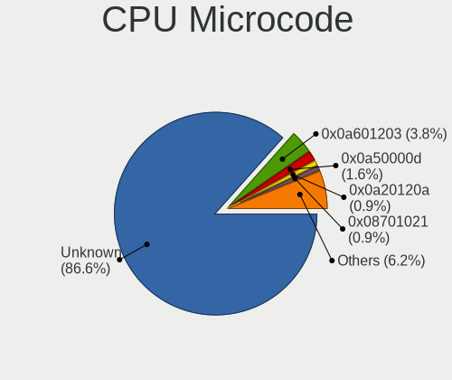

| Number     | Desktops | Percent |
|------------|----------|---------|
| Unknown    | 185      | 86.85%  |
| 0x0a601203 | 9        | 4.23%   |
| 0x0a50000d | 2        | 0.94%   |
| 0x0a20120a | 2        | 0.94%   |
| 0x0800820d | 2        | 0.94%   |
| 0x010000c8 | 2        | 0.94%   |
| 0xf64      | 1        | 0.47%   |
| 0x306c3    | 1        | 0.47%   |
| 0x0a50000c | 1        | 0.47%   |
| 0x0a404102 | 1        | 0.47%   |
| 0x0a201205 | 1        | 0.47%   |
| 0x0a201025 | 1        | 0.47%   |
| 0x08701021 | 1        | 0.47%   |
| 0x08108109 | 1        | 0.47%   |
| 0x08101016 | 1        | 0.47%   |
| 0x06006705 | 1        | 0.47%   |
| 0x06000852 | 1        | 0.47%   |

CPU Microarch
-------------

Microarchitecture

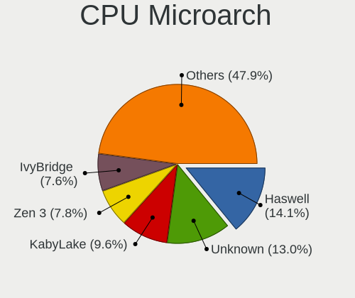

| Name             | Desktops | Percent |
|------------------|----------|---------|
| Unknown          | 37       | 17.29%  |
| Haswell          | 26       | 12.15%  |
| KabyLake         | 18       | 8.41%   |
| Skylake          | 17       | 7.94%   |
| IvyBridge        | 17       | 7.94%   |
| Zen 3            | 15       | 7.01%   |
| Penryn           | 14       | 6.54%   |
| SandyBridge      | 11       | 5.14%   |
| Piledriver       | 9        | 4.21%   |
| Zen+             | 8        | 3.74%   |
| K10              | 7        | 3.27%   |
| Zen 2            | 6        | 2.8%    |
| CometLake        | 6        | 2.8%    |
| Westmere         | 4        | 1.87%   |
| Alderlake Hybrid | 4        | 1.87%   |
| Core             | 3        | 1.4%    |
| Zen              | 2        | 0.93%   |
| Silvermont       | 2        | 0.93%   |
| NetBurst         | 1        | 0.47%   |
| Nehalem          | 1        | 0.47%   |
| K8 Hammer        | 1        | 0.47%   |
| Icelake          | 1        | 0.47%   |
| Gracemont        | 1        | 0.47%   |
| Excavator        | 1        | 0.47%   |
| Bulldozer        | 1        | 0.47%   |
| Broadwell        | 1        | 0.47%   |

Graphics
--------

GPU Vendor
----------

Vendors of graphics cards

| Vendor                     | Desktops | Percent |
|----------------------------|----------|---------|
| Nvidia                     | 81       | 35.06%  |
| Intel                      | 78       | 33.77%  |
| AMD                        | 71       | 30.74%  |
| Matrox Electronics Systems | 1        | 0.43%   |

GPU Model
---------

Graphics card models

| Model                                                                       | Desktops | Percent |
|-----------------------------------------------------------------------------|----------|---------|
| Intel Xeon E3-1200 v3/4th Gen Core Processor Integrated Graphics Controller | 11       | 4.6%    |
| AMD Raphael                                                                 | 11       | 4.6%    |
| AMD Ellesmere [Radeon RX 470/480/570/570X/580/580X/590]                     | 11       | 4.6%    |
| Intel Xeon E3-1200 v2/3rd Gen Core processor Graphics Controller            | 10       | 4.18%   |
| Intel HD Graphics 530                                                       | 9        | 3.77%   |
| Intel 4 Series Chipset Integrated Graphics Controller                       | 6        | 2.51%   |
| Nvidia GP107 [GeForce GTX 1050 Ti]                                          | 5        | 2.09%   |
| Nvidia GK208B [GeForce GT 710]                                              | 5        | 2.09%   |
| Intel 2nd Generation Core Processor Family Integrated Graphics Controller   | 5        | 2.09%   |
| Nvidia GT218 [GeForce 210]                                                  | 4        | 1.67%   |
| Nvidia GM204 [GeForce GTX 970]                                              | 4        | 1.67%   |
| Nvidia GK208B [GeForce GT 730]                                              | 4        | 1.67%   |
| Nvidia GK107 [GeForce GTX 650]                                              | 4        | 1.67%   |
| Nvidia AD102 [GeForce RTX 4090]                                             | 4        | 1.67%   |
| Intel CoffeeLake-S GT2 [UHD Graphics 630]                                   | 4        | 1.67%   |
| AMD Navi 10 [Radeon RX 5600 OEM/5600 XT / 5700/5700 XT]                     | 4        | 1.67%   |
| AMD Lexa PRO [Radeon 540/540X/550/550X / RX 540X/550/550X]                  | 4        | 1.67%   |
| AMD Cezanne [Radeon Vega Series / Radeon Vega Mobile Series]                | 4        | 1.67%   |
| Nvidia GA104 [GeForce RTX 3070 Lite Hash Rate]                              | 3        | 1.26%   |
| Intel RocketLake-S GT1 [UHD Graphics 750]                                   | 3        | 1.26%   |
| Intel IvyBridge GT2 [HD Graphics 4000]                                      | 3        | 1.26%   |
| Intel HD Graphics 630                                                       | 3        | 1.26%   |
| Intel CometLake-S GT2 [UHD Graphics 630]                                    | 3        | 1.26%   |
| Intel AlderLake-S GT1                                                       | 3        | 1.26%   |
| AMD Navi 23 [Radeon RX 6600/6600 XT/6600M]                                  | 3        | 1.26%   |
| AMD Navi 22 [Radeon RX 6700/6700 XT/6750 XT / 6800M/6850M XT]               | 3        | 1.26%   |
| Nvidia TU116 [GeForce GTX 1650 SUPER]                                       | 2        | 0.84%   |
| Nvidia TU104 [GeForce RTX 2080 SUPER]                                       | 2        | 0.84%   |
| Nvidia GP107 [GeForce GTX 1050]                                             | 2        | 0.84%   |
| Nvidia GP106 [GeForce GTX 1060 6GB]                                         | 2        | 0.84%   |
| Nvidia GM107 [GeForce GTX 750 Ti]                                           | 2        | 0.84%   |
| Nvidia GK106 [GeForce GTX 660]                                              | 2        | 0.84%   |
| Nvidia GF119 [GeForce GT 610]                                               | 2        | 0.84%   |
| Nvidia GA106 [GeForce RTX 3060 Lite Hash Rate]                              | 2        | 0.84%   |
| Nvidia GA102 [GeForce RTX 3090]                                             | 2        | 0.84%   |
| Nvidia GA102 [GeForce RTX 3080]                                             | 2        | 0.84%   |
| Nvidia G96C [GeForce 9400 GT]                                               | 2        | 0.84%   |
| Nvidia AD104 [GeForce RTX 4070 Ti]                                          | 2        | 0.84%   |
| Nvidia AD103 [GeForce RTX 4080]                                             | 2        | 0.84%   |
| Intel Raptor Lake-S GT1 [UHD Graphics 770]                                  | 2        | 0.84%   |

GPU Combo
---------

Combinations of graphics cards

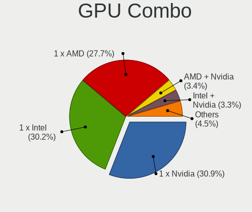

| Name                | Desktops | Percent |
|---------------------|----------|---------|
| 1 x Nvidia          | 67       | 31.31%  |
| 1 x Intel           | 66       | 30.84%  |
| 1 x AMD             | 60       | 28.04%  |
| Intel + Nvidia      | 6        | 2.8%    |
| AMD + Nvidia        | 6        | 2.8%    |
| 2 x AMD             | 4        | 1.87%   |
| 2 x Nvidia          | 1        | 0.47%   |
| 2 x Intel + 1 x AMD | 1        | 0.47%   |
| 2 x Intel           | 1        | 0.47%   |
| 1 x Matrox          | 1        | 0.47%   |
| Intel + 2 x Nvidia  | 1        | 0.47%   |

GPU Driver
----------

Free vs proprietary

| Driver      | Desktops | Percent |
|-------------|----------|---------|
| Free        | 154      | 71.96%  |
| Proprietary | 54       | 25.23%  |
| Unknown     | 6        | 2.8%    |

GPU Memory
----------

Total video memory

| Size in GB | Desktops | Percent |
|------------|----------|---------|
| Unknown    | 157      | 73.36%  |
| 7.01-8.0   | 11       | 5.14%   |
| 3.01-4.0   | 11       | 5.14%   |
| 1.01-2.0   | 10       | 4.67%   |
| 0.01-0.5   | 8        | 3.74%   |
| 0.51-1.0   | 6        | 2.8%    |
| 16.01-24.0 | 5        | 2.34%   |
| 8.01-16.0  | 4        | 1.87%   |
| 5.01-6.0   | 2        | 0.93%   |

Monitor
-------

Monitor Vendor
--------------

Monitor vendors

| Vendor               | Desktops | Percent |
|----------------------|----------|---------|
| Samsung Electronics  | 39       | 16.81%  |
| Goldstar             | 26       | 11.21%  |
| Dell                 | 26       | 11.21%  |
| Acer                 | 19       | 8.19%   |
| Hewlett-Packard      | 17       | 7.33%   |
| Ancor Communications | 14       | 6.03%   |
| AOC                  | 13       | 5.6%    |
| Philips              | 9        | 3.88%   |
| Iiyama               | 8        | 3.45%   |
| ViewSonic            | 6        | 2.59%   |
| BenQ                 | 6        | 2.59%   |
| MSI                  | 4        | 1.72%   |
| Lenovo               | 3        | 1.29%   |
| ASUSTek Computer     | 3        | 1.29%   |
| Wacom                | 2        | 0.86%   |
| Unknown (XXX)        | 2        | 0.86%   |
| Sceptre Tech         | 2        | 0.86%   |
| NEC Computers        | 2        | 0.86%   |
| MiTAC                | 2        | 0.86%   |
| Hitachi              | 2        | 0.86%   |
| Gigabyte Technology  | 2        | 0.86%   |
| Eizo                 | 2        | 0.86%   |
| ___                  | 1        | 0.43%   |
| Vizio                | 1        | 0.43%   |
| Unknown              | 1        | 0.43%   |
| Toshiba              | 1        | 0.43%   |
| TCL                  | 1        | 0.43%   |
| SGT                  | 1        | 0.43%   |
| SANYO                | 1        | 0.43%   |
| Positivo             | 1        | 0.43%   |
| NECCI                | 1        | 0.43%   |
| Medion               | 1        | 0.43%   |
| LG Electronics       | 1        | 0.43%   |
| KTC                  | 1        | 0.43%   |
| JVC                  | 1        | 0.43%   |
| HKM                  | 1        | 0.43%   |
| HKC                  | 1        | 0.43%   |
| Fujitsu Siemens      | 1        | 0.43%   |
| FAY                  | 1        | 0.43%   |
| Element              | 1        | 0.43%   |

Monitor Model
-------------

Monitor models

| Model                                                                 | Desktops | Percent |
|-----------------------------------------------------------------------|----------|---------|
| Goldstar HDR 4K GSM7707 3840x2160 600x340mm 27.2-inch                 | 3        | 1.24%   |
| Goldstar FULL HD GSM5B55 1920x1080 480x270mm 21.7-inch                | 3        | 1.24%   |
| Wacom Cintiq 13HD WAC1040 1920x1080 293x165mm 13.2-inch               | 2        | 0.83%   |
| Samsung Electronics LF24T35 SAM707D 1920x1080 530x300mm 24.0-inch     | 2        | 0.83%   |
| Samsung Electronics LCD Monitor SAM0D47 1920x1080 885x498mm 40.0-inch | 2        | 0.83%   |
| Samsung Electronics LC49G95T SAM7053 2560x1440 1193x336mm 48.8-inch   | 2        | 0.83%   |
| Samsung Electronics C27F390 SAM0D32 1920x1080 598x336mm 27.0-inch     | 2        | 0.83%   |
| Samsung Electronics C24F390 SAM0D2C 1920x1080 521x293mm 23.5-inch     | 2        | 0.83%   |
| Philips FTV PHL01EA 1920x1080 1440x810mm 65.0-inch                    | 2        | 0.83%   |
| Goldstar ULTRAGEAR GSM5BB2 1920x1080 527x296mm 23.8-inch              | 2        | 0.83%   |
| Dell SE198WFP DELF003 1440x900 408x255mm 18.9-inch                    | 2        | 0.83%   |
| BenQ EW3270U BNQ7950 3840x2160 700x390mm 31.5-inch                    | 2        | 0.83%   |
| AOC 2270W AOC2270 1920x1080 477x268mm 21.5-inch                       | 2        | 0.83%   |
| Acer S191HQL ACR021C 1366x768 410x230mm 18.5-inch                     | 2        | 0.83%   |
| Acer KA220HQ ACR0467 1920x1080 477x268mm 21.5-inch                    | 2        | 0.83%   |
| ___ LCDTV16 ___0101 1920x1080                                         | 1        | 0.41%   |
| Vizio E422VLE VIZ0092 1920x1080 930x523mm 42.0-inch                   | 1        | 0.41%   |
| ViewSonic VX2703 SERIES VSCF62B 1920x1080 600x340mm 27.2-inch         | 1        | 0.41%   |
| ViewSonic VX2235wm VSC591E 1680x1050 474x296mm 22.0-inch              | 1        | 0.41%   |
| ViewSonic VG2755-2K VSC4E37 2560x1440 597x336mm 27.0-inch             | 1        | 0.41%   |
| ViewSonic VA2719-2K VSC6B34 2560x1440 597x336mm 27.0-inch             | 1        | 0.41%   |
| ViewSonic VA2702w VSCE727 1920x1080 598x336mm 27.0-inch               | 1        | 0.41%   |
| ViewSonic VA2447-FHD VSC303B 1920x1080 527x296mm 23.8-inch            | 1        | 0.41%   |
| Unknown LCDTV16 0101 1920x1080 1600x900mm 72.3-inch                   | 1        | 0.41%   |
| Unknown (XXX) LED TV XXX3553 1920x1080 530x290mm 23.8-inch            | 1        | 0.41%   |
| Unknown (XXX) HD TV XXXC37E 1920x1080 700x390mm 31.5-inch             | 1        | 0.41%   |
| Toshiba TV TSB0200 1360x768 409x230mm 18.5-inch                       | 1        | 0.41%   |
| TCL SMART TV TCL6586 3840x2160 1209x680mm 54.6-inch                   | 1        | 0.41%   |
| SGT M156F01 SGT1600 1920x1080 345x194mm 15.6-inch                     | 1        | 0.41%   |
| Sceptre Tech Sceptre Q27 SPT0AD2 2560x1440 597x336mm 27.0-inch        | 1        | 0.41%   |
| Sceptre Tech E32 SPT0CB8 1366x768 575x323mm 26.0-inch                 | 1        | 0.41%   |
| SANYO LCD-42S SAN0A28 1360x765 708x398mm 32.0-inch                    | 1        | 0.41%   |
| Samsung Electronics U32H85x SAM0E3A 3840x2160 700x390mm 31.5-inch     | 1        | 0.41%   |
| Samsung Electronics U28E590 SAM0C4E 3840x2160 608x345mm 27.5-inch     | 1        | 0.41%   |
| Samsung Electronics SyncMaster SAM0485 1920x1080 520x320mm 24.0-inch  | 1        | 0.41%   |
| Samsung Electronics SyncMaster SAM010B 1280x1024 338x270mm 17.0-inch  | 1        | 0.41%   |
| Samsung Electronics SMB1930N SAM0632 1366x768 410x230mm 18.5-inch     | 1        | 0.41%   |
| Samsung Electronics SA300/SA350 SAM078B 1600x900 443x249mm 20.0-inch  | 1        | 0.41%   |
| Samsung Electronics S34J55x SAM0F70 3440x1440 800x330mm 34.1-inch     | 1        | 0.41%   |
| Samsung Electronics S32F351 SAM0D24 1920x1080 698x393mm 31.5-inch     | 1        | 0.41%   |

Monitor Resolution
------------------

Monitor screen resolution

| Resolution         | Desktops | Percent |
|--------------------|----------|---------|
| 1920x1080 (FHD)    | 107      | 48.2%   |
| 3840x2160 (4K)     | 33       | 14.86%  |
| 2560x1440 (QHD)    | 27       | 12.16%  |
| 1440x900 (WXGA+)   | 8        | 3.6%    |
| 1366x768 (WXGA)    | 7        | 3.15%   |
| 1280x1024 (SXGA)   | 7        | 3.15%   |
| 3840x1080          | 4        | 1.8%    |
| 3440x1440          | 4        | 1.8%    |
| 2560x1080          | 4        | 1.8%    |
| Unknown            | 4        | 1.8%    |
| 1920x1200 (WUXGA)  | 3        | 1.35%   |
| 1600x900 (HD+)     | 3        | 1.35%   |
| 3840x1600          | 2        | 0.9%    |
| 1920x540           | 2        | 0.9%    |
| 1680x1050 (WSXGA+) | 2        | 0.9%    |
| 1280x720 (HD)      | 2        | 0.9%    |
| 5760x2160          | 1        | 0.45%   |
| 1360x768           | 1        | 0.45%   |
| 1024x768 (XGA)     | 1        | 0.45%   |

Monitor Diagonal
----------------

Diagonal size in inches

| Inches  | Desktops | Percent |
|---------|----------|---------|
| 27      | 37       | 15.95%  |
| 24      | 29       | 12.5%   |
| 21      | 29       | 12.5%   |
| 23      | 27       | 11.64%  |
| 31      | 19       | 8.19%   |
| 19      | 13       | 5.6%    |
| Unknown | 11       | 4.74%   |
| 18      | 8        | 3.45%   |
| 34      | 6        | 2.59%   |
| 40      | 5        | 2.16%   |
| 17      | 4        | 1.72%   |
| 84      | 3        | 1.29%   |
| 52      | 3        | 1.29%   |
| 48      | 3        | 1.29%   |
| 32      | 3        | 1.29%   |
| 26      | 3        | 1.29%   |
| 72      | 2        | 0.86%   |
| 65      | 2        | 0.86%   |
| 43      | 2        | 0.86%   |
| 42      | 2        | 0.86%   |
| 35      | 2        | 0.86%   |
| 22      | 2        | 0.86%   |
| 20      | 2        | 0.86%   |
| 13      | 2        | 0.86%   |
| 63      | 1        | 0.43%   |
| 61      | 1        | 0.43%   |
| 60      | 1        | 0.43%   |
| 54      | 1        | 0.43%   |
| 46      | 1        | 0.43%   |
| 38      | 1        | 0.43%   |
| 37      | 1        | 0.43%   |
| 33      | 1        | 0.43%   |
| 28      | 1        | 0.43%   |
| 16      | 1        | 0.43%   |
| 15      | 1        | 0.43%   |
| 14      | 1        | 0.43%   |
| 10      | 1        | 0.43%   |

Monitor Width
-------------

Physical width

| Width in mm | Desktops | Percent |
|-------------|----------|---------|
| 501-600     | 87       | 38.16%  |
| 401-500     | 47       | 20.61%  |
| 601-700     | 25       | 10.96%  |
| 1001-1500   | 13       | 5.7%    |
| Unknown     | 11       | 4.82%   |
| 701-800     | 10       | 4.39%   |
| 351-400     | 9        | 3.95%   |
| 801-900     | 8        | 3.51%   |
| 1501-2000   | 5        | 2.19%   |
| 901-1000    | 5        | 2.19%   |
| 301-350     | 4        | 1.75%   |
| 201-300     | 4        | 1.75%   |

Aspect Ratio
------------

Proportional relationship between the width and the height

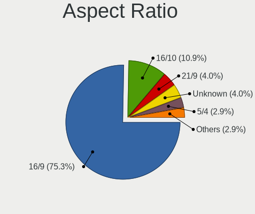

| Ratio   | Desktops | Percent |
|---------|----------|---------|
| 16/9    | 156      | 74.64%  |
| 16/10   | 17       | 8.13%   |
| 5/4     | 10       | 4.78%   |
| 21/9    | 10       | 4.78%   |
| Unknown | 8        | 3.83%   |
| 32/9    | 5        | 2.39%   |
| 4/3     | 3        | 1.44%   |

Monitor Area
------------

Area in inch

| Area in inch | Desktops | Percent |
|----------------|----------|---------|
| 201-250        | 63       | 27.63%  |
| 301-350        | 39       | 17.11%  |
| 351-500        | 31       | 13.6%   |
| 151-200        | 24       | 10.53%  |
| 251-300        | 15       | 6.58%   |
| More than 1000 | 14       | 6.14%   |
| 501-1000       | 14       | 6.14%   |
| Unknown        | 11       | 4.82%   |
| 141-150        | 10       | 4.39%   |
| 101-110        | 3        | 1.32%   |
| 71-80          | 2        | 0.88%   |
| 51-60          | 1        | 0.44%   |
| 131-140        | 1        | 0.44%   |

Pixel Density
-------------

Pixels per inch

| Density | Desktops | Percent |
|---------|----------|---------|
| 51-100  | 126      | 57.27%  |
| 101-120 | 53       | 24.09%  |
| 121-160 | 13       | 5.91%   |
| Unknown | 11       | 5%      |
| 1-50    | 10       | 4.55%   |
| 161-240 | 7        | 3.18%   |

Multiple Monitors
-----------------

Total monitors connected

| Total | Desktops | Percent |
|-------|----------|---------|
| 1     | 160      | 74.42%  |
| 2     | 40       | 18.6%   |
| 0     | 11       | 5.12%   |
| 3     | 3        | 1.4%    |
| 4     | 1        | 0.47%   |

Network
-------

Net Controller Vendor
---------------------

Controller vendors

| Vendor                          | Desktops | Percent |
|---------------------------------|----------|---------|
| Realtek Semiconductor           | 132      | 40.62%  |
| Intel                           | 91       | 28%     |
| Broadcom                        | 17       | 5.23%   |
| TP-Link                         | 14       | 4.31%   |
| Qualcomm Atheros                | 13       | 4%      |
| MediaTek                        | 10       | 3.08%   |
| Ralink Technology               | 5        | 1.54%   |
| NetGear                         | 5        | 1.54%   |
| Microsoft                       | 4        | 1.23%   |
| D-Link                          | 4        | 1.23%   |
| Aquantia                        | 4        | 1.23%   |
| Xiaomi                          | 2        | 0.62%   |
| Samsung Electronics             | 2        | 0.62%   |
| Ralink                          | 2        | 0.62%   |
| Mellanox Technologies           | 2        | 0.62%   |
| Huawei Technologies             | 2        | 0.62%   |
| Google                          | 2        | 0.62%   |
| Edimax Technology               | 2        | 0.62%   |
| ASUSTek Computer                | 2        | 0.62%   |
| Apple                           | 2        | 0.62%   |
| ZyDAS                           | 1        | 0.31%   |
| Z-Com                           | 1        | 0.31%   |
| Qualcomm Atheros Communications | 1        | 0.31%   |
| Nvidia                          | 1        | 0.31%   |
| Linksys                         | 1        | 0.31%   |
| Guillemot                       | 1        | 0.31%   |
| Dresden Elektronik              | 1        | 0.31%   |
| AVM                             | 1        | 0.31%   |

Net Controller Model
--------------------

Controller models

| Model                                                             | Desktops | Percent |
|-------------------------------------------------------------------|----------|---------|
| Realtek RTL8111/8168/8411 PCI Express Gigabit Ethernet Controller | 97       | 26.01%  |
| Realtek RTL8125 2.5GbE Controller                                 | 20       | 5.36%   |
| Intel Ethernet Controller I225-V                                  | 10       | 2.68%   |
| Intel Wi-Fi 6 AX200                                               | 8        | 2.14%   |
| Intel Wi-Fi 6 AX210/AX211/AX411 160MHz                            | 7        | 1.88%   |
| Intel I211 Gigabit Network Connection                             | 7        | 1.88%   |
| MediaTek MT7922 802.11ax PCI Express Wireless Network Adapter     | 6        | 1.61%   |
| Intel 82579LM Gigabit Network Connection (Lewisville)             | 6        | 1.61%   |
| TP-Link TL-WN823N v2/v3 [Realtek RTL8192EU]                       | 5        | 1.34%   |
| Realtek RTL810xE PCI Express Fast Ethernet controller             | 5        | 1.34%   |
| Intel Ethernet Connection I217-LM                                 | 5        | 1.34%   |
| Intel Ethernet Connection (7) I219-V                              | 5        | 1.34%   |
| Intel Ethernet Connection (2) I219-V                              | 5        | 1.34%   |
| Intel Ethernet Connection (2) I218-V                              | 5        | 1.34%   |
| Intel Alder Lake-S PCH CNVi WiFi                                  | 5        | 1.34%   |
| Intel 700 Series Chipset Family Wi-Fi                             | 5        | 1.34%   |
| Realtek RTL8852BE PCIe 802.11ax Wireless Network Controller       | 4        | 1.07%   |
| Realtek 802.11ac NIC                                              | 4        | 1.07%   |
| Qualcomm Atheros AR8151 v2.0 Gigabit Ethernet                     | 4        | 1.07%   |
| Broadcom BCM4352 802.11ac Wireless Network Adapter                | 4        | 1.07%   |
| Ralink MT7601U Wireless Adapter                                   | 3        | 0.8%    |
| Qualcomm Atheros AR9485 Wireless Network Adapter                  | 3        | 0.8%    |
| Microsoft Xbox 360 Wireless Adapter                               | 3        | 0.8%    |
| Intel Wireless-AC 9260                                            | 3        | 0.8%    |
| Intel I210 Gigabit Network Connection                             | 3        | 0.8%    |
| Intel Ethernet Controller I226-V                                  | 3        | 0.8%    |
| Intel Ethernet Connection (17) I219-V                             | 3        | 0.8%    |
| Intel Cannon Lake PCH CNVi WiFi                                   | 3        | 0.8%    |
| Intel 82579V Gigabit Network Connection                           | 3        | 0.8%    |
| Intel 82574L Gigabit Network Connection                           | 3        | 0.8%    |
| Broadcom BCM4360 802.11ac Wireless Network Adapter                | 3        | 0.8%    |
| Aquantia AQC107 NBase-T/IEEE 802.3bz Ethernet Controller [AQtion] | 3        | 0.8%    |
| Xiaomi Mi/Redmi series (RNDIS)                                    | 2        | 0.54%   |
| TP-Link AC600 wireless Realtek RTL8811AU [Archer T2U Nano]        | 2        | 0.54%   |
| TP-Link 802.11ac NIC                                              | 2        | 0.54%   |
| Realtek RTL88x2bu [AC1200 Techkey]                                | 2        | 0.54%   |
| Realtek RTL8812AU 802.11a/b/g/n/ac 2T2R DB WLAN Adapter           | 2        | 0.54%   |
| Realtek RTL8192EE PCIe Wireless Network Adapter                   | 2        | 0.54%   |
| Realtek RTL8188FTV 802.11b/g/n 1T1R 2.4G WLAN Adapter             | 2        | 0.54%   |
| Realtek RTL8188EUS 802.11n Wireless Network Adapter               | 2        | 0.54%   |

Wireless Vendor
---------------

Wireless vendors

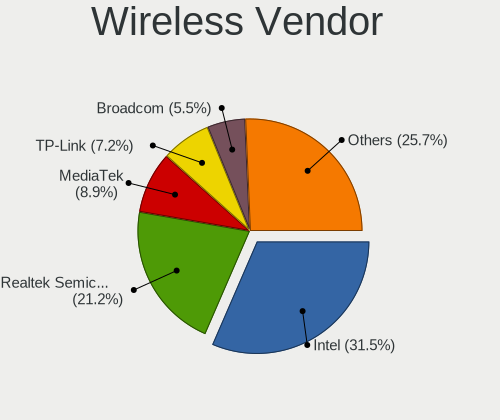

| Vendor                          | Desktops | Percent |
|---------------------------------|----------|---------|
| Intel                           | 42       | 30.43%  |
| Realtek Semiconductor           | 26       | 18.84%  |
| TP-Link                         | 14       | 10.14%  |
| MediaTek                        | 10       | 7.25%   |
| Broadcom                        | 9        | 6.52%   |
| Qualcomm Atheros                | 7        | 5.07%   |
| Ralink Technology               | 5        | 3.62%   |
| NetGear                         | 5        | 3.62%   |
| Microsoft                       | 4        | 2.9%    |
| D-Link                          | 4        | 2.9%    |
| Ralink                          | 2        | 1.45%   |
| Edimax Technology               | 2        | 1.45%   |
| ASUSTek Computer                | 2        | 1.45%   |
| ZyDAS                           | 1        | 0.72%   |
| Z-Com                           | 1        | 0.72%   |
| Qualcomm Atheros Communications | 1        | 0.72%   |
| Linksys                         | 1        | 0.72%   |
| Guillemot                       | 1        | 0.72%   |
| AVM                             | 1        | 0.72%   |

Wireless Model
--------------

Wireless models

| Model                                                          | Desktops | Percent |
|----------------------------------------------------------------|----------|---------|
| Intel Wi-Fi 6 AX200                                            | 8        | 5.76%   |
| Intel Wi-Fi 6 AX210/AX211/AX411 160MHz                         | 7        | 5.04%   |
| MediaTek MT7922 802.11ax PCI Express Wireless Network Adapter  | 6        | 4.32%   |
| TP-Link TL-WN823N v2/v3 [Realtek RTL8192EU]                    | 5        | 3.6%    |
| Intel Alder Lake-S PCH CNVi WiFi                               | 5        | 3.6%    |
| Intel 700 Series Chipset Family Wi-Fi                          | 5        | 3.6%    |
| Realtek RTL8852BE PCIe 802.11ax Wireless Network Controller    | 4        | 2.88%   |
| Realtek 802.11ac NIC                                           | 4        | 2.88%   |
| Broadcom BCM4352 802.11ac Wireless Network Adapter             | 4        | 2.88%   |
| Ralink MT7601U Wireless Adapter                                | 3        | 2.16%   |
| Qualcomm Atheros AR9485 Wireless Network Adapter               | 3        | 2.16%   |
| Microsoft Xbox 360 Wireless Adapter                            | 3        | 2.16%   |
| Intel Wireless-AC 9260                                         | 3        | 2.16%   |
| Intel Cannon Lake PCH CNVi WiFi                                | 3        | 2.16%   |
| Broadcom BCM4360 802.11ac Wireless Network Adapter             | 3        | 2.16%   |
| TP-Link AC600 wireless Realtek RTL8811AU [Archer T2U Nano]     | 2        | 1.44%   |
| TP-Link 802.11ac NIC                                           | 2        | 1.44%   |
| Realtek RTL88x2bu [AC1200 Techkey]                             | 2        | 1.44%   |
| Realtek RTL8812AU 802.11a/b/g/n/ac 2T2R DB WLAN Adapter        | 2        | 1.44%   |
| Realtek RTL8192EE PCIe Wireless Network Adapter                | 2        | 1.44%   |
| Realtek RTL8188FTV 802.11b/g/n 1T1R 2.4G WLAN Adapter          | 2        | 1.44%   |
| Realtek RTL8188EUS 802.11n Wireless Network Adapter            | 2        | 1.44%   |
| Qualcomm Atheros AR9462 Wireless Network Adapter               | 2        | 1.44%   |
| MediaTek MT7921K (RZ608) Wi-Fi 6E 80MHz                        | 2        | 1.44%   |
| Intel Wireless 3165                                            | 2        | 1.44%   |
| Intel Tiger Lake PCH CNVi WiFi                                 | 2        | 1.44%   |
| Edimax EW-7811Un 802.11n Wireless Adapter [Realtek RTL8188CUS] | 2        | 1.44%   |
| D-Link 802.11ac NIC                                            | 2        | 1.44%   |
| ASUS 802.11ac NIC                                              | 2        | 1.44%   |
| ZyDAS ZD1211B 802.11g                                          | 1        | 0.72%   |
| Z-Com XG-703A 802.11g Wireless Adapter [Intersil ISL3887]      | 1        | 0.72%   |
| TP-Link TL-WN722N v2/v3 [Realtek RTL8188EUS]                   | 1        | 0.72%   |
| TP-Link Archer T4U ver.3                                       | 1        | 0.72%   |
| TP-Link Archer T3U [Realtek RTL8812BU]                         | 1        | 0.72%   |
| TP-Link Archer T2U PLUS [RTL8821AU]                            | 1        | 0.72%   |
| TP-Link 802.11n NIC                                            | 1        | 0.72%   |
| Realtek RTL8822CE 802.11ac PCIe Wireless Network Adapter       | 1        | 0.72%   |
| Realtek RTL8822BE 802.11a/b/g/n/ac WiFi adapter                | 1        | 0.72%   |
| Realtek RTL8821AE 802.11ac PCIe Wireless Network Adapter       | 1        | 0.72%   |
| Realtek RTL8723BE PCIe Wireless Network Adapter                | 1        | 0.72%   |

Ethernet Vendor
---------------

Ethernet vendors

| Vendor                | Desktops | Percent |
|-----------------------|----------|---------|
| Realtek Semiconductor | 126      | 56.5%   |
| Intel                 | 69       | 30.94%  |
| Broadcom              | 8        | 3.59%   |
| Qualcomm Atheros      | 6        | 2.69%   |
| Aquantia              | 4        | 1.79%   |
| Xiaomi                | 2        | 0.9%    |
| Mellanox Technologies | 2        | 0.9%    |
| Google                | 2        | 0.9%    |
| Samsung Electronics   | 1        | 0.45%   |
| Nvidia                | 1        | 0.45%   |
| Huawei Technologies   | 1        | 0.45%   |
| Apple                 | 1        | 0.45%   |

Ethernet Model
--------------

Ethernet models

| Model                                                             | Desktops | Percent |
|-------------------------------------------------------------------|----------|---------|
| Realtek RTL8111/8168/8411 PCI Express Gigabit Ethernet Controller | 97       | 42.17%  |
| Realtek RTL8125 2.5GbE Controller                                 | 20       | 8.7%    |
| Intel Ethernet Controller I225-V                                  | 10       | 4.35%   |
| Intel I211 Gigabit Network Connection                             | 7        | 3.04%   |
| Intel 82579LM Gigabit Network Connection (Lewisville)             | 6        | 2.61%   |
| Realtek RTL810xE PCI Express Fast Ethernet controller             | 5        | 2.17%   |
| Intel Ethernet Connection I217-LM                                 | 5        | 2.17%   |
| Intel Ethernet Connection (7) I219-V                              | 5        | 2.17%   |
| Intel Ethernet Connection (2) I219-V                              | 5        | 2.17%   |
| Intel Ethernet Connection (2) I218-V                              | 5        | 2.17%   |
| Qualcomm Atheros AR8151 v2.0 Gigabit Ethernet                     | 4        | 1.74%   |
| Intel I210 Gigabit Network Connection                             | 3        | 1.3%    |
| Intel Ethernet Controller I226-V                                  | 3        | 1.3%    |
| Intel Ethernet Connection (17) I219-V                             | 3        | 1.3%    |
| Intel 82579V Gigabit Network Connection                           | 3        | 1.3%    |
| Intel 82574L Gigabit Network Connection                           | 3        | 1.3%    |
| Aquantia AQC107 NBase-T/IEEE 802.3bz Ethernet Controller [AQtion] | 3        | 1.3%    |
| Xiaomi Mi/Redmi series (RNDIS)                                    | 2        | 0.87%   |
| Realtek RTL8153 Gigabit Ethernet Adapter                          | 2        | 0.87%   |
| Intel Ethernet Connection I217-V                                  | 2        | 0.87%   |
| Intel Ethernet Connection (7) I219-LM                             | 2        | 0.87%   |
| Intel Ethernet Connection (2) I219-LM                             | 2        | 0.87%   |
| Intel Ethernet Connection (14) I219-V                             | 2        | 0.87%   |
| Intel 82567LM-3 Gigabit Network Connection                        | 2        | 0.87%   |
| Broadcom NetXtreme BCM5764M Gigabit Ethernet PCIe                 | 2        | 0.87%   |
| Broadcom NetXtreme BCM5761 Gigabit Ethernet PCIe                  | 2        | 0.87%   |
| Samsung Galaxy series, misc. (tethering mode)                     | 1        | 0.43%   |
| Realtek RTL-8100/8101L/8139 PCI Fast Ethernet Adapter             | 1        | 0.43%   |
| Realtek Killer E3000 2.5GbE Controller                            | 1        | 0.43%   |
| Realtek Killer E2600 Gigabit Ethernet Controller                  | 1        | 0.43%   |
| Qualcomm Atheros Killer E2400 Gigabit Ethernet Controller         | 1        | 0.43%   |
| Qualcomm Atheros Killer E220x Gigabit Ethernet Controller         | 1        | 0.43%   |
| Nvidia MCP61 Ethernet                                             | 1        | 0.43%   |
| Mellanox MT27520 Family [ConnectX-3 Pro]                          | 1        | 0.43%   |
| Mellanox MT26448 [ConnectX EN 10GigE, PCIe 2.0 5GT/s]             | 1        | 0.43%   |
| Intel Ethernet Controller X550                                    | 1        | 0.43%   |
| Intel Ethernet Controller I219-V                                  | 1        | 0.43%   |
| Intel Ethernet Connection (2) I218-LM                             | 1        | 0.43%   |
| Intel Ethernet Connection (10) I219-V                             | 1        | 0.43%   |
| Intel 82578DC Gigabit Network Connection                          | 1        | 0.43%   |

Net Controller Kind
-------------------

Ethernet, WiFi or modem

| Kind     | Desktops | Percent |
|----------|----------|---------|
| Ethernet | 208      | 60.82%  |
| WiFi     | 130      | 38.01%  |
| Modem    | 4        | 1.17%   |

Used Controller
---------------

Currently used network controller

| Kind     | Desktops | Percent |
|----------|----------|---------|
| Ethernet | 159      | 71.3%   |
| WiFi     | 64       | 28.7%   |

NICs
----

Total network controllers on board

| Total | Desktops | Percent |
|-------|----------|---------|
| 1     | 122      | 57.28%  |
| 2     | 75       | 35.21%  |
| 3     | 11       | 5.16%   |
| 0     | 4        | 1.88%   |
| 5     | 1        | 0.47%   |

IPv6
----

IPv6 vs IPv4

| Used | Desktops | Percent |
|------|----------|---------|
| No   | 140      | 65.73%  |
| Yes  | 73       | 34.27%  |

Bluetooth
---------

Bluetooth Vendor
----------------

Controller vendors

| Vendor                          | Desktops | Percent |
|---------------------------------|----------|---------|
| Intel                           | 41       | 43.16%  |
| Cambridge Silicon Radio         | 11       | 11.58%  |
| Realtek Semiconductor           | 10       | 10.53%  |
| IMC Networks                    | 8        | 8.42%   |
| MediaTek                        | 7        | 7.37%   |
| ASUSTek Computer                | 5        | 5.26%   |
| TP-Link                         | 3        | 3.16%   |
| Qualcomm Atheros Communications | 2        | 2.11%   |
| Broadcom                        | 2        | 2.11%   |
| Apple                           | 2        | 2.11%   |
| Lite-On Technology              | 1        | 1.05%   |
| Integrated System Solution      | 1        | 1.05%   |
| Foxconn / Hon Hai               | 1        | 1.05%   |
| Dynex                           | 1        | 1.05%   |

Bluetooth Model
---------------

Controller models

| Model                                                    | Desktops | Percent |
|----------------------------------------------------------|----------|---------|
| Cambridge Silicon Radio Bluetooth Dongle (HCI mode)      | 11       | 11.58%  |
| Realtek Bluetooth Radio                                  | 9        | 9.47%   |
| Intel AX201 Bluetooth                                    | 8        | 8.42%   |
| Intel AX200 Bluetooth                                    | 8        | 8.42%   |
| MediaTek Wireless_Device                                 | 7        | 7.37%   |
| Intel Bluetooth wireless interface                       | 7        | 7.37%   |
| Intel Bluetooth Device                                   | 6        | 6.32%   |
| Intel AX210 Bluetooth                                    | 6        | 6.32%   |
| IMC Networks Bluetooth Radio                             | 5        | 5.26%   |
| TP-Link UB500 Adapter                                    | 3        | 3.16%   |
| Intel Wireless-AC 9260 Bluetooth Adapter                 | 3        | 3.16%   |
| Intel Bluetooth 9460/9560 Jefferson Peak (JfP)           | 3        | 3.16%   |
| ASUS Broadcom BCM20702A0 Bluetooth                       | 3        | 3.16%   |
| IMC Networks Wireless_Device                             | 2        | 2.11%   |
| Apple Bluetooth USB Host Controller                      | 2        | 2.11%   |
| Realtek  Bluetooth 4.2 Adapter                           | 1        | 1.05%   |
| Qualcomm Atheros  Bluetooth Device                       | 1        | 1.05%   |
| Qualcomm Atheros Bluetooth USB Host Controller           | 1        | 1.05%   |
| Lite-On Qualcomm Atheros QCA9377 Bluetooth               | 1        | 1.05%   |
| Integrated System Solution KY-BT100 Bluetooth Adapter    | 1        | 1.05%   |
| IMC Networks BCM20702A0                                  | 1        | 1.05%   |
| Foxconn / Hon Hai Bluetooth Device                       | 1        | 1.05%   |
| Dynex Bluetooth 4.0 Adapter [Broadcom, 1.12, BCM20702A0] | 1        | 1.05%   |
| Broadcom BCM92046DG-CL1ROM Bluetooth 2.1 Adapter         | 1        | 1.05%   |
| Broadcom BCM43142 Bluetooth 4.0                          | 1        | 1.05%   |
| ASUS BCM20702A0                                          | 1        | 1.05%   |
| ASUS ASUS USB-BT500                                      | 1        | 1.05%   |

Sound
-----

Sound Vendor
------------

Sound card vendors

| Vendor                                          | Desktops | Percent |
|-------------------------------------------------|----------|---------|
| Intel                                           | 142      | 38.8%   |
| AMD                                             | 86       | 23.5%   |
| Nvidia                                          | 78       | 21.31%  |
| C-Media Electronics                             | 10       | 2.73%   |
| Logitech                                        | 9        | 2.46%   |
| GN Netcom                                       | 4        | 1.09%   |
| ASUSTek Computer                                | 4        | 1.09%   |
| Texas Instruments                               | 3        | 0.82%   |
| KORG                                            | 3        | 0.82%   |
| VIA Technologies                                | 2        | 0.55%   |
| SteelSeries ApS                                 | 2        | 0.55%   |
| Samson Technologies                             | 2        | 0.55%   |
| Razer USA                                       | 2        | 0.55%   |
| Giga-Byte Technology                            | 2        | 0.55%   |
| USB Audio                                       | 1        | 0.27%   |
| Tenx Technology                                 | 1        | 0.27%   |
| Realtek Semiconductor                           | 1        | 0.27%   |
| Nektar                                          | 1        | 0.27%   |
| Native Instruments                              | 1        | 0.27%   |
| Micro Star International                        | 1        | 0.27%   |
| Licensed by Sony Computer Entertainment America | 1        | 0.27%   |
| Lenovo                                          | 1        | 0.27%   |
| JMTek                                           | 1        | 0.27%   |
| JBL                                             | 1        | 0.27%   |
| ESS Technology                                  | 1        | 0.27%   |
| Creative Technology                             | 1        | 0.27%   |
| Creative Labs                                   | 1        | 0.27%   |
| Corsair                                         | 1        | 0.27%   |
| BEHRINGER International                         | 1        | 0.27%   |
| Astro Gaming                                    | 1        | 0.27%   |
| Apple                                           | 1        | 0.27%   |

Sound Model
-----------

Sound card models

| Model                                                                      | Desktops | Percent |
|----------------------------------------------------------------------------|----------|---------|
| AMD Family 17h/19h HD Audio Controller                                     | 22       | 5.02%   |
| Intel 100 Series/C230 Series Chipset Family HD Audio Controller            | 16       | 3.65%   |
| Intel 6 Series/C200 Series Chipset Family High Definition Audio Controller | 15       | 3.42%   |
| AMD Starship/Matisse HD Audio Controller                                   | 15       | 3.42%   |
| Intel Xeon E3-1200 v3/4th Gen Core Processor HD Audio Controller           | 12       | 2.74%   |
| Intel 8 Series/C220 Series Chipset High Definition Audio Controller        | 12       | 2.74%   |
| AMD Rembrandt Radeon High Definition Audio Controller                      | 12       | 2.74%   |
| Intel Alder Lake-S HD Audio Controller                                     | 11       | 2.51%   |
| AMD SBx00 Azalia (Intel HDA)                                               | 11       | 2.51%   |
| AMD Ellesmere HDMI Audio [Radeon RX 470/480 / 570/580/590]                 | 11       | 2.51%   |
| Nvidia GK208 HDMI/DP Audio Controller                                      | 10       | 2.28%   |
| Intel Cannon Lake PCH cAVS                                                 | 10       | 2.28%   |
| Intel 7 Series/C216 Chipset Family High Definition Audio Controller        | 10       | 2.28%   |
| Intel 82801JI (ICH10 Family) HD Audio Controller                           | 9        | 2.05%   |
| AMD Navi 21/23 HDMI/DP Audio Controller                                    | 9        | 2.05%   |
| Intel 200 Series PCH HD Audio                                              | 8        | 1.83%   |
| AMD Family 17h (Models 00h-0fh) HD Audio Controller                        | 8        | 1.83%   |
| Intel Tiger Lake-H HD Audio Controller                                     | 7        | 1.6%    |
| Intel NM10/ICH7 Family High Definition Audio Controller                    | 7        | 1.6%    |
| Intel C610/X99 series chipset HD Audio Controller                          | 7        | 1.6%    |
| Intel 700 Series Chipset Family Precise Touch and Stylus Port #1           | 7        | 1.6%    |
| Nvidia GP107GL High Definition Audio Controller                            | 6        | 1.37%   |
| Nvidia GM204 High Definition Audio Controller                              | 6        | 1.37%   |
| Nvidia GA102 High Definition Audio Controller                              | 6        | 1.37%   |
| Intel 9 Series Chipset Family HD Audio Controller                          | 6        | 1.37%   |
| AMD Renoir Radeon High Definition Audio Controller                         | 6        | 1.37%   |
| AMD FCH Azalia Controller                                                  | 6        | 1.37%   |
| Nvidia High Definition Audio Controller                                    | 5        | 1.14%   |
| Nvidia Audio device                                                        | 5        | 1.14%   |
| AMD Turks HDMI Audio [Radeon HD 6500/6600 / 6700M Series]                  | 5        | 1.14%   |
| AMD Trinity HDMI Audio Controller                                          | 5        | 1.14%   |
| Nvidia GK107 HDMI Audio Controller                                         | 4        | 0.91%   |
| Nvidia GA106 High Definition Audio Controller                              | 4        | 0.91%   |
| Nvidia GA104 High Definition Audio Controller                              | 4        | 0.91%   |
| Nvidia AD102 High Definition Audio Controller                              | 4        | 0.91%   |
| Intel Comet Lake PCH-V cAVS                                                | 4        | 0.91%   |
| AMD Navi 10 HDMI Audio                                                     | 4        | 0.91%   |
| AMD Baffin HDMI/DP Audio [Radeon RX 550 640SP / RX 560/560X]               | 4        | 0.91%   |
| Nvidia GP106 High Definition Audio Controller                              | 3        | 0.68%   |
| Nvidia GM107 High Definition Audio Controller [GeForce 940MX]              | 3        | 0.68%   |

Memory
------

Memory Vendor
-------------

Memory module vendors

| Vendor                               | Desktops | Percent |
|--------------------------------------|----------|---------|
| Kingston                             | 21       | 23.08%  |
| Corsair                              | 12       | 13.19%  |
| G.Skill                              | 10       | 10.99%  |
| Unknown                              | 7        | 7.69%   |
| Samsung Electronics                  | 7        | 7.69%   |
| SK hynix                             | 5        | 5.49%   |
| Micron Technology                    | 5        | 5.49%   |
| Crucial                              | 5        | 5.49%   |
| Transcend                            | 2        | 2.2%    |
| GOODRAM                              | 2        | 2.2%    |
| Unknown (0x9801)                     | 1        | 1.1%    |
| Unifosa                              | 1        | 1.1%    |
| Team                                 | 1        | 1.1%    |
| Ramaxel Technology                   | 1        | 1.1%    |
| Patriot Memory                       | 1        | 1.1%    |
| Nanya Technology                     | 1        | 1.1%    |
| Lexar                                | 1        | 1.1%    |
| Juhor                                | 1        | 1.1%    |
| Hewlett-Packard                      | 1        | 1.1%    |
| Elpida                               | 1        | 1.1%    |
| Chun Well Technology Holding Limited | 1        | 1.1%    |
| Atermiter                            | 1        | 1.1%    |
| ASint Technology                     | 1        | 1.1%    |
| A-DATA Technology                    | 1        | 1.1%    |
| Unknown                              | 1        | 1.1%    |

Memory Model
------------

Memory module models

| Model                                                      | Desktops | Percent |
|------------------------------------------------------------|----------|---------|
| Unknown RAM Module 4GB DIMM 1333MT/s                       | 2        | 2.06%   |
| Kingston RAM KF560C36-16 16GB DIMM 6000MT/s                | 2        | 2.06%   |
| Kingston RAM KF556C40-32 32GB DIMM DDR5 5808MT/s           | 2        | 2.06%   |
| Kingston RAM KF3200C16D4/16GX 16GB DIMM DDR4 3200MT/s      | 2        | 2.06%   |
| G.Skill RAM F4-3200C16-8GVKB 8GB DIMM DDR4 3866MT/s        | 2        | 2.06%   |
| Unknown RAM Module 4GB DIMM SDRAM                          | 1        | 1.03%   |
| Unknown RAM Module 4GB DIMM 400MT/s                        | 1        | 1.03%   |
| Unknown RAM Module 2GB DIMM DDR2                           | 1        | 1.03%   |
| Unknown RAM Module 2GB DIMM DDR 533MT/s                    | 1        | 1.03%   |
| Unknown RAM Module 2GB DIMM 1333MT/s                       | 1        | 1.03%   |
| Unknown RAM Module 1GB DIMM DDR2 800MT/s                   | 1        | 1.03%   |
| Unknown RAM Module 1GB DIMM DDR2 667MT/s                   | 1        | 1.03%   |
| Unknown (0x9801) RAM Module 4GB DIMM DDR3 1334MT/s         | 1        | 1.03%   |
| Unifosa RAM HU524303EP0200 2GB DIMM DDR3 1333MT/s          | 1        | 1.03%   |
| Transcend RAM TS1GLK64V6H 8GB DIMM DDR3 1600MT/s           | 1        | 1.03%   |
| Transcend RAM JM2666HLB-8G 8GB DIMM DDR4 2667MT/s          | 1        | 1.03%   |
| Team RAM TEAMGROUP-UD4-3200 8GB DIMM DDR4 3800MT/s         | 1        | 1.03%   |
| SK hynix RAM Module 8GB SODIMM DDR4 2133MT/s               | 1        | 1.03%   |
| SK hynix RAM HYMP112U64CP8-S6 1GB DIMM DDR2 800MT/s        | 1        | 1.03%   |
| SK hynix RAM HMT451S6BFR8A-PB 4GB SODIMM DDR3 1600MT/s     | 1        | 1.03%   |
| SK hynix RAM HMT125U6TFR8C-H9 2GB DIMM DDR3 1333MT/s       | 1        | 1.03%   |
| SK hynix RAM HMA81GU6CJR8N-VK 8GB DIMM DDR4 2400MT/s       | 1        | 1.03%   |
| Samsung RAM Module 32GB DIMM DDR4 2933MT/s                 | 1        | 1.03%   |
| Samsung RAM M471B5773CHS-CH9 2GB SODIMM DDR3 4199MT/s      | 1        | 1.03%   |
| Samsung RAM M378B5773DH0-CH9 2GB DIMM DDR3 1333MT/s        | 1        | 1.03%   |
| Samsung RAM M378B5673FH0-CH9 2GB DIMM DDR3 1600MT/s        | 1        | 1.03%   |
| Samsung RAM M378B5673EH1-CH9 2GB DIMM 1333MT/s             | 1        | 1.03%   |
| Samsung RAM M378A5244CB0-CTD 4GB DIMM DDR4 3334MT/s        | 1        | 1.03%   |
| Samsung RAM M378A5244CB0-CRC 4096MB DIMM DDR4 3066MT/s     | 1        | 1.03%   |
| Samsung RAM M378A1K43CB2-CTD 8GB DIMM DDR4 3266MT/s        | 1        | 1.03%   |
| Samsung RAM M378A1G44AB0-CWE 8GB DIMM DDR4 3200MT/s        | 1        | 1.03%   |
| Ramaxel RAM RMR1870EC58E9F1333 4GB DIMM DDR3 1333MT/s      | 1        | 1.03%   |
| Patriot Memory RAM 3200 C16 Series 16GB DIMM DDR4 3200MT/s | 1        | 1.03%   |
| Nanya RAM NT2GT64U8HD0BY-AD 2GB DIMM DDR2 2048MT/s         | 1        | 1.03%   |
| Micron RAM Module 8GB SODIMM DDR4 2133MT/s                 | 1        | 1.03%   |
| Micron RAM 4ATF51264AZ-3G2R1 4GB DIMM DDR4 3200MT/s        | 1        | 1.03%   |
| Micron RAM 18ASF1G72PZ-2G1A2 8GB DIMM DDR4 2400MT/s        | 1        | 1.03%   |
| Micron RAM 16ATF2G64AZ-3G2J1 16384MB DIMM DDR4 3200MT/s    | 1        | 1.03%   |
| Micron RAM 16ATF1G64AZ-2G1B1 8GB DIMM DDR4 2133MT/s        | 1        | 1.03%   |
| Lexar RAM LD4AU008G-H3200GST 8GB DIMM DDR4 3200MT/s        | 1        | 1.03%   |

Memory Kind
-----------

Memory module kinds

| Kind    | Desktops | Percent |
|---------|----------|---------|
| DDR4    | 41       | 47.67%  |
| DDR5    | 16       | 18.6%   |
| DDR3    | 16       | 18.6%   |
| SDRAM   | 6        | 6.98%   |
| DDR2    | 3        | 3.49%   |
| Unknown | 3        | 3.49%   |
| DDR     | 1        | 1.16%   |

Memory Form Factor
------------------

Physical design of the memory module

| Name   | Desktops | Percent |
|--------|----------|---------|
| DIMM   | 76       | 92.68%  |
| SODIMM | 6        | 7.32%   |

Memory Size
-----------

Memory module size

| Size  | Desktops | Percent |
|-------|----------|---------|
| 8192  | 33       | 37.5%   |
| 16384 | 20       | 22.73%  |
| 4096  | 14       | 15.91%  |
| 32768 | 12       | 13.64%  |
| 2048  | 7        | 7.95%   |
| 1024  | 2        | 2.27%   |

Memory Speed
------------

Memory module speed

| Speed   | Desktops | Percent |
|---------|----------|---------|
| 3200    | 11       | 12.22%  |
| 1600    | 11       | 12.22%  |
| 2400    | 6        | 6.67%   |
| 3600    | 5        | 5.56%   |
| 1333    | 5        | 5.56%   |
| 6000    | 4        | 4.44%   |
| 5600    | 4        | 4.44%   |
| 2667    | 4        | 4.44%   |
| 2133    | 3        | 3.33%   |
| 6400    | 2        | 2.22%   |
| 5808    | 2        | 2.22%   |
| 5200    | 2        | 2.22%   |
| 4800    | 2        | 2.22%   |
| 3866    | 2        | 2.22%   |
| 3733    | 2        | 2.22%   |
| 3400    | 2        | 2.22%   |
| 2933    | 2        | 2.22%   |
| 2666    | 2        | 2.22%   |
| 800     | 2        | 2.22%   |
| Unknown | 2        | 2.22%   |
| 4199    | 1        | 1.11%   |
| 3800    | 1        | 1.11%   |
| 3666    | 1        | 1.11%   |
| 3466    | 1        | 1.11%   |
| 3334    | 1        | 1.11%   |
| 3266    | 1        | 1.11%   |
| 3066    | 1        | 1.11%   |
| 2048    | 1        | 1.11%   |
| 1867    | 1        | 1.11%   |
| 1866    | 1        | 1.11%   |
| 1334    | 1        | 1.11%   |
| 1066    | 1        | 1.11%   |
| 667     | 1        | 1.11%   |
| 533     | 1        | 1.11%   |
| 400     | 1        | 1.11%   |

Printers & scanners
-------------------

Printer Vendor
--------------

Printer device vendors

| Vendor              | Desktops | Percent |
|---------------------|----------|---------|
| Samsung Electronics | 3        | 25%     |
| Hewlett-Packard     | 3        | 25%     |
| Seiko Epson         | 2        | 16.67%  |
| Brother Industries  | 2        | 16.67%  |
| QinHeng Electronics | 1        | 8.33%   |
| Canon               | 1        | 8.33%   |

Printer Model
-------------

Printer device models

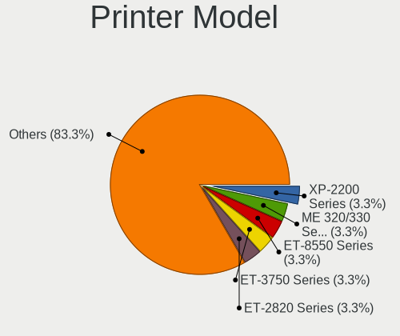

| Model                                        | Desktops | Percent |
|----------------------------------------------|----------|---------|
| Seiko Epson ME 320/330 Series [Stylus SX125] | 1        | 8.33%   |
| Seiko Epson ET-2820 Series                   | 1        | 8.33%   |
| Samsung SCX-4623 Series                      | 1        | 8.33%   |
| Samsung SCX-3400 Series                      | 1        | 8.33%   |
| Samsung CLX-3170 Series                      | 1        | 8.33%   |
| QinHeng CH340S                               | 1        | 8.33%   |
| HP LaserJet P2055 series                     | 1        | 8.33%   |
| HP DeskJet 960c                              | 1        | 8.33%   |
| HP ColorLaserJet M253-M254                   | 1        | 8.33%   |
| Canon TR4500 series                          | 1        | 8.33%   |
| Brother MFC-9330CDW                          | 1        | 8.33%   |
| Brother HL-2030 Laser Printer                | 1        | 8.33%   |

Scanner Vendor
--------------

Scanner device vendors

Zero info for selected period =(

Scanner Model
-------------

Scanner device models

Zero info for selected period =(

Camera
------

Camera Vendor
-------------

Camera device vendors

| Vendor                        | Desktops | Percent |
|-------------------------------|----------|---------|
| Logitech                      | 23       | 47.92%  |
| Apple                         | 5        | 10.42%  |
| Microsoft                     | 4        | 8.33%   |
| Samsung Electronics           | 3        | 6.25%   |
| ARC International             | 2        | 4.17%   |
| Sunplus Innovation Technology | 1        | 2.08%   |
| Razer USA                     | 1        | 2.08%   |
| Pixart Imaging                | 1        | 2.08%   |
| Microdia                      | 1        | 2.08%   |
| Lite-On Technology            | 1        | 2.08%   |
| KYE Systems (Mouse Systems)   | 1        | 2.08%   |
| Generalplus Technology        | 1        | 2.08%   |
| eMeet-200611                  | 1        | 2.08%   |
| eMeet                         | 1        | 2.08%   |
| AVerMedia Technologies        | 1        | 2.08%   |
| Anchor Chips                  | 1        | 2.08%   |

Camera Model
------------

Camera device models

| Model                                            | Desktops | Percent |
|--------------------------------------------------|----------|---------|
| Logitech Webcam C270                             | 8        | 16.33%  |
| Apple iPhone 5/5C/5S/6/SE/7/8/X                  | 4        | 8.16%   |
| Samsung Galaxy A5 (MTP)                          | 3        | 6.12%   |
| Microsoft LifeCam HD-3000                        | 2        | 4.08%   |
| Logitech HD Pro Webcam C920                      | 2        | 4.08%   |
| Logitech BRIO Ultra HD Webcam                    | 2        | 4.08%   |
| Sunplus FHD Camera Microphone                    | 1        | 2.04%   |
| Razer USA Gaming Webcam [Kiyo]                   | 1        | 2.04%   |
| Pixart Imaging GE 1.3 MP MiniCam Pro             | 1        | 2.04%   |
| Microsoft LifeCam NX-6000                        | 1        | 2.04%   |
| Microsoft LifeCam HD-5000                        | 1        | 2.04%   |
| Microdia Laptop_Integrated_Webcam_HD             | 1        | 2.04%   |
| Logitech Webcam Pro 9000                         | 1        | 2.04%   |
| Logitech Webcam C250                             | 1        | 2.04%   |
| Logitech Webcam C210                             | 1        | 2.04%   |
| Logitech Webcam C200                             | 1        | 2.04%   |
| Logitech Webcam C170                             | 1        | 2.04%   |
| Logitech StreamCam                               | 1        | 2.04%   |
| Logitech QuickCam Pro 9000                       | 1        | 2.04%   |
| Logitech HD Webcam C615                          | 1        | 2.04%   |
| Logitech HD Webcam C510                          | 1        | 2.04%   |
| Logitech C922 Pro Stream Webcam                  | 1        | 2.04%   |
| Logitech Brio 500                                | 1        | 2.04%   |
| Lite-On HP Full-HD Camera                        | 1        | 2.04%   |
| KYE Systems (Mouse Systems) AUKEY PC-LM1E Camera | 1        | 2.04%   |
| Generalplus GENERAL WEBCAM                       | 1        | 2.04%   |
| eMeet-200611 eMeet Nova                          | 1        | 2.04%   |
| eMeet HD Webcam C960                             | 1        | 2.04%   |
| AVerMedia Live Streamer CAM 313                  | 1        | 2.04%   |
| ARC International USB 2.0 Camera                 | 1        | 2.04%   |
| ARC International Camera                         | 1        | 2.04%   |
| Apple iPod Touch 2.Gen                           | 1        | 2.04%   |
| Apple iPad 2                                     | 1        | 2.04%   |
| Anchor Chips Camera                              | 1        | 2.04%   |

Security
--------

Fingerprint Vendor
------------------

Fingerprint sensor vendors

Zero info for selected period =(

Fingerprint Model
-----------------

Fingerprint sensor models

Zero info for selected period =(

Chipcard Vendor
---------------

Chipcard module vendors

Zero info for selected period =(

Chipcard Model
--------------

Chipcard module models

Zero info for selected period =(

Unsupported
-----------

Unsupported Devices
-------------------

Total unsupported devices on board

| Total | Desktops | Percent |
|-------|----------|---------|
| 0     | 176      | 81.86%  |
| 1     | 35       | 16.28%  |
| 2     | 2        | 0.93%   |
| 6     | 1        | 0.47%   |
| 3     | 1        | 0.47%   |

Unsupported Device Types
------------------------

Types of unsupported devices

| Type                     | Desktops | Percent |
|--------------------------|----------|---------|
| Graphics card            | 11       | 26.19%  |
| Net/wireless             | 10       | 23.81%  |
| Unassigned class         | 8        | 19.05%  |
| Communication controller | 5        | 11.9%   |
| Sound                    | 2        | 4.76%   |
| Multimedia controller    | 2        | 4.76%   |
| Camera                   | 2        | 4.76%   |
| Bluetooth                | 2        | 4.76%   |

