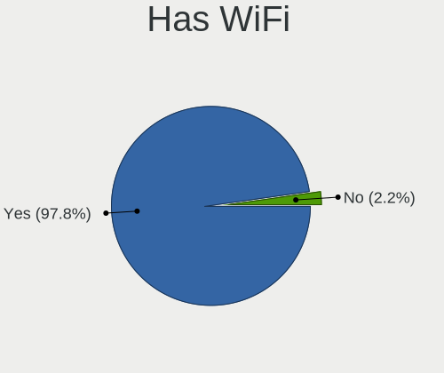
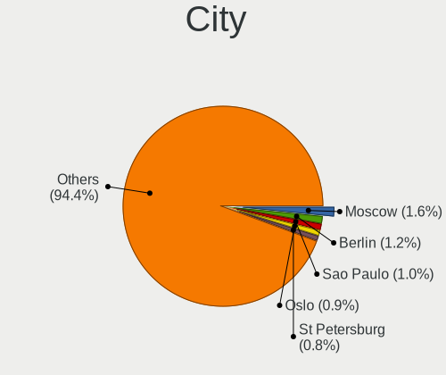
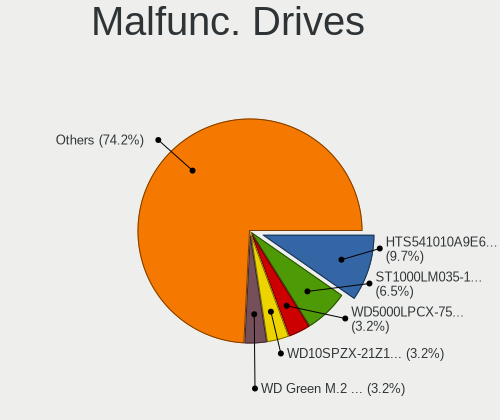
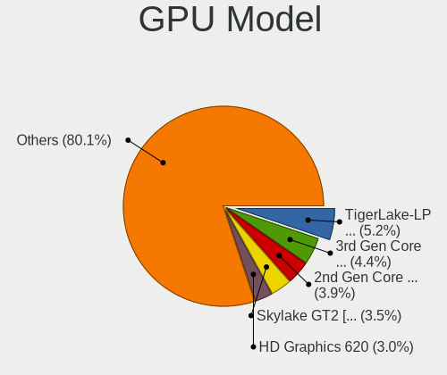
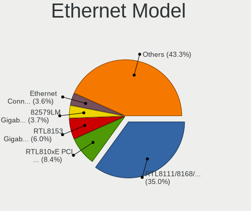
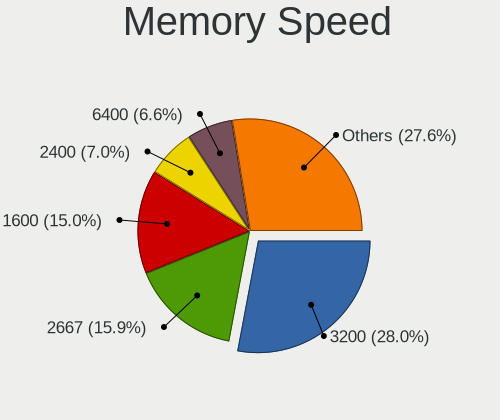
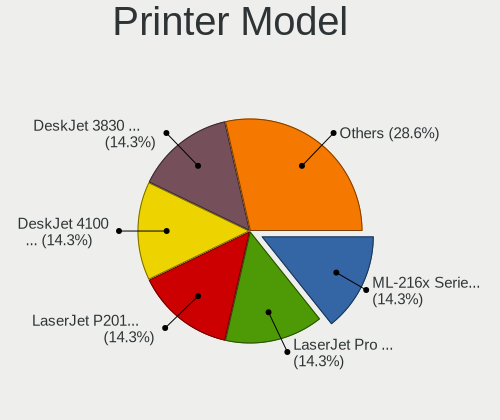
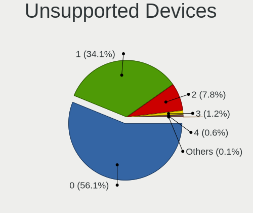

Ubuntu 23.04 - Tested Hardware & Statistics (Notebooks)
-------------------------------------------------------

A project to collect tested hardware configurations for Ubuntu 23.04.

Anyone can contribute to this report by the [hw-probe](https://github.com/linuxhw/hw-probe) tool:

    sudo -E hw-probe -all -upload

Please contribute! Especially if your hardware is rare.

Contents
--------

* [ Test Cases ](#test-cases)

* [ System ](#system)
  - [ Kernel                   ](#kernel)
  - [ Kernel Family            ](#kernel-family)
  - [ Kernel Major Ver.        ](#kernel-major-ver)
  - [ Arch                     ](#arch)
  - [ DE                       ](#de)
  - [ Display Server           ](#display-server)
  - [ Display Manager          ](#display-manager)
  - [ OS Lang                  ](#os-lang)
  - [ Boot Mode                ](#boot-mode)
  - [ Filesystem               ](#filesystem)
  - [ Part. scheme             ](#part-scheme)
  - [ Dual Boot with Linux/BSD ](#dual-boot-with-linuxbsd)
  - [ Dual Boot (Win)          ](#dual-boot-win)

* [ Board ](#board)
  - [ Vendor                   ](#vendor)
  - [ Model                    ](#model)
  - [ Model Family             ](#model-family)
  - [ MFG Year                 ](#mfg-year)
  - [ Form Factor              ](#form-factor)
  - [ Secure Boot              ](#secure-boot)
  - [ Coreboot                 ](#coreboot)
  - [ RAM Size                 ](#ram-size)
  - [ RAM Used                 ](#ram-used)
  - [ Total Drives             ](#total-drives)
  - [ Has CD-ROM               ](#has-cd-rom)
  - [ Has Ethernet             ](#has-ethernet)
  - [ Has WiFi                 ](#has-wifi)
  - [ Has Bluetooth            ](#has-bluetooth)

* [ Location ](#location)
  - [ Country                  ](#country)
  - [ City                     ](#city)

* [ Drives ](#drives)
  - [ Drive Vendor             ](#drive-vendor)
  - [ Drive Model              ](#drive-model)
  - [ HDD Vendor               ](#hdd-vendor)
  - [ SSD Vendor               ](#ssd-vendor)
  - [ Drive Kind               ](#drive-kind)
  - [ Drive Connector          ](#drive-connector)
  - [ Drive Size               ](#drive-size)
  - [ Space Total              ](#space-total)
  - [ Space Used               ](#space-used)
  - [ Malfunc. Drives          ](#malfunc-drives)
  - [ Malfunc. Drive Vendor    ](#malfunc-drive-vendor)
  - [ Malfunc. HDD Vendor      ](#malfunc-hdd-vendor)
  - [ Malfunc. Drive Kind      ](#malfunc-drive-kind)
  - [ Failed Drives            ](#failed-drives)
  - [ Failed Drive Vendor      ](#failed-drive-vendor)
  - [ Drive Status             ](#drive-status)

* [ Storage controller ](#storage-controller)
  - [ Storage Vendor           ](#storage-vendor)
  - [ Storage Model            ](#storage-model)
  - [ Storage Kind             ](#storage-kind)

* [ Processor ](#processor)
  - [ CPU Vendor               ](#cpu-vendor)
  - [ CPU Model                ](#cpu-model)
  - [ CPU Model Family         ](#cpu-model-family)
  - [ CPU Cores                ](#cpu-cores)
  - [ CPU Sockets              ](#cpu-sockets)
  - [ CPU Threads              ](#cpu-threads)
  - [ CPU Op-Modes             ](#cpu-op-modes)
  - [ CPU Microcode            ](#cpu-microcode)
  - [ CPU Microarch            ](#cpu-microarch)

* [ Graphics ](#graphics)
  - [ GPU Vendor               ](#gpu-vendor)
  - [ GPU Model                ](#gpu-model)
  - [ GPU Combo                ](#gpu-combo)
  - [ GPU Driver               ](#gpu-driver)
  - [ GPU Memory               ](#gpu-memory)

* [ Monitor ](#monitor)
  - [ Monitor Vendor           ](#monitor-vendor)
  - [ Monitor Model            ](#monitor-model)
  - [ Monitor Resolution       ](#monitor-resolution)
  - [ Monitor Diagonal         ](#monitor-diagonal)
  - [ Monitor Width            ](#monitor-width)
  - [ Aspect Ratio             ](#aspect-ratio)
  - [ Monitor Area             ](#monitor-area)
  - [ Pixel Density            ](#pixel-density)
  - [ Multiple Monitors        ](#multiple-monitors)

* [ Network ](#network)
  - [ Net Controller Vendor    ](#net-controller-vendor)
  - [ Net Controller Model     ](#net-controller-model)
  - [ Wireless Vendor          ](#wireless-vendor)
  - [ Wireless Model           ](#wireless-model)
  - [ Ethernet Vendor          ](#ethernet-vendor)
  - [ Ethernet Model           ](#ethernet-model)
  - [ Net Controller Kind      ](#net-controller-kind)
  - [ Used Controller          ](#used-controller)
  - [ NICs                     ](#nics)
  - [ IPv6                     ](#ipv6)

* [ Bluetooth ](#bluetooth)
  - [ Bluetooth Vendor         ](#bluetooth-vendor)
  - [ Bluetooth Model          ](#bluetooth-model)

* [ Sound ](#sound)
  - [ Sound Vendor             ](#sound-vendor)
  - [ Sound Model              ](#sound-model)

* [ Memory ](#memory)
  - [ Memory Vendor            ](#memory-vendor)
  - [ Memory Model             ](#memory-model)
  - [ Memory Kind              ](#memory-kind)
  - [ Memory Form Factor       ](#memory-form-factor)
  - [ Memory Size              ](#memory-size)
  - [ Memory Speed             ](#memory-speed)

* [ Printers & scanners ](#printers--scanners)
  - [ Printer Vendor           ](#printer-vendor)
  - [ Printer Model            ](#printer-model)
  - [ Scanner Vendor           ](#scanner-vendor)
  - [ Scanner Model            ](#scanner-model)

* [ Camera ](#camera)
  - [ Camera Vendor            ](#camera-vendor)
  - [ Camera Model             ](#camera-model)

* [ Security ](#security)
  - [ Fingerprint Vendor       ](#fingerprint-vendor)
  - [ Fingerprint Model        ](#fingerprint-model)
  - [ Chipcard Vendor          ](#chipcard-vendor)
  - [ Chipcard Model           ](#chipcard-model)

* [ Unsupported ](#unsupported)
  - [ Unsupported Devices      ](#unsupported-devices)
  - [ Unsupported Device Types ](#unsupported-device-types)

Test Cases
----------

Total: 1041

| Vendor        | Model                       | Probe                                                      | Date         |
|---------------|-----------------------------|------------------------------------------------------------|--------------|
| ASUSTek       | G73Jh                       | [0b9b84be03](https://linux-hardware.org/?probe=0b9b84be03) | Oct 01, 2023 |
| Apple         | MacBookPro14,3              | [ec90ed2076](https://linux-hardware.org/?probe=ec90ed2076) | Oct 01, 2023 |
| HUAWEI        | HLYL-WXX9                   | [d39169bf21](https://linux-hardware.org/?probe=d39169bf21) | Sep 30, 2023 |
| Apple         | MacBookPro12,1              | [b3617a1e58](https://linux-hardware.org/?probe=b3617a1e58) | Sep 30, 2023 |
| Acer          | Aspire 7745G                | [55ea55a771](https://linux-hardware.org/?probe=55ea55a771) | Sep 29, 2023 |
| Acer          | Nitro AN517-54              | [3e1448c388](https://linux-hardware.org/?probe=3e1448c388) | Sep 29, 2023 |
| HP            | ENVY Laptop 13-ah0xxx       | [6f19668c91](https://linux-hardware.org/?probe=6f19668c91) | Sep 29, 2023 |
| HP            | ZBook Studio G3             | [0005d20c0d](https://linux-hardware.org/?probe=0005d20c0d) | Sep 28, 2023 |
| Acer          | Aspire 7745G                | [6def421696](https://linux-hardware.org/?probe=6def421696) | Sep 28, 2023 |
| Acer          | Nitro AN515-52              | [e7fb14ee98](https://linux-hardware.org/?probe=e7fb14ee98) | Sep 28, 2023 |
| Acer          | Swift SF314-42              | [f436f21240](https://linux-hardware.org/?probe=f436f21240) | Sep 27, 2023 |
| HP            | Laptop 17-by0xxx            | [6eefb5fdd2](https://linux-hardware.org/?probe=6eefb5fdd2) | Sep 27, 2023 |
| Lenovo        | ThinkPad T460s 20FAS2G90... | [50c8df3b79](https://linux-hardware.org/?probe=50c8df3b79) | Sep 27, 2023 |
| Lenovo        | ThinkPad T460s 20FAS2G90... | [6cfd6e2b34](https://linux-hardware.org/?probe=6cfd6e2b34) | Sep 27, 2023 |
| HUAWEI        | KLVL-WXX9                   | [5646b6da22](https://linux-hardware.org/?probe=5646b6da22) | Sep 27, 2023 |
| Dell          | XPS 15 9510                 | [72bb0c5858](https://linux-hardware.org/?probe=72bb0c5858) | Sep 27, 2023 |
| Acer          | Aspire E1-572G              | [45b934b885](https://linux-hardware.org/?probe=45b934b885) | Sep 26, 2023 |
| Infinix       | INBOOK Y1 PLUS NEO          | [30998449af](https://linux-hardware.org/?probe=30998449af) | Sep 26, 2023 |
| Apple         | MacBookPro8,1               | [ee86e0d81e](https://linux-hardware.org/?probe=ee86e0d81e) | Sep 26, 2023 |
| Apple         | MacBookPro8,1               | [1630b56fe3](https://linux-hardware.org/?probe=1630b56fe3) | Sep 26, 2023 |
| HP            | G62                         | [50fef7b3fa](https://linux-hardware.org/?probe=50fef7b3fa) | Sep 26, 2023 |
| VPU Compan... | VWNC71429                   | [285eb8a521](https://linux-hardware.org/?probe=285eb8a521) | Sep 25, 2023 |
| VPU Compan... | VWNC71429                   | [ec5aecc69d](https://linux-hardware.org/?probe=ec5aecc69d) | Sep 25, 2023 |
| Lenovo        | IdeaPad 3 15IIL05 81WE      | [dbe3003db5](https://linux-hardware.org/?probe=dbe3003db5) | Sep 25, 2023 |
| HP            | ProBook 640 G1              | [a941b27d32](https://linux-hardware.org/?probe=a941b27d32) | Sep 25, 2023 |
| Lenovo        | LOQ 15IRH8 82XV             | [a1e01ab80d](https://linux-hardware.org/?probe=a1e01ab80d) | Sep 25, 2023 |
| Infinix       | INBOOK X1 SLIM              | [bd6f358c7f](https://linux-hardware.org/?probe=bd6f358c7f) | Sep 25, 2023 |
| HP            | 255 G8 Notebook PC          | [38b5be59cc](https://linux-hardware.org/?probe=38b5be59cc) | Sep 25, 2023 |
| HP            | ProBook 450 15.6 inch G9... | [2e717c304e](https://linux-hardware.org/?probe=2e717c304e) | Sep 25, 2023 |
| Lenovo        | ThinkPad X270 20HMS0EXOO    | [0818b5e737](https://linux-hardware.org/?probe=0818b5e737) | Sep 24, 2023 |
| Acer          | Aspire 5520                 | [5bcc67211c](https://linux-hardware.org/?probe=5bcc67211c) | Sep 24, 2023 |
| Acer          | Aspire V3-771               | [8d87ce31c5](https://linux-hardware.org/?probe=8d87ce31c5) | Sep 24, 2023 |
| Acer          | Aspire V3-771               | [10dfbbd349](https://linux-hardware.org/?probe=10dfbbd349) | Sep 24, 2023 |
| HP            | EliteBook 6930p (KK082AV... | [5e61b319b6](https://linux-hardware.org/?probe=5e61b319b6) | Sep 23, 2023 |
| Dell          | Latitude E7450              | [6ba017a802](https://linux-hardware.org/?probe=6ba017a802) | Sep 23, 2023 |
| Lenovo        | ThinkPad W550s 20E1S0VW0... | [e5c12ca1ce](https://linux-hardware.org/?probe=e5c12ca1ce) | Sep 23, 2023 |
| ASUSTek       | VivoBook_ASUSLaptop M760... | [3b18f2e874](https://linux-hardware.org/?probe=3b18f2e874) | Sep 23, 2023 |
| Google        | Asuka                       | [cf59aebc4c](https://linux-hardware.org/?probe=cf59aebc4c) | Sep 23, 2023 |
| Panasonic     | CF-31JHG8M1M                | [3dc21238c6](https://linux-hardware.org/?probe=3dc21238c6) | Sep 23, 2023 |
| VPU Compan... | VWNC71429                   | [c601e6192f](https://linux-hardware.org/?probe=c601e6192f) | Sep 23, 2023 |
| Apple         | MacBookPro10,2              | [3580b7d8d6](https://linux-hardware.org/?probe=3580b7d8d6) | Sep 22, 2023 |
| Acer          | Aspire 5520                 | [8329086779](https://linux-hardware.org/?probe=8329086779) | Sep 22, 2023 |
| ASUSTek       | ASUS TUF Gaming A15 FA50... | [3bb5a0e5a0](https://linux-hardware.org/?probe=3bb5a0e5a0) | Sep 22, 2023 |
| Lenovo        | IdeaPad 3 15ALC6 82KU       | [347b768d57](https://linux-hardware.org/?probe=347b768d57) | Sep 22, 2023 |
| Lenovo        | IdeaPad 3 15ALC6 82KU       | [6ae9f9d9f2](https://linux-hardware.org/?probe=6ae9f9d9f2) | Sep 22, 2023 |
| HP            | EliteBook 840 G7 Noteboo... | [e63d1ae740](https://linux-hardware.org/?probe=e63d1ae740) | Sep 22, 2023 |
| ASUSTek       | X540LA                      | [adf0d97721](https://linux-hardware.org/?probe=adf0d97721) | Sep 22, 2023 |
| Panasonic     | CF-SX1WEVHR                 | [be07169f5c](https://linux-hardware.org/?probe=be07169f5c) | Sep 22, 2023 |
| MSI           | GF65 Thin 9SEXR             | [9fbc54dcb7](https://linux-hardware.org/?probe=9fbc54dcb7) | Sep 22, 2023 |
| Lenovo        | ThinkBook 15-IML 20RW       | [a8c067b868](https://linux-hardware.org/?probe=a8c067b868) | Sep 22, 2023 |
| Acer          | Aspire E5-575G              | [01f346ff26](https://linux-hardware.org/?probe=01f346ff26) | Sep 22, 2023 |
| Acer          | Aspire E5-575G              | [ba1ec3eb6d](https://linux-hardware.org/?probe=ba1ec3eb6d) | Sep 22, 2023 |
| ASUSTek       | VivoBook_ASUSLaptop K650... | [290e0fd96b](https://linux-hardware.org/?probe=290e0fd96b) | Sep 21, 2023 |
| Lenovo        | IdeaPad 310-15IKB 80TV      | [966f802eb6](https://linux-hardware.org/?probe=966f802eb6) | Sep 21, 2023 |
| Lenovo        | IdeaPad 3 15ITL6 82MD       | [dd328a6f1f](https://linux-hardware.org/?probe=dd328a6f1f) | Sep 21, 2023 |
| Dell          | Precision 5550              | [c5183a7443](https://linux-hardware.org/?probe=c5183a7443) | Sep 21, 2023 |
| Dell          | Precision 5550              | [3d927d3dee](https://linux-hardware.org/?probe=3d927d3dee) | Sep 21, 2023 |
| MSI           | Summit E13FlipEvo A12MT     | [bd096f1ae3](https://linux-hardware.org/?probe=bd096f1ae3) | Sep 20, 2023 |
| Acer          | Swift SF314-512             | [5c5a2a36e2](https://linux-hardware.org/?probe=5c5a2a36e2) | Sep 20, 2023 |
| Lenovo        | ThinkPad T470s 20HFCTO1W... | [f8f954cde7](https://linux-hardware.org/?probe=f8f954cde7) | Sep 20, 2023 |
| VPU Compan... | VWNC71429                   | [4dd816ef81](https://linux-hardware.org/?probe=4dd816ef81) | Sep 20, 2023 |
| Apple         | MacBookPro12,1              | [0c71c0240e](https://linux-hardware.org/?probe=0c71c0240e) | Sep 20, 2023 |
| Dell          | Latitude E6430              | [32cf98639a](https://linux-hardware.org/?probe=32cf98639a) | Sep 20, 2023 |
| Lenovo        | ThinkPad P53 MFG_IN_GO     | [98a32c8241](https://linux-hardware.org/?probe=98a32c8241) | Sep 19, 2023 |
| Acer          | Aspire E1-572G              | [139fc573bf](https://linux-hardware.org/?probe=139fc573bf) | Sep 19, 2023 |
| MSI           | GF65 Thin 9SEXR             | [d8166ef941](https://linux-hardware.org/?probe=d8166ef941) | Sep 19, 2023 |
| Acer          | Aspire 7715Z                | [7abea387dc](https://linux-hardware.org/?probe=7abea387dc) | Sep 19, 2023 |
| Sony          | SVE15137CGW                 | [b454be55a2](https://linux-hardware.org/?probe=b454be55a2) | Sep 19, 2023 |
| Acer          | Aspire A314-35              | [5f584efb57](https://linux-hardware.org/?probe=5f584efb57) | Sep 19, 2023 |
| Acer          | Aspire A317-53              | [7dfeb3f7ff](https://linux-hardware.org/?probe=7dfeb3f7ff) | Sep 19, 2023 |
| ASUSTek       | ASUS TUF Gaming F15 FX50... | [acd1c47b9d](https://linux-hardware.org/?probe=acd1c47b9d) | Sep 19, 2023 |
| KUU           | Andes II                    | [a104ad8142](https://linux-hardware.org/?probe=a104ad8142) | Sep 18, 2023 |
| Acer          | Aspire A315-24P             | [f9c346c325](https://linux-hardware.org/?probe=f9c346c325) | Sep 18, 2023 |
| HP            | Laptop 15s-fq5xxx           | [11d6fae345](https://linux-hardware.org/?probe=11d6fae345) | Sep 18, 2023 |
| Acer          | Aspire E1-572G              | [0578825483](https://linux-hardware.org/?probe=0578825483) | Sep 18, 2023 |
| ASUSTek       | X450CA                      | [b43a3aa61c](https://linux-hardware.org/?probe=b43a3aa61c) | Sep 18, 2023 |
| Apple         | MacBookAir4,2               | [1e61961aef](https://linux-hardware.org/?probe=1e61961aef) | Sep 17, 2023 |
| Lenovo        | G50-45 80E3                 | [cdfa321c48](https://linux-hardware.org/?probe=cdfa321c48) | Sep 17, 2023 |
| HP            | Laptop 15-fc0xxx            | [9720b79b9d](https://linux-hardware.org/?probe=9720b79b9d) | Sep 16, 2023 |
| Lenovo        | ThinkPad T470 W10DG 20JN... | [1212656ddf](https://linux-hardware.org/?probe=1212656ddf) | Sep 16, 2023 |
| Lenovo        | IdeaPad 3 15ITL6 82H8       | [d37d40b74c](https://linux-hardware.org/?probe=d37d40b74c) | Sep 16, 2023 |
| ASUSTek       | K55DR                       | [f3b7f92416](https://linux-hardware.org/?probe=f3b7f92416) | Sep 16, 2023 |
| Lenovo        | IdeaPad 5 14ALC05 82LM      | [10e74a88da](https://linux-hardware.org/?probe=10e74a88da) | Sep 16, 2023 |
| Lenovo        | IdeaPad 5 14ALC05 82LM      | [bdfc48de30](https://linux-hardware.org/?probe=bdfc48de30) | Sep 16, 2023 |
| Lenovo        | ThinkPad E14 Gen 2 20T7S... | [3e8e61353c](https://linux-hardware.org/?probe=3e8e61353c) | Sep 15, 2023 |
| Apple         | MacBookPro16,2              | [601a3eed6e](https://linux-hardware.org/?probe=601a3eed6e) | Sep 15, 2023 |
| COM1          | NBINF-X5-9G5                | [aca0ed1105](https://linux-hardware.org/?probe=aca0ed1105) | Sep 15, 2023 |
| MSI           | Cyborg 15 A12VF             | [d1ef9fa580](https://linux-hardware.org/?probe=d1ef9fa580) | Sep 15, 2023 |
| Dell          | Inspiron 5770               | [ca5dd06f20](https://linux-hardware.org/?probe=ca5dd06f20) | Sep 14, 2023 |
| HP            | Pavilion Laptop 14-bf0xx    | [3b71101d09](https://linux-hardware.org/?probe=3b71101d09) | Sep 14, 2023 |
| Lenovo        | Legion 5 Pro 16ACH6H 82J... | [08e8a9a1a7](https://linux-hardware.org/?probe=08e8a9a1a7) | Sep 14, 2023 |
| HP            | 255 15.6 inch G9 Noteboo... | [6d61c93aef](https://linux-hardware.org/?probe=6d61c93aef) | Sep 14, 2023 |
| ASUSTek       | ROG Strix G713IC_G713IC     | [fd2d28b8af](https://linux-hardware.org/?probe=fd2d28b8af) | Sep 14, 2023 |
| Dell          | XPS 15 7590                 | [dc3d71404d](https://linux-hardware.org/?probe=dc3d71404d) | Sep 14, 2023 |
| HP            | ENVY Laptop 17-ch0xxx       | [e7463cdeb1](https://linux-hardware.org/?probe=e7463cdeb1) | Sep 14, 2023 |
| HP            | ZBook Studio G3             | [0a5342952c](https://linux-hardware.org/?probe=0a5342952c) | Sep 14, 2023 |
| Lenovo        | ThinkPad T570 20H90011ZA    | [f59a257ab5](https://linux-hardware.org/?probe=f59a257ab5) | Sep 14, 2023 |
| Lenovo        | ThinkPad E15 Gen 2 20TD0... | [a9cdcdc284](https://linux-hardware.org/?probe=a9cdcdc284) | Sep 14, 2023 |
| ASUSTek       | ROG Strix G713IC_G713IC     | [1cf96bfa0e](https://linux-hardware.org/?probe=1cf96bfa0e) | Sep 14, 2023 |
| Dell          | Inspiron 5770               | [7056e15dc2](https://linux-hardware.org/?probe=7056e15dc2) | Sep 14, 2023 |
| KUU           | Andes II                    | [6270750e1e](https://linux-hardware.org/?probe=6270750e1e) | Sep 14, 2023 |
| Notebook      | NJ5x_NJ7xLU                 | [7ee403f2a2](https://linux-hardware.org/?probe=7ee403f2a2) | Sep 13, 2023 |
| Lenovo        | ThinkPad E14 20RA005MMX     | [d9d0c012b3](https://linux-hardware.org/?probe=d9d0c012b3) | Sep 13, 2023 |
| HUAWEI        | WRT-WX9                     | [6bc54e3a67](https://linux-hardware.org/?probe=6bc54e3a67) | Sep 13, 2023 |
| HUAWEI        | KLVL-WXXW                   | [138dfabe47](https://linux-hardware.org/?probe=138dfabe47) | Sep 13, 2023 |
| HP            | EliteBook 840 G6            | [4318e0630c](https://linux-hardware.org/?probe=4318e0630c) | Sep 12, 2023 |
| Lenovo        | ThinkPad T470s 20HGS0180... | [2f123cee8b](https://linux-hardware.org/?probe=2f123cee8b) | Sep 12, 2023 |
| Dell          | Precision 3571              | [cf2bec0e5b](https://linux-hardware.org/?probe=cf2bec0e5b) | Sep 12, 2023 |
| Dell          | Latitude E6420              | [2a15e9a8e0](https://linux-hardware.org/?probe=2a15e9a8e0) | Sep 12, 2023 |
| HUAWEI        | NBM-WXX9                    | [74914c875f](https://linux-hardware.org/?probe=74914c875f) | Sep 12, 2023 |
| Lenovo        | Yoga Pro 14s IAH7 82TK      | [53961bd222](https://linux-hardware.org/?probe=53961bd222) | Sep 12, 2023 |
| Razer         | Blade 15 Base Model (Ear... | [09ae29ce64](https://linux-hardware.org/?probe=09ae29ce64) | Sep 12, 2023 |
| HP            | Unknown                     | [defc1de0cf](https://linux-hardware.org/?probe=defc1de0cf) | Sep 11, 2023 |
| Dell          | Inspiron 5570               | [005f0b4e53](https://linux-hardware.org/?probe=005f0b4e53) | Sep 11, 2023 |
| Dell          | Latitude E6420              | [7e57362cdc](https://linux-hardware.org/?probe=7e57362cdc) | Sep 11, 2023 |
| Positivo      | C464F                       | [e8154e06d4](https://linux-hardware.org/?probe=e8154e06d4) | Sep 10, 2023 |
| Acer          | Predator PH315-51           | [80b1b18a60](https://linux-hardware.org/?probe=80b1b18a60) | Sep 10, 2023 |
| MSI           | Modern 14 A10M              | [978f30c076](https://linux-hardware.org/?probe=978f30c076) | Sep 10, 2023 |
| Lenovo        | Yoga S740-14IIL 81RS        | [5fc8984800](https://linux-hardware.org/?probe=5fc8984800) | Sep 10, 2023 |
| Dell          | Latitude 7280               | [fb9b253bd8](https://linux-hardware.org/?probe=fb9b253bd8) | Sep 10, 2023 |
| Dell          | Latitude 7280               | [936b42d3f3](https://linux-hardware.org/?probe=936b42d3f3) | Sep 10, 2023 |
| Acer          | Aspire E1-572G              | [9f3f71e147](https://linux-hardware.org/?probe=9f3f71e147) | Sep 10, 2023 |
| Acer          | Aspire E1-572G              | [f56c6e875b](https://linux-hardware.org/?probe=f56c6e875b) | Sep 10, 2023 |
| Lenovo        | V15 G4 AMN 82YU             | [e8f4b3bf42](https://linux-hardware.org/?probe=e8f4b3bf42) | Sep 09, 2023 |
| Lenovo        | V15 G4 AMN 82YU             | [69458a43ef](https://linux-hardware.org/?probe=69458a43ef) | Sep 09, 2023 |
| Dell          | G15 5511                    | [c382a29576](https://linux-hardware.org/?probe=c382a29576) | Sep 09, 2023 |
| Acer          | Aspire V5-472               | [198d33eff6](https://linux-hardware.org/?probe=198d33eff6) | Sep 09, 2023 |
| HP            | Laptop 15-dy1xxx            | [ae24b6af25](https://linux-hardware.org/?probe=ae24b6af25) | Sep 09, 2023 |
| HP            | Pavilion dv9700             | [a747d33ab9](https://linux-hardware.org/?probe=a747d33ab9) | Sep 09, 2023 |
| Thomson       | N14C4WH64                   | [1e817297bb](https://linux-hardware.org/?probe=1e817297bb) | Sep 08, 2023 |
| Thomson       | N14C4WH64                   | [c1dae32be6](https://linux-hardware.org/?probe=c1dae32be6) | Sep 08, 2023 |
| Apple         | MacBookPro5,5               | [3ab6390052](https://linux-hardware.org/?probe=3ab6390052) | Sep 08, 2023 |
| ASUSTek       | X540LA                      | [b4ef54e230](https://linux-hardware.org/?probe=b4ef54e230) | Sep 08, 2023 |
| Notebook      | W65_67SC                    | [cefbf3383a](https://linux-hardware.org/?probe=cefbf3383a) | Sep 08, 2023 |
| Notebook      | W65_67SC                    | [73eae4d8a0](https://linux-hardware.org/?probe=73eae4d8a0) | Sep 08, 2023 |
| HP            | ENVY 15                     | [996948fd3c](https://linux-hardware.org/?probe=996948fd3c) | Sep 07, 2023 |
| Dell          | XPS 15 9550                 | [c9f30a2b26](https://linux-hardware.org/?probe=c9f30a2b26) | Sep 06, 2023 |
| Lenovo        | ThinkPad T16 Gen 2 21HH0... | [94c99c8274](https://linux-hardware.org/?probe=94c99c8274) | Sep 06, 2023 |
| Lenovo        | ThinkPad P1 Gen 4i 20Y30... | [b6b2af8418](https://linux-hardware.org/?probe=b6b2af8418) | Sep 06, 2023 |
| Lenovo        | ThinkPad P1 Gen 4i 20Y30... | [89767db9e4](https://linux-hardware.org/?probe=89767db9e4) | Sep 06, 2023 |
| Dell          | Vostro 5470                 | [aa37593b87](https://linux-hardware.org/?probe=aa37593b87) | Sep 06, 2023 |
| Dell          | Vostro 5470                 | [230cd8c32e](https://linux-hardware.org/?probe=230cd8c32e) | Sep 06, 2023 |
| Dell          | Precision 5570              | [9baca62616](https://linux-hardware.org/?probe=9baca62616) | Sep 06, 2023 |
| Framework     | Laptop (12th Gen Intel C... | [8d550b32d9](https://linux-hardware.org/?probe=8d550b32d9) | Sep 06, 2023 |
| HP            | ZBook Studio G3             | [208f21a716](https://linux-hardware.org/?probe=208f21a716) | Sep 05, 2023 |
| Dell          | G5 5590                     | [40098c0a79](https://linux-hardware.org/?probe=40098c0a79) | Sep 05, 2023 |
| Dell          | G5 5590                     | [1af9fd689a](https://linux-hardware.org/?probe=1af9fd689a) | Sep 05, 2023 |
| Acer          | Aspire A315-24P             | [d082fdd668](https://linux-hardware.org/?probe=d082fdd668) | Sep 04, 2023 |
| ASUSTek       | ASUS TUF Gaming F15 FX50... | [9accfe317a](https://linux-hardware.org/?probe=9accfe317a) | Sep 04, 2023 |
| Lenovo        | IdeaPad 5 Pro 16ARH7 82S... | [daeb81e2f6](https://linux-hardware.org/?probe=daeb81e2f6) | Sep 04, 2023 |
| HUAWEI        | NBLB-WAX9N                  | [b7d2eae326](https://linux-hardware.org/?probe=b7d2eae326) | Sep 04, 2023 |
| Dell          | Inspiron 5770               | [1f2c94fe31](https://linux-hardware.org/?probe=1f2c94fe31) | Sep 03, 2023 |
| ASUSTek       | Zenbook UX3404VA_Q420VA     | [f9ae8ae2db](https://linux-hardware.org/?probe=f9ae8ae2db) | Sep 03, 2023 |
| HP            | OMEN by Laptop              | [a135074689](https://linux-hardware.org/?probe=a135074689) | Sep 03, 2023 |
| ASUSTek       | X540NA                      | [e335c8210f](https://linux-hardware.org/?probe=e335c8210f) | Sep 03, 2023 |
| ASUSTek       | X55A                        | [da721dec12](https://linux-hardware.org/?probe=da721dec12) | Sep 03, 2023 |
| Lenovo        | Legion Slim 5 16APH8 82Y... | [e27673ed4c](https://linux-hardware.org/?probe=e27673ed4c) | Sep 03, 2023 |
| HUAWEI        | FRD-WX9                     | [5831652a84](https://linux-hardware.org/?probe=5831652a84) | Sep 03, 2023 |
| Acer          | Aspire A715-75G             | [69b91f1c46](https://linux-hardware.org/?probe=69b91f1c46) | Sep 03, 2023 |
| VENEZOLANA... | VIT P2460-02                | [9c1d875ec4](https://linux-hardware.org/?probe=9c1d875ec4) | Sep 03, 2023 |
| ASUSTek       | ZenBook UX325EA_UX325EA     | [c5787921e3](https://linux-hardware.org/?probe=c5787921e3) | Sep 03, 2023 |
| Acer          | Aspire A517-51G             | [762498a914](https://linux-hardware.org/?probe=762498a914) | Sep 02, 2023 |
| Lenovo        | IdeaPad 3 15ADA05 81W1      | [ddae17d733](https://linux-hardware.org/?probe=ddae17d733) | Sep 02, 2023 |
| HP            | EliteBook 8460p             | [b6f6192ef9](https://linux-hardware.org/?probe=b6f6192ef9) | Sep 02, 2023 |
| Lenovo        | IdeaPad Slim 5 16IAH8 83... | [2cfbf5b20c](https://linux-hardware.org/?probe=2cfbf5b20c) | Sep 02, 2023 |
| Lenovo        | IdeaPad 3 15ADA05 81W1      | [60889fc028](https://linux-hardware.org/?probe=60889fc028) | Sep 02, 2023 |
| HP            | 245 G7 Notebook PC          | [bb268c3828](https://linux-hardware.org/?probe=bb268c3828) | Sep 02, 2023 |
| Dell          | Inspiron 5720               | [9b802cfff6](https://linux-hardware.org/?probe=9b802cfff6) | Sep 02, 2023 |
| Dell          | Inspiron 1545               | [cb4847f435](https://linux-hardware.org/?probe=cb4847f435) | Sep 01, 2023 |
| Acer          | Swift SF114-34              | [987f4bab43](https://linux-hardware.org/?probe=987f4bab43) | Aug 31, 2023 |
| Toshiba       | Satellite S75-B             | [2ffc319636](https://linux-hardware.org/?probe=2ffc319636) | Aug 31, 2023 |
| Lenovo        | V15 G4 AMN 82YU             | [23242fe856](https://linux-hardware.org/?probe=23242fe856) | Aug 31, 2023 |
| Lenovo        | ThinkPad P53 MFG_IN_GO     | [5cfa9a748f](https://linux-hardware.org/?probe=5cfa9a748f) | Aug 31, 2023 |
| Lenovo        | ThinkBook 15 G2 ITL 20VE    | [f01ca37e4c](https://linux-hardware.org/?probe=f01ca37e4c) | Aug 31, 2023 |
| ASUSTek       | Zenbook UX6404VV_UX6404V... | [b7be264a8d](https://linux-hardware.org/?probe=b7be264a8d) | Aug 30, 2023 |
| HP            | 250 G7 Notebook PC          | [1964cb4738](https://linux-hardware.org/?probe=1964cb4738) | Aug 30, 2023 |
| HP            | 250 G7 Notebook PC          | [7176f2933c](https://linux-hardware.org/?probe=7176f2933c) | Aug 30, 2023 |
| HP            | Dragonfly Pro Laptop PC     | [2b08121ea1](https://linux-hardware.org/?probe=2b08121ea1) | Aug 30, 2023 |
| Infinix       | INBOOK X2 SLIM              | [93fd8245ab](https://linux-hardware.org/?probe=93fd8245ab) | Aug 29, 2023 |
| Infinix       | INBOOK X2 SLIM              | [fafc374d46](https://linux-hardware.org/?probe=fafc374d46) | Aug 29, 2023 |
| HP            | Laptop 14s-dy2xxx           | [8a7f22304b](https://linux-hardware.org/?probe=8a7f22304b) | Aug 29, 2023 |
| HP            | ZBook Studio G3             | [bdaea6156d](https://linux-hardware.org/?probe=bdaea6156d) | Aug 29, 2023 |
| ASUSTek       | ASUS TUF Gaming F15 FX50... | [863b7d7901](https://linux-hardware.org/?probe=863b7d7901) | Aug 29, 2023 |
| Packard Be... | EasyNote ENTF71BM           | [e5923577ad](https://linux-hardware.org/?probe=e5923577ad) | Aug 28, 2023 |
| Lenovo        | V15 G3 IAP 82TT             | [c6e30be0e9](https://linux-hardware.org/?probe=c6e30be0e9) | Aug 27, 2023 |
| HP            | EliteBook 840 G5            | [cd64a75511](https://linux-hardware.org/?probe=cd64a75511) | Aug 27, 2023 |
| HP            | Compaq nx6325 (EN188UT#A... | [4324feffa1](https://linux-hardware.org/?probe=4324feffa1) | Aug 27, 2023 |
| Dell          | XPS 13 9310                 | [9dddd0c80b](https://linux-hardware.org/?probe=9dddd0c80b) | Aug 27, 2023 |
| HP            | ProBook 440 G8 Notebook ... | [0fd39b7eb6](https://linux-hardware.org/?probe=0fd39b7eb6) | Aug 27, 2023 |
| Lenovo        | ThinkPad X200 7459ED2       | [4885ef4597](https://linux-hardware.org/?probe=4885ef4597) | Aug 27, 2023 |
| Apple         | MacBookPro16,2              | [f153f48649](https://linux-hardware.org/?probe=f153f48649) | Aug 27, 2023 |
| HP            | 2000                        | [a63dd6e0f1](https://linux-hardware.org/?probe=a63dd6e0f1) | Aug 26, 2023 |
| Dell          | Latitude 7380               | [396738805e](https://linux-hardware.org/?probe=396738805e) | Aug 26, 2023 |
| Dell          | Latitude 7380               | [4a0db5ad8a](https://linux-hardware.org/?probe=4a0db5ad8a) | Aug 26, 2023 |
| Acer          | Aspire V5-571               | [033994cebf](https://linux-hardware.org/?probe=033994cebf) | Aug 26, 2023 |
| Apple         | MacBookPro7,1               | [a8d794f4bb](https://linux-hardware.org/?probe=a8d794f4bb) | Aug 26, 2023 |
| ASUSTek       | VivoBook_ASUSLaptop M140... | [a305956d47](https://linux-hardware.org/?probe=a305956d47) | Aug 26, 2023 |
| Dell          | XPS 13 9300                 | [ca90d2134f](https://linux-hardware.org/?probe=ca90d2134f) | Aug 26, 2023 |
| Lenovo        | ThinkPad E560 20EV000UUK    | [01ae0852df](https://linux-hardware.org/?probe=01ae0852df) | Aug 25, 2023 |
| Lenovo        | G50-70 20351                | [25c5011587](https://linux-hardware.org/?probe=25c5011587) | Aug 25, 2023 |
| Casper        | NIRVANA NB X400             | [e8aa46ffbc](https://linux-hardware.org/?probe=e8aa46ffbc) | Aug 25, 2023 |
| Dell          | G3 3579                     | [843084a77c](https://linux-hardware.org/?probe=843084a77c) | Aug 25, 2023 |
| HP            | Notebook                    | [6404f1dc3a](https://linux-hardware.org/?probe=6404f1dc3a) | Aug 25, 2023 |
| ASUSTek       | VivoBook_ASUSLaptop M140... | [aa3de32445](https://linux-hardware.org/?probe=aa3de32445) | Aug 25, 2023 |
| Lenovo        | V15-IIL 82C5                | [cee65701f2](https://linux-hardware.org/?probe=cee65701f2) | Aug 25, 2023 |
| Acer          | Nitro AN515-45              | [de7752b138](https://linux-hardware.org/?probe=de7752b138) | Aug 25, 2023 |
| Notebook      | NL5xNU                      | [116561b889](https://linux-hardware.org/?probe=116561b889) | Aug 25, 2023 |
| ASUSTek       | VivoBook_ASUSLaptop M140... | [3ce0d3817d](https://linux-hardware.org/?probe=3ce0d3817d) | Aug 25, 2023 |
| Lenovo        | ThinkPad T460s 20F90039U... | [e632335144](https://linux-hardware.org/?probe=e632335144) | Aug 25, 2023 |
| Dell          | Latitude E5570              | [2694b6c409](https://linux-hardware.org/?probe=2694b6c409) | Aug 24, 2023 |
| ASUSTek       | ZenBook Pro Duo UX582HM_... | [2281d96afb](https://linux-hardware.org/?probe=2281d96afb) | Aug 24, 2023 |
| HP            | ENVY 15                     | [6367186102](https://linux-hardware.org/?probe=6367186102) | Aug 24, 2023 |
| Acer          | Aspire 5750G                | [b7ab89701b](https://linux-hardware.org/?probe=b7ab89701b) | Aug 24, 2023 |
| HP            | Notebook                    | [1d3025a033](https://linux-hardware.org/?probe=1d3025a033) | Aug 24, 2023 |
| Dell          | System XPS L502X            | [a5357a41b4](https://linux-hardware.org/?probe=a5357a41b4) | Aug 23, 2023 |
| HP            | Pavilion x2 Detachable      | [a8fb075a9a](https://linux-hardware.org/?probe=a8fb075a9a) | Aug 23, 2023 |
| HP            | Pavilion Gaming Laptop 1... | [1d0505af7f](https://linux-hardware.org/?probe=1d0505af7f) | Aug 23, 2023 |
| Infinix       | INBOOK X2                   | [297d07a2e3](https://linux-hardware.org/?probe=297d07a2e3) | Aug 22, 2023 |
| Dell          | Latitude E6430              | [8125ef4bf1](https://linux-hardware.org/?probe=8125ef4bf1) | Aug 22, 2023 |
| Intel         | HuronRiver Platform         | [7cf233eb4d](https://linux-hardware.org/?probe=7cf233eb4d) | Aug 22, 2023 |
| HP            | ZBook Studio G3             | [cc07dc8140](https://linux-hardware.org/?probe=cc07dc8140) | Aug 22, 2023 |
| Lenovo        | ThinkPad T460s 20F90036U... | [f30e9be6d0](https://linux-hardware.org/?probe=f30e9be6d0) | Aug 22, 2023 |
| ASUSTek       | ZenBook UX325EA_UX325EA     | [210e9d3b38](https://linux-hardware.org/?probe=210e9d3b38) | Aug 21, 2023 |
| HP            | EliteBook 845 14 inch G9... | [75776f43bf](https://linux-hardware.org/?probe=75776f43bf) | Aug 21, 2023 |
| Lenovo        | IdeaPad 510-15ISK 80SR      | [81bc5661ca](https://linux-hardware.org/?probe=81bc5661ca) | Aug 21, 2023 |
| Dell          | Inspiron 5720               | [c2ca279bdd](https://linux-hardware.org/?probe=c2ca279bdd) | Aug 21, 2023 |
| Medion        | WIM2210                     | [5ef8675128](https://linux-hardware.org/?probe=5ef8675128) | Aug 21, 2023 |
| HP            | EliteBook 835 13 inch G9... | [f973c9678d](https://linux-hardware.org/?probe=f973c9678d) | Aug 20, 2023 |
| HP            | Victus by Gaming Laptop ... | [872053c50b](https://linux-hardware.org/?probe=872053c50b) | Aug 20, 2023 |
| Lenovo        | ThinkPad P16s Gen 1 21CK... | [a11383f5b3](https://linux-hardware.org/?probe=a11383f5b3) | Aug 19, 2023 |
| Lenovo        | V320-17ISK 81B6             | [cc96bcc8d9](https://linux-hardware.org/?probe=cc96bcc8d9) | Aug 19, 2023 |
| Dell          | XPS 15 7590                 | [b7347b4f7c](https://linux-hardware.org/?probe=b7347b4f7c) | Aug 19, 2023 |
| HP            | Laptop 14-fq0xxx            | [950ffc31ff](https://linux-hardware.org/?probe=950ffc31ff) | Aug 18, 2023 |
| Apple         | MacBookAir7,2               | [e37325dbc2](https://linux-hardware.org/?probe=e37325dbc2) | Aug 18, 2023 |
| HP            | 255 G7 Notebook PC          | [79d5cb1a00](https://linux-hardware.org/?probe=79d5cb1a00) | Aug 18, 2023 |
| Apple         | MacBookAir6,1               | [ed669d11d8](https://linux-hardware.org/?probe=ed669d11d8) | Aug 17, 2023 |
| HP            | Pavilion Gaming Laptop 1... | [b65293c5a8](https://linux-hardware.org/?probe=b65293c5a8) | Aug 17, 2023 |
| Intel         | SandyBridge Platform        | [0e1961a9b3](https://linux-hardware.org/?probe=0e1961a9b3) | Aug 17, 2023 |
| Acer          | Swift SF314-510G            | [11a4bc0bac](https://linux-hardware.org/?probe=11a4bc0bac) | Aug 16, 2023 |
| Dell          | Precision 7530              | [dfaa8829e1](https://linux-hardware.org/?probe=dfaa8829e1) | Aug 16, 2023 |
| ASUSTek       | X55A                        | [03099661ec](https://linux-hardware.org/?probe=03099661ec) | Aug 16, 2023 |
| Lenovo        | ThinkPad E14 Gen 2 20TA0... | [4c4e9222ce](https://linux-hardware.org/?probe=4c4e9222ce) | Aug 16, 2023 |
| Shuttle       | NC03U                       | [91097c1ebf](https://linux-hardware.org/?probe=91097c1ebf) | Aug 16, 2023 |
| Acer          | Aspire V5-571               | [bb39a5a125](https://linux-hardware.org/?probe=bb39a5a125) | Aug 15, 2023 |
| HP            | 15                          | [c4b30192fa](https://linux-hardware.org/?probe=c4b30192fa) | Aug 15, 2023 |
| Lenovo        | G50-70 20351                | [ea9845e55b](https://linux-hardware.org/?probe=ea9845e55b) | Aug 15, 2023 |
| HP            | ENVY 15                     | [caa5e1d37a](https://linux-hardware.org/?probe=caa5e1d37a) | Aug 14, 2023 |
| MSI           | Stealth 14Studio A13VG      | [a8035775f2](https://linux-hardware.org/?probe=a8035775f2) | Aug 14, 2023 |
| Panasonic     | CF-SX1WEVHR                 | [9a680df78d](https://linux-hardware.org/?probe=9a680df78d) | Aug 14, 2023 |
| Alienware     | m15 R7                      | [a501a43d37](https://linux-hardware.org/?probe=a501a43d37) | Aug 14, 2023 |
| Acer          | Aspire A317-33              | [e069c1f3d5](https://linux-hardware.org/?probe=e069c1f3d5) | Aug 13, 2023 |
| Acer          | Aspire A315-51              | [c94361f09d](https://linux-hardware.org/?probe=c94361f09d) | Aug 13, 2023 |
| Acer          | Extensa 5220                | [fb3e613b5c](https://linux-hardware.org/?probe=fb3e613b5c) | Aug 13, 2023 |
| HP            | EliteBook 840 G6            | [bcf7b9bd8f](https://linux-hardware.org/?probe=bcf7b9bd8f) | Aug 13, 2023 |
| Lenovo        | ThinkBook 14 G3 ACL 21A2    | [fee93b31f5](https://linux-hardware.org/?probe=fee93b31f5) | Aug 13, 2023 |
| Lenovo        | IdeaPad S540-14API 81NH     | [4d954b8546](https://linux-hardware.org/?probe=4d954b8546) | Aug 12, 2023 |
| ASUSTek       | ASUS TUF Gaming F15 FX50... | [7d7349fef7](https://linux-hardware.org/?probe=7d7349fef7) | Aug 12, 2023 |
| Toshiba       | Satellite C50D-B            | [61f00a0418](https://linux-hardware.org/?probe=61f00a0418) | Aug 12, 2023 |
| Dell          | Inspiron 13 5310            | [d42fa686e5](https://linux-hardware.org/?probe=d42fa686e5) | Aug 12, 2023 |
| Dell          | Inspiron 13 5310            | [45509c2727](https://linux-hardware.org/?probe=45509c2727) | Aug 12, 2023 |
| Dell          | XPS 15 9560                 | [756901f27f](https://linux-hardware.org/?probe=756901f27f) | Aug 12, 2023 |
| Panasonic     | CF-SX1WEVHR                 | [8abafe1b65](https://linux-hardware.org/?probe=8abafe1b65) | Aug 12, 2023 |
| Lenovo        | ThinkBook 14 G3 ACL 21A2    | [5892469c5b](https://linux-hardware.org/?probe=5892469c5b) | Aug 12, 2023 |
| Lenovo        | ThinkPad T14 Gen 1 20S00... | [53196a01fa](https://linux-hardware.org/?probe=53196a01fa) | Aug 12, 2023 |
| Lenovo        | ThinkPad W500 4063JR4       | [f8c24a1b02](https://linux-hardware.org/?probe=f8c24a1b02) | Aug 11, 2023 |
| ASUSTek       | K55A                        | [bf260cea2c](https://linux-hardware.org/?probe=bf260cea2c) | Aug 11, 2023 |
| HUAWEI        | BOD-WXX9                    | [b21e9793a5](https://linux-hardware.org/?probe=b21e9793a5) | Aug 11, 2023 |
| HP            | Pavilion Laptop 14-ec0xx... | [fadee3e38d](https://linux-hardware.org/?probe=fadee3e38d) | Aug 11, 2023 |
| Dell          | Precision 5530              | [f74dac5dcf](https://linux-hardware.org/?probe=f74dac5dcf) | Aug 11, 2023 |
| Dell          | Latitude 5400               | [1ec248c607](https://linux-hardware.org/?probe=1ec248c607) | Aug 10, 2023 |
| Lenovo        | ThinkPad Edge 03193VG       | [abb370836a](https://linux-hardware.org/?probe=abb370836a) | Aug 10, 2023 |
| Avell         | A70 ION                     | [6ab02a34e4](https://linux-hardware.org/?probe=6ab02a34e4) | Aug 10, 2023 |
| Lenovo        | ThinkPad E15 Gen 4 21ED0... | [89e3ef8e6c](https://linux-hardware.org/?probe=89e3ef8e6c) | Aug 10, 2023 |
| Lenovo        | ThinkPad T420 4180X06       | [77e54b4b97](https://linux-hardware.org/?probe=77e54b4b97) | Aug 10, 2023 |
| Lenovo        | ThinkPad T420 4180X06       | [ba950eb9e1](https://linux-hardware.org/?probe=ba950eb9e1) | Aug 10, 2023 |
| Google        | Snappy                      | [73ecdd5048](https://linux-hardware.org/?probe=73ecdd5048) | Aug 10, 2023 |
| ASUSTek       | ROG Strix G713PI_G713PI     | [92fda27219](https://linux-hardware.org/?probe=92fda27219) | Aug 10, 2023 |
| ASUSTek       | ROG Strix G713PI_G713PI     | [3bd085d1a5](https://linux-hardware.org/?probe=3bd085d1a5) | Aug 10, 2023 |
| Lenovo        | ThinkPad T430 2347AT2       | [a874870955](https://linux-hardware.org/?probe=a874870955) | Aug 09, 2023 |
| Acer          | Aspire A317-53              | [de8d362cb8](https://linux-hardware.org/?probe=de8d362cb8) | Aug 09, 2023 |
| Lenovo        | ThinkPad E15 Gen 2 20TD0... | [194ec12831](https://linux-hardware.org/?probe=194ec12831) | Aug 09, 2023 |
| ASUSTek       | X510URR                     | [abf7479cb8](https://linux-hardware.org/?probe=abf7479cb8) | Aug 09, 2023 |
| Acer          | Aspire V3-112P              | [e6305472c5](https://linux-hardware.org/?probe=e6305472c5) | Aug 09, 2023 |
| Dell          | Latitude 3350               | [77100b2ef6](https://linux-hardware.org/?probe=77100b2ef6) | Aug 09, 2023 |
| Dell          | Latitude 5400               | [773e9320a8](https://linux-hardware.org/?probe=773e9320a8) | Aug 09, 2023 |
| ASUSTek       | X510URR                     | [f3ee04187f](https://linux-hardware.org/?probe=f3ee04187f) | Aug 09, 2023 |
| Acer          | Aspire 4820TG               | [49a63e5cc4](https://linux-hardware.org/?probe=49a63e5cc4) | Aug 08, 2023 |
| HP            | EliteBook 840 G6            | [60a28c22c7](https://linux-hardware.org/?probe=60a28c22c7) | Aug 08, 2023 |
| HP            | EliteBook 840 G6            | [9f044dbe9e](https://linux-hardware.org/?probe=9f044dbe9e) | Aug 08, 2023 |
| HP            | ProBook 455 G7              | [bd9f67ee72](https://linux-hardware.org/?probe=bd9f67ee72) | Aug 07, 2023 |
| HP            | Pavilion Gaming Laptop 1... | [3ec4223487](https://linux-hardware.org/?probe=3ec4223487) | Aug 07, 2023 |
| Dell          | Latitude 7300               | [932f04033c](https://linux-hardware.org/?probe=932f04033c) | Aug 07, 2023 |
| Dell          | XPS 15 9500                 | [dbefafc94d](https://linux-hardware.org/?probe=dbefafc94d) | Aug 07, 2023 |
| HP            | EliteBook 850 G8 Noteboo... | [ce02da2586](https://linux-hardware.org/?probe=ce02da2586) | Aug 07, 2023 |
| Acer          | Nitro AN517-52              | [d24385ceb8](https://linux-hardware.org/?probe=d24385ceb8) | Aug 07, 2023 |
| Timi          | TM1607                      | [c545853106](https://linux-hardware.org/?probe=c545853106) | Aug 07, 2023 |
| HP            | EliteBook 840 G6            | [9f230de889](https://linux-hardware.org/?probe=9f230de889) | Aug 07, 2023 |
| HP            | ProBook 450 G2              | [de0ce7c424](https://linux-hardware.org/?probe=de0ce7c424) | Aug 06, 2023 |
| HP            | ProBook 640 G2              | [8dae611904](https://linux-hardware.org/?probe=8dae611904) | Aug 06, 2023 |
| ASUSTek       | K54L                        | [3ce0c0b7b2](https://linux-hardware.org/?probe=3ce0c0b7b2) | Aug 06, 2023 |
| HP            | EliteBook 840 G1            | [8a0a837f0b](https://linux-hardware.org/?probe=8a0a837f0b) | Aug 06, 2023 |
| ASUSTek       | K54L                        | [b28f27325f](https://linux-hardware.org/?probe=b28f27325f) | Aug 06, 2023 |
| Acer          | Aspire A515-56              | [dfe905b869](https://linux-hardware.org/?probe=dfe905b869) | Aug 06, 2023 |
| Panasonic     | CF-SX1WEVHR                 | [4bd753037a](https://linux-hardware.org/?probe=4bd753037a) | Aug 06, 2023 |
| Dell          | Inspiron 15 5510            | [88f7813621](https://linux-hardware.org/?probe=88f7813621) | Aug 06, 2023 |
| HP            | EliteBook 840 G1            | [cc48d8c23e](https://linux-hardware.org/?probe=cc48d8c23e) | Aug 06, 2023 |
| Lenovo        | IdeaPad 3 15IGL05 82BU      | [52b9918d42](https://linux-hardware.org/?probe=52b9918d42) | Aug 06, 2023 |
| Unknown       | Unknown                     | [9431f6f4e8](https://linux-hardware.org/?probe=9431f6f4e8) | Aug 06, 2023 |
| Dell          | Latitude 5590               | [83d389e795](https://linux-hardware.org/?probe=83d389e795) | Aug 06, 2023 |
| Dell          | Latitude 5400               | [e788e3a534](https://linux-hardware.org/?probe=e788e3a534) | Aug 05, 2023 |
| Dell          | Latitude E6420              | [3636e69adb](https://linux-hardware.org/?probe=3636e69adb) | Aug 05, 2023 |
| ASUSTek       | K52Je                       | [34fa8887dd](https://linux-hardware.org/?probe=34fa8887dd) | Aug 05, 2023 |
| Lenovo        | IdeaPad 5 15ARE05 81YQ      | [24dc4f34a2](https://linux-hardware.org/?probe=24dc4f34a2) | Aug 05, 2023 |
| ASUSTek       | ASUS TUF Gaming A16 FA61... | [779c23fe06](https://linux-hardware.org/?probe=779c23fe06) | Aug 05, 2023 |
| Lenovo        | ThinkPad X131e 33671S2      | [3f83b5efac](https://linux-hardware.org/?probe=3f83b5efac) | Aug 05, 2023 |
| MSI           | GF75 Thin 10SCXR            | [21d2f0b558](https://linux-hardware.org/?probe=21d2f0b558) | Aug 05, 2023 |
| ASUSTek       | VivoBook_ASUSLaptop X350... | [364aa911cf](https://linux-hardware.org/?probe=364aa911cf) | Aug 05, 2023 |
| Apple         | MacBookPro14,1              | [08f78bf99a](https://linux-hardware.org/?probe=08f78bf99a) | Aug 05, 2023 |
| HP            | EliteBook 8740w             | [b30001b3fe](https://linux-hardware.org/?probe=b30001b3fe) | Aug 05, 2023 |
| HP            | ZBook Studio G3             | [3f7f45a94e](https://linux-hardware.org/?probe=3f7f45a94e) | Aug 04, 2023 |
| Lenovo        | IdeaPad 5 Pro 14ACN6 82L... | [f7354ee466](https://linux-hardware.org/?probe=f7354ee466) | Aug 04, 2023 |
| Apple         | MacBookAir7,2               | [e21469f818](https://linux-hardware.org/?probe=e21469f818) | Aug 04, 2023 |
| ASUSTek       | Zenbook UX3402ZA_Q409ZA     | [8a2dafef83](https://linux-hardware.org/?probe=8a2dafef83) | Aug 04, 2023 |
| HP            | Laptop 14s-dq2xxx           | [8aad3290a7](https://linux-hardware.org/?probe=8aad3290a7) | Aug 03, 2023 |
| Apple         | MacBookAir7,2               | [89c0c5c135](https://linux-hardware.org/?probe=89c0c5c135) | Aug 03, 2023 |
| HP            | ZBook Studio G3             | [69b35fdf25](https://linux-hardware.org/?probe=69b35fdf25) | Aug 03, 2023 |
| Shanghai Z... | ZXE CRB                     | [2d4fc6f4ce](https://linux-hardware.org/?probe=2d4fc6f4ce) | Aug 03, 2023 |
| Dell          | Latitude 5490               | [e93c786075](https://linux-hardware.org/?probe=e93c786075) | Aug 03, 2023 |
| Acer          | Nitro AN515-44              | [38f33f3878](https://linux-hardware.org/?probe=38f33f3878) | Aug 03, 2023 |
| Samsung       | 930X2K/931X2K               | [5985901bef](https://linux-hardware.org/?probe=5985901bef) | Aug 03, 2023 |
| HP            | EliteBook 8740w             | [49a27fb8fb](https://linux-hardware.org/?probe=49a27fb8fb) | Aug 03, 2023 |
| HP            | EliteBook 8740w             | [e2d58e4a51](https://linux-hardware.org/?probe=e2d58e4a51) | Aug 03, 2023 |
| HP            | Notebook                    | [0e8585ef71](https://linux-hardware.org/?probe=0e8585ef71) | Aug 02, 2023 |
| ASUSTek       | VivoBook_ASUSLaptop M350... | [5f2529e42b](https://linux-hardware.org/?probe=5f2529e42b) | Aug 02, 2023 |
| Panasonic     | CF-SX1WEVHR                 | [4d0d3b78e7](https://linux-hardware.org/?probe=4d0d3b78e7) | Aug 02, 2023 |
| Unknown       | Unknown                     | [41ff18df05](https://linux-hardware.org/?probe=41ff18df05) | Aug 02, 2023 |
| Unknown       | Unknown                     | [eb3d428d41](https://linux-hardware.org/?probe=eb3d428d41) | Aug 02, 2023 |
| ASUSTek       | VivoBook_ASUSLaptop X415... | [cbc721a89f](https://linux-hardware.org/?probe=cbc721a89f) | Aug 01, 2023 |
| HP            | Unknown                     | [f7ffb3c085](https://linux-hardware.org/?probe=f7ffb3c085) | Aug 01, 2023 |
| Acer          | Aspire E5-573G              | [7e3e1a7ee9](https://linux-hardware.org/?probe=7e3e1a7ee9) | Jul 31, 2023 |
| HP            | Pavilion Laptop 14-ec1xx... | [ff6816b285](https://linux-hardware.org/?probe=ff6816b285) | Jul 31, 2023 |
| Timi          | Redmi Book Pro 14 2022      | [71379f70f2](https://linux-hardware.org/?probe=71379f70f2) | Jul 30, 2023 |
| Dell          | Latitude E6510              | [f8ebba29c6](https://linux-hardware.org/?probe=f8ebba29c6) | Jul 30, 2023 |
| HP            | ProBook 4540s               | [0fae07b574](https://linux-hardware.org/?probe=0fae07b574) | Jul 30, 2023 |
| ASUSTek       | Zenbook UM5302TA_UM5302T... | [579d4eebb8](https://linux-hardware.org/?probe=579d4eebb8) | Jul 29, 2023 |
| Dell          | Precision 5510              | [56b4073d3f](https://linux-hardware.org/?probe=56b4073d3f) | Jul 29, 2023 |
| Lenovo        | ThinkPad T470s 20HGS0180... | [cde4989301](https://linux-hardware.org/?probe=cde4989301) | Jul 28, 2023 |
| Apple         | MacBookAir7,2               | [3e7b8ae52e](https://linux-hardware.org/?probe=3e7b8ae52e) | Jul 28, 2023 |
| HP            | ZBook Studio G3             | [68618d14ef](https://linux-hardware.org/?probe=68618d14ef) | Jul 28, 2023 |
| Dell          | Vostro 15 3515              | [08990a8da3](https://linux-hardware.org/?probe=08990a8da3) | Jul 28, 2023 |
| HUAWEI        | BOM-WXX9                    | [1e0ad64e6f](https://linux-hardware.org/?probe=1e0ad64e6f) | Jul 27, 2023 |
| Toshiba       | PORTEGE X30-E               | [c610464fb5](https://linux-hardware.org/?probe=c610464fb5) | Jul 27, 2023 |
| Apple         | MacBookPro8,1               | [d54574b3f8](https://linux-hardware.org/?probe=d54574b3f8) | Jul 27, 2023 |
| HP            | Laptop 14s-fq1xxx           | [84ab2faa6f](https://linux-hardware.org/?probe=84ab2faa6f) | Jul 27, 2023 |
| HUAWEI        | BOHB-WAX9                   | [44647ce47e](https://linux-hardware.org/?probe=44647ce47e) | Jul 26, 2023 |
| Apple         | MacBookPro8,1               | [d0d94c9be7](https://linux-hardware.org/?probe=d0d94c9be7) | Jul 26, 2023 |
| Acer          | Nitro AN17-41               | [7909f8c5f3](https://linux-hardware.org/?probe=7909f8c5f3) | Jul 26, 2023 |
| Dell          | XPS 15 9530                 | [d6855eabe2](https://linux-hardware.org/?probe=d6855eabe2) | Jul 26, 2023 |
| HP            | Pavilion dv6                | [1ed1c25f7e](https://linux-hardware.org/?probe=1ed1c25f7e) | Jul 26, 2023 |
| HP            | ProBook 450 G2              | [18eceddda0](https://linux-hardware.org/?probe=18eceddda0) | Jul 26, 2023 |
| HP            | ProBook 4540s               | [f41d6c4f4b](https://linux-hardware.org/?probe=f41d6c4f4b) | Jul 26, 2023 |
| Sony          | VPCSB1V9R                   | [12b5777cff](https://linux-hardware.org/?probe=12b5777cff) | Jul 26, 2023 |
| ASUSTek       | VivoBook_ASUSLaptop X415... | [802ba60219](https://linux-hardware.org/?probe=802ba60219) | Jul 25, 2023 |
| Apple         | MacBookPro9,2               | [af0355313e](https://linux-hardware.org/?probe=af0355313e) | Jul 25, 2023 |
| HP            | Laptop 17-cp0xxx            | [f8720bbd07](https://linux-hardware.org/?probe=f8720bbd07) | Jul 25, 2023 |
| Lenovo        | B590 62743QG                | [d8bd2493ec](https://linux-hardware.org/?probe=d8bd2493ec) | Jul 25, 2023 |
| MSI           | WF66 11UJ                   | [305e24e26d](https://linux-hardware.org/?probe=305e24e26d) | Jul 25, 2023 |
| HP            | ProBook 4540s               | [5c4b165cea](https://linux-hardware.org/?probe=5c4b165cea) | Jul 25, 2023 |
| HP            | ProBook 4540s               | [4ad8be01ca](https://linux-hardware.org/?probe=4ad8be01ca) | Jul 25, 2023 |
| Dell          | Latitude 5420               | [c286ff883f](https://linux-hardware.org/?probe=c286ff883f) | Jul 24, 2023 |
| HP            | EliteBook 840 G3            | [72a17a2b8f](https://linux-hardware.org/?probe=72a17a2b8f) | Jul 24, 2023 |
| Lenovo        | IdeaPad 5 15ARE05 81YQ      | [02cae62d32](https://linux-hardware.org/?probe=02cae62d32) | Jul 24, 2023 |
| Google        | Treeya                      | [808e203694](https://linux-hardware.org/?probe=808e203694) | Jul 24, 2023 |
| Google        | Treeya                      | [db2b782253](https://linux-hardware.org/?probe=db2b782253) | Jul 24, 2023 |
| Dell          | Inspiron 3543               | [3fd49d8f38](https://linux-hardware.org/?probe=3fd49d8f38) | Jul 24, 2023 |
| Lenovo        | ThinkPad P50 20EQS2A500     | [d25f59d64d](https://linux-hardware.org/?probe=d25f59d64d) | Jul 23, 2023 |
| ASUSTek       | X45U                        | [53a411cd41](https://linux-hardware.org/?probe=53a411cd41) | Jul 23, 2023 |
| Google        | Lillipup                    | [3915bca457](https://linux-hardware.org/?probe=3915bca457) | Jul 23, 2023 |
| Lenovo        | IdeaPad L340-17IRH Gamin... | [383118634e](https://linux-hardware.org/?probe=383118634e) | Jul 23, 2023 |
| Lenovo        | ThinkPad T470p 20J7S0XV0... | [4a5ded3dcc](https://linux-hardware.org/?probe=4a5ded3dcc) | Jul 23, 2023 |
| Lenovo        | ThinkPad P53 20QN004BCA     | [04a2ed4bd2](https://linux-hardware.org/?probe=04a2ed4bd2) | Jul 23, 2023 |
| MSI           | Cyborg 15 A12VF             | [62efe51727](https://linux-hardware.org/?probe=62efe51727) | Jul 23, 2023 |
| Dell          | Latitude 3500               | [fcfa320897](https://linux-hardware.org/?probe=fcfa320897) | Jul 23, 2023 |
| Lenovo        | Legion 7 16ITHg6 82K6       | [1ee910fc1c](https://linux-hardware.org/?probe=1ee910fc1c) | Jul 22, 2023 |
| Lenovo        | Legion 7 16ITHg6 82K6       | [d02b0e9f74](https://linux-hardware.org/?probe=d02b0e9f74) | Jul 22, 2023 |
| Lenovo        | ThinkPad X1 Carbon 2nd 2... | [808ae8a334](https://linux-hardware.org/?probe=808ae8a334) | Jul 22, 2023 |
| Lenovo        | ThinkPad W500 4063JR4       | [ca2f317f1a](https://linux-hardware.org/?probe=ca2f317f1a) | Jul 22, 2023 |
| Lenovo        | ThinkPad W500 4063JR4       | [9f14acd318](https://linux-hardware.org/?probe=9f14acd318) | Jul 22, 2023 |
| ASUSTek       | VivoBook_ASUSLaptop X531... | [fee4019ae0](https://linux-hardware.org/?probe=fee4019ae0) | Jul 22, 2023 |
| Acer          | Aspire A514-53              | [b754fb3410](https://linux-hardware.org/?probe=b754fb3410) | Jul 21, 2023 |
| Dell          | XPS 9315                    | [f97422b64b](https://linux-hardware.org/?probe=f97422b64b) | Jul 21, 2023 |
| ASUSTek       | B53E                        | [08012052d5](https://linux-hardware.org/?probe=08012052d5) | Jul 21, 2023 |
| Acer          | Aspire E5-553               | [1321d9a034](https://linux-hardware.org/?probe=1321d9a034) | Jul 21, 2023 |
| Acer          | Aspire E5-553               | [7ef01e963d](https://linux-hardware.org/?probe=7ef01e963d) | Jul 21, 2023 |
| HP            | Laptop 14-fq0xxx            | [ce5f140a90](https://linux-hardware.org/?probe=ce5f140a90) | Jul 21, 2023 |
| Lenovo        | Legion Y540-17IRH 81Q4      | [e9a58d14e7](https://linux-hardware.org/?probe=e9a58d14e7) | Jul 20, 2023 |
| Lenovo        | Y520-15IKBN 80WK            | [64b51936ea](https://linux-hardware.org/?probe=64b51936ea) | Jul 20, 2023 |
| Lenovo        | ThinkPad X1 Carbon Gen 1... | [903099ae11](https://linux-hardware.org/?probe=903099ae11) | Jul 20, 2023 |
| Lenovo        | ThinkPad E15 Gen 3 20YG0... | [26a2238069](https://linux-hardware.org/?probe=26a2238069) | Jul 19, 2023 |
| Lenovo        | ThinkPad E560 20EV000YUK    | [0e89144534](https://linux-hardware.org/?probe=0e89144534) | Jul 19, 2023 |
| Fujitsu       | LIFEBOOK A544               | [5643f29431](https://linux-hardware.org/?probe=5643f29431) | Jul 19, 2023 |
| ASUSTek       | VivoBook 15_ASUS Laptop ... | [a646f5d0fb](https://linux-hardware.org/?probe=a646f5d0fb) | Jul 19, 2023 |
| Apple         | MacBookPro5,5               | [b5b8d4fce2](https://linux-hardware.org/?probe=b5b8d4fce2) | Jul 19, 2023 |
| Acer          | Nitro AN17-41               | [81c4c542a9](https://linux-hardware.org/?probe=81c4c542a9) | Jul 19, 2023 |
| Lenovo        | ThinkBook 16p Gen 2 20YM    | [dac4434339](https://linux-hardware.org/?probe=dac4434339) | Jul 18, 2023 |
| Lenovo        | ThinkPad L15 Gen 4 21H30... | [631e54097b](https://linux-hardware.org/?probe=631e54097b) | Jul 18, 2023 |
| HP            | EliteBook 745 G5            | [7b7cf50cba](https://linux-hardware.org/?probe=7b7cf50cba) | Jul 18, 2023 |
| ASUSTek       | Zenbook UM3402YA_UM3402Y... | [dc76c90236](https://linux-hardware.org/?probe=dc76c90236) | Jul 18, 2023 |
| Lenovo        | ThinkPad L15 Gen 4 21H30... | [192f8de028](https://linux-hardware.org/?probe=192f8de028) | Jul 18, 2023 |
| Dell          | Latitude 7480               | [83caa544f7](https://linux-hardware.org/?probe=83caa544f7) | Jul 18, 2023 |
| Dell          | Latitude 7480               | [526e020c94](https://linux-hardware.org/?probe=526e020c94) | Jul 18, 2023 |
| Dell          | Latitude 3500               | [bd6b4ea554](https://linux-hardware.org/?probe=bd6b4ea554) | Jul 18, 2023 |
| ASUSTek       | X756UQ                      | [be24f941c7](https://linux-hardware.org/?probe=be24f941c7) | Jul 17, 2023 |
| Google        | Lick                        | [be8f8d1fd5](https://linux-hardware.org/?probe=be8f8d1fd5) | Jul 17, 2023 |
| Dell          | Inspiron 5521               | [16715e16b9](https://linux-hardware.org/?probe=16715e16b9) | Jul 17, 2023 |
| Dell          | Latitude 7420               | [acf0339a4c](https://linux-hardware.org/?probe=acf0339a4c) | Jul 17, 2023 |
| Dell          | Latitude E7470              | [a3b762c162](https://linux-hardware.org/?probe=a3b762c162) | Jul 17, 2023 |
| Dell          | Latitude E7470              | [69531585c0](https://linux-hardware.org/?probe=69531585c0) | Jul 17, 2023 |
| Google        | Lick                        | [177ed7483f](https://linux-hardware.org/?probe=177ed7483f) | Jul 16, 2023 |
| Dell          | G5 5587                     | [fc861c593a](https://linux-hardware.org/?probe=fc861c593a) | Jul 16, 2023 |
| Apple         | MacBookAir6,2               | [0059901b85](https://linux-hardware.org/?probe=0059901b85) | Jul 16, 2023 |
| Lenovo        | ThinkPad X1 Carbon 2nd 2... | [45c881b739](https://linux-hardware.org/?probe=45c881b739) | Jul 16, 2023 |
| Dell          | Inspiron 3442               | [4767e5dc31](https://linux-hardware.org/?probe=4767e5dc31) | Jul 15, 2023 |
| Gigabyte      | P65                         | [b46e8302f7](https://linux-hardware.org/?probe=b46e8302f7) | Jul 15, 2023 |
| Acer          | Aspire A315-51              | [938e7cd384](https://linux-hardware.org/?probe=938e7cd384) | Jul 15, 2023 |
| Samsung       | 300E5K/300E5Q               | [92bd2944cb](https://linux-hardware.org/?probe=92bd2944cb) | Jul 15, 2023 |
| Lenovo        | ThinkPad X250 20CL00DHBR    | [dd92f9ce05](https://linux-hardware.org/?probe=dd92f9ce05) | Jul 14, 2023 |
| Alienware     | m15 R7                      | [99e796a389](https://linux-hardware.org/?probe=99e796a389) | Jul 14, 2023 |
| Lenovo        | IdeaPad 5 15ITL05 82FG      | [ea96a066b6](https://linux-hardware.org/?probe=ea96a066b6) | Jul 14, 2023 |
| Lenovo        | G50-70 20351                | [b8481d7a4c](https://linux-hardware.org/?probe=b8481d7a4c) | Jul 14, 2023 |
| Alienware     | m15 R7                      | [e80cfeb390](https://linux-hardware.org/?probe=e80cfeb390) | Jul 14, 2023 |
| Notebook      | N150ZU                      | [61be22ac36](https://linux-hardware.org/?probe=61be22ac36) | Jul 14, 2023 |
| Apple         | MacBookAir6,2               | [5932f3d2eb](https://linux-hardware.org/?probe=5932f3d2eb) | Jul 14, 2023 |
| HP            | ENVY 15                     | [d69bc2702c](https://linux-hardware.org/?probe=d69bc2702c) | Jul 14, 2023 |
| Dell          | Latitude 7480               | [b0ce3265f2](https://linux-hardware.org/?probe=b0ce3265f2) | Jul 14, 2023 |
| Lenovo        | ThinkPad Edge E535 3260C... | [9ff1a61e2a](https://linux-hardware.org/?probe=9ff1a61e2a) | Jul 14, 2023 |
| HP            | Laptop 17-bs1xx             | [26a95caa91](https://linux-hardware.org/?probe=26a95caa91) | Jul 14, 2023 |
| Unknown       | Unknown                     | [a67315ae3e](https://linux-hardware.org/?probe=a67315ae3e) | Jul 13, 2023 |
| Acer          | Swift SF314-71              | [95a7d172c2](https://linux-hardware.org/?probe=95a7d172c2) | Jul 13, 2023 |
| Acer          | Swift SF314-71              | [876eb35009](https://linux-hardware.org/?probe=876eb35009) | Jul 13, 2023 |
| Lenovo        | ThinkPad T460s 20FAS2A50... | [69bd0f2129](https://linux-hardware.org/?probe=69bd0f2129) | Jul 13, 2023 |
| Lenovo        | ThinkPad T460s 20FAS2A50... | [20225a0680](https://linux-hardware.org/?probe=20225a0680) | Jul 13, 2023 |
| Acer          | Aspire 4820TG               | [a93793ae9c](https://linux-hardware.org/?probe=a93793ae9c) | Jul 13, 2023 |
| Lenovo        | ThinkPad Edge E530 62724... | [1412ecd811](https://linux-hardware.org/?probe=1412ecd811) | Jul 13, 2023 |
| Lenovo        | ThinkPad Edge E530 62724... | [49657bd961](https://linux-hardware.org/?probe=49657bd961) | Jul 13, 2023 |
| HUAWEI        | CREM-WXX9                   | [d5ff5f9f79](https://linux-hardware.org/?probe=d5ff5f9f79) | Jul 13, 2023 |
| Positivo      | A14CR6A                     | [7ad49c61bd](https://linux-hardware.org/?probe=7ad49c61bd) | Jul 13, 2023 |
| HP            | Notebook                    | [adbdafe73d](https://linux-hardware.org/?probe=adbdafe73d) | Jul 13, 2023 |
| Lenovo        | ThinkPad T440p 20AWS0V30... | [174cb234d5](https://linux-hardware.org/?probe=174cb234d5) | Jul 12, 2023 |
| HUAWEI        | RLEF-XX                     | [8974860f56](https://linux-hardware.org/?probe=8974860f56) | Jul 12, 2023 |
| Intel Clie... | LAPBC710                    | [c957ebba28](https://linux-hardware.org/?probe=c957ebba28) | Jul 12, 2023 |
| ASUSTek       | VivoBook_ASUSLaptop K340... | [e594307388](https://linux-hardware.org/?probe=e594307388) | Jul 12, 2023 |
| ASUSTek       | Zenbook UM3402YAR_UM3402... | [706f24ffe5](https://linux-hardware.org/?probe=706f24ffe5) | Jul 12, 2023 |
| Lenovo        | ThinkPad X230 2324DP1       | [5b139ff19a](https://linux-hardware.org/?probe=5b139ff19a) | Jul 12, 2023 |
| Samsung       | 950XED                      | [2f8f9d9277](https://linux-hardware.org/?probe=2f8f9d9277) | Jul 12, 2023 |
| Lenovo        | ThinkPad W500 4063JR4       | [e40458ffe3](https://linux-hardware.org/?probe=e40458ffe3) | Jul 12, 2023 |
| Lenovo        | ThinkPad P14s Gen 1 20Y1... | [90466d16ca](https://linux-hardware.org/?probe=90466d16ca) | Jul 11, 2023 |
| Lenovo        | IdeaPad 3 17IIL05 81WF      | [5a1636d8ce](https://linux-hardware.org/?probe=5a1636d8ce) | Jul 11, 2023 |
| Lenovo        | ThinkPad 13 2nd Gen 20J2... | [0fbc8ca097](https://linux-hardware.org/?probe=0fbc8ca097) | Jul 11, 2023 |
| Lenovo        | ThinkPad 13 2nd Gen 20J2... | [fddbab0cf6](https://linux-hardware.org/?probe=fddbab0cf6) | Jul 11, 2023 |
| Lenovo        | ThinkPad E15 Gen 4 21E60... | [443e3f909c](https://linux-hardware.org/?probe=443e3f909c) | Jul 11, 2023 |
| Acer          | Aspire A715-71G             | [cd76343b6e](https://linux-hardware.org/?probe=cd76343b6e) | Jul 11, 2023 |
| Lenovo        | ThinkPad T550 20CK000GCA    | [52f242e136](https://linux-hardware.org/?probe=52f242e136) | Jul 10, 2023 |
| Dell          | Latitude 3580               | [b1bfa37b93](https://linux-hardware.org/?probe=b1bfa37b93) | Jul 10, 2023 |
| Dell          | XPS 15 9530                 | [f60d21d84f](https://linux-hardware.org/?probe=f60d21d84f) | Jul 10, 2023 |
| Acer          | ConceptD CN315-71P          | [a211dd78de](https://linux-hardware.org/?probe=a211dd78de) | Jul 09, 2023 |
| Dell          | Inspiron 3521               | [49c5ec535d](https://linux-hardware.org/?probe=49c5ec535d) | Jul 09, 2023 |
| Acer          | Aspire 4720Z                | [312486a5b7](https://linux-hardware.org/?probe=312486a5b7) | Jul 09, 2023 |
| ASUSTek       | Zenbook UX3404VA_UX3404V... | [e9410cf823](https://linux-hardware.org/?probe=e9410cf823) | Jul 09, 2023 |
| Lenovo        | ThinkPad P50 20EQS2A500     | [d053bea459](https://linux-hardware.org/?probe=d053bea459) | Jul 09, 2023 |
| Acer          | Nitro AN515-46              | [010208e38d](https://linux-hardware.org/?probe=010208e38d) | Jul 08, 2023 |
| ASUSTek       | VivoBook_ASUSLaptop M150... | [b01bdb1bd6](https://linux-hardware.org/?probe=b01bdb1bd6) | Jul 08, 2023 |
| HP            | 14                          | [71d49b008d](https://linux-hardware.org/?probe=71d49b008d) | Jul 08, 2023 |
| HP            | 14                          | [ba511c29ac](https://linux-hardware.org/?probe=ba511c29ac) | Jul 08, 2023 |
| Dell          | Latitude 5290 2-in-1        | [61e7b20b21](https://linux-hardware.org/?probe=61e7b20b21) | Jul 08, 2023 |
| HP            | EliteBook 655 15.6 inch ... | [31d5e724ba](https://linux-hardware.org/?probe=31d5e724ba) | Jul 07, 2023 |
| HP            | ZBook Studio G3             | [790145611f](https://linux-hardware.org/?probe=790145611f) | Jul 07, 2023 |
| Samsung       | 930X2K/931X2K               | [fd0d25039d](https://linux-hardware.org/?probe=fd0d25039d) | Jul 07, 2023 |
| Samsung       | 930X2K/931X2K               | [294e57d915](https://linux-hardware.org/?probe=294e57d915) | Jul 07, 2023 |
| Notebook      | NJx0PU                      | [29ebf426d1](https://linux-hardware.org/?probe=29ebf426d1) | Jul 06, 2023 |
| Toshiba       | PORTEGE X30-E               | [d68e9cd764](https://linux-hardware.org/?probe=d68e9cd764) | Jul 06, 2023 |
| HP            | Laptop 15-fc0xxx            | [a0183085b8](https://linux-hardware.org/?probe=a0183085b8) | Jul 06, 2023 |
| ASUSTek       | VivoBook_ASUSLaptop M160... | [265dc6c0e9](https://linux-hardware.org/?probe=265dc6c0e9) | Jul 06, 2023 |
| HUAWEI        | HVY-WXX9                    | [8d64c46d1d](https://linux-hardware.org/?probe=8d64c46d1d) | Jul 06, 2023 |
| Sony          | VPCEA1AGG                   | [edbc1fff31](https://linux-hardware.org/?probe=edbc1fff31) | Jul 05, 2023 |
| HP            | EliteBook 755 G5            | [356eae0e07](https://linux-hardware.org/?probe=356eae0e07) | Jul 05, 2023 |
| Acer          | Predator G9-591             | [3c20dda613](https://linux-hardware.org/?probe=3c20dda613) | Jul 05, 2023 |
| Dell          | Latitude 5480               | [ac446902dd](https://linux-hardware.org/?probe=ac446902dd) | Jul 05, 2023 |
| Lenovo        | IdeaPad 100-15IBY 80MJ      | [8e16561151](https://linux-hardware.org/?probe=8e16561151) | Jul 05, 2023 |
| HP            | 650                         | [a3077996ad](https://linux-hardware.org/?probe=a3077996ad) | Jul 05, 2023 |
| Dell          | Latitude 3500               | [2ab8fe06f8](https://linux-hardware.org/?probe=2ab8fe06f8) | Jul 05, 2023 |
| Apple         | MacBook8,1                  | [d27490cbe0](https://linux-hardware.org/?probe=d27490cbe0) | Jul 04, 2023 |
| Lenovo        | ThinkPad X250 20CL00DHBR    | [e8f0daea94](https://linux-hardware.org/?probe=e8f0daea94) | Jul 04, 2023 |
| Lenovo        | IdeaPad 5 Pro 14ACN6 82L... | [d47bc7229c](https://linux-hardware.org/?probe=d47bc7229c) | Jul 04, 2023 |
| Acer          | Aspire 4820TG               | [69e40b4481](https://linux-hardware.org/?probe=69e40b4481) | Jul 04, 2023 |
| MSI           | GF63 Thin 11UC              | [86c82575ec](https://linux-hardware.org/?probe=86c82575ec) | Jul 04, 2023 |
| Acer          | Aspire E5-771G              | [39716dd662](https://linux-hardware.org/?probe=39716dd662) | Jul 03, 2023 |
| Samsung       | 950XED                      | [e81ef31b14](https://linux-hardware.org/?probe=e81ef31b14) | Jul 03, 2023 |
| Lenovo        | Yoga 900-13ISK 80MK         | [75a8750d34](https://linux-hardware.org/?probe=75a8750d34) | Jul 03, 2023 |
| HP            | Laptop 15-da0xxx            | [4e2a9c1363](https://linux-hardware.org/?probe=4e2a9c1363) | Jul 03, 2023 |
| Lenovo        | ThinkPad Z13 Gen 1 21D20... | [275acaaa00](https://linux-hardware.org/?probe=275acaaa00) | Jul 03, 2023 |
| Dell          | Latitude 3500               | [4f287ac318](https://linux-hardware.org/?probe=4f287ac318) | Jul 03, 2023 |
| Acer          | Aspire A315-21              | [eaeac1cc79](https://linux-hardware.org/?probe=eaeac1cc79) | Jul 03, 2023 |
| Sony          | VPCEA1AGG                   | [de28a65daa](https://linux-hardware.org/?probe=de28a65daa) | Jul 02, 2023 |
| ASUSTek       | VivoBook_ASUSLaptop S540... | [51d003ae6a](https://linux-hardware.org/?probe=51d003ae6a) | Jul 02, 2023 |
| Lenovo        | G50-70 20351                | [033ce7c13d](https://linux-hardware.org/?probe=033ce7c13d) | Jul 02, 2023 |
| Dell          | XPS 17 9710                 | [8f6145f929](https://linux-hardware.org/?probe=8f6145f929) | Jul 02, 2023 |
| Samsung       | RV410/RV510/S3510/E3510     | [d703fd9378](https://linux-hardware.org/?probe=d703fd9378) | Jul 02, 2023 |
| Lenovo        | ThinkPad E14 20RBCTO1WW     | [3271b3b559](https://linux-hardware.org/?probe=3271b3b559) | Jul 02, 2023 |
| HP            | OMEN by Laptop              | [6ad6d2e8c6](https://linux-hardware.org/?probe=6ad6d2e8c6) | Jul 02, 2023 |
| Gigabyte      | Q2532N                      | [4560685060](https://linux-hardware.org/?probe=4560685060) | Jul 02, 2023 |
| HP            | 245 G6 Notebook PC          | [48195d85f8](https://linux-hardware.org/?probe=48195d85f8) | Jul 02, 2023 |
| Acer          | Aspire A315-21              | [079e6d2d51](https://linux-hardware.org/?probe=079e6d2d51) | Jul 02, 2023 |
| Samsung       | 300E5K/300E5Q               | [5248df0795](https://linux-hardware.org/?probe=5248df0795) | Jul 01, 2023 |
| Acer          | Aspire A315-21              | [079de94ff1](https://linux-hardware.org/?probe=079de94ff1) | Jul 01, 2023 |
| Dell          | Latitude E6410              | [675794fe6e](https://linux-hardware.org/?probe=675794fe6e) | Jul 01, 2023 |
| Lenovo        | ThinkPad X1 Carbon 4th 2... | [c66f880677](https://linux-hardware.org/?probe=c66f880677) | Jul 01, 2023 |
| Lenovo        | ThinkPad E15 Gen 3 20YG0... | [a1a9486fc8](https://linux-hardware.org/?probe=a1a9486fc8) | Jul 01, 2023 |
| Dell          | Latitude 7390               | [ef05796af7](https://linux-hardware.org/?probe=ef05796af7) | Jul 01, 2023 |
| Timi          | TM1701                      | [5dee3c6b81](https://linux-hardware.org/?probe=5dee3c6b81) | Jul 01, 2023 |
| Dell          | Latitude 7390               | [ea8982e574](https://linux-hardware.org/?probe=ea8982e574) | Jul 01, 2023 |
| HP            | Pavilion TS 11              | [88b4565c0b](https://linux-hardware.org/?probe=88b4565c0b) | Jul 01, 2023 |
| HP            | Pavilion TS 11              | [7e1b98b585](https://linux-hardware.org/?probe=7e1b98b585) | Jul 01, 2023 |
| HP            | 245 G6 Notebook PC          | [189320a2cf](https://linux-hardware.org/?probe=189320a2cf) | Jul 01, 2023 |
| Timi          | Redmi Book Pro 14 2022      | [b5d1a7e115](https://linux-hardware.org/?probe=b5d1a7e115) | Jun 30, 2023 |
| Lenovo        | ThinkPad T430 2347AT2       | [951adb91cd](https://linux-hardware.org/?probe=951adb91cd) | Jun 30, 2023 |
| HP            | ProBook 650 G5              | [99a03772fb](https://linux-hardware.org/?probe=99a03772fb) | Jun 30, 2023 |
| HP            | Laptop 17-cp2xxx            | [2012cd2c37](https://linux-hardware.org/?probe=2012cd2c37) | Jun 30, 2023 |
| HP            | 245 G6 Notebook PC          | [22a896d74b](https://linux-hardware.org/?probe=22a896d74b) | Jun 30, 2023 |
| Dell          | Latitude 5440               | [7868400967](https://linux-hardware.org/?probe=7868400967) | Jun 30, 2023 |
| HP            | Pavilion Laptop 15-eh1xx... | [1e4c2cf905](https://linux-hardware.org/?probe=1e4c2cf905) | Jun 30, 2023 |
| Timi          | Redmi Book Pro 14 2022      | [b98433fa84](https://linux-hardware.org/?probe=b98433fa84) | Jun 29, 2023 |
| Acer          | NC-A515-51G-59DM            | [a521f2cc60](https://linux-hardware.org/?probe=a521f2cc60) | Jun 29, 2023 |
| Intel         | Whiskey Platform            | [1caca06d89](https://linux-hardware.org/?probe=1caca06d89) | Jun 29, 2023 |
| ASUSTek       | K56CB                       | [952909bc80](https://linux-hardware.org/?probe=952909bc80) | Jun 29, 2023 |
| HP            | EliteBook 845 G7 Noteboo... | [61930889dc](https://linux-hardware.org/?probe=61930889dc) | Jun 29, 2023 |
| Unknown       | Unknown                     | [d358089f32](https://linux-hardware.org/?probe=d358089f32) | Jun 29, 2023 |
| HP            | Laptop 17-cp2xxx            | [f1a1aa76e2](https://linux-hardware.org/?probe=f1a1aa76e2) | Jun 29, 2023 |
| Sony          | SVE17137CXB                 | [ed6f82dc16](https://linux-hardware.org/?probe=ed6f82dc16) | Jun 29, 2023 |
| Acer          | Nitro AN515-55              | [a41ff8c573](https://linux-hardware.org/?probe=a41ff8c573) | Jun 29, 2023 |
| Lenovo        | ThinkPad X240 20AL00C7MD    | [5c5334f633](https://linux-hardware.org/?probe=5c5334f633) | Jun 28, 2023 |
| Acer          | Aspire 5750G                | [3c4acbf380](https://linux-hardware.org/?probe=3c4acbf380) | Jun 28, 2023 |
| Lenovo        | IdeaPad 5 15ARE05 81YQ      | [ff560998d8](https://linux-hardware.org/?probe=ff560998d8) | Jun 28, 2023 |
| Lenovo        | IdeaPad 5 15ALC05 82LN      | [7017964456](https://linux-hardware.org/?probe=7017964456) | Jun 28, 2023 |
| Acer          | Aspire 5750G                | [8ae62960d8](https://linux-hardware.org/?probe=8ae62960d8) | Jun 28, 2023 |
| Acer          | Nitro AN515-54              | [b30ff15571](https://linux-hardware.org/?probe=b30ff15571) | Jun 28, 2023 |
| Lenovo        | ThinkPad Z13 Gen 1 21D2C... | [90a10ed8ed](https://linux-hardware.org/?probe=90a10ed8ed) | Jun 28, 2023 |
| ASUSTek       | VivoBook_ASUSLaptop X170... | [4e40b350ca](https://linux-hardware.org/?probe=4e40b350ca) | Jun 28, 2023 |
| Lenovo        | XiaoXinPro 16 ARP8 83AS     | [1d6bf708ce](https://linux-hardware.org/?probe=1d6bf708ce) | Jun 28, 2023 |
| Packard Be... | EasyNote ENTF71BM           | [8ef6f6f24a](https://linux-hardware.org/?probe=8ef6f6f24a) | Jun 27, 2023 |
| HP            | ProBook 455 15.6 inch G9... | [d4c9f8de35](https://linux-hardware.org/?probe=d4c9f8de35) | Jun 27, 2023 |
| HP            | ENVY 15                     | [0d46d829d2](https://linux-hardware.org/?probe=0d46d829d2) | Jun 27, 2023 |
| HP            | ENVY 15                     | [189cf01c37](https://linux-hardware.org/?probe=189cf01c37) | Jun 27, 2023 |
| HP            | Laptop 15s-eq2xxx           | [7497c404d4](https://linux-hardware.org/?probe=7497c404d4) | Jun 27, 2023 |
| Daten Tecn... | ESTELAR                     | [0052df6a90](https://linux-hardware.org/?probe=0052df6a90) | Jun 27, 2023 |
| Daten Tecn... | ESTELAR                     | [d5f99bced6](https://linux-hardware.org/?probe=d5f99bced6) | Jun 26, 2023 |
| HUAWEI        | BOM-WXX9                    | [2e9bc10188](https://linux-hardware.org/?probe=2e9bc10188) | Jun 26, 2023 |
| Gateway       | NV57H                       | [a49db45595](https://linux-hardware.org/?probe=a49db45595) | Jun 26, 2023 |
| Gateway       | NV57H                       | [ee84597590](https://linux-hardware.org/?probe=ee84597590) | Jun 26, 2023 |
| Lenovo        | ThinkPad T460s 20F90036U... | [70a6547925](https://linux-hardware.org/?probe=70a6547925) | Jun 26, 2023 |
| Star Labs     | LabTop                      | [87a0d9dc09](https://linux-hardware.org/?probe=87a0d9dc09) | Jun 26, 2023 |
| Acer          | TravelMate 6493             | [490906b996](https://linux-hardware.org/?probe=490906b996) | Jun 25, 2023 |
| ASUSTek       | VivoBook_ASUSLaptop X415... | [286826f3b2](https://linux-hardware.org/?probe=286826f3b2) | Jun 25, 2023 |
| ASUSTek       | VivoBook_ASUSLaptop X415... | [b15f68a294](https://linux-hardware.org/?probe=b15f68a294) | Jun 25, 2023 |
| Acer          | Nitro AN517-54              | [9a87719748](https://linux-hardware.org/?probe=9a87719748) | Jun 25, 2023 |
| Razer         | Blade 16 - RZ09-0483        | [9f1f9757a2](https://linux-hardware.org/?probe=9f1f9757a2) | Jun 25, 2023 |
| Lenovo        | Yoga Slim 7 14ARE05 82A2    | [223911e8f0](https://linux-hardware.org/?probe=223911e8f0) | Jun 25, 2023 |
| Lenovo        | ThinkPad T460s 20F90036U... | [1809b4709e](https://linux-hardware.org/?probe=1809b4709e) | Jun 25, 2023 |
| HP            | EliteBook 840 G4            | [2e20ab8996](https://linux-hardware.org/?probe=2e20ab8996) | Jun 25, 2023 |
| Razer         | Blade 16 - RZ09-0483        | [7d8f0212e9](https://linux-hardware.org/?probe=7d8f0212e9) | Jun 24, 2023 |
| Notebook      | NLxxPUx                     | [ade3806ebb](https://linux-hardware.org/?probe=ade3806ebb) | Jun 24, 2023 |
| Lenovo        | IdeaPad 5 15ABA7 82SG       | [8a22a7fba4](https://linux-hardware.org/?probe=8a22a7fba4) | Jun 24, 2023 |
| Notebook      | NLxxPUx                     | [b82cc440a0](https://linux-hardware.org/?probe=b82cc440a0) | Jun 24, 2023 |
| Dell          | G5 5590                     | [6d6974b0eb](https://linux-hardware.org/?probe=6d6974b0eb) | Jun 24, 2023 |
| HP            | ENVY 15                     | [3918cca1e5](https://linux-hardware.org/?probe=3918cca1e5) | Jun 23, 2023 |
| Acer          | Swift SFE16-42              | [9afa4fb174](https://linux-hardware.org/?probe=9afa4fb174) | Jun 22, 2023 |
| Lenovo        | IdeaPad 3 15IGL05 81WQ      | [44050251e9](https://linux-hardware.org/?probe=44050251e9) | Jun 22, 2023 |
| Positivo      | Mobile                      | [f9a55866f0](https://linux-hardware.org/?probe=f9a55866f0) | Jun 22, 2023 |
| Positivo      | Mobile                      | [25df2e5abc](https://linux-hardware.org/?probe=25df2e5abc) | Jun 22, 2023 |
| Acer          | Aspire E5-575G              | [0fb6c61a2b](https://linux-hardware.org/?probe=0fb6c61a2b) | Jun 21, 2023 |
| Acer          | Aspire A515-53G             | [430cfefc6a](https://linux-hardware.org/?probe=430cfefc6a) | Jun 21, 2023 |
| Toshiba       | Satellite Pro C70-B         | [f96a1a3552](https://linux-hardware.org/?probe=f96a1a3552) | Jun 21, 2023 |
| Toshiba       | Satellite Pro C70-B         | [52c4c32098](https://linux-hardware.org/?probe=52c4c32098) | Jun 21, 2023 |
| HP            | EliteBook 830 G6            | [7a29f3d086](https://linux-hardware.org/?probe=7a29f3d086) | Jun 20, 2023 |
| Lenovo        | ThinkPad L15 Gen 1 20U70... | [513165d4f6](https://linux-hardware.org/?probe=513165d4f6) | Jun 20, 2023 |
| Lenovo        | B570 HuronRiver Platform    | [b51dda105a](https://linux-hardware.org/?probe=b51dda105a) | Jun 20, 2023 |
| Lenovo        | ThinkPad E15 Gen 3 20YG0... | [bff08fbf94](https://linux-hardware.org/?probe=bff08fbf94) | Jun 20, 2023 |
| Lenovo        | ThinkPad L15 Gen 1 20U70... | [15e75e17fc](https://linux-hardware.org/?probe=15e75e17fc) | Jun 20, 2023 |
| Lenovo        | IdeaPad 3 14ITL6 82H7       | [6dea148dd7](https://linux-hardware.org/?probe=6dea148dd7) | Jun 19, 2023 |
| ASUSTek       | ZenBook UX325EA_UX325EA     | [91f85b5bb5](https://linux-hardware.org/?probe=91f85b5bb5) | Jun 19, 2023 |
| ASUSTek       | ZenBook UX325EA_UX325EA     | [93f576698e](https://linux-hardware.org/?probe=93f576698e) | Jun 19, 2023 |
| HP            | Laptop 15-rb0xx             | [067eeb10e5](https://linux-hardware.org/?probe=067eeb10e5) | Jun 19, 2023 |
| HP            | Notebook                    | [6df5e3f6ff](https://linux-hardware.org/?probe=6df5e3f6ff) | Jun 19, 2023 |
| HP            | Pavilion Laptop 15-eh1xx... | [948225d98e](https://linux-hardware.org/?probe=948225d98e) | Jun 18, 2023 |
| Toshiba       | Satellite-L845              | [cfe5a81354](https://linux-hardware.org/?probe=cfe5a81354) | Jun 18, 2023 |
| ASUSTek       | X555LJ                      | [a4bea0f3e3](https://linux-hardware.org/?probe=a4bea0f3e3) | Jun 18, 2023 |
| ASUSTek       | Zenbook UM5302TA_UM5302T... | [8bf2dd01d7](https://linux-hardware.org/?probe=8bf2dd01d7) | Jun 18, 2023 |
| Panasonic     | CF-54-2                     | [48b7e4f212](https://linux-hardware.org/?probe=48b7e4f212) | Jun 18, 2023 |
| HP            | Pavilion dv6                | [f47b055767](https://linux-hardware.org/?probe=f47b055767) | Jun 18, 2023 |
| HUAWEI        | MACHC-WAX9                  | [8f32e75d6e](https://linux-hardware.org/?probe=8f32e75d6e) | Jun 18, 2023 |
| Medion        | S15449                      | [9ee17b411b](https://linux-hardware.org/?probe=9ee17b411b) | Jun 17, 2023 |
| HP            | ENVY 15                     | [10a4cb8865](https://linux-hardware.org/?probe=10a4cb8865) | Jun 17, 2023 |
| Acer          | Aspire A715-71G             | [0ef00ccccc](https://linux-hardware.org/?probe=0ef00ccccc) | Jun 16, 2023 |
| Toshiba       | Satellite C870-199          | [cc18b4ff53](https://linux-hardware.org/?probe=cc18b4ff53) | Jun 16, 2023 |
| MSI           | GF63 Thin 10SC              | [cd928f7cc4](https://linux-hardware.org/?probe=cd928f7cc4) | Jun 16, 2023 |
| MSI           | GF63 Thin 10SC              | [3204bd2215](https://linux-hardware.org/?probe=3204bd2215) | Jun 16, 2023 |
| Packard Be... | EasyNote TK87               | [eeb1bdc4d1](https://linux-hardware.org/?probe=eeb1bdc4d1) | Jun 15, 2023 |
| Packard Be... | EasyNote TK87               | [3ba89fb405](https://linux-hardware.org/?probe=3ba89fb405) | Jun 15, 2023 |
| ASUSTek       | VivoBook_ASUSLaptop K650... | [fe65868ffe](https://linux-hardware.org/?probe=fe65868ffe) | Jun 15, 2023 |
| MSI           | Stealth GS77 12UE           | [48df655e45](https://linux-hardware.org/?probe=48df655e45) | Jun 15, 2023 |
| Lenovo        | ThinkPad A275 20KDS01T00    | [e9aeb26aeb](https://linux-hardware.org/?probe=e9aeb26aeb) | Jun 14, 2023 |
| Lenovo        | ThinkPad A275 20KDS01T00    | [f675b70f23](https://linux-hardware.org/?probe=f675b70f23) | Jun 14, 2023 |
| Dell          | XPS 15 9510                 | [9a8a71741e](https://linux-hardware.org/?probe=9a8a71741e) | Jun 14, 2023 |
| Sony          | SVS1312J3EW                 | [6668ed0dbe](https://linux-hardware.org/?probe=6668ed0dbe) | Jun 14, 2023 |
| PC Special... | P65_P67RGRERA               | [49773a4767](https://linux-hardware.org/?probe=49773a4767) | Jun 14, 2023 |
| ASUSTek       | N73SV                       | [b3b70ef13b](https://linux-hardware.org/?probe=b3b70ef13b) | Jun 14, 2023 |
| Toshiba       | PORTEGE X30-D               | [9f26d41d53](https://linux-hardware.org/?probe=9f26d41d53) | Jun 14, 2023 |
| Samsung       | 670Z5E                      | [20f84530c7](https://linux-hardware.org/?probe=20f84530c7) | Jun 14, 2023 |
| Acer          | Nitro AN517-54              | [d0187875be](https://linux-hardware.org/?probe=d0187875be) | Jun 13, 2023 |
| Dell          | Vostro 3420                 | [1ede32fb28](https://linux-hardware.org/?probe=1ede32fb28) | Jun 13, 2023 |
| Dell          | Inspiron 13-7359            | [3ddafcad45](https://linux-hardware.org/?probe=3ddafcad45) | Jun 13, 2023 |
| Alienware     | m15 R7                      | [c4a2634a83](https://linux-hardware.org/?probe=c4a2634a83) | Jun 13, 2023 |
| Alienware     | m15 R7                      | [7b53840b8b](https://linux-hardware.org/?probe=7b53840b8b) | Jun 13, 2023 |
| Apple         | MacBookPro5,5               | [b303846ade](https://linux-hardware.org/?probe=b303846ade) | Jun 13, 2023 |
| Toshiba       | Satellite P755              | [3b0c830987](https://linux-hardware.org/?probe=3b0c830987) | Jun 13, 2023 |
| Dell          | Latitude E7250              | [cc9fc2bace](https://linux-hardware.org/?probe=cc9fc2bace) | Jun 13, 2023 |
| Dell          | 500                         | [b220c5553e](https://linux-hardware.org/?probe=b220c5553e) | Jun 12, 2023 |
| MSI           | Stealth 15M B12UE           | [aabb8192ee](https://linux-hardware.org/?probe=aabb8192ee) | Jun 12, 2023 |
| HP            | Pavilion Notebook           | [b31d9c8e55](https://linux-hardware.org/?probe=b31d9c8e55) | Jun 12, 2023 |
| HUAWEI        | KLVL-WXX9                   | [235239b42b](https://linux-hardware.org/?probe=235239b42b) | Jun 11, 2023 |
| Lenovo        | ThinkPad P1 Gen 3 20TH00... | [d2c4574d58](https://linux-hardware.org/?probe=d2c4574d58) | Jun 11, 2023 |
| ASUSTek       | G750JM                      | [da1f33a87b](https://linux-hardware.org/?probe=da1f33a87b) | Jun 11, 2023 |
| Dell          | Latitude 7480               | [03b8f5a162](https://linux-hardware.org/?probe=03b8f5a162) | Jun 11, 2023 |
| Dell          | Precision 5570              | [32975fdf08](https://linux-hardware.org/?probe=32975fdf08) | Jun 11, 2023 |
| ASUSTek       | GX501VIK                    | [e54a895262](https://linux-hardware.org/?probe=e54a895262) | Jun 11, 2023 |
| Lenovo        | ThinkPad T550 20CJS1XB00    | [3d3375df75](https://linux-hardware.org/?probe=3d3375df75) | Jun 10, 2023 |
| Lenovo        | ThinkPad P1 Gen 3 20TH00... | [65a47406b0](https://linux-hardware.org/?probe=65a47406b0) | Jun 10, 2023 |
| Lenovo        | ThinkPad T470p 20J7S0XV0... | [b2f7d876c7](https://linux-hardware.org/?probe=b2f7d876c7) | Jun 10, 2023 |
| MSI           | Prestige 13Evo A13M         | [3feb3bce01](https://linux-hardware.org/?probe=3feb3bce01) | Jun 10, 2023 |
| Lenovo        | ThinkPad W500 4058CTO       | [4b6aa9a912](https://linux-hardware.org/?probe=4b6aa9a912) | Jun 10, 2023 |
| Dell          | Latitude E5500              | [41ad12c465](https://linux-hardware.org/?probe=41ad12c465) | Jun 10, 2023 |
| Lenovo        | ThinkPad P16 Gen 1 21D7S... | [246facab73](https://linux-hardware.org/?probe=246facab73) | Jun 10, 2023 |
| Sony          | VPCF120FD                   | [47f02bd498](https://linux-hardware.org/?probe=47f02bd498) | Jun 10, 2023 |
| Lenovo        | ThinkPad P16 Gen 1 21D7S... | [233dac6c68](https://linux-hardware.org/?probe=233dac6c68) | Jun 09, 2023 |
| Dell          | XPS 9320                    | [c9f26e18c2](https://linux-hardware.org/?probe=c9f26e18c2) | Jun 09, 2023 |
| Dell          | Inspiron 15-5568            | [19b686b7d7](https://linux-hardware.org/?probe=19b686b7d7) | Jun 09, 2023 |
| HP            | Laptop 15s-fq2xxx           | [09ba95bf3b](https://linux-hardware.org/?probe=09ba95bf3b) | Jun 08, 2023 |
| ASUSTek       | X455LA                      | [583596672d](https://linux-hardware.org/?probe=583596672d) | Jun 08, 2023 |
| Lenovo        | ThinkPad T490 20N2CTO1WW    | [8fa2e2acc9](https://linux-hardware.org/?probe=8fa2e2acc9) | Jun 08, 2023 |
| Dell          | Inspiron 5379               | [b161b2177a](https://linux-hardware.org/?probe=b161b2177a) | Jun 08, 2023 |
| Gigabyte      | P2542                       | [12a2415432](https://linux-hardware.org/?probe=12a2415432) | Jun 08, 2023 |
| Lenovo        | ThinkPad X220 Tablet 429... | [ea8584cbda](https://linux-hardware.org/?probe=ea8584cbda) | Jun 07, 2023 |
| Acer          | Aspire E5-553               | [76ca69b8cc](https://linux-hardware.org/?probe=76ca69b8cc) | Jun 07, 2023 |
| Acer          | Aspire E5-553               | [3932ac5190](https://linux-hardware.org/?probe=3932ac5190) | Jun 07, 2023 |
| MSI           | Stealth 15M B12UE           | [ff2ebbb0ae](https://linux-hardware.org/?probe=ff2ebbb0ae) | Jun 07, 2023 |
| Lenovo        | Yoga Slim 7 Pro 16ARH7 8... | [265c19be27](https://linux-hardware.org/?probe=265c19be27) | Jun 07, 2023 |
| Apple         | MacBookPro14,1              | [b0435761df](https://linux-hardware.org/?probe=b0435761df) | Jun 07, 2023 |
| Apple         | MacBookPro14,1              | [a76212cc40](https://linux-hardware.org/?probe=a76212cc40) | Jun 07, 2023 |
| HP            | Laptop 15s-fq2xxx           | [9d0aa12b81](https://linux-hardware.org/?probe=9d0aa12b81) | Jun 06, 2023 |
| HUAWEI        | NBLB-WAX9N                  | [e56988bf8e](https://linux-hardware.org/?probe=e56988bf8e) | Jun 06, 2023 |
| Dell          | Latitude 7480               | [61c800a3b4](https://linux-hardware.org/?probe=61c800a3b4) | Jun 06, 2023 |
| Notebook      | P65xHP                      | [bf35e218d7](https://linux-hardware.org/?probe=bf35e218d7) | Jun 06, 2023 |
| Toshiba       | PORTEGE X30-D               | [262ee566e1](https://linux-hardware.org/?probe=262ee566e1) | Jun 06, 2023 |
| HP            | EliteBook 840 G6            | [0763f751ac](https://linux-hardware.org/?probe=0763f751ac) | Jun 05, 2023 |
| Notebook      | P65xHP                      | [51834b893c](https://linux-hardware.org/?probe=51834b893c) | Jun 05, 2023 |
| Toshiba       | Satellite Pro C70-B         | [d4bc6d6c8c](https://linux-hardware.org/?probe=d4bc6d6c8c) | Jun 04, 2023 |
| Sony          | VPCEH2H4E                   | [793e883d0c](https://linux-hardware.org/?probe=793e883d0c) | Jun 04, 2023 |
| Dell          | Inspiron 3442               | [5c1f2cc0d3](https://linux-hardware.org/?probe=5c1f2cc0d3) | Jun 04, 2023 |
| Acer          | Swift SF314-43              | [969354604a](https://linux-hardware.org/?probe=969354604a) | Jun 04, 2023 |
| Dell          | Latitude E5520              | [7e2d1fdd22](https://linux-hardware.org/?probe=7e2d1fdd22) | Jun 04, 2023 |
| Acer          | Swift SF314-512             | [f39742476c](https://linux-hardware.org/?probe=f39742476c) | Jun 04, 2023 |
| Acer          | Swift SF314-512             | [efa49bf468](https://linux-hardware.org/?probe=efa49bf468) | Jun 04, 2023 |
| Dell          | Latitude E5510              | [353a2174af](https://linux-hardware.org/?probe=353a2174af) | Jun 04, 2023 |
| Lenovo        | IdeaPad Gaming 3 16IAH7 ... | [6d8d7f6384](https://linux-hardware.org/?probe=6d8d7f6384) | Jun 04, 2023 |
| Lenovo        | ThinkPad P72 20MBCTO1WW     | [4f62d33d84](https://linux-hardware.org/?probe=4f62d33d84) | Jun 04, 2023 |
| ASUSTek       | K52Je                       | [0190eef08c](https://linux-hardware.org/?probe=0190eef08c) | Jun 03, 2023 |
| Dell          | Latitude E6420              | [069b512b91](https://linux-hardware.org/?probe=069b512b91) | Jun 03, 2023 |
| Lenovo        | ThinkPad T420 4236WQD       | [69a63f31e1](https://linux-hardware.org/?probe=69a63f31e1) | Jun 03, 2023 |
| HP            | ENVY 17                     | [79fd438f05](https://linux-hardware.org/?probe=79fd438f05) | Jun 03, 2023 |
| Dell          | Latitude 5491               | [6a8a7e6188](https://linux-hardware.org/?probe=6a8a7e6188) | Jun 03, 2023 |
| Acer          | Aspire 7750G                | [160d4525c6](https://linux-hardware.org/?probe=160d4525c6) | Jun 02, 2023 |
| ASUSTek       | TUF Gaming FX505DT_FX505... | [fa4bd41f4b](https://linux-hardware.org/?probe=fa4bd41f4b) | Jun 02, 2023 |
| ASUSTek       | ASUS TUF Gaming F17 FX70... | [959b76650d](https://linux-hardware.org/?probe=959b76650d) | Jun 02, 2023 |
| Acer          | Aspire ES1-523              | [a080a07f52](https://linux-hardware.org/?probe=a080a07f52) | Jun 02, 2023 |
| Acer          | Aspire 7750G                | [e94cab5008](https://linux-hardware.org/?probe=e94cab5008) | Jun 02, 2023 |
| ASUSTek       | VivoBook_ASUSLaptop M350... | [1aea71b6c0](https://linux-hardware.org/?probe=1aea71b6c0) | Jun 02, 2023 |
| Unknown       | Unknown                     | [655398fc94](https://linux-hardware.org/?probe=655398fc94) | Jun 02, 2023 |
| ASUSTek       | VivoBook_ASUSLaptop M350... | [1bdb74a8ba](https://linux-hardware.org/?probe=1bdb74a8ba) | Jun 02, 2023 |
| HP            | ProBook 6450b               | [d3d4e45f9d](https://linux-hardware.org/?probe=d3d4e45f9d) | Jun 01, 2023 |
| ASUSTek       | VivoBook_ASUSLaptop X580... | [f66667b7fb](https://linux-hardware.org/?probe=f66667b7fb) | Jun 01, 2023 |
| Dell          | XPS 15 9570                 | [6d7803788d](https://linux-hardware.org/?probe=6d7803788d) | Jun 01, 2023 |
| Dell          | Vostro 15 3515              | [8a69d6c123](https://linux-hardware.org/?probe=8a69d6c123) | Jun 01, 2023 |
| Dell          | Vostro 15 3515              | [ecfe7565f4](https://linux-hardware.org/?probe=ecfe7565f4) | Jun 01, 2023 |
| HP            | EliteBook 2560p             | [e822eb4072](https://linux-hardware.org/?probe=e822eb4072) | Jun 01, 2023 |
| ASUSTek       | K53SK                       | [9b376cdd45](https://linux-hardware.org/?probe=9b376cdd45) | Jun 01, 2023 |
| HP            | Pavilion Notebook           | [3fb05bfb0b](https://linux-hardware.org/?probe=3fb05bfb0b) | May 31, 2023 |
| HP            | Pavilion Laptop 15-cw1xx... | [560680687c](https://linux-hardware.org/?probe=560680687c) | May 31, 2023 |
| Lenovo        | ThinkPad T480 20L6S7PE0G    | [239faf8c55](https://linux-hardware.org/?probe=239faf8c55) | May 31, 2023 |
| HONOR         | BBR-WAX9                    | [8630cfad52](https://linux-hardware.org/?probe=8630cfad52) | May 31, 2023 |
| Acer          | Nitro AN515-54              | [7c031081c5](https://linux-hardware.org/?probe=7c031081c5) | May 31, 2023 |
| Acer          | Swift SF314-512             | [a8c97baf10](https://linux-hardware.org/?probe=a8c97baf10) | May 31, 2023 |
| ASUSTek       | ROG Strix G513RS_G513RS     | [69b1782cce](https://linux-hardware.org/?probe=69b1782cce) | May 31, 2023 |
| ASUSTek       | K53SK                       | [bfd926c8da](https://linux-hardware.org/?probe=bfd926c8da) | May 30, 2023 |
| VALE          | Notebook Classic C140       | [cdc6168586](https://linux-hardware.org/?probe=cdc6168586) | May 30, 2023 |
| Gigabyte      | P2542                       | [b1064cae7a](https://linux-hardware.org/?probe=b1064cae7a) | May 30, 2023 |
| Dell          | Inspiron 15-3567            | [e51e0ef0da](https://linux-hardware.org/?probe=e51e0ef0da) | May 30, 2023 |
| Gigabyte      | P2542                       | [7cded000f2](https://linux-hardware.org/?probe=7cded000f2) | May 30, 2023 |
| Lenovo        | ThinkPad X1 Carbon 4th 2... | [8002face48](https://linux-hardware.org/?probe=8002face48) | May 30, 2023 |
| ASUSTek       | VivoBook_ASUSLaptop M350... | [cddd43859b](https://linux-hardware.org/?probe=cddd43859b) | May 30, 2023 |
| Lenovo        | IdeaPad 5 14ALC05 82LM      | [46f455ce35](https://linux-hardware.org/?probe=46f455ce35) | May 30, 2023 |
| HP            | Elite Dragonfly 13.5 inc... | [1e0fbe86da](https://linux-hardware.org/?probe=1e0fbe86da) | May 29, 2023 |
| Alienware     | x15 R1                      | [19e9b8e338](https://linux-hardware.org/?probe=19e9b8e338) | May 29, 2023 |
| HONOR         | BBR-WAX9                    | [e57b9850f8](https://linux-hardware.org/?probe=e57b9850f8) | May 28, 2023 |
| ALLDOCUBE     | i1405C                      | [7e4475ef13](https://linux-hardware.org/?probe=7e4475ef13) | May 28, 2023 |
| Lenovo        | IdeaPad 100-15IBD 80QQ      | [c2408a1885](https://linux-hardware.org/?probe=c2408a1885) | May 28, 2023 |
| Apple         | MacBookPro10,2              | [34d96aa1df](https://linux-hardware.org/?probe=34d96aa1df) | May 28, 2023 |
| HUAWEI        | BOHB-WAX9                   | [c7afdbbd76](https://linux-hardware.org/?probe=c7afdbbd76) | May 28, 2023 |
| AVITA         | NE14A2                      | [89c5edafbc](https://linux-hardware.org/?probe=89c5edafbc) | May 28, 2023 |
| Lenovo        | ThinkPad T460 20FMS1JA00    | [618a907425](https://linux-hardware.org/?probe=618a907425) | May 27, 2023 |
| Dell          | Vostro 15 3515              | [2fadb86df4](https://linux-hardware.org/?probe=2fadb86df4) | May 27, 2023 |
| Dell          | Latitude 5440               | [9ed4f0e7ac](https://linux-hardware.org/?probe=9ed4f0e7ac) | May 27, 2023 |
| Dell          | Latitude 5480               | [c7566d1ab9](https://linux-hardware.org/?probe=c7566d1ab9) | May 27, 2023 |
| Dell          | Latitude 5480               | [5327e82af6](https://linux-hardware.org/?probe=5327e82af6) | May 27, 2023 |
| Lenovo        | ThinkPad T14s Gen 3 21BR... | [57b9304725](https://linux-hardware.org/?probe=57b9304725) | May 27, 2023 |
| Acer          | Aspire A315-22              | [18a13174aa](https://linux-hardware.org/?probe=18a13174aa) | May 27, 2023 |
| Dell          | Latitude 7480               | [2c74ec8198](https://linux-hardware.org/?probe=2c74ec8198) | May 27, 2023 |
| Toshiba       | Satellite Pro C70-B         | [3058a75499](https://linux-hardware.org/?probe=3058a75499) | May 26, 2023 |
| Acer          | Aspire A515-52G             | [433b367e58](https://linux-hardware.org/?probe=433b367e58) | May 26, 2023 |
| Acer          | Aspire A515-52G             | [ac85063e46](https://linux-hardware.org/?probe=ac85063e46) | May 26, 2023 |
| HP            | ZBook Firefly 14 inch G8... | [b8bb801b93](https://linux-hardware.org/?probe=b8bb801b93) | May 26, 2023 |
| HP            | ZBook Firefly 14 inch G8... | [a8c4cf6158](https://linux-hardware.org/?probe=a8c4cf6158) | May 26, 2023 |
| Acer          | Predator PT316-51s          | [0242988287](https://linux-hardware.org/?probe=0242988287) | May 26, 2023 |
| HP            | ENVY Laptop 13-ah0503na     | [cdf2d7b4b4](https://linux-hardware.org/?probe=cdf2d7b4b4) | May 25, 2023 |
| Timi          | Xiaomi NoteBook Pro         | [0316f8d274](https://linux-hardware.org/?probe=0316f8d274) | May 25, 2023 |
| Lenovo        | ThinkPad T580 20LAS62M07    | [48ad025649](https://linux-hardware.org/?probe=48ad025649) | May 25, 2023 |
| Google        | Akali 360                   | [2a4bbc5d81](https://linux-hardware.org/?probe=2a4bbc5d81) | May 25, 2023 |
| Acer          | Aspire A715-51G             | [53cbfa6255](https://linux-hardware.org/?probe=53cbfa6255) | May 25, 2023 |
| Toshiba       | Satellite Pro C650          | [50fc04b16c](https://linux-hardware.org/?probe=50fc04b16c) | May 25, 2023 |
| Mediacom      | SMARTBOOK ONE               | [ad010a6b3e](https://linux-hardware.org/?probe=ad010a6b3e) | May 25, 2023 |
| HP            | ZBook Studio G3             | [a7274d19af](https://linux-hardware.org/?probe=a7274d19af) | May 24, 2023 |
| Dell          | Latitude 7390               | [999bb94a31](https://linux-hardware.org/?probe=999bb94a31) | May 24, 2023 |
| HUAWEI        | BOD-WXX9                    | [9486b7ca4f](https://linux-hardware.org/?probe=9486b7ca4f) | May 24, 2023 |
| HP            | Laptop 15s-fq4xxx           | [810c2ac411](https://linux-hardware.org/?probe=810c2ac411) | May 24, 2023 |
| Dell          | XPS 15 9500                 | [4c512786cc](https://linux-hardware.org/?probe=4c512786cc) | May 24, 2023 |
| Dell          | XPS 15 9500                 | [da0b980bc3](https://linux-hardware.org/?probe=da0b980bc3) | May 24, 2023 |
| Allview       | Allbook H                   | [8b0c0a3436](https://linux-hardware.org/?probe=8b0c0a3436) | May 24, 2023 |
| Dell          | Precision 3571              | [3806fcdb9c](https://linux-hardware.org/?probe=3806fcdb9c) | May 24, 2023 |
| Lenovo        | ThinkPad T480 20L50005GE    | [306ecade71](https://linux-hardware.org/?probe=306ecade71) | May 24, 2023 |
| Dell          | Inspiron 5720               | [c9eaabeb95](https://linux-hardware.org/?probe=c9eaabeb95) | May 24, 2023 |
| HP            | Pavilion dv5                | [2906e3ff3b](https://linux-hardware.org/?probe=2906e3ff3b) | May 24, 2023 |
| HP            | 15                          | [b62229cac1](https://linux-hardware.org/?probe=b62229cac1) | May 24, 2023 |
| HUAWEI        | KLVD-WXX9                   | [4c3c861f80](https://linux-hardware.org/?probe=4c3c861f80) | May 23, 2023 |
| Lenovo        | ThinkPad Helix 36986DG      | [77f092da32](https://linux-hardware.org/?probe=77f092da32) | May 23, 2023 |
| Dell          | Inspiron 1525               | [a92437f5aa](https://linux-hardware.org/?probe=a92437f5aa) | May 23, 2023 |
| ASUSTek       | X751MA                      | [674b64f381](https://linux-hardware.org/?probe=674b64f381) | May 23, 2023 |
| HP            | Laptop 14s-fq1xxx           | [73d0ff64b6](https://linux-hardware.org/?probe=73d0ff64b6) | May 23, 2023 |
| Acer          | Aspire E5-553               | [3740264eb0](https://linux-hardware.org/?probe=3740264eb0) | May 23, 2023 |
| HP            | 250 G6 Notebook PC          | [431f2db1fc](https://linux-hardware.org/?probe=431f2db1fc) | May 23, 2023 |
| HP            | Laptop 14-dq2xxx            | [fe7d1e1f90](https://linux-hardware.org/?probe=fe7d1e1f90) | May 22, 2023 |
| Dell          | Inspiron 1525               | [2afda2396c](https://linux-hardware.org/?probe=2afda2396c) | May 22, 2023 |
| Acer          | Nitro AN515-46              | [702a597b36](https://linux-hardware.org/?probe=702a597b36) | May 22, 2023 |
| Acer          | Swift SF514-56T             | [81a0e002b7](https://linux-hardware.org/?probe=81a0e002b7) | May 22, 2023 |
| Dell          | Latitude 3420               | [d598f2634f](https://linux-hardware.org/?probe=d598f2634f) | May 22, 2023 |
| Lenovo        | ThinkPad T450 20BUS1GQ00    | [1ea9bac322](https://linux-hardware.org/?probe=1ea9bac322) | May 22, 2023 |
| MSI           | Stealth 15M B12UE           | [4051f4b27d](https://linux-hardware.org/?probe=4051f4b27d) | May 22, 2023 |
| HUAWEI        | NBM-WXX9                    | [e3ea42dd02](https://linux-hardware.org/?probe=e3ea42dd02) | May 22, 2023 |
| Lenovo        | ThinkPad X395 20NLCTO1WW    | [55a289b426](https://linux-hardware.org/?probe=55a289b426) | May 21, 2023 |
| Apple         | MacBookPro14,2              | [d29f7a36f9](https://linux-hardware.org/?probe=d29f7a36f9) | May 21, 2023 |
| Dell          | Latitude E6530              | [7c04efc558](https://linux-hardware.org/?probe=7c04efc558) | May 21, 2023 |
| Dell          | Inspiron 3542               | [166b73ef05](https://linux-hardware.org/?probe=166b73ef05) | May 20, 2023 |
| HP            | Pavilion dv6                | [17ac43247a](https://linux-hardware.org/?probe=17ac43247a) | May 20, 2023 |
| Unknown       | Unknown                     | [c7157cc723](https://linux-hardware.org/?probe=c7157cc723) | May 20, 2023 |
| ASUSTek       | VivoBook_ASUSLaptop M350... | [de162ff16c](https://linux-hardware.org/?probe=de162ff16c) | May 20, 2023 |
| Acer          | Nitro AN517-54              | [105fb43fc1](https://linux-hardware.org/?probe=105fb43fc1) | May 20, 2023 |
| Samsung       | 300E5EV/300E4EV/270E5EV/... | [42ab4c7e67](https://linux-hardware.org/?probe=42ab4c7e67) | May 20, 2023 |
| MSI           | VR601                       | [7f9381407d](https://linux-hardware.org/?probe=7f9381407d) | May 19, 2023 |
| ASUSTek       | ASUS TUF Gaming A17 FA70... | [5bac34a5f5](https://linux-hardware.org/?probe=5bac34a5f5) | May 19, 2023 |
| Dell          | Inspiron 3442               | [a8bb37c78e](https://linux-hardware.org/?probe=a8bb37c78e) | May 19, 2023 |
| Samsung       | 300E5EV/300E4EV/270E5EV/... | [9475bc847b](https://linux-hardware.org/?probe=9475bc847b) | May 19, 2023 |
| HP            | Pavilion dv6                | [4fb1281981](https://linux-hardware.org/?probe=4fb1281981) | May 18, 2023 |
| ASUSTek       | VivoBook_ASUSLaptop M140... | [7af74c5864](https://linux-hardware.org/?probe=7af74c5864) | May 18, 2023 |
| Lenovo        | IdeaPad 3 15ITL6 82H8       | [161776168b](https://linux-hardware.org/?probe=161776168b) | May 18, 2023 |
| Lenovo        | IdeaPad Slim 7 Pro 14IHU... | [e17fc662cc](https://linux-hardware.org/?probe=e17fc662cc) | May 18, 2023 |
| Lenovo        | ThinkPad T14s Gen 3 21BR... | [b5d454d4ec](https://linux-hardware.org/?probe=b5d454d4ec) | May 18, 2023 |
| Lenovo        | ThinkPad T550 20CJS1XB00    | [d1569df0f6](https://linux-hardware.org/?probe=d1569df0f6) | May 18, 2023 |
| HP            | Laptop 14-dq0xxx            | [1923d74fbc](https://linux-hardware.org/?probe=1923d74fbc) | May 18, 2023 |
| Dell          | Precision 5570              | [c9e52e6e8c](https://linux-hardware.org/?probe=c9e52e6e8c) | May 18, 2023 |
| MSI           | GF63 Thin 11SC              | [89e05e4477](https://linux-hardware.org/?probe=89e05e4477) | May 17, 2023 |
| Dell          | Latitude E6530              | [e6064ac95c](https://linux-hardware.org/?probe=e6064ac95c) | May 17, 2023 |
| Lenovo        | ThinkPad T480 20L50005GE    | [58b895e713](https://linux-hardware.org/?probe=58b895e713) | May 16, 2023 |
| Toshiba       | IS 1413G                    | [df01be5efd](https://linux-hardware.org/?probe=df01be5efd) | May 16, 2023 |
| HUAWEI        | KLVD-WXX9                   | [ba609eb1e6](https://linux-hardware.org/?probe=ba609eb1e6) | May 15, 2023 |
| VALE          | Notebook Classic C140       | [656e811dfb](https://linux-hardware.org/?probe=656e811dfb) | May 14, 2023 |
| Acer          | Aspire A717-72G             | [1ab0673015](https://linux-hardware.org/?probe=1ab0673015) | May 14, 2023 |
| Acer          | Aspire A717-72G             | [62a46acc18](https://linux-hardware.org/?probe=62a46acc18) | May 14, 2023 |
| HUAWEI        | CREM-WXX9                   | [b08b887e1a](https://linux-hardware.org/?probe=b08b887e1a) | May 14, 2023 |
| HP            | OMEN by Laptop 15-dc1xxx    | [020d4612bd](https://linux-hardware.org/?probe=020d4612bd) | May 14, 2023 |
| HP            | Notebook                    | [decd46d3ed](https://linux-hardware.org/?probe=decd46d3ed) | May 14, 2023 |
| HP            | Laptop 14-dq2xxx            | [274fbdb43e](https://linux-hardware.org/?probe=274fbdb43e) | May 14, 2023 |
| Toshiba       | IS 1413G                    | [821d79dc3f](https://linux-hardware.org/?probe=821d79dc3f) | May 14, 2023 |
| MSI           | GS75 Stealth 10SFS          | [a2116b61ea](https://linux-hardware.org/?probe=a2116b61ea) | May 14, 2023 |
| Lenovo        | Slim 7 ProX 14ARH7 82V2     | [803f9dba3c](https://linux-hardware.org/?probe=803f9dba3c) | May 13, 2023 |
| Lenovo        | ThinkPad T14s Gen 3 21BR... | [09eb36df64](https://linux-hardware.org/?probe=09eb36df64) | May 13, 2023 |
| Dell          | Inspiron 7520               | [d06731c12e](https://linux-hardware.org/?probe=d06731c12e) | May 13, 2023 |
| ASUSTek       | ASUS TUF Gaming A17 FA70... | [5768cd981e](https://linux-hardware.org/?probe=5768cd981e) | May 13, 2023 |
| Lenovo        | Slim 7 ProX 14ARH7 82V2     | [66bff684b7](https://linux-hardware.org/?probe=66bff684b7) | May 13, 2023 |
| Samsung       | 930X2K/931X2K               | [14eae60f4f](https://linux-hardware.org/?probe=14eae60f4f) | May 13, 2023 |
| Samsung       | 930X2K/931X2K               | [7ac717a41d](https://linux-hardware.org/?probe=7ac717a41d) | May 13, 2023 |
| Samsung       | 960XFH                      | [6d6b4a9c5e](https://linux-hardware.org/?probe=6d6b4a9c5e) | May 12, 2023 |
| Lenovo        | ThinkPad T420 4238AB4       | [795e44d159](https://linux-hardware.org/?probe=795e44d159) | May 12, 2023 |
| ASUSTek       | X555LJ                      | [f39ba53533](https://linux-hardware.org/?probe=f39ba53533) | May 12, 2023 |
| HP            | Stream Notebook             | [5ed3be74da](https://linux-hardware.org/?probe=5ed3be74da) | May 12, 2023 |
| Apple         | MacBookPro11,2              | [ceea346358](https://linux-hardware.org/?probe=ceea346358) | May 12, 2023 |
| Apple         | MacBookPro11,4              | [576d66cba7](https://linux-hardware.org/?probe=576d66cba7) | May 12, 2023 |
| Unknown       | Unknown                     | [8375f52559](https://linux-hardware.org/?probe=8375f52559) | May 12, 2023 |
| HP            | EliteBook 840 G6            | [80158c51fb](https://linux-hardware.org/?probe=80158c51fb) | May 12, 2023 |
| Dell          | Vostro 3500                 | [81f86e6678](https://linux-hardware.org/?probe=81f86e6678) | May 11, 2023 |
| Rombica       | myBook Zenith               | [f7438f1448](https://linux-hardware.org/?probe=f7438f1448) | May 11, 2023 |
| Apple         | MacBookPro9,2               | [ecb43775d1](https://linux-hardware.org/?probe=ecb43775d1) | May 11, 2023 |
| HP            | EliteBook 840 G8 Noteboo... | [f9c1eb381f](https://linux-hardware.org/?probe=f9c1eb381f) | May 11, 2023 |
| Unknown       | Unknown                     | [3fbabd3df0](https://linux-hardware.org/?probe=3fbabd3df0) | May 11, 2023 |
| Dell          | Latitude 5490               | [2cba18ddec](https://linux-hardware.org/?probe=2cba18ddec) | May 11, 2023 |
| Lenovo        | Yoga 7 14IRL8 82YL          | [ae2fd3b0ae](https://linux-hardware.org/?probe=ae2fd3b0ae) | May 11, 2023 |
| MSI           | Stealth 14Studio A13VE      | [86f43bbff1](https://linux-hardware.org/?probe=86f43bbff1) | May 10, 2023 |
| Acer          | Aspire 3935                 | [39cbd19b39](https://linux-hardware.org/?probe=39cbd19b39) | May 10, 2023 |
| Razer         | Blade 14 (2022) - RZ09-0... | [2e58ce6bd7](https://linux-hardware.org/?probe=2e58ce6bd7) | May 10, 2023 |
| Unknown       | Unknown                     | [87e3ae6f24](https://linux-hardware.org/?probe=87e3ae6f24) | May 10, 2023 |
| Lenovo        | IdeaPad 5 15ARE05 81YQ      | [727163d7b9](https://linux-hardware.org/?probe=727163d7b9) | May 09, 2023 |
| Dell          | XPS 13 9380                 | [af31929040](https://linux-hardware.org/?probe=af31929040) | May 09, 2023 |
| Medion        | E6234                       | [6c3bd7d77f](https://linux-hardware.org/?probe=6c3bd7d77f) | May 08, 2023 |
| Toshiba       | Satellite L650              | [ba32d27df1](https://linux-hardware.org/?probe=ba32d27df1) | May 08, 2023 |
| HP            | 625                         | [956346de67](https://linux-hardware.org/?probe=956346de67) | May 08, 2023 |
| Lenovo        | ThinkPad X1 Carbon Gen 1... | [0628913a60](https://linux-hardware.org/?probe=0628913a60) | May 08, 2023 |
| Lenovo        | ThinkPad T460 20FMS1JA00    | [db609197b4](https://linux-hardware.org/?probe=db609197b4) | May 08, 2023 |
| Acer          | Swift SFA16-41              | [7934eebd9b](https://linux-hardware.org/?probe=7934eebd9b) | May 08, 2023 |
| ASUSTek       | TUF Gaming FX505DT_FX505... | [f23fb5cca0](https://linux-hardware.org/?probe=f23fb5cca0) | May 08, 2023 |
| HP            | Meep                        | [4b99a0c5f8](https://linux-hardware.org/?probe=4b99a0c5f8) | May 08, 2023 |
| Apple         | MacBookPro9,2               | [a8d45ac430](https://linux-hardware.org/?probe=a8d45ac430) | May 07, 2023 |
| Toshiba       | IS 1413G                    | [c437a16a33](https://linux-hardware.org/?probe=c437a16a33) | May 07, 2023 |
| Lenovo        | ThinkBook 15 G2 ARE 20VG    | [a312f0545f](https://linux-hardware.org/?probe=a312f0545f) | May 07, 2023 |
| HP            | EliteBook 850 G3            | [9a068c66d5](https://linux-hardware.org/?probe=9a068c66d5) | May 07, 2023 |
| Medion        | E6234                       | [5afe99ed93](https://linux-hardware.org/?probe=5afe99ed93) | May 07, 2023 |
| HP            | Meep                        | [46a81f105c](https://linux-hardware.org/?probe=46a81f105c) | May 07, 2023 |
| Dell          | XPS 13 9380                 | [b4e9bb9147](https://linux-hardware.org/?probe=b4e9bb9147) | May 07, 2023 |
| ASUSTek       | X555LJ                      | [febe8d60fc](https://linux-hardware.org/?probe=febe8d60fc) | May 07, 2023 |
| ASUSTek       | X555LJ                      | [2e25cad4b3](https://linux-hardware.org/?probe=2e25cad4b3) | May 07, 2023 |
| Razer         | Blade                       | [d90bda8f52](https://linux-hardware.org/?probe=d90bda8f52) | May 07, 2023 |
| Dell          | Latitude 5290               | [255da608b8](https://linux-hardware.org/?probe=255da608b8) | May 07, 2023 |
| Dell          | XPS 13 9343                 | [5e91733408](https://linux-hardware.org/?probe=5e91733408) | May 07, 2023 |
| Lenovo        | IdeaPad Gaming 3 15ARH7 ... | [9355511511](https://linux-hardware.org/?probe=9355511511) | May 07, 2023 |
| Dell          | Inspiron 5521               | [d5f70fc2eb](https://linux-hardware.org/?probe=d5f70fc2eb) | May 07, 2023 |
| HP            | Elite Dragonfly 13.5 inc... | [50b503ae3e](https://linux-hardware.org/?probe=50b503ae3e) | May 07, 2023 |
| HP            | Elite Dragonfly 13.5 inc... | [64bbfa416b](https://linux-hardware.org/?probe=64bbfa416b) | May 07, 2023 |
| Lenovo        | ThinkBook 13s-IWL 20R9      | [abc9ce4fa4](https://linux-hardware.org/?probe=abc9ce4fa4) | May 06, 2023 |
| Dell          | Latitude E6410              | [535fd92f64](https://linux-hardware.org/?probe=535fd92f64) | May 06, 2023 |
| Dell          | Latitude E4200              | [af2baa1787](https://linux-hardware.org/?probe=af2baa1787) | May 06, 2023 |
| Acer          | Aspire 5810T                | [d4b401ef3f](https://linux-hardware.org/?probe=d4b401ef3f) | May 06, 2023 |
| Dell          | Vostro 3360                 | [13a1e30b53](https://linux-hardware.org/?probe=13a1e30b53) | May 06, 2023 |
| Dell          | Precision 7740              | [4cd3b0701e](https://linux-hardware.org/?probe=4cd3b0701e) | May 06, 2023 |
| Acer          | Aspire 5810T                | [ecdd99c704](https://linux-hardware.org/?probe=ecdd99c704) | May 05, 2023 |
| HP            | Pavilion g6                 | [9e469df99e](https://linux-hardware.org/?probe=9e469df99e) | May 05, 2023 |
| Toshiba       | PORTEGE Z30t-A              | [18cc14eee0](https://linux-hardware.org/?probe=18cc14eee0) | May 05, 2023 |
| Shanghai Z... | ZXE CRB                     | [d63ef842c1](https://linux-hardware.org/?probe=d63ef842c1) | May 05, 2023 |
| Lenovo        | ThinkPad X1 Carbon Gen 1... | [b9cfd37540](https://linux-hardware.org/?probe=b9cfd37540) | May 05, 2023 |
| Google        | Meep                        | [1e5e0e6673](https://linux-hardware.org/?probe=1e5e0e6673) | May 04, 2023 |
| Dell          | XPS 13 9300                 | [8864ce10e7](https://linux-hardware.org/?probe=8864ce10e7) | May 03, 2023 |
| Dell          | XPS 13 9300                 | [8ef1ddf82a](https://linux-hardware.org/?probe=8ef1ddf82a) | May 03, 2023 |
| Olivetti      | OLIBOOK P35-XXXAEU          | [bb924b0c19](https://linux-hardware.org/?probe=bb924b0c19) | May 03, 2023 |
| MSI           | Katana GF66 12UE            | [799a951714](https://linux-hardware.org/?probe=799a951714) | May 03, 2023 |
| Lenovo        | G500s 20245                 | [560b69d616](https://linux-hardware.org/?probe=560b69d616) | May 03, 2023 |
| Toshiba       | IS 1413G                    | [81a4d2ac8b](https://linux-hardware.org/?probe=81a4d2ac8b) | May 03, 2023 |
| Acer          | Aspire E1-571               | [46ecc78df6](https://linux-hardware.org/?probe=46ecc78df6) | May 02, 2023 |
| HP            | EliteBook Folio G1          | [a31ef5e00e](https://linux-hardware.org/?probe=a31ef5e00e) | May 02, 2023 |
| Lenovo        | ThinkPad T14 Gen 1 20S00... | [5101f4e19d](https://linux-hardware.org/?probe=5101f4e19d) | May 02, 2023 |
| ASUSTek       | VivoBook_ASUSLaptop M650... | [000c0450b9](https://linux-hardware.org/?probe=000c0450b9) | May 02, 2023 |
| HP            | Notebook                    | [749fa6a38e](https://linux-hardware.org/?probe=749fa6a38e) | May 02, 2023 |
| Acer          | Nitro AN515-44              | [e26aee893f](https://linux-hardware.org/?probe=e26aee893f) | May 01, 2023 |
| HUAWEI        | BOHB-WAX9                   | [3a9a2590e3](https://linux-hardware.org/?probe=3a9a2590e3) | May 01, 2023 |
| HP            | ProBook 430 G4              | [3c422c5e96](https://linux-hardware.org/?probe=3c422c5e96) | May 01, 2023 |
| Acer          | Aspire E1-571               | [7b4e78233a](https://linux-hardware.org/?probe=7b4e78233a) | May 01, 2023 |
| Lenovo        | Legion 5 15ACH6H 82JU       | [3be920565f](https://linux-hardware.org/?probe=3be920565f) | May 01, 2023 |
| Medion        | E16402                      | [cff2f785ad](https://linux-hardware.org/?probe=cff2f785ad) | May 01, 2023 |
| Dell          | Latitude E6400              | [33b7764234](https://linux-hardware.org/?probe=33b7764234) | May 01, 2023 |
| Lenovo        | ThinkPad X260 20F5002NAU    | [7fcb72c132](https://linux-hardware.org/?probe=7fcb72c132) | May 01, 2023 |
| HP            | EliteBook 840 G3            | [c490c44357](https://linux-hardware.org/?probe=c490c44357) | May 01, 2023 |
| Lenovo        | Legion S7 15IMH5 82BC       | [a57d01b946](https://linux-hardware.org/?probe=a57d01b946) | May 01, 2023 |
| ASUSTek       | Zenbook UM5302TA_UM5302T... | [4bec088d90](https://linux-hardware.org/?probe=4bec088d90) | Apr 30, 2023 |
| Dell          | XPS 15 9500                 | [93fef964a7](https://linux-hardware.org/?probe=93fef964a7) | Apr 30, 2023 |
| Samsung       | 950XED                      | [41f620de17](https://linux-hardware.org/?probe=41f620de17) | Apr 30, 2023 |
| Lenovo        | V15 G2 IJL 82QY             | [1714bffa0e](https://linux-hardware.org/?probe=1714bffa0e) | Apr 30, 2023 |
| Acer          | Peppy                       | [4caf11594a](https://linux-hardware.org/?probe=4caf11594a) | Apr 30, 2023 |
| HP            | Laptop 15s-eq2xxx           | [7a86bdd993](https://linux-hardware.org/?probe=7a86bdd993) | Apr 30, 2023 |
| HP            | Laptop 15s-eq2xxx           | [6206b317f2](https://linux-hardware.org/?probe=6206b317f2) | Apr 30, 2023 |
| Lenovo        | ThinkPad E580 20KS001JUK    | [da5f050510](https://linux-hardware.org/?probe=da5f050510) | Apr 29, 2023 |
| Lenovo        | ThinkPad E580 20KS001JUK    | [1e65b46a12](https://linux-hardware.org/?probe=1e65b46a12) | Apr 29, 2023 |
| ASUSTek       | X751MA                      | [c952010dbb](https://linux-hardware.org/?probe=c952010dbb) | Apr 29, 2023 |
| Acer          | Aspire E5-575G              | [6a102a2c37](https://linux-hardware.org/?probe=6a102a2c37) | Apr 29, 2023 |
| Dell          | Inspiron N5110              | [04da6f1db9](https://linux-hardware.org/?probe=04da6f1db9) | Apr 29, 2023 |
| MSI           | Modern 14 A10M              | [22ad1f6bfb](https://linux-hardware.org/?probe=22ad1f6bfb) | Apr 29, 2023 |
| Acer          | Aspire E5-553               | [ff448e32c3](https://linux-hardware.org/?probe=ff448e32c3) | Apr 29, 2023 |
| HUAWEI        | BOHK-WAX9X                  | [4490476bd2](https://linux-hardware.org/?probe=4490476bd2) | Apr 29, 2023 |
| Samsung       | 930X2K/931X2K               | [bc4f78f7e7](https://linux-hardware.org/?probe=bc4f78f7e7) | Apr 29, 2023 |
| Acer          | Aspire E5-575G              | [004e0007e4](https://linux-hardware.org/?probe=004e0007e4) | Apr 28, 2023 |
| Lenovo        | ThinkPad T420 4238AB4       | [3f6a89023c](https://linux-hardware.org/?probe=3f6a89023c) | Apr 28, 2023 |
| ASUSTek       | VivoBook_ASUS Laptop E41... | [216a4b9b67](https://linux-hardware.org/?probe=216a4b9b67) | Apr 28, 2023 |
| ASUSTek       | VivoBook_ASUS Laptop E41... | [6736f3d911](https://linux-hardware.org/?probe=6736f3d911) | Apr 28, 2023 |
| Lenovo        | G50-70 20351                | [a808e47839](https://linux-hardware.org/?probe=a808e47839) | Apr 28, 2023 |
| Lenovo        | G50-70 20351                | [67ae1efc54](https://linux-hardware.org/?probe=67ae1efc54) | Apr 28, 2023 |
| Lenovo        | Legion Y7000 81FW           | [b1e6130b77](https://linux-hardware.org/?probe=b1e6130b77) | Apr 28, 2023 |
| Acer          | Swift SF314-512             | [2ba1bab0fe](https://linux-hardware.org/?probe=2ba1bab0fe) | Apr 28, 2023 |
| MSI           | Katana GF66 12UGS           | [3607ee704e](https://linux-hardware.org/?probe=3607ee704e) | Apr 28, 2023 |
| Dell          | XPS 15 9570                 | [3479673283](https://linux-hardware.org/?probe=3479673283) | Apr 28, 2023 |
| Acer          | ConceptD CN315-71P          | [3cc902ff5c](https://linux-hardware.org/?probe=3cc902ff5c) | Apr 28, 2023 |
| Dell          | Latitude E5470              | [caac023f65](https://linux-hardware.org/?probe=caac023f65) | Apr 27, 2023 |
| Valve         | Jupiter                     | [f65ece2859](https://linux-hardware.org/?probe=f65ece2859) | Apr 27, 2023 |
| ASUSTek       | X751MA                      | [eb9967626a](https://linux-hardware.org/?probe=eb9967626a) | Apr 27, 2023 |
| ASUSTek       | ZenBook UX425IA_UM425IA     | [404ec697ac](https://linux-hardware.org/?probe=404ec697ac) | Apr 27, 2023 |
| Dell          | Inspiron 5567               | [012329ee1f](https://linux-hardware.org/?probe=012329ee1f) | Apr 27, 2023 |
| MSI           | PE60 6QE                    | [1a5ae975ee](https://linux-hardware.org/?probe=1a5ae975ee) | Apr 27, 2023 |
| Acer          | Aspire 5742G                | [a1391b4372](https://linux-hardware.org/?probe=a1391b4372) | Apr 27, 2023 |
| Lenovo        | ThinkPad T16 Gen 1 21CH0... | [f0a2365878](https://linux-hardware.org/?probe=f0a2365878) | Apr 27, 2023 |
| Dell          | Inspiron 5558               | [9f3b8c952d](https://linux-hardware.org/?probe=9f3b8c952d) | Apr 27, 2023 |
| Acer          | Aspire E1-571               | [c95605ef8e](https://linux-hardware.org/?probe=c95605ef8e) | Apr 27, 2023 |
| ASUSTek       | ASUS TUF Dash F15 FX516P... | [d49ace71b4](https://linux-hardware.org/?probe=d49ace71b4) | Apr 27, 2023 |
| Dell          | Latitude 5520               | [bec614b168](https://linux-hardware.org/?probe=bec614b168) | Apr 26, 2023 |
| Lenovo        | V15 G2 IJL 82QY             | [7ca1ebbe7f](https://linux-hardware.org/?probe=7ca1ebbe7f) | Apr 26, 2023 |
| Dell          | Latitude 7420               | [513e0f8b18](https://linux-hardware.org/?probe=513e0f8b18) | Apr 26, 2023 |
| ASUSTek       | X541SA                      | [362ede5435](https://linux-hardware.org/?probe=362ede5435) | Apr 26, 2023 |
| Acer          | Swift SF313-53              | [b487229ea2](https://linux-hardware.org/?probe=b487229ea2) | Apr 25, 2023 |
| MSI           | Modern 14 A10M              | [dc3595e3cc](https://linux-hardware.org/?probe=dc3595e3cc) | Apr 25, 2023 |
| HP            | 240 G8                      | [ab322ed08e](https://linux-hardware.org/?probe=ab322ed08e) | Apr 25, 2023 |
| HP            | 240 G8                      | [8cf9892fe9](https://linux-hardware.org/?probe=8cf9892fe9) | Apr 25, 2023 |
| Lenovo        | IdeaPad 5 15ARE05 81YQ      | [e7b20d71b7](https://linux-hardware.org/?probe=e7b20d71b7) | Apr 25, 2023 |
| Lenovo        | V15 G2 IJL 82QY             | [2732f4b096](https://linux-hardware.org/?probe=2732f4b096) | Apr 25, 2023 |
| ASUSTek       | VivoBook_ASUSLaptop X350... | [7d3b6ba1a3](https://linux-hardware.org/?probe=7d3b6ba1a3) | Apr 25, 2023 |
| Lenovo        | Legion 5 15IMH05H 81Y6      | [93b15a590f](https://linux-hardware.org/?probe=93b15a590f) | Apr 25, 2023 |
| Lenovo        | ThinkPad E15 Gen 2 20TD0... | [5fb905227b](https://linux-hardware.org/?probe=5fb905227b) | Apr 25, 2023 |
| Dell          | XPS 13 9310                 | [65ccee11a0](https://linux-hardware.org/?probe=65ccee11a0) | Apr 24, 2023 |
| ICL           | RAYbook Si1512              | [4e960cbe90](https://linux-hardware.org/?probe=4e960cbe90) | Apr 24, 2023 |
| ASUSTek       | GL752VW                     | [26c754e5f0](https://linux-hardware.org/?probe=26c754e5f0) | Apr 24, 2023 |
| Dell          | XPS 13 9310                 | [070d7e791f](https://linux-hardware.org/?probe=070d7e791f) | Apr 24, 2023 |
| Acer          | Aspire 5742G                | [84679bc442](https://linux-hardware.org/?probe=84679bc442) | Apr 24, 2023 |
| Lenovo        | ThinkPad A285 20MXS0NJ00    | [f155ad2bf4](https://linux-hardware.org/?probe=f155ad2bf4) | Apr 24, 2023 |
| ASUSTek       | GL752VW                     | [216aaf8fff](https://linux-hardware.org/?probe=216aaf8fff) | Apr 24, 2023 |
| Gateway       | NV55C                       | [3c560a28cf](https://linux-hardware.org/?probe=3c560a28cf) | Apr 24, 2023 |
| Lenovo        | IdeaPad 3 15ALC6 82MF       | [2e7585d261](https://linux-hardware.org/?probe=2e7585d261) | Apr 24, 2023 |
| Lenovo        | IdeaPad 5 Pro 14ACN6 82L... | [59c225df6e](https://linux-hardware.org/?probe=59c225df6e) | Apr 24, 2023 |
| Lenovo        | 20RD001FHV                  | [782ded0435](https://linux-hardware.org/?probe=782ded0435) | Apr 24, 2023 |
| Samsung       | 950XED                      | [6226147e11](https://linux-hardware.org/?probe=6226147e11) | Apr 24, 2023 |
| ASUSTek       | TUF Gaming FX705GD_FX705... | [b1c3492700](https://linux-hardware.org/?probe=b1c3492700) | Apr 24, 2023 |
| ASUSTek       | TUF Gaming FX705GD_FX705... | [db8e950d12](https://linux-hardware.org/?probe=db8e950d12) | Apr 24, 2023 |
| Acer          | Aspire A515-47              | [35a591e26a](https://linux-hardware.org/?probe=35a591e26a) | Apr 24, 2023 |
| Apple         | MacBookPro9,2               | [c820da6570](https://linux-hardware.org/?probe=c820da6570) | Apr 24, 2023 |
| Shanghai Z... | ZXE CRB                     | [298d51ae78](https://linux-hardware.org/?probe=298d51ae78) | Apr 24, 2023 |
| Dell          | Latitude E5470              | [bc1dca3c78](https://linux-hardware.org/?probe=bc1dca3c78) | Apr 24, 2023 |
| HP            | ZBook 17 G5                 | [c1d71592a4](https://linux-hardware.org/?probe=c1d71592a4) | Apr 24, 2023 |
| Acer          | Aspire A317-53              | [c47ec3530e](https://linux-hardware.org/?probe=c47ec3530e) | Apr 24, 2023 |
| Dell          | G5 5590                     | [eef3722c35](https://linux-hardware.org/?probe=eef3722c35) | Apr 23, 2023 |
| HP            | ZBook 17 G5                 | [ce9fd79431](https://linux-hardware.org/?probe=ce9fd79431) | Apr 23, 2023 |
| Dell          | Precision M4400             | [0c367cbf45](https://linux-hardware.org/?probe=0c367cbf45) | Apr 23, 2023 |
| Lenovo        | ThinkPad X220 4286A44       | [6b6e909d11](https://linux-hardware.org/?probe=6b6e909d11) | Apr 23, 2023 |
| ASUSTek       | ASUS TUF Dash F15 FX516P... | [641374c815](https://linux-hardware.org/?probe=641374c815) | Apr 23, 2023 |
| HP            | Pavilion Laptop 15-eg0xx... | [aa01246f8b](https://linux-hardware.org/?probe=aa01246f8b) | Apr 23, 2023 |
| Lenovo        | ThinkPad E480 20KQ000EBR    | [90b7213592](https://linux-hardware.org/?probe=90b7213592) | Apr 23, 2023 |
| Lenovo        | ThinkPad T14 Gen 1 20UES... | [620334c0fc](https://linux-hardware.org/?probe=620334c0fc) | Apr 23, 2023 |
| Dell          | Latitude E6420              | [475a16531a](https://linux-hardware.org/?probe=475a16531a) | Apr 22, 2023 |
| Dell          | Precision M4400             | [291a0de9a8](https://linux-hardware.org/?probe=291a0de9a8) | Apr 22, 2023 |
| Acer          | Nitro AN515-58              | [60251e08f5](https://linux-hardware.org/?probe=60251e08f5) | Apr 22, 2023 |
| ASUSTek       | VivoBook_ASUSLaptop X150... | [ce5e9aad85](https://linux-hardware.org/?probe=ce5e9aad85) | Apr 22, 2023 |
| Acer          | Aspire 7750G                | [afdab44276](https://linux-hardware.org/?probe=afdab44276) | Apr 22, 2023 |
| Acer          | Aspire 7750G                | [1f6e58080a](https://linux-hardware.org/?probe=1f6e58080a) | Apr 22, 2023 |
| HP            | Pavilion Laptop 15-eg2xx... | [0f5a55a8d1](https://linux-hardware.org/?probe=0f5a55a8d1) | Apr 22, 2023 |
| Dell          | XPS 13 9350                 | [63cafebe06](https://linux-hardware.org/?probe=63cafebe06) | Apr 21, 2023 |
| ASUSTek       | N53SN                       | [7c0a7d4494](https://linux-hardware.org/?probe=7c0a7d4494) | Apr 21, 2023 |
| HP            | Elite Dragonfly 13.5 inc... | [2a5d9adcd4](https://linux-hardware.org/?probe=2a5d9adcd4) | Apr 21, 2023 |
| HP            | Victus by Laptop 16-e0xx... | [85fa6bf3d5](https://linux-hardware.org/?probe=85fa6bf3d5) | Apr 21, 2023 |
| Dell          | Latitude E6420              | [5e3466ce98](https://linux-hardware.org/?probe=5e3466ce98) | Apr 21, 2023 |
| Apple         | MacBookAir7,2               | [d34d10b1ad](https://linux-hardware.org/?probe=d34d10b1ad) | Apr 20, 2023 |
| HP            | Pavilion Laptop 15-eh1xx... | [05321d1ddd](https://linux-hardware.org/?probe=05321d1ddd) | Apr 20, 2023 |
| Dell          | Inspiron 3501               | [e09f00bead](https://linux-hardware.org/?probe=e09f00bead) | Apr 20, 2023 |
| HP            | Pavilion g4                 | [96a0210940](https://linux-hardware.org/?probe=96a0210940) | Apr 20, 2023 |
| Apple         | MacBookAir7,2               | [b54a612e76](https://linux-hardware.org/?probe=b54a612e76) | Apr 20, 2023 |
| Crusaders ... | CS14D01                     | [b25acea9f7](https://linux-hardware.org/?probe=b25acea9f7) | Apr 19, 2023 |
| Dell          | Vostro 15 7510              | [d9e766f446](https://linux-hardware.org/?probe=d9e766f446) | Apr 16, 2023 |
| HUAWEI        | BOM-WXX9                    | [04eead074d](https://linux-hardware.org/?probe=04eead074d) | Apr 14, 2023 |
| HUAWEI        | HLY-WX9XX                   | [d0742654bb](https://linux-hardware.org/?probe=d0742654bb) | Apr 14, 2023 |
| HP            | Pavilion Laptop 15-eg2xx... | [df35f6916a](https://linux-hardware.org/?probe=df35f6916a) | Apr 14, 2023 |
| Lenovo        | ThinkPad T420 4236WR1       | [0c4578a674](https://linux-hardware.org/?probe=0c4578a674) | Apr 14, 2023 |
| HP            | ProBook 640 G8 Notebook ... | [6b481f17c2](https://linux-hardware.org/?probe=6b481f17c2) | Apr 13, 2023 |
| HUAWEI        | BOM-WXX9                    | [c56952417d](https://linux-hardware.org/?probe=c56952417d) | Apr 11, 2023 |
| Toshiba       | IS 1413G                    | [be9d1636a7](https://linux-hardware.org/?probe=be9d1636a7) | Apr 09, 2023 |
| Acer          | Swift SF314-55G             | [e15eaec4c0](https://linux-hardware.org/?probe=e15eaec4c0) | Apr 07, 2023 |
| Notebook      | NP5x_NP6x_NP7xRNJ_RNH       | [29f00590fb](https://linux-hardware.org/?probe=29f00590fb) | Apr 05, 2023 |
| HP            | Pavilion Laptop 15-eg2xx... | [a1dceb9ce7](https://linux-hardware.org/?probe=a1dceb9ce7) | Apr 04, 2023 |
| Google        | Akemi                       | [14e5c7b93b](https://linux-hardware.org/?probe=14e5c7b93b) | Apr 04, 2023 |
| HUAWEI        | CREM-WXX9                   | [dd3c0ff2e5](https://linux-hardware.org/?probe=dd3c0ff2e5) | Apr 03, 2023 |
| Samsung       | 767XCL                      | [b5a44d9194](https://linux-hardware.org/?probe=b5a44d9194) | Apr 03, 2023 |
| Dell          | Inspiron 5458               | [38b9db2538](https://linux-hardware.org/?probe=38b9db2538) | Apr 01, 2023 |
| Samsung       | 767XCL                      | [a3167908c0](https://linux-hardware.org/?probe=a3167908c0) | Apr 01, 2023 |
| Lenovo        | ThinkPad T431s 20AA0016G... | [13e8d4f50b](https://linux-hardware.org/?probe=13e8d4f50b) | Mar 31, 2023 |
| HP            | Pavilion Laptop 15-eh1xx... | [b56e2a41ed](https://linux-hardware.org/?probe=b56e2a41ed) | Mar 31, 2023 |

...

See full list of test cases in the file [Test_Cases.md](</Dist/Ubuntu_23.04/Notebook/Test_Cases.md>).

System
------

Kernel
------

Version of the Linux kernel

| Version               | Notebooks | Percent |
|-----------------------|-----------|---------|
| 6.2.0-20-generic      | 299       | 37.24%  |
| 6.2.0-26-generic      | 61        | 7.6%    |
| 6.2.0-27-generic      | 56        | 6.97%   |
| 6.2.0-32-generic      | 55        | 6.85%   |
| 6.2.0-25-generic      | 55        | 6.85%   |
| 6.2.0-24-generic      | 53        | 6.6%    |
| 6.2.0-23-generic      | 44        | 5.48%   |
| 6.2.0-33-generic      | 36        | 4.48%   |
| 6.2.0-31-generic      | 26        | 3.24%   |
| 5.19.0-21-generic     | 15        | 1.87%   |
| 6.2.0-18-generic      | 11        | 1.37%   |
| 6.4.0-060400-generic  | 7         | 0.87%   |
| 5.19.0-41-generic     | 7         | 0.87%   |
| 5.19.0-46-generic     | 6         | 0.75%   |
| 6.1.0-16-generic      | 5         | 0.62%   |
| 6.2.9-060209-generic  | 3         | 0.37%   |
| 5.19.0-40-generic     | 3         | 0.37%   |
| 5.19.0-31-generic     | 3         | 0.37%   |
| 6.5.1-060501-generic  | 2         | 0.25%   |
| 6.4.7-t2-lunar        | 2         | 0.25%   |
| 6.3.7-060307-generic  | 2         | 0.25%   |
| 6.3.5-060305-generic  | 2         | 0.25%   |
| 6.3.2-060302-generic  | 2         | 0.25%   |
| 6.2.0-19-generic      | 2         | 0.25%   |
| 6.2.0-1003-lowlatency | 2         | 0.25%   |
| 5.19.0-28-generic     | 2         | 0.25%   |
| 6.5.5-tkg-cfs         | 1         | 0.12%   |
| 6.5.3-x64v4-xanmod1   | 1         | 0.12%   |
| 6.5.1-tkg-cfs         | 1         | 0.12%   |
| 6.5.0-060500-generic  | 1         | 0.12%   |
| 6.4.8-tkg-cfs         | 1         | 0.12%   |
| 6.4.8-060408-generic  | 1         | 0.12%   |
| 6.4.6-060406-generic  | 1         | 0.12%   |
| 6.4.5-x64v3-xanmod1   | 1         | 0.12%   |
| 6.4.2-tkg-cfs         | 1         | 0.12%   |
| 6.4.12-060412-generic | 1         | 0.12%   |
| 6.3.8-x64v4-xanmod1   | 1         | 0.12%   |
| 6.3.4-060304-generic  | 1         | 0.12%   |
| 6.3.1-x64v3-xanmod1   | 1         | 0.12%   |
| 6.3.0-rc7             | 1         | 0.12%   |

Kernel Family
-------------

Linux kernel without a distro release

| Version  | Notebooks | Percent |
|----------|-----------|---------|
| 6.2.0    | 669       | 87.11%  |
| 5.19.0   | 44        | 5.73%   |
| 6.4.0    | 7         | 0.91%   |
| 6.1.0    | 6         | 0.78%   |
| 6.3.0    | 4         | 0.52%   |
| 5.14.0   | 4         | 0.52%   |
| 6.5.1    | 3         | 0.39%   |
| 6.2.9    | 3         | 0.39%   |
| 6.4.8    | 2         | 0.26%   |
| 6.4.7    | 2         | 0.26%   |
| 6.3.7    | 2         | 0.26%   |
| 6.3.5    | 2         | 0.26%   |
| 6.3.2    | 2         | 0.26%   |
| 6.5.5    | 1         | 0.13%   |
| 6.5.3    | 1         | 0.13%   |
| 6.5.0    | 1         | 0.13%   |
| 6.4.6    | 1         | 0.13%   |
| 6.4.5    | 1         | 0.13%   |
| 6.4.2    | 1         | 0.13%   |
| 6.4.12   | 1         | 0.13%   |
| 6.3.8    | 1         | 0.13%   |
| 6.3.4    | 1         | 0.13%   |
| 6.3.1    | 1         | 0.13%   |
| 6.2.6    | 1         | 0.13%   |
| 6.2.12   | 1         | 0.13%   |
| 6.2.11   | 1         | 0.13%   |
| 6.0.9    | 1         | 0.13%   |
| 5.17.0   | 1         | 0.13%   |
| 5.15.108 | 1         | 0.13%   |
| 5.15.0   | 1         | 0.13%   |
| 5.11.0   | 1         | 0.13%   |

Kernel Major Ver.
-----------------

Linux kernel major version

| Version | Notebooks | Percent |
|---------|-----------|---------|
| 6.2     | 675       | 88.12%  |
| 5.19    | 44        | 5.74%   |
| 6.4     | 13        | 1.7%    |
| 6.3     | 13        | 1.7%    |
| 6.5     | 6         | 0.78%   |
| 6.1     | 6         | 0.78%   |
| 5.14    | 4         | 0.52%   |
| 5.15    | 2         | 0.26%   |
| 6.0     | 1         | 0.13%   |
| 5.17    | 1         | 0.13%   |
| 5.11    | 1         | 0.13%   |

Arch
----

OS architecture (x86_64, i586, etc.)

| Name   | Notebooks | Percent |
|--------|-----------|---------|
| x86_64 | 757       | 100%    |

DE
--

Desktop Environment

| Name            | Notebooks | Percent |
|-----------------|-----------|---------|
| GNOME           | 735       | 96.97%  |
| X-Cinnamon      | 9         | 1.19%   |
| Unknown         | 7         | 0.92%   |
| sway            | 2         | 0.26%   |
| i3              | 2         | 0.26%   |
| GNOME Flashback | 2         | 0.26%   |
| GNOME Classic   | 1         | 0.13%   |

Display Server
--------------

X11 or Wayland

| Name    | Notebooks | Percent |
|---------|-----------|---------|
| Wayland | 519       | 67.58%  |
| X11     | 239       | 31.12%  |
| Unknown | 6         | 0.78%   |
| Tty     | 4         | 0.52%   |

Display Manager
---------------

SDDM, LightDM, etc.

| Name    | Notebooks | Percent |
|---------|-----------|---------|
| GDM3    | 673       | 88.79%  |
| Unknown | 69        | 9.1%    |
| LightDM | 13        | 1.72%   |
| SDDM    | 1         | 0.13%   |
| GREETD  | 1         | 0.13%   |
| GDM     | 1         | 0.13%   |

OS Lang
-------

Language

| Lang    | Notebooks | Percent |
|---------|-----------|---------|
| en_US   | 351       | 46.25%  |
| de_DE   | 78        | 10.28%  |
| fr_FR   | 40        | 5.27%   |
| es_ES   | 35        | 4.61%   |
| pt_BR   | 32        | 4.22%   |
| C       | 31        | 4.08%   |
| ru_RU   | 28        | 3.69%   |
| en_GB   | 21        | 2.77%   |
| it_IT   | 20        | 2.64%   |
| pl_PL   | 13        | 1.71%   |
| en_AU   | 10        | 1.32%   |
| en_CA   | 9         | 1.19%   |
| nl_NL   | 7         | 0.92%   |
| en_IN   | 7         | 0.92%   |
| es_MX   | 5         | 0.66%   |
| Unknown | 5         | 0.66%   |
| sv_SE   | 4         | 0.53%   |
| ja_JP   | 4         | 0.53%   |
| fr_CA   | 4         | 0.53%   |
| cs_CZ   | 4         | 0.53%   |
| bg_BG   | 4         | 0.53%   |
| tr_TR   | 3         | 0.4%    |
| nb_NO   | 3         | 0.4%    |
| hu_HU   | 3         | 0.4%    |
| fi_FI   | 3         | 0.4%    |
| en_ZA   | 3         | 0.4%    |
| el_GR   | 3         | 0.4%    |
| ca_ES   | 3         | 0.4%    |
| zh_CN   | 2         | 0.26%   |
| pt_PT   | 2         | 0.26%   |
| de_CH   | 2         | 0.26%   |
| de_AT   | 2         | 0.26%   |
| da_DK   | 2         | 0.26%   |
| th_TH   | 1         | 0.13%   |
| sr_RS   | 1         | 0.13%   |
| ro_RO   | 1         | 0.13%   |
| lt_LT   | 1         | 0.13%   |
| ko_KR   | 1         | 0.13%   |
| hr_HR   | 1         | 0.13%   |
| fa_IR   | 1         | 0.13%   |

Boot Mode
---------

EFI or BIOS

| Mode | Notebooks | Percent |
|------|-----------|---------|
| BIOS | 436       | 57.29%  |
| EFI  | 325       | 42.71%  |

Filesystem
----------

Type of filesystem

| Type    | Notebooks | Percent |
|---------|-----------|---------|
| Tmpfs   | 375       | 49.41%  |
| Ext4    | 352       | 46.38%  |
| Overlay | 18        | 2.37%   |
| Btrfs   | 8         | 1.05%   |
| Zfs     | 5         | 0.66%   |
| Xfs     | 1         | 0.13%   |

Part. scheme
------------

Scheme of partitioning

| Type    | Notebooks | Percent |
|---------|-----------|---------|
| GPT     | 658       | 86.81%  |
| Unknown | 62        | 8.18%   |
| MBR     | 38        | 5.01%   |

Dual Boot with Linux/BSD
------------------------

Hosting more than one Linux/BSD

| Dual boot | Notebooks | Percent |
|-----------|-----------|---------|
| No        | 694       | 91.44%  |
| Yes       | 65        | 8.56%   |

Dual Boot (Win)
---------------

Hosting Linux and Windows

| Dual boot | Notebooks | Percent |
|-----------|-----------|---------|
| No        | 492       | 64.48%  |
| Yes       | 271       | 35.52%  |

Board
-----

Vendor
------

Motherboard manufacturer

| Name                                     | Notebooks | Percent |
|------------------------------------------|-----------|---------|
| Lenovo                                   | 158       | 20.87%  |
| Hewlett-Packard                          | 127       | 16.78%  |
| Dell                                     | 119       | 15.72%  |
| ASUSTek Computer                         | 78        | 10.3%   |
| Acer                                     | 75        | 9.91%   |
| Apple                                    | 32        | 4.23%   |
| HUAWEI                                   | 27        | 3.57%   |
| MSI                                      | 23        | 3.04%   |
| Toshiba                                  | 12        | 1.59%   |
| Samsung Electronics                      | 10        | 1.32%   |
| Notebook                                 | 8         | 1.06%   |
| Google                                   | 8         | 1.06%   |
| Sony                                     | 7         | 0.92%   |
| Unknown                                  | 7         | 0.92%   |
| Timi                                     | 6         | 0.79%   |
| Razer                                    | 4         | 0.53%   |
| Medion                                   | 4         | 0.53%   |
| Infinix                                  | 4         | 0.53%   |
| Shanghai Zhaoxin Semiconductor           | 3         | 0.4%    |
| Positivo                                 | 3         | 0.4%    |
| Panasonic                                | 3         | 0.4%    |
| Packard Bell                             | 3         | 0.4%    |
| Intel                                    | 3         | 0.4%    |
| Gigabyte Technology                      | 3         | 0.4%    |
| Alienware                                | 3         | 0.4%    |
| HONOR                                    | 2         | 0.26%   |
| Gateway                                  | 2         | 0.26%   |
| VPU Company                              | 1         | 0.13%   |
| VENEZOLANA DE INDUSTRIA TECNOLOGICA C.A. | 1         | 0.13%   |
| VALE                                     | 1         | 0.13%   |
| Thomson                                  | 1         | 0.13%   |
| Star Labs                                | 1         | 0.13%   |
| Shuttle                                  | 1         | 0.13%   |
| Semp Toshiba                             | 1         | 0.13%   |
| Rombica                                  | 1         | 0.13%   |
| PC Specialist                            | 1         | 0.13%   |
| Olivetti                                 | 1         | 0.13%   |
| Mediacom                                 | 1         | 0.13%   |
| KUU                                      | 1         | 0.13%   |
| Intel Client Systems                     | 1         | 0.13%   |

Model
-----

Motherboard model

| Name                             | Notebooks | Percent |
|----------------------------------|-----------|---------|
| Unknown                          | 9         | 1.19%   |
| HP EliteBook 840 G6              | 6         | 0.79%   |
| Dell Latitude 7480               | 5         | 0.66%   |
| HUAWEI BOM-WXX9                  | 4         | 0.53%   |
| HP Notebook                      | 4         | 0.53%   |
| Apple MacBookPro9,2              | 4         | 0.53%   |
| Apple MacBookAir7,2              | 4         | 0.53%   |
| Shanghai Zhaoxin ZXE CRB         | 3         | 0.4%    |
| MSI Modern 14 A10M               | 3         | 0.4%    |
| Lenovo IdeaPad 5 Pro 14ACN6 82L7 | 3         | 0.4%    |
| Lenovo G50-70 20351              | 3         | 0.4%    |
| HUAWEI BOHB-WAX9                 | 3         | 0.4%    |
| HP ZBook Studio G3               | 3         | 0.4%    |
| Dell XPS 15 9500                 | 3         | 0.4%    |
| Dell Precision 5570              | 3         | 0.4%    |
| Dell Latitude E6420              | 3         | 0.4%    |
| Dell Inspiron 3442               | 3         | 0.4%    |
| Dell G5 5590                     | 3         | 0.4%    |
| ASUS ZenBook UX325EA_UX325EA     | 3         | 0.4%    |
| ASUS Zenbook UM5302TA_UM5302TA   | 3         | 0.4%    |
| Apple MacBookPro5,5              | 3         | 0.4%    |
| Acer Swift SF314-512             | 3         | 0.4%    |
| Acer Aspire E5-575G              | 3         | 0.4%    |
| Acer Aspire E1-572G              | 3         | 0.4%    |
| Toshiba Satellite Pro C70-B      | 2         | 0.26%   |
| Timi Redmi Book Pro 14 2022      | 2         | 0.26%   |
| Packard Bell EasyNote ENTF71BM   | 2         | 0.26%   |
| MSI Stealth 15M B12UE            | 2         | 0.26%   |
| Lenovo V15 G4 AMN 82YU           | 2         | 0.26%   |
| Lenovo ThinkPad T470s 20HGS01800 | 2         | 0.26%   |
| Lenovo IdeaPad 5 15ITL05 82FG    | 2         | 0.26%   |
| Lenovo IdeaPad 5 15ARE05 81YQ    | 2         | 0.26%   |
| Lenovo IdeaPad 5 14ALC05 82LM    | 2         | 0.26%   |
| HUAWEI NBLB-WAX9N                | 2         | 0.26%   |
| HUAWEI KLVL-WXX9                 | 2         | 0.26%   |
| HUAWEI KLVD-WXX9                 | 2         | 0.26%   |
| HUAWEI HVY-WXX9                  | 2         | 0.26%   |
| HUAWEI CREM-WXX9                 | 2         | 0.26%   |
| HUAWEI BOD-WXX9                  | 2         | 0.26%   |
| HONOR BBR-WAX9                   | 2         | 0.26%   |

Model Family
------------

Motherboard model prefix

| Name                  | Notebooks | Percent |
|-----------------------|-----------|---------|
| Lenovo ThinkPad       | 85        | 11.23%  |
| Dell Latitude         | 49        | 6.47%   |
| Acer Aspire           | 42        | 5.55%   |
| Lenovo IdeaPad        | 34        | 4.49%   |
| HP EliteBook          | 27        | 3.57%   |
| Dell Inspiron         | 25        | 3.3%    |
| HP Laptop             | 24        | 3.17%   |
| ASUS VivoBook         | 24        | 3.17%   |
| Dell XPS              | 21        | 2.77%   |
| HP Pavilion           | 20        | 2.64%   |
| ASUS ZenBook          | 14        | 1.85%   |
| HP ProBook            | 13        | 1.72%   |
| Acer Swift            | 13        | 1.72%   |
| Acer Nitro            | 13        | 1.72%   |
| Dell Precision        | 11        | 1.45%   |
| ASUS ASUS             | 10        | 1.32%   |
| Unknown               | 9         | 1.19%   |
| Toshiba Satellite     | 8         | 1.06%   |
| Lenovo Legion         | 8         | 1.06%   |
| Lenovo Yoga           | 6         | 0.79%   |
| Lenovo ThinkBook      | 6         | 0.79%   |
| HP ENVY               | 6         | 0.79%   |
| MSI Stealth           | 5         | 0.66%   |
| HP ZBook              | 5         | 0.66%   |
| Dell Vostro           | 5         | 0.66%   |
| Razer Blade           | 4         | 0.53%   |
| Lenovo V15            | 4         | 0.53%   |
| Infinix INBOOK        | 4         | 0.53%   |
| HUAWEI BOM-WXX9       | 4         | 0.53%   |
| HP Notebook           | 4         | 0.53%   |
| Dell G5               | 4         | 0.53%   |
| Apple MacBookPro9     | 4         | 0.53%   |
| Apple MacBookPro14    | 4         | 0.53%   |
| Apple MacBookAir7     | 4         | 0.53%   |
| Toshiba PORTEGE       | 3         | 0.4%    |
| Shanghai Zhaoxin ZXE  | 3         | 0.4%    |
| Packard Bell EasyNote | 3         | 0.4%    |
| MSI Modern            | 3         | 0.4%    |
| MSI GF63              | 3         | 0.4%    |
| Lenovo G50-70         | 3         | 0.4%    |

MFG Year
--------

Motherboard manufacture year

| Year    | Notebooks | Percent |
|---------|-----------|---------|
| 2021    | 117       | 15.46%  |
| 2022    | 91        | 12.02%  |
| 2020    | 87        | 11.49%  |
| 2019    | 58        | 7.66%   |
| 2023    | 46        | 6.08%   |
| 2017    | 46        | 6.08%   |
| 2016    | 44        | 5.81%   |
| 2018    | 41        | 5.42%   |
| 2012    | 38        | 5.02%   |
| 2011    | 38        | 5.02%   |
| 2015    | 37        | 4.89%   |
| 2014    | 30        | 3.96%   |
| 2013    | 30        | 3.96%   |
| 2010    | 24        | 3.17%   |
| 2009    | 12        | 1.59%   |
| 2008    | 11        | 1.45%   |
| 2007    | 6         | 0.79%   |
| Unknown | 1         | 0.13%   |

Form Factor
-----------

Physical design of the computer

| Name     | Notebooks | Percent |
|----------|-----------|---------|
| Notebook | 757       | 100%    |

Secure Boot
-----------

Enabled or disabled

| State    | Notebooks | Percent |
|----------|-----------|---------|
| Disabled | 670       | 88.16%  |
| Enabled  | 90        | 11.84%  |

Coreboot
--------

Have coreboot on board

| Used | Notebooks | Percent |
|------|-----------|---------|
| No   | 747       | 98.68%  |
| Yes  | 10        | 1.32%   |

RAM Size
--------

Total RAM memory

| Size in GB  | Notebooks | Percent |
|-------------|-----------|---------|
| 4.01-8.0    | 224       | 29.51%  |
| 16.01-24.0  | 160       | 21.08%  |
| 8.01-16.0   | 142       | 18.71%  |
| 3.01-4.0    | 106       | 13.97%  |
| 32.01-64.0  | 76        | 10.01%  |
| 24.01-32.0  | 25        | 3.29%   |
| 64.01-256.0 | 15        | 1.98%   |
| 1.01-2.0    | 7         | 0.92%   |
| 2.01-3.0    | 3         | 0.4%    |
| 0.01-0.5    | 1         | 0.13%   |

RAM Used
--------

Used RAM memory

| Used GB    | Notebooks | Percent |
|------------|-----------|---------|
| 2.01-3.0   | 248       | 31.75%  |
| 1.01-2.0   | 186       | 23.82%  |
| 4.01-8.0   | 168       | 21.51%  |
| 3.01-4.0   | 138       | 17.67%  |
| 8.01-16.0  | 30        | 3.84%   |
| 16.01-24.0 | 6         | 0.77%   |
| 0.51-1.0   | 2         | 0.26%   |
| 32.01-64.0 | 1         | 0.13%   |
| 24.01-32.0 | 1         | 0.13%   |
| 0.01-0.5   | 1         | 0.13%   |

Total Drives
------------

Number of drives on board

| Drives | Notebooks | Percent |
|--------|-----------|---------|
| 1      | 587       | 77.14%  |
| 2      | 154       | 20.24%  |
| 3      | 15        | 1.97%   |
| 4      | 2         | 0.26%   |
| 0      | 2         | 0.26%   |
| 5      | 1         | 0.13%   |

Has CD-ROM
----------

Has CD-ROM on board

| Presented | Notebooks | Percent |
|-----------|-----------|---------|
| No        | 591       | 78.07%  |
| Yes       | 166       | 21.93%  |

Has Ethernet
------------

Has Ethernet on board

| Presented | Notebooks | Percent |
|-----------|-----------|---------|
| Yes       | 526       | 69.39%  |
| No        | 232       | 30.61%  |

Has WiFi
--------

Has WiFi module

| Presented | Notebooks | Percent |
|-----------|-----------|---------|
| Yes       | 747       | 98.68%  |
| No        | 10        | 1.32%   |

Has Bluetooth
-------------

Has Bluetooth module

| Presented | Notebooks | Percent |
|-----------|-----------|---------|
| Yes       | 660       | 86.73%  |
| No        | 101       | 13.27%  |

Location
--------

Country
-------

Geographic location (country)

| Country                | Notebooks | Percent |
|------------------------|-----------|---------|
| USA                    | 109       | 14.38%  |
| Germany                | 86        | 11.35%  |
| France                 | 48        | 6.33%   |
| Russia                 | 44        | 5.8%    |
| Brazil                 | 44        | 5.8%    |
| Italy                  | 36        | 4.75%   |
| UK                     | 24        | 3.17%   |
| Spain                  | 23        | 3.03%   |
| India                  | 23        | 3.03%   |
| Canada                 | 22        | 2.9%    |
| Australia              | 18        | 2.37%   |
| Netherlands            | 16        | 2.11%   |
| Mexico                 | 15        | 1.98%   |
| Poland                 | 14        | 1.85%   |
| Norway                 | 14        | 1.85%   |
| Turkey                 | 10        | 1.32%   |
| Romania                | 10        | 1.32%   |
| Sweden                 | 8         | 1.06%   |
| Hungary                | 8         | 1.06%   |
| Belgium                | 8         | 1.06%   |
| Switzerland            | 7         | 0.92%   |
| Indonesia              | 7         | 0.92%   |
| Czechia                | 7         | 0.92%   |
| China                  | 7         | 0.92%   |
| Chile                  | 7         | 0.92%   |
| Austria                | 7         | 0.92%   |
| Portugal               | 6         | 0.79%   |
| Pakistan               | 6         | 0.79%   |
| Japan                  | 6         | 0.79%   |
| Finland                | 6         | 0.79%   |
| South Africa           | 5         | 0.66%   |
| Kenya                  | 5         | 0.66%   |
| Ireland                | 5         | 0.66%   |
| Greece                 | 5         | 0.66%   |
| Colombia               | 5         | 0.66%   |
| Bulgaria               | 5         | 0.66%   |
| Malaysia               | 4         | 0.53%   |
| Egypt                  | 4         | 0.53%   |
| Bosnia and Herzegovina | 4         | 0.53%   |
| Belarus                | 4         | 0.53%   |

City
----

Geographic location (city)

| City           | Notebooks | Percent |
|----------------|-----------|---------|
| Moscow         | 12        | 1.55%   |
| Berlin         | 11        | 1.42%   |
| Sao Paulo      | 9         | 1.16%   |
| Oslo           | 8         | 1.03%   |
| Barcelona      | 7         | 0.9%    |
| St Petersburg  | 6         | 0.77%   |
| Nairobi        | 5         | 0.65%   |
| Montreal       | 5         | 0.65%   |
| Milan          | 5         | 0.65%   |
| Melbourne      | 5         | 0.65%   |
| Helsinki       | 5         | 0.65%   |
| Atlanta        | 5         | 0.65%   |
| Tokyo          | 4         | 0.52%   |
| Sofia          | 4         | 0.52%   |
| Santiago       | 4         | 0.52%   |
| Rio de Janeiro | 4         | 0.52%   |
| Oshawa         | 4         | 0.52%   |
| Hamburg        | 4         | 0.52%   |
| Essen          | 4         | 0.52%   |
| Denver         | 4         | 0.52%   |
| Cologne        | 4         | 0.52%   |
| Alexandria     | 4         | 0.52%   |
| Zurich         | 3         | 0.39%   |
| Warsaw         | 3         | 0.39%   |
| Vienna         | 3         | 0.39%   |
| Valencia       | 3         | 0.39%   |
| Toronto        | 3         | 0.39%   |
| Stockholm      | 3         | 0.39%   |
| Sarajevo       | 3         | 0.39%   |
| Prague         | 3         | 0.39%   |
| Perth          | 3         | 0.39%   |
| Paris          | 3         | 0.39%   |
| New York       | 3         | 0.39%   |
| Munich         | 3         | 0.39%   |
| Mumbai         | 3         | 0.39%   |
| Milano         | 3         | 0.39%   |
| Melun          | 3         | 0.39%   |
| Madrid         | 3         | 0.39%   |
| Krakow         | 3         | 0.39%   |
| Ghaziabad      | 3         | 0.39%   |

Drives
------

Drive Vendor
------------

Hard drive vendors

| Vendor                      | Notebooks | Drives | Percent |
|-----------------------------|-----------|--------|---------|
| Samsung Electronics         | 161       | 186    | 17.58%  |
| SanDisk                     | 72        | 80     | 7.86%   |
| WDC                         | 66        | 77     | 7.21%   |
| Seagate                     | 64        | 73     | 6.99%   |
| SK hynix                    | 57        | 61     | 6.22%   |
| Kingston                    | 49        | 54     | 5.35%   |
| Micron Technology           | 45        | 51     | 4.91%   |
| Unknown                     | 41        | 47     | 4.48%   |
| Intel                       | 41        | 48     | 4.48%   |
| Toshiba                     | 40        | 42     | 4.37%   |
| Crucial                     | 29        | 31     | 3.17%   |
| KIOXIA                      | 25        | 26     | 2.73%   |
| Apple                       | 20        | 24     | 2.18%   |
| Phison Electronics          | 14        | 18     | 1.53%   |
| Hitachi                     | 13        | 16     | 1.42%   |
| China                       | 13        | 13     | 1.42%   |
| Kingston Technology Company | 9         | 10     | 0.98%   |
| HGST                        | 9         | 11     | 0.98%   |
| Phison                      | 8         | 8      | 0.87%   |
| ADATA Technology            | 8         | 10     | 0.87%   |
| Unknown                     | 7         | 9      | 0.76%   |
| Silicon Motion              | 6         | 6      | 0.66%   |
| Intenso                     | 6         | 8      | 0.66%   |
| FORESEE                     | 6         | 7      | 0.66%   |
| A-DATA Technology           | 6         | 6      | 0.66%   |
| LITEONIT                    | 5         | 6      | 0.55%   |
| SSSTC                       | 4         | 4      | 0.44%   |
| SPCC                        | 4         | 4      | 0.44%   |
| Lexar                       | 4         | 4      | 0.44%   |
| Union Memory (Shenzhen)     | 3         | 3      | 0.33%   |
| Union Memory                | 3         | 3      | 0.33%   |
| Transcend                   | 3         | 3      | 0.33%   |
| Team                        | 3         | 3      | 0.33%   |
| Realtek Semiconductor       | 3         | 3      | 0.33%   |
| Netac                       | 3         | 3      | 0.33%   |
| Micron/Crucial Technology   | 3         | 3      | 0.33%   |
| LITEON                      | 3         | 6      | 0.33%   |
| JMicron Technology          | 3         | 3      | 0.33%   |
| GOODRAM                     | 3         | 3      | 0.33%   |
| Gigabyte Technology         | 3         | 3      | 0.33%   |

Drive Model
-----------

Hard drive models

| Model                                                 | Notebooks | Percent |
|-------------------------------------------------------|-----------|---------|
| Samsung NVMe SSD Controller SM981/PM981/PM983 256GB   | 20        | 2.14%   |
| Seagate ST1000LM035-1RK172 1TB                        | 14        | 1.5%    |
| Kingston SA400S37240G 240GB SSD                       | 13        | 1.39%   |
| Unknown MMC Card  64GB                                | 11        | 1.18%   |
| Samsung NVMe SSD Controller PM9A1/PM9A3/980PRO 1TB    | 11        | 1.18%   |
| Sandisk WD Blue SN550 NVMe SSD 512GB                  | 9         | 0.96%   |
| SanDisk NVMe SSD Drive 512GB                          | 9         | 0.96%   |
| Intel SSDPEKNU512GZ 512GB                             | 8         | 0.85%   |
| Seagate ST1000LM024 HN-M101MBB 1TB                    | 7         | 0.75%   |
| Kingston SA400S37480G 480GB SSD                       | 7         | 0.75%   |
| Unknown                                               | 7         | 0.75%   |
| Unknown MMC Card  32GB                                | 6         | 0.64%   |
| Sandisk WD Black SN750 / PC SN730 NVMe SSD 512GB      | 6         | 0.64%   |
| Phison E12 NVMe Controller 2TB                        | 6         | 0.64%   |
| Micron 2450_MTFDKBA1T0TFK 1024GB                      | 6         | 0.64%   |
| Toshiba XG6 NVMe SSD Controller 512GB                 | 5         | 0.53%   |
| Toshiba MQ04ABF100 1TB                                | 5         | 0.53%   |
| Toshiba MQ01ABF050 500GB                              | 5         | 0.53%   |
| Seagate ST500LT012-1DG142 500GB                       | 5         | 0.53%   |
| Samsung NVMe SSD Controller SM961/PM961/SM963 500GB   | 5         | 0.53%   |
| Samsung MZVL21T0HCLR-00B00 1TB                        | 5         | 0.53%   |
| Phison PS5013 E13 NVMe Controller 512GB               | 5         | 0.53%   |
| Kingston Company OM3PDP3 NVMe SSD 512GB               | 5         | 0.53%   |
| HGST HTS721010A9E630 1TB                              | 5         | 0.53%   |
| Crucial CT500MX500SSD1 500GB                          | 5         | 0.53%   |
| Crucial CT240BX500SSD1 240GB                          | 5         | 0.53%   |
| Unknown MMC Card  128GB                               | 4         | 0.43%   |
| SK hynix HFM512GD3JX013N 512GB                        | 4         | 0.43%   |
| SK hynix BC511 512GB                                  | 4         | 0.43%   |
| Silicon Motion SM2263EN/SM2263XT SSD Controller 512GB | 4         | 0.43%   |
| Seagate ST1000LM049-2GH172 1TB                        | 4         | 0.43%   |
| SanDisk SD8SN8U-256G-1006 256GB SSD                   | 4         | 0.43%   |
| SanDisk NVMe SSD Drive 1TB                            | 4         | 0.43%   |
| Samsung SSD 870 EVO 500GB                             | 4         | 0.43%   |
| Samsung SSD 870 EVO 1TB                               | 4         | 0.43%   |
| Samsung SSD 860 EVO 250GB                             | 4         | 0.43%   |
| Samsung SSD 850 EVO 250GB                             | 4         | 0.43%   |
| Micron 3400_MTFDKBA1T0TFH 1TB                         | 4         | 0.43%   |
| KIOXIA KBG40ZNV512G 512GB                             | 4         | 0.43%   |
| KIOXIA KBG40ZNV256G 256GB                             | 4         | 0.43%   |

HDD Vendor
----------

Hard disk drive vendors

| Vendor              | Notebooks | Drives | Percent |
|---------------------|-----------|--------|---------|
| Seagate             | 61        | 70     | 40.67%  |
| WDC                 | 30        | 35     | 20%     |
| Toshiba             | 25        | 27     | 16.67%  |
| Hitachi             | 13        | 16     | 8.67%   |
| HGST                | 9         | 11     | 6%      |
| Samsung Electronics | 4         | 4      | 2.67%   |
| Unknown             | 3         | 4      | 2%      |
| HGST HTS            | 2         | 2      | 1.33%   |
| JMicron Technology  | 1         | 1      | 0.67%   |
| Fujitsu             | 1         | 1      | 0.67%   |
| Apple               | 1         | 1      | 0.67%   |

SSD Vendor
----------

Solid state drive vendors

| Vendor              | Notebooks | Drives | Percent |
|---------------------|-----------|--------|---------|
| Samsung Electronics | 54        | 63     | 19.35%  |
| Kingston            | 38        | 43     | 13.62%  |
| Crucial             | 25        | 27     | 8.96%   |
| SanDisk             | 21        | 23     | 7.53%   |
| WDC                 | 15        | 20     | 5.38%   |
| SK hynix            | 13        | 13     | 4.66%   |
| China               | 13        | 13     | 4.66%   |
| Apple               | 12        | 13     | 4.3%    |
| Micron Technology   | 7         | 7      | 2.51%   |
| Intel               | 7         | 8      | 2.51%   |
| LITEONIT            | 5         | 6      | 1.79%   |
| Intenso             | 5         | 6      | 1.79%   |
| Lexar               | 4         | 4      | 1.43%   |
| A-DATA Technology   | 4         | 4      | 1.43%   |
| Unknown             | 4         | 4      | 1.43%   |
| Toshiba             | 3         | 3      | 1.08%   |
| Team                | 3         | 3      | 1.08%   |
| SPCC                | 3         | 3      | 1.08%   |
| Netac               | 3         | 3      | 1.08%   |
| LITEON              | 3         | 6      | 1.08%   |
| Gigabyte Technology | 3         | 3      | 1.08%   |
| Transcend           | 2         | 2      | 0.72%   |
| PNY                 | 2         | 2      | 0.72%   |
| Patriot             | 2         | 2      | 0.72%   |
| Kingchuxing         | 2         | 2      | 0.72%   |
| JMicron Technology  | 2         | 2      | 0.72%   |
| GOODRAM             | 2         | 2      | 0.72%   |
| XUM                 | 1         | 1      | 0.36%   |
| XrayDisk            | 1         | 1      | 0.36%   |
| WDC WDS2            | 1         | 1      | 0.36%   |
| TwinMOS             | 1         | 1      | 0.36%   |
| Smartbuy            | 1         | 1      | 0.36%   |
| S3+                 | 1         | 1      | 0.36%   |
| POWER               | 1         | 1      | 0.36%   |
| Plextor             | 1         | 1      | 0.36%   |
| Pioneer             | 1         | 1      | 0.36%   |
| OWC                 | 1         | 1      | 0.36%   |
| ORTIAL              | 1         | 1      | 0.36%   |
| NT-512              | 1         | 1      | 0.36%   |
| KingSpec            | 1         | 1      | 0.36%   |

Drive Kind
----------

HDD or SSD

| Kind    | Notebooks | Drives | Percent |
|---------|-----------|--------|---------|
| NVMe    | 411       | 490    | 47.4%   |
| SSD     | 258       | 310    | 29.76%  |
| HDD     | 149       | 172    | 17.19%  |
| MMC     | 38        | 44     | 4.38%   |
| Unknown | 11        | 13     | 1.27%   |

Drive Connector
---------------

SATA, SAS, NVMe, etc.

| Type | Notebooks | Drives | Percent |
|------|-----------|--------|---------|
| NVMe | 411       | 488    | 48.47%  |
| SATA | 363       | 455    | 42.81%  |
| MMC  | 38        | 44     | 4.48%   |
| SAS  | 36        | 42     | 4.25%   |

Drive Size
----------

Size of hard drive

| Size in TB | Notebooks | Drives | Percent |
|------------|-----------|--------|---------|
| 0.01-0.5   | 276       | 331    | 67.32%  |
| 0.51-1.0   | 116       | 127    | 28.29%  |
| 1.01-2.0   | 12        | 17     | 2.93%   |
| 4.01-10.0  | 4         | 5      | 0.98%   |
| 10.01-20.0 | 2         | 2      | 0.49%   |

Space Total
-----------

Amount of disk space available on the file system

| Size in GB     | Notebooks | Percent |
|----------------|-----------|---------|
| 251-500        | 247       | 31.87%  |
| 101-250        | 234       | 30.19%  |
| 501-1000       | 118       | 15.23%  |
| 1-20           | 43        | 5.55%   |
| 51-100         | 40        | 5.16%   |
| 1001-2000      | 33        | 4.26%   |
| 21-50          | 31        | 4%      |
| More than 3000 | 15        | 1.94%   |
| 2001-3000      | 9         | 1.16%   |
| Unknown        | 5         | 0.65%   |

Space Used
----------

Amount of used disk space

| Used GB        | Notebooks | Percent |
|----------------|-----------|---------|
| 1-20           | 269       | 34.4%   |
| 21-50          | 204       | 26.09%  |
| 101-250        | 100       | 12.79%  |
| 51-100         | 93        | 11.89%  |
| 251-500        | 65        | 8.31%   |
| 501-1000       | 24        | 3.07%   |
| 1001-2000      | 12        | 1.53%   |
| 2001-3000      | 6         | 0.77%   |
| Unknown        | 5         | 0.64%   |
| More than 3000 | 4         | 0.51%   |

Malfunc. Drives
---------------

Drive models with a malfunction

| Model                                    | Notebooks | Drives | Percent |
|------------------------------------------|-----------|--------|---------|
| Seagate ST1000LM035-1RK172 1TB           | 2         | 2      | 9.52%   |
| WDC WD10SPZX-21Z10T0 1TB                 | 1         | 1      | 4.76%   |
| WDC WD Green M.2 2280 240GB              | 1         | 1      | 4.76%   |
| Toshiba MQ01ABD100 1TB                   | 1         | 1      | 4.76%   |
| Toshiba MQ01ABD050 500GB                 | 1         | 1      | 4.76%   |
| Toshiba MK5065GSXF 500GB                 | 1         | 1      | 4.76%   |
| SSSTC CA6-8D2048-Q11 NVMe 2048GB         | 1         | 1      | 4.76%   |
| Seagate ST9500325AS 500GB                | 1         | 1      | 4.76%   |
| Seagate ST500LT012-9WS142 500GB          | 1         | 1      | 4.76%   |
| Seagate ST1000LM024 HN-M101MBB 1TB       | 1         | 1      | 4.76%   |
| SanDisk SDSSDX120GG25 120GB              | 1         | 1      | 4.76%   |
| LITEONIT LCT-256M3S-41 7mm 256GB FDE SSD | 1         | 1      | 4.76%   |
| Hitachi HTS723225A7A365 OPAL 250GB       | 1         | 1      | 4.76%   |
| Hitachi HTS547564A9E384 640GB            | 1         | 1      | 4.76%   |
| Hitachi HTS542525K9SA00 250GB            | 1         | 2      | 4.76%   |
| HGST HTS721010A9E630 1TB                 | 1         | 1      | 4.76%   |
| HGST HTS541010A9E680 1TB                 | 1         | 1      | 4.76%   |
| Fujitsu MHW2160BH 160GB                  | 1         | 1      | 4.76%   |
| Crucial CT525MX300SSD4 528GB             | 1         | 1      | 4.76%   |
| Unknown                                  | 1         | 1      | 4.76%   |

Malfunc. Drive Vendor
---------------------

Vendors of faulty drives

| Vendor   | Notebooks | Drives | Percent |
|----------|-----------|--------|---------|
| Seagate  | 5         | 5      | 23.81%  |
| Toshiba  | 3         | 3      | 14.29%  |
| Hitachi  | 3         | 4      | 14.29%  |
| WDC      | 2         | 2      | 9.52%   |
| HGST     | 2         | 2      | 9.52%   |
| SSSTC    | 1         | 1      | 4.76%   |
| SanDisk  | 1         | 1      | 4.76%   |
| LITEONIT | 1         | 1      | 4.76%   |
| Fujitsu  | 1         | 1      | 4.76%   |
| Crucial  | 1         | 1      | 4.76%   |
| Unknown  | 1         | 1      | 4.76%   |

Malfunc. HDD Vendor
-------------------

Vendors of faulty HDD drives

| Vendor  | Notebooks | Drives | Percent |
|---------|-----------|--------|---------|
| Seagate | 5         | 5      | 33.33%  |
| Toshiba | 3         | 3      | 20%     |
| Hitachi | 3         | 4      | 20%     |
| HGST    | 2         | 2      | 13.33%  |
| WDC     | 1         | 1      | 6.67%   |
| Fujitsu | 1         | 1      | 6.67%   |

Malfunc. Drive Kind
-------------------

Kinds of faulty drives

| Kind | Notebooks | Drives | Percent |
|------|-----------|--------|---------|
| HDD  | 15        | 16     | 71.43%  |
| SSD  | 5         | 5      | 23.81%  |
| NVMe | 1         | 1      | 4.76%   |

Failed Drives
-------------

Failed drive models

Zero info for selected period =(

Failed Drive Vendor
-------------------

Failed drive vendors

Zero info for selected period =(

Drive Status
------------

Number of failed and malfunc. drives

| Status   | Notebooks | Drives | Percent |
|----------|-----------|--------|---------|
| Detected | 482       | 682    | 61.72%  |
| Works    | 278       | 325    | 35.6%   |
| Malfunc  | 21        | 22     | 2.69%   |

Storage controller
------------------

Storage Vendor
--------------

Storage controller vendors

| Vendor                                  | Notebooks | Percent |
|-----------------------------------------|-----------|---------|
| Intel                                   | 478       | 49.59%  |
| Samsung Electronics                     | 113       | 11.72%  |
| SanDisk                                 | 72        | 7.47%   |
| AMD                                     | 64        | 6.64%   |
| SK hynix                                | 44        | 4.56%   |
| Micron Technology                       | 38        | 3.94%   |
| Phison Electronics                      | 24        | 2.49%   |
| KIOXIA                                  | 23        | 2.39%   |
| Kingston Technology Company             | 18        | 1.87%   |
| Toshiba America Info Systems            | 14        | 1.45%   |
| ADATA Technology                        | 10        | 1.04%   |
| Solid State Storage Technology          | 7         | 0.73%   |
| Silicon Motion                          | 7         | 0.73%   |
| Shenzhen Longsys Electronics            | 7         | 0.73%   |
| Micron/Crucial Technology               | 7         | 0.73%   |
| Union Memory (Shenzhen)                 | 6         | 0.62%   |
| Apple                                   | 6         | 0.62%   |
| Nvidia                                  | 5         | 0.52%   |
| Realtek Semiconductor                   | 4         | 0.41%   |
| Zhaoxin                                 | 3         | 0.31%   |
| MAXIO Technology (Hangzhou)             | 3         | 0.31%   |
| Yangtze Memory Technologies             | 2         | 0.21%   |
| Solidigm                                | 2         | 0.21%   |
| Transcend                               | 1         | 0.1%    |
| Silicon Image                           | 1         | 0.1%    |
| Shenzhen Unionmemory Information System | 1         | 0.1%    |
| Marvell Technology Group                | 1         | 0.1%    |
| Lite-On Technology                      | 1         | 0.1%    |
| Lenovo                                  | 1         | 0.1%    |
| ASMedia Technology                      | 1         | 0.1%    |

Storage Model
-------------

Storage controller models

| Model                                                                          | Notebooks | Percent |
|--------------------------------------------------------------------------------|-----------|---------|
| Intel Volume Management Device NVMe RAID Controller                            | 68        | 6.67%   |
| AMD FCH SATA Controller [AHCI mode]                                            | 61        | 5.99%   |
| Intel Sunrise Point-LP SATA Controller [AHCI mode]                             | 56        | 5.5%    |
| Intel 7 Series Chipset Family 6-port SATA Controller [AHCI mode]               | 41        | 4.02%   |
| Samsung NVMe SSD Controller SM981/PM981/PM983                                  | 38        | 3.73%   |
| Intel 82801 Mobile SATA Controller [RAID mode]                                 | 38        | 3.73%   |
| Intel 6 Series/C200 Series Chipset Family 6 port Mobile SATA AHCI Controller   | 34        | 3.34%   |
| Samsung NVMe SSD Controller PM9A1/PM9A3/980PRO                                 | 29        | 2.85%   |
| Samsung NVMe SSD Controller 980                                                | 24        | 2.36%   |
| Intel 8 Series SATA Controller 1 [AHCI mode]                                   | 22        | 2.16%   |
| Intel Wildcat Point-LP SATA Controller [AHCI Mode]                             | 21        | 2.06%   |
| Intel Cannon Lake Mobile PCH SATA AHCI Controller                              | 21        | 2.06%   |
| SK hynix Gold P31/BC711/PC711 NVMe Solid State Drive                           | 19        | 1.86%   |
| Intel SSD 670p Series [Keystone Harbor]                                        | 18        | 1.77%   |
| Intel Tiger Lake-LP SATA Controller                                            | 17        | 1.67%   |
| SanDisk WD Black SN750 / PC SN730 NVMe SSD                                     | 15        | 1.47%   |
| Intel Comet Lake SATA AHCI Controller                                          | 14        | 1.37%   |
| SanDisk WD Blue SN550 NVMe SSD                                                 | 13        | 1.28%   |
| KIOXIA NVMe SSD Controller BG4 (DRAM-less)                                     | 13        | 1.28%   |
| Intel 82801IBM/IEM (ICH9M/ICH9M-E) 4 port SATA Controller [AHCI mode]          | 13        | 1.28%   |
| Intel 5 Series/3400 Series Chipset 4 port SATA AHCI Controller                 | 13        | 1.28%   |
| Intel Celeron/Pentium Silver Processor SATA Controller                         | 12        | 1.18%   |
| Phison PS5013 E13 NVMe Controller                                              | 11        | 1.08%   |
| Micron 2450 NVMe SSD [HendrixV] (DRAM-less)                                    | 11        | 1.08%   |
| Intel HM170/QM170 Chipset SATA Controller [AHCI Mode]                          | 10        | 0.98%   |
| Intel Alder Lake-P SATA AHCI Controller                                        | 10        | 0.98%   |
| Toshiba America Info Systems XG6 NVMe SSD Controller                           | 9         | 0.88%   |
| SK hynix BC511 NVMe SSD                                                        | 9         | 0.88%   |
| Samsung NVMe SSD Controller SM961/PM961/SM963                                  | 9         | 0.88%   |
| Intel Volume Management Device NVMe RAID Controller Intel Corporation          | 9         | 0.88%   |
| Intel 8 Series/C220 Series Chipset Family 6-port SATA Controller 1 [AHCI mode] | 9         | 0.88%   |
| Micron 3400 NVMe SSD [Hendrix]                                                 | 8         | 0.79%   |
| KIOXIA NVMe SSD Controller BG5 (DRAM-less)                                     | 8         | 0.79%   |
| SanDisk WD PC SN810 / Black SN850 NVMe SSD                                     | 7         | 0.69%   |
| Phison E12 NVMe Controller                                                     | 7         | 0.69%   |
| Micron/Crucial P2 [Nick P2] / P3 / P3 Plus NVMe PCIe SSD (DRAM-less)           | 7         | 0.69%   |
| Intel Tiger Lake SATA AHCI Controller                                          | 7         | 0.69%   |
| Intel SSD 660P Series                                                          | 7         | 0.69%   |
| Intel Cannon Point-LP SATA Controller [AHCI Mode]                              | 7         | 0.69%   |
| Intel 82801HM/HEM (ICH8M/ICH8M-E) IDE Controller                               | 7         | 0.69%   |

Storage Kind
------------

Kind of storage controller (IDE, SATA, NVMe, SAS, ...)

| Kind | Notebooks | Percent |
|------|-----------|---------|
| SATA | 433       | 44.23%  |
| NVMe | 409       | 41.78%  |
| RAID | 119       | 12.16%  |
| IDE  | 18        | 1.84%   |

Processor
---------

CPU Vendor
----------

Processor vendors

| Vendor       | Notebooks | Percent |
|--------------|-----------|---------|
| Intel        | 603       | 79.66%  |
| AMD          | 151       | 19.95%  |
| CentaurHauls | 3         | 0.4%    |

CPU Model
---------

Processor models

| Model                                   | Notebooks | Percent |
|-----------------------------------------|-----------|---------|
| Intel 11th Gen Core i7-1165G7 @ 2.80GHz | 16        | 2.11%   |
| Intel 11th Gen Core i5-1135G7 @ 2.40GHz | 14        | 1.85%   |
| Intel Core i5-6300U CPU @ 2.40GHz       | 12        | 1.59%   |
| Intel 11th Gen Core i3-1115G4 @ 3.00GHz | 12        | 1.59%   |
| Intel 12th Gen Core i7-12700H           | 11        | 1.45%   |
| AMD Ryzen 7 5700U with Radeon Graphics  | 11        | 1.45%   |
| Intel Core i7-9750H CPU @ 2.60GHz       | 10        | 1.32%   |
| Intel Core i7-6600U CPU @ 2.60GHz       | 10        | 1.32%   |
| Intel Core i5-7200U CPU @ 2.50GHz       | 10        | 1.32%   |
| Intel Core i5-3210M CPU @ 2.50GHz       | 10        | 1.32%   |
| Intel Core i5-8250U CPU @ 1.60GHz       | 9         | 1.19%   |
| Intel Core i5-10210U CPU @ 1.60GHz      | 9         | 1.19%   |
| AMD Ryzen 5 5500U with Radeon Graphics  | 9         | 1.19%   |
| Intel Core i7-8750H CPU @ 2.20GHz       | 8         | 1.06%   |
| Intel Core i7-6700HQ CPU @ 2.60GHz      | 8         | 1.06%   |
| Intel Core i5-8265U CPU @ 1.60GHz       | 8         | 1.06%   |
| Intel Core i5-5200U CPU @ 2.20GHz       | 8         | 1.06%   |
| Intel Celeron N4020 CPU @ 1.10GHz       | 8         | 1.06%   |
| Intel Core i5-7300U CPU @ 2.60GHz       | 7         | 0.92%   |
| Intel Core i5-1035G1 CPU @ 1.00GHz      | 7         | 0.92%   |
| Intel 11th Gen Core i7-11800H @ 2.30GHz | 7         | 0.92%   |
| Intel 11th Gen Core i7-11370H @ 3.30GHz | 7         | 0.92%   |
| AMD Ryzen 5 4600H with Radeon Graphics  | 7         | 0.92%   |
| Intel Core i7-8565U CPU @ 1.80GHz       | 6         | 0.79%   |
| Intel Core i7-8550U CPU @ 1.80GHz       | 6         | 0.79%   |
| Intel Core i7-7700HQ CPU @ 2.80GHz      | 6         | 0.79%   |
| Intel Core i5-2540M CPU @ 2.60GHz       | 6         | 0.79%   |
| Intel 12th Gen Core i7-1260P            | 6         | 0.79%   |
| Intel 12th Gen Core i5-1240P            | 6         | 0.79%   |
| AMD Ryzen 7 5800H with Radeon Graphics  | 6         | 0.79%   |
| AMD Ryzen 7 4700U with Radeon Graphics  | 6         | 0.79%   |
| Intel Core i7-7500U CPU @ 2.70GHz       | 5         | 0.66%   |
| Intel Core i7-6500U CPU @ 2.50GHz       | 5         | 0.66%   |
| Intel Core i7-2630QM CPU @ 2.00GHz      | 5         | 0.66%   |
| Intel Core i7-10750H CPU @ 2.60GHz      | 5         | 0.66%   |
| Intel Core i7-10510U CPU @ 1.80GHz      | 5         | 0.66%   |
| Intel Core i5-8365U CPU @ 1.60GHz       | 5         | 0.66%   |
| Intel Core i5-4210U CPU @ 1.70GHz       | 5         | 0.66%   |
| Intel Core i5-3230M CPU @ 2.60GHz       | 5         | 0.66%   |
| Intel Core i5-2520M CPU @ 2.50GHz       | 5         | 0.66%   |

CPU Model Family
----------------

Processor model prefix

| Model                   | Notebooks | Percent |
|-------------------------|-----------|---------|
| Intel Core i5           | 181       | 23.91%  |
| Other                   | 155       | 20.48%  |
| Intel Core i7           | 136       | 17.97%  |
| AMD Ryzen 7             | 54        | 7.13%   |
| Intel Core i3           | 51        | 6.74%   |
| AMD Ryzen 5             | 39        | 5.15%   |
| Intel Celeron           | 30        | 3.96%   |
| Intel Core 2 Duo        | 22        | 2.91%   |
| Intel Pentium           | 11        | 1.45%   |
| AMD Ryzen 9             | 11        | 1.45%   |
| AMD Ryzen 3             | 8         | 1.06%   |
| Intel Pentium Silver    | 6         | 0.79%   |
| AMD Ryzen 7 PRO         | 6         | 0.79%   |
| AMD Ryzen 5 PRO         | 6         | 0.79%   |
| AMD A8                  | 6         | 0.79%   |
| AMD A4                  | 5         | 0.66%   |
| AMD E2                  | 4         | 0.53%   |
| Intel Xeon              | 3         | 0.4%    |
| Intel Pentium Dual      | 3         | 0.4%    |
| Intel Core i9           | 3         | 0.4%    |
| Intel Pentium Dual-Core | 2         | 0.26%   |
| Intel Core M            | 2         | 0.26%   |
| AMD Turion 64 X2 Mobile | 2         | 0.26%   |
| AMD A10                 | 2         | 0.26%   |
| Intel Genuine           | 1         | 0.13%   |
| Intel Core m7           | 1         | 0.13%   |
| Intel Core m3           | 1         | 0.13%   |
| Intel Atom              | 1         | 0.13%   |
| AMD E1                  | 1         | 0.13%   |
| AMD E                   | 1         | 0.13%   |
| AMD Athlon II           | 1         | 0.13%   |
| AMD Athlon              | 1         | 0.13%   |
| AMD A6                  | 1         | 0.13%   |

CPU Cores
---------

Number of processor cores

| Number | Notebooks | Percent |
|--------|-----------|---------|
| 2      | 311       | 41.03%  |
| 4      | 218       | 28.76%  |
| 8      | 88        | 11.61%  |
| 6      | 72        | 9.5%    |
| 14     | 30        | 3.96%   |
| 10     | 17        | 2.24%   |
| 12     | 15        | 1.98%   |
| 16     | 3         | 0.4%    |
| 1      | 2         | 0.26%   |
| 24     | 1         | 0.13%   |
| 5      | 1         | 0.13%   |

CPU Sockets
-----------

Number of sockets

| Number | Notebooks | Percent |
|--------|-----------|---------|
| 1      | 757       | 100%    |

CPU Threads
-----------

Threads per core (Hyper-Threading)

| Number | Notebooks | Percent |
|--------|-----------|---------|
| 2      | 622       | 82.17%  |
| 1      | 135       | 17.83%  |

CPU Op-Modes
------------

CPU Operation Modes (32-bit, 64-bit)

| Op mode        | Notebooks | Percent |
|----------------|-----------|---------|
| 32-bit, 64-bit | 757       | 100%    |

CPU Microcode
-------------

Microcode number

| Number     | Notebooks | Percent |
|------------|-----------|---------|
| Unknown    | 657       | 86.56%  |
| 0x08608103 | 12        | 1.58%   |
| 0x0a404102 | 11        | 1.45%   |
| 0x0a50000c | 10        | 1.32%   |
| 0x08600106 | 9         | 1.19%   |
| 0x0a50000d | 7         | 0.92%   |
| 0x906a3    | 5         | 0.66%   |
| 0x0a404101 | 5         | 0.66%   |
| 0x806ec    | 3         | 0.4%    |
| 0x0a704101 | 3         | 0.4%    |
| 0x08a00006 | 3         | 0.4%    |
| 0x08608102 | 3         | 0.4%    |
| 0x306a9    | 2         | 0.26%   |
| 0x08608104 | 2         | 0.26%   |
| 0x08600109 | 2         | 0.26%   |
| 0x08600103 | 2         | 0.26%   |
| 0x08108109 | 2         | 0.26%   |
| 0x08108102 | 2         | 0.26%   |
| 0x08101016 | 2         | 0.26%   |
| 0x906ea    | 1         | 0.13%   |
| 0x806d1    | 1         | 0.13%   |
| 0x806c1    | 1         | 0.13%   |
| 0x506e3    | 1         | 0.13%   |
| 0x406e3    | 1         | 0.13%   |
| 0x40651    | 1         | 0.13%   |
| 0x306d4    | 1         | 0.13%   |
| 0x206a7    | 1         | 0.13%   |
| 0x0a601203 | 1         | 0.13%   |
| 0x08a00008 | 1         | 0.13%   |
| 0x08600104 | 1         | 0.13%   |
| 0x08200103 | 1         | 0.13%   |
| 0x0810100b | 1         | 0.13%   |
| 0x07030105 | 1         | 0.13%   |
| 0x06006704 | 1         | 0.13%   |
| 0x06006113 | 1         | 0.13%   |
| 0x06001119 | 1         | 0.13%   |

CPU Microarch
-------------

Microarchitecture

| Name             | Notebooks | Percent |
|------------------|-----------|---------|
| KabyLake         | 139       | 18.29%  |
| Unknown          | 104       | 13.68%  |
| TigerLake        | 62        | 8.16%   |
| Skylake          | 48        | 6.32%   |
| Alderlake Hybrid | 47        | 6.18%   |
| IvyBridge        | 43        | 5.66%   |
| SandyBridge      | 42        | 5.53%   |
| Haswell          | 35        | 4.61%   |
| Zen 3            | 30        | 3.95%   |
| Broadwell        | 29        | 3.82%   |
| Zen 2            | 25        | 3.29%   |
| Penryn           | 19        | 2.5%    |
| IceLake          | 19        | 2.5%    |
| Westmere         | 17        | 2.24%   |
| Goldmont plus    | 17        | 2.24%   |
| CometLake        | 17        | 2.24%   |
| Zen+             | 10        | 1.32%   |
| Silvermont       | 9         | 1.18%   |
| Core             | 8         | 1.05%   |
| Excavator        | 7         | 0.92%   |
| Goldmont         | 6         | 0.79%   |
| Zen              | 5         | 0.66%   |
| Puma             | 5         | 0.66%   |
| Piledriver       | 4         | 0.53%   |
| Tremont          | 2         | 0.26%   |
| Nehalem          | 2         | 0.26%   |
| K8 Hammer        | 2         | 0.26%   |
| Jaguar           | 2         | 0.26%   |
| Bobcat           | 2         | 0.26%   |
| Steamroller      | 1         | 0.13%   |
| K10 Llano        | 1         | 0.13%   |
| K10              | 1         | 0.13%   |

Graphics
--------

GPU Vendor
----------

Vendors of graphics cards

| Vendor         | Notebooks | Percent |
|----------------|-----------|---------|
| Intel          | 569       | 58.06%  |
| Nvidia         | 214       | 21.84%  |
| AMD            | 193       | 19.69%  |
| Zhaoxin        | 3         | 0.31%   |
| Silicon Motion | 1         | 0.1%    |

GPU Model
---------

Graphics card models

| Model                                                                                 | Notebooks | Percent |
|---------------------------------------------------------------------------------------|-----------|---------|
| Intel TigerLake-LP GT2 [Iris Xe Graphics]                                             | 47        | 4.74%   |
| Intel 2nd Generation Core Processor Family Integrated Graphics Controller             | 40        | 4.04%   |
| Intel 3rd Gen Core processor Graphics Controller                                      | 39        | 3.94%   |
| Intel Alder Lake-P Integrated Graphics Controller                                     | 33        | 3.33%   |
| Intel Skylake GT2 [HD Graphics 520]                                                   | 32        | 3.23%   |
| Intel HD Graphics 620                                                                 | 28        | 2.83%   |
| Intel CoffeeLake-H GT2 [UHD Graphics 630]                                             | 28        | 2.83%   |
| AMD Renoir                                                                            | 25        | 2.52%   |
| Intel Haswell-ULT Integrated Graphics Controller                                      | 24        | 2.42%   |
| AMD Rembrandt [Radeon 680M]                                                           | 23        | 2.32%   |
| AMD Lucienne                                                                          | 23        | 2.32%   |
| Intel WhiskeyLake-U GT2 [UHD Graphics 620]                                            | 22        | 2.22%   |
| Intel UHD Graphics 620                                                                | 21        | 2.12%   |
| Intel HD Graphics 5500                                                                | 21        | 2.12%   |
| Intel CometLake-U GT2 [UHD Graphics]                                                  | 21        | 2.12%   |
| Nvidia GA106M [GeForce RTX 3060 Mobile / Max-Q]                                       | 17        | 1.72%   |
| AMD Cezanne [Radeon Vega Series / Radeon Vega Mobile Series]                          | 17        | 1.72%   |
| Intel Raptor Lake-P [Iris Xe Graphics]                                                | 16        | 1.61%   |
| Intel TigerLake-H GT1 [UHD Graphics]                                                  | 15        | 1.51%   |
| Nvidia GA107M [GeForce RTX 3050 Mobile]                                               | 14        | 1.41%   |
| Intel Tiger Lake-LP GT2 [UHD Graphics G4]                                             | 14        | 1.41%   |
| Intel Mobile 4 Series Chipset Integrated Graphics Controller                          | 14        | 1.41%   |
| Intel GeminiLake [UHD Graphics 600]                                                   | 14        | 1.41%   |
| Intel CometLake-H GT2 [UHD Graphics]                                                  | 13        | 1.31%   |
| AMD Barcelo                                                                           | 13        | 1.31%   |
| Intel Core Processor Integrated Graphics Controller                                   | 12        | 1.21%   |
| Nvidia TU117M [GeForce GTX 1650 Mobile / Max-Q]                                       | 11        | 1.11%   |
| AMD Picasso/Raven 2 [Radeon Vega Series / Radeon Vega Mobile Series]                  | 11        | 1.11%   |
| Intel Iris Plus Graphics G1 (Ice Lake)                                                | 10        | 1.01%   |
| Intel 4th Gen Core Processor Integrated Graphics Controller                           | 9         | 0.91%   |
| Nvidia GP107M [GeForce GTX 1050 Mobile]                                               | 7         | 0.71%   |
| Nvidia GA107M [GeForce RTX 3050 Ti Mobile]                                            | 7         | 0.71%   |
| Nvidia AD107M [GeForce RTX 4060 Max-Q / Mobile]                                       | 7         | 0.71%   |
| Intel JasperLake [UHD Graphics]                                                       | 7         | 0.71%   |
| Intel HD Graphics 630                                                                 | 7         | 0.71%   |
| Intel HD Graphics 530                                                                 | 7         | 0.71%   |
| Intel Alder Lake-P GT1 [UHD Graphics]                                                 | 7         | 0.71%   |
| AMD Topaz XT [Radeon R7 M260/M265 / M340/M360 / M440/M445 / 530/535 / 620/625 Mobile] | 7         | 0.71%   |
| Nvidia TU117M                                                                         | 6         | 0.61%   |
| Nvidia GP108M [GeForce MX150]                                                         | 6         | 0.61%   |

GPU Combo
---------

Combinations of graphics cards

| Name               | Notebooks | Percent |
|--------------------|-----------|---------|
| 1 x Intel          | 368       | 48.55%  |
| Intel + Nvidia     | 164       | 21.64%  |
| 1 x AMD            | 132       | 17.41%  |
| Intel + AMD        | 31        | 4.09%   |
| AMD + Nvidia       | 27        | 3.56%   |
| 1 x Nvidia         | 22        | 2.9%    |
| 2 x Intel          | 4         | 0.53%   |
| 2 x AMD            | 4         | 0.53%   |
| 1 x Zhaoxin        | 3         | 0.4%    |
| Other              | 2         | 0.26%   |
| 1 x Silicon Motion | 1         | 0.13%   |

GPU Driver
----------

Free vs proprietary

| Driver      | Notebooks | Percent |
|-------------|-----------|---------|
| Free        | 611       | 80.5%   |
| Proprietary | 129       | 17%     |
| Unknown     | 19        | 2.5%    |

GPU Memory
----------

Total video memory

| Size in GB | Notebooks | Percent |
|------------|-----------|---------|
| Unknown    | 636       | 83.46%  |
| 0.01-0.5   | 55        | 7.22%   |
| 1.01-2.0   | 35        | 4.59%   |
| 3.01-4.0   | 15        | 1.97%   |
| 0.51-1.0   | 13        | 1.71%   |
| 5.01-6.0   | 5         | 0.66%   |
| 7.01-8.0   | 2         | 0.26%   |
| 8.01-16.0  | 1         | 0.13%   |

Monitor
-------

Monitor Vendor
--------------

Monitor vendors

| Vendor                  | Notebooks | Percent |
|-------------------------|-----------|---------|
| AU Optronics            | 181       | 20.16%  |
| BOE                     | 136       | 15.14%  |
| Chimei Innolux          | 121       | 13.47%  |
| LG Display              | 93        | 10.36%  |
| Samsung Electronics     | 87        | 9.69%   |
| Sharp                   | 31        | 3.45%   |
| Apple                   | 31        | 3.45%   |
| Dell                    | 27        | 3.01%   |
| Goldstar                | 25        | 2.78%   |
| PANDA                   | 17        | 1.89%   |
| CSO                     | 17        | 1.89%   |
| Hewlett-Packard         | 13        | 1.45%   |
| Lenovo                  | 10        | 1.11%   |
| InfoVision              | 10        | 1.11%   |
| Acer                    | 8         | 0.89%   |
| Sony                    | 7         | 0.78%   |
| BenQ                    | 7         | 0.78%   |
| Ancor Communications    | 7         | 0.78%   |
| Chi Mei Optoelectronics | 6         | 0.67%   |
| AOC                     | 5         | 0.56%   |
| Philips                 | 4         | 0.45%   |
| Panasonic               | 4         | 0.45%   |
| Iiyama                  | 4         | 0.45%   |
| ViewSonic               | 3         | 0.33%   |
| LG Philips              | 3         | 0.33%   |
| Hitachi                 | 3         | 0.33%   |
| Denver                  | 3         | 0.33%   |
| ASUSTek Computer        | 3         | 0.33%   |
| Vestel Elektronik       | 2         | 0.22%   |
| Unknown                 | 2         | 0.22%   |
| Seiki                   | 2         | 0.22%   |
| HKC                     | 2         | 0.22%   |
| HJC                     | 2         | 0.22%   |
| WST                     | 1         | 0.11%   |
| Wacom                   | 1         | 0.11%   |
| Unknown (XXX)           | 1         | 0.11%   |
| Tianma XM               | 1         | 0.11%   |
| Sceptre Tech            | 1         | 0.11%   |
| Quanta Display          | 1         | 0.11%   |
| ONN                     | 1         | 0.11%   |

Monitor Model
-------------

Monitor models

| Model                                                                 | Notebooks | Percent |
|-----------------------------------------------------------------------|-----------|---------|
| BOE LCD Monitor BOE0872 1920x1080 344x194mm 15.5-inch                 | 11        | 1.22%   |
| Chimei Innolux LCD Monitor CMN14D4 1920x1080 309x173mm 13.9-inch      | 8         | 0.88%   |
| Samsung Electronics LCD Monitor SDC4161 1920x1080 344x194mm 15.5-inch | 7         | 0.77%   |
| LG Display LCD Monitor LGD02DC 1366x768 344x194mm 15.5-inch           | 7         | 0.77%   |
| Chimei Innolux LCD Monitor CMN15E7 1920x1080 344x193mm 15.5-inch      | 7         | 0.77%   |
| AU Optronics LCD Monitor AUO243D 1920x1080 309x173mm 13.9-inch        | 7         | 0.77%   |
| Chimei Innolux LCD Monitor CMN14D5 1920x1080 309x173mm 13.9-inch      | 6         | 0.66%   |
| Chimei Innolux LCD Monitor CMN15F5 1920x1080 344x193mm 15.5-inch      | 5         | 0.55%   |
| Chimei Innolux LCD Monitor CMN1521 1920x1080 344x193mm 15.5-inch      | 5         | 0.55%   |
| BOE LCD Monitor BOE0893 2160x1440 296x197mm 14.0-inch                 | 5         | 0.55%   |
| AU Optronics LCD Monitor AUO61ED 1920x1080 340x190mm 15.3-inch        | 5         | 0.55%   |
| AU Optronics LCD Monitor AUO38ED 1920x1080 344x193mm 15.5-inch        | 5         | 0.55%   |
| AU Optronics LCD Monitor AUO22EC 1366x768 344x193mm 15.5-inch         | 5         | 0.55%   |
| AU Optronics LCD Monitor AUO106C 1366x768 277x156mm 12.5-inch         | 5         | 0.55%   |
| Samsung Electronics LCD Monitor SEC5441 1366x768 344x194mm 15.5-inch  | 4         | 0.44%   |
| Samsung Electronics LCD Monitor SDC4171 2880x1800 302x189mm 14.0-inch | 4         | 0.44%   |
| PANDA LCD Monitor NCP004D 1920x1080 344x194mm 15.5-inch               | 4         | 0.44%   |
| Chimei Innolux LCD Monitor CMN14C3 1366x768 309x173mm 13.9-inch       | 4         | 0.44%   |
| Chimei Innolux LCD Monitor CMN1470 1366x768 309x174mm 14.0-inch       | 4         | 0.44%   |
| BOE LCD Monitor BOE08E2 1920x1080 344x194mm 15.5-inch                 | 4         | 0.44%   |
| AU Optronics LCD Monitor AUOAF90 1920x1080 344x193mm 15.5-inch        | 4         | 0.44%   |
| AU Optronics LCD Monitor AUO5799 1920x1080 344x194mm 15.5-inch        | 4         | 0.44%   |
| AU Optronics LCD Monitor AUO21ED 1920x1080 344x194mm 15.5-inch        | 4         | 0.44%   |
| Sharp LCD Monitor SHP14D0 3840x2400 336x210mm 15.6-inch               | 3         | 0.33%   |
| Samsung Electronics LCD Monitor SDC4172 2880x1800 289x186mm 13.5-inch | 3         | 0.33%   |
| Samsung Electronics LCD Monitor SDC416D 2880x1800 312x195mm 14.5-inch | 3         | 0.33%   |
| PANDA LCD Monitor NCP004F 1920x1080 309x174mm 14.0-inch               | 3         | 0.33%   |
| LG Display LCD Monitor LGD056D 1920x1080 382x215mm 17.3-inch          | 3         | 0.33%   |
| LG Display LCD Monitor LGD046F 1920x1080 345x194mm 15.6-inch          | 3         | 0.33%   |
| LG Display LCD Monitor LGD0456 1366x768 344x194mm 15.5-inch           | 3         | 0.33%   |
| Goldstar HDR 4K GSM7706 3840x2160 600x340mm 27.2-inch                 | 3         | 0.33%   |
| Chimei Innolux LCD Monitor CMN1604 1920x1080 355x199mm 16.0-inch      | 3         | 0.33%   |
| Chimei Innolux LCD Monitor CMN15DB 1366x768 344x193mm 15.5-inch       | 3         | 0.33%   |
| BOE LCD Monitor BOE08D5 1920x1080 344x194mm 15.5-inch                 | 3         | 0.33%   |
| BOE LCD Monitor BOE084E 1920x1080 382x215mm 17.3-inch                 | 3         | 0.33%   |
| BOE LCD Monitor BOE07DB 1920x1080 309x174mm 14.0-inch                 | 3         | 0.33%   |
| BOE LCD Monitor BOE0672 1366x768 344x194mm 15.5-inch                  | 3         | 0.33%   |
| AU Optronics LCD Monitor AUO978F 1920x1080 382x215mm 17.3-inch        | 3         | 0.33%   |
| AU Optronics LCD Monitor AUO403D 1920x1080 309x173mm 13.9-inch        | 3         | 0.33%   |
| AU Optronics LCD Monitor AUO333D 1920x1080 309x174mm 14.0-inch        | 3         | 0.33%   |

Monitor Resolution
------------------

Monitor screen resolution

| Resolution         | Notebooks | Percent |
|--------------------|-----------|---------|
| 1920x1080 (FHD)    | 383       | 45.43%  |
| 1366x768 (WXGA)    | 175       | 20.76%  |
| 3840x2160 (4K)     | 45        | 5.34%   |
| 1600x900 (HD+)     | 31        | 3.68%   |
| 2560x1600          | 28        | 3.32%   |
| 2560x1440 (QHD)    | 28        | 3.32%   |
| 1920x1200 (WUXGA)  | 25        | 2.97%   |
| 2880x1800          | 23        | 2.73%   |
| 1280x800 (WXGA)    | 22        | 2.61%   |
| 3440x1440          | 13        | 1.54%   |
| 3840x2400          | 12        | 1.42%   |
| 1440x900 (WXGA+)   | 11        | 1.3%    |
| 2160x1440          | 6         | 0.71%   |
| 1280x1024 (SXGA)   | 5         | 0.59%   |
| 2240x1400          | 4         | 0.47%   |
| 1680x1050 (WSXGA+) | 4         | 0.47%   |
| 3456x2160          | 3         | 0.36%   |
| 2560x1080          | 3         | 0.36%   |
| 2256x1504          | 3         | 0.36%   |
| 3840x1600          | 2         | 0.24%   |
| 3200x1800 (QHD+)   | 2         | 0.24%   |
| 3072x1920          | 2         | 0.24%   |
| 2520x1680          | 2         | 0.24%   |
| 1024x768 (XGA)     | 2         | 0.24%   |
| 3840x1080          | 1         | 0.12%   |
| 3000x2000          | 1         | 0.12%   |
| 2880x1920          | 1         | 0.12%   |
| 2880x1620          | 1         | 0.12%   |
| 2304x1440          | 1         | 0.12%   |
| 1920x550           | 1         | 0.12%   |
| 1920x540           | 1         | 0.12%   |
| 1920x1280          | 1         | 0.12%   |
| 1360x768           | 1         | 0.12%   |

Monitor Diagonal
----------------

Diagonal size in inches

| Inches  | Notebooks | Percent |
|---------|-----------|---------|
| 15      | 323       | 35.97%  |
| 13      | 149       | 16.59%  |
| 14      | 130       | 14.48%  |
| 17      | 65        | 7.24%   |
| 27      | 32        | 3.56%   |
| 16      | 30        | 3.34%   |
| 23      | 20        | 2.23%   |
| 12      | 20        | 2.23%   |
| 24      | 18        | 2%      |
| 21      | 15        | 1.67%   |
| 34      | 13        | 1.45%   |
| 11      | 12        | 1.34%   |
| 31      | 10        | 1.11%   |
| Unknown | 7         | 0.78%   |
| 84      | 6         | 0.67%   |
| 72      | 5         | 0.56%   |
| 40      | 5         | 0.56%   |
| 22      | 5         | 0.56%   |
| 20      | 5         | 0.56%   |
| 25      | 4         | 0.45%   |
| 54      | 3         | 0.33%   |
| 35      | 3         | 0.33%   |
| 19      | 3         | 0.33%   |
| 48      | 2         | 0.22%   |
| 37      | 2         | 0.22%   |
| 18      | 2         | 0.22%   |
| 58      | 1         | 0.11%   |
| 52      | 1         | 0.11%   |
| 49      | 1         | 0.11%   |
| 42      | 1         | 0.11%   |
| 32      | 1         | 0.11%   |
| 28      | 1         | 0.11%   |
| 26      | 1         | 0.11%   |
| 10      | 1         | 0.11%   |
| 8       | 1         | 0.11%   |

Monitor Width
-------------

Physical width

| Width in mm | Notebooks | Percent |
|-------------|-----------|---------|
| 301-350     | 532       | 59.78%  |
| 201-300     | 119       | 13.37%  |
| 351-400     | 76        | 8.54%   |
| 501-600     | 72        | 8.09%   |
| 401-500     | 27        | 3.03%   |
| 701-800     | 14        | 1.57%   |
| 601-700     | 12        | 1.35%   |
| 1501-2000   | 11        | 1.24%   |
| 801-900     | 10        | 1.12%   |
| 1001-1500   | 8         | 0.9%    |
| Unknown     | 7         | 0.79%   |
| 101-200     | 1         | 0.11%   |
| 901-1000    | 1         | 0.11%   |

Aspect Ratio
------------

Proportional relationship between the width and the height

| Ratio   | Notebooks | Percent |
|---------|-----------|---------|
| 16/9    | 603       | 76.91%  |
| 16/10   | 136       | 17.35%  |
| 21/9    | 18        | 2.3%    |
| 3/2     | 13        | 1.66%   |
| 5/4     | 5         | 0.64%   |
| 32/9    | 3         | 0.38%   |
| 4/3     | 2         | 0.26%   |
| Unknown | 2         | 0.26%   |
| 6/5     | 1         | 0.13%   |
| 0.62    | 1         | 0.13%   |

Monitor Area
------------

Area in inch

| Area in inch | Notebooks | Percent |
|----------------|-----------|---------|
| 101-110        | 323       | 35.93%  |
| 81-90          | 221       | 24.58%  |
| 121-130        | 58        | 6.45%   |
| 71-80          | 54        | 6.01%   |
| 201-250        | 49        | 5.45%   |
| 301-350        | 33        | 3.67%   |
| 111-120        | 29        | 3.23%   |
| 351-500        | 28        | 3.11%   |
| 61-70          | 19        | 2.11%   |
| More than 1000 | 17        | 1.89%   |
| 51-60          | 12        | 1.33%   |
| 151-200        | 12        | 1.33%   |
| 251-300        | 10        | 1.11%   |
| 501-1000       | 10        | 1.11%   |
| Unknown        | 7         | 0.78%   |
| 91-100         | 6         | 0.67%   |
| 131-140        | 5         | 0.56%   |
| 141-150        | 4         | 0.44%   |
| 41-50          | 1         | 0.11%   |
| 1-40           | 1         | 0.11%   |

Pixel Density
-------------

Pixels per inch

| Density       | Notebooks | Percent |
|---------------|-----------|---------|
| 121-160       | 379       | 43.17%  |
| 101-120       | 208       | 23.69%  |
| 161-240       | 112       | 12.76%  |
| 51-100        | 112       | 12.76%  |
| More than 240 | 49        | 5.58%   |
| 1-50          | 11        | 1.25%   |
| Unknown       | 7         | 0.8%    |

Multiple Monitors
-----------------

Total monitors connected

| Total | Notebooks | Percent |
|-------|-----------|---------|
| 1     | 590       | 77.33%  |
| 2     | 131       | 17.17%  |
| 0     | 22        | 2.88%   |
| 3     | 19        | 2.49%   |
| 4     | 1         | 0.13%   |

Network
-------

Net Controller Vendor
---------------------

Controller vendors

| Vendor                            | Notebooks | Percent |
|-----------------------------------|-----------|---------|
| Intel                             | 416       | 36.02%  |
| Realtek Semiconductor             | 379       | 32.81%  |
| Qualcomm Atheros                  | 107       | 9.26%   |
| Broadcom                          | 61        | 5.28%   |
| MediaTek                          | 45        | 3.9%    |
| ASIX Electronics                  | 16        | 1.39%   |
| Broadcom Limited                  | 15        | 1.3%    |
| TP-Link                           | 13        | 1.13%   |
| DisplayLink                       | 10        | 0.87%   |
| Ralink                            | 8         | 0.69%   |
| Lenovo                            | 8         | 0.69%   |
| Xiaomi                            | 6         | 0.52%   |
| Sierra Wireless                   | 6         | 0.52%   |
| Marvell Technology Group          | 6         | 0.52%   |
| Qualcomm                          | 5         | 0.43%   |
| Dell                              | 5         | 0.43%   |
| Samsung Electronics               | 4         | 0.35%   |
| Ralink Technology                 | 4         | 0.35%   |
| Nvidia                            | 4         | 0.35%   |
| Hewlett-Packard                   | 4         | 0.35%   |
| JMicron Technology                | 3         | 0.26%   |
| Huawei Technologies               | 3         | 0.26%   |
| Apple                             | 3         | 0.26%   |
| Google                            | 2         | 0.17%   |
| Ericsson Business Mobile Networks | 2         | 0.17%   |
| D-Link System                     | 2         | 0.17%   |
| ASUSTek Computer                  | 2         | 0.17%   |
| ZTE WCDMA Technologies MSM        | 1         | 0.09%   |
| Vimtron Electronics               | 1         | 0.09%   |
| U-Blox                            | 1         | 0.09%   |
| TRENDnet                          | 1         | 0.09%   |
| Tenda                             | 1         | 0.09%   |
| Quectel Wireless Solutions        | 1         | 0.09%   |
| Qualcomm Technologies             | 1         | 0.09%   |
| OPPO Electronics                  | 1         | 0.09%   |
| NetGear                           | 1         | 0.09%   |
| Motorola PCS                      | 1         | 0.09%   |
| MosChip Semiconductor             | 1         | 0.09%   |
| ICS Advent                        | 1         | 0.09%   |
| Flipper Devices                   | 1         | 0.09%   |

Net Controller Model
--------------------

Controller models

| Model                                                             | Notebooks | Percent |
|-------------------------------------------------------------------|-----------|---------|
| Realtek RTL8111/8168/8411 PCI Express Gigabit Ethernet Controller | 204       | 14.79%  |
| Intel Wi-Fi 6 AX201                                               | 48        | 3.48%   |
| Realtek RTL810xE PCI Express Fast Ethernet controller             | 46        | 3.34%   |
| Realtek RTL8822CE 802.11ac PCIe Wireless Network Adapter          | 41        | 2.97%   |
| Intel Alder Lake-P PCH CNVi WiFi                                  | 41        | 2.97%   |
| Realtek RTL8153 Gigabit Ethernet Adapter                          | 37        | 2.68%   |
| Intel Wireless 8265 / 8275                                        | 33        | 2.39%   |
| Intel Wi-Fi 6 AX200                                               | 32        | 2.32%   |
| Intel Wireless 8260                                               | 28        | 2.03%   |
| MediaTek MT7921 802.11ax PCI Express Wireless Network Adapter     | 22        | 1.6%    |
| Realtek RTL8852BE PCIe 802.11ax Wireless Network Controller       | 21        | 1.52%   |
| Qualcomm Atheros QCA9565 / AR9565 Wireless Network Adapter        | 21        | 1.52%   |
| Qualcomm Atheros QCA6174 802.11ac Wireless Network Adapter        | 21        | 1.52%   |
| Intel Comet Lake PCH-LP CNVi WiFi                                 | 21        | 1.52%   |
| Intel 82579LM Gigabit Network Connection (Lewisville)             | 21        | 1.52%   |
| Realtek RTL8821CE 802.11ac PCIe Wireless Network Adapter          | 20        | 1.45%   |
| Intel Ethernet Connection (4) I219-LM                             | 20        | 1.45%   |
| Intel Wireless 7265                                               | 19        | 1.38%   |
| Intel Ethernet Connection I219-LM                                 | 18        | 1.31%   |
| MediaTek MT7922 802.11ax PCI Express Wireless Network Adapter     | 17        | 1.23%   |
| Qualcomm Atheros QCA9377 802.11ac Wireless Network Adapter        | 16        | 1.16%   |
| Intel Raptor Lake PCH CNVi WiFi                                   | 16        | 1.16%   |
| Intel Cannon Lake PCH CNVi WiFi                                   | 16        | 1.16%   |
| ASIX AX88179 Gigabit Ethernet                                     | 16        | 1.16%   |
| Intel Comet Lake PCH CNVi WiFi                                    | 15        | 1.09%   |
| Intel Centrino Advanced-N 6205 [Taylor Peak]                      | 15        | 1.09%   |
| Qualcomm Atheros AR9285 Wireless Network Adapter (PCI-Express)    | 14        | 1.02%   |
| Qualcomm Atheros AR9485 Wireless Network Adapter                  | 13        | 0.94%   |
| Realtek RTL8723BE PCIe Wireless Network Adapter                   | 12        | 0.87%   |
| Realtek Killer E2600 Gigabit Ethernet Controller                  | 12        | 0.87%   |
| Intel Tiger Lake PCH CNVi WiFi                                    | 12        | 0.87%   |
| Intel Cannon Point-LP CNVi [Wireless-AC]                          | 11        | 0.8%    |
| Broadcom BCM43142 802.11b/g/n                                     | 10        | 0.73%   |
| Intel Wireless 7260                                               | 8         | 0.58%   |
| Broadcom BCM4331 802.11a/b/g/n                                    | 8         | 0.58%   |
| Qualcomm Atheros AR9462 Wireless Network Adapter                  | 7         | 0.51%   |
| Intel Wireless 3165                                               | 7         | 0.51%   |
| Intel Wi-Fi 6 AX210/AX211/AX411 160MHz                            | 7         | 0.51%   |
| Intel Wi-Fi 6 AX201 160MHz                                        | 7         | 0.51%   |
| Intel Ice Lake-LP PCH CNVi WiFi                                   | 7         | 0.51%   |

Wireless Vendor
---------------

Wireless vendors

| Vendor                     | Notebooks | Percent |
|----------------------------|-----------|---------|
| Intel                      | 400       | 51.02%  |
| Realtek Semiconductor      | 134       | 17.09%  |
| Qualcomm Atheros           | 98        | 12.5%   |
| Broadcom                   | 50        | 6.38%   |
| MediaTek                   | 42        | 5.36%   |
| TP-Link                    | 11        | 1.4%    |
| Broadcom Limited           | 11        | 1.4%    |
| Ralink                     | 8         | 1.02%   |
| Sierra Wireless            | 6         | 0.77%   |
| Qualcomm                   | 5         | 0.64%   |
| Ralink Technology          | 4         | 0.51%   |
| Dell                       | 3         | 0.38%   |
| D-Link System              | 2         | 0.26%   |
| ASUSTek Computer           | 2         | 0.26%   |
| TRENDnet                   | 1         | 0.13%   |
| Tenda                      | 1         | 0.13%   |
| Quectel Wireless Solutions | 1         | 0.13%   |
| Qualcomm Technologies      | 1         | 0.13%   |
| NetGear                    | 1         | 0.13%   |
| Edimax Technology          | 1         | 0.13%   |
| D-Link                     | 1         | 0.13%   |
| Belkin Components          | 1         | 0.13%   |

Wireless Model
--------------

Wireless models

| Model                                                          | Notebooks | Percent |
|----------------------------------------------------------------|-----------|---------|
| Intel Wi-Fi 6 AX201                                            | 48        | 6.08%   |
| Realtek RTL8822CE 802.11ac PCIe Wireless Network Adapter       | 41        | 5.19%   |
| Intel Alder Lake-P PCH CNVi WiFi                               | 40        | 5.06%   |
| Intel Wireless 8265 / 8275                                     | 33        | 4.18%   |
| Intel Wi-Fi 6 AX200                                            | 32        | 4.05%   |
| Intel Wireless 8260                                            | 28        | 3.54%   |
| MediaTek MT7921 802.11ax PCI Express Wireless Network Adapter  | 22        | 2.78%   |
| Realtek RTL8852BE PCIe 802.11ax Wireless Network Controller    | 21        | 2.66%   |
| Qualcomm Atheros QCA9565 / AR9565 Wireless Network Adapter     | 21        | 2.66%   |
| Qualcomm Atheros QCA6174 802.11ac Wireless Network Adapter     | 21        | 2.66%   |
| Intel Comet Lake PCH-LP CNVi WiFi                              | 21        | 2.66%   |
| Realtek RTL8821CE 802.11ac PCIe Wireless Network Adapter       | 20        | 2.53%   |
| Intel Wireless 7265                                            | 19        | 2.41%   |
| MediaTek MT7922 802.11ax PCI Express Wireless Network Adapter  | 17        | 2.15%   |
| Qualcomm Atheros QCA9377 802.11ac Wireless Network Adapter     | 16        | 2.03%   |
| Intel Cannon Lake PCH CNVi WiFi                                | 16        | 2.03%   |
| Intel Comet Lake PCH CNVi WiFi                                 | 15        | 1.9%    |
| Intel Centrino Advanced-N 6205 [Taylor Peak]                   | 15        | 1.9%    |
| Qualcomm Atheros AR9285 Wireless Network Adapter (PCI-Express) | 14        | 1.77%   |
| Intel Raptor Lake PCH CNVi WiFi                                | 14        | 1.77%   |
| Qualcomm Atheros AR9485 Wireless Network Adapter               | 13        | 1.65%   |
| Realtek RTL8723BE PCIe Wireless Network Adapter                | 12        | 1.52%   |
| Intel Tiger Lake PCH CNVi WiFi                                 | 12        | 1.52%   |
| Intel Cannon Point-LP CNVi [Wireless-AC]                       | 11        | 1.39%   |
| Broadcom BCM43142 802.11b/g/n                                  | 10        | 1.27%   |
| Intel Wireless 7260                                            | 8         | 1.01%   |
| Broadcom BCM4331 802.11a/b/g/n                                 | 8         | 1.01%   |
| Qualcomm Atheros AR9462 Wireless Network Adapter               | 7         | 0.89%   |
| Intel Wireless 3165                                            | 7         | 0.89%   |
| Intel Wi-Fi 6 AX210/AX211/AX411 160MHz                         | 7         | 0.89%   |
| Intel Wi-Fi 6 AX201 160MHz                                     | 7         | 0.89%   |
| Intel Ice Lake-LP PCH CNVi WiFi                                | 7         | 0.89%   |
| Intel Gemini Lake PCH CNVi WiFi                                | 7         | 0.89%   |
| Broadcom BCM43602 802.11ac Wireless LAN SoC                    | 7         | 0.89%   |
| Realtek RTL8852AE 802.11ax PCIe Wireless Network Adapter       | 6         | 0.76%   |
| Realtek RTL8822BE 802.11a/b/g/n/ac WiFi adapter                | 6         | 0.76%   |
| Intel Centrino Ultimate-N 6300                                 | 6         | 0.76%   |
| Broadcom Limited BCM4360 802.11ac Wireless Network Adapter     | 6         | 0.76%   |
| TP-Link AC600 wireless Realtek RTL8811AU [Archer T2U Nano]     | 5         | 0.63%   |
| Qualcomm QCNFA765 Wireless Network Adapter                     | 5         | 0.63%   |

Ethernet Vendor
---------------

Ethernet vendors

| Vendor                     | Notebooks | Percent |
|----------------------------|-----------|---------|
| Realtek Semiconductor      | 309       | 54.02%  |
| Intel                      | 138       | 24.13%  |
| Broadcom                   | 22        | 3.85%   |
| Qualcomm Atheros           | 21        | 3.67%   |
| ASIX Electronics           | 16        | 2.8%    |
| DisplayLink                | 10        | 1.75%   |
| Lenovo                     | 8         | 1.4%    |
| Xiaomi                     | 6         | 1.05%   |
| Marvell Technology Group   | 6         | 1.05%   |
| Broadcom Limited           | 5         | 0.87%   |
| Samsung Electronics        | 4         | 0.7%    |
| Nvidia                     | 4         | 0.7%    |
| TP-Link                    | 3         | 0.52%   |
| MediaTek                   | 3         | 0.52%   |
| JMicron Technology         | 3         | 0.52%   |
| Apple                      | 3         | 0.52%   |
| Huawei Technologies        | 2         | 0.35%   |
| Google                     | 2         | 0.35%   |
| ZTE WCDMA Technologies MSM | 1         | 0.17%   |
| Vimtron Electronics        | 1         | 0.17%   |
| OPPO Electronics           | 1         | 0.17%   |
| Motorola PCS               | 1         | 0.17%   |
| MosChip Semiconductor      | 1         | 0.17%   |
| ICS Advent                 | 1         | 0.17%   |
| Hewlett-Packard            | 1         | 0.17%   |

Ethernet Model
--------------

Ethernet models

| Model                                                             | Notebooks | Percent |
|-------------------------------------------------------------------|-----------|---------|
| Realtek RTL8111/8168/8411 PCI Express Gigabit Ethernet Controller | 204       | 35.23%  |
| Realtek RTL810xE PCI Express Fast Ethernet controller             | 46        | 7.94%   |
| Realtek RTL8153 Gigabit Ethernet Adapter                          | 37        | 6.39%   |
| Intel 82579LM Gigabit Network Connection (Lewisville)             | 21        | 3.63%   |
| Intel Ethernet Connection (4) I219-LM                             | 20        | 3.45%   |
| Intel Ethernet Connection I219-LM                                 | 18        | 3.11%   |
| ASIX AX88179 Gigabit Ethernet                                     | 16        | 2.76%   |
| Realtek Killer E2600 Gigabit Ethernet Controller                  | 12        | 2.07%   |
| Intel Ethernet Connection (3) I218-LM                             | 7         | 1.21%   |
| Intel 82567LM Gigabit Network Connection                          | 7         | 1.21%   |
| Intel Ethernet Connection (7) I219-LM                             | 6         | 1.04%   |
| Intel Ethernet Connection (6) I219-V                              | 6         | 1.04%   |
| Broadcom NetXtreme BCM57786 Gigabit Ethernet PCIe                 | 6         | 1.04%   |
| Broadcom NetXtreme BCM57765 Gigabit Ethernet PCIe                 | 6         | 1.04%   |
| Xiaomi Mi/Redmi series (RNDIS)                                    | 5         | 0.86%   |
| Qualcomm Atheros AR8151 v2.0 Gigabit Ethernet                     | 5         | 0.86%   |
| Intel Ethernet Connection (6) I219-LM                             | 5         | 0.86%   |
| Intel Ethernet Connection (4) I219-V                              | 5         | 0.86%   |
| Realtek RTL8152 Fast Ethernet Adapter                             | 4         | 0.69%   |
| Realtek Killer E3000 2.5GbE Controller                            | 4         | 0.69%   |
| Qualcomm Atheros AR8161 Gigabit Ethernet                          | 4         | 0.69%   |
| Marvell Group 88E8040 PCI-E Fast Ethernet Controller              | 4         | 0.69%   |
| Intel Ethernet Connection I218-LM                                 | 4         | 0.69%   |
| TP-Link UE300 10/100/1000 LAN (ethernet mode) [Realtek RTL8153]   | 3         | 0.52%   |
| Samsung Galaxy series, misc. (tethering mode)                     | 3         | 0.52%   |
| Realtek RTL8125 2.5GbE Controller                                 | 3         | 0.52%   |
| Realtek Killer E2500 Gigabit Ethernet Controller                  | 3         | 0.52%   |
| Nvidia MCP79 Ethernet                                             | 3         | 0.52%   |
| MediaTek Infinix SMART 6 HD                                       | 3         | 0.52%   |
| Lenovo USB-C Dock Ethernet                                        | 3         | 0.52%   |
| JMicron JMC250 PCI Express Gigabit Ethernet Controller            | 3         | 0.52%   |
| Intel Ethernet Connection I219-V                                  | 3         | 0.52%   |
| Intel Ethernet Connection (5) I219-LM                             | 3         | 0.52%   |
| Intel Ethernet Connection (2) I219-LM                             | 3         | 0.52%   |
| Intel Ethernet Connection (13) I219-V                             | 3         | 0.52%   |
| DisplayLink USB3.0 dock                                           | 3         | 0.52%   |
| Broadcom NetLink BCM57785 Gigabit Ethernet PCIe                   | 3         | 0.52%   |
| Broadcom Limited NetLink BCM57780 Gigabit Ethernet PCIe           | 3         | 0.52%   |
| Realtek PCIe GbE Family Controller                                | 2         | 0.35%   |
| Qualcomm Atheros QCA8171 Gigabit Ethernet                         | 2         | 0.35%   |

Net Controller Kind
-------------------

Ethernet, WiFi or modem

| Kind     | Notebooks | Percent |
|----------|-----------|---------|
| WiFi     | 747       | 58.22%  |
| Ethernet | 526       | 41%     |
| Modem    | 9         | 0.7%    |
| Unknown  | 1         | 0.08%   |

Used Controller
---------------

Currently used network controller

| Kind     | Notebooks | Percent |
|----------|-----------|---------|
| WiFi     | 626       | 79.44%  |
| Ethernet | 162       | 20.56%  |

NICs
----

Total network controllers on board

| Total | Notebooks | Percent |
|-------|-----------|---------|
| 2     | 451       | 59.5%   |
| 1     | 297       | 39.18%  |
| 3     | 6         | 0.79%   |
| 0     | 4         | 0.53%   |

IPv6
----

IPv6 vs IPv4

| Used | Notebooks | Percent |
|------|-----------|---------|
| No   | 533       | 70.04%  |
| Yes  | 228       | 29.96%  |

Bluetooth
---------

Bluetooth Vendor
----------------

Controller vendors

| Vendor                          | Notebooks | Percent |
|---------------------------------|-----------|---------|
| Intel                           | 347       | 52.02%  |
| Realtek Semiconductor           | 83        | 12.44%  |
| Qualcomm Atheros Communications | 41        | 6.15%   |
| Foxconn / Hon Hai               | 33        | 4.95%   |
| IMC Networks                    | 32        | 4.8%    |
| Lite-On Technology              | 26        | 3.9%    |
| Apple                           | 24        | 3.6%    |
| Broadcom                        | 19        | 2.85%   |
| Realtek                         | 15        | 2.25%   |
| Dell                            | 8         | 1.2%    |
| Cambridge Silicon Radio         | 8         | 1.2%    |
| Hewlett-Packard                 | 6         | 0.9%    |
| Toshiba                         | 4         | 0.6%    |
| Ralink                          | 4         | 0.6%    |
| ASUSTek Computer                | 4         | 0.6%    |
| USI                             | 3         | 0.45%   |
| TP-Link                         | 2         | 0.3%    |
| Opticis                         | 2         | 0.3%    |
| Ralink Technology               | 1         | 0.15%   |
| Fujitsu                         | 1         | 0.15%   |
| Edimax Technology               | 1         | 0.15%   |
| Chicony Electronics             | 1         | 0.15%   |
| Alps Electric                   | 1         | 0.15%   |
| Actions                         | 1         | 0.15%   |

Bluetooth Model
---------------

Controller models

| Model                                                                               | Notebooks | Percent |
|-------------------------------------------------------------------------------------|-----------|---------|
| Intel AX201 Bluetooth                                                               | 97        | 14.54%  |
| Intel Bluetooth wireless interface                                                  | 92        | 13.79%  |
| Realtek Bluetooth Radio                                                             | 63        | 9.45%   |
| Intel Bluetooth 9460/9560 Jefferson Peak (JfP)                                      | 61        | 9.15%   |
| Intel Bluetooth Device                                                              | 42        | 6.3%    |
| Intel AX200 Bluetooth                                                               | 29        | 4.35%   |
| Qualcomm Atheros  Bluetooth Device                                                  | 20        | 3%      |
| IMC Networks Wireless_Device                                                        | 18        | 2.7%    |
| Realtek Bluetooth Radio                                                             | 15        | 2.25%   |
| Foxconn / Hon Hai Wireless_Device                                                   | 14        | 2.1%    |
| Apple Bluetooth Host Controller                                                     | 13        | 1.95%   |
| IMC Networks Bluetooth Radio                                                        | 12        | 1.8%    |
| Realtek  Bluetooth 4.2 Adapter                                                      | 11        | 1.65%   |
| Intel Centrino Bluetooth Wireless Transceiver                                       | 10        | 1.5%    |
| Apple Bluetooth USB Host Controller                                                 | 10        | 1.5%    |
| Qualcomm Atheros QCA61x4 Bluetooth 4.0                                              | 8         | 1.2%    |
| Lite-On Qualcomm Atheros QCA9377 Bluetooth                                          | 8         | 1.2%    |
| Cambridge Silicon Radio Bluetooth Dongle (HCI mode)                                 | 8         | 1.2%    |
| Lite-On Bluetooth Device                                                            | 7         | 1.05%   |
| Intel AX210 Bluetooth                                                               | 7         | 1.05%   |
| Foxconn / Hon Hai Bluetooth Device                                                  | 7         | 1.05%   |
| Foxconn / Hon Hai MediaTek Bluetooth Adapter                                        | 6         | 0.9%    |
| Realtek RTL8723B Bluetooth                                                          | 5         | 0.75%   |
| Qualcomm Atheros AR9462 Bluetooth                                                   | 5         | 0.75%   |
| Lite-On Atheros AR3012 Bluetooth                                                    | 5         | 0.75%   |
| Broadcom BCM2045B (BDC-2.1)                                                         | 5         | 0.75%   |
| Ralink RT3290 Bluetooth                                                             | 4         | 0.6%    |
| Qualcomm Atheros AR3012 Bluetooth 4.0                                               | 4         | 0.6%    |
| Qualcomm Atheros AR3011 Bluetooth                                                   | 4         | 0.6%    |
| Lite-On Wireless_Device                                                             | 4         | 0.6%    |
| Intel Wireless-AC 9260 Bluetooth Adapter                                            | 4         | 0.6%    |
| Intel Wireless-AC 3168 Bluetooth                                                    | 4         | 0.6%    |
| HP Broadcom 2070 Bluetooth Combo                                                    | 4         | 0.6%    |
| Broadcom BCM43142A0 Bluetooth 4.0                                                   | 4         | 0.6%    |
| USI Bluetooth Device                                                                | 3         | 0.45%   |
| Foxconn / Hon Hai Foxconn T77H114 BCM2070 [Single-Chip Bluetooth 2.1 + EDR Adapter] | 3         | 0.45%   |
| Dell DW375 Bluetooth Module                                                         | 3         | 0.45%   |
| Dell BCM20702A0 Bluetooth Module                                                    | 3         | 0.45%   |
| ASUS ASUS USB-BT500                                                                 | 3         | 0.45%   |
| TP-Link UB5A Adapter                                                                | 2         | 0.3%    |

Sound
-----

Sound Vendor
------------

Sound card vendors

| Vendor                                       | Notebooks | Percent |
|----------------------------------------------|-----------|---------|
| Intel                                        | 595       | 61.79%  |
| AMD                                          | 166       | 17.24%  |
| Nvidia                                       | 130       | 13.5%   |
| Realtek Semiconductor                        | 10        | 1.04%   |
| C-Media Electronics                          | 9         | 0.93%   |
| Lenovo                                       | 8         | 0.83%   |
| GN Netcom                                    | 7         | 0.73%   |
| Plantronics                                  | 5         | 0.52%   |
| Zhaoxin                                      | 3         | 0.31%   |
| Generalplus Technology                       | 3         | 0.31%   |
| VIA Technologies                             | 2         | 0.21%   |
| Razer USA                                    | 2         | 0.21%   |
| Focusrite-Novation                           | 2         | 0.21%   |
| Apple                                        | 2         | 0.21%   |
| Zoran Co. Personal Media Division (Nogatech) | 1         | 0.1%    |
| Texas Instruments                            | 1         | 0.1%    |
| Superlux digit                               | 1         | 0.1%    |
| Sennheiser Communications                    | 1         | 0.1%    |
| Native Instruments                           | 1         | 0.1%    |
| Microsoft                                    | 1         | 0.1%    |
| M-Audio                                      | 1         | 0.1%    |
| Logitech                                     | 1         | 0.1%    |
| Kingston Technology                          | 1         | 0.1%    |
| JMTek                                        | 1         | 0.1%    |
| Huawei Technologies                          | 1         | 0.1%    |
| DSEA A/S                                     | 1         | 0.1%    |
| DCMT Technology                              | 1         | 0.1%    |
| Creative Technology                          | 1         | 0.1%    |
| Corsair                                      | 1         | 0.1%    |
| BR23                                         | 1         | 0.1%    |
| Blue Microphones                             | 1         | 0.1%    |
| BEHRINGER International                      | 1         | 0.1%    |
| Antlion Audio                                | 1         | 0.1%    |

Sound Model
-----------

Sound card models

| Model                                                                      | Notebooks | Percent |
|----------------------------------------------------------------------------|-----------|---------|
| AMD Family 17h/19h HD Audio Controller                                     | 115       | 9.93%   |
| Intel Sunrise Point-LP HD Audio                                            | 92        | 7.94%   |
| AMD Renoir Radeon High Definition Audio Controller                         | 71        | 6.13%   |
| Intel Tiger Lake-LP Smart Sound Technology Audio Controller                | 62        | 5.35%   |
| Intel Alder Lake PCH-P High Definition Audio Controller                    | 48        | 4.15%   |
| Intel 7 Series/C216 Chipset Family High Definition Audio Controller        | 47        | 4.06%   |
| Intel 6 Series/C200 Series Chipset Family High Definition Audio Controller | 37        | 3.2%    |
| AMD Rembrandt Radeon High Definition Audio Controller                      | 31        | 2.68%   |
| Intel Wildcat Point-LP High Definition Audio Controller                    | 29        | 2.5%    |
| Intel Cannon Lake PCH cAVS                                                 | 29        | 2.5%    |
| Intel Broadwell-U Audio Controller                                         | 29        | 2.5%    |
| Nvidia Audio device                                                        | 24        | 2.07%   |
| Intel Haswell-ULT HD Audio Controller                                      | 24        | 2.07%   |
| Intel 8 Series HD Audio Controller                                         | 24        | 2.07%   |
| Intel Cannon Point-LP High Definition Audio Controller                     | 23        | 1.99%   |
| Intel Comet Lake PCH-LP cAVS                                               | 22        | 1.9%    |
| Intel Raptor Lake-P/U/H cAVS                                               | 18        | 1.55%   |
| Nvidia GA106 High Definition Audio Controller                              | 17        | 1.47%   |
| Intel Tiger Lake-H HD Audio Controller                                     | 17        | 1.47%   |
| Intel Celeron/Pentium Silver Processor High Definition Audio               | 17        | 1.47%   |
| Intel 5 Series/3400 Series Chipset High Definition Audio                   | 17        | 1.47%   |
| Nvidia TU107 GeForce GTX 1650 High Definition Audio Controller             | 16        | 1.38%   |
| Intel Comet Lake PCH cAVS                                                  | 16        | 1.38%   |
| Intel 82801I (ICH9 Family) HD Audio Controller                             | 16        | 1.38%   |
| AMD FCH Azalia Controller                                                  | 15        | 1.3%    |
| AMD Raven/Raven2/Fenghuang HDMI/DP Audio Controller                        | 14        | 1.21%   |
| Intel Ice Lake-LP Smart Sound Technology Audio Controller                  | 13        | 1.12%   |
| Intel 100 Series/C230 Series Chipset Family HD Audio Controller            | 12        | 1.04%   |
| Intel 8 Series/C220 Series Chipset High Definition Audio Controller        | 11        | 0.95%   |
| Nvidia GF108 High Definition Audio Controller                              | 10        | 0.86%   |
| Intel CM238 HD Audio Controller                                            | 10        | 0.86%   |
| Realtek Semiconductor USB Audio                                            | 9         | 0.78%   |
| Intel Xeon E3-1200 v3/4th Gen Core Processor HD Audio Controller           | 9         | 0.78%   |
| AMD Kabini HDMI/DP Audio                                                   | 9         | 0.78%   |
| Nvidia GP107GL High Definition Audio Controller                            | 8         | 0.69%   |
| Nvidia GA104 High Definition Audio Controller                              | 8         | 0.69%   |
| Nvidia GM107 High Definition Audio Controller [GeForce 940MX]              | 7         | 0.6%    |
| Intel Jasper Lake HD Audio                                                 | 7         | 0.6%    |
| Intel 82801H (ICH8 Family) HD Audio Controller                             | 7         | 0.6%    |
| Nvidia TU106 High Definition Audio Controller                              | 6         | 0.52%   |

Memory
------

Memory Vendor
-------------

Memory module vendors

| Vendor              | Notebooks | Percent |
|---------------------|-----------|---------|
| Samsung Electronics | 126       | 27.21%  |
| SK hynix            | 98        | 21.17%  |
| Micron Technology   | 82        | 17.71%  |
| Kingston            | 39        | 8.42%   |
| Crucial             | 20        | 4.32%   |
| Unknown             | 18        | 3.89%   |
| Ramaxel Technology  | 10        | 2.16%   |
| A-DATA Technology   | 10        | 2.16%   |
| Unknown (ABCD)      | 8         | 1.73%   |
| Smart               | 7         | 1.51%   |
| Elpida              | 6         | 1.3%    |
| Transcend           | 4         | 0.86%   |
| Timetec             | 3         | 0.65%   |
| Shenzhen WODPOSIT   | 3         | 0.65%   |
| Corsair             | 3         | 0.65%   |
| Unknown             | 3         | 0.65%   |
| PNY                 | 2         | 0.43%   |
| Patriot             | 2         | 0.43%   |
| Nanya Technology    | 2         | 0.43%   |
| GOODRAM             | 2         | 0.43%   |
| G.Skill             | 2         | 0.43%   |
| Unknown (0x0CDC)    | 1         | 0.22%   |
| Teikon              | 1         | 0.22%   |
| Saikano             | 1         | 0.22%   |
| PUSKILL             | 1         | 0.22%   |
| Kingmax             | 1         | 0.22%   |
| KINGBANK            | 1         | 0.22%   |
| Goldkey             | 1         | 0.22%   |
| Gold Key            | 1         | 0.22%   |
| fef5                | 1         | 0.22%   |
| ChangXin Memory     | 1         | 0.22%   |
| ASint Technology    | 1         | 0.22%   |
| Apacer              | 1         | 0.22%   |
| AMD                 | 1         | 0.22%   |

Memory Model
------------

Memory module models

| Model                                                            | Notebooks | Percent |
|------------------------------------------------------------------|-----------|---------|
| SK hynix RAM HMA81GS6AFR8N-UH 8GB SODIMM DDR4 2667MT/s           | 8         | 1.65%   |
| Micron RAM 4ATF1G64HZ-3G2E1 8GB Row Of Chips DDR4 3200MT/s       | 8         | 1.65%   |
| Unknown (ABCD) RAM 123456789012345678 1GB SODIMM LPDDR4 2400MT/s | 7         | 1.44%   |
| Samsung RAM M471A1G44AB0-CWE 8GB SODIMM DDR4 3200MT/s            | 6         | 1.24%   |
| SK hynix RAM HMAA1GS6CJR6N-XN 8GB SODIMM DDR4 3200MT/s           | 5         | 1.03%   |
| SK hynix RAM HMAA1GS6CJR6N-XN 8GB Row Of Chips DDR4 3200MT/s     | 5         | 1.03%   |
| Samsung RAM M425R1GB4BB0-CQKOL 8GB SODIMM DDR5 4800MT/s          | 5         | 1.03%   |
| Micron RAM 8ATF1G64HZ-3G2R1 8GB SODIMM DDR4 3200MT/s             | 5         | 1.03%   |
| SK hynix RAM HMT451S6BFR8A-PB 4GB SODIMM DDR3 1600MT/s           | 4         | 0.82%   |
| SK hynix RAM HMA81GS6DJR8N-XN 8192MB SODIMM DDR4 3200MT/s        | 4         | 0.82%   |
| SK hynix RAM H9JCNNNCP3MLYR-N6E 2GB Row Of Chips LPDDR5 6400MT/s | 4         | 0.82%   |
| Samsung RAM M471B5173DB0-YK0 4GB SODIMM DDR3 1600MT/s            | 4         | 0.82%   |
| Samsung RAM M471B1G73DB0-YK0 8GB SODIMM DDR3 1600MT/s            | 4         | 0.82%   |
| Samsung RAM M471A5244CB0-CWE 4GB SODIMM DDR4 3200MT/s            | 4         | 0.82%   |
| Samsung RAM M471A1K43CB1-CTD 8GB SODIMM DDR4 2667MT/s            | 4         | 0.82%   |
| Samsung RAM K3LKBKB@BM-MGCP 2048MB Row Of Chips 6400MT/s         | 4         | 0.82%   |
| Micron RAM 4ATF1G64HZ-3G2E2 8GB SODIMM DDR4 3200MT/s             | 4         | 0.82%   |
| Micron RAM 4ATF1G64HZ-3G2E1 8GB SODIMM DDR4 3200MT/s             | 4         | 0.82%   |
| Unknown RAM Module 8GB Row Of Chips LPDDR4 4267MT/s              | 3         | 0.62%   |
| Unknown RAM Module 2GB Row Of Chips LPDDR4 4267MT/s              | 3         | 0.62%   |
| Transcend RAM JM3200HSE-32G 32GB SODIMM DDR4 3200MT/s            | 3         | 0.62%   |
| SK hynix RAM Module 16GB SODIMM DDR4 2667MT/s                    | 3         | 0.62%   |
| SK hynix RAM HMT41GS6BFR8A-PB 8GB SODIMM DDR3 1600MT/s           | 3         | 0.62%   |
| Shenzhen WODPOSIT RAM Module 8GB SODIMM DDR4 2666MT/s            | 3         | 0.62%   |
| Samsung RAM Module 8GB SODIMM DDR4 2133MT/s                      | 3         | 0.62%   |
| Samsung RAM M471A2K43CB1-CTD 16GB SODIMM DDR4 8400MT/s           | 3         | 0.62%   |
| Samsung RAM M471A2K43BB1-CPB 16GB SODIMM DDR4 2133MT/s           | 3         | 0.62%   |
| Samsung RAM M471A1K43EB1-CWE 8GB SODIMM DDR4 3200MT/s            | 3         | 0.62%   |
| Samsung RAM M425R2GA3BB0-CQKOL 16GB SODIMM DDR5 4800MT/s         | 3         | 0.62%   |
| Samsung RAM K3LKBKB0BM-MGCP 4GB SODIMM LPDDR5 6400MT/s           | 3         | 0.62%   |
| Ramaxel RAM RMSA3300ME78HBF-2666 16GB SODIMM DDR4 2667MT/s       | 3         | 0.62%   |
| Micron RAM MT40A512M16LY-075:E 4GB SODIMM DDR4 3200MT/s          | 3         | 0.62%   |
| Micron RAM 4ATF51264HZ-3G2J1 4GB SODIMM DDR4 3200MT/s            | 3         | 0.62%   |
| Elpida RAM Module 4GB SODIMM DDR3 1600MT/s                       | 3         | 0.62%   |
| Unknown                                                          | 3         | 0.62%   |
| Unknown RAM Module 4GB SODIMM DDR3                               | 2         | 0.41%   |
| Unknown RAM Module 4GB Chip DDR4 2133MT/s                        | 2         | 0.41%   |
| Timetec RAM S8G-1600 8GB SODIMM DDR3 1600MT/s                    | 2         | 0.41%   |
| Smart RAM SH564128FJ8NWRNSQR 4GB SODIMM DDR3 1600MT/s            | 2         | 0.41%   |
| SK hynix RAM Module 8GB SODIMM DDR4 2133MT/s                     | 2         | 0.41%   |

Memory Kind
-----------

Memory module kinds

| Kind    | Notebooks | Percent |
|---------|-----------|---------|
| DDR4    | 201       | 50.76%  |
| DDR3    | 71        | 17.93%  |
| LPDDR4  | 39        | 9.85%   |
| LPDDR5  | 34        | 8.59%   |
| DDR5    | 28        | 7.07%   |
| LPDDR3  | 12        | 3.03%   |
| DDR2    | 6         | 1.52%   |
| SDRAM   | 3         | 0.76%   |
| Unknown | 2         | 0.51%   |

Memory Form Factor
------------------

Physical design of the memory module

| Name         | Notebooks | Percent |
|--------------|-----------|---------|
| SODIMM       | 313       | 77.86%  |
| Row Of Chips | 77        | 19.15%  |
| Chip         | 6         | 1.49%   |
| Unknown      | 5         | 1.24%   |
| DIMM         | 1         | 0.25%   |

Memory Size
-----------

Memory module size

| Size  | Notebooks | Percent |
|-------|-----------|---------|
| 8192  | 205       | 47.13%  |
| 4096  | 99        | 22.76%  |
| 16384 | 79        | 18.16%  |
| 2048  | 27        | 6.21%   |
| 32768 | 19        | 4.37%   |
| 1024  | 5         | 1.15%   |
| 1536  | 1         | 0.23%   |

Memory Speed
------------

Memory module speed

| Speed   | Notebooks | Percent |
|---------|-----------|---------|
| 3200    | 121       | 28.67%  |
| 2667    | 64        | 15.17%  |
| 1600    | 62        | 14.69%  |
| 6400    | 32        | 7.58%   |
| 2400    | 27        | 6.4%    |
| 4800    | 22        | 5.21%   |
| 4267    | 19        | 4.5%    |
| 2133    | 19        | 4.5%    |
| 1333    | 7         | 1.66%   |
| 5600    | 6         | 1.42%   |
| 1334    | 6         | 1.42%   |
| 1867    | 5         | 1.18%   |
| 8400    | 3         | 0.71%   |
| 4266    | 3         | 0.71%   |
| 3733    | 3         | 0.71%   |
| 2666    | 3         | 0.71%   |
| 667     | 3         | 0.71%   |
| 5500    | 2         | 0.47%   |
| 3266    | 2         | 0.47%   |
| 2048    | 2         | 0.47%   |
| 975     | 2         | 0.47%   |
| 800     | 2         | 0.47%   |
| Unknown | 2         | 0.47%   |
| 5200    | 1         | 0.24%   |
| 4199    | 1         | 0.24%   |
| 2933    | 1         | 0.24%   |
| 1067    | 1         | 0.24%   |
| 533     | 1         | 0.24%   |

Printers & scanners
-------------------

Printer Vendor
--------------

Printer device vendors

| Vendor              | Notebooks | Percent |
|---------------------|-----------|---------|
| Hewlett-Packard     | 3         | 50%     |
| Samsung Electronics | 1         | 16.67%  |
| Canon               | 1         | 16.67%  |
| Brother Industries  | 1         | 16.67%  |

Printer Model
-------------

Printer device models

| Model                                | Notebooks | Percent |
|--------------------------------------|-----------|---------|
| Samsung ML-216x Series Laser Printer | 1         | 16.67%  |
| HP LaserJet Pro M201dw               | 1         | 16.67%  |
| HP LaserJet P2015 series             | 1         | 16.67%  |
| HP DeskJet 4100 series               | 1         | 16.67%  |
| Canon TS3100 series                  | 1         | 16.67%  |
| Brother HL-2250DN Laser Printer      | 1         | 16.67%  |

Scanner Vendor
--------------

Scanner device vendors

| Vendor | Notebooks | Percent |
|--------|-----------|---------|
| Canon  | 1         | 100%    |

Scanner Model
-------------

Scanner device models

| Model                | Notebooks | Percent |
|----------------------|-----------|---------|
| Canon CanoScan 8800F | 1         | 100%    |

Camera
------

Camera Vendor
-------------

Camera device vendors

| Vendor                                 | Notebooks | Percent |
|----------------------------------------|-----------|---------|
| Chicony Electronics                    | 154       | 22.38%  |
| Microdia                               | 70        | 10.17%  |
| IMC Networks                           | 69        | 10.03%  |
| Quanta                                 | 61        | 8.87%   |
| Realtek Semiconductor                  | 56        | 8.14%   |
| Bison Electronics                      | 33        | 4.8%    |
| Sunplus Innovation Technology          | 30        | 4.36%   |
| Luxvisions Innotech Limited            | 27        | 3.92%   |
| Cheng Uei Precision Industry (Foxlink) | 22        | 3.2%    |
| Apple                                  | 22        | 3.2%    |
| Acer                                   | 18        | 2.62%   |
| Lite-On Technology                     | 17        | 2.47%   |
| Sonix Technology                       | 15        | 2.18%   |
| Syntek                                 | 14        | 2.03%   |
| Suyin                                  | 9         | 1.31%   |
| Logitech                               | 9         | 1.31%   |
| Alcor Micro                            | 7         | 1.02%   |
| SunplusIT                              | 6         | 0.87%   |
| Silicon Motion                         | 6         | 0.87%   |
| Importek                               | 6         | 0.87%   |
| Shinetech                              | 5         | 0.73%   |
| Samsung Electronics                    | 5         | 0.73%   |
| Shine-optics                           | 3         | 0.44%   |
| Ricoh                                  | 3         | 0.44%   |
| Microsoft                              | 3         | 0.44%   |
| icSpring                               | 3         | 0.44%   |
| Lenovo                                 | 2         | 0.29%   |
| Google                                 | 2         | 0.29%   |
| 8SSC21D67422V1SR28902JL                | 2         | 0.29%   |
| Sunplus Technology                     | 1         | 0.15%   |
| SHENZHEN AONI ELECTRONIC               | 1         | 0.15%   |
| Pixart Imaging                         | 1         | 0.15%   |
| OmniVision Technologies                | 1         | 0.15%   |
| Jieli Technology                       | 1         | 0.15%   |
| Foxconn / Hon Hai                      | 1         | 0.15%   |
| BKX-210918                             | 1         | 0.15%   |
| ALi                                    | 1         | 0.15%   |
| Unknown                                | 1         | 0.15%   |

Camera Model
------------

Camera device models

| Model                                               | Notebooks | Percent |
|-----------------------------------------------------|-----------|---------|
| Chicony Integrated Camera                           | 50        | 7.2%    |
| Microdia Integrated_Webcam_HD                       | 37        | 5.33%   |
| IMC Networks Integrated Camera                      | 22        | 3.17%   |
| IMC Networks USB2.0 HD UVC WebCam                   | 21        | 3.03%   |
| Chicony HP HD Camera                                | 17        | 2.45%   |
| Realtek Integrated_Webcam_HD                        | 16        | 2.31%   |
| Chicony HD WebCam                                   | 12        | 1.73%   |
| Syntek Integrated Camera                            | 11        | 1.59%   |
| Sunplus Integrated_Webcam_HD                        | 11        | 1.59%   |
| Luxvisions Innotech Limited HP TrueVision HD Camera | 11        | 1.59%   |
| Sonix USB2.0 HD UVC WebCam                          | 10        | 1.44%   |
| Quanta HD User Facing                               | 10        | 1.44%   |
| Chicony HD User Facing                              | 9         | 1.3%    |
| Bison Integrated Camera                             | 9         | 1.3%    |
| Quanta ov9734_techfront_camera                      | 8         | 1.15%   |
| Chicony HP Truevision HD                            | 8         | 1.15%   |
| Microdia USB 2.0 Camera                             | 7         | 1.01%   |
| Lite-On Integrated Camera                           | 7         | 1.01%   |
| Realtek USB Camera                                  | 6         | 0.86%   |
| Quanta HP TrueVision HD Camera                      | 6         | 0.86%   |
| Quanta HD Camera                                    | 6         | 0.86%   |
| Chicony HP Wide Vision HD Camera                    | 6         | 0.86%   |
| Cheng Uei Precision Industry (Foxlink) HD Camera    | 6         | 0.86%   |
| Apple FaceTime HD Camera                            | 6         | 0.86%   |
| Acer Integrated Camera                              | 6         | 0.86%   |
| Acer BisonCam,NB Pro                                | 6         | 0.86%   |
| Sonix USB2.0 FHD UVC WebCam                         | 5         | 0.72%   |
| Samsung Galaxy series, misc. (MTP mode)             | 5         | 0.72%   |
| Realtek Integrated Webcam_HD                        | 5         | 0.72%   |
| Realtek Integrated Webcam HD                        | 5         | 0.72%   |
| Quanta HP HD Camera                                 | 5         | 0.72%   |
| Quanta HD Webcam                                    | 5         | 0.72%   |
| Lite-On HP HD Camera                                | 5         | 0.72%   |
| IMC Networks USB2.0 VGA UVC WebCam                  | 5         | 0.72%   |
| IMC Networks HD Camera                              | 5         | 0.72%   |
| Chicony HP TrueVision HD Camera                     | 5         | 0.72%   |
| Apple iPhone 5/5C/5S/6/SE/7/8/X/XR                  | 5         | 0.72%   |
| Apple FaceTime HD Camera (Built-in)                 | 5         | 0.72%   |
| Realtek Integrated Webcam                           | 4         | 0.58%   |
| Quanta VGA WebCam                                   | 4         | 0.58%   |

Security
--------

Fingerprint Vendor
------------------

Fingerprint sensor vendors

| Vendor                             | Notebooks | Percent |
|------------------------------------|-----------|---------|
| Validity Sensors                   | 45        | 29.22%  |
| Shenzhen Goodix Technology         | 44        | 28.57%  |
| Synaptics                          | 33        | 21.43%  |
| Elan Microelectronics              | 13        | 8.44%   |
| Upek                               | 5         | 3.25%   |
| AuthenTec                          | 5         | 3.25%   |
| Realtek USB2.0 Finger Print Bridge | 4         | 2.6%    |
| LighTuning Technology              | 4         | 2.6%    |
| Focal-systems.Corp                 | 1         | 0.65%   |

Fingerprint Model
-----------------

Fingerprint sensor models

| Model                                                                      | Notebooks | Percent |
|----------------------------------------------------------------------------|-----------|---------|
| Shenzhen Goodix  Fingerprint Device                                        | 33        | 21.43%  |
| Validity Sensors VFS495 Fingerprint Reader                                 | 10        | 6.49%   |
| Validity Sensors VFS7500 Touch Fingerprint Sensor                          | 8         | 5.19%   |
| Shenzhen Goodix FingerPrint                                                | 8         | 5.19%   |
| Elan ELAN:ARM-M4                                                           | 8         | 5.19%   |
| Synaptics Prometheus MIS Touch Fingerprint Reader                          | 7         | 4.55%   |
| Validity Sensors VFS5011 Fingerprint Reader                                | 6         | 3.9%    |
| Validity Sensors VFS 5011 fingerprint sensor                               | 6         | 3.9%    |
| Synaptics Fingerprint reader [HP G6]                                       | 6         | 3.9%    |
| Upek Biometric Touchchip/Touchstrip Fingerprint Sensor                     | 5         | 3.25%   |
| Synaptics Metallica MIS Touch Fingerprint Reader                           | 5         | 3.25%   |
| Synaptics FS7604 Touch Fingerprint Sensor with PurePrint                   | 5         | 3.25%   |
| Realtek USB2.0 Finger Print Bridge FocalTech Fingerprint Device            | 4         | 2.6%    |
| Elan WBF Fingerprint Sensor                                                | 4         | 2.6%    |
| Validity Sensors Synaptics WBDI                                            | 3         | 1.95%   |
| Validity Sensors Synaptics VFS7552 Touch Fingerprint Sensor with PurePrint | 3         | 1.95%   |
| Validity Sensors Swipe Fingerprint Sensor                                  | 3         | 1.95%   |
| Synaptics UWP WBDI Device                                                  | 3         | 1.95%   |
| Synaptics  FS7604 Touch Fingerprint Sensor with PurePrint                  | 3         | 1.95%   |
| Shenzhen Goodix Fingerprint Reader                                         | 3         | 1.95%   |
| AuthenTec AES2810                                                          | 3         | 1.95%   |
| Synaptics Metallica MOH Touch Fingerprint Reader                           | 2         | 1.3%    |
| LighTuning EgisTec Touch Fingerprint Sensor                                | 2         | 1.3%    |
| Validity Sensors VFS471 Fingerprint Reader                                 | 1         | 0.65%   |
| Validity Sensors VFS451 Fingerprint Reader                                 | 1         | 0.65%   |
| Validity Sensors VFS300 Fingerprint Reader                                 | 1         | 0.65%   |
| Validity Sensors VFS101 Fingerprint Reader                                 | 1         | 0.65%   |
| Validity Sensors VFS Fingerprint sensor                                    | 1         | 0.65%   |
| Validity Sensors Fingerprint scanner                                       | 1         | 0.65%   |
| Synaptics WBDI                                                             | 1         | 0.65%   |
| LighTuning Fingerprint Reader                                              | 1         | 0.65%   |
| LighTuning ES603 Swipe Fingerprint Sensor                                  | 1         | 0.65%   |
| Focal-systems.Corp FT9201Fingerprint.                                      | 1         | 0.65%   |
| Elan ELAN:Fingerprint                                                      | 1         | 0.65%   |
| AuthenTec AES2501 Fingerprint Sensor                                       | 1         | 0.65%   |
| AuthenTec AES1660 Fingerprint Sensor                                       | 1         | 0.65%   |
| Unknown                                                                    | 1         | 0.65%   |

Chipcard Vendor
---------------

Chipcard module vendors

| Vendor                | Notebooks | Percent |
|-----------------------|-----------|---------|
| Broadcom              | 29        | 60.42%  |
| Alcor Micro           | 14        | 29.17%  |
| Upek                  | 3         | 6.25%   |
| Hewlett-Packard       | 1         | 2.08%   |
| Advanced Card Systems | 1         | 2.08%   |

Chipcard Model
--------------

Chipcard module models

| Model                                                                        | Notebooks | Percent |
|------------------------------------------------------------------------------|-----------|---------|
| Broadcom 5880                                                                | 14        | 29.17%  |
| Alcor Micro AU9540 Smartcard Reader                                          | 14        | 29.17%  |
| Broadcom BCM5880 Secure Applications Processor                               | 7         | 14.58%  |
| Broadcom 58200                                                               | 7         | 14.58%  |
| Upek TouchChip Fingerprint Coprocessor (WBF advanced mode)                   | 3         | 6.25%   |
| Hewlett-Packard SC Keyboard - Apollo (Liteon)                                | 1         | 2.08%   |
| Broadcom BCM5880 Secure Applications Processor with fingerprint swipe sensor | 1         | 2.08%   |
| Advanced Card Systems ACR122U                                                | 1         | 2.08%   |

Unsupported
-----------

Unsupported Devices
-------------------

Total unsupported devices on board

| Total | Notebooks | Percent |
|-------|-----------|---------|
| 0     | 428       | 55.95%  |
| 1     | 261       | 34.12%  |
| 2     | 60        | 7.84%   |
| 3     | 10        | 1.31%   |
| 4     | 5         | 0.65%   |
| 10    | 1         | 0.13%   |

Unsupported Device Types
------------------------

Types of unsupported devices

| Type                     | Notebooks | Percent |
|--------------------------|-----------|---------|
| Fingerprint reader       | 154       | 37.75%  |
| Graphics card            | 94        | 23.04%  |
| Chipcard                 | 46        | 11.27%  |
| Camera                   | 29        | 7.11%   |
| Net/wireless             | 28        | 6.86%   |
| Multimedia controller    | 27        | 6.62%   |
| Storage                  | 6         | 1.47%   |
| Sound                    | 6         | 1.47%   |
| Bluetooth                | 6         | 1.47%   |
| Net/ethernet             | 4         | 0.98%   |
| Card reader              | 3         | 0.74%   |
| Communication controller | 2         | 0.49%   |
| Unassigned class         | 1         | 0.25%   |
| Network                  | 1         | 0.25%   |
| Modem                    | 1         | 0.25%   |

