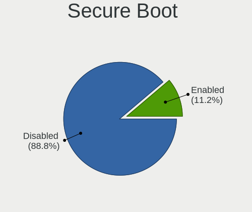
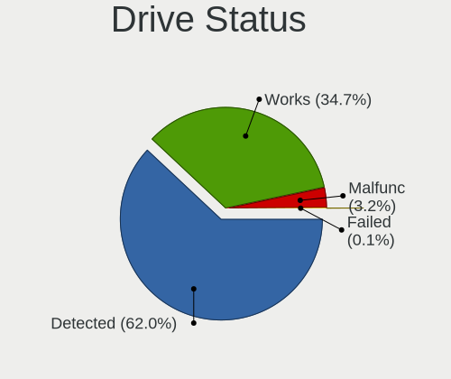
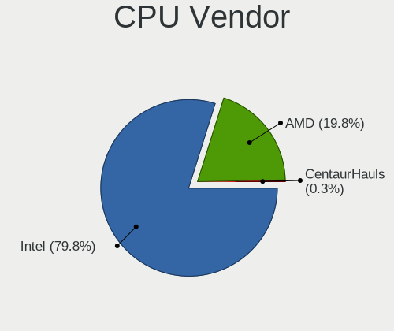
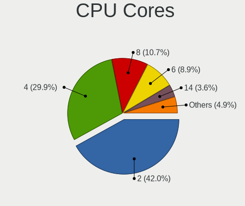
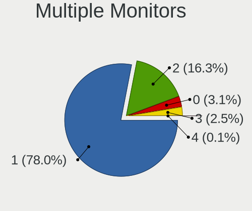
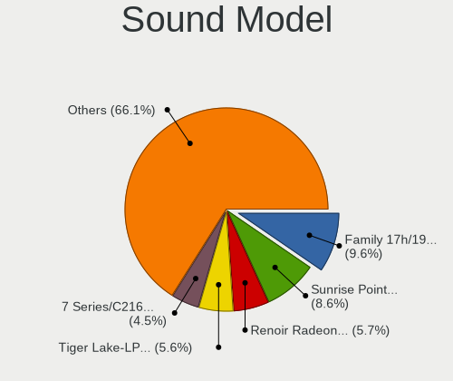
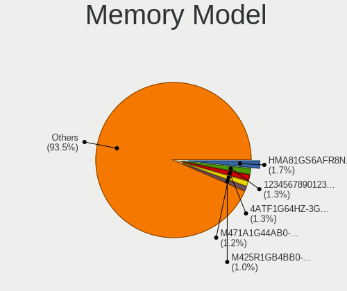
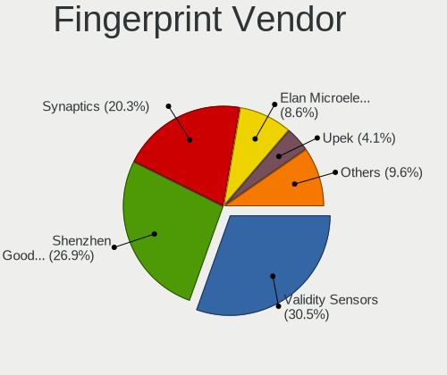

Ubuntu 23.04 - Tested Hardware & Statistics (Notebooks)
-------------------------------------------------------

A project to collect tested hardware configurations for Ubuntu 23.04.

Anyone can contribute to this report by the [hw-probe](https://github.com/linuxhw/hw-probe) tool:

    sudo -E hw-probe -all -upload

Please contribute! Especially if your hardware is rare.

Contents
--------

* [ Test Cases ](#test-cases)

* [ System ](#system)
  - [ Kernel                   ](#kernel)
  - [ Kernel Family            ](#kernel-family)
  - [ Kernel Major Ver.        ](#kernel-major-ver)
  - [ Arch                     ](#arch)
  - [ DE                       ](#de)
  - [ Display Server           ](#display-server)
  - [ Display Manager          ](#display-manager)
  - [ OS Lang                  ](#os-lang)
  - [ Boot Mode                ](#boot-mode)
  - [ Filesystem               ](#filesystem)
  - [ Part. scheme             ](#part-scheme)
  - [ Dual Boot with Linux/BSD ](#dual-boot-with-linuxbsd)
  - [ Dual Boot (Win)          ](#dual-boot-win)

* [ Board ](#board)
  - [ Vendor                   ](#vendor)
  - [ Model                    ](#model)
  - [ Model Family             ](#model-family)
  - [ MFG Year                 ](#mfg-year)
  - [ Form Factor              ](#form-factor)
  - [ Secure Boot              ](#secure-boot)
  - [ Coreboot                 ](#coreboot)
  - [ RAM Size                 ](#ram-size)
  - [ RAM Used                 ](#ram-used)
  - [ Total Drives             ](#total-drives)
  - [ Has CD-ROM               ](#has-cd-rom)
  - [ Has Ethernet             ](#has-ethernet)
  - [ Has WiFi                 ](#has-wifi)
  - [ Has Bluetooth            ](#has-bluetooth)

* [ Location ](#location)
  - [ Country                  ](#country)
  - [ City                     ](#city)

* [ Drives ](#drives)
  - [ Drive Vendor             ](#drive-vendor)
  - [ Drive Model              ](#drive-model)
  - [ HDD Vendor               ](#hdd-vendor)
  - [ SSD Vendor               ](#ssd-vendor)
  - [ Drive Kind               ](#drive-kind)
  - [ Drive Connector          ](#drive-connector)
  - [ Drive Size               ](#drive-size)
  - [ Space Total              ](#space-total)
  - [ Space Used               ](#space-used)
  - [ Malfunc. Drives          ](#malfunc-drives)
  - [ Malfunc. Drive Vendor    ](#malfunc-drive-vendor)
  - [ Malfunc. HDD Vendor      ](#malfunc-hdd-vendor)
  - [ Malfunc. Drive Kind      ](#malfunc-drive-kind)
  - [ Failed Drives            ](#failed-drives)
  - [ Failed Drive Vendor      ](#failed-drive-vendor)
  - [ Drive Status             ](#drive-status)

* [ Storage controller ](#storage-controller)
  - [ Storage Vendor           ](#storage-vendor)
  - [ Storage Model            ](#storage-model)
  - [ Storage Kind             ](#storage-kind)

* [ Processor ](#processor)
  - [ CPU Vendor               ](#cpu-vendor)
  - [ CPU Model                ](#cpu-model)
  - [ CPU Model Family         ](#cpu-model-family)
  - [ CPU Cores                ](#cpu-cores)
  - [ CPU Sockets              ](#cpu-sockets)
  - [ CPU Threads              ](#cpu-threads)
  - [ CPU Op-Modes             ](#cpu-op-modes)
  - [ CPU Microcode            ](#cpu-microcode)
  - [ CPU Microarch            ](#cpu-microarch)

* [ Graphics ](#graphics)
  - [ GPU Vendor               ](#gpu-vendor)
  - [ GPU Model                ](#gpu-model)
  - [ GPU Combo                ](#gpu-combo)
  - [ GPU Driver               ](#gpu-driver)
  - [ GPU Memory               ](#gpu-memory)

* [ Monitor ](#monitor)
  - [ Monitor Vendor           ](#monitor-vendor)
  - [ Monitor Model            ](#monitor-model)
  - [ Monitor Resolution       ](#monitor-resolution)
  - [ Monitor Diagonal         ](#monitor-diagonal)
  - [ Monitor Width            ](#monitor-width)
  - [ Aspect Ratio             ](#aspect-ratio)
  - [ Monitor Area             ](#monitor-area)
  - [ Pixel Density            ](#pixel-density)
  - [ Multiple Monitors        ](#multiple-monitors)

* [ Network ](#network)
  - [ Net Controller Vendor    ](#net-controller-vendor)
  - [ Net Controller Model     ](#net-controller-model)
  - [ Wireless Vendor          ](#wireless-vendor)
  - [ Wireless Model           ](#wireless-model)
  - [ Ethernet Vendor          ](#ethernet-vendor)
  - [ Ethernet Model           ](#ethernet-model)
  - [ Net Controller Kind      ](#net-controller-kind)
  - [ Used Controller          ](#used-controller)
  - [ NICs                     ](#nics)
  - [ IPv6                     ](#ipv6)

* [ Bluetooth ](#bluetooth)
  - [ Bluetooth Vendor         ](#bluetooth-vendor)
  - [ Bluetooth Model          ](#bluetooth-model)

* [ Sound ](#sound)
  - [ Sound Vendor             ](#sound-vendor)
  - [ Sound Model              ](#sound-model)

* [ Memory ](#memory)
  - [ Memory Vendor            ](#memory-vendor)
  - [ Memory Model             ](#memory-model)
  - [ Memory Kind              ](#memory-kind)
  - [ Memory Form Factor       ](#memory-form-factor)
  - [ Memory Size              ](#memory-size)
  - [ Memory Speed             ](#memory-speed)

* [ Printers & scanners ](#printers--scanners)
  - [ Printer Vendor           ](#printer-vendor)
  - [ Printer Model            ](#printer-model)
  - [ Scanner Vendor           ](#scanner-vendor)
  - [ Scanner Model            ](#scanner-model)

* [ Camera ](#camera)
  - [ Camera Vendor            ](#camera-vendor)
  - [ Camera Model             ](#camera-model)

* [ Security ](#security)
  - [ Fingerprint Vendor       ](#fingerprint-vendor)
  - [ Fingerprint Model        ](#fingerprint-model)
  - [ Chipcard Vendor          ](#chipcard-vendor)
  - [ Chipcard Model           ](#chipcard-model)

* [ Unsupported ](#unsupported)
  - [ Unsupported Devices      ](#unsupported-devices)
  - [ Unsupported Device Types ](#unsupported-device-types)

Test Cases
----------

Total: 159

| Vendor        | Model                       | Probe                                                      | Date         |
|---------------|-----------------------------|------------------------------------------------------------|--------------|
| Medion        | E16402                      | [cff2f785ad](https://linux-hardware.org/?probe=cff2f785ad) | May 01, 2023 |
| Dell          | Latitude E6400              | [33b7764234](https://linux-hardware.org/?probe=33b7764234) | May 01, 2023 |
| Lenovo        | ThinkPad X260 20F5002NAU    | [7fcb72c132](https://linux-hardware.org/?probe=7fcb72c132) | May 01, 2023 |
| HP            | EliteBook 840 G3            | [c490c44357](https://linux-hardware.org/?probe=c490c44357) | May 01, 2023 |
| Lenovo        | Legion S7 15IMH5 82BC       | [a57d01b946](https://linux-hardware.org/?probe=a57d01b946) | May 01, 2023 |
| ASUSTek       | Zenbook UM5302TA_UM5302T... | [4bec088d90](https://linux-hardware.org/?probe=4bec088d90) | Apr 30, 2023 |
| Dell          | XPS 15 9500                 | [93fef964a7](https://linux-hardware.org/?probe=93fef964a7) | Apr 30, 2023 |
| Samsung       | 950XED                      | [41f620de17](https://linux-hardware.org/?probe=41f620de17) | Apr 30, 2023 |
| Lenovo        | V15 G2 IJL 82QY             | [1714bffa0e](https://linux-hardware.org/?probe=1714bffa0e) | Apr 30, 2023 |
| Acer          | Peppy                       | [4caf11594a](https://linux-hardware.org/?probe=4caf11594a) | Apr 30, 2023 |
| HP            | Laptop 15s-eq2xxx           | [7a86bdd993](https://linux-hardware.org/?probe=7a86bdd993) | Apr 30, 2023 |
| HP            | Laptop 15s-eq2xxx           | [6206b317f2](https://linux-hardware.org/?probe=6206b317f2) | Apr 30, 2023 |
| Lenovo        | ThinkPad E580 20KS001JUK    | [da5f050510](https://linux-hardware.org/?probe=da5f050510) | Apr 29, 2023 |
| Lenovo        | ThinkPad E580 20KS001JUK    | [1e65b46a12](https://linux-hardware.org/?probe=1e65b46a12) | Apr 29, 2023 |
| ASUSTek       | X751MA                      | [c952010dbb](https://linux-hardware.org/?probe=c952010dbb) | Apr 29, 2023 |
| Acer          | Aspire E5-575G              | [6a102a2c37](https://linux-hardware.org/?probe=6a102a2c37) | Apr 29, 2023 |
| Dell          | Inspiron N5110              | [04da6f1db9](https://linux-hardware.org/?probe=04da6f1db9) | Apr 29, 2023 |
| MSI           | Modern 14 A10M              | [22ad1f6bfb](https://linux-hardware.org/?probe=22ad1f6bfb) | Apr 29, 2023 |
| Acer          | Aspire E5-553               | [ff448e32c3](https://linux-hardware.org/?probe=ff448e32c3) | Apr 29, 2023 |
| HUAWEI        | BOHK-WAX9X                  | [4490476bd2](https://linux-hardware.org/?probe=4490476bd2) | Apr 29, 2023 |
| Samsung       | 930X2K/931X2K               | [bc4f78f7e7](https://linux-hardware.org/?probe=bc4f78f7e7) | Apr 29, 2023 |
| Acer          | Aspire E5-575G              | [004e0007e4](https://linux-hardware.org/?probe=004e0007e4) | Apr 28, 2023 |
| Lenovo        | ThinkPad T420 4238AB4       | [3f6a89023c](https://linux-hardware.org/?probe=3f6a89023c) | Apr 28, 2023 |
| ASUSTek       | VivoBook_ASUS Laptop E41... | [216a4b9b67](https://linux-hardware.org/?probe=216a4b9b67) | Apr 28, 2023 |
| ASUSTek       | VivoBook_ASUS Laptop E41... | [6736f3d911](https://linux-hardware.org/?probe=6736f3d911) | Apr 28, 2023 |
| Lenovo        | G50-70 20351                | [a808e47839](https://linux-hardware.org/?probe=a808e47839) | Apr 28, 2023 |
| Lenovo        | G50-70 20351                | [67ae1efc54](https://linux-hardware.org/?probe=67ae1efc54) | Apr 28, 2023 |
| Lenovo        | Legion Y7000 81FW           | [b1e6130b77](https://linux-hardware.org/?probe=b1e6130b77) | Apr 28, 2023 |
| Acer          | Swift SF314-512             | [2ba1bab0fe](https://linux-hardware.org/?probe=2ba1bab0fe) | Apr 28, 2023 |
| MSI           | Katana GF66 12UGS           | [3607ee704e](https://linux-hardware.org/?probe=3607ee704e) | Apr 28, 2023 |
| Dell          | XPS 15 9570                 | [3479673283](https://linux-hardware.org/?probe=3479673283) | Apr 28, 2023 |
| Acer          | ConceptD CN315-71P          | [3cc902ff5c](https://linux-hardware.org/?probe=3cc902ff5c) | Apr 28, 2023 |
| Dell          | Latitude E5470              | [caac023f65](https://linux-hardware.org/?probe=caac023f65) | Apr 27, 2023 |
| Valve         | Jupiter                     | [f65ece2859](https://linux-hardware.org/?probe=f65ece2859) | Apr 27, 2023 |
| ASUSTek       | X751MA                      | [eb9967626a](https://linux-hardware.org/?probe=eb9967626a) | Apr 27, 2023 |
| ASUSTek       | ZenBook UX425IA_UM425IA     | [404ec697ac](https://linux-hardware.org/?probe=404ec697ac) | Apr 27, 2023 |
| Dell          | Inspiron 5567               | [012329ee1f](https://linux-hardware.org/?probe=012329ee1f) | Apr 27, 2023 |
| MSI           | PE60 6QE                    | [1a5ae975ee](https://linux-hardware.org/?probe=1a5ae975ee) | Apr 27, 2023 |
| Acer          | Aspire 5742G                | [a1391b4372](https://linux-hardware.org/?probe=a1391b4372) | Apr 27, 2023 |
| Lenovo        | ThinkPad T16 Gen 1 21CH0... | [f0a2365878](https://linux-hardware.org/?probe=f0a2365878) | Apr 27, 2023 |
| Dell          | Inspiron 5558               | [9f3b8c952d](https://linux-hardware.org/?probe=9f3b8c952d) | Apr 27, 2023 |
| Acer          | Aspire E1-571               | [c95605ef8e](https://linux-hardware.org/?probe=c95605ef8e) | Apr 27, 2023 |
| ASUSTek       | ASUS TUF Dash F15 FX516P... | [d49ace71b4](https://linux-hardware.org/?probe=d49ace71b4) | Apr 27, 2023 |
| Dell          | Latitude 5520               | [bec614b168](https://linux-hardware.org/?probe=bec614b168) | Apr 26, 2023 |
| Lenovo        | V15 G2 IJL 82QY             | [7ca1ebbe7f](https://linux-hardware.org/?probe=7ca1ebbe7f) | Apr 26, 2023 |
| Dell          | Latitude 7420               | [513e0f8b18](https://linux-hardware.org/?probe=513e0f8b18) | Apr 26, 2023 |
| ASUSTek       | X541SA                      | [362ede5435](https://linux-hardware.org/?probe=362ede5435) | Apr 26, 2023 |
| Acer          | Swift SF313-53              | [b487229ea2](https://linux-hardware.org/?probe=b487229ea2) | Apr 25, 2023 |
| MSI           | Modern 14 A10M              | [dc3595e3cc](https://linux-hardware.org/?probe=dc3595e3cc) | Apr 25, 2023 |
| HP            | 240 G8                      | [ab322ed08e](https://linux-hardware.org/?probe=ab322ed08e) | Apr 25, 2023 |
| HP            | 240 G8                      | [8cf9892fe9](https://linux-hardware.org/?probe=8cf9892fe9) | Apr 25, 2023 |
| Lenovo        | IdeaPad 5 15ARE05 81YQ      | [e7b20d71b7](https://linux-hardware.org/?probe=e7b20d71b7) | Apr 25, 2023 |
| Lenovo        | V15 G2 IJL 82QY             | [2732f4b096](https://linux-hardware.org/?probe=2732f4b096) | Apr 25, 2023 |
| ASUSTek       | VivoBook_ASUSLaptop X350... | [7d3b6ba1a3](https://linux-hardware.org/?probe=7d3b6ba1a3) | Apr 25, 2023 |
| Lenovo        | Legion 5 15IMH05H 81Y6      | [93b15a590f](https://linux-hardware.org/?probe=93b15a590f) | Apr 25, 2023 |
| Lenovo        | ThinkPad E15 Gen 2 20TD0... | [5fb905227b](https://linux-hardware.org/?probe=5fb905227b) | Apr 25, 2023 |
| Dell          | XPS 13 9310                 | [65ccee11a0](https://linux-hardware.org/?probe=65ccee11a0) | Apr 24, 2023 |
| ICL           | RAYbook Si1512              | [4e960cbe90](https://linux-hardware.org/?probe=4e960cbe90) | Apr 24, 2023 |
| ASUSTek       | GL752VW                     | [26c754e5f0](https://linux-hardware.org/?probe=26c754e5f0) | Apr 24, 2023 |
| Dell          | XPS 13 9310                 | [070d7e791f](https://linux-hardware.org/?probe=070d7e791f) | Apr 24, 2023 |
| Acer          | Aspire 5742G                | [84679bc442](https://linux-hardware.org/?probe=84679bc442) | Apr 24, 2023 |
| Lenovo        | ThinkPad A285 20MXS0NJ00    | [f155ad2bf4](https://linux-hardware.org/?probe=f155ad2bf4) | Apr 24, 2023 |
| ASUSTek       | GL752VW                     | [216aaf8fff](https://linux-hardware.org/?probe=216aaf8fff) | Apr 24, 2023 |
| Gateway       | NV55C                       | [3c560a28cf](https://linux-hardware.org/?probe=3c560a28cf) | Apr 24, 2023 |
| Lenovo        | IdeaPad 3 15ALC6 82MF       | [2e7585d261](https://linux-hardware.org/?probe=2e7585d261) | Apr 24, 2023 |
| Lenovo        | IdeaPad 5 Pro 14ACN6 82L... | [59c225df6e](https://linux-hardware.org/?probe=59c225df6e) | Apr 24, 2023 |
| Lenovo        | 20RD001FHV                  | [782ded0435](https://linux-hardware.org/?probe=782ded0435) | Apr 24, 2023 |
| Samsung       | 950XED                      | [6226147e11](https://linux-hardware.org/?probe=6226147e11) | Apr 24, 2023 |
| ASUSTek       | TUF Gaming FX705GD_FX705... | [b1c3492700](https://linux-hardware.org/?probe=b1c3492700) | Apr 24, 2023 |
| Acer          | Aspire A515-47              | [35a591e26a](https://linux-hardware.org/?probe=35a591e26a) | Apr 24, 2023 |
| Apple         | MacBookPro9,2               | [c820da6570](https://linux-hardware.org/?probe=c820da6570) | Apr 24, 2023 |
| Shanghai Z... | ZXE CRB                     | [298d51ae78](https://linux-hardware.org/?probe=298d51ae78) | Apr 24, 2023 |
| Dell          | Latitude E5470              | [bc1dca3c78](https://linux-hardware.org/?probe=bc1dca3c78) | Apr 24, 2023 |
| HP            | ZBook 17 G5                 | [c1d71592a4](https://linux-hardware.org/?probe=c1d71592a4) | Apr 24, 2023 |
| Acer          | Aspire A317-53              | [c47ec3530e](https://linux-hardware.org/?probe=c47ec3530e) | Apr 24, 2023 |
| Dell          | G5 5590                     | [eef3722c35](https://linux-hardware.org/?probe=eef3722c35) | Apr 23, 2023 |
| HP            | ZBook 17 G5                 | [ce9fd79431](https://linux-hardware.org/?probe=ce9fd79431) | Apr 23, 2023 |
| Dell          | Precision M4400             | [0c367cbf45](https://linux-hardware.org/?probe=0c367cbf45) | Apr 23, 2023 |
| Lenovo        | ThinkPad X220 4286A44       | [6b6e909d11](https://linux-hardware.org/?probe=6b6e909d11) | Apr 23, 2023 |
| ASUSTek       | ASUS TUF Dash F15 FX516P... | [641374c815](https://linux-hardware.org/?probe=641374c815) | Apr 23, 2023 |
| HP            | Pavilion Laptop 15-eg0xx... | [aa01246f8b](https://linux-hardware.org/?probe=aa01246f8b) | Apr 23, 2023 |
| Lenovo        | ThinkPad E480 20KQ000EBR    | [90b7213592](https://linux-hardware.org/?probe=90b7213592) | Apr 23, 2023 |
| Lenovo        | ThinkPad T14 Gen 1 20UES... | [620334c0fc](https://linux-hardware.org/?probe=620334c0fc) | Apr 23, 2023 |
| Dell          | Latitude E6420              | [475a16531a](https://linux-hardware.org/?probe=475a16531a) | Apr 22, 2023 |
| Dell          | Precision M4400             | [291a0de9a8](https://linux-hardware.org/?probe=291a0de9a8) | Apr 22, 2023 |
| Acer          | Nitro AN515-58              | [60251e08f5](https://linux-hardware.org/?probe=60251e08f5) | Apr 22, 2023 |
| ASUSTek       | VivoBook_ASUSLaptop X150... | [ce5e9aad85](https://linux-hardware.org/?probe=ce5e9aad85) | Apr 22, 2023 |
| Acer          | Aspire 7750G                | [afdab44276](https://linux-hardware.org/?probe=afdab44276) | Apr 22, 2023 |
| Acer          | Aspire 7750G                | [1f6e58080a](https://linux-hardware.org/?probe=1f6e58080a) | Apr 22, 2023 |
| HP            | Pavilion Laptop 15-eg2xx... | [0f5a55a8d1](https://linux-hardware.org/?probe=0f5a55a8d1) | Apr 22, 2023 |
| Dell          | XPS 13 9350                 | [63cafebe06](https://linux-hardware.org/?probe=63cafebe06) | Apr 21, 2023 |
| ASUSTek       | N53SN                       | [7c0a7d4494](https://linux-hardware.org/?probe=7c0a7d4494) | Apr 21, 2023 |
| HP            | Elite Dragonfly 13.5 inc... | [2a5d9adcd4](https://linux-hardware.org/?probe=2a5d9adcd4) | Apr 21, 2023 |
| HP            | Victus by Laptop 16-e0xx... | [85fa6bf3d5](https://linux-hardware.org/?probe=85fa6bf3d5) | Apr 21, 2023 |
| Dell          | Latitude E6420              | [5e3466ce98](https://linux-hardware.org/?probe=5e3466ce98) | Apr 21, 2023 |
| Apple         | MacBookAir7,2               | [d34d10b1ad](https://linux-hardware.org/?probe=d34d10b1ad) | Apr 20, 2023 |
| HP            | Pavilion Laptop 15-eh1xx... | [05321d1ddd](https://linux-hardware.org/?probe=05321d1ddd) | Apr 20, 2023 |
| Dell          | Inspiron 3501               | [e09f00bead](https://linux-hardware.org/?probe=e09f00bead) | Apr 20, 2023 |
| HP            | Pavilion g4                 | [96a0210940](https://linux-hardware.org/?probe=96a0210940) | Apr 20, 2023 |
| Apple         | MacBookAir7,2               | [b54a612e76](https://linux-hardware.org/?probe=b54a612e76) | Apr 20, 2023 |
| Crusaders ... | CS14D01                     | [b25acea9f7](https://linux-hardware.org/?probe=b25acea9f7) | Apr 19, 2023 |
| Dell          | Vostro 15 7510              | [d9e766f446](https://linux-hardware.org/?probe=d9e766f446) | Apr 16, 2023 |
| HUAWEI        | BOM-WXX9                    | [04eead074d](https://linux-hardware.org/?probe=04eead074d) | Apr 14, 2023 |
| HUAWEI        | HLY-WX9XX                   | [d0742654bb](https://linux-hardware.org/?probe=d0742654bb) | Apr 14, 2023 |
| HP            | Pavilion Laptop 15-eg2xx... | [df35f6916a](https://linux-hardware.org/?probe=df35f6916a) | Apr 14, 2023 |
| Lenovo        | ThinkPad T420 4236WR1       | [0c4578a674](https://linux-hardware.org/?probe=0c4578a674) | Apr 14, 2023 |
| HP            | ProBook 640 G8 Notebook ... | [6b481f17c2](https://linux-hardware.org/?probe=6b481f17c2) | Apr 13, 2023 |
| HUAWEI        | BOM-WXX9                    | [c56952417d](https://linux-hardware.org/?probe=c56952417d) | Apr 11, 2023 |
| Toshiba       | IS 1413G                    | [be9d1636a7](https://linux-hardware.org/?probe=be9d1636a7) | Apr 09, 2023 |
| Acer          | Swift SF314-55G             | [e15eaec4c0](https://linux-hardware.org/?probe=e15eaec4c0) | Apr 07, 2023 |
| Notebook      | NP5x_NP6x_NP7xRNJ_RNH       | [29f00590fb](https://linux-hardware.org/?probe=29f00590fb) | Apr 05, 2023 |
| HP            | Pavilion Laptop 15-eg2xx... | [a1dceb9ce7](https://linux-hardware.org/?probe=a1dceb9ce7) | Apr 04, 2023 |
| Google        | Akemi                       | [14e5c7b93b](https://linux-hardware.org/?probe=14e5c7b93b) | Apr 04, 2023 |
| HUAWEI        | CREM-WXX9                   | [dd3c0ff2e5](https://linux-hardware.org/?probe=dd3c0ff2e5) | Apr 03, 2023 |
| Samsung       | 767XCL                      | [b5a44d9194](https://linux-hardware.org/?probe=b5a44d9194) | Apr 03, 2023 |
| Dell          | Inspiron 5458               | [38b9db2538](https://linux-hardware.org/?probe=38b9db2538) | Apr 01, 2023 |
| Samsung       | 767XCL                      | [a3167908c0](https://linux-hardware.org/?probe=a3167908c0) | Apr 01, 2023 |
| Lenovo        | ThinkPad T431s 20AA0016G... | [13e8d4f50b](https://linux-hardware.org/?probe=13e8d4f50b) | Mar 31, 2023 |
| HP            | Pavilion Laptop 15-eh1xx... | [b56e2a41ed](https://linux-hardware.org/?probe=b56e2a41ed) | Mar 31, 2023 |
| Shanghai Z... | ZXE CRB                     | [aafbb2815f](https://linux-hardware.org/?probe=aafbb2815f) | Mar 25, 2023 |
| Lenovo        | ThinkPad X1 Carbon 5th 2... | [4f2d3a2402](https://linux-hardware.org/?probe=4f2d3a2402) | Mar 25, 2023 |
| Shanghai Z... | ZXE CRB                     | [7f98044a04](https://linux-hardware.org/?probe=7f98044a04) | Mar 24, 2023 |
| Lenovo        | IdeaPad 320-15AST 80XV      | [8c5fde8c1e](https://linux-hardware.org/?probe=8c5fde8c1e) | Mar 22, 2023 |
| Dell          | Latitude 7520               | [09c8e699d3](https://linux-hardware.org/?probe=09c8e699d3) | Mar 16, 2023 |
| HP            | Pavilion Laptop 15-eh2xx... | [66094e937a](https://linux-hardware.org/?probe=66094e937a) | Mar 11, 2023 |
| Shanghai Z... | ZXE CRB                     | [49130084c4](https://linux-hardware.org/?probe=49130084c4) | Mar 11, 2023 |
| Shanghai Z... | ZXE CRB                     | [a6091bc2e2](https://linux-hardware.org/?probe=a6091bc2e2) | Mar 11, 2023 |
| Lenovo        | ThinkPad T431s 20AA0016G... | [89e2fd827d](https://linux-hardware.org/?probe=89e2fd827d) | Mar 05, 2023 |
| Shanghai Z... | ZXE CRB                     | [bb68a61939](https://linux-hardware.org/?probe=bb68a61939) | Mar 05, 2023 |
| Lenovo        | E51-80 80QB                 | [824ece168f](https://linux-hardware.org/?probe=824ece168f) | Mar 03, 2023 |
| Lenovo        | ThinkPad T14 Gen 1 20S0C... | [525be1bcbe](https://linux-hardware.org/?probe=525be1bcbe) | Mar 02, 2023 |
| Lenovo        | ThinkPad T431s 20AA0016G... | [830a8a94e2](https://linux-hardware.org/?probe=830a8a94e2) | Mar 02, 2023 |
| Lenovo        | ThinkPad T431s 20AA0016G... | [0bf8c9ca74](https://linux-hardware.org/?probe=0bf8c9ca74) | Mar 02, 2023 |
| Toshiba       | IS 1413G                    | [05ad6c694b](https://linux-hardware.org/?probe=05ad6c694b) | Mar 01, 2023 |
| HP            | Laptop 17-by3xxx            | [5beb40c486](https://linux-hardware.org/?probe=5beb40c486) | Feb 28, 2023 |
| Samsung       | 370E4K                      | [aba5535c2a](https://linux-hardware.org/?probe=aba5535c2a) | Feb 28, 2023 |
| Toshiba       | IS 1413G                    | [c361aabb21](https://linux-hardware.org/?probe=c361aabb21) | Feb 27, 2023 |
| Toshiba       | IS 1413G                    | [17338cbd01](https://linux-hardware.org/?probe=17338cbd01) | Feb 27, 2023 |
| Apple         | MacBookPro10,1              | [816a4eb27e](https://linux-hardware.org/?probe=816a4eb27e) | Feb 26, 2023 |
| HP            | EliteBook 840 G2            | [33dc8202e9](https://linux-hardware.org/?probe=33dc8202e9) | Feb 25, 2023 |
| HUAWEI        | CREM-WXX9                   | [643d79fd46](https://linux-hardware.org/?probe=643d79fd46) | Feb 21, 2023 |
| Lenovo        | ThinkPad X1 Carbon 4th 2... | [ba0144c710](https://linux-hardware.org/?probe=ba0144c710) | Feb 20, 2023 |
| Apple         | MacBookPro13,3              | [628feb8b19](https://linux-hardware.org/?probe=628feb8b19) | Feb 13, 2023 |
| Apple         | MacBookPro13,3              | [2f591ee9e3](https://linux-hardware.org/?probe=2f591ee9e3) | Feb 13, 2023 |
| Timi          | RedmiBook 15                | [6dffda8f11](https://linux-hardware.org/?probe=6dffda8f11) | Feb 10, 2023 |
| ASUSTek       | VivoBook_ASUSLaptop X415... | [b3eaee0a71](https://linux-hardware.org/?probe=b3eaee0a71) | Feb 10, 2023 |
| Acer          | Aspire V5-552G              | [2750863407](https://linux-hardware.org/?probe=2750863407) | Feb 02, 2023 |
| HP            | ProBook 6560b               | [a9eba68b79](https://linux-hardware.org/?probe=a9eba68b79) | Jan 14, 2023 |
| Samsung       | SBB-DA                      | [a4c6b4f454](https://linux-hardware.org/?probe=a4c6b4f454) | Jan 07, 2023 |
| MSI           | Raider GE67HX 12UGS         | [28822be06e](https://linux-hardware.org/?probe=28822be06e) | Dec 29, 2022 |
| ASUSTek       | VivoBook_ASUSLaptop E210... | [e1ae2ba145](https://linux-hardware.org/?probe=e1ae2ba145) | Dec 24, 2022 |
| Lenovo        | IdeaPad 5 15ITL05 82FG      | [d1342c521a](https://linux-hardware.org/?probe=d1342c521a) | Dec 15, 2022 |
| Lenovo        | IdeaPad 5 15ITL05 82FG      | [5c0099832f](https://linux-hardware.org/?probe=5c0099832f) | Dec 15, 2022 |
| Lenovo        | B50-70 20384                | [82edcc6c08](https://linux-hardware.org/?probe=82edcc6c08) | Dec 15, 2022 |
| HUAWEI        | HVY-WXX9                    | [6f8c8644e2](https://linux-hardware.org/?probe=6f8c8644e2) | Dec 10, 2022 |
| HUAWEI        | CREM-WXX9                   | [33f7ac03f4](https://linux-hardware.org/?probe=33f7ac03f4) | Nov 30, 2022 |
| Lenovo        | IdeaPad 5 Pro 16ACH6 82L... | [8e6e8471a7](https://linux-hardware.org/?probe=8e6e8471a7) | Nov 29, 2022 |
| Apple         | MacBookPro9,2               | [e87a096d85](https://linux-hardware.org/?probe=e87a096d85) | Nov 27, 2022 |
| Apple         | MacBookPro9,2               | [9e465f741d](https://linux-hardware.org/?probe=9e465f741d) | Nov 26, 2022 |

System
------

Kernel
------

Version of the Linux kernel

| Version                 | Notebooks | Percent |
|-------------------------|-----------|---------|
| 6.2.0-20-generic        | 64        | 52.89%  |
| 5.19.0-21-generic       | 14        | 11.57%  |
| 6.2.0-18-generic        | 11        | 9.09%   |
| 6.1.0-16-generic        | 5         | 4.13%   |
| 5.19.0-31-generic       | 3         | 2.48%   |
| 6.2.9-060209-generic    | 2         | 1.65%   |
| 6.2.0-19-generic        | 2         | 1.65%   |
| 5.19.0-40-generic       | 2         | 1.65%   |
| 5.19.0-28-generic       | 2         | 1.65%   |
| 6.3.0-rc7               | 1         | 0.83%   |
| 6.3.0-060300rc7-generic | 1         | 0.83%   |
| 6.3.0-060300-generic    | 1         | 0.83%   |
| 6.3.0+                  | 1         | 0.83%   |
| 6.2.6-060206-generic    | 1         | 0.83%   |
| 6.2.12-060212-generic   | 1         | 0.83%   |
| 6.2.0-1003-lowlatency   | 1         | 0.83%   |
| 6.1.0-daily-20221223    | 1         | 0.83%   |
| 6.0.9-060009-generic    | 1         | 0.83%   |
| 5.19.0-42-generic       | 1         | 0.83%   |
| 5.19.0-41-generic       | 1         | 0.83%   |
| 5.19.0-38-generic       | 1         | 0.83%   |
| 5.19.0-35-generic       | 1         | 0.83%   |
| 5.19.0-29-generic       | 1         | 0.83%   |
| 5.19.0-26-generic       | 1         | 0.83%   |
| 5.11.0-33-generic       | 1         | 0.83%   |

Kernel Family
-------------

Linux kernel without a distro release

| Version | Notebooks | Percent |
|---------|-----------|---------|
| 6.2.0   | 78        | 64.46%  |
| 5.19.0  | 27        | 22.31%  |
| 6.1.0   | 6         | 4.96%   |
| 6.3.0   | 4         | 3.31%   |
| 6.2.9   | 2         | 1.65%   |
| 6.2.6   | 1         | 0.83%   |
| 6.2.12  | 1         | 0.83%   |
| 6.0.9   | 1         | 0.83%   |
| 5.11.0  | 1         | 0.83%   |

Kernel Major Ver.
-----------------

Linux kernel major version

| Version | Notebooks | Percent |
|---------|-----------|---------|
| 6.2     | 82        | 67.77%  |
| 5.19    | 27        | 22.31%  |
| 6.1     | 6         | 4.96%   |
| 6.3     | 4         | 3.31%   |
| 6.0     | 1         | 0.83%   |
| 5.11    | 1         | 0.83%   |

Arch
----

OS architecture (x86_64, i586, etc.)

| Name   | Notebooks | Percent |
|--------|-----------|---------|
| x86_64 | 120       | 100%    |

DE
--

Desktop Environment

| Name       | Notebooks | Percent |
|------------|-----------|---------|
| GNOME      | 117       | 96.69%  |
| X-Cinnamon | 3         | 2.48%   |
| Unknown    | 1         | 0.83%   |

Display Server
--------------

X11 or Wayland

| Name    | Notebooks | Percent |
|---------|-----------|---------|
| Wayland | 70        | 57.38%  |
| X11     | 49        | 40.16%  |
| Unknown | 3         | 2.46%   |

Display Manager
---------------

SDDM, LightDM, etc.

| Name    | Notebooks | Percent |
|---------|-----------|---------|
| GDM3    | 106       | 87.6%   |
| Unknown | 13        | 10.74%  |
| LightDM | 2         | 1.65%   |

OS Lang
-------

Language

| Lang    | Notebooks | Percent |
|---------|-----------|---------|
| en_US   | 46        | 38.02%  |
| de_DE   | 12        | 9.92%   |
| C       | 9         | 7.44%   |
| pt_BR   | 7         | 5.79%   |
| fr_FR   | 6         | 4.96%   |
| ru_RU   | 5         | 4.13%   |
| en_GB   | 4         | 3.31%   |
| es_ES   | 3         | 2.48%   |
| en_AU   | 3         | 2.48%   |
| it_IT   | 2         | 1.65%   |
| en_CA   | 2         | 1.65%   |
| de_CH   | 2         | 1.65%   |
| ca_ES   | 2         | 1.65%   |
| bg_BG   | 2         | 1.65%   |
| zh_CN   | 1         | 0.83%   |
| tr_TR   | 1         | 0.83%   |
| sv_SE   | 1         | 0.83%   |
| pt_PT   | 1         | 0.83%   |
| pl_PL   | 1         | 0.83%   |
| hu_HU   | 1         | 0.83%   |
| hr_HR   | 1         | 0.83%   |
| fa_IR   | 1         | 0.83%   |
| et_EE   | 1         | 0.83%   |
| es_MX   | 1         | 0.83%   |
| es_CR   | 1         | 0.83%   |
| es_CL   | 1         | 0.83%   |
| en_ZA   | 1         | 0.83%   |
| el_GR   | 1         | 0.83%   |
| da_DK   | 1         | 0.83%   |
| Unknown | 1         | 0.83%   |

Boot Mode
---------

EFI or BIOS

| Mode | Notebooks | Percent |
|------|-----------|---------|
| BIOS | 66        | 55%     |
| EFI  | 54        | 45%     |

Filesystem
----------

Type of filesystem

| Type    | Notebooks | Percent |
|---------|-----------|---------|
| Ext4    | 70        | 58.33%  |
| Tmpfs   | 41        | 34.17%  |
| Overlay | 5         | 4.17%   |
| Zfs     | 2         | 1.67%   |
| Btrfs   | 2         | 1.67%   |

Part. scheme
------------

Scheme of partitioning

| Type    | Notebooks | Percent |
|---------|-----------|---------|
| GPT     | 104       | 85.95%  |
| Unknown | 11        | 9.09%   |
| MBR     | 6         | 4.96%   |

Dual Boot with Linux/BSD
------------------------

Hosting more than one Linux/BSD

| Dual boot | Notebooks | Percent |
|-----------|-----------|---------|
| No        | 114       | 95%     |
| Yes       | 6         | 5%      |

Dual Boot (Win)
---------------

Hosting Linux and Windows

| Dual boot | Notebooks | Percent |
|-----------|-----------|---------|
| No        | 76        | 62.81%  |
| Yes       | 45        | 37.19%  |

Board
-----

Vendor
------

Motherboard manufacturer

| Name                           | Notebooks | Percent |
|--------------------------------|-----------|---------|
| Lenovo                         | 27        | 22.5%   |
| Dell                           | 19        | 15.83%  |
| Hewlett-Packard                | 15        | 12.5%   |
| ASUSTek Computer               | 14        | 11.67%  |
| Acer                           | 13        | 10.83%  |
| HUAWEI                         | 7         | 5.83%   |
| MSI                            | 5         | 4.17%   |
| Apple                          | 5         | 4.17%   |
| Samsung Electronics            | 4         | 3.33%   |
| Shanghai Zhaoxin Semiconductor | 3         | 2.5%    |
| Timi                           | 1         | 0.83%   |
| Semp Toshiba                   | 1         | 0.83%   |
| Notebook                       | 1         | 0.83%   |
| Medion                         | 1         | 0.83%   |
| ICL                            | 1         | 0.83%   |
| Google                         | 1         | 0.83%   |
| Gateway                        | 1         | 0.83%   |
| Crusaders Corporate (Pty)      | 1         | 0.83%   |

Model
-----

Motherboard model

| Name                                     | Notebooks | Percent |
|------------------------------------------|-----------|---------|
| Shanghai Zhaoxin ZXE CRB                 | 3         | 2.5%    |
| MSI Modern 14 A10M                       | 2         | 1.67%   |
| HUAWEI CREM-WXX9                         | 2         | 1.67%   |
| HUAWEI BOM-WXX9                          | 2         | 1.67%   |
| Dell Latitude E5470                      | 2         | 1.67%   |
| Apple MacBookPro9,2                      | 2         | 1.67%   |
| Timi RedmiBook 15                        | 1         | 0.83%   |
| Semp Toshiba IS 1413G                    | 1         | 0.83%   |
| Samsung SBB-DA                           | 1         | 0.83%   |
| Samsung 930X2K/931X2K                    | 1         | 0.83%   |
| Samsung 767XCL                           | 1         | 0.83%   |
| Samsung 370E4K                           | 1         | 0.83%   |
| Notebook NP5x_NP6x_NP7xRNJ_RNH           | 1         | 0.83%   |
| MSI Raider GE67HX 12UGS                  | 1         | 0.83%   |
| MSI PE60 6QE                             | 1         | 0.83%   |
| MSI Katana GF66 12UGS                    | 1         | 0.83%   |
| Medion E16402                            | 1         | 0.83%   |
| Lenovo V15 G2 IJL 82QY                   | 1         | 0.83%   |
| Lenovo ThinkPad X260 20F5002NAU          | 1         | 0.83%   |
| Lenovo ThinkPad X220 4286A44             | 1         | 0.83%   |
| Lenovo ThinkPad X1 Carbon 5th 20HR000MUS | 1         | 0.83%   |
| Lenovo ThinkPad X1 Carbon 4th 20FCS2L300 | 1         | 0.83%   |
| Lenovo ThinkPad T431s 20AA0016GE         | 1         | 0.83%   |
| Lenovo ThinkPad T420 4238AB4             | 1         | 0.83%   |
| Lenovo ThinkPad T420 4236WR1             | 1         | 0.83%   |
| Lenovo ThinkPad T14 Gen 1 20UES0J300     | 1         | 0.83%   |
| Lenovo ThinkPad T14 Gen 1 20S0CTO1WW     | 1         | 0.83%   |
| Lenovo ThinkPad E580 20KS001JUK          | 1         | 0.83%   |
| Lenovo ThinkPad E480 20KQ000EBR          | 1         | 0.83%   |
| Lenovo ThinkPad E15 Gen 2 20TD003LSC     | 1         | 0.83%   |
| Lenovo ThinkPad A285 20MXS0NJ00          | 1         | 0.83%   |
| Lenovo Legion Y7000 81FW                 | 1         | 0.83%   |
| Lenovo Legion S7 15IMH5 82BC             | 1         | 0.83%   |
| Lenovo Legion 5 15IMH05H 81Y6            | 1         | 0.83%   |
| Lenovo IdeaPad 5 Pro 16ACH6 82L5         | 1         | 0.83%   |
| Lenovo IdeaPad 5 Pro 14ACN6 82L7         | 1         | 0.83%   |
| Lenovo IdeaPad 5 15ITL05 82FG            | 1         | 0.83%   |
| Lenovo IdeaPad 5 15ARE05 81YQ            | 1         | 0.83%   |
| Lenovo IdeaPad 320-15AST 80XV            | 1         | 0.83%   |
| Lenovo IdeaPad 3 15ALC6 82MF             | 1         | 0.83%   |

Model Family
------------

Motherboard model prefix

| Name                 | Notebooks | Percent |
|----------------------|-----------|---------|
| Lenovo ThinkPad      | 13        | 10.83%  |
| Acer Aspire          | 8         | 6.67%   |
| Dell Latitude        | 7         | 5.83%   |
| Lenovo IdeaPad       | 6         | 5%      |
| HP Pavilion          | 5         | 4.17%   |
| Dell Inspiron        | 5         | 4.17%   |
| ASUS VivoBook        | 5         | 4.17%   |
| Dell XPS             | 4         | 3.33%   |
| Shanghai Zhaoxin ZXE | 3         | 2.5%    |
| Lenovo Legion        | 3         | 2.5%    |
| Acer Swift           | 3         | 2.5%    |
| MSI Modern           | 2         | 1.67%   |
| HUAWEI CREM-WXX9     | 2         | 1.67%   |
| HUAWEI BOM-WXX9      | 2         | 1.67%   |
| HP ProBook           | 2         | 1.67%   |
| HP Laptop            | 2         | 1.67%   |
| HP EliteBook         | 2         | 1.67%   |
| ASUS Zenbook         | 2         | 1.67%   |
| ASUS ASUS            | 2         | 1.67%   |
| Apple MacBookPro9    | 2         | 1.67%   |
| Timi RedmiBook       | 1         | 0.83%   |
| Semp Toshiba IS      | 1         | 0.83%   |
| Samsung SBB-DA       | 1         | 0.83%   |
| Samsung 930X2K       | 1         | 0.83%   |
| Samsung 767XCL       | 1         | 0.83%   |
| Samsung 370E4K       | 1         | 0.83%   |
| Notebook NP5x        | 1         | 0.83%   |
| MSI Raider           | 1         | 0.83%   |
| MSI PE60             | 1         | 0.83%   |
| MSI Katana           | 1         | 0.83%   |
| Medion E16402        | 1         | 0.83%   |
| Lenovo V15           | 1         | 0.83%   |
| Lenovo G50-70        | 1         | 0.83%   |
| Lenovo E51-80        | 1         | 0.83%   |
| Lenovo B50-70        | 1         | 0.83%   |
| Lenovo 20RD001FHV    | 1         | 0.83%   |
| ICL RAYbook          | 1         | 0.83%   |
| HUAWEI HVY-WXX9      | 1         | 0.83%   |
| HUAWEI HLY-WX9XX     | 1         | 0.83%   |
| HUAWEI BOHK-WAX9X    | 1         | 0.83%   |

MFG Year
--------

Motherboard manufacture year

| Year    | Notebooks | Percent |
|---------|-----------|---------|
| 2021    | 29        | 24.17%  |
| 2020    | 19        | 15.83%  |
| 2022    | 9         | 7.5%    |
| 2016    | 9         | 7.5%    |
| 2015    | 9         | 7.5%    |
| 2011    | 9         | 7.5%    |
| 2019    | 8         | 6.67%   |
| 2018    | 6         | 5%      |
| 2017    | 4         | 3.33%   |
| 2013    | 4         | 3.33%   |
| 2012    | 4         | 3.33%   |
| 2023    | 3         | 2.5%    |
| 2014    | 2         | 1.67%   |
| 2010    | 2         | 1.67%   |
| 2009    | 2         | 1.67%   |
| Unknown | 1         | 0.83%   |

Form Factor
-----------

Physical design of the computer

| Name     | Notebooks | Percent |
|----------|-----------|---------|
| Notebook | 120       | 100%    |

Secure Boot
-----------

Enabled or disabled

| State    | Notebooks | Percent |
|----------|-----------|---------|
| Disabled | 108       | 90%     |
| Enabled  | 12        | 10%     |

Coreboot
--------

Have coreboot on board

| Used | Notebooks | Percent |
|------|-----------|---------|
| No   | 119       | 99.17%  |
| Yes  | 1         | 0.83%   |

RAM Size
--------

Total RAM memory

| Size in GB | Notebooks | Percent |
|------------|-----------|---------|
| 4.01-8.0   | 43        | 35.83%  |
| 16.01-24.0 | 28        | 23.33%  |
| 8.01-16.0  | 20        | 16.67%  |
| 3.01-4.0   | 12        | 10%     |
| 32.01-64.0 | 10        | 8.33%   |
| 24.01-32.0 | 7         | 5.83%   |

RAM Used
--------

Used RAM memory

| Used GB    | Notebooks | Percent |
|------------|-----------|---------|
| 2.01-3.0   | 45        | 37.5%   |
| 4.01-8.0   | 28        | 23.33%  |
| 1.01-2.0   | 24        | 20%     |
| 3.01-4.0   | 17        | 14.17%  |
| 8.01-16.0  | 5         | 4.17%   |
| 24.01-32.0 | 1         | 0.83%   |

Total Drives
------------

Number of drives on board

| Drives | Notebooks | Percent |
|--------|-----------|---------|
| 1      | 89        | 74.17%  |
| 2      | 28        | 23.33%  |
| 3      | 3         | 2.5%    |

Has CD-ROM
----------

Has CD-ROM on board

| Presented | Notebooks | Percent |
|-----------|-----------|---------|
| No        | 100       | 83.33%  |
| Yes       | 20        | 16.67%  |

Has Ethernet
------------

Has Ethernet on board

| Presented | Notebooks | Percent |
|-----------|-----------|---------|
| Yes       | 83        | 69.17%  |
| No        | 37        | 30.83%  |

Has WiFi
--------

Has WiFi module

| Presented | Notebooks | Percent |
|-----------|-----------|---------|
| Yes       | 119       | 99.17%  |
| No        | 1         | 0.83%   |

Has Bluetooth
-------------

Has Bluetooth module

| Presented | Notebooks | Percent |
|-----------|-----------|---------|
| Yes       | 107       | 89.17%  |
| No        | 13        | 10.83%  |

Location
--------

Country
-------

Geographic location (country)

| Country      | Notebooks | Percent |
|--------------|-----------|---------|
| Germany      | 15        | 12.5%   |
| USA          | 12        | 10%     |
| Brazil       | 10        | 8.33%   |
| Russia       | 9         | 7.5%    |
| France       | 7         | 5.83%   |
| Spain        | 4         | 3.33%   |
| China        | 4         | 3.33%   |
| Australia    | 4         | 3.33%   |
| Norway       | 3         | 2.5%    |
| India        | 3         | 2.5%    |
| Canada       | 3         | 2.5%    |
| Vietnam      | 2         | 1.67%   |
| UK           | 2         | 1.67%   |
| Turkey       | 2         | 1.67%   |
| Romania      | 2         | 1.67%   |
| Netherlands  | 2         | 1.67%   |
| Mexico       | 2         | 1.67%   |
| Italy        | 2         | 1.67%   |
| Finland      | 2         | 1.67%   |
| Belgium      | 2         | 1.67%   |
| Belarus      | 2         | 1.67%   |
| UAE          | 1         | 0.83%   |
| Switzerland  | 1         | 0.83%   |
| Sweden       | 1         | 0.83%   |
| South Africa | 1         | 0.83%   |
| Slovenia     | 1         | 0.83%   |
| Puerto Rico  | 1         | 0.83%   |
| Portugal     | 1         | 0.83%   |
| Poland       | 1         | 0.83%   |
| Latvia       | 1         | 0.83%   |
| Kenya        | 1         | 0.83%   |
| Ireland      | 1         | 0.83%   |
| Iran         | 1         | 0.83%   |
| Indonesia    | 1         | 0.83%   |
| Hungary      | 1         | 0.83%   |
| Greece       | 1         | 0.83%   |
| Egypt        | 1         | 0.83%   |
| Denmark      | 1         | 0.83%   |
| Czechia      | 1         | 0.83%   |
| Croatia      | 1         | 0.83%   |

City
----

Geographic location (city)

| City                  | Notebooks | Percent |
|-----------------------|-----------|---------|
| Sao Paulo             | 3         | 2.5%    |
| Frankfurt am Main     | 3         | 2.5%    |
| St Petersburg         | 2         | 1.67%   |
| Oslo                  | 2         | 1.67%   |
| Orenburg              | 2         | 1.67%   |
| Denver                | 2         | 1.67%   |
| Da Nang               | 2         | 1.67%   |
| Brussels              | 2         | 1.67%   |
| Berlin                | 2         | 1.67%   |
| Barcelona             | 2         | 1.67%   |
| Zheleznovodskiy       | 1         | 0.83%   |
| Winterthur            | 1         | 0.83%   |
| Walsall               | 1         | 0.83%   |
| Voronezh              | 1         | 0.83%   |
| Vitebsk               | 1         | 0.83%   |
| Viña del Mar         | 1         | 0.83%   |
| Ufa                   | 1         | 0.83%   |
| Uberlândia           | 1         | 0.83%   |
| Turda                 | 1         | 0.83%   |
| Toronto               | 1         | 0.83%   |
| Thorofare             | 1         | 0.83%   |
| The Hague             | 1         | 0.83%   |
| Terre Haute           | 1         | 0.83%   |
| Tehran                | 1         | 0.83%   |
| Sydney                | 1         | 0.83%   |
| Stockholm             | 1         | 0.83%   |
| Star City             | 1         | 0.83%   |
| Sorocaba              | 1         | 0.83%   |
| Sofia                 | 1         | 0.83%   |
| Shijiazhuang          | 1         | 0.83%   |
| Shenzhen              | 1         | 0.83%   |
| Sarajevo              | 1         | 0.83%   |
| Sao Bernardo do Campo | 1         | 0.83%   |
| Santa Isabel          | 1         | 0.83%   |
| San José             | 1         | 0.83%   |
| San Antonio           | 1         | 0.83%   |
| Salon-de-Provence     | 1         | 0.83%   |
| Rzeszów              | 1         | 0.83%   |
| Rio de Janeiro        | 1         | 0.83%   |
| Riga                  | 1         | 0.83%   |

Drives
------

Drive Vendor
------------

Hard drive vendors

| Vendor                | Notebooks | Drives | Percent |
|-----------------------|-----------|--------|---------|
| Samsung Electronics   | 22        | 26     | 14.97%  |
| WDC                   | 15        | 15     | 10.2%   |
| Kingston              | 13        | 13     | 8.84%   |
| Toshiba               | 11        | 11     | 7.48%   |
| SanDisk               | 11        | 13     | 7.48%   |
| KIOXIA                | 11        | 11     | 7.48%   |
| SK hynix              | 10        | 10     | 6.8%    |
| Intel                 | 6         | 6      | 4.08%   |
| China                 | 6         | 6      | 4.08%   |
| Seagate               | 5         | 5      | 3.4%    |
| Apple                 | 4         | 4      | 2.72%   |
| Unknown               | 3         | 3      | 2.04%   |
| Phison Electronics    | 3         | 3      | 2.04%   |
| Micron Technology     | 3         | 3      | 2.04%   |
| Crucial               | 3         | 3      | 2.04%   |
| Phison                | 2         | 2      | 1.36%   |
| LITEON                | 2         | 2      | 1.36%   |
| YMTC                  | 1         | 1      | 0.68%   |
| XrayDisk              | 1         | 1      | 0.68%   |
| Union Memory          | 1         | 1      | 0.68%   |
| Team                  | 1         | 1      | 0.68%   |
| SSSTC                 | 1         | 1      | 0.68%   |
| Solid State Storage   | 1         | 1      | 0.68%   |
| Silicon Motion        | 1         | 1      | 0.68%   |
| S3+                   | 1         | 1      | 0.68%   |
| Realtek Semiconductor | 1         | 1      | 0.68%   |
| Pioneer               | 1         | 1      | 0.68%   |
| Patriot               | 1         | 1      | 0.68%   |
| Lenovo                | 1         | 1      | 0.68%   |
| JMicron Technology    | 1         | 1      | 0.68%   |
| Intenso               | 1         | 1      | 0.68%   |
| HGST HTS              | 1         | 1      | 0.68%   |
| HGST                  | 1         | 1      | 0.68%   |
| A-DATA Technology     | 1         | 1      | 0.68%   |

Drive Model
-----------

Hard drive models

| Model                                                 | Notebooks | Percent |
|-------------------------------------------------------|-----------|---------|
| Samsung NVMe SSD Controller SM981/PM981/PM983 1TB     | 4         | 2.68%   |
| Kingston SA400S37240G 240GB SSD                       | 4         | 2.68%   |
| Toshiba MQ01ABF050 500GB                              | 3         | 2.01%   |
| KIOXIA KBG40ZNV512G 512GB                             | 3         | 2.01%   |
| Kingston SA400S37480G 480GB SSD                       | 3         | 2.01%   |
| China 256GB SSD                                       | 3         | 2.01%   |
| Toshiba MQ04ABF100 1TB                                | 2         | 1.34%   |
| Seagate ST1000LM035-1RK172 970GB                      | 2         | 1.34%   |
| Sandisk WD Blue SN550 NVMe SSD 1024GB                 | 2         | 1.34%   |
| Sandisk WD Black 2018/SN750 / PC SN720 NVMe SSD 500GB | 2         | 1.34%   |
| SanDisk NVMe SSD Drive 1TB                            | 2         | 1.34%   |
| Phison E12 NVMe Controller 512GB                      | 2         | 1.34%   |
| KIOXIA KBG40ZNV256G 256GB                             | 2         | 1.34%   |
| Intel SSDPEKNU512GZ 512GB                             | 2         | 1.34%   |
| YMTC PC005 512GB                                      | 1         | 0.67%   |
| XrayDisk 1TB SSD                                      | 1         | 0.67%   |
| WDC WDS240G2G0A-00JH30 240GB SSD                      | 1         | 0.67%   |
| WDC WDBNCE0010PNC 1TB SSD                             | 1         | 0.67%   |
| WDC WD6400BPVT-22HXZT1 640GB                          | 1         | 0.67%   |
| WDC WD2500BEVT-75ZCT2 250GB                           | 1         | 0.67%   |
| WDC WD10SPZX-08Z10 1TB                                | 1         | 0.67%   |
| WDC WD10SPZX-00Z10T0 1TB                              | 1         | 0.67%   |
| WDC WD Green 2.5 480GB SSD                            | 1         | 0.67%   |
| WDC WD Blue SA510 M.2 2280 500GB                      | 1         | 0.67%   |
| WDC PC SN730 SDBQNTY-256G-1001 256GB                  | 1         | 0.67%   |
| WDC PC SN730 SDBPNTY-512G-1101 512GB                  | 1         | 0.67%   |
| WDC PC SN730 SDBPNTY-512G                             | 1         | 0.67%   |
| WDC PC SN730 NVMe 1024GB                              | 1         | 0.67%   |
| WDC PC SN720 SDAQNTW-512G-1001 512GB                  | 1         | 0.67%   |
| WDC PC SN530 SDBPNPZ-512G-1006 512GB                  | 1         | 0.67%   |
| WDC PC SN520 SDAPNUW-512G-1014 512GB                  | 1         | 0.67%   |
| Unknown SN128  128GB                                  | 1         | 0.67%   |
| Unknown ISOCOM  64GB                                  | 1         | 0.67%   |
| Unknown G1J38E  64GB                                  | 1         | 0.67%   |
| Union Memory UMIS RPJTJ256MEE1OWX 256GB               | 1         | 0.67%   |
| Toshiba THNSNJ256G8NY 256GB SSD                       | 1         | 0.67%   |
| Toshiba THNSN5512GPU7 NVMe 512GB                      | 1         | 0.67%   |
| Toshiba MQ01ABD050 500GB                              | 1         | 0.67%   |
| Toshiba MK5061GSYN 500GB                              | 1         | 0.67%   |
| Toshiba KXG50ZNV512G NVMe 512GB                       | 1         | 0.67%   |

HDD Vendor
----------

Hard disk drive vendors

| Vendor              | Notebooks | Drives | Percent |
|---------------------|-----------|--------|---------|
| Toshiba             | 7         | 7      | 33.33%  |
| Seagate             | 5         | 5      | 23.81%  |
| WDC                 | 4         | 4      | 19.05%  |
| Samsung Electronics | 1         | 1      | 4.76%   |
| JMicron Technology  | 1         | 1      | 4.76%   |
| HGST HTS            | 1         | 1      | 4.76%   |
| HGST                | 1         | 1      | 4.76%   |
| Apple               | 1         | 1      | 4.76%   |

SSD Vendor
----------

Solid state drive vendors

| Vendor              | Notebooks | Drives | Percent |
|---------------------|-----------|--------|---------|
| Kingston            | 13        | 13     | 26%     |
| Samsung Electronics | 7         | 7      | 14%     |
| China               | 6         | 6      | 12%     |
| WDC                 | 4         | 4      | 8%      |
| SK hynix            | 2         | 2      | 4%      |
| SanDisk             | 2         | 2      | 4%      |
| LITEON              | 2         | 2      | 4%      |
| Crucial             | 2         | 2      | 4%      |
| Apple               | 2         | 2      | 4%      |
| XrayDisk            | 1         | 1      | 2%      |
| Toshiba             | 1         | 1      | 2%      |
| Team                | 1         | 1      | 2%      |
| S3+                 | 1         | 1      | 2%      |
| Pioneer             | 1         | 1      | 2%      |
| Patriot             | 1         | 1      | 2%      |
| Micron Technology   | 1         | 1      | 2%      |
| Intenso             | 1         | 1      | 2%      |
| Intel               | 1         | 1      | 2%      |
| A-DATA Technology   | 1         | 1      | 2%      |

Drive Kind
----------

HDD or SSD

| Kind    | Notebooks | Drives | Percent |
|---------|-----------|--------|---------|
| NVMe    | 70        | 77     | 50%     |
| SSD     | 45        | 50     | 32.14%  |
| HDD     | 21        | 21     | 15%     |
| MMC     | 3         | 3      | 2.14%   |
| Unknown | 1         | 2      | 0.71%   |

Drive Connector
---------------

SATA, SAS, NVMe, etc.

| Type | Notebooks | Drives | Percent |
|------|-----------|--------|---------|
| NVMe | 70        | 77     | 51.47%  |
| SATA | 58        | 66     | 42.65%  |
| SAS  | 5         | 7      | 3.68%   |
| MMC  | 3         | 3      | 2.21%   |

Drive Size
----------

Size of hard drive

| Size in TB | Notebooks | Drives | Percent |
|------------|-----------|--------|---------|
| 0.01-0.5   | 47        | 51     | 71.21%  |
| 0.51-1.0   | 19        | 20     | 28.79%  |

Space Total
-----------

Amount of disk space available on the file system

| Size in GB     | Notebooks | Percent |
|----------------|-----------|---------|
| 101-250        | 45        | 37.19%  |
| 251-500        | 32        | 26.45%  |
| 501-1000       | 20        | 16.53%  |
| 1-20           | 11        | 9.09%   |
| 21-50          | 5         | 4.13%   |
| 1001-2000      | 3         | 2.48%   |
| 51-100         | 3         | 2.48%   |
| More than 3000 | 1         | 0.83%   |
| Unknown        | 1         | 0.83%   |

Space Used
----------

Amount of used disk space

| Used GB   | Notebooks | Percent |
|-----------|-----------|---------|
| 1-20      | 42        | 34.71%  |
| 21-50     | 31        | 25.62%  |
| 101-250   | 17        | 14.05%  |
| 51-100    | 16        | 13.22%  |
| 251-500   | 8         | 6.61%   |
| 501-1000  | 5         | 4.13%   |
| 1001-2000 | 1         | 0.83%   |
| Unknown   | 1         | 0.83%   |

Malfunc. Drives
---------------

Drive models with a malfunction

Zero info for selected period =(

Malfunc. Drive Vendor
---------------------

Vendors of faulty drives

Zero info for selected period =(

Malfunc. HDD Vendor
-------------------

Vendors of faulty HDD drives

Zero info for selected period =(

Malfunc. Drive Kind
-------------------

Kinds of faulty drives

Zero info for selected period =(

Failed Drives
-------------

Failed drive models

Zero info for selected period =(

Failed Drive Vendor
-------------------

Failed drive vendors

Zero info for selected period =(

Drive Status
------------

Number of failed and malfunc. drives

| Status   | Notebooks | Drives | Percent |
|----------|-----------|--------|---------|
| Detected | 77        | 101    | 63.11%  |
| Works    | 45        | 52     | 36.89%  |

Storage controller
------------------

Storage Vendor
--------------

Storage controller vendors

| Vendor                         | Notebooks | Percent |
|--------------------------------|-----------|---------|
| Intel                          | 77        | 47.24%  |
| SanDisk                        | 16        | 9.82%   |
| Samsung Electronics            | 16        | 9.82%   |
| AMD                            | 13        | 7.98%   |
| KIOXIA                         | 10        | 6.13%   |
| SK hynix                       | 8         | 4.91%   |
| Phison Electronics             | 5         | 3.07%   |
| Toshiba America Info Systems   | 4         | 2.45%   |
| Zhaoxin                        | 3         | 1.84%   |
| Solid State Storage Technology | 2         | 1.23%   |
| Micron Technology              | 2         | 1.23%   |
| Yangtze Memory Technologies    | 1         | 0.61%   |
| Union Memory (Shenzhen)        | 1         | 0.61%   |
| Silicon Motion                 | 1         | 0.61%   |
| Realtek Semiconductor          | 1         | 0.61%   |
| Micron/Crucial Technology      | 1         | 0.61%   |
| Lenovo                         | 1         | 0.61%   |
| ASMedia Technology             | 1         | 0.61%   |

Storage Model
-------------

Storage controller models

| Model                                                                        | Notebooks | Percent |
|------------------------------------------------------------------------------|-----------|---------|
| Intel Volume Management Device NVMe RAID Controller                          | 14        | 8.09%   |
| AMD FCH SATA Controller [AHCI mode]                                          | 13        | 7.51%   |
| KIOXIA NVMe SSD Controller BG4                                               | 9         | 5.2%    |
| Intel Sunrise Point-LP SATA Controller [AHCI mode]                           | 9         | 5.2%    |
| Intel 6 Series/C200 Series Chipset Family 6 port Mobile SATA AHCI Controller | 9         | 5.2%    |
| Intel Cannon Lake Mobile PCH SATA AHCI Controller                            | 6         | 3.47%   |
| Intel 82801 Mobile SATA Controller [RAID mode]                               | 6         | 3.47%   |
| SanDisk WD Black SN750 / PC SN730 NVMe SSD                                   | 5         | 2.89%   |
| Samsung NVMe SSD Controller 980                                              | 5         | 2.89%   |
| Intel Wildcat Point-LP SATA Controller [AHCI Mode]                           | 5         | 2.89%   |
| Intel Tiger Lake-LP SATA Controller                                          | 5         | 2.89%   |
| Intel 7 Series Chipset Family 6-port SATA Controller [AHCI mode]             | 5         | 2.89%   |
| SK hynix Gold P31/PC711 NVMe Solid State Drive                               | 4         | 2.31%   |
| Samsung NVMe SSD Controller SM981/PM981/PM983                                | 4         | 2.31%   |
| Samsung NVMe SSD Controller PM9A1/PM9A3/980PRO                               | 4         | 2.31%   |
| Intel Non-Volatile memory controller                                         | 4         | 2.31%   |
| Zhaoxin ZX-100/ZX-200/KX-6000/KX-6000G StorX AHCI Controller                 | 3         | 1.73%   |
| SanDisk WD Blue SN550 NVMe SSD                                               | 3         | 1.73%   |
| SanDisk WD Black 2018/SN750 / PC SN720 NVMe SSD                              | 3         | 1.73%   |
| Intel Alder Lake-P SATA AHCI Controller                                      | 3         | 1.73%   |
| Solid State Storage Non-Volatile memory controller                           | 2         | 1.16%   |
| SK hynix Non-Volatile memory controller                                      | 2         | 1.16%   |
| SK hynix BC511                                                               | 2         | 1.16%   |
| SanDisk Non-Volatile memory controller                                       | 2         | 1.16%   |
| Samsung NVMe SSD Controller SM961/PM961/SM963                                | 2         | 1.16%   |
| Phison PS5013 E13 NVMe Controller                                            | 2         | 1.16%   |
| Phison E12 NVMe Controller                                                   | 2         | 1.16%   |
| Micron NVMe Storage Controller                                               | 2         | 1.16%   |
| Intel HM170/QM170 Chipset SATA Controller [AHCI Mode]                        | 2         | 1.16%   |
| Intel Comet Lake SATA AHCI Controller                                        | 2         | 1.16%   |
| Intel Celeron/Pentium Silver Processor SATA Controller                       | 2         | 1.16%   |
| Intel 8 Series SATA Controller 1 [AHCI mode]                                 | 2         | 1.16%   |
| Intel 5 Series/3400 Series Chipset 4 port SATA AHCI Controller               | 2         | 1.16%   |
| Yangtze Memory Non-Volatile memory controller                                | 1         | 0.58%   |
| Union Memory (Shenzhen) Non-Volatile memory controller                       | 1         | 0.58%   |
| Toshiba America Info Systems XG6 NVMe SSD Controller                         | 1         | 0.58%   |
| Toshiba America Info Systems XG5 NVMe SSD Controller                         | 1         | 0.58%   |
| Toshiba America Info Systems NVMe Controller                                 | 1         | 0.58%   |
| Toshiba America Info Systems BG3 NVMe SSD Controller                         | 1         | 0.58%   |
| Silicon Motion SM2263EN/SM2263XT SSD Controller                              | 1         | 0.58%   |

Storage Kind
------------

Kind of storage controller (IDE, SATA, NVMe, SAS, ...)

| Kind | Notebooks | Percent |
|------|-----------|---------|
| SATA | 76        | 44.97%  |
| NVMe | 70        | 41.42%  |
| RAID | 21        | 12.43%  |
| IDE  | 2         | 1.18%   |

Processor
---------

CPU Vendor
----------

Processor vendors

| Vendor       | Notebooks | Percent |
|--------------|-----------|---------|
| Intel        | 93        | 77.5%   |
| AMD          | 24        | 20%     |
| CentaurHauls | 3         | 2.5%    |

CPU Model
---------

Processor models

| Model                                          | Notebooks | Percent |
|------------------------------------------------|-----------|---------|
| Intel 11th Gen Core i7-1165G7 @ 2.80GHz        | 7         | 5.83%   |
| Intel Core i7-6600U CPU @ 2.60GHz              | 4         | 3.33%   |
| Intel Core i5-10210U CPU @ 1.60GHz             | 4         | 3.33%   |
| AMD Ryzen 5 5500U with Radeon Graphics         | 4         | 3.33%   |
| Intel Core i7-6700HQ CPU @ 2.60GHz             | 3         | 2.5%    |
| Intel Core i7-2630QM CPU @ 2.00GHz             | 3         | 2.5%    |
| Intel 11th Gen Core i7-11370H @ 3.30GHz        | 3         | 2.5%    |
| Intel 11th Gen Core i3-1115G4 @ 3.00GHz        | 3         | 2.5%    |
| CentaurHauls ZHAOXIN KaiXian KX-6640MA@2.2+GHz | 3         | 2.5%    |
| AMD Ryzen 7 5800H with Radeon Graphics         | 3         | 2.5%    |
| Intel Core i7-9750H CPU @ 2.60GHz              | 2         | 1.67%   |
| Intel Core i7-8750H CPU @ 2.20GHz              | 2         | 1.67%   |
| Intel Core i7-7500U CPU @ 2.70GHz              | 2         | 1.67%   |
| Intel Core i7-10875H CPU @ 2.30GHz             | 2         | 1.67%   |
| Intel Core i5-5200U CPU @ 2.20GHz              | 2         | 1.67%   |
| Intel Core i5-2520M CPU @ 2.50GHz              | 2         | 1.67%   |
| Intel Core i5-1035G1 CPU @ 1.00GHz             | 2         | 1.67%   |
| Intel Core i3 CPU M 380 @ 2.53GHz              | 2         | 1.67%   |
| Intel 11th Gen Core i7-1185G7 @ 3.00GHz        | 2         | 1.67%   |
| AMD Ryzen 7 5825U with Radeon Graphics         | 2         | 1.67%   |
| AMD Ryzen 7 4700U with Radeon Graphics         | 2         | 1.67%   |
| Intel Pentium Silver N5030 CPU @ 1.10GHz       | 1         | 0.83%   |
| Intel Pentium CPU N3710 @ 1.60GHz              | 1         | 0.83%   |
| Intel Pentium CPU N3530 @ 2.16GHz              | 1         | 0.83%   |
| Intel Core M-5Y31 CPU @ 0.90GHz                | 1         | 0.83%   |
| Intel Core i7-8850H CPU @ 2.60GHz              | 1         | 0.83%   |
| Intel Core i7-8565U CPU @ 1.80GHz              | 1         | 0.83%   |
| Intel Core i7-8550U CPU @ 1.80GHz              | 1         | 0.83%   |
| Intel Core i7-6560U CPU @ 2.20GHz              | 1         | 0.83%   |
| Intel Core i7-6500U CPU @ 2.50GHz              | 1         | 0.83%   |
| Intel Core i7-5500U CPU @ 2.40GHz              | 1         | 0.83%   |
| Intel Core i7-4510U CPU @ 2.00GHz              | 1         | 0.83%   |
| Intel Core i7-3615QM CPU @ 2.30GHz             | 1         | 0.83%   |
| Intel Core i7-3520M CPU @ 2.90GHz              | 1         | 0.83%   |
| Intel Core i7-2670QM CPU @ 2.20GHz             | 1         | 0.83%   |
| Intel Core i5-L16G7 CPU @ 1.40GHz              | 1         | 0.83%   |
| Intel Core i5-8300H CPU @ 2.30GHz              | 1         | 0.83%   |
| Intel Core i5-8279U CPU @ 2.40GHz              | 1         | 0.83%   |
| Intel Core i5-8250U CPU @ 1.60GHz              | 1         | 0.83%   |
| Intel Core i5-7300U CPU @ 2.60GHz              | 1         | 0.83%   |

CPU Model Family
----------------

Processor model prefix

| Model                | Notebooks | Percent |
|----------------------|-----------|---------|
| Other                | 30        | 25%     |
| Intel Core i7        | 28        | 23.33%  |
| Intel Core i5        | 25        | 20.83%  |
| AMD Ryzen 7          | 9         | 7.5%    |
| AMD Ryzen 5          | 8         | 6.67%   |
| Intel Core i3        | 4         | 3.33%   |
| Intel Core 2 Duo     | 3         | 2.5%    |
| Intel Celeron        | 3         | 2.5%    |
| Intel Pentium        | 2         | 1.67%   |
| AMD Ryzen 5 PRO      | 2         | 1.67%   |
| AMD A10              | 2         | 1.67%   |
| Intel Pentium Silver | 1         | 0.83%   |
| Intel Core M         | 1         | 0.83%   |
| AMD Ryzen 3          | 1         | 0.83%   |
| AMD E2               | 1         | 0.83%   |

CPU Cores
---------

Number of processor cores

| Number | Notebooks | Percent |
|--------|-----------|---------|
| 4      | 45        | 37.5%   |
| 2      | 42        | 35%     |
| 8      | 12        | 10%     |
| 6      | 12        | 10%     |
| 12     | 3         | 2.5%    |
| 14     | 2         | 1.67%   |
| 10     | 2         | 1.67%   |
| 16     | 1         | 0.83%   |
| 5      | 1         | 0.83%   |

CPU Sockets
-----------

Number of sockets

| Number | Notebooks | Percent |
|--------|-----------|---------|
| 1      | 120       | 100%    |

CPU Threads
-----------

Threads per core (Hyper-Threading)

| Number | Notebooks | Percent |
|--------|-----------|---------|
| 2      | 100       | 83.33%  |
| 1      | 20        | 16.67%  |

CPU Op-Modes
------------

CPU Operation Modes (32-bit, 64-bit)

| Op mode        | Notebooks | Percent |
|----------------|-----------|---------|
| 32-bit, 64-bit | 120       | 100%    |

CPU Microcode
-------------

Microcode number

| Number     | Notebooks | Percent |
|------------|-----------|---------|
| Unknown    | 99        | 82.5%   |
| 0x0a50000c | 4         | 3.33%   |
| 0x806ec    | 2         | 1.67%   |
| 0x306a9    | 2         | 1.67%   |
| 0x08608103 | 2         | 1.67%   |
| 0x08600106 | 2         | 1.67%   |
| 0x906ea    | 1         | 0.83%   |
| 0x806c1    | 1         | 0.83%   |
| 0x506e3    | 1         | 0.83%   |
| 0x406e3    | 1         | 0.83%   |
| 0x306d4    | 1         | 0.83%   |
| 0x0a50000d | 1         | 0.83%   |
| 0x0a404101 | 1         | 0.83%   |
| 0x08608104 | 1         | 0.83%   |
| 0x0810100b | 1         | 0.83%   |

CPU Microarch
-------------

Microarchitecture

| Name             | Notebooks | Percent |
|------------------|-----------|---------|
| KabyLake         | 18        | 15%     |
| TigerLake        | 17        | 14.17%  |
| Unknown          | 16        | 13.33%  |
| Skylake          | 10        | 8.33%   |
| SandyBridge      | 9         | 7.5%    |
| Zen 3            | 7         | 5.83%   |
| Broadwell        | 6         | 5%      |
| IvyBridge        | 5         | 4.17%   |
| Zen 2            | 4         | 3.33%   |
| Alderlake Hybrid | 4         | 3.33%   |
| Penryn           | 3         | 2.5%    |
| CometLake        | 3         | 2.5%    |
| Zen+             | 2         | 1.67%   |
| Westmere         | 2         | 1.67%   |
| Silvermont       | 2         | 1.67%   |
| IceLake          | 2         | 1.67%   |
| Haswell          | 2         | 1.67%   |
| Goldmont plus    | 2         | 1.67%   |
| Excavator        | 2         | 1.67%   |
| Zen              | 1         | 0.83%   |
| Steamroller      | 1         | 0.83%   |
| Piledriver       | 1         | 0.83%   |
| Goldmont         | 1         | 0.83%   |

Graphics
--------

GPU Vendor
----------

Vendors of graphics cards

| Vendor  | Notebooks | Percent |
|---------|-----------|---------|
| Intel   | 90        | 57.32%  |
| Nvidia  | 32        | 20.38%  |
| AMD     | 32        | 20.38%  |
| Zhaoxin | 3         | 1.91%   |

GPU Model
---------

Graphics card models

| Model                                                                                 | Notebooks | Percent |
|---------------------------------------------------------------------------------------|-----------|---------|
| Intel TigerLake-LP GT2 [Iris Xe Graphics]                                             | 14        | 8.86%   |
| Intel 2nd Generation Core Processor Family Integrated Graphics Controller             | 8         | 5.06%   |
| Intel Skylake GT2 [HD Graphics 520]                                                   | 6         | 3.8%    |
| Intel CoffeeLake-H GT2 [UHD Graphics 630]                                             | 6         | 3.8%    |
| Intel CometLake-U GT2 [UHD Graphics]                                                  | 5         | 3.16%   |
| Intel 3rd Gen Core processor Graphics Controller                                      | 5         | 3.16%   |
| AMD Lucienne                                                                          | 5         | 3.16%   |
| AMD Cezanne [Radeon Vega Series / Radeon Vega Mobile Series]                          | 5         | 3.16%   |
| Intel HD Graphics 5500                                                                | 4         | 2.53%   |
| Intel Alder Lake-P Integrated Graphics Controller                                     | 4         | 2.53%   |
| AMD Renoir                                                                            | 4         | 2.53%   |
| Zhaoxin ZX-E C-960 GPU                                                                | 3         | 1.9%    |
| Nvidia GA107M [GeForce RTX 3050 Ti Mobile]                                            | 3         | 1.9%    |
| Intel Tiger Lake-LP GT2 [UHD Graphics G4]                                             | 3         | 1.9%    |
| Intel HD Graphics 620                                                                 | 3         | 1.9%    |
| Intel CometLake-H GT2 [UHD Graphics]                                                  | 3         | 1.9%    |
| Nvidia TU117M [GeForce MX450]                                                         | 2         | 1.27%   |
| Nvidia TU116M [GeForce GTX 1660 Ti Mobile]                                            | 2         | 1.27%   |
| Nvidia GP107M [GeForce GTX 1050 Mobile]                                               | 2         | 1.27%   |
| Nvidia GM107M [GeForce GTX 960M]                                                      | 2         | 1.27%   |
| Nvidia GA107M [GeForce RTX 3050 Mobile]                                               | 2         | 1.27%   |
| Nvidia GA106M [GeForce RTX 3060 Mobile / Max-Q]                                       | 2         | 1.27%   |
| Nvidia GA104 [Geforce RTX 3070 Ti Laptop GPU]                                         | 2         | 1.27%   |
| Intel UHD Graphics 620                                                                | 2         | 1.27%   |
| Intel Mobile 4 Series Chipset Integrated Graphics Controller                          | 2         | 1.27%   |
| Intel Iris Plus Graphics G1 (Ice Lake)                                                | 2         | 1.27%   |
| Intel HD Graphics 530                                                                 | 2         | 1.27%   |
| Intel Haswell-ULT Integrated Graphics Controller                                      | 2         | 1.27%   |
| Intel Core Processor Integrated Graphics Controller                                   | 2         | 1.27%   |
| AMD Topaz XT [Radeon R7 M260/M265 / M340/M360 / M440/M445 / 530/535 / 620/625 Mobile] | 2         | 1.27%   |
| AMD Sun LE [Radeon HD 8550M / R5 M230]                                                | 2         | 1.27%   |
| AMD Picasso/Raven 2 [Radeon Vega Series / Radeon Vega Mobile Series]                  | 2         | 1.27%   |
| AMD Barcelo                                                                           | 2         | 1.27%   |
| Nvidia TU117M [GeForce GTX 1650 Ti Mobile]                                            | 1         | 0.63%   |
| Nvidia TU117GLM [Quadro T1000 Mobile]                                                 | 1         | 0.63%   |
| Nvidia TU106M [GeForce RTX 2060 Max-Q]                                                | 1         | 0.63%   |
| Nvidia GP108M [GeForce MX330]                                                         | 1         | 0.63%   |
| Nvidia GP108M [GeForce MX150]                                                         | 1         | 0.63%   |
| Nvidia GP107M [GeForce GTX 1050 Ti Mobile]                                            | 1         | 0.63%   |
| Nvidia GP104GLM [Quadro P3200 Mobile]                                                 | 1         | 0.63%   |

GPU Combo
---------

Combinations of graphics cards

| Name           | Notebooks | Percent |
|----------------|-----------|---------|
| 1 x Intel      | 55        | 45.83%  |
| Intel + Nvidia | 29        | 24.17%  |
| 1 x AMD        | 23        | 19.17%  |
| Intel + AMD    | 6         | 5%      |
| 1 x Zhaoxin    | 3         | 2.5%    |
| AMD + Nvidia   | 2         | 1.67%   |
| 2 x AMD        | 1         | 0.83%   |
| 1 x Nvidia     | 1         | 0.83%   |

GPU Driver
----------

Free vs proprietary

| Driver      | Notebooks | Percent |
|-------------|-----------|---------|
| Free        | 96        | 80%     |
| Proprietary | 17        | 14.17%  |
| Unknown     | 7         | 5.83%   |

GPU Memory
----------

Total video memory

| Size in GB | Notebooks | Percent |
|------------|-----------|---------|
| Unknown    | 97        | 80.83%  |
| 0.01-0.5   | 9         | 7.5%    |
| 1.01-2.0   | 8         | 6.67%   |
| 3.01-4.0   | 3         | 2.5%    |
| 5.01-6.0   | 2         | 1.67%   |
| 0.51-1.0   | 1         | 0.83%   |

Monitor
-------

Monitor Vendor
--------------

Monitor vendors

| Vendor                  | Notebooks | Percent |
|-------------------------|-----------|---------|
| BOE                     | 27        | 20%     |
| Chimei Innolux          | 22        | 16.3%   |
| AU Optronics            | 19        | 14.07%  |
| LG Display              | 12        | 8.89%   |
| Samsung Electronics     | 8         | 5.93%   |
| Sharp                   | 5         | 3.7%    |
| PANDA                   | 5         | 3.7%    |
| Apple                   | 4         | 2.96%   |
| Hewlett-Packard         | 3         | 2.22%   |
| Goldstar                | 3         | 2.22%   |
| Dell                    | 3         | 2.22%   |
| CSO                     | 3         | 2.22%   |
| Lenovo                  | 2         | 1.48%   |
| InfoVision              | 2         | 1.48%   |
| Denver                  | 2         | 1.48%   |
| ASUSTek Computer        | 2         | 1.48%   |
| Acer                    | 2         | 1.48%   |
| WST                     | 1         | 0.74%   |
| ViewSonic               | 1         | 0.74%   |
| Unknown                 | 1         | 0.74%   |
| Sony                    | 1         | 0.74%   |
| Panasonic               | 1         | 0.74%   |
| Medion Akoya            | 1         | 0.74%   |
| LG Philips              | 1         | 0.74%   |
| Iiyama                  | 1         | 0.74%   |
| HUAWEI                  | 1         | 0.74%   |
| Chi Mei Optoelectronics | 1         | 0.74%   |
| AOC                     | 1         | 0.74%   |

Monitor Model
-------------

Monitor models

| Model                                                                 | Notebooks | Percent |
|-----------------------------------------------------------------------|-----------|---------|
| Chimei Innolux LCD Monitor CMN14D5 1920x1080 309x173mm 13.9-inch      | 3         | 2.22%   |
| Chimei Innolux LCD Monitor CMN1604 1920x1080 355x199mm 16.0-inch      | 2         | 1.48%   |
| Chimei Innolux LCD Monitor CMN15E7 1920x1080 344x193mm 15.5-inch      | 2         | 1.48%   |
| BOE LCD Monitor BOE092F 2520x1680 338x226mm 16.0-inch                 | 2         | 1.48%   |
| BOE LCD Monitor BOE0872 1920x1080 344x194mm 15.5-inch                 | 2         | 1.48%   |
| AU Optronics LCD Monitor AUO5799 1920x1080 344x194mm 15.5-inch        | 2         | 1.48%   |
| WST LCD Monitor WST1560 1920x1080 344x194mm 15.5-inch                 | 1         | 0.74%   |
| ViewSonic VP2756-2K VSCE63B 2560x1440 597x336mm 27.0-inch             | 1         | 0.74%   |
| Unknown SMART TV 0563 1920x1080 1209x680mm 54.6-inch                  | 1         | 0.74%   |
| Sony TV SNY4502 1920x1080                                             | 1         | 0.74%   |
| Sharp LQ156M1JW26 SHP1559 1920x1080 344x194mm 15.5-inch               | 1         | 0.74%   |
| Sharp LCD Monitor SHP14FA 3840x2400 288x180mm 13.4-inch               | 1         | 0.74%   |
| Sharp LCD Monitor SHP14D0 3840x2400 336x210mm 15.6-inch               | 1         | 0.74%   |
| Sharp LCD Monitor SHP149A 1920x1080 344x194mm 15.5-inch               | 1         | 0.74%   |
| Sharp LCD Monitor SHP144A 3200x1800 294x165mm 13.3-inch               | 1         | 0.74%   |
| Samsung Electronics S24F350 SAM0D20 1920x1080 521x293mm 23.5-inch     | 1         | 0.74%   |
| Samsung Electronics LCD Monitor SEC5443 1920x1200 331x207mm 15.4-inch | 1         | 0.74%   |
| Samsung Electronics LCD Monitor SDC5441 1366x768 344x193mm 15.5-inch  | 1         | 0.74%   |
| Samsung Electronics LCD Monitor SDC4852 1366x768 344x194mm 15.5-inch  | 1         | 0.74%   |
| Samsung Electronics LCD Monitor SDC4179 2560x1440 344x194mm 15.5-inch | 1         | 0.74%   |
| Samsung Electronics LCD Monitor SDC4172 2880x1800 289x186mm 13.5-inch | 1         | 0.74%   |
| Samsung Electronics LCD Monitor SDC4161 1920x1080 344x194mm 15.5-inch | 1         | 0.74%   |
| Samsung Electronics LCD Monitor SDC3030 2560x1600 262x164mm 12.2-inch | 1         | 0.74%   |
| PANDA LCD Monitor NCP0057 1920x1080 344x194mm 15.5-inch               | 1         | 0.74%   |
| PANDA LCD Monitor NCP004D 1920x1080 344x194mm 15.5-inch               | 1         | 0.74%   |
| PANDA LCD Monitor NCP0046 1920x1080 344x194mm 15.5-inch               | 1         | 0.74%   |
| PANDA LCD Monitor NCP0040 1920x1080 344x194mm 15.5-inch               | 1         | 0.74%   |
| PANDA LCD Monitor NCP0035 1920x1080 309x174mm 14.0-inch               | 1         | 0.74%   |
| Panasonic 10SP_AMP MEI4012 1920x1080                                  | 1         | 0.74%   |
| Medion Akoya MD20581 MEC7201 1920x1080 597x336mm 27.0-inch            | 1         | 0.74%   |
| LG Philips LCD Monitor LPL0140 1440x900 304x190mm 14.1-inch           | 1         | 0.74%   |
| LG Display LP156WH2-TLE1 LGDCF01 1366x768 344x194mm 15.5-inch         | 1         | 0.74%   |
| LG Display LCD Monitor LGD06E8 1920x1080 344x194mm 15.5-inch          | 1         | 0.74%   |
| LG Display LCD Monitor LGD05FA 1920x1080 309x174mm 14.0-inch          | 1         | 0.74%   |
| LG Display LCD Monitor LGD05E5 1920x1080 344x194mm 15.5-inch          | 1         | 0.74%   |
| LG Display LCD Monitor LGD0502 2560x1440 310x174mm 14.0-inch          | 1         | 0.74%   |
| LG Display LCD Monitor LGD04E1 1366x768 344x194mm 15.5-inch           | 1         | 0.74%   |
| LG Display LCD Monitor LGD04B7 1366x768 344x194mm 15.5-inch           | 1         | 0.74%   |
| LG Display LCD Monitor LGD02F1 1366x768 344x194mm 15.5-inch           | 1         | 0.74%   |
| LG Display LCD Monitor LGD02E9 1366x768 309x174mm 14.0-inch           | 1         | 0.74%   |

Monitor Resolution
------------------

Monitor screen resolution

| Resolution        | Notebooks | Percent |
|-------------------|-----------|---------|
| 1920x1080 (FHD)   | 62        | 50%     |
| 1366x768 (WXGA)   | 24        | 19.35%  |
| 2560x1440 (QHD)   | 6         | 4.84%   |
| 1600x900 (HD+)    | 6         | 4.84%   |
| 3840x2160 (4K)    | 3         | 2.42%   |
| 3440x1440         | 3         | 2.42%   |
| 2880x1800         | 3         | 2.42%   |
| 1280x800 (WXGA)   | 3         | 2.42%   |
| 3840x2400         | 2         | 1.61%   |
| 2560x1600         | 2         | 1.61%   |
| 2520x1680         | 2         | 1.61%   |
| 1440x900 (WXGA+)  | 2         | 1.61%   |
| 3200x1800 (QHD+)  | 1         | 0.81%   |
| 2256x1504         | 1         | 0.81%   |
| 1920x540          | 1         | 0.81%   |
| 1920x1280         | 1         | 0.81%   |
| 1920x1200 (WUXGA) | 1         | 0.81%   |
| 1280x1024 (SXGA)  | 1         | 0.81%   |

Monitor Diagonal
----------------

Diagonal size in inches

| Inches  | Notebooks | Percent |
|---------|-----------|---------|
| 15      | 54        | 40%     |
| 13      | 20        | 14.81%  |
| 14      | 16        | 11.85%  |
| 17      | 7         | 5.19%   |
| 16      | 7         | 5.19%   |
| 23      | 4         | 2.96%   |
| 21      | 4         | 2.96%   |
| 12      | 4         | 2.96%   |
| 27      | 3         | 2.22%   |
| 34      | 2         | 1.48%   |
| 24      | 2         | 1.48%   |
| 20      | 2         | 1.48%   |
| Unknown | 2         | 1.48%   |
| 72      | 1         | 0.74%   |
| 54      | 1         | 0.74%   |
| 49      | 1         | 0.74%   |
| 35      | 1         | 0.74%   |
| 26      | 1         | 0.74%   |
| 25      | 1         | 0.74%   |
| 22      | 1         | 0.74%   |
| 11      | 1         | 0.74%   |

Monitor Width
-------------

Physical width

| Width in mm | Notebooks | Percent |
|-------------|-----------|---------|
| 301-350     | 84        | 62.69%  |
| 201-300     | 14        | 10.45%  |
| 351-400     | 11        | 8.21%   |
| 501-600     | 10        | 7.46%   |
| 401-500     | 7         | 5.22%   |
| 701-800     | 2         | 1.49%   |
| 1001-1500   | 2         | 1.49%   |
| Unknown     | 2         | 1.49%   |
| 801-900     | 1         | 0.75%   |
| 1501-2000   | 1         | 0.75%   |

Aspect Ratio
------------

Proportional relationship between the width and the height

| Ratio   | Notebooks | Percent |
|---------|-----------|---------|
| 16/9    | 95        | 81.2%   |
| 16/10   | 13        | 11.11%  |
| 3/2     | 4         | 3.42%   |
| 21/9    | 3         | 2.56%   |
| 32/9    | 1         | 0.85%   |
| Unknown | 1         | 0.85%   |

Monitor Area
------------

Area in inch²

| Area in inch² | Notebooks | Percent |
|----------------|-----------|---------|
| 101-110        | 58        | 42.96%  |
| 81-90          | 33        | 24.44%  |
| 201-250        | 8         | 5.93%   |
| 121-130        | 5         | 3.7%    |
| 61-70          | 4         | 2.96%   |
| 301-350        | 4         | 2.96%   |
| 151-200        | 4         | 2.96%   |
| More than 1000 | 3         | 2.22%   |
| 71-80          | 3         | 2.22%   |
| 351-500        | 3         | 2.22%   |
| 111-120        | 3         | 2.22%   |
| 251-300        | 2         | 1.48%   |
| 131-140        | 2         | 1.48%   |
| Unknown        | 2         | 1.48%   |
| 51-60          | 1         | 0.74%   |

Pixel Density
-------------

Pixels per inch

| Density       | Notebooks | Percent |
|---------------|-----------|---------|
| 121-160       | 64        | 48.12%  |
| 101-120       | 34        | 25.56%  |
| 161-240       | 11        | 8.27%   |
| 51-100        | 11        | 8.27%   |
| More than 240 | 8         | 6.02%   |
| 1-50          | 3         | 2.26%   |
| Unknown       | 2         | 1.5%    |

Multiple Monitors
-----------------

Total monitors connected

| Total | Notebooks | Percent |
|-------|-----------|---------|
| 1     | 94        | 78.33%  |
| 2     | 18        | 15%     |
| 0     | 6         | 5%      |
| 3     | 2         | 1.67%   |

Network
-------

Net Controller Vendor
---------------------

Controller vendors

| Vendor                | Notebooks | Percent |
|-----------------------|-----------|---------|
| Intel                 | 65        | 34.95%  |
| Realtek Semiconductor | 64        | 34.41%  |
| Qualcomm Atheros      | 18        | 9.68%   |
| MediaTek              | 8         | 4.3%    |
| Broadcom              | 7         | 3.76%   |
| Broadcom Limited      | 4         | 2.15%   |
| ASIX Electronics      | 3         | 1.61%   |
| TP-Link               | 2         | 1.08%   |
| Ralink Technology     | 2         | 1.08%   |
| Ralink                | 2         | 1.08%   |
| DisplayLink           | 2         | 1.08%   |
| Xiaomi                | 1         | 0.54%   |
| Vimtron Electronics   | 1         | 0.54%   |
| MosChip Semiconductor | 1         | 0.54%   |
| Lenovo                | 1         | 0.54%   |
| Huawei Technologies   | 1         | 0.54%   |
| Google                | 1         | 0.54%   |
| Dell                  | 1         | 0.54%   |
| D-Link System         | 1         | 0.54%   |
| ASUSTek Computer      | 1         | 0.54%   |

Net Controller Model
--------------------

Controller models

| Model                                                             | Notebooks | Percent |
|-------------------------------------------------------------------|-----------|---------|
| Realtek RTL8111/8168/8411 PCI Express Gigabit Ethernet Controller | 31        | 14.03%  |
| Intel Wi-Fi 6 AX201                                               | 13        | 5.88%   |
| Realtek RTL8822CE 802.11ac PCIe Wireless Network Adapter          | 10        | 4.52%   |
| Realtek RTL810xE PCI Express Fast Ethernet controller             | 8         | 3.62%   |
| Realtek RTL8153 Gigabit Ethernet Adapter                          | 7         | 3.17%   |
| Intel Wireless 8260                                               | 6         | 2.71%   |
| Intel Wi-Fi 6 AX200                                               | 6         | 2.71%   |
| Intel Wireless 7265                                               | 5         | 2.26%   |
| Intel Ethernet Connection I219-LM                                 | 5         | 2.26%   |
| Intel Comet Lake PCH-LP CNVi WiFi                                 | 5         | 2.26%   |
| Intel Alder Lake-P PCH CNVi WiFi                                  | 5         | 2.26%   |
| Intel 82579LM Gigabit Network Connection (Lewisville)             | 5         | 2.26%   |
| Qualcomm Atheros QCA9377 802.11ac Wireless Network Adapter        | 4         | 1.81%   |
| MediaTek MT7921 802.11ax PCI Express Wireless Network Adapter     | 4         | 1.81%   |
| Realtek RTL8821CE 802.11ac PCIe Wireless Network Adapter          | 3         | 1.36%   |
| Qualcomm Atheros QCA9565 / AR9565 Wireless Network Adapter        | 3         | 1.36%   |
| Qualcomm Atheros QCA6174 802.11ac Wireless Network Adapter        | 3         | 1.36%   |
| Intel Comet Lake PCH CNVi WiFi                                    | 3         | 1.36%   |
| Intel Cannon Lake PCH CNVi WiFi                                   | 3         | 1.36%   |
| ASIX AX88179 Gigabit Ethernet                                     | 3         | 1.36%   |
| Realtek RTL8822BE 802.11a/b/g/n/ac WiFi adapter                   | 2         | 0.9%    |
| Realtek RTL8723BE PCIe Wireless Network Adapter                   | 2         | 0.9%    |
| Realtek PCIe GbE Family Controller                                | 2         | 0.9%    |
| Qualcomm Atheros AR9462 Wireless Network Adapter                  | 2         | 0.9%    |
| Qualcomm Atheros AR9285 Wireless Network Adapter (PCI-Express)    | 2         | 0.9%    |
| MediaTek MT7922 802.11ax PCI Express Wireless Network Adapter     | 2         | 0.9%    |
| Intel Wireless 3165                                               | 2         | 0.9%    |
| Intel Centrino Ultimate-N 6300                                    | 2         | 0.9%    |
| Intel Cannon Point-LP CNVi [Wireless-AC]                          | 2         | 0.9%    |
| Intel 82567LM Gigabit Network Connection                          | 2         | 0.9%    |
| Broadcom NetXtreme BCM57765 Gigabit Ethernet PCIe                 | 2         | 0.9%    |
| Broadcom Limited NetLink BCM57780 Gigabit Ethernet PCIe           | 2         | 0.9%    |
| Broadcom BCM4331 802.11a/b/g/n                                    | 2         | 0.9%    |
| Xiaomi Mi/Redmi series (RNDIS)                                    | 1         | 0.45%   |
| Vimtron Mobile Composite Device Bus                               | 1         | 0.45%   |
| TP-Link UE300 10/100/1000 LAN (ethernet mode) [Realtek RTL8153]   | 1         | 0.45%   |
| TP-Link TL-WN821N v5/v6 [RTL8192EU]                               | 1         | 0.45%   |
| TP-Link Archer T2U PLUS [RTL8821AU]                               | 1         | 0.45%   |
| Realtek RTL8852BE PCIe 802.11ax Wireless Network Controller       | 1         | 0.45%   |
| Realtek RTL8852AE WiFi 6 802.11ax PCIe Adapter                    | 1         | 0.45%   |

Wireless Vendor
---------------

Wireless vendors

| Vendor                | Notebooks | Percent |
|-----------------------|-----------|---------|
| Intel                 | 64        | 50.79%  |
| Realtek Semiconductor | 24        | 19.05%  |
| Qualcomm Atheros      | 16        | 12.7%   |
| MediaTek              | 7         | 5.56%   |
| Broadcom              | 5         | 3.97%   |
| TP-Link               | 2         | 1.59%   |
| Ralink Technology     | 2         | 1.59%   |
| Ralink                | 2         | 1.59%   |
| Broadcom Limited      | 2         | 1.59%   |
| D-Link System         | 1         | 0.79%   |
| ASUSTek Computer      | 1         | 0.79%   |

Wireless Model
--------------

Wireless models

| Model                                                          | Notebooks | Percent |
|----------------------------------------------------------------|-----------|---------|
| Intel Wi-Fi 6 AX201                                            | 13        | 10.16%  |
| Realtek RTL8822CE 802.11ac PCIe Wireless Network Adapter       | 10        | 7.81%   |
| Intel Wireless 8260                                            | 6         | 4.69%   |
| Intel Wi-Fi 6 AX200                                            | 6         | 4.69%   |
| Intel Wireless 7265                                            | 5         | 3.91%   |
| Intel Comet Lake PCH-LP CNVi WiFi                              | 5         | 3.91%   |
| Intel Alder Lake-P PCH CNVi WiFi                               | 5         | 3.91%   |
| Qualcomm Atheros QCA9377 802.11ac Wireless Network Adapter     | 4         | 3.13%   |
| MediaTek MT7921 802.11ax PCI Express Wireless Network Adapter  | 4         | 3.13%   |
| Realtek RTL8821CE 802.11ac PCIe Wireless Network Adapter       | 3         | 2.34%   |
| Qualcomm Atheros QCA9565 / AR9565 Wireless Network Adapter     | 3         | 2.34%   |
| Qualcomm Atheros QCA6174 802.11ac Wireless Network Adapter     | 3         | 2.34%   |
| Intel Comet Lake PCH CNVi WiFi                                 | 3         | 2.34%   |
| Intel Cannon Lake PCH CNVi WiFi                                | 3         | 2.34%   |
| Realtek RTL8822BE 802.11a/b/g/n/ac WiFi adapter                | 2         | 1.56%   |
| Realtek RTL8723BE PCIe Wireless Network Adapter                | 2         | 1.56%   |
| Qualcomm Atheros AR9462 Wireless Network Adapter               | 2         | 1.56%   |
| Qualcomm Atheros AR9285 Wireless Network Adapter (PCI-Express) | 2         | 1.56%   |
| MediaTek MT7922 802.11ax PCI Express Wireless Network Adapter  | 2         | 1.56%   |
| Intel Wireless 3165                                            | 2         | 1.56%   |
| Intel Centrino Ultimate-N 6300                                 | 2         | 1.56%   |
| Intel Cannon Point-LP CNVi [Wireless-AC]                       | 2         | 1.56%   |
| Broadcom BCM4331 802.11a/b/g/n                                 | 2         | 1.56%   |
| TP-Link TL-WN821N v5/v6 [RTL8192EU]                            | 1         | 0.78%   |
| TP-Link Archer T2U PLUS [RTL8821AU]                            | 1         | 0.78%   |
| Realtek RTL8852BE PCIe 802.11ax Wireless Network Controller    | 1         | 0.78%   |
| Realtek RTL8852AE WiFi 6 802.11ax PCIe Adapter                 | 1         | 0.78%   |
| Realtek RTL8852AE 802.11ax PCIe Wireless Network Adapter       | 1         | 0.78%   |
| Realtek RTL8191SEvA Wireless LAN Controller                    | 1         | 0.78%   |
| Realtek RTL8188GU 802.11n WLAN Adapter (After Modeswitch)      | 1         | 0.78%   |
| Realtek RTL8188EUS 802.11n Wireless Network Adapter            | 1         | 0.78%   |
| Realtek 802.11n WLAN Adapter                                   | 1         | 0.78%   |
| Realtek 802.11ac NIC                                           | 1         | 0.78%   |
| Ralink RT2870/RT3070 Wireless Adapter                          | 1         | 0.78%   |
| Ralink MT7601U Wireless Adapter                                | 1         | 0.78%   |
| Ralink RT5390 Wireless 802.11n 1T/1R PCIe                      | 1         | 0.78%   |
| Ralink RT3090 Wireless 802.11n 1T/1R PCIe                      | 1         | 0.78%   |
| Qualcomm Atheros AR9485 Wireless Network Adapter               | 1         | 0.78%   |
| Qualcomm Atheros AR9287 Wireless Network Adapter (PCI-Express) | 1         | 0.78%   |
| MediaTek 802.11AC MT7663 Wireless Network Adapter              | 1         | 0.78%   |

Ethernet Vendor
---------------

Ethernet vendors

| Vendor                | Notebooks | Percent |
|-----------------------|-----------|---------|
| Realtek Semiconductor | 50        | 55.56%  |
| Intel                 | 19        | 21.11%  |
| Broadcom              | 4         | 4.44%   |
| Qualcomm Atheros      | 3         | 3.33%   |
| ASIX Electronics      | 3         | 3.33%   |
| DisplayLink           | 2         | 2.22%   |
| Broadcom Limited      | 2         | 2.22%   |
| Xiaomi                | 1         | 1.11%   |
| Vimtron Electronics   | 1         | 1.11%   |
| TP-Link               | 1         | 1.11%   |
| MosChip Semiconductor | 1         | 1.11%   |
| MediaTek              | 1         | 1.11%   |
| Lenovo                | 1         | 1.11%   |
| Google                | 1         | 1.11%   |

Ethernet Model
--------------

Ethernet models

| Model                                                             | Notebooks | Percent |
|-------------------------------------------------------------------|-----------|---------|
| Realtek RTL8111/8168/8411 PCI Express Gigabit Ethernet Controller | 31        | 34.07%  |
| Realtek RTL810xE PCI Express Fast Ethernet controller             | 8         | 8.79%   |
| Realtek RTL8153 Gigabit Ethernet Adapter                          | 7         | 7.69%   |
| Intel Ethernet Connection I219-LM                                 | 5         | 5.49%   |
| Intel 82579LM Gigabit Network Connection (Lewisville)             | 5         | 5.49%   |
| ASIX AX88179 Gigabit Ethernet                                     | 3         | 3.3%    |
| Realtek PCIe GbE Family Controller                                | 2         | 2.2%    |
| Intel 82567LM Gigabit Network Connection                          | 2         | 2.2%    |
| Broadcom NetXtreme BCM57765 Gigabit Ethernet PCIe                 | 2         | 2.2%    |
| Broadcom Limited NetLink BCM57780 Gigabit Ethernet PCIe           | 2         | 2.2%    |
| Xiaomi Mi/Redmi series (RNDIS)                                    | 1         | 1.1%    |
| Vimtron Mobile Composite Device Bus                               | 1         | 1.1%    |
| TP-Link UE300 10/100/1000 LAN (ethernet mode) [Realtek RTL8153]   | 1         | 1.1%    |
| Realtek Killer E3000 2.5GbE Controller                            | 1         | 1.1%    |
| Realtek Killer E2600 Gigabit Ethernet Controller                  | 1         | 1.1%    |
| Realtek Killer E2500 Gigabit Ethernet Controller                  | 1         | 1.1%    |
| Qualcomm Atheros QCA8171 Gigabit Ethernet                         | 1         | 1.1%    |
| Qualcomm Atheros AR8161 Gigabit Ethernet                          | 1         | 1.1%    |
| Qualcomm Atheros AR8151 v2.0 Gigabit Ethernet                     | 1         | 1.1%    |
| MosChip MCS7830 10/100 Mbps Ethernet adapter                      | 1         | 1.1%    |
| MediaTek PRESIDENT_GOLD_10                                        | 1         | 1.1%    |
| Lenovo ThinkPad TBT 3 Dock                                        | 1         | 1.1%    |
| Intel Ethernet Connection (7) I219-LM                             | 1         | 1.1%    |
| Intel Ethernet Connection (4) I219-LM                             | 1         | 1.1%    |
| Intel Ethernet Connection (3) I218-LM                             | 1         | 1.1%    |
| Intel Ethernet Connection (13) I219-V                             | 1         | 1.1%    |
| Intel Ethernet Connection (13) I219-LM                            | 1         | 1.1%    |
| Intel Ethernet Connection (10) I219-LM                            | 1         | 1.1%    |
| Intel 82579V Gigabit Network Connection                           | 1         | 1.1%    |
| Google Nexus/Pixel Device (tether)                                | 1         | 1.1%    |
| DisplayLink USB-C Hybrid UHD Video Dock                           | 1         | 1.1%    |
| DisplayLink Dell Universal Dock D6000                             | 1         | 1.1%    |
| Broadcom NetXtreme BCM57786 Gigabit Ethernet PCIe                 | 1         | 1.1%    |
| Broadcom NetLink BCM57785 Gigabit Ethernet PCIe                   | 1         | 1.1%    |

Net Controller Kind
-------------------

Ethernet, WiFi or modem

| Kind     | Notebooks | Percent |
|----------|-----------|---------|
| WiFi     | 119       | 58.05%  |
| Ethernet | 84        | 40.98%  |
| Modem    | 2         | 0.98%   |

Used Controller
---------------

Currently used network controller

| Kind     | Notebooks | Percent |
|----------|-----------|---------|
| WiFi     | 96        | 79.34%  |
| Ethernet | 25        | 20.66%  |

NICs
----

Total network controllers on board

| Total | Notebooks | Percent |
|-------|-----------|---------|
| 2     | 68        | 56.67%  |
| 1     | 49        | 40.83%  |
| 3     | 2         | 1.67%   |
| 0     | 1         | 0.83%   |

IPv6
----

IPv6 vs IPv4

| Used | Notebooks | Percent |
|------|-----------|---------|
| No   | 85        | 70.83%  |
| Yes  | 35        | 29.17%  |

Bluetooth
---------

Bluetooth Vendor
----------------

Controller vendors

| Vendor                          | Notebooks | Percent |
|---------------------------------|-----------|---------|
| Intel                           | 57        | 52.78%  |
| Realtek Semiconductor           | 12        | 11.11%  |
| Qualcomm Atheros Communications | 10        | 9.26%   |
| Realtek                         | 7         | 6.48%   |
| Foxconn / Hon Hai               | 5         | 4.63%   |
| IMC Networks                    | 4         | 3.7%    |
| Apple                           | 4         | 3.7%    |
| Lite-On Technology              | 2         | 1.85%   |
| Broadcom                        | 2         | 1.85%   |
| Ralink Technology               | 1         | 0.93%   |
| Hewlett-Packard                 | 1         | 0.93%   |
| Fujitsu                         | 1         | 0.93%   |
| Cambridge Silicon Radio         | 1         | 0.93%   |
| ASUSTek Computer                | 1         | 0.93%   |

Bluetooth Model
---------------

Controller models

| Model                                               | Notebooks | Percent |
|-----------------------------------------------------|-----------|---------|
| Intel AX201 Bluetooth                               | 22        | 20.37%  |
| Intel Bluetooth wireless interface                  | 15        | 13.89%  |
| Intel Bluetooth 9460/9560 Jefferson Peak (JfP)      | 9         | 8.33%   |
| Realtek Bluetooth Radio                             | 8         | 7.41%   |
| Qualcomm Atheros  Bluetooth Device                  | 7         | 6.48%   |
| Realtek 802.11ac WLAN Adapter                       | 6         | 5.56%   |
| Intel AX200 Bluetooth                               | 5         | 4.63%   |
| Intel Bluetooth Device                              | 4         | 3.7%    |
| Foxconn / Hon Hai Wireless_Device                   | 4         | 3.7%    |
| Apple Bluetooth USB Host Controller                 | 3         | 2.78%   |
| Realtek RTL8822BE Bluetooth 4.2 Adapter             | 2         | 1.85%   |
| Realtek RTL8723B Bluetooth                          | 2         | 1.85%   |
| Qualcomm Atheros AR3011 Bluetooth                   | 2         | 1.85%   |
| IMC Networks Wireless_Device                        | 2         | 1.85%   |
| IMC Networks Bluetooth Radio                        | 2         | 1.85%   |
| Realtek Bluetooth Radio                             | 1         | 0.93%   |
| Ralink Motorola BC4 Bluetooth 3.0+HS Adapter        | 1         | 0.93%   |
| Qualcomm Atheros AR3012 Bluetooth 4.0               | 1         | 0.93%   |
| Lite-On Wireless_Device                             | 1         | 0.93%   |
| Lite-On Qualcomm Atheros QCA9377 Bluetooth          | 1         | 0.93%   |
| Intel Centrino Bluetooth Wireless Transceiver       | 1         | 0.93%   |
| Intel AX210 Bluetooth                               | 1         | 0.93%   |
| HP Broadcom 2070 Bluetooth Combo                    | 1         | 0.93%   |
| Fujitsu Bluetooth Device                            | 1         | 0.93%   |
| Foxconn / Hon Hai Bluetooth Device                  | 1         | 0.93%   |
| Cambridge Silicon Radio Bluetooth Dongle (HCI mode) | 1         | 0.93%   |
| Broadcom BCM2070 Bluetooth Device                   | 1         | 0.93%   |
| Broadcom BCM2045B (BDC-2.1)                         | 1         | 0.93%   |
| ASUS Broadcom BCM20702A0 Bluetooth                  | 1         | 0.93%   |
| Apple Bluetooth Host Controller                     | 1         | 0.93%   |

Sound
-----

Sound Vendor
------------

Sound card vendors

| Vendor                 | Notebooks | Percent |
|------------------------|-----------|---------|
| Intel                  | 93        | 59.24%  |
| AMD                    | 26        | 16.56%  |
| Nvidia                 | 19        | 12.1%   |
| Zhaoxin                | 3         | 1.91%   |
| Realtek Semiconductor  | 3         | 1.91%   |
| C-Media Electronics    | 3         | 1.91%   |
| Plantronics            | 2         | 1.27%   |
| VIA Technologies       | 1         | 0.64%   |
| Superlux digit         | 1         | 0.64%   |
| M-Audio                | 1         | 0.64%   |
| Lenovo                 | 1         | 0.64%   |
| Huawei Technologies    | 1         | 0.64%   |
| GN Netcom              | 1         | 0.64%   |
| Generalplus Technology | 1         | 0.64%   |
| DSEA A/S               | 1         | 0.64%   |

Sound Model
-----------

Sound card models

| Model                                                                      | Notebooks | Percent |
|----------------------------------------------------------------------------|-----------|---------|
| Intel Tiger Lake-LP Smart Sound Technology Audio Controller                | 17        | 8.99%   |
| AMD Family 17h/19h HD Audio Controller                                     | 17        | 8.99%   |
| AMD Renoir Radeon High Definition Audio Controller                         | 16        | 8.47%   |
| Intel Sunrise Point-LP HD Audio                                            | 12        | 6.35%   |
| Intel 6 Series/C200 Series Chipset Family High Definition Audio Controller | 9         | 4.76%   |
| Intel Wildcat Point-LP High Definition Audio Controller                    | 6         | 3.17%   |
| Intel Cannon Lake PCH cAVS                                                 | 6         | 3.17%   |
| Intel Broadwell-U Audio Controller                                         | 6         | 3.17%   |
| Intel Alder Lake PCH-P High Definition Audio Controller                    | 6         | 3.17%   |
| Intel Comet Lake PCH-LP cAVS                                               | 5         | 2.65%   |
| Intel 7 Series/C216 Chipset Family High Definition Audio Controller        | 5         | 2.65%   |
| Zhaoxin ZX-E High Definition Audio Controller                              | 3         | 1.59%   |
| Zhaoxin ZX-100/KX-5000/KX-6000/KX-6000G High Definition Audio Controller   | 3         | 1.59%   |
| Realtek Semiconductor USB Audio                                            | 3         | 1.59%   |
| Intel Comet Lake PCH cAVS                                                  | 3         | 1.59%   |
| Intel 82801I (ICH9 Family) HD Audio Controller                             | 3         | 1.59%   |
| Intel 100 Series/C230 Series Chipset Family HD Audio Controller            | 3         | 1.59%   |
| AMD Raven/Raven2/Fenghuang HDMI/DP Audio Controller                        | 3         | 1.59%   |
| Nvidia TU116 High Definition Audio Controller                              | 2         | 1.06%   |
| Nvidia GP107GL High Definition Audio Controller                            | 2         | 1.06%   |
| Nvidia GF108 High Definition Audio Controller                              | 2         | 1.06%   |
| Nvidia GA106 High Definition Audio Controller                              | 2         | 1.06%   |
| Nvidia GA104 High Definition Audio Controller                              | 2         | 1.06%   |
| Nvidia Audio device                                                        | 2         | 1.06%   |
| Intel Ice Lake-LP Smart Sound Technology Audio Controller                  | 2         | 1.06%   |
| Intel Haswell-ULT HD Audio Controller                                      | 2         | 1.06%   |
| Intel Celeron/Pentium Silver Processor High Definition Audio               | 2         | 1.06%   |
| Intel Cannon Point-LP High Definition Audio Controller                     | 2         | 1.06%   |
| Intel 8 Series HD Audio Controller                                         | 2         | 1.06%   |
| Intel 5 Series/3400 Series Chipset High Definition Audio                   | 2         | 1.06%   |
| AMD FCH Azalia Controller                                                  | 2         | 1.06%   |
| AMD Family 15h (Models 60h-6fh) Audio Controller                           | 2         | 1.06%   |
| VIA Technologies FX-Audio DAC-X6                                           | 1         | 0.53%   |
| Superlux digit Superlux E205U                                              | 1         | 0.53%   |
| Plantronics Poly Voyager Focus 2 Series                                    | 1         | 0.53%   |
| Plantronics Blackwire 5220 Series                                          | 1         | 0.53%   |
| Nvidia TU107 GeForce GTX 1650 High Definition Audio Controller             | 1         | 0.53%   |
| Nvidia TU106 High Definition Audio Controller                              | 1         | 0.53%   |
| Nvidia GP104 High Definition Audio Controller                              | 1         | 0.53%   |
| Nvidia GM107 High Definition Audio Controller [GeForce 940MX]              | 1         | 0.53%   |

Memory
------

Memory Vendor
-------------

Memory module vendors

| Vendor              | Notebooks | Percent |
|---------------------|-----------|---------|
| SK hynix            | 16        | 23.19%  |
| Samsung Electronics | 15        | 21.74%  |
| Micron Technology   | 14        | 20.29%  |
| Kingston            | 5         | 7.25%   |
| Smart               | 4         | 5.8%    |
| Shenzhen WODPOSIT   | 3         | 4.35%   |
| A-DATA Technology   | 3         | 4.35%   |
| Unknown             | 2         | 2.9%    |
| Ramaxel Technology  | 2         | 2.9%    |
| Unknown (ABCD)      | 1         | 1.45%   |
| KINGBANK            | 1         | 1.45%   |
| GOODRAM             | 1         | 1.45%   |
| Gold Key            | 1         | 1.45%   |
| Crucial             | 1         | 1.45%   |

Memory Model
------------

Memory module models

| Model                                                            | Notebooks | Percent |
|------------------------------------------------------------------|-----------|---------|
| Shenzhen WODPOSIT RAM Module 8GB SODIMM DDR4 2666MT/s            | 3         | 4.05%   |
| Micron RAM 4ATF1G64HZ-3G2E1 8GB Row Of Chips DDR4 3200MT/s       | 3         | 4.05%   |
| SK hynix RAM HMA81GS6DJR8N-XN 8GB SODIMM DDR4 3200MT/s           | 2         | 2.7%    |
| SK hynix RAM HMA81GS6AFR8N-UH 8GB SODIMM DDR4 2667MT/s           | 2         | 2.7%    |
| Samsung RAM M471A2K43CB1-CTD 16384MB SODIMM DDR4 8400MT/s        | 2         | 2.7%    |
| Micron RAM 8ATF1G64HZ-3G2R1 8GB SODIMM DDR4 3200MT/s             | 2         | 2.7%    |
| Micron RAM 4ATF1G64HZ-3G2F1 8GB SODIMM DDR4 3200MT/s             | 2         | 2.7%    |
| Kingston RAM 99P5700-042.A00G 16GB SODIMM DDR4 3200MT/s          | 2         | 2.7%    |
| Unknown RAM Module 4GB SODIMM DDR4 2667MT/s                      | 1         | 1.35%   |
| Unknown RAM Module 2GB Row Of Chips LPDDR4 4267MT/s              | 1         | 1.35%   |
| Unknown (ABCD) RAM 123456789012345678 3GB SODIMM LPDDR4 2400MT/s | 1         | 1.35%   |
| Smart RAM SH564568FH8NZPHSCG 2GB SODIMM DDR3 1333MT/s            | 1         | 1.35%   |
| Smart RAM SH564128FJ8NWRNSQR 4GB SODIMM DDR3 1600MT/s            | 1         | 1.35%   |
| Smart RAM SH564128FH8NZQNSCG 4GB SODIMM DDR3 1600MT/s            | 1         | 1.35%   |
| Smart RAM SG564568FG8NWKFSQR 2GB SODIMM DDR2 800MT/s             | 1         | 1.35%   |
| Smart RAM SF4641G8CK8IWGKSEG 8GB SODIMM DDR4 2400MT/s            | 1         | 1.35%   |
| SK hynix RAM Module 8GB SODIMM DDR4 2667MT/s                     | 1         | 1.35%   |
| SK hynix RAM Module 8GB SODIMM DDR3 1600MT/s                     | 1         | 1.35%   |
| SK hynix RAM Module 4GB Row Of Chips LPDDR4 4267MT/s             | 1         | 1.35%   |
| SK hynix RAM HMAB2GS6AMR6N-XN 16GB SODIMM DDR4 3200MT/s          | 1         | 1.35%   |
| SK hynix RAM HMAA2GS6CJR8N-XN 16GB SODIMM DDR4 3200MT/s          | 1         | 1.35%   |
| SK hynix RAM HMAA1GS6CMR6N-XN 8GB SODIMM DDR4 3200MT/s           | 1         | 1.35%   |
| SK hynix RAM HMAA1GS6CJR6N-XN 8GB SODIMM DDR4 3200MT/s           | 1         | 1.35%   |
| SK hynix RAM HMA851S6CJR6N-VK 4GB SODIMM DDR4 2667MT/s           | 1         | 1.35%   |
| SK hynix RAM HMA82GS6DJR8N-XN 16GB SODIMM DDR4 3200MT/s          | 1         | 1.35%   |
| SK hynix RAM HMA81GS6CJR8N-VK 8GB SODIMM DDR4 2667MT/s           | 1         | 1.35%   |
| SK hynix RAM HMA41GS6AFR8N-TF 8GB SODIMM DDR4 2667MT/s           | 1         | 1.35%   |
| SK hynix RAM HCNNNBKMMLXR-NEE 1GB Row Of Chips LPDDR4 4267MT/s   | 1         | 1.35%   |
| SK hynix RAM H9CCNNNCLTMLAR-NUD 8GB Chip LPDDR3 1867MT/s         | 1         | 1.35%   |
| Samsung RAM Module 8GB SODIMM LPDDR3 2133MT/s                    | 1         | 1.35%   |
| Samsung RAM M471B5773DH0-CH9 2GB SODIMM DDR3 1600MT/s            | 1         | 1.35%   |
| Samsung RAM M471B5273CH0-CH9 4GB SODIMM DDR3 1334MT/s            | 1         | 1.35%   |
| Samsung RAM M471B5173BH0-YK0 4GB Chip DDR3 1600MT/s              | 1         | 1.35%   |
| Samsung RAM M471A5244CB0-CWE 4GB SODIMM DDR4 3200MT/s            | 1         | 1.35%   |
| Samsung RAM M471A5244CB0-CTD 4GB SODIMM DDR4 3266MT/s            | 1         | 1.35%   |
| Samsung RAM M471A2K43BB1-CPB 16GB SODIMM DDR4 2133MT/s           | 1         | 1.35%   |
| Samsung RAM M471A2G44AM0-CWE 16GB SODIMM DDR4 3200MT/s           | 1         | 1.35%   |
| Samsung RAM M471A1K43DB1-CTD 8GB SODIMM DDR4 2667MT/s            | 1         | 1.35%   |
| Samsung RAM M471A1K43CB1-CTD 8GB SODIMM DDR4 2667MT/s            | 1         | 1.35%   |
| Samsung RAM M471A1G44AB0-CWE 8GB SODIMM DDR4 3200MT/s            | 1         | 1.35%   |

Memory Kind
-----------

Memory module kinds

| Kind   | Notebooks | Percent |
|--------|-----------|---------|
| DDR4   | 43        | 71.67%  |
| LPDDR4 | 5         | 8.33%   |
| DDR3   | 5         | 8.33%   |
| LPDDR5 | 2         | 3.33%   |
| LPDDR3 | 2         | 3.33%   |
| SDRAM  | 1         | 1.67%   |
| DDR5   | 1         | 1.67%   |
| DDR2   | 1         | 1.67%   |

Memory Form Factor
------------------

Physical design of the memory module

| Name         | Notebooks | Percent |
|--------------|-----------|---------|
| SODIMM       | 49        | 80.33%  |
| Row Of Chips | 10        | 16.39%  |
| Chip         | 2         | 3.28%   |

Memory Size
-----------

Memory module size

| Size  | Notebooks | Percent |
|-------|-----------|---------|
| 8192  | 35        | 51.47%  |
| 16384 | 15        | 22.06%  |
| 4096  | 15        | 22.06%  |
| 2048  | 3         | 4.41%   |

Memory Speed
------------

Memory module speed

| Speed | Notebooks | Percent |
|-------|-----------|---------|
| 3200  | 26        | 38.24%  |
| 2667  | 13        | 19.12%  |
| 1600  | 5         | 7.35%   |
| 4267  | 4         | 5.88%   |
| 2666  | 3         | 4.41%   |
| 2400  | 3         | 4.41%   |
| 8400  | 2         | 2.94%   |
| 6400  | 2         | 2.94%   |
| 2133  | 2         | 2.94%   |
| 4800  | 1         | 1.47%   |
| 3266  | 1         | 1.47%   |
| 2933  | 1         | 1.47%   |
| 2048  | 1         | 1.47%   |
| 1867  | 1         | 1.47%   |
| 1334  | 1         | 1.47%   |
| 1333  | 1         | 1.47%   |
| 800   | 1         | 1.47%   |

Printers & scanners
-------------------

Printer Vendor
--------------

Printer device vendors

Zero info for selected period =(

Printer Model
-------------

Printer device models

Zero info for selected period =(

Scanner Vendor
--------------

Scanner device vendors

Zero info for selected period =(

Scanner Model
-------------

Scanner device models

Zero info for selected period =(

Camera
------

Camera Vendor
-------------

Camera device vendors

| Vendor                                 | Notebooks | Percent |
|----------------------------------------|-----------|---------|
| Chicony Electronics                    | 26        | 24.76%  |
| IMC Networks                           | 12        | 11.43%  |
| Microdia                               | 10        | 9.52%   |
| Realtek Semiconductor                  | 8         | 7.62%   |
| Sunplus Innovation Technology          | 7         | 6.67%   |
| Quanta                                 | 6         | 5.71%   |
| Luxvisions Innotech Limited            | 5         | 4.76%   |
| Bison Electronics                      | 5         | 4.76%   |
| Cheng Uei Precision Industry (Foxlink) | 4         | 3.81%   |
| Apple                                  | 4         | 3.81%   |
| Syntek                                 | 3         | 2.86%   |
| Acer                                   | 3         | 2.86%   |
| Silicon Motion                         | 2         | 1.9%    |
| ShineTech                              | 2         | 1.9%    |
| Lite-On Technology                     | 2         | 1.9%    |
| Suyin                                  | 1         | 0.95%   |
| Sunplus Technology                     | 1         | 0.95%   |
| Sonix Technology                       | 1         | 0.95%   |
| Shine-optics                           | 1         | 0.95%   |
| icSpring                               | 1         | 0.95%   |
| Alcor Micro                            | 1         | 0.95%   |

Camera Model
------------

Camera device models

| Model                                                          | Notebooks | Percent |
|----------------------------------------------------------------|-----------|---------|
| Chicony integrated camera                                      | 11        | 10.48%  |
| Microdia Integrated_Webcam_HD                                  | 5         | 4.76%   |
| Quanta ov9734_techfront_camera                                 | 4         | 3.81%   |
| Luxvisions Innotech Limited HP Wide Vision HD Camera           | 4         | 3.81%   |
| IMC Networks USB2.0 HD UVC WebCam                              | 4         | 3.81%   |
| IMC Networks USB2.0 VGA UVC WebCam                             | 3         | 2.86%   |
| IMC Networks Integrated Camera                                 | 3         | 2.86%   |
| Chicony HP HD Camera                                           | 3         | 2.86%   |
| Chicony HD WebCam                                              | 3         | 2.86%   |
| Acer Integrated Camera                                         | 3         | 2.86%   |
| Sunplus Integrated_Webcam_HD                                   | 2         | 1.9%    |
| ShineTech HD Camera                                            | 2         | 1.9%    |
| Realtek USB 2.0 Camera                                         | 2         | 1.9%    |
| Realtek Integrated_Webcam_HD                                   | 2         | 1.9%    |
| Lite-On Integrated Camera                                      | 2         | 1.9%    |
| Cheng Uei Precision Industry (Foxlink) HP TrueVision HD Camera | 2         | 1.9%    |
| Bison SunplusIT Integrated Camera                              | 2         | 1.9%    |
| Apple FaceTime HD Camera                                       | 2         | 1.9%    |
| Syntek Lenovo EasyCamera                                       | 1         | 0.95%   |
| Syntek Integrated Camera                                       | 1         | 0.95%   |
| Syntek EasyCamera                                              | 1         | 0.95%   |
| Suyin Integrated_Webcam_HD                                     | 1         | 0.95%   |
| Sunplus 1.3M HD WebCam                                         | 1         | 0.95%   |
| Sunplus Laptop_Integrated_Webcam_FHD                           | 1         | 0.95%   |
| Sunplus Integrated_Webcam_FHD                                  | 1         | 0.95%   |
| Sunplus HP HD Webcam [Fixed]                                   | 1         | 0.95%   |
| Sunplus FHD Camera Microphone                                  | 1         | 0.95%   |
| Sunplus Dell Integrated HD Webcam                              | 1         | 0.95%   |
| Sonix USB2.0 HD UVC WebCam                                     | 1         | 0.95%   |
| Silicon Motion ATIV VGA Camera                                 | 1         | 0.95%   |
| Silicon Motion ATIV Real HD Camera                             | 1         | 0.95%   |
| Shine-optics USB2.0 HD UVC WebCam                              | 1         | 0.95%   |
| Realtek USB2.0 camera                                          | 1         | 0.95%   |
| Realtek USB Camera                                             | 1         | 0.95%   |
| Realtek Integrated Webcam                                      | 1         | 0.95%   |
| Realtek HD WebCam                                              | 1         | 0.95%   |
| Quanta HD User Facing                                          | 1         | 0.95%   |
| Quanta ACER HD User Facing                                     | 1         | 0.95%   |
| Microdia Webcam Vitade AF                                      | 1         | 0.95%   |
| Microdia Sonix Integrated Webcam                               | 1         | 0.95%   |

Security
--------

Fingerprint Vendor
------------------

Fingerprint sensor vendors

| Vendor                     | Notebooks | Percent |
|----------------------------|-----------|---------|
| Shenzhen Goodix Technology | 13        | 43.33%  |
| Validity Sensors           | 6         | 20%     |
| Synaptics                  | 4         | 13.33%  |
| Elan Microelectronics      | 4         | 13.33%  |
| LighTuning Technology      | 2         | 6.67%   |
| Upek                       | 1         | 3.33%   |

Fingerprint Model
-----------------

Fingerprint sensor models

| Model                                                  | Notebooks | Percent |
|--------------------------------------------------------|-----------|---------|
| Shenzhen Goodix  FingerPrint Device                    | 10        | 33.33%  |
| Elan ELAN:ARM-M4                                       | 4         | 13.33%  |
| Validity Sensors VFS5011 Fingerprint Reader            | 2         | 6.67%   |
| Synaptics Metallica MOH Touch Fingerprint Reader       | 2         | 6.67%   |
| Shenzhen Goodix FingerPrint                            | 2         | 6.67%   |
| LighTuning EgisTec Touch Fingerprint Sensor            | 2         | 6.67%   |
| Validity Sensors VFS7500 Touch Fingerprint Sensor      | 1         | 3.33%   |
| Validity Sensors VFS495 Fingerprint Reader             | 1         | 3.33%   |
| Validity Sensors VFS 5011 fingerprint sensor           | 1         | 3.33%   |
| Validity Sensors Synaptics WBDI                        | 1         | 3.33%   |
| Upek Biometric Touchchip/Touchstrip Fingerprint Sensor | 1         | 3.33%   |
| Synaptics Prometheus MIS Touch Fingerprint Reader      | 1         | 3.33%   |
| Synaptics Metallica MIS Touch Fingerprint Reader       | 1         | 3.33%   |
| Shenzhen Goodix Fingerprint Reader                     | 1         | 3.33%   |

Chipcard Vendor
---------------

Chipcard module vendors

| Vendor      | Notebooks | Percent |
|-------------|-----------|---------|
| Broadcom    | 8         | 80%     |
| Upek        | 1         | 10%     |
| Alcor Micro | 1         | 10%     |

Chipcard Model
--------------

Chipcard module models

| Model                                                      | Notebooks | Percent |
|------------------------------------------------------------|-----------|---------|
| Broadcom BCM5880 Secure Applications Processor             | 3         | 30%     |
| Broadcom 58200                                             | 3         | 30%     |
| Broadcom 5880                                              | 2         | 20%     |
| Upek TouchChip Fingerprint Coprocessor (WBF advanced mode) | 1         | 10%     |
| Alcor Micro AU9540 Smartcard Reader                        | 1         | 10%     |

Unsupported
-----------

Unsupported Devices
-------------------

Total unsupported devices on board

| Total | Notebooks | Percent |
|-------|-----------|---------|
| 0     | 59        | 49.17%  |
| 1     | 42        | 35%     |
| 2     | 14        | 11.67%  |
| 3     | 3         | 2.5%    |
| 10    | 1         | 0.83%   |
| 4     | 1         | 0.83%   |

Unsupported Device Types
------------------------

Types of unsupported devices

| Type                     | Notebooks | Percent |
|--------------------------|-----------|---------|
| Fingerprint reader       | 31        | 36.05%  |
| Graphics card            | 15        | 17.44%  |
| Net/wireless             | 9         | 10.47%  |
| Chipcard                 | 9         | 10.47%  |
| Sound                    | 6         | 6.98%   |
| Camera                   | 5         | 5.81%   |
| Multimedia controller    | 4         | 4.65%   |
| Communication controller | 2         | 2.33%   |
| Storage                  | 1         | 1.16%   |
| Net/ethernet             | 1         | 1.16%   |
| Modem                    | 1         | 1.16%   |
| Card reader              | 1         | 1.16%   |
| Bluetooth                | 1         | 1.16%   |

