Ubuntu 23.04 - Tested Hardware & Statistics (Notebooks)
-------------------------------------------------------

A project to collect tested hardware configurations for Ubuntu 23.04.

Anyone can contribute to this report by the [hw-probe](https://github.com/linuxhw/hw-probe) tool:

    sudo -E hw-probe -all -upload

Please contribute! Especially if your hardware is rare.

Contents
--------

* [ Test Cases ](#test-cases)

* [ System ](#system)
  - [ Kernel                   ](#kernel)
  - [ Kernel Family            ](#kernel-family)
  - [ Kernel Major Ver.        ](#kernel-major-ver)
  - [ Arch                     ](#arch)
  - [ DE                       ](#de)
  - [ Display Server           ](#display-server)
  - [ Display Manager          ](#display-manager)
  - [ OS Lang                  ](#os-lang)
  - [ Boot Mode                ](#boot-mode)
  - [ Filesystem               ](#filesystem)
  - [ Part. scheme             ](#part-scheme)
  - [ Dual Boot with Linux/BSD ](#dual-boot-with-linuxbsd)
  - [ Dual Boot (Win)          ](#dual-boot-win)

* [ Board ](#board)
  - [ Vendor                   ](#vendor)
  - [ Model                    ](#model)
  - [ Model Family             ](#model-family)
  - [ MFG Year                 ](#mfg-year)
  - [ Form Factor              ](#form-factor)
  - [ Secure Boot              ](#secure-boot)
  - [ Coreboot                 ](#coreboot)
  - [ RAM Size                 ](#ram-size)
  - [ RAM Used                 ](#ram-used)
  - [ Total Drives             ](#total-drives)
  - [ Has CD-ROM               ](#has-cd-rom)
  - [ Has Ethernet             ](#has-ethernet)
  - [ Has WiFi                 ](#has-wifi)
  - [ Has Bluetooth            ](#has-bluetooth)

* [ Location ](#location)
  - [ Country                  ](#country)
  - [ City                     ](#city)

* [ Drives ](#drives)
  - [ Drive Vendor             ](#drive-vendor)
  - [ Drive Model              ](#drive-model)
  - [ HDD Vendor               ](#hdd-vendor)
  - [ SSD Vendor               ](#ssd-vendor)
  - [ Drive Kind               ](#drive-kind)
  - [ Drive Connector          ](#drive-connector)
  - [ Drive Size               ](#drive-size)
  - [ Space Total              ](#space-total)
  - [ Space Used               ](#space-used)
  - [ Malfunc. Drives          ](#malfunc-drives)
  - [ Malfunc. Drive Vendor    ](#malfunc-drive-vendor)
  - [ Malfunc. HDD Vendor      ](#malfunc-hdd-vendor)
  - [ Malfunc. Drive Kind      ](#malfunc-drive-kind)
  - [ Failed Drives            ](#failed-drives)
  - [ Failed Drive Vendor      ](#failed-drive-vendor)
  - [ Drive Status             ](#drive-status)

* [ Storage controller ](#storage-controller)
  - [ Storage Vendor           ](#storage-vendor)
  - [ Storage Model            ](#storage-model)
  - [ Storage Kind             ](#storage-kind)

* [ Processor ](#processor)
  - [ CPU Vendor               ](#cpu-vendor)
  - [ CPU Model                ](#cpu-model)
  - [ CPU Model Family         ](#cpu-model-family)
  - [ CPU Cores                ](#cpu-cores)
  - [ CPU Sockets              ](#cpu-sockets)
  - [ CPU Threads              ](#cpu-threads)
  - [ CPU Op-Modes             ](#cpu-op-modes)
  - [ CPU Microcode            ](#cpu-microcode)
  - [ CPU Microarch            ](#cpu-microarch)

* [ Graphics ](#graphics)
  - [ GPU Vendor               ](#gpu-vendor)
  - [ GPU Model                ](#gpu-model)
  - [ GPU Combo                ](#gpu-combo)
  - [ GPU Driver               ](#gpu-driver)
  - [ GPU Memory               ](#gpu-memory)

* [ Monitor ](#monitor)
  - [ Monitor Vendor           ](#monitor-vendor)
  - [ Monitor Model            ](#monitor-model)
  - [ Monitor Resolution       ](#monitor-resolution)
  - [ Monitor Diagonal         ](#monitor-diagonal)
  - [ Monitor Width            ](#monitor-width)
  - [ Aspect Ratio             ](#aspect-ratio)
  - [ Monitor Area             ](#monitor-area)
  - [ Pixel Density            ](#pixel-density)
  - [ Multiple Monitors        ](#multiple-monitors)

* [ Network ](#network)
  - [ Net Controller Vendor    ](#net-controller-vendor)
  - [ Net Controller Model     ](#net-controller-model)
  - [ Wireless Vendor          ](#wireless-vendor)
  - [ Wireless Model           ](#wireless-model)
  - [ Ethernet Vendor          ](#ethernet-vendor)
  - [ Ethernet Model           ](#ethernet-model)
  - [ Net Controller Kind      ](#net-controller-kind)
  - [ Used Controller          ](#used-controller)
  - [ NICs                     ](#nics)
  - [ IPv6                     ](#ipv6)

* [ Bluetooth ](#bluetooth)
  - [ Bluetooth Vendor         ](#bluetooth-vendor)
  - [ Bluetooth Model          ](#bluetooth-model)

* [ Sound ](#sound)
  - [ Sound Vendor             ](#sound-vendor)
  - [ Sound Model              ](#sound-model)

* [ Memory ](#memory)
  - [ Memory Vendor            ](#memory-vendor)
  - [ Memory Model             ](#memory-model)
  - [ Memory Kind              ](#memory-kind)
  - [ Memory Form Factor       ](#memory-form-factor)
  - [ Memory Size              ](#memory-size)
  - [ Memory Speed             ](#memory-speed)

* [ Printers & scanners ](#printers--scanners)
  - [ Printer Vendor           ](#printer-vendor)
  - [ Printer Model            ](#printer-model)
  - [ Scanner Vendor           ](#scanner-vendor)
  - [ Scanner Model            ](#scanner-model)

* [ Camera ](#camera)
  - [ Camera Vendor            ](#camera-vendor)
  - [ Camera Model             ](#camera-model)

* [ Security ](#security)
  - [ Fingerprint Vendor       ](#fingerprint-vendor)
  - [ Fingerprint Model        ](#fingerprint-model)
  - [ Chipcard Vendor          ](#chipcard-vendor)
  - [ Chipcard Model           ](#chipcard-model)

* [ Unsupported ](#unsupported)
  - [ Unsupported Devices      ](#unsupported-devices)
  - [ Unsupported Device Types ](#unsupported-device-types)

Test Cases
----------

Total: 406

| Vendor        | Model                       | Probe                                                      | Date         |
|---------------|-----------------------------|------------------------------------------------------------|--------------|
| Lenovo        | ThinkPad T550 20CJS1XB00    | [3d3375df75](https://linux-hardware.org/?probe=3d3375df75) | Jun 10, 2023 |
| Lenovo        | ThinkPad P1 Gen 3 20TH00... | [65a47406b0](https://linux-hardware.org/?probe=65a47406b0) | Jun 10, 2023 |
| Lenovo        | ThinkPad T470p 20J7S0XV0... | [b2f7d876c7](https://linux-hardware.org/?probe=b2f7d876c7) | Jun 10, 2023 |
| MSI           | Prestige 13Evo A13M         | [3feb3bce01](https://linux-hardware.org/?probe=3feb3bce01) | Jun 10, 2023 |
| Lenovo        | ThinkPad W500 4058CTO       | [4b6aa9a912](https://linux-hardware.org/?probe=4b6aa9a912) | Jun 10, 2023 |
| Dell          | Latitude E5500              | [41ad12c465](https://linux-hardware.org/?probe=41ad12c465) | Jun 10, 2023 |
| Lenovo        | ThinkPad P16 Gen 1 21D7S... | [246facab73](https://linux-hardware.org/?probe=246facab73) | Jun 10, 2023 |
| Sony          | VPCF120FD                   | [47f02bd498](https://linux-hardware.org/?probe=47f02bd498) | Jun 10, 2023 |
| Lenovo        | ThinkPad P16 Gen 1 21D7S... | [233dac6c68](https://linux-hardware.org/?probe=233dac6c68) | Jun 09, 2023 |
| Dell          | XPS 9320                    | [c9f26e18c2](https://linux-hardware.org/?probe=c9f26e18c2) | Jun 09, 2023 |
| Dell          | Inspiron 15-5568            | [19b686b7d7](https://linux-hardware.org/?probe=19b686b7d7) | Jun 09, 2023 |
| HP            | Laptop 15s-fq2xxx           | [09ba95bf3b](https://linux-hardware.org/?probe=09ba95bf3b) | Jun 08, 2023 |
| ASUSTek       | X455LA                      | [583596672d](https://linux-hardware.org/?probe=583596672d) | Jun 08, 2023 |
| Lenovo        | ThinkPad T490 20N2CTO1WW    | [8fa2e2acc9](https://linux-hardware.org/?probe=8fa2e2acc9) | Jun 08, 2023 |
| Dell          | Inspiron 5379               | [b161b2177a](https://linux-hardware.org/?probe=b161b2177a) | Jun 08, 2023 |
| Gigabyte      | P2542                       | [12a2415432](https://linux-hardware.org/?probe=12a2415432) | Jun 08, 2023 |
| Lenovo        | ThinkPad X220 Tablet 429... | [ea8584cbda](https://linux-hardware.org/?probe=ea8584cbda) | Jun 07, 2023 |
| Acer          | Aspire E5-553               | [76ca69b8cc](https://linux-hardware.org/?probe=76ca69b8cc) | Jun 07, 2023 |
| Acer          | Aspire E5-553               | [3932ac5190](https://linux-hardware.org/?probe=3932ac5190) | Jun 07, 2023 |
| MSI           | Stealth 15M B12UE           | [ff2ebbb0ae](https://linux-hardware.org/?probe=ff2ebbb0ae) | Jun 07, 2023 |
| Lenovo        | Yoga Slim 7 Pro 16ARH7 8... | [265c19be27](https://linux-hardware.org/?probe=265c19be27) | Jun 07, 2023 |
| Apple         | MacBookPro14,1              | [b0435761df](https://linux-hardware.org/?probe=b0435761df) | Jun 07, 2023 |
| Apple         | MacBookPro14,1              | [a76212cc40](https://linux-hardware.org/?probe=a76212cc40) | Jun 07, 2023 |
| HP            | Laptop 15s-fq2xxx           | [9d0aa12b81](https://linux-hardware.org/?probe=9d0aa12b81) | Jun 06, 2023 |
| HUAWEI        | NBLB-WAX9N                  | [e56988bf8e](https://linux-hardware.org/?probe=e56988bf8e) | Jun 06, 2023 |
| Dell          | Latitude 7480               | [61c800a3b4](https://linux-hardware.org/?probe=61c800a3b4) | Jun 06, 2023 |
| Notebook      | P65xHP                      | [bf35e218d7](https://linux-hardware.org/?probe=bf35e218d7) | Jun 06, 2023 |
| Toshiba       | PORTEGE X30-D               | [262ee566e1](https://linux-hardware.org/?probe=262ee566e1) | Jun 06, 2023 |
| HP            | EliteBook 840 G6            | [0763f751ac](https://linux-hardware.org/?probe=0763f751ac) | Jun 05, 2023 |
| Notebook      | P65xHP                      | [51834b893c](https://linux-hardware.org/?probe=51834b893c) | Jun 05, 2023 |
| Toshiba       | Satellite Pro C70-B         | [d4bc6d6c8c](https://linux-hardware.org/?probe=d4bc6d6c8c) | Jun 04, 2023 |
| Sony          | VPCEH2H4E                   | [793e883d0c](https://linux-hardware.org/?probe=793e883d0c) | Jun 04, 2023 |
| Dell          | Inspiron 3442               | [5c1f2cc0d3](https://linux-hardware.org/?probe=5c1f2cc0d3) | Jun 04, 2023 |
| Acer          | Swift SF314-43              | [969354604a](https://linux-hardware.org/?probe=969354604a) | Jun 04, 2023 |
| Dell          | Latitude E5520              | [7e2d1fdd22](https://linux-hardware.org/?probe=7e2d1fdd22) | Jun 04, 2023 |
| Acer          | Swift SF314-512             | [f39742476c](https://linux-hardware.org/?probe=f39742476c) | Jun 04, 2023 |
| Acer          | Swift SF314-512             | [efa49bf468](https://linux-hardware.org/?probe=efa49bf468) | Jun 04, 2023 |
| Dell          | Latitude E5510              | [353a2174af](https://linux-hardware.org/?probe=353a2174af) | Jun 04, 2023 |
| Lenovo        | IdeaPad Gaming 3 16IAH7 ... | [6d8d7f6384](https://linux-hardware.org/?probe=6d8d7f6384) | Jun 04, 2023 |
| Lenovo        | ThinkPad P72 20MBCTO1WW     | [4f62d33d84](https://linux-hardware.org/?probe=4f62d33d84) | Jun 04, 2023 |
| ASUSTek       | K52Je                       | [0190eef08c](https://linux-hardware.org/?probe=0190eef08c) | Jun 03, 2023 |
| Dell          | Latitude E6420              | [069b512b91](https://linux-hardware.org/?probe=069b512b91) | Jun 03, 2023 |
| Lenovo        | ThinkPad T420 4236WQD       | [69a63f31e1](https://linux-hardware.org/?probe=69a63f31e1) | Jun 03, 2023 |
| HP            | ENVY 17                     | [79fd438f05](https://linux-hardware.org/?probe=79fd438f05) | Jun 03, 2023 |
| Dell          | Latitude 5491               | [6a8a7e6188](https://linux-hardware.org/?probe=6a8a7e6188) | Jun 03, 2023 |
| Acer          | Aspire 7750G                | [160d4525c6](https://linux-hardware.org/?probe=160d4525c6) | Jun 02, 2023 |
| ASUSTek       | TUF Gaming FX505DT_FX505... | [fa4bd41f4b](https://linux-hardware.org/?probe=fa4bd41f4b) | Jun 02, 2023 |
| ASUSTek       | ASUS TUF Gaming F17 FX70... | [959b76650d](https://linux-hardware.org/?probe=959b76650d) | Jun 02, 2023 |
| Acer          | Aspire ES1-523              | [a080a07f52](https://linux-hardware.org/?probe=a080a07f52) | Jun 02, 2023 |
| Acer          | Aspire 7750G                | [e94cab5008](https://linux-hardware.org/?probe=e94cab5008) | Jun 02, 2023 |
| ASUSTek       | VivoBook_ASUSLaptop M350... | [1aea71b6c0](https://linux-hardware.org/?probe=1aea71b6c0) | Jun 02, 2023 |
| Unknown       | Unknown                     | [655398fc94](https://linux-hardware.org/?probe=655398fc94) | Jun 02, 2023 |
| ASUSTek       | VivoBook_ASUSLaptop M350... | [1bdb74a8ba](https://linux-hardware.org/?probe=1bdb74a8ba) | Jun 02, 2023 |
| HP            | ProBook 6450b               | [d3d4e45f9d](https://linux-hardware.org/?probe=d3d4e45f9d) | Jun 01, 2023 |
| ASUSTek       | VivoBook_ASUSLaptop X580... | [f66667b7fb](https://linux-hardware.org/?probe=f66667b7fb) | Jun 01, 2023 |
| Dell          | XPS 15 9570                 | [6d7803788d](https://linux-hardware.org/?probe=6d7803788d) | Jun 01, 2023 |
| Dell          | Vostro 15 3515              | [8a69d6c123](https://linux-hardware.org/?probe=8a69d6c123) | Jun 01, 2023 |
| Dell          | Vostro 15 3515              | [ecfe7565f4](https://linux-hardware.org/?probe=ecfe7565f4) | Jun 01, 2023 |
| HP            | EliteBook 2560p             | [e822eb4072](https://linux-hardware.org/?probe=e822eb4072) | Jun 01, 2023 |
| ASUSTek       | K53SK                       | [9b376cdd45](https://linux-hardware.org/?probe=9b376cdd45) | Jun 01, 2023 |
| HP            | Pavilion Notebook           | [3fb05bfb0b](https://linux-hardware.org/?probe=3fb05bfb0b) | May 31, 2023 |
| HP            | Pavilion Laptop 15-cw1xx... | [560680687c](https://linux-hardware.org/?probe=560680687c) | May 31, 2023 |
| Lenovo        | ThinkPad T480 20L6S7PE0G    | [239faf8c55](https://linux-hardware.org/?probe=239faf8c55) | May 31, 2023 |
| HONOR         | BBR-WAX9                    | [8630cfad52](https://linux-hardware.org/?probe=8630cfad52) | May 31, 2023 |
| Acer          | Nitro AN515-54              | [7c031081c5](https://linux-hardware.org/?probe=7c031081c5) | May 31, 2023 |
| Acer          | Swift SF314-512             | [a8c97baf10](https://linux-hardware.org/?probe=a8c97baf10) | May 31, 2023 |
| ASUSTek       | ROG Strix G513RS_G513RS     | [69b1782cce](https://linux-hardware.org/?probe=69b1782cce) | May 31, 2023 |
| ASUSTek       | K53SK                       | [bfd926c8da](https://linux-hardware.org/?probe=bfd926c8da) | May 30, 2023 |
| VALE          | Notebook Classic C140       | [cdc6168586](https://linux-hardware.org/?probe=cdc6168586) | May 30, 2023 |
| Gigabyte      | P2542                       | [b1064cae7a](https://linux-hardware.org/?probe=b1064cae7a) | May 30, 2023 |
| Dell          | Inspiron 15-3567            | [e51e0ef0da](https://linux-hardware.org/?probe=e51e0ef0da) | May 30, 2023 |
| Gigabyte      | P2542                       | [7cded000f2](https://linux-hardware.org/?probe=7cded000f2) | May 30, 2023 |
| Lenovo        | ThinkPad X1 Carbon 4th 2... | [8002face48](https://linux-hardware.org/?probe=8002face48) | May 30, 2023 |
| ASUSTek       | VivoBook_ASUSLaptop M350... | [cddd43859b](https://linux-hardware.org/?probe=cddd43859b) | May 30, 2023 |
| Lenovo        | IdeaPad 5 14ALC05 82LM      | [46f455ce35](https://linux-hardware.org/?probe=46f455ce35) | May 30, 2023 |
| HP            | Elite Dragonfly 13.5 inc... | [1e0fbe86da](https://linux-hardware.org/?probe=1e0fbe86da) | May 29, 2023 |
| Alienware     | x15 R1                      | [19e9b8e338](https://linux-hardware.org/?probe=19e9b8e338) | May 29, 2023 |
| HONOR         | BBR-WAX9                    | [e57b9850f8](https://linux-hardware.org/?probe=e57b9850f8) | May 28, 2023 |
| ALLDOCUBE     | i1405C                      | [7e4475ef13](https://linux-hardware.org/?probe=7e4475ef13) | May 28, 2023 |
| Lenovo        | IdeaPad 100-15IBD 80QQ      | [c2408a1885](https://linux-hardware.org/?probe=c2408a1885) | May 28, 2023 |
| Apple         | MacBookPro10,2              | [34d96aa1df](https://linux-hardware.org/?probe=34d96aa1df) | May 28, 2023 |
| HUAWEI        | BOHB-WAX9                   | [c7afdbbd76](https://linux-hardware.org/?probe=c7afdbbd76) | May 28, 2023 |
| AVITA         | NE14A2                      | [89c5edafbc](https://linux-hardware.org/?probe=89c5edafbc) | May 28, 2023 |
| Lenovo        | ThinkPad T460 20FMS1JA00    | [618a907425](https://linux-hardware.org/?probe=618a907425) | May 27, 2023 |
| Dell          | Vostro 15 3515              | [2fadb86df4](https://linux-hardware.org/?probe=2fadb86df4) | May 27, 2023 |
| Dell          | Latitude 5440               | [9ed4f0e7ac](https://linux-hardware.org/?probe=9ed4f0e7ac) | May 27, 2023 |
| Dell          | Latitude 5480               | [c7566d1ab9](https://linux-hardware.org/?probe=c7566d1ab9) | May 27, 2023 |
| Dell          | Latitude 5480               | [5327e82af6](https://linux-hardware.org/?probe=5327e82af6) | May 27, 2023 |
| Lenovo        | ThinkPad T14s Gen 3 21BR... | [57b9304725](https://linux-hardware.org/?probe=57b9304725) | May 27, 2023 |
| Acer          | Aspire A315-22              | [18a13174aa](https://linux-hardware.org/?probe=18a13174aa) | May 27, 2023 |
| Dell          | Latitude 7480               | [2c74ec8198](https://linux-hardware.org/?probe=2c74ec8198) | May 27, 2023 |
| Toshiba       | Satellite Pro C70-B         | [3058a75499](https://linux-hardware.org/?probe=3058a75499) | May 26, 2023 |
| Acer          | Aspire A515-52G             | [433b367e58](https://linux-hardware.org/?probe=433b367e58) | May 26, 2023 |
| Acer          | Aspire A515-52G             | [ac85063e46](https://linux-hardware.org/?probe=ac85063e46) | May 26, 2023 |
| HP            | ZBook Firefly 14 inch G8... | [b8bb801b93](https://linux-hardware.org/?probe=b8bb801b93) | May 26, 2023 |
| HP            | ZBook Firefly 14 inch G8... | [a8c4cf6158](https://linux-hardware.org/?probe=a8c4cf6158) | May 26, 2023 |
| Acer          | Predator PT316-51s          | [0242988287](https://linux-hardware.org/?probe=0242988287) | May 26, 2023 |
| HP            | ENVY Laptop 13-ah0503na     | [cdf2d7b4b4](https://linux-hardware.org/?probe=cdf2d7b4b4) | May 25, 2023 |
| Timi          | Xiaomi NoteBook Pro         | [0316f8d274](https://linux-hardware.org/?probe=0316f8d274) | May 25, 2023 |
| Lenovo        | ThinkPad T580 20LAS62M07    | [48ad025649](https://linux-hardware.org/?probe=48ad025649) | May 25, 2023 |
| Google        | Akali 360                   | [2a4bbc5d81](https://linux-hardware.org/?probe=2a4bbc5d81) | May 25, 2023 |
| Acer          | Aspire A715-51G             | [53cbfa6255](https://linux-hardware.org/?probe=53cbfa6255) | May 25, 2023 |
| Toshiba       | Satellite Pro C650          | [50fc04b16c](https://linux-hardware.org/?probe=50fc04b16c) | May 25, 2023 |
| Mediacom      | SMARTBOOK ONE               | [ad010a6b3e](https://linux-hardware.org/?probe=ad010a6b3e) | May 25, 2023 |
| HP            | ZBook Studio G3             | [a7274d19af](https://linux-hardware.org/?probe=a7274d19af) | May 24, 2023 |
| Dell          | Latitude 7390               | [999bb94a31](https://linux-hardware.org/?probe=999bb94a31) | May 24, 2023 |
| HUAWEI        | BOD-WXX9                    | [9486b7ca4f](https://linux-hardware.org/?probe=9486b7ca4f) | May 24, 2023 |
| HP            | Laptop 15s-fq4xxx           | [810c2ac411](https://linux-hardware.org/?probe=810c2ac411) | May 24, 2023 |
| Dell          | XPS 15 9500                 | [4c512786cc](https://linux-hardware.org/?probe=4c512786cc) | May 24, 2023 |
| Dell          | XPS 15 9500                 | [da0b980bc3](https://linux-hardware.org/?probe=da0b980bc3) | May 24, 2023 |
| Allview       | Allbook H                   | [8b0c0a3436](https://linux-hardware.org/?probe=8b0c0a3436) | May 24, 2023 |
| Dell          | Precision 3571              | [3806fcdb9c](https://linux-hardware.org/?probe=3806fcdb9c) | May 24, 2023 |
| Lenovo        | ThinkPad T480 20L50005GE    | [306ecade71](https://linux-hardware.org/?probe=306ecade71) | May 24, 2023 |
| Dell          | Inspiron 5720               | [c9eaabeb95](https://linux-hardware.org/?probe=c9eaabeb95) | May 24, 2023 |
| HP            | Pavilion dv5                | [2906e3ff3b](https://linux-hardware.org/?probe=2906e3ff3b) | May 24, 2023 |
| HP            | 15                          | [b62229cac1](https://linux-hardware.org/?probe=b62229cac1) | May 24, 2023 |
| HUAWEI        | KLVD-WXX9                   | [4c3c861f80](https://linux-hardware.org/?probe=4c3c861f80) | May 23, 2023 |
| Lenovo        | ThinkPad Helix 36986DG      | [77f092da32](https://linux-hardware.org/?probe=77f092da32) | May 23, 2023 |
| Dell          | Inspiron 1525               | [a92437f5aa](https://linux-hardware.org/?probe=a92437f5aa) | May 23, 2023 |
| ASUSTek       | X751MA                      | [674b64f381](https://linux-hardware.org/?probe=674b64f381) | May 23, 2023 |
| HP            | Laptop 14s-fq1xxx           | [73d0ff64b6](https://linux-hardware.org/?probe=73d0ff64b6) | May 23, 2023 |
| Acer          | Aspire E5-553               | [3740264eb0](https://linux-hardware.org/?probe=3740264eb0) | May 23, 2023 |
| HP            | 250 G6 Notebook PC          | [431f2db1fc](https://linux-hardware.org/?probe=431f2db1fc) | May 23, 2023 |
| HP            | Laptop 14-dq2xxx            | [fe7d1e1f90](https://linux-hardware.org/?probe=fe7d1e1f90) | May 22, 2023 |
| Dell          | Inspiron 1525               | [2afda2396c](https://linux-hardware.org/?probe=2afda2396c) | May 22, 2023 |
| Acer          | Nitro AN515-46              | [702a597b36](https://linux-hardware.org/?probe=702a597b36) | May 22, 2023 |
| Acer          | Swift SF514-56T             | [81a0e002b7](https://linux-hardware.org/?probe=81a0e002b7) | May 22, 2023 |
| Dell          | Latitude 3420               | [d598f2634f](https://linux-hardware.org/?probe=d598f2634f) | May 22, 2023 |
| Lenovo        | ThinkPad T450 20BUS1GQ00    | [1ea9bac322](https://linux-hardware.org/?probe=1ea9bac322) | May 22, 2023 |
| MSI           | Stealth 15M B12UE           | [4051f4b27d](https://linux-hardware.org/?probe=4051f4b27d) | May 22, 2023 |
| HUAWEI        | NBM-WXX9                    | [e3ea42dd02](https://linux-hardware.org/?probe=e3ea42dd02) | May 22, 2023 |
| Lenovo        | ThinkPad X395 20NLCTO1WW    | [55a289b426](https://linux-hardware.org/?probe=55a289b426) | May 21, 2023 |
| Apple         | MacBookPro14,2              | [d29f7a36f9](https://linux-hardware.org/?probe=d29f7a36f9) | May 21, 2023 |
| Dell          | Latitude E6530              | [7c04efc558](https://linux-hardware.org/?probe=7c04efc558) | May 21, 2023 |
| Dell          | Inspiron 3542               | [166b73ef05](https://linux-hardware.org/?probe=166b73ef05) | May 20, 2023 |
| HP            | Pavilion dv6                | [17ac43247a](https://linux-hardware.org/?probe=17ac43247a) | May 20, 2023 |
| Unknown       | Unknown                     | [c7157cc723](https://linux-hardware.org/?probe=c7157cc723) | May 20, 2023 |
| ASUSTek       | VivoBook_ASUSLaptop M350... | [de162ff16c](https://linux-hardware.org/?probe=de162ff16c) | May 20, 2023 |
| Acer          | Nitro AN517-54              | [105fb43fc1](https://linux-hardware.org/?probe=105fb43fc1) | May 20, 2023 |
| Samsung       | 300E5EV/300E4EV/270E5EV/... | [42ab4c7e67](https://linux-hardware.org/?probe=42ab4c7e67) | May 20, 2023 |
| MSI           | VR601                       | [7f9381407d](https://linux-hardware.org/?probe=7f9381407d) | May 19, 2023 |
| ASUSTek       | ASUS TUF Gaming A17 FA70... | [5bac34a5f5](https://linux-hardware.org/?probe=5bac34a5f5) | May 19, 2023 |
| Dell          | Inspiron 3442               | [a8bb37c78e](https://linux-hardware.org/?probe=a8bb37c78e) | May 19, 2023 |
| Samsung       | 300E5EV/300E4EV/270E5EV/... | [9475bc847b](https://linux-hardware.org/?probe=9475bc847b) | May 19, 2023 |
| HP            | Pavilion dv6                | [4fb1281981](https://linux-hardware.org/?probe=4fb1281981) | May 18, 2023 |
| ASUSTek       | VivoBook_ASUSLaptop M140... | [7af74c5864](https://linux-hardware.org/?probe=7af74c5864) | May 18, 2023 |
| Lenovo        | IdeaPad 3 15ITL6 82H8       | [161776168b](https://linux-hardware.org/?probe=161776168b) | May 18, 2023 |
| Lenovo        | IdeaPad Slim 7 Pro 14IHU... | [e17fc662cc](https://linux-hardware.org/?probe=e17fc662cc) | May 18, 2023 |
| Lenovo        | ThinkPad T14s Gen 3 21BR... | [b5d454d4ec](https://linux-hardware.org/?probe=b5d454d4ec) | May 18, 2023 |
| Lenovo        | ThinkPad T550 20CJS1XB00    | [d1569df0f6](https://linux-hardware.org/?probe=d1569df0f6) | May 18, 2023 |
| HP            | Laptop 14-dq0xxx            | [1923d74fbc](https://linux-hardware.org/?probe=1923d74fbc) | May 18, 2023 |
| Dell          | Precision 5570              | [c9e52e6e8c](https://linux-hardware.org/?probe=c9e52e6e8c) | May 18, 2023 |
| MSI           | GF63 Thin 11SC              | [89e05e4477](https://linux-hardware.org/?probe=89e05e4477) | May 17, 2023 |
| Dell          | Latitude E6530              | [e6064ac95c](https://linux-hardware.org/?probe=e6064ac95c) | May 17, 2023 |
| Lenovo        | ThinkPad T480 20L50005GE    | [58b895e713](https://linux-hardware.org/?probe=58b895e713) | May 16, 2023 |
| Toshiba       | IS 1413G                    | [df01be5efd](https://linux-hardware.org/?probe=df01be5efd) | May 16, 2023 |
| HUAWEI        | KLVD-WXX9                   | [ba609eb1e6](https://linux-hardware.org/?probe=ba609eb1e6) | May 15, 2023 |
| VALE          | Notebook Classic C140       | [656e811dfb](https://linux-hardware.org/?probe=656e811dfb) | May 14, 2023 |
| Acer          | Aspire A717-72G             | [1ab0673015](https://linux-hardware.org/?probe=1ab0673015) | May 14, 2023 |
| Acer          | Aspire A717-72G             | [62a46acc18](https://linux-hardware.org/?probe=62a46acc18) | May 14, 2023 |
| HUAWEI        | CREM-WXX9                   | [b08b887e1a](https://linux-hardware.org/?probe=b08b887e1a) | May 14, 2023 |
| HP            | OMEN by Laptop 15-dc1xxx    | [020d4612bd](https://linux-hardware.org/?probe=020d4612bd) | May 14, 2023 |
| HP            | Notebook                    | [decd46d3ed](https://linux-hardware.org/?probe=decd46d3ed) | May 14, 2023 |
| HP            | Laptop 14-dq2xxx            | [274fbdb43e](https://linux-hardware.org/?probe=274fbdb43e) | May 14, 2023 |
| Toshiba       | IS 1413G                    | [821d79dc3f](https://linux-hardware.org/?probe=821d79dc3f) | May 14, 2023 |
| MSI           | GS75 Stealth 10SFS          | [a2116b61ea](https://linux-hardware.org/?probe=a2116b61ea) | May 14, 2023 |
| Lenovo        | Slim 7 ProX 14ARH7 82V2     | [803f9dba3c](https://linux-hardware.org/?probe=803f9dba3c) | May 13, 2023 |
| Lenovo        | ThinkPad T14s Gen 3 21BR... | [09eb36df64](https://linux-hardware.org/?probe=09eb36df64) | May 13, 2023 |
| Dell          | Inspiron 7520               | [d06731c12e](https://linux-hardware.org/?probe=d06731c12e) | May 13, 2023 |
| ASUSTek       | ASUS TUF Gaming A17 FA70... | [5768cd981e](https://linux-hardware.org/?probe=5768cd981e) | May 13, 2023 |
| Lenovo        | Slim 7 ProX 14ARH7 82V2     | [66bff684b7](https://linux-hardware.org/?probe=66bff684b7) | May 13, 2023 |
| Samsung       | 930X2K/931X2K               | [14eae60f4f](https://linux-hardware.org/?probe=14eae60f4f) | May 13, 2023 |
| Samsung       | 930X2K/931X2K               | [7ac717a41d](https://linux-hardware.org/?probe=7ac717a41d) | May 13, 2023 |
| Samsung       | 960XFH                      | [6d6b4a9c5e](https://linux-hardware.org/?probe=6d6b4a9c5e) | May 12, 2023 |
| Lenovo        | ThinkPad T420 4238AB4       | [795e44d159](https://linux-hardware.org/?probe=795e44d159) | May 12, 2023 |
| ASUSTek       | X555LJ                      | [f39ba53533](https://linux-hardware.org/?probe=f39ba53533) | May 12, 2023 |
| HP            | Stream Notebook             | [5ed3be74da](https://linux-hardware.org/?probe=5ed3be74da) | May 12, 2023 |
| Apple         | MacBookPro11,2              | [ceea346358](https://linux-hardware.org/?probe=ceea346358) | May 12, 2023 |
| Apple         | MacBookPro11,4              | [576d66cba7](https://linux-hardware.org/?probe=576d66cba7) | May 12, 2023 |
| Unknown       | Unknown                     | [8375f52559](https://linux-hardware.org/?probe=8375f52559) | May 12, 2023 |
| HP            | EliteBook 840 G6            | [80158c51fb](https://linux-hardware.org/?probe=80158c51fb) | May 12, 2023 |
| Dell          | Vostro 3500                 | [81f86e6678](https://linux-hardware.org/?probe=81f86e6678) | May 11, 2023 |
| Rombica       | myBook Zenith               | [f7438f1448](https://linux-hardware.org/?probe=f7438f1448) | May 11, 2023 |
| Apple         | MacBookPro9,2               | [ecb43775d1](https://linux-hardware.org/?probe=ecb43775d1) | May 11, 2023 |
| HP            | EliteBook 840 G8 Noteboo... | [f9c1eb381f](https://linux-hardware.org/?probe=f9c1eb381f) | May 11, 2023 |
| Unknown       | Unknown                     | [3fbabd3df0](https://linux-hardware.org/?probe=3fbabd3df0) | May 11, 2023 |
| Dell          | Latitude 5490               | [2cba18ddec](https://linux-hardware.org/?probe=2cba18ddec) | May 11, 2023 |
| Lenovo        | Yoga 7 14IRL8 82YL          | [ae2fd3b0ae](https://linux-hardware.org/?probe=ae2fd3b0ae) | May 11, 2023 |
| MSI           | Stealth 14Studio A13VE      | [86f43bbff1](https://linux-hardware.org/?probe=86f43bbff1) | May 10, 2023 |
| Acer          | Aspire 3935                 | [39cbd19b39](https://linux-hardware.org/?probe=39cbd19b39) | May 10, 2023 |
| Razer         | Blade 14 (2022) - RZ09-0... | [2e58ce6bd7](https://linux-hardware.org/?probe=2e58ce6bd7) | May 10, 2023 |
| Unknown       | Unknown                     | [87e3ae6f24](https://linux-hardware.org/?probe=87e3ae6f24) | May 10, 2023 |
| Lenovo        | IdeaPad 5 15ARE05 81YQ      | [727163d7b9](https://linux-hardware.org/?probe=727163d7b9) | May 09, 2023 |
| Dell          | XPS 13 9380                 | [af31929040](https://linux-hardware.org/?probe=af31929040) | May 09, 2023 |
| Medion        | E6234                       | [6c3bd7d77f](https://linux-hardware.org/?probe=6c3bd7d77f) | May 08, 2023 |
| Toshiba       | Satellite L650              | [ba32d27df1](https://linux-hardware.org/?probe=ba32d27df1) | May 08, 2023 |
| HP            | 625                         | [956346de67](https://linux-hardware.org/?probe=956346de67) | May 08, 2023 |
| Lenovo        | ThinkPad X1 Carbon Gen 1... | [0628913a60](https://linux-hardware.org/?probe=0628913a60) | May 08, 2023 |
| Lenovo        | ThinkPad T460 20FMS1JA00    | [db609197b4](https://linux-hardware.org/?probe=db609197b4) | May 08, 2023 |
| Acer          | Swift SFA16-41              | [7934eebd9b](https://linux-hardware.org/?probe=7934eebd9b) | May 08, 2023 |
| ASUSTek       | TUF Gaming FX505DT_FX505... | [f23fb5cca0](https://linux-hardware.org/?probe=f23fb5cca0) | May 08, 2023 |
| HP            | Meep                        | [4b99a0c5f8](https://linux-hardware.org/?probe=4b99a0c5f8) | May 08, 2023 |
| Apple         | MacBookPro9,2               | [a8d45ac430](https://linux-hardware.org/?probe=a8d45ac430) | May 07, 2023 |
| Toshiba       | IS 1413G                    | [c437a16a33](https://linux-hardware.org/?probe=c437a16a33) | May 07, 2023 |
| Lenovo        | ThinkBook 15 G2 ARE 20VG    | [a312f0545f](https://linux-hardware.org/?probe=a312f0545f) | May 07, 2023 |
| HP            | EliteBook 850 G3            | [9a068c66d5](https://linux-hardware.org/?probe=9a068c66d5) | May 07, 2023 |
| Medion        | E6234                       | [5afe99ed93](https://linux-hardware.org/?probe=5afe99ed93) | May 07, 2023 |
| HP            | Meep                        | [46a81f105c](https://linux-hardware.org/?probe=46a81f105c) | May 07, 2023 |
| Dell          | XPS 13 9380                 | [b4e9bb9147](https://linux-hardware.org/?probe=b4e9bb9147) | May 07, 2023 |
| ASUSTek       | X555LJ                      | [febe8d60fc](https://linux-hardware.org/?probe=febe8d60fc) | May 07, 2023 |
| ASUSTek       | X555LJ                      | [2e25cad4b3](https://linux-hardware.org/?probe=2e25cad4b3) | May 07, 2023 |
| Razer         | Blade                       | [d90bda8f52](https://linux-hardware.org/?probe=d90bda8f52) | May 07, 2023 |
| Dell          | Latitude 5290               | [255da608b8](https://linux-hardware.org/?probe=255da608b8) | May 07, 2023 |
| Dell          | XPS 13 9343                 | [5e91733408](https://linux-hardware.org/?probe=5e91733408) | May 07, 2023 |
| Lenovo        | IdeaPad Gaming 3 15ARH7 ... | [9355511511](https://linux-hardware.org/?probe=9355511511) | May 07, 2023 |
| Dell          | Inspiron 5521               | [d5f70fc2eb](https://linux-hardware.org/?probe=d5f70fc2eb) | May 07, 2023 |
| HP            | Elite Dragonfly 13.5 inc... | [50b503ae3e](https://linux-hardware.org/?probe=50b503ae3e) | May 07, 2023 |
| HP            | Elite Dragonfly 13.5 inc... | [64bbfa416b](https://linux-hardware.org/?probe=64bbfa416b) | May 07, 2023 |
| Lenovo        | ThinkBook 13s-IWL 20R9      | [abc9ce4fa4](https://linux-hardware.org/?probe=abc9ce4fa4) | May 06, 2023 |
| Dell          | Latitude E6410              | [535fd92f64](https://linux-hardware.org/?probe=535fd92f64) | May 06, 2023 |
| Dell          | Latitude E4200              | [af2baa1787](https://linux-hardware.org/?probe=af2baa1787) | May 06, 2023 |
| Acer          | Aspire 5810T                | [d4b401ef3f](https://linux-hardware.org/?probe=d4b401ef3f) | May 06, 2023 |
| Dell          | Vostro 3360                 | [13a1e30b53](https://linux-hardware.org/?probe=13a1e30b53) | May 06, 2023 |
| Dell          | Precision 7740              | [4cd3b0701e](https://linux-hardware.org/?probe=4cd3b0701e) | May 06, 2023 |
| Acer          | Aspire 5810T                | [ecdd99c704](https://linux-hardware.org/?probe=ecdd99c704) | May 05, 2023 |
| HP            | Pavilion g6                 | [9e469df99e](https://linux-hardware.org/?probe=9e469df99e) | May 05, 2023 |
| Toshiba       | PORTEGE Z30t-A              | [18cc14eee0](https://linux-hardware.org/?probe=18cc14eee0) | May 05, 2023 |
| Shanghai Z... | ZXE CRB                     | [d63ef842c1](https://linux-hardware.org/?probe=d63ef842c1) | May 05, 2023 |
| Lenovo        | ThinkPad X1 Carbon Gen 1... | [b9cfd37540](https://linux-hardware.org/?probe=b9cfd37540) | May 05, 2023 |
| Google        | Meep                        | [1e5e0e6673](https://linux-hardware.org/?probe=1e5e0e6673) | May 04, 2023 |
| Dell          | XPS 13 9300                 | [8864ce10e7](https://linux-hardware.org/?probe=8864ce10e7) | May 03, 2023 |
| Dell          | XPS 13 9300                 | [8ef1ddf82a](https://linux-hardware.org/?probe=8ef1ddf82a) | May 03, 2023 |
| Olivetti      | OLIBOOK P35-XXXAEU          | [bb924b0c19](https://linux-hardware.org/?probe=bb924b0c19) | May 03, 2023 |
| MSI           | Katana GF66 12UE            | [799a951714](https://linux-hardware.org/?probe=799a951714) | May 03, 2023 |
| Lenovo        | G500s 20245                 | [560b69d616](https://linux-hardware.org/?probe=560b69d616) | May 03, 2023 |
| Toshiba       | IS 1413G                    | [81a4d2ac8b](https://linux-hardware.org/?probe=81a4d2ac8b) | May 03, 2023 |
| Acer          | Aspire E1-571               | [46ecc78df6](https://linux-hardware.org/?probe=46ecc78df6) | May 02, 2023 |
| HP            | EliteBook Folio G1          | [a31ef5e00e](https://linux-hardware.org/?probe=a31ef5e00e) | May 02, 2023 |
| Lenovo        | ThinkPad T14 Gen 1 20S00... | [5101f4e19d](https://linux-hardware.org/?probe=5101f4e19d) | May 02, 2023 |
| ASUSTek       | VivoBook_ASUSLaptop M650... | [000c0450b9](https://linux-hardware.org/?probe=000c0450b9) | May 02, 2023 |
| HP            | Notebook                    | [749fa6a38e](https://linux-hardware.org/?probe=749fa6a38e) | May 02, 2023 |
| Acer          | Nitro AN515-44              | [e26aee893f](https://linux-hardware.org/?probe=e26aee893f) | May 01, 2023 |
| HUAWEI        | BOHB-WAX9                   | [3a9a2590e3](https://linux-hardware.org/?probe=3a9a2590e3) | May 01, 2023 |
| HP            | ProBook 430 G4              | [3c422c5e96](https://linux-hardware.org/?probe=3c422c5e96) | May 01, 2023 |
| Acer          | Aspire E1-571               | [7b4e78233a](https://linux-hardware.org/?probe=7b4e78233a) | May 01, 2023 |
| Lenovo        | Legion 5 15ACH6H 82JU       | [3be920565f](https://linux-hardware.org/?probe=3be920565f) | May 01, 2023 |
| Medion        | E16402                      | [cff2f785ad](https://linux-hardware.org/?probe=cff2f785ad) | May 01, 2023 |
| Dell          | Latitude E6400              | [33b7764234](https://linux-hardware.org/?probe=33b7764234) | May 01, 2023 |
| Lenovo        | ThinkPad X260 20F5002NAU    | [7fcb72c132](https://linux-hardware.org/?probe=7fcb72c132) | May 01, 2023 |
| HP            | EliteBook 840 G3            | [c490c44357](https://linux-hardware.org/?probe=c490c44357) | May 01, 2023 |
| Lenovo        | Legion S7 15IMH5 82BC       | [a57d01b946](https://linux-hardware.org/?probe=a57d01b946) | May 01, 2023 |
| ASUSTek       | Zenbook UM5302TA_UM5302T... | [4bec088d90](https://linux-hardware.org/?probe=4bec088d90) | Apr 30, 2023 |
| Dell          | XPS 15 9500                 | [93fef964a7](https://linux-hardware.org/?probe=93fef964a7) | Apr 30, 2023 |
| Samsung       | 950XED                      | [41f620de17](https://linux-hardware.org/?probe=41f620de17) | Apr 30, 2023 |
| Lenovo        | V15 G2 IJL 82QY             | [1714bffa0e](https://linux-hardware.org/?probe=1714bffa0e) | Apr 30, 2023 |
| Acer          | Peppy                       | [4caf11594a](https://linux-hardware.org/?probe=4caf11594a) | Apr 30, 2023 |
| HP            | Laptop 15s-eq2xxx           | [7a86bdd993](https://linux-hardware.org/?probe=7a86bdd993) | Apr 30, 2023 |
| HP            | Laptop 15s-eq2xxx           | [6206b317f2](https://linux-hardware.org/?probe=6206b317f2) | Apr 30, 2023 |
| Lenovo        | ThinkPad E580 20KS001JUK    | [da5f050510](https://linux-hardware.org/?probe=da5f050510) | Apr 29, 2023 |
| Lenovo        | ThinkPad E580 20KS001JUK    | [1e65b46a12](https://linux-hardware.org/?probe=1e65b46a12) | Apr 29, 2023 |
| ASUSTek       | X751MA                      | [c952010dbb](https://linux-hardware.org/?probe=c952010dbb) | Apr 29, 2023 |
| Acer          | Aspire E5-575G              | [6a102a2c37](https://linux-hardware.org/?probe=6a102a2c37) | Apr 29, 2023 |
| Dell          | Inspiron N5110              | [04da6f1db9](https://linux-hardware.org/?probe=04da6f1db9) | Apr 29, 2023 |
| MSI           | Modern 14 A10M              | [22ad1f6bfb](https://linux-hardware.org/?probe=22ad1f6bfb) | Apr 29, 2023 |
| Acer          | Aspire E5-553               | [ff448e32c3](https://linux-hardware.org/?probe=ff448e32c3) | Apr 29, 2023 |
| HUAWEI        | BOHK-WAX9X                  | [4490476bd2](https://linux-hardware.org/?probe=4490476bd2) | Apr 29, 2023 |
| Samsung       | 930X2K/931X2K               | [bc4f78f7e7](https://linux-hardware.org/?probe=bc4f78f7e7) | Apr 29, 2023 |
| Acer          | Aspire E5-575G              | [004e0007e4](https://linux-hardware.org/?probe=004e0007e4) | Apr 28, 2023 |
| Lenovo        | ThinkPad T420 4238AB4       | [3f6a89023c](https://linux-hardware.org/?probe=3f6a89023c) | Apr 28, 2023 |
| ASUSTek       | VivoBook_ASUS Laptop E41... | [216a4b9b67](https://linux-hardware.org/?probe=216a4b9b67) | Apr 28, 2023 |
| ASUSTek       | VivoBook_ASUS Laptop E41... | [6736f3d911](https://linux-hardware.org/?probe=6736f3d911) | Apr 28, 2023 |
| Lenovo        | G50-70 20351                | [a808e47839](https://linux-hardware.org/?probe=a808e47839) | Apr 28, 2023 |
| Lenovo        | G50-70 20351                | [67ae1efc54](https://linux-hardware.org/?probe=67ae1efc54) | Apr 28, 2023 |
| Lenovo        | Legion Y7000 81FW           | [b1e6130b77](https://linux-hardware.org/?probe=b1e6130b77) | Apr 28, 2023 |
| Acer          | Swift SF314-512             | [2ba1bab0fe](https://linux-hardware.org/?probe=2ba1bab0fe) | Apr 28, 2023 |
| MSI           | Katana GF66 12UGS           | [3607ee704e](https://linux-hardware.org/?probe=3607ee704e) | Apr 28, 2023 |
| Dell          | XPS 15 9570                 | [3479673283](https://linux-hardware.org/?probe=3479673283) | Apr 28, 2023 |
| Acer          | ConceptD CN315-71P          | [3cc902ff5c](https://linux-hardware.org/?probe=3cc902ff5c) | Apr 28, 2023 |
| Dell          | Latitude E5470              | [caac023f65](https://linux-hardware.org/?probe=caac023f65) | Apr 27, 2023 |
| Valve         | Jupiter                     | [f65ece2859](https://linux-hardware.org/?probe=f65ece2859) | Apr 27, 2023 |
| ASUSTek       | X751MA                      | [eb9967626a](https://linux-hardware.org/?probe=eb9967626a) | Apr 27, 2023 |
| ASUSTek       | ZenBook UX425IA_UM425IA     | [404ec697ac](https://linux-hardware.org/?probe=404ec697ac) | Apr 27, 2023 |
| Dell          | Inspiron 5567               | [012329ee1f](https://linux-hardware.org/?probe=012329ee1f) | Apr 27, 2023 |
| MSI           | PE60 6QE                    | [1a5ae975ee](https://linux-hardware.org/?probe=1a5ae975ee) | Apr 27, 2023 |
| Acer          | Aspire 5742G                | [a1391b4372](https://linux-hardware.org/?probe=a1391b4372) | Apr 27, 2023 |
| Lenovo        | ThinkPad T16 Gen 1 21CH0... | [f0a2365878](https://linux-hardware.org/?probe=f0a2365878) | Apr 27, 2023 |
| Dell          | Inspiron 5558               | [9f3b8c952d](https://linux-hardware.org/?probe=9f3b8c952d) | Apr 27, 2023 |
| Acer          | Aspire E1-571               | [c95605ef8e](https://linux-hardware.org/?probe=c95605ef8e) | Apr 27, 2023 |
| ASUSTek       | ASUS TUF Dash F15 FX516P... | [d49ace71b4](https://linux-hardware.org/?probe=d49ace71b4) | Apr 27, 2023 |
| Dell          | Latitude 5520               | [bec614b168](https://linux-hardware.org/?probe=bec614b168) | Apr 26, 2023 |
| Lenovo        | V15 G2 IJL 82QY             | [7ca1ebbe7f](https://linux-hardware.org/?probe=7ca1ebbe7f) | Apr 26, 2023 |
| Dell          | Latitude 7420               | [513e0f8b18](https://linux-hardware.org/?probe=513e0f8b18) | Apr 26, 2023 |
| ASUSTek       | X541SA                      | [362ede5435](https://linux-hardware.org/?probe=362ede5435) | Apr 26, 2023 |
| Acer          | Swift SF313-53              | [b487229ea2](https://linux-hardware.org/?probe=b487229ea2) | Apr 25, 2023 |
| MSI           | Modern 14 A10M              | [dc3595e3cc](https://linux-hardware.org/?probe=dc3595e3cc) | Apr 25, 2023 |
| HP            | 240 G8                      | [ab322ed08e](https://linux-hardware.org/?probe=ab322ed08e) | Apr 25, 2023 |
| HP            | 240 G8                      | [8cf9892fe9](https://linux-hardware.org/?probe=8cf9892fe9) | Apr 25, 2023 |
| Lenovo        | IdeaPad 5 15ARE05 81YQ      | [e7b20d71b7](https://linux-hardware.org/?probe=e7b20d71b7) | Apr 25, 2023 |
| Lenovo        | V15 G2 IJL 82QY             | [2732f4b096](https://linux-hardware.org/?probe=2732f4b096) | Apr 25, 2023 |
| ASUSTek       | VivoBook_ASUSLaptop X350... | [7d3b6ba1a3](https://linux-hardware.org/?probe=7d3b6ba1a3) | Apr 25, 2023 |
| Lenovo        | Legion 5 15IMH05H 81Y6      | [93b15a590f](https://linux-hardware.org/?probe=93b15a590f) | Apr 25, 2023 |
| Lenovo        | ThinkPad E15 Gen 2 20TD0... | [5fb905227b](https://linux-hardware.org/?probe=5fb905227b) | Apr 25, 2023 |
| Dell          | XPS 13 9310                 | [65ccee11a0](https://linux-hardware.org/?probe=65ccee11a0) | Apr 24, 2023 |
| ICL           | RAYbook Si1512              | [4e960cbe90](https://linux-hardware.org/?probe=4e960cbe90) | Apr 24, 2023 |
| ASUSTek       | GL752VW                     | [26c754e5f0](https://linux-hardware.org/?probe=26c754e5f0) | Apr 24, 2023 |
| Dell          | XPS 13 9310                 | [070d7e791f](https://linux-hardware.org/?probe=070d7e791f) | Apr 24, 2023 |
| Acer          | Aspire 5742G                | [84679bc442](https://linux-hardware.org/?probe=84679bc442) | Apr 24, 2023 |
| Lenovo        | ThinkPad A285 20MXS0NJ00    | [f155ad2bf4](https://linux-hardware.org/?probe=f155ad2bf4) | Apr 24, 2023 |
| ASUSTek       | GL752VW                     | [216aaf8fff](https://linux-hardware.org/?probe=216aaf8fff) | Apr 24, 2023 |
| Gateway       | NV55C                       | [3c560a28cf](https://linux-hardware.org/?probe=3c560a28cf) | Apr 24, 2023 |
| Lenovo        | IdeaPad 3 15ALC6 82MF       | [2e7585d261](https://linux-hardware.org/?probe=2e7585d261) | Apr 24, 2023 |
| Lenovo        | IdeaPad 5 Pro 14ACN6 82L... | [59c225df6e](https://linux-hardware.org/?probe=59c225df6e) | Apr 24, 2023 |
| Lenovo        | 20RD001FHV                  | [782ded0435](https://linux-hardware.org/?probe=782ded0435) | Apr 24, 2023 |
| Samsung       | 950XED                      | [6226147e11](https://linux-hardware.org/?probe=6226147e11) | Apr 24, 2023 |
| ASUSTek       | TUF Gaming FX705GD_FX705... | [b1c3492700](https://linux-hardware.org/?probe=b1c3492700) | Apr 24, 2023 |
| ASUSTek       | TUF Gaming FX705GD_FX705... | [db8e950d12](https://linux-hardware.org/?probe=db8e950d12) | Apr 24, 2023 |
| Acer          | Aspire A515-47              | [35a591e26a](https://linux-hardware.org/?probe=35a591e26a) | Apr 24, 2023 |
| Apple         | MacBookPro9,2               | [c820da6570](https://linux-hardware.org/?probe=c820da6570) | Apr 24, 2023 |
| Shanghai Z... | ZXE CRB                     | [298d51ae78](https://linux-hardware.org/?probe=298d51ae78) | Apr 24, 2023 |
| Dell          | Latitude E5470              | [bc1dca3c78](https://linux-hardware.org/?probe=bc1dca3c78) | Apr 24, 2023 |
| HP            | ZBook 17 G5                 | [c1d71592a4](https://linux-hardware.org/?probe=c1d71592a4) | Apr 24, 2023 |
| Acer          | Aspire A317-53              | [c47ec3530e](https://linux-hardware.org/?probe=c47ec3530e) | Apr 24, 2023 |
| Dell          | G5 5590                     | [eef3722c35](https://linux-hardware.org/?probe=eef3722c35) | Apr 23, 2023 |
| HP            | ZBook 17 G5                 | [ce9fd79431](https://linux-hardware.org/?probe=ce9fd79431) | Apr 23, 2023 |
| Dell          | Precision M4400             | [0c367cbf45](https://linux-hardware.org/?probe=0c367cbf45) | Apr 23, 2023 |
| Lenovo        | ThinkPad X220 4286A44       | [6b6e909d11](https://linux-hardware.org/?probe=6b6e909d11) | Apr 23, 2023 |
| ASUSTek       | ASUS TUF Dash F15 FX516P... | [641374c815](https://linux-hardware.org/?probe=641374c815) | Apr 23, 2023 |
| HP            | Pavilion Laptop 15-eg0xx... | [aa01246f8b](https://linux-hardware.org/?probe=aa01246f8b) | Apr 23, 2023 |
| Lenovo        | ThinkPad E480 20KQ000EBR    | [90b7213592](https://linux-hardware.org/?probe=90b7213592) | Apr 23, 2023 |
| Lenovo        | ThinkPad T14 Gen 1 20UES... | [620334c0fc](https://linux-hardware.org/?probe=620334c0fc) | Apr 23, 2023 |
| Dell          | Latitude E6420              | [475a16531a](https://linux-hardware.org/?probe=475a16531a) | Apr 22, 2023 |
| Dell          | Precision M4400             | [291a0de9a8](https://linux-hardware.org/?probe=291a0de9a8) | Apr 22, 2023 |
| Acer          | Nitro AN515-58              | [60251e08f5](https://linux-hardware.org/?probe=60251e08f5) | Apr 22, 2023 |
| ASUSTek       | VivoBook_ASUSLaptop X150... | [ce5e9aad85](https://linux-hardware.org/?probe=ce5e9aad85) | Apr 22, 2023 |
| Acer          | Aspire 7750G                | [afdab44276](https://linux-hardware.org/?probe=afdab44276) | Apr 22, 2023 |
| Acer          | Aspire 7750G                | [1f6e58080a](https://linux-hardware.org/?probe=1f6e58080a) | Apr 22, 2023 |
| HP            | Pavilion Laptop 15-eg2xx... | [0f5a55a8d1](https://linux-hardware.org/?probe=0f5a55a8d1) | Apr 22, 2023 |
| Dell          | XPS 13 9350                 | [63cafebe06](https://linux-hardware.org/?probe=63cafebe06) | Apr 21, 2023 |
| ASUSTek       | N53SN                       | [7c0a7d4494](https://linux-hardware.org/?probe=7c0a7d4494) | Apr 21, 2023 |
| HP            | Elite Dragonfly 13.5 inc... | [2a5d9adcd4](https://linux-hardware.org/?probe=2a5d9adcd4) | Apr 21, 2023 |
| HP            | Victus by Laptop 16-e0xx... | [85fa6bf3d5](https://linux-hardware.org/?probe=85fa6bf3d5) | Apr 21, 2023 |
| Dell          | Latitude E6420              | [5e3466ce98](https://linux-hardware.org/?probe=5e3466ce98) | Apr 21, 2023 |
| Apple         | MacBookAir7,2               | [d34d10b1ad](https://linux-hardware.org/?probe=d34d10b1ad) | Apr 20, 2023 |
| HP            | Pavilion Laptop 15-eh1xx... | [05321d1ddd](https://linux-hardware.org/?probe=05321d1ddd) | Apr 20, 2023 |
| Dell          | Inspiron 3501               | [e09f00bead](https://linux-hardware.org/?probe=e09f00bead) | Apr 20, 2023 |
| HP            | Pavilion g4                 | [96a0210940](https://linux-hardware.org/?probe=96a0210940) | Apr 20, 2023 |
| Apple         | MacBookAir7,2               | [b54a612e76](https://linux-hardware.org/?probe=b54a612e76) | Apr 20, 2023 |
| Crusaders ... | CS14D01                     | [b25acea9f7](https://linux-hardware.org/?probe=b25acea9f7) | Apr 19, 2023 |
| Dell          | Vostro 15 7510              | [d9e766f446](https://linux-hardware.org/?probe=d9e766f446) | Apr 16, 2023 |
| HUAWEI        | BOM-WXX9                    | [04eead074d](https://linux-hardware.org/?probe=04eead074d) | Apr 14, 2023 |
| HUAWEI        | HLY-WX9XX                   | [d0742654bb](https://linux-hardware.org/?probe=d0742654bb) | Apr 14, 2023 |
| HP            | Pavilion Laptop 15-eg2xx... | [df35f6916a](https://linux-hardware.org/?probe=df35f6916a) | Apr 14, 2023 |
| Lenovo        | ThinkPad T420 4236WR1       | [0c4578a674](https://linux-hardware.org/?probe=0c4578a674) | Apr 14, 2023 |
| HP            | ProBook 640 G8 Notebook ... | [6b481f17c2](https://linux-hardware.org/?probe=6b481f17c2) | Apr 13, 2023 |
| HUAWEI        | BOM-WXX9                    | [c56952417d](https://linux-hardware.org/?probe=c56952417d) | Apr 11, 2023 |
| Toshiba       | IS 1413G                    | [be9d1636a7](https://linux-hardware.org/?probe=be9d1636a7) | Apr 09, 2023 |
| Acer          | Swift SF314-55G             | [e15eaec4c0](https://linux-hardware.org/?probe=e15eaec4c0) | Apr 07, 2023 |
| Notebook      | NP5x_NP6x_NP7xRNJ_RNH       | [29f00590fb](https://linux-hardware.org/?probe=29f00590fb) | Apr 05, 2023 |
| HP            | Pavilion Laptop 15-eg2xx... | [a1dceb9ce7](https://linux-hardware.org/?probe=a1dceb9ce7) | Apr 04, 2023 |
| Google        | Akemi                       | [14e5c7b93b](https://linux-hardware.org/?probe=14e5c7b93b) | Apr 04, 2023 |
| HUAWEI        | CREM-WXX9                   | [dd3c0ff2e5](https://linux-hardware.org/?probe=dd3c0ff2e5) | Apr 03, 2023 |
| Samsung       | 767XCL                      | [b5a44d9194](https://linux-hardware.org/?probe=b5a44d9194) | Apr 03, 2023 |
| Dell          | Inspiron 5458               | [38b9db2538](https://linux-hardware.org/?probe=38b9db2538) | Apr 01, 2023 |
| Samsung       | 767XCL                      | [a3167908c0](https://linux-hardware.org/?probe=a3167908c0) | Apr 01, 2023 |
| Lenovo        | ThinkPad T431s 20AA0016G... | [13e8d4f50b](https://linux-hardware.org/?probe=13e8d4f50b) | Mar 31, 2023 |
| HP            | Pavilion Laptop 15-eh1xx... | [b56e2a41ed](https://linux-hardware.org/?probe=b56e2a41ed) | Mar 31, 2023 |
| Shanghai Z... | ZXE CRB                     | [aafbb2815f](https://linux-hardware.org/?probe=aafbb2815f) | Mar 25, 2023 |
| Lenovo        | ThinkPad X1 Carbon 5th 2... | [4f2d3a2402](https://linux-hardware.org/?probe=4f2d3a2402) | Mar 25, 2023 |
| Shanghai Z... | ZXE CRB                     | [7f98044a04](https://linux-hardware.org/?probe=7f98044a04) | Mar 24, 2023 |
| Lenovo        | IdeaPad 320-15AST 80XV      | [8c5fde8c1e](https://linux-hardware.org/?probe=8c5fde8c1e) | Mar 22, 2023 |
| Dell          | Latitude 7520               | [09c8e699d3](https://linux-hardware.org/?probe=09c8e699d3) | Mar 16, 2023 |
| HP            | Pavilion Laptop 15-eh2xx... | [66094e937a](https://linux-hardware.org/?probe=66094e937a) | Mar 11, 2023 |
| Shanghai Z... | ZXE CRB                     | [49130084c4](https://linux-hardware.org/?probe=49130084c4) | Mar 11, 2023 |
| Shanghai Z... | ZXE CRB                     | [a6091bc2e2](https://linux-hardware.org/?probe=a6091bc2e2) | Mar 11, 2023 |
| Lenovo        | ThinkPad T431s 20AA0016G... | [89e2fd827d](https://linux-hardware.org/?probe=89e2fd827d) | Mar 05, 2023 |
| Shanghai Z... | ZXE CRB                     | [bb68a61939](https://linux-hardware.org/?probe=bb68a61939) | Mar 05, 2023 |
| Lenovo        | E51-80 80QB                 | [824ece168f](https://linux-hardware.org/?probe=824ece168f) | Mar 03, 2023 |
| Lenovo        | ThinkPad T14 Gen 1 20S0C... | [525be1bcbe](https://linux-hardware.org/?probe=525be1bcbe) | Mar 02, 2023 |
| Lenovo        | ThinkPad T431s 20AA0016G... | [830a8a94e2](https://linux-hardware.org/?probe=830a8a94e2) | Mar 02, 2023 |
| Lenovo        | ThinkPad T431s 20AA0016G... | [0bf8c9ca74](https://linux-hardware.org/?probe=0bf8c9ca74) | Mar 02, 2023 |
| Toshiba       | IS 1413G                    | [05ad6c694b](https://linux-hardware.org/?probe=05ad6c694b) | Mar 01, 2023 |
| HP            | Laptop 17-by3xxx            | [5beb40c486](https://linux-hardware.org/?probe=5beb40c486) | Feb 28, 2023 |
| Samsung       | 370E4K                      | [aba5535c2a](https://linux-hardware.org/?probe=aba5535c2a) | Feb 28, 2023 |
| Toshiba       | IS 1413G                    | [c361aabb21](https://linux-hardware.org/?probe=c361aabb21) | Feb 27, 2023 |
| Toshiba       | IS 1413G                    | [17338cbd01](https://linux-hardware.org/?probe=17338cbd01) | Feb 27, 2023 |
| Apple         | MacBookPro10,1              | [816a4eb27e](https://linux-hardware.org/?probe=816a4eb27e) | Feb 26, 2023 |
| HP            | EliteBook 840 G2            | [33dc8202e9](https://linux-hardware.org/?probe=33dc8202e9) | Feb 25, 2023 |
| HUAWEI        | CREM-WXX9                   | [643d79fd46](https://linux-hardware.org/?probe=643d79fd46) | Feb 21, 2023 |
| Lenovo        | ThinkPad X1 Carbon 4th 2... | [ba0144c710](https://linux-hardware.org/?probe=ba0144c710) | Feb 20, 2023 |
| Apple         | MacBookPro13,3              | [628feb8b19](https://linux-hardware.org/?probe=628feb8b19) | Feb 13, 2023 |
| Apple         | MacBookPro13,3              | [2f591ee9e3](https://linux-hardware.org/?probe=2f591ee9e3) | Feb 13, 2023 |
| Timi          | RedmiBook 15                | [6dffda8f11](https://linux-hardware.org/?probe=6dffda8f11) | Feb 10, 2023 |
| ASUSTek       | VivoBook_ASUSLaptop X415... | [b3eaee0a71](https://linux-hardware.org/?probe=b3eaee0a71) | Feb 10, 2023 |
| Acer          | Aspire V5-552G              | [2750863407](https://linux-hardware.org/?probe=2750863407) | Feb 02, 2023 |
| HP            | ProBook 6560b               | [a9eba68b79](https://linux-hardware.org/?probe=a9eba68b79) | Jan 14, 2023 |
| Samsung       | SBB-DA                      | [a4c6b4f454](https://linux-hardware.org/?probe=a4c6b4f454) | Jan 07, 2023 |
| MSI           | Raider GE67HX 12UGS         | [28822be06e](https://linux-hardware.org/?probe=28822be06e) | Dec 29, 2022 |
| ASUSTek       | VivoBook_ASUSLaptop E210... | [e1ae2ba145](https://linux-hardware.org/?probe=e1ae2ba145) | Dec 24, 2022 |
| Lenovo        | IdeaPad 5 15ITL05 82FG      | [d1342c521a](https://linux-hardware.org/?probe=d1342c521a) | Dec 15, 2022 |
| Lenovo        | IdeaPad 5 15ITL05 82FG      | [5c0099832f](https://linux-hardware.org/?probe=5c0099832f) | Dec 15, 2022 |
| Lenovo        | B50-70 20384                | [82edcc6c08](https://linux-hardware.org/?probe=82edcc6c08) | Dec 15, 2022 |
| HUAWEI        | HVY-WXX9                    | [6f8c8644e2](https://linux-hardware.org/?probe=6f8c8644e2) | Dec 10, 2022 |
| HUAWEI        | CREM-WXX9                   | [33f7ac03f4](https://linux-hardware.org/?probe=33f7ac03f4) | Nov 30, 2022 |
| Lenovo        | IdeaPad 5 Pro 16ACH6 82L... | [8e6e8471a7](https://linux-hardware.org/?probe=8e6e8471a7) | Nov 29, 2022 |
| Apple         | MacBookPro9,2               | [e87a096d85](https://linux-hardware.org/?probe=e87a096d85) | Nov 27, 2022 |
| Apple         | MacBookPro9,2               | [9e465f741d](https://linux-hardware.org/?probe=9e465f741d) | Nov 26, 2022 |

System
------

Kernel
------

Version of the Linux kernel

| Version                 | Notebooks | Percent |
|-------------------------|-----------|---------|
| 6.2.0-20-generic        | 236       | 76.38%  |
| 5.19.0-21-generic       | 15        | 4.85%   |
| 6.2.0-18-generic        | 11        | 3.56%   |
| 5.19.0-41-generic       | 6         | 1.94%   |
| 6.1.0-16-generic        | 5         | 1.62%   |
| 6.2.9-060209-generic    | 3         | 0.97%   |
| 5.19.0-31-generic       | 3         | 0.97%   |
| 6.3.5-060305-generic    | 2         | 0.65%   |
| 6.3.2-060302-generic    | 2         | 0.65%   |
| 6.2.0-19-generic        | 2         | 0.65%   |
| 6.2.0-1003-lowlatency   | 2         | 0.65%   |
| 5.19.0-40-generic       | 2         | 0.65%   |
| 5.19.0-28-generic       | 2         | 0.65%   |
| 6.3.1-x64v3-xanmod1     | 1         | 0.32%   |
| 6.3.0-rc7               | 1         | 0.32%   |
| 6.3.0-060300rc7-generic | 1         | 0.32%   |
| 6.3.0-060300-generic    | 1         | 0.32%   |
| 6.3.0+                  | 1         | 0.32%   |
| 6.2.6-060206-generic    | 1         | 0.32%   |
| 6.2.12-060212-generic   | 1         | 0.32%   |
| 6.2.11-060211-generic   | 1         | 0.32%   |
| 6.1.0-daily-20221223    | 1         | 0.32%   |
| 6.0.9-060009-generic    | 1         | 0.32%   |
| 5.19.0-43-generic       | 1         | 0.32%   |
| 5.19.0-42-generic       | 1         | 0.32%   |
| 5.19.0-38-generic       | 1         | 0.32%   |
| 5.19.0-35-generic       | 1         | 0.32%   |
| 5.19.0-29-generic       | 1         | 0.32%   |
| 5.19.0-26-generic       | 1         | 0.32%   |
| 5.14.0-1033-oem         | 1         | 0.32%   |
| 5.11.0-33-generic       | 1         | 0.32%   |

Kernel Family
-------------

Linux kernel without a distro release

| Version | Notebooks | Percent |
|---------|-----------|---------|
| 6.2.0   | 251       | 81.23%  |
| 5.19.0  | 34        | 11%     |
| 6.1.0   | 6         | 1.94%   |
| 6.3.0   | 4         | 1.29%   |
| 6.2.9   | 3         | 0.97%   |
| 6.3.5   | 2         | 0.65%   |
| 6.3.2   | 2         | 0.65%   |
| 6.3.1   | 1         | 0.32%   |
| 6.2.6   | 1         | 0.32%   |
| 6.2.12  | 1         | 0.32%   |
| 6.2.11  | 1         | 0.32%   |
| 6.0.9   | 1         | 0.32%   |
| 5.14.0  | 1         | 0.32%   |
| 5.11.0  | 1         | 0.32%   |

Kernel Major Ver.
-----------------

Linux kernel major version

| Version | Notebooks | Percent |
|---------|-----------|---------|
| 6.2     | 257       | 83.17%  |
| 5.19    | 34        | 11%     |
| 6.3     | 9         | 2.91%   |
| 6.1     | 6         | 1.94%   |
| 6.0     | 1         | 0.32%   |
| 5.14    | 1         | 0.32%   |
| 5.11    | 1         | 0.32%   |

Arch
----

OS architecture (x86_64, i586, etc.)

| Name   | Notebooks | Percent |
|--------|-----------|---------|
| x86_64 | 307       | 100%    |

DE
--

Desktop Environment

| Name            | Notebooks | Percent |
|-----------------|-----------|---------|
| GNOME           | 301       | 97.73%  |
| X-Cinnamon      | 4         | 1.3%    |
| Unknown         | 2         | 0.65%   |
| GNOME Flashback | 1         | 0.32%   |

Display Server
--------------

X11 or Wayland

| Name    | Notebooks | Percent |
|---------|-----------|---------|
| Wayland | 195       | 62.7%   |
| X11     | 111       | 35.69%  |
| Unknown | 5         | 1.61%   |

Display Manager
---------------

SDDM, LightDM, etc.

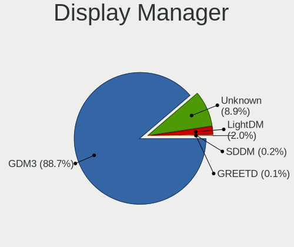

| Name    | Notebooks | Percent |
|---------|-----------|---------|
| GDM3    | 274       | 88.96%  |
| Unknown | 30        | 9.74%   |
| LightDM | 4         | 1.3%    |

OS Lang
-------

Language

| Lang    | Notebooks | Percent |
|---------|-----------|---------|
| en_US   | 138       | 44.66%  |
| de_DE   | 32        | 10.36%  |
| fr_FR   | 15        | 4.85%   |
| C       | 15        | 4.85%   |
| es_ES   | 14        | 4.53%   |
| en_GB   | 11        | 3.56%   |
| pt_BR   | 10        | 3.24%   |
| it_IT   | 8         | 2.59%   |
| en_AU   | 8         | 2.59%   |
| ru_RU   | 7         | 2.27%   |
| pl_PL   | 6         | 1.94%   |
| hu_HU   | 3         | 0.97%   |
| es_MX   | 3         | 0.97%   |
| en_CA   | 3         | 0.97%   |
| zh_CN   | 2         | 0.65%   |
| sv_SE   | 2         | 0.65%   |
| nl_NL   | 2         | 0.65%   |
| en_ZA   | 2         | 0.65%   |
| en_IN   | 2         | 0.65%   |
| de_CH   | 2         | 0.65%   |
| cs_CZ   | 2         | 0.65%   |
| ca_ES   | 2         | 0.65%   |
| bg_BG   | 2         | 0.65%   |
| Unknown | 2         | 0.65%   |
| tr_TR   | 1         | 0.32%   |
| ro_RO   | 1         | 0.32%   |
| pt_PT   | 1         | 0.32%   |
| nb_NO   | 1         | 0.32%   |
| ja_JP   | 1         | 0.32%   |
| hr_HR   | 1         | 0.32%   |
| fr_CA   | 1         | 0.32%   |
| fi_FI   | 1         | 0.32%   |
| fa_IR   | 1         | 0.32%   |
| et_EE   | 1         | 0.32%   |
| es_CR   | 1         | 0.32%   |
| es_CL   | 1         | 0.32%   |
| en_SG   | 1         | 0.32%   |
| en_IL   | 1         | 0.32%   |
| el_GR   | 1         | 0.32%   |
| da_DK   | 1         | 0.32%   |

Boot Mode
---------

EFI or BIOS

| Mode | Notebooks | Percent |
|------|-----------|---------|
| BIOS | 176       | 57.14%  |
| EFI  | 132       | 42.86%  |

Filesystem
----------

Type of filesystem

| Type    | Notebooks | Percent |
|---------|-----------|---------|
| Ext4    | 152       | 49.51%  |
| Tmpfs   | 142       | 46.25%  |
| Overlay | 8         | 2.61%   |
| Btrfs   | 3         | 0.98%   |
| Zfs     | 2         | 0.65%   |

Part. scheme
------------

Scheme of partitioning

| Type    | Notebooks | Percent |
|---------|-----------|---------|
| GPT     | 271       | 87.99%  |
| Unknown | 26        | 8.44%   |
| MBR     | 11        | 3.57%   |

Dual Boot with Linux/BSD
------------------------

Hosting more than one Linux/BSD

| Dual boot | Notebooks | Percent |
|-----------|-----------|---------|
| No        | 287       | 93.49%  |
| Yes       | 20        | 6.51%   |

Dual Boot (Win)
---------------

Hosting Linux and Windows

| Dual boot | Notebooks | Percent |
|-----------|-----------|---------|
| No        | 200       | 64.31%  |
| Yes       | 111       | 35.69%  |

Board
-----

Vendor
------

Motherboard manufacturer

| Name                           | Notebooks | Percent |
|--------------------------------|-----------|---------|
| Lenovo                         | 61        | 19.87%  |
| Dell                           | 56        | 18.24%  |
| Hewlett-Packard                | 47        | 15.31%  |
| ASUSTek Computer               | 30        | 9.77%   |
| Acer                           | 29        | 9.45%   |
| HUAWEI                         | 14        | 4.56%   |
| MSI                            | 13        | 4.23%   |
| Apple                          | 11        | 3.58%   |
| Samsung Electronics            | 6         | 1.95%   |
| Toshiba                        | 5         | 1.63%   |
| Unknown                        | 4         | 1.3%    |
| Shanghai Zhaoxin Semiconductor | 3         | 0.98%   |
| Google                         | 3         | 0.98%   |
| Timi                           | 2         | 0.65%   |
| Sony                           | 2         | 0.65%   |
| Razer                          | 2         | 0.65%   |
| Notebook                       | 2         | 0.65%   |
| Medion                         | 2         | 0.65%   |
| HONOR                          | 2         | 0.65%   |
| VALE                           | 1         | 0.33%   |
| Semp Toshiba                   | 1         | 0.33%   |
| Rombica                        | 1         | 0.33%   |
| Olivetti                       | 1         | 0.33%   |
| Mediacom                       | 1         | 0.33%   |
| ICL                            | 1         | 0.33%   |
| Gigabyte Technology            | 1         | 0.33%   |
| Gateway                        | 1         | 0.33%   |
| Crusaders Corporate (Pty)      | 1         | 0.33%   |
| AVITA                          | 1         | 0.33%   |
| Allview                        | 1         | 0.33%   |
| ALLDOCUBE                      | 1         | 0.33%   |
| Alienware                      | 1         | 0.33%   |

Model
-----

Motherboard model

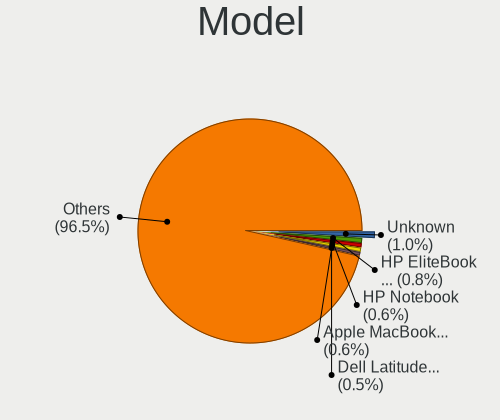

| Name                                                  | Notebooks | Percent |
|-------------------------------------------------------|-----------|---------|
| Unknown                                               | 4         | 1.3%    |
| Shanghai Zhaoxin ZXE CRB                              | 3         | 0.98%   |
| Apple MacBookPro9,2                                   | 3         | 0.98%   |
| Acer Swift SF314-512                                  | 3         | 0.98%   |
| MSI Stealth 15M B12UE                                 | 2         | 0.65%   |
| MSI Modern 14 A10M                                    | 2         | 0.65%   |
| HUAWEI KLVD-WXX9                                      | 2         | 0.65%   |
| HUAWEI CREM-WXX9                                      | 2         | 0.65%   |
| HUAWEI BOM-WXX9                                       | 2         | 0.65%   |
| HUAWEI BOHB-WAX9                                      | 2         | 0.65%   |
| HONOR BBR-WAX9                                        | 2         | 0.65%   |
| HP Notebook                                           | 2         | 0.65%   |
| HP Meep                                               | 2         | 0.65%   |
| HP Laptop 14-dq2xxx                                   | 2         | 0.65%   |
| HP EliteBook 840 G6                                   | 2         | 0.65%   |
| Dell XPS 15 9570                                      | 2         | 0.65%   |
| Dell XPS 15 9500                                      | 2         | 0.65%   |
| Dell Latitude E5470                                   | 2         | 0.65%   |
| Dell Latitude 7480                                    | 2         | 0.65%   |
| Dell Inspiron 3442                                    | 2         | 0.65%   |
| ASUS X751MA                                           | 2         | 0.65%   |
| ASUS VivoBook_ASUSLaptop M3500QA_M3500QA              | 2         | 0.65%   |
| VALE Notebook Classic C140                            | 1         | 0.33%   |
| Toshiba Satellite Pro C70-B                           | 1         | 0.33%   |
| Toshiba Satellite Pro C650                            | 1         | 0.33%   |
| Toshiba Satellite L650                                | 1         | 0.33%   |
| Toshiba PORTEGE Z30t-A                                | 1         | 0.33%   |
| Toshiba PORTEGE X30-D                                 | 1         | 0.33%   |
| Timi Xiaomi NoteBook Pro                              | 1         | 0.33%   |
| Timi RedmiBook 15                                     | 1         | 0.33%   |
| Sony VPCF120FD                                        | 1         | 0.33%   |
| Sony VPCEH2H4E                                        | 1         | 0.33%   |
| Semp Toshiba IS 1413G                                 | 1         | 0.33%   |
| Samsung SBB-DA                                        | 1         | 0.33%   |
| Samsung 960XFH                                        | 1         | 0.33%   |
| Samsung 930X2K/931X2K                                 | 1         | 0.33%   |
| Samsung 767XCL                                        | 1         | 0.33%   |
| Samsung 370E4K                                        | 1         | 0.33%   |
| Samsung 300E5EV/300E4EV/270E5EV/270E4EV/2470EV/2470EE | 1         | 0.33%   |
| Rombica myBook Zenith                                 | 1         | 0.33%   |

Model Family
------------

Motherboard model prefix

| Name                 | Notebooks | Percent |
|----------------------|-----------|---------|
| Lenovo ThinkPad      | 34        | 11.07%  |
| Dell Latitude        | 22        | 7.17%   |
| Dell Inspiron        | 15        | 4.89%   |
| Acer Aspire          | 14        | 4.56%   |
| Lenovo IdeaPad       | 12        | 3.91%   |
| ASUS VivoBook        | 11        | 3.58%   |
| HP Pavilion          | 10        | 3.26%   |
| Dell XPS             | 10        | 3.26%   |
| HP Laptop            | 8         | 2.61%   |
| HP EliteBook         | 8         | 2.61%   |
| Acer Swift           | 8         | 2.61%   |
| ASUS ASUS            | 5         | 1.63%   |
| Acer Nitro           | 5         | 1.63%   |
| Lenovo Legion        | 4         | 1.3%    |
| HP ProBook           | 4         | 1.3%    |
| Dell Vostro          | 4         | 1.3%    |
| Dell Precision       | 4         | 1.3%    |
| Unknown              | 4         | 1.3%    |
| Toshiba Satellite    | 3         | 0.98%   |
| Shanghai Zhaoxin ZXE | 3         | 0.98%   |
| MSI Stealth          | 3         | 0.98%   |
| HP ZBook             | 3         | 0.98%   |
| Apple MacBookPro9    | 3         | 0.98%   |
| Toshiba PORTEGE      | 2         | 0.65%   |
| Razer Blade          | 2         | 0.65%   |
| MSI Modern           | 2         | 0.65%   |
| MSI Katana           | 2         | 0.65%   |
| Lenovo Yoga          | 2         | 0.65%   |
| Lenovo ThinkBook     | 2         | 0.65%   |
| HUAWEI KLVD-WXX9     | 2         | 0.65%   |
| HUAWEI CREM-WXX9     | 2         | 0.65%   |
| HUAWEI BOM-WXX9      | 2         | 0.65%   |
| HUAWEI BOHB-WAX9     | 2         | 0.65%   |
| HONOR BBR-WAX9       | 2         | 0.65%   |
| HP Notebook          | 2         | 0.65%   |
| HP Meep              | 2         | 0.65%   |
| HP ENVY              | 2         | 0.65%   |
| ASUS Zenbook         | 2         | 0.65%   |
| ASUS X751MA          | 2         | 0.65%   |
| ASUS TUF             | 2         | 0.65%   |

MFG Year
--------

Motherboard manufacture year

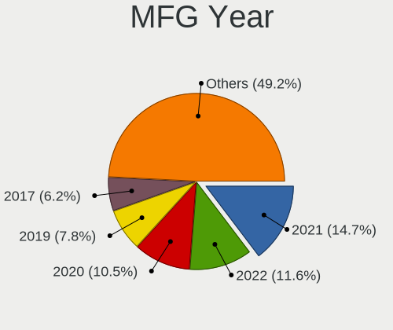

| Year    | Notebooks | Percent |
|---------|-----------|---------|
| 2021    | 64        | 20.85%  |
| 2022    | 38        | 12.38%  |
| 2020    | 30        | 9.77%   |
| 2016    | 24        | 7.82%   |
| 2019    | 23        | 7.49%   |
| 2018    | 19        | 6.19%   |
| 2011    | 17        | 5.54%   |
| 2015    | 16        | 5.21%   |
| 2012    | 13        | 4.23%   |
| 2014    | 12        | 3.91%   |
| 2010    | 12        | 3.91%   |
| 2023    | 11        | 3.58%   |
| 2017    | 11        | 3.58%   |
| 2013    | 7         | 2.28%   |
| 2009    | 4         | 1.3%    |
| 2008    | 4         | 1.3%    |
| 2007    | 1         | 0.33%   |
| Unknown | 1         | 0.33%   |

Form Factor
-----------

Physical design of the computer

| Name     | Notebooks | Percent |
|----------|-----------|---------|
| Notebook | 307       | 100%    |

Secure Boot
-----------

Enabled or disabled

| State    | Notebooks | Percent |
|----------|-----------|---------|
| Disabled | 268       | 87.3%   |
| Enabled  | 39        | 12.7%   |

Coreboot
--------

Have coreboot on board

| Used | Notebooks | Percent |
|------|-----------|---------|
| No   | 302       | 98.37%  |
| Yes  | 5         | 1.63%   |

RAM Size
--------

Total RAM memory

| Size in GB  | Notebooks | Percent |
|-------------|-----------|---------|
| 4.01-8.0    | 100       | 32.57%  |
| 16.01-24.0  | 68        | 22.15%  |
| 8.01-16.0   | 50        | 16.29%  |
| 3.01-4.0    | 43        | 14.01%  |
| 32.01-64.0  | 26        | 8.47%   |
| 24.01-32.0  | 10        | 3.26%   |
| 64.01-256.0 | 7         | 2.28%   |
| 1.01-2.0    | 3         | 0.98%   |

RAM Used
--------

Used RAM memory

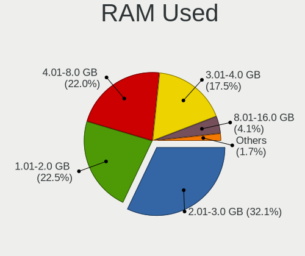

| Used GB    | Notebooks | Percent |
|------------|-----------|---------|
| 2.01-3.0   | 96        | 30.77%  |
| 1.01-2.0   | 74        | 23.72%  |
| 4.01-8.0   | 73        | 23.4%   |
| 3.01-4.0   | 55        | 17.63%  |
| 8.01-16.0  | 10        | 3.21%   |
| 16.01-24.0 | 3         | 0.96%   |
| 24.01-32.0 | 1         | 0.32%   |

Total Drives
------------

Number of drives on board

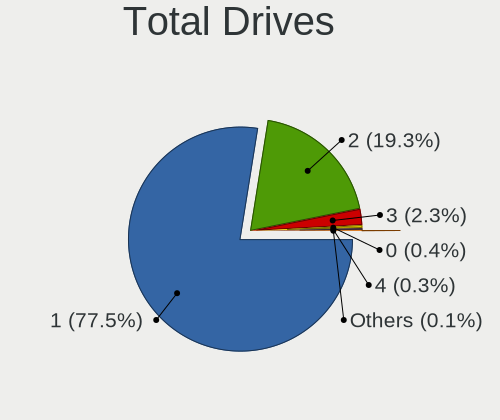

| Drives | Notebooks | Percent |
|--------|-----------|---------|
| 1      | 235       | 76.55%  |
| 2      | 65        | 21.17%  |
| 3      | 6         | 1.95%   |
| 4      | 1         | 0.33%   |

Has CD-ROM
----------

Has CD-ROM on board

| Presented | Notebooks | Percent |
|-----------|-----------|---------|
| No        | 245       | 79.8%   |
| Yes       | 62        | 20.2%   |

Has Ethernet
------------

Has Ethernet on board

| Presented | Notebooks | Percent |
|-----------|-----------|---------|
| Yes       | 201       | 65.47%  |
| No        | 106       | 34.53%  |

Has WiFi
--------

Has WiFi module

| Presented | Notebooks | Percent |
|-----------|-----------|---------|
| Yes       | 304       | 99.02%  |
| No        | 3         | 0.98%   |

Has Bluetooth
-------------

Has Bluetooth module

| Presented | Notebooks | Percent |
|-----------|-----------|---------|
| Yes       | 265       | 85.76%  |
| No        | 44        | 14.24%  |

Location
--------

Country
-------

Geographic location (country)

| Country                | Notebooks | Percent |
|------------------------|-----------|---------|
| USA                    | 40        | 12.99%  |
| Germany                | 35        | 11.36%  |
| France                 | 17        | 5.52%   |
| Brazil                 | 17        | 5.52%   |
| Russia                 | 16        | 5.19%   |
| Spain                  | 15        | 4.87%   |
| Italy                  | 14        | 4.55%   |
| UK                     | 12        | 3.9%    |
| Australia              | 12        | 3.9%    |
| India                  | 8         | 2.6%    |
| Poland                 | 7         | 2.27%   |
| Netherlands            | 7         | 2.27%   |
| Mexico                 | 7         | 2.27%   |
| Romania                | 6         | 1.95%   |
| Norway                 | 5         | 1.62%   |
| China                  | 5         | 1.62%   |
| Canada                 | 5         | 1.62%   |
| Switzerland            | 4         | 1.3%    |
| Sweden                 | 4         | 1.3%    |
| Vietnam                | 3         | 0.97%   |
| Turkey                 | 3         | 0.97%   |
| Portugal               | 3         | 0.97%   |
| Kenya                  | 3         | 0.97%   |
| Hungary                | 3         | 0.97%   |
| Finland                | 3         | 0.97%   |
| Czechia                | 3         | 0.97%   |
| Chile                  | 3         | 0.97%   |
| Bosnia and Herzegovina | 3         | 0.97%   |
| Belgium                | 3         | 0.97%   |
| South Africa           | 2         | 0.65%   |
| Qatar                  | 2         | 0.65%   |
| Philippines            | 2         | 0.65%   |
| Ireland                | 2         | 0.65%   |
| Iran                   | 2         | 0.65%   |
| Indonesia              | 2         | 0.65%   |
| Greece                 | 2         | 0.65%   |
| Egypt                  | 2         | 0.65%   |
| Belarus                | 2         | 0.65%   |
| Uruguay                | 1         | 0.32%   |
| UAE                    | 1         | 0.32%   |

City
----

Geographic location (city)

| City              | Notebooks | Percent |
|-------------------|-----------|---------|
| Berlin            | 6         | 1.92%   |
| Moscow            | 5         | 1.6%    |
| Barcelona         | 5         | 1.6%    |
| St Petersburg     | 3         | 0.96%   |
| Sao Paulo         | 3         | 0.96%   |
| Rio de Janeiro    | 3         | 0.96%   |
| Oslo              | 3         | 0.96%   |
| Nairobi           | 3         | 0.96%   |
| Melbourne         | 3         | 0.96%   |
| Madrid            | 3         | 0.96%   |
| Frankfurt am Main | 3         | 0.96%   |
| Brussels          | 3         | 0.96%   |
| Warsaw            | 2         | 0.64%   |
| Turin             | 2         | 0.64%   |
| Toronto           | 2         | 0.64%   |
| Stockholm         | 2         | 0.64%   |
| Sarajevo          | 2         | 0.64%   |
| Santiago          | 2         | 0.64%   |
| Prague            | 2         | 0.64%   |
| Perth             | 2         | 0.64%   |
| Paris             | 2         | 0.64%   |
| Orenburg          | 2         | 0.64%   |
| Mumbai            | 2         | 0.64%   |
| Montreal          | 2         | 0.64%   |
| Melun             | 2         | 0.64%   |
| Kunming           | 2         | 0.64%   |
| Jianshui          | 2         | 0.64%   |
| Helsinki          | 2         | 0.64%   |
| Hamburg           | 2         | 0.64%   |
| Guadalajara       | 2         | 0.64%   |
| Ghaziabad         | 2         | 0.64%   |
| Doha              | 2         | 0.64%   |
| Denver            | 2         | 0.64%   |
| Da Nang           | 2         | 0.64%   |
| Cape Town         | 2         | 0.64%   |
| Brisbane          | 2         | 0.64%   |
| Bordeaux          | 2         | 0.64%   |
| Baton Rouge       | 2         | 0.64%   |
| Atlanta           | 2         | 0.64%   |
| Antalya           | 2         | 0.64%   |

Drives
------

Drive Vendor
------------

Hard drive vendors

| Vendor                       | Notebooks | Drives | Percent |
|------------------------------|-----------|--------|---------|
| Samsung Electronics          | 68        | 77     | 18.43%  |
| WDC                          | 28        | 30     | 7.59%   |
| Sandisk                      | 25        | 29     | 6.78%   |
| SK hynix                     | 24        | 25     | 6.5%    |
| Kingston                     | 23        | 26     | 6.23%   |
| Seagate                      | 21        | 22     | 5.69%   |
| Micron Technology            | 20        | 21     | 5.42%   |
| Toshiba                      | 18        | 19     | 4.88%   |
| Unknown                      | 17        | 18     | 4.61%   |
| KIOXIA                       | 15        | 15     | 4.07%   |
| Intel                        | 12        | 13     | 3.25%   |
| Crucial                      | 10        | 10     | 2.71%   |
| Phison Electronics           | 8         | 8      | 2.17%   |
| China                        | 8         | 8      | 2.17%   |
| Apple                        | 8         | 10     | 2.17%   |
| Phison                       | 5         | 5      | 1.36%   |
| Hitachi                      | 4         | 4      | 1.08%   |
| HGST                         | 4         | 5      | 1.08%   |
| Team                         | 3         | 3      | 0.81%   |
| LITEONIT                     | 3         | 4      | 0.81%   |
| LITEON                       | 3         | 5      | 0.81%   |
| A-DATA Technology            | 3         | 3      | 0.81%   |
| SSSTC                        | 2         | 2      | 0.54%   |
| Realtek Semiconductor        | 2         | 2      | 0.54%   |
| Intenso                      | 2         | 4      | 0.54%   |
| GOODRAM                      | 2         | 2      | 0.54%   |
| YMTC                         | 1         | 1      | 0.27%   |
| XrayDisk                     | 1         | 1      | 0.27%   |
| XPG                          | 1         | 1      | 0.27%   |
| WDC WDS2                     | 1         | 1      | 0.27%   |
| Union Memory                 | 1         | 1      | 0.27%   |
| SPCC                         | 1         | 1      | 0.27%   |
| Solid State Storage          | 1         | 1      | 0.27%   |
| Smartbuy                     | 1         | 1      | 0.27%   |
| Silicon Motion               | 1         | 1      | 0.27%   |
| Shenzhen Longsys Electronics | 1         | 1      | 0.27%   |
| S3+                          | 1         | 1      | 0.27%   |
| POWER                        | 1         | 1      | 0.27%   |
| Plextor                      | 1         | 1      | 0.27%   |
| Pioneer                      | 1         | 1      | 0.27%   |

Drive Model
-----------

Hard drive models

| Model                                               | Notebooks | Percent |
|-----------------------------------------------------|-----------|---------|
| Samsung NVMe SSD Controller SM981/PM981/PM983 256GB | 11        | 2.91%   |
| Kingston SA400S37480G 480GB SSD                     | 6         | 1.59%   |
| Seagate ST1000LM035-1RK172 1TB                      | 5         | 1.32%   |
| Samsung NVMe SSD Controller PM9A1/PM9A3/980PRO 1TB  | 5         | 1.32%   |
| Phison E12 NVMe Controller 256GB                    | 5         | 1.32%   |
| Micron 2450_MTFDKBA1T0TFK 1TB                       | 5         | 1.32%   |
| Kingston SA400S37240G 240GB SSD                     | 5         | 1.32%   |
| Unknown MMC Card  32GB                              | 4         | 1.06%   |
| Toshiba MQ01ABF050 500GB                            | 4         | 1.06%   |
| Seagate ST1000LM024 HN-M101MBB 1TB                  | 4         | 1.06%   |
| Sandisk WD Black SN750 / PC SN730 NVMe SSD 256GB    | 4         | 1.06%   |
| SanDisk NVMe SSD Drive 512GB                        | 4         | 1.06%   |
| Unknown MMC Card  64GB                              | 3         | 0.79%   |
| Unknown MMC Card  16GB                              | 3         | 0.79%   |
| Toshiba XG6 NVMe SSD Controller 256GB               | 3         | 0.79%   |
| SK hynix HFM512GD3JX013N 512GB                      | 3         | 0.79%   |
| Sandisk WD Blue SN550 NVMe SSD 512GB                | 3         | 0.79%   |
| Samsung SSD 850 EVO 250GB                           | 3         | 0.79%   |
| Samsung MZVL21T0HCLR-00B00 1TB                      | 3         | 0.79%   |
| Phison PS5013 E13 NVMe Controller 512GB             | 3         | 0.79%   |
| KIOXIA KBG40ZNV512G 512GB                           | 3         | 0.79%   |
| HGST HTS721010A9E630 1TB                            | 3         | 0.79%   |
| China 256GB SSD                                     | 3         | 0.79%   |
| WDC PC SN730 SDBPNTY-512G                           | 2         | 0.53%   |
| Unknown SD/MMC/MS PRO 64GB                          | 2         | 0.53%   |
| Unknown MMC Card  128GB                             | 2         | 0.53%   |
| Toshiba MQ04ABF100 1TB                              | 2         | 0.53%   |
| Team T253512GB SSD                                  | 2         | 0.53%   |
| SK hynix PC601 NVMe 512GB                           | 2         | 0.53%   |
| SK hynix HFM001TD3JX013N 1TB                        | 2         | 0.53%   |
| Sandisk WD Black 2018/SN750 / PC SN720 NVMe SSD 1TB | 2         | 0.53%   |
| SanDisk SD8SN8U-256G-1006 256GB SSD                 | 2         | 0.53%   |
| SanDisk NVMe SSD Drive 1TB                          | 2         | 0.53%   |
| Samsung SSD 870 EVO 500GB                           | 2         | 0.53%   |
| Samsung SSD 860 EVO 250GB                           | 2         | 0.53%   |
| Samsung SSD 860 EVO 1TB                             | 2         | 0.53%   |
| Samsung NVMe SSD Controller SM961/PM961/SM963 256GB | 2         | 0.53%   |
| Samsung MZVLQ512HBLU-00B00 512GB                    | 2         | 0.53%   |
| Micron 3400_MTFDKBA512TFH 512GB                     | 2         | 0.53%   |
| Micron 2210_MTFDHBA1T0QFD 1TB                       | 2         | 0.53%   |

HDD Vendor
----------

Hard disk drive vendors

| Vendor              | Notebooks | Drives | Percent |
|---------------------|-----------|--------|---------|
| Seagate             | 21        | 22     | 36.84%  |
| WDC                 | 11        | 12     | 19.3%   |
| Toshiba             | 9         | 10     | 15.79%  |
| Hitachi             | 4         | 4      | 7.02%   |
| HGST                | 4         | 5      | 7.02%   |
| Unknown             | 2         | 2      | 3.51%   |
| Samsung Electronics | 2         | 2      | 3.51%   |
| JMicron Technology  | 1         | 1      | 1.75%   |
| HGST HTS            | 1         | 1      | 1.75%   |
| Fujitsu             | 1         | 1      | 1.75%   |
| Apple               | 1         | 1      | 1.75%   |

SSD Vendor
----------

Solid state drive vendors

| Vendor              | Notebooks | Drives | Percent |
|---------------------|-----------|--------|---------|
| Samsung Electronics | 23        | 24     | 19.66%  |
| Kingston            | 18        | 21     | 15.38%  |
| WDC                 | 8         | 9      | 6.84%   |
| Crucial             | 8         | 8      | 6.84%   |
| China               | 8         | 8      | 6.84%   |
| SanDisk             | 5         | 5      | 4.27%   |
| SK hynix            | 4         | 4      | 3.42%   |
| Apple               | 4         | 4      | 3.42%   |
| Team                | 3         | 3      | 2.56%   |
| Micron Technology   | 3         | 3      | 2.56%   |
| LITEONIT            | 3         | 4      | 2.56%   |
| LITEON              | 3         | 5      | 2.56%   |
| A-DATA Technology   | 3         | 3      | 2.56%   |
| Intenso             | 2         | 3      | 1.71%   |
| Intel               | 2         | 3      | 1.71%   |
| XrayDisk            | 1         | 1      | 0.85%   |
| WDC WDS2            | 1         | 1      | 0.85%   |
| Toshiba             | 1         | 1      | 0.85%   |
| SPCC                | 1         | 1      | 0.85%   |
| Smartbuy            | 1         | 1      | 0.85%   |
| S3+                 | 1         | 1      | 0.85%   |
| Plextor             | 1         | 1      | 0.85%   |
| Pioneer             | 1         | 1      | 0.85%   |
| Patriot             | 1         | 1      | 0.85%   |
| ORTIAL              | 1         | 1      | 0.85%   |
| NT-512              | 1         | 1      | 0.85%   |
| Netac               | 1         | 1      | 0.85%   |
| Lexar               | 1         | 1      | 0.85%   |
| KINGBANK            | 1         | 1      | 0.85%   |
| INTEL SS            | 1         | 2      | 0.85%   |
| GOODRAM             | 1         | 1      | 0.85%   |
| GLOWAY              | 1         | 1      | 0.85%   |
| Gigabyte Technology | 1         | 1      | 0.85%   |
| FORESEE             | 1         | 1      | 0.85%   |
| Unknown             | 1         | 1      | 0.85%   |

Drive Kind
----------

HDD or SSD

| Kind    | Notebooks | Drives | Percent |
|---------|-----------|--------|---------|
| NVMe    | 168       | 193    | 47.86%  |
| SSD     | 108       | 128    | 30.77%  |
| HDD     | 57        | 61     | 16.24%  |
| MMC     | 15        | 16     | 4.27%   |
| Unknown | 3         | 4      | 0.85%   |

Drive Connector
---------------

SATA, SAS, NVMe, etc.

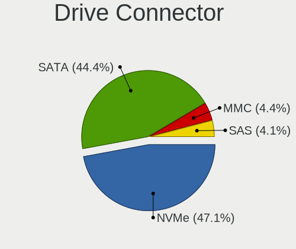

| Type | Notebooks | Drives | Percent |
|------|-----------|--------|---------|
| NVMe | 168       | 193    | 49.12%  |
| SATA | 146       | 177    | 42.69%  |
| MMC  | 15        | 16     | 4.39%   |
| SAS  | 13        | 16     | 3.8%    |

Drive Size
----------

Size of hard drive

| Size in TB | Notebooks | Drives | Percent |
|------------|-----------|--------|---------|
| 0.01-0.5   | 117       | 139    | 70.06%  |
| 0.51-1.0   | 44        | 44     | 26.35%  |
| 1.01-2.0   | 3         | 3      | 1.8%    |
| 4.01-10.0  | 2         | 2      | 1.2%    |
| 3.01-4.0   | 1         | 1      | 0.6%    |

Space Total
-----------

Amount of disk space available on the file system

| Size in GB     | Notebooks | Percent |
|----------------|-----------|---------|
| 101-250        | 100       | 31.85%  |
| 251-500        | 92        | 29.3%   |
| 501-1000       | 51        | 16.24%  |
| 51-100         | 20        | 6.37%   |
| 1-20           | 16        | 5.1%    |
| 21-50          | 13        | 4.14%   |
| 1001-2000      | 12        | 3.82%   |
| More than 3000 | 4         | 1.27%   |
| 2001-3000      | 4         | 1.27%   |
| Unknown        | 2         | 0.64%   |

Space Used
----------

Amount of used disk space

| Used GB   | Notebooks | Percent |
|-----------|-----------|---------|
| 1-20      | 121       | 38.66%  |
| 21-50     | 77        | 24.6%   |
| 101-250   | 37        | 11.82%  |
| 51-100    | 37        | 11.82%  |
| 251-500   | 24        | 7.67%   |
| 501-1000  | 11        | 3.51%   |
| 2001-3000 | 2         | 0.64%   |
| 1001-2000 | 2         | 0.64%   |
| Unknown   | 2         | 0.64%   |

Malfunc. Drives
---------------

Drive models with a malfunction

| Model                              | Notebooks | Drives | Percent |
|------------------------------------|-----------|--------|---------|
| WDC WD Green M.2 2280 240GB SSD    | 1         | 1      | 12.5%   |
| Seagate ST1000LM035-1RK172 1TB     | 1         | 1      | 12.5%   |
| Seagate ST1000LM024 HN-M101MBB 1TB | 1         | 1      | 12.5%   |
| Hitachi HTS723225A7A365 OPAL 250GB | 1         | 1      | 12.5%   |
| Hitachi HTS547564A9E384 640GB      | 1         | 1      | 12.5%   |
| HGST HTS721010A9E630 1TB           | 1         | 1      | 12.5%   |
| Fujitsu MHW2160BH 160GB            | 1         | 1      | 12.5%   |
| Unknown                            | 1         | 1      | 12.5%   |

Malfunc. Drive Vendor
---------------------

Vendors of faulty drives

| Vendor  | Notebooks | Drives | Percent |
|---------|-----------|--------|---------|
| Seagate | 2         | 2      | 25%     |
| Hitachi | 2         | 2      | 25%     |
| WDC     | 1         | 1      | 12.5%   |
| HGST    | 1         | 1      | 12.5%   |
| Fujitsu | 1         | 1      | 12.5%   |
| Unknown | 1         | 1      | 12.5%   |

Malfunc. HDD Vendor
-------------------

Vendors of faulty HDD drives

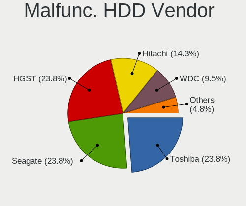

| Vendor  | Notebooks | Drives | Percent |
|---------|-----------|--------|---------|
| Seagate | 2         | 2      | 33.33%  |
| Hitachi | 2         | 2      | 33.33%  |
| HGST    | 1         | 1      | 16.67%  |
| Fujitsu | 1         | 1      | 16.67%  |

Malfunc. Drive Kind
-------------------

Kinds of faulty drives

| Kind | Notebooks | Drives | Percent |
|------|-----------|--------|---------|
| HDD  | 6         | 6      | 75%     |
| SSD  | 2         | 2      | 25%     |

Failed Drives
-------------

Failed drive models

Zero info for selected period =(

Failed Drive Vendor
-------------------

Failed drive vendors

Zero info for selected period =(

Drive Status
------------

Number of failed and malfunc. drives

| Status   | Notebooks | Drives | Percent |
|----------|-----------|--------|---------|
| Detected | 199       | 270    | 63.17%  |
| Works    | 108       | 124    | 34.29%  |
| Malfunc  | 8         | 8      | 2.54%   |

Storage controller
------------------

Storage Vendor
--------------

Storage controller vendors

| Vendor                         | Notebooks | Percent |
|--------------------------------|-----------|---------|
| Intel                          | 195       | 48.75%  |
| Samsung Electronics            | 47        | 11.75%  |
| AMD                            | 30        | 7.5%    |
| SanDisk                        | 28        | 7%      |
| SK hynix                       | 20        | 5%      |
| Micron Technology              | 17        | 4.25%   |
| Phison Electronics             | 14        | 3.5%    |
| KIOXIA                         | 13        | 3.25%   |
| Toshiba America Info Systems   | 10        | 2.5%    |
| Kingston Technology Company    | 5         | 1.25%   |
| Zhaoxin                        | 3         | 0.75%   |
| Solid State Storage Technology | 3         | 0.75%   |
| Micron/Crucial Technology      | 3         | 0.75%   |
| Realtek Semiconductor          | 2         | 0.5%    |
| Apple                          | 2         | 0.5%    |
| ADATA Technology               | 2         | 0.5%    |
| Yangtze Memory Technologies    | 1         | 0.25%   |
| Union Memory (Shenzhen)        | 1         | 0.25%   |
| Silicon Motion                 | 1         | 0.25%   |
| Shenzhen Longsys Electronics   | 1         | 0.25%   |
| Lenovo                         | 1         | 0.25%   |
| ASMedia Technology             | 1         | 0.25%   |

Storage Model
-------------

Storage controller models

| Model                                                                        | Notebooks | Percent |
|------------------------------------------------------------------------------|-----------|---------|
| Intel Volume Management Device NVMe RAID Controller                          | 31        | 7.38%   |
| AMD FCH SATA Controller [AHCI mode]                                          | 28        | 6.67%   |
| Intel Sunrise Point-LP SATA Controller [AHCI mode]                           | 25        | 5.95%   |
| Intel 7 Series Chipset Family 6-port SATA Controller [AHCI mode]             | 17        | 4.05%   |
| Samsung NVMe SSD Controller SM981/PM981/PM983                                | 16        | 3.81%   |
| Micron NVMe Storage Controller                                               | 16        | 3.81%   |
| Intel 82801 Mobile SATA Controller [RAID mode]                               | 15        | 3.57%   |
| Intel 6 Series/C200 Series Chipset Family 6 port Mobile SATA AHCI Controller | 15        | 3.57%   |
| Samsung NVMe SSD Controller PM9A1/PM9A3/980PRO                               | 14        | 3.33%   |
| Intel Wildcat Point-LP SATA Controller [AHCI Mode]                           | 11        | 2.62%   |
| SK hynix Gold P31/PC711 NVMe Solid State Drive                               | 10        | 2.38%   |
| Samsung NVMe SSD Controller 980                                              | 10        | 2.38%   |
| Intel Cannon Lake Mobile PCH SATA AHCI Controller                            | 10        | 2.38%   |
| KIOXIA NVMe SSD Controller BG4                                               | 9         | 2.14%   |
| SanDisk WD Black SN750 / PC SN730 NVMe SSD                                   | 8         | 1.9%    |
| Intel Tiger Lake-LP SATA Controller                                          | 8         | 1.9%    |
| Intel 8 Series SATA Controller 1 [AHCI mode]                                 | 8         | 1.9%    |
| SK hynix Non-Volatile memory controller                                      | 7         | 1.67%   |
| Phison PS5013 E13 NVMe Controller                                            | 7         | 1.67%   |
| Intel Comet Lake SATA AHCI Controller                                        | 7         | 1.67%   |
| Toshiba America Info Systems XG6 NVMe SSD Controller                         | 6         | 1.43%   |
| Intel Celeron/Pentium Silver Processor SATA Controller                       | 6         | 1.43%   |
| Intel 5 Series/3400 Series Chipset 4 port SATA AHCI Controller               | 6         | 1.43%   |
| SanDisk Non-Volatile memory controller                                       | 5         | 1.19%   |
| Phison E12 NVMe Controller                                                   | 5         | 1.19%   |
| Intel Non-Volatile memory controller                                         | 5         | 1.19%   |
| Intel Alder Lake-P SATA AHCI Controller                                      | 5         | 1.19%   |
| Intel 82801IBM/IEM (ICH9M/ICH9M-E) 4 port SATA Controller [AHCI mode]        | 5         | 1.19%   |
| SanDisk WD Blue SN550 NVMe SSD                                               | 4         | 0.95%   |
| KIOXIA Non-Volatile memory controller                                        | 4         | 0.95%   |
| Zhaoxin ZX-100/ZX-200/KX-6000/KX-6000G StorX AHCI Controller                 | 3         | 0.71%   |
| Solid State Storage Non-Volatile memory controller                           | 3         | 0.71%   |
| SanDisk WD PC SN810 / Black SN850 NVMe SSD                                   | 3         | 0.71%   |
| SanDisk WD Black 2018/SN750 / PC SN720 NVMe SSD                              | 3         | 0.71%   |
| Samsung NVMe SSD Controller SM961/PM961/SM963                                | 3         | 0.71%   |
| Micron/Crucial P2 NVMe PCIe SSD                                              | 3         | 0.71%   |
| Kingston Company Company Non-Volatile memory controller                      | 3         | 0.71%   |
| Intel Volume Management Device NVMe RAID Controller Intel Corporation        | 3         | 0.71%   |
| Intel SSD 660P Series                                                        | 3         | 0.71%   |
| Intel HM170/QM170 Chipset SATA Controller [AHCI Mode]                        | 3         | 0.71%   |

Storage Kind
------------

Kind of storage controller (IDE, SATA, NVMe, SAS, ...)

| Kind | Notebooks | Percent |
|------|-----------|---------|
| SATA | 185       | 45.68%  |
| NVMe | 167       | 41.23%  |
| RAID | 49        | 12.1%   |
| IDE  | 4         | 0.99%   |

Processor
---------

CPU Vendor
----------

Processor vendors

| Vendor       | Notebooks | Percent |
|--------------|-----------|---------|
| Intel        | 249       | 81.11%  |
| AMD          | 55        | 17.92%  |
| CentaurHauls | 3         | 0.98%   |

CPU Model
---------

Processor models

| Model                                          | Notebooks | Percent |
|------------------------------------------------|-----------|---------|
| Intel 11th Gen Core i7-1165G7 @ 2.80GHz        | 7         | 2.28%   |
| Intel Core i7-8750H CPU @ 2.20GHz              | 6         | 1.95%   |
| Intel 11th Gen Core i5-1135G7 @ 2.40GHz        | 6         | 1.95%   |
| AMD Ryzen 5 5500U with Radeon Graphics         | 6         | 1.95%   |
| Intel Core i7-6600U CPU @ 2.60GHz              | 5         | 1.63%   |
| Intel Core i5-5200U CPU @ 2.20GHz              | 5         | 1.63%   |
| Intel Core i5-10210U CPU @ 1.60GHz             | 5         | 1.63%   |
| Intel 12th Gen Core i7-1260P                   | 5         | 1.63%   |
| Intel 11th Gen Core i3-1115G4 @ 3.00GHz        | 5         | 1.63%   |
| AMD Ryzen 7 5800H with Radeon Graphics         | 5         | 1.63%   |
| Intel Core i7-9750H CPU @ 2.60GHz              | 4         | 1.3%    |
| Intel Core i7-8565U CPU @ 1.80GHz              | 4         | 1.3%    |
| Intel Core i7-8550U CPU @ 1.80GHz              | 4         | 1.3%    |
| Intel Core i5-3210M CPU @ 2.50GHz              | 4         | 1.3%    |
| Intel Core i3-10110U CPU @ 2.10GHz             | 4         | 1.3%    |
| Intel Celeron N4020 CPU @ 1.10GHz              | 4         | 1.3%    |
| Intel 12th Gen Core i7-12700H                  | 4         | 1.3%    |
| Intel 12th Gen Core i5-1240P                   | 4         | 1.3%    |
| Intel 11th Gen Core i7-11370H @ 3.30GHz        | 4         | 1.3%    |
| Intel Core i7-6700HQ CPU @ 2.60GHz             | 3         | 0.98%   |
| Intel Core i7-2630QM CPU @ 2.00GHz             | 3         | 0.98%   |
| Intel Core i5-8250U CPU @ 1.60GHz              | 3         | 0.98%   |
| Intel Core i5-7300U CPU @ 2.60GHz              | 3         | 0.98%   |
| Intel Core i5-7200U CPU @ 2.50GHz              | 3         | 0.98%   |
| Intel Core i5-6300U CPU @ 2.40GHz              | 3         | 0.98%   |
| Intel Core i5-2520M CPU @ 2.50GHz              | 3         | 0.98%   |
| Intel 11th Gen Core i5-1145G7 @ 2.60GHz        | 3         | 0.98%   |
| CentaurHauls ZHAOXIN KaiXian KX-6640MA@2.2+GHz | 3         | 0.98%   |
| AMD Ryzen 5 5600H with Radeon Graphics         | 3         | 0.98%   |
| AMD Ryzen 5 4600H with Radeon Graphics         | 3         | 0.98%   |
| Intel Pentium Silver N5030 CPU @ 1.10GHz       | 2         | 0.65%   |
| Intel Core i7-8850H CPU @ 2.60GHz              | 2         | 0.65%   |
| Intel Core i7-7500U CPU @ 2.70GHz              | 2         | 0.65%   |
| Intel Core i7-6500U CPU @ 2.50GHz              | 2         | 0.65%   |
| Intel Core i7-5500U CPU @ 2.40GHz              | 2         | 0.65%   |
| Intel Core i7-10875H CPU @ 2.30GHz             | 2         | 0.65%   |
| Intel Core i5-8265U CPU @ 1.60GHz              | 2         | 0.65%   |
| Intel Core i5-4210U CPU @ 1.70GHz              | 2         | 0.65%   |
| Intel Core i5-3337U CPU @ 1.80GHz              | 2         | 0.65%   |
| Intel Core i5-2540M CPU @ 2.60GHz              | 2         | 0.65%   |

CPU Model Family
----------------

Processor model prefix

| Model                | Notebooks | Percent |
|----------------------|-----------|---------|
| Other                | 70        | 22.8%   |
| Intel Core i7        | 64        | 20.85%  |
| Intel Core i5        | 61        | 19.87%  |
| Intel Core i3        | 20        | 6.51%   |
| AMD Ryzen 7          | 19        | 6.19%   |
| AMD Ryzen 5          | 16        | 5.21%   |
| Intel Celeron        | 14        | 4.56%   |
| Intel Core 2 Duo     | 9         | 2.93%   |
| Intel Pentium        | 6         | 1.95%   |
| AMD Ryzen 9          | 6         | 1.95%   |
| Intel Pentium Silver | 3         | 0.98%   |
| Intel Core i9        | 2         | 0.65%   |
| AMD Ryzen 5 PRO      | 2         | 0.65%   |
| AMD Ryzen 3          | 2         | 0.65%   |
| AMD A8               | 2         | 0.65%   |
| AMD A4               | 2         | 0.65%   |
| AMD A10              | 2         | 0.65%   |
| Intel Xeon           | 1         | 0.33%   |
| Intel Pentium Dual   | 1         | 0.33%   |
| Intel Core m7        | 1         | 0.33%   |
| Intel Core M         | 1         | 0.33%   |
| AMD Ryzen 7 PRO      | 1         | 0.33%   |
| AMD E2               | 1         | 0.33%   |
| AMD Athlon II        | 1         | 0.33%   |

CPU Cores
---------

Number of processor cores

| Number | Notebooks | Percent |
|--------|-----------|---------|
| 2      | 118       | 38.44%  |
| 4      | 98        | 31.92%  |
| 8      | 31        | 10.1%   |
| 6      | 30        | 9.77%   |
| 12     | 12        | 3.91%   |
| 14     | 11        | 3.58%   |
| 10     | 4         | 1.3%    |
| 16     | 2         | 0.65%   |
| 5      | 1         | 0.33%   |

CPU Sockets
-----------

Number of sockets

| Number | Notebooks | Percent |
|--------|-----------|---------|
| 1      | 307       | 100%    |

CPU Threads
-----------

Threads per core (Hyper-Threading)

| Number | Notebooks | Percent |
|--------|-----------|---------|
| 2      | 251       | 81.76%  |
| 1      | 56        | 18.24%  |

CPU Op-Modes
------------

CPU Operation Modes (32-bit, 64-bit)

| Op mode        | Notebooks | Percent |
|----------------|-----------|---------|
| 32-bit, 64-bit | 307       | 100%    |

CPU Microcode
-------------

Microcode number

| Number     | Notebooks | Percent |
|------------|-----------|---------|
| Unknown    | 269       | 87.34%  |
| 0x0a50000c | 4         | 1.3%    |
| 0x0a404102 | 4         | 1.3%    |
| 0x08608103 | 4         | 1.3%    |
| 0x0a404101 | 3         | 0.97%   |
| 0x08600106 | 3         | 0.97%   |
| 0x806ec    | 2         | 0.65%   |
| 0x306a9    | 2         | 0.65%   |
| 0x0a50000d | 2         | 0.65%   |
| 0x906ea    | 1         | 0.32%   |
| 0x906a3    | 1         | 0.32%   |
| 0x806c1    | 1         | 0.32%   |
| 0x506e3    | 1         | 0.32%   |
| 0x406e3    | 1         | 0.32%   |
| 0x306d4    | 1         | 0.32%   |
| 0x0a704101 | 1         | 0.32%   |
| 0x08608104 | 1         | 0.32%   |
| 0x08608102 | 1         | 0.32%   |
| 0x08600103 | 1         | 0.32%   |
| 0x08108109 | 1         | 0.32%   |
| 0x08108102 | 1         | 0.32%   |
| 0x0810100b | 1         | 0.32%   |
| 0x07030105 | 1         | 0.32%   |
| 0x06006113 | 1         | 0.32%   |

CPU Microarch
-------------

Microarchitecture

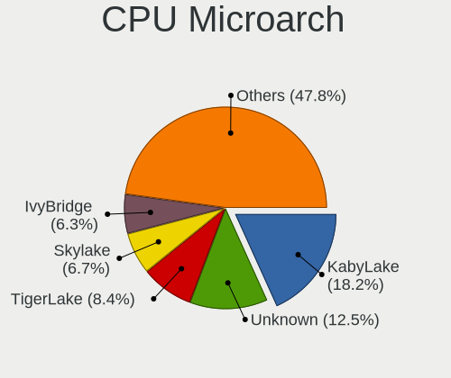

| Name             | Notebooks | Percent |
|------------------|-----------|---------|
| KabyLake         | 59        | 19.16%  |
| Unknown          | 39        | 12.66%  |
| TigerLake        | 31        | 10.06%  |
| Alderlake Hybrid | 21        | 6.82%   |
| Skylake          | 18        | 5.84%   |
| IvyBridge        | 18        | 5.84%   |
| SandyBridge      | 16        | 5.19%   |
| Zen 3            | 13        | 4.22%   |
| Haswell          | 12        | 3.9%    |
| Broadwell        | 12        | 3.9%    |
| Goldmont plus    | 10        | 3.25%   |
| Westmere         | 9         | 2.92%   |
| Zen 2            | 8         | 2.6%    |
| Penryn           | 7         | 2.27%   |
| Zen+             | 6         | 1.95%   |
| CometLake        | 6         | 1.95%   |
| Silvermont       | 4         | 1.3%    |
| IceLake          | 3         | 0.97%   |
| Goldmont         | 3         | 0.97%   |
| Excavator        | 3         | 0.97%   |
| Core             | 3         | 0.97%   |
| Puma             | 2         | 0.65%   |
| Zen              | 1         | 0.32%   |
| Steamroller      | 1         | 0.32%   |
| Piledriver       | 1         | 0.32%   |
| K10 Llano        | 1         | 0.32%   |
| K10              | 1         | 0.32%   |

Graphics
--------

GPU Vendor
----------

Vendors of graphics cards

| Vendor  | Notebooks | Percent |
|---------|-----------|---------|
| Intel   | 239       | 59.31%  |
| Nvidia  | 91        | 22.58%  |
| AMD     | 70        | 17.37%  |
| Zhaoxin | 3         | 0.74%   |

GPU Model
---------

Graphics card models

| Model                                                                                 | Notebooks | Percent |
|---------------------------------------------------------------------------------------|-----------|---------|
| Intel TigerLake-LP GT2 [Iris Xe Graphics]                                             | 23        | 5.67%   |
| Intel 3rd Gen Core processor Graphics Controller                                      | 18        | 4.43%   |
| Intel Alder Lake-P Integrated Graphics Controller                                     | 17        | 4.19%   |
| Intel 2nd Generation Core Processor Family Integrated Graphics Controller             | 14        | 3.45%   |
| Intel CoffeeLake-H GT2 [UHD Graphics 630]                                             | 13        | 3.2%    |
| Intel Skylake GT2 [HD Graphics 520]                                                   | 11        | 2.71%   |
| Intel CometLake-U GT2 [UHD Graphics]                                                  | 11        | 2.71%   |
| AMD Cezanne [Radeon Vega Series / Radeon Vega Mobile Series]                          | 11        | 2.71%   |
| Intel UHD Graphics 620                                                                | 10        | 2.46%   |
| Intel HD Graphics 620                                                                 | 10        | 2.46%   |
| Intel HD Graphics 5500                                                                | 10        | 2.46%   |
| Nvidia GA106M [GeForce RTX 3060 Mobile / Max-Q]                                       | 9         | 2.22%   |
| AMD Lucienne                                                                          | 9         | 2.22%   |
| Intel Haswell-ULT Integrated Graphics Controller                                      | 8         | 1.97%   |
| AMD Renoir                                                                            | 8         | 1.97%   |
| AMD Rembrandt [Radeon 680M]                                                           | 8         | 1.97%   |
| Nvidia GA107M [GeForce RTX 3050 Mobile]                                               | 7         | 1.72%   |
| Intel WhiskeyLake-U GT2 [UHD Graphics 620]                                            | 7         | 1.72%   |
| Intel Tiger Lake-LP GT2 [UHD Graphics G4]                                             | 7         | 1.72%   |
| Intel Raptor Lake-P [Iris Xe Graphics]                                                | 7         | 1.72%   |
| Intel Mobile 4 Series Chipset Integrated Graphics Controller                          | 7         | 1.72%   |
| Intel GeminiLake [UHD Graphics 600]                                                   | 7         | 1.72%   |
| Intel Core Processor Integrated Graphics Controller                                   | 6         | 1.48%   |
| AMD Picasso/Raven 2 [Radeon Vega Series / Radeon Vega Mobile Series]                  | 6         | 1.48%   |
| Nvidia TU117M [GeForce GTX 1650 Mobile / Max-Q]                                       | 5         | 1.23%   |
| Intel TigerLake-H GT1 [UHD Graphics]                                                  | 5         | 1.23%   |
| Intel CometLake-H GT2 [UHD Graphics]                                                  | 5         | 1.23%   |
| Nvidia GP108M [GeForce MX150]                                                         | 4         | 0.99%   |
| Zhaoxin ZX-E C-960 GPU                                                                | 3         | 0.74%   |
| Nvidia TU116M [GeForce GTX 1660 Ti Mobile]                                            | 3         | 0.74%   |
| Nvidia GP107M [GeForce GTX 1050 Mobile]                                               | 3         | 0.74%   |
| Nvidia GF117M [GeForce 610M/710M/810M/820M / GT 620M/625M/630M/720M]                  | 3         | 0.74%   |
| Nvidia GA107M [GeForce RTX 3050 Ti Mobile]                                            | 3         | 0.74%   |
| Nvidia AD107M [GeForce RTX 4050 Max-Q / Mobile]                                       | 3         | 0.74%   |
| Intel HD Graphics 630                                                                 | 3         | 0.74%   |
| Intel HD Graphics 500                                                                 | 3         | 0.74%   |
| Intel GeminiLake [UHD Graphics 605]                                                   | 3         | 0.74%   |
| AMD Topaz XT [Radeon R7 M260/M265 / M340/M360 / M440/M445 / 530/535 / 620/625 Mobile] | 3         | 0.74%   |
| Nvidia TU117M [GeForce MX450]                                                         | 2         | 0.49%   |
| Nvidia TU117M [GeForce GTX 1650 Ti Mobile]                                            | 2         | 0.49%   |

GPU Combo
---------

Combinations of graphics cards

| Name           | Notebooks | Percent |
|----------------|-----------|---------|
| 1 x Intel      | 157       | 51.14%  |
| Intel + Nvidia | 70        | 22.8%   |
| 1 x AMD        | 43        | 14.01%  |
| AMD + Nvidia   | 15        | 4.89%   |
| Intel + AMD    | 11        | 3.58%   |
| 1 x Nvidia     | 6         | 1.95%   |
| 1 x Zhaoxin    | 3         | 0.98%   |
| Other          | 1         | 0.33%   |
| 2 x AMD        | 1         | 0.33%   |

GPU Driver
----------

Free vs proprietary

| Driver      | Notebooks | Percent |
|-------------|-----------|---------|
| Free        | 240       | 78.18%  |
| Proprietary | 57        | 18.57%  |
| Unknown     | 10        | 3.26%   |

GPU Memory
----------

Total video memory

| Size in GB | Notebooks | Percent |
|------------|-----------|---------|
| Unknown    | 257       | 83.71%  |
| 0.01-0.5   | 21        | 6.84%   |
| 1.01-2.0   | 17        | 5.54%   |
| 3.01-4.0   | 6         | 1.95%   |
| 0.51-1.0   | 4         | 1.3%    |
| 5.01-6.0   | 2         | 0.65%   |

Monitor
-------

Monitor Vendor
--------------

Monitor vendors

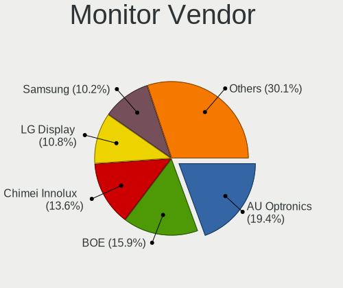

| Vendor                  | Notebooks | Percent |
|-------------------------|-----------|---------|
| AU Optronics            | 72        | 20%     |
| BOE                     | 54        | 15%     |
| Chimei Innolux          | 49        | 13.61%  |
| LG Display              | 35        | 9.72%   |
| Samsung Electronics     | 33        | 9.17%   |
| Sharp                   | 13        | 3.61%   |
| Goldstar                | 11        | 3.06%   |
| Apple                   | 10        | 2.78%   |
| PANDA                   | 9         | 2.5%    |
| Dell                    | 8         | 2.22%   |
| CSO                     | 8         | 2.22%   |
| Hewlett-Packard         | 7         | 1.94%   |
| Lenovo                  | 5         | 1.39%   |
| InfoVision              | 4         | 1.11%   |
| Ancor Communications    | 4         | 1.11%   |
| Sony                    | 3         | 0.83%   |
| Denver                  | 3         | 0.83%   |
| AOC                     | 3         | 0.83%   |
| Acer                    | 3         | 0.83%   |
| ViewSonic               | 2         | 0.56%   |
| Philips                 | 2         | 0.56%   |
| Panasonic               | 2         | 0.56%   |
| LG Philips              | 2         | 0.56%   |
| Iiyama                  | 2         | 0.56%   |
| Chi Mei Optoelectronics | 2         | 0.56%   |
| BenQ                    | 2         | 0.56%   |
| ASUSTek Computer        | 2         | 0.56%   |
| WST                     | 1         | 0.28%   |
| Wacom                   | 1         | 0.28%   |
| Unknown (XXX)           | 1         | 0.28%   |
| Unknown                 | 1         | 0.28%   |
| MStar                   | 1         | 0.28%   |
| Medion Akoya            | 1         | 0.28%   |
| KDC                     | 1         | 0.28%   |
| HYT                     | 1         | 0.28%   |
| HUAWEI                  | 1         | 0.28%   |
| HKC                     | 1         | 0.28%   |

Monitor Model
-------------

Monitor models

| Model                                                                 | Notebooks | Percent |
|-----------------------------------------------------------------------|-----------|---------|
| BOE LCD Monitor BOE0872 1920x1080 344x194mm 15.5-inch                 | 7         | 1.93%   |
| Samsung Electronics LCD Monitor SDC4161 1920x1080 344x194mm 15.5-inch | 5         | 1.38%   |
| LG Display LCD Monitor LGD02DC 1366x768 344x194mm 15.5-inch           | 4         | 1.1%    |
| Chimei Innolux LCD Monitor CMN15E7 1920x1080 344x193mm 15.5-inch      | 4         | 1.1%    |
| Samsung Electronics LCD Monitor SEC5441 1280x800 331x207mm 15.4-inch  | 3         | 0.83%   |
| Chimei Innolux LCD Monitor CMN15F5 1920x1080 344x193mm 15.5-inch      | 3         | 0.83%   |
| Chimei Innolux LCD Monitor CMN14D5 1920x1080 309x173mm 13.9-inch      | 3         | 0.83%   |
| AU Optronics LCD Monitor AUOAF90 1920x1080 344x193mm 15.5-inch        | 3         | 0.83%   |
| AU Optronics LCD Monitor AUO5799 1920x1080 344x194mm 15.5-inch        | 3         | 0.83%   |
| AU Optronics LCD Monitor AUO243D 1920x1080 309x173mm 13.9-inch        | 3         | 0.83%   |
| AU Optronics LCD Monitor AUO0BA2 2560x1440 309x174mm 14.0-inch        | 3         | 0.83%   |
| Sharp LCD Monitor SHP149A 1920x1080 344x194mm 15.5-inch               | 2         | 0.55%   |
| Samsung Electronics LCD Monitor SDC5441 1366x768 344x193mm 15.5-inch  | 2         | 0.55%   |
| PANDA LCD Monitor NCP004D 1920x1080 344x194mm 15.5-inch               | 2         | 0.55%   |
| Lenovo LCD Monitor LEN40BA 1920x1080 344x194mm 15.5-inch              | 2         | 0.55%   |
| InfoVision LCD Monitor IVO057E 1366x768 309x174mm 14.0-inch           | 2         | 0.55%   |
| Goldstar HDR 4K GSM7706 3840x2160 600x340mm 27.2-inch                 | 2         | 0.55%   |
| Denver UWQHD-100-V2 LHC3500 3440x1440 798x342mm 34.2-inch             | 2         | 0.55%   |
| Dell P2217H DELA0D8 1920x1080 476x267mm 21.5-inch                     | 2         | 0.55%   |
| Chimei Innolux LCD Monitor CMN1728 1600x900 382x215mm 17.3-inch       | 2         | 0.55%   |
| Chimei Innolux LCD Monitor CMN1604 1920x1080 355x199mm 16.0-inch      | 2         | 0.55%   |
| Chimei Innolux LCD Monitor CMN15BD 1366x768 344x193mm 15.5-inch       | 2         | 0.55%   |
| Chimei Innolux LCD Monitor CMN15AB 1366x768 344x193mm 15.5-inch       | 2         | 0.55%   |
| Chimei Innolux LCD Monitor CMN14E5 1920x1080 309x173mm 13.9-inch      | 2         | 0.55%   |
| Chimei Innolux LCD Monitor CMN1132 1366x768 256x144mm 11.6-inch       | 2         | 0.55%   |
| BOE LCD Monitor BOE0ACC 1920x1080 344x194mm 15.5-inch                 | 2         | 0.55%   |
| BOE LCD Monitor BOE097D 1920x1080 344x194mm 15.5-inch                 | 2         | 0.55%   |
| BOE LCD Monitor BOE092F 2520x1680 338x226mm 16.0-inch                 | 2         | 0.55%   |
| BOE LCD Monitor BOE0893 2160x1440 296x197mm 14.0-inch                 | 2         | 0.55%   |
| BOE LCD Monitor BOE061D 1366x768 309x173mm 13.9-inch                  | 2         | 0.55%   |
| AU Optronics LCD Monitor AUOD1ED 1920x1080 344x193mm 15.5-inch        | 2         | 0.55%   |
| AU Optronics LCD Monitor AUOA195 2240x1400 300x188mm 13.9-inch        | 2         | 0.55%   |
| AU Optronics LCD Monitor AUO9B8C 1366x768 309x173mm 13.9-inch         | 2         | 0.55%   |
| AU Optronics LCD Monitor AUO573D 1920x1080 309x174mm 14.0-inch        | 2         | 0.55%   |
| AU Optronics LCD Monitor AUO559C 1920x1080 309x174mm 14.0-inch        | 2         | 0.55%   |
| AU Optronics LCD Monitor AUO333D 1920x1080 309x174mm 14.0-inch        | 2         | 0.55%   |
| AU Optronics LCD Monitor AUO23ED 1920x1080 344x193mm 15.5-inch        | 2         | 0.55%   |
| AU Optronics LCD Monitor AUO106C 1366x768 276x155mm 12.5-inch         | 2         | 0.55%   |
| Apple LCD Monitor APP9CC3 1280x800 286x179mm 13.3-inch                | 2         | 0.55%   |
| Apple Color LCD APPA033 2880x1800 286x179mm 13.3-inch                 | 2         | 0.55%   |

Monitor Resolution
------------------

Monitor screen resolution

| Resolution         | Notebooks | Percent |
|--------------------|-----------|---------|
| 1920x1080 (FHD)    | 155       | 46.13%  |
| 1366x768 (WXGA)    | 69        | 20.54%  |
| 3840x2160 (4K)     | 16        | 4.76%   |
| 1600x900 (HD+)     | 14        | 4.17%   |
| 2560x1440 (QHD)    | 13        | 3.87%   |
| 2880x1800          | 10        | 2.98%   |
| 2560x1600          | 9         | 2.68%   |
| 1920x1200 (WUXGA)  | 8         | 2.38%   |
| 1280x800 (WXGA)    | 7         | 2.08%   |
| 3440x1440          | 6         | 1.79%   |
| 3840x2400          | 4         | 1.19%   |
| 1680x1050 (WSXGA+) | 3         | 0.89%   |
| 1440x900 (WXGA+)   | 3         | 0.89%   |
| 1280x1024 (SXGA)   | 3         | 0.89%   |
| 2560x1080          | 2         | 0.6%    |
| 2520x1680          | 2         | 0.6%    |
| 2256x1504          | 2         | 0.6%    |
| 2240x1400          | 2         | 0.6%    |
| 2160x1440          | 2         | 0.6%    |
| 3840x1600          | 1         | 0.3%    |
| 3456x2160          | 1         | 0.3%    |
| 3200x1800 (QHD+)   | 1         | 0.3%    |
| 3072x1920          | 1         | 0.3%    |
| 1920x540           | 1         | 0.3%    |
| 1920x1280          | 1         | 0.3%    |

Monitor Diagonal
----------------

Diagonal size in inches

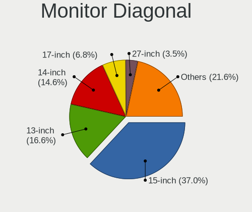

| Inches  | Notebooks | Percent |
|---------|-----------|---------|
| 15      | 134       | 37.22%  |
| 14      | 56        | 15.56%  |
| 13      | 56        | 15.56%  |
| 17      | 22        | 6.11%   |
| 27      | 14        | 3.89%   |
| 16      | 13        | 3.61%   |
| 23      | 9         | 2.5%    |
| 12      | 8         | 2.22%   |
| 34      | 6         | 1.67%   |
| 21      | 6         | 1.67%   |
| 24      | 5         | 1.39%   |
| 11      | 5         | 1.39%   |
| 22      | 3         | 0.83%   |
| 20      | 3         | 0.83%   |
| Unknown | 3         | 0.83%   |
| 72      | 2         | 0.56%   |
| 35      | 2         | 0.56%   |
| 25      | 2         | 0.56%   |
| 84      | 1         | 0.28%   |
| 58      | 1         | 0.28%   |
| 54      | 1         | 0.28%   |
| 52      | 1         | 0.28%   |
| 49      | 1         | 0.28%   |
| 42      | 1         | 0.28%   |
| 37      | 1         | 0.28%   |
| 32      | 1         | 0.28%   |
| 26      | 1         | 0.28%   |
| 19      | 1         | 0.28%   |
| 8       | 1         | 0.28%   |

Monitor Width
-------------

Physical width

| Width in mm | Notebooks | Percent |
|-------------|-----------|---------|
| 301-350     | 215       | 60.39%  |
| 201-300     | 48        | 13.48%  |
| 351-400     | 30        | 8.43%   |
| 501-600     | 29        | 8.15%   |
| 401-500     | 12        | 3.37%   |
| 701-800     | 7         | 1.97%   |
| 1001-1500   | 4         | 1.12%   |
| 801-900     | 3         | 0.84%   |
| 1501-2000   | 3         | 0.84%   |
| Unknown     | 3         | 0.84%   |
| 101-200     | 1         | 0.28%   |
| 901-1000    | 1         | 0.28%   |

Aspect Ratio
------------

Proportional relationship between the width and the height

| Ratio   | Notebooks | Percent |
|---------|-----------|---------|
| 16/9    | 247       | 78.41%  |
| 16/10   | 46        | 14.6%   |
| 21/9    | 9         | 2.86%   |
| 3/2     | 7         | 2.22%   |
| 5/4     | 2         | 0.63%   |
| 6/5     | 1         | 0.32%   |
| 32/9    | 1         | 0.32%   |
| 0.62    | 1         | 0.32%   |
| Unknown | 1         | 0.32%   |

Monitor Area
------------

Area in inch

| Area in inch | Notebooks | Percent |
|----------------|-----------|---------|
| 101-110        | 135       | 37.5%   |
| 81-90          | 89        | 24.72%  |
| 71-80          | 22        | 6.11%   |
| 121-130        | 19        | 5.28%   |
| 201-250        | 17        | 4.72%   |
| 301-350        | 15        | 4.17%   |
| 111-120        | 11        | 3.06%   |
| 351-500        | 9         | 2.5%    |
| 61-70          | 8         | 2.22%   |
| More than 1000 | 7         | 1.94%   |
| 151-200        | 7         | 1.94%   |
| 51-60          | 5         | 1.39%   |
| 251-300        | 5         | 1.39%   |
| 131-140        | 3         | 0.83%   |
| Unknown        | 3         | 0.83%   |
| 501-1000       | 2         | 0.56%   |
| 1-40           | 1         | 0.28%   |
| 141-150        | 1         | 0.28%   |
| 91-100         | 1         | 0.28%   |

Pixel Density
-------------

Pixels per inch

| Density       | Notebooks | Percent |
|---------------|-----------|---------|
| 121-160       | 151       | 43.02%  |
| 101-120       | 83        | 23.65%  |
| 161-240       | 46        | 13.11%  |
| 51-100        | 43        | 12.25%  |
| More than 240 | 20        | 5.7%    |
| 1-50          | 5         | 1.42%   |
| Unknown       | 3         | 0.85%   |

Multiple Monitors
-----------------

Total monitors connected

| Total | Notebooks | Percent |
|-------|-----------|---------|
| 1     | 241       | 77.99%  |
| 2     | 49        | 15.86%  |
| 3     | 9         | 2.91%   |
| 0     | 9         | 2.91%   |
| 4     | 1         | 0.32%   |

Network
-------

Net Controller Vendor
---------------------

Controller vendors

| Vendor                            | Notebooks | Percent |
|-----------------------------------|-----------|---------|
| Intel                             | 174       | 37.26%  |
| Realtek Semiconductor             | 146       | 31.26%  |
| Qualcomm Atheros                  | 45        | 9.64%   |
| Broadcom                          | 27        | 5.78%   |
| MediaTek                          | 17        | 3.64%   |
| DisplayLink                       | 7         | 1.5%    |
| TP-Link                           | 6         | 1.28%   |
| Broadcom Limited                  | 6         | 1.28%   |
| ASIX Electronics                  | 5         | 1.07%   |
| Lenovo                            | 4         | 0.86%   |
| Xiaomi                            | 3         | 0.64%   |
| Ralink Technology                 | 3         | 0.64%   |
| Dell                              | 3         | 0.64%   |
| Ralink                            | 2         | 0.43%   |
| Marvell Technology Group          | 2         | 0.43%   |
| Huawei Technologies               | 2         | 0.43%   |
| Hewlett-Packard                   | 2         | 0.43%   |
| Ericsson Business Mobile Networks | 2         | 0.43%   |
| Vimtron Electronics               | 1         | 0.21%   |
| U-Blox                            | 1         | 0.21%   |
| Sierra Wireless                   | 1         | 0.21%   |
| Samsung Electronics               | 1         | 0.21%   |
| Quectel Wireless Solutions        | 1         | 0.21%   |
| MosChip Semiconductor             | 1         | 0.21%   |
| JMicron Technology                | 1         | 0.21%   |
| Google                            | 1         | 0.21%   |
| D-Link System                     | 1         | 0.21%   |
| D-Link                            | 1         | 0.21%   |
| ASUSTek Computer                  | 1         | 0.21%   |

Net Controller Model
--------------------

Controller models

| Model                                                             | Notebooks | Percent |
|-------------------------------------------------------------------|-----------|---------|
| Realtek RTL8111/8168/8411 PCI Express Gigabit Ethernet Controller | 71        | 12.89%  |
| Realtek RTL810xE PCI Express Fast Ethernet controller             | 22        | 3.99%   |
| Intel Wi-Fi 6 AX201                                               | 22        | 3.99%   |
| Intel Alder Lake-P PCH CNVi WiFi                                  | 18        | 3.27%   |
| Realtek RTL8822CE 802.11ac PCIe Wireless Network Adapter          | 17        | 3.09%   |
| Realtek RTL8153 Gigabit Ethernet Adapter                          | 15        | 2.72%   |
| Intel Wireless 8265 / 8275                                        | 12        | 2.18%   |
| Intel Wi-Fi 6 AX200                                               | 12        | 2.18%   |
| Intel Wireless 8260                                               | 11        | 2%      |
| Intel Comet Lake PCH-LP CNVi WiFi                                 | 11        | 2%      |
| MediaTek MT7921 802.11ax PCI Express Wireless Network Adapter     | 10        | 1.81%   |
| Realtek RTL8821CE 802.11ac PCIe Wireless Network Adapter          | 9         | 1.63%   |
| Qualcomm Atheros QCA9565 / AR9565 Wireless Network Adapter        | 9         | 1.63%   |
| Intel Wireless 7265                                               | 9         | 1.63%   |
| Intel Cannon Lake PCH CNVi WiFi                                   | 9         | 1.63%   |
| Intel 82579LM Gigabit Network Connection (Lewisville)             | 9         | 1.63%   |
| Qualcomm Atheros QCA9377 802.11ac Wireless Network Adapter        | 8         | 1.45%   |
| Qualcomm Atheros QCA6174 802.11ac Wireless Network Adapter        | 8         | 1.45%   |
| Intel Ethernet Connection I219-LM                                 | 8         | 1.45%   |
| Intel Ethernet Connection (4) I219-LM                             | 8         | 1.45%   |
| Realtek RTL8852BE PCIe 802.11ax Wireless Network Controller       | 7         | 1.27%   |
| Intel Alder Lake-U CNVi: Wireless-AC                              | 7         | 1.27%   |
| Intel Comet Lake PCH CNVi WiFi                                    | 6         | 1.09%   |
| Realtek Killer E2600 Gigabit Ethernet Controller                  | 5         | 0.91%   |
| Qualcomm Atheros AR9285 Wireless Network Adapter (PCI-Express)    | 5         | 0.91%   |
| MediaTek MT7922 802.11ax PCI Express Wireless Network Adapter     | 5         | 0.91%   |
| Intel Gemini Lake PCH CNVi WiFi                                   | 5         | 0.91%   |
| Intel Centrino Advanced-N 6205 [Taylor Peak]                      | 5         | 0.91%   |
| Intel Cannon Point-LP CNVi [Wireless-AC]                          | 5         | 0.91%   |
| Broadcom BCM4313 802.11bgn Wireless Network Adapter               | 5         | 0.91%   |
| ASIX AX88179 Gigabit Ethernet                                     | 5         | 0.91%   |
| Realtek RTL8723BE PCIe Wireless Network Adapter                   | 4         | 0.73%   |
| Qualcomm Atheros AR9485 Wireless Network Adapter                  | 4         | 0.73%   |
| Qualcomm Atheros AR9462 Wireless Network Adapter                  | 4         | 0.73%   |
| Intel WiFi Link 5100                                              | 4         | 0.73%   |
| Intel Centrino Ultimate-N 6300                                    | 4         | 0.73%   |
| Broadcom BCM4331 802.11a/b/g/n                                    | 4         | 0.73%   |
| Broadcom BCM43142 802.11b/g/n                                     | 4         | 0.73%   |
| Xiaomi Mi/Redmi series (RNDIS)                                    | 3         | 0.54%   |
| Intel Wireless 3165                                               | 3         | 0.54%   |

Wireless Vendor
---------------

Wireless vendors

| Vendor                     | Notebooks | Percent |
|----------------------------|-----------|---------|
| Intel                      | 169       | 52.98%  |
| Realtek Semiconductor      | 52        | 16.3%   |
| Qualcomm Atheros           | 41        | 12.85%  |
| Broadcom                   | 22        | 6.9%    |
| MediaTek                   | 16        | 5.02%   |
| TP-Link                    | 5         | 1.57%   |
| Ralink Technology          | 3         | 0.94%   |
| Broadcom Limited           | 3         | 0.94%   |
| Ralink                     | 2         | 0.63%   |
| Sierra Wireless            | 1         | 0.31%   |
| Quectel Wireless Solutions | 1         | 0.31%   |
| Dell                       | 1         | 0.31%   |
| D-Link System              | 1         | 0.31%   |
| D-Link                     | 1         | 0.31%   |
| ASUSTek Computer           | 1         | 0.31%   |

Wireless Model
--------------

Wireless models

| Model                                                          | Notebooks | Percent |
|----------------------------------------------------------------|-----------|---------|
| Intel Wi-Fi 6 AX201                                            | 22        | 6.81%   |
| Intel Alder Lake-P PCH CNVi WiFi                               | 18        | 5.57%   |
| Realtek RTL8822CE 802.11ac PCIe Wireless Network Adapter       | 17        | 5.26%   |
| Intel Wireless 8265 / 8275                                     | 12        | 3.72%   |
| Intel Wi-Fi 6 AX200                                            | 12        | 3.72%   |
| Intel Wireless 8260                                            | 11        | 3.41%   |
| Intel Comet Lake PCH-LP CNVi WiFi                              | 11        | 3.41%   |
| MediaTek MT7921 802.11ax PCI Express Wireless Network Adapter  | 10        | 3.1%    |
| Realtek RTL8821CE 802.11ac PCIe Wireless Network Adapter       | 9         | 2.79%   |
| Qualcomm Atheros QCA9565 / AR9565 Wireless Network Adapter     | 9         | 2.79%   |
| Intel Wireless 7265                                            | 9         | 2.79%   |
| Intel Cannon Lake PCH CNVi WiFi                                | 9         | 2.79%   |
| Qualcomm Atheros QCA9377 802.11ac Wireless Network Adapter     | 8         | 2.48%   |
| Qualcomm Atheros QCA6174 802.11ac Wireless Network Adapter     | 8         | 2.48%   |
| Realtek RTL8852BE PCIe 802.11ax Wireless Network Controller    | 7         | 2.17%   |
| Intel Alder Lake-U CNVi: Wireless-AC                           | 7         | 2.17%   |
| Intel Comet Lake PCH CNVi WiFi                                 | 6         | 1.86%   |
| Qualcomm Atheros AR9285 Wireless Network Adapter (PCI-Express) | 5         | 1.55%   |
| MediaTek MT7922 802.11ax PCI Express Wireless Network Adapter  | 5         | 1.55%   |
| Intel Gemini Lake PCH CNVi WiFi                                | 5         | 1.55%   |
| Intel Centrino Advanced-N 6205 [Taylor Peak]                   | 5         | 1.55%   |
| Intel Cannon Point-LP CNVi [Wireless-AC]                       | 5         | 1.55%   |
| Broadcom BCM4313 802.11bgn Wireless Network Adapter            | 5         | 1.55%   |
| Realtek RTL8723BE PCIe Wireless Network Adapter                | 4         | 1.24%   |
| Qualcomm Atheros AR9485 Wireless Network Adapter               | 4         | 1.24%   |
| Qualcomm Atheros AR9462 Wireless Network Adapter               | 4         | 1.24%   |
| Intel WiFi Link 5100                                           | 4         | 1.24%   |
| Intel Centrino Ultimate-N 6300                                 | 4         | 1.24%   |
| Broadcom BCM4331 802.11a/b/g/n                                 | 4         | 1.24%   |
| Broadcom BCM43142 802.11b/g/n                                  | 4         | 1.24%   |
| Intel Wireless 3165                                            | 3         | 0.93%   |
| Intel Tiger Lake PCH CNVi WiFi                                 | 3         | 0.93%   |
| Intel Centrino Wireless-N 2230                                 | 3         | 0.93%   |
| Broadcom BCM43602 802.11ac Wireless LAN SoC                    | 3         | 0.93%   |
| TP-Link AC600 wireless Realtek RTL8811AU [Archer T2U Nano]     | 2         | 0.62%   |
| Realtek RTL8852AE WiFi 6 802.11ax PCIe Adapter                 | 2         | 0.62%   |
| Realtek RTL8852AE 802.11ax PCIe Wireless Network Adapter       | 2         | 0.62%   |
| Realtek RTL8822BE 802.11a/b/g/n/ac WiFi adapter                | 2         | 0.62%   |
| Realtek 802.11n WLAN Adapter                                   | 2         | 0.62%   |
| Realtek 802.11ac NIC                                           | 2         | 0.62%   |

Ethernet Vendor
---------------

Ethernet vendors

| Vendor                   | Notebooks | Percent |
|--------------------------|-----------|---------|
| Realtek Semiconductor    | 116       | 52.97%  |
| Intel                    | 53        | 24.2%   |
| Broadcom                 | 9         | 4.11%   |
| Qualcomm Atheros         | 7         | 3.2%    |
| DisplayLink              | 7         | 3.2%    |
| ASIX Electronics         | 5         | 2.28%   |
| Lenovo                   | 4         | 1.83%   |
| Xiaomi                   | 3         | 1.37%   |
| Broadcom Limited         | 3         | 1.37%   |
| TP-Link                  | 2         | 0.91%   |
| Marvell Technology Group | 2         | 0.91%   |
| Vimtron Electronics      | 1         | 0.46%   |
| Samsung Electronics      | 1         | 0.46%   |
| MosChip Semiconductor    | 1         | 0.46%   |
| MediaTek                 | 1         | 0.46%   |
| JMicron Technology       | 1         | 0.46%   |
| Huawei Technologies      | 1         | 0.46%   |
| Hewlett-Packard          | 1         | 0.46%   |
| Google                   | 1         | 0.46%   |

Ethernet Model
--------------

Ethernet models

| Model                                                             | Notebooks | Percent |
|-------------------------------------------------------------------|-----------|---------|
| Realtek RTL8111/8168/8411 PCI Express Gigabit Ethernet Controller | 71        | 32.13%  |
| Realtek RTL810xE PCI Express Fast Ethernet controller             | 22        | 9.95%   |
| Realtek RTL8153 Gigabit Ethernet Adapter                          | 15        | 6.79%   |
| Intel 82579LM Gigabit Network Connection (Lewisville)             | 9         | 4.07%   |
| Intel Ethernet Connection I219-LM                                 | 8         | 3.62%   |
| Intel Ethernet Connection (4) I219-LM                             | 8         | 3.62%   |
| Realtek Killer E2600 Gigabit Ethernet Controller                  | 5         | 2.26%   |
| ASIX AX88179 Gigabit Ethernet                                     | 5         | 2.26%   |
| Xiaomi Mi/Redmi series (RNDIS)                                    | 3         | 1.36%   |
| Intel Ethernet Connection (7) I219-LM                             | 3         | 1.36%   |
| Intel Ethernet Connection (3) I218-LM                             | 3         | 1.36%   |
| Intel 82567LM Gigabit Network Connection                          | 3         | 1.36%   |
| Broadcom NetXtreme BCM57765 Gigabit Ethernet PCIe                 | 3         | 1.36%   |
| Realtek PCIe GbE Family Controller                                | 2         | 0.9%    |
| Qualcomm Atheros AR8161 Gigabit Ethernet                          | 2         | 0.9%    |
| Qualcomm Atheros AR8152 v1.1 Fast Ethernet                        | 2         | 0.9%    |
| Lenovo USB-C Dock Ethernet                                        | 2         | 0.9%    |
| Lenovo ThinkPad TBT 3 Dock                                        | 2         | 0.9%    |
| Intel Ethernet Connection (6) I219-V                              | 2         | 0.9%    |
| Intel Ethernet Connection (5) I219-LM                             | 2         | 0.9%    |
| DisplayLink USB3.0 5K Graphic Docking                             | 2         | 0.9%    |
| DisplayLink StarTech USB3DOCKHDPC                                 | 2         | 0.9%    |
| Broadcom NetXtreme BCM57786 Gigabit Ethernet PCIe                 | 2         | 0.9%    |
| Broadcom Limited NetLink BCM57780 Gigabit Ethernet PCIe           | 2         | 0.9%    |
| Vimtron Mobile Composite Device Bus                               | 1         | 0.45%   |
| TP-Link UE300 10/100/1000 LAN (ethernet mode) [Realtek RTL8153]   | 1         | 0.45%   |
| TP-Link Archer T2U PLUS [RTL8821AU]                               | 1         | 0.45%   |
| Samsung Galaxy series, misc. (tethering mode)                     | 1         | 0.45%   |
| Realtek RTL8125 2.5GbE Controller                                 | 1         | 0.45%   |
| Realtek Killer E3000 2.5GbE Controller                            | 1         | 0.45%   |
| Realtek Killer E2500 Gigabit Ethernet Controller                  | 1         | 0.45%   |
| Qualcomm Atheros QCA8172 Fast Ethernet                            | 1         | 0.45%   |
| Qualcomm Atheros QCA8171 Gigabit Ethernet                         | 1         | 0.45%   |
| Qualcomm Atheros AR8151 v2.0 Gigabit Ethernet                     | 1         | 0.45%   |
| MosChip MCS7830 10/100 Mbps Ethernet adapter                      | 1         | 0.45%   |
| MediaTek TECNO SPARK 9T                                           | 1         | 0.45%   |
| Marvell Group 88E8057 PCI-E Gigabit Ethernet Controller           | 1         | 0.45%   |
| Marvell Group 88E8040 PCI-E Fast Ethernet Controller              | 1         | 0.45%   |
| JMicron JMC250 PCI Express Gigabit Ethernet Controller            | 1         | 0.45%   |
| Intel Killer E3100X 2.5 Gigabit Ethernet Controller               | 1         | 0.45%   |

Net Controller Kind
-------------------

Ethernet, WiFi or modem

| Kind     | Notebooks | Percent |
|----------|-----------|---------|
| WiFi     | 304       | 59.26%  |
| Ethernet | 202       | 39.38%  |
| Modem    | 7         | 1.36%   |

Used Controller
---------------

Currently used network controller

| Kind     | Notebooks | Percent |
|----------|-----------|---------|
| WiFi     | 259       | 81.7%   |
| Ethernet | 58        | 18.3%   |

NICs
----

Total network controllers on board

| Total | Notebooks | Percent |
|-------|-----------|---------|
| 2     | 171       | 55.52%  |
| 1     | 132       | 42.86%  |
| 0     | 3         | 0.97%   |
| 3     | 2         | 0.65%   |

IPv6
----

IPv6 vs IPv4

| Used | Notebooks | Percent |
|------|-----------|---------|
| No   | 212       | 68.83%  |
| Yes  | 96        | 31.17%  |

Bluetooth
---------

Bluetooth Vendor
----------------

Controller vendors

| Vendor                          | Notebooks | Percent |
|---------------------------------|-----------|---------|
| Intel                           | 146       | 54.89%  |
| Realtek Semiconductor           | 28        | 10.53%  |
| Qualcomm Atheros Communications | 25        | 9.4%    |
| IMC Networks                    | 12        | 4.51%   |
| Broadcom                        | 11        | 4.14%   |
| Foxconn / Hon Hai               | 10        | 3.76%   |
| Realtek                         | 8         | 3.01%   |
| Apple                           | 8         | 3.01%   |
| Lite-On Technology              | 7         | 2.63%   |
| Cambridge Silicon Radio         | 3         | 1.13%   |
| Hewlett-Packard                 | 2         | 0.75%   |
| Dell                            | 2         | 0.75%   |
| Ralink Technology               | 1         | 0.38%   |
| Opticis                         | 1         | 0.38%   |
| Fujitsu                         | 1         | 0.38%   |
| ASUSTek Computer                | 1         | 0.38%   |

Bluetooth Model
---------------

Controller models

| Model                                                                               | Notebooks | Percent |
|-------------------------------------------------------------------------------------|-----------|---------|
| Intel AX201 Bluetooth                                                               | 41        | 15.41%  |
| Intel Bluetooth wireless interface                                                  | 37        | 13.91%  |
| Intel Bluetooth 9460/9560 Jefferson Peak (JfP)                                      | 28        | 10.53%  |
| Realtek Bluetooth Radio                                                             | 22        | 8.27%   |
| Intel Bluetooth Device                                                              | 20        | 7.52%   |
| Qualcomm Atheros  Bluetooth Device                                                  | 12        | 4.51%   |
| Intel AX200 Bluetooth                                                               | 11        | 4.14%   |
| Realtek Bluetooth Radio                                                             | 8         | 3.01%   |
| IMC Networks Wireless_Device                                                        | 7         | 2.63%   |
| IMC Networks Bluetooth Radio                                                        | 5         | 1.88%   |
| Foxconn / Hon Hai Wireless_Device                                                   | 5         | 1.88%   |
| Qualcomm Atheros AR9462 Bluetooth                                                   | 4         | 1.5%    |
| Intel Centrino Bluetooth Wireless Transceiver                                       | 4         | 1.5%    |
| Apple Bluetooth USB Host Controller                                                 | 4         | 1.5%    |
| Apple Bluetooth Host Controller                                                     | 4         | 1.5%    |
| Realtek RTL8723B Bluetooth                                                          | 3         | 1.13%   |
| Qualcomm Atheros QCA61x4 Bluetooth 4.0                                              | 3         | 1.13%   |
| Qualcomm Atheros AR3012 Bluetooth 4.0                                               | 3         | 1.13%   |
| Qualcomm Atheros AR3011 Bluetooth                                                   | 3         | 1.13%   |
| Lite-On Qualcomm Atheros QCA9377 Bluetooth                                          | 3         | 1.13%   |
| Cambridge Silicon Radio Bluetooth Dongle (HCI mode)                                 | 3         | 1.13%   |
| Broadcom BCM43142A0 Bluetooth 4.0                                                   | 3         | 1.13%   |
| Broadcom BCM2045B (BDC-2.1)                                                         | 3         | 1.13%   |
| Realtek RTL8822BE Bluetooth 4.2 Adapter                                             | 2         | 0.75%   |
| Lite-On Wireless_Device                                                             | 2         | 0.75%   |
| Intel Wireless-AC 3168 Bluetooth                                                    | 2         | 0.75%   |
| Intel AX210 Bluetooth                                                               | 2         | 0.75%   |
| HP Broadcom 2070 Bluetooth Combo                                                    | 2         | 0.75%   |
| Foxconn / Hon Hai MediaTek Bluetooth Adapter                                        | 2         | 0.75%   |
| Foxconn / Hon Hai Bluetooth Device                                                  | 2         | 0.75%   |
| Broadcom HP Portable Valentine                                                      | 2         | 0.75%   |
| Realtek  Bluetooth 4.2 Adapter                                                      | 1         | 0.38%   |
| Ralink Motorola BC4 Bluetooth 3.0+HS Adapter                                        | 1         | 0.38%   |
| Opticis Bluetooth Radio                                                             | 1         | 0.38%   |
| Lite-On Bluetooth Radio                                                             | 1         | 0.38%   |
| Lite-On Bluetooth Device                                                            | 1         | 0.38%   |
| Intel Wireless-AC 9260 Bluetooth Adapter                                            | 1         | 0.38%   |
| Fujitsu Bluetooth Device                                                            | 1         | 0.38%   |
| Foxconn / Hon Hai Foxconn T77H114 BCM2070 [Single-Chip Bluetooth 2.1 + EDR Adapter] | 1         | 0.38%   |
| Dell DW375 Bluetooth Module                                                         | 1         | 0.38%   |

Sound
-----

Sound Vendor
------------

Sound card vendors

| Vendor                 | Notebooks | Percent |
|------------------------|-----------|---------|
| Intel                  | 249       | 63.2%   |
| AMD                    | 59        | 14.97%  |
| Nvidia                 | 51        | 12.94%  |
| Lenovo                 | 5         | 1.27%   |
| C-Media Electronics    | 5         | 1.27%   |
| Realtek Semiconductor  | 4         | 1.02%   |
| Zhaoxin                | 3         | 0.76%   |
| GN Netcom              | 3         | 0.76%   |
| Plantronics            | 2         | 0.51%   |
| DSEA A/S               | 2         | 0.51%   |
| VIA Technologies       | 1         | 0.25%   |
| Texas Instruments      | 1         | 0.25%   |
| Superlux digit         | 1         | 0.25%   |
| Razer USA              | 1         | 0.25%   |
| Native Instruments     | 1         | 0.25%   |
| M-Audio                | 1         | 0.25%   |
| Huawei Technologies    | 1         | 0.25%   |
| Generalplus Technology | 1         | 0.25%   |
| Focusrite-Novation     | 1         | 0.25%   |
| BR23                   | 1         | 0.25%   |
| Antlion Audio          | 1         | 0.25%   |

Sound Model
-----------

Sound card models

| Model                                                                      | Notebooks | Percent |
|----------------------------------------------------------------------------|-----------|---------|
| AMD Family 17h/19h HD Audio Controller                                     | 42        | 8.97%   |
| Intel Sunrise Point-LP HD Audio                                            | 37        | 7.91%   |
| Intel Tiger Lake-LP Smart Sound Technology Audio Controller                | 31        | 6.62%   |
| AMD Renoir Radeon High Definition Audio Controller                         | 28        | 5.98%   |
| Intel Alder Lake PCH-P High Definition Audio Controller                    | 21        | 4.49%   |
| Intel 7 Series/C216 Chipset Family High Definition Audio Controller        | 19        | 4.06%   |
| Intel 6 Series/C200 Series Chipset Family High Definition Audio Controller | 15        | 3.21%   |
| Intel Cannon Lake PCH cAVS                                                 | 14        | 2.99%   |
| Intel Wildcat Point-LP High Definition Audio Controller                    | 12        | 2.56%   |
| Intel Broadwell-U Audio Controller                                         | 12        | 2.56%   |
| Intel Comet Lake PCH-LP cAVS                                               | 11        | 2.35%   |
| Intel Celeron/Pentium Silver Processor High Definition Audio               | 10        | 2.14%   |
| Nvidia GA106 High Definition Audio Controller                              | 9         | 1.92%   |
| Intel 5 Series/3400 Series Chipset High Definition Audio                   | 9         | 1.92%   |
| Nvidia Audio device                                                        | 8         | 1.71%   |
| Intel Haswell-ULT HD Audio Controller                                      | 8         | 1.71%   |
| Intel Cannon Point-LP High Definition Audio Controller                     | 8         | 1.71%   |
| Intel 82801I (ICH9 Family) HD Audio Controller                             | 8         | 1.71%   |
| Intel 8 Series HD Audio Controller                                         | 8         | 1.71%   |
| AMD Rembrandt Radeon High Definition Audio Controller                      | 8         | 1.71%   |
| Nvidia TU107 GeForce GTX 1650 High Definition Audio Controller             | 7         | 1.5%    |
| Intel Alder Lake-U cAVS (Audio, Voice, Speech)                             | 7         | 1.5%    |
| Intel Comet Lake PCH cAVS                                                  | 6         | 1.28%   |
| AMD Raven/Raven2/Fenghuang HDMI/DP Audio Controller                        | 6         | 1.28%   |
| Intel Tiger Lake-H HD Audio Controller                                     | 5         | 1.07%   |
| AMD FCH Azalia Controller                                                  | 5         | 1.07%   |
| Realtek Semiconductor USB Audio                                            | 4         | 0.85%   |
| Nvidia GF108 High Definition Audio Controller                              | 4         | 0.85%   |
| Nvidia GA104 High Definition Audio Controller                              | 4         | 0.85%   |
| Intel 8 Series/C220 Series Chipset High Definition Audio Controller        | 4         | 0.85%   |
| Intel 100 Series/C230 Series Chipset Family HD Audio Controller            | 4         | 0.85%   |
| Zhaoxin ZX-E High Definition Audio Controller                              | 3         | 0.64%   |
| Zhaoxin ZX-100/KX-5000/KX-6000/KX-6000G High Definition Audio Controller   | 3         | 0.64%   |
| Nvidia TU116 High Definition Audio Controller                              | 3         | 0.64%   |
| Nvidia GP107GL High Definition Audio Controller                            | 3         | 0.64%   |
| Intel Ice Lake-LP Smart Sound Technology Audio Controller                  | 3         | 0.64%   |
| Intel CM238 HD Audio Controller                                            | 3         | 0.64%   |
| Intel Celeron N3350/Pentium N4200/Atom E3900 Series Audio Cluster          | 3         | 0.64%   |
| AMD Kabini HDMI/DP Audio                                                   | 3         | 0.64%   |
| AMD Family 15h (Models 60h-6fh) Audio Controller                           | 3         | 0.64%   |

Memory
------

Memory Vendor
-------------

Memory module vendors

| Vendor              | Notebooks | Percent |
|---------------------|-----------|---------|
| SK hynix            | 43        | 24.29%  |
| Samsung Electronics | 39        | 22.03%  |
| Micron Technology   | 36        | 20.34%  |
| Kingston            | 13        | 7.34%   |
| Crucial             | 8         | 4.52%   |
| Unknown (ABCD)      | 6         | 3.39%   |
| Smart               | 5         | 2.82%   |
| Unknown             | 4         | 2.26%   |
| Ramaxel Technology  | 4         | 2.26%   |
| Shenzhen WODPOSIT   | 3         | 1.69%   |
| A-DATA Technology   | 3         | 1.69%   |
| Transcend           | 2         | 1.13%   |
| GOODRAM             | 2         | 1.13%   |
| Unknown (0x0CDC)    | 1         | 0.56%   |
| Timetec             | 1         | 0.56%   |
| Nanya Technology    | 1         | 0.56%   |
| KINGBANK            | 1         | 0.56%   |
| Gold Key            | 1         | 0.56%   |
| Elpida              | 1         | 0.56%   |
| Corsair             | 1         | 0.56%   |
| ChangXin Memory     | 1         | 0.56%   |
| Unknown             | 1         | 0.56%   |

Memory Model
------------

Memory module models

| Model                                                            | Notebooks | Percent |
|------------------------------------------------------------------|-----------|---------|
| Unknown (ABCD) RAM 123456789012345678 2GB SODIMM LPDDR4 2400MT/s | 6         | 3.23%   |
| SK hynix RAM HMA81GS6AFR8N-UH 8GB SODIMM DDR4 2667MT/s           | 6         | 3.23%   |
| Shenzhen WODPOSIT RAM Module 8GB SODIMM DDR4 2666MT/s            | 3         | 1.61%   |
| Samsung RAM M425R1GB4BB0-CQKOL 8GB SODIMM DDR5 4800MT/s          | 3         | 1.61%   |
| Samsung RAM K3LKBKB@BM-MGCP 2GB Row Of Chips LPDDR5 6400MT/s     | 3         | 1.61%   |
| Micron RAM 4ATF1G64HZ-3G2E1 8GB Row Of Chips DDR4 3200MT/s       | 3         | 1.61%   |
| Smart RAM SH564128FJ8NWRNSQR 4GB SODIMM DDR3 1600MT/s            | 2         | 1.08%   |
| SK hynix RAM HMCG78MEBSA092N 16GB SODIMM DDR5 4800MT/s           | 2         | 1.08%   |
| SK hynix RAM HMCG66MEBSA092N 8GB SODIMM DDR5 4800MT/s            | 2         | 1.08%   |
| SK hynix RAM HMAB2GS6AMR6N-XN 16GB SODIMM DDR4 3200MT/s          | 2         | 1.08%   |
| SK hynix RAM HMA81GS6DJR8N-XN 8GB SODIMM DDR4 3200MT/s           | 2         | 1.08%   |
| Samsung RAM M471B5173DB0-YK0 4GB SODIMM DDR3 1600MT/s            | 2         | 1.08%   |
| Samsung RAM M471B1G73QH0-YK0 8GB SODIMM DDR3 1867MT/s            | 2         | 1.08%   |
| Samsung RAM M471A5244CB0-CWE 4GB SODIMM DDR4 3200MT/s            | 2         | 1.08%   |
| Samsung RAM M471A2K43CB1-CTD 16GB SODIMM DDR4 8400MT/s           | 2         | 1.08%   |
| Samsung RAM M471A1K43DB1-CTD 8GB SODIMM DDR4 2667MT/s            | 2         | 1.08%   |
| Samsung RAM M471A1K43CB1-CTD 8GB SODIMM DDR4 2667MT/s            | 2         | 1.08%   |
| Samsung RAM M471A1G44AB0-CWE 8GB SODIMM DDR4 3200MT/s            | 2         | 1.08%   |
| Samsung RAM K4UBE3D4AA-MGCR 2GB Row Of Chips LPDDR4 4267MT/s     | 2         | 1.08%   |
| Micron RAM MT40A512M16LY-075:E 4GB SODIMM DDR4 3200MT/s          | 2         | 1.08%   |
| Micron RAM Module 4GB SODIMM LPDDR3 2133MT/s                     | 2         | 1.08%   |
| Micron RAM 8ATF1G64HZ-3G2R1 8GB SODIMM DDR4 3200MT/s             | 2         | 1.08%   |
| Micron RAM 4ATF51264HZ-3G2J1 4GB SODIMM DDR4 3200MT/s            | 2         | 1.08%   |
| Micron RAM 4ATF1G64HZ-3G2F1 8GB SODIMM DDR4 3200MT/s             | 2         | 1.08%   |
| Micron RAM 4ATF1G64HZ-3G2E1 8GB SODIMM DDR4 3200MT/s             | 2         | 1.08%   |
| Kingston RAM 99P5700-042.A00G 16GB SODIMM DDR4 3200MT/s          | 2         | 1.08%   |
| Unknown RAM Module 8GB Row Of Chips LPDDR4 4267MT/s              | 1         | 0.54%   |
| Unknown RAM Module 4GB SODIMM DDR4 2667MT/s                      | 1         | 0.54%   |
| Unknown RAM Module 2GB Row Of Chips LPDDR4 4267MT/s              | 1         | 0.54%   |
| Unknown RAM Module 1536MB SODIMM DDR3 1600MT/s                   | 1         | 0.54%   |
| Unknown (0x0CDC) RAM ZH4G6S8DXN 8GB SODIMM DDR4 3200MT/s         | 1         | 0.54%   |
| Transcend RAM TS1GSK64W6H 8GB SODIMM DDR3 1600MT/s               | 1         | 0.54%   |
| Transcend RAM JM3200HSE-32G 32GB SODIMM DDR4 3200MT/s            | 1         | 0.54%   |
| Timetec RAM S8G-1600 8GB SODIMM DDR3 1600MT/s                    | 1         | 0.54%   |
| Smart RAM SH564568FH8NZPHSCG 2GB SODIMM DDR3 1333MT/s            | 1         | 0.54%   |
| Smart RAM SH564128FH8NZQNSCG 4GB SODIMM DDR3 1600MT/s            | 1         | 0.54%   |
| Smart RAM SG564568FG8NWKFSQR 2GB SODIMM DDR2 800MT/s             | 1         | 0.54%   |
| Smart RAM SF4641G8CK8IWGKSEG 8GB SODIMM DDR4 2400MT/s            | 1         | 0.54%   |
| SK hynix RAM Module 8GB SODIMM DDR4 3200MT/s                     | 1         | 0.54%   |
| SK hynix RAM Module 8GB SODIMM DDR4 2667MT/s                     | 1         | 0.54%   |

Memory Kind
-----------

Memory module kinds

| Kind   | Notebooks | Percent |
|--------|-----------|---------|
| DDR4   | 85        | 54.49%  |
| DDR3   | 24        | 15.38%  |
| LPDDR4 | 17        | 10.9%   |
| LPDDR5 | 12        | 7.69%   |
| DDR5   | 10        | 6.41%   |
| LPDDR3 | 5         | 3.21%   |
| DDR2   | 2         | 1.28%   |
| SDRAM  | 1         | 0.64%   |

Memory Form Factor
------------------

Physical design of the memory module

| Name         | Notebooks | Percent |
|--------------|-----------|---------|
| SODIMM       | 125       | 79.62%  |
| Row Of Chips | 29        | 18.47%  |
| Chip         | 3         | 1.91%   |

Memory Size
-----------

Memory module size

| Size  | Notebooks | Percent |
|-------|-----------|---------|
| 8192  | 87        | 51.48%  |
| 4096  | 40        | 23.67%  |
| 16384 | 29        | 17.16%  |
| 2048  | 8         | 4.73%   |
| 32768 | 3         | 1.78%   |
| 1536  | 1         | 0.59%   |
| 1024  | 1         | 0.59%   |

Memory Speed
------------

Memory module speed

| Speed | Notebooks | Percent |
|-------|-----------|---------|
| 3200  | 47        | 27.33%  |
| 2667  | 32        | 18.6%   |
| 1600  | 23        | 13.37%  |
| 2400  | 13        | 7.56%   |
| 6400  | 12        | 6.98%   |
| 4800  | 10        | 5.81%   |
| 4267  | 9         | 5.23%   |
| 2133  | 6         | 3.49%   |
| 2666  | 3         | 1.74%   |
| 8400  | 2         | 1.16%   |
| 1867  | 2         | 1.16%   |
| 1334  | 2         | 1.16%   |
| 1333  | 2         | 1.16%   |
| 5600  | 1         | 0.58%   |
| 4266  | 1         | 0.58%   |
| 3733  | 1         | 0.58%   |
| 3266  | 1         | 0.58%   |
| 2933  | 1         | 0.58%   |
| 2048  | 1         | 0.58%   |
| 975   | 1         | 0.58%   |
| 800   | 1         | 0.58%   |
| 667   | 1         | 0.58%   |

Printers & scanners
-------------------

Printer Vendor
--------------

Printer device vendors

| Vendor              | Notebooks | Percent |
|---------------------|-----------|---------|
| Samsung Electronics | 1         | 50%     |
| Hewlett-Packard     | 1         | 50%     |

Printer Model
-------------

Printer device models

| Model                                | Notebooks | Percent |
|--------------------------------------|-----------|---------|
| Samsung ML-216x Series Laser Printer | 1         | 50%     |
| HP LaserJet Pro M201dw               | 1         | 50%     |

Scanner Vendor
--------------

Scanner device vendors

Zero info for selected period =(

Scanner Model
-------------

Scanner device models

Zero info for selected period =(

Camera
------

Camera Vendor
-------------

Camera device vendors

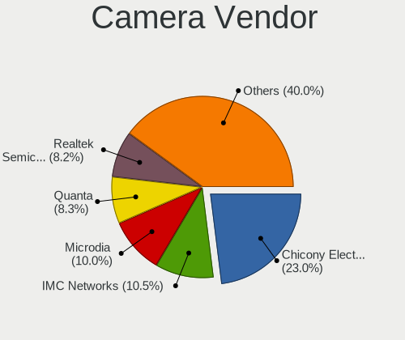

| Vendor                                 | Notebooks | Percent |
|----------------------------------------|-----------|---------|
| Chicony Electronics                    | 59        | 21.61%  |
| Microdia                               | 34        | 12.45%  |
| IMC Networks                           | 31        | 11.36%  |
| Quanta                                 | 27        | 9.89%   |
| Realtek Semiconductor                  | 26        | 9.52%   |
| Sunplus Innovation Technology          | 13        | 4.76%   |
| Luxvisions Innotech Limited            | 13        | 4.76%   |
| Acer                                   | 9         | 3.3%    |
| Apple                                  | 8         | 2.93%   |
| Bison Electronics                      | 7         | 2.56%   |
| Syntek                                 | 5         | 1.83%   |
| Sonix Technology                       | 5         | 1.83%   |
| Alcor Micro                            | 5         | 1.83%   |
| Lite-On Technology                     | 4         | 1.47%   |
| Cheng Uei Precision Industry (Foxlink) | 4         | 1.47%   |
| Silicon Motion                         | 3         | 1.1%    |
| Logitech                               | 3         | 1.1%    |
| Importek                               | 3         | 1.1%    |
| Suyin                                  | 2         | 0.73%   |
| ShineTech                              | 2         | 0.73%   |
| icSpring                               | 2         | 0.73%   |
| Sunplus Technology                     | 1         | 0.37%   |
| Shine-optics                           | 1         | 0.37%   |
| Samsung Electronics                    | 1         | 0.37%   |
| Ricoh                                  | 1         | 0.37%   |
| Pixart Imaging                         | 1         | 0.37%   |
| Microsoft                              | 1         | 0.37%   |
| Lenovo                                 | 1         | 0.37%   |
| BKX-210918                             | 1         | 0.37%   |

Camera Model
------------

Camera device models

| Model                                                | Notebooks | Percent |
|------------------------------------------------------|-----------|---------|
| Chicony Integrated Camera                            | 19        | 6.83%   |
| Microdia Integrated_Webcam_HD                        | 15        | 5.4%    |
| IMC Networks Integrated Camera                       | 10        | 3.6%    |
| Chicony HP HD Camera                                 | 10        | 3.6%    |
| IMC Networks USB2.0 HD UVC WebCam                    | 9         | 3.24%   |
| Realtek Integrated_Webcam_HD                         | 8         | 2.88%   |
| Realtek USB Camera                                   | 7         | 2.52%   |
| Luxvisions Innotech Limited HP TrueVision HD Camera  | 7         | 2.52%   |
| Quanta ov9734_techfront_camera                       | 5         | 1.8%    |
| Quanta HD User Facing                                | 5         | 1.8%    |
| Sunplus Integrated_Webcam_HD                         | 4         | 1.44%   |
| Sonix USB2.0 HD UVC WebCam                           | 4         | 1.44%   |
| Quanta HD Camera                                     | 4         | 1.44%   |
| Luxvisions Innotech Limited HP Wide Vision HD Camera | 4         | 1.44%   |
| IMC Networks HD Camera                               | 4         | 1.44%   |
| Chicony HP Truevision HD                             | 4         | 1.44%   |
| Chicony HD WebCam                                    | 4         | 1.44%   |
| Acer Integrated Camera                               | 4         | 1.44%   |
| Syntek Integrated Camera                             | 3         | 1.08%   |
| Microdia Webcam Vitade AF                            | 3         | 1.08%   |
| Microdia Laptop_Integrated_Webcam_E4HD               | 3         | 1.08%   |
| Lite-On Integrated Camera                            | 3         | 1.08%   |
| IMC Networks USB2.0 VGA UVC WebCam                   | 3         | 1.08%   |
| Bison SunplusIT Integrated Camera                    | 3         | 1.08%   |
| Apple FaceTime HD Camera                             | 3         | 1.08%   |
| Sunplus HD WebCam                                    | 2         | 0.72%   |
| ShineTech HD Camera                                  | 2         | 0.72%   |
| Realtek USB 2.0 Camera                               | 2         | 0.72%   |
| Realtek Integrated Webcam                            | 2         | 0.72%   |
| Quanta HP TrueVision HD Camera                       | 2         | 0.72%   |
| Quanta HD Webcam                                     | 2         | 0.72%   |
| Quanta ACER HD User Facing                           | 2         | 0.72%   |
| Quanta Acer FHD User Facing                          | 2         | 0.72%   |
| Microdia Laptop_Integrated_Webcam_HD                 | 2         | 0.72%   |
| Microdia Integrated_Webcam_FHD                       | 2         | 0.72%   |
| Microdia Integrated Webcam HD                        | 2         | 0.72%   |
| Luxvisions Innotech Limited Integrated Camera        | 2         | 0.72%   |
| Importek Laptop Integrated Webcam                    | 2         | 0.72%   |
| IMC Networks Integrated RGB Camera                   | 2         | 0.72%   |
| icSpring camera                                      | 2         | 0.72%   |

Security
--------

Fingerprint Vendor
------------------

Fingerprint sensor vendors

| Vendor                             | Notebooks | Percent |
|------------------------------------|-----------|---------|
| Shenzhen Goodix Technology         | 21        | 31.82%  |
| Validity Sensors                   | 18        | 27.27%  |
| Synaptics                          | 14        | 21.21%  |
| Elan Microelectronics              | 7         | 10.61%  |
| Upek                               | 2         | 3.03%   |
| LighTuning Technology              | 2         | 3.03%   |
| Realtek USB2.0 Finger Print Bridge | 1         | 1.52%   |
| Focal-systems.Corp                 | 1         | 1.52%   |

Fingerprint Model
-----------------

Fingerprint sensor models

| Model                                                           | Notebooks | Percent |
|-----------------------------------------------------------------|-----------|---------|
| Shenzhen Goodix  Fingerprint Device                             | 16        | 24.24%  |
| Synaptics Metallica MIS Touch Fingerprint Reader                | 5         | 7.58%   |
| Elan ELAN:ARM-M4                                                | 5         | 7.58%   |
| Synaptics Prometheus MIS Touch Fingerprint Reader               | 4         | 6.06%   |
| Shenzhen Goodix FingerPrint                                     | 4         | 6.06%   |
| Validity Sensors VFS5011 Fingerprint Reader                     | 3         | 4.55%   |
| Validity Sensors VFS495 Fingerprint Reader                      | 3         | 4.55%   |
| Validity Sensors VFS7500 Touch Fingerprint Sensor               | 2         | 3.03%   |
| Validity Sensors VFS 5011 fingerprint sensor                    | 2         | 3.03%   |
| Validity Sensors Synaptics WBDI                                 | 2         | 3.03%   |
| Upek Biometric Touchchip/Touchstrip Fingerprint Sensor          | 2         | 3.03%   |
| Synaptics Metallica MOH Touch Fingerprint Reader                | 2         | 3.03%   |
| Synaptics FS7604 Touch Fingerprint Sensor with PurePrint        | 2         | 3.03%   |
| LighTuning EgisTec Touch Fingerprint Sensor                     | 2         | 3.03%   |
| Elan ELAN:Fingerprint                                           | 2         | 3.03%   |
| Validity Sensors VFS471 Fingerprint Reader                      | 1         | 1.52%   |
| Validity Sensors VFS451 Fingerprint Reader                      | 1         | 1.52%   |
| Validity Sensors VFS101 Fingerprint Reader                      | 1         | 1.52%   |
| Validity Sensors VFS Fingerprint sensor                         | 1         | 1.52%   |
| Validity Sensors Swipe Fingerprint Sensor                       | 1         | 1.52%   |
| Validity Sensors Fingerprint scanner                            | 1         | 1.52%   |
| Synaptics  VFS7552 Touch Fingerprint Sensor with PurePrint      | 1         | 1.52%   |
| Shenzhen Goodix Fingerprint Reader                              | 1         | 1.52%   |
| Realtek USB2.0 Finger Print Bridge FocalTech Fingerprint Device | 1         | 1.52%   |
| Focal-systems.Corp FT9201Fingerprint.                           | 1         | 1.52%   |

Chipcard Vendor
---------------

Chipcard module vendors

| Vendor          | Notebooks | Percent |
|-----------------|-----------|---------|
| Broadcom        | 17        | 68%     |
| Alcor Micro     | 6         | 24%     |
| Upek            | 1         | 4%      |
| Hewlett-Packard | 1         | 4%      |

Chipcard Model
--------------

Chipcard module models

| Model                                                      | Notebooks | Percent |
|------------------------------------------------------------|-----------|---------|
| Broadcom 5880                                              | 6         | 24%     |
| Broadcom 58200                                             | 6         | 24%     |
| Alcor Micro AU9540 Smartcard Reader                        | 6         | 24%     |
| Broadcom BCM5880 Secure Applications Processor             | 5         | 20%     |
| Upek TouchChip Fingerprint Coprocessor (WBF advanced mode) | 1         | 4%      |
| Hewlett-Packard SC Keyboard - Apollo (Liteon)              | 1         | 4%      |

Unsupported
-----------

Unsupported Devices
-------------------

Total unsupported devices on board

| Total | Notebooks | Percent |
|-------|-----------|---------|
| 0     | 163       | 52.58%  |
| 1     | 108       | 34.84%  |
| 2     | 29        | 9.35%   |
| 3     | 7         | 2.26%   |
| 4     | 2         | 0.65%   |
| 10    | 1         | 0.32%   |

Unsupported Device Types
------------------------

Types of unsupported devices

| Type                     | Notebooks | Percent |
|--------------------------|-----------|---------|
| Fingerprint reader       | 67        | 35.64%  |
| Graphics card            | 36        | 19.15%  |
| Chipcard                 | 23        | 12.23%  |
| Camera                   | 16        | 8.51%   |
| Net/wireless             | 15        | 7.98%   |
| Multimedia controller    | 13        | 6.91%   |
| Sound                    | 6         | 3.19%   |
| Storage                  | 3         | 1.6%    |
| Net/ethernet             | 2         | 1.06%   |
| Communication controller | 2         | 1.06%   |
| Card reader              | 2         | 1.06%   |
| Bluetooth                | 2         | 1.06%   |
| Modem                    | 1         | 0.53%   |

