Ubuntu 24.04 - Tested Hardware & Statistics
-------------------------------------------

A project to collect tested hardware configurations for Ubuntu 24.04.

Anyone can contribute to this report by the [hw-probe](https://github.com/linuxhw/hw-probe) tool:

    sudo -E hw-probe -all -upload

Please contribute! Especially if your hardware is rare.

This is a report for all computer types. See also reports for [desktops](/Dist/Ubuntu_24.04/Desktop/README.md) and [notebooks](/Dist/Ubuntu_24.04/Notebook/README.md).

Contents
--------

* [ Test Cases ](#test-cases)

* [ System ](#system)
  - [ Kernel                   ](#kernel)
  - [ Kernel Family            ](#kernel-family)
  - [ Kernel Major Ver.        ](#kernel-major-ver)
  - [ Arch                     ](#arch)
  - [ DE                       ](#de)
  - [ Display Server           ](#display-server)
  - [ Display Manager          ](#display-manager)
  - [ OS Lang                  ](#os-lang)
  - [ Boot Mode                ](#boot-mode)
  - [ Filesystem               ](#filesystem)
  - [ Part. scheme             ](#part-scheme)
  - [ Dual Boot with Linux/BSD ](#dual-boot-with-linuxbsd)
  - [ Dual Boot (Win)          ](#dual-boot-win)

* [ Board ](#board)
  - [ Vendor                   ](#vendor)
  - [ Model                    ](#model)
  - [ Model Family             ](#model-family)
  - [ MFG Year                 ](#mfg-year)
  - [ Form Factor              ](#form-factor)
  - [ Secure Boot              ](#secure-boot)
  - [ Coreboot                 ](#coreboot)
  - [ RAM Size                 ](#ram-size)
  - [ RAM Used                 ](#ram-used)
  - [ Total Drives             ](#total-drives)
  - [ Has CD-ROM               ](#has-cd-rom)
  - [ Has Ethernet             ](#has-ethernet)
  - [ Has WiFi                 ](#has-wifi)
  - [ Has Bluetooth            ](#has-bluetooth)

* [ Location ](#location)
  - [ Country                  ](#country)
  - [ City                     ](#city)

* [ Drives ](#drives)
  - [ Drive Vendor             ](#drive-vendor)
  - [ Drive Model              ](#drive-model)
  - [ HDD Vendor               ](#hdd-vendor)
  - [ SSD Vendor               ](#ssd-vendor)
  - [ Drive Kind               ](#drive-kind)
  - [ Drive Connector          ](#drive-connector)
  - [ Drive Size               ](#drive-size)
  - [ Space Total              ](#space-total)
  - [ Space Used               ](#space-used)
  - [ Malfunc. Drives          ](#malfunc-drives)
  - [ Malfunc. Drive Vendor    ](#malfunc-drive-vendor)
  - [ Malfunc. HDD Vendor      ](#malfunc-hdd-vendor)
  - [ Malfunc. Drive Kind      ](#malfunc-drive-kind)
  - [ Failed Drives            ](#failed-drives)
  - [ Failed Drive Vendor      ](#failed-drive-vendor)
  - [ Drive Status             ](#drive-status)

* [ Storage controller ](#storage-controller)
  - [ Storage Vendor           ](#storage-vendor)
  - [ Storage Model            ](#storage-model)
  - [ Storage Kind             ](#storage-kind)

* [ Processor ](#processor)
  - [ CPU Vendor               ](#cpu-vendor)
  - [ CPU Model                ](#cpu-model)
  - [ CPU Model Family         ](#cpu-model-family)
  - [ CPU Cores                ](#cpu-cores)
  - [ CPU Sockets              ](#cpu-sockets)
  - [ CPU Threads              ](#cpu-threads)
  - [ CPU Op-Modes             ](#cpu-op-modes)
  - [ CPU Microcode            ](#cpu-microcode)
  - [ CPU Microarch            ](#cpu-microarch)

* [ Graphics ](#graphics)
  - [ GPU Vendor               ](#gpu-vendor)
  - [ GPU Model                ](#gpu-model)
  - [ GPU Combo                ](#gpu-combo)
  - [ GPU Driver               ](#gpu-driver)
  - [ GPU Memory               ](#gpu-memory)

* [ Monitor ](#monitor)
  - [ Monitor Vendor           ](#monitor-vendor)
  - [ Monitor Model            ](#monitor-model)
  - [ Monitor Resolution       ](#monitor-resolution)
  - [ Monitor Diagonal         ](#monitor-diagonal)
  - [ Monitor Width            ](#monitor-width)
  - [ Aspect Ratio             ](#aspect-ratio)
  - [ Monitor Area             ](#monitor-area)
  - [ Pixel Density            ](#pixel-density)
  - [ Multiple Monitors        ](#multiple-monitors)

* [ Network ](#network)
  - [ Net Controller Vendor    ](#net-controller-vendor)
  - [ Net Controller Model     ](#net-controller-model)
  - [ Wireless Vendor          ](#wireless-vendor)
  - [ Wireless Model           ](#wireless-model)
  - [ Ethernet Vendor          ](#ethernet-vendor)
  - [ Ethernet Model           ](#ethernet-model)
  - [ Net Controller Kind      ](#net-controller-kind)
  - [ Used Controller          ](#used-controller)
  - [ NICs                     ](#nics)
  - [ IPv6                     ](#ipv6)

* [ Bluetooth ](#bluetooth)
  - [ Bluetooth Vendor         ](#bluetooth-vendor)
  - [ Bluetooth Model          ](#bluetooth-model)

* [ Sound ](#sound)
  - [ Sound Vendor             ](#sound-vendor)
  - [ Sound Model              ](#sound-model)

* [ Memory ](#memory)
  - [ Memory Vendor            ](#memory-vendor)
  - [ Memory Model             ](#memory-model)
  - [ Memory Kind              ](#memory-kind)
  - [ Memory Form Factor       ](#memory-form-factor)
  - [ Memory Size              ](#memory-size)
  - [ Memory Speed             ](#memory-speed)

* [ Printers & scanners ](#printers--scanners)
  - [ Printer Vendor           ](#printer-vendor)
  - [ Printer Model            ](#printer-model)
  - [ Scanner Vendor           ](#scanner-vendor)
  - [ Scanner Model            ](#scanner-model)

* [ Camera ](#camera)
  - [ Camera Vendor            ](#camera-vendor)
  - [ Camera Model             ](#camera-model)

* [ Security ](#security)
  - [ Fingerprint Vendor       ](#fingerprint-vendor)
  - [ Fingerprint Model        ](#fingerprint-model)
  - [ Chipcard Vendor          ](#chipcard-vendor)
  - [ Chipcard Model           ](#chipcard-model)

* [ Unsupported ](#unsupported)
  - [ Unsupported Devices      ](#unsupported-devices)
  - [ Unsupported Device Types ](#unsupported-device-types)

Test Cases
----------

Total: 13280

| Vendor        | Model                       | Form-Factor | Probe                                                      | Date         |
|---------------|-----------------------------|-------------|------------------------------------------------------------|--------------|
| Sony          | SVF14212SGW                 | Notebook    | [5bbc92047d](https://linux-hardware.org/?probe=5bbc92047d) | Jan 03, 2026 |
| HP            | Laptop 15-dw3xxx            | Notebook    | [59701f1e01](https://linux-hardware.org/?probe=59701f1e01) | Jan 03, 2026 |
| Dell          | Inspiron 15 7510            | Notebook    | [afbf561791](https://linux-hardware.org/?probe=afbf561791) | Jan 03, 2026 |
| ASRock        | P67 Pro3                    | Desktop     | [046f4b4b67](https://linux-hardware.org/?probe=046f4b4b67) | Jan 03, 2026 |
| ASUSTek       | M5A78L-M LX                 | Desktop     | [a43d8eddfa](https://linux-hardware.org/?probe=a43d8eddfa) | Jan 03, 2026 |
| Acer          | Aspire VN7-792G             | Notebook    | [877c97847e](https://linux-hardware.org/?probe=877c97847e) | Jan 03, 2026 |
| Acer          | Aspire VN7-792G             | Notebook    | [3f2175f501](https://linux-hardware.org/?probe=3f2175f501) | Jan 03, 2026 |
| Apple         | Mac-031AEE4D24BFF0B1 Mac... | Mini pc     | [19442657fc](https://linux-hardware.org/?probe=19442657fc) | Jan 03, 2026 |
| Dell          | 16 Premium DA16250          | Notebook    | [f36e95cd9a](https://linux-hardware.org/?probe=f36e95cd9a) | Jan 03, 2026 |
| Gigabyte      | Z77-DS3H                    | Desktop     | [a042cb3c43](https://linux-hardware.org/?probe=a042cb3c43) | Jan 03, 2026 |
| ASRock        | Z390 Pro4                   | Desktop     | [142f8a178c](https://linux-hardware.org/?probe=142f8a178c) | Jan 03, 2026 |
| Apple         | Mac-031B6874CF7F642A iMa... | All in one  | [5400e90cdd](https://linux-hardware.org/?probe=5400e90cdd) | Jan 03, 2026 |
| Dell          | Inspiron 3521               | Notebook    | [3b155d8c56](https://linux-hardware.org/?probe=3b155d8c56) | Jan 03, 2026 |
| HP            | ProBook 450 15.6 inch G9... | Notebook    | [e0629e7d73](https://linux-hardware.org/?probe=e0629e7d73) | Jan 03, 2026 |
| ASUSTek       | PRIME B360M-K               | Desktop     | [240414693b](https://linux-hardware.org/?probe=240414693b) | Jan 03, 2026 |
| Pegatron      | IPXSB-H61                   | Desktop     | [b74f15758f](https://linux-hardware.org/?probe=b74f15758f) | Jan 02, 2026 |
| ASUSTek       | K30BF_M32BF_A_F_K31BF_6     | Desktop     | [817b603100](https://linux-hardware.org/?probe=817b603100) | Jan 02, 2026 |
| Lenovo        | IdeaPad 3 15ITL6 82MD       | Notebook    | [b3e8c508e6](https://linux-hardware.org/?probe=b3e8c508e6) | Jan 02, 2026 |
| Lenovo        | G50-30 80G0                 | Notebook    | [a1e7cd6d47](https://linux-hardware.org/?probe=a1e7cd6d47) | Jan 02, 2026 |
| HP            | ProBook 450 G7              | Notebook    | [b660996b56](https://linux-hardware.org/?probe=b660996b56) | Jan 02, 2026 |
| HP            | ProBook 450 G7              | Notebook    | [8dfaafc0ec](https://linux-hardware.org/?probe=8dfaafc0ec) | Jan 02, 2026 |
| Gigabyte      | H67A-UD3H-B3                | Desktop     | [0ba3258f3e](https://linux-hardware.org/?probe=0ba3258f3e) | Jan 02, 2026 |
| HP            | EliteBook 840 G1            | Notebook    | [a6ba51d1c1](https://linux-hardware.org/?probe=a6ba51d1c1) | Jan 02, 2026 |
| ASUSTek       | Z97-K                       | Desktop     | [11fdb57821](https://linux-hardware.org/?probe=11fdb57821) | Jan 02, 2026 |
| Acer          | Aspire 5750G                | Notebook    | [9c51173486](https://linux-hardware.org/?probe=9c51173486) | Jan 02, 2026 |
| Acer          | Aspire 5750G                | Notebook    | [118f3a1d96](https://linux-hardware.org/?probe=118f3a1d96) | Jan 02, 2026 |
| Lenovo        | IdeaPad Slim 3 15AMN8 82... | Notebook    | [66e0de5cce](https://linux-hardware.org/?probe=66e0de5cce) | Jan 02, 2026 |
| ASUSTek       | Z97-K                       | Desktop     | [56dfc5d390](https://linux-hardware.org/?probe=56dfc5d390) | Jan 02, 2026 |
| Lenovo        | 1036 SDK0Q40104 WIN 3305... | Desktop     | [efad00deb8](https://linux-hardware.org/?probe=efad00deb8) | Jan 02, 2026 |
| ASUSTek       | ROG STRIX B550-F GAMING     | Desktop     | [1788176335](https://linux-hardware.org/?probe=1788176335) | Jan 02, 2026 |
| Dell          | Precision 5570              | Notebook    | [13dd453699](https://linux-hardware.org/?probe=13dd453699) | Jan 02, 2026 |
| ASUSTek       | VivoBook_ASUSLaptop X513... | Notebook    | [d8c9a2c73d](https://linux-hardware.org/?probe=d8c9a2c73d) | Jan 02, 2026 |
| MSI           | A320M BAZOOKA               | Desktop     | [5bba275ca5](https://linux-hardware.org/?probe=5bba275ca5) | Jan 01, 2026 |
| ASUSTek       | VivoBook_ASUSLaptop X150... | Notebook    | [ddc22ba8c0](https://linux-hardware.org/?probe=ddc22ba8c0) | Jan 01, 2026 |
| HP            | 8882                        | Mini pc     | [8402c546ba](https://linux-hardware.org/?probe=8402c546ba) | Jan 01, 2026 |
| HP            | EliteBook 820 G2            | Notebook    | [800d119ed2](https://linux-hardware.org/?probe=800d119ed2) | Jan 01, 2026 |
| ASUSTek       | PRIME B550M-A WIFI II       | Desktop     | [66d1dcd7d5](https://linux-hardware.org/?probe=66d1dcd7d5) | Jan 01, 2026 |
| Dell          | Latitude 7410               | Notebook    | [2521b6bcea](https://linux-hardware.org/?probe=2521b6bcea) | Jan 01, 2026 |
| Gigabyte      | GAMING A16 3VH              | Notebook    | [edd64ded98](https://linux-hardware.org/?probe=edd64ded98) | Jan 01, 2026 |
| Medion        | A17                         | Notebook    | [7f5ac8f94f](https://linux-hardware.org/?probe=7f5ac8f94f) | Dec 31, 2025 |
| Lenovo        | SHARKBAY 0B98401 WIN        | Desktop     | [f106f3b650](https://linux-hardware.org/?probe=f106f3b650) | Dec 31, 2025 |
| Microsoft     | Surface Pro                 | Tablet      | [2d53140a45](https://linux-hardware.org/?probe=2d53140a45) | Dec 31, 2025 |
| ASUSTek       | Vivobook Go E1504FA_L150... | Notebook    | [2a192339c9](https://linux-hardware.org/?probe=2a192339c9) | Dec 31, 2025 |
| ASUSTek       | Z97-K                       | Desktop     | [978c878097](https://linux-hardware.org/?probe=978c878097) | Dec 31, 2025 |
| ASUSTek       | ASUS EXPERTBOOK P1503CVA    | Notebook    | [486d613881](https://linux-hardware.org/?probe=486d613881) | Dec 31, 2025 |
| Fujitsu       | LIFEBOOK E751               | Notebook    | [377f73575c](https://linux-hardware.org/?probe=377f73575c) | Dec 31, 2025 |
| ASUSTek       | STRIX B250H GAMING          | Desktop     | [379fc63b3a](https://linux-hardware.org/?probe=379fc63b3a) | Dec 31, 2025 |
| ASUSTek       | PRIME H610M-K D4            | Desktop     | [84b7be2db5](https://linux-hardware.org/?probe=84b7be2db5) | Dec 31, 2025 |
| Dell          | Latitude 7370               | Notebook    | [721acfdd3a](https://linux-hardware.org/?probe=721acfdd3a) | Dec 31, 2025 |
| ASUSTek       | PRIME H610M-K D4            | Desktop     | [d515fbdbf2](https://linux-hardware.org/?probe=d515fbdbf2) | Dec 31, 2025 |
| HP            | Laptop 15-dy2xxx            | Notebook    | [41990a70e6](https://linux-hardware.org/?probe=41990a70e6) | Dec 31, 2025 |
| Gigabyte      | X870E AORUS MASTER          | Desktop     | [8c7d334222](https://linux-hardware.org/?probe=8c7d334222) | Dec 31, 2025 |
| Toshiba       | Satellite C55-C             | Notebook    | [573018dd49](https://linux-hardware.org/?probe=573018dd49) | Dec 30, 2025 |
| ASUSTek       | VivoBook_ASUSLaptop M350... | Notebook    | [7e501724d2](https://linux-hardware.org/?probe=7e501724d2) | Dec 30, 2025 |
| ASUSTek       | Z97-K                       | Desktop     | [e8580f42cb](https://linux-hardware.org/?probe=e8580f42cb) | Dec 30, 2025 |
| Chuwi         | UBox                        | Mini pc     | [191bd2a5ca](https://linux-hardware.org/?probe=191bd2a5ca) | Dec 30, 2025 |
| Dell          | Latitude 7370               | Notebook    | [2590249f06](https://linux-hardware.org/?probe=2590249f06) | Dec 30, 2025 |
| Lenovo        | Legion Pro 5 16IRX9 83DF    | Notebook    | [6d710e1d66](https://linux-hardware.org/?probe=6d710e1d66) | Dec 30, 2025 |
| Dell          | Inspiron 7720               | Notebook    | [53382922db](https://linux-hardware.org/?probe=53382922db) | Dec 30, 2025 |
| Dell          | Latitude E6410              | Notebook    | [e597155cc1](https://linux-hardware.org/?probe=e597155cc1) | Dec 30, 2025 |
| Dell          | 0HHV7N A00                  | Desktop     | [c28ce9f23a](https://linux-hardware.org/?probe=c28ce9f23a) | Dec 30, 2025 |
| Dell          | Latitude E6410              | Notebook    | [c383aec759](https://linux-hardware.org/?probe=c383aec759) | Dec 30, 2025 |
| HP            | EliteBook 2560p             | Notebook    | [a747a895ec](https://linux-hardware.org/?probe=a747a895ec) | Dec 30, 2025 |
| ASUSTek       | ROG STRIX X870E-H GAMING... | Desktop     | [671ce4322d](https://linux-hardware.org/?probe=671ce4322d) | Dec 30, 2025 |
| MSI           | Z77 MPower                  | Desktop     | [4d7fb78fa5](https://linux-hardware.org/?probe=4d7fb78fa5) | Dec 30, 2025 |
| ASUSTek       | X870 AYW GAMING WIFI W      | Desktop     | [23c665b5c0](https://linux-hardware.org/?probe=23c665b5c0) | Dec 30, 2025 |
| ASUSTek       | X870 AYW GAMING WIFI W      | Desktop     | [8b33491860](https://linux-hardware.org/?probe=8b33491860) | Dec 30, 2025 |
| ASUSTek       | VivoBook_ASUSLaptop M150... | Notebook    | [535965644c](https://linux-hardware.org/?probe=535965644c) | Dec 30, 2025 |
| Lenovo        | Slim 7 14IMH9 83D8          | Notebook    | [d9b16d1c36](https://linux-hardware.org/?probe=d9b16d1c36) | Dec 30, 2025 |
| ASUSTek       | X870 AYW GAMING WIFI W      | Desktop     | [5bed698159](https://linux-hardware.org/?probe=5bed698159) | Dec 30, 2025 |
| Quanta        | 2ABB 101                    | Desktop     | [a6af373ff1](https://linux-hardware.org/?probe=a6af373ff1) | Dec 30, 2025 |
| Quanta        | 2ABB 101                    | Desktop     | [7e6a7330df](https://linux-hardware.org/?probe=7e6a7330df) | Dec 30, 2025 |
| Gigabyte      | U2142                       | Tablet      | [68ad67453f](https://linux-hardware.org/?probe=68ad67453f) | Dec 30, 2025 |
| Acer          | Aspire A314-23P             | Notebook    | [5452aa342a](https://linux-hardware.org/?probe=5452aa342a) | Dec 30, 2025 |
| Acer          | Aspire A314-23P             | Notebook    | [ef59712365](https://linux-hardware.org/?probe=ef59712365) | Dec 30, 2025 |
| HP            | 1905                        | Desktop     | [6df27d6e04](https://linux-hardware.org/?probe=6df27d6e04) | Dec 29, 2025 |
| Gigabyte      | Z890 UD WIFI6E              | Desktop     | [aa428980b6](https://linux-hardware.org/?probe=aa428980b6) | Dec 29, 2025 |
| Gigabyte      | Z890 UD WIFI6E              | Desktop     | [cb52130f00](https://linux-hardware.org/?probe=cb52130f00) | Dec 29, 2025 |
| ASUSTek       | ProArt Z690-CREATOR WIFI    | Desktop     | [b5f7dc8a80](https://linux-hardware.org/?probe=b5f7dc8a80) | Dec 29, 2025 |
| HP            | Pavilion 15                 | Notebook    | [073a5d761f](https://linux-hardware.org/?probe=073a5d761f) | Dec 29, 2025 |
| ASUSTek       | TUF Gaming B560M-PLUS       | Desktop     | [ca41065bdd](https://linux-hardware.org/?probe=ca41065bdd) | Dec 29, 2025 |
| MSI           | B850 GAMING PLUS WIFI       | Desktop     | [981b4727a0](https://linux-hardware.org/?probe=981b4727a0) | Dec 29, 2025 |
| Raspberry ... | Raspberry Pi 5 Model B R... | Soc         | [cc9dbafd6d](https://linux-hardware.org/?probe=cc9dbafd6d) | Dec 29, 2025 |
| ASUSTek       | ROG STRIX X870E-E GAMING... | Desktop     | [cfa122640f](https://linux-hardware.org/?probe=cfa122640f) | Dec 29, 2025 |
| ASRock        | H81M-HDS                    | Desktop     | [1228ab46c3](https://linux-hardware.org/?probe=1228ab46c3) | Dec 29, 2025 |
| Gigabyte      | B450 AORUS ELITE            | Desktop     | [08be31f6a6](https://linux-hardware.org/?probe=08be31f6a6) | Dec 29, 2025 |
| ASUSTek       | G551JX                      | Notebook    | [f05fff7a33](https://linux-hardware.org/?probe=f05fff7a33) | Dec 29, 2025 |
| MAXHUB        | BPAN03                      | Mini pc     | [d8763daf35](https://linux-hardware.org/?probe=d8763daf35) | Dec 29, 2025 |
| ASUSTek       | X870 AYW GAMING WIFI W      | Desktop     | [c69224dd1b](https://linux-hardware.org/?probe=c69224dd1b) | Dec 29, 2025 |
| HP            | ENVY x360 2-in-1 Laptop ... | Convertible | [545d2edf64](https://linux-hardware.org/?probe=545d2edf64) | Dec 29, 2025 |
| HP            | ProBook 430 G2              | Notebook    | [c03541779b](https://linux-hardware.org/?probe=c03541779b) | Dec 29, 2025 |
| Lenovo        | ThinkPad T14s Gen 2i 20W... | Notebook    | [9377664358](https://linux-hardware.org/?probe=9377664358) | Dec 29, 2025 |
| HP            | Notebook                    | Notebook    | [7c05b04e15](https://linux-hardware.org/?probe=7c05b04e15) | Dec 29, 2025 |
| MSI           | MAG B760M MORTAR WIFI II    | Desktop     | [1fa537195f](https://linux-hardware.org/?probe=1fa537195f) | Dec 29, 2025 |
| Acer          | Aspire A517-52              | Notebook    | [441e05e813](https://linux-hardware.org/?probe=441e05e813) | Dec 28, 2025 |
| Gigabyte      | Z790 AORUS ELITE X WIFI7    | Desktop     | [8aaf822dfb](https://linux-hardware.org/?probe=8aaf822dfb) | Dec 28, 2025 |
| Intel         | ETH-B75                     | Desktop     | [43e675ab52](https://linux-hardware.org/?probe=43e675ab52) | Dec 28, 2025 |
| Toshiba       | Satellite L70-A             | Notebook    | [52994acee9](https://linux-hardware.org/?probe=52994acee9) | Dec 28, 2025 |
| Acer          | Aspire 5750G                | Notebook    | [7e26321ea2](https://linux-hardware.org/?probe=7e26321ea2) | Dec 28, 2025 |
| Huanan        | X99-F8D PLUS V1.32          | Desktop     | [c7f8f1e4b5](https://linux-hardware.org/?probe=c7f8f1e4b5) | Dec 28, 2025 |
| MSI           | GL75 Leopard 10SDK          | Notebook    | [6ebdfa28db](https://linux-hardware.org/?probe=6ebdfa28db) | Dec 28, 2025 |
| ASUSTek       | ROG STRIX Z370-F GAMING     | Desktop     | [d4cb70dbd2](https://linux-hardware.org/?probe=d4cb70dbd2) | Dec 28, 2025 |
| Dell          | Inspiron 15 7000 Gaming     | Notebook    | [bb43d15909](https://linux-hardware.org/?probe=bb43d15909) | Dec 28, 2025 |
| ASUSTek       | ROG STRIX X870E-E GAMING... | Desktop     | [8c9be3a3ba](https://linux-hardware.org/?probe=8c9be3a3ba) | Dec 28, 2025 |
| MSI           | MAG B760M MORTAR WIFI II    | Desktop     | [7e9dd90892](https://linux-hardware.org/?probe=7e9dd90892) | Dec 28, 2025 |
| Gigabyte      | Z87-HD3                     | Desktop     | [5c045be16d](https://linux-hardware.org/?probe=5c045be16d) | Dec 28, 2025 |
| Medion        | MS-7797                     | Desktop     | [1803e1a4a4](https://linux-hardware.org/?probe=1803e1a4a4) | Dec 28, 2025 |
| Sony          | VPCEG10EL                   | Notebook    | [3613da0a34](https://linux-hardware.org/?probe=3613da0a34) | Dec 28, 2025 |
| Lenovo        | Z51-70 80K6                 | Notebook    | [ea057123cf](https://linux-hardware.org/?probe=ea057123cf) | Dec 28, 2025 |
| Dell          | 03X6X0 A06                  | Server      | [cf0670b93c](https://linux-hardware.org/?probe=cf0670b93c) | Dec 28, 2025 |
| Lenovo        | Z51-70 80K6                 | Notebook    | [4423a0f909](https://linux-hardware.org/?probe=4423a0f909) | Dec 28, 2025 |
| Dell          | 0R790T A00                  | Desktop     | [4b5f2f0d77](https://linux-hardware.org/?probe=4b5f2f0d77) | Dec 28, 2025 |
| Dell          | 0R790T A00                  | Desktop     | [276a5377e5](https://linux-hardware.org/?probe=276a5377e5) | Dec 28, 2025 |
| Google        | Kench                       | Desktop     | [f46d338b71](https://linux-hardware.org/?probe=f46d338b71) | Dec 28, 2025 |
| Lenovo        | LOQ 15ARP9 83JC             | Notebook    | [0a86d4838a](https://linux-hardware.org/?probe=0a86d4838a) | Dec 28, 2025 |
| Chuwi         | UBox                        | Mini pc     | [2223c6c91b](https://linux-hardware.org/?probe=2223c6c91b) | Dec 28, 2025 |
| Intel         | E5-A99 V1.2                 | Desktop     | [f83080ae09](https://linux-hardware.org/?probe=f83080ae09) | Dec 28, 2025 |
| ASUSTek       | ROG STRIX X870E-H GAMING... | Desktop     | [253fa68ba1](https://linux-hardware.org/?probe=253fa68ba1) | Dec 28, 2025 |
| Medion        | P6612                       | Notebook    | [01ffda6266](https://linux-hardware.org/?probe=01ffda6266) | Dec 28, 2025 |
| Lenovo        | 375A No DPK                 | All in one  | [1017684d2e](https://linux-hardware.org/?probe=1017684d2e) | Dec 27, 2025 |
| Lenovo        | Y50-70 15IKB 80V5           | Convertible | [0f202271d4](https://linux-hardware.org/?probe=0f202271d4) | Dec 27, 2025 |
| Toshiba       | Satellite L70-A             | Notebook    | [2baa6e4e25](https://linux-hardware.org/?probe=2baa6e4e25) | Dec 27, 2025 |
| Samsung       | 950XCJ/951XCJ/950XCR        | Notebook    | [304b46260d](https://linux-hardware.org/?probe=304b46260d) | Dec 27, 2025 |
| ASUSTek       | X555LA                      | Notebook    | [1d40254aa7](https://linux-hardware.org/?probe=1d40254aa7) | Dec 27, 2025 |
| ASUSTek       | X555LA                      | Notebook    | [5e4fc8a531](https://linux-hardware.org/?probe=5e4fc8a531) | Dec 27, 2025 |
| HP            | 8463                        | Desktop     | [e5efd305e9](https://linux-hardware.org/?probe=e5efd305e9) | Dec 27, 2025 |
| Gigabyte      | H410M S2H V3                | Desktop     | [f604c56b6e](https://linux-hardware.org/?probe=f604c56b6e) | Dec 27, 2025 |
| Cloud Hype... | cloud-hypervisor            | Server      | [debf537103](https://linux-hardware.org/?probe=debf537103) | Dec 27, 2025 |
| MSI           | B550M PRO-VDH WIFI          | Desktop     | [0e7d6df7de](https://linux-hardware.org/?probe=0e7d6df7de) | Dec 27, 2025 |
| Huanan        | X99-F8D PLUS V1.32          | Desktop     | [91353cb4b8](https://linux-hardware.org/?probe=91353cb4b8) | Dec 27, 2025 |
| Huanan        | X99-F8D PLUS V1.32          | Desktop     | [9b14c494bd](https://linux-hardware.org/?probe=9b14c494bd) | Dec 27, 2025 |
| Vizio         | CT15T-B1                    | Notebook    | [b558f0c6a6](https://linux-hardware.org/?probe=b558f0c6a6) | Dec 27, 2025 |
| Lenovo        | 3111 SDK0J40697 WIN 3305... | Mini pc     | [7d7079533a](https://linux-hardware.org/?probe=7d7079533a) | Dec 27, 2025 |
| Acer          | Aspire 5820TG               | Notebook    | [2b39dd1053](https://linux-hardware.org/?probe=2b39dd1053) | Dec 26, 2025 |
| Lenovo        | IdeaPad 3 15ITL6 82H8       | Notebook    | [b01ad086ad](https://linux-hardware.org/?probe=b01ad086ad) | Dec 26, 2025 |
| Apple         | MacBookPro13,3              | Notebook    | [209b23cfa9](https://linux-hardware.org/?probe=209b23cfa9) | Dec 26, 2025 |
| Chuwi         | CW129-6 N150 V2             | Notebook    | [057fa264c3](https://linux-hardware.org/?probe=057fa264c3) | Dec 26, 2025 |
| Acer          | Swift SFG16-74              | Notebook    | [8d279161e4](https://linux-hardware.org/?probe=8d279161e4) | Dec 26, 2025 |
| ASUSTek       | TUF Gaming B550-PLUS        | Desktop     | [880111656f](https://linux-hardware.org/?probe=880111656f) | Dec 26, 2025 |
| Gigabyte      | 970-GAMING                  | Desktop     | [ae09a4f096](https://linux-hardware.org/?probe=ae09a4f096) | Dec 26, 2025 |
| Apple         | MacBookAir7,2               | Notebook    | [a30664f212](https://linux-hardware.org/?probe=a30664f212) | Dec 26, 2025 |
| Dell          | Precision 7520              | Notebook    | [5e42554185](https://linux-hardware.org/?probe=5e42554185) | Dec 26, 2025 |
| Fujitsu Si... | AMILO Xa 2528               | Notebook    | [03b95b8a3b](https://linux-hardware.org/?probe=03b95b8a3b) | Dec 26, 2025 |
| Lenovo        | Yoga 3 Pro-1370 80HE        | Notebook    | [3d9a36379e](https://linux-hardware.org/?probe=3d9a36379e) | Dec 26, 2025 |
| Dell          | 0TWW5Y A01                  | Server      | [7f0b8db0db](https://linux-hardware.org/?probe=7f0b8db0db) | Dec 26, 2025 |
| KaiTian       | LXCF-ZXE-ZX200-mATX ZZX2... | Desktop     | [ad4e532296](https://linux-hardware.org/?probe=ad4e532296) | Dec 26, 2025 |
| Chuwi         | HeroBook Pro                | Notebook    | [22d2538717](https://linux-hardware.org/?probe=22d2538717) | Dec 26, 2025 |
| Dell          | XPS 13 9350                 | Notebook    | [78bd4e05c3](https://linux-hardware.org/?probe=78bd4e05c3) | Dec 26, 2025 |
| Gigabyte      | U2142                       | Tablet      | [925705e5d9](https://linux-hardware.org/?probe=925705e5d9) | Dec 26, 2025 |
| Schenker      | XMG EVO (E25)               | Notebook    | [bed3c72aa9](https://linux-hardware.org/?probe=bed3c72aa9) | Dec 26, 2025 |
| Dell          | Latitude 5330               | Notebook    | [31ec455c5d](https://linux-hardware.org/?probe=31ec455c5d) | Dec 26, 2025 |
| Dell          | Precision 7520              | Notebook    | [0b1367a35d](https://linux-hardware.org/?probe=0b1367a35d) | Dec 25, 2025 |
| Lenovo        | Yoga Slim 6 14IAP8 82WU     | Notebook    | [c6bf04735c](https://linux-hardware.org/?probe=c6bf04735c) | Dec 25, 2025 |
| Lenovo        | ThinkPad X1 Carbon 7th 2... | Notebook    | [42366daa7e](https://linux-hardware.org/?probe=42366daa7e) | Dec 25, 2025 |
| HP            | 1589                        | Desktop     | [4399c94189](https://linux-hardware.org/?probe=4399c94189) | Dec 25, 2025 |
| Lenovo        | Yoga Slim 6 14IAP8 82WU     | Notebook    | [9ca214ebcc](https://linux-hardware.org/?probe=9ca214ebcc) | Dec 25, 2025 |
| Lenovo        | Yoga 3 Pro-1370 80HE        | Notebook    | [59a4178a25](https://linux-hardware.org/?probe=59a4178a25) | Dec 25, 2025 |
| Acer          | Aspire AG15-42P             | Notebook    | [657798edfc](https://linux-hardware.org/?probe=657798edfc) | Dec 25, 2025 |
| ASUSTek       | ASUS TUF Gaming F15 FX50... | Notebook    | [2be1598ded](https://linux-hardware.org/?probe=2be1598ded) | Dec 25, 2025 |
| Dell          | Inspiron 7591               | Notebook    | [9a71c0819e](https://linux-hardware.org/?probe=9a71c0819e) | Dec 25, 2025 |
| Gigabyte      | F2A88XM-D3H                 | Desktop     | [a17ea4e799](https://linux-hardware.org/?probe=a17ea4e799) | Dec 25, 2025 |
| Dell          | Latitude 7280               | Notebook    | [24add8751a](https://linux-hardware.org/?probe=24add8751a) | Dec 25, 2025 |
| Samsung       | 270E5G/270E5U               | Notebook    | [a4cd4e3d1a](https://linux-hardware.org/?probe=a4cd4e3d1a) | Dec 25, 2025 |
| Medion        | D3F3-EM                     | Desktop     | [f1b0dbb508](https://linux-hardware.org/?probe=f1b0dbb508) | Dec 25, 2025 |
| ASUSTek       | M5A97 R2.0                  | Desktop     | [5b1e1c26d3](https://linux-hardware.org/?probe=5b1e1c26d3) | Dec 25, 2025 |
| MSI           | B350M MORTAR ARCTIC         | Desktop     | [04572f242c](https://linux-hardware.org/?probe=04572f242c) | Dec 25, 2025 |
| Apple         | Mac-AA95B1DDAB278B95 iMa... | All in one  | [1986827fe0](https://linux-hardware.org/?probe=1986827fe0) | Dec 25, 2025 |
| Microsoft     | Surface 3                   | Tablet      | [41b3476106](https://linux-hardware.org/?probe=41b3476106) | Dec 25, 2025 |
| Apple         | Mac-AA95B1DDAB278B95 iMa... | All in one  | [2ba44f2e61](https://linux-hardware.org/?probe=2ba44f2e61) | Dec 24, 2025 |
| HP            | Notebook                    | Notebook    | [dc6e7e7a26](https://linux-hardware.org/?probe=dc6e7e7a26) | Dec 24, 2025 |
| Lenovo        | ThinkPad T480s 20L8S8KS0... | Notebook    | [454a8ae092](https://linux-hardware.org/?probe=454a8ae092) | Dec 24, 2025 |
| Dell          | Inspiron N5110              | Notebook    | [f5bc2f1cb8](https://linux-hardware.org/?probe=f5bc2f1cb8) | Dec 24, 2025 |
| Dell          | Latitude 5330               | Notebook    | [2474bba60a](https://linux-hardware.org/?probe=2474bba60a) | Dec 24, 2025 |
| ASUSTek       | ROG STRIX X570-E GAMING     | Desktop     | [e53bb732f4](https://linux-hardware.org/?probe=e53bb732f4) | Dec 24, 2025 |
| Biostar       | A68N-5600E                  | Desktop     | [c788ac433a](https://linux-hardware.org/?probe=c788ac433a) | Dec 24, 2025 |
| MSI           | Modern 15 A5M               | Notebook    | [4e49258835](https://linux-hardware.org/?probe=4e49258835) | Dec 24, 2025 |
| MSI           | H270 GAMING M3              | Desktop     | [6b84409bb6](https://linux-hardware.org/?probe=6b84409bb6) | Dec 24, 2025 |
| ASUSTek       | B760M-AYW WIFI              | Desktop     | [183c4b09e8](https://linux-hardware.org/?probe=183c4b09e8) | Dec 24, 2025 |
| ASUSTek       | B760M-AYW WIFI              | Desktop     | [a1a741f665](https://linux-hardware.org/?probe=a1a741f665) | Dec 24, 2025 |
| Unknown       | Unknown                     | Desktop     | [bb81c8fdb5](https://linux-hardware.org/?probe=bb81c8fdb5) | Dec 24, 2025 |
| Unknown       | Unknown                     | Desktop     | [c118183251](https://linux-hardware.org/?probe=c118183251) | Dec 24, 2025 |
| Sony          | VPCEH3N6E                   | Notebook    | [5fd14f8637](https://linux-hardware.org/?probe=5fd14f8637) | Dec 24, 2025 |
| HP            | ENVY x360 Convertible 15... | Convertible | [6138a24b83](https://linux-hardware.org/?probe=6138a24b83) | Dec 24, 2025 |
| Dell          | 0XHGV1 A00                  | Desktop     | [439363b22e](https://linux-hardware.org/?probe=439363b22e) | Dec 24, 2025 |
| HP            | EliteBook 840 G8 Noteboo... | Notebook    | [04d26d5c13](https://linux-hardware.org/?probe=04d26d5c13) | Dec 24, 2025 |
| HP            | EliteBook 860 16 inch G1... | Notebook    | [9219479764](https://linux-hardware.org/?probe=9219479764) | Dec 23, 2025 |
| Dell          | Inspiron 7547               | Notebook    | [bfbe815e06](https://linux-hardware.org/?probe=bfbe815e06) | Dec 23, 2025 |
| Acer          | WG43M                       | Desktop     | [37412d99fc](https://linux-hardware.org/?probe=37412d99fc) | Dec 23, 2025 |
| Acer          | WG43M                       | Desktop     | [f186e48545](https://linux-hardware.org/?probe=f186e48545) | Dec 23, 2025 |
| Acer          | Aspire 7250                 | Notebook    | [7fb56d3527](https://linux-hardware.org/?probe=7fb56d3527) | Dec 23, 2025 |
| Apple         | MacBookPro10,1              | Notebook    | [6d535dd1b0](https://linux-hardware.org/?probe=6d535dd1b0) | Dec 23, 2025 |
| Dell          | Latitude 7490               | Notebook    | [ececad4e3f](https://linux-hardware.org/?probe=ececad4e3f) | Dec 23, 2025 |
| Dell          | 0T7D40 A01                  | Desktop     | [adc1a2ad3d](https://linux-hardware.org/?probe=adc1a2ad3d) | Dec 23, 2025 |
| ASUSTek       | ASUS TUF Gaming F15 FX50... | Notebook    | [7d0acf82d1](https://linux-hardware.org/?probe=7d0acf82d1) | Dec 23, 2025 |
| Biostar       | B450MHP                     | Desktop     | [92ea7a0e1c](https://linux-hardware.org/?probe=92ea7a0e1c) | Dec 23, 2025 |
| ASRock        | Z87 Extreme4                | Desktop     | [889c6d3ab3](https://linux-hardware.org/?probe=889c6d3ab3) | Dec 23, 2025 |
| ASUSTek       | STRIX B250F GAMING          | Desktop     | [4630548f71](https://linux-hardware.org/?probe=4630548f71) | Dec 23, 2025 |
| Lenovo        | IdeaPad 1 15AMN7 82VG       | Notebook    | [7c17f012f9](https://linux-hardware.org/?probe=7c17f012f9) | Dec 23, 2025 |
| Dream Mach... | NH5x_NH7xHP                 | Notebook    | [c9941d66e2](https://linux-hardware.org/?probe=c9941d66e2) | Dec 23, 2025 |
| Intel         | DQ57TM AAE70931-403         | Desktop     | [e7b61d89e2](https://linux-hardware.org/?probe=e7b61d89e2) | Dec 23, 2025 |
| Lenovo        | ThinkPad T470s 20HGS15V0... | Notebook    | [6b61040ac9](https://linux-hardware.org/?probe=6b61040ac9) | Dec 23, 2025 |
| Intel         | DQ57TM AAE70931-403         | Desktop     | [26cee44397](https://linux-hardware.org/?probe=26cee44397) | Dec 23, 2025 |
| HP            | EliteBook 840 G8 Noteboo... | Notebook    | [46a0f29377](https://linux-hardware.org/?probe=46a0f29377) | Dec 23, 2025 |
| Microsoft     | Surface Book                | Tablet      | [f8a66bf645](https://linux-hardware.org/?probe=f8a66bf645) | Dec 23, 2025 |
| HP            | 255 15.6 inch G10           | Notebook    | [7d8001e4e5](https://linux-hardware.org/?probe=7d8001e4e5) | Dec 23, 2025 |
| ASRock        | A520M-HVS                   | Desktop     | [8fb8ca5968](https://linux-hardware.org/?probe=8fb8ca5968) | Dec 23, 2025 |
| Lenovo        | LOQ 15IAX9E 83LK            | Notebook    | [00e187d641](https://linux-hardware.org/?probe=00e187d641) | Dec 23, 2025 |
| MSI           | MPG B550 GAMING CARBON W... | Desktop     | [9cdfede9ce](https://linux-hardware.org/?probe=9cdfede9ce) | Dec 23, 2025 |
| Framework     | Laptop 16 (AMD Ryzen 704... | Notebook    | [88911d379a](https://linux-hardware.org/?probe=88911d379a) | Dec 23, 2025 |
| Gigabyte      | X570 AORUS MASTER           | Desktop     | [8f3e1c0109](https://linux-hardware.org/?probe=8f3e1c0109) | Dec 23, 2025 |
| ASRock        | P67 Transformer             | Desktop     | [a14bc3ed00](https://linux-hardware.org/?probe=a14bc3ed00) | Dec 22, 2025 |
| HP            | ProLiant ML350p Gen8        | Desktop     | [73a79eefd7](https://linux-hardware.org/?probe=73a79eefd7) | Dec 22, 2025 |
| ASUSTek       | PRIME B450M-A II            | Desktop     | [bd68cfa16d](https://linux-hardware.org/?probe=bd68cfa16d) | Dec 22, 2025 |
| Medion        | E3216 MD60900               | Convertible | [4ccba64348](https://linux-hardware.org/?probe=4ccba64348) | Dec 22, 2025 |
| PELADN        | WI-6                        | Desktop     | [c0587aa839](https://linux-hardware.org/?probe=c0587aa839) | Dec 22, 2025 |
| Gigabyte      | A320MA-M.2-CF               | Desktop     | [f0ccb46541](https://linux-hardware.org/?probe=f0ccb46541) | Dec 22, 2025 |
| HP            | Notebook                    | Notebook    | [0c7a4b028f](https://linux-hardware.org/?probe=0c7a4b028f) | Dec 22, 2025 |
| Dell          | 0F6X5P A00                  | Desktop     | [27a84cbde9](https://linux-hardware.org/?probe=27a84cbde9) | Dec 22, 2025 |
| Toshiba       | Satellite C45-A             | Notebook    | [77b66b2e02](https://linux-hardware.org/?probe=77b66b2e02) | Dec 22, 2025 |
| ASRock        | A520M-HVS                   | Desktop     | [c6b245496c](https://linux-hardware.org/?probe=c6b245496c) | Dec 22, 2025 |
| Microsoft     | Surface Book                | Tablet      | [57c23aba82](https://linux-hardware.org/?probe=57c23aba82) | Dec 22, 2025 |
| Gigabyte      | H310MD2P-CF                 | Desktop     | [9728659a16](https://linux-hardware.org/?probe=9728659a16) | Dec 22, 2025 |
| Acer          | Aspire 5741G                | Notebook    | [e4e0eec765](https://linux-hardware.org/?probe=e4e0eec765) | Dec 22, 2025 |
| Gigabyte      | H310MD2P-CF                 | Desktop     | [135c69055c](https://linux-hardware.org/?probe=135c69055c) | Dec 22, 2025 |
| Gigabyte      | H310MD2P-CF                 | Desktop     | [ed57cd425f](https://linux-hardware.org/?probe=ed57cd425f) | Dec 22, 2025 |
| Microsoft     | Surface Pro 3               | Tablet      | [aae40af55f](https://linux-hardware.org/?probe=aae40af55f) | Dec 22, 2025 |
| Lenovo        | ThinkPad P14s Gen 4 21K6... | Notebook    | [fbddc97f92](https://linux-hardware.org/?probe=fbddc97f92) | Dec 22, 2025 |
| Google        | Apel                        | Notebook    | [c125c2e367](https://linux-hardware.org/?probe=c125c2e367) | Dec 22, 2025 |
| HP            | EliteBook 840 G8 Noteboo... | Notebook    | [fb04f3e827](https://linux-hardware.org/?probe=fb04f3e827) | Dec 22, 2025 |
| MSI           | MAG B550 TOMAHAWK           | Desktop     | [0c512107fb](https://linux-hardware.org/?probe=0c512107fb) | Dec 22, 2025 |
| HP            | ZBook 15 G6                 | Notebook    | [d632610ba4](https://linux-hardware.org/?probe=d632610ba4) | Dec 22, 2025 |
| Acer          | Aspire XC-603               | Desktop     | [dba7add0c3](https://linux-hardware.org/?probe=dba7add0c3) | Dec 22, 2025 |
| Gigabyte      | B360M-D3P-WG-CF             | Desktop     | [9ec1954d1c](https://linux-hardware.org/?probe=9ec1954d1c) | Dec 21, 2025 |
| HP            | ProLiant ML350p Gen8        | Desktop     | [c795691759](https://linux-hardware.org/?probe=c795691759) | Dec 21, 2025 |
| MSI           | 2AE0                        | Desktop     | [bd29fdc205](https://linux-hardware.org/?probe=bd29fdc205) | Dec 21, 2025 |
| HONOR         | GOH-X                       | Notebook    | [35b61f915f](https://linux-hardware.org/?probe=35b61f915f) | Dec 21, 2025 |
| ASUSTek       | ZenBook UX325EA_UX325EA     | Notebook    | [83f288396c](https://linux-hardware.org/?probe=83f288396c) | Dec 21, 2025 |
| ASUSTek       | TUF Gaming B650-PLUS WIF... | Desktop     | [faea44bbda](https://linux-hardware.org/?probe=faea44bbda) | Dec 21, 2025 |
| Dell          | Latitude 3500               | Notebook    | [5b3060fa2e](https://linux-hardware.org/?probe=5b3060fa2e) | Dec 21, 2025 |
| Acer          | Aspire TC-780               | Desktop     | [60f960f4e4](https://linux-hardware.org/?probe=60f960f4e4) | Dec 21, 2025 |
| HP            | ZBook 15u G2                | Notebook    | [a2f5547959](https://linux-hardware.org/?probe=a2f5547959) | Dec 21, 2025 |
| HP            | EliteBook 8460p             | Notebook    | [05f0132c07](https://linux-hardware.org/?probe=05f0132c07) | Dec 21, 2025 |
| Dell          | Inspiron 3521               | Notebook    | [aca2e82d53](https://linux-hardware.org/?probe=aca2e82d53) | Dec 21, 2025 |
| ASUSTek       | Vivobook Go E1504GA_E150... | Notebook    | [0bcfeb0324](https://linux-hardware.org/?probe=0bcfeb0324) | Dec 21, 2025 |
| Gigabyte      | H87-HD3                     | Desktop     | [3db5ef91f6](https://linux-hardware.org/?probe=3db5ef91f6) | Dec 21, 2025 |
| Dell          | Inspiron 15 3530            | Notebook    | [b3db4b0203](https://linux-hardware.org/?probe=b3db4b0203) | Dec 21, 2025 |
| ASUSTek       | Vivobook Go E1504FA_E150... | Notebook    | [0b4ae1e06e](https://linux-hardware.org/?probe=0b4ae1e06e) | Dec 21, 2025 |
| Lenovo        | Legion 5 15ARH05H 82B1      | Notebook    | [0596a2866e](https://linux-hardware.org/?probe=0596a2866e) | Dec 21, 2025 |
| Dell          | Latitude E7250              | Notebook    | [a120bf9a16](https://linux-hardware.org/?probe=a120bf9a16) | Dec 20, 2025 |
| MSI           | Stealth GS77 12UGS          | Notebook    | [6c1fdec02c](https://linux-hardware.org/?probe=6c1fdec02c) | Dec 20, 2025 |
| TongFang      | GX5HRXL                     | Notebook    | [99faa2a422](https://linux-hardware.org/?probe=99faa2a422) | Dec 20, 2025 |
| Dell          | Latitude 5300               | Notebook    | [4c9115523b](https://linux-hardware.org/?probe=4c9115523b) | Dec 20, 2025 |
| HP            | OMEN MAX 16 inch Gaming ... | Notebook    | [2c7980f2bd](https://linux-hardware.org/?probe=2c7980f2bd) | Dec 20, 2025 |
| Fujitsu       | LIFEBOOK E754               | Notebook    | [6cad29e696](https://linux-hardware.org/?probe=6cad29e696) | Dec 20, 2025 |
| ASUSTek       | PRIME Z270-P                | Desktop     | [7e214697a1](https://linux-hardware.org/?probe=7e214697a1) | Dec 20, 2025 |
| HP            | 829D                        | Desktop     | [a15ae41d8d](https://linux-hardware.org/?probe=a15ae41d8d) | Dec 20, 2025 |
| IDN228        | Unknown                     | Notebook    | [c212988e24](https://linux-hardware.org/?probe=c212988e24) | Dec 20, 2025 |
| Lenovo        | SHARKBAY SDK0E50512 STD     | Desktop     | [1180c6f846](https://linux-hardware.org/?probe=1180c6f846) | Dec 20, 2025 |
| ASUSTek       | P9X79 LE                    | Desktop     | [6c1171d687](https://linux-hardware.org/?probe=6c1171d687) | Dec 20, 2025 |
| ASUSTek       | PRIME A520M-K               | Desktop     | [2ee6860666](https://linux-hardware.org/?probe=2ee6860666) | Dec 20, 2025 |
| HP            | Laptop 15-dy2xxx            | Notebook    | [a7a715ed04](https://linux-hardware.org/?probe=a7a715ed04) | Dec 20, 2025 |
| Lenovo        | ThinkPad X270 W10DG 20K5... | Notebook    | [f9c12d391f](https://linux-hardware.org/?probe=f9c12d391f) | Dec 20, 2025 |
| ASUSTek       | X550LA                      | Notebook    | [b11061c3f6](https://linux-hardware.org/?probe=b11061c3f6) | Dec 20, 2025 |
| Lenovo        | IdeaPad 5 2-in-1 14AHP9 ... | Convertible | [dadcc5c1d5](https://linux-hardware.org/?probe=dadcc5c1d5) | Dec 20, 2025 |
| Gigabyte      | X570 I AORUS PRO WIFI       | Desktop     | [26418de8bf](https://linux-hardware.org/?probe=26418de8bf) | Dec 20, 2025 |
| Lenovo        | 3111 SDK0K13476 WIN 3306... | Desktop     | [fdbba923b5](https://linux-hardware.org/?probe=fdbba923b5) | Dec 19, 2025 |
| Acer          | Aspire AG15-71P             | Notebook    | [c1ec5dcea8](https://linux-hardware.org/?probe=c1ec5dcea8) | Dec 19, 2025 |
| By O.E.M.     | H81BD3G V2.0                | Desktop     | [3ed30edefc](https://linux-hardware.org/?probe=3ed30edefc) | Dec 19, 2025 |
| Dell          | Inspiron 7786               | Notebook    | [e68c12e09d](https://linux-hardware.org/?probe=e68c12e09d) | Dec 19, 2025 |
| MSI           | P67A-GD80                   | Desktop     | [83ee5e3d15](https://linux-hardware.org/?probe=83ee5e3d15) | Dec 19, 2025 |
| Dell          | Inspiron 7786               | Notebook    | [ed7205d03f](https://linux-hardware.org/?probe=ed7205d03f) | Dec 19, 2025 |
| MSI           | P67A-GD80                   | Desktop     | [281af40ed2](https://linux-hardware.org/?probe=281af40ed2) | Dec 19, 2025 |
| HP            | 8906 SMVB                   | Desktop     | [2b7ea480fe](https://linux-hardware.org/?probe=2b7ea480fe) | Dec 19, 2025 |
| MSI           | PRO B650M-B                 | Desktop     | [87a12e220f](https://linux-hardware.org/?probe=87a12e220f) | Dec 19, 2025 |
| Lenovo        | ThinkPad X270 20HMS1N700    | Notebook    | [e778ff0145](https://linux-hardware.org/?probe=e778ff0145) | Dec 19, 2025 |
| MSI           | B450M MORTAR MAX            | Desktop     | [4f88301f4f](https://linux-hardware.org/?probe=4f88301f4f) | Dec 19, 2025 |
| Lenovo        | ThinkPad P15v Gen 3 21D9... | Notebook    | [e35e69883f](https://linux-hardware.org/?probe=e35e69883f) | Dec 19, 2025 |
| IDN228        | Unknown                     | Notebook    | [905714dca9](https://linux-hardware.org/?probe=905714dca9) | Dec 19, 2025 |
| Lenovo        | ThinkPad X13 Gen 6 21RLS... | Notebook    | [9800401e9c](https://linux-hardware.org/?probe=9800401e9c) | Dec 19, 2025 |
| HP            | 3396                        | Desktop     | [dab642e85c](https://linux-hardware.org/?probe=dab642e85c) | Dec 19, 2025 |
| HP            | 3396                        | Desktop     | [2a58d46ce1](https://linux-hardware.org/?probe=2a58d46ce1) | Dec 19, 2025 |
| Microsoft     | Surface Book 3              | Tablet      | [00dedf9b0b](https://linux-hardware.org/?probe=00dedf9b0b) | Dec 19, 2025 |
| Lenovo        | LOQ 15ARP9 83JC             | Notebook    | [37a4c24427](https://linux-hardware.org/?probe=37a4c24427) | Dec 19, 2025 |
| Apple         | MacBookAir7,2               | Notebook    | [67709ef12f](https://linux-hardware.org/?probe=67709ef12f) | Dec 19, 2025 |
| ASUSTek       | VC60                        | Desktop     | [3b2c042638](https://linux-hardware.org/?probe=3b2c042638) | Dec 19, 2025 |
| HP            | Notebook                    | Notebook    | [d5fa61bdd5](https://linux-hardware.org/?probe=d5fa61bdd5) | Dec 19, 2025 |
| Dell          | Latitude E5420              | Notebook    | [bb939c7ee6](https://linux-hardware.org/?probe=bb939c7ee6) | Dec 19, 2025 |
| Dell          | 0C3YXR A01                  | Desktop     | [380f2ec3d2](https://linux-hardware.org/?probe=380f2ec3d2) | Dec 18, 2025 |
| Microsoft     | Surface Laptop              | Tablet      | [a42ed283a2](https://linux-hardware.org/?probe=a42ed283a2) | Dec 18, 2025 |
| HP            | Laptop 15s-eq2xxx           | Notebook    | [4ea9951f32](https://linux-hardware.org/?probe=4ea9951f32) | Dec 18, 2025 |
| Dell          | Precision 7540              | Notebook    | [b97fc320de](https://linux-hardware.org/?probe=b97fc320de) | Dec 18, 2025 |
| Gigabyte      | F2A78M-HD2                  | Desktop     | [cb634fe229](https://linux-hardware.org/?probe=cb634fe229) | Dec 18, 2025 |
| Dell          | 03D1TV A00                  | Desktop     | [196f4d0114](https://linux-hardware.org/?probe=196f4d0114) | Dec 17, 2025 |
| ASUSTek       | Vivobook Go E1504FA_E150... | Notebook    | [7402223e0a](https://linux-hardware.org/?probe=7402223e0a) | Dec 17, 2025 |
| Intel         | D54250WYK H13922-303        | Desktop     | [7ed3d24054](https://linux-hardware.org/?probe=7ed3d24054) | Dec 17, 2025 |
| Dell          | Latitude 5490               | Notebook    | [10ba12bec6](https://linux-hardware.org/?probe=10ba12bec6) | Dec 17, 2025 |
| HP            | OMEN by Laptop 15-dc1xxx    | Notebook    | [c673b77a51](https://linux-hardware.org/?probe=c673b77a51) | Dec 17, 2025 |
| MSI           | MPG Z490 GAMING PLUS        | Desktop     | [f7c9dd958d](https://linux-hardware.org/?probe=f7c9dd958d) | Dec 17, 2025 |
| Dell          | Inspiron 15 5501            | Notebook    | [c439609451](https://linux-hardware.org/?probe=c439609451) | Dec 17, 2025 |
| Acer          | Aspire A315-23G             | Notebook    | [3b17a1d2df](https://linux-hardware.org/?probe=3b17a1d2df) | Dec 17, 2025 |
| HP            | EliteBook 840 G6            | Notebook    | [75e3843d17](https://linux-hardware.org/?probe=75e3843d17) | Dec 17, 2025 |
| HP            | Laptop 15s-fq2xxx           | Notebook    | [6d614e8aee](https://linux-hardware.org/?probe=6d614e8aee) | Dec 17, 2025 |
| HP            | Laptop 15-bs1xx             | Notebook    | [80552dfaf1](https://linux-hardware.org/?probe=80552dfaf1) | Dec 17, 2025 |
| ASUSTek       | U46E                        | Notebook    | [1cd8dade65](https://linux-hardware.org/?probe=1cd8dade65) | Dec 17, 2025 |
| ASUSTek       | U46E                        | Notebook    | [0674206b92](https://linux-hardware.org/?probe=0674206b92) | Dec 17, 2025 |
| Supermicro    | X8SIL                       | Desktop     | [d65cc03c6f](https://linux-hardware.org/?probe=d65cc03c6f) | Dec 17, 2025 |
| Supermicro    | X8SIL                       | Desktop     | [7f6e08598f](https://linux-hardware.org/?probe=7f6e08598f) | Dec 17, 2025 |
| Dell          | 05YDCW A01                  | Desktop     | [f9c736c129](https://linux-hardware.org/?probe=f9c736c129) | Dec 17, 2025 |
| Dell          | 05YDCW A01                  | Desktop     | [0b5ca58f67](https://linux-hardware.org/?probe=0b5ca58f67) | Dec 17, 2025 |
| HP            | ProBook 4540s               | Notebook    | [c32de14444](https://linux-hardware.org/?probe=c32de14444) | Dec 17, 2025 |
| Dell          | Precision 5490              | Notebook    | [1a952384d1](https://linux-hardware.org/?probe=1a952384d1) | Dec 17, 2025 |
| Dell          | Latitude 3490               | Notebook    | [5f0b742cb5](https://linux-hardware.org/?probe=5f0b742cb5) | Dec 16, 2025 |
| Gigabyte      | 970A-DS3P                   | Desktop     | [2fd86393b3](https://linux-hardware.org/?probe=2fd86393b3) | Dec 16, 2025 |
| Toshiba       | Satellite Pro L500          | Notebook    | [ec41269973](https://linux-hardware.org/?probe=ec41269973) | Dec 16, 2025 |
| HP            | Laptop 15-bs1xx             | Notebook    | [0ee4317c48](https://linux-hardware.org/?probe=0ee4317c48) | Dec 16, 2025 |
| MSI           | Z370-A PRO                  | Desktop     | [e30d63afb3](https://linux-hardware.org/?probe=e30d63afb3) | Dec 16, 2025 |
| Lenovo        | ThinkPad T16 Gen 2 21K8S... | Notebook    | [ed385d6b92](https://linux-hardware.org/?probe=ed385d6b92) | Dec 16, 2025 |
| Acer          | Aspire A515-45              | Notebook    | [9bd1b5a6d7](https://linux-hardware.org/?probe=9bd1b5a6d7) | Dec 16, 2025 |
| Acer          | Aspire A515-45              | Notebook    | [6734accf07](https://linux-hardware.org/?probe=6734accf07) | Dec 16, 2025 |
| ASUSTek       | ROG STRIX B660-F GAMING ... | Desktop     | [d01e9f1bee](https://linux-hardware.org/?probe=d01e9f1bee) | Dec 16, 2025 |
| Dell          | Latitude 5580               | Notebook    | [57dc26bf72](https://linux-hardware.org/?probe=57dc26bf72) | Dec 16, 2025 |
| Lenovo        | IdeaPad Slim 3 15AMN8 82... | Notebook    | [75ba37bfd7](https://linux-hardware.org/?probe=75ba37bfd7) | Dec 16, 2025 |
| Hungaro Fl... | Navon Loop 360              | Notebook    | [f1806ac0ae](https://linux-hardware.org/?probe=f1806ac0ae) | Dec 16, 2025 |
| Gigabyte      | H610M H V3 DDR4             | Desktop     | [3023b38faf](https://linux-hardware.org/?probe=3023b38faf) | Dec 16, 2025 |
| Gigabyte      | B550 AORUS PRO              | Desktop     | [e2c95430eb](https://linux-hardware.org/?probe=e2c95430eb) | Dec 16, 2025 |
| Lenovo        | ThinkPad X1 Carbon Gen 8... | Notebook    | [9252a59ffb](https://linux-hardware.org/?probe=9252a59ffb) | Dec 16, 2025 |
| HP            | 1905                        | Desktop     | [df6d959cc2](https://linux-hardware.org/?probe=df6d959cc2) | Dec 16, 2025 |
| ASUSTek       | ROG CROSSHAIR X870E HERO    | Desktop     | [2c79b4517f](https://linux-hardware.org/?probe=2c79b4517f) | Dec 16, 2025 |
| Lenovo        | V130-15IKB 81HN             | Notebook    | [53d52ab6f4](https://linux-hardware.org/?probe=53d52ab6f4) | Dec 15, 2025 |
| Lenovo        | V130-15IKB 81HN             | Notebook    | [b0a374b4a4](https://linux-hardware.org/?probe=b0a374b4a4) | Dec 15, 2025 |
| Pegatron      | 2A86E01                     | Desktop     | [9c6b15f8a2](https://linux-hardware.org/?probe=9c6b15f8a2) | Dec 15, 2025 |
| TianBei       | WTR PRO                     | Desktop     | [023010f1bf](https://linux-hardware.org/?probe=023010f1bf) | Dec 15, 2025 |
| Apple         | Mac-F2238BAE iMac11,3       | All in one  | [2841c32d19](https://linux-hardware.org/?probe=2841c32d19) | Dec 15, 2025 |
| Lenovo        | IdeaPad L340-15API 81LW     | Notebook    | [bd9a28d7a1](https://linux-hardware.org/?probe=bd9a28d7a1) | Dec 15, 2025 |
| Lenovo        | 335A NOK                    | Desktop     | [74794406c0](https://linux-hardware.org/?probe=74794406c0) | Dec 15, 2025 |
| Dell          | 03KWTV A00                  | Desktop     | [105f14d366](https://linux-hardware.org/?probe=105f14d366) | Dec 15, 2025 |
| HP            | Pavilion g7                 | Notebook    | [45e8445eaf](https://linux-hardware.org/?probe=45e8445eaf) | Dec 15, 2025 |
| Unknown       | Unknown                     | Desktop     | [624c91fdaf](https://linux-hardware.org/?probe=624c91fdaf) | Dec 15, 2025 |
| Unknown       | Unknown                     | Desktop     | [fb40fa405b](https://linux-hardware.org/?probe=fb40fa405b) | Dec 15, 2025 |
| HP            | EliteBook 8570p             | Notebook    | [7795da2267](https://linux-hardware.org/?probe=7795da2267) | Dec 15, 2025 |
| Lenovo        | MAHOBAY NO DPK              | Desktop     | [6c7262f853](https://linux-hardware.org/?probe=6c7262f853) | Dec 15, 2025 |
| Acer          | Aspire 5820TG               | Notebook    | [d282f488e1](https://linux-hardware.org/?probe=d282f488e1) | Dec 15, 2025 |
| Apple         | MacBookPro12,1              | Notebook    | [bef201d666](https://linux-hardware.org/?probe=bef201d666) | Dec 15, 2025 |
| Acer          | Nitro AN515-54              | Notebook    | [0a749a6f18](https://linux-hardware.org/?probe=0a749a6f18) | Dec 15, 2025 |
| Apple         | MacBookPro10,1              | Notebook    | [b12f1c4749](https://linux-hardware.org/?probe=b12f1c4749) | Dec 14, 2025 |
| Gigabyte      | A520 AORUS ELITE            | Desktop     | [67aa1d3e43](https://linux-hardware.org/?probe=67aa1d3e43) | Dec 14, 2025 |
| HP            | EliteBook 830 G5            | Notebook    | [b3cd2fb315](https://linux-hardware.org/?probe=b3cd2fb315) | Dec 14, 2025 |
| Alienware     | 17 R3                       | Notebook    | [bc6c537139](https://linux-hardware.org/?probe=bc6c537139) | Dec 14, 2025 |
| MSI           | MAG Z790 TOMAHAWK WIFI      | Desktop     | [b5fedca6e4](https://linux-hardware.org/?probe=b5fedca6e4) | Dec 14, 2025 |
| HP            | Pavilion Laptop 15-eg3xx... | Notebook    | [464ba510fe](https://linux-hardware.org/?probe=464ba510fe) | Dec 14, 2025 |
| Biostar       | H410MH S2                   | Desktop     | [02955d5c2c](https://linux-hardware.org/?probe=02955d5c2c) | Dec 14, 2025 |
| Lenovo        | 310B SDK0J40697 WIN 3305... | Mini pc     | [0d6066c693](https://linux-hardware.org/?probe=0d6066c693) | Dec 14, 2025 |
| Gigabyte      | 970A-DS3P                   | Desktop     | [3b24c2a2c5](https://linux-hardware.org/?probe=3b24c2a2c5) | Dec 14, 2025 |
| ASUSTek       | Maximus IX HERO             | Desktop     | [70bf099fa7](https://linux-hardware.org/?probe=70bf099fa7) | Dec 14, 2025 |
| ASRock        | B550 Phantom Gaming 4/ac    | Desktop     | [2b6b9529d5](https://linux-hardware.org/?probe=2b6b9529d5) | Dec 14, 2025 |
| HP            | 89D8 SMVB                   | Desktop     | [bd163bff28](https://linux-hardware.org/?probe=bd163bff28) | Dec 14, 2025 |
| Acer          | Aspire TC-705               | Desktop     | [077bec4751](https://linux-hardware.org/?probe=077bec4751) | Dec 14, 2025 |
| MSI           | Vector 17 HX A14VIG         | Notebook    | [fb4398c9c9](https://linux-hardware.org/?probe=fb4398c9c9) | Dec 14, 2025 |
| ASUSTek       | M5A78L-M/USB3               | Desktop     | [87c1ddfb1c](https://linux-hardware.org/?probe=87c1ddfb1c) | Dec 14, 2025 |
| HP            | 1589                        | Desktop     | [7f20cc74f2](https://linux-hardware.org/?probe=7f20cc74f2) | Dec 14, 2025 |
| Gigabyte      | A520 AORUS ELITE            | Desktop     | [927947ad03](https://linux-hardware.org/?probe=927947ad03) | Dec 14, 2025 |
| MSI           | MAG Z890 TOMAHAWK WIFI      | Desktop     | [81271061d1](https://linux-hardware.org/?probe=81271061d1) | Dec 13, 2025 |
| Acer          | Aspire TC-705               | Desktop     | [74dcbd5a17](https://linux-hardware.org/?probe=74dcbd5a17) | Dec 13, 2025 |
| Toshiba       | dynabook AB65/NW            | Notebook    | [6a30be8d77](https://linux-hardware.org/?probe=6a30be8d77) | Dec 13, 2025 |
| MSI           | MAG Z890 TOMAHAWK WIFI      | Desktop     | [3f1ac52bfd](https://linux-hardware.org/?probe=3f1ac52bfd) | Dec 13, 2025 |
| Toshiba       | dynabook AB65/NW            | Notebook    | [08df5561b8](https://linux-hardware.org/?probe=08df5561b8) | Dec 13, 2025 |
| Apple         | Mac-AA95B1DDAB278B95 iMa... | All in one  | [10f22a915e](https://linux-hardware.org/?probe=10f22a915e) | Dec 13, 2025 |
| Gigabyte      | B650 EAGLE AX               | Desktop     | [8bce745e5b](https://linux-hardware.org/?probe=8bce745e5b) | Dec 13, 2025 |
| ASUSTek       | ASUS TUF Gaming A15 FA50... | Notebook    | [284b0c2ca7](https://linux-hardware.org/?probe=284b0c2ca7) | Dec 13, 2025 |
| Lenovo        | ThinkPad E14 Gen 3 20YDS... | Notebook    | [01b8e60563](https://linux-hardware.org/?probe=01b8e60563) | Dec 13, 2025 |
| ASUSTek       | ET2011E                     | All in one  | [8ebca4ca12](https://linux-hardware.org/?probe=8ebca4ca12) | Dec 13, 2025 |
| Lenovo        | ThinkPad E16 Gen 2 21MA0... | Notebook    | [15d617b937](https://linux-hardware.org/?probe=15d617b937) | Dec 13, 2025 |
| HONOR         | FMI-XX                      | Notebook    | [03db472275](https://linux-hardware.org/?probe=03db472275) | Dec 13, 2025 |
| Dell          | 0XHGV1 A00                  | Desktop     | [0cbee3ef68](https://linux-hardware.org/?probe=0cbee3ef68) | Dec 13, 2025 |
| ASUSTek       | GL752VW                     | Notebook    | [30d5cd259c](https://linux-hardware.org/?probe=30d5cd259c) | Dec 13, 2025 |
| Lenovo        | ThinkPad T480 20L5A00PCD    | Notebook    | [598f3890d0](https://linux-hardware.org/?probe=598f3890d0) | Dec 13, 2025 |
| Framework     | Laptop 16 (AMD Ryzen 704... | Notebook    | [0df4b5c0b6](https://linux-hardware.org/?probe=0df4b5c0b6) | Dec 13, 2025 |
| HP            | Victus by Gaming Laptop ... | Notebook    | [67ddd7d385](https://linux-hardware.org/?probe=67ddd7d385) | Dec 13, 2025 |
| Acer          | Aspire M5-481PT             | Notebook    | [8afade9a4f](https://linux-hardware.org/?probe=8afade9a4f) | Dec 13, 2025 |
| Gigabyte      | B760M D2H DDR4              | Desktop     | [7c24790dd6](https://linux-hardware.org/?probe=7c24790dd6) | Dec 13, 2025 |
| Lenovo        | Y50-70 15IKB 80V5           | Convertible | [2eb3d756bd](https://linux-hardware.org/?probe=2eb3d756bd) | Dec 13, 2025 |
| Lenovo        | Yoga 520-14IKB 80X8         | Convertible | [45acbf72a0](https://linux-hardware.org/?probe=45acbf72a0) | Dec 13, 2025 |
| ASUSTek       | VivoBook_ASUSLaptop X580... | Notebook    | [2919b760d9](https://linux-hardware.org/?probe=2919b760d9) | Dec 13, 2025 |
| Lenovo        | Legion Pro 5 16IRX9 83DF    | Notebook    | [ffa2cddaaf](https://linux-hardware.org/?probe=ffa2cddaaf) | Dec 12, 2025 |
| HP            | Unknown                     | Notebook    | [3847ce1101](https://linux-hardware.org/?probe=3847ce1101) | Dec 12, 2025 |
| ASUSTek       | PRIME H670-PLUS D4          | Desktop     | [35431cdf1b](https://linux-hardware.org/?probe=35431cdf1b) | Dec 12, 2025 |
| Unknown       | Unknown                     | Desktop     | [9de551b072](https://linux-hardware.org/?probe=9de551b072) | Dec 12, 2025 |
| Dell          | Latitude 5580               | Notebook    | [c9cb67909e](https://linux-hardware.org/?probe=c9cb67909e) | Dec 12, 2025 |
| Dell          | 0J3C2F A00                  | Desktop     | [0d17669a0d](https://linux-hardware.org/?probe=0d17669a0d) | Dec 12, 2025 |
| HP            | Laptop 15-bw0xx             | Notebook    | [337a308d37](https://linux-hardware.org/?probe=337a308d37) | Dec 12, 2025 |
| Rockchip      | RK3566 BOX DEMO             | Soc         | [be7c20b33e](https://linux-hardware.org/?probe=be7c20b33e) | Dec 12, 2025 |
| HP            | Notebook                    | Notebook    | [f503a2d628](https://linux-hardware.org/?probe=f503a2d628) | Dec 12, 2025 |
| ASUSTek       | Pro WS WRX90E-SAGE SE       | Desktop     | [c2de2aa2f9](https://linux-hardware.org/?probe=c2de2aa2f9) | Dec 12, 2025 |
| Dell          | Latitude 5420               | Notebook    | [f34a10f9f5](https://linux-hardware.org/?probe=f34a10f9f5) | Dec 12, 2025 |
| ASUSTek       | ROG STRIX X870E-H GAMING... | Desktop     | [f45293f101](https://linux-hardware.org/?probe=f45293f101) | Dec 12, 2025 |
| ASUSTek       | ROG STRIX X870E-H GAMING... | Desktop     | [9cdd43764f](https://linux-hardware.org/?probe=9cdd43764f) | Dec 12, 2025 |
| ASUSTek       | PRIME B560M-A AC            | Desktop     | [c47593f976](https://linux-hardware.org/?probe=c47593f976) | Dec 12, 2025 |
| Dell          | 0KWVT8 A03                  | Desktop     | [0ab3673180](https://linux-hardware.org/?probe=0ab3673180) | Dec 12, 2025 |
| Fujitsu       | D3161-A1 S26361-D3161-A1    | Desktop     | [94d06a8c90](https://linux-hardware.org/?probe=94d06a8c90) | Dec 12, 2025 |
| Acer          | Aspire E1-572               | Notebook    | [2b5dfce65a](https://linux-hardware.org/?probe=2b5dfce65a) | Dec 12, 2025 |
| Acer          | Aspire E5-475G              | Notebook    | [5aab283242](https://linux-hardware.org/?probe=5aab283242) | Dec 12, 2025 |
| Lenovo        | G510 20238                  | Notebook    | [fcb2f0a6b9](https://linux-hardware.org/?probe=fcb2f0a6b9) | Dec 12, 2025 |
| ASUSTek       | TUF Gaming B850-PLUS WIF... | Desktop     | [e66b9cee3f](https://linux-hardware.org/?probe=e66b9cee3f) | Dec 12, 2025 |
| Dell          | 08NPPY A00                  | Desktop     | [d4f4435059](https://linux-hardware.org/?probe=d4f4435059) | Dec 11, 2025 |
| Acer          | Aspire VN7-792G             | Notebook    | [fc910a3f34](https://linux-hardware.org/?probe=fc910a3f34) | Dec 11, 2025 |
| ASUSTek       | M2N68-AM Plus               | Desktop     | [70c1473b8d](https://linux-hardware.org/?probe=70c1473b8d) | Dec 11, 2025 |
| HP            | Laptop 15-da0xxx            | Notebook    | [01a6ba4299](https://linux-hardware.org/?probe=01a6ba4299) | Dec 11, 2025 |
| HP            | 83F2                        | Desktop     | [b7c67af69b](https://linux-hardware.org/?probe=b7c67af69b) | Dec 11, 2025 |
| HP            | EliteBook 820 G3            | Notebook    | [96ccbb365c](https://linux-hardware.org/?probe=96ccbb365c) | Dec 11, 2025 |
| ASUSTek       | TUF Gaming B850-PLUS WIF... | Desktop     | [806edbcb03](https://linux-hardware.org/?probe=806edbcb03) | Dec 11, 2025 |
| ASUSTek       | ASUS TUF Gaming A15 FA50... | Notebook    | [77fe6ba8a5](https://linux-hardware.org/?probe=77fe6ba8a5) | Dec 11, 2025 |
| Dell          | 042P49 A02                  | Desktop     | [24ba7ef4dc](https://linux-hardware.org/?probe=24ba7ef4dc) | Dec 11, 2025 |
| HP            | 83EC                        | Desktop     | [5d8888af12](https://linux-hardware.org/?probe=5d8888af12) | Dec 11, 2025 |
| ASUSTek       | PL64                        | Mini pc     | [a1a445b336](https://linux-hardware.org/?probe=a1a445b336) | Dec 10, 2025 |
| Lenovo        | ThinkPad E15 Gen 2 20TD0... | Notebook    | [ed7522d48f](https://linux-hardware.org/?probe=ed7522d48f) | Dec 10, 2025 |
| Lenovo        | Legion Pro 7 16AFR10H 83... | Notebook    | [6750ba8f7d](https://linux-hardware.org/?probe=6750ba8f7d) | Dec 10, 2025 |
| HP            | ZBook Power 15.6 inch G1... | Notebook    | [1957b55163](https://linux-hardware.org/?probe=1957b55163) | Dec 10, 2025 |
| Apple         | MacBookPro14,1              | Notebook    | [ffff679c86](https://linux-hardware.org/?probe=ffff679c86) | Dec 10, 2025 |
| ASUSTek       | TUF Gaming B850-PLUS WIF... | Desktop     | [2e9c01e317](https://linux-hardware.org/?probe=2e9c01e317) | Dec 10, 2025 |
| Lenovo        | ThinkPad P14s Gen 6 AMD ... | Notebook    | [49b3373121](https://linux-hardware.org/?probe=49b3373121) | Dec 10, 2025 |
| ASUSTek       | P5KPL-AM                    | Desktop     | [34f131f00e](https://linux-hardware.org/?probe=34f131f00e) | Dec 10, 2025 |
| Acer          | Aspire E5-475G              | Notebook    | [b21fdca8c7](https://linux-hardware.org/?probe=b21fdca8c7) | Dec 10, 2025 |
| ASUSTek       | ProArt X870E-CREATOR WIF... | Desktop     | [1c69fee600](https://linux-hardware.org/?probe=1c69fee600) | Dec 10, 2025 |
| Dell          | 0F6X5P A00                  | Desktop     | [42944bfde5](https://linux-hardware.org/?probe=42944bfde5) | Dec 10, 2025 |
| Samsung       | 960QHA                      | Convertible | [a22f617763](https://linux-hardware.org/?probe=a22f617763) | Dec 10, 2025 |
| ASUSTek       | PRIME B550-PLUS             | Desktop     | [d092d97a31](https://linux-hardware.org/?probe=d092d97a31) | Dec 10, 2025 |
| HP            | Victus by Gaming Laptop ... | Notebook    | [f7b83bc950](https://linux-hardware.org/?probe=f7b83bc950) | Dec 10, 2025 |
| ASUSTek       | ROG STRIX Z590-E GAMING ... | Desktop     | [a02d670a41](https://linux-hardware.org/?probe=a02d670a41) | Dec 10, 2025 |
| ASUSTek       | ROG STRIX Z590-E GAMING ... | Desktop     | [ba1f61fde7](https://linux-hardware.org/?probe=ba1f61fde7) | Dec 10, 2025 |
| BOSGAME       | DNB20 series                | Notebook    | [0826f3527e](https://linux-hardware.org/?probe=0826f3527e) | Dec 10, 2025 |
| Dell          | Vostro 1320                 | Notebook    | [b4c3f97876](https://linux-hardware.org/?probe=b4c3f97876) | Dec 10, 2025 |
| Lenovo        | IdeaPad 110-17IKB 80VK      | Notebook    | [7354c73c8e](https://linux-hardware.org/?probe=7354c73c8e) | Dec 09, 2025 |
| AMI           | AMD                         | Desktop     | [535f8fb4e7](https://linux-hardware.org/?probe=535f8fb4e7) | Dec 09, 2025 |
| Lenovo        | ThinkPad X1 Yoga 4th 20Q... | Convertible | [6b93c980bc](https://linux-hardware.org/?probe=6b93c980bc) | Dec 09, 2025 |
| Lenovo        | ThinkPad X1 Carbon Gen 9... | Notebook    | [0d7dea1a75](https://linux-hardware.org/?probe=0d7dea1a75) | Dec 09, 2025 |
| HP            | Elite Dragonfly             | Convertible | [5fa4b9e09a](https://linux-hardware.org/?probe=5fa4b9e09a) | Dec 09, 2025 |
| AZW           | MINI S 10                   | Desktop     | [487d479628](https://linux-hardware.org/?probe=487d479628) | Dec 09, 2025 |
| HP            | EliteBook 820 G3            | Notebook    | [668faf72ff](https://linux-hardware.org/?probe=668faf72ff) | Dec 09, 2025 |
| Lenovo        | ThinkPad T470 20HD000EUK    | Notebook    | [9f1ad17755](https://linux-hardware.org/?probe=9f1ad17755) | Dec 09, 2025 |
| Apple         | MacBookAir7,2               | Notebook    | [55d44e33a0](https://linux-hardware.org/?probe=55d44e33a0) | Dec 09, 2025 |
| Gigabyte      | GAMING A16 CWH              | Notebook    | [2c5d92676e](https://linux-hardware.org/?probe=2c5d92676e) | Dec 09, 2025 |
| NEC Comput... | PC-VK25LANFN                | Notebook    | [c608adc37a](https://linux-hardware.org/?probe=c608adc37a) | Dec 09, 2025 |
| Intel         | Alpha lite                  | Desktop     | [39e4594fd2](https://linux-hardware.org/?probe=39e4594fd2) | Dec 09, 2025 |
| Unknown       | Oranth Tanix TX3 Mini       | Soc         | [e54048e5c3](https://linux-hardware.org/?probe=e54048e5c3) | Dec 09, 2025 |
| Gigabyte      | Z790 AORUS PRO X            | Desktop     | [50fe543f66](https://linux-hardware.org/?probe=50fe543f66) | Dec 09, 2025 |
| ASUSTek       | VivoBook_ASUSLaptop K360... | Notebook    | [6e07758276](https://linux-hardware.org/?probe=6e07758276) | Dec 09, 2025 |
| ASUSTek       | Vivobook Slate T3300KA_T... | Tablet      | [d1990ca0c8](https://linux-hardware.org/?probe=d1990ca0c8) | Dec 09, 2025 |
| Intel         | Alpha lite                  | Desktop     | [38dc08f7f4](https://linux-hardware.org/?probe=38dc08f7f4) | Dec 09, 2025 |
| Lenovo        | IdeaPad 5 14ALC05 82LM      | Notebook    | [62e7349cef](https://linux-hardware.org/?probe=62e7349cef) | Dec 08, 2025 |
| Acer          | Nitro ANV15-51              | Notebook    | [136a7a0f57](https://linux-hardware.org/?probe=136a7a0f57) | Dec 08, 2025 |
| Lenovo        | ThinkPad T430 2349FS4       | Notebook    | [26644b7651](https://linux-hardware.org/?probe=26644b7651) | Dec 08, 2025 |
| HP            | 250 G7 Notebook PC          | Notebook    | [fa47d53f84](https://linux-hardware.org/?probe=fa47d53f84) | Dec 08, 2025 |
| MSI           | B550M PRO-VDH WIFI          | Desktop     | [61ad7b683e](https://linux-hardware.org/?probe=61ad7b683e) | Dec 08, 2025 |
| HP            | 8597                        | Desktop     | [d52f1722fd](https://linux-hardware.org/?probe=d52f1722fd) | Dec 08, 2025 |
| Lenovo        | 312D SDK0J40697 WIN 3305... | Mini pc     | [07cbf1bb2d](https://linux-hardware.org/?probe=07cbf1bb2d) | Dec 08, 2025 |
| Dell          | Latitude 5490               | Notebook    | [7ae7f6c7d1](https://linux-hardware.org/?probe=7ae7f6c7d1) | Dec 08, 2025 |
| Dell          | XPS 16 9640                 | Notebook    | [8190e5843a](https://linux-hardware.org/?probe=8190e5843a) | Dec 08, 2025 |
| Dell          | 01W23F A02                  | Server      | [5625bdf688](https://linux-hardware.org/?probe=5625bdf688) | Dec 08, 2025 |
| Supermicro    | H12DSi-N6                   | Server      | [c3e19ff045](https://linux-hardware.org/?probe=c3e19ff045) | Dec 08, 2025 |
| ASUSTek       | TUF Gaming B550M-PLUS WI... | Desktop     | [d4472ce7f5](https://linux-hardware.org/?probe=d4472ce7f5) | Dec 08, 2025 |
| Fujitsu       | D3091-A1 S26361-D3091-A1    | Desktop     | [a977bcbeca](https://linux-hardware.org/?probe=a977bcbeca) | Dec 08, 2025 |
| Dell          | 0D441T A04                  | Desktop     | [3dbd96278d](https://linux-hardware.org/?probe=3dbd96278d) | Dec 08, 2025 |
| Lenovo        | ThinkPad P14s Gen 6 AMD ... | Notebook    | [25668cafa6](https://linux-hardware.org/?probe=25668cafa6) | Dec 08, 2025 |
| ASUSTek       | VivoBook_ASUSLaptop X150... | Notebook    | [c733519d76](https://linux-hardware.org/?probe=c733519d76) | Dec 08, 2025 |
| Unknown       | Unknown                     | Soc         | [3709b0e064](https://linux-hardware.org/?probe=3709b0e064) | Dec 08, 2025 |
| HP            | 8597                        | Desktop     | [30ed22e915](https://linux-hardware.org/?probe=30ed22e915) | Dec 08, 2025 |
| Lenovo        | ThinkPad E14 Gen 6 21M3C... | Notebook    | [edf8165c9e](https://linux-hardware.org/?probe=edf8165c9e) | Dec 08, 2025 |
| HP            | 2B0D A01                    | All in one  | [f52d2de05b](https://linux-hardware.org/?probe=f52d2de05b) | Dec 08, 2025 |
| Unknown       | Unknown                     | Soc         | [8a7339cd55](https://linux-hardware.org/?probe=8a7339cd55) | Dec 08, 2025 |
| Lenovo        | Legion 5 15ARH05H 82B1      | Notebook    | [e5fc57e9ac](https://linux-hardware.org/?probe=e5fc57e9ac) | Dec 08, 2025 |
| Dell          | 0XCR8D A03                  | Desktop     | [8ba38f8a21](https://linux-hardware.org/?probe=8ba38f8a21) | Dec 08, 2025 |
| ASUSTek       | PRIME B550M-K ARGB          | Desktop     | [540db248e9](https://linux-hardware.org/?probe=540db248e9) | Dec 08, 2025 |
| ASUSTek       | PRIME B550M-K ARGB          | Desktop     | [5ddd1903fe](https://linux-hardware.org/?probe=5ddd1903fe) | Dec 08, 2025 |
| ASUSTek       | TUF H370-PRO GAMING         | Desktop     | [db315d2714](https://linux-hardware.org/?probe=db315d2714) | Dec 08, 2025 |
| ASRock        | FM2A88M-HD+ R3.0            | Desktop     | [4813bd7f05](https://linux-hardware.org/?probe=4813bd7f05) | Dec 08, 2025 |
| ASUSTek       | Zenbook UX3402ZA_UX3402Z... | Notebook    | [0899cca7ba](https://linux-hardware.org/?probe=0899cca7ba) | Dec 07, 2025 |
| ASUSTek       | ROG CROSSHAIR X870E HERO    | Desktop     | [bf2a86b672](https://linux-hardware.org/?probe=bf2a86b672) | Dec 07, 2025 |
| Dell          | 0D441T A04                  | Desktop     | [c7b55c6d2d](https://linux-hardware.org/?probe=c7b55c6d2d) | Dec 07, 2025 |
| Dell          | Latitude 7480               | Notebook    | [df9267664c](https://linux-hardware.org/?probe=df9267664c) | Dec 07, 2025 |
| Fujitsu       | D3091-A1 S26361-D3091-A1    | Desktop     | [9641370dcf](https://linux-hardware.org/?probe=9641370dcf) | Dec 07, 2025 |
| HP            | ProBook 650 G2              | Notebook    | [e6e78db6f6](https://linux-hardware.org/?probe=e6e78db6f6) | Dec 07, 2025 |
| ASUSTek       | M5A78L-M/USB3               | Desktop     | [5e735e9df9](https://linux-hardware.org/?probe=5e735e9df9) | Dec 07, 2025 |
| ASUSTek       | M4A785TD-V EVO              | Desktop     | [06e29441ab](https://linux-hardware.org/?probe=06e29441ab) | Dec 07, 2025 |
| MSI           | B560M PRO-VDH WIFI          | Desktop     | [8c4b353329](https://linux-hardware.org/?probe=8c4b353329) | Dec 07, 2025 |
| MSI           | MAG B550 TOMAHAWK           | Desktop     | [b04dd76570](https://linux-hardware.org/?probe=b04dd76570) | Dec 07, 2025 |
| HP            | Pavilion g7                 | Notebook    | [ce54d28735](https://linux-hardware.org/?probe=ce54d28735) | Dec 07, 2025 |
| Gigabyte      | 970A-DS3P                   | Desktop     | [1d2a6d6227](https://linux-hardware.org/?probe=1d2a6d6227) | Dec 07, 2025 |
| ASUSTek       | P8H61/USB3                  | Desktop     | [0d12f3a882](https://linux-hardware.org/?probe=0d12f3a882) | Dec 07, 2025 |
| ASUSTek       | P8H61/USB3                  | Desktop     | [2c2bc6962c](https://linux-hardware.org/?probe=2c2bc6962c) | Dec 07, 2025 |
| Intel         | NUC5i3RYB H41000-503        | Mini pc     | [ddcdaab9fb](https://linux-hardware.org/?probe=ddcdaab9fb) | Dec 07, 2025 |
| MSI           | Summit E14FlipEvo A12MT     | Notebook    | [a6c80ac087](https://linux-hardware.org/?probe=a6c80ac087) | Dec 07, 2025 |
| HP            | 83F3                        | Desktop     | [877db5390e](https://linux-hardware.org/?probe=877db5390e) | Dec 07, 2025 |
| Microsoft     | Surface Pro 3               | Tablet      | [83ecf45f65](https://linux-hardware.org/?probe=83ecf45f65) | Dec 07, 2025 |
| Gigabyte      | B650 GAMING X AX V2         | Desktop     | [9647fdd3c8](https://linux-hardware.org/?probe=9647fdd3c8) | Dec 07, 2025 |
| HP            | Victus by Gaming Laptop ... | Notebook    | [08d2d1b860](https://linux-hardware.org/?probe=08d2d1b860) | Dec 07, 2025 |
| Lenovo        | IdeaPad 110-17IKB 80VK      | Notebook    | [d6973d7ea7](https://linux-hardware.org/?probe=d6973d7ea7) | Dec 07, 2025 |
| ASUSTek       | P8Z77-M                     | Desktop     | [8f2c7e100f](https://linux-hardware.org/?probe=8f2c7e100f) | Dec 06, 2025 |
| Dell          | Pro 14 Plus PB14250         | Notebook    | [23cf12c280](https://linux-hardware.org/?probe=23cf12c280) | Dec 06, 2025 |
| HP            | Notebook                    | Notebook    | [89deac9388](https://linux-hardware.org/?probe=89deac9388) | Dec 06, 2025 |
| ASUSTek       | X550LD                      | Notebook    | [7ea11dae32](https://linux-hardware.org/?probe=7ea11dae32) | Dec 06, 2025 |
| HP            | Pavilion 15                 | Notebook    | [bff83f3732](https://linux-hardware.org/?probe=bff83f3732) | Dec 06, 2025 |
| HP            | Pavilion m6                 | Notebook    | [83ae8543ad](https://linux-hardware.org/?probe=83ae8543ad) | Dec 06, 2025 |
| HP            | ZBook Power 15.6 inch G8... | Notebook    | [03ec4bcdb3](https://linux-hardware.org/?probe=03ec4bcdb3) | Dec 06, 2025 |
| GEEKOM        | A5                          | Desktop     | [2ed10a9773](https://linux-hardware.org/?probe=2ed10a9773) | Dec 06, 2025 |
| Gigabyte      | X570 GAMING X               | Desktop     | [ccf0814d7d](https://linux-hardware.org/?probe=ccf0814d7d) | Dec 06, 2025 |
| Dell          | 040DDP A01                  | Desktop     | [b026707654](https://linux-hardware.org/?probe=b026707654) | Dec 06, 2025 |
| Lenovo        | Legion 5 16IAX10 83NX       | Notebook    | [fdcccf3c01](https://linux-hardware.org/?probe=fdcccf3c01) | Dec 06, 2025 |
| ASUSTek       | Vivobook Go E1504GA_E150... | Notebook    | [004ee88daa](https://linux-hardware.org/?probe=004ee88daa) | Dec 06, 2025 |
| Dell          | 0KWVT8 A03                  | Desktop     | [6da67b15e9](https://linux-hardware.org/?probe=6da67b15e9) | Dec 06, 2025 |
| MSI           | A88XM-E35 V2                | Desktop     | [f550516192](https://linux-hardware.org/?probe=f550516192) | Dec 06, 2025 |
| Dell          | 0Y7WYT A00                  | Desktop     | [ce8b226cc2](https://linux-hardware.org/?probe=ce8b226cc2) | Dec 06, 2025 |
| Gigabyte      | B660 GAMING X DDR4          | Desktop     | [53215c5c23](https://linux-hardware.org/?probe=53215c5c23) | Dec 06, 2025 |
| Lenovo        | G50-70 20351                | Notebook    | [ec18c4db6d](https://linux-hardware.org/?probe=ec18c4db6d) | Dec 06, 2025 |
| Gigabyte      | X570 AORUS ELITE            | Desktop     | [2cc07adcc5](https://linux-hardware.org/?probe=2cc07adcc5) | Dec 06, 2025 |
| MSI           | H110M ECO                   | Desktop     | [274116a7ad](https://linux-hardware.org/?probe=274116a7ad) | Dec 06, 2025 |
| HP            | EliteBook 850 G5            | Notebook    | [e9294a97f8](https://linux-hardware.org/?probe=e9294a97f8) | Dec 06, 2025 |
| ASUSTek       | H110M-E/M.2                 | Desktop     | [5082859414](https://linux-hardware.org/?probe=5082859414) | Dec 06, 2025 |
| Gigabyte      | B550M GAMING X WIFI6        | Desktop     | [68e25db4db](https://linux-hardware.org/?probe=68e25db4db) | Dec 05, 2025 |
| Gigabyte      | H81M-S2H                    | Desktop     | [d98912506c](https://linux-hardware.org/?probe=d98912506c) | Dec 05, 2025 |
| ASUSTek       | PRIME H310M-K               | Desktop     | [11b367d099](https://linux-hardware.org/?probe=11b367d099) | Dec 05, 2025 |
| ASUSTek       | P5G41T-M LX                 | Desktop     | [6e26cc8f0b](https://linux-hardware.org/?probe=6e26cc8f0b) | Dec 05, 2025 |
| Dell          | Latitude 5320               | Notebook    | [4d2efc8ffc](https://linux-hardware.org/?probe=4d2efc8ffc) | Dec 05, 2025 |
| ASUSTek       | P8H61-M LE                  | Desktop     | [33d4919eea](https://linux-hardware.org/?probe=33d4919eea) | Dec 05, 2025 |
| ASUSTek       | ASUS TUF Gaming A15 FA50... | Notebook    | [946c4e21d3](https://linux-hardware.org/?probe=946c4e21d3) | Dec 05, 2025 |
| HP            | ProBook 650 G2              | Notebook    | [1adcfe694b](https://linux-hardware.org/?probe=1adcfe694b) | Dec 05, 2025 |
| Lenovo        | IdeaPad 1 15ALC7 82R4       | Notebook    | [ccddec71ee](https://linux-hardware.org/?probe=ccddec71ee) | Dec 04, 2025 |
| Gigabyte      | X870I AORUS PRO ICE         | Desktop     | [cdc16c5fa2](https://linux-hardware.org/?probe=cdc16c5fa2) | Dec 04, 2025 |
| Microsoft     | Surface Pro 9               | Tablet      | [0c6f8b1068](https://linux-hardware.org/?probe=0c6f8b1068) | Dec 04, 2025 |
| Microsoft     | Surface Book                | Tablet      | [2a9198636a](https://linux-hardware.org/?probe=2a9198636a) | Dec 04, 2025 |
| HP            | Pavilion dv7                | Notebook    | [32b9d89ccb](https://linux-hardware.org/?probe=32b9d89ccb) | Dec 04, 2025 |
| Unknown       | Unknown                     | Desktop     | [9c634829d3](https://linux-hardware.org/?probe=9c634829d3) | Dec 04, 2025 |
| ASUSTek       | VC60                        | Desktop     | [bc2ce22d69](https://linux-hardware.org/?probe=bc2ce22d69) | Dec 04, 2025 |
| ASUSTek       | G75VW                       | Notebook    | [c71c3af7a2](https://linux-hardware.org/?probe=c71c3af7a2) | Dec 04, 2025 |
| AZW           | SER V1.0                    | Mini pc     | [5c9173205f](https://linux-hardware.org/?probe=5c9173205f) | Dec 04, 2025 |
| Supermicro    | X10SRH-CFA                  | Server      | [e4d6358ece](https://linux-hardware.org/?probe=e4d6358ece) | Dec 04, 2025 |
| HP            | EliteBook 840 G7 Noteboo... | Notebook    | [945d21794f](https://linux-hardware.org/?probe=945d21794f) | Dec 04, 2025 |
| ASUSTek       | PRIME B450M-A               | Desktop     | [24fdb42027](https://linux-hardware.org/?probe=24fdb42027) | Dec 04, 2025 |
| ASUSTek       | ROG STRIX X670E-F GAMING... | Desktop     | [3da7c919b1](https://linux-hardware.org/?probe=3da7c919b1) | Dec 04, 2025 |
| MSI           | PRO Z690-A                  | Desktop     | [5dadc77f5d](https://linux-hardware.org/?probe=5dadc77f5d) | Dec 03, 2025 |
| HP            | Presario CQ57               | Notebook    | [3ff61fadbd](https://linux-hardware.org/?probe=3ff61fadbd) | Dec 03, 2025 |
| Acer          | Aspire AG15-71P             | Notebook    | [22e2f5d18d](https://linux-hardware.org/?probe=22e2f5d18d) | Dec 03, 2025 |
| Dell          | 14 Plus DB14250             | Notebook    | [ff580720f5](https://linux-hardware.org/?probe=ff580720f5) | Dec 03, 2025 |
| Positivo      | CHT14B                      | Notebook    | [6bee4bd390](https://linux-hardware.org/?probe=6bee4bd390) | Dec 03, 2025 |
| HP            | Unknown                     | Notebook    | [801fcc5f48](https://linux-hardware.org/?probe=801fcc5f48) | Dec 03, 2025 |
| Dell          | Inspiron 16 7610            | Notebook    | [353a57c8ec](https://linux-hardware.org/?probe=353a57c8ec) | Dec 03, 2025 |
| Unknown       | AM02                        | Mini pc     | [a969c73089](https://linux-hardware.org/?probe=a969c73089) | Dec 03, 2025 |
| Microsoft     | Surface Laptop 2            | Tablet      | [2bcba08d97](https://linux-hardware.org/?probe=2bcba08d97) | Dec 03, 2025 |
| ASUSTek       | M2N68-AM Plus               | Desktop     | [c6152c4d96](https://linux-hardware.org/?probe=c6152c4d96) | Dec 03, 2025 |
| Lenovo        | IdeaPad 320-15ISK 80XH      | Notebook    | [82b2ea00b5](https://linux-hardware.org/?probe=82b2ea00b5) | Dec 03, 2025 |
| MSI           | X370 GAMING PRO CARBON      | Desktop     | [85c53cbc79](https://linux-hardware.org/?probe=85c53cbc79) | Dec 03, 2025 |
| HP            | 85BA 01100                  | All in one  | [5bcdf37ae4](https://linux-hardware.org/?probe=5bcdf37ae4) | Dec 03, 2025 |
| Dell          | Inspiron 16 Plus 7620       | Notebook    | [d25d0a0512](https://linux-hardware.org/?probe=d25d0a0512) | Dec 03, 2025 |
| LinuxConta... | Incus pc-q35-10.1           | Desktop     | [9e1c316ffd](https://linux-hardware.org/?probe=9e1c316ffd) | Dec 03, 2025 |
| Packard Be... | IMEDIA S2185                | Desktop     | [8ed3dbfd0a](https://linux-hardware.org/?probe=8ed3dbfd0a) | Dec 03, 2025 |
| Lenovo        | ThinkPad X1 Extreme Gen2... | Notebook    | [8e8d7d6c3c](https://linux-hardware.org/?probe=8e8d7d6c3c) | Dec 03, 2025 |
| Lenovo        | ThinkPad X1 Extreme Gen2... | Notebook    | [a1c20da2bc](https://linux-hardware.org/?probe=a1c20da2bc) | Dec 03, 2025 |
| Microsoft     | Surface Pro 4               | Tablet      | [c077302ce5](https://linux-hardware.org/?probe=c077302ce5) | Dec 03, 2025 |
| Dell          | 14 Premium DA14250          | Notebook    | [0b94ba5551](https://linux-hardware.org/?probe=0b94ba5551) | Dec 03, 2025 |
| Apple         | Mac-7BA5B2DFE22DDD8C Mac... | Mini pc     | [089b913f16](https://linux-hardware.org/?probe=089b913f16) | Dec 03, 2025 |
| HP            | Pavilion 15                 | Notebook    | [86b03c3d2f](https://linux-hardware.org/?probe=86b03c3d2f) | Dec 03, 2025 |
| Dell          | Latitude 5480               | Notebook    | [480455bb11](https://linux-hardware.org/?probe=480455bb11) | Dec 03, 2025 |
| Pegatron      | 2AC2                        | Desktop     | [8ab4f6f390](https://linux-hardware.org/?probe=8ab4f6f390) | Dec 03, 2025 |
| Toshiba       | dynabook R82/B              | Notebook    | [9764bfe58d](https://linux-hardware.org/?probe=9764bfe58d) | Dec 03, 2025 |
| Dell          | Latitude 5480               | Notebook    | [e7893478a6](https://linux-hardware.org/?probe=e7893478a6) | Dec 03, 2025 |
| Gigabyte      | X870E AORUS MASTER          | Desktop     | [99d3b5e1c3](https://linux-hardware.org/?probe=99d3b5e1c3) | Dec 03, 2025 |
| Apple         | Mac-F2238BAE iMac11,3       | All in one  | [d9902566c7](https://linux-hardware.org/?probe=d9902566c7) | Dec 03, 2025 |
| Apple         | Mac-F2238BAE iMac11,3       | All in one  | [b31cf2c79e](https://linux-hardware.org/?probe=b31cf2c79e) | Dec 03, 2025 |
| HP            | Pavilion 15                 | Notebook    | [69a42686b8](https://linux-hardware.org/?probe=69a42686b8) | Dec 03, 2025 |
| ASUSTek       | Z97I-PLUS                   | Desktop     | [a3a0f16201](https://linux-hardware.org/?probe=a3a0f16201) | Dec 02, 2025 |
| AZW           | SER V1.0                    | Mini pc     | [98c88a1750](https://linux-hardware.org/?probe=98c88a1750) | Dec 02, 2025 |
| Dell          | 0MK701 A02                  | Server      | [83fd407701](https://linux-hardware.org/?probe=83fd407701) | Dec 02, 2025 |
| ASRock        | Z390 Pro4                   | Desktop     | [ff99fca8d9](https://linux-hardware.org/?probe=ff99fca8d9) | Dec 02, 2025 |
| Toshiba       | Satellite C55-C             | Notebook    | [431ee1f8a4](https://linux-hardware.org/?probe=431ee1f8a4) | Dec 02, 2025 |
| Toshiba       | Satellite C55-C             | Notebook    | [a9747fe8c4](https://linux-hardware.org/?probe=a9747fe8c4) | Dec 02, 2025 |
| Lenovo        | IdeaPad 1 15ALC7 82R4       | Notebook    | [94c51cdb38](https://linux-hardware.org/?probe=94c51cdb38) | Dec 02, 2025 |
| MSI           | B850 GAMING PLUS WIFI       | Desktop     | [38e20fe619](https://linux-hardware.org/?probe=38e20fe619) | Dec 02, 2025 |
| HP            | 2129                        | Desktop     | [c7cd0bd662](https://linux-hardware.org/?probe=c7cd0bd662) | Dec 02, 2025 |
| ASUSTek       | ET2321I                     | Notebook    | [345b10c040](https://linux-hardware.org/?probe=345b10c040) | Dec 02, 2025 |
| Dell          | XPS 15 9530                 | Notebook    | [9258d29bc1](https://linux-hardware.org/?probe=9258d29bc1) | Dec 02, 2025 |
| Dell          | 16 Plus DB16255             | Notebook    | [ec6bb8b28c](https://linux-hardware.org/?probe=ec6bb8b28c) | Dec 02, 2025 |
| Apple         | MacBookPro8,1               | Notebook    | [1c26637170](https://linux-hardware.org/?probe=1c26637170) | Dec 02, 2025 |
| Lenovo        | ThinkPad T480s 20L7001PM... | Notebook    | [6d88cbdf32](https://linux-hardware.org/?probe=6d88cbdf32) | Dec 02, 2025 |
| ASUSTek       | ROG STRIX X570-F GAMING     | Desktop     | [4d4d052c63](https://linux-hardware.org/?probe=4d4d052c63) | Dec 02, 2025 |
| Fujitsu       | D3233-A1 S26361-D3233-A1    | Desktop     | [6b0def8d20](https://linux-hardware.org/?probe=6b0def8d20) | Dec 02, 2025 |
| Gigabyte      | H61M-S1                     | Desktop     | [af29225a39](https://linux-hardware.org/?probe=af29225a39) | Dec 02, 2025 |
| Lenovo        | G50-70 20351                | Notebook    | [9fe4019788](https://linux-hardware.org/?probe=9fe4019788) | Dec 02, 2025 |
| HP            | Notebook                    | Notebook    | [d6fa5d24dd](https://linux-hardware.org/?probe=d6fa5d24dd) | Dec 02, 2025 |
| HP            | Notebook                    | Notebook    | [865798df2c](https://linux-hardware.org/?probe=865798df2c) | Dec 02, 2025 |
| Lenovo        | IdeaPad Slim 3 14AMN8 82... | Notebook    | [ebc3f73cfa](https://linux-hardware.org/?probe=ebc3f73cfa) | Dec 02, 2025 |
| Apple         | MacBookPro10,1              | Notebook    | [11252d03d3](https://linux-hardware.org/?probe=11252d03d3) | Dec 02, 2025 |
| Lenovo        | IdeaPad Slim 3 14AMN8 82... | Notebook    | [88565d3330](https://linux-hardware.org/?probe=88565d3330) | Dec 02, 2025 |
| Medion        | Akoya E7226                 | Notebook    | [9242efe943](https://linux-hardware.org/?probe=9242efe943) | Dec 02, 2025 |
| ASRock        | X470 Taichi                 | Desktop     | [2d6436f2be](https://linux-hardware.org/?probe=2d6436f2be) | Dec 01, 2025 |
| ASUSTek       | VivoBook_ASUSLaptop X140... | Notebook    | [3c0cf9cd28](https://linux-hardware.org/?probe=3c0cf9cd28) | Dec 01, 2025 |
| HUAWEI        | BOHB-WAX9                   | Notebook    | [cdece91992](https://linux-hardware.org/?probe=cdece91992) | Dec 01, 2025 |
| ASUSTek       | PRIME H370-PLUS             | Desktop     | [e28d041d53](https://linux-hardware.org/?probe=e28d041d53) | Dec 01, 2025 |
| Gigabyte      | B650 EAGLE AX               | Desktop     | [accbb365cb](https://linux-hardware.org/?probe=accbb365cb) | Dec 01, 2025 |
| Gigabyte      | H110M-D2P-WG-CF             | Desktop     | [69556977d2](https://linux-hardware.org/?probe=69556977d2) | Dec 01, 2025 |
| Gigabyte      | B760M GAMING DDR4           | Desktop     | [433cbe164a](https://linux-hardware.org/?probe=433cbe164a) | Dec 01, 2025 |
| ASUSTek       | TUF Gaming B650M-PLUS WI... | Desktop     | [0057b3d5e3](https://linux-hardware.org/?probe=0057b3d5e3) | Dec 01, 2025 |
| ASUSTek       | Vivobook Go E1404GAB_E14... | Notebook    | [6a92791cba](https://linux-hardware.org/?probe=6a92791cba) | Dec 01, 2025 |
| HP            | OMEN by Laptop              | Notebook    | [40347a4775](https://linux-hardware.org/?probe=40347a4775) | Dec 01, 2025 |
| Gigabyte      | B560M AORUS PRO AX          | Desktop     | [933057eb1a](https://linux-hardware.org/?probe=933057eb1a) | Dec 01, 2025 |
| Dell          | 09KPNV A01                  | Desktop     | [cbd2ef4ccf](https://linux-hardware.org/?probe=cbd2ef4ccf) | Dec 01, 2025 |
| Dell          | Precision 5520              | Notebook    | [b318b8b4f2](https://linux-hardware.org/?probe=b318b8b4f2) | Dec 01, 2025 |
| MSI           | MAG X570S TOMAHAWK MAX W... | Desktop     | [bc2933806f](https://linux-hardware.org/?probe=bc2933806f) | Nov 30, 2025 |
| Lenovo        | Y70-70 Touch 80DU           | Notebook    | [f432994b4b](https://linux-hardware.org/?probe=f432994b4b) | Nov 30, 2025 |
| MSI           | X99A SLI                    | Desktop     | [09e75c91f0](https://linux-hardware.org/?probe=09e75c91f0) | Nov 30, 2025 |
| ASUSTek       | Z97-K                       | Desktop     | [6f9487e9e8](https://linux-hardware.org/?probe=6f9487e9e8) | Nov 30, 2025 |
| Acer          | Aspire A715-71G             | Notebook    | [7108c49e19](https://linux-hardware.org/?probe=7108c49e19) | Nov 30, 2025 |
| Dell          | 0V8WGR A01                  | Desktop     | [8852fe86e1](https://linux-hardware.org/?probe=8852fe86e1) | Nov 30, 2025 |
| Dell          | 03X6X0 A06                  | Server      | [2183daf632](https://linux-hardware.org/?probe=2183daf632) | Nov 30, 2025 |
| Lenovo        | ThinkPad T520 4243FS9       | Notebook    | [67bb3e0d1f](https://linux-hardware.org/?probe=67bb3e0d1f) | Nov 30, 2025 |
| Apple         | Mac-27ADBB7B4CEE8E61 iMa... | All in one  | [2b27f8c457](https://linux-hardware.org/?probe=2b27f8c457) | Nov 30, 2025 |
| Intel         | NUC5i5RYB H40999-505        | Mini pc     | [b8c8ba1309](https://linux-hardware.org/?probe=b8c8ba1309) | Nov 30, 2025 |
| ASUSTek       | ASUS TUF Gaming F15 FX50... | Notebook    | [faf634944a](https://linux-hardware.org/?probe=faf634944a) | Nov 30, 2025 |
| Apple         | Mac-27ADBB7B4CEE8E61 iMa... | All in one  | [a7283cf6b4](https://linux-hardware.org/?probe=a7283cf6b4) | Nov 30, 2025 |
| MSI           | MPG X570 GAMING PLUS        | Desktop     | [2ade03c88b](https://linux-hardware.org/?probe=2ade03c88b) | Nov 30, 2025 |
| MSI           | FM2-A55M-E33                | Desktop     | [58534d3e9e](https://linux-hardware.org/?probe=58534d3e9e) | Nov 29, 2025 |
| Dell          | Precision 5490              | Notebook    | [1d8cff2f28](https://linux-hardware.org/?probe=1d8cff2f28) | Nov 29, 2025 |
| Intel         | NUC7JYB M37316-501          | Mini pc     | [4babbc008b](https://linux-hardware.org/?probe=4babbc008b) | Nov 29, 2025 |
| ASRock        | B650 PG Lightning           | Desktop     | [e6f4106763](https://linux-hardware.org/?probe=e6f4106763) | Nov 29, 2025 |
| HP            | 158B                        | Desktop     | [4749ea7988](https://linux-hardware.org/?probe=4749ea7988) | Nov 29, 2025 |
| Unknown       | Unknown                     | Desktop     | [6d3da2328f](https://linux-hardware.org/?probe=6d3da2328f) | Nov 29, 2025 |
| Intel         | NUC7i5DNB J57626-507        | Mini pc     | [6019ba8de8](https://linux-hardware.org/?probe=6019ba8de8) | Nov 29, 2025 |
| HP            | 09F0h                       | Desktop     | [610ddb1849](https://linux-hardware.org/?probe=610ddb1849) | Nov 29, 2025 |
| Microsoft     | Surface Pro 7               | Tablet      | [6cfc0d7e97](https://linux-hardware.org/?probe=6cfc0d7e97) | Nov 29, 2025 |
| Acer          | Aspire A315-24P             | Notebook    | [e591745fd5](https://linux-hardware.org/?probe=e591745fd5) | Nov 29, 2025 |
| TICNOVA Qu... | E70 SFF ORJ2                | Desktop     | [34344d2da0](https://linux-hardware.org/?probe=34344d2da0) | Nov 29, 2025 |
| Lenovo        | IdeaPad Gaming 3 15ARH05... | Notebook    | [fad293215c](https://linux-hardware.org/?probe=fad293215c) | Nov 29, 2025 |
| HP            | Pavilion Gaming Laptop 1... | Notebook    | [5073873870](https://linux-hardware.org/?probe=5073873870) | Nov 29, 2025 |
| Dell          | 0KWVT8 A03                  | Desktop     | [30e74d20b3](https://linux-hardware.org/?probe=30e74d20b3) | Nov 29, 2025 |
| ASUSTek       | A_F_K31AN                   | Desktop     | [857f3d909b](https://linux-hardware.org/?probe=857f3d909b) | Nov 29, 2025 |
| ASUSTek       | VivoBook_ASUSLaptop X140... | Notebook    | [7e797ed342](https://linux-hardware.org/?probe=7e797ed342) | Nov 29, 2025 |
| HP            | Unknown                     | Notebook    | [f447f7bbd9](https://linux-hardware.org/?probe=f447f7bbd9) | Nov 29, 2025 |
| Acer          | Aspire A315-44P             | Notebook    | [2160fdd19c](https://linux-hardware.org/?probe=2160fdd19c) | Nov 29, 2025 |
| Acer          | Aspire Z3-605               | All in one  | [9b29517558](https://linux-hardware.org/?probe=9b29517558) | Nov 29, 2025 |
| Acer          | Aspire A315-24P             | Notebook    | [1ddb883942](https://linux-hardware.org/?probe=1ddb883942) | Nov 29, 2025 |
| Acer          | Aspire Z3-605               | All in one  | [b702294cc7](https://linux-hardware.org/?probe=b702294cc7) | Nov 29, 2025 |
| HP            | EliteBook 820 G3            | Notebook    | [42eda88be9](https://linux-hardware.org/?probe=42eda88be9) | Nov 28, 2025 |
| Lenovo        | ThinkPad T520 4243FS9       | Notebook    | [c70a2a5e2c](https://linux-hardware.org/?probe=c70a2a5e2c) | Nov 28, 2025 |
| ASUSTek       | VivoBook 15_ASUS Laptop ... | Notebook    | [2c536452cb](https://linux-hardware.org/?probe=2c536452cb) | Nov 28, 2025 |
| Samsung       | 960XHA                      | Notebook    | [86400d84ae](https://linux-hardware.org/?probe=86400d84ae) | Nov 28, 2025 |
| Lenovo        | ThinkPad L15 Gen 4 21H7C... | Notebook    | [de7f358235](https://linux-hardware.org/?probe=de7f358235) | Nov 28, 2025 |
| ASUSTek       | M5A78L-M LE/USB3            | Desktop     | [d8a9945ad0](https://linux-hardware.org/?probe=d8a9945ad0) | Nov 28, 2025 |
| Sony          | SVF1521E2EW                 | Notebook    | [62e16a26fa](https://linux-hardware.org/?probe=62e16a26fa) | Nov 28, 2025 |
| Sony          | SVF1521E2EW                 | Notebook    | [c0d1ba2c99](https://linux-hardware.org/?probe=c0d1ba2c99) | Nov 28, 2025 |
| Lenovo        | G40-80 80JE                 | Notebook    | [c10062261d](https://linux-hardware.org/?probe=c10062261d) | Nov 28, 2025 |
| ASUSTek       | PRIME A520M-E               | Desktop     | [de1aa147be](https://linux-hardware.org/?probe=de1aa147be) | Nov 28, 2025 |
| ASUSTek       | PRIME A520M-E               | Desktop     | [d8d76d1b3d](https://linux-hardware.org/?probe=d8d76d1b3d) | Nov 28, 2025 |
| ASUSTek       | PRIME A520M-E               | Desktop     | [113070c6fa](https://linux-hardware.org/?probe=113070c6fa) | Nov 28, 2025 |
| Unknown       | Unknown                     | Desktop     | [bf575de6f2](https://linux-hardware.org/?probe=bf575de6f2) | Nov 28, 2025 |
| Dell          | Inspiron 3501               | Notebook    | [18702c493d](https://linux-hardware.org/?probe=18702c493d) | Nov 28, 2025 |
| ASUSTek       | Z97-K                       | Desktop     | [1df397543d](https://linux-hardware.org/?probe=1df397543d) | Nov 28, 2025 |
| Lenovo        | ThinkPad L15 Gen 1 20U8S... | Notebook    | [4274fbc9a6](https://linux-hardware.org/?probe=4274fbc9a6) | Nov 28, 2025 |
| Lenovo        | ThinkPad T480 20L50002MD    | Notebook    | [5461fe7dbb](https://linux-hardware.org/?probe=5461fe7dbb) | Nov 28, 2025 |
| Lenovo        | ThinkPad T14 Gen 4 21K4S... | Notebook    | [65368986d0](https://linux-hardware.org/?probe=65368986d0) | Nov 28, 2025 |
| Lenovo        | Legion Pro 5 16IAX10 83F... | Notebook    | [270f276458](https://linux-hardware.org/?probe=270f276458) | Nov 28, 2025 |
| Dell          | 0VHXCD A01                  | Desktop     | [21709989c4](https://linux-hardware.org/?probe=21709989c4) | Nov 28, 2025 |
| Lenovo        | ThinkPad P15s Gen 1 20T4... | Notebook    | [378a8ca4e5](https://linux-hardware.org/?probe=378a8ca4e5) | Nov 28, 2025 |
| HP            | EliteBook 840 G6            | Notebook    | [2adc8574f8](https://linux-hardware.org/?probe=2adc8574f8) | Nov 28, 2025 |
| MSI           | PRO B650M-E                 | Desktop     | [72b99e47ac](https://linux-hardware.org/?probe=72b99e47ac) | Nov 28, 2025 |
| MSI           | PRO B650M-E                 | Desktop     | [de378a7b31](https://linux-hardware.org/?probe=de378a7b31) | Nov 27, 2025 |
| Dell          | Inspiron 15 7000 Gaming     | Notebook    | [2475382858](https://linux-hardware.org/?probe=2475382858) | Nov 27, 2025 |
| ASUSTek       | Z170 PRO GAMING             | Desktop     | [b05d71efda](https://linux-hardware.org/?probe=b05d71efda) | Nov 27, 2025 |
| ASUSTek       | VivoBook_ASUSLaptop X150... | Notebook    | [f962d7c987](https://linux-hardware.org/?probe=f962d7c987) | Nov 27, 2025 |
| HP            | 8476                        | Desktop     | [0f4c636555](https://linux-hardware.org/?probe=0f4c636555) | Nov 27, 2025 |
| Gigabyte      | 970-GAMING                  | Desktop     | [ec56933a1f](https://linux-hardware.org/?probe=ec56933a1f) | Nov 27, 2025 |
| Lenovo        | SHARKBAY 0B98401 PRO        | Desktop     | [b80ef9d9c1](https://linux-hardware.org/?probe=b80ef9d9c1) | Nov 27, 2025 |
| Acer          | Swift SF314-512             | Notebook    | [43d69ddc2c](https://linux-hardware.org/?probe=43d69ddc2c) | Nov 27, 2025 |
| Gigabyte      | B450M DS3H-CF               | Desktop     | [0898761f92](https://linux-hardware.org/?probe=0898761f92) | Nov 27, 2025 |
| ASUSTek       | VC60                        | Desktop     | [d95894f51f](https://linux-hardware.org/?probe=d95894f51f) | Nov 27, 2025 |
| ASUSTek       | G74Sx                       | Notebook    | [c42cc6700f](https://linux-hardware.org/?probe=c42cc6700f) | Nov 27, 2025 |
| Lenovo        | ThinkPad P15s Gen 1 20T4... | Notebook    | [d700729ac4](https://linux-hardware.org/?probe=d700729ac4) | Nov 27, 2025 |
| Dell          | G15 5520                    | Notebook    | [bd8693e657](https://linux-hardware.org/?probe=bd8693e657) | Nov 27, 2025 |
| ASRock        | B85 Killer                  | Desktop     | [be962d0ffd](https://linux-hardware.org/?probe=be962d0ffd) | Nov 27, 2025 |
| HP            | EliteBook 840 G7 Noteboo... | Notebook    | [366ff37b51](https://linux-hardware.org/?probe=366ff37b51) | Nov 27, 2025 |
| MSI           | MS-AF821                    | All in one  | [81f4deb5c2](https://linux-hardware.org/?probe=81f4deb5c2) | Nov 26, 2025 |
| Acer          | Nitro AN515-58              | Notebook    | [dea7895bdb](https://linux-hardware.org/?probe=dea7895bdb) | Nov 26, 2025 |
| ASUSTek       | VivoBook_ASUSLaptop X140... | Notebook    | [ec48295277](https://linux-hardware.org/?probe=ec48295277) | Nov 26, 2025 |
| ASUSTek       | SABERTOOTH 990FX R2.0       | Desktop     | [148549ee78](https://linux-hardware.org/?probe=148549ee78) | Nov 26, 2025 |
| TUXEDO        | InfinityBook Pro AMD Gen... | Notebook    | [722720331c](https://linux-hardware.org/?probe=722720331c) | Nov 26, 2025 |
| Microsoft     | Surface Laptop 3            | Tablet      | [507a4dd8cf](https://linux-hardware.org/?probe=507a4dd8cf) | Nov 26, 2025 |
| Dell          | XPS 16 9640                 | Notebook    | [f027786840](https://linux-hardware.org/?probe=f027786840) | Nov 26, 2025 |
| Microsoft     | Surface Laptop 3            | Tablet      | [8e94bc6901](https://linux-hardware.org/?probe=8e94bc6901) | Nov 26, 2025 |
| HP            | Laptop 14-cm0xxx            | Notebook    | [8cec654ca3](https://linux-hardware.org/?probe=8cec654ca3) | Nov 26, 2025 |
| Lenovo        | ThinkPad X220 4286AC9       | Notebook    | [4c7f433ae2](https://linux-hardware.org/?probe=4c7f433ae2) | Nov 26, 2025 |
| Dell          | Inspiron 7791 2n1           | Convertible | [0e023217ba](https://linux-hardware.org/?probe=0e023217ba) | Nov 26, 2025 |
| Dell          | Precision 5520              | Notebook    | [9f1cb65a26](https://linux-hardware.org/?probe=9f1cb65a26) | Nov 26, 2025 |
| HP            | 8448 1000                   | All in one  | [c1bfea21fe](https://linux-hardware.org/?probe=c1bfea21fe) | Nov 26, 2025 |
| ASUSTek       | Z10PE-D16 WS                | Desktop     | [f5c888f3fa](https://linux-hardware.org/?probe=f5c888f3fa) | Nov 26, 2025 |
| ASUSTek       | ZenBook Pro Duo UX581GV_... | Notebook    | [515a16df69](https://linux-hardware.org/?probe=515a16df69) | Nov 26, 2025 |
| MiTAC         | PD10EHI                     | Desktop     | [d0468751ee](https://linux-hardware.org/?probe=d0468751ee) | Nov 26, 2025 |
| HP            | ProBook 650 G2              | Notebook    | [a8febef4de](https://linux-hardware.org/?probe=a8febef4de) | Nov 26, 2025 |
| Gigabyte      | B450 AORUS ELITE            | Desktop     | [9056a5b001](https://linux-hardware.org/?probe=9056a5b001) | Nov 26, 2025 |
| Dell          | 03RT16 A00                  | Desktop     | [1d20756d70](https://linux-hardware.org/?probe=1d20756d70) | Nov 26, 2025 |
| Pegatron      | IPMSB-GS                    | Desktop     | [9292cdd450](https://linux-hardware.org/?probe=9292cdd450) | Nov 25, 2025 |
| HUAWEI        | MCLF-XX                     | Notebook    | [b537f11b88](https://linux-hardware.org/?probe=b537f11b88) | Nov 25, 2025 |
| ASUSTek       | ZenBook Pro Duo UX581GV_... | Notebook    | [d3bc839e12](https://linux-hardware.org/?probe=d3bc839e12) | Nov 25, 2025 |
| Chuwi         | HeroBook Pro                | Notebook    | [7fdea3fb1e](https://linux-hardware.org/?probe=7fdea3fb1e) | Nov 25, 2025 |
| Dell          | Inspiron 7706 2n1           | Convertible | [e8a3f08dbb](https://linux-hardware.org/?probe=e8a3f08dbb) | Nov 25, 2025 |
| Dell          | Inspiron 7706 2n1           | Convertible | [a5b7debb04](https://linux-hardware.org/?probe=a5b7debb04) | Nov 25, 2025 |
| Chuwi         | HeroBook Pro                | Notebook    | [15ca069a1b](https://linux-hardware.org/?probe=15ca069a1b) | Nov 25, 2025 |
| Dell          | 0V0D45 A01                  | All in one  | [003a2d9b9e](https://linux-hardware.org/?probe=003a2d9b9e) | Nov 25, 2025 |
| AZW           | MINI S                      | Mini pc     | [893a1be8dc](https://linux-hardware.org/?probe=893a1be8dc) | Nov 25, 2025 |
| Intel         | Alpha lite                  | Desktop     | [584ee8c6cb](https://linux-hardware.org/?probe=584ee8c6cb) | Nov 25, 2025 |
| Dell          | XPS 15 9530                 | Notebook    | [cfc1ad77fe](https://linux-hardware.org/?probe=cfc1ad77fe) | Nov 25, 2025 |
| Lenovo        | IdeaPad 5 2-in-1 16AHP9 ... | Convertible | [2e372d0855](https://linux-hardware.org/?probe=2e372d0855) | Nov 25, 2025 |
| Dell          | 042P49 A02                  | Desktop     | [44728b22d9](https://linux-hardware.org/?probe=44728b22d9) | Nov 25, 2025 |
| HP            | 2B16                        | Desktop     | [0bec49d344](https://linux-hardware.org/?probe=0bec49d344) | Nov 25, 2025 |
| Lenovo        | Yoga Pro 7 14ASP10 83LX     | Notebook    | [8fdb178a49](https://linux-hardware.org/?probe=8fdb178a49) | Nov 25, 2025 |
| Dell          | Inspiron 3521               | Notebook    | [ebe8e62a7d](https://linux-hardware.org/?probe=ebe8e62a7d) | Nov 24, 2025 |
| ASUSTek       | ROG Strix G614JV_G614JV     | Notebook    | [cc09a8abda](https://linux-hardware.org/?probe=cc09a8abda) | Nov 24, 2025 |
| AZW           | GTR V02                     | Desktop     | [006ac6025a](https://linux-hardware.org/?probe=006ac6025a) | Nov 24, 2025 |
| ASUSTek       | ASUS Vivobook 16 M1607KA... | Notebook    | [6e4dbb530d](https://linux-hardware.org/?probe=6e4dbb530d) | Nov 24, 2025 |
| HP            | Laptop 15s-fq1xxx           | Notebook    | [3a4824ed1a](https://linux-hardware.org/?probe=3a4824ed1a) | Nov 24, 2025 |
| ASUSTek       | NUC14MNB2 60AS00H0-MB6A0... | Mini pc     | [55e4eff6ec](https://linux-hardware.org/?probe=55e4eff6ec) | Nov 24, 2025 |
| Lenovo        | ThinkPad X1 Yoga Gen 5 2... | Convertible | [eee2859d64](https://linux-hardware.org/?probe=eee2859d64) | Nov 24, 2025 |
| ASUSTek       | NUC14MNB2 60AS00H0-MB6A0... | Mini pc     | [8ffd59eaae](https://linux-hardware.org/?probe=8ffd59eaae) | Nov 24, 2025 |
| Toshiba       | Satellite Pro R50-C         | Notebook    | [2e51ba1001](https://linux-hardware.org/?probe=2e51ba1001) | Nov 24, 2025 |
| Unknown       | Unknown                     | Desktop     | [13e1fe170d](https://linux-hardware.org/?probe=13e1fe170d) | Nov 24, 2025 |
| Apple         | Mac-AA95B1DDAB278B95 iMa... | All in one  | [256cb6096a](https://linux-hardware.org/?probe=256cb6096a) | Nov 24, 2025 |
| Dell          | 0VHXCD A01                  | Desktop     | [6c81105476](https://linux-hardware.org/?probe=6c81105476) | Nov 24, 2025 |
| Unknown       | DH61BR G32662-203           | Desktop     | [eaf2cb84f8](https://linux-hardware.org/?probe=eaf2cb84f8) | Nov 24, 2025 |
| Lenovo        | ThinkPad X1 Extreme 20MF... | Notebook    | [cfe5254c8d](https://linux-hardware.org/?probe=cfe5254c8d) | Nov 24, 2025 |
| ASUSTek       | VivoBook_ASUSLaptop K360... | Notebook    | [d809071b45](https://linux-hardware.org/?probe=d809071b45) | Nov 24, 2025 |
| Lenovo        | G50-70 20351                | Notebook    | [f9ae2712ea](https://linux-hardware.org/?probe=f9ae2712ea) | Nov 24, 2025 |
| HP            | 8715                        | Mini pc     | [22699a4b7b](https://linux-hardware.org/?probe=22699a4b7b) | Nov 24, 2025 |
| Lenovo        | G50-70 20351                | Notebook    | [b2e6a7efd3](https://linux-hardware.org/?probe=b2e6a7efd3) | Nov 24, 2025 |
| Gigabyte      | F2A85XM-D3H                 | Desktop     | [8123258192](https://linux-hardware.org/?probe=8123258192) | Nov 24, 2025 |
| ASUSTek       | P7P55D-E LX                 | Desktop     | [4902afea53](https://linux-hardware.org/?probe=4902afea53) | Nov 24, 2025 |
| ASUSTek       | P8Z77-V LX                  | Desktop     | [6a515352dc](https://linux-hardware.org/?probe=6a515352dc) | Nov 24, 2025 |
| System76      | Galago Pro                  | Notebook    | [4380a423a5](https://linux-hardware.org/?probe=4380a423a5) | Nov 24, 2025 |
| Medion        | MS-7621                     | Desktop     | [21da59625a](https://linux-hardware.org/?probe=21da59625a) | Nov 23, 2025 |
| Unknown       | Unknown                     | Desktop     | [00933ed9dc](https://linux-hardware.org/?probe=00933ed9dc) | Nov 23, 2025 |
| HP            | ENVY x360 Convertible 13... | Convertible | [648895490b](https://linux-hardware.org/?probe=648895490b) | Nov 23, 2025 |
| Lenovo        | ThinkPad T410 2537CF3       | Notebook    | [20b698612a](https://linux-hardware.org/?probe=20b698612a) | Nov 23, 2025 |
| Medion        | P6612                       | Notebook    | [be4c6e3506](https://linux-hardware.org/?probe=be4c6e3506) | Nov 23, 2025 |
| ASUSTek       | ROG STRIX Z790-A GAMING ... | Desktop     | [f746dd56db](https://linux-hardware.org/?probe=f746dd56db) | Nov 23, 2025 |
| Unknown       | Unknown                     | Desktop     | [ed6d2de38e](https://linux-hardware.org/?probe=ed6d2de38e) | Nov 23, 2025 |
| Dell          | Latitude E7240              | Notebook    | [5c951ffd46](https://linux-hardware.org/?probe=5c951ffd46) | Nov 23, 2025 |
| Radxa         | ROCK 5 ITX                  | Soc         | [7b8cbe76b7](https://linux-hardware.org/?probe=7b8cbe76b7) | Nov 23, 2025 |
| GMKtec        | NucBox_EVO-X2               | Mini pc     | [bf7eceef7c](https://linux-hardware.org/?probe=bf7eceef7c) | Nov 23, 2025 |
| HP            | 8062                        | Desktop     | [e380b49b0c](https://linux-hardware.org/?probe=e380b49b0c) | Nov 23, 2025 |
| Microsoft     | Surface Pro 3               | Tablet      | [c3cd264945](https://linux-hardware.org/?probe=c3cd264945) | Nov 23, 2025 |
| Pegatron      | IPMSB-GS                    | Desktop     | [cfcc6523c6](https://linux-hardware.org/?probe=cfcc6523c6) | Nov 23, 2025 |
| HP            | Laptop 15-fd0xxx            | Notebook    | [cf9264231b](https://linux-hardware.org/?probe=cf9264231b) | Nov 23, 2025 |
| ASRock        | X399 Taichi                 | Desktop     | [5c7e638322](https://linux-hardware.org/?probe=5c7e638322) | Nov 23, 2025 |
| ASUSTek       | ROG Maximus XI HERO         | Desktop     | [2c498f5351](https://linux-hardware.org/?probe=2c498f5351) | Nov 23, 2025 |
| Dell          | 03X6X0 A06                  | Server      | [67d3263796](https://linux-hardware.org/?probe=67d3263796) | Nov 23, 2025 |
| Microsoft     | Surface Pro 4               | Tablet      | [3ca86f66fb](https://linux-hardware.org/?probe=3ca86f66fb) | Nov 23, 2025 |
| HP            | 1998                        | Desktop     | [a00a767f4a](https://linux-hardware.org/?probe=a00a767f4a) | Nov 23, 2025 |
| Gigabyte      | Z370 AORUS Gaming 7         | Desktop     | [98d7df989f](https://linux-hardware.org/?probe=98d7df989f) | Nov 23, 2025 |
| GMKtec        | NucBox_EVO-X2               | Mini pc     | [135436b591](https://linux-hardware.org/?probe=135436b591) | Nov 23, 2025 |
| HP            | Pavilion Laptop 15-eg3xx... | Notebook    | [fa579803cd](https://linux-hardware.org/?probe=fa579803cd) | Nov 23, 2025 |
| Dell          | XPS 13 9350                 | Notebook    | [a1283b36bc](https://linux-hardware.org/?probe=a1283b36bc) | Nov 22, 2025 |
| Acer          | Aspire A315-34              | Notebook    | [1f0be388a1](https://linux-hardware.org/?probe=1f0be388a1) | Nov 22, 2025 |
| HP            | ProBook 6570b               | Notebook    | [4c4287b388](https://linux-hardware.org/?probe=4c4287b388) | Nov 22, 2025 |
| Dell          | Latitude 5490               | Notebook    | [581745177b](https://linux-hardware.org/?probe=581745177b) | Nov 22, 2025 |
| ASUSTek       | Z97-A-USB31                 | Desktop     | [e38627cb6e](https://linux-hardware.org/?probe=e38627cb6e) | Nov 22, 2025 |
| HP            | Pavilion Laptop 15-eg3xx... | Notebook    | [56c89f56d6](https://linux-hardware.org/?probe=56c89f56d6) | Nov 22, 2025 |
| MSI           | MAG Z890 TOMAHAWK WIFI      | Desktop     | [a92e24957c](https://linux-hardware.org/?probe=a92e24957c) | Nov 22, 2025 |
| Gigabyte      | A520M K V2                  | Desktop     | [fe5de0b7a1](https://linux-hardware.org/?probe=fe5de0b7a1) | Nov 22, 2025 |
| ASUSTek       | H170M-PLUS                  | Desktop     | [ca1227ad1f](https://linux-hardware.org/?probe=ca1227ad1f) | Nov 22, 2025 |
| Lenovo        | IdeaPad 5 2-in-1 14AHP9 ... | Convertible | [7ec454f540](https://linux-hardware.org/?probe=7ec454f540) | Nov 22, 2025 |
| Acer          | Aspire 4250                 | Notebook    | [96206bc255](https://linux-hardware.org/?probe=96206bc255) | Nov 22, 2025 |
| HP            | ProBook 6570b               | Notebook    | [ff39c172e4](https://linux-hardware.org/?probe=ff39c172e4) | Nov 22, 2025 |
| HP            | 1998                        | Desktop     | [7cc8d045cd](https://linux-hardware.org/?probe=7cc8d045cd) | Nov 22, 2025 |
| Sony          | VPCEG10EL                   | Notebook    | [5840e69c63](https://linux-hardware.org/?probe=5840e69c63) | Nov 22, 2025 |
| Acer          | Aspire A515-57              | Notebook    | [a0df0355e2](https://linux-hardware.org/?probe=a0df0355e2) | Nov 22, 2025 |
| JGINYUE       | B650E Snow Dream            | Desktop     | [eeba2802b9](https://linux-hardware.org/?probe=eeba2802b9) | Nov 22, 2025 |
| MSI           | B360M PRO-VDH               | Desktop     | [3c42c1ea52](https://linux-hardware.org/?probe=3c42c1ea52) | Nov 22, 2025 |
| Gigabyte      | B550M DS3H                  | Desktop     | [0a61400004](https://linux-hardware.org/?probe=0a61400004) | Nov 22, 2025 |
| Gigabyte      | B550M DS3H                  | Desktop     | [3a5a092c86](https://linux-hardware.org/?probe=3a5a092c86) | Nov 21, 2025 |
| ASRock        | H81M-HDS                    | Desktop     | [55cfc4b358](https://linux-hardware.org/?probe=55cfc4b358) | Nov 21, 2025 |
| Radxa         | ROCK 5B                     | Soc         | [fe6a0057b6](https://linux-hardware.org/?probe=fe6a0057b6) | Nov 21, 2025 |
| Gigabyte      | A520M K V2                  | Desktop     | [a79b0fabe7](https://linux-hardware.org/?probe=a79b0fabe7) | Nov 21, 2025 |
| Lenovo        | 310B SDK0J40697 WIN 3305... | Mini pc     | [b4da53323f](https://linux-hardware.org/?probe=b4da53323f) | Nov 21, 2025 |
| HP            | Victus by Gaming Laptop ... | Notebook    | [b71cf3889b](https://linux-hardware.org/?probe=b71cf3889b) | Nov 21, 2025 |
| HP            | Notebook                    | Notebook    | [78aeb060b1](https://linux-hardware.org/?probe=78aeb060b1) | Nov 21, 2025 |
| Lenovo        | ThinkPad T480s 20L7001PM... | Notebook    | [debccd0b6d](https://linux-hardware.org/?probe=debccd0b6d) | Nov 21, 2025 |
| ASUSTek       | ROG Strix G614JV_G614JV     | Notebook    | [5252fb5f6d](https://linux-hardware.org/?probe=5252fb5f6d) | Nov 21, 2025 |
| Acer          | Extensa M2610 V:1.0         | Desktop     | [e21881eac4](https://linux-hardware.org/?probe=e21881eac4) | Nov 21, 2025 |
| Lenovo        | Y520-15IKBN 80WK            | Notebook    | [9e3aee3428](https://linux-hardware.org/?probe=9e3aee3428) | Nov 21, 2025 |
| Lenovo        | ThinkPad Yoga 11e 20DAS1... | Notebook    | [827c7608c2](https://linux-hardware.org/?probe=827c7608c2) | Nov 21, 2025 |
| Dell          | Latitude 5410               | Notebook    | [24a0270afa](https://linux-hardware.org/?probe=24a0270afa) | Nov 21, 2025 |
| HP            | ProBook 470 G4              | Notebook    | [5dd41684d1](https://linux-hardware.org/?probe=5dd41684d1) | Nov 21, 2025 |
| ASUSTek       | VivoBook_ASUSLaptop X150... | Notebook    | [0dc8d4bf1e](https://linux-hardware.org/?probe=0dc8d4bf1e) | Nov 21, 2025 |
| Lenovo        | ThinkPad T14 Gen 1 20UES... | Notebook    | [fb77763439](https://linux-hardware.org/?probe=fb77763439) | Nov 20, 2025 |
| HP            | Unknown                     | Notebook    | [050332d533](https://linux-hardware.org/?probe=050332d533) | Nov 20, 2025 |
| ASUSTek       | P8H67                       | Desktop     | [fd69bd533a](https://linux-hardware.org/?probe=fd69bd533a) | Nov 20, 2025 |
| Gigabyte      | B150M-D3H-CF                | Desktop     | [d506034642](https://linux-hardware.org/?probe=d506034642) | Nov 20, 2025 |
| Gigabyte      | B150M-D3H-CF                | Desktop     | [60fb0d2bb8](https://linux-hardware.org/?probe=60fb0d2bb8) | Nov 20, 2025 |
| Dell          | Latitude 5310               | Notebook    | [e9888c4faf](https://linux-hardware.org/?probe=e9888c4faf) | Nov 20, 2025 |
| HUAWEI        | HVY-WXX9                    | Notebook    | [edfbec132e](https://linux-hardware.org/?probe=edfbec132e) | Nov 20, 2025 |
| HUAWEI        | HVY-WXX9                    | Notebook    | [2f4558ef4f](https://linux-hardware.org/?probe=2f4558ef4f) | Nov 20, 2025 |
| HP            | EliteBook x360 1040 G5      | Convertible | [1d9c3c8541](https://linux-hardware.org/?probe=1d9c3c8541) | Nov 20, 2025 |
| Lenovo        | Yoga 6 13ALC6 82ND          | Convertible | [151a97ef08](https://linux-hardware.org/?probe=151a97ef08) | Nov 20, 2025 |
| ASUSTek       | B850 MAX GAMING WIFI W      | Desktop     | [00c1fb3ece](https://linux-hardware.org/?probe=00c1fb3ece) | Nov 20, 2025 |
| Dell          | Inspiron 3505               | Notebook    | [7af3cf1c12](https://linux-hardware.org/?probe=7af3cf1c12) | Nov 20, 2025 |
| ASUSTek       | PRIME H310M-D R2.0          | Desktop     | [3b5f67c9e4](https://linux-hardware.org/?probe=3b5f67c9e4) | Nov 20, 2025 |
| Acer          | Veriton X6660G V:1.0        | Desktop     | [00dd9c73c5](https://linux-hardware.org/?probe=00dd9c73c5) | Nov 20, 2025 |
| HP            | Laptop 14-cm1xxx            | Notebook    | [dcefc714b4](https://linux-hardware.org/?probe=dcefc714b4) | Nov 20, 2025 |
| Apple         | Mac-F2218FA9                | All in one  | [56cf3b40fe](https://linux-hardware.org/?probe=56cf3b40fe) | Nov 20, 2025 |
| ASUSTek       | Q524UQ                      | Notebook    | [42d2cc2dac](https://linux-hardware.org/?probe=42d2cc2dac) | Nov 20, 2025 |
| ASUSTek       | VivoBook_ASUSLaptop X740... | Notebook    | [4afcc539cd](https://linux-hardware.org/?probe=4afcc539cd) | Nov 19, 2025 |
| ASUSTek       | M5A87                       | Desktop     | [c9af5522a8](https://linux-hardware.org/?probe=c9af5522a8) | Nov 19, 2025 |
| Dell          | Latitude 7220 Rugged Ext... | Notebook    | [120a6077a7](https://linux-hardware.org/?probe=120a6077a7) | Nov 19, 2025 |
| Lenovo        | Yoga Slim 6 14IAP8 82WU     | Notebook    | [961ba86d3f](https://linux-hardware.org/?probe=961ba86d3f) | Nov 19, 2025 |
| Dell          | Precision 3590              | Notebook    | [f71c1e7999](https://linux-hardware.org/?probe=f71c1e7999) | Nov 19, 2025 |
| ASUSTek       | PRIME B450-PLUS             | Desktop     | [ae9383417f](https://linux-hardware.org/?probe=ae9383417f) | Nov 19, 2025 |
| HP            | 84DE                        | All in one  | [9daadc918e](https://linux-hardware.org/?probe=9daadc918e) | Nov 19, 2025 |
| Gigabyte      | X58A-UD3R                   | Desktop     | [0130c6909a](https://linux-hardware.org/?probe=0130c6909a) | Nov 19, 2025 |
| HP            | 2000                        | Notebook    | [dcb4d4d99e](https://linux-hardware.org/?probe=dcb4d4d99e) | Nov 19, 2025 |
| ASUSTek       | VivoBook_ASUSLaptop X140... | Notebook    | [c631ddabce](https://linux-hardware.org/?probe=c631ddabce) | Nov 19, 2025 |
| HP            | Laptop 14-dk1xxx            | Notebook    | [eced12e259](https://linux-hardware.org/?probe=eced12e259) | Nov 19, 2025 |
| Samsung       | 530U3C/530U4C/532U3C        | Notebook    | [55815c4eb2](https://linux-hardware.org/?probe=55815c4eb2) | Nov 19, 2025 |
| HP            | Laptop 14-dk1xxx            | Notebook    | [fe49fc0f63](https://linux-hardware.org/?probe=fe49fc0f63) | Nov 18, 2025 |
| ASUSTek       | N73SV                       | Notebook    | [f613cc70f0](https://linux-hardware.org/?probe=f613cc70f0) | Nov 18, 2025 |
| ASUSTek       | ASUS TUF Gaming F15 FX50... | Notebook    | [567e58f3b9](https://linux-hardware.org/?probe=567e58f3b9) | Nov 18, 2025 |
| HP            | ProBook 4440s               | Notebook    | [3d532c1a34](https://linux-hardware.org/?probe=3d532c1a34) | Nov 18, 2025 |
| HP            | ProBook 4440s               | Notebook    | [67e36a446c](https://linux-hardware.org/?probe=67e36a446c) | Nov 18, 2025 |
| Shenzhen M... | F6BFC                       | Desktop     | [15efcf459d](https://linux-hardware.org/?probe=15efcf459d) | Nov 18, 2025 |
| Lenovo        | IdeaPad 3 15ITL6 82H8       | Notebook    | [b82707bed6](https://linux-hardware.org/?probe=b82707bed6) | Nov 18, 2025 |
| HUAWEI        | VGHH-XX                     | Notebook    | [1b8c88ef45](https://linux-hardware.org/?probe=1b8c88ef45) | Nov 18, 2025 |
| Acer          | Aspire XC-605               | Desktop     | [2109c159c8](https://linux-hardware.org/?probe=2109c159c8) | Nov 18, 2025 |
| Gigabyte      | Z87X-D3H-CF                 | Desktop     | [db98b36afc](https://linux-hardware.org/?probe=db98b36afc) | Nov 18, 2025 |
| HP            | Laptop 15-da0xxx            | Notebook    | [90cf9a5537](https://linux-hardware.org/?probe=90cf9a5537) | Nov 18, 2025 |
| Dell          | Latitude 5414               | Notebook    | [105e9b72f2](https://linux-hardware.org/?probe=105e9b72f2) | Nov 18, 2025 |
| Lenovo        | ThinkPad W541 20EF000NUS    | Notebook    | [bd28070db8](https://linux-hardware.org/?probe=bd28070db8) | Nov 18, 2025 |
| HP            | Laptop 15-da0xxx            | Notebook    | [b83235125a](https://linux-hardware.org/?probe=b83235125a) | Nov 18, 2025 |
| Intel         | NUC11PABi7 K90104-305       | Mini pc     | [b3936f86d9](https://linux-hardware.org/?probe=b3936f86d9) | Nov 17, 2025 |
| Gigabyte      | X870 GAMING X WIFI7         | Desktop     | [6c000c20db](https://linux-hardware.org/?probe=6c000c20db) | Nov 17, 2025 |
| Intel         | NUC11PABi7 K90104-305       | Mini pc     | [f6d37fe7af](https://linux-hardware.org/?probe=f6d37fe7af) | Nov 17, 2025 |
| Lenovo        | LOQ 15IRH8 82XV             | Notebook    | [d6d8510af5](https://linux-hardware.org/?probe=d6d8510af5) | Nov 17, 2025 |
| Acer          | Aspire V3-772               | Notebook    | [8fe884a565](https://linux-hardware.org/?probe=8fe884a565) | Nov 17, 2025 |
| Lenovo        | ThinkPad L13 Yoga 20R6S0... | Convertible | [505be2bc63](https://linux-hardware.org/?probe=505be2bc63) | Nov 17, 2025 |
| MSI           | MPG Z390 GAMING EDGE AC     | Desktop     | [0b5d698b64](https://linux-hardware.org/?probe=0b5d698b64) | Nov 17, 2025 |
| Packard Be... | EasyNote TJ65               | Notebook    | [bf828a8988](https://linux-hardware.org/?probe=bf828a8988) | Nov 17, 2025 |
| ASUSTek       | X55C                        | Notebook    | [f0ea150cbd](https://linux-hardware.org/?probe=f0ea150cbd) | Nov 17, 2025 |
| Dell          | 015YTG A02                  | All in one  | [7b042ea89a](https://linux-hardware.org/?probe=7b042ea89a) | Nov 17, 2025 |
| HP            | Pavilion Gaming Laptop 1... | Notebook    | [905256ba32](https://linux-hardware.org/?probe=905256ba32) | Nov 17, 2025 |
| HP            | 2AF3                        | Desktop     | [57d43618e9](https://linux-hardware.org/?probe=57d43618e9) | Nov 17, 2025 |
| Samsung       | 550XDA                      | Notebook    | [435a38a415](https://linux-hardware.org/?probe=435a38a415) | Nov 17, 2025 |
| Schenker      | XMG NEO (M22)               | Notebook    | [1378c13889](https://linux-hardware.org/?probe=1378c13889) | Nov 16, 2025 |
| HP            | 802F                        | Desktop     | [4fa0f0e86d](https://linux-hardware.org/?probe=4fa0f0e86d) | Nov 16, 2025 |
| HP            | EliteBook 840 G5            | Notebook    | [9cf24da0e9](https://linux-hardware.org/?probe=9cf24da0e9) | Nov 16, 2025 |
| MSI           | MAG B650 TOMAHAWK WIFI      | Desktop     | [47cdc8cfd4](https://linux-hardware.org/?probe=47cdc8cfd4) | Nov 16, 2025 |
| ASUSTek       | Q524UQ                      | Notebook    | [6f20cbd107](https://linux-hardware.org/?probe=6f20cbd107) | Nov 16, 2025 |
| Acer          | Aspire ES1-711              | Notebook    | [eeefed4f65](https://linux-hardware.org/?probe=eeefed4f65) | Nov 16, 2025 |
| Lenovo        | G400 20235                  | Notebook    | [86e661ab78](https://linux-hardware.org/?probe=86e661ab78) | Nov 16, 2025 |
| ASUSTek       | Z97-E                       | Desktop     | [2c087a95e3](https://linux-hardware.org/?probe=2c087a95e3) | Nov 16, 2025 |
| Dell          | 0WG855                      | Desktop     | [f6c177a817](https://linux-hardware.org/?probe=f6c177a817) | Nov 16, 2025 |
| HP            | Pavilion g7                 | Notebook    | [e9b381e14c](https://linux-hardware.org/?probe=e9b381e14c) | Nov 16, 2025 |
| Dell          | 07WP95 A01                  | Desktop     | [fdfff8171c](https://linux-hardware.org/?probe=fdfff8171c) | Nov 16, 2025 |
| Acer          | Veriton E430 v1.0           | Desktop     | [3aaa61406d](https://linux-hardware.org/?probe=3aaa61406d) | Nov 16, 2025 |
| ASUSTek       | Z170I PRO GAMING            | Desktop     | [29e9ed3e0a](https://linux-hardware.org/?probe=29e9ed3e0a) | Nov 15, 2025 |
| ASUSTek       | Z170I PRO GAMING            | Desktop     | [5258a3ad4b](https://linux-hardware.org/?probe=5258a3ad4b) | Nov 15, 2025 |
| Dell          | 02YYK5 A01                  | Desktop     | [4c9fcbfccd](https://linux-hardware.org/?probe=4c9fcbfccd) | Nov 15, 2025 |
| Dell          | 018D1Y A00                  | Desktop     | [9185c7832e](https://linux-hardware.org/?probe=9185c7832e) | Nov 15, 2025 |
| Dell          | 02YYK5 A01                  | Desktop     | [b340d4f70e](https://linux-hardware.org/?probe=b340d4f70e) | Nov 15, 2025 |
| Gigabyte      | 970-GAMING                  | Desktop     | [87f7b86fc6](https://linux-hardware.org/?probe=87f7b86fc6) | Nov 15, 2025 |
| Dell          | Precision 5570              | Notebook    | [4766560590](https://linux-hardware.org/?probe=4766560590) | Nov 15, 2025 |
| ASRock        | Z68 Professional Gen3       | Desktop     | [e8201c1316](https://linux-hardware.org/?probe=e8201c1316) | Nov 15, 2025 |
| ASUSTek       | TUF Z390-PLUS GAMING        | Desktop     | [c77f39c909](https://linux-hardware.org/?probe=c77f39c909) | Nov 15, 2025 |
| Intel         | NUC10i7FNB M38062-306       | Mini pc     | [c8978c583b](https://linux-hardware.org/?probe=c8978c583b) | Nov 15, 2025 |
| Dell          | Inspiron 15-3567            | Notebook    | [8f88188be8](https://linux-hardware.org/?probe=8f88188be8) | Nov 15, 2025 |
| Lenovo        | ThinkPad X250 20CLS45J00    | Notebook    | [01363cf35b](https://linux-hardware.org/?probe=01363cf35b) | Nov 15, 2025 |
| MSI           | MAG A520M VECTOR WIFI       | Desktop     | [d6329f334c](https://linux-hardware.org/?probe=d6329f334c) | Nov 15, 2025 |
| Dell          | 0VFV2M A00                  | All in one  | [98dc007936](https://linux-hardware.org/?probe=98dc007936) | Nov 15, 2025 |
| ASRock        | X399 Taichi                 | Desktop     | [fe17bf701a](https://linux-hardware.org/?probe=fe17bf701a) | Nov 15, 2025 |
| Gigabyte      | X570 AORUS PRO WIFI         | Desktop     | [88d9327b5f](https://linux-hardware.org/?probe=88d9327b5f) | Nov 15, 2025 |
| Gigabyte      | H170M-D3H-CF                | Desktop     | [b50af00d52](https://linux-hardware.org/?probe=b50af00d52) | Nov 15, 2025 |
| HP            | 2AF8                        | Desktop     | [4088be1bce](https://linux-hardware.org/?probe=4088be1bce) | Nov 15, 2025 |
| ASUSTek       | ProArt X870E-CREATOR WIF... | Desktop     | [d5d6cb98f9](https://linux-hardware.org/?probe=d5d6cb98f9) | Nov 15, 2025 |
| Samsung       | 700Z3A/700Z4A/700Z5A/700... | Notebook    | [c2b829f26b](https://linux-hardware.org/?probe=c2b829f26b) | Nov 15, 2025 |
| Dell          | Latitude E6520              | Notebook    | [e3f834757f](https://linux-hardware.org/?probe=e3f834757f) | Nov 15, 2025 |
| HP            | 1495                        | Desktop     | [29a889f6a6](https://linux-hardware.org/?probe=29a889f6a6) | Nov 15, 2025 |
| Lenovo        | ThinkPad T14 Gen 5 21MMS... | Notebook    | [c031064744](https://linux-hardware.org/?probe=c031064744) | Nov 14, 2025 |
| Dell          | Latitude E7450              | Notebook    | [9314c3f92f](https://linux-hardware.org/?probe=9314c3f92f) | Nov 14, 2025 |
| Dell          | Latitude E7450              | Notebook    | [afefba152e](https://linux-hardware.org/?probe=afefba152e) | Nov 14, 2025 |
| Gigabyte      | H310M A-CF x.x              | Desktop     | [3e75332d9f](https://linux-hardware.org/?probe=3e75332d9f) | Nov 14, 2025 |
| ASRock        | X870E Nova WiFi             | Desktop     | [ce97b190fd](https://linux-hardware.org/?probe=ce97b190fd) | Nov 14, 2025 |
| ASUSTek       | M5A87                       | Desktop     | [3263043e7f](https://linux-hardware.org/?probe=3263043e7f) | Nov 14, 2025 |
| Dell          | Latitude 7490               | Notebook    | [ec1dfcaefd](https://linux-hardware.org/?probe=ec1dfcaefd) | Nov 14, 2025 |
| Unknown       | Unknown                     | Desktop     | [7fbb5b5b07](https://linux-hardware.org/?probe=7fbb5b5b07) | Nov 14, 2025 |
| Dell          | Latitude 7490               | Notebook    | [52aae77b23](https://linux-hardware.org/?probe=52aae77b23) | Nov 14, 2025 |
| Medion        | Akoya E6416                 | Notebook    | [cdf0f6f92a](https://linux-hardware.org/?probe=cdf0f6f92a) | Nov 14, 2025 |
| Acer          | Nitro AN515-55              | Notebook    | [73a2b05885](https://linux-hardware.org/?probe=73a2b05885) | Nov 14, 2025 |
| Dell          | 0PHYDR A00                  | Server      | [ae1802b0da](https://linux-hardware.org/?probe=ae1802b0da) | Nov 14, 2025 |
| HP            | 82B5                        | All in one  | [95ad6e0dfd](https://linux-hardware.org/?probe=95ad6e0dfd) | Nov 14, 2025 |
| HP            | 1905                        | Desktop     | [b275be6aa0](https://linux-hardware.org/?probe=b275be6aa0) | Nov 14, 2025 |
| Apple         | Mac-A369DDC4E67F1C45 iMa... | All in one  | [a2e314925b](https://linux-hardware.org/?probe=a2e314925b) | Nov 13, 2025 |
| ASUSTek       | H110M-C                     | Desktop     | [534f01c9f2](https://linux-hardware.org/?probe=534f01c9f2) | Nov 13, 2025 |
| ASUSTek       | H110M-C                     | Desktop     | [25123319e4](https://linux-hardware.org/?probe=25123319e4) | Nov 13, 2025 |
| HP            | EliteBook 6930p             | Notebook    | [e96a10fd50](https://linux-hardware.org/?probe=e96a10fd50) | Nov 13, 2025 |
| HP            | EliteBook 6930p             | Notebook    | [dc94bc9670](https://linux-hardware.org/?probe=dc94bc9670) | Nov 13, 2025 |
| HP            | EliteBook x360 1040 G5      | Convertible | [3e603ea699](https://linux-hardware.org/?probe=3e603ea699) | Nov 13, 2025 |
| Dell          | 0KWVT8 A03                  | Desktop     | [805ff70bce](https://linux-hardware.org/?probe=805ff70bce) | Nov 13, 2025 |
| Acer          | Aspire GX-281               | Desktop     | [a401d502a2](https://linux-hardware.org/?probe=a401d502a2) | Nov 13, 2025 |
| ASUSTek       | Z97-A                       | Desktop     | [f6694986c9](https://linux-hardware.org/?probe=f6694986c9) | Nov 13, 2025 |
| HP            | 18E7                        | Desktop     | [eb49ba63eb](https://linux-hardware.org/?probe=eb49ba63eb) | Nov 13, 2025 |
| Lenovo        | ThinkBook 15 G4 IAP INVA    | Notebook    | [9055461890](https://linux-hardware.org/?probe=9055461890) | Nov 13, 2025 |
| Acer          | Aspire VN7-571G             | Notebook    | [39699cda4c](https://linux-hardware.org/?probe=39699cda4c) | Nov 13, 2025 |
| Huanan        | X99-F8 V5.0 JX-30MV         | Desktop     | [aeca76e1af](https://linux-hardware.org/?probe=aeca76e1af) | Nov 13, 2025 |
| Lenovo        | ThinkServer TS440           | Desktop     | [6e1775e640](https://linux-hardware.org/?probe=6e1775e640) | Nov 13, 2025 |
| ASUSTek       | ASUS TUF Gaming F15 FX50... | Notebook    | [a1f5729b42](https://linux-hardware.org/?probe=a1f5729b42) | Nov 13, 2025 |
| HP            | ProBook 6560b               | Notebook    | [1e7ba3a686](https://linux-hardware.org/?probe=1e7ba3a686) | Nov 13, 2025 |
| HP            | Elite x2 1013 G3            | Tablet      | [a05e5afb6e](https://linux-hardware.org/?probe=a05e5afb6e) | Nov 13, 2025 |
| Lenovo        | G580 20157                  | Notebook    | [f6e3073a53](https://linux-hardware.org/?probe=f6e3073a53) | Nov 13, 2025 |
| Packard Be... | IXTREME M5850               | Desktop     | [1d30540a64](https://linux-hardware.org/?probe=1d30540a64) | Nov 12, 2025 |
| Acer          | Aspire X3470                | Desktop     | [8d04041e26](https://linux-hardware.org/?probe=8d04041e26) | Nov 12, 2025 |
| Gigabyte      | B550M GAMING X WIFI6        | Desktop     | [539af2e7cd](https://linux-hardware.org/?probe=539af2e7cd) | Nov 12, 2025 |
| MiTAC         | PD10EHI                     | Desktop     | [eef8a0a628](https://linux-hardware.org/?probe=eef8a0a628) | Nov 12, 2025 |
| Dell          | Precision 7780              | Notebook    | [4e70e419c7](https://linux-hardware.org/?probe=4e70e419c7) | Nov 12, 2025 |
| Dell          | Latitude 3590               | Notebook    | [5a0f399c70](https://linux-hardware.org/?probe=5a0f399c70) | Nov 12, 2025 |
| HP            | 1790                        | Desktop     | [0dc2833718](https://linux-hardware.org/?probe=0dc2833718) | Nov 12, 2025 |
| Lenovo        | ThinkPad E14 Gen 5 21JRS... | Notebook    | [355ab9c96c](https://linux-hardware.org/?probe=355ab9c96c) | Nov 12, 2025 |
| HP            | 82A1                        | Desktop     | [a8c17d812e](https://linux-hardware.org/?probe=a8c17d812e) | Nov 12, 2025 |
| ASUSTek       | X55A                        | Notebook    | [ec1b71e587](https://linux-hardware.org/?probe=ec1b71e587) | Nov 12, 2025 |
| HP            | 81B3                        | Desktop     | [dde4f0d8ce](https://linux-hardware.org/?probe=dde4f0d8ce) | Nov 12, 2025 |
| Dell          | Precision 7780              | Notebook    | [9158b96fc5](https://linux-hardware.org/?probe=9158b96fc5) | Nov 12, 2025 |
| HP            | EliteBook 845 G7 Noteboo... | Notebook    | [16eb8c1420](https://linux-hardware.org/?probe=16eb8c1420) | Nov 12, 2025 |
| Schenker      | XMG EVO (E25)               | Notebook    | [493d45ac0d](https://linux-hardware.org/?probe=493d45ac0d) | Nov 12, 2025 |
| Acer          | Nitro ANV15-51              | Notebook    | [967c196a80](https://linux-hardware.org/?probe=967c196a80) | Nov 12, 2025 |
| Acer          | Nitro ANV15-51              | Notebook    | [5870a19f34](https://linux-hardware.org/?probe=5870a19f34) | Nov 12, 2025 |
| ASUSTek       | Z170-K                      | Desktop     | [034355eb93](https://linux-hardware.org/?probe=034355eb93) | Nov 12, 2025 |
| Apple         | Mac-FFE5EF870D7BA81A iMa... | All in one  | [29451d961d](https://linux-hardware.org/?probe=29451d961d) | Nov 12, 2025 |
| Sony          | VPCEG10EL                   | Notebook    | [65d578677d](https://linux-hardware.org/?probe=65d578677d) | Nov 12, 2025 |
| ASUSTek       | TUF Gaming B550M-PLUS       | Desktop     | [189da6f5df](https://linux-hardware.org/?probe=189da6f5df) | Nov 12, 2025 |
| Dell          | Precision 3490              | Notebook    | [e9e2146824](https://linux-hardware.org/?probe=e9e2146824) | Nov 11, 2025 |
| ASRock        | X670E Pro RS                | Desktop     | [0f3ad42f48](https://linux-hardware.org/?probe=0f3ad42f48) | Nov 11, 2025 |
| HP            | ZBook 15 G5                 | Notebook    | [141406aab5](https://linux-hardware.org/?probe=141406aab5) | Nov 11, 2025 |
| Lenovo        | ThinkPad E14 Gen 5 21JRS... | Notebook    | [99056531ca](https://linux-hardware.org/?probe=99056531ca) | Nov 11, 2025 |
| Dell          | XPS L421X                   | Notebook    | [cd192ab593](https://linux-hardware.org/?probe=cd192ab593) | Nov 11, 2025 |
| Dell          | Precision 3590              | Notebook    | [9711a3118a](https://linux-hardware.org/?probe=9711a3118a) | Nov 11, 2025 |
| HP            | Laptop 15s-fq2xxx           | Notebook    | [52424b3e7d](https://linux-hardware.org/?probe=52424b3e7d) | Nov 11, 2025 |
| Lenovo        | Legion 5 Pro-16ACH06H 82... | Notebook    | [212a4fd29b](https://linux-hardware.org/?probe=212a4fd29b) | Nov 11, 2025 |
| Shuttle       | FH81                        | Desktop     | [8d5005fdfb](https://linux-hardware.org/?probe=8d5005fdfb) | Nov 11, 2025 |
| Lenovo        | ThinkPad T470s 20HF004UM... | Notebook    | [b5a9a5ffe0](https://linux-hardware.org/?probe=b5a9a5ffe0) | Nov 11, 2025 |
| Toshiba       | Satellite Pro L500          | Notebook    | [920d0cb861](https://linux-hardware.org/?probe=920d0cb861) | Nov 11, 2025 |
| MSI           | MAG Z690 TOMAHAWK WIFI D... | Desktop     | [bd0a66b6e7](https://linux-hardware.org/?probe=bd0a66b6e7) | Nov 11, 2025 |
| Lenovo        | G50-80 80E5                 | Notebook    | [70a8e74302](https://linux-hardware.org/?probe=70a8e74302) | Nov 11, 2025 |
| Unknown       | Unknown                     | Notebook    | [a6130c4d4e](https://linux-hardware.org/?probe=a6130c4d4e) | Nov 11, 2025 |
| ASUSTek       | VivoBook_ASUSLaptop X509... | Notebook    | [b400280b08](https://linux-hardware.org/?probe=b400280b08) | Nov 10, 2025 |
| ASUSTek       | ROG STRIX Z790-F GAMING ... | Desktop     | [2cf6011599](https://linux-hardware.org/?probe=2cf6011599) | Nov 10, 2025 |
| ASUSTek       | ROG STRIX Z790-F GAMING ... | Desktop     | [7404a41649](https://linux-hardware.org/?probe=7404a41649) | Nov 10, 2025 |
| Samsung       | 270E5K/270E5Q/271E5K/257... | Notebook    | [2ae022cacb](https://linux-hardware.org/?probe=2ae022cacb) | Nov 10, 2025 |
| Dell          | Latitude 5424 Rugged        | Notebook    | [6fea276559](https://linux-hardware.org/?probe=6fea276559) | Nov 10, 2025 |
| HP            | 250 15.6 inch G9 Noteboo... | Notebook    | [f244660251](https://linux-hardware.org/?probe=f244660251) | Nov 10, 2025 |
| MSI           | H61M-P20                    | Desktop     | [074b8866d7](https://linux-hardware.org/?probe=074b8866d7) | Nov 10, 2025 |
| ASRock        | X399 Taichi                 | Desktop     | [34959de723](https://linux-hardware.org/?probe=34959de723) | Nov 10, 2025 |
| MSI           | Indio                       | Desktop     | [2ccd149d57](https://linux-hardware.org/?probe=2ccd149d57) | Nov 10, 2025 |
| Dell          | 04YP6J A02                  | Desktop     | [dcdc6ac83d](https://linux-hardware.org/?probe=dcdc6ac83d) | Nov 10, 2025 |
| MSI           | PRO B760-P DDR4 II          | Desktop     | [a7faba915d](https://linux-hardware.org/?probe=a7faba915d) | Nov 10, 2025 |
| Lenovo        | ThinkPad E470 20H10054IG    | Notebook    | [07f9bf2bb5](https://linux-hardware.org/?probe=07f9bf2bb5) | Nov 10, 2025 |
| ASUSTek       | N61Jv                       | Notebook    | [006b548243](https://linux-hardware.org/?probe=006b548243) | Nov 10, 2025 |
| ASUSTek       | N61Jv                       | Notebook    | [73b4117b96](https://linux-hardware.org/?probe=73b4117b96) | Nov 10, 2025 |
| Lenovo        | ThinkBook 15 G2 ITL 20VE    | Notebook    | [f405de2d69](https://linux-hardware.org/?probe=f405de2d69) | Nov 10, 2025 |
| Dell          | Inspiron 7506 2n1           | Convertible | [cefd1ccd8e](https://linux-hardware.org/?probe=cefd1ccd8e) | Nov 10, 2025 |
| Gigabyte      | B550M GAMING X WIFI6        | Desktop     | [e3ef66dd19](https://linux-hardware.org/?probe=e3ef66dd19) | Nov 10, 2025 |
| Gigabyte      | X570 I AORUS PRO WIFI       | Desktop     | [cac2584ba6](https://linux-hardware.org/?probe=cac2584ba6) | Nov 10, 2025 |
| HP            | 8715                        | Mini pc     | [d21e2a97ba](https://linux-hardware.org/?probe=d21e2a97ba) | Nov 10, 2025 |
| Unknown       | Unknown                     | Notebook    | [faf5eed9b4](https://linux-hardware.org/?probe=faf5eed9b4) | Nov 10, 2025 |
| Lenovo        | ThinkPad T510 43843AU       | Notebook    | [20502985f0](https://linux-hardware.org/?probe=20502985f0) | Nov 09, 2025 |
| Biostar       | B550GTA                     | Desktop     | [6537bd8a60](https://linux-hardware.org/?probe=6537bd8a60) | Nov 09, 2025 |
| Lenovo        | ThinkPad T510 43843AU       | Notebook    | [daad8d96f9](https://linux-hardware.org/?probe=daad8d96f9) | Nov 09, 2025 |
| ASUSTek       | G74Sx                       | Notebook    | [2e9d5cffc2](https://linux-hardware.org/?probe=2e9d5cffc2) | Nov 09, 2025 |
| MSI           | PRO A620M-E                 | Desktop     | [00cce61051](https://linux-hardware.org/?probe=00cce61051) | Nov 09, 2025 |
| Toshiba       | PORTEGE X30T-E              | Tablet      | [bb07ec724d](https://linux-hardware.org/?probe=bb07ec724d) | Nov 09, 2025 |
| Lenovo        | IdeaPad Slim 5 14AKP10 8... | Notebook    | [b4bbe11833](https://linux-hardware.org/?probe=b4bbe11833) | Nov 09, 2025 |
| Dell          | 0C2XKD A01                  | Desktop     | [68cd81fab4](https://linux-hardware.org/?probe=68cd81fab4) | Nov 09, 2025 |
| MSI           | MS-B9411                    | Desktop     | [6055d20b1c](https://linux-hardware.org/?probe=6055d20b1c) | Nov 09, 2025 |
| Biostar       | G41 DVI                     | Desktop     | [23f878adf0](https://linux-hardware.org/?probe=23f878adf0) | Nov 09, 2025 |
| Gigabyte      | B760M D3HP DDR4             | Desktop     | [231dfba397](https://linux-hardware.org/?probe=231dfba397) | Nov 09, 2025 |
| MSI           | GE63VR 7RE                  | Notebook    | [e525adb6d1](https://linux-hardware.org/?probe=e525adb6d1) | Nov 09, 2025 |
| HUAWEI        | NBLK-WAX9X                  | Notebook    | [00704df137](https://linux-hardware.org/?probe=00704df137) | Nov 09, 2025 |
| Microsoft     | Surface Laptop 3            | Tablet      | [b09ded100a](https://linux-hardware.org/?probe=b09ded100a) | Nov 09, 2025 |
| Dell          | 03X6X0 A06                  | Server      | [61acd3d520](https://linux-hardware.org/?probe=61acd3d520) | Nov 09, 2025 |
| MSI           | MAG Z890 TOMAHAWK WIFI      | Desktop     | [d0a0c23509](https://linux-hardware.org/?probe=d0a0c23509) | Nov 09, 2025 |
| Shenzhen M... | F7BFD                       | Desktop     | [2902ab9e78](https://linux-hardware.org/?probe=2902ab9e78) | Nov 09, 2025 |
| Packard Be... | ONETWO M3730                | All in one  | [bb165b14f8](https://linux-hardware.org/?probe=bb165b14f8) | Nov 09, 2025 |
| Unknown       | Unknown                     | Notebook    | [b7b4005bca](https://linux-hardware.org/?probe=b7b4005bca) | Nov 09, 2025 |
| HP            | 250 15.6 inch G9 Noteboo... | Notebook    | [f5ab50b383](https://linux-hardware.org/?probe=f5ab50b383) | Nov 09, 2025 |
| Samsung       | 550XDA                      | Notebook    | [d292ad9342](https://linux-hardware.org/?probe=d292ad9342) | Nov 08, 2025 |
| Lenovo        | ThinkPad X270 W10DG 20K5... | Notebook    | [23d498b41b](https://linux-hardware.org/?probe=23d498b41b) | Nov 08, 2025 |
| Lenovo        | ThinkPad X270 W10DG 20K5... | Notebook    | [385771f573](https://linux-hardware.org/?probe=385771f573) | Nov 08, 2025 |
| Lenovo        | G40-80 80E4                 | Notebook    | [459dcbd757](https://linux-hardware.org/?probe=459dcbd757) | Nov 08, 2025 |
| Gigabyte      | B550 GAMING X V2            | Desktop     | [6b13806c52](https://linux-hardware.org/?probe=6b13806c52) | Nov 08, 2025 |
| Dell          | System XPS L502X            | Notebook    | [7ece39a805](https://linux-hardware.org/?probe=7ece39a805) | Nov 08, 2025 |
| MSI           | Katana 17 B12UDXK           | Notebook    | [23e4c4f009](https://linux-hardware.org/?probe=23e4c4f009) | Nov 08, 2025 |
| ASUSTek       | VivoBook_ASUSLaptop M140... | Notebook    | [1b0fd6dccc](https://linux-hardware.org/?probe=1b0fd6dccc) | Nov 08, 2025 |
| Lenovo        | IdeaPad Z400 Touch VIWZ1    | Notebook    | [4c08928a55](https://linux-hardware.org/?probe=4c08928a55) | Nov 08, 2025 |
| ASUSTek       | M5A78L-M PLUS/USB3          | Desktop     | [408bfe6675](https://linux-hardware.org/?probe=408bfe6675) | Nov 08, 2025 |
| TYAN Compu... | S8030GM2NE 5411T6180007     | Desktop     | [84ff05cd41](https://linux-hardware.org/?probe=84ff05cd41) | Nov 08, 2025 |
| HP            | OMEN MAX Gaming Laptop 1... | Notebook    | [dde071c27d](https://linux-hardware.org/?probe=dde071c27d) | Nov 08, 2025 |
| HP            | OMEN MAX Gaming Laptop 1... | Notebook    | [828c54c11f](https://linux-hardware.org/?probe=828c54c11f) | Nov 08, 2025 |
| Framework     | Laptop 16 (AMD Ryzen 704... | Notebook    | [2969d237b8](https://linux-hardware.org/?probe=2969d237b8) | Nov 08, 2025 |
| MSI           | Z270 GAMING PRO CARBON      | Desktop     | [729fcabe42](https://linux-hardware.org/?probe=729fcabe42) | Nov 08, 2025 |
| ASUSTek       | P8Z77-V DELUXE              | Desktop     | [3001c1d2b5](https://linux-hardware.org/?probe=3001c1d2b5) | Nov 08, 2025 |
| Lenovo        | IdeaPad Z400 Touch VIWZ1    | Notebook    | [b7707e93fa](https://linux-hardware.org/?probe=b7707e93fa) | Nov 08, 2025 |

...

See full list of test cases in the file [Test_Cases.md](</Dist/Ubuntu_24.04/All/Test_Cases.md>).

System
------

Kernel
------

Version of the Linux kernel

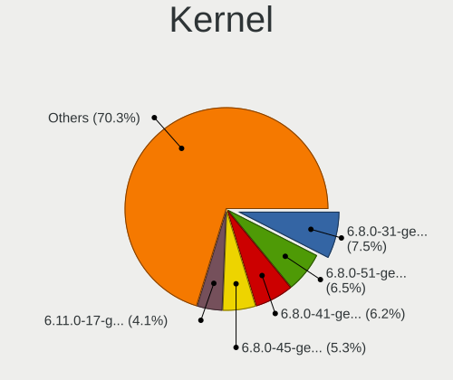

| Version           | Computers | Percent |
|-------------------|-----------|---------|
| 6.8.0-31-generic  | 808       | 7.53%   |
| 6.8.0-51-generic  | 702       | 6.54%   |
| 6.8.0-41-generic  | 671       | 6.25%   |
| 6.8.0-45-generic  | 572       | 5.33%   |
| 6.11.0-17-generic | 439       | 4.09%   |
| 6.11.0-26-generic | 397       | 3.7%    |
| 6.8.0-49-generic  | 385       | 3.59%   |
| 6.8.0-48-generic  | 349       | 3.25%   |
| 6.8.0-35-generic  | 318       | 2.96%   |
| 6.14.0-27-generic | 308       | 2.87%   |
| 6.8.0-52-generic  | 294       | 2.74%   |
| 6.14.0-33-generic | 284       | 2.65%   |
| 6.11.0-21-generic | 281       | 2.62%   |
| 6.11.0-19-generic | 277       | 2.58%   |
| 6.8.0-47-generic  | 269       | 2.51%   |
| 6.14.0-29-generic | 256       | 2.38%   |
| 6.14.0-37-generic | 222       | 2.07%   |
| 6.8.0-40-generic  | 205       | 1.91%   |
| 6.8.0-36-generic  | 205       | 1.91%   |
| 6.8.0-38-generic  | 202       | 1.88%   |
| 6.11.0-25-generic | 195       | 1.82%   |
| 6.14.0-36-generic | 193       | 1.8%    |
| 6.8.0-39-generic  | 190       | 1.77%   |
| 6.11.0-24-generic | 179       | 1.67%   |
| 6.8.0-44-generic  | 157       | 1.46%   |
| 6.11.0-29-generic | 154       | 1.43%   |
| 6.14.0-35-generic | 146       | 1.36%   |
| 6.14.0-24-generic | 132       | 1.23%   |
| 6.8.0-60-generic  | 108       | 1.01%   |
| 6.8.0-50-generic  | 102       | 0.95%   |
| 6.14.0-28-generic | 80        | 0.75%   |
| 6.14.0-32-generic | 77        | 0.72%   |
| 6.8.0-71-generic  | 73        | 0.68%   |
| 6.8.0-55-generic  | 69        | 0.64%   |
| 6.8.0-57-generic  | 61        | 0.57%   |
| 6.8.0-87-generic  | 60        | 0.56%   |
| 6.8.0-79-generic  | 59        | 0.55%   |
| 6.8.0-58-generic  | 59        | 0.55%   |
| 6.14.0-34-generic | 55        | 0.51%   |
| 6.8.0-88-generic  | 52        | 0.48%   |

Kernel Family
-------------

Linux kernel without a distro release

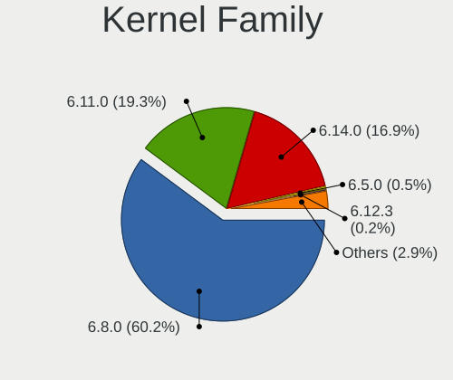

| Version | Computers | Percent |
|---------|-----------|---------|
| 6.8.0   | 5972      | 60.18%  |
| 6.11.0  | 1914      | 19.29%  |
| 6.14.0  | 1677      | 16.9%   |
| 6.5.0   | 51        | 0.51%   |
| 6.12.3  | 21        | 0.21%   |
| 5.15.0  | 17        | 0.17%   |
| 6.6.0   | 16        | 0.16%   |
| 6.1.0   | 16        | 0.16%   |
| 6.9.3   | 13        | 0.13%   |
| 6.8.1   | 11        | 0.11%   |
| 5.14.0  | 9         | 0.09%   |
| 6.2.0   | 8         | 0.08%   |
| 6.10.5  | 7         | 0.07%   |
| 6.6.63  | 6         | 0.06%   |
| 6.16.0  | 6         | 0.06%   |
| 6.13.0  | 6         | 0.06%   |
| 6.9.0   | 5         | 0.05%   |
| 6.13.6  | 5         | 0.05%   |
| 6.10.10 | 5         | 0.05%   |
| 6.10.0  | 5         | 0.05%   |
| 6.8.12  | 4         | 0.04%   |
| 6.17.0  | 4         | 0.04%   |
| 6.10.6  | 4         | 0.04%   |
| 6.10.2  | 4         | 0.04%   |
| 6.9.9   | 3         | 0.03%   |
| 6.9.12  | 3         | 0.03%   |
| 6.8.9   | 3         | 0.03%   |
| 6.8.7   | 3         | 0.03%   |
| 6.6.62  | 3         | 0.03%   |
| 6.17.8  | 3         | 0.03%   |
| 6.17.1  | 3         | 0.03%   |
| 6.15.1  | 3         | 0.03%   |
| 6.12.0  | 3         | 0.03%   |
| 6.10.3  | 3         | 0.03%   |
| 6.1.75  | 3         | 0.03%   |
| 6.9.8   | 2         | 0.02%   |
| 6.9.2   | 2         | 0.02%   |
| 6.8.4   | 2         | 0.02%   |
| 6.6.56  | 2         | 0.02%   |
| 6.6.44  | 2         | 0.02%   |

Kernel Major Ver.
-----------------

Linux kernel major version

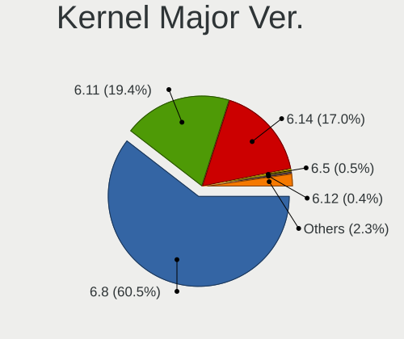

| Version | Computers | Percent |
|---------|-----------|---------|
| 6.8     | 5992      | 60.49%  |
| 6.11    | 1922      | 19.4%   |
| 6.14    | 1681      | 16.97%  |
| 6.5     | 52        | 0.52%   |
| 6.12    | 35        | 0.35%   |
| 6.6     | 34        | 0.34%   |
| 6.10    | 33        | 0.33%   |
| 6.9     | 32        | 0.32%   |
| 6.1     | 28        | 0.28%   |
| 6.13    | 17        | 0.17%   |
| 5.15    | 17        | 0.17%   |
| 6.17    | 13        | 0.13%   |
| 6.16    | 12        | 0.12%   |
| 6.2     | 9         | 0.09%   |
| 5.14    | 9         | 0.09%   |
| 6.15    | 8         | 0.08%   |
| 6.7     | 2         | 0.02%   |
| 5.10    | 2         | 0.02%   |
| 6.18    | 1         | 0.01%   |
| 5.4     | 1         | 0.01%   |
| 5.19    | 1         | 0.01%   |
| 5.17    | 1         | 0.01%   |
| 5.13    | 1         | 0.01%   |
| 4.9     | 1         | 0.01%   |
| 4.20    | 1         | 0.01%   |
| 4.15    | 1         | 0.01%   |

Arch
----

OS architecture (x86_64, i586, etc.)

| Name    | Computers | Percent |
|---------|-----------|---------|
| x86_64  | 9535      | 99.28%  |
| aarch64 | 56        | 0.58%   |
| riscv64 | 10        | 0.1%    |
| armv7l  | 3         | 0.03%   |

DE
--

Desktop Environment

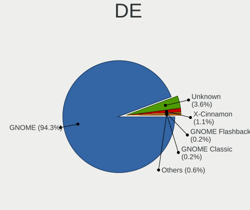

| Name                     | Computers | Percent |
|--------------------------|-----------|---------|
| GNOME                    | 9078      | 94.28%  |
| Unknown                  | 351       | 3.65%   |
| X-Cinnamon               | 106       | 1.1%    |
| GNOME Flashback          | 22        | 0.23%   |
| GNOME Classic            | 19        | 0.2%    |
| i3                       | 14        | 0.15%   |
| Hyprland                 | 9         | 0.09%   |
| sway                     | 8         | 0.08%   |
| Cinnamon                 | 7         | 0.07%   |
| ubuntu                   | 3         | 0.03%   |
| qtile                    | 2         | 0.02%   |
| kubuntu-live-environment | 2         | 0.02%   |
| xmonad                   | 1         | 0.01%   |
| river                    | 1         | 0.01%   |
| openbox                  | 1         | 0.01%   |
| niri                     | 1         | 0.01%   |
| Lomiri                   | 1         | 0.01%   |
| jwm                      | 1         | 0.01%   |
| Hyprland:start-hyprland  | 1         | 0.01%   |
| fluxbox                  | 1         | 0.01%   |

Display Server
--------------

X11 or Wayland

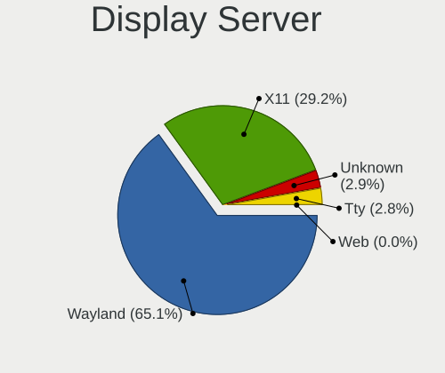

| Name    | Computers | Percent |
|---------|-----------|---------|
| Wayland | 6349      | 65.06%  |
| X11     | 2851      | 29.21%  |
| Unknown | 286       | 2.93%   |
| Tty     | 270       | 2.77%   |
| Web     | 3         | 0.03%   |

Display Manager
---------------

SDDM, LightDM, etc.

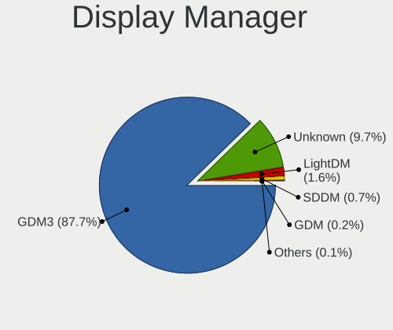

| Name    | Computers | Percent |
|---------|-----------|---------|
| GDM3    | 8474      | 87.73%  |
| Unknown | 933       | 9.66%   |
| LightDM | 156       | 1.62%   |
| SDDM    | 70        | 0.72%   |
| GDM     | 21        | 0.22%   |
| SLiM    | 3         | 0.03%   |
| LXDM    | 2         | 0.02%   |

OS Lang
-------

Language

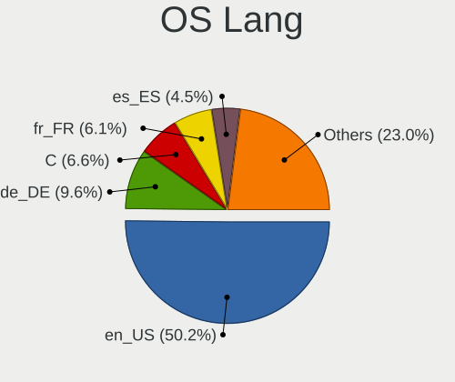

| Lang    | Computers | Percent |
|---------|-----------|---------|
| en_US   | 4846      | 50.17%  |
| de_DE   | 929       | 9.62%   |
| C       | 635       | 6.57%   |
| fr_FR   | 592       | 6.13%   |
| es_ES   | 435       | 4.5%    |
| pt_BR   | 348       | 3.6%    |
| ru_RU   | 296       | 3.06%   |
| it_IT   | 230       | 2.38%   |
| en_GB   | 229       | 2.37%   |
| pl_PL   | 113       | 1.17%   |
| zh_CN   | 109       | 1.13%   |
| nl_NL   | 96        | 0.99%   |
| hu_HU   | 70        | 0.72%   |
| en_CA   | 68        | 0.7%    |
| Unknown | 53        | 0.55%   |
| tr_TR   | 51        | 0.53%   |
| cs_CZ   | 51        | 0.53%   |
| en_AU   | 49        | 0.51%   |
| fi_FI   | 44        | 0.46%   |
| sv_SE   | 40        | 0.41%   |
| pt_PT   | 34        | 0.35%   |
| ja_JP   | 25        | 0.26%   |
| en_IN   | 24        | 0.25%   |
| da_DK   | 20        | 0.21%   |
| nb_NO   | 18        | 0.19%   |
| sk_SK   | 14        | 0.14%   |
| ca_ES   | 14        | 0.14%   |
| ko_KR   | 13        | 0.13%   |
| de_AT   | 13        | 0.13%   |
| es_AR   | 12        | 0.12%   |
| el_GR   | 12        | 0.12%   |
| fr_CA   | 11        | 0.11%   |
| zh_TW   | 10        | 0.1%    |
| uk_UA   | 10        | 0.1%    |
| es_MX   | 10        | 0.1%    |
| en_ZA   | 8         | 0.08%   |
| en_NZ   | 8         | 0.08%   |
| de_CH   | 8         | 0.08%   |
| bg_BG   | 8         | 0.08%   |
| ro_RO   | 7         | 0.07%   |

Boot Mode
---------

EFI or BIOS

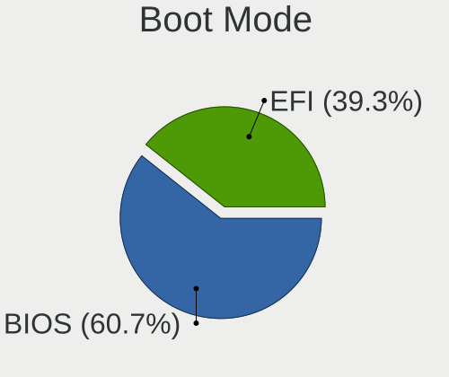

| Mode | Computers | Percent |
|------|-----------|---------|
| BIOS | 5879      | 60.67%  |
| EFI  | 3811      | 39.33%  |

Filesystem
----------

Type of filesystem

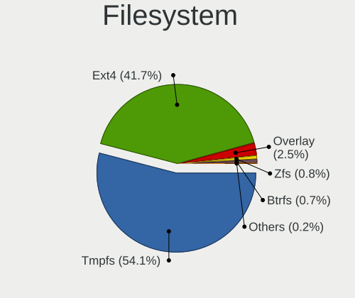

| Type    | Computers | Percent |
|---------|-----------|---------|
| Tmpfs   | 5229      | 54.05%  |
| Ext4    | 4031      | 41.67%  |
| Overlay | 246       | 2.54%   |
| Zfs     | 75        | 0.78%   |
| Btrfs   | 70        | 0.72%   |
| Xfs     | 16        | 0.17%   |
| Ext3    | 3         | 0.03%   |
| F2fs    | 2         | 0.02%   |
| XXX4    | 1         | 0.01%   |
| Ext2    | 1         | 0.01%   |

Part. scheme
------------

Scheme of partitioning

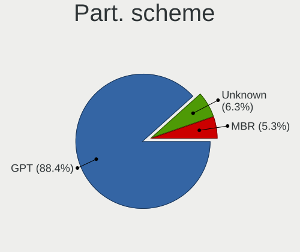

| Type    | Computers | Percent |
|---------|-----------|---------|
| GPT     | 8531      | 88.38%  |
| Unknown | 610       | 6.32%   |
| MBR     | 512       | 5.3%    |

Dual Boot with Linux/BSD
------------------------

Hosting more than one Linux/BSD

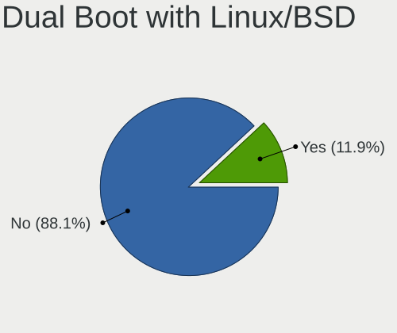

| Dual boot | Computers | Percent |
|-----------|-----------|---------|
| No        | 8539      | 88.06%  |
| Yes       | 1158      | 11.94%  |

Dual Boot (Win)
---------------

Hosting Linux and Windows

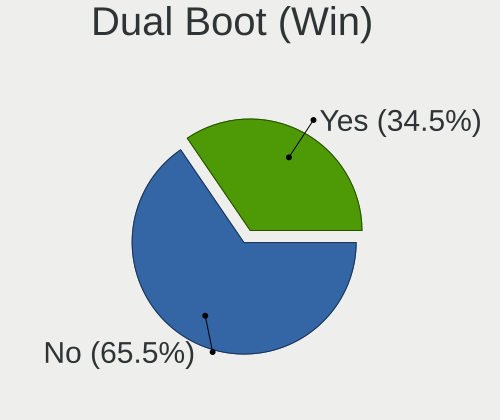

| Dual boot | Computers | Percent |
|-----------|-----------|---------|
| No        | 6346      | 65.47%  |
| Yes       | 3347      | 34.53%  |

Board
-----

Vendor
------

Motherboard manufacturer

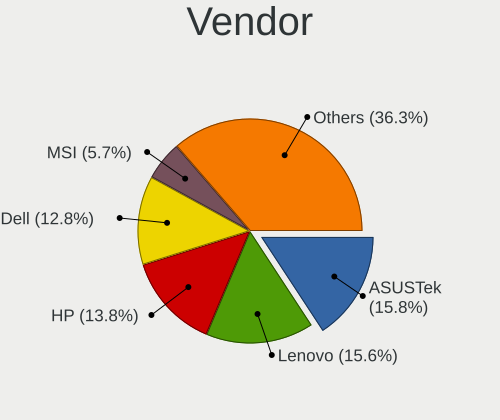

| Name                                 | Computers | Percent |
|--------------------------------------|-----------|---------|
| ASUSTek Computer                     | 1514      | 15.76%  |
| Lenovo                               | 1497      | 15.59%  |
| Hewlett-Packard                      | 1325      | 13.8%   |
| Dell                                 | 1232      | 12.83%  |
| MSI                                  | 545       | 5.67%   |
| Gigabyte Technology                  | 537       | 5.59%   |
| Acer                                 | 505       | 5.26%   |
| Apple                                | 351       | 3.65%   |
| ASRock                               | 253       | 2.63%   |
| Unknown                              | 155       | 1.61%   |
| Intel                                | 137       | 1.43%   |
| HUAWEI                               | 97        | 1.01%   |
| Samsung Electronics                  | 93        | 0.97%   |
| Toshiba                              | 80        | 0.83%   |
| Microsoft                            | 71        | 0.74%   |
| Fujitsu                              | 64        | 0.67%   |
| Medion                               | 58        | 0.6%    |
| AZW                                  | 54        | 0.56%   |
| Google                               | 49        | 0.51%   |
| Supermicro                           | 48        | 0.5%    |
| Shenzhen Meigao Electronic Equipment | 46        | 0.48%   |
| Alienware                            | 43        | 0.45%   |
| Sony                                 | 42        | 0.44%   |
| Pegatron                             | 22        | 0.23%   |
| Notebook                             | 22        | 0.23%   |
| HONOR                                | 21        | 0.22%   |
| Biostar                              | 20        | 0.21%   |
| Timi                                 | 19        | 0.2%    |
| Packard Bell                         | 19        | 0.2%    |
| Framework                            | 19        | 0.2%    |
| TUXEDO                               | 16        | 0.17%   |
| Chuwi                                | 16        | 0.17%   |
| XIAOMI                               | 15        | 0.16%   |
| Raspberry Pi Foundation              | 15        | 0.16%   |
| Positivo                             | 15        | 0.16%   |
| Maibenben                            | 14        | 0.15%   |
| ASRockRack                           | 14        | 0.15%   |
| Schenker                             | 13        | 0.14%   |
| Panasonic                            | 13        | 0.14%   |
| MACHINIST                            | 13        | 0.14%   |

Model
-----

Motherboard model

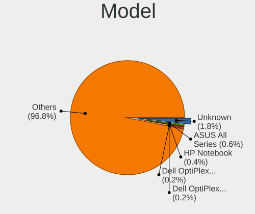

| Name                                              | Computers | Percent |
|---------------------------------------------------|-----------|---------|
| Unknown                                           | 171       | 1.78%   |
| ASUS All Series                                   | 58        | 0.6%    |
| HP Notebook                                       | 37        | 0.39%   |
| Dell OptiPlex 7040                                | 20        | 0.21%   |
| Dell OptiPlex 7010                                | 20        | 0.21%   |
| ASUS VivoBook_ASUSLaptop X1605VA_X1605VA          | 19        | 0.2%    |
| Apple MacBookPro9,2                               | 19        | 0.2%    |
| Apple MacBookPro12,1                              | 19        | 0.2%    |
| MSI MS-7C56                                       | 18        | 0.19%   |
| MSI MS-7C37                                       | 18        | 0.19%   |
| AZW SER                                           | 18        | 0.19%   |
| Apple MacBookPro14,1                              | 18        | 0.19%   |
| Supermicro Super Server                           | 17        | 0.18%   |
| HP Pavilion Notebook                              | 17        | 0.18%   |
| MSI MS-7C91                                       | 16        | 0.17%   |
| AZW MINI S                                        | 15        | 0.16%   |
| Apple iMac12,1                                    | 15        | 0.16%   |
| Acer Aspire A515-57                               | 15        | 0.16%   |
| Dell OptiPlex 3020                                | 14        | 0.15%   |
| Apple MacBookAir7,2                               | 14        | 0.15%   |
| Acer Aspire A315-24P                              | 14        | 0.15%   |
| Shenzhen Meigao Electronic Equipment Venus series | 13        | 0.14%   |
| MSI MS-7E26                                       | 13        | 0.14%   |
| HP EliteBook 840 G6                               | 13        | 0.14%   |
| Dell Latitude E6430                               | 13        | 0.14%   |
| Dell Latitude E6420                               | 13        | 0.14%   |
| ASUS Vivobook Go E1504FA_E1504FA                  | 13        | 0.14%   |
| Microsoft Surface Pro                             | 12        | 0.12%   |
| HP Pavilion dv7                                   | 12        | 0.12%   |
| Dell OptiPlex 9020                                | 12        | 0.12%   |
| Dell Latitude 7490                                | 12        | 0.12%   |
| Dell Latitude 5420                                | 12        | 0.12%   |
| Dell Inspiron 15-3567                             | 12        | 0.12%   |
| Acer Aspire A315-59                               | 12        | 0.12%   |
| Dell XPS 9315                                     | 11        | 0.11%   |
| Dell OptiPlex 3050                                | 11        | 0.11%   |
| Dell G15 5530                                     | 11        | 0.11%   |
| ASUS PRIME B450M-A                                | 11        | 0.11%   |
| Apple iMac14,2                                    | 11        | 0.11%   |
| Apple iMac12,2                                    | 11        | 0.11%   |

Model Family
------------

Motherboard model prefix

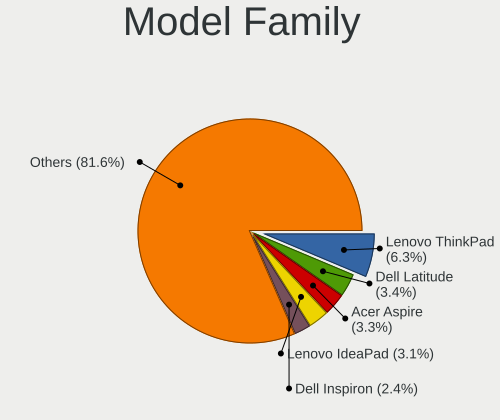

| Name               | Computers | Percent |
|--------------------|-----------|---------|
| Lenovo ThinkPad    | 608       | 6.33%   |
| Dell Latitude      | 326       | 3.39%   |
| Acer Aspire        | 313       | 3.26%   |
| Lenovo IdeaPad     | 293       | 3.05%   |
| Dell Inspiron      | 231       | 2.41%   |
| ASUS VivoBook      | 225       | 2.34%   |
| ASUS ROG           | 206       | 2.14%   |
| HP EliteBook       | 204       | 2.12%   |
| Dell OptiPlex      | 195       | 2.03%   |
| ASUS PRIME         | 185       | 1.93%   |
| HP Pavilion        | 176       | 1.83%   |
| Unknown            | 171       | 1.78%   |
| Dell Precision     | 160       | 1.67%   |
| HP Laptop          | 149       | 1.55%   |
| Dell XPS           | 149       | 1.55%   |
| ASUS ASUS          | 127       | 1.32%   |
| HP ProBook         | 120       | 1.25%   |
| ASUS TUF           | 105       | 1.09%   |
| Lenovo ThinkCentre | 102       | 1.06%   |
| Lenovo Yoga        | 79        | 0.82%   |
| Microsoft Surface  | 71        | 0.74%   |
| Lenovo Legion      | 68        | 0.71%   |
| HP ENVY            | 68        | 0.71%   |
| Toshiba Satellite  | 67        | 0.7%    |
| HP Compaq          | 61        | 0.64%   |
| Dell Vostro        | 61        | 0.64%   |
| Acer Nitro         | 61        | 0.64%   |
| ASUS All           | 58        | 0.6%    |
| Lenovo ThinkBook   | 56        | 0.58%   |
| HP ZBook           | 49        | 0.51%   |
| ASUS ZenBook       | 49        | 0.51%   |
| Acer Swift         | 48        | 0.5%    |
| HP EliteDesk       | 47        | 0.49%   |
| HP ProDesk         | 43        | 0.45%   |
| HP Notebook        | 37        | 0.39%   |
| HP Victus          | 36        | 0.37%   |
| HP OMEN            | 33        | 0.34%   |
| Apple MacBookPro11 | 31        | 0.32%   |
| Lenovo IdeaPadFlex | 29        | 0.3%    |
| Gigabyte Z790      | 26        | 0.27%   |

MFG Year
--------

Motherboard manufacture year

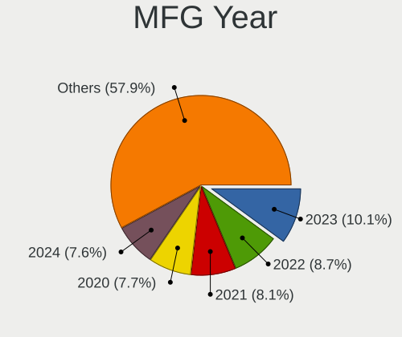

| Year    | Computers | Percent |
|---------|-----------|---------|
| 2023    | 967       | 10.07%  |
| 2022    | 832       | 8.66%   |
| 2021    | 777       | 8.09%   |
| 2020    | 740       | 7.71%   |
| 2024    | 731       | 7.61%   |
| 2019    | 685       | 7.13%   |
| 2018    | 635       | 6.61%   |
| 2012    | 597       | 6.22%   |
| 2013    | 556       | 5.79%   |
| 2017    | 527       | 5.49%   |
| 2014    | 468       | 4.87%   |
| 2015    | 427       | 4.45%   |
| 2011    | 422       | 4.39%   |
| 2016    | 390       | 4.06%   |
| 2010    | 233       | 2.43%   |
| 2025    | 193       | 2.01%   |
| 2009    | 164       | 1.71%   |
| 2008    | 126       | 1.31%   |
| Unknown | 62        | 0.65%   |
| 2007    | 46        | 0.48%   |
| 2006    | 25        | 0.26%   |
| 2005    | 1         | 0.01%   |

Form Factor
-----------

Physical design of the computer

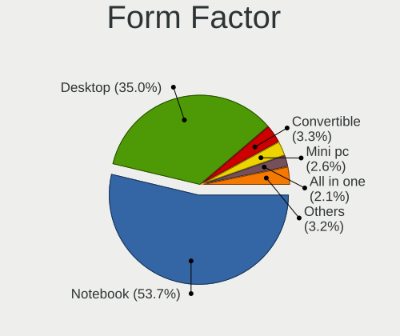

| Name           | Computers | Percent |
|----------------|-----------|---------|
| Notebook       | 5159      | 53.72%  |
| Desktop        | 3364      | 35.03%  |
| Convertible    | 317       | 3.3%    |
| Mini pc        | 251       | 2.61%   |
| All in one     | 202       | 2.1%    |
| Tablet         | 123       | 1.28%   |
| Server         | 116       | 1.21%   |
| System on chip | 62        | 0.65%   |
| Other          | 8         | 0.08%   |
| Stick pc       | 1         | 0.01%   |
| Firewall       | 1         | 0.01%   |

Secure Boot
-----------

Enabled or disabled

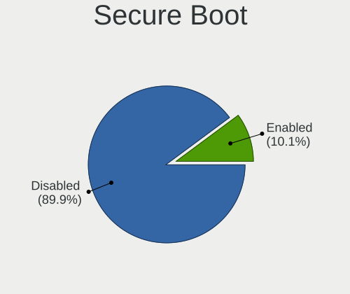

| State    | Computers | Percent |
|----------|-----------|---------|
| Disabled | 8677      | 89.85%  |
| Enabled  | 980       | 10.15%  |

Coreboot
--------

Have coreboot on board

| Used | Computers | Percent |
|------|-----------|---------|
| No   | 9542      | 99.35%  |
| Yes  | 62        | 0.65%   |

RAM Size
--------

Total RAM memory

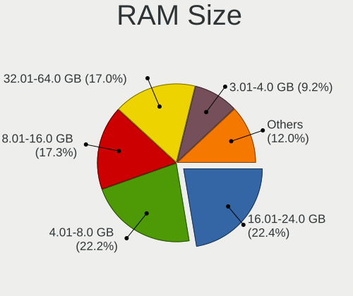

| Size in GB      | Computers | Percent |
|-----------------|-----------|---------|
| 16.01-24.0      | 2161      | 22.37%  |
| 4.01-8.0        | 2145      | 22.2%   |
| 8.01-16.0       | 1668      | 17.27%  |
| 32.01-64.0      | 1641      | 16.99%  |
| 3.01-4.0        | 888       | 9.19%   |
| 64.01-256.0     | 628       | 6.5%    |
| 24.01-32.0      | 393       | 4.07%   |
| More than 256.0 | 44        | 0.46%   |
| 2.01-3.0        | 44        | 0.46%   |
| 1.01-2.0        | 44        | 0.46%   |
| 0.51-1.0        | 2         | 0.02%   |
| 0.01-0.5        | 2         | 0.02%   |

RAM Used
--------

Used RAM memory

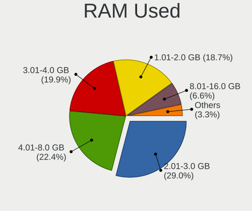

| Used GB     | Computers | Percent |
|-------------|-----------|---------|
| 2.01-3.0    | 2988      | 29.03%  |
| 4.01-8.0    | 2311      | 22.45%  |
| 3.01-4.0    | 2050      | 19.91%  |
| 1.01-2.0    | 1925      | 18.7%   |
| 8.01-16.0   | 677       | 6.58%   |
| 16.01-24.0  | 120       | 1.17%   |
| 0.51-1.0    | 105       | 1.02%   |
| 24.01-32.0  | 47        | 0.46%   |
| 0.01-0.5    | 37        | 0.36%   |
| 32.01-64.0  | 24        | 0.23%   |
| 64.01-256.0 | 10        | 0.1%    |

Total Drives
------------

Number of drives on board

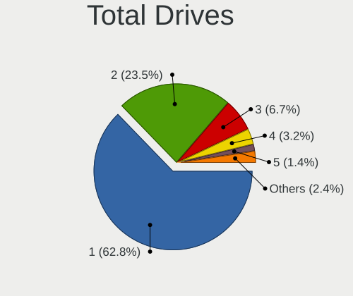

| Drives | Computers | Percent |
|--------|-----------|---------|
| 1      | 6132      | 62.78%  |
| 2      | 2298      | 23.53%  |
| 3      | 650       | 6.65%   |
| 4      | 317       | 3.25%   |
| 5      | 136       | 1.39%   |
| 0      | 89        | 0.91%   |
| 6      | 60        | 0.61%   |
| 7      | 30        | 0.31%   |
| 8      | 24        | 0.25%   |
| 9      | 12        | 0.12%   |
| 10     | 6         | 0.06%   |
| 16     | 3         | 0.03%   |
| 14     | 3         | 0.03%   |
| 12     | 3         | 0.03%   |
| 71     | 1         | 0.01%   |
| 34     | 1         | 0.01%   |
| 31     | 1         | 0.01%   |
| 18     | 1         | 0.01%   |
| 11     | 1         | 0.01%   |

Has CD-ROM
----------

Has CD-ROM on board

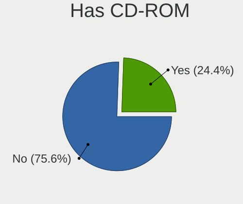

| Presented | Computers | Percent |
|-----------|-----------|---------|
| No        | 7276      | 75.56%  |
| Yes       | 2353      | 24.44%  |

Has Ethernet
------------

Has Ethernet on board

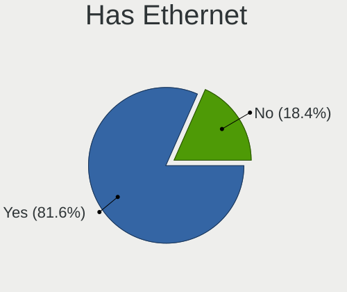

| Presented | Computers | Percent |
|-----------|-----------|---------|
| Yes       | 7861      | 81.64%  |
| No        | 1768      | 18.36%  |

Has WiFi
--------

Has WiFi module

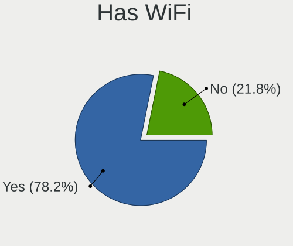

| Presented | Computers | Percent |
|-----------|-----------|---------|
| Yes       | 7531      | 78.16%  |
| No        | 2104      | 21.84%  |

Has Bluetooth
-------------

Has Bluetooth module

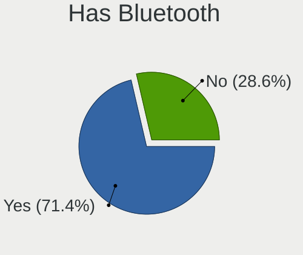

| Presented | Computers | Percent |
|-----------|-----------|---------|
| Yes       | 6901      | 71.36%  |
| No        | 2770      | 28.64%  |

Location
--------

Country
-------

Geographic location (country)

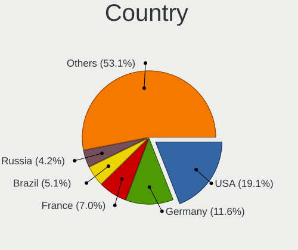

| Country      | Computers | Percent |
|--------------|-----------|---------|
| USA          | 1839      | 19.06%  |
| Germany      | 1122      | 11.63%  |
| France       | 672       | 6.97%   |
| Brazil       | 489       | 5.07%   |
| Russia       | 406       | 4.21%   |
| UK           | 368       | 3.81%   |
| Italy        | 344       | 3.57%   |
| Canada       | 296       | 3.07%   |
| India        | 295       | 3.06%   |
| Spain        | 280       | 2.9%    |
| Poland       | 209       | 2.17%   |
| Australia    | 193       | 2%      |
| Netherlands  | 192       | 1.99%   |
| China        | 136       | 1.41%   |
| Mexico       | 129       | 1.34%   |
| Sweden       | 118       | 1.22%   |
| Turkey       | 117       | 1.21%   |
| Switzerland  | 113       | 1.17%   |
| Hungary      | 105       | 1.09%   |
| Belgium      | 100       | 1.04%   |
| Argentina    | 96        | 1%      |
| Czechia      | 94        | 0.97%   |
| Finland      | 92        | 0.95%   |
| Austria      | 92        | 0.95%   |
| Indonesia    | 77        | 0.8%    |
| South Africa | 75        | 0.78%   |
| Portugal     | 73        | 0.76%   |
| Norway       | 66        | 0.68%   |
| Romania      | 60        | 0.62%   |
| Iran         | 54        | 0.56%   |
| Chile        | 54        | 0.56%   |
| Denmark      | 53        | 0.55%   |
| Colombia     | 52        | 0.54%   |
| Greece       | 49        | 0.51%   |
| Thailand     | 48        | 0.5%    |
| Japan        | 42        | 0.44%   |
| Slovakia     | 41        | 0.42%   |
| Israel       | 38        | 0.39%   |
| New Zealand  | 37        | 0.38%   |
| Bulgaria     | 37        | 0.38%   |

City
----

Geographic location (city)

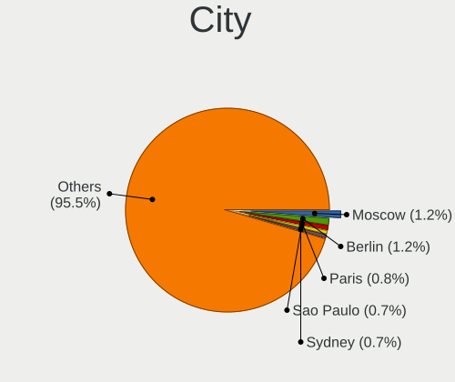

| City              | Computers | Percent |
|-------------------|-----------|---------|
| Moscow            | 121       | 1.21%   |
| Berlin            | 119       | 1.19%   |
| Paris             | 76        | 0.76%   |
| Sao Paulo         | 66        | 0.66%   |
| Sydney            | 65        | 0.65%   |
| Los Angeles       | 61        | 0.61%   |
| Milan             | 53        | 0.53%   |
| St Petersburg     | 51        | 0.51%   |
| Munich            | 51        | 0.51%   |
| Madrid            | 51        | 0.51%   |
| Melbourne         | 49        | 0.49%   |
| Istanbul          | 49        | 0.49%   |
| Helsinki          | 48        | 0.48%   |
| Amsterdam         | 47        | 0.47%   |
| Warsaw            | 46        | 0.46%   |
| Hamburg           | 46        | 0.46%   |
| Vienna            | 45        | 0.45%   |
| Bengaluru         | 43        | 0.43%   |
| Budapest          | 42        | 0.42%   |
| Frankfurt am Main | 39        | 0.39%   |
| Prague            | 38        | 0.38%   |
| Rome              | 37        | 0.37%   |
| Delhi             | 36        | 0.36%   |
| Santiago          | 35        | 0.35%   |
| Seattle           | 34        | 0.34%   |
| Chicago           | 31        | 0.31%   |
| Rio de Janeiro    | 30        | 0.3%    |
| New York          | 30        | 0.3%    |
| Montreal          | 30        | 0.3%    |
| Brisbane          | 30        | 0.3%    |
| Athens            | 30        | 0.3%    |
| Tehran            | 28        | 0.28%   |
| Zurich            | 27        | 0.27%   |
| Toronto           | 27        | 0.27%   |
| Krakow            | 27        | 0.27%   |
| Barcelona         | 27        | 0.27%   |
| Cologne           | 26        | 0.26%   |
| Bucharest         | 25        | 0.25%   |
| Bogotá           | 25        | 0.25%   |
| Beijing           | 25        | 0.25%   |

Drives
------

Drive Vendor
------------

Hard drive vendors

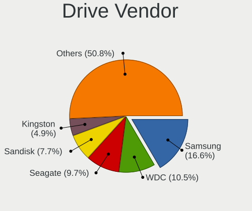

| Vendor                       | Computers | Drives | Percent |
|------------------------------|-----------|--------|---------|
| Samsung Electronics          | 2252      | 3161   | 16.58%  |
| WDC                          | 1421      | 2051   | 10.46%  |
| Seagate                      | 1312      | 1961   | 9.66%   |
| Sandisk                      | 1040      | 1279   | 7.66%   |
| Kingston                     | 664       | 858    | 4.89%   |
| Toshiba                      | 578       | 727    | 4.26%   |
| Micron Technology            | 518       | 619    | 3.81%   |
| Crucial                      | 516       | 641    | 3.8%    |
| SK hynix                     | 494       | 563    | 3.64%   |
| Unknown                      | 432       | 571    | 3.18%   |
| Intel                        | 318       | 403    | 2.34%   |
| KIOXIA                       | 243       | 287    | 1.79%   |
| Hitachi                      | 209       | 264    | 1.54%   |
| Apple                        | 189       | 250    | 1.39%   |
| Kingston Technology Company  | 176       | 202    | 1.3%    |
| HGST                         | 176       | 246    | 1.3%    |
| China                        | 162       | 190    | 1.19%   |
| A-DATA Technology            | 158       | 197    | 1.16%   |
| Micron/Crucial Technology    | 139       | 180    | 1.02%   |
| Phison Electronics           | 134       | 177    | 0.99%   |
| MAXIO Technology (Hangzhou)  | 121       | 139    | 0.89%   |
| Silicon Motion               | 97        | 119    | 0.71%   |
| Intenso                      | 94        | 136    | 0.69%   |
| PNY                          | 90        | 112    | 0.66%   |
| Unknown                      | 89        | 109    | 0.66%   |
| SPCC                         | 85        | 96     | 0.63%   |
| ADATA Technology             | 67        | 77     | 0.49%   |
| Phison                       | 61        | 74     | 0.45%   |
| Lexar                        | 58        | 62     | 0.43%   |
| Team                         | 55        | 73     | 0.4%    |
| Transcend                    | 49        | 65     | 0.36%   |
| Shenzhen Longsys Electronics | 48        | 57     | 0.35%   |
| LITEON                       | 48        | 54     | 0.35%   |
| KingSpec                     | 47        | 54     | 0.35%   |
| JMicron Technology           | 46        | 50     | 0.34%   |
| Realtek Semiconductor        | 44        | 49     | 0.32%   |
| Patriot                      | 40        | 42     | 0.29%   |
| Netac                        | 37        | 44     | 0.27%   |
| OCZ                          | 32        | 38     | 0.24%   |
| Fanxiang                     | 30        | 50     | 0.22%   |

Drive Model
-----------

Hard drive models

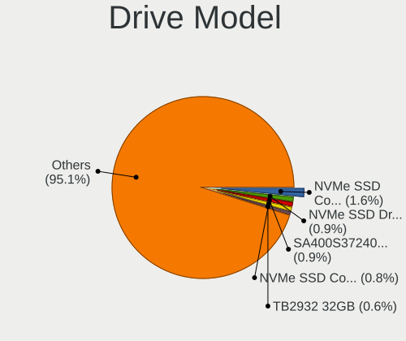

| Model                                                 | Computers | Percent |
|-------------------------------------------------------|-----------|---------|
| Samsung NVMe SSD Controller SM981/PM981/PM983 1TB     | 236       | 1.6%    |
| SanDisk NVMe SSD Drive 1TB                            | 139       | 0.95%   |
| Kingston SA400S37240G 240GB SSD                       | 127       | 0.86%   |
| Samsung NVMe SSD Controller PM9A1/PM9A3/980PRO 1TB    | 124       | 0.84%   |
| Unknown                                               | 89        | 0.61%   |
| Kingston SA400S37480G 480GB SSD                       | 84        | 0.57%   |
| Unknown MMC Card  64GB                                | 78        | 0.53%   |
| MAXIO (Hangzhou) NVMe SSD Controller MAP1202 2TB      | 76        | 0.52%   |
| Toshiba MQ01ABD100 1TB                                | 71        | 0.48%   |
| Samsung SSD 990 PRO 2TB                               | 71        | 0.48%   |
| Samsung SSD 850 EVO 250GB                             | 69        | 0.47%   |
| Crucial CT1000MX500SSD1 1TB                           | 68        | 0.46%   |
| Seagate ST1000LM035-1RK172 1TB                        | 67        | 0.46%   |
| Seagate ST1000DM010-2EP102 1TB                        | 63        | 0.43%   |
| Samsung NVMe SSD Controller SM961/PM961/SM963 1024GB  | 63        | 0.43%   |
| Crucial CT500MX500SSD1 500GB                          | 61        | 0.41%   |
| Seagate ST500DM002-1BD142 500GB                       | 60        | 0.41%   |
| Samsung SSD 860 EVO 500GB                             | 60        | 0.41%   |
| Sandisk WD Blue SN550 NVMe SSD 1024GB                 | 58        | 0.39%   |
| SanDisk NVMe SSD Drive 512GB                          | 58        | 0.39%   |
| Micron/Crucial P2 NVMe PCIe SSD 2TB                   | 58        | 0.39%   |
| Samsung SSD 980 1TB                                   | 57        | 0.39%   |
| Unknown SD/MMC/MS PRO 2GB                             | 56        | 0.38%   |
| Seagate ST1000LM024 HN-M101MBB 1TB                    | 54        | 0.37%   |
| Samsung SSD 850 EVO 500GB                             | 53        | 0.36%   |
| Kingston SA400S37120G 120GB SSD                       | 52        | 0.35%   |
| Silicon Motion SM2263EN/SM2263XT SSD Controller 512GB | 51        | 0.35%   |
| Micron 2400_MTFDKBA512QFM 512GB                       | 50        | 0.34%   |
| Kingston Company SNV2S1000G 1TB                       | 48        | 0.33%   |
| Unknown MMC Card  32GB                                | 47        | 0.32%   |
| Unknown MMC Card  128GB                               | 47        | 0.32%   |
| Samsung SSD 860 EVO 1TB                               | 47        | 0.32%   |
| SanDisk NVMe SSD Drive 2TB                            | 46        | 0.31%   |
| Micron 2450_MTFDKBA512TFK 512GB                       | 46        | 0.31%   |
| Crucial CT240BX500SSD1 240GB                          | 46        | 0.31%   |
| Toshiba DT01ACA100 1TB                                | 45        | 0.31%   |
| Seagate ST2000DM008-2FR102 2TB                        | 45        | 0.31%   |
| Samsung SSD 870 EVO 1TB                               | 45        | 0.31%   |
| Sandisk WD Black SN750 / PC SN730 NVMe SSD 500GB      | 43        | 0.29%   |
| Crucial CT1000BX500SSD1 1TB                           | 41        | 0.28%   |

HDD Vendor
----------

Hard disk drive vendors

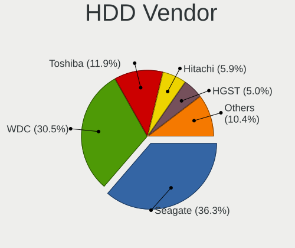

| Vendor              | Computers | Drives | Percent |
|---------------------|-----------|--------|---------|
| Seagate             | 1280      | 1895   | 36.32%  |
| WDC                 | 1075      | 1605   | 30.51%  |
| Toshiba             | 420       | 540    | 11.92%  |
| Hitachi             | 209       | 264    | 5.93%   |
| HGST                | 175       | 245    | 4.97%   |
| Samsung Electronics | 93        | 126    | 2.64%   |
| Unknown             | 63        | 77     | 1.79%   |
| Apple               | 52        | 56     | 1.48%   |
| JMicron Technology  | 22        | 24     | 0.62%   |
| Maxtor              | 18        | 24     | 0.51%   |
| Fujitsu             | 14        | 15     | 0.4%    |
| Hewlett-Packard     | 12        | 54     | 0.34%   |
| Intenso             | 9         | 15     | 0.26%   |
| ASMT                | 8         | 16     | 0.23%   |
| USB3.0              | 7         | 7      | 0.2%    |
| External            | 7         | 8      | 0.2%    |
| TO Exter            | 5         | 5      | 0.14%   |
| SSK                 | 5         | 5      | 0.14%   |
| HPE                 | 4         | 7      | 0.11%   |
| T-FORCE             | 3         | 3      | 0.09%   |
| SAGE                | 3         | 2      | 0.09%   |
| JetFlash            | 3         | 3      | 0.09%   |
| ASMedia             | 3         | 3      | 0.09%   |
| USB 3.0             | 2         | 3      | 0.06%   |
| USB                 | 2         | 2      | 0.06%   |
| Shenzhen            | 2         | 2      | 0.06%   |
| SATAFIRM            | 2         | 2      | 0.06%   |
| SABRENT             | 2         | 3      | 0.06%   |
| Inateck             | 2         | 3      | 0.06%   |
| Unknown             | 2         | 3      | 0.06%   |
| Western             | 1         | 1      | 0.03%   |
| USB 3.1             | 1         | 1      | 0.03%   |
| ThinkSystem         | 1         | 1      | 0.03%   |
| Synology            | 1         | 6      | 0.03%   |
| StoreJet            | 1         | 1      | 0.03%   |
| QUANTUM             | 1         | 4      | 0.03%   |
| QEMU                | 1         | 1      | 0.03%   |
| PRO-T5              | 1         | 1      | 0.03%   |
| Min Yi U            | 1         | 1      | 0.03%   |
| LaCie               | 1         | 1      | 0.03%   |

SSD Vendor
----------

Solid state drive vendors

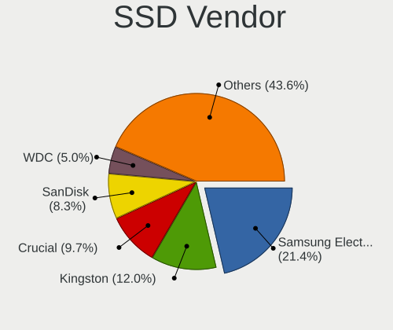

| Vendor              | Computers | Drives | Percent |
|---------------------|-----------|--------|---------|
| Samsung Electronics | 848       | 1144   | 21.36%  |
| Kingston            | 478       | 606    | 12.04%  |
| Crucial             | 386       | 478    | 9.72%   |
| SanDisk             | 330       | 397    | 8.31%   |
| WDC                 | 199       | 237    | 5.01%   |
| China               | 155       | 183    | 3.9%    |
| A-DATA Technology   | 116       | 142    | 2.92%   |
| Micron Technology   | 90        | 119    | 2.27%   |
| Apple               | 88        | 100    | 2.22%   |
| PNY                 | 83        | 103    | 2.09%   |
| Intel               | 79        | 96     | 1.99%   |
| Intenso             | 77        | 105    | 1.94%   |
| SPCC                | 71        | 80     | 1.79%   |
| SK hynix            | 71        | 90     | 1.79%   |
| Toshiba             | 50        | 60     | 1.26%   |
| LITEON              | 46        | 52     | 1.16%   |
| Transcend           | 43        | 56     | 1.08%   |
| KingSpec            | 40        | 46     | 1.01%   |
| Team                | 39        | 50     | 0.98%   |
| Patriot             | 33        | 35     | 0.83%   |
| OCZ                 | 32        | 38     | 0.81%   |
| Netac               | 25        | 30     | 0.63%   |
| Lexar               | 25        | 27     | 0.63%   |
| GOODRAM             | 25        | 34     | 0.63%   |
| LITEONIT            | 24        | 27     | 0.6%    |
| SABRENT             | 22        | 27     | 0.55%   |
| Corsair             | 21        | 26     | 0.53%   |
| Unknown             | 19        | 26     | 0.48%   |
| Verbatim            | 18        | 22     | 0.45%   |
| Apacer              | 17        | 19     | 0.43%   |
| Gigabyte Technology | 14        | 24     | 0.35%   |
| KIOXIA-EXCERIA      | 11        | 12     | 0.28%   |
| Fanxiang            | 11        | 24     | 0.28%   |
| Emtec               | 11        | 12     | 0.28%   |
| Hewlett-Packard     | 10        | 10     | 0.25%   |
| XrayDisk            | 9         | 12     | 0.23%   |
| Seagate             | 9         | 13     | 0.23%   |
| ASMT                | 9         | 9      | 0.23%   |
| T-FORCE             | 8         | 10     | 0.2%    |
| MSI                 | 8         | 8      | 0.2%    |

Drive Kind
----------

HDD or SSD

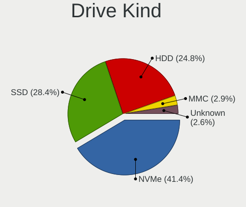

| Kind    | Computers | Drives | Percent |
|---------|-----------|--------|---------|
| NVMe    | 5094      | 6923   | 41.44%  |
| SSD     | 3489      | 4957   | 28.39%  |
| HDD     | 3043      | 5046   | 24.76%  |
| MMC     | 351       | 434    | 2.86%   |
| Unknown | 314       | 432    | 2.55%   |

Drive Connector
---------------

SATA, SAS, NVMe, etc.

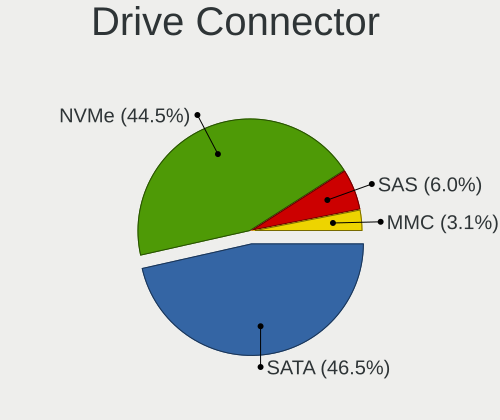

| Type | Computers | Drives | Percent |
|------|-----------|--------|---------|
| SATA | 5314      | 9456   | 46.48%  |
| NVMe | 5084      | 6835   | 44.47%  |
| SAS  | 684       | 1067   | 5.98%   |
| MMC  | 351       | 434    | 3.07%   |

Drive Size
----------

Size of hard drive

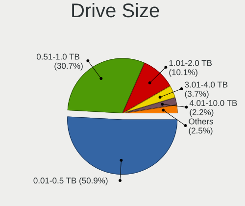

| Size in TB | Computers | Drives | Percent |
|------------|-----------|--------|---------|
| 0.01-0.5   | 3495      | 4959   | 50.86%  |
| 0.51-1.0   | 2110      | 2905   | 30.7%   |
| 1.01-2.0   | 697       | 1015   | 10.14%  |
| 3.01-4.0   | 252       | 464    | 3.67%   |
| 4.01-10.0  | 148       | 319    | 2.15%   |
| 2.01-3.0   | 100       | 156    | 1.46%   |
| 10.01-20.0 | 66        | 181    | 0.96%   |
| 20.01-50.0 | 4         | 4      | 0.06%   |

Space Total
-----------

Amount of disk space available on the file system

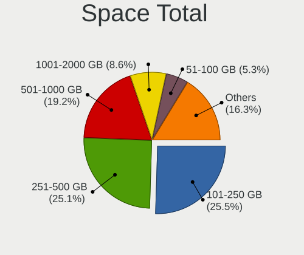

| Size in GB     | Computers | Percent |
|----------------|-----------|---------|
| 101-250        | 2518      | 25.48%  |
| 251-500        | 2484      | 25.13%  |
| 501-1000       | 1895      | 19.17%  |
| 1001-2000      | 849       | 8.59%   |
| 51-100         | 526       | 5.32%   |
| More than 3000 | 495       | 5.01%   |
| 1-20           | 495       | 5.01%   |
| 2001-3000      | 272       | 2.75%   |
| 21-50          | 265       | 2.68%   |
| Unknown        | 84        | 0.85%   |

Space Used
----------

Amount of used disk space

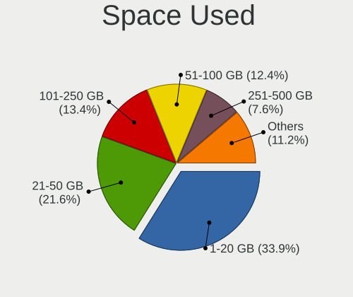

| Used GB        | Computers | Percent |
|----------------|-----------|---------|
| 1-20           | 3453      | 33.9%   |
| 21-50          | 2204      | 21.64%  |
| 101-250        | 1360      | 13.35%  |
| 51-100         | 1259      | 12.36%  |
| 251-500        | 770       | 7.56%   |
| 501-1000       | 506       | 4.97%   |
| 1001-2000      | 290       | 2.85%   |
| More than 3000 | 173       | 1.7%    |
| 2001-3000      | 87        | 0.85%   |
| Unknown        | 84        | 0.82%   |

Malfunc. Drives
---------------

Drive models with a malfunction

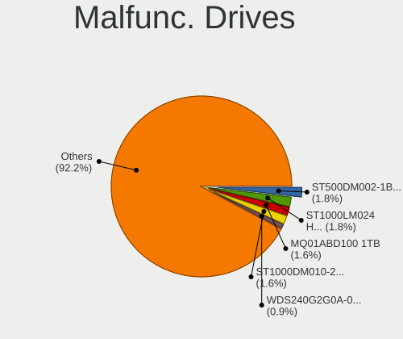

| Model                                 | Computers | Drives | Percent |
|---------------------------------------|-----------|--------|---------|
| Seagate ST500DM002-1BD142 500GB       | 8         | 8      | 1.83%   |
| Seagate ST1000LM024 HN-M101MBB 1TB    | 8         | 8      | 1.83%   |
| Toshiba MQ01ABD100 1TB                | 7         | 7      | 1.6%    |
| Seagate ST1000DM010-2EP102 1TB        | 7         | 7      | 1.6%    |
| WDC WDS240G2G0A-00JH30 240GB SSD      | 4         | 5      | 0.91%   |
| WDC WD10SPZX-24Z10 1TB                | 4         | 4      | 0.91%   |
| Seagate ST3500418AS 500GB             | 4         | 4      | 0.91%   |
| SK hynix BC711 HFM512GD3JX013N 512GB  | 3         | 3      | 0.68%   |
| Seagate ST9500325AS 500GB             | 3         | 3      | 0.68%   |
| Seagate ST9250315AS 250GB             | 3         | 3      | 0.68%   |
| Seagate ST500LT012-9WS142 500GB       | 3         | 3      | 0.68%   |
| Seagate ST31000528AS 1TB              | 3         | 3      | 0.68%   |
| Seagate ST1000LM035-1RK172 1TB        | 3         | 4      | 0.68%   |
| Samsung Electronics SSD 870 EVO 1TB   | 3         | 4      | 0.68%   |
| Samsung Electronics SSD 840 EVO 250GB | 3         | 3      | 0.68%   |
| Kingston SV300S37A120G 120GB SSD      | 3         | 3      | 0.68%   |
| Hitachi HTS545050A7E380 500GB         | 3         | 3      | 0.68%   |
| HGST HTS721010A9E630 1TB              | 3         | 3      | 0.68%   |
| HGST HTS545050A7E380 500GB            | 3         | 3      | 0.68%   |
| HGST HTS541010A9E680 1TB              | 3         | 3      | 0.68%   |
| WDC WD5000LPCX-00VHAT0 500GB          | 2         | 2      | 0.46%   |
| WDC WD5000AAKX-60U6AA0 500GB          | 2         | 2      | 0.46%   |
| WDC WD5000AAKX-22ERMA0 500GB          | 2         | 5      | 0.46%   |
| WDC WD5000AAKX-00ERMA0 500GB          | 2         | 3      | 0.46%   |
| WDC WD20EZRX-00DC0B0 2TB              | 2         | 2      | 0.46%   |
| WDC WD10JPVX-60JC3T1 1TB              | 2         | 2      | 0.46%   |
| WDC WD10EZEX-00BN5A0 1TB              | 2         | 2      | 0.46%   |
| Toshiba MQ04ABF100 1TB                | 2         | 2      | 0.46%   |
| SK hynix SC401 SATA 512GB SSD         | 2         | 2      | 0.46%   |
| SK hynix HFS256G3AMNB-2200A 256GB SSD | 2         | 2      | 0.46%   |
| SK hynix BC711 HFM256GD3JX013N 256GB  | 2         | 2      | 0.46%   |
| Seagate ST9500420AS 500GB             | 2         | 2      | 0.46%   |
| Seagate ST9320423AS 320GB             | 2         | 2      | 0.46%   |
| Seagate ST500LM021-1KJ152 500GB       | 2         | 2      | 0.46%   |
| Seagate ST3500412AS 500GB             | 2         | 2      | 0.46%   |
| Seagate ST3250410AS 250GB             | 2         | 2      | 0.46%   |
| Seagate ST3000DM008-2DM166 3TB        | 2         | 2      | 0.46%   |
| Seagate ST2000DM008-2FR102 2TB        | 2         | 2      | 0.46%   |
| Seagate ST2000DM001-1CH164 2TB        | 2         | 2      | 0.46%   |
| Seagate ST1000LM014-1EJ164-SSHD 1TB   | 2         | 2      | 0.46%   |

Malfunc. Drive Vendor
---------------------

Vendors of faulty drives

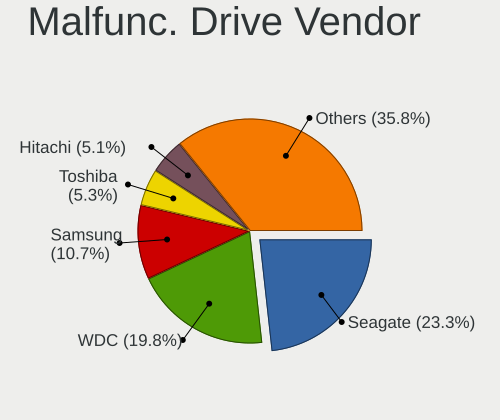

| Vendor                | Computers | Drives | Percent |
|-----------------------|-----------|--------|---------|
| Seagate               | 100       | 111    | 23.26%  |
| WDC                   | 85        | 108    | 19.77%  |
| Samsung Electronics   | 46        | 53     | 10.7%   |
| Toshiba               | 23        | 26     | 5.35%   |
| Hitachi               | 22        | 26     | 5.12%   |
| SK hynix              | 17        | 17     | 3.95%   |
| HGST                  | 15        | 18     | 3.49%   |
| Kingston              | 13        | 13     | 3.02%   |
| Crucial               | 13        | 14     | 3.02%   |
| Intel                 | 12        | 15     | 2.79%   |
| SanDisk               | 8         | 8      | 1.86%   |
| Micron Technology     | 8         | 17     | 1.86%   |
| Apple                 | 7         | 7      | 1.63%   |
| A-DATA Technology     | 6         | 6      | 1.4%    |
| OCZ                   | 4         | 4      | 0.93%   |
| Transcend             | 3         | 3      | 0.7%    |
| Netac                 | 3         | 3      | 0.7%    |
| Corsair               | 3         | 3      | 0.7%    |
| China                 | 3         | 3      | 0.7%    |
| SSSTC                 | 2         | 2      | 0.47%   |
| SPCC                  | 2         | 2      | 0.47%   |
| Realtek Semiconductor | 2         | 2      | 0.47%   |
| Patriot               | 2         | 2      | 0.47%   |
| LITEONIT              | 2         | 2      | 0.47%   |
| LITEON                | 2         | 2      | 0.47%   |
| KIOXIA                | 2         | 3      | 0.47%   |
| KingSpec              | 2         | 2      | 0.47%   |
| Fujitsu               | 2         | 2      | 0.47%   |
| YS                    | 1         | 1      | 0.23%   |
| XPG                   | 1         | 1      | 0.23%   |
| VICKTER               | 1         | 1      | 0.23%   |
| Unknown               | 1         | 1      | 0.23%   |
| Super Talent          | 1         | 1      | 0.23%   |
| SABRENT               | 1         | 1      | 0.23%   |
| Realtek               | 1         | 1      | 0.23%   |
| PNY                   | 1         | 1      | 0.23%   |
| NGFF                  | 1         | 1      | 0.23%   |
| Maxtor                | 1         | 1      | 0.23%   |
| Lexar                 | 1         | 1      | 0.23%   |
| Intenso               | 1         | 1      | 0.23%   |

Malfunc. HDD Vendor
-------------------

Vendors of faulty HDD drives

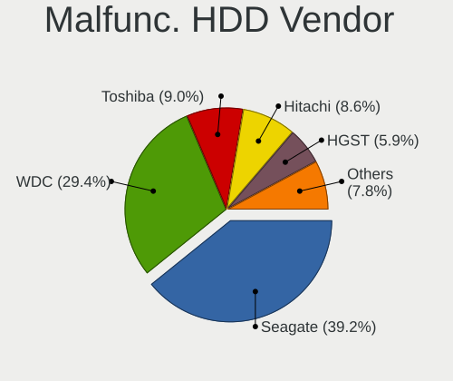

| Vendor              | Computers | Drives | Percent |
|---------------------|-----------|--------|---------|
| Seagate             | 100       | 111    | 39.22%  |
| WDC                 | 75        | 97     | 29.41%  |
| Toshiba             | 23        | 26     | 9.02%   |
| Hitachi             | 22        | 26     | 8.63%   |
| HGST                | 15        | 18     | 5.88%   |
| Samsung Electronics | 10        | 11     | 3.92%   |
| Apple               | 6         | 6      | 2.35%   |
| Fujitsu             | 2         | 2      | 0.78%   |
| Unknown             | 1         | 1      | 0.39%   |
| Maxtor              | 1         | 1      | 0.39%   |

Malfunc. Drive Kind
-------------------

Kinds of faulty drives

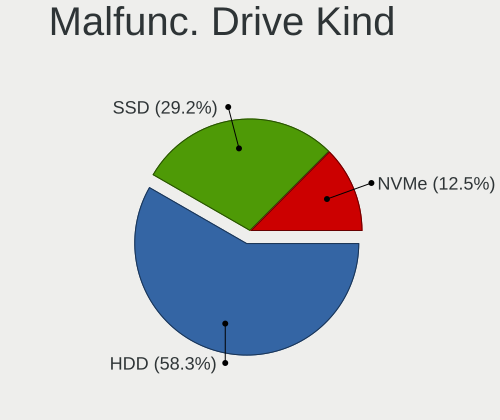

| Kind | Computers | Drives | Percent |
|------|-----------|--------|---------|
| HDD  | 242       | 299    | 58.31%  |
| SSD  | 121       | 143    | 29.16%  |
| NVMe | 52        | 53     | 12.53%  |

Failed Drives
-------------

Failed drive models

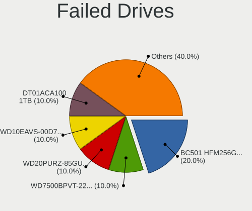

| Model                                           | Computers | Drives | Percent |
|-------------------------------------------------|-----------|--------|---------|
| SK hynix BC501 HFM256GDJTNG-8310A 256GB         | 2         | 2      | 20%     |
| WDC WD7500BPVT-22HXZT1 752GB                    | 1         | 2      | 10%     |
| WDC WD20PURZ-85GU6Y0 2TB                        | 1         | 1      | 10%     |
| WDC WD10EAVS-00D7B1 1TB                         | 1         | 1      | 10%     |
| Toshiba DT01ACA100 1TB                          | 1         | 1      | 10%     |
| SK hynix SC308 SATA 512GB SSD                   | 1         | 1      | 10%     |
| Seagate ST32000542AS 2TB                        | 1         | 1      | 10%     |
| Samsung Electronics SSD 980 1TB S649NJ0R220122K | 1         | 1      | 10%     |
| KIOXIA KXG60ZNV256G 256GB                       | 1         | 1      | 10%     |

Failed Drive Vendor
-------------------

Failed drive vendors

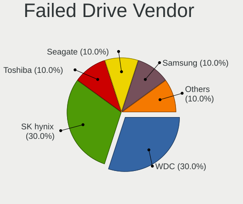

| Vendor              | Computers | Drives | Percent |
|---------------------|-----------|--------|---------|
| WDC                 | 3         | 4      | 30%     |
| SK hynix            | 3         | 3      | 30%     |
| Toshiba             | 1         | 1      | 10%     |
| Seagate             | 1         | 1      | 10%     |
| Samsung Electronics | 1         | 1      | 10%     |
| KIOXIA              | 1         | 1      | 10%     |

Drive Status
------------

Number of failed and malfunc. drives

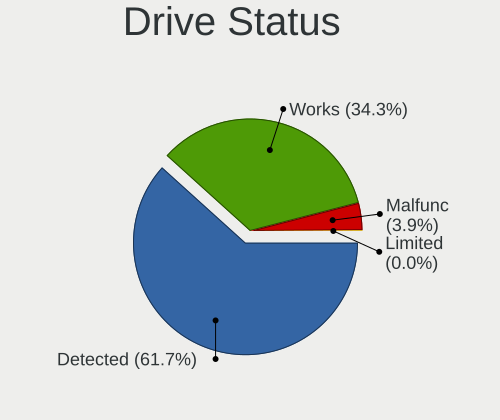

| Status   | Computers | Drives | Percent |
|----------|-----------|--------|---------|
| Detected | 6268      | 11606  | 61.69%  |
| Works    | 3482      | 5679   | 34.27%  |
| Malfunc  | 399       | 495    | 3.93%   |
| Failed   | 10        | 11     | 0.1%    |
| Limited  | 1         | 1      | 0.01%   |

Storage controller
------------------

Storage Vendor
--------------

Storage controller vendors

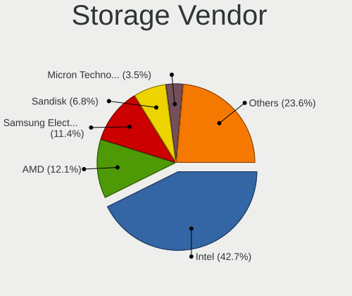

| Vendor                                  | Computers | Percent |
|-----------------------------------------|-----------|---------|
| Intel                                   | 5632      | 42.69%  |
| AMD                                     | 1600      | 12.13%  |
| Samsung Electronics                     | 1498      | 11.35%  |
| Sandisk                                 | 892       | 6.76%   |
| Micron Technology                       | 460       | 3.49%   |
| SK hynix                                | 422       | 3.2%    |
| Kingston Technology Company             | 364       | 2.76%   |
| Phison Electronics                      | 243       | 1.84%   |
| Micron/Crucial Technology               | 239       | 1.81%   |
| KIOXIA                                  | 229       | 1.74%   |
| ASMedia Technology                      | 201       | 1.52%   |
| MAXIO Technology (Hangzhou)             | 170       | 1.29%   |
| Toshiba America Info Systems            | 133       | 1.01%   |
| Silicon Motion                          | 122       | 0.92%   |
| ADATA Technology                        | 111       | 0.84%   |
| Marvell Technology Group                | 98        | 0.74%   |
| Shenzhen Longsys Electronics            | 89        | 0.67%   |
| Nvidia                                  | 73        | 0.55%   |
| Realtek Semiconductor                   | 67        | 0.51%   |
| Broadcom / LSI                          | 66        | 0.5%    |
| JMicron Technology                      | 64        | 0.49%   |
| Solid State Storage Technology          | 52        | 0.39%   |
| Apple                                   | 50        | 0.38%   |
| Yangtze Memory Technologies             | 45        | 0.34%   |
| Solidigm                                | 45        | 0.34%   |
| LSI Logic / Symbios Logic               | 23        | 0.17%   |
| Union Memory (Shenzhen)                 | 19        | 0.14%   |
| Shenzhen Unionmemory Information System | 19        | 0.14%   |
| Seagate Technology                      | 19        | 0.14%   |
| INNOGRIT                                | 19        | 0.14%   |
| VIA Technologies                        | 10        | 0.08%   |
| Hosin Global Electronics                | 10        | 0.08%   |
| Biwin Storage Technology                | 10        | 0.08%   |
| Adaptec                                 | 10        | 0.08%   |
| Silicon Image                           | 9         | 0.07%   |
| Netac Technology                        | 9         | 0.07%   |
| Transcend                               | 8         | 0.06%   |
| Hewlett-Packard                         | 8         | 0.06%   |
| Shenzhen Techwinsemi Technology         | 6         | 0.05%   |
| Lite-On Technology                      | 6         | 0.05%   |

Storage Model
-------------

Storage controller models

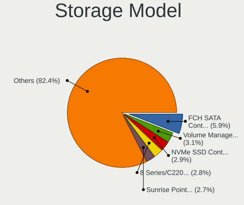

| Model                                                                          | Computers | Percent |
|--------------------------------------------------------------------------------|-----------|---------|
| AMD FCH SATA Controller [AHCI mode]                                            | 860       | 5.93%   |
| Intel Volume Management Device NVMe RAID Controller                            | 452       | 3.11%   |
| Samsung NVMe SSD Controller SM981/PM981/PM983                                  | 426       | 2.94%   |
| Intel 8 Series/C220 Series Chipset Family 6-port SATA Controller 1 [AHCI mode] | 413       | 2.85%   |
| Intel Sunrise Point-LP SATA Controller [AHCI mode]                             | 398       | 2.74%   |
| Intel 7 Series Chipset Family 6-port SATA Controller [AHCI mode]               | 304       | 2.09%   |
| Samsung NVMe SSD Controller PM9A1/PM9A3/980PRO                                 | 277       | 1.91%   |
| Samsung NVMe SSD Controller 980 (DRAM-less)                                    | 266       | 1.83%   |
| AMD 600 Series Chipset SATA Controller                                         | 256       | 1.76%   |
| Intel 82801 Mobile SATA Controller [RAID mode]                                 | 236       | 1.63%   |
| SanDisk WD SN560/SN740/SN770/SN5000 NVMe SSD                                   | 229       | 1.58%   |
| AMD 500 Series Chipset SATA Controller                                         | 225       | 1.55%   |
| Intel Q170/Q150/B150/H170/H110/Z170/CM236 Chipset SATA Controller [AHCI Mode]  | 221       | 1.52%   |
| Intel RST Volume Management Device Controller                                  | 193       | 1.33%   |
| Intel SATA Controller [RAID Mode]                                              | 188       | 1.3%    |
| Intel 6 Series/C200 Series Chipset Family 6 port Mobile SATA AHCI Controller   | 188       | 1.3%    |
| AMD 400 Series Chipset SATA Controller                                         | 178       | 1.23%   |
| Intel 8 Series SATA Controller 1 [AHCI mode]                                   | 177       | 1.22%   |
| Intel Alder Lake-P SATA AHCI Controller                                        | 174       | 1.2%    |
| Intel 6 Series/C200 Series Chipset Family 6 port Desktop SATA AHCI Controller  | 170       | 1.17%   |
| Intel 200 Series PCH SATA controller [AHCI mode]                               | 167       | 1.15%   |
| ASMedia ASM1061/ASM1062 Serial ATA Controller                                  | 165       | 1.14%   |
| Samsung NVMe SSD Controller S4LV008[Pascal]                                    | 159       | 1.1%    |
| Intel Cannon Lake PCH SATA AHCI Controller                                     | 144       | 0.99%   |
| Intel 7 Series/C210 Series Chipset Family 6-port SATA Controller [AHCI mode]   | 144       | 0.99%   |
| Intel Raptor Lake SATA AHCI Controller                                         | 140       | 0.96%   |
| Intel Alder Lake-S PCH SATA Controller [AHCI Mode]                             | 129       | 0.89%   |
| Intel Wildcat Point-LP SATA Controller [AHCI Mode]                             | 127       | 0.88%   |
| Intel Tiger Lake-LP SATA Controller                                            | 124       | 0.85%   |
| Samsung NVMe SSD Controller PM9C1a (DRAM-less)                                 | 122       | 0.84%   |
| Intel Comet Lake SATA AHCI Controller                                          | 117       | 0.81%   |
| MAXIO (Hangzhou) NVMe SSD Controller MAP1202 (DRAM-less)                       | 116       | 0.8%    |
| AMD SB7x0/SB8x0/SB9x0 IDE Controller                                           | 115       | 0.79%   |
| Micron 2400 NVMe SSD (DRAM-less)                                               | 114       | 0.79%   |
| SanDisk Ultra 3D / WD PC SN530, IX SN530, Blue SN550 NVMe SSD (DRAM-less)      | 108       | 0.74%   |
| Micron/Crucial P2 [Nick P2] / P3 / P3 Plus NVMe PCIe SSD (DRAM-less)           | 105       | 0.72%   |
| Samsung NVMe SSD Controller PM9B1 (DRAM-less)                                  | 103       | 0.71%   |
| Micron 2450 NVMe SSD [HendrixV] (DRAM-less)                                    | 101       | 0.7%    |
| AMD SB7x0/SB8x0/SB9x0 SATA Controller [AHCI mode]                              | 98        | 0.68%   |
| SK hynix Gold P31/BC711/PC711 NVMe Solid State Drive                           | 97        | 0.67%   |

Storage Kind
------------

Kind of storage controller (IDE, SATA, NVMe, SAS, ...)

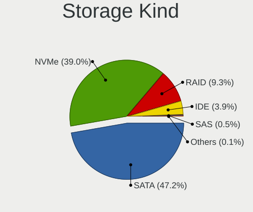

| Kind | Computers | Percent |
|------|-----------|---------|
| SATA | 6160      | 47.24%  |
| NVMe | 5082      | 38.97%  |
| RAID | 1213      | 9.3%    |
| IDE  | 509       | 3.9%    |
| SAS  | 65        | 0.5%    |
| SCSI | 12        | 0.09%   |

Processor
---------

CPU Vendor
----------

Processor vendors

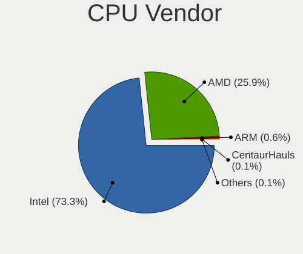

| Vendor        | Computers | Percent |
|---------------|-----------|---------|
| Intel         | 7044      | 73.34%  |
| AMD           | 2484      | 25.86%  |
| ARM           | 56        | 0.58%   |
| CentaurHauls  | 7         | 0.07%   |
| ky,x60        | 6         | 0.06%   |
| sifive,u74-mc | 3         | 0.03%   |
| Qualcomm      | 2         | 0.02%   |
| HISILICON     | 1         | 0.01%   |
| eswin,eic770x | 1         | 0.01%   |

CPU Model
---------

Processor models

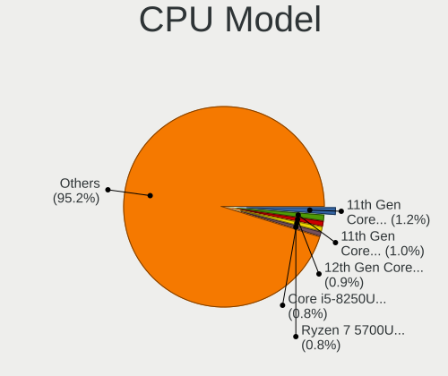

| Model                                         | Computers | Percent |
|-----------------------------------------------|-----------|---------|
| Intel 11th Gen Core i5-1135G7 @ 2.40GHz       | 119       | 1.24%   |
| Intel 11th Gen Core i7-1165G7 @ 2.80GHz       | 100       | 1.04%   |
| Intel 12th Gen Core i5-1235U                  | 84        | 0.87%   |
| Intel Core i5-8250U CPU @ 1.60GHz             | 81        | 0.84%   |
| AMD Ryzen 7 5700U with Radeon Graphics        | 76        | 0.79%   |
| Intel Core i5-7200U CPU @ 2.50GHz             | 73        | 0.76%   |
| Intel Core i7-8550U CPU @ 1.80GHz             | 67        | 0.7%    |
| Intel Core Ultra 7 155H                       | 66        | 0.69%   |
| Intel Core i5-6300U CPU @ 2.40GHz             | 61        | 0.63%   |
| Intel Core i5-6200U CPU @ 2.30GHz             | 56        | 0.58%   |
| Intel Core i5-10210U CPU @ 1.60GHz            | 54        | 0.56%   |
| AMD Ryzen 5 5500U with Radeon Graphics        | 54        | 0.56%   |
| Intel Core i5-3210M CPU @ 2.50GHz             | 53        | 0.55%   |
| ARM Processor                                 | 53        | 0.55%   |
| Intel Core i7-3770 CPU @ 3.40GHz              | 49        | 0.51%   |
| Intel Core i5-8265U CPU @ 1.60GHz             | 49        | 0.51%   |
| Intel 13th Gen Core i7-1355U                  | 49        | 0.51%   |
| AMD Ryzen 5 7520U with Radeon Graphics        | 49        | 0.51%   |
| Intel N100                                    | 46        | 0.48%   |
| Intel Core i7-4790 CPU @ 3.60GHz              | 46        | 0.48%   |
| Intel 12th Gen Core i5-12450H                 | 45        | 0.47%   |
| AMD Ryzen 5 3600 6-Core Processor             | 45        | 0.47%   |
| Intel Core i7-8565U CPU @ 1.80GHz             | 44        | 0.46%   |
| Intel 13th Gen Core i9-13900H                 | 44        | 0.46%   |
| Intel Core i5-8350U CPU @ 1.70GHz             | 43        | 0.45%   |
| Intel 12th Gen Core i7-12700H                 | 43        | 0.45%   |
| AMD Ryzen 5 5600G with Radeon Graphics        | 43        | 0.45%   |
| Intel Core i5-7300U CPU @ 2.60GHz             | 42        | 0.44%   |
| AMD Ryzen 7 7730U with Radeon Graphics        | 42        | 0.44%   |
| AMD Ryzen 7 8845HS w/ Radeon 780M Graphics    | 40        | 0.42%   |
| AMD Ryzen 5 3500U with Radeon Vega Mobile Gfx | 40        | 0.42%   |
| Intel Core i7-7700HQ CPU @ 2.80GHz            | 39        | 0.41%   |
| Intel 11th Gen Core i7-11800H @ 2.30GHz       | 39        | 0.41%   |
| Intel 11th Gen Core i3-1115G4 @ 3.00GHz       | 39        | 0.41%   |
| Intel Core i7-7500U CPU @ 2.70GHz             | 37        | 0.38%   |
| Intel Core i5-5200U CPU @ 2.20GHz             | 37        | 0.38%   |
| Intel Core i5-3470 CPU @ 3.20GHz              | 37        | 0.38%   |
| Intel Core i7-6700 CPU @ 3.40GHz              | 36        | 0.37%   |
| Intel Celeron N4020 CPU @ 1.10GHz             | 36        | 0.37%   |
| AMD Ryzen 7 5800H with Radeon Graphics        | 36        | 0.37%   |

CPU Model Family
----------------

Processor model prefix

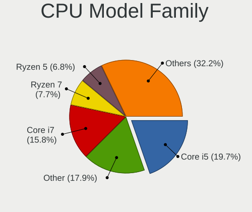

| Model                   | Computers | Percent |
|-------------------------|-----------|---------|
| Intel Core i5           | 1890      | 19.66%  |
| Other                   | 1718      | 17.88%  |
| Intel Core i7           | 1518      | 15.79%  |
| AMD Ryzen 7             | 737       | 7.67%   |
| AMD Ryzen 5             | 656       | 6.83%   |
| Intel Core i3           | 579       | 6.02%   |
| Intel Celeron           | 307       | 3.19%   |
| Intel Xeon              | 282       | 2.93%   |
| AMD Ryzen 9             | 278       | 2.89%   |
| Intel Core              | 264       | 2.75%   |
| Intel Pentium           | 162       | 1.69%   |
| Intel Core 2 Duo        | 138       | 1.44%   |
| Intel Core i9           | 112       | 1.17%   |
| AMD Ryzen 3             | 86        | 0.89%   |
| AMD FX                  | 77        | 0.8%    |
| AMD Ryzen 7 PRO         | 67        | 0.7%    |
| AMD A6                  | 55        | 0.57%   |
| AMD Ryzen 5 PRO         | 53        | 0.55%   |
| AMD A8                  | 48        | 0.5%    |
| AMD A10                 | 44        | 0.46%   |
| Intel Core 2 Quad       | 39        | 0.41%   |
| Intel Pentium Dual-Core | 37        | 0.38%   |
| Intel Atom              | 37        | 0.38%   |
| AMD A4                  | 29        | 0.3%    |
| AMD Phenom II X4        | 28        | 0.29%   |
| Intel Pentium Silver    | 24        | 0.25%   |
| AMD Ryzen Threadripper  | 23        | 0.24%   |
| AMD EPYC                | 19        | 0.2%    |
| AMD E                   | 19        | 0.2%    |
| AMD Athlon              | 19        | 0.2%    |
| AMD Phenom II X6        | 18        | 0.19%   |
| AMD E2                  | 17        | 0.18%   |
| Intel Xeon Gold         | 16        | 0.17%   |
| Intel Core M            | 15        | 0.16%   |
| AMD E1                  | 15        | 0.16%   |
| AMD Ryzen 3 PRO         | 12        | 0.12%   |
| Intel Core m3           | 11        | 0.11%   |
| AMD Athlon 64 X2        | 11        | 0.11%   |
| Intel Pentium Gold      | 10        | 0.1%    |
| AMD Athlon II X4        | 10        | 0.1%    |

CPU Cores
---------

Number of processor cores

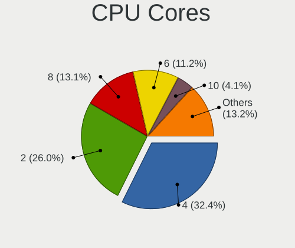

| Number  | Computers | Percent |
|---------|-----------|---------|
| 4       | 3114      | 32.36%  |
| 2       | 2501      | 25.99%  |
| 8       | 1262      | 13.11%  |
| 6       | 1079      | 11.21%  |
| 10      | 393       | 4.08%   |
| 12      | 361       | 3.75%   |
| 16      | 304       | 3.16%   |
| 14      | 246       | 2.56%   |
| 24      | 139       | 1.44%   |
| 20      | 63        | 0.65%   |
| 1       | 42        | 0.44%   |
| Unknown | 29        | 0.3%    |
| 32      | 23        | 0.24%   |
| 3       | 18        | 0.19%   |
| 18      | 10        | 0.1%    |
| 28      | 9         | 0.09%   |
| 64      | 8         | 0.08%   |
| 36      | 7         | 0.07%   |
| 48      | 3         | 0.03%   |
| 5       | 3         | 0.03%   |
| 192     | 2         | 0.02%   |
| 96      | 2         | 0.02%   |
| 44      | 2         | 0.02%   |
| 40      | 2         | 0.02%   |
| 128     | 1         | 0.01%   |
| 22      | 1         | 0.01%   |

CPU Sockets
-----------

Number of sockets

| Number  | Computers | Percent |
|---------|-----------|---------|
| 1       | 9458      | 98.46%  |
| 2       | 108       | 1.12%   |
| Unknown | 29        | 0.3%    |
| 4       | 6         | 0.06%   |
| 8       | 3         | 0.03%   |
| 20      | 1         | 0.01%   |
| 14      | 1         | 0.01%   |

CPU Threads
-----------

Threads per core (Hyper-Threading)

| Number  | Computers | Percent |
|---------|-----------|---------|
| 2       | 6937      | 72.04%  |
| 1       | 2663      | 27.66%  |
| Unknown | 29        | 0.3%    |

CPU Op-Modes
------------

CPU Operation Modes (32-bit, 64-bit)

| Op mode        | Computers | Percent |
|----------------|-----------|---------|
| 32-bit, 64-bit | 9576      | 99.71%  |
| 64-bit         | 14        | 0.15%   |
| Unknown        | 14        | 0.15%   |

CPU Microcode
-------------

Microcode number

| Number     | Computers | Percent |
|------------|-----------|---------|
| Unknown    | 9574      | 99.67%  |
| 0x806c1    | 5         | 0.05%   |
| 0x806d1    | 3         | 0.03%   |
| 0xb0671    | 2         | 0.02%   |
| 0x806ec    | 2         | 0.02%   |
| 0x0a704104 | 2         | 0.02%   |
| 0xb06a2    | 1         | 0.01%   |
| 0xa0652    | 1         | 0.01%   |
| 0x906ea    | 1         | 0.01%   |
| 0x906e9    | 1         | 0.01%   |
| 0x906a3    | 1         | 0.01%   |
| 0x90672    | 1         | 0.01%   |
| 0x806ea    | 1         | 0.01%   |
| 0x506e3    | 1         | 0.01%   |
| 0x306a9    | 1         | 0.01%   |
| 0x106ca    | 1         | 0.01%   |
| 0x0a601206 | 1         | 0.01%   |
| 0x0a601203 | 1         | 0.01%   |
| 0x0a20120e | 1         | 0.01%   |
| 0x08701021 | 1         | 0.01%   |
| 0x08608102 | 1         | 0.01%   |
| 0x06006705 | 1         | 0.01%   |
| 0x0600611a | 1         | 0.01%   |
| 0x05000029 | 1         | 0.01%   |

CPU Microarch
-------------

Microarchitecture

| Name               | Computers | Percent |
|--------------------|-----------|---------|
| Unknown            | 1785      | 18.52%  |
| KabyLake           | 1344      | 13.94%  |
| Haswell            | 761       | 7.9%    |
| Alderlake Hybrid   | 605       | 6.28%   |
| IvyBridge          | 567       | 5.88%   |
| Skylake            | 532       | 5.52%   |
| Zen 3              | 508       | 5.27%   |
| SandyBridge        | 475       | 4.93%   |
| TigerLake          | 363       | 3.77%   |
| Zen 2              | 294       | 3.05%   |
| Broadwell          | 256       | 2.66%   |
| Zen+               | 214       | 2.22%   |
| CometLake          | 208       | 2.16%   |
| Penryn             | 191       | 1.98%   |
| Silvermont         | 156       | 1.62%   |
| IceLake            | 151       | 1.57%   |
| Westmere           | 144       | 1.49%   |
| Piledriver         | 115       | 1.19%   |
| Goldmont plus      | 106       | 1.1%    |
| Meteorlake Hybrid  | 97        | 1.01%   |
| Zen                | 96        | 1%      |
| K10                | 95        | 0.99%   |
| Excavator          | 80        | 0.83%   |
| Nehalem            | 77        | 0.8%    |
| Core               | 58        | 0.6%    |
| Goldmont           | 52        | 0.54%   |
| Puma               | 49        | 0.51%   |
| Lunarlake Hybrid   | 46        | 0.48%   |
| Gracemont          | 46        | 0.48%   |
| Bobcat             | 30        | 0.31%   |
| Jaguar             | 27        | 0.28%   |
| Steamroller        | 26        | 0.27%   |
| K10 Llano          | 19        | 0.2%    |
| K8 Hammer          | 17        | 0.18%   |
| Tremont            | 16        | 0.17%   |
| Bulldozer          | 11        | 0.11%   |
| Bonnell            | 6         | 0.06%   |
| Sapphire Rapids    | 5         | 0.05%   |
| K8 & K10 hybrid    | 4         | 0.04%   |
| ArrowLake-H Hybrid | 4         | 0.04%   |

Graphics
--------

GPU Vendor
----------

Vendors of graphics cards

| Vendor                           | Computers | Percent |
|----------------------------------|-----------|---------|
| Intel                            | 5685      | 49.24%  |
| Nvidia                           | 3085      | 26.72%  |
| AMD                              | 2631      | 22.79%  |
| Matrox Electronics Systems       | 68        | 0.59%   |
| ASPEED Technology                | 64        | 0.55%   |
| Zhaoxin                          | 6         | 0.05%   |
| Silicon Integrated Systems [SiS] | 3         | 0.03%   |
| Red Hat                          | 1         | 0.01%   |
| Huawei Technologies              | 1         | 0.01%   |
| Glenfly Tech                     | 1         | 0.01%   |

GPU Model
---------

Graphics card models

| Model                                                                       | Computers | Percent |
|-----------------------------------------------------------------------------|-----------|---------|
| Intel 2nd Generation Core Processor Family Integrated Graphics Controller   | 343       | 2.91%   |
| Intel TigerLake-LP GT2 [Iris Xe Graphics]                                   | 313       | 2.66%   |
| Intel 3rd Gen Core processor Graphics Controller                            | 297       | 2.52%   |
| Intel Kaby Lake-R GT2 [UHD Graphics 620]                                    | 238       | 2.02%   |
| Intel Raptor Lake-P [Iris Xe Graphics]                                      | 222       | 1.88%   |
| Intel Skylake-U GT2 [HD Graphics 520]                                       | 205       | 1.74%   |
| Intel Kaby Lake-U GT2 [HD Graphics 620]                                     | 201       | 1.71%   |
| Intel Haswell-ULT Integrated Graphics Controller                            | 200       | 1.7%    |
| Intel Xeon E3-1200 v3/4th Gen Core Processor Integrated Graphics Controller | 199       | 1.69%   |
| AMD Cezanne [Radeon Vega Series / Radeon Vega Mobile Series]                | 187       | 1.59%   |
| AMD Picasso/Raven 2 [Radeon Vega Series / Radeon Vega Mobile Series]        | 155       | 1.32%   |
| Intel WhiskeyLake-U GT2 [UHD Graphics 620]                                  | 143       | 1.21%   |
| Intel Alder Lake-P GT2 [Iris Xe Graphics]                                   | 143       | 1.21%   |
| AMD Rembrandt [Radeon 680M]                                                 | 143       | 1.21%   |
| AMD Lucienne                                                                | 141       | 1.2%    |
| Intel CometLake-U GT2 [UHD Graphics]                                        | 136       | 1.15%   |
| AMD Renoir [Radeon Vega Series / Radeon Vega Mobile Series]                 | 133       | 1.13%   |
| Intel Skylake-S GT2 [HD Graphics 530]                                       | 128       | 1.09%   |
| Intel Broadwell-U GT2 [HD Graphics 5500]                                    | 128       | 1.09%   |
| Intel Meteor Lake-P [Intel Arc Graphics]                                    | 123       | 1.04%   |
| Intel CoffeeLake-H GT2 [UHD Graphics 630]                                   | 119       | 1.01%   |
| AMD Phoenix1                                                                | 119       | 1.01%   |
| AMD Raphael                                                                 | 118       | 1%      |
| Intel CoffeeLake-S GT2 [UHD Graphics 630]                                   | 117       | 0.99%   |
| AMD Barcelo                                                                 | 117       | 0.99%   |
| Intel 4th Gen Core Processor Integrated Graphics Controller                 | 111       | 0.94%   |
| Intel Alder Lake-UP3 GT2 [Iris Xe Graphics]                                 | 101       | 0.86%   |
| Intel Alder Lake-N [UHD Graphics]                                           | 100       | 0.85%   |
| AMD HawkPoint1                                                              | 99        | 0.84%   |
| Nvidia TU117M [GeForce GTX 1650 Mobile / Max-Q]                             | 93        | 0.79%   |
| AMD Ellesmere [Radeon RX 470/480/570/570X/580/580X/590]                     | 93        | 0.79%   |
| Intel Xeon E3-1200 v2/3rd Gen Core processor Graphics Controller            | 91        | 0.77%   |
| Intel GeminiLake [UHD Graphics 600]                                         | 91        | 0.77%   |
| Intel TigerLake-H GT1 [UHD Graphics]                                        | 89        | 0.76%   |
| Nvidia AD107M [GeForce RTX 4060 Max-Q / Mobile]                             | 88        | 0.75%   |
| Intel Atom Processor Z36xxx/Z37xxx Series Graphics & Display                | 84        | 0.71%   |
| Intel CometLake-H GT2 [UHD Graphics]                                        | 82        | 0.7%    |
| AMD Granite Ridge [Radeon Graphics]                                         | 82        | 0.7%    |
| Intel Raptor Lake-P [UHD Graphics]                                          | 81        | 0.69%   |
| Intel Kaby Lake-S GT2 [HD Graphics 630]                                     | 75        | 0.64%   |

GPU Combo
---------

Combinations of graphics cards

| Name                         | Computers | Percent |
|------------------------------|-----------|---------|
| 1 x Intel                    | 4063      | 42.12%  |
| 1 x AMD                      | 1945      | 20.16%  |
| 1 x Nvidia                   | 1399      | 14.5%   |
| Intel + Nvidia               | 1276      | 13.23%  |
| AMD + Nvidia                 | 338       | 3.5%    |
| Intel + AMD                  | 196       | 2.03%   |
| 2 x AMD                      | 147       | 1.52%   |
| Other                        | 73        | 0.76%   |
| 1 x Matrox                   | 58        | 0.6%    |
| 1 x ASPEED                   | 36        | 0.37%   |
| 2 x Nvidia                   | 31        | 0.32%   |
| 2 x Intel                    | 22        | 0.23%   |
| Nvidia + ASPEED              | 19        | 0.2%    |
| Nvidia + Matrox              | 7         | 0.07%   |
| 1 x Zhaoxin                  | 6         | 0.06%   |
| Intel + 2 x Nvidia           | 6         | 0.06%   |
| 2 x Nvidia + 1 x ASPEED      | 3         | 0.03%   |
| 1 x SiS                      | 3         | 0.03%   |
| AMD + ASPEED                 | 3         | 0.03%   |
| 3 x AMD                      | 2         | 0.02%   |
| Intel + ASPEED               | 2         | 0.02%   |
| AMD + Nvidia + 1 x ASPEED    | 2         | 0.02%   |
| 2 x Nvidia + 1 x Matrox      | 1         | 0.01%   |
| 2 x AMD + 1 x Nvidia         | 1         | 0.01%   |
| Nvidia + Huawei Technologies | 1         | 0.01%   |
| 1 x Intel + 3 x Nvidia       | 1         | 0.01%   |
| Intel + Red Hat              | 1         | 0.01%   |
| Intel + Matrox               | 1         | 0.01%   |
| 1 x Glenfly Tech             | 1         | 0.01%   |
| AMD + 2 x Nvidia             | 1         | 0.01%   |
| AMD + Matrox                 | 1         | 0.01%   |

GPU Driver
----------

Free vs proprietary

| Driver      | Computers | Percent |
|-------------|-----------|---------|
| Free        | 6404      | 66.23%  |
| Proprietary | 1652      | 17.08%  |
| Unknown     | 1614      | 16.69%  |

GPU Memory
----------

Total video memory

| Size in GB | Computers | Percent |
|------------|-----------|---------|
| Unknown    | 7942      | 82.03%  |
| 0.01-0.5   | 511       | 5.28%   |
| 1.01-2.0   | 380       | 3.92%   |
| 3.01-4.0   | 212       | 2.19%   |
| 0.51-1.0   | 209       | 2.16%   |
| 7.01-8.0   | 164       | 1.69%   |
| 8.01-16.0  | 120       | 1.24%   |
| 5.01-6.0   | 74        | 0.76%   |
| 16.01-24.0 | 33        | 0.34%   |
| 2.01-3.0   | 28        | 0.29%   |
| 24.01-32.0 | 6         | 0.06%   |
| 32.01-64.0 | 2         | 0.02%   |
| 4.01-5.0   | 1         | 0.01%   |

Monitor
-------

Monitor Vendor
--------------

Monitor vendors

| Vendor                  | Computers | Percent |
|-------------------------|-----------|---------|
| Samsung Electronics     | 1317      | 12.38%  |
| AU Optronics            | 1158      | 10.89%  |
| BOE                     | 1104      | 10.38%  |
| Chimei Innolux          | 942       | 8.86%   |
| LG Display              | 719       | 6.76%   |
| Dell                    | 715       | 6.72%   |
| Goldstar                | 543       | 5.11%   |
| Hewlett-Packard         | 356       | 3.35%   |
| Acer                    | 310       | 2.91%   |
| Apple                   | 297       | 2.79%   |
| Lenovo                  | 217       | 2.04%   |
| AOC                     | 213       | 2%      |
| Ancor Communications    | 190       | 1.79%   |
| BenQ                    | 167       | 1.57%   |
| Sharp                   | 166       | 1.56%   |
| Philips                 | 166       | 1.56%   |
| ASUSTek Computer        | 143       | 1.34%   |
| PANDA                   | 106       | 1%      |
| Iiyama                  | 105       | 0.99%   |
| MSI                     | 101       | 0.95%   |
| InfoVision              | 93        | 0.87%   |
| Chi Mei Optoelectronics | 91        | 0.86%   |
| ViewSonic               | 82        | 0.77%   |
| Unknown                 | 63        | 0.59%   |
| Sony                    | 57        | 0.54%   |
| CSO                     | 53        | 0.5%    |
| CSOT                    | 50        | 0.47%   |
| HKC                     | 38        | 0.36%   |
| Sceptre Tech            | 35        | 0.33%   |
| Gigabyte Technology     | 33        | 0.31%   |
| CSW                     | 33        | 0.31%   |
| Mi                      | 31        | 0.29%   |
| TMX                     | 27        | 0.25%   |
| Eizo                    | 27        | 0.25%   |
| RTK                     | 25        | 0.24%   |
| Fujitsu Siemens         | 25        | 0.24%   |
| Vizio                   | 24        | 0.23%   |
| Panasonic               | 23        | 0.22%   |
| NEC Computers           | 23        | 0.22%   |
| Medion                  | 21        | 0.2%    |

Monitor Model
-------------

Monitor models

| Model                                                                    | Computers | Percent |
|--------------------------------------------------------------------------|-----------|---------|
| Unknown LCD Monitor FFFF 2288x1287 2550x2550mm 142.0-inch                | 53        | 0.49%   |
| Chimei Innolux LCD Monitor CMN15E7 1920x1080 344x193mm 15.5-inch         | 51        | 0.47%   |
| Chimei Innolux LCD Monitor CMN1521 1920x1080 344x193mm 15.5-inch         | 49        | 0.45%   |
| Chimei Innolux LCD Monitor CMN15F5 1920x1080 344x193mm 15.5-inch         | 48        | 0.44%   |
| AU Optronics LCD Monitor AUO21ED 1920x1080 344x193mm 15.5-inch           | 43        | 0.39%   |
| Chimei Innolux LCD Monitor CMN14D4 1920x1080 309x173mm 13.9-inch         | 40        | 0.37%   |
| AU Optronics LCD Monitor AUO38ED 1920x1080 344x193mm 15.5-inch           | 33        | 0.3%    |
| Goldstar FULL HD GSM5B55 1920x1080 480x270mm 21.7-inch                   | 32        | 0.29%   |
| AU Optronics LCD Monitor AUO403D 1920x1080 309x174mm 14.0-inch           | 32        | 0.29%   |
| Samsung Electronics C24F390 SAM0D2C 1920x1080 521x293mm 23.5-inch        | 31        | 0.28%   |
| PANDA LCD Monitor NCP004D 1920x1080 344x194mm 15.5-inch                  | 30        | 0.27%   |
| BOE LCD Monitor BOE0872 1920x1080 344x194mm 15.5-inch                    | 29        | 0.27%   |
| AOC 24G2W1G3 AOC2402 1920x1080 527x296mm 23.8-inch                       | 27        | 0.25%   |
| Chimei Innolux LCD Monitor CMN1618 1920x1200 344x215mm 16.0-inch         | 25        | 0.23%   |
| LG Display LCD Monitor LGD02DC 1366x768 344x194mm 15.5-inch              | 24        | 0.22%   |
| Samsung Electronics LCD Monitor SDC4161 1920x1080 344x194mm 15.5-inch    | 22        | 0.2%    |
| Chimei Innolux LCD Monitor CMN15DB 1366x768 344x193mm 15.5-inch          | 22        | 0.2%    |
| LG Display LCD Monitor LGD0555 2736x1824 260x173mm 12.3-inch             | 21        | 0.19%   |
| LG Display LCD Monitor LGD033A 1366x768 344x194mm 15.5-inch              | 20        | 0.18%   |
| Dell U2412M DELA07B 1920x1200 518x324mm 24.1-inch                        | 20        | 0.18%   |
| Chimei Innolux LCD Monitor CMN153B 1920x1080 344x193mm 15.5-inch         | 20        | 0.18%   |
| AU Optronics LCD Monitor AUO61ED 1920x1080 344x194mm 15.5-inch           | 20        | 0.18%   |
| Unknown                                                                  | 20        | 0.18%   |
| Samsung Electronics LF24T35 SAM707D 1920x1080 528x297mm 23.9-inch        | 19        | 0.17%   |
| Samsung Electronics LCD Monitor SEC5441 1280x800 331x207mm 15.4-inch     | 19        | 0.17%   |
| Samsung Electronics LCD Monitor SDC4180 2880x1620 344x194mm 15.5-inch    | 19        | 0.17%   |
| Samsung Electronics LCD Monitor SDC4171 2880x1800 302x189mm 14.0-inch    | 19        | 0.17%   |
| Samsung Electronics C27F390 SAM0D32 1920x1080 598x336mm 27.0-inch        | 19        | 0.17%   |
| Chi Mei Optoelectronics LCD Monitor CMO15A7 1366x768 344x193mm 15.5-inch | 19        | 0.17%   |
| BOE LCD Monitor BOE0812 1920x1080 344x194mm 15.5-inch                    | 19        | 0.17%   |
| AOC 27G2G4 AOC2702 1920x1080 598x336mm 27.0-inch                         | 19        | 0.17%   |
| BOE LCD Monitor BOE07CB 1920x1080 344x193mm 15.5-inch                    | 18        | 0.16%   |
| Samsung Electronics LCD Monitor SDC4187 1920x1200 302x189mm 14.0-inch    | 17        | 0.16%   |
| Chimei Innolux LCD Monitor CMN14D6 1366x768 309x173mm 13.9-inch          | 17        | 0.16%   |
| Vestel Elektronik 40UHD_LCD_TV VES3700 3840x2160 880x500mm 39.8-inch     | 16        | 0.15%   |
| Goldstar LG ULTRAWIDE GSM59F1 2560x1080 670x280mm 28.6-inch              | 16        | 0.15%   |
| Chimei Innolux LCD Monitor CMN14E5 1920x1080 309x173mm 13.9-inch         | 16        | 0.15%   |
| AU Optronics LCD Monitor AUOAF90 1920x1080 344x193mm 15.5-inch           | 16        | 0.15%   |
| AU Optronics LCD Monitor AUO45EC 1366x768 344x193mm 15.5-inch            | 16        | 0.15%   |
| AU Optronics LCD Monitor AUO106C 1366x768 276x155mm 12.5-inch            | 16        | 0.15%   |

Monitor Resolution
------------------

Monitor screen resolution

| Resolution         | Computers | Percent |
|--------------------|-----------|---------|
| 1920x1080 (FHD)    | 4650      | 45.68%  |
| 1366x768 (WXGA)    | 1229      | 12.07%  |
| 3840x2160 (4K)     | 841       | 8.26%   |
| 2560x1440 (QHD)    | 638       | 6.27%   |
| 1920x1200 (WUXGA)  | 609       | 5.98%   |
| 1600x900 (HD+)     | 325       | 3.19%   |
| 2560x1600          | 239       | 2.35%   |
| 2880x1800          | 194       | 1.91%   |
| 1680x1050 (WSXGA+) | 175       | 1.72%   |
| 1280x1024 (SXGA)   | 167       | 1.64%   |
| 3440x1440          | 161       | 1.58%   |
| 1440x900 (WXGA+)   | 151       | 1.48%   |
| 2560x1080          | 77        | 0.76%   |
| 1280x800 (WXGA)    | 63        | 0.62%   |
| Unknown            | 60        | 0.59%   |
| 2288x1287          | 55        | 0.54%   |
| 3840x1080          | 47        | 0.46%   |
| 2160x1440          | 44        | 0.43%   |
| 3840x2400          | 40        | 0.39%   |
| 1360x768           | 38        | 0.37%   |
| 1920x540           | 36        | 0.35%   |
| 3200x2000          | 31        | 0.3%    |
| 2880x1920          | 31        | 0.3%    |
| 2880x1620          | 24        | 0.24%   |
| 2256x1504          | 22        | 0.22%   |
| 1920x1280          | 17        | 0.17%   |
| 3072x1920          | 16        | 0.16%   |
| 1600x1200          | 15        | 0.15%   |
| 2736x1824          | 13        | 0.13%   |
| 3200x1800 (QHD+)   | 12        | 0.12%   |
| 3456x2160          | 11        | 0.11%   |
| 1024x768 (XGA)     | 11        | 0.11%   |
| 2304x1440          | 10        | 0.1%    |
| 2520x1680          | 9         | 0.09%   |
| 2240x1400          | 8         | 0.08%   |
| 3840x1600          | 7         | 0.07%   |
| 1280x720 (HD)      | 7         | 0.07%   |
| 3840x1100          | 6         | 0.06%   |
| 3000x2000          | 6         | 0.06%   |
| 2944x1840          | 6         | 0.06%   |

Monitor Diagonal
----------------

Diagonal size in inches

| Inches  | Computers | Percent |
|---------|-----------|---------|
| 15      | 2367      | 22.27%  |
| 27      | 1045      | 9.83%   |
| 14      | 1006      | 9.46%   |
| 13      | 945       | 8.89%   |
| 24      | 785       | 7.38%   |
| 23      | 663       | 6.24%   |
| 21      | 482       | 4.53%   |
| 17      | 454       | 4.27%   |
| 16      | 433       | 4.07%   |
| 31      | 361       | 3.4%    |
| 19      | 223       | 2.1%    |
| Unknown | 205       | 1.93%   |
| 34      | 203       | 1.91%   |
| 12      | 155       | 1.46%   |
| 18      | 147       | 1.38%   |
| 22      | 124       | 1.17%   |
| 20      | 105       | 0.99%   |
| 84      | 104       | 0.98%   |
| 32      | 88        | 0.83%   |
| 11      | 80        | 0.75%   |
| 54      | 58        | 0.55%   |
| 142     | 53        | 0.5%    |
| 72      | 47        | 0.44%   |
| 40      | 46        | 0.43%   |
| 25      | 40        | 0.38%   |
| 28      | 38        | 0.36%   |
| 26      | 37        | 0.35%   |
| 48      | 34        | 0.32%   |
| 49      | 31        | 0.29%   |
| 63      | 26        | 0.24%   |
| 29      | 21        | 0.2%    |
| 65      | 18        | 0.17%   |
| 52      | 18        | 0.17%   |
| 42      | 18        | 0.17%   |
| 10      | 17        | 0.16%   |
| 46      | 13        | 0.12%   |
| 43      | 13        | 0.12%   |
| 33      | 12        | 0.11%   |
| 74      | 11        | 0.1%    |
| 47      | 11        | 0.1%    |

Monitor Width
-------------

Physical width

| Width in mm    | Computers | Percent |
|----------------|-----------|---------|
| 301-350        | 4166      | 39.85%  |
| 501-600        | 2341      | 22.39%  |
| 401-500        | 932       | 8.92%   |
| 201-300        | 804       | 7.69%   |
| 351-400        | 600       | 5.74%   |
| 601-700        | 513       | 4.91%   |
| 701-800        | 312       | 2.98%   |
| 1001-1500      | 230       | 2.2%    |
| Unknown        | 205       | 1.96%   |
| 1501-2000      | 179       | 1.71%   |
| 801-900        | 76        | 0.73%   |
| More than 2000 | 53        | 0.51%   |
| 901-1000       | 40        | 0.38%   |
| 101-200        | 3         | 0.03%   |

Aspect Ratio
------------

Proportional relationship between the width and the height

| Ratio   | Computers | Percent |
|---------|-----------|---------|
| 16/9    | 7121      | 74.32%  |
| 16/10   | 1569      | 16.37%  |
| 21/9    | 238       | 2.48%   |
| 5/4     | 164       | 1.71%   |
| 3/2     | 158       | 1.65%   |
| Unknown | 141       | 1.47%   |
| 32/9    | 55        | 0.57%   |
| 1.00    | 55        | 0.57%   |
| 4/3     | 40        | 0.42%   |
| 6/5     | 12        | 0.13%   |
| 3.40    | 6         | 0.06%   |
| 2.00    | 5         | 0.05%   |
| 0.56    | 5         | 0.05%   |
| 1.96    | 3         | 0.03%   |
| 3.73    | 2         | 0.02%   |
| 0.62    | 2         | 0.02%   |
| 3.20    | 1         | 0.01%   |
| 2.69    | 1         | 0.01%   |
| 2.64    | 1         | 0.01%   |
| 2.24    | 1         | 0.01%   |
| 0.89    | 1         | 0.01%   |
| 0.79    | 1         | 0.01%   |

Monitor Area
------------

Area in inch²

| Area in inch² | Computers | Percent |
|----------------|-----------|---------|
| 101-110        | 2354      | 22.34%  |
| 201-250        | 1591      | 15.1%   |
| 81-90          | 1541      | 14.62%  |
| 301-350        | 1075      | 10.2%   |
| 351-500        | 702       | 6.66%   |
| 151-200        | 493       | 4.68%   |
| 111-120        | 426       | 4.04%   |
| More than 1000 | 383       | 3.63%   |
| 71-80          | 380       | 3.61%   |
| 121-130        | 359       | 3.41%   |
| 251-300        | 302       | 2.87%   |
| Unknown        | 205       | 1.95%   |
| 501-1000       | 198       | 1.88%   |
| 141-150        | 184       | 1.75%   |
| 61-70          | 140       | 1.33%   |
| 51-60          | 94        | 0.89%   |
| 91-100         | 52        | 0.49%   |
| 131-140        | 46        | 0.44%   |
| 41-50          | 10        | 0.09%   |
| 1-40           | 3         | 0.03%   |

Pixel Density
-------------

Pixels per inch

| Density       | Computers | Percent |
|---------------|-----------|---------|
| 51-100        | 3155      | 30.66%  |
| 121-160       | 2990      | 29.06%  |
| 101-120       | 2158      | 20.97%  |
| 161-240       | 1160      | 11.27%  |
| More than 240 | 336       | 3.27%   |
| 1-50          | 285       | 2.77%   |
| Unknown       | 205       | 1.99%   |

Multiple Monitors
-----------------

Total monitors connected

| Total | Computers | Percent |
|-------|-----------|---------|
| 1     | 7536      | 77.17%  |
| 2     | 1568      | 16.06%  |
| 0     | 453       | 4.64%   |
| 3     | 186       | 1.9%    |
| 4     | 22        | 0.23%   |
| 6     | 1         | 0.01%   |

Network
-------

Net Controller Vendor
---------------------

Controller vendors

| Vendor                                 | Computers | Percent |
|----------------------------------------|-----------|---------|
| Realtek Semiconductor                  | 5177      | 35.68%  |
| Intel                                  | 4904      | 33.8%   |
| Qualcomm Atheros                       | 980       | 6.75%   |
| MediaTek                               | 848       | 5.84%   |
| Broadcom                               | 692       | 4.77%   |
| TP-Link                                | 219       | 1.51%   |
| Broadcom Limited                       | 137       | 0.94%   |
| Samsung Electronics                    | 106       | 0.73%   |
| Ralink Technology                      | 98        | 0.68%   |
| Marvell Technology Group               | 98        | 0.68%   |
| ASIX Electronics                       | 95        | 0.65%   |
| Ralink                                 | 84        | 0.58%   |
| Qualcomm                               | 62        | 0.43%   |
| Nvidia                                 | 60        | 0.41%   |
| Xiaomi                                 | 59        | 0.41%   |
| Sierra Wireless                        | 52        | 0.36%   |
| Aquantia                               | 46        | 0.32%   |
| DisplayLink                            | 44        | 0.3%    |
| Lenovo                                 | 38        | 0.26%   |
| Dell                                   | 36        | 0.25%   |
| Qualcomm Technologies                  | 34        | 0.23%   |
| Qualcomm Atheros Communications        | 32        | 0.22%   |
| D-Link                                 | 29        | 0.2%    |
| Microsoft                              | 28        | 0.19%   |
| Hewlett-Packard                        | 27        | 0.19%   |
| Shenzhen Goodix Technology             | 26        | 0.18%   |
| NetGear                                | 25        | 0.17%   |
| OPPO Electronics                       | 23        | 0.16%   |
| ASUSTek Computer                       | 22        | 0.15%   |
| Mellanox Technologies                  | 21        | 0.14%   |
| Suzhou Motorcomm Electronic Technology | 20        | 0.14%   |
| Edimax Technology                      | 20        | 0.14%   |
| Motorola PCS                           | 17        | 0.12%   |
| Ericsson Business Mobile Networks      | 17        | 0.12%   |
| Google                                 | 16        | 0.11%   |
| Fibocom                                | 16        | 0.11%   |
| U-Blox                                 | 15        | 0.1%    |
| QinHeng Electronics                    | 15        | 0.1%    |
| Huawei Technologies                    | 14        | 0.1%    |
| Realtek                                | 12        | 0.08%   |

Net Controller Model
--------------------

Controller models

| Model                                                                  | Computers | Percent |
|------------------------------------------------------------------------|-----------|---------|
| Realtek RTL8111/8168/8211/8411 PCI Express Gigabit Ethernet Controller | 3209      | 18.65%  |
| Realtek RTL8125 2.5GbE Controller                                      | 522       | 3.03%   |
| Realtek RTL810xE PCI Express Fast Ethernet controller                  | 384       | 2.23%   |
| Realtek RTL8153 Gigabit Ethernet Adapter                               | 377       | 2.19%   |
| Intel Wi-Fi 6 AX200                                                    | 322       | 1.87%   |
| Intel Wireless 8265 / 8275                                             | 313       | 1.82%   |
| Intel Alder Lake-P PCH CNVi WiFi                                       | 292       | 1.7%    |
| MediaTek MT7922 802.11ax PCI Express Wireless Network Adapter          | 275       | 1.6%    |
| Intel Wi-Fi 6 AX201                                                    | 272       | 1.58%   |
| Intel 82579LM Gigabit Network Connection (Lewisville)                  | 253       | 1.47%   |
| Realtek RTL8821CE 802.11ac PCIe Wireless Network Adapter               | 251       | 1.46%   |
| Intel Wi-Fi 6E(802.11ax) AX210/AX1675* 2x2 [Typhoon Peak]              | 223       | 1.3%    |
| MediaTek MT7921 802.11ax PCIe Wireless Network Adapter [Filogic 330]   | 216       | 1.26%   |
| Intel Raptor Lake PCH CNVi WiFi                                        | 212       | 1.23%   |
| MediaTek MT7902 802.11ax PCIe Wireless Network Adapter [Filogic 310]   | 191       | 1.11%   |
| Intel Wireless 7265                                                    | 184       | 1.07%   |
| Realtek RTL8852BE PCIe 802.11ax Wireless Network Controller            | 181       | 1.05%   |
| Realtek RTL8822CE 802.11ac PCIe Wireless Network Adapter               | 181       | 1.05%   |
| Intel Wireless 8260                                                    | 173       | 1.01%   |
| Intel Ethernet Controller I225-V                                       | 161       | 0.94%   |
| Qualcomm Atheros AR9485 Wireless Network Adapter                       | 157       | 0.91%   |
| Qualcomm Atheros QCA9565 / AR9565 Wireless Network Adapter             | 145       | 0.84%   |
| Qualcomm Atheros QCA9377 802.11ac Wireless Network Adapter             | 142       | 0.83%   |
| Intel Wireless 7260                                                    | 135       | 0.78%   |
| Intel Comet Lake PCH-LP CNVi WiFi                                      | 132       | 0.77%   |
| Intel Ethernet Connection I217-LM                                      | 131       | 0.76%   |
| Intel 700 Series Chipset CNVi WiFi                                     | 129       | 0.75%   |
| Intel Meteor Lake PCH CNVi WiFi                                        | 126       | 0.73%   |
| Intel Ethernet Connection (2) I219-V                                   | 125       | 0.73%   |
| Intel Ethernet Connection (4) I219-LM                                  | 121       | 0.7%    |
| Intel I211 Gigabit Network Connection                                  | 116       | 0.67%   |
| Intel Ethernet Controller I226-V                                       | 116       | 0.67%   |
| Qualcomm Atheros QCA6174 802.11ac Wireless Network Adapter             | 112       | 0.65%   |
| Intel Ethernet Connection (2) I219-LM                                  | 106       | 0.62%   |
| Intel Wireless 3165                                                    | 99        | 0.58%   |
| Realtek 802.11ac NIC                                                   | 98        | 0.57%   |
| Intel Dual Band Wireless-AC 3168NGW [Stone Peak]                       | 93        | 0.54%   |
| Intel Cannon Point-LP CNVi [Wireless-AC]                               | 91        | 0.53%   |
| Intel Comet Lake PCH CNVi WiFi                                         | 88        | 0.51%   |
| Intel Cannon Lake PCH CNVi WiFi                                        | 88        | 0.51%   |

Wireless Vendor
---------------

Wireless vendors

| Vendor                          | Computers | Percent |
|---------------------------------|-----------|---------|
| Intel                           | 3612      | 45.35%  |
| Realtek Semiconductor           | 1402      | 17.6%   |
| Qualcomm Atheros                | 797       | 10.01%  |
| MediaTek                        | 746       | 9.37%   |
| Broadcom                        | 484       | 6.08%   |
| TP-Link                         | 199       | 2.5%    |
| Broadcom Limited                | 103       | 1.29%   |
| Ralink Technology               | 98        | 1.23%   |
| Ralink                          | 84        | 1.05%   |
| Qualcomm                        | 53        | 0.67%   |
| Sierra Wireless                 | 52        | 0.65%   |
| Marvell Technology Group        | 46        | 0.58%   |
| Qualcomm Atheros Communications | 32        | 0.4%    |
| D-Link                          | 29        | 0.36%   |
| Dell                            | 27        | 0.34%   |
| NetGear                         | 25        | 0.31%   |
| Microsoft                       | 20        | 0.25%   |
| Edimax Technology               | 20        | 0.25%   |
| ASUSTek Computer                | 19        | 0.24%   |
| Fibocom                         | 16        | 0.2%    |
| Qualcomm Technologies           | 13        | 0.16%   |
| Realtek                         | 12        | 0.15%   |
| D-Link System                   | 8         | 0.1%    |
| Belkin Components               | 8         | 0.1%    |
| Hewlett-Packard                 | 7         | 0.09%   |
| AVM                             | 7         | 0.09%   |
| Linksys                         | 6         | 0.08%   |
| IMC Networks                    | 6         | 0.08%   |
| ZyDAS                           | 4         | 0.05%   |
| ZTopInc                         | 4         | 0.05%   |
| Sitecom Europe                  | 4         | 0.05%   |
| Mercucys                        | 4         | 0.05%   |
| Wacom                           | 2         | 0.03%   |
| Quectel Wireless Solutions      | 2         | 0.03%   |
| Cypress Semiconductor           | 2         | 0.03%   |
| Unknown                         | 2         | 0.03%   |
| ZyXEL Communications            | 1         | 0.01%   |
| Xiaomi                          | 1         | 0.01%   |
| Wistron NeWeb                   | 1         | 0.01%   |
| PLANEX                          | 1         | 0.01%   |

Wireless Model
--------------

Wireless models

| Model                                                                | Computers | Percent |
|----------------------------------------------------------------------|-----------|---------|
| Intel Wi-Fi 6 AX200                                                  | 322       | 4.02%   |
| Intel Wireless 8265 / 8275                                           | 313       | 3.91%   |
| Intel Wi-Fi 6 AX201                                                  | 272       | 3.39%   |
| Realtek RTL8821CE 802.11ac PCIe Wireless Network Adapter             | 251       | 3.13%   |
| Intel Wi-Fi 6E(802.11ax) AX210/AX1675* 2x2 [Typhoon Peak]            | 223       | 2.78%   |
| MediaTek MT7922 802.11ax PCI Express Wireless Network Adapter        | 222       | 2.77%   |
| MediaTek MT7921 802.11ax PCIe Wireless Network Adapter [Filogic 330] | 216       | 2.7%    |
| Intel Raptor Lake PCH CNVi WiFi                                      | 207       | 2.58%   |
| MediaTek MT7902 802.11ax PCIe Wireless Network Adapter [Filogic 310] | 191       | 2.38%   |
| Intel Wireless 7265                                                  | 184       | 2.3%    |
| Realtek RTL8822CE 802.11ac PCIe Wireless Network Adapter             | 181       | 2.26%   |
| Intel Alder Lake-P PCH CNVi WiFi                                     | 181       | 2.26%   |
| Intel Wireless 8260                                                  | 173       | 2.16%   |
| Qualcomm Atheros AR9485 Wireless Network Adapter                     | 157       | 1.96%   |
| Qualcomm Atheros QCA9565 / AR9565 Wireless Network Adapter           | 145       | 1.81%   |
| Qualcomm Atheros QCA9377 802.11ac Wireless Network Adapter           | 142       | 1.77%   |
| Realtek RTL8852BE PCIe 802.11ax Wireless Network Controller          | 141       | 1.76%   |
| Intel Wireless 7260                                                  | 135       | 1.68%   |
| Intel Comet Lake PCH-LP CNVi WiFi                                    | 132       | 1.65%   |
| Intel 700 Series Chipset CNVi WiFi                                   | 129       | 1.61%   |
| Intel Meteor Lake PCH CNVi WiFi                                      | 126       | 1.57%   |
| Qualcomm Atheros QCA6174 802.11ac Wireless Network Adapter           | 112       | 1.4%    |
| Intel Wireless 3165                                                  | 99        | 1.24%   |
| Realtek 802.11ac NIC                                                 | 98        | 1.22%   |
| Intel Dual Band Wireless-AC 3168NGW [Stone Peak]                     | 93        | 1.16%   |
| Intel Cannon Point-LP CNVi [Wireless-AC]                             | 91        | 1.14%   |
| Intel Comet Lake PCH CNVi WiFi                                       | 88        | 1.1%    |
| Intel Cannon Lake PCH CNVi WiFi                                      | 88        | 1.1%    |
| Intel Centrino Advanced-N 6205 [Taylor Peak]                         | 84        | 1.05%   |
| Intel Tiger Lake PCH CNVi WiFi                                       | 83        | 1.04%   |
| Realtek RTL8723BE PCIe Wireless Network Adapter                      | 82        | 1.02%   |
| Qualcomm Atheros AR9285 Wireless Network Adapter (PCI-Express)       | 81        | 1.01%   |
| Broadcom BCM43142 802.11b/g/n                                        | 79        | 0.99%   |
| Realtek RTL8188EUS 802.11n Wireless Network Adapter                  | 62        | 0.77%   |
| Intel Ice Lake-LP PCH CNVi WiFi                                      | 59        | 0.74%   |
| Realtek RTL88x2bu [AC1200 Techkey]                                   | 56        | 0.7%    |
| Realtek RTL8822BE 802.11a/b/g/n/ac WiFi adapter                      | 55        | 0.69%   |
| Intel Wi-Fi 7(802.11be) AX1775*/AX1790*/BE20*/BE401/BE1750* 2x2      | 55        | 0.69%   |
| Intel Wireless 3160                                                  | 54        | 0.67%   |
| Broadcom BCM4331 802.11a/b/g/n                                       | 53        | 0.66%   |

Ethernet Vendor
---------------

Ethernet vendors

| Vendor                                 | Computers | Percent |
|----------------------------------------|-----------|---------|
| Realtek Semiconductor                  | 4584      | 53.18%  |
| Intel                                  | 2530      | 29.35%  |
| Broadcom                               | 330       | 3.83%   |
| Qualcomm Atheros                       | 261       | 3.03%   |
| Samsung Electronics                    | 106       | 1.23%   |
| ASIX Electronics                       | 95        | 1.1%    |
| MediaTek                               | 93        | 1.08%   |
| Nvidia                                 | 60        | 0.7%    |
| Xiaomi                                 | 58        | 0.67%   |
| Marvell Technology Group               | 52        | 0.6%    |
| Aquantia                               | 46        | 0.53%   |
| DisplayLink                            | 44        | 0.51%   |
| Lenovo                                 | 38        | 0.44%   |
| Broadcom Limited                       | 36        | 0.42%   |
| OPPO Electronics                       | 23        | 0.27%   |
| Qualcomm Technologies                  | 21        | 0.24%   |
| TP-Link                                | 20        | 0.23%   |
| Suzhou Motorcomm Electronic Technology | 20        | 0.23%   |
| Motorola PCS                           | 17        | 0.2%    |
| Mellanox Technologies                  | 16        | 0.19%   |
| Google                                 | 14        | 0.16%   |
| Insyde Software                        | 12        | 0.14%   |
| Hewlett-Packard                        | 12        | 0.14%   |
| JMicron Technology                     | 10        | 0.12%   |
| Huawei Technologies                    | 9         | 0.1%    |
| Apple                                  | 9         | 0.1%    |
| Raspberry Pi                           | 8         | 0.09%   |
| Qualcomm                               | 8         | 0.09%   |
| American Megatrends                    | 8         | 0.09%   |
| Microsoft                              | 7         | 0.08%   |
| QinHeng Electronics                    | 6         | 0.07%   |
| Linksys                                | 6         | 0.07%   |
| Motorcomm Microelectronics.            | 5         | 0.06%   |
| Silicon Integrated Systems [SiS]       | 4         | 0.05%   |
| ICS Advent                             | 4         | 0.05%   |
| 3Com                                   | 4         | 0.05%   |
| Microchip Technology                   | 3         | 0.03%   |
| Belkin Components                      | 3         | 0.03%   |
| ASUSTek Computer                       | 3         | 0.03%   |
| ZTE WCDMA Technologies MSM             | 2         | 0.02%   |

Ethernet Model
--------------

Ethernet models

| Model                                                                  | Computers | Percent |
|------------------------------------------------------------------------|-----------|---------|
| Realtek RTL8111/8168/8211/8411 PCI Express Gigabit Ethernet Controller | 3209      | 35.6%   |
| Realtek RTL8125 2.5GbE Controller                                      | 522       | 5.79%   |
| Realtek RTL810xE PCI Express Fast Ethernet controller                  | 384       | 4.26%   |
| Realtek RTL8153 Gigabit Ethernet Adapter                               | 377       | 4.18%   |
| Intel 82579LM Gigabit Network Connection (Lewisville)                  | 253       | 2.81%   |
| Intel Ethernet Controller I225-V                                       | 161       | 1.79%   |
| Intel Ethernet Connection I217-LM                                      | 131       | 1.45%   |
| Intel Ethernet Connection (2) I219-V                                   | 125       | 1.39%   |
| Intel Ethernet Connection (4) I219-LM                                  | 121       | 1.34%   |
| Intel I211 Gigabit Network Connection                                  | 116       | 1.29%   |
| Intel Ethernet Controller I226-V                                       | 116       | 1.29%   |
| Intel Alder Lake-P PCH CNVi WiFi                                       | 111       | 1.23%   |
| Intel Ethernet Connection (2) I219-LM                                  | 106       | 1.18%   |
| ASIX AX88179 Gigabit Ethernet                                          | 82        | 0.91%   |
| Samsung Galaxy series, misc. (tethering mode)                          | 81        | 0.9%    |
| Intel Ethernet Connection I219-LM                                      | 75        | 0.83%   |
| Intel I210 Gigabit Network Connection                                  | 73        | 0.81%   |
| Broadcom NetXtreme BCM57765 Gigabit Ethernet PCIe                      | 71        | 0.79%   |
| Intel Ethernet Connection (7) I219-V                                   | 70        | 0.78%   |
| Broadcom NetXtreme BCM57766 Gigabit Ethernet PCIe                      | 67        | 0.74%   |
| Intel Ethernet Connection (4) I219-V                                   | 61        | 0.68%   |
| Intel Ethernet Connection (7) I219-LM                                  | 58        | 0.64%   |
| Intel 82579V Gigabit Network Connection                                | 58        | 0.64%   |
| MediaTek MT7922 802.11ax PCI Express Wireless Network Adapter          | 53        | 0.59%   |
| Realtek Killer E2600 GbE Controller                                    | 49        | 0.54%   |
| Qualcomm Atheros AR8151 v2.0 Gigabit Ethernet                          | 48        | 0.53%   |
| Xiaomi Mi/Redmi series (RNDIS)                                         | 45        | 0.5%    |
| Realtek RTL8152 Fast Ethernet Adapter                                  | 43        | 0.48%   |
| Realtek RTL8126 5GbE Controller                                        | 41        | 0.45%   |
| Intel Ethernet Connection I217-V                                       | 41        | 0.45%   |
| Realtek RTL8852BE PCIe 802.11ax Wireless Network Controller            | 40        | 0.44%   |
| Intel Ethernet Connection I218-LM                                      | 40        | 0.44%   |
| Intel Ethernet Connection (5) I219-LM                                  | 40        | 0.44%   |
| Intel Ethernet Connection (18) I219-LM                                 | 40        | 0.44%   |
| Intel Ethernet Connection (6) I219-LM                                  | 39        | 0.43%   |
| Intel 82574L Gigabit Network Connection                                | 37        | 0.41%   |
| Intel Ethernet Connection I219-V                                       | 36        | 0.4%    |
| Intel Ethernet Connection (6) I219-V                                   | 36        | 0.4%    |
| Qualcomm Atheros AR8161 Gigabit Ethernet                               | 34        | 0.38%   |
| Nvidia MCP79 Ethernet                                                  | 34        | 0.38%   |

Net Controller Kind
-------------------

Ethernet, WiFi or modem

| Kind     | Computers | Percent |
|----------|-----------|---------|
| Ethernet | 7825      | 50.38%  |
| WiFi     | 7530      | 48.48%  |
| Modem    | 146       | 0.94%   |
| Unknown  | 30        | 0.19%   |

Used Controller
---------------

Currently used network controller

| Kind     | Computers | Percent |
|----------|-----------|---------|
| WiFi     | 5821      | 58.47%  |
| Ethernet | 4129      | 41.48%  |
| Unknown  | 3         | 0.03%   |
| Modem    | 2         | 0.02%   |

NICs
----

Total network controllers on board

| Total | Computers | Percent |
|-------|-----------|---------|
| 2     | 5046      | 52.42%  |
| 1     | 4071      | 42.29%  |
| 3     | 287       | 2.98%   |
| 0     | 108       | 1.12%   |
| 4     | 73        | 0.76%   |
| 6     | 17        | 0.18%   |
| 5     | 13        | 0.14%   |
| 8     | 4         | 0.04%   |
| 9     | 3         | 0.03%   |
| 7     | 3         | 0.03%   |
| 13    | 1         | 0.01%   |
| 10    | 1         | 0.01%   |

IPv6
----

IPv6 vs IPv4

| Used | Computers | Percent |
|------|-----------|---------|
| No   | 6199      | 63.83%  |
| Yes  | 3513      | 36.17%  |

Bluetooth
---------

Bluetooth Vendor
----------------

Controller vendors

| Vendor                          | Computers | Percent |
|---------------------------------|-----------|---------|
| Intel                           | 3446      | 49.16%  |
| Realtek Semiconductor           | 791       | 11.28%  |
| IMC Networks                    | 536       | 7.65%   |
| Foxconn / Hon Hai               | 376       | 5.36%   |
| Qualcomm Atheros Communications | 314       | 4.48%   |
| Apple                           | 287       | 4.09%   |
| Cambridge Silicon Radio         | 226       | 3.22%   |
| MediaTek                        | 190       | 2.71%   |
| Lite-On Technology              | 177       | 2.52%   |
| Broadcom                        | 158       | 2.25%   |
| ASUSTek Computer                | 88        | 1.26%   |
| TP-Link                         | 65        | 0.93%   |
| Dell                            | 57        | 0.81%   |
| Marvell Semiconductor           | 45        | 0.64%   |
| Realtek                         | 43        | 0.61%   |
| Ralink                          | 35        | 0.5%    |
| USI                             | 32        | 0.46%   |
| Hewlett-Packard                 | 26        | 0.37%   |
| Unknown                         | 25        | 0.36%   |
| Toshiba                         | 19        | 0.27%   |
| Foxconn International           | 13        | 0.19%   |
| Integrated System Solution      | 9         | 0.13%   |
| Opticis                         | 6         | 0.09%   |
| Dynex                           | 6         | 0.09%   |
| Actions                         | 6         | 0.09%   |
| Quectel Wireless Solutions      | 5         | 0.07%   |
| Ralink Technology               | 4         | 0.06%   |
| Alps Electric                   | 4         | 0.06%   |
| Mercucys                        | 3         | 0.04%   |
| Logitech                        | 3         | 0.04%   |
| Edimax Technology               | 3         | 0.04%   |
| Chicony Electronics             | 3         | 0.04%   |
| SINO WEALTH                     | 2         | 0.03%   |
| Belkin Components               | 2         | 0.03%   |
| Taiyo Yuden                     | 1         | 0.01%   |
| Roper                           | 1         | 0.01%   |
| Fujitsu                         | 1         | 0.01%   |
| D-Link                          | 1         | 0.01%   |
| AVM                             | 1         | 0.01%   |

Bluetooth Model
---------------

Controller models

| Model                                               | Computers | Percent |
|-----------------------------------------------------|-----------|---------|
| Intel Bluetooth wireless interface                  | 928       | 13.23%  |
| Intel AX201 Bluetooth                               | 761       | 10.85%  |
| Intel Bluetooth Device                              | 679       | 9.68%   |
| Realtek Bluetooth Radio                             | 587       | 8.37%   |
| Intel Bluetooth 9460/9560 Jefferson Peak (JfP)      | 339       | 4.83%   |
| IMC Networks Wireless_Device                        | 319       | 4.55%   |
| Intel AX200 Bluetooth                               | 311       | 4.43%   |
| Cambridge Silicon Radio Bluetooth Dongle (HCI mode) | 226       | 3.22%   |
| Intel AX210 Bluetooth                               | 205       | 2.92%   |
| MediaTek Wireless_Device                            | 189       | 2.69%   |
| Foxconn / Hon Hai Wireless_Device                   | 172       | 2.45%   |
| Qualcomm Atheros  Bluetooth Device                  | 140       | 2%      |
| IMC Networks Bluetooth Radio                        | 126       | 1.8%    |
| Apple Bluetooth Host Controller                     | 125       | 1.78%   |
| Realtek  Bluetooth 4.2 Adapter                      | 123       | 1.75%   |
| Intel Wireless-AC 3168 Bluetooth                    | 92        | 1.31%   |
| Apple Bluetooth USB Host Controller                 | 81        | 1.15%   |
| Foxconn / Hon Hai Bluetooth Device                  | 72        | 1.03%   |
| Foxconn / Hon Hai MediaTek Bluetooth Adapter        | 70        | 1%      |
| TP-Link TP-T@- UB500 Adapter                        | 65        | 0.93%   |
| Apple Built-in Bluetooth 2.0+EDR HCI                | 65        | 0.93%   |
| Intel Centrino Bluetooth Wireless Transceiver       | 60        | 0.86%   |
| Qualcomm Atheros AR3012 Bluetooth 4.0               | 47        | 0.67%   |
| Lite-On Wireless_Device                             | 45        | 0.64%   |
| Lite-On Bluetooth Device                            | 44        | 0.63%   |
| Realtek Bluetooth Radio                             | 43        | 0.61%   |
| Intel Wireless-AC 9260 Bluetooth Adapter            | 43        | 0.61%   |
| Qualcomm Atheros AR3011 Bluetooth                   | 39        | 0.56%   |
| IMC Networks Bluetooth Device                       | 39        | 0.56%   |
| Qualcomm Atheros QCA61x4 Bluetooth 4.0              | 38        | 0.54%   |
| Lite-On Qualcomm Atheros QCA9377 Bluetooth          | 38        | 0.54%   |
| Ralink RT3290 Bluetooth                             | 35        | 0.5%    |
| ASUS ASUS USB-BT500                                 | 35        | 0.5%    |
| USI Bluetooth Device                                | 32        | 0.46%   |
| Marvell Bluetooth and Wireless LAN Composite        | 32        | 0.46%   |
| Qualcomm Atheros AR9462 Bluetooth                   | 26        | 0.37%   |
| Unknown                                             | 25        | 0.36%   |
| Realtek RTL8723B Bluetooth                          | 24        | 0.34%   |
| Lite-On Atheros AR3012 Bluetooth                    | 24        | 0.34%   |
| Dell BCM20702A0 Bluetooth Module                    | 23        | 0.33%   |

Sound
-----

Sound Vendor
------------

Sound card vendors

| Vendor                                       | Computers | Percent |
|----------------------------------------------|-----------|---------|
| Intel                                        | 6816      | 50.8%   |
| AMD                                          | 2844      | 21.2%   |
| Nvidia                                       | 2391      | 17.82%  |
| C-Media Electronics                          | 147       | 1.1%    |
| Logitech                                     | 86        | 0.64%   |
| ASUSTek Computer                             | 81        | 0.6%    |
| GN Netcom                                    | 63        | 0.47%   |
| Texas Instruments                            | 58        | 0.43%   |
| Realtek Semiconductor                        | 57        | 0.42%   |
| Hewlett-Packard                              | 57        | 0.42%   |
| Lenovo                                       | 50        | 0.37%   |
| Micro Star International                     | 47        | 0.35%   |
| Zoran Co. Personal Media Division (Nogatech) | 40        | 0.3%    |
| JMTek                                        | 39        | 0.29%   |
| Creative Labs                                | 38        | 0.28%   |
| Creative Technology                          | 34        | 0.25%   |
| Kingston Technology                          | 31        | 0.23%   |
| Razer USA                                    | 30        | 0.22%   |
| Plantronics                                  | 27        | 0.2%    |
| Generalplus Technology                       | 27        | 0.2%    |
| SteelSeries ApS                              | 26        | 0.19%   |
| Apple                                        | 22        | 0.16%   |
| Jieli Technology                             | 20        | 0.15%   |
| Dell                                         | 16        | 0.12%   |
| Corsair                                      | 15        | 0.11%   |
| Focusrite-Novation                           | 14        | 0.1%    |
| DSEA A/S                                     | 14        | 0.1%    |
| Tenx Technology                              | 11        | 0.08%   |
| KTMicro                                      | 11        | 0.08%   |
| Sony                                         | 10        | 0.07%   |
| Unknown                                      | 9         | 0.07%   |
| Microsoft                                    | 8         | 0.06%   |
| Zhaoxin                                      | 7         | 0.05%   |
| Walmart                                      | 7         | 0.05%   |
| PreSonus Audio Electronics                   | 7         | 0.05%   |
| Giga-Byte Technology                         | 7         | 0.05%   |
| ASRock                                       | 7         | 0.05%   |
| Yamaha                                       | 6         | 0.04%   |
| VIA Technologies                             | 6         | 0.04%   |
| Nordic Semiconductor ASA                     | 6         | 0.04%   |

Sound Model
-----------

Sound card models

| Model                                                                      | Computers | Percent |
|----------------------------------------------------------------------------|-----------|---------|
| AMD Ryzen HD Audio Controller                                              | 1505      | 9.27%   |
| Intel Sunrise Point-LP HD Audio                                            | 722       | 4.45%   |
| AMD Radeon High Definition Audio Controller                                | 647       | 3.98%   |
| AMD Renoir/Cezanne HDMI/DP Audio Controller                                | 591       | 3.64%   |
| Intel 7 Series/C216 Chipset Family High Definition Audio Controller        | 525       | 3.23%   |
| Intel 8 Series/C220 Series Chipset High Definition Audio Controller        | 478       | 2.94%   |
| Intel 6 Series/C200 Series Chipset Family High Definition Audio Controller | 446       | 2.75%   |
| Intel Alder Lake PCH-P High Definition Audio Controller                    | 397       | 2.44%   |
| Intel Tiger Lake-LP Smart Sound Technology Audio Controller                | 362       | 2.23%   |
| Intel Xeon E3-1200 v3/4th Gen Core Processor HD Audio Controller           | 336       | 2.07%   |
| Intel Raptor Lake-P/U/H cAVS                                               | 311       | 1.91%   |
| AMD Starship/Matisse HD Audio Controller                                   | 300       | 1.85%   |
| Intel Cannon Lake PCH cAVS                                                 | 291       | 1.79%   |
| Intel 100 Series/C230 Series Chipset Family HD Audio Controller            | 251       | 1.55%   |
| Intel Raptor Lake High Definition Audio Controller                         | 219       | 1.35%   |
| Intel 8 Series HD Audio Controller                                         | 203       | 1.25%   |
| Intel Haswell-ULT HD Audio Controller                                      | 201       | 1.24%   |
| Intel Broadwell-U Audio Controller                                         | 194       | 1.19%   |
| AMD Raven/Raven2/Fenghuang HDMI/DP Audio Controller                        | 188       | 1.16%   |
| AMD FCH Azalia Controller                                                  | 188       | 1.16%   |
| Intel 200 Series PCH HD Audio                                              | 186       | 1.15%   |
| Intel Wildcat Point-LP High Definition Audio Controller                    | 182       | 1.12%   |
| AMD SBx00 Azalia (Intel HDA)                                               | 174       | 1.07%   |
| Intel 5 Series/3400 Series Chipset High Definition Audio                   | 163       | 1%      |
| Intel Meteor Lake-P HD Audio Controller                                    | 160       | 0.99%   |
| Intel Comet Lake PCH-LP cAVS                                               | 154       | 0.95%   |
| Intel Cannon Point-LP High Definition Audio Controller                     | 153       | 0.94%   |
| Nvidia AD107 High Definition Audio Controller                              | 150       | 0.92%   |
| Intel Tiger Lake-H HD Audio Controller                                     | 146       | 0.9%    |
| Intel Alder Lake-S HD Audio Controller                                     | 144       | 0.89%   |
| Nvidia GP107GL High Definition Audio Controller                            | 142       | 0.87%   |
| Nvidia GA107 High Definition Audio Controller                              | 135       | 0.83%   |
| Nvidia GA104 High Definition Audio Controller                              | 131       | 0.81%   |
| Nvidia GA106 High Definition Audio Controller                              | 130       | 0.8%    |
| Intel Comet Lake PCH cAVS                                                  | 129       | 0.79%   |
| Nvidia TU107 GeForce GTX 1650 High Definition Audio Controller             | 125       | 0.77%   |
| AMD Navi 21/23 HDMI/DP Audio Controller                                    | 116       | 0.71%   |
| Intel Alder Lake-N PCH High Definition Audio Controller                    | 114       | 0.7%    |
| AMD Kabini HDMI/DP Audio                                                   | 113       | 0.7%    |
| AMD Ellesmere HDMI Audio [Radeon RX 470/480 / 570/580/590]                 | 110       | 0.68%   |

Memory
------

Memory Vendor
-------------

Memory module vendors

| Vendor                                  | Computers | Percent |
|-----------------------------------------|-----------|---------|
| Samsung Electronics                     | 1332      | 24.04%  |
| SK hynix                                | 1009      | 18.21%  |
| Micron Technology                       | 753       | 13.59%  |
| Kingston                                | 533       | 9.62%   |
| Crucial                                 | 355       | 6.41%   |
| Corsair                                 | 253       | 4.57%   |
| Unknown                                 | 211       | 3.81%   |
| G.Skill                                 | 210       | 3.79%   |
| Unknown                                 | 186       | 3.36%   |
| A-DATA Technology                       | 127       | 2.29%   |
| Ramaxel Technology                      | 73        | 1.32%   |
| Elpida                                  | 47        | 0.85%   |
| Team                                    | 45        | 0.81%   |
| Nanya Technology                        | 42        | 0.76%   |
| Unknown (ABCD)                          | 38        | 0.69%   |
| Patriot                                 | 24        | 0.43%   |
| Transcend                               | 18        | 0.32%   |
| Smart                                   | 17        | 0.31%   |
| Apacer                                  | 14        | 0.25%   |
| Lexar                                   | 12        | 0.22%   |
| GOODRAM                                 | 11        | 0.2%    |
| Timetec                                 | 9         | 0.16%   |
| Patriot Memory (PDP Systems)            | 8         | 0.14%   |
| Lexar Co Limited                        | 8         | 0.14%   |
| Smart Brazil                            | 7         | 0.13%   |
| Silicon Power                           | 7         | 0.13%   |
| Hewlett-Packard                         | 7         | 0.13%   |
| Unknown (0x0E9D)                        | 6         | 0.11%   |
| PNY                                     | 6         | 0.11%   |
| Avant                                   | 6         | 0.11%   |
| Golden Empire                           | 5         | 0.09%   |
| GeIL                                    | 5         | 0.09%   |
| AMD                                     | 5         | 0.09%   |
| Wodposit                                | 4         | 0.07%   |
| Silicon Power Computer & Communications | 4         | 0.07%   |
| Neo Forza                               | 4         | 0.07%   |
| Hikvision                               | 4         | 0.07%   |
| Unknown (0x0EB9)                        | 3         | 0.05%   |
| Unknown (0x0080)                        | 3         | 0.05%   |
| Kllisre                                 | 3         | 0.05%   |

Memory Model
------------

Memory module models

| Model                                                            | Computers | Percent |
|------------------------------------------------------------------|-----------|---------|
| Unknown                                                          | 211       | 3.61%   |
| Micron RAM 4ATF1G64HZ-3G2F1 8GB SODIMM DDR4 3200MT/s             | 64        | 1.1%    |
| Samsung RAM M471A1K43EB1-CWE 8GB SODIMM DDR4 3200MT/s            | 61        | 1.05%   |
| Samsung RAM M471A1G44BB0-CWE 8GB SODIMM DDR4 3200MT/s            | 51        | 0.87%   |
| Samsung RAM M471A1G44AB0-CWE 8GiB SODIMM DDR4 3200MT/s           | 45        | 0.77%   |
| SK hynix RAM HMAA1GS6CJR6N-XN 8GB SODIMM DDR4 3200MT/s           | 35        | 0.6%    |
| Samsung RAM M471A5244CB0-CTD 4GB SODIMM DDR4 3266MT/s            | 35        | 0.6%    |
| SK hynix RAM HMA81GS6AFR8N-UH 8GB SODIMM DDR4 2667MT/s           | 33        | 0.57%   |
| Micron RAM 8ATF1G64HZ-3G2R1 8GB SODIMM DDR4 3200MT/s             | 33        | 0.57%   |
| SK hynix RAM HMAG68EXNSA051N 8GB SODIMM DDR4 3200MT/s            | 31        | 0.53%   |
| Samsung RAM M425R1GB4BB0-CQKOL 8GB SODIMM DDR5 4800MT/s          | 31        | 0.53%   |
| SK hynix RAM HMA81GS6DJR8N-XN 8GB SODIMM DDR4 3200MT/s           | 30        | 0.51%   |
| Samsung RAM M471A5244CB0-CWE 4GB SODIMM DDR4 3200MT/s            | 29        | 0.5%    |
| Unknown (ABCD) RAM 123456789012345678 2GB SODIMM LPDDR4 2400MT/s | 28        | 0.48%   |
| Samsung RAM M471A1K43CB1-CRC 8GB SODIMM DDR4 8400MT/s            | 26        | 0.45%   |
| Samsung RAM M471A5244CB0-CRC 4GB SODIMM DDR4 2667MT/s            | 25        | 0.43%   |
| Samsung RAM M471B5173DB0-YK0 4GB SODIMM DDR3 1600MT/s            | 24        | 0.41%   |
| Samsung RAM K3KL8L80CM-MGCT 2GB Row Of Chips LPDDR5 7500MT/s     | 24        | 0.41%   |
| SK hynix RAM HMCG78AGBSA095N 16GB SODIMM DDR5 5600MT/s           | 23        | 0.39%   |
| Samsung RAM M471A1K43DB1-CWE 8GB SODIMM DDR4 3200MT/s            | 23        | 0.39%   |
| Corsair RAM CMK16GX4M2B3200C16 8GB DIMM DDR4 3600MT/s            | 23        | 0.39%   |
| Samsung RAM M471B1G73QH0-YK0 8GB SODIMM DDR3 1600MT/s            | 21        | 0.36%   |
| Samsung RAM M471A1K43CB1-CTD 8GB SODIMM DDR4 3200MT/s            | 21        | 0.36%   |
| Micron RAM MTC4C10163S1SC48BA1 8GB SODIMM DDR5 4800MT/s          | 20        | 0.34%   |
| SK hynix RAM HMCG78AGBSA092N 16GB SODIMM DDR5 5600MT/s           | 19        | 0.33%   |
| SK hynix RAM HMA81GS6JJR8N-VK 8GB SODIMM DDR4 2667MT/s           | 19        | 0.33%   |
| Samsung RAM Module 8GB SODIMM DDR4 2133MT/s                      | 18        | 0.31%   |
| Samsung RAM M471B5173QH0-YK0 4GB SODIMM DDR3 1600MT/s            | 18        | 0.31%   |
| Samsung RAM M471A1G44AB0-CWE 8GB Row Of Chips DDR4 3200MT/s      | 18        | 0.31%   |
| SK hynix RAM HMT451S6BFR8A-PB 4GB SODIMM DDR3 1600MT/s           | 17        | 0.29%   |
| SK hynix RAM HMA82GS6AFR8N-UH 16GB SODIMM DDR4 2667MT/s          | 17        | 0.29%   |
| Micron RAM 4ATF51264HZ-3G2J1 4GB SODIMM DDR4 3200MT/s            | 17        | 0.29%   |
| Micron RAM 4ATF1G64HZ-3G2E1 8GB SODIMM DDR4 3200MT/s             | 17        | 0.29%   |
| Micron RAM MT62F2G32D4DS-026 WT 8GiB SODIMM LPDDR5 7500MT/s      | 16        | 0.27%   |
| SK hynix RAM Module 4GB SODIMM DDR3 1600MT/s                     | 15        | 0.26%   |
| SK hynix RAM HMT41GS6BFR8A-PB 8GB SODIMM DDR3 2667MT/s           | 15        | 0.26%   |
| SK hynix RAM HMAA2GS6CJR8N-XN 16GB SODIMM DDR4 3200MT/s          | 15        | 0.26%   |
| Samsung RAM M471B1G73EB0-YK0 8192MB SODIMM DDR3 1600MT/s         | 15        | 0.26%   |
| Samsung RAM M471B1G73DB0-YK0 8GB SODIMM DDR3 1600MT/s            | 15        | 0.26%   |
| Samsung RAM M471A2K43CB1-CTD 16GB SODIMM DDR4 8400MT/s           | 15        | 0.26%   |

Memory Kind
-----------

Memory module kinds

| Kind    | Computers | Percent |
|---------|-----------|---------|
| DDR4    | 2295      | 47.71%  |
| DDR3    | 891       | 18.52%  |
| DDR5    | 735       | 15.28%  |
| LPDDR5  | 413       | 8.59%   |
| LPDDR4  | 210       | 4.37%   |
| LPDDR3  | 117       | 2.43%   |
| DDR2    | 49        | 1.02%   |
| Unknown | 42        | 0.87%   |
| SDRAM   | 37        | 0.77%   |
| DRAM    | 13        | 0.27%   |
| DDR     | 6         | 0.12%   |
| RAM     | 2         | 0.04%   |

Memory Form Factor
------------------

Physical design of the memory module

| Name            | Computers | Percent |
|-----------------|-----------|---------|
| SODIMM          | 2740      | 56.78%  |
| DIMM            | 1367      | 28.33%  |
| Row Of Chips    | 664       | 13.76%  |
| Unknown         | 27        | 0.56%   |
| Chip            | 15        | 0.31%   |
| RIMM            | 10        | 0.21%   |
| Proprietary Car | 3         | 0.06%   |

Memory Size
-----------

Memory module size

| Size  | Computers | Percent |
|-------|-----------|---------|
| 8192  | 2018      | 39.17%  |
| 16384 | 1252      | 24.3%   |
| 4096  | 1011      | 19.62%  |
| 32768 | 472       | 9.16%   |
| 2048  | 283       | 5.49%   |
| 1024  | 37        | 0.72%   |
| 49152 | 35        | 0.68%   |
| 65536 | 19        | 0.37%   |
| 3072  | 8         | 0.16%   |
| 12288 | 7         | 0.14%   |
| 24576 | 5         | 0.1%    |
| 10240 | 1         | 0.02%   |
| 6144  | 1         | 0.02%   |
| 1536  | 1         | 0.02%   |
| 512   | 1         | 0.02%   |
| 32    | 1         | 0.02%   |

Memory Speed
------------

Memory module speed

| Speed   | Computers | Percent |
|---------|-----------|---------|
| 3200    | 1146      | 22.26%  |
| 1600    | 588       | 11.42%  |
| 2667    | 586       | 11.38%  |
| 5600    | 325       | 6.31%   |
| 2400    | 311       | 6.04%   |
| 4800    | 235       | 4.56%   |
| 2133    | 232       | 4.51%   |
| 6400    | 218       | 4.23%   |
| 1333    | 163       | 3.17%   |
| 3600    | 156       | 3.03%   |
| 7500    | 111       | 2.16%   |
| 4267    | 108       | 2.1%    |
| 1867    | 78        | 1.51%   |
| 6000    | 74        | 1.44%   |
| 8533    | 59        | 1.15%   |
| 1334    | 48        | 0.93%   |
| 3733    | 42        | 0.82%   |
| 8400    | 41        | 0.8%    |
| 3266    | 41        | 0.8%    |
| 1067    | 36        | 0.7%    |
| 800     | 36        | 0.7%    |
| 1866    | 33        | 0.64%   |
| 2666    | 31        | 0.6%    |
| 7467    | 30        | 0.58%   |
| 3800    | 28        | 0.54%   |
| 5200    | 27        | 0.52%   |
| 2933    | 25        | 0.49%   |
| 667     | 23        | 0.45%   |
| Unknown | 23        | 0.45%   |
| 4266    | 20        | 0.39%   |
| 1066    | 19        | 0.37%   |
| 3000    | 18        | 0.35%   |
| 6200    | 16        | 0.31%   |
| 4000    | 15        | 0.29%   |
| 12800   | 14        | 0.27%   |
| 3400    | 13        | 0.25%   |
| 3466    | 10        | 0.19%   |
| 1800    | 10        | 0.19%   |
| 4199    | 9         | 0.17%   |
| 1648    | 9         | 0.17%   |

Printers & scanners
-------------------

Printer Vendor
--------------

Printer device vendors

| Vendor                             | Computers | Percent |
|------------------------------------|-----------|---------|
| Hewlett-Packard                    | 56        | 28.57%  |
| Brother Industries                 | 37        | 18.88%  |
| Canon                              | 34        | 17.35%  |
| Seiko Epson                        | 29        | 14.8%   |
| Samsung Electronics                | 16        | 8.16%   |
| Dymo-CoStar                        | 4         | 2.04%   |
| QinHeng Electronics                | 3         | 1.53%   |
| Zebra Technologies                 | 2         | 1.02%   |
| Prolific Technology                | 2         | 1.02%   |
| Kyocera                            | 2         | 1.02%   |
| Xiaomi                             | 1         | 0.51%   |
| Xerox                              | 1         | 0.51%   |
| STMicroelectronics                 | 1         | 0.51%   |
| Star Micronics                     | 1         | 0.51%   |
| Ricoh                              | 1         | 0.51%   |
| Panasonic (Matsushita)             | 1         | 0.51%   |
| Omnidirectional Control Technology | 1         | 0.51%   |
| ICS Advent                         | 1         | 0.51%   |
| Fuji Xerox                         | 1         | 0.51%   |
| Dell                               | 1         | 0.51%   |
| CB Printer                         | 1         | 0.51%   |

Printer Model
-------------

Printer device models

| Model                                                     | Computers | Percent |
|-----------------------------------------------------------|-----------|---------|
| Seiko Epson EPSON WF-3520 Series                          | 3         | 1.51%   |
| Samsung M2070 Series                                      | 3         | 1.51%   |
| QinHeng CH340S                                            | 3         | 1.51%   |
| HP ENVY Photo 7800 series                                 | 3         | 1.51%   |
| HP ENVY 4520 series                                       | 3         | 1.51%   |
| Dymo-CoStar LabelWriter 400                               | 3         | 1.51%   |
| Canon PIXMA MG3000 series                                 | 3         | 1.51%   |
| Canon LiDE 400                                            | 3         | 1.51%   |
| Brother Printer                                           | 3         | 1.51%   |
| Brother MFC-L2700DW                                       | 3         | 1.51%   |
| Seiko Epson L1250 Series                                  | 2         | 1.01%   |
| Seiko Epson ET-2870 Series                                | 2         | 1.01%   |
| Samsung M2020 Series                                      | 2         | 1.01%   |
| Prolific PL2305 Parallel Port                             | 2         | 1.01%   |
| HP LaserJet 1022                                          | 2         | 1.01%   |
| HP ENVY Photo 6200 series                                 | 2         | 1.01%   |
| HP ENVY 5000 series                                       | 2         | 1.01%   |
| HP DeskJet 2700 series                                    | 2         | 1.01%   |
| HP DeskJet 2600 series                                    | 2         | 1.01%   |
| Canon TS3100 series                                       | 2         | 1.01%   |
| Canon TR4700 series                                       | 2         | 1.01%   |
| Canon PIXMA MG2500 Series                                 | 2         | 1.01%   |
| Brother DCP-J1050DW                                       | 2         | 1.01%   |
| Zebra ZTC ZD220-203dpi ZPL                                | 1         | 0.5%    |
| Zebra GX420d Desktop Label Printer                        | 1         | 0.5%    |
| Xiaomi MiMouse 2                                          | 1         | 0.5%    |
| Xerox Phaser 6510                                         | 1         | 0.5%    |
| STMicroelectronics LED badge -- mini LED display -- 11x44 | 1         | 0.5%    |
| Star Micronics TSP100ECO/TSP100II                         | 1         | 0.5%    |
| Seiko Epson XP-4100 Series                                | 1         | 0.5%    |
| Seiko Epson XP-3200 Series                                | 1         | 0.5%    |
| Seiko Epson XP-3150 Series                                | 1         | 0.5%    |
| Seiko Epson XP-3100 Series                                | 1         | 0.5%    |
| Seiko Epson XP-240 Series                                 | 1         | 0.5%    |
| Seiko Epson XP-2100 Series                                | 1         | 0.5%    |
| Seiko Epson WF-C5210 Series                               | 1         | 0.5%    |
| Seiko Epson USB2.0 Printer (Hi-speed)                     | 1         | 0.5%    |
| Seiko Epson L405 Series                                   | 1         | 0.5%    |
| Seiko Epson L355 Series                                   | 1         | 0.5%    |
| Seiko Epson L3270 Series                                  | 1         | 0.5%    |

Scanner Vendor
--------------

Scanner device vendors

| Vendor                 | Computers | Percent |
|------------------------|-----------|---------|
| Canon                  | 21        | 67.74%  |
| Seiko Epson            | 6         | 19.35%  |
| Mustek Systems         | 2         | 6.45%   |
| Plustek                | 1         | 3.23%   |
| Microtek International | 1         | 3.23%   |

Scanner Model
-------------

Scanner device models

| Model                                                   | Computers | Percent |
|---------------------------------------------------------|-----------|---------|
| Canon CanoScan LiDE 220                                 | 7         | 22.58%  |
| Canon CanoScan LiDE 200                                 | 5         | 16.13%  |
| Canon CanoScan LiDE 120                                 | 3         | 9.68%   |
| Canon CanoScan LiDE 110                                 | 3         | 9.68%   |
| Seiko Epson GT-X820 [Perfection V600 Photo]             | 2         | 6.45%   |
| Seiko Epson GT-F730 [GT-S630/Perfection V33/V330 Photo] | 1         | 3.23%   |
| Seiko Epson GT-F720 [GT-S620/Perfection V30/V300 Photo] | 1         | 3.23%   |
| Seiko Epson GT-F650 [GT-S600/Perfection V10/V100]       | 1         | 3.23%   |
| Seiko Epson GT-F520/GT-F570 [Perfection 3590 PHOTO]     | 1         | 3.23%   |
| Plustek OpticPro U24 Scanner                            | 1         | 3.23%   |
| Mustek Systems BearPaw 2448 TA Pro                      | 1         | 3.23%   |
| Mustek Systems BearPaw 1200 CU Plus                     | 1         | 3.23%   |
| Microtek International Scanner                          | 1         | 3.23%   |
| Canon CanoScan LiDE 210                                 | 1         | 3.23%   |
| Canon CanoScan LiDE 100                                 | 1         | 3.23%   |
| Canon CanoScan                                          | 1         | 3.23%   |

Camera
------

Camera Vendor
-------------

Camera device vendors

| Vendor                                 | Computers | Percent |
|----------------------------------------|-----------|---------|
| Chicony Electronics                    | 1066      | 17.76%  |
| IMC Networks                           | 494       | 8.23%   |
| Microdia                               | 452       | 7.53%   |
| Bison Electronics                      | 419       | 6.98%   |
| Quanta                                 | 411       | 6.85%   |
| Realtek Semiconductor                  | 404       | 6.73%   |
| Sunplus Innovation Technology          | 354       | 5.9%    |
| Logitech                               | 319       | 5.31%   |
| Apple                                  | 268       | 4.46%   |
| Luxvisions Innotech Limited            | 249       | 4.15%   |
| Cheng Uei Precision Industry (Foxlink) | 192       | 3.2%    |
| Syntek                                 | 169       | 2.82%   |
| Sonix Technology                       | 125       | 2.08%   |
| Lite-On Technology                     | 112       | 1.87%   |
| Shinetech                              | 109       | 1.82%   |
| Suyin                                  | 91        | 1.52%   |
| Samsung Electronics                    | 55        | 0.92%   |
| Microsoft                              | 53        | 0.88%   |
| SunplusIT                              | 48        | 0.8%    |
| Silicon Motion                         | 43        | 0.72%   |
| Alcor Micro                            | 42        | 0.7%    |
| kingcome                               | 31        | 0.52%   |
| Ricoh                                  | 22        | 0.37%   |
| BillionPixels                          | 20        | 0.33%   |
| ARC International                      | 20        | 0.33%   |
| Unknown                                | 19        | 0.32%   |
| Generalplus Technology                 | 18        | 0.3%    |
| Creative Technology                    | 18        | 0.3%    |
| Acer                                   | 16        | 0.27%   |
| Importek                               | 15        | 0.25%   |
| Lenovo                                 | 14        | 0.23%   |
| Shine-optics                           | 13        | 0.22%   |
| MacroSilicon                           | 12        | 0.2%    |
| Z-Star Microelectronics                | 11        | 0.18%   |
| ShineOptics                            | 11        | 0.18%   |
| icSpring                               | 11        | 0.18%   |
| Razer USA                              | 10        | 0.17%   |
| eMeet                                  | 10        | 0.17%   |
| Primax Electronics                     | 9         | 0.15%   |
| Trust                                  | 8         | 0.13%   |

Camera Model
------------

Camera device models

| Model                                               | Computers | Percent |
|-----------------------------------------------------|-----------|---------|
| Chicony Integrated Camera                           | 276       | 4.55%   |
| Microdia Integrated_Webcam_HD                       | 202       | 3.33%   |
| IMC Networks Integrated Camera                      | 162       | 2.67%   |
| IMC Networks USB2.0 HD UVC WebCam                   | 160       | 2.64%   |
| Bison Integrated Camera                             | 151       | 2.49%   |
| Syntek Integrated Camera                            | 129       | 2.13%   |
| Realtek Integrated_Webcam_HD                        | 127       | 2.1%    |
| Sunplus Integrated_Webcam_HD                        | 90        | 1.49%   |
| Apple FaceTime HD Camera (Built-in)                 | 84        | 1.39%   |
| Chicony HD WebCam                                   | 82        | 1.35%   |
| Apple iPhone 5/5C/5S/6/SE/7/8/X                     | 82        | 1.35%   |
| Luxvisions Innotech Limited Integrated Camera       | 76        | 1.25%   |
| Quanta HD Webcam                                    | 68        | 1.12%   |
| Chicony HP HD Camera                                | 66        | 1.09%   |
| ShineTech USB2.0 HD UVC WebCam                      | 62        | 1.02%   |
| Logitech Webcam C270                                | 61        | 1.01%   |
| Apple Built-in iSight                               | 56        | 0.92%   |
| Sonix USB2.0 HD UVC WebCam                          | 55        | 0.91%   |
| Samsung Galaxy series, misc. (MTP mode)             | 55        | 0.91%   |
| Logitech HD Pro Webcam C920                         | 54        | 0.89%   |
| Bison HD Webcam                                     | 51        | 0.84%   |
| Quanta HP HD Camera                                 | 49        | 0.81%   |
| Luxvisions Innotech Limited Integrated RGB Camera   | 47        | 0.78%   |
| Quanta HD User Facing                               | 45        | 0.74%   |
| Chicony ACER HD User Facing                         | 45        | 0.74%   |
| Bison Lenovo EasyCamera                             | 43        | 0.71%   |
| Quanta HP TrueVision HD Camera                      | 42        | 0.69%   |
| Microdia Integrated_Webcam_FHD                      | 40        | 0.66%   |
| Lite-On Integrated Camera                           | 40        | 0.66%   |
| Sonix USB2.0 FHD UVC WebCam                         | 39        | 0.64%   |
| Bison Integrated RGB Camera                         | 38        | 0.63%   |
| Shinetech USB2.0 FHD UVC WebCam                     | 37        | 0.61%   |
| Apple FaceTime HD Camera                            | 37        | 0.61%   |
| Realtek Integrated_Webcam_FHD                       | 36        | 0.59%   |
| Lite-On HP HD Camera                                | 34        | 0.56%   |
| Chicony HP Truevision HD                            | 34        | 0.56%   |
| Realtek Integrated Webcam HD                        | 33        | 0.54%   |
| Luxvisions Innotech Limited HP TrueVision HD Camera | 33        | 0.54%   |
| Quanta HP Wide Vision HD Camera                     | 32        | 0.53%   |
| Logitech C922 Pro Stream Webcam                     | 32        | 0.53%   |

Security
--------

Fingerprint Vendor
------------------

Fingerprint sensor vendors

| Vendor                             | Computers | Percent |
|------------------------------------|-----------|---------|
| Synaptics                          | 338       | 35.17%  |
| Validity Sensors                   | 288       | 29.97%  |
| Shenzhen Goodix Technology         | 174       | 18.11%  |
| Elan Microelectronics              | 54        | 5.62%   |
| LighTuning Technology              | 38        | 3.95%   |
| AuthenTec                          | 21        | 2.19%   |
| Upek                               | 18        | 1.87%   |
| Samsung Electronics                | 9         | 0.94%   |
| HOLTEK                             | 8         | 0.83%   |
| Realtek USB2.0 Finger Print Bridge | 4         | 0.42%   |
| STMicroelectronics                 | 2         | 0.21%   |
| GDMicroelectronics                 | 2         | 0.21%   |
| Focal-systems.Corp                 | 2         | 0.21%   |
| Futronic Technology                | 1         | 0.1%    |
| DigitalPersona                     | 1         | 0.1%    |
| Dell                               | 1         | 0.1%    |

Fingerprint Model
-----------------

Fingerprint sensor models

| Model                                                                      | Computers | Percent |
|----------------------------------------------------------------------------|-----------|---------|
| Shenzhen Goodix  FingerPrint Device                                        | 105       | 10.93%  |
| Synaptics Prometheus MIS Touch Fingerprint Reader                          | 94        | 9.78%   |
| Validity Sensors VFS495 Fingerprint Reader                                 | 74        | 7.7%    |
| Shenzhen Goodix Fingerprint Reader                                         | 47        | 4.89%   |
| Validity Sensors Synaptics WBDI                                            | 45        | 4.68%   |
| Synaptics Metallica MIS Touch Fingerprint Reader                           | 42        | 4.37%   |
| Synaptics FS7604 Touch Fingerprint Sensor with PurePrint                   | 40        | 4.16%   |
| Elan ELAN:ARM-M4                                                           | 36        | 3.75%   |
| Synaptics UWP WBDI Device                                                  | 31        | 3.23%   |
| Validity Sensors Synaptics VFS7552 Touch Fingerprint Sensor with PurePrint | 27        | 2.81%   |
| Validity Sensors VFS 5011 fingerprint sensor                               | 26        | 2.71%   |
| Synaptics WBDI                                                             | 22        | 2.29%   |
| Shenzhen Goodix FingerPrint                                                | 22        | 2.29%   |
| Synaptics Prometheus Fingerprint Reader                                    | 21        | 2.19%   |
| Synaptics Fingerprint reader [HP G6]                                       | 21        | 2.19%   |
| Validity Sensors VFS7500 Touch Fingerprint Sensor                          | 19        | 1.98%   |
| LighTuning EgisTec Touch Fingerprint Sensor                                | 18        | 1.87%   |
| Elan ELAN:Fingerprint                                                      | 18        | 1.87%   |
| Validity Sensors Swipe Fingerprint Sensor                                  | 17        | 1.77%   |
| Upek Biometric Touchchip/Touchstrip Fingerprint Sensor                     | 17        | 1.77%   |
| Synaptics  FS7604 Touch Fingerprint Sensor with PurePrint                  | 17        | 1.77%   |
| Validity Sensors VFS5011 Fingerprint Reader                                | 16        | 1.66%   |
| Synaptics UWP WBDI                                                         | 16        | 1.66%   |
| Synaptics  WBDI                                                            | 15        | 1.56%   |
| LighTuning ES603 Swipe Fingerprint Sensor                                  | 14        | 1.46%   |
| Validity Sensors VFS491                                                    | 13        | 1.35%   |
| Validity Sensors Synaptics VFS7552 Touch Fingerprint Sensor                | 12        | 1.25%   |
| AuthenTec AES2810                                                          | 11        | 1.14%   |
| Validity Sensors Fingerprint scanner                                       | 9         | 0.94%   |
| Synaptics WBDI Fingerprint Reader USB 086                                  | 8         | 0.83%   |
| HOLTEK FocalTech Fingerprint Device                                        | 8         | 0.83%   |
| Validity Sensors VFS301 Fingerprint Reader                                 | 7         | 0.73%   |
| Validity Sensors VFS451 Fingerprint Reader                                 | 6         | 0.62%   |
| Synaptics Metallica MOH Touch Fingerprint Reader                           | 6         | 0.62%   |
| Samsung Fingerprint Sensor Device - 730B                                   | 6         | 0.62%   |
| Validity Sensors VFS7552 Touch Fingerprint Sensor                          | 5         | 0.52%   |
| Validity Sensors VFS471 Fingerprint Reader                                 | 5         | 0.52%   |
| Realtek USB2.0 Finger Print Bridge FocalTech Fingerprint Device            | 4         | 0.42%   |
| LighTuning Fingerprint Sensor                                              | 4         | 0.42%   |
| Validity Sensors VFS101 Fingerprint Reader                                 | 3         | 0.31%   |

Chipcard Vendor
---------------

Chipcard module vendors

| Vendor                    | Computers | Percent |
|---------------------------|-----------|---------|
| Broadcom                  | 242       | 54.5%   |
| Alcor Micro               | 127       | 28.6%   |
| O2 Micro                  | 20        | 4.5%    |
| Lenovo                    | 9         | 2.03%   |
| Upek                      | 8         | 1.8%    |
| Yubico.com                | 5         | 1.13%   |
| Gemalto (was Gemplus)     | 5         | 1.13%   |
| Advanced Card Systems     | 5         | 1.13%   |
| SCM Microsystems          | 3         | 0.68%   |
| Aktiv                     | 3         | 0.68%   |
| Realtek Semiconductor     | 2         | 0.45%   |
| Microchip Technology      | 2         | 0.45%   |
| Circle                    | 2         | 0.45%   |
| Cherry                    | 2         | 0.45%   |
| Thetis                    | 1         | 0.23%   |
| SANHO Digital Electronics | 1         | 0.23%   |
| Reiner SCT Kartensysteme  | 1         | 0.23%   |
| OmniKey                   | 1         | 0.23%   |
| NXP Semiconductors        | 1         | 0.23%   |
| Jing-Mold Enterprise      | 1         | 0.23%   |
| GHI                       | 1         | 0.23%   |
| Fujitsu Siemens Computers | 1         | 0.23%   |
| Aladdin R.D.              | 1         | 0.23%   |

Chipcard Model
--------------

Chipcard module models

| Model                                                                        | Computers | Percent |
|------------------------------------------------------------------------------|-----------|---------|
| Alcor Micro AU9540 Smartcard Reader                                          | 127       | 28.54%  |
| Broadcom 5880                                                                | 68        | 15.28%  |
| Broadcom BCM58200 ControlVault 3 (FingerPrint sensor + Contacted SmartCard)  | 56        | 12.58%  |
| Broadcom BCM5880 Secure Applications Processor                               | 49        | 11.01%  |
| Broadcom 58200                                                               | 49        | 11.01%  |
| O2 Micro OZ776 CCID Smartcard Reader                                         | 19        | 4.27%   |
| Broadcom BCM5880 Secure Applications Processor with fingerprint swipe sensor | 19        | 4.27%   |
| Lenovo Integrated Smart Card Reader                                          | 9         | 2.02%   |
| Upek TouchChip Fingerprint Coprocessor (WBF advanced mode)                   | 8         | 1.8%    |
| Yubico.com Yubikey 4/5 U2F+CCID                                              | 5         | 1.12%   |
| Gemalto (was Gemplus) GemPC Twin SmartCard Reader                            | 4         | 0.9%    |
| Aktiv Rutoken lite                                                           | 3         | 0.67%   |
| SCM Microsystems SCR35xx Smart Card Reader                                   | 2         | 0.45%   |
| Realtek Semiconductor Smart Card Reader Interface                            | 2         | 0.45%   |
| Microchip Technology SMSC USX101x Reader                                     | 2         | 0.45%   |
| Circle CIR115 ICC                                                            | 2         | 0.45%   |
| Cherry SmartCard Reader Keyboard KC 1000 SC                                  | 2         | 0.45%   |
| Broadcom BCM5880 Secure Applications Processor with fingerprint touch sensor | 2         | 0.45%   |
| Advanced Card Systems ACR38 SmartCard Reader                                 | 2         | 0.45%   |
| Advanced Card Systems ACR122U                                                | 2         | 0.45%   |
| Thetis Security Key(FE25)                                                    | 1         | 0.22%   |
| SCM Microsystems SCR3340 - ExpressCard54 Smart Card Reader                   | 1         | 0.22%   |
| SANHO Digital Electronics ATR19                                              | 1         | 0.22%   |
| Reiner SCT Kartensysteme cyberJack RFID basis contactless smartcard reader   | 1         | 0.22%   |
| OmniKey CardMan 5321                                                         | 1         | 0.22%   |
| O2 Micro Oz776 SmartCard Reader                                              | 1         | 0.22%   |
| NXP Semiconductors PR533                                                     | 1         | 0.22%   |
| Jing-Mold Enterprise HP USB Business Slim Smartcard CCID Keyboard            | 1         | 0.22%   |
| GHI NC001                                                                    | 1         | 0.22%   |
| Gemalto (was Gemplus) GemPC Key SmartCard Reader                             | 1         | 0.22%   |
| Fujitsu Siemens Computers Keyboard KB100 SCR eSIG                            | 1         | 0.22%   |
| Aladdin R.D. JaCarta                                                         | 1         | 0.22%   |
| Advanced Card Systems ACR39U                                                 | 1         | 0.22%   |

Unsupported
-----------

Unsupported Devices
-------------------

Total unsupported devices on board

| Total | Computers | Percent |
|-------|-----------|---------|
| 0     | 6712      | 69.15%  |
| 1     | 2476      | 25.51%  |
| 2     | 424       | 4.37%   |
| 3     | 63        | 0.65%   |
| 4     | 15        | 0.15%   |
| 5     | 8         | 0.08%   |
| 8     | 3         | 0.03%   |
| 6     | 2         | 0.02%   |
| 11    | 1         | 0.01%   |
| 10    | 1         | 0.01%   |
| 9     | 1         | 0.01%   |
| 7     | 1         | 0.01%   |

Unsupported Device Types
------------------------

Types of unsupported devices

| Type                     | Computers | Percent |
|--------------------------|-----------|---------|
| Fingerprint reader       | 941       | 26.85%  |
| Graphics card            | 835       | 23.82%  |
| Net/wireless             | 449       | 12.81%  |
| Chipcard                 | 405       | 11.55%  |
| Multimedia controller    | 264       | 7.53%   |
| Communication controller | 137       | 3.91%   |
| Unassigned class         | 117       | 3.34%   |
| Bluetooth                | 63        | 1.8%    |
| Camera                   | 56        | 1.6%    |
| Net/ethernet             | 54        | 1.54%   |
| Card reader              | 54        | 1.54%   |
| Sound                    | 49        | 1.4%    |
| Storage                  | 37        | 1.06%   |
| Network                  | 21        | 0.6%    |
| Storage/raid             | 9         | 0.26%   |
| Dvb card                 | 4         | 0.11%   |
| Storage/ata              | 2         | 0.06%   |
| Modem                    | 2         | 0.06%   |
| Firewire controller      | 2         | 0.06%   |
| Wireless                 | 1         | 0.03%   |
| Unclassified device      | 1         | 0.03%   |
| Tv card                  | 1         | 0.03%   |
| Flash memory             | 1         | 0.03%   |

