Ubuntu 24.04 - Tested Hardware & Statistics (Desktops)
------------------------------------------------------

A project to collect tested hardware configurations for Ubuntu 24.04.

Anyone can contribute to this report by the [hw-probe](https://github.com/linuxhw/hw-probe) tool:

    sudo -E hw-probe -all -upload

Please contribute! Especially if your hardware is rare.

Contents
--------

* [ Test Cases ](#test-cases)

* [ System ](#system)
  - [ Kernel                   ](#kernel)
  - [ Kernel Family            ](#kernel-family)
  - [ Kernel Major Ver.        ](#kernel-major-ver)
  - [ Arch                     ](#arch)
  - [ DE                       ](#de)
  - [ Display Server           ](#display-server)
  - [ Display Manager          ](#display-manager)
  - [ OS Lang                  ](#os-lang)
  - [ Boot Mode                ](#boot-mode)
  - [ Filesystem               ](#filesystem)
  - [ Part. scheme             ](#part-scheme)
  - [ Dual Boot with Linux/BSD ](#dual-boot-with-linuxbsd)
  - [ Dual Boot (Win)          ](#dual-boot-win)

* [ Board ](#board)
  - [ Vendor                   ](#vendor)
  - [ Model                    ](#model)
  - [ Model Family             ](#model-family)
  - [ MFG Year                 ](#mfg-year)
  - [ Form Factor              ](#form-factor)
  - [ Secure Boot              ](#secure-boot)
  - [ Coreboot                 ](#coreboot)
  - [ RAM Size                 ](#ram-size)
  - [ RAM Used                 ](#ram-used)
  - [ Total Drives             ](#total-drives)
  - [ Has CD-ROM               ](#has-cd-rom)
  - [ Has Ethernet             ](#has-ethernet)
  - [ Has WiFi                 ](#has-wifi)
  - [ Has Bluetooth            ](#has-bluetooth)

* [ Location ](#location)
  - [ Country                  ](#country)
  - [ City                     ](#city)

* [ Drives ](#drives)
  - [ Drive Vendor             ](#drive-vendor)
  - [ Drive Model              ](#drive-model)
  - [ HDD Vendor               ](#hdd-vendor)
  - [ SSD Vendor               ](#ssd-vendor)
  - [ Drive Kind               ](#drive-kind)
  - [ Drive Connector          ](#drive-connector)
  - [ Drive Size               ](#drive-size)
  - [ Space Total              ](#space-total)
  - [ Space Used               ](#space-used)
  - [ Malfunc. Drives          ](#malfunc-drives)
  - [ Malfunc. Drive Vendor    ](#malfunc-drive-vendor)
  - [ Malfunc. HDD Vendor      ](#malfunc-hdd-vendor)
  - [ Malfunc. Drive Kind      ](#malfunc-drive-kind)
  - [ Failed Drives            ](#failed-drives)
  - [ Failed Drive Vendor      ](#failed-drive-vendor)
  - [ Drive Status             ](#drive-status)

* [ Storage controller ](#storage-controller)
  - [ Storage Vendor           ](#storage-vendor)
  - [ Storage Model            ](#storage-model)
  - [ Storage Kind             ](#storage-kind)

* [ Processor ](#processor)
  - [ CPU Vendor               ](#cpu-vendor)
  - [ CPU Model                ](#cpu-model)
  - [ CPU Model Family         ](#cpu-model-family)
  - [ CPU Cores                ](#cpu-cores)
  - [ CPU Sockets              ](#cpu-sockets)
  - [ CPU Threads              ](#cpu-threads)
  - [ CPU Op-Modes             ](#cpu-op-modes)
  - [ CPU Microcode            ](#cpu-microcode)
  - [ CPU Microarch            ](#cpu-microarch)

* [ Graphics ](#graphics)
  - [ GPU Vendor               ](#gpu-vendor)
  - [ GPU Model                ](#gpu-model)
  - [ GPU Combo                ](#gpu-combo)
  - [ GPU Driver               ](#gpu-driver)
  - [ GPU Memory               ](#gpu-memory)

* [ Monitor ](#monitor)
  - [ Monitor Vendor           ](#monitor-vendor)
  - [ Monitor Model            ](#monitor-model)
  - [ Monitor Resolution       ](#monitor-resolution)
  - [ Monitor Diagonal         ](#monitor-diagonal)
  - [ Monitor Width            ](#monitor-width)
  - [ Aspect Ratio             ](#aspect-ratio)
  - [ Monitor Area             ](#monitor-area)
  - [ Pixel Density            ](#pixel-density)
  - [ Multiple Monitors        ](#multiple-monitors)

* [ Network ](#network)
  - [ Net Controller Vendor    ](#net-controller-vendor)
  - [ Net Controller Model     ](#net-controller-model)
  - [ Wireless Vendor          ](#wireless-vendor)
  - [ Wireless Model           ](#wireless-model)
  - [ Ethernet Vendor          ](#ethernet-vendor)
  - [ Ethernet Model           ](#ethernet-model)
  - [ Net Controller Kind      ](#net-controller-kind)
  - [ Used Controller          ](#used-controller)
  - [ NICs                     ](#nics)
  - [ IPv6                     ](#ipv6)

* [ Bluetooth ](#bluetooth)
  - [ Bluetooth Vendor         ](#bluetooth-vendor)
  - [ Bluetooth Model          ](#bluetooth-model)

* [ Sound ](#sound)
  - [ Sound Vendor             ](#sound-vendor)
  - [ Sound Model              ](#sound-model)

* [ Memory ](#memory)
  - [ Memory Vendor            ](#memory-vendor)
  - [ Memory Model             ](#memory-model)
  - [ Memory Kind              ](#memory-kind)
  - [ Memory Form Factor       ](#memory-form-factor)
  - [ Memory Size              ](#memory-size)
  - [ Memory Speed             ](#memory-speed)

* [ Printers & scanners ](#printers--scanners)
  - [ Printer Vendor           ](#printer-vendor)
  - [ Printer Model            ](#printer-model)
  - [ Scanner Vendor           ](#scanner-vendor)
  - [ Scanner Model            ](#scanner-model)

* [ Camera ](#camera)
  - [ Camera Vendor            ](#camera-vendor)
  - [ Camera Model             ](#camera-model)

* [ Security ](#security)
  - [ Fingerprint Vendor       ](#fingerprint-vendor)
  - [ Fingerprint Model        ](#fingerprint-model)
  - [ Chipcard Vendor          ](#chipcard-vendor)
  - [ Chipcard Model           ](#chipcard-model)

* [ Unsupported ](#unsupported)
  - [ Unsupported Devices      ](#unsupported-devices)
  - [ Unsupported Device Types ](#unsupported-device-types)

Test Cases
----------

Total: 4683

| Vendor        | Model                       | Probe                                                      | Date         |
|---------------|-----------------------------|------------------------------------------------------------|--------------|
| ASRock        | P67 Pro3                    | [046f4b4b67](https://linux-hardware.org/?probe=046f4b4b67) | Jan 03, 2026 |
| ASUSTek       | M5A78L-M LX                 | [a43d8eddfa](https://linux-hardware.org/?probe=a43d8eddfa) | Jan 03, 2026 |
| Gigabyte      | Z77-DS3H                    | [a042cb3c43](https://linux-hardware.org/?probe=a042cb3c43) | Jan 03, 2026 |
| ASRock        | Z390 Pro4                   | [142f8a178c](https://linux-hardware.org/?probe=142f8a178c) | Jan 03, 2026 |
| ASUSTek       | PRIME B360M-K               | [240414693b](https://linux-hardware.org/?probe=240414693b) | Jan 03, 2026 |
| Pegatron      | IPXSB-H61                   | [b74f15758f](https://linux-hardware.org/?probe=b74f15758f) | Jan 02, 2026 |
| ASUSTek       | K30BF_M32BF_A_F_K31BF_6     | [817b603100](https://linux-hardware.org/?probe=817b603100) | Jan 02, 2026 |
| Gigabyte      | H67A-UD3H-B3                | [0ba3258f3e](https://linux-hardware.org/?probe=0ba3258f3e) | Jan 02, 2026 |
| ASUSTek       | Z97-K                       | [11fdb57821](https://linux-hardware.org/?probe=11fdb57821) | Jan 02, 2026 |
| ASUSTek       | Z97-K                       | [56dfc5d390](https://linux-hardware.org/?probe=56dfc5d390) | Jan 02, 2026 |
| Lenovo        | 1036 SDK0Q40104 WIN 3305... | [efad00deb8](https://linux-hardware.org/?probe=efad00deb8) | Jan 02, 2026 |
| ASUSTek       | ROG STRIX B550-F GAMING     | [1788176335](https://linux-hardware.org/?probe=1788176335) | Jan 02, 2026 |
| MSI           | A320M BAZOOKA               | [5bba275ca5](https://linux-hardware.org/?probe=5bba275ca5) | Jan 01, 2026 |
| ASUSTek       | PRIME B550M-A WIFI II       | [66d1dcd7d5](https://linux-hardware.org/?probe=66d1dcd7d5) | Jan 01, 2026 |
| Lenovo        | SHARKBAY 0B98401 WIN        | [f106f3b650](https://linux-hardware.org/?probe=f106f3b650) | Dec 31, 2025 |
| ASUSTek       | Z97-K                       | [978c878097](https://linux-hardware.org/?probe=978c878097) | Dec 31, 2025 |
| ASUSTek       | STRIX B250H GAMING          | [379fc63b3a](https://linux-hardware.org/?probe=379fc63b3a) | Dec 31, 2025 |
| ASUSTek       | PRIME H610M-K D4            | [84b7be2db5](https://linux-hardware.org/?probe=84b7be2db5) | Dec 31, 2025 |
| ASUSTek       | PRIME H610M-K D4            | [d515fbdbf2](https://linux-hardware.org/?probe=d515fbdbf2) | Dec 31, 2025 |
| Gigabyte      | X870E AORUS MASTER          | [8c7d334222](https://linux-hardware.org/?probe=8c7d334222) | Dec 31, 2025 |
| ASUSTek       | Z97-K                       | [e8580f42cb](https://linux-hardware.org/?probe=e8580f42cb) | Dec 30, 2025 |
| Dell          | 0HHV7N A00                  | [c28ce9f23a](https://linux-hardware.org/?probe=c28ce9f23a) | Dec 30, 2025 |
| ASUSTek       | ROG STRIX X870E-H GAMING... | [671ce4322d](https://linux-hardware.org/?probe=671ce4322d) | Dec 30, 2025 |
| MSI           | Z77 MPower                  | [4d7fb78fa5](https://linux-hardware.org/?probe=4d7fb78fa5) | Dec 30, 2025 |
| ASUSTek       | X870 AYW GAMING WIFI W      | [23c665b5c0](https://linux-hardware.org/?probe=23c665b5c0) | Dec 30, 2025 |
| ASUSTek       | X870 AYW GAMING WIFI W      | [8b33491860](https://linux-hardware.org/?probe=8b33491860) | Dec 30, 2025 |
| ASUSTek       | X870 AYW GAMING WIFI W      | [5bed698159](https://linux-hardware.org/?probe=5bed698159) | Dec 30, 2025 |
| Quanta        | 2ABB 101                    | [a6af373ff1](https://linux-hardware.org/?probe=a6af373ff1) | Dec 30, 2025 |
| Quanta        | 2ABB 101                    | [7e6a7330df](https://linux-hardware.org/?probe=7e6a7330df) | Dec 30, 2025 |
| HP            | 1905                        | [6df27d6e04](https://linux-hardware.org/?probe=6df27d6e04) | Dec 29, 2025 |
| Gigabyte      | Z890 UD WIFI6E              | [aa428980b6](https://linux-hardware.org/?probe=aa428980b6) | Dec 29, 2025 |
| Gigabyte      | Z890 UD WIFI6E              | [cb52130f00](https://linux-hardware.org/?probe=cb52130f00) | Dec 29, 2025 |
| ASUSTek       | ProArt Z690-CREATOR WIFI    | [b5f7dc8a80](https://linux-hardware.org/?probe=b5f7dc8a80) | Dec 29, 2025 |
| ASUSTek       | TUF Gaming B560M-PLUS       | [ca41065bdd](https://linux-hardware.org/?probe=ca41065bdd) | Dec 29, 2025 |
| MSI           | B850 GAMING PLUS WIFI       | [981b4727a0](https://linux-hardware.org/?probe=981b4727a0) | Dec 29, 2025 |
| ASUSTek       | ROG STRIX X870E-E GAMING... | [cfa122640f](https://linux-hardware.org/?probe=cfa122640f) | Dec 29, 2025 |
| ASRock        | H81M-HDS                    | [1228ab46c3](https://linux-hardware.org/?probe=1228ab46c3) | Dec 29, 2025 |
| Gigabyte      | B450 AORUS ELITE            | [08be31f6a6](https://linux-hardware.org/?probe=08be31f6a6) | Dec 29, 2025 |
| ASUSTek       | X870 AYW GAMING WIFI W      | [c69224dd1b](https://linux-hardware.org/?probe=c69224dd1b) | Dec 29, 2025 |
| MSI           | MAG B760M MORTAR WIFI II    | [1fa537195f](https://linux-hardware.org/?probe=1fa537195f) | Dec 29, 2025 |
| Gigabyte      | Z790 AORUS ELITE X WIFI7    | [8aaf822dfb](https://linux-hardware.org/?probe=8aaf822dfb) | Dec 28, 2025 |
| Intel         | ETH-B75                     | [43e675ab52](https://linux-hardware.org/?probe=43e675ab52) | Dec 28, 2025 |
| Huanan        | X99-F8D PLUS V1.32          | [c7f8f1e4b5](https://linux-hardware.org/?probe=c7f8f1e4b5) | Dec 28, 2025 |
| ASUSTek       | ROG STRIX Z370-F GAMING     | [d4cb70dbd2](https://linux-hardware.org/?probe=d4cb70dbd2) | Dec 28, 2025 |
| ASUSTek       | ROG STRIX X870E-E GAMING... | [8c9be3a3ba](https://linux-hardware.org/?probe=8c9be3a3ba) | Dec 28, 2025 |
| MSI           | MAG B760M MORTAR WIFI II    | [7e9dd90892](https://linux-hardware.org/?probe=7e9dd90892) | Dec 28, 2025 |
| Gigabyte      | Z87-HD3                     | [5c045be16d](https://linux-hardware.org/?probe=5c045be16d) | Dec 28, 2025 |
| Medion        | MS-7797                     | [1803e1a4a4](https://linux-hardware.org/?probe=1803e1a4a4) | Dec 28, 2025 |
| Dell          | 0R790T A00                  | [4b5f2f0d77](https://linux-hardware.org/?probe=4b5f2f0d77) | Dec 28, 2025 |
| Dell          | 0R790T A00                  | [276a5377e5](https://linux-hardware.org/?probe=276a5377e5) | Dec 28, 2025 |
| Google        | Kench                       | [f46d338b71](https://linux-hardware.org/?probe=f46d338b71) | Dec 28, 2025 |
| Intel         | E5-A99 V1.2                 | [f83080ae09](https://linux-hardware.org/?probe=f83080ae09) | Dec 28, 2025 |
| ASUSTek       | ROG STRIX X870E-H GAMING... | [253fa68ba1](https://linux-hardware.org/?probe=253fa68ba1) | Dec 28, 2025 |
| HP            | 8463                        | [e5efd305e9](https://linux-hardware.org/?probe=e5efd305e9) | Dec 27, 2025 |
| Gigabyte      | H410M S2H V3                | [f604c56b6e](https://linux-hardware.org/?probe=f604c56b6e) | Dec 27, 2025 |
| MSI           | B550M PRO-VDH WIFI          | [0e7d6df7de](https://linux-hardware.org/?probe=0e7d6df7de) | Dec 27, 2025 |
| Huanan        | X99-F8D PLUS V1.32          | [91353cb4b8](https://linux-hardware.org/?probe=91353cb4b8) | Dec 27, 2025 |
| Huanan        | X99-F8D PLUS V1.32          | [9b14c494bd](https://linux-hardware.org/?probe=9b14c494bd) | Dec 27, 2025 |
| ASUSTek       | TUF Gaming B550-PLUS        | [880111656f](https://linux-hardware.org/?probe=880111656f) | Dec 26, 2025 |
| Gigabyte      | 970-GAMING                  | [ae09a4f096](https://linux-hardware.org/?probe=ae09a4f096) | Dec 26, 2025 |
| KaiTian       | LXCF-ZXE-ZX200-mATX ZZX2... | [ad4e532296](https://linux-hardware.org/?probe=ad4e532296) | Dec 26, 2025 |
| HP            | 1589                        | [4399c94189](https://linux-hardware.org/?probe=4399c94189) | Dec 25, 2025 |
| Gigabyte      | F2A88XM-D3H                 | [a17ea4e799](https://linux-hardware.org/?probe=a17ea4e799) | Dec 25, 2025 |
| Medion        | D3F3-EM                     | [f1b0dbb508](https://linux-hardware.org/?probe=f1b0dbb508) | Dec 25, 2025 |
| ASUSTek       | M5A97 R2.0                  | [5b1e1c26d3](https://linux-hardware.org/?probe=5b1e1c26d3) | Dec 25, 2025 |
| MSI           | B350M MORTAR ARCTIC         | [04572f242c](https://linux-hardware.org/?probe=04572f242c) | Dec 25, 2025 |
| ASUSTek       | ROG STRIX X570-E GAMING     | [e53bb732f4](https://linux-hardware.org/?probe=e53bb732f4) | Dec 24, 2025 |
| Biostar       | A68N-5600E                  | [c788ac433a](https://linux-hardware.org/?probe=c788ac433a) | Dec 24, 2025 |
| MSI           | H270 GAMING M3              | [6b84409bb6](https://linux-hardware.org/?probe=6b84409bb6) | Dec 24, 2025 |
| ASUSTek       | B760M-AYW WIFI              | [183c4b09e8](https://linux-hardware.org/?probe=183c4b09e8) | Dec 24, 2025 |
| ASUSTek       | B760M-AYW WIFI              | [a1a741f665](https://linux-hardware.org/?probe=a1a741f665) | Dec 24, 2025 |
| Unknown       | Unknown                     | [bb81c8fdb5](https://linux-hardware.org/?probe=bb81c8fdb5) | Dec 24, 2025 |
| Unknown       | Unknown                     | [c118183251](https://linux-hardware.org/?probe=c118183251) | Dec 24, 2025 |
| Dell          | 0XHGV1 A00                  | [439363b22e](https://linux-hardware.org/?probe=439363b22e) | Dec 24, 2025 |
| Acer          | WG43M                       | [37412d99fc](https://linux-hardware.org/?probe=37412d99fc) | Dec 23, 2025 |
| Acer          | WG43M                       | [f186e48545](https://linux-hardware.org/?probe=f186e48545) | Dec 23, 2025 |
| Dell          | 0T7D40 A01                  | [adc1a2ad3d](https://linux-hardware.org/?probe=adc1a2ad3d) | Dec 23, 2025 |
| Biostar       | B450MHP                     | [92ea7a0e1c](https://linux-hardware.org/?probe=92ea7a0e1c) | Dec 23, 2025 |
| ASRock        | Z87 Extreme4                | [889c6d3ab3](https://linux-hardware.org/?probe=889c6d3ab3) | Dec 23, 2025 |
| ASUSTek       | STRIX B250F GAMING          | [4630548f71](https://linux-hardware.org/?probe=4630548f71) | Dec 23, 2025 |
| Intel         | DQ57TM AAE70931-403         | [e7b61d89e2](https://linux-hardware.org/?probe=e7b61d89e2) | Dec 23, 2025 |
| Intel         | DQ57TM AAE70931-403         | [26cee44397](https://linux-hardware.org/?probe=26cee44397) | Dec 23, 2025 |
| ASRock        | A520M-HVS                   | [8fb8ca5968](https://linux-hardware.org/?probe=8fb8ca5968) | Dec 23, 2025 |
| MSI           | MPG B550 GAMING CARBON W... | [9cdfede9ce](https://linux-hardware.org/?probe=9cdfede9ce) | Dec 23, 2025 |
| Gigabyte      | X570 AORUS MASTER           | [8f3e1c0109](https://linux-hardware.org/?probe=8f3e1c0109) | Dec 23, 2025 |
| ASRock        | P67 Transformer             | [a14bc3ed00](https://linux-hardware.org/?probe=a14bc3ed00) | Dec 22, 2025 |
| HP            | ProLiant ML350p Gen8        | [73a79eefd7](https://linux-hardware.org/?probe=73a79eefd7) | Dec 22, 2025 |
| ASUSTek       | PRIME B450M-A II            | [bd68cfa16d](https://linux-hardware.org/?probe=bd68cfa16d) | Dec 22, 2025 |
| PELADN        | WI-6                        | [c0587aa839](https://linux-hardware.org/?probe=c0587aa839) | Dec 22, 2025 |
| Gigabyte      | A320MA-M.2-CF               | [f0ccb46541](https://linux-hardware.org/?probe=f0ccb46541) | Dec 22, 2025 |
| Dell          | 0F6X5P A00                  | [27a84cbde9](https://linux-hardware.org/?probe=27a84cbde9) | Dec 22, 2025 |
| ASRock        | A520M-HVS                   | [c6b245496c](https://linux-hardware.org/?probe=c6b245496c) | Dec 22, 2025 |
| Gigabyte      | H310MD2P-CF                 | [9728659a16](https://linux-hardware.org/?probe=9728659a16) | Dec 22, 2025 |
| Gigabyte      | H310MD2P-CF                 | [135c69055c](https://linux-hardware.org/?probe=135c69055c) | Dec 22, 2025 |
| Gigabyte      | H310MD2P-CF                 | [ed57cd425f](https://linux-hardware.org/?probe=ed57cd425f) | Dec 22, 2025 |
| MSI           | MAG B550 TOMAHAWK           | [0c512107fb](https://linux-hardware.org/?probe=0c512107fb) | Dec 22, 2025 |
| Acer          | Aspire XC-603               | [dba7add0c3](https://linux-hardware.org/?probe=dba7add0c3) | Dec 22, 2025 |
| Gigabyte      | B360M-D3P-WG-CF             | [9ec1954d1c](https://linux-hardware.org/?probe=9ec1954d1c) | Dec 21, 2025 |
| HP            | ProLiant ML350p Gen8        | [c795691759](https://linux-hardware.org/?probe=c795691759) | Dec 21, 2025 |
| MSI           | 2AE0                        | [bd29fdc205](https://linux-hardware.org/?probe=bd29fdc205) | Dec 21, 2025 |
| ASUSTek       | TUF Gaming B650-PLUS WIF... | [faea44bbda](https://linux-hardware.org/?probe=faea44bbda) | Dec 21, 2025 |
| Acer          | Aspire TC-780               | [60f960f4e4](https://linux-hardware.org/?probe=60f960f4e4) | Dec 21, 2025 |
| Gigabyte      | H87-HD3                     | [3db5ef91f6](https://linux-hardware.org/?probe=3db5ef91f6) | Dec 21, 2025 |
| ASUSTek       | PRIME Z270-P                | [7e214697a1](https://linux-hardware.org/?probe=7e214697a1) | Dec 20, 2025 |
| HP            | 829D                        | [a15ae41d8d](https://linux-hardware.org/?probe=a15ae41d8d) | Dec 20, 2025 |
| Lenovo        | SHARKBAY SDK0E50512 STD     | [1180c6f846](https://linux-hardware.org/?probe=1180c6f846) | Dec 20, 2025 |
| ASUSTek       | P9X79 LE                    | [6c1171d687](https://linux-hardware.org/?probe=6c1171d687) | Dec 20, 2025 |
| ASUSTek       | PRIME A520M-K               | [2ee6860666](https://linux-hardware.org/?probe=2ee6860666) | Dec 20, 2025 |
| Gigabyte      | X570 I AORUS PRO WIFI       | [26418de8bf](https://linux-hardware.org/?probe=26418de8bf) | Dec 20, 2025 |
| Lenovo        | 3111 SDK0K13476 WIN 3306... | [fdbba923b5](https://linux-hardware.org/?probe=fdbba923b5) | Dec 19, 2025 |
| By O.E.M.     | H81BD3G V2.0                | [3ed30edefc](https://linux-hardware.org/?probe=3ed30edefc) | Dec 19, 2025 |
| MSI           | P67A-GD80                   | [83ee5e3d15](https://linux-hardware.org/?probe=83ee5e3d15) | Dec 19, 2025 |
| MSI           | P67A-GD80                   | [281af40ed2](https://linux-hardware.org/?probe=281af40ed2) | Dec 19, 2025 |
| HP            | 8906 SMVB                   | [2b7ea480fe](https://linux-hardware.org/?probe=2b7ea480fe) | Dec 19, 2025 |
| MSI           | PRO B650M-B                 | [87a12e220f](https://linux-hardware.org/?probe=87a12e220f) | Dec 19, 2025 |
| MSI           | B450M MORTAR MAX            | [4f88301f4f](https://linux-hardware.org/?probe=4f88301f4f) | Dec 19, 2025 |
| HP            | 3396                        | [dab642e85c](https://linux-hardware.org/?probe=dab642e85c) | Dec 19, 2025 |
| HP            | 3396                        | [2a58d46ce1](https://linux-hardware.org/?probe=2a58d46ce1) | Dec 19, 2025 |
| ASUSTek       | VC60                        | [3b2c042638](https://linux-hardware.org/?probe=3b2c042638) | Dec 19, 2025 |
| Dell          | 0C3YXR A01                  | [380f2ec3d2](https://linux-hardware.org/?probe=380f2ec3d2) | Dec 18, 2025 |
| Gigabyte      | F2A78M-HD2                  | [cb634fe229](https://linux-hardware.org/?probe=cb634fe229) | Dec 18, 2025 |
| Dell          | 03D1TV A00                  | [196f4d0114](https://linux-hardware.org/?probe=196f4d0114) | Dec 17, 2025 |
| Intel         | D54250WYK H13922-303        | [7ed3d24054](https://linux-hardware.org/?probe=7ed3d24054) | Dec 17, 2025 |
| MSI           | MPG Z490 GAMING PLUS        | [f7c9dd958d](https://linux-hardware.org/?probe=f7c9dd958d) | Dec 17, 2025 |
| Supermicro    | X8SIL                       | [d65cc03c6f](https://linux-hardware.org/?probe=d65cc03c6f) | Dec 17, 2025 |
| Supermicro    | X8SIL                       | [7f6e08598f](https://linux-hardware.org/?probe=7f6e08598f) | Dec 17, 2025 |
| Dell          | 05YDCW A01                  | [f9c736c129](https://linux-hardware.org/?probe=f9c736c129) | Dec 17, 2025 |
| Dell          | 05YDCW A01                  | [0b5ca58f67](https://linux-hardware.org/?probe=0b5ca58f67) | Dec 17, 2025 |
| Gigabyte      | 970A-DS3P                   | [2fd86393b3](https://linux-hardware.org/?probe=2fd86393b3) | Dec 16, 2025 |
| MSI           | Z370-A PRO                  | [e30d63afb3](https://linux-hardware.org/?probe=e30d63afb3) | Dec 16, 2025 |
| ASUSTek       | ROG STRIX B660-F GAMING ... | [d01e9f1bee](https://linux-hardware.org/?probe=d01e9f1bee) | Dec 16, 2025 |
| Gigabyte      | H610M H V3 DDR4             | [3023b38faf](https://linux-hardware.org/?probe=3023b38faf) | Dec 16, 2025 |
| Gigabyte      | B550 AORUS PRO              | [e2c95430eb](https://linux-hardware.org/?probe=e2c95430eb) | Dec 16, 2025 |
| HP            | 1905                        | [df6d959cc2](https://linux-hardware.org/?probe=df6d959cc2) | Dec 16, 2025 |
| ASUSTek       | ROG CROSSHAIR X870E HERO    | [2c79b4517f](https://linux-hardware.org/?probe=2c79b4517f) | Dec 16, 2025 |
| Pegatron      | 2A86E01                     | [9c6b15f8a2](https://linux-hardware.org/?probe=9c6b15f8a2) | Dec 15, 2025 |
| TianBei       | WTR PRO                     | [023010f1bf](https://linux-hardware.org/?probe=023010f1bf) | Dec 15, 2025 |
| Lenovo        | 335A NOK                    | [74794406c0](https://linux-hardware.org/?probe=74794406c0) | Dec 15, 2025 |
| Dell          | 03KWTV A00                  | [105f14d366](https://linux-hardware.org/?probe=105f14d366) | Dec 15, 2025 |
| Unknown       | Unknown                     | [624c91fdaf](https://linux-hardware.org/?probe=624c91fdaf) | Dec 15, 2025 |
| Unknown       | Unknown                     | [fb40fa405b](https://linux-hardware.org/?probe=fb40fa405b) | Dec 15, 2025 |
| Lenovo        | MAHOBAY NO DPK              | [6c7262f853](https://linux-hardware.org/?probe=6c7262f853) | Dec 15, 2025 |
| Gigabyte      | A520 AORUS ELITE            | [67aa1d3e43](https://linux-hardware.org/?probe=67aa1d3e43) | Dec 14, 2025 |
| MSI           | MAG Z790 TOMAHAWK WIFI      | [b5fedca6e4](https://linux-hardware.org/?probe=b5fedca6e4) | Dec 14, 2025 |
| Biostar       | H410MH S2                   | [02955d5c2c](https://linux-hardware.org/?probe=02955d5c2c) | Dec 14, 2025 |
| Gigabyte      | 970A-DS3P                   | [3b24c2a2c5](https://linux-hardware.org/?probe=3b24c2a2c5) | Dec 14, 2025 |
| ASUSTek       | Maximus IX HERO             | [70bf099fa7](https://linux-hardware.org/?probe=70bf099fa7) | Dec 14, 2025 |
| ASRock        | B550 Phantom Gaming 4/ac    | [2b6b9529d5](https://linux-hardware.org/?probe=2b6b9529d5) | Dec 14, 2025 |
| HP            | 89D8 SMVB                   | [bd163bff28](https://linux-hardware.org/?probe=bd163bff28) | Dec 14, 2025 |
| Acer          | Aspire TC-705               | [077bec4751](https://linux-hardware.org/?probe=077bec4751) | Dec 14, 2025 |
| ASUSTek       | M5A78L-M/USB3               | [87c1ddfb1c](https://linux-hardware.org/?probe=87c1ddfb1c) | Dec 14, 2025 |
| HP            | 1589                        | [7f20cc74f2](https://linux-hardware.org/?probe=7f20cc74f2) | Dec 14, 2025 |
| Gigabyte      | A520 AORUS ELITE            | [927947ad03](https://linux-hardware.org/?probe=927947ad03) | Dec 14, 2025 |
| MSI           | MAG Z890 TOMAHAWK WIFI      | [81271061d1](https://linux-hardware.org/?probe=81271061d1) | Dec 13, 2025 |
| Acer          | Aspire TC-705               | [74dcbd5a17](https://linux-hardware.org/?probe=74dcbd5a17) | Dec 13, 2025 |
| MSI           | MAG Z890 TOMAHAWK WIFI      | [3f1ac52bfd](https://linux-hardware.org/?probe=3f1ac52bfd) | Dec 13, 2025 |
| Gigabyte      | B650 EAGLE AX               | [8bce745e5b](https://linux-hardware.org/?probe=8bce745e5b) | Dec 13, 2025 |
| Dell          | 0XHGV1 A00                  | [0cbee3ef68](https://linux-hardware.org/?probe=0cbee3ef68) | Dec 13, 2025 |
| Gigabyte      | B760M D2H DDR4              | [7c24790dd6](https://linux-hardware.org/?probe=7c24790dd6) | Dec 13, 2025 |
| ASUSTek       | PRIME H670-PLUS D4          | [35431cdf1b](https://linux-hardware.org/?probe=35431cdf1b) | Dec 12, 2025 |
| Unknown       | Unknown                     | [9de551b072](https://linux-hardware.org/?probe=9de551b072) | Dec 12, 2025 |
| Dell          | 0J3C2F A00                  | [0d17669a0d](https://linux-hardware.org/?probe=0d17669a0d) | Dec 12, 2025 |
| ASUSTek       | Pro WS WRX90E-SAGE SE       | [c2de2aa2f9](https://linux-hardware.org/?probe=c2de2aa2f9) | Dec 12, 2025 |
| ASUSTek       | ROG STRIX X870E-H GAMING... | [f45293f101](https://linux-hardware.org/?probe=f45293f101) | Dec 12, 2025 |
| ASUSTek       | ROG STRIX X870E-H GAMING... | [9cdd43764f](https://linux-hardware.org/?probe=9cdd43764f) | Dec 12, 2025 |
| ASUSTek       | PRIME B560M-A AC            | [c47593f976](https://linux-hardware.org/?probe=c47593f976) | Dec 12, 2025 |
| Dell          | 0KWVT8 A03                  | [0ab3673180](https://linux-hardware.org/?probe=0ab3673180) | Dec 12, 2025 |
| Fujitsu       | D3161-A1 S26361-D3161-A1    | [94d06a8c90](https://linux-hardware.org/?probe=94d06a8c90) | Dec 12, 2025 |
| ASUSTek       | TUF Gaming B850-PLUS WIF... | [e66b9cee3f](https://linux-hardware.org/?probe=e66b9cee3f) | Dec 12, 2025 |
| Dell          | 08NPPY A00                  | [d4f4435059](https://linux-hardware.org/?probe=d4f4435059) | Dec 11, 2025 |
| ASUSTek       | M2N68-AM Plus               | [70c1473b8d](https://linux-hardware.org/?probe=70c1473b8d) | Dec 11, 2025 |
| HP            | 83F2                        | [b7c67af69b](https://linux-hardware.org/?probe=b7c67af69b) | Dec 11, 2025 |
| ASUSTek       | TUF Gaming B850-PLUS WIF... | [806edbcb03](https://linux-hardware.org/?probe=806edbcb03) | Dec 11, 2025 |
| Dell          | 042P49 A02                  | [24ba7ef4dc](https://linux-hardware.org/?probe=24ba7ef4dc) | Dec 11, 2025 |
| HP            | 83EC                        | [5d8888af12](https://linux-hardware.org/?probe=5d8888af12) | Dec 11, 2025 |
| ASUSTek       | TUF Gaming B850-PLUS WIF... | [2e9c01e317](https://linux-hardware.org/?probe=2e9c01e317) | Dec 10, 2025 |
| ASUSTek       | P5KPL-AM                    | [34f131f00e](https://linux-hardware.org/?probe=34f131f00e) | Dec 10, 2025 |
| ASUSTek       | ProArt X870E-CREATOR WIF... | [1c69fee600](https://linux-hardware.org/?probe=1c69fee600) | Dec 10, 2025 |
| Dell          | 0F6X5P A00                  | [42944bfde5](https://linux-hardware.org/?probe=42944bfde5) | Dec 10, 2025 |
| ASUSTek       | PRIME B550-PLUS             | [d092d97a31](https://linux-hardware.org/?probe=d092d97a31) | Dec 10, 2025 |
| ASUSTek       | ROG STRIX Z590-E GAMING ... | [a02d670a41](https://linux-hardware.org/?probe=a02d670a41) | Dec 10, 2025 |
| ASUSTek       | ROG STRIX Z590-E GAMING ... | [ba1f61fde7](https://linux-hardware.org/?probe=ba1f61fde7) | Dec 10, 2025 |
| AMI           | AMD                         | [535f8fb4e7](https://linux-hardware.org/?probe=535f8fb4e7) | Dec 09, 2025 |
| AZW           | MINI S 10                   | [487d479628](https://linux-hardware.org/?probe=487d479628) | Dec 09, 2025 |
| Intel         | Alpha lite                  | [39e4594fd2](https://linux-hardware.org/?probe=39e4594fd2) | Dec 09, 2025 |
| Gigabyte      | Z790 AORUS PRO X            | [50fe543f66](https://linux-hardware.org/?probe=50fe543f66) | Dec 09, 2025 |
| Intel         | Alpha lite                  | [38dc08f7f4](https://linux-hardware.org/?probe=38dc08f7f4) | Dec 09, 2025 |
| MSI           | B550M PRO-VDH WIFI          | [61ad7b683e](https://linux-hardware.org/?probe=61ad7b683e) | Dec 08, 2025 |
| HP            | 8597                        | [d52f1722fd](https://linux-hardware.org/?probe=d52f1722fd) | Dec 08, 2025 |
| ASUSTek       | TUF Gaming B550M-PLUS WI... | [d4472ce7f5](https://linux-hardware.org/?probe=d4472ce7f5) | Dec 08, 2025 |
| Fujitsu       | D3091-A1 S26361-D3091-A1    | [a977bcbeca](https://linux-hardware.org/?probe=a977bcbeca) | Dec 08, 2025 |
| Dell          | 0D441T A04                  | [3dbd96278d](https://linux-hardware.org/?probe=3dbd96278d) | Dec 08, 2025 |
| HP            | 8597                        | [30ed22e915](https://linux-hardware.org/?probe=30ed22e915) | Dec 08, 2025 |
| Dell          | 0XCR8D A03                  | [8ba38f8a21](https://linux-hardware.org/?probe=8ba38f8a21) | Dec 08, 2025 |
| ASUSTek       | PRIME B550M-K ARGB          | [540db248e9](https://linux-hardware.org/?probe=540db248e9) | Dec 08, 2025 |
| ASUSTek       | PRIME B550M-K ARGB          | [5ddd1903fe](https://linux-hardware.org/?probe=5ddd1903fe) | Dec 08, 2025 |
| ASUSTek       | TUF H370-PRO GAMING         | [db315d2714](https://linux-hardware.org/?probe=db315d2714) | Dec 08, 2025 |
| ASRock        | FM2A88M-HD+ R3.0            | [4813bd7f05](https://linux-hardware.org/?probe=4813bd7f05) | Dec 08, 2025 |
| ASUSTek       | ROG CROSSHAIR X870E HERO    | [bf2a86b672](https://linux-hardware.org/?probe=bf2a86b672) | Dec 07, 2025 |
| Dell          | 0D441T A04                  | [c7b55c6d2d](https://linux-hardware.org/?probe=c7b55c6d2d) | Dec 07, 2025 |
| Fujitsu       | D3091-A1 S26361-D3091-A1    | [9641370dcf](https://linux-hardware.org/?probe=9641370dcf) | Dec 07, 2025 |
| ASUSTek       | M5A78L-M/USB3               | [5e735e9df9](https://linux-hardware.org/?probe=5e735e9df9) | Dec 07, 2025 |
| ASUSTek       | M4A785TD-V EVO              | [06e29441ab](https://linux-hardware.org/?probe=06e29441ab) | Dec 07, 2025 |
| MSI           | B560M PRO-VDH WIFI          | [8c4b353329](https://linux-hardware.org/?probe=8c4b353329) | Dec 07, 2025 |
| MSI           | MAG B550 TOMAHAWK           | [b04dd76570](https://linux-hardware.org/?probe=b04dd76570) | Dec 07, 2025 |
| Gigabyte      | 970A-DS3P                   | [1d2a6d6227](https://linux-hardware.org/?probe=1d2a6d6227) | Dec 07, 2025 |
| ASUSTek       | P8H61/USB3                  | [0d12f3a882](https://linux-hardware.org/?probe=0d12f3a882) | Dec 07, 2025 |
| ASUSTek       | P8H61/USB3                  | [2c2bc6962c](https://linux-hardware.org/?probe=2c2bc6962c) | Dec 07, 2025 |
| HP            | 83F3                        | [877db5390e](https://linux-hardware.org/?probe=877db5390e) | Dec 07, 2025 |
| Gigabyte      | B650 GAMING X AX V2         | [9647fdd3c8](https://linux-hardware.org/?probe=9647fdd3c8) | Dec 07, 2025 |
| ASUSTek       | P8Z77-M                     | [8f2c7e100f](https://linux-hardware.org/?probe=8f2c7e100f) | Dec 06, 2025 |
| GEEKOM        | A5                          | [2ed10a9773](https://linux-hardware.org/?probe=2ed10a9773) | Dec 06, 2025 |
| Gigabyte      | X570 GAMING X               | [ccf0814d7d](https://linux-hardware.org/?probe=ccf0814d7d) | Dec 06, 2025 |
| Dell          | 040DDP A01                  | [b026707654](https://linux-hardware.org/?probe=b026707654) | Dec 06, 2025 |
| Dell          | 0KWVT8 A03                  | [6da67b15e9](https://linux-hardware.org/?probe=6da67b15e9) | Dec 06, 2025 |
| MSI           | A88XM-E35 V2                | [f550516192](https://linux-hardware.org/?probe=f550516192) | Dec 06, 2025 |
| Dell          | 0Y7WYT A00                  | [ce8b226cc2](https://linux-hardware.org/?probe=ce8b226cc2) | Dec 06, 2025 |
| Gigabyte      | B660 GAMING X DDR4          | [53215c5c23](https://linux-hardware.org/?probe=53215c5c23) | Dec 06, 2025 |
| Gigabyte      | X570 AORUS ELITE            | [2cc07adcc5](https://linux-hardware.org/?probe=2cc07adcc5) | Dec 06, 2025 |
| MSI           | H110M ECO                   | [274116a7ad](https://linux-hardware.org/?probe=274116a7ad) | Dec 06, 2025 |
| ASUSTek       | H110M-E/M.2                 | [5082859414](https://linux-hardware.org/?probe=5082859414) | Dec 06, 2025 |
| Gigabyte      | B550M GAMING X WIFI6        | [68e25db4db](https://linux-hardware.org/?probe=68e25db4db) | Dec 05, 2025 |
| Gigabyte      | H81M-S2H                    | [d98912506c](https://linux-hardware.org/?probe=d98912506c) | Dec 05, 2025 |
| ASUSTek       | PRIME H310M-K               | [11b367d099](https://linux-hardware.org/?probe=11b367d099) | Dec 05, 2025 |
| ASUSTek       | P5G41T-M LX                 | [6e26cc8f0b](https://linux-hardware.org/?probe=6e26cc8f0b) | Dec 05, 2025 |
| ASUSTek       | P8H61-M LE                  | [33d4919eea](https://linux-hardware.org/?probe=33d4919eea) | Dec 05, 2025 |
| Gigabyte      | X870I AORUS PRO ICE         | [cdc16c5fa2](https://linux-hardware.org/?probe=cdc16c5fa2) | Dec 04, 2025 |
| Unknown       | Unknown                     | [9c634829d3](https://linux-hardware.org/?probe=9c634829d3) | Dec 04, 2025 |
| ASUSTek       | VC60                        | [bc2ce22d69](https://linux-hardware.org/?probe=bc2ce22d69) | Dec 04, 2025 |
| ASUSTek       | PRIME B450M-A               | [24fdb42027](https://linux-hardware.org/?probe=24fdb42027) | Dec 04, 2025 |
| ASUSTek       | ROG STRIX X670E-F GAMING... | [3da7c919b1](https://linux-hardware.org/?probe=3da7c919b1) | Dec 04, 2025 |
| MSI           | PRO Z690-A                  | [5dadc77f5d](https://linux-hardware.org/?probe=5dadc77f5d) | Dec 03, 2025 |
| ASUSTek       | M2N68-AM Plus               | [c6152c4d96](https://linux-hardware.org/?probe=c6152c4d96) | Dec 03, 2025 |
| MSI           | X370 GAMING PRO CARBON      | [85c53cbc79](https://linux-hardware.org/?probe=85c53cbc79) | Dec 03, 2025 |
| LinuxConta... | Incus pc-q35-10.1           | [9e1c316ffd](https://linux-hardware.org/?probe=9e1c316ffd) | Dec 03, 2025 |
| Packard Be... | IMEDIA S2185                | [8ed3dbfd0a](https://linux-hardware.org/?probe=8ed3dbfd0a) | Dec 03, 2025 |
| Pegatron      | 2AC2                        | [8ab4f6f390](https://linux-hardware.org/?probe=8ab4f6f390) | Dec 03, 2025 |
| Gigabyte      | X870E AORUS MASTER          | [99d3b5e1c3](https://linux-hardware.org/?probe=99d3b5e1c3) | Dec 03, 2025 |
| ASUSTek       | Z97I-PLUS                   | [a3a0f16201](https://linux-hardware.org/?probe=a3a0f16201) | Dec 02, 2025 |
| ASRock        | Z390 Pro4                   | [ff99fca8d9](https://linux-hardware.org/?probe=ff99fca8d9) | Dec 02, 2025 |
| MSI           | B850 GAMING PLUS WIFI       | [38e20fe619](https://linux-hardware.org/?probe=38e20fe619) | Dec 02, 2025 |
| HP            | 2129                        | [c7cd0bd662](https://linux-hardware.org/?probe=c7cd0bd662) | Dec 02, 2025 |
| ASUSTek       | ROG STRIX X570-F GAMING     | [4d4d052c63](https://linux-hardware.org/?probe=4d4d052c63) | Dec 02, 2025 |
| Fujitsu       | D3233-A1 S26361-D3233-A1    | [6b0def8d20](https://linux-hardware.org/?probe=6b0def8d20) | Dec 02, 2025 |
| Gigabyte      | H61M-S1                     | [af29225a39](https://linux-hardware.org/?probe=af29225a39) | Dec 02, 2025 |
| ASRock        | X470 Taichi                 | [2d6436f2be](https://linux-hardware.org/?probe=2d6436f2be) | Dec 01, 2025 |
| ASUSTek       | PRIME H370-PLUS             | [e28d041d53](https://linux-hardware.org/?probe=e28d041d53) | Dec 01, 2025 |
| Gigabyte      | B650 EAGLE AX               | [accbb365cb](https://linux-hardware.org/?probe=accbb365cb) | Dec 01, 2025 |
| Gigabyte      | H110M-D2P-WG-CF             | [69556977d2](https://linux-hardware.org/?probe=69556977d2) | Dec 01, 2025 |
| Gigabyte      | B760M GAMING DDR4           | [433cbe164a](https://linux-hardware.org/?probe=433cbe164a) | Dec 01, 2025 |
| ASUSTek       | TUF Gaming B650M-PLUS WI... | [0057b3d5e3](https://linux-hardware.org/?probe=0057b3d5e3) | Dec 01, 2025 |
| Gigabyte      | B560M AORUS PRO AX          | [933057eb1a](https://linux-hardware.org/?probe=933057eb1a) | Dec 01, 2025 |
| Dell          | 09KPNV A01                  | [cbd2ef4ccf](https://linux-hardware.org/?probe=cbd2ef4ccf) | Dec 01, 2025 |
| MSI           | MAG X570S TOMAHAWK MAX W... | [bc2933806f](https://linux-hardware.org/?probe=bc2933806f) | Nov 30, 2025 |
| MSI           | X99A SLI                    | [09e75c91f0](https://linux-hardware.org/?probe=09e75c91f0) | Nov 30, 2025 |
| ASUSTek       | Z97-K                       | [6f9487e9e8](https://linux-hardware.org/?probe=6f9487e9e8) | Nov 30, 2025 |
| Dell          | 0V8WGR A01                  | [8852fe86e1](https://linux-hardware.org/?probe=8852fe86e1) | Nov 30, 2025 |
| MSI           | MPG X570 GAMING PLUS        | [2ade03c88b](https://linux-hardware.org/?probe=2ade03c88b) | Nov 30, 2025 |
| MSI           | FM2-A55M-E33                | [58534d3e9e](https://linux-hardware.org/?probe=58534d3e9e) | Nov 29, 2025 |
| ASRock        | B650 PG Lightning           | [e6f4106763](https://linux-hardware.org/?probe=e6f4106763) | Nov 29, 2025 |
| HP            | 158B                        | [4749ea7988](https://linux-hardware.org/?probe=4749ea7988) | Nov 29, 2025 |
| Unknown       | Unknown                     | [6d3da2328f](https://linux-hardware.org/?probe=6d3da2328f) | Nov 29, 2025 |
| HP            | 09F0h                       | [610ddb1849](https://linux-hardware.org/?probe=610ddb1849) | Nov 29, 2025 |
| TICNOVA Qu... | E70 SFF ORJ2                | [34344d2da0](https://linux-hardware.org/?probe=34344d2da0) | Nov 29, 2025 |
| Dell          | 0KWVT8 A03                  | [30e74d20b3](https://linux-hardware.org/?probe=30e74d20b3) | Nov 29, 2025 |
| ASUSTek       | A_F_K31AN                   | [857f3d909b](https://linux-hardware.org/?probe=857f3d909b) | Nov 29, 2025 |
| ASUSTek       | M5A78L-M LE/USB3            | [d8a9945ad0](https://linux-hardware.org/?probe=d8a9945ad0) | Nov 28, 2025 |
| ASUSTek       | PRIME A520M-E               | [de1aa147be](https://linux-hardware.org/?probe=de1aa147be) | Nov 28, 2025 |
| ASUSTek       | PRIME A520M-E               | [d8d76d1b3d](https://linux-hardware.org/?probe=d8d76d1b3d) | Nov 28, 2025 |
| ASUSTek       | PRIME A520M-E               | [113070c6fa](https://linux-hardware.org/?probe=113070c6fa) | Nov 28, 2025 |
| Unknown       | Unknown                     | [bf575de6f2](https://linux-hardware.org/?probe=bf575de6f2) | Nov 28, 2025 |
| ASUSTek       | Z97-K                       | [1df397543d](https://linux-hardware.org/?probe=1df397543d) | Nov 28, 2025 |
| Dell          | 0VHXCD A01                  | [21709989c4](https://linux-hardware.org/?probe=21709989c4) | Nov 28, 2025 |
| MSI           | PRO B650M-E                 | [72b99e47ac](https://linux-hardware.org/?probe=72b99e47ac) | Nov 28, 2025 |
| MSI           | PRO B650M-E                 | [de378a7b31](https://linux-hardware.org/?probe=de378a7b31) | Nov 27, 2025 |
| ASUSTek       | Z170 PRO GAMING             | [b05d71efda](https://linux-hardware.org/?probe=b05d71efda) | Nov 27, 2025 |
| HP            | 8476                        | [0f4c636555](https://linux-hardware.org/?probe=0f4c636555) | Nov 27, 2025 |
| Gigabyte      | 970-GAMING                  | [ec56933a1f](https://linux-hardware.org/?probe=ec56933a1f) | Nov 27, 2025 |
| Lenovo        | SHARKBAY 0B98401 PRO        | [b80ef9d9c1](https://linux-hardware.org/?probe=b80ef9d9c1) | Nov 27, 2025 |
| Gigabyte      | B450M DS3H-CF               | [0898761f92](https://linux-hardware.org/?probe=0898761f92) | Nov 27, 2025 |
| ASUSTek       | VC60                        | [d95894f51f](https://linux-hardware.org/?probe=d95894f51f) | Nov 27, 2025 |
| ASRock        | B85 Killer                  | [be962d0ffd](https://linux-hardware.org/?probe=be962d0ffd) | Nov 27, 2025 |
| ASUSTek       | SABERTOOTH 990FX R2.0       | [148549ee78](https://linux-hardware.org/?probe=148549ee78) | Nov 26, 2025 |
| ASUSTek       | Z10PE-D16 WS                | [f5c888f3fa](https://linux-hardware.org/?probe=f5c888f3fa) | Nov 26, 2025 |
| MiTAC         | PD10EHI                     | [d0468751ee](https://linux-hardware.org/?probe=d0468751ee) | Nov 26, 2025 |
| Gigabyte      | B450 AORUS ELITE            | [9056a5b001](https://linux-hardware.org/?probe=9056a5b001) | Nov 26, 2025 |
| Dell          | 03RT16 A00                  | [1d20756d70](https://linux-hardware.org/?probe=1d20756d70) | Nov 26, 2025 |
| Pegatron      | IPMSB-GS                    | [9292cdd450](https://linux-hardware.org/?probe=9292cdd450) | Nov 25, 2025 |
| Intel         | Alpha lite                  | [584ee8c6cb](https://linux-hardware.org/?probe=584ee8c6cb) | Nov 25, 2025 |
| Dell          | 042P49 A02                  | [44728b22d9](https://linux-hardware.org/?probe=44728b22d9) | Nov 25, 2025 |
| HP            | 2B16                        | [0bec49d344](https://linux-hardware.org/?probe=0bec49d344) | Nov 25, 2025 |
| AZW           | GTR V02                     | [006ac6025a](https://linux-hardware.org/?probe=006ac6025a) | Nov 24, 2025 |
| Unknown       | Unknown                     | [13e1fe170d](https://linux-hardware.org/?probe=13e1fe170d) | Nov 24, 2025 |
| Dell          | 0VHXCD A01                  | [6c81105476](https://linux-hardware.org/?probe=6c81105476) | Nov 24, 2025 |
| Unknown       | DH61BR G32662-203           | [eaf2cb84f8](https://linux-hardware.org/?probe=eaf2cb84f8) | Nov 24, 2025 |
| Gigabyte      | F2A85XM-D3H                 | [8123258192](https://linux-hardware.org/?probe=8123258192) | Nov 24, 2025 |
| ASUSTek       | P7P55D-E LX                 | [4902afea53](https://linux-hardware.org/?probe=4902afea53) | Nov 24, 2025 |
| ASUSTek       | P8Z77-V LX                  | [6a515352dc](https://linux-hardware.org/?probe=6a515352dc) | Nov 24, 2025 |
| Medion        | MS-7621                     | [21da59625a](https://linux-hardware.org/?probe=21da59625a) | Nov 23, 2025 |
| Unknown       | Unknown                     | [00933ed9dc](https://linux-hardware.org/?probe=00933ed9dc) | Nov 23, 2025 |
| ASUSTek       | ROG STRIX Z790-A GAMING ... | [f746dd56db](https://linux-hardware.org/?probe=f746dd56db) | Nov 23, 2025 |
| Unknown       | Unknown                     | [ed6d2de38e](https://linux-hardware.org/?probe=ed6d2de38e) | Nov 23, 2025 |
| HP            | 8062                        | [e380b49b0c](https://linux-hardware.org/?probe=e380b49b0c) | Nov 23, 2025 |
| Pegatron      | IPMSB-GS                    | [cfcc6523c6](https://linux-hardware.org/?probe=cfcc6523c6) | Nov 23, 2025 |
| ASRock        | X399 Taichi                 | [5c7e638322](https://linux-hardware.org/?probe=5c7e638322) | Nov 23, 2025 |
| ASUSTek       | ROG Maximus XI HERO         | [2c498f5351](https://linux-hardware.org/?probe=2c498f5351) | Nov 23, 2025 |
| HP            | 1998                        | [a00a767f4a](https://linux-hardware.org/?probe=a00a767f4a) | Nov 23, 2025 |
| Gigabyte      | Z370 AORUS Gaming 7         | [98d7df989f](https://linux-hardware.org/?probe=98d7df989f) | Nov 23, 2025 |
| ASUSTek       | Z97-A-USB31                 | [e38627cb6e](https://linux-hardware.org/?probe=e38627cb6e) | Nov 22, 2025 |
| MSI           | MAG Z890 TOMAHAWK WIFI      | [a92e24957c](https://linux-hardware.org/?probe=a92e24957c) | Nov 22, 2025 |
| Gigabyte      | A520M K V2                  | [fe5de0b7a1](https://linux-hardware.org/?probe=fe5de0b7a1) | Nov 22, 2025 |
| ASUSTek       | H170M-PLUS                  | [ca1227ad1f](https://linux-hardware.org/?probe=ca1227ad1f) | Nov 22, 2025 |
| HP            | 1998                        | [7cc8d045cd](https://linux-hardware.org/?probe=7cc8d045cd) | Nov 22, 2025 |
| JGINYUE       | B650E Snow Dream            | [eeba2802b9](https://linux-hardware.org/?probe=eeba2802b9) | Nov 22, 2025 |
| MSI           | B360M PRO-VDH               | [3c42c1ea52](https://linux-hardware.org/?probe=3c42c1ea52) | Nov 22, 2025 |
| Gigabyte      | B550M DS3H                  | [0a61400004](https://linux-hardware.org/?probe=0a61400004) | Nov 22, 2025 |
| Gigabyte      | B550M DS3H                  | [3a5a092c86](https://linux-hardware.org/?probe=3a5a092c86) | Nov 21, 2025 |
| ASRock        | H81M-HDS                    | [55cfc4b358](https://linux-hardware.org/?probe=55cfc4b358) | Nov 21, 2025 |
| Gigabyte      | A520M K V2                  | [a79b0fabe7](https://linux-hardware.org/?probe=a79b0fabe7) | Nov 21, 2025 |
| Acer          | Extensa M2610 V:1.0         | [e21881eac4](https://linux-hardware.org/?probe=e21881eac4) | Nov 21, 2025 |
| ASUSTek       | P8H67                       | [fd69bd533a](https://linux-hardware.org/?probe=fd69bd533a) | Nov 20, 2025 |
| Gigabyte      | B150M-D3H-CF                | [d506034642](https://linux-hardware.org/?probe=d506034642) | Nov 20, 2025 |
| Gigabyte      | B150M-D3H-CF                | [60fb0d2bb8](https://linux-hardware.org/?probe=60fb0d2bb8) | Nov 20, 2025 |
| ASUSTek       | B850 MAX GAMING WIFI W      | [00c1fb3ece](https://linux-hardware.org/?probe=00c1fb3ece) | Nov 20, 2025 |
| ASUSTek       | PRIME H310M-D R2.0          | [3b5f67c9e4](https://linux-hardware.org/?probe=3b5f67c9e4) | Nov 20, 2025 |
| Acer          | Veriton X6660G V:1.0        | [00dd9c73c5](https://linux-hardware.org/?probe=00dd9c73c5) | Nov 20, 2025 |
| ASUSTek       | M5A87                       | [c9af5522a8](https://linux-hardware.org/?probe=c9af5522a8) | Nov 19, 2025 |
| ASUSTek       | PRIME B450-PLUS             | [ae9383417f](https://linux-hardware.org/?probe=ae9383417f) | Nov 19, 2025 |
| Gigabyte      | X58A-UD3R                   | [0130c6909a](https://linux-hardware.org/?probe=0130c6909a) | Nov 19, 2025 |
| Shenzhen M... | F6BFC                       | [15efcf459d](https://linux-hardware.org/?probe=15efcf459d) | Nov 18, 2025 |
| Acer          | Aspire XC-605               | [2109c159c8](https://linux-hardware.org/?probe=2109c159c8) | Nov 18, 2025 |
| Gigabyte      | Z87X-D3H-CF                 | [db98b36afc](https://linux-hardware.org/?probe=db98b36afc) | Nov 18, 2025 |
| Gigabyte      | X870 GAMING X WIFI7         | [6c000c20db](https://linux-hardware.org/?probe=6c000c20db) | Nov 17, 2025 |
| MSI           | MPG Z390 GAMING EDGE AC     | [0b5d698b64](https://linux-hardware.org/?probe=0b5d698b64) | Nov 17, 2025 |
| HP            | 2AF3                        | [57d43618e9](https://linux-hardware.org/?probe=57d43618e9) | Nov 17, 2025 |
| HP            | 802F                        | [4fa0f0e86d](https://linux-hardware.org/?probe=4fa0f0e86d) | Nov 16, 2025 |
| MSI           | MAG B650 TOMAHAWK WIFI      | [47cdc8cfd4](https://linux-hardware.org/?probe=47cdc8cfd4) | Nov 16, 2025 |
| ASUSTek       | Z97-E                       | [2c087a95e3](https://linux-hardware.org/?probe=2c087a95e3) | Nov 16, 2025 |
| Dell          | 0WG855                      | [f6c177a817](https://linux-hardware.org/?probe=f6c177a817) | Nov 16, 2025 |
| Dell          | 07WP95 A01                  | [fdfff8171c](https://linux-hardware.org/?probe=fdfff8171c) | Nov 16, 2025 |
| Acer          | Veriton E430 v1.0           | [3aaa61406d](https://linux-hardware.org/?probe=3aaa61406d) | Nov 16, 2025 |
| ASUSTek       | Z170I PRO GAMING            | [29e9ed3e0a](https://linux-hardware.org/?probe=29e9ed3e0a) | Nov 15, 2025 |
| ASUSTek       | Z170I PRO GAMING            | [5258a3ad4b](https://linux-hardware.org/?probe=5258a3ad4b) | Nov 15, 2025 |
| Dell          | 02YYK5 A01                  | [4c9fcbfccd](https://linux-hardware.org/?probe=4c9fcbfccd) | Nov 15, 2025 |
| Dell          | 018D1Y A00                  | [9185c7832e](https://linux-hardware.org/?probe=9185c7832e) | Nov 15, 2025 |
| Dell          | 02YYK5 A01                  | [b340d4f70e](https://linux-hardware.org/?probe=b340d4f70e) | Nov 15, 2025 |
| Gigabyte      | 970-GAMING                  | [87f7b86fc6](https://linux-hardware.org/?probe=87f7b86fc6) | Nov 15, 2025 |
| ASRock        | Z68 Professional Gen3       | [e8201c1316](https://linux-hardware.org/?probe=e8201c1316) | Nov 15, 2025 |
| ASUSTek       | TUF Z390-PLUS GAMING        | [c77f39c909](https://linux-hardware.org/?probe=c77f39c909) | Nov 15, 2025 |
| MSI           | MAG A520M VECTOR WIFI       | [d6329f334c](https://linux-hardware.org/?probe=d6329f334c) | Nov 15, 2025 |
| ASRock        | X399 Taichi                 | [fe17bf701a](https://linux-hardware.org/?probe=fe17bf701a) | Nov 15, 2025 |
| Gigabyte      | X570 AORUS PRO WIFI         | [88d9327b5f](https://linux-hardware.org/?probe=88d9327b5f) | Nov 15, 2025 |
| Gigabyte      | H170M-D3H-CF                | [b50af00d52](https://linux-hardware.org/?probe=b50af00d52) | Nov 15, 2025 |
| HP            | 2AF8                        | [4088be1bce](https://linux-hardware.org/?probe=4088be1bce) | Nov 15, 2025 |
| ASUSTek       | ProArt X870E-CREATOR WIF... | [d5d6cb98f9](https://linux-hardware.org/?probe=d5d6cb98f9) | Nov 15, 2025 |
| HP            | 1495                        | [29a889f6a6](https://linux-hardware.org/?probe=29a889f6a6) | Nov 15, 2025 |
| Gigabyte      | H310M A-CF x.x              | [3e75332d9f](https://linux-hardware.org/?probe=3e75332d9f) | Nov 14, 2025 |
| ASRock        | X870E Nova WiFi             | [ce97b190fd](https://linux-hardware.org/?probe=ce97b190fd) | Nov 14, 2025 |
| ASUSTek       | M5A87                       | [3263043e7f](https://linux-hardware.org/?probe=3263043e7f) | Nov 14, 2025 |
| Unknown       | Unknown                     | [7fbb5b5b07](https://linux-hardware.org/?probe=7fbb5b5b07) | Nov 14, 2025 |
| HP            | 1905                        | [b275be6aa0](https://linux-hardware.org/?probe=b275be6aa0) | Nov 14, 2025 |
| ASUSTek       | H110M-C                     | [534f01c9f2](https://linux-hardware.org/?probe=534f01c9f2) | Nov 13, 2025 |
| ASUSTek       | H110M-C                     | [25123319e4](https://linux-hardware.org/?probe=25123319e4) | Nov 13, 2025 |
| Dell          | 0KWVT8 A03                  | [805ff70bce](https://linux-hardware.org/?probe=805ff70bce) | Nov 13, 2025 |
| Acer          | Aspire GX-281               | [a401d502a2](https://linux-hardware.org/?probe=a401d502a2) | Nov 13, 2025 |
| ASUSTek       | Z97-A                       | [f6694986c9](https://linux-hardware.org/?probe=f6694986c9) | Nov 13, 2025 |
| HP            | 18E7                        | [eb49ba63eb](https://linux-hardware.org/?probe=eb49ba63eb) | Nov 13, 2025 |
| Huanan        | X99-F8 V5.0 JX-30MV         | [aeca76e1af](https://linux-hardware.org/?probe=aeca76e1af) | Nov 13, 2025 |
| Lenovo        | ThinkServer TS440           | [6e1775e640](https://linux-hardware.org/?probe=6e1775e640) | Nov 13, 2025 |
| Packard Be... | IXTREME M5850               | [1d30540a64](https://linux-hardware.org/?probe=1d30540a64) | Nov 12, 2025 |
| Acer          | Aspire X3470                | [8d04041e26](https://linux-hardware.org/?probe=8d04041e26) | Nov 12, 2025 |
| Gigabyte      | B550M GAMING X WIFI6        | [539af2e7cd](https://linux-hardware.org/?probe=539af2e7cd) | Nov 12, 2025 |
| MiTAC         | PD10EHI                     | [eef8a0a628](https://linux-hardware.org/?probe=eef8a0a628) | Nov 12, 2025 |
| HP            | 1790                        | [0dc2833718](https://linux-hardware.org/?probe=0dc2833718) | Nov 12, 2025 |
| HP            | 82A1                        | [a8c17d812e](https://linux-hardware.org/?probe=a8c17d812e) | Nov 12, 2025 |
| HP            | 81B3                        | [dde4f0d8ce](https://linux-hardware.org/?probe=dde4f0d8ce) | Nov 12, 2025 |
| ASUSTek       | Z170-K                      | [034355eb93](https://linux-hardware.org/?probe=034355eb93) | Nov 12, 2025 |
| ASUSTek       | TUF Gaming B550M-PLUS       | [189da6f5df](https://linux-hardware.org/?probe=189da6f5df) | Nov 12, 2025 |
| ASRock        | X670E Pro RS                | [0f3ad42f48](https://linux-hardware.org/?probe=0f3ad42f48) | Nov 11, 2025 |
| Shuttle       | FH81                        | [8d5005fdfb](https://linux-hardware.org/?probe=8d5005fdfb) | Nov 11, 2025 |
| MSI           | MAG Z690 TOMAHAWK WIFI D... | [bd0a66b6e7](https://linux-hardware.org/?probe=bd0a66b6e7) | Nov 11, 2025 |
| ASUSTek       | ROG STRIX Z790-F GAMING ... | [2cf6011599](https://linux-hardware.org/?probe=2cf6011599) | Nov 10, 2025 |
| ASUSTek       | ROG STRIX Z790-F GAMING ... | [7404a41649](https://linux-hardware.org/?probe=7404a41649) | Nov 10, 2025 |
| MSI           | H61M-P20                    | [074b8866d7](https://linux-hardware.org/?probe=074b8866d7) | Nov 10, 2025 |
| ASRock        | X399 Taichi                 | [34959de723](https://linux-hardware.org/?probe=34959de723) | Nov 10, 2025 |
| MSI           | Indio                       | [2ccd149d57](https://linux-hardware.org/?probe=2ccd149d57) | Nov 10, 2025 |
| Dell          | 04YP6J A02                  | [dcdc6ac83d](https://linux-hardware.org/?probe=dcdc6ac83d) | Nov 10, 2025 |
| MSI           | PRO B760-P DDR4 II          | [a7faba915d](https://linux-hardware.org/?probe=a7faba915d) | Nov 10, 2025 |
| Gigabyte      | B550M GAMING X WIFI6        | [e3ef66dd19](https://linux-hardware.org/?probe=e3ef66dd19) | Nov 10, 2025 |
| Gigabyte      | X570 I AORUS PRO WIFI       | [cac2584ba6](https://linux-hardware.org/?probe=cac2584ba6) | Nov 10, 2025 |
| Biostar       | B550GTA                     | [6537bd8a60](https://linux-hardware.org/?probe=6537bd8a60) | Nov 09, 2025 |
| MSI           | PRO A620M-E                 | [00cce61051](https://linux-hardware.org/?probe=00cce61051) | Nov 09, 2025 |
| Dell          | 0C2XKD A01                  | [68cd81fab4](https://linux-hardware.org/?probe=68cd81fab4) | Nov 09, 2025 |
| MSI           | MS-B9411                    | [6055d20b1c](https://linux-hardware.org/?probe=6055d20b1c) | Nov 09, 2025 |
| Biostar       | G41 DVI                     | [23f878adf0](https://linux-hardware.org/?probe=23f878adf0) | Nov 09, 2025 |
| Gigabyte      | B760M D3HP DDR4             | [231dfba397](https://linux-hardware.org/?probe=231dfba397) | Nov 09, 2025 |
| MSI           | MAG Z890 TOMAHAWK WIFI      | [d0a0c23509](https://linux-hardware.org/?probe=d0a0c23509) | Nov 09, 2025 |
| Shenzhen M... | F7BFD                       | [2902ab9e78](https://linux-hardware.org/?probe=2902ab9e78) | Nov 09, 2025 |
| Gigabyte      | B550 GAMING X V2            | [6b13806c52](https://linux-hardware.org/?probe=6b13806c52) | Nov 08, 2025 |
| ASUSTek       | M5A78L-M PLUS/USB3          | [408bfe6675](https://linux-hardware.org/?probe=408bfe6675) | Nov 08, 2025 |
| TYAN Compu... | S8030GM2NE 5411T6180007     | [84ff05cd41](https://linux-hardware.org/?probe=84ff05cd41) | Nov 08, 2025 |
| MSI           | Z270 GAMING PRO CARBON      | [729fcabe42](https://linux-hardware.org/?probe=729fcabe42) | Nov 08, 2025 |
| ASUSTek       | P8Z77-V DELUXE              | [3001c1d2b5](https://linux-hardware.org/?probe=3001c1d2b5) | Nov 08, 2025 |
| ASUSTek       | P8Z77-V PRO                 | [ca9eb7be48](https://linux-hardware.org/?probe=ca9eb7be48) | Nov 08, 2025 |
| Shenzhen M... | F7BSC                       | [c0308a304c](https://linux-hardware.org/?probe=c0308a304c) | Nov 07, 2025 |
| Unknown       | Unknown                     | [2320b38ea0](https://linux-hardware.org/?probe=2320b38ea0) | Nov 07, 2025 |
| ASUSTek       | TUF Gaming B650-PLUS        | [8aaeaa257a](https://linux-hardware.org/?probe=8aaeaa257a) | Nov 07, 2025 |
| Gigabyte      | B550M K                     | [ad0da66452](https://linux-hardware.org/?probe=ad0da66452) | Nov 07, 2025 |
| HP            | 1589                        | [5f25d9db26](https://linux-hardware.org/?probe=5f25d9db26) | Nov 06, 2025 |
| MSI           | A520M-A PRO                 | [c79060063c](https://linux-hardware.org/?probe=c79060063c) | Nov 06, 2025 |
| HP            | 1589                        | [e2cb47a304](https://linux-hardware.org/?probe=e2cb47a304) | Nov 06, 2025 |
| ECS           | H67H2-I                     | [a82791540c](https://linux-hardware.org/?probe=a82791540c) | Nov 06, 2025 |
| Acer          | Veriton X4620G v1.0         | [4143df0d90](https://linux-hardware.org/?probe=4143df0d90) | Nov 06, 2025 |
| Gigabyte      | GA-78LMT-USB3               | [2494f650e3](https://linux-hardware.org/?probe=2494f650e3) | Nov 06, 2025 |
| Dell          | 030VXY A01                  | [27d4ae825e](https://linux-hardware.org/?probe=27d4ae825e) | Nov 06, 2025 |
| Fujitsu       | D3041-A1 S26361-D3041-A1    | [6c85817624](https://linux-hardware.org/?probe=6c85817624) | Nov 06, 2025 |
| Gigabyte      | B450M DS3H V2               | [26d7c11b21](https://linux-hardware.org/?probe=26d7c11b21) | Nov 06, 2025 |
| ASUSTek       | ROG STRIX B850-E GAMING ... | [1e0ef0fcdb](https://linux-hardware.org/?probe=1e0ef0fcdb) | Nov 05, 2025 |
| Dell          | 08NPPY A00                  | [2c4d3d62f3](https://linux-hardware.org/?probe=2c4d3d62f3) | Nov 05, 2025 |
| ASUSTek       | ROG Maximus Z790 HERO       | [0816baec67](https://linux-hardware.org/?probe=0816baec67) | Nov 05, 2025 |
| Gigabyte      | X99-Gaming 5                | [cab5b6f551](https://linux-hardware.org/?probe=cab5b6f551) | Nov 05, 2025 |
| HP            | 8055                        | [1ba9b40b48](https://linux-hardware.org/?probe=1ba9b40b48) | Nov 05, 2025 |
| AAEON         | UP-APL01 V0.4               | [d49f37a60e](https://linux-hardware.org/?probe=d49f37a60e) | Nov 05, 2025 |
| HP            | 845A                        | [25b6abdbe1](https://linux-hardware.org/?probe=25b6abdbe1) | Nov 05, 2025 |
| Gigabyte      | B760M H DDR4                | [22b16b3be6](https://linux-hardware.org/?probe=22b16b3be6) | Nov 05, 2025 |
| Dell          | 0HY9JP A02                  | [813f801385](https://linux-hardware.org/?probe=813f801385) | Nov 05, 2025 |
| ASUSTek       | P8Z77-V PRO                 | [a8d7605e8b](https://linux-hardware.org/?probe=a8d7605e8b) | Nov 05, 2025 |
| Gigabyte      | B550M AORUS ELITE           | [c53552ed73](https://linux-hardware.org/?probe=c53552ed73) | Nov 05, 2025 |
| ASUSTek       | Z97-K                       | [a91bf8c330](https://linux-hardware.org/?probe=a91bf8c330) | Nov 04, 2025 |
| ASUSTek       | TUF Gaming B850M-PLUS       | [9763e240c4](https://linux-hardware.org/?probe=9763e240c4) | Nov 04, 2025 |
| FST           | MB-612D8A-FS                | [67e664b77a](https://linux-hardware.org/?probe=67e664b77a) | Nov 03, 2025 |
| ASUSTek       | ROG CROSSHAIR VIII HERO     | [d25022c40f](https://linux-hardware.org/?probe=d25022c40f) | Nov 03, 2025 |
| Gigabyte      | H55M-S2H                    | [e3c37aec60](https://linux-hardware.org/?probe=e3c37aec60) | Nov 03, 2025 |
| ASUSTek       | Z97-K                       | [24d4886d11](https://linux-hardware.org/?probe=24d4886d11) | Nov 03, 2025 |
| HP            | 339A                        | [3aafbfffc7](https://linux-hardware.org/?probe=3aafbfffc7) | Nov 03, 2025 |
| Megaware      | MW-H61H2-M2                 | [df75e5e3e0](https://linux-hardware.org/?probe=df75e5e3e0) | Nov 03, 2025 |
| MSI           | B350 PC MATE                | [f7dc077a4d](https://linux-hardware.org/?probe=f7dc077a4d) | Nov 03, 2025 |
| ASUSTek       | P8Z77-V PRO                 | [06ccaea129](https://linux-hardware.org/?probe=06ccaea129) | Nov 03, 2025 |
| ASUSTek       | P8Z77-V PRO                 | [4f34a52fb3](https://linux-hardware.org/?probe=4f34a52fb3) | Nov 02, 2025 |
| ASRock        | X570 Steel Legend           | [3bb79053ca](https://linux-hardware.org/?probe=3bb79053ca) | Nov 01, 2025 |
| MSI           | Z270 GAMING PRO CARBON      | [cfce6a2c46](https://linux-hardware.org/?probe=cfce6a2c46) | Nov 01, 2025 |
| Dell          | 09KPNV A01                  | [6e23a8f730](https://linux-hardware.org/?probe=6e23a8f730) | Nov 01, 2025 |
| Pegatron      | 2AD4                        | [ac2d686827](https://linux-hardware.org/?probe=ac2d686827) | Nov 01, 2025 |
| Gigabyte      | B450 I AORUS PRO WIFI-CF    | [9ad68c1a42](https://linux-hardware.org/?probe=9ad68c1a42) | Oct 31, 2025 |
| Shuttle       | FH81                        | [3bc845d10e](https://linux-hardware.org/?probe=3bc845d10e) | Oct 31, 2025 |
| Dell          | OptiPlex 7010               | [0b57eab97b](https://linux-hardware.org/?probe=0b57eab97b) | Oct 31, 2025 |
| Gigabyte      | A520M K V2                  | [2411bfde61](https://linux-hardware.org/?probe=2411bfde61) | Oct 31, 2025 |
| Gigabyte      | A520M K V2                  | [a976f77803](https://linux-hardware.org/?probe=a976f77803) | Oct 31, 2025 |
| Bosgame       | ADB20                       | [6e7c997f48](https://linux-hardware.org/?probe=6e7c997f48) | Oct 31, 2025 |
| ASUSTek       | PRIME B650M-K               | [b843e7ab4e](https://linux-hardware.org/?probe=b843e7ab4e) | Oct 31, 2025 |
| eMachines     | WMCP61M                     | [fa9046701c](https://linux-hardware.org/?probe=fa9046701c) | Oct 30, 2025 |
| HP            | ProLiant ML30 Gen9          | [6437559426](https://linux-hardware.org/?probe=6437559426) | Oct 30, 2025 |
| HP            | ProLiant ML30 Gen9          | [63df3348af](https://linux-hardware.org/?probe=63df3348af) | Oct 30, 2025 |
| Dell          | 0NW73C A00                  | [0d98b44c67](https://linux-hardware.org/?probe=0d98b44c67) | Oct 30, 2025 |
| Gigabyte      | Z790 UD                     | [29aa4132ea](https://linux-hardware.org/?probe=29aa4132ea) | Oct 30, 2025 |
| ASUSTek       | SABERTOOTH 990FX R2.0       | [c3669360d9](https://linux-hardware.org/?probe=c3669360d9) | Oct 30, 2025 |
| ASUSTek       | PRIME X470-PRO              | [90390b3371](https://linux-hardware.org/?probe=90390b3371) | Oct 30, 2025 |
| MACHINIST     | X99-MR9A PRO MAX V5.1       | [5e79486208](https://linux-hardware.org/?probe=5e79486208) | Oct 30, 2025 |
| Gigabyte      | B550 AORUS PRO              | [1e99e20990](https://linux-hardware.org/?probe=1e99e20990) | Oct 30, 2025 |
| HP            | 8061                        | [29acb9ecb9](https://linux-hardware.org/?probe=29acb9ecb9) | Oct 30, 2025 |
| HP            | 8061                        | [df6b5d2d78](https://linux-hardware.org/?probe=df6b5d2d78) | Oct 30, 2025 |
| MSI           | B360M BAZOOKA               | [2ebc600ea7](https://linux-hardware.org/?probe=2ebc600ea7) | Oct 29, 2025 |
| Gigabyte      | B450M GAMING                | [189ca3d6ec](https://linux-hardware.org/?probe=189ca3d6ec) | Oct 29, 2025 |
| Gigabyte      | X570 AORUS MASTER           | [d5a4575c0e](https://linux-hardware.org/?probe=d5a4575c0e) | Oct 29, 2025 |
| MSI           | PRO B760-VC WIFI II         | [be9a4d9449](https://linux-hardware.org/?probe=be9a4d9449) | Oct 29, 2025 |
| Gigabyte      | B550 AORUS PRO              | [3fab91435a](https://linux-hardware.org/?probe=3fab91435a) | Oct 29, 2025 |
| ASUSTek       | H81M-K                      | [f7d9650cfa](https://linux-hardware.org/?probe=f7d9650cfa) | Oct 29, 2025 |
| ASRock        | 970 Extreme3 R2.0           | [52c5208a1e](https://linux-hardware.org/?probe=52c5208a1e) | Oct 28, 2025 |
| ASUSTek       | P5Q SE                      | [48681cacab](https://linux-hardware.org/?probe=48681cacab) | Oct 28, 2025 |
| ASRockRack    | C236M WS                    | [183914b900](https://linux-hardware.org/?probe=183914b900) | Oct 28, 2025 |
| Gigabyte      | X870E AORUS ELITE WIFI7     | [e01afa4b5c](https://linux-hardware.org/?probe=e01afa4b5c) | Oct 28, 2025 |
| ASUSTek       | ROG STRIX B550-F GAMING ... | [8dd56ad9f8](https://linux-hardware.org/?probe=8dd56ad9f8) | Oct 28, 2025 |
| ASUSTek       | M4A88T-M                    | [0336c11fbb](https://linux-hardware.org/?probe=0336c11fbb) | Oct 28, 2025 |
| Dell          | 0KV3RP A00                  | [794c6868d9](https://linux-hardware.org/?probe=794c6868d9) | Oct 27, 2025 |
| ASUSTek       | PRIME Z370-A                | [cc82601685](https://linux-hardware.org/?probe=cc82601685) | Oct 27, 2025 |
| Shuttle       | FH81                        | [918ba2f1cf](https://linux-hardware.org/?probe=918ba2f1cf) | Oct 27, 2025 |
| MSI           | B85M-P33                    | [9652ae335f](https://linux-hardware.org/?probe=9652ae335f) | Oct 27, 2025 |
| Gigabyte      | Q77M-D2H                    | [1cb2baa6e5](https://linux-hardware.org/?probe=1cb2baa6e5) | Oct 27, 2025 |
| Seco          | C40 C                       | [3f0263d51f](https://linux-hardware.org/?probe=3f0263d51f) | Oct 26, 2025 |
| Unknown       | RS780-SB700 Unknox          | [0ab5aeca31](https://linux-hardware.org/?probe=0ab5aeca31) | Oct 26, 2025 |
| ASUSTek       | ProArt X670E-CREATOR WIF... | [934e0a5b69](https://linux-hardware.org/?probe=934e0a5b69) | Oct 26, 2025 |
| ASUSTek       | ROG CROSSHAIR X870E HERO    | [0a5c177cc4](https://linux-hardware.org/?probe=0a5c177cc4) | Oct 26, 2025 |
| Medion        | H81H3-EM2 H81EM2W08.309     | [248f05aa87](https://linux-hardware.org/?probe=248f05aa87) | Oct 26, 2025 |
| ASUSTek       | P8B75-M LX                  | [2fbb8e304d](https://linux-hardware.org/?probe=2fbb8e304d) | Oct 26, 2025 |
| ASUSTek       | TUF Gaming B650-PLUS WIF... | [9f86163a9d](https://linux-hardware.org/?probe=9f86163a9d) | Oct 26, 2025 |
| IceWhale T... | ZimaBoard 432 ZMB           | [4956068212](https://linux-hardware.org/?probe=4956068212) | Oct 26, 2025 |
| ASUSTek       | TUF Gaming B550-PLUS WIF... | [17208aa9d1](https://linux-hardware.org/?probe=17208aa9d1) | Oct 26, 2025 |
| Shenzhen M... | F7BSC                       | [b3e42831ae](https://linux-hardware.org/?probe=b3e42831ae) | Oct 26, 2025 |
| MSI           | MPG B550 GAMING PLUS        | [bb041d1353](https://linux-hardware.org/?probe=bb041d1353) | Oct 26, 2025 |
| ASUSTek       | ROG STRIX Z790-H GAMING ... | [14e7558a7d](https://linux-hardware.org/?probe=14e7558a7d) | Oct 25, 2025 |
| MACHINIST     | E5 MR9A PRO MAX V1.1        | [5accee6e84](https://linux-hardware.org/?probe=5accee6e84) | Oct 25, 2025 |
| ASUSTek       | ROG Maximus Z790 HERO       | [2778a3aa59](https://linux-hardware.org/?probe=2778a3aa59) | Oct 25, 2025 |
| Acer          | Aspire TC-605               | [2b9482d345](https://linux-hardware.org/?probe=2b9482d345) | Oct 25, 2025 |
| ASRock        | H97 Anniversary             | [234338de15](https://linux-hardware.org/?probe=234338de15) | Oct 25, 2025 |
| Gigabyte      | 970A-DS3P                   | [ff019c6a5c](https://linux-hardware.org/?probe=ff019c6a5c) | Oct 25, 2025 |
| Gigabyte      | 970A-DS3P                   | [d33f827c50](https://linux-hardware.org/?probe=d33f827c50) | Oct 25, 2025 |
| Gigabyte      | Z790 AORUS ELITE AX         | [4c38a12cd8](https://linux-hardware.org/?probe=4c38a12cd8) | Oct 25, 2025 |
| ASUSTek       | ROG STRIX H370-I GAMING     | [f7c1b553a0](https://linux-hardware.org/?probe=f7c1b553a0) | Oct 25, 2025 |
| Unknown       | Unknown                     | [7572b20242](https://linux-hardware.org/?probe=7572b20242) | Oct 25, 2025 |
| ASUSTek       | M5A78L-M LE/USB3            | [07e3281315](https://linux-hardware.org/?probe=07e3281315) | Oct 25, 2025 |
| Unknown       | Unknown                     | [e67cf20e99](https://linux-hardware.org/?probe=e67cf20e99) | Oct 25, 2025 |
| ASUSTek       | PRIME H510M-E               | [08445ce0d7](https://linux-hardware.org/?probe=08445ce0d7) | Oct 25, 2025 |
| Positivo      | Master D480 POSITIVO        | [c378a9990d](https://linux-hardware.org/?probe=c378a9990d) | Oct 25, 2025 |
| ASUSTek       | Z87-A                       | [165f941947](https://linux-hardware.org/?probe=165f941947) | Oct 25, 2025 |
| ASUSTek       | PRIME B550-PLUS             | [5d6c6ef41d](https://linux-hardware.org/?probe=5d6c6ef41d) | Oct 24, 2025 |
| ASUSTek       | PRIME B550-PLUS             | [06c904caf5](https://linux-hardware.org/?probe=06c904caf5) | Oct 24, 2025 |
| ASUSTek       | ROG STRIX X870-A GAMING ... | [bce688d12c](https://linux-hardware.org/?probe=bce688d12c) | Oct 24, 2025 |
| Unknown       | Unknown                     | [4b5fb7e6b1](https://linux-hardware.org/?probe=4b5fb7e6b1) | Oct 24, 2025 |
| Acer          | Aspire TC-605               | [8d1d48dc7d](https://linux-hardware.org/?probe=8d1d48dc7d) | Oct 24, 2025 |
| ASUSTek       | B85M-G                      | [a7ae6b5a8d](https://linux-hardware.org/?probe=a7ae6b5a8d) | Oct 24, 2025 |
| MSI           | B85-G41 PC Mate             | [b13d5e895d](https://linux-hardware.org/?probe=b13d5e895d) | Oct 24, 2025 |
| Gigabyte      | H270N-WIFI-CF               | [9cfdd07d06](https://linux-hardware.org/?probe=9cfdd07d06) | Oct 24, 2025 |
| HP            | 18E9                        | [b858215142](https://linux-hardware.org/?probe=b858215142) | Oct 24, 2025 |
| MSI           | PRO B650M-A WIFI            | [46ea3c889c](https://linux-hardware.org/?probe=46ea3c889c) | Oct 24, 2025 |
| MSI           | PRO B650M-A WIFI            | [aa2a6c5f3c](https://linux-hardware.org/?probe=aa2a6c5f3c) | Oct 24, 2025 |
| Pegatron      | 2AC2                        | [ff0ee15b60](https://linux-hardware.org/?probe=ff0ee15b60) | Oct 24, 2025 |
| MSI           | MPG X570 GAMING EDGE WIF... | [b86fd2612b](https://linux-hardware.org/?probe=b86fd2612b) | Oct 24, 2025 |
| Dell          | 0WR7PY A01                  | [fa2d053c00](https://linux-hardware.org/?probe=fa2d053c00) | Oct 23, 2025 |
| MSI           | Indio                       | [2d813ff615](https://linux-hardware.org/?probe=2d813ff615) | Oct 23, 2025 |
| MSI           | MPG B550I GAMING EDGE WI... | [45aa1cb613](https://linux-hardware.org/?probe=45aa1cb613) | Oct 23, 2025 |
| Dell          | 0WR7PY A02                  | [a3f571fe6a](https://linux-hardware.org/?probe=a3f571fe6a) | Oct 23, 2025 |
| Dell          | 0MGK50 A02                  | [50956b6a64](https://linux-hardware.org/?probe=50956b6a64) | Oct 23, 2025 |
| Dell          | 0WR7PY A02                  | [f366f19f13](https://linux-hardware.org/?probe=f366f19f13) | Oct 23, 2025 |
| ELSKY         | QM9700/QM9600-6C            | [e2841d3d9a](https://linux-hardware.org/?probe=e2841d3d9a) | Oct 23, 2025 |
| ASUSTek       | Z87-A                       | [417ae71482](https://linux-hardware.org/?probe=417ae71482) | Oct 23, 2025 |
| ELSKY         | QM9700/QM9600-6C            | [2470cf6931](https://linux-hardware.org/?probe=2470cf6931) | Oct 23, 2025 |
| Gigabyte      | Z590 AORUS MASTER           | [e4d9afbb13](https://linux-hardware.org/?probe=e4d9afbb13) | Oct 23, 2025 |
| HP            | 8703                        | [bd11630ff2](https://linux-hardware.org/?probe=bd11630ff2) | Oct 22, 2025 |
| Elo Touch ... | CoffeeLake WPP5             | [0e7fb8913c](https://linux-hardware.org/?probe=0e7fb8913c) | Oct 22, 2025 |
| MSI           | Z390-A PRO                  | [aa7e28e57c](https://linux-hardware.org/?probe=aa7e28e57c) | Oct 22, 2025 |
| MSI           | 760GA-P43                   | [1835db2549](https://linux-hardware.org/?probe=1835db2549) | Oct 22, 2025 |
| MSI           | 760GA-P43                   | [4845944971](https://linux-hardware.org/?probe=4845944971) | Oct 22, 2025 |
| MSI           | H61M-P20                    | [dbb565c133](https://linux-hardware.org/?probe=dbb565c133) | Oct 22, 2025 |
| Gigabyte      | B85M-DS3H-A                 | [431d118223](https://linux-hardware.org/?probe=431d118223) | Oct 22, 2025 |
| Unknown       | RS780-SB700 Unknox          | [f8551ca36a](https://linux-hardware.org/?probe=f8551ca36a) | Oct 22, 2025 |
| Gigabyte      | H97-D3H-CF                  | [9a0ea37189](https://linux-hardware.org/?probe=9a0ea37189) | Oct 21, 2025 |
| MSI           | MPG B550I GAMING EDGE WI... | [f66cf3c27c](https://linux-hardware.org/?probe=f66cf3c27c) | Oct 21, 2025 |
| MSI           | MS-B1971                    | [100271843b](https://linux-hardware.org/?probe=100271843b) | Oct 21, 2025 |
| Gigabyte      | Z790 AORUS ELITE AX         | [8141feda01](https://linux-hardware.org/?probe=8141feda01) | Oct 21, 2025 |
| Gigabyte      | Z790 AORUS ELITE AX         | [eea6005b19](https://linux-hardware.org/?probe=eea6005b19) | Oct 21, 2025 |
| Gigabyte      | B550M DS3H AC               | [7d7b4fad6c](https://linux-hardware.org/?probe=7d7b4fad6c) | Oct 21, 2025 |
| Unknown       | Unknown                     | [4c976ef808](https://linux-hardware.org/?probe=4c976ef808) | Oct 21, 2025 |
| ASRock        | 970 Pro3 R2.0               | [6c727919ea](https://linux-hardware.org/?probe=6c727919ea) | Oct 21, 2025 |
| Lenovo        | SHARKBAY SDK0E50515 STD     | [585725e48b](https://linux-hardware.org/?probe=585725e48b) | Oct 21, 2025 |
| Lenovo        | SHARKBAY SDK0E50515 STD     | [0829effe09](https://linux-hardware.org/?probe=0829effe09) | Oct 21, 2025 |
| Lenovo        | 318E SDK0L22692 WIN 3792... | [1d71832f4d](https://linux-hardware.org/?probe=1d71832f4d) | Oct 20, 2025 |
| ASUSTek       | TUF Gaming X570-PLUS        | [977113de31](https://linux-hardware.org/?probe=977113de31) | Oct 20, 2025 |
| ASUSTek       | F2A85-M PRO                 | [6a3b4c64ef](https://linux-hardware.org/?probe=6a3b4c64ef) | Oct 20, 2025 |
| HP            | 802E                        | [c333e9bee2](https://linux-hardware.org/?probe=c333e9bee2) | Oct 20, 2025 |
| Dell          | 0WR7PY A02                  | [480d1b3522](https://linux-hardware.org/?probe=480d1b3522) | Oct 20, 2025 |
| MSI           | MAG X870 TOMAHAWK WIFI      | [ec2ab3b628](https://linux-hardware.org/?probe=ec2ab3b628) | Oct 20, 2025 |
| MSI           | MAG X870 TOMAHAWK WIFI      | [0309ae7ca9](https://linux-hardware.org/?probe=0309ae7ca9) | Oct 20, 2025 |
| MSI           | MAG Z690 TOMAHAWK WIFI D... | [a371528e3e](https://linux-hardware.org/?probe=a371528e3e) | Oct 19, 2025 |
| MSI           | A320M-A PRO MAX             | [5948e1cab5](https://linux-hardware.org/?probe=5948e1cab5) | Oct 19, 2025 |
| ASRock        | B85M-ITX                    | [3391c001e8](https://linux-hardware.org/?probe=3391c001e8) | Oct 19, 2025 |
| Dell          | 0MWYPT A01                  | [8157423928](https://linux-hardware.org/?probe=8157423928) | Oct 19, 2025 |
| Lenovo        | ThinkServer TS440           | [2af7993fd1](https://linux-hardware.org/?probe=2af7993fd1) | Oct 19, 2025 |
| Unknown       | Unknown                     | [e064b16157](https://linux-hardware.org/?probe=e064b16157) | Oct 18, 2025 |
| MSI           | Indio                       | [d314553688](https://linux-hardware.org/?probe=d314553688) | Oct 18, 2025 |
| HP            | 84FD                        | [face5400ec](https://linux-hardware.org/?probe=face5400ec) | Oct 18, 2025 |
| Gigabyte      | B650 GAMING X AX V2         | [c0eaefa397](https://linux-hardware.org/?probe=c0eaefa397) | Oct 18, 2025 |
| ASUSTek       | PRIME H310M-E R2.0/BR       | [7ffd664eaa](https://linux-hardware.org/?probe=7ffd664eaa) | Oct 18, 2025 |
| ASUSTek       | PRIME H310M-E R2.0/BR       | [692247351b](https://linux-hardware.org/?probe=692247351b) | Oct 18, 2025 |
| MSI           | B350 PC MATE                | [2e4d083f92](https://linux-hardware.org/?probe=2e4d083f92) | Oct 18, 2025 |
| Gigabyte      | G41M-ES2L                   | [7c79f425d9](https://linux-hardware.org/?probe=7c79f425d9) | Oct 17, 2025 |
| HP            | 18E9                        | [1cdc36fb15](https://linux-hardware.org/?probe=1cdc36fb15) | Oct 17, 2025 |
| Gigabyte      | G41M-ES2L                   | [4554e7ff2f](https://linux-hardware.org/?probe=4554e7ff2f) | Oct 16, 2025 |
| ASRock        | Z97 Pro3                    | [30a186a179](https://linux-hardware.org/?probe=30a186a179) | Oct 16, 2025 |
| ASUSTek       | Rampage IV FORMULA          | [602ef1894b](https://linux-hardware.org/?probe=602ef1894b) | Oct 16, 2025 |
| ASUSTek       | Rampage IV FORMULA          | [63ade5755c](https://linux-hardware.org/?probe=63ade5755c) | Oct 16, 2025 |
| MACHINIST     | X99-MR9A PRO MAX V5.1       | [71a8a408a2](https://linux-hardware.org/?probe=71a8a408a2) | Oct 16, 2025 |
| Lenovo        | 314F NO DPK                 | [e1212b2bea](https://linux-hardware.org/?probe=e1212b2bea) | Oct 16, 2025 |
| ASUSTek       | 970 PRO GAMING/AURA         | [7fd88ca5b5](https://linux-hardware.org/?probe=7fd88ca5b5) | Oct 16, 2025 |
| Acer          | Aspire M3970                | [2deb8bb943](https://linux-hardware.org/?probe=2deb8bb943) | Oct 15, 2025 |
| HP            | 83EF                        | [5e4df19619](https://linux-hardware.org/?probe=5e4df19619) | Oct 15, 2025 |
| MSI           | B460M-A PRO                 | [742a031022](https://linux-hardware.org/?probe=742a031022) | Oct 15, 2025 |
| Gigabyte      | B550M DS3H                  | [3da6761921](https://linux-hardware.org/?probe=3da6761921) | Oct 15, 2025 |
| Dell          | 0Y7WYT A00                  | [a998d01592](https://linux-hardware.org/?probe=a998d01592) | Oct 15, 2025 |
| HP            | 339A                        | [921bf1dfd8](https://linux-hardware.org/?probe=921bf1dfd8) | Oct 15, 2025 |
| ASUSTek       | ProArt X570-CREATOR WIFI    | [65465c0fcd](https://linux-hardware.org/?probe=65465c0fcd) | Oct 15, 2025 |
| HP            | 8053                        | [f672e99bd8](https://linux-hardware.org/?probe=f672e99bd8) | Oct 15, 2025 |
| Gigabyte      | H81M-S1                     | [92d13be6ed](https://linux-hardware.org/?probe=92d13be6ed) | Oct 14, 2025 |
| ASUSTek       | P9X79 DELUXE                | [a3532e35ee](https://linux-hardware.org/?probe=a3532e35ee) | Oct 14, 2025 |
| ASUSTek       | Z97-K                       | [7fbd62bff9](https://linux-hardware.org/?probe=7fbd62bff9) | Oct 14, 2025 |
| ASUSTek       | ProArt X870E-CREATOR WIF... | [787d281b2d](https://linux-hardware.org/?probe=787d281b2d) | Oct 14, 2025 |
| Intel         | ADL-F10                     | [5421ddd946](https://linux-hardware.org/?probe=5421ddd946) | Oct 14, 2025 |
| Dell          | 0VHWTR A02                  | [bf010414c8](https://linux-hardware.org/?probe=bf010414c8) | Oct 14, 2025 |
| MSI           | Z77A-G43                    | [078dafbee0](https://linux-hardware.org/?probe=078dafbee0) | Oct 14, 2025 |
| Dell          | 0X75JG A00                  | [d839bbe48f](https://linux-hardware.org/?probe=d839bbe48f) | Oct 14, 2025 |
| Dell          | 0649MD A00                  | [b434eaca01](https://linux-hardware.org/?probe=b434eaca01) | Oct 13, 2025 |
| Unknown       | Unknown                     | [25bf9651ec](https://linux-hardware.org/?probe=25bf9651ec) | Oct 13, 2025 |
| Dell          | 0HX555                      | [df91862d2a](https://linux-hardware.org/?probe=df91862d2a) | Oct 13, 2025 |
| Dell          | 0C2XKD A01                  | [212e98ae43](https://linux-hardware.org/?probe=212e98ae43) | Oct 13, 2025 |
| Lenovo        | SHARKBAY 0B98401 PRO        | [cb1e843e38](https://linux-hardware.org/?probe=cb1e843e38) | Oct 13, 2025 |
| ASUSTek       | PRIME B350M-A               | [ca2e506650](https://linux-hardware.org/?probe=ca2e506650) | Oct 13, 2025 |
| Lenovo        | SHARKBAY NOK                | [4157d7ccde](https://linux-hardware.org/?probe=4157d7ccde) | Oct 13, 2025 |
| Lenovo        | ThinkStation E30 7783A31    | [cf8c2b01fb](https://linux-hardware.org/?probe=cf8c2b01fb) | Oct 13, 2025 |
| Medion        | H81H3-EM2 H81EM2W08.309     | [1bcdd2411d](https://linux-hardware.org/?probe=1bcdd2411d) | Oct 13, 2025 |
| Lenovo        | ThinkStation E30 7783A31    | [678b931838](https://linux-hardware.org/?probe=678b931838) | Oct 12, 2025 |
| ASUSTek       | PRIME B350M-A               | [b2baa7e325](https://linux-hardware.org/?probe=b2baa7e325) | Oct 12, 2025 |
| Dell          | 0MWYPT A02                  | [0f2d9d1298](https://linux-hardware.org/?probe=0f2d9d1298) | Oct 12, 2025 |
| ASUSTek       | PRIME B550-PLUS AC-HES      | [b6fb0fb472](https://linux-hardware.org/?probe=b6fb0fb472) | Oct 12, 2025 |
| Acer          | Veriton M4630G V:1.0        | [b5d5594566](https://linux-hardware.org/?probe=b5d5594566) | Oct 11, 2025 |
| Acer          | Veriton M4630G V:1.0        | [f402ab1713](https://linux-hardware.org/?probe=f402ab1713) | Oct 11, 2025 |
| ASRock        | Z97 Pro3                    | [7f2d4dbcb6](https://linux-hardware.org/?probe=7f2d4dbcb6) | Oct 11, 2025 |
| ASUSTek       | Z97-K                       | [39739f8e3c](https://linux-hardware.org/?probe=39739f8e3c) | Oct 11, 2025 |
| HP            | 8906 SMVB                   | [1a5136f1a6](https://linux-hardware.org/?probe=1a5136f1a6) | Oct 11, 2025 |
| ASRock        | B550M-ITX/ac                | [4393847c09](https://linux-hardware.org/?probe=4393847c09) | Oct 11, 2025 |
| MSI           | MEG Z390 ACE                | [926a056eb2](https://linux-hardware.org/?probe=926a056eb2) | Oct 11, 2025 |
| ASRock        | FM2A88M Extreme4+           | [2bb3d2c065](https://linux-hardware.org/?probe=2bb3d2c065) | Oct 11, 2025 |
| Gigabyte      | GA-890GPA-UD3H              | [1836a0ce99](https://linux-hardware.org/?probe=1836a0ce99) | Oct 11, 2025 |
| Medion        | MS-7616                     | [7de1ac3856](https://linux-hardware.org/?probe=7de1ac3856) | Oct 10, 2025 |
| Gigabyte      | B860 DS3H                   | [c12eb0d150](https://linux-hardware.org/?probe=c12eb0d150) | Oct 10, 2025 |
| Unknown       | Unknown                     | [cfd15205f1](https://linux-hardware.org/?probe=cfd15205f1) | Oct 10, 2025 |
| GEEKOM        | Mini IT13                   | [744f0dad81](https://linux-hardware.org/?probe=744f0dad81) | Oct 10, 2025 |
| ASUSTek       | Z170-AR                     | [2259adcdfd](https://linux-hardware.org/?probe=2259adcdfd) | Oct 10, 2025 |
| Dell          | 0H0P0M A00                  | [7a9dce70eb](https://linux-hardware.org/?probe=7a9dce70eb) | Oct 10, 2025 |
| ASUSTek       | P8H61-M LE R2.0             | [d98a856238](https://linux-hardware.org/?probe=d98a856238) | Oct 10, 2025 |
| ASUSTek       | P8H61-M LE R2.0             | [a4e4d751a5](https://linux-hardware.org/?probe=a4e4d751a5) | Oct 10, 2025 |
| MSI           | MPG Z390 GAMING EDGE AC     | [e79713fc4c](https://linux-hardware.org/?probe=e79713fc4c) | Oct 10, 2025 |
| ASRock        | 970 Pro3 R2.0               | [53996415e2](https://linux-hardware.org/?probe=53996415e2) | Oct 10, 2025 |
| ASUSTek       | H170-PRO                    | [8260787f49](https://linux-hardware.org/?probe=8260787f49) | Oct 09, 2025 |
| MSI           | MPG X570 GAMING PLUS        | [3de07a0986](https://linux-hardware.org/?probe=3de07a0986) | Oct 09, 2025 |
| HP            | 0AA0h                       | [d1cd55b826](https://linux-hardware.org/?probe=d1cd55b826) | Oct 09, 2025 |
| ASUSTek       | P9X79 DELUXE                | [d3e291b5b6](https://linux-hardware.org/?probe=d3e291b5b6) | Oct 09, 2025 |
| Dell          | 0KWVT8 A03                  | [0b8352bd9a](https://linux-hardware.org/?probe=0b8352bd9a) | Oct 09, 2025 |
| MSI           | 760GM -E51                  | [be45778ef0](https://linux-hardware.org/?probe=be45778ef0) | Oct 09, 2025 |
| Lenovo        | SHARKBAY NO DPK             | [df53b13ac4](https://linux-hardware.org/?probe=df53b13ac4) | Oct 09, 2025 |
| T-bao         | MINI PC                     | [62531d7bcb](https://linux-hardware.org/?probe=62531d7bcb) | Oct 08, 2025 |
| Lenovo        | SHARKBAY NO DPK             | [25b4ce13f0](https://linux-hardware.org/?probe=25b4ce13f0) | Oct 08, 2025 |
| Google        | Kench                       | [4fe6e07003](https://linux-hardware.org/?probe=4fe6e07003) | Oct 08, 2025 |
| ASUSTek       | H81M-PLUS                   | [46f79260e5](https://linux-hardware.org/?probe=46f79260e5) | Oct 08, 2025 |
| MSI           | B650 GAMING PLUS WIFI       | [6977042ec0](https://linux-hardware.org/?probe=6977042ec0) | Oct 07, 2025 |
| MSI           | MPG B850 EDGE TI WIFI       | [beff19b2ae](https://linux-hardware.org/?probe=beff19b2ae) | Oct 07, 2025 |
| Gigabyte      | H55M-S2H                    | [6e767ff959](https://linux-hardware.org/?probe=6e767ff959) | Oct 07, 2025 |
| Gigabyte      | H55M-S2H                    | [2b0f6fd548](https://linux-hardware.org/?probe=2b0f6fd548) | Oct 07, 2025 |
| MSI           | MPG B850 EDGE TI WIFI       | [e4c4015107](https://linux-hardware.org/?probe=e4c4015107) | Oct 07, 2025 |
| ASRock        | B850 Pro-A WiFi             | [fbec14ce83](https://linux-hardware.org/?probe=fbec14ce83) | Oct 07, 2025 |
| Dell          | 0VTKY7 A00                  | [114d66e1fd](https://linux-hardware.org/?probe=114d66e1fd) | Oct 06, 2025 |
| Pegatron      | 2AB5                        | [da6c2b35e5](https://linux-hardware.org/?probe=da6c2b35e5) | Oct 06, 2025 |
| ASUSTek       | ROG CROSSHAIR VIII HERO     | [222fc4c0dd](https://linux-hardware.org/?probe=222fc4c0dd) | Oct 06, 2025 |
| Unknown       | Unknown                     | [b1f15206aa](https://linux-hardware.org/?probe=b1f15206aa) | Oct 06, 2025 |
| Lenovo        | ThinkServer TS140           | [336ec4a47e](https://linux-hardware.org/?probe=336ec4a47e) | Oct 06, 2025 |
| Dell          | 0J3C2F A00                  | [c533bb66d6](https://linux-hardware.org/?probe=c533bb66d6) | Oct 05, 2025 |
| ASUSTek       | ROG STRIX B760-F GAMING ... | [eb61d229d4](https://linux-hardware.org/?probe=eb61d229d4) | Oct 05, 2025 |
| Gigabyte      | B850M GAMING X WIFI6E       | [692d2bb873](https://linux-hardware.org/?probe=692d2bb873) | Oct 05, 2025 |
| MSI           | PRO B760-P WIFI DDR4        | [300c0fd1d7](https://linux-hardware.org/?probe=300c0fd1d7) | Oct 05, 2025 |
| Medion        | H110H4-EM                   | [064388613d](https://linux-hardware.org/?probe=064388613d) | Oct 05, 2025 |
| MSI           | MAG B550 TOMAHAWK           | [3af5407064](https://linux-hardware.org/?probe=3af5407064) | Oct 05, 2025 |
| ASUSTek       | TUF B450-PLUS GAMING        | [890a961f39](https://linux-hardware.org/?probe=890a961f39) | Oct 05, 2025 |
| Gigabyte      | H97M-HD3                    | [c2f8185265](https://linux-hardware.org/?probe=c2f8185265) | Oct 05, 2025 |
| ASUSTek       | H81M-PLUS                   | [f8c95063e0](https://linux-hardware.org/?probe=f8c95063e0) | Oct 05, 2025 |
| Lenovo        | 30BC SDK0J40697 WIN 3305... | [4c65de19c3](https://linux-hardware.org/?probe=4c65de19c3) | Oct 05, 2025 |
| Intel         | H81                         | [fc26300fa5](https://linux-hardware.org/?probe=fc26300fa5) | Oct 04, 2025 |
| ASUSTek       | P8Z77-V LK                  | [a1f2ec2234](https://linux-hardware.org/?probe=a1f2ec2234) | Oct 04, 2025 |
| Gigabyte      | Z77-DS3H                    | [3f6da2419c](https://linux-hardware.org/?probe=3f6da2419c) | Oct 04, 2025 |
| MSI           | A320M-A PRO MAX             | [5eee54fffa](https://linux-hardware.org/?probe=5eee54fffa) | Oct 04, 2025 |
| MSI           | B450 TOMAHAWK MAX           | [dea36ca19a](https://linux-hardware.org/?probe=dea36ca19a) | Oct 04, 2025 |
| Google        | Kench                       | [3ed23e7b80](https://linux-hardware.org/?probe=3ed23e7b80) | Oct 04, 2025 |
| HP            | 1497                        | [007815a3bb](https://linux-hardware.org/?probe=007815a3bb) | Oct 03, 2025 |
| HP            | 1905                        | [49124bbc39](https://linux-hardware.org/?probe=49124bbc39) | Oct 03, 2025 |
| MSI           | B85-G41 PC Mate             | [fc9a487a9c](https://linux-hardware.org/?probe=fc9a487a9c) | Oct 03, 2025 |
| ASUSTek       | P6T                         | [1c7c27c4dc](https://linux-hardware.org/?probe=1c7c27c4dc) | Oct 03, 2025 |
| ASUSTek       | P8H61-MX R2.0               | [c143ac1e52](https://linux-hardware.org/?probe=c143ac1e52) | Oct 03, 2025 |
| HP            | 802E                        | [7fa3bb3012](https://linux-hardware.org/?probe=7fa3bb3012) | Oct 03, 2025 |
| AMD           | Inagua A13                  | [8e218f096d](https://linux-hardware.org/?probe=8e218f096d) | Oct 03, 2025 |
| MouseCompu... | H97M-S01                    | [f3b4b95fd4](https://linux-hardware.org/?probe=f3b4b95fd4) | Oct 03, 2025 |
| MSI           | PRO Z790-S WIFI             | [ba2a67d6ee](https://linux-hardware.org/?probe=ba2a67d6ee) | Oct 03, 2025 |
| Lenovo        | ThinkServer TS440           | [d544aeb0c3](https://linux-hardware.org/?probe=d544aeb0c3) | Oct 02, 2025 |
| ASRock        | Z170 Extreme4+              | [cc841e0902](https://linux-hardware.org/?probe=cc841e0902) | Oct 02, 2025 |
| Pegatron      | 2AB5                        | [6ccf973a3a](https://linux-hardware.org/?probe=6ccf973a3a) | Oct 02, 2025 |
| ASUSTek       | P7P55D-E                    | [7ad45014c5](https://linux-hardware.org/?probe=7ad45014c5) | Oct 02, 2025 |
| HP            | ProLiant MicroServer Gen... | [665ec4c402](https://linux-hardware.org/?probe=665ec4c402) | Oct 02, 2025 |
| MSI           | PRO Z790-S WIFI             | [25068aa0fd](https://linux-hardware.org/?probe=25068aa0fd) | Oct 02, 2025 |
| Kontron Eu... | 3.5-SBC-TGL B1              | [b6a0f7074a](https://linux-hardware.org/?probe=b6a0f7074a) | Oct 02, 2025 |
| ASUSTek       | P8H67                       | [d66edd5cc6](https://linux-hardware.org/?probe=d66edd5cc6) | Oct 02, 2025 |
| Acer          | Aspire XC-605               | [0f94200e6c](https://linux-hardware.org/?probe=0f94200e6c) | Oct 02, 2025 |
| ASUSTek       | TUF Gaming B450M-PRO II     | [1d16dda120](https://linux-hardware.org/?probe=1d16dda120) | Oct 01, 2025 |
| ASUSTek       | ROG STRIX X570-F GAMING     | [2f2ba59e01](https://linux-hardware.org/?probe=2f2ba59e01) | Oct 01, 2025 |
| Lenovo        | 36E8 SDK0J40697 WIN 3305... | [55e03572ba](https://linux-hardware.org/?probe=55e03572ba) | Oct 01, 2025 |
| ASRock        | X870E Taichi                | [e78cf77b54](https://linux-hardware.org/?probe=e78cf77b54) | Oct 01, 2025 |
| ASRock        | X870E Taichi                | [996c8ab87a](https://linux-hardware.org/?probe=996c8ab87a) | Oct 01, 2025 |
| HP            | 3399                        | [7c907a73ab](https://linux-hardware.org/?probe=7c907a73ab) | Oct 01, 2025 |
| HP            | 3399                        | [22cac60ea2](https://linux-hardware.org/?probe=22cac60ea2) | Oct 01, 2025 |
| ASRock        | B450M-HDV R4.0              | [cad8a0bce7](https://linux-hardware.org/?probe=cad8a0bce7) | Oct 01, 2025 |
| Dell          | 09KPNV A01                  | [8391d5a388](https://linux-hardware.org/?probe=8391d5a388) | Oct 01, 2025 |
| Gigabyte      | A520I AC                    | [3ce67721a9](https://linux-hardware.org/?probe=3ce67721a9) | Oct 01, 2025 |
| Unknown       | Unknown                     | [b6d0e001e7](https://linux-hardware.org/?probe=b6d0e001e7) | Sep 30, 2025 |
| Gigabyte      | Z97M-DS3H                   | [ef4691bca8](https://linux-hardware.org/?probe=ef4691bca8) | Sep 30, 2025 |
| ASUSTek       | ROG STRIX X570-F GAMING     | [e54265aac6](https://linux-hardware.org/?probe=e54265aac6) | Sep 30, 2025 |
| ASRock        | X399 Professional Gaming    | [4f7161660c](https://linux-hardware.org/?probe=4f7161660c) | Sep 30, 2025 |
| MSI           | A320M-A PRO MAX             | [0119fbab9a](https://linux-hardware.org/?probe=0119fbab9a) | Sep 29, 2025 |
| Lenovo        | 30BC SDK0J40705 WIN 3425... | [f1582db26d](https://linux-hardware.org/?probe=f1582db26d) | Sep 29, 2025 |
| Shenzhen M... | MTBSD                       | [078a4bf824](https://linux-hardware.org/?probe=078a4bf824) | Sep 29, 2025 |
| Shenzhen M... | MTBSD                       | [5f2a3aa788](https://linux-hardware.org/?probe=5f2a3aa788) | Sep 29, 2025 |
| Gigabyte      | Z390 AORUS PRO-CF           | [c148a8a1f0](https://linux-hardware.org/?probe=c148a8a1f0) | Sep 28, 2025 |
| ASUSTek       | PRIME B550-PLUS             | [16b1de354d](https://linux-hardware.org/?probe=16b1de354d) | Sep 28, 2025 |
| Gigabyte      | B650 UD AX-Y1               | [0cc6573e45](https://linux-hardware.org/?probe=0cc6573e45) | Sep 28, 2025 |
| ASUSTek       | PRIME B550-PLUS             | [3077df8754](https://linux-hardware.org/?probe=3077df8754) | Sep 28, 2025 |
| ASUSTek       | ROG CROSSHAIR VIII HERO     | [cf9c24ba86](https://linux-hardware.org/?probe=cf9c24ba86) | Sep 28, 2025 |
| Dell          | 0WMJ54 A01                  | [acc96fbd92](https://linux-hardware.org/?probe=acc96fbd92) | Sep 27, 2025 |
| Gigabyte      | Z690 UD AX                  | [7c564e3e0c](https://linux-hardware.org/?probe=7c564e3e0c) | Sep 27, 2025 |
| ASRock        | Z790 PG Riptide             | [94387b731c](https://linux-hardware.org/?probe=94387b731c) | Sep 27, 2025 |
| ASUSTek       | P8H77-V LE                  | [bc1e585b3b](https://linux-hardware.org/?probe=bc1e585b3b) | Sep 27, 2025 |
| ASUSTek       | PRIME B660M-A WIFI D4       | [8e85365936](https://linux-hardware.org/?probe=8e85365936) | Sep 27, 2025 |
| Medion        | H110H4-CM2                  | [5252b4e642](https://linux-hardware.org/?probe=5252b4e642) | Sep 27, 2025 |
| ASUSTek       | PRIME B660M-A WIFI D4       | [63814defc0](https://linux-hardware.org/?probe=63814defc0) | Sep 27, 2025 |
| Dell          | 0KRC95 A00                  | [04fec7e29a](https://linux-hardware.org/?probe=04fec7e29a) | Sep 27, 2025 |
| Medion        | H110H4-CM2                  | [c247ebe9f3](https://linux-hardware.org/?probe=c247ebe9f3) | Sep 27, 2025 |
| HP            | 8169                        | [4209c232db](https://linux-hardware.org/?probe=4209c232db) | Sep 27, 2025 |
| HP            | 339A                        | [c2f4c0d7e9](https://linux-hardware.org/?probe=c2f4c0d7e9) | Sep 27, 2025 |
| ASUSTek       | P9X79                       | [dee3caf270](https://linux-hardware.org/?probe=dee3caf270) | Sep 26, 2025 |
| ASRock        | Z390 Pro4                   | [e6ecd89dd3](https://linux-hardware.org/?probe=e6ecd89dd3) | Sep 26, 2025 |
| ASUSTek       | Z97-K                       | [90e60e6191](https://linux-hardware.org/?probe=90e60e6191) | Sep 26, 2025 |
| ASUSTek       | X99-DELUXE                  | [dde7e128eb](https://linux-hardware.org/?probe=dde7e128eb) | Sep 26, 2025 |
| ASUSTek       | ProArt Z790-CREATOR WIFI    | [dbdc8fabd0](https://linux-hardware.org/?probe=dbdc8fabd0) | Sep 26, 2025 |
| Gigabyte      | A520M S2H                   | [0715314c0a](https://linux-hardware.org/?probe=0715314c0a) | Sep 26, 2025 |
| HP            | 8906 SMVB                   | [4f8c1a991f](https://linux-hardware.org/?probe=4f8c1a991f) | Sep 26, 2025 |
| ASUSTek       | ROG CROSSHAIR X670E HERO    | [9a86f458ef](https://linux-hardware.org/?probe=9a86f458ef) | Sep 25, 2025 |
| ASRock        | H510M-HDV/M.2               | [1d83d0c816](https://linux-hardware.org/?probe=1d83d0c816) | Sep 25, 2025 |
| Unknown       | Unknown                     | [1cdf119016](https://linux-hardware.org/?probe=1cdf119016) | Sep 25, 2025 |
| ASUSTek       | PRIME B660M-A WIFI D4       | [fc96a3c782](https://linux-hardware.org/?probe=fc96a3c782) | Sep 25, 2025 |
| ASUSTek       | PRIME Z490-P                | [ae9a1e4715](https://linux-hardware.org/?probe=ae9a1e4715) | Sep 25, 2025 |
| ASUSTek       | M2N68-AM Plus               | [70f0e3659f](https://linux-hardware.org/?probe=70f0e3659f) | Sep 24, 2025 |
| Gigabyte      | A520M K V2                  | [3ea822a97c](https://linux-hardware.org/?probe=3ea822a97c) | Sep 24, 2025 |
| Unknown       | Unknown                     | [e90f284ea2](https://linux-hardware.org/?probe=e90f284ea2) | Sep 24, 2025 |
| MSI           | A520M-A PRO                 | [c622fdf537](https://linux-hardware.org/?probe=c622fdf537) | Sep 24, 2025 |
| ASUSTek       | SABERTOOTH X79              | [ffe8f7f668](https://linux-hardware.org/?probe=ffe8f7f668) | Sep 24, 2025 |
| ASRock        | Z170 Extreme4+              | [40d80b8ee7](https://linux-hardware.org/?probe=40d80b8ee7) | Sep 24, 2025 |
| ASRock        | Z170 Extreme4+              | [75efa5ea8f](https://linux-hardware.org/?probe=75efa5ea8f) | Sep 24, 2025 |
| MSI           | PRO B840-VC WIFI            | [c3de0434ac](https://linux-hardware.org/?probe=c3de0434ac) | Sep 24, 2025 |
| ASRock        | A520M-ITX/ac                | [b295869154](https://linux-hardware.org/?probe=b295869154) | Sep 24, 2025 |
| Dell          | 0D4MD1 A00                  | [d1d9d07bc9](https://linux-hardware.org/?probe=d1d9d07bc9) | Sep 23, 2025 |
| Gigabyte      | B75M-D3H                    | [301e25532a](https://linux-hardware.org/?probe=301e25532a) | Sep 23, 2025 |
| ASUSTek       | PRIME A520M-E               | [d60f9c7522](https://linux-hardware.org/?probe=d60f9c7522) | Sep 23, 2025 |
| Unknown       | Unknown                     | [cea001636e](https://linux-hardware.org/?probe=cea001636e) | Sep 23, 2025 |
| Shenzhen M... | DRFXL                       | [2cdcc5e8ad](https://linux-hardware.org/?probe=2cdcc5e8ad) | Sep 23, 2025 |
| ASUSTek       | H61M-A/BR                   | [319291533c](https://linux-hardware.org/?probe=319291533c) | Sep 22, 2025 |
| ASUSTek       | H61M-A/BR                   | [1d85bf95ca](https://linux-hardware.org/?probe=1d85bf95ca) | Sep 22, 2025 |
| ASRock        | B450M-HDV R4.0              | [b4a73ebff3](https://linux-hardware.org/?probe=b4a73ebff3) | Sep 22, 2025 |
| Acer          | Veriton E430 v1.0           | [a086c95d22](https://linux-hardware.org/?probe=a086c95d22) | Sep 22, 2025 |
| Fujitsu       | D3233-A1 S26361-D3233-A1    | [b704b115e8](https://linux-hardware.org/?probe=b704b115e8) | Sep 21, 2025 |
| MSI           | X470 GAMING PLUS MAX 202... | [57adb51aa6](https://linux-hardware.org/?probe=57adb51aa6) | Sep 21, 2025 |
| Gigabyte      | X870E AORUS ELITE WIFI7     | [0bc166c61d](https://linux-hardware.org/?probe=0bc166c61d) | Sep 20, 2025 |
| Dell          | 0WWJRX A01                  | [b64950b9f3](https://linux-hardware.org/?probe=b64950b9f3) | Sep 20, 2025 |
| Gigabyte      | X570 GAMING X               | [13dc461cbc](https://linux-hardware.org/?probe=13dc461cbc) | Sep 20, 2025 |
| ASUSTek       | ROG STRIX B650E-F GAMING... | [a1353a78b7](https://linux-hardware.org/?probe=a1353a78b7) | Sep 20, 2025 |
| Gigabyte      | Z790 AORUS ELITE X WIFI7    | [b24795f6d1](https://linux-hardware.org/?probe=b24795f6d1) | Sep 20, 2025 |
| Lenovo        | 30D0 SDK0J40697 WIN 3305... | [8e582851f6](https://linux-hardware.org/?probe=8e582851f6) | Sep 20, 2025 |
| Gigabyte      | Z790 UD AX                  | [b3448bddad](https://linux-hardware.org/?probe=b3448bddad) | Sep 19, 2025 |
| Gigabyte      | Z790 UD AX                  | [fe3da3ee2c](https://linux-hardware.org/?probe=fe3da3ee2c) | Sep 19, 2025 |
| Fujitsu       | D3233-A1 S26361-D3233-A1    | [d990b74f41](https://linux-hardware.org/?probe=d990b74f41) | Sep 19, 2025 |
| Dell          | 06HR05 A00                  | [e9c7e0ae85](https://linux-hardware.org/?probe=e9c7e0ae85) | Sep 19, 2025 |
| HP            | 3397                        | [f3f25516bd](https://linux-hardware.org/?probe=f3f25516bd) | Sep 19, 2025 |
| Dell          | 0D6H9T A00                  | [59b38321c3](https://linux-hardware.org/?probe=59b38321c3) | Sep 19, 2025 |
| ASUSTek       | A_F_K31AN                   | [d48d2865cb](https://linux-hardware.org/?probe=d48d2865cb) | Sep 19, 2025 |
| Acer          | Aspire GX-281               | [67e844ce20](https://linux-hardware.org/?probe=67e844ce20) | Sep 19, 2025 |
| ASUSTek       | P5Q3 DELUXE                 | [d22d249a11](https://linux-hardware.org/?probe=d22d249a11) | Sep 18, 2025 |
| Gigabyte      | Z170X-UD3-CF                | [a5bbe36fa4](https://linux-hardware.org/?probe=a5bbe36fa4) | Sep 18, 2025 |
| Gigabyte      | B550 AORUS PRO              | [8be0af7d56](https://linux-hardware.org/?probe=8be0af7d56) | Sep 18, 2025 |
| HP            | 83E9                        | [e04cf923a8](https://linux-hardware.org/?probe=e04cf923a8) | Sep 18, 2025 |
| ASUSTek       | ROG STRIX X299-E GAMING     | [2837b76eb1](https://linux-hardware.org/?probe=2837b76eb1) | Sep 18, 2025 |
| HP            | 0AE4h C                     | [5587e93986](https://linux-hardware.org/?probe=5587e93986) | Sep 18, 2025 |
| HP            | 0AE4h C                     | [5e56563867](https://linux-hardware.org/?probe=5e56563867) | Sep 18, 2025 |
| HP            | 83E9                        | [c75310e8fa](https://linux-hardware.org/?probe=c75310e8fa) | Sep 18, 2025 |
| ASUSTek       | TUF Gaming Z690-PLUS D4     | [94ec271a83](https://linux-hardware.org/?probe=94ec271a83) | Sep 18, 2025 |
| ASUSTek       | TUF Gaming Z690-PLUS D4     | [bcec509f8c](https://linux-hardware.org/?probe=bcec509f8c) | Sep 18, 2025 |
| ASUSTek       | ROG STRIX Z390-E GAMING     | [db3a3a6840](https://linux-hardware.org/?probe=db3a3a6840) | Sep 18, 2025 |
| MSI           | MAG Z790 TOMAHAWK MAX WI... | [a49910fb54](https://linux-hardware.org/?probe=a49910fb54) | Sep 18, 2025 |
| ASUSTek       | P9X79                       | [b0a7e3da43](https://linux-hardware.org/?probe=b0a7e3da43) | Sep 18, 2025 |
| Daten Tecn... | DB85PRO                     | [4ce2c09f89](https://linux-hardware.org/?probe=4ce2c09f89) | Sep 17, 2025 |
| Daten Tecn... | DB85PRO                     | [0c14abd815](https://linux-hardware.org/?probe=0c14abd815) | Sep 17, 2025 |
| MSI           | MAG Z790 TOMAHAWK MAX WI... | [64d66f87c4](https://linux-hardware.org/?probe=64d66f87c4) | Sep 17, 2025 |
| ASUSTek       | 970 PRO GAMING/AURA         | [02b9e0f0cc](https://linux-hardware.org/?probe=02b9e0f0cc) | Sep 17, 2025 |
| ASUSTek       | M5A97 LE R2.0               | [42fef77d99](https://linux-hardware.org/?probe=42fef77d99) | Sep 16, 2025 |
| HP            | 8056                        | [4e43af07f2](https://linux-hardware.org/?probe=4e43af07f2) | Sep 16, 2025 |
| ASUSTek       | P8Z68-V LX                  | [6f28c934d0](https://linux-hardware.org/?probe=6f28c934d0) | Sep 16, 2025 |
| ASUSTek       | Z87-K                       | [aca86e3869](https://linux-hardware.org/?probe=aca86e3869) | Sep 15, 2025 |
| Gigabyte      | GA-MA69VM-S2                | [fca09b5de4](https://linux-hardware.org/?probe=fca09b5de4) | Sep 15, 2025 |
| Dell          | OptiPlex 980                | [00d314321e](https://linux-hardware.org/?probe=00d314321e) | Sep 15, 2025 |
| HP            | 82B4                        | [419f39d7dd](https://linux-hardware.org/?probe=419f39d7dd) | Sep 14, 2025 |
| Dell          | 0KRC95 A00                  | [0307880310](https://linux-hardware.org/?probe=0307880310) | Sep 14, 2025 |
| Gigabyte      | A520M S2H                   | [82e277d7e6](https://linux-hardware.org/?probe=82e277d7e6) | Sep 14, 2025 |
| Gigabyte      | A520M S2H                   | [dce3a0f9f4](https://linux-hardware.org/?probe=dce3a0f9f4) | Sep 14, 2025 |
| Medion        | MS-7728                     | [af58f2dfa3](https://linux-hardware.org/?probe=af58f2dfa3) | Sep 14, 2025 |
| ASRock        | A520M-HVS                   | [68a07adc85](https://linux-hardware.org/?probe=68a07adc85) | Sep 14, 2025 |
| ASUSTek       | X99-DELUXE                  | [717290e392](https://linux-hardware.org/?probe=717290e392) | Sep 13, 2025 |
| HP            | 1905                        | [7f9939fccf](https://linux-hardware.org/?probe=7f9939fccf) | Sep 13, 2025 |
| ASUSTek       | PRIME B660M-A WIFI D4       | [dadc863425](https://linux-hardware.org/?probe=dadc863425) | Sep 13, 2025 |
| ASRock        | B365M Pro4                  | [6fe1190e6d](https://linux-hardware.org/?probe=6fe1190e6d) | Sep 13, 2025 |
| Lenovo        | SHARKBAY 0B98401 WIN        | [8742eba55b](https://linux-hardware.org/?probe=8742eba55b) | Sep 13, 2025 |
| Gigabyte      | Z790 UD                     | [0798ed1e2d](https://linux-hardware.org/?probe=0798ed1e2d) | Sep 13, 2025 |
| ASUSTek       | ROG STRIX B560-E GAMING ... | [ab4096c580](https://linux-hardware.org/?probe=ab4096c580) | Sep 13, 2025 |
| Unknown       | X99H                        | [38d9e3e4a6](https://linux-hardware.org/?probe=38d9e3e4a6) | Sep 13, 2025 |
| Unknown       | X99H                        | [f0f26f7c26](https://linux-hardware.org/?probe=f0f26f7c26) | Sep 13, 2025 |
| Dell          | 0GY6Y8 A03                  | [a5ee007476](https://linux-hardware.org/?probe=a5ee007476) | Sep 13, 2025 |
| Biostar       | A780L3C                     | [66f35013dd](https://linux-hardware.org/?probe=66f35013dd) | Sep 13, 2025 |
| MSI           | MPG Z890 CARBON WIFI        | [a82a7d0883](https://linux-hardware.org/?probe=a82a7d0883) | Sep 12, 2025 |
| MSI           | B450 TOMAHAWK MAX II        | [1101cfde52](https://linux-hardware.org/?probe=1101cfde52) | Sep 12, 2025 |
| MSI           | A68HM-P33 V2                | [e333ec10ef](https://linux-hardware.org/?probe=e333ec10ef) | Sep 12, 2025 |
| MSI           | A68HM-P33 V2                | [9b449c76a1](https://linux-hardware.org/?probe=9b449c76a1) | Sep 12, 2025 |
| ASRock        | X570 Extreme4               | [26104f963d](https://linux-hardware.org/?probe=26104f963d) | Sep 12, 2025 |
| MSI           | MAG B650M MORTAR WIFI       | [c5e23c4c58](https://linux-hardware.org/?probe=c5e23c4c58) | Sep 12, 2025 |
| Gigabyte      | B365 HD3                    | [8f0f38267e](https://linux-hardware.org/?probe=8f0f38267e) | Sep 12, 2025 |
| Dell          | 0R790T A00                  | [0a8e63e600](https://linux-hardware.org/?probe=0a8e63e600) | Sep 11, 2025 |
| Medion        | MS-7728                     | [1df7f3c6d7](https://linux-hardware.org/?probe=1df7f3c6d7) | Sep 11, 2025 |
| Intel         | H61                         | [01e00a06d5](https://linux-hardware.org/?probe=01e00a06d5) | Sep 11, 2025 |
| HP            | 8184 X4                     | [e5c56cea44](https://linux-hardware.org/?probe=e5c56cea44) | Sep 11, 2025 |
| Gateway       | FX6840                      | [3fc186f94b](https://linux-hardware.org/?probe=3fc186f94b) | Sep 11, 2025 |
| JINGSHA       | X99S D4 PLUS                | [342c44440f](https://linux-hardware.org/?probe=342c44440f) | Sep 11, 2025 |
| JINGSHA       | X99S D4 PLUS                | [14c0e15a4d](https://linux-hardware.org/?probe=14c0e15a4d) | Sep 11, 2025 |
| HP            | 2129                        | [705c2c309d](https://linux-hardware.org/?probe=705c2c309d) | Sep 11, 2025 |
| MACHINIST     | X99-MR9A PRO MAX V5.1       | [7840a04b07](https://linux-hardware.org/?probe=7840a04b07) | Sep 10, 2025 |
| ASUSTek       | TUF Gaming X570-PLUS        | [4dffc0c250](https://linux-hardware.org/?probe=4dffc0c250) | Sep 10, 2025 |
| MACHINIST     | X99-MR9A PRO MAX V5.1       | [9485081eb3](https://linux-hardware.org/?probe=9485081eb3) | Sep 10, 2025 |
| Acer          | Veriton E430 v1.0           | [1f7dde9016](https://linux-hardware.org/?probe=1f7dde9016) | Sep 10, 2025 |
| Dell          | 0HHV7N A00                  | [170dc1ae12](https://linux-hardware.org/?probe=170dc1ae12) | Sep 10, 2025 |
| ASUSTek       | ROG STRIX B650E-E GAMING... | [9247cf7fe8](https://linux-hardware.org/?probe=9247cf7fe8) | Sep 10, 2025 |
| ASUSTek       | PRIME H310M-D R2.0          | [772a7a7653](https://linux-hardware.org/?probe=772a7a7653) | Sep 10, 2025 |
| Gigabyte      | B365M HD3                   | [3d8d93b3c9](https://linux-hardware.org/?probe=3d8d93b3c9) | Sep 10, 2025 |
| Gigabyte      | Z790 AORUS PRO X            | [442bf929c1](https://linux-hardware.org/?probe=442bf929c1) | Sep 10, 2025 |
| Dell          | 0KV3RP A00                  | [2a6941a562](https://linux-hardware.org/?probe=2a6941a562) | Sep 10, 2025 |
| MSI           | MPG X570 GAMING EDGE WIF... | [3a65b9eea9](https://linux-hardware.org/?probe=3a65b9eea9) | Sep 09, 2025 |
| ASUSTek       | PRIME B760M-A AX            | [b4f4478c44](https://linux-hardware.org/?probe=b4f4478c44) | Sep 09, 2025 |
| NEXCOM        | VTC-7251 C                  | [7fb2794479](https://linux-hardware.org/?probe=7fb2794479) | Sep 09, 2025 |
| MSI           | B250 PC MATE                | [f3cbe3cc73](https://linux-hardware.org/?probe=f3cbe3cc73) | Sep 09, 2025 |
| ASUSTek       | Z97-K                       | [40f7ea3f9a](https://linux-hardware.org/?probe=40f7ea3f9a) | Sep 09, 2025 |
| ASUSTek       | Pro WS WRX80E-SAGE SE WI... | [ced9177c07](https://linux-hardware.org/?probe=ced9177c07) | Sep 09, 2025 |
| ASUSTek       | STRIX B250H GAMING          | [4d67170633](https://linux-hardware.org/?probe=4d67170633) | Sep 09, 2025 |
| Gigabyte      | X570 UD                     | [50070073a9](https://linux-hardware.org/?probe=50070073a9) | Sep 09, 2025 |
| ASUSTek       | TUF Gaming A620M-PLUS WI... | [19cc75ae02](https://linux-hardware.org/?probe=19cc75ae02) | Sep 09, 2025 |
| ASRock        | B450M Steel Legend          | [f13d2eb454](https://linux-hardware.org/?probe=f13d2eb454) | Sep 08, 2025 |
| ASUSTek       | ROG CROSSHAIR X870E HERO    | [fdacdbcd0d](https://linux-hardware.org/?probe=fdacdbcd0d) | Sep 08, 2025 |
| Gigabyte      | H610M S2H V3 DDR4           | [e0ad7e57b2](https://linux-hardware.org/?probe=e0ad7e57b2) | Sep 08, 2025 |
| ASUSTek       | M5A78L-M LX                 | [d69f859dac](https://linux-hardware.org/?probe=d69f859dac) | Sep 08, 2025 |
| ASRock        | B450M Steel Legend          | [9e175cdf3a](https://linux-hardware.org/?probe=9e175cdf3a) | Sep 08, 2025 |
| Gigabyte      | B85M-DS3H-A                 | [3a7a44f878](https://linux-hardware.org/?probe=3a7a44f878) | Sep 07, 2025 |
| MSI           | MEG X570 UNIFY              | [15539a3d56](https://linux-hardware.org/?probe=15539a3d56) | Sep 07, 2025 |
| ASRock        | J3455B-ITX                  | [788ff43f2e](https://linux-hardware.org/?probe=788ff43f2e) | Sep 07, 2025 |
| Lenovo        | 30D0 SDK0J40697 WIN 3305... | [04302c326f](https://linux-hardware.org/?probe=04302c326f) | Sep 06, 2025 |
| Gigabyte      | B550M AORUS ELITE           | [9e002fb4a5](https://linux-hardware.org/?probe=9e002fb4a5) | Sep 06, 2025 |
| MSI           | H310M PRO-VDH PLUS          | [f8bf8d85f0](https://linux-hardware.org/?probe=f8bf8d85f0) | Sep 06, 2025 |
| MSI           | MEG X570 UNIFY              | [6f5a645f92](https://linux-hardware.org/?probe=6f5a645f92) | Sep 06, 2025 |
| ASUSTek       | TUF Gaming B650M-E WIFI     | [cc35291b2c](https://linux-hardware.org/?probe=cc35291b2c) | Sep 06, 2025 |
| Lenovo        | 377E SDK0T76463 WIN 3422... | [d1d112ab3d](https://linux-hardware.org/?probe=d1d112ab3d) | Sep 06, 2025 |
| MSI           | B550-A PRO                  | [1f916c4263](https://linux-hardware.org/?probe=1f916c4263) | Sep 06, 2025 |
| ASUSTek       | F1A75-M LE                  | [4c804c51ef](https://linux-hardware.org/?probe=4c804c51ef) | Sep 06, 2025 |
| Dell          | OptiPlex 980                | [733f48fe07](https://linux-hardware.org/?probe=733f48fe07) | Sep 06, 2025 |
| MSI           | X470 GAMING PLUS MAX        | [d65e2bc1e2](https://linux-hardware.org/?probe=d65e2bc1e2) | Sep 06, 2025 |
| HP            | 8056                        | [55f7cf1dc9](https://linux-hardware.org/?probe=55f7cf1dc9) | Sep 05, 2025 |
| ASRock        | B450M-HDV R4.0              | [18ad37391c](https://linux-hardware.org/?probe=18ad37391c) | Sep 05, 2025 |
| Pegatron      | 2AB6                        | [66d7a4ef2c](https://linux-hardware.org/?probe=66d7a4ef2c) | Sep 05, 2025 |
| Dell          | 0JP3NX A01                  | [d732ec158d](https://linux-hardware.org/?probe=d732ec158d) | Sep 05, 2025 |
| ASUSTek       | STRIX Z270F GAMING          | [cf352ba357](https://linux-hardware.org/?probe=cf352ba357) | Sep 05, 2025 |
| ASUSTek       | M5A97 R2.0                  | [4080e3c039](https://linux-hardware.org/?probe=4080e3c039) | Sep 05, 2025 |
| Lenovo        | MAHOBAY Win8 Pro DPK TPG    | [824ad08b60](https://linux-hardware.org/?probe=824ad08b60) | Sep 05, 2025 |
| ASUSTek       | P9X79 PRO                   | [5a1a266f27](https://linux-hardware.org/?probe=5a1a266f27) | Sep 05, 2025 |
| ASUSTek       | PRIME TRX40-PRO S           | [0771c8e39c](https://linux-hardware.org/?probe=0771c8e39c) | Sep 04, 2025 |
| HP            | 8061                        | [a7c420956b](https://linux-hardware.org/?probe=a7c420956b) | Sep 04, 2025 |
| ASUSTek       | PRIME TRX40-PRO S           | [5e984610d8](https://linux-hardware.org/?probe=5e984610d8) | Sep 04, 2025 |
| HP            | 802F                        | [b9923407e6](https://linux-hardware.org/?probe=b9923407e6) | Sep 04, 2025 |
| HP            | 802F                        | [f2664ae5d7](https://linux-hardware.org/?probe=f2664ae5d7) | Sep 04, 2025 |
| MSI           | B450 TOMAHAWK MAX II        | [8f44e32871](https://linux-hardware.org/?probe=8f44e32871) | Sep 04, 2025 |
| MSI           | Z170A GAMING M7             | [19d5046052](https://linux-hardware.org/?probe=19d5046052) | Sep 04, 2025 |
| Dell          | 08NPPY A00                  | [ac585a72a6](https://linux-hardware.org/?probe=ac585a72a6) | Sep 04, 2025 |
| HP            | 3397                        | [d8093add34](https://linux-hardware.org/?probe=d8093add34) | Sep 03, 2025 |
| ASUSTek       | PRIME H610M-E D4            | [321b77d60c](https://linux-hardware.org/?probe=321b77d60c) | Sep 02, 2025 |
| Medion        | H81H3-EM2 H81EM2W08.302     | [d65e5c94a1](https://linux-hardware.org/?probe=d65e5c94a1) | Sep 02, 2025 |
| MSI           | H61M-P20                    | [666c6211df](https://linux-hardware.org/?probe=666c6211df) | Sep 02, 2025 |
| Packard Be... | Veriton M275                | [640aef4f6c](https://linux-hardware.org/?probe=640aef4f6c) | Sep 02, 2025 |
| Packard Be... | Veriton M275                | [aea4088aef](https://linux-hardware.org/?probe=aea4088aef) | Sep 02, 2025 |
| Gigabyte      | Z790 GAMING X               | [98d0a6b74d](https://linux-hardware.org/?probe=98d0a6b74d) | Sep 02, 2025 |
| Gigabyte      | B250M-D3H-CF                | [9f902ea35e](https://linux-hardware.org/?probe=9f902ea35e) | Sep 02, 2025 |
| Dell          | 08HPGT A01                  | [93aadeb9d6](https://linux-hardware.org/?probe=93aadeb9d6) | Sep 01, 2025 |
| MSI           | G41M-P23                    | [dd16dd0207](https://linux-hardware.org/?probe=dd16dd0207) | Sep 01, 2025 |
| Biostar       | B650MP-E PRO                | [a8a9e86a8d](https://linux-hardware.org/?probe=a8a9e86a8d) | Sep 01, 2025 |
| HP            | 339A                        | [82edfd5a5b](https://linux-hardware.org/?probe=82edfd5a5b) | Sep 01, 2025 |
| MSI           | H310M PRO-M2                | [5bfa32bfba](https://linux-hardware.org/?probe=5bfa32bfba) | Sep 01, 2025 |
| Dell          | 09KPNV A01                  | [633548c73c](https://linux-hardware.org/?probe=633548c73c) | Sep 01, 2025 |
| Gigabyte      | B360M DS3H                  | [2d45e228d6](https://linux-hardware.org/?probe=2d45e228d6) | Aug 31, 2025 |
| MSI           | B450 TOMAHAWK MAX           | [3130918064](https://linux-hardware.org/?probe=3130918064) | Aug 31, 2025 |
| Google        | Kench                       | [35cfb00d5e](https://linux-hardware.org/?probe=35cfb00d5e) | Aug 31, 2025 |
| ASUSTek       | TUF Gaming B650M-E WIFI     | [cac6666be8](https://linux-hardware.org/?probe=cac6666be8) | Aug 31, 2025 |
| HP            | 158B                        | [9a09733fcf](https://linux-hardware.org/?probe=9a09733fcf) | Aug 30, 2025 |
| MSI           | MAG B650M MORTAR WIFI       | [cbfd6f0c29](https://linux-hardware.org/?probe=cbfd6f0c29) | Aug 30, 2025 |
| Gigabyte      | X470 AORUS ULTRA GAMING-... | [a798eedd49](https://linux-hardware.org/?probe=a798eedd49) | Aug 30, 2025 |
| Fujitsu       | D3233-A1 S26361-D3233-A1    | [6423baec73](https://linux-hardware.org/?probe=6423baec73) | Aug 29, 2025 |
| Fujitsu       | D3233-A1 S26361-D3233-A1    | [a223759610](https://linux-hardware.org/?probe=a223759610) | Aug 29, 2025 |
| ASUSTek       | H81M-PLUS                   | [770216cd69](https://linux-hardware.org/?probe=770216cd69) | Aug 28, 2025 |
| ASUSTek       | X99-DELUXE                  | [e6f015e5ee](https://linux-hardware.org/?probe=e6f015e5ee) | Aug 28, 2025 |
| MSI           | H61M-P31/W8                 | [7f4a53f9ed](https://linux-hardware.org/?probe=7f4a53f9ed) | Aug 28, 2025 |
| ASUSTek       | A_F_K31AN                   | [10a43bec66](https://linux-hardware.org/?probe=10a43bec66) | Aug 28, 2025 |
| Gigabyte      | GA-MA770-UD3                | [0ade1b184e](https://linux-hardware.org/?probe=0ade1b184e) | Aug 28, 2025 |
| ASUSTek       | P8P67-M PRO                 | [ee77fba0c4](https://linux-hardware.org/?probe=ee77fba0c4) | Aug 28, 2025 |
| ASUSTek       | Z170M-E D3                  | [2e05111753](https://linux-hardware.org/?probe=2e05111753) | Aug 28, 2025 |
| Gigabyte      | B75M-D3H                    | [3436c3a513](https://linux-hardware.org/?probe=3436c3a513) | Aug 28, 2025 |
| ASUSTek       | PRIME B460M-A               | [8db94f3c56](https://linux-hardware.org/?probe=8db94f3c56) | Aug 28, 2025 |
| Gigabyte      | B150M-D3H-CF                | [b877851cc4](https://linux-hardware.org/?probe=b877851cc4) | Aug 27, 2025 |
| ASUSTek       | P5Q3 DELUXE                 | [ca9fe53725](https://linux-hardware.org/?probe=ca9fe53725) | Aug 27, 2025 |
| Gigabyte      | B760M DS3H DDR4             | [0b0978d456](https://linux-hardware.org/?probe=0b0978d456) | Aug 27, 2025 |
| MSI           | B150 PC MATE                | [a6404ed96d](https://linux-hardware.org/?probe=a6404ed96d) | Aug 27, 2025 |
| ASUSTek       | M3A78-EMH HDMI              | [0af3bc104b](https://linux-hardware.org/?probe=0af3bc104b) | Aug 26, 2025 |
| ASUSTek       | M3A78-EMH HDMI              | [3a2282e78f](https://linux-hardware.org/?probe=3a2282e78f) | Aug 26, 2025 |
| HP            | 1905                        | [3c8ca6b43f](https://linux-hardware.org/?probe=3c8ca6b43f) | Aug 26, 2025 |
| MSI           | MAG X570S TOMAHAWK MAX W... | [4fba399d67](https://linux-hardware.org/?probe=4fba399d67) | Aug 26, 2025 |
| Dell          | 0YJMC0 A01                  | [7d8408b20c](https://linux-hardware.org/?probe=7d8408b20c) | Aug 26, 2025 |
| ASUSTek       | ProArt X870E-CREATOR WIF... | [3304d82d47](https://linux-hardware.org/?probe=3304d82d47) | Aug 25, 2025 |
| MSI           | Boston                      | [c0892ad4fc](https://linux-hardware.org/?probe=c0892ad4fc) | Aug 25, 2025 |
| MSI           | G41M-P23                    | [147762c09b](https://linux-hardware.org/?probe=147762c09b) | Aug 25, 2025 |
| Shenzhen M... | F7BSC                       | [102050d3a7](https://linux-hardware.org/?probe=102050d3a7) | Aug 25, 2025 |
| Gigabyte      | G41M-ES2L                   | [116f3e68b0](https://linux-hardware.org/?probe=116f3e68b0) | Aug 25, 2025 |
| HP            | 8169                        | [9c15b56a92](https://linux-hardware.org/?probe=9c15b56a92) | Aug 24, 2025 |
| ASUSTek       | ROG STRIX B350-F GAMING     | [e715c18f46](https://linux-hardware.org/?probe=e715c18f46) | Aug 24, 2025 |
| Dell          | 0WG855                      | [f736504151](https://linux-hardware.org/?probe=f736504151) | Aug 24, 2025 |
| Dell          | 0VRWRC A00                  | [3faf049b13](https://linux-hardware.org/?probe=3faf049b13) | Aug 24, 2025 |
| Gigabyte      | H61MS                       | [3d11fe3507](https://linux-hardware.org/?probe=3d11fe3507) | Aug 24, 2025 |
| Foxconn       | ALOE X3                     | [9620ab983e](https://linux-hardware.org/?probe=9620ab983e) | Aug 24, 2025 |
| ASUSTek       | P8Z77-V PRO                 | [e55a823320](https://linux-hardware.org/?probe=e55a823320) | Aug 24, 2025 |
| Huanan        | X99-BD4 V1.34               | [6ae1aee884](https://linux-hardware.org/?probe=6ae1aee884) | Aug 24, 2025 |
| Gigabyte      | B550 AORUS ELITE AX V2      | [9eda263e9a](https://linux-hardware.org/?probe=9eda263e9a) | Aug 24, 2025 |
| Colorful T... | C.J2900M PLUS V20           | [a38cecfee2](https://linux-hardware.org/?probe=a38cecfee2) | Aug 24, 2025 |
| Toshiba       | STI 012887                  | [ed18efee4b](https://linux-hardware.org/?probe=ed18efee4b) | Aug 24, 2025 |
| ASRock        | X399 Professional Gaming    | [63fbe9bf13](https://linux-hardware.org/?probe=63fbe9bf13) | Aug 24, 2025 |
| ASRock        | X399 Professional Gaming    | [7e5ca5c446](https://linux-hardware.org/?probe=7e5ca5c446) | Aug 24, 2025 |
| ASUSTek       | ROG Maximus Z790 HERO       | [2e6414aadb](https://linux-hardware.org/?probe=2e6414aadb) | Aug 24, 2025 |
| ASUSTek       | PRIME X570-P                | [6a51e2f62a](https://linux-hardware.org/?probe=6a51e2f62a) | Aug 23, 2025 |
| Intel         | E5-A99 V1.2                 | [59b3296df2](https://linux-hardware.org/?probe=59b3296df2) | Aug 23, 2025 |
| Dell          | 0M5DCD A00                  | [004957b08b](https://linux-hardware.org/?probe=004957b08b) | Aug 22, 2025 |
| ASUSTek       | P5K-E                       | [402ebca272](https://linux-hardware.org/?probe=402ebca272) | Aug 22, 2025 |
| Gigabyte      | Z890 UD WIFI6E              | [ca3a3fae51](https://linux-hardware.org/?probe=ca3a3fae51) | Aug 22, 2025 |
| Gigabyte      | Z890 UD WIFI6E              | [97a4bd0408](https://linux-hardware.org/?probe=97a4bd0408) | Aug 22, 2025 |
| MSI           | MPG B550 GAMING EDGE WIF... | [f6648db38d](https://linux-hardware.org/?probe=f6648db38d) | Aug 22, 2025 |
| Acer          | Aspire XC-605               | [95db947c8a](https://linux-hardware.org/?probe=95db947c8a) | Aug 22, 2025 |
| Gigabyte      | H81M-S2H                    | [c2736c2f4b](https://linux-hardware.org/?probe=c2736c2f4b) | Aug 22, 2025 |
| HP            | 8433 11                     | [b1a35805a6](https://linux-hardware.org/?probe=b1a35805a6) | Aug 22, 2025 |
| Gigabyte      | B550M DS3H                  | [f9cfc0e9ae](https://linux-hardware.org/?probe=f9cfc0e9ae) | Aug 21, 2025 |
| Dell          | 0TP406                      | [1a96a5b082](https://linux-hardware.org/?probe=1a96a5b082) | Aug 21, 2025 |
| Alienware     | 0XJKKD A01                  | [c2cabd16b3](https://linux-hardware.org/?probe=c2cabd16b3) | Aug 21, 2025 |
| Alienware     | 0XJKKD A01                  | [a580d584bb](https://linux-hardware.org/?probe=a580d584bb) | Aug 21, 2025 |
| HP            | 8B3C A                      | [e785e7cf63](https://linux-hardware.org/?probe=e785e7cf63) | Aug 21, 2025 |
| ASUSTek       | P5KR                        | [4f96124f86](https://linux-hardware.org/?probe=4f96124f86) | Aug 21, 2025 |
| HP            | 2B28                        | [94e8d82a31](https://linux-hardware.org/?probe=94e8d82a31) | Aug 21, 2025 |
| Intel         | H81                         | [b8fabb83b3](https://linux-hardware.org/?probe=b8fabb83b3) | Aug 21, 2025 |
| Dell          | 088DT1 A00                  | [6a5ec9ba55](https://linux-hardware.org/?probe=6a5ec9ba55) | Aug 21, 2025 |
| Dell          | 0773VG A00                  | [c99a64ff46](https://linux-hardware.org/?probe=c99a64ff46) | Aug 21, 2025 |
| GMKtec        | NucBox M7 Pro               | [48454feccf](https://linux-hardware.org/?probe=48454feccf) | Aug 20, 2025 |
| Gigabyte      | H310M H                     | [bc2eef827e](https://linux-hardware.org/?probe=bc2eef827e) | Aug 20, 2025 |
| ASUSTek       | H110M-PLUS                  | [9e0e99c7a1](https://linux-hardware.org/?probe=9e0e99c7a1) | Aug 20, 2025 |
| GEEKOM        | A5                          | [1c187ca9b3](https://linux-hardware.org/?probe=1c187ca9b3) | Aug 20, 2025 |
| AMD           | B450-AMD V1.0               | [d966d25621](https://linux-hardware.org/?probe=d966d25621) | Aug 20, 2025 |
| ASUSTek       | ROG STRIX B850-E GAMING ... | [6305c41b67](https://linux-hardware.org/?probe=6305c41b67) | Aug 20, 2025 |
| Dell          | OptiPlex 990                | [5604d83d91](https://linux-hardware.org/?probe=5604d83d91) | Aug 20, 2025 |
| ASUSTek       | Q87M-E                      | [599d838467](https://linux-hardware.org/?probe=599d838467) | Aug 20, 2025 |
| ASUSTek       | M2N68-AM Plus               | [7ab3f2e19f](https://linux-hardware.org/?probe=7ab3f2e19f) | Aug 20, 2025 |
| Gigabyte      | B650 EAGLE AX               | [e2d340ef1a](https://linux-hardware.org/?probe=e2d340ef1a) | Aug 20, 2025 |
| MSI           | FM2-A75IA-E53               | [b64706facd](https://linux-hardware.org/?probe=b64706facd) | Aug 20, 2025 |
| Dell          | 0NW73C A00                  | [36817e573d](https://linux-hardware.org/?probe=36817e573d) | Aug 19, 2025 |
| Apple         | Mac-27AD2F918AE68F61 Mac... | [a5acf8f312](https://linux-hardware.org/?probe=a5acf8f312) | Aug 19, 2025 |
| Fujitsu       | D3091-A1 S26361-D3091-A1    | [463c3edac7](https://linux-hardware.org/?probe=463c3edac7) | Aug 19, 2025 |
| Lenovo        | 3111 SDK0K13476 WIN 3306... | [0801221244](https://linux-hardware.org/?probe=0801221244) | Aug 19, 2025 |
| Intel         | X79 V2.82                   | [4903b99469](https://linux-hardware.org/?probe=4903b99469) | Aug 18, 2025 |
| Lenovo        | ThinkStation S30 05691K5    | [5243ca783f](https://linux-hardware.org/?probe=5243ca783f) | Aug 18, 2025 |
| Gigabyte      | H410M H V3                  | [cfd6f9851b](https://linux-hardware.org/?probe=cfd6f9851b) | Aug 18, 2025 |
| MSI           | Z77A-G41                    | [a7a08a15ec](https://linux-hardware.org/?probe=a7a08a15ec) | Aug 18, 2025 |
| Gigabyte      | B760M DS3H DDR4             | [4dc6d7816e](https://linux-hardware.org/?probe=4dc6d7816e) | Aug 18, 2025 |
| ASUSTek       | PRIME B365M-A               | [7449e99dd9](https://linux-hardware.org/?probe=7449e99dd9) | Aug 18, 2025 |
| MSI           | B550M PRO                   | [97e1bf71b3](https://linux-hardware.org/?probe=97e1bf71b3) | Aug 18, 2025 |
| Fujitsu       | D3061-A1 S26361-D3061-A1    | [27cb1db2b7](https://linux-hardware.org/?probe=27cb1db2b7) | Aug 17, 2025 |
| Acer          | Aspire XC-705               | [830e58b245](https://linux-hardware.org/?probe=830e58b245) | Aug 17, 2025 |
| MSI           | MAG X870E TOMAHAWK WIFI     | [9e2a480cbd](https://linux-hardware.org/?probe=9e2a480cbd) | Aug 17, 2025 |
| Gigabyte      | B650 GAMING X AX V2         | [33478b3b90](https://linux-hardware.org/?probe=33478b3b90) | Aug 17, 2025 |
| MSI           | MAG X870E TOMAHAWK WIFI     | [2dcfe31538](https://linux-hardware.org/?probe=2dcfe31538) | Aug 17, 2025 |
| ASUSTek       | P8H61-M LX2                 | [0c107365e6](https://linux-hardware.org/?probe=0c107365e6) | Aug 16, 2025 |
| MSI           | Boston                      | [f570d4df59](https://linux-hardware.org/?probe=f570d4df59) | Aug 16, 2025 |
| Unknown       | T100                        | [1464b6538c](https://linux-hardware.org/?probe=1464b6538c) | Aug 16, 2025 |
| ASUSTek       | Pro WS WRX80E-SAGE SE WI... | [2cfc3b7e72](https://linux-hardware.org/?probe=2cfc3b7e72) | Aug 16, 2025 |
| Dell          | 08HPGT A01                  | [2e218637fe](https://linux-hardware.org/?probe=2e218637fe) | Aug 16, 2025 |
| ASUSTek       | Pro WS WRX80E-SAGE SE WI... | [12c92832ce](https://linux-hardware.org/?probe=12c92832ce) | Aug 16, 2025 |
| CWWK          | CW-NAS-ADLN-K               | [6b7c5fd47f](https://linux-hardware.org/?probe=6b7c5fd47f) | Aug 16, 2025 |
| ASUSTek       | STRIX Z270G GAMING          | [2f17048d4d](https://linux-hardware.org/?probe=2f17048d4d) | Aug 16, 2025 |
| Gigabyte      | H270N-WIFI-CF               | [acb15c7e91](https://linux-hardware.org/?probe=acb15c7e91) | Aug 15, 2025 |
| Lenovo        | 3102 NOK                    | [699b39d6ca](https://linux-hardware.org/?probe=699b39d6ca) | Aug 15, 2025 |
| ASUSTek       | P8H67                       | [40813cb2d9](https://linux-hardware.org/?probe=40813cb2d9) | Aug 15, 2025 |
| Gigabyte      | Z790 AORUS ELITE AX         | [67efe41b23](https://linux-hardware.org/?probe=67efe41b23) | Aug 15, 2025 |
| ASUSTek       | P5B-Deluxe                  | [c6d17faec3](https://linux-hardware.org/?probe=c6d17faec3) | Aug 15, 2025 |
| ASRock        | X870E Taichi                | [d63f896457](https://linux-hardware.org/?probe=d63f896457) | Aug 15, 2025 |
| Fujitsu       | D3041-A1 S26361-D3041-A1    | [c5bbe16320](https://linux-hardware.org/?probe=c5bbe16320) | Aug 15, 2025 |
| HP            | 8B3C A                      | [5dd23d3d5d](https://linux-hardware.org/?probe=5dd23d3d5d) | Aug 15, 2025 |
| Gigabyte      | Z790 AORUS ELITE X WIFI7    | [c527613b8e](https://linux-hardware.org/?probe=c527613b8e) | Aug 15, 2025 |
| ASUSTek       | ProArt X870E-CREATOR WIF... | [daecf6d10a](https://linux-hardware.org/?probe=daecf6d10a) | Aug 15, 2025 |
| Unknown       | Unknown                     | [2fc9f37961](https://linux-hardware.org/?probe=2fc9f37961) | Aug 14, 2025 |
| Dell          | 0KC9NP A01                  | [480c11206c](https://linux-hardware.org/?probe=480c11206c) | Aug 14, 2025 |
| Lenovo        | ThinkStation D20 415892G    | [77e06cedb3](https://linux-hardware.org/?probe=77e06cedb3) | Aug 14, 2025 |
| ASUSTek       | P5KR                        | [16cd786be3](https://linux-hardware.org/?probe=16cd786be3) | Aug 14, 2025 |
| ASRock        | B650M Pro RS WiFi           | [cc8d4d7e98](https://linux-hardware.org/?probe=cc8d4d7e98) | Aug 14, 2025 |
| HP            | 2B43                        | [faa93bbe75](https://linux-hardware.org/?probe=faa93bbe75) | Aug 14, 2025 |
| Gigabyte      | Z87-D3HP-CF                 | [e3476fe8ab](https://linux-hardware.org/?probe=e3476fe8ab) | Aug 13, 2025 |
| ASUSTek       | X99-DELUXE                  | [4f7ce4565d](https://linux-hardware.org/?probe=4f7ce4565d) | Aug 13, 2025 |
| ASUSTek       | PRIME X370-A                | [0d97ba9b1a](https://linux-hardware.org/?probe=0d97ba9b1a) | Aug 13, 2025 |
| Acer          | Aspire TC-330               | [57c02f413f](https://linux-hardware.org/?probe=57c02f413f) | Aug 13, 2025 |
| Acer          | Veriton M490G               | [a40a11bcbd](https://linux-hardware.org/?probe=a40a11bcbd) | Aug 13, 2025 |

...

See full list of test cases in the file [Test_Cases.md](</Dist/Ubuntu_24.04/Desktop/Test_Cases.md>).

System
------

Kernel
------

Version of the Linux kernel

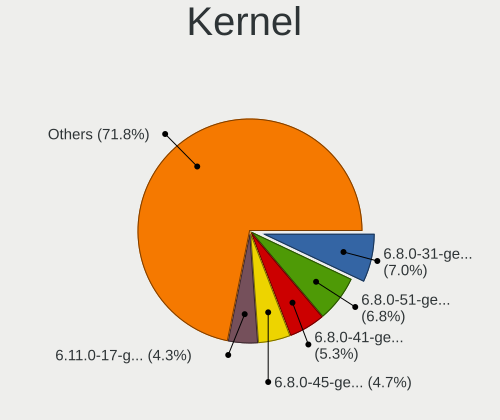

| Version           | Desktops | Percent |
|-------------------|----------|---------|
| 6.8.0-31-generic  | 267      | 7.03%   |
| 6.8.0-51-generic  | 258      | 6.79%   |
| 6.8.0-41-generic  | 202      | 5.32%   |
| 6.8.0-45-generic  | 179      | 4.71%   |
| 6.11.0-17-generic | 164      | 4.32%   |
| 6.8.0-48-generic  | 142      | 3.74%   |
| 6.8.0-49-generic  | 139      | 3.66%   |
| 6.11.0-26-generic | 131      | 3.45%   |
| 6.14.0-27-generic | 125      | 3.29%   |
| 6.14.0-33-generic | 116      | 3.05%   |
| 6.8.0-52-generic  | 109      | 2.87%   |
| 6.8.0-35-generic  | 103      | 2.71%   |
| 6.11.0-21-generic | 101      | 2.66%   |
| 6.8.0-47-generic  | 95       | 2.5%    |
| 6.14.0-37-generic | 93       | 2.45%   |
| 6.11.0-19-generic | 85       | 2.24%   |
| 6.14.0-29-generic | 84       | 2.21%   |
| 6.8.0-40-generic  | 74       | 1.95%   |
| 6.14.0-36-generic | 70       | 1.84%   |
| 6.8.0-38-generic  | 64       | 1.69%   |
| 6.8.0-36-generic  | 64       | 1.69%   |
| 6.11.0-25-generic | 64       | 1.69%   |
| 6.11.0-24-generic | 61       | 1.61%   |
| 6.8.0-39-generic  | 60       | 1.58%   |
| 6.14.0-35-generic | 60       | 1.58%   |
| 6.8.0-60-generic  | 52       | 1.37%   |
| 6.11.0-29-generic | 51       | 1.34%   |
| 6.8.0-44-generic  | 50       | 1.32%   |
| 6.14.0-24-generic | 48       | 1.26%   |
| 6.8.0-71-generic  | 39       | 1.03%   |
| 6.8.0-50-generic  | 37       | 0.97%   |
| 6.14.0-28-generic | 32       | 0.84%   |
| 6.8.0-79-generic  | 31       | 0.82%   |
| 6.8.0-55-generic  | 31       | 0.82%   |
| 6.8.0-57-generic  | 30       | 0.79%   |
| 6.8.0-58-generic  | 29       | 0.76%   |
| 6.8.0-85-generic  | 28       | 0.74%   |
| 6.8.0-87-generic  | 26       | 0.68%   |
| 6.8.0-88-generic  | 25       | 0.66%   |
| 6.8.0-62-generic  | 21       | 0.55%   |

Kernel Family
-------------

Linux kernel without a distro release

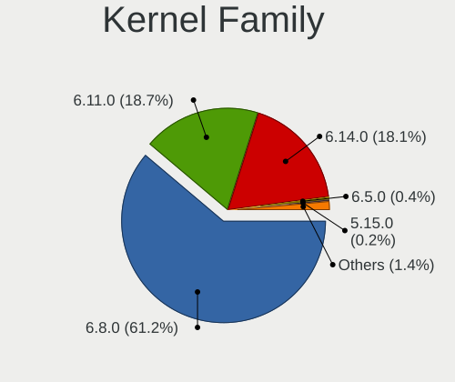

| Version | Desktops | Percent |
|---------|----------|---------|
| 6.8.0   | 2114     | 61.17%  |
| 6.11.0  | 646      | 18.69%  |
| 6.14.0  | 624      | 18.06%  |
| 6.5.0   | 15       | 0.43%   |
| 5.15.0  | 8        | 0.23%   |
| 6.6.0   | 6        | 0.17%   |
| 6.12.3  | 4        | 0.12%   |
| 6.9.0   | 3        | 0.09%   |
| 6.8.12  | 3        | 0.09%   |
| 6.16.0  | 3        | 0.09%   |
| 6.8.1   | 2        | 0.06%   |
| 6.2.0   | 2        | 0.06%   |
| 6.14.11 | 2        | 0.06%   |
| 6.13.0  | 2        | 0.06%   |
| 6.11.8  | 2        | 0.06%   |
| 6.9.9   | 1        | 0.03%   |
| 6.9.4   | 1        | 0.03%   |
| 6.9.3   | 1        | 0.03%   |
| 6.8.9   | 1        | 0.03%   |
| 6.7.0   | 1        | 0.03%   |
| 6.6.21  | 1        | 0.03%   |
| 6.5.11  | 1        | 0.03%   |
| 6.18.0  | 1        | 0.03%   |
| 6.17.0  | 1        | 0.03%   |
| 6.14.4  | 1        | 0.03%   |
| 6.14.1  | 1        | 0.03%   |
| 6.13.6  | 1        | 0.03%   |
| 6.13.30 | 1        | 0.03%   |
| 6.12.5  | 1        | 0.03%   |
| 6.12.21 | 1        | 0.03%   |
| 6.12.10 | 1        | 0.03%   |
| 6.12.0  | 1        | 0.03%   |
| 6.10.9  | 1        | 0.03%   |
| 6.10.14 | 1        | 0.03%   |
| 5.17.0  | 1        | 0.03%   |

Kernel Major Ver.
-----------------

Linux kernel major version

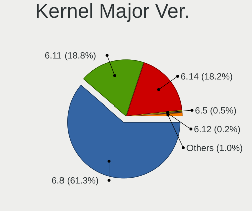

| Version | Desktops | Percent |
|---------|----------|---------|
| 6.8     | 2120     | 61.34%  |
| 6.11    | 648      | 18.75%  |
| 6.14    | 628      | 18.17%  |
| 6.5     | 16       | 0.46%   |
| 6.12    | 8        | 0.23%   |
| 5.15    | 8        | 0.23%   |
| 6.6     | 7        | 0.2%    |
| 6.9     | 6        | 0.17%   |
| 6.13    | 4        | 0.12%   |
| 6.16    | 3        | 0.09%   |
| 6.2     | 2        | 0.06%   |
| 6.10    | 2        | 0.06%   |
| 6.7     | 1        | 0.03%   |
| 6.18    | 1        | 0.03%   |
| 6.17    | 1        | 0.03%   |
| 5.17    | 1        | 0.03%   |

Arch
----

OS architecture (x86_64, i586, etc.)

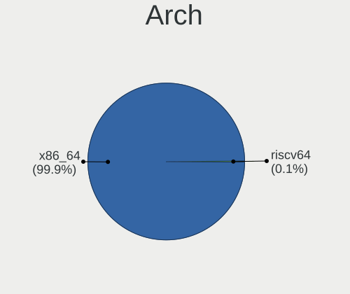

| Name    | Desktops | Percent |
|---------|----------|---------|
| x86_64  | 3361     | 99.91%  |
| riscv64 | 3        | 0.09%   |

DE
--

Desktop Environment

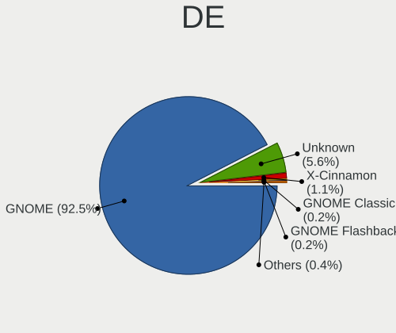

| Name                     | Desktops | Percent |
|--------------------------|----------|---------|
| GNOME                    | 3117     | 92.47%  |
| Unknown                  | 190      | 5.64%   |
| X-Cinnamon               | 37       | 1.1%    |
| GNOME Classic            | 7        | 0.21%   |
| GNOME Flashback          | 6        | 0.18%   |
| i3                       | 4        | 0.12%   |
| Cinnamon                 | 4        | 0.12%   |
| ubuntu                   | 1        | 0.03%   |
| sway                     | 1        | 0.03%   |
| qtile                    | 1        | 0.03%   |
| kubuntu-live-environment | 1        | 0.03%   |
| Hyprland                 | 1        | 0.03%   |
| fluxbox                  | 1        | 0.03%   |

Display Server
--------------

X11 or Wayland

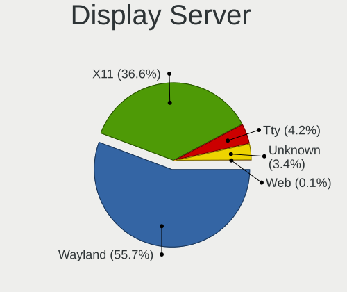

| Name    | Desktops | Percent |
|---------|----------|---------|
| Wayland | 1906     | 55.68%  |
| X11     | 1253     | 36.61%  |
| Tty     | 144      | 4.21%   |
| Unknown | 117      | 3.42%   |
| Web     | 3        | 0.09%   |

Display Manager
---------------

SDDM, LightDM, etc.

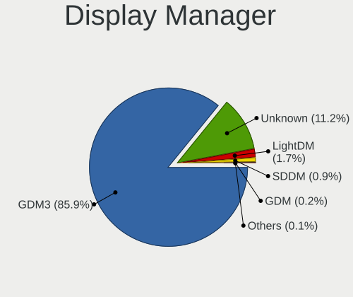

| Name    | Desktops | Percent |
|---------|----------|---------|
| GDM3    | 2903     | 85.89%  |
| Unknown | 377      | 11.15%  |
| LightDM | 59       | 1.75%   |
| SDDM    | 31       | 0.92%   |
| GDM     | 8        | 0.24%   |
| SLiM    | 2        | 0.06%   |

OS Lang
-------

Language

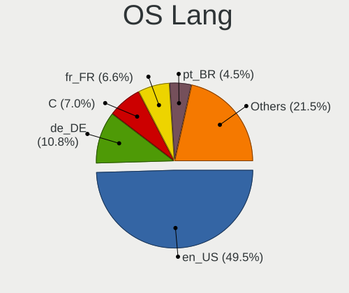

| Lang    | Desktops | Percent |
|---------|----------|---------|
| en_US   | 1677     | 49.54%  |
| de_DE   | 367      | 10.84%  |
| C       | 238      | 7.03%   |
| fr_FR   | 222      | 6.56%   |
| pt_BR   | 153      | 4.52%   |
| es_ES   | 122      | 3.6%    |
| it_IT   | 71       | 2.1%    |
| ru_RU   | 70       | 2.07%   |
| en_GB   | 68       | 2.01%   |
| nl_NL   | 45       | 1.33%   |
| zh_CN   | 42       | 1.24%   |
| pl_PL   | 33       | 0.97%   |
| en_CA   | 29       | 0.86%   |
| en_AU   | 23       | 0.68%   |
| Unknown | 23       | 0.68%   |
| hu_HU   | 22       | 0.65%   |
| fi_FI   | 19       | 0.56%   |
| cs_CZ   | 18       | 0.53%   |
| ja_JP   | 15       | 0.44%   |
| sv_SE   | 13       | 0.38%   |
| tr_TR   | 11       | 0.32%   |
| pt_PT   | 10       | 0.3%    |
| fr_CA   | 8        | 0.24%   |
| da_DK   | 7        | 0.21%   |
| nb_NO   | 5        | 0.15%   |
| de_AT   | 5        | 0.15%   |
| zh_TW   | 4        | 0.12%   |
| sr_RS   | 4        | 0.12%   |
| ko_KR   | 4        | 0.12%   |
| es_MX   | 4        | 0.12%   |
| en_NZ   | 4        | 0.12%   |
| el_GR   | 4        | 0.12%   |
| ca_ES   | 4        | 0.12%   |
| sk_SK   | 3        | 0.09%   |
| ro_RO   | 3        | 0.09%   |
| es_AR   | 3        | 0.09%   |
| en_ZA   | 3        | 0.09%   |
| de_CH   | 3        | 0.09%   |
| uk_UA   | 2        | 0.06%   |
| fr_CH   | 2        | 0.06%   |

Boot Mode
---------

EFI or BIOS

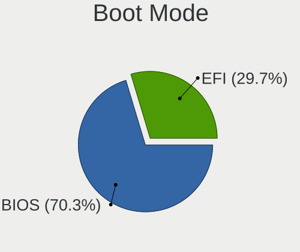

| Mode | Desktops | Percent |
|------|----------|---------|
| BIOS | 2384     | 70.35%  |
| EFI  | 1005     | 29.65%  |

Filesystem
----------

Type of filesystem

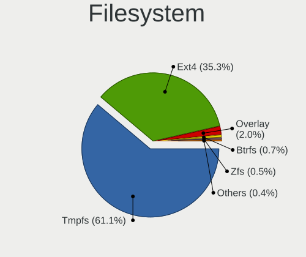

| Type    | Desktops | Percent |
|---------|----------|---------|
| Tmpfs   | 2069     | 61.14%  |
| Ext4    | 1194     | 35.28%  |
| Overlay | 68       | 2.01%   |
| Btrfs   | 22       | 0.65%   |
| Zfs     | 18       | 0.53%   |
| Xfs     | 10       | 0.3%    |
| Ext3    | 3        | 0.09%   |

Part. scheme
------------

Scheme of partitioning

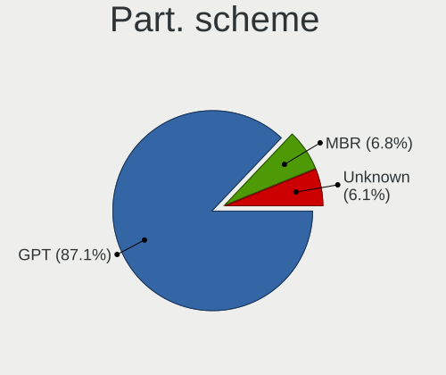

| Type    | Desktops | Percent |
|---------|----------|---------|
| GPT     | 2948     | 87.09%  |
| MBR     | 230      | 6.79%   |
| Unknown | 207      | 6.12%   |

Dual Boot with Linux/BSD
------------------------

Hosting more than one Linux/BSD

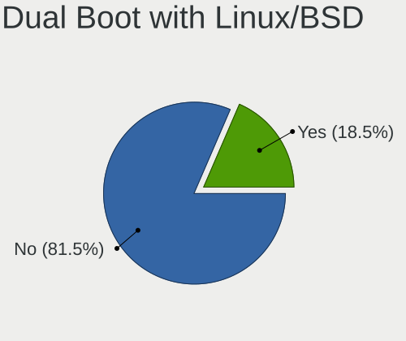

| Dual boot | Desktops | Percent |
|-----------|----------|---------|
| No        | 2782     | 81.49%  |
| Yes       | 632      | 18.51%  |

Dual Boot (Win)
---------------

Hosting Linux and Windows

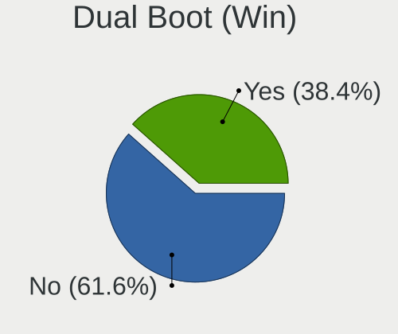

| Dual boot | Desktops | Percent |
|-----------|----------|---------|
| No        | 2101     | 61.58%  |
| Yes       | 1311     | 38.42%  |

Board
-----

Vendor
------

Motherboard manufacturer

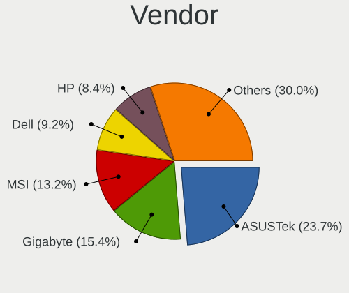

| Name                                 | Desktops | Percent |
|--------------------------------------|----------|---------|
| ASUSTek Computer                     | 798      | 23.72%  |
| Gigabyte Technology                  | 517      | 15.37%  |
| MSI                                  | 444      | 13.2%   |
| Dell                                 | 311      | 9.24%   |
| Hewlett-Packard                      | 284      | 8.44%   |
| ASRock                               | 253      | 7.52%   |
| Lenovo                               | 131      | 3.89%   |
| Unknown                              | 77       | 2.29%   |
| Intel                                | 73       | 2.17%   |
| Acer                                 | 59       | 1.75%   |
| Fujitsu                              | 31       | 0.92%   |
| Shenzhen Meigao Electronic Equipment | 27       | 0.8%    |
| Medion                               | 24       | 0.71%   |
| AZW                                  | 23       | 0.68%   |
| Pegatron                             | 22       | 0.65%   |
| Biostar                              | 20       | 0.59%   |
| Alienware                            | 14       | 0.42%   |
| MACHINIST                            | 13       | 0.39%   |
| Huanan                               | 12       | 0.36%   |
| ECS                                  | 11       | 0.33%   |
| Supermicro                           | 10       | 0.3%    |
| ASRockRack                           | 10       | 0.3%    |
| Foxconn                              | 9        | 0.27%   |
| Apple                                | 9        | 0.27%   |
| Gateway                              | 7        | 0.21%   |
| BESSTAR Tech                         | 7        | 0.21%   |
| Packard Bell                         | 6        | 0.18%   |
| GEEKOM                               | 6        | 0.18%   |
| Shuttle                              | 5        | 0.15%   |
| MAXSUN                               | 5        | 0.15%   |
| Positivo                             | 4        | 0.12%   |
| JGINYUE                              | 4        | 0.12%   |
| Google                               | 4        | 0.12%   |
| eMachines                            | 4        | 0.12%   |
| Colorful Technology                  | 4        | 0.12%   |
| AMD                                  | 4        | 0.12%   |
| Win element                          | 3        | 0.09%   |
| Soyo                                 | 3        | 0.09%   |
| PCWare                               | 3        | 0.09%   |
| HC Technology.                       | 3        | 0.09%   |

Model
-----

Motherboard model

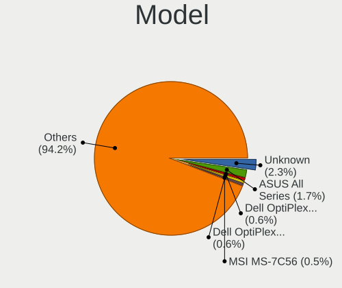

| Name                                              | Desktops | Percent |
|---------------------------------------------------|----------|---------|
| Unknown                                           | 79       | 2.35%   |
| ASUS All Series                                   | 58       | 1.72%   |
| Dell OptiPlex 7040                                | 20       | 0.59%   |
| Dell OptiPlex 7010                                | 20       | 0.59%   |
| MSI MS-7C56                                       | 18       | 0.54%   |
| MSI MS-7C37                                       | 18       | 0.54%   |
| MSI MS-7C91                                       | 16       | 0.48%   |
| Dell OptiPlex 3020                                | 14       | 0.42%   |
| MSI MS-7E26                                       | 13       | 0.39%   |
| Dell OptiPlex 9020                                | 12       | 0.36%   |
| AZW MINI S                                        | 12       | 0.36%   |
| Dell OptiPlex 3050                                | 11       | 0.33%   |
| ASUS PRIME B450M-A                                | 11       | 0.33%   |
| MSI MS-7C95                                       | 10       | 0.3%    |
| HP Compaq Elite 8300 SFF                          | 10       | 0.3%    |
| Gigabyte Z790 AORUS ELITE AX                      | 10       | 0.3%    |
| Gigabyte B450M DS3H                               | 10       | 0.3%    |
| Dell OptiPlex 790                                 | 10       | 0.3%    |
| Dell OptiPlex 7020                                | 10       | 0.3%    |
| MSI MS-7C02                                       | 9        | 0.27%   |
| MSI MS-7B86                                       | 9        | 0.27%   |
| MSI MS-7817                                       | 9        | 0.27%   |
| Gigabyte B550M DS3H                               | 9        | 0.27%   |
| Dell XPS 8700                                     | 9        | 0.27%   |
| ASUS TUF Gaming B650M-E WIFI                      | 9        | 0.27%   |
| MSI MS-7C52                                       | 8        | 0.24%   |
| Intel H61                                         | 8        | 0.24%   |
| Dell OptiPlex 990                                 | 8        | 0.24%   |
| Dell OptiPlex 755                                 | 8        | 0.24%   |
| Dell Inspiron 3847                                | 8        | 0.24%   |
| ASUS TUF Gaming X570-PLUS                         | 8        | 0.24%   |
| ASUS ROG STRIX B550-F GAMING                      | 8        | 0.24%   |
| Shenzhen Meigao Electronic Equipment Venus series | 7        | 0.21%   |
| MSI MS-7A38                                       | 7        | 0.21%   |
| MSI MS-7693                                       | 7        | 0.21%   |
| Intel H81                                         | 7        | 0.21%   |
| Intel B75                                         | 7        | 0.21%   |
| HP Z440 Workstation                               | 7        | 0.21%   |
| HP Z400 Workstation                               | 7        | 0.21%   |
| HP Compaq Pro 6300 SFF                            | 7        | 0.21%   |

Model Family
------------

Motherboard model prefix

| Name                | Desktops | Percent |
|---------------------|----------|---------|
| Dell OptiPlex       | 186      | 5.53%   |
| ASUS PRIME          | 184      | 5.47%   |
| ASUS ROG            | 137      | 4.07%   |
| ASUS TUF            | 93       | 2.76%   |
| Unknown             | 79       | 2.35%   |
| Lenovo ThinkCentre  | 74       | 2.2%    |
| ASUS All            | 58       | 1.72%   |
| HP Compaq           | 55       | 1.63%   |
| Dell Precision      | 54       | 1.61%   |
| HP EliteDesk        | 44       | 1.31%   |
| HP ProDesk          | 38       | 1.13%   |
| Acer Aspire         | 33       | 0.98%   |
| Gigabyte Z790       | 26       | 0.77%   |
| Dell Inspiron       | 26       | 0.77%   |
| Dell XPS            | 24       | 0.71%   |
| Gigabyte B450M      | 23       | 0.68%   |
| Fujitsu ESPRIMO     | 23       | 0.68%   |
| Lenovo ThinkStation | 21       | 0.62%   |
| Gigabyte B550M      | 21       | 0.62%   |
| Gigabyte X570       | 19       | 0.56%   |
| MSI MS-7C56         | 18       | 0.54%   |
| MSI MS-7C37         | 18       | 0.54%   |
| Gigabyte B550       | 18       | 0.54%   |
| HP Pavilion         | 17       | 0.51%   |
| ASUS P8Z77-V        | 17       | 0.51%   |
| MSI MS-7C91         | 16       | 0.48%   |
| ASUS ProArt         | 16       | 0.48%   |
| ASRock B450M        | 16       | 0.48%   |
| Gigabyte B450       | 15       | 0.45%   |
| ASUS M5A78L-M       | 15       | 0.45%   |
| Acer Veriton        | 15       | 0.45%   |
| MSI MS-7E26         | 13       | 0.39%   |
| Gigabyte B650       | 13       | 0.39%   |
| ASRock X570         | 13       | 0.39%   |
| HP ProLiant         | 12       | 0.36%   |
| Gigabyte Z390       | 12       | 0.36%   |
| Gigabyte B760M      | 12       | 0.36%   |
| AZW MINI            | 12       | 0.36%   |
| MSI MS-7C95         | 10       | 0.3%    |
| Intel H61           | 10       | 0.3%    |

MFG Year
--------

Motherboard manufacture year

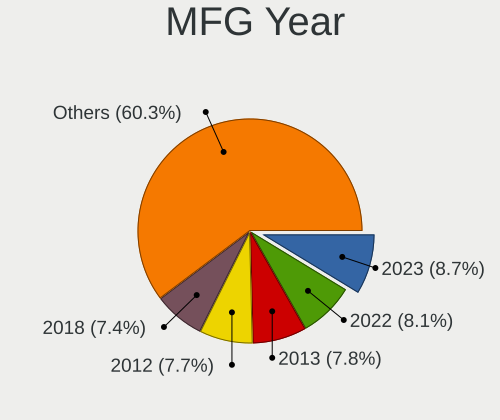

| Year    | Desktops | Percent |
|---------|----------|---------|
| 2023    | 293      | 8.71%   |
| 2022    | 272      | 8.09%   |
| 2013    | 263      | 7.82%   |
| 2012    | 260      | 7.73%   |
| 2018    | 249      | 7.4%    |
| 2020    | 245      | 7.28%   |
| 2024    | 222      | 6.6%    |
| 2021    | 220      | 6.54%   |
| 2019    | 204      | 6.06%   |
| 2014    | 195      | 5.8%    |
| 2017    | 158      | 4.7%    |
| 2011    | 157      | 4.67%   |
| 2015    | 146      | 4.34%   |
| 2016    | 139      | 4.13%   |
| 2010    | 111      | 3.3%    |
| 2009    | 86       | 2.56%   |
| 2008    | 51       | 1.52%   |
| 2025    | 49       | 1.46%   |
| 2007    | 33       | 0.98%   |
| 2006    | 9        | 0.27%   |
| 2005    | 1        | 0.03%   |
| Unknown | 1        | 0.03%   |

Form Factor
-----------

Physical design of the computer

| Name    | Desktops | Percent |
|---------|----------|---------|
| Desktop | 3364     | 100%    |

Secure Boot
-----------

Enabled or disabled

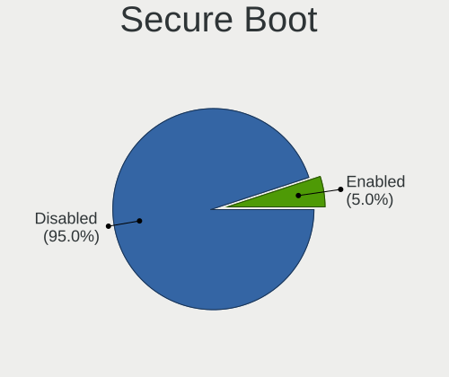

| State    | Desktops | Percent |
|----------|----------|---------|
| Disabled | 3200     | 94.96%  |
| Enabled  | 170      | 5.04%   |

Coreboot
--------

Have coreboot on board

| Used | Desktops | Percent |
|------|----------|---------|
| No   | 3359     | 99.85%  |
| Yes  | 5        | 0.15%   |

RAM Size
--------

Total RAM memory

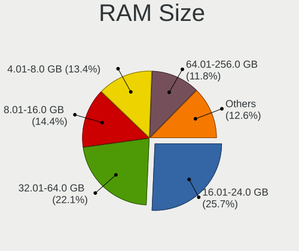

| Size in GB      | Desktops | Percent |
|-----------------|----------|---------|
| 16.01-24.0      | 874      | 25.71%  |
| 32.01-64.0      | 752      | 22.12%  |
| 8.01-16.0       | 488      | 14.35%  |
| 4.01-8.0        | 456      | 13.41%  |
| 64.01-256.0     | 400      | 11.76%  |
| 3.01-4.0        | 200      | 5.88%   |
| 24.01-32.0      | 186      | 5.47%   |
| More than 256.0 | 19       | 0.56%   |
| 2.01-3.0        | 14       | 0.41%   |
| 1.01-2.0        | 11       | 0.32%   |

RAM Used
--------

Used RAM memory

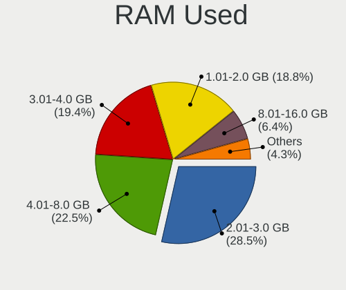

| Used GB     | Desktops | Percent |
|-------------|----------|---------|
| 2.01-3.0    | 1032     | 28.55%  |
| 4.01-8.0    | 814      | 22.52%  |
| 3.01-4.0    | 700      | 19.36%  |
| 1.01-2.0    | 680      | 18.81%  |
| 8.01-16.0   | 232      | 6.42%   |
| 0.51-1.0    | 56       | 1.55%   |
| 16.01-24.0  | 51       | 1.41%   |
| 24.01-32.0  | 22       | 0.61%   |
| 32.01-64.0  | 13       | 0.36%   |
| 0.01-0.5    | 11       | 0.3%    |
| 64.01-256.0 | 4        | 0.11%   |

Total Drives
------------

Number of drives on board

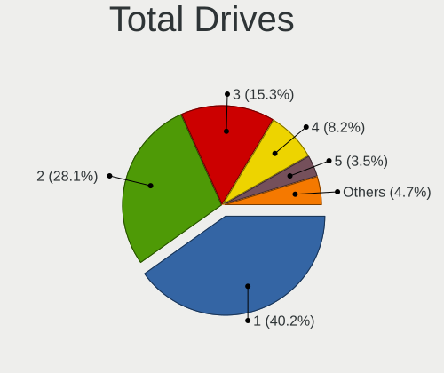

| Drives | Desktops | Percent |
|--------|----------|---------|
| 1      | 1391     | 40.17%  |
| 2      | 974      | 28.13%  |
| 3      | 530      | 15.3%   |
| 4      | 283      | 8.17%   |
| 5      | 122      | 3.52%   |
| 6      | 57       | 1.65%   |
| 0      | 36       | 1.04%   |
| 7      | 28       | 0.81%   |
| 8      | 21       | 0.61%   |
| 9      | 9        | 0.26%   |
| 10     | 5        | 0.14%   |
| 12     | 3        | 0.09%   |
| 16     | 2        | 0.06%   |
| 14     | 1        | 0.03%   |
| 11     | 1        | 0.03%   |

Has CD-ROM
----------

Has CD-ROM on board

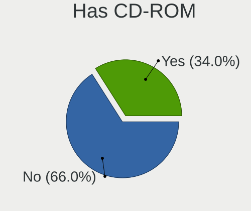

| Presented | Desktops | Percent |
|-----------|----------|---------|
| No        | 2225     | 65.97%  |
| Yes       | 1148     | 34.03%  |

Has Ethernet
------------

Has Ethernet on board

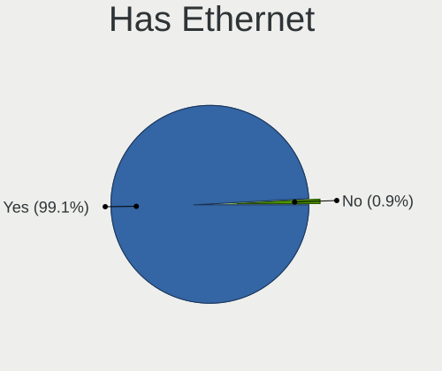

| Presented | Desktops | Percent |
|-----------|----------|---------|
| Yes       | 3335     | 99.14%  |
| No        | 29       | 0.86%   |

Has WiFi
--------

Has WiFi module

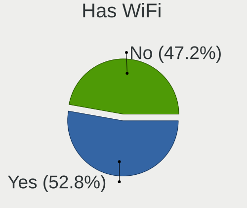

| Presented | Desktops | Percent |
|-----------|----------|---------|
| Yes       | 1790     | 52.8%   |
| No        | 1600     | 47.2%   |

Has Bluetooth
-------------

Has Bluetooth module

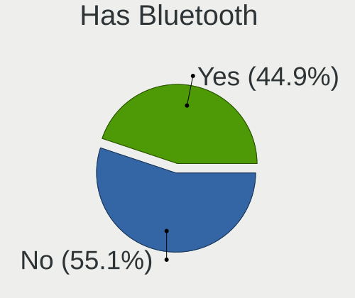

| Presented | Desktops | Percent |
|-----------|----------|---------|
| No        | 1873     | 55.12%  |
| Yes       | 1525     | 44.88%  |

Location
--------

Country
-------

Geographic location (country)

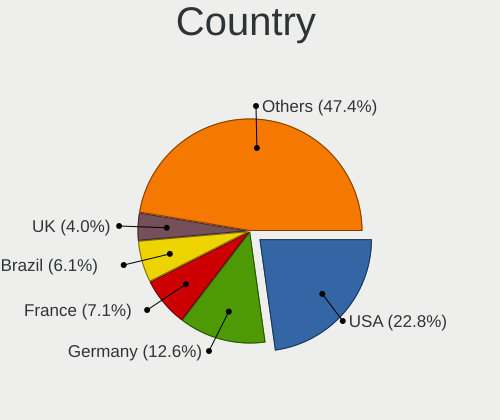

| Country         | Desktops | Percent |
|-----------------|----------|---------|
| USA             | 770      | 22.79%  |
| Germany         | 426      | 12.61%  |
| France          | 241      | 7.13%   |
| Brazil          | 205      | 6.07%   |
| UK              | 136      | 4.03%   |
| Canada          | 133      | 3.94%   |
| Russia          | 110      | 3.26%   |
| Italy           | 106      | 3.14%   |
| Spain           | 98       | 2.9%    |
| Australia       | 77       | 2.28%   |
| Netherlands     | 74       | 2.19%   |
| Poland          | 65       | 1.92%   |
| China           | 60       | 1.78%   |
| India           | 44       | 1.3%    |
| Austria         | 42       | 1.24%   |
| Sweden          | 41       | 1.21%   |
| Finland         | 40       | 1.18%   |
| Belgium         | 36       | 1.07%   |
| Switzerland     | 34       | 1.01%   |
| Hungary         | 31       | 0.92%   |
| Mexico          | 29       | 0.86%   |
| Czechia         | 29       | 0.86%   |
| South Africa    | 28       | 0.83%   |
| Turkey          | 26       | 0.77%   |
| Japan           | 24       | 0.71%   |
| Argentina       | 24       | 0.71%   |
| Thailand        | 22       | 0.65%   |
| Romania         | 20       | 0.59%   |
| Greece          | 20       | 0.59%   |
| Portugal        | 18       | 0.53%   |
| Norway          | 18       | 0.53%   |
| Israel          | 17       | 0.5%    |
| Serbia          | 16       | 0.47%   |
| Denmark         | 15       | 0.44%   |
| Taiwan          | 14       | 0.41%   |
| Iran            | 14       | 0.41%   |
| Slovakia        | 13       | 0.38%   |
| South Korea     | 11       | 0.33%   |
| Indonesia       | 11       | 0.33%   |
| The Netherlands | 10       | 0.3%    |

City
----

Geographic location (city)

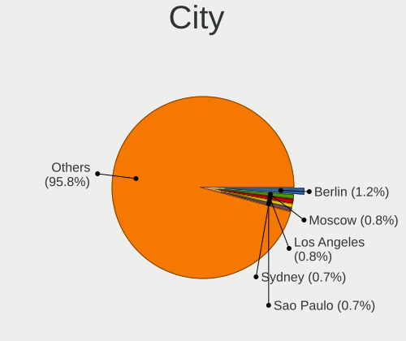

| City              | Desktops | Percent |
|-------------------|----------|---------|
| Berlin            | 41       | 1.18%   |
| Moscow            | 29       | 0.84%   |
| Los Angeles       | 29       | 0.84%   |
| Sydney            | 24       | 0.69%   |
| Sao Paulo         | 24       | 0.69%   |
| Munich            | 22       | 0.63%   |
| Melbourne         | 21       | 0.61%   |
| Helsinki          | 21       | 0.61%   |
| Warsaw            | 19       | 0.55%   |
| Vienna            | 19       | 0.55%   |
| Paris             | 18       | 0.52%   |
| Milan             | 18       | 0.52%   |
| Madrid            | 16       | 0.46%   |
| Chicago           | 16       | 0.46%   |
| Montreal          | 15       | 0.43%   |
| Hamburg           | 15       | 0.43%   |
| Toronto           | 14       | 0.4%    |
| St Petersburg     | 14       | 0.4%    |
| Rome              | 14       | 0.4%    |
| New York          | 13       | 0.37%   |
| Belgrade          | 13       | 0.37%   |
| Stockholm         | 12       | 0.35%   |
| Shanghai          | 12       | 0.35%   |
| Seattle           | 12       | 0.35%   |
| London            | 12       | 0.35%   |
| Frankfurt am Main | 12       | 0.35%   |
| Calgary           | 12       | 0.35%   |
| Atlanta           | 12       | 0.35%   |
| Athens            | 12       | 0.35%   |
| Houston           | 11       | 0.32%   |
| Bucharest         | 11       | 0.32%   |
| Brisbane          | 11       | 0.32%   |
| Rio de Janeiro    | 10       | 0.29%   |
| Portland          | 10       | 0.29%   |
| Krakow            | 10       | 0.29%   |
| Johannesburg      | 10       | 0.29%   |
| Cape Town         | 10       | 0.29%   |
| Budapest          | 10       | 0.29%   |
| Amsterdam         | 10       | 0.29%   |
| Tehran            | 9        | 0.26%   |

Drives
------

Drive Vendor
------------

Hard drive vendors

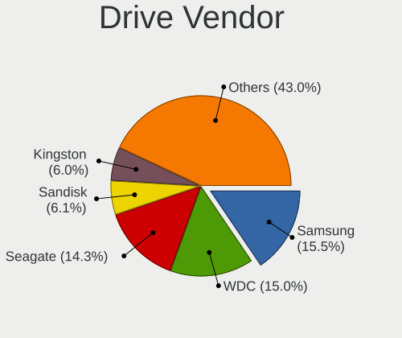

| Vendor                       | Desktops | Drives | Percent |
|------------------------------|----------|--------|---------|
| Samsung Electronics          | 931      | 1510   | 15.52%  |
| WDC                          | 900      | 1350   | 15.01%  |
| Seagate                      | 858      | 1358   | 14.3%   |
| Sandisk                      | 367      | 478    | 6.12%   |
| Kingston                     | 361      | 498    | 6.02%   |
| Crucial                      | 297      | 391    | 4.95%   |
| Toshiba                      | 208      | 293    | 3.47%   |
| Hitachi                      | 123      | 157    | 2.05%   |
| Kingston Technology Company  | 82       | 101    | 1.37%   |
| China                        | 82       | 94     | 1.37%   |
| Unknown                      | 80       | 153    | 1.33%   |
| Micron/Crucial Technology    | 80       | 108    | 1.33%   |
| Intel                        | 80       | 92     | 1.33%   |
| Micron Technology            | 75       | 91     | 1.25%   |
| MAXIO Technology (Hangzhou)  | 74       | 84     | 1.23%   |
| A-DATA Technology            | 72       | 91     | 1.2%    |
| Phison Electronics           | 71       | 103    | 1.18%   |
| SK hynix                     | 64       | 73     | 1.07%   |
| HGST                         | 61       | 108    | 1.02%   |
| PNY                          | 56       | 73     | 0.93%   |
| Intenso                      | 51       | 80     | 0.85%   |
| SPCC                         | 46       | 53     | 0.77%   |
| Team                         | 39       | 54     | 0.65%   |
| Silicon Motion               | 39       | 57     | 0.65%   |
| Realtek Semiconductor        | 32       | 35     | 0.53%   |
| ADATA Technology             | 31       | 39     | 0.52%   |
| KIOXIA                       | 27       | 40     | 0.45%   |
| Patriot                      | 26       | 28     | 0.43%   |
| Lexar                        | 26       | 26     | 0.43%   |
| KingSpec                     | 26       | 30     | 0.43%   |
| Fanxiang                     | 24       | 43     | 0.4%    |
| Unknown                      | 23       | 32     | 0.38%   |
| Transcend                    | 22       | 36     | 0.37%   |
| OCZ                          | 20       | 24     | 0.33%   |
| Corsair                      | 20       | 25     | 0.33%   |
| Shenzhen Longsys Electronics | 19       | 24     | 0.32%   |
| MSI                          | 19       | 19     | 0.32%   |
| Maxtor                       | 19       | 25     | 0.32%   |
| Gigabyte Technology          | 19       | 30     | 0.32%   |
| T-FORCE                      | 18       | 22     | 0.3%    |

Drive Model
-----------

Hard drive models

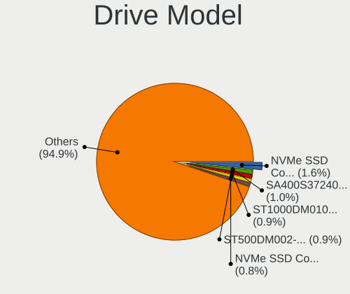

| Model                                                 | Desktops | Percent |
|-------------------------------------------------------|----------|---------|
| Samsung NVMe SSD Controller SM981/PM981/PM983 1TB     | 111      | 1.62%   |
| Kingston SA400S37240G 240GB SSD                       | 68       | 0.99%   |
| Seagate ST1000DM010-2EP102 1TB                        | 61       | 0.89%   |
| Seagate ST500DM002-1BD142 500GB                       | 59       | 0.86%   |
| Samsung NVMe SSD Controller PM9A1/PM9A3/980PRO 1TB    | 52       | 0.76%   |
| Samsung SSD 990 PRO 2TB                               | 50       | 0.73%   |
| Samsung SSD 850 EVO 250GB                             | 49       | 0.72%   |
| Kingston SA400S37480G 480GB SSD                       | 49       | 0.72%   |
| Seagate ST2000DM008-2FR102 2TB                        | 44       | 0.64%   |
| Toshiba DT01ACA100 1TB                                | 42       | 0.61%   |
| Crucial CT1000MX500SSD1 1TB                           | 42       | 0.61%   |
| Samsung SSD 850 EVO 500GB                             | 39       | 0.57%   |
| MAXIO (Hangzhou) NVMe SSD Controller MAP1202 2TB      | 39       | 0.57%   |
| Samsung SSD 860 EVO 500GB                             | 38       | 0.55%   |
| WDC WD10EZEX-08WN4A0 1TB                              | 37       | 0.54%   |
| Samsung SSD 980 1TB                                   | 37       | 0.54%   |
| Micron/Crucial P2 NVMe PCIe SSD 2TB                   | 37       | 0.54%   |
| Samsung SSD 860 EVO 1TB                               | 34       | 0.5%    |
| Crucial CT500MX500SSD1 500GB                          | 34       | 0.5%    |
| Samsung SSD 870 EVO 1TB                               | 33       | 0.48%   |
| Kingston SA400S37120G 120GB SSD                       | 32       | 0.47%   |
| Seagate ST1000DM003-1CH162 1TB                        | 31       | 0.45%   |
| SanDisk NVMe SSD Drive 1TB                            | 31       | 0.45%   |
| Silicon Motion SM2263EN/SM2263XT SSD Controller 512GB | 28       | 0.41%   |
| Crucial CT240BX500SSD1 240GB                          | 27       | 0.39%   |
| Seagate ST4000DM004-2CV104 4TB                        | 26       | 0.38%   |
| Seagate ST3500418AS 500GB                             | 26       | 0.38%   |
| Kingston SA400S37960G 960GB SSD                       | 26       | 0.38%   |
| Crucial CT1000BX500SSD1 1TB                           | 26       | 0.38%   |
| Unknown SD/MMC/MS PRO 2GB                             | 25       | 0.36%   |
| Seagate ST2000DM001-1CH164 2TB                        | 23       | 0.34%   |
| Seagate ST1000DM003-1SB102 1TB                        | 23       | 0.34%   |
| Samsung SSD 870 QVO 1TB                               | 23       | 0.34%   |
| Samsung SSD 870 EVO 500GB                             | 23       | 0.34%   |
| Phison E12 NVMe Controller 1TB                        | 23       | 0.34%   |
| Unknown                                               | 23       | 0.34%   |
| Samsung SSD 840 EVO 250GB                             | 22       | 0.32%   |
| Kingston Company SNV2S1000G 1TB                       | 22       | 0.32%   |
| Toshiba DT01ACA200 2TB                                | 21       | 0.31%   |
| Seagate ST31000528AS 1TB                              | 21       | 0.31%   |

HDD Vendor
----------

Hard disk drive vendors

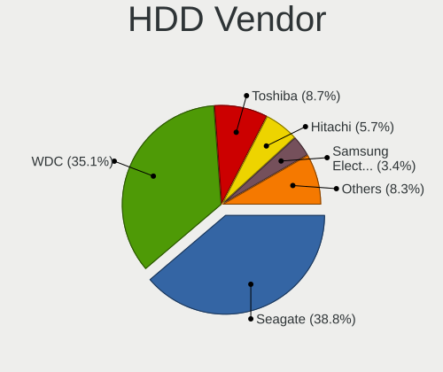

| Vendor              | Desktops | Drives  | Percent |
|---------------------|----------|---------|---------|
| Seagate             | 843      | 1316    | 38.78%  |
| WDC                 | 762      | 1140    | 35.05%  |
| Toshiba             | 190      | 262     | 8.74%   |
| Hitachi             | 123      | 157     | 5.66%   |
| Samsung Electronics | 75       | 104     | 3.45%   |
| HGST                | 60       | 107     | 2.76%   |
| Unknown             | 28       | 40      | 1.29%   |
| Maxtor              | 18       | 24      | 0.83%   |
| JMicron Technology  | 8        | 9       | 0.37%   |
| Hewlett-Packard     | 8        | 12      | 0.37%   |
| Intenso             | 7        | 13      | 0.32%   |
| ASMT                | 5        | 13      | 0.23%   |
| Apple               | 5        | 5       | 0.23%   |
| USB3.0              | 4        | 4       | 0.18%   |
| Fujitsu             | 4        | 5       | 0.18%   |
| External            | 4        | 5       | 0.18%   |
| T-FORCE             | 3        | 3       | 0.14%   |
| HPE                 | 3        | 6       | 0.14%   |
| TO Exter            | 2        | 2       | 0.09%   |
| SSK                 | 2        | 2       | 0.09%   |
| SABRENT             | 2        | 3       | 0.09%   |
| Unknown             | 2        | 3       | 0.09%   |
| USB 3.1             | 1        | 1       | 0.05%   |
| SATAFIRM            | 1        | 1       | 0.05%   |
| SAGE                | 1        | Unknown | 0.05%   |
| QUANTUM             | 1        | 4       | 0.05%   |
| QEMU                | 1        | 1       | 0.05%   |
| PRO-T5              | 1        | 1       | 0.05%   |
| ipTIME              | 1        | 1       | 0.05%   |
| Inateck             | 1        | 1       | 0.05%   |
| IET                 | 1        | 1       | 0.05%   |
| IBM-D050            | 1        | 2       | 0.05%   |
| HGST HUH            | 1        | 1       | 0.05%   |
| HGST HTS            | 1        | 1       | 0.05%   |
| ExcelStor           | 1        | 1       | 0.05%   |
| EAGET               | 1        | 1       | 0.05%   |
| ASMedia             | 1        | 1       | 0.05%   |
| ASM                 | 1        | 1       | 0.05%   |

SSD Vendor
----------

Solid state drive vendors

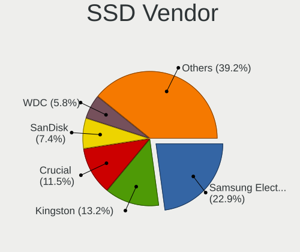

| Vendor              | Desktops | Drives | Percent |
|---------------------|----------|--------|---------|
| Samsung Electronics | 477      | 681    | 22.86%  |
| Kingston            | 275      | 363    | 13.18%  |
| Crucial             | 241      | 309    | 11.55%  |
| SanDisk             | 154      | 190    | 7.38%   |
| WDC                 | 122      | 153    | 5.85%   |
| China               | 78       | 90     | 3.74%   |
| A-DATA Technology   | 56       | 69     | 2.68%   |
| PNY                 | 54       | 70     | 2.59%   |
| Intenso             | 44       | 65     | 2.11%   |
| Intel               | 43       | 50     | 2.06%   |
| SPCC                | 36       | 41     | 1.72%   |
| Micron Technology   | 31       | 40     | 1.49%   |
| Team                | 26       | 34     | 1.25%   |
| Patriot             | 23       | 25     | 1.1%    |
| KingSpec            | 22       | 25     | 1.05%   |
| OCZ                 | 20       | 24     | 0.96%   |
| Transcend           | 19       | 30     | 0.91%   |
| SK hynix            | 18       | 18     | 0.86%   |
| GOODRAM             | 15       | 24     | 0.72%   |
| Corsair             | 14       | 18     | 0.67%   |
| Unknown             | 12       | 18     | 0.57%   |
| Lexar               | 11       | 11     | 0.53%   |
| Fanxiang            | 11       | 24     | 0.53%   |
| Apacer              | 11       | 12     | 0.53%   |
| Toshiba             | 10       | 13     | 0.48%   |
| Netac               | 10       | 12     | 0.48%   |
| LITEON              | 10       | 10     | 0.48%   |
| Gigabyte Technology | 10       | 20     | 0.48%   |
| Verbatim            | 9        | 11     | 0.43%   |
| T-FORCE             | 8        | 10     | 0.38%   |
| XrayDisk            | 7        | 10     | 0.34%   |
| SABRENT             | 7        | 10     | 0.34%   |
| MSI                 | 7        | 7      | 0.34%   |
| KIOXIA-EXCERIA      | 7        | 7      | 0.34%   |
| Seagate             | 6        | 10     | 0.29%   |
| Hewlett-Packard     | 6        | 6      | 0.29%   |
| Rayson              | 5        | 6      | 0.24%   |
| LITEONIT            | 5        | 6      | 0.24%   |
| Emtec               | 5        | 6      | 0.24%   |
| ASMT                | 5        | 5      | 0.24%   |

Drive Kind
----------

HDD or SSD

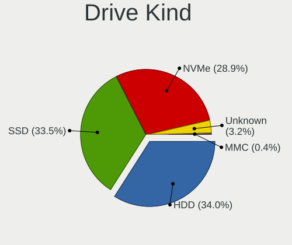

| Kind    | Desktops | Drives | Percent |
|---------|----------|--------|---------|
| HDD     | 1748     | 3254   | 34.03%  |
| SSD     | 1719     | 2716   | 33.47%  |
| NVMe    | 1484     | 2332   | 28.89%  |
| Unknown | 164      | 244    | 3.19%   |
| MMC     | 21       | 25     | 0.41%   |

Drive Connector
---------------

SATA, SAS, NVMe, etc.

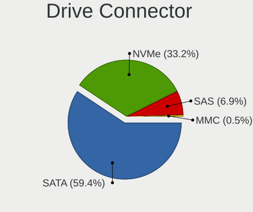

| Type | Desktops | Drives | Percent |
|------|----------|--------|---------|
| SATA | 2642     | 5717   | 59.36%  |
| NVMe | 1479     | 2301   | 33.23%  |
| SAS  | 309      | 528    | 6.94%   |
| MMC  | 21       | 25     | 0.47%   |

Drive Size
----------

Size of hard drive

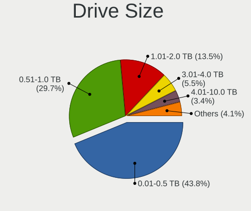

| Size in TB | Desktops | Drives | Percent |
|------------|----------|--------|---------|
| 0.01-0.5   | 1681     | 2650   | 43.81%  |
| 0.51-1.0   | 1141     | 1656   | 29.74%  |
| 1.01-2.0   | 518      | 773    | 13.5%   |
| 3.01-4.0   | 210      | 379    | 5.47%   |
| 4.01-10.0  | 131      | 246    | 3.41%   |
| 2.01-3.0   | 95       | 140    | 2.48%   |
| 10.01-20.0 | 58       | 123    | 1.51%   |
| 20.01-50.0 | 3        | 3      | 0.08%   |

Space Total
-----------

Amount of disk space available on the file system

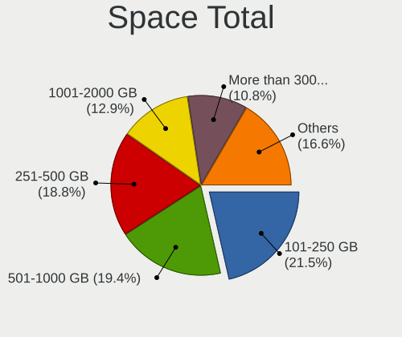

| Size in GB     | Desktops | Percent |
|----------------|----------|---------|
| 101-250        | 749      | 21.46%  |
| 501-1000       | 677      | 19.39%  |
| 251-500        | 658      | 18.85%  |
| 1001-2000      | 451      | 12.92%  |
| More than 3000 | 376      | 10.77%  |
| 2001-3000      | 185      | 5.3%    |
| 1-20           | 155      | 4.44%   |
| 51-100         | 137      | 3.92%   |
| 21-50          | 67       | 1.92%   |
| Unknown        | 36       | 1.03%   |

Space Used
----------

Amount of used disk space

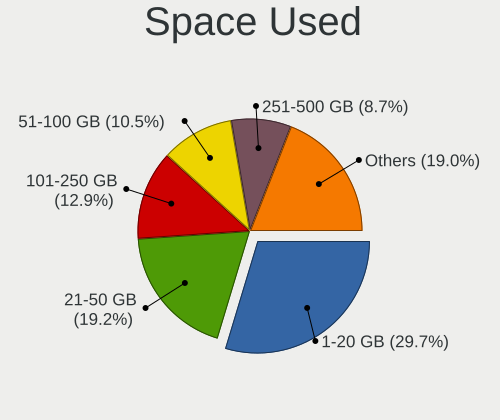

| Used GB        | Desktops | Percent |
|----------------|----------|---------|
| 1-20           | 1065     | 29.66%  |
| 21-50          | 691      | 19.24%  |
| 101-250        | 462      | 12.87%  |
| 51-100         | 378      | 10.53%  |
| 251-500        | 311      | 8.66%   |
| 501-1000       | 253      | 7.05%   |
| 1001-2000      | 189      | 5.26%   |
| More than 3000 | 139      | 3.87%   |
| 2001-3000      | 67       | 1.87%   |
| Unknown        | 36       | 1%      |

Malfunc. Drives
---------------

Drive models with a malfunction

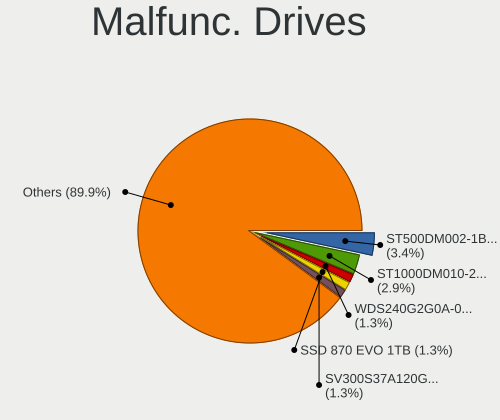

| Model                                 | Desktops | Drives | Percent |
|---------------------------------------|----------|--------|---------|
| Seagate ST500DM002-1BD142 500GB       | 8        | 8      | 3.36%   |
| Seagate ST1000DM010-2EP102 1TB        | 7        | 7      | 2.94%   |
| WDC WDS240G2G0A-00JH30 240GB SSD      | 3        | 4      | 1.26%   |
| Samsung Electronics SSD 870 EVO 1TB   | 3        | 4      | 1.26%   |
| Kingston SV300S37A120G 120GB SSD      | 3        | 3      | 1.26%   |
| WDC WD5000AAKX-60U6AA0 500GB          | 2        | 2      | 0.84%   |
| WDC WD5000AAKX-22ERMA0 500GB          | 2        | 5      | 0.84%   |
| WDC WD20EZRX-00DC0B0 2TB              | 2        | 2      | 0.84%   |
| WDC WD10EZEX-00BN5A0 1TB              | 2        | 2      | 0.84%   |
| Seagate ST9250315AS 250GB             | 2        | 2      | 0.84%   |
| Seagate ST3500418AS 500GB             | 2        | 2      | 0.84%   |
| Seagate ST3500412AS 500GB             | 2        | 2      | 0.84%   |
| Seagate ST3250410AS 250GB             | 2        | 2      | 0.84%   |
| Seagate ST31000528AS 1TB              | 2        | 2      | 0.84%   |
| Seagate ST3000DM008-2DM166 3TB        | 2        | 2      | 0.84%   |
| Seagate ST2000DM008-2FR102 2TB        | 2        | 2      | 0.84%   |
| Seagate ST2000DM001-1CH164 2TB        | 2        | 2      | 0.84%   |
| Samsung Electronics SSD 980 PRO 1TB   | 2        | 2      | 0.84%   |
| Samsung Electronics SSD 970 EVO 500GB | 2        | 2      | 0.84%   |
| Samsung Electronics SSD 870 EVO 2TB   | 2        | 2      | 0.84%   |
| Samsung Electronics SSD 840 EVO 250GB | 2        | 2      | 0.84%   |
| Samsung Electronics HD502IJ 500GB     | 2        | 2      | 0.84%   |
| Samsung Electronics HD103SI 1TB       | 2        | 2      | 0.84%   |
| HGST HTS721010A9E630 1TB              | 2        | 2      | 0.84%   |
| HGST HTS541010A9E680 1TB              | 2        | 2      | 0.84%   |
| China SSD 500GB                       | 2        | 2      | 0.84%   |
| YS SSD 128GB                          | 1        | 1      | 0.42%   |
| XPG SPECTRIX S40G 1TB                 | 1        | 1      | 0.42%   |
| WDC WD6400AAKS-08A7B0 640GB           | 1        | 1      | 0.42%   |
| WDC WD60EFRX-68L0BN1 6TB              | 1        | 5      | 0.42%   |
| WDC WD5000LPCX-00VHAT0 500GB          | 1        | 1      | 0.42%   |
| WDC WD5000BEVT-75A0RT0 500GB          | 1        | 1      | 0.42%   |
| WDC WD5000BEVT-60ZAT1 500GB           | 1        | 1      | 0.42%   |
| WDC WD5000AZLX-08K2TA0 500GB          | 1        | 1      | 0.42%   |
| WDC WD5000AVVS-63M8B0 500GB           | 1        | 1      | 0.42%   |
| WDC WD5000AAKX-75U6AA0 500GB          | 1        | 1      | 0.42%   |
| WDC WD5000AAKX-753CA1 500GB           | 1        | 1      | 0.42%   |
| WDC WD5000AAKX-08U6AA0 500GB          | 1        | 1      | 0.42%   |
| WDC WD5000AAKX-00ERMA0 500GB          | 1        | 1      | 0.42%   |
| WDC WD5000AAKX-001CA0 500GB           | 1        | 1      | 0.42%   |

Malfunc. Drive Vendor
---------------------

Vendors of faulty drives

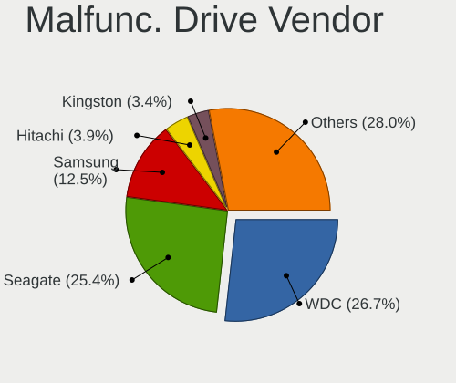

| Vendor                | Desktops | Drives | Percent |
|-----------------------|----------|--------|---------|
| WDC                   | 62       | 84     | 26.72%  |
| Seagate               | 59       | 67     | 25.43%  |
| Samsung Electronics   | 29       | 33     | 12.5%   |
| Hitachi               | 9        | 12     | 3.88%   |
| Kingston              | 8        | 8      | 3.45%   |
| Intel                 | 8        | 10     | 3.45%   |
| Crucial               | 8        | 9      | 3.45%   |
| Toshiba               | 7        | 9      | 3.02%   |
| SanDisk               | 5        | 5      | 2.16%   |
| HGST                  | 5        | 7      | 2.16%   |
| A-DATA Technology     | 4        | 4      | 1.72%   |
| OCZ                   | 3        | 3      | 1.29%   |
| Micron Technology     | 3        | 6      | 1.29%   |
| Realtek Semiconductor | 2        | 2      | 0.86%   |
| Patriot               | 2        | 2      | 0.86%   |
| Corsair               | 2        | 2      | 0.86%   |
| China                 | 2        | 2      | 0.86%   |
| YS                    | 1        | 1      | 0.43%   |
| XPG                   | 1        | 1      | 0.43%   |
| VICKTER               | 1        | 1      | 0.43%   |
| Transcend             | 1        | 1      | 0.43%   |
| Super Talent          | 1        | 1      | 0.43%   |
| SK hynix              | 1        | 1      | 0.43%   |
| SABRENT               | 1        | 1      | 0.43%   |
| PNY                   | 1        | 1      | 0.43%   |
| NGFF                  | 1        | 1      | 0.43%   |
| Maxtor                | 1        | 1      | 0.43%   |
| Hikvision             | 1        | 1      | 0.43%   |
| Getrich               | 1        | 1      | 0.43%   |
| Fanxiang              | 1        | 1      | 0.43%   |
| Apacer                | 1        | 1      | 0.43%   |

Malfunc. HDD Vendor
-------------------

Vendors of faulty HDD drives

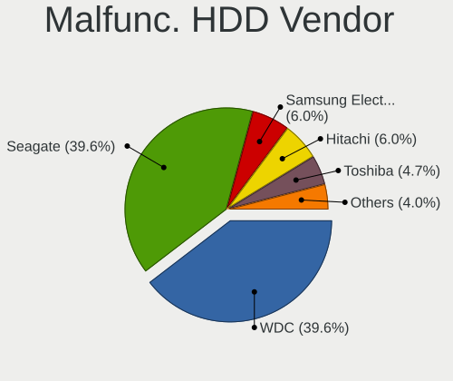

| Vendor              | Desktops | Drives | Percent |
|---------------------|----------|--------|---------|
| WDC                 | 59       | 80     | 39.6%   |
| Seagate             | 59       | 67     | 39.6%   |
| Samsung Electronics | 9        | 10     | 6.04%   |
| Hitachi             | 9        | 12     | 6.04%   |
| Toshiba             | 7        | 9      | 4.7%    |
| HGST                | 5        | 7      | 3.36%   |
| Maxtor              | 1        | 1      | 0.67%   |

Malfunc. Drive Kind
-------------------

Kinds of faulty drives

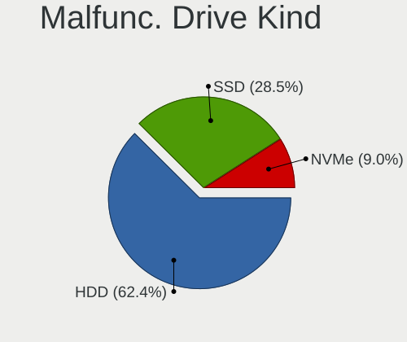

| Kind | Desktops | Drives | Percent |
|------|----------|--------|---------|
| HDD  | 138      | 186    | 62.44%  |
| SSD  | 63       | 73     | 28.51%  |
| NVMe | 20       | 20     | 9.05%   |

Failed Drives
-------------

Failed drive models

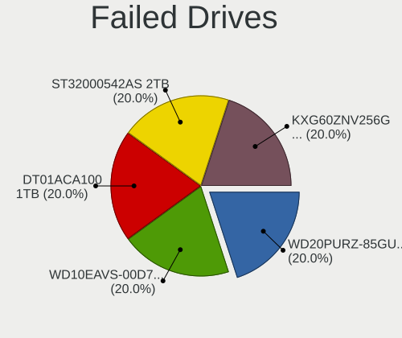

| Model                     | Desktops | Drives | Percent |
|---------------------------|----------|--------|---------|
| WDC WD20PURZ-85GU6Y0 2TB  | 1        | 1      | 20%     |
| WDC WD10EAVS-00D7B1 1TB   | 1        | 1      | 20%     |
| Toshiba DT01ACA100 1TB    | 1        | 1      | 20%     |
| Seagate ST32000542AS 2TB  | 1        | 1      | 20%     |
| KIOXIA KXG60ZNV256G 256GB | 1        | 1      | 20%     |

Failed Drive Vendor
-------------------

Failed drive vendors

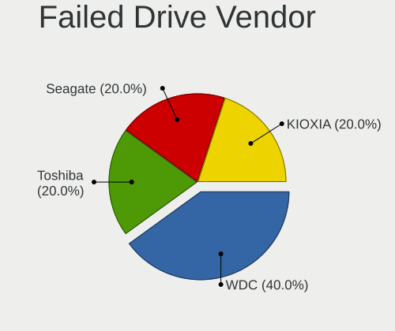

| Vendor  | Desktops | Drives | Percent |
|---------|----------|--------|---------|
| WDC     | 2        | 2      | 40%     |
| Toshiba | 1        | 1      | 20%     |
| Seagate | 1        | 1      | 20%     |
| KIOXIA  | 1        | 1      | 20%     |

Drive Status
------------

Number of failed and malfunc. drives

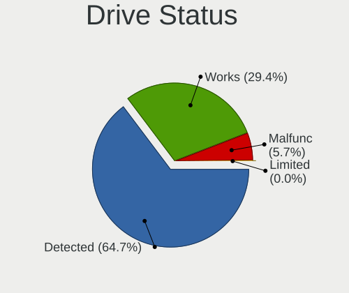

| Status   | Desktops | Drives | Percent |
|----------|----------|--------|---------|
| Detected | 2366     | 5821   | 64.73%  |
| Works    | 1074     | 2465   | 29.38%  |
| Malfunc  | 209      | 279    | 5.72%   |
| Failed   | 5        | 5      | 0.14%   |
| Limited  | 1        | 1      | 0.03%   |

Storage controller
------------------

Storage Vendor
--------------

Storage controller vendors

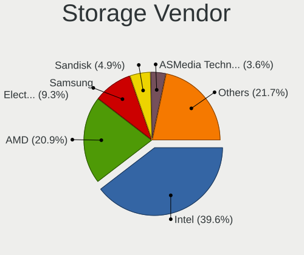

| Vendor                          | Desktops | Percent |
|---------------------------------|----------|---------|
| Intel                           | 2130     | 39.57%  |
| AMD                             | 1125     | 20.9%   |
| Samsung Electronics             | 498      | 9.25%   |
| Sandisk                         | 266      | 4.94%   |
| ASMedia Technology              | 196      | 3.64%   |
| Kingston Technology Company     | 173      | 3.21%   |
| Micron/Crucial Technology       | 132      | 2.45%   |
| Phison Electronics              | 117      | 2.17%   |
| MAXIO Technology (Hangzhou)     | 97       | 1.8%    |
| Marvell Technology Group        | 79       | 1.47%   |
| JMicron Technology              | 63       | 1.17%   |
| Silicon Motion                  | 53       | 0.98%   |
| Micron Technology               | 53       | 0.98%   |
| Realtek Semiconductor           | 47       | 0.87%   |
| ADATA Technology                | 47       | 0.87%   |
| SK hynix                        | 46       | 0.85%   |
| Nvidia                          | 32       | 0.59%   |
| Shenzhen Longsys Electronics    | 31       | 0.58%   |
| Broadcom / LSI                  | 30       | 0.56%   |
| KIOXIA                          | 26       | 0.48%   |
| Toshiba America Info Systems    | 14       | 0.26%   |
| Yangtze Memory Technologies     | 13       | 0.24%   |
| INNOGRIT                        | 12       | 0.22%   |
| Seagate Technology              | 11       | 0.2%    |
| VIA Technologies                | 10       | 0.19%   |
| Silicon Image                   | 9        | 0.17%   |
| LSI Logic / Symbios Logic       | 9        | 0.17%   |
| Solidigm                        | 7        | 0.13%   |
| Hosin Global Electronics        | 6        | 0.11%   |
| Adaptec                         | 6        | 0.11%   |
| Netac Technology                | 5        | 0.09%   |
| Biwin Storage Technology        | 5        | 0.09%   |
| Transcend                       | 3        | 0.06%   |
| TenaFe                          | 3        | 0.06%   |
| Solid State Storage Technology  | 3        | 0.06%   |
| Unknown                         | 3        | 0.06%   |
| Zhaoxin                         | 2        | 0.04%   |
| Shenzhen Techwinsemi Technology | 2        | 0.04%   |
| Red Hat                         | 2        | 0.04%   |
| O2 Micro                        | 2        | 0.04%   |

Storage Model
-------------

Storage controller models

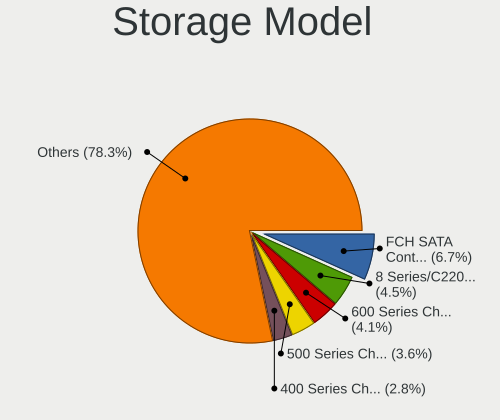

| Model                                                                                   | Desktops | Percent |
|-----------------------------------------------------------------------------------------|----------|---------|
| AMD FCH SATA Controller [AHCI mode]                                                     | 422      | 6.72%   |
| Intel 8 Series/C220 Series Chipset Family 6-port SATA Controller 1 [AHCI mode]          | 283      | 4.51%   |
| AMD 600 Series Chipset SATA Controller                                                  | 255      | 4.06%   |
| AMD 500 Series Chipset SATA Controller                                                  | 224      | 3.57%   |
| AMD 400 Series Chipset SATA Controller                                                  | 178      | 2.84%   |
| Samsung NVMe SSD Controller SM981/PM981/PM983                                           | 172      | 2.74%   |
| Intel SATA Controller [RAID mode]                                                       | 170      | 2.71%   |
| Intel Q170/Q150/B150/H170/H110/Z170/CM236 Chipset SATA Controller [AHCI Mode]           | 164      | 2.61%   |
| ASMedia ASM1061/ASM1062 Serial ATA Controller                                           | 163      | 2.6%    |
| Intel 200 Series PCH SATA controller [AHCI mode]                                        | 149      | 2.37%   |
| Intel Raptor Lake SATA AHCI Controller                                                  | 139      | 2.21%   |
| Intel 7 Series/C210 Series Chipset Family 6-port SATA Controller [AHCI mode]            | 137      | 2.18%   |
| Intel 6 Series/C200 Series Chipset Family 6 port Desktop SATA AHCI Controller           | 135      | 2.15%   |
| Intel Alder Lake-S PCH SATA Controller [AHCI Mode]                                      | 121      | 1.93%   |
| Intel Cannon Lake PCH SATA AHCI Controller                                              | 115      | 1.83%   |
| Samsung NVMe SSD Controller S4LV008[Pascal]                                             | 108      | 1.72%   |
| Samsung NVMe SSD Controller PM9A1/PM9A3/980PRO                                          | 106      | 1.69%   |
| AMD SB7x0/SB8x0/SB9x0 IDE Controller                                                    | 106      | 1.69%   |
| AMD SB7x0/SB8x0/SB9x0 SATA Controller [IDE mode]                                        | 77       | 1.23%   |
| Intel 500 Series Chipset Family SATA AHCI Controller                                    | 74       | 1.18%   |
| AMD SB7x0/SB8x0/SB9x0 SATA Controller [AHCI mode]                                       | 70       | 1.12%   |
| Samsung NVMe SSD Controller 980 (DRAM-less)                                             | 69       | 1.1%    |
| Micron/Crucial P2 [Nick P2] / P3 / P3 Plus NVMe PCIe SSD (DRAM-less)                    | 60       | 0.96%   |
| Intel RST Volume Management Device Controller                                           | 57       | 0.91%   |
| Intel 6 Series/C200 Series Chipset Family Desktop SATA Controller (IDE mode, ports 4-5) | 57       | 0.91%   |
| Intel 6 Series/C200 Series Chipset Family Desktop SATA Controller (IDE mode, ports 0-3) | 57       | 0.91%   |
| MAXIO (Hangzhou) NVMe SSD Controller MAP1202 (DRAM-less)                                | 56       | 0.89%   |
| Intel Volume Management Device NVMe RAID Controller                                     | 55       | 0.88%   |
| Intel Alder Lake-N SATA AHCI Controller                                                 | 50       | 0.8%    |
| SanDisk WD SN560/SN740/SN770/SN5000 NVMe SSD                                            | 49       | 0.78%   |
| Silicon Motion SM2263EN/SM2263XT (DRAM-less) NVMe SSD Controllers                       | 42       | 0.67%   |
| Intel 9 Series Chipset Family SATA Controller [AHCI Mode]                               | 42       | 0.67%   |
| Intel C610/X99 series chipset 6-Port SATA Controller [AHCI mode]                        | 41       | 0.65%   |
| Intel C610/X99 series chipset sSATA Controller [AHCI mode]                              | 39       | 0.62%   |
| Kingston Company KC3000/FURY Renegade NVMe SSD [E18]                                    | 38       | 0.61%   |
| Sandisk WD Black SN850X NVMe SSD                                                        | 37       | 0.59%   |
| Intel NM10/ICH7 Family SATA Controller [IDE mode]                                       | 37       | 0.59%   |
| MAXIO (Hangzhou) NVMe SSD Controller MAP1602 (DRAM-less)                                | 36       | 0.57%   |
| JMicron JMB363 SATA/IDE Controller                                                      | 36       | 0.57%   |
| SanDisk Ultra 3D / WD PC SN530, IX SN530, Blue SN550 NVMe SSD (DRAM-less)               | 35       | 0.56%   |

Storage Kind
------------

Kind of storage controller (IDE, SATA, NVMe, SAS, ...)

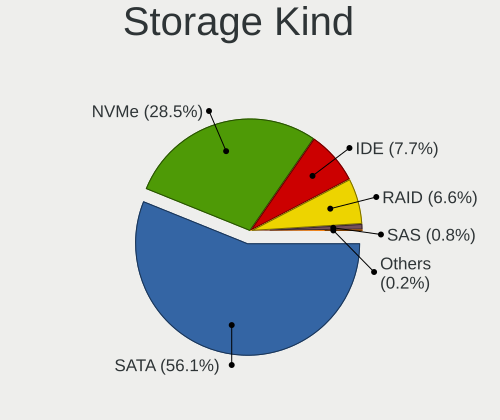

| Kind | Desktops | Percent |
|------|----------|---------|
| SATA | 2911     | 56.11%  |
| NVMe | 1480     | 28.53%  |
| IDE  | 401      | 7.73%   |
| RAID | 344      | 6.63%   |
| SAS  | 41       | 0.79%   |
| SCSI | 11       | 0.21%   |

Processor
---------

CPU Vendor
----------

Processor vendors

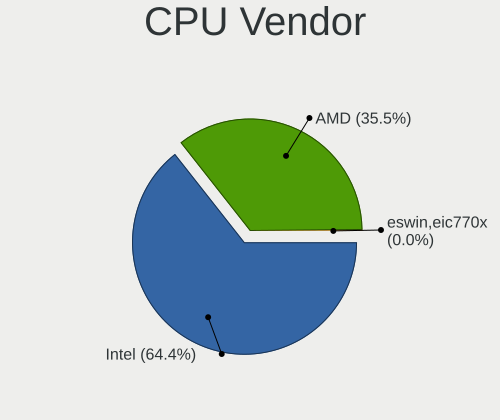

| Vendor        | Desktops | Percent |
|---------------|----------|---------|
| Intel         | 2166     | 64.39%  |
| AMD           | 1193     | 35.46%  |
| sifive,u74-mc | 2        | 0.06%   |
| CentaurHauls  | 2        | 0.06%   |
| eswin,eic770x | 1        | 0.03%   |

CPU Model
---------

Processor models

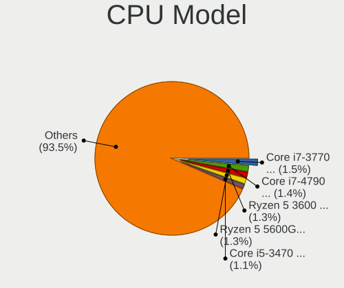

| Model                                  | Desktops | Percent |
|----------------------------------------|----------|---------|
| Intel Core i7-3770 CPU @ 3.40GHz       | 49       | 1.45%   |
| Intel Core i7-4790 CPU @ 3.60GHz       | 46       | 1.36%   |
| AMD Ryzen 5 3600 6-Core Processor      | 45       | 1.33%   |
| AMD Ryzen 5 5600G with Radeon Graphics | 43       | 1.28%   |
| Intel Core i5-3470 CPU @ 3.20GHz       | 36       | 1.07%   |
| AMD Ryzen 7 5700G with Radeon Graphics | 36       | 1.07%   |
| Intel Core i7-6700 CPU @ 3.40GHz       | 34       | 1.01%   |
| Intel Core i5-4460 CPU @ 3.20GHz       | 34       | 1.01%   |
| Intel Core i7-4770 CPU @ 3.40GHz       | 33       | 0.98%   |
| AMD Ryzen 7 5800X 8-Core Processor     | 32       | 0.95%   |
| Intel Core i5-2400 CPU @ 3.10GHz       | 31       | 0.92%   |
| AMD Ryzen 9 9950X 16-Core Processor    | 30       | 0.89%   |
| AMD Ryzen 9 5900X 12-Core Processor    | 30       | 0.89%   |
| Intel N100                             | 28       | 0.83%   |
| Intel Core i7-6700K CPU @ 4.00GHz      | 28       | 0.83%   |
| Intel Core i7-2600 CPU @ 3.40GHz       | 27       | 0.8%    |
| AMD Ryzen 7 3700X 8-Core Processor     | 27       | 0.8%    |
| AMD Ryzen 5 5600X 6-Core Processor     | 27       | 0.8%    |
| AMD Ryzen 5 2600 Six-Core Processor    | 26       | 0.77%   |
| Intel Core i5-6500 CPU @ 3.20GHz       | 24       | 0.71%   |
| Intel Core i5-4590 CPU @ 3.30GHz       | 23       | 0.68%   |
| AMD Ryzen 7 7800X3D 8-Core Processor   | 23       | 0.68%   |
| Intel Core i7-7700 CPU @ 3.60GHz       | 22       | 0.65%   |
| Intel Core i9-14900K                   | 21       | 0.62%   |
| Intel Core i5-3570 CPU @ 3.40GHz       | 21       | 0.62%   |
| AMD Ryzen 7 2700X Eight-Core Processor | 21       | 0.62%   |
| Intel Core i7-9700K CPU @ 3.60GHz      | 20       | 0.59%   |
| Intel Core i7-8700 CPU @ 3.20GHz       | 20       | 0.59%   |
| Intel Core i5-6500T CPU @ 2.50GHz      | 20       | 0.59%   |
| Intel 13th Gen Core i9-13900K          | 20       | 0.59%   |
| Intel 12th Gen Core i5-12400           | 20       | 0.59%   |
| AMD Ryzen 9 5950X 16-Core Processor    | 20       | 0.59%   |
| AMD Ryzen 7 9800X3D 8-Core Processor   | 20       | 0.59%   |
| AMD Ryzen 7 5700X 8-Core Processor     | 20       | 0.59%   |
| Intel Core i5-8500 CPU @ 3.00GHz       | 19       | 0.56%   |
| Intel Core i5-4440 CPU @ 3.10GHz       | 19       | 0.56%   |
| AMD FX-8350 Eight-Core Processor       | 19       | 0.56%   |
| Intel Core i5-4570 CPU @ 3.20GHz       | 18       | 0.53%   |
| Intel Core i7-8700K CPU @ 3.70GHz      | 17       | 0.5%    |
| Intel Core i5-8400 CPU @ 2.80GHz       | 17       | 0.5%    |

CPU Model Family
----------------

Processor model prefix

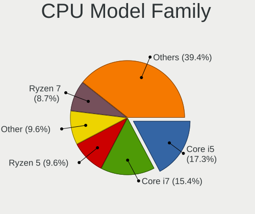

| Model                   | Desktops | Percent |
|-------------------------|----------|---------|
| Intel Core i5           | 581      | 17.25%  |
| Intel Core i7           | 519      | 15.41%  |
| AMD Ryzen 5             | 325      | 9.65%   |
| Other                   | 324      | 9.62%   |
| AMD Ryzen 7             | 293      | 8.7%    |
| Intel Core i3           | 208      | 6.18%   |
| AMD Ryzen 9             | 208      | 6.18%   |
| Intel Xeon              | 207      | 6.15%   |
| AMD FX                  | 73       | 2.17%   |
| Intel Core i9           | 64       | 1.9%    |
| Intel Celeron           | 64       | 1.9%    |
| Intel Pentium           | 59       | 1.75%   |
| Intel Core 2 Quad       | 38       | 1.13%   |
| Intel Core 2 Duo        | 38       | 1.13%   |
| AMD Ryzen 3             | 32       | 0.95%   |
| Intel Core              | 29       | 0.86%   |
| AMD Phenom II X4        | 28       | 0.83%   |
| AMD A10                 | 24       | 0.71%   |
| AMD Ryzen Threadripper  | 23       | 0.68%   |
| Intel Pentium Dual-Core | 22       | 0.65%   |
| AMD A8                  | 22       | 0.65%   |
| AMD Phenom II X6        | 18       | 0.53%   |
| AMD Ryzen 5 PRO         | 17       | 0.5%    |
| AMD A6                  | 12       | 0.36%   |
| AMD Athlon 64 X2        | 11       | 0.33%   |
| AMD A4                  | 11       | 0.33%   |
| AMD Athlon II X4        | 10       | 0.3%    |
| Intel Pentium Gold      | 8        | 0.24%   |
| AMD GX                  | 8        | 0.24%   |
| Intel Atom              | 7        | 0.21%   |
| AMD Athlon II X2        | 7        | 0.21%   |
| AMD Ryzen 3 PRO         | 6        | 0.18%   |
| AMD Phenom II X2        | 6        | 0.18%   |
| Intel Pentium Dual      | 5        | 0.15%   |
| AMD Ryzen 7 PRO         | 5        | 0.15%   |
| AMD Phenom              | 5        | 0.15%   |
| AMD EPYC                | 5        | 0.15%   |
| AMD Athlon              | 5        | 0.15%   |
| AMD E                   | 4        | 0.12%   |
| Intel Pentium Silver    | 3        | 0.09%   |

CPU Cores
---------

Number of processor cores

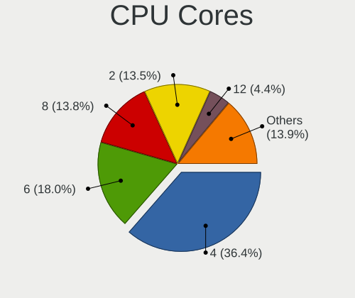

| Number  | Desktops | Percent |
|---------|----------|---------|
| 4       | 1231     | 36.42%  |
| 6       | 608      | 17.99%  |
| 8       | 466      | 13.79%  |
| 2       | 457      | 13.52%  |
| 12      | 148      | 4.38%   |
| 16      | 146      | 4.32%   |
| 24      | 80       | 2.37%   |
| 10      | 69       | 2.04%   |
| 20      | 50       | 1.48%   |
| 14      | 50       | 1.48%   |
| 1       | 22       | 0.65%   |
| 3       | 17       | 0.5%    |
| 32      | 12       | 0.36%   |
| 28      | 7        | 0.21%   |
| 18      | 7        | 0.21%   |
| 64      | 3        | 0.09%   |
| Unknown | 3        | 0.09%   |
| 192     | 1        | 0.03%   |
| 44      | 1        | 0.03%   |
| 36      | 1        | 0.03%   |
| 22      | 1        | 0.03%   |

CPU Sockets
-----------

Number of sockets

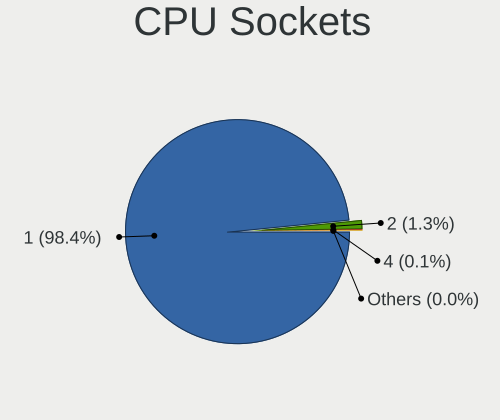

| Number  | Desktops | Percent |
|---------|----------|---------|
| 1       | 3311     | 98.42%  |
| 2       | 45       | 1.34%   |
| 4       | 3        | 0.09%   |
| Unknown | 3        | 0.09%   |
| 20      | 1        | 0.03%   |
| 14      | 1        | 0.03%   |

CPU Threads
-----------

Threads per core (Hyper-Threading)

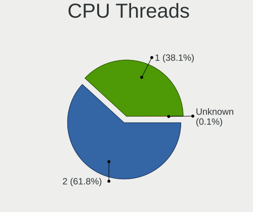

| Number  | Desktops | Percent |
|---------|----------|---------|
| 2       | 2088     | 61.83%  |
| 1       | 1286     | 38.08%  |
| Unknown | 3        | 0.09%   |

CPU Op-Modes
------------

CPU Operation Modes (32-bit, 64-bit)

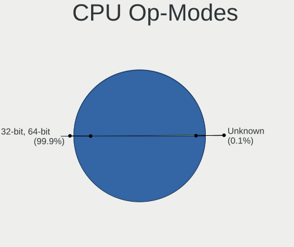

| Op mode        | Desktops | Percent |
|----------------|----------|---------|
| 32-bit, 64-bit | 3360     | 99.88%  |
| Unknown        | 4        | 0.12%   |

CPU Microcode
-------------

Microcode number

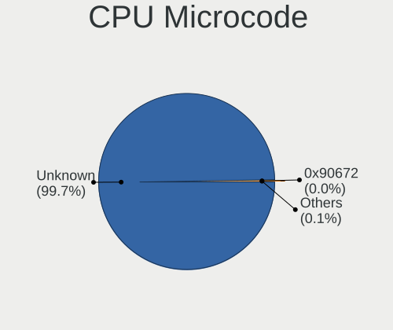

| Number     | Desktops | Percent |
|------------|----------|---------|
| Unknown    | 3356     | 99.73%  |
| 0xb0671    | 1        | 0.03%   |
| 0x906ea    | 1        | 0.03%   |
| 0x906e9    | 1        | 0.03%   |
| 0x90672    | 1        | 0.03%   |
| 0x506e3    | 1        | 0.03%   |
| 0x0a601206 | 1        | 0.03%   |
| 0x0a20120e | 1        | 0.03%   |
| 0x08701021 | 1        | 0.03%   |
| 0x0600611a | 1        | 0.03%   |

CPU Microarch
-------------

Microarchitecture

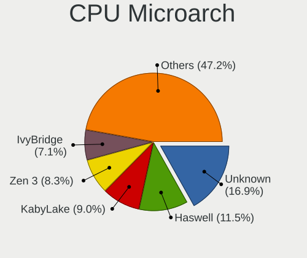

| Name              | Desktops | Percent |
|-------------------|----------|---------|
| Unknown           | 569      | 16.87%  |
| Haswell           | 389      | 11.53%  |
| KabyLake          | 304      | 9.01%   |
| Zen 3             | 281      | 8.33%   |
| IvyBridge         | 239      | 7.09%   |
| Skylake           | 205      | 6.08%   |
| Zen 2             | 184      | 5.46%   |
| SandyBridge       | 184      | 5.46%   |
| Alderlake Hybrid  | 113      | 3.35%   |
| CometLake         | 98       | 2.91%   |
| Piledriver        | 96       | 2.85%   |
| Zen+              | 93       | 2.76%   |
| Penryn            | 88       | 2.61%   |
| K10               | 85       | 2.52%   |
| Zen               | 60       | 1.78%   |
| Nehalem           | 54       | 1.6%    |
| Broadwell         | 53       | 1.57%   |
| Westmere          | 39       | 1.16%   |
| Core              | 29       | 0.86%   |
| Gracemont         | 24       | 0.71%   |
| Silvermont        | 22       | 0.65%   |
| Steamroller       | 19       | 0.56%   |
| Lunarlake Hybrid  | 18       | 0.53%   |
| Icelake           | 17       | 0.5%    |
| Excavator         | 17       | 0.5%    |
| K8 Hammer         | 15       | 0.44%   |
| Goldmont          | 11       | 0.33%   |
| Jaguar            | 10       | 0.3%    |
| Bulldozer         | 10       | 0.3%    |
| K10 Llano         | 9        | 0.27%   |
| TigerLake         | 8        | 0.24%   |
| Tremont           | 7        | 0.21%   |
| Goldmont plus     | 7        | 0.21%   |
| Puma              | 6        | 0.18%   |
| Bobcat            | 3        | 0.09%   |
| Sapphire Rapids   | 2        | 0.06%   |
| NetBurst          | 2        | 0.06%   |
| Bonnell           | 2        | 0.06%   |
| Meteorlake Hybrid | 1        | 0.03%   |

Graphics
--------

GPU Vendor
----------

Vendors of graphics cards

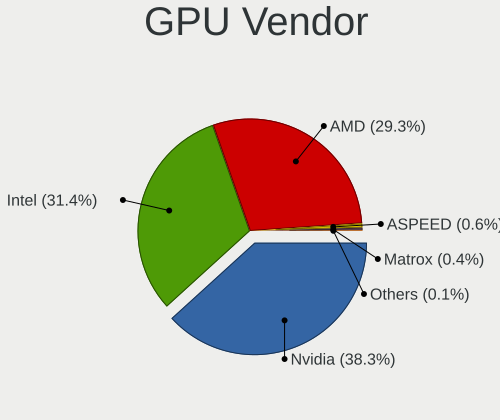

| Vendor                     | Desktops | Percent |
|----------------------------|----------|---------|
| Nvidia                     | 1434     | 38.25%  |
| Intel                      | 1177     | 31.4%   |
| AMD                        | 1097     | 29.26%  |
| ASPEED Technology          | 23       | 0.61%   |
| Matrox Electronics Systems | 15       | 0.4%    |
| Zhaoxin                    | 1        | 0.03%   |
| Red Hat                    | 1        | 0.03%   |
| Glenfly Tech               | 1        | 0.03%   |

GPU Model
---------

Graphics card models

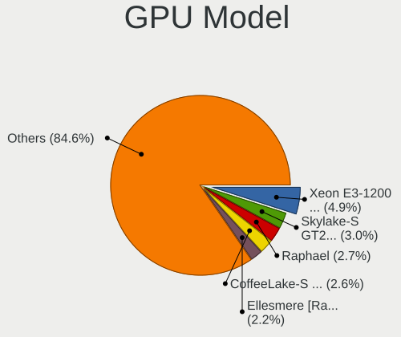

| Model                                                                       | Desktops | Percent |
|-----------------------------------------------------------------------------|----------|---------|
| Intel Xeon E3-1200 v3/4th Gen Core Processor Integrated Graphics Controller | 192      | 4.94%   |
| Intel Skylake-S GT2 [HD Graphics 530]                                       | 115      | 2.96%   |
| AMD Raphael                                                                 | 104      | 2.68%   |
| Intel CoffeeLake-S GT2 [UHD Graphics 630]                                   | 100      | 2.58%   |
| AMD Ellesmere [Radeon RX 470/480/570/570X/580/580X/590]                     | 87       | 2.24%   |
| Intel 2nd Generation Core Processor Family Integrated Graphics Controller   | 84       | 2.16%   |
| Intel Xeon E3-1200 v2/3rd Gen Core processor Graphics Controller            | 83       | 2.14%   |
| AMD Cezanne [Radeon Vega Series / Radeon Vega Mobile Series]                | 83       | 2.14%   |
| AMD Granite Ridge [Radeon Graphics]                                         | 81       | 2.09%   |
| Nvidia GP107 [GeForce GTX 1050 Ti]                                          | 64       | 1.65%   |
| Intel Kaby Lake-S GT2 [HD Graphics 630]                                     | 59       | 1.52%   |
| Intel Raptor Lake-S GT1 [UHD Graphics 770]                                  | 58       | 1.49%   |
| Nvidia GK208B [GeForce GT 710]                                              | 56       | 1.44%   |
| Nvidia GA106 [GeForce RTX 3060 Lite Hash Rate]                              | 51       | 1.31%   |
| Intel Alder Lake-N [UHD Graphics]                                           | 51       | 1.31%   |
| Intel Alder Lake-S GT1 [UHD Graphics 770]                                   | 48       | 1.24%   |
| Intel CometLake-S GT2 [UHD Graphics 630]                                    | 45       | 1.16%   |
| AMD Navi 23 [Radeon RX 6600/6600 XT/6600M]                                  | 40       | 1.03%   |
| Intel 4th Generation Core Processor Family Integrated Graphics Controller   | 38       | 0.98%   |
| Nvidia GA102 [GeForce RTX 3090]                                             | 36       | 0.93%   |
| AMD Navi 31 [Radeon RX 7900 XT/7900 XTX/7900 GRE/7900M]                     | 36       | 0.93%   |
| AMD Cedar [Radeon HD 5000/6000/7350/8350 Series]                            | 35       | 0.9%    |
| Nvidia GP106 [GeForce GTX 1060 6GB]                                         | 34       | 0.88%   |
| Nvidia GP104 [GeForce GTX 1070]                                             | 33       | 0.85%   |
| Nvidia GP108 [GeForce GT 1030]                                              | 32       | 0.82%   |
| Nvidia GK208B [GeForce GT 730]                                              | 32       | 0.82%   |
| Intel Alder Lake-S GT1 [UHD Graphics 730]                                   | 32       | 0.82%   |
| Intel IvyBridge GT2 [HD Graphics 4000]                                      | 29       | 0.75%   |
| AMD Renoir [Radeon Vega Series / Radeon Vega Mobile Series]                 | 29       | 0.75%   |
| AMD Navi 10 [Radeon RX 5600 OEM/5600 XT / 5700/5700 XT]                     | 29       | 0.75%   |
| Nvidia AD107 [GeForce RTX 4060]                                             | 28       | 0.72%   |
| AMD Phoenix1                                                                | 28       | 0.72%   |
| AMD Navi 32 [Radeon RX 7700 XT / 7800 XT]                                   | 28       | 0.72%   |
| AMD Lexa PRO [Radeon 540/540X/550/550X / RX 540X/550/550X]                  | 28       | 0.72%   |
| Nvidia GT218 [GeForce 210]                                                  | 26       | 0.67%   |
| Nvidia GF119 [GeForce GT 610]                                               | 26       | 0.67%   |
| Nvidia AD104 [GeForce RTX 4070 SUPER]                                       | 26       | 0.67%   |
| Nvidia TU117 [GeForce GTX 1650]                                             | 25       | 0.64%   |
| Nvidia TU116 [GeForce GTX 1660 SUPER]                                       | 25       | 0.64%   |
| AMD Picasso/Raven 2 [Radeon Vega Series / Radeon Vega Mobile Series]        | 25       | 0.64%   |

GPU Combo
---------

Combinations of graphics cards

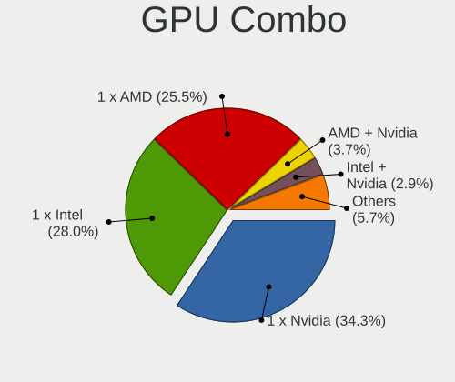

| Name                      | Desktops | Percent |
|---------------------------|----------|---------|
| 1 x Nvidia                | 1165     | 34.28%  |
| 1 x Intel                 | 951      | 27.99%  |
| 1 x AMD                   | 865      | 25.46%  |
| AMD + Nvidia              | 125      | 3.68%   |
| Intel + Nvidia            | 98       | 2.88%   |
| 2 x AMD                   | 77       | 2.27%   |
| Intel + AMD               | 28       | 0.82%   |
| 2 x Nvidia                | 27       | 0.79%   |
| 1 x Matrox                | 13       | 0.38%   |
| 1 x ASPEED                | 12       | 0.35%   |
| Nvidia + ASPEED           | 7        | 0.21%   |
| Other                     | 6        | 0.18%   |
| 2 x Intel                 | 6        | 0.18%   |
| Intel + 2 x Nvidia        | 4        | 0.12%   |
| 3 x AMD                   | 2        | 0.06%   |
| Nvidia + Matrox           | 2        | 0.06%   |
| AMD + ASPEED              | 2        | 0.06%   |
| 2 x Nvidia + 1 x ASPEED   | 1        | 0.03%   |
| 2 x AMD + 1 x Nvidia      | 1        | 0.03%   |
| 1 x Zhaoxin               | 1        | 0.03%   |
| 1 x Intel + 3 x Nvidia    | 1        | 0.03%   |
| Intel + Red Hat           | 1        | 0.03%   |
| 1 x Glenfly Tech          | 1        | 0.03%   |
| AMD + 2 x Nvidia          | 1        | 0.03%   |
| AMD + Nvidia + 1 x ASPEED | 1        | 0.03%   |

GPU Driver
----------

Free vs proprietary

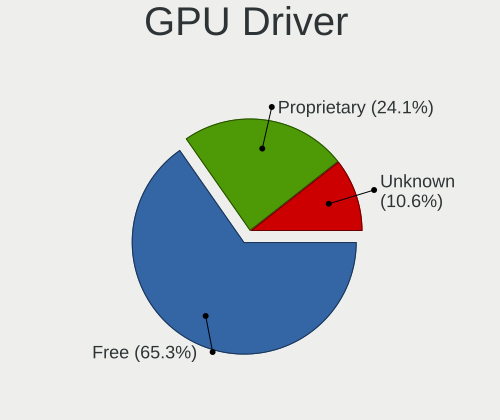

| Driver      | Desktops | Percent |
|-------------|----------|---------|
| Free        | 2219     | 65.3%   |
| Proprietary | 819      | 24.1%   |
| Unknown     | 360      | 10.59%  |

GPU Memory
----------

Total video memory

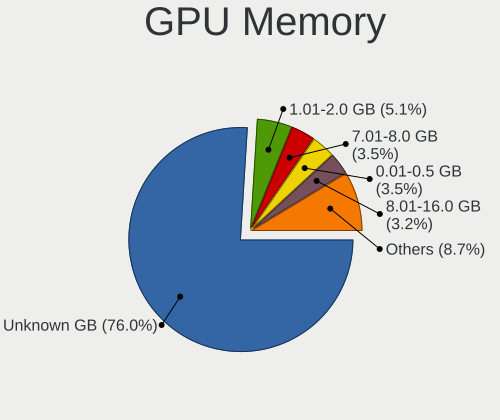

| Size in GB | Desktops | Percent |
|------------|----------|---------|
| Unknown    | 2588     | 75.98%  |
| 1.01-2.0   | 175      | 5.14%   |
| 7.01-8.0   | 120      | 3.52%   |
| 0.01-0.5   | 119      | 3.49%   |
| 8.01-16.0  | 109      | 3.2%    |
| 3.01-4.0   | 103      | 3.02%   |
| 0.51-1.0   | 91       | 2.67%   |
| 5.01-6.0   | 43       | 1.26%   |
| 16.01-24.0 | 31       | 0.91%   |
| 2.01-3.0   | 21       | 0.62%   |
| 24.01-32.0 | 5        | 0.15%   |
| 32.01-64.0 | 1        | 0.03%   |

Monitor
-------

Monitor Vendor
--------------

Monitor vendors

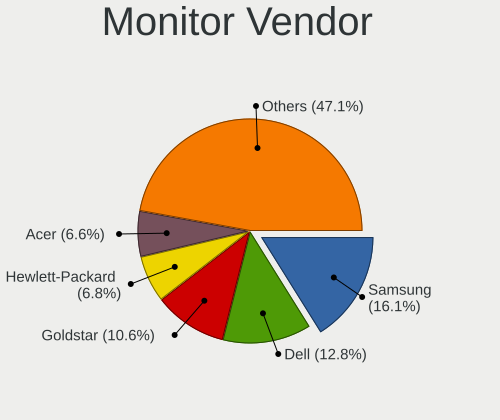

| Vendor               | Desktops | Percent |
|----------------------|----------|---------|
| Samsung Electronics  | 569      | 16.11%  |
| Dell                 | 452      | 12.8%   |
| Goldstar             | 375      | 10.62%  |
| Hewlett-Packard      | 239      | 6.77%   |
| Acer                 | 232      | 6.57%   |
| Ancor Communications | 156      | 4.42%   |
| AOC                  | 155      | 4.39%   |
| BenQ                 | 116      | 3.29%   |
| Philips              | 112      | 3.17%   |
| ASUSTek Computer     | 95       | 2.69%   |
| MSI                  | 75       | 2.12%   |
| Iiyama               | 73       | 2.07%   |
| Lenovo               | 68       | 1.93%   |
| ViewSonic            | 64       | 1.81%   |
| Unknown              | 49       | 1.39%   |
| Sony                 | 37       | 1.05%   |
| Gigabyte Technology  | 27       | 0.76%   |
| Sceptre Tech         | 25       | 0.71%   |
| Medion               | 21       | 0.59%   |
| LG Electronics       | 19       | 0.54%   |
| Fujitsu Siemens      | 19       | 0.54%   |
| Eizo                 | 18       | 0.51%   |
| Unknown              | 18       | 0.51%   |
| NEC Computers        | 17       | 0.48%   |
| HannStar             | 16       | 0.45%   |
| Unknown (XXX)        | 14       | 0.4%    |
| Mi                   | 14       | 0.4%    |
| Insignia             | 14       | 0.4%    |
| Denver               | 13       | 0.37%   |
| Toshiba              | 12       | 0.34%   |
| Vizio                | 11       | 0.31%   |
| Vestel Elektronik    | 11       | 0.31%   |
| RTK                  | 11       | 0.31%   |
| HKC                  | 10       | 0.28%   |
| Sharp                | 9        | 0.25%   |
| TCL                  | 8        | 0.23%   |
| SGT                  | 8        | 0.23%   |
| Hitachi              | 8        | 0.23%   |
| VIE                  | 7        | 0.2%    |
| Envision             | 7        | 0.2%    |

Monitor Model
-------------

Monitor models

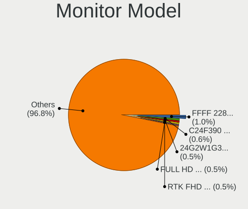

| Model                                                                  | Desktops | Percent |
|------------------------------------------------------------------------|----------|---------|
| Unknown LCD Monitor FFFF 2288x1287 2550x2550mm 142.0-inch              | 39       | 1.05%   |
| Samsung Electronics C24F390 SAM0D2C 1920x1080 521x293mm 23.5-inch      | 23       | 0.62%   |
| AOC 24G2W1G3 AOC2402 1920x1080 527x296mm 23.8-inch                     | 20       | 0.54%   |
| Goldstar FULL HD GSM5B55 1920x1080 480x270mm 21.7-inch                 | 18       | 0.48%   |
| Unknown                                                                | 18       | 0.48%   |
| Samsung Electronics C27F390 SAM0D32 1920x1080 598x336mm 27.0-inch      | 14       | 0.38%   |
| Dell U2412M DELA07B 1920x1200 518x324mm 24.1-inch                      | 14       | 0.38%   |
| Goldstar Ultra HD GSM5B08 3840x2160 600x340mm 27.2-inch                | 13       | 0.35%   |
| AOC 27G2G4 AOC2702 1920x1080 598x336mm 27.0-inch                       | 13       | 0.35%   |
| Vestel Elektronik 40UHD_LCD_TV VES3700 3840x2160 880x500mm 39.8-inch   | 11       | 0.3%    |
| Samsung Electronics LF24T35 SAM707D 1920x1080 528x297mm 23.9-inch      | 11       | 0.3%    |
| Goldstar LG ULTRAWIDE GSM59F1 2560x1080 670x280mm 28.6-inch            | 11       | 0.3%    |
| Goldstar HDR 4K GSM7707 3840x2160 600x340mm 27.2-inch                  | 11       | 0.3%    |
| Ancor Communications ASUS PB287Q ACI28A3 3840x2160 621x341mm 27.9-inch | 11       | 0.3%    |
| Dell P2417H DELA0DB 1920x1080 527x296mm 23.8-inch                      | 10       | 0.27%   |
| Ancor Communications ASUS VE278 ACI27F6 1920x1080 598x336mm 27.0-inch  | 10       | 0.27%   |
| Goldstar HDR 4K GSM7706 3840x2160 600x340mm 27.2-inch                  | 9        | 0.24%   |
| Goldstar 27GL850 GSM5B7F 2560x1440 597x336mm 27.0-inch                 | 9        | 0.24%   |
| Goldstar ULTRAWIDE GSM76F9 2560x1080 531x298mm 24.0-inch               | 8        | 0.21%   |
| Goldstar 2D HD TV GSM59CA 1366x768 509x286mm 23.0-inch                 | 8        | 0.21%   |
| Denver MO-HHS-32C LHCFFFF 1920x1080 699x393mm 31.6-inch                | 8        | 0.21%   |
| Ancor Communications VE247 ACI2493 1920x1080 530x300mm 24.0-inch       | 8        | 0.21%   |
| Ancor Communications ASUS VS247 ACI249A 1920x1080 521x293mm 23.5-inch  | 8        | 0.21%   |
| Goldstar ULTRAGEAR GSM5BD3 2560x1440 697x392mm 31.5-inch               | 7        | 0.19%   |
| Goldstar HDR WFHD GSM7714 2560x1080 798x334mm 34.1-inch                | 7        | 0.19%   |
| Unknown (XXX) Beyond TV XXX2851 3840x2160 1209x680mm 54.6-inch         | 6        | 0.16%   |
| Samsung Electronics U28E590 SAM0C4D 3840x2160 607x345mm 27.5-inch      | 6        | 0.16%   |
| Samsung Electronics S24D330 SAM0D92 1920x1080 531x299mm 24.0-inch      | 6        | 0.16%   |
| Samsung Electronics C32F391 SAM0D34 1920x1080 698x393mm 31.5-inch      | 6        | 0.16%   |
| Goldstar Ultra HD GSM5B09 3840x2160 600x340mm 27.2-inch                | 6        | 0.16%   |
| Goldstar LG IPS FULLHD GSM5AB8 1920x1080 480x270mm 21.7-inch           | 6        | 0.16%   |
| Dell U2412M DELA07A 1920x1200 518x324mm 24.1-inch                      | 6        | 0.16%   |
| BenQ GL2780 BNQ78EC 1920x1080 600x340mm 27.2-inch                      | 6        | 0.16%   |
| BenQ GL2760 BNQ78D5 1920x1080 598x336mm 27.0-inch                      | 6        | 0.16%   |
| BenQ GL2460 BNQ78CE 1920x1080 531x299mm 24.0-inch                      | 6        | 0.16%   |
| AOC 2270W AOC2270 1920x1080 477x268mm 21.5-inch                        | 6        | 0.16%   |
| Samsung Electronics LU28R55 SAM1017 3840x2160 632x360mm 28.6-inch      | 5        | 0.13%   |
| Samsung Electronics LF27T35 SAM707F 1920x1080 598x337mm 27.0-inch      | 5        | 0.13%   |
| Samsung Electronics LCD Monitor SAM0F13 3840x2160 950x540mm 43.0-inch  | 5        | 0.13%   |
| Samsung Electronics LCD Monitor SAM0C39 1920x1080 885x498mm 40.0-inch  | 5        | 0.13%   |

Monitor Resolution
------------------

Monitor screen resolution

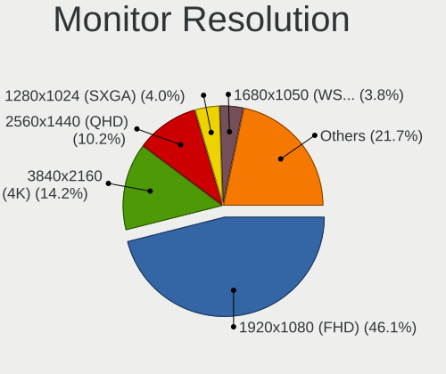

| Resolution         | Desktops | Percent |
|--------------------|----------|---------|
| 1920x1080 (FHD)    | 1571     | 46.06%  |
| 3840x2160 (4K)     | 484      | 14.19%  |
| 2560x1440 (QHD)    | 348      | 10.2%   |
| 1280x1024 (SXGA)   | 137      | 4.02%   |
| 1680x1050 (WSXGA+) | 131      | 3.84%   |
| 3440x1440          | 104      | 3.05%   |
| 1920x1200 (WUXGA)  | 96       | 2.81%   |
| 1366x768 (WXGA)    | 86       | 2.52%   |
| 1600x900 (HD+)     | 84       | 2.46%   |
| 1440x900 (WXGA+)   | 71       | 2.08%   |
| 2560x1080          | 51       | 1.5%    |
| 2288x1287          | 41       | 1.2%    |
| 1360x768           | 31       | 0.91%   |
| 1920x540           | 30       | 0.88%   |
| 3840x1080          | 29       | 0.85%   |
| Unknown            | 29       | 0.85%   |
| 2560x1600          | 13       | 0.38%   |
| 1600x1200          | 13       | 0.38%   |
| 1024x768 (XGA)     | 10       | 0.29%   |
| 1280x720 (HD)      | 6        | 0.18%   |
| 3840x1600          | 3        | 0.09%   |
| 1400x1050          | 3        | 0.09%   |
| 1280x960           | 3        | 0.09%   |
| 1152x864           | 3        | 0.09%   |
| 640x480            | 2        | 0.06%   |
| 5760x1080          | 2        | 0.06%   |
| 4480x1440          | 2        | 0.06%   |
| 1024x600           | 2        | 0.06%   |
| 800x1280           | 1        | 0.03%   |
| 6400x2160          | 1        | 0.03%   |
| 6000x1440          | 1        | 0.03%   |
| 5760x1373          | 1        | 0.03%   |
| 4096x2160          | 1        | 0.03%   |
| 3840x2560          | 1        | 0.03%   |
| 3840x2400          | 1        | 0.03%   |
| 3840x1200          | 1        | 0.03%   |
| 3840x1100          | 1        | 0.03%   |
| 3600x1080          | 1        | 0.03%   |
| 3584x1080          | 1        | 0.03%   |
| 3286x1080          | 1        | 0.03%   |

Monitor Diagonal
----------------

Diagonal size in inches

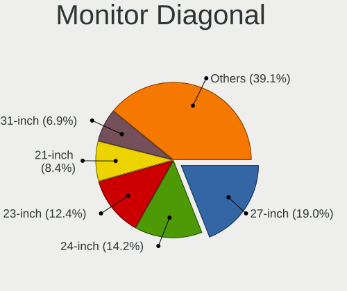

| Inches  | Desktops | Percent |
|---------|----------|---------|
| 27      | 671      | 19%     |
| 24      | 500      | 14.16%  |
| 23      | 438      | 12.4%   |
| 21      | 296      | 8.38%   |
| 31      | 245      | 6.94%   |
| 19      | 171      | 4.84%   |
| Unknown | 147      | 4.16%   |
| 34      | 128      | 3.63%   |
| 22      | 97       | 2.75%   |
| 18      | 96       | 2.72%   |
| 20      | 84       | 2.38%   |
| 84      | 66       | 1.87%   |
| 32      | 57       | 1.61%   |
| 17      | 56       | 1.59%   |
| 142     | 39       | 1.1%    |
| 54      | 38       | 1.08%   |
| 72      | 33       | 0.93%   |
| 40      | 31       | 0.88%   |
| 15      | 31       | 0.88%   |
| 25      | 26       | 0.74%   |
| 26      | 22       | 0.62%   |
| 48      | 21       | 0.59%   |
| 49      | 19       | 0.54%   |
| 28      | 19       | 0.54%   |
| 29      | 18       | 0.51%   |
| 63      | 17       | 0.48%   |
| 42      | 15       | 0.42%   |
| 65      | 12       | 0.34%   |
| 43      | 10       | 0.28%   |
| 16      | 10       | 0.28%   |
| 33      | 9        | 0.25%   |
| 74      | 8        | 0.23%   |
| 52      | 8        | 0.23%   |
| 47      | 8        | 0.23%   |
| 46      | 8        | 0.23%   |
| 13      | 8        | 0.23%   |
| 36      | 7        | 0.2%    |
| 14      | 7        | 0.2%    |
| 75      | 6        | 0.17%   |
| 37      | 6        | 0.17%   |

Monitor Width
-------------

Physical width

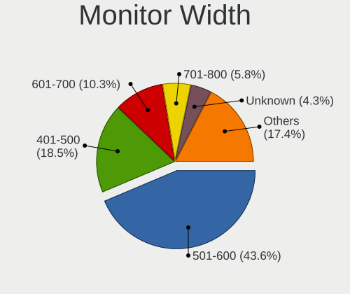

| Width in mm    | Desktops | Percent |
|----------------|----------|---------|
| 501-600        | 1486     | 43.64%  |
| 401-500        | 629      | 18.47%  |
| 601-700        | 351      | 10.31%  |
| 701-800        | 199      | 5.84%   |
| Unknown        | 147      | 4.32%   |
| 1001-1500      | 141      | 4.14%   |
| 1501-2000      | 122      | 3.58%   |
| 351-400        | 105      | 3.08%   |
| 301-350        | 92       | 2.7%    |
| 801-900        | 47       | 1.38%   |
| More than 2000 | 39       | 1.15%   |
| 901-1000       | 31       | 0.91%   |
| 201-300        | 15       | 0.44%   |
| 101-200        | 1        | 0.03%   |

Aspect Ratio
------------

Proportional relationship between the width and the height

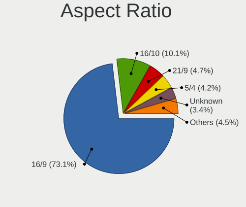

| Ratio   | Desktops | Percent |
|---------|----------|---------|
| 16/9    | 2345     | 73.12%  |
| 16/10   | 324      | 10.1%   |
| 21/9    | 150      | 4.68%   |
| 5/4     | 134      | 4.18%   |
| Unknown | 109      | 3.4%    |
| 1.00    | 41       | 1.28%   |
| 32/9    | 32       | 1%      |
| 4/3     | 31       | 0.97%   |
| 3/2     | 18       | 0.56%   |
| 6/5     | 10       | 0.31%   |
| 2.00    | 4        | 0.12%   |
| 1.96    | 3        | 0.09%   |
| 3.40    | 1        | 0.03%   |
| 2.69    | 1        | 0.03%   |
| 2.24    | 1        | 0.03%   |
| 0.89    | 1        | 0.03%   |
| 0.62    | 1        | 0.03%   |
| 0.56    | 1        | 0.03%   |

Monitor Area
------------

Area in inch²

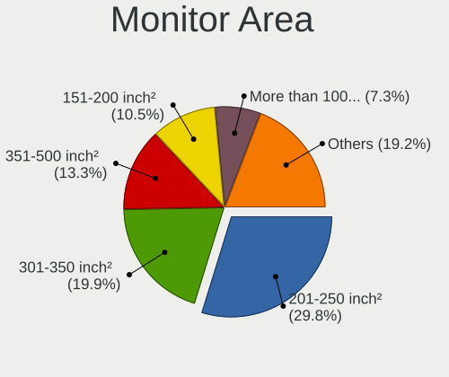

| Area in inch² | Desktops | Percent |
|----------------|----------|---------|
| 201-250        | 1026     | 29.77%  |
| 301-350        | 687      | 19.93%  |
| 351-500        | 458      | 13.29%  |
| 151-200        | 362      | 10.5%   |
| More than 1000 | 253      | 7.34%   |
| 251-300        | 192      | 5.57%   |
| Unknown        | 147      | 4.26%   |
| 501-1000       | 129      | 3.74%   |
| 141-150        | 128      | 3.71%   |
| 101-110        | 26       | 0.75%   |
| 111-120        | 11       | 0.32%   |
| 71-80          | 8        | 0.23%   |
| 81-90          | 6        | 0.17%   |
| 91-100         | 4        | 0.12%   |
| 131-140        | 3        | 0.09%   |
| 121-130        | 3        | 0.09%   |
| 51-60          | 2        | 0.06%   |
| 41-50          | 1        | 0.03%   |
| 1-40           | 1        | 0.03%   |

Pixel Density
-------------

Pixels per inch

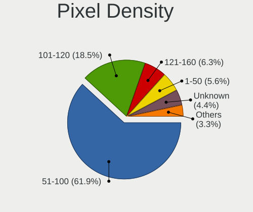

| Density       | Desktops | Percent |
|---------------|----------|---------|
| 51-100        | 2047     | 61.86%  |
| 101-120       | 612      | 18.5%   |
| 121-160       | 209      | 6.32%   |
| 1-50          | 184      | 5.56%   |
| Unknown       | 147      | 4.44%   |
| 161-240       | 107      | 3.23%   |
| More than 240 | 3        | 0.09%   |

Multiple Monitors
-----------------

Total monitors connected

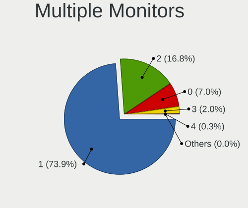

| Total | Desktops | Percent |
|-------|----------|---------|
| 1     | 2526     | 73.86%  |
| 2     | 573      | 16.75%  |
| 0     | 241      | 7.05%   |
| 3     | 70       | 2.05%   |
| 4     | 9        | 0.26%   |
| 6     | 1        | 0.03%   |

Network
-------

Net Controller Vendor
---------------------

Controller vendors

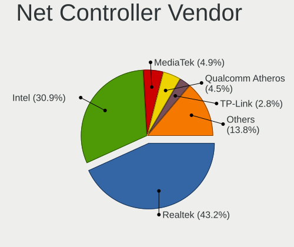

| Vendor                          | Desktops | Percent |
|---------------------------------|----------|---------|
| Realtek Semiconductor           | 2166     | 43.22%  |
| Intel                           | 1547     | 30.87%  |
| MediaTek                        | 244      | 4.87%   |
| Qualcomm Atheros                | 223      | 4.45%   |
| TP-Link                         | 139      | 2.77%   |
| Broadcom                        | 110      | 2.2%    |
| Ralink Technology               | 60       | 1.2%    |
| Aquantia                        | 43       | 0.86%   |
| Samsung Electronics             | 40       | 0.8%    |
| Ralink                          | 37       | 0.74%   |
| Qualcomm Technologies           | 27       | 0.54%   |
| Qualcomm Atheros Communications | 25       | 0.5%    |
| Nvidia                          | 25       | 0.5%    |
| Xiaomi                          | 22       | 0.44%   |
| NetGear                         | 22       | 0.44%   |
| D-Link                          | 20       | 0.4%    |
| Broadcom Limited                | 20       | 0.4%    |
| Marvell Technology Group        | 17       | 0.34%   |
| ASIX Electronics                | 16       | 0.32%   |
| Microsoft                       | 13       | 0.26%   |
| Mellanox Technologies           | 12       | 0.24%   |
| ASUSTek Computer                | 12       | 0.24%   |
| DisplayLink                     | 9        | 0.18%   |
| D-Link System                   | 9        | 0.18%   |
| Edimax Technology               | 8        | 0.16%   |
| Belkin Components               | 8        | 0.16%   |
| OPPO Electronics                | 7        | 0.14%   |
| Google                          | 7        | 0.14%   |
| Realtek                         | 6        | 0.12%   |
| IMC Networks                    | 6        | 0.12%   |
| AVM                             | 5        | 0.1%    |
| Motorola PCS                    | 4        | 0.08%   |
| Linksys                         | 4        | 0.08%   |
| American Megatrends             | 4        | 0.08%   |
| aicsemi                         | 4        | 0.08%   |
| 3Com                            | 4        | 0.08%   |
| Unknown                         | 4        | 0.08%   |
| ZyDAS                           | 3        | 0.06%   |
| ZTopInc                         | 3        | 0.06%   |
| QinHeng Electronics             | 3        | 0.06%   |

Net Controller Model
--------------------

Controller models

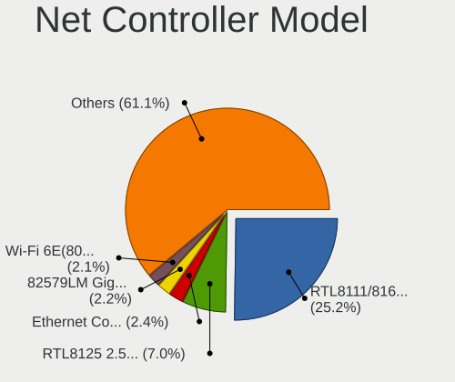

| Model                                                                           | Desktops | Percent |
|---------------------------------------------------------------------------------|----------|---------|
| Realtek RTL8111/8168/8211/8411 PCI Express Gigabit Ethernet Controller          | 1485     | 25.24%  |
| Realtek RTL8125 2.5GbE Controller                                               | 412      | 7%      |
| Intel Ethernet Controller I225-V                                                | 141      | 2.4%    |
| Intel 82579LM Gigabit Network Connection (Lewisville)                           | 129      | 2.19%   |
| Intel Wi-Fi 6E(802.11ax) AX210/AX1675* 2x2 [Typhoon Peak]                       | 123      | 2.09%   |
| Intel I211 Gigabit Network Connection                                           | 112      | 1.9%    |
| Intel Ethernet Connection (2) I219-V                                            | 112      | 1.9%    |
| Intel Wi-Fi 6 AX200                                                             | 111      | 1.89%   |
| MediaTek MT7922 802.11ax PCI Express Wireless Network Adapter                   | 97       | 1.65%   |
| Intel Ethernet Controller I226-V                                                | 96       | 1.63%   |
| Intel Ethernet Connection I217-LM                                               | 92       | 1.56%   |
| Intel Ethernet Connection (2) I219-LM                                           | 72       | 1.22%   |
| Intel 700 Series Chipset CNVi WiFi                                              | 69       | 1.17%   |
| Realtek RTL8821CE 802.11ac PCIe Wireless Network Adapter                        | 68       | 1.16%   |
| Realtek 802.11ac NIC                                                            | 63       | 1.07%   |
| Intel Ethernet Connection (7) I219-V                                            | 59       | 1%      |
| Intel Dual Band Wireless-AC 3168NGW [Stone Peak]                                | 58       | 0.99%   |
| Intel 82579V Gigabit Network Connection                                         | 51       | 0.87%   |
| Realtek RTL810xE PCI Express Fast Ethernet controller                           | 49       | 0.83%   |
| Realtek RTL88x2bu [AC1200 Techkey]                                              | 46       | 0.78%   |
| Realtek RTL8852BE PCIe 802.11ax Wireless Network Controller                     | 44       | 0.75%   |
| Realtek RTL8153 Gigabit Ethernet Adapter                                        | 44       | 0.75%   |
| Realtek RTL8126 5GbE Controller                                                 | 41       | 0.7%    |
| Intel I210 Gigabit Network Connection                                           | 39       | 0.66%   |
| Realtek RTL8188EUS 802.11n Wireless Network Adapter                             | 37       | 0.63%   |
| Intel Ethernet Connection I217-V                                                | 36       | 0.61%   |
| Intel Alder Lake-S PCH CNVi WiFi                                                | 36       | 0.61%   |
| Samsung Galaxy series, misc. (tethering mode)                                   | 35       | 0.59%   |
| Qualcomm Atheros AR9485 Wireless Network Adapter                                | 35       | 0.59%   |
| Intel Wireless 7265                                                             | 35       | 0.59%   |
| Ralink MT7601U Wireless Adapter                                                 | 34       | 0.58%   |
| MediaTek MT7921K (RZ608) Wi-Fi 6E 80MHz                                         | 30       | 0.51%   |
| Intel 82574L Gigabit Network Connection                                         | 28       | 0.48%   |
| TP-Link AC600 wireless Realtek RTL8811AU [Archer T2U Nano]                      | 27       | 0.46%   |
| Qualcomm Atheros Killer E220x Gigabit Ethernet Controller                       | 27       | 0.46%   |
| Qualcomm WCN785x Wi-Fi 7(802.11be) 320MHz 2x2 [FastConnect 7800]                | 26       | 0.44%   |
| Intel Ethernet Connection (7) I219-LM                                           | 26       | 0.44%   |
| Intel Ethernet Connection (2) I218-V                                            | 26       | 0.44%   |
| MediaTek MT7927 802.11be 320MHz 2x2 PCIe Wireless Network Adapter [Filogic 380] | 25       | 0.42%   |
| Intel Wireless 7260                                                             | 25       | 0.42%   |

Wireless Vendor
---------------

Wireless vendors

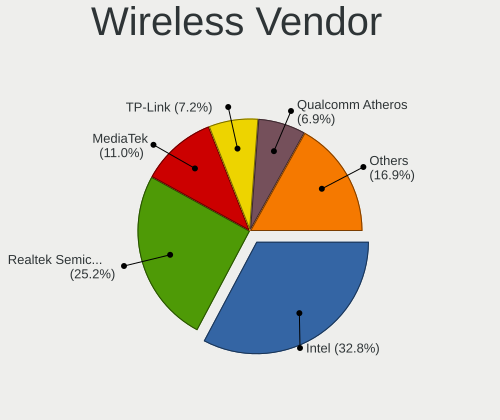

| Vendor                          | Desktops | Percent |
|---------------------------------|----------|---------|
| Intel                           | 622      | 32.77%  |
| Realtek Semiconductor           | 479      | 25.24%  |
| MediaTek                        | 209      | 11.01%  |
| TP-Link                         | 136      | 7.17%   |
| Qualcomm Atheros                | 131      | 6.9%    |
| Ralink Technology               | 60       | 3.16%   |
| Broadcom                        | 55       | 2.9%    |
| Ralink                          | 37       | 1.95%   |
| Qualcomm Atheros Communications | 25       | 1.32%   |
| NetGear                         | 22       | 1.16%   |
| D-Link                          | 20       | 1.05%   |
| Microsoft                       | 13       | 0.68%   |
| ASUSTek Computer                | 11       | 0.58%   |
| Qualcomm Technologies           | 8        | 0.42%   |
| Edimax Technology               | 8        | 0.42%   |
| D-Link System                   | 7        | 0.37%   |
| Broadcom Limited                | 7        | 0.37%   |
| Realtek                         | 6        | 0.32%   |
| IMC Networks                    | 6        | 0.32%   |
| Belkin Components               | 6        | 0.32%   |
| AVM                             | 5        | 0.26%   |
| Linksys                         | 4        | 0.21%   |
| ZyDAS                           | 3        | 0.16%   |
| ZTopInc                         | 3        | 0.16%   |
| Sitecom Europe                  | 2        | 0.11%   |
| ZyXEL Communications            | 1        | 0.05%   |
| Xiaomi                          | 1        | 0.05%   |
| Wistron NeWeb                   | 1        | 0.05%   |
| Wacom                           | 1        | 0.05%   |
| Sierra Wireless                 | 1        | 0.05%   |
| Nordic Semiconductor ASA        | 1        | 0.05%   |
| Micro Star International        | 1        | 0.05%   |
| Mercucys                        | 1        | 0.05%   |
| Marvell Technology Group        | 1        | 0.05%   |
| Dell                            | 1        | 0.05%   |
| Cypress Semiconductor           | 1        | 0.05%   |
| BUFFALO                         | 1        | 0.05%   |
| AirTies Wireless Networks       | 1        | 0.05%   |

Wireless Model
--------------

Wireless models

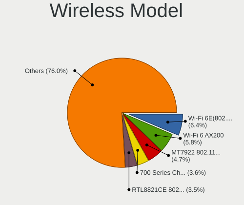

| Model                                                                           | Desktops | Percent |
|---------------------------------------------------------------------------------|----------|---------|
| Intel Wi-Fi 6E(802.11ax) AX210/AX1675* 2x2 [Typhoon Peak]                       | 123      | 6.41%   |
| Intel Wi-Fi 6 AX200                                                             | 111      | 5.79%   |
| MediaTek MT7922 802.11ax PCI Express Wireless Network Adapter                   | 90       | 4.69%   |
| Intel 700 Series Chipset CNVi WiFi                                              | 69       | 3.6%    |
| Realtek RTL8821CE 802.11ac PCIe Wireless Network Adapter                        | 68       | 3.55%   |
| Realtek 802.11ac NIC                                                            | 63       | 3.28%   |
| Intel Dual Band Wireless-AC 3168NGW [Stone Peak]                                | 58       | 3.02%   |
| Realtek RTL88x2bu [AC1200 Techkey]                                              | 46       | 2.4%    |
| Realtek RTL8188EUS 802.11n Wireless Network Adapter                             | 37       | 1.93%   |
| Qualcomm Atheros AR9485 Wireless Network Adapter                                | 35       | 1.82%   |
| Intel Wireless 7265                                                             | 35       | 1.82%   |
| Ralink MT7601U Wireless Adapter                                                 | 34       | 1.77%   |
| MediaTek MT7921K (RZ608) Wi-Fi 6E 80MHz                                         | 30       | 1.56%   |
| TP-Link AC600 wireless Realtek RTL8811AU [Archer T2U Nano]                      | 27       | 1.41%   |
| Realtek RTL8852BE PCIe 802.11ax Wireless Network Controller                     | 25       | 1.3%    |
| Intel Wireless 7260                                                             | 25       | 1.3%    |
| Intel Cannon Lake PCH CNVi WiFi                                                 | 25       | 1.3%    |
| TP-Link 802.11ac NIC                                                            | 24       | 1.25%   |
| MediaTek MT7902 802.11ax PCIe Wireless Network Adapter [Filogic 310]            | 24       | 1.25%   |
| MediaTek MT7921 802.11ax PCIe Wireless Network Adapter [Filogic 330]            | 23       | 1.2%    |
| Intel Wi-Fi 5(802.11ac) Wireless-AC 9x6x [Thunder Peak]                         | 23       | 1.2%    |
| Broadcom BCM4360 802.11ac Dual Band Wireless Network Adapter                    | 23       | 1.2%    |
| Realtek RTL8188FTV 802.11b/g/n 1T1R 2.4G WLAN Adapter                           | 21       | 1.09%   |
| Qualcomm Atheros AR9271 802.11n                                                 | 21       | 1.09%   |
| Intel Wireless 3165                                                             | 21       | 1.09%   |
| Intel Alder Lake-S PCH CNVi WiFi                                                | 19       | 0.99%   |
| Realtek RTL8188CUS 802.11n WLAN Adapter                                         | 18       | 0.94%   |
| MediaTek MT7927 802.11be 320MHz 2x2 PCIe Wireless Network Adapter [Filogic 380] | 18       | 0.94%   |
| TP-Link 802.11ac WLAN Adapter                                                   | 16       | 0.83%   |
| Realtek RTL8822CE 802.11ac PCIe Wireless Network Adapter                        | 16       | 0.83%   |
| Realtek RTL8192EE PCIe Wireless Network Adapter                                 | 16       | 0.83%   |
| Qualcomm Atheros QCA9565 / AR9565 Wireless Network Adapter                      | 16       | 0.83%   |
| TP-Link Archer T2U PLUS [RTL8821AU]                                             | 15       | 0.78%   |
| Intel Wireless 8260                                                             | 15       | 0.78%   |
| Broadcom BCM4352 802.11ac Dual Band Wireless Network Adapter                    | 15       | 0.78%   |
| TP-Link TL-WN823N v2/v3 [Realtek RTL8192EU]                                     | 14       | 0.73%   |
| TP-Link Archer T3U [Realtek RTL8812BU]                                          | 14       | 0.73%   |
| Realtek 802.11ax WLAN Adapter                                                   | 14       | 0.73%   |
| Intel Comet Lake PCH CNVi WiFi                                                  | 14       | 0.73%   |
| Intel Alder Lake-N PCH CNVi WiFi                                                | 14       | 0.73%   |

Ethernet Vendor
---------------

Ethernet vendors

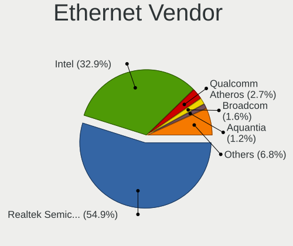

| Vendor                                 | Desktops | Percent |
|----------------------------------------|----------|---------|
| Realtek Semiconductor                  | 2022     | 54.87%  |
| Intel                                  | 1211     | 32.86%  |
| Qualcomm Atheros                       | 101      | 2.74%   |
| Broadcom                               | 59       | 1.6%    |
| Aquantia                               | 43       | 1.17%   |
| Samsung Electronics                    | 40       | 1.09%   |
| Nvidia                                 | 25       | 0.68%   |
| MediaTek                               | 25       | 0.68%   |
| Xiaomi                                 | 21       | 0.57%   |
| Qualcomm Technologies                  | 19       | 0.52%   |
| Marvell Technology Group               | 16       | 0.43%   |
| ASIX Electronics                       | 16       | 0.43%   |
| Broadcom Limited                       | 13       | 0.35%   |
| Mellanox Technologies                  | 10       | 0.27%   |
| DisplayLink                            | 9        | 0.24%   |
| OPPO Electronics                       | 7        | 0.19%   |
| Google                                 | 5        | 0.14%   |
| Motorola PCS                           | 4        | 0.11%   |
| American Megatrends                    | 4        | 0.11%   |
| 3Com                                   | 4        | 0.11%   |
| TP-Link                                | 3        | 0.08%   |
| VIA Technologies                       | 2        | 0.05%   |
| Netchip Technology                     | 2        | 0.05%   |
| Lenovo                                 | 2        | 0.05%   |
| Insyde Software                        | 2        | 0.05%   |
| ICS Advent                             | 2        | 0.05%   |
| D-Link System                          | 2        | 0.05%   |
| Belkin Components                      | 2        | 0.05%   |
| Suzhou Motorcomm Electronic Technology | 1        | 0.03%   |
| Sundance Technology Inc / IC Plus      | 1        | 0.03%   |
| Qualcomm                               | 1        | 0.03%   |
| Microchip Technology                   | 1        | 0.03%   |
| LG Electronics                         | 1        | 0.03%   |
| JMicron Technology                     | 1        | 0.03%   |
| Huawei Technologies                    | 1        | 0.03%   |
| Hisense                                | 1        | 0.03%   |
| Hewlett-Packard                        | 1        | 0.03%   |
| Hauppauge                              | 1        | 0.03%   |
| Compal Electronics                     | 1        | 0.03%   |
| Ceton Technologies                     | 1        | 0.03%   |

Ethernet Model
--------------

Ethernet models

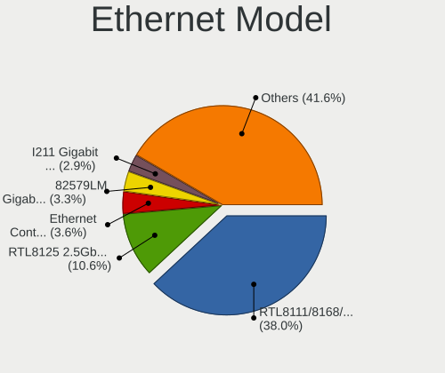

| Model                                                                           | Desktops | Percent |
|---------------------------------------------------------------------------------|----------|---------|
| Realtek RTL8111/8168/8211/8411 PCI Express Gigabit Ethernet Controller          | 1485     | 38.05%  |
| Realtek RTL8125 2.5GbE Controller                                               | 412      | 10.56%  |
| Intel Ethernet Controller I225-V                                                | 141      | 3.61%   |
| Intel 82579LM Gigabit Network Connection (Lewisville)                           | 129      | 3.31%   |
| Intel I211 Gigabit Network Connection                                           | 112      | 2.87%   |
| Intel Ethernet Connection (2) I219-V                                            | 112      | 2.87%   |
| Intel Ethernet Controller I226-V                                                | 96       | 2.46%   |
| Intel Ethernet Connection I217-LM                                               | 92       | 2.36%   |
| Intel Ethernet Connection (2) I219-LM                                           | 72       | 1.84%   |
| Intel Ethernet Connection (7) I219-V                                            | 59       | 1.51%   |
| Intel 82579V Gigabit Network Connection                                         | 51       | 1.31%   |
| Realtek RTL810xE PCI Express Fast Ethernet controller                           | 49       | 1.26%   |
| Realtek RTL8153 Gigabit Ethernet Adapter                                        | 44       | 1.13%   |
| Realtek RTL8126 5GbE Controller                                                 | 41       | 1.05%   |
| Intel I210 Gigabit Network Connection                                           | 39       | 1%      |
| Intel Ethernet Connection I217-V                                                | 36       | 0.92%   |
| Samsung Galaxy series, misc. (tethering mode)                                   | 35       | 0.9%    |
| Intel 82574L Gigabit Network Connection                                         | 28       | 0.72%   |
| Qualcomm Atheros Killer E220x Gigabit Ethernet Controller                       | 27       | 0.69%   |
| Intel Ethernet Connection (7) I219-LM                                           | 26       | 0.67%   |
| Intel Ethernet Connection (2) I218-V                                            | 26       | 0.67%   |
| Intel Ethernet Connection (17) I219-LM                                          | 20       | 0.51%   |
| Intel Ethernet Connection (14) I219-V                                           | 20       | 0.51%   |
| Realtek RTL8852BE PCIe 802.11ax Wireless Network Controller                     | 19       | 0.49%   |
| Qualcomm WCN785x Wi-Fi 7(802.11be) 320MHz 2x2 [FastConnect 7800]                | 19       | 0.49%   |
| Intel Ethernet Connection (5) I219-LM                                           | 18       | 0.46%   |
| Intel Ethernet Connection (2) I218-LM                                           | 18       | 0.46%   |
| Intel Alder Lake-S PCH CNVi WiFi                                                | 17       | 0.44%   |
| Xiaomi Mi/Redmi series (RNDIS)                                                  | 16       | 0.41%   |
| Aquantia AQtion AQC113CS NBase-T/IEEE 802.3an Ethernet Controller [Antigua 10G] | 16       | 0.41%   |
| Aquantia AQtion AQC107 NBase-T/IEEE 802.3an Ethernet Controller [Atlantic 10G]  | 16       | 0.41%   |
| Realtek Killer E3000 2.5GbE Controller                                          | 15       | 0.38%   |
| Nvidia MCP61 Ethernet                                                           | 15       | 0.38%   |
| Qualcomm Atheros Killer E2400 Gigabit Ethernet Controller                       | 14       | 0.36%   |
| Qualcomm Atheros AR8151 v2.0 Gigabit Ethernet                                   | 14       | 0.36%   |
| Intel Ethernet Connection (17) I219-V                                           | 13       | 0.33%   |
| ASIX AX88179 Gigabit Ethernet                                                   | 13       | 0.33%   |
| Marvell Group 88E8056 PCI-E Gigabit Ethernet Controller                         | 12       | 0.31%   |
| Intel Ethernet Controller X550                                                  | 12       | 0.31%   |
| Intel 82578DM Gigabit Network Connection                                        | 12       | 0.31%   |

Net Controller Kind
-------------------

Ethernet, WiFi or modem

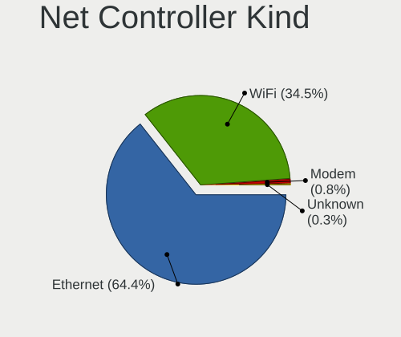

| Kind     | Desktops | Percent |
|----------|----------|---------|
| Ethernet | 3335     | 64.37%  |
| WiFi     | 1786     | 34.47%  |
| Modem    | 43       | 0.83%   |
| Unknown  | 17       | 0.33%   |

Used Controller
---------------

Currently used network controller

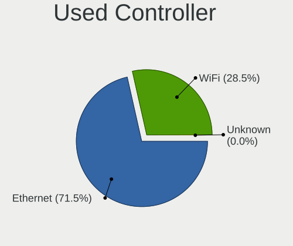

| Kind     | Desktops | Percent |
|----------|----------|---------|
| Ethernet | 2523     | 71.47%  |
| WiFi     | 1005     | 28.47%  |
| Modem    | 1        | 0.03%   |
| Unknown  | 1        | 0.03%   |

NICs
----

Total network controllers on board

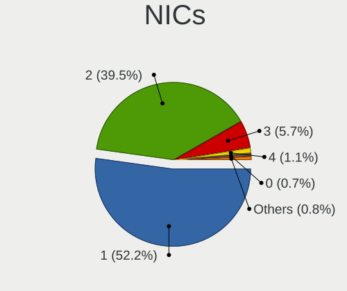

| Total | Desktops | Percent |
|-------|----------|---------|
| 1     | 1764     | 52.19%  |
| 2     | 1336     | 39.53%  |
| 3     | 194      | 5.74%   |
| 4     | 38       | 1.12%   |
| 0     | 22       | 0.65%   |
| 5     | 11       | 0.33%   |
| 6     | 9        | 0.27%   |
| 9     | 3        | 0.09%   |
| 13    | 1        | 0.03%   |
| 10    | 1        | 0.03%   |
| 8     | 1        | 0.03%   |

IPv6
----

IPv6 vs IPv4

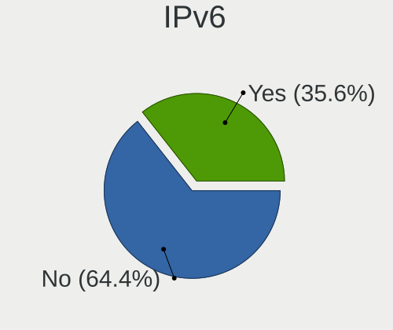

| Used | Desktops | Percent |
|------|----------|---------|
| No   | 2184     | 64.41%  |
| Yes  | 1207     | 35.59%  |

Bluetooth
---------

Bluetooth Vendor
----------------

Controller vendors

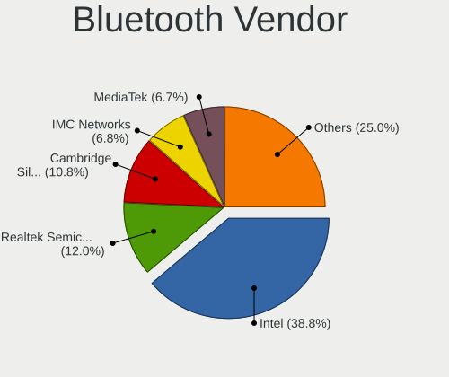

| Vendor                          | Desktops | Percent |
|---------------------------------|----------|---------|
| Intel                           | 615      | 38.8%   |
| Realtek Semiconductor           | 190      | 11.99%  |
| Cambridge Silicon Radio         | 171      | 10.79%  |
| IMC Networks                    | 107      | 6.75%   |
| MediaTek                        | 106      | 6.69%   |
| Foxconn / Hon Hai               | 98       | 6.18%   |
| ASUSTek Computer                | 72       | 4.54%   |
| TP-Link                         | 57       | 3.6%    |
| Qualcomm Atheros Communications | 48       | 3.03%   |
| Broadcom                        | 39       | 2.46%   |
| Unknown                         | 20       | 1.26%   |
| Apple                           | 12       | 0.76%   |
| Realtek                         | 9        | 0.57%   |
| Integrated System Solution      | 7        | 0.44%   |
| Lite-On Technology              | 6        | 0.38%   |
| Actions                         | 6        | 0.38%   |
| Ralink                          | 5        | 0.32%   |
| Dynex                           | 3        | 0.19%   |
| Logitech                        | 2        | 0.13%   |
| Edimax Technology               | 2        | 0.13%   |
| Dell                            | 2        | 0.13%   |
| Belkin Components               | 2        | 0.13%   |
| SINO WEALTH                     | 1        | 0.06%   |
| Roper                           | 1        | 0.06%   |
| Mercucys                        | 1        | 0.06%   |
| Hewlett-Packard                 | 1        | 0.06%   |
| D-Link                          | 1        | 0.06%   |
| AVM                             | 1        | 0.06%   |

Bluetooth Model
---------------

Controller models

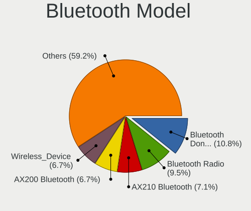

| Model                                                 | Desktops | Percent |
|-------------------------------------------------------|----------|---------|
| Cambridge Silicon Radio Bluetooth Dongle (HCI mode)   | 171      | 10.78%  |
| Realtek Bluetooth Radio                               | 150      | 9.46%   |
| Intel AX210 Bluetooth                                 | 113      | 7.12%   |
| Intel AX200 Bluetooth                                 | 107      | 6.75%   |
| MediaTek Wireless_Device                              | 106      | 6.68%   |
| Intel Bluetooth wireless interface                    | 105      | 6.62%   |
| Intel Bluetooth Device                                | 100      | 6.31%   |
| Intel AX201 Bluetooth                                 | 72       | 4.54%   |
| Foxconn / Hon Hai Wireless_Device                     | 58       | 3.66%   |
| TP-Link TP-T@- UB500 Adapter                          | 57       | 3.59%   |
| Intel Wireless-AC 3168 Bluetooth                      | 56       | 3.53%   |
| IMC Networks Bluetooth Radio                          | 53       | 3.34%   |
| IMC Networks Wireless_Device                          | 49       | 3.09%   |
| Intel Bluetooth 9460/9560 Jefferson Peak (JfP)        | 35       | 2.21%   |
| Foxconn / Hon Hai Bluetooth Device                    | 33       | 2.08%   |
| ASUS ASUS USB-BT500                                   | 28       | 1.77%   |
| Broadcom BCM20702A0 Bluetooth 4.0                     | 23       | 1.45%   |
| Intel Wireless-AC 9260 Bluetooth Adapter              | 21       | 1.32%   |
| Unknown                                               | 20       | 1.26%   |
| Qualcomm Atheros  Bluetooth Device                    | 16       | 1.01%   |
| Realtek  Bluetooth 4.2 Adapter                        | 15       | 0.95%   |
| ASUS Broadcom BCM20702A0 Bluetooth                    | 13       | 0.82%   |
| Qualcomm Atheros AR3011 Bluetooth                     | 12       | 0.76%   |
| Realtek Bluetooth 5.3 Radio                           | 11       | 0.69%   |
| ASUS Bluetooth Radio                                  | 10       | 0.63%   |
| Realtek Bluetooth Radio                               | 9        | 0.57%   |
| Qualcomm Atheros AR9462 Bluetooth                     | 9        | 0.57%   |
| Qualcomm Atheros Bluetooth USB Host Controller        | 8        | 0.5%    |
| ASUS BCM20702A0                                       | 8        | 0.5%    |
| Intel Centrino Bluetooth Wireless Transceiver         | 6        | 0.38%   |
| Apple Bluetooth Host Controller                       | 6        | 0.38%   |
| Actions general adapter                               | 6        | 0.38%   |
| Realtek Bluetooth 5.4 Radio                           | 5        | 0.32%   |
| Ralink RT3290 Bluetooth                               | 5        | 0.32%   |
| Lite-On Bluetooth Device                              | 5        | 0.32%   |
| Integrated System Solution Bluetooth Device           | 5        | 0.32%   |
| ASUS Broadcom BCM20702 Single-Chip Bluetooth 4.0 + LE | 5        | 0.32%   |
| Realtek 802.11ac WLAN Adapter                         | 4        | 0.25%   |
| Foxconn / Hon Hai MediaTek Bluetooth Adapter          | 4        | 0.25%   |
| Broadcom BCM2045 Bluetooth                            | 4        | 0.25%   |

Sound
-----

Sound Vendor
------------

Sound card vendors

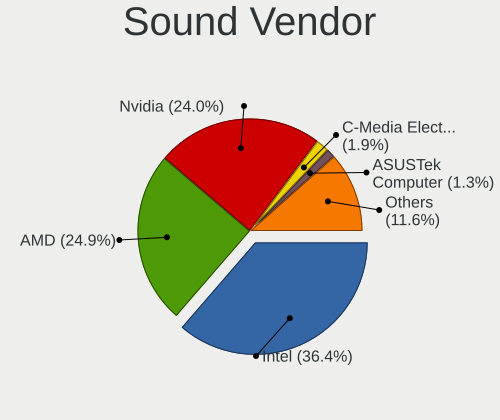

| Vendor                                       | Desktops | Percent |
|----------------------------------------------|----------|---------|
| Intel                                        | 2098     | 36.35%  |
| AMD                                          | 1436     | 24.88%  |
| Nvidia                                       | 1385     | 24%     |
| C-Media Electronics                          | 111      | 1.92%   |
| ASUSTek Computer                             | 74       | 1.28%   |
| Logitech                                     | 62       | 1.07%   |
| Micro Star International                     | 46       | 0.8%    |
| Creative Labs                                | 36       | 0.62%   |
| Zoran Co. Personal Media Division (Nogatech) | 33       | 0.57%   |
| Texas Instruments                            | 32       | 0.55%   |
| GN Netcom                                    | 26       | 0.45%   |
| JMTek                                        | 24       | 0.42%   |
| Razer USA                                    | 23       | 0.4%    |
| Creative Technology                          | 23       | 0.4%    |
| Kingston Technology                          | 22       | 0.38%   |
| Hewlett-Packard                              | 22       | 0.38%   |
| SteelSeries ApS                              | 19       | 0.33%   |
| Realtek Semiconductor                        | 14       | 0.24%   |
| Jieli Technology                             | 13       | 0.23%   |
| Dell                                         | 12       | 0.21%   |
| Tenx Technology                              | 11       | 0.19%   |
| Plantronics                                  | 11       | 0.19%   |
| Generalplus Technology                       | 11       | 0.19%   |
| Corsair                                      | 11       | 0.19%   |
| KTMicro                                      | 9        | 0.16%   |
| Giga-Byte Technology                         | 7        | 0.12%   |
| Focusrite-Novation                           | 7        | 0.12%   |
| DSEA A/S                                     | 7        | 0.12%   |
| ASRock                                       | 7        | 0.12%   |
| VIA Technologies                             | 6        | 0.1%    |
| RODE Microphones                             | 5        | 0.09%   |
| M-Audio                                      | 5        | 0.09%   |
| Unknown                                      | 5        | 0.09%   |
| Yamaha                                       | 4        | 0.07%   |
| Walmart                                      | 4        | 0.07%   |
| Thesycon Systemsoftware & Consulting         | 4        | 0.07%   |
| Shure                                        | 4        | 0.07%   |
| Nordic Semiconductor ASA                     | 4        | 0.07%   |
| Medeli Electronics                           | 4        | 0.07%   |
| BEHRINGER International                      | 4        | 0.07%   |

Sound Model
-----------

Sound card models

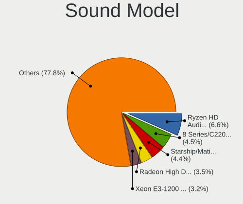

| Model                                                                      | Desktops | Percent |
|----------------------------------------------------------------------------|----------|---------|
| AMD Ryzen HD Audio Controller                                              | 457      | 6.63%   |
| Intel 8 Series/C220 Series Chipset High Definition Audio Controller        | 311      | 4.51%   |
| AMD Starship/Matisse HD Audio Controller                                   | 300      | 4.35%   |
| AMD Radeon High Definition Audio Controller                                | 244      | 3.54%   |
| Intel Xeon E3-1200 v3/4th Gen Core Processor HD Audio Controller           | 219      | 3.18%   |
| Intel 6 Series/C200 Series Chipset Family High Definition Audio Controller | 197      | 2.86%   |
| Intel 100 Series/C230 Series Chipset Family HD Audio Controller            | 181      | 2.63%   |
| Intel 7 Series/C216 Chipset Family High Definition Audio Controller        | 171      | 2.48%   |
| Intel 200 Series PCH HD Audio                                              | 165      | 2.4%    |
| AMD Renoir/Cezanne HDMI/DP Audio Controller                                | 162      | 2.35%   |
| AMD SBx00 Azalia (Intel HDA)                                               | 147      | 2.13%   |
| Intel Raptor Lake High Definition Audio Controller                         | 138      | 2%      |
| Intel Cannon Lake PCH cAVS                                                 | 136      | 1.97%   |
| Intel Alder Lake-S HD Audio Controller                                     | 123      | 1.79%   |
| AMD Ellesmere HDMI Audio [Radeon RX 470/480 / 570/580/590]                 | 104      | 1.51%   |
| AMD Family 17h (Models 00h-0fh) HD Audio Controller                        | 103      | 1.5%    |
| AMD Navi 21/23 HDMI/DP Audio Controller                                    | 102      | 1.48%   |
| Nvidia GK208 HDMI/DP Audio Controller                                      | 97       | 1.41%   |
| Nvidia GP107GL High Definition Audio Controller                            | 93       | 1.35%   |
| AMD FCH Azalia Controller                                                  | 81       | 1.18%   |
| AMD Navi 31 HDMI/DP Audio                                                  | 78       | 1.13%   |
| Nvidia GA102 High Definition Audio Controller                              | 74       | 1.07%   |
| Nvidia GA104 High Definition Audio Controller                              | 72       | 1.05%   |
| Nvidia GA106 High Definition Audio Controller                              | 71       | 1.03%   |
| ASUSTek Computer USB Audio                                                 | 69       | 1%      |
| Nvidia AD104 High Definition Audio Controller                              | 62       | 0.9%    |
| Intel C610/X99 series chipset HD Audio Controller                          | 62       | 0.9%    |
| Nvidia GP104 High Definition Audio Controller                              | 61       | 0.89%   |
| Nvidia TU116 High Definition Audio Controller                              | 58       | 0.84%   |
| Nvidia GP106 High Definition Audio Controller                              | 57       | 0.83%   |
| Nvidia GM107 High Definition Audio Controller [GeForce 940MX]              | 56       | 0.81%   |
| Intel Alder Lake-N PCH High Definition Audio Controller                    | 55       | 0.8%    |
| Intel 5 Series/3400 Series Chipset High Definition Audio                   | 54       | 0.78%   |
| Intel 82801JI (ICH10 Family) HD Audio Controller                           | 53       | 0.77%   |
| AMD Baffin HDMI/DP Audio [Radeon RX 550 640SP / RX 560/560X]               | 51       | 0.74%   |
| AMD Oland/Hainan/Cape Verde/Pitcairn HDMI Audio [Radeon HD 7000 Series]    | 50       | 0.73%   |
| Intel Tiger Lake-H HD Audio Controller                                     | 47       | 0.68%   |
| Nvidia GF119 HDMI Audio Controller                                         | 46       | 0.67%   |
| Micro Star International USB Audio                                         | 46       | 0.67%   |
| Nvidia High Definition Audio Controller                                    | 44       | 0.64%   |

Memory
------

Memory Vendor
-------------

Memory module vendors

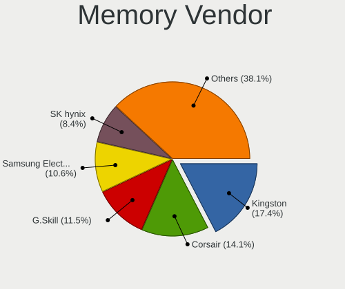

| Vendor                       | Desktops | Percent |
|------------------------------|----------|---------|
| Kingston                     | 283      | 17.38%  |
| Corsair                      | 230      | 14.13%  |
| G.Skill                      | 187      | 11.49%  |
| Samsung Electronics          | 172      | 10.57%  |
| SK hynix                     | 136      | 8.35%   |
| Crucial                      | 119      | 7.31%   |
| Unknown                      | 95       | 5.84%   |
| Micron Technology            | 82       | 5.04%   |
| Unknown                      | 70       | 4.3%    |
| A-DATA Technology            | 47       | 2.89%   |
| Team                         | 30       | 1.84%   |
| Patriot                      | 17       | 1.04%   |
| Nanya Technology             | 13       | 0.8%    |
| Ramaxel Technology           | 10       | 0.61%   |
| Apacer                       | 9        | 0.55%   |
| GOODRAM                      | 6        | 0.37%   |
| Transcend                    | 5        | 0.31%   |
| Patriot Memory (PDP Systems) | 5        | 0.31%   |
| Hewlett-Packard              | 5        | 0.31%   |
| AMD                          | 5        | 0.31%   |
| Unknown (0x0E9D)             | 4        | 0.25%   |
| Hikvision                    | 4        | 0.25%   |
| Golden Empire                | 4        | 0.25%   |
| GeIL                         | 4        | 0.25%   |
| Elpida                       | 4        | 0.25%   |
| Unknown (ABCD)               | 3        | 0.18%   |
| Timetec                      | 3        | 0.18%   |
| Silicon Power                | 3        | 0.18%   |
| PNY                          | 3        | 0.18%   |
| Lexar                        | 3        | 0.18%   |
| Wodposit                     | 2        | 0.12%   |
| Unknown (0x0FF4)             | 2        | 0.12%   |
| Unknown (0x0EB9)             | 2        | 0.12%   |
| Unknown (0x0CAE)             | 2        | 0.12%   |
| Super Talent                 | 2        | 0.12%   |
| Smart                        | 2        | 0.12%   |
| QEMU                         | 2        | 0.12%   |
| Patriot Memory               | 2        | 0.12%   |
| Neo Forza                    | 2        | 0.12%   |
| Lexar Co Limited             | 2        | 0.12%   |

Memory Model
------------

Memory module models

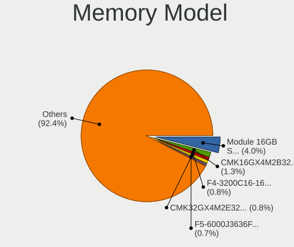

| Model                                                   | Desktops | Percent |
|---------------------------------------------------------|----------|---------|
| Unknown                                                 | 70       | 3.98%   |
| Corsair RAM CMK16GX4M2B3200C16 8GB DIMM DDR4 3600MT/s   | 23       | 1.31%   |
| G.Skill RAM F4-3200C16-16GVK 16GB DIMM DDR4 3600MT/s    | 14       | 0.8%    |
| Corsair RAM CMK32GX4M2E3200C16 16GB DIMM DDR4 3600MT/s  | 14       | 0.8%    |
| G.Skill RAM F5-6000J3636F16G 16GB DIMM DDR5 6400MT/s    | 12       | 0.68%   |
| Unknown RAM Module 2GB DIMM DDR2 800MT/s                | 11       | 0.63%   |
| Kingston RAM KHX1600C9D3/4GX 4GB DIMM DDR3 1867MT/s     | 11       | 0.63%   |
| Kingston RAM KF3200C16D4/8GX 8GiB DIMM DDR4 3600MT/s    | 11       | 0.63%   |
| Unknown RAM Module 4GB DIMM DDR3 1333MT/s               | 9        | 0.51%   |
| Kingston RAM KF3200C16D4/16GX 16GB DIMM DDR4 3733MT/s   | 9        | 0.51%   |
| G.Skill RAM F5-6000J3040G32G 32GB DIMM DDR5 6200MT/s    | 9        | 0.51%   |
| A-DATA RAM DDR4 3200 16GB DIMM DDR4 3600MT/s            | 9        | 0.51%   |
| Kingston RAM KHX3200C16D4/16GX 16GB DIMM DDR4 3600MT/s  | 8        | 0.45%   |
| G.Skill RAM F5-6000J3238F16G 16GB DIMM DDR5 12800MT/s   | 8        | 0.45%   |
| Team RAM TEAMGROUP-UD4-3200 8GB DIMM DDR4 3733MT/s      | 7        | 0.4%    |
| SK hynix RAM HMT451U6BFR8A-PB 4GB DIMM DDR3 1600MT/s    | 7        | 0.4%    |
| Kingston RAM KHX1600C10D3/8G 8GB DIMM DDR3 2133MT/s     | 7        | 0.4%    |
| Kingston RAM KF560C36-32 32GB DIMM DDR5 6200MT/s        | 7        | 0.4%    |
| Kingston RAM KF556C40-32 32GB DIMM DDR5 6000MT/s        | 7        | 0.4%    |
| G.Skill RAM F4-3200C16-16GIS 16GB DIMM DDR4 3600MT/s    | 7        | 0.4%    |
| Samsung RAM M378B5173QH0-CK0 4GB DIMM DDR3              | 6        | 0.34%   |
| Kingston RAM KHX3200C16D4/8GX 8GB DIMM DDR4 3733MT/s    | 6        | 0.34%   |
| G.Skill RAM F4-3200C16-8GIS 8GB DIMM DDR4 3600MT/s      | 6        | 0.34%   |
| Corsair RAM CMK32GX4M2Z3600C18 16GB DIMM DDR4 3800MT/s  | 6        | 0.34%   |
| Corsair RAM CMK16GX4M2D3600C18 8GB DIMM DDR4 4000MT/s   | 6        | 0.34%   |
| Corsair RAM CMK16GX4M2B3000C15 8GB DIMM DDR4 3600MT/s   | 6        | 0.34%   |
| Unknown RAM Module 8GB DIMM DDR3 1600MT/s               | 5        | 0.28%   |
| Unknown RAM Module 4GB DIMM 1333MT/s                    | 5        | 0.28%   |
| Samsung RAM Module 8GB DIMM DDR4 2133MT/s               | 5        | 0.28%   |
| Samsung RAM M378B5173DB0-CK0 4096MB DIMM DDR3 1600MT/s  | 5        | 0.28%   |
| Samsung RAM M378A1K43CB2-CTD 8GB DIMM DDR4 3266MT/s     | 5        | 0.28%   |
| Kingston RAM KHX1866C10D3/8G 8GB DIMM DDR3 1867MT/s     | 5        | 0.28%   |
| G.Skill RAM F5-6400J3239F48G 48GB DIMM DDR5 6400MT/s    | 5        | 0.28%   |
| G.Skill RAM F4-3600C16-16GTZNC 16GiB DIMM DDR4 3600MT/s | 5        | 0.28%   |
| G.Skill RAM F4-3000C16-8GISB 8GB DIMM DDR4 3200MT/s     | 5        | 0.28%   |
| G.Skill RAM F3-12800CL9-4GBXL 4GB DIMM DDR3 1867MT/s    | 5        | 0.28%   |
| Crucial RAM CT102464BA160B.C16 8GB DIMM DDR3 1600MT/s   | 5        | 0.28%   |
| Corsair RAM CMK32GX4M2D3600C18 16GB DIMM DDR4 3800MT/s  | 5        | 0.28%   |
| Corsair RAM CMK32GX4M2B3200C16 16GB DIMM DDR4 3800MT/s  | 5        | 0.28%   |
| Corsair RAM CMK16GX4M2E3200C16 8GB DIMM DDR4 3466MT/s   | 5        | 0.28%   |

Memory Kind
-----------

Memory module kinds

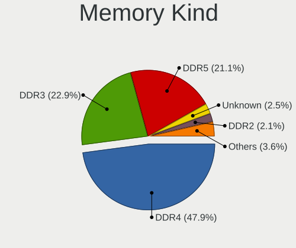

| Kind    | Desktops | Percent |
|---------|----------|---------|
| DDR4    | 698      | 47.91%  |
| DDR3    | 333      | 22.86%  |
| DDR5    | 307      | 21.07%  |
| Unknown | 37       | 2.54%   |
| DDR2    | 30       | 2.06%   |
| SDRAM   | 26       | 1.78%   |
| LPDDR4  | 7        | 0.48%   |
| LPDDR5  | 6        | 0.41%   |
| DRAM    | 5        | 0.34%   |
| DDR     | 5        | 0.34%   |
| RAM     | 2        | 0.14%   |
| LPDDR3  | 1        | 0.07%   |

Memory Form Factor
------------------

Physical design of the memory module

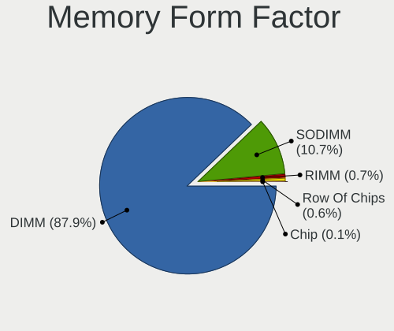

| Name         | Desktops | Percent |
|--------------|----------|---------|
| DIMM         | 1267     | 87.86%  |
| SODIMM       | 154      | 10.68%  |
| RIMM         | 10       | 0.69%   |
| Row Of Chips | 9        | 0.62%   |
| Chip         | 2        | 0.14%   |

Memory Size
-----------

Memory module size

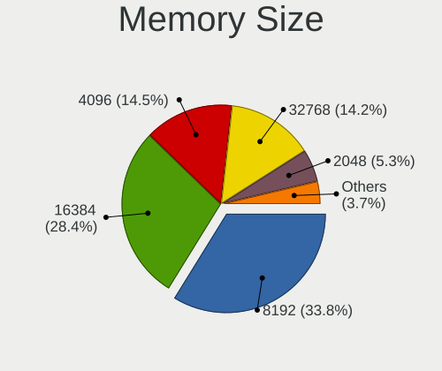

| Size  | Desktops | Percent |
|-------|----------|---------|
| 8192  | 521      | 33.81%  |
| 16384 | 438      | 28.42%  |
| 4096  | 224      | 14.54%  |
| 32768 | 219      | 14.21%  |
| 2048  | 82       | 5.32%   |
| 49152 | 24       | 1.56%   |
| 1024  | 14       | 0.91%   |
| 65536 | 11       | 0.71%   |
| 24576 | 5        | 0.32%   |
| 10240 | 1        | 0.06%   |
| 512   | 1        | 0.06%   |
| 32    | 1        | 0.06%   |

Memory Speed
------------

Memory module speed

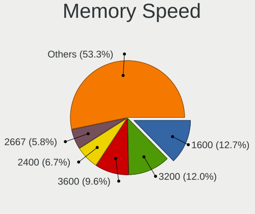

| Speed   | Desktops | Percent |
|---------|----------|---------|
| 1600    | 205      | 12.69%  |
| 3200    | 194      | 12%     |
| 3600    | 155      | 9.59%   |
| 2400    | 108      | 6.68%   |
| 2667    | 93       | 5.75%   |
| 1333    | 89       | 5.51%   |
| 2133    | 83       | 5.14%   |
| 6000    | 69       | 4.27%   |
| 5600    | 68       | 4.21%   |
| 4800    | 67       | 4.15%   |
| 6400    | 38       | 2.35%   |
| 3733    | 31       | 1.92%   |
| 1866    | 30       | 1.86%   |
| 3800    | 28       | 1.73%   |
| 800     | 27       | 1.67%   |
| 2666    | 24       | 1.49%   |
| 5200    | 23       | 1.42%   |
| 3000    | 18       | 1.11%   |
| 6200    | 16       | 0.99%   |
| 2933    | 15       | 0.93%   |
| 4000    | 14       | 0.87%   |
| 12800   | 13       | 0.8%    |
| 3400    | 13       | 0.8%    |
| 1867    | 12       | 0.74%   |
| 3466    | 10       | 0.62%   |
| 1800    | 10       | 0.62%   |
| 667     | 10       | 0.62%   |
| 1648    | 9        | 0.56%   |
| 1066    | 9        | 0.56%   |
| Unknown | 9        | 0.56%   |
| 2800    | 8        | 0.5%    |
| 2733    | 8        | 0.5%    |
| 3866    | 7        | 0.43%   |
| 3266    | 7        | 0.43%   |
| 1067    | 7        | 0.43%   |
| 6800    | 6        | 0.37%   |
| 3933    | 6        | 0.37%   |
| 5800    | 4        | 0.25%   |
| 3500    | 4        | 0.25%   |
| 8400    | 3        | 0.19%   |

Printers & scanners
-------------------

Printer Vendor
--------------

Printer device vendors

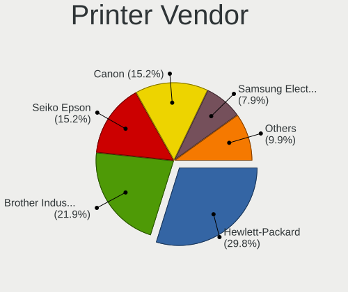

| Vendor              | Desktops | Percent |
|---------------------|----------|---------|
| Hewlett-Packard     | 45       | 29.8%   |
| Brother Industries  | 33       | 21.85%  |
| Seiko Epson         | 23       | 15.23%  |
| Canon               | 23       | 15.23%  |
| Samsung Electronics | 12       | 7.95%   |
| Dymo-CoStar         | 4        | 2.65%   |
| QinHeng Electronics | 2        | 1.32%   |
| Kyocera             | 2        | 1.32%   |
| Zebra Technologies  | 1        | 0.66%   |
| Xerox               | 1        | 0.66%   |
| STMicroelectronics  | 1        | 0.66%   |
| Star Micronics      | 1        | 0.66%   |
| Prolific Technology | 1        | 0.66%   |
| ICS Advent          | 1        | 0.66%   |
| Fuji Xerox          | 1        | 0.66%   |

Printer Model
-------------

Printer device models

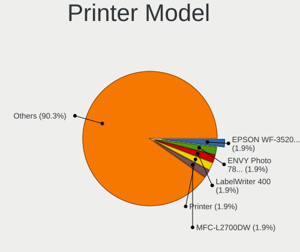

| Model                                                      | Desktops | Percent |
|------------------------------------------------------------|----------|---------|
| Seiko Epson EPSON WF-3520 Series                           | 3        | 1.95%   |
| HP ENVY Photo 7800 series                                  | 3        | 1.95%   |
| Dymo-CoStar LabelWriter 400                                | 3        | 1.95%   |
| Brother Printer                                            | 3        | 1.95%   |
| Brother MFC-L2700DW                                        | 3        | 1.95%   |
| Seiko Epson L1250 Series                                   | 2        | 1.3%    |
| Seiko Epson ET-2870 Series                                 | 2        | 1.3%    |
| Samsung M2070 Series                                       | 2        | 1.3%    |
| Samsung M2020 Series                                       | 2        | 1.3%    |
| QinHeng CH340S                                             | 2        | 1.3%    |
| HP LaserJet 1022                                           | 2        | 1.3%    |
| HP ENVY Photo 6200 series                                  | 2        | 1.3%    |
| HP ENVY 4520 series                                        | 2        | 1.3%    |
| HP DeskJet 2700 series                                     | 2        | 1.3%    |
| HP DeskJet 2600 series                                     | 2        | 1.3%    |
| Canon TS3100 series                                        | 2        | 1.3%    |
| Canon LiDE 400                                             | 2        | 1.3%    |
| Brother DCP-J1050DW                                        | 2        | 1.3%    |
| Zebra GX420d Desktop Label Printer                         | 1        | 0.65%   |
| Xerox Phaser 6510                                          | 1        | 0.65%   |
| STMicroelectronics LED badge -- mini LED display -- 11x44  | 1        | 0.65%   |
| Star Micronics TSP100ECO/TSP100II                          | 1        | 0.65%   |
| Seiko Epson XP-4100 Series                                 | 1        | 0.65%   |
| Seiko Epson XP-3200 Series                                 | 1        | 0.65%   |
| Seiko Epson XP-3100 Series                                 | 1        | 0.65%   |
| Seiko Epson XP-240 Series                                  | 1        | 0.65%   |
| Seiko Epson WF-C5210 Series                                | 1        | 0.65%   |
| Seiko Epson USB2.0 Printer (Hi-speed)                      | 1        | 0.65%   |
| Seiko Epson L405 Series                                    | 1        | 0.65%   |
| Seiko Epson L355 Series                                    | 1        | 0.65%   |
| Seiko Epson L3110 Series                                   | 1        | 0.65%   |
| Seiko Epson L3050 Series                                   | 1        | 0.65%   |
| Seiko Epson ET-8500 Series                                 | 1        | 0.65%   |
| Seiko Epson ET-4850 Series                                 | 1        | 0.65%   |
| Seiko Epson ET-4750 [WorkForce ET-4750 EcoTank All-in-One] | 1        | 0.65%   |
| Seiko Epson ET-3750 Series                                 | 1        | 0.65%   |
| Seiko Epson ET-2850 Series                                 | 1        | 0.65%   |
| Seiko Epson ET-2800 Series                                 | 1        | 0.65%   |
| Seiko Epson Artisan 1430 Series                            | 1        | 0.65%   |
| Samsung SCX-3400 Series                                    | 1        | 0.65%   |

Scanner Vendor
--------------

Scanner device vendors

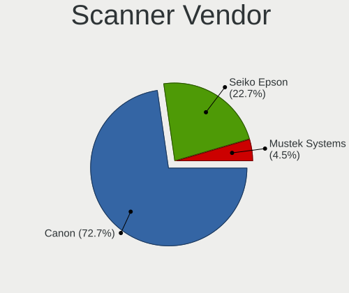

| Vendor         | Desktops | Percent |
|----------------|----------|---------|
| Canon          | 16       | 72.73%  |
| Seiko Epson    | 5        | 22.73%  |
| Mustek Systems | 1        | 4.55%   |

Scanner Model
-------------

Scanner device models

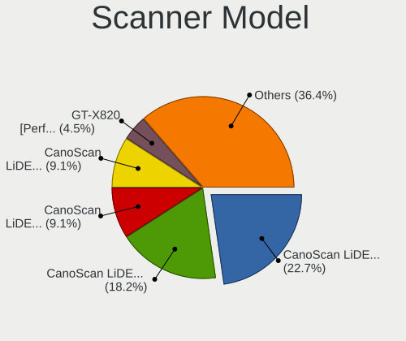

| Model                                                   | Desktops | Percent |
|---------------------------------------------------------|----------|---------|
| Canon CanoScan LiDE 220                                 | 5        | 22.73%  |
| Canon CanoScan LiDE 200                                 | 4        | 18.18%  |
| Canon CanoScan LiDE 120                                 | 2        | 9.09%   |
| Canon CanoScan LiDE 110                                 | 2        | 9.09%   |
| Seiko Epson GT-X820 [Perfection V600 Photo]             | 1        | 4.55%   |
| Seiko Epson GT-F730 [GT-S630/Perfection V33/V330 Photo] | 1        | 4.55%   |
| Seiko Epson GT-F720 [GT-S620/Perfection V30/V300 Photo] | 1        | 4.55%   |
| Seiko Epson GT-F650 [GT-S600/Perfection V10/V100]       | 1        | 4.55%   |
| Seiko Epson GT-F520/GT-F570 [Perfection 3590 PHOTO]     | 1        | 4.55%   |
| Mustek Systems BearPaw 2448 TA Pro                      | 1        | 4.55%   |
| Canon CanoScan LiDE 210                                 | 1        | 4.55%   |
| Canon CanoScan LiDE 100                                 | 1        | 4.55%   |
| Canon CanoScan                                          | 1        | 4.55%   |

Camera
------

Camera Vendor
-------------

Camera device vendors

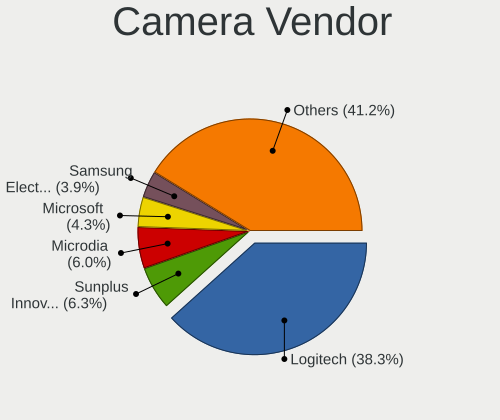

| Vendor                        | Desktops | Percent |
|-------------------------------|----------|---------|
| Logitech                      | 238      | 38.33%  |
| Sunplus Innovation Technology | 39       | 6.28%   |
| Microdia                      | 37       | 5.96%   |
| Microsoft                     | 27       | 4.35%   |
| Samsung Electronics           | 24       | 3.86%   |
| Apple                         | 22       | 3.54%   |
| ARC International             | 16       | 2.58%   |
| Generalplus Technology        | 14       | 2.25%   |
| Realtek Semiconductor         | 11       | 1.77%   |
| Creative Technology           | 11       | 1.77%   |
| Chicony Electronics           | 11       | 1.77%   |
| MacroSilicon                  | 9        | 1.45%   |
| eMeet                         | 8        | 1.29%   |
| KYE Systems (Mouse Systems)   | 7        | 1.13%   |
| webcam                        | 6        | 0.97%   |
| Trust                         | 6        | 0.97%   |
| Z-Star Microelectronics       | 5        | 0.81%   |
| SunplusIT                     | 5        | 0.81%   |
| Razer USA                     | 5        | 0.81%   |
| Jieli Technology              | 5        | 0.81%   |
| Dell                          | 5        | 0.81%   |
| AVerMedia Technologies        | 5        | 0.81%   |
| Sonix Technology              | 4        | 0.64%   |
| Philips (or NXP)              | 4        | 0.64%   |
| Arkmicro Technologies         | 4        | 0.64%   |
| Anker PowerConf C200          | 4        | 0.64%   |
| Unknown                       | 4        | 0.64%   |
| Sunplus Technology            | 3        | 0.48%   |
| OmniVision Technologies       | 3        | 0.48%   |
| Lenovo                        | 3        | 0.48%   |
| Intel                         | 3        | 0.48%   |
| Hewlett-Packard               | 3        | 0.48%   |
| Google                        | 3        | 0.48%   |
| GEMBIRD                       | 3        | 0.48%   |
| A4Tech                        | 3        | 0.48%   |
| YGTek                         | 2        | 0.32%   |
| webcamvendor                  | 2        | 0.32%   |
| ValueHD                       | 2        | 0.32%   |
| Sunplus IT                    | 2        | 0.32%   |
| SN0002                        | 2        | 0.32%   |

Camera Model
------------

Camera device models

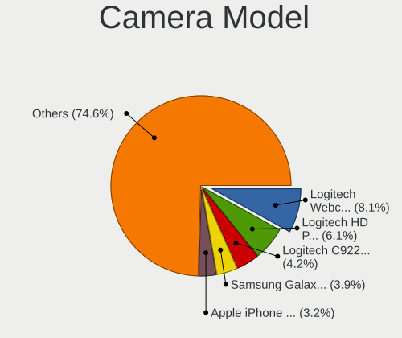

| Model                                                 | Desktops | Percent |
|-------------------------------------------------------|----------|---------|
| Logitech Webcam C270                                  | 50       | 8.05%   |
| Logitech HD Pro Webcam C920                           | 38       | 6.12%   |
| Logitech C922 Pro Stream Webcam                       | 26       | 4.19%   |
| Samsung Galaxy series, misc. (MTP mode)               | 24       | 3.86%   |
| Apple iPhone 5/5C/5S/6/SE/7/8/X                       | 20       | 3.22%   |
| ARC International Camera                              | 16       | 2.58%   |
| Logitech C920 PRO HD Webcam                           | 13       | 2.09%   |
| Microsoft LifeCam HD-3000                             | 11       | 1.77%   |
| Microdia Webcam Vitade AF                             | 11       | 1.77%   |
| Sunplus FULL HD webcam                                | 10       | 1.61%   |
| Microdia USB 2.0 Camera                               | 10       | 1.61%   |
| Logitech Logitech Webcam C925e                        | 10       | 1.61%   |
| Logitech BRIO Ultra HD Webcam                         | 10       | 1.61%   |
| Logitech Webcam C310                                  | 9        | 1.45%   |
| Generalplus GENERAL WEBCAM                            | 9        | 1.45%   |
| Sunplus Integrated Camera                             | 8        | 1.29%   |
| Logitech HD Webcam C525                               | 8        | 1.29%   |
| webcam webcam                                         | 6        | 0.97%   |
| Logitech Webcam C930e                                 | 6        | 0.97%   |
| Logitech Webcam C170                                  | 6        | 0.97%   |
| Logitech QuickCam Pro 9000                            | 6        | 0.97%   |
| Logitech HD Webcam C615                               | 6        | 0.97%   |
| Sunplus SPCA2281 Web Camera                           | 5        | 0.81%   |
| Unknown                                               | 5        | 0.81%   |
| Microdia CyberTrack H7                                | 4        | 0.64%   |
| Microdia Camera                                       | 4        | 0.64%   |
| Logitech Webcam Pro 9000                              | 4        | 0.64%   |
| Logitech HD Webcam C910                               | 4        | 0.64%   |
| Logitech HD Webcam C510                               | 4        | 0.64%   |
| KYE Systems (Mouse Systems) USB 2.0 HD1080P PC Camera | 4        | 0.64%   |
| Jieli USB PHY 2.0                                     | 4        | 0.64%   |
| Generalplus 808 Camera #9 (web-cam mode)              | 4        | 0.64%   |
| Dell Integrated_Webcam_5M_IR                          | 4        | 0.64%   |
| Anker PowerConf C200 Anker PowerConf C200             | 4        | 0.64%   |
| Z-Star A4 TECH USB2.0 PC Camera E                     | 3        | 0.48%   |
| SunplusIT USB 2.0 Camera                              | 3        | 0.48%   |
| Sunplus Ultra HD 4K - RC                              | 3        | 0.48%   |
| Sunplus HK 5M WebCAM                                  | 3        | 0.48%   |
| Realtek USB Camera                                    | 3        | 0.48%   |
| Realtek Thronmax Stream Go Pro Webcam                 | 3        | 0.48%   |

Security
--------

Fingerprint Vendor
------------------

Fingerprint sensor vendors

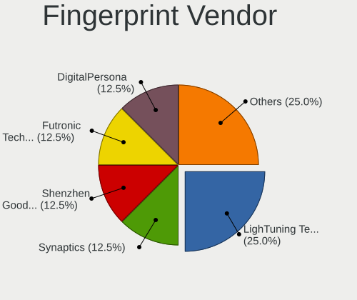

| Vendor                     | Desktops | Percent |
|----------------------------|----------|---------|
| LighTuning Technology      | 2        | 25%     |
| Synaptics                  | 1        | 12.5%   |
| Shenzhen Goodix Technology | 1        | 12.5%   |
| Futronic Technology        | 1        | 12.5%   |
| DigitalPersona             | 1        | 12.5%   |
| Dell                       | 1        | 12.5%   |
| AuthenTec                  | 1        | 12.5%   |

Fingerprint Model
-----------------

Fingerprint sensor models

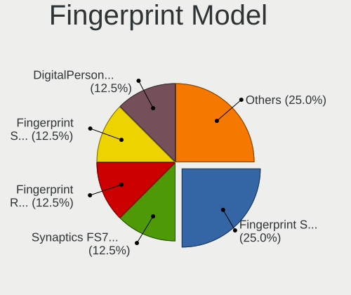

| Model                                                     | Desktops | Percent |
|-----------------------------------------------------------|----------|---------|
| LighTuning Fingerprint Sensor                             | 2        | 25%     |
| Synaptics  FS7604 Touch Fingerprint Sensor with PurePrint | 1        | 12.5%   |
| Shenzhen Goodix Fingerprint Reader                        | 1        | 12.5%   |
| Futronic Fingerprint Scanner Model FS88                   | 1        | 12.5%   |
| DigitalPersona DigitalPersona, Inc. Fingerprint Reader    | 1        | 12.5%   |
| Dell MS819 Wired Mouse With Fingerprint Reader            | 1        | 12.5%   |
| AuthenTec AES2501 Fingerprint Sensor                      | 1        | 12.5%   |

Chipcard Vendor
---------------

Chipcard module vendors

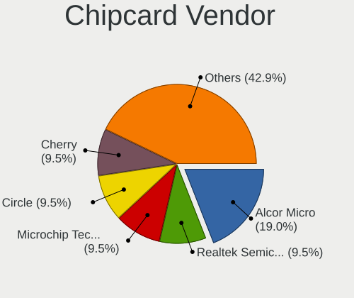

| Vendor                    | Desktops | Percent |
|---------------------------|----------|---------|
| Alcor Micro               | 4        | 19.05%  |
| Realtek Semiconductor     | 2        | 9.52%   |
| Microchip Technology      | 2        | 9.52%   |
| Circle                    | 2        | 9.52%   |
| Cherry                    | 2        | 9.52%   |
| SANHO Digital Electronics | 1        | 4.76%   |
| Reiner SCT Kartensysteme  | 1        | 4.76%   |
| OmniKey                   | 1        | 4.76%   |
| GHI                       | 1        | 4.76%   |
| Gemalto (was Gemplus)     | 1        | 4.76%   |
| Fujitsu Siemens Computers | 1        | 4.76%   |
| Aladdin R.D.              | 1        | 4.76%   |
| Aktiv                     | 1        | 4.76%   |
| Advanced Card Systems     | 1        | 4.76%   |

Chipcard Model
--------------

Chipcard module models

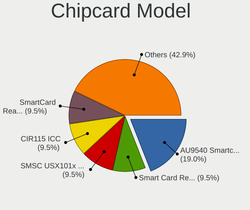

| Model                                                                      | Desktops | Percent |
|----------------------------------------------------------------------------|----------|---------|
| Alcor Micro AU9540 Smartcard Reader                                        | 4        | 19.05%  |
| Realtek Semiconductor Smart Card Reader Interface                          | 2        | 9.52%   |
| Microchip Technology SMSC USX101x Reader                                   | 2        | 9.52%   |
| Circle CIR115 ICC                                                          | 2        | 9.52%   |
| Cherry SmartCard Reader Keyboard KC 1000 SC                                | 2        | 9.52%   |
| SANHO Digital Electronics ATR19                                            | 1        | 4.76%   |
| Reiner SCT Kartensysteme cyberJack RFID basis contactless smartcard reader | 1        | 4.76%   |
| OmniKey CardMan 5321                                                       | 1        | 4.76%   |
| GHI NC001                                                                  | 1        | 4.76%   |
| Gemalto (was Gemplus) GemPC Twin SmartCard Reader                          | 1        | 4.76%   |
| Fujitsu Siemens Computers Keyboard KB100 SCR eSIG                          | 1        | 4.76%   |
| Aladdin R.D. JaCarta                                                       | 1        | 4.76%   |
| Aktiv Rutoken lite                                                         | 1        | 4.76%   |
| Advanced Card Systems ACR38 SmartCard Reader                               | 1        | 4.76%   |

Unsupported
-----------

Unsupported Devices
-------------------

Total unsupported devices on board

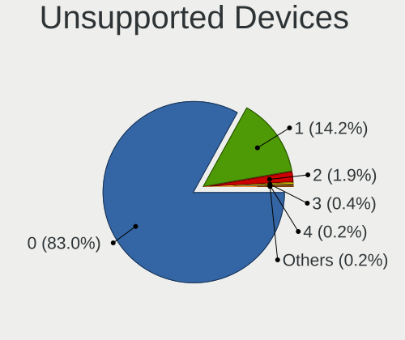

| Total | Desktops | Percent |
|-------|----------|---------|
| 0     | 2825     | 83.04%  |
| 1     | 483      | 14.2%   |
| 2     | 65       | 1.91%   |
| 3     | 14       | 0.41%   |
| 4     | 7        | 0.21%   |
| 5     | 4        | 0.12%   |
| 6     | 2        | 0.06%   |
| 8     | 1        | 0.03%   |
| 7     | 1        | 0.03%   |

Unsupported Device Types
------------------------

Types of unsupported devices

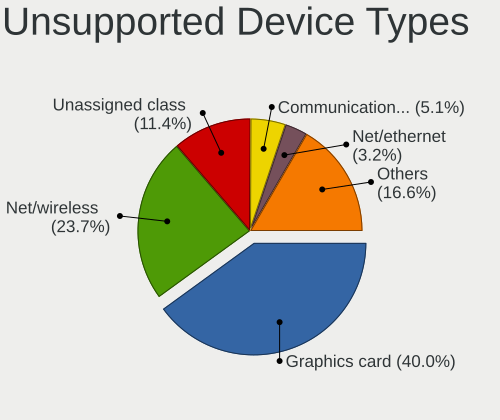

| Type                     | Desktops | Percent |
|--------------------------|----------|---------|
| Graphics card            | 260      | 40%     |
| Net/wireless             | 154      | 23.69%  |
| Unassigned class         | 74       | 11.38%  |
| Communication controller | 33       | 5.08%   |
| Net/ethernet             | 21       | 3.23%   |
| Multimedia controller    | 18       | 2.77%   |
| Sound                    | 16       | 2.46%   |
| Network                  | 15       | 2.31%   |
| Bluetooth                | 15       | 2.31%   |
| Chipcard                 | 13       | 2%      |
| Storage/raid             | 8        | 1.23%   |
| Card reader              | 7        | 1.08%   |
| Fingerprint reader       | 6        | 0.92%   |
| Camera                   | 6        | 0.92%   |
| Tv card                  | 1        | 0.15%   |
| Storage/ata              | 1        | 0.15%   |
| Modem                    | 1        | 0.15%   |
| Firewire controller      | 1        | 0.15%   |

