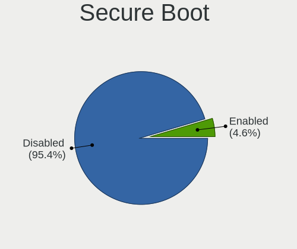
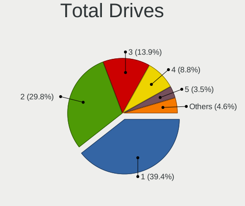
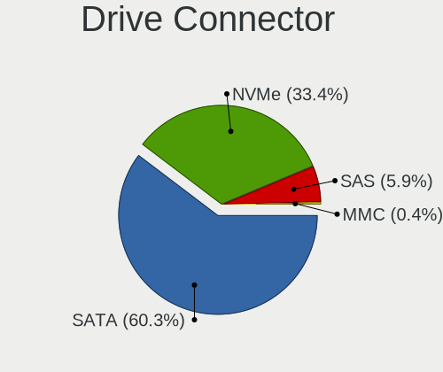
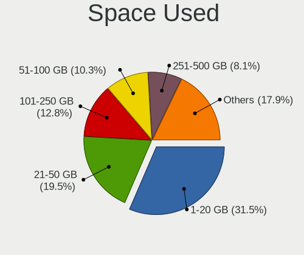
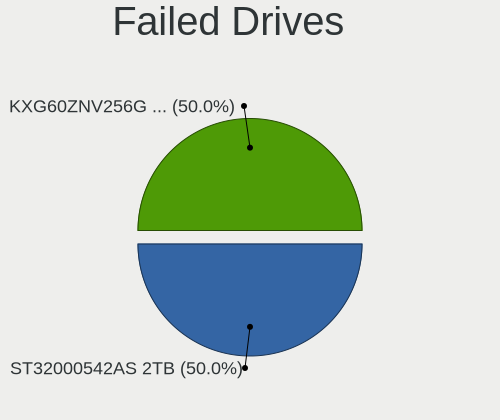
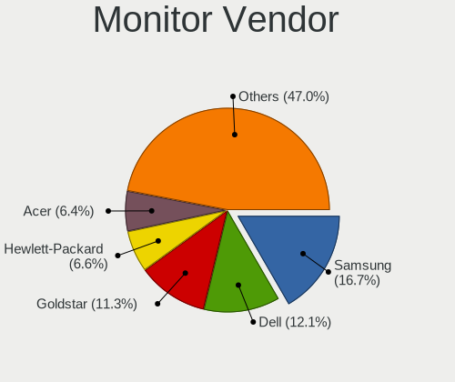
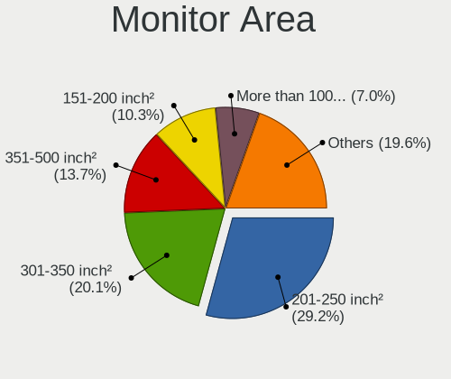

Ubuntu 24.04 - Tested Hardware & Statistics (Desktops)
------------------------------------------------------

A project to collect tested hardware configurations for Ubuntu 24.04.

Anyone can contribute to this report by the [hw-probe](https://github.com/linuxhw/hw-probe) tool:

    sudo -E hw-probe -all -upload

Please contribute! Especially if your hardware is rare.

Contents
--------

* [ Test Cases ](#test-cases)

* [ System ](#system)
  - [ Kernel                   ](#kernel)
  - [ Kernel Family            ](#kernel-family)
  - [ Kernel Major Ver.        ](#kernel-major-ver)
  - [ Arch                     ](#arch)
  - [ DE                       ](#de)
  - [ Display Server           ](#display-server)
  - [ Display Manager          ](#display-manager)
  - [ OS Lang                  ](#os-lang)
  - [ Boot Mode                ](#boot-mode)
  - [ Filesystem               ](#filesystem)
  - [ Part. scheme             ](#part-scheme)
  - [ Dual Boot with Linux/BSD ](#dual-boot-with-linuxbsd)
  - [ Dual Boot (Win)          ](#dual-boot-win)

* [ Board ](#board)
  - [ Vendor                   ](#vendor)
  - [ Model                    ](#model)
  - [ Model Family             ](#model-family)
  - [ MFG Year                 ](#mfg-year)
  - [ Form Factor              ](#form-factor)
  - [ Secure Boot              ](#secure-boot)
  - [ Coreboot                 ](#coreboot)
  - [ RAM Size                 ](#ram-size)
  - [ RAM Used                 ](#ram-used)
  - [ Total Drives             ](#total-drives)
  - [ Has CD-ROM               ](#has-cd-rom)
  - [ Has Ethernet             ](#has-ethernet)
  - [ Has WiFi                 ](#has-wifi)
  - [ Has Bluetooth            ](#has-bluetooth)

* [ Location ](#location)
  - [ Country                  ](#country)
  - [ City                     ](#city)

* [ Drives ](#drives)
  - [ Drive Vendor             ](#drive-vendor)
  - [ Drive Model              ](#drive-model)
  - [ HDD Vendor               ](#hdd-vendor)
  - [ SSD Vendor               ](#ssd-vendor)
  - [ Drive Kind               ](#drive-kind)
  - [ Drive Connector          ](#drive-connector)
  - [ Drive Size               ](#drive-size)
  - [ Space Total              ](#space-total)
  - [ Space Used               ](#space-used)
  - [ Malfunc. Drives          ](#malfunc-drives)
  - [ Malfunc. Drive Vendor    ](#malfunc-drive-vendor)
  - [ Malfunc. HDD Vendor      ](#malfunc-hdd-vendor)
  - [ Malfunc. Drive Kind      ](#malfunc-drive-kind)
  - [ Failed Drives            ](#failed-drives)
  - [ Failed Drive Vendor      ](#failed-drive-vendor)
  - [ Drive Status             ](#drive-status)

* [ Storage controller ](#storage-controller)
  - [ Storage Vendor           ](#storage-vendor)
  - [ Storage Model            ](#storage-model)
  - [ Storage Kind             ](#storage-kind)

* [ Processor ](#processor)
  - [ CPU Vendor               ](#cpu-vendor)
  - [ CPU Model                ](#cpu-model)
  - [ CPU Model Family         ](#cpu-model-family)
  - [ CPU Cores                ](#cpu-cores)
  - [ CPU Sockets              ](#cpu-sockets)
  - [ CPU Threads              ](#cpu-threads)
  - [ CPU Op-Modes             ](#cpu-op-modes)
  - [ CPU Microcode            ](#cpu-microcode)
  - [ CPU Microarch            ](#cpu-microarch)

* [ Graphics ](#graphics)
  - [ GPU Vendor               ](#gpu-vendor)
  - [ GPU Model                ](#gpu-model)
  - [ GPU Combo                ](#gpu-combo)
  - [ GPU Driver               ](#gpu-driver)
  - [ GPU Memory               ](#gpu-memory)

* [ Monitor ](#monitor)
  - [ Monitor Vendor           ](#monitor-vendor)
  - [ Monitor Model            ](#monitor-model)
  - [ Monitor Resolution       ](#monitor-resolution)
  - [ Monitor Diagonal         ](#monitor-diagonal)
  - [ Monitor Width            ](#monitor-width)
  - [ Aspect Ratio             ](#aspect-ratio)
  - [ Monitor Area             ](#monitor-area)
  - [ Pixel Density            ](#pixel-density)
  - [ Multiple Monitors        ](#multiple-monitors)

* [ Network ](#network)
  - [ Net Controller Vendor    ](#net-controller-vendor)
  - [ Net Controller Model     ](#net-controller-model)
  - [ Wireless Vendor          ](#wireless-vendor)
  - [ Wireless Model           ](#wireless-model)
  - [ Ethernet Vendor          ](#ethernet-vendor)
  - [ Ethernet Model           ](#ethernet-model)
  - [ Net Controller Kind      ](#net-controller-kind)
  - [ Used Controller          ](#used-controller)
  - [ NICs                     ](#nics)
  - [ IPv6                     ](#ipv6)

* [ Bluetooth ](#bluetooth)
  - [ Bluetooth Vendor         ](#bluetooth-vendor)
  - [ Bluetooth Model          ](#bluetooth-model)

* [ Sound ](#sound)
  - [ Sound Vendor             ](#sound-vendor)
  - [ Sound Model              ](#sound-model)

* [ Memory ](#memory)
  - [ Memory Vendor            ](#memory-vendor)
  - [ Memory Model             ](#memory-model)
  - [ Memory Kind              ](#memory-kind)
  - [ Memory Form Factor       ](#memory-form-factor)
  - [ Memory Size              ](#memory-size)
  - [ Memory Speed             ](#memory-speed)

* [ Printers & scanners ](#printers--scanners)
  - [ Printer Vendor           ](#printer-vendor)
  - [ Printer Model            ](#printer-model)
  - [ Scanner Vendor           ](#scanner-vendor)
  - [ Scanner Model            ](#scanner-model)

* [ Camera ](#camera)
  - [ Camera Vendor            ](#camera-vendor)
  - [ Camera Model             ](#camera-model)

* [ Security ](#security)
  - [ Fingerprint Vendor       ](#fingerprint-vendor)
  - [ Fingerprint Model        ](#fingerprint-model)
  - [ Chipcard Vendor          ](#chipcard-vendor)
  - [ Chipcard Model           ](#chipcard-model)

* [ Unsupported ](#unsupported)
  - [ Unsupported Devices      ](#unsupported-devices)
  - [ Unsupported Device Types ](#unsupported-device-types)

Test Cases
----------

Total: 1987

| Vendor        | Model                       | Probe                                                      | Date         |
|---------------|-----------------------------|------------------------------------------------------------|--------------|
| ASUSTek       | P8Z68-V LX                  | [2b21c81822](https://linux-hardware.org/?probe=2b21c81822) | Jan 06, 2025 |
| Lenovo        | SHARKBAY SDK0J40700 WIN     | [262450ac44](https://linux-hardware.org/?probe=262450ac44) | Jan 06, 2025 |
| ASUSTek       | ROG STRIX B550-F GAMING ... | [88b1c0c262](https://linux-hardware.org/?probe=88b1c0c262) | Jan 06, 2025 |
| ASRock        | N100M                       | [231da8b814](https://linux-hardware.org/?probe=231da8b814) | Jan 06, 2025 |
| ASUSTek       | PRIME Z690-A                | [a2a616fa46](https://linux-hardware.org/?probe=a2a616fa46) | Jan 05, 2025 |
| MSI           | B650M GAMING PLUS WIFI      | [c7c27f65c6](https://linux-hardware.org/?probe=c7c27f65c6) | Jan 05, 2025 |
| ASUSTek       | PRIME Z690-A                | [17a75e1af5](https://linux-hardware.org/?probe=17a75e1af5) | Jan 05, 2025 |
| MSI           | B650M GAMING PLUS WIFI      | [945b45d496](https://linux-hardware.org/?probe=945b45d496) | Jan 05, 2025 |
| ASRock        | Z790 PG SONIC               | [8404feef08](https://linux-hardware.org/?probe=8404feef08) | Jan 05, 2025 |
| ASRock        | B450M Pro4                  | [f1b064f039](https://linux-hardware.org/?probe=f1b064f039) | Jan 05, 2025 |
| ASUSTek       | Z97-PRO GAMER               | [cc569301fd](https://linux-hardware.org/?probe=cc569301fd) | Jan 05, 2025 |
| ASUSTek       | PRIME Z690M-PLUS D4         | [beaaf37101](https://linux-hardware.org/?probe=beaaf37101) | Jan 05, 2025 |
| Intel         | X99                         | [0179690cc0](https://linux-hardware.org/?probe=0179690cc0) | Jan 05, 2025 |
| MSI           | MPG B650I EDGE WIFI         | [e2c6dd2497](https://linux-hardware.org/?probe=e2c6dd2497) | Jan 05, 2025 |
| ASRock        | B650M Pro RS WiFi           | [4624d90ffe](https://linux-hardware.org/?probe=4624d90ffe) | Jan 04, 2025 |
| ASRock        | B650M Pro RS WiFi           | [490322b097](https://linux-hardware.org/?probe=490322b097) | Jan 04, 2025 |
| HP            | 8643 SMVB                   | [246d1f3f87](https://linux-hardware.org/?probe=246d1f3f87) | Jan 04, 2025 |
| ASUSTek       | M5A97 R2.0                  | [7eb3a63b51](https://linux-hardware.org/?probe=7eb3a63b51) | Jan 04, 2025 |
| ASUSTek       | TUF Gaming B550M-PLUS WI... | [bbc74e0c64](https://linux-hardware.org/?probe=bbc74e0c64) | Jan 04, 2025 |
| HP            | 3397                        | [918fca6eda](https://linux-hardware.org/?probe=918fca6eda) | Jan 04, 2025 |
| HP            | 21EF                        | [f86b96338c](https://linux-hardware.org/?probe=f86b96338c) | Jan 04, 2025 |
| Dell          | 0VRWRC A00                  | [37a490b1e0](https://linux-hardware.org/?probe=37a490b1e0) | Jan 04, 2025 |
| HP            | 3397                        | [b9c57503ea](https://linux-hardware.org/?probe=b9c57503ea) | Jan 04, 2025 |
| ASRock        | 970 Pro3 R2.0               | [adb7b1fe9d](https://linux-hardware.org/?probe=adb7b1fe9d) | Jan 04, 2025 |
| ASUSTek       | P8H61-MX USB3               | [b3b2df2fe7](https://linux-hardware.org/?probe=b3b2df2fe7) | Jan 04, 2025 |
| ASUSTek       | P8H61-MX USB3               | [1600afa2eb](https://linux-hardware.org/?probe=1600afa2eb) | Jan 04, 2025 |
| HP            | 1998                        | [cccf71a69c](https://linux-hardware.org/?probe=cccf71a69c) | Jan 04, 2025 |
| Gigabyte      | Z790 AORUS ELITE AX         | [5e7dda5f4d](https://linux-hardware.org/?probe=5e7dda5f4d) | Jan 04, 2025 |
| ASUSTek       | H97-PLUS                    | [fd886041fc](https://linux-hardware.org/?probe=fd886041fc) | Jan 04, 2025 |
| ASUSTek       | H97-PLUS                    | [dc6f9929d7](https://linux-hardware.org/?probe=dc6f9929d7) | Jan 04, 2025 |
| ASUSTek       | PRIME B250M-C               | [deab95f2af](https://linux-hardware.org/?probe=deab95f2af) | Jan 03, 2025 |
| MSI           | X670E GAMING PLUS WIFI      | [fcdb536656](https://linux-hardware.org/?probe=fcdb536656) | Jan 03, 2025 |
| Gigabyte      | B550 AORUS ELITE V2         | [c841518658](https://linux-hardware.org/?probe=c841518658) | Jan 03, 2025 |
| HP            | 805D                        | [9dd735123b](https://linux-hardware.org/?probe=9dd735123b) | Jan 03, 2025 |
| Gigabyte      | B450 GAMING X               | [92b892fb46](https://linux-hardware.org/?probe=92b892fb46) | Jan 03, 2025 |
| ASRock        | X470 Taichi                 | [72c6b2bcbb](https://linux-hardware.org/?probe=72c6b2bcbb) | Jan 03, 2025 |
| ASRock        | X470 Taichi                 | [8cadf9a645](https://linux-hardware.org/?probe=8cadf9a645) | Jan 03, 2025 |
| ASRock        | B450M Pro4                  | [d8b50816f0](https://linux-hardware.org/?probe=d8b50816f0) | Jan 03, 2025 |
| MSI           | PRO B650-VC WIFI II         | [a86933b617](https://linux-hardware.org/?probe=a86933b617) | Jan 02, 2025 |
| Gigabyte      | B550M DS3H AC               | [1540589e08](https://linux-hardware.org/?probe=1540589e08) | Jan 02, 2025 |
| MSI           | MPG B550 GAMING PLUS        | [139667b28f](https://linux-hardware.org/?probe=139667b28f) | Jan 02, 2025 |
| ASUSTek       | M11BB                       | [55fb5769d0](https://linux-hardware.org/?probe=55fb5769d0) | Jan 02, 2025 |
| ASRock        | B450 Gaming-ITX/ac          | [b487e51342](https://linux-hardware.org/?probe=b487e51342) | Jan 02, 2025 |
| ASUSTek       | M4A89TD PRO USB3            | [ca1a55b77d](https://linux-hardware.org/?probe=ca1a55b77d) | Jan 02, 2025 |
| MSI           | Z170-A PRO                  | [b1b8d67385](https://linux-hardware.org/?probe=b1b8d67385) | Jan 02, 2025 |
| MSI           | MPG B760I EDGE WIFI         | [8d39826a67](https://linux-hardware.org/?probe=8d39826a67) | Jan 02, 2025 |
| ASUSTek       | PRIME B250M-PLUS            | [5e1c09c578](https://linux-hardware.org/?probe=5e1c09c578) | Jan 02, 2025 |
| HC Technol... | HCAR5000-MI                 | [1d85db58d0](https://linux-hardware.org/?probe=1d85db58d0) | Jan 02, 2025 |
| ASRock        | H310CM-HG4                  | [ea045be01b](https://linux-hardware.org/?probe=ea045be01b) | Jan 01, 2025 |
| HP            | 8767 A                      | [186d8b894f](https://linux-hardware.org/?probe=186d8b894f) | Jan 01, 2025 |
| ASUSTek       | PRIME X370-A                | [1138447504](https://linux-hardware.org/?probe=1138447504) | Jan 01, 2025 |
| ASUSTek       | ROG STRIX B550-F GAMING     | [9802b59126](https://linux-hardware.org/?probe=9802b59126) | Jan 01, 2025 |
| Pegatron      | 2AD5                        | [1df79ca2a5](https://linux-hardware.org/?probe=1df79ca2a5) | Dec 31, 2024 |
| Pegatron      | 2AD5                        | [59fc90dfa9](https://linux-hardware.org/?probe=59fc90dfa9) | Dec 31, 2024 |
| HP            | 1850                        | [e75a7ec226](https://linux-hardware.org/?probe=e75a7ec226) | Dec 31, 2024 |
| HP            | 1850                        | [935c16c9b6](https://linux-hardware.org/?probe=935c16c9b6) | Dec 31, 2024 |
| Acer          | Veriton X490G               | [0ce5ae0e9c](https://linux-hardware.org/?probe=0ce5ae0e9c) | Dec 31, 2024 |
| ASUSTek       | ROG STRIX Z390-F GAMING     | [558ed56269](https://linux-hardware.org/?probe=558ed56269) | Dec 31, 2024 |
| ASUSTek       | PRIME X370-A                | [e7919fc318](https://linux-hardware.org/?probe=e7919fc318) | Dec 31, 2024 |
| Intel         | DH61WW AAG23116-302         | [d5dae00d07](https://linux-hardware.org/?probe=d5dae00d07) | Dec 31, 2024 |
| Biostar       | H61MLV3                     | [22552600f9](https://linux-hardware.org/?probe=22552600f9) | Dec 31, 2024 |
| Biostar       | H61MLV3                     | [fb0d735a6e](https://linux-hardware.org/?probe=fb0d735a6e) | Dec 31, 2024 |
| ASUSTek       | M5A78L-M LX V2              | [d995e98eb4](https://linux-hardware.org/?probe=d995e98eb4) | Dec 31, 2024 |
| ASUSTek       | PRIME Z690-P WIFI D4        | [2f76eb574a](https://linux-hardware.org/?probe=2f76eb574a) | Dec 31, 2024 |
| ASUSTek       | PRIME Z690-P WIFI D4        | [5167e42219](https://linux-hardware.org/?probe=5167e42219) | Dec 31, 2024 |
| ASUSTek       | PRIME B560-PLUS             | [1cff6ff6dc](https://linux-hardware.org/?probe=1cff6ff6dc) | Dec 30, 2024 |
| HP            | 845A                        | [6dd10c7e63](https://linux-hardware.org/?probe=6dd10c7e63) | Dec 30, 2024 |
| HP            | 0A98h                       | [68e6a9636c](https://linux-hardware.org/?probe=68e6a9636c) | Dec 30, 2024 |
| HP            | 0A98h                       | [c82ec6e6ac](https://linux-hardware.org/?probe=c82ec6e6ac) | Dec 30, 2024 |
| HP            | 1495                        | [f9588cf3eb](https://linux-hardware.org/?probe=f9588cf3eb) | Dec 30, 2024 |
| eMachines     | EMCP73VT-PM                 | [c71116cfb9](https://linux-hardware.org/?probe=c71116cfb9) | Dec 30, 2024 |
| ASUSTek       | PRIME X370-A                | [a5cec19b2d](https://linux-hardware.org/?probe=a5cec19b2d) | Dec 30, 2024 |
| ASUSTek       | ROG CROSSHAIR X870E HERO    | [9ba5e6b3c0](https://linux-hardware.org/?probe=9ba5e6b3c0) | Dec 30, 2024 |
| HP            | 8592                        | [abf909ed60](https://linux-hardware.org/?probe=abf909ed60) | Dec 30, 2024 |
| MITSUBISHI    | MELSEC WinCPU               | [7a70e43e33](https://linux-hardware.org/?probe=7a70e43e33) | Dec 30, 2024 |
| ASUSTek       | M5A97 R2.0                  | [47ea215caf](https://linux-hardware.org/?probe=47ea215caf) | Dec 30, 2024 |
| Intel         | H81                         | [68678771e5](https://linux-hardware.org/?probe=68678771e5) | Dec 30, 2024 |
| Intel         | H81                         | [523d01d6a7](https://linux-hardware.org/?probe=523d01d6a7) | Dec 30, 2024 |
| MSI           | 970 GAMING                  | [25058a0a6c](https://linux-hardware.org/?probe=25058a0a6c) | Dec 29, 2024 |
| Dell          | 076VHM A02                  | [9bee0be731](https://linux-hardware.org/?probe=9bee0be731) | Dec 29, 2024 |
| HP            | 212B                        | [3ddbe304f3](https://linux-hardware.org/?probe=3ddbe304f3) | Dec 29, 2024 |
| ASUSTek       | ROG STRIX B550-E GAMING     | [8c5acc63ea](https://linux-hardware.org/?probe=8c5acc63ea) | Dec 29, 2024 |
| ASUSTek       | Maximus V GENE              | [a007041cbd](https://linux-hardware.org/?probe=a007041cbd) | Dec 29, 2024 |
| HP            | 212B                        | [d64fe3acb0](https://linux-hardware.org/?probe=d64fe3acb0) | Dec 29, 2024 |
| ASUSTek       | P5E-VM HDMI                 | [241c643172](https://linux-hardware.org/?probe=241c643172) | Dec 29, 2024 |
| ASUSTek       | ProArt X670E-CREATOR WIF... | [f7f4de362e](https://linux-hardware.org/?probe=f7f4de362e) | Dec 29, 2024 |
| Lenovo        | No DPK                      | [0a59c75def](https://linux-hardware.org/?probe=0a59c75def) | Dec 28, 2024 |
| Gigabyte      | B450 AORUS ELITE            | [d122d7fcbd](https://linux-hardware.org/?probe=d122d7fcbd) | Dec 28, 2024 |
| ASUSTek       | M3A32-MVP DELUXE            | [94f08a5066](https://linux-hardware.org/?probe=94f08a5066) | Dec 28, 2024 |
| ASUSTek       | PRIME H310I-PLUS            | [d6a1f13ad7](https://linux-hardware.org/?probe=d6a1f13ad7) | Dec 28, 2024 |
| MSI           | MAG B550 TOMAHAWK           | [eba97e7b79](https://linux-hardware.org/?probe=eba97e7b79) | Dec 28, 2024 |
| MSI           | P67A-C45                    | [fd4f26fc74](https://linux-hardware.org/?probe=fd4f26fc74) | Dec 28, 2024 |
| ASUSTek       | ROG STRIX Z390-E GAMING     | [4e361461b4](https://linux-hardware.org/?probe=4e361461b4) | Dec 28, 2024 |
| ASRock        | B450M Pro4                  | [4392310d5c](https://linux-hardware.org/?probe=4392310d5c) | Dec 28, 2024 |
| MSI           | A88X-G45 GAMING             | [bf00d0c5cc](https://linux-hardware.org/?probe=bf00d0c5cc) | Dec 27, 2024 |
| ASUSTek       | TUF Gaming B450M-PLUS II    | [477041c5bc](https://linux-hardware.org/?probe=477041c5bc) | Dec 27, 2024 |
| ASUSTek       | ROG STRIX Z390-E GAMING     | [3ab8537cf8](https://linux-hardware.org/?probe=3ab8537cf8) | Dec 27, 2024 |
| ASUSTek       | PRIME B450M-A               | [efd4ef425c](https://linux-hardware.org/?probe=efd4ef425c) | Dec 27, 2024 |
| HP            | 1905                        | [9566049ee0](https://linux-hardware.org/?probe=9566049ee0) | Dec 27, 2024 |
| HP            | 1905                        | [7223de1d2e](https://linux-hardware.org/?probe=7223de1d2e) | Dec 26, 2024 |
| ASUSTek       | M5A97 LE R2.0               | [c90efdcb98](https://linux-hardware.org/?probe=c90efdcb98) | Dec 26, 2024 |
| MSI           | X670E GAMING PLUS WIFI      | [0ff42c80a6](https://linux-hardware.org/?probe=0ff42c80a6) | Dec 26, 2024 |
| ASRock        | Z77 Pro3                    | [6e2115d1fc](https://linux-hardware.org/?probe=6e2115d1fc) | Dec 26, 2024 |
| Dell          | 0C1R19 A01                  | [ce9a260977](https://linux-hardware.org/?probe=ce9a260977) | Dec 26, 2024 |
| ASUSTek       | TUF X470-PLUS GAMING        | [5084350626](https://linux-hardware.org/?probe=5084350626) | Dec 26, 2024 |
| Medion        | MS-7713                     | [794eb82dcb](https://linux-hardware.org/?probe=794eb82dcb) | Dec 26, 2024 |
| ASRock        | Z77 Pro3                    | [b995c7c799](https://linux-hardware.org/?probe=b995c7c799) | Dec 26, 2024 |
| MSI           | PRO B760-P WIFI DDR4        | [d7ca54538f](https://linux-hardware.org/?probe=d7ca54538f) | Dec 26, 2024 |
| ASRock        | B650M Pro RS WiFi           | [368bda5cc8](https://linux-hardware.org/?probe=368bda5cc8) | Dec 26, 2024 |
| Dell          | 06D7TR A00                  | [59dc0fa024](https://linux-hardware.org/?probe=59dc0fa024) | Dec 26, 2024 |
| HP            | 21EF 00~                   | [330a156ee2](https://linux-hardware.org/?probe=330a156ee2) | Dec 26, 2024 |
| Dell          | 0D6H9T A00                  | [3eb6ff8845](https://linux-hardware.org/?probe=3eb6ff8845) | Dec 25, 2024 |
| HP            | 21EF                        | [699cf57463](https://linux-hardware.org/?probe=699cf57463) | Dec 25, 2024 |
| MSI           | B450M PRO-VDH MAX           | [eb51fedfee](https://linux-hardware.org/?probe=eb51fedfee) | Dec 25, 2024 |
| Gigabyte      | X570 AORUS PRO              | [c7cf8562c2](https://linux-hardware.org/?probe=c7cf8562c2) | Dec 25, 2024 |
| Acer          | Predator PO3-630            | [7cc2ff9acc](https://linux-hardware.org/?probe=7cc2ff9acc) | Dec 25, 2024 |
| Unknown       | NISB 3500                   | [dd5b50cff4](https://linux-hardware.org/?probe=dd5b50cff4) | Dec 25, 2024 |
| MSI           | B450 TOMAHAWK               | [d999df797b](https://linux-hardware.org/?probe=d999df797b) | Dec 25, 2024 |
| Medion        | H81H3-EM2 H81EM2W08.309     | [4d4f395e80](https://linux-hardware.org/?probe=4d4f395e80) | Dec 24, 2024 |
| HP            | 845A                        | [d529dc1efc](https://linux-hardware.org/?probe=d529dc1efc) | Dec 24, 2024 |
| MSI           | B450M-A PRO MAX             | [b5f8afb7e9](https://linux-hardware.org/?probe=b5f8afb7e9) | Dec 24, 2024 |
| MiTAC         | PD10EHI                     | [0879837e1b](https://linux-hardware.org/?probe=0879837e1b) | Dec 24, 2024 |
| Dell          | 0R790T A00                  | [c5ae7595ff](https://linux-hardware.org/?probe=c5ae7595ff) | Dec 24, 2024 |
| Intel         | B75                         | [b6021895af](https://linux-hardware.org/?probe=b6021895af) | Dec 24, 2024 |
| PN-3322       | PN-Media-01 V1.04           | [bc369995a2](https://linux-hardware.org/?probe=bc369995a2) | Dec 24, 2024 |
| Dell          | 0XPDFK A01                  | [fdd93d3ccd](https://linux-hardware.org/?probe=fdd93d3ccd) | Dec 24, 2024 |
| HP            | 304Bh                       | [a578f26b30](https://linux-hardware.org/?probe=a578f26b30) | Dec 24, 2024 |
| Dell          | 0KWVT8 A03                  | [689cab771e](https://linux-hardware.org/?probe=689cab771e) | Dec 23, 2024 |
| Intel         | X99                         | [d2e526949b](https://linux-hardware.org/?probe=d2e526949b) | Dec 23, 2024 |
| ASUSTek       | TUF Gaming X570-PLUS        | [ce9f60c0b5](https://linux-hardware.org/?probe=ce9f60c0b5) | Dec 23, 2024 |
| MSI           | X370 XPOWER GAMING TITAN... | [d464edfda5](https://linux-hardware.org/?probe=d464edfda5) | Dec 23, 2024 |
| Dell          | 0KWVT8 A03                  | [d07ce185b1](https://linux-hardware.org/?probe=d07ce185b1) | Dec 23, 2024 |
| Gigabyte      | X570 AORUS ELITE            | [a847bd7a4f](https://linux-hardware.org/?probe=a847bd7a4f) | Dec 23, 2024 |
| MSI           | C847IS-P33                  | [675e2d8c5d](https://linux-hardware.org/?probe=675e2d8c5d) | Dec 23, 2024 |
| MACHINIST     | X99 PR9                     | [74d2e10d43](https://linux-hardware.org/?probe=74d2e10d43) | Dec 23, 2024 |
| Gigabyte      | A320M-H-CF                  | [6e7907b787](https://linux-hardware.org/?probe=6e7907b787) | Dec 23, 2024 |
| ASUSTek       | PRIME B450M-A               | [4dbc846a39](https://linux-hardware.org/?probe=4dbc846a39) | Dec 23, 2024 |
| ASRockRack    | TRX40D8-2N2T                | [a97760eedd](https://linux-hardware.org/?probe=a97760eedd) | Dec 23, 2024 |
| Gigabyte      | B650 AORUS ELITE AX V2      | [1cc758dd90](https://linux-hardware.org/?probe=1cc758dd90) | Dec 23, 2024 |
| MUCAI         | H61 V1.5                    | [e087ab99b3](https://linux-hardware.org/?probe=e087ab99b3) | Dec 23, 2024 |
| MSI           | 2A9C                        | [e552d93303](https://linux-hardware.org/?probe=e552d93303) | Dec 23, 2024 |
| HP            | 2129                        | [9ef2d08323](https://linux-hardware.org/?probe=9ef2d08323) | Dec 23, 2024 |
| ASUSTek       | H97-PLUS                    | [dde78901c1](https://linux-hardware.org/?probe=dde78901c1) | Dec 23, 2024 |
| Dell          | 0MWYPT A02                  | [6d1b9f2ffd](https://linux-hardware.org/?probe=6d1b9f2ffd) | Dec 22, 2024 |
| ASUSTek       | M5A78L-M PLUS/USB3          | [9d9a451905](https://linux-hardware.org/?probe=9d9a451905) | Dec 22, 2024 |
| ASUSTek       | M5A78L-M PLUS/USB3          | [a7dd685d33](https://linux-hardware.org/?probe=a7dd685d33) | Dec 22, 2024 |
| Gigabyte      | GA-MA790XT-UD4P             | [3916b9871f](https://linux-hardware.org/?probe=3916b9871f) | Dec 22, 2024 |
| MSI           | H610M BOMBER DDR4           | [2d757efd33](https://linux-hardware.org/?probe=2d757efd33) | Dec 22, 2024 |
| ASUSTek       | TUF Gaming X570-PRO         | [f7f28f51ad](https://linux-hardware.org/?probe=f7f28f51ad) | Dec 22, 2024 |
| ASUSTek       | P6T                         | [1c4b7e24bb](https://linux-hardware.org/?probe=1c4b7e24bb) | Dec 22, 2024 |
| ASRock        | B550M/ac                    | [479e65f4b2](https://linux-hardware.org/?probe=479e65f4b2) | Dec 22, 2024 |
| MSI           | A88X-G45 GAMING             | [41d688dd9b](https://linux-hardware.org/?probe=41d688dd9b) | Dec 22, 2024 |
| ASUSTek       | PRIME B250M-PLUS            | [205131fe2e](https://linux-hardware.org/?probe=205131fe2e) | Dec 22, 2024 |
| ASRock        | B550M/ac                    | [3f21ab066d](https://linux-hardware.org/?probe=3f21ab066d) | Dec 22, 2024 |
| Gigabyte      | Z790 AORUS ELITE AX         | [7e57a7c1e3](https://linux-hardware.org/?probe=7e57a7c1e3) | Dec 22, 2024 |
| Gigabyte      | Z790 AORUS ELITE AX         | [a76549986f](https://linux-hardware.org/?probe=a76549986f) | Dec 22, 2024 |
| MSI           | PRO B760-P WIFI DDR4        | [22cf181ba7](https://linux-hardware.org/?probe=22cf181ba7) | Dec 22, 2024 |
| HP            | 21EF 00~                   | [60fd75cbd3](https://linux-hardware.org/?probe=60fd75cbd3) | Dec 21, 2024 |
| MSI           | PRO B650-A WIFI             | [4c3d8d6732](https://linux-hardware.org/?probe=4c3d8d6732) | Dec 21, 2024 |
| ASUSTek       | P8P67 LE                    | [8e46f54d3c](https://linux-hardware.org/?probe=8e46f54d3c) | Dec 21, 2024 |
| Gigabyte      | B660 GAMING X AX DDR4       | [f612720d9b](https://linux-hardware.org/?probe=f612720d9b) | Dec 21, 2024 |
| ASUSTek       | P8H61-MX USB3               | [c7fb48cd8b](https://linux-hardware.org/?probe=c7fb48cd8b) | Dec 21, 2024 |
| ASUSTek       | PRIME B650M-A AX II         | [a1a37b188a](https://linux-hardware.org/?probe=a1a37b188a) | Dec 21, 2024 |
| ASUSTek       | P6X58D-E                    | [823b8d450e](https://linux-hardware.org/?probe=823b8d450e) | Dec 21, 2024 |
| ASUSTek       | P6T                         | [de989023ba](https://linux-hardware.org/?probe=de989023ba) | Dec 20, 2024 |
| Intel         | X99                         | [380078a8ea](https://linux-hardware.org/?probe=380078a8ea) | Dec 20, 2024 |
| Fujitsu       | D3162-A1 S26361-D3162-A1    | [bb59d2737c](https://linux-hardware.org/?probe=bb59d2737c) | Dec 20, 2024 |
| MSI           | 970 GAMING                  | [e611695dcf](https://linux-hardware.org/?probe=e611695dcf) | Dec 20, 2024 |
| MACHINIST     | X99 PR9                     | [6721f17c3e](https://linux-hardware.org/?probe=6721f17c3e) | Dec 20, 2024 |
| Gigabyte      | B550M AORUS ELITE           | [bd195a8451](https://linux-hardware.org/?probe=bd195a8451) | Dec 20, 2024 |
| HP            | 339A                        | [544d3bb903](https://linux-hardware.org/?probe=544d3bb903) | Dec 20, 2024 |
| Gigabyte      | Z790 AORUS ELITE X WIFI7    | [31d1491625](https://linux-hardware.org/?probe=31d1491625) | Dec 19, 2024 |
| ASUSTek       | ROG Maximus XII HERO        | [4c7762f08e](https://linux-hardware.org/?probe=4c7762f08e) | Dec 19, 2024 |
| ASUSTek       | TUF Gaming X570-PLUS        | [80d60e6ac6](https://linux-hardware.org/?probe=80d60e6ac6) | Dec 19, 2024 |
| Gigabyte      | Z77X-UD3H                   | [c511952a11](https://linux-hardware.org/?probe=c511952a11) | Dec 19, 2024 |
| Dell          | 0WG860                      | [4c6d6d2f4d](https://linux-hardware.org/?probe=4c6d6d2f4d) | Dec 19, 2024 |
| Gigabyte      | Z97X-UD3H-CF                | [93bf226f2b](https://linux-hardware.org/?probe=93bf226f2b) | Dec 19, 2024 |
| ASRock        | B365 Pro4                   | [d18fd00942](https://linux-hardware.org/?probe=d18fd00942) | Dec 19, 2024 |
| Gigabyte      | Z390 M GAMING-CF            | [1892d9c3bf](https://linux-hardware.org/?probe=1892d9c3bf) | Dec 19, 2024 |
| Gigabyte      | Z370P D3-CF                 | [b61300e5fc](https://linux-hardware.org/?probe=b61300e5fc) | Dec 19, 2024 |
| Gigabyte      | Z370P D3-CF                 | [17dea1d514](https://linux-hardware.org/?probe=17dea1d514) | Dec 19, 2024 |
| ASUSTek       | P8Z77-V PRO                 | [4b3eb67e2e](https://linux-hardware.org/?probe=4b3eb67e2e) | Dec 19, 2024 |
| AZW           | MINI S                      | [a357f70913](https://linux-hardware.org/?probe=a357f70913) | Dec 18, 2024 |
| ASRock        | X300M-STX                   | [ff2733d152](https://linux-hardware.org/?probe=ff2733d152) | Dec 18, 2024 |
| MSI           | C847IS-P33                  | [d2837e1066](https://linux-hardware.org/?probe=d2837e1066) | Dec 18, 2024 |
| Supermicro    | X10DRC                      | [6e281b1919](https://linux-hardware.org/?probe=6e281b1919) | Dec 18, 2024 |
| HPE           | ProLiant MicroServer Gen... | [87867b5405](https://linux-hardware.org/?probe=87867b5405) | Dec 18, 2024 |
| Dell          | 0JP3NX A00                  | [f80311b20d](https://linux-hardware.org/?probe=f80311b20d) | Dec 18, 2024 |
| MiTAC         | PD10EHI                     | [677c9d3ee3](https://linux-hardware.org/?probe=677c9d3ee3) | Dec 18, 2024 |
| JGINYUE       | B650I Night Devil Ver:      | [d5b76ece1e](https://linux-hardware.org/?probe=d5b76ece1e) | Dec 18, 2024 |
| Dell          | 09WH54 A00                  | [ee76e374e0](https://linux-hardware.org/?probe=ee76e374e0) | Dec 17, 2024 |
| Dell          | 076VHM A02                  | [eb059e22c7](https://linux-hardware.org/?probe=eb059e22c7) | Dec 17, 2024 |
| MSI           | PRO B550M-P GEN3            | [454a6a7330](https://linux-hardware.org/?probe=454a6a7330) | Dec 17, 2024 |
| ASRock        | B550M-ITX/ac                | [8a3a09683f](https://linux-hardware.org/?probe=8a3a09683f) | Dec 17, 2024 |
| Gigabyte      | X670 AORUS ELITE AX         | [47f7249a37](https://linux-hardware.org/?probe=47f7249a37) | Dec 17, 2024 |
| Intel         | H61                         | [e4a1f6b371](https://linux-hardware.org/?probe=e4a1f6b371) | Dec 17, 2024 |
| Supermicro    | X10DRC                      | [2d4c0b9ec2](https://linux-hardware.org/?probe=2d4c0b9ec2) | Dec 17, 2024 |
| MSI           | MAG B760 TOMAHAWK WIFI      | [b19f32d4f6](https://linux-hardware.org/?probe=b19f32d4f6) | Dec 17, 2024 |
| ASUSTek       | H97-PLUS                    | [a5bd96f88c](https://linux-hardware.org/?probe=a5bd96f88c) | Dec 17, 2024 |
| ASUSTek       | H97-PLUS                    | [7b2a1e2305](https://linux-hardware.org/?probe=7b2a1e2305) | Dec 17, 2024 |
| MSI           | 970A SLI Krait Edition      | [563a8aa1b9](https://linux-hardware.org/?probe=563a8aa1b9) | Dec 17, 2024 |
| Gigabyte      | GA-880GM-UD2H               | [6aab958077](https://linux-hardware.org/?probe=6aab958077) | Dec 17, 2024 |
| ASUSTek       | TUF Gaming B660M-PLUS WI... | [1e7ff6fa41](https://linux-hardware.org/?probe=1e7ff6fa41) | Dec 17, 2024 |
| ASRock        | B450M Gaming                | [8d0b46c30e](https://linux-hardware.org/?probe=8d0b46c30e) | Dec 16, 2024 |
| HP            | 198E                        | [7cedcbe8c0](https://linux-hardware.org/?probe=7cedcbe8c0) | Dec 16, 2024 |
| HP            | 198E                        | [9d254d2d2a](https://linux-hardware.org/?probe=9d254d2d2a) | Dec 16, 2024 |
| ASUSTek       | Z170-K                      | [a37f17c9d8](https://linux-hardware.org/?probe=a37f17c9d8) | Dec 16, 2024 |
| ASUSTek       | TUF Gaming B760M-PLUS       | [2735aaa5fb](https://linux-hardware.org/?probe=2735aaa5fb) | Dec 16, 2024 |
| Gigabyte      | Z270XP-SLI-CF               | [103d7b2046](https://linux-hardware.org/?probe=103d7b2046) | Dec 16, 2024 |
| Dell          | 0JP3NX A00                  | [9c57ea74e2](https://linux-hardware.org/?probe=9c57ea74e2) | Dec 16, 2024 |
| ASRock        | B450M Gaming                | [8c14c6037e](https://linux-hardware.org/?probe=8c14c6037e) | Dec 16, 2024 |
| MSI           | 760GM -E51                  | [604b28b217](https://linux-hardware.org/?probe=604b28b217) | Dec 16, 2024 |
| Lenovo        | SHARKBAY NOK                | [9e863b5f90](https://linux-hardware.org/?probe=9e863b5f90) | Dec 16, 2024 |
| Unknown       | Unknown                     | [4aa185aae8](https://linux-hardware.org/?probe=4aa185aae8) | Dec 16, 2024 |
| Gigabyte      | X570 I AORUS PRO WIFI       | [41ce41aa0b](https://linux-hardware.org/?probe=41ce41aa0b) | Dec 16, 2024 |
| MSI           | PRO B760M-VC WIFI BULK      | [5a055752f9](https://linux-hardware.org/?probe=5a055752f9) | Dec 15, 2024 |
| ASUSTek       | ROG Maximus Z790 DARK HE... | [643483a6b9](https://linux-hardware.org/?probe=643483a6b9) | Dec 15, 2024 |
| ASRock        | Z97E-ITX/ac                 | [bab03d17ee](https://linux-hardware.org/?probe=bab03d17ee) | Dec 15, 2024 |
| HP            | 8643 SMVB                   | [c6ec98e566](https://linux-hardware.org/?probe=c6ec98e566) | Dec 15, 2024 |
| AZW           | MINI S                      | [72d625f895](https://linux-hardware.org/?probe=72d625f895) | Dec 15, 2024 |
| Intel         | E5-A99 V1.2                 | [831ca574ef](https://linux-hardware.org/?probe=831ca574ef) | Dec 15, 2024 |
| Intel         | E5-A99 V1.2                 | [7e152bb4f4](https://linux-hardware.org/?probe=7e152bb4f4) | Dec 15, 2024 |
| MSI           | PRO B650M-P                 | [6d7d80137f](https://linux-hardware.org/?probe=6d7d80137f) | Dec 15, 2024 |
| Unknown       | Unknown                     | [8ee7529ab3](https://linux-hardware.org/?probe=8ee7529ab3) | Dec 15, 2024 |
| Dell          | 06D7TR A00                  | [9a0ab12c8c](https://linux-hardware.org/?probe=9a0ab12c8c) | Dec 15, 2024 |
| Dell          | 09WH54 A00                  | [2996405b15](https://linux-hardware.org/?probe=2996405b15) | Dec 15, 2024 |
| ASUSTek       | PRIME A320M-K               | [4fa18c588d](https://linux-hardware.org/?probe=4fa18c588d) | Dec 15, 2024 |
| MSI           | X99S SLI PLUS               | [9ff7b1c7a1](https://linux-hardware.org/?probe=9ff7b1c7a1) | Dec 15, 2024 |
| Gigabyte      | M720-US3                    | [20f9b09742](https://linux-hardware.org/?probe=20f9b09742) | Dec 14, 2024 |
| ASUSTek       | P7P55D                      | [4cf386124b](https://linux-hardware.org/?probe=4cf386124b) | Dec 14, 2024 |
| Dell          | 0WG860                      | [7c259daf00](https://linux-hardware.org/?probe=7c259daf00) | Dec 14, 2024 |
| Acer          | A Power T200                | [c3aefafdb9](https://linux-hardware.org/?probe=c3aefafdb9) | Dec 14, 2024 |
| ASUSTek       | ROG STRIX B550-A GAMING     | [4f591d2875](https://linux-hardware.org/?probe=4f591d2875) | Dec 14, 2024 |
| HP            | 0A08h                       | [4b76eeac51](https://linux-hardware.org/?probe=4b76eeac51) | Dec 14, 2024 |
| Gigabyte      | H81M-S                      | [68e2f55258](https://linux-hardware.org/?probe=68e2f55258) | Dec 13, 2024 |
| MSI           | B550-A PRO                  | [204aaa19ef](https://linux-hardware.org/?probe=204aaa19ef) | Dec 13, 2024 |
| MSI           | PRO X870-P WIFI             | [04b55adbd5](https://linux-hardware.org/?probe=04b55adbd5) | Dec 13, 2024 |
| Shenzhen M... | F7BFD                       | [044b16e22f](https://linux-hardware.org/?probe=044b16e22f) | Dec 13, 2024 |
| ASUSTek       | TUF Gaming X570-PRO         | [e3b9d8d6c9](https://linux-hardware.org/?probe=e3b9d8d6c9) | Dec 13, 2024 |
| ASUSTek       | TUF Gaming X670E-PLUS WI... | [edbb2404ff](https://linux-hardware.org/?probe=edbb2404ff) | Dec 12, 2024 |
| ASUSTek       | M3A78-CM                    | [07ef1a20e7](https://linux-hardware.org/?probe=07ef1a20e7) | Dec 12, 2024 |
| Acer          | Aspire TC-780               | [63e18470f5](https://linux-hardware.org/?probe=63e18470f5) | Dec 12, 2024 |
| Dell          | 02YYK5 A00                  | [ec5c256ab3](https://linux-hardware.org/?probe=ec5c256ab3) | Dec 12, 2024 |
| Gigabyte      | Z690 AORUS ELITE DDR4       | [a2e8fdca3f](https://linux-hardware.org/?probe=a2e8fdca3f) | Dec 12, 2024 |
| ASUSTek       | M5A78L-M LX V2              | [6d9e060ae1](https://linux-hardware.org/?probe=6d9e060ae1) | Dec 11, 2024 |
| ASRock        | H61M-DGS                    | [8bec785ad2](https://linux-hardware.org/?probe=8bec785ad2) | Dec 11, 2024 |
| Intel         | H55                         | [05559a903b](https://linux-hardware.org/?probe=05559a903b) | Dec 10, 2024 |
| ASUSTek       | ProArt B550-CREATOR         | [64f23b9876](https://linux-hardware.org/?probe=64f23b9876) | Dec 10, 2024 |
| Acer          | Unknown                     | [681aafbede](https://linux-hardware.org/?probe=681aafbede) | Dec 10, 2024 |
| Fujitsu       | D3221-A1 S26361-D3221-A1    | [90920db494](https://linux-hardware.org/?probe=90920db494) | Dec 10, 2024 |
| Gigabyte      | 970A-UD3P                   | [2a06a7c208](https://linux-hardware.org/?probe=2a06a7c208) | Dec 10, 2024 |
| Gigabyte      | 970A-UD3P                   | [98ed41d685](https://linux-hardware.org/?probe=98ed41d685) | Dec 10, 2024 |
| HP            | ProLiant ML350 G5           | [55eec713db](https://linux-hardware.org/?probe=55eec713db) | Dec 10, 2024 |
| MACHINIST     | X99-MR9S V6.1               | [54ecfa8caf](https://linux-hardware.org/?probe=54ecfa8caf) | Dec 10, 2024 |
| MSI           | X470 GAMING PLUS            | [4825e168b0](https://linux-hardware.org/?probe=4825e168b0) | Dec 10, 2024 |
| ASUSTek       | TUF Gaming Z790-PLUS WIF... | [059e7001cf](https://linux-hardware.org/?probe=059e7001cf) | Dec 10, 2024 |
| Gigabyte      | B560 DS3H AC-Y1             | [b841b93b34](https://linux-hardware.org/?probe=b841b93b34) | Dec 09, 2024 |
| ASUSTek       | ROG STRIX X670E-F GAMING... | [708895b5bb](https://linux-hardware.org/?probe=708895b5bb) | Dec 09, 2024 |
| ASUSTek       | ROG STRIX X670E-F GAMING... | [537116bb8a](https://linux-hardware.org/?probe=537116bb8a) | Dec 09, 2024 |
| Medion        | MS-7616                     | [aa5ae96667](https://linux-hardware.org/?probe=aa5ae96667) | Dec 09, 2024 |
| Lenovo        | 31900058 STD                | [7a653bac15](https://linux-hardware.org/?probe=7a653bac15) | Dec 09, 2024 |
| MSI           | MAG X670E TOMAHAWK WIFI     | [19b5724bcf](https://linux-hardware.org/?probe=19b5724bcf) | Dec 09, 2024 |
| MSI           | H81M-P33                    | [cac8c0b952](https://linux-hardware.org/?probe=cac8c0b952) | Dec 09, 2024 |
| Biostar       | J3060NH                     | [b5c164dd0c](https://linux-hardware.org/?probe=b5c164dd0c) | Dec 09, 2024 |
| ASUSTek       | M4A89GTD-PRO/USB3           | [0c2f06f774](https://linux-hardware.org/?probe=0c2f06f774) | Dec 09, 2024 |
| ASUSTek       | PRIME B350-PLUS             | [cbf86331a8](https://linux-hardware.org/?probe=cbf86331a8) | Dec 08, 2024 |
| ASUSTek       | ProArt Z690-CREATOR WIFI    | [c496dda335](https://linux-hardware.org/?probe=c496dda335) | Dec 08, 2024 |
| Gigabyte      | H81M-HD3                    | [d20c93d629](https://linux-hardware.org/?probe=d20c93d629) | Dec 08, 2024 |
| ASUSTek       | PRIME X370-A                | [92208ff511](https://linux-hardware.org/?probe=92208ff511) | Dec 08, 2024 |
| ASRock        | G31M-GS                     | [ff5407f029](https://linux-hardware.org/?probe=ff5407f029) | Dec 08, 2024 |
| MACHINIST     | X99-MR9S V6.1               | [09f9de1bfd](https://linux-hardware.org/?probe=09f9de1bfd) | Dec 08, 2024 |
| ASRock        | A520M-ITX/ac                | [a78ecec27f](https://linux-hardware.org/?probe=a78ecec27f) | Dec 08, 2024 |
| ASUSTek       | ROG STRIX Z790-F GAMING ... | [b5df412472](https://linux-hardware.org/?probe=b5df412472) | Dec 07, 2024 |
| MSI           | Z97-G43 GAMING              | [cc56df5570](https://linux-hardware.org/?probe=cc56df5570) | Dec 07, 2024 |
| ASUSTek       | TUF Gaming B650M-E WIFI     | [be9f438709](https://linux-hardware.org/?probe=be9f438709) | Dec 07, 2024 |
| ASRock        | G31M-GS                     | [2f01788063](https://linux-hardware.org/?probe=2f01788063) | Dec 07, 2024 |
| ASUSTek       | TUF Z390-PLUS GAMING        | [7bd1d1908f](https://linux-hardware.org/?probe=7bd1d1908f) | Dec 07, 2024 |
| Dell          | 0HN7XN A01                  | [0f62dd4f8f](https://linux-hardware.org/?probe=0f62dd4f8f) | Dec 07, 2024 |
| ASUSTek       | ROG STRIX Z690-E GAMING ... | [529a4efc44](https://linux-hardware.org/?probe=529a4efc44) | Dec 07, 2024 |
| Intel         | D54250WYK H13922-303        | [b74d9378a3](https://linux-hardware.org/?probe=b74d9378a3) | Dec 07, 2024 |
| ASRock        | B660-ITX                    | [fcc1cf23e3](https://linux-hardware.org/?probe=fcc1cf23e3) | Dec 07, 2024 |
| Dell          | 0XCR8D A00                  | [3e48da518e](https://linux-hardware.org/?probe=3e48da518e) | Dec 07, 2024 |
| ASUSTek       | Z170-PREMIUM                | [16b418f58e](https://linux-hardware.org/?probe=16b418f58e) | Dec 06, 2024 |
| ASUSTek       | P5N73-AM                    | [c1be43689f](https://linux-hardware.org/?probe=c1be43689f) | Dec 06, 2024 |
| Gigabyte      | B450M S2H                   | [8d359551f2](https://linux-hardware.org/?probe=8d359551f2) | Dec 06, 2024 |
| MSI           | MPG Z590M GAMING EDGE WI... | [37e465fb8f](https://linux-hardware.org/?probe=37e465fb8f) | Dec 06, 2024 |
| ASUSTek       | P5KPL-AM SE                 | [3da9d693d2](https://linux-hardware.org/?probe=3da9d693d2) | Dec 06, 2024 |
| ASRock        | B550 Taichi Razer Editio... | [7d3af36669](https://linux-hardware.org/?probe=7d3af36669) | Dec 06, 2024 |
| ASUSTek       | ROG STRIX B660-I GAMING ... | [e12b5bdf82](https://linux-hardware.org/?probe=e12b5bdf82) | Dec 06, 2024 |
| HP            | 3398                        | [3be901c90e](https://linux-hardware.org/?probe=3be901c90e) | Dec 06, 2024 |
| Gigabyte      | B250M-DS3H-CF               | [5ccce88035](https://linux-hardware.org/?probe=5ccce88035) | Dec 05, 2024 |
| ASUSTek       | ROG STRIX Z790-F GAMING ... | [091291f8ac](https://linux-hardware.org/?probe=091291f8ac) | Dec 05, 2024 |
| Gigabyte      | B550M DS3H                  | [512fa78824](https://linux-hardware.org/?probe=512fa78824) | Dec 05, 2024 |
| Gigabyte      | B550M DS3H                  | [dd555e8925](https://linux-hardware.org/?probe=dd555e8925) | Dec 05, 2024 |
| Gigabyte      | A320M-H-CF                  | [3ebaecad1b](https://linux-hardware.org/?probe=3ebaecad1b) | Dec 05, 2024 |
| ASUSTek       | P8Z77-V LE PLUS             | [b6c0c2bf1d](https://linux-hardware.org/?probe=b6c0c2bf1d) | Dec 05, 2024 |
| ASUSTek       | TUF Z390M-PRO GAMING        | [1a76c2d721](https://linux-hardware.org/?probe=1a76c2d721) | Dec 05, 2024 |
| ASRock        | B450M Steel Legend          | [0f249c16e0](https://linux-hardware.org/?probe=0f249c16e0) | Dec 05, 2024 |
| ASUSTek       | ROG STRIX B550-I GAMING     | [5dc52b902d](https://linux-hardware.org/?probe=5dc52b902d) | Dec 05, 2024 |
| Gigabyte      | MJPLNCB-00                  | [6330cb911a](https://linux-hardware.org/?probe=6330cb911a) | Dec 04, 2024 |
| ASUSTek       | PRIME X470-PRO              | [48473d22a5](https://linux-hardware.org/?probe=48473d22a5) | Dec 04, 2024 |
| ASUSTek       | CM6330_CM6630_CM6730_CM6... | [a2c51439d2](https://linux-hardware.org/?probe=a2c51439d2) | Dec 04, 2024 |
| DUEX          | A520 Ver:1.00               | [00b00a6926](https://linux-hardware.org/?probe=00b00a6926) | Dec 04, 2024 |
| ASRock        | 970 Extreme4                | [6fa9e68723](https://linux-hardware.org/?probe=6fa9e68723) | Dec 03, 2024 |
| Lenovo        | 32E1 NOK                    | [d0dfc91320](https://linux-hardware.org/?probe=d0dfc91320) | Dec 03, 2024 |
| Lenovo        | 32E1 NOK                    | [6fc2968464](https://linux-hardware.org/?probe=6fc2968464) | Dec 03, 2024 |
| ASRock        | N68C-GS FX                  | [7280925fef](https://linux-hardware.org/?probe=7280925fef) | Dec 03, 2024 |
| Dell          | 0YXT71 A02                  | [b736c1e4af](https://linux-hardware.org/?probe=b736c1e4af) | Dec 03, 2024 |
| Foxconn       | 2ABF                        | [a809f902f0](https://linux-hardware.org/?probe=a809f902f0) | Dec 03, 2024 |
| Dell          | 0HD5W2 A01                  | [f02fe6c8da](https://linux-hardware.org/?probe=f02fe6c8da) | Dec 03, 2024 |
| Dell          | 0HD5W2 A01                  | [f9aa503983](https://linux-hardware.org/?probe=f9aa503983) | Dec 03, 2024 |
| MSI           | PRO H610M-G DDR4            | [d495cf5482](https://linux-hardware.org/?probe=d495cf5482) | Dec 03, 2024 |
| ASUSTek       | PRIME X470-PRO              | [ac393451de](https://linux-hardware.org/?probe=ac393451de) | Dec 03, 2024 |
| MSI           | MAG B650 TOMAHAWK WIFI      | [a5a7fb0be4](https://linux-hardware.org/?probe=a5a7fb0be4) | Dec 03, 2024 |
| Dell          | 0Y2MRG A00                  | [d935bd26bb](https://linux-hardware.org/?probe=d935bd26bb) | Dec 02, 2024 |
| Gigabyte      | B450M DS3H-CF               | [cb0e4decea](https://linux-hardware.org/?probe=cb0e4decea) | Dec 02, 2024 |
| Gigabyte      | H310M H x.x                 | [0dc20f6efc](https://linux-hardware.org/?probe=0dc20f6efc) | Dec 02, 2024 |
| HP            | 805D                        | [69e9035d45](https://linux-hardware.org/?probe=69e9035d45) | Dec 02, 2024 |
| HP            | 805D                        | [4d38c82619](https://linux-hardware.org/?probe=4d38c82619) | Dec 02, 2024 |
| ASUSTek       | TUF Gaming Z790-PLUS WIF... | [6f5a53f85e](https://linux-hardware.org/?probe=6f5a53f85e) | Dec 02, 2024 |
| Gigabyte      | AX370-Gaming K7             | [064cba3cdf](https://linux-hardware.org/?probe=064cba3cdf) | Dec 02, 2024 |
| HP            | 1589                        | [7151e5da3c](https://linux-hardware.org/?probe=7151e5da3c) | Dec 01, 2024 |
| MAXSUN        | MS-Challenger B760M         | [10aebd8daf](https://linux-hardware.org/?probe=10aebd8daf) | Dec 01, 2024 |
| HP            | ProLiant MicroServer Gen... | [bbfebd939d](https://linux-hardware.org/?probe=bbfebd939d) | Dec 01, 2024 |
| MSI           | MEG Z790 ACE MAX            | [537ee30b94](https://linux-hardware.org/?probe=537ee30b94) | Dec 01, 2024 |
| ASUSTek       | CM6330_CM6630_CM6730_CM6... | [d5adf87090](https://linux-hardware.org/?probe=d5adf87090) | Dec 01, 2024 |
| ASRock        | N68C-S UCC                  | [b6fe1f4374](https://linux-hardware.org/?probe=b6fe1f4374) | Dec 01, 2024 |
| MSI           | MEG Z790 ACE MAX            | [5e99c9c1b8](https://linux-hardware.org/?probe=5e99c9c1b8) | Dec 01, 2024 |
| ASUSTek       | ROG Maximus Z790 DARK HE... | [8aaa580949](https://linux-hardware.org/?probe=8aaa580949) | Dec 01, 2024 |
| Dell          | 0654JC A01                  | [f675f7736c](https://linux-hardware.org/?probe=f675f7736c) | Dec 01, 2024 |
| ASRock        | A520M-HVS                   | [13eb428010](https://linux-hardware.org/?probe=13eb428010) | Dec 01, 2024 |
| ASUSTek       | ROG STRIX B760-I GAMING ... | [b9a1a773a6](https://linux-hardware.org/?probe=b9a1a773a6) | Dec 01, 2024 |
| Dell          | 09KPNV A01                  | [051e0cc9e2](https://linux-hardware.org/?probe=051e0cc9e2) | Dec 01, 2024 |
| ASUSTek       | TUF Gaming X570-PLUS        | [bc30579f14](https://linux-hardware.org/?probe=bc30579f14) | Dec 01, 2024 |
| ASRock        | B550 Phantom Gaming 4       | [7312b4b954](https://linux-hardware.org/?probe=7312b4b954) | Nov 30, 2024 |
| ASUSTek       | ROG STRIX X870-I GAMING ... | [7e2d08fb21](https://linux-hardware.org/?probe=7e2d08fb21) | Nov 30, 2024 |
| HP            | 81C3                        | [d288c86ffa](https://linux-hardware.org/?probe=d288c86ffa) | Nov 30, 2024 |
| HP            | 81C3                        | [4f7761bacd](https://linux-hardware.org/?probe=4f7761bacd) | Nov 30, 2024 |
| Google        | Guado                       | [a7d5233ad1](https://linux-hardware.org/?probe=a7d5233ad1) | Nov 30, 2024 |
| Gigabyte      | B450M K-CF                  | [67a866f6bb](https://linux-hardware.org/?probe=67a866f6bb) | Nov 30, 2024 |
| ASUSTek       | PRIME B360M-A               | [1969b9d7a3](https://linux-hardware.org/?probe=1969b9d7a3) | Nov 30, 2024 |
| Dell          | 02YYK5 A00                  | [96334059be](https://linux-hardware.org/?probe=96334059be) | Nov 30, 2024 |
| ASUSTek       | H97-PLUS                    | [cfe2c4f850](https://linux-hardware.org/?probe=cfe2c4f850) | Nov 30, 2024 |
| HP            | 339A                        | [08019345b6](https://linux-hardware.org/?probe=08019345b6) | Nov 30, 2024 |
| MSI           | PRO X870-P WIFI             | [a99171838d](https://linux-hardware.org/?probe=a99171838d) | Nov 30, 2024 |
| ASUSTek       | ROG CROSSHAIR X870E HERO    | [592d6c9300](https://linux-hardware.org/?probe=592d6c9300) | Nov 30, 2024 |
| MSI           | PRO X870-P WIFI             | [c678108377](https://linux-hardware.org/?probe=c678108377) | Nov 30, 2024 |
| Gigabyte      | Z790 AORUS ELITE AX         | [6b7f030ff3](https://linux-hardware.org/?probe=6b7f030ff3) | Nov 29, 2024 |
| Dell          | 0HN7XN A01                  | [ab38fb135c](https://linux-hardware.org/?probe=ab38fb135c) | Nov 29, 2024 |
| MSI           | 770-C45                     | [02a86ec1fe](https://linux-hardware.org/?probe=02a86ec1fe) | Nov 29, 2024 |
| Gigabyte      | MZBAYAP-00                  | [fb97ca86c6](https://linux-hardware.org/?probe=fb97ca86c6) | Nov 29, 2024 |
| ASRock        | H110M-ITX                   | [ee07cdcf48](https://linux-hardware.org/?probe=ee07cdcf48) | Nov 29, 2024 |
| Gigabyte      | H61M-USB3-B3                | [9233297ff7](https://linux-hardware.org/?probe=9233297ff7) | Nov 29, 2024 |
| JGINYUE       | X99-8D4G Server             | [aa29f05efb](https://linux-hardware.org/?probe=aa29f05efb) | Nov 29, 2024 |
| MSI           | B550 GAMING GEN3            | [83ca89bebd](https://linux-hardware.org/?probe=83ca89bebd) | Nov 29, 2024 |
| MSI           | B550 GAMING GEN3            | [605841ff4d](https://linux-hardware.org/?probe=605841ff4d) | Nov 29, 2024 |
| ASUSTek       | PRIME B660M-K D4            | [c5069f8fa7](https://linux-hardware.org/?probe=c5069f8fa7) | Nov 29, 2024 |
| Gigabyte      | AX370-Gaming-CF             | [06ac435677](https://linux-hardware.org/?probe=06ac435677) | Nov 29, 2024 |
| Acer          | Unknown                     | [7dc5966304](https://linux-hardware.org/?probe=7dc5966304) | Nov 28, 2024 |
| ASUSTek       | M4A79XTD EVO                | [462442fa72](https://linux-hardware.org/?probe=462442fa72) | Nov 28, 2024 |
| Alienware     | 01NYPT A00                  | [683ee5a508](https://linux-hardware.org/?probe=683ee5a508) | Nov 28, 2024 |
| Biostar       | N68SA-M2S                   | [5938203e56](https://linux-hardware.org/?probe=5938203e56) | Nov 28, 2024 |
| Dell          | 0KXN37 A00                  | [d424dc18ad](https://linux-hardware.org/?probe=d424dc18ad) | Nov 28, 2024 |
| HP            | 2B16                        | [c7c54ed496](https://linux-hardware.org/?probe=c7c54ed496) | Nov 28, 2024 |
| Gigabyte      | A320M-S2H V2-CF             | [03d2028f02](https://linux-hardware.org/?probe=03d2028f02) | Nov 28, 2024 |
| HP            | 1850                        | [371b052cf9](https://linux-hardware.org/?probe=371b052cf9) | Nov 28, 2024 |
| ASUSTek       | PRIME B250M-PLUS            | [b77f8bbc69](https://linux-hardware.org/?probe=b77f8bbc69) | Nov 28, 2024 |
| Gigabyte      | TRX50 AERO D                | [b685efa6a0](https://linux-hardware.org/?probe=b685efa6a0) | Nov 27, 2024 |
| Dell          | 0HY9JP A00                  | [abd3b1d7f2](https://linux-hardware.org/?probe=abd3b1d7f2) | Nov 27, 2024 |
| Acer          | A Power T200                | [5cb8f1ede1](https://linux-hardware.org/?probe=5cb8f1ede1) | Nov 27, 2024 |
| MSI           | MAG B650 TOMAHAWK WIFI      | [a86f15b503](https://linux-hardware.org/?probe=a86f15b503) | Nov 27, 2024 |
| ASUSTek       | M4A89GTD-PRO/USB3           | [d5fbe7fe69](https://linux-hardware.org/?probe=d5fbe7fe69) | Nov 27, 2024 |
| Gigabyte      | A320M-S2H V2-CF             | [0ba3e39d3f](https://linux-hardware.org/?probe=0ba3e39d3f) | Nov 27, 2024 |
| ASRock        | A520M-ITX/ac                | [bd25ac66a3](https://linux-hardware.org/?probe=bd25ac66a3) | Nov 27, 2024 |
| ASUSTek       | M4A87TD EVO                 | [0e6018751e](https://linux-hardware.org/?probe=0e6018751e) | Nov 26, 2024 |
| MSI           | B350M MORTAR                | [207e13ed56](https://linux-hardware.org/?probe=207e13ed56) | Nov 26, 2024 |
| Gigabyte      | B650 EAGLE AX               | [d8aa0621cb](https://linux-hardware.org/?probe=d8aa0621cb) | Nov 26, 2024 |
| Biostar       | B650MP-E PRO                | [89dfe41b02](https://linux-hardware.org/?probe=89dfe41b02) | Nov 26, 2024 |
| Shuttle       | XS35V3                      | [65cc0ee052](https://linux-hardware.org/?probe=65cc0ee052) | Nov 26, 2024 |
| ASRock        | B650I Lightning WiFi        | [294abbf7ef](https://linux-hardware.org/?probe=294abbf7ef) | Nov 26, 2024 |
| ASUSTek       | PRIME A520M-K               | [4f31d462cf](https://linux-hardware.org/?probe=4f31d462cf) | Nov 26, 2024 |
| ASRockRack    | X470D4U2-2T                 | [fbaf8b576a](https://linux-hardware.org/?probe=fbaf8b576a) | Nov 26, 2024 |
| ASRockRack    | X470D4U2-2T                 | [98e5a54764](https://linux-hardware.org/?probe=98e5a54764) | Nov 26, 2024 |
| ASRockRack    | X470D4U2-2T                 | [877914f909](https://linux-hardware.org/?probe=877914f909) | Nov 26, 2024 |
| ASRockRack    | X470D4U2-2T                 | [81ca96dad8](https://linux-hardware.org/?probe=81ca96dad8) | Nov 26, 2024 |
| Gigabyte      | GA-78LMT-USB3 SEx           | [87f54473bf](https://linux-hardware.org/?probe=87f54473bf) | Nov 25, 2024 |
| Dell          | 0VJ7G2 A01                  | [875deb1421](https://linux-hardware.org/?probe=875deb1421) | Nov 25, 2024 |
| Foxconn       | 2ABF                        | [56fc037b00](https://linux-hardware.org/?probe=56fc037b00) | Nov 25, 2024 |
| Gigabyte      | Z270M-D3H-CF                | [bc1da33d52](https://linux-hardware.org/?probe=bc1da33d52) | Nov 25, 2024 |
| MSI           | 790FX-GD70                  | [f3a3cdec59](https://linux-hardware.org/?probe=f3a3cdec59) | Nov 25, 2024 |
| HP            | 8962                        | [501ff86b46](https://linux-hardware.org/?probe=501ff86b46) | Nov 25, 2024 |
| HP            | 8962                        | [58c4c9471d](https://linux-hardware.org/?probe=58c4c9471d) | Nov 25, 2024 |
| ASUSTek       | ROG CROSSHAIR VIII HERO     | [6863fb30a3](https://linux-hardware.org/?probe=6863fb30a3) | Nov 25, 2024 |
| MSI           | Z490-A PRO                  | [03a9398fd3](https://linux-hardware.org/?probe=03a9398fd3) | Nov 25, 2024 |
| ASUSTek       | TUF Gaming B650M-E WIFI     | [3f0f090b8f](https://linux-hardware.org/?probe=3f0f090b8f) | Nov 25, 2024 |
| ASUSTek       | TUF B450M-PLUS GAMING       | [db153eb240](https://linux-hardware.org/?probe=db153eb240) | Nov 25, 2024 |
| Gigabyte      | B550M DS3H                  | [00f4a22013](https://linux-hardware.org/?probe=00f4a22013) | Nov 25, 2024 |
| ASUSTek       | ROG STRIX B450-F GAMING     | [3615289388](https://linux-hardware.org/?probe=3615289388) | Nov 25, 2024 |
| ASUSTek       | ROG STRIX B450-F GAMING     | [35725d7647](https://linux-hardware.org/?probe=35725d7647) | Nov 25, 2024 |
| Fujitsu       | D2778-C1 S26361-D2778-C1    | [1f2539c425](https://linux-hardware.org/?probe=1f2539c425) | Nov 24, 2024 |
| MSI           | X299 XPOWER GAMING AC       | [76f749a1b6](https://linux-hardware.org/?probe=76f749a1b6) | Nov 24, 2024 |
| HP            | 3047h                       | [69563862be](https://linux-hardware.org/?probe=69563862be) | Nov 24, 2024 |
| Gigabyte      | B450M K-CF                  | [f77b8f3fc9](https://linux-hardware.org/?probe=f77b8f3fc9) | Nov 24, 2024 |
| MSI           | MS-7367                     | [74a01dfd89](https://linux-hardware.org/?probe=74a01dfd89) | Nov 24, 2024 |
| MSI           | H170A GAMING PRO            | [ee8ae4dac0](https://linux-hardware.org/?probe=ee8ae4dac0) | Nov 24, 2024 |
| MSI           | A520M-A PRO                 | [7636938d29](https://linux-hardware.org/?probe=7636938d29) | Nov 23, 2024 |
| ASUSTek       | PRIME Z390-A                | [c245829e1d](https://linux-hardware.org/?probe=c245829e1d) | Nov 23, 2024 |
| HP            | 2B52                        | [d73c5ea000](https://linux-hardware.org/?probe=d73c5ea000) | Nov 23, 2024 |
| ASRock        | N68C-GS FX                  | [f5c2ae853a](https://linux-hardware.org/?probe=f5c2ae853a) | Nov 23, 2024 |
| ASUSTek       | Z170-A                      | [34197f3732](https://linux-hardware.org/?probe=34197f3732) | Nov 23, 2024 |
| Unknown       | Unknown                     | [877f62c03d](https://linux-hardware.org/?probe=877f62c03d) | Nov 23, 2024 |
| ASRock        | X470 Taichi                 | [260ec842ae](https://linux-hardware.org/?probe=260ec842ae) | Nov 23, 2024 |
| Gigabyte      | F2A85X-UP4                  | [4869ab5bf7](https://linux-hardware.org/?probe=4869ab5bf7) | Nov 23, 2024 |
| ASUSTek       | TUF Gaming Z790-PLUS WIF... | [4d8d477397](https://linux-hardware.org/?probe=4d8d477397) | Nov 23, 2024 |
| Gigabyte      | F2A85X-UP4                  | [ecbe62cdcf](https://linux-hardware.org/?probe=ecbe62cdcf) | Nov 23, 2024 |
| Gigabyte      | H81M-DS2                    | [4fbe72a157](https://linux-hardware.org/?probe=4fbe72a157) | Nov 23, 2024 |
| ASUSTek       | PRIME Z490-A                | [44c31fe85c](https://linux-hardware.org/?probe=44c31fe85c) | Nov 23, 2024 |
| ASUSTek       | Z170 PRO GAMING/AURA        | [84a1e1d524](https://linux-hardware.org/?probe=84a1e1d524) | Nov 22, 2024 |
| ASUSTek       | ProArt Z690-CREATOR WIFI    | [fae27389de](https://linux-hardware.org/?probe=fae27389de) | Nov 22, 2024 |
| Lenovo        | 30C0 SDK0J40697 WIN 3305... | [07b1deff4c](https://linux-hardware.org/?probe=07b1deff4c) | Nov 22, 2024 |
| ASUSTek       | B760M-AYW WIFI              | [d5062f3897](https://linux-hardware.org/?probe=d5062f3897) | Nov 22, 2024 |
| Lenovo        | 0x36A017AA 31900058 STD     | [437e481678](https://linux-hardware.org/?probe=437e481678) | Nov 22, 2024 |
| ASUSTek       | M4A87TD EVO                 | [efba9eab5e](https://linux-hardware.org/?probe=efba9eab5e) | Nov 22, 2024 |
| ASUSTek       | M4A87TD EVO                 | [0df6911269](https://linux-hardware.org/?probe=0df6911269) | Nov 22, 2024 |
| AZW           | MINI S                      | [f34d9b64c1](https://linux-hardware.org/?probe=f34d9b64c1) | Nov 22, 2024 |
| HP            | 0AA0h                       | [9987795096](https://linux-hardware.org/?probe=9987795096) | Nov 21, 2024 |
| Medion        | H81H3-EM2 H81EM2W08.309     | [b51c5d011c](https://linux-hardware.org/?probe=b51c5d011c) | Nov 21, 2024 |
| HP            | ProLiant MicroServer        | [9fea6827be](https://linux-hardware.org/?probe=9fea6827be) | Nov 21, 2024 |
| MSI           | PRO B760M-P                 | [a456280bbb](https://linux-hardware.org/?probe=a456280bbb) | Nov 21, 2024 |
| Dell          | 0XR1GT A00                  | [fda18c4154](https://linux-hardware.org/?probe=fda18c4154) | Nov 21, 2024 |
| Unknown       | Unknown                     | [027b46be42](https://linux-hardware.org/?probe=027b46be42) | Nov 21, 2024 |
| ASUSTek       | ProArt Z790-CREATOR WIFI    | [6e3fdabcec](https://linux-hardware.org/?probe=6e3fdabcec) | Nov 21, 2024 |
| Gigabyte      | Z790 AORUS ELITE X WIFI7    | [0c9c26d5fc](https://linux-hardware.org/?probe=0c9c26d5fc) | Nov 21, 2024 |
| ASUSTek       | SABERTOOTH 990FX            | [b077ecd53a](https://linux-hardware.org/?probe=b077ecd53a) | Nov 21, 2024 |
| MSI           | PRO A620M-E                 | [38cd0b15fd](https://linux-hardware.org/?probe=38cd0b15fd) | Nov 20, 2024 |
| MSI           | 970 GAMING                  | [6f25256f4f](https://linux-hardware.org/?probe=6f25256f4f) | Nov 20, 2024 |
| BESSTAR Te... | HM90                        | [e71db87e2a](https://linux-hardware.org/?probe=e71db87e2a) | Nov 20, 2024 |
| Dell          | 0HY9JP A01                  | [0e9a7d3f2a](https://linux-hardware.org/?probe=0e9a7d3f2a) | Nov 20, 2024 |
| ASUSTek       | M5A97 R2.0                  | [f4e91aa0a6](https://linux-hardware.org/?probe=f4e91aa0a6) | Nov 20, 2024 |
| ASUSTek       | Z170 PRO GAMING/AURA        | [bd723da808](https://linux-hardware.org/?probe=bd723da808) | Nov 20, 2024 |
| Gigabyte      | GA-73PVM-S2H                | [e925d4b10e](https://linux-hardware.org/?probe=e925d4b10e) | Nov 20, 2024 |
| ASUSTek       | TUF Gaming B760-PLUS WIF... | [d7dbe3d6fb](https://linux-hardware.org/?probe=d7dbe3d6fb) | Nov 19, 2024 |
| Gigabyte      | B760M DS3H AX               | [9df4592f3b](https://linux-hardware.org/?probe=9df4592f3b) | Nov 19, 2024 |
| Dell          | 02YYK5 A00                  | [3c97d85a1b](https://linux-hardware.org/?probe=3c97d85a1b) | Nov 19, 2024 |
| ASRock        | A88M-G                      | [e4a3dceece](https://linux-hardware.org/?probe=e4a3dceece) | Nov 19, 2024 |
| MSI           | MPG X870E CARBON WIFI       | [48363822b7](https://linux-hardware.org/?probe=48363822b7) | Nov 19, 2024 |
| Gigabyte      | EP31-DS3L                   | [b277df307f](https://linux-hardware.org/?probe=b277df307f) | Nov 19, 2024 |
| Shenzhen M... | F7BAA                       | [8ef5620c63](https://linux-hardware.org/?probe=8ef5620c63) | Nov 18, 2024 |
| Acer          | A Power T200                | [c34c318d09](https://linux-hardware.org/?probe=c34c318d09) | Nov 18, 2024 |
| ASUSTek       | PRIME Z590-V                | [ef30ee12e2](https://linux-hardware.org/?probe=ef30ee12e2) | Nov 18, 2024 |
| Lenovo        | ThinkCentre M71e 3157C2U    | [1e58389d4b](https://linux-hardware.org/?probe=1e58389d4b) | Nov 18, 2024 |
| ASUSTek       | PRIME Z790-V AX             | [f1d6d90f2c](https://linux-hardware.org/?probe=f1d6d90f2c) | Nov 17, 2024 |
| HP            | 3397                        | [53e317e0bd](https://linux-hardware.org/?probe=53e317e0bd) | Nov 17, 2024 |
| MSI           | A520M-A PRO                 | [2b37c32cce](https://linux-hardware.org/?probe=2b37c32cce) | Nov 17, 2024 |
| Gigabyte      | H81M-DS2                    | [992e52b9f8](https://linux-hardware.org/?probe=992e52b9f8) | Nov 17, 2024 |
| MSI           | MS-B0A41                    | [5d444abac4](https://linux-hardware.org/?probe=5d444abac4) | Nov 17, 2024 |
| Lenovo        | 1048 SDK0J40697 WIN 3305... | [090ac64ee1](https://linux-hardware.org/?probe=090ac64ee1) | Nov 17, 2024 |
| Gigabyte      | B650M GAMING WIFI           | [5c450345a6](https://linux-hardware.org/?probe=5c450345a6) | Nov 17, 2024 |
| ASUSTek       | K31CD-K                     | [652f8667be](https://linux-hardware.org/?probe=652f8667be) | Nov 16, 2024 |
| ASUSTek       | TUF Gaming B650M-E WIFI     | [b440b56499](https://linux-hardware.org/?probe=b440b56499) | Nov 16, 2024 |
| Gigabyte      | B450M DS3H-CF               | [1e4f8fa6f5](https://linux-hardware.org/?probe=1e4f8fa6f5) | Nov 16, 2024 |
| MSI           | MPG X570 GAMING EDGE WIF... | [bcc9b83c8d](https://linux-hardware.org/?probe=bcc9b83c8d) | Nov 16, 2024 |
| MSI           | MAG B650 TOMAHAWK WIFI      | [9486295068](https://linux-hardware.org/?probe=9486295068) | Nov 16, 2024 |
| HP            | 158A                        | [61293bb319](https://linux-hardware.org/?probe=61293bb319) | Nov 16, 2024 |
| Gateway       | SX2370                      | [06c4becb31](https://linux-hardware.org/?probe=06c4becb31) | Nov 16, 2024 |
| Gateway       | SX2370                      | [d247247f6d](https://linux-hardware.org/?probe=d247247f6d) | Nov 16, 2024 |
| HP            | 83E1                        | [55a514549a](https://linux-hardware.org/?probe=55a514549a) | Nov 16, 2024 |
| HP            | 339A                        | [5171f364dc](https://linux-hardware.org/?probe=5171f364dc) | Nov 16, 2024 |
| HP            | 0AA0h                       | [6158106882](https://linux-hardware.org/?probe=6158106882) | Nov 16, 2024 |
| Lenovo        | 30D0 SDK0J40705 WIN 3425... | [3f3987da44](https://linux-hardware.org/?probe=3f3987da44) | Nov 16, 2024 |
| HP            | 3397                        | [1475026d6c](https://linux-hardware.org/?probe=1475026d6c) | Nov 16, 2024 |
| Lenovo        | 1066 3556104260981          | [bc8c24fb9c](https://linux-hardware.org/?probe=bc8c24fb9c) | Nov 15, 2024 |
| ASUSTek       | TUF Gaming B650M-E WIFI     | [7c7338c949](https://linux-hardware.org/?probe=7c7338c949) | Nov 15, 2024 |
| ASUSTek       | TUF Gaming B550-PLUS        | [82c393cbc8](https://linux-hardware.org/?probe=82c393cbc8) | Nov 15, 2024 |
| ASUSTek       | M4A79XTD EVO                | [dd8ebfc442](https://linux-hardware.org/?probe=dd8ebfc442) | Nov 15, 2024 |
| ASRock        | B560M Pro4                  | [74247c601e](https://linux-hardware.org/?probe=74247c601e) | Nov 15, 2024 |
| Positivo      | POS-EIBTPDC                 | [ae191dc5a0](https://linux-hardware.org/?probe=ae191dc5a0) | Nov 14, 2024 |
| Dell          | 0HN7XN A01                  | [7935728cec](https://linux-hardware.org/?probe=7935728cec) | Nov 14, 2024 |
| Dell          | 0P99M4 A01                  | [4c43c80afc](https://linux-hardware.org/?probe=4c43c80afc) | Nov 14, 2024 |
| ASUSTek       | Z87-K                       | [fc4eed155d](https://linux-hardware.org/?probe=fc4eed155d) | Nov 14, 2024 |
| MSI           | B560M-A PRO                 | [9ae4131bec](https://linux-hardware.org/?probe=9ae4131bec) | Nov 14, 2024 |
| Gigabyte      | Z490 VISION G               | [bf74ddf19b](https://linux-hardware.org/?probe=bf74ddf19b) | Nov 14, 2024 |
| Huanan        | X99-F8 GAMING V5.0          | [4ff8ae9294](https://linux-hardware.org/?probe=4ff8ae9294) | Nov 14, 2024 |
| HP            | ProLiant MicroServer        | [a18eb1e052](https://linux-hardware.org/?probe=a18eb1e052) | Nov 14, 2024 |
| HP            | ProLiant MicroServer        | [488ae6c514](https://linux-hardware.org/?probe=488ae6c514) | Nov 14, 2024 |
| ASUSTek       | PRIME B550-PLUS             | [17d949a2b0](https://linux-hardware.org/?probe=17d949a2b0) | Nov 13, 2024 |
| HP            | 1905                        | [9b2b54c155](https://linux-hardware.org/?probe=9b2b54c155) | Nov 13, 2024 |
| Dell          | 0KWVT8 A00                  | [a168adc384](https://linux-hardware.org/?probe=a168adc384) | Nov 13, 2024 |
| HP            | 1905                        | [c253de60d3](https://linux-hardware.org/?probe=c253de60d3) | Nov 13, 2024 |
| HP            | 212B                        | [bb6c4a75f7](https://linux-hardware.org/?probe=bb6c4a75f7) | Nov 13, 2024 |
| ASUSTek       | P8H77-I                     | [997afe5e63](https://linux-hardware.org/?probe=997afe5e63) | Nov 12, 2024 |
| HPE           | ProLiant MicroServer Gen... | [adb5565f6f](https://linux-hardware.org/?probe=adb5565f6f) | Nov 12, 2024 |
| MSI           | Z97-G43 GAMING              | [3e78b409a0](https://linux-hardware.org/?probe=3e78b409a0) | Nov 12, 2024 |
| MSI           | X670E GAMING PLUS WIFI      | [3a76394bfb](https://linux-hardware.org/?probe=3a76394bfb) | Nov 12, 2024 |
| ASUSTek       | M5A97 R2.0                  | [8256c91809](https://linux-hardware.org/?probe=8256c91809) | Nov 12, 2024 |
| ASUSTek       | PRIME Z590-P                | [3c4642e3c7](https://linux-hardware.org/?probe=3c4642e3c7) | Nov 12, 2024 |
| Apple         | Mac-F60DEB81FF30ACF6 Mac... | [38f755d79e](https://linux-hardware.org/?probe=38f755d79e) | Nov 11, 2024 |
| Gigabyte      | B450M DS3H-CF               | [7929e41f6e](https://linux-hardware.org/?probe=7929e41f6e) | Nov 11, 2024 |
| ASRock        | E3C226D2I                   | [300bd153e3](https://linux-hardware.org/?probe=300bd153e3) | Nov 11, 2024 |
| Cisco Syst... | UCSC-C220-M3S 74-10442-0... | [0de8a15aec](https://linux-hardware.org/?probe=0de8a15aec) | Nov 11, 2024 |
| Gigabyte      | H97-HD3                     | [c231e924ef](https://linux-hardware.org/?probe=c231e924ef) | Nov 11, 2024 |
| ASRock        | X570 Phantom Gaming 4       | [7a4b404121](https://linux-hardware.org/?probe=7a4b404121) | Nov 11, 2024 |
| ASUSTek       | PRIME X470-PRO              | [a260f905a1](https://linux-hardware.org/?probe=a260f905a1) | Nov 11, 2024 |
| ASRock        | X570 Phantom Gaming 4       | [cacee83d18](https://linux-hardware.org/?probe=cacee83d18) | Nov 11, 2024 |
| Dell          | 0XKH0D A02                  | [a1cff48754](https://linux-hardware.org/?probe=a1cff48754) | Nov 11, 2024 |
| Lenovo        | SHARKBAY 0B98401 PRO        | [10ec5abb10](https://linux-hardware.org/?probe=10ec5abb10) | Nov 11, 2024 |
| Pegatron      | IPXSB-H61                   | [f1c9282a4e](https://linux-hardware.org/?probe=f1c9282a4e) | Nov 11, 2024 |
| Shenzhen M... | F7BFC                       | [67be365861](https://linux-hardware.org/?probe=67be365861) | Nov 10, 2024 |
| ASUSTek       | ROG CROSSHAIR X870E HERO    | [f4a119aacf](https://linux-hardware.org/?probe=f4a119aacf) | Nov 10, 2024 |
| ASUSTek       | P8H67                       | [d53b58abfb](https://linux-hardware.org/?probe=d53b58abfb) | Nov 10, 2024 |
| ASUSTek       | P8H67                       | [182a55d023](https://linux-hardware.org/?probe=182a55d023) | Nov 10, 2024 |
| Gigabyte      | B650M K                     | [bd720fcae6](https://linux-hardware.org/?probe=bd720fcae6) | Nov 10, 2024 |
| ASUSTek       | PRIME Z790-P WIFI           | [ab835c55ee](https://linux-hardware.org/?probe=ab835c55ee) | Nov 10, 2024 |
| Gigabyte      | Z97X-Gaming 7               | [908956e1a0](https://linux-hardware.org/?probe=908956e1a0) | Nov 10, 2024 |
| HP            | 8767 A                      | [a2e7f8f2d8](https://linux-hardware.org/?probe=a2e7f8f2d8) | Nov 10, 2024 |
| Gigabyte      | H270N-WIFI-CF               | [42acfb656c](https://linux-hardware.org/?probe=42acfb656c) | Nov 10, 2024 |
| Dell          | 0JP3NX A01                  | [d4216690b4](https://linux-hardware.org/?probe=d4216690b4) | Nov 10, 2024 |
| HP            | 339A                        | [12e63da3db](https://linux-hardware.org/?probe=12e63da3db) | Nov 10, 2024 |
| MSI           | X570-A PRO                  | [6ab5d34ad2](https://linux-hardware.org/?probe=6ab5d34ad2) | Nov 10, 2024 |
| ASUSTek       | P8H77-V                     | [1e0862d374](https://linux-hardware.org/?probe=1e0862d374) | Nov 10, 2024 |
| ASUSTek       | P8H77-V                     | [df0cd7adfc](https://linux-hardware.org/?probe=df0cd7adfc) | Nov 10, 2024 |
| ASUSTek       | PRIME Z790-P WIFI           | [483d600dd2](https://linux-hardware.org/?probe=483d600dd2) | Nov 10, 2024 |
| ASUSTek       | H97-PLUS                    | [0db6435686](https://linux-hardware.org/?probe=0db6435686) | Nov 10, 2024 |
| MSI           | MAG B550 TOMAHAWK           | [fff831bd50](https://linux-hardware.org/?probe=fff831bd50) | Nov 09, 2024 |
| Intel         | B75                         | [642d00ab68](https://linux-hardware.org/?probe=642d00ab68) | Nov 09, 2024 |
| MSI           | X570-A PRO                  | [2cc8104b78](https://linux-hardware.org/?probe=2cc8104b78) | Nov 09, 2024 |
| ASRock        | B550M-ITX/ac                | [ba1ad0fefc](https://linux-hardware.org/?probe=ba1ad0fefc) | Nov 09, 2024 |
| ASRock        | B450M Steel Legend          | [143a2f7ed5](https://linux-hardware.org/?probe=143a2f7ed5) | Nov 09, 2024 |
| MSI           | PRO X870-P WIFI             | [1a9e9db131](https://linux-hardware.org/?probe=1a9e9db131) | Nov 09, 2024 |
| Gigabyte      | X870 EAGLE WIFI7            | [c65ae30c51](https://linux-hardware.org/?probe=c65ae30c51) | Nov 09, 2024 |
| AZW           | MINI S                      | [8a0a33dbe2](https://linux-hardware.org/?probe=8a0a33dbe2) | Nov 09, 2024 |
| ASUSTek       | TUF Gaming B550-PLUS        | [16535d205c](https://linux-hardware.org/?probe=16535d205c) | Nov 09, 2024 |
| HP            | 212A                        | [df1ce0a841](https://linux-hardware.org/?probe=df1ce0a841) | Nov 09, 2024 |
| Intel         | DH77DF AAG40293-301         | [95d9553fc6](https://linux-hardware.org/?probe=95d9553fc6) | Nov 09, 2024 |
| Gigabyte      | B450M DS3H-CF               | [8b29435b87](https://linux-hardware.org/?probe=8b29435b87) | Nov 09, 2024 |
| MSI           | PRO B650M-A WIFI            | [8ffc595e6d](https://linux-hardware.org/?probe=8ffc595e6d) | Nov 09, 2024 |
| MiTAC         | PD10EHI                     | [378a9691e4](https://linux-hardware.org/?probe=378a9691e4) | Nov 09, 2024 |
| Gateway       | WG43M                       | [6320391e5c](https://linux-hardware.org/?probe=6320391e5c) | Nov 08, 2024 |
| ASUSTek       | SABERTOOTH 990FX            | [bba71de6fb](https://linux-hardware.org/?probe=bba71de6fb) | Nov 08, 2024 |
| ASUSTek       | Z87-PRO                     | [404ba72426](https://linux-hardware.org/?probe=404ba72426) | Nov 08, 2024 |
| ASUSTek       | TUF Gaming B650-PLUS WIF... | [2eab075abe](https://linux-hardware.org/?probe=2eab075abe) | Nov 08, 2024 |
| Huanan        | X99-F8 GAMING V5.0          | [1e9fb052dd](https://linux-hardware.org/?probe=1e9fb052dd) | Nov 08, 2024 |
| ASUSTek       | PRIME B350-PLUS             | [27af4e07d6](https://linux-hardware.org/?probe=27af4e07d6) | Nov 08, 2024 |
| ASUSTek       | PRIME B350-PLUS             | [09dc0a9755](https://linux-hardware.org/?probe=09dc0a9755) | Nov 08, 2024 |
| MSI           | B350M MORTAR                | [6e551fa3eb](https://linux-hardware.org/?probe=6e551fa3eb) | Nov 08, 2024 |
| Intel         | DH87MC AAG74242-402         | [b7e27ee752](https://linux-hardware.org/?probe=b7e27ee752) | Nov 08, 2024 |
| ASRock        | B650M Pro RS WiFi           | [8dffd545ab](https://linux-hardware.org/?probe=8dffd545ab) | Nov 08, 2024 |
| Dell          | 0HN7XN A01                  | [321dc6e7e3](https://linux-hardware.org/?probe=321dc6e7e3) | Nov 08, 2024 |
| ASUSTek       | Z87-PRO                     | [2f0eb7181e](https://linux-hardware.org/?probe=2f0eb7181e) | Nov 07, 2024 |
| ASUSTek       | ROG STRIX Z590-E GAMING ... | [6c66166ea7](https://linux-hardware.org/?probe=6c66166ea7) | Nov 07, 2024 |
| Acer          | Veriton E430 v1.0           | [07348a7554](https://linux-hardware.org/?probe=07348a7554) | Nov 07, 2024 |
| Gigabyte      | H310M H x.x                 | [e65f49d183](https://linux-hardware.org/?probe=e65f49d183) | Nov 07, 2024 |
| Gigabyte      | Z490 UD AC                  | [bb999ebf42](https://linux-hardware.org/?probe=bb999ebf42) | Nov 07, 2024 |
| Intel         | X99                         | [f0cabc7488](https://linux-hardware.org/?probe=f0cabc7488) | Nov 07, 2024 |
| Intel         | X99                         | [ed83ab92ae](https://linux-hardware.org/?probe=ed83ab92ae) | Nov 07, 2024 |
| ASUSTek       | PRIME B650-PLUS             | [c5a85c4a6f](https://linux-hardware.org/?probe=c5a85c4a6f) | Nov 07, 2024 |
| Dell          | 055H3G A01                  | [7c5e6894c8](https://linux-hardware.org/?probe=7c5e6894c8) | Nov 06, 2024 |
| HP            | 212A                        | [547a3605fc](https://linux-hardware.org/?probe=547a3605fc) | Nov 06, 2024 |
| Gateway       | WG43M                       | [c587ac2059](https://linux-hardware.org/?probe=c587ac2059) | Nov 06, 2024 |
| MSI           | MS-B0731 110                | [a3489e342e](https://linux-hardware.org/?probe=a3489e342e) | Nov 06, 2024 |
| ASUSTek       | PRIME X370-PRO              | [e0e7f23f24](https://linux-hardware.org/?probe=e0e7f23f24) | Nov 06, 2024 |
| HP            | 83EF                        | [728bd7ff86](https://linux-hardware.org/?probe=728bd7ff86) | Nov 06, 2024 |
| Intel         | H61 VW11                    | [2f2205188e](https://linux-hardware.org/?probe=2f2205188e) | Nov 06, 2024 |
| ASUSTek       | Pro WS WRX80E-SAGE SE WI... | [802476b534](https://linux-hardware.org/?probe=802476b534) | Nov 06, 2024 |
| ASUSTek       | P8Z77-V LE PLUS             | [c592713c7c](https://linux-hardware.org/?probe=c592713c7c) | Nov 06, 2024 |
| ASUSTek       | ROG STRIX Z790-A GAMING ... | [42e0ed467d](https://linux-hardware.org/?probe=42e0ed467d) | Nov 06, 2024 |
| MSI           | B360M BAZOOKA               | [e51b5f4459](https://linux-hardware.org/?probe=e51b5f4459) | Nov 06, 2024 |
| Dell          | 07F37C A00                  | [fb9b592472](https://linux-hardware.org/?probe=fb9b592472) | Nov 06, 2024 |
| Foxconn       | 2ABF                        | [93af336b75](https://linux-hardware.org/?probe=93af336b75) | Nov 06, 2024 |
| Dell          | 07F37C A00                  | [fe95b1e813](https://linux-hardware.org/?probe=fe95b1e813) | Nov 06, 2024 |
| ASUSTek       | PRIME A520M-A II            | [2e677d7337](https://linux-hardware.org/?probe=2e677d7337) | Nov 06, 2024 |
| Gigabyte      | Z690 UD DDR4                | [080cc4f9e0](https://linux-hardware.org/?probe=080cc4f9e0) | Nov 06, 2024 |
| Lenovo        | 312A SDK0J40697 WIN 3305... | [efffc4e893](https://linux-hardware.org/?probe=efffc4e893) | Nov 05, 2024 |
| Gigabyte      | H410M H V3                  | [f0e8705b26](https://linux-hardware.org/?probe=f0e8705b26) | Nov 05, 2024 |
| Gigabyte      | F2A58M-DS2                  | [2dcd2cd367](https://linux-hardware.org/?probe=2dcd2cd367) | Nov 05, 2024 |
| ASRock        | E3C226D2I                   | [fedc08339f](https://linux-hardware.org/?probe=fedc08339f) | Nov 05, 2024 |
| ASUSTek       | PRIME H410M-K R2.0          | [69c74a3a74](https://linux-hardware.org/?probe=69c74a3a74) | Nov 05, 2024 |
| ASUSTek       | PRIME B450M-A               | [87ebc61174](https://linux-hardware.org/?probe=87ebc61174) | Nov 05, 2024 |
| ASUSTek       | ROG STRIX B650E-I GAMING... | [240401681e](https://linux-hardware.org/?probe=240401681e) | Nov 05, 2024 |
| Dell          | 04JGCK A00                  | [4267102b29](https://linux-hardware.org/?probe=4267102b29) | Nov 05, 2024 |
| ASUSTek       | B85M-G                      | [82ce3ae514](https://linux-hardware.org/?probe=82ce3ae514) | Nov 05, 2024 |
| MSI           | B550 GAMING GEN3            | [bbed542ecd](https://linux-hardware.org/?probe=bbed542ecd) | Nov 05, 2024 |
| Dell          | 0HY9JP A01                  | [344c17fcc5](https://linux-hardware.org/?probe=344c17fcc5) | Nov 04, 2024 |
| Lenovo        | SKYBAY SDK0J40700 WIN 32... | [0f8fd2a482](https://linux-hardware.org/?probe=0f8fd2a482) | Nov 04, 2024 |
| Gigabyte      | B550 AORUS ELITE AX V2      | [8f9967b8c8](https://linux-hardware.org/?probe=8f9967b8c8) | Nov 04, 2024 |
| ASUSTek       | PRIME N100I-D D4            | [8965109ff1](https://linux-hardware.org/?probe=8965109ff1) | Nov 04, 2024 |
| ASUSTek       | PRIME N100I-D D4            | [00a33f9496](https://linux-hardware.org/?probe=00a33f9496) | Nov 04, 2024 |
| Acer          | Veriton S2680G              | [54d0a278b8](https://linux-hardware.org/?probe=54d0a278b8) | Nov 04, 2024 |
| ASUSTek       | Pro WS WRX80E-SAGE SE WI... | [97d248356e](https://linux-hardware.org/?probe=97d248356e) | Nov 04, 2024 |
| MSI           | P55M-SD40                   | [dfcb4597a5](https://linux-hardware.org/?probe=dfcb4597a5) | Nov 04, 2024 |
| HP            | 8526 MVB, A                 | [0cf908694a](https://linux-hardware.org/?probe=0cf908694a) | Nov 04, 2024 |
| Dell          | 0GM819                      | [024a0e19ae](https://linux-hardware.org/?probe=024a0e19ae) | Nov 04, 2024 |
| Gigabyte      | Z77M-D3H                    | [685be5baa0](https://linux-hardware.org/?probe=685be5baa0) | Nov 03, 2024 |
| Fujitsu Si... | AMD690VM-FM                 | [50abcc9bfe](https://linux-hardware.org/?probe=50abcc9bfe) | Nov 03, 2024 |
| HP            | 2820h                       | [c5a1cd276f](https://linux-hardware.org/?probe=c5a1cd276f) | Nov 03, 2024 |
| Dell          | 0C3YXR A00                  | [e681ee2258](https://linux-hardware.org/?probe=e681ee2258) | Nov 03, 2024 |
| ASUSTek       | PRIME B450M-A               | [33c991f543](https://linux-hardware.org/?probe=33c991f543) | Nov 03, 2024 |
| ASUSTek       | PRIME B450M-A               | [6de3f9f5d4](https://linux-hardware.org/?probe=6de3f9f5d4) | Nov 03, 2024 |
| Gigabyte      | Z68P-DS3                    | [27bd6c0cf8](https://linux-hardware.org/?probe=27bd6c0cf8) | Nov 03, 2024 |
| Dell          | 0D6H9T A00                  | [1d993d95a6](https://linux-hardware.org/?probe=1d993d95a6) | Nov 03, 2024 |
| Dell          | 096JG8 A01                  | [8b9351f3b8](https://linux-hardware.org/?probe=8b9351f3b8) | Nov 03, 2024 |
| HP            | 8266                        | [fffe9b264f](https://linux-hardware.org/?probe=fffe9b264f) | Nov 02, 2024 |
| ASRock        | B550M PG Riptide            | [215876e078](https://linux-hardware.org/?probe=215876e078) | Nov 02, 2024 |
| Acer          | Unknown                     | [f8af2b487a](https://linux-hardware.org/?probe=f8af2b487a) | Nov 02, 2024 |
| ASUSTek       | PRIME B550-PLUS             | [286b0d06c1](https://linux-hardware.org/?probe=286b0d06c1) | Nov 02, 2024 |
| Gigabyte      | F2A88XM-D3HP                | [77b3576a81](https://linux-hardware.org/?probe=77b3576a81) | Nov 02, 2024 |
| Dell          | 0GM819                      | [e0b61f5ad3](https://linux-hardware.org/?probe=e0b61f5ad3) | Nov 02, 2024 |
| HP            | 21B4 A01                    | [ceabc980d5](https://linux-hardware.org/?probe=ceabc980d5) | Nov 02, 2024 |
| ASUSTek       | P6T                         | [43ad936378](https://linux-hardware.org/?probe=43ad936378) | Nov 01, 2024 |
| Lenovo        | 32E1 NOK                    | [a041aa7834](https://linux-hardware.org/?probe=a041aa7834) | Nov 01, 2024 |
| ASUSTek       | PRIME A520M-K               | [e6423f596e](https://linux-hardware.org/?probe=e6423f596e) | Nov 01, 2024 |
| Dell          | 0D24M8 A01                  | [f76d75cd78](https://linux-hardware.org/?probe=f76d75cd78) | Nov 01, 2024 |
| MSI           | G41M-P26                    | [dae061e3ee](https://linux-hardware.org/?probe=dae061e3ee) | Nov 01, 2024 |
| ASRock        | N68-VS3 FX                  | [b4ae90645d](https://linux-hardware.org/?probe=b4ae90645d) | Nov 01, 2024 |
| Dell          | 09KPNV A01                  | [3bcb0ea60e](https://linux-hardware.org/?probe=3bcb0ea60e) | Nov 01, 2024 |
| ASRock        | B650M Pro RS WiFi           | [2f7488191d](https://linux-hardware.org/?probe=2f7488191d) | Nov 01, 2024 |
| Acer          | Nitro N50-600 V:1.1         | [bcb82dda58](https://linux-hardware.org/?probe=bcb82dda58) | Nov 01, 2024 |
| Dell          | 0X30MX A00                  | [c5943809d9](https://linux-hardware.org/?probe=c5943809d9) | Nov 01, 2024 |
| Huanan        | H81 V2.1                    | [e3f7e9ca81](https://linux-hardware.org/?probe=e3f7e9ca81) | Oct 31, 2024 |
| Lenovo        | 31900059 STD                | [eb4e9fd174](https://linux-hardware.org/?probe=eb4e9fd174) | Oct 31, 2024 |
| ASUSTek       | PRIME B350-PLUS             | [034bc782c9](https://linux-hardware.org/?probe=034bc782c9) | Oct 31, 2024 |
| HP            | 212B                        | [8eb5ac95f4](https://linux-hardware.org/?probe=8eb5ac95f4) | Oct 31, 2024 |
| ASUSTek       | M51AC                       | [549df2e242](https://linux-hardware.org/?probe=549df2e242) | Oct 31, 2024 |
| Gigabyte      | Z790 AORUS ELITE X WIFI7    | [15db6c9b31](https://linux-hardware.org/?probe=15db6c9b31) | Oct 31, 2024 |
| Intel         | D53427RKE G87790-407        | [86c849e615](https://linux-hardware.org/?probe=86c849e615) | Oct 30, 2024 |
| HP            | 8619                        | [67252e0467](https://linux-hardware.org/?probe=67252e0467) | Oct 30, 2024 |
| ASUSTek       | ROG STRIX Z590-A GAMING ... | [fe9518b8e3](https://linux-hardware.org/?probe=fe9518b8e3) | Oct 30, 2024 |
| Gigabyte      | 990FXA-UD3                  | [30395c06ea](https://linux-hardware.org/?probe=30395c06ea) | Oct 30, 2024 |
| ASUSTek       | P5KPL-CM                    | [bb056b43b3](https://linux-hardware.org/?probe=bb056b43b3) | Oct 30, 2024 |
| ASRock        | Z390 Phantom Gaming 4-IB    | [3ccc9a710e](https://linux-hardware.org/?probe=3ccc9a710e) | Oct 29, 2024 |
| Gigabyte      | Z270P-D3-CF                 | [78d249fcc2](https://linux-hardware.org/?probe=78d249fcc2) | Oct 29, 2024 |
| MSI           | B350 PC MATE                | [c3d9d79264](https://linux-hardware.org/?probe=c3d9d79264) | Oct 29, 2024 |
| HP            | 843B                        | [a454b0c5b6](https://linux-hardware.org/?probe=a454b0c5b6) | Oct 29, 2024 |
| MSI           | A520M-A PRO                 | [6c16c5379f](https://linux-hardware.org/?probe=6c16c5379f) | Oct 29, 2024 |
| MSI           | GF615M-P33 V2               | [2e9f9367e0](https://linux-hardware.org/?probe=2e9f9367e0) | Oct 29, 2024 |
| Gigabyte      | A520M S2H                   | [d7cf978c00](https://linux-hardware.org/?probe=d7cf978c00) | Oct 29, 2024 |
| ASUSTek       | PRIME X570-P                | [49dcca995f](https://linux-hardware.org/?probe=49dcca995f) | Oct 29, 2024 |
| AZW           | MINI S                      | [a4c35429d9](https://linux-hardware.org/?probe=a4c35429d9) | Oct 29, 2024 |
| AZW           | MINI S                      | [ca35bc061f](https://linux-hardware.org/?probe=ca35bc061f) | Oct 29, 2024 |
| AZW           | U59                         | [0691e1bbb8](https://linux-hardware.org/?probe=0691e1bbb8) | Oct 29, 2024 |
| Gigabyte      | B550M AORUS PRO             | [87fad9b608](https://linux-hardware.org/?probe=87fad9b608) | Oct 28, 2024 |
| ASUSTek       | P5KPL-AM SE                 | [cb398b6580](https://linux-hardware.org/?probe=cb398b6580) | Oct 28, 2024 |
| Gigabyte      | Z390 GAMING X-CF            | [1b874f81ac](https://linux-hardware.org/?probe=1b874f81ac) | Oct 28, 2024 |
| MSI           | Z790 GAMING PLUS WIFI       | [1ca10dd00b](https://linux-hardware.org/?probe=1ca10dd00b) | Oct 28, 2024 |
| ASUSTek       | ROG CROSSHAIR VIII FORMU... | [86b687eb49](https://linux-hardware.org/?probe=86b687eb49) | Oct 28, 2024 |
| MSI           | B85M-E45                    | [d881612505](https://linux-hardware.org/?probe=d881612505) | Oct 28, 2024 |
| MSI           | B85M-E45                    | [7237f73ef0](https://linux-hardware.org/?probe=7237f73ef0) | Oct 28, 2024 |
| ASUSTek       | M51AC                       | [24b9e0049b](https://linux-hardware.org/?probe=24b9e0049b) | Oct 28, 2024 |
| Gigabyte      | B650M H                     | [a11796658a](https://linux-hardware.org/?probe=a11796658a) | Oct 27, 2024 |
| HP            | 21EF                        | [8c29ba344f](https://linux-hardware.org/?probe=8c29ba344f) | Oct 27, 2024 |
| ASUSTek       | Z170-A                      | [3cb746ec85](https://linux-hardware.org/?probe=3cb746ec85) | Oct 27, 2024 |
| Gigabyte      | X48-DS4                     | [697baf484f](https://linux-hardware.org/?probe=697baf484f) | Oct 27, 2024 |
| ASRock        | B450M Pro4                  | [0e1c4eff0c](https://linux-hardware.org/?probe=0e1c4eff0c) | Oct 27, 2024 |
| Foxconn       | 2ADA                        | [d5d1621fc4](https://linux-hardware.org/?probe=d5d1621fc4) | Oct 27, 2024 |
| Foxconn       | 2ADA                        | [162b68091d](https://linux-hardware.org/?probe=162b68091d) | Oct 27, 2024 |
| AZW           | EQ                          | [0f7b017316](https://linux-hardware.org/?probe=0f7b017316) | Oct 27, 2024 |
| MSI           | FM2-A75MA-E35               | [e9a997444e](https://linux-hardware.org/?probe=e9a997444e) | Oct 26, 2024 |
| ASUSTek       | Z170-P                      | [3f4ddd32a5](https://linux-hardware.org/?probe=3f4ddd32a5) | Oct 26, 2024 |
| MSI           | FM2-A75MA-E35               | [9ac08a9f4e](https://linux-hardware.org/?probe=9ac08a9f4e) | Oct 26, 2024 |
| ASUSTek       | P9X79 DELUXE                | [df7e751263](https://linux-hardware.org/?probe=df7e751263) | Oct 26, 2024 |
| Lenovo        | SHARKBAY SDK0J40700 WIN     | [a7457422a3](https://linux-hardware.org/?probe=a7457422a3) | Oct 26, 2024 |
| MSI           | MS-7502 Fab D               | [c564e16813](https://linux-hardware.org/?probe=c564e16813) | Oct 26, 2024 |
| Lenovo        | SHARKBAY SDK0J40700 WIN     | [a28a4f60ad](https://linux-hardware.org/?probe=a28a4f60ad) | Oct 26, 2024 |
| Gigabyte      | B760 AORUS ELITE AX         | [c952bf951c](https://linux-hardware.org/?probe=c952bf951c) | Oct 26, 2024 |
| ASUSTek       | P8Z77-V PRO                 | [7d7555087d](https://linux-hardware.org/?probe=7d7555087d) | Oct 25, 2024 |
| ASUSTek       | H97I-PLUS                   | [3ada6a5abd](https://linux-hardware.org/?probe=3ada6a5abd) | Oct 25, 2024 |
| ASRock        | X570 Steel Legend WiFi a... | [5276c2acee](https://linux-hardware.org/?probe=5276c2acee) | Oct 25, 2024 |
| Dell          | 0T7D40 A01                  | [b807fe8d7e](https://linux-hardware.org/?probe=b807fe8d7e) | Oct 25, 2024 |
| Gigabyte      | H81M-D2V                    | [9698eaa4a1](https://linux-hardware.org/?probe=9698eaa4a1) | Oct 25, 2024 |
| Lenovo        | 0C48431 PRO                 | [5301a1a8fc](https://linux-hardware.org/?probe=5301a1a8fc) | Oct 25, 2024 |
| Dell          | 096JG8 A01                  | [722bf90535](https://linux-hardware.org/?probe=722bf90535) | Oct 25, 2024 |
| Dell          | 096JG8 A01                  | [cb93482227](https://linux-hardware.org/?probe=cb93482227) | Oct 25, 2024 |
| ASUSTek       | UN62                        | [8a9a9a8a39](https://linux-hardware.org/?probe=8a9a9a8a39) | Oct 25, 2024 |
| Gigabyte      | Z170X-Gaming 7              | [80f990f3f5](https://linux-hardware.org/?probe=80f990f3f5) | Oct 25, 2024 |
| HP            | 1589                        | [bdb7b0a0fd](https://linux-hardware.org/?probe=bdb7b0a0fd) | Oct 24, 2024 |
| ASRock        | B450M Pro4                  | [7c278df68f](https://linux-hardware.org/?probe=7c278df68f) | Oct 24, 2024 |
| Gigabyte      | H81M-S2H                    | [845745a230](https://linux-hardware.org/?probe=845745a230) | Oct 24, 2024 |
| Gigabyte      | A520 AORUS ELITE            | [34c9c15a02](https://linux-hardware.org/?probe=34c9c15a02) | Oct 23, 2024 |
| Gigabyte      | H97M-D3H                    | [11ce6b20b1](https://linux-hardware.org/?probe=11ce6b20b1) | Oct 23, 2024 |
| Dell          | 0RW203                      | [8f67b240ff](https://linux-hardware.org/?probe=8f67b240ff) | Oct 23, 2024 |
| Dell          | 0RW203                      | [c6efdeaade](https://linux-hardware.org/?probe=c6efdeaade) | Oct 23, 2024 |
| HP            | 8768 A                      | [73827e8379](https://linux-hardware.org/?probe=73827e8379) | Oct 23, 2024 |
| Gigabyte      | H81M-D2V                    | [d1b8258437](https://linux-hardware.org/?probe=d1b8258437) | Oct 23, 2024 |
| MSI           | MPG Z390 GAMING EDGE AC     | [7d36c2874f](https://linux-hardware.org/?probe=7d36c2874f) | Oct 23, 2024 |
| Dell          | 0XD433 A01                  | [105443198e](https://linux-hardware.org/?probe=105443198e) | Oct 23, 2024 |
| Dell          | 0XD433 A01                  | [5546fe8dfb](https://linux-hardware.org/?probe=5546fe8dfb) | Oct 23, 2024 |
| ASUSTek       | PRIME Z690-P D4             | [dcfa4816d0](https://linux-hardware.org/?probe=dcfa4816d0) | Oct 23, 2024 |
| ASUSTek       | P5N73-AM                    | [4e2cb09c12](https://linux-hardware.org/?probe=4e2cb09c12) | Oct 22, 2024 |
| ASUSTek       | PRIME Z790-V AX             | [3c04736caa](https://linux-hardware.org/?probe=3c04736caa) | Oct 22, 2024 |
| Dell          | 06X1TJ A00                  | [cefee0523c](https://linux-hardware.org/?probe=cefee0523c) | Oct 22, 2024 |
| HP            | 0A60h                       | [72abb7494d](https://linux-hardware.org/?probe=72abb7494d) | Oct 22, 2024 |
| ASUSTek       | M5A78L-M LX3                | [d95649310b](https://linux-hardware.org/?probe=d95649310b) | Oct 22, 2024 |
| Medion        | MS-7616                     | [699a143003](https://linux-hardware.org/?probe=699a143003) | Oct 21, 2024 |
| Gigabyte      | A320M-S2H-CF                | [8cf9a787be](https://linux-hardware.org/?probe=8cf9a787be) | Oct 21, 2024 |
| HP            | 8266                        | [5a1bda97c0](https://linux-hardware.org/?probe=5a1bda97c0) | Oct 21, 2024 |
| Gigabyte      | B560 AORUS PRO AX           | [c1c6b1d019](https://linux-hardware.org/?probe=c1c6b1d019) | Oct 21, 2024 |
| Gigabyte      | A320M-S2H-CF                | [26bd161f46](https://linux-hardware.org/?probe=26bd161f46) | Oct 21, 2024 |
| Gigabyte      | B550 AORUS PRO V2           | [becc7aaddc](https://linux-hardware.org/?probe=becc7aaddc) | Oct 21, 2024 |
| Gigabyte      | H81M-S2H                    | [9ed6786164](https://linux-hardware.org/?probe=9ed6786164) | Oct 21, 2024 |
| MSI           | Z97 GAMING 5                | [b0a03c9906](https://linux-hardware.org/?probe=b0a03c9906) | Oct 21, 2024 |
| ASUSTek       | TUF Gaming X570-PRO         | [f179b7e14a](https://linux-hardware.org/?probe=f179b7e14a) | Oct 21, 2024 |
| Acer          | H57M01                      | [0045e15f99](https://linux-hardware.org/?probe=0045e15f99) | Oct 20, 2024 |
| ASUSTek       | TUF Gaming X570-PLUS        | [b2de5db2ae](https://linux-hardware.org/?probe=b2de5db2ae) | Oct 20, 2024 |
| MSI           | PRO B550-VC                 | [4fc9f18923](https://linux-hardware.org/?probe=4fc9f18923) | Oct 20, 2024 |
| ASUSTek       | P5N73-AM                    | [88b9f8e522](https://linux-hardware.org/?probe=88b9f8e522) | Oct 20, 2024 |
| Gigabyte      | B650M AORUS ELITE AX ICE    | [33dbc334ba](https://linux-hardware.org/?probe=33dbc334ba) | Oct 20, 2024 |
| HP            | 8906 SMVB                   | [ea29e4fb27](https://linux-hardware.org/?probe=ea29e4fb27) | Oct 20, 2024 |
| ASUSTek       | PRO H410M-C                 | [b9547d0951](https://linux-hardware.org/?probe=b9547d0951) | Oct 20, 2024 |
| MSI           | H67MA-E35                   | [a8bb205b61](https://linux-hardware.org/?probe=a8bb205b61) | Oct 20, 2024 |
| MSI           | MPG B550 GAMING PLUS        | [67ab248762](https://linux-hardware.org/?probe=67ab248762) | Oct 20, 2024 |
| ASRock        | B650M Pro RS WiFi           | [d67e8cf845](https://linux-hardware.org/?probe=d67e8cf845) | Oct 20, 2024 |
| Acer          | FRX780M                     | [ab21275eae](https://linux-hardware.org/?probe=ab21275eae) | Oct 19, 2024 |
| MSI           | B85M-G43                    | [03dc91172a](https://linux-hardware.org/?probe=03dc91172a) | Oct 19, 2024 |
| Gigabyte      | F2A88XM-D3HP                | [e376c220bf](https://linux-hardware.org/?probe=e376c220bf) | Oct 19, 2024 |
| ASRock        | 990FX Extreme4              | [c098dd3049](https://linux-hardware.org/?probe=c098dd3049) | Oct 19, 2024 |
| MACHINIST     | E5-MR9A PRO V1.2            | [97782da76f](https://linux-hardware.org/?probe=97782da76f) | Oct 19, 2024 |
| ASRock        | Z87 Extreme4                | [aadb366598](https://linux-hardware.org/?probe=aadb366598) | Oct 19, 2024 |
| ASRock        | B550 Steel Legend           | [c4ffd7734d](https://linux-hardware.org/?probe=c4ffd7734d) | Oct 19, 2024 |
| Fujitsu       | D3041-A1 S26361-D3041-A1    | [f7756415e3](https://linux-hardware.org/?probe=f7756415e3) | Oct 19, 2024 |
| Gigabyte      | B450M DS3H-CF               | [4b8d9423fc](https://linux-hardware.org/?probe=4b8d9423fc) | Oct 19, 2024 |
| Gigabyte      | B760M DS3H DDR4             | [514b0c7197](https://linux-hardware.org/?probe=514b0c7197) | Oct 19, 2024 |
| ASUSTek       | PRIME B650M-A AX6           | [061ccf9c50](https://linux-hardware.org/?probe=061ccf9c50) | Oct 19, 2024 |
| ASRock        | B550M Pro4                  | [63658311d5](https://linux-hardware.org/?probe=63658311d5) | Oct 19, 2024 |
| ASUSTek       | SABERTOOTH X58              | [3f95f0fe23](https://linux-hardware.org/?probe=3f95f0fe23) | Oct 19, 2024 |
| Dell          | 0R6PCT A01                  | [0f66ad55b1](https://linux-hardware.org/?probe=0f66ad55b1) | Oct 19, 2024 |
| Gigabyte      | B650 AORUS ELITE AX         | [8c40625ea6](https://linux-hardware.org/?probe=8c40625ea6) | Oct 19, 2024 |
| ASUSTek       | SABERTOOTH X58              | [097aac0421](https://linux-hardware.org/?probe=097aac0421) | Oct 19, 2024 |
| Gigabyte      | B450M DS3H-CF               | [88309143f0](https://linux-hardware.org/?probe=88309143f0) | Oct 18, 2024 |
| MSI           | B450M MORTAR                | [aeb07ec6df](https://linux-hardware.org/?probe=aeb07ec6df) | Oct 18, 2024 |
| Dell          | 0T1D10 A01                  | [78623fc138](https://linux-hardware.org/?probe=78623fc138) | Oct 18, 2024 |
| Lenovo        | ThinkCentre M58 7373AJ5     | [8c4f26c762](https://linux-hardware.org/?probe=8c4f26c762) | Oct 18, 2024 |
| LattePanda    | 3 Delta LP-BS-7-S70JR120... | [5a284653dc](https://linux-hardware.org/?probe=5a284653dc) | Oct 18, 2024 |
| Gigabyte      | Z490 AORUS ELITE AC         | [072f15df81](https://linux-hardware.org/?probe=072f15df81) | Oct 18, 2024 |
| ASRock        | B450M Steel Legend          | [b976af4144](https://linux-hardware.org/?probe=b976af4144) | Oct 18, 2024 |
| MSI           | B450M PRO-VDH MAX           | [6e94d50561](https://linux-hardware.org/?probe=6e94d50561) | Oct 18, 2024 |
| ASUSTek       | PRIME B350-PLUS             | [88e5f63026](https://linux-hardware.org/?probe=88e5f63026) | Oct 17, 2024 |
| Lenovo        | 3098 0B98401 WIN            | [572eb7839d](https://linux-hardware.org/?probe=572eb7839d) | Oct 17, 2024 |
| Gigabyte      | B760M GAMING X AX DDR4      | [641ce7ca10](https://linux-hardware.org/?probe=641ce7ca10) | Oct 17, 2024 |
| AZW           | MINI S                      | [509cd37622](https://linux-hardware.org/?probe=509cd37622) | Oct 17, 2024 |
| Dell          | 00V62H A01                  | [ca46fe38b0](https://linux-hardware.org/?probe=ca46fe38b0) | Oct 17, 2024 |
| Shenzhen M... | F7BSC                       | [1be0a4199b](https://linux-hardware.org/?probe=1be0a4199b) | Oct 17, 2024 |
| ASUSTek       | PRIME A320M-K               | [627376d603](https://linux-hardware.org/?probe=627376d603) | Oct 17, 2024 |
| HP            | 8169                        | [b20e5f0c1c](https://linux-hardware.org/?probe=b20e5f0c1c) | Oct 17, 2024 |
| HP            | 8169                        | [01a48efb65](https://linux-hardware.org/?probe=01a48efb65) | Oct 17, 2024 |
| Dell          | 0R6PCT A01                  | [331f6c6d06](https://linux-hardware.org/?probe=331f6c6d06) | Oct 17, 2024 |
| HP            | 18E5                        | [66d493bc52](https://linux-hardware.org/?probe=66d493bc52) | Oct 16, 2024 |
| ASUSTek       | ROG STRIX X670E-E GAMING... | [0cb78f6659](https://linux-hardware.org/?probe=0cb78f6659) | Oct 16, 2024 |
| Lenovo        | 30D0 SDK0J40697 WIN 3305... | [890124e315](https://linux-hardware.org/?probe=890124e315) | Oct 16, 2024 |
| MSI           | B650 GAMING PLUS WIFI       | [8a56d14426](https://linux-hardware.org/?probe=8a56d14426) | Oct 16, 2024 |
| OEM           | BTC B250                    | [3565cdebcc](https://linux-hardware.org/?probe=3565cdebcc) | Oct 16, 2024 |
| ASRock        | B550M-HDV                   | [c2411921a8](https://linux-hardware.org/?probe=c2411921a8) | Oct 16, 2024 |
| LattePanda    | 3 Delta LP-BS-7-S70JR120... | [b0a68cd06f](https://linux-hardware.org/?probe=b0a68cd06f) | Oct 16, 2024 |
| ASRock        | B550M-HDV                   | [d2ce30a498](https://linux-hardware.org/?probe=d2ce30a498) | Oct 16, 2024 |
| ASRock        | B550M-HDV                   | [9c4aba0a33](https://linux-hardware.org/?probe=9c4aba0a33) | Oct 16, 2024 |
| HP            | 8299                        | [50e5664e19](https://linux-hardware.org/?probe=50e5664e19) | Oct 16, 2024 |
| ASUSTek       | PRIME H310M-E R2.0          | [4148c8a4fc](https://linux-hardware.org/?probe=4148c8a4fc) | Oct 16, 2024 |
| Intel         | DH67BL AAG10189-211         | [9006333f2b](https://linux-hardware.org/?probe=9006333f2b) | Oct 15, 2024 |
| Dell          | 0XR1GT A00                  | [18881a8536](https://linux-hardware.org/?probe=18881a8536) | Oct 15, 2024 |
| Gigabyte      | H97-D3H-CF                  | [6e2e987cea](https://linux-hardware.org/?probe=6e2e987cea) | Oct 15, 2024 |
| ASUSTek       | Rampage IV EXTREME          | [382ec4ffcb](https://linux-hardware.org/?probe=382ec4ffcb) | Oct 15, 2024 |
| Gigabyte      | H81M-D2V                    | [bb84bc8a87](https://linux-hardware.org/?probe=bb84bc8a87) | Oct 15, 2024 |
| Pegatron      | EVE                         | [da15891544](https://linux-hardware.org/?probe=da15891544) | Oct 15, 2024 |
| ASUSTek       | TUF Gaming Z790-PLUS WIF... | [254c81af4c](https://linux-hardware.org/?probe=254c81af4c) | Oct 15, 2024 |
| MSI           | B350 TOMAHAWK               | [9c8f373b94](https://linux-hardware.org/?probe=9c8f373b94) | Oct 14, 2024 |
| Gigabyte      | X570 AORUS MASTER           | [dabfdbd413](https://linux-hardware.org/?probe=dabfdbd413) | Oct 14, 2024 |
| ASUSTek       | TUF Gaming X570-PLUS        | [a5e021d250](https://linux-hardware.org/?probe=a5e021d250) | Oct 14, 2024 |
| HP            | 83EF                        | [8f663818bd](https://linux-hardware.org/?probe=8f663818bd) | Oct 14, 2024 |
| Gigabyte      | Z790 UD AX                  | [ed9c60252d](https://linux-hardware.org/?probe=ed9c60252d) | Oct 14, 2024 |
| ASUSTek       | PRIME B450-PLUS             | [60c0669298](https://linux-hardware.org/?probe=60c0669298) | Oct 14, 2024 |
| HP            | 3032h                       | [cde2cc06fa](https://linux-hardware.org/?probe=cde2cc06fa) | Oct 14, 2024 |
| ASUSTek       | M4A785TD-V EVO              | [4590ba2176](https://linux-hardware.org/?probe=4590ba2176) | Oct 14, 2024 |
| Gigabyte      | B550 AORUS ELITE AX V3      | [21eaa34edb](https://linux-hardware.org/?probe=21eaa34edb) | Oct 14, 2024 |
| ASUSTek       | SABERTOOTH Z77              | [d2d748abb7](https://linux-hardware.org/?probe=d2d748abb7) | Oct 14, 2024 |
| ASUSTek       | H81M-K                      | [f3d09fc037](https://linux-hardware.org/?probe=f3d09fc037) | Oct 14, 2024 |
| Firebat_Co... | T8_Plus                     | [b7c9b948b2](https://linux-hardware.org/?probe=b7c9b948b2) | Oct 14, 2024 |
| ASUSTek       | PRIME H610M-K D4            | [441346e35f](https://linux-hardware.org/?probe=441346e35f) | Oct 14, 2024 |
| PELADN        | HA-4                        | [b92e7e5045](https://linux-hardware.org/?probe=b92e7e5045) | Oct 14, 2024 |
| ASRock        | X600M-STX                   | [aa6001a955](https://linux-hardware.org/?probe=aa6001a955) | Oct 13, 2024 |
| Gigabyte      | B650M GAMING X AX           | [651b892ec0](https://linux-hardware.org/?probe=651b892ec0) | Oct 13, 2024 |
| ASUSTek       | M5A78L-M LX3                | [af5e53b904](https://linux-hardware.org/?probe=af5e53b904) | Oct 13, 2024 |
| ASUSTek       | ROG STRIX X670E-E GAMING... | [cd25610fad](https://linux-hardware.org/?probe=cd25610fad) | Oct 13, 2024 |
| Lenovo        | 3132 SDK0J40697 WIN 3305... | [467678e66e](https://linux-hardware.org/?probe=467678e66e) | Oct 13, 2024 |
| Gigabyte      | B360M D3H-CF                | [8833bd0cb0](https://linux-hardware.org/?probe=8833bd0cb0) | Oct 13, 2024 |
| ASUSTek       | H81M-K                      | [72e02ac5e7](https://linux-hardware.org/?probe=72e02ac5e7) | Oct 13, 2024 |
| Gigabyte      | B450M H                     | [f2674a42fb](https://linux-hardware.org/?probe=f2674a42fb) | Oct 13, 2024 |
| ASUSTek       | ROG STRIX X670E-E GAMING... | [b3287dc0ce](https://linux-hardware.org/?probe=b3287dc0ce) | Oct 13, 2024 |
| ASUSTek       | H81M-A/BR                   | [fd9bb1acd3](https://linux-hardware.org/?probe=fd9bb1acd3) | Oct 13, 2024 |
| Lenovo        | 3730 SDK0J40700 WIN 3258... | [3b25a86203](https://linux-hardware.org/?probe=3b25a86203) | Oct 12, 2024 |
| ASUSTek       | PRIME Z690-P D4             | [e04a0b2efa](https://linux-hardware.org/?probe=e04a0b2efa) | Oct 12, 2024 |
| MSI           | 760GMA-P34                  | [8f36912e67](https://linux-hardware.org/?probe=8f36912e67) | Oct 12, 2024 |
| ASRock        | H310M-STX                   | [5594c931c3](https://linux-hardware.org/?probe=5594c931c3) | Oct 12, 2024 |
| ASUSTek       | PRIME Z790-V AX             | [bc26792441](https://linux-hardware.org/?probe=bc26792441) | Oct 12, 2024 |
| ASUSTek       | M4N78-AM                    | [c6b776d706](https://linux-hardware.org/?probe=c6b776d706) | Oct 12, 2024 |
| ASUSTek       | TUF Gaming Z790-PLUS WIF... | [7923970c46](https://linux-hardware.org/?probe=7923970c46) | Oct 12, 2024 |
| Gigabyte      | B760M DS3H DDR4             | [790fc01ac2](https://linux-hardware.org/?probe=790fc01ac2) | Oct 12, 2024 |
| HP            | 8AB6 SMVB                   | [9ec0f05295](https://linux-hardware.org/?probe=9ec0f05295) | Oct 12, 2024 |
| eMachines     | EL1358                      | [ac5ee7bfaf](https://linux-hardware.org/?probe=ac5ee7bfaf) | Oct 12, 2024 |
| Dell          | 0N13T1 A01                  | [32ccd62950](https://linux-hardware.org/?probe=32ccd62950) | Oct 11, 2024 |
| Gigabyte      | B450M K-CF                  | [68ac9defff](https://linux-hardware.org/?probe=68ac9defff) | Oct 11, 2024 |
| Dell          | 0GXM1W A02                  | [a2cf89ee38](https://linux-hardware.org/?probe=a2cf89ee38) | Oct 11, 2024 |
| Dell          | 01W26N A00                  | [dbbdea4522](https://linux-hardware.org/?probe=dbbdea4522) | Oct 11, 2024 |
| Dell          | 07WP95 A02                  | [b6698d1180](https://linux-hardware.org/?probe=b6698d1180) | Oct 11, 2024 |
| Intel         | B75 V124                    | [70dfc72b14](https://linux-hardware.org/?probe=70dfc72b14) | Oct 11, 2024 |
| Dell          | 0XR1GT A00                  | [a8eef0049d](https://linux-hardware.org/?probe=a8eef0049d) | Oct 10, 2024 |
| ASUSTek       | Rampage IV EXTREME          | [85eb259075](https://linux-hardware.org/?probe=85eb259075) | Oct 10, 2024 |
| MANCER        | A520MDX                     | [b2d4fca05f](https://linux-hardware.org/?probe=b2d4fca05f) | Oct 10, 2024 |
| Medion        | H110H4-EM                   | [88a6ec45b9](https://linux-hardware.org/?probe=88a6ec45b9) | Oct 10, 2024 |
| HP            | 1825                        | [88172b3144](https://linux-hardware.org/?probe=88172b3144) | Oct 10, 2024 |
| ASUSTek       | P6T DELUXE                  | [7e93121f8e](https://linux-hardware.org/?probe=7e93121f8e) | Oct 10, 2024 |
| Acer          | H57M01                      | [5462efa730](https://linux-hardware.org/?probe=5462efa730) | Oct 09, 2024 |
| ASUSTek       | PRIME Z390-A                | [18fb52e144](https://linux-hardware.org/?probe=18fb52e144) | Oct 09, 2024 |
| Dell          | 09KPNV A00                  | [87a6011b62](https://linux-hardware.org/?probe=87a6011b62) | Oct 09, 2024 |
| HP            | 805F                        | [3a3912d236](https://linux-hardware.org/?probe=3a3912d236) | Oct 09, 2024 |
| HP            | 1496                        | [361e2638b6](https://linux-hardware.org/?probe=361e2638b6) | Oct 09, 2024 |
| Soyo          | SY-B250 BTC                 | [30772955da](https://linux-hardware.org/?probe=30772955da) | Oct 09, 2024 |
| ASUSTek       | PRIME H410M-R               | [f1e93910c5](https://linux-hardware.org/?probe=f1e93910c5) | Oct 09, 2024 |
| ASRock        | H170 Performance            | [333e0c72e5](https://linux-hardware.org/?probe=333e0c72e5) | Oct 09, 2024 |
| ASUSTek       | Z97-E/USB                   | [0fd777ce04](https://linux-hardware.org/?probe=0fd777ce04) | Oct 09, 2024 |
| MSI           | B550-A PRO                  | [30e4d1ca19](https://linux-hardware.org/?probe=30e4d1ca19) | Oct 09, 2024 |
| ASRock        | N68-GE                      | [bff06fd070](https://linux-hardware.org/?probe=bff06fd070) | Oct 09, 2024 |
| MSI           | B450 GAMING PLUS MAX        | [17a82a3c73](https://linux-hardware.org/?probe=17a82a3c73) | Oct 08, 2024 |
| Gigabyte      | Z170-Gaming K3              | [b1b80de039](https://linux-hardware.org/?probe=b1b80de039) | Oct 08, 2024 |
| MSI           | B450-A PRO MAX              | [a4588f5890](https://linux-hardware.org/?probe=a4588f5890) | Oct 08, 2024 |
| Dell          | 0KWVT8 A02                  | [0179ed32ae](https://linux-hardware.org/?probe=0179ed32ae) | Oct 08, 2024 |
| MSI           | B450-A PRO MAX              | [43af547870](https://linux-hardware.org/?probe=43af547870) | Oct 08, 2024 |
| Gigabyte      | Z97-HD3                     | [2817a98190](https://linux-hardware.org/?probe=2817a98190) | Oct 08, 2024 |
| MSI           | B460M PRO-VDH WIFI          | [9f153f5038](https://linux-hardware.org/?probe=9f153f5038) | Oct 08, 2024 |
| Fujitsu       | D3233-A1 S26361-D3233-A1    | [2d0e25633d](https://linux-hardware.org/?probe=2d0e25633d) | Oct 08, 2024 |
| Dell          | 0XNJ2Y A00                  | [7ba4aae956](https://linux-hardware.org/?probe=7ba4aae956) | Oct 08, 2024 |
| ASUSTek       | M11BB                       | [6fbea53a56](https://linux-hardware.org/?probe=6fbea53a56) | Oct 07, 2024 |
| Gigabyte      | Z270P-D3-CF                 | [7d1779b069](https://linux-hardware.org/?probe=7d1779b069) | Oct 07, 2024 |
| HP            | 1495                        | [76dfdf9063](https://linux-hardware.org/?probe=76dfdf9063) | Oct 07, 2024 |
| ASRock        | B450 Gaming-ITX/ac          | [8b17bc8bb6](https://linux-hardware.org/?probe=8b17bc8bb6) | Oct 07, 2024 |
| Lenovo        | SHARKBAY 0B98401 WIN        | [063daa6250](https://linux-hardware.org/?probe=063daa6250) | Oct 07, 2024 |
| ASUSTek       | TUF Gaming Z790-PLUS WIF... | [990e98bd17](https://linux-hardware.org/?probe=990e98bd17) | Oct 07, 2024 |
| BAZAM & PI... | B450M-DA                    | [3a5a65da6a](https://linux-hardware.org/?probe=3a5a65da6a) | Oct 07, 2024 |
| Dell          | 0XR1GT A00                  | [d6ccea2cf6](https://linux-hardware.org/?probe=d6ccea2cf6) | Oct 07, 2024 |
| Gigabyte      | GA-MA790X-DS4               | [14349a429c](https://linux-hardware.org/?probe=14349a429c) | Oct 07, 2024 |
| ASRock        | FM2A68M-HD+ R2.0            | [46e93e3163](https://linux-hardware.org/?probe=46e93e3163) | Oct 07, 2024 |
| MSI           | MAG B550 TOMAHAWK           | [df6ee99981](https://linux-hardware.org/?probe=df6ee99981) | Oct 06, 2024 |
| Lenovo        | 30D0 SDK0J40697 WIN 3305... | [3e3a7a0776](https://linux-hardware.org/?probe=3e3a7a0776) | Oct 06, 2024 |
| ECS           | G31T-M7                     | [50504962e9](https://linux-hardware.org/?probe=50504962e9) | Oct 06, 2024 |
| ASUSTek       | P8H61-M LX3 R2.0            | [ba48a4c7b5](https://linux-hardware.org/?probe=ba48a4c7b5) | Oct 06, 2024 |
| Dell          | 06NWYK A00                  | [cbb8e03f2b](https://linux-hardware.org/?probe=cbb8e03f2b) | Oct 05, 2024 |
| ASRock        | B450M Steel Legend          | [d2a70ab01d](https://linux-hardware.org/?probe=d2a70ab01d) | Oct 05, 2024 |
| ASRock        | B450M Steel Legend          | [387c0d4399](https://linux-hardware.org/?probe=387c0d4399) | Oct 05, 2024 |
| MSI           | PRO B660M-A CEC WIFI DDR... | [7d014ec671](https://linux-hardware.org/?probe=7d014ec671) | Oct 05, 2024 |
| Dell          | 06NWYK A00                  | [e7b9171cf8](https://linux-hardware.org/?probe=e7b9171cf8) | Oct 05, 2024 |
| Gigabyte      | B760M DS3H DDR4             | [095b63364d](https://linux-hardware.org/?probe=095b63364d) | Oct 05, 2024 |
| ASUSTek       | P7H55-M/USB3                | [07d2b8a2ce](https://linux-hardware.org/?probe=07d2b8a2ce) | Oct 05, 2024 |
| Dell          | 00V62H A01                  | [53586e677a](https://linux-hardware.org/?probe=53586e677a) | Oct 05, 2024 |
| MSI           | PRO B650M-A WIFI            | [5067c0a598](https://linux-hardware.org/?probe=5067c0a598) | Oct 05, 2024 |
| Intel         | H55                         | [3780d022a7](https://linux-hardware.org/?probe=3780d022a7) | Oct 05, 2024 |
| Gigabyte      | GA-990FXA-D3                | [70089c55a3](https://linux-hardware.org/?probe=70089c55a3) | Oct 04, 2024 |
| Gigabyte      | Z270X-Gaming 5              | [d4ebea1e11](https://linux-hardware.org/?probe=d4ebea1e11) | Oct 04, 2024 |
| MSI           | H81M-P33                    | [6c881211b4](https://linux-hardware.org/?probe=6c881211b4) | Oct 04, 2024 |
| ASUSTek       | Z97-A                       | [1e8e373eb7](https://linux-hardware.org/?probe=1e8e373eb7) | Oct 04, 2024 |
| Dell          | 0782GW A01                  | [a874ef8837](https://linux-hardware.org/?probe=a874ef8837) | Oct 04, 2024 |
| Fujitsu       | D3223-C1 S26361-D3223-C1    | [9f7e0540e7](https://linux-hardware.org/?probe=9f7e0540e7) | Oct 04, 2024 |
| ASUSTek       | PRIME B450-PLUS             | [54d9a44aa3](https://linux-hardware.org/?probe=54d9a44aa3) | Oct 03, 2024 |
| Gigabyte      | MTGU5CS-SD                  | [e5da45e57b](https://linux-hardware.org/?probe=e5da45e57b) | Oct 03, 2024 |
| ASRock        | TRX40 Creator               | [25fbbdb6f6](https://linux-hardware.org/?probe=25fbbdb6f6) | Oct 03, 2024 |
| ASRock        | Z170 Gaming K4              | [2cc8e871e2](https://linux-hardware.org/?probe=2cc8e871e2) | Oct 03, 2024 |
| Gigabyte      | Z690 AORUS ELITE AX         | [4a6207dc35](https://linux-hardware.org/?probe=4a6207dc35) | Oct 03, 2024 |
| DS            | ADL-P                       | [8edc27d5e9](https://linux-hardware.org/?probe=8edc27d5e9) | Oct 03, 2024 |
| ASRock        | Q270 Pro BTC+               | [e702d3fb0f](https://linux-hardware.org/?probe=e702d3fb0f) | Oct 03, 2024 |
| Gigabyte      | H270N-WIFI-CF               | [b86b3cb42d](https://linux-hardware.org/?probe=b86b3cb42d) | Oct 03, 2024 |
| ASRock        | B365 Pro4                   | [59bc68680f](https://linux-hardware.org/?probe=59bc68680f) | Oct 03, 2024 |
| Fujitsu       | D3402-B2 S26361-D3402-B2    | [c0d19844bc](https://linux-hardware.org/?probe=c0d19844bc) | Oct 03, 2024 |
| ASRock        | 760GM-HDV                   | [c7cc1ead6b](https://linux-hardware.org/?probe=c7cc1ead6b) | Oct 03, 2024 |
| Gigabyte      | B550 AORUS ELITE V2         | [c1dc53410c](https://linux-hardware.org/?probe=c1dc53410c) | Oct 02, 2024 |
| HP            | 805D                        | [9b68e25a8d](https://linux-hardware.org/?probe=9b68e25a8d) | Oct 02, 2024 |
| ASRock        | Z77 Extreme3                | [d8afc712e5](https://linux-hardware.org/?probe=d8afc712e5) | Oct 02, 2024 |
| ASRock        | Z77 Extreme3                | [506ca6ed34](https://linux-hardware.org/?probe=506ca6ed34) | Oct 02, 2024 |
| HP            | 3397                        | [2aea39265c](https://linux-hardware.org/?probe=2aea39265c) | Oct 02, 2024 |
| Fujitsu       | D3062-A1 S26361-D3062-A1    | [32633cab77](https://linux-hardware.org/?probe=32633cab77) | Oct 02, 2024 |
| MSI           | PRO B760M-P DDR4            | [c620b36361](https://linux-hardware.org/?probe=c620b36361) | Oct 02, 2024 |
| Gigabyte      | B550M DS3H                  | [f1ba05b71c](https://linux-hardware.org/?probe=f1ba05b71c) | Oct 02, 2024 |
| ASUSTek       | P8B75-M LX                  | [d47357ebc3](https://linux-hardware.org/?probe=d47357ebc3) | Oct 02, 2024 |
| ASRock        | B650M Pro RS WiFi           | [c85a0e5b2c](https://linux-hardware.org/?probe=c85a0e5b2c) | Oct 02, 2024 |
| MSI           | B550-A PRO                  | [669ba8735c](https://linux-hardware.org/?probe=669ba8735c) | Oct 02, 2024 |
| ASUSTek       | B85M-G                      | [3c667ee4c6](https://linux-hardware.org/?probe=3c667ee4c6) | Oct 01, 2024 |
| Dell          | 06JWJY A02                  | [05d4e3a4a5](https://linux-hardware.org/?probe=05d4e3a4a5) | Oct 01, 2024 |
| ASUSTek       | F2A85-M                     | [3be94df64a](https://linux-hardware.org/?probe=3be94df64a) | Oct 01, 2024 |
| EMC           | 110-335-541B-04 FFF         | [a45ce6a612](https://linux-hardware.org/?probe=a45ce6a612) | Oct 01, 2024 |
| Lenovo        | 3168 NOK                    | [dfb948690a](https://linux-hardware.org/?probe=dfb948690a) | Oct 01, 2024 |
| Lenovo        | 3168 NOK                    | [8e499e7fc8](https://linux-hardware.org/?probe=8e499e7fc8) | Oct 01, 2024 |
| Dell          | 09KPNV A01                  | [0bf238b504](https://linux-hardware.org/?probe=0bf238b504) | Oct 01, 2024 |
| ASRock        | N68-GE3 UCC                 | [99ebcd11b4](https://linux-hardware.org/?probe=99ebcd11b4) | Oct 01, 2024 |
| MSI           | B350M MORTAR                | [bfa2111114](https://linux-hardware.org/?probe=bfa2111114) | Sep 30, 2024 |
| ASRock        | B450M Pro4                  | [83241ce9ab](https://linux-hardware.org/?probe=83241ce9ab) | Sep 30, 2024 |
| ASUSTek       | ROG Maximus Z790 HERO       | [222039e7cf](https://linux-hardware.org/?probe=222039e7cf) | Sep 30, 2024 |
| T-bao         | MINI PC V1.0                | [a6e5d88fad](https://linux-hardware.org/?probe=a6e5d88fad) | Sep 30, 2024 |
| Gigabyte      | H410M S2H V3                | [a548600a2a](https://linux-hardware.org/?probe=a548600a2a) | Sep 30, 2024 |
| Supermicro    | X9DRD-7LN4F                 | [931551e15f](https://linux-hardware.org/?probe=931551e15f) | Sep 30, 2024 |
| MSI           | B550-A PRO                  | [8f4d59ee7e](https://linux-hardware.org/?probe=8f4d59ee7e) | Sep 30, 2024 |
| Gigabyte      | GA-880GM-UD2H               | [5ee3ff6079](https://linux-hardware.org/?probe=5ee3ff6079) | Sep 30, 2024 |
| Positivo      | POS-PQ45AU                  | [79c9f8ed6b](https://linux-hardware.org/?probe=79c9f8ed6b) | Sep 29, 2024 |
| Gigabyte      | B550M AORUS ELITE           | [f123481c0c](https://linux-hardware.org/?probe=f123481c0c) | Sep 29, 2024 |
| ASUSTek       | PRIME A320M-K               | [4c14174367](https://linux-hardware.org/?probe=4c14174367) | Sep 29, 2024 |
| MSI           | MAG B560 TOMAHAWK WIFI      | [f503c5beaf](https://linux-hardware.org/?probe=f503c5beaf) | Sep 29, 2024 |
| Gigabyte      | B250M-D3H-CF                | [17ac9d48e1](https://linux-hardware.org/?probe=17ac9d48e1) | Sep 29, 2024 |
| Gigabyte      | B650I AORUS ULTRA           | [568f413397](https://linux-hardware.org/?probe=568f413397) | Sep 29, 2024 |
| ASUSTek       | M3A32-MVP DELUXE            | [15f909de9d](https://linux-hardware.org/?probe=15f909de9d) | Sep 29, 2024 |
| ASUSTek       | H61M-K                      | [47d6094255](https://linux-hardware.org/?probe=47d6094255) | Sep 29, 2024 |
| Shenzhen M... | AHBAA OEM                   | [84dc4b9af8](https://linux-hardware.org/?probe=84dc4b9af8) | Sep 28, 2024 |
| ASUSTek       | TUF Z390M-PRO GAMING        | [fcecd07bfe](https://linux-hardware.org/?probe=fcecd07bfe) | Sep 28, 2024 |
| ASRock        | X370 Killer SLI             | [71b16b01b1](https://linux-hardware.org/?probe=71b16b01b1) | Sep 28, 2024 |
| ASUSTek       | PRIME A320M-K               | [b5dd25d1cb](https://linux-hardware.org/?probe=b5dd25d1cb) | Sep 28, 2024 |
| Dell          | 08WKV3 A00                  | [6ed7dba3a1](https://linux-hardware.org/?probe=6ed7dba3a1) | Sep 28, 2024 |
| ASUSTek       | M4A89GTD-PRO/USB3           | [adcd5c680b](https://linux-hardware.org/?probe=adcd5c680b) | Sep 28, 2024 |
| ASUSTek       | PRIME B760M-A D4            | [d23f8a6d09](https://linux-hardware.org/?probe=d23f8a6d09) | Sep 28, 2024 |
| ASUSTek       | PRIME Z690-P D4             | [3a3e6463dd](https://linux-hardware.org/?probe=3a3e6463dd) | Sep 28, 2024 |
| ASRock        | B450M Pro4                  | [a2faf69106](https://linux-hardware.org/?probe=a2faf69106) | Sep 27, 2024 |
| Dell          | 0JGM7F A00                  | [4e426deeab](https://linux-hardware.org/?probe=4e426deeab) | Sep 27, 2024 |
| Lenovo        | Bantry CRB 31900058 STD     | [1733243080](https://linux-hardware.org/?probe=1733243080) | Sep 27, 2024 |
| ASUSTek       | M4A89GTD-PRO/USB3           | [7a311bbd9a](https://linux-hardware.org/?probe=7a311bbd9a) | Sep 27, 2024 |
| Gigabyte      | H81M-S1                     | [71baa89474](https://linux-hardware.org/?probe=71baa89474) | Sep 27, 2024 |
| Gigabyte      | 965P-S3                     | [278f1bb58c](https://linux-hardware.org/?probe=278f1bb58c) | Sep 27, 2024 |
| Dell          | 033C7N A00                  | [3303572f12](https://linux-hardware.org/?probe=3303572f12) | Sep 27, 2024 |
| MSI           | H310M PRO-VD                | [d320597f7c](https://linux-hardware.org/?probe=d320597f7c) | Sep 27, 2024 |
| GEEKOM        | Mini IT13                   | [272b6c3959](https://linux-hardware.org/?probe=272b6c3959) | Sep 27, 2024 |
| Gigabyte      | B250M-D3H-CF                | [654e108066](https://linux-hardware.org/?probe=654e108066) | Sep 27, 2024 |
| ASRock        | Z790M-ITX WiFi              | [945f491d25](https://linux-hardware.org/?probe=945f491d25) | Sep 27, 2024 |
| Lenovo        | 1036 SDK0Q40104 WIN 3305... | [1c1451ddd7](https://linux-hardware.org/?probe=1c1451ddd7) | Sep 27, 2024 |
| Lenovo        | 1036 SDK0Q40104 WIN 3305... | [67245569f0](https://linux-hardware.org/?probe=67245569f0) | Sep 27, 2024 |
| MSI           | 760GMA-P34                  | [7885ea5dae](https://linux-hardware.org/?probe=7885ea5dae) | Sep 26, 2024 |
| ASUSTek       | P5Q                         | [c7ebea2b0e](https://linux-hardware.org/?probe=c7ebea2b0e) | Sep 26, 2024 |
| Gigabyte      | H410M S2H V3                | [54b5b08a2b](https://linux-hardware.org/?probe=54b5b08a2b) | Sep 26, 2024 |
| Dell          | 00V166 A01                  | [50470cfc35](https://linux-hardware.org/?probe=50470cfc35) | Sep 26, 2024 |
| ASRock        | 760GM-HDV                   | [b0ea3400e1](https://linux-hardware.org/?probe=b0ea3400e1) | Sep 26, 2024 |
| ASUSTek       | P8B75-M LX                  | [c47b7753b0](https://linux-hardware.org/?probe=c47b7753b0) | Sep 26, 2024 |
| ASUSTek       | ROG STRIX Z790-H GAMING ... | [d819589690](https://linux-hardware.org/?probe=d819589690) | Sep 26, 2024 |
| MSI           | B360M PRO-VDH               | [d1b0c2aa36](https://linux-hardware.org/?probe=d1b0c2aa36) | Sep 26, 2024 |
| HP            | 2AF7                        | [60fbcbd8f8](https://linux-hardware.org/?probe=60fbcbd8f8) | Sep 25, 2024 |
| Gigabyte      | X570 AORUS PRO WIFI         | [b765afb6f2](https://linux-hardware.org/?probe=b765afb6f2) | Sep 25, 2024 |
| Acer          | H57M01                      | [e6ae2a4105](https://linux-hardware.org/?probe=e6ae2a4105) | Sep 25, 2024 |
| Dell          | 0HV8FN A01                  | [a3be10ea10](https://linux-hardware.org/?probe=a3be10ea10) | Sep 25, 2024 |
| Shenzhen M... | F7BFD                       | [7dc82eb140](https://linux-hardware.org/?probe=7dc82eb140) | Sep 24, 2024 |
| Gigabyte      | Q87M-D2H                    | [fee0652be0](https://linux-hardware.org/?probe=fee0652be0) | Sep 24, 2024 |
| Gigabyte      | H110M-S2H-CF                | [ccf5a7a24c](https://linux-hardware.org/?probe=ccf5a7a24c) | Sep 24, 2024 |
| Gigabyte      | H110M-S2H-CF                | [fc4bfbbef4](https://linux-hardware.org/?probe=fc4bfbbef4) | Sep 24, 2024 |
| ASRock        | H670M Pro RS                | [5e71ff8ae5](https://linux-hardware.org/?probe=5e71ff8ae5) | Sep 24, 2024 |
| ASRock        | H81M-HDS                    | [fa8dec681d](https://linux-hardware.org/?probe=fa8dec681d) | Sep 23, 2024 |
| Dell          | 0HD5W2 A00                  | [ce09a0c0c2](https://linux-hardware.org/?probe=ce09a0c0c2) | Sep 23, 2024 |
| Dell          | 0PRR48 A01                  | [2d7380cfcb](https://linux-hardware.org/?probe=2d7380cfcb) | Sep 23, 2024 |
| Lenovo        | 364F SDK0J40700 WIN 3258... | [9d837f86f6](https://linux-hardware.org/?probe=9d837f86f6) | Sep 22, 2024 |
| HP            | 0B54h D                     | [45209ccc64](https://linux-hardware.org/?probe=45209ccc64) | Sep 22, 2024 |
| ASUSTek       | PRIME B250M-C               | [cd88f26640](https://linux-hardware.org/?probe=cd88f26640) | Sep 22, 2024 |
| Gigabyte      | H110-D3A-CF                 | [dd3a3a163e](https://linux-hardware.org/?probe=dd3a3a163e) | Sep 22, 2024 |
| Lenovo        | 364F SDK0J40700 WIN 3258... | [25bd867154](https://linux-hardware.org/?probe=25bd867154) | Sep 21, 2024 |
| Lenovo        | ThinkCentre M91p 7033AK8    | [bf80f25eda](https://linux-hardware.org/?probe=bf80f25eda) | Sep 21, 2024 |
| Gigabyte      | H87-D3H-CF                  | [d110bb4405](https://linux-hardware.org/?probe=d110bb4405) | Sep 21, 2024 |
| Unknown       | Unknown                     | [19aa901316](https://linux-hardware.org/?probe=19aa901316) | Sep 21, 2024 |
| ASUSTek       | Z97-E/USB                   | [4688ae7def](https://linux-hardware.org/?probe=4688ae7def) | Sep 21, 2024 |
| Yanling       | YL-EL4L-0A Ver              | [fea10193c4](https://linux-hardware.org/?probe=fea10193c4) | Sep 21, 2024 |
| Dell          | 0JGM7F A00                  | [3223824659](https://linux-hardware.org/?probe=3223824659) | Sep 21, 2024 |
| ASUSTek       | ROG ZENITH II EXTREME AL... | [ec463380e9](https://linux-hardware.org/?probe=ec463380e9) | Sep 20, 2024 |
| ASUSTek       | F2A85-M                     | [5c2abee42d](https://linux-hardware.org/?probe=5c2abee42d) | Sep 20, 2024 |
| ASRock        | B650 Pro RS                 | [c5015521a4](https://linux-hardware.org/?probe=c5015521a4) | Sep 20, 2024 |
| Fujitsu       | D3432-A1 S26361-D3432-A1    | [ade05661f3](https://linux-hardware.org/?probe=ade05661f3) | Sep 20, 2024 |
| MSI           | GF615M-P33 V2               | [fd3c925f45](https://linux-hardware.org/?probe=fd3c925f45) | Sep 20, 2024 |
| ASRock        | A520M-HDV                   | [529e71a9dd](https://linux-hardware.org/?probe=529e71a9dd) | Sep 20, 2024 |
| ASUSTek       | STRIX Z270H GAMING          | [80c81758e4](https://linux-hardware.org/?probe=80c81758e4) | Sep 20, 2024 |
| Lenovo        | SKYBAY SDK0J40705 WIN 34... | [ee7fddf7f2](https://linux-hardware.org/?probe=ee7fddf7f2) | Sep 20, 2024 |
| PCWare        | IPX847E1                    | [3052cacb54](https://linux-hardware.org/?probe=3052cacb54) | Sep 20, 2024 |
| Dell          | 0GM819                      | [015ce9269a](https://linux-hardware.org/?probe=015ce9269a) | Sep 19, 2024 |
| Lenovo        | Bantry CRB 31900058 STD     | [3d7fa31047](https://linux-hardware.org/?probe=3d7fa31047) | Sep 19, 2024 |
| Gigabyte      | GA-MA780G-UD3H              | [d8ee8ef944](https://linux-hardware.org/?probe=d8ee8ef944) | Sep 19, 2024 |
| Medion        | H110H4-EM                   | [d4b49896ca](https://linux-hardware.org/?probe=d4b49896ca) | Sep 19, 2024 |
| ASUSTek       | M5A97 LE R2.0               | [4754acb84b](https://linux-hardware.org/?probe=4754acb84b) | Sep 19, 2024 |
| HP            | 8266                        | [efefc58f3f](https://linux-hardware.org/?probe=efefc58f3f) | Sep 19, 2024 |
| Gigabyte      | B450 AORUS ELITE            | [5725d58536](https://linux-hardware.org/?probe=5725d58536) | Sep 19, 2024 |
| Gigabyte      | H67M-D2-B3                  | [126c347ac7](https://linux-hardware.org/?probe=126c347ac7) | Sep 19, 2024 |
| ASUSTek       | M5A97 LE R2.0               | [0977a88252](https://linux-hardware.org/?probe=0977a88252) | Sep 19, 2024 |
| Gigabyte      | GA-MA780G-UD3H              | [7bcca9c788](https://linux-hardware.org/?probe=7bcca9c788) | Sep 19, 2024 |
| Gigabyte      | Z77X-UD3H                   | [6f566682d4](https://linux-hardware.org/?probe=6f566682d4) | Sep 19, 2024 |
| ASUSTek       | CM6330_CM6630_CM6730_CM6... | [efc1cc9178](https://linux-hardware.org/?probe=efc1cc9178) | Sep 19, 2024 |
| Dell          | 096JG8 A01                  | [38fda598f0](https://linux-hardware.org/?probe=38fda598f0) | Sep 19, 2024 |
| Gigabyte      | B450M DS3H-CF               | [1b28e6c7e6](https://linux-hardware.org/?probe=1b28e6c7e6) | Sep 18, 2024 |
| ASUSTek       | Q87M-E                      | [089f06d66c](https://linux-hardware.org/?probe=089f06d66c) | Sep 18, 2024 |
| ASUSTek       | H81M-PLUS                   | [554ba54af3](https://linux-hardware.org/?probe=554ba54af3) | Sep 18, 2024 |
| Dell          | 0HY9JP A02                  | [1c2c45930d](https://linux-hardware.org/?probe=1c2c45930d) | Sep 18, 2024 |
| ASUSTek       | M5A78L-M LX3                | [7b8dd423bd](https://linux-hardware.org/?probe=7b8dd423bd) | Sep 18, 2024 |
| Gigabyte      | B550M DS3H                  | [aa6f318372](https://linux-hardware.org/?probe=aa6f318372) | Sep 18, 2024 |
| MSI           | Boston                      | [072b260ade](https://linux-hardware.org/?probe=072b260ade) | Sep 17, 2024 |
| ASRock        | 970 Extreme3 R2.0           | [33af2beddd](https://linux-hardware.org/?probe=33af2beddd) | Sep 17, 2024 |
| Dell          | 01W26N A00                  | [8fd4a0ae2d](https://linux-hardware.org/?probe=8fd4a0ae2d) | Sep 17, 2024 |
| Dell          | 0HD5W2 A01                  | [6c5b3a8a30](https://linux-hardware.org/?probe=6c5b3a8a30) | Sep 17, 2024 |
| ASUSTek       | PRIME B360M-C               | [6e3463b6d7](https://linux-hardware.org/?probe=6e3463b6d7) | Sep 17, 2024 |
| Fujitsu       | D3233-A1 S26361-D3233-A1    | [640c4547b8](https://linux-hardware.org/?probe=640c4547b8) | Sep 17, 2024 |
| Gigabyte      | B85M-DS3H-A                 | [bd491cf784](https://linux-hardware.org/?probe=bd491cf784) | Sep 17, 2024 |
| Unknown       | adnbsc01                    | [0ab2cd5bd2](https://linux-hardware.org/?probe=0ab2cd5bd2) | Sep 17, 2024 |
| ASUSTek       | P5KPL-CM                    | [14709b0fb4](https://linux-hardware.org/?probe=14709b0fb4) | Sep 17, 2024 |
| Gigabyte      | GA-990XA-UD3                | [5abeac6198](https://linux-hardware.org/?probe=5abeac6198) | Sep 16, 2024 |
| Gigabyte      | GA-990XA-UD3                | [668c0a8f54](https://linux-hardware.org/?probe=668c0a8f54) | Sep 16, 2024 |
| Gigabyte      | 970A-DS3P                   | [d95875adcb](https://linux-hardware.org/?probe=d95875adcb) | Sep 16, 2024 |
| MSI           | MAG B650 TOMAHAWK WIFI      | [0000a74ff9](https://linux-hardware.org/?probe=0000a74ff9) | Sep 16, 2024 |
| Gigabyte      | Z790 AORUS PRO X            | [8b44f20e82](https://linux-hardware.org/?probe=8b44f20e82) | Sep 16, 2024 |
| Intel         | DH87MC AAG74242-402         | [f7cf25ac97](https://linux-hardware.org/?probe=f7cf25ac97) | Sep 16, 2024 |
| ASUSTek       | F2A85-M PRO                 | [95a5bda3f9](https://linux-hardware.org/?probe=95a5bda3f9) | Sep 16, 2024 |

...

See full list of test cases in the file [Test_Cases.md](</Dist/Ubuntu_24.04/Desktop/Test_Cases.md>).

System
------

Kernel
------

Version of the Linux kernel

| Version                 | Desktops | Percent |
|-------------------------|----------|---------|
| 6.8.0-31-generic        | 256      | 15.94%  |
| 6.8.0-45-generic        | 172      | 10.71%  |
| 6.8.0-41-generic        | 169      | 10.52%  |
| 6.8.0-48-generic        | 140      | 8.72%   |
| 6.8.0-49-generic        | 132      | 8.22%   |
| 6.8.0-51-generic        | 109      | 6.79%   |
| 6.8.0-35-generic        | 102      | 6.35%   |
| 6.8.0-47-generic        | 89       | 5.54%   |
| 6.8.0-40-generic        | 73       | 4.55%   |
| 6.8.0-38-generic        | 64       | 3.99%   |
| 6.8.0-36-generic        | 64       | 3.99%   |
| 6.8.0-39-generic        | 60       | 3.74%   |
| 6.8.0-44-generic        | 49       | 3.05%   |
| 6.8.0-50-generic        | 36       | 2.24%   |
| 6.8.0-11-generic        | 12       | 0.75%   |
| 6.8.0-22-generic        | 5        | 0.31%   |
| 6.6.0-14-generic        | 5        | 0.31%   |
| 6.5.0-9-generic         | 5        | 0.31%   |
| 6.11.0-061100-generic   | 5        | 0.31%   |
| 6.8.0-45-lowlatency     | 3        | 0.19%   |
| 6.5.0-35-generic        | 3        | 0.19%   |
| 6.8.0-50-lowlatency     | 2        | 0.12%   |
| 6.8.0-47-lowlatency     | 2        | 0.12%   |
| 6.8.0-41-lowlatency     | 2        | 0.12%   |
| 6.8.0-40-lowlatency     | 2        | 0.12%   |
| 6.8.0-36-lowlatency     | 2        | 0.12%   |
| 6.8.0-35240528-generic  | 2        | 0.12%   |
| 6.8.0-31-lowlatency     | 2        | 0.12%   |
| 6.8.0-28-generic        | 2        | 0.12%   |
| 6.12.3-061203-generic   | 2        | 0.12%   |
| 6.9.4-x64v3-xanmod1     | 1        | 0.06%   |
| 6.9.3-76060903-generic  | 1        | 0.06%   |
| 6.9.0-Michael14         | 1        | 0.06%   |
| 6.9.0-060900rc5-generic | 1        | 0.06%   |
| 6.9.0-060900rc1-generic | 1        | 0.06%   |
| 6.8.9-1-liquorix-amd64  | 1        | 0.06%   |
| 6.8.12                  | 1        | 0.06%   |
| 6.8.1-060801-generic    | 1        | 0.06%   |
| 6.8.0-49-lowlatency     | 1        | 0.06%   |
| 6.8.0-44-lowlatency     | 1        | 0.06%   |

Kernel Family
-------------

Linux kernel without a distro release

| Version | Desktops | Percent |
|---------|----------|---------|
| 6.8.0   | 1440     | 96.9%   |
| 6.5.0   | 13       | 0.87%   |
| 6.6.0   | 6        | 0.4%    |
| 6.11.0  | 6        | 0.4%    |
| 5.15.0  | 4        | 0.27%   |
| 6.9.0   | 3        | 0.2%    |
| 6.12.3  | 2        | 0.13%   |
| 6.9.4   | 1        | 0.07%   |
| 6.9.3   | 1        | 0.07%   |
| 6.8.9   | 1        | 0.07%   |
| 6.8.12  | 1        | 0.07%   |
| 6.8.1   | 1        | 0.07%   |
| 6.7.0   | 1        | 0.07%   |
| 6.5.11  | 1        | 0.07%   |
| 6.2.0   | 1        | 0.07%   |
| 6.12.5  | 1        | 0.07%   |
| 6.12.0  | 1        | 0.07%   |
| 6.11.8  | 1        | 0.07%   |
| 6.10.9  | 1        | 0.07%   |

Kernel Major Ver.
-----------------

Linux kernel major version

| Version | Desktops | Percent |
|---------|----------|---------|
| 6.8     | 1443     | 97.11%  |
| 6.5     | 14       | 0.94%   |
| 6.11    | 7        | 0.47%   |
| 6.6     | 6        | 0.4%    |
| 6.9     | 5        | 0.34%   |
| 6.12    | 4        | 0.27%   |
| 5.15    | 4        | 0.27%   |
| 6.7     | 1        | 0.07%   |
| 6.2     | 1        | 0.07%   |
| 6.10    | 1        | 0.07%   |

Arch
----

OS architecture (x86_64, i586, etc.)

| Name   | Desktops | Percent |
|--------|----------|---------|
| x86_64 | 1482     | 100%    |

DE
--

Desktop Environment

| Name            | Desktops | Percent |
|-----------------|----------|---------|
| GNOME           | 1375     | 92.65%  |
| Unknown         | 79       | 5.32%   |
| X-Cinnamon      | 18       | 1.21%   |
| GNOME Classic   | 4        | 0.27%   |
| GNOME Flashback | 3        | 0.2%    |
| Cinnamon        | 3        | 0.2%    |
| ubuntu          | 1        | 0.07%   |
| sway            | 1        | 0.07%   |

Display Server
--------------

X11 or Wayland

| Name    | Desktops | Percent |
|---------|----------|---------|
| Wayland | 865      | 57.63%  |
| X11     | 530      | 35.31%  |
| Tty     | 57       | 3.8%    |
| Unknown | 47       | 3.13%   |
| Web     | 2        | 0.13%   |

Display Manager
---------------

SDDM, LightDM, etc.

| Name    | Desktops | Percent |
|---------|----------|---------|
| GDM3    | 1281     | 86.03%  |
| Unknown | 169      | 11.35%  |
| LightDM | 19       | 1.28%   |
| SDDM    | 16       | 1.07%   |
| SLiM    | 2        | 0.13%   |
| GDM     | 2        | 0.13%   |

OS Lang
-------

Language

| Lang        | Desktops | Percent |
|-------------|----------|---------|
| en_US       | 720      | 48.29%  |
| de_DE       | 163      | 10.93%  |
| C           | 100      | 6.71%   |
| fr_FR       | 89       | 5.97%   |
| pt_BR       | 77       | 5.16%   |
| es_ES       | 71       | 4.76%   |
| ru_RU       | 32       | 2.15%   |
| en_GB       | 27       | 1.81%   |
| zh_CN       | 23       | 1.54%   |
| it_IT       | 23       | 1.54%   |
| nl_NL       | 17       | 1.14%   |
| pl_PL       | 16       | 1.07%   |
| Unknown     | 12       | 0.8%    |
| tr_TR       | 11       | 0.74%   |
| en_CA       | 11       | 0.74%   |
| hu_HU       | 10       | 0.67%   |
| ja_JP       | 9        | 0.6%    |
| en_AU       | 8        | 0.54%   |
| pt_PT       | 7        | 0.47%   |
| fi_FI       | 7        | 0.47%   |
| cs_CZ       | 7        | 0.47%   |
| sv_SE       | 6        | 0.4%    |
| fr_CA       | 4        | 0.27%   |
| ca_ES       | 4        | 0.27%   |
| zh_TW       | 3        | 0.2%    |
| da_DK       | 3        | 0.2%    |
| sk_SK       | 2        | 0.13%   |
| nb_NO       | 2        | 0.13%   |
| es_US       | 2        | 0.13%   |
| es_AR       | 2        | 0.13%   |
| en_ZA       | 2        | 0.13%   |
| el_GR       | 2        | 0.13%   |
| de_CH       | 2        | 0.13%   |
| de_AT       | 2        | 0.13%   |
| zh_HK       | 1        | 0.07%   |
| sr_RS@latin | 1        | 0.07%   |
| sr_RS       | 1        | 0.07%   |
| ro_RO       | 1        | 0.07%   |
| id_ID       | 1        | 0.07%   |
| hr_HR       | 1        | 0.07%   |

Boot Mode
---------

EFI or BIOS

| Mode | Desktops | Percent |
|------|----------|---------|
| BIOS | 1066     | 71.3%   |
| EFI  | 429      | 28.7%   |

Filesystem
----------

Type of filesystem

| Type    | Desktops | Percent |
|---------|----------|---------|
| Tmpfs   | 935      | 62.84%  |
| Ext4    | 497      | 33.4%   |
| Overlay | 34       | 2.28%   |
| Btrfs   | 10       | 0.67%   |
| Xfs     | 6        | 0.4%    |
| Zfs     | 4        | 0.27%   |
| Ext3    | 2        | 0.13%   |

Part. scheme
------------

Scheme of partitioning

| Type    | Desktops | Percent |
|---------|----------|---------|
| GPT     | 1286     | 86.37%  |
| MBR     | 104      | 6.98%   |
| Unknown | 99       | 6.65%   |

Dual Boot with Linux/BSD
------------------------

Hosting more than one Linux/BSD

| Dual boot | Desktops | Percent |
|-----------|----------|---------|
| No        | 1224     | 81.87%  |
| Yes       | 271      | 18.13%  |

Dual Boot (Win)
---------------

Hosting Linux and Windows

| Dual boot | Desktops | Percent |
|-----------|----------|---------|
| No        | 929      | 62.18%  |
| Yes       | 565      | 37.82%  |

Board
-----

Vendor
------

Motherboard manufacturer

| Name                                 | Desktops | Percent |
|--------------------------------------|----------|---------|
| ASUSTek Computer                     | 355      | 23.95%  |
| Gigabyte Technology                  | 236      | 15.92%  |
| MSI                                  | 201      | 13.56%  |
| Hewlett-Packard                      | 130      | 8.77%   |
| Dell                                 | 130      | 8.77%   |
| ASRock                               | 121      | 8.16%   |
| Lenovo                               | 50       | 3.37%   |
| Intel                                | 37       | 2.5%    |
| Acer                                 | 27       | 1.82%   |
| Unknown                              | 22       | 1.48%   |
| Shenzhen Meigao Electronic Equipment | 13       | 0.88%   |
| AZW                                  | 12       | 0.81%   |
| Fujitsu                              | 11       | 0.74%   |
| Medion                               | 9        | 0.61%   |
| MACHINIST                            | 9        | 0.61%   |
| Pegatron                             | 7        | 0.47%   |
| Biostar                              | 6        | 0.4%    |
| Apple                                | 6        | 0.4%    |
| ASRockRack                           | 5        | 0.34%   |
| Alienware                            | 5        | 0.34%   |
| Supermicro                           | 4        | 0.27%   |
| MAXSUN                               | 4        | 0.27%   |
| Huanan                               | 4        | 0.27%   |
| Gateway                              | 4        | 0.27%   |
| Foxconn                              | 4        | 0.27%   |
| Soyo                                 | 3        | 0.2%    |
| Google                               | 3        | 0.2%    |
| GEEKOM                               | 3        | 0.2%    |
| eMachines                            | 3        | 0.2%    |
| BESSTAR Tech                         | 3        | 0.2%    |
| Win element                          | 2        | 0.13%   |
| Shuttle                              | 2        | 0.13%   |
| Positivo                             | 2        | 0.13%   |
| PCWare                               | 2        | 0.13%   |
| JGINYUE                              | 2        | 0.13%   |
| HPE                                  | 2        | 0.13%   |
| HC Technology.                       | 2        | 0.13%   |
| Yanling                              | 1        | 0.07%   |
| UGREEN                               | 1        | 0.07%   |
| T-bao                                | 1        | 0.07%   |

Model
-----

Motherboard model

| Name                                       | Desktops | Percent |
|--------------------------------------------|----------|---------|
| ASUS All Series                            | 26       | 1.75%   |
| Unknown                                    | 23       | 1.55%   |
| MSI MS-7C56                                | 11       | 0.74%   |
| Dell OptiPlex 7040                         | 11       | 0.74%   |
| MSI MS-7C91                                | 7        | 0.47%   |
| MSI MS-7C37                                | 7        | 0.47%   |
| MSI MS-7B86                                | 7        | 0.47%   |
| AZW MINI S                                 | 7        | 0.47%   |
| MSI MS-7A38                                | 6        | 0.4%    |
| Gigabyte B450M DS3H                        | 6        | 0.4%    |
| Dell OptiPlex 9020                         | 6        | 0.4%    |
| ASUS PRIME B450M-A                         | 6        | 0.4%    |
| ASRock B650M Pro RS WiFi                   | 6        | 0.4%    |
| ASRock B450M Pro4                          | 6        | 0.4%    |
| MSI MS-7E26                                | 5        | 0.34%   |
| MSI MS-7693                                | 5        | 0.34%   |
| HP Z440 Workstation                        | 5        | 0.34%   |
| Gigabyte Z790 AORUS ELITE AX               | 5        | 0.34%   |
| Gigabyte B550 AORUS ELITE V2               | 5        | 0.34%   |
| Dell XPS 8700                              | 5        | 0.34%   |
| Dell OptiPlex 990                          | 5        | 0.34%   |
| Dell OptiPlex 7010                         | 5        | 0.34%   |
| ASUS ROG STRIX X670E-E GAMING WIFI         | 5        | 0.34%   |
| ASUS ROG STRIX B550-F GAMING               | 5        | 0.34%   |
| Shenzhen Meigao Electronic Equipment UM690 | 4        | 0.27%   |
| MSI MS-7D75                                | 4        | 0.27%   |
| MSI MS-7C95                                | 4        | 0.27%   |
| MSI MS-7817                                | 4        | 0.27%   |
| Intel B75                                  | 4        | 0.27%   |
| HP Compaq Elite 8300 SFF                   | 4        | 0.27%   |
| Gigabyte B550M DS3H                        | 4        | 0.27%   |
| Dell Precision WorkStation T3500           | 4        | 0.27%   |
| Dell OptiPlex 790                          | 4        | 0.27%   |
| Dell OptiPlex 7050                         | 4        | 0.27%   |
| Dell OptiPlex 7020                         | 4        | 0.27%   |
| ASUS TUF Gaming X570-PLUS                  | 4        | 0.27%   |
| ASUS TUF Gaming B550-PLUS                  | 4        | 0.27%   |
| ASUS PRIME X470-PRO                        | 4        | 0.27%   |
| ASUS PRIME B550-PLUS                       | 4        | 0.27%   |
| ASUS PRIME B350-PLUS                       | 4        | 0.27%   |

Model Family
------------

Motherboard model prefix

| Name                | Desktops | Percent |
|---------------------|----------|---------|
| ASUS PRIME          | 90       | 6.07%   |
| Dell OptiPlex       | 74       | 4.99%   |
| ASUS ROG            | 64       | 4.32%   |
| ASUS TUF            | 44       | 2.97%   |
| HP Compaq           | 32       | 2.16%   |
| Lenovo ThinkCentre  | 27       | 1.82%   |
| ASUS All            | 26       | 1.75%   |
| Unknown             | 23       | 1.55%   |
| HP EliteDesk        | 22       | 1.48%   |
| Dell Precision      | 21       | 1.42%   |
| Gigabyte B450M      | 13       | 0.88%   |
| HP ProDesk          | 12       | 0.81%   |
| Gigabyte B550       | 12       | 0.81%   |
| MSI MS-7C56         | 11       | 0.74%   |
| Dell Inspiron       | 11       | 0.74%   |
| ASRock B450M        | 11       | 0.74%   |
| Acer Aspire         | 11       | 0.74%   |
| Lenovo ThinkStation | 10       | 0.67%   |
| Gigabyte Z790       | 10       | 0.67%   |
| Gigabyte B550M      | 9        | 0.61%   |
| Fujitsu ESPRIMO     | 9        | 0.61%   |
| Dell XPS            | 9        | 0.61%   |
| Acer Veriton        | 9        | 0.61%   |
| Dell Vostro         | 8        | 0.54%   |
| ASUS M5A78L-M       | 8        | 0.54%   |
| MSI MS-7C91         | 7        | 0.47%   |
| MSI MS-7C37         | 7        | 0.47%   |
| MSI MS-7B86         | 7        | 0.47%   |
| Lenovo IdeaCentre   | 7        | 0.47%   |
| Gigabyte Z390       | 7        | 0.47%   |
| Gigabyte X570       | 7        | 0.47%   |
| Gigabyte B450       | 7        | 0.47%   |
| AZW MINI            | 7        | 0.47%   |
| ASRock B650M        | 7        | 0.47%   |
| MSI MS-7A38         | 6        | 0.4%    |
| HP ProLiant         | 6        | 0.4%    |
| HP Pavilion         | 6        | 0.4%    |
| Gigabyte A320M-S2H  | 6        | 0.4%    |
| ASUS ProArt         | 6        | 0.4%    |
| ASUS P8Z77-V        | 6        | 0.4%    |

MFG Year
--------

Motherboard manufacture year

| Year    | Desktops | Percent |
|---------|----------|---------|
| 2023    | 139      | 9.38%   |
| 2018    | 138      | 9.31%   |
| 2020    | 134      | 9.04%   |
| 2022    | 124      | 8.37%   |
| 2012    | 115      | 7.76%   |
| 2021    | 107      | 7.22%   |
| 2013    | 96       | 6.48%   |
| 2014    | 92       | 6.21%   |
| 2019    | 86       | 5.8%    |
| 2017    | 74       | 4.99%   |
| 2016    | 71       | 4.79%   |
| 2011    | 66       | 4.45%   |
| 2024    | 64       | 4.32%   |
| 2010    | 48       | 3.24%   |
| 2015    | 41       | 2.77%   |
| 2009    | 37       | 2.5%    |
| 2008    | 30       | 2.02%   |
| 2007    | 15       | 1.01%   |
| 2006    | 4        | 0.27%   |
| Unknown | 1        | 0.07%   |

Form Factor
-----------

Physical design of the computer

| Name    | Desktops | Percent |
|---------|----------|---------|
| Desktop | 1482     | 100%    |

Secure Boot
-----------

Enabled or disabled

| State    | Desktops | Percent |
|----------|----------|---------|
| Disabled | 1416     | 95.42%  |
| Enabled  | 68       | 4.58%   |

Coreboot
--------

Have coreboot on board

| Used | Desktops | Percent |
|------|----------|---------|
| No   | 1479     | 99.8%   |
| Yes  | 3        | 0.2%    |

RAM Size
--------

Total RAM memory

| Size in GB      | Desktops | Percent |
|-----------------|----------|---------|
| 16.01-24.0      | 383      | 25.67%  |
| 32.01-64.0      | 331      | 22.18%  |
| 8.01-16.0       | 212      | 14.21%  |
| 4.01-8.0        | 203      | 13.61%  |
| 64.01-256.0     | 165      | 11.06%  |
| 3.01-4.0        | 99       | 6.64%   |
| 24.01-32.0      | 81       | 5.43%   |
| More than 256.0 | 7        | 0.47%   |
| 2.01-3.0        | 6        | 0.4%    |
| 1.01-2.0        | 5        | 0.34%   |

RAM Used
--------

Used RAM memory

| Used GB     | Desktops | Percent |
|-------------|----------|---------|
| 2.01-3.0    | 472      | 30.22%  |
| 4.01-8.0    | 340      | 21.77%  |
| 1.01-2.0    | 322      | 20.61%  |
| 3.01-4.0    | 287      | 18.37%  |
| 8.01-16.0   | 86       | 5.51%   |
| 0.51-1.0    | 24       | 1.54%   |
| 16.01-24.0  | 16       | 1.02%   |
| 32.01-64.0  | 4        | 0.26%   |
| 24.01-32.0  | 4        | 0.26%   |
| 0.01-0.5    | 4        | 0.26%   |
| 64.01-256.0 | 3        | 0.19%   |

Total Drives
------------

Number of drives on board

| Drives | Desktops | Percent |
|--------|----------|---------|
| 1      | 595      | 39.43%  |
| 2      | 450      | 29.82%  |
| 3      | 209      | 13.85%  |
| 4      | 133      | 8.81%   |
| 5      | 53       | 3.51%   |
| 6      | 28       | 1.86%   |
| 0      | 13       | 0.86%   |
| 8      | 10       | 0.66%   |
| 7      | 10       | 0.66%   |
| 10     | 3        | 0.2%    |
| 9      | 3        | 0.2%    |
| 14     | 1        | 0.07%   |
| 12     | 1        | 0.07%   |

Has CD-ROM
----------

Has CD-ROM on board

| Presented | Desktops | Percent |
|-----------|----------|---------|
| No        | 990      | 66.58%  |
| Yes       | 497      | 33.42%  |

Has Ethernet
------------

Has Ethernet on board

| Presented | Desktops | Percent |
|-----------|----------|---------|
| Yes       | 1474     | 99.46%  |
| No        | 8        | 0.54%   |

Has WiFi
--------

Has WiFi module

| Presented | Desktops | Percent |
|-----------|----------|---------|
| Yes       | 770      | 51.71%  |
| No        | 719      | 48.29%  |

Has Bluetooth
-------------

Has Bluetooth module

| Presented | Desktops | Percent |
|-----------|----------|---------|
| No        | 846      | 56.59%  |
| Yes       | 649      | 43.41%  |

Location
--------

Country
-------

Geographic location (country)

| Country      | Desktops | Percent |
|--------------|----------|---------|
| USA          | 335      | 22.53%  |
| Germany      | 185      | 12.44%  |
| Brazil       | 103      | 6.93%   |
| France       | 91       | 6.12%   |
| Canada       | 57       | 3.83%   |
| UK           | 53       | 3.56%   |
| Spain        | 51       | 3.43%   |
| Russia       | 49       | 3.3%    |
| Italy        | 36       | 2.42%   |
| Netherlands  | 31       | 2.08%   |
| China        | 31       | 2.08%   |
| Poland       | 30       | 2.02%   |
| Australia    | 28       | 1.88%   |
| Austria      | 21       | 1.41%   |
| Turkey       | 20       | 1.34%   |
| Switzerland  | 17       | 1.14%   |
| Mexico       | 17       | 1.14%   |
| India        | 17       | 1.14%   |
| Belgium      | 17       | 1.14%   |
| Sweden       | 16       | 1.08%   |
| Hungary      | 16       | 1.08%   |
| Argentina    | 16       | 1.08%   |
| Finland      | 14       | 0.94%   |
| Czechia      | 14       | 0.94%   |
| South Africa | 13       | 0.87%   |
| Japan        | 12       | 0.81%   |
| Portugal     | 10       | 0.67%   |
| Norway       | 10       | 0.67%   |
| Thailand     | 9        | 0.61%   |
| Greece       | 9        | 0.61%   |
| Denmark      | 9        | 0.61%   |
| Romania      | 8        | 0.54%   |
| Slovakia     | 7        | 0.47%   |
| Serbia       | 7        | 0.47%   |
| Taiwan       | 6        | 0.4%    |
| Israel       | 6        | 0.4%    |
| Colombia     | 6        | 0.4%    |
| Iran         | 5        | 0.34%   |
| Bangladesh   | 5        | 0.34%   |
| Vietnam      | 4        | 0.27%   |

City
----

Geographic location (city)

| City           | Desktops | Percent |
|----------------|----------|---------|
| Berlin         | 20       | 1.33%   |
| Moscow         | 16       | 1.06%   |
| Los Angeles    | 15       | 1%      |
| Sao Paulo      | 10       | 0.66%   |
| Seattle        | 9        | 0.6%    |
| Madrid         | 9        | 0.6%    |
| Sydney         | 8        | 0.53%   |
| Helsinki       | 8        | 0.53%   |
| Hamburg        | 8        | 0.53%   |
| Toronto        | 7        | 0.47%   |
| Munich         | 7        | 0.47%   |
| Montreal       | 7        | 0.47%   |
| Krakow         | 7        | 0.47%   |
| Hanover        | 7        | 0.47%   |
| Curitiba       | 7        | 0.47%   |
| Chicago        | 7        | 0.47%   |
| Cape Town      | 7        | 0.47%   |
| Amsterdam      | 7        | 0.47%   |
| Warsaw         | 6        | 0.4%    |
| Vienna         | 6        | 0.4%    |
| St Petersburg  | 6        | 0.4%    |
| Rome           | 6        | 0.4%    |
| Rio de Janeiro | 6        | 0.4%    |
| Prague         | 6        | 0.4%    |
| Paris          | 6        | 0.4%    |
| New York       | 6        | 0.4%    |
| Milan          | 6        | 0.4%    |
| Melbourne      | 6        | 0.4%    |
| Belgrade       | 6        | 0.4%    |
| Zurich         | 5        | 0.33%   |
| Shanghai       | 5        | 0.33%   |
| San Diego      | 5        | 0.33%   |
| Mexico City    | 5        | 0.33%   |
| Istanbul       | 5        | 0.33%   |
| Edmonton       | 5        | 0.33%   |
| Brisbane       | 5        | 0.33%   |
| Beijing        | 5        | 0.33%   |
| Barcelona      | 5        | 0.33%   |
| Austin         | 5        | 0.33%   |
| Augsburg       | 5        | 0.33%   |

Drives
------

Drive Vendor
------------

Hard drive vendors

| Vendor                       | Desktops | Drives | Percent |
|------------------------------|----------|--------|---------|
| Samsung Electronics          | 429      | 655    | 16.24%  |
| WDC                          | 414      | 567    | 15.68%  |
| Seagate                      | 375      | 564    | 14.2%   |
| Kingston                     | 181      | 243    | 6.85%   |
| SanDisk                      | 177      | 215    | 6.7%    |
| Crucial                      | 108      | 144    | 4.09%   |
| Toshiba                      | 96       | 130    | 3.63%   |
| Hitachi                      | 53       | 58     | 2.01%   |
| Intel                        | 38       | 41     | 1.44%   |
| Micron/Crucial Technology    | 37       | 48     | 1.4%    |
| Unknown                      | 35       | 77     | 1.33%   |
| Kingston Technology Company  | 35       | 36     | 1.33%   |
| China                        | 33       | 37     | 1.25%   |
| Phison Electronics           | 32       | 44     | 1.21%   |
| HGST                         | 31       | 66     | 1.17%   |
| A-DATA Technology            | 30       | 36     | 1.14%   |
| MAXIO Technology (Hangzhou)  | 28       | 34     | 1.06%   |
| SK hynix                     | 26       | 28     | 0.98%   |
| Micron Technology            | 26       | 28     | 0.98%   |
| PNY                          | 23       | 26     | 0.87%   |
| Intenso                      | 22       | 27     | 0.83%   |
| Silicon Motion               | 19       | 20     | 0.72%   |
| Team                         | 18       | 22     | 0.68%   |
| SPCC                         | 16       | 19     | 0.61%   |
| Realtek Semiconductor        | 15       | 16     | 0.57%   |
| Phison                       | 13       | 17     | 0.49%   |
| KIOXIA                       | 13       | 23     | 0.49%   |
| Unknown                      | 13       | 14     | 0.49%   |
| Transcend                    | 12       | 20     | 0.45%   |
| Fanxiang                     | 11       | 15     | 0.42%   |
| ADATA Technology             | 11       | 14     | 0.42%   |
| Patriot                      | 10       | 11     | 0.38%   |
| Netac                        | 10       | 11     | 0.38%   |
| JMicron Technology           | 10       | 11     | 0.38%   |
| T-FORCE                      | 9        | 13     | 0.34%   |
| Lexar                        | 9        | 9      | 0.34%   |
| Shenzhen Longsys Electronics | 8        | 10     | 0.3%    |
| MSI                          | 8        | 8      | 0.3%    |
| Maxtor                       | 8        | 12     | 0.3%    |
| Corsair                      | 8        | 12     | 0.3%    |

Drive Model
-----------

Hard drive models

| Model                                                 | Desktops | Percent |
|-------------------------------------------------------|----------|---------|
| Samsung NVMe SSD Controller SM981/PM981/PM983 512GB   | 51       | 1.7%    |
| Kingston SA400S37240G 240GB SSD                       | 33       | 1.1%    |
| Samsung NVMe SSD Controller PM9A1/PM9A3/980PRO 512GB  | 28       | 0.93%   |
| Seagate ST500DM002-1BD142 500GB                       | 27       | 0.9%    |
| Seagate ST1000DM010-2EP102 1TB                        | 27       | 0.9%    |
| Samsung SSD 850 EVO 250GB                             | 27       | 0.9%    |
| Kingston SA400S37480G 480GB SSD                       | 23       | 0.77%   |
| Samsung SSD 980 1TB                                   | 21       | 0.7%    |
| Toshiba DT01ACA100 1TB                                | 20       | 0.67%   |
| Micron/Crucial P2 NVMe PCIe SSD 500GB                 | 20       | 0.67%   |
| WDC WD10EZEX-08WN4A0 1TB                              | 19       | 0.63%   |
| Samsung SSD 990 PRO 2TB                               | 19       | 0.63%   |
| Seagate ST2000DM008-2FR102 2TB                        | 17       | 0.57%   |
| Kingston SA400S37120G 120GB SSD                       | 17       | 0.57%   |
| Crucial CT1000MX500SSD1 1TB                           | 17       | 0.57%   |
| Samsung SSD 860 EVO 500GB                             | 16       | 0.53%   |
| Samsung SSD 860 EVO 1TB                               | 16       | 0.53%   |
| Seagate ST1000DM003-1CH162 1TB                        | 15       | 0.5%    |
| SanDisk NVMe SSD Drive 1TB                            | 14       | 0.47%   |
| Samsung SSD 870 QVO 1TB                               | 14       | 0.47%   |
| Kingston SA400S37960G 960GB SSD                       | 14       | 0.47%   |
| Silicon Motion SM2263EN/SM2263XT SSD Controller 256GB | 13       | 0.43%   |
| Samsung SSD 850 EVO 500GB                             | 13       | 0.43%   |
| MAXIO (Hangzhou) NVMe SSD Controller MAP1202 512GB    | 13       | 0.43%   |
| Unknown                                               | 13       | 0.43%   |
| Sandisk WD Blue SN550 NVMe SSD 256GB                  | 12       | 0.4%    |
| Samsung SSD 840 EVO 250GB                             | 12       | 0.4%    |
| Crucial CT500MX500SSD1 500GB                          | 12       | 0.4%    |
| WDC WDS100T2B0A-00SM50 1TB SSD                        | 11       | 0.37%   |
| Unknown Compact Flash 977MB                           | 11       | 0.37%   |
| Seagate ST3500418AS 500GB                             | 11       | 0.37%   |
| Samsung SSD 980 PRO 1TB                               | 11       | 0.37%   |
| Samsung SSD 870 EVO 1TB                               | 11       | 0.37%   |
| Phison E12 NVMe Controller 480GB                      | 11       | 0.37%   |
| WDC WDS500G2B0A-00SM50 500GB SSD                      | 10       | 0.33%   |
| Unknown SD/MMC 1073GB                                 | 10       | 0.33%   |
| Seagate ST4000DM004-2CV104 4TB                        | 10       | 0.33%   |
| Seagate ST2000DM001-1CH164 2TB                        | 10       | 0.33%   |
| Samsung SSD 860 EVO 250GB                             | 10       | 0.33%   |
| Samsung NVMe SSD Controller SM961/PM961/SM963 256GB   | 10       | 0.33%   |

HDD Vendor
----------

Hard disk drive vendors

| Vendor              | Desktops | Drives  | Percent |
|---------------------|----------|---------|---------|
| Seagate             | 367      | 543     | 38.03%  |
| WDC                 | 347      | 474     | 35.96%  |
| Toshiba             | 86       | 116     | 8.91%   |
| Hitachi             | 53       | 58      | 5.49%   |
| Samsung Electronics | 38       | 53      | 3.94%   |
| HGST                | 31       | 66      | 3.21%   |
| Unknown             | 8        | 12      | 0.83%   |
| Maxtor              | 7        | 11      | 0.73%   |
| JMicron Technology  | 6        | 7       | 0.62%   |
| SABRENT             | 5        | 8       | 0.52%   |
| Intenso             | 3        | 4       | 0.31%   |
| Hewlett-Packard     | 3        | 6       | 0.31%   |
| Apple               | 3        | 3       | 0.31%   |
| Fujitsu             | 2        | 3       | 0.21%   |
| TO Exter            | 1        | 1       | 0.1%    |
| SAGE                | 1        | Unknown | 0.1%    |
| QUANTUM             | 1        | 1       | 0.1%    |
| External            | 1        | 2       | 0.1%    |
| ASMT                | 1        | 1       | 0.1%    |
| Unknown             | 1        | 1       | 0.1%    |

SSD Vendor
----------

Solid state drive vendors

| Vendor              | Desktops | Drives | Percent |
|---------------------|----------|--------|---------|
| Samsung Electronics | 221      | 308    | 24.07%  |
| Kingston            | 131      | 171    | 14.27%  |
| Crucial             | 89       | 118    | 9.69%   |
| SanDisk             | 75       | 87     | 8.17%   |
| WDC                 | 55       | 64     | 5.99%   |
| China               | 33       | 37     | 3.59%   |
| A-DATA Technology   | 24       | 28     | 2.61%   |
| PNY                 | 22       | 25     | 2.4%    |
| Intenso             | 20       | 23     | 2.18%   |
| Intel               | 18       | 19     | 1.96%   |
| Team                | 14       | 16     | 1.53%   |
| SPCC                | 14       | 17     | 1.53%   |
| Micron Technology   | 11       | 11     | 1.2%    |
| Transcend           | 10       | 16     | 1.09%   |
| Patriot             | 10       | 11     | 1.09%   |
| SK hynix            | 9        | 9      | 0.98%   |
| Unknown             | 9        | 10     | 0.98%   |
| Toshiba             | 7        | 8      | 0.76%   |
| GOODRAM             | 7        | 11     | 0.76%   |
| Fanxiang            | 7        | 10     | 0.76%   |
| Corsair             | 7        | 11     | 0.76%   |
| Apacer              | 7        | 8      | 0.76%   |
| Netac               | 6        | 7      | 0.65%   |
| KingSpec            | 6        | 6      | 0.65%   |
| Gigabyte Technology | 6        | 9      | 0.65%   |
| Verbatim            | 4        | 5      | 0.44%   |
| T-FORCE             | 4        | 6      | 0.44%   |
| OCZ                 | 4        | 4      | 0.44%   |
| Mushkin             | 4        | 5      | 0.44%   |
| Lexar               | 4        | 4      | 0.44%   |
| XrayDisk            | 3        | 3      | 0.33%   |
| USB3.0              | 3        | 3      | 0.33%   |
| Seagate             | 3        | 6      | 0.33%   |
| KIOXIA-EXCERIA      | 3        | 3      | 0.33%   |
| Hewlett-Packard     | 3        | 3      | 0.33%   |
| NGFF                | 2        | 2      | 0.22%   |
| MSI                 | 2        | 2      | 0.22%   |
| LITEON              | 2        | 2      | 0.22%   |
| KLEVV               | 2        | 2      | 0.22%   |
| HPE                 | 2        | 2      | 0.22%   |

Drive Kind
----------

HDD or SSD

| Kind    | Desktops | Drives | Percent |
|---------|----------|--------|---------|
| HDD     | 779      | 1370   | 34.11%  |
| SSD     | 769      | 1156   | 33.67%  |
| NVMe    | 658      | 958    | 28.81%  |
| Unknown | 70       | 112    | 3.06%   |
| MMC     | 8        | 10     | 0.35%   |

Drive Connector
---------------

SATA, SAS, NVMe, etc.

| Type | Desktops | Drives | Percent |
|------|----------|--------|---------|
| SATA | 1186     | 2454   | 60.33%  |
| NVMe | 656      | 951    | 33.37%  |
| SAS  | 116      | 191    | 5.9%    |
| MMC  | 8        | 10     | 0.41%   |

Drive Size
----------

Size of hard drive

| Size in TB | Desktops | Drives | Percent |
|------------|----------|--------|---------|
| 0.01-0.5   | 753      | 1156   | 44.27%  |
| 0.51-1.0   | 496      | 687    | 29.16%  |
| 1.01-2.0   | 224      | 315    | 13.17%  |
| 3.01-4.0   | 88       | 135    | 5.17%   |
| 4.01-10.0  | 63       | 120    | 3.7%    |
| 2.01-3.0   | 44       | 54     | 2.59%   |
| 10.01-20.0 | 32       | 58     | 1.88%   |
| 20.01-50.0 | 1        | 1      | 0.06%   |

Space Total
-----------

Amount of disk space available on the file system

| Size in GB     | Desktops | Percent |
|----------------|----------|---------|
| 101-250        | 339      | 22.26%  |
| 501-1000       | 296      | 19.44%  |
| 251-500        | 288      | 18.91%  |
| 1001-2000      | 188      | 12.34%  |
| More than 3000 | 161      | 10.57%  |
| 2001-3000      | 78       | 5.12%   |
| 1-20           | 66       | 4.33%   |
| 51-100         | 57       | 3.74%   |
| 21-50          | 31       | 2.04%   |
| Unknown        | 19       | 1.25%   |

Space Used
----------

Amount of used disk space

| Used GB        | Desktops | Percent |
|----------------|----------|---------|
| 1-20           | 490      | 31.47%  |
| 21-50          | 303      | 19.46%  |
| 101-250        | 200      | 12.85%  |
| 51-100         | 160      | 10.28%  |
| 251-500        | 126      | 8.09%   |
| 501-1000       | 98       | 6.29%   |
| 1001-2000      | 70       | 4.5%    |
| More than 3000 | 61       | 3.92%   |
| 2001-3000      | 30       | 1.93%   |
| Unknown        | 19       | 1.22%   |

Malfunc. Drives
---------------

Drive models with a malfunction

| Model                             | Desktops | Drives | Percent |
|-----------------------------------|----------|--------|---------|
| Seagate ST500DM002-1BD142 500GB   | 5        | 5      | 5.1%    |
| Seagate ST1000DM010-2EP102 1TB    | 4        | 4      | 4.08%   |
| WDC WDS240G2G0A-00JH30 240GB SSD  | 2        | 3      | 2.04%   |
| Samsung Electronics HD502IJ 500GB | 2        | 2      | 2.04%   |
| Kingston SV300S37A120G 120GB SSD  | 2        | 2      | 2.04%   |
| HGST HTS541010A9E680 1TB          | 2        | 2      | 2.04%   |
| XPG SPECTRIX S40G 1TB             | 1        | 1      | 1.02%   |
| WDC WD5000LPCX-00VHAT0 500GB      | 1        | 1      | 1.02%   |
| WDC WD5000AAKX-75U6AA0 500GB      | 1        | 1      | 1.02%   |
| WDC WD5000AAKX-60U6AA0 500GB      | 1        | 1      | 1.02%   |
| WDC WD5000AAKX-22ERMA0 500GB      | 1        | 2      | 1.02%   |
| WDC WD5000AAKX-00ERMA0 500GB      | 1        | 1      | 1.02%   |
| WDC WD5000AAKX-001CA0 500GB       | 1        | 1      | 1.02%   |
| WDC WD4001FAEX-00MJRA0 4TB        | 1        | 1      | 1.02%   |
| WDC WD4000FYYZ-01UL1B2 4TB        | 1        | 1      | 1.02%   |
| WDC WD3200AAKS-00L9A0 320GB       | 1        | 1      | 1.02%   |
| WDC WD3200AAJS-22B4A0 320GB       | 1        | 1      | 1.02%   |
| WDC WD30EZRZ-00WN9B0 3TB          | 1        | 1      | 1.02%   |
| WDC WD20EZRZ-00Z5HB0 2TB          | 1        | 1      | 1.02%   |
| WDC WD20EZRX-00DC0B0 2TB          | 1        | 1      | 1.02%   |
| WDC WD20EFRX-68AX9N0 2TB          | 1        | 1      | 1.02%   |
| WDC WD10SPZX-24Z10 1TB            | 1        | 1      | 1.02%   |
| WDC WD10JPVX-60JC3T1 1TB          | 1        | 1      | 1.02%   |
| WDC WD10JPVX-60JC3T0 1TB          | 1        | 2      | 1.02%   |
| WDC WD10EZRX-00D8PB0 1TB          | 1        | 1      | 1.02%   |
| WDC WD10EZEX-00BN5A0 1TB          | 1        | 1      | 1.02%   |
| WDC WD10EURX-63FH1Y0 1TB          | 1        | 1      | 1.02%   |
| WDC WD10EARS-00Y5B1 1TB           | 1        | 1      | 1.02%   |
| WDC WD1002FAEX-00Z3A0 1TB         | 1        | 1      | 1.02%   |
| Transcend TS64GMTS400 64GB SSD    | 1        | 1      | 1.02%   |
| Toshiba HDWD130 3TB               | 1        | 2      | 1.02%   |
| Toshiba DT01ACA050 500GB          | 1        | 1      | 1.02%   |
| Super Talent FTM48N325H 480GB     | 1        | 1      | 1.02%   |
| SK hynix SC401 SATA 512GB SSD     | 1        | 1      | 1.02%   |
| Seagate ST9500325AS 500GB         | 1        | 1      | 1.02%   |
| Seagate ST9250315AS 250GB         | 1        | 1      | 1.02%   |
| Seagate ST500LT032-1E9142 500GB   | 1        | 1      | 1.02%   |
| Seagate ST500LM021-1KJ152 500GB   | 1        | 1      | 1.02%   |
| Seagate ST500DM009-2F110A 500GB   | 1        | 2      | 1.02%   |
| Seagate ST500DM002-1BC142 500GB   | 1        | 2      | 1.02%   |

Malfunc. Drive Vendor
---------------------

Vendors of faulty drives

| Vendor                | Desktops | Drives | Percent |
|-----------------------|----------|--------|---------|
| Seagate               | 26       | 28     | 26.8%   |
| WDC                   | 23       | 27     | 23.71%  |
| Samsung Electronics   | 12       | 13     | 12.37%  |
| Kingston              | 6        | 6      | 6.19%   |
| Hitachi               | 5        | 5      | 5.15%   |
| Intel                 | 4        | 4      | 4.12%   |
| SanDisk               | 3        | 3      | 3.09%   |
| HGST                  | 3        | 3      | 3.09%   |
| Toshiba               | 2        | 3      | 2.06%   |
| Crucial               | 2        | 3      | 2.06%   |
| XPG                   | 1        | 1      | 1.03%   |
| Transcend             | 1        | 1      | 1.03%   |
| Super Talent          | 1        | 1      | 1.03%   |
| SK hynix              | 1        | 1      | 1.03%   |
| Realtek Semiconductor | 1        | 1      | 1.03%   |
| OCZ                   | 1        | 1      | 1.03%   |
| NGFF                  | 1        | 1      | 1.03%   |
| Micron Technology     | 1        | 1      | 1.03%   |
| Getrich               | 1        | 1      | 1.03%   |
| Apacer                | 1        | 1      | 1.03%   |
| A-DATA Technology     | 1        | 1      | 1.03%   |

Malfunc. HDD Vendor
-------------------

Vendors of faulty HDD drives

| Vendor              | Desktops | Drives | Percent |
|---------------------|----------|--------|---------|
| Seagate             | 26       | 28     | 41.94%  |
| WDC                 | 21       | 24     | 33.87%  |
| Samsung Electronics | 5        | 5      | 8.06%   |
| Hitachi             | 5        | 5      | 8.06%   |
| HGST                | 3        | 3      | 4.84%   |
| Toshiba             | 2        | 3      | 3.23%   |

Malfunc. Drive Kind
-------------------

Kinds of faulty drives

| Kind | Desktops | Drives | Percent |
|------|----------|--------|---------|
| HDD  | 57       | 68     | 61.96%  |
| SSD  | 27       | 30     | 29.35%  |
| NVMe | 8        | 8      | 8.7%    |

Failed Drives
-------------

Failed drive models

| Model                     | Desktops | Drives | Percent |
|---------------------------|----------|--------|---------|
| Seagate ST32000542AS 2TB  | 1        | 1      | 50%     |
| KIOXIA KXG60ZNV256G 256GB | 1        | 1      | 50%     |

Failed Drive Vendor
-------------------

Failed drive vendors

| Vendor  | Desktops | Drives | Percent |
|---------|----------|--------|---------|
| Seagate | 1        | 1      | 50%     |
| KIOXIA  | 1        | 1      | 50%     |

Drive Status
------------

Number of failed and malfunc. drives

| Status   | Desktops | Drives | Percent |
|----------|----------|--------|---------|
| Detected | 1065     | 2477   | 66.73%  |
| Works    | 440      | 1020   | 27.57%  |
| Malfunc  | 88       | 106    | 5.51%   |
| Failed   | 2        | 2      | 0.13%   |
| Limited  | 1        | 1      | 0.06%   |

Storage controller
------------------

Storage Vendor
--------------

Storage controller vendors

| Vendor                         | Desktops | Percent |
|--------------------------------|----------|---------|
| Intel                          | 907      | 38.19%  |
| AMD                            | 526      | 22.15%  |
| Samsung Electronics            | 223      | 9.39%   |
| SanDisk                        | 129      | 5.43%   |
| Kingston Technology Company    | 88       | 3.71%   |
| ASMedia Technology             | 85       | 3.58%   |
| Micron/Crucial Technology      | 58       | 2.44%   |
| Phison Electronics             | 53       | 2.23%   |
| MAXIO Technology (Hangzhou)    | 33       | 1.39%   |
| JMicron Technology             | 30       | 1.26%   |
| Marvell Technology Group       | 28       | 1.18%   |
| Silicon Motion                 | 22       | 0.93%   |
| Realtek Semiconductor          | 22       | 0.93%   |
| Nvidia                         | 19       | 0.8%    |
| SK hynix                       | 17       | 0.72%   |
| Micron Technology              | 16       | 0.67%   |
| ADATA Technology               | 16       | 0.67%   |
| Broadcom / LSI                 | 14       | 0.59%   |
| Shenzhen Longsys Electronics   | 13       | 0.55%   |
| KIOXIA                         | 11       | 0.46%   |
| Yangtze Memory Technologies    | 8        | 0.34%   |
| Toshiba America Info Systems   | 7        | 0.29%   |
| Silicon Image                  | 7        | 0.29%   |
| Seagate Technology             | 6        | 0.25%   |
| Adaptec                        | 5        | 0.21%   |
| VIA Technologies               | 4        | 0.17%   |
| Netac Technology               | 4        | 0.17%   |
| Solidigm                       | 3        | 0.13%   |
| LSI Logic / Symbios Logic      | 3        | 0.13%   |
| Transcend                      | 2        | 0.08%   |
| Solid State Storage Technology | 2        | 0.08%   |
| INNOGRIT                       | 2        | 0.08%   |
| Apple                          | 2        | 0.08%   |
| Zhaoxin                        | 1        | 0.04%   |
| Union Memory (Shenzhen)        | 1        | 0.04%   |
| ShenZhen TIGO Semiconductor    | 1        | 0.04%   |
| O2 Micro                       | 1        | 0.04%   |
| IBM                            | 1        | 0.04%   |
| Hosin Global Electronics       | 1        | 0.04%   |
| Hewlett-Packard                | 1        | 0.04%   |

Storage Model
-------------

Storage controller models

| Model                                                                                   | Desktops | Percent |
|-----------------------------------------------------------------------------------------|----------|---------|
| AMD FCH SATA Controller [AHCI mode]                                                     | 193      | 6.93%   |
| AMD 500 Series Chipset SATA Controller                                                  | 119      | 4.27%   |
| Intel 8 Series/C220 Series Chipset Family 6-port SATA Controller 1 [AHCI mode]          | 109      | 3.91%   |
| AMD 600 Series Chipset SATA Controller                                                  | 97       | 3.48%   |
| AMD 400 Series Chipset SATA Controller                                                  | 88       | 3.16%   |
| Intel SATA Controller [RAID mode]                                                       | 74       | 2.66%   |
| Samsung NVMe SSD Controller SM981/PM981/PM983                                           | 70       | 2.51%   |
| Intel Q170/Q150/B150/H170/H110/Z170/CM236 Chipset SATA Controller [AHCI Mode]           | 68       | 2.44%   |
| ASMedia ASM1061/ASM1062 Serial ATA Controller                                           | 68       | 2.44%   |
| Intel 200 Series PCH SATA controller [AHCI mode]                                        | 64       | 2.3%    |
| Samsung NVMe SSD Controller PM9A1/PM9A3/980PRO                                          | 58       | 2.08%   |
| Intel 6 Series/C200 Series Chipset Family 6 port Desktop SATA AHCI Controller           | 58       | 2.08%   |
| Intel Raptor Lake SATA AHCI Controller                                                  | 57       | 2.05%   |
| Intel Cannon Lake PCH SATA AHCI Controller                                              | 57       | 2.05%   |
| AMD SB7x0/SB8x0/SB9x0 IDE Controller                                                    | 56       | 2.01%   |
| Intel Alder Lake-S PCH SATA Controller [AHCI Mode]                                      | 55       | 1.97%   |
| Intel 7 Series/C210 Series Chipset Family 6-port SATA Controller [AHCI mode]            | 49       | 1.76%   |
| AMD SB7x0/SB8x0/SB9x0 SATA Controller [IDE mode]                                        | 44       | 1.58%   |
| Samsung NVMe SSD Controller S4LV008[Pascal]                                             | 41       | 1.47%   |
| Intel 500 Series Chipset Family SATA AHCI Controller                                    | 39       | 1.4%    |
| Samsung NVMe SSD Controller 980 (DRAM-less)                                             | 38       | 1.36%   |
| AMD SB7x0/SB8x0/SB9x0 SATA Controller [AHCI mode]                                       | 31       | 1.11%   |
| Intel Volume Management Device NVMe RAID Controller                                     | 30       | 1.08%   |
| SanDisk WD Black SN770 / PC SN740 256GB / PC SN560 (DRAM-less) NVMe SSD                 | 29       | 1.04%   |
| Micron/Crucial P2 [Nick P2] / P3 / P3 Plus NVMe PCIe SSD (DRAM-less)                    | 28       | 1.01%   |
| Intel Volume Management Device NVMe RAID Controller Intel Corporation                   | 26       | 0.93%   |
| Intel Alder Lake-N SATA AHCI Controller                                                 | 22       | 0.79%   |
| Intel 6 Series/C200 Series Chipset Family Desktop SATA Controller (IDE mode, ports 4-5) | 22       | 0.79%   |
| Intel 6 Series/C200 Series Chipset Family Desktop SATA Controller (IDE mode, ports 0-3) | 22       | 0.79%   |
| SanDisk Ultra 3D / WD PC SN530, IX SN530, Blue SN550 NVMe SSD (DRAM-less)               | 21       | 0.75%   |
| Intel 9 Series Chipset Family SATA Controller [AHCI Mode]                               | 21       | 0.75%   |
| AMD A320 Chipset SATA Controller [AHCI mode]                                            | 20       | 0.72%   |
| Silicon Motion SM2263EN/SM2263XT (DRAM-less) NVMe SSD Controllers                       | 18       | 0.65%   |
| MAXIO (Hangzhou) NVMe SSD Controller MAP1202 (DRAM-less)                                | 18       | 0.65%   |
| Kingston Company NV2 NVMe SSD [SM2267XT] (DRAM-less)                                    | 18       | 0.65%   |
| Kingston Company KC3000/FURY Renegade NVMe SSD [E18]                                    | 18       | 0.65%   |
| JMicron JMB363 SATA/IDE Controller                                                      | 18       | 0.65%   |
| Intel Comet Lake SATA AHCI Controller                                                   | 18       | 0.65%   |
| Intel NM10/ICH7 Family SATA Controller [IDE mode]                                       | 17       | 0.61%   |
| Sandisk WD Black SN850X NVMe SSD                                                        | 16       | 0.57%   |

Storage Kind
------------

Kind of storage controller (IDE, SATA, NVMe, SAS, ...)

| Kind | Desktops | Percent |
|------|----------|---------|
| SATA | 1277     | 55.33%  |
| NVMe | 658      | 28.51%  |
| IDE  | 192      | 8.32%   |
| RAID | 158      | 6.85%   |
| SAS  | 15       | 0.65%   |
| SCSI | 8        | 0.35%   |

Processor
---------

CPU Vendor
----------

Processor vendors

| Vendor       | Desktops | Percent |
|--------------|----------|---------|
| Intel        | 926      | 62.48%  |
| AMD          | 555      | 37.45%  |
| CentaurHauls | 1        | 0.07%   |

CPU Model
---------

Processor models

| Model                                  | Desktops | Percent |
|----------------------------------------|----------|---------|
| AMD Ryzen 5 5600G with Radeon Graphics | 24       | 1.62%   |
| AMD Ryzen 7 5700G with Radeon Graphics | 22       | 1.48%   |
| AMD Ryzen 5 3600 6-Core Processor      | 18       | 1.21%   |
| AMD Ryzen 7 3700X 8-Core Processor     | 17       | 1.15%   |
| AMD Ryzen 7 5800X 8-Core Processor     | 16       | 1.08%   |
| AMD Ryzen 5 5600X 6-Core Processor     | 16       | 1.08%   |
| Intel Core i7-4790 CPU @ 3.60GHz       | 15       | 1.01%   |
| Intel Core i5-3470 CPU @ 3.20GHz       | 15       | 1.01%   |
| Intel N100                             | 14       | 0.94%   |
| Intel Core i7-6700 CPU @ 3.40GHz       | 14       | 0.94%   |
| Intel Core i7-3770 CPU @ 3.40GHz       | 14       | 0.94%   |
| AMD Ryzen 5 2600 Six-Core Processor    | 14       | 0.94%   |
| Intel Core i7-6700K CPU @ 4.00GHz      | 13       | 0.88%   |
| Intel Core i5-2400 CPU @ 3.10GHz       | 13       | 0.88%   |
| AMD Ryzen 7 7800X3D 8-Core Processor   | 13       | 0.88%   |
| Intel Core i7-9700K CPU @ 3.60GHz      | 12       | 0.81%   |
| Intel Core i7-2600 CPU @ 3.40GHz       | 11       | 0.74%   |
| Intel Core i5-8500 CPU @ 3.00GHz       | 11       | 0.74%   |
| Intel Core i5-6500T CPU @ 2.50GHz      | 11       | 0.74%   |
| Intel Core i5-4460 CPU @ 3.20GHz       | 11       | 0.74%   |
| Intel 13th Gen Core i9-13900K          | 11       | 0.74%   |
| AMD Ryzen 9 5900X 12-Core Processor    | 11       | 0.74%   |
| Intel Core i7-4790K CPU @ 4.00GHz      | 10       | 0.67%   |
| Intel Core i5-4440 CPU @ 3.10GHz       | 10       | 0.67%   |
| AMD Ryzen 5 7600X 6-Core Processor     | 10       | 0.67%   |
| Intel Core i9-14900K                   | 9        | 0.61%   |
| Intel Core i7-7700K CPU @ 4.20GHz      | 9        | 0.61%   |
| Intel Core i7-4770 CPU @ 3.40GHz       | 9        | 0.61%   |
| Intel Core i5-7400 CPU @ 3.00GHz       | 9        | 0.61%   |
| Intel Core i5-3570 CPU @ 3.40GHz       | 9        | 0.61%   |
| Intel 12th Gen Core i5-12400           | 9        | 0.61%   |
| AMD Ryzen 7 5700X 8-Core Processor     | 9        | 0.61%   |
| AMD Ryzen 7 2700X Eight-Core Processor | 9        | 0.61%   |
| Intel Xeon CPU E5-2680 v4 @ 2.40GHz    | 8        | 0.54%   |
| Intel Core i7-8700K CPU @ 3.70GHz      | 8        | 0.54%   |
| Intel Core i7-10700 CPU @ 2.90GHz      | 8        | 0.54%   |
| Intel Core i5-6600 CPU @ 3.30GHz       | 8        | 0.54%   |
| Intel Core i5-6500 CPU @ 3.20GHz       | 8        | 0.54%   |
| Intel 11th Gen Core i5-11400 @ 2.60GHz | 8        | 0.54%   |
| AMD Ryzen 9 5950X 16-Core Processor    | 8        | 0.54%   |

CPU Model Family
----------------

Processor model prefix

| Model                   | Desktops | Percent |
|-------------------------|----------|---------|
| Intel Core i5           | 239      | 16.12%  |
| Intel Core i7           | 211      | 14.23%  |
| AMD Ryzen 5             | 158      | 10.65%  |
| Other                   | 154      | 10.38%  |
| AMD Ryzen 7             | 142      | 9.58%   |
| Intel Xeon              | 99       | 6.68%   |
| Intel Core i3           | 89       | 6%      |
| AMD Ryzen 9             | 77       | 5.19%   |
| AMD FX                  | 36       | 2.43%   |
| Intel Core i9           | 30       | 2.02%   |
| Intel Celeron           | 29       | 1.96%   |
| Intel Pentium           | 23       | 1.55%   |
| Intel Core 2 Duo        | 21       | 1.42%   |
| AMD Phenom II X4        | 17       | 1.15%   |
| Intel Core 2 Quad       | 16       | 1.08%   |
| AMD Ryzen 3             | 14       | 0.94%   |
| AMD Ryzen 5 PRO         | 13       | 0.88%   |
| Intel Pentium Dual-Core | 11       | 0.74%   |
| AMD A8                  | 10       | 0.67%   |
| AMD A10                 | 10       | 0.67%   |
| AMD Ryzen Threadripper  | 9        | 0.61%   |
| AMD Phenom II X6        | 9        | 0.61%   |
| AMD Athlon II X4        | 8        | 0.54%   |
| AMD A6                  | 7        | 0.47%   |
| Intel Atom              | 5        | 0.34%   |
| AMD Ryzen 3 PRO         | 4        | 0.27%   |
| AMD Phenom II X2        | 4        | 0.27%   |
| AMD GX                  | 4        | 0.27%   |
| AMD Athlon 64 X2        | 4        | 0.27%   |
| AMD Athlon II X2        | 3        | 0.2%    |
| AMD Athlon              | 3        | 0.2%    |
| AMD A4                  | 3        | 0.2%    |
| Intel Pentium Gold      | 2        | 0.13%   |
| Intel Pentium Dual      | 2        | 0.13%   |
| AMD Turion II Neo       | 2        | 0.13%   |
| AMD Ryzen 7 PRO         | 2        | 0.13%   |
| AMD PRO A10             | 2        | 0.13%   |
| AMD Phenom              | 2        | 0.13%   |
| Intel Pentium D         | 1        | 0.07%   |
| Intel Core 2            | 1        | 0.07%   |

CPU Cores
---------

Number of processor cores

| Number | Desktops | Percent |
|--------|----------|---------|
| 4      | 508      | 34.19%  |
| 6      | 293      | 19.72%  |
| 8      | 221      | 14.87%  |
| 2      | 221      | 14.87%  |
| 16     | 59       | 3.97%   |
| 12     | 55       | 3.7%    |
| 10     | 32       | 2.15%   |
| 24     | 30       | 2.02%   |
| 14     | 15       | 1.01%   |
| 1      | 13       | 0.87%   |
| 20     | 12       | 0.81%   |
| 3      | 8        | 0.54%   |
| 32     | 6        | 0.4%    |
| 18     | 6        | 0.4%    |
| 28     | 3        | 0.2%    |
| 192    | 1        | 0.07%   |
| 64     | 1        | 0.07%   |
| 44     | 1        | 0.07%   |
| 22     | 1        | 0.07%   |

CPU Sockets
-----------

Number of sockets

| Number | Desktops | Percent |
|--------|----------|---------|
| 1      | 1466     | 98.92%  |
| 2      | 16       | 1.08%   |

CPU Threads
-----------

Threads per core (Hyper-Threading)

| Number | Desktops | Percent |
|--------|----------|---------|
| 2      | 941      | 63.45%  |
| 1      | 542      | 36.55%  |

CPU Op-Modes
------------

CPU Operation Modes (32-bit, 64-bit)

| Op mode        | Desktops | Percent |
|----------------|----------|---------|
| 32-bit, 64-bit | 1481     | 99.93%  |
| Unknown        | 1        | 0.07%   |

CPU Microcode
-------------

Microcode number

| Number     | Desktops | Percent |
|------------|----------|---------|
| Unknown    | 1478     | 99.66%  |
| 0xb0671    | 1        | 0.07%   |
| 0x906ea    | 1        | 0.07%   |
| 0x0a601206 | 1        | 0.07%   |
| 0x08701021 | 1        | 0.07%   |
| 0x0600611a | 1        | 0.07%   |

CPU Microarch
-------------

Microarchitecture

| Name             | Desktops | Percent |
|------------------|----------|---------|
| Unknown          | 232      | 15.62%  |
| Haswell          | 155      | 10.44%  |
| KabyLake         | 140      | 9.43%   |
| Zen 3            | 133      | 8.96%   |
| IvyBridge        | 96       | 6.46%   |
| Zen 2            | 93       | 6.26%   |
| Skylake          | 93       | 6.26%   |
| SandyBridge      | 71       | 4.78%   |
| K10              | 49       | 3.3%    |
| Zen+             | 48       | 3.23%   |
| Alderlake Hybrid | 47       | 3.16%   |
| Piledriver       | 45       | 3.03%   |
| Penryn           | 43       | 2.9%    |
| CometLake        | 43       | 2.9%    |
| Zen              | 31       | 2.09%   |
| Broadwell        | 27       | 1.82%   |
| Nehalem          | 22       | 1.48%   |
| Westmere         | 17       | 1.14%   |
| Core             | 15       | 1.01%   |
| Icelake          | 12       | 0.81%   |
| Gracemont        | 10       | 0.67%   |
| Silvermont       | 9        | 0.61%   |
| Steamroller      | 8        | 0.54%   |
| Excavator        | 8        | 0.54%   |
| Bulldozer        | 6        | 0.4%    |
| Tremont          | 5        | 0.34%   |
| K8 Hammer        | 5        | 0.34%   |
| Goldmont         | 4        | 0.27%   |
| TigerLake        | 3        | 0.2%    |
| Puma             | 3        | 0.2%    |
| K10 Llano        | 3        | 0.2%    |
| Jaguar           | 3        | 0.2%    |
| Bonnell          | 2        | 0.13%   |
| Sapphire Rapids  | 1        | 0.07%   |
| NetBurst         | 1        | 0.07%   |
| Goldmont plus    | 1        | 0.07%   |
| Bobcat           | 1        | 0.07%   |

Graphics
--------

GPU Vendor
----------

Vendors of graphics cards

| Vendor                     | Desktops | Percent |
|----------------------------|----------|---------|
| Nvidia                     | 611      | 37.74%  |
| Intel                      | 500      | 30.88%  |
| AMD                        | 487      | 30.08%  |
| ASPEED Technology          | 13       | 0.8%    |
| Matrox Electronics Systems | 7        | 0.43%   |
| Zhaoxin                    | 1        | 0.06%   |

GPU Model
---------

Graphics card models

| Model                                                                       | Desktops | Percent |
|-----------------------------------------------------------------------------|----------|---------|
| Intel Xeon E3-1200 v3/4th Gen Core Processor Integrated Graphics Controller | 73       | 4.35%   |
| AMD Raphael                                                                 | 54       | 3.22%   |
| Intel HD Graphics 530                                                       | 52       | 3.1%    |
| Intel CoffeeLake-S GT2 [UHD Graphics 630]                                   | 48       | 2.86%   |
| AMD Cezanne [Radeon Vega Series / Radeon Vega Mobile Series]                | 44       | 2.62%   |
| AMD Ellesmere [Radeon RX 470/480/570/570X/580/580X/590]                     | 43       | 2.56%   |
| Intel 2nd Generation Core Processor Family Integrated Graphics Controller   | 35       | 2.08%   |
| Intel Xeon E3-1200 v2/3rd Gen Core processor Graphics Controller            | 33       | 1.97%   |
| Nvidia GP107 [GeForce GTX 1050 Ti]                                          | 28       | 1.67%   |
| Nvidia GA106 [GeForce RTX 3060 Lite Hash Rate]                              | 27       | 1.61%   |
| Intel Raptor Lake-S GT1 [UHD Graphics 770]                                  | 27       | 1.61%   |
| Intel HD Graphics 630                                                       | 27       | 1.61%   |
| AMD Navi 23 [Radeon RX 6600/6600 XT/6600M]                                  | 26       | 1.55%   |
| Intel CometLake-S GT2 [UHD Graphics 630]                                    | 25       | 1.49%   |
| Intel Alder Lake-N [UHD Graphics]                                           | 25       | 1.49%   |
| Nvidia GK208B [GeForce GT 710]                                              | 22       | 1.31%   |
| Nvidia GT218 [GeForce 210]                                                  | 19       | 1.13%   |
| Intel AlderLake-S GT1                                                       | 18       | 1.07%   |
| Nvidia GA102 [GeForce RTX 3090]                                             | 17       | 1.01%   |
| Intel 4th Generation Core Processor Family Integrated Graphics Controller   | 17       | 1.01%   |
| AMD Navi 31 [Radeon RX 7900 XT/7900 XTX/7900 GRE/7900M]                     | 17       | 1.01%   |
| Nvidia GP108 [GeForce GT 1030]                                              | 15       | 0.89%   |
| Nvidia GP104 [GeForce GTX 1070]                                             | 15       | 0.89%   |
| AMD Renoir [Radeon Vega Series / Radeon Vega Mobile Series]                 | 15       | 0.89%   |
| AMD Navi 32 [Radeon RX 7700 XT / 7800 XT]                                   | 15       | 0.89%   |
| AMD Phoenix1                                                                | 14       | 0.83%   |
| AMD Navi 10 [Radeon RX 5600 OEM/5600 XT / 5700/5700 XT]                     | 14       | 0.83%   |
| AMD Cedar [Radeon HD 5000/6000/7350/8350 Series]                            | 14       | 0.83%   |
| Nvidia GK208B [GeForce GT 730]                                              | 13       | 0.77%   |
| Nvidia GF108 [GeForce GT 730]                                               | 13       | 0.77%   |
| ASPEED Technology ASPEED Graphics Family                                    | 13       | 0.77%   |
| AMD Navi 22 [Radeon RX 6700/6700 XT/6750 XT / 6800M/6850M XT]               | 13       | 0.77%   |
| AMD Granite Ridge [Radeon Graphics]                                         | 13       | 0.77%   |
| Nvidia TU117 [GeForce GTX 1650]                                             | 12       | 0.71%   |
| Intel Alder Lake-S GT1 [UHD Graphics 730]                                   | 12       | 0.71%   |
| AMD Picasso/Raven 2 [Radeon Vega Series / Radeon Vega Mobile Series]        | 12       | 0.71%   |
| Nvidia TU116 [GeForce GTX 1660 SUPER]                                       | 11       | 0.66%   |
| Nvidia GM107 [GeForce GTX 750 Ti]                                           | 11       | 0.66%   |
| Nvidia AD104 [GeForce RTX 4070 SUPER]                                       | 11       | 0.66%   |
| Nvidia AD102 [GeForce RTX 4090]                                             | 11       | 0.66%   |

GPU Combo
---------

Combinations of graphics cards

| Name                      | Desktops | Percent |
|---------------------------|----------|---------|
| 1 x Nvidia                | 518      | 34.6%   |
| 1 x Intel                 | 425      | 28.39%  |
| 1 x AMD                   | 398      | 26.59%  |
| AMD + Nvidia              | 43       | 2.87%   |
| 2 x AMD                   | 37       | 2.47%   |
| Intel + Nvidia            | 30       | 2%      |
| 2 x Nvidia                | 14       | 0.94%   |
| Intel + AMD               | 8        | 0.53%   |
| 1 x Matrox                | 7        | 0.47%   |
| 1 x ASPEED                | 6        | 0.4%    |
| Nvidia + ASPEED           | 4        | 0.27%   |
| AMD + ASPEED              | 2        | 0.13%   |
| Other                     | 1        | 0.07%   |
| 2 x Intel                 | 1        | 0.07%   |
| 1 x Zhaoxin               | 1        | 0.07%   |
| 1 x Intel + 3 x Nvidia    | 1        | 0.07%   |
| AMD + Nvidia + 1 x ASPEED | 1        | 0.07%   |

GPU Driver
----------

Free vs proprietary

| Driver      | Desktops | Percent |
|-------------|----------|---------|
| Free        | 962      | 64.65%  |
| Proprietary | 376      | 25.27%  |
| Unknown     | 150      | 10.08%  |

GPU Memory
----------

Total video memory

| Size in GB | Desktops | Percent |
|------------|----------|---------|
| Unknown    | 1139     | 76.03%  |
| 1.01-2.0   | 69       | 4.61%   |
| 0.01-0.5   | 54       | 3.6%    |
| 7.01-8.0   | 53       | 3.54%   |
| 0.51-1.0   | 47       | 3.14%   |
| 8.01-16.0  | 46       | 3.07%   |
| 3.01-4.0   | 45       | 3%      |
| 5.01-6.0   | 22       | 1.47%   |
| 16.01-24.0 | 16       | 1.07%   |
| 2.01-3.0   | 7        | 0.47%   |

Monitor
-------

Monitor Vendor
--------------

Monitor vendors

| Vendor               | Desktops | Percent |
|----------------------|----------|---------|
| Samsung Electronics  | 256      | 16.66%  |
| Dell                 | 186      | 12.1%   |
| Goldstar             | 173      | 11.26%  |
| Hewlett-Packard      | 102      | 6.64%   |
| Acer                 | 98       | 6.38%   |
| Ancor Communications | 72       | 4.68%   |
| AOC                  | 67       | 4.36%   |
| Philips              | 63       | 4.1%    |
| BenQ                 | 56       | 3.64%   |
| ASUSTek Computer     | 49       | 3.19%   |
| MSI                  | 30       | 1.95%   |
| ViewSonic            | 29       | 1.89%   |
| Iiyama               | 29       | 1.89%   |
| Lenovo               | 28       | 1.82%   |
| Unknown              | 14       | 0.91%   |
| Sony                 | 14       | 0.91%   |
| Gigabyte Technology  | 13       | 0.85%   |
| Sceptre Tech         | 9        | 0.59%   |
| Unknown              | 9        | 0.59%   |
| Medion               | 8        | 0.52%   |
| Fujitsu Siemens      | 8        | 0.52%   |
| Denver               | 8        | 0.52%   |
| NEC Computers        | 7        | 0.46%   |
| LG Electronics       | 7        | 0.46%   |
| Insignia             | 7        | 0.46%   |
| HKC                  | 7        | 0.46%   |
| Vizio                | 6        | 0.39%   |
| Unknown (XXX)        | 6        | 0.39%   |
| Toshiba              | 5        | 0.33%   |
| SGT                  | 5        | 0.33%   |
| RTK                  | 5        | 0.33%   |
| HannStar             | 5        | 0.33%   |
| Eizo                 | 5        | 0.33%   |
| Vestel Elektronik    | 4        | 0.26%   |
| Mi                   | 4        | 0.26%   |
| Hitachi              | 4        | 0.26%   |
| Xiaomi               | 3        | 0.2%    |
| Westinghouse         | 3        | 0.2%    |
| TCL                  | 3        | 0.2%    |
| Onkyo                | 3        | 0.2%    |

Monitor Model
-------------

Monitor models

| Model                                                                  | Desktops | Percent |
|------------------------------------------------------------------------|----------|---------|
| Unknown LCD Monitor FFFF 2288x1287 2550x2550mm 142.0-inch              | 13       | 0.8%    |
| Samsung Electronics C24F390 SAM0D2C 1920x1080 521x293mm 23.5-inch      | 13       | 0.8%    |
| Goldstar FULL HD GSM5B55 1920x1080 480x270mm 21.7-inch                 | 12       | 0.74%   |
| Samsung Electronics C27F390 SAM0D32 1920x1080 600x340mm 27.2-inch      | 9        | 0.56%   |
| Goldstar Ultra HD GSM5B08 3840x2160 600x340mm 27.2-inch                | 9        | 0.56%   |
| Unknown                                                                | 9        | 0.56%   |
| AOC 24G2W1G5 AOC2402 1920x1080 527x296mm 23.8-inch                     | 8        | 0.49%   |
| Goldstar HDR 4K GSM7707 3840x2160 600x340mm 27.2-inch                  | 7        | 0.43%   |
| AOC Q27G2WG4 AOC2702 2560x1440 597x336mm 27.0-inch                     | 6        | 0.37%   |
| Ancor Communications ASUS PB287Q ACI28A3 3840x2160 621x341mm 27.9-inch | 6        | 0.37%   |
| Samsung Electronics LF24T35 SAM707D 1920x1080 528x297mm 23.9-inch      | 5        | 0.31%   |
| Goldstar ULTRAGEAR GSM5BD3 2560x1440 697x392mm 31.5-inch               | 5        | 0.31%   |
| Goldstar Ultra HD GSM5B09 3840x2160 600x340mm 27.2-inch                | 5        | 0.31%   |
| Denver PrimetekH3CQC LHCFFFF 3840x1080 1197x337mm 49.0-inch            | 5        | 0.31%   |
| AOC 2270W AOC2270 1920x1080 477x268mm 21.5-inch                        | 5        | 0.31%   |
| ViewSonic VX2452 Series VSCDE2E 1920x1080 521x293mm 23.5-inch          | 4        | 0.25%   |
| Vestel Elektronik 49FHD_LCD_TV VES3700 1920x1080 1280x720mm 57.8-inch  | 4        | 0.25%   |
| Unknown (XXX) Beyond TV XXX2851 3840x2160 1210x680mm 54.6-inch         | 4        | 0.25%   |
| Philips PHL 243V5 PHLC0D1 1920x1080 521x293mm 23.5-inch                | 4        | 0.25%   |
| Goldstar ULTRAWIDE GSM59F1 2560x1080 677x290mm 29.0-inch               | 4        | 0.25%   |
| Goldstar ULTRAGEAR GSM5B7F 2560x1440 597x336mm 27.0-inch               | 4        | 0.25%   |
| Goldstar 2D HD TV GSM59CA 1366x768 509x286mm 23.0-inch                 | 4        | 0.25%   |
| Gigabyte Technology G27Q GBT2709 2560x1440 598x336mm 27.0-inch         | 4        | 0.25%   |
| Dell U2412M DELA07B 1920x1200 518x324mm 24.1-inch                      | 4        | 0.25%   |
| Dell U2312HM DEL4072 1920x1080 510x287mm 23.0-inch                     | 4        | 0.25%   |
| Dell S2421HN DEL41F1 1920x1080 527x296mm 23.8-inch                     | 4        | 0.25%   |
| Dell P2417H DELA0DB 1920x1080 527x296mm 23.8-inch                      | 4        | 0.25%   |
| Dell 2007FP DELA021 1600x1200 367x275mm 18.1-inch                      | 4        | 0.25%   |
| BenQ GL2460 BNQ78CE 1920x1080 531x299mm 24.0-inch                      | 4        | 0.25%   |
| AOC Q3279WG5B AOC3279 2560x1440 725x428mm 33.1-inch                    | 4        | 0.25%   |
| AOC 24B1W1 AOC2401 1920x1080 527x296mm 23.8-inch                       | 4        | 0.25%   |
| Ancor Communications ASUS VN248 ACI24C4 1920x1080 527x296mm 23.8-inch  | 4        | 0.25%   |
| Ancor Communications ASUS VE278 ACI27F6 1920x1080 598x336mm 27.0-inch  | 4        | 0.25%   |
| Acer XV272U ACR06C1 2560x1440 597x336mm 27.0-inch                      | 4        | 0.25%   |
| ViewSonic VA2246 Series VSC6F2E 1920x1080 477x268mm 21.5-inch          | 3        | 0.19%   |
| Samsung Electronics U32R59x SAM0F96 3840x2160 700x390mm 31.5-inch      | 3        | 0.19%   |
| Samsung Electronics S24D330 SAM0D92 1920x1080 531x299mm 24.0-inch      | 3        | 0.19%   |
| Samsung Electronics LU28R55 SAM1017 3840x2160 632x360mm 28.6-inch      | 3        | 0.19%   |
| Samsung Electronics LCD Monitor SAM0F13 3840x2160 950x540mm 43.0-inch  | 3        | 0.19%   |
| Samsung Electronics LCD Monitor SAM0B60 1920x1080 887x500mm 40.1-inch  | 3        | 0.19%   |

Monitor Resolution
------------------

Monitor screen resolution

| Resolution         | Desktops | Percent |
|--------------------|----------|---------|
| 1920x1080 (FHD)    | 679      | 45.48%  |
| 3840x2160 (4K)     | 220      | 14.74%  |
| 2560x1440 (QHD)    | 161      | 10.78%  |
| 1280x1024 (SXGA)   | 64       | 4.29%   |
| 1680x1050 (WSXGA+) | 53       | 3.55%   |
| 1366x768 (WXGA)    | 45       | 3.01%   |
| 3440x1440          | 42       | 2.81%   |
| 1600x900 (HD+)     | 39       | 2.61%   |
| 1920x1200 (WUXGA)  | 35       | 2.34%   |
| 1440x900 (WXGA+)   | 29       | 1.94%   |
| 2560x1080          | 20       | 1.34%   |
| 3840x1080          | 15       | 1%      |
| 1360x768           | 14       | 0.94%   |
| 2288x1287          | 13       | 0.87%   |
| 1920x540           | 12       | 0.8%    |
| Unknown            | 11       | 0.74%   |
| 2560x1600          | 7        | 0.47%   |
| 1600x1200          | 7        | 0.47%   |
| 1024x768 (XGA)     | 5        | 0.33%   |
| 1280x720 (HD)      | 3        | 0.2%    |
| 3840x1600          | 2        | 0.13%   |
| 5760x1373          | 1        | 0.07%   |
| 5760x1080          | 1        | 0.07%   |
| 4480x1440          | 1        | 0.07%   |
| 3840x2560          | 1        | 0.07%   |
| 3840x2400          | 1        | 0.07%   |
| 3840x1200          | 1        | 0.07%   |
| 3840x1100          | 1        | 0.07%   |
| 3600x1080          | 1        | 0.07%   |
| 3584x1080          | 1        | 0.07%   |
| 3040x1200          | 1        | 0.07%   |
| 2726x768           | 1        | 0.07%   |
| 2256x1504          | 1        | 0.07%   |
| 2048x1536          | 1        | 0.07%   |
| 2048x1152          | 1        | 0.07%   |
| 1920x720           | 1        | 0.07%   |
| 1400x1050          | 1        | 0.07%   |
| 1152x864           | 1        | 0.07%   |

Monitor Diagonal
----------------

Diagonal size in inches

| Inches  | Desktops | Percent |
|---------|----------|---------|
| 27      | 297      | 19.2%   |
| 24      | 224      | 14.48%  |
| 23      | 181      | 11.7%   |
| 21      | 135      | 8.73%   |
| 31      | 117      | 7.56%   |
| 19      | 66       | 4.27%   |
| Unknown | 59       | 3.81%   |
| 34      | 49       | 3.17%   |
| 18      | 47       | 3.04%   |
| 20      | 40       | 2.59%   |
| 22      | 35       | 2.26%   |
| 17      | 31       | 2%      |
| 84      | 29       | 1.87%   |
| 54      | 23       | 1.49%   |
| 32      | 23       | 1.49%   |
| 40      | 16       | 1.03%   |
| 49      | 14       | 0.9%    |
| 25      | 14       | 0.9%    |
| 15      | 14       | 0.9%    |
| 142     | 13       | 0.84%   |
| 72      | 13       | 0.84%   |
| 28      | 12       | 0.78%   |
| 48      | 9        | 0.58%   |
| 29      | 7        | 0.45%   |
| 26      | 7        | 0.45%   |
| 16      | 7        | 0.45%   |
| 42      | 6        | 0.39%   |
| 33      | 6        | 0.39%   |
| 65      | 5        | 0.32%   |
| 52      | 5        | 0.32%   |
| 47      | 4        | 0.26%   |
| 37      | 4        | 0.26%   |
| 14      | 4        | 0.26%   |
| 75      | 3        | 0.19%   |
| 74      | 3        | 0.19%   |
| 57      | 3        | 0.19%   |
| 43      | 3        | 0.19%   |
| 38      | 3        | 0.19%   |
| 64      | 2        | 0.13%   |
| 46      | 2        | 0.13%   |

Monitor Width
-------------

Physical width

| Width in mm    | Desktops | Percent |
|----------------|----------|---------|
| 501-600        | 651      | 43.72%  |
| 401-500        | 276      | 18.54%  |
| 601-700        | 163      | 10.95%  |
| 701-800        | 79       | 5.31%   |
| 1001-1500      | 67       | 4.5%    |
| Unknown        | 59       | 3.96%   |
| 1501-2000      | 49       | 3.29%   |
| 301-350        | 48       | 3.22%   |
| 351-400        | 44       | 2.96%   |
| 801-900        | 26       | 1.75%   |
| More than 2000 | 13       | 0.87%   |
| 901-1000       | 10       | 0.67%   |
| 201-300        | 4        | 0.27%   |

Aspect Ratio
------------

Proportional relationship between the width and the height

| Ratio   | Desktops | Percent |
|---------|----------|---------|
| 16/9    | 1047     | 74.52%  |
| 16/10   | 130      | 9.25%   |
| 5/4     | 60       | 4.27%   |
| 21/9    | 59       | 4.2%    |
| Unknown | 46       | 3.27%   |
| 32/9    | 18       | 1.28%   |
| 4/3     | 15       | 1.07%   |
| 1.00    | 14       | 1%      |
| 3/2     | 5        | 0.36%   |
| 6/5     | 4        | 0.28%   |
| 2.00    | 3        | 0.21%   |
| 3.40    | 1        | 0.07%   |
| 2.69    | 1        | 0.07%   |
| 1.96    | 1        | 0.07%   |
| 0.56    | 1        | 0.07%   |

Monitor Area
------------

Area in inch

| Area in inch | Desktops | Percent |
|----------------|----------|---------|
| 201-250        | 441      | 29.24%  |
| 301-350        | 303      | 20.09%  |
| 351-500        | 207      | 13.73%  |
| 151-200        | 156      | 10.34%  |
| More than 1000 | 106      | 7.03%   |
| 251-300        | 81       | 5.37%   |
| 141-150        | 65       | 4.31%   |
| 501-1000       | 60       | 3.98%   |
| Unknown        | 59       | 3.91%   |
| 101-110        | 14       | 0.93%   |
| 111-120        | 6        | 0.4%    |
| 81-90          | 2        | 0.13%   |
| 71-80          | 2        | 0.13%   |
| 51-60          | 2        | 0.13%   |
| 131-140        | 2        | 0.13%   |
| 121-130        | 1        | 0.07%   |
| 91-100         | 1        | 0.07%   |

Pixel Density
-------------

Pixels per inch

| Density       | Desktops | Percent |
|---------------|----------|---------|
| 51-100        | 908      | 62.19%  |
| 101-120       | 273      | 18.7%   |
| 121-160       | 95       | 6.51%   |
| 1-50          | 77       | 5.27%   |
| Unknown       | 59       | 4.04%   |
| 161-240       | 46       | 3.15%   |
| More than 240 | 2        | 0.14%   |

Multiple Monitors
-----------------

Total monitors connected

| Total | Desktops | Percent |
|-------|----------|---------|
| 1     | 1125     | 75.35%  |
| 2     | 247      | 16.54%  |
| 0     | 93       | 6.23%   |
| 3     | 24       | 1.61%   |
| 4     | 3        | 0.2%    |
| 6     | 1        | 0.07%   |

Network
-------

Net Controller Vendor
---------------------

Controller vendors

| Vendor                          | Desktops | Percent |
|---------------------------------|----------|---------|
| Realtek Semiconductor           | 945      | 43.19%  |
| Intel                           | 682      | 31.17%  |
| MediaTek                        | 102      | 4.66%   |
| Qualcomm Atheros                | 96       | 4.39%   |
| TP-Link                         | 63       | 2.88%   |
| Broadcom                        | 49       | 2.24%   |
| Ralink Technology               | 25       | 1.14%   |
| Aquantia                        | 18       | 0.82%   |
| Samsung Electronics             | 16       | 0.73%   |
| Nvidia                          | 14       | 0.64%   |
| Qualcomm Atheros Communications | 13       | 0.59%   |
| Ralink                          | 12       | 0.55%   |
| NetGear                         | 12       | 0.55%   |
| Broadcom Limited                | 11       | 0.5%    |
| Xiaomi                          | 10       | 0.46%   |
| D-Link                          | 10       | 0.46%   |
| Qualcomm Technologies           | 9        | 0.41%   |
| Marvell Technology Group        | 9        | 0.41%   |
| Microsoft                       | 7        | 0.32%   |
| ASIX Electronics                | 7        | 0.32%   |
| Mellanox Technologies           | 6        | 0.27%   |
| ASUSTek Computer                | 6        | 0.27%   |
| IMC Networks                    | 4        | 0.18%   |
| D-Link System                   | 4        | 0.18%   |
| ZTopInc                         | 3        | 0.14%   |
| Google                          | 3        | 0.14%   |
| DisplayLink                     | 3        | 0.14%   |
| Belkin Components               | 3        | 0.14%   |
| Apple                           | 3        | 0.14%   |
| Realtek                         | 2        | 0.09%   |
| OPPO Electronics                | 2        | 0.09%   |
| Linksys                         | 2        | 0.09%   |
| Edimax Technology               | 2        | 0.09%   |
| AVM                             | 2        | 0.09%   |
| Arduino SA                      | 2        | 0.09%   |
| American Megatrends             | 2        | 0.09%   |
| ZyXEL Communications            | 1        | 0.05%   |
| ZyDAS                           | 1        | 0.05%   |
| Wistron NeWeb                   | 1        | 0.05%   |
| Wacom                           | 1        | 0.05%   |

Net Controller Model
--------------------

Controller models

| Model                                                                  | Desktops | Percent |
|------------------------------------------------------------------------|----------|---------|
| Realtek RTL8111/8168/8211/8411 PCI Express Gigabit Ethernet Controller | 656      | 25.73%  |
| Realtek RTL8125 2.5GbE Controller                                      | 173      | 6.78%   |
| Intel Ethernet Controller I225-V                                       | 80       | 3.14%   |
| MediaTek MT7922 802.11ax PCI Express Wireless Network Adapter          | 55       | 2.16%   |
| Intel Wi-Fi 6E(802.11ax) AX210/AX1675* 2x2 [Typhoon Peak]              | 53       | 2.08%   |
| Intel I211 Gigabit Network Connection                                  | 53       | 2.08%   |
| Intel 82579LM Gigabit Network Connection (Lewisville)                  | 52       | 2.04%   |
| Intel Ethernet Connection (2) I219-V                                   | 51       | 2%      |
| Intel Wi-Fi 6 AX200                                                    | 47       | 1.84%   |
| Intel Ethernet Connection I217-LM                                      | 35       | 1.37%   |
| Intel Ethernet Connection (2) I219-LM                                  | 34       | 1.33%   |
| Intel Raptor Lake-S PCH CNVi WiFi                                      | 30       | 1.18%   |
| Intel Ethernet Controller I226-V                                       | 30       | 1.18%   |
| Intel Ethernet Connection (7) I219-V                                   | 30       | 1.18%   |
| Intel Dual Band Wireless-AC 3168NGW [Stone Peak]                       | 29       | 1.14%   |
| Realtek RTL8821CE 802.11ac PCIe Wireless Network Adapter               | 26       | 1.02%   |
| Realtek RTL810xE PCI Express Fast Ethernet controller                  | 26       | 1.02%   |
| Realtek 802.11ac NIC                                                   | 26       | 1.02%   |
| Intel 82579V Gigabit Network Connection                                | 20       | 0.78%   |
| Realtek RTL88x2bu [AC1200 Techkey]                                     | 18       | 0.71%   |
| Realtek RTL8852BE PCIe 802.11ax Wireless Network Controller            | 17       | 0.67%   |
| Ralink MT7601U Wireless Adapter                                        | 17       | 0.67%   |
| Realtek RTL8153 Gigabit Ethernet Adapter                               | 16       | 0.63%   |
| MediaTek MT7921K (RZ608) Wi-Fi 6E 80MHz                                | 16       | 0.63%   |
| Intel I210 Gigabit Network Connection                                  | 16       | 0.63%   |
| TP-Link AC600 wireless Realtek RTL8811AU [Archer T2U Nano]             | 15       | 0.59%   |
| Qualcomm Atheros AR9485 Wireless Network Adapter                       | 15       | 0.59%   |
| Intel Ethernet Connection (7) I219-LM                                  | 15       | 0.59%   |
| Intel Alder Lake-S PCH CNVi WiFi                                       | 15       | 0.59%   |
| Intel Wireless 7260                                                    | 14       | 0.55%   |
| Realtek RTL8188EUS 802.11n Wireless Network Adapter                    | 13       | 0.51%   |
| Intel Ethernet Connection I217-V                                       | 13       | 0.51%   |
| Intel Cannon Lake PCH CNVi WiFi                                        | 13       | 0.51%   |
| Samsung Galaxy series, misc. (tethering mode)                          | 12       | 0.47%   |
| Qualcomm Atheros Killer E220x Gigabit Ethernet Controller              | 12       | 0.47%   |
| Intel Wi-Fi 5(802.11ac) Wireless-AC 9x6x [Thunder Peak]                | 12       | 0.47%   |
| Intel Ethernet Connection (2) I218-V                                   | 12       | 0.47%   |
| Qualcomm Atheros AR9271 802.11n                                        | 11       | 0.43%   |
| MediaTek MT7921 802.11ax PCI Express Wireless Network Adapter          | 11       | 0.43%   |
| Intel CNVi: Wi-Fi                                                      | 11       | 0.43%   |

Wireless Vendor
---------------

Wireless vendors

| Vendor                          | Desktops | Percent |
|---------------------------------|----------|---------|
| Intel                           | 274      | 33.5%   |
| Realtek Semiconductor           | 199      | 24.33%  |
| MediaTek                        | 78       | 9.54%   |
| TP-Link                         | 62       | 7.58%   |
| Qualcomm Atheros                | 58       | 7.09%   |
| Ralink Technology               | 25       | 3.06%   |
| Broadcom                        | 24       | 2.93%   |
| Qualcomm Atheros Communications | 13       | 1.59%   |
| Ralink                          | 12       | 1.47%   |
| NetGear                         | 12       | 1.47%   |
| D-Link                          | 10       | 1.22%   |
| Qualcomm Technologies           | 9        | 1.1%    |
| Microsoft                       | 7        | 0.86%   |
| ASUSTek Computer                | 5        | 0.61%   |
| IMC Networks                    | 4        | 0.49%   |
| ZTopInc                         | 3        | 0.37%   |
| D-Link System                   | 3        | 0.37%   |
| Broadcom Limited                | 3        | 0.37%   |
| Realtek                         | 2        | 0.24%   |
| Linksys                         | 2        | 0.24%   |
| Edimax Technology               | 2        | 0.24%   |
| AVM                             | 2        | 0.24%   |
| ZyXEL Communications            | 1        | 0.12%   |
| ZyDAS                           | 1        | 0.12%   |
| Wistron NeWeb                   | 1        | 0.12%   |
| Wacom                           | 1        | 0.12%   |
| Micro Star International        | 1        | 0.12%   |
| Marvell Technology Group        | 1        | 0.12%   |
| Dell                            | 1        | 0.12%   |
| Belkin Components               | 1        | 0.12%   |
| AirTies Wireless Networks       | 1        | 0.12%   |

Wireless Model
--------------

Wireless models

| Model                                                            | Desktops | Percent |
|------------------------------------------------------------------|----------|---------|
| Intel Wi-Fi 6E(802.11ax) AX210/AX1675* 2x2 [Typhoon Peak]        | 53       | 6.42%   |
| Intel Wi-Fi 6 AX200                                              | 47       | 5.69%   |
| MediaTek MT7922 802.11ax PCI Express Wireless Network Adapter    | 44       | 5.33%   |
| Intel Raptor Lake-S PCH CNVi WiFi                                | 30       | 3.63%   |
| Intel Dual Band Wireless-AC 3168NGW [Stone Peak]                 | 29       | 3.51%   |
| Realtek RTL8821CE 802.11ac PCIe Wireless Network Adapter         | 26       | 3.15%   |
| Realtek 802.11ac NIC                                             | 26       | 3.15%   |
| Realtek RTL88x2bu [AC1200 Techkey]                               | 18       | 2.18%   |
| Ralink MT7601U Wireless Adapter                                  | 17       | 2.06%   |
| MediaTek MT7921K (RZ608) Wi-Fi 6E 80MHz                          | 16       | 1.94%   |
| TP-Link AC600 wireless Realtek RTL8811AU [Archer T2U Nano]       | 15       | 1.82%   |
| Qualcomm Atheros AR9485 Wireless Network Adapter                 | 15       | 1.82%   |
| Intel Alder Lake-S PCH CNVi WiFi                                 | 15       | 1.82%   |
| Intel Wireless 7260                                              | 14       | 1.69%   |
| Realtek RTL8188EUS 802.11n Wireless Network Adapter              | 13       | 1.57%   |
| Intel Cannon Lake PCH CNVi WiFi                                  | 13       | 1.57%   |
| Intel Wi-Fi 5(802.11ac) Wireless-AC 9x6x [Thunder Peak]          | 12       | 1.45%   |
| Realtek RTL8852BE PCIe 802.11ax Wireless Network Controller      | 11       | 1.33%   |
| Qualcomm Atheros AR9271 802.11n                                  | 11       | 1.33%   |
| MediaTek MT7921 802.11ax PCI Express Wireless Network Adapter    | 11       | 1.33%   |
| Realtek RTL8188CUS 802.11n WLAN Adapter                          | 10       | 1.21%   |
| Intel Wireless 7265                                              | 10       | 1.21%   |
| TP-Link Archer T2U PLUS [RTL8821AU]                              | 9        | 1.09%   |
| TP-Link 802.11ac NIC                                             | 9        | 1.09%   |
| Realtek RTL8192EE PCIe Wireless Network Adapter                  | 9        | 1.09%   |
| Intel Comet Lake PCH CNVi WiFi                                   | 9        | 1.09%   |
| Broadcom BCM4360 802.11ac Dual Band Wireless Network Adapter     | 9        | 1.09%   |
| TP-Link Archer T3U [Realtek RTL8812BU]                           | 8        | 0.97%   |
| Qualcomm WCN785x Wi-Fi 7(802.11be) 320MHz 2x2 [FastConnect 7800] | 8        | 0.97%   |
| Broadcom BCM4352 802.11ac Dual Band Wireless Network Adapter     | 8        | 0.97%   |
| TP-Link TL-WN823N v2/v3 [Realtek RTL8192EU]                      | 7        | 0.85%   |
| Realtek RTL8852CE PCIe 802.11ax Wireless Network Controller      | 7        | 0.85%   |
| Realtek RTL8822CE 802.11ac PCIe Wireless Network Adapter         | 7        | 0.85%   |
| Realtek RTL8188FTV 802.11b/g/n 1T1R 2.4G WLAN Adapter            | 7        | 0.85%   |
| Qualcomm Atheros QCA9565 / AR9565 Wireless Network Adapter       | 7        | 0.85%   |
| Intel Wireless 8265 / 8275                                       | 7        | 0.85%   |
| Intel Wireless 3165                                              | 7        | 0.85%   |
| Qualcomm Atheros AR9462 Wireless Network Adapter                 | 6        | 0.73%   |
| Intel Tiger Lake PCH CNVi WiFi                                   | 6        | 0.73%   |
| TP-Link 802.11ac WLAN Adapter                                    | 5        | 0.61%   |

Ethernet Vendor
---------------

Ethernet vendors

| Vendor                   | Desktops | Percent |
|--------------------------|----------|---------|
| Realtek Semiconductor    | 878      | 54.37%  |
| Intel                    | 540      | 33.44%  |
| Qualcomm Atheros         | 41       | 2.54%   |
| Broadcom                 | 29       | 1.8%    |
| Aquantia                 | 18       | 1.11%   |
| MediaTek                 | 17       | 1.05%   |
| Nvidia                   | 14       | 0.87%   |
| Samsung Electronics      | 12       | 0.74%   |
| Xiaomi                   | 10       | 0.62%   |
| Marvell Technology Group | 8        | 0.5%    |
| Broadcom Limited         | 8        | 0.5%    |
| ASIX Electronics         | 7        | 0.43%   |
| Mellanox Technologies    | 6        | 0.37%   |
| Google                   | 3        | 0.19%   |
| DisplayLink              | 3        | 0.19%   |
| OPPO Electronics         | 2        | 0.12%   |
| Belkin Components        | 2        | 0.12%   |
| American Megatrends      | 2        | 0.12%   |
| VIA Technologies         | 1        | 0.06%   |
| TP-Link                  | 1        | 0.06%   |
| Qualcomm                 | 1        | 0.06%   |
| Netchip Technology       | 1        | 0.06%   |
| Motorola PCS             | 1        | 0.06%   |
| JMicron Technology       | 1        | 0.06%   |
| Insyde Software          | 1        | 0.06%   |
| Hisense                  | 1        | 0.06%   |
| Hewlett-Packard          | 1        | 0.06%   |
| Hauppauge                | 1        | 0.06%   |
| D-Link System            | 1        | 0.06%   |
| Compal Electronics       | 1        | 0.06%   |
| ASUSTek Computer         | 1        | 0.06%   |
| Apple                    | 1        | 0.06%   |
| 3Com                     | 1        | 0.06%   |

Ethernet Model
--------------

Ethernet models

| Model                                                                  | Desktops | Percent |
|------------------------------------------------------------------------|----------|---------|
| Realtek RTL8111/8168/8211/8411 PCI Express Gigabit Ethernet Controller | 656      | 38.66%  |
| Realtek RTL8125 2.5GbE Controller                                      | 173      | 10.19%  |
| Intel Ethernet Controller I225-V                                       | 80       | 4.71%   |
| Intel I211 Gigabit Network Connection                                  | 53       | 3.12%   |
| Intel 82579LM Gigabit Network Connection (Lewisville)                  | 52       | 3.06%   |
| Intel Ethernet Connection (2) I219-V                                   | 51       | 3.01%   |
| Intel Ethernet Connection I217-LM                                      | 35       | 2.06%   |
| Intel Ethernet Connection (2) I219-LM                                  | 34       | 2%      |
| Intel Ethernet Controller I226-V                                       | 30       | 1.77%   |
| Intel Ethernet Connection (7) I219-V                                   | 30       | 1.77%   |
| Realtek RTL810xE PCI Express Fast Ethernet controller                  | 26       | 1.53%   |
| Intel 82579V Gigabit Network Connection                                | 20       | 1.18%   |
| Realtek RTL8153 Gigabit Ethernet Adapter                               | 16       | 0.94%   |
| Intel I210 Gigabit Network Connection                                  | 16       | 0.94%   |
| Intel Ethernet Connection (7) I219-LM                                  | 15       | 0.88%   |
| Intel Ethernet Connection I217-V                                       | 13       | 0.77%   |
| Samsung Galaxy series, misc. (tethering mode)                          | 12       | 0.71%   |
| Qualcomm Atheros Killer E220x Gigabit Ethernet Controller              | 12       | 0.71%   |
| Intel Ethernet Connection (2) I218-V                                   | 12       | 0.71%   |
| MediaTek MT7922 802.11ax PCI Express Wireless Network Adapter          | 11       | 0.65%   |
| Intel 82574L Gigabit Network Connection                                | 11       | 0.65%   |
| Xiaomi Mi/Redmi series (RNDIS)                                         | 9        | 0.53%   |
| Nvidia MCP61 Ethernet                                                  | 9        | 0.53%   |
| Intel Ethernet Connection (2) I218-LM                                  | 9        | 0.53%   |
| Realtek RT8126 PCIe Ethernet Controller                                | 8        | 0.47%   |
| Intel Ethernet Controller X550                                         | 8        | 0.47%   |
| Intel Ethernet Connection (5) I219-LM                                  | 8        | 0.47%   |
| Intel CNVi: Wi-Fi                                                      | 8        | 0.47%   |
| Realtek Killer E3000 2.5GbE Controller                                 | 7        | 0.41%   |
| Marvell Group 88E8056 PCI-E Gigabit Ethernet Controller                | 7        | 0.41%   |
| Intel I350 Gigabit Network Connection                                  | 7        | 0.41%   |
| Intel Ethernet Connection (17) I219-V                                  | 7        | 0.41%   |
| Intel Ethernet Connection (14) I219-V                                  | 7        | 0.41%   |
| Broadcom NetXtreme BCM5761 Gigabit Ethernet PCIe                       | 7        | 0.41%   |
| ASIX AX88179 Gigabit Ethernet                                          | 7        | 0.41%   |
| Realtek RTL8852BE PCIe 802.11ax Wireless Network Controller            | 6        | 0.35%   |
| Qualcomm Atheros Killer E2400 Gigabit Ethernet Controller              | 6        | 0.35%   |
| Intel Ethernet Connection (17) I219-LM                                 | 6        | 0.35%   |
| Intel Ethernet Connection (11) I219-V                                  | 6        | 0.35%   |
| Intel 82567LM-3 Gigabit Network Connection                             | 6        | 0.35%   |

Net Controller Kind
-------------------

Ethernet, WiFi or modem

| Kind     | Desktops | Percent |
|----------|----------|---------|
| Ethernet | 1475     | 65.01%  |
| WiFi     | 767      | 33.8%   |
| Modem    | 19       | 0.84%   |
| Unknown  | 8        | 0.35%   |

Used Controller
---------------

Currently used network controller

| Kind     | Desktops | Percent |
|----------|----------|---------|
| Ethernet | 1146     | 74.08%  |
| WiFi     | 401      | 25.92%  |

NICs
----

Total network controllers on board

| Total | Desktops | Percent |
|-------|----------|---------|
| 1     | 790      | 53.16%  |
| 2     | 577      | 38.83%  |
| 3     | 84       | 5.65%   |
| 4     | 14       | 0.94%   |
| 0     | 11       | 0.74%   |
| 6     | 3        | 0.2%    |
| 5     | 3        | 0.2%    |
| 9     | 2        | 0.13%   |
| 13    | 1        | 0.07%   |
| 8     | 1        | 0.07%   |

IPv6
----

IPv6 vs IPv4

| Used | Desktops | Percent |
|------|----------|---------|
| No   | 960      | 64.56%  |
| Yes  | 527      | 35.44%  |

Bluetooth
---------

Bluetooth Vendor
----------------

Controller vendors

| Vendor                          | Desktops | Percent |
|---------------------------------|----------|---------|
| Intel                           | 275      | 40.68%  |
| Cambridge Silicon Radio         | 80       | 11.83%  |
| Realtek Semiconductor           | 77       | 11.39%  |
| MediaTek                        | 58       | 8.58%   |
| IMC Networks                    | 40       | 5.92%   |
| Foxconn / Hon Hai               | 30       | 4.44%   |
| ASUSTek Computer                | 26       | 3.85%   |
| TP-Link                         | 23       | 3.4%    |
| Qualcomm Atheros Communications | 21       | 3.11%   |
| Broadcom                        | 17       | 2.51%   |
| Apple                           | 7        | 1.04%   |
| Unknown                         | 7        | 1.04%   |
| Realtek                         | 4        | 0.59%   |
| Ralink                          | 3        | 0.44%   |
| Actions                         | 3        | 0.44%   |
| Logitech                        | 1        | 0.15%   |
| Lite-On Technology              | 1        | 0.15%   |
| Hewlett-Packard                 | 1        | 0.15%   |
| Dynex                           | 1        | 0.15%   |
| Belkin Components               | 1        | 0.15%   |

Bluetooth Model
---------------

Controller models

| Model                                               | Desktops | Percent |
|-----------------------------------------------------|----------|---------|
| Cambridge Silicon Radio Bluetooth Dongle (HCI mode) | 80       | 11.83%  |
| Realtek Bluetooth Radio                             | 60       | 8.88%   |
| MediaTek Wireless_Device                            | 58       | 8.58%   |
| Intel AX210 Bluetooth                               | 50       | 7.4%    |
| Intel AX200 Bluetooth                               | 48       | 7.1%    |
| Intel Bluetooth wireless interface                  | 41       | 6.07%   |
| Intel AX201 Bluetooth                               | 40       | 5.92%   |
| Intel AX211 Bluetooth                               | 30       | 4.44%   |
| Intel Wireless-AC 3168 Bluetooth                    | 29       | 4.29%   |
| TP-Link TP-Link Bluetooth USB Adapter               | 23       | 3.4%    |
| IMC Networks Bluetooth Radio                        | 21       | 3.11%   |
| Foxconn / Hon Hai Wireless_Device                   | 19       | 2.81%   |
| Intel Bluetooth 9460/9560 Jefferson Peak (JfP)      | 17       | 2.51%   |
| IMC Networks Wireless_Device                        | 16       | 2.37%   |
| ASUS ASUS USB-BT500                                 | 16       | 2.37%   |
| Intel Wireless-AC 9260 Bluetooth Adapter            | 12       | 1.78%   |
| Broadcom BCM20702A0 Bluetooth 4.0                   | 11       | 1.63%   |
| Foxconn / Hon Hai Bluetooth Device                  | 10       | 1.48%   |
| Qualcomm Atheros  Bluetooth Device                  | 7        | 1.04%   |
| Unknown                                             | 7        | 1.04%   |
| Realtek  Bluetooth 4.2 Adapter                      | 6        | 0.89%   |
| Realtek Bluetooth 5.3 Radio                         | 6        | 0.89%   |
| Qualcomm Atheros Bluetooth USB Host Controller      | 5        | 0.74%   |
| Intel Bluetooth Device                              | 5        | 0.74%   |
| Realtek Bluetooth Radio                             | 4        | 0.59%   |
| Qualcomm Atheros AR9462 Bluetooth                   | 4        | 0.59%   |
| ASUS BCM20702A0                                     | 4        | 0.59%   |
| Apple Bluetooth Host Controller                     | 4        | 0.59%   |
| Ralink RT3290 Bluetooth                             | 3        | 0.44%   |
| Qualcomm Atheros AR3011 Bluetooth                   | 3        | 0.44%   |
| ASUS Bluetooth Radio                                | 3        | 0.44%   |
| Actions general adapter                             | 3        | 0.44%   |
| Realtek RTL8821A Bluetooth                          | 2        | 0.3%    |
| Qualcomm Atheros AR3012 Bluetooth 4.0               | 2        | 0.3%    |
| Intel Centrino Bluetooth Wireless Transceiver       | 2        | 0.3%    |
| IMC Networks BCM20702A0                             | 2        | 0.3%    |
| Broadcom BCM2045 Bluetooth                          | 2        | 0.3%    |
| Realtek RTL8723B Bluetooth                          | 1        | 0.15%   |
| Realtek Bluetooth 5.4 Radio                         | 1        | 0.15%   |
| Realtek 802.11ac WLAN Adapter                       | 1        | 0.15%   |

Sound
-----

Sound Vendor
------------

Sound card vendors

| Vendor                                       | Desktops | Percent |
|----------------------------------------------|----------|---------|
| Intel                                        | 889      | 35.69%  |
| AMD                                          | 647      | 25.97%  |
| Nvidia                                       | 579      | 23.24%  |
| C-Media Electronics                          | 57       | 2.29%   |
| ASUSTek Computer                             | 32       | 1.28%   |
| Logitech                                     | 26       | 1.04%   |
| Micro Star International                     | 18       | 0.72%   |
| Texas Instruments                            | 17       | 0.68%   |
| Razer USA                                    | 13       | 0.52%   |
| Creative Technology                          | 13       | 0.52%   |
| Hewlett-Packard                              | 12       | 0.48%   |
| Zoran Co. Personal Media Division (Nogatech) | 10       | 0.4%    |
| Creative Labs                                | 10       | 0.4%    |
| SteelSeries ApS                              | 9        | 0.36%   |
| Kingston Technology                          | 9        | 0.36%   |
| JMTek                                        | 8        | 0.32%   |
| GN Netcom                                    | 8        | 0.32%   |
| Corsair                                      | 8        | 0.32%   |
| Realtek Semiconductor                        | 7        | 0.28%   |
| Plantronics                                  | 6        | 0.24%   |
| Jieli Technology                             | 6        | 0.24%   |
| Giga-Byte Technology                         | 5        | 0.2%    |
| Dell                                         | 5        | 0.2%    |
| Yamaha                                       | 4        | 0.16%   |
| Tenx Technology                              | 4        | 0.16%   |
| KTMicro                                      | 4        | 0.16%   |
| Generalplus Technology                       | 4        | 0.16%   |
| Thesycon Systemsoftware & Consulting         | 3        | 0.12%   |
| Sony                                         | 3        | 0.12%   |
| RODE Microphones                             | 3        | 0.12%   |
| BEHRINGER International                      | 3        | 0.12%   |
| Shure                                        | 2        | 0.08%   |
| ROCCAT                                       | 2        | 0.08%   |
| Nordic Semiconductor ASA                     | 2        | 0.08%   |
| Medeli Electronics                           | 2        | 0.08%   |
| M-Audio                                      | 2        | 0.08%   |
| FiiO Electronics Technology                  | 2        | 0.08%   |
| Elite Silicon                                | 2        | 0.08%   |
| Drop                                         | 2        | 0.08%   |
| Apple                                        | 2        | 0.08%   |

Sound Model
-----------

Sound card models

| Model                                                                      | Desktops | Percent |
|----------------------------------------------------------------------------|----------|---------|
| AMD Family 17h/19h/1ah HD Audio Controller                                 | 193      | 6.46%   |
| AMD Starship/Matisse HD Audio Controller                                   | 148      | 4.96%   |
| Intel 8 Series/C220 Series Chipset High Definition Audio Controller        | 119      | 3.99%   |
| AMD Rembrandt Radeon High Definition Audio Controller                      | 94       | 3.15%   |
| Intel Xeon E3-1200 v3/4th Gen Core Processor HD Audio Controller           | 87       | 2.91%   |
| Intel 6 Series/C200 Series Chipset Family High Definition Audio Controller | 83       | 2.78%   |
| Intel 100 Series/C230 Series Chipset Family HD Audio Controller            | 76       | 2.55%   |
| AMD Renoir Radeon High Definition Audio Controller                         | 76       | 2.55%   |
| AMD SBx00 Azalia (Intel HDA)                                               | 74       | 2.48%   |
| Intel 200 Series PCH HD Audio                                              | 70       | 2.34%   |
| Intel Cannon Lake PCH cAVS                                                 | 69       | 2.31%   |
| Intel 7 Series/C216 Chipset Family High Definition Audio Controller        | 61       | 2.04%   |
| Intel Alder Lake-S HD Audio Controller                                     | 57       | 1.91%   |
| AMD Navi 21/23 HDMI/DP Audio Controller                                    | 57       | 1.91%   |
| Intel Raptor Lake High Definition Audio Controller                         | 56       | 1.88%   |
| AMD Family 17h (Models 00h-0fh) HD Audio Controller                        | 51       | 1.71%   |
| AMD Ellesmere HDMI Audio [Radeon RX 470/480 / 570/580/590]                 | 49       | 1.64%   |
| Nvidia GK208 HDMI/DP Audio Controller                                      | 40       | 1.34%   |
| Nvidia GP107GL High Definition Audio Controller                            | 37       | 1.24%   |
| Nvidia GA106 High Definition Audio Controller                              | 37       | 1.24%   |
| Nvidia GA102 High Definition Audio Controller                              | 37       | 1.24%   |
| AMD Navi 31 HDMI/DP Audio                                                  | 36       | 1.21%   |
| AMD FCH Azalia Controller                                                  | 36       | 1.21%   |
| ASUSTek Computer USB Audio                                                 | 30       | 1%      |
| Nvidia GA104 High Definition Audio Controller                              | 29       | 0.97%   |
| Intel Tiger Lake-H HD Audio Controller                                     | 29       | 0.97%   |
| Nvidia TU116 High Definition Audio Controller                              | 27       | 0.9%    |
| Nvidia AD104 High Definition Audio Controller                              | 27       | 0.9%    |
| Nvidia High Definition Audio Controller                                    | 26       | 0.87%   |
| Nvidia GM107 High Definition Audio Controller [GeForce 940MX]              | 26       | 0.87%   |
| Intel 82801JI (ICH10 Family) HD Audio Controller                           | 26       | 0.87%   |
| AMD Baffin HDMI/DP Audio [Radeon RX 550 640SP / RX 560/560X]               | 26       | 0.87%   |
| Intel C610/X99 series chipset HD Audio Controller                          | 25       | 0.84%   |
| Intel Alder Lake-N PCH High Definition Audio Controller                    | 24       | 0.8%    |
| Nvidia GP104 High Definition Audio Controller                              | 23       | 0.77%   |
| Intel 9 Series Chipset Family HD Audio Controller                          | 22       | 0.74%   |
| Intel 5 Series/3400 Series Chipset High Definition Audio                   | 22       | 0.74%   |
| Nvidia TU106 High Definition Audio Controller                              | 21       | 0.7%    |
| Nvidia TU104 HD Audio Controller                                           | 20       | 0.67%   |
| Nvidia GF108 High Definition Audio Controller                              | 20       | 0.67%   |

Memory
------

Memory Vendor
-------------

Memory module vendors

| Vendor                                  | Desktops | Percent |
|-----------------------------------------|----------|---------|
| Kingston                                | 124      | 18.08%  |
| Corsair                                 | 98       | 14.29%  |
| G.Skill                                 | 76       | 11.08%  |
| Samsung Electronics                     | 74       | 10.79%  |
| SK hynix                                | 59       | 8.6%    |
| Crucial                                 | 51       | 7.43%   |
| Unknown                                 | 50       | 7.29%   |
| Micron Technology                       | 30       | 4.37%   |
| Unknown                                 | 27       | 3.94%   |
| A-DATA Technology                       | 22       | 3.21%   |
| Team                                    | 19       | 2.77%   |
| Ramaxel Technology                      | 4        | 0.58%   |
| Patriot                                 | 4        | 0.58%   |
| GOODRAM                                 | 4        | 0.58%   |
| Elpida                                  | 3        | 0.44%   |
| Transcend                               | 2        | 0.29%   |
| Nanya Technology                        | 2        | 0.29%   |
| Hewlett-Packard                         | 2        | 0.29%   |
| Apacer                                  | 2        | 0.29%   |
| Unknown (ABCD)                          | 1        | 0.15%   |
| Unknown (0x0E3E)                        | 1        | 0.15%   |
| Unknown (0x0B92)                        | 1        | 0.15%   |
| Unknown (0x0080)                        | 1        | 0.15%   |
| Timetec                                 | 1        | 0.15%   |
| tigo                                    | 1        | 0.15%   |
| TakeMS                                  | 1        | 0.15%   |
| Super Talent                            | 1        | 0.15%   |
| Smart                                   | 1        | 0.15%   |
| Silicon Power Computer & Communications | 1        | 0.15%   |
| Silicon Power                           | 1        | 0.15%   |
| S                                       | 1        | 0.15%   |
| Ramsta                                  | 1        | 0.15%   |
| Qimonda                                 | 1        | 0.15%   |
| Patriot Memory (PDP Systems)            | 1        | 0.15%   |
| Patriot Memory                          | 1        | 0.15%   |
| Neo Forza                               | 1        | 0.15%   |
| M                                       | 1        | 0.15%   |
| Lexar                                   | 1        | 0.15%   |
| Klic                                    | 1        | 0.15%   |
| KLEVV                                   | 1        | 0.15%   |

Memory Model
------------

Memory module models

| Model                                                    | Desktops | Percent |
|----------------------------------------------------------|----------|---------|
| Unknown                                                  | 27       | 3.6%    |
| Corsair RAM CMK16GX4M2B3200C16 8GB DIMM DDR4 3600MT/s    | 13       | 1.73%   |
| Corsair RAM CMK32GX4M2E3200C16 16GB DIMM DDR4 3534MT/s   | 7        | 0.93%   |
| G.Skill RAM F5-6000J3040G32G 32GB DIMM DDR5 6000MT/s     | 6        | 0.8%    |
| G.Skill RAM F4-3200C16-16GVK 16GB DIMM DDR4 3600MT/s     | 6        | 0.8%    |
| Unknown RAM Module 2GB DIMM DDR2 800MT/s                 | 5        | 0.67%   |
| Kingston RAM KHX3200C16D4/16GX 16GB DIMM DDR4 3600MT/s   | 5        | 0.67%   |
| Kingston RAM KF3200C16D4/8GX 8GB DIMM DDR4 3600MT/s      | 5        | 0.67%   |
| Kingston RAM KF3200C16D4/16GX 16GB DIMM DDR4 3200MT/s    | 5        | 0.67%   |
| G.Skill RAM F5-6000J3238F16G 16GB DIMM DDR5 6000MT/s     | 5        | 0.67%   |
| Team RAM TEAMGROUP-UD4-3200 8GB DIMM DDR4 3800MT/s       | 4        | 0.53%   |
| Team RAM TEAMGROUP-UD4-3200 8GB DIMM DDR4 3733MT/s       | 4        | 0.53%   |
| SK hynix RAM HMA851U6AFR6N-UH 4GB DIMM DDR4 2400MT/s     | 4        | 0.53%   |
| Kingston RAM KHX3200C16D4/8GX 8GB DIMM DDR4 3733MT/s     | 4        | 0.53%   |
| Kingston RAM KHX1600C10D3/8G 8GB DIMM DDR3 1600MT/s      | 4        | 0.53%   |
| G.Skill RAM F4-3000C16-8GISB 8GB DIMM DDR4 3200MT/s      | 4        | 0.53%   |
| Corsair RAM CMK32GX5M2B5600C36 16GB DIMM DDR5 5800MT/s   | 4        | 0.53%   |
| Corsair RAM CMK16GX4M2D3600C18 8GB DIMM DDR4 3600MT/s    | 4        | 0.53%   |
| A-DATA RAM DDR4 3200 8GB DIMM DDR4 3600MT/s              | 4        | 0.53%   |
| Unknown RAM Module 8GB DIMM DDR3 1600MT/s                | 3        | 0.4%    |
| Unknown RAM Module 4GB DIMM 1333MT/s                     | 3        | 0.4%    |
| Samsung RAM M471B5173DB0-YK0 4GB SODIMM DDR3 1600MT/s    | 3        | 0.4%    |
| Samsung RAM M391A2G43BB2-CWE 16GB DIMM DDR4 3200MT/s     | 3        | 0.4%    |
| Kingston RAM KHX1600C9D3/4GX 4GB DIMM DDR3 1800MT/s      | 3        | 0.4%    |
| Kingston RAM KF560C36-16 16GB DIMM DDR5 6000MT/s         | 3        | 0.4%    |
| Kingston RAM KF556C40-32 32GB DIMM DDR5 5808MT/s         | 3        | 0.4%    |
| G.Skill RAM F4-3200C16-8GIS 8GB DIMM DDR4 3200MT/s       | 3        | 0.4%    |
| G.Skill RAM F4-3200C16-16GIS 16GB DIMM DDR4 3600MT/s     | 3        | 0.4%    |
| G.Skill RAM F3-12800CL9-4GBXL 4GB DIMM DDR3 1867MT/s     | 3        | 0.4%    |
| Crucial RAM CT102464BA160B.C16 8192MB DIMM DDR3 1600MT/s | 3        | 0.4%    |
| Corsair RAM CMK64GX5M2B5200C40 32GB DIMM DDR5 5200MT/s   | 3        | 0.4%    |
| Corsair RAM CMK32GX4M2Z3600C18 16GB DIMM DDR4 3800MT/s   | 3        | 0.4%    |
| Corsair RAM CMK32GX4M2B3200C16 16GB DIMM DDR4 3800MT/s   | 3        | 0.4%    |
| Corsair RAM CMK16GX4M2D3000C16 8GB DIMM DDR4 3200MT/s    | 3        | 0.4%    |
| Corsair RAM CMK16GX4M2B3000C15 8GB DIMM DDR4 3600MT/s    | 3        | 0.4%    |
| Corsair RAM CMH32GX5M2B6000Z30 16GB DIMM DDR5 6000MT/s   | 3        | 0.4%    |
| Unknown RAM Module 8GB DIMM DDR4 2133MT/s                | 2        | 0.27%   |
| Unknown RAM Module 8GB DIMM 1066MT/s                     | 2        | 0.27%   |
| Unknown RAM Module 4GB DIMM DDR3 1600MT/s                | 2        | 0.27%   |
| Unknown RAM Module 4GB DIMM DDR3 1333MT/s                | 2        | 0.27%   |

Memory Kind
-----------

Memory module kinds

| Kind    | Desktops | Percent |
|---------|----------|---------|
| DDR4    | 324      | 53.03%  |
| DDR3    | 127      | 20.79%  |
| DDR5    | 107      | 17.51%  |
| Unknown | 23       | 3.76%   |
| SDRAM   | 11       | 1.8%    |
| DDR2    | 11       | 1.8%    |
| LPDDR4  | 3        | 0.49%   |
| LPDDR5  | 2        | 0.33%   |
| DRAM    | 2        | 0.33%   |
| DDR     | 1        | 0.16%   |

Memory Form Factor
------------------

Physical design of the memory module

| Name         | Desktops | Percent |
|--------------|----------|---------|
| DIMM         | 531      | 88.06%  |
| SODIMM       | 64       | 10.61%  |
| Row Of Chips | 4        | 0.66%   |
| RIMM         | 3        | 0.5%    |
| Chip         | 1        | 0.17%   |

Memory Size
-----------

Memory module size

| Size  | Desktops | Percent |
|-------|----------|---------|
| 8192  | 216      | 33.28%  |
| 16384 | 194      | 29.89%  |
| 4096  | 95       | 14.64%  |
| 32768 | 89       | 13.71%  |
| 2048  | 32       | 4.93%   |
| 1024  | 9        | 1.39%   |
| 49152 | 8        | 1.23%   |
| 65536 | 4        | 0.62%   |
| 24576 | 1        | 0.15%   |
| 512   | 1        | 0.15%   |

Memory Speed
------------

Memory module speed

| Speed   | Desktops | Percent |
|---------|----------|---------|
| 3200    | 88       | 12.87%  |
| 1600    | 75       | 10.96%  |
| 3600    | 64       | 9.36%   |
| 2400    | 55       | 8.04%   |
| 2133    | 39       | 5.7%    |
| 2667    | 38       | 5.56%   |
| 4800    | 35       | 5.12%   |
| 1333    | 34       | 4.97%   |
| 6000    | 27       | 3.95%   |
| 5600    | 22       | 3.22%   |
| 800     | 15       | 2.19%   |
| 3800    | 13       | 1.9%    |
| 3733    | 12       | 1.75%   |
| 3000    | 12       | 1.75%   |
| 2666    | 11       | 1.61%   |
| 1866    | 11       | 1.61%   |
| 6400    | 8        | 1.17%   |
| 1867    | 8        | 1.17%   |
| 3534    | 7        | 1.02%   |
| 1066    | 7        | 1.02%   |
| 5200    | 6        | 0.88%   |
| 3666    | 5        | 0.73%   |
| 3466    | 5        | 0.73%   |
| 2933    | 5        | 0.73%   |
| 2800    | 5        | 0.73%   |
| 1800    | 5        | 0.73%   |
| 5800    | 4        | 0.58%   |
| 4000    | 4        | 0.58%   |
| 3933    | 4        | 0.58%   |
| 3400    | 4        | 0.58%   |
| 1067    | 4        | 0.58%   |
| 667     | 4        | 0.58%   |
| Unknown | 4        | 0.58%   |
| 6800    | 3        | 0.44%   |
| 5808    | 3        | 0.44%   |
| 2733    | 3        | 0.44%   |
| 1648    | 3        | 0.44%   |
| 49926   | 2        | 0.29%   |
| 4400    | 2        | 0.29%   |
| 3866    | 2        | 0.29%   |

Printers & scanners
-------------------

Printer Vendor
--------------

Printer device vendors

| Vendor              | Desktops | Percent |
|---------------------|----------|---------|
| Hewlett-Packard     | 20       | 30.77%  |
| Brother Industries  | 16       | 24.62%  |
| Canon               | 11       | 16.92%  |
| Samsung Electronics | 6        | 9.23%   |
| Seiko Epson         | 5        | 7.69%   |
| Dymo-CoStar         | 3        | 4.62%   |
| Zebra Technologies  | 1        | 1.54%   |
| Xerox               | 1        | 1.54%   |
| QinHeng Electronics | 1        | 1.54%   |
| Fuji Xerox          | 1        | 1.54%   |

Printer Model
-------------

Printer device models

| Model                                           | Desktops | Percent |
|-------------------------------------------------|----------|---------|
| Brother MFC-L2700DW                             | 3        | 4.41%   |
| Samsung M2070 Series                            | 2        | 2.94%   |
| Dymo-CoStar LabelWriter 400                     | 2        | 2.94%   |
| Zebra GX420d Desktop Label Printer              | 1        | 1.47%   |
| Xerox Phaser 6510                               | 1        | 1.47%   |
| Seiko Epson XP-4100 Series                      | 1        | 1.47%   |
| Seiko Epson WF-C5210 Series                     | 1        | 1.47%   |
| Seiko Epson WF-3520 Series                      | 1        | 1.47%   |
| Seiko Epson L355 Series                         | 1        | 1.47%   |
| Seiko Epson L3110 Series                        | 1        | 1.47%   |
| Seiko Epson ET-3750 Series                      | 1        | 1.47%   |
| Samsung M332x 382x 402x Series                  | 1        | 1.47%   |
| Samsung M283x Series                            | 1        | 1.47%   |
| Samsung M262x/M282x Xpress Series Laser Printer | 1        | 1.47%   |
| Samsung M2020 Series                            | 1        | 1.47%   |
| QinHeng CH340S                                  | 1        | 1.47%   |
| HP Printing Support                             | 1        | 1.47%   |
| HP OfficeJet Pro 8020 series                    | 1        | 1.47%   |
| HP OfficeJet 5200 series                        | 1        | 1.47%   |
| HP OfficeJet 4650 series                        | 1        | 1.47%   |
| HP LaserJet P1505n                              | 1        | 1.47%   |
| HP LaserJet M203-M206                           | 1        | 1.47%   |
| HP LaserJet CM1415fnw                           | 1        | 1.47%   |
| HP LaserJet 400 M401n                           | 1        | 1.47%   |
| HP LaserJet 1022                                | 1        | 1.47%   |
| HP LaserJet 1020                                | 1        | 1.47%   |
| HP LaserJet 1018                                | 1        | 1.47%   |
| HP HP LaserJet Pro M404-M405                    | 1        | 1.47%   |
| HP ENVY Photo 7800 series                       | 1        | 1.47%   |
| HP ENVY 4520 series                             | 1        | 1.47%   |
| HP DeskJet D2300                                | 1        | 1.47%   |
| HP DeskJet 5150c                                | 1        | 1.47%   |
| HP Deskjet 3000 J310 series                     | 1        | 1.47%   |
| HP DeskJet 2800 series                          | 1        | 1.47%   |
| HP DeskJet 2620 All-in-One Printer              | 1        | 1.47%   |
| HP DeskJet 2130 series                          | 1        | 1.47%   |
| HP Deskjet 1510                                 | 1        | 1.47%   |
| Fuji Xerox MultiWriter 5600C                    | 1        | 1.47%   |
| Dymo-CoStar DYMO LabelWriter 4XL                | 1        | 1.47%   |
| Canon TS5100 series                             | 1        | 1.47%   |

Scanner Vendor
--------------

Scanner device vendors

| Vendor         | Desktops | Percent |
|----------------|----------|---------|
| Canon          | 7        | 58.33%  |
| Seiko Epson    | 4        | 33.33%  |
| Mustek Systems | 1        | 8.33%   |

Scanner Model
-------------

Scanner device models

| Model                                                   | Desktops | Percent |
|---------------------------------------------------------|----------|---------|
| Canon CanoScan LiDE 200                                 | 2        | 16.67%  |
| Canon CanoScan LiDE 120                                 | 2        | 16.67%  |
| Seiko Epson GT-X820 [Perfection V600 Photo]             | 1        | 8.33%   |
| Seiko Epson GT-F720 [GT-S620/Perfection V30/V300 Photo] | 1        | 8.33%   |
| Seiko Epson GT-F650 [GT-S600/Perfection V10/V100]       | 1        | 8.33%   |
| Seiko Epson GT-F520/GT-F570 [Perfection 3590 PHOTO]     | 1        | 8.33%   |
| Mustek Systems BearPaw 2448 TA Pro                      | 1        | 8.33%   |
| Canon CanoScan LiDE 220                                 | 1        | 8.33%   |
| Canon CanoScan LiDE 210                                 | 1        | 8.33%   |
| Canon CanoScan LiDE 110                                 | 1        | 8.33%   |

Camera
------

Camera Vendor
-------------

Camera device vendors

| Vendor                        | Desktops | Percent |
|-------------------------------|----------|---------|
| Logitech                      | 98       | 37.55%  |
| Sunplus Innovation Technology | 16       | 6.13%   |
| Microdia                      | 15       | 5.75%   |
| Samsung Electronics           | 13       | 4.98%   |
| Microsoft                     | 11       | 4.21%   |
| Apple                         | 9        | 3.45%   |
| ARC International             | 8        | 3.07%   |
| Generalplus Technology        | 7        | 2.68%   |
| Realtek Semiconductor         | 5        | 1.92%   |
| eMeet                         | 5        | 1.92%   |
| Creative Technology           | 5        | 1.92%   |
| Razer USA                     | 4        | 1.53%   |
| Chicony Electronics           | 4        | 1.53%   |
| Anker PowerConf C200          | 4        | 1.53%   |
| Sonix Technology              | 3        | 1.15%   |
| 2M UVC CAMERA                 | 3        | 1.15%   |
| Trust                         | 2        | 0.77%   |
| Sunplus Technology            | 2        | 0.77%   |
| MacroSilicon                  | 2        | 0.77%   |
| lihappe8                      | 2        | 0.77%   |
| LG Electronics                | 2        | 0.77%   |
| KYE Systems (Mouse Systems)   | 2        | 0.77%   |
| Jieli Technology              | 2        | 0.77%   |
| Hewlett-Packard               | 2        | 0.77%   |
| AVerMedia Technologies        | 2        | 0.77%   |
| Arkmicro Technologies         | 2        | 0.77%   |
| Z-Star Microelectronics       | 1        | 0.38%   |
| YGTek                         | 1        | 0.38%   |
| Xiongmai                      | 1        | 0.38%   |
| WN-258-210330                 | 1        | 0.38%   |
| WaveRider Communications      | 1        | 0.38%   |
| vivo                          | 1        | 0.38%   |
| Valve Software                | 1        | 0.38%   |
| USB3.0 HD Audio Capture       | 1        | 0.38%   |
| SunplusIT                     | 1        | 0.38%   |
| SN0002                        | 1        | 0.38%   |
| SHENZHEN EMEET TECHNOLOGY     | 1        | 0.38%   |
| Ruision                       | 1        | 0.38%   |
| Qualcomm                      | 1        | 0.38%   |
| Polycom                       | 1        | 0.38%   |

Camera Model
------------

Camera device models

| Model                                      | Desktops | Percent |
|--------------------------------------------|----------|---------|
| Logitech HD Pro Webcam C920                | 24       | 9.2%    |
| Logitech Webcam C270                       | 18       | 6.9%    |
| Samsung Galaxy series, misc. (MTP mode)    | 13       | 4.98%   |
| Logitech C922 Pro Stream Webcam            | 9        | 3.45%   |
| ARC International Camera                   | 8        | 3.07%   |
| Apple iPhone 5/5C/5S/6/SE/7/8/X/XR         | 8        | 3.07%   |
| Microdia Webcam Vitade AF                  | 5        | 1.92%   |
| Logitech Webcam C930e                      | 5        | 1.92%   |
| Logitech HD Webcam C525                    | 5        | 1.92%   |
| Sunplus FULL HD webcam                     | 4        | 1.53%   |
| Sunplus DICOTA 4K                          | 4        | 1.53%   |
| Microsoft LifeCam HD-3000                  | 4        | 1.53%   |
| Anker PowerConf C200 Anker PowerConf C200  | 4        | 1.53%   |
| Razer USA Gaming Webcam [Kiyo]             | 3        | 1.15%   |
| Microdia USB 2.0 Camera                    | 3        | 1.15%   |
| Microdia Camera                            | 3        | 1.15%   |
| Logitech Webcam C310                       | 3        | 1.15%   |
| Logitech Webcam C170                       | 3        | 1.15%   |
| Logitech Logitech Webcam C925e             | 3        | 1.15%   |
| Logitech HD Webcam C615                    | 3        | 1.15%   |
| Logitech BRIO Ultra HD Webcam              | 3        | 1.15%   |
| Generalplus GENERAL WEBCAM                 | 3        | 1.15%   |
| Generalplus 808 Camera #9 (web-cam mode)   | 3        | 1.15%   |
| 2M UVC CAMERA NexiGo N60 FHD Webcam        | 3        | 1.15%   |
| Sunplus USB2.0 2M WebCam                   | 2        | 0.77%   |
| Sunplus SPCA2281 Web Camera                | 2        | 0.77%   |
| Sunplus HK 5M WebCAM                       | 2        | 0.77%   |
| Realtek NexiGo N660P FHD Webcam            | 2        | 0.77%   |
| Microsoft LifeCam Cinema                   | 2        | 0.77%   |
| Logitech Webcam Pro 9000                   | 2        | 0.77%   |
| Logitech Webcam C250                       | 2        | 0.77%   |
| Logitech HD Webcam C910                    | 2        | 0.77%   |
| Logitech HD Webcam B910                    | 2        | 0.77%   |
| Logitech C505 HD Webcam                    | 2        | 0.77%   |
| Logitech Brio 300                          | 2        | 0.77%   |
| lihappe8 USB 2.0 Camera                    | 2        | 0.77%   |
| KYE Systems (Mouse Systems) PC-LM1E Camera | 2        | 0.77%   |
| Jieli USB PHY 2.0                          | 2        | 0.77%   |
| eMeet HD Webcam C960                       | 2        | 0.77%   |
| Creative Live! Cam Sync 1080p              | 2        | 0.77%   |

Security
--------

Fingerprint Vendor
------------------

Fingerprint sensor vendors

| Vendor         | Desktops | Percent |
|----------------|----------|---------|
| Synaptics      | 1        | 50%     |
| DigitalPersona | 1        | 50%     |

Fingerprint Model
-----------------

Fingerprint sensor models

| Model                                                     | Desktops | Percent |
|-----------------------------------------------------------|----------|---------|
| Synaptics  FS7604 Touch Fingerprint Sensor with PurePrint | 1        | 50%     |
| DigitalPersona DigitalPersona, Inc. Fingerprint Reader    | 1        | 50%     |

Chipcard Vendor
---------------

Chipcard module vendors

| Vendor                    | Desktops | Percent |
|---------------------------|----------|---------|
| CHERRY                    | 2        | 25%     |
| SANHO Digital Electronics | 1        | 12.5%   |
| Gemalto (was Gemplus)     | 1        | 12.5%   |
| Circle                    | 1        | 12.5%   |
| Alcor Micro               | 1        | 12.5%   |
| Aladdin R.D.              | 1        | 12.5%   |
| Advanced Card Systems     | 1        | 12.5%   |

Chipcard Model
--------------

Chipcard module models

| Model                                             | Desktops | Percent |
|---------------------------------------------------|----------|---------|
| CHERRY SmartCard Reader Keyboard KC 1000 SC       | 2        | 25%     |
| SANHO Digital Electronics ATR19                   | 1        | 12.5%   |
| Gemalto (was Gemplus) GemPC Twin SmartCard Reader | 1        | 12.5%   |
| Circle CIR115 ICC                                 | 1        | 12.5%   |
| Alcor Micro AU9540 Smartcard Reader               | 1        | 12.5%   |
| Aladdin R.D. JaCarta                              | 1        | 12.5%   |
| Advanced Card Systems ACR38 SmartCard Reader      | 1        | 12.5%   |

Unsupported
-----------

Unsupported Devices
-------------------

Total unsupported devices on board

| Total | Desktops | Percent |
|-------|----------|---------|
| 0     | 1264     | 84.66%  |
| 1     | 187      | 12.53%  |
| 2     | 29       | 1.94%   |
| 3     | 5        | 0.33%   |
| 5     | 3        | 0.2%    |
| 4     | 3        | 0.2%    |
| 8     | 1        | 0.07%   |
| 6     | 1        | 0.07%   |

Unsupported Device Types
------------------------

Types of unsupported devices

| Type                     | Desktops | Percent |
|--------------------------|----------|---------|
| Graphics card            | 109      | 41.92%  |
| Net/wireless             | 58       | 22.31%  |
| Unassigned class         | 32       | 12.31%  |
| Communication controller | 17       | 6.54%   |
| Network                  | 8        | 3.08%   |
| Net/ethernet             | 7        | 2.69%   |
| Sound                    | 6        | 2.31%   |
| Camera                   | 5        | 1.92%   |
| Bluetooth                | 5        | 1.92%   |
| Storage/raid             | 4        | 1.54%   |
| Multimedia controller    | 2        | 0.77%   |
| Chipcard                 | 2        | 0.77%   |
| Card reader              | 2        | 0.77%   |
| Storage/ata              | 1        | 0.38%   |
| Firewire controller      | 1        | 0.38%   |
| Fingerprint reader       | 1        | 0.38%   |

