Ubuntu 24.04 - Tested Hardware & Statistics (Notebooks)
-------------------------------------------------------

A project to collect tested hardware configurations for Ubuntu 24.04.

Anyone can contribute to this report by the [hw-probe](https://github.com/linuxhw/hw-probe) tool:

    sudo -E hw-probe -all -upload

Please contribute! Especially if your hardware is rare.

Contents
--------

* [ Test Cases ](#test-cases)

* [ System ](#system)
  - [ Kernel                   ](#kernel)
  - [ Kernel Family            ](#kernel-family)
  - [ Kernel Major Ver.        ](#kernel-major-ver)
  - [ Arch                     ](#arch)
  - [ DE                       ](#de)
  - [ Display Server           ](#display-server)
  - [ Display Manager          ](#display-manager)
  - [ OS Lang                  ](#os-lang)
  - [ Boot Mode                ](#boot-mode)
  - [ Filesystem               ](#filesystem)
  - [ Part. scheme             ](#part-scheme)
  - [ Dual Boot with Linux/BSD ](#dual-boot-with-linuxbsd)
  - [ Dual Boot (Win)          ](#dual-boot-win)

* [ Board ](#board)
  - [ Vendor                   ](#vendor)
  - [ Model                    ](#model)
  - [ Model Family             ](#model-family)
  - [ MFG Year                 ](#mfg-year)
  - [ Form Factor              ](#form-factor)
  - [ Secure Boot              ](#secure-boot)
  - [ Coreboot                 ](#coreboot)
  - [ RAM Size                 ](#ram-size)
  - [ RAM Used                 ](#ram-used)
  - [ Total Drives             ](#total-drives)
  - [ Has CD-ROM               ](#has-cd-rom)
  - [ Has Ethernet             ](#has-ethernet)
  - [ Has WiFi                 ](#has-wifi)
  - [ Has Bluetooth            ](#has-bluetooth)

* [ Location ](#location)
  - [ Country                  ](#country)
  - [ City                     ](#city)

* [ Drives ](#drives)
  - [ Drive Vendor             ](#drive-vendor)
  - [ Drive Model              ](#drive-model)
  - [ HDD Vendor               ](#hdd-vendor)
  - [ SSD Vendor               ](#ssd-vendor)
  - [ Drive Kind               ](#drive-kind)
  - [ Drive Connector          ](#drive-connector)
  - [ Drive Size               ](#drive-size)
  - [ Space Total              ](#space-total)
  - [ Space Used               ](#space-used)
  - [ Malfunc. Drives          ](#malfunc-drives)
  - [ Malfunc. Drive Vendor    ](#malfunc-drive-vendor)
  - [ Malfunc. HDD Vendor      ](#malfunc-hdd-vendor)
  - [ Malfunc. Drive Kind      ](#malfunc-drive-kind)
  - [ Failed Drives            ](#failed-drives)
  - [ Failed Drive Vendor      ](#failed-drive-vendor)
  - [ Drive Status             ](#drive-status)

* [ Storage controller ](#storage-controller)
  - [ Storage Vendor           ](#storage-vendor)
  - [ Storage Model            ](#storage-model)
  - [ Storage Kind             ](#storage-kind)

* [ Processor ](#processor)
  - [ CPU Vendor               ](#cpu-vendor)
  - [ CPU Model                ](#cpu-model)
  - [ CPU Model Family         ](#cpu-model-family)
  - [ CPU Cores                ](#cpu-cores)
  - [ CPU Sockets              ](#cpu-sockets)
  - [ CPU Threads              ](#cpu-threads)
  - [ CPU Op-Modes             ](#cpu-op-modes)
  - [ CPU Microcode            ](#cpu-microcode)
  - [ CPU Microarch            ](#cpu-microarch)

* [ Graphics ](#graphics)
  - [ GPU Vendor               ](#gpu-vendor)
  - [ GPU Model                ](#gpu-model)
  - [ GPU Combo                ](#gpu-combo)
  - [ GPU Driver               ](#gpu-driver)
  - [ GPU Memory               ](#gpu-memory)

* [ Monitor ](#monitor)
  - [ Monitor Vendor           ](#monitor-vendor)
  - [ Monitor Model            ](#monitor-model)
  - [ Monitor Resolution       ](#monitor-resolution)
  - [ Monitor Diagonal         ](#monitor-diagonal)
  - [ Monitor Width            ](#monitor-width)
  - [ Aspect Ratio             ](#aspect-ratio)
  - [ Monitor Area             ](#monitor-area)
  - [ Pixel Density            ](#pixel-density)
  - [ Multiple Monitors        ](#multiple-monitors)

* [ Network ](#network)
  - [ Net Controller Vendor    ](#net-controller-vendor)
  - [ Net Controller Model     ](#net-controller-model)
  - [ Wireless Vendor          ](#wireless-vendor)
  - [ Wireless Model           ](#wireless-model)
  - [ Ethernet Vendor          ](#ethernet-vendor)
  - [ Ethernet Model           ](#ethernet-model)
  - [ Net Controller Kind      ](#net-controller-kind)
  - [ Used Controller          ](#used-controller)
  - [ NICs                     ](#nics)
  - [ IPv6                     ](#ipv6)

* [ Bluetooth ](#bluetooth)
  - [ Bluetooth Vendor         ](#bluetooth-vendor)
  - [ Bluetooth Model          ](#bluetooth-model)

* [ Sound ](#sound)
  - [ Sound Vendor             ](#sound-vendor)
  - [ Sound Model              ](#sound-model)

* [ Memory ](#memory)
  - [ Memory Vendor            ](#memory-vendor)
  - [ Memory Model             ](#memory-model)
  - [ Memory Kind              ](#memory-kind)
  - [ Memory Form Factor       ](#memory-form-factor)
  - [ Memory Size              ](#memory-size)
  - [ Memory Speed             ](#memory-speed)

* [ Printers & scanners ](#printers--scanners)
  - [ Printer Vendor           ](#printer-vendor)
  - [ Printer Model            ](#printer-model)
  - [ Scanner Vendor           ](#scanner-vendor)
  - [ Scanner Model            ](#scanner-model)

* [ Camera ](#camera)
  - [ Camera Vendor            ](#camera-vendor)
  - [ Camera Model             ](#camera-model)

* [ Security ](#security)
  - [ Fingerprint Vendor       ](#fingerprint-vendor)
  - [ Fingerprint Model        ](#fingerprint-model)
  - [ Chipcard Vendor          ](#chipcard-vendor)
  - [ Chipcard Model           ](#chipcard-model)

* [ Unsupported ](#unsupported)
  - [ Unsupported Devices      ](#unsupported-devices)
  - [ Unsupported Device Types ](#unsupported-device-types)

Test Cases
----------

Total: 7077

| Vendor        | Model                       | Probe                                                      | Date         |
|---------------|-----------------------------|------------------------------------------------------------|--------------|
| Sony          | SVF14212SGW                 | [5bbc92047d](https://linux-hardware.org/?probe=5bbc92047d) | Jan 03, 2026 |
| HP            | Laptop 15-dw3xxx            | [59701f1e01](https://linux-hardware.org/?probe=59701f1e01) | Jan 03, 2026 |
| Dell          | Inspiron 15 7510            | [afbf561791](https://linux-hardware.org/?probe=afbf561791) | Jan 03, 2026 |
| Acer          | Aspire VN7-792G             | [877c97847e](https://linux-hardware.org/?probe=877c97847e) | Jan 03, 2026 |
| Acer          | Aspire VN7-792G             | [3f2175f501](https://linux-hardware.org/?probe=3f2175f501) | Jan 03, 2026 |
| Dell          | 16 Premium DA16250          | [f36e95cd9a](https://linux-hardware.org/?probe=f36e95cd9a) | Jan 03, 2026 |
| Dell          | Inspiron 3521               | [3b155d8c56](https://linux-hardware.org/?probe=3b155d8c56) | Jan 03, 2026 |
| HP            | ProBook 450 15.6 inch G9... | [e0629e7d73](https://linux-hardware.org/?probe=e0629e7d73) | Jan 03, 2026 |
| Lenovo        | IdeaPad 3 15ITL6 82MD       | [b3e8c508e6](https://linux-hardware.org/?probe=b3e8c508e6) | Jan 02, 2026 |
| Lenovo        | G50-30 80G0                 | [a1e7cd6d47](https://linux-hardware.org/?probe=a1e7cd6d47) | Jan 02, 2026 |
| HP            | ProBook 450 G7              | [b660996b56](https://linux-hardware.org/?probe=b660996b56) | Jan 02, 2026 |
| HP            | ProBook 450 G7              | [8dfaafc0ec](https://linux-hardware.org/?probe=8dfaafc0ec) | Jan 02, 2026 |
| HP            | EliteBook 840 G1            | [a6ba51d1c1](https://linux-hardware.org/?probe=a6ba51d1c1) | Jan 02, 2026 |
| Acer          | Aspire 5750G                | [9c51173486](https://linux-hardware.org/?probe=9c51173486) | Jan 02, 2026 |
| Acer          | Aspire 5750G                | [118f3a1d96](https://linux-hardware.org/?probe=118f3a1d96) | Jan 02, 2026 |
| Lenovo        | IdeaPad Slim 3 15AMN8 82... | [66e0de5cce](https://linux-hardware.org/?probe=66e0de5cce) | Jan 02, 2026 |
| Dell          | Precision 5570              | [13dd453699](https://linux-hardware.org/?probe=13dd453699) | Jan 02, 2026 |
| ASUSTek       | VivoBook_ASUSLaptop X513... | [d8c9a2c73d](https://linux-hardware.org/?probe=d8c9a2c73d) | Jan 02, 2026 |
| ASUSTek       | VivoBook_ASUSLaptop X150... | [ddc22ba8c0](https://linux-hardware.org/?probe=ddc22ba8c0) | Jan 01, 2026 |
| HP            | EliteBook 820 G2            | [800d119ed2](https://linux-hardware.org/?probe=800d119ed2) | Jan 01, 2026 |
| Dell          | Latitude 7410               | [2521b6bcea](https://linux-hardware.org/?probe=2521b6bcea) | Jan 01, 2026 |
| Gigabyte      | GAMING A16 3VH              | [edd64ded98](https://linux-hardware.org/?probe=edd64ded98) | Jan 01, 2026 |
| Medion        | A17                         | [7f5ac8f94f](https://linux-hardware.org/?probe=7f5ac8f94f) | Dec 31, 2025 |
| ASUSTek       | Vivobook Go E1504FA_L150... | [2a192339c9](https://linux-hardware.org/?probe=2a192339c9) | Dec 31, 2025 |
| ASUSTek       | ASUS EXPERTBOOK P1503CVA    | [486d613881](https://linux-hardware.org/?probe=486d613881) | Dec 31, 2025 |
| Fujitsu       | LIFEBOOK E751               | [377f73575c](https://linux-hardware.org/?probe=377f73575c) | Dec 31, 2025 |
| Dell          | Latitude 7370               | [721acfdd3a](https://linux-hardware.org/?probe=721acfdd3a) | Dec 31, 2025 |
| HP            | Laptop 15-dy2xxx            | [41990a70e6](https://linux-hardware.org/?probe=41990a70e6) | Dec 31, 2025 |
| Toshiba       | Satellite C55-C             | [573018dd49](https://linux-hardware.org/?probe=573018dd49) | Dec 30, 2025 |
| ASUSTek       | VivoBook_ASUSLaptop M350... | [7e501724d2](https://linux-hardware.org/?probe=7e501724d2) | Dec 30, 2025 |
| Dell          | Latitude 7370               | [2590249f06](https://linux-hardware.org/?probe=2590249f06) | Dec 30, 2025 |
| Lenovo        | Legion Pro 5 16IRX9 83DF    | [6d710e1d66](https://linux-hardware.org/?probe=6d710e1d66) | Dec 30, 2025 |
| Dell          | Inspiron 7720               | [53382922db](https://linux-hardware.org/?probe=53382922db) | Dec 30, 2025 |
| Dell          | Latitude E6410              | [e597155cc1](https://linux-hardware.org/?probe=e597155cc1) | Dec 30, 2025 |
| Dell          | Latitude E6410              | [c383aec759](https://linux-hardware.org/?probe=c383aec759) | Dec 30, 2025 |
| HP            | EliteBook 2560p             | [a747a895ec](https://linux-hardware.org/?probe=a747a895ec) | Dec 30, 2025 |
| ASUSTek       | VivoBook_ASUSLaptop M150... | [535965644c](https://linux-hardware.org/?probe=535965644c) | Dec 30, 2025 |
| Lenovo        | Slim 7 14IMH9 83D8          | [d9b16d1c36](https://linux-hardware.org/?probe=d9b16d1c36) | Dec 30, 2025 |
| Acer          | Aspire A314-23P             | [5452aa342a](https://linux-hardware.org/?probe=5452aa342a) | Dec 30, 2025 |
| Acer          | Aspire A314-23P             | [ef59712365](https://linux-hardware.org/?probe=ef59712365) | Dec 30, 2025 |
| HP            | Pavilion 15                 | [073a5d761f](https://linux-hardware.org/?probe=073a5d761f) | Dec 29, 2025 |
| ASUSTek       | G551JX                      | [f05fff7a33](https://linux-hardware.org/?probe=f05fff7a33) | Dec 29, 2025 |
| HP            | ProBook 430 G2              | [c03541779b](https://linux-hardware.org/?probe=c03541779b) | Dec 29, 2025 |
| Lenovo        | ThinkPad T14s Gen 2i 20W... | [9377664358](https://linux-hardware.org/?probe=9377664358) | Dec 29, 2025 |
| HP            | Notebook                    | [7c05b04e15](https://linux-hardware.org/?probe=7c05b04e15) | Dec 29, 2025 |
| Acer          | Aspire A517-52              | [441e05e813](https://linux-hardware.org/?probe=441e05e813) | Dec 28, 2025 |
| Toshiba       | Satellite L70-A             | [52994acee9](https://linux-hardware.org/?probe=52994acee9) | Dec 28, 2025 |
| Acer          | Aspire 5750G                | [7e26321ea2](https://linux-hardware.org/?probe=7e26321ea2) | Dec 28, 2025 |
| MSI           | GL75 Leopard 10SDK          | [6ebdfa28db](https://linux-hardware.org/?probe=6ebdfa28db) | Dec 28, 2025 |
| Dell          | Inspiron 15 7000 Gaming     | [bb43d15909](https://linux-hardware.org/?probe=bb43d15909) | Dec 28, 2025 |
| Sony          | VPCEG10EL                   | [3613da0a34](https://linux-hardware.org/?probe=3613da0a34) | Dec 28, 2025 |
| Lenovo        | Z51-70 80K6                 | [ea057123cf](https://linux-hardware.org/?probe=ea057123cf) | Dec 28, 2025 |
| Lenovo        | Z51-70 80K6                 | [4423a0f909](https://linux-hardware.org/?probe=4423a0f909) | Dec 28, 2025 |
| Lenovo        | LOQ 15ARP9 83JC             | [0a86d4838a](https://linux-hardware.org/?probe=0a86d4838a) | Dec 28, 2025 |
| Medion        | P6612                       | [01ffda6266](https://linux-hardware.org/?probe=01ffda6266) | Dec 28, 2025 |
| Toshiba       | Satellite L70-A             | [2baa6e4e25](https://linux-hardware.org/?probe=2baa6e4e25) | Dec 27, 2025 |
| Samsung       | 950XCJ/951XCJ/950XCR        | [304b46260d](https://linux-hardware.org/?probe=304b46260d) | Dec 27, 2025 |
| ASUSTek       | X555LA                      | [1d40254aa7](https://linux-hardware.org/?probe=1d40254aa7) | Dec 27, 2025 |
| ASUSTek       | X555LA                      | [5e4fc8a531](https://linux-hardware.org/?probe=5e4fc8a531) | Dec 27, 2025 |
| Vizio         | CT15T-B1                    | [b558f0c6a6](https://linux-hardware.org/?probe=b558f0c6a6) | Dec 27, 2025 |
| Acer          | Aspire 5820TG               | [2b39dd1053](https://linux-hardware.org/?probe=2b39dd1053) | Dec 26, 2025 |
| Lenovo        | IdeaPad 3 15ITL6 82H8       | [b01ad086ad](https://linux-hardware.org/?probe=b01ad086ad) | Dec 26, 2025 |
| Apple         | MacBookPro13,3              | [209b23cfa9](https://linux-hardware.org/?probe=209b23cfa9) | Dec 26, 2025 |
| Chuwi         | CW129-6 N150 V2             | [057fa264c3](https://linux-hardware.org/?probe=057fa264c3) | Dec 26, 2025 |
| Acer          | Swift SFG16-74              | [8d279161e4](https://linux-hardware.org/?probe=8d279161e4) | Dec 26, 2025 |
| Apple         | MacBookAir7,2               | [a30664f212](https://linux-hardware.org/?probe=a30664f212) | Dec 26, 2025 |
| Dell          | Precision 7520              | [5e42554185](https://linux-hardware.org/?probe=5e42554185) | Dec 26, 2025 |
| Fujitsu Si... | AMILO Xa 2528               | [03b95b8a3b](https://linux-hardware.org/?probe=03b95b8a3b) | Dec 26, 2025 |
| Lenovo        | Yoga 3 Pro-1370 80HE        | [3d9a36379e](https://linux-hardware.org/?probe=3d9a36379e) | Dec 26, 2025 |
| Chuwi         | HeroBook Pro                | [22d2538717](https://linux-hardware.org/?probe=22d2538717) | Dec 26, 2025 |
| Dell          | XPS 13 9350                 | [78bd4e05c3](https://linux-hardware.org/?probe=78bd4e05c3) | Dec 26, 2025 |
| Schenker      | XMG EVO (E25)               | [bed3c72aa9](https://linux-hardware.org/?probe=bed3c72aa9) | Dec 26, 2025 |
| Dell          | Latitude 5330               | [31ec455c5d](https://linux-hardware.org/?probe=31ec455c5d) | Dec 26, 2025 |
| Dell          | Precision 7520              | [0b1367a35d](https://linux-hardware.org/?probe=0b1367a35d) | Dec 25, 2025 |
| Lenovo        | Yoga Slim 6 14IAP8 82WU     | [c6bf04735c](https://linux-hardware.org/?probe=c6bf04735c) | Dec 25, 2025 |
| Lenovo        | ThinkPad X1 Carbon 7th 2... | [42366daa7e](https://linux-hardware.org/?probe=42366daa7e) | Dec 25, 2025 |
| Lenovo        | Yoga Slim 6 14IAP8 82WU     | [9ca214ebcc](https://linux-hardware.org/?probe=9ca214ebcc) | Dec 25, 2025 |
| Lenovo        | Yoga 3 Pro-1370 80HE        | [59a4178a25](https://linux-hardware.org/?probe=59a4178a25) | Dec 25, 2025 |
| Acer          | Aspire AG15-42P             | [657798edfc](https://linux-hardware.org/?probe=657798edfc) | Dec 25, 2025 |
| ASUSTek       | ASUS TUF Gaming F15 FX50... | [2be1598ded](https://linux-hardware.org/?probe=2be1598ded) | Dec 25, 2025 |
| Dell          | Inspiron 7591               | [9a71c0819e](https://linux-hardware.org/?probe=9a71c0819e) | Dec 25, 2025 |
| Dell          | Latitude 7280               | [24add8751a](https://linux-hardware.org/?probe=24add8751a) | Dec 25, 2025 |
| Samsung       | 270E5G/270E5U               | [a4cd4e3d1a](https://linux-hardware.org/?probe=a4cd4e3d1a) | Dec 25, 2025 |
| HP            | Notebook                    | [dc6e7e7a26](https://linux-hardware.org/?probe=dc6e7e7a26) | Dec 24, 2025 |
| Lenovo        | ThinkPad T480s 20L8S8KS0... | [454a8ae092](https://linux-hardware.org/?probe=454a8ae092) | Dec 24, 2025 |
| Dell          | Inspiron N5110              | [f5bc2f1cb8](https://linux-hardware.org/?probe=f5bc2f1cb8) | Dec 24, 2025 |
| Dell          | Latitude 5330               | [2474bba60a](https://linux-hardware.org/?probe=2474bba60a) | Dec 24, 2025 |
| MSI           | Modern 15 A5M               | [4e49258835](https://linux-hardware.org/?probe=4e49258835) | Dec 24, 2025 |
| Sony          | VPCEH3N6E                   | [5fd14f8637](https://linux-hardware.org/?probe=5fd14f8637) | Dec 24, 2025 |
| HP            | EliteBook 840 G8 Noteboo... | [04d26d5c13](https://linux-hardware.org/?probe=04d26d5c13) | Dec 24, 2025 |
| HP            | EliteBook 860 16 inch G1... | [9219479764](https://linux-hardware.org/?probe=9219479764) | Dec 23, 2025 |
| Dell          | Inspiron 7547               | [bfbe815e06](https://linux-hardware.org/?probe=bfbe815e06) | Dec 23, 2025 |
| Acer          | Aspire 7250                 | [7fb56d3527](https://linux-hardware.org/?probe=7fb56d3527) | Dec 23, 2025 |
| Apple         | MacBookPro10,1              | [6d535dd1b0](https://linux-hardware.org/?probe=6d535dd1b0) | Dec 23, 2025 |
| Dell          | Latitude 7490               | [ececad4e3f](https://linux-hardware.org/?probe=ececad4e3f) | Dec 23, 2025 |
| ASUSTek       | ASUS TUF Gaming F15 FX50... | [7d0acf82d1](https://linux-hardware.org/?probe=7d0acf82d1) | Dec 23, 2025 |
| Lenovo        | IdeaPad 1 15AMN7 82VG       | [7c17f012f9](https://linux-hardware.org/?probe=7c17f012f9) | Dec 23, 2025 |
| Dream Mach... | NH5x_NH7xHP                 | [c9941d66e2](https://linux-hardware.org/?probe=c9941d66e2) | Dec 23, 2025 |
| Lenovo        | ThinkPad T470s 20HGS15V0... | [6b61040ac9](https://linux-hardware.org/?probe=6b61040ac9) | Dec 23, 2025 |
| HP            | EliteBook 840 G8 Noteboo... | [46a0f29377](https://linux-hardware.org/?probe=46a0f29377) | Dec 23, 2025 |
| HP            | 255 15.6 inch G10           | [7d8001e4e5](https://linux-hardware.org/?probe=7d8001e4e5) | Dec 23, 2025 |
| Lenovo        | LOQ 15IAX9E 83LK            | [00e187d641](https://linux-hardware.org/?probe=00e187d641) | Dec 23, 2025 |
| Framework     | Laptop 16 (AMD Ryzen 704... | [88911d379a](https://linux-hardware.org/?probe=88911d379a) | Dec 23, 2025 |
| HP            | Notebook                    | [0c7a4b028f](https://linux-hardware.org/?probe=0c7a4b028f) | Dec 22, 2025 |
| Toshiba       | Satellite C45-A             | [77b66b2e02](https://linux-hardware.org/?probe=77b66b2e02) | Dec 22, 2025 |
| Acer          | Aspire 5741G                | [e4e0eec765](https://linux-hardware.org/?probe=e4e0eec765) | Dec 22, 2025 |
| Lenovo        | ThinkPad P14s Gen 4 21K6... | [fbddc97f92](https://linux-hardware.org/?probe=fbddc97f92) | Dec 22, 2025 |
| Google        | Apel                        | [c125c2e367](https://linux-hardware.org/?probe=c125c2e367) | Dec 22, 2025 |
| HP            | EliteBook 840 G8 Noteboo... | [fb04f3e827](https://linux-hardware.org/?probe=fb04f3e827) | Dec 22, 2025 |
| HP            | ZBook 15 G6                 | [d632610ba4](https://linux-hardware.org/?probe=d632610ba4) | Dec 22, 2025 |
| HONOR         | GOH-X                       | [35b61f915f](https://linux-hardware.org/?probe=35b61f915f) | Dec 21, 2025 |
| ASUSTek       | ZenBook UX325EA_UX325EA     | [83f288396c](https://linux-hardware.org/?probe=83f288396c) | Dec 21, 2025 |
| Dell          | Latitude 3500               | [5b3060fa2e](https://linux-hardware.org/?probe=5b3060fa2e) | Dec 21, 2025 |
| HP            | ZBook 15u G2                | [a2f5547959](https://linux-hardware.org/?probe=a2f5547959) | Dec 21, 2025 |
| HP            | EliteBook 8460p             | [05f0132c07](https://linux-hardware.org/?probe=05f0132c07) | Dec 21, 2025 |
| Dell          | Inspiron 3521               | [aca2e82d53](https://linux-hardware.org/?probe=aca2e82d53) | Dec 21, 2025 |
| ASUSTek       | Vivobook Go E1504GA_E150... | [0bcfeb0324](https://linux-hardware.org/?probe=0bcfeb0324) | Dec 21, 2025 |
| Dell          | Inspiron 15 3530            | [b3db4b0203](https://linux-hardware.org/?probe=b3db4b0203) | Dec 21, 2025 |
| ASUSTek       | Vivobook Go E1504FA_E150... | [0b4ae1e06e](https://linux-hardware.org/?probe=0b4ae1e06e) | Dec 21, 2025 |
| Lenovo        | Legion 5 15ARH05H 82B1      | [0596a2866e](https://linux-hardware.org/?probe=0596a2866e) | Dec 21, 2025 |
| Dell          | Latitude E7250              | [a120bf9a16](https://linux-hardware.org/?probe=a120bf9a16) | Dec 20, 2025 |
| MSI           | Stealth GS77 12UGS          | [6c1fdec02c](https://linux-hardware.org/?probe=6c1fdec02c) | Dec 20, 2025 |
| TongFang      | GX5HRXL                     | [99faa2a422](https://linux-hardware.org/?probe=99faa2a422) | Dec 20, 2025 |
| Dell          | Latitude 5300               | [4c9115523b](https://linux-hardware.org/?probe=4c9115523b) | Dec 20, 2025 |
| HP            | OMEN MAX 16 inch Gaming ... | [2c7980f2bd](https://linux-hardware.org/?probe=2c7980f2bd) | Dec 20, 2025 |
| Fujitsu       | LIFEBOOK E754               | [6cad29e696](https://linux-hardware.org/?probe=6cad29e696) | Dec 20, 2025 |
| IDN228        | Unknown                     | [c212988e24](https://linux-hardware.org/?probe=c212988e24) | Dec 20, 2025 |
| HP            | Laptop 15-dy2xxx            | [a7a715ed04](https://linux-hardware.org/?probe=a7a715ed04) | Dec 20, 2025 |
| Lenovo        | ThinkPad X270 W10DG 20K5... | [f9c12d391f](https://linux-hardware.org/?probe=f9c12d391f) | Dec 20, 2025 |
| ASUSTek       | X550LA                      | [b11061c3f6](https://linux-hardware.org/?probe=b11061c3f6) | Dec 20, 2025 |
| Acer          | Aspire AG15-71P             | [c1ec5dcea8](https://linux-hardware.org/?probe=c1ec5dcea8) | Dec 19, 2025 |
| Dell          | Inspiron 7786               | [e68c12e09d](https://linux-hardware.org/?probe=e68c12e09d) | Dec 19, 2025 |
| Dell          | Inspiron 7786               | [ed7205d03f](https://linux-hardware.org/?probe=ed7205d03f) | Dec 19, 2025 |
| Lenovo        | ThinkPad X270 20HMS1N700    | [e778ff0145](https://linux-hardware.org/?probe=e778ff0145) | Dec 19, 2025 |
| Lenovo        | ThinkPad P15v Gen 3 21D9... | [e35e69883f](https://linux-hardware.org/?probe=e35e69883f) | Dec 19, 2025 |
| IDN228        | Unknown                     | [905714dca9](https://linux-hardware.org/?probe=905714dca9) | Dec 19, 2025 |
| Lenovo        | ThinkPad X13 Gen 6 21RLS... | [9800401e9c](https://linux-hardware.org/?probe=9800401e9c) | Dec 19, 2025 |
| Lenovo        | LOQ 15ARP9 83JC             | [37a4c24427](https://linux-hardware.org/?probe=37a4c24427) | Dec 19, 2025 |
| Apple         | MacBookAir7,2               | [67709ef12f](https://linux-hardware.org/?probe=67709ef12f) | Dec 19, 2025 |
| HP            | Notebook                    | [d5fa61bdd5](https://linux-hardware.org/?probe=d5fa61bdd5) | Dec 19, 2025 |
| Dell          | Latitude E5420              | [bb939c7ee6](https://linux-hardware.org/?probe=bb939c7ee6) | Dec 19, 2025 |
| HP            | Laptop 15s-eq2xxx           | [4ea9951f32](https://linux-hardware.org/?probe=4ea9951f32) | Dec 18, 2025 |
| Dell          | Precision 7540              | [b97fc320de](https://linux-hardware.org/?probe=b97fc320de) | Dec 18, 2025 |
| ASUSTek       | Vivobook Go E1504FA_E150... | [7402223e0a](https://linux-hardware.org/?probe=7402223e0a) | Dec 17, 2025 |
| Dell          | Latitude 5490               | [10ba12bec6](https://linux-hardware.org/?probe=10ba12bec6) | Dec 17, 2025 |
| HP            | OMEN by Laptop 15-dc1xxx    | [c673b77a51](https://linux-hardware.org/?probe=c673b77a51) | Dec 17, 2025 |
| Dell          | Inspiron 15 5501            | [c439609451](https://linux-hardware.org/?probe=c439609451) | Dec 17, 2025 |
| Acer          | Aspire A315-23G             | [3b17a1d2df](https://linux-hardware.org/?probe=3b17a1d2df) | Dec 17, 2025 |
| HP            | EliteBook 840 G6            | [75e3843d17](https://linux-hardware.org/?probe=75e3843d17) | Dec 17, 2025 |
| HP            | Laptop 15s-fq2xxx           | [6d614e8aee](https://linux-hardware.org/?probe=6d614e8aee) | Dec 17, 2025 |
| HP            | Laptop 15-bs1xx             | [80552dfaf1](https://linux-hardware.org/?probe=80552dfaf1) | Dec 17, 2025 |
| ASUSTek       | U46E                        | [1cd8dade65](https://linux-hardware.org/?probe=1cd8dade65) | Dec 17, 2025 |
| ASUSTek       | U46E                        | [0674206b92](https://linux-hardware.org/?probe=0674206b92) | Dec 17, 2025 |
| HP            | ProBook 4540s               | [c32de14444](https://linux-hardware.org/?probe=c32de14444) | Dec 17, 2025 |
| Dell          | Precision 5490              | [1a952384d1](https://linux-hardware.org/?probe=1a952384d1) | Dec 17, 2025 |
| Dell          | Latitude 3490               | [5f0b742cb5](https://linux-hardware.org/?probe=5f0b742cb5) | Dec 16, 2025 |
| Toshiba       | Satellite Pro L500          | [ec41269973](https://linux-hardware.org/?probe=ec41269973) | Dec 16, 2025 |
| HP            | Laptop 15-bs1xx             | [0ee4317c48](https://linux-hardware.org/?probe=0ee4317c48) | Dec 16, 2025 |
| Lenovo        | ThinkPad T16 Gen 2 21K8S... | [ed385d6b92](https://linux-hardware.org/?probe=ed385d6b92) | Dec 16, 2025 |
| Acer          | Aspire A515-45              | [9bd1b5a6d7](https://linux-hardware.org/?probe=9bd1b5a6d7) | Dec 16, 2025 |
| Acer          | Aspire A515-45              | [6734accf07](https://linux-hardware.org/?probe=6734accf07) | Dec 16, 2025 |
| Dell          | Latitude 5580               | [57dc26bf72](https://linux-hardware.org/?probe=57dc26bf72) | Dec 16, 2025 |
| Lenovo        | IdeaPad Slim 3 15AMN8 82... | [75ba37bfd7](https://linux-hardware.org/?probe=75ba37bfd7) | Dec 16, 2025 |
| Hungaro Fl... | Navon Loop 360              | [f1806ac0ae](https://linux-hardware.org/?probe=f1806ac0ae) | Dec 16, 2025 |
| Lenovo        | ThinkPad X1 Carbon Gen 8... | [9252a59ffb](https://linux-hardware.org/?probe=9252a59ffb) | Dec 16, 2025 |
| Lenovo        | V130-15IKB 81HN             | [53d52ab6f4](https://linux-hardware.org/?probe=53d52ab6f4) | Dec 15, 2025 |
| Lenovo        | V130-15IKB 81HN             | [b0a374b4a4](https://linux-hardware.org/?probe=b0a374b4a4) | Dec 15, 2025 |
| Lenovo        | IdeaPad L340-15API 81LW     | [bd9a28d7a1](https://linux-hardware.org/?probe=bd9a28d7a1) | Dec 15, 2025 |
| HP            | Pavilion g7                 | [45e8445eaf](https://linux-hardware.org/?probe=45e8445eaf) | Dec 15, 2025 |
| HP            | EliteBook 8570p             | [7795da2267](https://linux-hardware.org/?probe=7795da2267) | Dec 15, 2025 |
| Acer          | Aspire 5820TG               | [d282f488e1](https://linux-hardware.org/?probe=d282f488e1) | Dec 15, 2025 |
| Apple         | MacBookPro12,1              | [bef201d666](https://linux-hardware.org/?probe=bef201d666) | Dec 15, 2025 |
| Acer          | Nitro AN515-54              | [0a749a6f18](https://linux-hardware.org/?probe=0a749a6f18) | Dec 15, 2025 |
| Apple         | MacBookPro10,1              | [b12f1c4749](https://linux-hardware.org/?probe=b12f1c4749) | Dec 14, 2025 |
| HP            | EliteBook 830 G5            | [b3cd2fb315](https://linux-hardware.org/?probe=b3cd2fb315) | Dec 14, 2025 |
| Alienware     | 17 R3                       | [bc6c537139](https://linux-hardware.org/?probe=bc6c537139) | Dec 14, 2025 |
| HP            | Pavilion Laptop 15-eg3xx... | [464ba510fe](https://linux-hardware.org/?probe=464ba510fe) | Dec 14, 2025 |
| MSI           | Vector 17 HX A14VIG         | [fb4398c9c9](https://linux-hardware.org/?probe=fb4398c9c9) | Dec 14, 2025 |
| Toshiba       | dynabook AB65/NW            | [6a30be8d77](https://linux-hardware.org/?probe=6a30be8d77) | Dec 13, 2025 |
| Toshiba       | dynabook AB65/NW            | [08df5561b8](https://linux-hardware.org/?probe=08df5561b8) | Dec 13, 2025 |
| ASUSTek       | ASUS TUF Gaming A15 FA50... | [284b0c2ca7](https://linux-hardware.org/?probe=284b0c2ca7) | Dec 13, 2025 |
| Lenovo        | ThinkPad E14 Gen 3 20YDS... | [01b8e60563](https://linux-hardware.org/?probe=01b8e60563) | Dec 13, 2025 |
| Lenovo        | ThinkPad E16 Gen 2 21MA0... | [15d617b937](https://linux-hardware.org/?probe=15d617b937) | Dec 13, 2025 |
| HONOR         | FMI-XX                      | [03db472275](https://linux-hardware.org/?probe=03db472275) | Dec 13, 2025 |
| ASUSTek       | GL752VW                     | [30d5cd259c](https://linux-hardware.org/?probe=30d5cd259c) | Dec 13, 2025 |
| Lenovo        | ThinkPad T480 20L5A00PCD    | [598f3890d0](https://linux-hardware.org/?probe=598f3890d0) | Dec 13, 2025 |
| Framework     | Laptop 16 (AMD Ryzen 704... | [0df4b5c0b6](https://linux-hardware.org/?probe=0df4b5c0b6) | Dec 13, 2025 |
| HP            | Victus by Gaming Laptop ... | [67ddd7d385](https://linux-hardware.org/?probe=67ddd7d385) | Dec 13, 2025 |
| Acer          | Aspire M5-481PT             | [8afade9a4f](https://linux-hardware.org/?probe=8afade9a4f) | Dec 13, 2025 |
| ASUSTek       | VivoBook_ASUSLaptop X580... | [2919b760d9](https://linux-hardware.org/?probe=2919b760d9) | Dec 13, 2025 |
| Lenovo        | Legion Pro 5 16IRX9 83DF    | [ffa2cddaaf](https://linux-hardware.org/?probe=ffa2cddaaf) | Dec 12, 2025 |
| HP            | Unknown                     | [3847ce1101](https://linux-hardware.org/?probe=3847ce1101) | Dec 12, 2025 |
| Dell          | Latitude 5580               | [c9cb67909e](https://linux-hardware.org/?probe=c9cb67909e) | Dec 12, 2025 |
| HP            | Laptop 15-bw0xx             | [337a308d37](https://linux-hardware.org/?probe=337a308d37) | Dec 12, 2025 |
| HP            | Notebook                    | [f503a2d628](https://linux-hardware.org/?probe=f503a2d628) | Dec 12, 2025 |
| Dell          | Latitude 5420               | [f34a10f9f5](https://linux-hardware.org/?probe=f34a10f9f5) | Dec 12, 2025 |
| Acer          | Aspire E1-572               | [2b5dfce65a](https://linux-hardware.org/?probe=2b5dfce65a) | Dec 12, 2025 |
| Acer          | Aspire E5-475G              | [5aab283242](https://linux-hardware.org/?probe=5aab283242) | Dec 12, 2025 |
| Lenovo        | G510 20238                  | [fcb2f0a6b9](https://linux-hardware.org/?probe=fcb2f0a6b9) | Dec 12, 2025 |
| Acer          | Aspire VN7-792G             | [fc910a3f34](https://linux-hardware.org/?probe=fc910a3f34) | Dec 11, 2025 |
| HP            | Laptop 15-da0xxx            | [01a6ba4299](https://linux-hardware.org/?probe=01a6ba4299) | Dec 11, 2025 |
| HP            | EliteBook 820 G3            | [96ccbb365c](https://linux-hardware.org/?probe=96ccbb365c) | Dec 11, 2025 |
| ASUSTek       | ASUS TUF Gaming A15 FA50... | [77fe6ba8a5](https://linux-hardware.org/?probe=77fe6ba8a5) | Dec 11, 2025 |
| Lenovo        | ThinkPad E15 Gen 2 20TD0... | [ed7522d48f](https://linux-hardware.org/?probe=ed7522d48f) | Dec 10, 2025 |
| Lenovo        | Legion Pro 7 16AFR10H 83... | [6750ba8f7d](https://linux-hardware.org/?probe=6750ba8f7d) | Dec 10, 2025 |
| HP            | ZBook Power 15.6 inch G1... | [1957b55163](https://linux-hardware.org/?probe=1957b55163) | Dec 10, 2025 |
| Apple         | MacBookPro14,1              | [ffff679c86](https://linux-hardware.org/?probe=ffff679c86) | Dec 10, 2025 |
| Lenovo        | ThinkPad P14s Gen 6 AMD ... | [49b3373121](https://linux-hardware.org/?probe=49b3373121) | Dec 10, 2025 |
| Acer          | Aspire E5-475G              | [b21fdca8c7](https://linux-hardware.org/?probe=b21fdca8c7) | Dec 10, 2025 |
| HP            | Victus by Gaming Laptop ... | [f7b83bc950](https://linux-hardware.org/?probe=f7b83bc950) | Dec 10, 2025 |
| BOSGAME       | DNB20 series                | [0826f3527e](https://linux-hardware.org/?probe=0826f3527e) | Dec 10, 2025 |
| Dell          | Vostro 1320                 | [b4c3f97876](https://linux-hardware.org/?probe=b4c3f97876) | Dec 10, 2025 |
| Lenovo        | IdeaPad 110-17IKB 80VK      | [7354c73c8e](https://linux-hardware.org/?probe=7354c73c8e) | Dec 09, 2025 |
| Lenovo        | ThinkPad X1 Carbon Gen 9... | [0d7dea1a75](https://linux-hardware.org/?probe=0d7dea1a75) | Dec 09, 2025 |
| HP            | EliteBook 820 G3            | [668faf72ff](https://linux-hardware.org/?probe=668faf72ff) | Dec 09, 2025 |
| Lenovo        | ThinkPad T470 20HD000EUK    | [9f1ad17755](https://linux-hardware.org/?probe=9f1ad17755) | Dec 09, 2025 |
| Apple         | MacBookAir7,2               | [55d44e33a0](https://linux-hardware.org/?probe=55d44e33a0) | Dec 09, 2025 |
| Gigabyte      | GAMING A16 CWH              | [2c5d92676e](https://linux-hardware.org/?probe=2c5d92676e) | Dec 09, 2025 |
| NEC Comput... | PC-VK25LANFN                | [c608adc37a](https://linux-hardware.org/?probe=c608adc37a) | Dec 09, 2025 |
| ASUSTek       | VivoBook_ASUSLaptop K360... | [6e07758276](https://linux-hardware.org/?probe=6e07758276) | Dec 09, 2025 |
| Lenovo        | IdeaPad 5 14ALC05 82LM      | [62e7349cef](https://linux-hardware.org/?probe=62e7349cef) | Dec 08, 2025 |
| Acer          | Nitro ANV15-51              | [136a7a0f57](https://linux-hardware.org/?probe=136a7a0f57) | Dec 08, 2025 |
| Lenovo        | ThinkPad T430 2349FS4       | [26644b7651](https://linux-hardware.org/?probe=26644b7651) | Dec 08, 2025 |
| HP            | 250 G7 Notebook PC          | [fa47d53f84](https://linux-hardware.org/?probe=fa47d53f84) | Dec 08, 2025 |
| Dell          | Latitude 5490               | [7ae7f6c7d1](https://linux-hardware.org/?probe=7ae7f6c7d1) | Dec 08, 2025 |
| Dell          | XPS 16 9640                 | [8190e5843a](https://linux-hardware.org/?probe=8190e5843a) | Dec 08, 2025 |
| Lenovo        | ThinkPad P14s Gen 6 AMD ... | [25668cafa6](https://linux-hardware.org/?probe=25668cafa6) | Dec 08, 2025 |
| ASUSTek       | VivoBook_ASUSLaptop X150... | [c733519d76](https://linux-hardware.org/?probe=c733519d76) | Dec 08, 2025 |
| Lenovo        | ThinkPad E14 Gen 6 21M3C... | [edf8165c9e](https://linux-hardware.org/?probe=edf8165c9e) | Dec 08, 2025 |
| Lenovo        | Legion 5 15ARH05H 82B1      | [e5fc57e9ac](https://linux-hardware.org/?probe=e5fc57e9ac) | Dec 08, 2025 |
| ASUSTek       | Zenbook UX3402ZA_UX3402Z... | [0899cca7ba](https://linux-hardware.org/?probe=0899cca7ba) | Dec 07, 2025 |
| Dell          | Latitude 7480               | [df9267664c](https://linux-hardware.org/?probe=df9267664c) | Dec 07, 2025 |
| HP            | ProBook 650 G2              | [e6e78db6f6](https://linux-hardware.org/?probe=e6e78db6f6) | Dec 07, 2025 |
| HP            | Pavilion g7                 | [ce54d28735](https://linux-hardware.org/?probe=ce54d28735) | Dec 07, 2025 |
| MSI           | Summit E14FlipEvo A12MT     | [a6c80ac087](https://linux-hardware.org/?probe=a6c80ac087) | Dec 07, 2025 |
| HP            | Victus by Gaming Laptop ... | [08d2d1b860](https://linux-hardware.org/?probe=08d2d1b860) | Dec 07, 2025 |
| Lenovo        | IdeaPad 110-17IKB 80VK      | [d6973d7ea7](https://linux-hardware.org/?probe=d6973d7ea7) | Dec 07, 2025 |
| Dell          | Pro 14 Plus PB14250         | [23cf12c280](https://linux-hardware.org/?probe=23cf12c280) | Dec 06, 2025 |
| HP            | Notebook                    | [89deac9388](https://linux-hardware.org/?probe=89deac9388) | Dec 06, 2025 |
| ASUSTek       | X550LD                      | [7ea11dae32](https://linux-hardware.org/?probe=7ea11dae32) | Dec 06, 2025 |
| HP            | Pavilion 15                 | [bff83f3732](https://linux-hardware.org/?probe=bff83f3732) | Dec 06, 2025 |
| HP            | Pavilion m6                 | [83ae8543ad](https://linux-hardware.org/?probe=83ae8543ad) | Dec 06, 2025 |
| HP            | ZBook Power 15.6 inch G8... | [03ec4bcdb3](https://linux-hardware.org/?probe=03ec4bcdb3) | Dec 06, 2025 |
| Lenovo        | Legion 5 16IAX10 83NX       | [fdcccf3c01](https://linux-hardware.org/?probe=fdcccf3c01) | Dec 06, 2025 |
| ASUSTek       | Vivobook Go E1504GA_E150... | [004ee88daa](https://linux-hardware.org/?probe=004ee88daa) | Dec 06, 2025 |
| Lenovo        | G50-70 20351                | [ec18c4db6d](https://linux-hardware.org/?probe=ec18c4db6d) | Dec 06, 2025 |
| HP            | EliteBook 850 G5            | [e9294a97f8](https://linux-hardware.org/?probe=e9294a97f8) | Dec 06, 2025 |
| Dell          | Latitude 5320               | [4d2efc8ffc](https://linux-hardware.org/?probe=4d2efc8ffc) | Dec 05, 2025 |
| ASUSTek       | ASUS TUF Gaming A15 FA50... | [946c4e21d3](https://linux-hardware.org/?probe=946c4e21d3) | Dec 05, 2025 |
| HP            | ProBook 650 G2              | [1adcfe694b](https://linux-hardware.org/?probe=1adcfe694b) | Dec 05, 2025 |
| Lenovo        | IdeaPad 1 15ALC7 82R4       | [ccddec71ee](https://linux-hardware.org/?probe=ccddec71ee) | Dec 04, 2025 |
| HP            | Pavilion dv7                | [32b9d89ccb](https://linux-hardware.org/?probe=32b9d89ccb) | Dec 04, 2025 |
| ASUSTek       | G75VW                       | [c71c3af7a2](https://linux-hardware.org/?probe=c71c3af7a2) | Dec 04, 2025 |
| HP            | EliteBook 840 G7 Noteboo... | [945d21794f](https://linux-hardware.org/?probe=945d21794f) | Dec 04, 2025 |
| HP            | Presario CQ57               | [3ff61fadbd](https://linux-hardware.org/?probe=3ff61fadbd) | Dec 03, 2025 |
| Acer          | Aspire AG15-71P             | [22e2f5d18d](https://linux-hardware.org/?probe=22e2f5d18d) | Dec 03, 2025 |
| Dell          | 14 Plus DB14250             | [ff580720f5](https://linux-hardware.org/?probe=ff580720f5) | Dec 03, 2025 |
| Positivo      | CHT14B                      | [6bee4bd390](https://linux-hardware.org/?probe=6bee4bd390) | Dec 03, 2025 |
| HP            | Unknown                     | [801fcc5f48](https://linux-hardware.org/?probe=801fcc5f48) | Dec 03, 2025 |
| Dell          | Inspiron 16 7610            | [353a57c8ec](https://linux-hardware.org/?probe=353a57c8ec) | Dec 03, 2025 |
| Lenovo        | IdeaPad 320-15ISK 80XH      | [82b2ea00b5](https://linux-hardware.org/?probe=82b2ea00b5) | Dec 03, 2025 |
| Dell          | Inspiron 16 Plus 7620       | [d25d0a0512](https://linux-hardware.org/?probe=d25d0a0512) | Dec 03, 2025 |
| Lenovo        | ThinkPad X1 Extreme Gen2... | [8e8d7d6c3c](https://linux-hardware.org/?probe=8e8d7d6c3c) | Dec 03, 2025 |
| Lenovo        | ThinkPad X1 Extreme Gen2... | [a1c20da2bc](https://linux-hardware.org/?probe=a1c20da2bc) | Dec 03, 2025 |
| Dell          | 14 Premium DA14250          | [0b94ba5551](https://linux-hardware.org/?probe=0b94ba5551) | Dec 03, 2025 |
| HP            | Pavilion 15                 | [86b03c3d2f](https://linux-hardware.org/?probe=86b03c3d2f) | Dec 03, 2025 |
| Dell          | Latitude 5480               | [480455bb11](https://linux-hardware.org/?probe=480455bb11) | Dec 03, 2025 |
| Toshiba       | dynabook R82/B              | [9764bfe58d](https://linux-hardware.org/?probe=9764bfe58d) | Dec 03, 2025 |
| Dell          | Latitude 5480               | [e7893478a6](https://linux-hardware.org/?probe=e7893478a6) | Dec 03, 2025 |
| HP            | Pavilion 15                 | [69a42686b8](https://linux-hardware.org/?probe=69a42686b8) | Dec 03, 2025 |
| Toshiba       | Satellite C55-C             | [431ee1f8a4](https://linux-hardware.org/?probe=431ee1f8a4) | Dec 02, 2025 |
| Toshiba       | Satellite C55-C             | [a9747fe8c4](https://linux-hardware.org/?probe=a9747fe8c4) | Dec 02, 2025 |
| Lenovo        | IdeaPad 1 15ALC7 82R4       | [94c51cdb38](https://linux-hardware.org/?probe=94c51cdb38) | Dec 02, 2025 |
| ASUSTek       | ET2321I                     | [345b10c040](https://linux-hardware.org/?probe=345b10c040) | Dec 02, 2025 |
| Dell          | XPS 15 9530                 | [9258d29bc1](https://linux-hardware.org/?probe=9258d29bc1) | Dec 02, 2025 |
| Dell          | 16 Plus DB16255             | [ec6bb8b28c](https://linux-hardware.org/?probe=ec6bb8b28c) | Dec 02, 2025 |
| Apple         | MacBookPro8,1               | [1c26637170](https://linux-hardware.org/?probe=1c26637170) | Dec 02, 2025 |
| Lenovo        | ThinkPad T480s 20L7001PM... | [6d88cbdf32](https://linux-hardware.org/?probe=6d88cbdf32) | Dec 02, 2025 |
| Lenovo        | G50-70 20351                | [9fe4019788](https://linux-hardware.org/?probe=9fe4019788) | Dec 02, 2025 |
| HP            | Notebook                    | [d6fa5d24dd](https://linux-hardware.org/?probe=d6fa5d24dd) | Dec 02, 2025 |
| HP            | Notebook                    | [865798df2c](https://linux-hardware.org/?probe=865798df2c) | Dec 02, 2025 |
| Lenovo        | IdeaPad Slim 3 14AMN8 82... | [ebc3f73cfa](https://linux-hardware.org/?probe=ebc3f73cfa) | Dec 02, 2025 |
| Apple         | MacBookPro10,1              | [11252d03d3](https://linux-hardware.org/?probe=11252d03d3) | Dec 02, 2025 |
| Lenovo        | IdeaPad Slim 3 14AMN8 82... | [88565d3330](https://linux-hardware.org/?probe=88565d3330) | Dec 02, 2025 |
| Medion        | Akoya E7226                 | [9242efe943](https://linux-hardware.org/?probe=9242efe943) | Dec 02, 2025 |
| ASUSTek       | VivoBook_ASUSLaptop X140... | [3c0cf9cd28](https://linux-hardware.org/?probe=3c0cf9cd28) | Dec 01, 2025 |
| HUAWEI        | BOHB-WAX9                   | [cdece91992](https://linux-hardware.org/?probe=cdece91992) | Dec 01, 2025 |
| ASUSTek       | Vivobook Go E1404GAB_E14... | [6a92791cba](https://linux-hardware.org/?probe=6a92791cba) | Dec 01, 2025 |
| HP            | OMEN by Laptop              | [40347a4775](https://linux-hardware.org/?probe=40347a4775) | Dec 01, 2025 |
| Dell          | Precision 5520              | [b318b8b4f2](https://linux-hardware.org/?probe=b318b8b4f2) | Dec 01, 2025 |
| Lenovo        | Y70-70 Touch 80DU           | [f432994b4b](https://linux-hardware.org/?probe=f432994b4b) | Nov 30, 2025 |
| Acer          | Aspire A715-71G             | [7108c49e19](https://linux-hardware.org/?probe=7108c49e19) | Nov 30, 2025 |
| Lenovo        | ThinkPad T520 4243FS9       | [67bb3e0d1f](https://linux-hardware.org/?probe=67bb3e0d1f) | Nov 30, 2025 |
| ASUSTek       | ASUS TUF Gaming F15 FX50... | [faf634944a](https://linux-hardware.org/?probe=faf634944a) | Nov 30, 2025 |
| Dell          | Precision 5490              | [1d8cff2f28](https://linux-hardware.org/?probe=1d8cff2f28) | Nov 29, 2025 |
| Acer          | Aspire A315-24P             | [e591745fd5](https://linux-hardware.org/?probe=e591745fd5) | Nov 29, 2025 |
| Lenovo        | IdeaPad Gaming 3 15ARH05... | [fad293215c](https://linux-hardware.org/?probe=fad293215c) | Nov 29, 2025 |
| HP            | Pavilion Gaming Laptop 1... | [5073873870](https://linux-hardware.org/?probe=5073873870) | Nov 29, 2025 |
| ASUSTek       | VivoBook_ASUSLaptop X140... | [7e797ed342](https://linux-hardware.org/?probe=7e797ed342) | Nov 29, 2025 |
| HP            | Unknown                     | [f447f7bbd9](https://linux-hardware.org/?probe=f447f7bbd9) | Nov 29, 2025 |
| Acer          | Aspire A315-44P             | [2160fdd19c](https://linux-hardware.org/?probe=2160fdd19c) | Nov 29, 2025 |
| Acer          | Aspire A315-24P             | [1ddb883942](https://linux-hardware.org/?probe=1ddb883942) | Nov 29, 2025 |
| HP            | EliteBook 820 G3            | [42eda88be9](https://linux-hardware.org/?probe=42eda88be9) | Nov 28, 2025 |
| Lenovo        | ThinkPad T520 4243FS9       | [c70a2a5e2c](https://linux-hardware.org/?probe=c70a2a5e2c) | Nov 28, 2025 |
| ASUSTek       | VivoBook 15_ASUS Laptop ... | [2c536452cb](https://linux-hardware.org/?probe=2c536452cb) | Nov 28, 2025 |
| Samsung       | 960XHA                      | [86400d84ae](https://linux-hardware.org/?probe=86400d84ae) | Nov 28, 2025 |
| Lenovo        | ThinkPad L15 Gen 4 21H7C... | [de7f358235](https://linux-hardware.org/?probe=de7f358235) | Nov 28, 2025 |
| Sony          | SVF1521E2EW                 | [62e16a26fa](https://linux-hardware.org/?probe=62e16a26fa) | Nov 28, 2025 |
| Sony          | SVF1521E2EW                 | [c0d1ba2c99](https://linux-hardware.org/?probe=c0d1ba2c99) | Nov 28, 2025 |
| Lenovo        | G40-80 80JE                 | [c10062261d](https://linux-hardware.org/?probe=c10062261d) | Nov 28, 2025 |
| Dell          | Inspiron 3501               | [18702c493d](https://linux-hardware.org/?probe=18702c493d) | Nov 28, 2025 |
| Lenovo        | ThinkPad L15 Gen 1 20U8S... | [4274fbc9a6](https://linux-hardware.org/?probe=4274fbc9a6) | Nov 28, 2025 |
| Lenovo        | ThinkPad T480 20L50002MD    | [5461fe7dbb](https://linux-hardware.org/?probe=5461fe7dbb) | Nov 28, 2025 |
| Lenovo        | ThinkPad T14 Gen 4 21K4S... | [65368986d0](https://linux-hardware.org/?probe=65368986d0) | Nov 28, 2025 |
| Lenovo        | Legion Pro 5 16IAX10 83F... | [270f276458](https://linux-hardware.org/?probe=270f276458) | Nov 28, 2025 |
| Lenovo        | ThinkPad P15s Gen 1 20T4... | [378a8ca4e5](https://linux-hardware.org/?probe=378a8ca4e5) | Nov 28, 2025 |
| HP            | EliteBook 840 G6            | [2adc8574f8](https://linux-hardware.org/?probe=2adc8574f8) | Nov 28, 2025 |
| Dell          | Inspiron 15 7000 Gaming     | [2475382858](https://linux-hardware.org/?probe=2475382858) | Nov 27, 2025 |
| ASUSTek       | VivoBook_ASUSLaptop X150... | [f962d7c987](https://linux-hardware.org/?probe=f962d7c987) | Nov 27, 2025 |
| Acer          | Swift SF314-512             | [43d69ddc2c](https://linux-hardware.org/?probe=43d69ddc2c) | Nov 27, 2025 |
| ASUSTek       | G74Sx                       | [c42cc6700f](https://linux-hardware.org/?probe=c42cc6700f) | Nov 27, 2025 |
| Lenovo        | ThinkPad P15s Gen 1 20T4... | [d700729ac4](https://linux-hardware.org/?probe=d700729ac4) | Nov 27, 2025 |
| Dell          | G15 5520                    | [bd8693e657](https://linux-hardware.org/?probe=bd8693e657) | Nov 27, 2025 |
| HP            | EliteBook 840 G7 Noteboo... | [366ff37b51](https://linux-hardware.org/?probe=366ff37b51) | Nov 27, 2025 |
| Acer          | Nitro AN515-58              | [dea7895bdb](https://linux-hardware.org/?probe=dea7895bdb) | Nov 26, 2025 |
| ASUSTek       | VivoBook_ASUSLaptop X140... | [ec48295277](https://linux-hardware.org/?probe=ec48295277) | Nov 26, 2025 |
| TUXEDO        | InfinityBook Pro AMD Gen... | [722720331c](https://linux-hardware.org/?probe=722720331c) | Nov 26, 2025 |
| Dell          | XPS 16 9640                 | [f027786840](https://linux-hardware.org/?probe=f027786840) | Nov 26, 2025 |
| HP            | Laptop 14-cm0xxx            | [8cec654ca3](https://linux-hardware.org/?probe=8cec654ca3) | Nov 26, 2025 |
| Lenovo        | ThinkPad X220 4286AC9       | [4c7f433ae2](https://linux-hardware.org/?probe=4c7f433ae2) | Nov 26, 2025 |
| Dell          | Precision 5520              | [9f1cb65a26](https://linux-hardware.org/?probe=9f1cb65a26) | Nov 26, 2025 |
| ASUSTek       | ZenBook Pro Duo UX581GV_... | [515a16df69](https://linux-hardware.org/?probe=515a16df69) | Nov 26, 2025 |
| HP            | ProBook 650 G2              | [a8febef4de](https://linux-hardware.org/?probe=a8febef4de) | Nov 26, 2025 |
| HUAWEI        | MCLF-XX                     | [b537f11b88](https://linux-hardware.org/?probe=b537f11b88) | Nov 25, 2025 |
| ASUSTek       | ZenBook Pro Duo UX581GV_... | [d3bc839e12](https://linux-hardware.org/?probe=d3bc839e12) | Nov 25, 2025 |
| Chuwi         | HeroBook Pro                | [7fdea3fb1e](https://linux-hardware.org/?probe=7fdea3fb1e) | Nov 25, 2025 |
| Chuwi         | HeroBook Pro                | [15ca069a1b](https://linux-hardware.org/?probe=15ca069a1b) | Nov 25, 2025 |
| Dell          | XPS 15 9530                 | [cfc1ad77fe](https://linux-hardware.org/?probe=cfc1ad77fe) | Nov 25, 2025 |
| Lenovo        | Yoga Pro 7 14ASP10 83LX     | [8fdb178a49](https://linux-hardware.org/?probe=8fdb178a49) | Nov 25, 2025 |
| Dell          | Inspiron 3521               | [ebe8e62a7d](https://linux-hardware.org/?probe=ebe8e62a7d) | Nov 24, 2025 |
| ASUSTek       | ROG Strix G614JV_G614JV     | [cc09a8abda](https://linux-hardware.org/?probe=cc09a8abda) | Nov 24, 2025 |
| ASUSTek       | ASUS Vivobook 16 M1607KA... | [6e4dbb530d](https://linux-hardware.org/?probe=6e4dbb530d) | Nov 24, 2025 |
| HP            | Laptop 15s-fq1xxx           | [3a4824ed1a](https://linux-hardware.org/?probe=3a4824ed1a) | Nov 24, 2025 |
| Toshiba       | Satellite Pro R50-C         | [2e51ba1001](https://linux-hardware.org/?probe=2e51ba1001) | Nov 24, 2025 |
| Lenovo        | ThinkPad X1 Extreme 20MF... | [cfe5254c8d](https://linux-hardware.org/?probe=cfe5254c8d) | Nov 24, 2025 |
| ASUSTek       | VivoBook_ASUSLaptop K360... | [d809071b45](https://linux-hardware.org/?probe=d809071b45) | Nov 24, 2025 |
| Lenovo        | G50-70 20351                | [f9ae2712ea](https://linux-hardware.org/?probe=f9ae2712ea) | Nov 24, 2025 |
| Lenovo        | G50-70 20351                | [b2e6a7efd3](https://linux-hardware.org/?probe=b2e6a7efd3) | Nov 24, 2025 |
| System76      | Galago Pro                  | [4380a423a5](https://linux-hardware.org/?probe=4380a423a5) | Nov 24, 2025 |
| Lenovo        | ThinkPad T410 2537CF3       | [20b698612a](https://linux-hardware.org/?probe=20b698612a) | Nov 23, 2025 |
| Medion        | P6612                       | [be4c6e3506](https://linux-hardware.org/?probe=be4c6e3506) | Nov 23, 2025 |
| Dell          | Latitude E7240              | [5c951ffd46](https://linux-hardware.org/?probe=5c951ffd46) | Nov 23, 2025 |
| HP            | Laptop 15-fd0xxx            | [cf9264231b](https://linux-hardware.org/?probe=cf9264231b) | Nov 23, 2025 |
| HP            | Pavilion Laptop 15-eg3xx... | [fa579803cd](https://linux-hardware.org/?probe=fa579803cd) | Nov 23, 2025 |
| Dell          | XPS 13 9350                 | [a1283b36bc](https://linux-hardware.org/?probe=a1283b36bc) | Nov 22, 2025 |
| Acer          | Aspire A315-34              | [1f0be388a1](https://linux-hardware.org/?probe=1f0be388a1) | Nov 22, 2025 |
| HP            | ProBook 6570b               | [4c4287b388](https://linux-hardware.org/?probe=4c4287b388) | Nov 22, 2025 |
| Dell          | Latitude 5490               | [581745177b](https://linux-hardware.org/?probe=581745177b) | Nov 22, 2025 |
| HP            | Pavilion Laptop 15-eg3xx... | [56c89f56d6](https://linux-hardware.org/?probe=56c89f56d6) | Nov 22, 2025 |
| Acer          | Aspire 4250                 | [96206bc255](https://linux-hardware.org/?probe=96206bc255) | Nov 22, 2025 |
| HP            | ProBook 6570b               | [ff39c172e4](https://linux-hardware.org/?probe=ff39c172e4) | Nov 22, 2025 |
| Sony          | VPCEG10EL                   | [5840e69c63](https://linux-hardware.org/?probe=5840e69c63) | Nov 22, 2025 |
| Acer          | Aspire A515-57              | [a0df0355e2](https://linux-hardware.org/?probe=a0df0355e2) | Nov 22, 2025 |
| HP            | Victus by Gaming Laptop ... | [b71cf3889b](https://linux-hardware.org/?probe=b71cf3889b) | Nov 21, 2025 |
| HP            | Notebook                    | [78aeb060b1](https://linux-hardware.org/?probe=78aeb060b1) | Nov 21, 2025 |
| Lenovo        | ThinkPad T480s 20L7001PM... | [debccd0b6d](https://linux-hardware.org/?probe=debccd0b6d) | Nov 21, 2025 |
| ASUSTek       | ROG Strix G614JV_G614JV     | [5252fb5f6d](https://linux-hardware.org/?probe=5252fb5f6d) | Nov 21, 2025 |
| Lenovo        | Y520-15IKBN 80WK            | [9e3aee3428](https://linux-hardware.org/?probe=9e3aee3428) | Nov 21, 2025 |
| Lenovo        | ThinkPad Yoga 11e 20DAS1... | [827c7608c2](https://linux-hardware.org/?probe=827c7608c2) | Nov 21, 2025 |
| Dell          | Latitude 5410               | [24a0270afa](https://linux-hardware.org/?probe=24a0270afa) | Nov 21, 2025 |
| HP            | ProBook 470 G4              | [5dd41684d1](https://linux-hardware.org/?probe=5dd41684d1) | Nov 21, 2025 |
| ASUSTek       | VivoBook_ASUSLaptop X150... | [0dc8d4bf1e](https://linux-hardware.org/?probe=0dc8d4bf1e) | Nov 21, 2025 |
| Lenovo        | ThinkPad T14 Gen 1 20UES... | [fb77763439](https://linux-hardware.org/?probe=fb77763439) | Nov 20, 2025 |
| HP            | Unknown                     | [050332d533](https://linux-hardware.org/?probe=050332d533) | Nov 20, 2025 |
| Dell          | Latitude 5310               | [e9888c4faf](https://linux-hardware.org/?probe=e9888c4faf) | Nov 20, 2025 |
| HUAWEI        | HVY-WXX9                    | [edfbec132e](https://linux-hardware.org/?probe=edfbec132e) | Nov 20, 2025 |
| HUAWEI        | HVY-WXX9                    | [2f4558ef4f](https://linux-hardware.org/?probe=2f4558ef4f) | Nov 20, 2025 |
| Dell          | Inspiron 3505               | [7af3cf1c12](https://linux-hardware.org/?probe=7af3cf1c12) | Nov 20, 2025 |
| HP            | Laptop 14-cm1xxx            | [dcefc714b4](https://linux-hardware.org/?probe=dcefc714b4) | Nov 20, 2025 |
| ASUSTek       | Q524UQ                      | [42d2cc2dac](https://linux-hardware.org/?probe=42d2cc2dac) | Nov 20, 2025 |
| ASUSTek       | VivoBook_ASUSLaptop X740... | [4afcc539cd](https://linux-hardware.org/?probe=4afcc539cd) | Nov 19, 2025 |
| Dell          | Latitude 7220 Rugged Ext... | [120a6077a7](https://linux-hardware.org/?probe=120a6077a7) | Nov 19, 2025 |
| Lenovo        | Yoga Slim 6 14IAP8 82WU     | [961ba86d3f](https://linux-hardware.org/?probe=961ba86d3f) | Nov 19, 2025 |
| Dell          | Precision 3590              | [f71c1e7999](https://linux-hardware.org/?probe=f71c1e7999) | Nov 19, 2025 |
| HP            | 2000                        | [dcb4d4d99e](https://linux-hardware.org/?probe=dcb4d4d99e) | Nov 19, 2025 |
| ASUSTek       | VivoBook_ASUSLaptop X140... | [c631ddabce](https://linux-hardware.org/?probe=c631ddabce) | Nov 19, 2025 |
| HP            | Laptop 14-dk1xxx            | [eced12e259](https://linux-hardware.org/?probe=eced12e259) | Nov 19, 2025 |
| Samsung       | 530U3C/530U4C/532U3C        | [55815c4eb2](https://linux-hardware.org/?probe=55815c4eb2) | Nov 19, 2025 |
| HP            | Laptop 14-dk1xxx            | [fe49fc0f63](https://linux-hardware.org/?probe=fe49fc0f63) | Nov 18, 2025 |
| ASUSTek       | N73SV                       | [f613cc70f0](https://linux-hardware.org/?probe=f613cc70f0) | Nov 18, 2025 |
| ASUSTek       | ASUS TUF Gaming F15 FX50... | [567e58f3b9](https://linux-hardware.org/?probe=567e58f3b9) | Nov 18, 2025 |
| HP            | ProBook 4440s               | [3d532c1a34](https://linux-hardware.org/?probe=3d532c1a34) | Nov 18, 2025 |
| HP            | ProBook 4440s               | [67e36a446c](https://linux-hardware.org/?probe=67e36a446c) | Nov 18, 2025 |
| Lenovo        | IdeaPad 3 15ITL6 82H8       | [b82707bed6](https://linux-hardware.org/?probe=b82707bed6) | Nov 18, 2025 |
| HUAWEI        | VGHH-XX                     | [1b8c88ef45](https://linux-hardware.org/?probe=1b8c88ef45) | Nov 18, 2025 |
| HP            | Laptop 15-da0xxx            | [90cf9a5537](https://linux-hardware.org/?probe=90cf9a5537) | Nov 18, 2025 |
| Dell          | Latitude 5414               | [105e9b72f2](https://linux-hardware.org/?probe=105e9b72f2) | Nov 18, 2025 |
| Lenovo        | ThinkPad W541 20EF000NUS    | [bd28070db8](https://linux-hardware.org/?probe=bd28070db8) | Nov 18, 2025 |
| HP            | Laptop 15-da0xxx            | [b83235125a](https://linux-hardware.org/?probe=b83235125a) | Nov 18, 2025 |
| Lenovo        | LOQ 15IRH8 82XV             | [d6d8510af5](https://linux-hardware.org/?probe=d6d8510af5) | Nov 17, 2025 |
| Acer          | Aspire V3-772               | [8fe884a565](https://linux-hardware.org/?probe=8fe884a565) | Nov 17, 2025 |
| Packard Be... | EasyNote TJ65               | [bf828a8988](https://linux-hardware.org/?probe=bf828a8988) | Nov 17, 2025 |
| ASUSTek       | X55C                        | [f0ea150cbd](https://linux-hardware.org/?probe=f0ea150cbd) | Nov 17, 2025 |
| HP            | Pavilion Gaming Laptop 1... | [905256ba32](https://linux-hardware.org/?probe=905256ba32) | Nov 17, 2025 |
| Samsung       | 550XDA                      | [435a38a415](https://linux-hardware.org/?probe=435a38a415) | Nov 17, 2025 |
| Schenker      | XMG NEO (M22)               | [1378c13889](https://linux-hardware.org/?probe=1378c13889) | Nov 16, 2025 |
| HP            | EliteBook 840 G5            | [9cf24da0e9](https://linux-hardware.org/?probe=9cf24da0e9) | Nov 16, 2025 |
| ASUSTek       | Q524UQ                      | [6f20cbd107](https://linux-hardware.org/?probe=6f20cbd107) | Nov 16, 2025 |
| Acer          | Aspire ES1-711              | [eeefed4f65](https://linux-hardware.org/?probe=eeefed4f65) | Nov 16, 2025 |
| Lenovo        | G400 20235                  | [86e661ab78](https://linux-hardware.org/?probe=86e661ab78) | Nov 16, 2025 |
| HP            | Pavilion g7                 | [e9b381e14c](https://linux-hardware.org/?probe=e9b381e14c) | Nov 16, 2025 |
| Dell          | Precision 5570              | [4766560590](https://linux-hardware.org/?probe=4766560590) | Nov 15, 2025 |
| Dell          | Inspiron 15-3567            | [8f88188be8](https://linux-hardware.org/?probe=8f88188be8) | Nov 15, 2025 |
| Lenovo        | ThinkPad X250 20CLS45J00    | [01363cf35b](https://linux-hardware.org/?probe=01363cf35b) | Nov 15, 2025 |
| Samsung       | 700Z3A/700Z4A/700Z5A/700... | [c2b829f26b](https://linux-hardware.org/?probe=c2b829f26b) | Nov 15, 2025 |
| Dell          | Latitude E6520              | [e3f834757f](https://linux-hardware.org/?probe=e3f834757f) | Nov 15, 2025 |
| Lenovo        | ThinkPad T14 Gen 5 21MMS... | [c031064744](https://linux-hardware.org/?probe=c031064744) | Nov 14, 2025 |
| Dell          | Latitude E7450              | [9314c3f92f](https://linux-hardware.org/?probe=9314c3f92f) | Nov 14, 2025 |
| Dell          | Latitude E7450              | [afefba152e](https://linux-hardware.org/?probe=afefba152e) | Nov 14, 2025 |
| Dell          | Latitude 7490               | [ec1dfcaefd](https://linux-hardware.org/?probe=ec1dfcaefd) | Nov 14, 2025 |
| Dell          | Latitude 7490               | [52aae77b23](https://linux-hardware.org/?probe=52aae77b23) | Nov 14, 2025 |
| Medion        | Akoya E6416                 | [cdf0f6f92a](https://linux-hardware.org/?probe=cdf0f6f92a) | Nov 14, 2025 |
| Acer          | Nitro AN515-55              | [73a2b05885](https://linux-hardware.org/?probe=73a2b05885) | Nov 14, 2025 |
| HP            | EliteBook 6930p             | [e96a10fd50](https://linux-hardware.org/?probe=e96a10fd50) | Nov 13, 2025 |
| HP            | EliteBook 6930p             | [dc94bc9670](https://linux-hardware.org/?probe=dc94bc9670) | Nov 13, 2025 |
| Lenovo        | ThinkBook 15 G4 IAP INVA    | [9055461890](https://linux-hardware.org/?probe=9055461890) | Nov 13, 2025 |
| Acer          | Aspire VN7-571G             | [39699cda4c](https://linux-hardware.org/?probe=39699cda4c) | Nov 13, 2025 |
| ASUSTek       | ASUS TUF Gaming F15 FX50... | [a1f5729b42](https://linux-hardware.org/?probe=a1f5729b42) | Nov 13, 2025 |
| HP            | ProBook 6560b               | [1e7ba3a686](https://linux-hardware.org/?probe=1e7ba3a686) | Nov 13, 2025 |
| Lenovo        | G580 20157                  | [f6e3073a53](https://linux-hardware.org/?probe=f6e3073a53) | Nov 13, 2025 |
| Dell          | Precision 7780              | [4e70e419c7](https://linux-hardware.org/?probe=4e70e419c7) | Nov 12, 2025 |
| Dell          | Latitude 3590               | [5a0f399c70](https://linux-hardware.org/?probe=5a0f399c70) | Nov 12, 2025 |
| Lenovo        | ThinkPad E14 Gen 5 21JRS... | [355ab9c96c](https://linux-hardware.org/?probe=355ab9c96c) | Nov 12, 2025 |
| ASUSTek       | X55A                        | [ec1b71e587](https://linux-hardware.org/?probe=ec1b71e587) | Nov 12, 2025 |
| Dell          | Precision 7780              | [9158b96fc5](https://linux-hardware.org/?probe=9158b96fc5) | Nov 12, 2025 |
| HP            | EliteBook 845 G7 Noteboo... | [16eb8c1420](https://linux-hardware.org/?probe=16eb8c1420) | Nov 12, 2025 |
| Schenker      | XMG EVO (E25)               | [493d45ac0d](https://linux-hardware.org/?probe=493d45ac0d) | Nov 12, 2025 |
| Acer          | Nitro ANV15-51              | [967c196a80](https://linux-hardware.org/?probe=967c196a80) | Nov 12, 2025 |
| Acer          | Nitro ANV15-51              | [5870a19f34](https://linux-hardware.org/?probe=5870a19f34) | Nov 12, 2025 |
| Sony          | VPCEG10EL                   | [65d578677d](https://linux-hardware.org/?probe=65d578677d) | Nov 12, 2025 |
| Dell          | Precision 3490              | [e9e2146824](https://linux-hardware.org/?probe=e9e2146824) | Nov 11, 2025 |
| HP            | ZBook 15 G5                 | [141406aab5](https://linux-hardware.org/?probe=141406aab5) | Nov 11, 2025 |
| Lenovo        | ThinkPad E14 Gen 5 21JRS... | [99056531ca](https://linux-hardware.org/?probe=99056531ca) | Nov 11, 2025 |
| Dell          | XPS L421X                   | [cd192ab593](https://linux-hardware.org/?probe=cd192ab593) | Nov 11, 2025 |
| Dell          | Precision 3590              | [9711a3118a](https://linux-hardware.org/?probe=9711a3118a) | Nov 11, 2025 |
| HP            | Laptop 15s-fq2xxx           | [52424b3e7d](https://linux-hardware.org/?probe=52424b3e7d) | Nov 11, 2025 |
| Lenovo        | Legion 5 Pro-16ACH06H 82... | [212a4fd29b](https://linux-hardware.org/?probe=212a4fd29b) | Nov 11, 2025 |
| Lenovo        | ThinkPad T470s 20HF004UM... | [b5a9a5ffe0](https://linux-hardware.org/?probe=b5a9a5ffe0) | Nov 11, 2025 |
| Toshiba       | Satellite Pro L500          | [920d0cb861](https://linux-hardware.org/?probe=920d0cb861) | Nov 11, 2025 |
| Lenovo        | G50-80 80E5                 | [70a8e74302](https://linux-hardware.org/?probe=70a8e74302) | Nov 11, 2025 |
| Unknown       | Unknown                     | [a6130c4d4e](https://linux-hardware.org/?probe=a6130c4d4e) | Nov 11, 2025 |
| ASUSTek       | VivoBook_ASUSLaptop X509... | [b400280b08](https://linux-hardware.org/?probe=b400280b08) | Nov 10, 2025 |
| Samsung       | 270E5K/270E5Q/271E5K/257... | [2ae022cacb](https://linux-hardware.org/?probe=2ae022cacb) | Nov 10, 2025 |
| Dell          | Latitude 5424 Rugged        | [6fea276559](https://linux-hardware.org/?probe=6fea276559) | Nov 10, 2025 |
| HP            | 250 15.6 inch G9 Noteboo... | [f244660251](https://linux-hardware.org/?probe=f244660251) | Nov 10, 2025 |
| Lenovo        | ThinkPad E470 20H10054IG    | [07f9bf2bb5](https://linux-hardware.org/?probe=07f9bf2bb5) | Nov 10, 2025 |
| ASUSTek       | N61Jv                       | [006b548243](https://linux-hardware.org/?probe=006b548243) | Nov 10, 2025 |
| ASUSTek       | N61Jv                       | [73b4117b96](https://linux-hardware.org/?probe=73b4117b96) | Nov 10, 2025 |
| Lenovo        | ThinkBook 15 G2 ITL 20VE    | [f405de2d69](https://linux-hardware.org/?probe=f405de2d69) | Nov 10, 2025 |
| Unknown       | Unknown                     | [faf5eed9b4](https://linux-hardware.org/?probe=faf5eed9b4) | Nov 10, 2025 |
| Lenovo        | ThinkPad T510 43843AU       | [20502985f0](https://linux-hardware.org/?probe=20502985f0) | Nov 09, 2025 |
| Lenovo        | ThinkPad T510 43843AU       | [daad8d96f9](https://linux-hardware.org/?probe=daad8d96f9) | Nov 09, 2025 |
| ASUSTek       | G74Sx                       | [2e9d5cffc2](https://linux-hardware.org/?probe=2e9d5cffc2) | Nov 09, 2025 |
| Lenovo        | IdeaPad Slim 5 14AKP10 8... | [b4bbe11833](https://linux-hardware.org/?probe=b4bbe11833) | Nov 09, 2025 |
| MSI           | GE63VR 7RE                  | [e525adb6d1](https://linux-hardware.org/?probe=e525adb6d1) | Nov 09, 2025 |
| HUAWEI        | NBLK-WAX9X                  | [00704df137](https://linux-hardware.org/?probe=00704df137) | Nov 09, 2025 |
| Unknown       | Unknown                     | [b7b4005bca](https://linux-hardware.org/?probe=b7b4005bca) | Nov 09, 2025 |
| HP            | 250 15.6 inch G9 Noteboo... | [f5ab50b383](https://linux-hardware.org/?probe=f5ab50b383) | Nov 09, 2025 |
| Samsung       | 550XDA                      | [d292ad9342](https://linux-hardware.org/?probe=d292ad9342) | Nov 08, 2025 |
| Lenovo        | ThinkPad X270 W10DG 20K5... | [23d498b41b](https://linux-hardware.org/?probe=23d498b41b) | Nov 08, 2025 |
| Lenovo        | ThinkPad X270 W10DG 20K5... | [385771f573](https://linux-hardware.org/?probe=385771f573) | Nov 08, 2025 |
| Lenovo        | G40-80 80E4                 | [459dcbd757](https://linux-hardware.org/?probe=459dcbd757) | Nov 08, 2025 |
| Dell          | System XPS L502X            | [7ece39a805](https://linux-hardware.org/?probe=7ece39a805) | Nov 08, 2025 |
| MSI           | Katana 17 B12UDXK           | [23e4c4f009](https://linux-hardware.org/?probe=23e4c4f009) | Nov 08, 2025 |
| ASUSTek       | VivoBook_ASUSLaptop M140... | [1b0fd6dccc](https://linux-hardware.org/?probe=1b0fd6dccc) | Nov 08, 2025 |
| Lenovo        | IdeaPad Z400 Touch VIWZ1    | [4c08928a55](https://linux-hardware.org/?probe=4c08928a55) | Nov 08, 2025 |
| HP            | OMEN MAX Gaming Laptop 1... | [dde071c27d](https://linux-hardware.org/?probe=dde071c27d) | Nov 08, 2025 |
| HP            | OMEN MAX Gaming Laptop 1... | [828c54c11f](https://linux-hardware.org/?probe=828c54c11f) | Nov 08, 2025 |
| Framework     | Laptop 16 (AMD Ryzen 704... | [2969d237b8](https://linux-hardware.org/?probe=2969d237b8) | Nov 08, 2025 |
| Lenovo        | IdeaPad Z400 Touch VIWZ1    | [b7707e93fa](https://linux-hardware.org/?probe=b7707e93fa) | Nov 08, 2025 |
| Samsung       | 270E5K/270E5Q/271E5K/257... | [d17bcb93c2](https://linux-hardware.org/?probe=d17bcb93c2) | Nov 07, 2025 |
| ASUSTek       | 1215B                       | [aa9f82bdf5](https://linux-hardware.org/?probe=aa9f82bdf5) | Nov 07, 2025 |
| ASUSTek       | Vivobook Go E1504FA_E150... | [1aef49dbbd](https://linux-hardware.org/?probe=1aef49dbbd) | Nov 07, 2025 |
| Dell          | Latitude 3410               | [f03c526968](https://linux-hardware.org/?probe=f03c526968) | Nov 07, 2025 |
| Dell          | Inspiron 5759               | [f6876a9925](https://linux-hardware.org/?probe=f6876a9925) | Nov 07, 2025 |
| Acer          | Aspire E5-575               | [c6b4a7aa18](https://linux-hardware.org/?probe=c6b4a7aa18) | Nov 07, 2025 |
| HP            | EliteBook 845 G7 Noteboo... | [74feac6e9d](https://linux-hardware.org/?probe=74feac6e9d) | Nov 07, 2025 |
| Apple         | MacBookPro9,2               | [3e7b9804ea](https://linux-hardware.org/?probe=3e7b9804ea) | Nov 07, 2025 |
| HP            | ProBook 6470b               | [f83658397d](https://linux-hardware.org/?probe=f83658397d) | Nov 07, 2025 |
| Dell          | Pro 14 Plus PB14250         | [4e1e077ab8](https://linux-hardware.org/?probe=4e1e077ab8) | Nov 07, 2025 |
| HP            | Laptop 14-cm0xxx            | [ff897a8674](https://linux-hardware.org/?probe=ff897a8674) | Nov 07, 2025 |
| HP            | Laptop 14-cm0xxx            | [f79a95cc09](https://linux-hardware.org/?probe=f79a95cc09) | Nov 07, 2025 |
| Alienware     | m18 R2                      | [99bf0193b7](https://linux-hardware.org/?probe=99bf0193b7) | Nov 07, 2025 |
| ASUSTek       | K53BR                       | [9969e3d3a2](https://linux-hardware.org/?probe=9969e3d3a2) | Nov 06, 2025 |
| HP            | Pavilion dv7                | [1fb6d2e865](https://linux-hardware.org/?probe=1fb6d2e865) | Nov 06, 2025 |
| ASUSTek       | ASUS Vivobook 18 M1807HA... | [1ed1334d0e](https://linux-hardware.org/?probe=1ed1334d0e) | Nov 06, 2025 |
| HP            | 245 G7                      | [bc4b28a6ff](https://linux-hardware.org/?probe=bc4b28a6ff) | Nov 06, 2025 |
| HP            | Pavilion Notebook           | [bddb472323](https://linux-hardware.org/?probe=bddb472323) | Nov 06, 2025 |
| Dell          | Inspiron 3543               | [78e10a3d15](https://linux-hardware.org/?probe=78e10a3d15) | Nov 05, 2025 |
| Lenovo        | ThinkPad P14s Gen 6 AMD ... | [6d8e4ee286](https://linux-hardware.org/?probe=6d8e4ee286) | Nov 05, 2025 |
| XIAOMI        | Redmi Book 14 2024          | [d5846b7698](https://linux-hardware.org/?probe=d5846b7698) | Nov 05, 2025 |
| Unknown       | Unknown                     | [343b1f2c58](https://linux-hardware.org/?probe=343b1f2c58) | Nov 05, 2025 |
| Alienware     | m15 R6                      | [84566e407f](https://linux-hardware.org/?probe=84566e407f) | Nov 05, 2025 |
| ASUSTek       | X441UV                      | [b29a5b208c](https://linux-hardware.org/?probe=b29a5b208c) | Nov 05, 2025 |
| HP            | ENVY 17                     | [82143a3ebe](https://linux-hardware.org/?probe=82143a3ebe) | Nov 05, 2025 |
| HP            | ProBook 650 G2              | [451a7c92a0](https://linux-hardware.org/?probe=451a7c92a0) | Nov 04, 2025 |
| Acer          | Aspire 5750G                | [fb5901def8](https://linux-hardware.org/?probe=fb5901def8) | Nov 04, 2025 |
| Acer          | Aspire A315-59              | [36a9c4250c](https://linux-hardware.org/?probe=36a9c4250c) | Nov 04, 2025 |
| HP            | Laptop 15-fc0xxx            | [a8a5786fef](https://linux-hardware.org/?probe=a8a5786fef) | Nov 04, 2025 |
| Acer          | Nitro AN515-43              | [8f3615fe5b](https://linux-hardware.org/?probe=8f3615fe5b) | Nov 04, 2025 |
| HP            | Laptop 15s-eq2xxx           | [9d2e3edbb2](https://linux-hardware.org/?probe=9d2e3edbb2) | Nov 04, 2025 |
| HP            | Laptop 15s-eq2xxx           | [c1983e38f5](https://linux-hardware.org/?probe=c1983e38f5) | Nov 04, 2025 |
| Acer          | Nitro AN515-43              | [b3defe8e86](https://linux-hardware.org/?probe=b3defe8e86) | Nov 04, 2025 |
| Acer          | Aspire 4250                 | [dd9090fcf3](https://linux-hardware.org/?probe=dd9090fcf3) | Nov 04, 2025 |
| Framework     | Laptop 13 (AMD Ryzen 704... | [b81e124059](https://linux-hardware.org/?probe=b81e124059) | Nov 04, 2025 |
| HP            | Laptop 17-ak0xx             | [b87f0c73bb](https://linux-hardware.org/?probe=b87f0c73bb) | Nov 04, 2025 |
| Alienware     | 16 Area-51 AA16250          | [734ecc8a8c](https://linux-hardware.org/?probe=734ecc8a8c) | Nov 04, 2025 |
| Dell          | XPS 15 9570                 | [f3f37c714d](https://linux-hardware.org/?probe=f3f37c714d) | Nov 03, 2025 |
| Toshiba       | Satellite C850-1CE          | [a5bdfecada](https://linux-hardware.org/?probe=a5bdfecada) | Nov 03, 2025 |
| ASUSTek       | ASUS Vivobook 18 M1807HA... | [c7adeb882f](https://linux-hardware.org/?probe=c7adeb882f) | Nov 03, 2025 |
| Unknown       | Unknown                     | [1b2e977664](https://linux-hardware.org/?probe=1b2e977664) | Nov 03, 2025 |
| Lenovo        | ThinkPad T480S 20L8S52P0... | [8648f09c6e](https://linux-hardware.org/?probe=8648f09c6e) | Nov 03, 2025 |
| Alienware     | m17 R3                      | [2bd8cbe467](https://linux-hardware.org/?probe=2bd8cbe467) | Nov 03, 2025 |
| HP            | EliteBook 735 G6            | [edf03fb6c0](https://linux-hardware.org/?probe=edf03fb6c0) | Nov 03, 2025 |
| HASEE Comp... | QNLYS Series                | [a3ae8b56bd](https://linux-hardware.org/?probe=a3ae8b56bd) | Nov 03, 2025 |
| HP            | EliteBook 860 16 inch G1... | [3b3e4e8737](https://linux-hardware.org/?probe=3b3e4e8737) | Nov 03, 2025 |
| HP            | Unknown                     | [539f7f3a89](https://linux-hardware.org/?probe=539f7f3a89) | Nov 03, 2025 |
| Dell          | Latitude 7490               | [be657b4150](https://linux-hardware.org/?probe=be657b4150) | Nov 03, 2025 |
| HP            | Notebook                    | [1ed7c92916](https://linux-hardware.org/?probe=1ed7c92916) | Nov 03, 2025 |
| Acer          | Aspire A315-24PT            | [f49a27eeb3](https://linux-hardware.org/?probe=f49a27eeb3) | Nov 03, 2025 |
| ASUSTek       | ASUS EXPERTBOOK B3604CMA... | [0a38d6e7fa](https://linux-hardware.org/?probe=0a38d6e7fa) | Nov 03, 2025 |
| Acer          | Aspire 4250                 | [e99809aa21](https://linux-hardware.org/?probe=e99809aa21) | Nov 03, 2025 |
| Acer          | Aspire 4250                 | [41a107857f](https://linux-hardware.org/?probe=41a107857f) | Nov 03, 2025 |
| Dell          | Latitude 5580               | [4e555b6916](https://linux-hardware.org/?probe=4e555b6916) | Nov 03, 2025 |
| Dell          | 14 Plus DB14250             | [51c8cdabd7](https://linux-hardware.org/?probe=51c8cdabd7) | Nov 03, 2025 |
| INFINITY      | A5-14R6ARL7 (206)           | [79556d7d70](https://linux-hardware.org/?probe=79556d7d70) | Nov 03, 2025 |
| HP            | ENVY 17                     | [6d4adf874c](https://linux-hardware.org/?probe=6d4adf874c) | Nov 02, 2025 |
| Alienware     | m15 Ryzen Ed. R5            | [05baff1bcf](https://linux-hardware.org/?probe=05baff1bcf) | Nov 02, 2025 |
| Notebook      | V5xTNC_TND_TNE              | [110b0514f3](https://linux-hardware.org/?probe=110b0514f3) | Nov 02, 2025 |
| ASUSTek       | VivoBook 14_ASUS Laptop ... | [558813f76e](https://linux-hardware.org/?probe=558813f76e) | Nov 02, 2025 |
| Lenovo        | ThinkPad P14s Gen 6 AMD ... | [757ccb1566](https://linux-hardware.org/?probe=757ccb1566) | Nov 02, 2025 |
| MSI           | GF65 Thin 10UE              | [a19ca6b34b](https://linux-hardware.org/?probe=a19ca6b34b) | Nov 01, 2025 |
| Acer          | Aspire A315-51              | [84bbbd3bf1](https://linux-hardware.org/?probe=84bbbd3bf1) | Nov 01, 2025 |
| Medion        | E6228                       | [01f88b87d4](https://linux-hardware.org/?probe=01f88b87d4) | Nov 01, 2025 |
| Medion        | P6624                       | [0420fe3e94](https://linux-hardware.org/?probe=0420fe3e94) | Nov 01, 2025 |
| Acer          | Aspire M5-481T              | [c0edab198d](https://linux-hardware.org/?probe=c0edab198d) | Nov 01, 2025 |
| Toshiba       | Satellite C50D-A-12M        | [a57dd88d14](https://linux-hardware.org/?probe=a57dd88d14) | Nov 01, 2025 |
| ASUSTek       | X550MD                      | [cb3c5fa8cf](https://linux-hardware.org/?probe=cb3c5fa8cf) | Nov 01, 2025 |
| ASUSTek       | X550MD                      | [6b8b1c42a6](https://linux-hardware.org/?probe=6b8b1c42a6) | Nov 01, 2025 |
| Dell          | Latitude E7470              | [7625d9b2b6](https://linux-hardware.org/?probe=7625d9b2b6) | Nov 01, 2025 |
| Lenovo        | ThinkPad X220 4290NQ3       | [15720d2772](https://linux-hardware.org/?probe=15720d2772) | Nov 01, 2025 |
| Dell          | Inspiron 3537               | [d741e1dbcb](https://linux-hardware.org/?probe=d741e1dbcb) | Nov 01, 2025 |
| Apple         | MacBookPro5,5               | [c57da50c0f](https://linux-hardware.org/?probe=c57da50c0f) | Nov 01, 2025 |
| HP            | 655                         | [9de27f38b0](https://linux-hardware.org/?probe=9de27f38b0) | Nov 01, 2025 |
| ASUSTek       | ROG Zephyrus GX550LXS_GX... | [64b00f9bb1](https://linux-hardware.org/?probe=64b00f9bb1) | Nov 01, 2025 |
| ASUSTek       | ASUS Vivobook 18 M1807HA... | [521ec0c823](https://linux-hardware.org/?probe=521ec0c823) | Oct 31, 2025 |
| Toshiba       | Satellite C50-A             | [c7965f86b0](https://linux-hardware.org/?probe=c7965f86b0) | Oct 31, 2025 |
| BOSGAME       | DNB20 series                | [ea9eedc853](https://linux-hardware.org/?probe=ea9eedc853) | Oct 31, 2025 |
| Dell          | Latitude 5330               | [98d442ff0b](https://linux-hardware.org/?probe=98d442ff0b) | Oct 31, 2025 |
| Lenovo        | ThinkPad P16s Gen 4 AMD ... | [ada2256e8d](https://linux-hardware.org/?probe=ada2256e8d) | Oct 30, 2025 |
| Dell          | Inspiron 5480               | [9319927216](https://linux-hardware.org/?probe=9319927216) | Oct 30, 2025 |
| Lenovo        | Yoga 2 13 20344             | [038f91a26e](https://linux-hardware.org/?probe=038f91a26e) | Oct 30, 2025 |
| ASUSTek       | VivoBook_ASUSLaptop X515... | [fdd75eca8f](https://linux-hardware.org/?probe=fdd75eca8f) | Oct 30, 2025 |
| Dell          | Latitude E7470              | [6dbf6b7118](https://linux-hardware.org/?probe=6dbf6b7118) | Oct 30, 2025 |
| Lenovo        | Legion Pro 5 16ADR10 83L... | [1bb40fc9cd](https://linux-hardware.org/?probe=1bb40fc9cd) | Oct 30, 2025 |
| Lenovo        | Legion Pro 5 16ADR10 83L... | [d78f9eb5e6](https://linux-hardware.org/?probe=d78f9eb5e6) | Oct 30, 2025 |
| Monster       | TULPAR T5 V19.1             | [a403518955](https://linux-hardware.org/?probe=a403518955) | Oct 30, 2025 |
| UNICOMPUTE    | UNIS L3893 G3               | [c052fa6879](https://linux-hardware.org/?probe=c052fa6879) | Oct 30, 2025 |
| Dell          | XPS 9315                    | [d60dee7057](https://linux-hardware.org/?probe=d60dee7057) | Oct 30, 2025 |
| ASUSTek       | VivoBook_ASUSLaptop X515... | [7a56c1d9fa](https://linux-hardware.org/?probe=7a56c1d9fa) | Oct 30, 2025 |
| Razer         | Blade Stealth 13 (Early ... | [cbbfc29620](https://linux-hardware.org/?probe=cbbfc29620) | Oct 30, 2025 |
| Dell          | XPS 15 9500                 | [65e890b75b](https://linux-hardware.org/?probe=65e890b75b) | Oct 30, 2025 |
| Acer          | Aspire A315-34              | [64c6e0703b](https://linux-hardware.org/?probe=64c6e0703b) | Oct 30, 2025 |
| Lenovo        | ThinkPad T14 Gen 5 21ML0... | [151f066e99](https://linux-hardware.org/?probe=151f066e99) | Oct 30, 2025 |
| Apple         | MacBookPro12,1              | [bea709ce54](https://linux-hardware.org/?probe=bea709ce54) | Oct 30, 2025 |
| Lenovo        | ThinkPad T16 Gen 2 21K7C... | [f28dafef06](https://linux-hardware.org/?probe=f28dafef06) | Oct 30, 2025 |
| Dell          | Inspiron 5737               | [652b46c8fe](https://linux-hardware.org/?probe=652b46c8fe) | Oct 30, 2025 |
| Dell          | Inspiron 5737               | [6939761bb8](https://linux-hardware.org/?probe=6939761bb8) | Oct 30, 2025 |
| Fujitsu       | LIFEBOOK A512               | [39270a0c68](https://linux-hardware.org/?probe=39270a0c68) | Oct 29, 2025 |
| Lenovo        | ThinkPad X13 Gen 1 20T3S... | [ed3603881b](https://linux-hardware.org/?probe=ed3603881b) | Oct 29, 2025 |
| Lenovo        | ThinkPad X13 Gen 1 20T3S... | [6e951d5e7e](https://linux-hardware.org/?probe=6e951d5e7e) | Oct 29, 2025 |
| MSI           | GF65 Thin 10UE              | [445968a4b8](https://linux-hardware.org/?probe=445968a4b8) | Oct 29, 2025 |
| Lenovo        | ThinkPad T490 20N3SGJQ00    | [651e662d90](https://linux-hardware.org/?probe=651e662d90) | Oct 29, 2025 |
| Dell          | Inspiron 7570               | [e8d6284ad6](https://linux-hardware.org/?probe=e8d6284ad6) | Oct 29, 2025 |
| Apple         | MacBookPro5,5               | [e8bc3198fd](https://linux-hardware.org/?probe=e8bc3198fd) | Oct 29, 2025 |
| Dell          | Precision 5520              | [6362a87ef3](https://linux-hardware.org/?probe=6362a87ef3) | Oct 28, 2025 |
| Dell          | Latitude 5450               | [64c4a45bd4](https://linux-hardware.org/?probe=64c4a45bd4) | Oct 28, 2025 |
| Lenovo        | IdeaPad Slim 5 14AKP10 8... | [8d791deff2](https://linux-hardware.org/?probe=8d791deff2) | Oct 28, 2025 |
| Dell          | Precision 3561              | [aeef41ee88](https://linux-hardware.org/?probe=aeef41ee88) | Oct 28, 2025 |
| Lenovo        | ThinkPad P14s Gen 6 AMD ... | [d435b3c0f8](https://linux-hardware.org/?probe=d435b3c0f8) | Oct 28, 2025 |
| Dell          | Latitude 5421               | [50fc5c69be](https://linux-hardware.org/?probe=50fc5c69be) | Oct 28, 2025 |
| ASUSTek       | ASUS Vivobook Pro 15 N65... | [6e1541f2a3](https://linux-hardware.org/?probe=6e1541f2a3) | Oct 28, 2025 |
| Dell          | System XPS L702X            | [dd940bd650](https://linux-hardware.org/?probe=dd940bd650) | Oct 27, 2025 |
| Acer          | Aspire AL15-41P             | [0193097dc1](https://linux-hardware.org/?probe=0193097dc1) | Oct 27, 2025 |
| Toshiba       | Satellite Pro L500          | [774d1258ed](https://linux-hardware.org/?probe=774d1258ed) | Oct 27, 2025 |
| Toshiba       | Satellite L70-B             | [79d3d82021](https://linux-hardware.org/?probe=79d3d82021) | Oct 27, 2025 |
| Toshiba       | Satellite L70-B             | [99dc05e8cd](https://linux-hardware.org/?probe=99dc05e8cd) | Oct 27, 2025 |
| Lenovo        | ThinkPad T16 Gen 2 21K7C... | [e12f53ef8d](https://linux-hardware.org/?probe=e12f53ef8d) | Oct 27, 2025 |
| HP            | ProBook 450 G3              | [9a922c19ab](https://linux-hardware.org/?probe=9a922c19ab) | Oct 26, 2025 |
| Lenovo        | ThinkPad T540p 20BE00B2M... | [88e29f841c](https://linux-hardware.org/?probe=88e29f841c) | Oct 26, 2025 |
| Acer          | Aspire E5-571G              | [fa422d080d](https://linux-hardware.org/?probe=fa422d080d) | Oct 26, 2025 |
| Lenovo        | ThinkBook 14 G6+ AHP 21L... | [b791f6cb16](https://linux-hardware.org/?probe=b791f6cb16) | Oct 26, 2025 |
| Lenovo        | ThinkPad E14 20RA001DGE     | [fd01808803](https://linux-hardware.org/?probe=fd01808803) | Oct 26, 2025 |
| Medion        | P7648 MD99980               | [63ea1896b9](https://linux-hardware.org/?probe=63ea1896b9) | Oct 26, 2025 |
| Samsung       | 750XED                      | [fffd3a1489](https://linux-hardware.org/?probe=fffd3a1489) | Oct 26, 2025 |
| HUAWEI        | BOM-WXX9                    | [6fefcfe95a](https://linux-hardware.org/?probe=6fefcfe95a) | Oct 26, 2025 |
| HP            | Pavilion 17                 | [584e33c21b](https://linux-hardware.org/?probe=584e33c21b) | Oct 26, 2025 |
| ASUSTek       | 1215B                       | [a8c2c00083](https://linux-hardware.org/?probe=a8c2c00083) | Oct 25, 2025 |
| ASUSTek       | K73TK                       | [ddafc13491](https://linux-hardware.org/?probe=ddafc13491) | Oct 25, 2025 |
| HP            | Laptop 14s-fq0xxx           | [8d7796c3a8](https://linux-hardware.org/?probe=8d7796c3a8) | Oct 25, 2025 |
| HP            | Laptop 14s-fq0xxx           | [a89c2deb4c](https://linux-hardware.org/?probe=a89c2deb4c) | Oct 25, 2025 |
| Lenovo        | ThinkPad T420s 4173AM4      | [a87320ea24](https://linux-hardware.org/?probe=a87320ea24) | Oct 24, 2025 |
| Toshiba       | Satellite A300              | [978e2b8519](https://linux-hardware.org/?probe=978e2b8519) | Oct 24, 2025 |
| Lenovo        | IdeaPad L340-15IRH Gamin... | [d13e47706b](https://linux-hardware.org/?probe=d13e47706b) | Oct 24, 2025 |
| Toshiba       | Satellite L500              | [d6992b9559](https://linux-hardware.org/?probe=d6992b9559) | Oct 24, 2025 |
| Gigabyte      | AERO X16 1WH                | [1ac265709b](https://linux-hardware.org/?probe=1ac265709b) | Oct 24, 2025 |
| Lenovo        | Legion Pro 5 16IAX10 83F... | [7e0a12a556](https://linux-hardware.org/?probe=7e0a12a556) | Oct 24, 2025 |
| HP            | Notebook                    | [073542217a](https://linux-hardware.org/?probe=073542217a) | Oct 24, 2025 |
| Lenovo        | IdeaPad 5 15ARE05 81YQ      | [394cad0e86](https://linux-hardware.org/?probe=394cad0e86) | Oct 24, 2025 |
| HP            | Laptop 15-bs0xx             | [54e6177317](https://linux-hardware.org/?probe=54e6177317) | Oct 23, 2025 |
| HP            | Unknown                     | [8d5192b77c](https://linux-hardware.org/?probe=8d5192b77c) | Oct 23, 2025 |
| ASUSTek       | K52Je                       | [95211612e4](https://linux-hardware.org/?probe=95211612e4) | Oct 23, 2025 |
| Toshiba       | Satellite C75D-A            | [18f025cab2](https://linux-hardware.org/?probe=18f025cab2) | Oct 23, 2025 |
| Apple         | MacBookPro9,2               | [b4f2a8265f](https://linux-hardware.org/?probe=b4f2a8265f) | Oct 23, 2025 |
| Acer          | Aspire A515-57G             | [7883058712](https://linux-hardware.org/?probe=7883058712) | Oct 22, 2025 |
| Lenovo        | ThinkPad T580 20LAS05T01    | [543eaec572](https://linux-hardware.org/?probe=543eaec572) | Oct 22, 2025 |
| HP            | Pavilion 17                 | [ff44d5613d](https://linux-hardware.org/?probe=ff44d5613d) | Oct 22, 2025 |
| Monster       | TULPAR T5 V19.1             | [d8ad089bb7](https://linux-hardware.org/?probe=d8ad089bb7) | Oct 22, 2025 |
| Dell          | Pro 13 Plus PB13250         | [f2274a2707](https://linux-hardware.org/?probe=f2274a2707) | Oct 22, 2025 |
| Acer          | Aspire 5750G                | [3c4818e753](https://linux-hardware.org/?probe=3c4818e753) | Oct 22, 2025 |
| MECHREVO      | WUJIE14XA                   | [def880a855](https://linux-hardware.org/?probe=def880a855) | Oct 22, 2025 |
| Samsung       | 340XAA/350XAA/550XAA        | [520779892b](https://linux-hardware.org/?probe=520779892b) | Oct 22, 2025 |
| Dell          | Inspiron 15 3525            | [0f5e664e32](https://linux-hardware.org/?probe=0f5e664e32) | Oct 22, 2025 |
| Lenovo        | ThinkPad X201 3680V5Z       | [9b05baa474](https://linux-hardware.org/?probe=9b05baa474) | Oct 21, 2025 |
| Lenovo        | ThinkPad T430s 23539MU      | [ce654b4af3](https://linux-hardware.org/?probe=ce654b4af3) | Oct 21, 2025 |
| Lenovo        | IdeaPad 320-15IKB 80YH      | [c94acd4bc9](https://linux-hardware.org/?probe=c94acd4bc9) | Oct 21, 2025 |
| Lenovo        | IdeaPad 330-14AST 81D5      | [02be4d0564](https://linux-hardware.org/?probe=02be4d0564) | Oct 21, 2025 |
| Lenovo        | IdeaPad 320-15IKB 80YH      | [517490b69d](https://linux-hardware.org/?probe=517490b69d) | Oct 21, 2025 |
| Lenovo        | B590 37613FG                | [0f10dde710](https://linux-hardware.org/?probe=0f10dde710) | Oct 21, 2025 |
| Dell          | Latitude 5590               | [523fac5ef5](https://linux-hardware.org/?probe=523fac5ef5) | Oct 21, 2025 |
| ASUSTek       | UX303UB                     | [05778b11a6](https://linux-hardware.org/?probe=05778b11a6) | Oct 21, 2025 |
| Lenovo        | ThinkPad P52 20MAS43F00     | [8833927399](https://linux-hardware.org/?probe=8833927399) | Oct 21, 2025 |
| Dell          | Latitude 3120               | [f6c4e495bd](https://linux-hardware.org/?probe=f6c4e495bd) | Oct 21, 2025 |
| Dell          | Latitude 3120               | [5bd26927bf](https://linux-hardware.org/?probe=5bd26927bf) | Oct 21, 2025 |
| Lenovo        | IdeaPad 330-15ARR 81D2      | [40b19cbfca](https://linux-hardware.org/?probe=40b19cbfca) | Oct 21, 2025 |
| Google        | Awasuki                     | [8a15f2540f](https://linux-hardware.org/?probe=8a15f2540f) | Oct 21, 2025 |
| Lenovo        | ThinkPad E470 20H1007MPB    | [bcc4c3b044](https://linux-hardware.org/?probe=bcc4c3b044) | Oct 20, 2025 |
| UNOWHY        | Y13G011S4EI                 | [9dc1135074](https://linux-hardware.org/?probe=9dc1135074) | Oct 20, 2025 |
| Notebook      | X170SM                      | [723e2f83d5](https://linux-hardware.org/?probe=723e2f83d5) | Oct 20, 2025 |
| Dell          | Inspiron 3443               | [65149be6dd](https://linux-hardware.org/?probe=65149be6dd) | Oct 20, 2025 |
| Lenovo        | Z50-75 80EC                 | [610bb70eda](https://linux-hardware.org/?probe=610bb70eda) | Oct 19, 2025 |
| HP            | Laptop 15-bs0xx             | [594e6c55d7](https://linux-hardware.org/?probe=594e6c55d7) | Oct 19, 2025 |
| Fujitsu       | CELSIUS H730                | [d623b7e772](https://linux-hardware.org/?probe=d623b7e772) | Oct 19, 2025 |
| Dell          | Latitude E7440              | [a3edc1a1d6](https://linux-hardware.org/?probe=a3edc1a1d6) | Oct 19, 2025 |
| Lenovo        | IdeaPad 330-14AST 81D5      | [9c7baf85cd](https://linux-hardware.org/?probe=9c7baf85cd) | Oct 19, 2025 |
| Lenovo        | ThinkPad P1 Gen 2 20QUS3... | [356d570f12](https://linux-hardware.org/?probe=356d570f12) | Oct 19, 2025 |
| SZ Reachin... | DreamQuest Pro Plus         | [d45a2cbd76](https://linux-hardware.org/?probe=d45a2cbd76) | Oct 19, 2025 |
| Dell          | Latitude 3310               | [263280b960](https://linux-hardware.org/?probe=263280b960) | Oct 19, 2025 |
| Dell          | Latitude 5580               | [15f0676a91](https://linux-hardware.org/?probe=15f0676a91) | Oct 19, 2025 |
| Apple         | MacBookAir5,2               | [3c4760dc79](https://linux-hardware.org/?probe=3c4760dc79) | Oct 19, 2025 |
| Lenovo        | Y50-70 20378                | [314389ed19](https://linux-hardware.org/?probe=314389ed19) | Oct 18, 2025 |
| Lenovo        | ThinkPad T440p 20AWS11D1... | [6e480dedc8](https://linux-hardware.org/?probe=6e480dedc8) | Oct 18, 2025 |
| Dell          | Inspiron 3593               | [1db6618b3c](https://linux-hardware.org/?probe=1db6618b3c) | Oct 18, 2025 |
| Apple         | MacBookPro12,1              | [c81a30ad47](https://linux-hardware.org/?probe=c81a30ad47) | Oct 18, 2025 |
| Lenovo        | ThinkPad E14 Gen 6 21M7S... | [0d6edf9b70](https://linux-hardware.org/?probe=0d6edf9b70) | Oct 18, 2025 |
| Lenovo        | IdeaPad 100-15IBD 80QQ      | [3959a4c59c](https://linux-hardware.org/?probe=3959a4c59c) | Oct 18, 2025 |
| Samsung       | QX310/QX410/QX510/SF310/... | [c5399b0979](https://linux-hardware.org/?probe=c5399b0979) | Oct 18, 2025 |
| Dell          | XPS 17 9710                 | [4f962c3701](https://linux-hardware.org/?probe=4f962c3701) | Oct 18, 2025 |
| Lenovo        | IdeaPad S540-14API 81NH     | [82ef3e772e](https://linux-hardware.org/?probe=82ef3e772e) | Oct 17, 2025 |
| HP            | ProBook 450 G3              | [9e30b39082](https://linux-hardware.org/?probe=9e30b39082) | Oct 17, 2025 |
| Lenovo        | ThinkPad P51 20HJS0GW0M     | [fd89c20e54](https://linux-hardware.org/?probe=fd89c20e54) | Oct 17, 2025 |
| HP            | Victus by Gaming Laptop ... | [50ca7bf54d](https://linux-hardware.org/?probe=50ca7bf54d) | Oct 17, 2025 |
| Sony          | SVE1512R1EW                 | [bdd8b7f79f](https://linux-hardware.org/?probe=bdd8b7f79f) | Oct 17, 2025 |
| Dell          | Inspiron 13-5378            | [2efcc389db](https://linux-hardware.org/?probe=2efcc389db) | Oct 17, 2025 |
| Lenovo        | ThinkBook 14 G6+ IMH 21L... | [248ad1651d](https://linux-hardware.org/?probe=248ad1651d) | Oct 17, 2025 |
| Lenovo        | ThinkBook 14 G6+ IMH 21L... | [6b904ca68e](https://linux-hardware.org/?probe=6b904ca68e) | Oct 17, 2025 |
| Lenovo        | IdeaPad 3 15IIL05 81WE      | [222d3d64fe](https://linux-hardware.org/?probe=222d3d64fe) | Oct 17, 2025 |
| HP            | EliteBook 840 G7 Noteboo... | [04405b2c7a](https://linux-hardware.org/?probe=04405b2c7a) | Oct 16, 2025 |
| Lenovo        | G500s 20245                 | [f4a5b1d949](https://linux-hardware.org/?probe=f4a5b1d949) | Oct 16, 2025 |
| Lenovo        | G500s 20245                 | [e42a5f14ec](https://linux-hardware.org/?probe=e42a5f14ec) | Oct 16, 2025 |
| Sony          | VPCEH1S8E                   | [2d15fc0425](https://linux-hardware.org/?probe=2d15fc0425) | Oct 16, 2025 |
| HP            | EliteBook 8440p             | [8b543dfd47](https://linux-hardware.org/?probe=8b543dfd47) | Oct 16, 2025 |
| Apple         | MacBook8,1                  | [07833821f2](https://linux-hardware.org/?probe=07833821f2) | Oct 16, 2025 |
| Apple         | MacBookPro11,4              | [689e382dcd](https://linux-hardware.org/?probe=689e382dcd) | Oct 16, 2025 |
| Gigabyte      | Unknown                     | [f0c279b388](https://linux-hardware.org/?probe=f0c279b388) | Oct 16, 2025 |
| Lenovo        | ThinkPad T450 20BUS0580G    | [f5a0fc67a6](https://linux-hardware.org/?probe=f5a0fc67a6) | Oct 16, 2025 |
| Lenovo        | ThinkPad T450 20BUS0580G    | [8a4fc41cfc](https://linux-hardware.org/?probe=8a4fc41cfc) | Oct 16, 2025 |
| Medion        | E7225 MD99146               | [055e6197a2](https://linux-hardware.org/?probe=055e6197a2) | Oct 16, 2025 |
| HP            | Notebook                    | [9ba708eda9](https://linux-hardware.org/?probe=9ba708eda9) | Oct 16, 2025 |
| Dell          | Latitude 3490               | [c24631b2dc](https://linux-hardware.org/?probe=c24631b2dc) | Oct 15, 2025 |
| Lenovo        | G40-80 80E4                 | [df042238d5](https://linux-hardware.org/?probe=df042238d5) | Oct 15, 2025 |
| Lenovo        | G40-80 80E4                 | [3c426d7278](https://linux-hardware.org/?probe=3c426d7278) | Oct 15, 2025 |
| Dell          | 14 Plus DB14250             | [207d3eaa36](https://linux-hardware.org/?probe=207d3eaa36) | Oct 15, 2025 |
| HUAWEI        | BOM-WXX9                    | [88280c3ab6](https://linux-hardware.org/?probe=88280c3ab6) | Oct 15, 2025 |
| Dell          | Latitude 3440               | [e517d40b3f](https://linux-hardware.org/?probe=e517d40b3f) | Oct 15, 2025 |
| Dell          | Latitude 3440               | [807869cc0a](https://linux-hardware.org/?probe=807869cc0a) | Oct 15, 2025 |
| Fujitsu       | LIFEBOOK E743               | [3698922ee4](https://linux-hardware.org/?probe=3698922ee4) | Oct 15, 2025 |
| ASUSTek       | ASUS TUF Gaming F15 FX50... | [6b7338f5fb](https://linux-hardware.org/?probe=6b7338f5fb) | Oct 15, 2025 |
| Fujitsu       | LIFEBOOK AH531              | [76924b0284](https://linux-hardware.org/?probe=76924b0284) | Oct 15, 2025 |
| Lenovo        | ThinkPad T480 20L50007PB    | [7bbd5d8234](https://linux-hardware.org/?probe=7bbd5d8234) | Oct 14, 2025 |
| Apple         | MacBookPro14,3              | [87876c002d](https://linux-hardware.org/?probe=87876c002d) | Oct 14, 2025 |
| Apple         | MacBookPro9,2               | [808a7545cc](https://linux-hardware.org/?probe=808a7545cc) | Oct 14, 2025 |
| Lenovo        | ThinkBook 16 G6 IRL 21KH    | [de62bd3b5d](https://linux-hardware.org/?probe=de62bd3b5d) | Oct 14, 2025 |
| HUAWEI        | CREFG-XX                    | [dd5c33568c](https://linux-hardware.org/?probe=dd5c33568c) | Oct 14, 2025 |
| Notebook      | NS5x_NS7xAU                 | [e015f63274](https://linux-hardware.org/?probe=e015f63274) | Oct 14, 2025 |
| Notebook      | NS5x_NS7xAU                 | [ad68efc7d9](https://linux-hardware.org/?probe=ad68efc7d9) | Oct 14, 2025 |
| Timi          | Mi NoteBook Pro             | [cae89e4c5f](https://linux-hardware.org/?probe=cae89e4c5f) | Oct 14, 2025 |
| Acer          | Aspire ES1-711              | [36f5290bc2](https://linux-hardware.org/?probe=36f5290bc2) | Oct 14, 2025 |
| Dell          | Inspiron 3721               | [b4b9164edc](https://linux-hardware.org/?probe=b4b9164edc) | Oct 14, 2025 |
| Lenovo        | IdeaPad Slim 5 14AHP10 8... | [befa0f1de1](https://linux-hardware.org/?probe=befa0f1de1) | Oct 14, 2025 |
| Lenovo        | IdeaPad Slim 5 14AHP10 8... | [8763921c2b](https://linux-hardware.org/?probe=8763921c2b) | Oct 14, 2025 |
| Lenovo        | V330-15IKB 81AX             | [294bf7a57a](https://linux-hardware.org/?probe=294bf7a57a) | Oct 14, 2025 |
| HP            | EliteBook 835 G7 Noteboo... | [9f0b3edee7](https://linux-hardware.org/?probe=9f0b3edee7) | Oct 14, 2025 |
| HP            | Unknown                     | [6556fc4a93](https://linux-hardware.org/?probe=6556fc4a93) | Oct 13, 2025 |
| ASUSTek       | ROG Zephyrus G15 GA502IV... | [ed9ae89d55](https://linux-hardware.org/?probe=ed9ae89d55) | Oct 13, 2025 |
| ASUSTek       | ROG Zephyrus G15 GA502IV... | [d6f14f3096](https://linux-hardware.org/?probe=d6f14f3096) | Oct 13, 2025 |
| HP            | Pavilion Laptop 15-eh1xx... | [6a555ee607](https://linux-hardware.org/?probe=6a555ee607) | Oct 13, 2025 |
| Lenovo        | ThinkPad T16 Gen 3 21MNS... | [724de989a3](https://linux-hardware.org/?probe=724de989a3) | Oct 12, 2025 |
| Dell          | Precision 7520              | [bfc63e647c](https://linux-hardware.org/?probe=bfc63e647c) | Oct 12, 2025 |
| ASUSTek       | ROG Zephyrus G16 GU603VI... | [f357bf4c1a](https://linux-hardware.org/?probe=f357bf4c1a) | Oct 12, 2025 |
| HONOR         | FRI-HXX                     | [6a2b097236](https://linux-hardware.org/?probe=6a2b097236) | Oct 12, 2025 |
| HP            | ProBook 4740s               | [e8ec882fc2](https://linux-hardware.org/?probe=e8ec882fc2) | Oct 12, 2025 |
| ASUSTek       | ASUS TUF Gaming A15 FA50... | [433af157b9](https://linux-hardware.org/?probe=433af157b9) | Oct 12, 2025 |
| Medion        | Crawler E30                 | [6379d7830f](https://linux-hardware.org/?probe=6379d7830f) | Oct 12, 2025 |
| Unknown       | Unknown                     | [5148056187](https://linux-hardware.org/?probe=5148056187) | Oct 12, 2025 |
| HP            | Laptop 15-rb0xx             | [1807375132](https://linux-hardware.org/?probe=1807375132) | Oct 12, 2025 |
| HP            | ProBook 4740s               | [1f48402e28](https://linux-hardware.org/?probe=1f48402e28) | Oct 11, 2025 |
| HP            | Laptop 15-bs0xx             | [be26f564c2](https://linux-hardware.org/?probe=be26f564c2) | Oct 11, 2025 |
| Lenovo        | IdeaPad Slim 3 15AMN8 82... | [ad960bfe9c](https://linux-hardware.org/?probe=ad960bfe9c) | Oct 11, 2025 |
| ASUSTek       | E202SA                      | [eda74c1cf0](https://linux-hardware.org/?probe=eda74c1cf0) | Oct 11, 2025 |
| Dell          | Latitude 7350               | [50c168bc97](https://linux-hardware.org/?probe=50c168bc97) | Oct 11, 2025 |
| Acer          | Nitro AN515-45              | [e4d5bda0b7](https://linux-hardware.org/?probe=e4d5bda0b7) | Oct 11, 2025 |
| Acer          | Swift SF314-511             | [db38659f8a](https://linux-hardware.org/?probe=db38659f8a) | Oct 11, 2025 |
| HP            | Notebook                    | [c8d1e233b9](https://linux-hardware.org/?probe=c8d1e233b9) | Oct 11, 2025 |
| Dell          | Latitude E6430              | [20c13ff0c0](https://linux-hardware.org/?probe=20c13ff0c0) | Oct 11, 2025 |
| Lenovo        | ThinkPad T480 20L50063GE    | [22bd7c2b6e](https://linux-hardware.org/?probe=22bd7c2b6e) | Oct 11, 2025 |
| Lenovo        | IdeaPad Slim 3 15AMN8 82... | [edede422b6](https://linux-hardware.org/?probe=edede422b6) | Oct 11, 2025 |
| Acer          | TravelMate 5744Z            | [8784068a62](https://linux-hardware.org/?probe=8784068a62) | Oct 10, 2025 |
| Lenovo        | G500s 20245                 | [075ecfba21](https://linux-hardware.org/?probe=075ecfba21) | Oct 10, 2025 |
| Lenovo        | ThinkPad L380 20M6S1KK00    | [7def96fa95](https://linux-hardware.org/?probe=7def96fa95) | Oct 10, 2025 |
| ASUSTek       | N53SN                       | [eca9f43444](https://linux-hardware.org/?probe=eca9f43444) | Oct 10, 2025 |
| Dell          | Latitude 5421               | [9ec45eeb66](https://linux-hardware.org/?probe=9ec45eeb66) | Oct 10, 2025 |
| Dell          | Inspiron N5010              | [8a0914b2ef](https://linux-hardware.org/?probe=8a0914b2ef) | Oct 10, 2025 |
| Dell          | Inspiron N5010              | [db9fc8e121](https://linux-hardware.org/?probe=db9fc8e121) | Oct 10, 2025 |
| Samsung       | 730QCJ/730QCR               | [702b192ef4](https://linux-hardware.org/?probe=702b192ef4) | Oct 10, 2025 |
| Dell          | Pro 14 Plus PB14255         | [325fac11f0](https://linux-hardware.org/?probe=325fac11f0) | Oct 10, 2025 |
| ASUSTek       | K53SD                       | [4aeafc2354](https://linux-hardware.org/?probe=4aeafc2354) | Oct 09, 2025 |
| HP            | ENVY 17                     | [4abca6e37d](https://linux-hardware.org/?probe=4abca6e37d) | Oct 09, 2025 |
| Acer          | TravelMate 5744Z            | [f9b6d59279](https://linux-hardware.org/?probe=f9b6d59279) | Oct 09, 2025 |
| Dell          | Vostro 3590                 | [c9b25c8851](https://linux-hardware.org/?probe=c9b25c8851) | Oct 09, 2025 |
| Acer          | Aspire AV16-51P             | [8ee21f7207](https://linux-hardware.org/?probe=8ee21f7207) | Oct 09, 2025 |
| Dell          | Precision 7680              | [aa463dcf99](https://linux-hardware.org/?probe=aa463dcf99) | Oct 09, 2025 |
| HP            | EliteBook 840 G3            | [f9da39ec4e](https://linux-hardware.org/?probe=f9da39ec4e) | Oct 08, 2025 |
| Dell          | Pro Max 14 MC14250          | [211f2328c3](https://linux-hardware.org/?probe=211f2328c3) | Oct 08, 2025 |
| ASUSTek       | X455LAB                     | [72b2e8230b](https://linux-hardware.org/?probe=72b2e8230b) | Oct 08, 2025 |
| HP            | 250 G4 Notebook PC          | [f71aae6b26](https://linux-hardware.org/?probe=f71aae6b26) | Oct 08, 2025 |
| Acer          | Swift SF314-512T            | [4f34002586](https://linux-hardware.org/?probe=4f34002586) | Oct 08, 2025 |
| Lenovo        | IdeaPad 320-15ISK 80XH      | [6fbe14f2c5](https://linux-hardware.org/?probe=6fbe14f2c5) | Oct 07, 2025 |
| Dell          | XPS 9320                    | [cfdf87fa43](https://linux-hardware.org/?probe=cfdf87fa43) | Oct 07, 2025 |
| Samsung       | 960XGL                      | [2cd7955df6](https://linux-hardware.org/?probe=2cd7955df6) | Oct 07, 2025 |
| ASUSTek       | ASUS Vivobook S 15 S5506... | [9c5ccfafc0](https://linux-hardware.org/?probe=9c5ccfafc0) | Oct 07, 2025 |
| ASUSTek       | X455LAB                     | [1443c76001](https://linux-hardware.org/?probe=1443c76001) | Oct 07, 2025 |
| Apple         | MacBookPro5,5               | [890260f328](https://linux-hardware.org/?probe=890260f328) | Oct 07, 2025 |
| Acer          | Aspire 8943G                | [454b7f863e](https://linux-hardware.org/?probe=454b7f863e) | Oct 06, 2025 |
| Lenovo        | IdeaPad 720S-14IKB 81BD     | [1ea3b0eaf5](https://linux-hardware.org/?probe=1ea3b0eaf5) | Oct 06, 2025 |
| Acer          | Aspire 4738                 | [7491b934f3](https://linux-hardware.org/?probe=7491b934f3) | Oct 06, 2025 |
| ASUSTek       | VivoBook_ASUSLaptop M150... | [2fc2c13f35](https://linux-hardware.org/?probe=2fc2c13f35) | Oct 06, 2025 |
| HP            | Victus by Gaming Laptop ... | [b3ab31ea8f](https://linux-hardware.org/?probe=b3ab31ea8f) | Oct 06, 2025 |
| ASUSTek       | ASUS TUF Gaming A15 FA50... | [1999801ddb](https://linux-hardware.org/?probe=1999801ddb) | Oct 06, 2025 |
| HP            | Victus by Gaming Laptop ... | [1d77878f8b](https://linux-hardware.org/?probe=1d77878f8b) | Oct 06, 2025 |
| Lenovo        | ThinkPad T14 Gen 2a 20XK... | [99cad730c1](https://linux-hardware.org/?probe=99cad730c1) | Oct 06, 2025 |
| Lenovo        | ThinkPad L15 Gen 2 20X4S... | [b66345c089](https://linux-hardware.org/?probe=b66345c089) | Oct 05, 2025 |
| Acer          | Aspire 5750G                | [ce14a26867](https://linux-hardware.org/?probe=ce14a26867) | Oct 05, 2025 |
| HP            | Pavilion Laptop 15-eh1xx... | [01ad7dc2bc](https://linux-hardware.org/?probe=01ad7dc2bc) | Oct 05, 2025 |
| HP            | Pavilion Laptop 15-eg0xx... | [e953ad6eb8](https://linux-hardware.org/?probe=e953ad6eb8) | Oct 05, 2025 |
| Lenovo        | Yoga 3 Pro-1370 80HE        | [ace8416a51](https://linux-hardware.org/?probe=ace8416a51) | Oct 05, 2025 |
| Maibenben     | Perfectum Series            | [062b501bd4](https://linux-hardware.org/?probe=062b501bd4) | Oct 04, 2025 |
| Acer          | Aspire ES1-332              | [15b074fbac](https://linux-hardware.org/?probe=15b074fbac) | Oct 04, 2025 |
| HP            | Pavilion Gaming Laptop 1... | [1d951ed4e1](https://linux-hardware.org/?probe=1d951ed4e1) | Oct 04, 2025 |
| ASUSTek       | Vivobook Go E1504FA_E150... | [32afaf01d4](https://linux-hardware.org/?probe=32afaf01d4) | Oct 04, 2025 |
| HUAWEI        | BOHK-WAX9X                  | [a9d9340959](https://linux-hardware.org/?probe=a9d9340959) | Oct 04, 2025 |
| Notebook      | N85_N87,HJ,HJ1,HK1          | [2fcdbda81b](https://linux-hardware.org/?probe=2fcdbda81b) | Oct 04, 2025 |
| ASUSTek       | VivoBook_ASUSLaptop K360... | [ac4316fa87](https://linux-hardware.org/?probe=ac4316fa87) | Oct 04, 2025 |
| Unknown       | Unknown                     | [869ac68ef2](https://linux-hardware.org/?probe=869ac68ef2) | Oct 04, 2025 |
| Maibenben     | MaiBook X series            | [fcd88c6aff](https://linux-hardware.org/?probe=fcd88c6aff) | Oct 04, 2025 |
| Lenovo        | ThinkPad T15 Gen 2i 20W4... | [2f894d834c](https://linux-hardware.org/?probe=2f894d834c) | Oct 04, 2025 |
| Dell          | 14 Plus DB14250             | [160fb8c1be](https://linux-hardware.org/?probe=160fb8c1be) | Oct 03, 2025 |
| HP            | Laptop 14-fq1xxx            | [7f24baa19b](https://linux-hardware.org/?probe=7f24baa19b) | Oct 03, 2025 |
| Lenovo        | ThinkPad L14 Gen 2 20X1S... | [a5f9d3086b](https://linux-hardware.org/?probe=a5f9d3086b) | Oct 03, 2025 |
| Lenovo        | ThinkPad X270 W10DG 20K5... | [4e0d65cba5](https://linux-hardware.org/?probe=4e0d65cba5) | Oct 03, 2025 |
| Acer          | Aspire A517-53              | [f3f9dd0aa4](https://linux-hardware.org/?probe=f3f9dd0aa4) | Oct 03, 2025 |
| Lenovo        | LOQ 15IRX10 83JE            | [63e6a15a61](https://linux-hardware.org/?probe=63e6a15a61) | Oct 03, 2025 |
| Acer          | Aspire VN7-792G             | [e0b8e6e854](https://linux-hardware.org/?probe=e0b8e6e854) | Oct 03, 2025 |
| HUAWEI        | MCLF-XX                     | [03bfdf0684](https://linux-hardware.org/?probe=03bfdf0684) | Oct 03, 2025 |
| Lenovo        | ThinkPad X250 20CLS11W00    | [59e3d52424](https://linux-hardware.org/?probe=59e3d52424) | Oct 02, 2025 |
| ASUSTek       | UX303LNB                    | [90235c4b72](https://linux-hardware.org/?probe=90235c4b72) | Oct 02, 2025 |
| Lenovo        | IdeaPad 720S-14IKB 81BD     | [d8fda2532c](https://linux-hardware.org/?probe=d8fda2532c) | Oct 02, 2025 |
| ASUSTek       | UX303LNB                    | [fda3ad4bb6](https://linux-hardware.org/?probe=fda3ad4bb6) | Oct 02, 2025 |
| MSI           | Raider GE76 12UE            | [ac80b60f7f](https://linux-hardware.org/?probe=ac80b60f7f) | Oct 02, 2025 |
| MSI           | Raider GE76 12UE            | [905cab3ea5](https://linux-hardware.org/?probe=905cab3ea5) | Oct 02, 2025 |
| Dell          | Inspiron 5557               | [c521961278](https://linux-hardware.org/?probe=c521961278) | Oct 02, 2025 |
| ASUSTek       | VivoBook_ASUS Laptop E41... | [e134112a42](https://linux-hardware.org/?probe=e134112a42) | Oct 02, 2025 |
| ASUSTek       | VivoBook_ASUS Laptop E41... | [92fb6ecab6](https://linux-hardware.org/?probe=92fb6ecab6) | Oct 02, 2025 |
| ASUSTek       | ASUS Vivobook Go 15 E150... | [547e271a4f](https://linux-hardware.org/?probe=547e271a4f) | Oct 02, 2025 |
| Lenovo        | ThinkPad P14s Gen 3 21J6... | [10d8ff1b44](https://linux-hardware.org/?probe=10d8ff1b44) | Oct 02, 2025 |
| Toshiba       | Satellite C660              | [b93d26326e](https://linux-hardware.org/?probe=b93d26326e) | Oct 02, 2025 |
| HP            | ProBook 4530s               | [a7763f4e20](https://linux-hardware.org/?probe=a7763f4e20) | Oct 01, 2025 |
| Dell          | Vostro 15 3530              | [72084300a4](https://linux-hardware.org/?probe=72084300a4) | Oct 01, 2025 |
| Apple         | MacBookPro5,5               | [a1425d4060](https://linux-hardware.org/?probe=a1425d4060) | Oct 01, 2025 |
| Lenovo        | ThinkPad L530 24792U5       | [6c53a94b92](https://linux-hardware.org/?probe=6c53a94b92) | Oct 01, 2025 |
| Dell          | Inspiron 7737               | [2e2b0ce8da](https://linux-hardware.org/?probe=2e2b0ce8da) | Oct 01, 2025 |
| Dell          | Inspiron 7737               | [bbc74021e1](https://linux-hardware.org/?probe=bbc74021e1) | Oct 01, 2025 |
| Dell          | Pro 14 Plus PB14255         | [c3879d8d0c](https://linux-hardware.org/?probe=c3879d8d0c) | Oct 01, 2025 |
| Lenovo        | ThinkBook 15 G2 ITL 20VE    | [e4cb0196d4](https://linux-hardware.org/?probe=e4cb0196d4) | Oct 01, 2025 |
| ASUSTek       | X751SV                      | [cfd03a14fa](https://linux-hardware.org/?probe=cfd03a14fa) | Oct 01, 2025 |
| HP            | Pavilion Laptop 15-cs0xx... | [c51bd704fd](https://linux-hardware.org/?probe=c51bd704fd) | Oct 01, 2025 |
| Toshiba       | Satellite S45-B             | [bb962f37e8](https://linux-hardware.org/?probe=bb962f37e8) | Oct 01, 2025 |
| ASUSTek       | VivoBook_ASUSLaptop X421... | [347f012805](https://linux-hardware.org/?probe=347f012805) | Sep 30, 2025 |
| Dell          | XPS 9315                    | [96ea627345](https://linux-hardware.org/?probe=96ea627345) | Sep 30, 2025 |
| HUAWEI        | BOD-WXX9                    | [cf7fca6ba0](https://linux-hardware.org/?probe=cf7fca6ba0) | Sep 30, 2025 |
| Lenovo        | IdeaPad 3 15IIL05 81WE      | [8513873547](https://linux-hardware.org/?probe=8513873547) | Sep 30, 2025 |
| Dell          | Pro 14 Plus PB14255         | [af4b8fd046](https://linux-hardware.org/?probe=af4b8fd046) | Sep 30, 2025 |
| Dell          | XPS 15 9570                 | [394a6488bc](https://linux-hardware.org/?probe=394a6488bc) | Sep 30, 2025 |
| Lenovo        | ThinkPad X1 Carbon Gen 9... | [628cf0334f](https://linux-hardware.org/?probe=628cf0334f) | Sep 30, 2025 |
| HUAWEI        | BOD-WXX9                    | [e05440b9d2](https://linux-hardware.org/?probe=e05440b9d2) | Sep 30, 2025 |
| Lenovo        | V14-ADA 82C6                | [6e6088b87c](https://linux-hardware.org/?probe=6e6088b87c) | Sep 30, 2025 |
| Lenovo        | ThinkPad T14 Gen 1 20UES... | [59e8956904](https://linux-hardware.org/?probe=59e8956904) | Sep 30, 2025 |
| Unknown       | Unknown                     | [178c1601f3](https://linux-hardware.org/?probe=178c1601f3) | Sep 30, 2025 |
| Medion        | Akoya S6413T                | [edb72de254](https://linux-hardware.org/?probe=edb72de254) | Sep 29, 2025 |
| Lenovo        | Slim 7 14IMH9 83D8          | [09308cd3ff](https://linux-hardware.org/?probe=09308cd3ff) | Sep 29, 2025 |
| Lenovo        | ThinkPad T560 20FJS18V00    | [0ad00d0815](https://linux-hardware.org/?probe=0ad00d0815) | Sep 29, 2025 |
| Lenovo        | ThinkPad T460 20FMS49100    | [55dfc52b90](https://linux-hardware.org/?probe=55dfc52b90) | Sep 29, 2025 |
| Lenovo        | ThinkPad E14 Gen 4 21E30... | [85d81d2769](https://linux-hardware.org/?probe=85d81d2769) | Sep 29, 2025 |
| HP            | Unknown                     | [e126591d8c](https://linux-hardware.org/?probe=e126591d8c) | Sep 29, 2025 |
| HP            | EliteBook 830 G5            | [73bd4bc6e3](https://linux-hardware.org/?probe=73bd4bc6e3) | Sep 29, 2025 |
| ASUSTek       | VivoBook_ASUSLaptop X160... | [3f85e4e05e](https://linux-hardware.org/?probe=3f85e4e05e) | Sep 28, 2025 |
| Dell          | Pro Max 16 MC16250          | [720f829816](https://linux-hardware.org/?probe=720f829816) | Sep 28, 2025 |
| MSI           | GE76 Dragon Tiamat 11UG     | [522ce0accc](https://linux-hardware.org/?probe=522ce0accc) | Sep 28, 2025 |
| ASUSTek       | ASUS EXPERTBOOK P1403CVA    | [a531a7cff1](https://linux-hardware.org/?probe=a531a7cff1) | Sep 28, 2025 |
| ASUSTek       | UX32VD                      | [10e6f611dc](https://linux-hardware.org/?probe=10e6f611dc) | Sep 28, 2025 |
| HP            | EliteBook 745 G4            | [929afe076a](https://linux-hardware.org/?probe=929afe076a) | Sep 28, 2025 |
| Apple         | MacBookPro11,3              | [c19738c512](https://linux-hardware.org/?probe=c19738c512) | Sep 28, 2025 |
| HP            | Laptop 15-dy4xxx            | [211ec279ce](https://linux-hardware.org/?probe=211ec279ce) | Sep 28, 2025 |
| HONOR         | FRI-HXX                     | [8f3f481b49](https://linux-hardware.org/?probe=8f3f481b49) | Sep 28, 2025 |
| Lenovo        | IdeaPad 110 Touch-15ACL ... | [7fe436a706](https://linux-hardware.org/?probe=7fe436a706) | Sep 28, 2025 |
| Acer          | Aspire E5-575               | [1aa8a9dd8f](https://linux-hardware.org/?probe=1aa8a9dd8f) | Sep 28, 2025 |
| Dell          | Latitude 5420               | [9f8e6eccd4](https://linux-hardware.org/?probe=9f8e6eccd4) | Sep 27, 2025 |
| Lenovo        | ThinkPad E16 Gen 2 21M50... | [efe586e84f](https://linux-hardware.org/?probe=efe586e84f) | Sep 27, 2025 |
| Lenovo        | ThinkPad E16 Gen 3 21TFC... | [dec2033980](https://linux-hardware.org/?probe=dec2033980) | Sep 27, 2025 |
| HP            | Laptop 17-by4xxx            | [53ba4a746e](https://linux-hardware.org/?probe=53ba4a746e) | Sep 27, 2025 |
| Lenovo        | Yoga710-14ISK 80TY          | [00c079e6b7](https://linux-hardware.org/?probe=00c079e6b7) | Sep 27, 2025 |
| Lenovo        | ThinkPad X1 Extreme 2nd ... | [864873ffc5](https://linux-hardware.org/?probe=864873ffc5) | Sep 27, 2025 |
| Acer          | Aspire E1-571G              | [c5b87c6252](https://linux-hardware.org/?probe=c5b87c6252) | Sep 27, 2025 |
| Apple         | MacBookPro11,5              | [90cee8897b](https://linux-hardware.org/?probe=90cee8897b) | Sep 27, 2025 |
| HP            | ProBook 640 G1              | [712d955720](https://linux-hardware.org/?probe=712d955720) | Sep 27, 2025 |
| ASUSTek       | Vivobook Go E1404GA_E140... | [8010d19a42](https://linux-hardware.org/?probe=8010d19a42) | Sep 27, 2025 |
| ASUSTek       | K54HR                       | [07241f21b1](https://linux-hardware.org/?probe=07241f21b1) | Sep 27, 2025 |
| HP            | Laptop 17-by4xxx            | [714148822e](https://linux-hardware.org/?probe=714148822e) | Sep 27, 2025 |
| Lenovo        | IdeaPad Y500 20193          | [81b57a2b4d](https://linux-hardware.org/?probe=81b57a2b4d) | Sep 27, 2025 |
| Lenovo        | ThinkPad E465 20EX000CUS    | [7bb8f62a13](https://linux-hardware.org/?probe=7bb8f62a13) | Sep 27, 2025 |
| Lenovo        | ThinkBook 16 G8 IAL 21SK    | [289f64b98e](https://linux-hardware.org/?probe=289f64b98e) | Sep 26, 2025 |
| Dell          | Inspiron 16 5640            | [134c6324a2](https://linux-hardware.org/?probe=134c6324a2) | Sep 26, 2025 |
| Lenovo        | ThinkPad T460 20FMS49100    | [de2749f5fe](https://linux-hardware.org/?probe=de2749f5fe) | Sep 26, 2025 |
| Lenovo        | ThinkBook 16 G8 IAL 21SK    | [e5cba7daf1](https://linux-hardware.org/?probe=e5cba7daf1) | Sep 26, 2025 |
| Lenovo        | IdeaPad Slim 5 16ABR8 82... | [ee193f9300](https://linux-hardware.org/?probe=ee193f9300) | Sep 26, 2025 |
| Lenovo        | ThinkPad X270 20HN0014FR    | [8f500449f3](https://linux-hardware.org/?probe=8f500449f3) | Sep 26, 2025 |
| Lenovo        | ThinkPad X270 20HN0014FR    | [64ff7e54f5](https://linux-hardware.org/?probe=64ff7e54f5) | Sep 26, 2025 |
| Lenovo        | Yoga710-14ISK 80TY          | [545fe971c1](https://linux-hardware.org/?probe=545fe971c1) | Sep 26, 2025 |
| HP            | Unknown                     | [457c129bbc](https://linux-hardware.org/?probe=457c129bbc) | Sep 26, 2025 |
| Lenovo        | ThinkPad T440p 20AWS4EG0... | [3bd5dd60d0](https://linux-hardware.org/?probe=3bd5dd60d0) | Sep 26, 2025 |
| Apple         | MacBookPro5,5               | [2daf6e5156](https://linux-hardware.org/?probe=2daf6e5156) | Sep 25, 2025 |
| Acer          | Aspire A114-33              | [d7e3d73091](https://linux-hardware.org/?probe=d7e3d73091) | Sep 25, 2025 |
| Unknown       | Unknown                     | [32d14b0a12](https://linux-hardware.org/?probe=32d14b0a12) | Sep 25, 2025 |
| HP            | ZBook Studio G3             | [c7f6a72bf4](https://linux-hardware.org/?probe=c7f6a72bf4) | Sep 25, 2025 |
| ASUSTek       | VivoBook_ASUSLaptop M150... | [15870cccd9](https://linux-hardware.org/?probe=15870cccd9) | Sep 25, 2025 |
| Apple         | MacBookPro14,1              | [9b73198b51](https://linux-hardware.org/?probe=9b73198b51) | Sep 25, 2025 |
| Lenovo        | ThinkPad E14 Gen 6 21M7A... | [87e05a5eeb](https://linux-hardware.org/?probe=87e05a5eeb) | Sep 25, 2025 |
| HP            | Laptop 14-em0xxx            | [08fd1e17e5](https://linux-hardware.org/?probe=08fd1e17e5) | Sep 25, 2025 |
| Acer          | Aspire 5750G                | [ebd8dff71c](https://linux-hardware.org/?probe=ebd8dff71c) | Sep 25, 2025 |
| Acer          | Aspire 5750G                | [f0a39e2811](https://linux-hardware.org/?probe=f0a39e2811) | Sep 25, 2025 |
| Acer          | Aspire E5-576               | [a018a01627](https://linux-hardware.org/?probe=a018a01627) | Sep 24, 2025 |
| Lenovo        | ThinkPad X390 20Q1S7PD01    | [d9074bbec5](https://linux-hardware.org/?probe=d9074bbec5) | Sep 24, 2025 |
| ASUSTek       | VivoBook_ASUSLaptop X160... | [4bfd918590](https://linux-hardware.org/?probe=4bfd918590) | Sep 24, 2025 |
| Acer          | Nitro AN515-45              | [00f6d2e4e3](https://linux-hardware.org/?probe=00f6d2e4e3) | Sep 24, 2025 |
| HP            | EliteBook 840 G6            | [141e67dbab](https://linux-hardware.org/?probe=141e67dbab) | Sep 24, 2025 |
| Samsung       | 940XHA                      | [23f446bca2](https://linux-hardware.org/?probe=23f446bca2) | Sep 24, 2025 |
| Acer          | Aspire A114-33              | [11f1df5910](https://linux-hardware.org/?probe=11f1df5910) | Sep 24, 2025 |
| ASUSTek       | VivoBook_ASUSLaptop M150... | [fe738f5131](https://linux-hardware.org/?probe=fe738f5131) | Sep 24, 2025 |
| HUAWEI        | NBLK-WAX9X                  | [77e0a49b4f](https://linux-hardware.org/?probe=77e0a49b4f) | Sep 24, 2025 |
| Lenovo        | IdeaPad 1 15AMN7 82VG       | [ffa6d5aaf8](https://linux-hardware.org/?probe=ffa6d5aaf8) | Sep 24, 2025 |
| Lenovo        | IdeaPad 1 15AMN7 82VG       | [7364bd6d6a](https://linux-hardware.org/?probe=7364bd6d6a) | Sep 24, 2025 |
| ASUSTek       | VivoBook_ASUSLaptop X140... | [6006d93c61](https://linux-hardware.org/?probe=6006d93c61) | Sep 24, 2025 |
| Dell          | Latitude 5450               | [4a1dacb0e5](https://linux-hardware.org/?probe=4a1dacb0e5) | Sep 23, 2025 |
| Acer          | Extensa 215-23              | [84030d146d](https://linux-hardware.org/?probe=84030d146d) | Sep 23, 2025 |
| Lenovo        | IdeaPad 320-17AST 80XW      | [3bf21b9ce5](https://linux-hardware.org/?probe=3bf21b9ce5) | Sep 23, 2025 |
| Lenovo        | IdeaPad Slim 3 14AHP10 8... | [0fcb1cf792](https://linux-hardware.org/?probe=0fcb1cf792) | Sep 23, 2025 |
| Monster       | TULPAR T6 V3.2              | [58fe51edf0](https://linux-hardware.org/?probe=58fe51edf0) | Sep 23, 2025 |
| HP            | EliteBook 850 G4            | [56a4c14e91](https://linux-hardware.org/?probe=56a4c14e91) | Sep 23, 2025 |
| Dell          | Inspiron 15 7000 Gaming     | [4fc627f17d](https://linux-hardware.org/?probe=4fc627f17d) | Sep 23, 2025 |
| HP            | Laptop 14-em0xxx            | [86511e7851](https://linux-hardware.org/?probe=86511e7851) | Sep 23, 2025 |
| Unknown       | NY-02                       | [d21c082b71](https://linux-hardware.org/?probe=d21c082b71) | Sep 23, 2025 |
| Alienware     | M14xR2                      | [f72231ebce](https://linux-hardware.org/?probe=f72231ebce) | Sep 23, 2025 |
| Unknown       | NY-02                       | [0958e38a8a](https://linux-hardware.org/?probe=0958e38a8a) | Sep 22, 2025 |
| ASUSTek       | ROG Zephyrus G15 GA502IV... | [2771ba73af](https://linux-hardware.org/?probe=2771ba73af) | Sep 22, 2025 |
| Lenovo        | ThinkPad Edge E530 3259C... | [c8b48cbec5](https://linux-hardware.org/?probe=c8b48cbec5) | Sep 22, 2025 |
| HP            | EliteBook 850 G4            | [f5e8008d6b](https://linux-hardware.org/?probe=f5e8008d6b) | Sep 22, 2025 |
| Lenovo        | ThinkPad T14s Gen 1 20T1... | [cfd8adaf97](https://linux-hardware.org/?probe=cfd8adaf97) | Sep 22, 2025 |
| Acer          | Aspire A715-42G             | [1ba9d3fa50](https://linux-hardware.org/?probe=1ba9d3fa50) | Sep 22, 2025 |
| Lenovo        | G50-70 20351                | [28071d54a9](https://linux-hardware.org/?probe=28071d54a9) | Sep 22, 2025 |
| Acer          | Aspire VN7-791              | [c6d18b6146](https://linux-hardware.org/?probe=c6d18b6146) | Sep 22, 2025 |
| Acer          | Aspire A715-75G             | [96baedd5cc](https://linux-hardware.org/?probe=96baedd5cc) | Sep 22, 2025 |
| Acer          | Aspire A715-75G             | [a3496c1f3a](https://linux-hardware.org/?probe=a3496c1f3a) | Sep 22, 2025 |
| Dell          | Latitude E5470              | [15fa5d7f44](https://linux-hardware.org/?probe=15fa5d7f44) | Sep 21, 2025 |
| HP            | Pavilion 15                 | [9ba93ed310](https://linux-hardware.org/?probe=9ba93ed310) | Sep 21, 2025 |
| HP            | Pavilion Notebook           | [a2a5d128eb](https://linux-hardware.org/?probe=a2a5d128eb) | Sep 21, 2025 |
| Dell          | Latitude 7490               | [facc52f61d](https://linux-hardware.org/?probe=facc52f61d) | Sep 21, 2025 |
| Unknown       | Unknown                     | [3fe0895ea5](https://linux-hardware.org/?probe=3fe0895ea5) | Sep 21, 2025 |
| HP            | Pavilion 17                 | [5c3483f178](https://linux-hardware.org/?probe=5c3483f178) | Sep 21, 2025 |
| Gigabyte      | AORUS Elite 16 BWH          | [48666d9445](https://linux-hardware.org/?probe=48666d9445) | Sep 21, 2025 |
| Lenovo        | ThinkPad T14 Gen 6 21QGC... | [22515b093b](https://linux-hardware.org/?probe=22515b093b) | Sep 21, 2025 |
| Lenovo        | V14-ADA 82C6                | [035cb20c35](https://linux-hardware.org/?probe=035cb20c35) | Sep 21, 2025 |
| Apple         | MacBookPro8,2               | [37a62185a9](https://linux-hardware.org/?probe=37a62185a9) | Sep 21, 2025 |
| Lenovo        | V14-ADA 82C6                | [21299df527](https://linux-hardware.org/?probe=21299df527) | Sep 21, 2025 |
| Google        | Galtic                      | [adf31443f7](https://linux-hardware.org/?probe=adf31443f7) | Sep 21, 2025 |
| Lenovo        | IdeaPad 320-15IKB 80XL      | [4aa21f2a45](https://linux-hardware.org/?probe=4aa21f2a45) | Sep 21, 2025 |
| Acer          | Aspire V3-772G              | [6860390e47](https://linux-hardware.org/?probe=6860390e47) | Sep 21, 2025 |
| Dell          | 16 Plus DB16250             | [1b7630ee7e](https://linux-hardware.org/?probe=1b7630ee7e) | Sep 20, 2025 |
| Alienware     | 16 Area-51 AA16250          | [7af9b92f91](https://linux-hardware.org/?probe=7af9b92f91) | Sep 20, 2025 |
| Lenovo        | IdeaPad Slim 5 14ABR8 82... | [139ec07fa9](https://linux-hardware.org/?probe=139ec07fa9) | Sep 20, 2025 |
| Panasonic     | CF-54-3                     | [07cf4f8e6c](https://linux-hardware.org/?probe=07cf4f8e6c) | Sep 20, 2025 |
| Dell          | 14 Plus DB14250             | [489dc9d63d](https://linux-hardware.org/?probe=489dc9d63d) | Sep 20, 2025 |
| Dell          | 14 Plus DB14250             | [16c32b1146](https://linux-hardware.org/?probe=16c32b1146) | Sep 20, 2025 |
| Lenovo        | ThinkPad P1 Gen 6 21FV00... | [0b50a4168c](https://linux-hardware.org/?probe=0b50a4168c) | Sep 20, 2025 |
| Dell          | Inspiron 7558               | [bbb274ae77](https://linux-hardware.org/?probe=bbb274ae77) | Sep 19, 2025 |
| Dell          | G15 5530                    | [5d9c75bc6d](https://linux-hardware.org/?probe=5d9c75bc6d) | Sep 19, 2025 |
| HP            | Unknown                     | [7c7e85cba6](https://linux-hardware.org/?probe=7c7e85cba6) | Sep 19, 2025 |
| ASUSTek       | N53Jq                       | [84c7fc7428](https://linux-hardware.org/?probe=84c7fc7428) | Sep 19, 2025 |
| ASUSTek       | Zenbook UM5302TA_UM5302T... | [01eece29a4](https://linux-hardware.org/?probe=01eece29a4) | Sep 19, 2025 |
| ASUSTek       | ASUS TUF Gaming A14 FA40... | [bf838c02c9](https://linux-hardware.org/?probe=bf838c02c9) | Sep 19, 2025 |
| Dell          | Precision 3490              | [77897492b7](https://linux-hardware.org/?probe=77897492b7) | Sep 19, 2025 |
| Dell          | Precision 3490              | [84d6365883](https://linux-hardware.org/?probe=84d6365883) | Sep 19, 2025 |
| Lenovo        | V15-IIL 82C5                | [5fb128359b](https://linux-hardware.org/?probe=5fb128359b) | Sep 19, 2025 |
| HP            | ProBook 470 G5              | [20558b9095](https://linux-hardware.org/?probe=20558b9095) | Sep 18, 2025 |
| ASUSTek       | ASUS EXPERTBOOK P5405CSA    | [834752166a](https://linux-hardware.org/?probe=834752166a) | Sep 18, 2025 |
| HP            | Laptop 17-cp0xxx            | [6148aeb723](https://linux-hardware.org/?probe=6148aeb723) | Sep 18, 2025 |
| HP            | Pavilion Notebook           | [206229a325](https://linux-hardware.org/?probe=206229a325) | Sep 18, 2025 |
| Dell          | Latitude E6510              | [cc433b377c](https://linux-hardware.org/?probe=cc433b377c) | Sep 18, 2025 |
| Dell          | Inspiron 3576               | [8b52e8a58a](https://linux-hardware.org/?probe=8b52e8a58a) | Sep 18, 2025 |
| Lenovo        | ThinkPad E15 Gen 3 20YG0... | [e6a102d3f9](https://linux-hardware.org/?probe=e6a102d3f9) | Sep 18, 2025 |
| Lenovo        | ThinkPad T480 20L6SBV800    | [77b711ff66](https://linux-hardware.org/?probe=77b711ff66) | Sep 18, 2025 |
| Acer          | Aspire A515-56              | [ae30ce4e3c](https://linux-hardware.org/?probe=ae30ce4e3c) | Sep 18, 2025 |
| Dell          | Vostro 7500                 | [9251e9515e](https://linux-hardware.org/?probe=9251e9515e) | Sep 18, 2025 |
| Apple         | MacBookPro6,2               | [0224935ce7](https://linux-hardware.org/?probe=0224935ce7) | Sep 17, 2025 |
| Lenovo        | LOQ 15ARP9 83JC             | [3cd7bc61c5](https://linux-hardware.org/?probe=3cd7bc61c5) | Sep 17, 2025 |
| Acer          | Aspire VN7-792G             | [de532487c7](https://linux-hardware.org/?probe=de532487c7) | Sep 17, 2025 |
| Acer          | Aspire E1-772G              | [e3b36e701c](https://linux-hardware.org/?probe=e3b36e701c) | Sep 17, 2025 |
| Lenovo        | G500 20236                  | [da1520944d](https://linux-hardware.org/?probe=da1520944d) | Sep 17, 2025 |
| InnJoo Tec... | Voom Excellence             | [b83a1a506a](https://linux-hardware.org/?probe=b83a1a506a) | Sep 17, 2025 |
| ASUSTek       | G752VL                      | [5b424a7767](https://linux-hardware.org/?probe=5b424a7767) | Sep 17, 2025 |
| ASUSTek       | VivoBook_ASUSLaptop X140... | [bbaabb417a](https://linux-hardware.org/?probe=bbaabb417a) | Sep 16, 2025 |
| ASUSTek       | VivoBook_ASUSLaptop X150... | [80e76539ac](https://linux-hardware.org/?probe=80e76539ac) | Sep 16, 2025 |
| ASUSTek       | N550JV                      | [79ac0420d0](https://linux-hardware.org/?probe=79ac0420d0) | Sep 16, 2025 |
| ASUSTek       | N550JV                      | [29ada6c793](https://linux-hardware.org/?probe=29ada6c793) | Sep 16, 2025 |
| HP            | EliteBook Ultra G1i 14 i... | [a830992945](https://linux-hardware.org/?probe=a830992945) | Sep 16, 2025 |
| Lenovo        | ThinkPad X220 4290NQ3       | [941308f867](https://linux-hardware.org/?probe=941308f867) | Sep 16, 2025 |
| Lenovo        | ThinkPad P16v Gen 2 21KX... | [6e629343fd](https://linux-hardware.org/?probe=6e629343fd) | Sep 16, 2025 |
| Dell          | Latitude 5411               | [4bd9e6b4f6](https://linux-hardware.org/?probe=4bd9e6b4f6) | Sep 16, 2025 |
| HP            | EliteBook 840 G5            | [79e42b69ae](https://linux-hardware.org/?probe=79e42b69ae) | Sep 16, 2025 |
| Lenovo        | ThinkPad P16v Gen 2 21KX... | [2074ae9305](https://linux-hardware.org/?probe=2074ae9305) | Sep 16, 2025 |
| HUAWEI        | FLMH-XX                     | [7f98b00bb5](https://linux-hardware.org/?probe=7f98b00bb5) | Sep 16, 2025 |
| HUAWEI        | FLMH-XX                     | [039a3cdb28](https://linux-hardware.org/?probe=039a3cdb28) | Sep 16, 2025 |
| ASUSTek       | ASUS Vivobook Pro 15 N65... | [c2f35a07d7](https://linux-hardware.org/?probe=c2f35a07d7) | Sep 16, 2025 |
| Lenovo        | ThinkPad T450 20AUQWER09    | [5658618c9d](https://linux-hardware.org/?probe=5658618c9d) | Sep 16, 2025 |
| Lenovo        | ThinkPad T480 20L50007PB    | [1f28df7f0e](https://linux-hardware.org/?probe=1f28df7f0e) | Sep 15, 2025 |
| Fujitsu       | FMVNS2TE                    | [3852e7f38b](https://linux-hardware.org/?probe=3852e7f38b) | Sep 15, 2025 |
| Apple         | MacBookAir6,2               | [8a5c167cb9](https://linux-hardware.org/?probe=8a5c167cb9) | Sep 15, 2025 |
| Apple         | MacBookAir6,2               | [63a8338153](https://linux-hardware.org/?probe=63a8338153) | Sep 15, 2025 |
| HP            | EliteBook 745 G3            | [2a05174c25](https://linux-hardware.org/?probe=2a05174c25) | Sep 15, 2025 |
| HP            | Laptop 15s-fq2xxx           | [eee85f2c70](https://linux-hardware.org/?probe=eee85f2c70) | Sep 15, 2025 |
| Lenovo        | ThinkPad T470s 20HF0000P... | [afd9b37348](https://linux-hardware.org/?probe=afd9b37348) | Sep 15, 2025 |
| HP            | ZBook Power 15.6 inch G9... | [7014d6dd33](https://linux-hardware.org/?probe=7014d6dd33) | Sep 15, 2025 |
| Acer          | Aspire A515-57              | [47314cd918](https://linux-hardware.org/?probe=47314cd918) | Sep 14, 2025 |
| Dell          | Latitude 5590               | [e6dc645f23](https://linux-hardware.org/?probe=e6dc645f23) | Sep 14, 2025 |
| Apple         | MacBookAir7,2               | [2c734eaa4c](https://linux-hardware.org/?probe=2c734eaa4c) | Sep 14, 2025 |
| Acer          | Aspire 7750G                | [362b230d8a](https://linux-hardware.org/?probe=362b230d8a) | Sep 14, 2025 |
| HP            | Laptop 15-bs0xx             | [af10223c87](https://linux-hardware.org/?probe=af10223c87) | Sep 14, 2025 |
| HP            | ENVY 15                     | [e3242f675e](https://linux-hardware.org/?probe=e3242f675e) | Sep 14, 2025 |
| MSI           | GF63 Thin 9SC               | [944d288961](https://linux-hardware.org/?probe=944d288961) | Sep 14, 2025 |
| Lenovo        | IdeaPad 3 14ALC6 82KT       | [75ea035104](https://linux-hardware.org/?probe=75ea035104) | Sep 14, 2025 |
| TUXEDO        | Pulse 15 Gen2               | [1cc122f837](https://linux-hardware.org/?probe=1cc122f837) | Sep 14, 2025 |
| Lenovo        | Y50-70 20378                | [877ad7092a](https://linux-hardware.org/?probe=877ad7092a) | Sep 14, 2025 |
| Dell          | Latitude 5430               | [362131299f](https://linux-hardware.org/?probe=362131299f) | Sep 14, 2025 |
| Samsung       | 300E5EV/300E4EV/270E5EV/... | [14e260c669](https://linux-hardware.org/?probe=14e260c669) | Sep 14, 2025 |
| Lenovo        | V110-15IAP 80TG             | [1102c50d81](https://linux-hardware.org/?probe=1102c50d81) | Sep 13, 2025 |
| HP            | ProBook 650 G2              | [cb5b7a3d2f](https://linux-hardware.org/?probe=cb5b7a3d2f) | Sep 13, 2025 |
| HUAWEI        | MACH-WX9                    | [64cd540d09](https://linux-hardware.org/?probe=64cd540d09) | Sep 13, 2025 |
| Lenovo        | Yoga Pro 9 16IAH10 83L0     | [05b17f9507](https://linux-hardware.org/?probe=05b17f9507) | Sep 13, 2025 |
| Toshiba       | Satellite U400              | [4e7e2d6cfc](https://linux-hardware.org/?probe=4e7e2d6cfc) | Sep 13, 2025 |
| Dell          | Vostro 14 3440              | [a11ff4ce04](https://linux-hardware.org/?probe=a11ff4ce04) | Sep 13, 2025 |
| ASUSTek       | VivoBook_ASUSLaptop X160... | [860b58a85f](https://linux-hardware.org/?probe=860b58a85f) | Sep 12, 2025 |
| ASUSTek       | GL553VD                     | [e4bb3ae090](https://linux-hardware.org/?probe=e4bb3ae090) | Sep 12, 2025 |

...

See full list of test cases in the file [Test_Cases.md](</Dist/Ubuntu_24.04/Notebook/Test_Cases.md>).

System
------

Kernel
------

Version of the Linux kernel

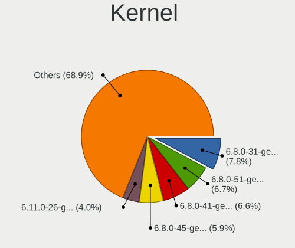

| Version           | Notebooks | Percent |
|-------------------|-----------|---------|
| 6.8.0-31-generic  | 448       | 7.82%   |
| 6.8.0-51-generic  | 382       | 6.67%   |
| 6.8.0-41-generic  | 379       | 6.62%   |
| 6.8.0-45-generic  | 339       | 5.92%   |
| 6.11.0-26-generic | 232       | 4.05%   |
| 6.11.0-17-generic | 221       | 3.86%   |
| 6.8.0-49-generic  | 212       | 3.7%    |
| 6.8.0-35-generic  | 186       | 3.25%   |
| 6.8.0-48-generic  | 170       | 2.97%   |
| 6.11.0-19-generic | 166       | 2.9%    |
| 6.8.0-52-generic  | 154       | 2.69%   |
| 6.11.0-21-generic | 154       | 2.69%   |
| 6.14.0-27-generic | 152       | 2.65%   |
| 6.14.0-29-generic | 149       | 2.6%    |
| 6.8.0-47-generic  | 145       | 2.53%   |
| 6.14.0-33-generic | 140       | 2.44%   |
| 6.8.0-36-generic  | 119       | 2.08%   |
| 6.8.0-40-generic  | 117       | 2.04%   |
| 6.8.0-38-generic  | 113       | 1.97%   |
| 6.14.0-37-generic | 113       | 1.97%   |
| 6.11.0-25-generic | 108       | 1.89%   |
| 6.8.0-39-generic  | 106       | 1.85%   |
| 6.14.0-36-generic | 97        | 1.69%   |
| 6.11.0-24-generic | 90        | 1.57%   |
| 6.8.0-44-generic  | 89        | 1.55%   |
| 6.11.0-29-generic | 85        | 1.48%   |
| 6.14.0-24-generic | 74        | 1.29%   |
| 6.14.0-35-generic | 70        | 1.22%   |
| 6.8.0-50-generic  | 59        | 1.03%   |
| 6.14.0-32-generic | 44        | 0.77%   |
| 6.14.0-28-generic | 39        | 0.68%   |
| 6.8.0-60-generic  | 33        | 0.58%   |
| 6.8.0-55-generic  | 32        | 0.56%   |
| 6.14.0-34-generic | 32        | 0.56%   |
| 6.8.0-87-generic  | 27        | 0.47%   |
| 6.8.0-53-generic  | 26        | 0.45%   |
| 6.11.0-28-generic | 26        | 0.45%   |
| 6.8.0-79-generic  | 25        | 0.44%   |
| 6.8.0-58-generic  | 25        | 0.44%   |
| 6.8.0-57-generic  | 25        | 0.44%   |

Kernel Family
-------------

Linux kernel without a distro release

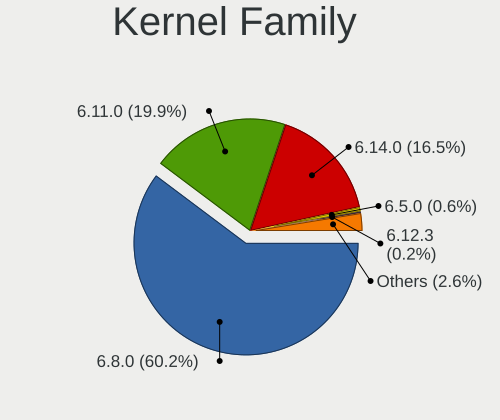

| Version | Notebooks | Percent |
|---------|-----------|---------|
| 6.8.0   | 3222      | 60.25%  |
| 6.11.0  | 1062      | 19.86%  |
| 6.14.0  | 881       | 16.47%  |
| 6.5.0   | 34        | 0.64%   |
| 6.12.3  | 12        | 0.22%   |
| 5.15.0  | 9         | 0.17%   |
| 5.14.0  | 9         | 0.17%   |
| 6.9.3   | 8         | 0.15%   |
| 6.6.0   | 7         | 0.13%   |
| 6.8.1   | 5         | 0.09%   |
| 6.2.0   | 5         | 0.09%   |
| 6.13.0  | 4         | 0.07%   |
| 6.10.6  | 4         | 0.07%   |
| 6.10.5  | 4         | 0.07%   |
| 6.9.12  | 3         | 0.06%   |
| 6.8.7   | 3         | 0.06%   |
| 6.10.3  | 3         | 0.06%   |
| 6.10.0  | 3         | 0.06%   |
| 6.1.0   | 3         | 0.06%   |
| 6.9.9   | 2         | 0.04%   |
| 6.9.8   | 2         | 0.04%   |
| 6.9.0   | 2         | 0.04%   |
| 6.8.9   | 2         | 0.04%   |
| 6.8.4   | 2         | 0.04%   |
| 6.17.5  | 2         | 0.04%   |
| 6.16.8  | 2         | 0.04%   |
| 6.15.2  | 2         | 0.04%   |
| 6.13.7  | 2         | 0.04%   |
| 6.11.5  | 2         | 0.04%   |
| 6.11.3  | 2         | 0.04%   |
| 6.10.2  | 2         | 0.04%   |
| 6.1.10  | 2         | 0.04%   |
| 6.9.6   | 1         | 0.02%   |
| 6.9.5   | 1         | 0.02%   |
| 6.9.2   | 1         | 0.02%   |
| 6.9.11  | 1         | 0.02%   |
| 6.9.1   | 1         | 0.02%   |
| 6.8.6   | 1         | 0.02%   |
| 6.8.11  | 1         | 0.02%   |
| 6.7.6   | 1         | 0.02%   |

Kernel Major Ver.
-----------------

Linux kernel major version

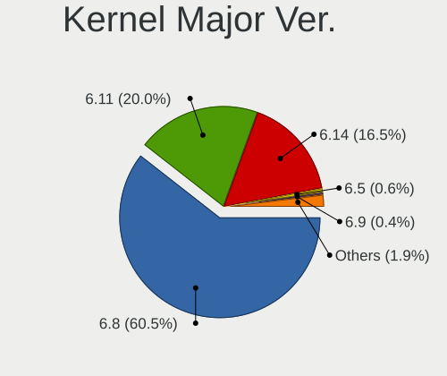

| Version | Notebooks | Percent |
|---------|-----------|---------|
| 6.8     | 3232      | 60.55%  |
| 6.11    | 1067      | 19.99%  |
| 6.14    | 881       | 16.5%   |
| 6.5     | 34        | 0.64%   |
| 6.9     | 21        | 0.39%   |
| 6.10    | 20        | 0.37%   |
| 6.12    | 17        | 0.32%   |
| 6.13    | 10        | 0.19%   |
| 6.6     | 9         | 0.17%   |
| 5.15    | 9         | 0.17%   |
| 5.14    | 9         | 0.17%   |
| 6.2     | 5         | 0.09%   |
| 6.17    | 5         | 0.09%   |
| 6.1     | 5         | 0.09%   |
| 6.16    | 4         | 0.07%   |
| 6.15    | 4         | 0.07%   |
| 6.7     | 1         | 0.02%   |
| 5.19    | 1         | 0.02%   |
| 5.13    | 1         | 0.02%   |
| 5.10    | 1         | 0.02%   |
| 4.20    | 1         | 0.02%   |
| 4.15    | 1         | 0.02%   |

Arch
----

OS architecture (x86_64, i586, etc.)

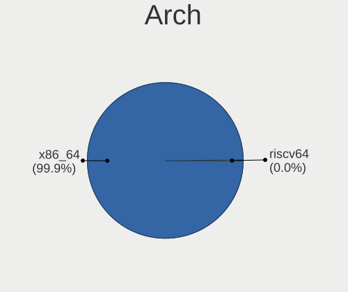

| Name    | Notebooks | Percent |
|---------|-----------|---------|
| x86_64  | 5155      | 99.92%  |
| aarch64 | 3         | 0.06%   |
| riscv64 | 1         | 0.02%   |

DE
--

Desktop Environment

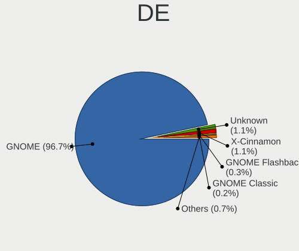

| Name                     | Notebooks | Percent |
|--------------------------|-----------|---------|
| GNOME                    | 4999      | 96.66%  |
| Unknown                  | 58        | 1.12%   |
| X-Cinnamon               | 55        | 1.06%   |
| GNOME Flashback          | 14        | 0.27%   |
| GNOME Classic            | 11        | 0.21%   |
| i3                       | 9         | 0.17%   |
| sway                     | 7         | 0.14%   |
| Hyprland                 | 7         | 0.14%   |
| Cinnamon                 | 3         | 0.06%   |
| xmonad                   | 1         | 0.02%   |
| ubuntu                   | 1         | 0.02%   |
| river                    | 1         | 0.02%   |
| qtile                    | 1         | 0.02%   |
| openbox                  | 1         | 0.02%   |
| niri                     | 1         | 0.02%   |
| kubuntu-live-environment | 1         | 0.02%   |
| jwm                      | 1         | 0.02%   |
| Hyprland:start-hyprland  | 1         | 0.02%   |

Display Server
--------------

X11 or Wayland

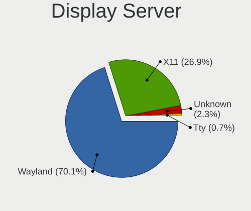

| Name    | Notebooks | Percent |
|---------|-----------|---------|
| Wayland | 3669      | 70.14%  |
| X11     | 1406      | 26.88%  |
| Unknown | 120       | 2.29%   |
| Tty     | 36        | 0.69%   |

Display Manager
---------------

SDDM, LightDM, etc.

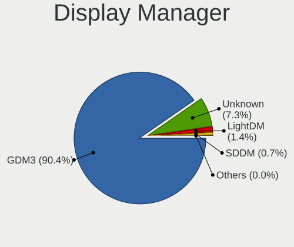

| Name    | Notebooks | Percent |
|---------|-----------|---------|
| GDM3    | 4684      | 90.35%  |
| Unknown | 381       | 7.35%   |
| LightDM | 75        | 1.45%   |
| SDDM    | 34        | 0.66%   |
| GDM     | 9         | 0.17%   |
| LXDM    | 1         | 0.02%   |

OS Lang
-------

Language

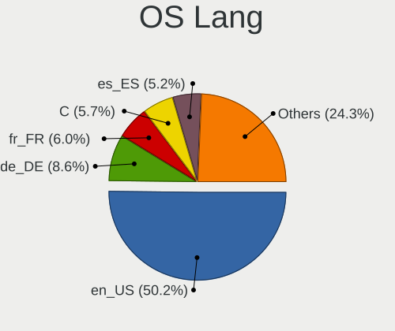

| Lang    | Notebooks | Percent |
|---------|-----------|---------|
| en_US   | 2602      | 50.18%  |
| de_DE   | 445       | 8.58%   |
| fr_FR   | 311       | 6%      |
| C       | 296       | 5.71%   |
| es_ES   | 270       | 5.21%   |
| ru_RU   | 208       | 4.01%   |
| pt_BR   | 180       | 3.47%   |
| it_IT   | 134       | 2.58%   |
| en_GB   | 128       | 2.47%   |
| pl_PL   | 68        | 1.31%   |
| zh_CN   | 50        | 0.96%   |
| nl_NL   | 48        | 0.93%   |
| hu_HU   | 46        | 0.89%   |
| tr_TR   | 37        | 0.71%   |
| en_CA   | 30        | 0.58%   |
| cs_CZ   | 27        | 0.52%   |
| Unknown | 23        | 0.44%   |
| fi_FI   | 22        | 0.42%   |
| en_IN   | 22        | 0.42%   |
| en_AU   | 22        | 0.42%   |
| sv_SE   | 19        | 0.37%   |
| pt_PT   | 16        | 0.31%   |
| nb_NO   | 12        | 0.23%   |
| sk_SK   | 10        | 0.19%   |
| da_DK   | 10        | 0.19%   |
| ca_ES   | 10        | 0.19%   |
| uk_UA   | 8         | 0.15%   |
| ja_JP   | 8         | 0.15%   |
| ko_KR   | 7         | 0.14%   |
| es_AR   | 7         | 0.14%   |
| el_GR   | 7         | 0.14%   |
| de_AT   | 7         | 0.14%   |
| zh_TW   | 6         | 0.12%   |
| hr_HR   | 6         | 0.12%   |
| bg_BG   | 6         | 0.12%   |
| es_MX   | 5         | 0.1%    |
| en_ZA   | 5         | 0.1%    |
| th_TH   | 4         | 0.08%   |
| es_CO   | 4         | 0.08%   |
| en_NZ   | 4         | 0.08%   |

Boot Mode
---------

EFI or BIOS

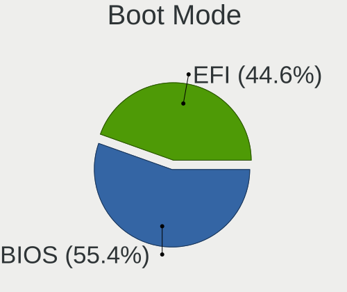

| Mode | Notebooks | Percent |
|------|-----------|---------|
| BIOS | 2886      | 55.44%  |
| EFI  | 2320      | 44.56%  |

Filesystem
----------

Type of filesystem

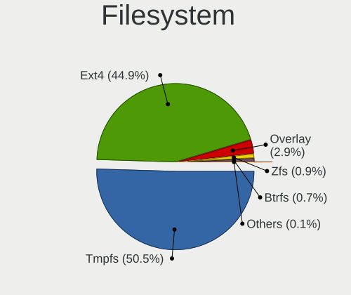

| Type    | Notebooks | Percent |
|---------|-----------|---------|
| Tmpfs   | 2625      | 50.48%  |
| Ext4    | 2334      | 44.88%  |
| Overlay | 150       | 2.88%   |
| Zfs     | 47        | 0.9%    |
| Btrfs   | 38        | 0.73%   |
| Xfs     | 3         | 0.06%   |
| XXX4    | 1         | 0.02%   |
| F2fs    | 1         | 0.02%   |
| Ext2    | 1         | 0.02%   |

Part. scheme
------------

Scheme of partitioning

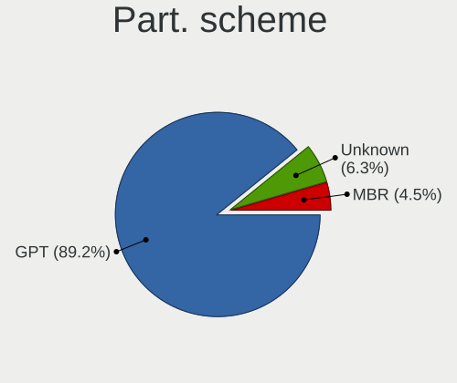

| Type    | Notebooks | Percent |
|---------|-----------|---------|
| GPT     | 4618      | 89.17%  |
| Unknown | 327       | 6.31%   |
| MBR     | 234       | 4.52%   |

Dual Boot with Linux/BSD
------------------------

Hosting more than one Linux/BSD

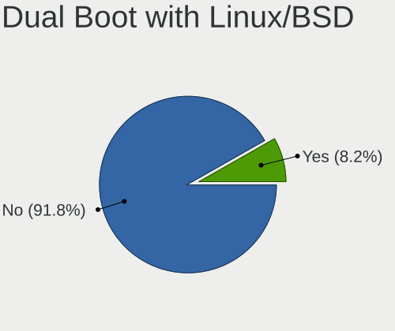

| Dual boot | Notebooks | Percent |
|-----------|-----------|---------|
| No        | 4764      | 91.76%  |
| Yes       | 428       | 8.24%   |

Dual Boot (Win)
---------------

Hosting Linux and Windows

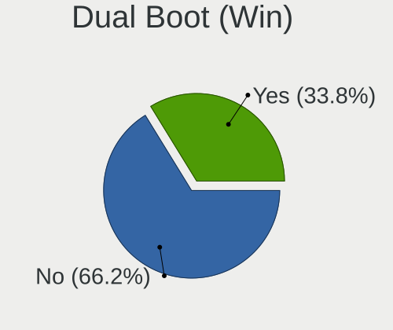

| Dual boot | Notebooks | Percent |
|-----------|-----------|---------|
| No        | 3435      | 66.22%  |
| Yes       | 1752      | 33.78%  |

Board
-----

Vendor
------

Motherboard manufacturer

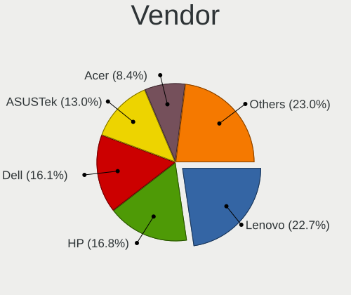

| Name                  | Notebooks | Percent |
|-----------------------|-----------|---------|
| Lenovo                | 1170      | 22.68%  |
| Hewlett-Packard       | 869       | 16.84%  |
| Dell                  | 831       | 16.11%  |
| ASUSTek Computer      | 670       | 12.99%  |
| Acer                  | 431       | 8.35%   |
| Apple                 | 206       | 3.99%   |
| MSI                   | 98        | 1.9%    |
| HUAWEI                | 95        | 1.84%   |
| Toshiba               | 78        | 1.51%   |
| Samsung Electronics   | 75        | 1.45%   |
| Google                | 44        | 0.85%   |
| Sony                  | 42        | 0.81%   |
| Unknown               | 36        | 0.7%    |
| Medion                | 30        | 0.58%   |
| Alienware             | 29        | 0.56%   |
| Fujitsu               | 28        | 0.54%   |
| Notebook              | 22        | 0.43%   |
| HONOR                 | 21        | 0.41%   |
| Timi                  | 19        | 0.37%   |
| Framework             | 19        | 0.37%   |
| TUXEDO                | 16        | 0.31%   |
| Gigabyte Technology   | 15        | 0.29%   |
| XIAOMI                | 14        | 0.27%   |
| Schenker              | 13        | 0.25%   |
| Maibenben             | 13        | 0.25%   |
| Positivo Bahia - VAIO | 12        | 0.23%   |
| Packard Bell          | 12        | 0.23%   |
| Chuwi                 | 12        | 0.23%   |
| Positivo              | 10        | 0.19%   |
| Panasonic             | 10        | 0.19%   |
| MECHREVO              | 10        | 0.19%   |
| PC Specialist         | 9         | 0.17%   |
| LG Electronics        | 9         | 0.17%   |
| Razer                 | 8         | 0.16%   |
| Avell                 | 8         | 0.16%   |
| System76              | 7         | 0.14%   |
| Monster               | 5         | 0.1%    |
| Fujitsu Siemens       | 5         | 0.1%    |
| Casper                | 5         | 0.1%    |
| UNOWHY                | 4         | 0.08%   |

Model
-----

Motherboard model

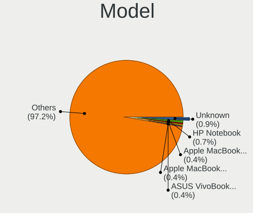

| Name                                     | Notebooks | Percent |
|------------------------------------------|-----------|---------|
| Unknown                                  | 48        | 0.93%   |
| HP Notebook                              | 37        | 0.72%   |
| ASUS VivoBook_ASUSLaptop X1605VA_X1605VA | 19        | 0.37%   |
| Apple MacBookPro9,2                      | 19        | 0.37%   |
| Apple MacBookPro12,1                     | 19        | 0.37%   |
| Apple MacBookPro14,1                     | 18        | 0.35%   |
| HP Pavilion Notebook                     | 17        | 0.33%   |
| Acer Aspire A515-57                      | 15        | 0.29%   |
| Apple MacBookAir7,2                      | 14        | 0.27%   |
| Acer Aspire A315-24P                     | 14        | 0.27%   |
| HP EliteBook 840 G6                      | 13        | 0.25%   |
| Dell Latitude E6430                      | 13        | 0.25%   |
| Dell Latitude E6420                      | 13        | 0.25%   |
| ASUS Vivobook Go E1504FA_E1504FA         | 13        | 0.25%   |
| HP Pavilion dv7                          | 12        | 0.23%   |
| Dell Latitude 7490                       | 12        | 0.23%   |
| Dell Latitude 5420                       | 12        | 0.23%   |
| Dell Inspiron 15-3567                    | 12        | 0.23%   |
| Acer Aspire A315-59                      | 12        | 0.23%   |
| Dell XPS 9315                            | 11        | 0.21%   |
| Dell G15 5530                            | 11        | 0.21%   |
| Acer Aspire A315-44P                     | 11        | 0.21%   |
| Lenovo G50-70 20351                      | 10        | 0.19%   |
| HP Pavilion 15                           | 10        | 0.19%   |
| HP EliteBook 840 G5                      | 10        | 0.19%   |
| HP 15                                    | 10        | 0.19%   |
| Dell Inspiron 15 3520                    | 10        | 0.19%   |
| ASUS VivoBook_ASUSLaptop X1504VA_X1504VA | 10        | 0.19%   |
| Lenovo IdeaPad 3 15ITL6 82H8             | 9         | 0.17%   |
| Lenovo IdeaPad 1 15ALC7 82R4             | 9         | 0.17%   |
| HUAWEI BOM-WXX9                          | 9         | 0.17%   |
| HP Pavilion g6                           | 9         | 0.17%   |
| HP Laptop 15-fd0xxx                      | 9         | 0.17%   |
| HP ENVY 15                               | 9         | 0.17%   |
| HP EliteBook 840 G8 Notebook PC          | 9         | 0.17%   |
| HP EliteBook 840 G3                      | 9         | 0.17%   |
| HP EliteBook 820 G3                      | 9         | 0.17%   |
| Dell Latitude E7470                      | 9         | 0.17%   |
| Dell Latitude 7480                       | 9         | 0.17%   |
| Apple MacBookPro5,5                      | 9         | 0.17%   |

Model Family
------------

Motherboard model prefix

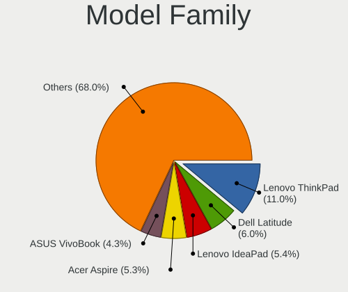

| Name               | Notebooks | Percent |
|--------------------|-----------|---------|
| Lenovo ThinkPad    | 569       | 11.03%  |
| Dell Latitude      | 309       | 5.99%   |
| Lenovo IdeaPad     | 277       | 5.37%   |
| Acer Aspire        | 274       | 5.31%   |
| ASUS VivoBook      | 222       | 4.3%    |
| Dell Inspiron      | 186       | 3.61%   |
| HP EliteBook       | 176       | 3.41%   |
| HP Laptop          | 149       | 2.89%   |
| HP Pavilion        | 137       | 2.66%   |
| ASUS ASUS          | 121       | 2.35%   |
| HP ProBook         | 118       | 2.29%   |
| Dell XPS           | 116       | 2.25%   |
| Dell Precision     | 103       | 2%      |
| Toshiba Satellite  | 67        | 1.3%    |
| ASUS ROG           | 62        | 1.2%    |
| Lenovo Legion      | 61        | 1.18%   |
| Acer Nitro         | 59        | 1.14%   |
| Lenovo ThinkBook   | 56        | 1.09%   |
| Dell Vostro        | 50        | 0.97%   |
| HP ZBook           | 49        | 0.95%   |
| Acer Swift         | 48        | 0.93%   |
| Unknown            | 48        | 0.93%   |
| ASUS Zenbook       | 45        | 0.87%   |
| HP Notebook        | 37        | 0.72%   |
| HP Victus          | 33        | 0.64%   |
| Apple MacBookPro11 | 31        | 0.6%    |
| HP ENVY            | 29        | 0.56%   |
| Lenovo Yoga        | 27        | 0.52%   |
| HP OMEN            | 26        | 0.5%    |
| HP 250             | 25        | 0.48%   |
| Lenovo LOQ         | 23        | 0.45%   |
| Apple MacBookPro9  | 23        | 0.45%   |
| Fujitsu LIFEBOOK   | 21        | 0.41%   |
| Dell G15           | 21        | 0.41%   |
| Apple MacBookPro14 | 20        | 0.39%   |
| Acer TravelMate    | 20        | 0.39%   |
| Framework Laptop   | 19        | 0.37%   |
| Apple MacBookPro12 | 19        | 0.37%   |
| Apple MacBookAir7  | 17        | 0.33%   |
| HP 255             | 16        | 0.31%   |

MFG Year
--------

Motherboard manufacture year

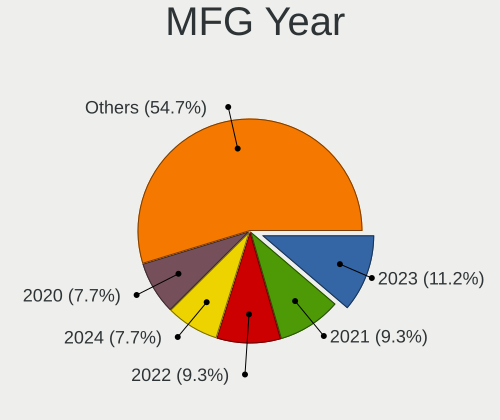

| Year    | Notebooks | Percent |
|---------|-----------|---------|
| 2023    | 580       | 11.24%  |
| 2021    | 480       | 9.3%    |
| 2022    | 479       | 9.28%   |
| 2024    | 399       | 7.73%   |
| 2020    | 398       | 7.71%   |
| 2019    | 374       | 7.25%   |
| 2018    | 310       | 6.01%   |
| 2017    | 309       | 5.99%   |
| 2012    | 306       | 5.93%   |
| 2013    | 276       | 5.35%   |
| 2014    | 243       | 4.71%   |
| 2011    | 226       | 4.38%   |
| 2015    | 219       | 4.25%   |
| 2016    | 199       | 3.86%   |
| 2025    | 107       | 2.07%   |
| 2010    | 100       | 1.94%   |
| 2008    | 67        | 1.3%    |
| 2009    | 58        | 1.12%   |
| 2006    | 16        | 0.31%   |
| 2007    | 11        | 0.21%   |
| Unknown | 2         | 0.04%   |

Form Factor
-----------

Physical design of the computer

| Name     | Notebooks | Percent |
|----------|-----------|---------|
| Notebook | 5159      | 100%    |

Secure Boot
-----------

Enabled or disabled

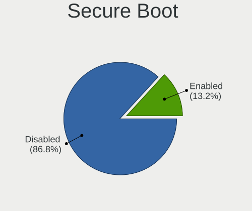

| State    | Notebooks | Percent |
|----------|-----------|---------|
| Disabled | 4506      | 86.79%  |
| Enabled  | 686       | 13.21%  |

Coreboot
--------

Have coreboot on board

| Used | Notebooks | Percent |
|------|-----------|---------|
| No   | 5104      | 98.93%  |
| Yes  | 55        | 1.07%   |

RAM Size
--------

Total RAM memory

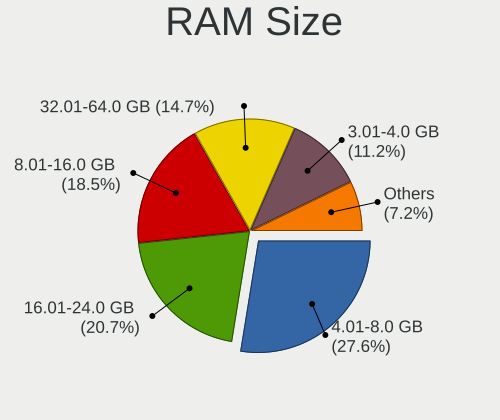

| Size in GB  | Notebooks | Percent |
|-------------|-----------|---------|
| 4.01-8.0    | 1425      | 27.55%  |
| 16.01-24.0  | 1073      | 20.75%  |
| 8.01-16.0   | 957       | 18.5%   |
| 32.01-64.0  | 762       | 14.73%  |
| 3.01-4.0    | 581       | 11.23%  |
| 64.01-256.0 | 169       | 3.27%   |
| 24.01-32.0  | 162       | 3.13%   |
| 2.01-3.0    | 26        | 0.5%    |
| 1.01-2.0    | 17        | 0.33%   |

RAM Used
--------

Used RAM memory

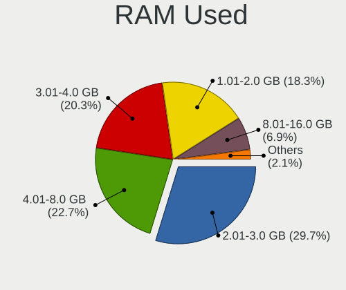

| Used GB    | Notebooks | Percent |
|------------|-----------|---------|
| 2.01-3.0   | 1639      | 29.74%  |
| 4.01-8.0   | 1250      | 22.68%  |
| 3.01-4.0   | 1121      | 20.34%  |
| 1.01-2.0   | 1008      | 18.29%  |
| 8.01-16.0  | 379       | 6.88%   |
| 16.01-24.0 | 62        | 1.13%   |
| 24.01-32.0 | 21        | 0.38%   |
| 0.51-1.0   | 18        | 0.33%   |
| 0.01-0.5   | 7         | 0.13%   |
| 32.01-64.0 | 6         | 0.11%   |

Total Drives
------------

Number of drives on board

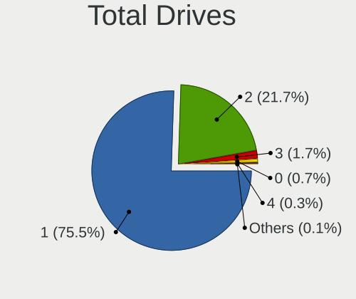

| Drives | Notebooks | Percent |
|--------|-----------|---------|
| 1      | 3929      | 75.51%  |
| 2      | 1127      | 21.66%  |
| 3      | 86        | 1.65%   |
| 0      | 38        | 0.73%   |
| 4      | 18        | 0.35%   |
| 8      | 2         | 0.04%   |
| 5      | 2         | 0.04%   |
| 6      | 1         | 0.02%   |

Has CD-ROM
----------

Has CD-ROM on board

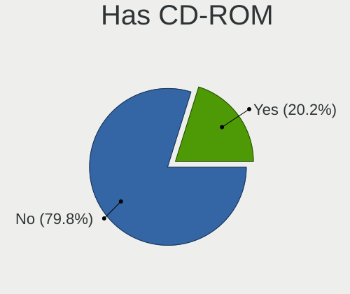

| Presented | Notebooks | Percent |
|-----------|-----------|---------|
| No        | 4125      | 79.82%  |
| Yes       | 1043      | 20.18%  |

Has Ethernet
------------

Has Ethernet on board

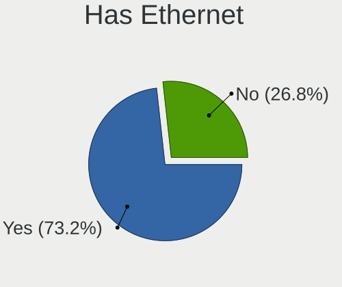

| Presented | Notebooks | Percent |
|-----------|-----------|---------|
| Yes       | 3792      | 73.25%  |
| No        | 1385      | 26.75%  |

Has WiFi
--------

Has WiFi module

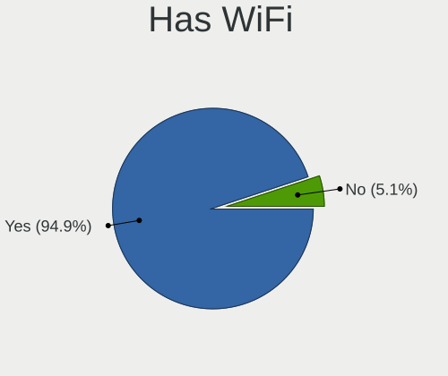

| Presented | Notebooks | Percent |
|-----------|-----------|---------|
| Yes       | 4901      | 94.93%  |
| No        | 262       | 5.07%   |

Has Bluetooth
-------------

Has Bluetooth module

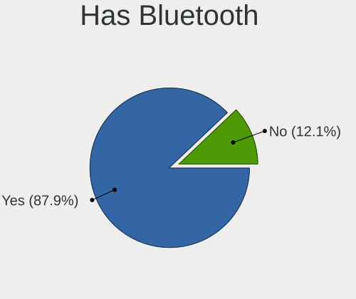

| Presented | Notebooks | Percent |
|-----------|-----------|---------|
| Yes       | 4563      | 87.92%  |
| No        | 627       | 12.08%  |

Location
--------

Country
-------

Geographic location (country)

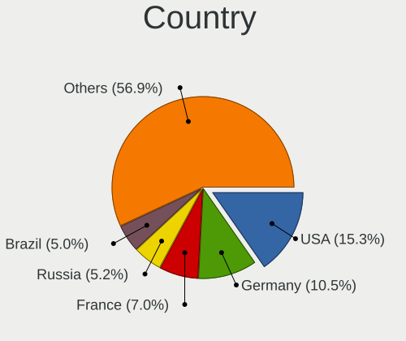

| Country         | Notebooks | Percent |
|-----------------|-----------|---------|
| USA             | 794       | 15.32%  |
| Germany         | 546       | 10.53%  |
| France          | 363       | 7%      |
| Russia          | 272       | 5.25%   |
| Brazil          | 257       | 4.96%   |
| India           | 235       | 4.53%   |
| Italy           | 202       | 3.9%    |
| UK              | 183       | 3.53%   |
| Spain           | 157       | 3.03%   |
| Canada          | 131       | 2.53%   |
| Poland          | 129       | 2.49%   |
| Netherlands     | 98        | 1.89%   |
| Mexico          | 87        | 1.68%   |
| Turkey          | 86        | 1.66%   |
| Australia       | 77        | 1.49%   |
| Hungary         | 72        | 1.39%   |
| Switzerland     | 65        | 1.25%   |
| Argentina       | 62        | 1.2%    |
| Sweden          | 61        | 1.18%   |
| Indonesia       | 58        | 1.12%   |
| China           | 51        | 0.98%   |
| Czechia         | 50        | 0.96%   |
| Belgium         | 49        | 0.95%   |
| Finland         | 47        | 0.91%   |
| Portugal        | 45        | 0.87%   |
| Norway          | 43        | 0.83%   |
| Chile           | 43        | 0.83%   |
| Austria         | 39        | 0.75%   |
| South Africa    | 38        | 0.73%   |
| Romania         | 36        | 0.69%   |
| Colombia        | 36        | 0.69%   |
| Iran            | 35        | 0.68%   |
| Denmark         | 34        | 0.66%   |
| Greece          | 26        | 0.5%    |
| Slovakia        | 25        | 0.48%   |
| New Zealand     | 25        | 0.48%   |
| Bulgaria        | 25        | 0.48%   |
| Vietnam         | 23        | 0.44%   |
| The Netherlands | 21        | 0.41%   |
| Thailand        | 20        | 0.39%   |

City
----

Geographic location (city)

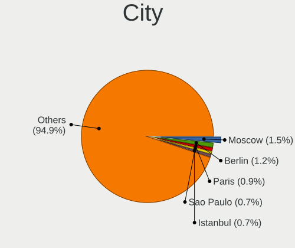

| City              | Notebooks | Percent |
|-------------------|-----------|---------|
| Moscow            | 82        | 1.53%   |
| Berlin            | 64        | 1.19%   |
| Paris             | 49        | 0.91%   |
| Sao Paulo         | 40        | 0.75%   |
| Istanbul          | 39        | 0.73%   |
| Bengaluru         | 37        | 0.69%   |
| St Petersburg     | 35        | 0.65%   |
| Budapest          | 32        | 0.6%    |
| Amsterdam         | 31        | 0.58%   |
| Madrid            | 30        | 0.56%   |
| Santiago          | 29        | 0.54%   |
| Milan             | 29        | 0.54%   |
| Hamburg           | 27        | 0.5%    |
| Los Angeles       | 26        | 0.48%   |
| Delhi             | 26        | 0.48%   |
| Helsinki          | 25        | 0.47%   |
| Sydney            | 24        | 0.45%   |
| Munich            | 24        | 0.45%   |
| Warsaw            | 23        | 0.43%   |
| Vienna            | 23        | 0.43%   |
| Frankfurt am Main | 23        | 0.43%   |
| Rome              | 19        | 0.35%   |
| Prague            | 19        | 0.35%   |
| Melbourne         | 19        | 0.35%   |
| Ankara            | 19        | 0.35%   |
| Rio de Janeiro    | 18        | 0.34%   |
| Bogotá           | 18        | 0.34%   |
| Tehran            | 17        | 0.32%   |
| Mumbai            | 17        | 0.32%   |
| Krakow            | 17        | 0.32%   |
| Cologne           | 17        | 0.32%   |
| Chennai           | 17        | 0.32%   |
| Buenos Aires      | 16        | 0.3%    |
| Barcelona         | 16        | 0.3%    |
| Athens            | 16        | 0.3%    |
| Zurich            | 15        | 0.28%   |
| Stuttgart         | 15        | 0.28%   |
| Hyderabad         | 15        | 0.28%   |
| Brisbane          | 15        | 0.28%   |
| Seattle           | 14        | 0.26%   |

Drives
------

Drive Vendor
------------

Hard drive vendors

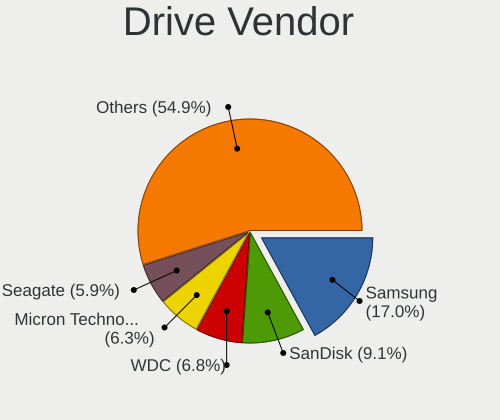

| Vendor                       | Notebooks | Drives | Percent |
|------------------------------|-----------|--------|---------|
| Samsung Electronics          | 1066      | 1320   | 17.04%  |
| SanDisk                      | 569       | 681    | 9.09%   |
| WDC                          | 424       | 495    | 6.78%   |
| Micron Technology            | 392       | 460    | 6.26%   |
| Seagate                      | 371       | 446    | 5.93%   |
| SK hynix                     | 364       | 408    | 5.82%   |
| Toshiba                      | 319       | 359    | 5.1%    |
| Kingston                     | 254       | 296    | 4.06%   |
| Unknown                      | 251       | 294    | 4.01%   |
| Intel                        | 193       | 248    | 3.08%   |
| KIOXIA                       | 188       | 208    | 3%      |
| Crucial                      | 178       | 202    | 2.84%   |
| Apple                        | 129       | 176    | 2.06%   |
| HGST                         | 103       | 113    | 1.65%   |
| A-DATA Technology            | 81        | 101    | 1.29%   |
| Kingston Technology Company  | 80        | 84     | 1.28%   |
| Hitachi                      | 78        | 91     | 1.25%   |
| China                        | 63        | 74     | 1.01%   |
| Phison Electronics           | 51        | 59     | 0.82%   |
| Silicon Motion               | 50        | 52     | 0.8%    |
| Unknown                      | 41        | 45     | 0.66%   |
| Phison                       | 40        | 46     | 0.64%   |
| Micron/Crucial Technology    | 40        | 50     | 0.64%   |
| Intenso                      | 38        | 51     | 0.61%   |
| ADATA Technology             | 35        | 37     | 0.56%   |
| SPCC                         | 34        | 35     | 0.54%   |
| MAXIO Technology (Hangzhou)  | 34        | 41     | 0.54%   |
| LITEON                       | 33        | 37     | 0.53%   |
| PNY                          | 27        | 30     | 0.43%   |
| YMTC                         | 26        | 26     | 0.42%   |
| SSSTC                        | 26        | 26     | 0.42%   |
| Shenzhen Longsys Electronics | 25        | 28     | 0.4%    |
| Lexar                        | 25        | 29     | 0.4%    |
| JMicron Technology           | 22        | 24     | 0.35%   |
| FORESEE                      | 20        | 25     | 0.32%   |
| Netac                        | 19        | 22     | 0.3%    |
| SOLIDIGM                     | 18        | 20     | 0.29%   |
| KingSpec                     | 18        | 21     | 0.29%   |
| Union Memory (Shenzhen)      | 16        | 17     | 0.26%   |
| Transcend                    | 16        | 18     | 0.26%   |

Drive Model
-----------

Hard drive models

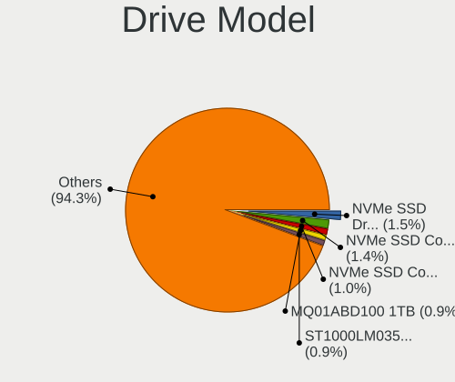

| Model                                                 | Notebooks | Percent |
|-------------------------------------------------------|-----------|---------|
| SanDisk NVMe SSD Drive 1TB                            | 95        | 1.48%   |
| Samsung NVMe SSD Controller SM981/PM981/PM983 1TB     | 93        | 1.45%   |
| Samsung NVMe SSD Controller PM9A1/PM9A3/980PRO 1TB    | 64        | 1%      |
| Toshiba MQ01ABD100 1TB                                | 57        | 0.89%   |
| Seagate ST1000LM035-1RK172 1TB                        | 55        | 0.86%   |
| Kingston SA400S37240G 240GB SSD                       | 53        | 0.82%   |
| SanDisk NVMe SSD Drive 512GB                          | 52        | 0.81%   |
| Micron 2400_MTFDKBA512QFM 512GB                       | 49        | 0.76%   |
| Unknown MMC Card  64GB                                | 48        | 0.75%   |
| Micron 2450_MTFDKBA512TFK 512GB                       | 42        | 0.65%   |
| Seagate ST1000LM024 HN-M101MBB 1TB                    | 41        | 0.64%   |
| Unknown                                               | 41        | 0.64%   |
| Samsung MZVL4512HBLU-00BTW 512GB                      | 38        | 0.59%   |
| Unknown MMC Card  32GB                                | 37        | 0.58%   |
| Unknown MMC Card  128GB                               | 35        | 0.54%   |
| Sandisk WD Blue SN550 NVMe SSD 1024GB                 | 33        | 0.51%   |
| Toshiba MQ04ABF100 1TB                                | 32        | 0.5%    |
| Toshiba MQ01ABF050 500GB                              | 32        | 0.5%    |
| Kingston SA400S37480G 480GB SSD                       | 32        | 0.5%    |
| Samsung NVMe SSD Controller SM961/PM961/SM963 1024GB  | 30        | 0.47%   |
| Intel SSDPEKNU512GZ 512GB                             | 30        | 0.47%   |
| MAXIO (Hangzhou) NVMe SSD Controller MAP1202 2TB      | 27        | 0.42%   |
| Crucial CT500MX500SSD1 500GB                          | 25        | 0.39%   |
| Sandisk WD Black SN750 / PC SN730 NVMe SSD 500GB      | 24        | 0.37%   |
| Micron 2450_MTFDKBA1T0TFK 1TB                         | 23        | 0.36%   |
| Intel SSD 660P Series 512GB                           | 23        | 0.36%   |
| Kingston Company SNV2S1000G 1TB                       | 22        | 0.34%   |
| HGST HTS721010A9E630 1TB                              | 22        | 0.34%   |
| Crucial CT1000MX500SSD1 1TB                           | 22        | 0.34%   |
| SanDisk NVMe SSD Drive 2TB                            | 21        | 0.33%   |
| Seagate ST500LT012-1DG142 500GB                       | 20        | 0.31%   |
| Toshiba XG6 NVMe SSD Controller 1024GB                | 19        | 0.3%    |
| Samsung SSD 980 1TB                                   | 19        | 0.3%    |
| Samsung SSD 850 EVO 250GB                             | 19        | 0.3%    |
| HGST HTS541010A9E680 1TB                              | 19        | 0.3%    |
| Crucial CT240BX500SSD1 240GB                          | 19        | 0.3%    |
| WDC WD10JPVX-22JC3T0 1TB                              | 18        | 0.28%   |
| Unknown SD/MMC/MS PRO 2GB                             | 18        | 0.28%   |
| Silicon Motion SM2263EN/SM2263XT SSD Controller 512GB | 18        | 0.28%   |
| Seagate ST9500325AS 500GB                             | 18        | 0.28%   |

HDD Vendor
----------

Hard disk drive vendors

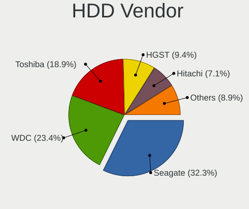

| Vendor              | Notebooks | Drives | Percent |
|---------------------|-----------|--------|---------|
| Seagate             | 355       | 423    | 32.3%   |
| WDC                 | 257       | 311    | 23.38%  |
| Toshiba             | 208       | 235    | 18.93%  |
| HGST                | 103       | 113    | 9.37%   |
| Hitachi             | 78        | 91     | 7.1%    |
| Unknown             | 22        | 23     | 2%      |
| Samsung Electronics | 15        | 18     | 1.36%   |
| JMicron Technology  | 12        | 13     | 1.09%   |
| Fujitsu             | 10        | 10     | 0.91%   |
| Apple               | 7         | 7      | 0.64%   |
| USB3.0              | 3         | 3      | 0.27%   |
| JetFlash            | 3         | 3      | 0.27%   |
| External            | 3         | 3      | 0.27%   |
| USB 3.0             | 2         | 3      | 0.18%   |
| TO Exter            | 2         | 2      | 0.18%   |
| SSK                 | 2         | 2      | 0.18%   |
| SAGE                | 2         | 2      | 0.18%   |
| Intenso             | 2         | 2      | 0.18%   |
| ASMT                | 2         | 2      | 0.18%   |
| ASMedia             | 2         | 2      | 0.18%   |
| USB                 | 1         | 1      | 0.09%   |
| StoreJet            | 1         | 1      | 0.09%   |
| Shenzhen            | 1         | 1      | 0.09%   |
| SATAFIRM            | 1         | 1      | 0.09%   |
| Min Yi U            | 1         | 1      | 0.09%   |
| LaCie               | 1         | 1      | 0.09%   |
| Initio              | 1         | 1      | 0.09%   |
| Inateck             | 1         | 2      | 0.09%   |
| IB-AC703            | 1         | 1      | 0.09%   |

SSD Vendor
----------

Solid state drive vendors

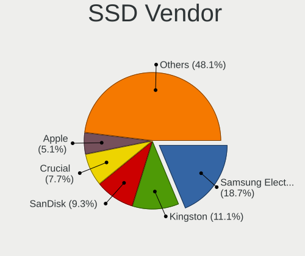

| Vendor              | Notebooks | Drives | Percent |
|---------------------|-----------|--------|---------|
| Samsung Electronics | 291       | 348    | 18.73%  |
| Kingston            | 172       | 199    | 11.07%  |
| SanDisk             | 145       | 172    | 9.33%   |
| Crucial             | 120       | 138    | 7.72%   |
| Apple               | 79        | 90     | 5.08%   |
| WDC                 | 63        | 69     | 4.05%   |
| China               | 61        | 72     | 3.93%   |
| A-DATA Technology   | 57        | 70     | 3.67%   |
| Micron Technology   | 49        | 62     | 3.15%   |
| Toshiba             | 38        | 45     | 2.45%   |
| SK hynix            | 38        | 50     | 2.45%   |
| SPCC                | 32        | 33     | 2.06%   |
| LITEON              | 31        | 35     | 1.99%   |
| Intenso             | 29        | 36     | 1.87%   |
| Intel               | 28        | 37     | 1.8%    |
| PNY                 | 22        | 24     | 1.42%   |
| KingSpec            | 16        | 19     | 1.03%   |
| LITEONIT            | 15        | 16     | 0.97%   |
| Netac               | 14        | 17     | 0.9%    |
| Transcend           | 13        | 15     | 0.84%   |
| OCZ                 | 12        | 14     | 0.77%   |
| Team                | 11        | 14     | 0.71%   |
| SABRENT             | 11        | 12     | 0.71%   |
| Lexar               | 11        | 13     | 0.71%   |
| GOODRAM             | 10        | 10     | 0.64%   |
| Verbatim            | 8         | 8      | 0.51%   |
| Patriot             | 7         | 7      | 0.45%   |
| Corsair             | 7         | 8      | 0.45%   |
| FORESEE             | 6         | 6      | 0.39%   |
| Emtec               | 6         | 6      | 0.39%   |
| Unknown             | 6         | 7      | 0.39%   |
| Dahua               | 5         | 5      | 0.32%   |
| Apacer              | 5         | 6      | 0.32%   |
| KIOXIA-EXCERIA      | 4         | 5      | 0.26%   |
| Phison              | 3         | 3      | 0.19%   |
| NTC                 | 3         | 3      | 0.19%   |
| Lenovo              | 3         | 3      | 0.19%   |
| Gigabyte Technology | 3         | 3      | 0.19%   |
| Dogfish             | 3         | 3      | 0.19%   |
| BHT                 | 3         | 3      | 0.19%   |

Drive Kind
----------

HDD or SSD

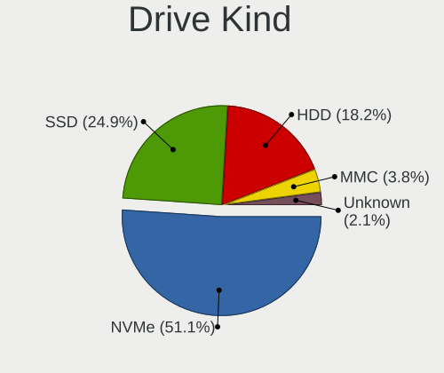

| Kind    | Notebooks | Drives | Percent |
|---------|-----------|--------|---------|
| NVMe    | 3006      | 3840   | 51.08%  |
| SSD     | 1463      | 1816   | 24.86%  |
| HDD     | 1069      | 1278   | 18.16%  |
| MMC     | 224       | 270    | 3.81%   |
| Unknown | 123       | 151    | 2.09%   |

Drive Connector
---------------

SATA, SAS, NVMe, etc.

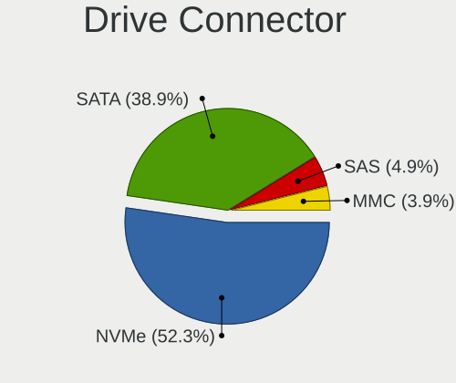

| Type | Notebooks | Drives | Percent |
|------|-----------|--------|---------|
| NVMe | 3002      | 3791   | 52.3%   |
| SATA | 2234      | 2936   | 38.92%  |
| SAS  | 280       | 358    | 4.88%   |
| MMC  | 224       | 270    | 3.9%    |

Drive Size
----------

Size of hard drive

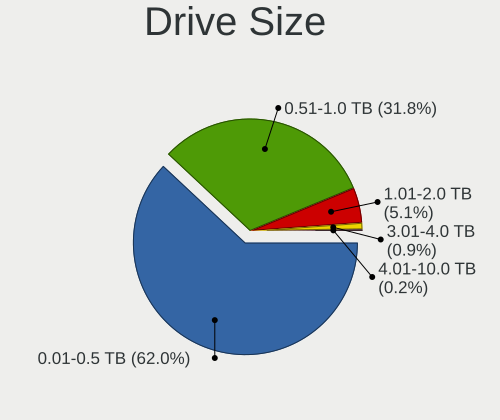

| Size in TB | Notebooks | Drives | Percent |
|------------|-----------|--------|---------|
| 0.01-0.5   | 1537      | 1928   | 61.98%  |
| 0.51-1.0   | 788       | 980    | 31.77%  |
| 1.01-2.0   | 126       | 142    | 5.08%   |
| 3.01-4.0   | 23        | 28     | 0.93%   |
| 4.01-10.0  | 6         | 16     | 0.24%   |

Space Total
-----------

Amount of disk space available on the file system

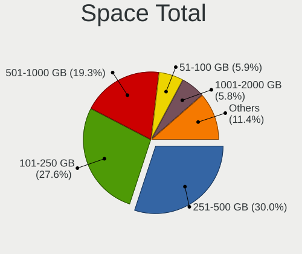

| Size in GB     | Notebooks | Percent |
|----------------|-----------|---------|
| 251-500        | 1586      | 30.05%  |
| 101-250        | 1455      | 27.57%  |
| 501-1000       | 1017      | 19.27%  |
| 51-100         | 312       | 5.91%   |
| 1001-2000      | 306       | 5.8%    |
| 1-20           | 272       | 5.15%   |
| 21-50          | 159       | 3.01%   |
| More than 3000 | 73        | 1.38%   |
| 2001-3000      | 66        | 1.25%   |
| Unknown        | 32        | 0.61%   |

Space Used
----------

Amount of used disk space

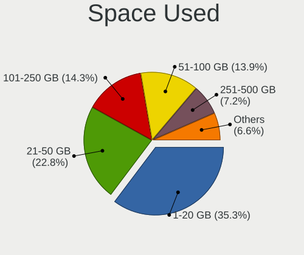

| Used GB        | Notebooks | Percent |
|----------------|-----------|---------|
| 1-20           | 1919      | 35.26%  |
| 21-50          | 1241      | 22.8%   |
| 101-250        | 776       | 14.26%  |
| 51-100         | 755       | 13.87%  |
| 251-500        | 394       | 7.24%   |
| 501-1000       | 209       | 3.84%   |
| 1001-2000      | 73        | 1.34%   |
| Unknown        | 32        | 0.59%   |
| More than 3000 | 25        | 0.46%   |
| 2001-3000      | 18        | 0.33%   |

Malfunc. Drives
---------------

Drive models with a malfunction

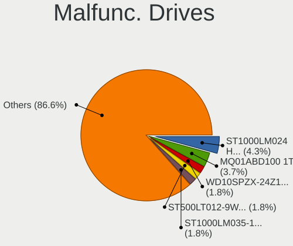

| Model                                | Notebooks | Drives | Percent |
|--------------------------------------|-----------|--------|---------|
| Seagate ST1000LM024 HN-M101MBB 1TB   | 7         | 7      | 4.27%   |
| Toshiba MQ01ABD100 1TB               | 6         | 6      | 3.66%   |
| WDC WD10SPZX-24Z10 1TB               | 3         | 3      | 1.83%   |
| SK hynix BC711 HFM512GD3JX013N 512GB | 3         | 3      | 1.83%   |
| Seagate ST500LT012-9WS142 500GB      | 3         | 3      | 1.83%   |
| Seagate ST1000LM035-1RK172 1TB       | 3         | 4      | 1.83%   |
| Hitachi HTS545050A7E380 500GB        | 3         | 3      | 1.83%   |
| HGST HTS545050A7E380 500GB           | 3         | 3      | 1.83%   |
| Toshiba MQ04ABF100 1TB               | 2         | 2      | 1.22%   |
| SK hynix BC711 HFM256GD3JX013N 256GB | 2         | 2      | 1.22%   |
| Seagate ST9500420AS 500GB            | 2         | 2      | 1.22%   |
| Seagate ST9500325AS 500GB            | 2         | 2      | 1.22%   |
| Seagate ST9320423AS 320GB            | 2         | 2      | 1.22%   |
| Hitachi HTS545050B9A300 500GB        | 2         | 3      | 1.22%   |
| HGST HTS725050A7E630 500GB           | 2         | 3      | 1.22%   |
| WDC WDS240G2G0A-00JH30 240GB SSD     | 1         | 1      | 0.61%   |
| WDC WD5000LPVX-80V0TT0 500GB         | 1         | 1      | 0.61%   |
| WDC WD5000LPVX-60V0TT0 500GB         | 1         | 1      | 0.61%   |
| WDC WD5000LPCX-00VHAT0 500GB         | 1         | 1      | 0.61%   |
| WDC WD5000BPVT-75HXZT3 500GB         | 1         | 1      | 0.61%   |
| WDC WD5000BEVT-75ZAT0 500GB          | 1         | 1      | 0.61%   |
| WDC WD2500BEVT-22A23T0 250GB         | 1         | 1      | 0.61%   |
| WDC WD10SPZX-60Z10T0 1TB             | 1         | 1      | 0.61%   |
| WDC WD10JPVX-60JC3T1 1TB             | 1         | 1      | 0.61%   |
| WDC WD10EZEX-22BN5A0 1TB             | 1         | 1      | 0.61%   |
| WDC WD Green 2.5 480GB               | 1         | 1      | 0.61%   |
| WDC WD Green 2.5 240GB               | 1         | 1      | 0.61%   |
| WDC WD Green 2.5 1000GB              | 1         | 1      | 0.61%   |
| WDC WD Blue SA510 M.2 2280 1000GB    | 1         | 1      | 0.61%   |
| WDC WD Blue SA510 2.5 1000GB SSD     | 1         | 1      | 0.61%   |
| Unknown MS 250GB                     | 1         | 1      | 0.61%   |
| Transcend TS240GMTS420S 240GB SSD    | 1         | 1      | 0.61%   |
| Transcend TS1TMTE220S 1TB            | 1         | 1      | 0.61%   |
| Toshiba MQ01ACF050 500GB             | 1         | 1      | 0.61%   |
| Toshiba MQ01ABD050 500GB             | 1         | 1      | 0.61%   |
| Toshiba MK7575GSX 752GB              | 1         | 1      | 0.61%   |
| Toshiba MK7559GSXP 752GB             | 1         | 1      | 0.61%   |
| Toshiba MK3261GSYN 320GB             | 1         | 1      | 0.61%   |
| Toshiba MK3252GSX 320GB              | 1         | 2      | 0.61%   |
| SSSTC CV8-8E128-HP 128GB SSD         | 1         | 1      | 0.61%   |

Malfunc. Drive Vendor
---------------------

Vendors of faulty drives

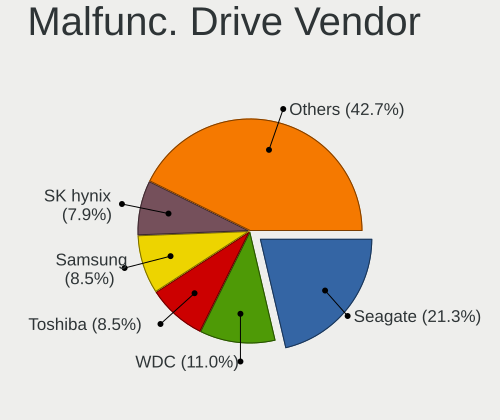

| Vendor              | Notebooks | Drives | Percent |
|---------------------|-----------|--------|---------|
| Seagate             | 35        | 36     | 21.34%  |
| WDC                 | 18        | 18     | 10.98%  |
| Toshiba             | 14        | 15     | 8.54%   |
| Samsung Electronics | 14        | 17     | 8.54%   |
| SK hynix            | 13        | 13     | 7.93%   |
| Hitachi             | 13        | 14     | 7.93%   |
| HGST                | 9         | 10     | 5.49%   |
| Micron Technology   | 5         | 11     | 3.05%   |
| Kingston            | 5         | 5      | 3.05%   |
| SanDisk             | 3         | 3      | 1.83%   |
| Intel               | 3         | 3      | 1.83%   |
| Transcend           | 2         | 2      | 1.22%   |
| SSSTC               | 2         | 2      | 1.22%   |
| SPCC                | 2         | 2      | 1.22%   |
| Netac               | 2         | 2      | 1.22%   |
| LITEONIT            | 2         | 2      | 1.22%   |
| LITEON              | 2         | 2      | 1.22%   |
| KIOXIA              | 2         | 3      | 1.22%   |
| Fujitsu             | 2         | 2      | 1.22%   |
| Crucial             | 2         | 2      | 1.22%   |
| A-DATA Technology   | 2         | 2      | 1.22%   |
| Unknown             | 1         | 1      | 0.61%   |
| Realtek             | 1         | 1      | 0.61%   |
| OCZ                 | 1         | 1      | 0.61%   |
| Lexar               | 1         | 1      | 0.61%   |
| KingSpec            | 1         | 1      | 0.61%   |
| Intenso             | 1         | 1      | 0.61%   |
| GOODRAM             | 1         | 1      | 0.61%   |
| Corsair             | 1         | 1      | 0.61%   |
| China               | 1         | 1      | 0.61%   |
| ARDOR GAMING        | 1         | 1      | 0.61%   |
| Apple               | 1         | 1      | 0.61%   |
| Unknown             | 1         | 1      | 0.61%   |

Malfunc. HDD Vendor
-------------------

Vendors of faulty HDD drives

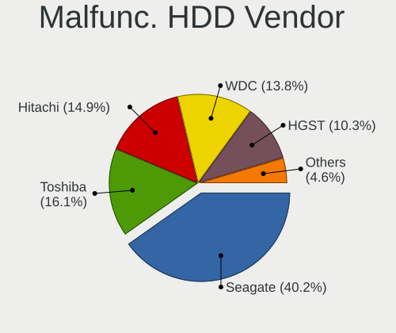

| Vendor              | Notebooks | Drives | Percent |
|---------------------|-----------|--------|---------|
| Seagate             | 35        | 36     | 40.23%  |
| Toshiba             | 14        | 15     | 16.09%  |
| Hitachi             | 13        | 14     | 14.94%  |
| WDC                 | 12        | 12     | 13.79%  |
| HGST                | 9         | 10     | 10.34%  |
| Fujitsu             | 2         | 2      | 2.3%    |
| Unknown             | 1         | 1      | 1.15%   |
| Samsung Electronics | 1         | 1      | 1.15%   |

Malfunc. Drive Kind
-------------------

Kinds of faulty drives

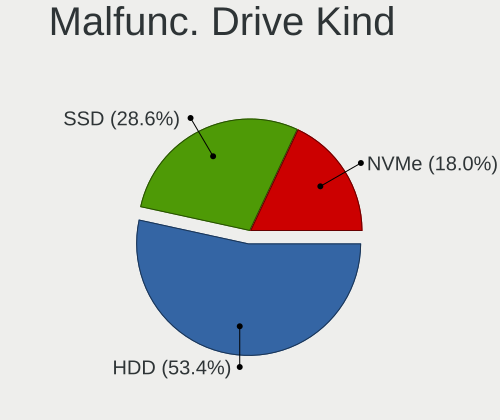

| Kind | Notebooks | Drives | Percent |
|------|-----------|--------|---------|
| HDD  | 86        | 91     | 53.42%  |
| SSD  | 46        | 57     | 28.57%  |
| NVMe | 29        | 30     | 18.01%  |

Failed Drives
-------------

Failed drive models

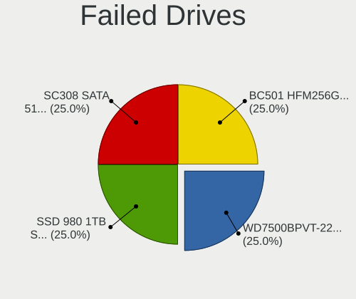

| Model                                           | Notebooks | Drives | Percent |
|-------------------------------------------------|-----------|--------|---------|
| WDC WD7500BPVT-22HXZT1 752GB                    | 1         | 2      | 25%     |
| SK hynix SC308 SATA 512GB SSD                   | 1         | 1      | 25%     |
| SK hynix BC501 HFM256GDJTNG-8310A 256GB         | 1         | 1      | 25%     |
| Samsung Electronics SSD 980 1TB S649NJ0R220122K | 1         | 1      | 25%     |

Failed Drive Vendor
-------------------

Failed drive vendors

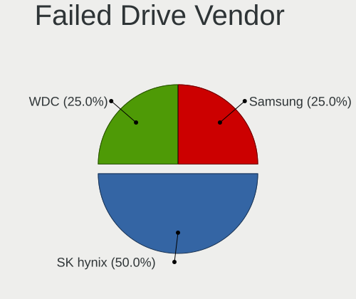

| Vendor              | Notebooks | Drives | Percent |
|---------------------|-----------|--------|---------|
| SK hynix            | 2         | 2      | 50%     |
| WDC                 | 1         | 2      | 25%     |
| Samsung Electronics | 1         | 1      | 25%     |

Drive Status
------------

Number of failed and malfunc. drives

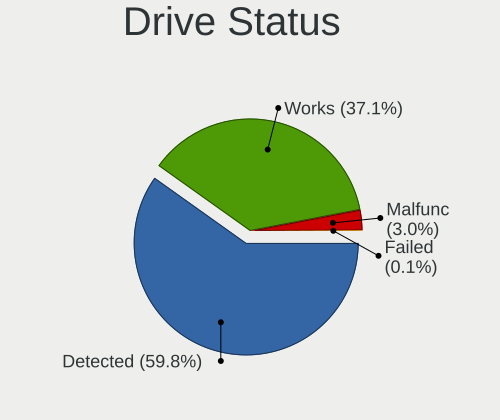

| Status   | Notebooks | Drives | Percent |
|----------|-----------|--------|---------|
| Detected | 3212      | 4691   | 59.85%  |
| Works    | 1992      | 2481   | 37.12%  |
| Malfunc  | 159       | 178    | 2.96%   |
| Failed   | 4         | 5      | 0.07%   |

Storage controller
------------------

Storage Vendor
--------------

Storage controller vendors

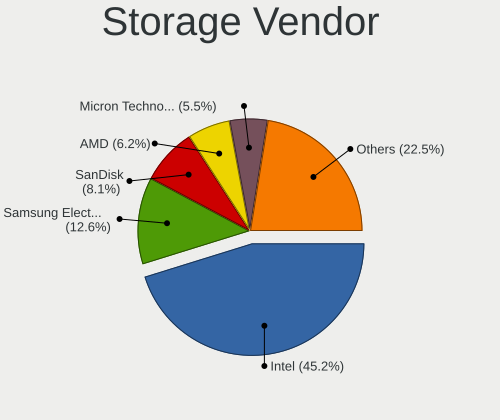

| Vendor                                  | Notebooks | Percent |
|-----------------------------------------|-----------|---------|
| Intel                                   | 2936      | 45.2%   |
| Samsung Electronics                     | 816       | 12.56%  |
| SanDisk                                 | 527       | 8.11%   |
| AMD                                     | 402       | 6.19%   |
| Micron Technology                       | 355       | 5.47%   |
| SK hynix                                | 326       | 5.02%   |
| KIOXIA                                  | 176       | 2.71%   |
| Kingston Technology Company             | 160       | 2.46%   |
| Phison Electronics                      | 111       | 1.71%   |
| Toshiba America Info Systems            | 89        | 1.37%   |
| Micron/Crucial Technology               | 83        | 1.28%   |
| ADATA Technology                        | 61        | 0.94%   |
| Silicon Motion                          | 58        | 0.89%   |
| MAXIO Technology (Hangzhou)             | 51        | 0.79%   |
| Shenzhen Longsys Electronics            | 50        | 0.77%   |
| Solid State Storage Technology          | 46        | 0.71%   |
| Apple                                   | 40        | 0.62%   |
| Solidigm                                | 38        | 0.59%   |
| Yangtze Memory Technologies             | 32        | 0.49%   |
| Nvidia                                  | 23        | 0.35%   |
| Shenzhen Unionmemory Information System | 18        | 0.28%   |
| Union Memory (Shenzhen)                 | 16        | 0.25%   |
| Realtek Semiconductor                   | 16        | 0.25%   |
| Marvell Technology Group                | 10        | 0.15%   |
| Seagate Technology                      | 8         | 0.12%   |
| INNOGRIT                                | 6         | 0.09%   |
| Transcend                               | 5         | 0.08%   |
| Shenzhen Shichuangyi Electronics        | 5         | 0.08%   |
| Lite-On Technology                      | 5         | 0.08%   |
| Silicon Integrated Systems [SiS]        | 4         | 0.06%   |
| Netac Technology                        | 4         | 0.06%   |
| Shenzhen Techwinsemi Technology         | 3         | 0.05%   |
| Zhaoxin                                 | 2         | 0.03%   |
| Lenovo                                  | 2         | 0.03%   |
| Hosin Global Electronics                | 2         | 0.03%   |
| Biwin Storage Technology                | 2         | 0.03%   |
| YEESTOR Microelectronics                | 1         | 0.02%   |
| TenaFe                                  | 1         | 0.02%   |
| O2 Micro                                | 1         | 0.02%   |
| Jiangsu Huacun Elec.                    | 1         | 0.02%   |

Storage Model
-------------

Storage controller models

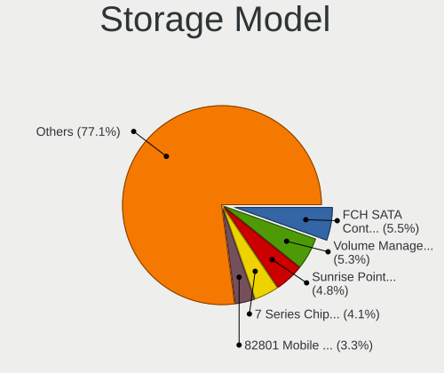

| Model                                                                          | Notebooks | Percent |
|--------------------------------------------------------------------------------|-----------|---------|
| AMD FCH SATA Controller [AHCI mode]                                            | 374       | 5.47%   |
| Intel Volume Management Device NVMe RAID Controller                            | 361       | 5.28%   |
| Intel Sunrise Point-LP SATA Controller [AHCI mode]                             | 328       | 4.8%    |
| Intel 7 Series Chipset Family 6-port SATA Controller [AHCI mode]               | 280       | 4.1%    |
| Intel 82801 Mobile SATA Controller [RAID mode]                                 | 224       | 3.28%   |
| Samsung NVMe SSD Controller SM981/PM981/PM983                                  | 192       | 2.81%   |
| Intel 6 Series/C200 Series Chipset Family 6 port Mobile SATA AHCI Controller   | 183       | 2.68%   |
| Samsung NVMe SSD Controller 980 (DRAM-less)                                    | 176       | 2.57%   |
| SanDisk WD SN560/SN740/SN770/SN5000 NVMe SSD                                   | 166       | 2.43%   |
| Samsung NVMe SSD Controller PM9A1/PM9A3/980PRO                                 | 152       | 2.22%   |
| Intel 8 Series SATA Controller 1 [AHCI mode]                                   | 151       | 2.21%   |
| Intel Alder Lake-P SATA AHCI Controller                                        | 138       | 2.02%   |
| Intel RST Volume Management Device Controller                                  | 133       | 1.95%   |
| Intel Wildcat Point-LP SATA Controller [AHCI Mode]                             | 117       | 1.71%   |
| Micron 2400 NVMe SSD (DRAM-less)                                               | 110       | 1.61%   |
| Intel Tiger Lake-LP SATA Controller                                            | 105       | 1.54%   |
| Intel 8 Series/C220 Series Chipset Family 6-port SATA Controller 1 [AHCI mode] | 105       | 1.54%   |
| Samsung NVMe SSD Controller PM9B1 (DRAM-less)                                  | 94        | 1.38%   |
| Intel Cannon Lake Mobile PCH SATA AHCI Controller                              | 91        | 1.33%   |
| Micron 2450 NVMe SSD [HendrixV] (DRAM-less)                                    | 88        | 1.29%   |
| SK hynix Gold P31/BC711/PC711 NVMe Solid State Drive                           | 74        | 1.08%   |
| SK hynix BC901 NVMe Solid State Drive (DRAM-less)                              | 73        | 1.07%   |
| Samsung NVMe SSD Controller PM9C1a (DRAM-less)                                 | 73        | 1.07%   |
| Intel SSD 670p Series [Keystone Harbor]                                        | 71        | 1.04%   |
| SK hynix Platinum P41/PC801 NVMe Solid State Drive                             | 70        | 1.02%   |
| Intel Comet Lake SATA AHCI Controller                                          | 68        | 0.99%   |
| Intel Celeron/Pentium Silver Processor SATA Controller                         | 66        | 0.97%   |
| Intel HM170/QM170 Chipset SATA Controller [AHCI Mode]                          | 63        | 0.92%   |
| Intel Cannon Point-LP SATA Controller [AHCI Mode]                              | 62        | 0.91%   |
| SanDisk Ultra 3D / WD PC SN530, IX SN530, Blue SN550 NVMe SSD (DRAM-less)      | 61        | 0.89%   |
| SanDisk Extreme Pro / WD Black SN750 / PC SN730 / Red SN700 NVMe SSD           | 61        | 0.89%   |
| Intel 5 Series/3400 Series Chipset 4 port SATA AHCI Controller                 | 52        | 0.76%   |
| KIOXIA NVMe SSD Controller BG5 (DRAM-less)                                     | 51        | 0.75%   |
| Intel 82801IBM/IEM (ICH9M/ICH9M-E) 4 port SATA Controller [AHCI mode]          | 50        | 0.73%   |
| Samsung NVMe SSD Controller SM961/PM961/SM963                                  | 47        | 0.69%   |
| Intel Atom Processor E3800 Series SATA AHCI Controller                         | 47        | 0.69%   |
| KIOXIA NVMe SSD Controller BG4 (DRAM-less)                                     | 46        | 0.67%   |
| Intel SSD 660P Series                                                          | 45        | 0.66%   |
| Toshiba America Info Systems XG6 NVMe SSD Controller                           | 43        | 0.63%   |
| MAXIO (Hangzhou) NVMe SSD Controller MAP1202 (DRAM-less)                       | 43        | 0.63%   |

Storage Kind
------------

Kind of storage controller (IDE, SATA, NVMe, SAS, ...)

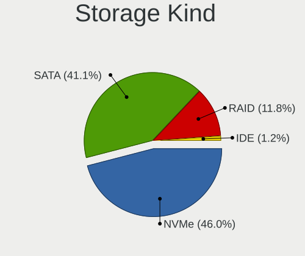

| Kind | Notebooks | Percent |
|------|-----------|---------|
| NVMe | 3000      | 45.96%  |
| SATA | 2681      | 41.08%  |
| RAID | 769       | 11.78%  |
| IDE  | 77        | 1.18%   |

Processor
---------

CPU Vendor
----------

Processor vendors

| Vendor        | Notebooks | Percent |
|---------------|-----------|---------|
| Intel         | 4047      | 78.45%  |
| AMD           | 1103      | 21.38%  |
| CentaurHauls  | 5         | 0.1%    |
| Qualcomm      | 2         | 0.04%   |
| sifive,u74-mc | 1         | 0.02%   |
| ARM           | 1         | 0.02%   |

CPU Model
---------

Processor models

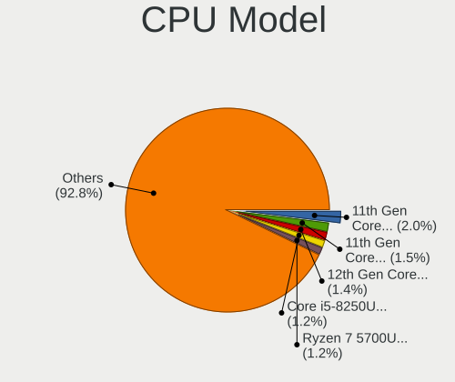

| Model                                         | Notebooks | Percent |
|-----------------------------------------------|-----------|---------|
| Intel 11th Gen Core i5-1135G7 @ 2.40GHz       | 101       | 1.96%   |
| Intel 11th Gen Core i7-1165G7 @ 2.80GHz       | 77        | 1.49%   |
| Intel 12th Gen Core i5-1235U                  | 70        | 1.36%   |
| Intel Core i5-8250U CPU @ 1.60GHz             | 61        | 1.18%   |
| AMD Ryzen 7 5700U with Radeon Graphics        | 61        | 1.18%   |
| Intel Core Ultra 7 155H                       | 57        | 1.1%    |
| Intel Core i7-8550U CPU @ 1.80GHz             | 56        | 1.09%   |
| Intel Core i5-7200U CPU @ 2.50GHz             | 55        | 1.07%   |
| Intel Core i5-6300U CPU @ 2.40GHz             | 53        | 1.03%   |
| Intel Core i5-6200U CPU @ 2.30GHz             | 51        | 0.99%   |
| AMD Ryzen 5 7520U with Radeon Graphics        | 49        | 0.95%   |
| AMD Ryzen 5 5500U with Radeon Graphics        | 48        | 0.93%   |
| Intel Core i5-8265U CPU @ 1.60GHz             | 46        | 0.89%   |
| Intel Core i5-3210M CPU @ 2.50GHz             | 45        | 0.87%   |
| Intel Core i5-10210U CPU @ 1.60GHz            | 45        | 0.87%   |
| Intel 12th Gen Core i5-12450H                 | 44        | 0.85%   |
| Intel 12th Gen Core i7-12700H                 | 42        | 0.81%   |
| Intel 13th Gen Core i7-1355U                  | 39        | 0.76%   |
| Intel 11th Gen Core i7-11800H @ 2.30GHz       | 39        | 0.76%   |
| AMD Ryzen 5 3500U with Radeon Vega Mobile Gfx | 39        | 0.76%   |
| Intel Core i7-7700HQ CPU @ 2.80GHz            | 38        | 0.74%   |
| Intel Core i7-8565U CPU @ 1.80GHz             | 37        | 0.72%   |
| AMD Ryzen 7 7730U with Radeon Graphics        | 37        | 0.72%   |
| Intel Core i5-8350U CPU @ 1.70GHz             | 36        | 0.7%    |
| Intel Core i5-5200U CPU @ 2.20GHz             | 36        | 0.7%    |
| Intel 13th Gen Core i9-13900H                 | 36        | 0.7%    |
| Intel Celeron N4020 CPU @ 1.10GHz             | 35        | 0.68%   |
| Intel 11th Gen Core i3-1115G4 @ 3.00GHz       | 35        | 0.68%   |
| Intel Core i5-2520M CPU @ 2.50GHz             | 34        | 0.66%   |
| Intel Core i7-10750H CPU @ 2.60GHz            | 33        | 0.64%   |
| AMD Ryzen 7 8845HS w/ Radeon 780M Graphics    | 31        | 0.6%    |
| Intel Core i7-9750H CPU @ 2.60GHz             | 30        | 0.58%   |
| AMD Ryzen 7 5800H with Radeon Graphics        | 30        | 0.58%   |
| Intel Core i5-1035G1 CPU @ 1.00GHz            | 29        | 0.56%   |
| Intel 12th Gen Core i7-1255U                  | 29        | 0.56%   |
| Intel Core i7-7500U CPU @ 2.70GHz             | 28        | 0.54%   |
| Intel Core i7-6600U CPU @ 2.60GHz             | 28        | 0.54%   |
| Intel Core i7-5500U CPU @ 2.40GHz             | 28        | 0.54%   |
| Intel Core i5-4200U CPU @ 1.60GHz             | 28        | 0.54%   |
| Intel 13th Gen Core i7-13700H                 | 28        | 0.54%   |

CPU Model Family
----------------

Processor model prefix

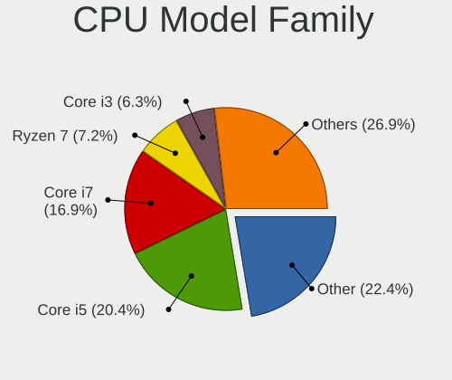

| Model                   | Notebooks | Percent |
|-------------------------|-----------|---------|
| Other                   | 1155      | 22.38%  |
| Intel Core i5           | 1053      | 20.41%  |
| Intel Core i7           | 870       | 16.86%  |
| AMD Ryzen 7             | 372       | 7.21%   |
| Intel Core i3           | 323       | 6.26%   |
| AMD Ryzen 5             | 289       | 5.6%    |
| Intel Core              | 211       | 4.09%   |
| Intel Celeron           | 199       | 3.86%   |
| Intel Pentium           | 88        | 1.71%   |
| Intel Core 2 Duo        | 75        | 1.45%   |
| AMD Ryzen 7 PRO         | 57        | 1.1%    |
| AMD Ryzen 9             | 56        | 1.09%   |
| AMD Ryzen 3             | 52        | 1.01%   |
| Intel Core i9           | 45        | 0.87%   |
| AMD A6                  | 41        | 0.79%   |
| AMD Ryzen 5 PRO         | 32        | 0.62%   |
| AMD A8                  | 24        | 0.47%   |
| AMD A10                 | 19        | 0.37%   |
| AMD A4                  | 18        | 0.35%   |
| Intel Xeon              | 14        | 0.27%   |
| Intel Pentium Silver    | 14        | 0.27%   |
| Intel Core M            | 14        | 0.27%   |
| Intel Atom              | 14        | 0.27%   |
| AMD E2                  | 14        | 0.27%   |
| AMD E                   | 14        | 0.27%   |
| AMD E1                  | 13        | 0.25%   |
| AMD Athlon              | 13        | 0.25%   |
| Intel Pentium Dual-Core | 12        | 0.23%   |
| AMD Athlon II           | 6         | 0.12%   |
| Intel Core m3           | 5         | 0.1%    |
| AMD Ryzen 3 PRO         | 5         | 0.1%    |
| Intel Core m7           | 4         | 0.08%   |
| AMD FX                  | 4         | 0.08%   |
| AMD A12                 | 4         | 0.08%   |
| Intel Pentium Dual      | 3         | 0.06%   |
| Intel Core m5           | 3         | 0.06%   |
| Intel Celeron Dual-Core | 3         | 0.06%   |
| AMD PRO A10             | 3         | 0.06%   |
| AMD Phenom II           | 3         | 0.06%   |
| Intel Pentium Gold      | 2         | 0.04%   |

CPU Cores
---------

Number of processor cores

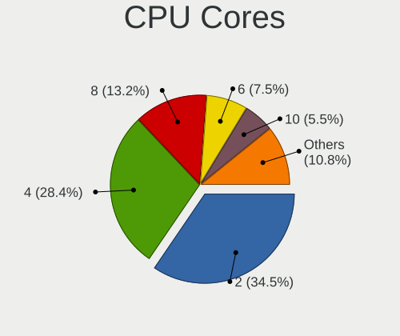

| Number  | Notebooks | Percent |
|---------|-----------|---------|
| 2       | 1782      | 34.53%  |
| 4       | 1467      | 28.42%  |
| 8       | 683       | 13.23%  |
| 6       | 387       | 7.5%    |
| 10      | 284       | 5.5%    |
| 14      | 184       | 3.57%   |
| 12      | 171       | 3.31%   |
| 16      | 130       | 2.52%   |
| 24      | 53        | 1.03%   |
| 1       | 11        | 0.21%   |
| 20      | 6         | 0.12%   |
| 5       | 1         | 0.02%   |
| 3       | 1         | 0.02%   |
| Unknown | 1         | 0.02%   |

CPU Sockets
-----------

Number of sockets

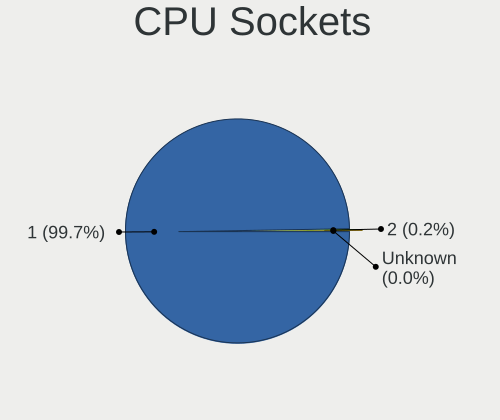

| Number  | Notebooks | Percent |
|---------|-----------|---------|
| 1       | 5146      | 99.73%  |
| 2       | 11        | 0.21%   |
| 8       | 2         | 0.04%   |
| Unknown | 1         | 0.02%   |

CPU Threads
-----------

Threads per core (Hyper-Threading)

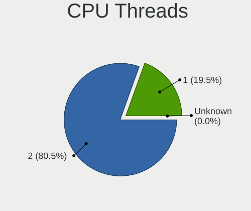

| Number  | Notebooks | Percent |
|---------|-----------|---------|
| 2       | 4159      | 80.49%  |
| 1       | 1007      | 19.49%  |
| Unknown | 1         | 0.02%   |

CPU Op-Modes
------------

CPU Operation Modes (32-bit, 64-bit)

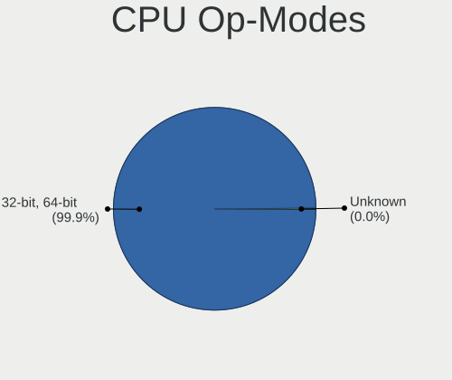

| Op mode        | Notebooks | Percent |
|----------------|-----------|---------|
| 32-bit, 64-bit | 5155      | 99.92%  |
| 64-bit         | 3         | 0.06%   |
| Unknown        | 1         | 0.02%   |

CPU Microcode
-------------

Microcode number

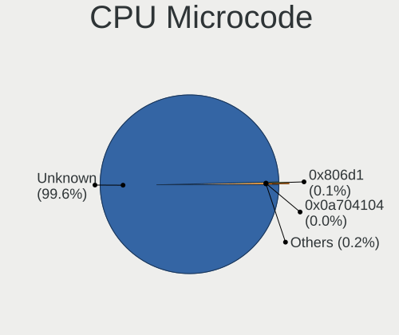

| Number     | Notebooks | Percent |
|------------|-----------|---------|
| Unknown    | 5140      | 99.61%  |
| 0x806c1    | 4         | 0.08%   |
| 0x806d1    | 3         | 0.06%   |
| 0x806ec    | 2         | 0.04%   |
| 0x0a704104 | 2         | 0.04%   |
| 0xb06a2    | 1         | 0.02%   |
| 0xb0671    | 1         | 0.02%   |
| 0xa0652    | 1         | 0.02%   |
| 0x906a3    | 1         | 0.02%   |
| 0x806ea    | 1         | 0.02%   |
| 0x106ca    | 1         | 0.02%   |
| 0x0a601203 | 1         | 0.02%   |
| 0x08608102 | 1         | 0.02%   |
| 0x05000029 | 1         | 0.02%   |

CPU Microarch
-------------

Microarchitecture

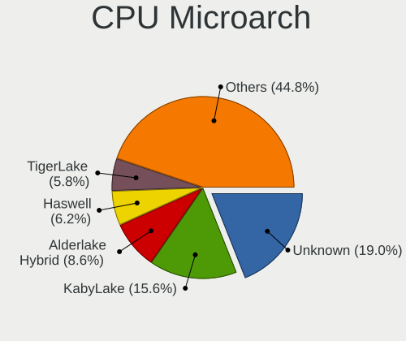

| Name               | Notebooks | Percent |
|--------------------|-----------|---------|
| Unknown            | 983       | 18.99%  |
| KabyLake           | 810       | 15.65%  |
| Alderlake Hybrid   | 446       | 8.62%   |
| Haswell            | 319       | 6.16%   |
| TigerLake          | 298       | 5.76%   |
| IvyBridge          | 289       | 5.58%   |
| Skylake            | 254       | 4.91%   |
| SandyBridge        | 249       | 4.81%   |
| Zen 3              | 192       | 3.71%   |
| Broadwell          | 176       | 3.4%    |
| Zen+               | 108       | 2.09%   |
| Icelake            | 107       | 2.07%   |
| Silvermont         | 104       | 2.01%   |
| CometLake          | 93        | 1.8%    |
| Zen 2              | 89        | 1.72%   |
| Meteorlake Hybrid  | 87        | 1.68%   |
| Westmere           | 86        | 1.66%   |
| Goldmont plus      | 81        | 1.56%   |
| Penryn             | 76        | 1.47%   |
| Excavator          | 55        | 1.06%   |
| Puma               | 35        | 0.68%   |
| Goldmont           | 31        | 0.6%    |
| Zen                | 29        | 0.56%   |
| Lunarlake Hybrid   | 26        | 0.5%    |
| Core               | 25        | 0.48%   |
| Bobcat             | 25        | 0.48%   |
| Piledriver         | 17        | 0.33%   |
| Jaguar             | 17        | 0.33%   |
| Gracemont          | 13        | 0.25%   |
| Nehalem            | 12        | 0.23%   |
| K10 Llano          | 10        | 0.19%   |
| K10                | 9         | 0.17%   |
| Tremont            | 7         | 0.14%   |
| Steamroller        | 7         | 0.14%   |
| K8 & K10 hybrid    | 4         | 0.08%   |
| ArrowLake-H Hybrid | 3         | 0.06%   |
| K8 Hammer          | 2         | 0.04%   |
| Bonnell            | 2         | 0.04%   |

Graphics
--------

GPU Vendor
----------

Vendors of graphics cards

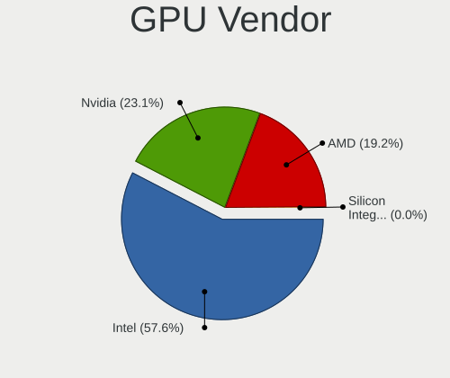

| Vendor                           | Notebooks | Percent |
|----------------------------------|-----------|---------|
| Intel                            | 3842      | 57.6%   |
| Nvidia                           | 1538      | 23.06%  |
| AMD                              | 1282      | 19.22%  |
| Zhaoxin                          | 5         | 0.07%   |
| Silicon Integrated Systems [SiS] | 3         | 0.04%   |

GPU Model
---------

Graphics card models

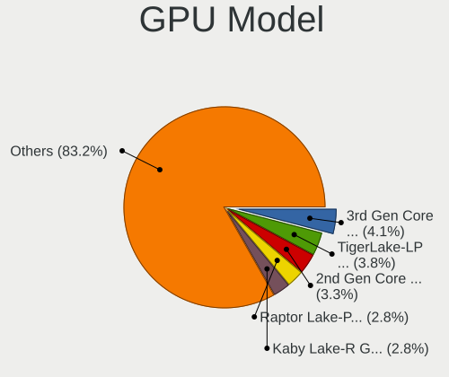

| Model                                                                     | Notebooks | Percent |
|---------------------------------------------------------------------------|-----------|---------|
| Intel 3rd Gen Core processor Graphics Controller                          | 274       | 4.05%   |
| Intel TigerLake-LP GT2 [Iris Xe Graphics]                                 | 255       | 3.77%   |
| Intel 2nd Generation Core Processor Family Integrated Graphics Controller | 224       | 3.31%   |
| Intel Raptor Lake-P [Iris Xe Graphics]                                    | 192       | 2.84%   |
| Intel Kaby Lake-R GT2 [UHD Graphics 620]                                  | 189       | 2.8%    |
| Intel Skylake-U GT2 [HD Graphics 520]                                     | 182       | 2.69%   |
| Intel Haswell-ULT Integrated Graphics Controller                          | 175       | 2.59%   |
| Intel Kaby Lake-U GT2 [HD Graphics 620]                                   | 144       | 2.13%   |
| Intel Alder Lake-P GT2 [Iris Xe Graphics]                                 | 128       | 1.89%   |
| Intel WhiskeyLake-U GT2 [UHD Graphics 620]                                | 125       | 1.85%   |
| Intel Broadwell-U GT2 [HD Graphics 5500]                                  | 123       | 1.82%   |
| AMD Lucienne                                                              | 118       | 1.75%   |
| AMD Picasso/Raven 2 [Radeon Vega Series / Radeon Vega Mobile Series]      | 117       | 1.73%   |
| Intel CoffeeLake-H GT2 [UHD Graphics 630]                                 | 114       | 1.69%   |
| Intel CometLake-U GT2 [UHD Graphics]                                      | 113       | 1.67%   |
| Intel 4th Gen Core Processor Integrated Graphics Controller               | 111       | 1.64%   |
| Intel Meteor Lake-P [Intel Arc Graphics]                                  | 110       | 1.63%   |
| AMD Rembrandt [Radeon 680M]                                               | 109       | 1.61%   |
| AMD Barcelo                                                               | 95        | 1.41%   |
| Nvidia TU117M [GeForce GTX 1650 Mobile / Max-Q]                           | 92        | 1.36%   |
| Nvidia AD107M [GeForce RTX 4060 Max-Q / Mobile]                           | 88        | 1.3%    |
| AMD Renoir [Radeon Vega Series / Radeon Vega Mobile Series]               | 88        | 1.3%    |
| Intel TigerLake-H GT1 [UHD Graphics]                                      | 86        | 1.27%   |
| AMD Cezanne [Radeon Vega Series / Radeon Vega Mobile Series]              | 85        | 1.26%   |
| Intel Alder Lake-UP3 GT2 [Iris Xe Graphics]                               | 84        | 1.24%   |
| Intel CometLake-H GT2 [UHD Graphics]                                      | 80        | 1.18%   |
| AMD Phoenix1                                                              | 80        | 1.18%   |
| Intel GeminiLake [UHD Graphics 600]                                       | 73        | 1.08%   |
| AMD HawkPoint1                                                            | 71        | 1.05%   |
| Nvidia GA107M [GeForce RTX 3050 Mobile]                                   | 70        | 1.04%   |
| Intel Raptor Lake-P [UHD Graphics]                                        | 69        | 1.02%   |
| Intel Raptor Lake-S UHD Graphics                                          | 68        | 1.01%   |
| Intel Alder Lake-P GT1 [UHD Graphics]                                     | 67        | 0.99%   |
| AMD Mendocino [Radeon 610M]                                               | 66        | 0.98%   |
| Intel Core Processor Integrated Graphics Controller                       | 61        | 0.9%    |
| Intel Atom Processor Z36xxx/Z37xxx Series Graphics & Display              | 60        | 0.89%   |
| Nvidia GA106M [GeForce RTX 3060 Mobile / Max-Q]                           | 59        | 0.87%   |
| Intel Kaby Lake-H GT2 [HD Graphics 630]                                   | 56        | 0.83%   |
| Nvidia AD106M [GeForce RTX 4070 Max-Q / Mobile]                           | 49        | 0.72%   |
| Intel Skylake-H GT2 [HD Graphics 530]                                     | 46        | 0.68%   |

GPU Combo
---------

Combinations of graphics cards

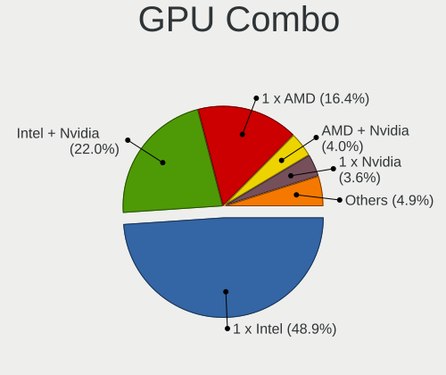

| Name               | Notebooks | Percent |
|--------------------|-----------|---------|
| 1 x Intel          | 2528      | 48.94%  |
| Intel + Nvidia     | 1138      | 22.03%  |
| 1 x AMD            | 849       | 16.44%  |
| AMD + Nvidia       | 209       | 4.05%   |
| 1 x Nvidia         | 188       | 3.64%   |
| Intel + AMD        | 154       | 2.98%   |
| 2 x AMD            | 70        | 1.36%   |
| 2 x Intel          | 10        | 0.19%   |
| Other              | 6         | 0.12%   |
| 1 x Zhaoxin        | 5         | 0.1%    |
| 2 x Nvidia         | 3         | 0.06%   |
| 1 x SiS            | 3         | 0.06%   |
| Intel + 2 x Nvidia | 2         | 0.04%   |

GPU Driver
----------

Free vs proprietary

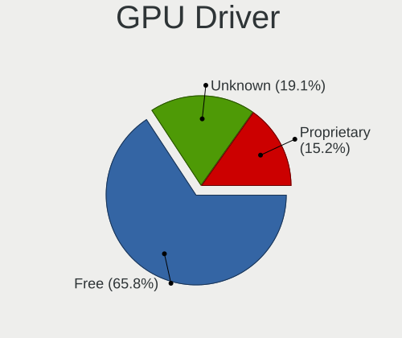

| Driver      | Notebooks | Percent |
|-------------|-----------|---------|
| Free        | 3410      | 65.75%  |
| Unknown     | 989       | 19.07%  |
| Proprietary | 787       | 15.18%  |

GPU Memory
----------

Total video memory

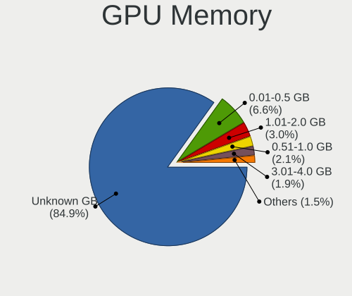

| Size in GB | Notebooks | Percent |
|------------|-----------|---------|
| Unknown    | 4405      | 84.91%  |
| 0.01-0.5   | 341       | 6.57%   |
| 1.01-2.0   | 158       | 3.05%   |
| 0.51-1.0   | 107       | 2.06%   |
| 3.01-4.0   | 98        | 1.89%   |
| 7.01-8.0   | 40        | 0.77%   |
| 5.01-6.0   | 29        | 0.56%   |
| 8.01-16.0  | 8         | 0.15%   |
| 24.01-32.0 | 1         | 0.02%   |
| 16.01-24.0 | 1         | 0.02%   |

Monitor
-------

Monitor Vendor
--------------

Monitor vendors

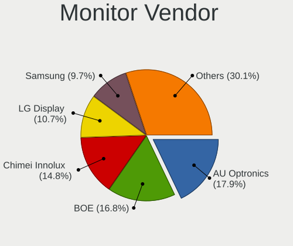

| Vendor                  | Notebooks | Percent |
|-------------------------|-----------|---------|
| AU Optronics            | 1087      | 17.9%   |
| BOE                     | 1018      | 16.76%  |
| Chimei Innolux          | 898       | 14.79%  |
| LG Display              | 650       | 10.7%   |
| Samsung Electronics     | 591       | 9.73%   |
| Apple                   | 197       | 3.24%   |
| Dell                    | 175       | 2.88%   |
| Goldstar                | 132       | 2.17%   |
| Sharp                   | 131       | 2.16%   |
| Lenovo                  | 119       | 1.96%   |
| PANDA                   | 103       | 1.7%    |
| Chi Mei Optoelectronics | 90        | 1.48%   |
| Hewlett-Packard         | 76        | 1.25%   |
| InfoVision              | 54        | 0.89%   |
| Acer                    | 52        | 0.86%   |
| CSO                     | 51        | 0.84%   |
| CSOT                    | 49        | 0.81%   |
| AOC                     | 46        | 0.76%   |
| BenQ                    | 37        | 0.61%   |
| ASUSTek Computer        | 37        | 0.61%   |
| Philips                 | 35        | 0.58%   |
| CSW                     | 32        | 0.53%   |
| TMX                     | 27        | 0.44%   |
| MSI                     | 23        | 0.38%   |
| Iiyama                  | 23        | 0.38%   |
| HKC                     | 23        | 0.38%   |
| Ancor Communications    | 20        | 0.33%   |
| Mi                      | 15        | 0.25%   |
| Sony                    | 14        | 0.23%   |
| Unknown                 | 12        | 0.2%    |
| TMA                     | 12        | 0.2%    |
| ViewSonic               | 11        | 0.18%   |
| EDO                     | 10        | 0.16%   |
| InnoLux Display         | 9         | 0.15%   |
| Vizio                   | 8         | 0.13%   |
| Panasonic               | 8         | 0.13%   |
| LG Philips              | 8         | 0.13%   |
| JDZ                     | 8         | 0.13%   |
| CPT                     | 8         | 0.13%   |
| Eizo                    | 7         | 0.12%   |

Monitor Model
-------------

Monitor models

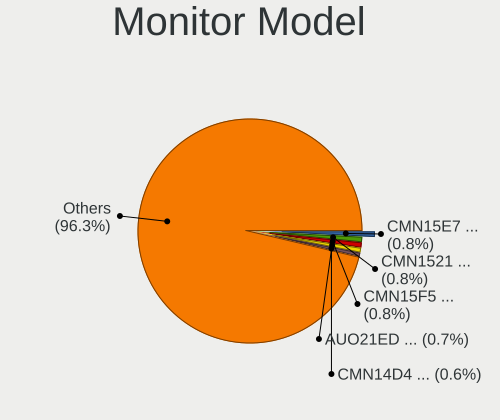

| Model                                                                    | Notebooks | Percent |
|--------------------------------------------------------------------------|-----------|---------|
| Chimei Innolux LCD Monitor CMN15E7 1920x1080 344x193mm 15.5-inch         | 50        | 0.81%   |
| Chimei Innolux LCD Monitor CMN1521 1920x1080 344x193mm 15.5-inch         | 49        | 0.8%    |
| Chimei Innolux LCD Monitor CMN15F5 1920x1080 344x193mm 15.5-inch         | 48        | 0.78%   |
| AU Optronics LCD Monitor AUO21ED 1920x1080 344x193mm 15.5-inch           | 43        | 0.7%    |
| Chimei Innolux LCD Monitor CMN14D4 1920x1080 309x173mm 13.9-inch         | 37        | 0.6%    |
| AU Optronics LCD Monitor AUO38ED 1920x1080 344x193mm 15.5-inch           | 33        | 0.54%   |
| PANDA LCD Monitor NCP004D 1920x1080 344x194mm 15.5-inch                  | 30        | 0.49%   |
| AU Optronics LCD Monitor AUO403D 1920x1080 309x174mm 14.0-inch           | 30        | 0.49%   |
| BOE LCD Monitor BOE0872 1920x1080 344x194mm 15.5-inch                    | 29        | 0.47%   |
| Chimei Innolux LCD Monitor CMN1618 1920x1200 344x215mm 16.0-inch         | 25        | 0.41%   |
| LG Display LCD Monitor LGD02DC 1366x768 344x194mm 15.5-inch              | 24        | 0.39%   |
| Samsung Electronics LCD Monitor SDC4161 1920x1080 344x194mm 15.5-inch    | 22        | 0.36%   |
| Chimei Innolux LCD Monitor CMN15DB 1366x768 344x193mm 15.5-inch          | 21        | 0.34%   |
| LG Display LCD Monitor LGD033A 1366x768 344x194mm 15.5-inch              | 20        | 0.33%   |
| Chimei Innolux LCD Monitor CMN153B 1920x1080 344x193mm 15.5-inch         | 20        | 0.33%   |
| Samsung Electronics LCD Monitor SEC5441 1280x800 331x207mm 15.4-inch     | 19        | 0.31%   |
| Samsung Electronics LCD Monitor SDC4180 2880x1620 344x194mm 15.5-inch    | 19        | 0.31%   |
| Chi Mei Optoelectronics LCD Monitor CMO15A7 1366x768 344x193mm 15.5-inch | 19        | 0.31%   |
| BOE LCD Monitor BOE0812 1920x1080 344x194mm 15.5-inch                    | 19        | 0.31%   |
| AU Optronics LCD Monitor AUO61ED 1920x1080 344x194mm 15.5-inch           | 19        | 0.31%   |
| Samsung Electronics LCD Monitor SDC4171 2880x1800 302x189mm 14.0-inch    | 18        | 0.29%   |
| BOE LCD Monitor BOE07CB 1920x1080 344x193mm 15.5-inch                    | 18        | 0.29%   |
| Chimei Innolux LCD Monitor CMN14D6 1366x768 309x173mm 13.9-inch          | 17        | 0.28%   |
| Chimei Innolux LCD Monitor CMN14E5 1920x1080 309x173mm 13.9-inch         | 16        | 0.26%   |
| AU Optronics LCD Monitor AUOAF90 1920x1080 344x193mm 15.5-inch           | 16        | 0.26%   |
| AU Optronics LCD Monitor AUO45EC 1366x768 344x193mm 15.5-inch            | 16        | 0.26%   |
| AU Optronics LCD Monitor AUO106C 1366x768 276x155mm 12.5-inch            | 16        | 0.26%   |
| LG Display LCD Monitor LGD0521 1920x1080 309x174mm 14.0-inch             | 15        | 0.24%   |
| Chimei Innolux LCD Monitor CMN15CA 1366x768 344x193mm 15.5-inch          | 15        | 0.24%   |
| Apple Color LCD APPA034 2880x1800 286x179mm 13.3-inch                    | 15        | 0.24%   |
| PANDA LCD Monitor NCP005F 1920x1080 344x194mm 15.5-inch                  | 14        | 0.23%   |
| Goldstar FULL HD GSM5B55 1920x1080 480x270mm 21.7-inch                   | 14        | 0.23%   |
| BOE LCD Monitor BOE0A56 1920x1080 344x194mm 15.5-inch                    | 14        | 0.23%   |
| BOE LCD Monitor BOE0877 1920x1080 309x173mm 13.9-inch                    | 14        | 0.23%   |
| AU Optronics LCD Monitor AUO22EC 1366x768 344x193mm 15.5-inch            | 14        | 0.23%   |
| Chimei Innolux LCD Monitor CMN15E6 1366x768 344x193mm 15.5-inch          | 13        | 0.21%   |
| Chimei Innolux LCD Monitor CMN15D5 1920x1080 344x193mm 15.5-inch         | 13        | 0.21%   |
| BOE LCD Monitor BOE084E 1920x1080 382x215mm 17.3-inch                    | 13        | 0.21%   |
| AU Optronics LCD Monitor AUO71EC 1366x768 344x193mm 15.5-inch            | 13        | 0.21%   |
| Apple Color LCD APP9CF0 1440x900 290x180mm 13.4-inch                     | 13        | 0.21%   |

Monitor Resolution
------------------

Monitor screen resolution

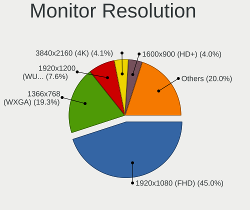

| Resolution         | Notebooks | Percent |
|--------------------|-----------|---------|
| 1920x1080 (FHD)    | 2591      | 44.97%  |
| 1366x768 (WXGA)    | 1113      | 19.32%  |
| 1920x1200 (WUXGA)  | 438       | 7.6%    |
| 3840x2160 (4K)     | 235       | 4.08%   |
| 1600x900 (HD+)     | 231       | 4.01%   |
| 2560x1440 (QHD)    | 224       | 3.89%   |
| 2560x1600          | 215       | 3.73%   |
| 2880x1800          | 170       | 2.95%   |
| 1440x900 (WXGA+)   | 74        | 1.28%   |
| 1280x800 (WXGA)    | 62        | 1.08%   |
| 3440x1440          | 42        | 0.73%   |
| 3200x2000          | 31        | 0.54%   |
| 3840x2400          | 29        | 0.5%    |
| Unknown            | 29        | 0.5%    |
| 1680x1050 (WSXGA+) | 26        | 0.45%   |
| 2160x1440          | 25        | 0.43%   |
| 2880x1620          | 24        | 0.42%   |
| 2560x1080          | 18        | 0.31%   |
| 3072x1920          | 16        | 0.28%   |
| 2256x1504          | 15        | 0.26%   |
| 1280x1024 (SXGA)   | 15        | 0.26%   |
| 3840x1080          | 13        | 0.23%   |
| 2288x1287          | 12        | 0.21%   |
| 3456x2160          | 11        | 0.19%   |
| 2304x1440          | 10        | 0.17%   |
| 3200x1800 (QHD+)   | 9         | 0.16%   |
| 2520x1680          | 9         | 0.16%   |
| 2880x1920          | 7         | 0.12%   |
| 2944x1840          | 6         | 0.1%    |
| 2240x1400          | 6         | 0.1%    |
| 3840x1100          | 5         | 0.09%   |
| 1920x540           | 5         | 0.09%   |
| 1920x1280          | 5         | 0.09%   |
| 1680x945           | 5         | 0.09%   |
| 1360x768           | 5         | 0.09%   |
| 3000x2000          | 4         | 0.07%   |
| 1600x2560          | 4         | 0.07%   |
| 3840x1600          | 3         | 0.05%   |
| 2048x1280          | 3         | 0.05%   |
| 2160x1350          | 2         | 0.03%   |

Monitor Diagonal
----------------

Diagonal size in inches

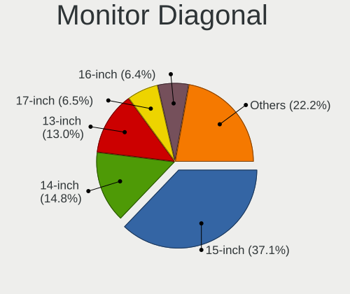

| Inches  | Notebooks | Percent |
|---------|-----------|---------|
| 15      | 2253      | 37.14%  |
| 14      | 898       | 14.8%   |
| 13      | 790       | 13.02%  |
| 17      | 392       | 6.46%   |
| 16      | 389       | 6.41%   |
| 27      | 251       | 4.14%   |
| 24      | 197       | 3.25%   |
| 23      | 144       | 2.37%   |
| 12      | 116       | 1.91%   |
| 21      | 102       | 1.68%   |
| 31      | 79        | 1.3%    |
| 11      | 71        | 1.17%   |
| 34      | 54        | 0.89%   |
| Unknown | 45        | 0.74%   |
| 18      | 38        | 0.63%   |
| 19      | 30        | 0.49%   |
| 84      | 22        | 0.36%   |
| 32      | 19        | 0.31%   |
| 22      | 18        | 0.3%    |
| 28      | 14        | 0.23%   |
| 142     | 12        | 0.2%    |
| 54      | 12        | 0.2%    |
| 48      | 12        | 0.2%    |
| 25      | 10        | 0.16%   |
| 40      | 9         | 0.15%   |
| 72      | 8         | 0.13%   |
| 49      | 8         | 0.13%   |
| 20      | 8         | 0.13%   |
| 52      | 7         | 0.12%   |
| 10      | 7         | 0.12%   |
| 63      | 6         | 0.1%    |
| 38      | 6         | 0.1%    |
| 37      | 4         | 0.07%   |
| 36      | 4         | 0.07%   |
| 86      | 3         | 0.05%   |
| 46      | 3         | 0.05%   |
| 39      | 3         | 0.05%   |
| 33      | 3         | 0.05%   |
| 29      | 3         | 0.05%   |
| 74      | 2         | 0.03%   |

Monitor Width
-------------

Physical width

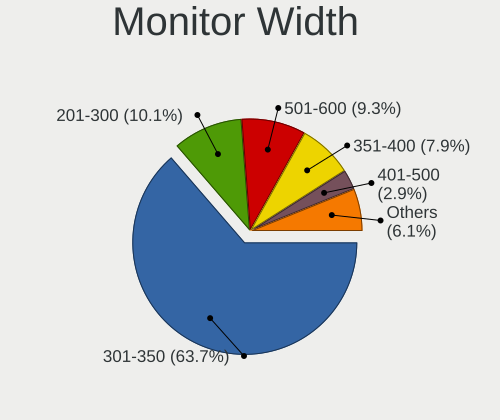

| Width in mm    | Notebooks | Percent |
|----------------|-----------|---------|
| 301-350        | 3836      | 63.66%  |
| 201-300        | 610       | 10.12%  |
| 501-600        | 560       | 9.29%   |
| 351-400        | 477       | 7.92%   |
| 401-500        | 174       | 2.89%   |
| 601-700        | 114       | 1.89%   |
| 701-800        | 80        | 1.33%   |
| 1001-1500      | 59        | 0.98%   |
| Unknown        | 45        | 0.75%   |
| 1501-2000      | 33        | 0.55%   |
| 801-900        | 21        | 0.35%   |
| More than 2000 | 12        | 0.2%    |
| 901-1000       | 4         | 0.07%   |
| 101-200        | 1         | 0.02%   |

Aspect Ratio
------------

Proportional relationship between the width and the height

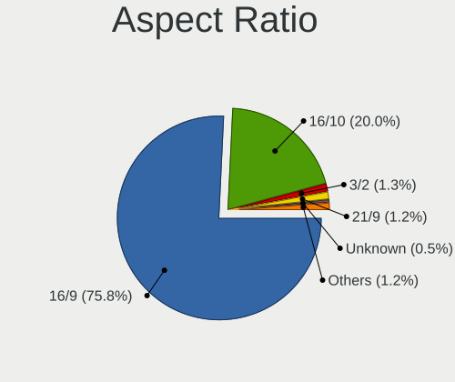

| Ratio   | Notebooks | Percent |
|---------|-----------|---------|
| 16/9    | 4090      | 75.75%  |
| 16/10   | 1082      | 20.04%  |
| 3/2     | 69        | 1.28%   |
| 21/9    | 66        | 1.22%   |
| Unknown | 28        | 0.52%   |
| 32/9    | 17        | 0.31%   |
| 5/4     | 16        | 0.3%    |
| 1.00    | 12        | 0.22%   |
| 4/3     | 6         | 0.11%   |
| 3.40    | 5         | 0.09%   |
| 0.56    | 3         | 0.06%   |
| 3.73    | 2         | 0.04%   |
| 6/5     | 1         | 0.02%   |
| 3.20    | 1         | 0.02%   |
| 0.62    | 1         | 0.02%   |

Monitor Area
------------

Area in inch²

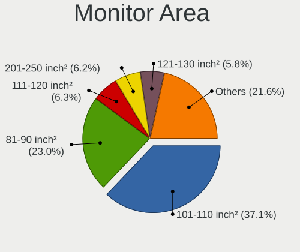

| Area in inch² | Notebooks | Percent |
|----------------|-----------|---------|
| 101-110        | 2250      | 37.1%   |
| 81-90          | 1397      | 23.04%  |
| 111-120        | 382       | 6.3%    |
| 201-250        | 378       | 6.23%   |
| 121-130        | 350       | 5.77%   |
| 71-80          | 260       | 4.29%   |
| 301-350        | 254       | 4.19%   |
| 351-500        | 170       | 2.8%    |
| 61-70          | 107       | 1.76%   |
| More than 1000 | 83        | 1.37%   |
| 51-60          | 77        | 1.27%   |
| 151-200        | 65        | 1.07%   |
| 251-300        | 62        | 1.02%   |
| 501-1000       | 49        | 0.81%   |
| Unknown        | 45        | 0.74%   |
| 91-100         | 44        | 0.73%   |
| 131-140        | 43        | 0.71%   |
| 141-150        | 41        | 0.68%   |
| 41-50          | 6         | 0.1%    |
| 1-40           | 1         | 0.02%   |

Pixel Density
-------------

Pixels per inch

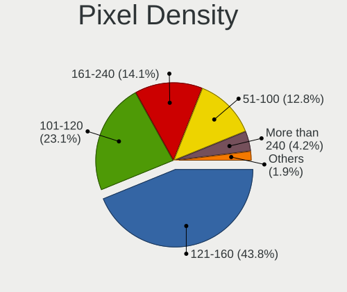

| Density       | Notebooks | Percent |
|---------------|-----------|---------|
| 121-160       | 2616      | 43.85%  |
| 101-120       | 1376      | 23.06%  |
| 161-240       | 842       | 14.11%  |
| 51-100        | 766       | 12.84%  |
| More than 240 | 250       | 4.19%   |
| 1-50          | 71        | 1.19%   |
| Unknown       | 45        | 0.75%   |

Multiple Monitors
-----------------

Total monitors connected

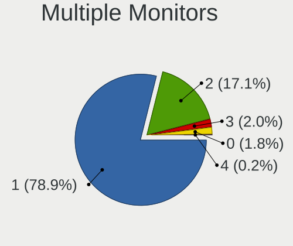

| Total | Notebooks | Percent |
|-------|-----------|---------|
| 1     | 4139      | 78.91%  |
| 2     | 896       | 17.08%  |
| 3     | 104       | 1.98%   |
| 0     | 93        | 1.77%   |
| 4     | 13        | 0.25%   |

Network
-------

Net Controller Vendor
---------------------

Controller vendors

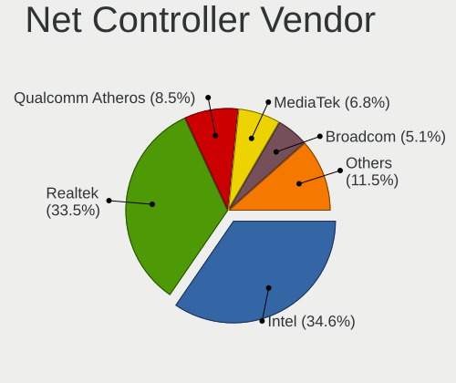

| Vendor                                 | Notebooks | Percent |
|----------------------------------------|-----------|---------|
| Intel                                  | 2768      | 34.57%  |
| Realtek Semiconductor                  | 2684      | 33.52%  |
| Qualcomm Atheros                       | 684       | 8.54%   |
| MediaTek                               | 541       | 6.76%   |
| Broadcom                               | 407       | 5.08%   |
| Broadcom Limited                       | 99        | 1.24%   |
| TP-Link                                | 72        | 0.9%    |
| ASIX Electronics                       | 64        | 0.8%    |
| Qualcomm                               | 60        | 0.75%   |
| Samsung Electronics                    | 55        | 0.69%   |
| Ralink                                 | 44        | 0.55%   |
| Sierra Wireless                        | 43        | 0.54%   |
| Lenovo                                 | 33        | 0.41%   |
| Dell                                   | 33        | 0.41%   |
| Xiaomi                                 | 32        | 0.4%    |
| Ralink Technology                      | 30        | 0.37%   |
| DisplayLink                            | 30        | 0.37%   |
| Marvell Technology Group               | 26        | 0.32%   |
| Shenzhen Goodix Technology             | 25        | 0.31%   |
| Hewlett-Packard                        | 21        | 0.26%   |
| Nvidia                                 | 19        | 0.24%   |
| Ericsson Business Mobile Networks      | 17        | 0.21%   |
| Suzhou Motorcomm Electronic Technology | 16        | 0.2%    |
| OPPO Electronics                       | 16        | 0.2%    |
| Fibocom                                | 13        | 0.16%   |
| QinHeng Electronics                    | 11        | 0.14%   |
| U-Blox                                 | 10        | 0.12%   |
| Motorola PCS                           | 10        | 0.12%   |
| Edimax Technology                      | 10        | 0.12%   |
| Huawei Technologies                    | 9         | 0.11%   |
| ASUSTek Computer                       | 9         | 0.11%   |
| JMicron Technology                     | 8         | 0.1%    |
| D-Link                                 | 8         | 0.1%    |
| Qualcomm Technologies                  | 7         | 0.09%   |
| Linksys                                | 7         | 0.09%   |
| Google                                 | 7         | 0.09%   |
| Apple                                  | 7         | 0.09%   |
| Realtek                                | 5         | 0.06%   |
| Qualcomm Atheros Communications        | 5         | 0.06%   |
| Motorcomm Microelectronics.            | 5         | 0.06%   |

Net Controller Model
--------------------

Controller models

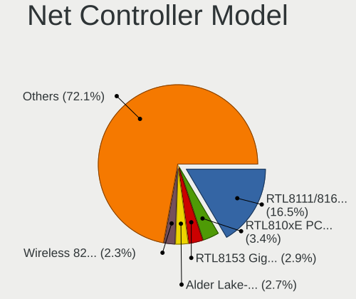

| Model                                                                  | Notebooks | Percent |
|------------------------------------------------------------------------|-----------|---------|
| Realtek RTL8111/8168/8211/8411 PCI Express Gigabit Ethernet Controller | 1573      | 16.5%   |
| Realtek RTL810xE PCI Express Fast Ethernet controller                  | 327       | 3.43%   |
| Realtek RTL8153 Gigabit Ethernet Adapter                               | 281       | 2.95%   |
| Intel Alder Lake-P PCH CNVi WiFi                                       | 255       | 2.67%   |
| Intel Wireless 8265 / 8275                                             | 221       | 2.32%   |
| Intel Wi-Fi 6 AX201                                                    | 217       | 2.28%   |
| Intel Raptor Lake PCH CNVi WiFi                                        | 182       | 1.91%   |
| MediaTek MT7921 802.11ax PCIe Wireless Network Adapter [Filogic 330]   | 177       | 1.86%   |
| Realtek RTL8821CE 802.11ac PCIe Wireless Network Adapter               | 170       | 1.78%   |
| Intel Wi-Fi 6 AX200                                                    | 169       | 1.77%   |
| MediaTek MT7902 802.11ax PCIe Wireless Network Adapter [Filogic 310]   | 158       | 1.66%   |
| MediaTek MT7922 802.11ax PCI Express Wireless Network Adapter          | 152       | 1.59%   |
| Realtek RTL8822CE 802.11ac PCIe Wireless Network Adapter               | 149       | 1.56%   |
| Intel Wireless 8260                                                    | 142       | 1.49%   |
| Qualcomm Atheros QCA9565 / AR9565 Wireless Network Adapter             | 128       | 1.34%   |
| Qualcomm Atheros QCA9377 802.11ac Wireless Network Adapter             | 128       | 1.34%   |
| Intel Wireless 7265                                                    | 124       | 1.3%    |
| Intel 82579LM Gigabit Network Connection (Lewisville)                  | 120       | 1.26%   |
| Realtek RTL8852BE PCIe 802.11ax Wireless Network Controller            | 119       | 1.25%   |
| Qualcomm Atheros AR9485 Wireless Network Adapter                       | 118       | 1.24%   |
| Intel Meteor Lake PCH CNVi WiFi                                        | 116       | 1.22%   |
| Intel Ethernet Connection (4) I219-LM                                  | 112       | 1.17%   |
| Intel Wireless 7260                                                    | 106       | 1.11%   |
| Intel Comet Lake PCH-LP CNVi WiFi                                      | 104       | 1.09%   |
| Qualcomm Atheros QCA6174 802.11ac Wireless Network Adapter             | 91        | 0.95%   |
| Intel Wi-Fi 6E(802.11ax) AX210/AX1675* 2x2 [Typhoon Peak]              | 82        | 0.86%   |
| Intel Centrino Advanced-N 6205 [Taylor Peak]                           | 81        | 0.85%   |
| Broadcom BCM43142 802.11b/g/n                                          | 74        | 0.78%   |
| Intel Cannon Point-LP CNVi [Wireless-AC]                               | 73        | 0.77%   |
| Intel Ethernet Connection I219-LM                                      | 72        | 0.76%   |
| Intel Comet Lake PCH CNVi WiFi                                         | 71        | 0.74%   |
| Intel Tiger Lake PCH CNVi WiFi                                         | 70        | 0.73%   |
| Realtek RTL8723BE PCIe Wireless Network Adapter                        | 69        | 0.72%   |
| Qualcomm Atheros AR9285 Wireless Network Adapter (PCI-Express)         | 69        | 0.72%   |
| Intel Wireless 3165                                                    | 67        | 0.7%    |
| Intel 700 Series Chipset CNVi WiFi                                     | 59        | 0.62%   |
| Intel Cannon Lake PCH CNVi WiFi                                        | 58        | 0.61%   |
| ASIX AX88179 Gigabit Ethernet                                          | 54        | 0.57%   |
| Intel Ethernet Connection (4) I219-V                                   | 52        | 0.55%   |
| Realtek RTL8125 2.5GbE Controller                                      | 51        | 0.53%   |

Wireless Vendor
---------------

Wireless vendors

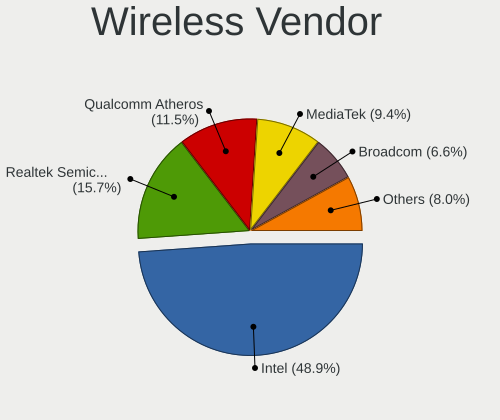

| Vendor                          | Notebooks | Percent |
|---------------------------------|-----------|---------|
| Intel                           | 2535      | 48.87%  |
| Realtek Semiconductor           | 815       | 15.71%  |
| Qualcomm Atheros                | 594       | 11.45%  |
| MediaTek                        | 487       | 9.39%   |
| Broadcom                        | 342       | 6.59%   |
| Broadcom Limited                | 79        | 1.52%   |
| TP-Link                         | 55        | 1.06%   |
| Qualcomm                        | 53        | 1.02%   |
| Ralink                          | 44        | 0.85%   |
| Sierra Wireless                 | 43        | 0.83%   |
| Ralink Technology               | 30        | 0.58%   |
| Dell                            | 26        | 0.5%    |
| Fibocom                         | 13        | 0.25%   |
| Edimax Technology               | 10        | 0.19%   |
| D-Link                          | 8         | 0.15%   |
| Hewlett-Packard                 | 7         | 0.13%   |
| ASUSTek Computer                | 7         | 0.13%   |
| Realtek                         | 5         | 0.1%    |
| Qualcomm Technologies           | 5         | 0.1%    |
| Qualcomm Atheros Communications | 5         | 0.1%    |
| Microsoft                       | 3         | 0.06%   |
| Mercucys                        | 3         | 0.06%   |
| Quectel Wireless Solutions      | 2         | 0.04%   |
| NetGear                         | 2         | 0.04%   |
| Linksys                         | 2         | 0.04%   |
| Belkin Components               | 2         | 0.04%   |
| Unknown                         | 2         | 0.04%   |
| ZyDAS                           | 1         | 0.02%   |
| ZTopInc                         | 1         | 0.02%   |
| Wacom                           | 1         | 0.02%   |
| Sitecom Europe                  | 1         | 0.02%   |
| PLANEX                          | 1         | 0.02%   |
| Cypress Semiconductor           | 1         | 0.02%   |
| AVM                             | 1         | 0.02%   |
| Arduino SA                      | 1         | 0.02%   |

Wireless Model
--------------

Wireless models

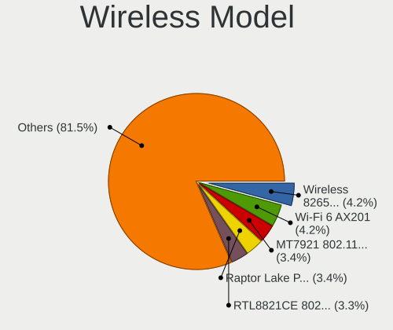

| Model                                                                | Notebooks | Percent |
|----------------------------------------------------------------------|-----------|---------|
| Intel Wireless 8265 / 8275                                           | 221       | 4.24%   |
| Intel Wi-Fi 6 AX201                                                  | 217       | 4.17%   |
| MediaTek MT7921 802.11ax PCIe Wireless Network Adapter [Filogic 330] | 177       | 3.4%    |
| Intel Raptor Lake PCH CNVi WiFi                                      | 177       | 3.4%    |
| Realtek RTL8821CE 802.11ac PCIe Wireless Network Adapter             | 170       | 3.26%   |
| Intel Wi-Fi 6 AX200                                                  | 169       | 3.24%   |
| MediaTek MT7902 802.11ax PCIe Wireless Network Adapter [Filogic 310] | 158       | 3.03%   |
| Intel Alder Lake-P PCH CNVi WiFi                                     | 151       | 2.9%    |
| Realtek RTL8822CE 802.11ac PCIe Wireless Network Adapter             | 149       | 2.86%   |
| Intel Wireless 8260                                                  | 142       | 2.73%   |
| Qualcomm Atheros QCA9565 / AR9565 Wireless Network Adapter           | 128       | 2.46%   |
| Qualcomm Atheros QCA9377 802.11ac Wireless Network Adapter           | 128       | 2.46%   |
| Intel Wireless 7265                                                  | 124       | 2.38%   |
| Qualcomm Atheros AR9485 Wireless Network Adapter                     | 118       | 2.26%   |
| Intel Meteor Lake PCH CNVi WiFi                                      | 116       | 2.23%   |
| MediaTek MT7922 802.11ax PCI Express Wireless Network Adapter        | 115       | 2.21%   |
| Realtek RTL8852BE PCIe 802.11ax Wireless Network Controller          | 108       | 2.07%   |
| Intel Wireless 7260                                                  | 106       | 2.03%   |
| Intel Comet Lake PCH-LP CNVi WiFi                                    | 104       | 2%      |
| Qualcomm Atheros QCA6174 802.11ac Wireless Network Adapter           | 91        | 1.75%   |
| Intel Wi-Fi 6E(802.11ax) AX210/AX1675* 2x2 [Typhoon Peak]            | 82        | 1.57%   |
| Intel Centrino Advanced-N 6205 [Taylor Peak]                         | 81        | 1.55%   |
| Broadcom BCM43142 802.11b/g/n                                        | 74        | 1.42%   |
| Intel Cannon Point-LP CNVi [Wireless-AC]                             | 73        | 1.4%    |
| Intel Comet Lake PCH CNVi WiFi                                       | 71        | 1.36%   |
| Intel Tiger Lake PCH CNVi WiFi                                       | 70        | 1.34%   |
| Realtek RTL8723BE PCIe Wireless Network Adapter                      | 69        | 1.32%   |
| Qualcomm Atheros AR9285 Wireless Network Adapter (PCI-Express)       | 69        | 1.32%   |
| Intel Wireless 3165                                                  | 67        | 1.29%   |
| Intel 700 Series Chipset CNVi WiFi                                   | 59        | 1.13%   |
| Intel Cannon Lake PCH CNVi WiFi                                      | 58        | 1.11%   |
| Qualcomm QCNFA765 Wireless Network Adapter                           | 48        | 0.92%   |
| Intel Wireless 3160                                                  | 48        | 0.92%   |
| Broadcom BCM4313 802.11bgn Wireless Network Adapter                  | 43        | 0.83%   |
| Intel Wi-Fi 7(802.11be) AX1775*/AX1790*/BE20*/BE401/BE1750* 2x2      | 38        | 0.73%   |
| Intel Ice Lake-LP PCH CNVi WiFi                                      | 38        | 0.73%   |
| Broadcom BCM4331 802.11a/b/g/n                                       | 38        | 0.73%   |
| Broadcom BCM43602 802.11ac Wireless LAN SoC                          | 34        | 0.65%   |
| Realtek RTL8188CE 802.11b/g/n WiFi Adapter                           | 32        | 0.61%   |
| Broadcom Limited BCM4360 802.11ac Dual Band Wireless Network Adapter | 32        | 0.61%   |

Ethernet Vendor
---------------

Ethernet vendors

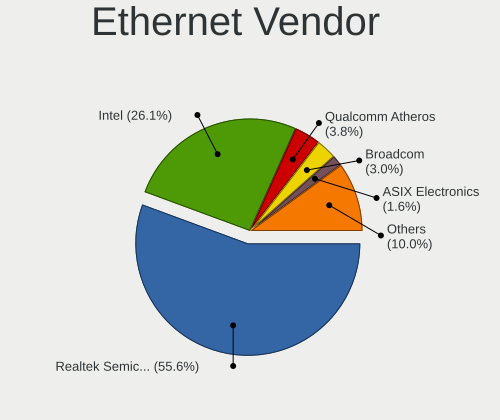

| Vendor                                 | Notebooks | Percent |
|----------------------------------------|-----------|---------|
| Realtek Semiconductor                  | 2290      | 55.62%  |
| Intel                                  | 1073      | 26.06%  |
| Qualcomm Atheros                       | 156       | 3.79%   |
| Broadcom                               | 122       | 2.96%   |
| ASIX Electronics                       | 64        | 1.55%   |
| Samsung Electronics                    | 55        | 1.34%   |
| MediaTek                               | 55        | 1.34%   |
| Lenovo                                 | 33        | 0.8%    |
| Xiaomi                                 | 32        | 0.78%   |
| DisplayLink                            | 30        | 0.73%   |
| Marvell Technology Group               | 26        | 0.63%   |
| Broadcom Limited                       | 22        | 0.53%   |
| Nvidia                                 | 19        | 0.46%   |
| TP-Link                                | 17        | 0.41%   |
| Suzhou Motorcomm Electronic Technology | 16        | 0.39%   |
| OPPO Electronics                       | 16        | 0.39%   |
| Motorola PCS                           | 10        | 0.24%   |
| JMicron Technology                     | 8         | 0.19%   |
| Huawei Technologies                    | 7         | 0.17%   |
| Google                                 | 7         | 0.17%   |
| Apple                                  | 7         | 0.17%   |
| Qualcomm                               | 6         | 0.15%   |
| QinHeng Electronics                    | 6         | 0.15%   |
| Hewlett-Packard                        | 6         | 0.15%   |
| Motorcomm Microelectronics.            | 5         | 0.12%   |
| Linksys                                | 5         | 0.12%   |
| Silicon Integrated Systems [SiS]       | 4         | 0.1%    |
| ZTE WCDMA Technologies MSM             | 2         | 0.05%   |
| Qualcomm Technologies                  | 2         | 0.05%   |
| ICS Advent                             | 2         | 0.05%   |
| ASUSTek Computer                       | 2         | 0.05%   |
| vivo                                   | 1         | 0.02%   |
| Spreadtrum Communications              | 1         | 0.02%   |
| skyGate Technology.                    | 1         | 0.02%   |
| Rivet                                  | 1         | 0.02%   |
| Naxiang                                | 1         | 0.02%   |
| MosChip Semiconductor                  | 1         | 0.02%   |
| Microchip Technology                   | 1         | 0.02%   |
| Marvell Semiconductor                  | 1         | 0.02%   |
| HMD Global                             | 1         | 0.02%   |

Ethernet Model
--------------

Ethernet models

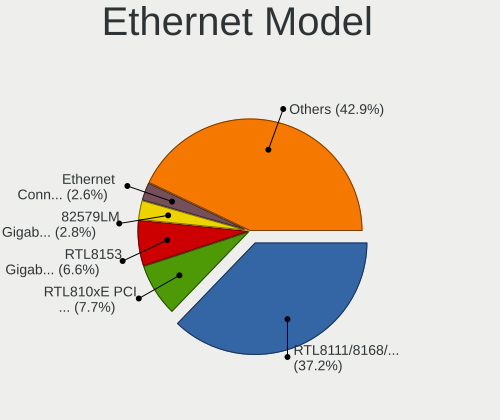

| Model                                                                  | Notebooks | Percent |
|------------------------------------------------------------------------|-----------|---------|
| Realtek RTL8111/8168/8211/8411 PCI Express Gigabit Ethernet Controller | 1573      | 37.2%   |
| Realtek RTL810xE PCI Express Fast Ethernet controller                  | 327       | 7.73%   |
| Realtek RTL8153 Gigabit Ethernet Adapter                               | 281       | 6.65%   |
| Intel 82579LM Gigabit Network Connection (Lewisville)                  | 120       | 2.84%   |
| Intel Ethernet Connection (4) I219-LM                                  | 112       | 2.65%   |
| Intel Alder Lake-P PCH CNVi WiFi                                       | 104       | 2.46%   |
| Intel Ethernet Connection I219-LM                                      | 72        | 1.7%    |
| ASIX AX88179 Gigabit Ethernet                                          | 54        | 1.28%   |
| Intel Ethernet Connection (4) I219-V                                   | 52        | 1.23%   |
| Realtek RTL8125 2.5GbE Controller                                      | 51        | 1.21%   |
| Realtek Killer E2600 GbE Controller                                    | 43        | 1.02%   |
| Intel Ethernet Connection (18) I219-LM                                 | 40        | 0.95%   |
| Samsung Galaxy series, misc. (tethering mode)                          | 39        | 0.92%   |
| Intel Ethernet Connection I218-LM                                      | 39        | 0.92%   |
| Broadcom NetXtreme BCM57765 Gigabit Ethernet PCIe                      | 38        | 0.9%    |
| MediaTek MT7922 802.11ax PCI Express Wireless Network Adapter          | 37        | 0.88%   |
| Intel Ethernet Connection I217-LM                                      | 36        | 0.85%   |
| Intel Ethernet Connection (6) I219-LM                                  | 36        | 0.85%   |
| Qualcomm Atheros AR8151 v2.0 Gigabit Ethernet                          | 34        | 0.8%    |
| Realtek RTL8152 Fast Ethernet Adapter                                  | 32        | 0.76%   |
| Intel Ethernet Connection I219-V                                       | 32        | 0.76%   |
| Intel Ethernet Connection (3) I218-LM                                  | 32        | 0.76%   |
| Intel Ethernet Connection (6) I219-V                                   | 29        | 0.69%   |
| Xiaomi Mi/Redmi series (RNDIS)                                         | 26        | 0.61%   |
| Intel Ethernet Connection (7) I219-LM                                  | 23        | 0.54%   |
| Intel Ethernet Connection (23) I219-V                                  | 23        | 0.54%   |
| Intel Ethernet Connection (14) I219-LM                                 | 23        | 0.54%   |
| Broadcom NetLink BCM57785 Gigabit Ethernet PCIe                        | 23        | 0.54%   |
| Qualcomm Atheros AR8162 Fast Ethernet                                  | 20        | 0.47%   |
| Intel Ethernet Connection (16) I219-V                                  | 20        | 0.47%   |
| Intel Ethernet Connection (16) I219-LM                                 | 20        | 0.47%   |
| Intel Ethernet Connection (13) I219-V                                  | 20        | 0.47%   |
| Qualcomm Atheros AR8161 Gigabit Ethernet                               | 19        | 0.45%   |
| Intel Ethernet Connection (2) I219-LM                                  | 19        | 0.45%   |
| Intel Ethernet Connection (10) I219-LM                                 | 19        | 0.45%   |
| Intel 82577LM Gigabit Network Connection                               | 19        | 0.45%   |
| Nvidia MCP79 Ethernet                                                  | 17        | 0.4%    |
| Intel Ethernet Connection (13) I219-LM                                 | 17        | 0.4%    |
| Suzhou Motorcomm Electronic YT6801 Gigabit Ethernet Controller         | 16        | 0.38%   |
| Samsung GT-I9070 (network tethering, USB debugging enabled)            | 16        | 0.38%   |

Net Controller Kind
-------------------

Ethernet, WiFi or modem

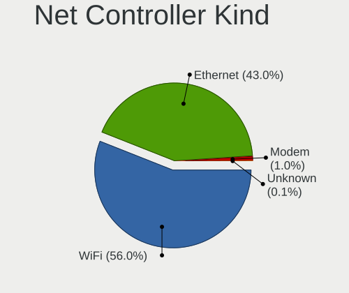

| Kind     | Notebooks | Percent |
|----------|-----------|---------|
| WiFi     | 4903      | 56%     |
| Ethernet | 3762      | 42.96%  |
| Modem    | 86        | 0.98%   |
| Unknown  | 5         | 0.06%   |

Used Controller
---------------

Currently used network controller

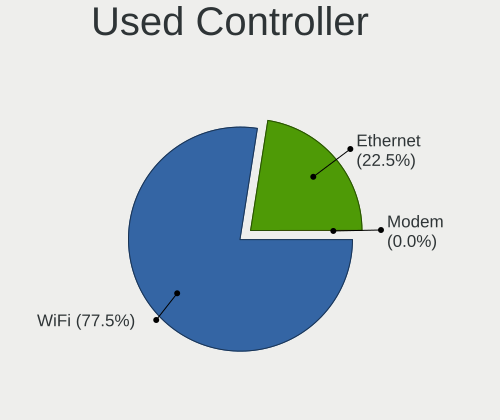

| Kind     | Notebooks | Percent |
|----------|-----------|---------|
| WiFi     | 4162      | 77.48%  |
| Ethernet | 1209      | 22.51%  |
| Modem    | 1         | 0.02%   |

NICs
----

Total network controllers on board

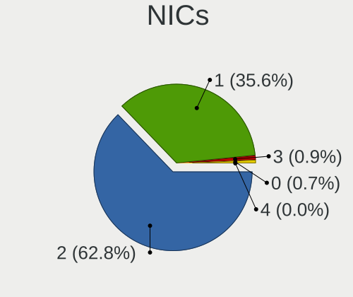

| Total | Notebooks | Percent |
|-------|-----------|---------|
| 2     | 3243      | 62.8%   |
| 1     | 1839      | 35.61%  |
| 3     | 45        | 0.87%   |
| 0     | 36        | 0.7%    |
| 4     | 1         | 0.02%   |

IPv6
----

IPv6 vs IPv4

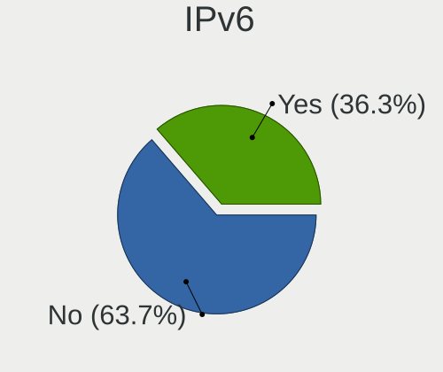

| Used | Notebooks | Percent |
|------|-----------|---------|
| No   | 3327      | 63.69%  |
| Yes  | 1897      | 36.31%  |

Bluetooth
---------

Bluetooth Vendor
----------------

Controller vendors

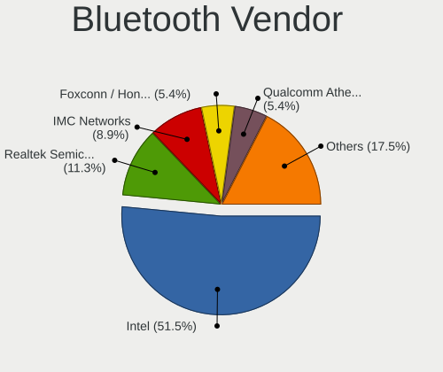

| Vendor                          | Notebooks | Percent |
|---------------------------------|-----------|---------|
| Intel                           | 2370      | 51.51%  |
| Realtek Semiconductor           | 521       | 11.32%  |
| IMC Networks                    | 408       | 8.87%   |
| Foxconn / Hon Hai               | 250       | 5.43%   |
| Qualcomm Atheros Communications | 248       | 5.39%   |
| Lite-On Technology              | 166       | 3.61%   |
| Apple                           | 155       | 3.37%   |
| Broadcom                        | 116       | 2.52%   |
| MediaTek                        | 65        | 1.41%   |
| Dell                            | 55        | 1.2%    |
| Cambridge Silicon Radio         | 41        | 0.89%   |
| Realtek                         | 34        | 0.74%   |
| USI                             | 32        | 0.7%    |
| Ralink                          | 30        | 0.65%   |
| Hewlett-Packard                 | 25        | 0.54%   |
| Toshiba                         | 19        | 0.41%   |
| ASUSTek Computer                | 15        | 0.33%   |
| Foxconn International           | 13        | 0.28%   |
| TP-Link                         | 8         | 0.17%   |
| Opticis                         | 6         | 0.13%   |
| Ralink Technology               | 4         | 0.09%   |
| Alps Electric                   | 4         | 0.09%   |
| Dynex                           | 3         | 0.07%   |
| Chicony Electronics             | 3         | 0.07%   |
| Unknown                         | 3         | 0.07%   |
| Taiyo Yuden                     | 1         | 0.02%   |
| SINO WEALTH                     | 1         | 0.02%   |
| Quectel Wireless Solutions      | 1         | 0.02%   |
| Mercucys                        | 1         | 0.02%   |
| Integrated System Solution      | 1         | 0.02%   |
| Fujitsu                         | 1         | 0.02%   |
| Edimax Technology               | 1         | 0.02%   |

Bluetooth Model
---------------

Controller models

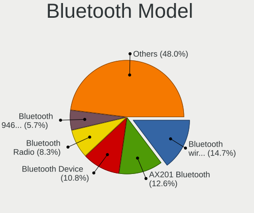

| Model                                               | Notebooks | Percent |
|-----------------------------------------------------|-----------|---------|
| Intel Bluetooth wireless interface                  | 678       | 14.73%  |
| Intel AX201 Bluetooth                               | 578       | 12.55%  |
| Intel Bluetooth Device                              | 495       | 10.75%  |
| Realtek Bluetooth Radio                             | 381       | 8.28%   |
| Intel Bluetooth 9460/9560 Jefferson Peak (JfP)      | 262       | 5.69%   |
| IMC Networks Wireless_Device                        | 258       | 5.6%    |
| Intel AX200 Bluetooth                               | 162       | 3.52%   |
| Qualcomm Atheros  Bluetooth Device                  | 118       | 2.56%   |
| Foxconn / Hon Hai Wireless_Device                   | 100       | 2.17%   |
| Apple Bluetooth Host Controller                     | 92        | 2%      |
| Realtek  Bluetooth 4.2 Adapter                      | 91        | 1.98%   |
| Intel AX210 Bluetooth                               | 73        | 1.59%   |
| IMC Networks Bluetooth Radio                        | 68        | 1.48%   |
| MediaTek Wireless_Device                            | 64        | 1.39%   |
| Foxconn / Hon Hai MediaTek Bluetooth Adapter        | 53        | 1.15%   |
| Intel Centrino Bluetooth Wireless Transceiver       | 51        | 1.11%   |
| Apple Bluetooth USB Host Controller                 | 49        | 1.06%   |
| Lite-On Wireless_Device                             | 45        | 0.98%   |
| Qualcomm Atheros AR3012 Bluetooth 4.0               | 43        | 0.93%   |
| Cambridge Silicon Radio Bluetooth Dongle (HCI mode) | 41        | 0.89%   |
| Foxconn / Hon Hai Bluetooth Device                  | 39        | 0.85%   |
| Lite-On Qualcomm Atheros QCA9377 Bluetooth          | 38        | 0.83%   |
| Realtek Bluetooth Radio                             | 34        | 0.74%   |
| Lite-On Bluetooth Device                            | 34        | 0.74%   |
| IMC Networks Bluetooth Device                       | 34        | 0.74%   |
| USI Bluetooth Device                                | 32        | 0.7%    |
| Qualcomm Atheros QCA61x4 Bluetooth 4.0              | 31        | 0.67%   |
| Ralink RT3290 Bluetooth                             | 30        | 0.65%   |
| Intel Wireless-AC 3168 Bluetooth                    | 29        | 0.63%   |
| Qualcomm Atheros AR3011 Bluetooth                   | 26        | 0.56%   |
| Lite-On Atheros AR3012 Bluetooth                    | 23        | 0.5%    |
| Dell BCM20702A0 Bluetooth Module                    | 23        | 0.5%    |
| Realtek RTL8723B Bluetooth                          | 22        | 0.48%   |
| Intel Wireless-AC 9260 Bluetooth Adapter            | 20        | 0.43%   |
| IMC Networks Atheros AR3012 Bluetooth 4.0 Adapter   | 19        | 0.41%   |
| HP Broadcom 2070 Bluetooth Combo                    | 19        | 0.41%   |
| Broadcom BCM2045B (BDC-2.1)                         | 18        | 0.39%   |
| Qualcomm Atheros AR9462 Bluetooth                   | 17        | 0.37%   |
| Intel Bluetooth                                     | 17        | 0.37%   |
| Broadcom BCM20702 Bluetooth 4.0 [ThinkPad]          | 17        | 0.37%   |

Sound
-----

Sound Vendor
------------

Sound card vendors

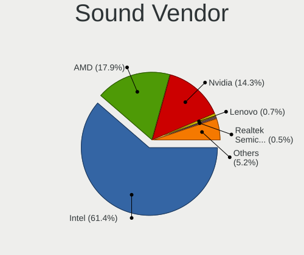

| Vendor                                       | Notebooks | Percent |
|----------------------------------------------|-----------|---------|
| Intel                                        | 3997      | 61.36%  |
| AMD                                          | 1168      | 17.93%  |
| Nvidia                                       | 930       | 14.28%  |
| Lenovo                                       | 46        | 0.71%   |
| Realtek Semiconductor                        | 34        | 0.52%   |
| GN Netcom                                    | 33        | 0.51%   |
| Hewlett-Packard                              | 30        | 0.46%   |
| C-Media Electronics                          | 30        | 0.46%   |
| Logitech                                     | 19        | 0.29%   |
| Texas Instruments                            | 18        | 0.28%   |
| Plantronics                                  | 15        | 0.23%   |
| JMTek                                        | 14        | 0.21%   |
| Apple                                        | 14        | 0.21%   |
| Kingston Technology                          | 9         | 0.14%   |
| Generalplus Technology                       | 9         | 0.14%   |
| Razer USA                                    | 7         | 0.11%   |
| Focusrite-Novation                           | 7         | 0.11%   |
| Creative Technology                          | 7         | 0.11%   |
| ASUSTek Computer                             | 7         | 0.11%   |
| SteelSeries ApS                              | 6         | 0.09%   |
| Sony                                         | 6         | 0.09%   |
| DSEA A/S                                     | 6         | 0.09%   |
| Zhaoxin                                      | 5         | 0.08%   |
| Jieli Technology                             | 5         | 0.08%   |
| Silicon Integrated Systems [SiS]             | 4         | 0.06%   |
| PreSonus Audio Electronics                   | 4         | 0.06%   |
| Corsair                                      | 4         | 0.06%   |
| Unknown                                      | 4         | 0.06%   |
| Trust                                        | 3         | 0.05%   |
| Silicon Motion                               | 3         | 0.05%   |
| Samsung Electronics                          | 3         | 0.05%   |
| Zoran Co. Personal Media Division (Nogatech) | 2         | 0.03%   |
| ZOOM                                         | 2         | 0.03%   |
| Yealink Network Technology                   | 2         | 0.03%   |
| Yamaha                                       | 2         | 0.03%   |
| Nordic Semiconductor ASA                     | 2         | 0.03%   |
| Microsoft                                    | 2         | 0.03%   |
| KTMicro                                      | 2         | 0.03%   |
| JBL                                          | 2         | 0.03%   |
| Dell                                         | 2         | 0.03%   |

Sound Model
-----------

Sound card models

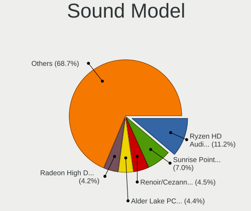

| Model                                                                      | Notebooks | Percent |
|----------------------------------------------------------------------------|-----------|---------|
| AMD Ryzen HD Audio Controller                                              | 895       | 11.19%  |
| Intel Sunrise Point-LP HD Audio                                            | 563       | 7.04%   |
| AMD Renoir/Cezanne HDMI/DP Audio Controller                                | 359       | 4.49%   |
| Intel Alder Lake PCH-P High Definition Audio Controller                    | 351       | 4.39%   |
| AMD Radeon High Definition Audio Controller                                | 338       | 4.23%   |
| Intel 7 Series/C216 Chipset Family High Definition Audio Controller        | 327       | 4.09%   |
| Intel Tiger Lake-LP Smart Sound Technology Audio Controller                | 298       | 3.73%   |
| Intel Raptor Lake-P/U/H cAVS                                               | 268       | 3.35%   |
| Intel 6 Series/C200 Series Chipset Family High Definition Audio Controller | 208       | 2.6%    |
| Intel 8 Series HD Audio Controller                                         | 177       | 2.21%   |
| Intel Haswell-ULT HD Audio Controller                                      | 176       | 2.2%    |
| Intel Broadwell-U Audio Controller                                         | 176       | 2.2%    |
| Intel Wildcat Point-LP High Definition Audio Controller                    | 172       | 2.15%   |
| Intel Meteor Lake-P HD Audio Controller                                    | 143       | 1.79%   |
| Intel 8 Series/C220 Series Chipset High Definition Audio Controller        | 142       | 1.78%   |
| AMD Raven/Raven2/Fenghuang HDMI/DP Audio Controller                        | 131       | 1.64%   |
| Intel Cannon Point-LP High Definition Audio Controller                     | 129       | 1.61%   |
| Intel Cannon Lake PCH cAVS                                                 | 124       | 1.55%   |
| Intel Comet Lake PCH-LP cAVS                                               | 123       | 1.54%   |
| Nvidia AD107 High Definition Audio Controller                              | 120       | 1.5%    |
| Nvidia GA107 High Definition Audio Controller                              | 118       | 1.48%   |
| Intel Xeon E3-1200 v3/4th Gen Core Processor HD Audio Controller           | 109       | 1.36%   |
| AMD FCH Azalia Controller                                                  | 99        | 1.24%   |
| Intel 5 Series/3400 Series Chipset High Definition Audio                   | 97        | 1.21%   |
| Intel Tiger Lake-H HD Audio Controller                                     | 95        | 1.19%   |
| Nvidia TU107 GeForce GTX 1650 High Definition Audio Controller             | 91        | 1.14%   |
| Intel Comet Lake PCH cAVS                                                  | 86        | 1.08%   |
| Intel Celeron/Pentium Silver Processor High Definition Audio               | 81        | 1.01%   |
| Intel Raptor Lake High Definition Audio Controller                         | 80        | 1%      |
| AMD Kabini HDMI/DP Audio                                                   | 73        | 0.91%   |
| Intel CM238 HD Audio Controller                                            | 72        | 0.9%    |
| Intel Ice Lake-LP Smart Sound Technology Audio Controller                  | 63        | 0.79%   |
| Nvidia GA106 High Definition Audio Controller                              | 57        | 0.71%   |
| Nvidia GA104 High Definition Audio Controller                              | 57        | 0.71%   |
| Intel Atom Processor Z36xxx/Z37xxx Series High Definition Audio Controller | 56        | 0.7%    |
| Intel 82801I (ICH9 Family) HD Audio Controller                             | 56        | 0.7%    |
| AMD Family 15h (Models 60h-6fh) Audio Controller                           | 53        | 0.66%   |
| Intel 100 Series/C230 Series Chipset Family HD Audio Controller            | 49        | 0.61%   |
| Nvidia GP107GL High Definition Audio Controller                            | 47        | 0.59%   |
| Nvidia GF108 High Definition Audio Controller                              | 47        | 0.59%   |

Memory
------

Memory Vendor
-------------

Memory module vendors

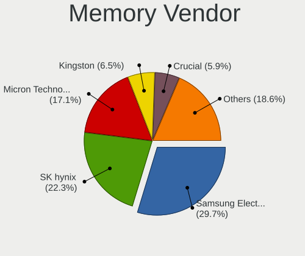

| Vendor                                  | Notebooks | Percent |
|-----------------------------------------|-----------|---------|
| Samsung Electronics                     | 983       | 29.7%   |
| SK hynix                                | 738       | 22.3%   |
| Micron Technology                       | 566       | 17.1%   |
| Kingston                                | 214       | 6.47%   |
| Crucial                                 | 194       | 5.86%   |
| Unknown                                 | 119       | 3.6%    |
| A-DATA Technology                       | 77        | 2.33%   |
| Unknown                                 | 74        | 2.24%   |
| Ramaxel Technology                      | 53        | 1.6%    |
| Elpida                                  | 32        | 0.97%   |
| Unknown (ABCD)                          | 29        | 0.88%   |
| Nanya Technology                        | 27        | 0.82%   |
| G.Skill                                 | 22        | 0.66%   |
| Corsair                                 | 19        | 0.57%   |
| Smart                                   | 14        | 0.42%   |
| Team                                    | 13        | 0.39%   |
| Transcend                               | 12        | 0.36%   |
| Smart Brazil                            | 7         | 0.21%   |
| Lexar                                   | 7         | 0.21%   |
| Timetec                                 | 5         | 0.15%   |
| Patriot                                 | 5         | 0.15%   |
| GOODRAM                                 | 5         | 0.15%   |
| Avant                                   | 5         | 0.15%   |
| Apacer                                  | 5         | 0.15%   |
| Silicon Power                           | 4         | 0.12%   |
| Silicon Power Computer & Communications | 3         | 0.09%   |
| PNY                                     | 3         | 0.09%   |
| Lexar Co Limited                        | 3         | 0.09%   |
| ChangXin Memory                         | 3         | 0.09%   |
| 8CFD000080AD                            | 3         | 0.09%   |
| 4ea5                                    | 3         | 0.09%   |
| Wilk                                    | 2         | 0.06%   |
| V-GeN                                   | 2         | 0.06%   |
| Unknown (0x0E9D)                        | 2         | 0.06%   |
| Unknown (0x0B5E)                        | 2         | 0.06%   |
| Unknown (0x0080)                        | 2         | 0.06%   |
| Teikon                                  | 2         | 0.06%   |
| Patriot Memory (PDP Systems)            | 2         | 0.06%   |
| Neo Forza                               | 2         | 0.06%   |
| Lenovo                                  | 2         | 0.06%   |

Memory Model
------------

Memory module models

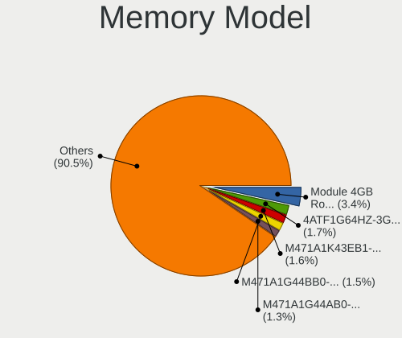

| Model                                                            | Notebooks | Percent |
|------------------------------------------------------------------|-----------|---------|
| Unknown                                                          | 119       | 3.45%   |
| Micron RAM 4ATF1G64HZ-3G2F1 8GB SODIMM DDR4 3200MT/s             | 60        | 1.74%   |
| Samsung RAM M471A1K43EB1-CWE 8GB SODIMM DDR4 3200MT/s            | 54        | 1.56%   |
| Samsung RAM M471A1G44BB0-CWE 8GB SODIMM DDR4 3200MT/s            | 51        | 1.48%   |
| Samsung RAM M471A1G44AB0-CWE 8GiB SODIMM DDR4 3200MT/s           | 44        | 1.27%   |
| SK hynix RAM HMAA1GS6CJR6N-XN 8GB SODIMM DDR4 3200MT/s           | 34        | 0.98%   |
| Micron RAM 8ATF1G64HZ-3G2R1 8GB SODIMM DDR4 3200MT/s             | 33        | 0.96%   |
| SK hynix RAM HMAG68EXNSA051N 8GB SODIMM DDR4 3200MT/s            | 30        | 0.87%   |
| Samsung RAM M471A5244CB0-CTD 4GB SODIMM DDR4 3266MT/s            | 30        | 0.87%   |
| Samsung RAM M425R1GB4BB0-CQKOL 8GB SODIMM DDR5 4800MT/s          | 29        | 0.84%   |
| SK hynix RAM HMA81GS6AFR8N-UH 8GB SODIMM DDR4 2667MT/s           | 27        | 0.78%   |
| Samsung RAM M471A5244CB0-CWE 4GB SODIMM DDR4 3200MT/s            | 26        | 0.75%   |
| Unknown (ABCD) RAM 123456789012345678 2GB SODIMM LPDDR4 2400MT/s | 25        | 0.72%   |
| SK hynix RAM HMCG78AGBSA095N 16GB SODIMM DDR5 5600MT/s           | 22        | 0.64%   |
| SK hynix RAM HMA81GS6DJR8N-XN 8GB SODIMM DDR4 3200MT/s           | 22        | 0.64%   |
| Samsung RAM M471A5244CB0-CRC 4GB SODIMM DDR4 2667MT/s            | 21        | 0.61%   |
| Samsung RAM M471A1K43DB1-CWE 8GB SODIMM DDR4 3200MT/s            | 21        | 0.61%   |
| Samsung RAM M471A1K43CB1-CRC 8GB SODIMM DDR4 8400MT/s            | 19        | 0.55%   |
| Micron RAM MTC4C10163S1SC48BA1 8GB SODIMM DDR5 4800MT/s          | 19        | 0.55%   |
| SK hynix RAM HMA81GS6JJR8N-VK 8GB SODIMM DDR4 2667MT/s           | 18        | 0.52%   |
| Samsung RAM M471B1G73QH0-YK0 8GB SODIMM DDR3 1600MT/s            | 18        | 0.52%   |
| Samsung RAM M471B5173QH0-YK0 4GB SODIMM DDR3 1600MT/s            | 17        | 0.49%   |
| Samsung RAM M471B5173DB0-YK0 4GB SODIMM DDR3 1600MT/s            | 17        | 0.49%   |
| Samsung RAM M471A1K43CB1-CTD 8GB SODIMM DDR4 3200MT/s            | 17        | 0.49%   |
| Micron RAM 4ATF1G64HZ-3G2E1 8GB SODIMM DDR4 3200MT/s             | 17        | 0.49%   |
| SK hynix RAM HMCG78AGBSA092N 16GB SODIMM DDR5 5600MT/s           | 16        | 0.46%   |
| SK hynix RAM HMA82GS6AFR8N-UH 16GB SODIMM DDR4 2667MT/s          | 16        | 0.46%   |
| Micron RAM MT62F2G32D4DS-026 WT 8GiB SODIMM LPDDR5 7500MT/s      | 16        | 0.46%   |
| SK hynix RAM HMAA2GS6CJR8N-XN 16GB SODIMM DDR4 3200MT/s          | 15        | 0.43%   |
| Samsung RAM M471A1G44AB0-CWE 8GB Row Of Chips DDR4 3200MT/s      | 15        | 0.43%   |
| Samsung RAM M425R2GA3BB0-CQKOL 16GB SODIMM DDR5 4800MT/s         | 15        | 0.43%   |
| Micron RAM 4ATF51264HZ-3G2J1 4GB SODIMM DDR4 3200MT/s            | 15        | 0.43%   |
| SK hynix RAM HMT451S6BFR8A-PB 4GB SODIMM DDR3 1600MT/s           | 14        | 0.41%   |
| SK hynix RAM HMT451S6AFR8A-PB 4GB SODIMM DDR3 1600MT/s           | 14        | 0.41%   |
| SK hynix RAM HMT351S6CFR8C-PB 4GB SODIMM DDR3 1600MT/s           | 14        | 0.41%   |
| Samsung RAM Module 8GB SODIMM DDR4 2133MT/s                      | 14        | 0.41%   |
| Samsung RAM M471B1G73EB0-YK0 8192MB SODIMM DDR3 1600MT/s         | 14        | 0.41%   |
| Samsung RAM M471B1G73DB0-YK0 8GB SODIMM DDR3 1600MT/s            | 14        | 0.41%   |
| Samsung RAM M471A2K43EB1-CWE 16GB SODIMM DDR4 3200MT/s           | 14        | 0.41%   |
| Samsung RAM M471A2G44BM0-CWE 16GB SODIMM DDR4 3200MT/s           | 14        | 0.41%   |

Memory Kind
-----------

Memory module kinds

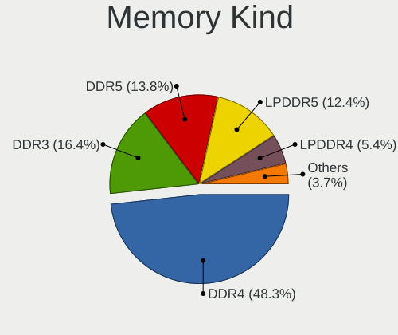

| Kind    | Notebooks | Percent |
|---------|-----------|---------|
| DDR4    | 1355      | 48.27%  |
| DDR3    | 461       | 16.42%  |
| DDR5    | 386       | 13.75%  |
| LPDDR5  | 348       | 12.4%   |
| LPDDR4  | 152       | 5.42%   |
| LPDDR3  | 71        | 2.53%   |
| DDR2    | 19        | 0.68%   |
| SDRAM   | 11        | 0.39%   |
| Unknown | 3         | 0.11%   |
| DDR     | 1         | 0.04%   |

Memory Form Factor
------------------

Physical design of the memory module

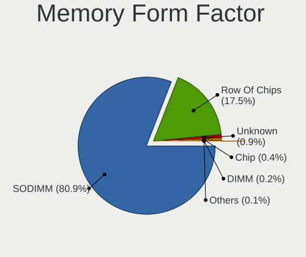

| Name            | Notebooks | Percent |
|-----------------|-----------|---------|
| SODIMM          | 2298      | 80.92%  |
| Row Of Chips    | 497       | 17.5%   |
| Unknown         | 25        | 0.88%   |
| Chip            | 11        | 0.39%   |
| DIMM            | 6         | 0.21%   |
| Proprietary Car | 3         | 0.11%   |

Memory Size
-----------

Memory module size

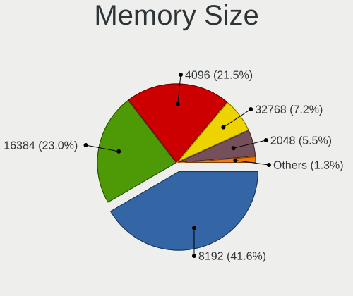

| Size  | Notebooks | Percent |
|-------|-----------|---------|
| 8192  | 1267      | 41.61%  |
| 16384 | 700       | 22.99%  |
| 4096  | 654       | 21.48%  |
| 32768 | 218       | 7.16%   |
| 2048  | 167       | 5.48%   |
| 1024  | 19        | 0.62%   |
| 3072  | 7         | 0.23%   |
| 49152 | 5         | 0.16%   |
| 12288 | 5         | 0.16%   |
| 65536 | 1         | 0.03%   |
| 6144  | 1         | 0.03%   |
| 1536  | 1         | 0.03%   |

Memory Speed
------------

Memory module speed

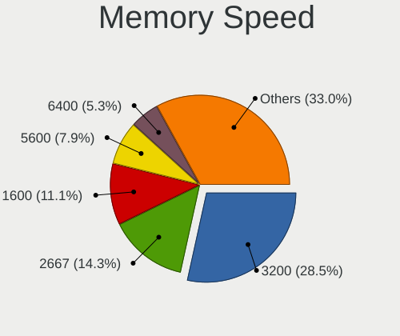

| Speed   | Notebooks | Percent |
|---------|-----------|---------|
| 3200    | 845       | 28.45%  |
| 2667    | 425       | 14.31%  |
| 1600    | 329       | 11.08%  |
| 5600    | 234       | 7.88%   |
| 6400    | 157       | 5.29%   |
| 2400    | 153       | 5.15%   |
| 4800    | 152       | 5.12%   |
| 2133    | 114       | 3.84%   |
| 7500    | 85        | 2.86%   |
| 4267    | 73        | 2.46%   |
| 8533    | 54        | 1.82%   |
| 1333    | 47        | 1.58%   |
| 1334    | 45        | 1.52%   |
| 8400    | 31        | 1.04%   |
| 1867    | 31        | 1.04%   |
| 3266    | 30        | 1.01%   |
| 7467    | 29        | 0.98%   |
| 1067    | 19        | 0.64%   |
| 4266    | 15        | 0.51%   |
| Unknown | 14        | 0.47%   |
| 667     | 13        | 0.44%   |
| 5500    | 8         | 0.27%   |
| 4199    | 8         | 0.27%   |
| 3733    | 8         | 0.27%   |
| 8600    | 6         | 0.2%    |
| 7400    | 6         | 0.2%    |
| 2933    | 6         | 0.2%    |
| 1066    | 6         | 0.2%    |
| 800     | 6         | 0.2%    |
| 975     | 4         | 0.13%   |
| 8000    | 3         | 0.1%    |
| 1866    | 3         | 0.1%    |
| 6000    | 2         | 0.07%   |
| 5200    | 2         | 0.07%   |
| 12800   | 1         | 0.03%   |
| 2666    | 1         | 0.03%   |
| 2048    | 1         | 0.03%   |
| 1639    | 1         | 0.03%   |
| 1596    | 1         | 0.03%   |
| 1330    | 1         | 0.03%   |

Printers & scanners
-------------------

Printer Vendor
--------------

Printer device vendors

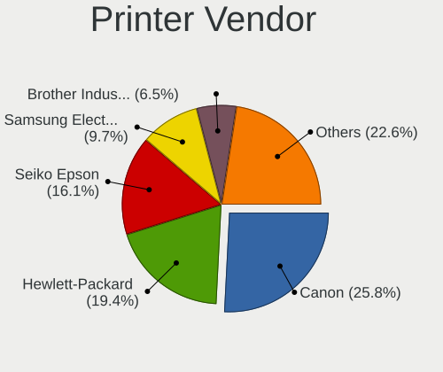

| Vendor                             | Notebooks | Percent |
|------------------------------------|-----------|---------|
| Canon                              | 8         | 25.81%  |
| Hewlett-Packard                    | 6         | 19.35%  |
| Seiko Epson                        | 5         | 16.13%  |
| Samsung Electronics                | 3         | 9.68%   |
| Brother Industries                 | 2         | 6.45%   |
| Zebra Technologies                 | 1         | 3.23%   |
| Xiaomi                             | 1         | 3.23%   |
| QinHeng Electronics                | 1         | 3.23%   |
| Prolific Technology                | 1         | 3.23%   |
| Panasonic (Matsushita)             | 1         | 3.23%   |
| Omnidirectional Control Technology | 1         | 3.23%   |
| CB Printer                         | 1         | 3.23%   |

Printer Model
-------------

Printer device models

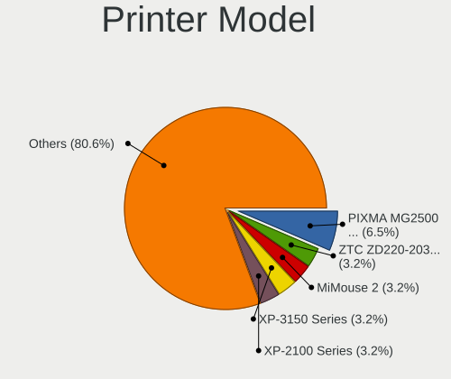

| Model                                                        | Notebooks | Percent |
|--------------------------------------------------------------|-----------|---------|
| Canon PIXMA MG2500 Series                                    | 2         | 6.45%   |
| Zebra ZTC ZD220-203dpi ZPL                                   | 1         | 3.23%   |
| Xiaomi MiMouse 2                                             | 1         | 3.23%   |
| Seiko Epson XP-3150 Series                                   | 1         | 3.23%   |
| Seiko Epson XP-2100 Series                                   | 1         | 3.23%   |
| Seiko Epson L120 Series                                      | 1         | 3.23%   |
| Seiko Epson ET-2720 Series                                   | 1         | 3.23%   |
| Seiko Epson ET-2710 Series                                   | 1         | 3.23%   |
| Samsung ML-2950 Series                                       | 1         | 3.23%   |
| Samsung M2070 Series                                         | 1         | 3.23%   |
| Samsung CLX-6260 Series                                      | 1         | 3.23%   |
| QinHeng CH340S                                               | 1         | 3.23%   |
| Prolific PL2305 Parallel Port                                | 1         | 3.23%   |
| Panasonic (Matsushita) KX-MB2030 Multifunction Laser Printer | 1         | 3.23%   |
| Omnidirectional Control USB-Parallel Bridge                  | 1         | 3.23%   |
| HP Officejet 4630 series                                     | 1         | 3.23%   |
| HP LaserJet P2035                                            | 1         | 3.23%   |
| HP LaserJet P1006                                            | 1         | 3.23%   |
| HP DeskJet 930c                                              | 1         | 3.23%   |
| HP DeskJet 4100 series                                       | 1         | 3.23%   |
| HP Deskjet 3520 series                                       | 1         | 3.23%   |
| CB Printer Printer                                           | 1         | 3.23%   |
| Canon TR4500 series                                          | 1         | 3.23%   |
| Canon PIXMA MP270 All-In-One Printer                         | 1         | 3.23%   |
| Canon PIXMA MG3000 series                                    | 1         | 3.23%   |
| Canon LiDE 400                                               | 1         | 3.23%   |
| Canon LiDE 300                                               | 1         | 3.23%   |
| Canon G2010 series                                           | 1         | 3.23%   |
| Brother MFC-7320                                             | 1         | 3.23%   |
| Brother MFC Composite Device                                 | 1         | 3.23%   |

Scanner Vendor
--------------

Scanner device vendors

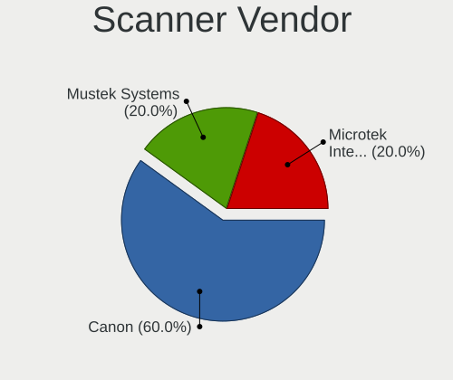

| Vendor                 | Notebooks | Percent |
|------------------------|-----------|---------|
| Canon                  | 3         | 60%     |
| Mustek Systems         | 1         | 20%     |
| Microtek International | 1         | 20%     |

Scanner Model
-------------

Scanner device models

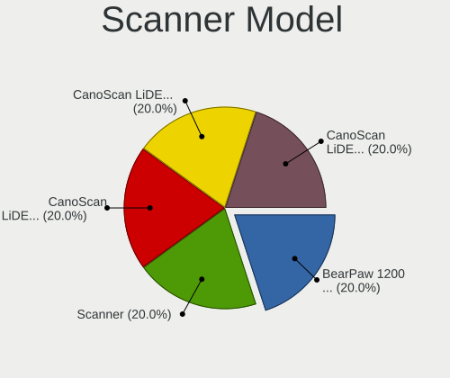

| Model                               | Notebooks | Percent |
|-------------------------------------|-----------|---------|
| Mustek Systems BearPaw 1200 CU Plus | 1         | 20%     |
| Microtek International Scanner      | 1         | 20%     |
| Canon CanoScan LiDE 220             | 1         | 20%     |
| Canon CanoScan LiDE 200             | 1         | 20%     |
| Canon CanoScan LiDE 110             | 1         | 20%     |

Camera
------

Camera Vendor
-------------

Camera device vendors

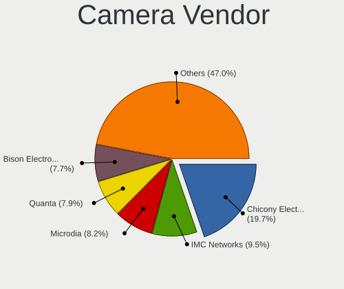

| Vendor                                 | Notebooks | Percent |
|----------------------------------------|-----------|---------|
| Chicony Electronics                    | 947       | 19.73%  |
| IMC Networks                           | 455       | 9.48%   |
| Microdia                               | 395       | 8.23%   |
| Quanta                                 | 377       | 7.85%   |
| Bison Electronics                      | 372       | 7.75%   |
| Realtek Semiconductor                  | 352       | 7.33%   |
| Sunplus Innovation Technology          | 297       | 6.19%   |
| Luxvisions Innotech Limited            | 232       | 4.83%   |
| Cheng Uei Precision Industry (Foxlink) | 177       | 3.69%   |
| Syntek                                 | 147       | 3.06%   |
| Apple                                  | 133       | 2.77%   |
| Sonix Technology                       | 117       | 2.44%   |
| Shinetech                              | 108       | 2.25%   |
| Lite-On Technology                     | 100       | 2.08%   |
| Suyin                                  | 83        | 1.73%   |
| Logitech                               | 61        | 1.27%   |
| Silicon Motion                         | 43        | 0.9%    |
| Alcor Micro                            | 39        | 0.81%   |
| SunplusIT                              | 34        | 0.71%   |
| kingcome                               | 30        | 0.62%   |
| Samsung Electronics                    | 29        | 0.6%    |
| Ricoh                                  | 22        | 0.46%   |
| BillionPixels                          | 20        | 0.42%   |
| Acer                                   | 16        | 0.33%   |
| Importek                               | 15        | 0.31%   |
| Unknown                                | 15        | 0.31%   |
| Shine-optics                           | 13        | 0.27%   |
| ShineOptics                            | 11        | 0.23%   |
| Lenovo                                 | 10        | 0.21%   |
| Primax Electronics                     | 9         | 0.19%   |
| icSpring                               | 9         | 0.19%   |
| Microsoft                              | 7         | 0.15%   |
| Creative Technology                    | 7         | 0.15%   |
| Shenzhen Kingcome Optoelectronic       | 5         | 0.1%    |
| SenseTek                               | 5         | 0.1%    |
| Razer USA                              | 5         | 0.1%    |
| USB Camera CS                          | 4         | 0.08%   |
| Sunwingroup                            | 4         | 0.08%   |
| Intel                                  | 4         | 0.08%   |
| Generalplus Technology                 | 4         | 0.08%   |

Camera Model
------------

Camera device models

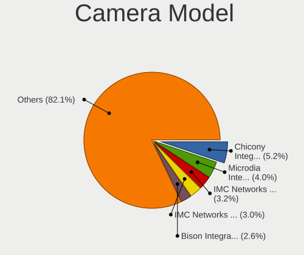

| Model                                               | Notebooks | Percent |
|-----------------------------------------------------|-----------|---------|
| Chicony Integrated Camera                           | 249       | 5.16%   |
| Microdia Integrated_Webcam_HD                       | 195       | 4.04%   |
| IMC Networks USB2.0 HD UVC WebCam                   | 153       | 3.17%   |
| IMC Networks Integrated Camera                      | 143       | 2.96%   |
| Bison Integrated Camera                             | 125       | 2.59%   |
| Syntek Integrated Camera                            | 112       | 2.32%   |
| Realtek Integrated_Webcam_HD                        | 112       | 2.32%   |
| Sunplus Integrated_Webcam_HD                        | 89        | 1.84%   |
| Chicony HD WebCam                                   | 80        | 1.66%   |
| Quanta HD Webcam                                    | 67        | 1.39%   |
| Luxvisions Innotech Limited Integrated Camera       | 65        | 1.35%   |
| ShineTech USB2.0 HD UVC WebCam                      | 62        | 1.28%   |
| Sonix USB2.0 HD UVC WebCam                          | 55        | 1.14%   |
| Chicony HP HD Camera                                | 53        | 1.1%    |
| Apple iPhone 5/5C/5S/6/SE/7/8/X                     | 52        | 1.08%   |
| Bison HD Webcam                                     | 51        | 1.06%   |
| Quanta HP HD Camera                                 | 47        | 0.97%   |
| Quanta HD User Facing                               | 44        | 0.91%   |
| Luxvisions Innotech Limited Integrated RGB Camera   | 44        | 0.91%   |
| Chicony ACER HD User Facing                         | 44        | 0.91%   |
| Bison Lenovo EasyCamera                             | 43        | 0.89%   |
| Quanta HP TrueVision HD Camera                      | 42        | 0.87%   |
| Lite-On Integrated Camera                           | 38        | 0.79%   |
| Microdia Integrated_Webcam_FHD                      | 37        | 0.77%   |
| Apple FaceTime HD Camera                            | 37        | 0.77%   |
| Sonix USB2.0 FHD UVC WebCam                         | 36        | 0.75%   |
| Shinetech USB2.0 FHD UVC WebCam                     | 36        | 0.75%   |
| Chicony HP Truevision HD                            | 34        | 0.7%    |
| Realtek Integrated_Webcam_FHD                       | 33        | 0.68%   |
| Luxvisions Innotech Limited HP TrueVision HD Camera | 33        | 0.68%   |
| Lite-On HP HD Camera                                | 32        | 0.66%   |
| Chicony HD User Facing                              | 32        | 0.66%   |
| Microdia Integrated Webcam                          | 31        | 0.64%   |
| Realtek Integrated Webcam HD                        | 30        | 0.62%   |
| Bison Integrated RGB Camera                         | 30        | 0.62%   |
| Samsung Galaxy series, misc. (MTP mode)             | 29        | 0.6%    |
| Luxvisions Innotech Limited HP HD Camera            | 28        | 0.58%   |
| Chicony TOSHIBA Web Camera - HD                     | 28        | 0.58%   |
| Chicony HP TrueVision HD Camera                     | 28        | 0.58%   |
| Quanta HP Wide Vision HD Camera                     | 27        | 0.56%   |

Security
--------

Fingerprint Vendor
------------------

Fingerprint sensor vendors

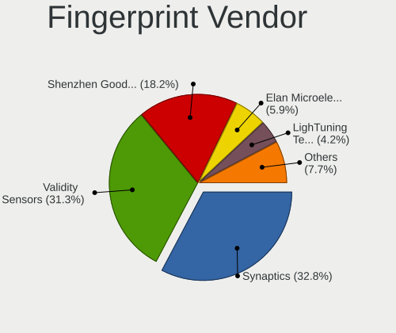

| Vendor                             | Notebooks | Percent |
|------------------------------------|-----------|---------|
| Synaptics                          | 263       | 32.75%  |
| Validity Sensors                   | 251       | 31.26%  |
| Shenzhen Goodix Technology         | 146       | 18.18%  |
| Elan Microelectronics              | 47        | 5.85%   |
| LighTuning Technology              | 34        | 4.23%   |
| AuthenTec                          | 20        | 2.49%   |
| Upek                               | 18        | 2.24%   |
| HOLTEK                             | 8         | 1%      |
| Samsung Electronics                | 6         | 0.75%   |
| Realtek USB2.0 Finger Print Bridge | 4         | 0.5%    |
| STMicroelectronics                 | 2         | 0.25%   |
| GDMicroelectronics                 | 2         | 0.25%   |
| Focal-systems.Corp                 | 2         | 0.25%   |

Fingerprint Model
-----------------

Fingerprint sensor models

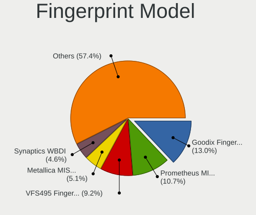

| Model                                                                      | Notebooks | Percent |
|----------------------------------------------------------------------------|-----------|---------|
| Shenzhen Goodix  FingerPrint Device                                        | 104       | 12.95%  |
| Synaptics Prometheus MIS Touch Fingerprint Reader                          | 86        | 10.71%  |
| Validity Sensors VFS495 Fingerprint Reader                                 | 74        | 9.22%   |
| Synaptics Metallica MIS Touch Fingerprint Reader                           | 41        | 5.11%   |
| Validity Sensors Synaptics WBDI                                            | 37        | 4.61%   |
| Synaptics FS7604 Touch Fingerprint Sensor with PurePrint                   | 37        | 4.61%   |
| Elan ELAN:ARM-M4                                                           | 32        | 3.99%   |
| Synaptics UWP WBDI Device                                                  | 30        | 3.74%   |
| Validity Sensors VFS 5011 fingerprint sensor                               | 25        | 3.11%   |
| Shenzhen Goodix FingerPrint                                                | 22        | 2.74%   |
| Shenzhen Goodix Fingerprint Reader                                         | 20        | 2.49%   |
| Validity Sensors VFS7500 Touch Fingerprint Sensor                          | 19        | 2.37%   |
| Synaptics Fingerprint reader [HP G6]                                       | 18        | 2.24%   |
| LighTuning EgisTec Touch Fingerprint Sensor                                | 18        | 2.24%   |
| Upek Biometric Touchchip/Touchstrip Fingerprint Sensor                     | 17        | 2.12%   |
| Validity Sensors VFS5011 Fingerprint Reader                                | 16        | 1.99%   |
| Validity Sensors Synaptics VFS7552 Touch Fingerprint Sensor with PurePrint | 16        | 1.99%   |
| Validity Sensors Swipe Fingerprint Sensor                                  | 16        | 1.99%   |
| Synaptics Prometheus Fingerprint Reader                                    | 16        | 1.99%   |
| Elan ELAN:Fingerprint                                                      | 15        | 1.87%   |
| LighTuning ES603 Swipe Fingerprint Sensor                                  | 14        | 1.74%   |
| Validity Sensors VFS491                                                    | 13        | 1.62%   |
| Synaptics  FS7604 Touch Fingerprint Sensor with PurePrint                  | 12        | 1.49%   |
| AuthenTec AES2810                                                          | 11        | 1.37%   |
| Validity Sensors Fingerprint scanner                                       | 9         | 1.12%   |
| Synaptics WBDI Fingerprint Reader USB 086                                  | 8         | 1%      |
| HOLTEK FocalTech Fingerprint Device                                        | 8         | 1%      |
| Validity Sensors VFS301 Fingerprint Reader                                 | 7         | 0.87%   |
| Validity Sensors VFS451 Fingerprint Reader                                 | 6         | 0.75%   |
| Synaptics  WBDI                                                            | 6         | 0.75%   |
| Validity Sensors VFS471 Fingerprint Reader                                 | 5         | 0.62%   |
| Realtek USB2.0 Finger Print Bridge FocalTech Fingerprint Device            | 4         | 0.5%    |
| Validity Sensors VFS101 Fingerprint Reader                                 | 3         | 0.37%   |
| Validity Sensors VFS Fingerprint sensor                                    | 3         | 0.37%   |
| Synaptics Metallica MOH Touch Fingerprint Reader                           | 3         | 0.37%   |
| Samsung Fingerprint Sensor Device - 730B                                   | 3         | 0.37%   |
| Samsung Fingerprint Device                                                 | 3         | 0.37%   |
| AuthenTec Fingerprint Sensor                                               | 3         | 0.37%   |
| AuthenTec AES1660 Fingerprint Sensor                                       | 3         | 0.37%   |
| Synaptics WBDI Device                                                      | 2         | 0.25%   |

Chipcard Vendor
---------------

Chipcard module vendors

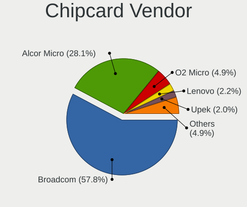

| Vendor                | Notebooks | Percent |
|-----------------------|-----------|---------|
| Broadcom              | 234       | 57.78%  |
| Alcor Micro           | 114       | 28.15%  |
| O2 Micro              | 20        | 4.94%   |
| Lenovo                | 9         | 2.22%   |
| Upek                  | 8         | 1.98%   |
| Yubico.com            | 5         | 1.23%   |
| Gemalto (was Gemplus) | 4         | 0.99%   |
| Advanced Card Systems | 4         | 0.99%   |
| SCM Microsystems      | 3         | 0.74%   |
| Aktiv                 | 2         | 0.49%   |
| Thetis                | 1         | 0.25%   |
| Jing-Mold Enterprise  | 1         | 0.25%   |

Chipcard Model
--------------

Chipcard module models

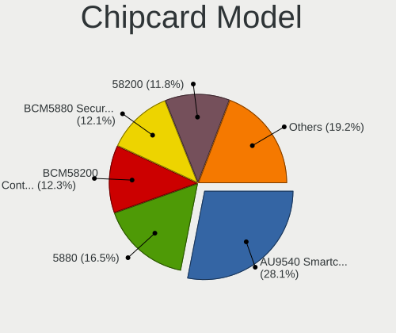

| Model                                                                        | Notebooks | Percent |
|------------------------------------------------------------------------------|-----------|---------|
| Alcor Micro AU9540 Smartcard Reader                                          | 114       | 28.08%  |
| Broadcom 5880                                                                | 67        | 16.5%   |
| Broadcom BCM58200 ControlVault 3 (FingerPrint sensor + Contacted SmartCard)  | 50        | 12.32%  |
| Broadcom BCM5880 Secure Applications Processor                               | 49        | 12.07%  |
| Broadcom 58200                                                               | 48        | 11.82%  |
| O2 Micro OZ776 CCID Smartcard Reader                                         | 19        | 4.68%   |
| Broadcom BCM5880 Secure Applications Processor with fingerprint swipe sensor | 19        | 4.68%   |
| Lenovo Integrated Smart Card Reader                                          | 9         | 2.22%   |
| Upek TouchChip Fingerprint Coprocessor (WBF advanced mode)                   | 8         | 1.97%   |
| Yubico.com Yubikey 4/5 U2F+CCID                                              | 5         | 1.23%   |
| Gemalto (was Gemplus) GemPC Twin SmartCard Reader                            | 3         | 0.74%   |
| SCM Microsystems SCR35xx Smart Card Reader                                   | 2         | 0.49%   |
| Broadcom BCM5880 Secure Applications Processor with fingerprint touch sensor | 2         | 0.49%   |
| Aktiv Rutoken lite                                                           | 2         | 0.49%   |
| Advanced Card Systems ACR122U                                                | 2         | 0.49%   |
| Thetis Security Key(FE25)                                                    | 1         | 0.25%   |
| SCM Microsystems SCR3340 - ExpressCard54 Smart Card Reader                   | 1         | 0.25%   |
| O2 Micro Oz776 SmartCard Reader                                              | 1         | 0.25%   |
| Jing-Mold Enterprise HP USB Business Slim Smartcard CCID Keyboard            | 1         | 0.25%   |
| Gemalto (was Gemplus) GemPC Key SmartCard Reader                             | 1         | 0.25%   |
| Advanced Card Systems ACR39U                                                 | 1         | 0.25%   |
| Advanced Card Systems ACR38 SmartCard Reader                                 | 1         | 0.25%   |

Unsupported
-----------

Unsupported Devices
-------------------

Total unsupported devices on board

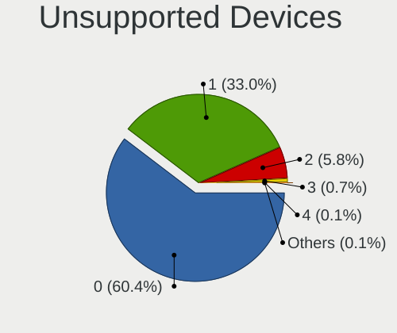

| Total | Notebooks | Percent |
|-------|-----------|---------|
| 0     | 3150      | 60.38%  |
| 1     | 1721      | 32.99%  |
| 2     | 300       | 5.75%   |
| 3     | 36        | 0.69%   |
| 4     | 3         | 0.06%   |
| 8     | 2         | 0.04%   |
| 5     | 2         | 0.04%   |
| 11    | 1         | 0.02%   |
| 10    | 1         | 0.02%   |
| 9     | 1         | 0.02%   |

Unsupported Device Types
------------------------

Types of unsupported devices

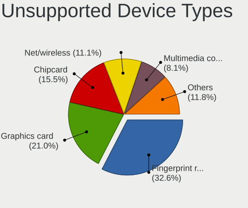

| Type                     | Notebooks | Percent |
|--------------------------|-----------|---------|
| Fingerprint reader       | 789       | 32.56%  |
| Graphics card            | 508       | 20.97%  |
| Chipcard                 | 376       | 15.52%  |
| Net/wireless             | 269       | 11.1%   |
| Multimedia controller    | 196       | 8.09%   |
| Camera                   | 49        | 2.02%   |
| Bluetooth                | 47        | 1.94%   |
| Card reader              | 45        | 1.86%   |
| Communication controller | 43        | 1.77%   |
| Storage                  | 35        | 1.44%   |
| Sound                    | 28        | 1.16%   |
| Net/ethernet             | 27        | 1.11%   |
| Network                  | 3         | 0.12%   |
| Unassigned class         | 2         | 0.08%   |
| Dvb card                 | 2         | 0.08%   |
| Wireless                 | 1         | 0.04%   |
| Storage/ata              | 1         | 0.04%   |
| Modem                    | 1         | 0.04%   |
| Flash memory             | 1         | 0.04%   |

