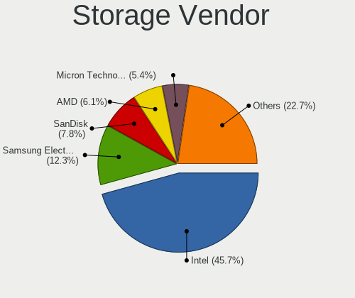
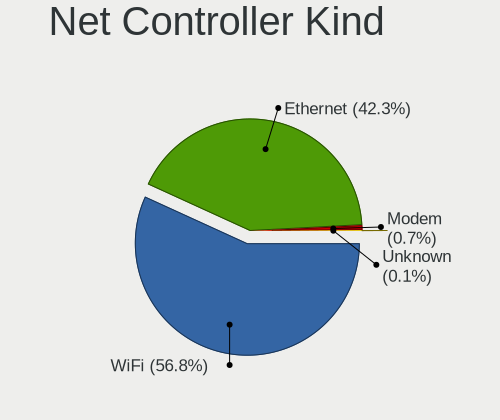
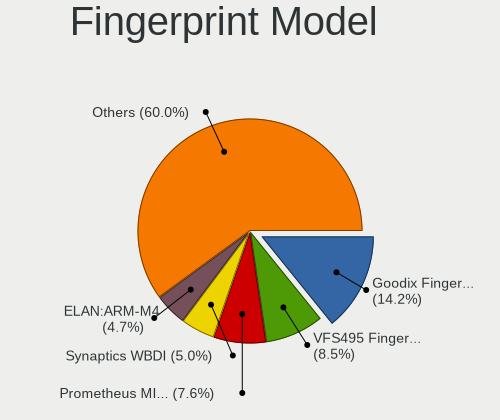

Ubuntu 24.04 - Tested Hardware & Statistics (Notebooks)
-------------------------------------------------------

A project to collect tested hardware configurations for Ubuntu 24.04.

Anyone can contribute to this report by the [hw-probe](https://github.com/linuxhw/hw-probe) tool:

    sudo -E hw-probe -all -upload

Please contribute! Especially if your hardware is rare.

Contents
--------

* [ Test Cases ](#test-cases)

* [ System ](#system)
  - [ Kernel                   ](#kernel)
  - [ Kernel Family            ](#kernel-family)
  - [ Kernel Major Ver.        ](#kernel-major-ver)
  - [ Arch                     ](#arch)
  - [ DE                       ](#de)
  - [ Display Server           ](#display-server)
  - [ Display Manager          ](#display-manager)
  - [ OS Lang                  ](#os-lang)
  - [ Boot Mode                ](#boot-mode)
  - [ Filesystem               ](#filesystem)
  - [ Part. scheme             ](#part-scheme)
  - [ Dual Boot with Linux/BSD ](#dual-boot-with-linuxbsd)
  - [ Dual Boot (Win)          ](#dual-boot-win)

* [ Board ](#board)
  - [ Vendor                   ](#vendor)
  - [ Model                    ](#model)
  - [ Model Family             ](#model-family)
  - [ MFG Year                 ](#mfg-year)
  - [ Form Factor              ](#form-factor)
  - [ Secure Boot              ](#secure-boot)
  - [ Coreboot                 ](#coreboot)
  - [ RAM Size                 ](#ram-size)
  - [ RAM Used                 ](#ram-used)
  - [ Total Drives             ](#total-drives)
  - [ Has CD-ROM               ](#has-cd-rom)
  - [ Has Ethernet             ](#has-ethernet)
  - [ Has WiFi                 ](#has-wifi)
  - [ Has Bluetooth            ](#has-bluetooth)

* [ Location ](#location)
  - [ Country                  ](#country)
  - [ City                     ](#city)

* [ Drives ](#drives)
  - [ Drive Vendor             ](#drive-vendor)
  - [ Drive Model              ](#drive-model)
  - [ HDD Vendor               ](#hdd-vendor)
  - [ SSD Vendor               ](#ssd-vendor)
  - [ Drive Kind               ](#drive-kind)
  - [ Drive Connector          ](#drive-connector)
  - [ Drive Size               ](#drive-size)
  - [ Space Total              ](#space-total)
  - [ Space Used               ](#space-used)
  - [ Malfunc. Drives          ](#malfunc-drives)
  - [ Malfunc. Drive Vendor    ](#malfunc-drive-vendor)
  - [ Malfunc. HDD Vendor      ](#malfunc-hdd-vendor)
  - [ Malfunc. Drive Kind      ](#malfunc-drive-kind)
  - [ Failed Drives            ](#failed-drives)
  - [ Failed Drive Vendor      ](#failed-drive-vendor)
  - [ Drive Status             ](#drive-status)

* [ Storage controller ](#storage-controller)
  - [ Storage Vendor           ](#storage-vendor)
  - [ Storage Model            ](#storage-model)
  - [ Storage Kind             ](#storage-kind)

* [ Processor ](#processor)
  - [ CPU Vendor               ](#cpu-vendor)
  - [ CPU Model                ](#cpu-model)
  - [ CPU Model Family         ](#cpu-model-family)
  - [ CPU Cores                ](#cpu-cores)
  - [ CPU Sockets              ](#cpu-sockets)
  - [ CPU Threads              ](#cpu-threads)
  - [ CPU Op-Modes             ](#cpu-op-modes)
  - [ CPU Microcode            ](#cpu-microcode)
  - [ CPU Microarch            ](#cpu-microarch)

* [ Graphics ](#graphics)
  - [ GPU Vendor               ](#gpu-vendor)
  - [ GPU Model                ](#gpu-model)
  - [ GPU Combo                ](#gpu-combo)
  - [ GPU Driver               ](#gpu-driver)
  - [ GPU Memory               ](#gpu-memory)

* [ Monitor ](#monitor)
  - [ Monitor Vendor           ](#monitor-vendor)
  - [ Monitor Model            ](#monitor-model)
  - [ Monitor Resolution       ](#monitor-resolution)
  - [ Monitor Diagonal         ](#monitor-diagonal)
  - [ Monitor Width            ](#monitor-width)
  - [ Aspect Ratio             ](#aspect-ratio)
  - [ Monitor Area             ](#monitor-area)
  - [ Pixel Density            ](#pixel-density)
  - [ Multiple Monitors        ](#multiple-monitors)

* [ Network ](#network)
  - [ Net Controller Vendor    ](#net-controller-vendor)
  - [ Net Controller Model     ](#net-controller-model)
  - [ Wireless Vendor          ](#wireless-vendor)
  - [ Wireless Model           ](#wireless-model)
  - [ Ethernet Vendor          ](#ethernet-vendor)
  - [ Ethernet Model           ](#ethernet-model)
  - [ Net Controller Kind      ](#net-controller-kind)
  - [ Used Controller          ](#used-controller)
  - [ NICs                     ](#nics)
  - [ IPv6                     ](#ipv6)

* [ Bluetooth ](#bluetooth)
  - [ Bluetooth Vendor         ](#bluetooth-vendor)
  - [ Bluetooth Model          ](#bluetooth-model)

* [ Sound ](#sound)
  - [ Sound Vendor             ](#sound-vendor)
  - [ Sound Model              ](#sound-model)

* [ Memory ](#memory)
  - [ Memory Vendor            ](#memory-vendor)
  - [ Memory Model             ](#memory-model)
  - [ Memory Kind              ](#memory-kind)
  - [ Memory Form Factor       ](#memory-form-factor)
  - [ Memory Size              ](#memory-size)
  - [ Memory Speed             ](#memory-speed)

* [ Printers & scanners ](#printers--scanners)
  - [ Printer Vendor           ](#printer-vendor)
  - [ Printer Model            ](#printer-model)
  - [ Scanner Vendor           ](#scanner-vendor)
  - [ Scanner Model            ](#scanner-model)

* [ Camera ](#camera)
  - [ Camera Vendor            ](#camera-vendor)
  - [ Camera Model             ](#camera-model)

* [ Security ](#security)
  - [ Fingerprint Vendor       ](#fingerprint-vendor)
  - [ Fingerprint Model        ](#fingerprint-model)
  - [ Chipcard Vendor          ](#chipcard-vendor)
  - [ Chipcard Model           ](#chipcard-model)

* [ Unsupported ](#unsupported)
  - [ Unsupported Devices      ](#unsupported-devices)
  - [ Unsupported Device Types ](#unsupported-device-types)

Test Cases
----------

Total: 3348

| Vendor        | Model                       | Probe                                                      | Date         |
|---------------|-----------------------------|------------------------------------------------------------|--------------|
| Acer          | Aspire E5-575               | [8a7b632b3f](https://linux-hardware.org/?probe=8a7b632b3f) | Jan 06, 2025 |
| Medion        | Akoya E6240T                | [bb72b25bf7](https://linux-hardware.org/?probe=bb72b25bf7) | Jan 06, 2025 |
| Lenovo        | G40-30 80FY                 | [398cb6b840](https://linux-hardware.org/?probe=398cb6b840) | Jan 06, 2025 |
| Lenovo        | ThinkPad P51 20HJS0D201     | [f43357e57a](https://linux-hardware.org/?probe=f43357e57a) | Jan 06, 2025 |
| Dell          | XPS 13 9305                 | [77f98c4014](https://linux-hardware.org/?probe=77f98c4014) | Jan 06, 2025 |
| Dell          | Precision M6800             | [01d1dcb2d8](https://linux-hardware.org/?probe=01d1dcb2d8) | Jan 06, 2025 |
| Alienware     | m18 R2                      | [6277d13cf5](https://linux-hardware.org/?probe=6277d13cf5) | Jan 06, 2025 |
| Dell          | Precision 3571              | [95b1b27d71](https://linux-hardware.org/?probe=95b1b27d71) | Jan 06, 2025 |
| HP            | Pavilion Notebook           | [eb8cc11cc5](https://linux-hardware.org/?probe=eb8cc11cc5) | Jan 05, 2025 |
| Lenovo        | IdeaPad Slim 5 16IRU9 83... | [916567f213](https://linux-hardware.org/?probe=916567f213) | Jan 05, 2025 |
| Dell          | Latitude E6230              | [638ece1f17](https://linux-hardware.org/?probe=638ece1f17) | Jan 05, 2025 |
| Lenovo        | ThinkPad X13 Gen 3 21BQA... | [ec40ca9885](https://linux-hardware.org/?probe=ec40ca9885) | Jan 05, 2025 |
| ASUSTek       | VivoBook_ASUSLaptop X150... | [5e3d055319](https://linux-hardware.org/?probe=5e3d055319) | Jan 05, 2025 |
| HP            | Pavilion dv8                | [ab69193742](https://linux-hardware.org/?probe=ab69193742) | Jan 05, 2025 |
| Acer          | Aspire A514-53              | [88e5da8b9d](https://linux-hardware.org/?probe=88e5da8b9d) | Jan 05, 2025 |
| Acer          | Aspire A514-53              | [a4dc1a43a2](https://linux-hardware.org/?probe=a4dc1a43a2) | Jan 05, 2025 |
| Chuwi         | GemiBook Pro                | [cb3ae7cb2a](https://linux-hardware.org/?probe=cb3ae7cb2a) | Jan 05, 2025 |
| Lenovo        | ThinkPad W530 2441AG6       | [20e239cb8a](https://linux-hardware.org/?probe=20e239cb8a) | Jan 05, 2025 |
| Chuwi         | GemiBook Pro                | [9518969af8](https://linux-hardware.org/?probe=9518969af8) | Jan 05, 2025 |
| Acer          | Aspire A315-24PT            | [e800b5fdb7](https://linux-hardware.org/?probe=e800b5fdb7) | Jan 05, 2025 |
| Lenovo        | ThinkBook 14 G2 ITL 20VD    | [6a8e47f57b](https://linux-hardware.org/?probe=6a8e47f57b) | Jan 05, 2025 |
| Acer          | Aspire A115-32              | [2c6043fd56](https://linux-hardware.org/?probe=2c6043fd56) | Jan 05, 2025 |
| Acer          | Aspire A315-24PT            | [cea7933cc6](https://linux-hardware.org/?probe=cea7933cc6) | Jan 05, 2025 |
| Dell          | G3 3500                     | [5c6b757b24](https://linux-hardware.org/?probe=5c6b757b24) | Jan 05, 2025 |
| Framework     | Laptop 16 (AMD Ryzen 704... | [0bff2b1d13](https://linux-hardware.org/?probe=0bff2b1d13) | Jan 04, 2025 |
| HP            | ProBook 430 G7              | [f1b89f85cf](https://linux-hardware.org/?probe=f1b89f85cf) | Jan 04, 2025 |
| HP            | ZBook 15 G3                 | [548eae93b9](https://linux-hardware.org/?probe=548eae93b9) | Jan 04, 2025 |
| MSI           | Katana GF66 11UC            | [aca2d91d26](https://linux-hardware.org/?probe=aca2d91d26) | Jan 04, 2025 |
| Lenovo        | G50-70 20351                | [666751867c](https://linux-hardware.org/?probe=666751867c) | Jan 04, 2025 |
| Dell          | Inspiron 3541               | [206872a37f](https://linux-hardware.org/?probe=206872a37f) | Jan 04, 2025 |
| ASUSTek       | ROG Strix G713RC_G713RC     | [721dbc3f65](https://linux-hardware.org/?probe=721dbc3f65) | Jan 04, 2025 |
| ASUSTek       | ROG Strix G713RC_G713RC     | [e6b0e5183e](https://linux-hardware.org/?probe=e6b0e5183e) | Jan 04, 2025 |
| Lenovo        | IdeaPad S145-15IIL 81W8     | [96316f7cee](https://linux-hardware.org/?probe=96316f7cee) | Jan 04, 2025 |
| Dell          | Inspiron 5480               | [23f4e47841](https://linux-hardware.org/?probe=23f4e47841) | Jan 04, 2025 |
| ASUSTek       | VivoBook_ASUSLaptop K360... | [adec02cbc1](https://linux-hardware.org/?probe=adec02cbc1) | Jan 04, 2025 |
| Apple         | MacBookPro9,2               | [cfa406503c](https://linux-hardware.org/?probe=cfa406503c) | Jan 04, 2025 |
| Dell          | Vostro 15 3530              | [20a13b2865](https://linux-hardware.org/?probe=20a13b2865) | Jan 04, 2025 |
| HP            | Laptop 15-db0xxx            | [15039e5101](https://linux-hardware.org/?probe=15039e5101) | Jan 04, 2025 |
| ASUSTek       | VivoBook_ASUSLaptop X415... | [28e55a6043](https://linux-hardware.org/?probe=28e55a6043) | Jan 03, 2025 |
| HP            | Pavilion Notebook           | [41e590e617](https://linux-hardware.org/?probe=41e590e617) | Jan 03, 2025 |
| Acer          | Aspire E5-576G              | [9f344c14d4](https://linux-hardware.org/?probe=9f344c14d4) | Jan 03, 2025 |
| HP            | 250 G7 Notebook PC          | [6bf480c75a](https://linux-hardware.org/?probe=6bf480c75a) | Jan 03, 2025 |
| ASUSTek       | VivoBook_ASUSLaptop X515... | [ac0b2b8219](https://linux-hardware.org/?probe=ac0b2b8219) | Jan 03, 2025 |
| HP            | EliteBook 840 G5            | [ec0eaf35ef](https://linux-hardware.org/?probe=ec0eaf35ef) | Jan 03, 2025 |
| Acer          | Aspire V5-591G              | [fba09b3376](https://linux-hardware.org/?probe=fba09b3376) | Jan 03, 2025 |
| Dell          | XPS 15 9560                 | [924d90cdcc](https://linux-hardware.org/?probe=924d90cdcc) | Jan 03, 2025 |
| Dell          | XPS 15 9560                 | [5a9c188db1](https://linux-hardware.org/?probe=5a9c188db1) | Jan 03, 2025 |
| Apple         | MacBookPro12,1              | [c226449ca2](https://linux-hardware.org/?probe=c226449ca2) | Jan 03, 2025 |
| HP            | ProBook 650 G2              | [b2fc855e3e](https://linux-hardware.org/?probe=b2fc855e3e) | Jan 03, 2025 |
| HP            | EliteBook 840 G6            | [6781e260b0](https://linux-hardware.org/?probe=6781e260b0) | Jan 03, 2025 |
| HP            | EliteBook 840 G6            | [fd2f975353](https://linux-hardware.org/?probe=fd2f975353) | Jan 03, 2025 |
| Lenovo        | IdeaPad 3 15ITL6 82H8       | [58e41b0f0f](https://linux-hardware.org/?probe=58e41b0f0f) | Jan 03, 2025 |
| Acer          | Aspire A515-52              | [4b5bf879c2](https://linux-hardware.org/?probe=4b5bf879c2) | Jan 03, 2025 |
| Lenovo        | Slim Pro 7 14ARP8 83AX      | [9acb68fefa](https://linux-hardware.org/?probe=9acb68fefa) | Jan 03, 2025 |
| Alienware     | m18 R2                      | [48bc0a64c1](https://linux-hardware.org/?probe=48bc0a64c1) | Jan 02, 2025 |
| Dell          | Latitude E6430              | [0baf769dd2](https://linux-hardware.org/?probe=0baf769dd2) | Jan 02, 2025 |
| Lenovo        | ThinkPad X250 20CLS45J00    | [23c3a522f9](https://linux-hardware.org/?probe=23c3a522f9) | Jan 02, 2025 |
| Unknown       | Unknown                     | [267152ac45](https://linux-hardware.org/?probe=267152ac45) | Jan 02, 2025 |
| ASUSTek       | ROG Zephyrus G14 GA401QM... | [47b95e50dc](https://linux-hardware.org/?probe=47b95e50dc) | Jan 02, 2025 |
| Lenovo        | IdeaPad 320-15IKB 80XL      | [b90f085315](https://linux-hardware.org/?probe=b90f085315) | Jan 02, 2025 |
| Lenovo        | IdeaPad Slim 5 16ABR8 82... | [a03031641a](https://linux-hardware.org/?probe=a03031641a) | Jan 02, 2025 |
| HP            | ProBook 440 G7              | [b1f0f9f971](https://linux-hardware.org/?probe=b1f0f9f971) | Jan 02, 2025 |
| Lenovo        | ThinkPad T460s 20FAS14F0... | [f72b380ee6](https://linux-hardware.org/?probe=f72b380ee6) | Jan 02, 2025 |
| ASUSTek       | ASUS TUF Gaming F15 FX50... | [745341e7fa](https://linux-hardware.org/?probe=745341e7fa) | Jan 02, 2025 |
| Packard Be... | EasyNote TK87               | [468680be46](https://linux-hardware.org/?probe=468680be46) | Jan 02, 2025 |
| Packard Be... | EasyNote TK87               | [d0bb5660e7](https://linux-hardware.org/?probe=d0bb5660e7) | Jan 02, 2025 |
| Sony          | SVF1521G6EW                 | [a9d8497c8d](https://linux-hardware.org/?probe=a9d8497c8d) | Jan 02, 2025 |
| Dell          | XPS 13 9380                 | [fd629307a9](https://linux-hardware.org/?probe=fd629307a9) | Jan 02, 2025 |
| HP            | ZBook 15u G3                | [da5c26013c](https://linux-hardware.org/?probe=da5c26013c) | Jan 02, 2025 |
| Lenovo        | G50-70 20351                | [9043dbb9a9](https://linux-hardware.org/?probe=9043dbb9a9) | Jan 01, 2025 |
| Dell          | Latitude E6230              | [8611ea969f](https://linux-hardware.org/?probe=8611ea969f) | Jan 01, 2025 |
| Lenovo        | ThinkPad X220 4291QZ1       | [ffd4949fc5](https://linux-hardware.org/?probe=ffd4949fc5) | Jan 01, 2025 |
| Lenovo        | ThinkPad X220 4291QZ1       | [68cf73b7b3](https://linux-hardware.org/?probe=68cf73b7b3) | Jan 01, 2025 |
| HP            | Laptop 15-dy2xxx            | [c1ed1a0524](https://linux-hardware.org/?probe=c1ed1a0524) | Jan 01, 2025 |
| Apple         | MacBookPro14,3              | [b1813c3452](https://linux-hardware.org/?probe=b1813c3452) | Jan 01, 2025 |
| Apple         | MacBookPro14,3              | [d3cba6d56e](https://linux-hardware.org/?probe=d3cba6d56e) | Jan 01, 2025 |
| Samsung       | 550XDA                      | [f23c082843](https://linux-hardware.org/?probe=f23c082843) | Dec 31, 2024 |
| HP            | Pavilion dv7                | [80ac393681](https://linux-hardware.org/?probe=80ac393681) | Dec 31, 2024 |
| Dell          | Precision 5520              | [88832dcaf1](https://linux-hardware.org/?probe=88832dcaf1) | Dec 31, 2024 |
| Acer          | Nitro ANV15-41              | [00953a17b5](https://linux-hardware.org/?probe=00953a17b5) | Dec 31, 2024 |
| Acer          | Aspire E1-531               | [dcd279939a](https://linux-hardware.org/?probe=dcd279939a) | Dec 31, 2024 |
| Apple         | MacBook5,2                  | [3e1d6ce785](https://linux-hardware.org/?probe=3e1d6ce785) | Dec 31, 2024 |
| Lenovo        | ThinkPad T470p 20J6CTO1W... | [b255d3c686](https://linux-hardware.org/?probe=b255d3c686) | Dec 31, 2024 |
| Framework     | Laptop 13 (AMD Ryzen 704... | [23175f9255](https://linux-hardware.org/?probe=23175f9255) | Dec 31, 2024 |
| Lenovo        | IdeaPad S540-14IWL 81ND     | [a1dfd54db3](https://linux-hardware.org/?probe=a1dfd54db3) | Dec 31, 2024 |
| ASUSTek       | ROG Zephyrus M16 GU603HM... | [783dddde17](https://linux-hardware.org/?probe=783dddde17) | Dec 31, 2024 |
| HP            | Laptop 15-fd0xxx            | [f48e15c91b](https://linux-hardware.org/?probe=f48e15c91b) | Dec 30, 2024 |
| Apple         | MacBookPro5,5               | [80bf9a388e](https://linux-hardware.org/?probe=80bf9a388e) | Dec 30, 2024 |
| Apple         | MacBookPro5,5               | [8e4e44db83](https://linux-hardware.org/?probe=8e4e44db83) | Dec 30, 2024 |
| HP            | EliteBook Folio 1040 G1     | [55d6518fd1](https://linux-hardware.org/?probe=55d6518fd1) | Dec 30, 2024 |
| Lenovo        | ThinkPad T470s W10DG 20J... | [0d96f203f5](https://linux-hardware.org/?probe=0d96f203f5) | Dec 30, 2024 |
| Lenovo        | G585 20137                  | [cfbfe12819](https://linux-hardware.org/?probe=cfbfe12819) | Dec 30, 2024 |
| Lenovo        | ThinkPad X220 4290EC5       | [0a01dc8cd8](https://linux-hardware.org/?probe=0a01dc8cd8) | Dec 30, 2024 |
| ASUSTek       | GL703VM                     | [1121e5f4ca](https://linux-hardware.org/?probe=1121e5f4ca) | Dec 30, 2024 |
| HP            | ENVY 17                     | [99fa04f0ca](https://linux-hardware.org/?probe=99fa04f0ca) | Dec 30, 2024 |
| Lenovo        | ThinkPad P50 20EQS12Q06     | [794c492899](https://linux-hardware.org/?probe=794c492899) | Dec 30, 2024 |
| ASUSTek       | ASUS BR1100CKA BR1100CKA... | [27dd012145](https://linux-hardware.org/?probe=27dd012145) | Dec 30, 2024 |
| HP            | Pavilion g6                 | [ea52acdc1b](https://linux-hardware.org/?probe=ea52acdc1b) | Dec 30, 2024 |
| ASUSTek       | VivoBook_ASUSLaptop K360... | [3865b761f5](https://linux-hardware.org/?probe=3865b761f5) | Dec 30, 2024 |
| HP            | 255 G7 Notebook PC          | [14817c7822](https://linux-hardware.org/?probe=14817c7822) | Dec 30, 2024 |
| HP            | EliteBook 840 G6            | [5c7d77f22a](https://linux-hardware.org/?probe=5c7d77f22a) | Dec 30, 2024 |
| HUAWEI        | FLMH-XX                     | [00d586da79](https://linux-hardware.org/?probe=00d586da79) | Dec 30, 2024 |
| Lenovo        | ThinkBook 14 G2 ITL 20VD    | [64c5deb6a7](https://linux-hardware.org/?probe=64c5deb6a7) | Dec 29, 2024 |
| HP            | Laptop 17-cp0xxx            | [d87a6139f6](https://linux-hardware.org/?probe=d87a6139f6) | Dec 29, 2024 |
| HP            | Laptop 17-cp0xxx            | [0f9af93612](https://linux-hardware.org/?probe=0f9af93612) | Dec 29, 2024 |
| HP            | ZBook Power 15.6 inch G8... | [f521839f9a](https://linux-hardware.org/?probe=f521839f9a) | Dec 29, 2024 |
| Dell          | XPS 15 9570                 | [ec780ef825](https://linux-hardware.org/?probe=ec780ef825) | Dec 29, 2024 |
| Dell          | XPS 13 9370                 | [6b3d0134ab](https://linux-hardware.org/?probe=6b3d0134ab) | Dec 29, 2024 |
| Sony          | VPCEB24FX                   | [b2006d7959](https://linux-hardware.org/?probe=b2006d7959) | Dec 29, 2024 |
| ASUSTek       | K501UB                      | [2654326cc1](https://linux-hardware.org/?probe=2654326cc1) | Dec 29, 2024 |
| HP            | EliteBook 8440p             | [ff3d8f0e0e](https://linux-hardware.org/?probe=ff3d8f0e0e) | Dec 28, 2024 |
| HP            | 250 15.6 inch G10 Notebo... | [c4a512bb62](https://linux-hardware.org/?probe=c4a512bb62) | Dec 28, 2024 |
| HUAWEI        | KLVL-WXXW                   | [2ce7175d0a](https://linux-hardware.org/?probe=2ce7175d0a) | Dec 28, 2024 |
| HP            | EliteBook 830 G8 Noteboo... | [837d43eb63](https://linux-hardware.org/?probe=837d43eb63) | Dec 28, 2024 |
| HP            | EliteBook 830 G8 Noteboo... | [13704e02a4](https://linux-hardware.org/?probe=13704e02a4) | Dec 28, 2024 |
| Lenovo        | IdeaPad L340-15API 81LW     | [fe8d690d1d](https://linux-hardware.org/?probe=fe8d690d1d) | Dec 28, 2024 |
| Lenovo        | IdeaPad L340-15API 81LW     | [40921a0302](https://linux-hardware.org/?probe=40921a0302) | Dec 28, 2024 |
| Lenovo        | ThinkPad E15 Gen 4 21E7S... | [ce166a3364](https://linux-hardware.org/?probe=ce166a3364) | Dec 28, 2024 |
| HONOR         | HYM-WXX                     | [6b719e5c5d](https://linux-hardware.org/?probe=6b719e5c5d) | Dec 28, 2024 |
| HP            | Pavilion Gaming Notebook    | [0afcb0e788](https://linux-hardware.org/?probe=0afcb0e788) | Dec 28, 2024 |
| Lenovo        | ThinkPad E16 Gen 1 21JTS... | [7366a0d1fd](https://linux-hardware.org/?probe=7366a0d1fd) | Dec 28, 2024 |
| Sony          | VPCSB3V9R                   | [c0950c9d66](https://linux-hardware.org/?probe=c0950c9d66) | Dec 27, 2024 |
| HUAWEI        | FLMH-XX                     | [c469820693](https://linux-hardware.org/?probe=c469820693) | Dec 27, 2024 |
| Acer          | Predator PT516-51s          | [ba15b5dd07](https://linux-hardware.org/?probe=ba15b5dd07) | Dec 27, 2024 |
| Lenovo        | ThinkPad T14 Gen 2i 20W0... | [118daf4ced](https://linux-hardware.org/?probe=118daf4ced) | Dec 27, 2024 |
| Lenovo        | ThinkPad X1 Carbon Gen 1... | [47b5606cc6](https://linux-hardware.org/?probe=47b5606cc6) | Dec 27, 2024 |
| Positivo B... | VJFE52F11X-XXXXXX           | [83dc0c4a71](https://linux-hardware.org/?probe=83dc0c4a71) | Dec 27, 2024 |
| Lenovo        | ThinkPad E14 20RA004WUS     | [a88f8bddf3](https://linux-hardware.org/?probe=a88f8bddf3) | Dec 27, 2024 |
| Apple         | MacBook5,1                  | [c3f162d658](https://linux-hardware.org/?probe=c3f162d658) | Dec 27, 2024 |
| ASUSTek       | ASUS TUF Gaming A15 FA50... | [71d10a1993](https://linux-hardware.org/?probe=71d10a1993) | Dec 26, 2024 |
| Lenovo        | IdeaPad 3 15ITL6 82H8       | [2a99f4c635](https://linux-hardware.org/?probe=2a99f4c635) | Dec 26, 2024 |
| ASUSTek       | ROG Zephyrus G14 GA402RJ    | [39f2b622bf](https://linux-hardware.org/?probe=39f2b622bf) | Dec 26, 2024 |
| Lenovo        | IdeaPad 3 15ITL6 82H8       | [0b609d2a62](https://linux-hardware.org/?probe=0b609d2a62) | Dec 26, 2024 |
| ASUSTek       | N53SV                       | [af2f1ee4b9](https://linux-hardware.org/?probe=af2f1ee4b9) | Dec 26, 2024 |
| ASUSTek       | VivoBook_ASUSLaptop K360... | [e26f1dfa00](https://linux-hardware.org/?probe=e26f1dfa00) | Dec 26, 2024 |
| Dell          | XPS 13 9305                 | [3bdc4d61ed](https://linux-hardware.org/?probe=3bdc4d61ed) | Dec 26, 2024 |
| Dell          | Latitude XT3                | [515fa3507a](https://linux-hardware.org/?probe=515fa3507a) | Dec 26, 2024 |
| Dell          | XPS 15 9500                 | [985a70079c](https://linux-hardware.org/?probe=985a70079c) | Dec 26, 2024 |
| Lenovo        | IdeaPad 5 15ALC05 82LN      | [38333ea200](https://linux-hardware.org/?probe=38333ea200) | Dec 26, 2024 |
| Lenovo        | IdeaPad 5 15ALC05 82LN      | [3619de98bb](https://linux-hardware.org/?probe=3619de98bb) | Dec 26, 2024 |
| Dell          | XPS 15 9500                 | [6beec071ad](https://linux-hardware.org/?probe=6beec071ad) | Dec 25, 2024 |
| ASUSTek       | VivoBook_ASUSLaptop K550... | [09c6b6944f](https://linux-hardware.org/?probe=09c6b6944f) | Dec 25, 2024 |
| ASUSTek       | K53SD                       | [ae48bfb917](https://linux-hardware.org/?probe=ae48bfb917) | Dec 25, 2024 |
| ASUSTek       | K53SD                       | [f20d270b1c](https://linux-hardware.org/?probe=f20d270b1c) | Dec 25, 2024 |
| Hampoo        | C3W6_AP108_4GB Reserved     | [0b30ad312b](https://linux-hardware.org/?probe=0b30ad312b) | Dec 25, 2024 |
| Acer          | Extensa 215-55              | [b6002937c1](https://linux-hardware.org/?probe=b6002937c1) | Dec 25, 2024 |
| ASUSTek       | ASUS TUF Gaming A15 FA50... | [4505762848](https://linux-hardware.org/?probe=4505762848) | Dec 25, 2024 |
| Lenovo        | ThinkPad T470 W10DG 20JN... | [7e06f1b7f3](https://linux-hardware.org/?probe=7e06f1b7f3) | Dec 25, 2024 |
| ASUSTek       | VivoBook_ASUSLaptop X513... | [c551a96671](https://linux-hardware.org/?probe=c551a96671) | Dec 25, 2024 |
| Lenovo        | V15-IGL 82C3                | [2d1b592d60](https://linux-hardware.org/?probe=2d1b592d60) | Dec 25, 2024 |
| Dell          | Inspiron 15 3535            | [188c0c8aeb](https://linux-hardware.org/?probe=188c0c8aeb) | Dec 24, 2024 |
| HP            | Laptop 15-db1xxx            | [f570b2eb57](https://linux-hardware.org/?probe=f570b2eb57) | Dec 24, 2024 |
| HP            | 15                          | [20c4cf47f9](https://linux-hardware.org/?probe=20c4cf47f9) | Dec 24, 2024 |
| HP            | 15                          | [0508591afc](https://linux-hardware.org/?probe=0508591afc) | Dec 24, 2024 |
| ASUSTek       | N56JN                       | [952d22573d](https://linux-hardware.org/?probe=952d22573d) | Dec 24, 2024 |
| Apple         | MacBook9,1                  | [ebdeaba538](https://linux-hardware.org/?probe=ebdeaba538) | Dec 24, 2024 |
| MSI           | Creator 15 A11UE            | [c6e4f39a97](https://linux-hardware.org/?probe=c6e4f39a97) | Dec 24, 2024 |
| Lenovo        | ThinkPad E14 Gen 5 21JSS... | [5308ff08f7](https://linux-hardware.org/?probe=5308ff08f7) | Dec 24, 2024 |
| Dell          | G15 5530                    | [69f5776150](https://linux-hardware.org/?probe=69f5776150) | Dec 23, 2024 |
| Lenovo        | V330-15IKB 81AX             | [1b1e58284a](https://linux-hardware.org/?probe=1b1e58284a) | Dec 23, 2024 |
| Acer          | Swift SF314-58              | [35ca0e4138](https://linux-hardware.org/?probe=35ca0e4138) | Dec 23, 2024 |
| MSI           | Katana GF66 11UC            | [c287ca2189](https://linux-hardware.org/?probe=c287ca2189) | Dec 23, 2024 |
| Sony          | SVP1321C5E                  | [7dfbac17e9](https://linux-hardware.org/?probe=7dfbac17e9) | Dec 23, 2024 |
| Lenovo        | ThinkPad T14s Gen 4 21F8... | [d076330974](https://linux-hardware.org/?probe=d076330974) | Dec 23, 2024 |
| HP            | ZBook 15 G4                 | [a83dd50631](https://linux-hardware.org/?probe=a83dd50631) | Dec 23, 2024 |
| HP            | Pavilion dv7                | [c4f13a383d](https://linux-hardware.org/?probe=c4f13a383d) | Dec 23, 2024 |
| Acer          | Aspire A315-24P             | [653f633b8c](https://linux-hardware.org/?probe=653f633b8c) | Dec 23, 2024 |
| HP            | Laptop 15-dy2xxx            | [a0aae5b95d](https://linux-hardware.org/?probe=a0aae5b95d) | Dec 23, 2024 |
| ASUSTek       | ASUS Zenbook 14 UM3406HA... | [15acffc895](https://linux-hardware.org/?probe=15acffc895) | Dec 23, 2024 |
| Lenovo        | Y50-70 Touch 20349          | [f897b9115c](https://linux-hardware.org/?probe=f897b9115c) | Dec 23, 2024 |
| ASUSTek       | VivoBook 14_ASUS Laptop ... | [8e7f60e511](https://linux-hardware.org/?probe=8e7f60e511) | Dec 23, 2024 |
| ASUSTek       | VivoBook 14_ASUS Laptop ... | [b7da8ab4d5](https://linux-hardware.org/?probe=b7da8ab4d5) | Dec 23, 2024 |
| Dell          | G3 3579                     | [1d4bdd5b06](https://linux-hardware.org/?probe=1d4bdd5b06) | Dec 23, 2024 |
| ASUSTek       | ROG Strix G733PZV_G733PZ... | [266a009703](https://linux-hardware.org/?probe=266a009703) | Dec 23, 2024 |
| Lenovo        | IdeaPad S340-15IWL 81N8     | [c57720c15f](https://linux-hardware.org/?probe=c57720c15f) | Dec 23, 2024 |
| Lenovo        | Legion Slim 5 16APH8 82Y... | [26b810b462](https://linux-hardware.org/?probe=26b810b462) | Dec 22, 2024 |
| Apple         | MacBookPro16,1              | [29e232bc14](https://linux-hardware.org/?probe=29e232bc14) | Dec 22, 2024 |
| MSI           | GF63 Thin 10SCSR            | [c0a219ed53](https://linux-hardware.org/?probe=c0a219ed53) | Dec 22, 2024 |
| HP            | EliteBook 650 15.6 inch ... | [2c77e00968](https://linux-hardware.org/?probe=2c77e00968) | Dec 22, 2024 |
| Lenovo        | IdeaPad 3 14ALC6 82KT       | [83a0db5938](https://linux-hardware.org/?probe=83a0db5938) | Dec 22, 2024 |
| Apple         | MacBookPro14,1              | [fcae87fa0c](https://linux-hardware.org/?probe=fcae87fa0c) | Dec 22, 2024 |
| Dell          | Latitude 5530               | [a8ef875c26](https://linux-hardware.org/?probe=a8ef875c26) | Dec 22, 2024 |
| Dell          | Latitude 5530               | [d2d239c4f7](https://linux-hardware.org/?probe=d2d239c4f7) | Dec 22, 2024 |
| Lenovo        | ThinkPad T14 Gen 1 20UES... | [5d3fd9ff71](https://linux-hardware.org/?probe=5d3fd9ff71) | Dec 22, 2024 |
| Lenovo        | ThinkPad T14s 20UJS1RG00    | [71a8fc50f2](https://linux-hardware.org/?probe=71a8fc50f2) | Dec 22, 2024 |
| HP            | Pavilion Laptop 14-ce1xx... | [8b6523038d](https://linux-hardware.org/?probe=8b6523038d) | Dec 22, 2024 |
| Dell          | Inspiron 13-7359            | [8981c66ad0](https://linux-hardware.org/?probe=8981c66ad0) | Dec 22, 2024 |
| TUXEDO        | Sirius 16 Gen2              | [97191ccd49](https://linux-hardware.org/?probe=97191ccd49) | Dec 21, 2024 |
| ASUSTek       | ASUS TUF Gaming A16 FA61... | [537e296cf8](https://linux-hardware.org/?probe=537e296cf8) | Dec 21, 2024 |
| TUXEDO        | Sirius 16 Gen2              | [db603109a0](https://linux-hardware.org/?probe=db603109a0) | Dec 21, 2024 |
| ASUSTek       | Zenbook UX8402ZA_UX8402Z... | [4043d79598](https://linux-hardware.org/?probe=4043d79598) | Dec 21, 2024 |
| TUXEDO        | Sirius 16 Gen2              | [142da0d66b](https://linux-hardware.org/?probe=142da0d66b) | Dec 21, 2024 |
| Acer          | Aspire A315-59              | [0b5921ac5c](https://linux-hardware.org/?probe=0b5921ac5c) | Dec 21, 2024 |
| Acer          | Aspire A315-59              | [be2a0dc527](https://linux-hardware.org/?probe=be2a0dc527) | Dec 21, 2024 |
| Dell          | Latitude E6520              | [bee80d736b](https://linux-hardware.org/?probe=bee80d736b) | Dec 21, 2024 |
| Dell          | XPS 17 9700                 | [a9eb169ad3](https://linux-hardware.org/?probe=a9eb169ad3) | Dec 21, 2024 |
| Lenovo        | ThinkPad T420s 417152U      | [40ecec91ca](https://linux-hardware.org/?probe=40ecec91ca) | Dec 21, 2024 |
| Lenovo        | IdeaPad Slim 3 15IAN8 82... | [d62b664adb](https://linux-hardware.org/?probe=d62b664adb) | Dec 21, 2024 |
| HP            | EliteBook 8460p             | [e6b69d0a95](https://linux-hardware.org/?probe=e6b69d0a95) | Dec 21, 2024 |
| Acer          | Aspire A315-59              | [f43ee3c3f3](https://linux-hardware.org/?probe=f43ee3c3f3) | Dec 20, 2024 |
| Lenovo        | G500 20236                  | [f41f8ad808](https://linux-hardware.org/?probe=f41f8ad808) | Dec 20, 2024 |
| Dell          | G5 5590                     | [798f7076ab](https://linux-hardware.org/?probe=798f7076ab) | Dec 20, 2024 |
| HP            | EliteBook 850 G7 Noteboo... | [626607be57](https://linux-hardware.org/?probe=626607be57) | Dec 20, 2024 |
| Lenovo        | ThinkPad P14s Gen 5 21G2... | [ef39d4ca28](https://linux-hardware.org/?probe=ef39d4ca28) | Dec 20, 2024 |
| Lenovo        | ThinkPad T14 Gen 1 20S1S... | [540a0a503c](https://linux-hardware.org/?probe=540a0a503c) | Dec 20, 2024 |
| Lenovo        | ThinkPad P43s 20RHS00100    | [2b6e5dda32](https://linux-hardware.org/?probe=2b6e5dda32) | Dec 20, 2024 |
| Acer          | Aspire A315-44P             | [290b9ea737](https://linux-hardware.org/?probe=290b9ea737) | Dec 20, 2024 |
| Lenovo        | IdeaPad Slim 3 15IAN8 82... | [43576aa7ef](https://linux-hardware.org/?probe=43576aa7ef) | Dec 20, 2024 |
| Timi          | RedmiBook Pro 14            | [e53024745e](https://linux-hardware.org/?probe=e53024745e) | Dec 20, 2024 |
| Lenovo        | ThinkPad T440p 20AWS2G90... | [d2137239af](https://linux-hardware.org/?probe=d2137239af) | Dec 19, 2024 |
| Lenovo        | ThinkPad T440p 20AWS2G90... | [559aebb775](https://linux-hardware.org/?probe=559aebb775) | Dec 19, 2024 |
| Dell          | Inspiron 7773               | [d3a47ddb07](https://linux-hardware.org/?probe=d3a47ddb07) | Dec 19, 2024 |
| HP            | Laptop 14-dk1xxx            | [e723e253d2](https://linux-hardware.org/?probe=e723e253d2) | Dec 19, 2024 |
| Dell          | Latitude 7450               | [5198f3d928](https://linux-hardware.org/?probe=5198f3d928) | Dec 19, 2024 |
| Dell          | Vostro 15 3530              | [efe67ce19b](https://linux-hardware.org/?probe=efe67ce19b) | Dec 19, 2024 |
| Apple         | MacBookPro11,2              | [b1e311ffdf](https://linux-hardware.org/?probe=b1e311ffdf) | Dec 19, 2024 |
| Dell          | Inspiron 7773               | [a6993bc0ed](https://linux-hardware.org/?probe=a6993bc0ed) | Dec 19, 2024 |
| Samsung       | 960XGL                      | [020d5b8c25](https://linux-hardware.org/?probe=020d5b8c25) | Dec 19, 2024 |
| Samsung       | 960XGL                      | [e6a4a30978](https://linux-hardware.org/?probe=e6a4a30978) | Dec 19, 2024 |
| Lenovo        | IdeaPad 1 15AMN7 82X5       | [cbf8e95fa9](https://linux-hardware.org/?probe=cbf8e95fa9) | Dec 19, 2024 |
| Samsung       | 300E4C/300E5C/300E7C        | [00d3503d79](https://linux-hardware.org/?probe=00d3503d79) | Dec 18, 2024 |
| Dell          | Latitude E6320              | [86e4bd031d](https://linux-hardware.org/?probe=86e4bd031d) | Dec 18, 2024 |
| Samsung       | 300E4C/300E5C/300E7C        | [45dea0b50b](https://linux-hardware.org/?probe=45dea0b50b) | Dec 18, 2024 |
| HP            | EliteBook 840 G6            | [59d4ff9442](https://linux-hardware.org/?probe=59d4ff9442) | Dec 18, 2024 |
| Dell          | Latitude E6420              | [61b47c3fd3](https://linux-hardware.org/?probe=61b47c3fd3) | Dec 18, 2024 |
| Lenovo        | ThinkBook 16 G7 IML 21MS    | [79b9b179ef](https://linux-hardware.org/?probe=79b9b179ef) | Dec 18, 2024 |
| Dell          | Precision 3540              | [a4da59e831](https://linux-hardware.org/?probe=a4da59e831) | Dec 18, 2024 |
| Lenovo        | IdeaPad 3 15ADA05 81W1      | [c3479fc1e6](https://linux-hardware.org/?probe=c3479fc1e6) | Dec 18, 2024 |
| Lenovo        | ThinkPad P14s Gen 2a 21A... | [0bb2fa170c](https://linux-hardware.org/?probe=0bb2fa170c) | Dec 18, 2024 |
| HP            | EliteBook 820 G4            | [3f127bb0d5](https://linux-hardware.org/?probe=3f127bb0d5) | Dec 18, 2024 |
| HP            | OMEN by Laptop 16-c0xxx     | [446fc9469f](https://linux-hardware.org/?probe=446fc9469f) | Dec 17, 2024 |
| HP            | ProBook 635 Aero G8 Note... | [7201dc1c2a](https://linux-hardware.org/?probe=7201dc1c2a) | Dec 17, 2024 |
| Lenovo        | ThinkPad X13 Gen 4 21J3C... | [d2c83af14f](https://linux-hardware.org/?probe=d2c83af14f) | Dec 17, 2024 |
| Samsung       | 940XGK                      | [9e997ae718](https://linux-hardware.org/?probe=9e997ae718) | Dec 17, 2024 |
| Samsung       | 940XGK                      | [9cb3541052](https://linux-hardware.org/?probe=9cb3541052) | Dec 17, 2024 |
| Lenovo        | ThinkPad X220 4290EC5       | [2226f6a8b2](https://linux-hardware.org/?probe=2226f6a8b2) | Dec 17, 2024 |
| Acer          | Aspire AV15-53P             | [c0fd375335](https://linux-hardware.org/?probe=c0fd375335) | Dec 17, 2024 |
| Acer          | Aspire A315-59              | [3b299a7625](https://linux-hardware.org/?probe=3b299a7625) | Dec 17, 2024 |
| HP            | Laptop 15q-bu0xx            | [4d69567892](https://linux-hardware.org/?probe=4d69567892) | Dec 17, 2024 |
| Acer          | Aspire A515-57G             | [58f51347f5](https://linux-hardware.org/?probe=58f51347f5) | Dec 17, 2024 |
| Google        | Snappy                      | [c6c182d293](https://linux-hardware.org/?probe=c6c182d293) | Dec 17, 2024 |
| Dell          | G15 5515                    | [7e4b127e3e](https://linux-hardware.org/?probe=7e4b127e3e) | Dec 17, 2024 |
| Lenovo        | ThinkPad T440p 20AWS2G90... | [58411691ad](https://linux-hardware.org/?probe=58411691ad) | Dec 17, 2024 |
| Dell          | Vostro 1510                 | [e65fd8a402](https://linux-hardware.org/?probe=e65fd8a402) | Dec 16, 2024 |
| HP            | Compaq Presario CQ71        | [beb3a237e8](https://linux-hardware.org/?probe=beb3a237e8) | Dec 16, 2024 |
| ASUSTek       | N551JQ                      | [2a60939d27](https://linux-hardware.org/?probe=2a60939d27) | Dec 16, 2024 |
| Dell          | Precision 3570              | [f7ddcad19a](https://linux-hardware.org/?probe=f7ddcad19a) | Dec 16, 2024 |
| HP            | Laptop 15-fd0xxx            | [c4d820bd6f](https://linux-hardware.org/?probe=c4d820bd6f) | Dec 16, 2024 |
| ASUSTek       | ROG Zephyrus G14 GA403UI... | [47735961f4](https://linux-hardware.org/?probe=47735961f4) | Dec 16, 2024 |
| Lenovo        | IdeaPad3 81WE               | [413261ffa3](https://linux-hardware.org/?probe=413261ffa3) | Dec 16, 2024 |
| HP            | EliteBook 845 G8 Noteboo... | [6e8d4af36b](https://linux-hardware.org/?probe=6e8d4af36b) | Dec 16, 2024 |
| Dell          | Vostro 15 3530              | [4c4dc318a7](https://linux-hardware.org/?probe=4c4dc318a7) | Dec 16, 2024 |
| Apple         | MacBookPro12,1              | [097b2599f4](https://linux-hardware.org/?probe=097b2599f4) | Dec 16, 2024 |
| Dell          | Latitude E7450              | [18a5e779b9](https://linux-hardware.org/?probe=18a5e779b9) | Dec 16, 2024 |
| ASUSTek       | GL552VW                     | [baff3ba8b4](https://linux-hardware.org/?probe=baff3ba8b4) | Dec 16, 2024 |
| ASUSTek       | GL552VW                     | [f8f78759d9](https://linux-hardware.org/?probe=f8f78759d9) | Dec 16, 2024 |
| ASUSTek       | ASUS TUF Gaming A15 FA50... | [65556a9424](https://linux-hardware.org/?probe=65556a9424) | Dec 15, 2024 |
| Dell          | Vostro 2520                 | [807a813a68](https://linux-hardware.org/?probe=807a813a68) | Dec 15, 2024 |
| Lenovo        | ThinkPad P1 Gen 7 21KVCT... | [729d84aff8](https://linux-hardware.org/?probe=729d84aff8) | Dec 15, 2024 |
| Sony          | SVF1521A1EW                 | [7ffea3b7db](https://linux-hardware.org/?probe=7ffea3b7db) | Dec 15, 2024 |
| Lenovo        | ThinkPad T520 42435JG       | [0069219ace](https://linux-hardware.org/?probe=0069219ace) | Dec 15, 2024 |
| Lenovo        | IdeaPad 110-17IKB 80VK      | [49514aa9cc](https://linux-hardware.org/?probe=49514aa9cc) | Dec 15, 2024 |
| HP            | Pavilion Laptop 15-eh3xx... | [f9611c9af0](https://linux-hardware.org/?probe=f9611c9af0) | Dec 15, 2024 |
| HP            | Pavilion dv6500             | [0e780e73a8](https://linux-hardware.org/?probe=0e780e73a8) | Dec 15, 2024 |
| ASUSTek       | N73SV                       | [633d0b0190](https://linux-hardware.org/?probe=633d0b0190) | Dec 15, 2024 |
| Google        | Gimble                      | [ac440bed9b](https://linux-hardware.org/?probe=ac440bed9b) | Dec 15, 2024 |
| Apple         | MacBook8,1                  | [5e742838ad](https://linux-hardware.org/?probe=5e742838ad) | Dec 15, 2024 |
| ASUSTek       | X750LA                      | [5ba1e9f88d](https://linux-hardware.org/?probe=5ba1e9f88d) | Dec 15, 2024 |
| Unknown       | Unknown                     | [67fdb1458c](https://linux-hardware.org/?probe=67fdb1458c) | Dec 15, 2024 |
| Lenovo        | ThinkPad E580 20KS003NUS    | [91c13c46a5](https://linux-hardware.org/?probe=91c13c46a5) | Dec 15, 2024 |
| HP            | ZBook 15 G3                 | [bcc57fd377](https://linux-hardware.org/?probe=bcc57fd377) | Dec 15, 2024 |
| Lenovo        | ThinkPad T16 Gen 2 21K8S... | [a684b650ea](https://linux-hardware.org/?probe=a684b650ea) | Dec 15, 2024 |
| HP            | ZBook 15 G3                 | [e39b57f5ee](https://linux-hardware.org/?probe=e39b57f5ee) | Dec 15, 2024 |
| Dell          | Latitude 7440               | [54c2b1737c](https://linux-hardware.org/?probe=54c2b1737c) | Dec 15, 2024 |
| Dell          | Inspiron 5565               | [a7b0d7e13d](https://linux-hardware.org/?probe=a7b0d7e13d) | Dec 15, 2024 |
| Lenovo        | ThinkPad E580 20KS003NUS    | [24c4028783](https://linux-hardware.org/?probe=24c4028783) | Dec 14, 2024 |
| Lenovo        | ThinkPad T420 4180AP3       | [dc05445866](https://linux-hardware.org/?probe=dc05445866) | Dec 14, 2024 |
| Motion Com... | F5te                        | [d02f8aafaa](https://linux-hardware.org/?probe=d02f8aafaa) | Dec 14, 2024 |
| Exo           | Smart E18                   | [5b02114290](https://linux-hardware.org/?probe=5b02114290) | Dec 14, 2024 |
| Dell          | Inspiron 15 3520            | [ef79faf01a](https://linux-hardware.org/?probe=ef79faf01a) | Dec 14, 2024 |
| Kelyx Arge... | Kelyx KL3450                | [b6f256e9a7](https://linux-hardware.org/?probe=b6f256e9a7) | Dec 14, 2024 |
| Dell          | Inspiron 5566               | [05c31ee89d](https://linux-hardware.org/?probe=05c31ee89d) | Dec 14, 2024 |
| Dell          | Inspiron 5566               | [f5a22b54ca](https://linux-hardware.org/?probe=f5a22b54ca) | Dec 14, 2024 |
| Acer          | Extensa 215-55              | [7d41f440e2](https://linux-hardware.org/?probe=7d41f440e2) | Dec 14, 2024 |
| Acer          | Aspire A315-44P             | [f9db13ebf7](https://linux-hardware.org/?probe=f9db13ebf7) | Dec 14, 2024 |
| Lenovo        | ThinkPad E16 Gen 1 21JN0... | [d557fc1733](https://linux-hardware.org/?probe=d557fc1733) | Dec 14, 2024 |
| Acer          | Aspire A315-44P             | [6f14280852](https://linux-hardware.org/?probe=6f14280852) | Dec 14, 2024 |
| Lenovo        | IdeaPad Slim 5 16AHP9 83... | [0e2857b70e](https://linux-hardware.org/?probe=0e2857b70e) | Dec 14, 2024 |
| HP            | ProBook 440 14 inch G11 ... | [48e186d227](https://linux-hardware.org/?probe=48e186d227) | Dec 14, 2024 |
| Apple         | MacBookPro15,3              | [aae0b87eac](https://linux-hardware.org/?probe=aae0b87eac) | Dec 14, 2024 |
| Lenovo        | Legion S7 15IMH5 82BC       | [4a38241f5d](https://linux-hardware.org/?probe=4a38241f5d) | Dec 13, 2024 |
| Toshiba       | Satellite C50D-A-12M        | [e2983df3e5](https://linux-hardware.org/?probe=e2983df3e5) | Dec 13, 2024 |
| HUAWEI        | RLEF-XX                     | [21f24f2e24](https://linux-hardware.org/?probe=21f24f2e24) | Dec 13, 2024 |
| Acer          | Aspire A517-52              | [8f9faa4e94](https://linux-hardware.org/?probe=8f9faa4e94) | Dec 13, 2024 |
| HP            | EliteBook 850 G6            | [69220eb1a5](https://linux-hardware.org/?probe=69220eb1a5) | Dec 13, 2024 |
| Lenovo        | V15 G2 ALC 82KD             | [6a496d56c9](https://linux-hardware.org/?probe=6a496d56c9) | Dec 13, 2024 |
| Google        | Snappy                      | [98f1035abc](https://linux-hardware.org/?probe=98f1035abc) | Dec 13, 2024 |
| Lenovo        | ThinkBook 15p Gen 2 21B1    | [495b663c63](https://linux-hardware.org/?probe=495b663c63) | Dec 13, 2024 |
| Chuwi         | MiniBook X                  | [f873ac8b18](https://linux-hardware.org/?probe=f873ac8b18) | Dec 13, 2024 |
| Lenovo        | ThinkPad W530 2441AG6       | [1cae0ac2bd](https://linux-hardware.org/?probe=1cae0ac2bd) | Dec 13, 2024 |
| Dell          | Vostro 3360                 | [e31bd273ad](https://linux-hardware.org/?probe=e31bd273ad) | Dec 13, 2024 |
| Dell          | Precision 7520              | [a60bea8ae3](https://linux-hardware.org/?probe=a60bea8ae3) | Dec 13, 2024 |
| Dell          | Inspiron 15-3567            | [e1b919328b](https://linux-hardware.org/?probe=e1b919328b) | Dec 13, 2024 |
| Dell          | Inspiron 15-3567            | [618266a26d](https://linux-hardware.org/?probe=618266a26d) | Dec 12, 2024 |
| ASUSTek       | ASUS Vivobook S 16 M5606... | [87a62f7ab4](https://linux-hardware.org/?probe=87a62f7ab4) | Dec 12, 2024 |
| HP            | ENVY 15                     | [bf3def9537](https://linux-hardware.org/?probe=bf3def9537) | Dec 12, 2024 |
| HP            | ENVY 15                     | [3f3b8dc457](https://linux-hardware.org/?probe=3f3b8dc457) | Dec 12, 2024 |
| ASUSTek       | Vivobook Go E1504FA_E150... | [66470f4176](https://linux-hardware.org/?probe=66470f4176) | Dec 12, 2024 |
| Dell          | Latitude E6320              | [5dbc4a89ec](https://linux-hardware.org/?probe=5dbc4a89ec) | Dec 12, 2024 |
| Fujitsu       | CELSIUS H760                | [a25c3d32d9](https://linux-hardware.org/?probe=a25c3d32d9) | Dec 12, 2024 |
| Lenovo        | ThinkPad X1 Carbon Gen 1... | [b6f97da286](https://linux-hardware.org/?probe=b6f97da286) | Dec 12, 2024 |
| Dell          | Latitude 5480               | [e487f79948](https://linux-hardware.org/?probe=e487f79948) | Dec 12, 2024 |
| HP            | ZBook Studio x360 G5        | [51ce69f56e](https://linux-hardware.org/?probe=51ce69f56e) | Dec 12, 2024 |
| Dell          | Latitude E6510              | [532afb1e7d](https://linux-hardware.org/?probe=532afb1e7d) | Dec 12, 2024 |
| Lenovo        | ThinkPad L470 20J40010GE    | [f3330394f3](https://linux-hardware.org/?probe=f3330394f3) | Dec 12, 2024 |
| Acer          | Aspire A515-57              | [e547c8159c](https://linux-hardware.org/?probe=e547c8159c) | Dec 11, 2024 |
| Acer          | Aspire A515-57              | [42a073359e](https://linux-hardware.org/?probe=42a073359e) | Dec 11, 2024 |
| Lenovo        | Unknown                     | [a52e424be1](https://linux-hardware.org/?probe=a52e424be1) | Dec 11, 2024 |
| ASUSTek       | ROG Strix G513QY_G513QY     | [c5db58454d](https://linux-hardware.org/?probe=c5db58454d) | Dec 11, 2024 |
| Lenovo        | ThinkBook 14 G2 ITL 20VD    | [e74d77dcbe](https://linux-hardware.org/?probe=e74d77dcbe) | Dec 11, 2024 |
| ASUSTek       | VivoBook_ASUSLaptop M150... | [6aae952521](https://linux-hardware.org/?probe=6aae952521) | Dec 11, 2024 |
| Dell          | Latitude E6320              | [e20a408e20](https://linux-hardware.org/?probe=e20a408e20) | Dec 11, 2024 |
| Dell          | Vostro 1320                 | [af0ef0c04a](https://linux-hardware.org/?probe=af0ef0c04a) | Dec 11, 2024 |
| HP            | Pavilion Gaming Laptop 1... | [96f76dd016](https://linux-hardware.org/?probe=96f76dd016) | Dec 11, 2024 |
| HP            | ProBook 440 14 inch G11 ... | [15602ddcf4](https://linux-hardware.org/?probe=15602ddcf4) | Dec 11, 2024 |
| ASUSTek       | VivoBook S15 X510UF         | [dcf3e70ee3](https://linux-hardware.org/?probe=dcf3e70ee3) | Dec 10, 2024 |
| Dell          | Latitude D830               | [899fae0d1b](https://linux-hardware.org/?probe=899fae0d1b) | Dec 10, 2024 |
| Lenovo        | ThinkPad P1 Gen 7 21KVS0... | [4bf04dd3d9](https://linux-hardware.org/?probe=4bf04dd3d9) | Dec 10, 2024 |
| ADVAN         | 1405                        | [0c35574db2](https://linux-hardware.org/?probe=0c35574db2) | Dec 10, 2024 |
| Lenovo        | ThinkPad T420 4180ED3       | [d095b2a3c6](https://linux-hardware.org/?probe=d095b2a3c6) | Dec 10, 2024 |
| ASUSTek       | VivoBook_ASUSLaptop X160... | [5f0ca4ab5c](https://linux-hardware.org/?probe=5f0ca4ab5c) | Dec 10, 2024 |
| HP            | EliteBook 855 G8 Noteboo... | [598e26cb7c](https://linux-hardware.org/?probe=598e26cb7c) | Dec 10, 2024 |
| ASUSTek       | K46CM                       | [5bf8998b5c](https://linux-hardware.org/?probe=5bf8998b5c) | Dec 10, 2024 |
| Dell          | Latitude E6330              | [aff00f3865](https://linux-hardware.org/?probe=aff00f3865) | Dec 10, 2024 |
| Acer          | Aspire A514-54              | [cbe3998f44](https://linux-hardware.org/?probe=cbe3998f44) | Dec 10, 2024 |
| ASUSTek       | VivoBook_ASUSLaptop X140... | [d4d9e3c008](https://linux-hardware.org/?probe=d4d9e3c008) | Dec 10, 2024 |
| Lenovo        | E41-25 81FS                 | [95f7d93b0e](https://linux-hardware.org/?probe=95f7d93b0e) | Dec 10, 2024 |
| Lenovo        | ThinkPad T14s Gen 4 21F8... | [c21e962ea0](https://linux-hardware.org/?probe=c21e962ea0) | Dec 10, 2024 |
| Acer          | Aspire A515-57              | [83049f4c76](https://linux-hardware.org/?probe=83049f4c76) | Dec 09, 2024 |
| HONOR         | MRA-XXX                     | [2003a8387f](https://linux-hardware.org/?probe=2003a8387f) | Dec 09, 2024 |
| Apple         | MacBook5,1                  | [69acdd8a14](https://linux-hardware.org/?probe=69acdd8a14) | Dec 09, 2024 |
| Dell          | Latitude E6330              | [7f633e8b4d](https://linux-hardware.org/?probe=7f633e8b4d) | Dec 09, 2024 |
| HP            | Victus by Gaming Laptop ... | [bfb9f81e1e](https://linux-hardware.org/?probe=bfb9f81e1e) | Dec 09, 2024 |
| Toshiba       | Satellite L15W-B            | [5af999f4c9](https://linux-hardware.org/?probe=5af999f4c9) | Dec 09, 2024 |
| Lenovo        | ThinkPad X1 Carbon 2nd 2... | [7a02bde1aa](https://linux-hardware.org/?probe=7a02bde1aa) | Dec 09, 2024 |
| ASUSTek       | ASUS TUF Gaming A17 FA70... | [8806a6c676](https://linux-hardware.org/?probe=8806a6c676) | Dec 09, 2024 |
| ASUSTek       | ASUS TUF Gaming A17 FA70... | [17a39eaa2f](https://linux-hardware.org/?probe=17a39eaa2f) | Dec 09, 2024 |
| ASUSTek       | K53TA                       | [e8861978d8](https://linux-hardware.org/?probe=e8861978d8) | Dec 09, 2024 |
| Apple         | MacBook5,1                  | [0089011766](https://linux-hardware.org/?probe=0089011766) | Dec 08, 2024 |
| Acer          | Aspire E5-573G              | [d463b256b9](https://linux-hardware.org/?probe=d463b256b9) | Dec 08, 2024 |
| MSI           | Katana GF76 11UE            | [96e708290f](https://linux-hardware.org/?probe=96e708290f) | Dec 08, 2024 |
| Dell          | G15 5515                    | [c8e7750350](https://linux-hardware.org/?probe=c8e7750350) | Dec 08, 2024 |
| Lenovo        | ThinkBook 14 G3 ACL 21A2    | [536b6cfa12](https://linux-hardware.org/?probe=536b6cfa12) | Dec 08, 2024 |
| Acer          | Aspire A315-24PT            | [095eabca76](https://linux-hardware.org/?probe=095eabca76) | Dec 08, 2024 |
| HP            | ProBook 4720s               | [9c2ccd6664](https://linux-hardware.org/?probe=9c2ccd6664) | Dec 08, 2024 |
| HP            | ProBook 4720s               | [108d0cdec6](https://linux-hardware.org/?probe=108d0cdec6) | Dec 08, 2024 |
| Lenovo        | LOQ 15IRX9 83DV             | [c6e0329105](https://linux-hardware.org/?probe=c6e0329105) | Dec 08, 2024 |
| HP            | Notebook                    | [77999cdfef](https://linux-hardware.org/?probe=77999cdfef) | Dec 08, 2024 |
| HP            | Victus by Gaming Laptop ... | [0b67578406](https://linux-hardware.org/?probe=0b67578406) | Dec 08, 2024 |
| Dell          | Latitude 5530               | [227f39046c](https://linux-hardware.org/?probe=227f39046c) | Dec 08, 2024 |
| HP            | ENVY Laptop 16-h0xxx        | [876b9eb39e](https://linux-hardware.org/?probe=876b9eb39e) | Dec 08, 2024 |
| ASUSTek       | ASUS Zenbook 14 UX3405MA... | [1a7bbb4067](https://linux-hardware.org/?probe=1a7bbb4067) | Dec 08, 2024 |
| Medion        | E6228                       | [3d18a067ce](https://linux-hardware.org/?probe=3d18a067ce) | Dec 08, 2024 |
| Medion        | E6228                       | [9a195f327a](https://linux-hardware.org/?probe=9a195f327a) | Dec 08, 2024 |
| HP            | ProBook 440 G6              | [38431440fa](https://linux-hardware.org/?probe=38431440fa) | Dec 08, 2024 |
| Apple         | MacBookPro7,1               | [f5bed7f7d1](https://linux-hardware.org/?probe=f5bed7f7d1) | Dec 08, 2024 |
| Dell          | Latitude 5530               | [85b8689d79](https://linux-hardware.org/?probe=85b8689d79) | Dec 08, 2024 |
| ASUSTek       | VivoBook_ASUSLaptop X140... | [56eed3f4a9](https://linux-hardware.org/?probe=56eed3f4a9) | Dec 08, 2024 |
| HP            | ENVY 17 Notebook PC         | [9eb44139b9](https://linux-hardware.org/?probe=9eb44139b9) | Dec 07, 2024 |
| Dell          | Latitude E5430 non-vPro     | [3d4c7936cc](https://linux-hardware.org/?probe=3d4c7936cc) | Dec 07, 2024 |
| ASUSTek       | VivoBook_ASUSLaptop X140... | [8a324d4fb8](https://linux-hardware.org/?probe=8a324d4fb8) | Dec 07, 2024 |
| COMEXR        | GM5IX7A                     | [7d0becefc6](https://linux-hardware.org/?probe=7d0becefc6) | Dec 07, 2024 |
| Acer          | Nitro AN17-41               | [20286b99a0](https://linux-hardware.org/?probe=20286b99a0) | Dec 07, 2024 |
| ICL           | P1711 G1                    | [779d7fc292](https://linux-hardware.org/?probe=779d7fc292) | Dec 07, 2024 |
| Notebook      | NS5x_NS7xAU                 | [dd558adef8](https://linux-hardware.org/?probe=dd558adef8) | Dec 07, 2024 |
| ASUSTek       | N551JQ                      | [75779b5443](https://linux-hardware.org/?probe=75779b5443) | Dec 07, 2024 |
| Lenovo        | ThinkPad X240 20AL00EUGE    | [8212419b13](https://linux-hardware.org/?probe=8212419b13) | Dec 07, 2024 |
| Acer          | Nitro AN515-43              | [18c949e03e](https://linux-hardware.org/?probe=18c949e03e) | Dec 07, 2024 |
| HP            | ZBook 14u G6                | [99a4cf3fda](https://linux-hardware.org/?probe=99a4cf3fda) | Dec 07, 2024 |
| Medion        | Crawler E30e                | [58ff5ef538](https://linux-hardware.org/?probe=58ff5ef538) | Dec 07, 2024 |
| ASUSTek       | K42Jc                       | [b7afb0a6f2](https://linux-hardware.org/?probe=b7afb0a6f2) | Dec 07, 2024 |
| HP            | ProBook 440 G8 Notebook ... | [2646530c8b](https://linux-hardware.org/?probe=2646530c8b) | Dec 07, 2024 |
| HP            | ProBook 440 G8 Notebook ... | [1c12d211a2](https://linux-hardware.org/?probe=1c12d211a2) | Dec 07, 2024 |
| Compal        | PBL2021                     | [666f4c8979](https://linux-hardware.org/?probe=666f4c8979) | Dec 07, 2024 |
| Lenovo        | ThinkPad X220 4291QZ1       | [3b883f2bc2](https://linux-hardware.org/?probe=3b883f2bc2) | Dec 07, 2024 |
| Acer          | Nitro ANV15-41              | [5da1501a91](https://linux-hardware.org/?probe=5da1501a91) | Dec 07, 2024 |
| HP            | ProBook 440 G8 Notebook ... | [fdfd2985ff](https://linux-hardware.org/?probe=fdfd2985ff) | Dec 07, 2024 |
| Lenovo        | ThinkPad E450 20DC007SMC    | [a6df288487](https://linux-hardware.org/?probe=a6df288487) | Dec 07, 2024 |
| ASUSTek       | S550CA                      | [82763191e1](https://linux-hardware.org/?probe=82763191e1) | Dec 06, 2024 |
| Lenovo        | Slim Pro 7 14ARP8 83AX      | [5c9015da5d](https://linux-hardware.org/?probe=5c9015da5d) | Dec 06, 2024 |
| OEGStone      | T5110                       | [c72ef8fd6c](https://linux-hardware.org/?probe=c72ef8fd6c) | Dec 06, 2024 |
| HP            | Pavilion dv6                | [a042be6097](https://linux-hardware.org/?probe=a042be6097) | Dec 06, 2024 |
| Acer          | Aspire ES1-311              | [e5308635b1](https://linux-hardware.org/?probe=e5308635b1) | Dec 06, 2024 |
| ICL           | NLx0MU                      | [6c372ca44a](https://linux-hardware.org/?probe=6c372ca44a) | Dec 06, 2024 |
| HP            | ENVY 17 Notebook PC         | [12bc630175](https://linux-hardware.org/?probe=12bc630175) | Dec 06, 2024 |
| ASUSTek       | S550CA                      | [4092156aab](https://linux-hardware.org/?probe=4092156aab) | Dec 06, 2024 |
| HP            | EliteBook 640 14 inch G1... | [56139d2a69](https://linux-hardware.org/?probe=56139d2a69) | Dec 06, 2024 |
| ASUSTek       | VivoBook_ASUSLaptop X512... | [d80d3ac983](https://linux-hardware.org/?probe=d80d3ac983) | Dec 05, 2024 |
| ASUSTek       | VivoBook_ASUSLaptop X512... | [7b16195c49](https://linux-hardware.org/?probe=7b16195c49) | Dec 05, 2024 |
| Dell          | Precision 7520              | [ed3cbb674f](https://linux-hardware.org/?probe=ed3cbb674f) | Dec 05, 2024 |
| Samsung       | 930X5J/910S5J/940X5J        | [0ac516c429](https://linux-hardware.org/?probe=0ac516c429) | Dec 05, 2024 |
| Avell         | B.ON                        | [257abe1dc4](https://linux-hardware.org/?probe=257abe1dc4) | Dec 05, 2024 |
| Lenovo        | XiaoXinAir-14API 2019 81... | [5804fcefee](https://linux-hardware.org/?probe=5804fcefee) | Dec 05, 2024 |
| HP            | ZBook Power 16 inch G11 ... | [73a6ded96b](https://linux-hardware.org/?probe=73a6ded96b) | Dec 05, 2024 |
| HP            | Pavilion Laptop 15-eg0xx... | [ee7e95092d](https://linux-hardware.org/?probe=ee7e95092d) | Dec 05, 2024 |
| Lenovo        | ThinkPad P51 20HJS02H00     | [2839330374](https://linux-hardware.org/?probe=2839330374) | Dec 05, 2024 |
| Lenovo        | ThinkPad L480 20LTA02MJP    | [5816a82f83](https://linux-hardware.org/?probe=5816a82f83) | Dec 05, 2024 |
| Vizio         | CT14                        | [629c233739](https://linux-hardware.org/?probe=629c233739) | Dec 05, 2024 |
| Dell          | Latitude 5420               | [1d2ec04557](https://linux-hardware.org/?probe=1d2ec04557) | Dec 05, 2024 |
| Acer          | Aspire E1-572G              | [4d6e972194](https://linux-hardware.org/?probe=4d6e972194) | Dec 05, 2024 |
| AXIOO         | EduBook Air                 | [54b6286adc](https://linux-hardware.org/?probe=54b6286adc) | Dec 05, 2024 |
| AXIOO         | EduBook Air                 | [f71d5640ed](https://linux-hardware.org/?probe=f71d5640ed) | Dec 05, 2024 |
| Dell          | Latitude 5400               | [7d361e2f95](https://linux-hardware.org/?probe=7d361e2f95) | Dec 04, 2024 |
| HP            | ProBook 440 14 inch G10 ... | [d0e114834e](https://linux-hardware.org/?probe=d0e114834e) | Dec 04, 2024 |
| ASUSTek       | VivoBook_ASUSLaptop M360... | [f48a60ebd3](https://linux-hardware.org/?probe=f48a60ebd3) | Dec 04, 2024 |
| ASUSTek       | VivoBook_ASUSLaptop X512... | [d455f5fa7a](https://linux-hardware.org/?probe=d455f5fa7a) | Dec 04, 2024 |
| Lenovo        | Legion Slim 5 16APH8 82Y... | [6d37f99660](https://linux-hardware.org/?probe=6d37f99660) | Dec 04, 2024 |
| Toshiba       | Satellite L840              | [74842d7201](https://linux-hardware.org/?probe=74842d7201) | Dec 04, 2024 |
| HP            | Pavilion g7                 | [83ce2912da](https://linux-hardware.org/?probe=83ce2912da) | Dec 04, 2024 |
| HP            | Pavilion g7                 | [1dd4ae741d](https://linux-hardware.org/?probe=1dd4ae741d) | Dec 04, 2024 |
| ASUSTek       | VivoBook_ASUSLaptop X512... | [1728511572](https://linux-hardware.org/?probe=1728511572) | Dec 04, 2024 |
| ASUSTek       | N56JN                       | [d5bb347a9c](https://linux-hardware.org/?probe=d5bb347a9c) | Dec 04, 2024 |
| Positivo B... | VJFE59F11X-B1811H           | [606d4eb856](https://linux-hardware.org/?probe=606d4eb856) | Dec 03, 2024 |
| Framework     | Laptop 13 (AMD Ryzen 704... | [c12683833e](https://linux-hardware.org/?probe=c12683833e) | Dec 03, 2024 |
| Dell          | Precision 5490              | [39951259df](https://linux-hardware.org/?probe=39951259df) | Dec 03, 2024 |
| Lenovo        | ThinkPad T450 20BUS0EJ10    | [8f280e1d31](https://linux-hardware.org/?probe=8f280e1d31) | Dec 03, 2024 |
| Lenovo        | V130-15IKB 81HN             | [2a83832477](https://linux-hardware.org/?probe=2a83832477) | Dec 03, 2024 |
| HP            | ProBook 650 G1              | [b09432c24e](https://linux-hardware.org/?probe=b09432c24e) | Dec 03, 2024 |
| HP            | ProBook 650 G1              | [95feb133ba](https://linux-hardware.org/?probe=95feb133ba) | Dec 03, 2024 |
| Gigabyte      | G5 KF5                      | [e80cdb16ef](https://linux-hardware.org/?probe=e80cdb16ef) | Dec 03, 2024 |
| HP            | EliteBook 720 G1            | [4f5cb056d0](https://linux-hardware.org/?probe=4f5cb056d0) | Dec 03, 2024 |
| Lenovo        | IdeaPad Gaming 3 15ACH6 ... | [a62f87fac8](https://linux-hardware.org/?probe=a62f87fac8) | Dec 03, 2024 |
| Dell          | Inspiron N4050              | [e313259fca](https://linux-hardware.org/?probe=e313259fca) | Dec 03, 2024 |
| Dell          | Latitude 5400               | [95b7f131c3](https://linux-hardware.org/?probe=95b7f131c3) | Dec 03, 2024 |
| SKIKK         | Midgard                     | [f38ad9c736](https://linux-hardware.org/?probe=f38ad9c736) | Dec 03, 2024 |
| Acer          | Aspire A515-51G             | [04c3702ac7](https://linux-hardware.org/?probe=04c3702ac7) | Dec 02, 2024 |
| Acer          | Aspire VN7-792G             | [3b6cf51a19](https://linux-hardware.org/?probe=3b6cf51a19) | Dec 02, 2024 |
| Lenovo        | IdeaPad Slim 5 14AHP9 83... | [3a866971df](https://linux-hardware.org/?probe=3a866971df) | Dec 02, 2024 |
| Acer          | Aspire A515-51G             | [9946eff4a3](https://linux-hardware.org/?probe=9946eff4a3) | Dec 02, 2024 |
| Dell          | Inspiron 15 3520            | [b7df1128f3](https://linux-hardware.org/?probe=b7df1128f3) | Dec 02, 2024 |
| Dell          | Inspiron 5379               | [af4a4fb389](https://linux-hardware.org/?probe=af4a4fb389) | Dec 02, 2024 |
| HP            | Spectre Pro x360 G1         | [b6686c286b](https://linux-hardware.org/?probe=b6686c286b) | Dec 02, 2024 |
| HP            | Pavilion 15                 | [08872063ba](https://linux-hardware.org/?probe=08872063ba) | Dec 02, 2024 |
| Lenovo        | ThinkPad X220 4286AC9       | [d19e70af90](https://linux-hardware.org/?probe=d19e70af90) | Dec 02, 2024 |
| ASUSTek       | VivoBook_ASUSLaptop X150... | [b83929cc27](https://linux-hardware.org/?probe=b83929cc27) | Dec 02, 2024 |
| HP            | ENVY Sleekbook 6 PC         | [1eac6be9e8](https://linux-hardware.org/?probe=1eac6be9e8) | Dec 02, 2024 |
| Clevo         | W270HU                      | [ea4b13cd90](https://linux-hardware.org/?probe=ea4b13cd90) | Dec 02, 2024 |
| HP            | EliteBook 840 G1            | [cf93e45cdf](https://linux-hardware.org/?probe=cf93e45cdf) | Dec 02, 2024 |
| HP            | EliteBook 840 G1            | [c791f3500c](https://linux-hardware.org/?probe=c791f3500c) | Dec 02, 2024 |
| HP            | Pavilion Laptop 15-eg2xx... | [5a58c16bba](https://linux-hardware.org/?probe=5a58c16bba) | Dec 02, 2024 |
| TUXEDO        | InfinityBook Pro Gen7 (M... | [0e4d48294c](https://linux-hardware.org/?probe=0e4d48294c) | Dec 02, 2024 |
| Lenovo        | IdeaPad 100-14IBY 80MH      | [ded958606e](https://linux-hardware.org/?probe=ded958606e) | Dec 02, 2024 |
| Lenovo        | ThinkPad X240 20AL00EUGE    | [26e474f55c](https://linux-hardware.org/?probe=26e474f55c) | Dec 01, 2024 |
| ASUSTek       | VivoBook 15_ASUS Laptop ... | [7d876055af](https://linux-hardware.org/?probe=7d876055af) | Dec 01, 2024 |
| Apple         | MacBookPro9,2               | [8018299f0e](https://linux-hardware.org/?probe=8018299f0e) | Dec 01, 2024 |
| HP            | 240 G6 Notebook PC          | [1cffd55e50](https://linux-hardware.org/?probe=1cffd55e50) | Dec 01, 2024 |
| Maibenben     | Perfectum Series            | [778e90ae95](https://linux-hardware.org/?probe=778e90ae95) | Dec 01, 2024 |
| MSI           | GE70 2OC\2OD\2OE            | [cd6ee890c8](https://linux-hardware.org/?probe=cd6ee890c8) | Dec 01, 2024 |
| Dell          | Inspiron 5570               | [26e2050716](https://linux-hardware.org/?probe=26e2050716) | Dec 01, 2024 |
| Lenovo        | G50-70 20351                | [a00b1c7b63](https://linux-hardware.org/?probe=a00b1c7b63) | Dec 01, 2024 |
| LG Electro... | 14Z980-G.BH51P1             | [c7c214def1](https://linux-hardware.org/?probe=c7c214def1) | Dec 01, 2024 |
| Dell          | Latitude 5520               | [4a8883bf6a](https://linux-hardware.org/?probe=4a8883bf6a) | Dec 01, 2024 |
| Acer          | Aspire V5-573PG             | [29a555e909](https://linux-hardware.org/?probe=29a555e909) | Dec 01, 2024 |
| TUXEDO        | Aura 15 Gen1                | [b66ce33bf3](https://linux-hardware.org/?probe=b66ce33bf3) | Nov 30, 2024 |
| HP            | 250 G6 Notebook PC          | [77fc07b269](https://linux-hardware.org/?probe=77fc07b269) | Nov 30, 2024 |
| Dell          | Inspiron 5759               | [0b81892652](https://linux-hardware.org/?probe=0b81892652) | Nov 30, 2024 |
| Apple         | MacBookPro7,1               | [c174289e6e](https://linux-hardware.org/?probe=c174289e6e) | Nov 30, 2024 |
| Lenovo        | Legion Y530-15ICH 81FV      | [458a67a9e4](https://linux-hardware.org/?probe=458a67a9e4) | Nov 30, 2024 |
| Lenovo        | ThinkPad X220 4286AC9       | [c4bb97c903](https://linux-hardware.org/?probe=c4bb97c903) | Nov 30, 2024 |
| Lenovo        | IdeaPad 100-15IBD 80QQ      | [d8fbae0839](https://linux-hardware.org/?probe=d8fbae0839) | Nov 30, 2024 |
| ASUSTek       | ASUS Zenbook S 16 UM5606... | [f58545f3eb](https://linux-hardware.org/?probe=f58545f3eb) | Nov 30, 2024 |
| Lenovo        | IdeaPad 1 15AMN7 82X5       | [ef069e335b](https://linux-hardware.org/?probe=ef069e335b) | Nov 29, 2024 |
| ASUSTek       | VivoBook_ASUSLaptop M160... | [82cdcbb4ca](https://linux-hardware.org/?probe=82cdcbb4ca) | Nov 29, 2024 |
| Acer          | Nitro AN515-57              | [5b6dffaf30](https://linux-hardware.org/?probe=5b6dffaf30) | Nov 29, 2024 |
| HP            | Laptop 15s-fq0xxx           | [b9916368be](https://linux-hardware.org/?probe=b9916368be) | Nov 29, 2024 |
| Unknown       | Unknown                     | [5b5b439904](https://linux-hardware.org/?probe=5b5b439904) | Nov 29, 2024 |
| Lenovo        | ThinkPad Edge E430 62714... | [ba6c592b90](https://linux-hardware.org/?probe=ba6c592b90) | Nov 29, 2024 |
| Lenovo        | ThinkPad Edge E430 62714... | [60ad106738](https://linux-hardware.org/?probe=60ad106738) | Nov 29, 2024 |
| Dell          | Latitude E5440              | [0177ef8c95](https://linux-hardware.org/?probe=0177ef8c95) | Nov 29, 2024 |
| Timi          | Mi NoteBook Pro             | [f7b3a69ddf](https://linux-hardware.org/?probe=f7b3a69ddf) | Nov 29, 2024 |
| Dell          | XPS 15 7590                 | [5e7894e7b3](https://linux-hardware.org/?probe=5e7894e7b3) | Nov 29, 2024 |
| ASUSTek       | VivoBook_ASUSLaptop S540... | [d10b86c991](https://linux-hardware.org/?probe=d10b86c991) | Nov 29, 2024 |
| Apple         | MacBookAir5,2               | [40d7f2dd6a](https://linux-hardware.org/?probe=40d7f2dd6a) | Nov 29, 2024 |
| Lenovo        | ThinkBook 15 G2 ITL 20VE    | [ee4dd3336d](https://linux-hardware.org/?probe=ee4dd3336d) | Nov 29, 2024 |
| HP            | Pavilion Notebook           | [5730e14b3f](https://linux-hardware.org/?probe=5730e14b3f) | Nov 28, 2024 |
| Apple         | MacBookPro11,3              | [3d753784a0](https://linux-hardware.org/?probe=3d753784a0) | Nov 28, 2024 |
| Lenovo        | Y720-15IKB 80VR             | [df16ad7471](https://linux-hardware.org/?probe=df16ad7471) | Nov 28, 2024 |
| Lenovo        | IdeaPad 1 15AMN7 82VG       | [1335a900cb](https://linux-hardware.org/?probe=1335a900cb) | Nov 28, 2024 |
| Toshiba       | Satellite L650              | [46de3b0fa4](https://linux-hardware.org/?probe=46de3b0fa4) | Nov 28, 2024 |
| Medion        | P6624                       | [e2a4657505](https://linux-hardware.org/?probe=e2a4657505) | Nov 28, 2024 |
| Lenovo        | Legion Slim 5 16IRH8 82Y... | [3e09b39c66](https://linux-hardware.org/?probe=3e09b39c66) | Nov 28, 2024 |
| Medion        | P6624                       | [6ef254e780](https://linux-hardware.org/?probe=6ef254e780) | Nov 28, 2024 |
| HUAWEI        | BOHK-WAX9X                  | [af19194ca0](https://linux-hardware.org/?probe=af19194ca0) | Nov 28, 2024 |
| Dell          | Latitude E6320              | [1fbfc5b7ac](https://linux-hardware.org/?probe=1fbfc5b7ac) | Nov 28, 2024 |
| ASUSTek       | VivoBook_ASUSLaptop K370... | [d78e3a7f88](https://linux-hardware.org/?probe=d78e3a7f88) | Nov 28, 2024 |
| Dell          | Precision 5560              | [1699989ef7](https://linux-hardware.org/?probe=1699989ef7) | Nov 28, 2024 |
| Alienware     | 17                          | [8f4d5d8d8f](https://linux-hardware.org/?probe=8f4d5d8d8f) | Nov 28, 2024 |
| Dell          | Inspiron 15-3567            | [76523f65f3](https://linux-hardware.org/?probe=76523f65f3) | Nov 28, 2024 |
| Google        | Relm                        | [069eb7a418](https://linux-hardware.org/?probe=069eb7a418) | Nov 28, 2024 |
| ASUSTek       | K55VD                       | [39ddd87283](https://linux-hardware.org/?probe=39ddd87283) | Nov 28, 2024 |
| Lenovo        | IdeaPad Gaming 3 15IMH05... | [85f38c21b8](https://linux-hardware.org/?probe=85f38c21b8) | Nov 28, 2024 |
| Lenovo        | LOQ 15IRH8 82XV             | [3ab6a03116](https://linux-hardware.org/?probe=3ab6a03116) | Nov 27, 2024 |
| HP            | ProBook 430 G8 Notebook ... | [4be4c4776e](https://linux-hardware.org/?probe=4be4c4776e) | Nov 27, 2024 |
| Dell          | Vostro 3400                 | [1a8b5606a7](https://linux-hardware.org/?probe=1a8b5606a7) | Nov 27, 2024 |
| HP            | EliteBook 860 16 inch G1... | [2449152a7d](https://linux-hardware.org/?probe=2449152a7d) | Nov 27, 2024 |
| Dell          | Inspiron 7580               | [8d6ab843cc](https://linux-hardware.org/?probe=8d6ab843cc) | Nov 27, 2024 |
| HP            | Laptop 15-bs0xx             | [f7d2817b20](https://linux-hardware.org/?probe=f7d2817b20) | Nov 27, 2024 |
| HP            | Presario CQ57               | [bf744465ef](https://linux-hardware.org/?probe=bf744465ef) | Nov 27, 2024 |
| HUAWEI        | VGHH-XX                     | [8e99440e77](https://linux-hardware.org/?probe=8e99440e77) | Nov 27, 2024 |
| HP            | Laptop 15g-br1xx            | [046384f425](https://linux-hardware.org/?probe=046384f425) | Nov 27, 2024 |
| Samsung       | 350V5C/350V5X/350V4C/350... | [8aeea5fc7c](https://linux-hardware.org/?probe=8aeea5fc7c) | Nov 27, 2024 |
| Dell          | Latitude 5320               | [6bc9613175](https://linux-hardware.org/?probe=6bc9613175) | Nov 27, 2024 |
| Lenovo        | ThinkPad E14 20RAS22300     | [908173e37d](https://linux-hardware.org/?probe=908173e37d) | Nov 27, 2024 |
| Dell          | Latitude 5320               | [02848a96c6](https://linux-hardware.org/?probe=02848a96c6) | Nov 27, 2024 |
| HP            | EliteBook 840 G4            | [801af34dc8](https://linux-hardware.org/?probe=801af34dc8) | Nov 27, 2024 |
| MSI           | GT72 2QE                    | [29da42dafe](https://linux-hardware.org/?probe=29da42dafe) | Nov 27, 2024 |
| Lenovo        | Yoga Slim 6 14IRH8 83E0     | [818cb12ef6](https://linux-hardware.org/?probe=818cb12ef6) | Nov 27, 2024 |
| ASUSTek       | VivoBook 15_ASUS Laptop ... | [ead7164820](https://linux-hardware.org/?probe=ead7164820) | Nov 26, 2024 |
| HP            | Pavilion dv7                | [da8b60f935](https://linux-hardware.org/?probe=da8b60f935) | Nov 26, 2024 |
| HP            | ZBook 17 G2                 | [b070660f33](https://linux-hardware.org/?probe=b070660f33) | Nov 26, 2024 |
| Lenovo        | IdeaPad 3 15ITL05 81X8      | [43e8620ad6](https://linux-hardware.org/?probe=43e8620ad6) | Nov 26, 2024 |
| HP            | EliteBook 840 G6            | [942a83432e](https://linux-hardware.org/?probe=942a83432e) | Nov 26, 2024 |
| ASUSTek       | K52F                        | [f32ec5742c](https://linux-hardware.org/?probe=f32ec5742c) | Nov 26, 2024 |
| Dell          | Latitude 7300               | [0b6efce6e2](https://linux-hardware.org/?probe=0b6efce6e2) | Nov 26, 2024 |
| ASUSTek       | VivoBook_ASUSLaptop K660... | [e825f5d121](https://linux-hardware.org/?probe=e825f5d121) | Nov 26, 2024 |
| ASUSTek       | VivoBook_ASUSLaptop K660... | [fd9da86dfc](https://linux-hardware.org/?probe=fd9da86dfc) | Nov 26, 2024 |
| Dell          | Precision 3591              | [71c9c95f67](https://linux-hardware.org/?probe=71c9c95f67) | Nov 26, 2024 |
| Acer          | Nitro AN515-58              | [6220b5b948](https://linux-hardware.org/?probe=6220b5b948) | Nov 26, 2024 |
| Dell          | Inspiron 1545               | [0c95fbc1c3](https://linux-hardware.org/?probe=0c95fbc1c3) | Nov 26, 2024 |
| ASUSTek       | K52F                        | [b9f07ee539](https://linux-hardware.org/?probe=b9f07ee539) | Nov 26, 2024 |
| HP            | ENVY Laptop 13-ba1xxx       | [3931bdd4b4](https://linux-hardware.org/?probe=3931bdd4b4) | Nov 25, 2024 |
| HP            | Pavilion dv7                | [bc3b82dc2d](https://linux-hardware.org/?probe=bc3b82dc2d) | Nov 25, 2024 |
| Lenovo        | IdeaPad 3 15ITL05 81X8      | [6cf4118337](https://linux-hardware.org/?probe=6cf4118337) | Nov 25, 2024 |
| HP            | EliteBook 845 G7 Noteboo... | [22c1f82554](https://linux-hardware.org/?probe=22c1f82554) | Nov 25, 2024 |
| Dell          | Precision 5560              | [383d4900bf](https://linux-hardware.org/?probe=383d4900bf) | Nov 25, 2024 |
| HP            | EliteBook 845 G7 Noteboo... | [288c8caa64](https://linux-hardware.org/?probe=288c8caa64) | Nov 25, 2024 |
| Apple         | MacBookPro10,1              | [f7e30f0833](https://linux-hardware.org/?probe=f7e30f0833) | Nov 25, 2024 |
| ASUSTek       | UX32VD                      | [84ed5ccaa6](https://linux-hardware.org/?probe=84ed5ccaa6) | Nov 25, 2024 |
| Lenovo        | ThinkPad P50 20EQA0HFJP     | [c9a5d2852f](https://linux-hardware.org/?probe=c9a5d2852f) | Nov 25, 2024 |
| HP            | EliteBook 745 G3            | [e013f2d637](https://linux-hardware.org/?probe=e013f2d637) | Nov 25, 2024 |
| HP            | EliteBook 745 G3            | [7b42cdd403](https://linux-hardware.org/?probe=7b42cdd403) | Nov 25, 2024 |
| HP            | ProBook 445 14 inch G9 N... | [5cb01fc1b2](https://linux-hardware.org/?probe=5cb01fc1b2) | Nov 25, 2024 |
| Samsung       | 550XDA                      | [ff7f8d5657](https://linux-hardware.org/?probe=ff7f8d5657) | Nov 25, 2024 |
| Acer          | Nitro AN515-58              | [3b7b2ec509](https://linux-hardware.org/?probe=3b7b2ec509) | Nov 25, 2024 |
| Acer          | Nitro AN515-58              | [8f728a5e97](https://linux-hardware.org/?probe=8f728a5e97) | Nov 25, 2024 |
| HP            | Laptop 17-by0xxx            | [31c88ef831](https://linux-hardware.org/?probe=31c88ef831) | Nov 25, 2024 |
| Dell          | Latitude 3500               | [a5237bb18a](https://linux-hardware.org/?probe=a5237bb18a) | Nov 24, 2024 |
| HP            | Notebook                    | [e71f1da2fc](https://linux-hardware.org/?probe=e71f1da2fc) | Nov 24, 2024 |
| HP            | Notebook                    | [5bd2f46ff0](https://linux-hardware.org/?probe=5bd2f46ff0) | Nov 24, 2024 |
| Dell          | Latitude 3470               | [4f50b50441](https://linux-hardware.org/?probe=4f50b50441) | Nov 24, 2024 |
| Sony          | VPCEH3N6E                   | [4c6362e74d](https://linux-hardware.org/?probe=4c6362e74d) | Nov 24, 2024 |
| Toshiba       | TECRA A11                   | [374cd7a534](https://linux-hardware.org/?probe=374cd7a534) | Nov 24, 2024 |
| HP            | Dragonfly Pro               | [f960fc9da6](https://linux-hardware.org/?probe=f960fc9da6) | Nov 24, 2024 |
| HONOR         | NMH-WDX9                    | [28cfd23293](https://linux-hardware.org/?probe=28cfd23293) | Nov 24, 2024 |
| Samsung       | 350V5C/350V5X/350V4C/350... | [4f167ce54b](https://linux-hardware.org/?probe=4f167ce54b) | Nov 24, 2024 |
| Dell          | Precision 5560              | [6befdbeabf](https://linux-hardware.org/?probe=6befdbeabf) | Nov 24, 2024 |
| Dell          | Latitude 5420               | [a06210958b](https://linux-hardware.org/?probe=a06210958b) | Nov 24, 2024 |
| HP            | Laptop 15-bs0xx             | [a3855fbdfb](https://linux-hardware.org/?probe=a3855fbdfb) | Nov 23, 2024 |
| HP            | Laptop 15-bs0xx             | [7db016c5fb](https://linux-hardware.org/?probe=7db016c5fb) | Nov 23, 2024 |
| HP            | Notebook                    | [4ea62f895f](https://linux-hardware.org/?probe=4ea62f895f) | Nov 23, 2024 |
| Acer          | Nitro AN515-58              | [1bf36f7ef2](https://linux-hardware.org/?probe=1bf36f7ef2) | Nov 23, 2024 |
| HP            | Laptop 14-dq1xxx            | [a949f1c4ec](https://linux-hardware.org/?probe=a949f1c4ec) | Nov 23, 2024 |
| Notebook      | W65_67SC                    | [310f0e36ad](https://linux-hardware.org/?probe=310f0e36ad) | Nov 23, 2024 |
| Lenovo        | ThinkPad E590 20NCA005GI    | [e6e49dc8df](https://linux-hardware.org/?probe=e6e49dc8df) | Nov 23, 2024 |
| Acer          | TravelMate P446-M           | [37578d27ba](https://linux-hardware.org/?probe=37578d27ba) | Nov 23, 2024 |
| Acer          | Aspire E1-572               | [9b7ef062c2](https://linux-hardware.org/?probe=9b7ef062c2) | Nov 23, 2024 |
| ASUSTek       | ASUS Vivobook S 14 M5406... | [6e57336944](https://linux-hardware.org/?probe=6e57336944) | Nov 23, 2024 |
| Lenovo        | IdeaPad 720S-13IKB 81A8     | [c2678e2d05](https://linux-hardware.org/?probe=c2678e2d05) | Nov 23, 2024 |
| Dell          | Inspiron 3505               | [f3dfa693d9](https://linux-hardware.org/?probe=f3dfa693d9) | Nov 23, 2024 |
| Acer          | Aspire A115-32              | [fbfb9310ce](https://linux-hardware.org/?probe=fbfb9310ce) | Nov 23, 2024 |
| Alienware     | m15 R6                      | [fe900ab805](https://linux-hardware.org/?probe=fe900ab805) | Nov 22, 2024 |
| Lenovo        | ThinkPad T510 4349AF2       | [5e045876f3](https://linux-hardware.org/?probe=5e045876f3) | Nov 22, 2024 |
| ASUSTek       | ASUS Vivobook S 14 M5406... | [8d53651748](https://linux-hardware.org/?probe=8d53651748) | Nov 22, 2024 |
| HP            | ZBook Firefly 14 inch G1... | [eae74be3bd](https://linux-hardware.org/?probe=eae74be3bd) | Nov 22, 2024 |
| Acer          | Aspire VX5-591G             | [fd85882a7c](https://linux-hardware.org/?probe=fd85882a7c) | Nov 22, 2024 |
| ASUSTek       | VivoBook_ASUSLaptop S560... | [c80e9bcd59](https://linux-hardware.org/?probe=c80e9bcd59) | Nov 22, 2024 |
| Acer          | Aspire A515-45              | [2a8023af67](https://linux-hardware.org/?probe=2a8023af67) | Nov 22, 2024 |
| ASUSTek       | VivoBook_ASUSLaptop X150... | [e2e36578a2](https://linux-hardware.org/?probe=e2e36578a2) | Nov 22, 2024 |
| ASUSTek       | ASUS TUF Gaming A15 FA50... | [e26ba621b4](https://linux-hardware.org/?probe=e26ba621b4) | Nov 22, 2024 |
| HUAWEI        | KLVL-WXX9                   | [1bf31c491c](https://linux-hardware.org/?probe=1bf31c491c) | Nov 22, 2024 |
| Toshiba       | Satellite P70-B             | [7eb6f441c8](https://linux-hardware.org/?probe=7eb6f441c8) | Nov 22, 2024 |
| Samsung       | 350V5C/350V5X/350V4C/350... | [acc6910742](https://linux-hardware.org/?probe=acc6910742) | Nov 22, 2024 |
| Lenovo        | ThinkPad E14 20RAS0KX00     | [75382d8ea9](https://linux-hardware.org/?probe=75382d8ea9) | Nov 22, 2024 |
| HP            | Notebook                    | [6b81faa162](https://linux-hardware.org/?probe=6b81faa162) | Nov 22, 2024 |
| HP            | EliteBook 850 G3            | [d12508a985](https://linux-hardware.org/?probe=d12508a985) | Nov 22, 2024 |
| Samsung       | 550XBE/350XBE               | [99c04f555b](https://linux-hardware.org/?probe=99c04f555b) | Nov 22, 2024 |
| Samsung       | 550XBE/350XBE               | [036cea56a5](https://linux-hardware.org/?probe=036cea56a5) | Nov 22, 2024 |
| Lenovo        | ThinkPad E16 Gen 2 21M5C... | [da6f85c9fb](https://linux-hardware.org/?probe=da6f85c9fb) | Nov 22, 2024 |
| Lenovo        | IdeaPad L340-15IRH Gamin... | [e3df5957f6](https://linux-hardware.org/?probe=e3df5957f6) | Nov 21, 2024 |
| Lenovo        | IdeaPad L340-15IRH Gamin... | [9f5168096d](https://linux-hardware.org/?probe=9f5168096d) | Nov 21, 2024 |
| Laptopgale... | yaya one                    | [d1b73bcb10](https://linux-hardware.org/?probe=d1b73bcb10) | Nov 21, 2024 |
| Acer          | Aspire A514-52              | [e2eb8e7408](https://linux-hardware.org/?probe=e2eb8e7408) | Nov 21, 2024 |
| Dell          | Inspiron 5737               | [19e8258c90](https://linux-hardware.org/?probe=19e8258c90) | Nov 21, 2024 |
| ASUSTek       | ASUS TUF Gaming A15 FA50... | [38a3d9518c](https://linux-hardware.org/?probe=38a3d9518c) | Nov 21, 2024 |
| Dell          | Latitude 5521               | [f892afbbbb](https://linux-hardware.org/?probe=f892afbbbb) | Nov 21, 2024 |
| Dell          | Inspiron 5770               | [e0781253b5](https://linux-hardware.org/?probe=e0781253b5) | Nov 21, 2024 |
| Alienware     | 17                          | [f50282b636](https://linux-hardware.org/?probe=f50282b636) | Nov 21, 2024 |
| Lenovo        | IdeaPad Slim 7 Pro 14IHU... | [270f3de40e](https://linux-hardware.org/?probe=270f3de40e) | Nov 21, 2024 |
| Dell          | Latitude 5420               | [8646861463](https://linux-hardware.org/?probe=8646861463) | Nov 21, 2024 |
| HP            | Notebook                    | [d653d80d03](https://linux-hardware.org/?probe=d653d80d03) | Nov 21, 2024 |
| Lenovo        | G575 20081                  | [7b80d78f81](https://linux-hardware.org/?probe=7b80d78f81) | Nov 21, 2024 |
| Dell          | Precision 7720              | [6b0883ea70](https://linux-hardware.org/?probe=6b0883ea70) | Nov 21, 2024 |
| ASUSTek       | ASUS Vivobook Pro 15 N65... | [1d15b7382a](https://linux-hardware.org/?probe=1d15b7382a) | Nov 21, 2024 |
| Toshiba       | Satellite L850D-C6W         | [4324798f7b](https://linux-hardware.org/?probe=4324798f7b) | Nov 21, 2024 |
| HP            | ENVY Laptop 13-ba1xxx       | [67630b5598](https://linux-hardware.org/?probe=67630b5598) | Nov 21, 2024 |
| Dell          | Latitude 7490               | [0c7bf1cfcf](https://linux-hardware.org/?probe=0c7bf1cfcf) | Nov 21, 2024 |
| HP            | ZBook Firefly 16 inch G1... | [515f77bdad](https://linux-hardware.org/?probe=515f77bdad) | Nov 20, 2024 |
| Schenker      | XMG EVO (M24)               | [d99db0c7f1](https://linux-hardware.org/?probe=d99db0c7f1) | Nov 20, 2024 |
| Apple         | MacBookPro9,2               | [5137bf2d70](https://linux-hardware.org/?probe=5137bf2d70) | Nov 20, 2024 |
| HP            | EliteBook 820 G3            | [6202fdea3a](https://linux-hardware.org/?probe=6202fdea3a) | Nov 19, 2024 |
| Dell          | Precision M6800             | [c41715e12d](https://linux-hardware.org/?probe=c41715e12d) | Nov 19, 2024 |
| Apple         | MacBookPro12,1              | [e0ce28917e](https://linux-hardware.org/?probe=e0ce28917e) | Nov 19, 2024 |
| Dell          | XPS 15 9530                 | [82a3e738b1](https://linux-hardware.org/?probe=82a3e738b1) | Nov 19, 2024 |
| HP            | EliteBook 845 G7 Noteboo... | [518ed99475](https://linux-hardware.org/?probe=518ed99475) | Nov 19, 2024 |
| Google        | Kasumi                      | [cd581f46b9](https://linux-hardware.org/?probe=cd581f46b9) | Nov 19, 2024 |
| Acer          | Aspire VN7-571G             | [093e1602db](https://linux-hardware.org/?probe=093e1602db) | Nov 19, 2024 |
| Lenovo        | G510 20238                  | [4c0d88606d](https://linux-hardware.org/?probe=4c0d88606d) | Nov 19, 2024 |
| Lenovo        | Legion S7 16IAH7 82TF       | [ecb6e64592](https://linux-hardware.org/?probe=ecb6e64592) | Nov 19, 2024 |
| Lenovo        | Legion S7 16IAH7 82TF       | [a64ce8d6e0](https://linux-hardware.org/?probe=a64ce8d6e0) | Nov 19, 2024 |
| Unknown       | Unknown                     | [1e716f4059](https://linux-hardware.org/?probe=1e716f4059) | Nov 19, 2024 |
| Apple         | MacBookPro8,1               | [0cfe1e1b0a](https://linux-hardware.org/?probe=0cfe1e1b0a) | Nov 19, 2024 |
| Lenovo        | IdeaPad 1 15AMN7 82X5       | [e3e7e1634f](https://linux-hardware.org/?probe=e3e7e1634f) | Nov 18, 2024 |
| ASUSTek       | VivoBook_ASUSLaptop X150... | [b3bb11147d](https://linux-hardware.org/?probe=b3bb11147d) | Nov 18, 2024 |
| Lenovo        | IdeaPad 1 15AMN7 82X5       | [4bca41e041](https://linux-hardware.org/?probe=4bca41e041) | Nov 18, 2024 |
| Apple         | MacBookPro11,3              | [fdec6241c0](https://linux-hardware.org/?probe=fdec6241c0) | Nov 18, 2024 |
| Dell          | Latitude 5420               | [54f514cd28](https://linux-hardware.org/?probe=54f514cd28) | Nov 18, 2024 |
| Lenovo        | ThinkPad X1 Extreme 2nd ... | [e3b8e66172](https://linux-hardware.org/?probe=e3b8e66172) | Nov 18, 2024 |
| HP            | EliteBook 845 G7 Noteboo... | [ca021a9b1d](https://linux-hardware.org/?probe=ca021a9b1d) | Nov 18, 2024 |
| Lenovo        | ThinkPad T14 Gen 1 20UES... | [7207b526ab](https://linux-hardware.org/?probe=7207b526ab) | Nov 18, 2024 |
| HP            | ENVY Laptop 15-ep0xxx       | [71d4704433](https://linux-hardware.org/?probe=71d4704433) | Nov 18, 2024 |
| HP            | ENVY Laptop 15-ep0xxx       | [102430b4e4](https://linux-hardware.org/?probe=102430b4e4) | Nov 18, 2024 |
| Apple         | MacBookPro11,1              | [ea96f7eac2](https://linux-hardware.org/?probe=ea96f7eac2) | Nov 18, 2024 |
| Acer          | Aspire 5750                 | [e1d63aa18e](https://linux-hardware.org/?probe=e1d63aa18e) | Nov 18, 2024 |
| Lenovo        | ThinkPad X1 Carbon 4th 2... | [0f00e2c895](https://linux-hardware.org/?probe=0f00e2c895) | Nov 18, 2024 |
| Acer          | Aspire VN7-792G             | [b857c2f69b](https://linux-hardware.org/?probe=b857c2f69b) | Nov 18, 2024 |
| Acer          | Nitro AN517-54              | [a76a271db6](https://linux-hardware.org/?probe=a76a271db6) | Nov 18, 2024 |
| Lenovo        | ThinkBook X IMH 21NW        | [29f59dbb9e](https://linux-hardware.org/?probe=29f59dbb9e) | Nov 18, 2024 |
| Dell          | Latitude E5540              | [c41f99893f](https://linux-hardware.org/?probe=c41f99893f) | Nov 17, 2024 |
| HP            | ProBook 455 G7              | [44aae5e204](https://linux-hardware.org/?probe=44aae5e204) | Nov 17, 2024 |
| Lenovo        | ThinkPad X131e 33722VU      | [157caca62b](https://linux-hardware.org/?probe=157caca62b) | Nov 17, 2024 |
| Dell          | Latitude E5440              | [7a042d3cd2](https://linux-hardware.org/?probe=7a042d3cd2) | Nov 17, 2024 |
| Acer          | Aspire E1-531               | [16d98cb6e8](https://linux-hardware.org/?probe=16d98cb6e8) | Nov 17, 2024 |
| Dell          | Latitude E5440              | [4bd6ecbf70](https://linux-hardware.org/?probe=4bd6ecbf70) | Nov 17, 2024 |
| ASUSTek       | Zenbook 15 UM3504DA_UM35... | [b4d02d8867](https://linux-hardware.org/?probe=b4d02d8867) | Nov 17, 2024 |
| ASUSTek       | Zenbook 15 UM3504DA_UM35... | [0dc3f104a4](https://linux-hardware.org/?probe=0dc3f104a4) | Nov 17, 2024 |
| HP            | ProBook 450 G7              | [94c1de07dd](https://linux-hardware.org/?probe=94c1de07dd) | Nov 17, 2024 |
| Dell          | Precision 5540              | [a230e980fb](https://linux-hardware.org/?probe=a230e980fb) | Nov 17, 2024 |
| HP            | Laptop 15-da0xxx            | [1f1633b1ed](https://linux-hardware.org/?probe=1f1633b1ed) | Nov 17, 2024 |
| Unknown       | X133                        | [46d4bd33d2](https://linux-hardware.org/?probe=46d4bd33d2) | Nov 17, 2024 |
| ASUSTek       | VivoBook_ASUSLaptop K360... | [f5867243e1](https://linux-hardware.org/?probe=f5867243e1) | Nov 17, 2024 |
| Toshiba       | Satellite U845W             | [fb3999cf1c](https://linux-hardware.org/?probe=fb3999cf1c) | Nov 17, 2024 |
| ASUSTek       | ASUS TUF Gaming A15 FA50... | [643f309d08](https://linux-hardware.org/?probe=643f309d08) | Nov 17, 2024 |
| Lenovo        | ThinkPad P51 20HJS10400     | [24bd021b9a](https://linux-hardware.org/?probe=24bd021b9a) | Nov 17, 2024 |
| Acer          | Aspire A515-54              | [a9a266274e](https://linux-hardware.org/?probe=a9a266274e) | Nov 17, 2024 |
| Avell         | B.ON                        | [886931da84](https://linux-hardware.org/?probe=886931da84) | Nov 16, 2024 |
| Dell          | Latitude 5320               | [982417d3f8](https://linux-hardware.org/?probe=982417d3f8) | Nov 16, 2024 |
| Acer          | Aspire M5-481T              | [c77edf8a80](https://linux-hardware.org/?probe=c77edf8a80) | Nov 16, 2024 |
| Dell          | Latitude 5320               | [9b31a456f5](https://linux-hardware.org/?probe=9b31a456f5) | Nov 16, 2024 |
| ASUSTek       | ASUS TUF Gaming A16 FA61... | [7437debd95](https://linux-hardware.org/?probe=7437debd95) | Nov 16, 2024 |
| Lenovo        | ThinkPad T440p 20AWS4EG0... | [5c43c403bf](https://linux-hardware.org/?probe=5c43c403bf) | Nov 16, 2024 |
| VPU Compan... | VJF161X                     | [1e6b78c1dd](https://linux-hardware.org/?probe=1e6b78c1dd) | Nov 16, 2024 |
| Lenovo        | IdeaPad S510p 20298         | [5a6798c9fa](https://linux-hardware.org/?probe=5a6798c9fa) | Nov 16, 2024 |
| Lenovo        | ThinkBook 16 G6 ABP 21KK    | [6600c1ef88](https://linux-hardware.org/?probe=6600c1ef88) | Nov 16, 2024 |
| HP            | Pavilion dv8                | [e676e58e9f](https://linux-hardware.org/?probe=e676e58e9f) | Nov 16, 2024 |
| HUAWEI        | CREF-XX                     | [7dd6e9e396](https://linux-hardware.org/?probe=7dd6e9e396) | Nov 16, 2024 |
| Dell          | Latitude 7220 Rugged Ext... | [cb59eb66dd](https://linux-hardware.org/?probe=cb59eb66dd) | Nov 16, 2024 |
| Lenovo        | ThinkPad X230 2325FG0       | [37b1a11400](https://linux-hardware.org/?probe=37b1a11400) | Nov 16, 2024 |
| Acer          | Swift SF314-51              | [2b64cd4ec9](https://linux-hardware.org/?probe=2b64cd4ec9) | Nov 15, 2024 |
| Lenovo        | V470 HuronRiver Platform    | [a9d514c0a4](https://linux-hardware.org/?probe=a9d514c0a4) | Nov 15, 2024 |
| Acer          | Aspire V5-531               | [4dc3d5b3f0](https://linux-hardware.org/?probe=4dc3d5b3f0) | Nov 15, 2024 |
| Alienware     | 17                          | [88b5733937](https://linux-hardware.org/?probe=88b5733937) | Nov 15, 2024 |
| MSI           | Katana 17 B12VFK            | [8e4a490eeb](https://linux-hardware.org/?probe=8e4a490eeb) | Nov 15, 2024 |
| Apple         | MacBookPro6,2               | [f0eae2187b](https://linux-hardware.org/?probe=f0eae2187b) | Nov 15, 2024 |
| HP            | ProBook 650 G1              | [c8d61e7a7f](https://linux-hardware.org/?probe=c8d61e7a7f) | Nov 15, 2024 |
| HP            | ProBook 650 G1              | [66b1624efd](https://linux-hardware.org/?probe=66b1624efd) | Nov 15, 2024 |
| ASUSTek       | X555LN                      | [3ec27c0daf](https://linux-hardware.org/?probe=3ec27c0daf) | Nov 15, 2024 |
| ASUSTek       | X555LN                      | [d7aa77de0d](https://linux-hardware.org/?probe=d7aa77de0d) | Nov 15, 2024 |
| Lenovo        | V470 HuronRiver Platform    | [a44206e508](https://linux-hardware.org/?probe=a44206e508) | Nov 15, 2024 |
| Acer          | Swift SF314-54              | [ae323153bc](https://linux-hardware.org/?probe=ae323153bc) | Nov 15, 2024 |
| Acer          | Swift SF314-54              | [86276b9cec](https://linux-hardware.org/?probe=86276b9cec) | Nov 15, 2024 |
| Medion        | E15412                      | [dc1edf1ec3](https://linux-hardware.org/?probe=dc1edf1ec3) | Nov 15, 2024 |
| Dell          | Inspiron 7590               | [c5273da3b8](https://linux-hardware.org/?probe=c5273da3b8) | Nov 14, 2024 |
| ASUSTek       | ASUS TUF Gaming A15 FA50... | [f8db86e6a1](https://linux-hardware.org/?probe=f8db86e6a1) | Nov 14, 2024 |
| Lenovo        | ThinkPad P16s Gen 2 21K9... | [c8bf7ad9df](https://linux-hardware.org/?probe=c8bf7ad9df) | Nov 14, 2024 |
| Dell          | System XPS L702X            | [9fcd9f22fd](https://linux-hardware.org/?probe=9fcd9f22fd) | Nov 14, 2024 |
| Lenovo        | ThinkPad P16s Gen 2 21HK... | [2df4516c17](https://linux-hardware.org/?probe=2df4516c17) | Nov 14, 2024 |
| PC Special... | GM5IX0A                     | [855955df34](https://linux-hardware.org/?probe=855955df34) | Nov 14, 2024 |
| Acer          | Swift SF315-41G             | [555d85888a](https://linux-hardware.org/?probe=555d85888a) | Nov 14, 2024 |
| Dell          | Latitude 3440               | [2b717dcf23](https://linux-hardware.org/?probe=2b717dcf23) | Nov 14, 2024 |
| HP            | ZBook 14u G6                | [147b73bcae](https://linux-hardware.org/?probe=147b73bcae) | Nov 14, 2024 |
| HP            | ZBook 14u G6                | [c783c0f8e7](https://linux-hardware.org/?probe=c783c0f8e7) | Nov 14, 2024 |
| Medion        | E6436 MD61150               | [72eaa489a4](https://linux-hardware.org/?probe=72eaa489a4) | Nov 14, 2024 |
| Samsung       | 550XED                      | [b2bbc1a516](https://linux-hardware.org/?probe=b2bbc1a516) | Nov 14, 2024 |
| Dell          | Inspiron 3521               | [6cde71240d](https://linux-hardware.org/?probe=6cde71240d) | Nov 14, 2024 |
| Samsung       | 350V5C/350V5X/350V4C/350... | [af47ab24d4](https://linux-hardware.org/?probe=af47ab24d4) | Nov 14, 2024 |
| Lenovo        | IdeaPad 320S-13IKB 81AK     | [87f330a574](https://linux-hardware.org/?probe=87f330a574) | Nov 14, 2024 |
| ASUSTek       | VivoBook_ASUS Laptop E40... | [ea8909d798](https://linux-hardware.org/?probe=ea8909d798) | Nov 14, 2024 |
| Lenovo        | Legion Slim 5 16IRH8 82Y... | [1b14f28242](https://linux-hardware.org/?probe=1b14f28242) | Nov 13, 2024 |
| Sony          | VPCEH3N6E                   | [cfe154ac45](https://linux-hardware.org/?probe=cfe154ac45) | Nov 13, 2024 |
| MSI           | Pulse GL66 11UCK            | [bf43e0c106](https://linux-hardware.org/?probe=bf43e0c106) | Nov 13, 2024 |
| HUAWEI        | KLVL-WXXW                   | [42c31d1a6b](https://linux-hardware.org/?probe=42c31d1a6b) | Nov 13, 2024 |
| ASUSTek       | VivoBook_ASUSLaptop M360... | [a846262c0d](https://linux-hardware.org/?probe=a846262c0d) | Nov 13, 2024 |
| THUNDEROBO... | 911M                        | [79f6af2768](https://linux-hardware.org/?probe=79f6af2768) | Nov 13, 2024 |
| HP            | NOTEBOOK-HP Pavilion 11-... | [a56e457bf4](https://linux-hardware.org/?probe=a56e457bf4) | Nov 13, 2024 |
| Lenovo        | ThinkBook 14 G3 ACL 21A2    | [620be609f8](https://linux-hardware.org/?probe=620be609f8) | Nov 13, 2024 |
| HP            | ProBook 450 G6              | [350609bc50](https://linux-hardware.org/?probe=350609bc50) | Nov 12, 2024 |
| MSI           | Vector GP78HX 13VH          | [486b461c64](https://linux-hardware.org/?probe=486b461c64) | Nov 12, 2024 |
| HUAWEI        | KLVL-WXXW                   | [57bdc97b57](https://linux-hardware.org/?probe=57bdc97b57) | Nov 12, 2024 |
| Lenovo        | IdeaPad C340-14API 81N6     | [a7b1ed8a82](https://linux-hardware.org/?probe=a7b1ed8a82) | Nov 12, 2024 |
| HP            | Notebook                    | [60dba81312](https://linux-hardware.org/?probe=60dba81312) | Nov 12, 2024 |
| ASUSTek       | VivoBook_ASUSLaptop X150... | [c118601b4d](https://linux-hardware.org/?probe=c118601b4d) | Nov 12, 2024 |
| ASUSTek       | G750JX                      | [f7a395b103](https://linux-hardware.org/?probe=f7a395b103) | Nov 12, 2024 |
| Acer          | Aspire A315-59              | [03934c9214](https://linux-hardware.org/?probe=03934c9214) | Nov 12, 2024 |
| Acer          | Aspire A315-59              | [6db55188fa](https://linux-hardware.org/?probe=6db55188fa) | Nov 12, 2024 |
| Toshiba       | Satellite U845W             | [93fa3ecd9b](https://linux-hardware.org/?probe=93fa3ecd9b) | Nov 12, 2024 |
| Dell          | Latitude E6420              | [b2fad70402](https://linux-hardware.org/?probe=b2fad70402) | Nov 12, 2024 |
| HP            | Notebook                    | [3d619505fc](https://linux-hardware.org/?probe=3d619505fc) | Nov 12, 2024 |
| HUAWEI        | NBM-WXX9                    | [3693ff954e](https://linux-hardware.org/?probe=3693ff954e) | Nov 12, 2024 |
| Acer          | Aspire A517-53              | [8200990734](https://linux-hardware.org/?probe=8200990734) | Nov 11, 2024 |
| Medion        | E11202                      | [6479673246](https://linux-hardware.org/?probe=6479673246) | Nov 11, 2024 |
| Timi          | Redmi Book Pro 15 2022      | [1d38109046](https://linux-hardware.org/?probe=1d38109046) | Nov 11, 2024 |
| Dell          | Inspiron 3521               | [3b29e0e23d](https://linux-hardware.org/?probe=3b29e0e23d) | Nov 11, 2024 |
| HP            | G62                         | [75175bc9ae](https://linux-hardware.org/?probe=75175bc9ae) | Nov 11, 2024 |
| Timi          | TM1613                      | [13e6970f47](https://linux-hardware.org/?probe=13e6970f47) | Nov 11, 2024 |
| Timi          | TM1613                      | [42b2674495](https://linux-hardware.org/?probe=42b2674495) | Nov 11, 2024 |
| Dell          | Latitude E7270              | [453afb8bff](https://linux-hardware.org/?probe=453afb8bff) | Nov 11, 2024 |
| Dell          | XPS 15 9500                 | [aedb10833c](https://linux-hardware.org/?probe=aedb10833c) | Nov 11, 2024 |
| HUAWEI        | NBM-WXX9                    | [184f5c7feb](https://linux-hardware.org/?probe=184f5c7feb) | Nov 11, 2024 |
| Dell          | Vostro 1320                 | [b6f385727c](https://linux-hardware.org/?probe=b6f385727c) | Nov 11, 2024 |
| Acer          | Aspire A315-24P             | [d26e55e7ac](https://linux-hardware.org/?probe=d26e55e7ac) | Nov 10, 2024 |
| ASUSTek       | GL553VD                     | [e47176986c](https://linux-hardware.org/?probe=e47176986c) | Nov 10, 2024 |
| Dell          | Inspiron 15-3567            | [b71b050726](https://linux-hardware.org/?probe=b71b050726) | Nov 10, 2024 |
| ASUSTek       | X201EV                      | [841c78f732](https://linux-hardware.org/?probe=841c78f732) | Nov 10, 2024 |
| Apple         | MacBookPro12,1              | [9933f3420a](https://linux-hardware.org/?probe=9933f3420a) | Nov 10, 2024 |
| Apple         | MacBookPro9,2               | [c00dec8bec](https://linux-hardware.org/?probe=c00dec8bec) | Nov 10, 2024 |
| Dell          | Precision 5560              | [0fd77cbde9](https://linux-hardware.org/?probe=0fd77cbde9) | Nov 10, 2024 |
| Dell          | Precision 5560              | [0a837f2580](https://linux-hardware.org/?probe=0a837f2580) | Nov 10, 2024 |
| Medion        | E6436 MD61150               | [3ee6214c84](https://linux-hardware.org/?probe=3ee6214c84) | Nov 10, 2024 |
| Acer          | Swift SFX16-52G             | [42a63cb4c1](https://linux-hardware.org/?probe=42a63cb4c1) | Nov 10, 2024 |
| HCL Infosy... | HCL ME Laptop               | [c7f687a378](https://linux-hardware.org/?probe=c7f687a378) | Nov 10, 2024 |
| HCL Infosy... | HCL ME Laptop               | [2a89582677](https://linux-hardware.org/?probe=2a89582677) | Nov 10, 2024 |
| Medion        | Akoya E7226T                | [d6b2a726f1](https://linux-hardware.org/?probe=d6b2a726f1) | Nov 09, 2024 |
| MSI           | Katana 17 B11UCX            | [ff1504a1dc](https://linux-hardware.org/?probe=ff1504a1dc) | Nov 09, 2024 |
| Lenovo        | ThinkPad S5-S540 20B3007... | [bc77c359af](https://linux-hardware.org/?probe=bc77c359af) | Nov 09, 2024 |
| MSI           | Modern 15 H B13M            | [f097a79ad1](https://linux-hardware.org/?probe=f097a79ad1) | Nov 09, 2024 |
| SCHNEIDER     | SCL142ALM                   | [c03f43252b](https://linux-hardware.org/?probe=c03f43252b) | Nov 09, 2024 |
| Acer          | Aspire A315-59              | [857695bcf3](https://linux-hardware.org/?probe=857695bcf3) | Nov 09, 2024 |
| ASUSTek       | ASUS Zenbook 14 UM3406HA... | [ef73511c69](https://linux-hardware.org/?probe=ef73511c69) | Nov 09, 2024 |
| Apple         | MacBookPro9,2               | [464b645e2f](https://linux-hardware.org/?probe=464b645e2f) | Nov 09, 2024 |
| Acer          | E1-510                      | [0d4221de7e](https://linux-hardware.org/?probe=0d4221de7e) | Nov 09, 2024 |
| Dell          | Latitude 3160               | [b9fdf45eec](https://linux-hardware.org/?probe=b9fdf45eec) | Nov 09, 2024 |
| Dell          | Venue 10 Pro 5056           | [ae2d574cf1](https://linux-hardware.org/?probe=ae2d574cf1) | Nov 08, 2024 |
| Acer          | Aspire ES1-512              | [4df45b6f5a](https://linux-hardware.org/?probe=4df45b6f5a) | Nov 08, 2024 |
| HP            | EliteBook 840 G8 Noteboo... | [5f8ea71a3d](https://linux-hardware.org/?probe=5f8ea71a3d) | Nov 08, 2024 |
| PC Special... | Lafite Pro IV 14M           | [401560b9d8](https://linux-hardware.org/?probe=401560b9d8) | Nov 08, 2024 |
| Dell          | Latitude 5290               | [abd67d3f59](https://linux-hardware.org/?probe=abd67d3f59) | Nov 08, 2024 |
| Fujitsu       | LIFEBOOK E744               | [85353fdf36](https://linux-hardware.org/?probe=85353fdf36) | Nov 08, 2024 |
| Fujitsu       | LIFEBOOK E744               | [6a398962b0](https://linux-hardware.org/?probe=6a398962b0) | Nov 08, 2024 |
| HP            | EliteBook 650 15.6 inch ... | [e1ec5115cc](https://linux-hardware.org/?probe=e1ec5115cc) | Nov 08, 2024 |
| Lenovo        | ThinkPad T14s 20UJS1RG00    | [ad76579cfe](https://linux-hardware.org/?probe=ad76579cfe) | Nov 08, 2024 |
| HP            | EliteBook 840 G8 Noteboo... | [00a4085813](https://linux-hardware.org/?probe=00a4085813) | Nov 08, 2024 |
| Apple         | MacBookAir6,2               | [7c275aca4f](https://linux-hardware.org/?probe=7c275aca4f) | Nov 08, 2024 |
| HP            | Pavilion Notebook           | [4f13f8529a](https://linux-hardware.org/?probe=4f13f8529a) | Nov 08, 2024 |
| ASUSTek       | X550WAK                     | [79d418f17b](https://linux-hardware.org/?probe=79d418f17b) | Nov 08, 2024 |
| Lenovo        | ThinkPad T450 20BUS0R600    | [66c11c049c](https://linux-hardware.org/?probe=66c11c049c) | Nov 08, 2024 |
| Acer          | Aspire A515-57              | [fa767a7ead](https://linux-hardware.org/?probe=fa767a7ead) | Nov 08, 2024 |
| Acer          | Aspire A515-57              | [dbda1c37ac](https://linux-hardware.org/?probe=dbda1c37ac) | Nov 08, 2024 |
| Dell          | Latitude 5290               | [a78422cebb](https://linux-hardware.org/?probe=a78422cebb) | Nov 07, 2024 |
| Acer          | Aspire A115-32              | [20018392dc](https://linux-hardware.org/?probe=20018392dc) | Nov 07, 2024 |
| Dell          | Vostro 3560                 | [b832b01843](https://linux-hardware.org/?probe=b832b01843) | Nov 07, 2024 |
| Apple         | MacBookPro11,3              | [bbe4f680b8](https://linux-hardware.org/?probe=bbe4f680b8) | Nov 07, 2024 |
| ASUSTek       | VivoBook_ASUSLaptop K350... | [5568d3cc9d](https://linux-hardware.org/?probe=5568d3cc9d) | Nov 07, 2024 |
| Toshiba       | Satellite L850              | [21b8f6ffc6](https://linux-hardware.org/?probe=21b8f6ffc6) | Nov 07, 2024 |
| TUXEDO        | N14xWU                      | [fc4508d0e9](https://linux-hardware.org/?probe=fc4508d0e9) | Nov 07, 2024 |
| TUXEDO        | N14xWU                      | [b79ea1d518](https://linux-hardware.org/?probe=b79ea1d518) | Nov 07, 2024 |
| Dell          | Precision 7680              | [ea25426ef8](https://linux-hardware.org/?probe=ea25426ef8) | Nov 07, 2024 |
| TECNO Mobi... | Pocket Go                   | [e3fcaa0686](https://linux-hardware.org/?probe=e3fcaa0686) | Nov 07, 2024 |
| System76      | Pangolin                    | [b468efc8d1](https://linux-hardware.org/?probe=b468efc8d1) | Nov 07, 2024 |
| Dell          | G15 5530                    | [159f7e0af4](https://linux-hardware.org/?probe=159f7e0af4) | Nov 07, 2024 |
| ASUSTek       | VivoBook_ASUSLaptop X150... | [9e05fd3aee](https://linux-hardware.org/?probe=9e05fd3aee) | Nov 07, 2024 |
| HUAWEI        | HKD-WXX                     | [1fdcf3853d](https://linux-hardware.org/?probe=1fdcf3853d) | Nov 06, 2024 |
| HP            | Victus by Gaming Laptop ... | [2610105fd5](https://linux-hardware.org/?probe=2610105fd5) | Nov 06, 2024 |
| HP            | OMEN by Gaming Laptop 16... | [08ee6f62a4](https://linux-hardware.org/?probe=08ee6f62a4) | Nov 06, 2024 |
| HP            | ENVY m7 Notebook            | [1dd680d8d6](https://linux-hardware.org/?probe=1dd680d8d6) | Nov 06, 2024 |
| Lenovo        | Legion Pro 5 16ARX8 82WM    | [42efcfaea3](https://linux-hardware.org/?probe=42efcfaea3) | Nov 06, 2024 |
| HP            | ENVY m7 Notebook            | [43d7bbd0b1](https://linux-hardware.org/?probe=43d7bbd0b1) | Nov 06, 2024 |
| Dell          | Latitude E7470              | [725aab5aec](https://linux-hardware.org/?probe=725aab5aec) | Nov 05, 2024 |
| Unknown       | Unknown                     | [8f55981d0c](https://linux-hardware.org/?probe=8f55981d0c) | Nov 05, 2024 |
| Acer          | Swift SF114-32              | [1b4911b735](https://linux-hardware.org/?probe=1b4911b735) | Nov 05, 2024 |
| ASUSTek       | VivoBook_ASUSLaptop X150... | [ac4d04734d](https://linux-hardware.org/?probe=ac4d04734d) | Nov 05, 2024 |
| Acer          | Aspire E1-570               | [e61bee9aaf](https://linux-hardware.org/?probe=e61bee9aaf) | Nov 05, 2024 |
| TUXEDO        | Pulse 14 Gen4               | [c4373283ff](https://linux-hardware.org/?probe=c4373283ff) | Nov 05, 2024 |
| Toshiba       | Satellite Pro L500          | [efb17c8184](https://linux-hardware.org/?probe=efb17c8184) | Nov 05, 2024 |
| Lenovo        | ThinkPad T16 Gen 2 21K7S... | [ea85ca803b](https://linux-hardware.org/?probe=ea85ca803b) | Nov 05, 2024 |
| Dynabook      | Satellite Pro C50-G-10G     | [9b87023426](https://linux-hardware.org/?probe=9b87023426) | Nov 05, 2024 |
| Dynabook      | Satellite Pro C50-G-10G     | [700ad30964](https://linux-hardware.org/?probe=700ad30964) | Nov 05, 2024 |
| Apple         | MacBookPro14,3              | [27e92b868c](https://linux-hardware.org/?probe=27e92b868c) | Nov 05, 2024 |
| Toshiba       | Satellite Pro L500          | [747cde8aa1](https://linux-hardware.org/?probe=747cde8aa1) | Nov 05, 2024 |
| Lenovo        | ThinkPad S5-S540 20B3007... | [b14be9a239](https://linux-hardware.org/?probe=b14be9a239) | Nov 04, 2024 |
| Dell          | Latitude 5590               | [87a453951a](https://linux-hardware.org/?probe=87a453951a) | Nov 04, 2024 |
| ASUSTek       | X550WAK                     | [92d61da167](https://linux-hardware.org/?probe=92d61da167) | Nov 04, 2024 |
| Lenovo        | ThinkPad X1 Carbon 5th 2... | [a23337f529](https://linux-hardware.org/?probe=a23337f529) | Nov 04, 2024 |
| Dell          | Inspiron 3585               | [579482739e](https://linux-hardware.org/?probe=579482739e) | Nov 04, 2024 |
| Apple         | MacBook8,1                  | [f2389d5563](https://linux-hardware.org/?probe=f2389d5563) | Nov 04, 2024 |
| Dell          | Latitude 7490               | [92bf691a6c](https://linux-hardware.org/?probe=92bf691a6c) | Nov 04, 2024 |
| Lenovo        | ThinkPad P53 20QNCTO1WW     | [83cc7bdc1c](https://linux-hardware.org/?probe=83cc7bdc1c) | Nov 04, 2024 |
| Apple         | MacBookPro5,5               | [08c1053630](https://linux-hardware.org/?probe=08c1053630) | Nov 04, 2024 |
| HP            | Dragonfly 13.5 inch G4 N... | [5eb398d916](https://linux-hardware.org/?probe=5eb398d916) | Nov 04, 2024 |
| Acer          | Aspire E5-571G              | [77228343b8](https://linux-hardware.org/?probe=77228343b8) | Nov 04, 2024 |
| Acer          | Aspire E5-571G              | [c3f4b3765a](https://linux-hardware.org/?probe=c3f4b3765a) | Nov 04, 2024 |
| Dell          | XPS 13 9305                 | [32bad4719b](https://linux-hardware.org/?probe=32bad4719b) | Nov 04, 2024 |
| Dell          | Inspiron 3542               | [f7a98c1994](https://linux-hardware.org/?probe=f7a98c1994) | Nov 04, 2024 |
| Lenovo        | ThinkPad P1 Gen 5 21DC00... | [dca1f58a35](https://linux-hardware.org/?probe=dca1f58a35) | Nov 04, 2024 |
| HP            | 430                         | [d6af750d57](https://linux-hardware.org/?probe=d6af750d57) | Nov 04, 2024 |
| Dell          | Latitude E7470              | [1dffd6f0aa](https://linux-hardware.org/?probe=1dffd6f0aa) | Nov 04, 2024 |
| Dell          | Inspiron 15-3567            | [48367edd5a](https://linux-hardware.org/?probe=48367edd5a) | Nov 04, 2024 |
| Dell          | Inspiron 5748               | [6100eaf80b](https://linux-hardware.org/?probe=6100eaf80b) | Nov 03, 2024 |
| ASUSTek       | UX305LA                     | [d04146f737](https://linux-hardware.org/?probe=d04146f737) | Nov 03, 2024 |
| HP            | Laptop 17t-cn200            | [fc2737c576](https://linux-hardware.org/?probe=fc2737c576) | Nov 03, 2024 |
| Acer          | Swift SF315-51G             | [aaa4dc76a1](https://linux-hardware.org/?probe=aaa4dc76a1) | Nov 03, 2024 |
| ASUSTek       | VivoBook_ASUSLaptop M150... | [efbcdb53b0](https://linux-hardware.org/?probe=efbcdb53b0) | Nov 03, 2024 |
| Timi          | Mi NoteBook Pro             | [a7887e72f4](https://linux-hardware.org/?probe=a7887e72f4) | Nov 03, 2024 |
| ASUSTek       | VivoBook_ASUSLaptop K360... | [c1a49332b5](https://linux-hardware.org/?probe=c1a49332b5) | Nov 03, 2024 |
| Lenovo        | ThinkPad E16 Gen 2 21M5C... | [f3e016edaa](https://linux-hardware.org/?probe=f3e016edaa) | Nov 03, 2024 |
| Lenovo        | ThinkPad E14 Gen 2 20TA0... | [0c49f1f721](https://linux-hardware.org/?probe=0c49f1f721) | Nov 03, 2024 |
| ASUSTek       | TUF Z270 MARK 2             | [cd596d1452](https://linux-hardware.org/?probe=cd596d1452) | Nov 03, 2024 |
| Lenovo        | ThinkPad X240 20AMS5AD00    | [71ce3b2e9f](https://linux-hardware.org/?probe=71ce3b2e9f) | Nov 03, 2024 |
| ASUSTek       | ASUS TUF Gaming A16 FA61... | [1a7bcae2bb](https://linux-hardware.org/?probe=1a7bcae2bb) | Nov 02, 2024 |
| Google        | Pantheon                    | [41f0a72dc6](https://linux-hardware.org/?probe=41f0a72dc6) | Nov 02, 2024 |
| Apple         | MacBookPro11,5              | [7b2f22bfc1](https://linux-hardware.org/?probe=7b2f22bfc1) | Nov 02, 2024 |
| Dell          | Latitude E6430              | [2f8a7198e0](https://linux-hardware.org/?probe=2f8a7198e0) | Nov 02, 2024 |
| Medion        | E14308                      | [036256cee2](https://linux-hardware.org/?probe=036256cee2) | Nov 02, 2024 |
| Acer          | Aspire S7-391               | [43522af466](https://linux-hardware.org/?probe=43522af466) | Nov 02, 2024 |
| Dell          | Inspiron 3543               | [e0b72cc4f7](https://linux-hardware.org/?probe=e0b72cc4f7) | Nov 02, 2024 |
| Dell          | Vostro 15 3510              | [c0c5246557](https://linux-hardware.org/?probe=c0c5246557) | Nov 02, 2024 |
| HP            | EliteBook 830 G6            | [b45f9be550](https://linux-hardware.org/?probe=b45f9be550) | Nov 01, 2024 |
| Lenovo        | ThinkPad X1 Carbon 5th 2... | [ba9eee3dbb](https://linux-hardware.org/?probe=ba9eee3dbb) | Nov 01, 2024 |
| Lenovo        | ThinkPad X270 W10DG 20K5... | [cc0eb110eb](https://linux-hardware.org/?probe=cc0eb110eb) | Nov 01, 2024 |
| Lenovo        | IdeaPad S145-15IWL 81MV     | [f0c16f5194](https://linux-hardware.org/?probe=f0c16f5194) | Nov 01, 2024 |
| HP            | Pavilion Laptop 15-eh0xx... | [819252b38c](https://linux-hardware.org/?probe=819252b38c) | Nov 01, 2024 |
| Fujitsu       | LIFEBOOK AH555              | [1d5f0ccf29](https://linux-hardware.org/?probe=1d5f0ccf29) | Nov 01, 2024 |
| XIAOMI        | Redmi Book 14 2024          | [b7257bea7f](https://linux-hardware.org/?probe=b7257bea7f) | Nov 01, 2024 |
| HP            | ZBook Power 15.6 inch G1... | [d69a41ab4c](https://linux-hardware.org/?probe=d69a41ab4c) | Nov 01, 2024 |
| ASUSTek       | UX430UN                     | [49ef0e9b68](https://linux-hardware.org/?probe=49ef0e9b68) | Nov 01, 2024 |
| ASUSTek       | VivoBook_ASUSLaptop K550... | [98eb489724](https://linux-hardware.org/?probe=98eb489724) | Oct 31, 2024 |
| HUAWEI        | MACH-WX9                    | [2bbf4ba8da](https://linux-hardware.org/?probe=2bbf4ba8da) | Oct 31, 2024 |
| HP            | EliteBook 830 G6            | [313302a1c1](https://linux-hardware.org/?probe=313302a1c1) | Oct 31, 2024 |
| Lenovo        | ThinkPad X121e 30456UG      | [87cada983e](https://linux-hardware.org/?probe=87cada983e) | Oct 31, 2024 |
| Lenovo        | ThinkPad X121e 30456UG      | [e48ad4eb81](https://linux-hardware.org/?probe=e48ad4eb81) | Oct 31, 2024 |
| SGIN          | laptop                      | [27b4f663bc](https://linux-hardware.org/?probe=27b4f663bc) | Oct 31, 2024 |
| ASUSTek       | X705UDR                     | [de92715772](https://linux-hardware.org/?probe=de92715772) | Oct 31, 2024 |
| Dell          | Latitude E6420              | [4cff1af2ee](https://linux-hardware.org/?probe=4cff1af2ee) | Oct 31, 2024 |
| Dell          | Latitude E6420              | [fb304c1c82](https://linux-hardware.org/?probe=fb304c1c82) | Oct 31, 2024 |
| Dell          | Inspiron 5570               | [ee3a6ca2c0](https://linux-hardware.org/?probe=ee3a6ca2c0) | Oct 31, 2024 |
| Lenovo        | ThinkPad T480 20L50005GE    | [a1ab780955](https://linux-hardware.org/?probe=a1ab780955) | Oct 31, 2024 |
| Dell          | Precision M6600             | [d9e0a43e1a](https://linux-hardware.org/?probe=d9e0a43e1a) | Oct 31, 2024 |
| Dell          | Latitude 5480               | [f4440bc36a](https://linux-hardware.org/?probe=f4440bc36a) | Oct 30, 2024 |
| Dell          | Latitude 6430U              | [2fa070b0bb](https://linux-hardware.org/?probe=2fa070b0bb) | Oct 30, 2024 |
| Dell          | XPS 13 9340                 | [5291abd8bd](https://linux-hardware.org/?probe=5291abd8bd) | Oct 30, 2024 |
| Dell          | Latitude 6430U              | [4abfaa378f](https://linux-hardware.org/?probe=4abfaa378f) | Oct 30, 2024 |
| Acer          | TravelMate P253             | [6b55d7ebe4](https://linux-hardware.org/?probe=6b55d7ebe4) | Oct 30, 2024 |
| HP            | ProBook 440 G8 Notebook ... | [413eff7f78](https://linux-hardware.org/?probe=413eff7f78) | Oct 30, 2024 |
| ASUSTek       | VivoBook_ASUSLaptop X150... | [fca42f5d04](https://linux-hardware.org/?probe=fca42f5d04) | Oct 30, 2024 |
| Lenovo        | ThinkPad T460p 20FW003MG... | [29d1aca877](https://linux-hardware.org/?probe=29d1aca877) | Oct 30, 2024 |
| ASUSTek       | X555LN                      | [f2a9ec42b4](https://linux-hardware.org/?probe=f2a9ec42b4) | Oct 30, 2024 |
| HP            | EliteBook 755 G5            | [ba9b087206](https://linux-hardware.org/?probe=ba9b087206) | Oct 29, 2024 |
| Acer          | Aspire A515-57              | [cc4fbd864e](https://linux-hardware.org/?probe=cc4fbd864e) | Oct 29, 2024 |
| Acer          | Aspire A515-57              | [de10bed53c](https://linux-hardware.org/?probe=de10bed53c) | Oct 29, 2024 |
| Panasonic     | CF-31JHG8M1M                | [ca9dfa116b](https://linux-hardware.org/?probe=ca9dfa116b) | Oct 29, 2024 |
| HP            | EliteBook 850 G8 Noteboo... | [bad5c7e702](https://linux-hardware.org/?probe=bad5c7e702) | Oct 29, 2024 |
| HP            | EliteBook 2570p             | [56ef511524](https://linux-hardware.org/?probe=56ef511524) | Oct 29, 2024 |
| Lenovo        | Flex 2-15 20405             | [6cd71b170f](https://linux-hardware.org/?probe=6cd71b170f) | Oct 29, 2024 |
| ASUSTek       | VivoBook_ASUS Laptop E51... | [92b0bc3809](https://linux-hardware.org/?probe=92b0bc3809) | Oct 29, 2024 |
| Apple         | MacBookPro5,1               | [91edb3e0d0](https://linux-hardware.org/?probe=91edb3e0d0) | Oct 29, 2024 |
| Acer          | Aspire 5741Z                | [d2cf18c835](https://linux-hardware.org/?probe=d2cf18c835) | Oct 29, 2024 |
| Dell          | Latitude 7490               | [ce28c4199d](https://linux-hardware.org/?probe=ce28c4199d) | Oct 29, 2024 |
| Acer          | Aspire A515-57              | [6ea530d4cf](https://linux-hardware.org/?probe=6ea530d4cf) | Oct 29, 2024 |
| ASUSTek       | ET2040I                     | [83a73e1382](https://linux-hardware.org/?probe=83a73e1382) | Oct 29, 2024 |
| Acer          | Swift SF514-52T             | [0016aee5fe](https://linux-hardware.org/?probe=0016aee5fe) | Oct 29, 2024 |
| Lenovo        | IdeaPad 3 17IAU7 82RL       | [2de5d8141c](https://linux-hardware.org/?probe=2de5d8141c) | Oct 29, 2024 |
| HP            | Laptop 15s-fq2xxx           | [b784a172f1](https://linux-hardware.org/?probe=b784a172f1) | Oct 29, 2024 |
| ASUSTek       | ASUS TUF Dash F15 FX517Z... | [2f2a65dd93](https://linux-hardware.org/?probe=2f2a65dd93) | Oct 29, 2024 |
| Dell          | G15 5530                    | [6941a99e57](https://linux-hardware.org/?probe=6941a99e57) | Oct 29, 2024 |
| TUXEDO        | N7x0WU                      | [0469701eaf](https://linux-hardware.org/?probe=0469701eaf) | Oct 29, 2024 |
| Lenovo        | ThinkPad L590 20Q7001LPB    | [2f3855ed8d](https://linux-hardware.org/?probe=2f3855ed8d) | Oct 29, 2024 |
| Dell          | Vostro 2520                 | [960761e532](https://linux-hardware.org/?probe=960761e532) | Oct 28, 2024 |
| Lenovo        | ThinkPad X1 Carbon Gen 1... | [891b128eea](https://linux-hardware.org/?probe=891b128eea) | Oct 28, 2024 |
| Lenovo        | ThinkPad T460 20FMS6BP00    | [9fef2798c7](https://linux-hardware.org/?probe=9fef2798c7) | Oct 28, 2024 |
| Samsung       | 550XDA                      | [73f1e82856](https://linux-hardware.org/?probe=73f1e82856) | Oct 28, 2024 |
| ASUSTek       | ASUS Zenbook 14 UM3406HA... | [90926b7b7e](https://linux-hardware.org/?probe=90926b7b7e) | Oct 28, 2024 |
| Acer          | Extensa 2540                | [0fd4ccdcd0](https://linux-hardware.org/?probe=0fd4ccdcd0) | Oct 28, 2024 |
| Apple         | MacBookPro5,1               | [a8ffdb98b3](https://linux-hardware.org/?probe=a8ffdb98b3) | Oct 28, 2024 |
| Lenovo        | ThinkPad T480 20L6S43307    | [4438378408](https://linux-hardware.org/?probe=4438378408) | Oct 28, 2024 |
| Dell          | Latitude 7320               | [fb78ccfe3a](https://linux-hardware.org/?probe=fb78ccfe3a) | Oct 28, 2024 |
| Dell          | XPS 13 9350                 | [624d31014e](https://linux-hardware.org/?probe=624d31014e) | Oct 28, 2024 |
| Lenovo        | ThinkPad X1 Carbon Gen 1... | [721a42e36b](https://linux-hardware.org/?probe=721a42e36b) | Oct 28, 2024 |
| HP            | Pavilion Aero Laptop 13-... | [6967dc8be3](https://linux-hardware.org/?probe=6967dc8be3) | Oct 28, 2024 |
| Panasonic     | CF-31JEG701M                | [0fcad7e0a2](https://linux-hardware.org/?probe=0fcad7e0a2) | Oct 28, 2024 |
| Panasonic     | CF-31JEG701M                | [8055707f84](https://linux-hardware.org/?probe=8055707f84) | Oct 28, 2024 |
| Acer          | Aspire M5-481PT             | [1f07528197](https://linux-hardware.org/?probe=1f07528197) | Oct 28, 2024 |
| Sony          | VPCEE43EL                   | [f3fa378514](https://linux-hardware.org/?probe=f3fa378514) | Oct 28, 2024 |
| Lenovo        | ThinkBook 14 G6 IRL 21KG    | [45037f9589](https://linux-hardware.org/?probe=45037f9589) | Oct 28, 2024 |
| Dell          | XPS 13 9380                 | [dd27d8ca66](https://linux-hardware.org/?probe=dd27d8ca66) | Oct 27, 2024 |
| Dell          | XPS 13 9380                 | [6608f69cd8](https://linux-hardware.org/?probe=6608f69cd8) | Oct 27, 2024 |
| Lenovo        | G50-45 80E3                 | [a3c8e8da0f](https://linux-hardware.org/?probe=a3c8e8da0f) | Oct 27, 2024 |
| iRU           | 15TLI                       | [36df435cd2](https://linux-hardware.org/?probe=36df435cd2) | Oct 27, 2024 |
| MSI           | Modern 14 B10MW             | [3cdac56403](https://linux-hardware.org/?probe=3cdac56403) | Oct 27, 2024 |
| HP            | ProBook 650 G2              | [c0e0097936](https://linux-hardware.org/?probe=c0e0097936) | Oct 27, 2024 |
| ASUSTek       | ZenBook UX482EAR_UX482EA... | [d3f14a9747](https://linux-hardware.org/?probe=d3f14a9747) | Oct 27, 2024 |
| Lenovo        | LOQ 15IRX9 83DV             | [f64e78ab22](https://linux-hardware.org/?probe=f64e78ab22) | Oct 27, 2024 |
| MicroByte     | ezbook                      | [713f7bf453](https://linux-hardware.org/?probe=713f7bf453) | Oct 27, 2024 |
| MicroByte     | ezbook                      | [ebf7a7f4a7](https://linux-hardware.org/?probe=ebf7a7f4a7) | Oct 27, 2024 |
| Dell          | Vostro 5490                 | [7b4cd0390d](https://linux-hardware.org/?probe=7b4cd0390d) | Oct 27, 2024 |
| Lenovo        | IdeaPad Gaming 3 15ACH6 ... | [cc91c79189](https://linux-hardware.org/?probe=cc91c79189) | Oct 27, 2024 |
| HP            | EliteBook 830 G5            | [8934de3762](https://linux-hardware.org/?probe=8934de3762) | Oct 27, 2024 |
| Lenovo        | LOQ 15IRH8 82XV             | [1a24faada8](https://linux-hardware.org/?probe=1a24faada8) | Oct 27, 2024 |
| ASUSTek       | K40IE                       | [5ace026500](https://linux-hardware.org/?probe=5ace026500) | Oct 26, 2024 |
| Dell          | XPS 9315                    | [c6a200692a](https://linux-hardware.org/?probe=c6a200692a) | Oct 26, 2024 |
| ASUSTek       | VivoBook_ASUSLaptop X150... | [58a4e760b8](https://linux-hardware.org/?probe=58a4e760b8) | Oct 26, 2024 |
| MSI           | GF75 Thin 9SC               | [4f081485ec](https://linux-hardware.org/?probe=4f081485ec) | Oct 26, 2024 |
| Lenovo        | G50-70 20351                | [847069e167](https://linux-hardware.org/?probe=847069e167) | Oct 26, 2024 |
| HP            | 250 G8 Notebook PC          | [c6d19560ba](https://linux-hardware.org/?probe=c6d19560ba) | Oct 26, 2024 |
| Lenovo        | IdeaPad 320S-14IKB 80X4     | [0941cfd8b8](https://linux-hardware.org/?probe=0941cfd8b8) | Oct 26, 2024 |
| Acer          | Swift SF514-55TA            | [71713d1366](https://linux-hardware.org/?probe=71713d1366) | Oct 26, 2024 |
| ASUSTek       | ASUS Vivobook Pro 15 N65... | [96e70454b6](https://linux-hardware.org/?probe=96e70454b6) | Oct 26, 2024 |
| HP            | ProBook 440 G2              | [13e06ebe3b](https://linux-hardware.org/?probe=13e06ebe3b) | Oct 26, 2024 |
| Lenovo        | ThinkPad E16 Gen 1 21JT0... | [efdbf1e889](https://linux-hardware.org/?probe=efdbf1e889) | Oct 26, 2024 |
| HP            | ProBook 440 G2              | [8b0d8388f4](https://linux-hardware.org/?probe=8b0d8388f4) | Oct 26, 2024 |
| Lenovo        | IdeaPad 320S-14IKB 80X4     | [1c4bfc91f8](https://linux-hardware.org/?probe=1c4bfc91f8) | Oct 26, 2024 |
| Toshiba       | Satellite C55-A-1N2         | [50b704bb4c](https://linux-hardware.org/?probe=50b704bb4c) | Oct 26, 2024 |
| Lenovo        | IdeaPad 320S-14IKB 80X4     | [4d4b2c7929](https://linux-hardware.org/?probe=4d4b2c7929) | Oct 26, 2024 |
| HP            | 250 G5 Notebook PC          | [29b5752381](https://linux-hardware.org/?probe=29b5752381) | Oct 25, 2024 |
| Lenovo        | ThinkPad T420s 4174HR1      | [b0c424764e](https://linux-hardware.org/?probe=b0c424764e) | Oct 25, 2024 |
| realme        | CloudProXXXX                | [7d8fc325ae](https://linux-hardware.org/?probe=7d8fc325ae) | Oct 25, 2024 |
| Lenovo        | ThinkPad L470 W10DG 20JV... | [d6c9338ed8](https://linux-hardware.org/?probe=d6c9338ed8) | Oct 25, 2024 |
| Lenovo        | ThinkPad E14 Gen 4 21EBC... | [658de26f3f](https://linux-hardware.org/?probe=658de26f3f) | Oct 25, 2024 |
| Google        | Phaser360                   | [87a390de29](https://linux-hardware.org/?probe=87a390de29) | Oct 25, 2024 |
| HP            | EliteBook 840 G8 Noteboo... | [877c130f43](https://linux-hardware.org/?probe=877c130f43) | Oct 25, 2024 |
| Dell          | Inspiron 15 3520            | [4a89653f44](https://linux-hardware.org/?probe=4a89653f44) | Oct 25, 2024 |
| HP            | ZBook Studio G3             | [4336d2f135](https://linux-hardware.org/?probe=4336d2f135) | Oct 25, 2024 |
| Lenovo        | ThinkPad T510 4313CTO       | [adae0d140b](https://linux-hardware.org/?probe=adae0d140b) | Oct 25, 2024 |
| ASUSTek       | TUF Gaming FX505DY_FX505... | [f574355070](https://linux-hardware.org/?probe=f574355070) | Oct 25, 2024 |
| Dell          | Inspiron 1545               | [4ea10a721c](https://linux-hardware.org/?probe=4ea10a721c) | Oct 25, 2024 |
| Dell          | XPS 13 9310                 | [b098e10725](https://linux-hardware.org/?probe=b098e10725) | Oct 25, 2024 |
| HP            | ZBook Studio G3             | [8b29022d04](https://linux-hardware.org/?probe=8b29022d04) | Oct 25, 2024 |
| MSI           | PS42 Modern 8MO             | [c3940240fd](https://linux-hardware.org/?probe=c3940240fd) | Oct 24, 2024 |
| ASUSTek       | X553MA                      | [4e16b736a4](https://linux-hardware.org/?probe=4e16b736a4) | Oct 24, 2024 |
| Acer          | Aspire A514-53              | [f2045607ab](https://linux-hardware.org/?probe=f2045607ab) | Oct 24, 2024 |
| HUAWEI        | FLMH-XX                     | [d247f55df9](https://linux-hardware.org/?probe=d247f55df9) | Oct 24, 2024 |
| ASUSTek       | ASUS Zenbook 14 UM3406HA... | [10624adf44](https://linux-hardware.org/?probe=10624adf44) | Oct 24, 2024 |
| HP            | 250 15.6 inch G9 Noteboo... | [82fef43a6e](https://linux-hardware.org/?probe=82fef43a6e) | Oct 24, 2024 |
| ASUSTek       | N56JN                       | [4b1a478a52](https://linux-hardware.org/?probe=4b1a478a52) | Oct 23, 2024 |
| HP            | ENVY 15                     | [2e5420c06c](https://linux-hardware.org/?probe=2e5420c06c) | Oct 23, 2024 |
| Acer          | Nitro AN515-58              | [226888a869](https://linux-hardware.org/?probe=226888a869) | Oct 23, 2024 |
| eMachines     | E725                        | [362f51d14e](https://linux-hardware.org/?probe=362f51d14e) | Oct 23, 2024 |
| HP            | EliteBook 840 G1            | [f909cd8627](https://linux-hardware.org/?probe=f909cd8627) | Oct 23, 2024 |
| Dell          | XPS 16 9640                 | [2928b6ceb0](https://linux-hardware.org/?probe=2928b6ceb0) | Oct 23, 2024 |
| Dell          | XPS 16 9640                 | [12d95de734](https://linux-hardware.org/?probe=12d95de734) | Oct 23, 2024 |
| Lenovo        | V15 G2 ITL 82KB             | [7491968d97](https://linux-hardware.org/?probe=7491968d97) | Oct 23, 2024 |
| HP            | Laptop 15q-bu0xx            | [7b23ec7cd0](https://linux-hardware.org/?probe=7b23ec7cd0) | Oct 23, 2024 |
| Dell          | Precision 7760              | [4501715128](https://linux-hardware.org/?probe=4501715128) | Oct 23, 2024 |
| ASUSTek       | ASUS TUF Gaming F15 FX50... | [ca565cb20f](https://linux-hardware.org/?probe=ca565cb20f) | Oct 22, 2024 |
| Lenovo        | ThinkPad E460 20ET0013US    | [1dec077718](https://linux-hardware.org/?probe=1dec077718) | Oct 22, 2024 |
| Acer          | Swift SF14-71T              | [e190faa132](https://linux-hardware.org/?probe=e190faa132) | Oct 22, 2024 |
| ASUSTek       | ASUS TUF Gaming F15 FX50... | [1daf7cf6c0](https://linux-hardware.org/?probe=1daf7cf6c0) | Oct 22, 2024 |
| HP            | Pavilion dv9700             | [dcc460dd1c](https://linux-hardware.org/?probe=dcc460dd1c) | Oct 22, 2024 |
| HP            | Pavilion dv9700             | [ffc2fed98e](https://linux-hardware.org/?probe=ffc2fed98e) | Oct 22, 2024 |
| HP            | EliteBook 8730w             | [4c87a2a54b](https://linux-hardware.org/?probe=4c87a2a54b) | Oct 22, 2024 |
| HP            | EliteBook 8730w             | [6f80a1800b](https://linux-hardware.org/?probe=6f80a1800b) | Oct 22, 2024 |
| Lenovo        | ThinkPad P50 20EQA0HFJP     | [de0dff32ba](https://linux-hardware.org/?probe=de0dff32ba) | Oct 22, 2024 |
| HP            | 250 15.6 inch G9 Noteboo... | [7392fa27f6](https://linux-hardware.org/?probe=7392fa27f6) | Oct 22, 2024 |
| Lenovo        | ThinkPad T14 Gen 1 20UDS... | [fcf2df9453](https://linux-hardware.org/?probe=fcf2df9453) | Oct 22, 2024 |
| Samsung       | 300E4C/300E5C/300E7C        | [3ee9dc7745](https://linux-hardware.org/?probe=3ee9dc7745) | Oct 22, 2024 |
| HP            | ENVY 17                     | [16523159a4](https://linux-hardware.org/?probe=16523159a4) | Oct 22, 2024 |
| Lenovo        | IdeaPad 720S-14IKB 81BD     | [1b0f12acd4](https://linux-hardware.org/?probe=1b0f12acd4) | Oct 22, 2024 |
| HP            | ENVY 17                     | [adfa890697](https://linux-hardware.org/?probe=adfa890697) | Oct 22, 2024 |
| HP            | Pavilion Gaming Laptop 1... | [1ff453633c](https://linux-hardware.org/?probe=1ff453633c) | Oct 22, 2024 |
| Dell          | Latitude 5400               | [e822d27881](https://linux-hardware.org/?probe=e822d27881) | Oct 22, 2024 |
| Dell          | Latitude 5590               | [ea3430c0e4](https://linux-hardware.org/?probe=ea3430c0e4) | Oct 22, 2024 |
| HP            | EliteBook 2560p             | [c729f67985](https://linux-hardware.org/?probe=c729f67985) | Oct 22, 2024 |
| Dell          | Inspiron 5566               | [d429523941](https://linux-hardware.org/?probe=d429523941) | Oct 22, 2024 |
| Itautec       | Infoway n8645               | [007a56a3ba](https://linux-hardware.org/?probe=007a56a3ba) | Oct 22, 2024 |
| HP            | Notebook                    | [de96d62edc](https://linux-hardware.org/?probe=de96d62edc) | Oct 22, 2024 |
| Acer          | Nitro AN517-51              | [9f8c8540d3](https://linux-hardware.org/?probe=9f8c8540d3) | Oct 21, 2024 |
| HP            | Laptop 14s-fq0xxx           | [c2fb2a40e1](https://linux-hardware.org/?probe=c2fb2a40e1) | Oct 21, 2024 |
| ASUSTek       | ASUS Zenbook 14 UM3406HA... | [c73cd8024e](https://linux-hardware.org/?probe=c73cd8024e) | Oct 21, 2024 |
| HP            | Pavilion g4                 | [2aef3c978b](https://linux-hardware.org/?probe=2aef3c978b) | Oct 21, 2024 |
| HP            | Pavilion g4                 | [c677956f41](https://linux-hardware.org/?probe=c677956f41) | Oct 21, 2024 |
| Lenovo        | ThinkPad T14p Gen 1 21J7... | [e3eca31fd9](https://linux-hardware.org/?probe=e3eca31fd9) | Oct 21, 2024 |
| Dell          | Precision 7680              | [6deec1fc82](https://linux-hardware.org/?probe=6deec1fc82) | Oct 21, 2024 |
| Dell          | Latitude E6320              | [766dcd0eaf](https://linux-hardware.org/?probe=766dcd0eaf) | Oct 21, 2024 |
| Acer          | TravelMate P253             | [7f98e8de6d](https://linux-hardware.org/?probe=7f98e8de6d) | Oct 21, 2024 |
| Avell High... | A70 HYB                     | [1db3351fb7](https://linux-hardware.org/?probe=1db3351fb7) | Oct 21, 2024 |
| Avell High... | A70 HYB                     | [3563c980ba](https://linux-hardware.org/?probe=3563c980ba) | Oct 21, 2024 |
| Lenovo        | ThinkPad T470s W10DG 20J... | [e39d6b6b51](https://linux-hardware.org/?probe=e39d6b6b51) | Oct 21, 2024 |
| Acer          | Aspire E1-522               | [5e76308cf8](https://linux-hardware.org/?probe=5e76308cf8) | Oct 21, 2024 |
| Lenovo        | B50-30 80ES                 | [bd82265a47](https://linux-hardware.org/?probe=bd82265a47) | Oct 20, 2024 |
| HP            | EliteBook 840 G3            | [057b9a1a7f](https://linux-hardware.org/?probe=057b9a1a7f) | Oct 20, 2024 |
| Lenovo        | G40-45 80E1                 | [2a52d92541](https://linux-hardware.org/?probe=2a52d92541) | Oct 20, 2024 |
| eMachines     | E725                        | [7b02f8a301](https://linux-hardware.org/?probe=7b02f8a301) | Oct 20, 2024 |
| HP            | ZBook 15 G2                 | [b50f5ba67c](https://linux-hardware.org/?probe=b50f5ba67c) | Oct 20, 2024 |

...

See full list of test cases in the file [Test_Cases.md](</Dist/Ubuntu_24.04/Notebook/Test_Cases.md>).

System
------

Kernel
------

Version of the Linux kernel

| Version               | Notebooks | Percent |
|-----------------------|-----------|---------|
| 6.8.0-31-generic      | 434       | 16.07%  |
| 6.8.0-45-generic      | 335       | 12.4%   |
| 6.8.0-41-generic      | 315       | 11.66%  |
| 6.8.0-49-generic      | 202       | 7.48%   |
| 6.8.0-35-generic      | 185       | 6.85%   |
| 6.8.0-48-generic      | 166       | 6.15%   |
| 6.8.0-51-generic      | 150       | 5.55%   |
| 6.8.0-47-generic      | 140       | 5.18%   |
| 6.8.0-36-generic      | 118       | 4.37%   |
| 6.8.0-40-generic      | 110       | 4.07%   |
| 6.8.0-38-generic      | 110       | 4.07%   |
| 6.8.0-39-generic      | 105       | 3.89%   |
| 6.8.0-44-generic      | 89        | 3.3%    |
| 6.8.0-50-generic      | 55        | 2.04%   |
| 6.8.0-11-generic      | 13        | 0.48%   |
| 6.8.0-22-generic      | 12        | 0.44%   |
| 6.11.0-061100-generic | 9         | 0.33%   |
| 6.6.0-14-generic      | 7         | 0.26%   |
| 6.5.0-28-generic      | 6         | 0.22%   |
| 6.9.3-060903-generic  | 5         | 0.19%   |
| 6.8.0-19-generic      | 5         | 0.19%   |
| 6.8.0-109049-tuxedo   | 4         | 0.15%   |
| 6.10.5-061005-generic | 4         | 0.15%   |
| 6.5.0-9-generic       | 3         | 0.11%   |
| 6.5.0-45-generic      | 3         | 0.11%   |
| 6.5.0-44-generic      | 3         | 0.11%   |
| 6.12.3-061203-generic | 3         | 0.11%   |
| 6.10.6-061006-generic | 3         | 0.11%   |
| 6.9.9-060909-generic  | 2         | 0.07%   |
| 6.9.12-060912-generic | 2         | 0.07%   |
| 6.8.7-060807-generic  | 2         | 0.07%   |
| 6.8.0-47-lowlatency   | 2         | 0.07%   |
| 6.8.0-1014-oem        | 2         | 0.07%   |
| 6.8.0-1011-oem        | 2         | 0.07%   |
| 6.8.0-1008-oem        | 2         | 0.07%   |
| 6.8.0-1005-oem        | 2         | 0.07%   |
| 6.5.0-41-generic      | 2         | 0.07%   |
| 6.5.0-14-generic      | 2         | 0.07%   |
| 6.5.0-10-generic      | 2         | 0.07%   |
| 6.11.0-1009-oem       | 2         | 0.07%   |

Kernel Family
-------------

Linux kernel without a distro release

| Version | Notebooks | Percent |
|---------|-----------|---------|
| 6.8.0   | 2417      | 94.86%  |
| 6.5.0   | 27        | 1.06%   |
| 6.11.0  | 16        | 0.63%   |
| 5.14.0  | 9         | 0.35%   |
| 6.6.0   | 7         | 0.27%   |
| 6.9.3   | 5         | 0.2%    |
| 6.2.0   | 4         | 0.16%   |
| 6.10.6  | 4         | 0.16%   |
| 6.10.5  | 4         | 0.16%   |
| 5.15.0  | 4         | 0.16%   |
| 6.8.7   | 3         | 0.12%   |
| 6.8.1   | 3         | 0.12%   |
| 6.12.3  | 3         | 0.12%   |
| 6.10.3  | 3         | 0.12%   |
| 6.10.0  | 3         | 0.12%   |
| 6.9.9   | 2         | 0.08%   |
| 6.9.8   | 2         | 0.08%   |
| 6.9.12  | 2         | 0.08%   |
| 6.8.9   | 2         | 0.08%   |
| 6.11.5  | 2         | 0.08%   |
| 6.10.2  | 2         | 0.08%   |
| 6.1.10  | 2         | 0.08%   |
| 6.9.6   | 1         | 0.04%   |
| 6.9.5   | 1         | 0.04%   |
| 6.9.2   | 1         | 0.04%   |
| 6.9.11  | 1         | 0.04%   |
| 6.9.1   | 1         | 0.04%   |
| 6.8.6   | 1         | 0.04%   |
| 6.8.4   | 1         | 0.04%   |
| 6.8.11  | 1         | 0.04%   |
| 6.7.6   | 1         | 0.04%   |
| 6.6.6   | 1         | 0.04%   |
| 6.11.6  | 1         | 0.04%   |
| 6.11.3  | 1         | 0.04%   |
| 6.11.11 | 1         | 0.04%   |
| 6.10.8  | 1         | 0.04%   |
| 6.10.7  | 1         | 0.04%   |
| 6.10.12 | 1         | 0.04%   |
| 6.10.10 | 1         | 0.04%   |
| 6.1.0   | 1         | 0.04%   |

Kernel Major Ver.
-----------------

Linux kernel major version

| Version | Notebooks | Percent |
|---------|-----------|---------|
| 6.8     | 2425      | 95.36%  |
| 6.5     | 27        | 1.06%   |
| 6.11    | 20        | 0.79%   |
| 6.10    | 20        | 0.79%   |
| 6.9     | 15        | 0.59%   |
| 5.14    | 9         | 0.35%   |
| 6.6     | 8         | 0.31%   |
| 6.2     | 4         | 0.16%   |
| 5.15    | 4         | 0.16%   |
| 6.12    | 3         | 0.12%   |
| 6.1     | 3         | 0.12%   |
| 6.7     | 1         | 0.04%   |
| 5.13    | 1         | 0.04%   |
| 5.10    | 1         | 0.04%   |
| 4.20    | 1         | 0.04%   |
| 4.15    | 1         | 0.04%   |

Arch
----

OS architecture (x86_64, i586, etc.)

| Name    | Notebooks | Percent |
|---------|-----------|---------|
| x86_64  | 2528      | 99.88%  |
| aarch64 | 3         | 0.12%   |

DE
--

Desktop Environment

| Name            | Notebooks | Percent |
|-----------------|-----------|---------|
| GNOME           | 2465      | 97.12%  |
| Unknown         | 31        | 1.22%   |
| X-Cinnamon      | 21        | 0.83%   |
| GNOME Classic   | 4         | 0.16%   |
| sway            | 3         | 0.12%   |
| Hyprland        | 3         | 0.12%   |
| GNOME Flashback | 3         | 0.12%   |
| i3              | 2         | 0.08%   |
| Cinnamon        | 2         | 0.08%   |
| xmonad          | 1         | 0.04%   |
| qtile           | 1         | 0.04%   |
| openbox         | 1         | 0.04%   |
| jwm             | 1         | 0.04%   |

Display Server
--------------

X11 or Wayland

| Name    | Notebooks | Percent |
|---------|-----------|---------|
| Wayland | 1803      | 70.6%   |
| X11     | 683       | 26.74%  |
| Unknown | 50        | 1.96%   |
| Tty     | 18        | 0.7%    |

Display Manager
---------------

SDDM, LightDM, etc.

| Name    | Notebooks | Percent |
|---------|-----------|---------|
| GDM3    | 2289      | 89.94%  |
| Unknown | 202       | 7.94%   |
| LightDM | 34        | 1.34%   |
| SDDM    | 13        | 0.51%   |
| GDM     | 6         | 0.24%   |
| LXDM    | 1         | 0.04%   |

OS Lang
-------

Language

| Lang    | Notebooks | Percent |
|---------|-----------|---------|
| en_US   | 1256      | 49.41%  |
| de_DE   | 221       | 8.69%   |
| C       | 147       | 5.78%   |
| fr_FR   | 139       | 5.47%   |
| es_ES   | 139       | 5.47%   |
| ru_RU   | 112       | 4.41%   |
| pt_BR   | 84        | 3.3%    |
| it_IT   | 68        | 2.68%   |
| en_GB   | 61        | 2.4%    |
| pl_PL   | 38        | 1.49%   |
| nl_NL   | 27        | 1.06%   |
| hu_HU   | 24        | 0.94%   |
| zh_CN   | 21        | 0.83%   |
| Unknown | 18        | 0.71%   |
| tr_TR   | 17        | 0.67%   |
| en_CA   | 17        | 0.67%   |
| en_IN   | 13        | 0.51%   |
| cs_CZ   | 13        | 0.51%   |
| sv_SE   | 12        | 0.47%   |
| en_AU   | 10        | 0.39%   |
| pt_PT   | 8         | 0.31%   |
| fi_FI   | 6         | 0.24%   |
| en_ZA   | 5         | 0.2%    |
| da_DK   | 5         | 0.2%    |
| nb_NO   | 4         | 0.16%   |
| hr_HR   | 4         | 0.16%   |
| es_MX   | 4         | 0.16%   |
| el_GR   | 4         | 0.16%   |
| ca_ES   | 4         | 0.16%   |
| bg_BG   | 4         | 0.16%   |
| uk_UA   | 3         | 0.12%   |
| sk_SK   | 3         | 0.12%   |
| ru_UA   | 3         | 0.12%   |
| ko_KR   | 3         | 0.12%   |
| ja_JP   | 3         | 0.12%   |
| en_NZ   | 3         | 0.12%   |
| en_IE   | 3         | 0.12%   |
| de_AT   | 3         | 0.12%   |
| zh_TW   | 2         | 0.08%   |
| th_TH   | 2         | 0.08%   |

Boot Mode
---------

EFI or BIOS

| Mode | Notebooks | Percent |
|------|-----------|---------|
| BIOS | 1381      | 54.05%  |
| EFI  | 1174      | 45.95%  |

Filesystem
----------

Type of filesystem

| Type    | Notebooks | Percent |
|---------|-----------|---------|
| Tmpfs   | 1297      | 50.76%  |
| Ext4    | 1119      | 43.8%   |
| Overlay | 88        | 3.44%   |
| Zfs     | 30        | 1.17%   |
| Btrfs   | 18        | 0.7%    |
| XXX4    | 1         | 0.04%   |
| Xfs     | 1         | 0.04%   |
| Ext2    | 1         | 0.04%   |

Part. scheme
------------

Scheme of partitioning

| Type    | Notebooks | Percent |
|---------|-----------|---------|
| GPT     | 2251      | 88.41%  |
| Unknown | 172       | 6.76%   |
| MBR     | 123       | 4.83%   |

Dual Boot with Linux/BSD
------------------------

Hosting more than one Linux/BSD

| Dual boot | Notebooks | Percent |
|-----------|-----------|---------|
| No        | 2323      | 91.46%  |
| Yes       | 217       | 8.54%   |

Dual Boot (Win)
---------------

Hosting Linux and Windows

| Dual boot | Notebooks | Percent |
|-----------|-----------|---------|
| No        | 1693      | 66.65%  |
| Yes       | 847       | 33.35%  |

Board
-----

Vendor
------

Motherboard manufacturer

| Name                  | Notebooks | Percent |
|-----------------------|-----------|---------|
| Lenovo                | 548       | 21.65%  |
| Hewlett-Packard       | 423       | 16.71%  |
| Dell                  | 388       | 15.33%  |
| ASUSTek Computer      | 327       | 12.92%  |
| Acer                  | 235       | 9.28%   |
| Apple                 | 105       | 4.15%   |
| HUAWEI                | 60        | 2.37%   |
| MSI                   | 46        | 1.82%   |
| Toshiba               | 41        | 1.62%   |
| Samsung Electronics   | 35        | 1.38%   |
| Sony                  | 23        | 0.91%   |
| Google                | 21        | 0.83%   |
| Unknown               | 19        | 0.75%   |
| Alienware             | 14        | 0.55%   |
| XIAOMI                | 13        | 0.51%   |
| Fujitsu               | 13        | 0.51%   |
| Medion                | 12        | 0.47%   |
| TUXEDO                | 10        | 0.4%    |
| Timi                  | 10        | 0.4%    |
| Packard Bell          | 10        | 0.4%    |
| Gigabyte Technology   | 9         | 0.36%   |
| MECHREVO              | 8         | 0.32%   |
| Schenker              | 7         | 0.28%   |
| Panasonic             | 7         | 0.28%   |
| HONOR                 | 7         | 0.28%   |
| Notebook              | 6         | 0.24%   |
| Maibenben             | 6         | 0.24%   |
| Framework             | 6         | 0.24%   |
| Chuwi                 | 6         | 0.24%   |
| Razer                 | 5         | 0.2%    |
| TECNO Mobile Limited  | 4         | 0.16%   |
| Positivo              | 4         | 0.16%   |
| System76              | 3         | 0.12%   |
| Star Labs             | 3         | 0.12%   |
| Positivo Bahia - VAIO | 3         | 0.12%   |
| PC Specialist         | 3         | 0.12%   |
| LG Electronics        | 3         | 0.12%   |
| Infinix               | 3         | 0.12%   |
| Gateway               | 3         | 0.12%   |
| Clevo                 | 3         | 0.12%   |

Model
-----

Motherboard model

| Name                                     | Notebooks | Percent |
|------------------------------------------|-----------|---------|
| Unknown                                  | 25        | 0.99%   |
| HP Notebook                              | 16        | 0.63%   |
| Acer Aspire A515-57                      | 13        | 0.51%   |
| Apple MacBookPro14,1                     | 11        | 0.43%   |
| Acer Aspire A315-24P                     | 10        | 0.4%    |
| Dell Latitude E6420                      | 9         | 0.36%   |
| ASUS VivoBook_ASUSLaptop X1605VA_X1605VA | 9         | 0.36%   |
| Apple MacBookPro9,2                      | 9         | 0.36%   |
| Apple MacBookPro12,1                     | 9         | 0.36%   |
| Acer Aspire A315-59                      | 9         | 0.36%   |
| Dell Latitude E6430                      | 8         | 0.32%   |
| HP Pavilion Notebook                     | 7         | 0.28%   |
| Dell XPS 9315                            | 7         | 0.28%   |
| Dell Latitude 7490                       | 7         | 0.28%   |
| Dell Latitude 5420                       | 7         | 0.28%   |
| Dell G15 5530                            | 7         | 0.28%   |
| Acer Nitro AN515-58                      | 7         | 0.28%   |
| Acer Aspire A315-44P                     | 7         | 0.28%   |
| Lenovo G50-70 20351                      | 6         | 0.24%   |
| HUAWEI BOM-WXX9                          | 6         | 0.24%   |
| HUAWEI BoDE-WXX9                         | 6         | 0.24%   |
| HP Pavilion dv7                          | 6         | 0.24%   |
| HP EliteBook 840 G6                      | 6         | 0.24%   |
| Dell Precision 5560                      | 6         | 0.24%   |
| Dell Inspiron 15-3567                    | 6         | 0.24%   |
| ASUS Vivobook Go E1504FA_E1504FA         | 6         | 0.24%   |
| Lenovo IdeaPad 3 15ITL6 82H8             | 5         | 0.2%    |
| HUAWEI KLVL-WXXW                         | 5         | 0.2%    |
| HP Victus by Gaming Laptop 15-fb0xxx     | 5         | 0.2%    |
| HP ProBook 430 G8 Notebook PC            | 5         | 0.2%    |
| HP Pavilion 15                           | 5         | 0.2%    |
| HP Laptop 15-db0xxx                      | 5         | 0.2%    |
| HP ENVY 15                               | 5         | 0.2%    |
| HP EliteBook 840 G5                      | 5         | 0.2%    |
| Dell XPS 13 9310                         | 5         | 0.2%    |
| Dell XPS 13 9305                         | 5         | 0.2%    |
| Dell Latitude 7480                       | 5         | 0.2%    |
| ASUS Zenbook 15 UM3504DA_UM3504DA        | 5         | 0.2%    |
| ASUS VivoBook_ASUSLaptop X1504ZA_F1504ZA | 5         | 0.2%    |
| ASUS VivoBook_ASUSLaptop X1504VA_X1504VA | 5         | 0.2%    |

Model Family
------------

Motherboard model prefix

| Name                  | Notebooks | Percent |
|-----------------------|-----------|---------|
| Lenovo ThinkPad       | 264       | 10.43%  |
| Acer Aspire           | 158       | 6.24%   |
| Dell Latitude         | 149       | 5.89%   |
| Lenovo IdeaPad        | 130       | 5.14%   |
| ASUS VivoBook         | 110       | 4.35%   |
| HP EliteBook          | 84        | 3.32%   |
| Dell Inspiron         | 83        | 3.28%   |
| HP Laptop             | 74        | 2.92%   |
| HP Pavilion           | 64        | 2.53%   |
| Dell XPS              | 64        | 2.53%   |
| HP ProBook            | 57        | 2.25%   |
| ASUS ASUS             | 55        | 2.17%   |
| Dell Precision        | 41        | 1.62%   |
| Toshiba Satellite     | 37        | 1.46%   |
| Lenovo Legion         | 33        | 1.3%    |
| Lenovo ThinkBook      | 31        | 1.22%   |
| ASUS ROG              | 31        | 1.22%   |
| HP ZBook              | 27        | 1.07%   |
| Acer Nitro            | 27        | 1.07%   |
| Dell Vostro           | 26        | 1.03%   |
| ASUS Zenbook          | 26        | 1.03%   |
| Acer Swift            | 26        | 1.03%   |
| Unknown               | 25        | 0.99%   |
| HP Victus             | 20        | 0.79%   |
| HP Notebook           | 16        | 0.63%   |
| HP ENVY               | 16        | 0.63%   |
| Apple MacBookPro11    | 16        | 0.63%   |
| HP 250                | 15        | 0.59%   |
| HP OMEN               | 14        | 0.55%   |
| Apple MacBookPro14    | 13        | 0.51%   |
| Dell G15              | 12        | 0.47%   |
| Apple MacBookPro9     | 12        | 0.47%   |
| XIAOMI Redmi          | 11        | 0.43%   |
| Lenovo LOQ            | 10        | 0.4%    |
| Fujitsu LIFEBOOK      | 9         | 0.36%   |
| Apple MacBookPro12    | 9         | 0.36%   |
| Packard Bell EasyNote | 8         | 0.32%   |
| MSI Katana            | 8         | 0.32%   |
| Apple MacBookPro8     | 8         | 0.32%   |
| Acer TravelMate       | 8         | 0.32%   |

MFG Year
--------

Motherboard manufacture year

| Year    | Notebooks | Percent |
|---------|-----------|---------|
| 2023    | 324       | 12.8%   |
| 2022    | 281       | 11.1%   |
| 2021    | 253       | 10%     |
| 2019    | 193       | 7.63%   |
| 2020    | 181       | 7.15%   |
| 2024    | 172       | 6.8%    |
| 2017    | 152       | 6.01%   |
| 2018    | 151       | 5.97%   |
| 2012    | 138       | 5.45%   |
| 2013    | 133       | 5.25%   |
| 2014    | 115       | 4.54%   |
| 2011    | 110       | 4.35%   |
| 2015    | 101       | 3.99%   |
| 2016    | 98        | 3.87%   |
| 2010    | 58        | 2.29%   |
| 2008    | 32        | 1.26%   |
| 2009    | 29        | 1.15%   |
| 2007    | 8         | 0.32%   |
| Unknown | 2         | 0.08%   |

Form Factor
-----------

Physical design of the computer

| Name     | Notebooks | Percent |
|----------|-----------|---------|
| Notebook | 2531      | 100%    |

Secure Boot
-----------

Enabled or disabled

| State    | Notebooks | Percent |
|----------|-----------|---------|
| Disabled | 2185      | 85.72%  |
| Enabled  | 364       | 14.28%  |

Coreboot
--------

Have coreboot on board

| Used | Notebooks | Percent |
|------|-----------|---------|
| No   | 2504      | 98.93%  |
| Yes  | 27        | 1.07%   |

RAM Size
--------

Total RAM memory

| Size in GB  | Notebooks | Percent |
|-------------|-----------|---------|
| 4.01-8.0    | 694       | 27.4%   |
| 16.01-24.0  | 550       | 21.71%  |
| 8.01-16.0   | 472       | 18.63%  |
| 32.01-64.0  | 339       | 13.38%  |
| 3.01-4.0    | 292       | 11.53%  |
| 64.01-256.0 | 87        | 3.43%   |
| 24.01-32.0  | 72        | 2.84%   |
| 2.01-3.0    | 18        | 0.71%   |
| 1.01-2.0    | 9         | 0.36%   |

RAM Used
--------

Used RAM memory

| Used GB    | Notebooks | Percent |
|------------|-----------|---------|
| 2.01-3.0   | 755       | 28.43%  |
| 4.01-8.0   | 616       | 23.19%  |
| 3.01-4.0   | 553       | 20.82%  |
| 1.01-2.0   | 519       | 19.54%  |
| 8.01-16.0  | 163       | 6.14%   |
| 16.01-24.0 | 26        | 0.98%   |
| 0.51-1.0   | 12        | 0.45%   |
| 24.01-32.0 | 5         | 0.19%   |
| 32.01-64.0 | 4         | 0.15%   |
| 0.01-0.5   | 3         | 0.11%   |

Total Drives
------------

Number of drives on board

| Drives | Notebooks | Percent |
|--------|-----------|---------|
| 1      | 1929      | 75.83%  |
| 2      | 554       | 21.78%  |
| 3      | 35        | 1.38%   |
| 0      | 15        | 0.59%   |
| 4      | 9         | 0.35%   |
| 8      | 1         | 0.04%   |
| 5      | 1         | 0.04%   |

Has CD-ROM
----------

Has CD-ROM on board

| Presented | Notebooks | Percent |
|-----------|-----------|---------|
| No        | 2035      | 80.28%  |
| Yes       | 500       | 19.72%  |

Has Ethernet
------------

Has Ethernet on board

| Presented | Notebooks | Percent |
|-----------|-----------|---------|
| Yes       | 1846      | 72.73%  |
| No        | 692       | 27.27%  |

Has WiFi
--------

Has WiFi module

| Presented | Notebooks | Percent |
|-----------|-----------|---------|
| Yes       | 2449      | 96.72%  |
| No        | 83        | 3.28%   |

Has Bluetooth
-------------

Has Bluetooth module

| Presented | Notebooks | Percent |
|-----------|-----------|---------|
| Yes       | 2224      | 87.49%  |
| No        | 318       | 12.51%  |

Location
--------

Country
-------

Geographic location (country)

| Country      | Notebooks | Percent |
|--------------|-----------|---------|
| USA          | 404       | 15.9%   |
| Germany      | 263       | 10.35%  |
| France       | 166       | 6.53%   |
| Russia       | 155       | 6.1%    |
| Brazil       | 124       | 4.88%   |
| India        | 116       | 4.57%   |
| Italy        | 110       | 4.33%   |
| UK           | 85        | 3.35%   |
| Spain        | 80        | 3.15%   |
| Canada       | 60        | 2.36%   |
| Poland       | 59        | 2.32%   |
| Netherlands  | 52        | 2.05%   |
| Turkey       | 50        | 1.97%   |
| Mexico       | 46        | 1.81%   |
| Hungary      | 40        | 1.57%   |
| Switzerland  | 35        | 1.38%   |
| Argentina    | 35        | 1.38%   |
| Australia    | 33        | 1.3%    |
| Sweden       | 27        | 1.06%   |
| Belgium      | 27        | 1.06%   |
| Czechia      | 25        | 0.98%   |
| China        | 25        | 0.98%   |
| Chile        | 25        | 0.98%   |
| Portugal     | 23        | 0.91%   |
| Indonesia    | 22        | 0.87%   |
| Finland      | 20        | 0.79%   |
| South Africa | 18        | 0.71%   |
| Romania      | 17        | 0.67%   |
| New Zealand  | 16        | 0.63%   |
| Denmark      | 16        | 0.63%   |
| Austria      | 16        | 0.63%   |
| Norway       | 14        | 0.55%   |
| Colombia     | 13        | 0.51%   |
| Bulgaria     | 13        | 0.51%   |
| Vietnam      | 12        | 0.47%   |
| Iran         | 12        | 0.47%   |
| Ukraine      | 11        | 0.43%   |
| Greece       | 10        | 0.39%   |
| Egypt        | 10        | 0.39%   |
| Serbia       | 9         | 0.35%   |

City
----

Geographic location (city)

| City              | Notebooks | Percent |
|-------------------|-----------|---------|
| Moscow            | 46        | 1.77%   |
| Paris             | 27        | 1.04%   |
| Berlin            | 26        | 1%      |
| Bengaluru         | 21        | 0.81%   |
| St Petersburg     | 19        | 0.73%   |
| Sao Paulo         | 19        | 0.73%   |
| Istanbul          | 19        | 0.73%   |
| Milan             | 18        | 0.69%   |
| Santiago          | 16        | 0.62%   |
| Helsinki          | 16        | 0.62%   |
| Hamburg           | 16        | 0.62%   |
| Los Angeles       | 15        | 0.58%   |
| Amsterdam         | 15        | 0.58%   |
| Budapest          | 13        | 0.5%    |
| Sydney            | 12        | 0.46%   |
| Munich            | 12        | 0.46%   |
| Madrid            | 12        | 0.46%   |
| Cologne           | 12        | 0.46%   |
| Ankara            | 12        | 0.46%   |
| Prague            | 11        | 0.42%   |
| Mumbai            | 11        | 0.42%   |
| Hyderabad         | 10        | 0.39%   |
| Buenos Aires      | 10        | 0.39%   |
| Warsaw            | 9         | 0.35%   |
| Seattle           | 9         | 0.35%   |
| Rio de Janeiro    | 9         | 0.35%   |
| Novosibirsk       | 9         | 0.35%   |
| New York          | 9         | 0.35%   |
| Barcelona         | 9         | 0.35%   |
| Vienna            | 8         | 0.31%   |
| Tehran            | 8         | 0.31%   |
| Stuttgart         | 8         | 0.31%   |
| Rome              | 8         | 0.31%   |
| Frankfurt am Main | 8         | 0.31%   |
| Dublin            | 8         | 0.31%   |
| Chennai           | 8         | 0.31%   |
| Bucharest         | 8         | 0.31%   |
| Beijing           | 8         | 0.31%   |
| Zurich            | 7         | 0.27%   |
| San Jos         | 7         | 0.27%   |

Drives
------

Drive Vendor
------------

Hard drive vendors

| Vendor                       | Notebooks | Drives | Percent |
|------------------------------|-----------|--------|---------|
| Samsung Electronics          | 528       | 624    | 17.28%  |
| SanDisk                      | 272       | 316    | 8.9%    |
| WDC                          | 203       | 232    | 6.64%   |
| Micron Technology            | 199       | 219    | 6.51%   |
| Seagate                      | 182       | 202    | 5.96%   |
| Toshiba                      | 170       | 182    | 5.56%   |
| SK hynix                     | 155       | 171    | 5.07%   |
| Kingston                     | 139       | 147    | 4.55%   |
| Unknown                      | 131       | 150    | 4.29%   |
| Intel                        | 101       | 114    | 3.3%    |
| KIOXIA                       | 86        | 93     | 2.81%   |
| Crucial                      | 78        | 87     | 2.55%   |
| Apple                        | 64        | 85     | 2.09%   |
| HGST                         | 43        | 47     | 1.41%   |
| Kingston Technology Company  | 40        | 42     | 1.31%   |
| Hitachi                      | 38        | 43     | 1.24%   |
| A-DATA Technology            | 38        | 43     | 1.24%   |
| Phison Electronics           | 33        | 36     | 1.08%   |
| Silicon Motion               | 32        | 33     | 1.05%   |
| China                        | 28        | 31     | 0.92%   |
| MAXIO Technology (Hangzhou)  | 22        | 24     | 0.72%   |
| Unknown                      | 22        | 25     | 0.72%   |
| Phison                       | 20        | 20     | 0.65%   |
| LITEON                       | 20        | 20     | 0.65%   |
| Micron/Crucial Technology    | 18        | 21     | 0.59%   |
| ADATA Technology             | 18        | 19     | 0.59%   |
| SPCC                         | 17        | 17     | 0.56%   |
| Intenso                      | 17        | 20     | 0.56%   |
| Shenzhen Longsys Electronics | 16        | 17     | 0.52%   |
| YMTC                         | 14        | 14     | 0.46%   |
| PNY                          | 13        | 15     | 0.43%   |
| SSSTC                        | 12        | 12     | 0.39%   |
| JMicron Technology           | 12        | 14     | 0.39%   |
| Netac                        | 11        | 13     | 0.36%   |
| Lexar                        | 11        | 12     | 0.36%   |
| FORESEE                      | 11        | 11     | 0.36%   |
| Union Memory (Shenzhen)      | 9         | 10     | 0.29%   |
| LITEONIT                     | 8         | 9      | 0.26%   |
| Transcend                    | 7         | 8      | 0.23%   |
| Verbatim                     | 6         | 6      | 0.2%    |

Drive Model
-----------

Hard drive models

| Model                                                | Notebooks | Percent |
|------------------------------------------------------|-----------|---------|
| SanDisk NVMe SSD Drive 1TB                           | 54        | 1.73%   |
| Samsung NVMe SSD Controller SM981/PM981/PM983 512GB  | 48        | 1.53%   |
| Samsung NVMe SSD Controller PM9A1/PM9A3/980PRO 512GB | 36        | 1.15%   |
| Micron 2450_MTFDKBA512TFK 512GB                      | 34        | 1.09%   |
| Toshiba MQ01ABD100 1TB                               | 32        | 1.02%   |
| SanDisk NVMe SSD Drive 512GB                         | 29        | 0.93%   |
| Micron 2400_MTFDKBA512QFM 512GB                      | 26        | 0.83%   |
| Kingston SA400S37240G 240GB SSD                      | 26        | 0.83%   |
| Seagate ST1000LM035-1RK172 1TB                       | 25        | 0.8%    |
| Unknown MMC Card  64GB                               | 24        | 0.77%   |
| Unknown                                              | 22        | 0.7%    |
| Kingston SA400S37480G 480GB SSD                      | 21        | 0.67%   |
| Samsung MZVL4512HBLU-00BTW 512GB                     | 20        | 0.64%   |
| Sandisk WD Blue SN550 NVMe SSD 256GB                 | 19        | 0.61%   |
| MAXIO (Hangzhou) NVMe SSD Controller MAP1202 512GB   | 19        | 0.61%   |
| Unknown MMC Card  128GB                              | 18        | 0.58%   |
| Toshiba MQ04ABF100 1TB                               | 18        | 0.58%   |
| Seagate ST1000LM024 HN-M101MBB 1TB                   | 18        | 0.58%   |
| Samsung NVMe SSD Controller SM961/PM961/SM963 256GB  | 18        | 0.58%   |
| Unknown MMC Card  32GB                               | 15        | 0.48%   |
| Toshiba MQ01ABF050 500GB                             | 15        | 0.48%   |
| Intel SSDPEKNU512GZ 512GB                            | 15        | 0.48%   |
| Crucial CT500MX500SSD1 500GB                         | 14        | 0.45%   |
| Unknown NVMe SSD Drive 512GB                         | 13        | 0.42%   |
| Toshiba XG6 NVMe SSD Controller 1024GB               | 13        | 0.42%   |
| Samsung MZALQ512HBLU-00BL2 512GB                     | 12        | 0.38%   |
| Micron 2450_MTFDKBA1T0TFK 1TB                        | 12        | 0.38%   |
| Kingston Company SNV2S1000G 1TB                      | 12        | 0.38%   |
| Samsung SSD 860 EVO 500GB                            | 11        | 0.35%   |
| Samsung MZVLQ512HBLU-00B00 512GB                     | 11        | 0.35%   |
| Micron MTFDKCD512QFM-1BD1AABLA 512GB                 | 11        | 0.35%   |
| Seagate ST9500325AS 500GB                            | 10        | 0.32%   |
| Samsung SSD 990 PRO 2TB                              | 10        | 0.32%   |
| Samsung SSD 980 1TB                                  | 10        | 0.32%   |
| Micron/Crucial P2 NVMe PCIe SSD 500GB                | 10        | 0.32%   |
| Micron MTFDKBA1T0QFM-1BD1AABGB 1024GB                | 10        | 0.32%   |
| Kingston SA400S37120G 120GB SSD                      | 10        | 0.32%   |
| Intel SSDPEKNW512GZL 512GB                           | 10        | 0.32%   |
| Intel SSD 660P Series 1024GB                         | 10        | 0.32%   |
| HGST HTS721010A9E630 1TB                             | 10        | 0.32%   |

HDD Vendor
----------

Hard disk drive vendors

| Vendor              | Notebooks | Drives | Percent |
|---------------------|-----------|--------|---------|
| Seagate             | 175       | 191    | 32.71%  |
| WDC                 | 127       | 151    | 23.74%  |
| Toshiba             | 107       | 116    | 20%     |
| HGST                | 42        | 46     | 7.85%   |
| Hitachi             | 38        | 43     | 7.1%    |
| JMicron Technology  | 7         | 8      | 1.31%   |
| Unknown             | 6         | 6      | 1.12%   |
| Samsung Electronics | 6         | 6      | 1.12%   |
| Apple               | 6         | 6      | 1.12%   |
| SABRENT             | 5         | 6      | 0.93%   |
| Fujitsu             | 4         | 4      | 0.75%   |
| External            | 3         | 3      | 0.56%   |
| ASMT                | 2         | 2      | 0.37%   |
| USB 3.0             | 1         | 1      | 0.19%   |
| USB                 | 1         | 1      | 0.19%   |
| TO Exter            | 1         | 1      | 0.19%   |
| StoreJet            | 1         | 1      | 0.19%   |
| SAGE                | 1         | 1      | 0.19%   |
| Inateck             | 1         | 1      | 0.19%   |
| ASMedia             | 1         | 1      | 0.19%   |

SSD Vendor
----------

Solid state drive vendors

| Vendor              | Notebooks | Drives | Percent |
|---------------------|-----------|--------|---------|
| Samsung Electronics | 146       | 165    | 19.47%  |
| Kingston            | 95        | 101    | 12.67%  |
| SanDisk             | 65        | 78     | 8.67%   |
| Crucial             | 54        | 60     | 7.2%    |
| Apple               | 36        | 41     | 4.8%    |
| WDC                 | 29        | 29     | 3.87%   |
| China               | 28        | 31     | 3.73%   |
| Micron Technology   | 26        | 28     | 3.47%   |
| A-DATA Technology   | 26        | 30     | 3.47%   |
| Toshiba             | 20        | 21     | 2.67%   |
| LITEON              | 18        | 18     | 2.4%    |
| SPCC                | 16        | 16     | 2.13%   |
| Intenso             | 14        | 14     | 1.87%   |
| SK hynix            | 13        | 20     | 1.73%   |
| Intel               | 12        | 14     | 1.6%    |
| PNY                 | 11        | 12     | 1.47%   |
| LITEONIT            | 8         | 9      | 1.07%   |
| Netac               | 7         | 9      | 0.93%   |
| Verbatim            | 6         | 6      | 0.8%    |
| Transcend           | 6         | 7      | 0.8%    |
| KingSpec            | 6         | 9      | 0.8%    |
| Unknown             | 6         | 7      | 0.8%    |
| Team                | 5         | 5      | 0.67%   |
| Lexar               | 5         | 5      | 0.67%   |
| GOODRAM             | 5         | 5      | 0.67%   |
| Corsair             | 5         | 5      | 0.67%   |
| OCZ                 | 4         | 4      | 0.53%   |
| KIOXIA-EXCERIA      | 3         | 3      | 0.4%    |
| FORESEE             | 3         | 3      | 0.4%    |
| Dahua               | 3         | 3      | 0.4%    |
| Apacer              | 3         | 4      | 0.4%    |
| ZHITAI              | 2         | 2      | 0.27%   |
| XrayDisk            | 2         | 2      | 0.27%   |
| Unknown             | 2         | 2      | 0.27%   |
| Patriot             | 2         | 2      | 0.27%   |
| OWC                 | 2         | 2      | 0.27%   |
| OSCOO               | 2         | 2      | 0.27%   |
| Lenovo              | 2         | 2      | 0.27%   |
| HS-SSD-E100         | 2         | 2      | 0.27%   |
| HS-SSD-C100         | 2         | 2      | 0.27%   |

Drive Kind
----------

HDD or SSD

| Kind    | Notebooks | Drives | Percent |
|---------|-----------|--------|---------|
| NVMe    | 1480      | 1813   | 51.42%  |
| SSD     | 711       | 831    | 24.7%   |
| HDD     | 520       | 595    | 18.07%  |
| MMC     | 111       | 131    | 3.86%   |
| Unknown | 56        | 68     | 1.95%   |

Drive Connector
---------------

SATA, SAS, NVMe, etc.

| Type | Notebooks | Drives | Percent |
|------|-----------|--------|---------|
| NVMe | 1479      | 1801   | 52.8%   |
| SATA | 1095      | 1365   | 39.09%  |
| SAS  | 116       | 141    | 4.14%   |
| MMC  | 111       | 131    | 3.96%   |

Drive Size
----------

Size of hard drive

| Size in TB | Notebooks | Drives | Percent |
|------------|-----------|--------|---------|
| 0.01-0.5   | 755       | 902    | 62.5%   |
| 0.51-1.0   | 387       | 450    | 32.04%  |
| 1.01-2.0   | 58        | 65     | 4.8%    |
| 3.01-4.0   | 5         | 6      | 0.41%   |
| 4.01-10.0  | 2         | 2      | 0.17%   |
| 10.01-20.0 | 1         | 1      | 0.08%   |

Space Total
-----------

Amount of disk space available on the file system

| Size in GB     | Notebooks | Percent |
|----------------|-----------|---------|
| 251-500        | 773       | 30.01%  |
| 101-250        | 719       | 27.91%  |
| 501-1000       | 474       | 18.4%   |
| 51-100         | 159       | 6.17%   |
| 1-20           | 138       | 5.36%   |
| 1001-2000      | 137       | 5.32%   |
| 21-50          | 86        | 3.34%   |
| More than 3000 | 35        | 1.36%   |
| 2001-3000      | 33        | 1.28%   |
| Unknown        | 22        | 0.85%   |

Space Used
----------

Amount of used disk space

| Used GB        | Notebooks | Percent |
|----------------|-----------|---------|
| 1-20           | 1036      | 39.53%  |
| 21-50          | 568       | 21.67%  |
| 101-250        | 353       | 13.47%  |
| 51-100         | 327       | 12.48%  |
| 251-500        | 170       | 6.49%   |
| 501-1000       | 93        | 3.55%   |
| 1001-2000      | 33        | 1.26%   |
| Unknown        | 22        | 0.84%   |
| More than 3000 | 12        | 0.46%   |
| 2001-3000      | 7         | 0.27%   |

Malfunc. Drives
---------------

Drive models with a malfunction

| Model                                        | Notebooks | Drives | Percent |
|----------------------------------------------|-----------|--------|---------|
| Toshiba MQ01ABD100 1TB                       | 4         | 4      | 5.06%   |
| Seagate ST1000LM024 HN-M101MBB 1TB           | 3         | 3      | 3.8%    |
| WDC WD10SPZX-24Z10 1TB                       | 2         | 2      | 2.53%   |
| SK hynix BC711 HFM256GD3JX013N 256GB         | 2         | 2      | 2.53%   |
| Seagate ST1000LM035-1RK172 1TB               | 2         | 2      | 2.53%   |
| HGST HTS545050A7E380 500GB                   | 2         | 2      | 2.53%   |
| WDC WDS240G2G0A-00JH30 240GB SSD             | 1         | 1      | 1.27%   |
| WDC WD5000LPCX-00VHAT0 500GB                 | 1         | 1      | 1.27%   |
| WDC WD5000BEVT-75ZAT0 500GB                  | 1         | 1      | 1.27%   |
| WDC WD2500BEVT-22A23T0 250GB                 | 1         | 1      | 1.27%   |
| WDC WD10SPZX-60Z10T0 1TB                     | 1         | 1      | 1.27%   |
| WDC WD10JPVX-60JC3T1 1TB                     | 1         | 1      | 1.27%   |
| WDC WD Green 2.5 240GB SSD                   | 1         | 1      | 1.27%   |
| WDC WD Blue SA510 M.2 2280 1000GB SSD        | 1         | 1      | 1.27%   |
| Transcend TS240GMTS420S 240GB SSD            | 1         | 1      | 1.27%   |
| Transcend TS1TMTE220S 1TB                    | 1         | 1      | 1.27%   |
| Toshiba MQ01ACF050 500GB                     | 1         | 1      | 1.27%   |
| Toshiba MK7575GSX 752GB                      | 1         | 1      | 1.27%   |
| Toshiba MK3261GSYN 320GB                     | 1         | 1      | 1.27%   |
| SSSTC CV8-8E128-HP 128GB SSD                 | 1         | 1      | 1.27%   |
| SPCC Solid State Disk 128GB                  | 1         | 1      | 1.27%   |
| SK hynix SC401 SATA 512GB SSD                | 1         | 1      | 1.27%   |
| SK hynix SC308 SATA 512GB SSD                | 1         | 1      | 1.27%   |
| SK hynix PC601 HFS512GD9TNG-L2A0A 512GB      | 1         | 1      | 1.27%   |
| SK hynix HFS256G39TND-N210A 256GB SSD        | 1         | 1      | 1.27%   |
| Seagate ST9500420AS 500GB                    | 1         | 1      | 1.27%   |
| Seagate ST9500325AS 500GB                    | 1         | 1      | 1.27%   |
| Seagate ST9320423AS 320GB                    | 1         | 1      | 1.27%   |
| Seagate ST9320325AS 320GB                    | 1         | 1      | 1.27%   |
| Seagate ST9250827AS 250GB                    | 1         | 1      | 1.27%   |
| Seagate ST500LT012-9WS142 500GB              | 1         | 1      | 1.27%   |
| Seagate ST500LM021-1KJ152 500GB              | 1         | 1      | 1.27%   |
| Seagate ST500LM000-1EJ162 500GB              | 1         | 1      | 1.27%   |
| Seagate ST320LT007-9ZV142 320GB              | 1         | 1      | 1.27%   |
| Seagate ST2000LM015-2E8174 2TB               | 1         | 1      | 1.27%   |
| Seagate ST1000LM048-2E7172 1TB               | 1         | 1      | 1.27%   |
| SanDisk SSD U100 256GB                       | 1         | 1      | 1.27%   |
| Samsung Electronics SSD SM841 mSATA 256GB    | 1         | 1      | 1.27%   |
| Samsung Electronics SSD PM810 2.5 7mm 128GB  | 1         | 4      | 1.27%   |
| Samsung Electronics SSD 840 PRO Series 256GB | 1         | 1      | 1.27%   |

Malfunc. Drive Vendor
---------------------

Vendors of faulty drives

| Vendor              | Notebooks | Drives | Percent |
|---------------------|-----------|--------|---------|
| Seagate             | 16        | 16     | 20.25%  |
| WDC                 | 10        | 10     | 12.66%  |
| Samsung Electronics | 8         | 11     | 10.13%  |
| Toshiba             | 7         | 7      | 8.86%   |
| SK hynix            | 6         | 6      | 7.59%   |
| HGST                | 5         | 5      | 6.33%   |
| Hitachi             | 4         | 4      | 5.06%   |
| Transcend           | 2         | 2      | 2.53%   |
| Micron Technology   | 2         | 2      | 2.53%   |
| LITEONIT            | 2         | 2      | 2.53%   |
| Kingston            | 2         | 2      | 2.53%   |
| Intel               | 2         | 2      | 2.53%   |
| A-DATA Technology   | 2         | 2      | 2.53%   |
| SSSTC               | 1         | 1      | 1.27%   |
| SPCC                | 1         | 1      | 1.27%   |
| SanDisk             | 1         | 1      | 1.27%   |
| OCZ                 | 1         | 1      | 1.27%   |
| LITEON              | 1         | 1      | 1.27%   |
| Lexar               | 1         | 1      | 1.27%   |
| Fujitsu             | 1         | 1      | 1.27%   |
| Crucial             | 1         | 1      | 1.27%   |
| Corsair             | 1         | 1      | 1.27%   |
| China               | 1         | 1      | 1.27%   |
| Apple               | 1         | 1      | 1.27%   |

Malfunc. HDD Vendor
-------------------

Vendors of faulty HDD drives

| Vendor              | Notebooks | Drives | Percent |
|---------------------|-----------|--------|---------|
| Seagate             | 16        | 16     | 39.02%  |
| WDC                 | 7         | 7      | 17.07%  |
| Toshiba             | 7         | 7      | 17.07%  |
| HGST                | 5         | 5      | 12.2%   |
| Hitachi             | 4         | 4      | 9.76%   |
| Samsung Electronics | 1         | 1      | 2.44%   |
| Fujitsu             | 1         | 1      | 2.44%   |

Malfunc. Drive Kind
-------------------

Kinds of faulty drives

| Kind | Notebooks | Drives | Percent |
|------|-----------|--------|---------|
| HDD  | 41        | 41     | 52.56%  |
| SSD  | 25        | 29     | 32.05%  |
| NVMe | 12        | 12     | 15.38%  |

Failed Drives
-------------

Failed drive models

| Model                                   | Notebooks | Drives | Percent |
|-----------------------------------------|-----------|--------|---------|
| WDC WD7500BPVT-22HXZT1 752GB            | 1         | 1      | 50%     |
| SK hynix BC501 HFM256GDJTNG-8310A 256GB | 1         | 1      | 50%     |

Failed Drive Vendor
-------------------

Failed drive vendors

| Vendor   | Notebooks | Drives | Percent |
|----------|-----------|--------|---------|
| WDC      | 1         | 1      | 50%     |
| SK hynix | 1         | 1      | 50%     |

Drive Status
------------

Number of failed and malfunc. drives

| Status   | Notebooks | Drives | Percent |
|----------|-----------|--------|---------|
| Detected | 1611      | 2193   | 61.23%  |
| Works    | 942       | 1161   | 35.8%   |
| Malfunc  | 76        | 82     | 2.89%   |
| Failed   | 2         | 2      | 0.08%   |

Storage controller
------------------

Storage Vendor
--------------

Storage controller vendors

| Vendor                                  | Notebooks | Percent |
|-----------------------------------------|-----------|---------|
| Intel                                   | 1479      | 45.7%   |
| Samsung Electronics                     | 399       | 12.33%  |
| SanDisk                                 | 251       | 7.76%   |
| AMD                                     | 198       | 6.12%   |
| Micron Technology                       | 175       | 5.41%   |
| SK hynix                                | 141       | 4.36%   |
| Kingston Technology Company             | 83        | 2.56%   |
| KIOXIA                                  | 80        | 2.47%   |
| Phison Electronics                      | 62        | 1.92%   |
| Toshiba America Info Systems            | 51        | 1.58%   |
| Micron/Crucial Technology               | 41        | 1.27%   |
| Silicon Motion                          | 35        | 1.08%   |
| ADATA Technology                        | 31        | 0.96%   |
| MAXIO Technology (Hangzhou)             | 30        | 0.93%   |
| Shenzhen Longsys Electronics            | 29        | 0.9%    |
| Apple                                   | 22        | 0.68%   |
| Solid State Storage Technology          | 21        | 0.65%   |
| Solidigm                                | 20        | 0.62%   |
| Yangtze Memory Technologies             | 16        | 0.49%   |
| Nvidia                                  | 12        | 0.37%   |
| Realtek Semiconductor                   | 9         | 0.28%   |
| Shenzhen Unionmemory Information System | 8         | 0.25%   |
| Union Memory (Shenzhen)                 | 7         | 0.22%   |
| Marvell Technology Group                | 6         | 0.19%   |
| Seagate Technology                      | 4         | 0.12%   |
| Netac Technology                        | 4         | 0.12%   |
| Lite-On Technology                      | 4         | 0.12%   |
| Shenzhen Shichuangyi Electronics        | 3         | 0.09%   |
| INNOGRIT                                | 3         | 0.09%   |
| Zhaoxin                                 | 2         | 0.06%   |
| Transcend                               | 2         | 0.06%   |
| Silicon Integrated Systems [SiS]        | 2         | 0.06%   |
| TenaFe                                  | 1         | 0.03%   |
| O2 Micro                                | 1         | 0.03%   |
| Lenovo                                  | 1         | 0.03%   |
| Hosin Global Electronics                | 1         | 0.03%   |
| Biwin Storage Technology                | 1         | 0.03%   |
| ASMedia Technology                      | 1         | 0.03%   |

Storage Model
-------------

Storage controller models

| Model                                                                          | Notebooks | Percent |
|--------------------------------------------------------------------------------|-----------|---------|
| Intel Volume Management Device NVMe RAID Controller                            | 213       | 6.19%   |
| AMD FCH SATA Controller [AHCI mode]                                            | 183       | 5.32%   |
| Intel Sunrise Point-LP SATA Controller [AHCI mode]                             | 166       | 4.83%   |
| Intel 7 Series Chipset Family 6-port SATA Controller [AHCI mode]               | 130       | 3.78%   |
| Intel 82801 Mobile SATA Controller [RAID mode]                                 | 116       | 3.37%   |
| Samsung NVMe SSD Controller 980 (DRAM-less)                                    | 98        | 2.85%   |
| Samsung NVMe SSD Controller SM981/PM981/PM983                                  | 96        | 2.79%   |
| SanDisk WD Black SN770 / PC SN740 256GB / PC SN560 (DRAM-less) NVMe SSD        | 91        | 2.65%   |
| Intel 6 Series/C200 Series Chipset Family 6 port Mobile SATA AHCI Controller   | 85        | 2.47%   |
| Intel Alder Lake-P SATA AHCI Controller                                        | 84        | 2.44%   |
| Samsung NVMe SSD Controller PM9A1/PM9A3/980PRO                                 | 82        | 2.38%   |
| Intel 8 Series SATA Controller 1 [AHCI mode]                                   | 79        | 2.3%    |
| Intel Volume Management Device NVMe RAID Controller Intel Corporation          | 78        | 2.27%   |
| Micron 2400 NVMe SSD (DRAM-less)                                               | 61        | 1.77%   |
| Intel Tiger Lake-LP SATA Controller                                            | 59        | 1.72%   |
| Micron 2450 NVMe SSD [HendrixV] (DRAM-less)                                    | 55        | 1.6%    |
| Intel Wildcat Point-LP SATA Controller [AHCI Mode]                             | 50        | 1.45%   |
| Samsung NVMe SSD Controller PM9B1 (DRAM-less)                                  | 49        | 1.42%   |
| Intel 8 Series/C220 Series Chipset Family 6-port SATA Controller 1 [AHCI mode] | 49        | 1.42%   |
| Intel Cannon Lake Mobile PCH SATA AHCI Controller                              | 43        | 1.25%   |
| Intel SSD 670p Series [Keystone Harbor]                                        | 39        | 1.13%   |
| Intel Celeron/Pentium Silver Processor SATA Controller                         | 37        | 1.08%   |
| Intel Comet Lake SATA AHCI Controller                                          | 36        | 1.05%   |
| Intel Cannon Point-LP SATA Controller [AHCI Mode]                              | 36        | 1.05%   |
| SK hynix Gold P31/BC711/PC711 NVMe Solid State Drive                           | 33        | 0.96%   |
| SK hynix BC901 NVMe Solid State Drive (DRAM-less)                              | 31        | 0.9%    |
| SanDisk Ultra 3D / WD PC SN530, IX SN530, Blue SN550 NVMe SSD (DRAM-less)      | 31        | 0.9%    |
| Intel HM170/QM170 Chipset SATA Controller [AHCI Mode]                          | 31        | 0.9%    |
| SK hynix Platinum P41/PC801 NVMe Solid State Drive                             | 29        | 0.84%   |
| Intel 82801IBM/IEM (ICH9M/ICH9M-E) 4 port SATA Controller [AHCI mode]          | 29        | 0.84%   |
| Intel 5 Series/3400 Series Chipset 4 port SATA AHCI Controller                 | 28        | 0.81%   |
| Samsung NVMe SSD Controller SM961/PM961/SM963                                  | 27        | 0.78%   |
| MAXIO (Hangzhou) NVMe SSD Controller MAP1202 (DRAM-less)                       | 27        | 0.78%   |
| KIOXIA NVMe SSD Controller BG5 (DRAM-less)                                     | 25        | 0.73%   |
| Toshiba America Info Systems XG6 NVMe SSD Controller                           | 24        | 0.7%    |
| SanDisk Extreme Pro / WD Black SN750 / PC SN730 / Red SN700 NVMe SSD           | 24        | 0.7%    |
| Samsung NVMe SSD Controller S4LV008[Pascal]                                    | 24        | 0.7%    |
| Intel SSD 660P Series                                                          | 24        | 0.7%    |
| KIOXIA NVMe SSD Controller XG8                                                 | 22        | 0.64%   |
| KIOXIA NVMe SSD Controller BG4 (DRAM-less)                                     | 22        | 0.64%   |

Storage Kind
------------

Kind of storage controller (IDE, SATA, NVMe, SAS, ...)

| Kind | Notebooks | Percent |
|------|-----------|---------|
| NVMe | 1477      | 45.11%  |
| SATA | 1345      | 41.08%  |
| RAID | 412       | 12.58%  |
| IDE  | 40        | 1.22%   |

Processor
---------

CPU Vendor
----------

Processor vendors

| Vendor       | Notebooks | Percent |
|--------------|-----------|---------|
| Intel        | 1980      | 78.23%  |
| AMD          | 545       | 21.53%  |
| CentaurHauls | 3         | 0.12%   |
| Qualcomm     | 2         | 0.08%   |
| ARM          | 1         | 0.04%   |

CPU Model
---------

Processor models

| Model                                         | Notebooks | Percent |
|-----------------------------------------------|-----------|---------|
| Intel 11th Gen Core i5-1135G7 @ 2.40GHz       | 57        | 2.25%   |
| Intel 12th Gen Core i5-1235U                  | 40        | 1.58%   |
| Intel 11th Gen Core i7-1165G7 @ 2.80GHz       | 40        | 1.58%   |
| Intel Core i5-8250U CPU @ 1.60GHz             | 37        | 1.46%   |
| AMD Ryzen 7 5700U with Radeon Graphics        | 33        | 1.3%    |
| Intel Core i7-8550U CPU @ 1.80GHz             | 32        | 1.26%   |
| Intel Core Ultra 7 155H                       | 27        | 1.07%   |
| Intel Core i5-8265U CPU @ 1.60GHz             | 27        | 1.07%   |
| Intel Core i5-6300U CPU @ 2.40GHz             | 26        | 1.03%   |
| AMD Ryzen 5 7520U with Radeon Graphics        | 26        | 1.03%   |
| Intel 12th Gen Core i5-12450H                 | 25        | 0.99%   |
| Intel Core i5-3210M CPU @ 2.50GHz             | 24        | 0.95%   |
| Intel 12th Gen Core i7-12700H                 | 24        | 0.95%   |
| Intel Core i5-6200U CPU @ 2.30GHz             | 23        | 0.91%   |
| Intel Core i7-8565U CPU @ 1.80GHz             | 22        | 0.87%   |
| Intel Core i5-7200U CPU @ 2.50GHz             | 22        | 0.87%   |
| Intel Core i5-10210U CPU @ 1.60GHz            | 20        | 0.79%   |
| AMD Ryzen 7 7730U with Radeon Graphics        | 20        | 0.79%   |
| Intel Celeron N4020 CPU @ 1.10GHz             | 19        | 0.75%   |
| AMD Ryzen 5 3500U with Radeon Vega Mobile Gfx | 19        | 0.75%   |
| Intel Core i7-6700HQ CPU @ 2.60GHz            | 18        | 0.71%   |
| Intel Core i5-2520M CPU @ 2.50GHz             | 18        | 0.71%   |
| Intel 13th Gen Core i7-1355U                  | 18        | 0.71%   |
| Intel 13th Gen Core i5-13500H                 | 18        | 0.71%   |
| Intel 11th Gen Core i7-11800H @ 2.30GHz       | 18        | 0.71%   |
| AMD Ryzen 5 5500U with Radeon Graphics        | 18        | 0.71%   |
| Intel Core i5-5200U CPU @ 2.20GHz             | 17        | 0.67%   |
| Intel 11th Gen Core i3-1115G4 @ 3.00GHz       | 17        | 0.67%   |
| Intel 13th Gen Core i9-13900H                 | 16        | 0.63%   |
| Intel 13th Gen Core i7-13700H                 | 16        | 0.63%   |
| Intel 12th Gen Core i7-1255U                  | 16        | 0.63%   |
| AMD Ryzen 7 5800H with Radeon Graphics        | 16        | 0.63%   |
| AMD Ryzen 5 5600H with Radeon Graphics        | 16        | 0.63%   |
| Intel Core i7-6600U CPU @ 2.60GHz             | 15        | 0.59%   |
| Intel Core i5-8350U CPU @ 1.70GHz             | 15        | 0.59%   |
| Intel 12th Gen Core i7-12650H                 | 15        | 0.59%   |
| Intel Core i7-8750H CPU @ 2.20GHz             | 14        | 0.55%   |
| Intel Core i7-7700HQ CPU @ 2.80GHz            | 14        | 0.55%   |
| Intel Core i7-7500U CPU @ 2.70GHz             | 14        | 0.55%   |
| Intel Core i7-10750H CPU @ 2.60GHz            | 14        | 0.55%   |

CPU Model Family
----------------

Processor model prefix

| Model                          | Notebooks | Percent |
|--------------------------------|-----------|---------|
| Other                          | 590       | 23.3%   |
| Intel Core i5                  | 494       | 19.51%  |
| Intel Core i7                  | 440       | 17.38%  |
| AMD Ryzen 7                    | 200       | 7.9%    |
| Intel Core i3                  | 159       | 6.28%   |
| AMD Ryzen 5                    | 138       | 5.45%   |
| Intel Celeron                  | 99        | 3.91%   |
| Intel Core                     | 67        | 2.65%   |
| Intel Pentium                  | 44        | 1.74%   |
| Intel Core 2 Duo               | 44        | 1.74%   |
| AMD Ryzen 9                    | 29        | 1.15%   |
| AMD Ryzen 7 PRO                | 25        | 0.99%   |
| AMD Ryzen 3                    | 24        | 0.95%   |
| Intel Core i9                  | 21        | 0.83%   |
| AMD A6                         | 20        | 0.79%   |
| AMD Ryzen 5 PRO                | 19        | 0.75%   |
| AMD A8                         | 10        | 0.39%   |
| AMD A10                        | 10        | 0.39%   |
| Intel Atom                     | 9         | 0.36%   |
| AMD Athlon                     | 9         | 0.36%   |
| AMD A4                         | 9         | 0.36%   |
| Intel Pentium Silver           | 8         | 0.32%   |
| AMD E2                         | 8         | 0.32%   |
| Intel Pentium Dual-Core        | 7         | 0.28%   |
| Intel Xeon                     | 6         | 0.24%   |
| AMD Athlon II                  | 6         | 0.24%   |
| Intel Core M                   | 5         | 0.2%    |
| AMD E1                         | 5         | 0.2%    |
| AMD E                          | 4         | 0.16%   |
| Intel Core m5                  | 3         | 0.12%   |
| AMD Ryzen 3 PRO                | 3         | 0.12%   |
| Intel Pentium Gold             | 2         | 0.08%   |
| Intel Core m7                  | 2         | 0.08%   |
| AMD PRO A10                    | 2         | 0.08%   |
| AMD A12                        | 2         | 0.08%   |
| Intel Pentium Dual             | 1         | 0.04%   |
| Intel Core m3                  | 1         | 0.04%   |
| Intel Core 2 Quad              | 1         | 0.04%   |
| Intel Celeron Dual-Core        | 1         | 0.04%   |
| AMD Turion X2 Dual-Core Mobile | 1         | 0.04%   |

CPU Cores
---------

Number of processor cores

| Number | Notebooks | Percent |
|--------|-----------|---------|
| 2      | 884       | 34.91%  |
| 4      | 739       | 29.19%  |
| 8      | 329       | 12.99%  |
| 6      | 175       | 6.91%   |
| 10     | 139       | 5.49%   |
| 14     | 92        | 3.63%   |
| 12     | 83        | 3.28%   |
| 16     | 57        | 2.25%   |
| 24     | 26        | 1.03%   |
| 1      | 5         | 0.2%    |
| 20     | 2         | 0.08%   |
| 5      | 1         | 0.04%   |

CPU Sockets
-----------

Number of sockets

| Number | Notebooks | Percent |
|--------|-----------|---------|
| 1      | 2529      | 99.92%  |
| 8      | 1         | 0.04%   |
| 2      | 1         | 0.04%   |

CPU Threads
-----------

Threads per core (Hyper-Threading)

| Number | Notebooks | Percent |
|--------|-----------|---------|
| 2      | 2062      | 81.28%  |
| 1      | 475       | 18.72%  |

CPU Op-Modes
------------

CPU Operation Modes (32-bit, 64-bit)

| Op mode        | Notebooks | Percent |
|----------------|-----------|---------|
| 32-bit, 64-bit | 2528      | 99.88%  |
| 64-bit         | 3         | 0.12%   |

CPU Microcode
-------------

Microcode number

| Number     | Notebooks | Percent |
|------------|-----------|---------|
| Unknown    | 2513      | 99.25%  |
| 0x806c1    | 4         | 0.16%   |
| 0x806d1    | 3         | 0.12%   |
| 0x806ec    | 2         | 0.08%   |
| 0x0a704104 | 2         | 0.08%   |
| 0xb0671    | 1         | 0.04%   |
| 0xa0652    | 1         | 0.04%   |
| 0x906a3    | 1         | 0.04%   |
| 0x806ea    | 1         | 0.04%   |
| 0x106ca    | 1         | 0.04%   |
| 0x0a601203 | 1         | 0.04%   |
| 0x08608102 | 1         | 0.04%   |
| 0x05000029 | 1         | 0.04%   |

CPU Microarch
-------------

Microarchitecture

| Name              | Notebooks | Percent |
|-------------------|-----------|---------|
| Unknown           | 449       | 17.68%  |
| KabyLake          | 401       | 15.79%  |
| Alderlake Hybrid  | 239       | 9.41%   |
| TigerLake         | 162       | 6.38%   |
| Haswell           | 161       | 6.34%   |
| IvyBridge         | 143       | 5.63%   |
| Skylake           | 129       | 5.08%   |
| SandyBridge       | 120       | 4.72%   |
| Zen 3             | 102       | 4.02%   |
| Broadwell         | 71        | 2.8%    |
| Zen+              | 58        | 2.28%   |
| Silvermont        | 51        | 2.01%   |
| Icelake           | 48        | 1.89%   |
| Goldmont plus     | 45        | 1.77%   |
| Westmere          | 44        | 1.73%   |
| CometLake         | 43        | 1.69%   |
| Penryn            | 42        | 1.65%   |
| Zen 2             | 41        | 1.61%   |
| Meteorlake Hybrid | 40        | 1.57%   |
| Excavator         | 29        | 1.14%   |
| Zen               | 20        | 0.79%   |
| Puma              | 18        | 0.71%   |
| Goldmont          | 17        | 0.67%   |
| Core              | 12        | 0.47%   |
| Bobcat            | 9         | 0.35%   |
| Piledriver        | 8         | 0.31%   |
| K10               | 7         | 0.28%   |
| Jaguar            | 6         | 0.24%   |
| K10 Llano         | 5         | 0.2%    |
| Gracemont         | 5         | 0.2%    |
| Tremont           | 4         | 0.16%   |
| Nehalem           | 4         | 0.16%   |
| K8 & K10 hybrid   | 3         | 0.12%   |
| Steamroller       | 2         | 0.08%   |
| Bonnell           | 2         | 0.08%   |

Graphics
--------

GPU Vendor
----------

Vendors of graphics cards

| Vendor                           | Notebooks | Percent |
|----------------------------------|-----------|---------|
| Intel                            | 1866      | 57.27%  |
| Nvidia                           | 756       | 23.2%   |
| AMD                              | 631       | 19.37%  |
| Zhaoxin                          | 3         | 0.09%   |
| Silicon Integrated Systems [SiS] | 2         | 0.06%   |

GPU Model
---------

Graphics card models

| Model                                                                     | Notebooks | Percent |
|---------------------------------------------------------------------------|-----------|---------|
| Intel TigerLake-LP GT2 [Iris Xe Graphics]                                 | 140       | 4.24%   |
| Intel 3rd Gen Core processor Graphics Controller                          | 136       | 4.12%   |
| Intel 2nd Generation Core Processor Family Integrated Graphics Controller | 110       | 3.33%   |
| Intel UHD Graphics 620                                                    | 100       | 3.03%   |
| Intel Haswell-ULT Integrated Graphics Controller                          | 95        | 2.88%   |
| Intel Raptor Lake-P [Iris Xe Graphics]                                    | 91        | 2.75%   |
| Intel Skylake GT2 [HD Graphics 520]                                       | 89        | 2.69%   |
| Intel HD Graphics 620                                                     | 73        | 2.21%   |
| Intel WhiskeyLake-U GT2 [UHD Graphics 620]                                | 68        | 2.06%   |
| Intel Alder Lake-P GT2 [Iris Xe Graphics]                                 | 66        | 2%      |
| AMD Picasso/Raven 2 [Radeon Vega Series / Radeon Vega Mobile Series]      | 64        | 1.94%   |
| AMD Lucienne                                                              | 59        | 1.79%   |
| AMD Rembrandt [Radeon 680M]                                               | 56        | 1.69%   |
| Intel Meteor Lake-P [Intel Arc Graphics]                                  | 55        | 1.66%   |
| Intel HD Graphics 5500                                                    | 55        | 1.66%   |
| Intel CoffeeLake-H GT2 [UHD Graphics 630]                                 | 50        | 1.51%   |
| Intel 4th Gen Core Processor Integrated Graphics Controller               | 49        | 1.48%   |
| AMD Cezanne [Radeon Vega Series / Radeon Vega Mobile Series]              | 49        | 1.48%   |
| Nvidia AD107M [GeForce RTX 4060 Max-Q / Mobile]                           | 47        | 1.42%   |
| Intel CometLake-U GT2 [UHD Graphics]                                      | 47        | 1.42%   |
| Intel Alder Lake-UP3 GT2 [Iris Xe Graphics]                               | 47        | 1.42%   |
| Nvidia TU117M [GeForce GTX 1650 Mobile / Max-Q]                           | 46        | 1.39%   |
| AMD Barcelo                                                               | 46        | 1.39%   |
| Intel TigerLake-H GT1 [UHD Graphics]                                      | 43        | 1.3%    |
| AMD Phoenix1                                                              | 42        | 1.27%   |
| AMD Renoir [Radeon Vega Series / Radeon Vega Mobile Series]               | 41        | 1.24%   |
| Intel Alder Lake-P GT1 [UHD Graphics]                                     | 40        | 1.21%   |
| Intel GeminiLake [UHD Graphics 600]                                       | 39        | 1.18%   |
| Nvidia GA107M [GeForce RTX 3050 Mobile]                                   | 37        | 1.12%   |
| Intel CometLake-H GT2 [UHD Graphics]                                      | 37        | 1.12%   |
| Intel Raptor Lake-S UHD Graphics                                          | 36        | 1.09%   |
| Nvidia GA106M [GeForce RTX 3060 Mobile / Max-Q]                           | 34        | 1.03%   |
| AMD Mendocino                                                             | 33        | 1%      |
| AMD Phoenix3                                                              | 32        | 0.97%   |
| Nvidia AD106M [GeForce RTX 4070 Max-Q / Mobile]                           | 30        | 0.91%   |
| Intel Raptor Lake-P [UHD Graphics]                                        | 30        | 0.91%   |
| Intel Atom Processor Z36xxx/Z37xxx Series Graphics & Display              | 30        | 0.91%   |
| Intel Core Processor Integrated Graphics Controller                       | 29        | 0.88%   |
| Intel HD Graphics 530                                                     | 26        | 0.79%   |
| Intel HD Graphics 630                                                     | 23        | 0.7%    |

GPU Combo
---------

Combinations of graphics cards

| Name           | Notebooks | Percent |
|----------------|-----------|---------|
| 1 x Intel      | 1235      | 48.74%  |
| Intel + Nvidia | 546       | 21.55%  |
| 1 x AMD        | 416       | 16.42%  |
| 1 x Nvidia     | 106       | 4.18%   |
| AMD + Nvidia   | 104       | 4.1%    |
| Intel + AMD    | 73        | 2.88%   |
| 2 x AMD        | 38        | 1.5%    |
| 2 x Intel      | 6         | 0.24%   |
| Other          | 4         | 0.16%   |
| 1 x Zhaoxin    | 3         | 0.12%   |
| 1 x SiS        | 2         | 0.08%   |
| 2 x Nvidia     | 1         | 0.04%   |

GPU Driver
----------

Free vs proprietary

| Driver      | Notebooks | Percent |
|-------------|-----------|---------|
| Free        | 1582      | 62.26%  |
| Proprietary | 490       | 19.28%  |
| Unknown     | 469       | 18.46%  |

GPU Memory
----------

Total video memory

| Size in GB | Notebooks | Percent |
|------------|-----------|---------|
| Unknown    | 2138      | 84.04%  |
| 0.01-0.5   | 172       | 6.76%   |
| 1.01-2.0   | 85        | 3.34%   |
| 0.51-1.0   | 59        | 2.32%   |
| 3.01-4.0   | 47        | 1.85%   |
| 7.01-8.0   | 23        | 0.9%    |
| 5.01-6.0   | 15        | 0.59%   |
| 8.01-16.0  | 4         | 0.16%   |
| 16.01-24.0 | 1         | 0.04%   |

Monitor
-------

Monitor Vendor
--------------

Monitor vendors

| Vendor                  | Notebooks | Percent |
|-------------------------|-----------|---------|
| AU Optronics            | 558       | 18.83%  |
| BOE                     | 508       | 17.14%  |
| Chimei Innolux          | 443       | 14.95%  |
| LG Display              | 301       | 10.16%  |
| Samsung Electronics     | 268       | 9.04%   |
| Apple                   | 102       | 3.44%   |
| Dell                    | 84        | 2.83%   |
| Sharp                   | 70        | 2.36%   |
| Goldstar                | 68        | 2.29%   |
| CSO                     | 51        | 1.72%   |
| PANDA                   | 44        | 1.48%   |
| Chi Mei Optoelectronics | 44        | 1.48%   |
| Hewlett-Packard         | 37        | 1.25%   |
| Lenovo                  | 35        | 1.18%   |
| InfoVision              | 28        | 0.94%   |
| Acer                    | 25        | 0.84%   |
| TMX                     | 20        | 0.67%   |
| AOC                     | 20        | 0.67%   |
| BenQ                    | 19        | 0.64%   |
| ASUSTek Computer        | 19        | 0.64%   |
| Philips                 | 15        | 0.51%   |
| Ancor Communications    | 12        | 0.4%    |
| Mi                      | 11        | 0.37%   |
| Iiyama                  | 11        | 0.37%   |
| CSW                     | 10        | 0.34%   |
| MSI                     | 9         | 0.3%    |
| HKC                     | 9         | 0.3%    |
| CPT                     | 7         | 0.24%   |
| Vizio                   | 6         | 0.2%    |
| TMA                     | 6         | 0.2%    |
| EDO                     | 6         | 0.2%    |
| Sony                    | 5         | 0.17%   |
| Panasonic               | 5         | 0.17%   |
| InnoLux Display         | 5         | 0.17%   |
| HUAWEI                  | 5         | 0.17%   |
| ViewSonic               | 4         | 0.13%   |
| Unknown                 | 4         | 0.13%   |
| RTK                     | 4         | 0.13%   |
| LG Philips              | 4         | 0.13%   |
| VXN                     | 3         | 0.1%    |

Monitor Model
-------------

Monitor models

| Model                                                                    | Notebooks | Percent |
|--------------------------------------------------------------------------|-----------|---------|
| Chimei Innolux LCD Monitor CMN15F5 1920x1080 344x193mm 15.5-inch         | 29        | 0.97%   |
| Chimei Innolux LCD Monitor CMN1521 1920x1080 344x193mm 15.5-inch         | 26        | 0.87%   |
| Chimei Innolux LCD Monitor CMN15E7 1920x1080 344x193mm 15.5-inch         | 23        | 0.77%   |
| AU Optronics LCD Monitor AUO38ED 1920x1080 344x193mm 15.5-inch           | 21        | 0.7%    |
| Chimei Innolux LCD Monitor CMN14D4 1920x1080 309x173mm 13.9-inch         | 19        | 0.63%   |
| AU Optronics LCD Monitor AUO403D 1920x1080 309x174mm 14.0-inch           | 18        | 0.6%    |
| AU Optronics LCD Monitor AUO21ED 1920x1080 344x193mm 15.5-inch           | 18        | 0.6%    |
| BOE LCD Monitor BOE0872 1920x1080 344x194mm 15.5-inch                    | 17        | 0.57%   |
| Chimei Innolux LCD Monitor CMN1618 1920x1200 344x215mm 16.0-inch         | 13        | 0.43%   |
| PANDA LCD Monitor NCP004D 1920x1080 344x194mm 15.5-inch                  | 12        | 0.4%    |
| Chimei Innolux LCD Monitor CMN15DB 1366x768 344x193mm 15.5-inch          | 12        | 0.4%    |
| Samsung Electronics LCD Monitor SDC4171 2880x1800 302x189mm 14.0-inch    | 11        | 0.37%   |
| Samsung Electronics LCD Monitor SDC4161 1920x1080 344x194mm 15.5-inch    | 11        | 0.37%   |
| BOE LCD Monitor BOE07CB 1920x1080 344x193mm 15.5-inch                    | 11        | 0.37%   |
| AU Optronics LCD Monitor AUO106C 1366x768 277x156mm 12.5-inch            | 11        | 0.37%   |
| Samsung Electronics LCD Monitor SDC4180 2880x1620 344x194mm 15.5-inch    | 10        | 0.33%   |
| LG Display LCD Monitor LGD02DC 1366x768 344x194mm 15.5-inch              | 10        | 0.33%   |
| Chimei Innolux LCD Monitor CMN15E6 1366x768 344x193mm 15.5-inch          | 10        | 0.33%   |
| Chimei Innolux LCD Monitor CMN14E5 1920x1080 309x173mm 13.9-inch         | 10        | 0.33%   |
| Chimei Innolux LCD Monitor CMN14D6 1366x768 309x173mm 13.9-inch          | 10        | 0.33%   |
| BOE LCD Monitor BOE0A56 1920x1080 344x194mm 15.5-inch                    | 10        | 0.33%   |
| Samsung Electronics LCD Monitor SEC5441 1280x800 286x179mm 13.3-inch     | 9         | 0.3%    |
| LG Display LCD Monitor LGD033A 1366x768 340x190mm 15.3-inch              | 9         | 0.3%    |
| Chimei Innolux LCD Monitor CMN15CA 1366x768 344x193mm 15.5-inch          | 9         | 0.3%    |
| BOE LCD Monitor BOE0893 2160x1440 296x197mm 14.0-inch                    | 9         | 0.3%    |
| BOE LCD Monitor BOE0877 1920x1080 309x173mm 13.9-inch                    | 9         | 0.3%    |
| BOE LCD Monitor BOE084E 1920x1080 382x215mm 17.3-inch                    | 9         | 0.3%    |
| AU Optronics LCD Monitor AUO61ED 1920x1080 344x194mm 15.5-inch           | 9         | 0.3%    |
| Apple Color LCD APPA034 2880x1800 286x179mm 13.3-inch                    | 9         | 0.3%    |
| Chi Mei Optoelectronics LCD Monitor CMO15A7 1366x768 344x193mm 15.5-inch | 8         | 0.27%   |
| BOE LCD Monitor BOE0812 1920x1080 344x194mm 15.5-inch                    | 8         | 0.27%   |
| AU Optronics LCD Monitor AUO243D 1920x1080 309x173mm 13.9-inch           | 8         | 0.27%   |
| AU Optronics LCD Monitor AUO22EC 1366x768 344x193mm 15.5-inch            | 8         | 0.27%   |
| Sharp LCD Monitor SHP14D1 1920x1200 336x210mm 15.6-inch                  | 7         | 0.23%   |
| Samsung Electronics LCD Monitor SEC544B 1600x900 382x215mm 17.3-inch     | 7         | 0.23%   |
| LG Display LCD Monitor LGD062E 1920x1080 344x194mm 15.5-inch             | 7         | 0.23%   |
| CSW MNE007ZA3-2 CSW1431 2880x1800 301x188mm 14.0-inch                    | 7         | 0.23%   |
| Chimei Innolux LCD Monitor CMN153B 1920x1080 344x193mm 15.5-inch         | 7         | 0.23%   |
| Chimei Innolux LCD Monitor CMN14D5 1920x1080 309x173mm 13.9-inch         | 7         | 0.23%   |
| BOE LCD Monitor BOE0C8E 2560x1600 329x206mm 15.3-inch                    | 7         | 0.23%   |

Monitor Resolution
------------------

Monitor screen resolution

| Resolution         | Notebooks | Percent |
|--------------------|-----------|---------|
| 1920x1080 (FHD)    | 1282      | 45.54%  |
| 1366x768 (WXGA)    | 552       | 19.61%  |
| 1920x1200 (WUXGA)  | 188       | 6.68%   |
| 3840x2160 (4K)     | 116       | 4.12%   |
| 2560x1600          | 110       | 3.91%   |
| 2560x1440 (QHD)    | 107       | 3.8%    |
| 1600x900 (HD+)     | 105       | 3.73%   |
| 2880x1800          | 91        | 3.23%   |
| 1280x800 (WXGA)    | 36        | 1.28%   |
| 1440x900 (WXGA+)   | 32        | 1.14%   |
| 3840x2400          | 19        | 0.67%   |
| 3440x1440          | 18        | 0.64%   |
| 2160x1440          | 16        | 0.57%   |
| 3200x2000          | 15        | 0.53%   |
| 1680x1050 (WSXGA+) | 13        | 0.46%   |
| 1280x1024 (SXGA)   | 12        | 0.43%   |
| 2880x1620          | 11        | 0.39%   |
| 2560x1080          | 10        | 0.36%   |
| Unknown            | 9         | 0.32%   |
| 3456x2160          | 6         | 0.21%   |
| 3072x1920          | 6         | 0.21%   |
| 2520x1680          | 6         | 0.21%   |
| 2256x1504          | 6         | 0.21%   |
| 3840x1080          | 5         | 0.18%   |
| 2304x1440          | 5         | 0.18%   |
| 2288x1287          | 4         | 0.14%   |
| 2240x1400          | 4         | 0.14%   |
| 1920x1280          | 4         | 0.14%   |
| 3000x2000          | 3         | 0.11%   |
| 1600x2560          | 3         | 0.11%   |
| 3840x1600          | 2         | 0.07%   |
| 3840x1100          | 2         | 0.07%   |
| 2880x1920          | 2         | 0.07%   |
| 1920x515           | 2         | 0.07%   |
| 3840x2560          | 1         | 0.04%   |
| 3840x1200          | 1         | 0.04%   |
| 3200x1800 (QHD+)   | 1         | 0.04%   |
| 3120x2080          | 1         | 0.04%   |
| 2944x1840          | 1         | 0.04%   |
| 2048x1152          | 1         | 0.04%   |

Monitor Diagonal
----------------

Diagonal size in inches

| Inches  | Notebooks | Percent |
|---------|-----------|---------|
| 15      | 1110      | 37.41%  |
| 14      | 425       | 14.32%  |
| 13      | 401       | 13.52%  |
| 17      | 198       | 6.67%   |
| 16      | 180       | 6.07%   |
| 27      | 111       | 3.74%   |
| 24      | 102       | 3.44%   |
| 23      | 73        | 2.46%   |
| 12      | 62        | 2.09%   |
| 21      | 53        | 1.79%   |
| 31      | 42        | 1.42%   |
| 11      | 36        | 1.21%   |
| 34      | 30        | 1.01%   |
| Unknown | 21        | 0.71%   |
| 19      | 19        | 0.64%   |
| 18      | 14        | 0.47%   |
| 84      | 12        | 0.4%    |
| 22      | 7         | 0.24%   |
| 54      | 6         | 0.2%    |
| 28      | 6         | 0.2%    |
| 10      | 6         | 0.2%    |
| 52      | 5         | 0.17%   |
| 48      | 5         | 0.17%   |
| 142     | 4         | 0.13%   |
| 25      | 4         | 0.13%   |
| 20      | 4         | 0.13%   |
| 72      | 3         | 0.1%    |
| 49      | 3         | 0.1%    |
| 40      | 3         | 0.1%    |
| 39      | 3         | 0.1%    |
| 32      | 3         | 0.1%    |
| 69      | 2         | 0.07%   |
| 46      | 2         | 0.07%   |
| 37      | 2         | 0.07%   |
| 33      | 2         | 0.07%   |
| 86      | 1         | 0.03%   |
| 60      | 1         | 0.03%   |
| 57      | 1         | 0.03%   |
| 47      | 1         | 0.03%   |
| 43      | 1         | 0.03%   |

Monitor Width
-------------

Physical width

| Width in mm    | Notebooks | Percent |
|----------------|-----------|---------|
| 301-350        | 1863      | 63.24%  |
| 201-300        | 318       | 10.79%  |
| 501-600        | 271       | 9.2%    |
| 351-400        | 240       | 8.15%   |
| 401-500        | 85        | 2.89%   |
| 601-700        | 55        | 1.87%   |
| 701-800        | 36        | 1.22%   |
| 1001-1500      | 26        | 0.88%   |
| Unknown        | 21        | 0.71%   |
| 1501-2000      | 17        | 0.58%   |
| 801-900        | 7         | 0.24%   |
| More than 2000 | 4         | 0.14%   |
| 901-1000       | 2         | 0.07%   |
| 101-200        | 1         | 0.03%   |

Aspect Ratio
------------

Proportional relationship between the width and the height

| Ratio   | Notebooks | Percent |
|---------|-----------|---------|
| 16/9    | 2004      | 75.85%  |
| 16/10   | 518       | 19.61%  |
| 3/2     | 40        | 1.51%   |
| 21/9    | 37        | 1.4%    |
| 5/4     | 12        | 0.45%   |
| Unknown | 9         | 0.34%   |
| 32/9    | 6         | 0.23%   |
| 4/3     | 4         | 0.15%   |
| 1.00    | 4         | 0.15%   |
| 3.73    | 2         | 0.08%   |
| 3.40    | 2         | 0.08%   |
| 6/5     | 1         | 0.04%   |
| 3.20    | 1         | 0.04%   |
| 0.62    | 1         | 0.04%   |
| 0.56    | 1         | 0.04%   |

Monitor Area
------------

Area in inch

| Area in inch | Notebooks | Percent |
|----------------|-----------|---------|
| 101-110        | 1111      | 37.51%  |
| 81-90          | 680       | 22.96%  |
| 201-250        | 190       | 6.41%   |
| 121-130        | 177       | 5.98%   |
| 111-120        | 173       | 5.84%   |
| 71-80          | 132       | 4.46%   |
| 301-350        | 112       | 3.78%   |
| 351-500        | 82        | 2.77%   |
| 61-70          | 58        | 1.96%   |
| 51-60          | 39        | 1.32%   |
| More than 1000 | 38        | 1.28%   |
| 151-200        | 38        | 1.28%   |
| 251-300        | 28        | 0.95%   |
| 91-100         | 21        | 0.71%   |
| Unknown        | 21        | 0.71%   |
| 131-140        | 19        | 0.64%   |
| 501-1000       | 19        | 0.64%   |
| 141-150        | 18        | 0.61%   |
| 41-50          | 5         | 0.17%   |
| 1-40           | 1         | 0.03%   |

Pixel Density
-------------

Pixels per inch

| Density       | Notebooks | Percent |
|---------------|-----------|---------|
| 121-160       | 1279      | 43.8%   |
| 101-120       | 662       | 22.67%  |
| 161-240       | 407       | 13.94%  |
| 51-100        | 380       | 13.01%  |
| More than 240 | 140       | 4.79%   |
| 1-50          | 31        | 1.06%   |
| Unknown       | 21        | 0.72%   |

Multiple Monitors
-----------------

Total monitors connected

| Total | Notebooks | Percent |
|-------|-----------|---------|
| 1     | 2020      | 78.94%  |
| 2     | 447       | 17.47%  |
| 0     | 46        | 1.8%    |
| 3     | 41        | 1.6%    |
| 4     | 5         | 0.2%    |

Network
-------

Net Controller Vendor
---------------------

Controller vendors

| Vendor                                 | Notebooks | Percent |
|----------------------------------------|-----------|---------|
| Intel                                  | 1352      | 34.39%  |
| Realtek Semiconductor                  | 1319      | 33.55%  |
| Qualcomm Atheros                       | 345       | 8.78%   |
| MediaTek                               | 271       | 6.89%   |
| Broadcom                               | 218       | 5.55%   |
| Broadcom Limited                       | 39        | 0.99%   |
| TP-Link                                | 38        | 0.97%   |
| Sierra Wireless                        | 28        | 0.71%   |
| ASIX Electronics                       | 25        | 0.64%   |
| Qualcomm                               | 24        | 0.61%   |
| Samsung Electronics                    | 22        | 0.56%   |
| DisplayLink                            | 21        | 0.53%   |
| Ralink                                 | 19        | 0.48%   |
| Xiaomi                                 | 17        | 0.43%   |
| Dell                                   | 17        | 0.43%   |
| Ralink Technology                      | 16        | 0.41%   |
| Marvell Technology Group               | 15        | 0.38%   |
| Lenovo                                 | 15        | 0.38%   |
| Hewlett-Packard                        | 15        | 0.38%   |
| Nvidia                                 | 9         | 0.23%   |
| Suzhou Motorcomm Electronic Technology | 8         | 0.2%    |
| OPPO Electronics                       | 7         | 0.18%   |
| QinHeng Electronics                    | 6         | 0.15%   |
| Linksys                                | 6         | 0.15%   |
| Ericsson Business Mobile Networks      | 6         | 0.15%   |
| Edimax Technology                      | 6         | 0.15%   |
| U-Blox                                 | 5         | 0.13%   |
| Motorola PCS                           | 5         | 0.13%   |
| JMicron Technology                     | 5         | 0.13%   |
| Qualcomm Technologies                  | 4         | 0.1%    |
| Huawei Technologies                    | 4         | 0.1%    |
| D-Link                                 | 4         | 0.1%    |
| ASUSTek Computer                       | 4         | 0.1%    |
| Apple                                  | 4         | 0.1%    |
| Microsoft                              | 3         | 0.08%   |
| Google                                 | 3         | 0.08%   |
| Silicon Integrated Systems [SiS]       | 2         | 0.05%   |
| Qualcomm Atheros Communications        | 2         | 0.05%   |
| Mercucys                               | 2         | 0.05%   |
| Fibocom                                | 2         | 0.05%   |

Net Controller Model
--------------------

Controller models

| Model                                                                  | Notebooks | Percent |
|------------------------------------------------------------------------|-----------|---------|
| Realtek RTL8111/8168/8211/8411 PCI Express Gigabit Ethernet Controller | 788       | 16.96%  |
| Realtek RTL810xE PCI Express Fast Ethernet controller                  | 152       | 3.27%   |
| Intel Alder Lake-P PCH CNVi WiFi                                       | 141       | 3.04%   |
| Realtek RTL8153 Gigabit Ethernet Adapter                               | 132       | 2.84%   |
| Intel Wi-Fi 6 AX201                                                    | 117       | 2.52%   |
| Intel Wireless 8265 / 8275                                             | 102       | 2.2%    |
| Intel Raptor Lake PCH CNVi WiFi                                        | 91        | 1.96%   |
| MediaTek MT7921 802.11ax PCI Express Wireless Network Adapter          | 89        | 1.92%   |
| Intel Wi-Fi 6 AX200                                                    | 88        | 1.89%   |
| MediaTek MT7922 802.11ax PCI Express Wireless Network Adapter          | 83        | 1.79%   |
| Realtek RTL8821CE 802.11ac PCIe Wireless Network Adapter               | 82        | 1.77%   |
| Realtek RTL8822CE 802.11ac PCIe Wireless Network Adapter               | 81        | 1.74%   |
| MediaTek Wi-Fi 6E MT7902 Wireless Network Adapter                      | 80        | 1.72%   |
| Intel Wireless 8260                                                    | 71        | 1.53%   |
| Qualcomm Atheros QCA9377 802.11ac Wireless Network Adapter             | 68        | 1.46%   |
| Intel 82579LM Gigabit Network Connection (Lewisville)                  | 66        | 1.42%   |
| Intel Wireless 7265                                                    | 64        | 1.38%   |
| Qualcomm Atheros QCA9565 / AR9565 Wireless Network Adapter             | 58        | 1.25%   |
| Qualcomm Atheros AR9485 Wireless Network Adapter                       | 58        | 1.25%   |
| Intel Wireless 7260                                                    | 57        | 1.23%   |
| Intel Ethernet Connection (4) I219-LM                                  | 55        | 1.18%   |
| Qualcomm Atheros QCA6174 802.11ac Wireless Network Adapter             | 52        | 1.12%   |
| Intel Meteor Lake PCH CNVi WiFi                                        | 49        | 1.05%   |
| Realtek RTL8852BE PCIe 802.11ax Wireless Network Controller            | 48        | 1.03%   |
| Intel Centrino Advanced-N 6205 [Taylor Peak]                           | 44        | 0.95%   |
| Intel Wi-Fi 6E(802.11ax) AX210/AX1675* 2x2 [Typhoon Peak]              | 40        | 0.86%   |
| Intel Tiger Lake PCH CNVi WiFi                                         | 38        | 0.82%   |
| Intel Comet Lake PCH-LP CNVi WiFi                                      | 38        | 0.82%   |
| Intel Ethernet Connection I219-LM                                      | 37        | 0.8%    |
| Broadcom BCM43142 802.11b/g/n                                          | 36        | 0.78%   |
| Qualcomm Atheros AR9285 Wireless Network Adapter (PCI-Express)         | 35        | 0.75%   |
| Intel Raptor Lake-S PCH CNVi WiFi                                      | 35        | 0.75%   |
| Intel Wireless 3165                                                    | 34        | 0.73%   |
| Intel Comet Lake PCH CNVi WiFi                                         | 34        | 0.73%   |
| Intel Cannon Point-LP CNVi [Wireless-AC]                               | 33        | 0.71%   |
| Realtek RTL8723BE PCIe Wireless Network Adapter                        | 31        | 0.67%   |
| Realtek RTL8125 2.5GbE Controller                                      | 26        | 0.56%   |
| Intel Wireless 3160                                                    | 25        | 0.54%   |
| Intel Ethernet Connection I218-LM                                      | 25        | 0.54%   |
| Intel Cannon Lake PCH CNVi WiFi                                        | 25        | 0.54%   |

Wireless Vendor
---------------

Wireless vendors

| Vendor                          | Notebooks | Percent |
|---------------------------------|-----------|---------|
| Intel                           | 1298      | 50.08%  |
| Realtek Semiconductor           | 383       | 14.78%  |
| Qualcomm Atheros                | 297       | 11.46%  |
| MediaTek                        | 233       | 8.99%   |
| Broadcom                        | 182       | 7.02%   |
| Broadcom Limited                | 33        | 1.27%   |
| TP-Link                         | 30        | 1.16%   |
| Sierra Wireless                 | 28        | 1.08%   |
| Qualcomm                        | 21        | 0.81%   |
| Ralink                          | 19        | 0.73%   |
| Ralink Technology               | 16        | 0.62%   |
| Dell                            | 13        | 0.5%    |
| Hewlett-Packard                 | 6         | 0.23%   |
| Edimax Technology               | 6         | 0.23%   |
| Qualcomm Technologies           | 4         | 0.15%   |
| D-Link                          | 4         | 0.15%   |
| Microsoft                       | 3         | 0.12%   |
| Qualcomm Atheros Communications | 2         | 0.08%   |
| Mercucys                        | 2         | 0.08%   |
| Fibocom                         | 2         | 0.08%   |
| ASUSTek Computer                | 2         | 0.08%   |
| ZTopInc                         | 1         | 0.04%   |
| Sitecom Europe                  | 1         | 0.04%   |
| Realtek                         | 1         | 0.04%   |
| Quectel Wireless Solutions      | 1         | 0.04%   |
| Linksys                         | 1         | 0.04%   |
| Belkin Components               | 1         | 0.04%   |
| AVM                             | 1         | 0.04%   |
| Arduino SA                      | 1         | 0.04%   |

Wireless Model
--------------

Wireless models

| Model                                                          | Notebooks | Percent |
|----------------------------------------------------------------|-----------|---------|
| Intel Alder Lake-P PCH CNVi WiFi                               | 139       | 5.34%   |
| Intel Wi-Fi 6 AX201                                            | 117       | 4.49%   |
| Intel Wireless 8265 / 8275                                     | 102       | 3.92%   |
| Intel Raptor Lake PCH CNVi WiFi                                | 91        | 3.5%    |
| MediaTek MT7921 802.11ax PCI Express Wireless Network Adapter  | 89        | 3.42%   |
| Intel Wi-Fi 6 AX200                                            | 88        | 3.38%   |
| Realtek RTL8821CE 802.11ac PCIe Wireless Network Adapter       | 82        | 3.15%   |
| Realtek RTL8822CE 802.11ac PCIe Wireless Network Adapter       | 81        | 3.11%   |
| MediaTek Wi-Fi 6E MT7902 Wireless Network Adapter              | 80        | 3.07%   |
| Intel Wireless 8260                                            | 71        | 2.73%   |
| Qualcomm Atheros QCA9377 802.11ac Wireless Network Adapter     | 68        | 2.61%   |
| Intel Wireless 7265                                            | 64        | 2.46%   |
| Qualcomm Atheros QCA9565 / AR9565 Wireless Network Adapter     | 58        | 2.23%   |
| Qualcomm Atheros AR9485 Wireless Network Adapter               | 58        | 2.23%   |
| Intel Wireless 7260                                            | 57        | 2.19%   |
| Qualcomm Atheros QCA6174 802.11ac Wireless Network Adapter     | 52        | 2%      |
| MediaTek MT7922 802.11ax PCI Express Wireless Network Adapter  | 50        | 1.92%   |
| Intel Meteor Lake PCH CNVi WiFi                                | 49        | 1.88%   |
| Intel Centrino Advanced-N 6205 [Taylor Peak]                   | 44        | 1.69%   |
| Realtek RTL8852BE PCIe 802.11ax Wireless Network Controller    | 41        | 1.58%   |
| Intel Wi-Fi 6E(802.11ax) AX210/AX1675* 2x2 [Typhoon Peak]      | 40        | 1.54%   |
| Intel Tiger Lake PCH CNVi WiFi                                 | 38        | 1.46%   |
| Intel Comet Lake PCH-LP CNVi WiFi                              | 38        | 1.46%   |
| Broadcom BCM43142 802.11b/g/n                                  | 36        | 1.38%   |
| Qualcomm Atheros AR9285 Wireless Network Adapter (PCI-Express) | 35        | 1.34%   |
| Intel Wireless 3165                                            | 34        | 1.31%   |
| Intel Raptor Lake-S PCH CNVi WiFi                              | 34        | 1.31%   |
| Intel Comet Lake PCH CNVi WiFi                                 | 34        | 1.31%   |
| Intel Cannon Point-LP CNVi [Wireless-AC]                       | 33        | 1.27%   |
| Realtek RTL8723BE PCIe Wireless Network Adapter                | 31        | 1.19%   |
| Intel Wireless 3160                                            | 25        | 0.96%   |
| Intel Cannon Lake PCH CNVi WiFi                                | 25        | 0.96%   |
| Broadcom BCM4313 802.11bgn Wireless Network Adapter            | 21        | 0.81%   |
| Broadcom BCM4331 802.11a/b/g/n                                 | 20        | 0.77%   |
| Realtek RTL8852AE 802.11ax PCIe Wireless Network Adapter       | 19        | 0.73%   |
| Realtek RTL8822BE 802.11a/b/g/n/ac WiFi adapter                | 18        | 0.69%   |
| Qualcomm QCNFA765 Wireless Network Adapter                     | 18        | 0.69%   |
| Intel Dual Band Wireless-AC 3168NGW [Stone Peak]               | 17        | 0.65%   |
| Broadcom BCM43602 802.11ac Wireless LAN SoC                    | 17        | 0.65%   |
| Broadcom BCM4350 802.11ac Wireless Network Adapter             | 17        | 0.65%   |

Ethernet Vendor
---------------

Ethernet vendors

| Vendor                                 | Notebooks | Percent |
|----------------------------------------|-----------|---------|
| Realtek Semiconductor                  | 1131      | 57.62%  |
| Intel                                  | 450       | 22.92%  |
| Qualcomm Atheros                       | 81        | 4.13%   |
| Broadcom                               | 66        | 3.36%   |
| MediaTek                               | 40        | 2.04%   |
| ASIX Electronics                       | 25        | 1.27%   |
| DisplayLink                            | 21        | 1.07%   |
| Xiaomi                                 | 17        | 0.87%   |
| Samsung Electronics                    | 17        | 0.87%   |
| Marvell Technology Group               | 15        | 0.76%   |
| Lenovo                                 | 15        | 0.76%   |
| Nvidia                                 | 9         | 0.46%   |
| TP-Link                                | 8         | 0.41%   |
| Suzhou Motorcomm Electronic Technology | 8         | 0.41%   |
| OPPO Electronics                       | 7         | 0.36%   |
| Broadcom Limited                       | 7         | 0.36%   |
| Motorola PCS                           | 5         | 0.25%   |
| Linksys                                | 5         | 0.25%   |
| JMicron Technology                     | 5         | 0.25%   |
| Apple                                  | 4         | 0.2%    |
| QinHeng Electronics                    | 3         | 0.15%   |
| Huawei Technologies                    | 3         | 0.15%   |
| Hewlett-Packard                        | 3         | 0.15%   |
| Google                                 | 3         | 0.15%   |
| Silicon Integrated Systems [SiS]       | 2         | 0.1%    |
| Qualcomm                               | 2         | 0.1%    |
| ASUSTek Computer                       | 2         | 0.1%    |
| Unknown                                | 2         | 0.1%    |
| ZTE WCDMA Technologies MSM             | 1         | 0.05%   |
| Spreadtrum Communications              | 1         | 0.05%   |
| Rivet                                  | 1         | 0.05%   |
| MosChip Semiconductor                  | 1         | 0.05%   |
| Microchip Technology                   | 1         | 0.05%   |
| ICS Advent                             | 1         | 0.05%   |
| Aquantia                               | 1         | 0.05%   |

Ethernet Model
--------------

Ethernet models

| Model                                                                  | Notebooks | Percent |
|------------------------------------------------------------------------|-----------|---------|
| Realtek RTL8111/8168/8211/8411 PCI Express Gigabit Ethernet Controller | 788       | 39.28%  |
| Realtek RTL810xE PCI Express Fast Ethernet controller                  | 152       | 7.58%   |
| Realtek RTL8153 Gigabit Ethernet Adapter                               | 132       | 6.58%   |
| Intel 82579LM Gigabit Network Connection (Lewisville)                  | 66        | 3.29%   |
| Intel Ethernet Connection (4) I219-LM                                  | 55        | 2.74%   |
| Intel Ethernet Connection I219-LM                                      | 37        | 1.84%   |
| MediaTek MT7922 802.11ax PCI Express Wireless Network Adapter          | 33        | 1.65%   |
| Realtek RTL8125 2.5GbE Controller                                      | 26        | 1.3%    |
| Intel Ethernet Connection I218-LM                                      | 25        | 1.25%   |
| Realtek Killer E2600 GbE Controller                                    | 23        | 1.15%   |
| ASIX AX88179 Gigabit Ethernet                                          | 22        | 1.1%    |
| Broadcom NetXtreme BCM57765 Gigabit Ethernet PCIe                      | 20        | 1%      |
| Realtek RTL8152 Fast Ethernet Adapter                                  | 19        | 0.95%   |
| Qualcomm Atheros AR8151 v2.0 Gigabit Ethernet                          | 18        | 0.9%    |
| Intel Ethernet Connection (4) I219-V                                   | 18        | 0.9%    |
| Samsung Galaxy series, misc. (tethering mode)                          | 17        | 0.85%   |
| Intel Ethernet Connection (6) I219-LM                                  | 17        | 0.85%   |
| Intel Ethernet Connection I217-LM                                      | 16        | 0.8%    |
| Xiaomi Mi/Redmi series (RNDIS)                                         | 15        | 0.75%   |
| Intel Ethernet Connection I219-V                                       | 15        | 0.75%   |
| Intel Ethernet Connection (3) I218-LM                                  | 15        | 0.75%   |
| Intel Ethernet Connection (23) I219-V                                  | 15        | 0.75%   |
| Intel Ethernet Connection (6) I219-V                                   | 14        | 0.7%    |
| Broadcom NetLink BCM57785 Gigabit Ethernet PCIe                        | 13        | 0.65%   |
| Qualcomm Atheros AR8152 v2.0 Fast Ethernet                             | 11        | 0.55%   |
| Intel Ethernet Connection (7) I219-LM                                  | 11        | 0.55%   |
| Intel Ethernet Connection (2) I219-LM                                  | 11        | 0.55%   |
| Intel Ethernet Connection (16) I219-LM                                 | 11        | 0.55%   |
| Intel Ethernet Connection (13) I219-V                                  | 11        | 0.55%   |
| Qualcomm Atheros QCA8171 Gigabit Ethernet                              | 10        | 0.5%    |
| Broadcom NetXtreme BCM57786 Gigabit Ethernet PCIe                      | 10        | 0.5%    |
| Qualcomm Atheros AR8162 Fast Ethernet                                  | 9         | 0.45%   |
| Nvidia MCP79 Ethernet                                                  | 9         | 0.45%   |
| Intel Ethernet Connection (5) I219-LM                                  | 9         | 0.45%   |
| Intel Ethernet Connection (16) I219-V                                  | 9         | 0.45%   |
| Intel Ethernet Connection (14) I219-LM                                 | 9         | 0.45%   |
| Intel 82577LM Gigabit Network Connection                               | 9         | 0.45%   |
| Suzhou Motorcomm Electronic YT6801 Gigabit Ethernet Controller         | 8         | 0.4%    |
| Qualcomm Atheros AR8161 Gigabit Ethernet                               | 8         | 0.4%    |
| Marvell Group 88E8040 PCI-E Fast Ethernet Controller                   | 8         | 0.4%    |

Net Controller Kind
-------------------

Ethernet, WiFi or modem

| Kind     | Notebooks | Percent |
|----------|-----------|---------|
| WiFi     | 2449      | 56.82%  |
| Ethernet | 1825      | 42.34%  |
| Modem    | 31        | 0.72%   |
| Unknown  | 5         | 0.12%   |

Used Controller
---------------

Currently used network controller

| Kind     | Notebooks | Percent |
|----------|-----------|---------|
| WiFi     | 2072      | 78.66%  |
| Ethernet | 561       | 21.3%   |
| Unknown  | 1         | 0.04%   |

NICs
----

Total network controllers on board

| Total | Notebooks | Percent |
|-------|-----------|---------|
| 2     | 1587      | 62.68%  |
| 1     | 905       | 35.74%  |
| 0     | 21        | 0.83%   |
| 3     | 19        | 0.75%   |

IPv6
----

IPv6 vs IPv4

| Used | Notebooks | Percent |
|------|-----------|---------|
| No   | 1669      | 65.4%   |
| Yes  | 883       | 34.6%   |

Bluetooth
---------

Bluetooth Vendor
----------------

Controller vendors

| Vendor                          | Notebooks | Percent |
|---------------------------------|-----------|---------|
| Intel                           | 1155      | 51.36%  |
| Realtek Semiconductor           | 248       | 11.03%  |
| IMC Networks                    | 198       | 8.8%    |
| Foxconn / Hon Hai               | 125       | 5.56%   |
| Qualcomm Atheros Communications | 116       | 5.16%   |
| Lite-On Technology              | 94        | 4.18%   |
| Apple                           | 75        | 3.33%   |
| Broadcom                        | 56        | 2.49%   |
| Dell                            | 31        | 1.38%   |
| MediaTek                        | 26        | 1.16%   |
| Realtek                         | 23        | 1.02%   |
| Cambridge Silicon Radio         | 21        | 0.93%   |
| Hewlett-Packard                 | 15        | 0.67%   |
| Ralink                          | 13        | 0.58%   |
| USI                             | 12        | 0.53%   |
| Toshiba                         | 11        | 0.49%   |
| ASUSTek Computer                | 6         | 0.27%   |
| Opticis                         | 5         | 0.22%   |
| TP-Link                         | 4         | 0.18%   |
| Foxconn International           | 4         | 0.18%   |
| Ralink Technology               | 2         | 0.09%   |
| Dynex                           | 2         | 0.09%   |
| Alps Electric                   | 2         | 0.09%   |
| Unknown                         | 2         | 0.09%   |
| SINO WEALTH                     | 1         | 0.04%   |
| Edimax Technology               | 1         | 0.04%   |
| Chicony Electronics             | 1         | 0.04%   |

Bluetooth Model
---------------

Controller models

| Model                                               | Notebooks | Percent |
|-----------------------------------------------------|-----------|---------|
| Intel Bluetooth wireless interface                  | 337       | 14.98%  |
| Intel AX201 Bluetooth                               | 305       | 13.56%  |
| Intel AX211 Bluetooth                               | 207       | 9.2%    |
| Realtek Bluetooth Radio                             | 154       | 6.84%   |
| IMC Networks Wireless_Device                        | 131       | 5.82%   |
| Intel Bluetooth 9460/9560 Jefferson Peak (JfP)      | 118       | 5.24%   |
| Intel AX200 Bluetooth                               | 84        | 3.73%   |
| Qualcomm Atheros  Bluetooth Device                  | 59        | 2.62%   |
| Foxconn / Hon Hai Wireless_Device                   | 55        | 2.44%   |
| Apple Bluetooth Host Controller                     | 50        | 2.22%   |
| Realtek  Bluetooth 4.2 Adapter                      | 47        | 2.09%   |
| Intel AX210 Bluetooth                               | 35        | 1.56%   |
| IMC Networks Bluetooth Radio                        | 30        | 1.33%   |
| MediaTek Wireless_Device                            | 26        | 1.16%   |
| Foxconn / Hon Hai MediaTek Bluetooth Adapter        | 25        | 1.11%   |
| Realtek Bluetooth Radio                             | 23        | 1.02%   |
| Realtek 802.11ac WLAN Adapter                       | 22        | 0.98%   |
| Lite-On Wireless_Device                             | 21        | 0.93%   |
| Cambridge Silicon Radio Bluetooth Dongle (HCI mode) | 21        | 0.93%   |
| Lite-On Qualcomm Atheros QCA9377 Bluetooth          | 20        | 0.89%   |
| Lite-On Bluetooth Device                            | 20        | 0.89%   |
| Foxconn / Hon Hai Bluetooth Device                  | 20        | 0.89%   |
| Qualcomm Atheros AR3012 Bluetooth 4.0               | 19        | 0.84%   |
| Intel Wireless-AC 3168 Bluetooth                    | 18        | 0.8%    |
| Intel Centrino Bluetooth Wireless Transceiver       | 18        | 0.8%    |
| Intel Bluetooth Device                              | 18        | 0.8%    |
| Apple Bluetooth USB Host Controller                 | 18        | 0.8%    |
| IMC Networks Bluetooth Device                       | 17        | 0.76%   |
| Dell BCM20702A0 Bluetooth Module                    | 17        | 0.76%   |
| Qualcomm Atheros QCA61x4 Bluetooth 4.0              | 16        | 0.71%   |
| Lite-On Atheros AR3012 Bluetooth                    | 15        | 0.67%   |
| Ralink RT3290 Bluetooth                             | 13        | 0.58%   |
| USI Bluetooth Device                                | 12        | 0.53%   |
| Qualcomm Atheros AR3011 Bluetooth                   | 11        | 0.49%   |
| Intel Wireless-AC 9260 Bluetooth Adapter            | 11        | 0.49%   |
| Realtek RTL8723B Bluetooth                          | 10        | 0.44%   |
| HP Broadcom 2070 Bluetooth Combo                    | 10        | 0.44%   |
| Broadcom BCM43142A0 Bluetooth 4.0                   | 9         | 0.4%    |
| IMC Networks Atheros AR3012 Bluetooth 4.0 Adapter   | 8         | 0.36%   |
| Lite-On Bluetooth Radio                             | 7         | 0.31%   |

Sound
-----

Sound Vendor
------------

Sound card vendors

| Vendor                           | Notebooks | Percent |
|----------------------------------|-----------|---------|
| Intel                            | 1952      | 61.75%  |
| AMD                              | 570       | 18.03%  |
| Nvidia                           | 449       | 14.2%   |
| GN Netcom                        | 20        | 0.63%   |
| Lenovo                           | 19        | 0.6%    |
| Realtek Semiconductor            | 16        | 0.51%   |
| C-Media Electronics              | 16        | 0.51%   |
| Hewlett-Packard                  | 11        | 0.35%   |
| Apple                            | 9         | 0.28%   |
| Texas Instruments                | 8         | 0.25%   |
| Logitech                         | 7         | 0.22%   |
| JMTek                            | 7         | 0.22%   |
| Generalplus Technology           | 6         | 0.19%   |
| Plantronics                      | 5         | 0.16%   |
| Kingston Technology              | 5         | 0.16%   |
| Creative Technology              | 5         | 0.16%   |
| SteelSeries ApS                  | 4         | 0.13%   |
| ASUSTek Computer                 | 4         | 0.13%   |
| Zhaoxin                          | 3         | 0.09%   |
| Razer USA                        | 3         | 0.09%   |
| Jieli Technology                 | 3         | 0.09%   |
| Focusrite-Novation               | 3         | 0.09%   |
| Trust                            | 2         | 0.06%   |
| Sony                             | 2         | 0.06%   |
| Silicon Integrated Systems [SiS] | 2         | 0.06%   |
| DSEA A/S                         | 2         | 0.06%   |
| Dell                             | 2         | 0.06%   |
| BEHRINGER International          | 2         | 0.06%   |
| Yealink Network Technology       | 1         | 0.03%   |
| Yamaha                           | 1         | 0.03%   |
| Silicon Motion                   | 1         | 0.03%   |
| Shure                            | 1         | 0.03%   |
| Samson Technologies              | 1         | 0.03%   |
| PreSonus Audio Electronics       | 1         | 0.03%   |
| Nektar                           | 1         | 0.03%   |
| Microsoft                        | 1         | 0.03%   |
| Microchip Technology             | 1         | 0.03%   |
| Micro Star International         | 1         | 0.03%   |
| Mackie Designs                   | 1         | 0.03%   |
| M-Audio                          | 1         | 0.03%   |

Sound Model
-----------

Sound card models

| Model                                                                      | Notebooks | Percent |
|----------------------------------------------------------------------------|-----------|---------|
| AMD Family 17h/19h/1ah HD Audio Controller                                 | 440       | 11.33%  |
| Intel Sunrise Point-LP HD Audio                                            | 286       | 7.37%   |
| Intel Alder Lake PCH-P High Definition Audio Controller                    | 194       | 5%      |
| AMD Renoir Radeon High Definition Audio Controller                         | 185       | 4.77%   |
| Intel Tiger Lake-LP Smart Sound Technology Audio Controller                | 162       | 4.17%   |
| Intel 7 Series/C216 Chipset Family High Definition Audio Controller        | 159       | 4.1%    |
| AMD Rembrandt Radeon High Definition Audio Controller                      | 156       | 4.02%   |
| Intel Raptor Lake-P/U/H cAVS                                               | 121       | 3.12%   |
| Intel 6 Series/C200 Series Chipset Family High Definition Audio Controller | 101       | 2.6%    |
| Intel Haswell-ULT HD Audio Controller                                      | 96        | 2.47%   |
| Intel 8 Series HD Audio Controller                                         | 96        | 2.47%   |
| AMD Raven/Raven2/Fenghuang HDMI/DP Audio Controller                        | 75        | 1.93%   |
| Intel Cannon Point-LP High Definition Audio Controller                     | 72        | 1.85%   |
| Intel Broadwell-U Audio Controller                                         | 71        | 1.83%   |
| Intel Wildcat Point-LP High Definition Audio Controller                    | 69        | 1.78%   |
| Nvidia GA107 High Definition Audio Controller                              | 65        | 1.67%   |
| Intel 8 Series/C220 Series Chipset High Definition Audio Controller        | 65        | 1.67%   |
| Intel Meteor Lake-P HD Audio Controller                                    | 64        | 1.65%   |
| Nvidia AD107 High Definition Audio Controller                              | 59        | 1.52%   |
| Intel Cannon Lake PCH cAVS                                                 | 57        | 1.47%   |
| Intel Comet Lake PCH-LP cAVS                                               | 53        | 1.37%   |
| Intel Tiger Lake-H HD Audio Controller                                     | 48        | 1.24%   |
| Intel Xeon E3-1200 v3/4th Gen Core Processor HD Audio Controller           | 47        | 1.21%   |
| Intel 5 Series/3400 Series Chipset High Definition Audio                   | 47        | 1.21%   |
| Intel Celeron/Pentium Silver Processor High Definition Audio               | 45        | 1.16%   |
| AMD FCH Azalia Controller                                                  | 44        | 1.13%   |
| Nvidia TU107 GeForce GTX 1650 High Definition Audio Controller             | 43        | 1.11%   |
| Intel Raptor Lake High Definition Audio Controller                         | 42        | 1.08%   |
| Intel Comet Lake PCH cAVS                                                  | 40        | 1.03%   |
| AMD Kabini HDMI/DP Audio                                                   | 34        | 0.88%   |
| Nvidia GA106 High Definition Audio Controller                              | 32        | 0.82%   |
| Intel CM238 HD Audio Controller                                            | 31        | 0.8%    |
| Intel 82801I (ICH9 Family) HD Audio Controller                             | 30        | 0.77%   |
| Intel 100 Series/C230 Series Chipset Family HD Audio Controller            | 29        | 0.75%   |
| Nvidia AD106M High Definition Audio Controller                             | 28        | 0.72%   |
| AMD Family 15h (Models 60h-6fh) Audio Controller                           | 28        | 0.72%   |
| Intel Ice Lake-LP Smart Sound Technology Audio Controller                  | 27        | 0.7%    |
| Intel Atom Processor Z36xxx/Z37xxx Series High Definition Audio Controller | 26        | 0.67%   |
| Nvidia GA104 High Definition Audio Controller                              | 25        | 0.64%   |
| Nvidia GM107 High Definition Audio Controller [GeForce 940MX]              | 20        | 0.52%   |

Memory
------

Memory Vendor
-------------

Memory module vendors

| Vendor                                  | Notebooks | Percent |
|-----------------------------------------|-----------|---------|
| Samsung Electronics                     | 479       | 29.97%  |
| SK hynix                                | 363       | 22.72%  |
| Micron Technology                       | 255       | 15.96%  |
| Kingston                                | 107       | 6.7%    |
| Crucial                                 | 104       | 6.51%   |
| Unknown                                 | 50        | 3.13%   |
| Unknown                                 | 43        | 2.69%   |
| A-DATA Technology                       | 36        | 2.25%   |
| Ramaxel Technology                      | 24        | 1.5%    |
| Unknown (ABCD)                          | 21        | 1.31%   |
| Nanya Technology                        | 12        | 0.75%   |
| Elpida                                  | 12        | 0.75%   |
| Corsair                                 | 10        | 0.63%   |
| G.Skill                                 | 9         | 0.56%   |
| Team                                    | 7         | 0.44%   |
| Transcend                               | 4         | 0.25%   |
| Smart Brazil                            | 4         | 0.25%   |
| Lexar                                   | 4         | 0.25%   |
| Apacer                                  | 4         | 0.25%   |
| Timetec                                 | 3         | 0.19%   |
| Smart                                   | 3         | 0.19%   |
| Patriot                                 | 3         | 0.19%   |
| Silicon Power Computer & Communications | 2         | 0.13%   |
| Silicon Power                           | 2         | 0.13%   |
| Neo Forza                               | 2         | 0.13%   |
| Lenovo                                  | 2         | 0.13%   |
| Avant                                   | 2         | 0.13%   |
| Xi'an UniIC Semiconductors              | 1         | 0.06%   |
| Wodposit                                | 1         | 0.06%   |
| Wilk                                    | 1         | 0.06%   |
| Unknown (0x0E9D)                        | 1         | 0.06%   |
| Unknown (0x0C75)                        | 1         | 0.06%   |
| Unknown (0x0BEC)                        | 1         | 0.06%   |
| Unknown (0x094A)                        | 1         | 0.06%   |
| Unknown (0x0080)                        | 1         | 0.06%   |
| Teikon                                  | 1         | 0.06%   |
| Shenzhen WODPOSIT                       | 1         | 0.06%   |
| SHARETRONIC                             | 1         | 0.06%   |
| PUSKILL                                 | 1         | 0.06%   |
| PNY                                     | 1         | 0.06%   |

Memory Model
------------

Memory module models

| Model                                                            | Notebooks | Percent |
|------------------------------------------------------------------|-----------|---------|
| Unknown                                                          | 50        | 2.99%   |
| Samsung RAM M471A1K43EB1-CWE 8GB SODIMM DDR4 3200MT/s            | 30        | 1.79%   |
| Samsung RAM M471A1G44BB0-CWE 8GB SODIMM DDR4 3200MT/s            | 28        | 1.67%   |
| Samsung RAM M471A1G44AB0-CWE 8GB SODIMM DDR4 3200MT/s            | 26        | 1.55%   |
| Micron RAM 4ATF1G64HZ-3G2F1 8GB SODIMM DDR4 3200MT/s             | 20        | 1.2%    |
| Unknown (ABCD) RAM 123456789012345678 2GB SODIMM LPDDR3 2400MT/s | 19        | 1.14%   |
| SK hynix RAM HMAA1GS6CJR6N-XN 8GB SODIMM DDR4 3200MT/s           | 19        | 1.14%   |
| Samsung RAM M425R1GB4BB0-CQKOL 8GB SODIMM DDR5 4800MT/s          | 19        | 1.14%   |
| Micron RAM 8ATF1G64HZ-3G2R1 8GB SODIMM DDR4 3200MT/s             | 19        | 1.14%   |
| SK hynix RAM HMAG68EXNSA051N 8GB SODIMM DDR4 3200MT/s            | 14        | 0.84%   |
| Samsung RAM M471B1G73QH0-YK0 8GB SODIMM DDR3 1600MT/s            | 13        | 0.78%   |
| Samsung RAM M471A5244CB0-CTD 4GB SODIMM DDR4 3266MT/s            | 13        | 0.78%   |
| SK hynix RAM HMAA2GS6CJR8N-XN 16GB SODIMM DDR4 3200MT/s          | 12        | 0.72%   |
| Micron RAM MT62F2G32D4DS-026 WT 8GB SODIMM LPDDR5 7500MT/s       | 12        | 0.72%   |
| SK hynix RAM HMT351S6CFR8C-PB 4GB SODIMM DDR3 1600MT/s           | 11        | 0.66%   |
| SK hynix RAM HMCG78AGBSA095N 16GB SODIMM DDR5 5600MT/s           | 11        | 0.66%   |
| Samsung RAM M471A1K43DB1-CWE 8GB SODIMM DDR4 3200MT/s            | 11        | 0.66%   |
| SK hynix RAM HMA81GS6DJR8N-XN 8GB SODIMM DDR4 3200MT/s           | 10        | 0.6%    |
| Samsung RAM M471A5244CB0-CRC 4GB SODIMM DDR4 2667MT/s            | 10        | 0.6%    |
| Micron RAM MTC4C10163S1SC48BA1 8GB SODIMM DDR5 4800MT/s          | 10        | 0.6%    |
| Micron RAM 4ATF51264HZ-2G6E1 4GB SODIMM DDR4 2667MT/s            | 10        | 0.6%    |
| SK hynix RAM HMA81GS6JJR8N-VK 8GB SODIMM DDR4 2667MT/s           | 9         | 0.54%   |
| Samsung RAM M471A5244CB0-CWE 4096MB SODIMM DDR4 3200MT/s         | 9         | 0.54%   |
| Samsung RAM M471A2G44BM0-CWE 16GB SODIMM DDR4 3200MT/s           | 9         | 0.54%   |
| Samsung RAM M471A1G44AB0-CWE 8GB Row Of Chips DDR4 3200MT/s      | 9         | 0.54%   |
| Micron RAM 4ATF1G64HZ-3G2E1 8GB SODIMM DDR4 3200MT/s             | 9         | 0.54%   |
| SK hynix RAM HMA851S6CJR6N-VK 4GB SODIMM DDR4 2667MT/s           | 8         | 0.48%   |
| SK hynix RAM HMA82GS6AFR8N-UH 16GB SODIMM DDR4 2667MT/s          | 8         | 0.48%   |
| SK hynix RAM HMA81GS6AFR8N-UH 8GB SODIMM DDR4 2667MT/s           | 8         | 0.48%   |
| SK hynix RAM H9JCNNNFA5MLYR-N6E 8GB SODIMM LPDDR5 6400MT/s       | 8         | 0.48%   |
| Samsung RAM M471B5273CH0-CH9 4GB SODIMM DDR3 1334MT/s            | 8         | 0.48%   |
| Samsung RAM M471B5173DB0-YK0 4GB SODIMM DDR3 1600MT/s            | 8         | 0.48%   |
| Samsung RAM M471A2K43EB1-CWE 16GB SODIMM DDR4 3200MT/s           | 8         | 0.48%   |
| Samsung RAM M471A2K43CB1-CRC 16GB SODIMM DDR4 2667MT/s           | 8         | 0.48%   |
| Samsung RAM M471A2G43BB2-CWE 16GB SODIMM DDR4 3200MT/s           | 8         | 0.48%   |
| Samsung RAM M471A1K43CB1-CTD 8GB SODIMM DDR4 2667MT/s            | 8         | 0.48%   |
| Samsung RAM M471A1K43CB1-CRC 8GB SODIMM DDR4 2667MT/s            | 8         | 0.48%   |
| Samsung RAM M425R2GA3BB0-CQKOL 16GB SODIMM DDR5 4800MT/s         | 8         | 0.48%   |
| Micron RAM 8ATF1G64HZ-3G2J1 8GB SODIMM DDR4 3200MT/s             | 8         | 0.48%   |
| SK hynix RAM HMT351S6EFR8A-PB 4GB SODIMM DDR3 1600MT/s           | 7         | 0.42%   |

Memory Kind
-----------

Memory module kinds

| Kind   | Notebooks | Percent |
|--------|-----------|---------|
| DDR4   | 687       | 50.4%   |
| DDR3   | 211       | 15.48%  |
| LPDDR5 | 163       | 11.96%  |
| DDR5   | 162       | 11.89%  |
| LPDDR4 | 86        | 6.31%   |
| LPDDR3 | 38        | 2.79%   |
| DDR2   | 11        | 0.81%   |
| SDRAM  | 5         | 0.37%   |

Memory Form Factor
------------------

Physical design of the memory module

| Name         | Notebooks | Percent |
|--------------|-----------|---------|
| SODIMM       | 1123      | 81.67%  |
| Row Of Chips | 232       | 16.87%  |
| Unknown      | 12        | 0.87%   |
| Chip         | 5         | 0.36%   |
| DIMM         | 3         | 0.22%   |

Memory Size
-----------

Memory module size

| Size  | Notebooks | Percent |
|-------|-----------|---------|
| 8192  | 635       | 42.96%  |
| 16384 | 319       | 21.58%  |
| 4096  | 311       | 21.04%  |
| 32768 | 106       | 7.17%   |
| 2048  | 91        | 6.16%   |
| 1024  | 10        | 0.68%   |
| 49152 | 2         | 0.14%   |
| 12288 | 1         | 0.07%   |
| 6144  | 1         | 0.07%   |
| 3072  | 1         | 0.07%   |
| 1536  | 1         | 0.07%   |

Memory Speed
------------

Memory module speed

| Speed   | Notebooks | Percent |
|---------|-----------|---------|
| 3200    | 413       | 28.52%  |
| 2667    | 225       | 15.54%  |
| 1600    | 150       | 10.36%  |
| 2400    | 95        | 6.56%   |
| 6400    | 91        | 6.28%   |
| 5600    | 84        | 5.8%    |
| 4800    | 78        | 5.39%   |
| 2133    | 59        | 4.07%   |
| 4267    | 37        | 2.56%   |
| 7500    | 35        | 2.42%   |
| 1334    | 27        | 1.86%   |
| 7467    | 23        | 1.59%   |
| 1333    | 23        | 1.59%   |
| 1867    | 14        | 0.97%   |
| 3266    | 13        | 0.9%    |
| 4266    | 12        | 0.83%   |
| 1067    | 10        | 0.69%   |
| Unknown | 9         | 0.62%   |
| 8533    | 8         | 0.55%   |
| 8400    | 5         | 0.35%   |
| 667     | 5         | 0.35%   |
| 3733    | 4         | 0.28%   |
| 1066    | 4         | 0.28%   |
| 800     | 4         | 0.28%   |
| 8600    | 3         | 0.21%   |
| 4199    | 3         | 0.21%   |
| 975     | 3         | 0.21%   |
| 5500    | 2         | 0.14%   |
| 5200    | 2         | 0.14%   |
| 2933    | 2         | 0.14%   |
| 7400    | 1         | 0.07%   |
| 2666    | 1         | 0.07%   |
| 2048    | 1         | 0.07%   |
| 1639    | 1         | 0.07%   |
| 933     | 1         | 0.07%   |

Printers & scanners
-------------------

Printer Vendor
--------------

Printer device vendors

| Vendor              | Notebooks | Percent |
|---------------------|-----------|---------|
| Hewlett-Packard     | 3         | 25%     |
| Canon               | 3         | 25%     |
| Samsung Electronics | 2         | 16.67%  |
| Zebra Technologies  | 1         | 8.33%   |
| Xiaomi              | 1         | 8.33%   |
| Prolific Technology | 1         | 8.33%   |
| Brother Industries  | 1         | 8.33%   |

Printer Model
-------------

Printer device models

| Model                         | Notebooks | Percent |
|-------------------------------|-----------|---------|
| Canon PIXMA MG2500 Series     | 2         | 16.67%  |
| Zebra ZTC ZD220-203dpi ZPL    | 1         | 8.33%   |
| Xiaomi MiMouse 2              | 1         | 8.33%   |
| Samsung ML-2950 Series        | 1         | 8.33%   |
| Samsung M2070 Series          | 1         | 8.33%   |
| Prolific PL2305 Parallel Port | 1         | 8.33%   |
| HP Officejet 4630 series      | 1         | 8.33%   |
| HP LaserJet P1006             | 1         | 8.33%   |
| HP DeskJet 930c               | 1         | 8.33%   |
| Canon CanoScan LiDE 300       | 1         | 8.33%   |
| Brother MFC Composite Device  | 1         | 8.33%   |

Scanner Vendor
--------------

Scanner device vendors

| Vendor         | Notebooks | Percent |
|----------------|-----------|---------|
| Mustek Systems | 1         | 50%     |
| Canon          | 1         | 50%     |

Scanner Model
-------------

Scanner device models

| Model                               | Notebooks | Percent |
|-------------------------------------|-----------|---------|
| Mustek Systems BearPaw 1200 CU Plus | 1         | 50%     |
| Canon CanoScan LiDE 200             | 1         | 50%     |

Camera
------

Camera Vendor
-------------

Camera device vendors

| Vendor                                 | Notebooks | Percent |
|----------------------------------------|-----------|---------|
| Chicony Electronics                    | 476       | 20.12%  |
| IMC Networks                           | 235       | 9.93%   |
| Quanta                                 | 196       | 8.28%   |
| Microdia                               | 196       | 8.28%   |
| Bison Electronics                      | 162       | 6.85%   |
| Realtek Semiconductor                  | 159       | 6.72%   |
| Sunplus Innovation Technology          | 148       | 6.26%   |
| Luxvisions Innotech Limited            | 108       | 4.56%   |
| Cheng Uei Precision Industry (Foxlink) | 94        | 3.97%   |
| Apple                                  | 77        | 3.25%   |
| Syntek                                 | 60        | 2.54%   |
| Sonix Technology                       | 55        | 2.32%   |
| Shinetech                              | 51        | 2.16%   |
| Suyin                                  | 49        | 2.07%   |
| Lite-On Technology                     | 48        | 2.03%   |
| Logitech                               | 29        | 1.23%   |
| Acer                                   | 27        | 1.14%   |
| Silicon Motion                         | 20        | 0.85%   |
| SunplusIT                              | 17        | 0.72%   |
| kingcome                               | 15        | 0.63%   |
| Alcor Micro                            | 15        | 0.63%   |
| Samsung Electronics                    | 13        | 0.55%   |
| Importek                               | 10        | 0.42%   |
| BillionPixels                          | 9         | 0.38%   |
| Ricoh                                  | 8         | 0.34%   |
| icSpring                               | 8         | 0.34%   |
| Microsoft                              | 5         | 0.21%   |
| Razer USA                              | 4         | 0.17%   |
| Lenovo                                 | 4         | 0.17%   |
| USB Camera CS                          | 3         | 0.13%   |
| ShineOptics                            | 3         | 0.13%   |
| Shine-optics                           | 3         | 0.13%   |
| SenseTek                               | 3         | 0.13%   |
| Creative Technology                    | 3         | 0.13%   |
| ALi                                    | 3         | 0.13%   |
| Z-Star Microelectronics                | 2         | 0.08%   |
| Sunwingroup                            | 2         | 0.08%   |
| Qtech                                  | 2         | 0.08%   |
| Primax Electronics                     | 2         | 0.08%   |
| OYT Tech                               | 2         | 0.08%   |

Camera Model
------------

Camera device models

| Model                                                | Notebooks | Percent |
|------------------------------------------------------|-----------|---------|
| Chicony Integrated Camera                            | 125       | 5.26%   |
| Microdia Integrated_Webcam_HD                        | 99        | 4.17%   |
| IMC Networks USB2.0 HD UVC WebCam                    | 81        | 3.41%   |
| IMC Networks Integrated Camera                       | 70        | 2.95%   |
| Bison Integrated Camera                              | 63        | 2.65%   |
| Realtek Integrated_Webcam_HD                         | 52        | 2.19%   |
| Quanta ACER HD User Facing                           | 48        | 2.02%   |
| Syntek Integrated Camera                             | 45        | 1.89%   |
| Sunplus Integrated_Webcam_HD                         | 45        | 1.89%   |
| Chicony HD WebCam                                    | 41        | 1.73%   |
| Chicony HP HD Camera                                 | 35        | 1.47%   |
| Apple iPhone 5/5C/5S/6/SE/7/8/X/XR                   | 35        | 1.47%   |
| Luxvisions Innotech Limited Integrated Camera        | 31        | 1.31%   |
| Sonix USB2.0 HD UVC WebCam                           | 29        | 1.22%   |
| ShineTech USB2.0 HD UVC WebCam                       | 29        | 1.22%   |
| Chicony ACER HD User Facing                          | 27        | 1.14%   |
| Luxvisions Innotech Limited Integrated RGB Camera    | 26        | 1.09%   |
| Bison HD Webcam                                      | 24        | 1.01%   |
| Quanta HP TrueVision HD Camera                       | 23        | 0.97%   |
| Quanta HP HD Camera                                  | 21        | 0.88%   |
| Sunplus HD WebCam                                    | 20        | 0.84%   |
| Sonix USB2.0 FHD UVC WebCam                          | 19        | 0.8%    |
| Quanta HD User Facing                                | 19        | 0.8%    |
| Lite-On Integrated Camera                            | 19        | 0.8%    |
| Apple FaceTime HD Camera                             | 19        | 0.8%    |
| Shinetech USB2.0 FHD UVC WebCam                      | 18        | 0.76%   |
| Microdia Integrated Webcam                           | 18        | 0.76%   |
| Chicony HD User Facing                               | 18        | 0.76%   |
| Realtek Integrated Webcam HD                         | 16        | 0.67%   |
| Bison Lenovo EasyCamera                              | 16        | 0.67%   |
| Luxvisions Innotech Limited HP Wide Vision HD Camera | 15        | 0.63%   |
| Lite-On HP HD Camera                                 | 15        | 0.63%   |
| IMC Networks USB2.0 VGA UVC WebCam                   | 15        | 0.63%   |
| Suyin HP Truevision HD                               | 14        | 0.59%   |
| Realtek USB Camera                                   | 14        | 0.59%   |
| Microdia Integrated_Webcam_FHD                       | 14        | 0.59%   |
| Chicony HP Truevision HD                             | 14        | 0.59%   |
| Samsung Galaxy series, misc. (MTP mode)              | 13        | 0.55%   |
| Quanta ov9734_techfront_camera                       | 13        | 0.55%   |
| Luxvisions Innotech Limited HP TrueVision HD Camera  | 13        | 0.55%   |

Security
--------

Fingerprint Vendor
------------------

Fingerprint sensor vendors

| Vendor                             | Notebooks | Percent |
|------------------------------------|-----------|---------|
| Validity Sensors                   | 131       | 30.97%  |
| Synaptics                          | 119       | 28.13%  |
| Shenzhen Goodix Technology         | 88        | 20.8%   |
| Elan Microelectronics              | 28        | 6.62%   |
| LighTuning Technology              | 17        | 4.02%   |
| AuthenTec                          | 14        | 3.31%   |
| Upek                               | 9         | 2.13%   |
| FocalTech                          | 5         | 1.18%   |
| Realtek USB2.0 Finger Print Bridge | 4         | 0.95%   |
| STMicroelectronics                 | 2         | 0.47%   |
| Samsung Electronics                | 2         | 0.47%   |
| Focal-systems.Corp                 | 2         | 0.47%   |
| HOLTEK                             | 1         | 0.24%   |
| GDMicroelectronics                 | 1         | 0.24%   |

Fingerprint Model
-----------------

Fingerprint sensor models

| Model                                                                      | Notebooks | Percent |
|----------------------------------------------------------------------------|-----------|---------|
| Shenzhen Goodix  Fingerprint Device                                        | 60        | 14.18%  |
| Validity Sensors VFS495 Fingerprint Reader                                 | 36        | 8.51%   |
| Synaptics Prometheus MIS Touch Fingerprint Reader                          | 32        | 7.57%   |
| Validity Sensors Synaptics WBDI                                            | 21        | 4.96%   |
| Elan ELAN:ARM-M4                                                           | 20        | 4.73%   |
| Synaptics FS7604 Touch Fingerprint Sensor with PurePrint                   | 19        | 4.49%   |
| Synaptics Metallica MIS Touch Fingerprint Reader                           | 16        | 3.78%   |
| Shenzhen Goodix FingerPrint                                                | 15        | 3.55%   |
| Validity Sensors VFS 5011 fingerprint sensor                               | 13        | 3.07%   |
| Synaptics Fingerprint reader [HP G6]                                       | 13        | 3.07%   |
| Shenzhen Goodix Fingerprint Reader                                         | 13        | 3.07%   |
| LighTuning EgisTec Touch Fingerprint Sensor                                | 13        | 3.07%   |
| Validity Sensors VFS7500 Touch Fingerprint Sensor                          | 12        | 2.84%   |
| Synaptics UWP WBDI Device                                                  | 12        | 2.84%   |
| Validity Sensors Swipe Fingerprint Sensor                                  | 10        | 2.36%   |
| Validity Sensors Synaptics VFS7552 Touch Fingerprint Sensor with PurePrint | 9         | 2.13%   |
| AuthenTec AES2810                                                          | 9         | 2.13%   |
| Validity Sensors VFS5011 Fingerprint Reader                                | 8         | 1.89%   |
| Upek Biometric Touchchip/Touchstrip Fingerprint Sensor                     | 8         | 1.89%   |
| Synaptics Prometheus Fingerprint Reader                                    | 8         | 1.89%   |
| Elan ELAN:Fingerprint                                                      | 6         | 1.42%   |
| Validity Sensors VFS451 Fingerprint Reader                                 | 5         | 1.18%   |
| Synaptics WBDI Fingerprint Reader USB 086                                  | 5         | 1.18%   |
| Synaptics  WBDI                                                            | 5         | 1.18%   |
| FocalTech FocalTech Fingerprint Device                                     | 5         | 1.18%   |
| Validity Sensors VFS491                                                    | 4         | 0.95%   |
| Realtek USB2.0 Finger Print Bridge FocalTech Fingerprint Device            | 4         | 0.95%   |
| LighTuning ES603 Swipe Fingerprint Sensor                                  | 4         | 0.95%   |
| Validity Sensors VFS301 Fingerprint Reader                                 | 3         | 0.71%   |
| Validity Sensors VFS101 Fingerprint Reader                                 | 3         | 0.71%   |
| Validity Sensors Fingerprint scanner                                       | 3         | 0.71%   |
| Synaptics  FS7604 Touch Fingerprint Sensor with PurePrint                  | 3         | 0.71%   |
| Synaptics Metallica MOH Touch Fingerprint Reader                           | 3         | 0.71%   |
| Validity Sensors VFS471 Fingerprint Reader                                 | 2         | 0.47%   |
| Validity Sensors VFS Fingerprint sensor                                    | 2         | 0.47%   |
| Synaptics WBDI                                                             | 2         | 0.47%   |
| STMicroelectronics Fingerprint Reader                                      | 2         | 0.47%   |
| Samsung Fingerprint Device                                                 | 2         | 0.47%   |
| Focal-systems.Corp FT9201Fingerprint.                                  | 2         | 0.47%   |
| Elan WBF Fingerprint Sensor                                                | 2         | 0.47%   |

Chipcard Vendor
---------------

Chipcard module vendors

| Vendor                | Notebooks | Percent |
|-----------------------|-----------|---------|
| Broadcom              | 99        | 56.25%  |
| Alcor Micro           | 49        | 27.84%  |
| O2 Micro              | 12        | 6.82%   |
| Upek                  | 3         | 1.7%    |
| Lenovo                | 3         | 1.7%    |
| Yubico.com            | 2         | 1.14%   |
| SCM Microsystems      | 2         | 1.14%   |
| Advanced Card Systems | 2         | 1.14%   |
| Thetis                | 1         | 0.57%   |
| Jing-Mold Enterprise  | 1         | 0.57%   |
| Gemalto (was Gemplus) | 1         | 0.57%   |
| Aktiv                 | 1         | 0.57%   |

Chipcard Model
--------------

Chipcard module models

| Model                                                                        | Notebooks | Percent |
|------------------------------------------------------------------------------|-----------|---------|
| Alcor Micro AU9540 Smartcard Reader                                          | 49        | 27.84%  |
| Broadcom 5880                                                                | 35        | 19.89%  |
| Broadcom 58200                                                               | 32        | 18.18%  |
| Broadcom BCM5880 Secure Applications Processor                               | 21        | 11.93%  |
| O2 Micro OZ776 CCID Smartcard Reader                                         | 12        | 6.82%   |
| Broadcom BCM5880 Secure Applications Processor with fingerprint swipe sensor | 11        | 6.25%   |
| Upek TouchChip Fingerprint Coprocessor (WBF advanced mode)                   | 3         | 1.7%    |
| Lenovo Integrated Smart Card Reader                                          | 3         | 1.7%    |
| Yubico.com Yubikey 4/5 U2F+CCID                                              | 2         | 1.14%   |
| SCM Microsystems SCR35xx Smart Card Reader                                   | 2         | 1.14%   |
| Thetis Security Key(FE25)                                                    | 1         | 0.57%   |
| Jing-Mold Enterprise HP USB Business Slim Smartcard CCID Keyboard            | 1         | 0.57%   |
| Gemalto (was Gemplus) GemPC Key SmartCard Reader                             | 1         | 0.57%   |
| Aktiv Rutoken lite                                                           | 1         | 0.57%   |
| Advanced Card Systems ACR39U                                                 | 1         | 0.57%   |
| Advanced Card Systems ACR122U                                                | 1         | 0.57%   |

Unsupported
-----------

Unsupported Devices
-------------------

Total unsupported devices on board

| Total | Notebooks | Percent |
|-------|-----------|---------|
| 0     | 1542      | 60.47%  |
| 1     | 841       | 32.98%  |
| 2     | 151       | 5.92%   |
| 3     | 13        | 0.51%   |
| 4     | 2         | 0.08%   |
| 9     | 1         | 0.04%   |

Unsupported Device Types
------------------------

Types of unsupported devices

| Type                     | Notebooks | Percent |
|--------------------------|-----------|---------|
| Fingerprint reader       | 415       | 35.65%  |
| Graphics card            | 233       | 20.02%  |
| Chipcard                 | 164       | 14.09%  |
| Net/wireless             | 137       | 11.77%  |
| Multimedia controller    | 97        | 8.33%   |
| Camera                   | 32        | 2.75%   |
| Storage                  | 17        | 1.46%   |
| Card reader              | 17        | 1.46%   |
| Bluetooth                | 17        | 1.46%   |
| Sound                    | 13        | 1.12%   |
| Net/ethernet             | 12        | 1.03%   |
| Communication controller | 5         | 0.43%   |
| Unassigned class         | 1         | 0.09%   |
| Network                  | 1         | 0.09%   |
| Modem                    | 1         | 0.09%   |
| Flash memory             | 1         | 0.09%   |
| Dvb card                 | 1         | 0.09%   |

