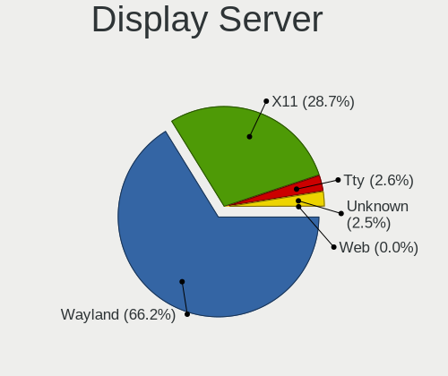
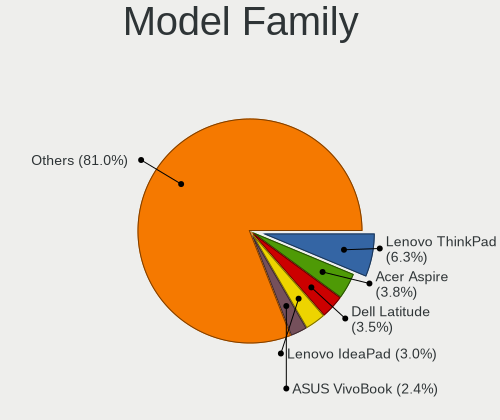
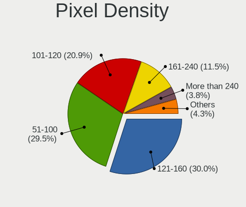
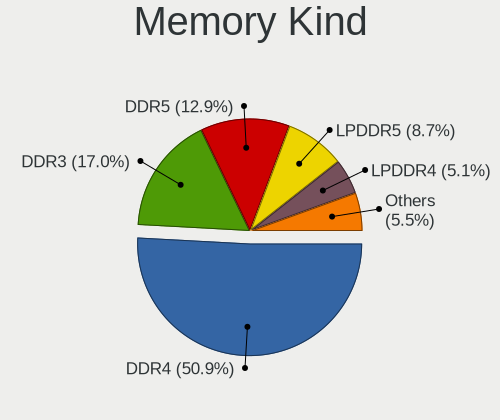
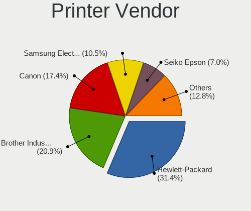

Ubuntu 24.04 - Tested Hardware & Statistics
-------------------------------------------

A project to collect tested hardware configurations for Ubuntu 24.04.

Anyone can contribute to this report by the [hw-probe](https://github.com/linuxhw/hw-probe) tool:

    sudo -E hw-probe -all -upload

Please contribute! Especially if your hardware is rare.

This is a report for all computer types. See also reports for [desktops](/Dist/Ubuntu_24.04/Desktop/README.md) and [notebooks](/Dist/Ubuntu_24.04/Notebook/README.md).

Contents
--------

* [ Test Cases ](#test-cases)

* [ System ](#system)
  - [ Kernel                   ](#kernel)
  - [ Kernel Family            ](#kernel-family)
  - [ Kernel Major Ver.        ](#kernel-major-ver)
  - [ Arch                     ](#arch)
  - [ DE                       ](#de)
  - [ Display Server           ](#display-server)
  - [ Display Manager          ](#display-manager)
  - [ OS Lang                  ](#os-lang)
  - [ Boot Mode                ](#boot-mode)
  - [ Filesystem               ](#filesystem)
  - [ Part. scheme             ](#part-scheme)
  - [ Dual Boot with Linux/BSD ](#dual-boot-with-linuxbsd)
  - [ Dual Boot (Win)          ](#dual-boot-win)

* [ Board ](#board)
  - [ Vendor                   ](#vendor)
  - [ Model                    ](#model)
  - [ Model Family             ](#model-family)
  - [ MFG Year                 ](#mfg-year)
  - [ Form Factor              ](#form-factor)
  - [ Secure Boot              ](#secure-boot)
  - [ Coreboot                 ](#coreboot)
  - [ RAM Size                 ](#ram-size)
  - [ RAM Used                 ](#ram-used)
  - [ Total Drives             ](#total-drives)
  - [ Has CD-ROM               ](#has-cd-rom)
  - [ Has Ethernet             ](#has-ethernet)
  - [ Has WiFi                 ](#has-wifi)
  - [ Has Bluetooth            ](#has-bluetooth)

* [ Location ](#location)
  - [ Country                  ](#country)
  - [ City                     ](#city)

* [ Drives ](#drives)
  - [ Drive Vendor             ](#drive-vendor)
  - [ Drive Model              ](#drive-model)
  - [ HDD Vendor               ](#hdd-vendor)
  - [ SSD Vendor               ](#ssd-vendor)
  - [ Drive Kind               ](#drive-kind)
  - [ Drive Connector          ](#drive-connector)
  - [ Drive Size               ](#drive-size)
  - [ Space Total              ](#space-total)
  - [ Space Used               ](#space-used)
  - [ Malfunc. Drives          ](#malfunc-drives)
  - [ Malfunc. Drive Vendor    ](#malfunc-drive-vendor)
  - [ Malfunc. HDD Vendor      ](#malfunc-hdd-vendor)
  - [ Malfunc. Drive Kind      ](#malfunc-drive-kind)
  - [ Failed Drives            ](#failed-drives)
  - [ Failed Drive Vendor      ](#failed-drive-vendor)
  - [ Drive Status             ](#drive-status)

* [ Storage controller ](#storage-controller)
  - [ Storage Vendor           ](#storage-vendor)
  - [ Storage Model            ](#storage-model)
  - [ Storage Kind             ](#storage-kind)

* [ Processor ](#processor)
  - [ CPU Vendor               ](#cpu-vendor)
  - [ CPU Model                ](#cpu-model)
  - [ CPU Model Family         ](#cpu-model-family)
  - [ CPU Cores                ](#cpu-cores)
  - [ CPU Sockets              ](#cpu-sockets)
  - [ CPU Threads              ](#cpu-threads)
  - [ CPU Op-Modes             ](#cpu-op-modes)
  - [ CPU Microcode            ](#cpu-microcode)
  - [ CPU Microarch            ](#cpu-microarch)

* [ Graphics ](#graphics)
  - [ GPU Vendor               ](#gpu-vendor)
  - [ GPU Model                ](#gpu-model)
  - [ GPU Combo                ](#gpu-combo)
  - [ GPU Driver               ](#gpu-driver)
  - [ GPU Memory               ](#gpu-memory)

* [ Monitor ](#monitor)
  - [ Monitor Vendor           ](#monitor-vendor)
  - [ Monitor Model            ](#monitor-model)
  - [ Monitor Resolution       ](#monitor-resolution)
  - [ Monitor Diagonal         ](#monitor-diagonal)
  - [ Monitor Width            ](#monitor-width)
  - [ Aspect Ratio             ](#aspect-ratio)
  - [ Monitor Area             ](#monitor-area)
  - [ Pixel Density            ](#pixel-density)
  - [ Multiple Monitors        ](#multiple-monitors)

* [ Network ](#network)
  - [ Net Controller Vendor    ](#net-controller-vendor)
  - [ Net Controller Model     ](#net-controller-model)
  - [ Wireless Vendor          ](#wireless-vendor)
  - [ Wireless Model           ](#wireless-model)
  - [ Ethernet Vendor          ](#ethernet-vendor)
  - [ Ethernet Model           ](#ethernet-model)
  - [ Net Controller Kind      ](#net-controller-kind)
  - [ Used Controller          ](#used-controller)
  - [ NICs                     ](#nics)
  - [ IPv6                     ](#ipv6)

* [ Bluetooth ](#bluetooth)
  - [ Bluetooth Vendor         ](#bluetooth-vendor)
  - [ Bluetooth Model          ](#bluetooth-model)

* [ Sound ](#sound)
  - [ Sound Vendor             ](#sound-vendor)
  - [ Sound Model              ](#sound-model)

* [ Memory ](#memory)
  - [ Memory Vendor            ](#memory-vendor)
  - [ Memory Model             ](#memory-model)
  - [ Memory Kind              ](#memory-kind)
  - [ Memory Form Factor       ](#memory-form-factor)
  - [ Memory Size              ](#memory-size)
  - [ Memory Speed             ](#memory-speed)

* [ Printers & scanners ](#printers--scanners)
  - [ Printer Vendor           ](#printer-vendor)
  - [ Printer Model            ](#printer-model)
  - [ Scanner Vendor           ](#scanner-vendor)
  - [ Scanner Model            ](#scanner-model)

* [ Camera ](#camera)
  - [ Camera Vendor            ](#camera-vendor)
  - [ Camera Model             ](#camera-model)

* [ Security ](#security)
  - [ Fingerprint Vendor       ](#fingerprint-vendor)
  - [ Fingerprint Model        ](#fingerprint-model)
  - [ Chipcard Vendor          ](#chipcard-vendor)
  - [ Chipcard Model           ](#chipcard-model)

* [ Unsupported ](#unsupported)
  - [ Unsupported Devices      ](#unsupported-devices)
  - [ Unsupported Device Types ](#unsupported-device-types)

Test Cases
----------

Total: 6004

| Vendor        | Model                       | Form-Factor | Probe                                                      | Date         |
|---------------|-----------------------------|-------------|------------------------------------------------------------|--------------|
| Acer          | Aspire E5-575               | Notebook    | [8a7b632b3f](https://linux-hardware.org/?probe=8a7b632b3f) | Jan 06, 2025 |
| ASUSTek       | P8Z68-V LX                  | Desktop     | [2b21c81822](https://linux-hardware.org/?probe=2b21c81822) | Jan 06, 2025 |
| Lenovo        | SHARKBAY SDK0J40700 WIN     | Desktop     | [262450ac44](https://linux-hardware.org/?probe=262450ac44) | Jan 06, 2025 |
| Medion        | Akoya E6240T                | Notebook    | [bb72b25bf7](https://linux-hardware.org/?probe=bb72b25bf7) | Jan 06, 2025 |
| Lenovo        | G40-30 80FY                 | Notebook    | [398cb6b840](https://linux-hardware.org/?probe=398cb6b840) | Jan 06, 2025 |
| Lenovo        | ThinkPad P51 20HJS0D201     | Notebook    | [f43357e57a](https://linux-hardware.org/?probe=f43357e57a) | Jan 06, 2025 |
| Dell          | XPS 13 9305                 | Notebook    | [77f98c4014](https://linux-hardware.org/?probe=77f98c4014) | Jan 06, 2025 |
| ASUSTek       | ROG STRIX B550-F GAMING ... | Desktop     | [88b1c0c262](https://linux-hardware.org/?probe=88b1c0c262) | Jan 06, 2025 |
| Dell          | Precision M6800             | Notebook    | [01d1dcb2d8](https://linux-hardware.org/?probe=01d1dcb2d8) | Jan 06, 2025 |
| Alienware     | m18 R2                      | Notebook    | [6277d13cf5](https://linux-hardware.org/?probe=6277d13cf5) | Jan 06, 2025 |
| Dell          | Precision 3571              | Notebook    | [95b1b27d71](https://linux-hardware.org/?probe=95b1b27d71) | Jan 06, 2025 |
| Dell          | Inspiron 14 7430 2-in-1     | Convertible | [12732aa34d](https://linux-hardware.org/?probe=12732aa34d) | Jan 06, 2025 |
| ASRock        | N100M                       | Desktop     | [231da8b814](https://linux-hardware.org/?probe=231da8b814) | Jan 06, 2025 |
| HP            | Pavilion Notebook           | Notebook    | [eb8cc11cc5](https://linux-hardware.org/?probe=eb8cc11cc5) | Jan 05, 2025 |
| Lenovo        | IdeaPad Slim 5 16IRU9 83... | Notebook    | [916567f213](https://linux-hardware.org/?probe=916567f213) | Jan 05, 2025 |
| Dell          | Latitude E6230              | Notebook    | [638ece1f17](https://linux-hardware.org/?probe=638ece1f17) | Jan 05, 2025 |
| ASUSTek       | PRIME Z690-A                | Desktop     | [a2a616fa46](https://linux-hardware.org/?probe=a2a616fa46) | Jan 05, 2025 |
| Lenovo        | ThinkPad X13 Gen 3 21BQA... | Notebook    | [ec40ca9885](https://linux-hardware.org/?probe=ec40ca9885) | Jan 05, 2025 |
| ASUSTek       | VivoBook_ASUSLaptop X150... | Notebook    | [5e3d055319](https://linux-hardware.org/?probe=5e3d055319) | Jan 05, 2025 |
| HP            | Pavilion dv8                | Notebook    | [ab69193742](https://linux-hardware.org/?probe=ab69193742) | Jan 05, 2025 |
| Acer          | Aspire A514-53              | Notebook    | [88e5da8b9d](https://linux-hardware.org/?probe=88e5da8b9d) | Jan 05, 2025 |
| MSI           | B650M GAMING PLUS WIFI      | Desktop     | [c7c27f65c6](https://linux-hardware.org/?probe=c7c27f65c6) | Jan 05, 2025 |
| Acer          | Aspire A514-53              | Notebook    | [a4dc1a43a2](https://linux-hardware.org/?probe=a4dc1a43a2) | Jan 05, 2025 |
| ASUSTek       | PRIME Z690-A                | Desktop     | [17a75e1af5](https://linux-hardware.org/?probe=17a75e1af5) | Jan 05, 2025 |
| MSI           | B650M GAMING PLUS WIFI      | Desktop     | [945b45d496](https://linux-hardware.org/?probe=945b45d496) | Jan 05, 2025 |
| Chuwi         | GemiBook Pro                | Notebook    | [cb3ae7cb2a](https://linux-hardware.org/?probe=cb3ae7cb2a) | Jan 05, 2025 |
| Lenovo        | ThinkPad W530 2441AG6       | Notebook    | [20e239cb8a](https://linux-hardware.org/?probe=20e239cb8a) | Jan 05, 2025 |
| Chuwi         | GemiBook Pro                | Notebook    | [9518969af8](https://linux-hardware.org/?probe=9518969af8) | Jan 05, 2025 |
| Acer          | Aspire A315-24PT            | Notebook    | [e800b5fdb7](https://linux-hardware.org/?probe=e800b5fdb7) | Jan 05, 2025 |
| Lenovo        | ThinkBook 14 G2 ITL 20VD    | Notebook    | [6a8e47f57b](https://linux-hardware.org/?probe=6a8e47f57b) | Jan 05, 2025 |
| Acer          | Aspire A115-32              | Notebook    | [2c6043fd56](https://linux-hardware.org/?probe=2c6043fd56) | Jan 05, 2025 |
| ASRock        | Z790 PG SONIC               | Desktop     | [8404feef08](https://linux-hardware.org/?probe=8404feef08) | Jan 05, 2025 |
| ASRock        | B450M Pro4                  | Desktop     | [f1b064f039](https://linux-hardware.org/?probe=f1b064f039) | Jan 05, 2025 |
| ASUSTek       | Z97-PRO GAMER               | Desktop     | [cc569301fd](https://linux-hardware.org/?probe=cc569301fd) | Jan 05, 2025 |
| ASUSTek       | PRIME Z690M-PLUS D4         | Desktop     | [beaaf37101](https://linux-hardware.org/?probe=beaaf37101) | Jan 05, 2025 |
| Acer          | Aspire A315-24PT            | Notebook    | [cea7933cc6](https://linux-hardware.org/?probe=cea7933cc6) | Jan 05, 2025 |
| Intel         | X99                         | Desktop     | [0179690cc0](https://linux-hardware.org/?probe=0179690cc0) | Jan 05, 2025 |
| Dell          | G3 3500                     | Notebook    | [5c6b757b24](https://linux-hardware.org/?probe=5c6b757b24) | Jan 05, 2025 |
| MSI           | MPG B650I EDGE WIFI         | Desktop     | [e2c6dd2497](https://linux-hardware.org/?probe=e2c6dd2497) | Jan 05, 2025 |
| ASRock        | B650M Pro RS WiFi           | Desktop     | [4624d90ffe](https://linux-hardware.org/?probe=4624d90ffe) | Jan 04, 2025 |
| Framework     | Laptop 16 (AMD Ryzen 704... | Notebook    | [0bff2b1d13](https://linux-hardware.org/?probe=0bff2b1d13) | Jan 04, 2025 |
| ASRock        | B650M Pro RS WiFi           | Desktop     | [490322b097](https://linux-hardware.org/?probe=490322b097) | Jan 04, 2025 |
| HP            | 8643 SMVB                   | Desktop     | [246d1f3f87](https://linux-hardware.org/?probe=246d1f3f87) | Jan 04, 2025 |
| ASUSTek       | M5A97 R2.0                  | Desktop     | [7eb3a63b51](https://linux-hardware.org/?probe=7eb3a63b51) | Jan 04, 2025 |
| HP            | ProBook 430 G7              | Notebook    | [f1b89f85cf](https://linux-hardware.org/?probe=f1b89f85cf) | Jan 04, 2025 |
| ASUSTek       | TUF Gaming B550M-PLUS WI... | Desktop     | [bbc74e0c64](https://linux-hardware.org/?probe=bbc74e0c64) | Jan 04, 2025 |
| HP            | ZBook 15 G3                 | Notebook    | [548eae93b9](https://linux-hardware.org/?probe=548eae93b9) | Jan 04, 2025 |
| MSI           | Katana GF66 11UC            | Notebook    | [aca2d91d26](https://linux-hardware.org/?probe=aca2d91d26) | Jan 04, 2025 |
| HP            | 3397                        | Desktop     | [918fca6eda](https://linux-hardware.org/?probe=918fca6eda) | Jan 04, 2025 |
| HP            | 21EF                        | Desktop     | [f86b96338c](https://linux-hardware.org/?probe=f86b96338c) | Jan 04, 2025 |
| Lenovo        | G50-70 20351                | Notebook    | [666751867c](https://linux-hardware.org/?probe=666751867c) | Jan 04, 2025 |
| Dell          | Inspiron 3541               | Notebook    | [206872a37f](https://linux-hardware.org/?probe=206872a37f) | Jan 04, 2025 |
| Dell          | 0VRWRC A00                  | Desktop     | [37a490b1e0](https://linux-hardware.org/?probe=37a490b1e0) | Jan 04, 2025 |
| HP            | 3397                        | Desktop     | [b9c57503ea](https://linux-hardware.org/?probe=b9c57503ea) | Jan 04, 2025 |
| ASUSTek       | ROG Strix G713RC_G713RC     | Notebook    | [721dbc3f65](https://linux-hardware.org/?probe=721dbc3f65) | Jan 04, 2025 |
| ASUSTek       | ROG Strix G713RC_G713RC     | Notebook    | [e6b0e5183e](https://linux-hardware.org/?probe=e6b0e5183e) | Jan 04, 2025 |
| ASRock        | 970 Pro3 R2.0               | Desktop     | [adb7b1fe9d](https://linux-hardware.org/?probe=adb7b1fe9d) | Jan 04, 2025 |
| Supermicro    | X9DRH-7TF/7F/iTF/iF         | Server      | [ca71a1b4d6](https://linux-hardware.org/?probe=ca71a1b4d6) | Jan 04, 2025 |
| Lenovo        | IdeaPad S145-15IIL 81W8     | Notebook    | [96316f7cee](https://linux-hardware.org/?probe=96316f7cee) | Jan 04, 2025 |
| ASUSTek       | P8H61-MX USB3               | Desktop     | [b3b2df2fe7](https://linux-hardware.org/?probe=b3b2df2fe7) | Jan 04, 2025 |
| ASUSTek       | P8H61-MX USB3               | Desktop     | [1600afa2eb](https://linux-hardware.org/?probe=1600afa2eb) | Jan 04, 2025 |
| Dell          | Inspiron 5480               | Notebook    | [23f4e47841](https://linux-hardware.org/?probe=23f4e47841) | Jan 04, 2025 |
| ASUSTek       | VivoBook_ASUSLaptop K360... | Notebook    | [adec02cbc1](https://linux-hardware.org/?probe=adec02cbc1) | Jan 04, 2025 |
| Apple         | MacBookPro9,2               | Notebook    | [cfa406503c](https://linux-hardware.org/?probe=cfa406503c) | Jan 04, 2025 |
| HP            | 1998                        | Desktop     | [cccf71a69c](https://linux-hardware.org/?probe=cccf71a69c) | Jan 04, 2025 |
| Dell          | Vostro 15 3530              | Notebook    | [20a13b2865](https://linux-hardware.org/?probe=20a13b2865) | Jan 04, 2025 |
| Gigabyte      | Z790 AORUS ELITE AX         | Desktop     | [5e7dda5f4d](https://linux-hardware.org/?probe=5e7dda5f4d) | Jan 04, 2025 |
| HP            | Laptop 15-db0xxx            | Notebook    | [15039e5101](https://linux-hardware.org/?probe=15039e5101) | Jan 04, 2025 |
| ASUSTek       | H97-PLUS                    | Desktop     | [fd886041fc](https://linux-hardware.org/?probe=fd886041fc) | Jan 04, 2025 |
| ASUSTek       | H97-PLUS                    | Desktop     | [dc6f9929d7](https://linux-hardware.org/?probe=dc6f9929d7) | Jan 04, 2025 |
| ASUSTek       | VivoBook_ASUSLaptop X415... | Notebook    | [28e55a6043](https://linux-hardware.org/?probe=28e55a6043) | Jan 03, 2025 |
| ASUSTek       | PRIME B250M-C               | Desktop     | [deab95f2af](https://linux-hardware.org/?probe=deab95f2af) | Jan 03, 2025 |
| MSI           | X670E GAMING PLUS WIFI      | Desktop     | [fcdb536656](https://linux-hardware.org/?probe=fcdb536656) | Jan 03, 2025 |
| HP            | Pavilion Notebook           | Notebook    | [41e590e617](https://linux-hardware.org/?probe=41e590e617) | Jan 03, 2025 |
| Microsoft     | Surface Book 3              | Tablet      | [03611f8371](https://linux-hardware.org/?probe=03611f8371) | Jan 03, 2025 |
| Acer          | Aspire E5-576G              | Notebook    | [9f344c14d4](https://linux-hardware.org/?probe=9f344c14d4) | Jan 03, 2025 |
| HP            | 250 G7 Notebook PC          | Notebook    | [6bf480c75a](https://linux-hardware.org/?probe=6bf480c75a) | Jan 03, 2025 |
| Gigabyte      | B550 AORUS ELITE V2         | Desktop     | [c841518658](https://linux-hardware.org/?probe=c841518658) | Jan 03, 2025 |
| ASUSTek       | VivoBook_ASUSLaptop X515... | Notebook    | [ac0b2b8219](https://linux-hardware.org/?probe=ac0b2b8219) | Jan 03, 2025 |
| Dell          | Inspiron 7786               | Convertible | [7a0bb3a19e](https://linux-hardware.org/?probe=7a0bb3a19e) | Jan 03, 2025 |
| HP            | 805D                        | Desktop     | [9dd735123b](https://linux-hardware.org/?probe=9dd735123b) | Jan 03, 2025 |
| Gigabyte      | B450 GAMING X               | Desktop     | [92b892fb46](https://linux-hardware.org/?probe=92b892fb46) | Jan 03, 2025 |
| ASRock        | X470 Taichi                 | Desktop     | [72c6b2bcbb](https://linux-hardware.org/?probe=72c6b2bcbb) | Jan 03, 2025 |
| Lenovo        | IdeaPad Flex-15IML 81XH     | Convertible | [9579158217](https://linux-hardware.org/?probe=9579158217) | Jan 03, 2025 |
| ASRock        | X470 Taichi                 | Desktop     | [8cadf9a645](https://linux-hardware.org/?probe=8cadf9a645) | Jan 03, 2025 |
| HP            | EliteBook 840 G5            | Notebook    | [ec0eaf35ef](https://linux-hardware.org/?probe=ec0eaf35ef) | Jan 03, 2025 |
| Acer          | Aspire V5-591G              | Notebook    | [fba09b3376](https://linux-hardware.org/?probe=fba09b3376) | Jan 03, 2025 |
| ASRock        | B450M Pro4                  | Desktop     | [d8b50816f0](https://linux-hardware.org/?probe=d8b50816f0) | Jan 03, 2025 |
| Dell          | XPS 15 9560                 | Notebook    | [924d90cdcc](https://linux-hardware.org/?probe=924d90cdcc) | Jan 03, 2025 |
| Dell          | XPS 15 9560                 | Notebook    | [5a9c188db1](https://linux-hardware.org/?probe=5a9c188db1) | Jan 03, 2025 |
| Apple         | MacBookPro12,1              | Notebook    | [c226449ca2](https://linux-hardware.org/?probe=c226449ca2) | Jan 03, 2025 |
| HP            | ProBook 650 G2              | Notebook    | [b2fc855e3e](https://linux-hardware.org/?probe=b2fc855e3e) | Jan 03, 2025 |
| HP            | EliteBook 840 G6            | Notebook    | [6781e260b0](https://linux-hardware.org/?probe=6781e260b0) | Jan 03, 2025 |
| HP            | EliteBook 840 G6            | Notebook    | [fd2f975353](https://linux-hardware.org/?probe=fd2f975353) | Jan 03, 2025 |
| Lenovo        | IdeaPad 3 15ITL6 82H8       | Notebook    | [58e41b0f0f](https://linux-hardware.org/?probe=58e41b0f0f) | Jan 03, 2025 |
| Lenovo        | Yoga C930-13IKB 81C4        | Convertible | [fc7c5a7792](https://linux-hardware.org/?probe=fc7c5a7792) | Jan 03, 2025 |
| Acer          | Aspire A515-52              | Notebook    | [4b5bf879c2](https://linux-hardware.org/?probe=4b5bf879c2) | Jan 03, 2025 |
| sunxi         | Unknown                     | Soc         | [48a1a5a5fa](https://linux-hardware.org/?probe=48a1a5a5fa) | Jan 03, 2025 |
| Lenovo        | Slim Pro 7 14ARP8 83AX      | Notebook    | [9acb68fefa](https://linux-hardware.org/?probe=9acb68fefa) | Jan 03, 2025 |
| Apple         | Mac-8ED6AF5B48C039E1 Mac... | Mini pc     | [34ae2be0aa](https://linux-hardware.org/?probe=34ae2be0aa) | Jan 02, 2025 |
| Alienware     | m18 R2                      | Notebook    | [48bc0a64c1](https://linux-hardware.org/?probe=48bc0a64c1) | Jan 02, 2025 |
| MSI           | PRO B650-VC WIFI II         | Desktop     | [a86933b617](https://linux-hardware.org/?probe=a86933b617) | Jan 02, 2025 |
| Gigabyte      | B550M DS3H AC               | Desktop     | [1540589e08](https://linux-hardware.org/?probe=1540589e08) | Jan 02, 2025 |
| MSI           | MPG B550 GAMING PLUS        | Desktop     | [139667b28f](https://linux-hardware.org/?probe=139667b28f) | Jan 02, 2025 |
| Dell          | Latitude E6430              | Notebook    | [0baf769dd2](https://linux-hardware.org/?probe=0baf769dd2) | Jan 02, 2025 |
| Lenovo        | ThinkPad X250 20CLS45J00    | Notebook    | [23c3a522f9](https://linux-hardware.org/?probe=23c3a522f9) | Jan 02, 2025 |
| ASUSTek       | M11BB                       | Desktop     | [55fb5769d0](https://linux-hardware.org/?probe=55fb5769d0) | Jan 02, 2025 |
| Unknown       | Unknown                     | Notebook    | [267152ac45](https://linux-hardware.org/?probe=267152ac45) | Jan 02, 2025 |
| ASUSTek       | ROG Zephyrus G14 GA401QM... | Notebook    | [47b95e50dc](https://linux-hardware.org/?probe=47b95e50dc) | Jan 02, 2025 |
| ASRock        | B450 Gaming-ITX/ac          | Desktop     | [b487e51342](https://linux-hardware.org/?probe=b487e51342) | Jan 02, 2025 |
| Lenovo        | IdeaPad 320-15IKB 80XL      | Notebook    | [b90f085315](https://linux-hardware.org/?probe=b90f085315) | Jan 02, 2025 |
| Lenovo        | IdeaPad Slim 5 16ABR8 82... | Notebook    | [a03031641a](https://linux-hardware.org/?probe=a03031641a) | Jan 02, 2025 |
| Lenovo        | No DPK                      | All in one  | [f2ad5b1c81](https://linux-hardware.org/?probe=f2ad5b1c81) | Jan 02, 2025 |
| HP            | ProBook 440 G7              | Notebook    | [b1f0f9f971](https://linux-hardware.org/?probe=b1f0f9f971) | Jan 02, 2025 |
| ASUSTek       | M4A89TD PRO USB3            | Desktop     | [ca1a55b77d](https://linux-hardware.org/?probe=ca1a55b77d) | Jan 02, 2025 |
| Lenovo        | ThinkPad T460s 20FAS14F0... | Notebook    | [f72b380ee6](https://linux-hardware.org/?probe=f72b380ee6) | Jan 02, 2025 |
| ASUSTek       | ASUS TUF Gaming F15 FX50... | Notebook    | [745341e7fa](https://linux-hardware.org/?probe=745341e7fa) | Jan 02, 2025 |
| ASUSTek       | ASUS EXPERTBOOK B7402FEA... | Convertible | [0b0c4edb5a](https://linux-hardware.org/?probe=0b0c4edb5a) | Jan 02, 2025 |
| Packard Be... | EasyNote TK87               | Notebook    | [468680be46](https://linux-hardware.org/?probe=468680be46) | Jan 02, 2025 |
| Packard Be... | EasyNote TK87               | Notebook    | [d0bb5660e7](https://linux-hardware.org/?probe=d0bb5660e7) | Jan 02, 2025 |
| Sony          | SVF1521G6EW                 | Notebook    | [a9d8497c8d](https://linux-hardware.org/?probe=a9d8497c8d) | Jan 02, 2025 |
| MSI           | Z170-A PRO                  | Desktop     | [b1b8d67385](https://linux-hardware.org/?probe=b1b8d67385) | Jan 02, 2025 |
| MSI           | MPG B760I EDGE WIFI         | Desktop     | [8d39826a67](https://linux-hardware.org/?probe=8d39826a67) | Jan 02, 2025 |
| Dell          | XPS 13 9380                 | Notebook    | [fd629307a9](https://linux-hardware.org/?probe=fd629307a9) | Jan 02, 2025 |
| ASUSTek       | PRIME B250M-PLUS            | Desktop     | [5e1c09c578](https://linux-hardware.org/?probe=5e1c09c578) | Jan 02, 2025 |
| HP            | ZBook 15u G3                | Notebook    | [da5c26013c](https://linux-hardware.org/?probe=da5c26013c) | Jan 02, 2025 |
| HC Technol... | HCAR5000-MI                 | Desktop     | [1d85db58d0](https://linux-hardware.org/?probe=1d85db58d0) | Jan 02, 2025 |
| sunxi         | Unknown                     | Soc         | [b37770e49e](https://linux-hardware.org/?probe=b37770e49e) | Jan 01, 2025 |
| Lenovo        | G50-70 20351                | Notebook    | [9043dbb9a9](https://linux-hardware.org/?probe=9043dbb9a9) | Jan 01, 2025 |
| Dell          | Latitude E6230              | Notebook    | [8611ea969f](https://linux-hardware.org/?probe=8611ea969f) | Jan 01, 2025 |
| Minix         | NEO Z100-0dB                | All in one  | [7a69de9ac1](https://linux-hardware.org/?probe=7a69de9ac1) | Jan 01, 2025 |
| ASRock        | H310CM-HG4                  | Desktop     | [ea045be01b](https://linux-hardware.org/?probe=ea045be01b) | Jan 01, 2025 |
| HP            | 8767 A                      | Desktop     | [186d8b894f](https://linux-hardware.org/?probe=186d8b894f) | Jan 01, 2025 |
| ASUSTek       | PN53                        | Mini pc     | [2029a257eb](https://linux-hardware.org/?probe=2029a257eb) | Jan 01, 2025 |
| Lenovo        | ThinkPad X220 4291QZ1       | Notebook    | [ffd4949fc5](https://linux-hardware.org/?probe=ffd4949fc5) | Jan 01, 2025 |
| Lenovo        | ThinkPad X220 4291QZ1       | Notebook    | [68cf73b7b3](https://linux-hardware.org/?probe=68cf73b7b3) | Jan 01, 2025 |
| Apple         | Mac-F65AE981FFA204ED Mac... | Mini pc     | [7bd33042fa](https://linux-hardware.org/?probe=7bd33042fa) | Jan 01, 2025 |
| ASUSTek       | PRIME X370-A                | Desktop     | [1138447504](https://linux-hardware.org/?probe=1138447504) | Jan 01, 2025 |
| HP            | Laptop 15-dy2xxx            | Notebook    | [c1ed1a0524](https://linux-hardware.org/?probe=c1ed1a0524) | Jan 01, 2025 |
| Apple         | MacBookPro14,3              | Notebook    | [b1813c3452](https://linux-hardware.org/?probe=b1813c3452) | Jan 01, 2025 |
| Apple         | MacBookPro14,3              | Notebook    | [d3cba6d56e](https://linux-hardware.org/?probe=d3cba6d56e) | Jan 01, 2025 |
| AZW           | SER V1.0                    | Mini pc     | [b68af4b0f8](https://linux-hardware.org/?probe=b68af4b0f8) | Jan 01, 2025 |
| ASUSTek       | ROG STRIX B550-F GAMING     | Desktop     | [9802b59126](https://linux-hardware.org/?probe=9802b59126) | Jan 01, 2025 |
| Pegatron      | 2AD5                        | Desktop     | [1df79ca2a5](https://linux-hardware.org/?probe=1df79ca2a5) | Dec 31, 2024 |
| Samsung       | 550XDA                      | Notebook    | [f23c082843](https://linux-hardware.org/?probe=f23c082843) | Dec 31, 2024 |
| HP            | Pavilion dv7                | Notebook    | [80ac393681](https://linux-hardware.org/?probe=80ac393681) | Dec 31, 2024 |
| Pegatron      | 2AD5                        | Desktop     | [59fc90dfa9](https://linux-hardware.org/?probe=59fc90dfa9) | Dec 31, 2024 |
| Dell          | Precision 5520              | Notebook    | [88832dcaf1](https://linux-hardware.org/?probe=88832dcaf1) | Dec 31, 2024 |
| HP            | 1850                        | Desktop     | [e75a7ec226](https://linux-hardware.org/?probe=e75a7ec226) | Dec 31, 2024 |
| HP            | 1850                        | Desktop     | [935c16c9b6](https://linux-hardware.org/?probe=935c16c9b6) | Dec 31, 2024 |
| Acer          | Veriton X490G               | Desktop     | [0ce5ae0e9c](https://linux-hardware.org/?probe=0ce5ae0e9c) | Dec 31, 2024 |
| ASUSTek       | ROG STRIX Z390-F GAMING     | Desktop     | [558ed56269](https://linux-hardware.org/?probe=558ed56269) | Dec 31, 2024 |
| Acer          | Nitro ANV15-41              | Notebook    | [00953a17b5](https://linux-hardware.org/?probe=00953a17b5) | Dec 31, 2024 |
| Apple         | Mac-F2268DAE                | All in one  | [46feff6cc6](https://linux-hardware.org/?probe=46feff6cc6) | Dec 31, 2024 |
| ASUSTek       | PRIME X370-A                | Desktop     | [e7919fc318](https://linux-hardware.org/?probe=e7919fc318) | Dec 31, 2024 |
| Intel         | DH61WW AAG23116-302         | Desktop     | [d5dae00d07](https://linux-hardware.org/?probe=d5dae00d07) | Dec 31, 2024 |
| AZW           | SER V1.0                    | Mini pc     | [7fe4ce12e8](https://linux-hardware.org/?probe=7fe4ce12e8) | Dec 31, 2024 |
| Lenovo        | IdeaPadFlex 5 14ITL05 82... | Convertible | [d825d2369b](https://linux-hardware.org/?probe=d825d2369b) | Dec 31, 2024 |
| Acer          | Aspire E1-531               | Notebook    | [dcd279939a](https://linux-hardware.org/?probe=dcd279939a) | Dec 31, 2024 |
| Biostar       | H61MLV3                     | Desktop     | [22552600f9](https://linux-hardware.org/?probe=22552600f9) | Dec 31, 2024 |
| Biostar       | H61MLV3                     | Desktop     | [fb0d735a6e](https://linux-hardware.org/?probe=fb0d735a6e) | Dec 31, 2024 |
| Panasonic     | CF-33-1                     | Tablet      | [faf64bb8a0](https://linux-hardware.org/?probe=faf64bb8a0) | Dec 31, 2024 |
| Apple         | MacBook5,2                  | Notebook    | [3e1d6ce785](https://linux-hardware.org/?probe=3e1d6ce785) | Dec 31, 2024 |
| ASUSTek       | M5A78L-M LX V2              | Desktop     | [d995e98eb4](https://linux-hardware.org/?probe=d995e98eb4) | Dec 31, 2024 |
| ASUSTek       | PRIME Z690-P WIFI D4        | Desktop     | [2f76eb574a](https://linux-hardware.org/?probe=2f76eb574a) | Dec 31, 2024 |
| ASUSTek       | PRIME Z690-P WIFI D4        | Desktop     | [5167e42219](https://linux-hardware.org/?probe=5167e42219) | Dec 31, 2024 |
| Lenovo        | ThinkPad T470p 20J6CTO1W... | Notebook    | [b255d3c686](https://linux-hardware.org/?probe=b255d3c686) | Dec 31, 2024 |
| Framework     | Laptop 13 (AMD Ryzen 704... | Notebook    | [23175f9255](https://linux-hardware.org/?probe=23175f9255) | Dec 31, 2024 |
| Lenovo        | IdeaPad S540-14IWL 81ND     | Notebook    | [a1dfd54db3](https://linux-hardware.org/?probe=a1dfd54db3) | Dec 31, 2024 |
| ASUSTek       | ROG Zephyrus M16 GU603HM... | Notebook    | [783dddde17](https://linux-hardware.org/?probe=783dddde17) | Dec 31, 2024 |
| ASUSTek       | PRIME B560-PLUS             | Desktop     | [1cff6ff6dc](https://linux-hardware.org/?probe=1cff6ff6dc) | Dec 30, 2024 |
| HP            | 845A                        | Desktop     | [6dd10c7e63](https://linux-hardware.org/?probe=6dd10c7e63) | Dec 30, 2024 |
| HP            | 0A98h                       | Desktop     | [68e6a9636c](https://linux-hardware.org/?probe=68e6a9636c) | Dec 30, 2024 |
| HP            | 0A98h                       | Desktop     | [c82ec6e6ac](https://linux-hardware.org/?probe=c82ec6e6ac) | Dec 30, 2024 |
| HP            | Laptop 15-fd0xxx            | Notebook    | [f48e15c91b](https://linux-hardware.org/?probe=f48e15c91b) | Dec 30, 2024 |
| AZW           | SER V1.0                    | Mini pc     | [5226136073](https://linux-hardware.org/?probe=5226136073) | Dec 30, 2024 |
| AZW           | SER V1.0                    | Mini pc     | [fe71d3daf0](https://linux-hardware.org/?probe=fe71d3daf0) | Dec 30, 2024 |
| HP            | 1495                        | Desktop     | [f9588cf3eb](https://linux-hardware.org/?probe=f9588cf3eb) | Dec 30, 2024 |
| Microsoft     | Surface Go 3                | Tablet      | [2ea57d017c](https://linux-hardware.org/?probe=2ea57d017c) | Dec 30, 2024 |
| Apple         | Mac-942B5BF58194151B        | All in one  | [1b7ce01ae5](https://linux-hardware.org/?probe=1b7ce01ae5) | Dec 30, 2024 |
| eMachines     | EMCP73VT-PM                 | Desktop     | [c71116cfb9](https://linux-hardware.org/?probe=c71116cfb9) | Dec 30, 2024 |
| Apple         | MacBookPro5,5               | Notebook    | [80bf9a388e](https://linux-hardware.org/?probe=80bf9a388e) | Dec 30, 2024 |
| Apple         | MacBookPro5,5               | Notebook    | [8e4e44db83](https://linux-hardware.org/?probe=8e4e44db83) | Dec 30, 2024 |
| ASUSTek       | PRIME X370-A                | Desktop     | [a5cec19b2d](https://linux-hardware.org/?probe=a5cec19b2d) | Dec 30, 2024 |
| HP            | EliteBook Folio 1040 G1     | Notebook    | [55d6518fd1](https://linux-hardware.org/?probe=55d6518fd1) | Dec 30, 2024 |
| Lenovo        | Yoga 7 2-in-1 14AHP9 83D... | Convertible | [5b8d5f9b70](https://linux-hardware.org/?probe=5b8d5f9b70) | Dec 30, 2024 |
| Apple         | Mac-942B5BF58194151B        | All in one  | [075e984e88](https://linux-hardware.org/?probe=075e984e88) | Dec 30, 2024 |
| Lenovo        | ThinkPad T470s W10DG 20J... | Notebook    | [0d96f203f5](https://linux-hardware.org/?probe=0d96f203f5) | Dec 30, 2024 |
| Lenovo        | G585 20137                  | Notebook    | [cfbfe12819](https://linux-hardware.org/?probe=cfbfe12819) | Dec 30, 2024 |
| Lenovo        | ThinkPad X220 4290EC5       | Notebook    | [0a01dc8cd8](https://linux-hardware.org/?probe=0a01dc8cd8) | Dec 30, 2024 |
| ASUSTek       | GL703VM                     | Notebook    | [1121e5f4ca](https://linux-hardware.org/?probe=1121e5f4ca) | Dec 30, 2024 |
| ASUSTek       | ROG CROSSHAIR X870E HERO    | Desktop     | [9ba5e6b3c0](https://linux-hardware.org/?probe=9ba5e6b3c0) | Dec 30, 2024 |
| HP            | 8592                        | Desktop     | [abf909ed60](https://linux-hardware.org/?probe=abf909ed60) | Dec 30, 2024 |
| HP            | ENVY 17                     | Notebook    | [99fa04f0ca](https://linux-hardware.org/?probe=99fa04f0ca) | Dec 30, 2024 |
| MITSUBISHI    | MELSEC WinCPU               | Desktop     | [7a70e43e33](https://linux-hardware.org/?probe=7a70e43e33) | Dec 30, 2024 |
| Lenovo        | ThinkPad P50 20EQS12Q06     | Notebook    | [794c492899](https://linux-hardware.org/?probe=794c492899) | Dec 30, 2024 |
| ASUSTek       | ASUS BR1100CKA BR1100CKA... | Notebook    | [27dd012145](https://linux-hardware.org/?probe=27dd012145) | Dec 30, 2024 |
| HP            | Pavilion g6                 | Notebook    | [ea52acdc1b](https://linux-hardware.org/?probe=ea52acdc1b) | Dec 30, 2024 |
| ASUSTek       | VivoBook_ASUSLaptop K360... | Notebook    | [3865b761f5](https://linux-hardware.org/?probe=3865b761f5) | Dec 30, 2024 |
| ASUSTek       | M5A97 R2.0                  | Desktop     | [47ea215caf](https://linux-hardware.org/?probe=47ea215caf) | Dec 30, 2024 |
| Intel         | H81                         | Desktop     | [68678771e5](https://linux-hardware.org/?probe=68678771e5) | Dec 30, 2024 |
| Intel         | H81                         | Desktop     | [523d01d6a7](https://linux-hardware.org/?probe=523d01d6a7) | Dec 30, 2024 |
| HP            | 255 G7 Notebook PC          | Notebook    | [14817c7822](https://linux-hardware.org/?probe=14817c7822) | Dec 30, 2024 |
| HP            | EliteBook 840 G6            | Notebook    | [5c7d77f22a](https://linux-hardware.org/?probe=5c7d77f22a) | Dec 30, 2024 |
| HUAWEI        | FLMH-XX                     | Notebook    | [00d586da79](https://linux-hardware.org/?probe=00d586da79) | Dec 30, 2024 |
| AZW           | SER V2.0                    | Mini pc     | [86c93a37b2](https://linux-hardware.org/?probe=86c93a37b2) | Dec 29, 2024 |
| Lenovo        | IdeaPad Flex-15IML 81XH     | Convertible | [954e8986ce](https://linux-hardware.org/?probe=954e8986ce) | Dec 29, 2024 |
| Lenovo        | ThinkBook 14 G2 ITL 20VD    | Notebook    | [64c5deb6a7](https://linux-hardware.org/?probe=64c5deb6a7) | Dec 29, 2024 |
| MSI           | 970 GAMING                  | Desktop     | [25058a0a6c](https://linux-hardware.org/?probe=25058a0a6c) | Dec 29, 2024 |
| HP            | Laptop 17-cp0xxx            | Notebook    | [d87a6139f6](https://linux-hardware.org/?probe=d87a6139f6) | Dec 29, 2024 |
| HP            | Laptop 17-cp0xxx            | Notebook    | [0f9af93612](https://linux-hardware.org/?probe=0f9af93612) | Dec 29, 2024 |
| HP            | ZBook Power 15.6 inch G8... | Notebook    | [f521839f9a](https://linux-hardware.org/?probe=f521839f9a) | Dec 29, 2024 |
| Dell          | XPS 15 9570                 | Notebook    | [ec780ef825](https://linux-hardware.org/?probe=ec780ef825) | Dec 29, 2024 |
| Dell          | 076VHM A02                  | Desktop     | [9bee0be731](https://linux-hardware.org/?probe=9bee0be731) | Dec 29, 2024 |
| HP            | 212B                        | Desktop     | [3ddbe304f3](https://linux-hardware.org/?probe=3ddbe304f3) | Dec 29, 2024 |
| ASUSTek       | ROG STRIX B550-E GAMING     | Desktop     | [8c5acc63ea](https://linux-hardware.org/?probe=8c5acc63ea) | Dec 29, 2024 |
| Dell          | XPS 13 9370                 | Notebook    | [6b3d0134ab](https://linux-hardware.org/?probe=6b3d0134ab) | Dec 29, 2024 |
| ASUSTek       | Maximus V GENE              | Desktop     | [a007041cbd](https://linux-hardware.org/?probe=a007041cbd) | Dec 29, 2024 |
| HP            | 212B                        | Desktop     | [d64fe3acb0](https://linux-hardware.org/?probe=d64fe3acb0) | Dec 29, 2024 |
| ASUSTek       | P5E-VM HDMI                 | Desktop     | [241c643172](https://linux-hardware.org/?probe=241c643172) | Dec 29, 2024 |
| Sony          | VPCEB24FX                   | Notebook    | [b2006d7959](https://linux-hardware.org/?probe=b2006d7959) | Dec 29, 2024 |
| Lenovo        | 332D NOK                    | Mini pc     | [89bd7eac30](https://linux-hardware.org/?probe=89bd7eac30) | Dec 29, 2024 |
| Lenovo        | 332D NOK                    | Mini pc     | [e5e79f635a](https://linux-hardware.org/?probe=e5e79f635a) | Dec 29, 2024 |
| ASUSTek       | K501UB                      | Notebook    | [2654326cc1](https://linux-hardware.org/?probe=2654326cc1) | Dec 29, 2024 |
| ASUSTek       | ProArt X670E-CREATOR WIF... | Desktop     | [f7f4de362e](https://linux-hardware.org/?probe=f7f4de362e) | Dec 29, 2024 |
| HP            | EliteBook 8440p             | Notebook    | [ff3d8f0e0e](https://linux-hardware.org/?probe=ff3d8f0e0e) | Dec 28, 2024 |
| HP            | 250 15.6 inch G10 Notebo... | Notebook    | [c4a512bb62](https://linux-hardware.org/?probe=c4a512bb62) | Dec 28, 2024 |
| HUAWEI        | KLVL-WXXW                   | Notebook    | [2ce7175d0a](https://linux-hardware.org/?probe=2ce7175d0a) | Dec 28, 2024 |
| Lenovo        | No DPK                      | Desktop     | [0a59c75def](https://linux-hardware.org/?probe=0a59c75def) | Dec 28, 2024 |
| Gigabyte      | B450 AORUS ELITE            | Desktop     | [d122d7fcbd](https://linux-hardware.org/?probe=d122d7fcbd) | Dec 28, 2024 |
| ASUSTek       | M3A32-MVP DELUXE            | Desktop     | [94f08a5066](https://linux-hardware.org/?probe=94f08a5066) | Dec 28, 2024 |
| HP            | EliteBook 830 G8 Noteboo... | Notebook    | [837d43eb63](https://linux-hardware.org/?probe=837d43eb63) | Dec 28, 2024 |
| HP            | EliteBook 830 G8 Noteboo... | Notebook    | [13704e02a4](https://linux-hardware.org/?probe=13704e02a4) | Dec 28, 2024 |
| ASUSTek       | PRIME H310I-PLUS            | Desktop     | [d6a1f13ad7](https://linux-hardware.org/?probe=d6a1f13ad7) | Dec 28, 2024 |
| Lenovo        | IdeaPad L340-15API 81LW     | Notebook    | [fe8d690d1d](https://linux-hardware.org/?probe=fe8d690d1d) | Dec 28, 2024 |
| Lenovo        | IdeaPad L340-15API 81LW     | Notebook    | [40921a0302](https://linux-hardware.org/?probe=40921a0302) | Dec 28, 2024 |
| MSI           | MAG B550 TOMAHAWK           | Desktop     | [eba97e7b79](https://linux-hardware.org/?probe=eba97e7b79) | Dec 28, 2024 |
| Lenovo        | ThinkPad E15 Gen 4 21E7S... | Notebook    | [ce166a3364](https://linux-hardware.org/?probe=ce166a3364) | Dec 28, 2024 |
| MSI           | P67A-C45                    | Desktop     | [fd4f26fc74](https://linux-hardware.org/?probe=fd4f26fc74) | Dec 28, 2024 |
| HONOR         | HYM-WXX                     | Notebook    | [6b719e5c5d](https://linux-hardware.org/?probe=6b719e5c5d) | Dec 28, 2024 |
| HP            | Pavilion Gaming Notebook    | Notebook    | [0afcb0e788](https://linux-hardware.org/?probe=0afcb0e788) | Dec 28, 2024 |
| ASRockRack    | ALTRAD8UD-1L2T              | Server      | [bc61f95204](https://linux-hardware.org/?probe=bc61f95204) | Dec 28, 2024 |
| ASUSTek       | ROG STRIX Z390-E GAMING     | Desktop     | [4e361461b4](https://linux-hardware.org/?probe=4e361461b4) | Dec 28, 2024 |
| ASRock        | B450M Pro4                  | Desktop     | [4392310d5c](https://linux-hardware.org/?probe=4392310d5c) | Dec 28, 2024 |
| Lenovo        | ThinkPad E16 Gen 1 21JTS... | Notebook    | [7366a0d1fd](https://linux-hardware.org/?probe=7366a0d1fd) | Dec 28, 2024 |
| Sony          | VPCSB3V9R                   | Notebook    | [c0950c9d66](https://linux-hardware.org/?probe=c0950c9d66) | Dec 27, 2024 |
| MSI           | A88X-G45 GAMING             | Desktop     | [bf00d0c5cc](https://linux-hardware.org/?probe=bf00d0c5cc) | Dec 27, 2024 |
| HUAWEI        | FLMH-XX                     | Notebook    | [c469820693](https://linux-hardware.org/?probe=c469820693) | Dec 27, 2024 |
| Lenovo        | IdeaPadFlex 5 14ARE05 81... | Convertible | [d502f19368](https://linux-hardware.org/?probe=d502f19368) | Dec 27, 2024 |
| Acer          | Predator PT516-51s          | Notebook    | [ba15b5dd07](https://linux-hardware.org/?probe=ba15b5dd07) | Dec 27, 2024 |
| ASUSTek       | TUF Gaming B450M-PLUS II    | Desktop     | [477041c5bc](https://linux-hardware.org/?probe=477041c5bc) | Dec 27, 2024 |
| ASUSTek       | ROG STRIX Z390-E GAMING     | Desktop     | [3ab8537cf8](https://linux-hardware.org/?probe=3ab8537cf8) | Dec 27, 2024 |
| Lenovo        | ThinkPad T14 Gen 2i 20W0... | Notebook    | [118daf4ced](https://linux-hardware.org/?probe=118daf4ced) | Dec 27, 2024 |
| Lenovo        | ThinkPad X1 Carbon Gen 1... | Notebook    | [47b5606cc6](https://linux-hardware.org/?probe=47b5606cc6) | Dec 27, 2024 |
| ASUSTek       | PRIME B450M-A               | Desktop     | [efd4ef425c](https://linux-hardware.org/?probe=efd4ef425c) | Dec 27, 2024 |
| Positivo B... | VJFE52F11X-XXXXXX           | Notebook    | [83dc0c4a71](https://linux-hardware.org/?probe=83dc0c4a71) | Dec 27, 2024 |
| Lenovo        | ThinkPad E14 20RA004WUS     | Notebook    | [a88f8bddf3](https://linux-hardware.org/?probe=a88f8bddf3) | Dec 27, 2024 |
| Apple         | Mac-77F17D7DA9285301 iMa... | All in one  | [9c21fda832](https://linux-hardware.org/?probe=9c21fda832) | Dec 27, 2024 |
| HP            | 1905                        | Desktop     | [9566049ee0](https://linux-hardware.org/?probe=9566049ee0) | Dec 27, 2024 |
| Apple         | MacBook5,1                  | Notebook    | [c3f162d658](https://linux-hardware.org/?probe=c3f162d658) | Dec 27, 2024 |
| HP            | 1905                        | Desktop     | [7223de1d2e](https://linux-hardware.org/?probe=7223de1d2e) | Dec 26, 2024 |
| ASUSTek       | M5A97 LE R2.0               | Desktop     | [c90efdcb98](https://linux-hardware.org/?probe=c90efdcb98) | Dec 26, 2024 |
| ASUSTek       | ASUS TUF Gaming A15 FA50... | Notebook    | [71d10a1993](https://linux-hardware.org/?probe=71d10a1993) | Dec 26, 2024 |
| Lenovo        | IdeaPadFlex 4-1470 80SA     | Convertible | [2946506ec2](https://linux-hardware.org/?probe=2946506ec2) | Dec 26, 2024 |
| MSI           | X670E GAMING PLUS WIFI      | Desktop     | [0ff42c80a6](https://linux-hardware.org/?probe=0ff42c80a6) | Dec 26, 2024 |
| ASRock        | Z77 Pro3                    | Desktop     | [6e2115d1fc](https://linux-hardware.org/?probe=6e2115d1fc) | Dec 26, 2024 |
| Dell          | 0C1R19 A01                  | Desktop     | [ce9a260977](https://linux-hardware.org/?probe=ce9a260977) | Dec 26, 2024 |
| Lenovo        | IdeaPad 3 15ITL6 82H8       | Notebook    | [2a99f4c635](https://linux-hardware.org/?probe=2a99f4c635) | Dec 26, 2024 |
| ASUSTek       | ROG Zephyrus G14 GA402RJ    | Notebook    | [39f2b622bf](https://linux-hardware.org/?probe=39f2b622bf) | Dec 26, 2024 |
| ASUSTek       | TUF X470-PLUS GAMING        | Desktop     | [5084350626](https://linux-hardware.org/?probe=5084350626) | Dec 26, 2024 |
| Lenovo        | IdeaPad 3 15ITL6 82H8       | Notebook    | [0b609d2a62](https://linux-hardware.org/?probe=0b609d2a62) | Dec 26, 2024 |
| ASUSTek       | N53SV                       | Notebook    | [af2f1ee4b9](https://linux-hardware.org/?probe=af2f1ee4b9) | Dec 26, 2024 |
| Medion        | MS-7713                     | Desktop     | [794eb82dcb](https://linux-hardware.org/?probe=794eb82dcb) | Dec 26, 2024 |
| ASRock        | Z77 Pro3                    | Desktop     | [b995c7c799](https://linux-hardware.org/?probe=b995c7c799) | Dec 26, 2024 |
| MSI           | PRO B760-P WIFI DDR4        | Desktop     | [d7ca54538f](https://linux-hardware.org/?probe=d7ca54538f) | Dec 26, 2024 |
| ASUSTek       | VivoBook_ASUSLaptop K360... | Notebook    | [e26f1dfa00](https://linux-hardware.org/?probe=e26f1dfa00) | Dec 26, 2024 |
| Dell          | XPS 13 9305                 | Notebook    | [3bdc4d61ed](https://linux-hardware.org/?probe=3bdc4d61ed) | Dec 26, 2024 |
| Dell          | Latitude XT3                | Notebook    | [515fa3507a](https://linux-hardware.org/?probe=515fa3507a) | Dec 26, 2024 |
| Microsoft     | Surface Pro                 | Tablet      | [c9024275e0](https://linux-hardware.org/?probe=c9024275e0) | Dec 26, 2024 |
| ASRock        | B650M Pro RS WiFi           | Desktop     | [368bda5cc8](https://linux-hardware.org/?probe=368bda5cc8) | Dec 26, 2024 |
| Dell          | 06D7TR A00                  | Desktop     | [59dc0fa024](https://linux-hardware.org/?probe=59dc0fa024) | Dec 26, 2024 |
| Dell          | XPS 15 9500                 | Notebook    | [985a70079c](https://linux-hardware.org/?probe=985a70079c) | Dec 26, 2024 |
| Lenovo        | IdeaPad 5 15ALC05 82LN      | Notebook    | [38333ea200](https://linux-hardware.org/?probe=38333ea200) | Dec 26, 2024 |
| Lenovo        | IdeaPad 5 15ALC05 82LN      | Notebook    | [3619de98bb](https://linux-hardware.org/?probe=3619de98bb) | Dec 26, 2024 |
| HP            | 21EF 00~                   | Desktop     | [330a156ee2](https://linux-hardware.org/?probe=330a156ee2) | Dec 26, 2024 |
| Dell          | 0D6H9T A00                  | Desktop     | [3eb6ff8845](https://linux-hardware.org/?probe=3eb6ff8845) | Dec 25, 2024 |
| Dell          | XPS 15 9500                 | Notebook    | [6beec071ad](https://linux-hardware.org/?probe=6beec071ad) | Dec 25, 2024 |
| HP            | 829A                        | Mini pc     | [215280111a](https://linux-hardware.org/?probe=215280111a) | Dec 25, 2024 |
| ASUSTek       | VivoBook_ASUSLaptop K550... | Notebook    | [09c6b6944f](https://linux-hardware.org/?probe=09c6b6944f) | Dec 25, 2024 |
| ASUSTek       | K53SD                       | Notebook    | [ae48bfb917](https://linux-hardware.org/?probe=ae48bfb917) | Dec 25, 2024 |
| ASUSTek       | K53SD                       | Notebook    | [f20d270b1c](https://linux-hardware.org/?probe=f20d270b1c) | Dec 25, 2024 |
| HP            | 21EF                        | Desktop     | [699cf57463](https://linux-hardware.org/?probe=699cf57463) | Dec 25, 2024 |
| MSI           | B450M PRO-VDH MAX           | Desktop     | [eb51fedfee](https://linux-hardware.org/?probe=eb51fedfee) | Dec 25, 2024 |
| Gigabyte      | X570 AORUS PRO              | Desktop     | [c7cf8562c2](https://linux-hardware.org/?probe=c7cf8562c2) | Dec 25, 2024 |
| HP            | ENVY x360 Convertible 13... | Convertible | [9930026b7c](https://linux-hardware.org/?probe=9930026b7c) | Dec 25, 2024 |
| Hampoo        | C3W6_AP108_4GB Reserved     | Notebook    | [0b30ad312b](https://linux-hardware.org/?probe=0b30ad312b) | Dec 25, 2024 |
| Acer          | Extensa 215-55              | Notebook    | [b6002937c1](https://linux-hardware.org/?probe=b6002937c1) | Dec 25, 2024 |
| Acer          | Predator PO3-630            | Desktop     | [7cc2ff9acc](https://linux-hardware.org/?probe=7cc2ff9acc) | Dec 25, 2024 |
| Unknown       | NISB 3500                   | Desktop     | [dd5b50cff4](https://linux-hardware.org/?probe=dd5b50cff4) | Dec 25, 2024 |
| HP            | ENVY x360 Convertible 13... | Convertible | [69227251ee](https://linux-hardware.org/?probe=69227251ee) | Dec 25, 2024 |
| ASUSTek       | ASUS TUF Gaming A15 FA50... | Notebook    | [4505762848](https://linux-hardware.org/?probe=4505762848) | Dec 25, 2024 |
| MSI           | B450 TOMAHAWK               | Desktop     | [d999df797b](https://linux-hardware.org/?probe=d999df797b) | Dec 25, 2024 |
| Lenovo        | ThinkPad T470 W10DG 20JN... | Notebook    | [7e06f1b7f3](https://linux-hardware.org/?probe=7e06f1b7f3) | Dec 25, 2024 |
| ASUSTek       | VivoBook_ASUSLaptop X513... | Notebook    | [c551a96671](https://linux-hardware.org/?probe=c551a96671) | Dec 25, 2024 |
| Lenovo        | V15-IGL 82C3                | Notebook    | [2d1b592d60](https://linux-hardware.org/?probe=2d1b592d60) | Dec 25, 2024 |
| Dell          | Inspiron 15 3535            | Notebook    | [188c0c8aeb](https://linux-hardware.org/?probe=188c0c8aeb) | Dec 24, 2024 |
| Medion        | H81H3-EM2 H81EM2W08.309     | Desktop     | [4d4f395e80](https://linux-hardware.org/?probe=4d4f395e80) | Dec 24, 2024 |
| HP            | 845A                        | Desktop     | [d529dc1efc](https://linux-hardware.org/?probe=d529dc1efc) | Dec 24, 2024 |
| HP            | Laptop 15-db1xxx            | Notebook    | [f570b2eb57](https://linux-hardware.org/?probe=f570b2eb57) | Dec 24, 2024 |
| MSI           | B450M-A PRO MAX             | Desktop     | [b5f8afb7e9](https://linux-hardware.org/?probe=b5f8afb7e9) | Dec 24, 2024 |
| Dell          | XPS 13 9365                 | Convertible | [92dce0f9ac](https://linux-hardware.org/?probe=92dce0f9ac) | Dec 24, 2024 |
| HP            | 15                          | Notebook    | [20c4cf47f9](https://linux-hardware.org/?probe=20c4cf47f9) | Dec 24, 2024 |
| HP            | 15                          | Notebook    | [0508591afc](https://linux-hardware.org/?probe=0508591afc) | Dec 24, 2024 |
| MiTAC         | PD10EHI                     | Desktop     | [0879837e1b](https://linux-hardware.org/?probe=0879837e1b) | Dec 24, 2024 |
| Dell          | 0R790T A00                  | Desktop     | [c5ae7595ff](https://linux-hardware.org/?probe=c5ae7595ff) | Dec 24, 2024 |
| Intel         | B75                         | Desktop     | [b6021895af](https://linux-hardware.org/?probe=b6021895af) | Dec 24, 2024 |
| PN-3322       | PN-Media-01 V1.04           | Desktop     | [bc369995a2](https://linux-hardware.org/?probe=bc369995a2) | Dec 24, 2024 |
| Dell          | 0XPDFK A01                  | Desktop     | [fdd93d3ccd](https://linux-hardware.org/?probe=fdd93d3ccd) | Dec 24, 2024 |
| ASUSTek       | N56JN                       | Notebook    | [952d22573d](https://linux-hardware.org/?probe=952d22573d) | Dec 24, 2024 |
| HP            | 304Bh                       | Desktop     | [a578f26b30](https://linux-hardware.org/?probe=a578f26b30) | Dec 24, 2024 |
| Apple         | MacBook9,1                  | Notebook    | [ebdeaba538](https://linux-hardware.org/?probe=ebdeaba538) | Dec 24, 2024 |
| MSI           | Creator 15 A11UE            | Notebook    | [c6e4f39a97](https://linux-hardware.org/?probe=c6e4f39a97) | Dec 24, 2024 |
| Lenovo        | ThinkPad E14 Gen 5 21JSS... | Notebook    | [5308ff08f7](https://linux-hardware.org/?probe=5308ff08f7) | Dec 24, 2024 |
| Dell          | 0KWVT8 A03                  | Desktop     | [689cab771e](https://linux-hardware.org/?probe=689cab771e) | Dec 23, 2024 |
| Intel         | X99                         | Desktop     | [d2e526949b](https://linux-hardware.org/?probe=d2e526949b) | Dec 23, 2024 |
| ASUSTek       | TUF Gaming X570-PLUS        | Desktop     | [ce9f60c0b5](https://linux-hardware.org/?probe=ce9f60c0b5) | Dec 23, 2024 |
| MSI           | X370 XPOWER GAMING TITAN... | Desktop     | [d464edfda5](https://linux-hardware.org/?probe=d464edfda5) | Dec 23, 2024 |
| Dell          | 0KWVT8 A03                  | Desktop     | [d07ce185b1](https://linux-hardware.org/?probe=d07ce185b1) | Dec 23, 2024 |
| Dell          | G15 5530                    | Notebook    | [69f5776150](https://linux-hardware.org/?probe=69f5776150) | Dec 23, 2024 |
| Gigabyte      | X570 AORUS ELITE            | Desktop     | [a847bd7a4f](https://linux-hardware.org/?probe=a847bd7a4f) | Dec 23, 2024 |
| MSI           | C847IS-P33                  | Desktop     | [675e2d8c5d](https://linux-hardware.org/?probe=675e2d8c5d) | Dec 23, 2024 |
| Lenovo        | V330-15IKB 81AX             | Notebook    | [1b1e58284a](https://linux-hardware.org/?probe=1b1e58284a) | Dec 23, 2024 |
| MACHINIST     | X99 PR9                     | Desktop     | [74d2e10d43](https://linux-hardware.org/?probe=74d2e10d43) | Dec 23, 2024 |
| Gigabyte      | A320M-H-CF                  | Desktop     | [6e7907b787](https://linux-hardware.org/?probe=6e7907b787) | Dec 23, 2024 |
| Acer          | Swift SF314-58              | Notebook    | [35ca0e4138](https://linux-hardware.org/?probe=35ca0e4138) | Dec 23, 2024 |
| ASUSTek       | PRIME B450M-A               | Desktop     | [4dbc846a39](https://linux-hardware.org/?probe=4dbc846a39) | Dec 23, 2024 |
| ASRockRack    | TRX40D8-2N2T                | Desktop     | [a97760eedd](https://linux-hardware.org/?probe=a97760eedd) | Dec 23, 2024 |
| MSI           | Katana GF66 11UC            | Notebook    | [c287ca2189](https://linux-hardware.org/?probe=c287ca2189) | Dec 23, 2024 |
| Sony          | SVP1321C5E                  | Notebook    | [7dfbac17e9](https://linux-hardware.org/?probe=7dfbac17e9) | Dec 23, 2024 |
| Gigabyte      | B650 AORUS ELITE AX V2      | Desktop     | [1cc758dd90](https://linux-hardware.org/?probe=1cc758dd90) | Dec 23, 2024 |
| MUCAI         | H61 V1.5                    | Desktop     | [e087ab99b3](https://linux-hardware.org/?probe=e087ab99b3) | Dec 23, 2024 |
| Lenovo        | ThinkPad T14s Gen 4 21F8... | Notebook    | [d076330974](https://linux-hardware.org/?probe=d076330974) | Dec 23, 2024 |
| HP            | ZBook 15 G4                 | Notebook    | [a83dd50631](https://linux-hardware.org/?probe=a83dd50631) | Dec 23, 2024 |
| HP            | Pavilion dv7                | Notebook    | [c4f13a383d](https://linux-hardware.org/?probe=c4f13a383d) | Dec 23, 2024 |
| Acer          | Aspire A315-24P             | Notebook    | [653f633b8c](https://linux-hardware.org/?probe=653f633b8c) | Dec 23, 2024 |
| HP            | Laptop 15-dy2xxx            | Notebook    | [a0aae5b95d](https://linux-hardware.org/?probe=a0aae5b95d) | Dec 23, 2024 |
| MSI           | 2A9C                        | Desktop     | [e552d93303](https://linux-hardware.org/?probe=e552d93303) | Dec 23, 2024 |
| ASUSTek       | ASUS Zenbook 14 UM3406HA... | Notebook    | [15acffc895](https://linux-hardware.org/?probe=15acffc895) | Dec 23, 2024 |
| HP            | 82B5                        | All in one  | [5eae5397cf](https://linux-hardware.org/?probe=5eae5397cf) | Dec 23, 2024 |
| Lenovo        | Y50-70 Touch 20349          | Notebook    | [f897b9115c](https://linux-hardware.org/?probe=f897b9115c) | Dec 23, 2024 |
| ASUSTek       | VivoBook 14_ASUS Laptop ... | Notebook    | [8e7f60e511](https://linux-hardware.org/?probe=8e7f60e511) | Dec 23, 2024 |
| ASUSTek       | VivoBook 14_ASUS Laptop ... | Notebook    | [b7da8ab4d5](https://linux-hardware.org/?probe=b7da8ab4d5) | Dec 23, 2024 |
| Dell          | G3 3579                     | Notebook    | [1d4bdd5b06](https://linux-hardware.org/?probe=1d4bdd5b06) | Dec 23, 2024 |
| HP            | 2129                        | Desktop     | [9ef2d08323](https://linux-hardware.org/?probe=9ef2d08323) | Dec 23, 2024 |
| ASUSTek       | H97-PLUS                    | Desktop     | [dde78901c1](https://linux-hardware.org/?probe=dde78901c1) | Dec 23, 2024 |
| ASUSTek       | ROG Strix G733PZV_G733PZ... | Notebook    | [266a009703](https://linux-hardware.org/?probe=266a009703) | Dec 23, 2024 |
| Lenovo        | IdeaPad S340-15IWL 81N8     | Notebook    | [c57720c15f](https://linux-hardware.org/?probe=c57720c15f) | Dec 23, 2024 |
| Lenovo        | Legion Slim 5 16APH8 82Y... | Notebook    | [26b810b462](https://linux-hardware.org/?probe=26b810b462) | Dec 22, 2024 |
| Apple         | MacBookPro16,1              | Notebook    | [29e232bc14](https://linux-hardware.org/?probe=29e232bc14) | Dec 22, 2024 |
| MSI           | GF63 Thin 10SCSR            | Notebook    | [c0a219ed53](https://linux-hardware.org/?probe=c0a219ed53) | Dec 22, 2024 |
| Dell          | 0MWYPT A02                  | Desktop     | [6d1b9f2ffd](https://linux-hardware.org/?probe=6d1b9f2ffd) | Dec 22, 2024 |
| HP            | EliteBook 650 15.6 inch ... | Notebook    | [2c77e00968](https://linux-hardware.org/?probe=2c77e00968) | Dec 22, 2024 |
| ASUSTek       | M5A78L-M PLUS/USB3          | Desktop     | [9d9a451905](https://linux-hardware.org/?probe=9d9a451905) | Dec 22, 2024 |
| ASUSTek       | M5A78L-M PLUS/USB3          | Desktop     | [a7dd685d33](https://linux-hardware.org/?probe=a7dd685d33) | Dec 22, 2024 |
| Gigabyte      | GA-MA790XT-UD4P             | Desktop     | [3916b9871f](https://linux-hardware.org/?probe=3916b9871f) | Dec 22, 2024 |
| MSI           | H610M BOMBER DDR4           | Desktop     | [2d757efd33](https://linux-hardware.org/?probe=2d757efd33) | Dec 22, 2024 |
| ASUSTek       | TUF Gaming X570-PRO         | Desktop     | [f7f28f51ad](https://linux-hardware.org/?probe=f7f28f51ad) | Dec 22, 2024 |
| ASUSTek       | P6T                         | Desktop     | [1c4b7e24bb](https://linux-hardware.org/?probe=1c4b7e24bb) | Dec 22, 2024 |
| Lenovo        | IdeaPad 3 14ALC6 82KT       | Notebook    | [83a0db5938](https://linux-hardware.org/?probe=83a0db5938) | Dec 22, 2024 |
| ASRock        | B550M/ac                    | Desktop     | [479e65f4b2](https://linux-hardware.org/?probe=479e65f4b2) | Dec 22, 2024 |
| AZW           | MINI S                      | Mini pc     | [8f5b821532](https://linux-hardware.org/?probe=8f5b821532) | Dec 22, 2024 |
| Apple         | MacBookPro14,1              | Notebook    | [fcae87fa0c](https://linux-hardware.org/?probe=fcae87fa0c) | Dec 22, 2024 |
| Dell          | Latitude 5530               | Notebook    | [a8ef875c26](https://linux-hardware.org/?probe=a8ef875c26) | Dec 22, 2024 |
| Dell          | Latitude 5530               | Notebook    | [d2d239c4f7](https://linux-hardware.org/?probe=d2d239c4f7) | Dec 22, 2024 |
| Lenovo        | ThinkPad T14 Gen 1 20UES... | Notebook    | [5d3fd9ff71](https://linux-hardware.org/?probe=5d3fd9ff71) | Dec 22, 2024 |
| Lenovo        | ThinkPad T14s 20UJS1RG00    | Notebook    | [71a8fc50f2](https://linux-hardware.org/?probe=71a8fc50f2) | Dec 22, 2024 |
| MSI           | A88X-G45 GAMING             | Desktop     | [41d688dd9b](https://linux-hardware.org/?probe=41d688dd9b) | Dec 22, 2024 |
| HP            | Pavilion Laptop 14-ce1xx... | Notebook    | [8b6523038d](https://linux-hardware.org/?probe=8b6523038d) | Dec 22, 2024 |
| ASUSTek       | PRIME B250M-PLUS            | Desktop     | [205131fe2e](https://linux-hardware.org/?probe=205131fe2e) | Dec 22, 2024 |
| ASRock        | B550M/ac                    | Desktop     | [3f21ab066d](https://linux-hardware.org/?probe=3f21ab066d) | Dec 22, 2024 |
| Gigabyte      | Z790 AORUS ELITE AX         | Desktop     | [7e57a7c1e3](https://linux-hardware.org/?probe=7e57a7c1e3) | Dec 22, 2024 |
| Gigabyte      | Z790 AORUS ELITE AX         | Desktop     | [a76549986f](https://linux-hardware.org/?probe=a76549986f) | Dec 22, 2024 |
| MSI           | PRO B760-P WIFI DDR4        | Desktop     | [22cf181ba7](https://linux-hardware.org/?probe=22cf181ba7) | Dec 22, 2024 |
| Dell          | Inspiron 13-7359            | Notebook    | [8981c66ad0](https://linux-hardware.org/?probe=8981c66ad0) | Dec 22, 2024 |
| TUXEDO        | Sirius 16 Gen2              | Notebook    | [97191ccd49](https://linux-hardware.org/?probe=97191ccd49) | Dec 21, 2024 |
| HP            | 21EF 00~                   | Desktop     | [60fd75cbd3](https://linux-hardware.org/?probe=60fd75cbd3) | Dec 21, 2024 |
| MSI           | PRO B650-A WIFI             | Desktop     | [4c3d8d6732](https://linux-hardware.org/?probe=4c3d8d6732) | Dec 21, 2024 |
| ASUSTek       | ASUS TUF Gaming A16 FA61... | Notebook    | [537e296cf8](https://linux-hardware.org/?probe=537e296cf8) | Dec 21, 2024 |
| AZW           | MINI S                      | Mini pc     | [f58bf25e09](https://linux-hardware.org/?probe=f58bf25e09) | Dec 21, 2024 |
| TUXEDO        | Sirius 16 Gen2              | Notebook    | [db603109a0](https://linux-hardware.org/?probe=db603109a0) | Dec 21, 2024 |
| ASUSTek       | Zenbook UX8402ZA_UX8402Z... | Notebook    | [4043d79598](https://linux-hardware.org/?probe=4043d79598) | Dec 21, 2024 |
| TUXEDO        | Sirius 16 Gen2              | Notebook    | [142da0d66b](https://linux-hardware.org/?probe=142da0d66b) | Dec 21, 2024 |
| Acer          | Aspire A315-59              | Notebook    | [0b5921ac5c](https://linux-hardware.org/?probe=0b5921ac5c) | Dec 21, 2024 |
| Acer          | Aspire A315-59              | Notebook    | [be2a0dc527](https://linux-hardware.org/?probe=be2a0dc527) | Dec 21, 2024 |
| Lenovo        | ThinkPad X1 Yoga Gen 8 2... | Convertible | [b71df82835](https://linux-hardware.org/?probe=b71df82835) | Dec 21, 2024 |
| Dell          | Latitude E6520              | Notebook    | [bee80d736b](https://linux-hardware.org/?probe=bee80d736b) | Dec 21, 2024 |
| ASUSTek       | P8P67 LE                    | Desktop     | [8e46f54d3c](https://linux-hardware.org/?probe=8e46f54d3c) | Dec 21, 2024 |
| Gigabyte      | B660 GAMING X AX DDR4       | Desktop     | [f612720d9b](https://linux-hardware.org/?probe=f612720d9b) | Dec 21, 2024 |
| Dell          | XPS 17 9700                 | Notebook    | [a9eb169ad3](https://linux-hardware.org/?probe=a9eb169ad3) | Dec 21, 2024 |
| ASUSTek       | P8H61-MX USB3               | Desktop     | [c7fb48cd8b](https://linux-hardware.org/?probe=c7fb48cd8b) | Dec 21, 2024 |
| ASUSTek       | PRIME B650M-A AX II         | Desktop     | [a1a37b188a](https://linux-hardware.org/?probe=a1a37b188a) | Dec 21, 2024 |
| Lenovo        | ThinkPad T420s 417152U      | Notebook    | [40ecec91ca](https://linux-hardware.org/?probe=40ecec91ca) | Dec 21, 2024 |
| ASUSTek       | P6X58D-E                    | Desktop     | [823b8d450e](https://linux-hardware.org/?probe=823b8d450e) | Dec 21, 2024 |
| Lenovo        | IdeaPad Slim 3 15IAN8 82... | Notebook    | [d62b664adb](https://linux-hardware.org/?probe=d62b664adb) | Dec 21, 2024 |
| HP            | EliteBook 8460p             | Notebook    | [e6b69d0a95](https://linux-hardware.org/?probe=e6b69d0a95) | Dec 21, 2024 |
| ASUSTek       | P6T                         | Desktop     | [de989023ba](https://linux-hardware.org/?probe=de989023ba) | Dec 20, 2024 |
| Intel         | X99                         | Desktop     | [380078a8ea](https://linux-hardware.org/?probe=380078a8ea) | Dec 20, 2024 |
| Acer          | Aspire A315-59              | Notebook    | [f43ee3c3f3](https://linux-hardware.org/?probe=f43ee3c3f3) | Dec 20, 2024 |
| Fujitsu       | D3162-A1 S26361-D3162-A1    | Desktop     | [bb59d2737c](https://linux-hardware.org/?probe=bb59d2737c) | Dec 20, 2024 |
| Lenovo        | G500 20236                  | Notebook    | [f41f8ad808](https://linux-hardware.org/?probe=f41f8ad808) | Dec 20, 2024 |
| Dell          | G5 5590                     | Notebook    | [798f7076ab](https://linux-hardware.org/?probe=798f7076ab) | Dec 20, 2024 |
| HP            | EliteBook 850 G7 Noteboo... | Notebook    | [626607be57](https://linux-hardware.org/?probe=626607be57) | Dec 20, 2024 |
| Lenovo        | ThinkPad P14s Gen 5 21G2... | Notebook    | [ef39d4ca28](https://linux-hardware.org/?probe=ef39d4ca28) | Dec 20, 2024 |
| MSI           | 970 GAMING                  | Desktop     | [e611695dcf](https://linux-hardware.org/?probe=e611695dcf) | Dec 20, 2024 |
| MACHINIST     | X99 PR9                     | Desktop     | [6721f17c3e](https://linux-hardware.org/?probe=6721f17c3e) | Dec 20, 2024 |
| Lenovo        | ThinkPad T14 Gen 1 20S1S... | Notebook    | [540a0a503c](https://linux-hardware.org/?probe=540a0a503c) | Dec 20, 2024 |
| Lenovo        | ThinkPad P43s 20RHS00100    | Notebook    | [2b6e5dda32](https://linux-hardware.org/?probe=2b6e5dda32) | Dec 20, 2024 |
| Acer          | Aspire A315-44P             | Notebook    | [290b9ea737](https://linux-hardware.org/?probe=290b9ea737) | Dec 20, 2024 |
| Lenovo        | IdeaPad Slim 3 15IAN8 82... | Notebook    | [43576aa7ef](https://linux-hardware.org/?probe=43576aa7ef) | Dec 20, 2024 |
| Timi          | RedmiBook Pro 14            | Notebook    | [e53024745e](https://linux-hardware.org/?probe=e53024745e) | Dec 20, 2024 |
| sunxi         | Unknown                     | Soc         | [2d87b1c141](https://linux-hardware.org/?probe=2d87b1c141) | Dec 20, 2024 |
| Gigabyte      | B550M AORUS ELITE           | Desktop     | [bd195a8451](https://linux-hardware.org/?probe=bd195a8451) | Dec 20, 2024 |
| HP            | 339A                        | Desktop     | [544d3bb903](https://linux-hardware.org/?probe=544d3bb903) | Dec 20, 2024 |
| Gigabyte      | Z790 AORUS ELITE X WIFI7    | Desktop     | [31d1491625](https://linux-hardware.org/?probe=31d1491625) | Dec 19, 2024 |
| Lenovo        | ThinkPad T440p 20AWS2G90... | Notebook    | [d2137239af](https://linux-hardware.org/?probe=d2137239af) | Dec 19, 2024 |
| Lenovo        | ThinkPad T440p 20AWS2G90... | Notebook    | [559aebb775](https://linux-hardware.org/?probe=559aebb775) | Dec 19, 2024 |
| ASUSTek       | ROG Maximus XII HERO        | Desktop     | [4c7762f08e](https://linux-hardware.org/?probe=4c7762f08e) | Dec 19, 2024 |
| ASUSTek       | TUF Gaming X570-PLUS        | Desktop     | [80d60e6ac6](https://linux-hardware.org/?probe=80d60e6ac6) | Dec 19, 2024 |
| Apple         | Mac-F2218EA9                | All in one  | [05fe2433a8](https://linux-hardware.org/?probe=05fe2433a8) | Dec 19, 2024 |
| Dell          | Inspiron 7773               | Notebook    | [d3a47ddb07](https://linux-hardware.org/?probe=d3a47ddb07) | Dec 19, 2024 |
| Apple         | Mac-F2218EA9                | All in one  | [bb8798cf8d](https://linux-hardware.org/?probe=bb8798cf8d) | Dec 19, 2024 |
| HP            | Laptop 14-dk1xxx            | Notebook    | [e723e253d2](https://linux-hardware.org/?probe=e723e253d2) | Dec 19, 2024 |
| Gigabyte      | Z77X-UD3H                   | Desktop     | [c511952a11](https://linux-hardware.org/?probe=c511952a11) | Dec 19, 2024 |
| Dell          | Latitude 7450               | Notebook    | [5198f3d928](https://linux-hardware.org/?probe=5198f3d928) | Dec 19, 2024 |
| Dell          | Vostro 15 3530              | Notebook    | [efe67ce19b](https://linux-hardware.org/?probe=efe67ce19b) | Dec 19, 2024 |
| Dell          | 0WG860                      | Desktop     | [4c6d6d2f4d](https://linux-hardware.org/?probe=4c6d6d2f4d) | Dec 19, 2024 |
| Gigabyte      | Z97X-UD3H-CF                | Desktop     | [93bf226f2b](https://linux-hardware.org/?probe=93bf226f2b) | Dec 19, 2024 |
| ASRock        | B365 Pro4                   | Desktop     | [d18fd00942](https://linux-hardware.org/?probe=d18fd00942) | Dec 19, 2024 |
| Apple         | MacBookPro11,2              | Notebook    | [b1e311ffdf](https://linux-hardware.org/?probe=b1e311ffdf) | Dec 19, 2024 |
| Dell          | Inspiron 7773               | Notebook    | [a6993bc0ed](https://linux-hardware.org/?probe=a6993bc0ed) | Dec 19, 2024 |
| Gigabyte      | Z390 M GAMING-CF            | Desktop     | [1892d9c3bf](https://linux-hardware.org/?probe=1892d9c3bf) | Dec 19, 2024 |
| Samsung       | 960XGL                      | Notebook    | [020d5b8c25](https://linux-hardware.org/?probe=020d5b8c25) | Dec 19, 2024 |
| Samsung       | 960XGL                      | Notebook    | [e6a4a30978](https://linux-hardware.org/?probe=e6a4a30978) | Dec 19, 2024 |
| Gigabyte      | Z370P D3-CF                 | Desktop     | [b61300e5fc](https://linux-hardware.org/?probe=b61300e5fc) | Dec 19, 2024 |
| Supermicro    | X11DDW-L                    | Server      | [01602fd84e](https://linux-hardware.org/?probe=01602fd84e) | Dec 19, 2024 |
| Gigabyte      | Z370P D3-CF                 | Desktop     | [17dea1d514](https://linux-hardware.org/?probe=17dea1d514) | Dec 19, 2024 |
| Apple         | Mac-F2238AC8                | All in one  | [44a87cf582](https://linux-hardware.org/?probe=44a87cf582) | Dec 19, 2024 |
| HP            | ENVY x360 2-in-1 Laptop ... | Convertible | [ce25a532ee](https://linux-hardware.org/?probe=ce25a532ee) | Dec 19, 2024 |
| Lenovo        | IdeaPad 1 15AMN7 82X5       | Notebook    | [cbf8e95fa9](https://linux-hardware.org/?probe=cbf8e95fa9) | Dec 19, 2024 |
| ASUSTek       | P8Z77-V PRO                 | Desktop     | [4b3eb67e2e](https://linux-hardware.org/?probe=4b3eb67e2e) | Dec 19, 2024 |
| AZW           | MINI S                      | Desktop     | [a357f70913](https://linux-hardware.org/?probe=a357f70913) | Dec 18, 2024 |
| ASRock        | X300M-STX                   | Desktop     | [ff2733d152](https://linux-hardware.org/?probe=ff2733d152) | Dec 18, 2024 |
| MSI           | C847IS-P33                  | Desktop     | [d2837e1066](https://linux-hardware.org/?probe=d2837e1066) | Dec 18, 2024 |
| Samsung       | 300E4C/300E5C/300E7C        | Notebook    | [00d3503d79](https://linux-hardware.org/?probe=00d3503d79) | Dec 18, 2024 |
| Supermicro    | X10DRC                      | Desktop     | [6e281b1919](https://linux-hardware.org/?probe=6e281b1919) | Dec 18, 2024 |
| ASUSTek       | NUC13ANB-M 60AS0040-MB2A... | Mini pc     | [0b4a2711cd](https://linux-hardware.org/?probe=0b4a2711cd) | Dec 18, 2024 |
| HPE           | ProLiant MicroServer Gen... | Desktop     | [87867b5405](https://linux-hardware.org/?probe=87867b5405) | Dec 18, 2024 |
| Dell          | Latitude E6320              | Notebook    | [86e4bd031d](https://linux-hardware.org/?probe=86e4bd031d) | Dec 18, 2024 |
| Samsung       | 300E4C/300E5C/300E7C        | Notebook    | [45dea0b50b](https://linux-hardware.org/?probe=45dea0b50b) | Dec 18, 2024 |
| Dell          | 0JP3NX A00                  | Desktop     | [f80311b20d](https://linux-hardware.org/?probe=f80311b20d) | Dec 18, 2024 |
| HP            | EliteBook 840 G6            | Notebook    | [59d4ff9442](https://linux-hardware.org/?probe=59d4ff9442) | Dec 18, 2024 |
| Dell          | Latitude E6420              | Notebook    | [61b47c3fd3](https://linux-hardware.org/?probe=61b47c3fd3) | Dec 18, 2024 |
| Lenovo        | ThinkBook 16 G7 IML 21MS    | Notebook    | [79b9b179ef](https://linux-hardware.org/?probe=79b9b179ef) | Dec 18, 2024 |
| Dell          | Precision 3540              | Notebook    | [a4da59e831](https://linux-hardware.org/?probe=a4da59e831) | Dec 18, 2024 |
| Apple         | Mac-F65AE981FFA204ED Mac... | Mini pc     | [72978577c2](https://linux-hardware.org/?probe=72978577c2) | Dec 18, 2024 |
| Lenovo        | IdeaPad 3 15ADA05 81W1      | Notebook    | [c3479fc1e6](https://linux-hardware.org/?probe=c3479fc1e6) | Dec 18, 2024 |
| Lenovo        | Yoga C740-14IML 81TC        | Convertible | [1c37f2b087](https://linux-hardware.org/?probe=1c37f2b087) | Dec 18, 2024 |
| MiTAC         | PD10EHI                     | Desktop     | [677c9d3ee3](https://linux-hardware.org/?probe=677c9d3ee3) | Dec 18, 2024 |
| Lenovo        | ThinkPad P14s Gen 2a 21A... | Notebook    | [0bb2fa170c](https://linux-hardware.org/?probe=0bb2fa170c) | Dec 18, 2024 |
| HP            | EliteBook 820 G4            | Notebook    | [3f127bb0d5](https://linux-hardware.org/?probe=3f127bb0d5) | Dec 18, 2024 |
| JGINYUE       | B650I Night Devil Ver:      | Desktop     | [d5b76ece1e](https://linux-hardware.org/?probe=d5b76ece1e) | Dec 18, 2024 |
| HP            | OMEN by Laptop 16-c0xxx     | Notebook    | [446fc9469f](https://linux-hardware.org/?probe=446fc9469f) | Dec 17, 2024 |
| HP            | ProBook 635 Aero G8 Note... | Notebook    | [7201dc1c2a](https://linux-hardware.org/?probe=7201dc1c2a) | Dec 17, 2024 |
| Dell          | 09WH54 A00                  | Desktop     | [ee76e374e0](https://linux-hardware.org/?probe=ee76e374e0) | Dec 17, 2024 |
| Dell          | 076VHM A02                  | Desktop     | [eb059e22c7](https://linux-hardware.org/?probe=eb059e22c7) | Dec 17, 2024 |
| MSI           | PRO B550M-P GEN3            | Desktop     | [454a6a7330](https://linux-hardware.org/?probe=454a6a7330) | Dec 17, 2024 |
| Lenovo        | ThinkPad X13 Gen 4 21J3C... | Notebook    | [d2c83af14f](https://linux-hardware.org/?probe=d2c83af14f) | Dec 17, 2024 |
| Samsung       | 940XGK                      | Notebook    | [9e997ae718](https://linux-hardware.org/?probe=9e997ae718) | Dec 17, 2024 |
| Samsung       | 940XGK                      | Notebook    | [9cb3541052](https://linux-hardware.org/?probe=9cb3541052) | Dec 17, 2024 |
| ASRock        | B550M-ITX/ac                | Desktop     | [8a3a09683f](https://linux-hardware.org/?probe=8a3a09683f) | Dec 17, 2024 |
| Gigabyte      | X670 AORUS ELITE AX         | Desktop     | [47f7249a37](https://linux-hardware.org/?probe=47f7249a37) | Dec 17, 2024 |
| Lenovo        | ThinkPad X220 4290EC5       | Notebook    | [2226f6a8b2](https://linux-hardware.org/?probe=2226f6a8b2) | Dec 17, 2024 |
| Intel         | H61                         | Desktop     | [e4a1f6b371](https://linux-hardware.org/?probe=e4a1f6b371) | Dec 17, 2024 |
| Supermicro    | X10DRC                      | Desktop     | [2d4c0b9ec2](https://linux-hardware.org/?probe=2d4c0b9ec2) | Dec 17, 2024 |
| MSI           | MAG B760 TOMAHAWK WIFI      | Desktop     | [b19f32d4f6](https://linux-hardware.org/?probe=b19f32d4f6) | Dec 17, 2024 |
| Acer          | Aspire AV15-53P             | Notebook    | [c0fd375335](https://linux-hardware.org/?probe=c0fd375335) | Dec 17, 2024 |
| Acer          | Aspire A315-59              | Notebook    | [3b299a7625](https://linux-hardware.org/?probe=3b299a7625) | Dec 17, 2024 |
| ASUSTek       | H97-PLUS                    | Desktop     | [a5bd96f88c](https://linux-hardware.org/?probe=a5bd96f88c) | Dec 17, 2024 |
| ASUSTek       | H97-PLUS                    | Desktop     | [7b2a1e2305](https://linux-hardware.org/?probe=7b2a1e2305) | Dec 17, 2024 |
| HP            | Laptop 15q-bu0xx            | Notebook    | [4d69567892](https://linux-hardware.org/?probe=4d69567892) | Dec 17, 2024 |
| Acer          | Aspire A515-57G             | Notebook    | [58f51347f5](https://linux-hardware.org/?probe=58f51347f5) | Dec 17, 2024 |
| MSI           | 970A SLI Krait Edition      | Desktop     | [563a8aa1b9](https://linux-hardware.org/?probe=563a8aa1b9) | Dec 17, 2024 |
| Google        | Snappy                      | Notebook    | [c6c182d293](https://linux-hardware.org/?probe=c6c182d293) | Dec 17, 2024 |
| HP            | ProLiant DL380p Gen8        | Server      | [1f5e96532b](https://linux-hardware.org/?probe=1f5e96532b) | Dec 17, 2024 |
| Gigabyte      | GA-880GM-UD2H               | Desktop     | [6aab958077](https://linux-hardware.org/?probe=6aab958077) | Dec 17, 2024 |
| ASUSTek       | TUF Gaming B660M-PLUS WI... | Desktop     | [1e7ff6fa41](https://linux-hardware.org/?probe=1e7ff6fa41) | Dec 17, 2024 |
| Dell          | G15 5515                    | Notebook    | [7e4b127e3e](https://linux-hardware.org/?probe=7e4b127e3e) | Dec 17, 2024 |
| Lenovo        | ThinkPad T440p 20AWS2G90... | Notebook    | [58411691ad](https://linux-hardware.org/?probe=58411691ad) | Dec 17, 2024 |
| Dell          | Vostro 1510                 | Notebook    | [e65fd8a402](https://linux-hardware.org/?probe=e65fd8a402) | Dec 16, 2024 |
| ASRock        | B450M Gaming                | Desktop     | [8d0b46c30e](https://linux-hardware.org/?probe=8d0b46c30e) | Dec 16, 2024 |
| HP            | 198E                        | Desktop     | [7cedcbe8c0](https://linux-hardware.org/?probe=7cedcbe8c0) | Dec 16, 2024 |
| HP            | 198E                        | Desktop     | [9d254d2d2a](https://linux-hardware.org/?probe=9d254d2d2a) | Dec 16, 2024 |
| HP            | Compaq Presario CQ71        | Notebook    | [beb3a237e8](https://linux-hardware.org/?probe=beb3a237e8) | Dec 16, 2024 |
| ASUSTek       | N551JQ                      | Notebook    | [2a60939d27](https://linux-hardware.org/?probe=2a60939d27) | Dec 16, 2024 |
| ASUSTek       | Z170-K                      | Desktop     | [a37f17c9d8](https://linux-hardware.org/?probe=a37f17c9d8) | Dec 16, 2024 |
| Dell          | Precision 3570              | Notebook    | [f7ddcad19a](https://linux-hardware.org/?probe=f7ddcad19a) | Dec 16, 2024 |
| ASRockRack    | W680D4U-1L                  | Server      | [9cafdcb628](https://linux-hardware.org/?probe=9cafdcb628) | Dec 16, 2024 |
| HP            | Laptop 15-fd0xxx            | Notebook    | [c4d820bd6f](https://linux-hardware.org/?probe=c4d820bd6f) | Dec 16, 2024 |
| ASUSTek       | TUF Gaming B760M-PLUS       | Desktop     | [2735aaa5fb](https://linux-hardware.org/?probe=2735aaa5fb) | Dec 16, 2024 |
| ASUSTek       | ROG Zephyrus G14 GA403UI... | Notebook    | [47735961f4](https://linux-hardware.org/?probe=47735961f4) | Dec 16, 2024 |
| Lenovo        | IdeaPad3 81WE               | Notebook    | [413261ffa3](https://linux-hardware.org/?probe=413261ffa3) | Dec 16, 2024 |
| Gigabyte      | Z270XP-SLI-CF               | Desktop     | [103d7b2046](https://linux-hardware.org/?probe=103d7b2046) | Dec 16, 2024 |
| Dell          | 0JP3NX A00                  | Desktop     | [9c57ea74e2](https://linux-hardware.org/?probe=9c57ea74e2) | Dec 16, 2024 |
| HP            | EliteBook 845 G8 Noteboo... | Notebook    | [6e8d4af36b](https://linux-hardware.org/?probe=6e8d4af36b) | Dec 16, 2024 |
| ASRock        | B450M Gaming                | Desktop     | [8c14c6037e](https://linux-hardware.org/?probe=8c14c6037e) | Dec 16, 2024 |
| MSI           | 760GM -E51                  | Desktop     | [604b28b217](https://linux-hardware.org/?probe=604b28b217) | Dec 16, 2024 |
| Lenovo        | SHARKBAY NOK                | Desktop     | [9e863b5f90](https://linux-hardware.org/?probe=9e863b5f90) | Dec 16, 2024 |
| Dell          | Vostro 15 3530              | Notebook    | [4c4dc318a7](https://linux-hardware.org/?probe=4c4dc318a7) | Dec 16, 2024 |
| Apple         | MacBookPro12,1              | Notebook    | [097b2599f4](https://linux-hardware.org/?probe=097b2599f4) | Dec 16, 2024 |
| Dell          | Latitude E7450              | Notebook    | [18a5e779b9](https://linux-hardware.org/?probe=18a5e779b9) | Dec 16, 2024 |
| ASUSTek       | GL552VW                     | Notebook    | [baff3ba8b4](https://linux-hardware.org/?probe=baff3ba8b4) | Dec 16, 2024 |
| ASUSTek       | GL552VW                     | Notebook    | [f8f78759d9](https://linux-hardware.org/?probe=f8f78759d9) | Dec 16, 2024 |
| Unknown       | Unknown                     | Desktop     | [4aa185aae8](https://linux-hardware.org/?probe=4aa185aae8) | Dec 16, 2024 |
| Gigabyte      | X570 I AORUS PRO WIFI       | Desktop     | [41ce41aa0b](https://linux-hardware.org/?probe=41ce41aa0b) | Dec 16, 2024 |
| ASUSTek       | ASUS TUF Gaming A15 FA50... | Notebook    | [65556a9424](https://linux-hardware.org/?probe=65556a9424) | Dec 15, 2024 |
| MSI           | PRO B760M-VC WIFI BULK      | Desktop     | [5a055752f9](https://linux-hardware.org/?probe=5a055752f9) | Dec 15, 2024 |
| Dell          | Vostro 2520                 | Notebook    | [807a813a68](https://linux-hardware.org/?probe=807a813a68) | Dec 15, 2024 |
| Lenovo        | ThinkPad P1 Gen 7 21KVCT... | Notebook    | [729d84aff8](https://linux-hardware.org/?probe=729d84aff8) | Dec 15, 2024 |
| Supermicro    | X11SPi-TF                   | Server      | [ca329a6038](https://linux-hardware.org/?probe=ca329a6038) | Dec 15, 2024 |
| Sony          | SVF1521A1EW                 | Notebook    | [7ffea3b7db](https://linux-hardware.org/?probe=7ffea3b7db) | Dec 15, 2024 |
| Lenovo        | ThinkPad T520 42435JG       | Notebook    | [0069219ace](https://linux-hardware.org/?probe=0069219ace) | Dec 15, 2024 |
| Lenovo        | IdeaPad 110-17IKB 80VK      | Notebook    | [49514aa9cc](https://linux-hardware.org/?probe=49514aa9cc) | Dec 15, 2024 |
| ASUSTek       | ROG Maximus Z790 DARK HE... | Desktop     | [643483a6b9](https://linux-hardware.org/?probe=643483a6b9) | Dec 15, 2024 |
| ASRock        | Z97E-ITX/ac                 | Desktop     | [bab03d17ee](https://linux-hardware.org/?probe=bab03d17ee) | Dec 15, 2024 |
| HP            | 8643 SMVB                   | Desktop     | [c6ec98e566](https://linux-hardware.org/?probe=c6ec98e566) | Dec 15, 2024 |
| AZW           | MINI S                      | Desktop     | [72d625f895](https://linux-hardware.org/?probe=72d625f895) | Dec 15, 2024 |
| HP            | Pavilion Laptop 15-eh3xx... | Notebook    | [f9611c9af0](https://linux-hardware.org/?probe=f9611c9af0) | Dec 15, 2024 |
| HP            | Pavilion dv6500             | Notebook    | [0e780e73a8](https://linux-hardware.org/?probe=0e780e73a8) | Dec 15, 2024 |
| ASUSTek       | N73SV                       | Notebook    | [633d0b0190](https://linux-hardware.org/?probe=633d0b0190) | Dec 15, 2024 |
| Intel         | E5-A99 V1.2                 | Desktop     | [831ca574ef](https://linux-hardware.org/?probe=831ca574ef) | Dec 15, 2024 |
| Intel         | E5-A99 V1.2                 | Desktop     | [7e152bb4f4](https://linux-hardware.org/?probe=7e152bb4f4) | Dec 15, 2024 |
| Google        | Gimble                      | Notebook    | [ac440bed9b](https://linux-hardware.org/?probe=ac440bed9b) | Dec 15, 2024 |
| Apple         | MacBook8,1                  | Notebook    | [5e742838ad](https://linux-hardware.org/?probe=5e742838ad) | Dec 15, 2024 |
| ASUSTek       | X750LA                      | Notebook    | [5ba1e9f88d](https://linux-hardware.org/?probe=5ba1e9f88d) | Dec 15, 2024 |
| Unknown       | Unknown                     | Notebook    | [67fdb1458c](https://linux-hardware.org/?probe=67fdb1458c) | Dec 15, 2024 |
| Lenovo        | Inagua CRB                  | All in one  | [85283e62fd](https://linux-hardware.org/?probe=85283e62fd) | Dec 15, 2024 |
| MSI           | PRO B650M-P                 | Desktop     | [6d7d80137f](https://linux-hardware.org/?probe=6d7d80137f) | Dec 15, 2024 |
| Unknown       | Unknown                     | Desktop     | [8ee7529ab3](https://linux-hardware.org/?probe=8ee7529ab3) | Dec 15, 2024 |
| Dell          | 06D7TR A00                  | Desktop     | [9a0ab12c8c](https://linux-hardware.org/?probe=9a0ab12c8c) | Dec 15, 2024 |
| Dell          | 09WH54 A00                  | Desktop     | [2996405b15](https://linux-hardware.org/?probe=2996405b15) | Dec 15, 2024 |
| Lenovo        | ThinkPad E580 20KS003NUS    | Notebook    | [91c13c46a5](https://linux-hardware.org/?probe=91c13c46a5) | Dec 15, 2024 |
| HP            | ZBook 15 G3                 | Notebook    | [bcc57fd377](https://linux-hardware.org/?probe=bcc57fd377) | Dec 15, 2024 |
| ASUSTek       | PRIME A320M-K               | Desktop     | [4fa18c588d](https://linux-hardware.org/?probe=4fa18c588d) | Dec 15, 2024 |
| Lenovo        | ThinkPad T16 Gen 2 21K8S... | Notebook    | [a684b650ea](https://linux-hardware.org/?probe=a684b650ea) | Dec 15, 2024 |
| HP            | ZBook 15 G3                 | Notebook    | [e39b57f5ee](https://linux-hardware.org/?probe=e39b57f5ee) | Dec 15, 2024 |
| Dell          | Latitude 7440               | Notebook    | [54c2b1737c](https://linux-hardware.org/?probe=54c2b1737c) | Dec 15, 2024 |
| Dell          | Inspiron 5565               | Notebook    | [a7b0d7e13d](https://linux-hardware.org/?probe=a7b0d7e13d) | Dec 15, 2024 |
| MSI           | X99S SLI PLUS               | Desktop     | [9ff7b1c7a1](https://linux-hardware.org/?probe=9ff7b1c7a1) | Dec 15, 2024 |
| Lenovo        | ThinkPad E580 20KS003NUS    | Notebook    | [24c4028783](https://linux-hardware.org/?probe=24c4028783) | Dec 14, 2024 |
| Gigabyte      | M720-US3                    | Desktop     | [20f9b09742](https://linux-hardware.org/?probe=20f9b09742) | Dec 14, 2024 |
| ASUSTek       | P7P55D                      | Desktop     | [4cf386124b](https://linux-hardware.org/?probe=4cf386124b) | Dec 14, 2024 |
| Dell          | 0WG860                      | Desktop     | [7c259daf00](https://linux-hardware.org/?probe=7c259daf00) | Dec 14, 2024 |
| Lenovo        | ThinkPad T420 4180AP3       | Notebook    | [dc05445866](https://linux-hardware.org/?probe=dc05445866) | Dec 14, 2024 |
| Acer          | A Power T200                | Desktop     | [c3aefafdb9](https://linux-hardware.org/?probe=c3aefafdb9) | Dec 14, 2024 |
| Motion Com... | F5te                        | Notebook    | [d02f8aafaa](https://linux-hardware.org/?probe=d02f8aafaa) | Dec 14, 2024 |
| Exo           | Smart E18                   | Notebook    | [5b02114290](https://linux-hardware.org/?probe=5b02114290) | Dec 14, 2024 |
| Dell          | Inspiron 15 3520            | Notebook    | [ef79faf01a](https://linux-hardware.org/?probe=ef79faf01a) | Dec 14, 2024 |
| Kelyx Arge... | Kelyx KL3450                | Notebook    | [b6f256e9a7](https://linux-hardware.org/?probe=b6f256e9a7) | Dec 14, 2024 |
| Dell          | Inspiron 5566               | Notebook    | [05c31ee89d](https://linux-hardware.org/?probe=05c31ee89d) | Dec 14, 2024 |
| Dell          | Inspiron 5566               | Notebook    | [f5a22b54ca](https://linux-hardware.org/?probe=f5a22b54ca) | Dec 14, 2024 |
| Acer          | Extensa 215-55              | Notebook    | [7d41f440e2](https://linux-hardware.org/?probe=7d41f440e2) | Dec 14, 2024 |
| Acer          | Aspire A315-44P             | Notebook    | [f9db13ebf7](https://linux-hardware.org/?probe=f9db13ebf7) | Dec 14, 2024 |
| Lenovo        | ThinkPad E16 Gen 1 21JN0... | Notebook    | [d557fc1733](https://linux-hardware.org/?probe=d557fc1733) | Dec 14, 2024 |
| Acer          | Aspire A315-44P             | Notebook    | [6f14280852](https://linux-hardware.org/?probe=6f14280852) | Dec 14, 2024 |
| ASUSTek       | ROG STRIX B550-A GAMING     | Desktop     | [4f591d2875](https://linux-hardware.org/?probe=4f591d2875) | Dec 14, 2024 |
| Lenovo        | IdeaPad Slim 5 16AHP9 83... | Notebook    | [0e2857b70e](https://linux-hardware.org/?probe=0e2857b70e) | Dec 14, 2024 |
| HP            | 0A08h                       | Desktop     | [4b76eeac51](https://linux-hardware.org/?probe=4b76eeac51) | Dec 14, 2024 |
| HP            | ProBook 440 14 inch G11 ... | Notebook    | [48e186d227](https://linux-hardware.org/?probe=48e186d227) | Dec 14, 2024 |
| Apple         | MacBookPro15,3              | Notebook    | [aae0b87eac](https://linux-hardware.org/?probe=aae0b87eac) | Dec 14, 2024 |
| Lenovo        | Legion S7 15IMH5 82BC       | Notebook    | [4a38241f5d](https://linux-hardware.org/?probe=4a38241f5d) | Dec 13, 2024 |
| Toshiba       | Satellite C50D-A-12M        | Notebook    | [e2983df3e5](https://linux-hardware.org/?probe=e2983df3e5) | Dec 13, 2024 |
| HUAWEI        | RLEF-XX                     | Notebook    | [21f24f2e24](https://linux-hardware.org/?probe=21f24f2e24) | Dec 13, 2024 |
| Acer          | Aspire A517-52              | Notebook    | [8f9faa4e94](https://linux-hardware.org/?probe=8f9faa4e94) | Dec 13, 2024 |
| HP            | EliteBook 850 G6            | Notebook    | [69220eb1a5](https://linux-hardware.org/?probe=69220eb1a5) | Dec 13, 2024 |
| Lenovo        | V15 G2 ALC 82KD             | Notebook    | [6a496d56c9](https://linux-hardware.org/?probe=6a496d56c9) | Dec 13, 2024 |
| Google        | Snappy                      | Notebook    | [98f1035abc](https://linux-hardware.org/?probe=98f1035abc) | Dec 13, 2024 |
| Lenovo        | ThinkBook 15p Gen 2 21B1    | Notebook    | [495b663c63](https://linux-hardware.org/?probe=495b663c63) | Dec 13, 2024 |
| Gigabyte      | H81M-S                      | Desktop     | [68e2f55258](https://linux-hardware.org/?probe=68e2f55258) | Dec 13, 2024 |
| MSI           | B550-A PRO                  | Desktop     | [204aaa19ef](https://linux-hardware.org/?probe=204aaa19ef) | Dec 13, 2024 |
| Chuwi         | MiniBook X                  | Notebook    | [f873ac8b18](https://linux-hardware.org/?probe=f873ac8b18) | Dec 13, 2024 |
| Lenovo        | ThinkPad W530 2441AG6       | Notebook    | [1cae0ac2bd](https://linux-hardware.org/?probe=1cae0ac2bd) | Dec 13, 2024 |
| MSI           | PRO X870-P WIFI             | Desktop     | [04b55adbd5](https://linux-hardware.org/?probe=04b55adbd5) | Dec 13, 2024 |
| Shenzhen M... | F7BFD                       | Desktop     | [044b16e22f](https://linux-hardware.org/?probe=044b16e22f) | Dec 13, 2024 |
| ASUSTek       | TUF Gaming X570-PRO         | Desktop     | [e3b9d8d6c9](https://linux-hardware.org/?probe=e3b9d8d6c9) | Dec 13, 2024 |
| Dell          | Vostro 3360                 | Notebook    | [e31bd273ad](https://linux-hardware.org/?probe=e31bd273ad) | Dec 13, 2024 |
| Lenovo        | IdeaPad 5 2-in-1 14AHP9 ... | Convertible | [0b7783cff9](https://linux-hardware.org/?probe=0b7783cff9) | Dec 13, 2024 |
| HP            | EliteBook x360 1020 G2      | Convertible | [d93712c7ee](https://linux-hardware.org/?probe=d93712c7ee) | Dec 13, 2024 |
| Dell          | Precision 7520              | Notebook    | [a60bea8ae3](https://linux-hardware.org/?probe=a60bea8ae3) | Dec 13, 2024 |
| HP            | EliteBook x360 1020 G2      | Convertible | [0fdcc0b7bd](https://linux-hardware.org/?probe=0fdcc0b7bd) | Dec 13, 2024 |
| Dell          | Inspiron 15-3567            | Notebook    | [e1b919328b](https://linux-hardware.org/?probe=e1b919328b) | Dec 13, 2024 |
| Dell          | Inspiron 15-3567            | Notebook    | [618266a26d](https://linux-hardware.org/?probe=618266a26d) | Dec 12, 2024 |
| ASUSTek       | TUF Gaming X670E-PLUS WI... | Desktop     | [edbb2404ff](https://linux-hardware.org/?probe=edbb2404ff) | Dec 12, 2024 |
| ASUSTek       | ASUS Vivobook S 16 M5606... | Notebook    | [87a62f7ab4](https://linux-hardware.org/?probe=87a62f7ab4) | Dec 12, 2024 |
| ASUSTek       | M3A78-CM                    | Desktop     | [07ef1a20e7](https://linux-hardware.org/?probe=07ef1a20e7) | Dec 12, 2024 |
| Acer          | Aspire TC-780               | Desktop     | [63e18470f5](https://linux-hardware.org/?probe=63e18470f5) | Dec 12, 2024 |
| HP            | ENVY 15                     | Notebook    | [bf3def9537](https://linux-hardware.org/?probe=bf3def9537) | Dec 12, 2024 |
| HP            | ENVY 15                     | Notebook    | [3f3b8dc457](https://linux-hardware.org/?probe=3f3b8dc457) | Dec 12, 2024 |
| ASUSTek       | Vivobook Go E1504FA_E150... | Notebook    | [66470f4176](https://linux-hardware.org/?probe=66470f4176) | Dec 12, 2024 |
| HP            | 81BB                        | All in one  | [a802d08306](https://linux-hardware.org/?probe=a802d08306) | Dec 12, 2024 |
| Dell          | 02YYK5 A00                  | Desktop     | [ec5c256ab3](https://linux-hardware.org/?probe=ec5c256ab3) | Dec 12, 2024 |
| Dell          | Latitude E6320              | Notebook    | [5dbc4a89ec](https://linux-hardware.org/?probe=5dbc4a89ec) | Dec 12, 2024 |
| Fujitsu       | CELSIUS H760                | Notebook    | [a25c3d32d9](https://linux-hardware.org/?probe=a25c3d32d9) | Dec 12, 2024 |
| Lenovo        | ThinkPad X1 Carbon Gen 1... | Notebook    | [b6f97da286](https://linux-hardware.org/?probe=b6f97da286) | Dec 12, 2024 |
| Gigabyte      | Z690 AORUS ELITE DDR4       | Desktop     | [a2e8fdca3f](https://linux-hardware.org/?probe=a2e8fdca3f) | Dec 12, 2024 |
| HP            | ProLiant DL360p Gen8        | Server      | [edae721ccd](https://linux-hardware.org/?probe=edae721ccd) | Dec 12, 2024 |
| Dell          | Latitude 5480               | Notebook    | [e487f79948](https://linux-hardware.org/?probe=e487f79948) | Dec 12, 2024 |
| HP            | ZBook Studio x360 G5        | Notebook    | [51ce69f56e](https://linux-hardware.org/?probe=51ce69f56e) | Dec 12, 2024 |
| Dell          | Latitude E6510              | Notebook    | [532afb1e7d](https://linux-hardware.org/?probe=532afb1e7d) | Dec 12, 2024 |
| Lenovo        | ThinkPad L470 20J40010GE    | Notebook    | [f3330394f3](https://linux-hardware.org/?probe=f3330394f3) | Dec 12, 2024 |
| Acer          | Aspire A515-57              | Notebook    | [e547c8159c](https://linux-hardware.org/?probe=e547c8159c) | Dec 11, 2024 |
| Acer          | Aspire A515-57              | Notebook    | [42a073359e](https://linux-hardware.org/?probe=42a073359e) | Dec 11, 2024 |
| Lenovo        | Unknown                     | Notebook    | [a52e424be1](https://linux-hardware.org/?probe=a52e424be1) | Dec 11, 2024 |
| Lenovo        | IdeaPadFlex 5 14ABR8 82X... | Convertible | [90574a305f](https://linux-hardware.org/?probe=90574a305f) | Dec 11, 2024 |
| ASUSTek       | ROG Strix G513QY_G513QY     | Notebook    | [c5db58454d](https://linux-hardware.org/?probe=c5db58454d) | Dec 11, 2024 |
| Lenovo        | ThinkBook 14 G2 ITL 20VD    | Notebook    | [e74d77dcbe](https://linux-hardware.org/?probe=e74d77dcbe) | Dec 11, 2024 |
| ASUSTek       | VivoBook_ASUSLaptop M150... | Notebook    | [6aae952521](https://linux-hardware.org/?probe=6aae952521) | Dec 11, 2024 |
| ASUSTek       | M5A78L-M LX V2              | Desktop     | [6d9e060ae1](https://linux-hardware.org/?probe=6d9e060ae1) | Dec 11, 2024 |
| ASRock        | H61M-DGS                    | Desktop     | [8bec785ad2](https://linux-hardware.org/?probe=8bec785ad2) | Dec 11, 2024 |
| Dell          | Latitude E6320              | Notebook    | [e20a408e20](https://linux-hardware.org/?probe=e20a408e20) | Dec 11, 2024 |
| sunxi         | FriendlyARM NanoPi NEO 2    | Soc         | [8f7029ba12](https://linux-hardware.org/?probe=8f7029ba12) | Dec 11, 2024 |
| Dell          | Vostro 1320                 | Notebook    | [af0ef0c04a](https://linux-hardware.org/?probe=af0ef0c04a) | Dec 11, 2024 |
| HP            | Pavilion Gaming Laptop 1... | Notebook    | [96f76dd016](https://linux-hardware.org/?probe=96f76dd016) | Dec 11, 2024 |
| HP            | ProBook 440 14 inch G11 ... | Notebook    | [15602ddcf4](https://linux-hardware.org/?probe=15602ddcf4) | Dec 11, 2024 |
| Intel         | H55                         | Desktop     | [05559a903b](https://linux-hardware.org/?probe=05559a903b) | Dec 10, 2024 |
| ASUSTek       | VivoBook S15 X510UF         | Notebook    | [dcf3e70ee3](https://linux-hardware.org/?probe=dcf3e70ee3) | Dec 10, 2024 |
| Dell          | Latitude D830               | Notebook    | [899fae0d1b](https://linux-hardware.org/?probe=899fae0d1b) | Dec 10, 2024 |
| ASUSTek       | ProArt B550-CREATOR         | Desktop     | [64f23b9876](https://linux-hardware.org/?probe=64f23b9876) | Dec 10, 2024 |
| Acer          | Unknown                     | Desktop     | [681aafbede](https://linux-hardware.org/?probe=681aafbede) | Dec 10, 2024 |
| Lenovo        | ThinkPad P1 Gen 7 21KVS0... | Notebook    | [4bf04dd3d9](https://linux-hardware.org/?probe=4bf04dd3d9) | Dec 10, 2024 |
| ADVAN         | 1405                        | Notebook    | [0c35574db2](https://linux-hardware.org/?probe=0c35574db2) | Dec 10, 2024 |
| Fujitsu       | D3221-A1 S26361-D3221-A1    | Desktop     | [90920db494](https://linux-hardware.org/?probe=90920db494) | Dec 10, 2024 |
| Gigabyte      | 970A-UD3P                   | Desktop     | [2a06a7c208](https://linux-hardware.org/?probe=2a06a7c208) | Dec 10, 2024 |
| Gigabyte      | 970A-UD3P                   | Desktop     | [98ed41d685](https://linux-hardware.org/?probe=98ed41d685) | Dec 10, 2024 |
| HP            | ProLiant ML350 G5           | Desktop     | [55eec713db](https://linux-hardware.org/?probe=55eec713db) | Dec 10, 2024 |
| MACHINIST     | X99-MR9S V6.1               | Desktop     | [54ecfa8caf](https://linux-hardware.org/?probe=54ecfa8caf) | Dec 10, 2024 |
| Lenovo        | ThinkPad T420 4180ED3       | Notebook    | [d095b2a3c6](https://linux-hardware.org/?probe=d095b2a3c6) | Dec 10, 2024 |
| MSI           | X470 GAMING PLUS            | Desktop     | [4825e168b0](https://linux-hardware.org/?probe=4825e168b0) | Dec 10, 2024 |
| ASUSTek       | VivoBook_ASUSLaptop X160... | Notebook    | [5f0ca4ab5c](https://linux-hardware.org/?probe=5f0ca4ab5c) | Dec 10, 2024 |
| HP            | EliteBook 855 G8 Noteboo... | Notebook    | [598e26cb7c](https://linux-hardware.org/?probe=598e26cb7c) | Dec 10, 2024 |
| ASUSTek       | TUF Gaming Z790-PLUS WIF... | Desktop     | [059e7001cf](https://linux-hardware.org/?probe=059e7001cf) | Dec 10, 2024 |
| ASUSTek       | K46CM                       | Notebook    | [5bf8998b5c](https://linux-hardware.org/?probe=5bf8998b5c) | Dec 10, 2024 |
| Dell          | Latitude E6330              | Notebook    | [aff00f3865](https://linux-hardware.org/?probe=aff00f3865) | Dec 10, 2024 |
| Acer          | Aspire A514-54              | Notebook    | [cbe3998f44](https://linux-hardware.org/?probe=cbe3998f44) | Dec 10, 2024 |
| ASUSTek       | VivoBook_ASUSLaptop X140... | Notebook    | [d4d9e3c008](https://linux-hardware.org/?probe=d4d9e3c008) | Dec 10, 2024 |
| Lenovo        | Yoga 6 13ALC6 82ND          | Convertible | [7b0470bf32](https://linux-hardware.org/?probe=7b0470bf32) | Dec 10, 2024 |
| Lenovo        | E41-25 81FS                 | Notebook    | [95f7d93b0e](https://linux-hardware.org/?probe=95f7d93b0e) | Dec 10, 2024 |
| Lenovo        | ThinkPad T14s Gen 4 21F8... | Notebook    | [c21e962ea0](https://linux-hardware.org/?probe=c21e962ea0) | Dec 10, 2024 |
| Gigabyte      | B560 DS3H AC-Y1             | Desktop     | [b841b93b34](https://linux-hardware.org/?probe=b841b93b34) | Dec 09, 2024 |
| Acer          | Aspire A515-57              | Notebook    | [83049f4c76](https://linux-hardware.org/?probe=83049f4c76) | Dec 09, 2024 |
| ASUSTek       | ROG STRIX X670E-F GAMING... | Desktop     | [708895b5bb](https://linux-hardware.org/?probe=708895b5bb) | Dec 09, 2024 |
| ASUSTek       | ROG STRIX X670E-F GAMING... | Desktop     | [537116bb8a](https://linux-hardware.org/?probe=537116bb8a) | Dec 09, 2024 |
| EVOO          | TEV-L2in1-116-2             | Convertible | [1188f72763](https://linux-hardware.org/?probe=1188f72763) | Dec 09, 2024 |
| Medion        | MS-7616                     | Desktop     | [aa5ae96667](https://linux-hardware.org/?probe=aa5ae96667) | Dec 09, 2024 |
| Lenovo        | 31900058 STD                | Desktop     | [7a653bac15](https://linux-hardware.org/?probe=7a653bac15) | Dec 09, 2024 |
| HONOR         | MRA-XXX                     | Notebook    | [2003a8387f](https://linux-hardware.org/?probe=2003a8387f) | Dec 09, 2024 |
| Apple         | MacBook5,1                  | Notebook    | [69acdd8a14](https://linux-hardware.org/?probe=69acdd8a14) | Dec 09, 2024 |
| MSI           | MAG X670E TOMAHAWK WIFI     | Desktop     | [19b5724bcf](https://linux-hardware.org/?probe=19b5724bcf) | Dec 09, 2024 |
| Dell          | Latitude E6330              | Notebook    | [7f633e8b4d](https://linux-hardware.org/?probe=7f633e8b4d) | Dec 09, 2024 |
| MSI           | H81M-P33                    | Desktop     | [cac8c0b952](https://linux-hardware.org/?probe=cac8c0b952) | Dec 09, 2024 |
| Biostar       | J3060NH                     | Desktop     | [b5c164dd0c](https://linux-hardware.org/?probe=b5c164dd0c) | Dec 09, 2024 |
| HP            | Victus by Gaming Laptop ... | Notebook    | [bfb9f81e1e](https://linux-hardware.org/?probe=bfb9f81e1e) | Dec 09, 2024 |
| Toshiba       | Satellite L15W-B            | Notebook    | [5af999f4c9](https://linux-hardware.org/?probe=5af999f4c9) | Dec 09, 2024 |
| Lenovo        | ThinkPad X1 Carbon 2nd 2... | Notebook    | [7a02bde1aa](https://linux-hardware.org/?probe=7a02bde1aa) | Dec 09, 2024 |
| ASUSTek       | ASUS TUF Gaming A17 FA70... | Notebook    | [8806a6c676](https://linux-hardware.org/?probe=8806a6c676) | Dec 09, 2024 |
| ASUSTek       | ASUS TUF Gaming A17 FA70... | Notebook    | [17a39eaa2f](https://linux-hardware.org/?probe=17a39eaa2f) | Dec 09, 2024 |
| ASUSTek       | K53TA                       | Notebook    | [e8861978d8](https://linux-hardware.org/?probe=e8861978d8) | Dec 09, 2024 |
| ASUSTek       | M4A89GTD-PRO/USB3           | Desktop     | [0c2f06f774](https://linux-hardware.org/?probe=0c2f06f774) | Dec 09, 2024 |
| Dell          | 0CRWCR A01                  | All in one  | [675e95ed8c](https://linux-hardware.org/?probe=675e95ed8c) | Dec 09, 2024 |
| HP            | 81B7 1001                   | All in one  | [5ee96c131d](https://linux-hardware.org/?probe=5ee96c131d) | Dec 09, 2024 |
| Apple         | MacBook5,1                  | Notebook    | [0089011766](https://linux-hardware.org/?probe=0089011766) | Dec 08, 2024 |
| Acer          | Aspire E5-573G              | Notebook    | [d463b256b9](https://linux-hardware.org/?probe=d463b256b9) | Dec 08, 2024 |
| ASUSTek       | PRIME B350-PLUS             | Desktop     | [cbf86331a8](https://linux-hardware.org/?probe=cbf86331a8) | Dec 08, 2024 |
| MSI           | Katana GF76 11UE            | Notebook    | [96e708290f](https://linux-hardware.org/?probe=96e708290f) | Dec 08, 2024 |
| Dell          | G15 5515                    | Notebook    | [c8e7750350](https://linux-hardware.org/?probe=c8e7750350) | Dec 08, 2024 |
| Lenovo        | ThinkBook 14 G3 ACL 21A2    | Notebook    | [536b6cfa12](https://linux-hardware.org/?probe=536b6cfa12) | Dec 08, 2024 |
| Acer          | Aspire A315-24PT            | Notebook    | [095eabca76](https://linux-hardware.org/?probe=095eabca76) | Dec 08, 2024 |
| HP            | ProBook 4720s               | Notebook    | [9c2ccd6664](https://linux-hardware.org/?probe=9c2ccd6664) | Dec 08, 2024 |
| HP            | ProBook 4720s               | Notebook    | [108d0cdec6](https://linux-hardware.org/?probe=108d0cdec6) | Dec 08, 2024 |
| Lenovo        | LOQ 15IRX9 83DV             | Notebook    | [c6e0329105](https://linux-hardware.org/?probe=c6e0329105) | Dec 08, 2024 |
| ASUSTek       | ProArt Z690-CREATOR WIFI    | Desktop     | [c496dda335](https://linux-hardware.org/?probe=c496dda335) | Dec 08, 2024 |
| Gigabyte      | H81M-HD3                    | Desktop     | [d20c93d629](https://linux-hardware.org/?probe=d20c93d629) | Dec 08, 2024 |
| HP            | Notebook                    | Notebook    | [77999cdfef](https://linux-hardware.org/?probe=77999cdfef) | Dec 08, 2024 |
| ASUSTek       | PRIME X370-A                | Desktop     | [92208ff511](https://linux-hardware.org/?probe=92208ff511) | Dec 08, 2024 |
| HP            | Victus by Gaming Laptop ... | Notebook    | [0b67578406](https://linux-hardware.org/?probe=0b67578406) | Dec 08, 2024 |
| ASRock        | G31M-GS                     | Desktop     | [ff5407f029](https://linux-hardware.org/?probe=ff5407f029) | Dec 08, 2024 |
| Lenovo        | Yoga 7 14ARP8 82YM          | Convertible | [6856415579](https://linux-hardware.org/?probe=6856415579) | Dec 08, 2024 |
| Dell          | Latitude 5530               | Notebook    | [227f39046c](https://linux-hardware.org/?probe=227f39046c) | Dec 08, 2024 |
| HP            | ENVY Laptop 16-h0xxx        | Notebook    | [876b9eb39e](https://linux-hardware.org/?probe=876b9eb39e) | Dec 08, 2024 |
| ASUSTek       | ASUS Zenbook 14 UX3405MA... | Notebook    | [1a7bbb4067](https://linux-hardware.org/?probe=1a7bbb4067) | Dec 08, 2024 |
| Medion        | E6228                       | Notebook    | [3d18a067ce](https://linux-hardware.org/?probe=3d18a067ce) | Dec 08, 2024 |
| Medion        | E6228                       | Notebook    | [9a195f327a](https://linux-hardware.org/?probe=9a195f327a) | Dec 08, 2024 |
| HP            | ProBook 440 G6              | Notebook    | [38431440fa](https://linux-hardware.org/?probe=38431440fa) | Dec 08, 2024 |
| MACHINIST     | X99-MR9S V6.1               | Desktop     | [09f9de1bfd](https://linux-hardware.org/?probe=09f9de1bfd) | Dec 08, 2024 |
| ASRock        | A520M-ITX/ac                | Desktop     | [a78ecec27f](https://linux-hardware.org/?probe=a78ecec27f) | Dec 08, 2024 |
| Apple         | MacBookPro7,1               | Notebook    | [f5bed7f7d1](https://linux-hardware.org/?probe=f5bed7f7d1) | Dec 08, 2024 |
| Dell          | Latitude 5530               | Notebook    | [85b8689d79](https://linux-hardware.org/?probe=85b8689d79) | Dec 08, 2024 |
| ASUSTek       | VivoBook_ASUSLaptop X140... | Notebook    | [56eed3f4a9](https://linux-hardware.org/?probe=56eed3f4a9) | Dec 08, 2024 |
| HP            | ENVY 17 Notebook PC         | Notebook    | [9eb44139b9](https://linux-hardware.org/?probe=9eb44139b9) | Dec 07, 2024 |
| ASUSTek       | ROG STRIX Z790-F GAMING ... | Desktop     | [b5df412472](https://linux-hardware.org/?probe=b5df412472) | Dec 07, 2024 |
| Dell          | Latitude E5430 non-vPro     | Notebook    | [3d4c7936cc](https://linux-hardware.org/?probe=3d4c7936cc) | Dec 07, 2024 |
| ASUSTek       | VivoBook_ASUSLaptop X140... | Notebook    | [8a324d4fb8](https://linux-hardware.org/?probe=8a324d4fb8) | Dec 07, 2024 |
| COMEXR        | GM5IX7A                     | Notebook    | [7d0becefc6](https://linux-hardware.org/?probe=7d0becefc6) | Dec 07, 2024 |
| MSI           | Z97-G43 GAMING              | Desktop     | [cc56df5570](https://linux-hardware.org/?probe=cc56df5570) | Dec 07, 2024 |
| Apple         | Mac-031AEE4D24BFF0B1 Mac... | Mini pc     | [ec4372b2aa](https://linux-hardware.org/?probe=ec4372b2aa) | Dec 07, 2024 |
| Acer          | Nitro AN17-41               | Notebook    | [20286b99a0](https://linux-hardware.org/?probe=20286b99a0) | Dec 07, 2024 |
| ASUSTek       | TUF Gaming B650M-E WIFI     | Desktop     | [be9f438709](https://linux-hardware.org/?probe=be9f438709) | Dec 07, 2024 |
| ICL           | P1711 G1                    | Notebook    | [779d7fc292](https://linux-hardware.org/?probe=779d7fc292) | Dec 07, 2024 |
| Notebook      | NS5x_NS7xAU                 | Notebook    | [dd558adef8](https://linux-hardware.org/?probe=dd558adef8) | Dec 07, 2024 |
| ASRock        | G31M-GS                     | Desktop     | [2f01788063](https://linux-hardware.org/?probe=2f01788063) | Dec 07, 2024 |
| ASUSTek       | N551JQ                      | Notebook    | [75779b5443](https://linux-hardware.org/?probe=75779b5443) | Dec 07, 2024 |
| ASUSTek       | TUF Z390-PLUS GAMING        | Desktop     | [7bd1d1908f](https://linux-hardware.org/?probe=7bd1d1908f) | Dec 07, 2024 |
| Lenovo        | ThinkPad X240 20AL00EUGE    | Notebook    | [8212419b13](https://linux-hardware.org/?probe=8212419b13) | Dec 07, 2024 |
| Acer          | Nitro AN515-43              | Notebook    | [18c949e03e](https://linux-hardware.org/?probe=18c949e03e) | Dec 07, 2024 |
| HP            | ZBook 14u G6                | Notebook    | [99a4cf3fda](https://linux-hardware.org/?probe=99a4cf3fda) | Dec 07, 2024 |
| Medion        | Crawler E30e                | Notebook    | [58ff5ef538](https://linux-hardware.org/?probe=58ff5ef538) | Dec 07, 2024 |
| Dell          | 0HN7XN A01                  | Desktop     | [0f62dd4f8f](https://linux-hardware.org/?probe=0f62dd4f8f) | Dec 07, 2024 |
| ASUSTek       | K42Jc                       | Notebook    | [b7afb0a6f2](https://linux-hardware.org/?probe=b7afb0a6f2) | Dec 07, 2024 |
| ASUSTek       | ROG STRIX Z690-E GAMING ... | Desktop     | [529a4efc44](https://linux-hardware.org/?probe=529a4efc44) | Dec 07, 2024 |
| Intel         | D54250WYK H13922-303        | Desktop     | [b74d9378a3](https://linux-hardware.org/?probe=b74d9378a3) | Dec 07, 2024 |
| HP            | ProBook 440 G8 Notebook ... | Notebook    | [2646530c8b](https://linux-hardware.org/?probe=2646530c8b) | Dec 07, 2024 |
| HP            | ProBook 440 G8 Notebook ... | Notebook    | [1c12d211a2](https://linux-hardware.org/?probe=1c12d211a2) | Dec 07, 2024 |
| Compal        | PBL2021                     | Notebook    | [666f4c8979](https://linux-hardware.org/?probe=666f4c8979) | Dec 07, 2024 |
| Lenovo        | ThinkPad X220 4291QZ1       | Notebook    | [3b883f2bc2](https://linux-hardware.org/?probe=3b883f2bc2) | Dec 07, 2024 |
| ASRock        | B660-ITX                    | Desktop     | [fcc1cf23e3](https://linux-hardware.org/?probe=fcc1cf23e3) | Dec 07, 2024 |
| Dell          | 0XCR8D A00                  | Desktop     | [3e48da518e](https://linux-hardware.org/?probe=3e48da518e) | Dec 07, 2024 |
| Acer          | Nitro ANV15-41              | Notebook    | [5da1501a91](https://linux-hardware.org/?probe=5da1501a91) | Dec 07, 2024 |
| HP            | ProBook 440 G8 Notebook ... | Notebook    | [fdfd2985ff](https://linux-hardware.org/?probe=fdfd2985ff) | Dec 07, 2024 |
| Lenovo        | ThinkPad E450 20DC007SMC    | Notebook    | [a6df288487](https://linux-hardware.org/?probe=a6df288487) | Dec 07, 2024 |
| ASUSTek       | S550CA                      | Notebook    | [82763191e1](https://linux-hardware.org/?probe=82763191e1) | Dec 06, 2024 |
| ASUSTek       | Z170-PREMIUM                | Desktop     | [16b418f58e](https://linux-hardware.org/?probe=16b418f58e) | Dec 06, 2024 |
| Lenovo        | Slim Pro 7 14ARP8 83AX      | Notebook    | [5c9015da5d](https://linux-hardware.org/?probe=5c9015da5d) | Dec 06, 2024 |
| Unknown       | RK3588 CoolPi CM5 NoteBo... | Soc         | [144da6eb2b](https://linux-hardware.org/?probe=144da6eb2b) | Dec 06, 2024 |
| OEGStone      | T5110                       | Notebook    | [c72ef8fd6c](https://linux-hardware.org/?probe=c72ef8fd6c) | Dec 06, 2024 |
| ASUSTek       | P5N73-AM                    | Desktop     | [c1be43689f](https://linux-hardware.org/?probe=c1be43689f) | Dec 06, 2024 |
| HP            | Pavilion dv6                | Notebook    | [a042be6097](https://linux-hardware.org/?probe=a042be6097) | Dec 06, 2024 |
| Gigabyte      | B450M S2H                   | Desktop     | [8d359551f2](https://linux-hardware.org/?probe=8d359551f2) | Dec 06, 2024 |
| MSI           | MPG Z590M GAMING EDGE WI... | Desktop     | [37e465fb8f](https://linux-hardware.org/?probe=37e465fb8f) | Dec 06, 2024 |
| Apple         | Mac-031AEE4D24BFF0B1 Mac... | Mini pc     | [fb90ea5c33](https://linux-hardware.org/?probe=fb90ea5c33) | Dec 06, 2024 |
| Acer          | Aspire ES1-311              | Notebook    | [e5308635b1](https://linux-hardware.org/?probe=e5308635b1) | Dec 06, 2024 |
| Lenovo        | ThinkPad Yoga 460 20EM00... | Convertible | [c242e2916c](https://linux-hardware.org/?probe=c242e2916c) | Dec 06, 2024 |
| ICL           | NLx0MU                      | Notebook    | [6c372ca44a](https://linux-hardware.org/?probe=6c372ca44a) | Dec 06, 2024 |
| ASUSTek       | P5KPL-AM SE                 | Desktop     | [3da9d693d2](https://linux-hardware.org/?probe=3da9d693d2) | Dec 06, 2024 |
| HP            | ENVY 17 Notebook PC         | Notebook    | [12bc630175](https://linux-hardware.org/?probe=12bc630175) | Dec 06, 2024 |
| ASRock        | B550 Taichi Razer Editio... | Desktop     | [7d3af36669](https://linux-hardware.org/?probe=7d3af36669) | Dec 06, 2024 |
| ASUSTek       | S550CA                      | Notebook    | [4092156aab](https://linux-hardware.org/?probe=4092156aab) | Dec 06, 2024 |
| ASUSTek       | ROG STRIX B660-I GAMING ... | Desktop     | [e12b5bdf82](https://linux-hardware.org/?probe=e12b5bdf82) | Dec 06, 2024 |
| HP            | EliteBook 640 14 inch G1... | Notebook    | [56139d2a69](https://linux-hardware.org/?probe=56139d2a69) | Dec 06, 2024 |
| HP            | 3398                        | Desktop     | [3be901c90e](https://linux-hardware.org/?probe=3be901c90e) | Dec 06, 2024 |
| Shenzhen M... | F7BSC                       | Mini pc     | [9c4b6f1032](https://linux-hardware.org/?probe=9c4b6f1032) | Dec 06, 2024 |
| Gigabyte      | B250M-DS3H-CF               | Desktop     | [5ccce88035](https://linux-hardware.org/?probe=5ccce88035) | Dec 05, 2024 |
| ASUSTek       | VivoBook_ASUSLaptop X512... | Notebook    | [d80d3ac983](https://linux-hardware.org/?probe=d80d3ac983) | Dec 05, 2024 |
| ASUSTek       | VivoBook_ASUSLaptop X512... | Notebook    | [7b16195c49](https://linux-hardware.org/?probe=7b16195c49) | Dec 05, 2024 |
| Dell          | Precision 7520              | Notebook    | [ed3cbb674f](https://linux-hardware.org/?probe=ed3cbb674f) | Dec 05, 2024 |
| Samsung       | 930X5J/910S5J/940X5J        | Notebook    | [0ac516c429](https://linux-hardware.org/?probe=0ac516c429) | Dec 05, 2024 |
| ASUSTek       | ROG STRIX Z790-F GAMING ... | Desktop     | [091291f8ac](https://linux-hardware.org/?probe=091291f8ac) | Dec 05, 2024 |
| Avell         | B.ON                        | Notebook    | [257abe1dc4](https://linux-hardware.org/?probe=257abe1dc4) | Dec 05, 2024 |
| Gigabyte      | B550M DS3H                  | Desktop     | [512fa78824](https://linux-hardware.org/?probe=512fa78824) | Dec 05, 2024 |
| Gigabyte      | B550M DS3H                  | Desktop     | [dd555e8925](https://linux-hardware.org/?probe=dd555e8925) | Dec 05, 2024 |
| Lenovo        | XiaoXinAir-14API 2019 81... | Notebook    | [5804fcefee](https://linux-hardware.org/?probe=5804fcefee) | Dec 05, 2024 |
| HP            | 829A                        | Mini pc     | [9d39cf9b2e](https://linux-hardware.org/?probe=9d39cf9b2e) | Dec 05, 2024 |
| Gigabyte      | A320M-H-CF                  | Desktop     | [3ebaecad1b](https://linux-hardware.org/?probe=3ebaecad1b) | Dec 05, 2024 |
| ASUSTek       | P8Z77-V LE PLUS             | Desktop     | [b6c0c2bf1d](https://linux-hardware.org/?probe=b6c0c2bf1d) | Dec 05, 2024 |
| HP            | ZBook Power 16 inch G11 ... | Notebook    | [73a6ded96b](https://linux-hardware.org/?probe=73a6ded96b) | Dec 05, 2024 |
| HP            | Pavilion Laptop 15-eg0xx... | Notebook    | [ee7e95092d](https://linux-hardware.org/?probe=ee7e95092d) | Dec 05, 2024 |
| ASUSTek       | TUF Z390M-PRO GAMING        | Desktop     | [1a76c2d721](https://linux-hardware.org/?probe=1a76c2d721) | Dec 05, 2024 |
| Lenovo        | ThinkPad P51 20HJS02H00     | Notebook    | [2839330374](https://linux-hardware.org/?probe=2839330374) | Dec 05, 2024 |
| Lenovo        | ThinkPad L480 20LTA02MJP    | Notebook    | [5816a82f83](https://linux-hardware.org/?probe=5816a82f83) | Dec 05, 2024 |
| Vizio         | CT14                        | Notebook    | [629c233739](https://linux-hardware.org/?probe=629c233739) | Dec 05, 2024 |
| ASRock        | B450M Steel Legend          | Desktop     | [0f249c16e0](https://linux-hardware.org/?probe=0f249c16e0) | Dec 05, 2024 |
| Dell          | Latitude 5420               | Notebook    | [1d2ec04557](https://linux-hardware.org/?probe=1d2ec04557) | Dec 05, 2024 |
| Acer          | Aspire E1-572G              | Notebook    | [4d6e972194](https://linux-hardware.org/?probe=4d6e972194) | Dec 05, 2024 |
| ASUSTek       | ROG STRIX B550-I GAMING     | Desktop     | [5dc52b902d](https://linux-hardware.org/?probe=5dc52b902d) | Dec 05, 2024 |
| AXIOO         | EduBook Air                 | Notebook    | [54b6286adc](https://linux-hardware.org/?probe=54b6286adc) | Dec 05, 2024 |
| AXIOO         | EduBook Air                 | Notebook    | [f71d5640ed](https://linux-hardware.org/?probe=f71d5640ed) | Dec 05, 2024 |
| HP            | ENVY x360 2-in-1 Laptop ... | Convertible | [4c5a7d6e52](https://linux-hardware.org/?probe=4c5a7d6e52) | Dec 05, 2024 |
| HP            | ENVY x360 2-in-1 Laptop ... | Convertible | [b1696045da](https://linux-hardware.org/?probe=b1696045da) | Dec 05, 2024 |
| Dell          | Latitude 5400               | Notebook    | [7d361e2f95](https://linux-hardware.org/?probe=7d361e2f95) | Dec 04, 2024 |
| HP            | ProBook 440 14 inch G10 ... | Notebook    | [d0e114834e](https://linux-hardware.org/?probe=d0e114834e) | Dec 04, 2024 |
| ASUSTek       | VivoBook_ASUSLaptop M360... | Notebook    | [f48a60ebd3](https://linux-hardware.org/?probe=f48a60ebd3) | Dec 04, 2024 |
| ASUSTek       | VivoBook_ASUSLaptop X512... | Notebook    | [d455f5fa7a](https://linux-hardware.org/?probe=d455f5fa7a) | Dec 04, 2024 |
| Gigabyte      | MJPLNCB-00                  | Desktop     | [6330cb911a](https://linux-hardware.org/?probe=6330cb911a) | Dec 04, 2024 |
| Lenovo        | Legion Slim 5 16APH8 82Y... | Notebook    | [6d37f99660](https://linux-hardware.org/?probe=6d37f99660) | Dec 04, 2024 |
| Toshiba       | Satellite L840              | Notebook    | [74842d7201](https://linux-hardware.org/?probe=74842d7201) | Dec 04, 2024 |
| HP            | Pavilion g7                 | Notebook    | [83ce2912da](https://linux-hardware.org/?probe=83ce2912da) | Dec 04, 2024 |
| HP            | Pavilion g7                 | Notebook    | [1dd4ae741d](https://linux-hardware.org/?probe=1dd4ae741d) | Dec 04, 2024 |
| ASUSTek       | PRIME X470-PRO              | Desktop     | [48473d22a5](https://linux-hardware.org/?probe=48473d22a5) | Dec 04, 2024 |
| ASUSTek       | VivoBook_ASUSLaptop X512... | Notebook    | [1728511572](https://linux-hardware.org/?probe=1728511572) | Dec 04, 2024 |
| ASUSTek       | CM6330_CM6630_CM6730_CM6... | Desktop     | [a2c51439d2](https://linux-hardware.org/?probe=a2c51439d2) | Dec 04, 2024 |
| ASUSTek       | N56JN                       | Notebook    | [d5bb347a9c](https://linux-hardware.org/?probe=d5bb347a9c) | Dec 04, 2024 |
| DUEX          | A520 Ver:1.00               | Desktop     | [00b00a6926](https://linux-hardware.org/?probe=00b00a6926) | Dec 04, 2024 |
| ASRock        | 970 Extreme4                | Desktop     | [6fa9e68723](https://linux-hardware.org/?probe=6fa9e68723) | Dec 03, 2024 |
| Positivo B... | VJFE59F11X-B1811H           | Notebook    | [606d4eb856](https://linux-hardware.org/?probe=606d4eb856) | Dec 03, 2024 |
| Lenovo        | 32E1 NOK                    | Desktop     | [d0dfc91320](https://linux-hardware.org/?probe=d0dfc91320) | Dec 03, 2024 |
| Lenovo        | 32E1 NOK                    | Desktop     | [6fc2968464](https://linux-hardware.org/?probe=6fc2968464) | Dec 03, 2024 |
| Framework     | Laptop 13 (AMD Ryzen 704... | Notebook    | [c12683833e](https://linux-hardware.org/?probe=c12683833e) | Dec 03, 2024 |
| Dell          | Precision 5490              | Notebook    | [39951259df](https://linux-hardware.org/?probe=39951259df) | Dec 03, 2024 |
| Lenovo        | ThinkPad T450 20BUS0EJ10    | Notebook    | [8f280e1d31](https://linux-hardware.org/?probe=8f280e1d31) | Dec 03, 2024 |
| Apple         | Mac-942B59F58194171B iMa... | All in one  | [bf40c2ce0f](https://linux-hardware.org/?probe=bf40c2ce0f) | Dec 03, 2024 |
| Apple         | Mac-942B59F58194171B iMa... | All in one  | [c6a8355dec](https://linux-hardware.org/?probe=c6a8355dec) | Dec 03, 2024 |
| Lenovo        | V130-15IKB 81HN             | Notebook    | [2a83832477](https://linux-hardware.org/?probe=2a83832477) | Dec 03, 2024 |
| HP            | ProBook 650 G1              | Notebook    | [b09432c24e](https://linux-hardware.org/?probe=b09432c24e) | Dec 03, 2024 |
| HP            | ProBook 650 G1              | Notebook    | [95feb133ba](https://linux-hardware.org/?probe=95feb133ba) | Dec 03, 2024 |
| Gigabyte      | G5 KF5                      | Notebook    | [e80cdb16ef](https://linux-hardware.org/?probe=e80cdb16ef) | Dec 03, 2024 |
| HP            | EliteBook 720 G1            | Notebook    | [4f5cb056d0](https://linux-hardware.org/?probe=4f5cb056d0) | Dec 03, 2024 |
| ASRock        | N68C-GS FX                  | Desktop     | [7280925fef](https://linux-hardware.org/?probe=7280925fef) | Dec 03, 2024 |
| Lenovo        | IdeaPad Gaming 3 15ACH6 ... | Notebook    | [a62f87fac8](https://linux-hardware.org/?probe=a62f87fac8) | Dec 03, 2024 |
| Dell          | 0YXT71 A02                  | Desktop     | [b736c1e4af](https://linux-hardware.org/?probe=b736c1e4af) | Dec 03, 2024 |
| Foxconn       | 2ABF                        | Desktop     | [a809f902f0](https://linux-hardware.org/?probe=a809f902f0) | Dec 03, 2024 |
| Dell          | 0HD5W2 A01                  | Desktop     | [f02fe6c8da](https://linux-hardware.org/?probe=f02fe6c8da) | Dec 03, 2024 |
| Dell          | 0HD5W2 A01                  | Desktop     | [f9aa503983](https://linux-hardware.org/?probe=f9aa503983) | Dec 03, 2024 |
| MSI           | PRO H610M-G DDR4            | Desktop     | [d495cf5482](https://linux-hardware.org/?probe=d495cf5482) | Dec 03, 2024 |
| ASUSTek       | PRIME X470-PRO              | Desktop     | [ac393451de](https://linux-hardware.org/?probe=ac393451de) | Dec 03, 2024 |
| Dell          | Inspiron N4050              | Notebook    | [e313259fca](https://linux-hardware.org/?probe=e313259fca) | Dec 03, 2024 |
| Dell          | Latitude 5400               | Notebook    | [95b7f131c3](https://linux-hardware.org/?probe=95b7f131c3) | Dec 03, 2024 |
| SKIKK         | Midgard                     | Notebook    | [f38ad9c736](https://linux-hardware.org/?probe=f38ad9c736) | Dec 03, 2024 |
| MSI           | MAG B650 TOMAHAWK WIFI      | Desktop     | [a5a7fb0be4](https://linux-hardware.org/?probe=a5a7fb0be4) | Dec 03, 2024 |
| Dell          | 0Y2MRG A00                  | Desktop     | [d935bd26bb](https://linux-hardware.org/?probe=d935bd26bb) | Dec 02, 2024 |
| Acer          | Aspire A515-51G             | Notebook    | [04c3702ac7](https://linux-hardware.org/?probe=04c3702ac7) | Dec 02, 2024 |
| Acer          | Aspire VN7-792G             | Notebook    | [3b6cf51a19](https://linux-hardware.org/?probe=3b6cf51a19) | Dec 02, 2024 |
| Lenovo        | IdeaPad Slim 5 14AHP9 83... | Notebook    | [3a866971df](https://linux-hardware.org/?probe=3a866971df) | Dec 02, 2024 |
| Acer          | Aspire A515-51G             | Notebook    | [9946eff4a3](https://linux-hardware.org/?probe=9946eff4a3) | Dec 02, 2024 |
| Lenovo        | 3151 SDK0J40697 WIN 3305... | Mini pc     | [46204eeb51](https://linux-hardware.org/?probe=46204eeb51) | Dec 02, 2024 |
| Lenovo        | 3151 SDK0J40697 WIN 3305... | Mini pc     | [3461ec3c63](https://linux-hardware.org/?probe=3461ec3c63) | Dec 02, 2024 |
| Dell          | Inspiron 15 3520            | Notebook    | [b7df1128f3](https://linux-hardware.org/?probe=b7df1128f3) | Dec 02, 2024 |
| Dell          | Inspiron 5379               | Notebook    | [af4a4fb389](https://linux-hardware.org/?probe=af4a4fb389) | Dec 02, 2024 |
| HP            | Spectre Pro x360 G1         | Notebook    | [b6686c286b](https://linux-hardware.org/?probe=b6686c286b) | Dec 02, 2024 |
| Gigabyte      | B450M DS3H-CF               | Desktop     | [cb0e4decea](https://linux-hardware.org/?probe=cb0e4decea) | Dec 02, 2024 |
| HP            | Pavilion 15                 | Notebook    | [08872063ba](https://linux-hardware.org/?probe=08872063ba) | Dec 02, 2024 |
| Lenovo        | ThinkPad X220 4286AC9       | Notebook    | [d19e70af90](https://linux-hardware.org/?probe=d19e70af90) | Dec 02, 2024 |
| Unknown       | Orange Pi 5 Plus            | Soc         | [cd3c505b80](https://linux-hardware.org/?probe=cd3c505b80) | Dec 02, 2024 |
| ASUSTek       | VivoBook_ASUSLaptop X150... | Notebook    | [b83929cc27](https://linux-hardware.org/?probe=b83929cc27) | Dec 02, 2024 |
| Gigabyte      | H310M H x.x                 | Desktop     | [0dc20f6efc](https://linux-hardware.org/?probe=0dc20f6efc) | Dec 02, 2024 |
| HP            | 805D                        | Desktop     | [69e9035d45](https://linux-hardware.org/?probe=69e9035d45) | Dec 02, 2024 |
| HP            | 805D                        | Desktop     | [4d38c82619](https://linux-hardware.org/?probe=4d38c82619) | Dec 02, 2024 |
| HP            | ENVY Sleekbook 6 PC         | Notebook    | [1eac6be9e8](https://linux-hardware.org/?probe=1eac6be9e8) | Dec 02, 2024 |
| Clevo         | W270HU                      | Notebook    | [ea4b13cd90](https://linux-hardware.org/?probe=ea4b13cd90) | Dec 02, 2024 |
| HP            | EliteBook x360 1030 G2      | Convertible | [83b3abf058](https://linux-hardware.org/?probe=83b3abf058) | Dec 02, 2024 |
| ASUSTek       | TUF Gaming Z790-PLUS WIF... | Desktop     | [6f5a53f85e](https://linux-hardware.org/?probe=6f5a53f85e) | Dec 02, 2024 |
| HP            | EliteBook 840 G1            | Notebook    | [cf93e45cdf](https://linux-hardware.org/?probe=cf93e45cdf) | Dec 02, 2024 |
| HP            | EliteBook 840 G1            | Notebook    | [c791f3500c](https://linux-hardware.org/?probe=c791f3500c) | Dec 02, 2024 |
| HP            | Pavilion Laptop 15-eg2xx... | Notebook    | [5a58c16bba](https://linux-hardware.org/?probe=5a58c16bba) | Dec 02, 2024 |
| TUXEDO        | InfinityBook Pro Gen7 (M... | Notebook    | [0e4d48294c](https://linux-hardware.org/?probe=0e4d48294c) | Dec 02, 2024 |
| Gigabyte      | AX370-Gaming K7             | Desktop     | [064cba3cdf](https://linux-hardware.org/?probe=064cba3cdf) | Dec 02, 2024 |
| Lenovo        | IdeaPad 100-14IBY 80MH      | Notebook    | [ded958606e](https://linux-hardware.org/?probe=ded958606e) | Dec 02, 2024 |
| HP            | 1589                        | Desktop     | [7151e5da3c](https://linux-hardware.org/?probe=7151e5da3c) | Dec 01, 2024 |
| MAXSUN        | MS-Challenger B760M         | Desktop     | [10aebd8daf](https://linux-hardware.org/?probe=10aebd8daf) | Dec 01, 2024 |
| HP            | ProLiant MicroServer Gen... | Desktop     | [bbfebd939d](https://linux-hardware.org/?probe=bbfebd939d) | Dec 01, 2024 |
| MSI           | MEG Z790 ACE MAX            | Desktop     | [537ee30b94](https://linux-hardware.org/?probe=537ee30b94) | Dec 01, 2024 |
| Lenovo        | ThinkPad X240 20AL00EUGE    | Notebook    | [26e474f55c](https://linux-hardware.org/?probe=26e474f55c) | Dec 01, 2024 |
| ASUSTek       | CM6330_CM6630_CM6730_CM6... | Desktop     | [d5adf87090](https://linux-hardware.org/?probe=d5adf87090) | Dec 01, 2024 |
| ASRock        | N68C-S UCC                  | Desktop     | [b6fe1f4374](https://linux-hardware.org/?probe=b6fe1f4374) | Dec 01, 2024 |
| MSI           | MEG Z790 ACE MAX            | Desktop     | [5e99c9c1b8](https://linux-hardware.org/?probe=5e99c9c1b8) | Dec 01, 2024 |
| Shenzhen M... | F7BSI                       | Mini pc     | [57e49450cb](https://linux-hardware.org/?probe=57e49450cb) | Dec 01, 2024 |
| ASUSTek       | ROG Maximus Z790 DARK HE... | Desktop     | [8aaa580949](https://linux-hardware.org/?probe=8aaa580949) | Dec 01, 2024 |
| Dell          | 0654JC A01                  | Desktop     | [f675f7736c](https://linux-hardware.org/?probe=f675f7736c) | Dec 01, 2024 |
| ASRock        | A520M-HVS                   | Desktop     | [13eb428010](https://linux-hardware.org/?probe=13eb428010) | Dec 01, 2024 |
| ASUSTek       | VivoBook 15_ASUS Laptop ... | Notebook    | [7d876055af](https://linux-hardware.org/?probe=7d876055af) | Dec 01, 2024 |
| ASUSTek       | ROG STRIX B760-I GAMING ... | Desktop     | [b9a1a773a6](https://linux-hardware.org/?probe=b9a1a773a6) | Dec 01, 2024 |
| Apple         | MacBookPro9,2               | Notebook    | [8018299f0e](https://linux-hardware.org/?probe=8018299f0e) | Dec 01, 2024 |
| Dell          | 09KPNV A01                  | Desktop     | [051e0cc9e2](https://linux-hardware.org/?probe=051e0cc9e2) | Dec 01, 2024 |
| HP            | 240 G6 Notebook PC          | Notebook    | [1cffd55e50](https://linux-hardware.org/?probe=1cffd55e50) | Dec 01, 2024 |
| Maibenben     | Perfectum Series            | Notebook    | [778e90ae95](https://linux-hardware.org/?probe=778e90ae95) | Dec 01, 2024 |
| ASUSTek       | TUF Gaming X570-PLUS        | Desktop     | [bc30579f14](https://linux-hardware.org/?probe=bc30579f14) | Dec 01, 2024 |
| MSI           | GE70 2OC\2OD\2OE            | Notebook    | [cd6ee890c8](https://linux-hardware.org/?probe=cd6ee890c8) | Dec 01, 2024 |
| Dell          | Inspiron 5570               | Notebook    | [26e2050716](https://linux-hardware.org/?probe=26e2050716) | Dec 01, 2024 |
| Lenovo        | G50-70 20351                | Notebook    | [a00b1c7b63](https://linux-hardware.org/?probe=a00b1c7b63) | Dec 01, 2024 |
| LG Electro... | 14Z980-G.BH51P1             | Notebook    | [c7c214def1](https://linux-hardware.org/?probe=c7c214def1) | Dec 01, 2024 |
| Dell          | Latitude 5520               | Notebook    | [4a8883bf6a](https://linux-hardware.org/?probe=4a8883bf6a) | Dec 01, 2024 |
| Acer          | Aspire V5-573PG             | Notebook    | [29a555e909](https://linux-hardware.org/?probe=29a555e909) | Dec 01, 2024 |
| TUXEDO        | Aura 15 Gen1                | Notebook    | [b66ce33bf3](https://linux-hardware.org/?probe=b66ce33bf3) | Nov 30, 2024 |
| HP            | EliteBook x360 1040 G6      | Convertible | [a88839824b](https://linux-hardware.org/?probe=a88839824b) | Nov 30, 2024 |
| HP            | 250 G6 Notebook PC          | Notebook    | [77fc07b269](https://linux-hardware.org/?probe=77fc07b269) | Nov 30, 2024 |
| ASRock        | B550 Phantom Gaming 4       | Desktop     | [7312b4b954](https://linux-hardware.org/?probe=7312b4b954) | Nov 30, 2024 |
| ASUSTek       | ROG STRIX X870-I GAMING ... | Desktop     | [7e2d08fb21](https://linux-hardware.org/?probe=7e2d08fb21) | Nov 30, 2024 |
| AZW           | SER8 V10                    | Mini pc     | [ed7ef6cf8b](https://linux-hardware.org/?probe=ed7ef6cf8b) | Nov 30, 2024 |
| Dell          | Inspiron 5759               | Notebook    | [0b81892652](https://linux-hardware.org/?probe=0b81892652) | Nov 30, 2024 |
| HP            | 81C3                        | Desktop     | [d288c86ffa](https://linux-hardware.org/?probe=d288c86ffa) | Nov 30, 2024 |
| HP            | 81C3                        | Desktop     | [4f7761bacd](https://linux-hardware.org/?probe=4f7761bacd) | Nov 30, 2024 |
| Google        | Guado                       | Desktop     | [a7d5233ad1](https://linux-hardware.org/?probe=a7d5233ad1) | Nov 30, 2024 |
| Apple         | MacBookPro7,1               | Notebook    | [c174289e6e](https://linux-hardware.org/?probe=c174289e6e) | Nov 30, 2024 |
| Lenovo        | Legion Y530-15ICH 81FV      | Notebook    | [458a67a9e4](https://linux-hardware.org/?probe=458a67a9e4) | Nov 30, 2024 |
| Gigabyte      | B450M K-CF                  | Desktop     | [67a866f6bb](https://linux-hardware.org/?probe=67a866f6bb) | Nov 30, 2024 |
| ASUSTek       | PRIME B360M-A               | Desktop     | [1969b9d7a3](https://linux-hardware.org/?probe=1969b9d7a3) | Nov 30, 2024 |
| Lenovo        | ThinkPad X220 4286AC9       | Notebook    | [c4bb97c903](https://linux-hardware.org/?probe=c4bb97c903) | Nov 30, 2024 |
| Dell          | 02YYK5 A00                  | Desktop     | [96334059be](https://linux-hardware.org/?probe=96334059be) | Nov 30, 2024 |
| ASUSTek       | H97-PLUS                    | Desktop     | [cfe2c4f850](https://linux-hardware.org/?probe=cfe2c4f850) | Nov 30, 2024 |
| HP            | 339A                        | Desktop     | [08019345b6](https://linux-hardware.org/?probe=08019345b6) | Nov 30, 2024 |
| Lenovo        | IdeaPad 100-15IBD 80QQ      | Notebook    | [d8fbae0839](https://linux-hardware.org/?probe=d8fbae0839) | Nov 30, 2024 |
| MSI           | PRO X870-P WIFI             | Desktop     | [a99171838d](https://linux-hardware.org/?probe=a99171838d) | Nov 30, 2024 |
| ASUSTek       | ROG CROSSHAIR X870E HERO    | Desktop     | [592d6c9300](https://linux-hardware.org/?probe=592d6c9300) | Nov 30, 2024 |
| MSI           | PRO X870-P WIFI             | Desktop     | [c678108377](https://linux-hardware.org/?probe=c678108377) | Nov 30, 2024 |
| ASUSTek       | ASUS Zenbook S 16 UM5606... | Notebook    | [f58545f3eb](https://linux-hardware.org/?probe=f58545f3eb) | Nov 30, 2024 |
| Lenovo        | IdeaPad 1 15AMN7 82X5       | Notebook    | [ef069e335b](https://linux-hardware.org/?probe=ef069e335b) | Nov 29, 2024 |
| Gigabyte      | Z790 AORUS ELITE AX         | Desktop     | [6b7f030ff3](https://linux-hardware.org/?probe=6b7f030ff3) | Nov 29, 2024 |
| ASUSTek       | VivoBook_ASUSLaptop M160... | Notebook    | [82cdcbb4ca](https://linux-hardware.org/?probe=82cdcbb4ca) | Nov 29, 2024 |
| Acer          | Nitro AN515-57              | Notebook    | [5b6dffaf30](https://linux-hardware.org/?probe=5b6dffaf30) | Nov 29, 2024 |
| Dell          | 0HN7XN A01                  | Desktop     | [ab38fb135c](https://linux-hardware.org/?probe=ab38fb135c) | Nov 29, 2024 |
| MSI           | 770-C45                     | Desktop     | [02a86ec1fe](https://linux-hardware.org/?probe=02a86ec1fe) | Nov 29, 2024 |
| Gigabyte      | MZBAYAP-00                  | Desktop     | [fb97ca86c6](https://linux-hardware.org/?probe=fb97ca86c6) | Nov 29, 2024 |
| Apple         | Mac-031AEE4D24BFF0B1 Mac... | Mini pc     | [313b8c4478](https://linux-hardware.org/?probe=313b8c4478) | Nov 29, 2024 |
| ASRock        | H110M-ITX                   | Desktop     | [ee07cdcf48](https://linux-hardware.org/?probe=ee07cdcf48) | Nov 29, 2024 |
| Gigabyte      | H61M-USB3-B3                | Desktop     | [9233297ff7](https://linux-hardware.org/?probe=9233297ff7) | Nov 29, 2024 |
| HP            | Laptop 15s-fq0xxx           | Notebook    | [b9916368be](https://linux-hardware.org/?probe=b9916368be) | Nov 29, 2024 |
| JGINYUE       | X99-8D4G Server             | Desktop     | [aa29f05efb](https://linux-hardware.org/?probe=aa29f05efb) | Nov 29, 2024 |
| MSI           | B550 GAMING GEN3            | Desktop     | [83ca89bebd](https://linux-hardware.org/?probe=83ca89bebd) | Nov 29, 2024 |
| MSI           | B550 GAMING GEN3            | Desktop     | [605841ff4d](https://linux-hardware.org/?probe=605841ff4d) | Nov 29, 2024 |
| Unknown       | Unknown                     | Notebook    | [5b5b439904](https://linux-hardware.org/?probe=5b5b439904) | Nov 29, 2024 |
| Lenovo        | ThinkPad Edge E430 62714... | Notebook    | [ba6c592b90](https://linux-hardware.org/?probe=ba6c592b90) | Nov 29, 2024 |
| Lenovo        | ThinkPad Edge E430 62714... | Notebook    | [60ad106738](https://linux-hardware.org/?probe=60ad106738) | Nov 29, 2024 |
| ASUSTek       | PRIME B660M-K D4            | Desktop     | [c5069f8fa7](https://linux-hardware.org/?probe=c5069f8fa7) | Nov 29, 2024 |
| Dell          | Latitude E5440              | Notebook    | [0177ef8c95](https://linux-hardware.org/?probe=0177ef8c95) | Nov 29, 2024 |
| Timi          | Mi NoteBook Pro             | Notebook    | [f7b3a69ddf](https://linux-hardware.org/?probe=f7b3a69ddf) | Nov 29, 2024 |
| Dell          | XPS 15 7590                 | Notebook    | [5e7894e7b3](https://linux-hardware.org/?probe=5e7894e7b3) | Nov 29, 2024 |
| ASUSTek       | VivoBook_ASUSLaptop S540... | Notebook    | [d10b86c991](https://linux-hardware.org/?probe=d10b86c991) | Nov 29, 2024 |
| Apple         | MacBookAir5,2               | Notebook    | [40d7f2dd6a](https://linux-hardware.org/?probe=40d7f2dd6a) | Nov 29, 2024 |
| Gigabyte      | AX370-Gaming-CF             | Desktop     | [06ac435677](https://linux-hardware.org/?probe=06ac435677) | Nov 29, 2024 |
| Lenovo        | ThinkBook 15 G2 ITL 20VE    | Notebook    | [ee4dd3336d](https://linux-hardware.org/?probe=ee4dd3336d) | Nov 29, 2024 |
| HP            | Pavilion Notebook           | Notebook    | [5730e14b3f](https://linux-hardware.org/?probe=5730e14b3f) | Nov 28, 2024 |
| Apple         | MacBookPro11,3              | Notebook    | [3d753784a0](https://linux-hardware.org/?probe=3d753784a0) | Nov 28, 2024 |
| Lenovo        | Y720-15IKB 80VR             | Notebook    | [df16ad7471](https://linux-hardware.org/?probe=df16ad7471) | Nov 28, 2024 |
| Lenovo        | IdeaPad 1 15AMN7 82VG       | Notebook    | [1335a900cb](https://linux-hardware.org/?probe=1335a900cb) | Nov 28, 2024 |
| Toshiba       | Satellite L650              | Notebook    | [46de3b0fa4](https://linux-hardware.org/?probe=46de3b0fa4) | Nov 28, 2024 |
| Medion        | P6624                       | Notebook    | [e2a4657505](https://linux-hardware.org/?probe=e2a4657505) | Nov 28, 2024 |
| Lenovo        | Legion Slim 5 16IRH8 82Y... | Notebook    | [3e09b39c66](https://linux-hardware.org/?probe=3e09b39c66) | Nov 28, 2024 |
| Medion        | P6624                       | Notebook    | [6ef254e780](https://linux-hardware.org/?probe=6ef254e780) | Nov 28, 2024 |
| HUAWEI        | BOHK-WAX9X                  | Notebook    | [af19194ca0](https://linux-hardware.org/?probe=af19194ca0) | Nov 28, 2024 |
| Apple         | Mac-7BA5B2DFE22DDD8C Mac... | Mini pc     | [5d251e379c](https://linux-hardware.org/?probe=5d251e379c) | Nov 28, 2024 |
| Acer          | Unknown                     | Desktop     | [7dc5966304](https://linux-hardware.org/?probe=7dc5966304) | Nov 28, 2024 |
| Dell          | Latitude E6320              | Notebook    | [1fbfc5b7ac](https://linux-hardware.org/?probe=1fbfc5b7ac) | Nov 28, 2024 |
| ASUSTek       | M4A79XTD EVO                | Desktop     | [462442fa72](https://linux-hardware.org/?probe=462442fa72) | Nov 28, 2024 |
| ASUSTek       | VivoBook_ASUSLaptop K370... | Notebook    | [d78e3a7f88](https://linux-hardware.org/?probe=d78e3a7f88) | Nov 28, 2024 |
| Dell          | Precision 5560              | Notebook    | [1699989ef7](https://linux-hardware.org/?probe=1699989ef7) | Nov 28, 2024 |
| Alienware     | 17                          | Notebook    | [8f4d5d8d8f](https://linux-hardware.org/?probe=8f4d5d8d8f) | Nov 28, 2024 |
| Supermicro    | X8DTN+-F                    | Server      | [673665af55](https://linux-hardware.org/?probe=673665af55) | Nov 28, 2024 |
| Alienware     | 01NYPT A00                  | Desktop     | [683ee5a508](https://linux-hardware.org/?probe=683ee5a508) | Nov 28, 2024 |
| Dell          | Inspiron 15-3567            | Notebook    | [76523f65f3](https://linux-hardware.org/?probe=76523f65f3) | Nov 28, 2024 |
| Apple         | Mac-942B5BF58194151B        | All in one  | [9eb90e0178](https://linux-hardware.org/?probe=9eb90e0178) | Nov 28, 2024 |
| Biostar       | N68SA-M2S                   | Desktop     | [5938203e56](https://linux-hardware.org/?probe=5938203e56) | Nov 28, 2024 |
| Google        | Relm                        | Notebook    | [069eb7a418](https://linux-hardware.org/?probe=069eb7a418) | Nov 28, 2024 |
| ASUSTek       | K55VD                       | Notebook    | [39ddd87283](https://linux-hardware.org/?probe=39ddd87283) | Nov 28, 2024 |
| Dell          | 0KXN37 A00                  | Desktop     | [d424dc18ad](https://linux-hardware.org/?probe=d424dc18ad) | Nov 28, 2024 |
| Microsoft     | Surface Pro 4               | Tablet      | [82c0a30ff5](https://linux-hardware.org/?probe=82c0a30ff5) | Nov 28, 2024 |
| HP            | 2B16                        | Desktop     | [c7c54ed496](https://linux-hardware.org/?probe=c7c54ed496) | Nov 28, 2024 |
| Gigabyte      | A320M-S2H V2-CF             | Desktop     | [03d2028f02](https://linux-hardware.org/?probe=03d2028f02) | Nov 28, 2024 |
| HP            | 1850                        | Desktop     | [371b052cf9](https://linux-hardware.org/?probe=371b052cf9) | Nov 28, 2024 |
| Lenovo        | IdeaPad Gaming 3 15IMH05... | Notebook    | [85f38c21b8](https://linux-hardware.org/?probe=85f38c21b8) | Nov 28, 2024 |
| ASUSTek       | PRIME B250M-PLUS            | Desktop     | [b77f8bbc69](https://linux-hardware.org/?probe=b77f8bbc69) | Nov 28, 2024 |
| Lenovo        | LOQ 15IRH8 82XV             | Notebook    | [3ab6a03116](https://linux-hardware.org/?probe=3ab6a03116) | Nov 27, 2024 |
| Gigabyte      | TRX50 AERO D                | Desktop     | [b685efa6a0](https://linux-hardware.org/?probe=b685efa6a0) | Nov 27, 2024 |
| HP            | ProBook 430 G8 Notebook ... | Notebook    | [4be4c4776e](https://linux-hardware.org/?probe=4be4c4776e) | Nov 27, 2024 |
| Dell          | 0HY9JP A00                  | Desktop     | [abd3b1d7f2](https://linux-hardware.org/?probe=abd3b1d7f2) | Nov 27, 2024 |
| Dell          | Vostro 3400                 | Notebook    | [1a8b5606a7](https://linux-hardware.org/?probe=1a8b5606a7) | Nov 27, 2024 |
| HP            | EliteBook 860 16 inch G1... | Notebook    | [2449152a7d](https://linux-hardware.org/?probe=2449152a7d) | Nov 27, 2024 |
| Dell          | Inspiron 7580               | Notebook    | [8d6ab843cc](https://linux-hardware.org/?probe=8d6ab843cc) | Nov 27, 2024 |
| HP            | Laptop 15-bs0xx             | Notebook    | [f7d2817b20](https://linux-hardware.org/?probe=f7d2817b20) | Nov 27, 2024 |
| Acer          | A Power T200                | Desktop     | [5cb8f1ede1](https://linux-hardware.org/?probe=5cb8f1ede1) | Nov 27, 2024 |
| MSI           | MAG B650 TOMAHAWK WIFI      | Desktop     | [a86f15b503](https://linux-hardware.org/?probe=a86f15b503) | Nov 27, 2024 |
| HP            | Presario CQ57               | Notebook    | [bf744465ef](https://linux-hardware.org/?probe=bf744465ef) | Nov 27, 2024 |
| AMI           | Aptio CRB                   | Mini pc     | [dcb299a261](https://linux-hardware.org/?probe=dcb299a261) | Nov 27, 2024 |
| HP            | ENVY x360 2-in-1 Laptop ... | Convertible | [aa2f42d44f](https://linux-hardware.org/?probe=aa2f42d44f) | Nov 27, 2024 |
| HUAWEI        | VGHH-XX                     | Notebook    | [8e99440e77](https://linux-hardware.org/?probe=8e99440e77) | Nov 27, 2024 |
| ASUSTek       | M4A89GTD-PRO/USB3           | Desktop     | [d5fbe7fe69](https://linux-hardware.org/?probe=d5fbe7fe69) | Nov 27, 2024 |
| Rockchip      | RK3288 Asus Tinker Board... | Soc         | [c25027edf1](https://linux-hardware.org/?probe=c25027edf1) | Nov 27, 2024 |
| HP            | Laptop 15g-br1xx            | Notebook    | [046384f425](https://linux-hardware.org/?probe=046384f425) | Nov 27, 2024 |
| Samsung       | 350V5C/350V5X/350V4C/350... | Notebook    | [8aeea5fc7c](https://linux-hardware.org/?probe=8aeea5fc7c) | Nov 27, 2024 |
| Dell          | Latitude 5320               | Notebook    | [6bc9613175](https://linux-hardware.org/?probe=6bc9613175) | Nov 27, 2024 |
| Lenovo        | ThinkPad E14 20RAS22300     | Notebook    | [908173e37d](https://linux-hardware.org/?probe=908173e37d) | Nov 27, 2024 |
| Gigabyte      | A320M-S2H V2-CF             | Desktop     | [0ba3e39d3f](https://linux-hardware.org/?probe=0ba3e39d3f) | Nov 27, 2024 |
| ASRock        | A520M-ITX/ac                | Desktop     | [bd25ac66a3](https://linux-hardware.org/?probe=bd25ac66a3) | Nov 27, 2024 |
| Dell          | Latitude 5320               | Notebook    | [02848a96c6](https://linux-hardware.org/?probe=02848a96c6) | Nov 27, 2024 |
| HP            | EliteBook 840 G4            | Notebook    | [801af34dc8](https://linux-hardware.org/?probe=801af34dc8) | Nov 27, 2024 |
| MSI           | GT72 2QE                    | Notebook    | [29da42dafe](https://linux-hardware.org/?probe=29da42dafe) | Nov 27, 2024 |
| Lenovo        | Yoga Slim 6 14IRH8 83E0     | Notebook    | [818cb12ef6](https://linux-hardware.org/?probe=818cb12ef6) | Nov 27, 2024 |
| ASUSTek       | M4A87TD EVO                 | Desktop     | [0e6018751e](https://linux-hardware.org/?probe=0e6018751e) | Nov 26, 2024 |
| ASUSTek       | VivoBook 15_ASUS Laptop ... | Notebook    | [ead7164820](https://linux-hardware.org/?probe=ead7164820) | Nov 26, 2024 |
| MSI           | B350M MORTAR                | Desktop     | [207e13ed56](https://linux-hardware.org/?probe=207e13ed56) | Nov 26, 2024 |
| HP            | Pavilion dv7                | Notebook    | [da8b60f935](https://linux-hardware.org/?probe=da8b60f935) | Nov 26, 2024 |
| Gigabyte      | B650 EAGLE AX               | Desktop     | [d8aa0621cb](https://linux-hardware.org/?probe=d8aa0621cb) | Nov 26, 2024 |
| Biostar       | B650MP-E PRO                | Desktop     | [89dfe41b02](https://linux-hardware.org/?probe=89dfe41b02) | Nov 26, 2024 |
| HP            | ZBook 17 G2                 | Notebook    | [b070660f33](https://linux-hardware.org/?probe=b070660f33) | Nov 26, 2024 |
| Lenovo        | IdeaPad 3 15ITL05 81X8      | Notebook    | [43e8620ad6](https://linux-hardware.org/?probe=43e8620ad6) | Nov 26, 2024 |
| ASUSTek       | PN53                        | Mini pc     | [a0eb126c3b](https://linux-hardware.org/?probe=a0eb126c3b) | Nov 26, 2024 |
| Acer          | Spin SP314-55N              | Convertible | [1fea74510d](https://linux-hardware.org/?probe=1fea74510d) | Nov 26, 2024 |
| Acer          | Spin SP314-55N              | Convertible | [6d6e71d345](https://linux-hardware.org/?probe=6d6e71d345) | Nov 26, 2024 |
| HP            | EliteBook 840 G6            | Notebook    | [942a83432e](https://linux-hardware.org/?probe=942a83432e) | Nov 26, 2024 |
| Shuttle       | XS35V3                      | Desktop     | [65cc0ee052](https://linux-hardware.org/?probe=65cc0ee052) | Nov 26, 2024 |
| ASRock        | B650I Lightning WiFi        | Desktop     | [294abbf7ef](https://linux-hardware.org/?probe=294abbf7ef) | Nov 26, 2024 |
| ASUSTek       | PRIME A520M-K               | Desktop     | [4f31d462cf](https://linux-hardware.org/?probe=4f31d462cf) | Nov 26, 2024 |
| ASUSTek       | K52F                        | Notebook    | [f32ec5742c](https://linux-hardware.org/?probe=f32ec5742c) | Nov 26, 2024 |
| Dell          | Latitude 7300               | Notebook    | [0b6efce6e2](https://linux-hardware.org/?probe=0b6efce6e2) | Nov 26, 2024 |
| ASRockRack    | X470D4U2-2T                 | Desktop     | [fbaf8b576a](https://linux-hardware.org/?probe=fbaf8b576a) | Nov 26, 2024 |

...

See full list of test cases in the file [Test_Cases.md](</Dist/Ubuntu_24.04/All/Test_Cases.md>).

System
------

Kernel
------

Version of the Linux kernel

| Version                | Computers | Percent |
|------------------------|-----------|---------|
| 6.8.0-31-generic       | 776       | 16.01%  |
| 6.8.0-45-generic       | 560       | 11.56%  |
| 6.8.0-41-generic       | 559       | 11.54%  |
| 6.8.0-49-generic       | 367       | 7.57%   |
| 6.8.0-48-generic       | 342       | 7.06%   |
| 6.8.0-35-generic       | 316       | 6.52%   |
| 6.8.0-51-generic       | 285       | 5.88%   |
| 6.8.0-47-generic       | 257       | 5.3%    |
| 6.8.0-36-generic       | 203       | 4.19%   |
| 6.8.0-38-generic       | 199       | 4.11%   |
| 6.8.0-40-generic       | 197       | 4.07%   |
| 6.8.0-39-generic       | 187       | 3.86%   |
| 6.8.0-44-generic       | 156       | 3.22%   |
| 6.8.0-50-generic       | 97        | 2%      |
| 6.8.0-11-generic       | 25        | 0.52%   |
| 6.8.0-22-generic       | 18        | 0.37%   |
| 6.11.0-061100-generic  | 15        | 0.31%   |
| 6.6.0-14-generic       | 14        | 0.29%   |
| 6.5.0-9-generic        | 9         | 0.19%   |
| 6.5.0-28-generic       | 7         | 0.14%   |
| 6.8.0-19-generic       | 6         | 0.12%   |
| 6.9.3-060903-generic   | 5         | 0.1%    |
| 6.8.0-1005-oem         | 5         | 0.1%    |
| 6.12.3-061203-generic  | 5         | 0.1%    |
| 6.9.3-surface-2        | 4         | 0.08%   |
| 6.8.0-47-lowlatency    | 4         | 0.08%   |
| 6.8.0-45-lowlatency    | 4         | 0.08%   |
| 6.8.0-109049-tuxedo    | 4         | 0.08%   |
| 6.5.0-45-generic       | 4         | 0.08%   |
| 6.5.0-44-generic       | 4         | 0.08%   |
| 6.5.0-35-generic       | 4         | 0.08%   |
| 6.10.5-061005-generic  | 4         | 0.08%   |
| 6.10.2-061002-generic  | 4         | 0.08%   |
| 6.10.10-surface-1      | 4         | 0.08%   |
| 6.1.0-1025-rockchip    | 4         | 0.08%   |
| 6.8.0-50-lowlatency    | 3         | 0.06%   |
| 6.8.0-41-lowlatency    | 3         | 0.06%   |
| 6.8.0-35240528-generic | 3         | 0.06%   |
| 6.8.0-28-generic       | 3         | 0.06%   |
| 6.8.0-1014-oem         | 3         | 0.06%   |

Kernel Family
-------------

Linux kernel without a distro release

| Version | Computers | Percent |
|---------|-----------|---------|
| 6.8.0   | 4307      | 94.95%  |
| 6.5.0   | 41        | 0.9%    |
| 6.11.0  | 23        | 0.51%   |
| 6.6.0   | 15        | 0.33%   |
| 6.9.3   | 10        | 0.22%   |
| 5.14.0  | 9         | 0.2%    |
| 6.1.0   | 8         | 0.18%   |
| 5.15.0  | 8         | 0.18%   |
| 6.8.1   | 6         | 0.13%   |
| 6.2.0   | 6         | 0.13%   |
| 6.10.5  | 6         | 0.13%   |
| 6.12.3  | 5         | 0.11%   |
| 6.10.10 | 5         | 0.11%   |
| 6.10.0  | 5         | 0.11%   |
| 6.10.6  | 4         | 0.09%   |
| 6.10.2  | 4         | 0.09%   |
| 6.9.0   | 3         | 0.07%   |
| 6.8.9   | 3         | 0.07%   |
| 6.8.7   | 3         | 0.07%   |
| 6.6.62  | 3         | 0.07%   |
| 6.10.3  | 3         | 0.07%   |
| 6.1.75  | 3         | 0.07%   |
| 6.9.9   | 2         | 0.04%   |
| 6.9.8   | 2         | 0.04%   |
| 6.9.2   | 2         | 0.04%   |
| 6.9.12  | 2         | 0.04%   |
| 6.8.12  | 2         | 0.04%   |
| 6.6.56  | 2         | 0.04%   |
| 6.6.44  | 2         | 0.04%   |
| 6.11.5  | 2         | 0.04%   |
| 6.1.43  | 2         | 0.04%   |
| 6.1.10  | 2         | 0.04%   |
| 5.10.0  | 2         | 0.04%   |
| 6.9.6   | 1         | 0.02%   |
| 6.9.5   | 1         | 0.02%   |
| 6.9.4   | 1         | 0.02%   |
| 6.9.11  | 1         | 0.02%   |
| 6.9.1   | 1         | 0.02%   |
| 6.8.8   | 1         | 0.02%   |
| 6.8.6   | 1         | 0.02%   |

Kernel Major Ver.
-----------------

Linux kernel major version

| Version | Computers | Percent |
|---------|-----------|---------|
| 6.8     | 4321      | 95.43%  |
| 6.5     | 42        | 0.93%   |
| 6.10    | 31        | 0.68%   |
| 6.11    | 29        | 0.64%   |
| 6.9     | 25        | 0.55%   |
| 6.6     | 25        | 0.55%   |
| 6.1     | 16        | 0.35%   |
| 5.14    | 9         | 0.2%    |
| 5.15    | 8         | 0.18%   |
| 6.12    | 7         | 0.15%   |
| 6.2     | 6         | 0.13%   |
| 6.7     | 2         | 0.04%   |
| 5.10    | 2         | 0.04%   |
| 5.4     | 1         | 0.02%   |
| 5.13    | 1         | 0.02%   |
| 4.9     | 1         | 0.02%   |
| 4.20    | 1         | 0.02%   |
| 4.15    | 1         | 0.02%   |

Arch
----

OS architecture (x86_64, i586, etc.)

| Name    | Computers | Percent |
|---------|-----------|---------|
| x86_64  | 4476      | 99.22%  |
| aarch64 | 32        | 0.71%   |
| armv7l  | 3         | 0.07%   |

DE
--

Desktop Environment

| Name            | Computers | Percent |
|-----------------|-----------|---------|
| GNOME           | 4282      | 94.67%  |
| Unknown         | 158       | 3.49%   |
| X-Cinnamon      | 46        | 1.02%   |
| GNOME Classic   | 9         | 0.2%    |
| GNOME Flashback | 6         | 0.13%   |
| Cinnamon        | 5         | 0.11%   |
| sway            | 4         | 0.09%   |
| Hyprland        | 4         | 0.09%   |
| i3              | 3         | 0.07%   |
| ubuntu          | 2         | 0.04%   |
| xmonad          | 1         | 0.02%   |
| qtile           | 1         | 0.02%   |
| openbox         | 1         | 0.02%   |
| jwm             | 1         | 0.02%   |

Display Server
--------------

X11 or Wayland

| Name    | Computers | Percent |
|---------|-----------|---------|
| Wayland | 3020      | 66.21%  |
| X11     | 1308      | 28.68%  |
| Tty     | 119       | 2.61%   |
| Unknown | 112       | 2.46%   |
| Web     | 2         | 0.04%   |

Display Manager
---------------

SDDM, LightDM, etc.

| Name    | Computers | Percent |
|---------|-----------|---------|
| GDM3    | 3972      | 87.55%  |
| Unknown | 452       | 9.96%   |
| LightDM | 67        | 1.48%   |
| SDDM    | 31        | 0.68%   |
| GDM     | 11        | 0.24%   |
| SLiM    | 2         | 0.04%   |
| LXDM    | 2         | 0.04%   |

OS Lang
-------

Language

| Lang    | Computers | Percent |
|---------|-----------|---------|
| en_US   | 2240      | 49.42%  |
| de_DE   | 434       | 9.57%   |
| C       | 294       | 6.49%   |
| fr_FR   | 252       | 5.56%   |
| es_ES   | 227       | 5.01%   |
| pt_BR   | 169       | 3.73%   |
| ru_RU   | 157       | 3.46%   |
| en_GB   | 106       | 2.34%   |
| it_IT   | 102       | 2.25%   |
| pl_PL   | 62        | 1.37%   |
| zh_CN   | 49        | 1.08%   |
| nl_NL   | 47        | 1.04%   |
| hu_HU   | 35        | 0.77%   |
| en_CA   | 35        | 0.77%   |
| Unknown | 34        | 0.75%   |
| tr_TR   | 29        | 0.64%   |
| cs_CZ   | 24        | 0.53%   |
| en_AU   | 21        | 0.46%   |
| sv_SE   | 20        | 0.44%   |
| pt_PT   | 15        | 0.33%   |
| fi_FI   | 14        | 0.31%   |
| en_IN   | 13        | 0.29%   |
| ja_JP   | 12        | 0.26%   |
| da_DK   | 9         | 0.2%    |
| ca_ES   | 8         | 0.18%   |
| nb_NO   | 7         | 0.15%   |
| fr_CA   | 7         | 0.15%   |
| en_ZA   | 7         | 0.15%   |
| el_GR   | 7         | 0.15%   |
| sk_SK   | 6         | 0.13%   |
| es_MX   | 6         | 0.13%   |
| zh_TW   | 5         | 0.11%   |
| hr_HR   | 5         | 0.11%   |
| de_AT   | 5         | 0.11%   |
| bg_BG   | 5         | 0.11%   |
| ro_RO   | 4         | 0.09%   |
| es_AR   | 4         | 0.09%   |
| en_NZ   | 4         | 0.09%   |
| en_IE   | 4         | 0.09%   |
| uk_UA   | 3         | 0.07%   |

Boot Mode
---------

EFI or BIOS

| Mode | Computers | Percent |
|------|-----------|---------|
| BIOS | 2721      | 59.7%   |
| EFI  | 1837      | 40.3%   |

Filesystem
----------

Type of filesystem

| Type    | Computers | Percent |
|---------|-----------|---------|
| Tmpfs   | 2480      | 54.54%  |
| Ext4    | 1848      | 40.64%  |
| Overlay | 136       | 2.99%   |
| Zfs     | 40        | 0.88%   |
| Btrfs   | 31        | 0.68%   |
| Xfs     | 8         | 0.18%   |
| Ext3    | 2         | 0.04%   |
| XXX4    | 1         | 0.02%   |
| Ext2    | 1         | 0.02%   |

Part. scheme
------------

Scheme of partitioning

| Type    | Computers | Percent |
|---------|-----------|---------|
| GPT     | 3978      | 87.7%   |
| Unknown | 309       | 6.81%   |
| MBR     | 249       | 5.49%   |

Dual Boot with Linux/BSD
------------------------

Hosting more than one Linux/BSD

| Dual boot | Computers | Percent |
|-----------|-----------|---------|
| No        | 3997      | 88.1%   |
| Yes       | 540       | 11.9%   |

Dual Boot (Win)
---------------

Hosting Linux and Windows

| Dual boot | Computers | Percent |
|-----------|-----------|---------|
| No        | 2993      | 65.97%  |
| Yes       | 1544      | 34.03%  |

Board
-----

Vendor
------

Motherboard manufacturer

| Name                                 | Computers | Percent |
|--------------------------------------|-----------|---------|
| ASUSTek Computer                     | 704       | 15.61%  |
| Lenovo                               | 701       | 15.54%  |
| Hewlett-Packard                      | 640       | 14.19%  |
| Dell                                 | 560       | 12.41%  |
| Acer                                 | 271       | 6.01%   |
| MSI                                  | 249       | 5.52%   |
| Gigabyte Technology                  | 247       | 5.48%   |
| Apple                                | 177       | 3.92%   |
| ASRock                               | 121       | 2.68%   |
| Intel                                | 62        | 1.37%   |
| HUAWEI                               | 61        | 1.35%   |
| Unknown                              | 59        | 1.31%   |
| Toshiba                              | 41        | 0.91%   |
| Samsung Electronics                  | 41        | 0.91%   |
| AZW                                  | 26        | 0.58%   |
| Google                               | 25        | 0.55%   |
| Fujitsu                              | 25        | 0.55%   |
| Microsoft                            | 24        | 0.53%   |
| Sony                                 | 23        | 0.51%   |
| Medion                               | 23        | 0.51%   |
| Supermicro                           | 22        | 0.49%   |
| Shenzhen Meigao Electronic Equipment | 19        | 0.42%   |
| Alienware                            | 19        | 0.42%   |
| XIAOMI                               | 14        | 0.31%   |
| Packard Bell                         | 11        | 0.24%   |
| TUXEDO                               | 10        | 0.22%   |
| Timi                                 | 10        | 0.22%   |
| Panasonic                            | 9         | 0.2%    |
| MACHINIST                            | 9         | 0.2%    |
| MECHREVO                             | 8         | 0.18%   |
| Chuwi                                | 8         | 0.18%   |
| ASRockRack                           | 8         | 0.18%   |
| Schenker                             | 7         | 0.16%   |
| Positivo                             | 7         | 0.16%   |
| Pegatron                             | 7         | 0.16%   |
| HONOR                                | 7         | 0.16%   |
| GEEKOM                               | 7         | 0.16%   |
| Gateway                              | 7         | 0.16%   |
| Raspberry Pi Foundation              | 6         | 0.13%   |
| Notebook                             | 6         | 0.13%   |

Model
-----

Motherboard model

| Name                                              | Computers | Percent |
|---------------------------------------------------|-----------|---------|
| Unknown                                           | 69        | 1.53%   |
| ASUS All Series                                   | 26        | 0.58%   |
| HP Notebook                                       | 16        | 0.35%   |
| Acer Aspire A515-57                               | 13        | 0.29%   |
| MSI MS-7C56                                       | 11        | 0.24%   |
| Dell OptiPlex 7040                                | 11        | 0.24%   |
| Apple MacBookPro14,1                              | 11        | 0.24%   |
| Acer Aspire A315-24P                              | 10        | 0.22%   |
| Dell Latitude E6420                               | 9         | 0.2%    |
| AZW SER                                           | 9         | 0.2%    |
| ASUS VivoBook_ASUSLaptop X1605VA_X1605VA          | 9         | 0.2%    |
| Apple MacBookPro9,2                               | 9         | 0.2%    |
| Apple MacBookPro12,1                              | 9         | 0.2%    |
| Acer Aspire A315-59                               | 9         | 0.2%    |
| Dell Latitude E6430                               | 8         | 0.18%   |
| AZW MINI S                                        | 8         | 0.18%   |
| MSI MS-7C91                                       | 7         | 0.16%   |
| MSI MS-7C37                                       | 7         | 0.16%   |
| MSI MS-7B86                                       | 7         | 0.16%   |
| HP Pavilion Notebook                              | 7         | 0.16%   |
| Dell XPS 9315                                     | 7         | 0.16%   |
| Dell Latitude 7490                                | 7         | 0.16%   |
| Dell Latitude 5420                                | 7         | 0.16%   |
| Dell G15 5530                                     | 7         | 0.16%   |
| Apple iMac12,1                                    | 7         | 0.16%   |
| Acer Nitro AN515-58                               | 7         | 0.16%   |
| Acer Aspire A315-44P                              | 7         | 0.16%   |
| Supermicro Super Server                           | 6         | 0.13%   |
| Shenzhen Meigao Electronic Equipment Venus Series | 6         | 0.13%   |
| MSI MS-7A38                                       | 6         | 0.13%   |
| Lenovo G50-70 20351                               | 6         | 0.13%   |
| HUAWEI BOM-WXX9                                   | 6         | 0.13%   |
| HUAWEI BoDE-WXX9                                  | 6         | 0.13%   |
| HP Pavilion dv7                                   | 6         | 0.13%   |
| HP EliteBook 840 G6                               | 6         | 0.13%   |
| Gigabyte B450M DS3H                               | 6         | 0.13%   |
| Dell Precision 5560                               | 6         | 0.13%   |
| Dell OptiPlex 9020                                | 6         | 0.13%   |
| Dell Inspiron 15-3567                             | 6         | 0.13%   |
| ASUS Vivobook Go E1504FA_E1504FA                  | 6         | 0.13%   |

Model Family
------------

Motherboard model prefix

| Name               | Computers | Percent |
|--------------------|-----------|---------|
| Lenovo ThinkPad    | 283       | 6.27%   |
| Acer Aspire        | 172       | 3.81%   |
| Dell Latitude      | 157       | 3.48%   |
| Lenovo IdeaPad     | 137       | 3.04%   |
| ASUS VivoBook      | 110       | 2.44%   |
| Dell Inspiron      | 102       | 2.26%   |
| HP EliteBook       | 100       | 2.22%   |
| ASUS ROG           | 99        | 2.19%   |
| ASUS PRIME         | 90        | 2%      |
| HP Pavilion        | 80        | 1.77%   |
| Dell XPS           | 80        | 1.77%   |
| Dell OptiPlex      | 79        | 1.75%   |
| HP Laptop          | 74        | 1.64%   |
| Unknown            | 69        | 1.53%   |
| Dell Precision     | 63        | 1.4%    |
| ASUS ASUS          | 61        | 1.35%   |
| HP ProBook         | 57        | 1.26%   |
| ASUS TUF           | 51        | 1.13%   |
| Lenovo ThinkCentre | 42        | 0.93%   |
| HP ENVY            | 40        | 0.89%   |
| Toshiba Satellite  | 37        | 0.82%   |
| Lenovo Yoga        | 35        | 0.78%   |
| HP Compaq          | 34        | 0.75%   |
| Dell Vostro        | 34        | 0.75%   |
| Lenovo Legion      | 33        | 0.73%   |
| Lenovo ThinkBook   | 31        | 0.69%   |
| ASUS Zenbook       | 29        | 0.64%   |
| Acer Nitro         | 28        | 0.62%   |
| HP ZBook           | 27        | 0.6%    |
| ASUS All           | 26        | 0.58%   |
| Acer Swift         | 26        | 0.58%   |
| Microsoft Surface  | 24        | 0.53%   |
| HP EliteDesk       | 23        | 0.51%   |
| HP Victus          | 21        | 0.47%   |
| Lenovo IdeaPadFlex | 20        | 0.44%   |
| HP Notebook        | 16        | 0.35%   |
| Apple MacBookPro11 | 16        | 0.35%   |
| HP ProDesk         | 15        | 0.33%   |
| HP OMEN            | 15        | 0.33%   |
| HP 250             | 15        | 0.33%   |

MFG Year
--------

Motherboard manufacture year

| Year    | Computers | Percent |
|---------|-----------|---------|
| 2023    | 517       | 11.46%  |
| 2022    | 443       | 9.82%   |
| 2021    | 401       | 8.89%   |
| 2020    | 359       | 7.96%   |
| 2019    | 328       | 7.27%   |
| 2018    | 327       | 7.25%   |
| 2024    | 280       | 6.21%   |
| 2012    | 267       | 5.92%   |
| 2017    | 260       | 5.76%   |
| 2013    | 234       | 5.19%   |
| 2014    | 220       | 4.88%   |
| 2016    | 194       | 4.3%    |
| 2011    | 194       | 4.3%    |
| 2015    | 166       | 3.68%   |
| 2010    | 117       | 2.59%   |
| 2009    | 75        | 1.66%   |
| 2008    | 66        | 1.46%   |
| Unknown | 34        | 0.75%   |
| 2007    | 25        | 0.55%   |
| 2006    | 4         | 0.09%   |

Form Factor
-----------

Physical design of the computer

| Name           | Computers | Percent |
|----------------|-----------|---------|
| Notebook       | 2531      | 56.11%  |
| Desktop        | 1482      | 32.85%  |
| Convertible    | 169       | 3.75%   |
| Mini pc        | 100       | 2.22%   |
| All in one     | 97        | 2.15%   |
| Server         | 53        | 1.17%   |
| Tablet         | 44        | 0.98%   |
| System on chip | 31        | 0.69%   |
| Other          | 3         | 0.07%   |
| Firewall       | 1         | 0.02%   |

Secure Boot
-----------

Enabled or disabled

| State    | Computers | Percent |
|----------|-----------|---------|
| Disabled | 4044      | 89.07%  |
| Enabled  | 496       | 10.93%  |

Coreboot
--------

Have coreboot on board

| Used | Computers | Percent |
|------|-----------|---------|
| No   | 4480      | 99.31%  |
| Yes  | 31        | 0.69%   |

RAM Size
--------

Total RAM memory

| Size in GB      | Computers | Percent |
|-----------------|-----------|---------|
| 16.01-24.0      | 1038      | 22.93%  |
| 4.01-8.0        | 1023      | 22.6%   |
| 8.01-16.0       | 787       | 17.39%  |
| 32.01-64.0      | 725       | 16.02%  |
| 3.01-4.0        | 438       | 9.68%   |
| 64.01-256.0     | 275       | 6.08%   |
| 24.01-32.0      | 168       | 3.71%   |
| 2.01-3.0        | 28        | 0.62%   |
| 1.01-2.0        | 25        | 0.55%   |
| More than 256.0 | 16        | 0.35%   |
| 0.01-0.5        | 2         | 0.04%   |
| 0.51-1.0        | 1         | 0.02%   |

RAM Used
--------

Used RAM memory

| Used GB     | Computers | Percent |
|-------------|-----------|---------|
| 2.01-3.0    | 1364      | 28.75%  |
| 4.01-8.0    | 1073      | 22.62%  |
| 3.01-4.0    | 946       | 19.94%  |
| 1.01-2.0    | 945       | 19.92%  |
| 8.01-16.0   | 276       | 5.82%   |
| 0.51-1.0    | 49        | 1.03%   |
| 16.01-24.0  | 44        | 0.93%   |
| 0.01-0.5    | 20        | 0.42%   |
| 24.01-32.0  | 12        | 0.25%   |
| 32.01-64.0  | 10        | 0.21%   |
| 64.01-256.0 | 5         | 0.11%   |

Total Drives
------------

Number of drives on board

| Drives | Computers | Percent |
|--------|-----------|---------|
| 1      | 2890      | 63.36%  |
| 2      | 1102      | 24.16%  |
| 3      | 263       | 5.77%   |
| 4      | 149       | 3.27%   |
| 5      | 57        | 1.25%   |
| 0      | 36        | 0.79%   |
| 6      | 30        | 0.66%   |
| 8      | 11        | 0.24%   |
| 7      | 11        | 0.24%   |
| 9      | 4         | 0.09%   |
| 14     | 3         | 0.07%   |
| 10     | 3         | 0.07%   |
| 34     | 1         | 0.02%   |
| 12     | 1         | 0.02%   |

Has CD-ROM
----------

Has CD-ROM on board

| Presented | Computers | Percent |
|-----------|-----------|---------|
| No        | 3456      | 76.43%  |
| Yes       | 1066      | 23.57%  |

Has Ethernet
------------

Has Ethernet on board

| Presented | Computers | Percent |
|-----------|-----------|---------|
| Yes       | 3649      | 80.68%  |
| No        | 874       | 19.32%  |

Has WiFi
--------

Has WiFi module

| Presented | Computers | Percent |
|-----------|-----------|---------|
| Yes       | 3619      | 80.08%  |
| No        | 900       | 19.92%  |

Has Bluetooth
-------------

Has Bluetooth module

| Presented | Computers | Percent |
|-----------|-----------|---------|
| Yes       | 3247      | 71.58%  |
| No        | 1289      | 28.42%  |

Location
--------

Country
-------

Geographic location (country)

| Country      | Computers | Percent |
|--------------|-----------|---------|
| USA          | 865       | 19.11%  |
| Germany      | 514       | 11.35%  |
| France       | 288       | 6.36%   |
| Brazil       | 239       | 5.28%   |
| Russia       | 219       | 4.84%   |
| Italy        | 160       | 3.53%   |
| UK           | 158       | 3.49%   |
| Spain        | 145       | 3.2%    |
| India        | 142       | 3.14%   |
| Canada       | 135       | 2.98%   |
| Poland       | 97        | 2.14%   |
| Netherlands  | 96        | 2.12%   |
| Australia    | 80        | 1.77%   |
| Turkey       | 73        | 1.61%   |
| Mexico       | 69        | 1.52%   |
| China        | 62        | 1.37%   |
| Switzerland  | 58        | 1.28%   |
| Hungary      | 57        | 1.26%   |
| Belgium      | 54        | 1.19%   |
| Argentina    | 54        | 1.19%   |
| Sweden       | 51        | 1.13%   |
| Czechia      | 48        | 1.06%   |
| Austria      | 40        | 0.88%   |
| Finland      | 36        | 0.8%    |
| Portugal     | 35        | 0.77%   |
| South Africa | 34        | 0.75%   |
| Indonesia    | 29        | 0.64%   |
| Romania      | 28        | 0.62%   |
| Chile        | 28        | 0.62%   |
| Norway       | 26        | 0.57%   |
| Denmark      | 26        | 0.57%   |
| New Zealand  | 22        | 0.49%   |
| Greece       | 20        | 0.44%   |
| Colombia     | 20        | 0.44%   |
| Vietnam      | 19        | 0.42%   |
| Thailand     | 19        | 0.42%   |
| Japan        | 19        | 0.42%   |
| Iran         | 19        | 0.42%   |
| Bulgaria     | 18        | 0.4%    |
| Slovakia     | 16        | 0.35%   |

City
----

Geographic location (city)

| City              | Computers | Percent |
|-------------------|-----------|---------|
| Moscow            | 69        | 1.5%    |
| Berlin            | 52        | 1.13%   |
| Paris             | 36        | 0.78%   |
| Los Angeles       | 33        | 0.72%   |
| Sydney            | 29        | 0.63%   |
| Sao Paulo         | 29        | 0.63%   |
| Milan             | 29        | 0.63%   |
| Hamburg           | 26        | 0.56%   |
| St Petersburg     | 25        | 0.54%   |
| Istanbul          | 25        | 0.54%   |
| Amsterdam         | 25        | 0.54%   |
| Prague            | 24        | 0.52%   |
| Madrid            | 24        | 0.52%   |
| Helsinki          | 24        | 0.52%   |
| Bengaluru         | 23        | 0.5%    |
| Seattle           | 21        | 0.46%   |
| Munich            | 21        | 0.46%   |
| Melbourne         | 20        | 0.43%   |
| Santiago          | 18        | 0.39%   |
| New York          | 18        | 0.39%   |
| Warsaw            | 17        | 0.37%   |
| Rio de Janeiro    | 17        | 0.37%   |
| Montreal          | 17        | 0.37%   |
| Budapest          | 17        | 0.37%   |
| Barcelona         | 16        | 0.35%   |
| Vienna            | 15        | 0.33%   |
| Frankfurt am Main | 15        | 0.33%   |
| Cologne           | 15        | 0.33%   |
| Chicago           | 15        | 0.33%   |
| Beijing           | 15        | 0.33%   |
| Ankara            | 15        | 0.33%   |
| Zurich            | 14        | 0.3%    |
| Toronto           | 14        | 0.3%    |
| Rome              | 14        | 0.3%    |
| Buenos Aires      | 14        | 0.3%    |
| Mumbai            | 13        | 0.28%   |
| Mexico City       | 13        | 0.28%   |
| Hyderabad         | 13        | 0.28%   |
| Dublin            | 13        | 0.28%   |
| Bucharest         | 13        | 0.28%   |

Drives
------

Drive Vendor
------------

Hard drive vendors

| Vendor                       | Computers | Drives | Percent |
|------------------------------|-----------|--------|---------|
| Samsung Electronics          | 1075      | 1429   | 17.03%  |
| WDC                          | 665       | 858    | 10.54%  |
| Seagate                      | 595       | 823    | 9.43%   |
| SanDisk                      | 493       | 580    | 7.81%   |
| Kingston                     | 344       | 417    | 5.45%   |
| Toshiba                      | 283       | 330    | 4.48%   |
| Micron Technology            | 255       | 287    | 4.04%   |
| Unknown                      | 217       | 286    | 3.44%   |
| SK hynix                     | 215       | 239    | 3.41%   |
| Crucial                      | 207       | 257    | 3.28%   |
| Intel                        | 165       | 191    | 2.61%   |
| KIOXIA                       | 116       | 137    | 1.84%   |
| Hitachi                      | 96        | 108    | 1.52%   |
| Apple                        | 90        | 115    | 1.43%   |
| HGST                         | 79        | 121    | 1.25%   |
| Kingston Technology Company  | 78        | 81     | 1.24%   |
| Phison Electronics           | 70        | 86     | 1.11%   |
| A-DATA Technology            | 70        | 81     | 1.11%   |
| China                        | 68        | 76     | 1.08%   |
| Micron/Crucial Technology    | 65        | 81     | 1.03%   |
| Silicon Motion               | 55        | 58     | 0.87%   |
| MAXIO Technology (Hangzhou)  | 53        | 61     | 0.84%   |
| Unknown                      | 50        | 54     | 0.79%   |
| Intenso                      | 41        | 49     | 0.65%   |
| PNY                          | 39        | 44     | 0.62%   |
| Phison                       | 35        | 39     | 0.55%   |
| SPCC                         | 33        | 36     | 0.52%   |
| ADATA Technology             | 30        | 34     | 0.48%   |
| JMicron Technology           | 26        | 29     | 0.41%   |
| Team                         | 25        | 29     | 0.4%    |
| Shenzhen Longsys Electronics | 25        | 28     | 0.4%    |
| LITEON                       | 24        | 24     | 0.38%   |
| Transcend                    | 23        | 32     | 0.36%   |
| Lexar                        | 22        | 23     | 0.35%   |
| Realtek Semiconductor        | 21        | 23     | 0.33%   |
| Netac                        | 21        | 24     | 0.33%   |
| Hewlett-Packard              | 17        | 57     | 0.27%   |
| YMTC                         | 15        | 15     | 0.24%   |
| Patriot                      | 15        | 16     | 0.24%   |
| Fanxiang                     | 14        | 19     | 0.22%   |

Drive Model
-----------

Hard drive models

| Model                                                 | Computers | Percent |
|-------------------------------------------------------|-----------|---------|
| Samsung NVMe SSD Controller SM981/PM981/PM983 512GB   | 115       | 1.69%   |
| SanDisk NVMe SSD Drive 1TB                            | 73        | 1.08%   |
| Samsung NVMe SSD Controller PM9A1/PM9A3/980PRO 512GB  | 68        | 1%      |
| Kingston SA400S37240G 240GB SSD                       | 64        | 0.94%   |
| Unknown                                               | 50        | 0.74%   |
| Kingston SA400S37480G 480GB SSD                       | 45        | 0.66%   |
| Micron 2450_MTFDKBA512TFK 512GB                       | 37        | 0.55%   |
| Samsung SSD 850 EVO 250GB                             | 36        | 0.53%   |
| Unknown MMC Card  64GB                                | 35        | 0.52%   |
| Samsung NVMe SSD Controller SM961/PM961/SM963 256GB   | 35        | 0.52%   |
| Toshiba MQ01ABD100 1TB                                | 34        | 0.5%    |
| SanDisk NVMe SSD Drive 512GB                          | 33        | 0.49%   |
| MAXIO (Hangzhou) NVMe SSD Controller MAP1202 512GB    | 33        | 0.49%   |
| Sandisk WD Blue SN550 NVMe SSD 256GB                  | 32        | 0.47%   |
| Samsung SSD 980 1TB                                   | 32        | 0.47%   |
| Micron/Crucial P2 NVMe PCIe SSD 500GB                 | 32        | 0.47%   |
| Samsung SSD 990 PRO 2TB                               | 31        | 0.46%   |
| Seagate ST1000LM035-1RK172 1TB                        | 30        | 0.44%   |
| Samsung SSD 860 EVO 500GB                             | 29        | 0.43%   |
| Kingston SA400S37120G 120GB SSD                       | 29        | 0.43%   |
| Crucial CT1000MX500SSD1 1TB                           | 28        | 0.41%   |
| Seagate ST500DM002-1BD142 500GB                       | 27        | 0.4%    |
| Seagate ST1000DM010-2EP102 1TB                        | 27        | 0.4%    |
| Crucial CT500MX500SSD1 500GB                          | 27        | 0.4%    |
| Seagate ST1000LM024 HN-M101MBB 1TB                    | 26        | 0.38%   |
| Micron 2400_MTFDKBA512QFM 512GB                       | 26        | 0.38%   |
| Unknown MMC Card  128GB                               | 24        | 0.35%   |
| Silicon Motion SM2263EN/SM2263XT SSD Controller 256GB | 24        | 0.35%   |
| Samsung SSD 860 EVO 1TB                               | 23        | 0.34%   |
| Samsung SSD 850 EVO 500GB                             | 23        | 0.34%   |
| Unknown SD/MMC/MS PRO 128GB                           | 22        | 0.32%   |
| Unknown MMC Card  32GB                                | 22        | 0.32%   |
| Toshiba DT01ACA100 1TB                                | 22        | 0.32%   |
| Samsung SSD 870 QVO 1TB                               | 22        | 0.32%   |
| Kingston Company SNV2S1000G 1TB                       | 22        | 0.32%   |
| Toshiba MQ04ABF100 1TB                                | 21        | 0.31%   |
| SanDisk NVMe SSD Drive 2TB                            | 21        | 0.31%   |
| Samsung MZVL4512HBLU-00BTW 512GB                      | 21        | 0.31%   |
| WDC WD10EZEX-08WN4A0 1TB                              | 19        | 0.28%   |
| Phison E12 NVMe Controller 480GB                      | 19        | 0.28%   |

HDD Vendor
----------

Hard disk drive vendors

| Vendor              | Computers | Drives | Percent |
|---------------------|-----------|--------|---------|
| Seagate             | 579       | 790    | 35.78%  |
| WDC                 | 502       | 664    | 31.03%  |
| Toshiba             | 200       | 240    | 12.36%  |
| Hitachi             | 96        | 108    | 5.93%   |
| HGST                | 78        | 120    | 4.82%   |
| Samsung Electronics | 46        | 61     | 2.84%   |
| Apple               | 24        | 24     | 1.48%   |
| Unknown             | 22        | 26     | 1.36%   |
| JMicron Technology  | 15        | 17     | 0.93%   |
| SABRENT             | 11        | 15     | 0.68%   |
| Maxtor              | 7         | 11     | 0.43%   |
| Hewlett-Packard     | 7         | 48     | 0.43%   |
| Fujitsu             | 6         | 7      | 0.37%   |
| ASMT                | 5         | 5      | 0.31%   |
| External            | 4         | 5      | 0.25%   |
| TO Exter            | 3         | 3      | 0.19%   |
| Intenso             | 3         | 4      | 0.19%   |
| SAGE                | 2         | 1      | 0.12%   |
| USB 3.0             | 1         | 1      | 0.06%   |
| USB                 | 1         | 1      | 0.06%   |
| Synology            | 1         | 6      | 0.06%   |
| StoreJet            | 1         | 1      | 0.06%   |
| QUANTUM             | 1         | 1      | 0.06%   |
| Inateck             | 1         | 1      | 0.06%   |
| ASMedia             | 1         | 1      | 0.06%   |
| Unknown             | 1         | 1      | 0.06%   |

SSD Vendor
----------

Solid state drive vendors

| Vendor              | Computers | Drives | Percent |
|---------------------|-----------|--------|---------|
| Samsung Electronics | 400       | 520    | 22.14%  |
| Kingston            | 239       | 287    | 13.23%  |
| Crucial             | 156       | 196    | 8.63%   |
| SanDisk             | 155       | 181    | 8.58%   |
| WDC                 | 89        | 98     | 4.93%   |
| China               | 68        | 76     | 3.76%   |
| A-DATA Technology   | 51        | 59     | 2.82%   |
| Micron Technology   | 41        | 47     | 2.27%   |
| Apple               | 40        | 45     | 2.21%   |
| PNY                 | 36        | 40     | 1.99%   |
| Intel               | 36        | 39     | 1.99%   |
| Intenso             | 35        | 38     | 1.94%   |
| SPCC                | 30        | 33     | 1.66%   |
| Toshiba             | 28        | 30     | 1.55%   |
| SK hynix            | 28        | 39     | 1.55%   |
| LITEON              | 22        | 22     | 1.22%   |
| Transcend           | 20        | 27     | 1.11%   |
| Team                | 20        | 22     | 1.11%   |
| Unknown             | 16        | 18     | 0.89%   |
| Patriot             | 14        | 15     | 0.77%   |
| Netac               | 13        | 16     | 0.72%   |
| KingSpec            | 12        | 15     | 0.66%   |
| GOODRAM             | 12        | 16     | 0.66%   |
| Corsair             | 12        | 16     | 0.66%   |
| Verbatim            | 10        | 11     | 0.55%   |
| LITEONIT            | 10        | 11     | 0.55%   |
| Lexar               | 10        | 10     | 0.55%   |
| Apacer              | 10        | 12     | 0.55%   |
| OCZ                 | 8         | 8      | 0.44%   |
| Hewlett-Packard     | 7         | 7      | 0.39%   |
| Gigabyte Technology | 7         | 10     | 0.39%   |
| Fanxiang            | 7         | 10     | 0.39%   |
| KIOXIA-EXCERIA      | 6         | 6      | 0.33%   |
| XrayDisk            | 5         | 5      | 0.28%   |
| USB3.0              | 4         | 4      | 0.22%   |
| T-FORCE             | 4         | 6      | 0.22%   |
| Seagate             | 4         | 7      | 0.22%   |
| NGFF                | 4         | 4      | 0.22%   |
| Mushkin             | 4         | 5      | 0.22%   |
| FORESEE             | 4         | 4      | 0.22%   |

Drive Kind
----------

HDD or SSD

| Kind    | Computers | Drives | Percent |
|---------|-----------|--------|---------|
| NVMe    | 2423      | 3122   | 42.15%  |
| SSD     | 1610      | 2157   | 28.01%  |
| HDD     | 1404      | 2162   | 24.43%  |
| MMC     | 173       | 205    | 3.01%   |
| Unknown | 138       | 194    | 2.4%    |

Drive Connector
---------------

SATA, SAS, NVMe, etc.

| Type | Computers | Drives | Percent |
|------|-----------|--------|---------|
| SATA | 2473      | 4139   | 46.3%   |
| NVMe | 2420      | 3101   | 45.31%  |
| SAS  | 275       | 395    | 5.15%   |
| MMC  | 173       | 205    | 3.24%   |

Drive Size
----------

Size of hard drive

| Size in TB | Computers | Drives | Percent |
|------------|-----------|--------|---------|
| 0.01-0.5   | 1632      | 2234   | 51.74%  |
| 0.51-1.0   | 968       | 1267   | 30.69%  |
| 1.01-2.0   | 304       | 411    | 9.64%   |
| 3.01-4.0   | 101       | 152    | 3.2%    |
| 4.01-10.0  | 69        | 127    | 2.19%   |
| 2.01-3.0   | 44        | 54     | 1.4%    |
| 10.01-20.0 | 35        | 73     | 1.11%   |
| 20.01-50.0 | 1         | 1      | 0.03%   |

Space Total
-----------

Amount of disk space available on the file system

| Size in GB     | Computers | Percent |
|----------------|-----------|---------|
| 101-250        | 1203      | 26.1%   |
| 251-500        | 1160      | 25.16%  |
| 501-1000       | 862       | 18.7%   |
| 1001-2000      | 374       | 8.11%   |
| 51-100         | 250       | 5.42%   |
| 1-20           | 245       | 5.31%   |
| More than 3000 | 213       | 4.62%   |
| 21-50          | 136       | 2.95%   |
| 2001-3000      | 121       | 2.62%   |
| Unknown        | 46        | 1%      |

Space Used
----------

Amount of used disk space

| Used GB        | Computers | Percent |
|----------------|-----------|---------|
| 1-20           | 1747      | 37.19%  |
| 21-50          | 990       | 21.07%  |
| 101-250        | 606       | 12.9%   |
| 51-100         | 547       | 11.64%  |
| 251-500        | 326       | 6.94%   |
| 501-1000       | 210       | 4.47%   |
| 1001-2000      | 112       | 2.38%   |
| More than 3000 | 77        | 1.64%   |
| Unknown        | 46        | 0.98%   |
| 2001-3000      | 37        | 0.79%   |

Malfunc. Drives
---------------

Drive models with a malfunction

| Model                                | Computers | Drives | Percent |
|--------------------------------------|-----------|--------|---------|
| Seagate ST500DM002-1BD142 500GB      | 5         | 5      | 2.7%    |
| Toshiba MQ01ABD100 1TB               | 4         | 4      | 2.16%   |
| Seagate ST1000DM010-2EP102 1TB       | 4         | 4      | 2.16%   |
| WDC WDS240G2G0A-00JH30 240GB SSD     | 3         | 4      | 1.62%   |
| WDC WD10SPZX-24Z10 1TB               | 3         | 3      | 1.62%   |
| Seagate ST1000LM024 HN-M101MBB 1TB   | 3         | 3      | 1.62%   |
| WDC WD5000LPCX-00VHAT0 500GB         | 2         | 2      | 1.08%   |
| WDC WD10JPVX-60JC3T1 1TB             | 2         | 2      | 1.08%   |
| SK hynix SC401 SATA 512GB SSD        | 2         | 2      | 1.08%   |
| SK hynix BC711 HFM256GD3JX013N 256GB | 2         | 2      | 1.08%   |
| Seagate ST9500325AS 500GB            | 2         | 2      | 1.08%   |
| Seagate ST500LM021-1KJ152 500GB      | 2         | 2      | 1.08%   |
| Seagate ST3500418AS 500GB            | 2         | 2      | 1.08%   |
| Seagate ST1000LM035-1RK172 1TB       | 2         | 2      | 1.08%   |
| Samsung Electronics HD502IJ 500GB    | 2         | 2      | 1.08%   |
| Kingston SV300S37A120G 120GB SSD     | 2         | 2      | 1.08%   |
| HGST HTS721010A9E630 1TB             | 2         | 2      | 1.08%   |
| HGST HTS545050A7E380 500GB           | 2         | 2      | 1.08%   |
| HGST HTS541010A9E680 1TB             | 2         | 2      | 1.08%   |
| XPG SPECTRIX S40G 1TB                | 1         | 1      | 0.54%   |
| WDC WD5000BEVT-75ZAT0 500GB          | 1         | 1      | 0.54%   |
| WDC WD5000AAKX-75U6AA0 500GB         | 1         | 1      | 0.54%   |
| WDC WD5000AAKX-60U6AA0 500GB         | 1         | 1      | 0.54%   |
| WDC WD5000AAKX-22ERMA0 500GB         | 1         | 2      | 0.54%   |
| WDC WD5000AAKX-00ERMA0 500GB         | 1         | 1      | 0.54%   |
| WDC WD5000AAKX-001CA0 500GB          | 1         | 1      | 0.54%   |
| WDC WD4001FAEX-00MJRA0 4TB           | 1         | 1      | 0.54%   |
| WDC WD4000FYYZ-01UL1B2 4TB           | 1         | 1      | 0.54%   |
| WDC WD3200AAKS-00L9A0 320GB          | 1         | 1      | 0.54%   |
| WDC WD3200AAJS-22B4A0 320GB          | 1         | 1      | 0.54%   |
| WDC WD30EZRZ-00WN9B0 3TB             | 1         | 1      | 0.54%   |
| WDC WD2500BEVT-22A23T0 250GB         | 1         | 1      | 0.54%   |
| WDC WD20EZRZ-00Z5HB0 2TB             | 1         | 1      | 0.54%   |
| WDC WD20EZRX-00DC0B0 2TB             | 1         | 1      | 0.54%   |
| WDC WD20EFRX-68AX9N0 2TB             | 1         | 1      | 0.54%   |
| WDC WD10SPZX-60Z10T0 1TB             | 1         | 1      | 0.54%   |
| WDC WD10JPVX-60JC3T0 1TB             | 1         | 2      | 0.54%   |
| WDC WD10EZRX-00D8PB0 1TB             | 1         | 1      | 0.54%   |
| WDC WD10EZEX-00BN5A0 1TB             | 1         | 1      | 0.54%   |
| WDC WD10EURX-63FH1Y0 1TB             | 1         | 1      | 0.54%   |

Malfunc. Drive Vendor
---------------------

Vendors of faulty drives

| Vendor                | Computers | Drives | Percent |
|-----------------------|-----------|--------|---------|
| Seagate               | 44        | 46     | 23.91%  |
| WDC                   | 33        | 37     | 17.93%  |
| Samsung Electronics   | 23        | 27     | 12.5%   |
| Toshiba               | 9         | 10     | 4.89%   |
| Hitachi               | 9         | 9      | 4.89%   |
| Kingston              | 8         | 8      | 4.35%   |
| HGST                  | 8         | 8      | 4.35%   |
| SK hynix              | 7         | 7      | 3.8%    |
| Intel                 | 6         | 6      | 3.26%   |
| SanDisk               | 4         | 4      | 2.17%   |
| Crucial               | 4         | 5      | 2.17%   |
| Transcend             | 3         | 3      | 1.63%   |
| Micron Technology     | 3         | 3      | 1.63%   |
| A-DATA Technology     | 3         | 3      | 1.63%   |
| OCZ                   | 2         | 2      | 1.09%   |
| LITEONIT              | 2         | 2      | 1.09%   |
| Apple                 | 2         | 2      | 1.09%   |
| XPG                   | 1         | 1      | 0.54%   |
| Super Talent          | 1         | 1      | 0.54%   |
| SSSTC                 | 1         | 1      | 0.54%   |
| SPCC                  | 1         | 1      | 0.54%   |
| Realtek Semiconductor | 1         | 1      | 0.54%   |
| NGFF                  | 1         | 1      | 0.54%   |
| LITEON                | 1         | 1      | 0.54%   |
| Lexar                 | 1         | 1      | 0.54%   |
| Getrich               | 1         | 1      | 0.54%   |
| Fujitsu               | 1         | 1      | 0.54%   |
| Corsair               | 1         | 1      | 0.54%   |
| China                 | 1         | 1      | 0.54%   |
| ASMT                  | 1         | 1      | 0.54%   |
| Apacer                | 1         | 1      | 0.54%   |

Malfunc. HDD Vendor
-------------------

Vendors of faulty HDD drives

| Vendor              | Computers | Drives | Percent |
|---------------------|-----------|--------|---------|
| Seagate             | 44        | 46     | 41.12%  |
| WDC                 | 28        | 31     | 26.17%  |
| Toshiba             | 9         | 10     | 8.41%   |
| Hitachi             | 9         | 9      | 8.41%   |
| HGST                | 8         | 8      | 7.48%   |
| Samsung Electronics | 6         | 6      | 5.61%   |
| Fujitsu             | 1         | 1      | 0.93%   |
| ASMT                | 1         | 1      | 0.93%   |
| Apple               | 1         | 1      | 0.93%   |

Malfunc. Drive Kind
-------------------

Kinds of faulty drives

| Kind | Computers | Drives | Percent |
|------|-----------|--------|---------|
| HDD  | 102       | 113    | 57.3%   |
| SSD  | 54        | 61     | 30.34%  |
| NVMe | 22        | 22     | 12.36%  |

Failed Drives
-------------

Failed drive models

| Model                                   | Computers | Drives | Percent |
|-----------------------------------------|-----------|--------|---------|
| SK hynix BC501 HFM256GDJTNG-8310A 256GB | 2         | 2      | 40%     |
| WDC WD7500BPVT-22HXZT1 752GB            | 1         | 1      | 20%     |
| Seagate ST32000542AS 2TB                | 1         | 1      | 20%     |
| KIOXIA KXG60ZNV256G 256GB               | 1         | 1      | 20%     |

Failed Drive Vendor
-------------------

Failed drive vendors

| Vendor   | Computers | Drives | Percent |
|----------|-----------|--------|---------|
| SK hynix | 2         | 2      | 40%     |
| WDC      | 1         | 1      | 20%     |
| Seagate  | 1         | 1      | 20%     |
| KIOXIA   | 1         | 1      | 20%     |

Drive Status
------------

Number of failed and malfunc. drives

| Status   | Computers | Drives | Percent |
|----------|-----------|--------|---------|
| Detected | 3008      | 5146   | 63.21%  |
| Works    | 1574      | 2492   | 33.07%  |
| Malfunc  | 171       | 196    | 3.59%   |
| Failed   | 5         | 5      | 0.11%   |
| Limited  | 1         | 1      | 0.02%   |

Storage controller
------------------

Storage Vendor
--------------

Storage controller vendors

| Vendor                                  | Computers | Percent |
|-----------------------------------------|-----------|---------|
| Intel                                   | 2645      | 42.52%  |
| AMD                                     | 760       | 12.22%  |
| Samsung Electronics                     | 711       | 11.43%  |
| SanDisk                                 | 422       | 6.78%   |
| Micron Technology                       | 221       | 3.55%   |
| SK hynix                                | 185       | 2.97%   |
| Kingston Technology Company             | 185       | 2.97%   |
| Phison Electronics                      | 122       | 1.96%   |
| Micron/Crucial Technology               | 113       | 1.82%   |
| KIOXIA                                  | 107       | 1.72%   |
| ASMedia Technology                      | 88        | 1.41%   |
| Toshiba America Info Systems            | 70        | 1.13%   |
| MAXIO Technology (Hangzhou)             | 68        | 1.09%   |
| Silicon Motion                          | 61        | 0.98%   |
| ADATA Technology                        | 49        | 0.79%   |
| Shenzhen Longsys Electronics            | 44        | 0.71%   |
| Nvidia                                  | 41        | 0.66%   |
| Marvell Technology Group                | 36        | 0.58%   |
| Realtek Semiconductor                   | 31        | 0.5%    |
| JMicron Technology                      | 30        | 0.48%   |
| Broadcom / LSI                          | 26        | 0.42%   |
| Apple                                   | 26        | 0.42%   |
| Yangtze Memory Technologies             | 24        | 0.39%   |
| Solid State Storage Technology          | 24        | 0.39%   |
| Solidigm                                | 23        | 0.37%   |
| LSI Logic / Symbios Logic               | 11        | 0.18%   |
| Seagate Technology                      | 10        | 0.16%   |
| Union Memory (Shenzhen)                 | 9         | 0.14%   |
| Shenzhen Unionmemory Information System | 8         | 0.13%   |
| Netac Technology                        | 8         | 0.13%   |
| Silicon Image                           | 7         | 0.11%   |
| Adaptec                                 | 7         | 0.11%   |
| Lite-On Technology                      | 5         | 0.08%   |
| INNOGRIT                                | 5         | 0.08%   |
| Hewlett-Packard                         | 5         | 0.08%   |
| VIA Technologies                        | 4         | 0.06%   |
| Transcend                               | 4         | 0.06%   |
| Zhaoxin                                 | 3         | 0.05%   |
| Shenzhen Shichuangyi Electronics        | 3         | 0.05%   |
| Hosin Global Electronics                | 3         | 0.05%   |

Storage Model
-------------

Storage controller models

| Model                                                                          | Computers | Percent |
|--------------------------------------------------------------------------------|-----------|---------|
| AMD FCH SATA Controller [AHCI mode]                                            | 409       | 5.94%   |
| Intel Volume Management Device NVMe RAID Controller                            | 264       | 3.84%   |
| Samsung NVMe SSD Controller SM981/PM981/PM983                                  | 195       | 2.83%   |
| Intel Sunrise Point-LP SATA Controller [AHCI mode]                             | 195       | 2.83%   |
| Intel 8 Series/C220 Series Chipset Family 6-port SATA Controller 1 [AHCI mode] | 165       | 2.4%    |
| Samsung NVMe SSD Controller PM9A1/PM9A3/980PRO                                 | 149       | 2.17%   |
| Samsung NVMe SSD Controller 980 (DRAM-less)                                    | 147       | 2.14%   |
| Intel 7 Series Chipset Family 6-port SATA Controller [AHCI mode]               | 145       | 2.11%   |
| SanDisk WD Black SN770 / PC SN740 256GB / PC SN560 (DRAM-less) NVMe SSD        | 126       | 1.83%   |
| Intel 82801 Mobile SATA Controller [RAID mode]                                 | 123       | 1.79%   |
| AMD 500 Series Chipset SATA Controller                                         | 119       | 1.73%   |
| Intel Volume Management Device NVMe RAID Controller Intel Corporation          | 108       | 1.57%   |
| Intel Q170/Q150/B150/H170/H110/Z170/CM236 Chipset SATA Controller [AHCI Mode]  | 103       | 1.5%    |
| Intel Alder Lake-P SATA AHCI Controller                                        | 102       | 1.48%   |
| AMD 600 Series Chipset SATA Controller                                         | 97        | 1.41%   |
| Intel 8 Series SATA Controller 1 [AHCI mode]                                   | 89        | 1.29%   |
| AMD 400 Series Chipset SATA Controller                                         | 88        | 1.28%   |
| Intel 6 Series/C200 Series Chipset Family 6 port Mobile SATA AHCI Controller   | 86        | 1.25%   |
| Intel SATA Controller [RAID mode]                                              | 80        | 1.16%   |
| Intel 200 Series PCH SATA controller [AHCI mode]                               | 74        | 1.08%   |
| Intel 6 Series/C200 Series Chipset Family 6 port Desktop SATA AHCI Controller  | 72        | 1.05%   |
| ASMedia ASM1061/ASM1062 Serial ATA Controller                                  | 70        | 1.02%   |
| Samsung NVMe SSD Controller S4LV008[Pascal]                                    | 69        | 1%      |
| Intel Cannon Lake PCH SATA AHCI Controller                                     | 69        | 1%      |
| Intel Tiger Lake-LP SATA Controller                                            | 68        | 0.99%   |
| Micron 2450 NVMe SSD [HendrixV] (DRAM-less)                                    | 64        | 0.93%   |
| Micron 2400 NVMe SSD (DRAM-less)                                               | 63        | 0.92%   |
| Intel Comet Lake SATA AHCI Controller                                          | 63        | 0.92%   |
| AMD SB7x0/SB8x0/SB9x0 IDE Controller                                           | 63        | 0.92%   |
| Intel Alder Lake-S PCH SATA Controller [AHCI Mode]                             | 59        | 0.86%   |
| Intel Raptor Lake SATA AHCI Controller                                         | 57        | 0.83%   |
| SanDisk Ultra 3D / WD PC SN530, IX SN530, Blue SN550 NVMe SSD (DRAM-less)      | 56        | 0.81%   |
| Samsung NVMe SSD Controller PM9B1 (DRAM-less)                                  | 55        | 0.8%    |
| Intel Wildcat Point-LP SATA Controller [AHCI Mode]                             | 54        | 0.78%   |
| Samsung NVMe SSD Controller SM961/PM961/SM963                                  | 53        | 0.77%   |
| Micron/Crucial P2 [Nick P2] / P3 / P3 Plus NVMe PCIe SSD (DRAM-less)           | 53        | 0.77%   |
| Intel 7 Series/C210 Series Chipset Family 6-port SATA Controller [AHCI mode]   | 52        | 0.76%   |
| MAXIO (Hangzhou) NVMe SSD Controller MAP1202 (DRAM-less)                       | 48        | 0.7%    |
| SK hynix Gold P31/BC711/PC711 NVMe Solid State Drive                           | 46        | 0.67%   |
| Intel Celeron/Pentium Silver Processor SATA Controller                         | 46        | 0.67%   |

Storage Kind
------------

Kind of storage controller (IDE, SATA, NVMe, SAS, ...)

| Kind | Computers | Percent |
|------|-----------|---------|
| SATA | 2883      | 46.49%  |
| NVMe | 2418      | 38.99%  |
| RAID | 620       | 10%     |
| IDE  | 247       | 3.98%   |
| SAS  | 26        | 0.42%   |
| SCSI | 8         | 0.13%   |

Processor
---------

CPU Vendor
----------

Processor vendors

| Vendor       | Computers | Percent |
|--------------|-----------|---------|
| Intel        | 3290      | 72.93%  |
| AMD          | 1182      | 26.2%   |
| ARM          | 33        | 0.73%   |
| CentaurHauls | 4         | 0.09%   |
| Qualcomm     | 2         | 0.04%   |

CPU Model
---------

Processor models

| Model                                         | Computers | Percent |
|-----------------------------------------------|-----------|---------|
| Intel 11th Gen Core i5-1135G7 @ 2.40GHz       | 67        | 1.48%   |
| Intel 11th Gen Core i7-1165G7 @ 2.80GHz       | 52        | 1.15%   |
| Intel 12th Gen Core i5-1235U                  | 49        | 1.09%   |
| Intel Core i5-8250U CPU @ 1.60GHz             | 47        | 1.04%   |
| AMD Ryzen 7 5700U with Radeon Graphics        | 43        | 0.95%   |
| Intel Core i7-8550U CPU @ 1.80GHz             | 39        | 0.86%   |
| Intel Core Ultra 7 155H                       | 33        | 0.73%   |
| ARM Processor                                 | 30        | 0.66%   |
| Intel Core i5-7200U CPU @ 2.50GHz             | 29        | 0.64%   |
| Intel Core i5-3210M CPU @ 2.50GHz             | 29        | 0.64%   |
| Intel Core i5-6300U CPU @ 2.40GHz             | 28        | 0.62%   |
| Intel Core i7-8565U CPU @ 1.80GHz             | 27        | 0.6%    |
| Intel Core i5-8265U CPU @ 1.60GHz             | 27        | 0.6%    |
| AMD Ryzen 5 7520U with Radeon Graphics        | 26        | 0.58%   |
| Intel Core i5-6200U CPU @ 2.30GHz             | 25        | 0.55%   |
| Intel 12th Gen Core i7-12700H                 | 25        | 0.55%   |
| Intel 12th Gen Core i5-12450H                 | 25        | 0.55%   |
| Intel Core i5-10210U CPU @ 1.60GHz            | 24        | 0.53%   |
| Intel 13th Gen Core i7-1355U                  | 24        | 0.53%   |
| AMD Ryzen 7 7730U with Radeon Graphics        | 24        | 0.53%   |
| AMD Ryzen 5 5600G with Radeon Graphics        | 24        | 0.53%   |
| Intel N100                                    | 22        | 0.49%   |
| Intel Core i5-7300U CPU @ 2.60GHz             | 22        | 0.49%   |
| AMD Ryzen 7 5700G with Radeon Graphics        | 22        | 0.49%   |
| AMD Ryzen 5 5500U with Radeon Graphics        | 21        | 0.47%   |
| Intel Celeron N4020 CPU @ 1.10GHz             | 20        | 0.44%   |
| Intel 13th Gen Core i9-13900H                 | 20        | 0.44%   |
| AMD Ryzen 5 3500U with Radeon Vega Mobile Gfx | 20        | 0.44%   |
| Intel Core i7-7500U CPU @ 2.70GHz             | 19        | 0.42%   |
| Intel 11th Gen Core i3-1115G4 @ 3.00GHz       | 19        | 0.42%   |
| Intel Core i7-6700HQ CPU @ 2.60GHz            | 18        | 0.4%    |
| Intel Core i7-10510U CPU @ 1.80GHz            | 18        | 0.4%    |
| Intel Core i5-5200U CPU @ 2.20GHz             | 18        | 0.4%    |
| Intel Core i5-2520M CPU @ 2.50GHz             | 18        | 0.4%    |
| Intel 13th Gen Core i5-13500H                 | 18        | 0.4%    |
| Intel 11th Gen Core i7-11800H @ 2.30GHz       | 18        | 0.4%    |
| AMD Ryzen 7 7840HS w/ Radeon 780M Graphics    | 18        | 0.4%    |
| AMD Ryzen 7 5800H with Radeon Graphics        | 18        | 0.4%    |
| AMD Ryzen 5 3600 6-Core Processor             | 18        | 0.4%    |
| Intel Core i5-8350U CPU @ 1.70GHz             | 17        | 0.38%   |

CPU Model Family
----------------

Processor model prefix

| Model                   | Computers | Percent |
|-------------------------|-----------|---------|
| Other                   | 863       | 19.12%  |
| Intel Core i5           | 840       | 18.61%  |
| Intel Core i7           | 716       | 15.87%  |
| AMD Ryzen 7             | 378       | 8.38%   |
| AMD Ryzen 5             | 311       | 6.89%   |
| Intel Core i3           | 269       | 5.96%   |
| Intel Celeron           | 152       | 3.37%   |
| Intel Xeon              | 134       | 2.97%   |
| AMD Ryzen 9             | 114       | 2.53%   |
| Intel Core 2 Duo        | 79        | 1.75%   |
| Intel Core              | 76        | 1.68%   |
| Intel Pentium           | 72        | 1.6%    |
| Intel Core i9           | 51        | 1.13%   |
| AMD Ryzen 3             | 38        | 0.84%   |
| AMD FX                  | 37        | 0.82%   |
| AMD Ryzen 5 PRO         | 35        | 0.78%   |
| AMD A6                  | 29        | 0.64%   |
| AMD Ryzen 7 PRO         | 28        | 0.62%   |
| AMD A8                  | 21        | 0.47%   |
| AMD A10                 | 21        | 0.47%   |
| Intel Pentium Dual-Core | 19        | 0.42%   |
| Intel Atom              | 19        | 0.42%   |
| Intel Core 2 Quad       | 17        | 0.38%   |
| AMD Phenom II X4        | 17        | 0.38%   |
| AMD Athlon              | 13        | 0.29%   |
| AMD A4                  | 12        | 0.27%   |
| Intel Pentium Silver    | 10        | 0.22%   |
| AMD Ryzen Threadripper  | 9         | 0.2%    |
| AMD Phenom II X6        | 9         | 0.2%    |
| AMD E2                  | 9         | 0.2%    |
| AMD Ryzen 3 PRO         | 8         | 0.18%   |
| AMD Athlon II X4        | 8         | 0.18%   |
| Intel Xeon Gold         | 7         | 0.16%   |
| AMD Athlon II           | 7         | 0.16%   |
| Intel Core M            | 6         | 0.13%   |
| AMD E                   | 6         | 0.13%   |
| AMD PRO A10             | 5         | 0.11%   |
| AMD GX                  | 5         | 0.11%   |
| AMD EPYC                | 5         | 0.11%   |
| AMD E1                  | 5         | 0.11%   |

CPU Cores
---------

Number of processor cores

| Number  | Computers | Percent |
|---------|-----------|---------|
| 4       | 1441      | 31.9%   |
| 2       | 1232      | 27.27%  |
| 8       | 597       | 13.22%  |
| 6       | 502       | 11.11%  |
| 10      | 190       | 4.21%   |
| 12      | 158       | 3.5%    |
| 16      | 130       | 2.88%   |
| 14      | 113       | 2.5%    |
| 24      | 58        | 1.28%   |
| 1       | 23        | 0.51%   |
| 20      | 18        | 0.4%    |
| Unknown | 14        | 0.31%   |
| 32      | 9         | 0.2%    |
| 18      | 8         | 0.18%   |
| 3       | 8         | 0.18%   |
| 64      | 3         | 0.07%   |
| 36      | 3         | 0.07%   |
| 28      | 3         | 0.07%   |
| 48      | 2         | 0.04%   |
| 44      | 2         | 0.04%   |
| 192     | 1         | 0.02%   |
| 22      | 1         | 0.02%   |
| 5       | 1         | 0.02%   |

CPU Sockets
-----------

Number of sockets

| Number  | Computers | Percent |
|---------|-----------|---------|
| 1       | 4456      | 98.76%  |
| 2       | 41        | 0.91%   |
| Unknown | 14        | 0.31%   |
| 8       | 1         | 0.02%   |

CPU Threads
-----------

Threads per core (Hyper-Threading)

| Number  | Computers | Percent |
|---------|-----------|---------|
| 2       | 3319      | 73.41%  |
| 1       | 1188      | 26.28%  |
| Unknown | 14        | 0.31%   |

CPU Op-Modes
------------

CPU Operation Modes (32-bit, 64-bit)

| Op mode        | Computers | Percent |
|----------------|-----------|---------|
| 32-bit, 64-bit | 4498      | 99.71%  |
| 64-bit         | 9         | 0.2%    |
| Unknown        | 4         | 0.09%   |

CPU Microcode
-------------

Microcode number

| Number     | Computers | Percent |
|------------|-----------|---------|
| Unknown    | 4487      | 99.42%  |
| 0x806c1    | 5         | 0.11%   |
| 0x806d1    | 3         | 0.07%   |
| 0xb0671    | 2         | 0.04%   |
| 0x806ec    | 2         | 0.04%   |
| 0x0a704104 | 2         | 0.04%   |
| 0xa0652    | 1         | 0.02%   |
| 0x906ea    | 1         | 0.02%   |
| 0x906a3    | 1         | 0.02%   |
| 0x806ea    | 1         | 0.02%   |
| 0x106ca    | 1         | 0.02%   |
| 0x0a601206 | 1         | 0.02%   |
| 0x0a601203 | 1         | 0.02%   |
| 0x08701021 | 1         | 0.02%   |
| 0x08608102 | 1         | 0.02%   |
| 0x06006705 | 1         | 0.02%   |
| 0x0600611a | 1         | 0.02%   |
| 0x05000029 | 1         | 0.02%   |

CPU Microarch
-------------

Microarchitecture

| Name              | Computers | Percent |
|-------------------|-----------|---------|
| Unknown           | 787       | 17.38%  |
| KabyLake          | 648       | 14.31%  |
| Haswell           | 334       | 7.38%   |
| Alderlake Hybrid  | 308       | 6.8%    |
| IvyBridge         | 259       | 5.72%   |
| Skylake           | 255       | 5.63%   |
| Zen 3             | 248       | 5.48%   |
| SandyBridge       | 209       | 4.62%   |
| TigerLake         | 199       | 4.4%    |
| Zen 2             | 142       | 3.14%   |
| Zen+              | 114       | 2.52%   |
| Broadwell         | 110       | 2.43%   |
| Penryn            | 99        | 2.19%   |
| CometLake         | 92        | 2.03%   |
| Silvermont        | 74        | 1.63%   |
| Icelake           | 71        | 1.57%   |
| Westmere          | 70        | 1.55%   |
| K10               | 57        | 1.26%   |
| Zen               | 55        | 1.21%   |
| Goldmont plus     | 55        | 1.21%   |
| Piledriver        | 53        | 1.17%   |
| Meteorlake Hybrid | 47        | 1.04%   |
| Excavator         | 42        | 0.93%   |
| Nehalem           | 30        | 0.66%   |
| Core              | 30        | 0.66%   |
| Puma              | 26        | 0.57%   |
| Goldmont          | 25        | 0.55%   |
| Gracemont         | 18        | 0.4%    |
| Bobcat            | 12        | 0.27%   |
| Tremont           | 10        | 0.22%   |
| Steamroller       | 10        | 0.22%   |
| Jaguar            | 9         | 0.2%    |
| K10 Llano         | 8         | 0.18%   |
| Bulldozer         | 6         | 0.13%   |
| K8 Hammer         | 5         | 0.11%   |
| Bonnell           | 4         | 0.09%   |
| K8 & K10 hybrid   | 3         | 0.07%   |
| Sapphire Rapids   | 2         | 0.04%   |
| NetBurst          | 1         | 0.02%   |

Graphics
--------

GPU Vendor
----------

Vendors of graphics cards

| Vendor                           | Computers | Percent |
|----------------------------------|-----------|---------|
| Intel                            | 2676      | 49.64%  |
| Nvidia                           | 1415      | 26.25%  |
| AMD                              | 1235      | 22.91%  |
| Matrox Electronics Systems       | 29        | 0.54%   |
| ASPEED Technology                | 29        | 0.54%   |
| Zhaoxin                          | 4         | 0.07%   |
| Silicon Integrated Systems [SiS] | 2         | 0.04%   |
| Huawei Technologies              | 1         | 0.02%   |

GPU Model
---------

Graphics card models

| Model                                                                       | Computers | Percent |
|-----------------------------------------------------------------------------|-----------|---------|
| Intel TigerLake-LP GT2 [Iris Xe Graphics]                                   | 172       | 3.13%   |
| Intel 2nd Generation Core Processor Family Integrated Graphics Controller   | 159       | 2.89%   |
| Intel 3rd Gen Core processor Graphics Controller                            | 150       | 2.73%   |
| Intel UHD Graphics 620                                                      | 122       | 2.22%   |
| Intel Raptor Lake-P [Iris Xe Graphics]                                      | 109       | 1.98%   |
| Intel Haswell-ULT Integrated Graphics Controller                            | 105       | 1.91%   |
| Intel HD Graphics 620                                                       | 100       | 1.82%   |
| AMD Cezanne [Radeon Vega Series / Radeon Vega Mobile Series]                | 100       | 1.82%   |
| Intel Skylake GT2 [HD Graphics 520]                                         | 97        | 1.76%   |
| Intel HD Graphics 530                                                       | 86        | 1.56%   |
| AMD Picasso/Raven 2 [Radeon Vega Series / Radeon Vega Mobile Series]        | 84        | 1.53%   |
| Intel WhiskeyLake-U GT2 [UHD Graphics 620]                                  | 77        | 1.4%    |
| Intel Xeon E3-1200 v3/4th Gen Core Processor Integrated Graphics Controller | 76        | 1.38%   |
| Intel Alder Lake-P GT2 [Iris Xe Graphics]                                   | 74        | 1.35%   |
| AMD Lucienne                                                                | 72        | 1.31%   |
| AMD Rembrandt [Radeon 680M]                                                 | 71        | 1.29%   |
| AMD Renoir [Radeon Vega Series / Radeon Vega Mobile Series]                 | 64        | 1.16%   |
| Intel Meteor Lake-P [Intel Arc Graphics]                                    | 63        | 1.15%   |
| AMD Raphael                                                                 | 61        | 1.11%   |
| AMD Phoenix1                                                                | 61        | 1.11%   |
| Intel HD Graphics 630                                                       | 59        | 1.07%   |
| Intel CometLake-U GT2 [UHD Graphics]                                        | 59        | 1.07%   |
| Intel HD Graphics 5500                                                      | 58        | 1.05%   |
| Intel CoffeeLake-S GT2 [UHD Graphics 630]                                   | 56        | 1.02%   |
| Intel Alder Lake-UP3 GT2 [Iris Xe Graphics]                                 | 56        | 1.02%   |
| AMD Barcelo                                                                 | 52        | 0.95%   |
| Intel CoffeeLake-H GT2 [UHD Graphics 630]                                   | 51        | 0.93%   |
| Intel 4th Gen Core Processor Integrated Graphics Controller                 | 49        | 0.89%   |
| Nvidia AD107M [GeForce RTX 4060 Max-Q / Mobile]                             | 47        | 0.85%   |
| Intel GeminiLake [UHD Graphics 600]                                         | 47        | 0.85%   |
| Nvidia TU117M [GeForce GTX 1650 Mobile / Max-Q]                             | 46        | 0.84%   |
| Intel TigerLake-H GT1 [UHD Graphics]                                        | 45        | 0.82%   |
| AMD Ellesmere [Radeon RX 470/480/570/570X/580/580X/590]                     | 45        | 0.82%   |
| Intel Alder Lake-N [UHD Graphics]                                           | 44        | 0.8%    |
| Intel Alder Lake-P GT1 [UHD Graphics]                                       | 41        | 0.75%   |
| AMD Phoenix3                                                                | 41        | 0.75%   |
| Nvidia GA107M [GeForce RTX 3050 Mobile]                                     | 40        | 0.73%   |
| Intel Atom Processor Z36xxx/Z37xxx Series Graphics & Display                | 39        | 0.71%   |
| Intel CometLake-H GT2 [UHD Graphics]                                        | 38        | 0.69%   |
| Intel Xeon E3-1200 v2/3rd Gen Core processor Graphics Controller            | 36        | 0.65%   |

GPU Combo
---------

Combinations of graphics cards

| Name                         | Computers | Percent |
|------------------------------|-----------|---------|
| 1 x Intel                    | 1929      | 42.59%  |
| 1 x AMD                      | 920       | 20.31%  |
| 1 x Nvidia                   | 642       | 14.18%  |
| Intel + Nvidia               | 598       | 13.2%   |
| AMD + Nvidia                 | 150       | 3.31%   |
| Intel + AMD                  | 88        | 1.94%   |
| 2 x AMD                      | 75        | 1.66%   |
| Other                        | 36        | 0.79%   |
| 1 x Matrox                   | 26        | 0.57%   |
| 1 x ASPEED                   | 20        | 0.44%   |
| 2 x Nvidia                   | 15        | 0.33%   |
| 2 x Intel                    | 10        | 0.22%   |
| Nvidia + ASPEED              | 6         | 0.13%   |
| 1 x Zhaoxin                  | 4         | 0.09%   |
| 1 x SiS                      | 2         | 0.04%   |
| Nvidia + Matrox              | 2         | 0.04%   |
| AMD + ASPEED                 | 2         | 0.04%   |
| Nvidia + Huawei Technologies | 1         | 0.02%   |
| 1 x Intel + 3 x Nvidia       | 1         | 0.02%   |
| AMD + Nvidia + 1 x ASPEED    | 1         | 0.02%   |
| AMD + Matrox                 | 1         | 0.02%   |

GPU Driver
----------

Free vs proprietary

| Driver      | Computers | Percent |
|-------------|-----------|---------|
| Free        | 2890      | 63.83%  |
| Proprietary | 888       | 19.61%  |
| Unknown     | 750       | 16.56%  |

GPU Memory
----------

Total video memory

| Size in GB | Computers | Percent |
|------------|-----------|---------|
| Unknown    | 3709      | 81.62%  |
| 0.01-0.5   | 254       | 5.59%   |
| 1.01-2.0   | 179       | 3.94%   |
| 0.51-1.0   | 110       | 2.42%   |
| 3.01-4.0   | 98        | 2.16%   |
| 7.01-8.0   | 77        | 1.69%   |
| 8.01-16.0  | 50        | 1.1%    |
| 5.01-6.0   | 38        | 0.84%   |
| 16.01-24.0 | 17        | 0.37%   |
| 2.01-3.0   | 11        | 0.24%   |
| 4.01-5.0   | 1         | 0.02%   |

Monitor
-------

Monitor Vendor
--------------

Monitor vendors

| Vendor                  | Computers | Percent |
|-------------------------|-----------|---------|
| AU Optronics            | 596       | 11.96%  |
| Samsung Electronics     | 595       | 11.94%  |
| BOE                     | 553       | 11.09%  |
| Chimei Innolux          | 464       | 9.31%   |
| LG Display              | 335       | 6.72%   |
| Dell                    | 312       | 6.26%   |
| Goldstar                | 255       | 5.12%   |
| Hewlett-Packard         | 155       | 3.11%   |
| Apple                   | 150       | 3.01%   |
| Acer                    | 135       | 2.71%   |
| Ancor Communications    | 91        | 1.83%   |
| AOC                     | 90        | 1.81%   |
| Philips                 | 85        | 1.71%   |
| Sharp                   | 83        | 1.66%   |
| BenQ                    | 80        | 1.6%    |
| Lenovo                  | 79        | 1.58%   |
| ASUSTek Computer        | 73        | 1.46%   |
| CSO                     | 53        | 1.06%   |
| InfoVision              | 49        | 0.98%   |
| PANDA                   | 47        | 0.94%   |
| Chi Mei Optoelectronics | 45        | 0.9%    |
| Iiyama                  | 42        | 0.84%   |
| MSI                     | 40        | 0.8%    |
| ViewSonic               | 35        | 0.7%    |
| Sony                    | 25        | 0.5%    |
| Unknown                 | 20        | 0.4%    |
| TMX                     | 20        | 0.4%    |
| HKC                     | 19        | 0.38%   |
| Gigabyte Technology     | 16        | 0.32%   |
| Mi                      | 15        | 0.3%    |
| Sceptre Tech            | 14        | 0.28%   |
| Vizio                   | 13        | 0.26%   |
| RTK                     | 13        | 0.26%   |
| Fujitsu Siemens         | 11        | 0.22%   |
| Unknown                 | 11        | 0.22%   |
| CSW                     | 10        | 0.2%    |
| NEC Computers           | 9         | 0.18%   |
| HannStar                | 9         | 0.18%   |
| Eizo                    | 9         | 0.18%   |
| Denver                  | 9         | 0.18%   |

Monitor Model
-------------

Monitor models

| Model                                                                 | Computers | Percent |
|-----------------------------------------------------------------------|-----------|---------|
| Chimei Innolux LCD Monitor CMN15F5 1920x1080 344x193mm 15.5-inch      | 29        | 0.57%   |
| Chimei Innolux LCD Monitor CMN1521 1920x1080 344x193mm 15.5-inch      | 26        | 0.51%   |
| Chimei Innolux LCD Monitor CMN15E7 1920x1080 344x193mm 15.5-inch      | 24        | 0.47%   |
| AU Optronics LCD Monitor AUO38ED 1920x1080 344x193mm 15.5-inch        | 21        | 0.41%   |
| Chimei Innolux LCD Monitor CMN14D4 1920x1080 309x173mm 13.9-inch      | 20        | 0.39%   |
| Unknown LCD Monitor FFFF 2288x1287 2550x2550mm 142.0-inch             | 19        | 0.37%   |
| Samsung Electronics C24F390 SAM0D2C 1920x1080 521x293mm 23.5-inch     | 19        | 0.37%   |
| AU Optronics LCD Monitor AUO403D 1920x1080 309x174mm 14.0-inch        | 19        | 0.37%   |
| AU Optronics LCD Monitor AUO21ED 1920x1080 344x193mm 15.5-inch        | 18        | 0.35%   |
| Goldstar FULL HD GSM5B55 1920x1080 480x270mm 21.7-inch                | 17        | 0.33%   |
| BOE LCD Monitor BOE0872 1920x1080 344x194mm 15.5-inch                 | 17        | 0.33%   |
| Chimei Innolux LCD Monitor CMN1618 1920x1200 344x215mm 16.0-inch      | 13        | 0.25%   |
| Samsung Electronics C27F390 SAM0D32 1920x1080 600x340mm 27.2-inch     | 12        | 0.23%   |
| PANDA LCD Monitor NCP004D 1920x1080 344x194mm 15.5-inch               | 12        | 0.23%   |
| Chimei Innolux LCD Monitor CMN15DB 1366x768 344x193mm 15.5-inch       | 12        | 0.23%   |
| Samsung Electronics LCD Monitor SDC4171 2880x1800 302x189mm 14.0-inch | 11        | 0.22%   |
| Samsung Electronics LCD Monitor SDC4161 1920x1080 344x194mm 15.5-inch | 11        | 0.22%   |
| BOE LCD Monitor BOE07CB 1920x1080 344x193mm 15.5-inch                 | 11        | 0.22%   |
| AU Optronics LCD Monitor AUO106C 1366x768 277x156mm 12.5-inch         | 11        | 0.22%   |
| AOC 24G2W1G5 AOC2402 1920x1080 527x296mm 23.8-inch                    | 11        | 0.22%   |
| Unknown                                                               | 11        | 0.22%   |
| Samsung Electronics LCD Monitor SDC4180 2880x1620 344x194mm 15.5-inch | 10        | 0.2%    |
| LG Display LCD Monitor LGD0555 2880x1920 274x183mm 13.0-inch          | 10        | 0.2%    |
| LG Display LCD Monitor LGD02DC 1366x768 344x194mm 15.5-inch           | 10        | 0.2%    |
| Chimei Innolux LCD Monitor CMN15E6 1366x768 344x193mm 15.5-inch       | 10        | 0.2%    |
| Chimei Innolux LCD Monitor CMN14E5 1920x1080 309x173mm 13.9-inch      | 10        | 0.2%    |
| Chimei Innolux LCD Monitor CMN14D6 1366x768 309x173mm 13.9-inch       | 10        | 0.2%    |
| BOE LCD Monitor BOE0A56 1920x1080 344x194mm 15.5-inch                 | 10        | 0.2%    |
| Samsung Electronics LCD Monitor SEC5441 1280x800 286x179mm 13.3-inch  | 9         | 0.18%   |
| LG Display LCD Monitor LGD033A 1366x768 340x190mm 15.3-inch           | 9         | 0.18%   |
| Goldstar Ultra HD GSM5B08 3840x2160 600x340mm 27.2-inch               | 9         | 0.18%   |
| Goldstar IPS FULLHD GSM5AB8 1920x1080 480x270mm 21.7-inch             | 9         | 0.18%   |
| Chimei Innolux LCD Monitor CMN15CA 1366x768 344x193mm 15.5-inch       | 9         | 0.18%   |
| BOE LCD Monitor BOE0893 2160x1440 296x197mm 14.0-inch                 | 9         | 0.18%   |
| BOE LCD Monitor BOE0877 1920x1080 309x173mm 13.9-inch                 | 9         | 0.18%   |
| BOE LCD Monitor BOE084E 1920x1080 382x215mm 17.3-inch                 | 9         | 0.18%   |
| AU Optronics LCD Monitor AUO61ED 1920x1080 344x194mm 15.5-inch        | 9         | 0.18%   |
| Apple Color LCD APPA034 2880x1800 286x179mm 13.3-inch                 | 9         | 0.18%   |
| Samsung Electronics LF24T35 SAM707D 1920x1080 528x297mm 23.9-inch     | 8         | 0.16%   |
| Goldstar HDR 4K GSM7707 3840x2160 600x340mm 27.2-inch                 | 8         | 0.16%   |

Monitor Resolution
------------------

Monitor screen resolution

| Resolution         | Computers | Percent |
|--------------------|-----------|---------|
| 1920x1080 (FHD)    | 2190      | 45.77%  |
| 1366x768 (WXGA)    | 610       | 12.75%  |
| 3840x2160 (4K)     | 400       | 8.36%   |
| 2560x1440 (QHD)    | 294       | 6.14%   |
| 1920x1200 (WUXGA)  | 259       | 5.41%   |
| 1600x900 (HD+)     | 152       | 3.18%   |
| 2560x1600          | 125       | 2.61%   |
| 2880x1800          | 101       | 2.11%   |
| 1280x1024 (SXGA)   | 82        | 1.71%   |
| 1680x1050 (WSXGA+) | 75        | 1.57%   |
| 3440x1440          | 69        | 1.44%   |
| 1440x900 (WXGA+)   | 64        | 1.34%   |
| 1280x800 (WXGA)    | 36        | 0.75%   |
| 2560x1080          | 32        | 0.67%   |
| 3840x2400          | 27        | 0.56%   |
| 3840x1080          | 23        | 0.48%   |
| Unknown            | 22        | 0.46%   |
| 2160x1440          | 21        | 0.44%   |
| 2288x1287          | 19        | 0.4%    |
| 1360x768           | 17        | 0.36%   |
| 3200x2000          | 15        | 0.31%   |
| 2880x1920          | 14        | 0.29%   |
| 1920x540           | 13        | 0.27%   |
| 2880x1620          | 11        | 0.23%   |
| 2256x1504          | 10        | 0.21%   |
| 1920x1280          | 9         | 0.19%   |
| 1600x1200          | 8         | 0.17%   |
| 3456x2160          | 6         | 0.13%   |
| 3072x1920          | 6         | 0.13%   |
| 2520x1680          | 6         | 0.13%   |
| 1024x768 (XGA)     | 6         | 0.13%   |
| 2304x1440          | 5         | 0.1%    |
| 2240x1400          | 5         | 0.1%    |
| 3840x1600          | 4         | 0.08%   |
| 3000x2000          | 4         | 0.08%   |
| 2736x1824          | 4         | 0.08%   |
| 3840x1100          | 3         | 0.06%   |
| 3200x1800 (QHD+)   | 3         | 0.06%   |
| 1600x2560          | 3         | 0.06%   |
| 1280x720 (HD)      | 3         | 0.06%   |

Monitor Diagonal
----------------

Diagonal size in inches

| Inches  | Computers | Percent |
|---------|-----------|---------|
| 15      | 1163      | 23.26%  |
| 14      | 487       | 9.74%   |
| 13      | 472       | 9.44%   |
| 27      | 458       | 9.16%   |
| 24      | 359       | 7.18%   |
| 23      | 293       | 5.86%   |
| 21      | 232       | 4.64%   |
| 17      | 230       | 4.6%    |
| 16      | 205       | 4.1%    |
| 31      | 170       | 3.4%    |
| 19      | 94        | 1.88%   |
| 34      | 90        | 1.8%    |
| Unknown | 88        | 1.76%   |
| 12      | 78        | 1.56%   |
| 18      | 70        | 1.4%    |
| 20      | 53        | 1.06%   |
| 84      | 51        | 1.02%   |
| 22      | 46        | 0.92%   |
| 11      | 42        | 0.84%   |
| 54      | 33        | 0.66%   |
| 32      | 32        | 0.64%   |
| 40      | 22        | 0.44%   |
| 28      | 20        | 0.4%    |
| 25      | 20        | 0.4%    |
| 142     | 19        | 0.38%   |
| 49      | 19        | 0.38%   |
| 72      | 18        | 0.36%   |
| 48      | 15        | 0.3%    |
| 26      | 13        | 0.26%   |
| 65      | 10        | 0.2%    |
| 52      | 10        | 0.2%    |
| 33      | 8         | 0.16%   |
| 10      | 8         | 0.16%   |
| 42      | 7         | 0.14%   |
| 29      | 7         | 0.14%   |
| 47      | 6         | 0.12%   |
| 37      | 6         | 0.12%   |
| 46      | 5         | 0.1%    |
| 57      | 4         | 0.08%   |
| 43      | 4         | 0.08%   |

Monitor Width
-------------

Physical width

| Width in mm    | Computers | Percent |
|----------------|-----------|---------|
| 301-350        | 2033      | 41.35%  |
| 501-600        | 1044      | 21.24%  |
| 401-500        | 429       | 8.73%   |
| 201-300        | 405       | 8.24%   |
| 351-400        | 293       | 5.96%   |
| 601-700        | 235       | 4.78%   |
| 701-800        | 132       | 2.69%   |
| 1001-1500      | 109       | 2.22%   |
| Unknown        | 88        | 1.79%   |
| 1501-2000      | 79        | 1.61%   |
| 801-900        | 36        | 0.73%   |
| More than 2000 | 19        | 0.39%   |
| 901-1000       | 13        | 0.26%   |
| 101-200        | 1         | 0.02%   |

Aspect Ratio
------------

Proportional relationship between the width and the height

| Ratio   | Computers | Percent |
|---------|-----------|---------|
| 16/9    | 3373      | 74.84%  |
| 16/10   | 728       | 16.15%  |
| 21/9    | 107       | 2.37%   |
| 5/4     | 78        | 1.73%   |
| 3/2     | 75        | 1.66%   |
| Unknown | 59        | 1.31%   |
| 32/9    | 27        | 0.6%    |
| 1.00    | 20        | 0.44%   |
| 4/3     | 19        | 0.42%   |
| 6/5     | 6         | 0.13%   |
| 3.40    | 3         | 0.07%   |
| 2.00    | 3         | 0.07%   |
| 0.56    | 3         | 0.07%   |
| 3.73    | 2         | 0.04%   |
| 3.20    | 1         | 0.02%   |
| 2.69    | 1         | 0.02%   |
| 1.96    | 1         | 0.02%   |
| 0.62    | 1         | 0.02%   |

Monitor Area
------------

Area in inch

| Area in inch | Computers | Percent |
|----------------|-----------|---------|
| 101-110        | 1164      | 23.51%  |
| 81-90          | 757       | 15.29%  |
| 201-250        | 713       | 14.4%   |
| 301-350        | 470       | 9.49%   |
| 351-500        | 319       | 6.44%   |
| 151-200        | 231       | 4.66%   |
| 111-120        | 196       | 3.96%   |
| 71-80          | 186       | 3.76%   |
| 121-130        | 180       | 3.63%   |
| More than 1000 | 169       | 3.41%   |
| 251-300        | 128       | 2.58%   |
| 141-150        | 92        | 1.86%   |
| 501-1000       | 88        | 1.78%   |
| Unknown        | 88        | 1.78%   |
| 61-70          | 73        | 1.47%   |
| 51-60          | 48        | 0.97%   |
| 91-100         | 22        | 0.44%   |
| 131-140        | 21        | 0.42%   |
| 41-50          | 6         | 0.12%   |
| 1-40           | 1         | 0.02%   |

Pixel Density
-------------

Pixels per inch

| Density       | Computers | Percent |
|---------------|-----------|---------|
| 121-160       | 1456      | 29.97%  |
| 51-100        | 1435      | 29.54%  |
| 101-120       | 1014      | 20.87%  |
| 161-240       | 560       | 11.53%  |
| More than 240 | 184       | 3.79%   |
| 1-50          | 121       | 2.49%   |
| Unknown       | 88        | 1.81%   |

Multiple Monitors
-----------------

Total monitors connected

| Total | Computers | Percent |
|-------|-----------|---------|
| 1     | 3553      | 77.93%  |
| 2     | 746       | 16.36%  |
| 0     | 182       | 3.99%   |
| 3     | 69        | 1.51%   |
| 4     | 8         | 0.18%   |
| 6     | 1         | 0.02%   |

Network
-------

Net Controller Vendor
---------------------

Controller vendors

| Vendor                                 | Computers | Percent |
|----------------------------------------|-----------|---------|
| Realtek Semiconductor                  | 2417      | 35.51%  |
| Intel                                  | 2311      | 33.96%  |
| Qualcomm Atheros                       | 474       | 6.96%   |
| MediaTek                               | 401       | 5.89%   |
| Broadcom                               | 352       | 5.17%   |
| TP-Link                                | 106       | 1.56%   |
| Broadcom Limited                       | 59        | 0.87%   |
| Ralink Technology                      | 44        | 0.65%   |
| Samsung Electronics                    | 43        | 0.63%   |
| Marvell Technology Group               | 43        | 0.63%   |
| ASIX Electronics                       | 37        | 0.54%   |
| Sierra Wireless                        | 33        | 0.48%   |
| Ralink                                 | 32        | 0.47%   |
| Nvidia                                 | 31        | 0.46%   |
| Xiaomi                                 | 30        | 0.44%   |
| DisplayLink                            | 27        | 0.4%    |
| Qualcomm                               | 25        | 0.37%   |
| Hewlett-Packard                        | 19        | 0.28%   |
| Aquantia                               | 19        | 0.28%   |
| Dell                                   | 18        | 0.26%   |
| Qualcomm Atheros Communications        | 16        | 0.24%   |
| Lenovo                                 | 16        | 0.24%   |
| Microsoft                              | 14        | 0.21%   |
| D-Link                                 | 14        | 0.21%   |
| Qualcomm Technologies                  | 13        | 0.19%   |
| NetGear                                | 13        | 0.19%   |
| Mellanox Technologies                  | 11        | 0.16%   |
| ASUSTek Computer                       | 11        | 0.16%   |
| Suzhou Motorcomm Electronic Technology | 10        | 0.15%   |
| OPPO Electronics                       | 9         | 0.13%   |
| Edimax Technology                      | 9         | 0.13%   |
| Motorola PCS                           | 8         | 0.12%   |
| Linksys                                | 8         | 0.12%   |
| Google                                 | 8         | 0.12%   |
| U-Blox                                 | 7         | 0.1%    |
| Apple                                  | 7         | 0.1%    |
| QinHeng Electronics                    | 6         | 0.09%   |
| JMicron Technology                     | 6         | 0.09%   |
| Ericsson Business Mobile Networks      | 6         | 0.09%   |
| Fibocom                                | 5         | 0.07%   |

Net Controller Model
--------------------

Controller models

| Model                                                                  | Computers | Percent |
|------------------------------------------------------------------------|-----------|---------|
| Realtek RTL8111/8168/8211/8411 PCI Express Gigabit Ethernet Controller | 1508      | 18.81%  |
| Realtek RTL8125 2.5GbE Controller                                      | 224       | 2.79%   |
| Realtek RTL810xE PCI Express Fast Ethernet controller                  | 181       | 2.26%   |
| Realtek RTL8153 Gigabit Ethernet Adapter                               | 179       | 2.23%   |
| Intel Alder Lake-P PCH CNVi WiFi                                       | 158       | 1.97%   |
| Intel Wi-Fi 6 AX200                                                    | 155       | 1.93%   |
| MediaTek MT7922 802.11ax PCI Express Wireless Network Adapter          | 153       | 1.91%   |
| Intel Wireless 8265 / 8275                                             | 150       | 1.87%   |
| Intel Wi-Fi 6 AX201                                                    | 149       | 1.86%   |
| Intel 82579LM Gigabit Network Connection (Lewisville)                  | 120       | 1.5%    |
| Realtek RTL8821CE 802.11ac PCIe Wireless Network Adapter               | 113       | 1.41%   |
| MediaTek MT7921 802.11ax PCI Express Wireless Network Adapter          | 110       | 1.37%   |
| Intel Raptor Lake PCH CNVi WiFi                                        | 106       | 1.32%   |
| Intel Wi-Fi 6E(802.11ax) AX210/AX1675* 2x2 [Typhoon Peak]              | 102       | 1.27%   |
| Realtek RTL8822CE 802.11ac PCIe Wireless Network Adapter               | 96        | 1.2%    |
| Intel Ethernet Controller I225-V                                       | 91        | 1.14%   |
| MediaTek Wi-Fi 6E MT7902 Wireless Network Adapter                      | 86        | 1.07%   |
| Intel Wireless 7265                                                    | 84        | 1.05%   |
| Intel Wireless 8260                                                    | 81        | 1.01%   |
| Qualcomm Atheros QCA9377 802.11ac Wireless Network Adapter             | 75        | 0.94%   |
| Qualcomm Atheros AR9485 Wireless Network Adapter                       | 75        | 0.94%   |
| Intel Wireless 7260                                                    | 74        | 0.92%   |
| Realtek RTL8852BE PCIe 802.11ax Wireless Network Controller            | 72        | 0.9%    |
| Qualcomm Atheros QCA9565 / AR9565 Wireless Network Adapter             | 65        | 0.81%   |
| Intel Raptor Lake-S PCH CNVi WiFi                                      | 65        | 0.81%   |
| Intel Ethernet Connection (4) I219-LM                                  | 61        | 0.76%   |
| Qualcomm Atheros QCA6174 802.11ac Wireless Network Adapter             | 60        | 0.75%   |
| Intel Meteor Lake PCH CNVi WiFi                                        | 57        | 0.71%   |
| Intel Ethernet Connection (2) I219-V                                   | 57        | 0.71%   |
| Intel I211 Gigabit Network Connection                                  | 56        | 0.7%    |
| Intel Ethernet Connection (2) I219-LM                                  | 55        | 0.69%   |
| Intel Ethernet Connection I217-LM                                      | 52        | 0.65%   |
| Intel Dual Band Wireless-AC 3168NGW [Stone Peak]                       | 51        | 0.64%   |
| Intel Comet Lake PCH-LP CNVi WiFi                                      | 50        | 0.62%   |
| Intel Comet Lake PCH CNVi WiFi                                         | 46        | 0.57%   |
| Intel Centrino Advanced-N 6205 [Taylor Peak]                           | 46        | 0.57%   |
| Intel Tiger Lake PCH CNVi WiFi                                         | 45        | 0.56%   |
| Intel Wireless 3165                                                    | 43        | 0.54%   |
| Qualcomm Atheros AR9285 Wireless Network Adapter (PCI-Express)         | 41        | 0.51%   |
| Intel Cannon Point-LP CNVi [Wireless-AC]                               | 41        | 0.51%   |

Wireless Vendor
---------------

Wireless vendors

| Vendor                          | Computers | Percent |
|---------------------------------|-----------|---------|
| Intel                           | 1787      | 46.63%  |
| Realtek Semiconductor           | 642       | 16.75%  |
| Qualcomm Atheros                | 388       | 10.13%  |
| MediaTek                        | 332       | 8.66%   |
| Broadcom                        | 254       | 6.63%   |
| TP-Link                         | 97        | 2.53%   |
| Ralink Technology               | 44        | 1.15%   |
| Broadcom Limited                | 44        | 1.15%   |
| Sierra Wireless                 | 33        | 0.86%   |
| Ralink                          | 32        | 0.84%   |
| Qualcomm                        | 21        | 0.55%   |
| Qualcomm Atheros Communications | 16        | 0.42%   |
| Marvell Technology Group        | 14        | 0.37%   |
| Dell                            | 14        | 0.37%   |
| D-Link                          | 14        | 0.37%   |
| Qualcomm Technologies           | 13        | 0.34%   |
| NetGear                         | 13        | 0.34%   |
| Microsoft                       | 12        | 0.31%   |
| Edimax Technology               | 9         | 0.23%   |
| ASUSTek Computer                | 8         | 0.21%   |
| Hewlett-Packard                 | 6         | 0.16%   |
| Fibocom                         | 5         | 0.13%   |
| ZTopInc                         | 4         | 0.1%    |
| IMC Networks                    | 4         | 0.1%    |
| D-Link System                   | 4         | 0.1%    |
| Realtek                         | 3         | 0.08%   |
| Linksys                         | 3         | 0.08%   |
| AVM                             | 3         | 0.08%   |
| Mercucys                        | 2         | 0.05%   |
| Belkin Components               | 2         | 0.05%   |
| ZyXEL Communications            | 1         | 0.03%   |
| ZyDAS                           | 1         | 0.03%   |
| Wistron NeWeb                   | 1         | 0.03%   |
| Wacom                           | 1         | 0.03%   |
| Sitecom Europe                  | 1         | 0.03%   |
| Quectel Wireless Solutions      | 1         | 0.03%   |
| Micro Star International        | 1         | 0.03%   |
| Arduino SA                      | 1         | 0.03%   |
| AirTies Wireless Networks       | 1         | 0.03%   |

Wireless Model
--------------

Wireless models

| Model                                                          | Computers | Percent |
|----------------------------------------------------------------|-----------|---------|
| Intel Alder Lake-P PCH CNVi WiFi                               | 156       | 4.05%   |
| Intel Wi-Fi 6 AX200                                            | 155       | 4.02%   |
| Intel Wireless 8265 / 8275                                     | 150       | 3.89%   |
| Intel Wi-Fi 6 AX201                                            | 149       | 3.87%   |
| Realtek RTL8821CE 802.11ac PCIe Wireless Network Adapter       | 113       | 2.93%   |
| MediaTek MT7921 802.11ax PCI Express Wireless Network Adapter  | 110       | 2.85%   |
| Intel Raptor Lake PCH CNVi WiFi                                | 106       | 2.75%   |
| MediaTek MT7922 802.11ax PCI Express Wireless Network Adapter  | 102       | 2.65%   |
| Intel Wi-Fi 6E(802.11ax) AX210/AX1675* 2x2 [Typhoon Peak]      | 102       | 2.65%   |
| Realtek RTL8822CE 802.11ac PCIe Wireless Network Adapter       | 96        | 2.49%   |
| MediaTek Wi-Fi 6E MT7902 Wireless Network Adapter              | 86        | 2.23%   |
| Intel Wireless 7265                                            | 84        | 2.18%   |
| Intel Wireless 8260                                            | 81        | 2.1%    |
| Qualcomm Atheros QCA9377 802.11ac Wireless Network Adapter     | 75        | 1.95%   |
| Qualcomm Atheros AR9485 Wireless Network Adapter               | 75        | 1.95%   |
| Intel Wireless 7260                                            | 74        | 1.92%   |
| Qualcomm Atheros QCA9565 / AR9565 Wireless Network Adapter     | 65        | 1.69%   |
| Intel Raptor Lake-S PCH CNVi WiFi                              | 64        | 1.66%   |
| Qualcomm Atheros QCA6174 802.11ac Wireless Network Adapter     | 60        | 1.56%   |
| Realtek RTL8852BE PCIe 802.11ax Wireless Network Controller    | 59        | 1.53%   |
| Intel Meteor Lake PCH CNVi WiFi                                | 57        | 1.48%   |
| Intel Dual Band Wireless-AC 3168NGW [Stone Peak]               | 51        | 1.32%   |
| Intel Comet Lake PCH-LP CNVi WiFi                              | 50        | 1.3%    |
| Intel Comet Lake PCH CNVi WiFi                                 | 46        | 1.19%   |
| Intel Centrino Advanced-N 6205 [Taylor Peak]                   | 46        | 1.19%   |
| Intel Tiger Lake PCH CNVi WiFi                                 | 45        | 1.17%   |
| Intel Wireless 3165                                            | 43        | 1.12%   |
| Qualcomm Atheros AR9285 Wireless Network Adapter (PCI-Express) | 41        | 1.06%   |
| Intel Cannon Point-LP CNVi [Wireless-AC]                       | 41        | 1.06%   |
| Intel Cannon Lake PCH CNVi WiFi                                | 41        | 1.06%   |
| Realtek RTL8723BE PCIe Wireless Network Adapter                | 39        | 1.01%   |
| Realtek 802.11ac NIC                                           | 38        | 0.99%   |
| Broadcom BCM43142 802.11b/g/n                                  | 38        | 0.99%   |
| Realtek RTL8822BE 802.11a/b/g/n/ac WiFi adapter                | 31        | 0.8%    |
| Broadcom BCM43602 802.11ac Wireless LAN SoC                    | 30        | 0.78%   |
| Broadcom BCM4331 802.11a/b/g/n                                 | 30        | 0.78%   |
| Intel Wireless 3160                                            | 29        | 0.75%   |
| Realtek RTL8188EUS 802.11n Wireless Network Adapter            | 27        | 0.7%    |
| Realtek RTL8852AE 802.11ax PCIe Wireless Network Adapter       | 26        | 0.67%   |
| MediaTek MT7921K (RZ608) Wi-Fi 6E 80MHz                        | 26        | 0.67%   |

Ethernet Vendor
---------------

Ethernet vendors

| Vendor                                 | Computers | Percent |
|----------------------------------------|-----------|---------|
| Realtek Semiconductor                  | 2126      | 54%     |
| Intel                                  | 1098      | 27.89%  |
| Broadcom                               | 163       | 4.14%   |
| Qualcomm Atheros                       | 124       | 3.15%   |
| MediaTek                               | 64        | 1.63%   |
| ASIX Electronics                       | 37        | 0.94%   |
| Samsung Electronics                    | 32        | 0.81%   |
| Nvidia                                 | 31        | 0.79%   |
| Xiaomi                                 | 30        | 0.76%   |
| Marvell Technology Group               | 29        | 0.74%   |
| DisplayLink                            | 27        | 0.69%   |
| Aquantia                               | 19        | 0.48%   |
| Lenovo                                 | 16        | 0.41%   |
| Broadcom Limited                       | 16        | 0.41%   |
| Suzhou Motorcomm Electronic Technology | 10        | 0.25%   |
| Mellanox Technologies                  | 10        | 0.25%   |
| TP-Link                                | 9         | 0.23%   |
| OPPO Electronics                       | 9         | 0.23%   |
| Motorola PCS                           | 8         | 0.2%    |
| Google                                 | 8         | 0.2%    |
| Hewlett-Packard                        | 7         | 0.18%   |
| JMicron Technology                     | 6         | 0.15%   |
| Linksys                                | 5         | 0.13%   |
| Apple                                  | 5         | 0.13%   |
| Raspberry Pi                           | 4         | 0.1%    |
| Insyde Software                        | 4         | 0.1%    |
| Qualcomm                               | 3         | 0.08%   |
| QinHeng Electronics                    | 3         | 0.08%   |
| Huawei Technologies                    | 3         | 0.08%   |
| ASUSTek Computer                       | 3         | 0.08%   |
| American Megatrends                    | 3         | 0.08%   |
| Silicon Integrated Systems [SiS]       | 2         | 0.05%   |
| Microsoft                              | 2         | 0.05%   |
| Emulex                                 | 2         | 0.05%   |
| Belkin Components                      | 2         | 0.05%   |
| Unknown                                | 2         | 0.05%   |
| ZTE WCDMA Technologies MSM             | 1         | 0.03%   |
| VIA Technologies                       | 1         | 0.03%   |
| Spreadtrum Communications              | 1         | 0.03%   |
| Rivet                                  | 1         | 0.03%   |

Ethernet Model
--------------

Ethernet models

| Model                                                                  | Computers | Percent |
|------------------------------------------------------------------------|-----------|---------|
| Realtek RTL8111/8168/8211/8411 PCI Express Gigabit Ethernet Controller | 1508      | 36.86%  |
| Realtek RTL8125 2.5GbE Controller                                      | 224       | 5.48%   |
| Realtek RTL810xE PCI Express Fast Ethernet controller                  | 181       | 4.42%   |
| Realtek RTL8153 Gigabit Ethernet Adapter                               | 179       | 4.38%   |
| Intel 82579LM Gigabit Network Connection (Lewisville)                  | 120       | 2.93%   |
| Intel Ethernet Controller I225-V                                       | 91        | 2.22%   |
| Intel Ethernet Connection (4) I219-LM                                  | 61        | 1.49%   |
| Intel Ethernet Connection (2) I219-V                                   | 57        | 1.39%   |
| Intel I211 Gigabit Network Connection                                  | 56        | 1.37%   |
| Intel Ethernet Connection (2) I219-LM                                  | 55        | 1.34%   |
| Intel Ethernet Connection I217-LM                                      | 52        | 1.27%   |
| MediaTek MT7922 802.11ax PCI Express Wireless Network Adapter          | 51        | 1.25%   |
| Intel Ethernet Connection I219-LM                                      | 39        | 0.95%   |
| Intel Ethernet Controller I226-V                                       | 36        | 0.88%   |
| Broadcom NetXtreme BCM57765 Gigabit Ethernet PCIe                      | 36        | 0.88%   |
| ASIX AX88179 Gigabit Ethernet                                          | 34        | 0.83%   |
| Intel Ethernet Connection (7) I219-V                                   | 33        | 0.81%   |
| Samsung Galaxy series, misc. (tethering mode)                          | 32        | 0.78%   |
| Broadcom NetXtreme BCM57766 Gigabit Ethernet PCIe                      | 32        | 0.78%   |
| Intel Ethernet Connection (7) I219-LM                                  | 31        | 0.76%   |
| Intel I210 Gigabit Network Connection                                  | 30        | 0.73%   |
| Realtek Killer E2600 GbE Controller                                    | 26        | 0.64%   |
| Intel Ethernet Connection I218-LM                                      | 26        | 0.64%   |
| Xiaomi Mi/Redmi series (RNDIS)                                         | 25        | 0.61%   |
| Qualcomm Atheros AR8151 v2.0 Gigabit Ethernet                          | 23        | 0.56%   |
| Realtek RTL8152 Fast Ethernet Adapter                                  | 21        | 0.51%   |
| Intel Ethernet Connection (5) I219-LM                                  | 21        | 0.51%   |
| Intel 82579V Gigabit Network Connection                                | 21        | 0.51%   |
| Intel Ethernet Connection (4) I219-V                                   | 20        | 0.49%   |
| Intel Ethernet Connection (6) I219-LM                                  | 18        | 0.44%   |
| Qualcomm Atheros Killer E220x Gigabit Ethernet Controller              | 17        | 0.42%   |
| Nvidia MCP79 Ethernet                                                  | 17        | 0.42%   |
| Intel Ethernet Connection I219-V                                       | 17        | 0.42%   |
| Intel Ethernet Connection (6) I219-V                                   | 17        | 0.42%   |
| Intel Ethernet Connection I217-V                                       | 15        | 0.37%   |
| Intel Ethernet Connection (3) I218-LM                                  | 15        | 0.37%   |
| Intel Ethernet Connection (23) I219-V                                  | 15        | 0.37%   |
| Intel Ethernet Connection (13) I219-V                                  | 15        | 0.37%   |
| Intel 82574L Gigabit Network Connection                                | 15        | 0.37%   |
| Realtek Killer E3000 2.5GbE Controller                                 | 14        | 0.34%   |

Net Controller Kind
-------------------

Ethernet, WiFi or modem

| Kind     | Computers | Percent |
|----------|-----------|---------|
| Ethernet | 3623      | 49.55%  |
| WiFi     | 3617      | 49.47%  |
| Modem    | 56        | 0.77%   |
| Unknown  | 16        | 0.22%   |

Used Controller
---------------

Currently used network controller

| Kind     | Computers | Percent |
|----------|-----------|---------|
| WiFi     | 2789      | 59.73%  |
| Ethernet | 1878      | 40.22%  |
| Unknown  | 2         | 0.04%   |

NICs
----

Total network controllers on board

| Total | Computers | Percent |
|-------|-----------|---------|
| 2     | 2371      | 52.5%   |
| 1     | 1921      | 42.54%  |
| 3     | 121       | 2.68%   |
| 0     | 56        | 1.24%   |
| 4     | 28        | 0.62%   |
| 6     | 9         | 0.2%    |
| 5     | 4         | 0.09%   |
| 9     | 2         | 0.04%   |
| 8     | 2         | 0.04%   |
| 13    | 1         | 0.02%   |
| 7     | 1         | 0.02%   |

IPv6
----

IPv6 vs IPv4

| Used | Computers | Percent |
|------|-----------|---------|
| No   | 2943      | 64.77%  |
| Yes  | 1601      | 35.23%  |

Bluetooth
---------

Bluetooth Vendor
----------------

Controller vendors

| Vendor                          | Computers | Percent |
|---------------------------------|-----------|---------|
| Intel                           | 1644      | 49.79%  |
| Realtek Semiconductor           | 363       | 10.99%  |
| IMC Networks                    | 249       | 7.54%   |
| Foxconn / Hon Hai               | 174       | 5.27%   |
| Qualcomm Atheros Communications | 147       | 4.45%   |
| Apple                           | 142       | 4.3%    |
| Cambridge Silicon Radio         | 107       | 3.24%   |
| Lite-On Technology              | 96        | 2.91%   |
| MediaTek                        | 87        | 2.63%   |
| Broadcom                        | 76        | 2.3%    |
| ASUSTek Computer                | 33        | 1%      |
| Dell                            | 31        | 0.94%   |
| TP-Link                         | 27        | 0.82%   |
| Realtek                         | 27        | 0.82%   |
| Ralink                          | 16        | 0.48%   |
| Hewlett-Packard                 | 16        | 0.48%   |
| USI                             | 12        | 0.36%   |
| Toshiba                         | 11        | 0.33%   |
| Marvell Semiconductor           | 11        | 0.33%   |
| Unknown                         | 9         | 0.27%   |
| Opticis                         | 5         | 0.15%   |
| Foxconn International           | 4         | 0.12%   |
| Dynex                           | 3         | 0.09%   |
| Actions                         | 3         | 0.09%   |
| Ralink Technology               | 2         | 0.06%   |
| Alps Electric                   | 2         | 0.06%   |
| SINO WEALTH                     | 1         | 0.03%   |
| Logitech                        | 1         | 0.03%   |
| Edimax Technology               | 1         | 0.03%   |
| Chicony Electronics             | 1         | 0.03%   |
| Belkin Components               | 1         | 0.03%   |

Bluetooth Model
---------------

Controller models

| Model                                               | Computers | Percent |
|-----------------------------------------------------|-----------|---------|
| Intel Bluetooth wireless interface                  | 440       | 13.32%  |
| Intel AX201 Bluetooth                               | 401       | 12.14%  |
| Intel AX211 Bluetooth                               | 275       | 8.33%   |
| Realtek Bluetooth Radio                             | 237       | 7.18%   |
| Intel Bluetooth 9460/9560 Jefferson Peak (JfP)      | 156       | 4.72%   |
| IMC Networks Wireless_Device                        | 153       | 4.63%   |
| Intel AX200 Bluetooth                               | 152       | 4.6%    |
| Cambridge Silicon Radio Bluetooth Dongle (HCI mode) | 107       | 3.24%   |
| Intel AX210 Bluetooth                               | 95        | 2.88%   |
| MediaTek Wireless_Device                            | 87        | 2.63%   |
| Foxconn / Hon Hai Wireless_Device                   | 84        | 2.54%   |
| Qualcomm Atheros  Bluetooth Device                  | 70        | 2.12%   |
| Apple Bluetooth Host Controller                     | 62        | 1.88%   |
| Realtek  Bluetooth 4.2 Adapter                      | 61        | 1.85%   |
| IMC Networks Bluetooth Radio                        | 54        | 1.63%   |
| Intel Wireless-AC 3168 Bluetooth                    | 52        | 1.57%   |
| Apple Bluetooth USB Host Controller                 | 40        | 1.21%   |
| Foxconn / Hon Hai MediaTek Bluetooth Adapter        | 33        | 1%      |
| Apple Built-in Bluetooth 2.0+EDR HCI                | 31        | 0.94%   |
| Foxconn / Hon Hai Bluetooth Device                  | 30        | 0.91%   |
| TP-Link TP-Link Bluetooth USB Adapter               | 27        | 0.82%   |
| Realtek 802.11ac WLAN Adapter                       | 27        | 0.82%   |
| Realtek Bluetooth Radio                             | 27        | 0.82%   |
| Intel Wireless-AC 9260 Bluetooth Adapter            | 24        | 0.73%   |
| Intel Bluetooth Device                              | 24        | 0.73%   |
| Qualcomm Atheros AR3012 Bluetooth 4.0               | 22        | 0.67%   |
| Lite-On Bluetooth Device                            | 22        | 0.67%   |
| Lite-On Wireless_Device                             | 21        | 0.64%   |
| Lite-On Qualcomm Atheros QCA9377 Bluetooth          | 20        | 0.61%   |
| Intel Centrino Bluetooth Wireless Transceiver       | 20        | 0.61%   |
| Qualcomm Atheros QCA61x4 Bluetooth 4.0              | 19        | 0.58%   |
| IMC Networks Bluetooth Device                       | 19        | 0.58%   |
| ASUS ASUS USB-BT500                                 | 18        | 0.54%   |
| Dell BCM20702A0 Bluetooth Module                    | 17        | 0.51%   |
| Ralink RT3290 Bluetooth                             | 16        | 0.48%   |
| Lite-On Atheros AR3012 Bluetooth                    | 15        | 0.45%   |
| Qualcomm Atheros AR3011 Bluetooth                   | 14        | 0.42%   |
| USI Bluetooth Device                                | 12        | 0.36%   |
| Realtek RTL8723B Bluetooth                          | 11        | 0.33%   |
| Qualcomm Atheros Bluetooth USB Host Controller      | 11        | 0.33%   |

Sound
-----

Sound Vendor
------------

Sound card vendors

| Vendor                                       | Computers | Percent |
|----------------------------------------------|-----------|---------|
| Intel                                        | 3172      | 51.49%  |
| AMD                                          | 1329      | 21.57%  |
| Nvidia                                       | 1054      | 17.11%  |
| C-Media Electronics                          | 75        | 1.22%   |
| Logitech                                     | 36        | 0.58%   |
| ASUSTek Computer                             | 36        | 0.58%   |
| Texas Instruments                            | 30        | 0.49%   |
| GN Netcom                                    | 29        | 0.47%   |
| Realtek Semiconductor                        | 28        | 0.45%   |
| Hewlett-Packard                              | 27        | 0.44%   |
| Lenovo                                       | 21        | 0.34%   |
| Creative Technology                          | 20        | 0.32%   |
| Micro Star International                     | 19        | 0.31%   |
| Razer USA                                    | 16        | 0.26%   |
| JMTek                                        | 15        | 0.24%   |
| SteelSeries ApS                              | 14        | 0.23%   |
| Kingston Technology                          | 14        | 0.23%   |
| Generalplus Technology                       | 13        | 0.21%   |
| Apple                                        | 12        | 0.19%   |
| Zoran Co. Personal Media Division (Nogatech) | 11        | 0.18%   |
| Plantronics                                  | 11        | 0.18%   |
| Creative Labs                                | 11        | 0.18%   |
| Jieli Technology                             | 10        | 0.16%   |
| Corsair                                      | 9         | 0.15%   |
| Dell                                         | 7         | 0.11%   |
| Yamaha                                       | 5         | 0.08%   |
| Sony                                         | 5         | 0.08%   |
| KTMicro                                      | 5         | 0.08%   |
| Giga-Byte Technology                         | 5         | 0.08%   |
| BEHRINGER International                      | 5         | 0.08%   |
| Zhaoxin                                      | 4         | 0.06%   |
| Tenx Technology                              | 4         | 0.06%   |
| Focusrite-Novation                           | 4         | 0.06%   |
| Thesycon Systemsoftware & Consulting         | 3         | 0.05%   |
| Shure                                        | 3         | 0.05%   |
| RODE Microphones                             | 3         | 0.05%   |
| M-Audio                                      | 3         | 0.05%   |
| LG Electronics                               | 3         | 0.05%   |
| DSEA A/S                                     | 3         | 0.05%   |
| Walmart                                      | 2         | 0.03%   |

Sound Model
-----------

Sound card models

| Model                                                                      | Computers | Percent |
|----------------------------------------------------------------------------|-----------|---------|
| AMD Family 17h/19h/1ah HD Audio Controller                                 | 698       | 9.34%   |
| Intel Sunrise Point-LP HD Audio                                            | 358       | 4.79%   |
| AMD Renoir Radeon High Definition Audio Controller                         | 293       | 3.92%   |
| AMD Rembrandt Radeon High Definition Audio Controller                      | 272       | 3.64%   |
| Intel 7 Series/C216 Chipset Family High Definition Audio Controller        | 235       | 3.15%   |
| Intel Alder Lake PCH-P High Definition Audio Controller                    | 218       | 2.92%   |
| Intel 6 Series/C200 Series Chipset Family High Definition Audio Controller | 200       | 2.68%   |
| Intel Tiger Lake-LP Smart Sound Technology Audio Controller                | 199       | 2.66%   |
| Intel 8 Series/C220 Series Chipset High Definition Audio Controller        | 192       | 2.57%   |
| AMD Starship/Matisse HD Audio Controller                                   | 148       | 1.98%   |
| Intel Raptor Lake-P/U/H cAVS                                               | 143       | 1.91%   |
| Intel Xeon E3-1200 v3/4th Gen Core Processor HD Audio Controller           | 138       | 1.85%   |
| Intel Cannon Lake PCH cAVS                                                 | 138       | 1.85%   |
| Intel 100 Series/C230 Series Chipset Family HD Audio Controller            | 120       | 1.61%   |
| Intel 8 Series HD Audio Controller                                         | 106       | 1.42%   |
| AMD Raven/Raven2/Fenghuang HDMI/DP Audio Controller                        | 106       | 1.42%   |
| Intel Haswell-ULT HD Audio Controller                                      | 105       | 1.41%   |
| Intel Raptor Lake High Definition Audio Controller                         | 98        | 1.31%   |
| AMD SBx00 Azalia (Intel HDA)                                               | 90        | 1.2%    |
| AMD FCH Azalia Controller                                                  | 85        | 1.14%   |
| Intel Cannon Point-LP High Definition Audio Controller                     | 83        | 1.11%   |
| Intel 200 Series PCH HD Audio                                              | 81        | 1.08%   |
| Intel Tiger Lake-H HD Audio Controller                                     | 80        | 1.07%   |
| Intel Broadwell-U Audio Controller                                         | 78        | 1.04%   |
| Intel 5 Series/3400 Series Chipset High Definition Audio                   | 74        | 0.99%   |
| Intel Meteor Lake-P HD Audio Controller                                    | 73        | 0.98%   |
| Intel Wildcat Point-LP High Definition Audio Controller                    | 71        | 0.95%   |
| Nvidia GA107 High Definition Audio Controller                              | 70        | 0.94%   |
| Nvidia GA106 High Definition Audio Controller                              | 70        | 0.94%   |
| Nvidia AD107 High Definition Audio Controller                              | 70        | 0.94%   |
| Intel Comet Lake PCH-LP cAVS                                               | 66        | 0.88%   |
| Intel Alder Lake-S HD Audio Controller                                     | 66        | 0.88%   |
| AMD Navi 21/23 HDMI/DP Audio Controller                                    | 66        | 0.88%   |
| Intel Comet Lake PCH cAVS                                                  | 62        | 0.83%   |
| Nvidia TU107 GeForce GTX 1650 High Definition Audio Controller             | 60        | 0.8%    |
| Nvidia GA104 High Definition Audio Controller                              | 55        | 0.74%   |
| Intel Celeron/Pentium Silver Processor High Definition Audio               | 55        | 0.74%   |
| AMD Kabini HDMI/DP Audio                                                   | 53        | 0.71%   |
| Nvidia GP107GL High Definition Audio Controller                            | 52        | 0.7%    |
| AMD Family 17h (Models 00h-0fh) HD Audio Controller                        | 51        | 0.68%   |

Memory
------

Memory Vendor
-------------

Memory module vendors

| Vendor                                  | Computers | Percent |
|-----------------------------------------|-----------|---------|
| Samsung Electronics                     | 638       | 25%     |
| SK hynix                                | 483       | 18.93%  |
| Micron Technology                       | 324       | 12.7%   |
| Kingston                                | 247       | 9.68%   |
| Crucial                                 | 174       | 6.82%   |
| Corsair                                 | 109       | 4.27%   |
| Unknown                                 | 97        | 3.8%    |
| Unknown                                 | 86        | 3.37%   |
| G.Skill                                 | 85        | 3.33%   |
| A-DATA Technology                       | 59        | 2.31%   |
| Ramaxel Technology                      | 34        | 1.33%   |
| Team                                    | 27        | 1.06%   |
| Unknown (ABCD)                          | 25        | 0.98%   |
| Elpida                                  | 20        | 0.78%   |
| Nanya Technology                        | 15        | 0.59%   |
| Patriot                                 | 8         | 0.31%   |
| Transcend                               | 7         | 0.27%   |
| Apacer                                  | 6         | 0.24%   |
| Timetec                                 | 5         | 0.2%    |
| Smart                                   | 5         | 0.2%    |
| Lexar                                   | 5         | 0.2%    |
| GOODRAM                                 | 5         | 0.2%    |
| Smart Brazil                            | 4         | 0.16%   |
| Hewlett-Packard                         | 4         | 0.16%   |
| Silicon Power Computer & Communications | 3         | 0.12%   |
| Silicon Power                           | 3         | 0.12%   |
| Neo Forza                               | 3         | 0.12%   |
| Lexar Co Limited                        | 3         | 0.12%   |
| Avant                                   | 3         | 0.12%   |
| Wodposit                                | 2         | 0.08%   |
| Unknown (0x0080)                        | 2         | 0.08%   |
| Patriot Memory (PDP Systems)            | 2         | 0.08%   |
| Lenovo                                  | 2         | 0.08%   |
| KINGBANK                                | 2         | 0.08%   |
| Goldkey                                 | 2         | 0.08%   |
| ASint Technology                        | 2         | 0.08%   |
| Xi'an UniIC Semiconductors              | 1         | 0.04%   |
| Wilk                                    | 1         | 0.04%   |
| Virtium                                 | 1         | 0.04%   |
| Unknown (0x0EE3)                        | 1         | 0.04%   |

Memory Model
------------

Memory module models

| Model                                                            | Computers | Percent |
|------------------------------------------------------------------|-----------|---------|
| Unknown                                                          | 86        | 3.18%   |
| Samsung RAM M471A1K43EB1-CWE 8GB SODIMM DDR4 3200MT/s            | 35        | 1.29%   |
| Samsung RAM M471A1G44BB0-CWE 8GB SODIMM DDR4 3200MT/s            | 28        | 1.04%   |
| Samsung RAM M471A1G44AB0-CWE 8GB SODIMM DDR4 3200MT/s            | 27        | 1%      |
| Unknown (ABCD) RAM 123456789012345678 2GB SODIMM LPDDR3 2400MT/s | 20        | 0.74%   |
| Samsung RAM M425R1GB4BB0-CQKOL 8GB SODIMM DDR5 4800MT/s          | 20        | 0.74%   |
| Micron RAM 4ATF1G64HZ-3G2F1 8GB SODIMM DDR4 3200MT/s             | 20        | 0.74%   |
| SK hynix RAM HMAA1GS6CJR6N-XN 8GB SODIMM DDR4 3200MT/s           | 19        | 0.7%    |
| Micron RAM 8ATF1G64HZ-3G2R1 8GB SODIMM DDR4 3200MT/s             | 19        | 0.7%    |
| Samsung RAM M471B1G73QH0-YK0 8GB SODIMM DDR3 1600MT/s            | 15        | 0.55%   |
| Samsung RAM M471A5244CB0-CTD 4GB SODIMM DDR4 3266MT/s            | 15        | 0.55%   |
| SK hynix RAM HMAG68EXNSA051N 8GB SODIMM DDR4 3200MT/s            | 14        | 0.52%   |
| SK hynix RAM HMA81GS6DJR8N-XN 8GB SODIMM DDR4 3200MT/s           | 14        | 0.52%   |
| Samsung RAM M471B5173DB0-YK0 4GB SODIMM DDR3 1600MT/s            | 13        | 0.48%   |
| Corsair RAM CMK16GX4M2B3200C16 8GB DIMM DDR4 3600MT/s            | 13        | 0.48%   |
| SK hynix RAM HMAA2GS6CJR8N-XN 16GB SODIMM DDR4 3200MT/s          | 12        | 0.44%   |
| Samsung RAM M471A5244CB0-CRC 4GB SODIMM DDR4 2667MT/s            | 12        | 0.44%   |
| Samsung RAM M471A1K43DB1-CWE 8GB SODIMM DDR4 3200MT/s            | 12        | 0.44%   |
| Samsung RAM M471A1K43CB1-CRC 8GB SODIMM DDR4 2667MT/s            | 12        | 0.44%   |
| Samsung RAM M471A1G44AB0-CWE 8GB Row Of Chips DDR4 3200MT/s      | 12        | 0.44%   |
| Micron RAM MT62F2G32D4DS-026 WT 8GB SODIMM LPDDR5 7500MT/s       | 12        | 0.44%   |
| SK hynix RAM HMT351S6CFR8C-PB 4GB SODIMM DDR3 1600MT/s           | 11        | 0.41%   |
| SK hynix RAM HMCG78AGBSA095N 16GB SODIMM DDR5 5600MT/s           | 11        | 0.41%   |
| SK hynix RAM HMA81GS6AFR8N-UH 8GB SODIMM DDR4 2667MT/s           | 11        | 0.41%   |
| Samsung RAM M471A5244CB0-CWE 4096MB SODIMM DDR4 3200MT/s         | 11        | 0.41%   |
| Samsung RAM K3KL8L80CM-MGCT 2GB Row Of Chips LPDDR5 7500MT/s     | 11        | 0.41%   |
| SK hynix RAM HMA851S6CJR6N-VK 4GB SODIMM DDR4 2667MT/s           | 10        | 0.37%   |
| Samsung RAM M471A1K43CB1-CTD 8GB SODIMM DDR4 2667MT/s            | 10        | 0.37%   |
| Micron RAM MTC4C10163S1SC48BA1 8GB SODIMM DDR5 4800MT/s          | 10        | 0.37%   |
| Micron RAM 4ATF51264HZ-2G6E1 4GB SODIMM DDR4 2667MT/s            | 10        | 0.37%   |
| SK hynix RAM HMA81GS6JJR8N-VK 8GB SODIMM DDR4 2667MT/s           | 9         | 0.33%   |
| Samsung RAM Module 8GB SODIMM DDR4 2133MT/s                      | 9         | 0.33%   |
| Samsung RAM M471A2G44BM0-CWE 16GB SODIMM DDR4 3200MT/s           | 9         | 0.33%   |
| Samsung RAM K4UBE3D4AA-MGCR 2GB Row Of Chips LPDDR4 4267MT/s     | 9         | 0.33%   |
| Micron RAM MT62F1G32D4DR-031 2GB Row Of Chips LPDDR5 6400MT/s    | 9         | 0.33%   |
| Micron RAM 4ATF1G64HZ-3G2E1 8GB SODIMM DDR4 3200MT/s             | 9         | 0.33%   |
| SK hynix RAM HMT41GS6BFR8A-PB 8GB SODIMM DDR3 1600MT/s           | 8         | 0.3%    |
| SK hynix RAM HMA82GS6AFR8N-UH 16GB SODIMM DDR4 2667MT/s          | 8         | 0.3%    |
| SK hynix RAM H9JCNNNFA5MLYR-N6E 8GB SODIMM LPDDR5 6400MT/s       | 8         | 0.3%    |
| Samsung RAM M471B5273CH0-CH9 4GB SODIMM DDR3 1334MT/s            | 8         | 0.3%    |

Memory Kind
-----------

Memory module kinds

| Kind    | Computers | Percent |
|---------|-----------|---------|
| DDR4    | 1131      | 50.85%  |
| DDR3    | 378       | 17%     |
| DDR5    | 286       | 12.86%  |
| LPDDR5  | 193       | 8.68%   |
| LPDDR4  | 113       | 5.08%   |
| LPDDR3  | 55        | 2.47%   |
| Unknown | 24        | 1.08%   |
| DDR2    | 22        | 0.99%   |
| SDRAM   | 16        | 0.72%   |
| DRAM    | 5         | 0.22%   |
| DDR     | 1         | 0.04%   |

Memory Form Factor
------------------

Physical design of the memory module

| Name         | Computers | Percent |
|--------------|-----------|---------|
| SODIMM       | 1324      | 59.45%  |
| DIMM         | 570       | 25.59%  |
| Row Of Chips | 309       | 13.88%  |
| Unknown      | 14        | 0.63%   |
| Chip         | 7         | 0.31%   |
| RIMM         | 3         | 0.13%   |

Memory Size
-----------

Memory module size

| Size  | Computers | Percent |
|-------|-----------|---------|
| 8192  | 958       | 40.22%  |
| 16384 | 572       | 24.01%  |
| 4096  | 459       | 19.27%  |
| 32768 | 203       | 8.52%   |
| 2048  | 141       | 5.92%   |
| 1024  | 22        | 0.92%   |
| 49152 | 12        | 0.5%    |
| 65536 | 7         | 0.29%   |
| 12288 | 2         | 0.08%   |
| 3072  | 2         | 0.08%   |
| 24576 | 1         | 0.04%   |
| 6144  | 1         | 0.04%   |
| 1536  | 1         | 0.04%   |
| 512   | 1         | 0.04%   |

Memory Speed
------------

Memory module speed

| Speed   | Computers | Percent |
|---------|-----------|---------|
| 3200    | 549       | 22.99%  |
| 2667    | 302       | 12.65%  |
| 1600    | 245       | 10.26%  |
| 2400    | 172       | 7.2%    |
| 4800    | 123       | 5.15%   |
| 2133    | 118       | 4.94%   |
| 6400    | 114       | 4.77%   |
| 5600    | 113       | 4.73%   |
| 1333    | 68        | 2.85%   |
| 3600    | 64        | 2.68%   |
| 4267    | 54        | 2.26%   |
| 7500    | 44        | 1.84%   |
| 1867    | 38        | 1.59%   |
| 6000    | 27        | 1.13%   |
| 1334    | 27        | 1.13%   |
| 7467    | 26        | 1.09%   |
| 800     | 21        | 0.88%   |
| 1067    | 19        | 0.8%    |
| 3733    | 17        | 0.71%   |
| 3266    | 16        | 0.67%   |
| 4266    | 14        | 0.59%   |
| 3800    | 13        | 0.54%   |
| 2666    | 13        | 0.54%   |
| 1066    | 13        | 0.54%   |
| Unknown | 13        | 0.54%   |
| 3000    | 12        | 0.5%    |
| 1866    | 11        | 0.46%   |
| 8533    | 9         | 0.38%   |
| 667     | 9         | 0.38%   |
| 8400    | 8         | 0.34%   |
| 5200    | 8         | 0.34%   |
| 2933    | 8         | 0.34%   |
| 3534    | 7         | 0.29%   |
| 3666    | 5         | 0.21%   |
| 3466    | 5         | 0.21%   |
| 2800    | 5         | 0.21%   |
| 1800    | 5         | 0.21%   |
| 5800    | 4         | 0.17%   |
| 4199    | 4         | 0.17%   |
| 4000    | 4         | 0.17%   |

Printers & scanners
-------------------

Printer Vendor
--------------

Printer device vendors

| Vendor              | Computers | Percent |
|---------------------|-----------|---------|
| Hewlett-Packard     | 27        | 31.4%   |
| Brother Industries  | 18        | 20.93%  |
| Canon               | 15        | 17.44%  |
| Samsung Electronics | 9         | 10.47%  |
| Seiko Epson         | 6         | 6.98%   |
| Dymo-CoStar         | 3         | 3.49%   |
| Zebra Technologies  | 2         | 2.33%   |
| Xiaomi              | 1         | 1.16%   |
| Xerox               | 1         | 1.16%   |
| Ricoh               | 1         | 1.16%   |
| QinHeng Electronics | 1         | 1.16%   |
| Prolific Technology | 1         | 1.16%   |
| Fuji Xerox          | 1         | 1.16%   |

Printer Model
-------------

Printer device models

| Model                                           | Computers | Percent |
|-------------------------------------------------|-----------|---------|
| Samsung M2070 Series                            | 3         | 3.37%   |
| Brother MFC-L2700DW                             | 3         | 3.37%   |
| HP ENVY 4520 series                             | 2         | 2.25%   |
| Dymo-CoStar LabelWriter 400                     | 2         | 2.25%   |
| Canon PIXMA MG3000 series                       | 2         | 2.25%   |
| Canon PIXMA MG2500 Series                       | 2         | 2.25%   |
| Zebra ZTC ZD220-203dpi ZPL                      | 1         | 1.12%   |
| Zebra GX420d Desktop Label Printer              | 1         | 1.12%   |
| Xiaomi MiMouse 2                                | 1         | 1.12%   |
| Xerox Phaser 6510                               | 1         | 1.12%   |
| Seiko Epson XP-4100 Series                      | 1         | 1.12%   |
| Seiko Epson WF-C5210 Series                     | 1         | 1.12%   |
| Seiko Epson WF-3520 Series                      | 1         | 1.12%   |
| Seiko Epson L355 Series                         | 1         | 1.12%   |
| Seiko Epson L3110 Series                        | 1         | 1.12%   |
| Seiko Epson ET-3750 Series                      | 1         | 1.12%   |
| Seiko Epson ET-2860 Series                      | 1         | 1.12%   |
| Samsung ML-2950 Series                          | 1         | 1.12%   |
| Samsung M332x 382x 402x Series                  | 1         | 1.12%   |
| Samsung M283x Series                            | 1         | 1.12%   |
| Samsung M262x/M282x Xpress Series Laser Printer | 1         | 1.12%   |
| Samsung M2020 Series                            | 1         | 1.12%   |
| Samsung C1860 Series                            | 1         | 1.12%   |
| Ricoh SP 213w                                   | 1         | 1.12%   |
| QinHeng CH340S                                  | 1         | 1.12%   |
| Prolific PL2305 Parallel Port                   | 1         | 1.12%   |
| HP Printing Support                             | 1         | 1.12%   |
| HP OfficeJet Pro 8020 series                    | 1         | 1.12%   |
| HP OfficeJet 5200 series                        | 1         | 1.12%   |
| HP OfficeJet 4650 series                        | 1         | 1.12%   |
| HP Officejet 4630 series                        | 1         | 1.12%   |
| HP LaserJet P3005                               | 1         | 1.12%   |
| HP LaserJet P1505n                              | 1         | 1.12%   |
| HP LaserJet P1006                               | 1         | 1.12%   |
| HP LaserJet M203-M206                           | 1         | 1.12%   |
| HP LaserJet CM1415fnw                           | 1         | 1.12%   |
| HP LaserJet 400 M401n                           | 1         | 1.12%   |
| HP LaserJet 1022                                | 1         | 1.12%   |
| HP LaserJet 1020                                | 1         | 1.12%   |
| HP LaserJet 1018                                | 1         | 1.12%   |

Scanner Vendor
--------------

Scanner device vendors

| Vendor         | Computers | Percent |
|----------------|-----------|---------|
| Canon          | 10        | 58.82%  |
| Seiko Epson    | 5         | 29.41%  |
| Mustek Systems | 2         | 11.76%  |

Scanner Model
-------------

Scanner device models

| Model                                                   | Computers | Percent |
|---------------------------------------------------------|-----------|---------|
| Canon CanoScan LiDE 200                                 | 3         | 17.65%  |
| Canon CanoScan LiDE 120                                 | 3         | 17.65%  |
| Seiko Epson GT-X820 [Perfection V600 Photo]             | 2         | 11.76%  |
| Canon CanoScan LiDE 220                                 | 2         | 11.76%  |
| Seiko Epson GT-F720 [GT-S620/Perfection V30/V300 Photo] | 1         | 5.88%   |
| Seiko Epson GT-F650 [GT-S600/Perfection V10/V100]       | 1         | 5.88%   |
| Seiko Epson GT-F520/GT-F570 [Perfection 3590 PHOTO]     | 1         | 5.88%   |
| Mustek Systems BearPaw 2448 TA Pro                      | 1         | 5.88%   |
| Mustek Systems BearPaw 1200 CU Plus                     | 1         | 5.88%   |
| Canon CanoScan LiDE 210                                 | 1         | 5.88%   |
| Canon CanoScan LiDE 110                                 | 1         | 5.88%   |

Camera
------

Camera Vendor
-------------

Camera device vendors

| Vendor                                 | Computers | Percent |
|----------------------------------------|-----------|---------|
| Chicony Electronics                    | 537       | 18.45%  |
| IMC Networks                           | 255       | 8.76%   |
| Microdia                               | 221       | 7.59%   |
| Quanta                                 | 213       | 7.32%   |
| Bison Electronics                      | 186       | 6.39%   |
| Realtek Semiconductor                  | 183       | 6.29%   |
| Sunplus Innovation Technology          | 170       | 5.84%   |
| Apple                                  | 141       | 4.84%   |
| Logitech                               | 135       | 4.64%   |
| Luxvisions Innotech Limited            | 119       | 4.09%   |
| Cheng Uei Precision Industry (Foxlink) | 104       | 3.57%   |
| Syntek                                 | 73        | 2.51%   |
| Sonix Technology                       | 59        | 2.03%   |
| Lite-On Technology                     | 55        | 1.89%   |
| Suyin                                  | 53        | 1.82%   |
| Shinetech                              | 52        | 1.79%   |
| Acer                                   | 29        | 1%      |
| Samsung Electronics                    | 27        | 0.93%   |
| Microsoft                              | 22        | 0.76%   |
| SunplusIT                              | 20        | 0.69%   |
| Silicon Motion                         | 20        | 0.69%   |
| Alcor Micro                            | 18        | 0.62%   |
| kingcome                               | 15        | 0.52%   |
| ARC International                      | 11        | 0.38%   |
| Importek                               | 10        | 0.34%   |
| icSpring                               | 9         | 0.31%   |
| BillionPixels                          | 9         | 0.31%   |
| Ricoh                                  | 8         | 0.27%   |
| Razer USA                              | 8         | 0.27%   |
| Creative Technology                    | 8         | 0.27%   |
| Generalplus Technology                 | 7         | 0.24%   |
| eMeet                                  | 6         | 0.21%   |
| Z-Star Microelectronics                | 5         | 0.17%   |
| Lenovo                                 | 4         | 0.14%   |
| Anker PowerConf C200                   | 4         | 0.14%   |
| USB Camera CS                          | 3         | 0.1%    |
| Sunplus Technology                     | 3         | 0.1%    |
| ShineOptics                            | 3         | 0.1%    |
| Shine-optics                           | 3         | 0.1%    |
| SenseTek                               | 3         | 0.1%    |

Camera Model
------------

Camera device models

| Model                                                           | Computers | Percent |
|-----------------------------------------------------------------|-----------|---------|
| Chicony Integrated Camera                                       | 142       | 4.84%   |
| Microdia Integrated_Webcam_HD                                   | 102       | 3.48%   |
| IMC Networks USB2.0 HD UVC WebCam                               | 85        | 2.9%    |
| IMC Networks Integrated Camera                                  | 79        | 2.69%   |
| Bison Integrated Camera                                         | 76        | 2.59%   |
| Realtek Integrated_Webcam_HD                                    | 61        | 2.08%   |
| Syntek Integrated Camera                                        | 56        | 1.91%   |
| Quanta ACER HD User Facing                                      | 49        | 1.67%   |
| Apple iPhone 5/5C/5S/6/SE/7/8/X/XR                              | 48        | 1.64%   |
| Sunplus Integrated_Webcam_HD                                    | 46        | 1.57%   |
| Chicony HP HD Camera                                            | 45        | 1.53%   |
| Chicony HD WebCam                                               | 42        | 1.43%   |
| Apple FaceTime HD Camera (Built-in)                             | 41        | 1.4%    |
| Luxvisions Innotech Limited Integrated Camera                   | 38        | 1.3%    |
| Logitech HD Pro Webcam C920                                     | 31        | 1.06%   |
| Sonix USB2.0 HD UVC WebCam                                      | 29        | 0.99%   |
| ShineTech USB2.0 HD UVC WebCam                                  | 29        | 0.99%   |
| Luxvisions Innotech Limited Integrated RGB Camera               | 28        | 0.95%   |
| Chicony ACER HD User Facing                                     | 28        | 0.95%   |
| Apple Built-in iSight                                           | 28        | 0.95%   |
| Samsung Galaxy series, misc. (MTP mode)                         | 27        | 0.92%   |
| Logitech Webcam C270                                            | 26        | 0.89%   |
| Bison HD Webcam                                                 | 24        | 0.82%   |
| Quanta HP TrueVision HD Camera                                  | 23        | 0.78%   |
| Quanta HP HD Camera                                             | 22        | 0.75%   |
| Lite-On Integrated Camera                                       | 21        | 0.72%   |
| Sunplus HD WebCam                                               | 20        | 0.68%   |
| Sonix USB2.0 FHD UVC WebCam                                     | 19        | 0.65%   |
| Shinetech USB2.0 FHD UVC WebCam                                 | 19        | 0.65%   |
| Quanta HD User Facing                                           | 19        | 0.65%   |
| Apple FaceTime HD Camera                                        | 19        | 0.65%   |
| Realtek Integrated Webcam HD                                    | 18        | 0.61%   |
| Microdia Integrated Webcam                                      | 18        | 0.61%   |
| Chicony HD User Facing                                          | 18        | 0.61%   |
| Microdia Integrated_Webcam_FHD                                  | 17        | 0.58%   |
| Lite-On HP HD Camera                                            | 17        | 0.58%   |
| IMC Networks USB2.0 VGA UVC WebCam                              | 17        | 0.58%   |
| Chicony HP Wide Vision HD Camera                                | 16        | 0.55%   |
| Cheng Uei Precision Industry (Foxlink) HP Wide Vision HD Camera | 16        | 0.55%   |
| Bison Lenovo EasyCamera                                         | 16        | 0.55%   |

Security
--------

Fingerprint Vendor
------------------

Fingerprint sensor vendors

| Vendor                             | Computers | Percent |
|------------------------------------|-----------|---------|
| Synaptics                          | 163       | 32.02%  |
| Validity Sensors                   | 149       | 29.27%  |
| Shenzhen Goodix Technology         | 107       | 21.02%  |
| Elan Microelectronics              | 31        | 6.09%   |
| LighTuning Technology              | 17        | 3.34%   |
| AuthenTec                          | 14        | 2.75%   |
| Upek                               | 9         | 1.77%   |
| FocalTech                          | 5         | 0.98%   |
| Realtek USB2.0 Finger Print Bridge | 4         | 0.79%   |
| Samsung Electronics                | 3         | 0.59%   |
| STMicroelectronics                 | 2         | 0.39%   |
| Focal-systems.Corp                 | 2         | 0.39%   |
| HOLTEK                             | 1         | 0.2%    |
| GDMicroelectronics                 | 1         | 0.2%    |
| DigitalPersona                     | 1         | 0.2%    |

Fingerprint Model
-----------------

Fingerprint sensor models

| Model                                                                      | Computers | Percent |
|----------------------------------------------------------------------------|-----------|---------|
| Shenzhen Goodix  Fingerprint Device                                        | 61        | 11.98%  |
| Validity Sensors VFS495 Fingerprint Reader                                 | 36        | 7.07%   |
| Synaptics Prometheus MIS Touch Fingerprint Reader                          | 36        | 7.07%   |
| Shenzhen Goodix Fingerprint Reader                                         | 31        | 6.09%   |
| Validity Sensors Synaptics WBDI                                            | 25        | 4.91%   |
| Elan ELAN:ARM-M4                                                           | 23        | 4.52%   |
| Synaptics FS7604 Touch Fingerprint Sensor with PurePrint                   | 20        | 3.93%   |
| Synaptics Metallica MIS Touch Fingerprint Reader                           | 16        | 3.14%   |
| Synaptics Fingerprint reader [HP G6]                                       | 15        | 2.95%   |
| Shenzhen Goodix FingerPrint                                                | 15        | 2.95%   |
| Validity Sensors VFS 5011 fingerprint sensor                               | 14        | 2.75%   |
| Synaptics UWP WBDI Device                                                  | 13        | 2.55%   |
| LighTuning EgisTec Touch Fingerprint Sensor                                | 13        | 2.55%   |
| Validity Sensors VFS7500 Touch Fingerprint Sensor                          | 12        | 2.36%   |
| Validity Sensors Synaptics VFS7552 Touch Fingerprint Sensor with PurePrint | 12        | 2.36%   |
| Synaptics WBDI                                                             | 12        | 2.36%   |
| Synaptics  WBDI                                                            | 11        | 2.16%   |
| Synaptics Prometheus Fingerprint Reader                                    | 11        | 2.16%   |
| Validity Sensors Swipe Fingerprint Sensor                                  | 10        | 1.96%   |
| Synaptics UWP WBDI                                                         | 10        | 1.96%   |
| AuthenTec AES2810                                                          | 9         | 1.77%   |
| Validity Sensors VFS5011 Fingerprint Reader                                | 8         | 1.57%   |
| Upek Biometric Touchchip/Touchstrip Fingerprint Sensor                     | 8         | 1.57%   |
| Validity Sensors Synaptics VFS7552 Touch Fingerprint Sensor                | 7         | 1.38%   |
| Synaptics  FS7604 Touch Fingerprint Sensor with PurePrint                  | 7         | 1.38%   |
| Elan ELAN:Fingerprint                                                      | 6         | 1.18%   |
| Validity Sensors VFS451 Fingerprint Reader                                 | 5         | 0.98%   |
| Synaptics WBDI Fingerprint Reader USB 086                                  | 5         | 0.98%   |
| Synaptics Metallica MOH Touch Fingerprint Reader                           | 5         | 0.98%   |
| FocalTech FocalTech Fingerprint Device                                     | 5         | 0.98%   |
| Validity Sensors VFS491                                                    | 4         | 0.79%   |
| Realtek USB2.0 Finger Print Bridge FocalTech Fingerprint Device            | 4         | 0.79%   |
| LighTuning ES603 Swipe Fingerprint Sensor                                  | 4         | 0.79%   |
| Validity Sensors VFS7552 Touch Fingerprint Sensor                          | 3         | 0.59%   |
| Validity Sensors VFS301 Fingerprint Reader                                 | 3         | 0.59%   |
| Validity Sensors VFS101 Fingerprint Reader                                 | 3         | 0.59%   |
| Validity Sensors Fingerprint scanner                                       | 3         | 0.59%   |
| Validity Sensors VFS471 Fingerprint Reader                                 | 2         | 0.39%   |
| Validity Sensors VFS Fingerprint sensor                                    | 2         | 0.39%   |
| STMicroelectronics Fingerprint Reader                                      | 2         | 0.39%   |

Chipcard Vendor
---------------

Chipcard module vendors

| Vendor                    | Computers | Percent |
|---------------------------|-----------|---------|
| Broadcom                  | 103       | 52.82%  |
| Alcor Micro               | 56        | 28.72%  |
| O2 Micro                  | 12        | 6.15%   |
| Upek                      | 3         | 1.54%   |
| Lenovo                    | 3         | 1.54%   |
| Advanced Card Systems     | 3         | 1.54%   |
| Yubico.com                | 2         | 1.03%   |
| SCM Microsystems          | 2         | 1.03%   |
| Gemalto (was Gemplus)     | 2         | 1.03%   |
| CHERRY                    | 2         | 1.03%   |
| Thetis                    | 1         | 0.51%   |
| SANHO Digital Electronics | 1         | 0.51%   |
| NXP Semiconductors        | 1         | 0.51%   |
| Jing-Mold Enterprise      | 1         | 0.51%   |
| Circle                    | 1         | 0.51%   |
| Aladdin R.D.              | 1         | 0.51%   |
| Aktiv                     | 1         | 0.51%   |

Chipcard Model
--------------

Chipcard module models

| Model                                                                        | Computers | Percent |
|------------------------------------------------------------------------------|-----------|---------|
| Alcor Micro AU9540 Smartcard Reader                                          | 56        | 28.72%  |
| Broadcom 5880                                                                | 36        | 18.46%  |
| Broadcom 58200                                                               | 35        | 17.95%  |
| Broadcom BCM5880 Secure Applications Processor                               | 21        | 10.77%  |
| O2 Micro OZ776 CCID Smartcard Reader                                         | 12        | 6.15%   |
| Broadcom BCM5880 Secure Applications Processor with fingerprint swipe sensor | 11        | 5.64%   |
| Upek TouchChip Fingerprint Coprocessor (WBF advanced mode)                   | 3         | 1.54%   |
| Lenovo Integrated Smart Card Reader                                          | 3         | 1.54%   |
| Yubico.com Yubikey 4/5 U2F+CCID                                              | 2         | 1.03%   |
| SCM Microsystems SCR35xx Smart Card Reader                                   | 2         | 1.03%   |
| CHERRY SmartCard Reader Keyboard KC 1000 SC                                  | 2         | 1.03%   |
| Thetis Security Key(FE25)                                                    | 1         | 0.51%   |
| SANHO Digital Electronics ATR19                                              | 1         | 0.51%   |
| NXP Semiconductors PR533                                                     | 1         | 0.51%   |
| Jing-Mold Enterprise HP USB Business Slim Smartcard CCID Keyboard            | 1         | 0.51%   |
| Gemalto (was Gemplus) GemPC Twin SmartCard Reader                            | 1         | 0.51%   |
| Gemalto (was Gemplus) GemPC Key SmartCard Reader                             | 1         | 0.51%   |
| Circle CIR115 ICC                                                            | 1         | 0.51%   |
| Aladdin R.D. JaCarta                                                         | 1         | 0.51%   |
| Aktiv Rutoken lite                                                           | 1         | 0.51%   |
| Advanced Card Systems ACR39U                                                 | 1         | 0.51%   |
| Advanced Card Systems ACR38 SmartCard Reader                                 | 1         | 0.51%   |
| Advanced Card Systems ACR122U                                                | 1         | 0.51%   |

Unsupported
-----------

Unsupported Devices
-------------------

Total unsupported devices on board

| Total | Computers | Percent |
|-------|-----------|---------|
| 0     | 3138      | 69.04%  |
| 1     | 1163      | 25.59%  |
| 2     | 207       | 4.55%   |
| 3     | 22        | 0.48%   |
| 4     | 7         | 0.15%   |
| 5     | 5         | 0.11%   |
| 9     | 1         | 0.02%   |
| 8     | 1         | 0.02%   |
| 6     | 1         | 0.02%   |

Unsupported Device Types
------------------------

Types of unsupported devices

| Type                     | Computers | Percent |
|--------------------------|-----------|---------|
| Fingerprint reader       | 498       | 30.61%  |
| Graphics card            | 368       | 22.62%  |
| Net/wireless             | 206       | 12.66%  |
| Chipcard                 | 177       | 10.88%  |
| Multimedia controller    | 122       | 7.5%    |
| Unassigned class         | 50        | 3.07%   |
| Communication controller | 46        | 2.83%   |
| Camera                   | 38        | 2.34%   |
| Bluetooth                | 23        | 1.41%   |
| Net/ethernet             | 21        | 1.29%   |
| Sound                    | 20        | 1.23%   |
| Card reader              | 20        | 1.23%   |
| Storage                  | 18        | 1.11%   |
| Network                  | 10        | 0.61%   |
| Storage/raid             | 4         | 0.25%   |
| Dvb card                 | 2         | 0.12%   |
| Storage/ata              | 1         | 0.06%   |
| Modem                    | 1         | 0.06%   |
| Flash memory             | 1         | 0.06%   |
| Firewire controller      | 1         | 0.06%   |

