Ubuntu Budgie - Tested Hardware & Statistics
--------------------------------------------

A project to collect tested hardware configurations for Ubuntu Budgie.

Anyone can contribute to this report by the [hw-probe](https://github.com/linuxhw/hw-probe) tool:

    sudo -E hw-probe -all -upload

Please contribute! Especially if your hardware is rare.

This is a report for all computer types. See also reports for [desktops](/Dist/Ubuntu_Budgie/Desktop/README.md) and [notebooks](/Dist/Ubuntu_Budgie/Notebook/README.md).

Contents
--------

* [ Test Cases ](#test-cases)

* [ System ](#system)
  - [ OS                       ](#os)
  - [ OS Family                ](#os-family)
  - [ Kernel                   ](#kernel)
  - [ Kernel Family            ](#kernel-family)
  - [ Kernel Major Ver.        ](#kernel-major-ver)
  - [ Arch                     ](#arch)
  - [ DE                       ](#de)
  - [ Display Server           ](#display-server)
  - [ Display Manager          ](#display-manager)
  - [ OS Lang                  ](#os-lang)
  - [ Boot Mode                ](#boot-mode)
  - [ Filesystem               ](#filesystem)
  - [ Part. scheme             ](#part-scheme)
  - [ Dual Boot with Linux/BSD ](#dual-boot-with-linuxbsd)
  - [ Dual Boot (Win)          ](#dual-boot-win)

* [ Board ](#board)
  - [ Vendor                   ](#vendor)
  - [ Model                    ](#model)
  - [ Model Family             ](#model-family)
  - [ MFG Year                 ](#mfg-year)
  - [ Form Factor              ](#form-factor)
  - [ Secure Boot              ](#secure-boot)
  - [ Coreboot                 ](#coreboot)
  - [ RAM Size                 ](#ram-size)
  - [ RAM Used                 ](#ram-used)
  - [ Total Drives             ](#total-drives)
  - [ Has CD-ROM               ](#has-cd-rom)
  - [ Has Ethernet             ](#has-ethernet)
  - [ Has WiFi                 ](#has-wifi)
  - [ Has Bluetooth            ](#has-bluetooth)

* [ Location ](#location)
  - [ Country                  ](#country)
  - [ City                     ](#city)

* [ Drives ](#drives)
  - [ Drive Vendor             ](#drive-vendor)
  - [ Drive Model              ](#drive-model)
  - [ HDD Vendor               ](#hdd-vendor)
  - [ SSD Vendor               ](#ssd-vendor)
  - [ Drive Kind               ](#drive-kind)
  - [ Drive Connector          ](#drive-connector)
  - [ Drive Size               ](#drive-size)
  - [ Space Total              ](#space-total)
  - [ Space Used               ](#space-used)
  - [ Malfunc. Drives          ](#malfunc-drives)
  - [ Malfunc. Drive Vendor    ](#malfunc-drive-vendor)
  - [ Malfunc. HDD Vendor      ](#malfunc-hdd-vendor)
  - [ Malfunc. Drive Kind      ](#malfunc-drive-kind)
  - [ Failed Drives            ](#failed-drives)
  - [ Failed Drive Vendor      ](#failed-drive-vendor)
  - [ Drive Status             ](#drive-status)

* [ Storage controller ](#storage-controller)
  - [ Storage Vendor           ](#storage-vendor)
  - [ Storage Model            ](#storage-model)
  - [ Storage Kind             ](#storage-kind)

* [ Processor ](#processor)
  - [ CPU Vendor               ](#cpu-vendor)
  - [ CPU Model                ](#cpu-model)
  - [ CPU Model Family         ](#cpu-model-family)
  - [ CPU Cores                ](#cpu-cores)
  - [ CPU Sockets              ](#cpu-sockets)
  - [ CPU Threads              ](#cpu-threads)
  - [ CPU Op-Modes             ](#cpu-op-modes)
  - [ CPU Microcode            ](#cpu-microcode)
  - [ CPU Microarch            ](#cpu-microarch)

* [ Graphics ](#graphics)
  - [ GPU Vendor               ](#gpu-vendor)
  - [ GPU Model                ](#gpu-model)
  - [ GPU Combo                ](#gpu-combo)
  - [ GPU Driver               ](#gpu-driver)
  - [ GPU Memory               ](#gpu-memory)

* [ Monitor ](#monitor)
  - [ Monitor Vendor           ](#monitor-vendor)
  - [ Monitor Model            ](#monitor-model)
  - [ Monitor Resolution       ](#monitor-resolution)
  - [ Monitor Diagonal         ](#monitor-diagonal)
  - [ Monitor Width            ](#monitor-width)
  - [ Aspect Ratio             ](#aspect-ratio)
  - [ Monitor Area             ](#monitor-area)
  - [ Pixel Density            ](#pixel-density)
  - [ Multiple Monitors        ](#multiple-monitors)

* [ Network ](#network)
  - [ Net Controller Vendor    ](#net-controller-vendor)
  - [ Net Controller Model     ](#net-controller-model)
  - [ Wireless Vendor          ](#wireless-vendor)
  - [ Wireless Model           ](#wireless-model)
  - [ Ethernet Vendor          ](#ethernet-vendor)
  - [ Ethernet Model           ](#ethernet-model)
  - [ Net Controller Kind      ](#net-controller-kind)
  - [ Used Controller          ](#used-controller)
  - [ NICs                     ](#nics)
  - [ IPv6                     ](#ipv6)

* [ Bluetooth ](#bluetooth)
  - [ Bluetooth Vendor         ](#bluetooth-vendor)
  - [ Bluetooth Model          ](#bluetooth-model)

* [ Sound ](#sound)
  - [ Sound Vendor             ](#sound-vendor)
  - [ Sound Model              ](#sound-model)

* [ Memory ](#memory)
  - [ Memory Vendor            ](#memory-vendor)
  - [ Memory Model             ](#memory-model)
  - [ Memory Kind              ](#memory-kind)
  - [ Memory Form Factor       ](#memory-form-factor)
  - [ Memory Size              ](#memory-size)
  - [ Memory Speed             ](#memory-speed)

* [ Printers & scanners ](#printers--scanners)
  - [ Printer Vendor           ](#printer-vendor)
  - [ Printer Model            ](#printer-model)
  - [ Scanner Vendor           ](#scanner-vendor)
  - [ Scanner Model            ](#scanner-model)

* [ Camera ](#camera)
  - [ Camera Vendor            ](#camera-vendor)
  - [ Camera Model             ](#camera-model)

* [ Security ](#security)
  - [ Fingerprint Vendor       ](#fingerprint-vendor)
  - [ Fingerprint Model        ](#fingerprint-model)
  - [ Chipcard Vendor          ](#chipcard-vendor)
  - [ Chipcard Model           ](#chipcard-model)

* [ Unsupported ](#unsupported)
  - [ Unsupported Devices      ](#unsupported-devices)
  - [ Unsupported Device Types ](#unsupported-device-types)

Test Cases
----------

Total: 830

| Vendor        | Model                       | Form-Factor | Probe                                                      | Date         |
|---------------|-----------------------------|-------------|------------------------------------------------------------|--------------|
| Fujitsu       | D3183-A1 S26361-D3183-A1    | Desktop     | [bfb86ee660](https://linux-hardware.org/?probe=bfb86ee660) | Jan 29, 2023 |
| Apple         | MacBookAir7,2               | Notebook    | [b5f0169944](https://linux-hardware.org/?probe=b5f0169944) | Jan 28, 2023 |
| Lenovo        | IdeaPadFlex 5 14ALC7 82R... | Convertible | [de3f21b51b](https://linux-hardware.org/?probe=de3f21b51b) | Jan 28, 2023 |
| Lenovo        | IdeaPadFlex 5 14ALC7 82R... | Convertible | [329e7b7105](https://linux-hardware.org/?probe=329e7b7105) | Jan 28, 2023 |
| Dell          | Latitude E6420              | Notebook    | [a772965137](https://linux-hardware.org/?probe=a772965137) | Jan 27, 2023 |
| TUXEDO        | InfinityBook S 15 Gen6      | Notebook    | [ee44dc2539](https://linux-hardware.org/?probe=ee44dc2539) | Jan 27, 2023 |
| HP            | ProBook 450 G7              | Notebook    | [1d507a3cdc](https://linux-hardware.org/?probe=1d507a3cdc) | Jan 27, 2023 |
| Lenovo        | 36F7 SDK0J40700 WIN 3258... | Desktop     | [831fd897ec](https://linux-hardware.org/?probe=831fd897ec) | Jan 25, 2023 |
| Lenovo        | IdeaPadFlex 5 14ALC7 82R... | Convertible | [0c8a9895bd](https://linux-hardware.org/?probe=0c8a9895bd) | Jan 25, 2023 |
| Lenovo        | IdeaPadFlex 5 14ALC7 82R... | Convertible | [b3bc8de731](https://linux-hardware.org/?probe=b3bc8de731) | Jan 25, 2023 |
| TUXEDO        | InfinityBook S 15 Gen6      | Notebook    | [7bf2d60c0b](https://linux-hardware.org/?probe=7bf2d60c0b) | Jan 21, 2023 |
| Google        | Banjo                       | Notebook    | [30a528ac6b](https://linux-hardware.org/?probe=30a528ac6b) | Jan 14, 2023 |
| Google        | Banjo                       | Notebook    | [66dc97b0de](https://linux-hardware.org/?probe=66dc97b0de) | Jan 14, 2023 |
| Lenovo        | ThinkStation C20 4263BA7    | Desktop     | [38ff99d952](https://linux-hardware.org/?probe=38ff99d952) | Jan 10, 2023 |
| HP            | Elite x2 1012 G2            | Tablet      | [a5e1965b89](https://linux-hardware.org/?probe=a5e1965b89) | Jan 05, 2023 |
| ASUSTek       | VivoBook_ASUSLaptop X705... | Notebook    | [d83005eb10](https://linux-hardware.org/?probe=d83005eb10) | Jan 03, 2023 |
| ASUSTek       | PRIME B560M-A               | Desktop     | [f560abfd7f](https://linux-hardware.org/?probe=f560abfd7f) | Jan 03, 2023 |
| ASUSTek       | M52AD_M12AD_A_F_K31AD       | Desktop     | [de65990b87](https://linux-hardware.org/?probe=de65990b87) | Jan 01, 2023 |
| ASUSTek       | VivoBook_ASUSLaptop TP14... | Convertible | [195eb3e6eb](https://linux-hardware.org/?probe=195eb3e6eb) | Dec 31, 2022 |
| TUXEDO        | Polaris (CML/Gen2)          | Notebook    | [a14e00ab97](https://linux-hardware.org/?probe=a14e00ab97) | Dec 29, 2022 |
| TUXEDO        | Polaris (CML/Gen2)          | Notebook    | [00e25b3232](https://linux-hardware.org/?probe=00e25b3232) | Dec 29, 2022 |
| Lenovo        | IdeaPad 110-15ISK 80UD      | Notebook    | [2d653884d9](https://linux-hardware.org/?probe=2d653884d9) | Dec 29, 2022 |
| Dell          | System XPS L502X            | Notebook    | [db4f93ae82](https://linux-hardware.org/?probe=db4f93ae82) | Dec 22, 2022 |
| MSI           | GL65 Leopard 10SDK          | Notebook    | [2c6e6ec3ec](https://linux-hardware.org/?probe=2c6e6ec3ec) | Dec 21, 2022 |
| Gigabyte      | Z170X-Gaming 3              | Desktop     | [1773b79334](https://linux-hardware.org/?probe=1773b79334) | Dec 17, 2022 |
| TUXEDO        | Polaris Intel Gen3 (TGL)    | Notebook    | [7da34e4f7f](https://linux-hardware.org/?probe=7da34e4f7f) | Dec 14, 2022 |
| HP            | ProBook 445 G7              | Notebook    | [b34265fdbe](https://linux-hardware.org/?probe=b34265fdbe) | Dec 14, 2022 |
| Unknown       | Unknown                     | Notebook    | [a6efa9c8ab](https://linux-hardware.org/?probe=a6efa9c8ab) | Dec 12, 2022 |
| Unknown       | Unknown                     | Notebook    | [b9b1bab552](https://linux-hardware.org/?probe=b9b1bab552) | Dec 12, 2022 |
| ASUSTek       | ROG STRIX X570-I GAMING     | Desktop     | [e95599a479](https://linux-hardware.org/?probe=e95599a479) | Dec 09, 2022 |
| Lenovo        | ThinkPad E15 20RD003KHV     | Notebook    | [ea74cd284c](https://linux-hardware.org/?probe=ea74cd284c) | Dec 08, 2022 |
| ASUSTek       | PRIME B450M-A               | Desktop     | [c40fd27f39](https://linux-hardware.org/?probe=c40fd27f39) | Dec 05, 2022 |
| Fujitsu       | D3222-A1 S26361-D3222-A1    | Desktop     | [3272263f3b](https://linux-hardware.org/?probe=3272263f3b) | Dec 04, 2022 |
| Fujitsu       | D3348-B2 S26361-D3348-B2    | Desktop     | [4568e83912](https://linux-hardware.org/?probe=4568e83912) | Dec 03, 2022 |
| Fujitsu       | D3348-B2 S26361-D3348-B2    | Desktop     | [2047a872cb](https://linux-hardware.org/?probe=2047a872cb) | Dec 03, 2022 |
| Acer          | Aspire XC-830               | Desktop     | [42efe1dfdf](https://linux-hardware.org/?probe=42efe1dfdf) | Dec 02, 2022 |
| Lenovo        | ThinkPad E15 20RD003KHV     | Notebook    | [bdc64a5196](https://linux-hardware.org/?probe=bdc64a5196) | Dec 02, 2022 |
| THUNDEROBO... | 911MT                       | Notebook    | [40111c09eb](https://linux-hardware.org/?probe=40111c09eb) | Dec 01, 2022 |
| Lenovo        | Legion Y530-15ICH 81FV      | Notebook    | [615b292682](https://linux-hardware.org/?probe=615b292682) | Dec 01, 2022 |
| THUNDEROBO... | 911MT                       | Notebook    | [cdd03a3498](https://linux-hardware.org/?probe=cdd03a3498) | Dec 01, 2022 |
| THUNDEROBO... | 911MT                       | Notebook    | [2731961e4c](https://linux-hardware.org/?probe=2731961e4c) | Nov 30, 2022 |
| Dell          | Inspiron 5566               | Notebook    | [a130766490](https://linux-hardware.org/?probe=a130766490) | Nov 29, 2022 |
| Lenovo        | V15 G2 ALC 82KD             | Notebook    | [be7a4a88a1](https://linux-hardware.org/?probe=be7a4a88a1) | Nov 23, 2022 |
| Fujitsu       | D3348-B2 S26361-D3348-B2    | Desktop     | [eabfad66da](https://linux-hardware.org/?probe=eabfad66da) | Nov 22, 2022 |
| Gigabyte      | H97M-D3H                    | Desktop     | [4e0102dff6](https://linux-hardware.org/?probe=4e0102dff6) | Nov 20, 2022 |
| Dell          | 0RW199                      | Desktop     | [2a2fa5baf8](https://linux-hardware.org/?probe=2a2fa5baf8) | Nov 20, 2022 |
| Sony          | VPCEA45FG                   | Notebook    | [cb719dbd60](https://linux-hardware.org/?probe=cb719dbd60) | Nov 19, 2022 |
| MSI           | B550M PRO-VDH WIFI          | Desktop     | [afb716fb12](https://linux-hardware.org/?probe=afb716fb12) | Nov 18, 2022 |
| MSI           | GL65 Leopard 10SFKV         | Notebook    | [84668eb3a8](https://linux-hardware.org/?probe=84668eb3a8) | Nov 16, 2022 |
| MSI           | GL65 Leopard 10SFKV         | Notebook    | [316e275c13](https://linux-hardware.org/?probe=316e275c13) | Nov 16, 2022 |
| Intel         | NUC12WSBi7 M46422-302       | Mini pc     | [0f94a77355](https://linux-hardware.org/?probe=0f94a77355) | Nov 12, 2022 |
| Thomson       | N17V3C8WH512                | Notebook    | [f13487a2f3](https://linux-hardware.org/?probe=f13487a2f3) | Nov 07, 2022 |
| Thomson       | N17V3C8WH512                | Notebook    | [58d6a21b17](https://linux-hardware.org/?probe=58d6a21b17) | Nov 06, 2022 |
| ASUSTek       | UX303UA                     | Notebook    | [751669286c](https://linux-hardware.org/?probe=751669286c) | Nov 05, 2022 |
| Dell          | XPS 13 9310                 | Notebook    | [104082422f](https://linux-hardware.org/?probe=104082422f) | Nov 04, 2022 |
| Dell          | XPS 13 9310                 | Notebook    | [2f2963b2fc](https://linux-hardware.org/?probe=2f2963b2fc) | Nov 04, 2022 |
| Razer         | Blade 15 Advanced Model ... | Notebook    | [e0a589194b](https://linux-hardware.org/?probe=e0a589194b) | Nov 01, 2022 |
| Lenovo        | ThinkPad X1 Tablet Gen 3... | Tablet      | [fd97cf3ecb](https://linux-hardware.org/?probe=fd97cf3ecb) | Nov 01, 2022 |
| Lenovo        | ThinkPad T480 20L6SDR21A    | Notebook    | [b401e89d9c](https://linux-hardware.org/?probe=b401e89d9c) | Oct 31, 2022 |
| Lenovo        | ThinkPad T480 20L6SDR21A    | Notebook    | [4650c9df06](https://linux-hardware.org/?probe=4650c9df06) | Oct 31, 2022 |
| Sony          | VPCEA45FG                   | Notebook    | [26a8adcee2](https://linux-hardware.org/?probe=26a8adcee2) | Oct 31, 2022 |
| Dell          | 0C27VV A01                  | Desktop     | [ed46beadef](https://linux-hardware.org/?probe=ed46beadef) | Oct 30, 2022 |
| MSI           | B450-A PRO MAX              | Desktop     | [0e8db93a43](https://linux-hardware.org/?probe=0e8db93a43) | Oct 30, 2022 |
| Sony          | VPCEA45FG                   | Notebook    | [3448172ca3](https://linux-hardware.org/?probe=3448172ca3) | Oct 29, 2022 |
| TUXEDO        | Aura 15 Gen1                | Notebook    | [4055c79756](https://linux-hardware.org/?probe=4055c79756) | Oct 28, 2022 |
| Toshiba       | Satellite A505              | Notebook    | [41dafcbfb9](https://linux-hardware.org/?probe=41dafcbfb9) | Oct 25, 2022 |
| ASUSTek       | X205TA                      | Notebook    | [2da58f110d](https://linux-hardware.org/?probe=2da58f110d) | Oct 24, 2022 |
| TUXEDO        | Polaris (CML/Gen2)          | Notebook    | [3cb2ce5a02](https://linux-hardware.org/?probe=3cb2ce5a02) | Oct 24, 2022 |
| Dell          | Vostro 15 5510              | Notebook    | [b397c3fd26](https://linux-hardware.org/?probe=b397c3fd26) | Oct 18, 2022 |
| Dell          | 0C27VV A01                  | Desktop     | [23c855f88b](https://linux-hardware.org/?probe=23c855f88b) | Oct 17, 2022 |
| Dell          | 0C27VV A01                  | Desktop     | [ebe65ec5fa](https://linux-hardware.org/?probe=ebe65ec5fa) | Oct 17, 2022 |
| Dell          | Latitude E5420              | Notebook    | [dcc7463646](https://linux-hardware.org/?probe=dcc7463646) | Oct 16, 2022 |
| Digibras      | NH4CU03                     | Notebook    | [45912a4bae](https://linux-hardware.org/?probe=45912a4bae) | Oct 16, 2022 |
| Lenovo        | IdeaPad C340-14API 81N6     | Notebook    | [3028d439cf](https://linux-hardware.org/?probe=3028d439cf) | Oct 14, 2022 |
| Dell          | XPS 13 9360                 | Notebook    | [6def734895](https://linux-hardware.org/?probe=6def734895) | Oct 14, 2022 |
| Lenovo        | ThinkPad E15 20RD003KHV     | Notebook    | [f4d09b3dae](https://linux-hardware.org/?probe=f4d09b3dae) | Oct 13, 2022 |
| MSI           | H67MA-E35                   | Desktop     | [d4f5628033](https://linux-hardware.org/?probe=d4f5628033) | Oct 11, 2022 |
| AXIOO         | Slimbook 13                 | Notebook    | [221b0b500d](https://linux-hardware.org/?probe=221b0b500d) | Oct 09, 2022 |
| Lenovo        | ThinkPad T440 20B7S0F100    | Notebook    | [fee12e32e5](https://linux-hardware.org/?probe=fee12e32e5) | Oct 07, 2022 |
| Dell          | Precision 5560              | Notebook    | [168025b691](https://linux-hardware.org/?probe=168025b691) | Oct 03, 2022 |
| Dell          | Latitude E6410              | Notebook    | [98545a1050](https://linux-hardware.org/?probe=98545a1050) | Sep 30, 2022 |
| Gigabyte      | M68MT-S2                    | Desktop     | [55db3c3775](https://linux-hardware.org/?probe=55db3c3775) | Sep 27, 2022 |
| HP            | ProBook 450 G8 Notebook ... | Notebook    | [15d9ea100b](https://linux-hardware.org/?probe=15d9ea100b) | Sep 26, 2022 |
| TUXEDO        | Book BA1510                 | Notebook    | [76a485fe7e](https://linux-hardware.org/?probe=76a485fe7e) | Sep 22, 2022 |
| ASUSTek       | ZenBook UX533FD_UX533FD     | Notebook    | [f185fff0a3](https://linux-hardware.org/?probe=f185fff0a3) | Sep 21, 2022 |
| Gigabyte      | X570 I AORUS PRO WIFI       | Desktop     | [293e528545](https://linux-hardware.org/?probe=293e528545) | Sep 21, 2022 |
| Lenovo        | G50-45 80E3                 | Notebook    | [5c9688dac8](https://linux-hardware.org/?probe=5c9688dac8) | Sep 19, 2022 |
| Gigabyte      | B75M-D3P                    | Desktop     | [da53115e6b](https://linux-hardware.org/?probe=da53115e6b) | Sep 15, 2022 |
| Gigabyte      | M68MT-S2                    | Desktop     | [1a5358a3c1](https://linux-hardware.org/?probe=1a5358a3c1) | Sep 14, 2022 |
| Lenovo        | G500 20236                  | Notebook    | [fc210ff2c2](https://linux-hardware.org/?probe=fc210ff2c2) | Sep 07, 2022 |
| Apple         | Mac-F22C86C8                | Mini pc     | [19a21d721c](https://linux-hardware.org/?probe=19a21d721c) | Sep 07, 2022 |
| Gigabyte      | X570S AORUS PRO AX          | Desktop     | [f42f75038e](https://linux-hardware.org/?probe=f42f75038e) | Sep 03, 2022 |
| Intel         | DP55WB AAE64798-206         | Desktop     | [548332086b](https://linux-hardware.org/?probe=548332086b) | Sep 02, 2022 |
| TUXEDO        | InfinityBook Pro 14 v4      | Notebook    | [cc583599ef](https://linux-hardware.org/?probe=cc583599ef) | Aug 28, 2022 |
| ASUSTek       | A88X-PRO                    | Desktop     | [922554664a](https://linux-hardware.org/?probe=922554664a) | Aug 25, 2022 |
| Google        | Rabbid                      | Notebook    | [8049c3894c](https://linux-hardware.org/?probe=8049c3894c) | Aug 24, 2022 |
| HP            | 3397                        | Desktop     | [335f59c96f](https://linux-hardware.org/?probe=335f59c96f) | Aug 22, 2022 |
| Intel         | X79M-S                      | Desktop     | [49a7d62fe8](https://linux-hardware.org/?probe=49a7d62fe8) | Aug 18, 2022 |
| Lenovo        | G500 20236                  | Notebook    | [45df8f9be9](https://linux-hardware.org/?probe=45df8f9be9) | Aug 18, 2022 |
| Lenovo        | G500 20236                  | Notebook    | [6974cf32ce](https://linux-hardware.org/?probe=6974cf32ce) | Aug 17, 2022 |
| ASUSTek       | Berkeley                    | Desktop     | [e9998910ee](https://linux-hardware.org/?probe=e9998910ee) | Aug 17, 2022 |
| Acer          | TravelMate P653-M           | Notebook    | [1e33abf031](https://linux-hardware.org/?probe=1e33abf031) | Aug 17, 2022 |
| HP            | 828A                        | Desktop     | [f42b1efd1e](https://linux-hardware.org/?probe=f42b1efd1e) | Aug 17, 2022 |
| TUXEDO        | Book XUX7 Gen11             | Notebook    | [ecf8be45de](https://linux-hardware.org/?probe=ecf8be45de) | Aug 16, 2022 |
| TUXEDO        | Book XUX7 Gen11             | Notebook    | [c5c7e42e91](https://linux-hardware.org/?probe=c5c7e42e91) | Aug 16, 2022 |
| Biostar       | A960D+V3                    | Desktop     | [83f7f840b7](https://linux-hardware.org/?probe=83f7f840b7) | Aug 15, 2022 |
| Lenovo        | ThinkPad E15 20RD003KHV     | Notebook    | [5d50a29ca9](https://linux-hardware.org/?probe=5d50a29ca9) | Aug 13, 2022 |
| Lenovo        | ThinkBook 14-IML 20RV       | Notebook    | [8c6f00600e](https://linux-hardware.org/?probe=8c6f00600e) | Aug 12, 2022 |
| ASRock        | A300M-STX                   | Desktop     | [a6aba67197](https://linux-hardware.org/?probe=a6aba67197) | Aug 02, 2022 |
| ASRock        | A300M-STX                   | Desktop     | [fae724727b](https://linux-hardware.org/?probe=fae724727b) | Aug 02, 2022 |
| Dell          | Inspiron 3793               | Notebook    | [15f2e25089](https://linux-hardware.org/?probe=15f2e25089) | Jul 29, 2022 |
| ASUSTek       | VivoBook_ASUSLaptop X705... | Notebook    | [e82d2e1076](https://linux-hardware.org/?probe=e82d2e1076) | Jul 28, 2022 |
| TUXEDO        | Pulse 15 Gen1               | Notebook    | [2a95697c62](https://linux-hardware.org/?probe=2a95697c62) | Jul 25, 2022 |
| Intel         | STK1A32SC H95551-301        | Desktop     | [ea91c7805d](https://linux-hardware.org/?probe=ea91c7805d) | Jul 22, 2022 |
| Alienware     | M11xR3                      | Notebook    | [e479dcdefb](https://linux-hardware.org/?probe=e479dcdefb) | Jul 22, 2022 |
| HP            | EliteBook 840 G3            | Notebook    | [e34f81fcfa](https://linux-hardware.org/?probe=e34f81fcfa) | Jul 18, 2022 |
| MSI           | GE75 Raider 10SE            | Notebook    | [d2ed25b6e8](https://linux-hardware.org/?probe=d2ed25b6e8) | Jul 16, 2022 |
| TUXEDO        | InfinityBook_Pro13_14_v4    | Notebook    | [f1dcf09169](https://linux-hardware.org/?probe=f1dcf09169) | Jul 14, 2022 |
| Lenovo        | ThinkPad T500 2242CTO       | Notebook    | [47bddb4e10](https://linux-hardware.org/?probe=47bddb4e10) | Jul 10, 2022 |
| Google        | Eve                         | Convertible | [be0c82653c](https://linux-hardware.org/?probe=be0c82653c) | Jul 09, 2022 |
| HP            | ENVY 17                     | Notebook    | [2d97952e56](https://linux-hardware.org/?probe=2d97952e56) | Jul 08, 2022 |
| Dell          | Latitude E7450              | Notebook    | [34913911ca](https://linux-hardware.org/?probe=34913911ca) | Jul 05, 2022 |
| Dell          | Latitude E7450              | Notebook    | [60e633e563](https://linux-hardware.org/?probe=60e633e563) | Jul 04, 2022 |
| Positivo      | Q232A                       | Notebook    | [c297e38afb](https://linux-hardware.org/?probe=c297e38afb) | Jun 27, 2022 |
| Positivo      | Q232A                       | Notebook    | [8774fcf3a2](https://linux-hardware.org/?probe=8774fcf3a2) | Jun 27, 2022 |
| Apple         | Mac-4B682C642B45593E iMa... | All in one  | [b48ce81bfa](https://linux-hardware.org/?probe=b48ce81bfa) | Jun 27, 2022 |
| Acer          | Aspire E5-573G              | Notebook    | [9f14a273b0](https://linux-hardware.org/?probe=9f14a273b0) | Jun 26, 2022 |
| Lenovo        | ThinkPad T400 6475AT3       | Notebook    | [55fd247328](https://linux-hardware.org/?probe=55fd247328) | Jun 26, 2022 |
| Gigabyte      | GA-890GPA-UD3H              | Desktop     | [f6faa2d944](https://linux-hardware.org/?probe=f6faa2d944) | Jun 25, 2022 |
| HP            | ElitePad 1000 G2            | Notebook    | [e478f31175](https://linux-hardware.org/?probe=e478f31175) | Jun 25, 2022 |
| HP            | 212B                        | Desktop     | [a163af0cb5](https://linux-hardware.org/?probe=a163af0cb5) | Jun 21, 2022 |
| MSI           | GL62 6QF                    | Notebook    | [39e2d35166](https://linux-hardware.org/?probe=39e2d35166) | Jun 20, 2022 |
| Timi          | TM1604                      | Notebook    | [2f45cc25b4](https://linux-hardware.org/?probe=2f45cc25b4) | Jun 20, 2022 |
| HP            | Pavilion dv7                | Notebook    | [add98928e5](https://linux-hardware.org/?probe=add98928e5) | Jun 18, 2022 |
| HP            | Pavilion dv7                | Notebook    | [bfecf091a6](https://linux-hardware.org/?probe=bfecf091a6) | Jun 18, 2022 |
| HP            | Spectre x360 Convertible... | Convertible | [261466af7b](https://linux-hardware.org/?probe=261466af7b) | Jun 17, 2022 |
| Lenovo        | ThinkPad E15 20RD003KHV     | Notebook    | [d4ad64d715](https://linux-hardware.org/?probe=d4ad64d715) | Jun 15, 2022 |
| ASUSTek       | X555LAB                     | Notebook    | [8e47a3c188](https://linux-hardware.org/?probe=8e47a3c188) | Jun 10, 2022 |
| Gigabyte      | B75M-D3H                    | Desktop     | [da04a03393](https://linux-hardware.org/?probe=da04a03393) | Jun 04, 2022 |
| Gigabyte      | GA-890GPA-UD3H              | Desktop     | [3195007eb2](https://linux-hardware.org/?probe=3195007eb2) | May 30, 2022 |
| Dell          | Inspiron 5570               | Notebook    | [ea74ff47bc](https://linux-hardware.org/?probe=ea74ff47bc) | May 27, 2022 |
| Dell          | Inspiron 5570               | Notebook    | [83e0c49ab0](https://linux-hardware.org/?probe=83e0c49ab0) | May 27, 2022 |
| HP            | Pavilion g6                 | Notebook    | [ef71909561](https://linux-hardware.org/?probe=ef71909561) | May 26, 2022 |
| HP            | Pavilion g6                 | Notebook    | [41d1e81397](https://linux-hardware.org/?probe=41d1e81397) | May 26, 2022 |
| Gigabyte      | F2A78M-HD2                  | Desktop     | [fc9dd3db05](https://linux-hardware.org/?probe=fc9dd3db05) | May 26, 2022 |
| ASUSTek       | PRIME B560M-A               | Desktop     | [7b393b3933](https://linux-hardware.org/?probe=7b393b3933) | May 24, 2022 |
| Chuwi         | HeroBook Pro                | Notebook    | [9f009d836c](https://linux-hardware.org/?probe=9f009d836c) | May 23, 2022 |
| Chuwi         | HeroBook Pro                | Notebook    | [206aa9b805](https://linux-hardware.org/?probe=206aa9b805) | May 23, 2022 |
| ASUSTek       | VivoBook_ASUSLaptop M340... | Notebook    | [b128814505](https://linux-hardware.org/?probe=b128814505) | May 21, 2022 |
| MSI           | X370 GAMING PRO CARBON      | Desktop     | [9acb45109f](https://linux-hardware.org/?probe=9acb45109f) | May 21, 2022 |
| Apple         | MacBookPro5,4               | Notebook    | [5b7383f9cb](https://linux-hardware.org/?probe=5b7383f9cb) | May 15, 2022 |
| Avell High... | B.ON                        | Notebook    | [9069ca4c66](https://linux-hardware.org/?probe=9069ca4c66) | May 13, 2022 |
| Gigabyte      | B75M-D3H                    | Desktop     | [b9437261b7](https://linux-hardware.org/?probe=b9437261b7) | May 10, 2022 |
| Gigabyte      | B450 I AORUS PRO WIFI-CF    | Desktop     | [4ab84df25d](https://linux-hardware.org/?probe=4ab84df25d) | May 10, 2022 |
| MSI           | Modern 15 A10M              | Notebook    | [88c226c079](https://linux-hardware.org/?probe=88c226c079) | May 09, 2022 |
| HP            | 1825                        | Desktop     | [fe93966c1c](https://linux-hardware.org/?probe=fe93966c1c) | May 09, 2022 |
| Lenovo        | IdeaPad 5 15ARE05 81YQ      | Notebook    | [296dc11e4b](https://linux-hardware.org/?probe=296dc11e4b) | May 08, 2022 |
| Apple         | Mac-F22C86C8                | Mini pc     | [e97309bc05](https://linux-hardware.org/?probe=e97309bc05) | May 07, 2022 |
| Lenovo        | IdeaPad S145-14IWL 81MU     | Notebook    | [ca08dea33b](https://linux-hardware.org/?probe=ca08dea33b) | May 07, 2022 |
| ASUSTek       | P8Z77-V LX                  | Desktop     | [9f241088c2](https://linux-hardware.org/?probe=9f241088c2) | May 06, 2022 |
| Google        | Boten                       | Notebook    | [6204cff7de](https://linux-hardware.org/?probe=6204cff7de) | May 05, 2022 |
| Lenovo        | IdeaPad 330-15IKB 81DE      | Notebook    | [4f2714e3fe](https://linux-hardware.org/?probe=4f2714e3fe) | May 04, 2022 |
| Samsung       | 740U3M                      | Convertible | [4ba9324ca5](https://linux-hardware.org/?probe=4ba9324ca5) | May 04, 2022 |
| Lenovo        | IdeaPad 330-15IKB 81FE      | Notebook    | [ff291ff9e3](https://linux-hardware.org/?probe=ff291ff9e3) | May 03, 2022 |
| Apple         | Mac-4B682C642B45593E iMa... | All in one  | [9505d0e8b7](https://linux-hardware.org/?probe=9505d0e8b7) | May 03, 2022 |
| Lenovo        | ThinkPad T14 Gen 2i 20W0... | Notebook    | [0c5f20e02c](https://linux-hardware.org/?probe=0c5f20e02c) | May 02, 2022 |
| HP            | 8446                        | All in one  | [b13e626d1a](https://linux-hardware.org/?probe=b13e626d1a) | May 02, 2022 |
| HP            | 8446                        | All in one  | [14d68e146a](https://linux-hardware.org/?probe=14d68e146a) | May 02, 2022 |
| Lenovo        | ThinkPad T440 20B7S0F100    | Notebook    | [0d006e41fc](https://linux-hardware.org/?probe=0d006e41fc) | May 01, 2022 |
| Lenovo        | IdeaPad 330-15IKB 81FE      | Notebook    | [6ace557278](https://linux-hardware.org/?probe=6ace557278) | Apr 29, 2022 |
| Lenovo        | ThinkPad E15 20RD003KHV     | Notebook    | [ef265ae548](https://linux-hardware.org/?probe=ef265ae548) | Apr 29, 2022 |
| Sony          | SVS13A25PBS                 | Notebook    | [c1be74b619](https://linux-hardware.org/?probe=c1be74b619) | Apr 25, 2022 |
| Acer          | Swift SF315-52              | Notebook    | [089d81a936](https://linux-hardware.org/?probe=089d81a936) | Apr 23, 2022 |
| Apple         | MacBookPro9,2               | Notebook    | [967eac195b](https://linux-hardware.org/?probe=967eac195b) | Apr 23, 2022 |
| Dell          | XPS 13 9305                 | Notebook    | [51daefb9d3](https://linux-hardware.org/?probe=51daefb9d3) | Apr 22, 2022 |
| HP            | EliteBook 840 G8 Noteboo... | Notebook    | [3b76e2f5ab](https://linux-hardware.org/?probe=3b76e2f5ab) | Apr 21, 2022 |
| Lenovo        | ThinkPad T430s 2356H83      | Notebook    | [714396bc62](https://linux-hardware.org/?probe=714396bc62) | Apr 20, 2022 |
| Lenovo        | ThinkPad E15 20RD003KHV     | Notebook    | [70547d6581](https://linux-hardware.org/?probe=70547d6581) | Apr 19, 2022 |
| ASUSTek       | P8Z77-V LX                  | Desktop     | [37fa300c26](https://linux-hardware.org/?probe=37fa300c26) | Apr 18, 2022 |
| TUXEDO        | Stellaris Intel Gen3 (TG... | Notebook    | [c1a5e02fa5](https://linux-hardware.org/?probe=c1a5e02fa5) | Apr 17, 2022 |
| Apple         | Mac-4B682C642B45593E iMa... | All in one  | [96eae556f2](https://linux-hardware.org/?probe=96eae556f2) | Apr 15, 2022 |
| Acer          | Swift SF114-34              | Notebook    | [ca66ed7272](https://linux-hardware.org/?probe=ca66ed7272) | Apr 14, 2022 |
| Gigabyte      | B550 AORUS ELITE AX V2      | Desktop     | [e2cbc23977](https://linux-hardware.org/?probe=e2cbc23977) | Apr 12, 2022 |
| MSI           | H81M-E33                    | Desktop     | [33547f6d85](https://linux-hardware.org/?probe=33547f6d85) | Apr 11, 2022 |
| Dell          | Inspiron 5570               | Notebook    | [a75a1551fa](https://linux-hardware.org/?probe=a75a1551fa) | Apr 09, 2022 |
| Alienware     | m15                         | Notebook    | [0cd462faaa](https://linux-hardware.org/?probe=0cd462faaa) | Apr 07, 2022 |
| Lenovo        | ThinkPad E490 20N9001MBR    | Notebook    | [1b041100a3](https://linux-hardware.org/?probe=1b041100a3) | Apr 07, 2022 |
| TUXEDO        | Aura 15 Gen1                | Notebook    | [cda73dafa0](https://linux-hardware.org/?probe=cda73dafa0) | Apr 04, 2022 |
| TUXEDO        | InfinityBook S 14 v5        | Notebook    | [6a5061e741](https://linux-hardware.org/?probe=6a5061e741) | Apr 03, 2022 |
| Gigabyte      | X570 UD                     | Desktop     | [860fedd7f0](https://linux-hardware.org/?probe=860fedd7f0) | Apr 01, 2022 |
| Dell          | Inspiron 14 5401            | Notebook    | [995691e022](https://linux-hardware.org/?probe=995691e022) | Apr 01, 2022 |
| TUXEDO        | InfinityBook S 14 Gen6      | Notebook    | [847b8f0788](https://linux-hardware.org/?probe=847b8f0788) | Apr 01, 2022 |
| Packard Be... | ENLE11BZ                    | Notebook    | [4fb836698c](https://linux-hardware.org/?probe=4fb836698c) | Mar 26, 2022 |
| ASUSTek       | G752VY                      | Notebook    | [2b82008ffc](https://linux-hardware.org/?probe=2b82008ffc) | Mar 23, 2022 |
| Apple         | MacBookPro15,1              | Notebook    | [0fe3cba205](https://linux-hardware.org/?probe=0fe3cba205) | Mar 23, 2022 |
| ASUSTek       | G752VY                      | Notebook    | [ffc0cdf0bd](https://linux-hardware.org/?probe=ffc0cdf0bd) | Mar 22, 2022 |
| HP            | 8158 A01                    | Mini pc     | [3ba669d072](https://linux-hardware.org/?probe=3ba669d072) | Mar 20, 2022 |
| Dell          | 03YJM6 A00                  | All in one  | [ca76b3a899](https://linux-hardware.org/?probe=ca76b3a899) | Mar 18, 2022 |
| Dell          | 03YJM6 A00                  | All in one  | [f444e85d64](https://linux-hardware.org/?probe=f444e85d64) | Mar 18, 2022 |
| TUXEDO        | InfinityBook Pro 14 Gen6    | Notebook    | [63ea3e99c5](https://linux-hardware.org/?probe=63ea3e99c5) | Mar 14, 2022 |
| TUXEDO        | Stellaris AMD Gen3 (CZN)    | Notebook    | [08525a320d](https://linux-hardware.org/?probe=08525a320d) | Mar 13, 2022 |
| Lenovo        | ThinkPad T480 20L6SDR21A    | Notebook    | [b61991cef4](https://linux-hardware.org/?probe=b61991cef4) | Mar 13, 2022 |
| Lenovo        | IdeaPad 330-15IKB 81FE      | Notebook    | [22452f39c2](https://linux-hardware.org/?probe=22452f39c2) | Mar 11, 2022 |
| HP            | ZBook 15u G6                | Notebook    | [42921aebfd](https://linux-hardware.org/?probe=42921aebfd) | Mar 10, 2022 |
| MSI           | Vector GP66 12UGS           | Notebook    | [be60e729e2](https://linux-hardware.org/?probe=be60e729e2) | Mar 06, 2022 |
| Gigabyte      | 970A-DS3P                   | Desktop     | [eaae14de4f](https://linux-hardware.org/?probe=eaae14de4f) | Mar 05, 2022 |
| HP            | Pavilion dm4                | Notebook    | [4786fbfbdd](https://linux-hardware.org/?probe=4786fbfbdd) | Mar 04, 2022 |
| HP            | Pavilion dm4                | Notebook    | [8adb026a31](https://linux-hardware.org/?probe=8adb026a31) | Mar 04, 2022 |
| Google        | Rammus                      | Notebook    | [a326a69db9](https://linux-hardware.org/?probe=a326a69db9) | Mar 02, 2022 |
| Google        | Rammus                      | Notebook    | [b395780983](https://linux-hardware.org/?probe=b395780983) | Mar 02, 2022 |
| Apple         | MacBookAir7,2               | Notebook    | [34da56b567](https://linux-hardware.org/?probe=34da56b567) | Mar 01, 2022 |
| Gigabyte      | B560 DS3H AC-Y1             | Desktop     | [5be284f90d](https://linux-hardware.org/?probe=5be284f90d) | Feb 26, 2022 |
| Microsoft     | Surface Book                | Tablet      | [a94d46ec1d](https://linux-hardware.org/?probe=a94d46ec1d) | Feb 25, 2022 |
| Microsoft     | Surface Book                | Tablet      | [f62d16f3b1](https://linux-hardware.org/?probe=f62d16f3b1) | Feb 25, 2022 |
| ASUSTek       | ROG STRIX B550-E GAMING     | Desktop     | [7fa418eb00](https://linux-hardware.org/?probe=7fa418eb00) | Feb 25, 2022 |
| ASUSTek       | UX303UA                     | Notebook    | [0ed28fa881](https://linux-hardware.org/?probe=0ed28fa881) | Feb 23, 2022 |
| HP            | Compaq Presario C700        | Notebook    | [52cff70be5](https://linux-hardware.org/?probe=52cff70be5) | Feb 21, 2022 |
| ASRock        | 970 Pro3 R2.0               | Desktop     | [9b8714532b](https://linux-hardware.org/?probe=9b8714532b) | Feb 20, 2022 |
| TUXEDO        | InfinityBook S 15 Gen6      | Notebook    | [e58eb70913](https://linux-hardware.org/?probe=e58eb70913) | Feb 19, 2022 |
| ASUSTek       | T200TAC                     | Notebook    | [20834c0dba](https://linux-hardware.org/?probe=20834c0dba) | Feb 17, 2022 |
| TUXEDO        | Aura 15 Gen1                | Notebook    | [536a1e49b0](https://linux-hardware.org/?probe=536a1e49b0) | Feb 17, 2022 |
| Dell          | 0RW199                      | Desktop     | [5cf70558c8](https://linux-hardware.org/?probe=5cf70558c8) | Feb 14, 2022 |
| ASUSTek       | M4A87TD/USB3                | Desktop     | [88768afd55](https://linux-hardware.org/?probe=88768afd55) | Feb 10, 2022 |
| Samsung       | 305V4A/305V5A               | Notebook    | [07233a144c](https://linux-hardware.org/?probe=07233a144c) | Feb 09, 2022 |
| Lenovo        | G500 20236                  | Notebook    | [2dd47c0a4b](https://linux-hardware.org/?probe=2dd47c0a4b) | Feb 08, 2022 |
| Viglen        | VUB1                        | Notebook    | [13f512e2d1](https://linux-hardware.org/?probe=13f512e2d1) | Feb 08, 2022 |
| Apple         | MacBookPro4,1               | Notebook    | [87e9ca3a01](https://linux-hardware.org/?probe=87e9ca3a01) | Feb 07, 2022 |
| Razer         | Blade Stealth               | Notebook    | [de6e279575](https://linux-hardware.org/?probe=de6e279575) | Feb 07, 2022 |
| Razer         | Blade Stealth               | Notebook    | [c85996c28c](https://linux-hardware.org/?probe=c85996c28c) | Feb 07, 2022 |
| HP            | ProBook 440 G5              | Notebook    | [5f6a923aa2](https://linux-hardware.org/?probe=5f6a923aa2) | Feb 05, 2022 |
| HP            | ProBook 440 G5              | Notebook    | [6ff30e8299](https://linux-hardware.org/?probe=6ff30e8299) | Feb 05, 2022 |
| Apple         | MacBookPro11,5              | Notebook    | [46ba4fcc12](https://linux-hardware.org/?probe=46ba4fcc12) | Feb 04, 2022 |
| Acer          | Aspire 8940G                | Notebook    | [686119ea77](https://linux-hardware.org/?probe=686119ea77) | Feb 03, 2022 |
| HP            | Laptop 15s-fq1xxx           | Notebook    | [81f3f014e7](https://linux-hardware.org/?probe=81f3f014e7) | Feb 01, 2022 |
| Lenovo        | IdeaPad 5 Pro 14ITL6 82L... | Notebook    | [f9e76db452](https://linux-hardware.org/?probe=f9e76db452) | Jan 31, 2022 |
| Lenovo        | IdeaPad 5 Pro 14ITL6 82L... | Notebook    | [74533ff76f](https://linux-hardware.org/?probe=74533ff76f) | Jan 28, 2022 |
| Dell          | Inspiron 7506 2n1           | Convertible | [77a04d958e](https://linux-hardware.org/?probe=77a04d958e) | Jan 27, 2022 |
| ASRock        | B550 Phantom Gaming-ITX/... | Desktop     | [6f4c9d5553](https://linux-hardware.org/?probe=6f4c9d5553) | Jan 27, 2022 |
| Lenovo        | V145-15AST 81MT             | Notebook    | [07192f2b7d](https://linux-hardware.org/?probe=07192f2b7d) | Jan 27, 2022 |
| Lenovo        | G50-45 80E3                 | Notebook    | [f7fafa6976](https://linux-hardware.org/?probe=f7fafa6976) | Jan 26, 2022 |
| TUXEDO        | Book XP1511                 | Notebook    | [9a62ad3fe4](https://linux-hardware.org/?probe=9a62ad3fe4) | Jan 25, 2022 |
| TUXEDO        | Pulse 15 Gen1               | Notebook    | [909aca1407](https://linux-hardware.org/?probe=909aca1407) | Jan 22, 2022 |
| Dell          | Latitude 5510               | Notebook    | [ab7eee3de9](https://linux-hardware.org/?probe=ab7eee3de9) | Jan 21, 2022 |
| Gigabyte      | 970A-DS3P                   | Desktop     | [b96e414ae9](https://linux-hardware.org/?probe=b96e414ae9) | Jan 21, 2022 |
| Gigabyte      | 970A-DS3P                   | Desktop     | [96047ce382](https://linux-hardware.org/?probe=96047ce382) | Jan 19, 2022 |
| Lenovo        | G50-45 80E3                 | Notebook    | [e45b9230c9](https://linux-hardware.org/?probe=e45b9230c9) | Jan 19, 2022 |
| HP            | EliteBook 8570w             | Notebook    | [edc7be1068](https://linux-hardware.org/?probe=edc7be1068) | Jan 18, 2022 |
| Lenovo        | G50-45 80E3                 | Notebook    | [98ff0f7580](https://linux-hardware.org/?probe=98ff0f7580) | Jan 17, 2022 |
| Lenovo        | IdeaPad S145-14IIL 81W6     | Notebook    | [585aa2aa39](https://linux-hardware.org/?probe=585aa2aa39) | Jan 16, 2022 |
| HP            | EliteBook 8570w             | Notebook    | [e324ae4a05](https://linux-hardware.org/?probe=e324ae4a05) | Jan 16, 2022 |
| Viglen        | VUB1                        | Notebook    | [d16d7f30b3](https://linux-hardware.org/?probe=d16d7f30b3) | Jan 16, 2022 |
| Apple         | Mac-77F17D7DA9285301 iMa... | All in one  | [d7414a7101](https://linux-hardware.org/?probe=d7414a7101) | Jan 15, 2022 |
| HP            | EliteBook 8570w             | Notebook    | [dd6c66b4dc](https://linux-hardware.org/?probe=dd6c66b4dc) | Jan 15, 2022 |
| ASUSTek       | P5KPL-AM SE                 | Desktop     | [e4d4e112f7](https://linux-hardware.org/?probe=e4d4e112f7) | Jan 13, 2022 |
| Lenovo        | V145-15AST 81MT             | Notebook    | [03a777b7b1](https://linux-hardware.org/?probe=03a777b7b1) | Jan 13, 2022 |
| Lenovo        | V145-15AST 81MT             | Notebook    | [43ea5ed123](https://linux-hardware.org/?probe=43ea5ed123) | Jan 12, 2022 |
| ASRock        | 4X4-4000 Series             | Desktop     | [172d5b0abc](https://linux-hardware.org/?probe=172d5b0abc) | Jan 12, 2022 |
| Lenovo        | Yoga 530-14IKB 81EK         | Convertible | [ecaadc9cb3](https://linux-hardware.org/?probe=ecaadc9cb3) | Jan 04, 2022 |
| Lenovo        | Yoga 530-14IKB 81EK         | Convertible | [bd181b10da](https://linux-hardware.org/?probe=bd181b10da) | Jan 04, 2022 |
| EVOO          | EV-C-116-7                  | Notebook    | [3fe03ac079](https://linux-hardware.org/?probe=3fe03ac079) | Jan 03, 2022 |
| Lenovo        | ThinkPad X1 Carbon 7th 2... | Notebook    | [e55162d481](https://linux-hardware.org/?probe=e55162d481) | Jan 02, 2022 |
| Lenovo        | ThinkPad X1 Carbon 7th 2... | Notebook    | [ee6ede67e9](https://linux-hardware.org/?probe=ee6ede67e9) | Jan 02, 2022 |
| TUXEDO        | Polaris AMD Gen3 (CZN)      | Notebook    | [a76fb98d8d](https://linux-hardware.org/?probe=a76fb98d8d) | Jan 01, 2022 |
| Apple         | MacBookPro8,1               | Notebook    | [56d0201ca6](https://linux-hardware.org/?probe=56d0201ca6) | Dec 29, 2021 |
| TUXEDO        | Unknown                     | Notebook    | [339ee3ca1c](https://linux-hardware.org/?probe=339ee3ca1c) | Dec 28, 2021 |
| Lenovo        | V310-15ISK 80SY             | Notebook    | [16855d1282](https://linux-hardware.org/?probe=16855d1282) | Dec 27, 2021 |
| TUXEDO        | Unknown                     | Notebook    | [14323d7f2a](https://linux-hardware.org/?probe=14323d7f2a) | Dec 27, 2021 |
| Acer          | Swift SF314-52              | Notebook    | [67fb871b2f](https://linux-hardware.org/?probe=67fb871b2f) | Dec 24, 2021 |
| Teclast       | X6 plus                     | Tablet      | [d476f875d2](https://linux-hardware.org/?probe=d476f875d2) | Dec 23, 2021 |
| TUXEDO        | Aura 15 Gen1                | Notebook    | [c860a1c3c5](https://linux-hardware.org/?probe=c860a1c3c5) | Dec 22, 2021 |
| ASUSTek       | H81M-C                      | Desktop     | [f0e03ffaed](https://linux-hardware.org/?probe=f0e03ffaed) | Dec 22, 2021 |
| Lenovo        | 36F7 SDK0J40700 WIN 3258... | Desktop     | [ddf55561ad](https://linux-hardware.org/?probe=ddf55561ad) | Dec 21, 2021 |
| HP            | Pavilion tx1000             | Notebook    | [a3639ffcd5](https://linux-hardware.org/?probe=a3639ffcd5) | Dec 21, 2021 |
| Dell          | 0XPDFK A01                  | Desktop     | [8e1c093fb8](https://linux-hardware.org/?probe=8e1c093fb8) | Dec 20, 2021 |
| Dell          | 0XPDFK A01                  | Desktop     | [7eabc884a6](https://linux-hardware.org/?probe=7eabc884a6) | Dec 19, 2021 |
| Lenovo        | 36F7 SDK0J40700 WIN 3258... | Desktop     | [d416ec7878](https://linux-hardware.org/?probe=d416ec7878) | Dec 17, 2021 |
| HP            | Pavilion dm1                | Notebook    | [5e63d24312](https://linux-hardware.org/?probe=5e63d24312) | Dec 17, 2021 |
| GPU Compan... | GWTN156-11                  | Notebook    | [f586c51674](https://linux-hardware.org/?probe=f586c51674) | Dec 17, 2021 |
| Dell          | 0XPDFK A01                  | Desktop     | [2aaaff47a4](https://linux-hardware.org/?probe=2aaaff47a4) | Dec 17, 2021 |
| ASUSTek       | PRIME B360M-A               | Desktop     | [d34989fcaa](https://linux-hardware.org/?probe=d34989fcaa) | Dec 16, 2021 |
| ASUSTek       | PRIME B360M-A               | Desktop     | [7587f8f78a](https://linux-hardware.org/?probe=7587f8f78a) | Dec 16, 2021 |
| Acer          | E3-112M-C6BV                | Notebook    | [81a7f64292](https://linux-hardware.org/?probe=81a7f64292) | Dec 15, 2021 |
| ASRock        | H61M-HVS                    | Desktop     | [bd9653afdd](https://linux-hardware.org/?probe=bd9653afdd) | Dec 15, 2021 |
| HP            | Pavilion tx1000             | Notebook    | [e568b07f70](https://linux-hardware.org/?probe=e568b07f70) | Dec 14, 2021 |
| TUXEDO        | Polaris 15 AMD Gen1         | Notebook    | [49234a5c74](https://linux-hardware.org/?probe=49234a5c74) | Dec 10, 2021 |
| TUXEDO        | Polaris 15 AMD Gen1         | Notebook    | [7cf830d39e](https://linux-hardware.org/?probe=7cf830d39e) | Dec 10, 2021 |
| Lenovo        | ThinkPad W530 244743G       | Notebook    | [4aff204627](https://linux-hardware.org/?probe=4aff204627) | Dec 10, 2021 |
| Toshiba       | Satellite S55-C             | Notebook    | [b6c63776b5](https://linux-hardware.org/?probe=b6c63776b5) | Dec 10, 2021 |
| Lenovo        | ThinkBook 14-IML 20RV       | Notebook    | [b2d2913170](https://linux-hardware.org/?probe=b2d2913170) | Dec 07, 2021 |
| Lenovo        | ThinkBook 14-IML 20RV       | Notebook    | [429851405d](https://linux-hardware.org/?probe=429851405d) | Dec 07, 2021 |
| ASRock        | Z370M Pro4                  | Desktop     | [ade1f1db1a](https://linux-hardware.org/?probe=ade1f1db1a) | Dec 07, 2021 |
| Toshiba       | Satellite S55-C             | Notebook    | [9721dbfb66](https://linux-hardware.org/?probe=9721dbfb66) | Dec 07, 2021 |
| Intel         | DP55WB AAE64798-206         | Desktop     | [6e77546d03](https://linux-hardware.org/?probe=6e77546d03) | Dec 06, 2021 |
| Toshiba       | Satellite S55-C             | Notebook    | [0e41e47583](https://linux-hardware.org/?probe=0e41e47583) | Dec 05, 2021 |
| ASRock        | 970M Pro3                   | Desktop     | [126c160ef3](https://linux-hardware.org/?probe=126c160ef3) | Dec 04, 2021 |
| Sony          | VPCEA47FX                   | Notebook    | [088fab187c](https://linux-hardware.org/?probe=088fab187c) | Dec 03, 2021 |
| Sony          | VPCEA47FX                   | Notebook    | [2f6f3b14de](https://linux-hardware.org/?probe=2f6f3b14de) | Dec 03, 2021 |
| Dell          | 0Y2MRG A00                  | Desktop     | [945995abf6](https://linux-hardware.org/?probe=945995abf6) | Dec 02, 2021 |
| Dell          | 0Y2MRG A00                  | Desktop     | [35a82530fb](https://linux-hardware.org/?probe=35a82530fb) | Dec 02, 2021 |
| Sony          | VPCEJ1L1E                   | Notebook    | [a48a00bdbc](https://linux-hardware.org/?probe=a48a00bdbc) | Dec 02, 2021 |
| TUXEDO        | P95_HP                      | Notebook    | [859d674cfe](https://linux-hardware.org/?probe=859d674cfe) | Dec 02, 2021 |
| Dell          | XPS 13 9365                 | Convertible | [e62e98d46d](https://linux-hardware.org/?probe=e62e98d46d) | Nov 30, 2021 |
| Pegatron      | IPI43-TTM                   | Desktop     | [3cea520e1f](https://linux-hardware.org/?probe=3cea520e1f) | Nov 29, 2021 |
| Pegatron      | IPI43-TTM                   | Desktop     | [3fbd626bf6](https://linux-hardware.org/?probe=3fbd626bf6) | Nov 27, 2021 |
| Pegatron      | IPI43-TTM                   | Desktop     | [ba184983ea](https://linux-hardware.org/?probe=ba184983ea) | Nov 27, 2021 |
| ASUSTek       | ASUS TUF Gaming F15 FX50... | Notebook    | [cd9d182e6e](https://linux-hardware.org/?probe=cd9d182e6e) | Nov 22, 2021 |
| Dell          | Vostro 1700                 | Notebook    | [86f23cb2f4](https://linux-hardware.org/?probe=86f23cb2f4) | Nov 22, 2021 |
| HP            | 0A5Ch                       | Desktop     | [4858eb5c73](https://linux-hardware.org/?probe=4858eb5c73) | Nov 21, 2021 |
| Dell          | Vostro 1700                 | Notebook    | [2aee39d91c](https://linux-hardware.org/?probe=2aee39d91c) | Nov 21, 2021 |
| Gigabyte      | B560M AORUS ELITE           | Desktop     | [b397fce5b8](https://linux-hardware.org/?probe=b397fce5b8) | Nov 20, 2021 |
| ASUSTek       | Pro WS 565-ACE              | Desktop     | [61f2f6aeab](https://linux-hardware.org/?probe=61f2f6aeab) | Nov 19, 2021 |
| Acer          | Swift SF114-32              | Notebook    | [008cd729a5](https://linux-hardware.org/?probe=008cd729a5) | Nov 14, 2021 |
| TUXEDO        | Unknown                     | Notebook    | [cb21aae05f](https://linux-hardware.org/?probe=cb21aae05f) | Nov 07, 2021 |
| Unknown       | Unknown                     | Notebook    | [ed14b60c7a](https://linux-hardware.org/?probe=ed14b60c7a) | Nov 05, 2021 |
| Lenovo        | SDK0J40700 WIN              | Desktop     | [f18f314bc7](https://linux-hardware.org/?probe=f18f314bc7) | Nov 01, 2021 |
| Dell          | Inspiron 5515               | Notebook    | [35d04dc3b9](https://linux-hardware.org/?probe=35d04dc3b9) | Nov 01, 2021 |
| Apple         | MacBookPro9,2               | Notebook    | [ef04c3c27a](https://linux-hardware.org/?probe=ef04c3c27a) | Oct 31, 2021 |
| Apple         | Mac-F2238AC8                | All in one  | [8ecbd29abd](https://linux-hardware.org/?probe=8ecbd29abd) | Oct 29, 2021 |
| TUXEDO        | Book XP15 / XP17 Gen12      | Notebook    | [4a518a759f](https://linux-hardware.org/?probe=4a518a759f) | Oct 25, 2021 |
| Apple         | MacBookPro8,2               | Notebook    | [571936bc0d](https://linux-hardware.org/?probe=571936bc0d) | Oct 23, 2021 |
| Gigabyte      | H410M H V3                  | Desktop     | [6a3a81abd6](https://linux-hardware.org/?probe=6a3a81abd6) | Oct 22, 2021 |
| Gigabyte      | H410M H V3                  | Desktop     | [2f0f49590b](https://linux-hardware.org/?probe=2f0f49590b) | Oct 22, 2021 |
| Apple         | Mac-AA95B1DDAB278B95 iMa... | All in one  | [90e49546c2](https://linux-hardware.org/?probe=90e49546c2) | Oct 21, 2021 |
| MSI           | X370 GAMING PRO CARBON      | Desktop     | [cc51204b2c](https://linux-hardware.org/?probe=cc51204b2c) | Oct 20, 2021 |
| Acer          | Aspire 4752                 | Notebook    | [c4e21818b1](https://linux-hardware.org/?probe=c4e21818b1) | Oct 20, 2021 |
| HP            | 0A5Ch                       | Desktop     | [8d102a03f6](https://linux-hardware.org/?probe=8d102a03f6) | Oct 19, 2021 |
| HP            | 0A5Ch                       | Desktop     | [139efd1a3d](https://linux-hardware.org/?probe=139efd1a3d) | Oct 19, 2021 |
| Gigabyte      | AB350-Gaming 3-CF           | Desktop     | [4cb5912db3](https://linux-hardware.org/?probe=4cb5912db3) | Oct 15, 2021 |
| Lenovo        | G570 4334                   | Notebook    | [7a9034f398](https://linux-hardware.org/?probe=7a9034f398) | Oct 12, 2021 |
| Lenovo        | ThinkPad L15 Gen 2 20X4S... | Notebook    | [1bea81fd91](https://linux-hardware.org/?probe=1bea81fd91) | Oct 10, 2021 |
| Lenovo        | ThinkPad L15 Gen 2 20X4S... | Notebook    | [d5ea22ef16](https://linux-hardware.org/?probe=d5ea22ef16) | Oct 09, 2021 |
| TUXEDO        | InfinityBook S 15 Gen6      | Notebook    | [b665ef94e7](https://linux-hardware.org/?probe=b665ef94e7) | Oct 01, 2021 |
| ASUSTek       | X302LJ                      | Notebook    | [281beb5fe7](https://linux-hardware.org/?probe=281beb5fe7) | Sep 23, 2021 |
| Lenovo        | ThinkPad T440 20B7S0F100    | Notebook    | [9710e6ad6f](https://linux-hardware.org/?probe=9710e6ad6f) | Sep 19, 2021 |
| Lenovo        | ThinkPad X1 Carbon 6th 2... | Notebook    | [b640e5da6d](https://linux-hardware.org/?probe=b640e5da6d) | Sep 17, 2021 |
| Lenovo        | IdeaPadFlex 5 14ITL05 82... | Convertible | [feb38e948d](https://linux-hardware.org/?probe=feb38e948d) | Sep 13, 2021 |
| Dell          | Inspiron 5570               | Notebook    | [3ea6af2159](https://linux-hardware.org/?probe=3ea6af2159) | Sep 09, 2021 |
| Dell          | Inspiron 5570               | Notebook    | [981856c740](https://linux-hardware.org/?probe=981856c740) | Sep 09, 2021 |
| ASRock        | Z370M Pro4                  | Desktop     | [17c9df42cd](https://linux-hardware.org/?probe=17c9df42cd) | Sep 07, 2021 |
| ASRock        | Z370M Pro4                  | Desktop     | [01d203a7af](https://linux-hardware.org/?probe=01d203a7af) | Sep 07, 2021 |
| Lenovo        | IdeaPad 100-15IBY 80MJ      | Notebook    | [4b6f0833eb](https://linux-hardware.org/?probe=4b6f0833eb) | Sep 02, 2021 |
| ASUSTek       | UX410UQK                    | Notebook    | [d2804fad00](https://linux-hardware.org/?probe=d2804fad00) | Sep 01, 2021 |
| ASUSTek       | UX410UQK                    | Notebook    | [819b70e8cb](https://linux-hardware.org/?probe=819b70e8cb) | Sep 01, 2021 |
| HP            | ZBook Studio G3             | Notebook    | [d0b29312b8](https://linux-hardware.org/?probe=d0b29312b8) | Aug 31, 2021 |
| HP            | x360 310 G2 PC              | Notebook    | [429d94dd0f](https://linux-hardware.org/?probe=429d94dd0f) | Aug 31, 2021 |
| Fujitsu       | LIFEBOOK U9311A             | Notebook    | [7d5eeb6448](https://linux-hardware.org/?probe=7d5eeb6448) | Aug 30, 2021 |
| Dell          | XPS 15 9560                 | Notebook    | [55f224e5c3](https://linux-hardware.org/?probe=55f224e5c3) | Aug 26, 2021 |
| TUXEDO        | InfinityBook S 15 Gen6      | Notebook    | [aabe23e7a8](https://linux-hardware.org/?probe=aabe23e7a8) | Aug 20, 2021 |
| ASRock        | H61M-VG3                    | Desktop     | [7257c7b0bb](https://linux-hardware.org/?probe=7257c7b0bb) | Aug 20, 2021 |
| Google        | Peppy                       | Notebook    | [b0be7ddeac](https://linux-hardware.org/?probe=b0be7ddeac) | Aug 18, 2021 |
| MSI           | X370 GAMING PRO CARBON      | Desktop     | [15b41a9b17](https://linux-hardware.org/?probe=15b41a9b17) | Aug 16, 2021 |
| MSI           | X370 GAMING PRO CARBON      | Desktop     | [dcbe85bfb3](https://linux-hardware.org/?probe=dcbe85bfb3) | Aug 16, 2021 |
| TUXEDO        | Book XP1511                 | Notebook    | [3312e66e9f](https://linux-hardware.org/?probe=3312e66e9f) | Aug 15, 2021 |
| Unknown       | Unknown                     | Notebook    | [8ffbb927af](https://linux-hardware.org/?probe=8ffbb927af) | Aug 13, 2021 |
| Raspberry ... | Raspberry Pi 4 Model B R... | Soc         | [53a8be279f](https://linux-hardware.org/?probe=53a8be279f) | Aug 12, 2021 |
| Lenovo        | ThinkPad E490 20N8S07A00    | Notebook    | [bd4a6e1eaf](https://linux-hardware.org/?probe=bd4a6e1eaf) | Aug 05, 2021 |
| ASUSTek       | P7P55D                      | Desktop     | [c62d162396](https://linux-hardware.org/?probe=c62d162396) | Aug 02, 2021 |
| Lenovo        | IdeaPad S340-15IWL 81N8     | Notebook    | [9452fd6e14](https://linux-hardware.org/?probe=9452fd6e14) | Aug 02, 2021 |
| ASUSTek       | PRIME B450M-A               | Desktop     | [7b213037a5](https://linux-hardware.org/?probe=7b213037a5) | Jul 31, 2021 |
| ASUSTek       | P7P55D                      | Desktop     | [cd96dbf86a](https://linux-hardware.org/?probe=cd96dbf86a) | Jul 30, 2021 |
| TUXEDO        | Book_XA1510                 | Notebook    | [bc0cfb6203](https://linux-hardware.org/?probe=bc0cfb6203) | Jul 29, 2021 |
| TUXEDO        | P95_HR                      | Notebook    | [60f8b3ac61](https://linux-hardware.org/?probe=60f8b3ac61) | Jul 26, 2021 |
| PC Special... | OctaneVI 15                 | Notebook    | [05e8f69907](https://linux-hardware.org/?probe=05e8f69907) | Jul 26, 2021 |
| Fujitsu       | LIFEBOOK E756               | Notebook    | [6afad8262f](https://linux-hardware.org/?probe=6afad8262f) | Jul 26, 2021 |
| ASUSTek       | ROG STRIX B550-I GAMING     | Desktop     | [6f7de51af1](https://linux-hardware.org/?probe=6f7de51af1) | Jul 25, 2021 |
| ASUSTek       | P7P55D                      | Desktop     | [b983e48d71](https://linux-hardware.org/?probe=b983e48d71) | Jul 24, 2021 |
| Gigabyte      | H110M-S2H-CF                | Desktop     | [18951b50fd](https://linux-hardware.org/?probe=18951b50fd) | Jul 23, 2021 |
| ASUSTek       | P7P55D                      | Desktop     | [2335f32be7](https://linux-hardware.org/?probe=2335f32be7) | Jul 22, 2021 |
| ASUSTek       | PRIME B450M-A               | Desktop     | [abea66177f](https://linux-hardware.org/?probe=abea66177f) | Jul 20, 2021 |
| Fujitsu       | D3227-A1 S26361-D3227-A1    | Desktop     | [157b9695ae](https://linux-hardware.org/?probe=157b9695ae) | Jul 15, 2021 |
| Gigabyte      | H110M-S2H-CF                | Desktop     | [e0f1466068](https://linux-hardware.org/?probe=e0f1466068) | Jul 09, 2021 |
| HP            | 1588h                       | Desktop     | [28a2da9b7f](https://linux-hardware.org/?probe=28a2da9b7f) | Jul 05, 2021 |
| TUXEDO        | Unknown                     | Notebook    | [b2586cfeba](https://linux-hardware.org/?probe=b2586cfeba) | Jul 05, 2021 |
| ASUSTek       | VivoBook 14_ASUS Laptop ... | Notebook    | [19f235e9dd](https://linux-hardware.org/?probe=19f235e9dd) | Jul 04, 2021 |
| Lenovo        | Y50-70 20378                | Notebook    | [cd4215f3d2](https://linux-hardware.org/?probe=cd4215f3d2) | Jul 03, 2021 |
| TUXEDO        | InfinityBook Pro 14 Gen6    | Notebook    | [bbda9475cc](https://linux-hardware.org/?probe=bbda9475cc) | Jul 02, 2021 |
| Dell          | 048DY8 A01                  | Desktop     | [04c41fe4c2](https://linux-hardware.org/?probe=04c41fe4c2) | Jun 30, 2021 |
| Lenovo        | IdeaPad 330S-15ARR 81FB     | Notebook    | [d2d1c6e65e](https://linux-hardware.org/?probe=d2d1c6e65e) | Jun 28, 2021 |
| Lenovo        | ThinkPad T490 20RY0005US    | Notebook    | [5e91d6296d](https://linux-hardware.org/?probe=5e91d6296d) | Jun 27, 2021 |
| Lenovo        | ThinkPad T490 20RY0005US    | Notebook    | [4e3ee76cd4](https://linux-hardware.org/?probe=4e3ee76cd4) | Jun 27, 2021 |
| Intel         | DB75EN AAG39650-303         | Desktop     | [d90efe186a](https://linux-hardware.org/?probe=d90efe186a) | Jun 25, 2021 |
| Lenovo        | IdeaPad 330S-15ARR 81FB     | Notebook    | [f8795e30bf](https://linux-hardware.org/?probe=f8795e30bf) | Jun 24, 2021 |
| Lenovo        | IdeaPad 330S-15ARR 81FB     | Notebook    | [143827e2e8](https://linux-hardware.org/?probe=143827e2e8) | Jun 16, 2021 |
| ASUSTek       | M4A87TD/USB3                | Desktop     | [ebcfe7dad0](https://linux-hardware.org/?probe=ebcfe7dad0) | Jun 16, 2021 |
| HP            | Notebook                    | Notebook    | [43b2a0f397](https://linux-hardware.org/?probe=43b2a0f397) | Jun 16, 2021 |
| BANGHO        | MAX G5 i1                   | Notebook    | [ca05e3a059](https://linux-hardware.org/?probe=ca05e3a059) | Jun 15, 2021 |
| Acer          | TravelMate P446-M           | Notebook    | [0c47a21c07](https://linux-hardware.org/?probe=0c47a21c07) | Jun 14, 2021 |
| HP            | 1998                        | Desktop     | [7b400d8da6](https://linux-hardware.org/?probe=7b400d8da6) | Jun 11, 2021 |
| Toshiba       | Satellite P300              | Notebook    | [f19856109a](https://linux-hardware.org/?probe=f19856109a) | Jun 09, 2021 |
| HP            | 1998                        | Desktop     | [304ce6f1c4](https://linux-hardware.org/?probe=304ce6f1c4) | Jun 02, 2021 |
| Acer          | Aspire A515-44              | Notebook    | [0f80210c56](https://linux-hardware.org/?probe=0f80210c56) | Jun 02, 2021 |
| Acer          | Aspire A515-44              | Notebook    | [8f5cb26311](https://linux-hardware.org/?probe=8f5cb26311) | Jun 02, 2021 |
| HUAWEI        | NBLK-WAX9X                  | Notebook    | [b7f26cced7](https://linux-hardware.org/?probe=b7f26cced7) | Jun 01, 2021 |
| Pegatron      | IPI43-TTM                   | Desktop     | [6a63f48182](https://linux-hardware.org/?probe=6a63f48182) | May 29, 2021 |
| AWOW          | AK41                        | Notebook    | [ca1ba6ce75](https://linux-hardware.org/?probe=ca1ba6ce75) | May 27, 2021 |
| Dell          | Latitude E6410              | Notebook    | [124fdcdccb](https://linux-hardware.org/?probe=124fdcdccb) | May 25, 2021 |
| Dell          | Latitude E6410              | Notebook    | [5715f12aee](https://linux-hardware.org/?probe=5715f12aee) | May 24, 2021 |
| Toshiba       | Satellite P300              | Notebook    | [34d9279028](https://linux-hardware.org/?probe=34d9279028) | May 24, 2021 |
| TUXEDO        | Unknown                     | Notebook    | [d39c5e1f70](https://linux-hardware.org/?probe=d39c5e1f70) | May 23, 2021 |
| ASUSTek       | K45DR                       | Notebook    | [583824ad87](https://linux-hardware.org/?probe=583824ad87) | May 21, 2021 |
| Acer          | Aspire A515-51G             | Notebook    | [ad8fffaf05](https://linux-hardware.org/?probe=ad8fffaf05) | May 20, 2021 |
| Gigabyte      | Z68M-D2H                    | Desktop     | [75877fb3b1](https://linux-hardware.org/?probe=75877fb3b1) | May 19, 2021 |
| Gigabyte      | Z68M-D2H                    | Desktop     | [91cee123e9](https://linux-hardware.org/?probe=91cee123e9) | May 19, 2021 |
| ASUSTek       | N53SM                       | Notebook    | [fb4667be90](https://linux-hardware.org/?probe=fb4667be90) | May 19, 2021 |
| Dell          | Latitude E6540              | Notebook    | [6399cecb6f](https://linux-hardware.org/?probe=6399cecb6f) | May 19, 2021 |
| HP            | EliteBook 850 G1            | Notebook    | [5533f32102](https://linux-hardware.org/?probe=5533f32102) | May 18, 2021 |
| Toshiba       | Satellite P300              | Notebook    | [62ac427393](https://linux-hardware.org/?probe=62ac427393) | May 16, 2021 |
| Gigabyte      | Z68M-D2H                    | Desktop     | [ec195ffe95](https://linux-hardware.org/?probe=ec195ffe95) | May 12, 2021 |
| TUXEDO        | Aura 15 Gen1                | Notebook    | [7aa1f41d1e](https://linux-hardware.org/?probe=7aa1f41d1e) | May 12, 2021 |
| Dell          | Latitude 5480               | Notebook    | [e6d8aca46a](https://linux-hardware.org/?probe=e6d8aca46a) | May 11, 2021 |
| Packard Be... | EasyNote TM98               | Notebook    | [2bb98626e9](https://linux-hardware.org/?probe=2bb98626e9) | May 03, 2021 |
| ASUSTek       | ROG STRIX Z390-H GAMING     | Desktop     | [8260769b47](https://linux-hardware.org/?probe=8260769b47) | May 01, 2021 |
| ASUSTek       | P6T SE                      | Desktop     | [a2fb8f6b18](https://linux-hardware.org/?probe=a2fb8f6b18) | May 01, 2021 |
| Dell          | Latitude D531               | Notebook    | [096370a055](https://linux-hardware.org/?probe=096370a055) | Apr 29, 2021 |
| Dell          | XPS 15 9500                 | Notebook    | [fbba77b949](https://linux-hardware.org/?probe=fbba77b949) | Apr 28, 2021 |
| Dell          | XPS 15 9500                 | Notebook    | [aba1faeb69](https://linux-hardware.org/?probe=aba1faeb69) | Apr 28, 2021 |
| Dell          | Vostro 5460                 | Notebook    | [cf32099d64](https://linux-hardware.org/?probe=cf32099d64) | Apr 27, 2021 |
| HUAWEI        | KLVL-WXX9                   | Notebook    | [d7318b3c30](https://linux-hardware.org/?probe=d7318b3c30) | Apr 26, 2021 |
| HUAWEI        | KLVL-WXX9                   | Notebook    | [ceee3d709c](https://linux-hardware.org/?probe=ceee3d709c) | Apr 26, 2021 |
| ASUSTek       | P8H77-M LE                  | Desktop     | [289b0a89c0](https://linux-hardware.org/?probe=289b0a89c0) | Apr 25, 2021 |
| ASUSTek       | Maximus VIII IMPACT         | Desktop     | [2c0a43e573](https://linux-hardware.org/?probe=2c0a43e573) | Apr 24, 2021 |
| Gigabyte      | Z77X-D3H                    | Desktop     | [28751098a6](https://linux-hardware.org/?probe=28751098a6) | Apr 23, 2021 |
| HP            | Pavilion g6                 | Notebook    | [e22e43c0b5](https://linux-hardware.org/?probe=e22e43c0b5) | Apr 22, 2021 |
| Gigabyte      | Z68M-D2H                    | Desktop     | [c2c4591ef9](https://linux-hardware.org/?probe=c2c4591ef9) | Apr 16, 2021 |
| TUXEDO        | Polaris 17 AMD Gen1         | Notebook    | [0d25287be0](https://linux-hardware.org/?probe=0d25287be0) | Apr 16, 2021 |
| TUXEDO        | Polaris 17 AMD Gen1         | Notebook    | [a74abd0b52](https://linux-hardware.org/?probe=a74abd0b52) | Apr 16, 2021 |
| Sony          | SVS13A25PBS                 | Notebook    | [c693fe6603](https://linux-hardware.org/?probe=c693fe6603) | Apr 14, 2021 |
| Lenovo        | IdeaPad Slim 1-14AST-05 ... | Notebook    | [09dc9d1375](https://linux-hardware.org/?probe=09dc9d1375) | Apr 14, 2021 |
| ASRock        | X370 Gaming-ITX/ac          | Desktop     | [e0fa7ade7a](https://linux-hardware.org/?probe=e0fa7ade7a) | Apr 06, 2021 |
| HP            | ENVY x360 Convertible 13... | Convertible | [9c8b7bc48a](https://linux-hardware.org/?probe=9c8b7bc48a) | Apr 06, 2021 |
| ASUSTek       | VivoBook_ASUS Laptop E40... | Notebook    | [3c414d527a](https://linux-hardware.org/?probe=3c414d527a) | Apr 05, 2021 |
| ASUSTek       | VivoBook_ASUS Laptop E40... | Notebook    | [383e2af37d](https://linux-hardware.org/?probe=383e2af37d) | Apr 05, 2021 |
| MSI           | CX62 6QL                    | Notebook    | [fc3756c451](https://linux-hardware.org/?probe=fc3756c451) | Apr 05, 2021 |
| MSI           | CX62 6QL                    | Notebook    | [41b87e1036](https://linux-hardware.org/?probe=41b87e1036) | Apr 05, 2021 |
| Acer          | Aspire E1-431               | Notebook    | [0a6108eb22](https://linux-hardware.org/?probe=0a6108eb22) | Apr 04, 2021 |
| Huanan        | X79 249PC V2.2              | Desktop     | [787866050a](https://linux-hardware.org/?probe=787866050a) | Apr 03, 2021 |
| Apple         | Mac-35C5E08120C7EEAF Mac... | Mini pc     | [104c966a1a](https://linux-hardware.org/?probe=104c966a1a) | Mar 30, 2021 |
| TUXEDO        | Aura 15 Gen1                | Notebook    | [7fbbadb983](https://linux-hardware.org/?probe=7fbbadb983) | Mar 27, 2021 |
| Pegatron      | IPI43-TTM                   | Desktop     | [87168e11ee](https://linux-hardware.org/?probe=87168e11ee) | Mar 26, 2021 |
| Pegatron      | IPI43-TTM                   | Desktop     | [72adf1881e](https://linux-hardware.org/?probe=72adf1881e) | Mar 26, 2021 |
| Raspberry ... | Raspberry Pi 4 Model B R... | Soc         | [f769aaeedd](https://linux-hardware.org/?probe=f769aaeedd) | Mar 26, 2021 |
| HP            | ProBook 640 G2              | Notebook    | [39e97c482d](https://linux-hardware.org/?probe=39e97c482d) | Mar 24, 2021 |
| ASUSTek       | Z77-A                       | Desktop     | [ca21510412](https://linux-hardware.org/?probe=ca21510412) | Mar 23, 2021 |
| ASUSTek       | PRIME A320M-K               | Desktop     | [4c755699d3](https://linux-hardware.org/?probe=4c755699d3) | Mar 21, 2021 |
| Lenovo        | ThinkPad P43s 20RHS00100    | Notebook    | [835766dc3a](https://linux-hardware.org/?probe=835766dc3a) | Mar 21, 2021 |
| Lenovo        | ThinkPad P43s 20RHS00100    | Notebook    | [fb954b806d](https://linux-hardware.org/?probe=fb954b806d) | Mar 21, 2021 |
| TUXEDO        | InfinityBook S 14 Gen6      | Notebook    | [153e336d81](https://linux-hardware.org/?probe=153e336d81) | Mar 21, 2021 |
| TUXEDO        | InfinityBook S 14 Gen6      | Notebook    | [fa3b417784](https://linux-hardware.org/?probe=fa3b417784) | Mar 21, 2021 |
| Unknown       | Unknown                     | Notebook    | [282adc38a9](https://linux-hardware.org/?probe=282adc38a9) | Mar 20, 2021 |
| Unknown       | Unknown                     | Notebook    | [c368ac7bac](https://linux-hardware.org/?probe=c368ac7bac) | Mar 20, 2021 |
| ASUSTek       | P7P55D-E LX                 | Desktop     | [83f55d5bf7](https://linux-hardware.org/?probe=83f55d5bf7) | Mar 20, 2021 |
| HP            | 3031h                       | Desktop     | [ee5e7baf77](https://linux-hardware.org/?probe=ee5e7baf77) | Mar 16, 2021 |
| ASUSTek       | Z97-A                       | Desktop     | [0cc10a7f8b](https://linux-hardware.org/?probe=0cc10a7f8b) | Mar 14, 2021 |
| Apple         | MacBookPro11,1              | Notebook    | [17a2a64f30](https://linux-hardware.org/?probe=17a2a64f30) | Mar 10, 2021 |
| ASUSTek       | ROG STRIX Z390-H GAMING     | Desktop     | [26c69c1a34](https://linux-hardware.org/?probe=26c69c1a34) | Mar 07, 2021 |
| Intel         | NUC10i7FNB K61360-303       | Mini pc     | [d9cc78fcff](https://linux-hardware.org/?probe=d9cc78fcff) | Mar 07, 2021 |
| ASUSTek       | PRIME B450-PLUS             | Desktop     | [79b5c4e048](https://linux-hardware.org/?probe=79b5c4e048) | Mar 07, 2021 |
| HP            | ENVY 15                     | Notebook    | [5c1bfc1459](https://linux-hardware.org/?probe=5c1bfc1459) | Mar 05, 2021 |
| Intel         | NUC10i7FNB K61360-303       | Mini pc     | [bc79c52365](https://linux-hardware.org/?probe=bc79c52365) | Mar 04, 2021 |
| Timi          | TM1701                      | Notebook    | [a47b371c00](https://linux-hardware.org/?probe=a47b371c00) | Mar 03, 2021 |
| Dell          | 0KJCC5 A00                  | Desktop     | [5587c00381](https://linux-hardware.org/?probe=5587c00381) | Mar 02, 2021 |
| HP            | Spectre x360 Convertible... | Convertible | [d1866f15b4](https://linux-hardware.org/?probe=d1866f15b4) | Mar 02, 2021 |
| TUXEDO        | Polaris 15 AMD Gen1         | Notebook    | [12212ad362](https://linux-hardware.org/?probe=12212ad362) | Feb 27, 2021 |
| Dell          | Latitude 5590               | Notebook    | [95fa6d8570](https://linux-hardware.org/?probe=95fa6d8570) | Feb 26, 2021 |
| Dell          | Latitude 7490               | Notebook    | [c72d91886b](https://linux-hardware.org/?probe=c72d91886b) | Feb 25, 2021 |
| Unknown       | Unknown                     | Desktop     | [c6d24d073b](https://linux-hardware.org/?probe=c6d24d073b) | Feb 25, 2021 |
| Unknown       | Unknown                     | Desktop     | [f97163d774](https://linux-hardware.org/?probe=f97163d774) | Feb 24, 2021 |
| Lenovo        | ThinkPad X1 Carbon 6th 2... | Notebook    | [290d20ab8b](https://linux-hardware.org/?probe=290d20ab8b) | Feb 23, 2021 |
| HP            | ENVY 15 x360 PC             | Notebook    | [1a67eafe01](https://linux-hardware.org/?probe=1a67eafe01) | Feb 22, 2021 |
| Dell          | Latitude E4300              | Notebook    | [ba125a9cb8](https://linux-hardware.org/?probe=ba125a9cb8) | Feb 22, 2021 |
| BCM           | RX965Q                      | Desktop     | [889ee09398](https://linux-hardware.org/?probe=889ee09398) | Feb 21, 2021 |
| HP            | Spectre x360 Convertible... | Convertible | [10e0380862](https://linux-hardware.org/?probe=10e0380862) | Feb 19, 2021 |
| ASUSTek       | ROG STRIX H470-I GAMING     | Desktop     | [f747681c25](https://linux-hardware.org/?probe=f747681c25) | Feb 19, 2021 |
| ASUSTek       | H61M-A                      | Desktop     | [2b8de1db1f](https://linux-hardware.org/?probe=2b8de1db1f) | Feb 19, 2021 |
| Dell          | 0KRC95 A02                  | Desktop     | [745c1185fd](https://linux-hardware.org/?probe=745c1185fd) | Feb 18, 2021 |
| ASUSTek       | H61M-K                      | Desktop     | [d470929ba8](https://linux-hardware.org/?probe=d470929ba8) | Feb 14, 2021 |
| MSI           | A320M PRO-VD PLUS           | Desktop     | [24a9ae34ed](https://linux-hardware.org/?probe=24a9ae34ed) | Feb 13, 2021 |
| Lenovo        | 36F2 SDK0J40700 WIN 3258... | All in one  | [f172b5b1ea](https://linux-hardware.org/?probe=f172b5b1ea) | Feb 13, 2021 |
| Gigabyte      | B450M DS3H-CF               | Desktop     | [5f9a9ff276](https://linux-hardware.org/?probe=5f9a9ff276) | Feb 13, 2021 |
| Gigabyte      | B450M DS3H-CF               | Desktop     | [d8069f1e01](https://linux-hardware.org/?probe=d8069f1e01) | Feb 12, 2021 |
| Lenovo        | ThinkPad P1 20MES01400      | Notebook    | [640ff77fea](https://linux-hardware.org/?probe=640ff77fea) | Feb 11, 2021 |
| HP            | Spectre x360 Convertible... | Convertible | [13979999ed](https://linux-hardware.org/?probe=13979999ed) | Feb 07, 2021 |
| Fujitsu       | LIFEBOOK A555               | Notebook    | [2028548034](https://linux-hardware.org/?probe=2028548034) | Feb 07, 2021 |
| MSI           | B250M BAZOOKA               | Desktop     | [f48bc9fc78](https://linux-hardware.org/?probe=f48bc9fc78) | Feb 07, 2021 |
| MSI           | B250M BAZOOKA               | Desktop     | [1f3b4b8203](https://linux-hardware.org/?probe=1f3b4b8203) | Feb 07, 2021 |
| MSI           | B250M BAZOOKA               | Desktop     | [005301f0e8](https://linux-hardware.org/?probe=005301f0e8) | Feb 07, 2021 |
| MSI           | B250M BAZOOKA               | Desktop     | [48a778609f](https://linux-hardware.org/?probe=48a778609f) | Feb 06, 2021 |
| Dell          | XPS 13 7390                 | Notebook    | [db6b98f685](https://linux-hardware.org/?probe=db6b98f685) | Feb 05, 2021 |
| HP            | ZBook Studio G3             | Notebook    | [6f207e9b7f](https://linux-hardware.org/?probe=6f207e9b7f) | Feb 04, 2021 |
| Dell          | Latitude 5580               | Notebook    | [b9ac308476](https://linux-hardware.org/?probe=b9ac308476) | Feb 04, 2021 |
| Dell          | XPS 13 7390                 | Notebook    | [771cb653c6](https://linux-hardware.org/?probe=771cb653c6) | Feb 03, 2021 |
| Lenovo        | IdeaPad 320-15IKB 80XL      | Notebook    | [c94818db0e](https://linux-hardware.org/?probe=c94818db0e) | Feb 03, 2021 |
| ASUSTek       | ROG Zephyrus GX550LXS_GX... | Notebook    | [748cc10c8c](https://linux-hardware.org/?probe=748cc10c8c) | Feb 03, 2021 |
| ASUSTek       | X551CA                      | Notebook    | [1857586e3a](https://linux-hardware.org/?probe=1857586e3a) | Feb 03, 2021 |
| Positivo      | C14CR21TV                   | Notebook    | [2133a41335](https://linux-hardware.org/?probe=2133a41335) | Feb 02, 2021 |
| MSI           | Prestige 14 A10SC           | Notebook    | [4af6bad702](https://linux-hardware.org/?probe=4af6bad702) | Jan 31, 2021 |
| Apple         | Mac-942B5BF58194151B        | All in one  | [3d2867cd98](https://linux-hardware.org/?probe=3d2867cd98) | Jan 30, 2021 |
| HUAWEI        | KLVC-WXX9                   | Notebook    | [f519b82ae5](https://linux-hardware.org/?probe=f519b82ae5) | Jan 26, 2021 |
| Lenovo        | ThinkBook 15 G2 ARE 20VG    | Notebook    | [47517be667](https://linux-hardware.org/?probe=47517be667) | Jan 23, 2021 |
| Lenovo        | G40-30 80FY                 | Notebook    | [2ade08670a](https://linux-hardware.org/?probe=2ade08670a) | Jan 22, 2021 |
| HP            | Laptop 15-da0xxx            | Notebook    | [3d5f8c3cd2](https://linux-hardware.org/?probe=3d5f8c3cd2) | Jan 21, 2021 |
| MSI           | GP73 Leopard 8RE            | Notebook    | [c554fa2a9d](https://linux-hardware.org/?probe=c554fa2a9d) | Jan 17, 2021 |
| Apple         | Mac-F4208DC8 PVT            | Desktop     | [bb89e367c8](https://linux-hardware.org/?probe=bb89e367c8) | Jan 17, 2021 |
| Dell          | XPS L322X                   | Notebook    | [e65c21cdd5](https://linux-hardware.org/?probe=e65c21cdd5) | Jan 16, 2021 |
| Gigabyte      | H110M-A-CF                  | Desktop     | [3a07ab383e](https://linux-hardware.org/?probe=3a07ab383e) | Jan 15, 2021 |
| ASUSTek       | N53SM                       | Notebook    | [41bf2f638a](https://linux-hardware.org/?probe=41bf2f638a) | Jan 13, 2021 |
| Gigabyte      | H110M-A-CF                  | Desktop     | [bb66f59b76](https://linux-hardware.org/?probe=bb66f59b76) | Jan 12, 2021 |
| HP            | 1589                        | Desktop     | [fe93b414cb](https://linux-hardware.org/?probe=fe93b414cb) | Jan 09, 2021 |
| MSI           | GE70 2PC\2PE                | Notebook    | [805e6fac6b](https://linux-hardware.org/?probe=805e6fac6b) | Jan 08, 2021 |
| Lenovo        | IdeaPad S340-15IIL 81VW     | Notebook    | [92c9f3e6c5](https://linux-hardware.org/?probe=92c9f3e6c5) | Jan 07, 2021 |
| ASUSTek       | TUF Z370-PLUS GAMING        | Desktop     | [276dda536a](https://linux-hardware.org/?probe=276dda536a) | Jan 06, 2021 |
| Acer          | TravelMate P446-M           | Notebook    | [a0706cf84a](https://linux-hardware.org/?probe=a0706cf84a) | Jan 06, 2021 |
| Gigabyte      | H110M-A-CF                  | Desktop     | [bff63b3c48](https://linux-hardware.org/?probe=bff63b3c48) | Jan 05, 2021 |
| Acer          | TravelMate P446-M           | Notebook    | [dd100bc162](https://linux-hardware.org/?probe=dd100bc162) | Jan 04, 2021 |
| Acer          | Aspire V3-771               | Notebook    | [450e8c59cc](https://linux-hardware.org/?probe=450e8c59cc) | Jan 02, 2021 |
| Acer          | Aspire V3-771               | Notebook    | [4122ea4b04](https://linux-hardware.org/?probe=4122ea4b04) | Jan 02, 2021 |
| ASUSTek       | TUF Z370-PLUS GAMING        | Desktop     | [a80e8c5eb0](https://linux-hardware.org/?probe=a80e8c5eb0) | Jan 02, 2021 |
| Acer          | TravelMate P446-M           | Notebook    | [d040cbadcc](https://linux-hardware.org/?probe=d040cbadcc) | Jan 02, 2021 |
| eMachines     | EZ1600                      | All in one  | [2c5f74bdac](https://linux-hardware.org/?probe=2c5f74bdac) | Jan 01, 2021 |
| Gigabyte      | B550I AORUS PRO AX          | Desktop     | [1effa5938b](https://linux-hardware.org/?probe=1effa5938b) | Dec 31, 2020 |
| Toshiba       | Satellite P750              | Notebook    | [3d7045dbbf](https://linux-hardware.org/?probe=3d7045dbbf) | Dec 28, 2020 |
| Intel         | NUC8BEB J72693-307          | Mini pc     | [0d1e39a79a](https://linux-hardware.org/?probe=0d1e39a79a) | Dec 27, 2020 |
| HP            | Pavilion 17                 | Notebook    | [b07af847e2](https://linux-hardware.org/?probe=b07af847e2) | Dec 26, 2020 |
| eMachines     | EZ1600                      | All in one  | [2181178e2b](https://linux-hardware.org/?probe=2181178e2b) | Dec 25, 2020 |
| Dell          | 0PK096                      | Desktop     | [e1a520e089](https://linux-hardware.org/?probe=e1a520e089) | Dec 24, 2020 |
| HP            | Spectre x360 Convertible... | Convertible | [6260a9fb0f](https://linux-hardware.org/?probe=6260a9fb0f) | Dec 22, 2020 |
| HP            | Stream Laptop 14-cb1xxx     | Notebook    | [4f8b9f90d8](https://linux-hardware.org/?probe=4f8b9f90d8) | Dec 21, 2020 |
| Intel         | NUC8BEB J72693-307          | Mini pc     | [c671dc11ee](https://linux-hardware.org/?probe=c671dc11ee) | Dec 20, 2020 |
| Gigabyte      | B550M AORUS PRO-P           | Desktop     | [c32461bc20](https://linux-hardware.org/?probe=c32461bc20) | Dec 19, 2020 |
| TUXEDO        | Aura 15 Gen1                | Notebook    | [c85ead3218](https://linux-hardware.org/?probe=c85ead3218) | Dec 19, 2020 |
| Apple         | Mac-F4238CC8 PVT            | All in one  | [05c93972e0](https://linux-hardware.org/?probe=05c93972e0) | Dec 16, 2020 |
| Unknown       | Unknown                     | Notebook    | [e81e3d85d6](https://linux-hardware.org/?probe=e81e3d85d6) | Dec 15, 2020 |
| Dell          | XPS 13 9380                 | Notebook    | [1eae71a2dd](https://linux-hardware.org/?probe=1eae71a2dd) | Dec 14, 2020 |
| Lenovo        | ThinkPad L450 20DT001HUK    | Notebook    | [ff0cd7f2bc](https://linux-hardware.org/?probe=ff0cd7f2bc) | Dec 13, 2020 |
| ASUSTek       | F9E                         | Notebook    | [0070b5eda7](https://linux-hardware.org/?probe=0070b5eda7) | Dec 12, 2020 |
| HP            | EliteBook 850 G1            | Notebook    | [671d151ab9](https://linux-hardware.org/?probe=671d151ab9) | Dec 12, 2020 |
| ASUSTek       | ZenBook UX425EA_UX425EA     | Notebook    | [a603cda0d7](https://linux-hardware.org/?probe=a603cda0d7) | Dec 12, 2020 |
| HP            | Pavilion Gaming Laptop 1... | Notebook    | [c04e40195e](https://linux-hardware.org/?probe=c04e40195e) | Dec 11, 2020 |
| Fujitsu       | LIFEBOOK E756               | Notebook    | [ccb7d3edd7](https://linux-hardware.org/?probe=ccb7d3edd7) | Dec 10, 2020 |
| ASUSTek       | PRIME A320M-K/BR            | Desktop     | [d65d3733f6](https://linux-hardware.org/?probe=d65d3733f6) | Dec 07, 2020 |
| Gigabyte      | TRX40 DESIGNARE             | Desktop     | [25ff6d84d0](https://linux-hardware.org/?probe=25ff6d84d0) | Dec 07, 2020 |
| HP            | Pavilion dv1000 (EW999LA... | Notebook    | [6675bde630](https://linux-hardware.org/?probe=6675bde630) | Dec 07, 2020 |
| ASRock        | P67 Extreme4                | Desktop     | [ca2f3a785a](https://linux-hardware.org/?probe=ca2f3a785a) | Dec 06, 2020 |
| Lenovo        | ThinkPad T480 20L50011US    | Notebook    | [d47823099d](https://linux-hardware.org/?probe=d47823099d) | Dec 02, 2020 |
| Lenovo        | IdeaPad 330S-15ARR 81FB     | Notebook    | [465bfd7567](https://linux-hardware.org/?probe=465bfd7567) | Nov 28, 2020 |
| MSI           | MAG B550 TOMAHAWK           | Desktop     | [77dc96c206](https://linux-hardware.org/?probe=77dc96c206) | Nov 27, 2020 |
| LattePanda    | Alpha                       | Desktop     | [706f930815](https://linux-hardware.org/?probe=706f930815) | Nov 26, 2020 |
| Intel         | NUC8BEB J72693-307          | Mini pc     | [c620f65d2b](https://linux-hardware.org/?probe=c620f65d2b) | Nov 25, 2020 |
| Acer          | Aspire E1-532               | Notebook    | [c4db9a001e](https://linux-hardware.org/?probe=c4db9a001e) | Nov 25, 2020 |
| LattePanda    | Alpha                       | Desktop     | [a5c3e54e65](https://linux-hardware.org/?probe=a5c3e54e65) | Nov 24, 2020 |
| ASUSTek       | FX503VD                     | Notebook    | [f391747dd0](https://linux-hardware.org/?probe=f391747dd0) | Nov 24, 2020 |
| Gigabyte      | 970A-D3P                    | Desktop     | [304945ac43](https://linux-hardware.org/?probe=304945ac43) | Nov 23, 2020 |
| Packard Be... | EasyNote LE69KB             | Notebook    | [0afa851fa7](https://linux-hardware.org/?probe=0afa851fa7) | Nov 22, 2020 |
| ASUSTek       | Z97-A-USB31                 | Desktop     | [8bbc1a2d1c](https://linux-hardware.org/?probe=8bbc1a2d1c) | Nov 22, 2020 |
| Apple         | Mac-F4238CC8 PVT            | All in one  | [732043cc5f](https://linux-hardware.org/?probe=732043cc5f) | Nov 21, 2020 |
| ASUSTek       | P8Z68-V                     | Desktop     | [643bb20dc1](https://linux-hardware.org/?probe=643bb20dc1) | Nov 20, 2020 |
| HP            | Laptop 17-ak0xx             | Notebook    | [81d47c5bbd](https://linux-hardware.org/?probe=81d47c5bbd) | Nov 14, 2020 |
| ASUSTek       | VivoBook_ASUSLaptop X510... | Notebook    | [7e8af2342a](https://linux-hardware.org/?probe=7e8af2342a) | Nov 12, 2020 |
| ASUSTek       | K52De                       | Notebook    | [d95e3b8198](https://linux-hardware.org/?probe=d95e3b8198) | Nov 12, 2020 |
| ASUSTek       | K52De                       | Notebook    | [9aec230d46](https://linux-hardware.org/?probe=9aec230d46) | Nov 12, 2020 |
| HP            | Laptop 17-ak0xx             | Notebook    | [bb3de0e33d](https://linux-hardware.org/?probe=bb3de0e33d) | Nov 08, 2020 |
| Sony          | SVS13A25PBS                 | Notebook    | [ec54069f90](https://linux-hardware.org/?probe=ec54069f90) | Nov 06, 2020 |
| TUXEDO        | Unknown                     | Notebook    | [ccab34bcd7](https://linux-hardware.org/?probe=ccab34bcd7) | Nov 03, 2020 |
| Lenovo        | IdeaPad S100 20109          | Notebook    | [8f26323f1e](https://linux-hardware.org/?probe=8f26323f1e) | Nov 02, 2020 |
| Lenovo        | ThinkPad L450 20DT001HUK    | Notebook    | [f403df4c45](https://linux-hardware.org/?probe=f403df4c45) | Nov 01, 2020 |
| Lenovo        | ThinkPad L450 20DT001HUK    | Notebook    | [2e03e273f1](https://linux-hardware.org/?probe=2e03e273f1) | Oct 31, 2020 |
| Lenovo        | ThinkPad L450 20DT001HUK    | Notebook    | [4a619e003e](https://linux-hardware.org/?probe=4a619e003e) | Oct 31, 2020 |
| Gigabyte      | TRX40 DESIGNARE             | Desktop     | [eb2134b274](https://linux-hardware.org/?probe=eb2134b274) | Oct 31, 2020 |
| MSI           | MEG Z490I UNIFY             | Desktop     | [e59b548946](https://linux-hardware.org/?probe=e59b548946) | Oct 31, 2020 |
| MSI           | MEG Z490I UNIFY             | Desktop     | [39348ac053](https://linux-hardware.org/?probe=39348ac053) | Oct 31, 2020 |
| Apple         | Mac-F2218FC8                | All in one  | [b72a5d9506](https://linux-hardware.org/?probe=b72a5d9506) | Oct 31, 2020 |
| Gigabyte      | Z170X-Gaming 3              | Desktop     | [58b6426d57](https://linux-hardware.org/?probe=58b6426d57) | Oct 30, 2020 |
| Fujitsu       | LIFEBOOK E756               | Notebook    | [7e515b01ea](https://linux-hardware.org/?probe=7e515b01ea) | Oct 30, 2020 |
| Acer          | Aspire SW3-016              | Notebook    | [be195992d0](https://linux-hardware.org/?probe=be195992d0) | Oct 30, 2020 |
| Dell          | Latitude E6540              | Notebook    | [45ad219146](https://linux-hardware.org/?probe=45ad219146) | Oct 29, 2020 |
| ASUSTek       | TUF Gaming X570-PLUS        | Desktop     | [aead0dde26](https://linux-hardware.org/?probe=aead0dde26) | Oct 27, 2020 |
| HP            | ZBook 14                    | Notebook    | [b282051085](https://linux-hardware.org/?probe=b282051085) | Oct 27, 2020 |
| HP            | Elite x2 1012 G1            | Notebook    | [7a593747a4](https://linux-hardware.org/?probe=7a593747a4) | Oct 26, 2020 |
| HP            | Elite x2 1012 G1            | Notebook    | [82ff46fe7f](https://linux-hardware.org/?probe=82ff46fe7f) | Oct 26, 2020 |
| HP            | Stream 7 Tablet             | Tablet      | [1cb5fb4518](https://linux-hardware.org/?probe=1cb5fb4518) | Oct 25, 2020 |
| ASUSTek       | Maximus VIII IMPACT         | Desktop     | [b5a98b7ffa](https://linux-hardware.org/?probe=b5a98b7ffa) | Oct 24, 2020 |
| MSI           | Z370 GAMING PLUS            | Desktop     | [a5246866a5](https://linux-hardware.org/?probe=a5246866a5) | Oct 21, 2020 |
| MSI           | Z370 GAMING PLUS            | Desktop     | [19879c3493](https://linux-hardware.org/?probe=19879c3493) | Oct 21, 2020 |
| Dell          | Latitude 5400               | Notebook    | [9594ef7488](https://linux-hardware.org/?probe=9594ef7488) | Oct 20, 2020 |
| Dell          | Latitude 5400               | Notebook    | [d016f37257](https://linux-hardware.org/?probe=d016f37257) | Oct 20, 2020 |
| HP            | 1998                        | Desktop     | [e8076a87a0](https://linux-hardware.org/?probe=e8076a87a0) | Oct 20, 2020 |
| HP            | 1998                        | Desktop     | [69ed04c55d](https://linux-hardware.org/?probe=69ed04c55d) | Oct 20, 2020 |
| Apple         | Mac-F4208DC8 PVT            | Desktop     | [25565a3bbf](https://linux-hardware.org/?probe=25565a3bbf) | Oct 19, 2020 |
| Apple         | Mac-F4208DC8 PVT            | Desktop     | [3aa954c07b](https://linux-hardware.org/?probe=3aa954c07b) | Oct 19, 2020 |
| MSI           | MAG X570 TOMAHAWK WIFI      | Desktop     | [7c78d9b4da](https://linux-hardware.org/?probe=7c78d9b4da) | Oct 18, 2020 |
| MSI           | MAG X570 TOMAHAWK WIFI      | Desktop     | [ca85fa1d88](https://linux-hardware.org/?probe=ca85fa1d88) | Oct 18, 2020 |
| ASRock        | Q1900B-ITX                  | Desktop     | [527411a589](https://linux-hardware.org/?probe=527411a589) | Oct 15, 2020 |
| Unknown       | Unknown                     | Desktop     | [f82db8cb1c](https://linux-hardware.org/?probe=f82db8cb1c) | Oct 13, 2020 |
| AAEON         | UP-APL01 V0.4               | Desktop     | [3d2cb2e4d1](https://linux-hardware.org/?probe=3d2cb2e4d1) | Oct 12, 2020 |
| AAEON         | UP-APL01 V0.4               | Desktop     | [16d3bf5578](https://linux-hardware.org/?probe=16d3bf5578) | Oct 12, 2020 |
| ASUSTek       | TUF Z390-PLUS GAMING        | Desktop     | [9d2f2dbd87](https://linux-hardware.org/?probe=9d2f2dbd87) | Oct 12, 2020 |
| HP            | Laptop 14-dk0xxx            | Notebook    | [2f2b699bf6](https://linux-hardware.org/?probe=2f2b699bf6) | Oct 11, 2020 |
| Lenovo        | ThinkPad P43s 20RH0013US    | Notebook    | [e540cc2901](https://linux-hardware.org/?probe=e540cc2901) | Oct 09, 2020 |
| Lenovo        | 20SL                        | Notebook    | [bda45231ce](https://linux-hardware.org/?probe=bda45231ce) | Oct 07, 2020 |
| Apple         | MacBookPro8,1               | Notebook    | [3f17f3c6e8](https://linux-hardware.org/?probe=3f17f3c6e8) | Oct 06, 2020 |
| TUXEDO        | P7xxTM1                     | Notebook    | [1c64a38e1e](https://linux-hardware.org/?probe=1c64a38e1e) | Oct 05, 2020 |
| Dell          | 0M9KCM A00                  | Desktop     | [f884d19586](https://linux-hardware.org/?probe=f884d19586) | Oct 02, 2020 |
| MSI           | MAG X570 TOMAHAWK WIFI      | Desktop     | [4a62de4c07](https://linux-hardware.org/?probe=4a62de4c07) | Oct 01, 2020 |
| MSI           | Modern 14 A10RB             | Notebook    | [67d9e1d5e4](https://linux-hardware.org/?probe=67d9e1d5e4) | Sep 30, 2020 |
| ASRock        | B550 Phantom Gaming 4       | Desktop     | [a996c3d55c](https://linux-hardware.org/?probe=a996c3d55c) | Sep 29, 2020 |
| Samsung       | 905S3G/906S3G/915S3G/930... | Notebook    | [2ebce35736](https://linux-hardware.org/?probe=2ebce35736) | Sep 29, 2020 |
| ASUSTek       | UX430UQ                     | Notebook    | [c201929d1a](https://linux-hardware.org/?probe=c201929d1a) | Sep 27, 2020 |
| ASUSTek       | P9X79 DELUXE                | Desktop     | [5b7738af52](https://linux-hardware.org/?probe=5b7738af52) | Sep 23, 2020 |
| Dell          | Latitude 5400               | Notebook    | [763c1287a5](https://linux-hardware.org/?probe=763c1287a5) | Sep 23, 2020 |
| Dell          | 0RY007                      | Desktop     | [b1ca551538](https://linux-hardware.org/?probe=b1ca551538) | Sep 22, 2020 |
| Gigabyte      | B360 AORUS GAMING 3-CF      | Desktop     | [663a5ef41a](https://linux-hardware.org/?probe=663a5ef41a) | Sep 21, 2020 |
| Dell          | 0200DY A03                  | Desktop     | [e91f9c04b9](https://linux-hardware.org/?probe=e91f9c04b9) | Sep 21, 2020 |
| Gigabyte      | Z68M-D2H                    | Desktop     | [d746ae5a52](https://linux-hardware.org/?probe=d746ae5a52) | Sep 19, 2020 |
| HP            | ProBook 4730s               | Notebook    | [4363da5d51](https://linux-hardware.org/?probe=4363da5d51) | Sep 19, 2020 |
| Dell          | Inspiron 7560               | Notebook    | [4a1a3140a7](https://linux-hardware.org/?probe=4a1a3140a7) | Sep 15, 2020 |
| Radxa         | ROCK Pi 4A                  | Soc         | [b335776d4a](https://linux-hardware.org/?probe=b335776d4a) | Sep 14, 2020 |
| MSI           | MAG X570 TOMAHAWK WIFI      | Desktop     | [1037d2b746](https://linux-hardware.org/?probe=1037d2b746) | Sep 09, 2020 |
| MSI           | MAG X570 TOMAHAWK WIFI      | Desktop     | [b3d6fb36eb](https://linux-hardware.org/?probe=b3d6fb36eb) | Sep 08, 2020 |
| Fujitsu       | LIFEBOOK A512               | Notebook    | [0ce417fed7](https://linux-hardware.org/?probe=0ce417fed7) | Sep 08, 2020 |
| Gigabyte      | Z390 DESIGNARE-CF           | Desktop     | [d36f3124d1](https://linux-hardware.org/?probe=d36f3124d1) | Sep 06, 2020 |
| ASUSTek       | ROG STRIX X470-F GAMING     | Desktop     | [e90f4fb0e5](https://linux-hardware.org/?probe=e90f4fb0e5) | Sep 06, 2020 |
| PCSMART       | 6.0                         | Desktop     | [e95fadbdfe](https://linux-hardware.org/?probe=e95fadbdfe) | Sep 05, 2020 |
| MSI           | Z97 GAMING 5                | Desktop     | [3f1b387a92](https://linux-hardware.org/?probe=3f1b387a92) | Sep 04, 2020 |
| HP            | Pavilion g6                 | Notebook    | [522ff3c9c7](https://linux-hardware.org/?probe=522ff3c9c7) | Sep 03, 2020 |
| Dell          | G7 7588                     | Notebook    | [d6cd49b568](https://linux-hardware.org/?probe=d6cd49b568) | Sep 02, 2020 |
| Intel         | NUC8BEB J72693-307          | Mini pc     | [bc9c588fd8](https://linux-hardware.org/?probe=bc9c588fd8) | Aug 30, 2020 |
| Gigabyte      | G31M-ES2L                   | Desktop     | [ed4a78cd06](https://linux-hardware.org/?probe=ed4a78cd06) | Aug 24, 2020 |
| Dell          | Inspiron 11-3168            | Notebook    | [bf9ae88e59](https://linux-hardware.org/?probe=bf9ae88e59) | Aug 20, 2020 |
| Dell          | Inspiron 11-3168            | Notebook    | [c168661ada](https://linux-hardware.org/?probe=c168661ada) | Aug 20, 2020 |
| ASUSTek       | U47A                        | Notebook    | [39d5bde56a](https://linux-hardware.org/?probe=39d5bde56a) | Aug 19, 2020 |
| MSI           | Z87-G41 PC Mate             | Desktop     | [1b2d8402af](https://linux-hardware.org/?probe=1b2d8402af) | Aug 17, 2020 |
| ASUSTek       | P9X79 DELUXE                | Desktop     | [75f32f4978](https://linux-hardware.org/?probe=75f32f4978) | Aug 16, 2020 |
| Sony          | VPCEK20AL                   | Notebook    | [2147eeff89](https://linux-hardware.org/?probe=2147eeff89) | Aug 16, 2020 |
| MSI           | Prestige 15 A10SC           | Notebook    | [4cea086204](https://linux-hardware.org/?probe=4cea086204) | Aug 16, 2020 |
| Dell          | Inspiron 11-3168            | Notebook    | [d24b0f8f6a](https://linux-hardware.org/?probe=d24b0f8f6a) | Aug 16, 2020 |
| Dell          | Inspiron 11-3168            | Notebook    | [6bdfa3f1ad](https://linux-hardware.org/?probe=6bdfa3f1ad) | Aug 16, 2020 |
| ASUSTek       | U47A                        | Notebook    | [55022416f8](https://linux-hardware.org/?probe=55022416f8) | Aug 14, 2020 |
| ASUSTek       | U47A                        | Notebook    | [1c4676a5d6](https://linux-hardware.org/?probe=1c4676a5d6) | Aug 13, 2020 |
| Gigabyte      | P55A-UD4P                   | Desktop     | [c908fd4599](https://linux-hardware.org/?probe=c908fd4599) | Aug 07, 2020 |
| Standard      | MT40II                      | Notebook    | [974f5398ca](https://linux-hardware.org/?probe=974f5398ca) | Aug 06, 2020 |
| Lenovo        | ThinkPad T430s 23539WU      | Notebook    | [3ff86ae696](https://linux-hardware.org/?probe=3ff86ae696) | Aug 03, 2020 |
| Samsung       | 340XAA/350XAA/550XAA        | Notebook    | [5caeef5a4f](https://linux-hardware.org/?probe=5caeef5a4f) | Aug 03, 2020 |
| ASUSTek       | P8H77-M PRO                 | Desktop     | [d943208a7c](https://linux-hardware.org/?probe=d943208a7c) | Jul 30, 2020 |
| Apple         | MacBook3,1                  | Notebook    | [7da122d44a](https://linux-hardware.org/?probe=7da122d44a) | Jul 29, 2020 |
| Gigabyte      | Z170-HD3 DDR3-CF            | Desktop     | [f8c44dc8be](https://linux-hardware.org/?probe=f8c44dc8be) | Jul 29, 2020 |
| ASUSTek       | STRIX B250F GAMING          | Desktop     | [cb5d511453](https://linux-hardware.org/?probe=cb5d511453) | Jul 28, 2020 |
| HUAWEI        | MACH-WX9                    | Notebook    | [999f65d55e](https://linux-hardware.org/?probe=999f65d55e) | Jul 28, 2020 |
| ASUSTek       | P8H77-M PRO                 | Desktop     | [87d7bc3077](https://linux-hardware.org/?probe=87d7bc3077) | Jul 28, 2020 |
| Samsung       | 340XAA/350XAA/550XAA        | Notebook    | [6a0fabe139](https://linux-hardware.org/?probe=6a0fabe139) | Jul 28, 2020 |
| Samsung       | 300E5EV/300E4EV/270E5EV/... | Notebook    | [ccd785c473](https://linux-hardware.org/?probe=ccd785c473) | Jul 27, 2020 |
| MSI           | X370 GAMING PRO CARBON      | Desktop     | [f38e8a0201](https://linux-hardware.org/?probe=f38e8a0201) | Jul 26, 2020 |
| HP            | 82F2                        | Desktop     | [172d6aed2a](https://linux-hardware.org/?probe=172d6aed2a) | Jul 26, 2020 |
| Intel         | NUC8BEB J72693-307          | Mini pc     | [0479f5e75d](https://linux-hardware.org/?probe=0479f5e75d) | Jul 26, 2020 |
| Gigabyte      | B360 AORUS GAMING 3 WIFI... | Desktop     | [2e6c21ed23](https://linux-hardware.org/?probe=2e6c21ed23) | Jul 26, 2020 |
| Samsung       | 530U3C/530U4C/532U3C        | Notebook    | [4f80b590f5](https://linux-hardware.org/?probe=4f80b590f5) | Jul 25, 2020 |
| HP            | Pavilion 14                 | Notebook    | [3243fbe29b](https://linux-hardware.org/?probe=3243fbe29b) | Jul 25, 2020 |
| HP            | Pavilion dv6                | Notebook    | [24b46efa49](https://linux-hardware.org/?probe=24b46efa49) | Jul 25, 2020 |
| HP            | EliteBook 2560p             | Notebook    | [dd251c0a0c](https://linux-hardware.org/?probe=dd251c0a0c) | Jul 25, 2020 |
| Dell          | Latitude E6320              | Notebook    | [d9ac43486e](https://linux-hardware.org/?probe=d9ac43486e) | Jul 25, 2020 |
| HP            | 3397                        | Desktop     | [edd52c2428](https://linux-hardware.org/?probe=edd52c2428) | Jul 24, 2020 |
| HP            | 3397                        | Desktop     | [20b3d353d8](https://linux-hardware.org/?probe=20b3d353d8) | Jul 24, 2020 |
| Gigabyte      | H61M-S1                     | Desktop     | [3ce4143dee](https://linux-hardware.org/?probe=3ce4143dee) | Jul 24, 2020 |
| Dell          | G3 3579                     | Notebook    | [b129bccbcf](https://linux-hardware.org/?probe=b129bccbcf) | Jul 24, 2020 |
| Dell          | G7 7588                     | Notebook    | [cb6c4a378b](https://linux-hardware.org/?probe=cb6c4a378b) | Jul 24, 2020 |
| Dell          | Inspiron 5437               | Notebook    | [bae63d5905](https://linux-hardware.org/?probe=bae63d5905) | Jul 24, 2020 |
| Lenovo        | IdeaPad S145-15IWL 81S9     | Notebook    | [a4ff18fb01](https://linux-hardware.org/?probe=a4ff18fb01) | Jul 24, 2020 |
| Acer          | Aspire A315-41              | Notebook    | [689b63d743](https://linux-hardware.org/?probe=689b63d743) | Jul 24, 2020 |
| ASUSTek       | K53E                        | Notebook    | [965c0a5e03](https://linux-hardware.org/?probe=965c0a5e03) | Jul 20, 2020 |
| MSI           | GL62M 7RD                   | Notebook    | [ddfb055569](https://linux-hardware.org/?probe=ddfb055569) | Jul 18, 2020 |
| HP            | Spectre x360 Convertible... | Convertible | [12a4926d36](https://linux-hardware.org/?probe=12a4926d36) | Jul 17, 2020 |
| Gigabyte      | B360 AORUS GAMING 3 WIFI... | Desktop     | [534a204796](https://linux-hardware.org/?probe=534a204796) | Jul 17, 2020 |
| ASUSTek       | M51AC                       | Desktop     | [fcc0f73453](https://linux-hardware.org/?probe=fcc0f73453) | Jul 15, 2020 |
| ASUSTek       | M4A87TD/USB3                | Desktop     | [7d642bd7dc](https://linux-hardware.org/?probe=7d642bd7dc) | Jul 14, 2020 |
| ASUSTek       | M4A87TD/USB3                | Desktop     | [76752b2d00](https://linux-hardware.org/?probe=76752b2d00) | Jul 13, 2020 |
| ASUSTek       | M4A87TD/USB3                | Desktop     | [8639032305](https://linux-hardware.org/?probe=8639032305) | Jul 13, 2020 |
| Dell          | 0P301D A02                  | Desktop     | [709ca37e1e](https://linux-hardware.org/?probe=709ca37e1e) | Jul 12, 2020 |
| MSI           | GP72 7RE                    | Notebook    | [66efd09dbc](https://linux-hardware.org/?probe=66efd09dbc) | Jul 12, 2020 |
| Lenovo        | MIIX 310-10ICR 80SG         | Tablet      | [c7cdebaa45](https://linux-hardware.org/?probe=c7cdebaa45) | Jul 09, 2020 |
| ASUSTek       | X510UAR                     | Notebook    | [a8f39d2061](https://linux-hardware.org/?probe=a8f39d2061) | Jul 08, 2020 |
| HP            | EliteBook 840 G6            | Notebook    | [1a175eee47](https://linux-hardware.org/?probe=1a175eee47) | Jul 07, 2020 |
| Dell          | Inspiron 3537               | Notebook    | [803b8c9adc](https://linux-hardware.org/?probe=803b8c9adc) | Jul 06, 2020 |
| Dell          | Inspiron 3537               | Notebook    | [38640e68c7](https://linux-hardware.org/?probe=38640e68c7) | Jul 06, 2020 |
| HP            | Pavilion Laptop 15-cw1xx... | Notebook    | [e2f2937842](https://linux-hardware.org/?probe=e2f2937842) | Jul 05, 2020 |
| Lenovo        | IdeaPad 320-15IKB 80XL      | Notebook    | [e6480fdb93](https://linux-hardware.org/?probe=e6480fdb93) | Jul 04, 2020 |
| Dell          | XPS L401X                   | Notebook    | [291b1c0a01](https://linux-hardware.org/?probe=291b1c0a01) | Jul 03, 2020 |
| HP            | Pavilion Laptop 15-cw1xx... | Notebook    | [c67e3d5b3d](https://linux-hardware.org/?probe=c67e3d5b3d) | Jul 02, 2020 |
| ASUSTek       | M51AC                       | Desktop     | [6af32ff946](https://linux-hardware.org/?probe=6af32ff946) | Jul 01, 2020 |
| ASUSTek       | B85M-E                      | Desktop     | [e46352dec8](https://linux-hardware.org/?probe=e46352dec8) | Jun 28, 2020 |
| TUXEDO        | Unknown                     | Notebook    | [dd10caa4c9](https://linux-hardware.org/?probe=dd10caa4c9) | Jun 26, 2020 |
| Dell          | Latitude E6220              | Notebook    | [2177469041](https://linux-hardware.org/?probe=2177469041) | Jun 25, 2020 |
| Apple         | Mac-8ED6AF5B48C039E1 Mac... | Mini pc     | [33d1532efd](https://linux-hardware.org/?probe=33d1532efd) | Jun 23, 2020 |
| Apple         | Mac-8ED6AF5B48C039E1 Mac... | Mini pc     | [110bf098e8](https://linux-hardware.org/?probe=110bf098e8) | Jun 22, 2020 |
| Dell          | 09KPNV A00                  | Desktop     | [9f63cccd5c](https://linux-hardware.org/?probe=9f63cccd5c) | Jun 21, 2020 |
| HP            | Laptop 15-dw0xxx            | Notebook    | [a9c582ba02](https://linux-hardware.org/?probe=a9c582ba02) | Jun 19, 2020 |
| ASUSTek       | P8Z68-V PRO GEN3            | Desktop     | [311c0852f2](https://linux-hardware.org/?probe=311c0852f2) | Jun 18, 2020 |
| Acer          | Aspire R3-131T              | Notebook    | [b51cceda3f](https://linux-hardware.org/?probe=b51cceda3f) | Jun 17, 2020 |
| Acer          | Aspire R3-131T              | Notebook    | [52d48f4c11](https://linux-hardware.org/?probe=52d48f4c11) | Jun 17, 2020 |
| TUXEDO        | InfinityBook Pro 15 v4      | Notebook    | [7d351b71dc](https://linux-hardware.org/?probe=7d351b71dc) | Jun 17, 2020 |
| HP            | ENVY 17                     | Notebook    | [8ee27ae156](https://linux-hardware.org/?probe=8ee27ae156) | Jun 16, 2020 |
| Dell          | Inspiron 7590               | Notebook    | [1e4d9a97b8](https://linux-hardware.org/?probe=1e4d9a97b8) | Jun 15, 2020 |
| Sony          | VPCCW25FL                   | Notebook    | [2e9d3ed45b](https://linux-hardware.org/?probe=2e9d3ed45b) | Jun 14, 2020 |
| HP            | ENVY 17                     | Notebook    | [6717ca8025](https://linux-hardware.org/?probe=6717ca8025) | Jun 14, 2020 |
| TUXEDO        | Unknown                     | Notebook    | [7c4e814d03](https://linux-hardware.org/?probe=7c4e814d03) | Jun 13, 2020 |
| TUXEDO        | Unknown                     | Notebook    | [10875bae28](https://linux-hardware.org/?probe=10875bae28) | Jun 13, 2020 |
| Acer          | Aspire V3-572G              | Notebook    | [d780f9b6ef](https://linux-hardware.org/?probe=d780f9b6ef) | Jun 13, 2020 |
| ASUSTek       | X540LA                      | Notebook    | [99651c1c86](https://linux-hardware.org/?probe=99651c1c86) | Jun 12, 2020 |
| HP            | ENVY 17                     | Notebook    | [19571ad1c9](https://linux-hardware.org/?probe=19571ad1c9) | Jun 11, 2020 |
| HP            | ENVY 15                     | Notebook    | [3fa91961e1](https://linux-hardware.org/?probe=3fa91961e1) | Jun 07, 2020 |
| HP            | ENVY 17                     | Notebook    | [16c895ce30](https://linux-hardware.org/?probe=16c895ce30) | Jun 07, 2020 |
| Lenovo        | ThinkPad X230 23257G6       | Notebook    | [95097be9d3](https://linux-hardware.org/?probe=95097be9d3) | Jun 02, 2020 |
| Acer          | Aspire ZC-105               | All in one  | [42b2dbab31](https://linux-hardware.org/?probe=42b2dbab31) | Jun 01, 2020 |
| Lenovo        | ThinkPad X230 23257G6       | Notebook    | [d4c8c1735b](https://linux-hardware.org/?probe=d4c8c1735b) | May 31, 2020 |
| HUAWEI        | MACH-WX9                    | Notebook    | [f3ca082840](https://linux-hardware.org/?probe=f3ca082840) | May 31, 2020 |
| Lenovo        | IdeaPad 5 15ARE05 81YQ      | Notebook    | [6ad038b762](https://linux-hardware.org/?probe=6ad038b762) | May 30, 2020 |
| Gigabyte      | Z68M-D2H                    | Desktop     | [fbbc2c4d98](https://linux-hardware.org/?probe=fbbc2c4d98) | May 30, 2020 |
| Gigabyte      | Z68M-D2H                    | Desktop     | [ca71847ca1](https://linux-hardware.org/?probe=ca71847ca1) | May 30, 2020 |
| ASUSTek       | VivoBook_ASUSLaptop X571... | Notebook    | [3552bfc82b](https://linux-hardware.org/?probe=3552bfc82b) | May 29, 2020 |
| HP            | ENVY 17                     | Notebook    | [0bb6be8c85](https://linux-hardware.org/?probe=0bb6be8c85) | May 27, 2020 |
| HP            | ENVY 17                     | Notebook    | [4f1caa50f6](https://linux-hardware.org/?probe=4f1caa50f6) | May 27, 2020 |
| Lenovo        | ThinkPad X260 20F5S2HF06    | Notebook    | [fb34ca6c06](https://linux-hardware.org/?probe=fb34ca6c06) | May 26, 2020 |
| ASUSTek       | ROG STRIX X570-E GAMING     | Desktop     | [49486e2abf](https://linux-hardware.org/?probe=49486e2abf) | May 24, 2020 |
| Lenovo        | ThinkPad T430 2349P74       | Notebook    | [50dbda3211](https://linux-hardware.org/?probe=50dbda3211) | May 21, 2020 |
| ASUSTek       | P8H77-M PRO                 | Desktop     | [cdaf886b58](https://linux-hardware.org/?probe=cdaf886b58) | May 20, 2020 |
| ASUSTek       | P8H77-M PRO                 | Desktop     | [e8b5bf55c7](https://linux-hardware.org/?probe=e8b5bf55c7) | May 20, 2020 |
| ASUSTek       | S400CA                      | Notebook    | [3e3bb3f13e](https://linux-hardware.org/?probe=3e3bb3f13e) | May 19, 2020 |
| ASUSTek       | X510UNR                     | Notebook    | [23cb30a022](https://linux-hardware.org/?probe=23cb30a022) | May 16, 2020 |
| ASUSTek       | X510UNR                     | Notebook    | [d28985973f](https://linux-hardware.org/?probe=d28985973f) | May 16, 2020 |
| Acer          | Aspire F5-573G              | Notebook    | [7eea93aa65](https://linux-hardware.org/?probe=7eea93aa65) | May 16, 2020 |
| Dell          | 0J32FG A06                  | Desktop     | [d5d2970bc5](https://linux-hardware.org/?probe=d5d2970bc5) | May 15, 2020 |
| Gigabyte      | Z68M-D2H                    | Desktop     | [70c167639c](https://linux-hardware.org/?probe=70c167639c) | May 15, 2020 |
| TUXEDO        | Unknown                     | Notebook    | [9eb9f125bf](https://linux-hardware.org/?probe=9eb9f125bf) | May 15, 2020 |
| Dell          | Latitude 5400               | Notebook    | [cfdf75da7b](https://linux-hardware.org/?probe=cfdf75da7b) | May 14, 2020 |
| Acer          | Swift SF315-52              | Notebook    | [39a7bd47d7](https://linux-hardware.org/?probe=39a7bd47d7) | May 12, 2020 |
| Lenovo        | G550 2958                   | Notebook    | [4e4bcc14f1](https://linux-hardware.org/?probe=4e4bcc14f1) | May 11, 2020 |
| Lenovo        | G550 2958                   | Notebook    | [ea8d2d9296](https://linux-hardware.org/?probe=ea8d2d9296) | May 11, 2020 |
| Dell          | 0TNXNR A01                  | Desktop     | [c16ecd859c](https://linux-hardware.org/?probe=c16ecd859c) | May 11, 2020 |
| TUXEDO        | Unknown                     | Notebook    | [f06dc42b2a](https://linux-hardware.org/?probe=f06dc42b2a) | May 10, 2020 |
| Lenovo        | 3704 SDK0R32862 WIN 3258... | Desktop     | [eb7d6f2ec3](https://linux-hardware.org/?probe=eb7d6f2ec3) | May 10, 2020 |
| TUXEDO        | Unknown                     | Notebook    | [3a72ff2108](https://linux-hardware.org/?probe=3a72ff2108) | May 09, 2020 |
| Biostar       | G31-M7 TE                   | Desktop     | [e9d31442df](https://linux-hardware.org/?probe=e9d31442df) | May 09, 2020 |
| ASUSTek       | S551LN                      | Notebook    | [51bb777f10](https://linux-hardware.org/?probe=51bb777f10) | May 08, 2020 |
| ASUSTek       | S551LN                      | Notebook    | [b81e2e0679](https://linux-hardware.org/?probe=b81e2e0679) | May 08, 2020 |
| Quanta        | QL3 TBD                     | Notebook    | [680a32b94c](https://linux-hardware.org/?probe=680a32b94c) | May 08, 2020 |
| Gigabyte      | GB-BKi7A-7500               | Notebook    | [a4c4bc09fb](https://linux-hardware.org/?probe=a4c4bc09fb) | May 08, 2020 |
| HP            | EliteBook 840 G5            | Notebook    | [5c81f4ef61](https://linux-hardware.org/?probe=5c81f4ef61) | May 07, 2020 |
| ASUSTek       | G55VW                       | Notebook    | [9cb0c68aa1](https://linux-hardware.org/?probe=9cb0c68aa1) | May 07, 2020 |
| HP            | EliteBook 8560w             | Notebook    | [e2fca9899f](https://linux-hardware.org/?probe=e2fca9899f) | May 07, 2020 |
| Acer          | Aspire F5-573G              | Notebook    | [0b67b7c423](https://linux-hardware.org/?probe=0b67b7c423) | May 06, 2020 |
| ASRock        | B450 Gaming-ITX/ac          | Desktop     | [2e108e8f82](https://linux-hardware.org/?probe=2e108e8f82) | May 06, 2020 |
| HP            | Spectre x360 Convertible... | Convertible | [181868c1fe](https://linux-hardware.org/?probe=181868c1fe) | May 05, 2020 |
| Dell          | Inspiron 1545               | Notebook    | [ac74330be2](https://linux-hardware.org/?probe=ac74330be2) | May 03, 2020 |
| MSI           | Z87-G41 PC Mate             | Desktop     | [c17fa3f327](https://linux-hardware.org/?probe=c17fa3f327) | May 02, 2020 |
| HP            | Notebook                    | Notebook    | [d666fee133](https://linux-hardware.org/?probe=d666fee133) | May 02, 2020 |
| MSI           | MEG Z390 GODLIKE            | Desktop     | [f5c70a1643](https://linux-hardware.org/?probe=f5c70a1643) | Apr 30, 2020 |
| Lenovo        | ThinkPad W530 2447GW3       | Notebook    | [69f36d1be1](https://linux-hardware.org/?probe=69f36d1be1) | Apr 30, 2020 |
| HP            | Spectre x360 Convertible... | Convertible | [7db8dc0e44](https://linux-hardware.org/?probe=7db8dc0e44) | Apr 28, 2020 |
| ASUSTek       | TUF B450-PLUS GAMING        | Desktop     | [6982ff0a12](https://linux-hardware.org/?probe=6982ff0a12) | Apr 25, 2020 |
| Lenovo        | ThinkPad X230 2306CTO       | Notebook    | [80111dac4b](https://linux-hardware.org/?probe=80111dac4b) | Apr 24, 2020 |
| Dell          | Latitude 5400               | Notebook    | [7319cff553](https://linux-hardware.org/?probe=7319cff553) | Apr 22, 2020 |
| HUAWEI        | BOHK-WAX9X                  | Notebook    | [cba2c66659](https://linux-hardware.org/?probe=cba2c66659) | Apr 20, 2020 |
| HP            | 0A80h                       | Desktop     | [f51e29fc6f](https://linux-hardware.org/?probe=f51e29fc6f) | Apr 13, 2020 |
| Lenovo        | Y520-15IKBN 80WK            | Notebook    | [e2fabad799](https://linux-hardware.org/?probe=e2fabad799) | Apr 13, 2020 |
| Gigabyte      | Z68M-D2H                    | Desktop     | [3db29a7f67](https://linux-hardware.org/?probe=3db29a7f67) | Apr 12, 2020 |
| ASRock        | N68C-S UCC                  | Desktop     | [c6df4257a4](https://linux-hardware.org/?probe=c6df4257a4) | Apr 11, 2020 |
| Lenovo        | ThinkPad T410 2537H21       | Notebook    | [0140b2344a](https://linux-hardware.org/?probe=0140b2344a) | Apr 08, 2020 |
| HP            | EliteBook 8470p             | Notebook    | [d39e8563ca](https://linux-hardware.org/?probe=d39e8563ca) | Apr 07, 2020 |
| Lenovo        | IdeaPad 330S-15ARR 81FB     | Notebook    | [f309322c77](https://linux-hardware.org/?probe=f309322c77) | Apr 04, 2020 |
| HP            | Spectre x360 Convertible... | Convertible | [c17da47049](https://linux-hardware.org/?probe=c17da47049) | Apr 03, 2020 |
| HP            | Spectre x360 Convertible... | Convertible | [18f447ca5d](https://linux-hardware.org/?probe=18f447ca5d) | Apr 03, 2020 |
| HP            | 8433 11                     | Desktop     | [e20dd4e4a3](https://linux-hardware.org/?probe=e20dd4e4a3) | Apr 02, 2020 |
| HP            | 8433 11                     | Desktop     | [eafaace7ee](https://linux-hardware.org/?probe=eafaace7ee) | Apr 02, 2020 |
| HP            | 8433 11                     | Desktop     | [0e29f294ba](https://linux-hardware.org/?probe=0e29f294ba) | Apr 02, 2020 |
| HP            | 84EE 1100                   | All in one  | [870857c93c](https://linux-hardware.org/?probe=870857c93c) | Mar 30, 2020 |
| Dell          | Inspiron 5770               | Notebook    | [5a5984be1c](https://linux-hardware.org/?probe=5a5984be1c) | Mar 29, 2020 |
| Dell          | Inspiron 5770               | Notebook    | [afcbaaf5c5](https://linux-hardware.org/?probe=afcbaaf5c5) | Mar 29, 2020 |
| ASUSTek       | ROG CROSSHAIR VII HERO      | Desktop     | [5b8ef620f7](https://linux-hardware.org/?probe=5b8ef620f7) | Mar 27, 2020 |
| Gigabyte      | AB350-Gaming 3-CF           | Desktop     | [384177f515](https://linux-hardware.org/?probe=384177f515) | Mar 23, 2020 |
| HP            | Compaq 6720s                | Notebook    | [7a81993a9b](https://linux-hardware.org/?probe=7a81993a9b) | Mar 22, 2020 |
| Apple         | Mac-F221BEC8                | Desktop     | [477afd03f4](https://linux-hardware.org/?probe=477afd03f4) | Mar 21, 2020 |
| Dell          | 0J32FG A06                  | Desktop     | [efb8737ca2](https://linux-hardware.org/?probe=efb8737ca2) | Mar 20, 2020 |
| Lenovo        | ThinkPad P53 20QQS1JE00     | Notebook    | [6692834531](https://linux-hardware.org/?probe=6692834531) | Mar 18, 2020 |
| ASUSTek       | X750JB                      | Notebook    | [6d8e7e2bf9](https://linux-hardware.org/?probe=6d8e7e2bf9) | Mar 15, 2020 |
| MSI           | Z270-A PRO                  | Desktop     | [5e41eb4c66](https://linux-hardware.org/?probe=5e41eb4c66) | Mar 14, 2020 |
| Dell          | Latitude 5400               | Notebook    | [3bda0aef33](https://linux-hardware.org/?probe=3bda0aef33) | Mar 14, 2020 |
| HP            | 2000                        | Notebook    | [fa3539bb75](https://linux-hardware.org/?probe=fa3539bb75) | Mar 14, 2020 |
| Standard      | MT40II                      | Notebook    | [f11c251d38](https://linux-hardware.org/?probe=f11c251d38) | Mar 13, 2020 |
| Dell          | 0C2KJT A00                  | Desktop     | [210b1c0abf](https://linux-hardware.org/?probe=210b1c0abf) | Mar 13, 2020 |
| ASUSTek       | Maximus VIII IMPACT         | Desktop     | [9ca13583bb](https://linux-hardware.org/?probe=9ca13583bb) | Mar 09, 2020 |
| Dell          | Latitude E6420              | Notebook    | [7653562a2f](https://linux-hardware.org/?probe=7653562a2f) | Mar 07, 2020 |
| Lenovo        | ThinkBook 13s-IWL 20R9      | Notebook    | [c4b9b4ab26](https://linux-hardware.org/?probe=c4b9b4ab26) | Mar 07, 2020 |
| Raspberry ... | Raspberry Pi 4 Model B R... | Soc         | [1e008a514e](https://linux-hardware.org/?probe=1e008a514e) | Mar 06, 2020 |
| Raspberry ... | Raspberry Pi 4 Model B R... | Soc         | [01c8982ddb](https://linux-hardware.org/?probe=01c8982ddb) | Mar 06, 2020 |
| HP            | ENVY Laptop 13-ah0xxx       | Notebook    | [4b844d95eb](https://linux-hardware.org/?probe=4b844d95eb) | Mar 05, 2020 |
| HP            | ENVY Laptop 13-ah0xxx       | Notebook    | [b88f46d2eb](https://linux-hardware.org/?probe=b88f46d2eb) | Mar 05, 2020 |
| Lenovo        | ThinkPad X1 Carbon 7th 2... | Notebook    | [1dba6c5acf](https://linux-hardware.org/?probe=1dba6c5acf) | Mar 03, 2020 |
| Dell          | XPS 13 9380                 | Notebook    | [5a7b311c84](https://linux-hardware.org/?probe=5a7b311c84) | Mar 02, 2020 |
| ASUSTek       | N751JK                      | Notebook    | [a08a81ed83](https://linux-hardware.org/?probe=a08a81ed83) | Mar 01, 2020 |
| eMachines     | EL1852G                     | Desktop     | [e90ac3f652](https://linux-hardware.org/?probe=e90ac3f652) | Feb 27, 2020 |
| HP            | ENVY x360 Convertible       | Convertible | [d98a9e0c48](https://linux-hardware.org/?probe=d98a9e0c48) | Feb 27, 2020 |
| Intel         | DQ965CO AAD34641-506        | Desktop     | [3c3c53b8e5](https://linux-hardware.org/?probe=3c3c53b8e5) | Feb 26, 2020 |
| Lenovo        | Yoga 3 Pro-1370 80HE        | Notebook    | [435f7d1017](https://linux-hardware.org/?probe=435f7d1017) | Feb 21, 2020 |
| ASUSTek       | Z97-A                       | Desktop     | [45382a84f3](https://linux-hardware.org/?probe=45382a84f3) | Feb 21, 2020 |
| TUXEDO        | Unknown                     | Notebook    | [002a2b6abe](https://linux-hardware.org/?probe=002a2b6abe) | Feb 21, 2020 |
| HP            | 2215                        | Desktop     | [f9ecf106d2](https://linux-hardware.org/?probe=f9ecf106d2) | Feb 19, 2020 |
| ASUSTek       | N501VW                      | Notebook    | [9e101537c5](https://linux-hardware.org/?probe=9e101537c5) | Feb 17, 2020 |
| Acer          | Veriton L4610G              | Desktop     | [e38723516e](https://linux-hardware.org/?probe=e38723516e) | Feb 17, 2020 |
| Acer          | Veriton L4610G              | Desktop     | [aef314a65c](https://linux-hardware.org/?probe=aef314a65c) | Feb 17, 2020 |
| ASUSTek       | N501VW                      | Notebook    | [31a6b6bac8](https://linux-hardware.org/?probe=31a6b6bac8) | Feb 15, 2020 |
| Gigabyte      | Z68M-D2H                    | Desktop     | [6cfda70306](https://linux-hardware.org/?probe=6cfda70306) | Feb 15, 2020 |
| Acer          | Aspire A515-51G             | Notebook    | [ac2755b222](https://linux-hardware.org/?probe=ac2755b222) | Feb 12, 2020 |
| Acer          | Aspire A515-51G             | Notebook    | [317f9ded14](https://linux-hardware.org/?probe=317f9ded14) | Feb 12, 2020 |
| Lenovo        | ThinkPad L380 20M50013UK    | Notebook    | [e5b58a2f40](https://linux-hardware.org/?probe=e5b58a2f40) | Feb 08, 2020 |
| ASUSTek       | VivoBook_ASUSLaptop X571... | Notebook    | [81d2b1c515](https://linux-hardware.org/?probe=81d2b1c515) | Jan 25, 2020 |
| Intel         | ChiefRiver                  | Desktop     | [1ca590a614](https://linux-hardware.org/?probe=1ca590a614) | Jan 22, 2020 |
| Unknown       | Unknown                     | Notebook    | [5603e706a3](https://linux-hardware.org/?probe=5603e706a3) | Jan 19, 2020 |
| Dell          | 0C27VV A01                  | Desktop     | [b896b0fef0](https://linux-hardware.org/?probe=b896b0fef0) | Jan 18, 2020 |
| Gigabyte      | MSH87TN-00                  | Desktop     | [624e731bcd](https://linux-hardware.org/?probe=624e731bcd) | Jan 16, 2020 |
| Lenovo        | Yoga 2 Pro 20266            | Notebook    | [912a2fc0df](https://linux-hardware.org/?probe=912a2fc0df) | Jan 16, 2020 |
| Gigabyte      | P55A-UD4P                   | Desktop     | [df0bc17152](https://linux-hardware.org/?probe=df0bc17152) | Jan 13, 2020 |
| HP            | 2000                        | Notebook    | [adde2680e0](https://linux-hardware.org/?probe=adde2680e0) | Jan 08, 2020 |
| Lenovo        | ThinkPad T530 23943V0       | Notebook    | [fdb43e275c](https://linux-hardware.org/?probe=fdb43e275c) | Jan 05, 2020 |
| Lenovo        | IdeaPad 100-15IBD 80QQ      | Notebook    | [ae8aac83f4](https://linux-hardware.org/?probe=ae8aac83f4) | Jan 05, 2020 |
| TUXEDO        | Unknown                     | Notebook    | [282e4941e2](https://linux-hardware.org/?probe=282e4941e2) | Dec 27, 2019 |
| HP            | Compaq 8460p USAO           | Notebook    | [3eab448396](https://linux-hardware.org/?probe=3eab448396) | Dec 21, 2019 |
| ASUSTek       | N751JK                      | Notebook    | [a6b5f083ca](https://linux-hardware.org/?probe=a6b5f083ca) | Nov 21, 2019 |
| ASUSTek       | N751JK                      | Notebook    | [2c44aa3122](https://linux-hardware.org/?probe=2c44aa3122) | Nov 21, 2019 |
| Supermicro    | X9DRT                       | Server      | [f5f0a90676](https://linux-hardware.org/?probe=f5f0a90676) | Nov 19, 2019 |
| Dell          | Inspiron 5559               | Notebook    | [6571c933d2](https://linux-hardware.org/?probe=6571c933d2) | Mar 08, 2019 |
| ASUSTek       | T102HA                      | Tablet      | [7c47ab2fd4](https://linux-hardware.org/?probe=7c47ab2fd4) | Jun 14, 2018 |
| Dell          | 0G9322                      | Desktop     | [62b841a44f](https://linux-hardware.org/?probe=62b841a44f) | Jun 08, 2018 |

...

See full list of test cases in the file [Test_Cases.md](</Dist/Ubuntu_Budgie/All/Test_Cases.md>).

System
------

OS
--

Installed operating systems

| Name                | Computers | Percent |
|---------------------|-----------|---------|
| Ubuntu Budgie 20.04 | 253       | 43.17%  |
| Ubuntu Budgie 22.04 | 89        | 15.19%  |
| Ubuntu Budgie 20.10 | 61        | 10.41%  |
| Ubuntu Budgie 21.10 | 56        | 9.56%   |
| Ubuntu Budgie 18.04 | 40        | 6.83%   |
| Ubuntu Budgie 21.04 | 36        | 6.14%   |
| Ubuntu Budgie 19.10 | 29        | 4.95%   |
| Ubuntu Budgie 22.10 | 17        | 2.9%    |
| Ubuntu Budgie       | 3         | 0.51%   |
| Ubuntu Budgie 16.04 | 2         | 0.34%   |

OS Family
---------

OS without a version

| Name          | Computers | Percent |
|---------------|-----------|---------|
| Ubuntu Budgie | 563       | 100%    |

Kernel
------

Version of the Linux kernel

| Version           | Computers | Percent |
|-------------------|-----------|---------|
| 5.4.0-42-generic  | 27        | 4.22%   |
| 5.3.0-40-generic  | 15        | 2.34%   |
| 5.13.0-22-generic | 14        | 2.19%   |
| 5.4.0-40-generic  | 13        | 2.03%   |
| 5.15.0-27-generic | 11        | 1.72%   |
| 5.4.0-52-generic  | 10        | 1.56%   |
| 5.4.0-37-generic  | 10        | 1.56%   |
| 5.13.0-39-generic | 10        | 1.56%   |
| 5.13.0-19-generic | 10        | 1.56%   |
| 5.4.0-58-generic  | 9         | 1.41%   |
| 5.4.0-48-generic  | 9         | 1.41%   |
| 5.4.0-29-generic  | 9         | 1.41%   |
| 5.15.0-52-generic | 9         | 1.41%   |
| 5.8.0-48-generic  | 8         | 1.25%   |
| 5.8.0-44-generic  | 8         | 1.25%   |
| 5.8.0-41-generic  | 8         | 1.25%   |
| 5.13.0-40-generic | 8         | 1.25%   |
| 5.13.0-30-generic | 8         | 1.25%   |
| 5.13.0-28-generic | 8         | 1.25%   |
| 5.8.0-43-generic  | 7         | 1.09%   |
| 5.4.0-47-generic  | 7         | 1.09%   |
| 5.4.0-33-generic  | 7         | 1.09%   |
| 5.4.0-31-generic  | 7         | 1.09%   |
| 5.15.0-50-generic | 7         | 1.09%   |
| 5.15.0-46-generic | 7         | 1.09%   |
| 5.13.0-35-generic | 7         | 1.09%   |
| 5.11.0-41-generic | 7         | 1.09%   |
| 5.8.0-53-generic  | 6         | 0.94%   |
| 5.8.0-45-generic  | 6         | 0.94%   |
| 5.8.0-29-generic  | 6         | 0.94%   |
| 5.19.0-26-generic | 6         | 0.94%   |
| 5.15.0-56-generic | 6         | 0.94%   |
| 5.15.0-48-generic | 6         | 0.94%   |
| 5.15.0-30-generic | 6         | 0.94%   |
| 5.8.0-33-generic  | 5         | 0.78%   |
| 5.8.0-25-generic  | 5         | 0.78%   |
| 5.4.0-91-generic  | 5         | 0.78%   |
| 5.4.0-45-generic  | 5         | 0.78%   |
| 5.3.0-42-generic  | 5         | 0.78%   |
| 5.3.0-26-generic  | 5         | 0.78%   |

Kernel Family
-------------

Linux kernel without a distro release

| Version | Computers | Percent |
|---------|-----------|---------|
| 5.4.0   | 173       | 29.27%  |
| 5.15.0  | 92        | 15.57%  |
| 5.8.0   | 89        | 15.06%  |
| 5.13.0  | 81        | 13.71%  |
| 5.11.0  | 53        | 8.97%   |
| 5.3.0   | 42        | 7.11%   |
| 5.19.0  | 17        | 2.88%   |
| 4.15.0  | 13        | 2.2%    |
| 5.6.0   | 3         | 0.51%   |
| 5.0.0   | 3         | 0.51%   |
| 5.6.7   | 2         | 0.34%   |
| 5.12.0  | 2         | 0.34%   |
| 5.10.0  | 2         | 0.34%   |
| 4.18.0  | 2         | 0.34%   |
| 5.9.1   | 1         | 0.17%   |
| 5.9.0   | 1         | 0.17%   |
| 5.8.6   | 1         | 0.17%   |
| 5.8.11  | 1         | 0.17%   |
| 5.7.7   | 1         | 0.17%   |
| 5.5.8   | 1         | 0.17%   |
| 5.5.0   | 1         | 0.17%   |
| 5.17.2  | 1         | 0.17%   |
| 5.17.1  | 1         | 0.17%   |
| 5.16.2  | 1         | 0.17%   |
| 5.16.14 | 1         | 0.17%   |
| 5.15.11 | 1         | 0.17%   |
| 5.14.2  | 1         | 0.17%   |
| 5.14.1  | 1         | 0.17%   |
| 5.10.11 | 1         | 0.17%   |
| 4.4.178 | 1         | 0.17%   |
| 4.4.0   | 1         | 0.17%   |

Kernel Major Ver.
-----------------

Linux kernel major version

| Version | Computers | Percent |
|---------|-----------|---------|
| 5.4     | 173       | 29.32%  |
| 5.15    | 93        | 15.76%  |
| 5.8     | 91        | 15.42%  |
| 5.13    | 81        | 13.73%  |
| 5.11    | 53        | 8.98%   |
| 5.3     | 42        | 7.12%   |
| 5.19    | 17        | 2.88%   |
| 4.15    | 13        | 2.2%    |
| 5.6     | 5         | 0.85%   |
| 5.10    | 3         | 0.51%   |
| 5.0     | 3         | 0.51%   |
| 5.9     | 2         | 0.34%   |
| 5.5     | 2         | 0.34%   |
| 5.17    | 2         | 0.34%   |
| 5.16    | 2         | 0.34%   |
| 5.12    | 2         | 0.34%   |
| 4.4     | 2         | 0.34%   |
| 4.18    | 2         | 0.34%   |
| 5.7     | 1         | 0.17%   |
| 5.14    | 1         | 0.17%   |

Arch
----

OS architecture (x86_64, i586, etc.)

| Name    | Computers | Percent |
|---------|-----------|---------|
| x86_64  | 550       | 97.69%  |
| i686    | 9         | 1.6%    |
| aarch64 | 3         | 0.53%   |
| armv7l  | 1         | 0.18%   |

DE
--

Desktop Environment

| Name       | Computers | Percent |
|------------|-----------|---------|
| Budgie     | 548       | 97.34%  |
| GNOME      | 11        | 1.95%   |
| XFCE       | 1         | 0.18%   |
| X-Cinnamon | 1         | 0.18%   |
| MATE       | 1         | 0.18%   |
| KDE        | 1         | 0.18%   |

Display Server
--------------

X11 or Wayland

| Name    | Computers | Percent |
|---------|-----------|---------|
| X11     | 549       | 97.34%  |
| Wayland | 12        | 2.13%   |
| Tty     | 3         | 0.53%   |

Display Manager
---------------

SDDM, LightDM, etc.

| Name    | Computers | Percent |
|---------|-----------|---------|
| Unknown | 241       | 42.06%  |
| LightDM | 187       | 32.64%  |
| TDM     | 92        | 16.06%  |
| GDM     | 33        | 5.76%   |
| GDM3    | 18        | 3.14%   |
| SDDM    | 2         | 0.35%   |

OS Lang
-------

Language

| Lang    | Computers | Percent |
|---------|-----------|---------|
| en_US   | 203       | 35.99%  |
| de_DE   | 75        | 13.3%   |
| fr_FR   | 41        | 7.27%   |
| pt_BR   | 37        | 6.56%   |
| en_GB   | 33        | 5.85%   |
| en_CA   | 23        | 4.08%   |
| ru_RU   | 13        | 2.3%    |
| it_IT   | 13        | 2.3%    |
| en_IN   | 12        | 2.13%   |
| es_ES   | 11        | 1.95%   |
| es_MX   | 9         | 1.6%    |
| es_AR   | 9         | 1.6%    |
| en_AU   | 9         | 1.6%    |
| C       | 7         | 1.24%   |
| Unknown | 6         | 1.06%   |
| es_CL   | 5         | 0.89%   |
| pl_PL   | 4         | 0.71%   |
| zh_TW   | 3         | 0.53%   |
| uk_UA   | 3         | 0.53%   |
| pt_PT   | 3         | 0.53%   |
| nl_NL   | 3         | 0.53%   |
| hu_HU   | 3         | 0.53%   |
| de_AT   | 3         | 0.53%   |
| fr_CH   | 2         | 0.35%   |
| fi_FI   | 2         | 0.35%   |
| es_CO   | 2         | 0.35%   |
| en_IE   | 2         | 0.35%   |
| de_CH   | 2         | 0.35%   |
| zh_CN   | 1         | 0.18%   |
| tr_TR   | 1         | 0.18%   |
| sv_SE   | 1         | 0.18%   |
| ru_UA   | 1         | 0.18%   |
| ro_RO   | 1         | 0.18%   |
| nl_BE   | 1         | 0.18%   |
| nb_NO   | 1         | 0.18%   |
| mt_MT   | 1         | 0.18%   |
| lv_LV   | 1         | 0.18%   |
| ja_JP   | 1         | 0.18%   |
| id_ID   | 1         | 0.18%   |
| fr_CA   | 1         | 0.18%   |

Boot Mode
---------

EFI or BIOS

| Mode | Computers | Percent |
|------|-----------|---------|
| EFI  | 304       | 52.6%   |
| BIOS | 274       | 47.4%   |

Filesystem
----------

Type of filesystem

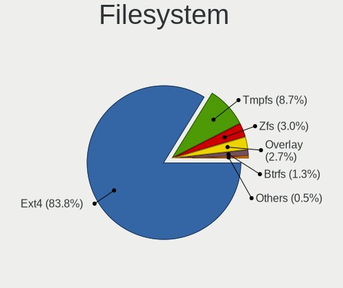

| Type    | Computers | Percent |
|---------|-----------|---------|
| Ext4    | 524       | 92.74%  |
| Zfs     | 15        | 2.65%   |
| Overlay | 13        | 2.3%    |
| Btrfs   | 9         | 1.59%   |
| Xfs     | 3         | 0.53%   |
| Jfs     | 1         | 0.18%   |

Part. scheme
------------

Scheme of partitioning

| Type    | Computers | Percent |
|---------|-----------|---------|
| Unknown | 309       | 54.12%  |
| GPT     | 220       | 38.53%  |
| MBR     | 42        | 7.36%   |

Dual Boot with Linux/BSD
------------------------

Hosting more than one Linux/BSD

| Dual boot | Computers | Percent |
|-----------|-----------|---------|
| No        | 491       | 85.84%  |
| Yes       | 81        | 14.16%  |

Dual Boot (Win)
---------------

Hosting Linux and Windows

| Dual boot | Computers | Percent |
|-----------|-----------|---------|
| No        | 394       | 68.76%  |
| Yes       | 179       | 31.24%  |

Board
-----

Vendor
------

Motherboard manufacturer

| Name                    | Computers | Percent |
|-------------------------|-----------|---------|
| ASUSTek Computer        | 83        | 14.74%  |
| Hewlett-Packard         | 79        | 14.03%  |
| Lenovo                  | 76        | 13.5%   |
| Dell                    | 67        | 11.9%   |
| TUXEDO                  | 42        | 7.46%   |
| Gigabyte Technology     | 35        | 6.22%   |
| MSI                     | 29        | 5.15%   |
| Apple                   | 25        | 4.44%   |
| Acer                    | 24        | 4.26%   |
| ASRock                  | 12        | 2.13%   |
| Intel                   | 9         | 1.6%    |
| Fujitsu                 | 7         | 1.24%   |
| Sony                    | 6         | 1.07%   |
| Samsung Electronics     | 6         | 1.07%   |
| Google                  | 6         | 1.07%   |
| Unknown                 | 6         | 1.07%   |
| HUAWEI                  | 5         | 0.89%   |
| Toshiba                 | 4         | 0.71%   |
| Raspberry Pi Foundation | 3         | 0.53%   |
| Packard Bell            | 3         | 0.53%   |
| Timi                    | 2         | 0.36%   |
| Standard                | 2         | 0.36%   |
| Razer                   | 2         | 0.36%   |
| Positivo                | 2         | 0.36%   |
| eMachines               | 2         | 0.36%   |
| Biostar                 | 2         | 0.36%   |
| Alienware               | 2         | 0.36%   |
| Viglen                  | 1         | 0.18%   |
| THUNDEROBOT             | 1         | 0.18%   |
| Thomson                 | 1         | 0.18%   |
| Teclast                 | 1         | 0.18%   |
| Supermicro              | 1         | 0.18%   |
| Radxa                   | 1         | 0.18%   |
| Quanta                  | 1         | 0.18%   |
| Pegatron                | 1         | 0.18%   |
| PCSMART                 | 1         | 0.18%   |
| PC Specialist           | 1         | 0.18%   |
| Microsoft               | 1         | 0.18%   |
| LattePanda              | 1         | 0.18%   |
| Huanan                  | 1         | 0.18%   |

Model
-----

Motherboard model

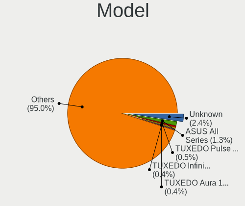

| Name                                    | Computers | Percent |
|-----------------------------------------|-----------|---------|
| Unknown                                 | 16        | 2.84%   |
| ASUS All Series                         | 5         | 0.89%   |
| TUXEDO InfinityBook S 15 Gen6           | 3         | 0.53%   |
| TUXEDO Aura 15 Gen1                     | 3         | 0.53%   |
| HP Pavilion g6                          | 3         | 0.53%   |
| Dell OptiPlex 780                       | 3         | 0.53%   |
| TUXEDO Pulse 15 Gen1                    | 2         | 0.36%   |
| TUXEDO Polaris 15 AMD Gen1              | 2         | 0.36%   |
| TUXEDO InfinityBook S 14 Gen6           | 2         | 0.36%   |
| TUXEDO InfinityBook Pro 14 Gen6         | 2         | 0.36%   |
| Standard MT40II                         | 2         | 0.36%   |
| RPi Raspberry Pi 4 Model B Rev 1.4      | 2         | 0.36%   |
| MSI MS-7C84                             | 2         | 0.36%   |
| Lenovo ThinkBook 14-IML 20RV            | 2         | 0.36%   |
| Lenovo IdeaPad 5 15ARE05 81YQ           | 2         | 0.36%   |
| Lenovo IdeaPad 330S-15ARR 81FB          | 2         | 0.36%   |
| Lenovo IdeaPad 320-15IKB 80XL           | 2         | 0.36%   |
| Lenovo G500 20236                       | 2         | 0.36%   |
| Lenovo G50-45 80E3                      | 2         | 0.36%   |
| Intel DP55WB AAE64798-206               | 2         | 0.36%   |
| HP ZBook Studio G3                      | 2         | 0.36%   |
| HP Notebook                             | 2         | 0.36%   |
| HP ENVY 17                              | 2         | 0.36%   |
| HP ENVY 15                              | 2         | 0.36%   |
| HP EliteDesk 800 G1 SFF                 | 2         | 0.36%   |
| HP Compaq Elite 8300 SFF                | 2         | 0.36%   |
| HP 2000                                 | 2         | 0.36%   |
| Gigabyte Z68M-D2H                       | 2         | 0.36%   |
| Gigabyte AB350-Gaming 3                 | 2         | 0.36%   |
| Dell XPS 13 9380                        | 2         | 0.36%   |
| Dell Precision WorkStation T3500        | 2         | 0.36%   |
| Dell OptiPlex 9010                      | 2         | 0.36%   |
| Dell Latitude E6540                     | 2         | 0.36%   |
| Dell Latitude E6420                     | 2         | 0.36%   |
| Dell Latitude E6410                     | 2         | 0.36%   |
| Dell Latitude 5400                      | 2         | 0.36%   |
| Dell Inspiron 5570                      | 2         | 0.36%   |
| ASUS VivoBook_ASUSLaptop X705MAR_X705MA | 2         | 0.36%   |
| ASUS VivoBook_ASUSLaptop X571GT_F571GT  | 2         | 0.36%   |
| ASUS PRIME B560M-A                      | 2         | 0.36%   |

Model Family
------------

Motherboard model prefix

| Name                | Computers | Percent |
|---------------------|-----------|---------|
| Lenovo ThinkPad     | 31        | 5.51%   |
| Dell Latitude       | 19        | 3.37%   |
| Dell Inspiron       | 17        | 3.02%   |
| Lenovo IdeaPad      | 16        | 2.84%   |
| Unknown             | 16        | 2.84%   |
| HP Pavilion         | 15        | 2.66%   |
| Acer Aspire         | 15        | 2.66%   |
| TUXEDO InfinityBook | 11        | 1.95%   |
| Dell XPS            | 11        | 1.95%   |
| HP EliteBook        | 9         | 1.6%    |
| ASUS VivoBook       | 9         | 1.6%    |
| HP ENVY             | 8         | 1.42%   |
| Dell OptiPlex       | 8         | 1.42%   |
| ASUS ROG            | 8         | 1.42%   |
| ASUS PRIME          | 8         | 1.42%   |
| HP Compaq           | 7         | 1.24%   |
| TUXEDO Polaris      | 6         | 1.07%   |
| HP ProBook          | 6         | 1.07%   |
| Dell Precision      | 6         | 1.07%   |
| TUXEDO Book         | 5         | 0.89%   |
| HP Spectre          | 5         | 0.89%   |
| ASUS All            | 5         | 0.89%   |
| Toshiba Satellite   | 4         | 0.71%   |
| Lenovo ThinkBook    | 4         | 0.71%   |
| HP ZBook            | 4         | 0.71%   |
| HP Laptop           | 4         | 0.71%   |
| HP EliteDesk        | 4         | 0.71%   |
| Acer Swift          | 4         | 0.71%   |
| TUXEDO Aura         | 3         | 0.53%   |
| RPi Raspberry       | 3         | 0.53%   |
| Lenovo Yoga         | 3         | 0.53%   |
| Fujitsu LIFEBOOK    | 3         | 0.53%   |
| Dell Vostro         | 3         | 0.53%   |
| ASUS TUF            | 3         | 0.53%   |
| ASUS P8H77-M        | 3         | 0.53%   |
| Apple MacBookPro8   | 3         | 0.53%   |
| Acer TravelMate     | 3         | 0.53%   |
| TUXEDO Stellaris    | 2         | 0.36%   |
| TUXEDO Pulse        | 2         | 0.36%   |
| TUXEDO P95          | 2         | 0.36%   |

MFG Year
--------

Motherboard manufacture year

| Year    | Computers | Percent |
|---------|-----------|---------|
| 2019    | 68        | 12.08%  |
| 2018    | 67        | 11.9%   |
| 2020    | 66        | 11.72%  |
| 2011    | 41        | 7.28%   |
| 2021    | 38        | 6.75%   |
| 2017    | 38        | 6.75%   |
| 2013    | 37        | 6.57%   |
| 2012    | 37        | 6.57%   |
| 2014    | 32        | 5.68%   |
| 2016    | 30        | 5.33%   |
| 2015    | 28        | 4.97%   |
| 2010    | 25        | 4.44%   |
| 2009    | 18        | 3.2%    |
| 2008    | 16        | 2.84%   |
| 2007    | 14        | 2.49%   |
| 2022    | 6         | 1.07%   |
| Unknown | 2         | 0.36%   |

Form Factor
-----------

Physical design of the computer

| Name           | Computers | Percent |
|----------------|-----------|---------|
| Notebook       | 349       | 61.99%  |
| Desktop        | 167       | 29.66%  |
| Convertible    | 15        | 2.66%   |
| All in one     | 13        | 2.31%   |
| Tablet         | 7         | 1.24%   |
| Mini pc        | 7         | 1.24%   |
| System on chip | 4         | 0.71%   |
| Server         | 1         | 0.18%   |

Secure Boot
-----------

Enabled or disabled

| State    | Computers | Percent |
|----------|-----------|---------|
| Disabled | 521       | 92.21%  |
| Enabled  | 44        | 7.79%   |

Coreboot
--------

Have coreboot on board

| Used | Computers | Percent |
|------|-----------|---------|
| No   | 557       | 98.93%  |
| Yes  | 6         | 1.07%   |

RAM Size
--------

Total RAM memory

| Size in GB      | Computers | Percent |
|-----------------|-----------|---------|
| 16.01-24.0      | 147       | 25.83%  |
| 4.01-8.0        | 134       | 23.55%  |
| 8.01-16.0       | 95        | 16.7%   |
| 3.01-4.0        | 88        | 15.47%  |
| 32.01-64.0      | 57        | 10.02%  |
| 64.01-256.0     | 22        | 3.87%   |
| 1.01-2.0        | 13        | 2.28%   |
| 24.01-32.0      | 7         | 1.23%   |
| 2.01-3.0        | 3         | 0.53%   |
| 0.51-1.0        | 2         | 0.35%   |
| More than 256.0 | 1         | 0.18%   |

RAM Used
--------

Used RAM memory

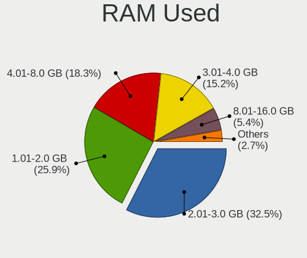

| Used GB    | Computers | Percent |
|------------|-----------|---------|
| 2.01-3.0   | 184       | 30.21%  |
| 1.01-2.0   | 171       | 28.08%  |
| 4.01-8.0   | 113       | 18.56%  |
| 3.01-4.0   | 95        | 15.6%   |
| 8.01-16.0  | 30        | 4.93%   |
| 0.51-1.0   | 10        | 1.64%   |
| 16.01-24.0 | 3         | 0.49%   |
| 32.01-64.0 | 1         | 0.16%   |
| 24.01-32.0 | 1         | 0.16%   |
| 0.01-0.5   | 1         | 0.16%   |

Total Drives
------------

Number of drives on board

| Drives | Computers | Percent |
|--------|-----------|---------|
| 1      | 333       | 57.91%  |
| 2      | 155       | 26.96%  |
| 3      | 42        | 7.3%    |
| 4      | 19        | 3.3%    |
| 5      | 13        | 2.26%   |
| 8      | 4         | 0.7%    |
| 6      | 4         | 0.7%    |
| 0      | 2         | 0.35%   |
| 11     | 1         | 0.17%   |
| 9      | 1         | 0.17%   |
| 7      | 1         | 0.17%   |

Has CD-ROM
----------

Has CD-ROM on board

| Presented | Computers | Percent |
|-----------|-----------|---------|
| No        | 364       | 64.31%  |
| Yes       | 202       | 35.69%  |

Has Ethernet
------------

Has Ethernet on board

| Presented | Computers | Percent |
|-----------|-----------|---------|
| Yes       | 474       | 83.89%  |
| No        | 91        | 16.11%  |

Has WiFi
--------

Has WiFi module

| Presented | Computers | Percent |
|-----------|-----------|---------|
| Yes       | 470       | 83.19%  |
| No        | 95        | 16.81%  |

Has Bluetooth
-------------

Has Bluetooth module

| Presented | Computers | Percent |
|-----------|-----------|---------|
| Yes       | 402       | 70.77%  |
| No        | 166       | 29.23%  |

Location
--------

Country
-------

Geographic location (country)

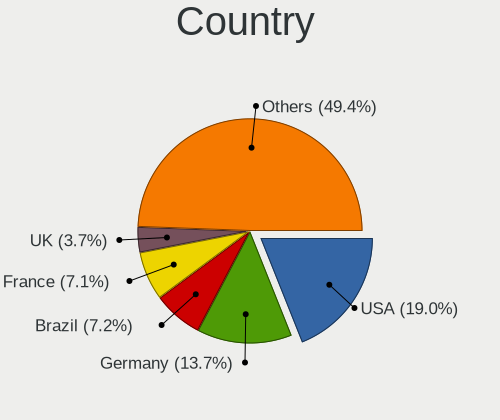

| Country            | Computers | Percent |
|--------------------|-----------|---------|
| USA                | 108       | 19.15%  |
| Germany            | 84        | 14.89%  |
| France             | 41        | 7.27%   |
| Brazil             | 40        | 7.09%   |
| UK                 | 21        | 3.72%   |
| Canada             | 21        | 3.72%   |
| Italy              | 17        | 3.01%   |
| Russia             | 14        | 2.48%   |
| India              | 14        | 2.48%   |
| Spain              | 12        | 2.13%   |
| Netherlands        | 12        | 2.13%   |
| Mexico             | 12        | 2.13%   |
| Argentina          | 12        | 2.13%   |
| Poland             | 11        | 1.95%   |
| Switzerland        | 10        | 1.77%   |
| Australia          | 9         | 1.6%    |
| Austria            | 8         | 1.42%   |
| Ukraine            | 7         | 1.24%   |
| Sweden             | 6         | 1.06%   |
| Norway             | 6         | 1.06%   |
| Portugal           | 5         | 0.89%   |
| Japan              | 5         | 0.89%   |
| Hungary            | 5         | 0.89%   |
| Greece             | 5         | 0.89%   |
| Chile              | 5         | 0.89%   |
| Finland            | 4         | 0.71%   |
| Croatia            | 4         | 0.71%   |
| Colombia           | 4         | 0.71%   |
| Belgium            | 4         | 0.71%   |
| Turkey             | 3         | 0.53%   |
| South Africa       | 3         | 0.53%   |
| Slovenia           | 3         | 0.53%   |
| Romania            | 3         | 0.53%   |
| Ireland            | 3         | 0.53%   |
| Iran               | 3         | 0.53%   |
| Indonesia          | 3         | 0.53%   |
| Dominican Republic | 3         | 0.53%   |
| Taiwan             | 2         | 0.35%   |
| Malaysia           | 2         | 0.35%   |
| Ecuador            | 2         | 0.35%   |

City
----

Geographic location (city)

| City                  | Computers | Percent |
|-----------------------|-----------|---------|
| Sao Paulo             | 7         | 1.22%   |
| Berlin                | 7         | 1.22%   |
| Ravensburg            | 5         | 0.87%   |
| Moscow                | 5         | 0.87%   |
| Hamburg               | 5         | 0.87%   |
| Athens                | 5         | 0.87%   |
| Zurich                | 4         | 0.69%   |
| Paris                 | 4         | 0.69%   |
| Munich                | 4         | 0.69%   |
| Montreal              | 4         | 0.69%   |
| Budapest              | 4         | 0.69%   |
| Zagreb                | 3         | 0.52%   |
| Vienna                | 3         | 0.52%   |
| Tehran                | 3         | 0.52%   |
| Sydney                | 3         | 0.52%   |
| St Petersburg         | 3         | 0.52%   |
| Santo Domingo Este    | 3         | 0.52%   |
| Pune                  | 3         | 0.52%   |
| New York              | 3         | 0.52%   |
| Miami                 | 3         | 0.52%   |
| Los Angeles           | 3         | 0.52%   |
| Lisbon                | 3         | 0.52%   |
| Dublin                | 3         | 0.52%   |
| Braslia             | 3         | 0.52%   |
| Bogot               | 3         | 0.52%   |
| Barcelona             | 3         | 0.52%   |
| Austin                | 3         | 0.52%   |
| Wolfsburg             | 2         | 0.35%   |
| Warsaw                | 2         | 0.35%   |
| Vancouver             | 2         | 0.35%   |
| Uman                  | 2         | 0.35%   |
| Trondheim             | 2         | 0.35%   |
| Toronto               | 2         | 0.35%   |
| Timioara            | 2         | 0.35%   |
| Sunnyvale             | 2         | 0.35%   |
| Stuttgart             | 2         | 0.35%   |
| Seattle               | 2         | 0.35%   |
| Sao Bernardo do Campo | 2         | 0.35%   |
| San Miguel            | 2         | 0.35%   |
| San Jose              | 2         | 0.35%   |

Drives
------

Drive Vendor
------------

Hard drive vendors

| Vendor                    | Computers | Drives | Percent |
|---------------------------|-----------|--------|---------|
| Samsung Electronics       | 156       | 227    | 18.59%  |
| Seagate                   | 114       | 165    | 13.59%  |
| WDC                       | 108       | 156    | 12.87%  |
| Toshiba                   | 61        | 68     | 7.27%   |
| SanDisk                   | 45        | 58     | 5.36%   |
| Unknown                   | 44        | 50     | 5.24%   |
| Kingston                  | 36        | 47     | 4.29%   |
| Intel                     | 25        | 42     | 2.98%   |
| Crucial                   | 25        | 28     | 2.98%   |
| Hitachi                   | 21        | 28     | 2.5%    |
| SK hynix                  | 20        | 22     | 2.38%   |
| Phison                    | 14        | 19     | 1.67%   |
| HGST                      | 13        | 17     | 1.55%   |
| Micron Technology         | 12        | 15     | 1.43%   |
| China                     | 12        | 16     | 1.43%   |
| A-DATA Technology         | 11        | 15     | 1.31%   |
| Apple                     | 10        | 12     | 1.19%   |
| SPCC                      | 9         | 11     | 1.07%   |
| PNY                       | 8         | 10     | 0.95%   |
| JMicron Technology        | 6         | 7      | 0.72%   |
| Patriot                   | 4         | 6      | 0.48%   |
| OCZ                       | 4         | 7      | 0.48%   |
| Micron/Crucial Technology | 4         | 4      | 0.48%   |
| KIOXIA                    | 4         | 4      | 0.48%   |
| Maxtor                    | 3         | 6      | 0.36%   |
| LITEON                    | 3         | 3      | 0.36%   |
| Transcend                 | 2         | 2      | 0.24%   |
| Teclast                   | 2         | 3      | 0.24%   |
| Silicon Motion            | 2         | 2      | 0.24%   |
| SABRENT                   | 2         | 3      | 0.24%   |
| Realtek Semiconductor     | 2         | 3      | 0.24%   |
| Phison Electronics        | 2         | 2      | 0.24%   |
| Netac                     | 2         | 2      | 0.24%   |
| Lenovo                    | 2         | 2      | 0.24%   |
| LaCie                     | 2         | 2      | 0.24%   |
| Intenso                   | 2         | 3      | 0.24%   |
| HS-SSD-C100               | 2         | 2      | 0.24%   |
| Hewlett-Packard           | 2         | 1      | 0.24%   |
| Gigabyte Technology       | 2         | 2      | 0.24%   |
| Corsair                   | 2         | 3      | 0.24%   |

Drive Model
-----------

Hard drive models

| Model                                  | Computers | Percent |
|----------------------------------------|-----------|---------|
| Unknown MMC Card  64GB                 | 9         | 0.96%   |
| Samsung SSD 860 EVO 500GB              | 9         | 0.96%   |
| Samsung NVMe SSD Drive 512GB           | 9         | 0.96%   |
| Seagate ST1000LM024 HN-M101MBB 1TB     | 8         | 0.85%   |
| Samsung NVMe SSD Drive 500GB           | 8         | 0.85%   |
| Toshiba MQ04ABF100 1TB                 | 7         | 0.74%   |
| Seagate ST9500325AS 500GB              | 7         | 0.74%   |
| Samsung NVMe SSD Drive 1TB             | 7         | 0.74%   |
| Unknown MMC Card  32GB                 | 6         | 0.64%   |
| Toshiba MQ01ABD100 1TB                 | 6         | 0.64%   |
| Seagate ST1000DM010-2EP102 1TB         | 6         | 0.64%   |
| Samsung SSD 860 QVO 1TB                | 6         | 0.64%   |
| Samsung SSD 860 EVO M.2 500GB          | 6         | 0.64%   |
| Samsung SSD 850 EVO 500GB              | 6         | 0.64%   |
| Samsung SM963 2.5" NVMe PCIe SSD 256GB | 6         | 0.64%   |
| Kingston SA400S37480G 480GB SSD        | 6         | 0.64%   |
| Kingston SA400S37240G 240GB SSD        | 6         | 0.64%   |
| WDC WD10JPVX-22JC3T0 1TB               | 5         | 0.53%   |
| Unknown SD/MMC/MS PRO 2GB              | 5         | 0.53%   |
| SK hynix NVMe SSD Drive 256GB          | 5         | 0.53%   |
| Seagate ST500LT012-1DG142 500GB        | 5         | 0.53%   |
| Seagate ST500DM002-1BD142 500GB        | 5         | 0.53%   |
| Seagate ST1000LM035-1RK172 1TB         | 5         | 0.53%   |
| SanDisk SDSSDA240G 240GB               | 5         | 0.53%   |
| Samsung SSD 970 EVO Plus 500GB         | 5         | 0.53%   |
| Samsung SSD 970 EVO Plus 1TB           | 5         | 0.53%   |
| Samsung SSD 860 EVO M.2 250GB          | 5         | 0.53%   |
| WDC WD5000AAKS-00UU3A0 500GB           | 4         | 0.43%   |
| Unknown MMC Card  16GB                 | 4         | 0.43%   |
| Seagate ST2000DM001-1ER164 2TB         | 4         | 0.43%   |
| Seagate ST1000LM048-2E7172 1TB         | 4         | 0.43%   |
| SanDisk SDSSDA120G 120GB               | 4         | 0.43%   |
| SanDisk NVMe SSD Drive 512GB           | 4         | 0.43%   |
| Samsung SSD 970 EVO 500GB              | 4         | 0.43%   |
| Samsung SSD 860 EVO 250GB              | 4         | 0.43%   |
| Samsung SSD 850 EVO 250GB              | 4         | 0.43%   |
| Samsung SSD 750 EVO 250GB              | 4         | 0.43%   |
| Samsung SM963 2.5" NVMe PCIe SSD 250GB | 4         | 0.43%   |
| Samsung NVMe SSD Drive 2TB             | 4         | 0.43%   |
| JMicron Generic 500GB                  | 4         | 0.43%   |

HDD Vendor
----------

Hard disk drive vendors

| Vendor              | Computers | Drives | Percent |
|---------------------|-----------|--------|---------|
| Seagate             | 111       | 161    | 37.12%  |
| WDC                 | 83        | 125    | 27.76%  |
| Toshiba             | 47        | 50     | 15.72%  |
| Hitachi             | 21        | 28     | 7.02%   |
| HGST                | 13        | 17     | 4.35%   |
| Samsung Electronics | 6         | 7      | 2.01%   |
| Unknown             | 5         | 5      | 1.67%   |
| Apple               | 4         | 4      | 1.34%   |
| Maxtor              | 3         | 6      | 1%      |
| SABRENT             | 2         | 3      | 0.67%   |
| WD MediaMax         | 1         | 1      | 0.33%   |
| USB3.0              | 1         | 1      | 0.33%   |
| Fujitsu             | 1         | 1      | 0.33%   |
| ASMT109x            | 1         | 1      | 0.33%   |

SSD Vendor
----------

Solid state drive vendors

| Vendor              | Computers | Drives | Percent |
|---------------------|-----------|--------|---------|
| Samsung Electronics | 81        | 116    | 28.22%  |
| Kingston            | 30        | 38     | 10.45%  |
| SanDisk             | 29        | 37     | 10.1%   |
| Crucial             | 23        | 26     | 8.01%   |
| WDC                 | 15        | 17     | 5.23%   |
| China               | 12        | 16     | 4.18%   |
| A-DATA Technology   | 9         | 13     | 3.14%   |
| SPCC                | 8         | 10     | 2.79%   |
| PNY                 | 7         | 9      | 2.44%   |
| Intel               | 7         | 7      | 2.44%   |
| Micron Technology   | 6         | 7      | 2.09%   |
| Apple               | 5         | 5      | 1.74%   |
| Patriot             | 4         | 6      | 1.39%   |
| JMicron Technology  | 4         | 4      | 1.39%   |
| Toshiba             | 3         | 3      | 1.05%   |
| OCZ                 | 3         | 3      | 1.05%   |
| LITEON              | 3         | 3      | 1.05%   |
| Teclast             | 2         | 3      | 0.7%    |
| SK hynix            | 2         | 2      | 0.7%    |
| Seagate             | 2         | 2      | 0.7%    |
| Netac               | 2         | 2      | 0.7%    |
| Intenso             | 2         | 3      | 0.7%    |
| Gigabyte Technology | 2         | 2      | 0.7%    |
| Apacer              | 2         | 2      | 0.7%    |
| AMD                 | 2         | 17     | 0.7%    |
| Zheino              | 1         | 2      | 0.35%   |
| VISIPRO             | 1         | 1      | 0.35%   |
| Vaseky              | 1         | 1      | 0.35%   |
| USB30               | 1         | 1      | 0.35%   |
| Unknown             | 1         | 1      | 0.35%   |
| Union Memory        | 1         | 1      | 0.35%   |
| Transcend           | 1         | 1      | 0.35%   |
| TO Exter            | 1         | 1      | 0.35%   |
| Plextor             | 1         | 1      | 0.35%   |
| OWC                 | 1         | 1      | 0.35%   |
| Mushkin             | 1         | 1      | 0.35%   |
| LITEONIT            | 1         | 1      | 0.35%   |
| KingSpec            | 1         | 1      | 0.35%   |
| KingDian            | 1         | 1      | 0.35%   |
| HP Phison           | 1         | 1      | 0.35%   |

Drive Kind
----------

HDD or SSD

| Kind    | Computers | Drives | Percent |
|---------|-----------|--------|---------|
| HDD     | 251       | 410    | 33.38%  |
| SSD     | 245       | 377    | 32.58%  |
| NVMe    | 199       | 279    | 26.46%  |
| MMC     | 41        | 48     | 5.45%   |
| Unknown | 16        | 19     | 2.13%   |

Drive Connector
---------------

SATA, SAS, NVMe, etc.

| Type | Computers | Drives | Percent |
|------|-----------|--------|---------|
| SATA | 397       | 768    | 59.34%  |
| NVMe | 199       | 279    | 29.75%  |
| MMC  | 41        | 48     | 6.13%   |
| SAS  | 32        | 38     | 4.78%   |

Drive Size
----------

Size of hard drive

| Size in TB | Computers | Drives | Percent |
|------------|-----------|--------|---------|
| 0.01-0.5   | 300       | 478    | 57.92%  |
| 0.51-1.0   | 149       | 206    | 28.76%  |
| 1.01-2.0   | 37        | 61     | 7.14%   |
| 3.01-4.0   | 18        | 26     | 3.47%   |
| 4.01-10.0  | 9         | 11     | 1.74%   |
| 2.01-3.0   | 5         | 5      | 0.97%   |

Space Total
-----------

Amount of disk space available on the file system

| Size in GB     | Computers | Percent |
|----------------|-----------|---------|
| 101-250        | 170       | 29.31%  |
| 251-500        | 160       | 27.59%  |
| 501-1000       | 86        | 14.83%  |
| 51-100         | 41        | 7.07%   |
| 1001-2000      | 39        | 6.72%   |
| 21-50          | 24        | 4.14%   |
| More than 3000 | 22        | 3.79%   |
| 1-20           | 18        | 3.1%    |
| 2001-3000      | 13        | 2.24%   |
| Unknown        | 7         | 1.21%   |

Space Used
----------

Amount of used disk space

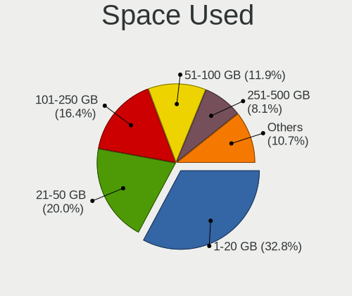

| Used GB        | Computers | Percent |
|----------------|-----------|---------|
| 1-20           | 189       | 31.76%  |
| 21-50          | 110       | 18.49%  |
| 101-250        | 109       | 18.32%  |
| 51-100         | 74        | 12.44%  |
| 251-500        | 54        | 9.08%   |
| 501-1000       | 25        | 4.2%    |
| 1001-2000      | 17        | 2.86%   |
| More than 3000 | 7         | 1.18%   |
| Unknown        | 7         | 1.18%   |
| 2001-3000      | 3         | 0.5%    |

Malfunc. Drives
---------------

Drive models with a malfunction

| Model                                | Computers | Drives | Percent |
|--------------------------------------|-----------|--------|---------|
| Seagate ST500DM002-1BD142 500GB      | 3         | 3      | 6.25%   |
| WDC WD5000AAKX-001CA0 500GB          | 2         | 2      | 4.17%   |
| Toshiba MQ01ABD100 1TB               | 2         | 2      | 4.17%   |
| Seagate ST9500325AS 500GB            | 2         | 2      | 4.17%   |
| Seagate ST1000LM024 HN-M101MBB 1TB   | 2         | 2      | 4.17%   |
| WDC WD6400BPVT-60HXZT3 640GB         | 1         | 1      | 2.08%   |
| WDC WD6000HLHX-01JJPV0 600GB         | 1         | 1      | 2.08%   |
| WDC WD5000LPVX-22V0TT0 500GB         | 1         | 1      | 2.08%   |
| WDC WD5000BPVT-00HXZT1 500GB         | 1         | 1      | 2.08%   |
| WDC WD5000AVCS-632DY1 500GB          | 1         | 1      | 2.08%   |
| WDC WD4003FZEX-00Z4SA0 4TB           | 1         | 1      | 2.08%   |
| WDC WD2500BEKT-75PVMT1 250GB         | 1         | 1      | 2.08%   |
| WDC WD2500AAJS-60M0A0 250GB          | 1         | 1      | 2.08%   |
| WDC WD20EFRX-68EUZN0 2TB             | 1         | 2      | 2.08%   |
| WDC WD10EZEX-00RKKA0 1TB             | 1         | 1      | 2.08%   |
| Toshiba MQ01ABF050 500GB             | 1         | 1      | 2.08%   |
| Toshiba MQ01ABD050 500GB             | 1         | 1      | 2.08%   |
| Toshiba MK5055GSX 500GB              | 1         | 1      | 2.08%   |
| Toshiba MK3265GSXN 320GB             | 1         | 1      | 2.08%   |
| Toshiba MK2561GSYN 250GB             | 1         | 1      | 2.08%   |
| Seagate ST9750420AS 752GB            | 1         | 1      | 2.08%   |
| Seagate ST9500423AS 500GB            | 1         | 1      | 2.08%   |
| Seagate ST500LX012-1LM162-SSHD 500GB | 1         | 1      | 2.08%   |
| Seagate ST500LT012-1DG142 500GB      | 1         | 1      | 2.08%   |
| Seagate ST5000DM000-1FK178 5TB       | 1         | 1      | 2.08%   |
| Seagate ST3500320AS 500GB            | 1         | 1      | 2.08%   |
| Seagate ST3320620AS 320GB            | 1         | 1      | 2.08%   |
| Seagate ST3160815AS 160GB            | 1         | 1      | 2.08%   |
| Seagate ST1000DX001-1NS162 1TB       | 1         | 1      | 2.08%   |
| Seagate ST1000DM003-1SB102 1TB       | 1         | 1      | 2.08%   |
| PNY SSD2SC120G3LC709B121-460I 120GB  | 1         | 1      | 2.08%   |
| Patriot Pyro m3 240GB SSD            | 1         | 1      | 2.08%   |
| Maxtor STM3250310AS 250GB            | 1         | 1      | 2.08%   |
| Maxtor 6B200M0 208GB                 | 1         | 2      | 2.08%   |
| Kingston SNS4151S316G 16GB SSD       | 1         | 1      | 2.08%   |
| HP Phison PSSBN032GA27MC1 32GB       | 1         | 1      | 2.08%   |
| Hitachi HTS545025B9SA02 250GB        | 1         | 1      | 2.08%   |
| Hitachi HDS721032CLA362 320GB        | 1         | 1      | 2.08%   |
| HGST HTS725032A7E630 320GB           | 1         | 2      | 2.08%   |
| HGST HTS541075A9E680 752GB           | 1         | 1      | 2.08%   |

Malfunc. Drive Vendor
---------------------

Vendors of faulty drives

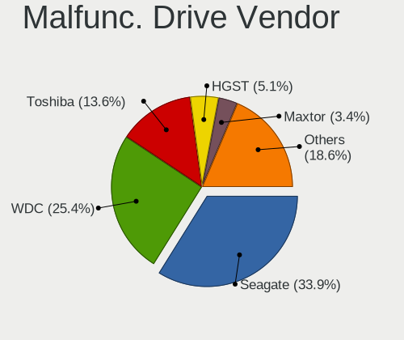

| Vendor    | Computers | Drives | Percent |
|-----------|-----------|--------|---------|
| Seagate   | 17        | 17     | 35.42%  |
| WDC       | 12        | 13     | 25%     |
| Toshiba   | 7         | 7      | 14.58%  |
| Maxtor    | 2         | 3      | 4.17%   |
| Hitachi   | 2         | 2      | 4.17%   |
| HGST      | 2         | 3      | 4.17%   |
| PNY       | 1         | 1      | 2.08%   |
| Patriot   | 1         | 1      | 2.08%   |
| Kingston  | 1         | 1      | 2.08%   |
| HP Phison | 1         | 1      | 2.08%   |
| Crucial   | 1         | 1      | 2.08%   |
| China     | 1         | 1      | 2.08%   |

Malfunc. HDD Vendor
-------------------

Vendors of faulty HDD drives

| Vendor  | Computers | Drives | Percent |
|---------|-----------|--------|---------|
| Seagate | 17        | 17     | 40.48%  |
| WDC     | 12        | 13     | 28.57%  |
| Toshiba | 7         | 7      | 16.67%  |
| Maxtor  | 2         | 3      | 4.76%   |
| Hitachi | 2         | 2      | 4.76%   |
| HGST    | 2         | 3      | 4.76%   |

Malfunc. Drive Kind
-------------------

Kinds of faulty drives

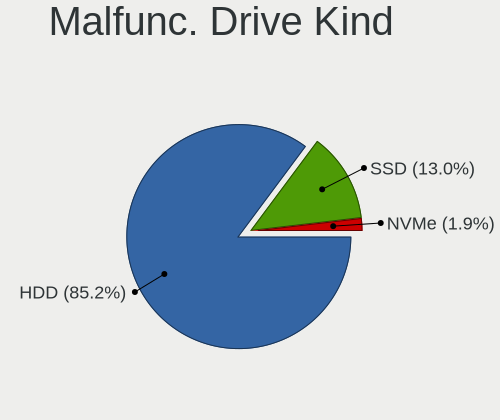

| Kind | Computers | Drives | Percent |
|------|-----------|--------|---------|
| HDD  | 37        | 45     | 86.05%  |
| SSD  | 5         | 5      | 11.63%  |
| NVMe | 1         | 1      | 2.33%   |

Failed Drives
-------------

Failed drive models

Zero info for selected period =(

Failed Drive Vendor
-------------------

Failed drive vendors

Zero info for selected period =(

Drive Status
------------

Number of failed and malfunc. drives

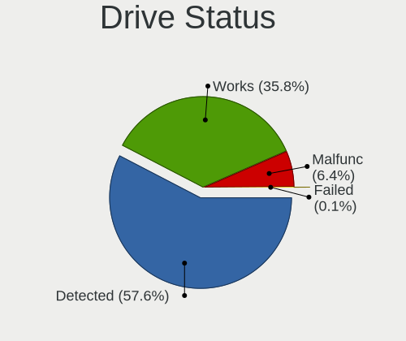

| Status   | Computers | Drives | Percent |
|----------|-----------|--------|---------|
| Detected | 358       | 743    | 58.69%  |
| Works    | 210       | 339    | 34.43%  |
| Malfunc  | 42        | 51     | 6.89%   |

Storage controller
------------------

Storage Vendor
--------------

Storage controller vendors

| Vendor                         | Computers | Percent |
|--------------------------------|-----------|---------|
| Intel                          | 386       | 55.46%  |
| Samsung Electronics            | 84        | 12.07%  |
| AMD                            | 82        | 11.78%  |
| SanDisk                        | 26        | 3.74%   |
| Phison Electronics             | 17        | 2.44%   |
| SK hynix                       | 16        | 2.3%    |
| Toshiba America Info Systems   | 10        | 1.44%   |
| Marvell Technology Group       | 10        | 1.44%   |
| Kingston Technology Company    | 8         | 1.15%   |
| Nvidia                         | 6         | 0.86%   |
| Micron/Crucial Technology      | 6         | 0.86%   |
| Micron Technology              | 6         | 0.86%   |
| JMicron Technology             | 6         | 0.86%   |
| KIOXIA                         | 5         | 0.72%   |
| ASMedia Technology             | 5         | 0.72%   |
| Silicon Motion                 | 4         | 0.57%   |
| Realtek Semiconductor          | 3         | 0.43%   |
| ADATA Technology               | 3         | 0.43%   |
| Solid State Storage Technology | 2         | 0.29%   |
| Lenovo                         | 2         | 0.29%   |
| Union Memory (Shenzhen)        | 1         | 0.14%   |
| Transcend                      | 1         | 0.14%   |
| Silicon Image                  | 1         | 0.14%   |
| Shenzhen Longsys Electronics   | 1         | 0.14%   |
| Seagate Technology             | 1         | 0.14%   |
| OCZ Technology Group           | 1         | 0.14%   |
| Integrated Technology Express  | 1         | 0.14%   |
| Apple                          | 1         | 0.14%   |
| Adaptec                        | 1         | 0.14%   |

Storage Model
-------------

Storage controller models

| Model                                                                          | Computers | Percent |
|--------------------------------------------------------------------------------|-----------|---------|
| AMD FCH SATA Controller [AHCI mode]                                            | 60        | 7.64%   |
| Samsung NVMe SSD Controller SM981/PM981/PM983                                  | 49        | 6.24%   |
| Intel Sunrise Point-LP SATA Controller [AHCI mode]                             | 36        | 4.59%   |
| Intel 7 Series Chipset Family 6-port SATA Controller [AHCI mode]               | 29        | 3.69%   |
| Intel 6 Series/C200 Series Chipset Family 6 port Mobile SATA AHCI Controller   | 24        | 3.06%   |
| Intel 8 Series/C220 Series Chipset Family 6-port SATA Controller 1 [AHCI mode] | 20        | 2.55%   |
| Intel 82801 Mobile SATA Controller [RAID mode]                                 | 19        | 2.42%   |
| Intel Cannon Point-LP SATA Controller [AHCI Mode]                              | 15        | 1.91%   |
| Intel Comet Lake SATA AHCI Controller                                          | 14        | 1.78%   |
| Intel Cannon Lake PCH SATA AHCI Controller                                     | 14        | 1.78%   |
| Intel 8 Series SATA Controller 1 [AHCI mode]                                   | 13        | 1.66%   |
| Samsung NVMe SSD Controller 980                                                | 11        | 1.4%    |
| Intel Celeron/Pentium Silver Processor SATA Controller                         | 11        | 1.4%    |
| Intel 6 Series/C200 Series Chipset Family 6 port Desktop SATA AHCI Controller  | 11        | 1.4%    |
| SanDisk WD Black SN750 / PC SN730 NVMe SSD                                     | 10        | 1.27%   |
| Intel Wildcat Point-LP SATA Controller [AHCI Mode]                             | 10        | 1.27%   |
| Intel Q170/Q150/B150/H170/H110/Z170/CM236 Chipset SATA Controller [AHCI Mode]  | 10        | 1.27%   |
| AMD 400 Series Chipset SATA Controller                                         | 10        | 1.27%   |
| Intel SATA Controller [RAID mode]                                              | 9         | 1.15%   |
| Intel 7 Series/C210 Series Chipset Family 6-port SATA Controller [AHCI mode]   | 9         | 1.15%   |
| Intel 200 Series PCH SATA controller [AHCI mode]                               | 9         | 1.15%   |
| AMD 500 Series Chipset SATA Controller                                         | 9         | 1.15%   |
| Samsung NVMe SSD Controller SM961/PM961/SM963                                  | 8         | 1.02%   |
| Phison E12 NVMe Controller                                                     | 8         | 1.02%   |
| Intel SSD 660P Series                                                          | 8         | 1.02%   |
| Intel HM170/QM170 Chipset SATA Controller [AHCI Mode]                          | 8         | 1.02%   |
| AMD SB7x0/SB8x0/SB9x0 SATA Controller [AHCI mode]                              | 8         | 1.02%   |
| SK hynix BC501 NVMe Solid State Drive                                          | 7         | 0.89%   |
| Intel Volume Management Device NVMe RAID Controller                            | 7         | 0.89%   |
| Intel 82801IBM/IEM (ICH9M/ICH9M-E) 4 port SATA Controller [AHCI mode]          | 7         | 0.89%   |
| Intel 82801HM/HEM (ICH8M/ICH8M-E) SATA Controller [AHCI mode]                  | 7         | 0.89%   |
| Intel 82801HM/HEM (ICH8M/ICH8M-E) IDE Controller                               | 7         | 0.89%   |
| Intel 500 Series Chipset Family SATA AHCI Controller                           | 7         | 0.89%   |
| Intel 5 Series/3400 Series Chipset 6 port SATA AHCI Controller                 | 7         | 0.89%   |
| Intel 400 Series Chipset Family SATA AHCI Controller                           | 7         | 0.89%   |
| Samsung NVMe SSD Controller PM9A1/PM9A3/980PRO                                 | 6         | 0.76%   |
| Micron Non-Volatile memory controller                                          | 6         | 0.76%   |
| Intel Non-Volatile memory controller                                           | 6         | 0.76%   |
| Intel Cannon Lake Mobile PCH SATA AHCI Controller                              | 6         | 0.76%   |
| AMD SB7x0/SB8x0/SB9x0 IDE Controller                                           | 6         | 0.76%   |

Storage Kind
------------

Kind of storage controller (IDE, SATA, NVMe, SAS, ...)

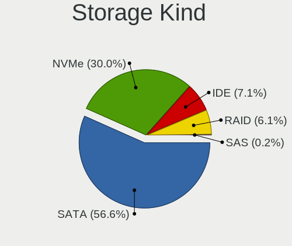

| Kind | Computers | Percent |
|------|-----------|---------|
| SATA | 402       | 57.18%  |
| NVMe | 202       | 28.73%  |
| IDE  | 59        | 8.39%   |
| RAID | 38        | 5.41%   |
| SAS  | 2         | 0.28%   |

Processor
---------

CPU Vendor
----------

Processor vendors

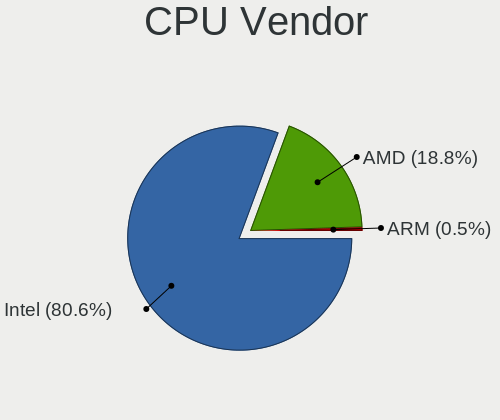

| Vendor | Computers | Percent |
|--------|-----------|---------|
| Intel  | 458       | 81.35%  |
| AMD    | 101       | 17.94%  |
| ARM    | 4         | 0.71%   |

CPU Model
---------

Processor models

| Model                                         | Computers | Percent |
|-----------------------------------------------|-----------|---------|
| Intel Core i7-8565U CPU @ 1.80GHz             | 18        | 3.19%   |
| Intel 11th Gen Core i7-1165G7 @ 2.80GHz       | 13        | 2.3%    |
| Intel Core i7-8550U CPU @ 1.80GHz             | 12        | 2.13%   |
| Intel Core i7-10510U CPU @ 1.80GHz            | 9         | 1.6%    |
| Intel Core i5-8250U CPU @ 1.60GHz             | 9         | 1.6%    |
| Intel Core i7-7500U CPU @ 2.70GHz             | 6         | 1.06%   |
| Intel Core i5-7200U CPU @ 2.50GHz             | 6         | 1.06%   |
| Intel Core i5-2520M CPU @ 2.50GHz             | 6         | 1.06%   |
| AMD Ryzen 7 4700U with Radeon Graphics        | 6         | 1.06%   |
| Intel Core i7-8750H CPU @ 2.20GHz             | 5         | 0.89%   |
| Intel Core i7-7700HQ CPU @ 2.80GHz            | 5         | 0.89%   |
| Intel Core i7-3770 CPU @ 3.40GHz              | 5         | 0.89%   |
| Intel Core i7-10750H CPU @ 2.60GHz            | 5         | 0.89%   |
| Intel Core i7-10710U CPU @ 1.10GHz            | 5         | 0.89%   |
| Intel Core i5-5200U CPU @ 2.20GHz             | 5         | 0.89%   |
| Intel Core i5-10210U CPU @ 1.60GHz            | 5         | 0.89%   |
| AMD Ryzen 7 3700X 8-Core Processor            | 5         | 0.89%   |
| AMD Ryzen 5 3500U with Radeon Vega Mobile Gfx | 5         | 0.89%   |
| Intel Core i7-9750H CPU @ 2.60GHz             | 4         | 0.71%   |
| Intel Core i7-4500U CPU @ 1.80GHz             | 4         | 0.71%   |
| Intel Core i7-3520M CPU @ 2.90GHz             | 4         | 0.71%   |
| Intel Core i7-2600 CPU @ 3.40GHz              | 4         | 0.71%   |
| Intel Core i5-8265U CPU @ 1.60GHz             | 4         | 0.71%   |
| Intel 11th Gen Core i7-11800H @ 2.30GHz       | 4         | 0.71%   |
| AMD Ryzen 5 4500U with Radeon Graphics        | 4         | 0.71%   |
| Intel Core i9-9900K CPU @ 3.60GHz             | 3         | 0.53%   |
| Intel Core i7-6500U CPU @ 2.50GHz             | 3         | 0.53%   |
| Intel Core i7-4790K CPU @ 4.00GHz             | 3         | 0.53%   |
| Intel Core i7-4790 CPU @ 3.60GHz              | 3         | 0.53%   |
| Intel Core i7-4770 CPU @ 3.40GHz              | 3         | 0.53%   |
| Intel Core i7-4710HQ CPU @ 2.50GHz            | 3         | 0.53%   |
| Intel Core i7-2670QM CPU @ 2.20GHz            | 3         | 0.53%   |
| Intel Core i7-2630QM CPU @ 2.00GHz            | 3         | 0.53%   |
| Intel Core i7-1065G7 CPU @ 1.30GHz            | 3         | 0.53%   |
| Intel Core i5-8350U CPU @ 1.70GHz             | 3         | 0.53%   |
| Intel Core i5-6300U CPU @ 2.40GHz             | 3         | 0.53%   |
| Intel Core i5-3470 CPU @ 3.20GHz              | 3         | 0.53%   |
| Intel Core i5-3210M CPU @ 2.50GHz             | 3         | 0.53%   |
| Intel Core i5-2415M CPU @ 2.30GHz             | 3         | 0.53%   |
| Intel Core i3-6006U CPU @ 2.00GHz             | 3         | 0.53%   |

CPU Model Family
----------------

Processor model prefix

| Model                   | Computers | Percent |
|-------------------------|-----------|---------|
| Intel Core i7           | 169       | 29.96%  |
| Intel Core i5           | 117       | 20.74%  |
| Intel Core i3           | 35        | 6.21%   |
| Other                   | 34        | 6.03%   |
| AMD Ryzen 5             | 32        | 5.67%   |
| Intel Celeron           | 23        | 4.08%   |
| AMD Ryzen 7             | 23        | 4.08%   |
| Intel Core 2 Duo        | 20        | 3.55%   |
| Intel Xeon              | 13        | 2.3%    |
| Intel Pentium           | 11        | 1.95%   |
| Intel Atom              | 11        | 1.95%   |
| Intel Core i9           | 6         | 1.06%   |
| Intel Core 2            | 5         | 0.89%   |
| AMD Ryzen 9             | 5         | 0.89%   |
| AMD Ryzen 3             | 5         | 0.89%   |
| Intel Pentium Silver    | 4         | 0.71%   |
| Intel Pentium Dual      | 4         | 0.71%   |
| AMD FX                  | 4         | 0.71%   |
| AMD A8                  | 4         | 0.71%   |
| AMD A6                  | 4         | 0.71%   |
| Intel Genuine           | 3         | 0.53%   |
| Intel Core 2 Quad       | 3         | 0.53%   |
| AMD E                   | 3         | 0.53%   |
| AMD A10                 | 3         | 0.53%   |
| Intel Pentium Dual-Core | 2         | 0.35%   |
| Intel Core m3           | 2         | 0.35%   |
| AMD Turion 64 X2 Mobile | 2         | 0.35%   |
| AMD E1                  | 2         | 0.35%   |
| AMD A4                  | 2         | 0.35%   |
| Intel Pentium 4         | 1         | 0.18%   |
| Intel Core m5           | 1         | 0.18%   |
| ARM BCM                 | 1         | 0.18%   |
| AMD Sempron             | 1         | 0.18%   |
| AMD Ryzen Threadripper  | 1         | 0.18%   |
| AMD Quad-Core           | 1         | 0.18%   |
| AMD Phenom II X6        | 1         | 0.18%   |
| AMD Phenom II X4        | 1         | 0.18%   |
| AMD Phenom II X2        | 1         | 0.18%   |
| AMD Embedded            | 1         | 0.18%   |
| AMD Athlon II X3        | 1         | 0.18%   |

CPU Cores
---------

Number of processor cores

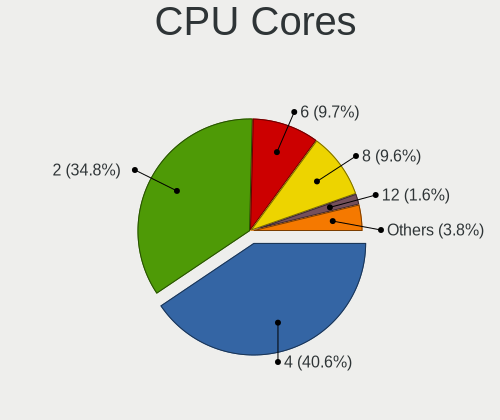

| Number | Computers | Percent |
|--------|-----------|---------|
| 4      | 241       | 42.81%  |
| 2      | 199       | 35.35%  |
| 6      | 54        | 9.59%   |
| 8      | 47        | 8.35%   |
| 1      | 7         | 1.24%   |
| 16     | 5         | 0.89%   |
| 12     | 4         | 0.71%   |
| 3      | 3         | 0.53%   |
| 24     | 1         | 0.18%   |
| 14     | 1         | 0.18%   |
| 10     | 1         | 0.18%   |

CPU Sockets
-----------

Number of sockets

| Number | Computers | Percent |
|--------|-----------|---------|
| 1      | 555       | 98.58%  |
| 2      | 8         | 1.42%   |

CPU Threads
-----------

Threads per core (Hyper-Threading)

| Number | Computers | Percent |
|--------|-----------|---------|
| 2      | 397       | 70.39%  |
| 1      | 167       | 29.61%  |

CPU Op-Modes
------------

CPU Operation Modes (32-bit, 64-bit)

| Op mode        | Computers | Percent |
|----------------|-----------|---------|
| 32-bit, 64-bit | 557       | 98.93%  |
| 32-bit         | 3         | 0.53%   |
| Unknown        | 3         | 0.53%   |

CPU Microcode
-------------

Microcode number

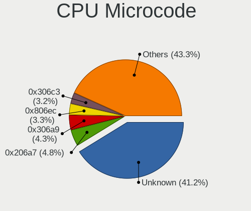

| Number     | Computers | Percent |
|------------|-----------|---------|
| Unknown    | 174       | 29.85%  |
| 0x206a7    | 36        | 6.17%   |
| 0x306a9    | 32        | 5.49%   |
| 0x806ec    | 24        | 4.12%   |
| 0x306c3    | 22        | 3.77%   |
| 0x906ea    | 17        | 2.92%   |
| 0x806ea    | 16        | 2.74%   |
| 0x806e9    | 15        | 2.57%   |
| 0x1067a    | 13        | 2.23%   |
| 0x806c1    | 12        | 2.06%   |
| 0x40651    | 12        | 2.06%   |
| 0x906e9    | 10        | 1.72%   |
| 0x406e3    | 10        | 1.72%   |
| 0x806eb    | 9         | 1.54%   |
| 0x306d4    | 9         | 1.54%   |
| 0x506e3    | 8         | 1.37%   |
| 0xa0652    | 7         | 1.2%    |
| 0x20655    | 6         | 1.03%   |
| 0x106e5    | 6         | 1.03%   |
| 0x08600103 | 6         | 1.03%   |
| 0x30678    | 5         | 0.86%   |
| 0x08600106 | 5         | 0.86%   |
| 0x08108109 | 5         | 0.86%   |
| 0x706e5    | 4         | 0.69%   |
| 0x706a8    | 4         | 0.69%   |
| 0x6fd      | 4         | 0.69%   |
| 0x406c4    | 4         | 0.69%   |
| 0x10676    | 4         | 0.69%   |
| 0x0a50000c | 4         | 0.69%   |
| 0x08701021 | 4         | 0.69%   |
| 0x0810100b | 4         | 0.69%   |
| 0x0800820d | 4         | 0.69%   |
| 0xa0671    | 3         | 0.51%   |
| 0xa0660    | 3         | 0.51%   |
| 0x906ed    | 3         | 0.51%   |
| 0x906ec    | 3         | 0.51%   |
| 0x806d1    | 3         | 0.51%   |
| 0x706a1    | 3         | 0.51%   |
| 0x6f6      | 3         | 0.51%   |
| 0x6f2      | 3         | 0.51%   |

CPU Microarch
-------------

Microarchitecture

| Name             | Computers | Percent |
|------------------|-----------|---------|
| KabyLake         | 133       | 23.62%  |
| IvyBridge        | 46        | 8.17%   |
| SandyBridge      | 45        | 7.99%   |
| Haswell          | 43        | 7.64%   |
| Zen 2            | 32        | 5.68%   |
| Skylake          | 24        | 4.26%   |
| Penryn           | 23        | 4.09%   |
| TigerLake        | 18        | 3.2%    |
| Silvermont       | 18        | 3.2%    |
| CometLake        | 17        | 3.02%   |
| Zen+             | 16        | 2.84%   |
| Core             | 15        | 2.66%   |
| Broadwell        | 15        | 2.66%   |
| Westmere         | 13        | 2.31%   |
| IceLake          | 13        | 2.31%   |
| Goldmont plus    | 12        | 2.13%   |
| Unknown          | 11        | 1.95%   |
| Zen              | 9         | 1.6%    |
| Nehalem          | 9         | 1.6%    |
| Zen 3            | 7         | 1.24%   |
| K10              | 6         | 1.07%   |
| Excavator        | 6         | 1.07%   |
| Piledriver       | 5         | 0.89%   |
| Puma             | 4         | 0.71%   |
| Jaguar           | 4         | 0.71%   |
| Goldmont         | 3         | 0.53%   |
| Bobcat           | 3         | 0.53%   |
| Steamroller      | 2         | 0.36%   |
| K8 Hammer        | 2         | 0.36%   |
| Bonnell          | 2         | 0.36%   |
| Alderlake Hybrid | 2         | 0.36%   |
| Tremont          | 1         | 0.18%   |
| P6               | 1         | 0.18%   |
| NetBurst         | 1         | 0.18%   |
| K10 Llano        | 1         | 0.18%   |
| Bulldozer        | 1         | 0.18%   |

Graphics
--------

GPU Vendor
----------

Vendors of graphics cards

| Vendor                     | Computers | Percent |
|----------------------------|-----------|---------|
| Intel                      | 365       | 53.36%  |
| Nvidia                     | 185       | 27.05%  |
| AMD                        | 132       | 19.3%   |
| Matrox Electronics Systems | 1         | 0.15%   |
| ASPEED Technology          | 1         | 0.15%   |

GPU Model
---------

Graphics card models

| Model                                                                                    | Computers | Percent |
|------------------------------------------------------------------------------------------|-----------|---------|
| Intel 2nd Generation Core Processor Family Integrated Graphics Controller                | 35        | 5.04%   |
| Intel WhiskeyLake-U GT2 [UHD Graphics 620]                                               | 25        | 3.6%    |
| Intel 3rd Gen Core processor Graphics Controller                                         | 25        | 3.6%    |
| Intel UHD Graphics 620                                                                   | 24        | 3.45%   |
| Intel TigerLake-LP GT2 [Iris Xe Graphics]                                                | 17        | 2.45%   |
| AMD Renoir                                                                               | 17        | 2.45%   |
| Intel HD Graphics 620                                                                    | 16        | 2.3%    |
| Intel CometLake-U GT2 [UHD Graphics]                                                     | 16        | 2.3%    |
| Intel Haswell-ULT Integrated Graphics Controller                                         | 14        | 2.01%   |
| AMD Ellesmere [Radeon RX 470/480/570/570X/580/580X/590]                                  | 14        | 2.01%   |
| Intel Xeon E3-1200 v3/4th Gen Core Processor Integrated Graphics Controller              | 11        | 1.58%   |
| Intel CoffeeLake-H GT2 [UHD Graphics 630]                                                | 11        | 1.58%   |
| Intel Skylake GT2 [HD Graphics 520]                                                      | 10        | 1.44%   |
| Intel HD Graphics 5500                                                                   | 10        | 1.44%   |
| Nvidia GP106 [GeForce GTX 1060 6GB]                                                      | 9         | 1.29%   |
| Intel GeminiLake [UHD Graphics 600]                                                      | 9         | 1.29%   |
| Intel CometLake-H GT2 [UHD Graphics]                                                     | 9         | 1.29%   |
| Intel Atom/Celeron/Pentium Processor x5-E8000/J3xxx/N3xxx Integrated Graphics Controller | 9         | 1.29%   |
| Intel Atom Processor Z36xxx/Z37xxx Series Graphics & Display                             | 9         | 1.29%   |
| Intel 4th Gen Core Processor Integrated Graphics Controller                              | 9         | 1.29%   |
| AMD Picasso/Raven 2 [Radeon Vega Series / Radeon Vega Mobile Series]                     | 9         | 1.29%   |
| Intel HD Graphics 630                                                                    | 8         | 1.15%   |
| AMD Raven Ridge [Radeon Vega Series / Radeon Vega Mobile Series]                         | 8         | 1.15%   |
| Intel Xeon E3-1200 v2/3rd Gen Core processor Graphics Controller                         | 7         | 1.01%   |
| Intel Mobile 4 Series Chipset Integrated Graphics Controller                             | 7         | 1.01%   |
| Intel Core Processor Integrated Graphics Controller                                      | 7         | 1.01%   |
| Nvidia GP108 [GeForce GT 1030]                                                           | 6         | 0.86%   |
| Nvidia GP107 [GeForce GTX 1050 Ti]                                                       | 6         | 0.86%   |
| Nvidia GA106M [GeForce RTX 3060 Mobile / Max-Q]                                          | 6         | 0.86%   |
| Nvidia TU117M [GeForce GTX 1650 Mobile / Max-Q]                                          | 5         | 0.72%   |
| Nvidia TU106M [GeForce RTX 2060 Mobile]                                                  | 5         | 0.72%   |
| Nvidia GP107M [GeForce GTX 1050 Mobile]                                                  | 5         | 0.72%   |
| Intel TigerLake-H GT1 [UHD Graphics]                                                     | 5         | 0.72%   |
| Intel HD Graphics 530                                                                    | 5         | 0.72%   |
| Intel Comet Lake UHD Graphics                                                            | 5         | 0.72%   |
| Intel 82Q963/Q965 Integrated Graphics Controller                                         | 5         | 0.72%   |
| AMD Seymour [Radeon HD 6400M/7400M Series]                                               | 5         | 0.72%   |
| AMD Cezanne [Radeon Vega Series / Radeon Vega Mobile Series]                             | 5         | 0.72%   |
| Nvidia TU106 [GeForce RTX 2060 Rev. A]                                                   | 4         | 0.58%   |
| Nvidia GP108M [GeForce MX250]                                                            | 4         | 0.58%   |

GPU Combo
---------

Combinations of graphics cards

| Name            | Computers | Percent |
|-----------------|-----------|---------|
| 1 x Intel       | 257       | 45.17%  |
| 1 x AMD         | 97        | 17.05%  |
| 1 x Nvidia      | 88        | 15.47%  |
| Intel + Nvidia  | 84        | 14.76%  |
| Intel + AMD     | 19        | 3.34%   |
| AMD + Nvidia    | 11        | 1.93%   |
| Other           | 5         | 0.88%   |
| 2 x AMD         | 4         | 0.7%    |
| 2 x Nvidia      | 1         | 0.18%   |
| 2 x Intel       | 1         | 0.18%   |
| Nvidia + Matrox | 1         | 0.18%   |
| 1 x ASPEED      | 1         | 0.18%   |

GPU Driver
----------

Free vs proprietary

| Driver      | Computers | Percent |
|-------------|-----------|---------|
| Free        | 421       | 73.22%  |
| Proprietary | 135       | 23.48%  |
| Unknown     | 19        | 3.3%    |

GPU Memory
----------

Total video memory

| Size in GB | Computers | Percent |
|------------|-----------|---------|
| Unknown    | 360       | 62.18%  |
| 1.01-2.0   | 63        | 10.88%  |
| 3.01-4.0   | 36        | 6.22%   |
| 0.01-0.5   | 36        | 6.22%   |
| 0.51-1.0   | 29        | 5.01%   |
| 7.01-8.0   | 28        | 4.84%   |
| 5.01-6.0   | 24        | 4.15%   |
| 2.01-3.0   | 2         | 0.35%   |
| 8.01-16.0  | 1         | 0.17%   |

Monitor
-------

Monitor Vendor
--------------

Monitor vendors

| Vendor                  | Computers | Percent |
|-------------------------|-----------|---------|
| Chimei Innolux          | 81        | 12.29%  |
| Samsung Electronics     | 78        | 11.84%  |
| AU Optronics            | 74        | 11.23%  |
| BOE                     | 61        | 9.26%   |
| LG Display              | 51        | 7.74%   |
| Dell                    | 42        | 6.37%   |
| Goldstar                | 24        | 3.64%   |
| Hewlett-Packard         | 22        | 3.34%   |
| Apple                   | 19        | 2.88%   |
| BenQ                    | 15        | 2.28%   |
| AOC                     | 15        | 2.28%   |
| Acer                    | 15        | 2.28%   |
| Ancor Communications    | 14        | 2.12%   |
| Sharp                   | 13        | 1.97%   |
| Philips                 | 12        | 1.82%   |
| Chi Mei Optoelectronics | 11        | 1.67%   |
| Lenovo                  | 9         | 1.37%   |
| Unknown                 | 8         | 1.21%   |
| PANDA                   | 6         | 0.91%   |
| ASUSTek Computer        | 6         | 0.91%   |
| Sony                    | 4         | 0.61%   |
| LG Electronics          | 4         | 0.61%   |
| InfoVision              | 4         | 0.61%   |
| Iiyama                  | 4         | 0.61%   |
| Idek Iiyama             | 4         | 0.61%   |
| Fujitsu Siemens         | 4         | 0.61%   |
| MStar                   | 3         | 0.46%   |
| Medion                  | 3         | 0.46%   |
| LGD                     | 3         | 0.46%   |
| Eizo                    | 3         | 0.46%   |
| ViewSonic               | 2         | 0.3%    |
| Vestel Elektronik       | 2         | 0.3%    |
| Unknown (AAA)           | 2         | 0.3%    |
| Sceptre Tech            | 2         | 0.3%    |
| SANYO                   | 2         | 0.3%    |
| Panasonic               | 2         | 0.3%    |
| Daewoo                  | 2         | 0.3%    |
| AGO                     | 2         | 0.3%    |
| Vizio                   | 1         | 0.15%   |
| VIZ                     | 1         | 0.15%   |

Monitor Model
-------------

Monitor models

| Model                                                                 | Computers | Percent |
|-----------------------------------------------------------------------|-----------|---------|
| Chimei Innolux LCD Monitor CMN15E8 1920x1080 344x193mm 15.5-inch      | 6         | 0.87%   |
| Chimei Innolux LCD Monitor CMN14D2 1920x1080 310x170mm 13.9-inch      | 6         | 0.87%   |
| Chimei Innolux LCD Monitor CMN14D6 1366x768 309x173mm 13.9-inch       | 5         | 0.72%   |
| Chimei Innolux LCD Monitor CMN14D4 1920x1080 309x173mm 13.9-inch      | 5         | 0.72%   |
| BOE LCD Monitor BOE0974 2560x1440 344x194mm 15.5-inch                 | 4         | 0.58%   |
| Chimei Innolux LCD Monitor CMN15F5 1920x1080 344x193mm 15.5-inch      | 3         | 0.43%   |
| Chimei Innolux LCD Monitor CMN15E7 1920x1080 344x193mm 15.5-inch      | 3         | 0.43%   |
| Chimei Innolux LCD Monitor CMN15E6 1366x768 344x193mm 15.5-inch       | 3         | 0.43%   |
| Chimei Innolux LCD Monitor CMN15DB 1366x768 344x193mm 15.5-inch       | 3         | 0.43%   |
| BOE LCD Monitor BOE0747 1920x1080 344x194mm 15.5-inch                 | 3         | 0.43%   |
| AU Optronics LCD Monitor AUO623D 1920x1080 309x174mm 14.0-inch        | 3         | 0.43%   |
| AU Optronics LCD Monitor AUO38ED 1920x1080 344x193mm 15.5-inch        | 3         | 0.43%   |
| Vestel Elektronik 50FHD_LCD_TV VES3700 1920x1080 1280x720mm 57.8-inch | 2         | 0.29%   |
| Unknown LCD Monitor SAMSUNG                                           | 2         | 0.29%   |
| Sharp LQ156M1JW01 SHP14C3 1920x1080 344x194mm 15.5-inch               | 2         | 0.29%   |
| Samsung Electronics S34J55x SAM0F70 3440x1440 797x333mm 34.0-inch     | 2         | 0.29%   |
| Samsung Electronics S27B550 SAM091B 1920x1080 598x336mm 27.0-inch     | 2         | 0.29%   |
| Samsung Electronics LCD Monitor SEC5441 1366x768 344x194mm 15.5-inch  | 2         | 0.29%   |
| Samsung Electronics LCD Monitor SEC315A 1366x768 344x194mm 15.5-inch  | 2         | 0.29%   |
| Samsung Electronics LCD Monitor SDCA029 3840x2160 344x194mm 15.5-inch | 2         | 0.29%   |
| Samsung Electronics LCD Monitor SDC424A 3200x1800 293x165mm 13.2-inch | 2         | 0.29%   |
| Samsung Electronics LCD Monitor SAM0C3C 1366x768 609x347mm 27.6-inch  | 2         | 0.29%   |
| Samsung Electronics LCD Monitor SAM0BB4 3840x2160 890x500mm 40.2-inch | 2         | 0.29%   |
| Samsung Electronics LCD Monitor C34H89x 3440x1440                     | 2         | 0.29%   |
| Philips PHL 243V7 PHLC155 1920x1080 527x296mm 23.8-inch               | 2         | 0.29%   |
| Philips PHL 243V5 PHLC0D1 1920x1080 521x293mm 23.5-inch               | 2         | 0.29%   |
| PANDA LCD Monitor NCP0036 1920x1080 344x194mm 15.5-inch               | 2         | 0.29%   |
| MStar Demo MST0030 1920x1080 708x398mm 32.0-inch                      | 2         | 0.29%   |
| Medion MD20338 MED3943 1600x900 462x272mm 21.1-inch                   | 2         | 0.29%   |
| LGD LCD Monitor 1920x1080                                             | 2         | 0.29%   |
| LG Display LCD Monitor LGD0625 1920x1080 344x194mm 15.5-inch          | 2         | 0.29%   |
| LG Display LCD Monitor LGD0590 1920x1080 344x194mm 15.5-inch          | 2         | 0.29%   |
| LG Display LCD Monitor LGD053F 1920x1080 344x194mm 15.5-inch          | 2         | 0.29%   |
| LG Display LCD Monitor LGD04AF 1366x768 344x194mm 15.5-inch           | 2         | 0.29%   |
| LG Display LCD Monitor LGD046F 1920x1080 344x194mm 15.5-inch          | 2         | 0.29%   |
| LG Display LCD Monitor LGD02D8 1366x768 277x156mm 12.5-inch           | 2         | 0.29%   |
| InfoVision LCD Monitor IVO0579 1366x768 310x170mm 13.9-inch           | 2         | 0.29%   |
| Hewlett-Packard E243 HPN3468 1920x1080 527x296mm 23.8-inch            | 2         | 0.29%   |
| Goldstar LG ULTRAWIDE GSM59F1 2560x1080 670x280mm 28.6-inch           | 2         | 0.29%   |
| Goldstar IPS FULLHD GSM5AB8 1920x1080 480x270mm 21.7-inch             | 2         | 0.29%   |

Monitor Resolution
------------------

Monitor screen resolution

| Resolution         | Computers | Percent |
|--------------------|-----------|---------|
| 1920x1080 (FHD)    | 269       | 43.04%  |
| 1366x768 (WXGA)    | 119       | 19.04%  |
| 3840x2160 (4K)     | 34        | 5.44%   |
| 2560x1440 (QHD)    | 28        | 4.48%   |
| 1600x900 (HD+)     | 21        | 3.36%   |
| 1280x1024 (SXGA)   | 17        | 2.72%   |
| 1920x1200 (WUXGA)  | 15        | 2.4%    |
| Unknown            | 14        | 2.24%   |
| 1680x1050 (WSXGA+) | 13        | 2.08%   |
| 1280x800 (WXGA)    | 12        | 1.92%   |
| 3440x1440          | 11        | 1.76%   |
| 2560x1080          | 8         | 1.28%   |
| 1440x900 (WXGA+)   | 7         | 1.12%   |
| 3840x1080          | 6         | 0.96%   |
| 3200x1800 (QHD+)   | 4         | 0.64%   |
| 2880x1800          | 4         | 0.64%   |
| 2560x1600          | 4         | 0.64%   |
| 1920x540           | 4         | 0.64%   |
| 3520x1080          | 2         | 0.32%   |
| 3000x2000          | 2         | 0.32%   |
| 2160x1440          | 2         | 0.32%   |
| 1600x1200          | 2         | 0.32%   |
| 1360x768           | 2         | 0.32%   |
| 7680x2160          | 1         | 0.16%   |
| 5760x2160          | 1         | 0.16%   |
| 4480x1080          | 1         | 0.16%   |
| 3840x2400          | 1         | 0.16%   |
| 3840x1440          | 1         | 0.16%   |
| 3840x1200          | 1         | 0.16%   |
| 3840x1100          | 1         | 0.16%   |
| 3600x1080          | 1         | 0.16%   |
| 3456x2160          | 1         | 0.16%   |
| 3280x1080          | 1         | 0.16%   |
| 2880x1920          | 1         | 0.16%   |
| 2736x1824          | 1         | 0.16%   |
| 2646x768           | 1         | 0.16%   |
| 2560x1024          | 1         | 0.16%   |
| 2400x1600          | 1         | 0.16%   |
| 2390x768           | 1         | 0.16%   |
| 2288x1287          | 1         | 0.16%   |

Monitor Diagonal
----------------

Diagonal size in inches

| Inches  | Computers | Percent |
|---------|-----------|---------|
| 15      | 169       | 25.84%  |
| 13      | 84        | 12.84%  |
| Unknown | 54        | 8.26%   |
| 14      | 51        | 7.8%    |
| 24      | 46        | 7.03%   |
| 27      | 44        | 6.73%   |
| 23      | 38        | 5.81%   |
| 17      | 31        | 4.74%   |
| 21      | 22        | 3.36%   |
| 34      | 14        | 2.14%   |
| 19      | 12        | 1.83%   |
| 11      | 11        | 1.68%   |
| 12      | 10        | 1.53%   |
| 31      | 9         | 1.38%   |
| 22      | 6         | 0.92%   |
| 18      | 6         | 0.92%   |
| 84      | 5         | 0.76%   |
| 54      | 5         | 0.76%   |
| 20      | 5         | 0.76%   |
| 40      | 4         | 0.61%   |
| 28      | 3         | 0.46%   |
| 72      | 2         | 0.31%   |
| 52      | 2         | 0.31%   |
| 48      | 2         | 0.31%   |
| 33      | 2         | 0.31%   |
| 32      | 2         | 0.31%   |
| 29      | 2         | 0.31%   |
| 142     | 1         | 0.15%   |
| 63      | 1         | 0.15%   |
| 60      | 1         | 0.15%   |
| 47      | 1         | 0.15%   |
| 46      | 1         | 0.15%   |
| 44      | 1         | 0.15%   |
| 42      | 1         | 0.15%   |
| 37      | 1         | 0.15%   |
| 26      | 1         | 0.15%   |
| 25      | 1         | 0.15%   |
| 16      | 1         | 0.15%   |
| 10      | 1         | 0.15%   |
| 8       | 1         | 0.15%   |

Monitor Width
-------------

Physical width

| Width in mm    | Computers | Percent |
|----------------|-----------|---------|
| 301-350        | 262       | 40.31%  |
| 501-600        | 120       | 18.46%  |
| 201-300        | 65        | 10%     |
| Unknown        | 54        | 8.31%   |
| 401-500        | 43        | 6.62%   |
| 351-400        | 39        | 6%      |
| 601-700        | 20        | 3.08%   |
| 701-800        | 18        | 2.77%   |
| 1001-1500      | 13        | 2%      |
| 1501-2000      | 7         | 1.08%   |
| 801-900        | 5         | 0.77%   |
| 901-1000       | 2         | 0.31%   |
| More than 2000 | 1         | 0.15%   |
| 101-200        | 1         | 0.15%   |

Aspect Ratio
------------

Proportional relationship between the width and the height

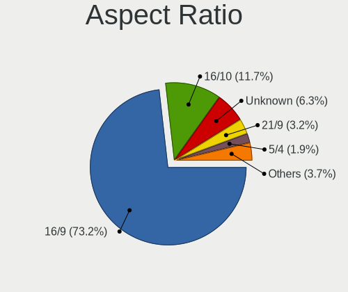

| Ratio   | Computers | Percent |
|---------|-----------|---------|
| 16/9    | 418       | 72.19%  |
| 16/10   | 60        | 10.36%  |
| Unknown | 47        | 8.12%   |
| 21/9    | 16        | 2.76%   |
| 5/4     | 14        | 2.42%   |
| 3/2     | 10        | 1.73%   |
| 4/3     | 8         | 1.38%   |
| 32/9    | 3         | 0.52%   |
| 6/5     | 1         | 0.17%   |
| 3.40    | 1         | 0.17%   |
| 1.00    | 1         | 0.17%   |

Monitor Area
------------

Area in inch

| Area in inch | Computers | Percent |
|----------------|-----------|---------|
| 101-110        | 166       | 25.62%  |
| 81-90          | 100       | 15.43%  |
| 201-250        | 82        | 12.65%  |
| Unknown        | 54        | 8.33%   |
| 301-350        | 44        | 6.79%   |
| 71-80          | 37        | 5.71%   |
| 351-500        | 30        | 4.63%   |
| 151-200        | 23        | 3.55%   |
| 251-300        | 22        | 3.4%    |
| 121-130        | 22        | 3.4%    |
| More than 1000 | 18        | 2.78%   |
| 51-60          | 12        | 1.85%   |
| 141-150        | 11        | 1.7%    |
| 501-1000       | 10        | 1.54%   |
| 61-70          | 7         | 1.08%   |
| 131-140        | 5         | 0.77%   |
| 91-100         | 3         | 0.46%   |
| 41-50          | 1         | 0.15%   |
| 1-40           | 1         | 0.15%   |

Pixel Density
-------------

Pixels per inch

| Density       | Computers | Percent |
|---------------|-----------|---------|
| 51-100        | 172       | 27.13%  |
| 121-160       | 166       | 26.18%  |
| 101-120       | 151       | 23.82%  |
| Unknown       | 54        | 8.52%   |
| 161-240       | 47        | 7.41%   |
| More than 240 | 25        | 3.94%   |
| 1-50          | 19        | 3%      |

Multiple Monitors
-----------------

Total monitors connected

| Total | Computers | Percent |
|-------|-----------|---------|
| 1     | 432       | 74.87%  |
| 2     | 111       | 19.24%  |
| 0     | 18        | 3.12%   |
| 3     | 15        | 2.6%    |
| 4     | 1         | 0.17%   |

Network
-------

Net Controller Vendor
---------------------

Controller vendors

| Vendor                            | Computers | Percent |
|-----------------------------------|-----------|---------|
| Intel                             | 315       | 35.92%  |
| Realtek Semiconductor             | 297       | 33.87%  |
| Qualcomm Atheros                  | 98        | 11.17%  |
| Broadcom                          | 52        | 5.93%   |
| Broadcom Limited                  | 18        | 2.05%   |
| Ralink Technology                 | 9         | 1.03%   |
| Marvell Technology Group          | 9         | 1.03%   |
| Ralink                            | 7         | 0.8%    |
| Nvidia                            | 6         | 0.68%   |
| MediaTek                          | 6         | 0.68%   |
| Hewlett-Packard                   | 5         | 0.57%   |
| ASIX Electronics                  | 5         | 0.57%   |
| Xiaomi                            | 4         | 0.46%   |
| Qualcomm Atheros Communications   | 3         | 0.34%   |
| NetGear                           | 3         | 0.34%   |
| Microsoft                         | 3         | 0.34%   |
| Huawei Technologies               | 3         | 0.34%   |
| D-Link System                     | 3         | 0.34%   |
| Sierra Wireless                   | 2         | 0.23%   |
| OnePlus Technology (Shenzhen)     | 2         | 0.23%   |
| Linksys                           | 2         | 0.23%   |
| Lenovo                            | 2         | 0.23%   |
| JMicron Technology                | 2         | 0.23%   |
| DisplayLink                       | 2         | 0.23%   |
| D-Link                            | 2         | 0.23%   |
| Belkin Components                 | 2         | 0.23%   |
| Wacom                             | 1         | 0.11%   |
| TP-Link                           | 1         | 0.11%   |
| Samsung Electronics               | 1         | 0.11%   |
| Novatek Microelectronics          | 1         | 0.11%   |
| Mercucys                          | 1         | 0.11%   |
| Luminary Micro                    | 1         | 0.11%   |
| Google                            | 1         | 0.11%   |
| Exar                              | 1         | 0.11%   |
| Ericsson Business Mobile Networks | 1         | 0.11%   |
| Edimax Technology                 | 1         | 0.11%   |
| Dell                              | 1         | 0.11%   |
| BUFFALO                           | 1         | 0.11%   |
| ASUSTek Computer                  | 1         | 0.11%   |
| Apple                             | 1         | 0.11%   |

Net Controller Model
--------------------

Controller models

| Model                                                             | Computers | Percent |
|-------------------------------------------------------------------|-----------|---------|
| Realtek RTL8111/8168/8411 PCI Express Gigabit Ethernet Controller | 192       | 18.73%  |
| Intel Wi-Fi 6 AX200                                               | 50        | 4.88%   |
| Realtek RTL8153 Gigabit Ethernet Adapter                          | 36        | 3.51%   |
| Realtek RTL810xE PCI Express Fast Ethernet controller             | 31        | 3.02%   |
| Intel Wireless 8265 / 8275                                        | 27        | 2.63%   |
| Intel 82579LM Gigabit Network Connection (Lewisville)             | 25        | 2.44%   |
| Qualcomm Atheros QCA9377 802.11ac Wireless Network Adapter        | 21        | 2.05%   |
| Intel Wireless-AC 9260                                            | 19        | 1.85%   |
| Intel Wireless 7265                                               | 15        | 1.46%   |
| Intel Comet Lake PCH-LP CNVi WiFi                                 | 15        | 1.46%   |
| Realtek RTL8125 2.5GbE Controller                                 | 14        | 1.37%   |
| Realtek RTL8821CE 802.11ac PCIe Wireless Network Adapter          | 13        | 1.27%   |
| Qualcomm Atheros QCA9565 / AR9565 Wireless Network Adapter        | 12        | 1.17%   |
| Qualcomm Atheros AR9285 Wireless Network Adapter (PCI-Express)    | 12        | 1.17%   |
| Qualcomm Atheros AR9485 Wireless Network Adapter                  | 11        | 1.07%   |
| Intel Wireless 8260                                               | 11        | 1.07%   |
| Intel Dual Band Wireless-AC 3168NGW [Stone Peak]                  | 11        | 1.07%   |
| Intel Wi-Fi 6 AX201                                               | 10        | 0.98%   |
| Intel Ethernet Connection I217-LM                                 | 10        | 0.98%   |
| Intel Centrino Advanced-N 6205 [Taylor Peak]                      | 10        | 0.98%   |
| Intel I211 Gigabit Network Connection                             | 9         | 0.88%   |
| Intel Cannon Point-LP CNVi [Wireless-AC]                          | 9         | 0.88%   |
| Qualcomm Atheros AR8151 v2.0 Gigabit Ethernet                     | 8         | 0.78%   |
| Intel Ethernet Connection (7) I219-V                              | 8         | 0.78%   |
| Realtek RTL8822CE 802.11ac PCIe Wireless Network Adapter          | 7         | 0.68%   |
| Intel Wireless 7260                                               | 7         | 0.68%   |
| Intel Comet Lake PCH CNVi WiFi                                    | 7         | 0.68%   |
| Intel Cannon Lake PCH CNVi WiFi                                   | 7         | 0.68%   |
| Broadcom BCM43142 802.11b/g/n                                     | 7         | 0.68%   |
| Realtek RTL8822BE 802.11a/b/g/n/ac WiFi adapter                   | 6         | 0.59%   |
| Realtek RTL8723BE PCIe Wireless Network Adapter                   | 6         | 0.59%   |
| Qualcomm Atheros QCA6174 802.11ac Wireless Network Adapter        | 6         | 0.59%   |
| Qualcomm Atheros Killer E2500 Gigabit Ethernet Controller         | 6         | 0.59%   |
| Intel Wireless 3165                                               | 6         | 0.59%   |
| Intel Ethernet Connection (6) I219-V                              | 6         | 0.59%   |
| Broadcom NetXtreme BCM57765 Gigabit Ethernet PCIe                 | 6         | 0.59%   |
| Realtek 802.11ac NIC                                              | 5         | 0.49%   |
| Qualcomm Atheros AR9462 Wireless Network Adapter                  | 5         | 0.49%   |
| Intel Ethernet Controller I225-V                                  | 5         | 0.49%   |
| Intel Ethernet Connection (4) I219-LM                             | 5         | 0.49%   |

Wireless Vendor
---------------

Wireless vendors

| Vendor                                | Computers | Percent |
|---------------------------------------|-----------|---------|
| Intel                                 | 255       | 51.31%  |
| Qualcomm Atheros                      | 76        | 15.29%  |
| Realtek Semiconductor                 | 67        | 13.48%  |
| Broadcom                              | 36        | 7.24%   |
| Broadcom Limited                      | 13        | 2.62%   |
| Ralink Technology                     | 9         | 1.81%   |
| Ralink                                | 7         | 1.41%   |
| MediaTek                              | 6         | 1.21%   |
| Qualcomm Atheros Communications       | 3         | 0.6%    |
| NetGear                               | 3         | 0.6%    |
| Microsoft                             | 3         | 0.6%    |
| Sierra Wireless                       | 2         | 0.4%    |
| Linksys                               | 2         | 0.4%    |
| D-Link System                         | 2         | 0.4%    |
| D-Link                                | 2         | 0.4%    |
| Belkin Components                     | 2         | 0.4%    |
| Wacom                                 | 1         | 0.2%    |
| TP-Link                               | 1         | 0.2%    |
| Mercucys                              | 1         | 0.2%    |
| Marvell Technology Group              | 1         | 0.2%    |
| Hewlett-Packard                       | 1         | 0.2%    |
| Edimax Technology                     | 1         | 0.2%    |
| BUFFALO                               | 1         | 0.2%    |
| ASUSTek Computer                      | 1         | 0.2%    |
| 802.11g Adapter [Linksys WUSB54GC v3] | 1         | 0.2%    |

Wireless Model
--------------

Wireless models

| Model                                                          | Computers | Percent |
|----------------------------------------------------------------|-----------|---------|
| Intel Wi-Fi 6 AX200                                            | 50        | 10%     |
| Intel Wireless 8265 / 8275                                     | 27        | 5.4%    |
| Qualcomm Atheros QCA9377 802.11ac Wireless Network Adapter     | 21        | 4.2%    |
| Intel Wireless-AC 9260                                         | 19        | 3.8%    |
| Intel Wireless 7265                                            | 15        | 3%      |
| Intel Comet Lake PCH-LP CNVi WiFi                              | 15        | 3%      |
| Realtek RTL8821CE 802.11ac PCIe Wireless Network Adapter       | 13        | 2.6%    |
| Qualcomm Atheros QCA9565 / AR9565 Wireless Network Adapter     | 12        | 2.4%    |
| Qualcomm Atheros AR9285 Wireless Network Adapter (PCI-Express) | 12        | 2.4%    |
| Qualcomm Atheros AR9485 Wireless Network Adapter               | 11        | 2.2%    |
| Intel Wireless 8260                                            | 11        | 2.2%    |
| Intel Dual Band Wireless-AC 3168NGW [Stone Peak]               | 11        | 2.2%    |
| Intel Wi-Fi 6 AX201                                            | 10        | 2%      |
| Intel Centrino Advanced-N 6205 [Taylor Peak]                   | 10        | 2%      |
| Intel Cannon Point-LP CNVi [Wireless-AC]                       | 9         | 1.8%    |
| Realtek RTL8822CE 802.11ac PCIe Wireless Network Adapter       | 7         | 1.4%    |
| Intel Wireless 7260                                            | 7         | 1.4%    |
| Intel Comet Lake PCH CNVi WiFi                                 | 7         | 1.4%    |
| Intel Cannon Lake PCH CNVi WiFi                                | 7         | 1.4%    |
| Broadcom BCM43142 802.11b/g/n                                  | 7         | 1.4%    |
| Realtek RTL8822BE 802.11a/b/g/n/ac WiFi adapter                | 6         | 1.2%    |
| Realtek RTL8723BE PCIe Wireless Network Adapter                | 6         | 1.2%    |
| Qualcomm Atheros QCA6174 802.11ac Wireless Network Adapter     | 6         | 1.2%    |
| Intel Wireless 3165                                            | 6         | 1.2%    |
| Realtek 802.11ac NIC                                           | 5         | 1%      |
| Qualcomm Atheros AR9462 Wireless Network Adapter               | 5         | 1%      |
| Intel Dual Band Wireless-AC 3165 Plus Bluetooth                | 5         | 1%      |
| Broadcom BCM4360 802.11ac Wireless Network Adapter             | 5         | 1%      |
| Realtek RTL8821AE 802.11ac PCIe Wireless Network Adapter       | 4         | 0.8%    |
| Intel Wi-Fi 6 AX210/AX211/AX411 160MHz                         | 4         | 0.8%    |
| Intel Tiger Lake PCH CNVi WiFi                                 | 4         | 0.8%    |
| Intel Centrino Wireless-N 1000 [Condor Peak]                   | 4         | 0.8%    |
| Intel Centrino Ultimate-N 6300                                 | 4         | 0.8%    |
| Broadcom Limited BCM4360 802.11ac Wireless Network Adapter     | 4         | 0.8%    |
| Broadcom BCM4331 802.11a/b/g/n                                 | 4         | 0.8%    |
| Broadcom BCM4313 802.11bgn Wireless Network Adapter            | 4         | 0.8%    |
| Realtek RTL88x2bu [AC1200 Techkey]                             | 3         | 0.6%    |
| Realtek RTL8188CE 802.11b/g/n WiFi Adapter                     | 3         | 0.6%    |
| Realtek 802.11n WLAN Adapter                                   | 3         | 0.6%    |
| Ralink MT7601U Wireless Adapter                                | 3         | 0.6%    |

Ethernet Vendor
---------------

Ethernet vendors

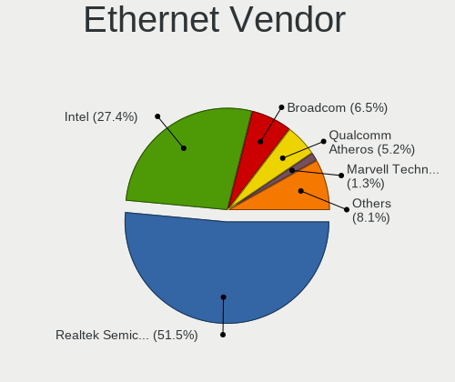

| Vendor                        | Computers | Percent |
|-------------------------------|-----------|---------|
| Realtek Semiconductor         | 269       | 53.91%  |
| Intel                         | 134       | 26.85%  |
| Qualcomm Atheros              | 29        | 5.81%   |
| Broadcom                      | 25        | 5.01%   |
| Marvell Technology Group      | 8         | 1.6%    |
| Nvidia                        | 6         | 1.2%    |
| Broadcom Limited              | 5         | 1%      |
| ASIX Electronics              | 5         | 1%      |
| Xiaomi                        | 4         | 0.8%    |
| OnePlus Technology (Shenzhen) | 2         | 0.4%    |
| Lenovo                        | 2         | 0.4%    |
| JMicron Technology            | 2         | 0.4%    |
| Hewlett-Packard               | 2         | 0.4%    |
| DisplayLink                   | 2         | 0.4%    |
| Samsung Electronics           | 1         | 0.2%    |
| Google                        | 1         | 0.2%    |
| D-Link System                 | 1         | 0.2%    |
| Apple                         | 1         | 0.2%    |

Ethernet Model
--------------

Ethernet models

| Model                                                             | Computers | Percent |
|-------------------------------------------------------------------|-----------|---------|
| Realtek RTL8111/8168/8411 PCI Express Gigabit Ethernet Controller | 192       | 37.28%  |
| Realtek RTL8153 Gigabit Ethernet Adapter                          | 36        | 6.99%   |
| Realtek RTL810xE PCI Express Fast Ethernet controller             | 31        | 6.02%   |
| Intel 82579LM Gigabit Network Connection (Lewisville)             | 25        | 4.85%   |
| Realtek RTL8125 2.5GbE Controller                                 | 14        | 2.72%   |
| Intel Ethernet Connection I217-LM                                 | 10        | 1.94%   |
| Intel I211 Gigabit Network Connection                             | 9         | 1.75%   |
| Qualcomm Atheros AR8151 v2.0 Gigabit Ethernet                     | 8         | 1.55%   |
| Intel Ethernet Connection (7) I219-V                              | 8         | 1.55%   |
| Qualcomm Atheros Killer E2500 Gigabit Ethernet Controller         | 6         | 1.17%   |
| Intel Ethernet Connection (6) I219-V                              | 6         | 1.17%   |
| Broadcom NetXtreme BCM57765 Gigabit Ethernet PCIe                 | 6         | 1.17%   |
| Intel Ethernet Controller I225-V                                  | 5         | 0.97%   |
| Intel Ethernet Connection (4) I219-LM                             | 5         | 0.97%   |
| Intel Ethernet Connection (2) I219-V                              | 5         | 0.97%   |
| Intel 82579V Gigabit Network Connection                           | 5         | 0.97%   |
| Xiaomi Mi/Redmi series (RNDIS)                                    | 4         | 0.78%   |
| Intel I210 Gigabit Network Connection                             | 4         | 0.78%   |
| Intel Ethernet Connection I219-LM                                 | 4         | 0.78%   |
| Intel 82567LM-3 Gigabit Network Connection                        | 4         | 0.78%   |
| Broadcom NetXtreme BCM57766 Gigabit Ethernet PCIe                 | 4         | 0.78%   |
| ASIX AX88179 Gigabit Ethernet                                     | 4         | 0.78%   |
| Realtek RTL8152 Fast Ethernet Adapter                             | 3         | 0.58%   |
| Qualcomm Atheros QCA8171 Gigabit Ethernet                         | 3         | 0.58%   |
| Qualcomm Atheros Killer E220x Gigabit Ethernet Controller         | 3         | 0.58%   |
| Nvidia MCP79 Ethernet                                             | 3         | 0.58%   |
| Marvell Group 88E8058 PCI-E Gigabit Ethernet Controller           | 3         | 0.58%   |
| Intel Ethernet Connection I218-LM                                 | 3         | 0.58%   |
| Intel Ethernet Connection (6) I219-LM                             | 3         | 0.58%   |
| Intel Ethernet Connection (2) I218-V                              | 3         | 0.58%   |
| Intel 82577LM Gigabit Network Connection                          | 3         | 0.58%   |
| Intel 82567LM Gigabit Network Connection                          | 3         | 0.58%   |
| Intel 82566DM Gigabit Network Connection                          | 3         | 0.58%   |
| Broadcom NetXtreme BCM5761 Gigabit Ethernet PCIe                  | 3         | 0.58%   |
| Broadcom NetLink BCM57780 Gigabit Ethernet PCIe                   | 3         | 0.58%   |
| Realtek RTL-8100/8101L/8139 PCI Fast Ethernet Adapter             | 2         | 0.39%   |
| Qualcomm Atheros QCA8172 Fast Ethernet                            | 2         | 0.39%   |
| Qualcomm Atheros Killer E2400 Gigabit Ethernet Controller         | 2         | 0.39%   |
| Qualcomm Atheros AR8161 Gigabit Ethernet                          | 2         | 0.39%   |
| Qualcomm Atheros AR8152 v2.0 Fast Ethernet                        | 2         | 0.39%   |

Net Controller Kind
-------------------

Ethernet, WiFi or modem

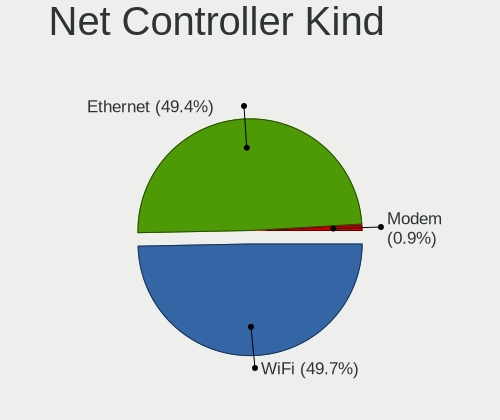

| Kind     | Computers | Percent |
|----------|-----------|---------|
| Ethernet | 473       | 49.63%  |
| WiFi     | 470       | 49.32%  |
| Modem    | 10        | 1.05%   |

Used Controller
---------------

Currently used network controller

| Kind     | Computers | Percent |
|----------|-----------|---------|
| WiFi     | 384       | 64%     |
| Ethernet | 216       | 36%     |

NICs
----

Total network controllers on board

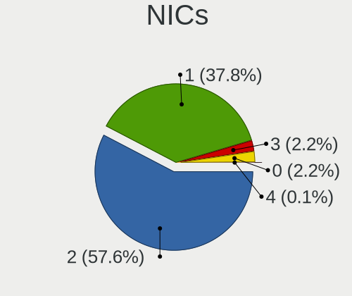

| Total | Computers | Percent |
|-------|-----------|---------|
| 2     | 332       | 58.87%  |
| 1     | 204       | 36.17%  |
| 0     | 16        | 2.84%   |
| 3     | 12        | 2.13%   |

IPv6
----

IPv6 vs IPv4

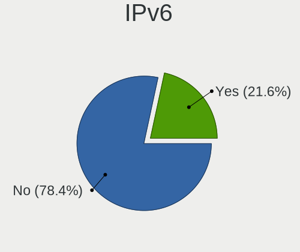

| Used | Computers | Percent |
|------|-----------|---------|
| No   | 473       | 82.69%  |
| Yes  | 99        | 17.31%  |

Bluetooth
---------

Bluetooth Vendor
----------------

Controller vendors

| Vendor                          | Computers | Percent |
|---------------------------------|-----------|---------|
| Intel                           | 212       | 52.35%  |
| Qualcomm Atheros Communications | 33        | 8.15%   |
| Realtek Semiconductor           | 27        | 6.67%   |
| Cambridge Silicon Radio         | 24        | 5.93%   |
| Apple                           | 21        | 5.19%   |
| Broadcom                        | 19        | 4.69%   |
| Lite-On Technology              | 12        | 2.96%   |
| IMC Networks                    | 12        | 2.96%   |
| Foxconn / Hon Hai               | 11        | 2.72%   |
| Dell                            | 8         | 1.98%   |
| Hewlett-Packard                 | 5         | 1.23%   |
| Realtek                         | 4         | 0.99%   |
| Ralink                          | 3         | 0.74%   |
| Belkin Components               | 3         | 0.74%   |
| ASUSTek Computer                | 3         | 0.74%   |
| Toshiba                         | 2         | 0.49%   |
| Foxconn International           | 2         | 0.49%   |
| Unknown                         | 1         | 0.25%   |
| MediaTek                        | 1         | 0.25%   |
| Marvell Semiconductor           | 1         | 0.25%   |
| Integrated System Solution      | 1         | 0.25%   |

Bluetooth Model
---------------

Controller models

| Model                                                                               | Computers | Percent |
|-------------------------------------------------------------------------------------|-----------|---------|
| Intel Bluetooth wireless interface                                                  | 70        | 17.28%  |
| Intel AX200 Bluetooth                                                               | 48        | 11.85%  |
| Intel Bluetooth Device                                                              | 31        | 7.65%   |
| Intel Bluetooth 9460/9560 Jefferson Peak (JfP)                                      | 25        | 6.17%   |
| Cambridge Silicon Radio Bluetooth Dongle (HCI mode)                                 | 24        | 5.93%   |
| Intel Wireless-AC 9260 Bluetooth Adapter                                            | 19        | 4.69%   |
| Qualcomm Atheros  Bluetooth Device                                                  | 17        | 4.2%    |
| Realtek Bluetooth Radio                                                             | 13        | 3.21%   |
| Intel Wireless-AC 3168 Bluetooth                                                    | 9         | 2.22%   |
| Qualcomm Atheros AR3011 Bluetooth                                                   | 8         | 1.98%   |
| Apple Bluetooth Host Controller                                                     | 8         | 1.98%   |
| Realtek  Bluetooth 4.2 Adapter                                                      | 7         | 1.73%   |
| Lite-On Bluetooth Device                                                            | 7         | 1.73%   |
| Dell DW375 Bluetooth Module                                                         | 7         | 1.73%   |
| Apple Bluetooth USB Host Controller                                                 | 6         | 1.48%   |
| Qualcomm Atheros AR3012 Bluetooth 4.0                                               | 5         | 1.23%   |
| Foxconn / Hon Hai Bluetooth Device                                                  | 5         | 1.23%   |
| Realtek RTL8723B Bluetooth                                                          | 4         | 0.99%   |
| Realtek Bluetooth Radio                                                             | 4         | 0.99%   |
| Intel Centrino Bluetooth Wireless Transceiver                                       | 4         | 0.99%   |
| Intel AX210 Bluetooth                                                               | 4         | 0.99%   |
| IMC Networks Bluetooth Radio                                                        | 4         | 0.99%   |
| IMC Networks Bluetooth Device                                                       | 4         | 0.99%   |
| Apple Built-in Bluetooth 2.0+EDR HCI                                                | 4         | 0.99%   |
| Ralink RT3290 Bluetooth                                                             | 3         | 0.74%   |
| Broadcom BCM20702A0 Bluetooth 4.0                                                   | 3         | 0.74%   |
| Broadcom BCM20702 Bluetooth 4.0 [ThinkPad]                                          | 3         | 0.74%   |
| Belkin Components F8T065BF Mini Bluetooth 4.0 Adapter                               | 3         | 0.74%   |
| Apple Bluetooth HCI                                                                 | 3         | 0.74%   |
| Realtek RTL8821A Bluetooth                                                          | 2         | 0.49%   |
| Qualcomm Atheros QCA61x4 Bluetooth 4.0                                              | 2         | 0.49%   |
| Lite-On Atheros AR3012 Bluetooth                                                    | 2         | 0.49%   |
| Intel Centrino Advanced-N 6230 Bluetooth adapter                                    | 2         | 0.49%   |
| IMC Networks Wireless_Device                                                        | 2         | 0.49%   |
| IMC Networks Atheros AR3012 Bluetooth 4.0 Adapter                                   | 2         | 0.49%   |
| HP Broadcom 2070 Bluetooth Combo                                                    | 2         | 0.49%   |
| HP Bluetooth 2.0 Interface [Broadcom BCM2045]                                       | 2         | 0.49%   |
| Foxconn International BCM43142A0 Bluetooth module                                   | 2         | 0.49%   |
| Foxconn / Hon Hai Foxconn T77H114 BCM2070 [Single-Chip Bluetooth 2.1 + EDR Adapter] | 2         | 0.49%   |
| Broadcom BCM43142A0 Bluetooth Device                                                | 2         | 0.49%   |

Sound
-----

Sound Vendor
------------

Sound card vendors

| Vendor                     | Computers | Percent |
|----------------------------|-----------|---------|
| Intel                      | 440       | 55.7%   |
| Nvidia                     | 133       | 16.84%  |
| AMD                        | 132       | 16.71%  |
| C-Media Electronics        | 10        | 1.27%   |
| Realtek Semiconductor      | 9         | 1.14%   |
| Logitech                   | 8         | 1.01%   |
| GN Netcom                  | 5         | 0.63%   |
| JMTek                      | 4         | 0.51%   |
| Creative Labs              | 4         | 0.51%   |
| Plantronics                | 3         | 0.38%   |
| Kingston Technology        | 3         | 0.38%   |
| Creative Technology        | 3         | 0.38%   |
| Texas Instruments          | 2         | 0.25%   |
| Sennheiser Communications  | 2         | 0.25%   |
| Samson Technologies        | 2         | 0.25%   |
| Focusrite-Novation         | 2         | 0.25%   |
| Blue Microphones           | 2         | 0.25%   |
| Apple                      | 2         | 0.25%   |
| XMOS                       | 1         | 0.13%   |
| SteelSeries ApS            | 1         | 0.13%   |
| Razer USA                  | 1         | 0.13%   |
| PreSonus Audio Electronics | 1         | 0.13%   |
| OPPO Electronics           | 1         | 0.13%   |
| No brand                   | 1         | 0.13%   |
| Native Instruments         | 1         | 0.13%   |
| Nam Tai E&E Products       | 1         | 0.13%   |
| Microsoft                  | 1         | 0.13%   |
| M-Audio                    | 1         | 0.13%   |
| LINE TECH INDUSTRIAL       | 1         | 0.13%   |
| Lenovo                     | 1         | 0.13%   |
| Hewlett-Packard            | 1         | 0.13%   |
| GYROCOM C&C                | 1         | 0.13%   |
| Giga-Byte Technology       | 1         | 0.13%   |
| Generalplus Technology     | 1         | 0.13%   |
| DSEA A/S                   | 1         | 0.13%   |
| Conexant Systems           | 1         | 0.13%   |
| CMX Systems                | 1         | 0.13%   |
| Cambridge Audio            | 1         | 0.13%   |
| Bose                       | 1         | 0.13%   |
| ASUSTek Computer           | 1         | 0.13%   |

Sound Model
-----------

Sound card models

| Model                                                                      | Computers | Percent |
|----------------------------------------------------------------------------|-----------|---------|
| Intel Sunrise Point-LP HD Audio                                            | 58        | 6.34%   |
| Intel 7 Series/C216 Chipset Family High Definition Audio Controller        | 45        | 4.92%   |
| AMD Family 17h/19h HD Audio Controller                                     | 42        | 4.59%   |
| Intel 6 Series/C200 Series Chipset Family High Definition Audio Controller | 41        | 4.48%   |
| Intel Cannon Point-LP High Definition Audio Controller                     | 27        | 2.95%   |
| Intel Cannon Lake PCH cAVS                                                 | 26        | 2.84%   |
| Intel 8 Series/C220 Series Chipset High Definition Audio Controller        | 23        | 2.51%   |
| Intel Comet Lake PCH-LP cAVS                                               | 21        | 2.3%    |
| AMD Renoir Radeon High Definition Audio Controller                         | 20        | 2.19%   |
| Intel Xeon E3-1200 v3/4th Gen Core Processor HD Audio Controller           | 19        | 2.08%   |
| Intel Tiger Lake-LP Smart Sound Technology Audio Controller                | 18        | 1.97%   |
| Intel 5 Series/3400 Series Chipset High Definition Audio                   | 17        | 1.86%   |
| AMD Raven/Raven2/Fenghuang HDMI/DP Audio Controller                        | 17        | 1.86%   |
| AMD Starship/Matisse HD Audio Controller                                   | 16        | 1.75%   |
| Nvidia TU106 High Definition Audio Controller                              | 15        | 1.64%   |
| AMD FCH Azalia Controller                                                  | 15        | 1.64%   |
| Nvidia GP106 High Definition Audio Controller                              | 14        | 1.53%   |
| Intel Haswell-ULT HD Audio Controller                                      | 14        | 1.53%   |
| Intel 8 Series HD Audio Controller                                         | 14        | 1.53%   |
| AMD Ellesmere HDMI Audio [Radeon RX 470/480 / 570/580/590]                 | 14        | 1.53%   |
| Intel Wildcat Point-LP High Definition Audio Controller                    | 13        | 1.42%   |
| Intel Broadwell-U Audio Controller                                         | 13        | 1.42%   |
| Intel Celeron/Pentium Silver Processor High Definition Audio               | 12        | 1.31%   |
| Intel 82801H (ICH8 Family) HD Audio Controller                             | 12        | 1.31%   |
| Intel Comet Lake PCH cAVS                                                  | 11        | 1.2%    |
| Intel 82801I (ICH9 Family) HD Audio Controller                             | 10        | 1.09%   |
| Intel 100 Series/C230 Series Chipset Family HD Audio Controller            | 10        | 1.09%   |
| AMD SBx00 Azalia (Intel HDA)                                               | 10        | 1.09%   |
| Realtek Semiconductor USB Audio                                            | 9         | 0.98%   |
| Nvidia GP107GL High Definition Audio Controller                            | 9         | 0.98%   |
| Intel CM238 HD Audio Controller                                            | 9         | 0.98%   |
| AMD Kabini HDMI/DP Audio                                                   | 9         | 0.98%   |
| Nvidia GF108 High Definition Audio Controller                              | 8         | 0.87%   |
| Intel Tiger Lake-H HD Audio Controller                                     | 8         | 0.87%   |
| Intel NM10/ICH7 Family High Definition Audio Controller                    | 8         | 0.87%   |
| Intel 200 Series PCH HD Audio                                              | 8         | 0.87%   |
| AMD Oland/Hainan/Cape Verde/Pitcairn HDMI Audio [Radeon HD 7000 Series]    | 8         | 0.87%   |
| AMD Family 17h (Models 00h-0fh) HD Audio Controller                        | 8         | 0.87%   |
| Nvidia GP104 High Definition Audio Controller                              | 7         | 0.77%   |
| Nvidia GK107 HDMI Audio Controller                                         | 7         | 0.77%   |

Memory
------

Memory Vendor
-------------

Memory module vendors

| Vendor              | Computers | Percent |
|---------------------|-----------|---------|
| Samsung Electronics | 106       | 28.65%  |
| SK hynix            | 72        | 19.46%  |
| Kingston            | 35        | 9.46%   |
| Micron Technology   | 34        | 9.19%   |
| Crucial             | 25        | 6.76%   |
| Unknown             | 23        | 6.22%   |
| Ramaxel Technology  | 11        | 2.97%   |
| Corsair             | 11        | 2.97%   |
| G.Skill             | 6         | 1.62%   |
| A-DATA Technology   | 6         | 1.62%   |
| Unknown (ABCD)      | 5         | 1.35%   |
| Unknown             | 4         | 1.08%   |
| Team                | 3         | 0.81%   |
| Elpida              | 3         | 0.81%   |
| Transcend           | 2         | 0.54%   |
| Teikon              | 2         | 0.54%   |
| Smart               | 2         | 0.54%   |
| PNY                 | 2         | 0.54%   |
| Nanya Technology    | 2         | 0.54%   |
| GOODRAM             | 2         | 0.54%   |
| Unknown (F301)      | 1         | 0.27%   |
| Unknown (0x873E)    | 1         | 0.27%   |
| Timetec             | 1         | 0.27%   |
| Smart Brazil        | 1         | 0.27%   |
| Sesame              | 1         | 0.27%   |
| Patriot             | 1         | 0.27%   |
| Kingmax             | 1         | 0.27%   |
| Goldkey             | 1         | 0.27%   |
| fef5                | 1         | 0.27%   |
| Cors                | 1         | 0.27%   |
| Avant               | 1         | 0.27%   |
| ASint Technology    | 1         | 0.27%   |
| Apacer              | 1         | 0.27%   |
| 8945000080AD        | 1         | 0.27%   |

Memory Model
------------

Memory module models

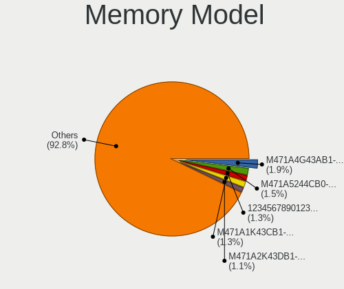

| Model                                                            | Computers | Percent |
|------------------------------------------------------------------|-----------|---------|
| Samsung RAM M471A4G43AB1-CWE 32GB SODIMM DDR4 3200MT/s           | 8         | 2.05%   |
| Samsung RAM M471A5244CB0-CTD 4GB SODIMM DDR4 3266MT/s            | 7         | 1.79%   |
| Samsung RAM M471A2K43DB1-CWE 16GB SODIMM DDR4 3200MT/s           | 6         | 1.53%   |
| Samsung RAM M471A1K43CB1-CTD 8GB SODIMM DDR4 2667MT/s            | 6         | 1.53%   |
| Unknown (ABCD) RAM 123456789012345678 2GB SODIMM LPDDR4 2400MT/s | 5         | 1.28%   |
| SK hynix RAM HMA81GS6AFR8N-UH 8192MB SODIMM DDR4 2667MT/s        | 5         | 1.28%   |
| Samsung RAM M471A1K43DB1-CWE 8GB SODIMM DDR4 3200MT/s            | 5         | 1.28%   |
| Ramaxel RAM RMSA3260ME78HAF-2666 8192MB SODIMM DDR4 2667MT/s     | 4         | 1.02%   |
| Micron RAM 4ATF51264HZ-2G6E1 4GB SODIMM DDR4 2667MT/s            | 4         | 1.02%   |
| Unknown                                                          | 4         | 1.02%   |
| SK hynix RAM HMT351S6BFR8C-H9 4GB SODIMM DDR3 1333MT/s           | 3         | 0.77%   |
| SK hynix RAM HMA81GS6JJR8N-VK 8GB SODIMM DDR4 2667MT/s           | 3         | 0.77%   |
| Samsung RAM M471B5773DH0-CH9 2GB SODIMM DDR3 1600MT/s            | 3         | 0.77%   |
| Samsung RAM M471B1G73QH0-YK0 8GB SODIMM DDR3 1867MT/s            | 3         | 0.77%   |
| Samsung RAM M471A4G43MB1-CTD 32GB SODIMM DDR4 2667MT/s           | 3         | 0.77%   |
| Samsung RAM M471A2K43CB1-CTD 16384MB SODIMM DDR4 8400MT/s        | 3         | 0.77%   |
| Samsung RAM K4EBE304EC-EGCG 8GB Row Of Chips LPDDR3 2133MT/s     | 3         | 0.77%   |
| Ramaxel RAM RMSA3270ME86H9F-2666 4GB SODIMM DDR4 2667MT/s        | 3         | 0.77%   |
| Micron RAM 16KTF1G64HZ-1G6E1 8GB SODIMM DDR3 1600MT/s            | 3         | 0.77%   |
| Micron RAM 16ATF2G64HZ-2G6E1 16GB SODIMM DDR4 2667MT/s           | 3         | 0.77%   |
| Unknown RAM Module 4096MB SODIMM DDR3 1600MT/s                   | 2         | 0.51%   |
| Unknown RAM Module 4096MB SODIMM DDR2 667MT/s                    | 2         | 0.51%   |
| Unknown RAM Module 2GB SODIMM DDR3                               | 2         | 0.51%   |
| Unknown RAM Module 2048MB DIMM SDRAM                             | 2         | 0.51%   |
| SK hynix RAM HMT451S6BFR8A-PB 4GB SODIMM DDR3 1600MT/s           | 2         | 0.51%   |
| SK hynix RAM HMT451S6BFR8A-PB 4096MB SODIMM DDR3 1600MT/s        | 2         | 0.51%   |
| SK hynix RAM HMT41GS6AFR8A-PB 8GB SODIMM DDR3 1600MT/s           | 2         | 0.51%   |
| SK hynix RAM HMT351S6CFR8C-PB 4GB SODIMM DDR3 1600MT/s           | 2         | 0.51%   |
| SK hynix RAM HMT351S6CFR8A-PB 4096MB SODIMM DDR3 1600MT/s        | 2         | 0.51%   |
| SK hynix RAM HMT325S6BFR8C-H9 2GB SODIMM DDR3 1600MT/s           | 2         | 0.51%   |
| SK hynix RAM HMA851S6AFR6N-UH 4GB SODIMM DDR4 2667MT/s           | 2         | 0.51%   |
| SK hynix RAM HMA82GS6CJR8N-VK 16GB SODIMM DDR4 2667MT/s          | 2         | 0.51%   |
| Samsung RAM M471B5273EB0-CK0 4GB SODIMM DDR3 4199MT/s            | 2         | 0.51%   |
| Samsung RAM M471B5273DH0-CK0 4GB SODIMM DDR3 1600MT/s            | 2         | 0.51%   |
| Samsung RAM M471B5273DH0-CH9 4GB SODIMM DDR3 1334MT/s            | 2         | 0.51%   |
| Samsung RAM M471B5173EB0-YK0 4GB SODIMM DDR3 1600MT/s            | 2         | 0.51%   |
| Samsung RAM M471A5244CB0-CRC 4GB SODIMM DDR4 2667MT/s            | 2         | 0.51%   |
| Samsung RAM M471A2K43CB1-CRC 16GB SODIMM DDR4 2667MT/s           | 2         | 0.51%   |
| Samsung RAM M471A1K43BB0-CPB 8GB SODIMM DDR4 2133MT/s            | 2         | 0.51%   |
| Samsung RAM M471A1G44AB0-CWE 8GB SODIMM DDR4 3200MT/s            | 2         | 0.51%   |

Memory Kind
-----------

Memory module kinds

| Kind    | Computers | Percent |
|---------|-----------|---------|
| DDR4    | 151       | 47.63%  |
| DDR3    | 109       | 34.38%  |
| LPDDR3  | 16        | 5.05%   |
| LPDDR4  | 15        | 4.73%   |
| DDR2    | 10        | 3.15%   |
| SDRAM   | 8         | 2.52%   |
| Unknown | 6         | 1.89%   |
| DDR     | 2         | 0.63%   |

Memory Form Factor
------------------

Physical design of the memory module

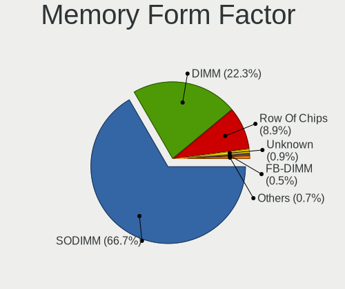

| Name         | Computers | Percent |
|--------------|-----------|---------|
| SODIMM       | 205       | 65.92%  |
| DIMM         | 74        | 23.79%  |
| Row Of Chips | 26        | 8.36%   |
| FB-DIMM      | 2         | 0.64%   |
| Unknown      | 2         | 0.64%   |
| RIMM         | 1         | 0.32%   |
| Chip         | 1         | 0.32%   |

Memory Size
-----------

Memory module size

| Size  | Computers | Percent |
|-------|-----------|---------|
| 8192  | 126       | 37.17%  |
| 4096  | 104       | 30.68%  |
| 16384 | 48        | 14.16%  |
| 2048  | 31        | 9.14%   |
| 32768 | 18        | 5.31%   |
| 1024  | 10        | 2.95%   |
| 512   | 2         | 0.59%   |

Memory Speed
------------

Memory module speed

| Speed   | Computers | Percent |
|---------|-----------|---------|
| 1600    | 76        | 21.71%  |
| 2667    | 67        | 19.14%  |
| 3200    | 45        | 12.86%  |
| 2400    | 29        | 8.29%   |
| 1333    | 23        | 6.57%   |
| 2133    | 22        | 6.29%   |
| 1334    | 10        | 2.86%   |
| 3266    | 7         | 2%      |
| 1867    | 7         | 2%      |
| 667     | 7         | 2%      |
| Unknown | 7         | 2%      |
| 1067    | 6         | 1.71%   |
| 4267    | 5         | 1.43%   |
| 1066    | 4         | 1.14%   |
| 800     | 4         | 1.14%   |
| 8400    | 3         | 0.86%   |
| 4199    | 3         | 0.86%   |
| 3600    | 3         | 0.86%   |
| 533     | 3         | 0.86%   |
| 3733    | 2         | 0.57%   |
| 3400    | 2         | 0.57%   |
| 2472    | 2         | 0.57%   |
| 1800    | 2         | 0.57%   |
| 4266    | 1         | 0.29%   |
| 3866    | 1         | 0.29%   |
| 3500    | 1         | 0.29%   |
| 3007    | 1         | 0.29%   |
| 3000    | 1         | 0.29%   |
| 2666    | 1         | 0.29%   |
| 2134    | 1         | 0.29%   |
| 2048    | 1         | 0.29%   |
| 1866    | 1         | 0.29%   |
| 1639    | 1         | 0.29%   |
| 400     | 1         | 0.29%   |

Printers & scanners
-------------------

Printer Vendor
--------------

Printer device vendors

| Vendor              | Computers | Percent |
|---------------------|-----------|---------|
| Hewlett-Packard     | 4         | 30.77%  |
| Canon               | 4         | 30.77%  |
| Samsung Electronics | 2         | 15.38%  |
| Sharp               | 1         | 7.69%   |
| Fuji Xerox          | 1         | 7.69%   |
| Brother Industries  | 1         | 7.69%   |

Printer Model
-------------

Printer device models

| Model                         | Computers | Percent |
|-------------------------------|-----------|---------|
| Sharp AL-2030                 | 1         | 7.69%   |
| Samsung ML-1510 Laser Printer | 1         | 7.69%   |
| Samsung M2020 Series          | 1         | 7.69%   |
| HP LaserJet 1320              | 1         | 7.69%   |
| HP Deskjet 3050 J610 series   | 1         | 7.69%   |
| HP Deskjet 2540 series        | 1         | 7.69%   |
| HP DeskJet 2130 series        | 1         | 7.69%   |
| Fuji Xerox DocuPrint CM305 df | 1         | 7.69%   |
| Canon TR7500 series           | 1         | 7.69%   |
| Canon MF4010 series           | 1         | 7.69%   |
| Canon MF240 Series V4         | 1         | 7.69%   |
| Canon LiDE 400                | 1         | 7.69%   |
| Brother MFC-1810              | 1         | 7.69%   |

Scanner Vendor
--------------

Scanner device vendors

| Vendor | Computers | Percent |
|--------|-----------|---------|
| Canon  | 3         | 100%    |

Scanner Model
-------------

Scanner device models

| Model                   | Computers | Percent |
|-------------------------|-----------|---------|
| Canon CanoScan LiDE 220 | 1         | 33.33%  |
| Canon CanoScan LiDE 120 | 1         | 33.33%  |
| Canon CanoScan LiDE 110 | 1         | 33.33%  |

Camera
------

Camera Vendor
-------------

Camera device vendors

| Vendor                                 | Computers | Percent |
|----------------------------------------|-----------|---------|
| Chicony Electronics                    | 93        | 24.54%  |
| Acer                                   | 33        | 8.71%   |
| Sunplus Innovation Technology          | 31        | 8.18%   |
| Realtek Semiconductor                  | 31        | 8.18%   |
| IMC Networks                           | 31        | 8.18%   |
| Microdia                               | 27        | 7.12%   |
| Apple                                  | 18        | 4.75%   |
| Logitech                               | 17        | 4.49%   |
| Cheng Uei Precision Industry (Foxlink) | 14        | 3.69%   |
| Syntek                                 | 10        | 2.64%   |
| Suyin                                  | 10        | 2.64%   |
| Quanta                                 | 10        | 2.64%   |
| Silicon Motion                         | 6         | 1.58%   |
| Lite-On Technology                     | 6         | 1.58%   |
| Luxvisions Innotech Limited            | 5         | 1.32%   |
| Generalplus Technology                 | 4         | 1.06%   |
| Ricoh                                  | 3         | 0.79%   |
| Microsoft                              | 3         | 0.79%   |
| Alcor Micro                            | 3         | 0.79%   |
| Samsung Electronics                    | 2         | 0.53%   |
| LG Electronics                         | 2         | 0.53%   |
| ARC International                      | 2         | 0.53%   |
| Unknown                                | 2         | 0.53%   |
| Z-Star Microelectronics                | 1         | 0.26%   |
| Unknown                                | 1         | 0.26%   |
| Tobii Technology AB                    | 1         | 0.26%   |
| Sonix Technology                       | 1         | 0.26%   |
| Primax Electronics                     | 1         | 0.26%   |
| Polycom                                | 1         | 0.26%   |
| OPPO Electronics                       | 1         | 0.26%   |
| Omnivision                             | 1         | 0.26%   |
| Linux Foundation                       | 1         | 0.26%   |
| IPEVO                                  | 1         | 0.26%   |
| Importek                               | 1         | 0.26%   |
| icSpring                               | 1         | 0.26%   |
| Guillemot                              | 1         | 0.26%   |
| Denron                                 | 1         | 0.26%   |
| Cubeternet                             | 1         | 0.26%   |
| Creative Technology                    | 1         | 0.26%   |

Camera Model
------------

Camera device models

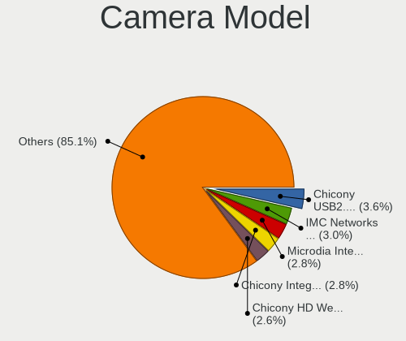

| Model                                                                      | Computers | Percent |
|----------------------------------------------------------------------------|-----------|---------|
| Chicony HD Webcam                                                          | 19        | 4.99%   |
| Chicony USB2.0 Camera                                                      | 18        | 4.72%   |
| Chicony Integrated Camera                                                  | 11        | 2.89%   |
| Realtek Integrated_Webcam_HD                                               | 10        | 2.62%   |
| Microdia Integrated_Webcam_HD                                              | 10        | 2.62%   |
| IMC Networks Integrated Camera                                             | 10        | 2.62%   |
| IMC Networks USB2.0 HD UVC WebCam                                          | 8         | 2.1%    |
| Acer Integrated Camera                                                     | 7         | 1.84%   |
| Chicony HP HD Camera                                                       | 6         | 1.57%   |
| Acer HD Webcam                                                             | 6         | 1.57%   |
| Acer BisonCam,NB Pro                                                       | 6         | 1.57%   |
| Sunplus HD WebCam                                                          | 5         | 1.31%   |
| Logitech HD Pro Webcam C920                                                | 5         | 1.31%   |
| Apple FaceTime HD Camera (Built-in)                                        | 5         | 1.31%   |
| Apple Built-in iSight                                                      | 5         | 1.31%   |
| Syntek Integrated Camera                                                   | 4         | 1.05%   |
| Sunplus Integrated_Webcam_HD                                               | 4         | 1.05%   |
| IMC Networks VGA UVC WebCam                                                | 4         | 1.05%   |
| Cheng Uei Precision Industry (Foxlink) HP Truevision HD                    | 4         | 1.05%   |
| Apple FaceTime HD Camera                                                   | 4         | 1.05%   |
| Sunplus Asus Webcam                                                        | 3         | 0.79%   |
| Realtek Lenovo EasyCamera                                                  | 3         | 0.79%   |
| Realtek Integrated Webcam                                                  | 3         | 0.79%   |
| Realtek HD WebCam                                                          | 3         | 0.79%   |
| Microdia Sonix USB 2.0 Camera                                              | 3         | 0.79%   |
| IMC Networks USB2.0 VGA UVC WebCam                                         | 3         | 0.79%   |
| IMC Networks ov9734_azurewave_camera                                       | 3         | 0.79%   |
| Generalplus GENERAL WEBCAM                                                 | 3         | 0.79%   |
| Chicony USB2.0 VGA UVC WebCam                                              | 3         | 0.79%   |
| Chicony Integrated Camera [ThinkPad]                                       | 3         | 0.79%   |
| Chicony Integrated Camera (1280x720@30)                                    | 3         | 0.79%   |
| Cheng Uei Precision Industry (Foxlink) HP Wide Vision HD Integrated Webcam | 3         | 0.79%   |
| Apple iPhone 5/5C/5S/6/SE                                                  | 3         | 0.79%   |
| Acer SunplusIT Integrated Camera                                           | 3         | 0.79%   |
| Acer EasyCamera                                                            | 3         | 0.79%   |
| Acer BisonCam, NB Pro                                                      | 3         | 0.79%   |
| Syntek Lenovo EasyCamera                                                   | 2         | 0.52%   |
| Syntek EasyCamera                                                          | 2         | 0.52%   |
| Suyin USB 2.0 Camera                                                       | 2         | 0.52%   |
| Suyin HP Truevision HD                                                     | 2         | 0.52%   |

Security
--------

Fingerprint Vendor
------------------

Fingerprint sensor vendors

| Vendor                     | Computers | Percent |
|----------------------------|-----------|---------|
| Synaptics                  | 33        | 37.93%  |
| Validity Sensors           | 25        | 28.74%  |
| Shenzhen Goodix Technology | 14        | 16.09%  |
| LighTuning Technology      | 7         | 8.05%   |
| Elan Microelectronics      | 5         | 5.75%   |
| AuthenTec                  | 3         | 3.45%   |

Fingerprint Model
-----------------

Fingerprint sensor models

| Model                                                                      | Computers | Percent |
|----------------------------------------------------------------------------|-----------|---------|
| Unknown                                                                    | 13        | 14.94%  |
| Shenzhen Goodix  FingerPrint Device                                        | 9         | 10.34%  |
| Synaptics Prometheus MIS Touch Fingerprint Reader                          | 8         | 9.2%    |
| Validity Sensors VFS495 Fingerprint Reader                                 | 7         | 8.05%   |
| Validity Sensors Swipe Fingerprint Sensor                                  | 5         | 5.75%   |
| Elan ELAN:Fingerprint                                                      | 5         | 5.75%   |
| Validity Sensors VFS471 Fingerprint Reader                                 | 4         | 4.6%    |
| Synaptics WBDI Device                                                      | 4         | 4.6%    |
| Validity Sensors Fingerprint scanner                                       | 3         | 3.45%   |
| Synaptics Metallica MIS Touch Fingerprint Reader                           | 3         | 3.45%   |
| Shenzhen Goodix Fingerprint Reader                                         | 3         | 3.45%   |
| LighTuning ES603 Swipe Fingerprint Sensor                                  | 3         | 3.45%   |
| LighTuning EgisTec Touch Fingerprint Sensor                                | 3         | 3.45%   |
| Validity Sensors VFS5011 Fingerprint Reader                                | 2         | 2.3%    |
| Validity Sensors VFS491                                                    | 2         | 2.3%    |
| Synaptics Metallica MOH Touch Fingerprint Reader                           | 2         | 2.3%    |
| Shenzhen Goodix FingerPrint                                                | 2         | 2.3%    |
| Validity Sensors VFS7552 Touch Fingerprint Sensor                          | 1         | 1.15%   |
| Validity Sensors Synaptics VFS7552 Touch Fingerprint Sensor with PurePrint | 1         | 1.15%   |
| Synaptics  WBDI                                                            | 1         | 1.15%   |
| Synaptics  VFS7552 Touch Fingerprint Sensor with PurePrint                 | 1         | 1.15%   |
| Synaptics  FS7604 Touch Fingerprint Sensor with PurePrint                  | 1         | 1.15%   |
| LighTuning Fingerprint Reader                                              | 1         | 1.15%   |
| AuthenTec AES2810                                                          | 1         | 1.15%   |
| AuthenTec AES1660 Fingerprint Sensor                                       | 1         | 1.15%   |
| AuthenTec AES1600                                                          | 1         | 1.15%   |

Chipcard Vendor
---------------

Chipcard module vendors

| Vendor                | Computers | Percent |
|-----------------------|-----------|---------|
| Broadcom              | 12        | 50%     |
| Upek                  | 5         | 20.83%  |
| Alcor Micro           | 4         | 16.67%  |
| Lenovo                | 2         | 8.33%   |
| Gemalto (was Gemplus) | 1         | 4.17%   |

Chipcard Model
--------------

Chipcard module models

| Model                                                                        | Computers | Percent |
|------------------------------------------------------------------------------|-----------|---------|
| Broadcom BCM5880 Secure Applications Processor                               | 6         | 25%     |
| Upek TouchChip Fingerprint Coprocessor (WBF advanced mode)                   | 5         | 20.83%  |
| Alcor Micro AU9540 Smartcard Reader                                          | 4         | 16.67%  |
| Broadcom 5880                                                                | 3         | 12.5%   |
| Lenovo Integrated Smart Card Reader                                          | 2         | 8.33%   |
| Broadcom BCM5880 Secure Applications Processor with fingerprint swipe sensor | 2         | 8.33%   |
| Gemalto (was Gemplus) GemPC Twin SmartCard Reader                            | 1         | 4.17%   |
| Broadcom 58200                                                               | 1         | 4.17%   |

Unsupported
-----------

Unsupported Devices
-------------------

Total unsupported devices on board

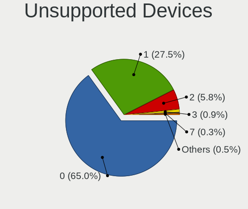

| Total | Computers | Percent |
|-------|-----------|---------|
| 0     | 382       | 66.9%   |
| 1     | 147       | 25.74%  |
| 2     | 33        | 5.78%   |
| 3     | 4         | 0.7%    |
| 4     | 2         | 0.35%   |
| 9     | 1         | 0.18%   |
| 6     | 1         | 0.18%   |
| 5     | 1         | 0.18%   |

Unsupported Device Types
------------------------

Types of unsupported devices

| Type                     | Computers | Percent |
|--------------------------|-----------|---------|
| Fingerprint reader       | 86        | 37.39%  |
| Graphics card            | 44        | 19.13%  |
| Chipcard                 | 23        | 10%     |
| Net/wireless             | 21        | 9.13%   |
| Communication controller | 19        | 8.26%   |
| Sound                    | 7         | 3.04%   |
| Multimedia controller    | 6         | 2.61%   |
| Camera                   | 6         | 2.61%   |
| Bluetooth                | 6         | 2.61%   |
| Storage                  | 4         | 1.74%   |
| Unassigned class         | 3         | 1.3%    |
| Card reader              | 3         | 1.3%    |
| Net/ethernet             | 2         | 0.87%   |

