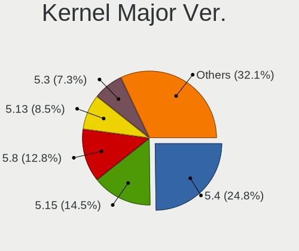
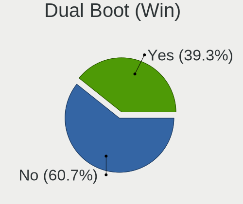
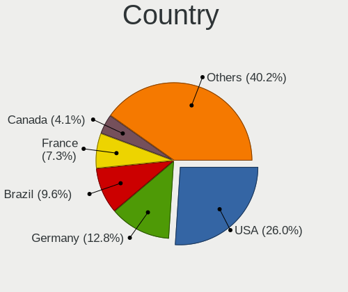
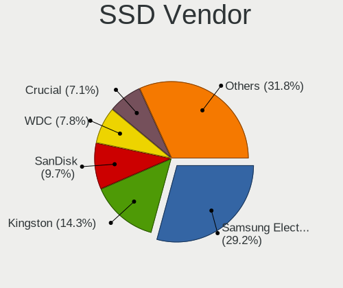
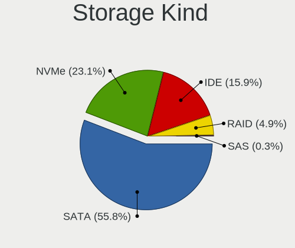
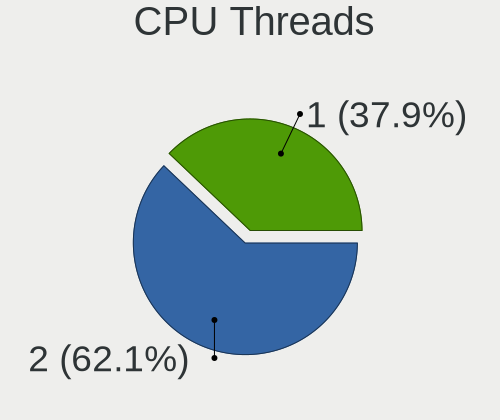
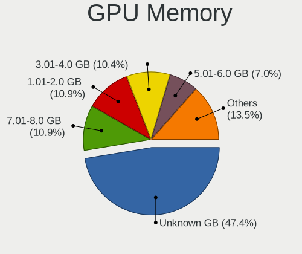
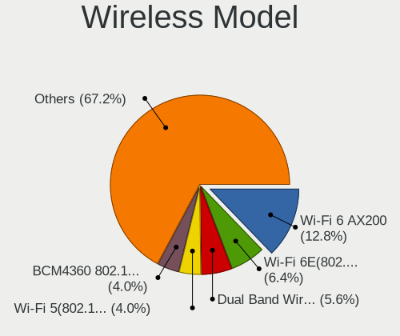
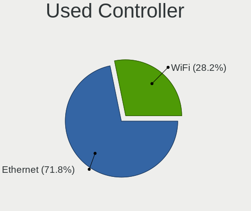
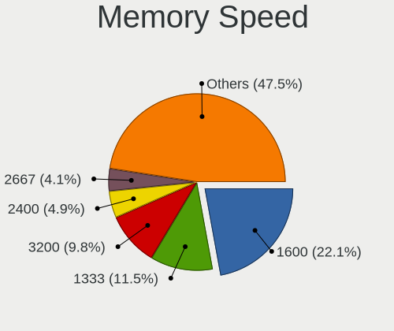

Ubuntu Budgie - Tested Hardware & Statistics (Desktops)
-------------------------------------------------------

A project to collect tested hardware configurations for Ubuntu Budgie.

Anyone can contribute to this report by the [hw-probe](https://github.com/linuxhw/hw-probe) tool:

    sudo -E hw-probe -all -upload

Please contribute! Especially if your hardware is rare.

Contents
--------

* [ Test Cases ](#test-cases)

* [ System ](#system)
  - [ OS                       ](#os)
  - [ OS Family                ](#os-family)
  - [ Kernel                   ](#kernel)
  - [ Kernel Family            ](#kernel-family)
  - [ Kernel Major Ver.        ](#kernel-major-ver)
  - [ Arch                     ](#arch)
  - [ DE                       ](#de)
  - [ Display Server           ](#display-server)
  - [ Display Manager          ](#display-manager)
  - [ OS Lang                  ](#os-lang)
  - [ Boot Mode                ](#boot-mode)
  - [ Filesystem               ](#filesystem)
  - [ Part. scheme             ](#part-scheme)
  - [ Dual Boot with Linux/BSD ](#dual-boot-with-linuxbsd)
  - [ Dual Boot (Win)          ](#dual-boot-win)

* [ Board ](#board)
  - [ Vendor                   ](#vendor)
  - [ Model                    ](#model)
  - [ Model Family             ](#model-family)
  - [ MFG Year                 ](#mfg-year)
  - [ Form Factor              ](#form-factor)
  - [ Secure Boot              ](#secure-boot)
  - [ Coreboot                 ](#coreboot)
  - [ RAM Size                 ](#ram-size)
  - [ RAM Used                 ](#ram-used)
  - [ Total Drives             ](#total-drives)
  - [ Has CD-ROM               ](#has-cd-rom)
  - [ Has Ethernet             ](#has-ethernet)
  - [ Has WiFi                 ](#has-wifi)
  - [ Has Bluetooth            ](#has-bluetooth)

* [ Location ](#location)
  - [ Country                  ](#country)
  - [ City                     ](#city)

* [ Drives ](#drives)
  - [ Drive Vendor             ](#drive-vendor)
  - [ Drive Model              ](#drive-model)
  - [ HDD Vendor               ](#hdd-vendor)
  - [ SSD Vendor               ](#ssd-vendor)
  - [ Drive Kind               ](#drive-kind)
  - [ Drive Connector          ](#drive-connector)
  - [ Drive Size               ](#drive-size)
  - [ Space Total              ](#space-total)
  - [ Space Used               ](#space-used)
  - [ Malfunc. Drives          ](#malfunc-drives)
  - [ Malfunc. Drive Vendor    ](#malfunc-drive-vendor)
  - [ Malfunc. HDD Vendor      ](#malfunc-hdd-vendor)
  - [ Malfunc. Drive Kind      ](#malfunc-drive-kind)
  - [ Failed Drives            ](#failed-drives)
  - [ Failed Drive Vendor      ](#failed-drive-vendor)
  - [ Drive Status             ](#drive-status)

* [ Storage controller ](#storage-controller)
  - [ Storage Vendor           ](#storage-vendor)
  - [ Storage Model            ](#storage-model)
  - [ Storage Kind             ](#storage-kind)

* [ Processor ](#processor)
  - [ CPU Vendor               ](#cpu-vendor)
  - [ CPU Model                ](#cpu-model)
  - [ CPU Model Family         ](#cpu-model-family)
  - [ CPU Cores                ](#cpu-cores)
  - [ CPU Sockets              ](#cpu-sockets)
  - [ CPU Threads              ](#cpu-threads)
  - [ CPU Op-Modes             ](#cpu-op-modes)
  - [ CPU Microcode            ](#cpu-microcode)
  - [ CPU Microarch            ](#cpu-microarch)

* [ Graphics ](#graphics)
  - [ GPU Vendor               ](#gpu-vendor)
  - [ GPU Model                ](#gpu-model)
  - [ GPU Combo                ](#gpu-combo)
  - [ GPU Driver               ](#gpu-driver)
  - [ GPU Memory               ](#gpu-memory)

* [ Monitor ](#monitor)
  - [ Monitor Vendor           ](#monitor-vendor)
  - [ Monitor Model            ](#monitor-model)
  - [ Monitor Resolution       ](#monitor-resolution)
  - [ Monitor Diagonal         ](#monitor-diagonal)
  - [ Monitor Width            ](#monitor-width)
  - [ Aspect Ratio             ](#aspect-ratio)
  - [ Monitor Area             ](#monitor-area)
  - [ Pixel Density            ](#pixel-density)
  - [ Multiple Monitors        ](#multiple-monitors)

* [ Network ](#network)
  - [ Net Controller Vendor    ](#net-controller-vendor)
  - [ Net Controller Model     ](#net-controller-model)
  - [ Wireless Vendor          ](#wireless-vendor)
  - [ Wireless Model           ](#wireless-model)
  - [ Ethernet Vendor          ](#ethernet-vendor)
  - [ Ethernet Model           ](#ethernet-model)
  - [ Net Controller Kind      ](#net-controller-kind)
  - [ Used Controller          ](#used-controller)
  - [ NICs                     ](#nics)
  - [ IPv6                     ](#ipv6)

* [ Bluetooth ](#bluetooth)
  - [ Bluetooth Vendor         ](#bluetooth-vendor)
  - [ Bluetooth Model          ](#bluetooth-model)

* [ Sound ](#sound)
  - [ Sound Vendor             ](#sound-vendor)
  - [ Sound Model              ](#sound-model)

* [ Memory ](#memory)
  - [ Memory Vendor            ](#memory-vendor)
  - [ Memory Model             ](#memory-model)
  - [ Memory Kind              ](#memory-kind)
  - [ Memory Form Factor       ](#memory-form-factor)
  - [ Memory Size              ](#memory-size)
  - [ Memory Speed             ](#memory-speed)

* [ Printers & scanners ](#printers--scanners)
  - [ Printer Vendor           ](#printer-vendor)
  - [ Printer Model            ](#printer-model)
  - [ Scanner Vendor           ](#scanner-vendor)
  - [ Scanner Model            ](#scanner-model)

* [ Camera ](#camera)
  - [ Camera Vendor            ](#camera-vendor)
  - [ Camera Model             ](#camera-model)

* [ Security ](#security)
  - [ Fingerprint Vendor       ](#fingerprint-vendor)
  - [ Fingerprint Model        ](#fingerprint-model)
  - [ Chipcard Vendor          ](#chipcard-vendor)
  - [ Chipcard Model           ](#chipcard-model)

* [ Unsupported ](#unsupported)
  - [ Unsupported Devices      ](#unsupported-devices)
  - [ Unsupported Device Types ](#unsupported-device-types)

Test Cases
----------

Total: 304

| Vendor     | Model                       | Probe                                                      | Date         |
|------------|-----------------------------|------------------------------------------------------------|--------------|
| HP         | 83E1                        | [71a7fa85fb](https://linux-hardware.org/?probe=71a7fa85fb) | May 05, 2024 |
| ASRock     | B650E Taichi Lite           | [b69958b86b](https://linux-hardware.org/?probe=b69958b86b) | Apr 14, 2024 |
| Gigabyte   | B550I AORUS PRO AX          | [a3e56de041](https://linux-hardware.org/?probe=a3e56de041) | Apr 01, 2024 |
| Lenovo     | 1059 SDK0T76530 WIN 3556... | [39db39fb8a](https://linux-hardware.org/?probe=39db39fb8a) | Mar 30, 2024 |
| ASUSTek    | PRIME B350-PLUS             | [4e1c5cafe7](https://linux-hardware.org/?probe=4e1c5cafe7) | Mar 03, 2024 |
| PCWare     | APM-A320G                   | [15ddb5b3fd](https://linux-hardware.org/?probe=15ddb5b3fd) | Feb 29, 2024 |
| HP         | 8169                        | [8aadb502eb](https://linux-hardware.org/?probe=8aadb502eb) | Feb 13, 2024 |
| MSI        | B450M GAMING PLUS           | [093c937aa6](https://linux-hardware.org/?probe=093c937aa6) | Feb 07, 2024 |
| MSI        | A68HM-E33 V2                | [462cb61dd3](https://linux-hardware.org/?probe=462cb61dd3) | Jan 05, 2024 |
| Gigabyte   | B650M AORUS ELITE AX        | [03e7ada99a](https://linux-hardware.org/?probe=03e7ada99a) | Jan 04, 2024 |
| MSI        | B450M PRO-VDH V2            | [7efa5db123](https://linux-hardware.org/?probe=7efa5db123) | Dec 29, 2023 |
| Toshiba    | STI 010433                  | [c172f735d2](https://linux-hardware.org/?probe=c172f735d2) | Nov 15, 2023 |
| HP         | 8309                        | [88e1f5e70c](https://linux-hardware.org/?probe=88e1f5e70c) | Nov 13, 2023 |
| Fujitsu    | D3222-A1 S26361-D3222-A1    | [64ce1a549b](https://linux-hardware.org/?probe=64ce1a549b) | Nov 13, 2023 |
| MSI        | A68HM-E33 V2                | [e1edc2410b](https://linux-hardware.org/?probe=e1edc2410b) | Nov 03, 2023 |
| Dell       | 0M5DCD A00                  | [b3a6489f94](https://linux-hardware.org/?probe=b3a6489f94) | Oct 20, 2023 |
| HP         | 8054                        | [66ad5550d1](https://linux-hardware.org/?probe=66ad5550d1) | Oct 10, 2023 |
| ASUSTek    | Z97M-PLUS                   | [01e90212e5](https://linux-hardware.org/?probe=01e90212e5) | Sep 20, 2023 |
| MSI        | A320M-A PRO                 | [6588973c54](https://linux-hardware.org/?probe=6588973c54) | Sep 19, 2023 |
| Lenovo     | SHARKBAY 0B98401 PRO        | [4fe996e64f](https://linux-hardware.org/?probe=4fe996e64f) | Aug 29, 2023 |
| MSI        | H510M-A PRO                 | [1e39da3f6e](https://linux-hardware.org/?probe=1e39da3f6e) | Aug 18, 2023 |
| Gigabyte   | H410M S2H V3                | [e31d121593](https://linux-hardware.org/?probe=e31d121593) | Jul 15, 2023 |
| Gigabyte   | H410M S2H V3                | [9c3135decf](https://linux-hardware.org/?probe=9c3135decf) | Jul 10, 2023 |
| ASUSTek    | H81M-R                      | [12561e59a4](https://linux-hardware.org/?probe=12561e59a4) | Jul 07, 2023 |
| ASUSTek    | H81M-R                      | [48526cd359](https://linux-hardware.org/?probe=48526cd359) | Jul 07, 2023 |
| Fujitsu    | D3233-A1 S26361-D3233-A1    | [4622902df7](https://linux-hardware.org/?probe=4622902df7) | Jun 17, 2023 |
| Gigabyte   | GA-890GPA-UD3H              | [f04b28a0e5](https://linux-hardware.org/?probe=f04b28a0e5) | Jun 10, 2023 |
| ASRock     | B450M Steel Legend          | [5d75bba35e](https://linux-hardware.org/?probe=5d75bba35e) | Jun 06, 2023 |
| Gigabyte   | H310M HD2                   | [b28787ecb7](https://linux-hardware.org/?probe=b28787ecb7) | Jun 04, 2023 |
| Dell       | 024JD7 A00                  | [904e4e2a0d](https://linux-hardware.org/?probe=904e4e2a0d) | May 15, 2023 |
| ASUSTek    | ROG STRIX X670E-E GAMING... | [f87233a295](https://linux-hardware.org/?probe=f87233a295) | Apr 29, 2023 |
| Intel      | H61                         | [b8f0acdf61](https://linux-hardware.org/?probe=b8f0acdf61) | Apr 28, 2023 |
| ASUSTek    | PRIME X570-PRO              | [c546b0771a](https://linux-hardware.org/?probe=c546b0771a) | Apr 24, 2023 |
| ASRock     | A300M-STX                   | [8f9e883980](https://linux-hardware.org/?probe=8f9e883980) | Apr 16, 2023 |
| ASUSTek    | PRIME B450M-GAMING/BR       | [2536217d87](https://linux-hardware.org/?probe=2536217d87) | Mar 23, 2023 |
| HP         | 83E1                        | [86061f121d](https://linux-hardware.org/?probe=86061f121d) | Mar 08, 2023 |
| ASUSTek    | Z87-PRO                     | [7997191f44](https://linux-hardware.org/?probe=7997191f44) | Feb 28, 2023 |
| ASUSTek    | Z87-PRO                     | [9a6bc5f3af](https://linux-hardware.org/?probe=9a6bc5f3af) | Feb 28, 2023 |
| MSI        | Z170-A PRO                  | [a5a54422a0](https://linux-hardware.org/?probe=a5a54422a0) | Feb 23, 2023 |
| MSI        | X99S SLI PLUS               | [8c6fb84b12](https://linux-hardware.org/?probe=8c6fb84b12) | Feb 09, 2023 |
| ASRock     | Z390 Phantom Gaming 4-IB    | [3a9937a61b](https://linux-hardware.org/?probe=3a9937a61b) | Feb 09, 2023 |
| ASUSTek    | ROG STRIX X570-I GAMING     | [866e97ab12](https://linux-hardware.org/?probe=866e97ab12) | Feb 03, 2023 |
| ASRock     | FM2A88X Extreme4+           | [9f812fe2a7](https://linux-hardware.org/?probe=9f812fe2a7) | Feb 02, 2023 |
| Fujitsu    | D3183-A1 S26361-D3183-A1    | [bfb86ee660](https://linux-hardware.org/?probe=bfb86ee660) | Jan 29, 2023 |
| Lenovo     | 36F7 SDK0J40700 WIN 3258... | [831fd897ec](https://linux-hardware.org/?probe=831fd897ec) | Jan 25, 2023 |
| Lenovo     | ThinkStation C20 4263BA7    | [38ff99d952](https://linux-hardware.org/?probe=38ff99d952) | Jan 10, 2023 |
| ASUSTek    | PRIME B560M-A               | [f560abfd7f](https://linux-hardware.org/?probe=f560abfd7f) | Jan 03, 2023 |
| ASUSTek    | M52AD_M12AD_A_F_K31AD       | [de65990b87](https://linux-hardware.org/?probe=de65990b87) | Jan 01, 2023 |
| Gigabyte   | Z170X-Gaming 3              | [1773b79334](https://linux-hardware.org/?probe=1773b79334) | Dec 17, 2022 |
| ASUSTek    | ROG STRIX X570-I GAMING     | [e95599a479](https://linux-hardware.org/?probe=e95599a479) | Dec 09, 2022 |
| ASUSTek    | PRIME B450M-A               | [c40fd27f39](https://linux-hardware.org/?probe=c40fd27f39) | Dec 05, 2022 |
| Fujitsu    | D3222-A1 S26361-D3222-A1    | [3272263f3b](https://linux-hardware.org/?probe=3272263f3b) | Dec 04, 2022 |
| Fujitsu    | D3348-B2 S26361-D3348-B2    | [4568e83912](https://linux-hardware.org/?probe=4568e83912) | Dec 03, 2022 |
| Fujitsu    | D3348-B2 S26361-D3348-B2    | [2047a872cb](https://linux-hardware.org/?probe=2047a872cb) | Dec 03, 2022 |
| Acer       | Aspire XC-830               | [42efe1dfdf](https://linux-hardware.org/?probe=42efe1dfdf) | Dec 02, 2022 |
| Fujitsu    | D3348-B2 S26361-D3348-B2    | [eabfad66da](https://linux-hardware.org/?probe=eabfad66da) | Nov 22, 2022 |
| Gigabyte   | H97M-D3H                    | [4e0102dff6](https://linux-hardware.org/?probe=4e0102dff6) | Nov 20, 2022 |
| Dell       | 0RW199                      | [2a2fa5baf8](https://linux-hardware.org/?probe=2a2fa5baf8) | Nov 20, 2022 |
| MSI        | B550M PRO-VDH WIFI          | [afb716fb12](https://linux-hardware.org/?probe=afb716fb12) | Nov 18, 2022 |
| Dell       | 0C27VV A01                  | [ed46beadef](https://linux-hardware.org/?probe=ed46beadef) | Oct 30, 2022 |
| MSI        | B450-A PRO MAX              | [0e8db93a43](https://linux-hardware.org/?probe=0e8db93a43) | Oct 30, 2022 |
| Dell       | 0C27VV A01                  | [23c855f88b](https://linux-hardware.org/?probe=23c855f88b) | Oct 17, 2022 |
| Dell       | 0C27VV A01                  | [ebe65ec5fa](https://linux-hardware.org/?probe=ebe65ec5fa) | Oct 17, 2022 |
| MSI        | H67MA-E35                   | [d4f5628033](https://linux-hardware.org/?probe=d4f5628033) | Oct 11, 2022 |
| Gigabyte   | M68MT-S2                    | [55db3c3775](https://linux-hardware.org/?probe=55db3c3775) | Sep 27, 2022 |
| Gigabyte   | X570 I AORUS PRO WIFI       | [293e528545](https://linux-hardware.org/?probe=293e528545) | Sep 21, 2022 |
| Gigabyte   | B75M-D3P                    | [da53115e6b](https://linux-hardware.org/?probe=da53115e6b) | Sep 15, 2022 |
| Gigabyte   | M68MT-S2                    | [1a5358a3c1](https://linux-hardware.org/?probe=1a5358a3c1) | Sep 14, 2022 |
| Gigabyte   | X570S AORUS PRO AX          | [f42f75038e](https://linux-hardware.org/?probe=f42f75038e) | Sep 03, 2022 |
| Intel      | DP55WB AAE64798-206         | [548332086b](https://linux-hardware.org/?probe=548332086b) | Sep 02, 2022 |
| ASUSTek    | A88X-PRO                    | [922554664a](https://linux-hardware.org/?probe=922554664a) | Aug 25, 2022 |
| HP         | 3397                        | [335f59c96f](https://linux-hardware.org/?probe=335f59c96f) | Aug 22, 2022 |
| Intel      | X79M-S                      | [49a7d62fe8](https://linux-hardware.org/?probe=49a7d62fe8) | Aug 18, 2022 |
| ASUSTek    | Berkeley                    | [e9998910ee](https://linux-hardware.org/?probe=e9998910ee) | Aug 17, 2022 |
| HP         | 828A                        | [f42b1efd1e](https://linux-hardware.org/?probe=f42b1efd1e) | Aug 17, 2022 |
| Biostar    | A960D+V3                    | [83f7f840b7](https://linux-hardware.org/?probe=83f7f840b7) | Aug 15, 2022 |
| ASRock     | A300M-STX                   | [a6aba67197](https://linux-hardware.org/?probe=a6aba67197) | Aug 02, 2022 |
| ASRock     | A300M-STX                   | [fae724727b](https://linux-hardware.org/?probe=fae724727b) | Aug 02, 2022 |
| Intel      | STK1A32SC H95551-301        | [ea91c7805d](https://linux-hardware.org/?probe=ea91c7805d) | Jul 22, 2022 |
| Gigabyte   | GA-890GPA-UD3H              | [f6faa2d944](https://linux-hardware.org/?probe=f6faa2d944) | Jun 25, 2022 |
| HP         | 212B                        | [a163af0cb5](https://linux-hardware.org/?probe=a163af0cb5) | Jun 21, 2022 |
| Gigabyte   | B75M-D3H                    | [da04a03393](https://linux-hardware.org/?probe=da04a03393) | Jun 04, 2022 |
| Gigabyte   | GA-890GPA-UD3H              | [3195007eb2](https://linux-hardware.org/?probe=3195007eb2) | May 30, 2022 |
| Gigabyte   | F2A78M-HD2                  | [fc9dd3db05](https://linux-hardware.org/?probe=fc9dd3db05) | May 26, 2022 |
| ASUSTek    | PRIME B560M-A               | [7b393b3933](https://linux-hardware.org/?probe=7b393b3933) | May 24, 2022 |
| MSI        | X370 GAMING PRO CARBON      | [9acb45109f](https://linux-hardware.org/?probe=9acb45109f) | May 21, 2022 |
| Gigabyte   | B75M-D3H                    | [b9437261b7](https://linux-hardware.org/?probe=b9437261b7) | May 10, 2022 |
| Gigabyte   | B450 I AORUS PRO WIFI-CF    | [4ab84df25d](https://linux-hardware.org/?probe=4ab84df25d) | May 10, 2022 |
| HP         | 1825                        | [fe93966c1c](https://linux-hardware.org/?probe=fe93966c1c) | May 09, 2022 |
| ASUSTek    | P8Z77-V LX                  | [9f241088c2](https://linux-hardware.org/?probe=9f241088c2) | May 06, 2022 |
| ASUSTek    | P8Z77-V LX                  | [37fa300c26](https://linux-hardware.org/?probe=37fa300c26) | Apr 18, 2022 |
| Gigabyte   | B550 AORUS ELITE AX V2      | [e2cbc23977](https://linux-hardware.org/?probe=e2cbc23977) | Apr 12, 2022 |
| MSI        | H81M-E33                    | [33547f6d85](https://linux-hardware.org/?probe=33547f6d85) | Apr 11, 2022 |
| Gigabyte   | X570 UD                     | [860fedd7f0](https://linux-hardware.org/?probe=860fedd7f0) | Apr 01, 2022 |
| Gigabyte   | 970A-DS3P                   | [eaae14de4f](https://linux-hardware.org/?probe=eaae14de4f) | Mar 05, 2022 |
| Gigabyte   | B560 DS3H AC-Y1             | [5be284f90d](https://linux-hardware.org/?probe=5be284f90d) | Feb 26, 2022 |
| ASUSTek    | ROG STRIX B550-E GAMING     | [7fa418eb00](https://linux-hardware.org/?probe=7fa418eb00) | Feb 25, 2022 |
| ASRock     | 970 Pro3 R2.0               | [9b8714532b](https://linux-hardware.org/?probe=9b8714532b) | Feb 20, 2022 |
| Dell       | 0RW199                      | [5cf70558c8](https://linux-hardware.org/?probe=5cf70558c8) | Feb 14, 2022 |
| ASUSTek    | M4A87TD/USB3                | [88768afd55](https://linux-hardware.org/?probe=88768afd55) | Feb 10, 2022 |
| ASRock     | B550 Phantom Gaming-ITX/... | [6f4c9d5553](https://linux-hardware.org/?probe=6f4c9d5553) | Jan 27, 2022 |
| Gigabyte   | 970A-DS3P                   | [b96e414ae9](https://linux-hardware.org/?probe=b96e414ae9) | Jan 21, 2022 |
| Gigabyte   | 970A-DS3P                   | [96047ce382](https://linux-hardware.org/?probe=96047ce382) | Jan 19, 2022 |
| ASUSTek    | P5KPL-AM SE                 | [e4d4e112f7](https://linux-hardware.org/?probe=e4d4e112f7) | Jan 13, 2022 |
| ASRock     | 4X4-4000 Series             | [172d5b0abc](https://linux-hardware.org/?probe=172d5b0abc) | Jan 12, 2022 |
| ASUSTek    | H81M-C                      | [f0e03ffaed](https://linux-hardware.org/?probe=f0e03ffaed) | Dec 22, 2021 |
| Lenovo     | 36F7 SDK0J40700 WIN 3258... | [ddf55561ad](https://linux-hardware.org/?probe=ddf55561ad) | Dec 21, 2021 |
| Dell       | 0XPDFK A01                  | [8e1c093fb8](https://linux-hardware.org/?probe=8e1c093fb8) | Dec 20, 2021 |
| Dell       | 0XPDFK A01                  | [7eabc884a6](https://linux-hardware.org/?probe=7eabc884a6) | Dec 19, 2021 |
| Lenovo     | 36F7 SDK0J40700 WIN 3258... | [d416ec7878](https://linux-hardware.org/?probe=d416ec7878) | Dec 17, 2021 |
| Dell       | 0XPDFK A01                  | [2aaaff47a4](https://linux-hardware.org/?probe=2aaaff47a4) | Dec 17, 2021 |
| ASUSTek    | PRIME B360M-A               | [d34989fcaa](https://linux-hardware.org/?probe=d34989fcaa) | Dec 16, 2021 |
| ASUSTek    | PRIME B360M-A               | [7587f8f78a](https://linux-hardware.org/?probe=7587f8f78a) | Dec 16, 2021 |
| ASRock     | H61M-HVS                    | [bd9653afdd](https://linux-hardware.org/?probe=bd9653afdd) | Dec 15, 2021 |
| ASRock     | Z370M Pro4                  | [ade1f1db1a](https://linux-hardware.org/?probe=ade1f1db1a) | Dec 07, 2021 |
| Intel      | DP55WB AAE64798-206         | [6e77546d03](https://linux-hardware.org/?probe=6e77546d03) | Dec 06, 2021 |
| ASRock     | 970M Pro3                   | [126c160ef3](https://linux-hardware.org/?probe=126c160ef3) | Dec 04, 2021 |
| Dell       | 0Y2MRG A00                  | [945995abf6](https://linux-hardware.org/?probe=945995abf6) | Dec 02, 2021 |
| Dell       | 0Y2MRG A00                  | [35a82530fb](https://linux-hardware.org/?probe=35a82530fb) | Dec 02, 2021 |
| Pegatron   | IPI43-TTM                   | [3cea520e1f](https://linux-hardware.org/?probe=3cea520e1f) | Nov 29, 2021 |
| Pegatron   | IPI43-TTM                   | [3fbd626bf6](https://linux-hardware.org/?probe=3fbd626bf6) | Nov 27, 2021 |
| Pegatron   | IPI43-TTM                   | [ba184983ea](https://linux-hardware.org/?probe=ba184983ea) | Nov 27, 2021 |
| HP         | 0A5Ch                       | [4858eb5c73](https://linux-hardware.org/?probe=4858eb5c73) | Nov 21, 2021 |
| Gigabyte   | B560M AORUS ELITE           | [b397fce5b8](https://linux-hardware.org/?probe=b397fce5b8) | Nov 20, 2021 |
| ASUSTek    | Pro WS 565-ACE              | [61f2f6aeab](https://linux-hardware.org/?probe=61f2f6aeab) | Nov 19, 2021 |
| Lenovo     | SDK0J40700 WIN              | [f18f314bc7](https://linux-hardware.org/?probe=f18f314bc7) | Nov 01, 2021 |
| Gigabyte   | H410M H V3                  | [6a3a81abd6](https://linux-hardware.org/?probe=6a3a81abd6) | Oct 22, 2021 |
| Gigabyte   | H410M H V3                  | [2f0f49590b](https://linux-hardware.org/?probe=2f0f49590b) | Oct 22, 2021 |
| MSI        | X370 GAMING PRO CARBON      | [cc51204b2c](https://linux-hardware.org/?probe=cc51204b2c) | Oct 20, 2021 |
| HP         | 0A5Ch                       | [8d102a03f6](https://linux-hardware.org/?probe=8d102a03f6) | Oct 19, 2021 |
| HP         | 0A5Ch                       | [139efd1a3d](https://linux-hardware.org/?probe=139efd1a3d) | Oct 19, 2021 |
| Gigabyte   | AB350-Gaming 3-CF           | [4cb5912db3](https://linux-hardware.org/?probe=4cb5912db3) | Oct 15, 2021 |
| ASRock     | Z370M Pro4                  | [17c9df42cd](https://linux-hardware.org/?probe=17c9df42cd) | Sep 07, 2021 |
| ASRock     | Z370M Pro4                  | [01d203a7af](https://linux-hardware.org/?probe=01d203a7af) | Sep 07, 2021 |
| ASRock     | H61M-VG3                    | [7257c7b0bb](https://linux-hardware.org/?probe=7257c7b0bb) | Aug 20, 2021 |
| MSI        | X370 GAMING PRO CARBON      | [15b41a9b17](https://linux-hardware.org/?probe=15b41a9b17) | Aug 16, 2021 |
| MSI        | X370 GAMING PRO CARBON      | [dcbe85bfb3](https://linux-hardware.org/?probe=dcbe85bfb3) | Aug 16, 2021 |
| ASUSTek    | P7P55D                      | [c62d162396](https://linux-hardware.org/?probe=c62d162396) | Aug 02, 2021 |
| ASUSTek    | PRIME B450M-A               | [7b213037a5](https://linux-hardware.org/?probe=7b213037a5) | Jul 31, 2021 |
| ASUSTek    | P7P55D                      | [cd96dbf86a](https://linux-hardware.org/?probe=cd96dbf86a) | Jul 30, 2021 |
| ASUSTek    | ROG STRIX B550-I GAMING     | [6f7de51af1](https://linux-hardware.org/?probe=6f7de51af1) | Jul 25, 2021 |
| ASUSTek    | P7P55D                      | [b983e48d71](https://linux-hardware.org/?probe=b983e48d71) | Jul 24, 2021 |
| Gigabyte   | H110M-S2H-CF                | [18951b50fd](https://linux-hardware.org/?probe=18951b50fd) | Jul 23, 2021 |
| ASUSTek    | P7P55D                      | [2335f32be7](https://linux-hardware.org/?probe=2335f32be7) | Jul 22, 2021 |
| ASUSTek    | PRIME B450M-A               | [abea66177f](https://linux-hardware.org/?probe=abea66177f) | Jul 20, 2021 |
| Fujitsu    | D3227-A1 S26361-D3227-A1    | [157b9695ae](https://linux-hardware.org/?probe=157b9695ae) | Jul 15, 2021 |
| Gigabyte   | H110M-S2H-CF                | [e0f1466068](https://linux-hardware.org/?probe=e0f1466068) | Jul 09, 2021 |
| HP         | 1588h                       | [28a2da9b7f](https://linux-hardware.org/?probe=28a2da9b7f) | Jul 05, 2021 |
| Dell       | 048DY8 A01                  | [04c41fe4c2](https://linux-hardware.org/?probe=04c41fe4c2) | Jun 30, 2021 |
| Intel      | DB75EN AAG39650-303         | [d90efe186a](https://linux-hardware.org/?probe=d90efe186a) | Jun 25, 2021 |
| ASUSTek    | M4A87TD/USB3                | [ebcfe7dad0](https://linux-hardware.org/?probe=ebcfe7dad0) | Jun 16, 2021 |
| HP         | 1998                        | [7b400d8da6](https://linux-hardware.org/?probe=7b400d8da6) | Jun 11, 2021 |
| HP         | 1998                        | [304ce6f1c4](https://linux-hardware.org/?probe=304ce6f1c4) | Jun 02, 2021 |
| Pegatron   | IPI43-TTM                   | [6a63f48182](https://linux-hardware.org/?probe=6a63f48182) | May 29, 2021 |
| Gigabyte   | Z68M-D2H                    | [75877fb3b1](https://linux-hardware.org/?probe=75877fb3b1) | May 19, 2021 |
| Gigabyte   | Z68M-D2H                    | [91cee123e9](https://linux-hardware.org/?probe=91cee123e9) | May 19, 2021 |
| Gigabyte   | Z68M-D2H                    | [ec195ffe95](https://linux-hardware.org/?probe=ec195ffe95) | May 12, 2021 |
| ASUSTek    | ROG STRIX Z390-H GAMING     | [8260769b47](https://linux-hardware.org/?probe=8260769b47) | May 01, 2021 |
| ASUSTek    | P6T SE                      | [a2fb8f6b18](https://linux-hardware.org/?probe=a2fb8f6b18) | May 01, 2021 |
| ASUSTek    | P8H77-M LE                  | [289b0a89c0](https://linux-hardware.org/?probe=289b0a89c0) | Apr 25, 2021 |
| ASUSTek    | Maximus VIII IMPACT         | [2c0a43e573](https://linux-hardware.org/?probe=2c0a43e573) | Apr 24, 2021 |
| Gigabyte   | Z77X-D3H                    | [28751098a6](https://linux-hardware.org/?probe=28751098a6) | Apr 23, 2021 |
| Gigabyte   | Z68M-D2H                    | [c2c4591ef9](https://linux-hardware.org/?probe=c2c4591ef9) | Apr 16, 2021 |
| ASRock     | X370 Gaming-ITX/ac          | [e0fa7ade7a](https://linux-hardware.org/?probe=e0fa7ade7a) | Apr 06, 2021 |
| Huanan     | X79 249PC V2.2              | [787866050a](https://linux-hardware.org/?probe=787866050a) | Apr 03, 2021 |
| Pegatron   | IPI43-TTM                   | [87168e11ee](https://linux-hardware.org/?probe=87168e11ee) | Mar 26, 2021 |
| Pegatron   | IPI43-TTM                   | [72adf1881e](https://linux-hardware.org/?probe=72adf1881e) | Mar 26, 2021 |
| ASUSTek    | Z77-A                       | [ca21510412](https://linux-hardware.org/?probe=ca21510412) | Mar 23, 2021 |
| ASUSTek    | PRIME A320M-K               | [4c755699d3](https://linux-hardware.org/?probe=4c755699d3) | Mar 21, 2021 |
| ASUSTek    | P7P55D-E LX                 | [83f55d5bf7](https://linux-hardware.org/?probe=83f55d5bf7) | Mar 20, 2021 |
| HP         | 3031h                       | [ee5e7baf77](https://linux-hardware.org/?probe=ee5e7baf77) | Mar 16, 2021 |
| ASUSTek    | Z97-A                       | [0cc10a7f8b](https://linux-hardware.org/?probe=0cc10a7f8b) | Mar 14, 2021 |
| ASUSTek    | ROG STRIX Z390-H GAMING     | [26c69c1a34](https://linux-hardware.org/?probe=26c69c1a34) | Mar 07, 2021 |
| ASUSTek    | PRIME B450-PLUS             | [79b5c4e048](https://linux-hardware.org/?probe=79b5c4e048) | Mar 07, 2021 |
| Dell       | 0KJCC5 A00                  | [5587c00381](https://linux-hardware.org/?probe=5587c00381) | Mar 02, 2021 |
| Unknown    | Unknown                     | [c6d24d073b](https://linux-hardware.org/?probe=c6d24d073b) | Feb 25, 2021 |
| Unknown    | Unknown                     | [f97163d774](https://linux-hardware.org/?probe=f97163d774) | Feb 24, 2021 |
| BCM        | RX965Q                      | [889ee09398](https://linux-hardware.org/?probe=889ee09398) | Feb 21, 2021 |
| ASUSTek    | ROG STRIX H470-I GAMING     | [f747681c25](https://linux-hardware.org/?probe=f747681c25) | Feb 19, 2021 |
| ASUSTek    | H61M-A                      | [2b8de1db1f](https://linux-hardware.org/?probe=2b8de1db1f) | Feb 19, 2021 |
| Dell       | 0KRC95 A02                  | [745c1185fd](https://linux-hardware.org/?probe=745c1185fd) | Feb 18, 2021 |
| ASUSTek    | H61M-K                      | [d470929ba8](https://linux-hardware.org/?probe=d470929ba8) | Feb 14, 2021 |
| MSI        | A320M PRO-VD PLUS           | [24a9ae34ed](https://linux-hardware.org/?probe=24a9ae34ed) | Feb 13, 2021 |
| Gigabyte   | B450M DS3H-CF               | [5f9a9ff276](https://linux-hardware.org/?probe=5f9a9ff276) | Feb 13, 2021 |
| Gigabyte   | B450M DS3H-CF               | [d8069f1e01](https://linux-hardware.org/?probe=d8069f1e01) | Feb 12, 2021 |
| MSI        | B250M BAZOOKA               | [f48bc9fc78](https://linux-hardware.org/?probe=f48bc9fc78) | Feb 07, 2021 |
| MSI        | B250M BAZOOKA               | [1f3b4b8203](https://linux-hardware.org/?probe=1f3b4b8203) | Feb 07, 2021 |
| MSI        | B250M BAZOOKA               | [005301f0e8](https://linux-hardware.org/?probe=005301f0e8) | Feb 07, 2021 |
| MSI        | B250M BAZOOKA               | [48a778609f](https://linux-hardware.org/?probe=48a778609f) | Feb 06, 2021 |
| Apple      | Mac-F4208DC8 PVT            | [bb89e367c8](https://linux-hardware.org/?probe=bb89e367c8) | Jan 17, 2021 |
| Gigabyte   | H110M-A-CF                  | [3a07ab383e](https://linux-hardware.org/?probe=3a07ab383e) | Jan 15, 2021 |
| Gigabyte   | H110M-A-CF                  | [bb66f59b76](https://linux-hardware.org/?probe=bb66f59b76) | Jan 12, 2021 |
| HP         | 1589                        | [fe93b414cb](https://linux-hardware.org/?probe=fe93b414cb) | Jan 09, 2021 |
| ASUSTek    | TUF Z370-PLUS GAMING        | [276dda536a](https://linux-hardware.org/?probe=276dda536a) | Jan 06, 2021 |
| Gigabyte   | H110M-A-CF                  | [bff63b3c48](https://linux-hardware.org/?probe=bff63b3c48) | Jan 05, 2021 |
| ASUSTek    | TUF Z370-PLUS GAMING        | [a80e8c5eb0](https://linux-hardware.org/?probe=a80e8c5eb0) | Jan 02, 2021 |
| Gigabyte   | B550I AORUS PRO AX          | [1effa5938b](https://linux-hardware.org/?probe=1effa5938b) | Dec 31, 2020 |
| Dell       | 0PK096                      | [e1a520e089](https://linux-hardware.org/?probe=e1a520e089) | Dec 24, 2020 |
| Gigabyte   | B550M AORUS PRO-P           | [c32461bc20](https://linux-hardware.org/?probe=c32461bc20) | Dec 19, 2020 |
| ASUSTek    | PRIME A320M-K/BR            | [d65d3733f6](https://linux-hardware.org/?probe=d65d3733f6) | Dec 07, 2020 |
| Gigabyte   | TRX40 DESIGNARE             | [25ff6d84d0](https://linux-hardware.org/?probe=25ff6d84d0) | Dec 07, 2020 |
| ASRock     | P67 Extreme4                | [ca2f3a785a](https://linux-hardware.org/?probe=ca2f3a785a) | Dec 06, 2020 |
| MSI        | MAG B550 TOMAHAWK           | [77dc96c206](https://linux-hardware.org/?probe=77dc96c206) | Nov 27, 2020 |
| LattePanda | Alpha                       | [706f930815](https://linux-hardware.org/?probe=706f930815) | Nov 26, 2020 |
| LattePanda | Alpha                       | [a5c3e54e65](https://linux-hardware.org/?probe=a5c3e54e65) | Nov 24, 2020 |
| Gigabyte   | 970A-D3P                    | [304945ac43](https://linux-hardware.org/?probe=304945ac43) | Nov 23, 2020 |
| ASUSTek    | Z97-A-USB31                 | [8bbc1a2d1c](https://linux-hardware.org/?probe=8bbc1a2d1c) | Nov 22, 2020 |
| ASUSTek    | P8Z68-V                     | [643bb20dc1](https://linux-hardware.org/?probe=643bb20dc1) | Nov 20, 2020 |
| Gigabyte   | TRX40 DESIGNARE             | [eb2134b274](https://linux-hardware.org/?probe=eb2134b274) | Oct 31, 2020 |
| MSI        | MEG Z490I UNIFY             | [e59b548946](https://linux-hardware.org/?probe=e59b548946) | Oct 31, 2020 |
| MSI        | MEG Z490I UNIFY             | [39348ac053](https://linux-hardware.org/?probe=39348ac053) | Oct 31, 2020 |
| Gigabyte   | Z170X-Gaming 3              | [58b6426d57](https://linux-hardware.org/?probe=58b6426d57) | Oct 30, 2020 |
| ASUSTek    | TUF Gaming X570-PLUS        | [aead0dde26](https://linux-hardware.org/?probe=aead0dde26) | Oct 27, 2020 |
| ASUSTek    | Maximus VIII IMPACT         | [b5a98b7ffa](https://linux-hardware.org/?probe=b5a98b7ffa) | Oct 24, 2020 |
| MSI        | Z370 GAMING PLUS            | [a5246866a5](https://linux-hardware.org/?probe=a5246866a5) | Oct 21, 2020 |
| MSI        | Z370 GAMING PLUS            | [19879c3493](https://linux-hardware.org/?probe=19879c3493) | Oct 21, 2020 |
| HP         | 1998                        | [e8076a87a0](https://linux-hardware.org/?probe=e8076a87a0) | Oct 20, 2020 |
| HP         | 1998                        | [69ed04c55d](https://linux-hardware.org/?probe=69ed04c55d) | Oct 20, 2020 |
| Apple      | Mac-F4208DC8 PVT            | [25565a3bbf](https://linux-hardware.org/?probe=25565a3bbf) | Oct 19, 2020 |
| Apple      | Mac-F4208DC8 PVT            | [3aa954c07b](https://linux-hardware.org/?probe=3aa954c07b) | Oct 19, 2020 |
| MSI        | MAG X570 TOMAHAWK WIFI      | [7c78d9b4da](https://linux-hardware.org/?probe=7c78d9b4da) | Oct 18, 2020 |
| MSI        | MAG X570 TOMAHAWK WIFI      | [ca85fa1d88](https://linux-hardware.org/?probe=ca85fa1d88) | Oct 18, 2020 |
| ASRock     | Q1900B-ITX                  | [527411a589](https://linux-hardware.org/?probe=527411a589) | Oct 15, 2020 |
| Unknown    | Unknown                     | [f82db8cb1c](https://linux-hardware.org/?probe=f82db8cb1c) | Oct 13, 2020 |
| AAEON      | UP-APL01 V0.4               | [3d2cb2e4d1](https://linux-hardware.org/?probe=3d2cb2e4d1) | Oct 12, 2020 |
| AAEON      | UP-APL01 V0.4               | [16d3bf5578](https://linux-hardware.org/?probe=16d3bf5578) | Oct 12, 2020 |
| ASUSTek    | TUF Z390-PLUS GAMING        | [9d2f2dbd87](https://linux-hardware.org/?probe=9d2f2dbd87) | Oct 12, 2020 |
| Dell       | 0M9KCM A00                  | [f884d19586](https://linux-hardware.org/?probe=f884d19586) | Oct 02, 2020 |
| MSI        | MAG X570 TOMAHAWK WIFI      | [4a62de4c07](https://linux-hardware.org/?probe=4a62de4c07) | Oct 01, 2020 |
| ASRock     | B550 Phantom Gaming 4       | [a996c3d55c](https://linux-hardware.org/?probe=a996c3d55c) | Sep 29, 2020 |
| ASUSTek    | P9X79 DELUXE                | [5b7738af52](https://linux-hardware.org/?probe=5b7738af52) | Sep 23, 2020 |
| Dell       | 0RY007                      | [b1ca551538](https://linux-hardware.org/?probe=b1ca551538) | Sep 22, 2020 |
| Gigabyte   | B360 AORUS GAMING 3-CF      | [663a5ef41a](https://linux-hardware.org/?probe=663a5ef41a) | Sep 21, 2020 |
| Dell       | 0200DY A03                  | [e91f9c04b9](https://linux-hardware.org/?probe=e91f9c04b9) | Sep 21, 2020 |
| Gigabyte   | Z68M-D2H                    | [d746ae5a52](https://linux-hardware.org/?probe=d746ae5a52) | Sep 19, 2020 |
| MSI        | MAG X570 TOMAHAWK WIFI      | [1037d2b746](https://linux-hardware.org/?probe=1037d2b746) | Sep 09, 2020 |
| MSI        | MAG X570 TOMAHAWK WIFI      | [b3d6fb36eb](https://linux-hardware.org/?probe=b3d6fb36eb) | Sep 08, 2020 |
| Gigabyte   | Z390 DESIGNARE-CF           | [d36f3124d1](https://linux-hardware.org/?probe=d36f3124d1) | Sep 06, 2020 |
| ASUSTek    | ROG STRIX X470-F GAMING     | [e90f4fb0e5](https://linux-hardware.org/?probe=e90f4fb0e5) | Sep 06, 2020 |
| PCSMART    | 6.0                         | [e95fadbdfe](https://linux-hardware.org/?probe=e95fadbdfe) | Sep 05, 2020 |
| MSI        | Z97 GAMING 5                | [3f1b387a92](https://linux-hardware.org/?probe=3f1b387a92) | Sep 04, 2020 |
| Gigabyte   | G31M-ES2L                   | [ed4a78cd06](https://linux-hardware.org/?probe=ed4a78cd06) | Aug 24, 2020 |
| MSI        | Z87-G41 PC Mate             | [1b2d8402af](https://linux-hardware.org/?probe=1b2d8402af) | Aug 17, 2020 |
| ASUSTek    | P9X79 DELUXE                | [75f32f4978](https://linux-hardware.org/?probe=75f32f4978) | Aug 16, 2020 |
| Gigabyte   | P55A-UD4P                   | [c908fd4599](https://linux-hardware.org/?probe=c908fd4599) | Aug 07, 2020 |
| ASUSTek    | P8H77-M PRO                 | [d943208a7c](https://linux-hardware.org/?probe=d943208a7c) | Jul 30, 2020 |
| Gigabyte   | Z170-HD3 DDR3-CF            | [f8c44dc8be](https://linux-hardware.org/?probe=f8c44dc8be) | Jul 29, 2020 |
| ASUSTek    | STRIX B250F GAMING          | [cb5d511453](https://linux-hardware.org/?probe=cb5d511453) | Jul 28, 2020 |
| ASUSTek    | P8H77-M PRO                 | [87d7bc3077](https://linux-hardware.org/?probe=87d7bc3077) | Jul 28, 2020 |
| MSI        | X370 GAMING PRO CARBON      | [f38e8a0201](https://linux-hardware.org/?probe=f38e8a0201) | Jul 26, 2020 |
| HP         | 82F2                        | [172d6aed2a](https://linux-hardware.org/?probe=172d6aed2a) | Jul 26, 2020 |
| Gigabyte   | B360 AORUS GAMING 3 WIFI... | [2e6c21ed23](https://linux-hardware.org/?probe=2e6c21ed23) | Jul 26, 2020 |
| HP         | 3397                        | [edd52c2428](https://linux-hardware.org/?probe=edd52c2428) | Jul 24, 2020 |
| HP         | 3397                        | [20b3d353d8](https://linux-hardware.org/?probe=20b3d353d8) | Jul 24, 2020 |
| Gigabyte   | H61M-S1                     | [3ce4143dee](https://linux-hardware.org/?probe=3ce4143dee) | Jul 24, 2020 |
| Gigabyte   | B360 AORUS GAMING 3 WIFI... | [534a204796](https://linux-hardware.org/?probe=534a204796) | Jul 17, 2020 |
| ASUSTek    | M51AC                       | [fcc0f73453](https://linux-hardware.org/?probe=fcc0f73453) | Jul 15, 2020 |
| ASUSTek    | M4A87TD/USB3                | [7d642bd7dc](https://linux-hardware.org/?probe=7d642bd7dc) | Jul 14, 2020 |
| ASUSTek    | M4A87TD/USB3                | [76752b2d00](https://linux-hardware.org/?probe=76752b2d00) | Jul 13, 2020 |
| ASUSTek    | M4A87TD/USB3                | [8639032305](https://linux-hardware.org/?probe=8639032305) | Jul 13, 2020 |
| Dell       | 0P301D A02                  | [709ca37e1e](https://linux-hardware.org/?probe=709ca37e1e) | Jul 12, 2020 |
| ASUSTek    | M51AC                       | [6af32ff946](https://linux-hardware.org/?probe=6af32ff946) | Jul 01, 2020 |
| ASUSTek    | B85M-E                      | [e46352dec8](https://linux-hardware.org/?probe=e46352dec8) | Jun 28, 2020 |
| Dell       | 09KPNV A00                  | [9f63cccd5c](https://linux-hardware.org/?probe=9f63cccd5c) | Jun 21, 2020 |
| ASUSTek    | P8Z68-V PRO GEN3            | [311c0852f2](https://linux-hardware.org/?probe=311c0852f2) | Jun 18, 2020 |
| Gigabyte   | Z68M-D2H                    | [fbbc2c4d98](https://linux-hardware.org/?probe=fbbc2c4d98) | May 30, 2020 |
| Gigabyte   | Z68M-D2H                    | [ca71847ca1](https://linux-hardware.org/?probe=ca71847ca1) | May 30, 2020 |
| ASUSTek    | ROG STRIX X570-E GAMING     | [49486e2abf](https://linux-hardware.org/?probe=49486e2abf) | May 24, 2020 |
| ASUSTek    | P8H77-M PRO                 | [cdaf886b58](https://linux-hardware.org/?probe=cdaf886b58) | May 20, 2020 |
| ASUSTek    | P8H77-M PRO                 | [e8b5bf55c7](https://linux-hardware.org/?probe=e8b5bf55c7) | May 20, 2020 |
| Dell       | 0J32FG A06                  | [d5d2970bc5](https://linux-hardware.org/?probe=d5d2970bc5) | May 15, 2020 |
| Gigabyte   | Z68M-D2H                    | [70c167639c](https://linux-hardware.org/?probe=70c167639c) | May 15, 2020 |
| Dell       | 0TNXNR A01                  | [c16ecd859c](https://linux-hardware.org/?probe=c16ecd859c) | May 11, 2020 |
| Lenovo     | 3704 SDK0R32862 WIN 3258... | [eb7d6f2ec3](https://linux-hardware.org/?probe=eb7d6f2ec3) | May 10, 2020 |
| Biostar    | G31-M7 TE                   | [e9d31442df](https://linux-hardware.org/?probe=e9d31442df) | May 09, 2020 |
| ASRock     | B450 Gaming-ITX/ac          | [2e108e8f82](https://linux-hardware.org/?probe=2e108e8f82) | May 06, 2020 |
| MSI        | Z87-G41 PC Mate             | [c17fa3f327](https://linux-hardware.org/?probe=c17fa3f327) | May 02, 2020 |
| MSI        | MEG Z390 GODLIKE            | [f5c70a1643](https://linux-hardware.org/?probe=f5c70a1643) | Apr 30, 2020 |
| ASUSTek    | TUF B450-PLUS GAMING        | [6982ff0a12](https://linux-hardware.org/?probe=6982ff0a12) | Apr 25, 2020 |
| HP         | 0A80h                       | [f51e29fc6f](https://linux-hardware.org/?probe=f51e29fc6f) | Apr 13, 2020 |
| Gigabyte   | Z68M-D2H                    | [3db29a7f67](https://linux-hardware.org/?probe=3db29a7f67) | Apr 12, 2020 |
| ASRock     | N68C-S UCC                  | [c6df4257a4](https://linux-hardware.org/?probe=c6df4257a4) | Apr 11, 2020 |
| HP         | 8433 11                     | [e20dd4e4a3](https://linux-hardware.org/?probe=e20dd4e4a3) | Apr 02, 2020 |
| HP         | 8433 11                     | [eafaace7ee](https://linux-hardware.org/?probe=eafaace7ee) | Apr 02, 2020 |
| HP         | 8433 11                     | [0e29f294ba](https://linux-hardware.org/?probe=0e29f294ba) | Apr 02, 2020 |
| ASUSTek    | ROG CROSSHAIR VII HERO      | [5b8ef620f7](https://linux-hardware.org/?probe=5b8ef620f7) | Mar 27, 2020 |
| Gigabyte   | AB350-Gaming 3-CF           | [384177f515](https://linux-hardware.org/?probe=384177f515) | Mar 23, 2020 |
| Apple      | Mac-F221BEC8                | [477afd03f4](https://linux-hardware.org/?probe=477afd03f4) | Mar 21, 2020 |
| Dell       | 0J32FG A06                  | [efb8737ca2](https://linux-hardware.org/?probe=efb8737ca2) | Mar 20, 2020 |
| MSI        | Z270-A PRO                  | [5e41eb4c66](https://linux-hardware.org/?probe=5e41eb4c66) | Mar 14, 2020 |
| Dell       | 0C2KJT A00                  | [210b1c0abf](https://linux-hardware.org/?probe=210b1c0abf) | Mar 13, 2020 |
| ASUSTek    | Maximus VIII IMPACT         | [9ca13583bb](https://linux-hardware.org/?probe=9ca13583bb) | Mar 09, 2020 |
| eMachines  | EL1852G                     | [e90ac3f652](https://linux-hardware.org/?probe=e90ac3f652) | Feb 27, 2020 |
| Intel      | DQ965CO AAD34641-506        | [3c3c53b8e5](https://linux-hardware.org/?probe=3c3c53b8e5) | Feb 26, 2020 |
| ASUSTek    | Z97-A                       | [45382a84f3](https://linux-hardware.org/?probe=45382a84f3) | Feb 21, 2020 |
| HP         | 2215                        | [f9ecf106d2](https://linux-hardware.org/?probe=f9ecf106d2) | Feb 19, 2020 |
| Acer       | Veriton L4610G              | [e38723516e](https://linux-hardware.org/?probe=e38723516e) | Feb 17, 2020 |
| Acer       | Veriton L4610G              | [aef314a65c](https://linux-hardware.org/?probe=aef314a65c) | Feb 17, 2020 |
| Gigabyte   | Z68M-D2H                    | [6cfda70306](https://linux-hardware.org/?probe=6cfda70306) | Feb 15, 2020 |
| Intel      | ChiefRiver                  | [1ca590a614](https://linux-hardware.org/?probe=1ca590a614) | Jan 22, 2020 |
| Dell       | 0C27VV A01                  | [b896b0fef0](https://linux-hardware.org/?probe=b896b0fef0) | Jan 18, 2020 |
| Gigabyte   | MSH87TN-00                  | [624e731bcd](https://linux-hardware.org/?probe=624e731bcd) | Jan 16, 2020 |
| Gigabyte   | P55A-UD4P                   | [df0bc17152](https://linux-hardware.org/?probe=df0bc17152) | Jan 13, 2020 |
| Dell       | 0G9322                      | [62b841a44f](https://linux-hardware.org/?probe=62b841a44f) | Jun 08, 2018 |

System
------

OS
--

Installed operating systems

| Name                | Desktops | Percent |
|---------------------|----------|---------|
| Ubuntu Budgie 20.04 | 68       | 31.63%  |
| Ubuntu Budgie 22.04 | 45       | 20.93%  |
| Ubuntu Budgie 20.10 | 23       | 10.7%   |
| Ubuntu Budgie 21.10 | 19       | 8.84%   |
| Ubuntu Budgie 21.04 | 13       | 6.05%   |
| Ubuntu Budgie 19.10 | 13       | 6.05%   |
| Ubuntu Budgie 18.04 | 12       | 5.58%   |
| Ubuntu Budgie 22.10 | 10       | 4.65%   |
| Ubuntu Budgie 23.10 | 6        | 2.79%   |
| Ubuntu Budgie 23.04 | 4        | 1.86%   |
| Ubuntu Budgie       | 2        | 0.93%   |

OS Family
---------

OS without a version

| Name          | Desktops | Percent |
|---------------|----------|---------|
| Ubuntu Budgie | 201      | 100%    |

Kernel
------

Version of the Linux kernel

| Version           | Desktops | Percent |
|-------------------|----------|---------|
| 5.4.0-42-generic  | 8        | 3.4%    |
| 5.4.0-47-generic  | 5        | 2.13%   |
| 5.8.0-43-generic  | 4        | 1.7%    |
| 5.4.0-52-generic  | 4        | 1.7%    |
| 5.4.0-48-generic  | 4        | 1.7%    |
| 5.4.0-45-generic  | 4        | 1.7%    |
| 5.4.0-37-generic  | 4        | 1.7%    |
| 5.3.0-40-generic  | 4        | 1.7%    |
| 5.3.0-26-generic  | 4        | 1.7%    |
| 5.15.0-52-generic | 4        | 1.7%    |
| 5.13.0-22-generic | 4        | 1.7%    |
| 5.8.0-44-generic  | 3        | 1.28%   |
| 5.8.0-25-generic  | 3        | 1.28%   |
| 5.4.0-31-generic  | 3        | 1.28%   |
| 5.4.0-29-generic  | 3        | 1.28%   |
| 5.3.0-42-generic  | 3        | 1.28%   |
| 5.19.0-26-generic | 3        | 1.28%   |
| 5.15.0-57-generic | 3        | 1.28%   |
| 5.15.0-46-generic | 3        | 1.28%   |
| 5.15.0-43-generic | 3        | 1.28%   |
| 5.15.0-30-generic | 3        | 1.28%   |
| 5.13.0-39-generic | 3        | 1.28%   |
| 5.11.0-41-generic | 3        | 1.28%   |
| 5.11.0-22-generic | 3        | 1.28%   |
| 5.11.0-18-generic | 3        | 1.28%   |
| 6.5.0-21-generic  | 2        | 0.85%   |
| 6.5.0-10-generic  | 2        | 0.85%   |
| 6.2.0-20-generic  | 2        | 0.85%   |
| 5.8.0-59-generic  | 2        | 0.85%   |
| 5.8.0-50-generic  | 2        | 0.85%   |
| 5.8.0-48-generic  | 2        | 0.85%   |
| 5.8.0-45-generic  | 2        | 0.85%   |
| 5.8.0-31-generic  | 2        | 0.85%   |
| 5.8.0-29-generic  | 2        | 0.85%   |
| 5.8.0-26-generic  | 2        | 0.85%   |
| 5.4.0-91-generic  | 2        | 0.85%   |
| 5.4.0-72-generic  | 2        | 0.85%   |
| 5.4.0-66-generic  | 2        | 0.85%   |
| 5.4.0-59-generic  | 2        | 0.85%   |
| 5.4.0-40-generic  | 2        | 0.85%   |

Kernel Family
-------------

Linux kernel without a distro release

| Version | Desktops | Percent |
|---------|----------|---------|
| 5.4.0   | 58       | 26.73%  |
| 5.15.0  | 32       | 14.75%  |
| 5.8.0   | 30       | 13.82%  |
| 5.13.0  | 20       | 9.22%   |
| 5.3.0   | 17       | 7.83%   |
| 5.19.0  | 15       | 6.91%   |
| 5.11.0  | 15       | 6.91%   |
| 6.2.0   | 9        | 4.15%   |
| 6.5.0   | 8        | 3.69%   |
| 4.15.0  | 2        | 0.92%   |
| 6.6.0   | 1        | 0.46%   |
| 5.9.1   | 1        | 0.46%   |
| 5.7.7   | 1        | 0.46%   |
| 5.5.8   | 1        | 0.46%   |
| 5.17.2  | 1        | 0.46%   |
| 5.17.1  | 1        | 0.46%   |
| 5.15.92 | 1        | 0.46%   |
| 5.14.2  | 1        | 0.46%   |
| 5.14.1  | 1        | 0.46%   |
| 5.10.0  | 1        | 0.46%   |
| 5.0.0   | 1        | 0.46%   |

Kernel Major Ver.
-----------------

Linux kernel major version

| Version | Desktops | Percent |
|---------|----------|---------|
| 5.4     | 58       | 26.85%  |
| 5.15    | 33       | 15.28%  |
| 5.8     | 30       | 13.89%  |
| 5.13    | 20       | 9.26%   |
| 5.3     | 17       | 7.87%   |
| 5.19    | 15       | 6.94%   |
| 5.11    | 15       | 6.94%   |
| 6.2     | 9        | 4.17%   |
| 6.5     | 8        | 3.7%    |
| 5.17    | 2        | 0.93%   |
| 4.15    | 2        | 0.93%   |
| 6.6     | 1        | 0.46%   |
| 5.9     | 1        | 0.46%   |
| 5.7     | 1        | 0.46%   |
| 5.5     | 1        | 0.46%   |
| 5.14    | 1        | 0.46%   |
| 5.10    | 1        | 0.46%   |
| 5.0     | 1        | 0.46%   |

Arch
----

OS architecture (x86_64, i586, etc.)

| Name   | Desktops | Percent |
|--------|----------|---------|
| x86_64 | 196      | 97.51%  |
| i686   | 5        | 2.49%   |

DE
--

Desktop Environment

| Name   | Desktops | Percent |
|--------|----------|---------|
| Budgie | 195      | 97.01%  |
| GNOME  | 4        | 1.99%   |
| MATE   | 1        | 0.5%    |
| KDE    | 1        | 0.5%    |

Display Server
--------------

X11 or Wayland

| Name    | Desktops | Percent |
|---------|----------|---------|
| X11     | 198      | 98.51%  |
| Wayland | 2        | 1%      |
| Tty     | 1        | 0.5%    |

Display Manager
---------------

SDDM, LightDM, etc.

| Name    | Desktops | Percent |
|---------|----------|---------|
| Unknown | 95       | 46.34%  |
| LightDM | 71       | 34.63%  |
| TDM     | 27       | 13.17%  |
| GDM     | 6        | 2.93%   |
| GDM3    | 4        | 1.95%   |
| SDDM    | 2        | 0.98%   |

OS Lang
-------

Language

| Lang    | Desktops | Percent |
|---------|----------|---------|
| en_US   | 82       | 40.8%   |
| de_DE   | 26       | 12.94%  |
| pt_BR   | 16       | 7.96%   |
| fr_FR   | 14       | 6.97%   |
| en_CA   | 8        | 3.98%   |
| en_AU   | 7        | 3.48%   |
| es_ES   | 6        | 2.99%   |
| en_GB   | 5        | 2.49%   |
| it_IT   | 3        | 1.49%   |
| es_MX   | 3        | 1.49%   |
| es_AR   | 3        | 1.49%   |
| zh_TW   | 2        | 1%      |
| uk_UA   | 2        | 1%      |
| pt_PT   | 2        | 1%      |
| pl_PL   | 2        | 1%      |
| nl_NL   | 2        | 1%      |
| es_CO   | 2        | 1%      |
| en_IN   | 2        | 1%      |
| Unknown | 2        | 1%      |
| ru_UA   | 1        | 0.5%    |
| ru_RU   | 1        | 0.5%    |
| ro_RO   | 1        | 0.5%    |
| fr_CH   | 1        | 0.5%    |
| fr_CA   | 1        | 0.5%    |
| es_CL   | 1        | 0.5%    |
| en_ZA   | 1        | 0.5%    |
| en_SG   | 1        | 0.5%    |
| en_IL   | 1        | 0.5%    |
| el_GR   | 1        | 0.5%    |
| C       | 1        | 0.5%    |
| bg_BG   | 1        | 0.5%    |

Boot Mode
---------

EFI or BIOS

| Mode | Desktops | Percent |
|------|----------|---------|
| BIOS | 131      | 63.29%  |
| EFI  | 76       | 36.71%  |

Filesystem
----------

Type of filesystem

| Type    | Desktops | Percent |
|---------|----------|---------|
| Ext4    | 181      | 89.6%   |
| Tmpfs   | 7        | 3.47%   |
| Zfs     | 6        | 2.97%   |
| Overlay | 5        | 2.48%   |
| Btrfs   | 3        | 1.49%   |

Part. scheme
------------

Scheme of partitioning

| Type    | Desktops | Percent |
|---------|----------|---------|
| Unknown | 116      | 56.59%  |
| GPT     | 76       | 37.07%  |
| MBR     | 13       | 6.34%   |

Dual Boot with Linux/BSD
------------------------

Hosting more than one Linux/BSD

| Dual boot | Desktops | Percent |
|-----------|----------|---------|
| No        | 164      | 79.61%  |
| Yes       | 42       | 20.39%  |

Dual Boot (Win)
---------------

Hosting Linux and Windows

| Dual boot | Desktops | Percent |
|-----------|----------|---------|
| No        | 126      | 60.87%  |
| Yes       | 81       | 39.13%  |

Board
-----

Vendor
------

Motherboard manufacturer

| Name                | Desktops | Percent |
|---------------------|----------|---------|
| ASUSTek Computer    | 53       | 26.37%  |
| Gigabyte Technology | 38       | 18.91%  |
| MSI                 | 22       | 10.95%  |
| Hewlett-Packard     | 19       | 9.45%   |
| Dell                | 18       | 8.96%   |
| ASRock              | 16       | 7.96%   |
| Intel               | 7        | 3.48%   |
| Lenovo              | 6        | 2.99%   |
| Fujitsu             | 5        | 2.49%   |
| Apple               | 3        | 1.49%   |
| Biostar             | 2        | 1%      |
| Acer                | 2        | 1%      |
| Unknown             | 2        | 1%      |
| Semp Toshiba        | 1        | 0.5%    |
| Pegatron            | 1        | 0.5%    |
| PCWare              | 1        | 0.5%    |
| PCSMART             | 1        | 0.5%    |
| LattePanda          | 1        | 0.5%    |
| Huanan              | 1        | 0.5%    |
| eMachines           | 1        | 0.5%    |
| BCM                 | 1        | 0.5%    |

Model
-----

Motherboard model

| Name                             | Desktops | Percent |
|----------------------------------|----------|---------|
| ASUS All Series                  | 8        | 3.98%   |
| Dell OptiPlex 780                | 3        | 1.49%   |
| MSI MS-7C84                      | 2        | 1%      |
| Intel DP55WB AAE64798-206        | 2        | 1%      |
| HP EliteDesk 800 G1 SFF          | 2        | 1%      |
| HP Compaq Elite 8300 SFF         | 2        | 1%      |
| Gigabyte Z68M-D2H                | 2        | 1%      |
| Gigabyte B550I AORUS PRO AX      | 2        | 1%      |
| Gigabyte AB350-Gaming 3          | 2        | 1%      |
| Dell Precision WorkStation T3500 | 2        | 1%      |
| Dell OptiPlex 9010               | 2        | 1%      |
| ASUS PRIME B560M-A               | 2        | 1%      |
| ASUS PRIME B450M-A               | 2        | 1%      |
| ASUS P8H77-M PRO                 | 2        | 1%      |
| Apple MacPro1,1                  | 2        | 1%      |
| Unknown                          | 2        | 1%      |
| Semp Toshiba STI                 | 1        | 0.5%    |
| Pegatron IPI43-TTM               | 1        | 0.5%    |
| PCWare APM-A320G                 | 1        | 0.5%    |
| PCSMART 6.0                      | 1        | 0.5%    |
| MSI MS-7D22                      | 1        | 0.5%    |
| MSI MS-7C95                      | 1        | 0.5%    |
| MSI MS-7C77                      | 1        | 0.5%    |
| MSI MS-7C51                      | 1        | 0.5%    |
| MSI MS-7B87                      | 1        | 0.5%    |
| MSI MS-7B86                      | 1        | 0.5%    |
| MSI MS-7B61                      | 1        | 0.5%    |
| MSI MS-7B38                      | 1        | 0.5%    |
| MSI MS-7B10                      | 1        | 0.5%    |
| MSI MS-7A71                      | 1        | 0.5%    |
| MSI MS-7A70                      | 1        | 0.5%    |
| MSI MS-7A38                      | 1        | 0.5%    |
| MSI MS-7A32                      | 1        | 0.5%    |
| MSI MS-7971                      | 1        | 0.5%    |
| MSI MS-7917                      | 1        | 0.5%    |
| MSI MS-7885                      | 1        | 0.5%    |
| MSI MS-7850                      | 1        | 0.5%    |
| MSI MS-7817                      | 1        | 0.5%    |
| MSI MS-7721                      | 1        | 0.5%    |
| MSI MS-7680                      | 1        | 0.5%    |

Model Family
------------

Motherboard model prefix

| Name                  | Desktops | Percent |
|-----------------------|----------|---------|
| ASUS PRIME            | 11       | 5.47%   |
| Dell OptiPlex         | 10       | 4.98%   |
| ASUS ROG              | 8        | 3.98%   |
| ASUS All              | 8        | 3.98%   |
| HP EliteDesk          | 6        | 2.99%   |
| Dell Precision        | 5        | 2.49%   |
| HP Compaq             | 4        | 1.99%   |
| Fujitsu ESPRIMO       | 3        | 1.49%   |
| ASUS TUF              | 3        | 1.49%   |
| ASUS P8H77-M          | 3        | 1.49%   |
| MSI MS-7C84           | 2        | 1%      |
| Lenovo ThinkStation   | 2        | 1%      |
| Intel DP55WB          | 2        | 1%      |
| HP Pavilion           | 2        | 1%      |
| Gigabyte Z68M-D2H     | 2        | 1%      |
| Gigabyte X570         | 2        | 1%      |
| Gigabyte H410M        | 2        | 1%      |
| Gigabyte B550I        | 2        | 1%      |
| Gigabyte B360         | 2        | 1%      |
| Gigabyte AB350-Gaming | 2        | 1%      |
| Dell Inspiron         | 2        | 1%      |
| ASUS P8Z68-V          | 2        | 1%      |
| ASRock B550           | 2        | 1%      |
| Apple MacPro1         | 2        | 1%      |
| Unknown               | 2        | 1%      |
| Semp Toshiba STI      | 1        | 0.5%    |
| Pegatron IPI43-TTM    | 1        | 0.5%    |
| PCWare APM-A320G      | 1        | 0.5%    |
| PCSMART 6.0           | 1        | 0.5%    |
| MSI MS-7D22           | 1        | 0.5%    |
| MSI MS-7C95           | 1        | 0.5%    |
| MSI MS-7C77           | 1        | 0.5%    |
| MSI MS-7C51           | 1        | 0.5%    |
| MSI MS-7B87           | 1        | 0.5%    |
| MSI MS-7B86           | 1        | 0.5%    |
| MSI MS-7B61           | 1        | 0.5%    |
| MSI MS-7B38           | 1        | 0.5%    |
| MSI MS-7B10           | 1        | 0.5%    |
| MSI MS-7A71           | 1        | 0.5%    |
| MSI MS-7A70           | 1        | 0.5%    |

MFG Year
--------

Motherboard manufacture year

| Year | Desktops | Percent |
|------|----------|---------|
| 2018 | 28       | 13.93%  |
| 2013 | 19       | 9.45%   |
| 2014 | 17       | 8.46%   |
| 2020 | 16       | 7.96%   |
| 2019 | 15       | 7.46%   |
| 2017 | 15       | 7.46%   |
| 2011 | 15       | 7.46%   |
| 2012 | 14       | 6.97%   |
| 2010 | 11       | 5.47%   |
| 2015 | 9        | 4.48%   |
| 2009 | 9        | 4.48%   |
| 2021 | 8        | 3.98%   |
| 2016 | 8        | 3.98%   |
| 2007 | 7        | 3.48%   |
| 2008 | 5        | 2.49%   |
| 2022 | 3        | 1.49%   |
| 2023 | 2        | 1%      |

Form Factor
-----------

Physical design of the computer

| Name    | Desktops | Percent |
|---------|----------|---------|
| Desktop | 201      | 100%    |

Secure Boot
-----------

Enabled or disabled

| State    | Desktops | Percent |
|----------|----------|---------|
| Disabled | 193      | 95.54%  |
| Enabled  | 9        | 4.46%   |

Coreboot
--------

Have coreboot on board

| Used | Desktops | Percent |
|------|----------|---------|
| No   | 201      | 100%    |

RAM Size
--------

Total RAM memory

| Size in GB      | Desktops | Percent |
|-----------------|----------|---------|
| 16.01-24.0      | 74       | 36.1%   |
| 8.01-16.0       | 35       | 17.07%  |
| 4.01-8.0        | 28       | 13.66%  |
| 32.01-64.0      | 23       | 11.22%  |
| 3.01-4.0        | 22       | 10.73%  |
| 64.01-256.0     | 14       | 6.83%   |
| 24.01-32.0      | 5        | 2.44%   |
| 1.01-2.0        | 2        | 0.98%   |
| More than 256.0 | 1        | 0.49%   |
| 2.01-3.0        | 1        | 0.49%   |

RAM Used
--------

Used RAM memory

| Used GB    | Desktops | Percent |
|------------|----------|---------|
| 2.01-3.0   | 70       | 31.25%  |
| 1.01-2.0   | 64       | 28.57%  |
| 4.01-8.0   | 45       | 20.09%  |
| 3.01-4.0   | 28       | 12.5%   |
| 8.01-16.0  | 10       | 4.46%   |
| 0.51-1.0   | 4        | 1.79%   |
| 16.01-24.0 | 2        | 0.89%   |
| 32.01-64.0 | 1        | 0.45%   |

Total Drives
------------

Number of drives on board

| Drives | Desktops | Percent |
|--------|----------|---------|
| 1      | 60       | 28.71%  |
| 2      | 58       | 27.75%  |
| 3      | 40       | 19.14%  |
| 4      | 23       | 11%     |
| 5      | 15       | 7.18%   |
| 8      | 5        | 2.39%   |
| 6      | 5        | 2.39%   |
| 11     | 1        | 0.48%   |
| 9      | 1        | 0.48%   |
| 7      | 1        | 0.48%   |

Has CD-ROM
----------

Has CD-ROM on board

| Presented | Desktops | Percent |
|-----------|----------|---------|
| No        | 105      | 51.98%  |
| Yes       | 97       | 48.02%  |

Has Ethernet
------------

Has Ethernet on board

| Presented | Desktops | Percent |
|-----------|----------|---------|
| Yes       | 198      | 98.51%  |
| No        | 3        | 1.49%   |

Has WiFi
--------

Has WiFi module

| Presented | Desktops | Percent |
|-----------|----------|---------|
| No        | 103      | 50.74%  |
| Yes       | 100      | 49.26%  |

Has Bluetooth
-------------

Has Bluetooth module

| Presented | Desktops | Percent |
|-----------|----------|---------|
| No        | 120      | 58.82%  |
| Yes       | 84       | 41.18%  |

Location
--------

Country
-------

Geographic location (country)

| Country      | Desktops | Percent |
|--------------|----------|---------|
| USA          | 51       | 25.25%  |
| Germany      | 28       | 13.86%  |
| Brazil       | 18       | 8.91%   |
| France       | 16       | 7.92%   |
| Canada       | 9        | 4.46%   |
| Spain        | 7        | 3.47%   |
| Australia    | 7        | 3.47%   |
| Switzerland  | 5        | 2.48%   |
| UK           | 4        | 1.98%   |
| Mexico       | 4        | 1.98%   |
| Argentina    | 4        | 1.98%   |
| Ukraine      | 3        | 1.49%   |
| Romania      | 3        | 1.49%   |
| Portugal     | 3        | 1.49%   |
| Poland       | 3        | 1.49%   |
| Netherlands  | 3        | 1.49%   |
| Italy        | 3        | 1.49%   |
| Croatia      | 3        | 1.49%   |
| Sweden       | 2        | 0.99%   |
| Norway       | 2        | 0.99%   |
| India        | 2        | 0.99%   |
| Greece       | 2        | 0.99%   |
| Colombia     | 2        | 0.99%   |
| Thailand     | 1        | 0.5%    |
| Taiwan       | 1        | 0.5%    |
| South Africa | 1        | 0.5%    |
| Slovenia     | 1        | 0.5%    |
| Singapore    | 1        | 0.5%    |
| Serbia       | 1        | 0.5%    |
| Saudi Arabia | 1        | 0.5%    |
| Russia       | 1        | 0.5%    |
| Puerto Rico  | 1        | 0.5%    |
| Pakistan     | 1        | 0.5%    |
| Japan        | 1        | 0.5%    |
| Israel       | 1        | 0.5%    |
| Hungary      | 1        | 0.5%    |
| Chile        | 1        | 0.5%    |
| Bulgaria     | 1        | 0.5%    |
| Bolivia      | 1        | 0.5%    |
| Belgium      | 1        | 0.5%    |

City
----

Geographic location (city)

| City             | Desktops | Percent |
|------------------|----------|---------|
| Sao Paulo        | 3        | 1.42%   |
| New York         | 3        | 1.42%   |
| Braslia        | 3        | 1.42%   |
| Zurich           | 2        | 0.95%   |
| Zagreb           | 2        | 0.95%   |
| Uman             | 2        | 0.95%   |
| Trondheim        | 2        | 0.95%   |
| Timioara       | 2        | 0.95%   |
| Sydney           | 2        | 0.95%   |
| Seattle          | 2        | 0.95%   |
| San Diego        | 2        | 0.95%   |
| Paris            | 2        | 0.95%   |
| Milwaukee        | 2        | 0.95%   |
| Miami            | 2        | 0.95%   |
| Maring         | 2        | 0.95%   |
| Hamburg          | 2        | 0.95%   |
| Dallas           | 2        | 0.95%   |
| Caslano          | 2        | 0.95%   |
| Bogot          | 2        | 0.95%   |
| Berlin           | 2        | 0.95%   |
| Barcelona        | 2        | 0.95%   |
| Zabrze           | 1        | 0.47%   |
| Wrzburg        | 1        | 0.47%   |
| Willich          | 1        | 0.47%   |
| Westland         | 1        | 0.47%   |
| West Des Moines  | 1        | 0.47%   |
| Walled Lake      | 1        | 0.47%   |
| Void-Vacon       | 1        | 0.47%   |
| UEbach-Palenberg | 1        | 0.47%   |
| Uberlndia      | 1        | 0.47%   |
| Tucson           | 1        | 0.47%   |
| Traunstein       | 1        | 0.47%   |
| Toyokawa         | 1        | 0.47%   |
| Toronto          | 1        | 0.47%   |
| Tocantins        | 1        | 0.47%   |
| Tobyhanna        | 1        | 0.47%   |
| Tlalnepantla     | 1        | 0.47%   |
| Tijuana          | 1        | 0.47%   |
| Thrissur         | 1        | 0.47%   |
| Telford          | 1        | 0.47%   |

Drives
------

Drive Vendor
------------

Hard drive vendors

| Vendor                    | Desktops | Drives | Percent |
|---------------------------|----------|--------|---------|
| Seagate                   | 79       | 134    | 18.94%  |
| WDC                       | 75       | 126    | 17.99%  |
| Samsung Electronics       | 66       | 118    | 15.83%  |
| Toshiba                   | 23       | 23     | 5.52%   |
| Kingston                  | 23       | 34     | 5.52%   |
| SanDisk                   | 20       | 30     | 4.8%    |
| Hitachi                   | 14       | 19     | 3.36%   |
| Crucial                   | 13       | 14     | 3.12%   |
| Phison                    | 12       | 17     | 2.88%   |
| HGST                      | 7        | 8      | 1.68%   |
| China                     | 6        | 8      | 1.44%   |
| PNY                       | 5        | 5      | 1.2%    |
| Intel                     | 5        | 5      | 1.2%    |
| A-DATA Technology         | 5        | 8      | 1.2%    |
| Unknown                   | 4        | 7      | 0.96%   |
| OCZ                       | 4        | 7      | 0.96%   |
| Micron/Crucial Technology | 4        | 4      | 0.96%   |
| Transcend                 | 3        | 3      | 0.72%   |
| SPCC                      | 3        | 5      | 0.72%   |
| Patriot                   | 3        | 5      | 0.72%   |
| Maxtor                    | 3        | 6      | 0.72%   |
| JMicron Technology        | 3        | 4      | 0.72%   |
| Silicon Motion            | 2        | 3      | 0.48%   |
| Micron Technology         | 2        | 4      | 0.48%   |
| Intenso                   | 2        | 2      | 0.48%   |
| HS-SSD-C100               | 2        | 2      | 0.48%   |
| Apacer                    | 2        | 2      | 0.48%   |
| AMD                       | 2        | 17     | 0.48%   |
| Zheino                    | 1        | 2      | 0.24%   |
| XrayDisk                  | 1        | 1      | 0.24%   |
| WD MediaMax               | 1        | 1      | 0.24%   |
| TDAS                      | 1        | 3      | 0.24%   |
| SK hynix                  | 1        | 1      | 0.24%   |
| SABRENT                   | 1        | 1      | 0.24%   |
| Realtek Semiconductor     | 1        | 1      | 0.24%   |
| Plextor                   | 1        | 1      | 0.24%   |
| Phison Electronics        | 1        | 1      | 0.24%   |
| Netac                     | 1        | 1      | 0.24%   |
| Mushkin                   | 1        | 1      | 0.24%   |
| MicroFrom                 | 1        | 1      | 0.24%   |

Drive Model
-----------

Hard drive models

| Model                              | Desktops | Percent |
|------------------------------------|----------|---------|
| Seagate ST1000DM010-2EP102 1TB     | 7        | 1.38%   |
| Seagate ST500DM002-1BD142 500GB    | 6        | 1.18%   |
| Samsung SSD 860 QVO 1TB            | 6        | 1.18%   |
| Samsung SSD 860 EVO 500GB          | 6        | 1.18%   |
| Kingston SA400S37240G 240GB SSD    | 6        | 1.18%   |
| Seagate ST2000DM008-2FR102 2TB     | 5        | 0.98%   |
| Kingston SA400S37480G 480GB SSD    | 5        | 0.98%   |
| WDC WDS120G2G0A-00JH30 120GB SSD   | 4        | 0.79%   |
| WDC WD5000AAKS-00UU3A0 500GB       | 4        | 0.79%   |
| Seagate ST2000DM006-2DM164 2TB     | 4        | 0.79%   |
| Seagate ST2000DM001-1ER164 2TB     | 4        | 0.79%   |
| Seagate ST2000DM001-1CH164 2TB     | 4        | 0.79%   |
| Samsung SSD 850 EVO 500GB          | 4        | 0.79%   |
| Samsung NVMe SSD Drive 512GB       | 4        | 0.79%   |
| Samsung NVMe SSD Drive 500GB       | 4        | 0.79%   |
| WDC WD5000AAKX-001CA0 500GB        | 3        | 0.59%   |
| WDC WD10EARS-00Y5B1 1TB            | 3        | 0.59%   |
| WDC WD10EADS-00M2B0 1TB            | 3        | 0.59%   |
| Toshiba HDWD110 1TB                | 3        | 0.59%   |
| Seagate ST9500325AS 500GB          | 3        | 0.59%   |
| Seagate ST4000DM000-1F2168 4TB     | 3        | 0.59%   |
| Seagate ST380815AS 80GB            | 3        | 0.59%   |
| Seagate ST3500418AS 500GB          | 3        | 0.59%   |
| Seagate ST3500413AS 500GB          | 3        | 0.59%   |
| Seagate ST1000LM024 HN-M101MBB 1TB | 3        | 0.59%   |
| Seagate ST1000DM003-1ER162 1TB     | 3        | 0.59%   |
| SanDisk SDSSDA240G 240GB           | 3        | 0.59%   |
| SanDisk SDSSDA120G 120GB           | 3        | 0.59%   |
| Samsung SSD 850 PRO 256GB          | 3        | 0.59%   |
| Samsung SSD 840 EVO 250GB          | 3        | 0.59%   |
| Phison NVMe SSD Drive 1TB          | 3        | 0.59%   |
| WDC WD7501AALS-00J7B1 752GB        | 2        | 0.39%   |
| WDC WD5000LPVX-22V0TT0 500GB       | 2        | 0.39%   |
| WDC WD40EZRZ-22GXCB0 4TB           | 2        | 0.39%   |
| WDC WD40EZRZ-00GXCB0 4TB           | 2        | 0.39%   |
| WDC WD30EZRX-00D8PB0 3TB           | 2        | 0.39%   |
| WDC WD20EZRZ-00Z5HB0 2TB           | 2        | 0.39%   |
| WDC WD20EZRX-00D8PB0 2TB           | 2        | 0.39%   |
| WDC WD20EFRX-68EUZN0 2TB           | 2        | 0.39%   |
| WDC WD10EZEX-08WN4A0 1TB           | 2        | 0.39%   |

HDD Vendor
----------

Hard disk drive vendors

| Vendor              | Desktops | Drives | Percent |
|---------------------|----------|--------|---------|
| Seagate             | 79       | 133    | 38.35%  |
| WDC                 | 65       | 110    | 31.55%  |
| Toshiba             | 23       | 23     | 11.17%  |
| Hitachi             | 14       | 19     | 6.8%    |
| Samsung Electronics | 7        | 9      | 3.4%    |
| HGST                | 7        | 8      | 3.4%    |
| Maxtor              | 3        | 6      | 1.46%   |
| Unknown             | 2        | 2      | 0.97%   |
| JMicron Technology  | 2        | 2      | 0.97%   |
| WD MediaMax         | 1        | 1      | 0.49%   |
| TDAS                | 1        | 3      | 0.49%   |
| SABRENT             | 1        | 1      | 0.49%   |
| ASMT109x            | 1        | 1      | 0.49%   |

SSD Vendor
----------

Solid state drive vendors

| Vendor              | Desktops | Drives | Percent |
|---------------------|----------|--------|---------|
| Samsung Electronics | 42       | 69     | 29.17%  |
| Kingston            | 21       | 29     | 14.58%  |
| SanDisk             | 14       | 22     | 9.72%   |
| WDC                 | 12       | 14     | 8.33%   |
| Crucial             | 10       | 11     | 6.94%   |
| China               | 6        | 8      | 4.17%   |
| PNY                 | 4        | 4      | 2.78%   |
| A-DATA Technology   | 4        | 7      | 2.78%   |
| SPCC                | 3        | 5      | 2.08%   |
| Patriot             | 3        | 5      | 2.08%   |
| OCZ                 | 3        | 3      | 2.08%   |
| Transcend           | 2        | 2      | 1.39%   |
| Intel               | 2        | 2      | 1.39%   |
| Apacer              | 2        | 2      | 1.39%   |
| AMD                 | 2        | 17     | 1.39%   |
| Zheino              | 1        | 2      | 0.69%   |
| SK hynix            | 1        | 1      | 0.69%   |
| Plextor             | 1        | 1      | 0.69%   |
| Netac               | 1        | 1      | 0.69%   |
| Mushkin             | 1        | 1      | 0.69%   |
| Micron Technology   | 1        | 1      | 0.69%   |
| MicroFrom           | 1        | 1      | 0.69%   |
| Lexar               | 1        | 1      | 0.69%   |
| KingDian            | 1        | 1      | 0.69%   |
| Intenso             | 1        | 1      | 0.69%   |
| GOODRAM             | 1        | 1      | 0.69%   |
| Gigabyte Technology | 1        | 1      | 0.69%   |
| Axiom               | 1        | 1      | 0.69%   |
| 4Life               | 1        | 1      | 0.69%   |

Drive Kind
----------

HDD or SSD

| Kind    | Desktops | Drives | Percent |
|---------|----------|--------|---------|
| HDD     | 148      | 318    | 44.05%  |
| SSD     | 113      | 215    | 33.63%  |
| NVMe    | 63       | 99     | 18.75%  |
| Unknown | 10       | 13     | 2.98%   |
| MMC     | 2        | 3      | 0.6%    |

Drive Connector
---------------

SATA, SAS, NVMe, etc.

| Type | Desktops | Drives | Percent |
|------|----------|--------|---------|
| SATA | 186      | 528    | 70.72%  |
| NVMe | 63       | 99     | 23.95%  |
| SAS  | 12       | 18     | 4.56%   |
| MMC  | 2        | 3      | 0.76%   |

Drive Size
----------

Size of hard drive

| Size in TB | Desktops | Drives | Percent |
|------------|----------|--------|---------|
| 0.01-0.5   | 148      | 305    | 50.17%  |
| 0.51-1.0   | 76       | 118    | 25.76%  |
| 1.01-2.0   | 32       | 56     | 10.85%  |
| 3.01-4.0   | 24       | 34     | 8.14%   |
| 4.01-10.0  | 8        | 11     | 2.71%   |
| 2.01-3.0   | 7        | 9      | 2.37%   |

Space Total
-----------

Amount of disk space available on the file system

| Size in GB     | Desktops | Percent |
|----------------|----------|---------|
| 101-250        | 64       | 30.05%  |
| 251-500        | 42       | 19.72%  |
| 501-1000       | 32       | 15.02%  |
| More than 3000 | 26       | 12.21%  |
| 1001-2000      | 19       | 8.92%   |
| 1-20           | 9        | 4.23%   |
| 51-100         | 8        | 3.76%   |
| 2001-3000      | 7        | 3.29%   |
| 21-50          | 3        | 1.41%   |
| Unknown        | 3        | 1.41%   |

Space Used
----------

Amount of used disk space

| Used GB        | Desktops | Percent |
|----------------|----------|---------|
| 1-20           | 66       | 30.14%  |
| 21-50          | 37       | 16.89%  |
| 101-250        | 36       | 16.44%  |
| 51-100         | 22       | 10.05%  |
| 251-500        | 18       | 8.22%   |
| 1001-2000      | 15       | 6.85%   |
| 501-1000       | 10       | 4.57%   |
| More than 3000 | 9        | 4.11%   |
| 2001-3000      | 3        | 1.37%   |
| Unknown        | 3        | 1.37%   |

Malfunc. Drives
---------------

Drive models with a malfunction

| Model                              | Desktops | Drives | Percent |
|------------------------------------|----------|--------|---------|
| Seagate ST500DM002-1BD142 500GB    | 4        | 4      | 15.38%  |
| WDC WD5000AAKX-001CA0 500GB        | 2        | 2      | 7.69%   |
| WDC WD6000HLHX-01JJPV0 600GB       | 1        | 1      | 3.85%   |
| WDC WD5000LPVX-22V0TT0 500GB       | 1        | 2      | 3.85%   |
| WDC WD5000AVCS-632DY1 500GB        | 1        | 1      | 3.85%   |
| WDC WD5000AAKX-329BA0 500GB        | 1        | 1      | 3.85%   |
| WDC WD4003FZEX-00Z4SA0 4TB         | 1        | 1      | 3.85%   |
| WDC WD2500AAJS-60M0A0 250GB        | 1        | 1      | 3.85%   |
| WDC WD20EFRX-68EUZN0 2TB           | 1        | 2      | 3.85%   |
| WDC WD10EZEX-00RKKA0 1TB           | 1        | 1      | 3.85%   |
| Seagate ST9500325AS 500GB          | 1        | 1      | 3.85%   |
| Seagate ST5000DM000-1FK178 5TB     | 1        | 1      | 3.85%   |
| Seagate ST3500320AS 500GB          | 1        | 1      | 3.85%   |
| Seagate ST3320620AS 320GB          | 1        | 1      | 3.85%   |
| Seagate ST3160815AS 160GB          | 1        | 1      | 3.85%   |
| Seagate ST1000LM024 HN-M101MBB 1TB | 1        | 1      | 3.85%   |
| Seagate ST1000DX001-1NS162 1TB     | 1        | 1      | 3.85%   |
| Seagate ST1000DM003-1SB102 1TB     | 1        | 1      | 3.85%   |
| Patriot Pyro m3 240GB SSD          | 1        | 1      | 3.85%   |
| Maxtor STM3250310AS 250GB          | 1        | 1      | 3.85%   |
| Maxtor 6B200M0 208GB               | 1        | 2      | 3.85%   |
| Hitachi HDS721032CLA362 320GB      | 1        | 1      | 3.85%   |

Malfunc. Drive Vendor
---------------------

Vendors of faulty drives

| Vendor  | Desktops | Drives | Percent |
|---------|----------|--------|---------|
| Seagate | 12       | 12     | 46.15%  |
| WDC     | 10       | 12     | 38.46%  |
| Maxtor  | 2        | 3      | 7.69%   |
| Patriot | 1        | 1      | 3.85%   |
| Hitachi | 1        | 1      | 3.85%   |

Malfunc. HDD Vendor
-------------------

Vendors of faulty HDD drives

| Vendor  | Desktops | Drives | Percent |
|---------|----------|--------|---------|
| Seagate | 12       | 12     | 48%     |
| WDC     | 10       | 12     | 40%     |
| Maxtor  | 2        | 3      | 8%      |
| Hitachi | 1        | 1      | 4%      |

Malfunc. Drive Kind
-------------------

Kinds of faulty drives

| Kind | Desktops | Drives | Percent |
|------|----------|--------|---------|
| HDD  | 20       | 28     | 95.24%  |
| SSD  | 1        | 1      | 4.76%   |

Failed Drives
-------------

Failed drive models

Zero info for selected period =(

Failed Drive Vendor
-------------------

Failed drive vendors

Zero info for selected period =(

Drive Status
------------

Number of failed and malfunc. drives

| Status   | Desktops | Drives | Percent |
|----------|----------|--------|---------|
| Detected | 139      | 452    | 61.78%  |
| Works    | 65       | 167    | 28.89%  |
| Malfunc  | 21       | 29     | 9.33%   |

Storage controller
------------------

Storage Vendor
--------------

Storage controller vendors

| Vendor                        | Desktops | Percent |
|-------------------------------|----------|---------|
| Intel                         | 135      | 45.61%  |
| AMD                           | 64       | 21.62%  |
| Samsung Electronics           | 28       | 9.46%   |
| Phison Electronics            | 13       | 4.39%   |
| Marvell Technology Group      | 10       | 3.38%   |
| SanDisk                       | 7        | 2.36%   |
| Micron/Crucial Technology     | 7        | 2.36%   |
| ASMedia Technology            | 7        | 2.36%   |
| JMicron Technology            | 6        | 2.03%   |
| Kingston Technology Company   | 4        | 1.35%   |
| Silicon Motion                | 3        | 1.01%   |
| Nvidia                        | 2        | 0.68%   |
| ADATA Technology              | 2        | 0.68%   |
| Transcend                     | 1        | 0.34%   |
| Silicon Image                 | 1        | 0.34%   |
| Seagate Technology            | 1        | 0.34%   |
| Realtek Semiconductor         | 1        | 0.34%   |
| OCZ Technology Group          | 1        | 0.34%   |
| Micron Technology             | 1        | 0.34%   |
| Integrated Technology Express | 1        | 0.34%   |
| Adaptec                       | 1        | 0.34%   |

Storage Model
-------------

Storage controller models

| Model                                                                                   | Desktops | Percent |
|-----------------------------------------------------------------------------------------|----------|---------|
| AMD FCH SATA Controller [AHCI mode]                                                     | 38       | 10.41%  |
| Samsung NVMe SSD Controller SM981/PM981/PM983                                           | 16       | 4.38%   |
| Intel 8 Series/C220 Series Chipset Family 6-port SATA Controller 1 [AHCI mode]          | 15       | 4.11%   |
| AMD 400 Series Chipset SATA Controller                                                  | 13       | 3.56%   |
| Intel 6 Series/C200 Series Chipset Family 6 port Desktop SATA AHCI Controller           | 12       | 3.29%   |
| Intel SATA Controller [RAID Mode]                                                       | 11       | 3.01%   |
| Intel Cannon Lake PCH SATA AHCI Controller                                              | 11       | 3.01%   |
| AMD 500 Series Chipset SATA Controller                                                  | 10       | 2.74%   |
| Intel 7 Series/C210 Series Chipset Family 6-port SATA Controller [AHCI mode]            | 9        | 2.47%   |
| Intel Q170/Q150/B150/H170/H110/Z170/CM236 Chipset SATA Controller [AHCI Mode]           | 8        | 2.19%   |
| Phison E12 NVMe Controller                                                              | 7        | 1.92%   |
| Intel 200 Series PCH SATA controller [AHCI mode]                                        | 7        | 1.92%   |
| Intel 9 Series Chipset Family SATA Controller [AHCI Mode]                               | 6        | 1.64%   |
| Intel 500 Series Chipset Family SATA AHCI Controller                                    | 6        | 1.64%   |
| AMD SB7x0/SB8x0/SB9x0 SATA Controller [AHCI mode]                                       | 6        | 1.64%   |
| AMD SB7x0/SB8x0/SB9x0 IDE Controller                                                    | 6        | 1.64%   |
| Samsung NVMe SSD Controller SM961/PM961/SM963                                           | 5        | 1.37%   |
| Phison E16 PCIe4 NVMe Controller                                                        | 5        | 1.37%   |
| Intel NM10/ICH7 Family SATA Controller [IDE mode]                                       | 5        | 1.37%   |
| AMD FCH SATA Controller D                                                               | 5        | 1.37%   |
| AMD 300 Series Chipset SATA Controller                                                  | 5        | 1.37%   |
| Micron/Crucial P2 [Nick P2] / P3 / P3 Plus NVMe PCIe SSD (DRAM-less)                    | 4        | 1.1%    |
| Intel 82801H (ICH8 Family) 4 port SATA Controller [IDE mode]                            | 4        | 1.1%    |
| Intel 82801G (ICH7 Family) IDE Controller                                               | 4        | 1.1%    |
| Intel 7 Series/C210 Series Chipset Family 4-port SATA Controller [IDE mode]             | 4        | 1.1%    |
| Intel 7 Series/C210 Series Chipset Family 2-port SATA Controller [IDE mode]             | 4        | 1.1%    |
| Intel 6 Series/C200 Series Chipset Family Desktop SATA Controller (IDE mode, ports 4-5) | 4        | 1.1%    |
| Intel 6 Series/C200 Series Chipset Family Desktop SATA Controller (IDE mode, ports 0-3) | 4        | 1.1%    |
| ASMedia ASM1061/ASM1062 Serial ATA Controller                                           | 4        | 1.1%    |
| Silicon Motion SM2263EN/SM2263XT (DRAM-less) NVMe SSD Controllers                       | 3        | 0.82%   |
| Marvell Group 88SE9172 SATA 6Gb/s Controller                                            | 3        | 0.82%   |
| Kingston Company A2000 NVMe SSD SM2263EN                                                | 3        | 0.82%   |
| JMicron JMB363 SATA/IDE Controller                                                      | 3        | 0.82%   |
| Intel C610/X99 series chipset sSATA Controller [AHCI mode]                              | 3        | 0.82%   |
| Intel C610/X99 series chipset 6-Port SATA Controller [AHCI mode]                        | 3        | 0.82%   |
| Intel 82801JI (ICH10 Family) SATA AHCI Controller                                       | 3        | 0.82%   |
| Intel 82801JD/DO (ICH10 Family) SATA AHCI Controller                                    | 3        | 0.82%   |
| Intel 631xESB/632xESB IDE Controller                                                    | 3        | 0.82%   |
| Intel 5 Series/3400 Series Chipset 4 port SATA IDE Controller                           | 3        | 0.82%   |
| Intel 5 Series/3400 Series Chipset 2 port SATA IDE Controller                           | 3        | 0.82%   |

Storage Kind
------------

Kind of storage controller (IDE, SATA, NVMe, SAS, ...)

| Kind | Desktops | Percent |
|------|----------|---------|
| SATA | 159      | 56.18%  |
| NVMe | 64       | 22.61%  |
| IDE  | 47       | 16.61%  |
| RAID | 12       | 4.24%   |
| SAS  | 1        | 0.35%   |

Processor
---------

CPU Vendor
----------

Processor vendors

| Vendor | Desktops | Percent |
|--------|----------|---------|
| Intel  | 135      | 67.16%  |
| AMD    | 66       | 32.84%  |

CPU Model
---------

Processor models

| Model                                       | Desktops | Percent |
|---------------------------------------------|----------|---------|
| AMD Ryzen 7 3700X 8-Core Processor          | 6        | 2.97%   |
| Intel Core i7-3770 CPU @ 3.40GHz            | 5        | 2.48%   |
| Intel Core i7-4790 CPU @ 3.60GHz            | 4        | 1.98%   |
| Intel Core i7-4770 CPU @ 3.40GHz            | 4        | 1.98%   |
| Intel Core i7-2600 CPU @ 3.40GHz            | 4        | 1.98%   |
| AMD Ryzen 3 2200G with Radeon Vega Graphics | 4        | 1.98%   |
| Intel Core i9-9900K CPU @ 3.60GHz           | 3        | 1.49%   |
| Intel Core i7-4790K CPU @ 4.00GHz           | 3        | 1.49%   |
| Intel Core i7-2600K CPU @ 3.40GHz           | 3        | 1.49%   |
| Intel Core i5-6400 CPU @ 2.70GHz            | 3        | 1.49%   |
| Intel Core i5-3470 CPU @ 3.20GHz            | 3        | 1.49%   |
| Intel Core 2 Duo CPU E8400 @ 3.00GHz        | 3        | 1.49%   |
| AMD Ryzen 7 2700 Eight-Core Processor       | 3        | 1.49%   |
| AMD Ryzen 5 3600 6-Core Processor           | 3        | 1.49%   |
| AMD Ryzen 5 2600 Six-Core Processor         | 3        | 1.49%   |
| Intel Xeon CPU 5150 @ 2.66GHz               | 2        | 0.99%   |
| Intel Pentium Dual CPU E2160 @ 1.80GHz      | 2        | 0.99%   |
| Intel Core i7-8700 CPU @ 3.20GHz            | 2        | 0.99%   |
| Intel Core i7-6700K CPU @ 4.00GHz           | 2        | 0.99%   |
| Intel Core i7 CPU 860 @ 2.80GHz             | 2        | 0.99%   |
| Intel Core i5-8400 CPU @ 2.80GHz            | 2        | 0.99%   |
| Intel Core i5-4670K CPU @ 3.40GHz           | 2        | 0.99%   |
| Intel Core i5-4590T CPU @ 2.00GHz           | 2        | 0.99%   |
| Intel Core i5-4460 CPU @ 3.20GHz            | 2        | 0.99%   |
| Intel Core i5-2500K CPU @ 3.30GHz           | 2        | 0.99%   |
| Intel Core i5-10400 CPU @ 2.90GHz           | 2        | 0.99%   |
| Intel Core i5 CPU 750 @ 2.67GHz             | 2        | 0.99%   |
| Intel Core i3-3240 CPU @ 3.40GHz            | 2        | 0.99%   |
| Intel Core i3-3225 CPU @ 3.30GHz            | 2        | 0.99%   |
| Intel Core i3-2100 CPU @ 3.10GHz            | 2        | 0.99%   |
| Intel Core 2 Duo CPU E7400 @ 2.80GHz        | 2        | 0.99%   |
| Intel Core 2 CPU 6400 @ 2.13GHz             | 2        | 0.99%   |
| AMD Ryzen 9 5900X 12-Core Processor         | 2        | 0.99%   |
| AMD Ryzen 5 5600G with Radeon Graphics      | 2        | 0.99%   |
| AMD Ryzen 5 3600X 6-Core Processor          | 2        | 0.99%   |
| AMD Ryzen 5 3400G with Radeon Vega Graphics | 2        | 0.99%   |
| AMD Ryzen 5 2400G with Radeon Vega Graphics | 2        | 0.99%   |
| AMD Ryzen 3 3200G with Radeon Vega Graphics | 2        | 0.99%   |
| AMD FX-6300 Six-Core Processor              | 2        | 0.99%   |
| Intel Xeon CPU X5690 @ 3.47GHz              | 1        | 0.5%    |

CPU Model Family
----------------

Processor model prefix

| Model                   | Desktops | Percent |
|-------------------------|----------|---------|
| Intel Core i7           | 40       | 19.8%   |
| Intel Core i5           | 37       | 18.32%  |
| AMD Ryzen 5             | 20       | 9.9%    |
| AMD Ryzen 7             | 14       | 6.93%   |
| Intel Xeon              | 12       | 5.94%   |
| Intel Core i3           | 9        | 4.46%   |
| Intel Core 2 Duo        | 6        | 2.97%   |
| AMD Ryzen 9             | 6        | 2.97%   |
| AMD Ryzen 3             | 6        | 2.97%   |
| Other                   | 5        | 2.48%   |
| Intel Pentium           | 5        | 2.48%   |
| Intel Core 2            | 5        | 2.48%   |
| Intel Core i9           | 4        | 1.98%   |
| Intel Celeron           | 4        | 1.98%   |
| AMD FX                  | 4        | 1.98%   |
| Intel Core 2 Quad       | 3        | 1.49%   |
| AMD A4                  | 3        | 1.49%   |
| Intel Pentium Dual      | 2        | 0.99%   |
| AMD A10                 | 2        | 0.99%   |
| Intel Pentium Dual-Core | 1        | 0.5%    |
| Intel Pentium 4         | 1        | 0.5%    |
| Intel Genuine           | 1        | 0.5%    |
| Intel Core m3           | 1        | 0.5%    |
| Intel Atom              | 1        | 0.5%    |
| AMD Sempron             | 1        | 0.5%    |
| AMD Ryzen Threadripper  | 1        | 0.5%    |
| AMD Ryzen 5 PRO         | 1        | 0.5%    |
| AMD Phenom II X6        | 1        | 0.5%    |
| AMD Phenom II X4        | 1        | 0.5%    |
| AMD Phenom II X2        | 1        | 0.5%    |
| AMD Athlon X4           | 1        | 0.5%    |
| AMD Athlon II X3        | 1        | 0.5%    |
| AMD Athlon              | 1        | 0.5%    |
| AMD A6                  | 1        | 0.5%    |

CPU Cores
---------

Number of processor cores

| Number | Desktops | Percent |
|--------|----------|---------|
| 4      | 83       | 41.29%  |
| 2      | 39       | 19.4%   |
| 6      | 32       | 15.92%  |
| 8      | 28       | 13.93%  |
| 12     | 7        | 3.48%   |
| 1      | 5        | 2.49%   |
| 16     | 3        | 1.49%   |
| 3      | 3        | 1.49%   |
| 24     | 1        | 0.5%    |

CPU Sockets
-----------

Number of sockets

| Number | Desktops | Percent |
|--------|----------|---------|
| 1      | 195      | 97.01%  |
| 2      | 6        | 2.99%   |

CPU Threads
-----------

Threads per core (Hyper-Threading)

| Number | Desktops | Percent |
|--------|----------|---------|
| 2      | 123      | 60.89%  |
| 1      | 79       | 39.11%  |

CPU Op-Modes
------------

CPU Operation Modes (32-bit, 64-bit)

| Op mode        | Desktops | Percent |
|----------------|----------|---------|
| 32-bit, 64-bit | 200      | 99.5%   |
| 32-bit         | 1        | 0.5%    |

CPU Microcode
-------------

Microcode number

| Number     | Desktops | Percent |
|------------|----------|---------|
| Unknown    | 85       | 40.09%  |
| 0x306c3    | 14       | 6.6%    |
| 0x306a9    | 13       | 6.13%   |
| 0x206a7    | 10       | 4.72%   |
| 0x506e3    | 8        | 3.77%   |
| 0x1067a    | 7        | 3.3%    |
| 0x08701021 | 5        | 2.36%   |
| 0x906ec    | 4        | 1.89%   |
| 0x106e5    | 4        | 1.89%   |
| 0x0800820d | 4        | 1.89%   |
| 0xa0671    | 3        | 1.42%   |
| 0x6f6      | 3        | 1.42%   |
| 0x6f2      | 3        | 1.42%   |
| 0x906ea    | 2        | 0.94%   |
| 0x906e9    | 2        | 0.94%   |
| 0x6fd      | 2        | 0.94%   |
| 0x406f1    | 2        | 0.94%   |
| 0x206d7    | 2        | 0.94%   |
| 0x0a201016 | 2        | 0.94%   |
| 0x08108109 | 2        | 0.94%   |
| 0x08101016 | 2        | 0.94%   |
| 0x08001137 | 2        | 0.94%   |
| 0x06000852 | 2        | 0.94%   |
| 0x010000c8 | 2        | 0.94%   |
| 0xf34      | 1        | 0.47%   |
| 0xa0655    | 1        | 0.47%   |
| 0xa0653    | 1        | 0.47%   |
| 0x906ed    | 1        | 0.47%   |
| 0x706a8    | 1        | 0.47%   |
| 0x6fb      | 1        | 0.47%   |
| 0x406c4    | 1        | 0.47%   |
| 0x306f2    | 1        | 0.47%   |
| 0x30678    | 1        | 0.47%   |
| 0x206c2    | 1        | 0.47%   |
| 0x20655    | 1        | 0.47%   |
| 0x106a5    | 1        | 0.47%   |
| 0x10677    | 1        | 0.47%   |
| 0x0a601206 | 1        | 0.47%   |
| 0x0a50000c | 1        | 0.47%   |
| 0x0a201205 | 1        | 0.47%   |

CPU Microarch
-------------

Microarchitecture

| Name             | Desktops | Percent |
|------------------|----------|---------|
| Haswell          | 25       | 12.44%  |
| KabyLake         | 19       | 9.45%   |
| SandyBridge      | 18       | 8.96%   |
| IvyBridge        | 18       | 8.96%   |
| Zen 2            | 17       | 8.46%   |
| Zen+             | 13       | 6.47%   |
| Penryn           | 10       | 4.98%   |
| Core             | 10       | 4.98%   |
| Zen              | 9        | 4.48%   |
| Skylake          | 9        | 4.48%   |
| Zen 3            | 7        | 3.48%   |
| Nehalem          | 7        | 3.48%   |
| Piledriver       | 5        | 2.49%   |
| K10              | 5        | 2.49%   |
| CometLake        | 5        | 2.49%   |
| Westmere         | 4        | 1.99%   |
| Icelake          | 3        | 1.49%   |
| Excavator        | 3        | 1.49%   |
| Unknown          | 3        | 1.49%   |
| Steamroller      | 2        | 1%      |
| Silvermont       | 2        | 1%      |
| Broadwell        | 2        | 1%      |
| Puma             | 1        | 0.5%    |
| NetBurst         | 1        | 0.5%    |
| Goldmont plus    | 1        | 0.5%    |
| Bulldozer        | 1        | 0.5%    |
| Alderlake Hybrid | 1        | 0.5%    |

Graphics
--------

GPU Vendor
----------

Vendors of graphics cards

| Vendor            | Desktops | Percent |
|-------------------|----------|---------|
| Nvidia            | 93       | 41.89%  |
| AMD               | 67       | 30.18%  |
| Intel             | 61       | 27.48%  |
| ASPEED Technology | 1        | 0.45%   |

GPU Model
---------

Graphics card models

| Model                                                                       | Desktops | Percent |
|-----------------------------------------------------------------------------|----------|---------|
| Intel Xeon E3-1200 v3/4th Gen Core Processor Integrated Graphics Controller | 14       | 6.22%   |
| AMD Ellesmere [Radeon RX 470/480/570/570X/580/580X/590]                     | 14       | 6.22%   |
| Nvidia GP106 [GeForce GTX 1060 6GB]                                         | 10       | 4.44%   |
| Intel 2nd Generation Core Processor Family Integrated Graphics Controller   | 9        | 4%      |
| Nvidia GP107 [GeForce GTX 1050 Ti]                                          | 8        | 3.56%   |
| Intel Xeon E3-1200 v2/3rd Gen Core processor Graphics Controller            | 7        | 3.11%   |
| Nvidia GP108 [GeForce GT 1030]                                              | 6        | 2.67%   |
| AMD Raven Ridge [Radeon Vega Series / Radeon Vega Mobile Series]            | 6        | 2.67%   |
| Intel 82Q963/Q965 Integrated Graphics Controller                            | 5        | 2.22%   |
| AMD Picasso/Raven 2 [Radeon Vega Series / Radeon Vega Mobile Series]        | 5        | 2.22%   |
| Nvidia TU106 [GeForce RTX 2060 Rev. A]                                      | 4        | 1.78%   |
| Nvidia GP104 [GeForce GTX 1080]                                             | 4        | 1.78%   |
| Nvidia GK208B [GeForce GT 710]                                              | 4        | 1.78%   |
| Intel CometLake-S GT2 [UHD Graphics 630]                                    | 4        | 1.78%   |
| Intel 4 Series Chipset Integrated Graphics Controller                       | 4        | 1.78%   |
| AMD Navi 10 [Radeon RX 5600 OEM/5600 XT / 5700/5700 XT]                     | 4        | 1.78%   |
| AMD Cedar [Radeon HD 5000/6000/7350/8350 Series]                            | 4        | 1.78%   |
| Nvidia GM206 [GeForce GTX 960]                                              | 3        | 1.33%   |
| Nvidia GM204 [GeForce GTX 970]                                              | 3        | 1.33%   |
| Intel IvyBridge GT2 [HD Graphics 4000]                                      | 3        | 1.33%   |
| Intel HD Graphics 530                                                       | 3        | 1.33%   |
| Intel 82G33/G31 Express Integrated Graphics Controller                      | 3        | 1.33%   |
| AMD Navi 31 [Radeon RX 7900 XT/7900 XTX/7900M]                              | 3        | 1.33%   |
| AMD Navi 23 [Radeon RX 6600/6600 XT/6600M]                                  | 3        | 1.33%   |
| Nvidia TU116 [GeForce GTX 1660]                                             | 2        | 0.89%   |
| Nvidia TU106 [GeForce RTX 2060 SUPER]                                       | 2        | 0.89%   |
| Nvidia TU104 [GeForce RTX 2060]                                             | 2        | 0.89%   |
| Nvidia GT218 [GeForce 210]                                                  | 2        | 0.89%   |
| Nvidia GK106 [GeForce GTX 650 Ti]                                           | 2        | 0.89%   |
| Nvidia GF108 [GeForce GT 730]                                               | 2        | 0.89%   |
| Intel CoffeeLake-S GT2 [UHD Graphics 630]                                   | 2        | 0.89%   |
| AMD Vega 10 XL/XT [Radeon RX Vega 56/64]                                    | 2        | 0.89%   |
| AMD Renoir [Radeon RX Vega 6 (Ryzen 4000/5000 Mobile Series)]               | 2        | 0.89%   |
| AMD Juniper XT [Radeon HD 5770]                                             | 2        | 0.89%   |
| AMD Cypress XT [Radeon HD 5870]                                             | 2        | 0.89%   |
| AMD Cezanne [Radeon Vega Series / Radeon Vega Mobile Series]                | 2        | 0.89%   |
| AMD Cape Verde XT [Radeon HD 7770/8760 / R7 250X]                           | 2        | 0.89%   |
| AMD Baffin [Radeon RX 550 640SP / RX 560/560X]                              | 2        | 0.89%   |
| Nvidia TU117GL [T400 4GB]                                                   | 1        | 0.44%   |
| Nvidia TU116 [GeForce GTX 1660 Ti]                                          | 1        | 0.44%   |

GPU Combo
---------

Combinations of graphics cards

| Name           | Desktops | Percent |
|----------------|----------|---------|
| 1 x Nvidia     | 84       | 40.58%  |
| 1 x AMD        | 58       | 28.02%  |
| 1 x Intel      | 52       | 25.12%  |
| AMD + Nvidia   | 5        | 2.42%   |
| Intel + Nvidia | 3        | 1.45%   |
| Intel + AMD    | 2        | 0.97%   |
| 2 x Nvidia     | 1        | 0.48%   |
| 2 x AMD        | 1        | 0.48%   |
| 1 x ASPEED     | 1        | 0.48%   |

GPU Driver
----------

Free vs proprietary

| Driver      | Desktops | Percent |
|-------------|----------|---------|
| Free        | 130      | 62.5%   |
| Proprietary | 71       | 34.13%  |
| Unknown     | 7        | 3.37%   |

GPU Memory
----------

Total video memory

| Size in GB | Desktops | Percent |
|------------|----------|---------|
| Unknown    | 98       | 46.23%  |
| 7.01-8.0   | 24       | 11.32%  |
| 1.01-2.0   | 24       | 11.32%  |
| 3.01-4.0   | 22       | 10.38%  |
| 5.01-6.0   | 16       | 7.55%   |
| 0.51-1.0   | 13       | 6.13%   |
| 0.01-0.5   | 10       | 4.72%   |
| 16.01-24.0 | 2        | 0.94%   |
| 8.01-16.0  | 2        | 0.94%   |
| 2.01-3.0   | 1        | 0.47%   |

Monitor
-------

Monitor Vendor
--------------

Monitor vendors

| Vendor               | Desktops | Percent |
|----------------------|----------|---------|
| Samsung Electronics  | 45       | 20.55%  |
| Dell                 | 26       | 11.87%  |
| Goldstar             | 17       | 7.76%   |
| AOC                  | 14       | 6.39%   |
| Ancor Communications | 13       | 5.94%   |
| Hewlett-Packard      | 12       | 5.48%   |
| Acer                 | 11       | 5.02%   |
| BenQ                 | 9        | 4.11%   |
| Philips              | 8        | 3.65%   |
| Unknown              | 5        | 2.28%   |
| LG Electronics       | 5        | 2.28%   |
| Idek Iiyama          | 4        | 1.83%   |
| Fujitsu Siemens      | 4        | 1.83%   |
| ASUSTek Computer     | 4        | 1.83%   |
| Sony                 | 3        | 1.37%   |
| Medion               | 3        | 1.37%   |
| Iiyama               | 3        | 1.37%   |
| Vizio                | 2        | 0.91%   |
| ViewSonic            | 2        | 0.91%   |
| Sceptre Tech         | 2        | 0.91%   |
| SANYO                | 2        | 0.91%   |
| NEC Computers        | 2        | 0.91%   |
| MStar                | 2        | 0.91%   |
| Eizo                 | 2        | 0.91%   |
| AGO                  | 2        | 0.91%   |
| VIZ                  | 1        | 0.46%   |
| Unknown (XXX)        | 1        | 0.46%   |
| Sun                  | 1        | 0.46%   |
| RTK                  | 1        | 0.46%   |
| Pioneer Electronic   | 1        | 0.46%   |
| Panasonic            | 1        | 0.46%   |
| MPI                  | 1        | 0.46%   |
| Microstep            | 1        | 0.46%   |
| Lenovo               | 1        | 0.46%   |
| Insignia             | 1        | 0.46%   |
| Huion                | 1        | 0.46%   |
| HKC                  | 1        | 0.46%   |
| Daewoo               | 1        | 0.46%   |
| CHD                  | 1        | 0.46%   |
| AUS                  | 1        | 0.46%   |

Monitor Model
-------------

Monitor models

| Model                                                                   | Desktops | Percent |
|-------------------------------------------------------------------------|----------|---------|
| Samsung Electronics S27B550 SAM091B 1920x1080 598x336mm 27.0-inch       | 2        | 0.81%   |
| Samsung Electronics LCD Monitor SAM0BB4 3840x2160 1872x1053mm 84.6-inch | 2        | 0.81%   |
| Samsung Electronics LCD Monitor C34H89x 3440x1440                       | 2        | 0.81%   |
| MStar TV MST0030 1920x1080 708x398mm 32.0-inch                          | 2        | 0.81%   |
| Medion MD20338 MED3943 1600x900 462x272mm 21.1-inch                     | 2        | 0.81%   |
| Goldstar ULTRAWIDE GSM59F1 2560x1080 673x284mm 28.8-inch                | 2        | 0.81%   |
| Goldstar HDR WFHD GSM7714 2560x1080 798x334mm 34.1-inch                 | 2        | 0.81%   |
| Dell D2721H DEL2013 1920x1080 598x336mm 27.0-inch                       | 2        | 0.81%   |
| AOC Q3279WG5B AOC3279 2560x1440 725x428mm 33.1-inch                     | 2        | 0.81%   |
| Ancor Communications VS248 ACI2498 1920x1080 531x299mm 24.0-inch        | 2        | 0.81%   |
| Ancor Communications ASUS PA238 ACI23B1 1920x1080 509x286mm 23.0-inch   | 2        | 0.81%   |
| Vizio E320VL VIZ0067 1920x1080 698x393mm 31.5-inch                      | 1        | 0.4%    |
| Vizio E320-A1 VIZ0095 1360x768 697x392mm 31.5-inch                      | 1        | 0.4%    |
| Vizio D40u-D1 VIZ1011 3840x2160 878x485mm 39.5-inch                     | 1        | 0.4%    |
| VIZ LCD Monitor M50-C1 3840x2160                                        | 1        | 0.4%    |
| ViewSonic VX2476 Series VSC9939 1920x1080 527x296mm 23.8-inch           | 1        | 0.4%    |
| ViewSonic VA903 SERIES VSC111E 1280x1024 376x301mm 19.0-inch            | 1        | 0.4%    |
| Unknown LCD Monitor SAMSUNG 3840x2160                                   | 1        | 0.4%    |
| Unknown LCD Monitor SAMSUNG 1920x1080                                   | 1        | 0.4%    |
| Unknown LCD Monitor SAMSUNG 1366x768                                    | 1        | 0.4%    |
| Unknown LCD Monitor SAMSUNG                                             | 1        | 0.4%    |
| Unknown LCD Monitor GTW KX2153                                          | 1        | 0.4%    |
| Unknown LCD Monitor EMA E202HL                                          | 1        | 0.4%    |
| Unknown (XXX) Union TV XXX2841 1920x1080 1209x680mm 54.6-inch           | 1        | 0.4%    |
| Sun X7202A SUN0595 1280x1024 376x301mm 19.0-inch                        | 1        | 0.4%    |
| Sony TV SNYEE01 1920x1080                                               | 1        | 0.4%    |
| Sony SDM-HS93 SNY1190 1280x1024 357x286mm 18.0-inch                     | 1        | 0.4%    |
| Sony LCD Monitor TV  *07 5760x2160                                      | 1        | 0.4%    |
| Sony LCD Monitor TV  *07                                                | 1        | 0.4%    |
| Sceptre Tech Sceptre B34 SPT0D52 2560x1080 797x334mm 34.0-inch          | 1        | 0.4%    |
| Sceptre Tech E24 SPT099D 1920x1080 530x300mm 24.0-inch                  | 1        | 0.4%    |
| Sceptre Tech E20 SPT080D 1600x900 410x280mm 19.5-inch                   | 1        | 0.4%    |
| SANYO LCD-24XH7** SAN0B92 1920x540 531x299mm 24.0-inch                  | 1        | 0.4%    |
| SANYO LCD SAN0A12 1920x540                                              | 1        | 0.4%    |
| Samsung Electronics U32J59x SAM0F52 3840x2160 697x392mm 31.5-inch       | 1        | 0.4%    |
| Samsung Electronics T24C550 SAM0AA1 1920x1080 521x293mm 23.5-inch       | 1        | 0.4%    |
| Samsung Electronics SyncMaster SAM0653 1920x1080                        | 1        | 0.4%    |
| Samsung Electronics SyncMaster SAM060C 1920x1080 510x290mm 23.1-inch    | 1        | 0.4%    |
| Samsung Electronics SyncMaster SAM05CD 1920x1080                        | 1        | 0.4%    |
| Samsung Electronics SyncMaster SAM0587 1920x1200 518x324mm 24.1-inch    | 1        | 0.4%    |

Monitor Resolution
------------------

Monitor screen resolution

| Resolution         | Desktops | Percent |
|--------------------|----------|---------|
| 1920x1080 (FHD)    | 98       | 43.75%  |
| 3840x2160 (4K)     | 16       | 7.14%   |
| 1280x1024 (SXGA)   | 15       | 6.7%    |
| Unknown            | 13       | 5.8%    |
| 1366x768 (WXGA)    | 11       | 4.91%   |
| 1680x1050 (WSXGA+) | 9        | 4.02%   |
| 3440x1440          | 8        | 3.57%   |
| 2560x1440 (QHD)    | 8        | 3.57%   |
| 1920x1200 (WUXGA)  | 8        | 3.57%   |
| 2560x1080          | 7        | 3.13%   |
| 3840x1080          | 6        | 2.68%   |
| 1600x900 (HD+)     | 4        | 1.79%   |
| 1920x540           | 3        | 1.34%   |
| 3520x1080          | 2        | 0.89%   |
| 2560x1600          | 2        | 0.89%   |
| 5760x2160          | 1        | 0.45%   |
| 4480x1080          | 1        | 0.45%   |
| 3840x1440          | 1        | 0.45%   |
| 3840x1200          | 1        | 0.45%   |
| 3600x1080          | 1        | 0.45%   |
| 3280x1080          | 1        | 0.45%   |
| 3200x1800 (QHD+)   | 1        | 0.45%   |
| 2646x768           | 1        | 0.45%   |
| 2560x1024          | 1        | 0.45%   |
| 2390x768           | 1        | 0.45%   |
| 2048x1152          | 1        | 0.45%   |
| 1600x1200          | 1        | 0.45%   |
| 1400x1050          | 1        | 0.45%   |
| 1280x720 (HD)      | 1        | 0.45%   |

Monitor Diagonal
----------------

Diagonal size in inches

| Inches  | Desktops | Percent |
|---------|----------|---------|
| Unknown | 44       | 20.28%  |
| 24      | 29       | 13.36%  |
| 27      | 28       | 12.9%   |
| 23      | 25       | 11.52%  |
| 21      | 15       | 6.91%   |
| 34      | 11       | 5.07%   |
| 19      | 8        | 3.69%   |
| 31      | 7        | 3.23%   |
| 20      | 5        | 2.3%    |
| 17      | 5        | 2.3%    |
| 15      | 5        | 2.3%    |
| 54      | 4        | 1.84%   |
| 22      | 4        | 1.84%   |
| 18      | 4        | 1.84%   |
| 84      | 2        | 0.92%   |
| 72      | 2        | 0.92%   |
| 52      | 2        | 0.92%   |
| 46      | 2        | 0.92%   |
| 33      | 2        | 0.92%   |
| 28      | 2        | 0.92%   |
| 12      | 2        | 0.92%   |
| 63      | 1        | 0.46%   |
| 48      | 1        | 0.46%   |
| 40      | 1        | 0.46%   |
| 37      | 1        | 0.46%   |
| 29      | 1        | 0.46%   |
| 25      | 1        | 0.46%   |
| 16      | 1        | 0.46%   |
| 14      | 1        | 0.46%   |
| 13      | 1        | 0.46%   |

Monitor Width
-------------

Physical width

| Width in mm | Desktops | Percent |
|-------------|----------|---------|
| 501-600     | 76       | 35.35%  |
| Unknown     | 44       | 20.47%  |
| 401-500     | 29       | 13.49%  |
| 601-700     | 15       | 6.98%   |
| 701-800     | 13       | 6.05%   |
| 301-350     | 11       | 5.12%   |
| 1001-1500   | 10       | 4.65%   |
| 351-400     | 7        | 3.26%   |
| 201-300     | 4        | 1.86%   |
| 1501-2000   | 4        | 1.86%   |
| 801-900     | 2        | 0.93%   |

Aspect Ratio
------------

Proportional relationship between the width and the height

| Ratio   | Desktops | Percent |
|---------|----------|---------|
| 16/9    | 111      | 55.5%   |
| Unknown | 40       | 20%     |
| 16/10   | 16       | 8%      |
| 5/4     | 12       | 6%      |
| 21/9    | 12       | 6%      |
| 4/3     | 5        | 2.5%    |
| 32/9    | 2        | 1%      |
| 6/5     | 1        | 0.5%    |
| 1.00    | 1        | 0.5%    |

Monitor Area
------------

Area in inch

| Area in inch | Desktops | Percent |
|----------------|----------|---------|
| 201-250        | 53       | 25%     |
| Unknown        | 44       | 20.75%  |
| 301-350        | 28       | 13.21%  |
| 351-500        | 22       | 10.38%  |
| 151-200        | 20       | 9.43%   |
| More than 1000 | 11       | 5.19%   |
| 251-300        | 10       | 4.72%   |
| 141-150        | 9        | 4.25%   |
| 501-1000       | 5        | 2.36%   |
| 101-110        | 4        | 1.89%   |
| 71-80          | 3        | 1.42%   |
| 91-100         | 2        | 0.94%   |
| 131-140        | 1        | 0.47%   |

Pixel Density
-------------

Pixels per inch

| Density       | Desktops | Percent |
|---------------|----------|---------|
| 51-100        | 113      | 55.39%  |
| Unknown       | 44       | 21.57%  |
| 101-120       | 25       | 12.25%  |
| 1-50          | 10       | 4.9%    |
| 121-160       | 8        | 3.92%   |
| 161-240       | 3        | 1.47%   |
| More than 240 | 1        | 0.49%   |

Multiple Monitors
-----------------

Total monitors connected

| Total | Desktops | Percent |
|-------|----------|---------|
| 1     | 147      | 71.71%  |
| 2     | 44       | 21.46%  |
| 0     | 10       | 4.88%   |
| 3     | 3        | 1.46%   |
| 4     | 1        | 0.49%   |

Network
-------

Net Controller Vendor
---------------------

Controller vendors

| Vendor                          | Desktops | Percent |
|---------------------------------|----------|---------|
| Realtek Semiconductor           | 116      | 39.86%  |
| Intel                           | 104      | 35.74%  |
| Qualcomm Atheros                | 15       | 5.15%   |
| Broadcom                        | 15       | 5.15%   |
| Ralink Technology               | 7        | 2.41%   |
| Microsoft                       | 4        | 1.37%   |
| D-Link System                   | 3        | 1.03%   |
| D-Link                          | 3        | 1.03%   |
| Ralink                          | 2        | 0.69%   |
| Qualcomm Atheros Communications | 2        | 0.69%   |
| Nvidia                          | 2        | 0.69%   |
| NetGear                         | 2        | 0.69%   |
| MediaTek                        | 2        | 0.69%   |
| Linksys                         | 2        | 0.69%   |
| Belkin Components               | 2        | 0.69%   |
| Xiaomi                          | 1        | 0.34%   |
| Wacom                           | 1        | 0.34%   |
| T & A Mobile Phones             | 1        | 0.34%   |
| Raspberry Pi                    | 1        | 0.34%   |
| Microchip Technology            | 1        | 0.34%   |
| Mercucys                        | 1        | 0.34%   |
| Exar                            | 1        | 0.34%   |
| Broadcom Limited                | 1        | 0.34%   |
| ASUSTek Computer                | 1        | 0.34%   |
| ASIX Electronics                | 1        | 0.34%   |

Net Controller Model
--------------------

Controller models

| Model                                                                  | Desktops | Percent |
|------------------------------------------------------------------------|----------|---------|
| Realtek RTL8111/8168/8211/8411 PCI Express Gigabit Ethernet Controller | 84       | 25.3%   |
| Intel Wi-Fi 6 AX200                                                    | 16       | 4.82%   |
| Realtek RTL8125 2.5GbE Controller                                      | 11       | 3.31%   |
| Intel I211 Gigabit Network Connection                                  | 10       | 3.01%   |
| Intel Ethernet Connection I217-LM                                      | 10       | 3.01%   |
| Intel 82579LM Gigabit Network Connection (Lewisville)                  | 8        | 2.41%   |
| Intel Ethernet Connection (7) I219-V                                   | 7        | 2.11%   |
| Intel Wi-Fi 6E(802.11ax) AX210/AX1675* 2x2 [Typhoon Peak]              | 6        | 1.81%   |
| Intel Dual Band Wireless-AC 3168NGW [Stone Peak]                       | 6        | 1.81%   |
| Intel Wi-Fi 5(802.11ac) Wireless-AC 9x6x [Thunder Peak]                | 5        | 1.51%   |
| Intel Ethernet Controller I225-V                                       | 5        | 1.51%   |
| Intel Ethernet Connection (2) I219-V                                   | 5        | 1.51%   |
| Intel Ethernet Connection (2) I218-V                                   | 5        | 1.51%   |
| Intel 82579V Gigabit Network Connection                                | 5        | 1.51%   |
| Broadcom BCM4360 802.11ac Dual Band Wireless Network Adapter           | 5        | 1.51%   |
| Realtek RTL810xE PCI Express Fast Ethernet controller                  | 4        | 1.2%    |
| Intel I210 Gigabit Network Connection                                  | 4        | 1.2%    |
| Intel 82567LM-3 Gigabit Network Connection                             | 4        | 1.2%    |
| Realtek RTL8153 Gigabit Ethernet Adapter                               | 3        | 0.9%    |
| Realtek 802.11ac NIC                                                   | 3        | 0.9%    |
| Intel Ethernet Connection (14) I219-V                                  | 3        | 0.9%    |
| Intel Cannon Lake PCH CNVi WiFi                                        | 3        | 0.9%    |
| Intel 82566DM Gigabit Network Connection                               | 3        | 0.9%    |
| Broadcom NetXtreme BCM5761 Gigabit Ethernet PCIe                       | 3        | 0.9%    |
| Realtek RTL88x2bu [AC1200 Techkey]                                     | 2        | 0.6%    |
| Realtek RTL8822BE 802.11a/b/g/n/ac WiFi adapter                        | 2        | 0.6%    |
| Realtek RTL8192EU 802.11b/g/n WLAN Adapter                             | 2        | 0.6%    |
| Realtek RTL8188EUS 802.11n Wireless Network Adapter                    | 2        | 0.6%    |
| Realtek RTL8188EE Wireless Network Adapter                             | 2        | 0.6%    |
| Ralink MT7601U Wireless Adapter                                        | 2        | 0.6%    |
| Qualcomm Atheros Killer E220x Gigabit Ethernet Controller              | 2        | 0.6%    |
| Qualcomm Atheros AR9271 802.11n                                        | 2        | 0.6%    |
| Qualcomm Atheros AR9485 Wireless Network Adapter                       | 2        | 0.6%    |
| Qualcomm Atheros AR8151 v2.0 Gigabit Ethernet                          | 2        | 0.6%    |
| Nvidia MCP61 Ethernet                                                  | 2        | 0.6%    |
| Microsoft Xbox 360 Wireless Adapter                                    | 2        | 0.6%    |
| MediaTek MT7921K (RZ608) Wi-Fi 6E 80MHz                                | 2        | 0.6%    |
| Linksys WUSB54GC v1 802.11g Adapter [Ralink RT73]                      | 2        | 0.6%    |
| Intel Wireless 7265                                                    | 2        | 0.6%    |
| Intel Wireless 3165                                                    | 2        | 0.6%    |

Wireless Vendor
---------------

Wireless vendors

| Vendor                          | Desktops | Percent |
|---------------------------------|----------|---------|
| Intel                           | 43       | 39.45%  |
| Realtek Semiconductor           | 20       | 18.35%  |
| Broadcom                        | 8        | 7.34%   |
| Ralink Technology               | 7        | 6.42%   |
| Qualcomm Atheros                | 7        | 6.42%   |
| Microsoft                       | 4        | 3.67%   |
| D-Link                          | 3        | 2.75%   |
| Ralink                          | 2        | 1.83%   |
| Qualcomm Atheros Communications | 2        | 1.83%   |
| NetGear                         | 2        | 1.83%   |
| MediaTek                        | 2        | 1.83%   |
| Linksys                         | 2        | 1.83%   |
| D-Link System                   | 2        | 1.83%   |
| Belkin Components               | 2        | 1.83%   |
| Wacom                           | 1        | 0.92%   |
| Mercucys                        | 1        | 0.92%   |
| ASUSTek Computer                | 1        | 0.92%   |

Wireless Model
--------------

Wireless models

| Model                                                                | Desktops | Percent |
|----------------------------------------------------------------------|----------|---------|
| Intel Wi-Fi 6 AX200                                                  | 16       | 14.16%  |
| Intel Wi-Fi 6E(802.11ax) AX210/AX1675* 2x2 [Typhoon Peak]            | 6        | 5.31%   |
| Intel Dual Band Wireless-AC 3168NGW [Stone Peak]                     | 6        | 5.31%   |
| Intel Wi-Fi 5(802.11ac) Wireless-AC 9x6x [Thunder Peak]              | 5        | 4.42%   |
| Broadcom BCM4360 802.11ac Dual Band Wireless Network Adapter         | 5        | 4.42%   |
| Realtek 802.11ac NIC                                                 | 3        | 2.65%   |
| Intel Cannon Lake PCH CNVi WiFi                                      | 3        | 2.65%   |
| Realtek RTL88x2bu [AC1200 Techkey]                                   | 2        | 1.77%   |
| Realtek RTL8822BE 802.11a/b/g/n/ac WiFi adapter                      | 2        | 1.77%   |
| Realtek RTL8192EU 802.11b/g/n WLAN Adapter                           | 2        | 1.77%   |
| Realtek RTL8188EUS 802.11n Wireless Network Adapter                  | 2        | 1.77%   |
| Realtek RTL8188EE Wireless Network Adapter                           | 2        | 1.77%   |
| Ralink MT7601U Wireless Adapter                                      | 2        | 1.77%   |
| Qualcomm Atheros AR9271 802.11n                                      | 2        | 1.77%   |
| Qualcomm Atheros AR9485 Wireless Network Adapter                     | 2        | 1.77%   |
| Microsoft Xbox 360 Wireless Adapter                                  | 2        | 1.77%   |
| MediaTek MT7921K (RZ608) Wi-Fi 6E 80MHz                              | 2        | 1.77%   |
| Linksys WUSB54GC v1 802.11g Adapter [Ralink RT73]                    | 2        | 1.77%   |
| Intel Wireless 7265                                                  | 2        | 1.77%   |
| Intel Wireless 3165                                                  | 2        | 1.77%   |
| D-Link DWA-131 Wireless N Nano Adapter (Rev. E1) [Realtek RTL8192EU] | 2        | 1.77%   |
| Wacom ACK-40401 [Wireless Accessory Kit]                             | 1        | 0.88%   |
| Realtek RTL8821CE 802.11ac PCIe Wireless Network Adapter             | 1        | 0.88%   |
| Realtek RTL8821AE 802.11ac PCIe Wireless Network Adapter             | 1        | 0.88%   |
| Realtek RTL8814AU 802.11a/b/g/n/ac Wireless Adapter                  | 1        | 0.88%   |
| Realtek RTL8812AU 802.11a/b/g/n/ac 2T2R DB WLAN Adapter              | 1        | 0.88%   |
| Realtek RTL8723BU 802.11b/g/n WLAN Adapter                           | 1        | 0.88%   |
| Realtek RTL8192CE PCIe Wireless Network Adapter                      | 1        | 0.88%   |
| Realtek RTL8191SEvB Wireless LAN Controller                          | 1        | 0.88%   |
| Realtek RTL8188FTV 802.11b/g/n 1T1R 2.4G WLAN Adapter                | 1        | 0.88%   |
| Realtek RTL8188CUS 802.11n WLAN Adapter                              | 1        | 0.88%   |
| Ralink RT5372 Wireless Adapter                                       | 1        | 0.88%   |
| Ralink RT5370 Wireless Adapter                                       | 1        | 0.88%   |
| Ralink RT3072 Wireless Adapter                                       | 1        | 0.88%   |
| Ralink RT2870/RT3070 Wireless Adapter                                | 1        | 0.88%   |
| Ralink MT7610U ("Archer T2U" 2.4G+5G WLAN Adapter                    | 1        | 0.88%   |
| Ralink RT3090 Wireless 802.11n 1T/1R PCIe                            | 1        | 0.88%   |
| Ralink RT3060 Wireless 802.11n 1T/1R                                 | 1        | 0.88%   |
| Qualcomm Atheros QCA9565 / AR9565 Wireless Network Adapter           | 1        | 0.88%   |
| Qualcomm Atheros QCA9377 802.11ac Wireless Network Adapter           | 1        | 0.88%   |

Ethernet Vendor
---------------

Ethernet vendors

| Vendor                | Desktops | Percent |
|-----------------------|----------|---------|
| Realtek Semiconductor | 105      | 50.48%  |
| Intel                 | 81       | 38.94%  |
| Qualcomm Atheros      | 8        | 3.85%   |
| Broadcom              | 7        | 3.37%   |
| Nvidia                | 2        | 0.96%   |
| Xiaomi                | 1        | 0.48%   |
| T & A Mobile Phones   | 1        | 0.48%   |
| D-Link System         | 1        | 0.48%   |
| Broadcom Limited      | 1        | 0.48%   |
| ASIX Electronics      | 1        | 0.48%   |

Ethernet Model
--------------

Ethernet models

| Model                                                                  | Desktops | Percent |
|------------------------------------------------------------------------|----------|---------|
| Realtek RTL8111/8168/8211/8411 PCI Express Gigabit Ethernet Controller | 84       | 38.89%  |
| Realtek RTL8125 2.5GbE Controller                                      | 11       | 5.09%   |
| Intel I211 Gigabit Network Connection                                  | 10       | 4.63%   |
| Intel Ethernet Connection I217-LM                                      | 10       | 4.63%   |
| Intel 82579LM Gigabit Network Connection (Lewisville)                  | 8        | 3.7%    |
| Intel Ethernet Connection (7) I219-V                                   | 7        | 3.24%   |
| Intel Ethernet Controller I225-V                                       | 5        | 2.31%   |
| Intel Ethernet Connection (2) I219-V                                   | 5        | 2.31%   |
| Intel Ethernet Connection (2) I218-V                                   | 5        | 2.31%   |
| Intel 82579V Gigabit Network Connection                                | 5        | 2.31%   |
| Realtek RTL810xE PCI Express Fast Ethernet controller                  | 4        | 1.85%   |
| Intel I210 Gigabit Network Connection                                  | 4        | 1.85%   |
| Intel 82567LM-3 Gigabit Network Connection                             | 4        | 1.85%   |
| Realtek RTL8153 Gigabit Ethernet Adapter                               | 3        | 1.39%   |
| Intel Ethernet Connection (14) I219-V                                  | 3        | 1.39%   |
| Intel 82566DM Gigabit Network Connection                               | 3        | 1.39%   |
| Broadcom NetXtreme BCM5761 Gigabit Ethernet PCIe                       | 3        | 1.39%   |
| Qualcomm Atheros Killer E220x Gigabit Ethernet Controller              | 2        | 0.93%   |
| Qualcomm Atheros AR8151 v2.0 Gigabit Ethernet                          | 2        | 0.93%   |
| Nvidia MCP61 Ethernet                                                  | 2        | 0.93%   |
| Intel Ethernet Connection I217-V                                       | 2        | 0.93%   |
| Intel Ethernet Connection (2) I219-LM                                  | 2        | 0.93%   |
| Intel 82578DC Gigabit Network Connection                               | 2        | 0.93%   |
| Intel 82574L Gigabit Network Connection                                | 2        | 0.93%   |
| Intel 80003ES2LAN Gigabit Ethernet Controller (Copper)                 | 2        | 0.93%   |
| Broadcom NetXtreme BCM5754 Gigabit Ethernet PCI Express                | 2        | 0.93%   |
| Xiaomi Mi/Redmi series (RNDIS)                                         | 1        | 0.46%   |
| T & A Mobile Phones TCL 20E                                            | 1        | 0.46%   |
| Realtek RTL8169 PCI Gigabit Ethernet Controller                        | 1        | 0.46%   |
| Realtek RTL8111/8168/8411 PCI Express Gigabit Ethernet Controller      | 1        | 0.46%   |
| Realtek RTL-8100/8101L/8139 PCI Fast Ethernet Adapter                  | 1        | 0.46%   |
| Realtek Killer E3000 2.5GbE Controller                                 | 1        | 0.46%   |
| Realtek Killer E2600 GbE Controller                                    | 1        | 0.46%   |
| Qualcomm Atheros QCA8171 Gigabit Ethernet                              | 1        | 0.46%   |
| Qualcomm Atheros Killer E2500 Gigabit Ethernet Controller              | 1        | 0.46%   |
| Qualcomm Atheros AR8152 v2.0 Fast Ethernet                             | 1        | 0.46%   |
| Qualcomm Atheros AR8131 Gigabit Ethernet                               | 1        | 0.46%   |
| Intel I350 Gigabit Network Connection                                  | 1        | 0.46%   |
| Intel Ethernet Controller I225-LM                                      | 1        | 0.46%   |
| Intel Ethernet Connection (7) I219-LM                                  | 1        | 0.46%   |

Net Controller Kind
-------------------

Ethernet, WiFi or modem

| Kind     | Desktops | Percent |
|----------|----------|---------|
| Ethernet | 198      | 65.56%  |
| WiFi     | 101      | 33.44%  |
| Modem    | 3        | 0.99%   |

Used Controller
---------------

Currently used network controller

| Kind     | Desktops | Percent |
|----------|----------|---------|
| Ethernet | 154      | 71.96%  |
| WiFi     | 60       | 28.04%  |

NICs
----

Total network controllers on board

| Total | Desktops | Percent |
|-------|----------|---------|
| 1     | 126      | 62.69%  |
| 2     | 61       | 30.35%  |
| 3     | 13       | 6.47%   |
| 0     | 1        | 0.5%    |

IPv6
----

IPv6 vs IPv4

| Used | Desktops | Percent |
|------|----------|---------|
| No   | 165      | 80.49%  |
| Yes  | 40       | 19.51%  |

Bluetooth
---------

Bluetooth Vendor
----------------

Controller vendors

| Vendor                          | Desktops | Percent |
|---------------------------------|----------|---------|
| Intel                           | 42       | 49.41%  |
| Cambridge Silicon Radio         | 23       | 27.06%  |
| Broadcom                        | 4        | 4.71%   |
| Realtek Semiconductor           | 3        | 3.53%   |
| Qualcomm Atheros Communications | 3        | 3.53%   |
| ASUSTek Computer                | 3        | 3.53%   |
| MediaTek                        | 2        | 2.35%   |
| Belkin Components               | 2        | 2.35%   |
| Lite-On Technology              | 1        | 1.18%   |
| IMC Networks                    | 1        | 1.18%   |
| Apple                           | 1        | 1.18%   |

Bluetooth Model
---------------

Controller models

| Model                                                 | Desktops | Percent |
|-------------------------------------------------------|----------|---------|
| Cambridge Silicon Radio Bluetooth Dongle (HCI mode)   | 23       | 27.06%  |
| Intel AX200 Bluetooth                                 | 16       | 18.82%  |
| Intel AX210 Bluetooth                                 | 6        | 7.06%   |
| Intel Wireless-AC 9260 Bluetooth Adapter              | 5        | 5.88%   |
| Intel Wireless-AC 3168 Bluetooth                      | 5        | 5.88%   |
| Intel Bluetooth wireless interface                    | 4        | 4.71%   |
| Realtek Bluetooth Radio                               | 3        | 3.53%   |
| Intel Bluetooth 9460/9560 Jefferson Peak (JfP)        | 3        | 3.53%   |
| Broadcom BCM20702A0 Bluetooth 4.0                     | 3        | 3.53%   |
| Qualcomm Atheros AR3011 Bluetooth                     | 2        | 2.35%   |
| MediaTek Wireless_Device                              | 2        | 2.35%   |
| Belkin Components F8T065BF Mini Bluetooth 4.0 Adapter | 2        | 2.35%   |
| Qualcomm Atheros AR3012 Bluetooth 4.0                 | 1        | 1.18%   |
| Lite-On Qualcomm Atheros QCA9377 Bluetooth            | 1        | 1.18%   |
| Intel Bluetooth Device                                | 1        | 1.18%   |
| Intel AX211 Bluetooth                                 | 1        | 1.18%   |
| Intel AX201 Bluetooth                                 | 1        | 1.18%   |
| IMC Networks Bluetooth Radio                          | 1        | 1.18%   |
| Broadcom BCM92046DG-CL1ROM Bluetooth 2.1 Adapter      | 1        | 1.18%   |
| ASUS Broadcom BCM20702A0 Bluetooth                    | 1        | 1.18%   |
| ASUS Bluetooth Radio                                  | 1        | 1.18%   |
| ASUS Bluetooth Adapter                                | 1        | 1.18%   |
| Apple Built-in Bluetooth 2.0+EDR HCI                  | 1        | 1.18%   |

Sound
-----

Sound Vendor
------------

Sound card vendors

| Vendor                     | Desktops | Percent |
|----------------------------|----------|---------|
| Intel                      | 130      | 36.31%  |
| Nvidia                     | 90       | 25.14%  |
| AMD                        | 88       | 24.58%  |
| Logitech                   | 8        | 2.23%   |
| C-Media Electronics        | 6        | 1.68%   |
| Creative Labs              | 4        | 1.12%   |
| GN Netcom                  | 3        | 0.84%   |
| Creative Technology        | 3        | 0.84%   |
| JMTek                      | 2        | 0.56%   |
| DSEA A/S                   | 2        | 0.56%   |
| ASUSTek Computer           | 2        | 0.56%   |
| Texas Instruments          | 1        | 0.28%   |
| SteelSeries ApS            | 1        | 0.28%   |
| Shure                      | 1        | 0.28%   |
| Samson Technologies        | 1        | 0.28%   |
| Realtek Semiconductor      | 1        | 0.28%   |
| PreSonus Audio Electronics | 1        | 0.28%   |
| OPPO Electronics           | 1        | 0.28%   |
| Native Instruments         | 1        | 0.28%   |
| Nam Tai E&E Products       | 1        | 0.28%   |
| Microsoft                  | 1        | 0.28%   |
| M-Audio                    | 1        | 0.28%   |
| Kingston Technology        | 1        | 0.28%   |
| Giga-Byte Technology       | 1        | 0.28%   |
| Focusrite                  | 1        | 0.28%   |
| ClearOne Communications    | 1        | 0.28%   |
| Bose                       | 1        | 0.28%   |
| Blue Microphones           | 1        | 0.28%   |
| Barco Display Systems      | 1        | 0.28%   |
| Astro Gaming               | 1        | 0.28%   |
| ASRock                     | 1        | 0.28%   |

Sound Model
-----------

Sound card models

| Model                                                                      | Desktops | Percent |
|----------------------------------------------------------------------------|----------|---------|
| AMD Starship/Matisse HD Audio Controller                                   | 19       | 4.57%   |
| Intel 8 Series/C220 Series Chipset High Definition Audio Controller        | 17       | 4.09%   |
| Intel 6 Series/C200 Series Chipset Family High Definition Audio Controller | 17       | 4.09%   |
| AMD Family 17h/19h HD Audio Controller                                     | 17       | 4.09%   |
| Intel 7 Series/C216 Chipset Family High Definition Audio Controller        | 15       | 3.61%   |
| AMD Ellesmere HDMI Audio [Radeon RX 470/480 / 570/580/590]                 | 14       | 3.37%   |
| Intel Xeon E3-1200 v3/4th Gen Core Processor HD Audio Controller           | 13       | 3.13%   |
| Intel Cannon Lake PCH cAVS                                                 | 12       | 2.88%   |
| Nvidia GP106 High Definition Audio Controller                              | 11       | 2.64%   |
| AMD Raven/Raven2/Fenghuang HDMI/DP Audio Controller                        | 11       | 2.64%   |
| AMD Family 17h (Models 00h-0fh) HD Audio Controller                        | 11       | 2.64%   |
| Nvidia GP107GL High Definition Audio Controller                            | 8        | 1.92%   |
| Nvidia TU106 High Definition Audio Controller                              | 7        | 1.68%   |
| Intel 100 Series/C230 Series Chipset Family HD Audio Controller            | 7        | 1.68%   |
| AMD SBx00 Azalia (Intel HDA)                                               | 7        | 1.68%   |
| Nvidia GP108 High Definition Audio Controller                              | 6        | 1.44%   |
| Nvidia GP104 High Definition Audio Controller                              | 6        | 1.44%   |
| Intel 9 Series Chipset Family HD Audio Controller                          | 6        | 1.44%   |
| Intel 82801JI (ICH10 Family) HD Audio Controller                           | 6        | 1.44%   |
| Intel 5 Series/3400 Series Chipset High Definition Audio                   | 6        | 1.44%   |
| Intel 200 Series PCH HD Audio                                              | 6        | 1.44%   |
| AMD FCH Azalia Controller                                                  | 6        | 1.44%   |
| Nvidia TU116 High Definition Audio Controller                              | 5        | 1.2%    |
| Nvidia GK208 HDMI/DP Audio Controller                                      | 5        | 1.2%    |
| Intel NM10/ICH7 Family High Definition Audio Controller                    | 5        | 1.2%    |
| Intel 82801JD/DO (ICH10 Family) HD Audio Controller                        | 5        | 1.2%    |
| Intel 82801H (ICH8 Family) HD Audio Controller                             | 5        | 1.2%    |
| AMD Oland/Hainan/Cape Verde/Pitcairn HDMI Audio [Radeon HD 7000 Series]    | 5        | 1.2%    |
| AMD Navi 10 HDMI Audio                                                     | 5        | 1.2%    |
| Nvidia TU104 HD Audio Controller                                           | 4        | 0.96%   |
| Nvidia GM206 High Definition Audio Controller                              | 4        | 0.96%   |
| Nvidia GF108 High Definition Audio Controller                              | 4        | 0.96%   |
| Intel C610/X99 series chipset HD Audio Controller                          | 4        | 0.96%   |
| AMD Renoir Radeon High Definition Audio Controller                         | 4        | 0.96%   |
| AMD Cedar HDMI Audio [Radeon HD 5400/6300/7300 Series]                     | 4        | 0.96%   |
| AMD Baffin HDMI/DP Audio [Radeon RX 550 640SP / RX 560/560X]               | 4        | 0.96%   |
| Nvidia High Definition Audio Controller                                    | 3        | 0.72%   |
| Nvidia GM204 High Definition Audio Controller                              | 3        | 0.72%   |
| Nvidia GK106 HDMI Audio Controller                                         | 3        | 0.72%   |
| Intel Tiger Lake-H HD Audio Controller                                     | 3        | 0.72%   |

Memory
------

Memory Vendor
-------------

Memory module vendors

| Vendor              | Desktops | Percent |
|---------------------|----------|---------|
| Kingston            | 22       | 18.64%  |
| Samsung Electronics | 16       | 13.56%  |
| Crucial             | 14       | 11.86%  |
| Unknown             | 10       | 8.47%   |
| SK hynix            | 10       | 8.47%   |
| Corsair             | 9        | 7.63%   |
| G.Skill             | 8        | 6.78%   |
| Micron Technology   | 6        | 5.08%   |
| Team                | 5        | 4.24%   |
| A-DATA Technology   | 5        | 4.24%   |
| Transcend           | 2        | 1.69%   |
| Goodram             | 2        | 1.69%   |
| Unknown (0x873E)    | 1        | 0.85%   |
| Timetec             | 1        | 0.85%   |
| Sesame              | 1        | 0.85%   |
| PNY                 | 1        | 0.85%   |
| Nanya Technology    | 1        | 0.85%   |
| Elpida              | 1        | 0.85%   |
| Avant               | 1        | 0.85%   |
| Apacer              | 1        | 0.85%   |
| Unknown             | 1        | 0.85%   |

Memory Model
------------

Memory module models

| Model                                                  | Desktops | Percent |
|--------------------------------------------------------|----------|---------|
| Unknown RAM Module 2048MB DIMM SDRAM                   | 2        | 1.61%   |
| Kingston RAM KF3200C16D4/16GX 16GB DIMM DDR4 3200MT/s  | 2        | 1.61%   |
| Kingston RAM 9905403-199.A00LF 4GB DIMM DDR3 1600MT/s  | 2        | 1.61%   |
| Crucial RAM BLS4G4D240FSB.8FBD 4GB DIMM DDR4 2472MT/s  | 2        | 1.61%   |
| Corsair RAM CMW32GX4M2C3200C16 16GB DIMM DDR4 3400MT/s | 2        | 1.61%   |
| A-DATA RAM DDR4 3000 8GB DIMM DDR4 3600MT/s            | 2        | 1.61%   |
| Unknown RAM Module 8192MB DIMM DDR3 1333MT/s           | 1        | 0.81%   |
| Unknown RAM Module 512MB DIMM 533MT/s                  | 1        | 0.81%   |
| Unknown RAM Module 4GB DIMM 1600MT/s                   | 1        | 0.81%   |
| Unknown RAM Module 4096MB DIMM DDR 1066MT/s            | 1        | 0.81%   |
| Unknown RAM Module 4096MB DIMM 400MT/s                 | 1        | 0.81%   |
| Unknown RAM Module 2GB DIMM DDR2 800MT/s               | 1        | 0.81%   |
| Unknown RAM Module 2048MB DIMM DDR 1333MT/s            | 1        | 0.81%   |
| Unknown RAM Module 2048MB DIMM DDR 1066MT/s            | 1        | 0.81%   |
| Unknown RAM Module 2048MB DIMM 800MT/s                 | 1        | 0.81%   |
| Unknown RAM Module 1024MB DIMM DDR2                    | 1        | 0.81%   |
| Unknown RAM DDR3 1600 8G 8192MB DIMM DDR3 1600MT/s     | 1        | 0.81%   |
| Unknown (0x873E) RAM Module 8192MB DIMM DDR3 1333MT/s  | 1        | 0.81%   |
| Transcend RAM TS256MLK64V3U 2GB DIMM DDR3 1066MT/s     | 1        | 0.81%   |
| Transcend RAM Module 2048MB DIMM DDR2 800MT/s          | 1        | 0.81%   |
| Timetec RAM ED3-1600 8192MB DIMM DDR3 1600MT/s         | 1        | 0.81%   |
| Team RAM TEAMGROUP-UD4-3600 16GB DIMM DDR4 3733MT/s    | 1        | 0.81%   |
| Team RAM TEAMGROUP-UD4-3200 16GB DIMM DDR4 3733MT/s    | 1        | 0.81%   |
| Team RAM TEAMGROUP-UD4-2666 16GB DIMM DDR4 3000MT/s    | 1        | 0.81%   |
| Team RAM TEAMGROUP-UD4-2400 4GB DIMM DDR4 3007MT/s     | 1        | 0.81%   |
| Team RAM Elite-1333 2GB DIMM DDR3 1333MT/s             | 1        | 0.81%   |
| SK hynix RAM Module 4096MB FB-DIMM DDR2 667MT/s        | 1        | 0.81%   |
| SK hynix RAM Module 2GB DIMM DDR3 1600MT/s             | 1        | 0.81%   |
| SK hynix RAM Module 1GB DIMM DDR3 1333MT/s             | 1        | 0.81%   |
| SK hynix RAM Module 1024MB DIMM DDR3 1333MT/s          | 1        | 0.81%   |
| SK hynix RAM HYMP512U64CP8-Y5 1GB DIMM DDR2 1331MT/s   | 1        | 0.81%   |
| SK hynix RAM HYMP112U64CP8-Y5 1GB DIMM DDR2 1639MT/s   | 1        | 0.81%   |
| SK hynix RAM HMT451U6AFR8C-PB 4GB DIMM DDR3 1600MT/s   | 1        | 0.81%   |
| SK hynix RAM HMT351U6CFR8C-PB 4GB DIMM DDR3 1800MT/s   | 1        | 0.81%   |
| SK hynix RAM HMA81GR7MFR8N-UH 8GB RIMM DDR4 2400MT/s   | 1        | 0.81%   |
| SK hynix RAM HMA41GR7AFR4N-UH 8GB DIMM DDR4 2400MT/s   | 1        | 0.81%   |
| Sesame RAM S939A2UGS-ITR 8GB DIMM DDR3 1600MT/s        | 1        | 0.81%   |
| Samsung RAM Module 8GB SODIMM DDR4 2133MT/s            | 1        | 0.81%   |
| Samsung RAM Module 8GB DIMM DDR4 2133MT/s              | 1        | 0.81%   |
| Samsung RAM Module 2GB FB-DIMM DDR2 667MT/s            | 1        | 0.81%   |

Memory Kind
-----------

Memory module kinds

| Kind    | Desktops | Percent |
|---------|----------|---------|
| DDR4    | 43       | 43%     |
| DDR3    | 39       | 39%     |
| DDR2    | 6        | 6%      |
| SDRAM   | 5        | 5%      |
| Unknown | 3        | 3%      |
| DDR5    | 2        | 2%      |
| DRAM    | 1        | 1%      |
| DDR     | 1        | 1%      |

Memory Form Factor
------------------

Physical design of the memory module

| Name    | Desktops | Percent |
|---------|----------|---------|
| DIMM    | 88       | 88.89%  |
| SODIMM  | 8        | 8.08%   |
| FB-DIMM | 2        | 2.02%   |
| RIMM    | 1        | 1.01%   |

Memory Size
-----------

Memory module size

| Size  | Desktops | Percent |
|-------|----------|---------|
| 8192  | 41       | 37.61%  |
| 4096  | 26       | 23.85%  |
| 16384 | 15       | 13.76%  |
| 2048  | 13       | 11.93%  |
| 32768 | 7        | 6.42%   |
| 1024  | 5        | 4.59%   |
| 512   | 2        | 1.83%   |

Memory Speed
------------

Memory module speed

| Speed   | Desktops | Percent |
|---------|----------|---------|
| 1600    | 28       | 24.78%  |
| 1333    | 12       | 10.62%  |
| 3200    | 11       | 9.73%   |
| 2667    | 5        | 4.42%   |
| 2400    | 5        | 4.42%   |
| 3400    | 4        | 3.54%   |
| 2133    | 4        | 3.54%   |
| 800     | 4        | 3.54%   |
| 3000    | 3        | 2.65%   |
| 1066    | 3        | 2.65%   |
| 667     | 3        | 2.65%   |
| Unknown | 3        | 2.65%   |
| 3733    | 2        | 1.77%   |
| 3666    | 2        | 1.77%   |
| 3600    | 2        | 1.77%   |
| 3266    | 2        | 1.77%   |
| 2472    | 2        | 1.77%   |
| 1800    | 2        | 1.77%   |
| 6000    | 1        | 0.88%   |
| 4800    | 1        | 0.88%   |
| 3866    | 1        | 0.88%   |
| 3800    | 1        | 0.88%   |
| 3500    | 1        | 0.88%   |
| 3007    | 1        | 0.88%   |
| 2933    | 1        | 0.88%   |
| 2666    | 1        | 0.88%   |
| 2134    | 1        | 0.88%   |
| 2048    | 1        | 0.88%   |
| 1866    | 1        | 0.88%   |
| 1639    | 1        | 0.88%   |
| 1334    | 1        | 0.88%   |
| 1331    | 1        | 0.88%   |
| 533     | 1        | 0.88%   |
| 400     | 1        | 0.88%   |

Printers & scanners
-------------------

Printer Vendor
--------------

Printer device vendors

| Vendor             | Desktops | Percent |
|--------------------|----------|---------|
| Canon              | 3        | 37.5%   |
| Hewlett-Packard    | 2        | 25%     |
| Sharp              | 1        | 12.5%   |
| Fuji Xerox         | 1        | 12.5%   |
| Brother Industries | 1        | 12.5%   |

Printer Model
-------------

Printer device models

| Model                         | Desktops | Percent |
|-------------------------------|----------|---------|
| Sharp AL-2030                 | 1        | 12.5%   |
| HP DeskJet 3700 series        | 1        | 12.5%   |
| HP Deskjet 2540 series        | 1        | 12.5%   |
| Fuji Xerox DocuPrint CM305 df | 1        | 12.5%   |
| Canon TR7500 series           | 1        | 12.5%   |
| Canon MF4010 series           | 1        | 12.5%   |
| Canon MF240 Series UFRII LT   | 1        | 12.5%   |
| Brother HL-2240 series        | 1        | 12.5%   |

Scanner Vendor
--------------

Scanner device vendors

| Vendor | Desktops | Percent |
|--------|----------|---------|
| Canon  | 1        | 100%    |

Scanner Model
-------------

Scanner device models

| Model                   | Desktops | Percent |
|-------------------------|----------|---------|
| Canon CanoScan LiDE 120 | 1        | 100%    |

Camera
------

Camera Vendor
-------------

Camera device vendors

| Vendor                        | Desktops | Percent |
|-------------------------------|----------|---------|
| Logitech                      | 16       | 38.1%   |
| Microdia                      | 4        | 9.52%   |
| Generalplus Technology        | 4        | 9.52%   |
| Microsoft                     | 3        | 7.14%   |
| Sunplus Innovation Technology | 2        | 4.76%   |
| WaveRider Communications      | 1        | 2.38%   |
| ValueHD                       | 1        | 2.38%   |
| Tobii Technology AB           | 1        | 2.38%   |
| Samsung Electronics           | 1        | 2.38%   |
| Realtek Semiconductor         | 1        | 2.38%   |
| OPPO Electronics              | 1        | 2.38%   |
| Linux Foundation              | 1        | 2.38%   |
| LG Electronics                | 1        | 2.38%   |
| IPEVO                         | 1        | 2.38%   |
| Guillemot                     | 1        | 2.38%   |
| Dell                          | 1        | 2.38%   |
| Cubeternet                    | 1        | 2.38%   |
| ARC International             | 1        | 2.38%   |

Camera Model
------------

Camera device models

| Model                                   | Desktops | Percent |
|-----------------------------------------|----------|---------|
| Logitech HD Pro Webcam C920             | 5        | 11.9%   |
| Microsoft LifeCam HD-3000               | 2        | 4.76%   |
| Microdia Camera                         | 2        | 4.76%   |
| Logitech Webcam C270                    | 2        | 4.76%   |
| Logitech Webcam B500                    | 2        | 4.76%   |
| Generalplus CAMERA - UVC                | 2        | 4.76%   |
| Generalplus 808 Camera                  | 2        | 4.76%   |
| WaveRider USB 2.0 Camera                | 1        | 2.38%   |
| ValueHD Konftel Cam20                   | 1        | 2.38%   |
| Tobii AB EyeChip                        | 1        | 2.38%   |
| Sunplus PC Camera                       | 1        | 2.38%   |
| Sunplus HD 720P webcam                  | 1        | 2.38%   |
| Samsung Galaxy series, misc. (MTP mode) | 1        | 2.38%   |
| Realtek Web Camera                      | 1        | 2.38%   |
| OPPO CPH1725                            | 1        | 2.38%   |
| Microsoft LifeCam Cinema                | 1        | 2.38%   |
| Microdia USB camera                     | 1        | 2.38%   |
| Microdia Integrated Camera              | 1        | 2.38%   |
| Logitech Webcam C925e                   | 1        | 2.38%   |
| Logitech Webcam C170                    | 1        | 2.38%   |
| Logitech QuickCam Pro for Notebooks     | 1        | 2.38%   |
| Logitech Logitech Webcam C160           | 1        | 2.38%   |
| Logitech HD Webcam C910                 | 1        | 2.38%   |
| Logitech BRIO Ultra HD Webcam           | 1        | 2.38%   |
| Logitech B525 HD Webcam                 | 1        | 2.38%   |
| Linux Foundation EEM Gadget             | 1        | 2.38%   |
| LG Optimus (Various Models) MTP Mode    | 1        | 2.38%   |
| IPEVO V4K                               | 1        | 2.38%   |
| Guillemot Hercules HD Sunset            | 1        | 2.38%   |
| Dell Webcam WB7022                      | 1        | 2.38%   |
| Cubeternet GL-UPC822 UVC WebCam         | 1        | 2.38%   |
| ARC International Camera                | 1        | 2.38%   |

Security
--------

Fingerprint Vendor
------------------

Fingerprint sensor vendors

Zero info for selected period =(

Fingerprint Model
-----------------

Fingerprint sensor models

Zero info for selected period =(

Chipcard Vendor
---------------

Chipcard module vendors

| Vendor      | Desktops | Percent |
|-------------|----------|---------|
| Alcor Micro | 1        | 100%    |

Chipcard Model
--------------

Chipcard module models

| Model                        | Desktops | Percent |
|------------------------------|----------|---------|
| Alcor Micro Watchdata W 1981 | 1        | 100%    |

Unsupported
-----------

Unsupported Devices
-------------------

Total unsupported devices on board

| Total | Desktops | Percent |
|-------|----------|---------|
| 0     | 177      | 86.34%  |
| 1     | 21       | 10.24%  |
| 2     | 4        | 1.95%   |
| 9     | 1        | 0.49%   |
| 4     | 1        | 0.49%   |
| 3     | 1        | 0.49%   |

Unsupported Device Types
------------------------

Types of unsupported devices

| Type                     | Desktops | Percent |
|--------------------------|----------|---------|
| Graphics card            | 11       | 30.56%  |
| Net/wireless             | 8        | 22.22%  |
| Unassigned class         | 4        | 11.11%  |
| Sound                    | 4        | 11.11%  |
| Communication controller | 2        | 5.56%   |
| Card reader              | 2        | 5.56%   |
| Bluetooth                | 2        | 5.56%   |
| Net/ethernet             | 1        | 2.78%   |
| Chipcard                 | 1        | 2.78%   |
| Camera                   | 1        | 2.78%   |

