Ubuntu Budgie - Tested Hardware & Statistics (Desktops)
-------------------------------------------------------

A project to collect tested hardware configurations for Ubuntu Budgie.

Anyone can contribute to this report by the [hw-probe](https://github.com/linuxhw/hw-probe) tool:

    sudo -E hw-probe -all -upload

Please contribute! Especially if your hardware is rare.

Contents
--------

* [ Test Cases ](#test-cases)

* [ System ](#system)
  - [ OS                       ](#os)
  - [ OS Family                ](#os-family)
  - [ Kernel                   ](#kernel)
  - [ Kernel Family            ](#kernel-family)
  - [ Kernel Major Ver.        ](#kernel-major-ver)
  - [ Arch                     ](#arch)
  - [ DE                       ](#de)
  - [ Display Server           ](#display-server)
  - [ Display Manager          ](#display-manager)
  - [ OS Lang                  ](#os-lang)
  - [ Boot Mode                ](#boot-mode)
  - [ Filesystem               ](#filesystem)
  - [ Part. scheme             ](#part-scheme)
  - [ Dual Boot with Linux/BSD ](#dual-boot-with-linuxbsd)
  - [ Dual Boot (Win)          ](#dual-boot-win)

* [ Board ](#board)
  - [ Vendor                   ](#vendor)
  - [ Model                    ](#model)
  - [ Model Family             ](#model-family)
  - [ MFG Year                 ](#mfg-year)
  - [ Form Factor              ](#form-factor)
  - [ Secure Boot              ](#secure-boot)
  - [ Coreboot                 ](#coreboot)
  - [ RAM Size                 ](#ram-size)
  - [ RAM Used                 ](#ram-used)
  - [ Total Drives             ](#total-drives)
  - [ Has CD-ROM               ](#has-cd-rom)
  - [ Has Ethernet             ](#has-ethernet)
  - [ Has WiFi                 ](#has-wifi)
  - [ Has Bluetooth            ](#has-bluetooth)

* [ Location ](#location)
  - [ Country                  ](#country)
  - [ City                     ](#city)

* [ Drives ](#drives)
  - [ Drive Vendor             ](#drive-vendor)
  - [ Drive Model              ](#drive-model)
  - [ HDD Vendor               ](#hdd-vendor)
  - [ SSD Vendor               ](#ssd-vendor)
  - [ Drive Kind               ](#drive-kind)
  - [ Drive Connector          ](#drive-connector)
  - [ Drive Size               ](#drive-size)
  - [ Space Total              ](#space-total)
  - [ Space Used               ](#space-used)
  - [ Malfunc. Drives          ](#malfunc-drives)
  - [ Malfunc. Drive Vendor    ](#malfunc-drive-vendor)
  - [ Malfunc. HDD Vendor      ](#malfunc-hdd-vendor)
  - [ Malfunc. Drive Kind      ](#malfunc-drive-kind)
  - [ Failed Drives            ](#failed-drives)
  - [ Failed Drive Vendor      ](#failed-drive-vendor)
  - [ Drive Status             ](#drive-status)

* [ Storage controller ](#storage-controller)
  - [ Storage Vendor           ](#storage-vendor)
  - [ Storage Model            ](#storage-model)
  - [ Storage Kind             ](#storage-kind)

* [ Processor ](#processor)
  - [ CPU Vendor               ](#cpu-vendor)
  - [ CPU Model                ](#cpu-model)
  - [ CPU Model Family         ](#cpu-model-family)
  - [ CPU Cores                ](#cpu-cores)
  - [ CPU Sockets              ](#cpu-sockets)
  - [ CPU Threads              ](#cpu-threads)
  - [ CPU Op-Modes             ](#cpu-op-modes)
  - [ CPU Microcode            ](#cpu-microcode)
  - [ CPU Microarch            ](#cpu-microarch)

* [ Graphics ](#graphics)
  - [ GPU Vendor               ](#gpu-vendor)
  - [ GPU Model                ](#gpu-model)
  - [ GPU Combo                ](#gpu-combo)
  - [ GPU Driver               ](#gpu-driver)
  - [ GPU Memory               ](#gpu-memory)

* [ Monitor ](#monitor)
  - [ Monitor Vendor           ](#monitor-vendor)
  - [ Monitor Model            ](#monitor-model)
  - [ Monitor Resolution       ](#monitor-resolution)
  - [ Monitor Diagonal         ](#monitor-diagonal)
  - [ Monitor Width            ](#monitor-width)
  - [ Aspect Ratio             ](#aspect-ratio)
  - [ Monitor Area             ](#monitor-area)
  - [ Pixel Density            ](#pixel-density)
  - [ Multiple Monitors        ](#multiple-monitors)

* [ Network ](#network)
  - [ Net Controller Vendor    ](#net-controller-vendor)
  - [ Net Controller Model     ](#net-controller-model)
  - [ Wireless Vendor          ](#wireless-vendor)
  - [ Wireless Model           ](#wireless-model)
  - [ Ethernet Vendor          ](#ethernet-vendor)
  - [ Ethernet Model           ](#ethernet-model)
  - [ Net Controller Kind      ](#net-controller-kind)
  - [ Used Controller          ](#used-controller)
  - [ NICs                     ](#nics)
  - [ IPv6                     ](#ipv6)

* [ Bluetooth ](#bluetooth)
  - [ Bluetooth Vendor         ](#bluetooth-vendor)
  - [ Bluetooth Model          ](#bluetooth-model)

* [ Sound ](#sound)
  - [ Sound Vendor             ](#sound-vendor)
  - [ Sound Model              ](#sound-model)

* [ Memory ](#memory)
  - [ Memory Vendor            ](#memory-vendor)
  - [ Memory Model             ](#memory-model)
  - [ Memory Kind              ](#memory-kind)
  - [ Memory Form Factor       ](#memory-form-factor)
  - [ Memory Size              ](#memory-size)
  - [ Memory Speed             ](#memory-speed)

* [ Printers & scanners ](#printers--scanners)
  - [ Printer Vendor           ](#printer-vendor)
  - [ Printer Model            ](#printer-model)
  - [ Scanner Vendor           ](#scanner-vendor)
  - [ Scanner Model            ](#scanner-model)

* [ Camera ](#camera)
  - [ Camera Vendor            ](#camera-vendor)
  - [ Camera Model             ](#camera-model)

* [ Security ](#security)
  - [ Fingerprint Vendor       ](#fingerprint-vendor)
  - [ Fingerprint Model        ](#fingerprint-model)
  - [ Chipcard Vendor          ](#chipcard-vendor)
  - [ Chipcard Model           ](#chipcard-model)

* [ Unsupported ](#unsupported)
  - [ Unsupported Devices      ](#unsupported-devices)
  - [ Unsupported Device Types ](#unsupported-device-types)

Test Cases
----------

Total: 224

| Vendor     | Model                       | Probe                                                      | Date         |
|------------|-----------------------------|------------------------------------------------------------|--------------|
| ASUSTek    | P8Z77-V LX                  | [37fa300c26](https://linux-hardware.org/?probe=37fa300c26) | Apr 18, 2022 |
| Gigabyte   | B550 AORUS ELITE AX V2      | [e2cbc23977](https://linux-hardware.org/?probe=e2cbc23977) | Apr 12, 2022 |
| MSI        | H81M-E33                    | [33547f6d85](https://linux-hardware.org/?probe=33547f6d85) | Apr 11, 2022 |
| Gigabyte   | X570 UD                     | [860fedd7f0](https://linux-hardware.org/?probe=860fedd7f0) | Apr 01, 2022 |
| Gigabyte   | 970A-DS3P                   | [eaae14de4f](https://linux-hardware.org/?probe=eaae14de4f) | Mar 05, 2022 |
| Gigabyte   | B560 DS3H AC-Y1             | [5be284f90d](https://linux-hardware.org/?probe=5be284f90d) | Feb 26, 2022 |
| ASUSTek    | ROG STRIX B550-E GAMING     | [7fa418eb00](https://linux-hardware.org/?probe=7fa418eb00) | Feb 25, 2022 |
| ASRock     | 970 Pro3 R2.0               | [9b8714532b](https://linux-hardware.org/?probe=9b8714532b) | Feb 20, 2022 |
| Dell       | 0RW199                      | [5cf70558c8](https://linux-hardware.org/?probe=5cf70558c8) | Feb 14, 2022 |
| ASUSTek    | M4A87TD/USB3                | [88768afd55](https://linux-hardware.org/?probe=88768afd55) | Feb 10, 2022 |
| ASUSTek    | M4A87TD/USB3                | [74c94f396f](https://linux-hardware.org/?probe=74c94f396f) | Feb 10, 2022 |
| ASRock     | B550 Phantom Gaming-ITX/... | [6f4c9d5553](https://linux-hardware.org/?probe=6f4c9d5553) | Jan 27, 2022 |
| Gigabyte   | 970A-DS3P                   | [b96e414ae9](https://linux-hardware.org/?probe=b96e414ae9) | Jan 21, 2022 |
| Gigabyte   | 970A-DS3P                   | [96047ce382](https://linux-hardware.org/?probe=96047ce382) | Jan 19, 2022 |
| ASUSTek    | P5KPL-AM SE                 | [e4d4e112f7](https://linux-hardware.org/?probe=e4d4e112f7) | Jan 13, 2022 |
| ASRock     | 4X4-4000 Series             | [172d5b0abc](https://linux-hardware.org/?probe=172d5b0abc) | Jan 12, 2022 |
| ASUSTek    | H81M-C                      | [f0e03ffaed](https://linux-hardware.org/?probe=f0e03ffaed) | Dec 22, 2021 |
| Lenovo     | 36F7 SDK0J40700 WIN 3258... | [ddf55561ad](https://linux-hardware.org/?probe=ddf55561ad) | Dec 21, 2021 |
| Dell       | 0XPDFK A01                  | [8e1c093fb8](https://linux-hardware.org/?probe=8e1c093fb8) | Dec 20, 2021 |
| Dell       | 0XPDFK A01                  | [7eabc884a6](https://linux-hardware.org/?probe=7eabc884a6) | Dec 19, 2021 |
| Lenovo     | 36F7 SDK0J40700 WIN 3258... | [d416ec7878](https://linux-hardware.org/?probe=d416ec7878) | Dec 17, 2021 |
| Dell       | 0XPDFK A01                  | [2aaaff47a4](https://linux-hardware.org/?probe=2aaaff47a4) | Dec 17, 2021 |
| ASUSTek    | PRIME B360M-A               | [d34989fcaa](https://linux-hardware.org/?probe=d34989fcaa) | Dec 16, 2021 |
| ASUSTek    | PRIME B360M-A               | [7587f8f78a](https://linux-hardware.org/?probe=7587f8f78a) | Dec 16, 2021 |
| ASRock     | H61M-HVS                    | [bd9653afdd](https://linux-hardware.org/?probe=bd9653afdd) | Dec 15, 2021 |
| ASRock     | Z370M Pro4                  | [ade1f1db1a](https://linux-hardware.org/?probe=ade1f1db1a) | Dec 07, 2021 |
| Intel      | DP55WB AAE64798-206         | [6e77546d03](https://linux-hardware.org/?probe=6e77546d03) | Dec 06, 2021 |
| ASRock     | 970M Pro3                   | [126c160ef3](https://linux-hardware.org/?probe=126c160ef3) | Dec 04, 2021 |
| Dell       | 0Y2MRG A00                  | [945995abf6](https://linux-hardware.org/?probe=945995abf6) | Dec 02, 2021 |
| Dell       | 0Y2MRG A00                  | [35a82530fb](https://linux-hardware.org/?probe=35a82530fb) | Dec 02, 2021 |
| Pegatron   | IPI43-TTM                   | [3cea520e1f](https://linux-hardware.org/?probe=3cea520e1f) | Nov 29, 2021 |
| Pegatron   | IPI43-TTM                   | [3fbd626bf6](https://linux-hardware.org/?probe=3fbd626bf6) | Nov 27, 2021 |
| Pegatron   | IPI43-TTM                   | [ba184983ea](https://linux-hardware.org/?probe=ba184983ea) | Nov 27, 2021 |
| HP         | 0A5Ch                       | [4858eb5c73](https://linux-hardware.org/?probe=4858eb5c73) | Nov 21, 2021 |
| Gigabyte   | B560M AORUS ELITE           | [b397fce5b8](https://linux-hardware.org/?probe=b397fce5b8) | Nov 20, 2021 |
| ASUSTek    | Pro WS 565-ACE              | [61f2f6aeab](https://linux-hardware.org/?probe=61f2f6aeab) | Nov 19, 2021 |
| Lenovo     | SDK0J40700 WIN              | [f18f314bc7](https://linux-hardware.org/?probe=f18f314bc7) | Nov 01, 2021 |
| Gigabyte   | H410M H V3                  | [6a3a81abd6](https://linux-hardware.org/?probe=6a3a81abd6) | Oct 22, 2021 |
| Gigabyte   | H410M H V3                  | [2f0f49590b](https://linux-hardware.org/?probe=2f0f49590b) | Oct 22, 2021 |
| MSI        | X370 GAMING PRO CARBON      | [cc51204b2c](https://linux-hardware.org/?probe=cc51204b2c) | Oct 20, 2021 |
| HP         | 0A5Ch                       | [8d102a03f6](https://linux-hardware.org/?probe=8d102a03f6) | Oct 19, 2021 |
| HP         | 0A5Ch                       | [139efd1a3d](https://linux-hardware.org/?probe=139efd1a3d) | Oct 19, 2021 |
| Gigabyte   | AB350-Gaming 3-CF           | [4cb5912db3](https://linux-hardware.org/?probe=4cb5912db3) | Oct 15, 2021 |
| ASRock     | Z370M Pro4                  | [17c9df42cd](https://linux-hardware.org/?probe=17c9df42cd) | Sep 07, 2021 |
| ASRock     | Z370M Pro4                  | [01d203a7af](https://linux-hardware.org/?probe=01d203a7af) | Sep 07, 2021 |
| ASRock     | H61M-VG3                    | [7257c7b0bb](https://linux-hardware.org/?probe=7257c7b0bb) | Aug 20, 2021 |
| MSI        | X370 GAMING PRO CARBON      | [15b41a9b17](https://linux-hardware.org/?probe=15b41a9b17) | Aug 16, 2021 |
| MSI        | X370 GAMING PRO CARBON      | [dcbe85bfb3](https://linux-hardware.org/?probe=dcbe85bfb3) | Aug 16, 2021 |
| ASUSTek    | P7P55D                      | [c62d162396](https://linux-hardware.org/?probe=c62d162396) | Aug 02, 2021 |
| ASUSTek    | PRIME B450M-A               | [7b213037a5](https://linux-hardware.org/?probe=7b213037a5) | Jul 31, 2021 |
| ASUSTek    | P7P55D                      | [cd96dbf86a](https://linux-hardware.org/?probe=cd96dbf86a) | Jul 30, 2021 |
| ASUSTek    | P7P55D                      | [4d91af39ee](https://linux-hardware.org/?probe=4d91af39ee) | Jul 30, 2021 |
| ASUSTek    | ROG STRIX B550-I GAMING     | [6f7de51af1](https://linux-hardware.org/?probe=6f7de51af1) | Jul 25, 2021 |
| ASUSTek    | P7P55D                      | [b983e48d71](https://linux-hardware.org/?probe=b983e48d71) | Jul 24, 2021 |
| Gigabyte   | H110M-S2H-CF                | [18951b50fd](https://linux-hardware.org/?probe=18951b50fd) | Jul 23, 2021 |
| ASUSTek    | P7P55D                      | [2335f32be7](https://linux-hardware.org/?probe=2335f32be7) | Jul 22, 2021 |
| ASUSTek    | PRIME B450M-A               | [abea66177f](https://linux-hardware.org/?probe=abea66177f) | Jul 20, 2021 |
| Fujitsu    | D3227-A1 S26361-D3227-A1    | [157b9695ae](https://linux-hardware.org/?probe=157b9695ae) | Jul 15, 2021 |
| Gigabyte   | H110M-S2H-CF                | [e0f1466068](https://linux-hardware.org/?probe=e0f1466068) | Jul 09, 2021 |
| HP         | 1588h                       | [28a2da9b7f](https://linux-hardware.org/?probe=28a2da9b7f) | Jul 05, 2021 |
| Dell       | 048DY8 A01                  | [04c41fe4c2](https://linux-hardware.org/?probe=04c41fe4c2) | Jun 30, 2021 |
| Intel      | DB75EN AAG39650-303         | [d90efe186a](https://linux-hardware.org/?probe=d90efe186a) | Jun 25, 2021 |
| ASUSTek    | M4A87TD/USB3                | [ebcfe7dad0](https://linux-hardware.org/?probe=ebcfe7dad0) | Jun 16, 2021 |
| HP         | 1998                        | [7b400d8da6](https://linux-hardware.org/?probe=7b400d8da6) | Jun 11, 2021 |
| HP         | 1998                        | [304ce6f1c4](https://linux-hardware.org/?probe=304ce6f1c4) | Jun 02, 2021 |
| Pegatron   | IPI43-TTM                   | [6a63f48182](https://linux-hardware.org/?probe=6a63f48182) | May 29, 2021 |
| Gigabyte   | Z68M-D2H                    | [75877fb3b1](https://linux-hardware.org/?probe=75877fb3b1) | May 19, 2021 |
| Gigabyte   | Z68M-D2H                    | [91cee123e9](https://linux-hardware.org/?probe=91cee123e9) | May 19, 2021 |
| Gigabyte   | Z68M-D2H                    | [ec195ffe95](https://linux-hardware.org/?probe=ec195ffe95) | May 12, 2021 |
| Gigabyte   | Z68M-D2H                    | [69f20a4010](https://linux-hardware.org/?probe=69f20a4010) | May 12, 2021 |
| ASUSTek    | ROG STRIX Z390-H GAMING     | [8260769b47](https://linux-hardware.org/?probe=8260769b47) | May 01, 2021 |
| ASUSTek    | P6T SE                      | [a2fb8f6b18](https://linux-hardware.org/?probe=a2fb8f6b18) | May 01, 2021 |
| ASUSTek    | P8H77-M LE                  | [289b0a89c0](https://linux-hardware.org/?probe=289b0a89c0) | Apr 25, 2021 |
| ASUSTek    | Maximus VIII IMPACT         | [2c0a43e573](https://linux-hardware.org/?probe=2c0a43e573) | Apr 24, 2021 |
| Gigabyte   | Z77X-D3H                    | [28751098a6](https://linux-hardware.org/?probe=28751098a6) | Apr 23, 2021 |
| Gigabyte   | Z68M-D2H                    | [c2c4591ef9](https://linux-hardware.org/?probe=c2c4591ef9) | Apr 16, 2021 |
| ASRock     | X370 Gaming-ITX/ac          | [e0fa7ade7a](https://linux-hardware.org/?probe=e0fa7ade7a) | Apr 06, 2021 |
| Huanan     | X79 249PC V2.2              | [787866050a](https://linux-hardware.org/?probe=787866050a) | Apr 03, 2021 |
| Pegatron   | IPI43-TTM                   | [87168e11ee](https://linux-hardware.org/?probe=87168e11ee) | Mar 26, 2021 |
| Pegatron   | IPI43-TTM                   | [72adf1881e](https://linux-hardware.org/?probe=72adf1881e) | Mar 26, 2021 |
| ASUSTek    | Z77-A                       | [ca21510412](https://linux-hardware.org/?probe=ca21510412) | Mar 23, 2021 |
| ASUSTek    | PRIME A320M-K               | [4c755699d3](https://linux-hardware.org/?probe=4c755699d3) | Mar 21, 2021 |
| ASUSTek    | P7P55D-E LX                 | [83f55d5bf7](https://linux-hardware.org/?probe=83f55d5bf7) | Mar 20, 2021 |
| HP         | 3031h                       | [ee5e7baf77](https://linux-hardware.org/?probe=ee5e7baf77) | Mar 16, 2021 |
| ASUSTek    | Z97-A                       | [0cc10a7f8b](https://linux-hardware.org/?probe=0cc10a7f8b) | Mar 14, 2021 |
| ASUSTek    | ROG STRIX Z390-H GAMING     | [26c69c1a34](https://linux-hardware.org/?probe=26c69c1a34) | Mar 07, 2021 |
| ASUSTek    | PRIME B450-PLUS             | [79b5c4e048](https://linux-hardware.org/?probe=79b5c4e048) | Mar 07, 2021 |
| Dell       | 0KJCC5 A00                  | [5587c00381](https://linux-hardware.org/?probe=5587c00381) | Mar 02, 2021 |
| Unknown    | Unknown                     | [c6d24d073b](https://linux-hardware.org/?probe=c6d24d073b) | Feb 25, 2021 |
| Unknown    | Unknown                     | [f97163d774](https://linux-hardware.org/?probe=f97163d774) | Feb 24, 2021 |
| BCM        | RX965Q                      | [889ee09398](https://linux-hardware.org/?probe=889ee09398) | Feb 21, 2021 |
| ASUSTek    | ROG STRIX H470-I GAMING     | [f747681c25](https://linux-hardware.org/?probe=f747681c25) | Feb 19, 2021 |
| ASUSTek    | H61M-A                      | [2b8de1db1f](https://linux-hardware.org/?probe=2b8de1db1f) | Feb 19, 2021 |
| Dell       | 0KRC95 A02                  | [745c1185fd](https://linux-hardware.org/?probe=745c1185fd) | Feb 18, 2021 |
| ASUSTek    | Maximus VIII IMPACT         | [ffbb4c8bec](https://linux-hardware.org/?probe=ffbb4c8bec) | Feb 17, 2021 |
| ASUSTek    | H61M-K                      | [d470929ba8](https://linux-hardware.org/?probe=d470929ba8) | Feb 14, 2021 |
| MSI        | A320M PRO-VD PLUS           | [24a9ae34ed](https://linux-hardware.org/?probe=24a9ae34ed) | Feb 13, 2021 |
| Gigabyte   | B450M DS3H-CF               | [5f9a9ff276](https://linux-hardware.org/?probe=5f9a9ff276) | Feb 13, 2021 |
| Gigabyte   | B450M DS3H-CF               | [d8069f1e01](https://linux-hardware.org/?probe=d8069f1e01) | Feb 12, 2021 |
| MSI        | B250M BAZOOKA               | [f48bc9fc78](https://linux-hardware.org/?probe=f48bc9fc78) | Feb 07, 2021 |
| MSI        | B250M BAZOOKA               | [1f3b4b8203](https://linux-hardware.org/?probe=1f3b4b8203) | Feb 07, 2021 |
| MSI        | B250M BAZOOKA               | [005301f0e8](https://linux-hardware.org/?probe=005301f0e8) | Feb 07, 2021 |
| MSI        | B250M BAZOOKA               | [3ab207950b](https://linux-hardware.org/?probe=3ab207950b) | Feb 06, 2021 |
| MSI        | B250M BAZOOKA               | [48a778609f](https://linux-hardware.org/?probe=48a778609f) | Feb 06, 2021 |
| Apple      | Mac-F4208DC8 PVT            | [bb89e367c8](https://linux-hardware.org/?probe=bb89e367c8) | Jan 17, 2021 |
| Gigabyte   | H110M-A-CF                  | [3a07ab383e](https://linux-hardware.org/?probe=3a07ab383e) | Jan 15, 2021 |
| Gigabyte   | H110M-A-CF                  | [bb66f59b76](https://linux-hardware.org/?probe=bb66f59b76) | Jan 12, 2021 |
| HP         | 1589                        | [fe93b414cb](https://linux-hardware.org/?probe=fe93b414cb) | Jan 09, 2021 |
| ASUSTek    | TUF Z370-PLUS GAMING        | [276dda536a](https://linux-hardware.org/?probe=276dda536a) | Jan 06, 2021 |
| ASUSTek    | TUF Z370-PLUS GAMING        | [e894de170a](https://linux-hardware.org/?probe=e894de170a) | Jan 06, 2021 |
| Gigabyte   | H110M-A-CF                  | [bff63b3c48](https://linux-hardware.org/?probe=bff63b3c48) | Jan 05, 2021 |
| ASUSTek    | TUF Z370-PLUS GAMING        | [8c4fc87665](https://linux-hardware.org/?probe=8c4fc87665) | Jan 02, 2021 |
| ASUSTek    | TUF Z370-PLUS GAMING        | [a80e8c5eb0](https://linux-hardware.org/?probe=a80e8c5eb0) | Jan 02, 2021 |
| Gigabyte   | B550I AORUS PRO AX          | [1effa5938b](https://linux-hardware.org/?probe=1effa5938b) | Dec 31, 2020 |
| Dell       | 0PK096                      | [e1a520e089](https://linux-hardware.org/?probe=e1a520e089) | Dec 24, 2020 |
| Gigabyte   | B550M AORUS PRO-P           | [c32461bc20](https://linux-hardware.org/?probe=c32461bc20) | Dec 19, 2020 |
| ASUSTek    | PRIME A320M-K/BR            | [d65d3733f6](https://linux-hardware.org/?probe=d65d3733f6) | Dec 07, 2020 |
| Gigabyte   | TRX40 DESIGNARE             | [25ff6d84d0](https://linux-hardware.org/?probe=25ff6d84d0) | Dec 07, 2020 |
| ASRock     | P67 Extreme4                | [ca2f3a785a](https://linux-hardware.org/?probe=ca2f3a785a) | Dec 06, 2020 |
| MSI        | MAG B550 TOMAHAWK           | [77dc96c206](https://linux-hardware.org/?probe=77dc96c206) | Nov 27, 2020 |
| LattePanda | Alpha                       | [706f930815](https://linux-hardware.org/?probe=706f930815) | Nov 26, 2020 |
| LattePanda | Alpha                       | [a5c3e54e65](https://linux-hardware.org/?probe=a5c3e54e65) | Nov 24, 2020 |
| Gigabyte   | 970A-D3P                    | [304945ac43](https://linux-hardware.org/?probe=304945ac43) | Nov 23, 2020 |
| ASUSTek    | Z97-A-USB31                 | [8bbc1a2d1c](https://linux-hardware.org/?probe=8bbc1a2d1c) | Nov 22, 2020 |
| ASUSTek    | P8Z68-V                     | [643bb20dc1](https://linux-hardware.org/?probe=643bb20dc1) | Nov 20, 2020 |
| Gigabyte   | TRX40 DESIGNARE             | [eb2134b274](https://linux-hardware.org/?probe=eb2134b274) | Oct 31, 2020 |
| MSI        | MEG Z490I UNIFY             | [e59b548946](https://linux-hardware.org/?probe=e59b548946) | Oct 31, 2020 |
| MSI        | MEG Z490I UNIFY             | [39348ac053](https://linux-hardware.org/?probe=39348ac053) | Oct 31, 2020 |
| Gigabyte   | Z170X-Gaming 3              | [58b6426d57](https://linux-hardware.org/?probe=58b6426d57) | Oct 30, 2020 |
| ASUSTek    | TUF GAMING X570-PLUS        | [aead0dde26](https://linux-hardware.org/?probe=aead0dde26) | Oct 27, 2020 |
| ASUSTek    | Maximus VIII IMPACT         | [b5a98b7ffa](https://linux-hardware.org/?probe=b5a98b7ffa) | Oct 24, 2020 |
| MSI        | Z370 GAMING PLUS            | [a5246866a5](https://linux-hardware.org/?probe=a5246866a5) | Oct 21, 2020 |
| MSI        | Z370 GAMING PLUS            | [19879c3493](https://linux-hardware.org/?probe=19879c3493) | Oct 21, 2020 |
| HP         | 1998                        | [e8076a87a0](https://linux-hardware.org/?probe=e8076a87a0) | Oct 20, 2020 |
| HP         | 1998                        | [69ed04c55d](https://linux-hardware.org/?probe=69ed04c55d) | Oct 20, 2020 |
| Apple      | Mac-F4208DC8 PVT            | [25565a3bbf](https://linux-hardware.org/?probe=25565a3bbf) | Oct 19, 2020 |
| Apple      | Mac-F4208DC8 PVT            | [3aa954c07b](https://linux-hardware.org/?probe=3aa954c07b) | Oct 19, 2020 |
| MSI        | MAG X570 TOMAHAWK WIFI      | [7c78d9b4da](https://linux-hardware.org/?probe=7c78d9b4da) | Oct 18, 2020 |
| MSI        | MAG X570 TOMAHAWK WIFI      | [ca85fa1d88](https://linux-hardware.org/?probe=ca85fa1d88) | Oct 18, 2020 |
| ASRock     | Q1900B-ITX                  | [527411a589](https://linux-hardware.org/?probe=527411a589) | Oct 15, 2020 |
| Unknown    | Unknown                     | [f82db8cb1c](https://linux-hardware.org/?probe=f82db8cb1c) | Oct 13, 2020 |
| AAEON      | UP-APL01 V0.4               | [3d2cb2e4d1](https://linux-hardware.org/?probe=3d2cb2e4d1) | Oct 12, 2020 |
| AAEON      | UP-APL01 V0.4               | [16d3bf5578](https://linux-hardware.org/?probe=16d3bf5578) | Oct 12, 2020 |
| ASUSTek    | TUF Z390-PLUS GAMING        | [9d2f2dbd87](https://linux-hardware.org/?probe=9d2f2dbd87) | Oct 12, 2020 |
| Dell       | 0M9KCM A00                  | [f884d19586](https://linux-hardware.org/?probe=f884d19586) | Oct 02, 2020 |
| MSI        | MAG X570 TOMAHAWK WIFI      | [4a62de4c07](https://linux-hardware.org/?probe=4a62de4c07) | Oct 01, 2020 |
| ASRock     | B550 Phantom Gaming 4       | [a996c3d55c](https://linux-hardware.org/?probe=a996c3d55c) | Sep 29, 2020 |
| ASUSTek    | P9X79 DELUXE                | [5b7738af52](https://linux-hardware.org/?probe=5b7738af52) | Sep 23, 2020 |
| Dell       | 0RY007                      | [b1ca551538](https://linux-hardware.org/?probe=b1ca551538) | Sep 22, 2020 |
| Gigabyte   | B360 AORUS GAMING 3-CF      | [663a5ef41a](https://linux-hardware.org/?probe=663a5ef41a) | Sep 21, 2020 |
| Dell       | 0200DY A03                  | [e91f9c04b9](https://linux-hardware.org/?probe=e91f9c04b9) | Sep 21, 2020 |
| Gigabyte   | Z68M-D2H                    | [d746ae5a52](https://linux-hardware.org/?probe=d746ae5a52) | Sep 19, 2020 |
| MSI        | MAG X570 TOMAHAWK WIFI      | [1037d2b746](https://linux-hardware.org/?probe=1037d2b746) | Sep 09, 2020 |
| MSI        | MAG X570 TOMAHAWK WIFI      | [b3d6fb36eb](https://linux-hardware.org/?probe=b3d6fb36eb) | Sep 08, 2020 |
| Gigabyte   | Z390 DESIGNARE-CF           | [d36f3124d1](https://linux-hardware.org/?probe=d36f3124d1) | Sep 06, 2020 |
| ASUSTek    | ROG STRIX X470-F GAMING     | [e90f4fb0e5](https://linux-hardware.org/?probe=e90f4fb0e5) | Sep 06, 2020 |
| PCSMART    | 6.0                         | [e95fadbdfe](https://linux-hardware.org/?probe=e95fadbdfe) | Sep 05, 2020 |
| MSI        | Z97 GAMING 5                | [3f1b387a92](https://linux-hardware.org/?probe=3f1b387a92) | Sep 04, 2020 |
| Gigabyte   | G31M-ES2L                   | [ed4a78cd06](https://linux-hardware.org/?probe=ed4a78cd06) | Aug 24, 2020 |
| MSI        | Z87-G41 PC Mate             | [1b2d8402af](https://linux-hardware.org/?probe=1b2d8402af) | Aug 17, 2020 |
| ASUSTek    | P9X79 DELUXE                | [75f32f4978](https://linux-hardware.org/?probe=75f32f4978) | Aug 16, 2020 |
| Gigabyte   | P55A-UD4P                   | [c908fd4599](https://linux-hardware.org/?probe=c908fd4599) | Aug 07, 2020 |
| ASUSTek    | P8H77-M PRO                 | [d943208a7c](https://linux-hardware.org/?probe=d943208a7c) | Jul 30, 2020 |
| Gigabyte   | Z170-HD3 DDR3-CF            | [f8c44dc8be](https://linux-hardware.org/?probe=f8c44dc8be) | Jul 29, 2020 |
| ASUSTek    | STRIX B250F GAMING          | [cb5d511453](https://linux-hardware.org/?probe=cb5d511453) | Jul 28, 2020 |
| ASUSTek    | P8H77-M PRO                 | [87d7bc3077](https://linux-hardware.org/?probe=87d7bc3077) | Jul 28, 2020 |
| MSI        | X370 GAMING PRO CARBON      | [f38e8a0201](https://linux-hardware.org/?probe=f38e8a0201) | Jul 26, 2020 |
| HP         | 82F2                        | [172d6aed2a](https://linux-hardware.org/?probe=172d6aed2a) | Jul 26, 2020 |
| Gigabyte   | B360 AORUS GAMING 3 WIFI... | [2e6c21ed23](https://linux-hardware.org/?probe=2e6c21ed23) | Jul 26, 2020 |
| HP         | 3397                        | [edd52c2428](https://linux-hardware.org/?probe=edd52c2428) | Jul 24, 2020 |
| HP         | 3397                        | [20b3d353d8](https://linux-hardware.org/?probe=20b3d353d8) | Jul 24, 2020 |
| Gigabyte   | H61M-S1                     | [3ce4143dee](https://linux-hardware.org/?probe=3ce4143dee) | Jul 24, 2020 |
| Gigabyte   | B360 AORUS GAMING 3 WIFI... | [534a204796](https://linux-hardware.org/?probe=534a204796) | Jul 17, 2020 |
| ASUSTek    | M51AC                       | [fcc0f73453](https://linux-hardware.org/?probe=fcc0f73453) | Jul 15, 2020 |
| ASUSTek    | M4A87TD/USB3                | [7d642bd7dc](https://linux-hardware.org/?probe=7d642bd7dc) | Jul 14, 2020 |
| ASUSTek    | M4A87TD/USB3                | [76752b2d00](https://linux-hardware.org/?probe=76752b2d00) | Jul 13, 2020 |
| ASUSTek    | M4A87TD/USB3                | [8639032305](https://linux-hardware.org/?probe=8639032305) | Jul 13, 2020 |
| Dell       | 0P301D A02                  | [709ca37e1e](https://linux-hardware.org/?probe=709ca37e1e) | Jul 12, 2020 |
| ASUSTek    | M51AC                       | [6af32ff946](https://linux-hardware.org/?probe=6af32ff946) | Jul 01, 2020 |
| ASUSTek    | B85M-E                      | [e46352dec8](https://linux-hardware.org/?probe=e46352dec8) | Jun 28, 2020 |
| Dell       | 09KPNV A00                  | [9f63cccd5c](https://linux-hardware.org/?probe=9f63cccd5c) | Jun 21, 2020 |
| ASUSTek    | P8Z68-V PRO GEN3            | [311c0852f2](https://linux-hardware.org/?probe=311c0852f2) | Jun 18, 2020 |
| Gigabyte   | Z68M-D2H                    | [fbbc2c4d98](https://linux-hardware.org/?probe=fbbc2c4d98) | May 30, 2020 |
| Gigabyte   | Z68M-D2H                    | [ca71847ca1](https://linux-hardware.org/?probe=ca71847ca1) | May 30, 2020 |
| ASUSTek    | ROG STRIX X570-E GAMING     | [49486e2abf](https://linux-hardware.org/?probe=49486e2abf) | May 24, 2020 |
| ASUSTek    | P8H77-M PRO                 | [cdaf886b58](https://linux-hardware.org/?probe=cdaf886b58) | May 20, 2020 |
| ASUSTek    | P8H77-M PRO                 | [e8b5bf55c7](https://linux-hardware.org/?probe=e8b5bf55c7) | May 20, 2020 |
| Dell       | 0J32FG A06                  | [d5d2970bc5](https://linux-hardware.org/?probe=d5d2970bc5) | May 15, 2020 |
| Gigabyte   | Z68M-D2H                    | [70c167639c](https://linux-hardware.org/?probe=70c167639c) | May 15, 2020 |
| Dell       | 0TNXNR A01                  | [c16ecd859c](https://linux-hardware.org/?probe=c16ecd859c) | May 11, 2020 |
| Lenovo     | 3704 SDK0R32862 WIN 3258... | [eb7d6f2ec3](https://linux-hardware.org/?probe=eb7d6f2ec3) | May 10, 2020 |
| Biostar    | G31-M7 TE                   | [e9d31442df](https://linux-hardware.org/?probe=e9d31442df) | May 09, 2020 |
| Gigabyte   | Z68M-D2H                    | [6fc5f4e0be](https://linux-hardware.org/?probe=6fc5f4e0be) | May 06, 2020 |
| ASRock     | B450 Gaming-ITX/ac          | [2e108e8f82](https://linux-hardware.org/?probe=2e108e8f82) | May 06, 2020 |
| Gigabyte   | Z68M-D2H                    | [1778c8dba1](https://linux-hardware.org/?probe=1778c8dba1) | May 03, 2020 |
| MSI        | Z87-G41 PC Mate             | [e2ab63b529](https://linux-hardware.org/?probe=e2ab63b529) | May 02, 2020 |
| MSI        | Z87-G41 PC Mate             | [c17fa3f327](https://linux-hardware.org/?probe=c17fa3f327) | May 02, 2020 |
| MSI        | MEG Z390 GODLIKE            | [f5c70a1643](https://linux-hardware.org/?probe=f5c70a1643) | Apr 30, 2020 |
| ASUSTek    | TUF B450-PLUS GAMING        | [6982ff0a12](https://linux-hardware.org/?probe=6982ff0a12) | Apr 25, 2020 |
| HP         | 0A80h                       | [f51e29fc6f](https://linux-hardware.org/?probe=f51e29fc6f) | Apr 13, 2020 |
| Gigabyte   | Z68M-D2H                    | [3db29a7f67](https://linux-hardware.org/?probe=3db29a7f67) | Apr 12, 2020 |
| ASRock     | N68C-S UCC                  | [c6df4257a4](https://linux-hardware.org/?probe=c6df4257a4) | Apr 11, 2020 |
| HP         | 8433 11                     | [e20dd4e4a3](https://linux-hardware.org/?probe=e20dd4e4a3) | Apr 02, 2020 |
| HP         | 8433 11                     | [eafaace7ee](https://linux-hardware.org/?probe=eafaace7ee) | Apr 02, 2020 |
| HP         | 8433 11                     | [0e29f294ba](https://linux-hardware.org/?probe=0e29f294ba) | Apr 02, 2020 |
| ASUSTek    | ROG CROSSHAIR VII HERO      | [5b8ef620f7](https://linux-hardware.org/?probe=5b8ef620f7) | Mar 27, 2020 |
| Gigabyte   | AB350-Gaming 3-CF           | [384177f515](https://linux-hardware.org/?probe=384177f515) | Mar 23, 2020 |
| Apple      | Mac-F221BEC8                | [477afd03f4](https://linux-hardware.org/?probe=477afd03f4) | Mar 21, 2020 |
| Dell       | 0J32FG A06                  | [efb8737ca2](https://linux-hardware.org/?probe=efb8737ca2) | Mar 20, 2020 |
| MSI        | Z270-A PRO                  | [5e41eb4c66](https://linux-hardware.org/?probe=5e41eb4c66) | Mar 14, 2020 |
| Dell       | 0C2KJT A00                  | [210b1c0abf](https://linux-hardware.org/?probe=210b1c0abf) | Mar 13, 2020 |
| ASUSTek    | Maximus VIII IMPACT         | [9ca13583bb](https://linux-hardware.org/?probe=9ca13583bb) | Mar 09, 2020 |
| eMachines  | EL1852G                     | [e90ac3f652](https://linux-hardware.org/?probe=e90ac3f652) | Feb 27, 2020 |
| Intel      | DQ965CO AAD34641-506        | [3c3c53b8e5](https://linux-hardware.org/?probe=3c3c53b8e5) | Feb 26, 2020 |
| ASUSTek    | Z97-A                       | [45382a84f3](https://linux-hardware.org/?probe=45382a84f3) | Feb 21, 2020 |
| HP         | 2215                        | [f9ecf106d2](https://linux-hardware.org/?probe=f9ecf106d2) | Feb 19, 2020 |
| Acer       | Veriton L4610G              | [e38723516e](https://linux-hardware.org/?probe=e38723516e) | Feb 17, 2020 |
| Acer       | Veriton L4610G              | [aef314a65c](https://linux-hardware.org/?probe=aef314a65c) | Feb 17, 2020 |
| Gigabyte   | Z68M-D2H                    | [6cfda70306](https://linux-hardware.org/?probe=6cfda70306) | Feb 15, 2020 |
| Intel      | ChiefRiver                  | [1ca590a614](https://linux-hardware.org/?probe=1ca590a614) | Jan 22, 2020 |
| Dell       | 0C27VV A01                  | [b896b0fef0](https://linux-hardware.org/?probe=b896b0fef0) | Jan 18, 2020 |
| Gigabyte   | MSH87TN-00                  | [624e731bcd](https://linux-hardware.org/?probe=624e731bcd) | Jan 16, 2020 |
| Gigabyte   | P55A-UD4P                   | [df0bc17152](https://linux-hardware.org/?probe=df0bc17152) | Jan 13, 2020 |
| Dell       | 0G9322                      | [62b841a44f](https://linux-hardware.org/?probe=62b841a44f) | Jun 08, 2018 |

System
------

OS
--

Installed operating systems

| Name                | Desktops | Percent |
|---------------------|----------|---------|
| Ubuntu Budgie 20.04 | 62       | 43.36%  |
| Ubuntu Budgie 20.10 | 23       | 16.08%  |
| Ubuntu Budgie 21.10 | 17       | 11.89%  |
| Ubuntu Budgie 21.04 | 13       | 9.09%   |
| Ubuntu Budgie 19.10 | 13       | 9.09%   |
| Ubuntu Budgie 18.04 | 12       | 8.39%   |
| Ubuntu Budgie       | 2        | 1.4%    |
| Ubuntu Budgie 22.04 | 1        | 0.7%    |

OS Family
---------

OS without a version

| Name          | Desktops | Percent |
|---------------|----------|---------|
| Ubuntu Budgie | 134      | 100%    |

Kernel
------

Version of the Linux kernel

| Version                 | Desktops | Percent |
|-------------------------|----------|---------|
| 5.4.0-42-generic        | 8        | 5.06%   |
| 5.4.0-47-generic        | 5        | 3.16%   |
| 5.8.0-43-generic        | 4        | 2.53%   |
| 5.4.0-52-generic        | 4        | 2.53%   |
| 5.4.0-48-generic        | 4        | 2.53%   |
| 5.4.0-45-generic        | 4        | 2.53%   |
| 5.4.0-37-generic        | 4        | 2.53%   |
| 5.4.0-29-generic        | 4        | 2.53%   |
| 5.3.0-40-generic        | 4        | 2.53%   |
| 5.3.0-26-generic        | 4        | 2.53%   |
| 5.13.0-22-generic       | 4        | 2.53%   |
| 5.8.0-44-generic        | 3        | 1.9%    |
| 5.8.0-25-generic        | 3        | 1.9%    |
| 5.3.0-42-generic        | 3        | 1.9%    |
| 5.11.0-41-generic       | 3        | 1.9%    |
| 5.11.0-22-generic       | 3        | 1.9%    |
| 5.11.0-18-generic       | 3        | 1.9%    |
| 5.8.0-59-generic        | 2        | 1.27%   |
| 5.8.0-50-generic        | 2        | 1.27%   |
| 5.8.0-48-generic        | 2        | 1.27%   |
| 5.8.0-45-generic        | 2        | 1.27%   |
| 5.8.0-31-generic        | 2        | 1.27%   |
| 5.8.0-29-generic        | 2        | 1.27%   |
| 5.8.0-26-generic        | 2        | 1.27%   |
| 5.4.0-91-generic        | 2        | 1.27%   |
| 5.4.0-72-generic        | 2        | 1.27%   |
| 5.4.0-66-generic        | 2        | 1.27%   |
| 5.4.0-65-generic        | 2        | 1.27%   |
| 5.4.0-59-generic        | 2        | 1.27%   |
| 5.4.0-40-generic        | 2        | 1.27%   |
| 5.4.0-31-generic        | 2        | 1.27%   |
| 5.3.0-28-generic        | 2        | 1.27%   |
| 5.13.0-39-generic       | 2        | 1.27%   |
| 5.13.0-30-generic       | 2        | 1.27%   |
| 5.13.0-21-generic       | 2        | 1.27%   |
| 5.13.0-20-generic       | 2        | 1.27%   |
| 5.13.0-19-generic       | 2        | 1.27%   |
| 5.9.1-050901-generic    | 1        | 0.63%   |
| 5.8.0-59-lowlatency     | 1        | 0.63%   |
| 5.8.0-53-generic        | 1        | 0.63%   |
| 5.8.0-41-generic        | 1        | 0.63%   |
| 5.8.0-33-generic        | 1        | 0.63%   |
| 5.8.0-30-generic        | 1        | 0.63%   |
| 5.8.0-21-generic        | 1        | 0.63%   |
| 5.8.0-18-generic        | 1        | 0.63%   |
| 5.8.0-1027-oracle       | 1        | 0.63%   |
| 5.7.7-xanmod1           | 1        | 0.63%   |
| 5.5.8-050508-lowlatency | 1        | 0.63%   |
| 5.4.0-96-generic        | 1        | 0.63%   |
| 5.4.0-80-generic        | 1        | 0.63%   |
| 5.4.0-70-generic        | 1        | 0.63%   |
| 5.4.0-67-generic        | 1        | 0.63%   |
| 5.4.0-62-generic        | 1        | 0.63%   |
| 5.4.0-58-generic        | 1        | 0.63%   |
| 5.4.0-44-generic        | 1        | 0.63%   |
| 5.4.0-39-generic        | 1        | 0.63%   |
| 5.4.0-33-generic        | 1        | 0.63%   |
| 5.4.0-29-lowlatency     | 1        | 0.63%   |
| 5.4.0-28-generic        | 1        | 0.63%   |
| 5.4.0-26-generic        | 1        | 0.63%   |

Kernel Family
-------------

Linux kernel without a distro release

| Version | Desktops | Percent |
|---------|----------|---------|
| 5.4.0   | 55       | 37.93%  |
| 5.8.0   | 30       | 20.69%  |
| 5.3.0   | 17       | 11.72%  |
| 5.13.0  | 17       | 11.72%  |
| 5.11.0  | 15       | 10.34%  |
| 4.15.0  | 2        | 1.38%   |
| 5.9.1   | 1        | 0.69%   |
| 5.7.7   | 1        | 0.69%   |
| 5.5.8   | 1        | 0.69%   |
| 5.17.2  | 1        | 0.69%   |
| 5.17.1  | 1        | 0.69%   |
| 5.14.2  | 1        | 0.69%   |
| 5.14.1  | 1        | 0.69%   |
| 5.10.0  | 1        | 0.69%   |
| 5.0.0   | 1        | 0.69%   |

Kernel Major Ver.
-----------------

Linux kernel major version

| Version | Desktops | Percent |
|---------|----------|---------|
| 5.4     | 55       | 38.19%  |
| 5.8     | 30       | 20.83%  |
| 5.3     | 17       | 11.81%  |
| 5.13    | 17       | 11.81%  |
| 5.11    | 15       | 10.42%  |
| 5.17    | 2        | 1.39%   |
| 4.15    | 2        | 1.39%   |
| 5.9     | 1        | 0.69%   |
| 5.7     | 1        | 0.69%   |
| 5.5     | 1        | 0.69%   |
| 5.14    | 1        | 0.69%   |
| 5.10    | 1        | 0.69%   |
| 5.0     | 1        | 0.69%   |

Arch
----

OS architecture (x86_64, i586, etc.)

| Name   | Desktops | Percent |
|--------|----------|---------|
| x86_64 | 129      | 96.27%  |
| i686   | 5        | 3.73%   |

DE
--

Desktop Environment

| Name   | Desktops | Percent |
|--------|----------|---------|
| Budgie | 131      | 97.76%  |
| GNOME  | 2        | 1.49%   |
| KDE    | 1        | 0.75%   |

Display Server
--------------

X11 or Wayland

| Name    | Desktops | Percent |
|---------|----------|---------|
| X11     | 132      | 98.51%  |
| Wayland | 1        | 0.75%   |
| Tty     | 1        | 0.75%   |

Display Manager
---------------

SDDM, LightDM, etc.

| Name    | Desktops | Percent |
|---------|----------|---------|
| Unknown | 82       | 60.29%  |
| TDM     | 27       | 19.85%  |
| LightDM | 20       | 14.71%  |
| GDM     | 5        | 3.68%   |
| SDDM    | 1        | 0.74%   |
| GDM3    | 1        | 0.74%   |

OS Lang
-------

Language

| Lang    | Desktops | Percent |
|---------|----------|---------|
| en_US   | 51       | 38.06%  |
| de_DE   | 18       | 13.43%  |
| pt_BR   | 10       | 7.46%   |
| fr_FR   | 10       | 7.46%   |
| en_CA   | 7        | 5.22%   |
| en_AU   | 5        | 3.73%   |
| en_GB   | 3        | 2.24%   |
| zh_TW   | 2        | 1.49%   |
| uk_UA   | 2        | 1.49%   |
| pl_PL   | 2        | 1.49%   |
| nl_NL   | 2        | 1.49%   |
| it_IT   | 2        | 1.49%   |
| es_MX   | 2        | 1.49%   |
| es_ES   | 2        | 1.49%   |
| es_CO   | 2        | 1.49%   |
| es_AR   | 2        | 1.49%   |
| Unknown | 2        | 1.49%   |
| ru_UA   | 1        | 0.75%   |
| ru_RU   | 1        | 0.75%   |
| ro_RO   | 1        | 0.75%   |
| pt_PT   | 1        | 0.75%   |
| fr_CA   | 1        | 0.75%   |
| es_CL   | 1        | 0.75%   |
| en_IN   | 1        | 0.75%   |
| en_IL   | 1        | 0.75%   |
| C       | 1        | 0.75%   |
| bg_BG   | 1        | 0.75%   |

Boot Mode
---------

EFI or BIOS

| Mode | Desktops | Percent |
|------|----------|---------|
| BIOS | 89       | 64.49%  |
| EFI  | 49       | 35.51%  |

Filesystem
----------

Type of filesystem

| Type    | Desktops | Percent |
|---------|----------|---------|
| Ext4    | 127      | 94.78%  |
| Zfs     | 4        | 2.99%   |
| Btrfs   | 2        | 1.49%   |
| Overlay | 1        | 0.75%   |

Part. scheme
------------

Scheme of partitioning

| Type    | Desktops | Percent |
|---------|----------|---------|
| Unknown | 95       | 69.85%  |
| GPT     | 30       | 22.06%  |
| MBR     | 11       | 8.09%   |

Dual Boot with Linux/BSD
------------------------

Hosting more than one Linux/BSD

| Dual boot | Desktops | Percent |
|-----------|----------|---------|
| No        | 109      | 79.56%  |
| Yes       | 28       | 20.44%  |

Dual Boot (Win)
---------------

Hosting Linux and Windows

| Dual boot | Desktops | Percent |
|-----------|----------|---------|
| No        | 90       | 65.22%  |
| Yes       | 48       | 34.78%  |

Board
-----

Vendor
------

Motherboard manufacturer

| Name                | Desktops | Percent |
|---------------------|----------|---------|
| ASUSTek Computer    | 39       | 29.1%   |
| Gigabyte Technology | 25       | 18.66%  |
| Dell                | 15       | 11.19%  |
| MSI                 | 12       | 8.96%   |
| Hewlett-Packard     | 11       | 8.21%   |
| ASRock              | 11       | 8.21%   |
| Intel               | 4        | 2.99%   |
| Lenovo              | 3        | 2.24%   |
| Apple               | 3        | 2.24%   |
| Unknown             | 2        | 1.49%   |
| Pegatron            | 1        | 0.75%   |
| PCSMART             | 1        | 0.75%   |
| LattePanda          | 1        | 0.75%   |
| Huanan              | 1        | 0.75%   |
| Fujitsu             | 1        | 0.75%   |
| eMachines           | 1        | 0.75%   |
| Biostar             | 1        | 0.75%   |
| BCM                 | 1        | 0.75%   |
| Acer                | 1        | 0.75%   |

Model
-----

Motherboard model

| Name                                    | Desktops | Percent |
|-----------------------------------------|----------|---------|
| ASUS All Series                         | 5        | 3.73%   |
| MSI MS-7C84                             | 2        | 1.49%   |
| HP EliteDesk 800 G1 SFF                 | 2        | 1.49%   |
| Gigabyte Z68M-D2H                       | 2        | 1.49%   |
| Gigabyte AB350-Gaming 3                 | 2        | 1.49%   |
| Dell Precision WorkStation T3500        | 2        | 1.49%   |
| Dell OptiPlex 9010                      | 2        | 1.49%   |
| Dell OptiPlex 780                       | 2        | 1.49%   |
| ASUS P8H77-M PRO                        | 2        | 1.49%   |
| Apple MacPro1,1                         | 2        | 1.49%   |
| Unknown                                 | 2        | 1.49%   |
| Pegatron IPI43-TTM                      | 1        | 0.75%   |
| PCSMART 6.0                             | 1        | 0.75%   |
| MSI MS-7C77                             | 1        | 0.75%   |
| MSI MS-7B61                             | 1        | 0.75%   |
| MSI MS-7B38                             | 1        | 0.75%   |
| MSI MS-7B10                             | 1        | 0.75%   |
| MSI MS-7A71                             | 1        | 0.75%   |
| MSI MS-7A70                             | 1        | 0.75%   |
| MSI MS-7A32                             | 1        | 0.75%   |
| MSI MS-7917                             | 1        | 0.75%   |
| MSI MS-7850                             | 1        | 0.75%   |
| MSI MS-7817                             | 1        | 0.75%   |
| Lenovo Legion T530-28ICB 90L300BQMW     | 1        | 0.75%   |
| Lenovo IdeaCentre 310S-08ASR 90G9007EGE | 1        | 0.75%   |
| Lenovo H30-05 90BJ0086GE                | 1        | 0.75%   |
| LattePanda Alpha                        | 1        | 0.75%   |
| Intel DP55WB AAE64798-206               | 1        | 0.75%   |
| Intel DB75EN AAG39650-303               | 1        | 0.75%   |
| Intel CLIENTPRO 385                     | 1        | 0.75%   |
| Intel ChiefRiver                        | 1        | 0.75%   |
| Huanan X79 249PC V2.2                   | 1        | 0.75%   |
| HP Z420 Workstation                     | 1        | 0.75%   |
| HP Z210 Workstation                     | 1        | 0.75%   |
| HP rp5700 Business System               | 1        | 0.75%   |
| HP Pavilion Desktop PC 570-p0xx         | 1        | 0.75%   |
| HP Pavilion 590-p0049 3LC38AA           | 1        | 0.75%   |
| HP EliteDesk 705 G1 MT                  | 1        | 0.75%   |
| HP Compaq Elite 8300 SFF                | 1        | 0.75%   |
| HP Compaq dc7900 Small Form Factor      | 1        | 0.75%   |
| HP Compaq dc7700 Ultra-slim Desktop     | 1        | 0.75%   |
| Gigabyte Z77X-D3H                       | 1        | 0.75%   |
| Gigabyte Z390 DESIGNARE                 | 1        | 0.75%   |
| Gigabyte Z170X-Gaming 3                 | 1        | 0.75%   |
| Gigabyte Z170-HD3 DDR3                  | 1        | 0.75%   |
| Gigabyte X570 UD                        | 1        | 0.75%   |
| Gigabyte TRX40 DESIGNARE                | 1        | 0.75%   |
| Gigabyte P55A-UD4P                      | 1        | 0.75%   |
| Gigabyte MSH87TN-00                     | 1        | 0.75%   |
| Gigabyte H61M-S1                        | 1        | 0.75%   |
| Gigabyte H410M H V3                     | 1        | 0.75%   |
| Gigabyte H110M-S2H                      | 1        | 0.75%   |
| Gigabyte G31M-ES2L                      | 1        | 0.75%   |
| Gigabyte B560 DS3H AC-Y1                | 1        | 0.75%   |
| Gigabyte B550M AORUS PRO-P              | 1        | 0.75%   |
| Gigabyte B550I AORUS PRO AX             | 1        | 0.75%   |
| Gigabyte B550 AORUS ELITE AX V2         | 1        | 0.75%   |
| Gigabyte B450M DS3H                     | 1        | 0.75%   |
| Gigabyte B360 AORUS GAMING 3 WIFI       | 1        | 0.75%   |
| Gigabyte B360 AORUS GAMING 3            | 1        | 0.75%   |

Model Family
------------

Motherboard model prefix

| Name                  | Desktops | Percent |
|-----------------------|----------|---------|
| Dell OptiPlex         | 7        | 5.22%   |
| ASUS ROG              | 6        | 4.48%   |
| Dell Precision        | 5        | 3.73%   |
| ASUS PRIME            | 5        | 3.73%   |
| ASUS All              | 5        | 3.73%   |
| HP EliteDesk          | 3        | 2.24%   |
| HP Compaq             | 3        | 2.24%   |
| ASUS TUF              | 3        | 2.24%   |
| ASUS P8H77-M          | 3        | 2.24%   |
| MSI MS-7C84           | 2        | 1.49%   |
| HP Pavilion           | 2        | 1.49%   |
| Gigabyte Z68M-D2H     | 2        | 1.49%   |
| Gigabyte B360         | 2        | 1.49%   |
| Gigabyte AB350-Gaming | 2        | 1.49%   |
| Dell Inspiron         | 2        | 1.49%   |
| ASUS P8Z68-V          | 2        | 1.49%   |
| ASRock B550           | 2        | 1.49%   |
| Apple MacPro1         | 2        | 1.49%   |
| Unknown               | 2        | 1.49%   |
| Pegatron IPI43-TTM    | 1        | 0.75%   |
| PCSMART 6.0           | 1        | 0.75%   |
| MSI MS-7C77           | 1        | 0.75%   |
| MSI MS-7B61           | 1        | 0.75%   |
| MSI MS-7B38           | 1        | 0.75%   |
| MSI MS-7B10           | 1        | 0.75%   |
| MSI MS-7A71           | 1        | 0.75%   |
| MSI MS-7A70           | 1        | 0.75%   |
| MSI MS-7A32           | 1        | 0.75%   |
| MSI MS-7917           | 1        | 0.75%   |
| MSI MS-7850           | 1        | 0.75%   |
| MSI MS-7817           | 1        | 0.75%   |
| Lenovo Legion         | 1        | 0.75%   |
| Lenovo IdeaCentre     | 1        | 0.75%   |
| Lenovo H30-05         | 1        | 0.75%   |
| LattePanda Alpha      | 1        | 0.75%   |
| Intel DP55WB          | 1        | 0.75%   |
| Intel DB75EN          | 1        | 0.75%   |
| Intel CLIENTPRO       | 1        | 0.75%   |
| Intel ChiefRiver      | 1        | 0.75%   |
| Huanan X79            | 1        | 0.75%   |
| HP Z420               | 1        | 0.75%   |
| HP Z210               | 1        | 0.75%   |
| HP rp5700             | 1        | 0.75%   |
| Gigabyte Z77X-D3H     | 1        | 0.75%   |
| Gigabyte Z390         | 1        | 0.75%   |
| Gigabyte Z170X-Gaming | 1        | 0.75%   |
| Gigabyte Z170-HD3     | 1        | 0.75%   |
| Gigabyte X570         | 1        | 0.75%   |
| Gigabyte TRX40        | 1        | 0.75%   |
| Gigabyte P55A-UD4P    | 1        | 0.75%   |
| Gigabyte MSH87TN-00   | 1        | 0.75%   |
| Gigabyte H61M-S1      | 1        | 0.75%   |
| Gigabyte H410M        | 1        | 0.75%   |
| Gigabyte H110M-S2H    | 1        | 0.75%   |
| Gigabyte G31M-ES2L    | 1        | 0.75%   |
| Gigabyte B560         | 1        | 0.75%   |
| Gigabyte B550M        | 1        | 0.75%   |
| Gigabyte B550I        | 1        | 0.75%   |
| Gigabyte B550         | 1        | 0.75%   |
| Gigabyte B450M        | 1        | 0.75%   |

MFG Year
--------

Motherboard manufacture year

| Year | Desktops | Percent |
|------|----------|---------|
| 2020 | 15       | 11.19%  |
| 2013 | 15       | 11.19%  |
| 2018 | 14       | 10.45%  |
| 2017 | 12       | 8.96%   |
| 2012 | 11       | 8.21%   |
| 2011 | 11       | 8.21%   |
| 2019 | 10       | 7.46%   |
| 2010 | 8        | 5.97%   |
| 2009 | 8        | 5.97%   |
| 2015 | 6        | 4.48%   |
| 2014 | 6        | 4.48%   |
| 2007 | 6        | 4.48%   |
| 2008 | 5        | 3.73%   |
| 2016 | 4        | 2.99%   |
| 2021 | 3        | 2.24%   |

Form Factor
-----------

Physical design of the computer

| Name    | Desktops | Percent |
|---------|----------|---------|
| Desktop | 134      | 100%    |

Secure Boot
-----------

Enabled or disabled

| State    | Desktops | Percent |
|----------|----------|---------|
| Disabled | 132      | 98.51%  |
| Enabled  | 2        | 1.49%   |

Coreboot
--------

Have coreboot on board

| Used | Desktops | Percent |
|------|----------|---------|
| No   | 134      | 100%    |

RAM Size
--------

Total RAM memory

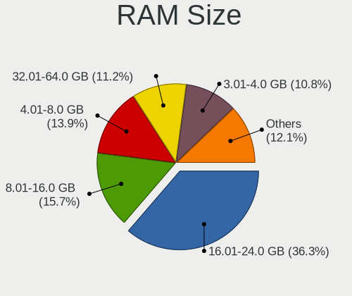

| Size in GB  | Desktops | Percent |
|-------------|----------|---------|
| 16.01-24.0  | 51       | 37.23%  |
| 8.01-16.0   | 20       | 14.6%   |
| 32.01-64.0  | 19       | 13.87%  |
| 3.01-4.0    | 19       | 13.87%  |
| 4.01-8.0    | 15       | 10.95%  |
| 64.01-256.0 | 10       | 7.3%    |
| 24.01-32.0  | 1        | 0.73%   |
| 2.01-3.0    | 1        | 0.73%   |
| 1.01-2.0    | 1        | 0.73%   |

RAM Used
--------

Used RAM memory

| Used GB    | Desktops | Percent |
|------------|----------|---------|
| 2.01-3.0   | 47       | 31.76%  |
| 1.01-2.0   | 40       | 27.03%  |
| 4.01-8.0   | 27       | 18.24%  |
| 3.01-4.0   | 21       | 14.19%  |
| 8.01-16.0  | 8        | 5.41%   |
| 0.51-1.0   | 4        | 2.7%    |
| 32.01-64.0 | 1        | 0.68%   |

Total Drives
------------

Number of drives on board

| Drives | Desktops | Percent |
|--------|----------|---------|
| 1      | 42       | 29.58%  |
| 2      | 37       | 26.06%  |
| 3      | 26       | 18.31%  |
| 4      | 16       | 11.27%  |
| 5      | 12       | 8.45%   |
| 8      | 4        | 2.82%   |
| 6      | 3        | 2.11%   |
| 11     | 1        | 0.7%    |
| 9      | 1        | 0.7%    |

Has CD-ROM
----------

Has CD-ROM on board

| Presented | Desktops | Percent |
|-----------|----------|---------|
| Yes       | 69       | 51.11%  |
| No        | 66       | 48.89%  |

Has Ethernet
------------

Has Ethernet on board

| Presented | Desktops | Percent |
|-----------|----------|---------|
| Yes       | 132      | 98.51%  |
| No        | 2        | 1.49%   |

Has WiFi
--------

Has WiFi module

| Presented | Desktops | Percent |
|-----------|----------|---------|
| No        | 70       | 51.47%  |
| Yes       | 66       | 48.53%  |

Has Bluetooth
-------------

Has Bluetooth module

| Presented | Desktops | Percent |
|-----------|----------|---------|
| No        | 79       | 57.66%  |
| Yes       | 58       | 42.34%  |

Location
--------

Country
-------

Geographic location (country)

| Country      | Desktops | Percent |
|--------------|----------|---------|
| USA          | 35       | 26.12%  |
| Germany      | 19       | 14.18%  |
| France       | 12       | 8.96%   |
| Brazil       | 9        | 6.72%   |
| Canada       | 8        | 5.97%   |
| Australia    | 5        | 3.73%   |
| Ukraine      | 3        | 2.24%   |
| Poland       | 3        | 2.24%   |
| Netherlands  | 3        | 2.24%   |
| Mexico       | 3        | 2.24%   |
| UK           | 2        | 1.49%   |
| Switzerland  | 2        | 1.49%   |
| Spain        | 2        | 1.49%   |
| Romania      | 2        | 1.49%   |
| Portugal     | 2        | 1.49%   |
| Norway       | 2        | 1.49%   |
| Italy        | 2        | 1.49%   |
| Croatia      | 2        | 1.49%   |
| Colombia     | 2        | 1.49%   |
| Argentina    | 2        | 1.49%   |
| Thailand     | 1        | 0.75%   |
| Taiwan       | 1        | 0.75%   |
| Sweden       | 1        | 0.75%   |
| Saudi Arabia | 1        | 0.75%   |
| Russia       | 1        | 0.75%   |
| Puerto Rico  | 1        | 0.75%   |
| Japan        | 1        | 0.75%   |
| Israel       | 1        | 0.75%   |
| India        | 1        | 0.75%   |
| Hungary      | 1        | 0.75%   |
| Chile        | 1        | 0.75%   |
| Bulgaria     | 1        | 0.75%   |
| Bolivia      | 1        | 0.75%   |
| Belgium      | 1        | 0.75%   |

City
----

Geographic location (city)

| City                      | Desktops | Percent |
|---------------------------|----------|---------|
| Zagreb                    | 2        | 1.46%   |
| Uman                      | 2        | 1.46%   |
| Trondheim                 | 2        | 1.46%   |
| Timioara             | 2        | 1.46%   |
| Sydney                    | 2        | 1.46%   |
| Miami                     | 2        | 1.46%   |
| Maring                | 2        | 1.46%   |
| Hamburg                   | 2        | 1.46%   |
| Dallas                    | 2        | 1.46%   |
| Berlin                    | 2        | 1.46%   |
| Barcelona                 | 2        | 1.46%   |
| winoujcie        | 1        | 0.73%   |
| Zapopan                   | 1        | 0.73%   |
| Zabrze                    | 1        | 0.73%   |
| Wrzburg               | 1        | 0.73%   |
| Wilderness Rim            | 1        | 0.73%   |
| Westland                  | 1        | 0.73%   |
| West Des Moines           | 1        | 0.73%   |
| Wentzville                | 1        | 0.73%   |
| Villa Allende             | 1        | 0.73%   |
| Versailles                | 1        | 0.73%   |
| Valley Park               | 1        | 0.73%   |
| Tucson                    | 1        | 0.73%   |
| Tijuana                   | 1        | 0.73%   |
| Thrissur                  | 1        | 0.73%   |
| Ternopil                  | 1        | 0.73%   |
| Telford                   | 1        | 0.73%   |
| Talcahuano                | 1        | 0.73%   |
| Szentendre                | 1        | 0.73%   |
| Stara Zagora              | 1        | 0.73%   |
| Soest                     | 1        | 0.73%   |
| Smithville                | 1        | 0.73%   |
| Shostka                   | 1        | 0.73%   |
| Sherbrooke                | 1        | 0.73%   |
| Scotch Plains             | 1        | 0.73%   |
| Schoeningen               | 1        | 0.73%   |
| Sao Paulo                 | 1        | 0.73%   |
| Santo Andr            | 1        | 0.73%   |
| San Juan                  | 1        | 0.73%   |
| San Jose                  | 1        | 0.73%   |
| San Diego                 | 1        | 0.73%   |
| San Antonio               | 1        | 0.73%   |
| Salvador                  | 1        | 0.73%   |
| Saint-Rmy-de-Provence | 1        | 0.73%   |
| Saint-Genis-Laval         | 1        | 0.73%   |
| Rouen                     | 1        | 0.73%   |
| Roswell                   | 1        | 0.73%   |
| Rio de Janeiro            | 1        | 0.73%   |
| Ravensburg                | 1        | 0.73%   |
| Qubec                 | 1        | 0.73%   |
| Queens                    | 1        | 0.73%   |
| Pula                      | 1        | 0.73%   |
| Prince Rupert             | 1        | 0.73%   |
| Powell River              | 1        | 0.73%   |
| Pouso Alegre              | 1        | 0.73%   |
| Poplarville               | 1        | 0.73%   |
| Pocono Summit             | 1        | 0.73%   |
| Peta Tiqwa         | 1        | 0.73%   |
| Perth                     | 1        | 0.73%   |
| Paulhe                    | 1        | 0.73%   |

Drives
------

Drive Vendor
------------

Hard drive vendors

| Vendor                    | Desktops | Drives | Percent |
|---------------------------|----------|--------|---------|
| Seagate                   | 52       | 92     | 18.98%  |
| WDC                       | 51       | 91     | 18.61%  |
| Samsung Electronics       | 44       | 70     | 16.06%  |
| Kingston                  | 17       | 26     | 6.2%    |
| SanDisk                   | 14       | 21     | 5.11%   |
| Toshiba                   | 13       | 13     | 4.74%   |
| Hitachi                   | 11       | 15     | 4.01%   |
| Phison                    | 10       | 15     | 3.65%   |
| Crucial                   | 6        | 7      | 2.19%   |
| Intel                     | 4        | 4      | 1.46%   |
| Unknown                   | 3        | 5      | 1.09%   |
| PNY                       | 3        | 3      | 1.09%   |
| Patriot                   | 3        | 4      | 1.09%   |
| HGST                      | 3        | 4      | 1.09%   |
| China                     | 3        | 4      | 1.09%   |
| A-DATA Technology         | 3        | 5      | 1.09%   |
| SPCC                      | 2        | 4      | 0.73%   |
| OCZ                       | 2        | 4      | 0.73%   |
| Micron/Crucial Technology | 2        | 2      | 0.73%   |
| MAXTOR                    | 2        | 5      | 0.73%   |
| JMicron                   | 2        | 3      | 0.73%   |
| HS-SSD-C100               | 2        | 2      | 0.73%   |
| Apacer                    | 2        | 2      | 0.73%   |
| AMD                       | 2        | 17     | 0.73%   |
| Zheino                    | 1        | 1      | 0.36%   |
| XrayDisk                  | 1        | 1      | 0.36%   |
| Transcend                 | 1        | 1      | 0.36%   |
| TDAS                      | 1        | 3      | 0.36%   |
| Silicon Motion            | 1        | 1      | 0.36%   |
| SABRENT                   | 1        | 1      | 0.36%   |
| PLEXTOR                   | 1        | 1      | 0.36%   |
| Phison Electronics        | 1        | 1      | 0.36%   |
| Netac                     | 1        | 1      | 0.36%   |
| Micron Technology         | 1        | 2      | 0.36%   |
| MDT                       | 1        | 1      | 0.36%   |
| LDLC                      | 1        | 1      | 0.36%   |
| LaCie                     | 1        | 1      | 0.36%   |
| KingDian                  | 1        | 1      | 0.36%   |
| GOODRAM                   | 1        | 1      | 0.36%   |
| Gigabyte Technology       | 1        | 1      | 0.36%   |
| Axiom                     | 1        | 1      | 0.36%   |
| ADATA Technology          | 1        | 1      | 0.36%   |

Drive Model
-----------

Hard drive models

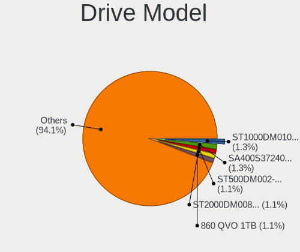

| Model                              | Desktops | Percent |
|------------------------------------|----------|---------|
| Samsung SSD 860 QVO 1TB            | 6        | 1.77%   |
| Samsung SSD 860 EVO 500GB          | 6        | 1.77%   |
| Seagate ST500DM002-1BD142 500GB    | 5        | 1.47%   |
| Seagate ST1000DM010-2EP102 1TB     | 5        | 1.47%   |
| WDC WD5000AAKS-00UU3A0 500GB       | 4        | 1.18%   |
| Samsung NVMe SSD Drive 512GB       | 4        | 1.18%   |
| Samsung NVMe SSD Drive 500GB       | 4        | 1.18%   |
| Kingston SA400S37480G 480GB SSD    | 4        | 1.18%   |
| Kingston SA400S37240G 240GB SSD    | 4        | 1.18%   |
| WDC WD5000AAKX-001CA0 500GB        | 3        | 0.88%   |
| Seagate ST4000DM000-1F2168 4TB     | 3        | 0.88%   |
| Seagate ST2000DM006-2DM164 2TB     | 3        | 0.88%   |
| Seagate ST2000DM001-1ER164 2TB     | 3        | 0.88%   |
| Seagate ST2000DM001-1CH164 2TB     | 3        | 0.88%   |
| Seagate ST1000DM003-1ER162 1TB     | 3        | 0.88%   |
| SanDisk SDSSDA240G 240GB           | 3        | 0.88%   |
| Samsung SSD 850 EVO 500GB          | 3        | 0.88%   |
| Phison NVMe SSD Drive 1TB          | 3        | 0.88%   |
| WDC WDS120G2G0A-00JH30 120GB SSD   | 2        | 0.59%   |
| WDC WD7501AALS-00J7B1 752GB        | 2        | 0.59%   |
| WDC WD40EZRZ-00GXCB0 4TB           | 2        | 0.59%   |
| WDC WD20EFRX-68EUZN0 2TB           | 2        | 0.59%   |
| WDC WD10EZEX-08WN4A0 1TB           | 2        | 0.59%   |
| WDC WD10EZEX-00RKKA0 1TB           | 2        | 0.59%   |
| WDC WD10EADS-00M2B0 1TB            | 2        | 0.59%   |
| Toshiba DT01ACA100 1TB             | 2        | 0.59%   |
| Seagate ST9500325AS 500GB          | 2        | 0.59%   |
| Seagate ST3500320AS 500GB          | 2        | 0.59%   |
| Seagate ST3320620AS 320GB          | 2        | 0.59%   |
| Seagate ST31000524AS 1TB           | 2        | 0.59%   |
| Seagate ST1000LM024 HN-M101MBB 1TB | 2        | 0.59%   |
| Seagate ST1000DM003-1CH162 1TB     | 2        | 0.59%   |
| SanDisk SDSSDA120G 120GB           | 2        | 0.59%   |
| Samsung SSD 970 EVO Plus 500GB     | 2        | 0.59%   |
| Samsung SSD 860 EVO 250GB          | 2        | 0.59%   |
| Samsung SSD 850 EVO 250GB          | 2        | 0.59%   |
| Samsung NVMe SSD Drive 1TB         | 2        | 0.59%   |
| Phison Sabrent Rocket 4.0 1TB      | 2        | 0.59%   |
| Phison NVMe SSD Drive 240GB        | 2        | 0.59%   |
| Phison NVMe SSD Drive 1024GB       | 2        | 0.59%   |
| Micron/Crucial NVMe SSD Drive 1TB  | 2        | 0.59%   |
| Kingston SV300S37A60G 64GB SSD     | 2        | 0.59%   |
| Kingston NVMe SSD Drive 500GB      | 2        | 0.59%   |
| China SATA SSD 240GB               | 2        | 0.59%   |
| Apacer AS510S 64GB SSD             | 2        | 0.59%   |
| AMD R5SL240G 240GB SSD             | 2        | 0.59%   |
| AMD R3SL120G 120GB SSD             | 2        | 0.59%   |
| Zheino CHN-25SATAC3-120 120GB      | 1        | 0.29%   |
| XrayDisk 256GB                     | 1        | 0.29%   |
| WDC WDS500G2B0B-00YS70 500GB SSD   | 1        | 0.29%   |
| WDC WDS500G2B0A 500GB SSD          | 1        | 0.29%   |
| WDC WDS480G2G0C-00AJM0 480GB       | 1        | 0.29%   |
| WDC WDS240G2G0B-00EPW0 240GB SSD   | 1        | 0.29%   |
| WDC WDS200T2B0A 2TB SSD            | 1        | 0.29%   |
| WDC WDS100T2G0A-00JH30 1TB SSD     | 1        | 0.29%   |
| WDC WD80EFAX-68LHPN0 8TB           | 1        | 0.29%   |
| WDC WD7502AAEX-00Y9A0 752GB        | 1        | 0.29%   |
| WDC WD7500BPVT-24HXZT3 752GB       | 1        | 0.29%   |
| WDC WD6401AALS-00L3B2 640GB        | 1        | 0.29%   |
| WDC WD6000HLHX-01JJPV0 600GB       | 1        | 0.29%   |

HDD Vendor
----------

Hard disk drive vendors

| Vendor              | Desktops | Drives | Percent |
|---------------------|----------|--------|---------|
| Seagate             | 52       | 92     | 39.1%   |
| WDC                 | 46       | 83     | 34.59%  |
| Toshiba             | 13       | 13     | 9.77%   |
| Hitachi             | 11       | 15     | 8.27%   |
| Samsung Electronics | 4        | 4      | 3.01%   |
| HGST                | 3        | 4      | 2.26%   |
| MAXTOR              | 2        | 5      | 1.5%    |
| Unknown             | 1        | 1      | 0.75%   |
| SABRENT             | 1        | 1      | 0.75%   |

SSD Vendor
----------

Solid state drive vendors

| Vendor              | Desktops | Drives | Percent |
|---------------------|----------|--------|---------|
| Samsung Electronics | 30       | 41     | 30.3%   |
| Kingston            | 16       | 23     | 16.16%  |
| SanDisk             | 12       | 19     | 12.12%  |
| WDC                 | 7        | 7      | 7.07%   |
| Crucial             | 5        | 6      | 5.05%   |
| Patriot             | 3        | 4      | 3.03%   |
| China               | 3        | 4      | 3.03%   |
| A-DATA Technology   | 3        | 5      | 3.03%   |
| SPCC                | 2        | 4      | 2.02%   |
| PNY                 | 2        | 2      | 2.02%   |
| Intel               | 2        | 2      | 2.02%   |
| Apacer              | 2        | 2      | 2.02%   |
| AMD                 | 2        | 17     | 2.02%   |
| Zheino              | 1        | 1      | 1.01%   |
| Transcend           | 1        | 1      | 1.01%   |
| PLEXTOR             | 1        | 1      | 1.01%   |
| OCZ                 | 1        | 1      | 1.01%   |
| Netac               | 1        | 1      | 1.01%   |
| KingDian            | 1        | 1      | 1.01%   |
| JMicron             | 1        | 1      | 1.01%   |
| GOODRAM             | 1        | 1      | 1.01%   |
| Gigabyte Technology | 1        | 1      | 1.01%   |
| Axiom               | 1        | 1      | 1.01%   |

Drive Kind
----------

HDD or SSD

| Kind    | Desktops | Drives | Percent |
|---------|----------|--------|---------|
| HDD     | 100      | 218    | 45.25%  |
| SSD     | 74       | 146    | 33.48%  |
| NVMe    | 37       | 60     | 16.74%  |
| Unknown | 9        | 13     | 4.07%   |
| MMC     | 1        | 2      | 0.45%   |

Drive Connector
---------------

SATA, SAS, NVMe, etc.

| Type | Desktops | Drives | Percent |
|------|----------|--------|---------|
| SATA | 124      | 364    | 72.94%  |
| NVMe | 37       | 60     | 21.76%  |
| SAS  | 8        | 13     | 4.71%   |
| MMC  | 1        | 2      | 0.59%   |

Drive Size
----------

Size of hard drive

| Size in TB | Desktops | Drives | Percent |
|------------|----------|--------|---------|
| 0.01-0.5   | 99       | 211    | 51.3%   |
| 0.51-1.0   | 56       | 90     | 29.02%  |
| 1.01-2.0   | 19       | 36     | 9.84%   |
| 3.01-4.0   | 11       | 18     | 5.7%    |
| 4.01-10.0  | 5        | 6      | 2.59%   |
| 2.01-3.0   | 3        | 3      | 1.55%   |

Space Total
-----------

Amount of disk space available on the file system

| Size in GB     | Desktops | Percent |
|----------------|----------|---------|
| 101-250        | 42       | 29.58%  |
| 251-500        | 33       | 23.24%  |
| 501-1000       | 26       | 18.31%  |
| More than 3000 | 14       | 9.86%   |
| 1001-2000      | 11       | 7.75%   |
| 2001-3000      | 5        | 3.52%   |
| 51-100         | 4        | 2.82%   |
| Unknown        | 3        | 2.11%   |
| 21-50          | 2        | 1.41%   |
| 1-20           | 2        | 1.41%   |

Space Used
----------

Amount of used disk space

| Used GB        | Desktops | Percent |
|----------------|----------|---------|
| 1-20           | 44       | 30.34%  |
| 101-250        | 25       | 17.24%  |
| 21-50          | 22       | 15.17%  |
| 251-500        | 16       | 11.03%  |
| 1001-2000      | 11       | 7.59%   |
| 51-100         | 11       | 7.59%   |
| 501-1000       | 7        | 4.83%   |
| More than 3000 | 4        | 2.76%   |
| Unknown        | 3        | 2.07%   |
| 2001-3000      | 2        | 1.38%   |

Malfunc. Drives
---------------

Drive models with a malfunction

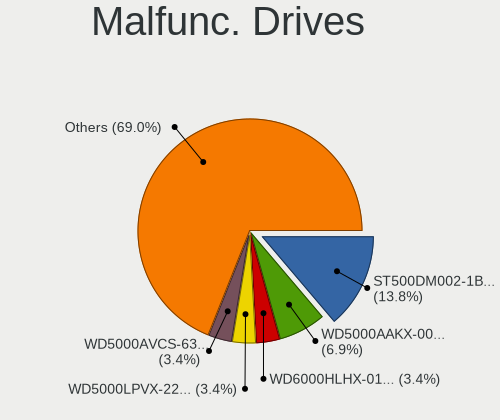

| Model                           | Desktops | Drives | Percent |
|---------------------------------|----------|--------|---------|
| Seagate ST500DM002-1BD142 500GB | 3        | 3      | 13.64%  |
| WDC WD5000AAKX-001CA0 500GB     | 2        | 2      | 9.09%   |
| WDC WD6000HLHX-01JJPV0 600GB    | 1        | 1      | 4.55%   |
| WDC WD5000AVCS-632DY1 500GB     | 1        | 1      | 4.55%   |
| WDC WD4003FZEX-00Z4SA0 4TB      | 1        | 1      | 4.55%   |
| WDC WD2500AAJS-60M0A0 250GB     | 1        | 1      | 4.55%   |
| WDC WD20EFRX-68EUZN0 2TB        | 1        | 2      | 4.55%   |
| WDC WD10EZEX-00RKKA0 1TB        | 1        | 1      | 4.55%   |
| Seagate ST9500325AS 500GB       | 1        | 1      | 4.55%   |
| Seagate ST5000DM000-1FK178 5TB  | 1        | 1      | 4.55%   |
| Seagate ST3500320AS 500GB       | 1        | 1      | 4.55%   |
| Seagate ST3320620AS 320GB       | 1        | 1      | 4.55%   |
| Seagate ST3160815AS 160GB       | 1        | 1      | 4.55%   |
| Seagate ST1000DX001-1NS162 1TB  | 1        | 1      | 4.55%   |
| Seagate ST1000DM003-1SB102 1TB  | 1        | 1      | 4.55%   |
| Patriot Pyro m3 240GB SSD       | 1        | 1      | 4.55%   |
| MAXTOR STM3250310AS 250GB       | 1        | 1      | 4.55%   |
| MAXTOR 6B200M0 208GB            | 1        | 2      | 4.55%   |
| Hitachi HDS721032CLA362 320GB   | 1        | 1      | 4.55%   |

Malfunc. Drive Vendor
---------------------

Vendors of faulty drives

| Vendor  | Desktops | Drives | Percent |
|---------|----------|--------|---------|
| Seagate | 10       | 10     | 45.45%  |
| WDC     | 8        | 9      | 36.36%  |
| MAXTOR  | 2        | 3      | 9.09%   |
| Patriot | 1        | 1      | 4.55%   |
| Hitachi | 1        | 1      | 4.55%   |

Malfunc. HDD Vendor
-------------------

Vendors of faulty HDD drives

| Vendor  | Desktops | Drives | Percent |
|---------|----------|--------|---------|
| Seagate | 10       | 10     | 47.62%  |
| WDC     | 8        | 9      | 38.1%   |
| MAXTOR  | 2        | 3      | 9.52%   |
| Hitachi | 1        | 1      | 4.76%   |

Malfunc. Drive Kind
-------------------

Kinds of faulty drives

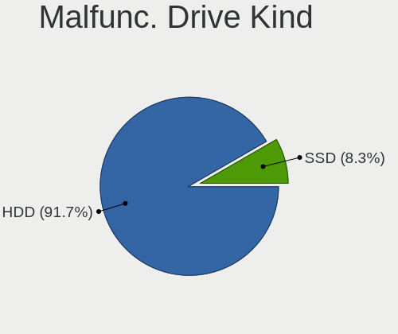

| Kind | Desktops | Drives | Percent |
|------|----------|--------|---------|
| HDD  | 16       | 23     | 94.12%  |
| SSD  | 1        | 1      | 5.88%   |

Failed Drives
-------------

Failed drive models

Zero info for selected period =(

Failed Drive Vendor
-------------------

Failed drive vendors

Zero info for selected period =(

Drive Status
------------

Number of failed and malfunc. drives

| Status   | Desktops | Drives | Percent |
|----------|----------|--------|---------|
| Detected | 96       | 315    | 63.58%  |
| Works    | 38       | 100    | 25.17%  |
| Malfunc  | 17       | 24     | 11.26%  |

Storage controller
------------------

Storage Vendor
--------------

Storage controller vendors

| Vendor                        | Desktops | Percent |
|-------------------------------|----------|---------|
| Intel                         | 97       | 49.24%  |
| AMD                           | 37       | 18.78%  |
| Samsung Electronics           | 16       | 8.12%   |
| Phison Electronics            | 11       | 5.58%   |
| Marvell Technology Group      | 9        | 4.57%   |
| JMicron Technology            | 5        | 2.54%   |
| ASMedia Technology            | 5        | 2.54%   |
| Sandisk                       | 3        | 1.52%   |
| Micron/Crucial Technology     | 3        | 1.52%   |
| Silicon Motion                | 2        | 1.02%   |
| Kingston Technology Company   | 2        | 1.02%   |
| Silicon Image                 | 1        | 0.51%   |
| OCZ Technology Group          | 1        | 0.51%   |
| Nvidia                        | 1        | 0.51%   |
| Micron Technology             | 1        | 0.51%   |
| Integrated Technology Express | 1        | 0.51%   |
| ADATA Technology              | 1        | 0.51%   |
| Adaptec                       | 1        | 0.51%   |

Storage Model
-------------

Storage controller models

| Model                                                                                   | Desktops | Percent |
|-----------------------------------------------------------------------------------------|----------|---------|
| AMD FCH SATA Controller [AHCI mode]                                                     | 24       | 9.76%   |
| Samsung NVMe SSD Controller SM981/PM981/PM983                                           | 12       | 4.88%   |
| Intel Cannon Lake PCH SATA AHCI Controller                                              | 9        | 3.66%   |
| Intel 8 Series/C220 Series Chipset Family 6-port SATA Controller 1 [AHCI mode]          | 9        | 3.66%   |
| Intel 6 Series/C200 Series Chipset Family 6 port Desktop SATA AHCI Controller           | 9        | 3.66%   |
| Intel SATA Controller [RAID mode]                                                       | 8        | 3.25%   |
| AMD 500 Series Chipset SATA Controller                                                  | 8        | 3.25%   |
| Intel 7 Series/C210 Series Chipset Family 6-port SATA Controller [AHCI mode]            | 7        | 2.85%   |
| Intel 200 Series PCH SATA controller [AHCI mode]                                        | 7        | 2.85%   |
| Phison E12 NVMe Controller                                                              | 6        | 2.44%   |
| AMD 400 Series Chipset SATA Controller                                                  | 6        | 2.44%   |
| Phison E16 PCIe4 NVMe Controller                                                        | 5        | 2.03%   |
| Intel NM10/ICH7 Family SATA Controller [IDE mode]                                       | 5        | 2.03%   |
| AMD SB7x0/SB8x0/SB9x0 SATA Controller [AHCI mode]                                       | 5        | 2.03%   |
| Intel Q170/Q150/B150/H170/H110/Z170/CM236 Chipset SATA Controller [AHCI Mode]           | 4        | 1.63%   |
| Intel 9 Series Chipset Family SATA Controller [AHCI Mode]                               | 4        | 1.63%   |
| Intel 82801H (ICH8 Family) 4 port SATA Controller [IDE mode]                            | 4        | 1.63%   |
| Intel 82801G (ICH7 Family) IDE Controller                                               | 4        | 1.63%   |
| AMD SB7x0/SB8x0/SB9x0 IDE Controller                                                    | 4        | 1.63%   |
| Intel 631xESB/632xESB IDE Controller                                                    | 3        | 1.22%   |
| Intel 6 Series/C200 Series Chipset Family Desktop SATA Controller (IDE mode, ports 4-5) | 3        | 1.22%   |
| Intel 6 Series/C200 Series Chipset Family Desktop SATA Controller (IDE mode, ports 0-3) | 3        | 1.22%   |
| AMD FCH SATA Controller D                                                               | 3        | 1.22%   |
| AMD 300 Series Chipset SATA Controller                                                  | 3        | 1.22%   |
| Silicon Motion SM2263EN/SM2263XT SSD Controller                                         | 2        | 0.81%   |
| Samsung NVMe SSD Controller SM961/PM961/SM963                                           | 2        | 0.81%   |
| Samsung NVMe SSD Controller SM951/PM951                                                 | 2        | 0.81%   |
| Micron/Crucial P2 NVMe PCIe SSD                                                         | 2        | 0.81%   |
| Marvell Group 88SE9172 SATA III 6Gb/s RAID Controller                                   | 2        | 0.81%   |
| Marvell Group 88SE9172 SATA 6Gb/s Controller                                            | 2        | 0.81%   |
| Kingston Company A2000 NVMe SSD                                                         | 2        | 0.81%   |
| JMicron JMB363 SATA/IDE Controller                                                      | 2        | 0.81%   |
| Intel C600/X79 series chipset 6-Port SATA AHCI Controller                               | 2        | 0.81%   |
| Intel 82801JI (ICH10 Family) SATA AHCI Controller                                       | 2        | 0.81%   |
| Intel 82801JI (ICH10 Family) 4 port SATA IDE Controller #1                              | 2        | 0.81%   |
| Intel 82801JI (ICH10 Family) 2 port SATA IDE Controller #2                              | 2        | 0.81%   |
| Intel 82801JD/DO (ICH10 Family) SATA AHCI Controller                                    | 2        | 0.81%   |
| Intel 82801HR/HO/HH (ICH8R/DO/DH) 2 port SATA Controller [IDE mode]                     | 2        | 0.81%   |
| Intel 7 Series/C210 Series Chipset Family 4-port SATA Controller [IDE mode]             | 2        | 0.81%   |
| Intel 7 Series/C210 Series Chipset Family 2-port SATA Controller [IDE mode]             | 2        | 0.81%   |
| Intel 631xESB/632xESB/3100 Chipset SATA IDE Controller                                  | 2        | 0.81%   |
| Intel 500 Series Chipset Family SATA AHCI Controller                                    | 2        | 0.81%   |
| Intel 5 Series/3400 Series Chipset 6 port SATA AHCI Controller                          | 2        | 0.81%   |
| Intel 5 Series/3400 Series Chipset 4 port SATA IDE Controller                           | 2        | 0.81%   |
| Intel 5 Series/3400 Series Chipset 2 port SATA IDE Controller                           | 2        | 0.81%   |
| ASMedia ASM1062 Serial ATA Controller                                                   | 2        | 0.81%   |
| ASMedia 106x SATA/RAID Controller                                                       | 2        | 0.81%   |
| AMD X370 Series Chipset SATA Controller                                                 | 2        | 0.81%   |
| Silicon Image SiI 3132 Serial ATA Raid II Controller                                    | 1        | 0.41%   |
| Sandisk WD Black SN750 / PC SN730 NVMe SSD                                              | 1        | 0.41%   |
| Sandisk WD Black 2018/SN750 / PC SN720 NVMe SSD                                         | 1        | 0.41%   |
| Sandisk Non-Volatile memory controller                                                  | 1        | 0.41%   |
| Phison Electronics Non-Volatile memory controller                                       | 1        | 0.41%   |
| Phison E7 NVMe Controller                                                               | 1        | 0.41%   |
| OCZ Group RD400/400A SSD                                                                | 1        | 0.41%   |
| Nvidia MCP61 SATA Controller                                                            | 1        | 0.41%   |
| Nvidia MCP61 IDE                                                                        | 1        | 0.41%   |
| Micron/Crucial P1 NVMe PCIe SSD                                                         | 1        | 0.41%   |
| Micron Non-Volatile memory controller                                                   | 1        | 0.41%   |
| Marvell Group 88SE91A3 SATA-600 Controller                                              | 1        | 0.41%   |

Storage Kind
------------

Kind of storage controller (IDE, SATA, NVMe, SAS, ...)

| Kind | Desktops | Percent |
|------|----------|---------|
| SATA | 102      | 54.84%  |
| NVMe | 38       | 20.43%  |
| IDE  | 35       | 18.82%  |
| RAID | 10       | 5.38%   |
| SAS  | 1        | 0.54%   |

Processor
---------

CPU Vendor
----------

Processor vendors

| Vendor | Desktops | Percent |
|--------|----------|---------|
| Intel  | 96       | 71.64%  |
| AMD    | 38       | 28.36%  |

CPU Model
---------

Processor models

| Model                                       | Desktops | Percent |
|---------------------------------------------|----------|---------|
| Intel Core i7-3770 CPU @ 3.40GHz            | 5        | 3.7%    |
| AMD Ryzen 7 3700X 8-Core Processor          | 5        | 3.7%    |
| Intel Core i7-2600 CPU @ 3.40GHz            | 4        | 2.96%   |
| Intel Core i7-4790K CPU @ 4.00GHz           | 3        | 2.22%   |
| Intel Core i7-4770 CPU @ 3.40GHz            | 3        | 2.22%   |
| Intel Core 2 Duo CPU E8400 @ 3.00GHz        | 3        | 2.22%   |
| AMD Ryzen 5 3600 6-Core Processor           | 3        | 2.22%   |
| AMD Ryzen 5 2600 Six-Core Processor         | 3        | 2.22%   |
| AMD Ryzen 3 2200G with Radeon Vega Graphics | 3        | 2.22%   |
| Intel Xeon CPU 5150 @ 2.66GHz               | 2        | 1.48%   |
| Intel Pentium Dual CPU E2160 @ 1.80GHz      | 2        | 1.48%   |
| Intel Core i9-9900K CPU @ 3.60GHz           | 2        | 1.48%   |
| Intel Core i7-6700K CPU @ 4.00GHz           | 2        | 1.48%   |
| Intel Core i7-4790 CPU @ 3.60GHz            | 2        | 1.48%   |
| Intel Core i7-2600K CPU @ 3.40GHz           | 2        | 1.48%   |
| Intel Core i5-4670K CPU @ 3.40GHz           | 2        | 1.48%   |
| Intel Core i5-2500K CPU @ 3.30GHz           | 2        | 1.48%   |
| Intel Core i5 CPU 750 @ 2.67GHz             | 2        | 1.48%   |
| Intel Core i3-3240 CPU @ 3.40GHz            | 2        | 1.48%   |
| Intel Core 2 Duo CPU E7400 @ 2.80GHz        | 2        | 1.48%   |
| Intel Core 2 CPU 6400 @ 2.13GHz             | 2        | 1.48%   |
| AMD Ryzen 7 2700 Eight-Core Processor       | 2        | 1.48%   |
| AMD Ryzen 5 3600X 6-Core Processor          | 2        | 1.48%   |
| AMD FX-6300 Six-Core Processor              | 2        | 1.48%   |
| Intel Xeon CPU X5690 @ 3.47GHz              | 1        | 0.74%   |
| Intel Xeon CPU X5492 @ 3.40GHz              | 1        | 0.74%   |
| Intel Xeon CPU W3670 @ 3.20GHz              | 1        | 0.74%   |
| Intel Xeon CPU W3530 @ 2.80GHz              | 1        | 0.74%   |
| Intel Xeon CPU E5-2680 0 @ 2.70GHz          | 1        | 0.74%   |
| Intel Xeon CPU E5-2660 0 @ 2.20GHz          | 1        | 0.74%   |
| Intel Xeon CPU E5-2630 v3 @ 2.40GHz         | 1        | 0.74%   |
| Intel Pentium Dual-Core CPU E5500 @ 2.80GHz | 1        | 0.74%   |
| Intel Pentium CPU G630 @ 2.70GHz            | 1        | 0.74%   |
| Intel Pentium CPU G3220 @ 3.00GHz           | 1        | 0.74%   |
| Intel Pentium CPU G2030 @ 3.00GHz           | 1        | 0.74%   |
| Intel Pentium CPU G2010 @ 2.80GHz           | 1        | 0.74%   |
| Intel Pentium 4 CPU 3.40GHz                 | 1        | 0.74%   |
| Intel Genuine CPU 0000 @ 3.10GHz            | 1        | 0.74%   |
| Intel Core m3-8100Y CPU @ 1.10GHz           | 1        | 0.74%   |
| Intel Core i9-9900KF CPU @ 3.60GHz          | 1        | 0.74%   |
| Intel Core i7-9700K CPU @ 3.60GHz           | 1        | 0.74%   |
| Intel Core i7-9700F CPU @ 3.00GHz           | 1        | 0.74%   |
| Intel Core i7-9700 CPU @ 3.00GHz            | 1        | 0.74%   |
| Intel Core i7-8700 CPU @ 3.20GHz            | 1        | 0.74%   |
| Intel Core i7-7700 CPU @ 3.60GHz            | 1        | 0.74%   |
| Intel Core i7-6700 CPU @ 3.40GHz            | 1        | 0.74%   |
| Intel Core i7-3820 CPU @ 3.60GHz            | 1        | 0.74%   |
| Intel Core i7-3770K CPU @ 3.50GHz           | 1        | 0.74%   |
| Intel Core i7-10700K CPU @ 3.80GHz          | 1        | 0.74%   |
| Intel Core i7 CPU 920 @ 2.67GHz             | 1        | 0.74%   |
| Intel Core i7 CPU 870 @ 2.93GHz             | 1        | 0.74%   |
| Intel Core i7 CPU 860 @ 2.80GHz             | 1        | 0.74%   |
| Intel Core i5-9600K CPU @ 3.70GHz           | 1        | 0.74%   |
| Intel Core i5-9400F CPU @ 2.90GHz           | 1        | 0.74%   |
| Intel Core i5-8600K CPU @ 3.60GHz           | 1        | 0.74%   |
| Intel Core i5-8400 CPU @ 2.80GHz            | 1        | 0.74%   |
| Intel Core i5-7500 CPU @ 3.40GHz            | 1        | 0.74%   |
| Intel Core i5-6400 CPU @ 2.70GHz            | 1        | 0.74%   |
| Intel Core i5-4590S CPU @ 3.00GHz           | 1        | 0.74%   |
| Intel Core i5-4590 CPU @ 3.30GHz            | 1        | 0.74%   |

CPU Model Family
----------------

Processor model prefix

| Model                   | Desktops | Percent |
|-------------------------|----------|---------|
| Intel Core i7           | 33       | 24.44%  |
| Intel Core i5           | 21       | 15.56%  |
| AMD Ryzen 5             | 12       | 8.89%   |
| Intel Xeon              | 9        | 6.67%   |
| AMD Ryzen 7             | 9        | 6.67%   |
| Intel Core i3           | 6        | 4.44%   |
| Intel Core 2 Duo        | 6        | 4.44%   |
| Intel Core 2            | 5        | 3.7%    |
| Intel Pentium           | 4        | 2.96%   |
| AMD Ryzen 3             | 4        | 2.96%   |
| Intel Core i9           | 3        | 2.22%   |
| AMD FX                  | 3        | 2.22%   |
| Other                   | 2        | 1.48%   |
| Intel Pentium Dual      | 2        | 1.48%   |
| Intel Celeron           | 2        | 1.48%   |
| AMD Ryzen 9             | 2        | 1.48%   |
| Intel Pentium Dual-Core | 1        | 0.74%   |
| Intel Pentium 4         | 1        | 0.74%   |
| Intel Genuine           | 1        | 0.74%   |
| Intel Core m3           | 1        | 0.74%   |
| Intel Core 2 Quad       | 1        | 0.74%   |
| AMD Sempron             | 1        | 0.74%   |
| AMD Ryzen Threadripper  | 1        | 0.74%   |
| AMD Phenom II X6        | 1        | 0.74%   |
| AMD Phenom II X2        | 1        | 0.74%   |
| AMD A6                  | 1        | 0.74%   |
| AMD A4                  | 1        | 0.74%   |
| AMD A10                 | 1        | 0.74%   |

CPU Cores
---------

Number of processor cores

| Number | Desktops | Percent |
|--------|----------|---------|
| 4      | 54       | 40.3%   |
| 2      | 30       | 22.39%  |
| 8      | 21       | 15.67%  |
| 6      | 19       | 14.18%  |
| 1      | 3        | 2.24%   |
| 16     | 2        | 1.49%   |
| 12     | 2        | 1.49%   |
| 3      | 2        | 1.49%   |
| 24     | 1        | 0.75%   |

CPU Sockets
-----------

Number of sockets

| Number | Desktops | Percent |
|--------|----------|---------|
| 1      | 129      | 96.27%  |
| 2      | 5        | 3.73%   |

CPU Threads
-----------

Threads per core (Hyper-Threading)

| Number | Desktops | Percent |
|--------|----------|---------|
| 2      | 78       | 57.78%  |
| 1      | 57       | 42.22%  |

CPU Op-Modes
------------

CPU Operation Modes (32-bit, 64-bit)

| Op mode        | Desktops | Percent |
|----------------|----------|---------|
| 32-bit, 64-bit | 133      | 99.25%  |
| 32-bit         | 1        | 0.75%   |

CPU Microcode
-------------

Microcode number

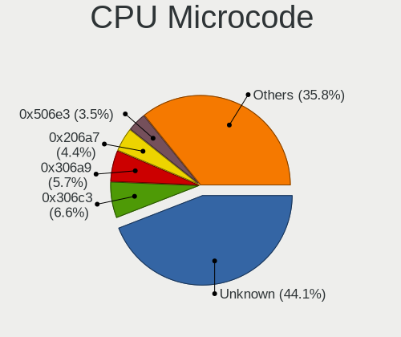

| Number     | Desktops | Percent |
|------------|----------|---------|
| Unknown    | 47       | 33.33%  |
| 0x306c3    | 12       | 8.51%   |
| 0x306a9    | 9        | 6.38%   |
| 0x206a7    | 8        | 5.67%   |
| 0x1067a    | 7        | 4.96%   |
| 0x506e3    | 5        | 3.55%   |
| 0x106e5    | 4        | 2.84%   |
| 0x08701021 | 4        | 2.84%   |
| 0x0800820d | 4        | 2.84%   |
| 0x906ec    | 3        | 2.13%   |
| 0x6f6      | 3        | 2.13%   |
| 0x6f2      | 3        | 2.13%   |
| 0x906ea    | 2        | 1.42%   |
| 0x906e9    | 2        | 1.42%   |
| 0x6fd      | 2        | 1.42%   |
| 0x206d7    | 2        | 1.42%   |
| 0x06000852 | 2        | 1.42%   |
| 0xf34      | 1        | 0.71%   |
| 0xa0671    | 1        | 0.71%   |
| 0xa0655    | 1        | 0.71%   |
| 0x906ed    | 1        | 0.71%   |
| 0x306f2    | 1        | 0.71%   |
| 0x30678    | 1        | 0.71%   |
| 0x206c2    | 1        | 0.71%   |
| 0x20655    | 1        | 0.71%   |
| 0x106a5    | 1        | 0.71%   |
| 0x0a50000c | 1        | 0.71%   |
| 0x08701013 | 1        | 0.71%   |
| 0x08600103 | 1        | 0.71%   |
| 0x08108109 | 1        | 0.71%   |
| 0x08101016 | 1        | 0.71%   |
| 0x0810100b | 1        | 0.71%   |
| 0x08001137 | 1        | 0.71%   |
| 0x06006704 | 1        | 0.71%   |
| 0x0600611a | 1        | 0.71%   |
| 0x06003109 | 1        | 0.71%   |
| 0x010000dc | 1        | 0.71%   |
| 0x010000c8 | 1        | 0.71%   |
| 0x010000c7 | 1        | 0.71%   |

CPU Microarch
-------------

Microarchitecture

| Name        | Desktops | Percent |
|-------------|----------|---------|
| KabyLake    | 16       | 11.94%  |
| Haswell     | 15       | 11.19%  |
| Zen 2       | 14       | 10.45%  |
| SandyBridge | 14       | 10.45%  |
| IvyBridge   | 14       | 10.45%  |
| Penryn      | 9        | 6.72%   |
| Core        | 9        | 6.72%   |
| Zen+        | 7        | 5.22%   |
| Nehalem     | 6        | 4.48%   |
| Zen         | 5        | 3.73%   |
| Skylake     | 5        | 3.73%   |
| Westmere    | 3        | 2.24%   |
| Piledriver  | 3        | 2.24%   |
| K10         | 3        | 2.24%   |
| Zen 3       | 2        | 1.49%   |
| Excavator   | 2        | 1.49%   |
| CometLake   | 2        | 1.49%   |
| Steamroller | 1        | 0.75%   |
| Silvermont  | 1        | 0.75%   |
| Puma        | 1        | 0.75%   |
| NetBurst    | 1        | 0.75%   |
| Icelake     | 1        | 0.75%   |

Graphics
--------

GPU Vendor
----------

Vendors of graphics cards

| Vendor            | Desktops | Percent |
|-------------------|----------|---------|
| Nvidia            | 66       | 44%     |
| AMD               | 42       | 28%     |
| Intel             | 41       | 27.33%  |
| ASPEED Technology | 1        | 0.67%   |

GPU Model
---------

Graphics card models

| Model                                                                       | Desktops | Percent |
|-----------------------------------------------------------------------------|----------|---------|
| AMD Ellesmere [Radeon RX 470/480/570/570X/580/580X/590]                     | 12       | 7.89%   |
| Nvidia GP106 [GeForce GTX 1060 6GB]                                         | 9        | 5.92%   |
| Intel Xeon E3-1200 v3/4th Gen Core Processor Integrated Graphics Controller | 9        | 5.92%   |
| Intel 2nd Generation Core Processor Family Integrated Graphics Controller   | 7        | 4.61%   |
| Nvidia GP107 [GeForce GTX 1050 Ti]                                          | 6        | 3.95%   |
| Intel 82Q963/Q965 Integrated Graphics Controller                            | 5        | 3.29%   |
| Nvidia TU106 [GeForce RTX 2060 Rev. A]                                      | 4        | 2.63%   |
| Nvidia GP108 [GeForce GT 1030]                                              | 4        | 2.63%   |
| Nvidia GP104 [GeForce GTX 1080]                                             | 4        | 2.63%   |
| Intel Xeon E3-1200 v2/3rd Gen Core processor Graphics Controller            | 4        | 2.63%   |
| Intel 4 Series Chipset Integrated Graphics Controller                       | 4        | 2.63%   |
| AMD Raven Ridge [Radeon Vega Series / Radeon Vega Mobile Series]            | 4        | 2.63%   |
| Intel 82G33/G31 Express Integrated Graphics Controller                      | 3        | 1.97%   |
| AMD Navi 10 [Radeon RX 5600 OEM/5600 XT / 5700/5700 XT]                     | 3        | 1.97%   |
| AMD Cedar [Radeon HD 5000/6000/7350/8350 Series]                            | 3        | 1.97%   |
| Nvidia TU104 [GeForce RTX 2060]                                             | 2        | 1.32%   |
| Nvidia GT218 [GeForce 210]                                                  | 2        | 1.32%   |
| Nvidia GM204 [GeForce GTX 970]                                              | 2        | 1.32%   |
| Nvidia GK208B [GeForce GT 710]                                              | 2        | 1.32%   |
| Intel IvyBridge GT2 [HD Graphics 4000]                                      | 2        | 1.32%   |
| Intel CometLake-S GT2 [UHD Graphics 630]                                    | 2        | 1.32%   |
| AMD Vega 10 XL/XT [Radeon RX Vega 56/64]                                    | 2        | 1.32%   |
| AMD Navi 23 [Radeon RX 6600/6600 XT/6600M]                                  | 2        | 1.32%   |
| AMD Juniper XT [Radeon HD 5770]                                             | 2        | 1.32%   |
| Nvidia TU116 [GeForce GTX 1660]                                             | 1        | 0.66%   |
| Nvidia TU116 [GeForce GTX 1660 Ti]                                          | 1        | 0.66%   |
| Nvidia TU116 [GeForce GTX 1660 SUPER]                                       | 1        | 0.66%   |
| Nvidia TU116 [GeForce GTX 1650]                                             | 1        | 0.66%   |
| Nvidia TU106 [GeForce RTX 2070]                                             | 1        | 0.66%   |
| Nvidia TU106 [GeForce RTX 2070 Rev. A]                                      | 1        | 0.66%   |
| Nvidia TU106 [GeForce RTX 2060 SUPER]                                       | 1        | 0.66%   |
| Nvidia TU104 [GeForce RTX 2070 SUPER]                                       | 1        | 0.66%   |
| Nvidia GT216 [GeForce GT 220]                                               | 1        | 0.66%   |
| Nvidia GT200GL [Quadro FX 3800]                                             | 1        | 0.66%   |
| Nvidia GP106 [GeForce GTX 1060 3GB]                                         | 1        | 0.66%   |
| Nvidia GP102 [GeForce GTX 1080 Ti]                                          | 1        | 0.66%   |
| Nvidia GM206 [GeForce GTX 960]                                              | 1        | 0.66%   |
| Nvidia GM206 [GeForce GTX 950]                                              | 1        | 0.66%   |
| Nvidia GM200 [GeForce GTX 980 Ti]                                           | 1        | 0.66%   |
| Nvidia GM107 [GeForce GTX 750]                                              | 1        | 0.66%   |
| Nvidia GK208B [GeForce GT 730]                                              | 1        | 0.66%   |
| Nvidia GK107GL [Quadro K2000]                                               | 1        | 0.66%   |
| Nvidia GK107 [GeForce GT 740]                                               | 1        | 0.66%   |
| Nvidia GK106 [GeForce GTX 650 Ti]                                           | 1        | 0.66%   |
| Nvidia GK104 [GeForce GTX 770]                                              | 1        | 0.66%   |
| Nvidia GK104 [GeForce GTX 680]                                              | 1        | 0.66%   |
| Nvidia GF119 [GeForce GT 625 OEM]                                           | 1        | 0.66%   |
| Nvidia GF119 [GeForce GT 610]                                               | 1        | 0.66%   |
| Nvidia GF114 [GeForce GTX 560 Ti]                                           | 1        | 0.66%   |
| Nvidia GF108 [GeForce GT 730]                                               | 1        | 0.66%   |
| Nvidia GF108 [GeForce GT 630]                                               | 1        | 0.66%   |
| Nvidia GF108 [GeForce GT 430]                                               | 1        | 0.66%   |
| Nvidia GF106GL [Quadro 2000]                                                | 1        | 0.66%   |
| Nvidia G98 [GeForce 8400 GS Rev. 2]                                         | 1        | 0.66%   |
| Nvidia G92 [GeForce 9800 GTX+]                                              | 1        | 0.66%   |
| Nvidia G73 [GeForce 7300 GT]                                                | 1        | 0.66%   |
| Intel UHD Graphics 615                                                      | 1        | 0.66%   |
| Intel HD Graphics 610                                                       | 1        | 0.66%   |
| Intel Core Processor Integrated Graphics Controller                         | 1        | 0.66%   |
| Intel CoffeeLake-S GT2 [UHD Graphics 630]                                   | 1        | 0.66%   |

GPU Combo
---------

Combinations of graphics cards

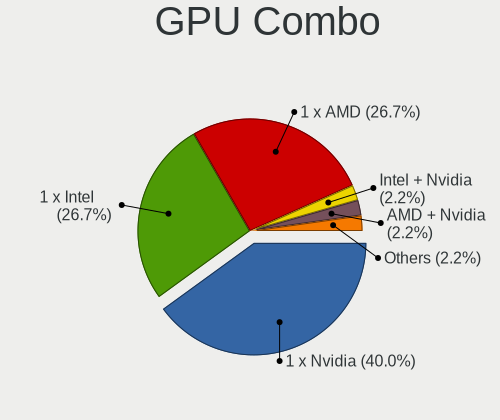

| Name           | Desktops | Percent |
|----------------|----------|---------|
| 1 x Nvidia     | 58       | 41.43%  |
| 1 x Intel      | 36       | 25.71%  |
| 1 x AMD        | 36       | 25.71%  |
| AMD + Nvidia   | 4        | 2.86%   |
| Intel + Nvidia | 3        | 2.14%   |
| 2 x Nvidia     | 1        | 0.71%   |
| Intel + AMD    | 1        | 0.71%   |
| 1 x ASPEED     | 1        | 0.71%   |

GPU Driver
----------

Free vs proprietary

| Driver      | Desktops | Percent |
|-------------|----------|---------|
| Free        | 81       | 57.86%  |
| Proprietary | 56       | 40%     |
| Unknown     | 3        | 2.14%   |

GPU Memory
----------

Total video memory

| Size in GB | Desktops | Percent |
|------------|----------|---------|
| Unknown    | 58       | 40.85%  |
| 1.01-2.0   | 19       | 13.38%  |
| 7.01-8.0   | 18       | 12.68%  |
| 3.01-4.0   | 15       | 10.56%  |
| 5.01-6.0   | 14       | 9.86%   |
| 0.51-1.0   | 8        | 5.63%   |
| 0.01-0.5   | 8        | 5.63%   |
| 2.01-3.0   | 1        | 0.7%    |
| 8.01-16.0  | 1        | 0.7%    |

Monitor
-------

Monitor Vendor
--------------

Monitor vendors

| Vendor               | Desktops | Percent |
|----------------------|----------|---------|
| Samsung Electronics  | 29       | 19.33%  |
| Dell                 | 21       | 14%     |
| Goldstar             | 10       | 6.67%   |
| Acer                 | 10       | 6.67%   |
| Ancor Communications | 9        | 6%      |
| Hewlett-Packard      | 8        | 5.33%   |
| AOC                  | 8        | 5.33%   |
| BenQ                 | 5        | 3.33%   |
| Unknown              | 4        | 2.67%   |
| LG Electronics       | 4        | 2.67%   |
| Idek Iiyama          | 4        | 2.67%   |
| ASUSTek Computer     | 4        | 2.67%   |
| Philips              | 3        | 2%      |
| Iiyama               | 3        | 2%      |
| ViewSonic            | 2        | 1.33%   |
| Sony                 | 2        | 1.33%   |
| Sceptre Tech         | 2        | 1.33%   |
| MStar                | 2        | 1.33%   |
| Medion               | 2        | 1.33%   |
| Eizo                 | 2        | 1.33%   |
| AGO                  | 2        | 1.33%   |
| Vizio                | 1        | 0.67%   |
| VIZ                  | 1        | 0.67%   |
| Sun                  | 1        | 0.67%   |
| Pioneer Electronic   | 1        | 0.67%   |
| NEC Computers        | 1        | 0.67%   |
| MPI                  | 1        | 0.67%   |
| Microstep            | 1        | 0.67%   |
| Lenovo               | 1        | 0.67%   |
| Insignia             | 1        | 0.67%   |
| Huion                | 1        | 0.67%   |
| Fujitsu Siemens      | 1        | 0.67%   |
| Daewoo               | 1        | 0.67%   |
| AUS                  | 1        | 0.67%   |
| Apple                | 1        | 0.67%   |

Monitor Model
-------------

Monitor models

| Model                                                                   | Desktops | Percent |
|-------------------------------------------------------------------------|----------|---------|
| Samsung Electronics S27B550 SAM091B 1920x1080 598x336mm 27.0-inch       | 2        | 1.16%   |
| Samsung Electronics LCD Monitor SAM0BB4 3840x2160 1872x1053mm 84.6-inch | 2        | 1.16%   |
| Samsung Electronics LCD Monitor C34H89x 3440x1440                       | 2        | 1.16%   |
| MStar Demo MST0030 1920x1080 708x398mm 32.0-inch                        | 2        | 1.16%   |
| Ancor Communications ASUS PA238 ACI23B1 1920x1080 509x286mm 23.0-inch   | 2        | 1.16%   |
| Vizio M260VA VIZ0067 1360x768 575x323mm 26.0-inch                       | 1        | 0.58%   |
| Vizio D55u-D1 VIZ1011 3840x2160 1209x680mm 54.6-inch                    | 1        | 0.58%   |
| VIZ LCD Monitor M50-C1 3840x2160                                        | 1        | 0.58%   |
| ViewSonic VX2476 Series VSC9939 1920x1080 527x296mm 23.8-inch           | 1        | 0.58%   |
| ViewSonic VA903 SERIES VSC111E 1280x1024 376x301mm 19.0-inch            | 1        | 0.58%   |
| Unknown LCD Monitor SAMSUNG 3840x2160                                   | 1        | 0.58%   |
| Unknown LCD Monitor SAMSUNG 1366x768                                    | 1        | 0.58%   |
| Unknown LCD Monitor SAMSUNG                                             | 1        | 0.58%   |
| Unknown LCD Monitor GTW KX2153                                          | 1        | 0.58%   |
| Unknown LCD Monitor EMA E202HL                                          | 1        | 0.58%   |
| Sun X7202A SUN0595 1280x1024 376x301mm 19.0-inch                        | 1        | 0.58%   |
| Sony SDM-HS93 SNY1190 1280x1024 357x286mm 18.0-inch                     | 1        | 0.58%   |
| Sony LCD Monitor TV  *07 5760x2160                                      | 1        | 0.58%   |
| Sony LCD Monitor TV  *07                                                | 1        | 0.58%   |
| Sceptre Tech Sceptre B34 SPT0D52 2560x1080 797x334mm 34.0-inch          | 1        | 0.58%   |
| Sceptre Tech E24 SPT099D 1920x1080 521x293mm 23.5-inch                  | 1        | 0.58%   |
| Sceptre Tech E20 SPT080D 1600x900 434x236mm 19.4-inch                   | 1        | 0.58%   |
| Samsung Electronics T24C550 SAM0AA1 1920x1080 521x293mm 23.5-inch       | 1        | 0.58%   |
| Samsung Electronics SyncMaster SAM0653 1920x1080                        | 1        | 0.58%   |
| Samsung Electronics SyncMaster SAM05CD 1920x1080                        | 1        | 0.58%   |
| Samsung Electronics SyncMaster SAM0587 1920x1200 518x324mm 24.1-inch    | 1        | 0.58%   |
| Samsung Electronics SyncMaster SAM03EE 1680x1050                        | 1        | 0.58%   |
| Samsung Electronics SyncMaster SAM02B6 1920x1200 518x324mm 24.1-inch    | 1        | 0.58%   |
| Samsung Electronics SyncMaster SAM021B 1400x1050 408x300mm 19.9-inch    | 1        | 0.58%   |
| Samsung Electronics S34J55x SAM0F72 3440x1440 800x330mm 34.1-inch       | 1        | 0.58%   |
| Samsung Electronics S34J55x SAM0F70 3440x1440 797x333mm 34.0-inch       | 1        | 0.58%   |
| Samsung Electronics S27F350 SAM0D22 1920x1080 598x336mm 27.0-inch       | 1        | 0.58%   |
| Samsung Electronics S24F350 SAM0D20 1920x1080 520x290mm 23.4-inch       | 1        | 0.58%   |
| Samsung Electronics S24C650 SAM09E9 1920x1080 521x293mm 23.5-inch       | 1        | 0.58%   |
| Samsung Electronics S24C450 SAM09CF 1920x1080 520x320mm 24.0-inch       | 1        | 0.58%   |
| Samsung Electronics S24C300 SAM0A28 1920x1080 531x299mm 24.0-inch       | 1        | 0.58%   |
| Samsung Electronics S24B300 SAM08CC 1920x1080 521x293mm 23.5-inch       | 1        | 0.58%   |
| Samsung Electronics S24B300 SAM08B4 1920x1080 521x293mm 23.5-inch       | 1        | 0.58%   |
| Samsung Electronics LCD Monitor SyncMaster 3600x1080                    | 1        | 0.58%   |
| Samsung Electronics LCD Monitor SDC424A 3200x1800 293x165mm 13.2-inch   | 1        | 0.58%   |
| Samsung Electronics LCD Monitor SAM0902 1920x1080 700x390mm 31.5-inch   | 1        | 0.58%   |
| Samsung Electronics LCD Monitor SAM06CA 1920x1080 1110x620mm 50.1-inch  | 1        | 0.58%   |
| Samsung Electronics LCD Monitor SAM069B 1920x1080 1020x570mm 46.0-inch  | 1        | 0.58%   |
| Samsung Electronics LCD Monitor S24E310 3840x1080                       | 1        | 0.58%   |
| Samsung Electronics LCD Monitor S24E310                                 | 1        | 0.58%   |
| Samsung Electronics LCD Monitor S24C450 3840x1200                       | 1        | 0.58%   |
| Samsung Electronics LCD Monitor S24C450                                 | 1        | 0.58%   |
| Samsung Electronics LCD Monitor S22C450 1680x1050                       | 1        | 0.58%   |
| Samsung Electronics LCD Monitor C32F391 1920x1080                       | 1        | 0.58%   |
| Samsung Electronics C32F391 SAM0D35 1920x1080 698x393mm 31.5-inch       | 1        | 0.58%   |
| Samsung Electronics C27FG70 SAM0DCA 1920x1080 598x337mm 27.0-inch       | 1        | 0.58%   |
| Samsung Electronics C24F390 SAM0D2D 1920x1080 520x290mm 23.4-inch       | 1        | 0.58%   |
| Pioneer Electronic LCD Monitor PDP-42FXE10 2646x768                     | 1        | 0.58%   |
| Pioneer Electronic LCD Monitor PDP-42FXE10 2390x768                     | 1        | 0.58%   |
| Philips PHL 243V7 PHLC155 1920x1080 527x296mm 23.8-inch                 | 1        | 0.58%   |
| Philips LCD Monitor PHL 328P6VU 5760x2160                               | 1        | 0.58%   |
| Philips LCD Monitor 231T 1920x1080                                      | 1        | 0.58%   |
| Philips 231T PHLC046 1920x1080 509x286mm 23.0-inch                      | 1        | 0.58%   |
| NEC Computers LCD2070NX NEC667B 1600x1200 410x310mm 20.2-inch           | 1        | 0.58%   |
| NEC Computers LCD2070NX NEC667B 1600x1200 408x306mm 20.1-inch           | 1        | 0.58%   |

Monitor Resolution
------------------

Monitor screen resolution

| Resolution         | Desktops | Percent |
|--------------------|----------|---------|
| 1920x1080 (FHD)    | 59       | 37.82%  |
| 1280x1024 (SXGA)   | 13       | 8.33%   |
| Unknown            | 13       | 8.33%   |
| 3840x2160 (4K)     | 11       | 7.05%   |
| 1366x768 (WXGA)    | 9        | 5.77%   |
| 1920x1200 (WUXGA)  | 7        | 4.49%   |
| 1680x1050 (WSXGA+) | 6        | 3.85%   |
| 3840x1080          | 5        | 3.21%   |
| 3440x1440          | 5        | 3.21%   |
| 2560x1080          | 5        | 3.21%   |
| 2560x1440 (QHD)    | 4        | 2.56%   |
| 3520x1080          | 2        | 1.28%   |
| 2560x1600          | 2        | 1.28%   |
| 1600x900 (HD+)     | 2        | 1.28%   |
| 5760x2160          | 1        | 0.64%   |
| 4480x1080          | 1        | 0.64%   |
| 3840x1440          | 1        | 0.64%   |
| 3840x1200          | 1        | 0.64%   |
| 3600x1080          | 1        | 0.64%   |
| 3200x1800 (QHD+)   | 1        | 0.64%   |
| 2646x768           | 1        | 0.64%   |
| 2560x1024          | 1        | 0.64%   |
| 2390x768           | 1        | 0.64%   |
| 2048x1152          | 1        | 0.64%   |
| 1600x1200          | 1        | 0.64%   |
| 1400x1050          | 1        | 0.64%   |
| 1280x720 (HD)      | 1        | 0.64%   |

Monitor Diagonal
----------------

Diagonal size in inches

| Inches  | Desktops | Percent |
|---------|----------|---------|
| Unknown | 39       | 26.9%   |
| 27      | 17       | 11.72%  |
| 24      | 17       | 11.72%  |
| 23      | 15       | 10.34%  |
| 19      | 8        | 5.52%   |
| 21      | 7        | 4.83%   |
| 34      | 6        | 4.14%   |
| 15      | 5        | 3.45%   |
| 17      | 4        | 2.76%   |
| 20      | 3        | 2.07%   |
| 18      | 3        | 2.07%   |
| 84      | 2        | 1.38%   |
| 54      | 2        | 1.38%   |
| 52      | 2        | 1.38%   |
| 31      | 2        | 1.38%   |
| 22      | 2        | 1.38%   |
| 12      | 2        | 1.38%   |
| 63      | 1        | 0.69%   |
| 46      | 1        | 0.69%   |
| 37      | 1        | 0.69%   |
| 29      | 1        | 0.69%   |
| 28      | 1        | 0.69%   |
| 25      | 1        | 0.69%   |
| 16      | 1        | 0.69%   |
| 13      | 1        | 0.69%   |
| 8       | 1        | 0.69%   |

Monitor Width
-------------

Physical width

| Width in mm | Desktops | Percent |
|-------------|----------|---------|
| 501-600     | 46       | 31.51%  |
| Unknown     | 39       | 26.71%  |
| 401-500     | 16       | 10.96%  |
| 301-350     | 10       | 6.85%   |
| 601-700     | 9        | 6.16%   |
| 351-400     | 7        | 4.79%   |
| 701-800     | 6        | 4.11%   |
| 1001-1500   | 6        | 4.11%   |
| 201-300     | 3        | 2.05%   |
| 1501-2000   | 2        | 1.37%   |
| 801-900     | 1        | 0.68%   |
| 101-200     | 1        | 0.68%   |

Aspect Ratio
------------

Proportional relationship between the width and the height

| Ratio   | Desktops | Percent |
|---------|----------|---------|
| 16/9    | 63       | 46.32%  |
| Unknown | 36       | 26.47%  |
| 16/10   | 12       | 8.82%   |
| 5/4     | 11       | 8.09%   |
| 21/9    | 7        | 5.15%   |
| 4/3     | 6        | 4.41%   |
| 6/5     | 1        | 0.74%   |

Monitor Area
------------

Area in inch

| Area in inch | Desktops | Percent |
|----------------|----------|---------|
| Unknown        | 39       | 27.27%  |
| 201-250        | 29       | 20.28%  |
| 301-350        | 17       | 11.89%  |
| 151-200        | 14       | 9.79%   |
| 351-500        | 9        | 6.29%   |
| 251-300        | 9        | 6.29%   |
| More than 1000 | 7        | 4.9%    |
| 141-150        | 7        | 4.9%    |
| 71-80          | 3        | 2.1%    |
| 101-110        | 3        | 2.1%    |
| 501-1000       | 2        | 1.4%    |
| 91-100         | 2        | 1.4%    |
| 1-40           | 1        | 0.7%    |
| 131-140        | 1        | 0.7%    |

Pixel Density
-------------

Pixels per inch

| Density       | Desktops | Percent |
|---------------|----------|---------|
| 51-100        | 70       | 50.72%  |
| Unknown       | 39       | 28.26%  |
| 101-120       | 14       | 10.14%  |
| 1-50          | 5        | 3.62%   |
| 121-160       | 5        | 3.62%   |
| 161-240       | 4        | 2.9%    |
| More than 240 | 1        | 0.72%   |

Multiple Monitors
-----------------

Total monitors connected

| Total | Desktops | Percent |
|-------|----------|---------|
| 1     | 94       | 68.12%  |
| 2     | 34       | 24.64%  |
| 0     | 7        | 5.07%   |
| 3     | 2        | 1.45%   |
| 4     | 1        | 0.72%   |

Network
-------

Net Controller Vendor
---------------------

Controller vendors

| Vendor                          | Desktops | Percent |
|---------------------------------|----------|---------|
| Realtek Semiconductor           | 78       | 40.21%  |
| Intel                           | 65       | 33.51%  |
| Broadcom                        | 13       | 6.7%    |
| Qualcomm Atheros                | 12       | 6.19%   |
| Ralink Technology               | 5        | 2.58%   |
| Microsoft                       | 3        | 1.55%   |
| D-Link System                   | 3        | 1.55%   |
| Ralink                          | 2        | 1.03%   |
| Qualcomm Atheros Communications | 2        | 1.03%   |
| Linksys                         | 2        | 1.03%   |
| Xiaomi                          | 1        | 0.52%   |
| Wacom                           | 1        | 0.52%   |
| Nvidia                          | 1        | 0.52%   |
| Mercucys                        | 1        | 0.52%   |
| MEDIATEK                        | 1        | 0.52%   |
| Exar                            | 1        | 0.52%   |
| D-Link                          | 1        | 0.52%   |
| Belkin Components               | 1        | 0.52%   |
| ASIX Electronics                | 1        | 0.52%   |

Net Controller Model
--------------------

Controller models

| Model                                                                                 | Desktops | Percent |
|---------------------------------------------------------------------------------------|----------|---------|
| Realtek RTL8111/8168/8411 PCI Express Gigabit Ethernet Controller                     | 57       | 26.27%  |
| Intel Wi-Fi 6 AX200                                                                   | 12       | 5.53%   |
| Realtek RTL8125 2.5GbE Controller                                                     | 8        | 3.69%   |
| Intel I211 Gigabit Network Connection                                                 | 6        | 2.76%   |
| Intel Ethernet Connection (7) I219-V                                                  | 6        | 2.76%   |
| Intel 82579LM Gigabit Network Connection (Lewisville)                                 | 6        | 2.76%   |
| Intel Ethernet Connection I217-LM                                                     | 5        | 2.3%    |
| Intel Ethernet Connection (2) I219-V                                                  | 5        | 2.3%    |
| Intel 82579V Gigabit Network Connection                                               | 5        | 2.3%    |
| Realtek RTL810xE PCI Express Fast Ethernet controller                                 | 4        | 1.84%   |
| Intel Wireless-AC 9260                                                                | 4        | 1.84%   |
| Intel Ethernet Controller I225-V                                                      | 3        | 1.38%   |
| Intel Ethernet Connection (2) I218-V                                                  | 3        | 1.38%   |
| Intel Cannon Lake PCH CNVi WiFi                                                       | 3        | 1.38%   |
| Intel 82567LM-3 Gigabit Network Connection                                            | 3        | 1.38%   |
| Intel 82566DM Gigabit Network Connection                                              | 3        | 1.38%   |
| Broadcom NetXtreme BCM5761 Gigabit Ethernet PCIe                                      | 3        | 1.38%   |
| Broadcom BCM4360 802.11ac Wireless Network Adapter                                    | 3        | 1.38%   |
| Realtek RTL8822BE 802.11a/b/g/n/ac WiFi adapter                                       | 2        | 0.92%   |
| Realtek RTL8192EU 802.11b/g/n WLAN Adapter                                            | 2        | 0.92%   |
| Realtek RTL8188EUS 802.11n Wireless Network Adapter                                   | 2        | 0.92%   |
| Realtek RTL8153 Gigabit Ethernet Adapter                                              | 2        | 0.92%   |
| Realtek 802.11ac NIC                                                                  | 2        | 0.92%   |
| Ralink MT7601U Wireless Adapter                                                       | 2        | 0.92%   |
| Qualcomm Atheros Killer E220x Gigabit Ethernet Controller                             | 2        | 0.92%   |
| Qualcomm Atheros AR9271 802.11n                                                       | 2        | 0.92%   |
| Qualcomm Atheros AR9485 Wireless Network Adapter                                      | 2        | 0.92%   |
| Microsoft Xbox 360 Wireless Adapter                                                   | 2        | 0.92%   |
| Linksys WUSB54GC v1 802.11g Adapter [Ralink RT73]                                     | 2        | 0.92%   |
| Intel I210 Gigabit Network Connection                                                 | 2        | 0.92%   |
| Intel Dual Band Wireless-AC 3168NGW [Stone Peak]                                      | 2        | 0.92%   |
| Intel 80003ES2LAN Gigabit Ethernet Controller (Copper)                                | 2        | 0.92%   |
| Broadcom NetXtreme BCM5754 Gigabit Ethernet PCI Express                               | 2        | 0.92%   |
| Xiaomi Mi/Redmi series (RNDIS)                                                        | 1        | 0.46%   |
| Wacom ACK-40401 [Wireless Accessory Kit]                                              | 1        | 0.46%   |
| Realtek RTL88x2bu [AC1200 Techkey]                                                    | 1        | 0.46%   |
| Realtek RTL8821CE 802.11ac PCIe Wireless Network Adapter                              | 1        | 0.46%   |
| Realtek RTL8192CE PCIe Wireless Network Adapter                                       | 1        | 0.46%   |
| Realtek RTL8191SEvB Wireless LAN Controller                                           | 1        | 0.46%   |
| Realtek RTL8188EE Wireless Network Adapter                                            | 1        | 0.46%   |
| Realtek RTL8169 PCI Gigabit Ethernet Controller                                       | 1        | 0.46%   |
| Realtek RTL-8100/8101L/8139 PCI Fast Ethernet Adapter                                 | 1        | 0.46%   |
| Ralink RT5372 Wireless Adapter                                                        | 1        | 0.46%   |
| Ralink RT5370 Wireless Adapter                                                        | 1        | 0.46%   |
| Ralink RT2870/RT3070 Wireless Adapter                                                 | 1        | 0.46%   |
| Ralink RT3090 Wireless 802.11n 1T/1R PCIe                                             | 1        | 0.46%   |
| Ralink RT3060 Wireless 802.11n 1T/1R                                                  | 1        | 0.46%   |
| Qualcomm Atheros QCA9565 / AR9565 Wireless Network Adapter                            | 1        | 0.46%   |
| Qualcomm Atheros Killer E2500 Gigabit Ethernet Controller                             | 1        | 0.46%   |
| Qualcomm Atheros AR93xx Wireless Network Adapter                                      | 1        | 0.46%   |
| Qualcomm Atheros AR9285 Wireless Network Adapter (PCI-Express)                        | 1        | 0.46%   |
| Qualcomm Atheros AR8152 v2.0 Fast Ethernet                                            | 1        | 0.46%   |
| Qualcomm Atheros AR8151 v2.0 Gigabit Ethernet                                         | 1        | 0.46%   |
| Qualcomm Atheros AR8131 Gigabit Ethernet                                              | 1        | 0.46%   |
| Qualcomm Atheros AR5418 Wireless Network Adapter [AR5008E 802.11(a)bgn] (PCI-Express) | 1        | 0.46%   |
| Nvidia MCP61 Ethernet                                                                 | 1        | 0.46%   |
| Microsoft XBOX ACC                                                                    | 1        | 0.46%   |
| Mercucys 802.11n NIC                                                                  | 1        | 0.46%   |
| MEDIATEK RZ608 Wi-Fi 6E 80MHz                                                         | 1        | 0.46%   |
| Intel Wireless 8265 / 8275                                                            | 1        | 0.46%   |

Wireless Vendor
---------------

Wireless vendors

| Vendor                          | Desktops | Percent |
|---------------------------------|----------|---------|
| Intel                           | 26       | 36.62%  |
| Realtek Semiconductor           | 12       | 16.9%   |
| Qualcomm Atheros                | 6        | 8.45%   |
| Broadcom                        | 6        | 8.45%   |
| Ralink Technology               | 5        | 7.04%   |
| Microsoft                       | 3        | 4.23%   |
| Ralink                          | 2        | 2.82%   |
| Qualcomm Atheros Communications | 2        | 2.82%   |
| Linksys                         | 2        | 2.82%   |
| D-Link System                   | 2        | 2.82%   |
| Wacom                           | 1        | 1.41%   |
| Mercucys                        | 1        | 1.41%   |
| MEDIATEK                        | 1        | 1.41%   |
| D-Link                          | 1        | 1.41%   |
| Belkin Components               | 1        | 1.41%   |

Wireless Model
--------------

Wireless models

| Model                                                                                 | Desktops | Percent |
|---------------------------------------------------------------------------------------|----------|---------|
| Intel Wi-Fi 6 AX200                                                                   | 12       | 16.67%  |
| Intel Wireless-AC 9260                                                                | 4        | 5.56%   |
| Intel Cannon Lake PCH CNVi WiFi                                                       | 3        | 4.17%   |
| Broadcom BCM4360 802.11ac Wireless Network Adapter                                    | 3        | 4.17%   |
| Realtek RTL8822BE 802.11a/b/g/n/ac WiFi adapter                                       | 2        | 2.78%   |
| Realtek RTL8192EU 802.11b/g/n WLAN Adapter                                            | 2        | 2.78%   |
| Realtek RTL8188EUS 802.11n Wireless Network Adapter                                   | 2        | 2.78%   |
| Realtek 802.11ac NIC                                                                  | 2        | 2.78%   |
| Ralink MT7601U Wireless Adapter                                                       | 2        | 2.78%   |
| Qualcomm Atheros AR9271 802.11n                                                       | 2        | 2.78%   |
| Qualcomm Atheros AR9485 Wireless Network Adapter                                      | 2        | 2.78%   |
| Microsoft Xbox 360 Wireless Adapter                                                   | 2        | 2.78%   |
| Linksys WUSB54GC v1 802.11g Adapter [Ralink RT73]                                     | 2        | 2.78%   |
| Intel Dual Band Wireless-AC 3168NGW [Stone Peak]                                      | 2        | 2.78%   |
| Wacom ACK-40401 [Wireless Accessory Kit]                                              | 1        | 1.39%   |
| Realtek RTL88x2bu [AC1200 Techkey]                                                    | 1        | 1.39%   |
| Realtek RTL8821CE 802.11ac PCIe Wireless Network Adapter                              | 1        | 1.39%   |
| Realtek RTL8192CE PCIe Wireless Network Adapter                                       | 1        | 1.39%   |
| Realtek RTL8191SEvB Wireless LAN Controller                                           | 1        | 1.39%   |
| Realtek RTL8188EE Wireless Network Adapter                                            | 1        | 1.39%   |
| Ralink RT5372 Wireless Adapter                                                        | 1        | 1.39%   |
| Ralink RT5370 Wireless Adapter                                                        | 1        | 1.39%   |
| Ralink RT2870/RT3070 Wireless Adapter                                                 | 1        | 1.39%   |
| Ralink RT3090 Wireless 802.11n 1T/1R PCIe                                             | 1        | 1.39%   |
| Ralink RT3060 Wireless 802.11n 1T/1R                                                  | 1        | 1.39%   |
| Qualcomm Atheros QCA9565 / AR9565 Wireless Network Adapter                            | 1        | 1.39%   |
| Qualcomm Atheros AR93xx Wireless Network Adapter                                      | 1        | 1.39%   |
| Qualcomm Atheros AR9285 Wireless Network Adapter (PCI-Express)                        | 1        | 1.39%   |
| Qualcomm Atheros AR5418 Wireless Network Adapter [AR5008E 802.11(a)bgn] (PCI-Express) | 1        | 1.39%   |
| Microsoft XBOX ACC                                                                    | 1        | 1.39%   |
| Mercucys 802.11n NIC                                                                  | 1        | 1.39%   |
| MEDIATEK RZ608 Wi-Fi 6E 80MHz                                                         | 1        | 1.39%   |
| Intel Wireless 8265 / 8275                                                            | 1        | 1.39%   |
| Intel Wireless 7265                                                                   | 1        | 1.39%   |
| Intel Wireless 3165                                                                   | 1        | 1.39%   |
| Intel Wi-Fi 6 AX210/AX211/AX411 160MHz                                                | 1        | 1.39%   |
| Intel Comet Lake PCH CNVi WiFi                                                        | 1        | 1.39%   |
| D-Link System DWA-110 Wireless G Adapter(rev.A1) [Ralink RT2571W]                     | 1        | 1.39%   |
| D-Link System AirPlus G DWL-G122 Wireless Adapter(rev.C1) [Ralink RT2571W]            | 1        | 1.39%   |
| D-Link DWA-127 Wireless N 150 High-Gain Adapter(rev.A1) [Ralink RT3070]               | 1        | 1.39%   |
| Broadcom BCM4352 802.11ac Wireless Network Adapter                                    | 1        | 1.39%   |
| Broadcom BCM4322 802.11a/b/g/n Wireless LAN Controller                                | 1        | 1.39%   |
| Broadcom BCM4313 802.11bgn Wireless Network Adapter                                   | 1        | 1.39%   |
| Belkin Components F7D1101 v1 Basic Wireless Adapter [Realtek RTL8188SU]               | 1        | 1.39%   |

Ethernet Vendor
---------------

Ethernet vendors

| Vendor                | Desktops | Percent |
|-----------------------|----------|---------|
| Realtek Semiconductor | 72       | 51.43%  |
| Intel                 | 51       | 36.43%  |
| Broadcom              | 7        | 5%      |
| Qualcomm Atheros      | 6        | 4.29%   |
| Xiaomi                | 1        | 0.71%   |
| Nvidia                | 1        | 0.71%   |
| D-Link System         | 1        | 0.71%   |
| ASIX Electronics      | 1        | 0.71%   |

Ethernet Model
--------------

Ethernet models

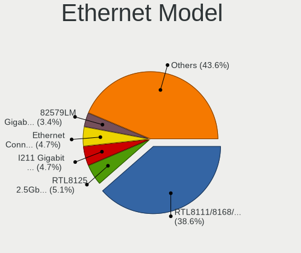

| Model                                                             | Desktops | Percent |
|-------------------------------------------------------------------|----------|---------|
| Realtek RTL8111/8168/8411 PCI Express Gigabit Ethernet Controller | 57       | 39.58%  |
| Realtek RTL8125 2.5GbE Controller                                 | 8        | 5.56%   |
| Intel I211 Gigabit Network Connection                             | 6        | 4.17%   |
| Intel Ethernet Connection (7) I219-V                              | 6        | 4.17%   |
| Intel 82579LM Gigabit Network Connection (Lewisville)             | 6        | 4.17%   |
| Intel Ethernet Connection I217-LM                                 | 5        | 3.47%   |
| Intel Ethernet Connection (2) I219-V                              | 5        | 3.47%   |
| Intel 82579V Gigabit Network Connection                           | 5        | 3.47%   |
| Realtek RTL810xE PCI Express Fast Ethernet controller             | 4        | 2.78%   |
| Intel Ethernet Controller I225-V                                  | 3        | 2.08%   |
| Intel Ethernet Connection (2) I218-V                              | 3        | 2.08%   |
| Intel 82567LM-3 Gigabit Network Connection                        | 3        | 2.08%   |
| Intel 82566DM Gigabit Network Connection                          | 3        | 2.08%   |
| Broadcom NetXtreme BCM5761 Gigabit Ethernet PCIe                  | 3        | 2.08%   |
| Realtek RTL8153 Gigabit Ethernet Adapter                          | 2        | 1.39%   |
| Qualcomm Atheros Killer E220x Gigabit Ethernet Controller         | 2        | 1.39%   |
| Intel I210 Gigabit Network Connection                             | 2        | 1.39%   |
| Intel 80003ES2LAN Gigabit Ethernet Controller (Copper)            | 2        | 1.39%   |
| Broadcom NetXtreme BCM5754 Gigabit Ethernet PCI Express           | 2        | 1.39%   |
| Xiaomi Mi/Redmi series (RNDIS)                                    | 1        | 0.69%   |
| Realtek RTL8169 PCI Gigabit Ethernet Controller                   | 1        | 0.69%   |
| Realtek RTL-8100/8101L/8139 PCI Fast Ethernet Adapter             | 1        | 0.69%   |
| Qualcomm Atheros Killer E2500 Gigabit Ethernet Controller         | 1        | 0.69%   |
| Qualcomm Atheros AR8152 v2.0 Fast Ethernet                        | 1        | 0.69%   |
| Qualcomm Atheros AR8151 v2.0 Gigabit Ethernet                     | 1        | 0.69%   |
| Qualcomm Atheros AR8131 Gigabit Ethernet                          | 1        | 0.69%   |
| Nvidia MCP61 Ethernet                                             | 1        | 0.69%   |
| Intel I350 Gigabit Network Connection                             | 1        | 0.69%   |
| Intel 82578DC Gigabit Network Connection                          | 1        | 0.69%   |
| Intel 82574L Gigabit Network Connection                           | 1        | 0.69%   |
| Intel 82562V-2 10/100 Network Connection                          | 1        | 0.69%   |
| D-Link System DGE-528T Gigabit Ethernet Adapter                   | 1        | 0.69%   |
| Broadcom NetXtreme BCM5762 Gigabit Ethernet PCIe                  | 1        | 0.69%   |
| Broadcom NetXtreme BCM5755 Gigabit Ethernet PCI Express           | 1        | 0.69%   |
| Broadcom NetLink BCM57780 Gigabit Ethernet PCIe                   | 1        | 0.69%   |
| ASIX AX88772A Fast Ethernet                                       | 1        | 0.69%   |

Net Controller Kind
-------------------

Ethernet, WiFi or modem

| Kind     | Desktops | Percent |
|----------|----------|---------|
| Ethernet | 132      | 66.33%  |
| WiFi     | 66       | 33.17%  |
| Modem    | 1        | 0.5%    |

Used Controller
---------------

Currently used network controller

| Kind     | Desktops | Percent |
|----------|----------|---------|
| Ethernet | 112      | 67.88%  |
| WiFi     | 53       | 32.12%  |

NICs
----

Total network controllers on board

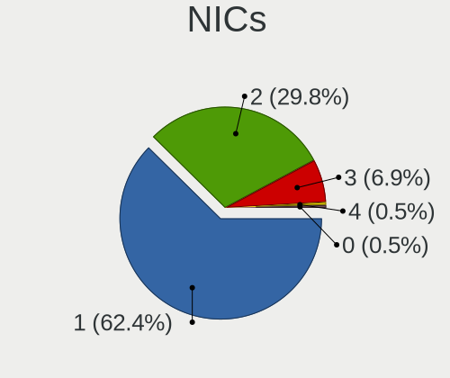

| Total | Desktops | Percent |
|-------|----------|---------|
| 1     | 84       | 62.69%  |
| 2     | 38       | 28.36%  |
| 3     | 11       | 8.21%   |
| 0     | 1        | 0.75%   |

IPv6
----

IPv6 vs IPv4

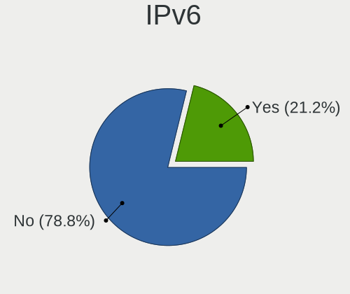

| Used | Desktops | Percent |
|------|----------|---------|
| No   | 116      | 85.29%  |
| Yes  | 20       | 14.71%  |

Bluetooth
---------

Bluetooth Vendor
----------------

Controller vendors

| Vendor                          | Desktops | Percent |
|---------------------------------|----------|---------|
| Intel                           | 26       | 44.07%  |
| Cambridge Silicon Radio         | 19       | 32.2%   |
| Qualcomm Atheros Communications | 3        | 5.08%   |
| Broadcom                        | 3        | 5.08%   |
| ASUSTek Computer                | 3        | 5.08%   |
| Realtek Semiconductor           | 2        | 3.39%   |
| MediaTek                        | 1        | 1.69%   |
| Belkin Components               | 1        | 1.69%   |
| Apple                           | 1        | 1.69%   |

Bluetooth Model
---------------

Controller models

| Model                                                 | Desktops | Percent |
|-------------------------------------------------------|----------|---------|
| Cambridge Silicon Radio Bluetooth Dongle (HCI mode)   | 19       | 32.2%   |
| Intel AX200 Bluetooth                                 | 12       | 20.34%  |
| Intel Wireless-AC 9260 Bluetooth Adapter              | 4        | 6.78%   |
| Intel Bluetooth wireless interface                    | 3        | 5.08%   |
| Intel Bluetooth 9460/9560 Jefferson Peak (JfP)        | 3        | 5.08%   |
| Qualcomm Atheros AR3011 Bluetooth                     | 2        | 3.39%   |
| Intel Wireless-AC 3168 Bluetooth                      | 2        | 3.39%   |
| Broadcom BCM20702A0 Bluetooth 4.0                     | 2        | 3.39%   |
| Realtek  Bluetooth 4.2 Adapter                        | 1        | 1.69%   |
| Realtek Bluetooth Radio                               | 1        | 1.69%   |
| Qualcomm Atheros AR3012 Bluetooth 4.0                 | 1        | 1.69%   |
| MediaTek Wireless_Device                              | 1        | 1.69%   |
| Intel Bluetooth Device                                | 1        | 1.69%   |
| Intel AX210 Bluetooth                                 | 1        | 1.69%   |
| Broadcom BCM92046DG-CL1ROM Bluetooth 2.1 Adapter      | 1        | 1.69%   |
| Belkin Components F8T065BF Mini Bluetooth 4.0 Adapter | 1        | 1.69%   |
| ASUS Broadcom BCM20702A0 Bluetooth                    | 1        | 1.69%   |
| ASUS Bluetooth Radio                                  | 1        | 1.69%   |
| ASUS Bluetooth Adapter                                | 1        | 1.69%   |
| Apple Built-in Bluetooth 2.0+EDR HCI                  | 1        | 1.69%   |

Sound
-----

Sound Vendor
------------

Sound card vendors

| Vendor                    | Desktops | Percent |
|---------------------------|----------|---------|
| Intel                     | 92       | 38.33%  |
| Nvidia                    | 63       | 26.25%  |
| AMD                       | 53       | 22.08%  |
| Logitech                  | 5        | 2.08%   |
| C-Media Electronics       | 5        | 2.08%   |
| Creative Labs             | 4        | 1.67%   |
| Creative Technology       | 3        | 1.25%   |
| JMTek                     | 2        | 0.83%   |
| SteelSeries ApS           | 1        | 0.42%   |
| Sennheiser Communications | 1        | 0.42%   |
| Samson Technologies       | 1        | 0.42%   |
| OPPO Electronics          | 1        | 0.42%   |
| Native Instruments        | 1        | 0.42%   |
| Nam Tai E&E Products      | 1        | 0.42%   |
| Microsoft                 | 1        | 0.42%   |
| M-Audio                   | 1        | 0.42%   |
| Kingston Technology       | 1        | 0.42%   |
| Giga-Byte Technology      | 1        | 0.42%   |
| Focusrite-Novation        | 1        | 0.42%   |
| Bose                      | 1        | 0.42%   |
| Blue Microphones          | 1        | 0.42%   |

Sound Model
-----------

Sound card models

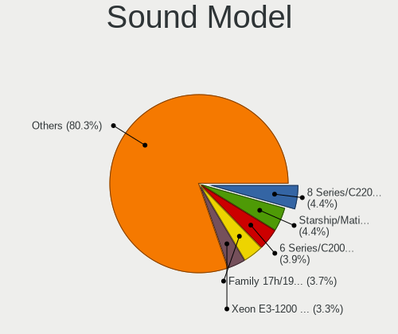

| Model                                                                      | Desktops | Percent |
|----------------------------------------------------------------------------|----------|---------|
| Intel 6 Series/C200 Series Chipset Family High Definition Audio Controller | 13       | 4.71%   |
| AMD Starship/Matisse HD Audio Controller                                   | 13       | 4.71%   |
| AMD Ellesmere HDMI Audio [Radeon RX 470/480 / 570/580/590]                 | 12       | 4.35%   |
| Intel 7 Series/C216 Chipset Family High Definition Audio Controller        | 11       | 3.99%   |
| Nvidia GP106 High Definition Audio Controller                              | 10       | 3.62%   |
| Intel 8 Series/C220 Series Chipset High Definition Audio Controller        | 10       | 3.62%   |
| Intel Cannon Lake PCH cAVS                                                 | 9        | 3.26%   |
| Intel Xeon E3-1200 v3/4th Gen Core Processor HD Audio Controller           | 8        | 2.9%    |
| AMD Family 17h/19h HD Audio Controller                                     | 7        | 2.54%   |
| AMD Family 17h (Models 00h-0fh) HD Audio Controller                        | 7        | 2.54%   |
| Nvidia TU106 High Definition Audio Controller                              | 6        | 2.17%   |
| Nvidia GP107GL High Definition Audio Controller                            | 6        | 2.17%   |
| Intel 200 Series PCH HD Audio                                              | 6        | 2.17%   |
| Intel NM10/ICH7 Family High Definition Audio Controller                    | 5        | 1.81%   |
| Intel 82801JI (ICH10 Family) HD Audio Controller                           | 5        | 1.81%   |
| Intel 82801H (ICH8 Family) HD Audio Controller                             | 5        | 1.81%   |
| Intel 5 Series/3400 Series Chipset High Definition Audio                   | 5        | 1.81%   |
| AMD SBx00 Azalia (Intel HDA)                                               | 5        | 1.81%   |
| AMD Raven/Raven2/Fenghuang HDMI/DP Audio Controller                        | 5        | 1.81%   |
| Nvidia TU116 High Definition Audio Controller                              | 4        | 1.45%   |
| Nvidia GP108 High Definition Audio Controller                              | 4        | 1.45%   |
| Nvidia GP104 High Definition Audio Controller                              | 4        | 1.45%   |
| Intel 9 Series Chipset Family HD Audio Controller                          | 4        | 1.45%   |
| Intel 82801JD/DO (ICH10 Family) HD Audio Controller                        | 4        | 1.45%   |
| AMD Navi 10 HDMI Audio                                                     | 4        | 1.45%   |
| Nvidia TU104 HD Audio Controller                                           | 3        | 1.09%   |
| Nvidia GK208 HDMI/DP Audio Controller                                      | 3        | 1.09%   |
| Nvidia GF108 High Definition Audio Controller                              | 3        | 1.09%   |
| Intel C600/X79 series chipset High Definition Audio Controller             | 3        | 1.09%   |
| Intel 100 Series/C230 Series Chipset Family HD Audio Controller            | 3        | 1.09%   |
| AMD Oland/Hainan/Cape Verde/Pitcairn HDMI Audio [Radeon HD 7000 Series]    | 3        | 1.09%   |
| AMD Cedar HDMI Audio [Radeon HD 5400/6300/7300 Series]                     | 3        | 1.09%   |
| Nvidia High Definition Audio Controller                                    | 2        | 0.72%   |
| Nvidia GM206 High Definition Audio Controller                              | 2        | 0.72%   |
| Nvidia GM204 High Definition Audio Controller                              | 2        | 0.72%   |
| Nvidia GK107 HDMI Audio Controller                                         | 2        | 0.72%   |
| Nvidia GK104 HDMI Audio Controller                                         | 2        | 0.72%   |
| Nvidia GF119 HDMI Audio Controller                                         | 2        | 0.72%   |
| Logitech G430 Surround Sound Gaming Headset                                | 2        | 0.72%   |
| Intel 631xESB/632xESB High Definition Audio Controller                     | 2        | 0.72%   |
| Creative Labs CA0106/CA0111 [SB Live!/Audigy/X-Fi Series]                  | 2        | 0.72%   |
| C-Media Electronics CMI8738/CMI8768 PCI Audio                              | 2        | 0.72%   |
| C-Media Electronics CM106 Like Sound Device                                | 2        | 0.72%   |
| AMD Vega 10 HDMI Audio [Radeon Vega 56/64]                                 | 2        | 0.72%   |
| AMD Renoir Radeon High Definition Audio Controller                         | 2        | 0.72%   |
| AMD Navi 21/23 HDMI/DP Audio Controller                                    | 2        | 0.72%   |
| AMD Juniper HDMI Audio [Radeon HD 5700 Series]                             | 2        | 0.72%   |
| AMD FCH Azalia Controller                                                  | 2        | 0.72%   |
| AMD Family 15h (Models 60h-6fh) Audio Controller                           | 2        | 0.72%   |
| AMD Baffin HDMI/DP Audio [Radeon RX 550 640SP / RX 560/560X]               | 2        | 0.72%   |
| SteelSeries ApS SteelSeries Arctis 5                                       | 1        | 0.36%   |
| Sennheiser Communications Headset [PC 8]                                   | 1        | 0.36%   |
| Samson Technologies Carbon61                                               | 1        | 0.36%   |
| OPPO Electronics UDP-205 USB AUDIO 2.0 DAC                                 | 1        | 0.36%   |
| Nvidia MCP61 High Definition Audio                                         | 1        | 0.36%   |
| Nvidia GT216 HDMI Audio Controller                                         | 1        | 0.36%   |
| Nvidia GP102 HDMI Audio Controller                                         | 1        | 0.36%   |
| Nvidia GM200 High Definition Audio                                         | 1        | 0.36%   |
| Nvidia GM107 High Definition Audio Controller [GeForce 940MX]              | 1        | 0.36%   |
| Nvidia GK106 HDMI Audio Controller                                         | 1        | 0.36%   |

Memory
------

Memory Vendor
-------------

Memory module vendors

| Vendor              | Desktops | Percent |
|---------------------|----------|---------|
| Kingston            | 15       | 20.55%  |
| Unknown             | 8        | 10.96%  |
| Samsung Electronics | 8        | 10.96%  |
| Crucial             | 8        | 10.96%  |
| SK Hynix            | 7        | 9.59%   |
| G.Skill             | 6        | 8.22%   |
| Corsair             | 6        | 8.22%   |
| Team                | 3        | 4.11%   |
| A-DATA Technology   | 2        | 2.74%   |
| Unknown (0x873E)    | 1        | 1.37%   |
| Transcend           | 1        | 1.37%   |
| TIMETEC             | 1        | 1.37%   |
| Sesame              | 1        | 1.37%   |
| PNY                 | 1        | 1.37%   |
| Nanya Technology    | 1        | 1.37%   |
| Micron Technology   | 1        | 1.37%   |
| GOODRAM             | 1        | 1.37%   |
| Avant               | 1        | 1.37%   |
| Apacer              | 1        | 1.37%   |

Memory Model
------------

Memory module models

| Model                                                      | Desktops | Percent |
|------------------------------------------------------------|----------|---------|
| Unknown RAM Module 2048MB DIMM SDRAM                       | 2        | 2.6%    |
| Kingston RAM 9905403-199.A00LF 4GB DIMM DDR3 1600MT/s      | 2        | 2.6%    |
| Crucial RAM BLS4G4D240FSB.8FBD 4GB DIMM DDR4 2400MT/s      | 2        | 2.6%    |
| Corsair RAM CMW32GX4M2C3200C16 16384MB DIMM DDR4 3200MT/s  | 2        | 2.6%    |
| Unknown RAM Module 8192MB DIMM DDR3 1333MT/s               | 1        | 1.3%    |
| Unknown RAM Module 512MB DIMM 533MT/s                      | 1        | 1.3%    |
| Unknown RAM Module 4096MB DIMM DDR 1066MT/s                | 1        | 1.3%    |
| Unknown RAM Module 4096MB DIMM 400MT/s                     | 1        | 1.3%    |
| Unknown RAM Module 2GB DIMM DDR2 800MT/s                   | 1        | 1.3%    |
| Unknown RAM Module 2048MB DIMM DDR 1333MT/s                | 1        | 1.3%    |
| Unknown RAM Module 2048MB DIMM DDR 1066MT/s                | 1        | 1.3%    |
| Unknown RAM Module 2048MB DIMM 800MT/s                     | 1        | 1.3%    |
| Unknown RAM Module 1024MB DIMM DDR2                        | 1        | 1.3%    |
| Unknown (0x873E) RAM Module 8192MB DIMM DDR3 1333MT/s      | 1        | 1.3%    |
| Transcend RAM Module 2048MB DIMM DDR2 800MT/s              | 1        | 1.3%    |
| TIMETEC RAM ED3-1600 8192MB DIMM DDR3 1600MT/s             | 1        | 1.3%    |
| Team RAM TEAMGROUP-UD4-3600 8192MB DIMM DDR4 3600MT/s      | 1        | 1.3%    |
| Team RAM TEAMGROUP-UD4-2400 8192MB DIMM DDR4 3007MT/s      | 1        | 1.3%    |
| Team RAM Elite-1333 4GB DIMM DDR3 1333MT/s                 | 1        | 1.3%    |
| SK Hynix RAM Module 4096MB FB-DIMM DDR2 667MT/s            | 1        | 1.3%    |
| SK Hynix RAM Module 1GB DIMM DDR3 1333MT/s                 | 1        | 1.3%    |
| SK Hynix RAM Module 1024MB DIMM DDR3 1333MT/s              | 1        | 1.3%    |
| SK Hynix RAM HYMP512U64CP8-Y5 1GB DIMM DDR 667MT/s         | 1        | 1.3%    |
| SK Hynix RAM HYMP112U64CP8-Y5 1GB DIMM DDR2 1639MT/s       | 1        | 1.3%    |
| SK Hynix RAM HMT451U6AFR8C-PB 4096MB DIMM DDR3 1600MT/s    | 1        | 1.3%    |
| SK Hynix RAM HMA81GR7MFR8N-UH 8192MB RIMM 2400MT/s         | 1        | 1.3%    |
| Sesame RAM S939A2UGS-ITR 8192MB DIMM DDR3 1600MT/s         | 1        | 1.3%    |
| Samsung RAM Module 2GB FB-DIMM DDR2 667MT/s                | 1        | 1.3%    |
| Samsung RAM Module 1GB DIMM DDR3 1333MT/s                  | 1        | 1.3%    |
| Samsung RAM M391B5673EH1-CF8 2048MB DIMM DDR3 1066MT/s     | 1        | 1.3%    |
| Samsung RAM M391A4G43AB1-CWE 32GB DIMM DDR4 3200MT/s       | 1        | 1.3%    |
| Samsung RAM M378A1K43CB2-CTD 8GB DIMM DDR4 3200MT/s        | 1        | 1.3%    |
| Samsung RAM M378A1K43CB2-CRC 8192MB DIMM DDR4 3500MT/s     | 1        | 1.3%    |
| Samsung RAM M3 78T5663EH3-CF7 2GB DIMM DDR2 667MT/s        | 1        | 1.3%    |
| Samsung RAM M3 78T2863EHS-CF7 1GB DIMM DDR2 800MT/s        | 1        | 1.3%    |
| PNY RAM Module 2048MB DIMM DDR2 800MT/s                    | 1        | 1.3%    |
| Nanya RAM NT4GC64B8HG0NF-DI 4GB DIMM DDR3 1600MT/s         | 1        | 1.3%    |
| Micron RAM Module 512MB FB-DIMM DDR2 667MT/s               | 1        | 1.3%    |
| Kingston RAM Module 1GB DIMM DDR3 1333MT/s                 | 1        | 1.3%    |
| Kingston RAM KHX2666C13/16GX 16GB DIMM DDR4 3200MT/s       | 1        | 1.3%    |
| Kingston RAM KHX2400C15/8G 8GB DIMM DDR4 2933MT/s          | 1        | 1.3%    |
| Kingston RAM KHX2133C11D3/4GX 4096MB DIMM DDR3 2134MT/s    | 1        | 1.3%    |
| Kingston RAM KHX1600C10D3/4G 4096MB DIMM DDR3 1866MT/s     | 1        | 1.3%    |
| Kingston RAM KHX1600C10D3/ 4GB DIMM DDR3 1600MT/s          | 1        | 1.3%    |
| Kingston RAM KF3200C16D4/16GX 16GB DIMM DDR4 3200MT/s      | 1        | 1.3%    |
| Kingston RAM 99U5474-038.A00LF 4GB DIMM DDR3 1333MT/s      | 1        | 1.3%    |
| Kingston RAM 99U5471-002.A01LF 2GB DIMM DDR3 1333MT/s      | 1        | 1.3%    |
| Kingston RAM 99U5428-017.A00LF 8192MB SODIMM DDR3 1600MT/s | 1        | 1.3%    |
| Kingston RAM 99U5403-159.A01LF 8GB DIMM DDR3 1333MT/s      | 1        | 1.3%    |
| Kingston RAM 9965525-140.A 8GB DIMM DDR3 667MT/s           | 1        | 1.3%    |
| Kingston RAM 9905471-001.A01LF 2GB DIMM DDR3 1600MT/s      | 1        | 1.3%    |
| Kingston RAM 9905403-559.A00LF 8GB DIMM DDR3 1600MT/s      | 1        | 1.3%    |
| GOODRAM RAM GR1600S3V64L11/8G 8192MB DIMM DDR3 1333MT/s    | 1        | 1.3%    |
| G.Skill RAM F4-3200C16-8GVKB 8192MB DIMM DDR4 3200MT/s     | 1        | 1.3%    |
| G.Skill RAM F4-3200C16-8GVK 8192MB DIMM DDR4 3200MT/s      | 1        | 1.3%    |
| G.Skill RAM F4-3200C16-32GVK 32GB DIMM DDR4 3200MT/s       | 1        | 1.3%    |
| G.Skill RAM F4-3000C16-8GISB 8GB DIMM DDR4 3200MT/s        | 1        | 1.3%    |
| G.Skill RAM F3-2400C11-8GAB 8GB DIMM DDR3 1066MT/s         | 1        | 1.3%    |
| G.Skill RAM F3-1600C11-4GNT 4GB DIMM DDR3 1600MT/s         | 1        | 1.3%    |
| Crucial RAM CT4G4DFS824A.M8FB 4GB DIMM DDR4 2400MT/s       | 1        | 1.3%    |

Memory Kind
-----------

Memory module kinds

| Kind    | Desktops | Percent |
|---------|----------|---------|
| DDR3    | 28       | 43.75%  |
| DDR4    | 23       | 35.94%  |
| DDR2    | 6        | 9.38%   |
| SDRAM   | 4        | 6.25%   |
| Unknown | 2        | 3.13%   |
| DDR     | 1        | 1.56%   |

Memory Form Factor
------------------

Physical design of the memory module

| Name    | Desktops | Percent |
|---------|----------|---------|
| DIMM    | 60       | 93.75%  |
| FB-DIMM | 2        | 3.13%   |
| SODIMM  | 1        | 1.56%   |
| RIMM    | 1        | 1.56%   |

Memory Size
-----------

Memory module size

| Size  | Desktops | Percent |
|-------|----------|---------|
| 8192  | 25       | 35.71%  |
| 4096  | 16       | 22.86%  |
| 2048  | 11       | 15.71%  |
| 16384 | 9        | 12.86%  |
| 1024  | 5        | 7.14%   |
| 32768 | 2        | 2.86%   |
| 512   | 2        | 2.86%   |

Memory Speed
------------

Memory module speed

| Speed   | Desktops | Percent |
|---------|----------|---------|
| 1600    | 17       | 24.29%  |
| 3200    | 9        | 12.86%  |
| 1333    | 9        | 12.86%  |
| 2400    | 5        | 7.14%   |
| 800     | 4        | 5.71%   |
| 667     | 4        | 5.71%   |
| 3600    | 3        | 4.29%   |
| Unknown | 3        | 4.29%   |
| 1066    | 2        | 2.86%   |
| 3500    | 1        | 1.43%   |
| 3466    | 1        | 1.43%   |
| 3007    | 1        | 1.43%   |
| 3000    | 1        | 1.43%   |
| 2933    | 1        | 1.43%   |
| 2667    | 1        | 1.43%   |
| 2666    | 1        | 1.43%   |
| 2134    | 1        | 1.43%   |
| 2048    | 1        | 1.43%   |
| 1866    | 1        | 1.43%   |
| 1800    | 1        | 1.43%   |
| 1639    | 1        | 1.43%   |
| 533     | 1        | 1.43%   |
| 400     | 1        | 1.43%   |

Printers & scanners
-------------------

Printer Vendor
--------------

Printer device vendors

| Vendor          | Desktops | Percent |
|-----------------|----------|---------|
| Canon           | 3        | 50%     |
| Sharp           | 1        | 16.67%  |
| Hewlett-Packard | 1        | 16.67%  |
| Fuji Xerox      | 1        | 16.67%  |

Printer Model
-------------

Printer device models

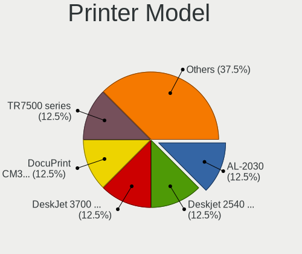

| Model                         | Desktops | Percent |
|-------------------------------|----------|---------|
| Sharp AL-2030                 | 1        | 16.67%  |
| HP Deskjet 2540 series        | 1        | 16.67%  |
| Fuji Xerox DocuPrint CM305 df | 1        | 16.67%  |
| Canon TR7500 series           | 1        | 16.67%  |
| Canon MF4010 series           | 1        | 16.67%  |
| Canon MF240 Series V4         | 1        | 16.67%  |

Scanner Vendor
--------------

Scanner device vendors

| Vendor | Desktops | Percent |
|--------|----------|---------|
| Canon  | 1        | 100%    |

Scanner Model
-------------

Scanner device models

| Model                   | Desktops | Percent |
|-------------------------|----------|---------|
| Canon CanoScan LiDE 120 | 1        | 100%    |

Camera
------

Camera Vendor
-------------

Camera device vendors

| Vendor                        | Desktops | Percent |
|-------------------------------|----------|---------|
| Logitech                      | 12       | 40%     |
| Microsoft                     | 3        | 10%     |
| Microdia                      | 3        | 10%     |
| Generalplus Technology        | 2        | 6.67%   |
| Tobii Technology AB           | 1        | 3.33%   |
| Sunplus Innovation Technology | 1        | 3.33%   |
| Realtek Semiconductor         | 1        | 3.33%   |
| OPPO Electronics              | 1        | 3.33%   |
| Linux Foundation              | 1        | 3.33%   |
| LG Electronics                | 1        | 3.33%   |
| IPEVO                         | 1        | 3.33%   |
| Guillemot                     | 1        | 3.33%   |
| Cubeternet                    | 1        | 3.33%   |
| ARC International             | 1        | 3.33%   |

Camera Model
------------

Camera device models

| Model                                    | Desktops | Percent |
|------------------------------------------|----------|---------|
| Microsoft LifeCam HD-3000                | 2        | 6.67%   |
| Logitech Webcam C270                     | 2        | 6.67%   |
| Logitech Webcam B500                     | 2        | 6.67%   |
| Logitech HD Pro Webcam C920              | 2        | 6.67%   |
| Tobii AB EyeChip                         | 1        | 3.33%   |
| Sunplus Full HD webcam                   | 1        | 3.33%   |
| Realtek Web Camera                       | 1        | 3.33%   |
| OPPO Reno4 5G                            | 1        | 3.33%   |
| Microsoft LifeCam Cinema                 | 1        | 3.33%   |
| Microdia USB camera                      | 1        | 3.33%   |
| Microdia Laptop_Integrated_Webcam_FHD    | 1        | 3.33%   |
| Microdia Camera                          | 1        | 3.33%   |
| Logitech Webcam C925e                    | 1        | 3.33%   |
| Logitech Webcam C170                     | 1        | 3.33%   |
| Logitech QuickCam Pro for Notebooks      | 1        | 3.33%   |
| Logitech Logitech Webcam C160            | 1        | 3.33%   |
| Logitech HD Webcam C910                  | 1        | 3.33%   |
| Logitech B525 HD Webcam                  | 1        | 3.33%   |
| Linux Foundation EEM Gadget              | 1        | 3.33%   |
| LG Optimus (Various Models) MTP Mode     | 1        | 3.33%   |
| IPEVO V4K                                | 1        | 3.33%   |
| Guillemot Hercules HD Sunset             | 1        | 3.33%   |
| Generalplus GENERAL WEBCAM               | 1        | 3.33%   |
| Generalplus 808 Camera #9 (web-cam mode) | 1        | 3.33%   |
| Cubeternet GL-UPC822 UVC WebCam          | 1        | 3.33%   |
| ARC International Camera                 | 1        | 3.33%   |

Security
--------

Fingerprint Vendor
------------------

Fingerprint sensor vendors

Zero info for selected period =(

Fingerprint Model
-----------------

Fingerprint sensor models

Zero info for selected period =(

Chipcard Vendor
---------------

Chipcard module vendors

Zero info for selected period =(

Chipcard Model
--------------

Chipcard module models

Zero info for selected period =(

Unsupported
-----------

Unsupported Devices
-------------------

Total unsupported devices on board

| Total | Desktops | Percent |
|-------|----------|---------|
| 0     | 125      | 91.91%  |
| 1     | 9        | 6.62%   |
| 3     | 1        | 0.74%   |
| 2     | 1        | 0.74%   |

Unsupported Device Types
------------------------

Types of unsupported devices

| Type                     | Desktops | Percent |
|--------------------------|----------|---------|
| Graphics card            | 5        | 41.67%  |
| Net/wireless             | 3        | 25%     |
| Unassigned class         | 1        | 8.33%   |
| Sound                    | 1        | 8.33%   |
| Communication controller | 1        | 8.33%   |
| Camera                   | 1        | 8.33%   |

