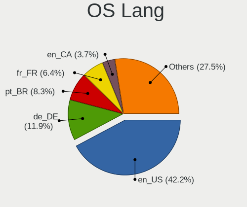
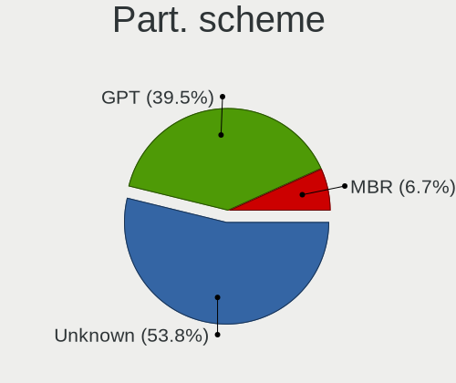
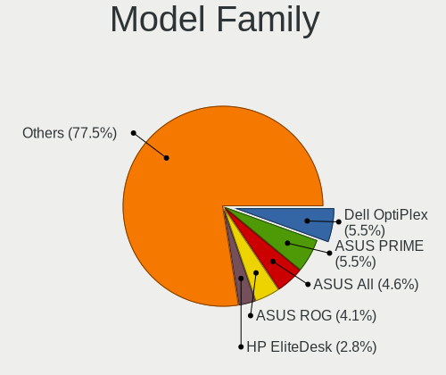
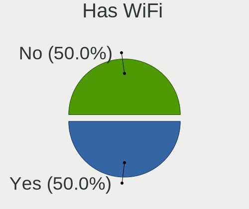
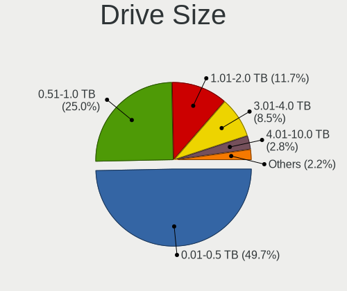
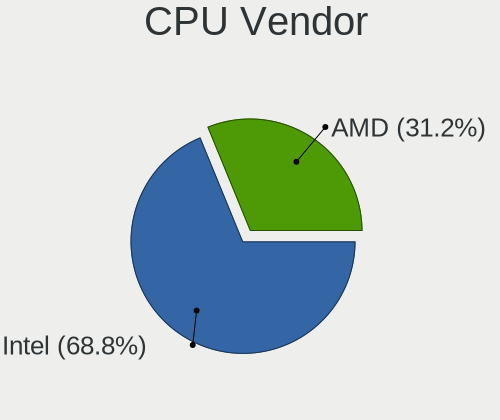
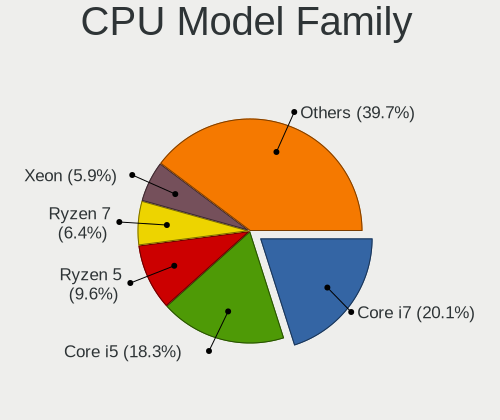
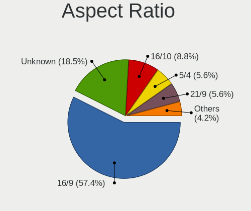
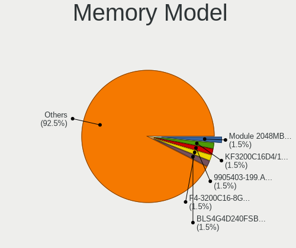

Ubuntu Budgie - Tested Hardware & Statistics (Desktops)
-------------------------------------------------------

A project to collect tested hardware configurations for Ubuntu Budgie.

Anyone can contribute to this report by the [hw-probe](https://github.com/linuxhw/hw-probe) tool:

    sudo -E hw-probe -all -upload

Please contribute! Especially if your hardware is rare.

Contents
--------

* [ Test Cases ](#test-cases)

* [ System ](#system)
  - [ OS                       ](#os)
  - [ OS Family                ](#os-family)
  - [ Kernel                   ](#kernel)
  - [ Kernel Family            ](#kernel-family)
  - [ Kernel Major Ver.        ](#kernel-major-ver)
  - [ Arch                     ](#arch)
  - [ DE                       ](#de)
  - [ Display Server           ](#display-server)
  - [ Display Manager          ](#display-manager)
  - [ OS Lang                  ](#os-lang)
  - [ Boot Mode                ](#boot-mode)
  - [ Filesystem               ](#filesystem)
  - [ Part. scheme             ](#part-scheme)
  - [ Dual Boot with Linux/BSD ](#dual-boot-with-linuxbsd)
  - [ Dual Boot (Win)          ](#dual-boot-win)

* [ Board ](#board)
  - [ Vendor                   ](#vendor)
  - [ Model                    ](#model)
  - [ Model Family             ](#model-family)
  - [ MFG Year                 ](#mfg-year)
  - [ Form Factor              ](#form-factor)
  - [ Secure Boot              ](#secure-boot)
  - [ Coreboot                 ](#coreboot)
  - [ RAM Size                 ](#ram-size)
  - [ RAM Used                 ](#ram-used)
  - [ Total Drives             ](#total-drives)
  - [ Has CD-ROM               ](#has-cd-rom)
  - [ Has Ethernet             ](#has-ethernet)
  - [ Has WiFi                 ](#has-wifi)
  - [ Has Bluetooth            ](#has-bluetooth)

* [ Location ](#location)
  - [ Country                  ](#country)
  - [ City                     ](#city)

* [ Drives ](#drives)
  - [ Drive Vendor             ](#drive-vendor)
  - [ Drive Model              ](#drive-model)
  - [ HDD Vendor               ](#hdd-vendor)
  - [ SSD Vendor               ](#ssd-vendor)
  - [ Drive Kind               ](#drive-kind)
  - [ Drive Connector          ](#drive-connector)
  - [ Drive Size               ](#drive-size)
  - [ Space Total              ](#space-total)
  - [ Space Used               ](#space-used)
  - [ Malfunc. Drives          ](#malfunc-drives)
  - [ Malfunc. Drive Vendor    ](#malfunc-drive-vendor)
  - [ Malfunc. HDD Vendor      ](#malfunc-hdd-vendor)
  - [ Malfunc. Drive Kind      ](#malfunc-drive-kind)
  - [ Failed Drives            ](#failed-drives)
  - [ Failed Drive Vendor      ](#failed-drive-vendor)
  - [ Drive Status             ](#drive-status)

* [ Storage controller ](#storage-controller)
  - [ Storage Vendor           ](#storage-vendor)
  - [ Storage Model            ](#storage-model)
  - [ Storage Kind             ](#storage-kind)

* [ Processor ](#processor)
  - [ CPU Vendor               ](#cpu-vendor)
  - [ CPU Model                ](#cpu-model)
  - [ CPU Model Family         ](#cpu-model-family)
  - [ CPU Cores                ](#cpu-cores)
  - [ CPU Sockets              ](#cpu-sockets)
  - [ CPU Threads              ](#cpu-threads)
  - [ CPU Op-Modes             ](#cpu-op-modes)
  - [ CPU Microcode            ](#cpu-microcode)
  - [ CPU Microarch            ](#cpu-microarch)

* [ Graphics ](#graphics)
  - [ GPU Vendor               ](#gpu-vendor)
  - [ GPU Model                ](#gpu-model)
  - [ GPU Combo                ](#gpu-combo)
  - [ GPU Driver               ](#gpu-driver)
  - [ GPU Memory               ](#gpu-memory)

* [ Monitor ](#monitor)
  - [ Monitor Vendor           ](#monitor-vendor)
  - [ Monitor Model            ](#monitor-model)
  - [ Monitor Resolution       ](#monitor-resolution)
  - [ Monitor Diagonal         ](#monitor-diagonal)
  - [ Monitor Width            ](#monitor-width)
  - [ Aspect Ratio             ](#aspect-ratio)
  - [ Monitor Area             ](#monitor-area)
  - [ Pixel Density            ](#pixel-density)
  - [ Multiple Monitors        ](#multiple-monitors)

* [ Network ](#network)
  - [ Net Controller Vendor    ](#net-controller-vendor)
  - [ Net Controller Model     ](#net-controller-model)
  - [ Wireless Vendor          ](#wireless-vendor)
  - [ Wireless Model           ](#wireless-model)
  - [ Ethernet Vendor          ](#ethernet-vendor)
  - [ Ethernet Model           ](#ethernet-model)
  - [ Net Controller Kind      ](#net-controller-kind)
  - [ Used Controller          ](#used-controller)
  - [ NICs                     ](#nics)
  - [ IPv6                     ](#ipv6)

* [ Bluetooth ](#bluetooth)
  - [ Bluetooth Vendor         ](#bluetooth-vendor)
  - [ Bluetooth Model          ](#bluetooth-model)

* [ Sound ](#sound)
  - [ Sound Vendor             ](#sound-vendor)
  - [ Sound Model              ](#sound-model)

* [ Memory ](#memory)
  - [ Memory Vendor            ](#memory-vendor)
  - [ Memory Model             ](#memory-model)
  - [ Memory Kind              ](#memory-kind)
  - [ Memory Form Factor       ](#memory-form-factor)
  - [ Memory Size              ](#memory-size)
  - [ Memory Speed             ](#memory-speed)

* [ Printers & scanners ](#printers--scanners)
  - [ Printer Vendor           ](#printer-vendor)
  - [ Printer Model            ](#printer-model)
  - [ Scanner Vendor           ](#scanner-vendor)
  - [ Scanner Model            ](#scanner-model)

* [ Camera ](#camera)
  - [ Camera Vendor            ](#camera-vendor)
  - [ Camera Model             ](#camera-model)

* [ Security ](#security)
  - [ Fingerprint Vendor       ](#fingerprint-vendor)
  - [ Fingerprint Model        ](#fingerprint-model)
  - [ Chipcard Vendor          ](#chipcard-vendor)
  - [ Chipcard Model           ](#chipcard-model)

* [ Unsupported ](#unsupported)
  - [ Unsupported Devices      ](#unsupported-devices)
  - [ Unsupported Device Types ](#unsupported-device-types)

Test Cases
----------

Total: 249

| Vendor     | Model                       | Probe                                                      | Date         |
|------------|-----------------------------|------------------------------------------------------------|--------------|
| Fujitsu    | D3348-B2 S26361-D3348-B2    | [eabfad66da](https://linux-hardware.org/?probe=eabfad66da) | Nov 22, 2022 |
| Gigabyte   | H97M-D3H                    | [4e0102dff6](https://linux-hardware.org/?probe=4e0102dff6) | Nov 20, 2022 |
| Dell       | 0RW199                      | [2a2fa5baf8](https://linux-hardware.org/?probe=2a2fa5baf8) | Nov 20, 2022 |
| MSI        | B550M PRO-VDH WIFI          | [afb716fb12](https://linux-hardware.org/?probe=afb716fb12) | Nov 18, 2022 |
| Dell       | 0C27VV A01                  | [ed46beadef](https://linux-hardware.org/?probe=ed46beadef) | Oct 30, 2022 |
| MSI        | B450-A PRO MAX              | [0e8db93a43](https://linux-hardware.org/?probe=0e8db93a43) | Oct 30, 2022 |
| Dell       | 0C27VV A01                  | [23c855f88b](https://linux-hardware.org/?probe=23c855f88b) | Oct 17, 2022 |
| Dell       | 0C27VV A01                  | [ebe65ec5fa](https://linux-hardware.org/?probe=ebe65ec5fa) | Oct 17, 2022 |
| MSI        | H67MA-E35                   | [d4f5628033](https://linux-hardware.org/?probe=d4f5628033) | Oct 11, 2022 |
| Gigabyte   | M68MT-S2                    | [55db3c3775](https://linux-hardware.org/?probe=55db3c3775) | Sep 27, 2022 |
| Gigabyte   | X570 I AORUS PRO WIFI       | [293e528545](https://linux-hardware.org/?probe=293e528545) | Sep 21, 2022 |
| Gigabyte   | B75M-D3P                    | [da53115e6b](https://linux-hardware.org/?probe=da53115e6b) | Sep 15, 2022 |
| Gigabyte   | M68MT-S2                    | [1a5358a3c1](https://linux-hardware.org/?probe=1a5358a3c1) | Sep 14, 2022 |
| Gigabyte   | X570S AORUS PRO AX          | [f42f75038e](https://linux-hardware.org/?probe=f42f75038e) | Sep 03, 2022 |
| Intel      | DP55WB AAE64798-206         | [548332086b](https://linux-hardware.org/?probe=548332086b) | Sep 02, 2022 |
| ASUSTek    | A88X-PRO                    | [922554664a](https://linux-hardware.org/?probe=922554664a) | Aug 25, 2022 |
| HP         | 3397                        | [335f59c96f](https://linux-hardware.org/?probe=335f59c96f) | Aug 22, 2022 |
| Intel      | X79M-S                      | [49a7d62fe8](https://linux-hardware.org/?probe=49a7d62fe8) | Aug 18, 2022 |
| ASUSTek    | Berkeley                    | [e9998910ee](https://linux-hardware.org/?probe=e9998910ee) | Aug 17, 2022 |
| HP         | 828A                        | [f42b1efd1e](https://linux-hardware.org/?probe=f42b1efd1e) | Aug 17, 2022 |
| Biostar    | A960D+V3                    | [83f7f840b7](https://linux-hardware.org/?probe=83f7f840b7) | Aug 15, 2022 |
| ASRock     | A300M-STX                   | [a6aba67197](https://linux-hardware.org/?probe=a6aba67197) | Aug 02, 2022 |
| ASRock     | A300M-STX                   | [fae724727b](https://linux-hardware.org/?probe=fae724727b) | Aug 02, 2022 |
| Intel      | STK1A32SC H95551-301        | [ea91c7805d](https://linux-hardware.org/?probe=ea91c7805d) | Jul 22, 2022 |
| Gigabyte   | GA-890GPA-UD3H              | [f6faa2d944](https://linux-hardware.org/?probe=f6faa2d944) | Jun 25, 2022 |
| HP         | 212B                        | [a163af0cb5](https://linux-hardware.org/?probe=a163af0cb5) | Jun 21, 2022 |
| Gigabyte   | B75M-D3H                    | [da04a03393](https://linux-hardware.org/?probe=da04a03393) | Jun 04, 2022 |
| Gigabyte   | GA-890GPA-UD3H              | [3195007eb2](https://linux-hardware.org/?probe=3195007eb2) | May 30, 2022 |
| Gigabyte   | F2A78M-HD2                  | [fc9dd3db05](https://linux-hardware.org/?probe=fc9dd3db05) | May 26, 2022 |
| ASUSTek    | PRIME B560M-A               | [7b393b3933](https://linux-hardware.org/?probe=7b393b3933) | May 24, 2022 |
| MSI        | X370 GAMING PRO CARBON      | [9acb45109f](https://linux-hardware.org/?probe=9acb45109f) | May 21, 2022 |
| Gigabyte   | B75M-D3H                    | [b9437261b7](https://linux-hardware.org/?probe=b9437261b7) | May 10, 2022 |
| Gigabyte   | B450 I AORUS PRO WIFI-CF    | [4ab84df25d](https://linux-hardware.org/?probe=4ab84df25d) | May 10, 2022 |
| HP         | 1825                        | [fe93966c1c](https://linux-hardware.org/?probe=fe93966c1c) | May 09, 2022 |
| ASUSTek    | P8Z77-V LX                  | [9f241088c2](https://linux-hardware.org/?probe=9f241088c2) | May 06, 2022 |
| ASUSTek    | P8Z77-V LX                  | [37fa300c26](https://linux-hardware.org/?probe=37fa300c26) | Apr 18, 2022 |
| Gigabyte   | B550 AORUS ELITE AX V2      | [e2cbc23977](https://linux-hardware.org/?probe=e2cbc23977) | Apr 12, 2022 |
| MSI        | H81M-E33                    | [33547f6d85](https://linux-hardware.org/?probe=33547f6d85) | Apr 11, 2022 |
| Gigabyte   | X570 UD                     | [860fedd7f0](https://linux-hardware.org/?probe=860fedd7f0) | Apr 01, 2022 |
| Gigabyte   | 970A-DS3P                   | [eaae14de4f](https://linux-hardware.org/?probe=eaae14de4f) | Mar 05, 2022 |
| Gigabyte   | B560 DS3H AC-Y1             | [5be284f90d](https://linux-hardware.org/?probe=5be284f90d) | Feb 26, 2022 |
| ASUSTek    | ROG STRIX B550-E GAMING     | [7fa418eb00](https://linux-hardware.org/?probe=7fa418eb00) | Feb 25, 2022 |
| ASRock     | 970 Pro3 R2.0               | [9b8714532b](https://linux-hardware.org/?probe=9b8714532b) | Feb 20, 2022 |
| Dell       | 0RW199                      | [5cf70558c8](https://linux-hardware.org/?probe=5cf70558c8) | Feb 14, 2022 |
| ASUSTek    | M4A87TD/USB3                | [88768afd55](https://linux-hardware.org/?probe=88768afd55) | Feb 10, 2022 |
| ASRock     | B550 Phantom Gaming-ITX/... | [6f4c9d5553](https://linux-hardware.org/?probe=6f4c9d5553) | Jan 27, 2022 |
| Gigabyte   | 970A-DS3P                   | [b96e414ae9](https://linux-hardware.org/?probe=b96e414ae9) | Jan 21, 2022 |
| Gigabyte   | 970A-DS3P                   | [96047ce382](https://linux-hardware.org/?probe=96047ce382) | Jan 19, 2022 |
| ASUSTek    | P5KPL-AM SE                 | [e4d4e112f7](https://linux-hardware.org/?probe=e4d4e112f7) | Jan 13, 2022 |
| ASRock     | 4X4-4000 Series             | [172d5b0abc](https://linux-hardware.org/?probe=172d5b0abc) | Jan 12, 2022 |
| ASUSTek    | H81M-C                      | [f0e03ffaed](https://linux-hardware.org/?probe=f0e03ffaed) | Dec 22, 2021 |
| Lenovo     | 36F7 SDK0J40700 WIN 3258... | [ddf55561ad](https://linux-hardware.org/?probe=ddf55561ad) | Dec 21, 2021 |
| Dell       | 0XPDFK A01                  | [8e1c093fb8](https://linux-hardware.org/?probe=8e1c093fb8) | Dec 20, 2021 |
| Dell       | 0XPDFK A01                  | [7eabc884a6](https://linux-hardware.org/?probe=7eabc884a6) | Dec 19, 2021 |
| Lenovo     | 36F7 SDK0J40700 WIN 3258... | [d416ec7878](https://linux-hardware.org/?probe=d416ec7878) | Dec 17, 2021 |
| Dell       | 0XPDFK A01                  | [2aaaff47a4](https://linux-hardware.org/?probe=2aaaff47a4) | Dec 17, 2021 |
| ASUSTek    | PRIME B360M-A               | [d34989fcaa](https://linux-hardware.org/?probe=d34989fcaa) | Dec 16, 2021 |
| ASUSTek    | PRIME B360M-A               | [7587f8f78a](https://linux-hardware.org/?probe=7587f8f78a) | Dec 16, 2021 |
| ASRock     | H61M-HVS                    | [bd9653afdd](https://linux-hardware.org/?probe=bd9653afdd) | Dec 15, 2021 |
| ASRock     | Z370M Pro4                  | [ade1f1db1a](https://linux-hardware.org/?probe=ade1f1db1a) | Dec 07, 2021 |
| Intel      | DP55WB AAE64798-206         | [6e77546d03](https://linux-hardware.org/?probe=6e77546d03) | Dec 06, 2021 |
| ASRock     | 970M Pro3                   | [126c160ef3](https://linux-hardware.org/?probe=126c160ef3) | Dec 04, 2021 |
| Dell       | 0Y2MRG A00                  | [945995abf6](https://linux-hardware.org/?probe=945995abf6) | Dec 02, 2021 |
| Dell       | 0Y2MRG A00                  | [35a82530fb](https://linux-hardware.org/?probe=35a82530fb) | Dec 02, 2021 |
| Pegatron   | IPI43-TTM                   | [3cea520e1f](https://linux-hardware.org/?probe=3cea520e1f) | Nov 29, 2021 |
| Pegatron   | IPI43-TTM                   | [3fbd626bf6](https://linux-hardware.org/?probe=3fbd626bf6) | Nov 27, 2021 |
| Pegatron   | IPI43-TTM                   | [ba184983ea](https://linux-hardware.org/?probe=ba184983ea) | Nov 27, 2021 |
| HP         | 0A5Ch                       | [4858eb5c73](https://linux-hardware.org/?probe=4858eb5c73) | Nov 21, 2021 |
| Gigabyte   | B560M AORUS ELITE           | [b397fce5b8](https://linux-hardware.org/?probe=b397fce5b8) | Nov 20, 2021 |
| ASUSTek    | Pro WS 565-ACE              | [61f2f6aeab](https://linux-hardware.org/?probe=61f2f6aeab) | Nov 19, 2021 |
| Lenovo     | SDK0J40700 WIN              | [f18f314bc7](https://linux-hardware.org/?probe=f18f314bc7) | Nov 01, 2021 |
| Gigabyte   | H410M H V3                  | [6a3a81abd6](https://linux-hardware.org/?probe=6a3a81abd6) | Oct 22, 2021 |
| Gigabyte   | H410M H V3                  | [2f0f49590b](https://linux-hardware.org/?probe=2f0f49590b) | Oct 22, 2021 |
| MSI        | X370 GAMING PRO CARBON      | [cc51204b2c](https://linux-hardware.org/?probe=cc51204b2c) | Oct 20, 2021 |
| HP         | 0A5Ch                       | [8d102a03f6](https://linux-hardware.org/?probe=8d102a03f6) | Oct 19, 2021 |
| HP         | 0A5Ch                       | [139efd1a3d](https://linux-hardware.org/?probe=139efd1a3d) | Oct 19, 2021 |
| Gigabyte   | AB350-Gaming 3-CF           | [4cb5912db3](https://linux-hardware.org/?probe=4cb5912db3) | Oct 15, 2021 |
| ASRock     | Z370M Pro4                  | [17c9df42cd](https://linux-hardware.org/?probe=17c9df42cd) | Sep 07, 2021 |
| ASRock     | Z370M Pro4                  | [01d203a7af](https://linux-hardware.org/?probe=01d203a7af) | Sep 07, 2021 |
| ASRock     | H61M-VG3                    | [7257c7b0bb](https://linux-hardware.org/?probe=7257c7b0bb) | Aug 20, 2021 |
| MSI        | X370 GAMING PRO CARBON      | [15b41a9b17](https://linux-hardware.org/?probe=15b41a9b17) | Aug 16, 2021 |
| MSI        | X370 GAMING PRO CARBON      | [dcbe85bfb3](https://linux-hardware.org/?probe=dcbe85bfb3) | Aug 16, 2021 |
| ASUSTek    | P7P55D                      | [c62d162396](https://linux-hardware.org/?probe=c62d162396) | Aug 02, 2021 |
| ASUSTek    | PRIME B450M-A               | [7b213037a5](https://linux-hardware.org/?probe=7b213037a5) | Jul 31, 2021 |
| ASUSTek    | P7P55D                      | [cd96dbf86a](https://linux-hardware.org/?probe=cd96dbf86a) | Jul 30, 2021 |
| ASUSTek    | ROG STRIX B550-I GAMING     | [6f7de51af1](https://linux-hardware.org/?probe=6f7de51af1) | Jul 25, 2021 |
| ASUSTek    | P7P55D                      | [b983e48d71](https://linux-hardware.org/?probe=b983e48d71) | Jul 24, 2021 |
| Gigabyte   | H110M-S2H-CF                | [18951b50fd](https://linux-hardware.org/?probe=18951b50fd) | Jul 23, 2021 |
| ASUSTek    | P7P55D                      | [2335f32be7](https://linux-hardware.org/?probe=2335f32be7) | Jul 22, 2021 |
| ASUSTek    | PRIME B450M-A               | [abea66177f](https://linux-hardware.org/?probe=abea66177f) | Jul 20, 2021 |
| Fujitsu    | D3227-A1 S26361-D3227-A1    | [157b9695ae](https://linux-hardware.org/?probe=157b9695ae) | Jul 15, 2021 |
| Gigabyte   | H110M-S2H-CF                | [e0f1466068](https://linux-hardware.org/?probe=e0f1466068) | Jul 09, 2021 |
| HP         | 1588h                       | [28a2da9b7f](https://linux-hardware.org/?probe=28a2da9b7f) | Jul 05, 2021 |
| Dell       | 048DY8 A01                  | [04c41fe4c2](https://linux-hardware.org/?probe=04c41fe4c2) | Jun 30, 2021 |
| Intel      | DB75EN AAG39650-303         | [d90efe186a](https://linux-hardware.org/?probe=d90efe186a) | Jun 25, 2021 |
| ASUSTek    | M4A87TD/USB3                | [ebcfe7dad0](https://linux-hardware.org/?probe=ebcfe7dad0) | Jun 16, 2021 |
| HP         | 1998                        | [7b400d8da6](https://linux-hardware.org/?probe=7b400d8da6) | Jun 11, 2021 |
| HP         | 1998                        | [304ce6f1c4](https://linux-hardware.org/?probe=304ce6f1c4) | Jun 02, 2021 |
| Pegatron   | IPI43-TTM                   | [6a63f48182](https://linux-hardware.org/?probe=6a63f48182) | May 29, 2021 |
| Gigabyte   | Z68M-D2H                    | [75877fb3b1](https://linux-hardware.org/?probe=75877fb3b1) | May 19, 2021 |
| Gigabyte   | Z68M-D2H                    | [91cee123e9](https://linux-hardware.org/?probe=91cee123e9) | May 19, 2021 |
| Gigabyte   | Z68M-D2H                    | [ec195ffe95](https://linux-hardware.org/?probe=ec195ffe95) | May 12, 2021 |
| ASUSTek    | ROG STRIX Z390-H GAMING     | [8260769b47](https://linux-hardware.org/?probe=8260769b47) | May 01, 2021 |
| ASUSTek    | P6T SE                      | [a2fb8f6b18](https://linux-hardware.org/?probe=a2fb8f6b18) | May 01, 2021 |
| ASUSTek    | P8H77-M LE                  | [289b0a89c0](https://linux-hardware.org/?probe=289b0a89c0) | Apr 25, 2021 |
| ASUSTek    | Maximus VIII IMPACT         | [2c0a43e573](https://linux-hardware.org/?probe=2c0a43e573) | Apr 24, 2021 |
| Gigabyte   | Z77X-D3H                    | [28751098a6](https://linux-hardware.org/?probe=28751098a6) | Apr 23, 2021 |
| Gigabyte   | Z68M-D2H                    | [c2c4591ef9](https://linux-hardware.org/?probe=c2c4591ef9) | Apr 16, 2021 |
| ASRock     | X370 Gaming-ITX/ac          | [e0fa7ade7a](https://linux-hardware.org/?probe=e0fa7ade7a) | Apr 06, 2021 |
| Huanan     | X79 249PC V2.2              | [787866050a](https://linux-hardware.org/?probe=787866050a) | Apr 03, 2021 |
| Pegatron   | IPI43-TTM                   | [87168e11ee](https://linux-hardware.org/?probe=87168e11ee) | Mar 26, 2021 |
| Pegatron   | IPI43-TTM                   | [72adf1881e](https://linux-hardware.org/?probe=72adf1881e) | Mar 26, 2021 |
| ASUSTek    | Z77-A                       | [ca21510412](https://linux-hardware.org/?probe=ca21510412) | Mar 23, 2021 |
| ASUSTek    | PRIME A320M-K               | [4c755699d3](https://linux-hardware.org/?probe=4c755699d3) | Mar 21, 2021 |
| ASUSTek    | P7P55D-E LX                 | [83f55d5bf7](https://linux-hardware.org/?probe=83f55d5bf7) | Mar 20, 2021 |
| HP         | 3031h                       | [ee5e7baf77](https://linux-hardware.org/?probe=ee5e7baf77) | Mar 16, 2021 |
| ASUSTek    | Z97-A                       | [0cc10a7f8b](https://linux-hardware.org/?probe=0cc10a7f8b) | Mar 14, 2021 |
| ASUSTek    | ROG STRIX Z390-H GAMING     | [26c69c1a34](https://linux-hardware.org/?probe=26c69c1a34) | Mar 07, 2021 |
| ASUSTek    | PRIME B450-PLUS             | [79b5c4e048](https://linux-hardware.org/?probe=79b5c4e048) | Mar 07, 2021 |
| Dell       | 0KJCC5 A00                  | [5587c00381](https://linux-hardware.org/?probe=5587c00381) | Mar 02, 2021 |
| Unknown    | Unknown                     | [c6d24d073b](https://linux-hardware.org/?probe=c6d24d073b) | Feb 25, 2021 |
| Unknown    | Unknown                     | [f97163d774](https://linux-hardware.org/?probe=f97163d774) | Feb 24, 2021 |
| BCM        | RX965Q                      | [889ee09398](https://linux-hardware.org/?probe=889ee09398) | Feb 21, 2021 |
| ASUSTek    | ROG STRIX H470-I GAMING     | [f747681c25](https://linux-hardware.org/?probe=f747681c25) | Feb 19, 2021 |
| ASUSTek    | H61M-A                      | [2b8de1db1f](https://linux-hardware.org/?probe=2b8de1db1f) | Feb 19, 2021 |
| Dell       | 0KRC95 A02                  | [745c1185fd](https://linux-hardware.org/?probe=745c1185fd) | Feb 18, 2021 |
| ASUSTek    | H61M-K                      | [d470929ba8](https://linux-hardware.org/?probe=d470929ba8) | Feb 14, 2021 |
| MSI        | A320M PRO-VD PLUS           | [24a9ae34ed](https://linux-hardware.org/?probe=24a9ae34ed) | Feb 13, 2021 |
| Gigabyte   | B450M DS3H-CF               | [5f9a9ff276](https://linux-hardware.org/?probe=5f9a9ff276) | Feb 13, 2021 |
| Gigabyte   | B450M DS3H-CF               | [d8069f1e01](https://linux-hardware.org/?probe=d8069f1e01) | Feb 12, 2021 |
| MSI        | B250M BAZOOKA               | [f48bc9fc78](https://linux-hardware.org/?probe=f48bc9fc78) | Feb 07, 2021 |
| MSI        | B250M BAZOOKA               | [1f3b4b8203](https://linux-hardware.org/?probe=1f3b4b8203) | Feb 07, 2021 |
| MSI        | B250M BAZOOKA               | [005301f0e8](https://linux-hardware.org/?probe=005301f0e8) | Feb 07, 2021 |
| MSI        | B250M BAZOOKA               | [48a778609f](https://linux-hardware.org/?probe=48a778609f) | Feb 06, 2021 |
| Apple      | Mac-F4208DC8 PVT            | [bb89e367c8](https://linux-hardware.org/?probe=bb89e367c8) | Jan 17, 2021 |
| Gigabyte   | H110M-A-CF                  | [3a07ab383e](https://linux-hardware.org/?probe=3a07ab383e) | Jan 15, 2021 |
| Gigabyte   | H110M-A-CF                  | [bb66f59b76](https://linux-hardware.org/?probe=bb66f59b76) | Jan 12, 2021 |
| HP         | 1589                        | [fe93b414cb](https://linux-hardware.org/?probe=fe93b414cb) | Jan 09, 2021 |
| ASUSTek    | TUF Z370-PLUS GAMING        | [276dda536a](https://linux-hardware.org/?probe=276dda536a) | Jan 06, 2021 |
| Gigabyte   | H110M-A-CF                  | [bff63b3c48](https://linux-hardware.org/?probe=bff63b3c48) | Jan 05, 2021 |
| ASUSTek    | TUF Z370-PLUS GAMING        | [a80e8c5eb0](https://linux-hardware.org/?probe=a80e8c5eb0) | Jan 02, 2021 |
| Gigabyte   | B550I AORUS PRO AX          | [1effa5938b](https://linux-hardware.org/?probe=1effa5938b) | Dec 31, 2020 |
| Dell       | 0PK096                      | [e1a520e089](https://linux-hardware.org/?probe=e1a520e089) | Dec 24, 2020 |
| Gigabyte   | B550M AORUS PRO-P           | [c32461bc20](https://linux-hardware.org/?probe=c32461bc20) | Dec 19, 2020 |
| ASUSTek    | PRIME A320M-K/BR            | [d65d3733f6](https://linux-hardware.org/?probe=d65d3733f6) | Dec 07, 2020 |
| Gigabyte   | TRX40 DESIGNARE             | [25ff6d84d0](https://linux-hardware.org/?probe=25ff6d84d0) | Dec 07, 2020 |
| ASRock     | P67 Extreme4                | [ca2f3a785a](https://linux-hardware.org/?probe=ca2f3a785a) | Dec 06, 2020 |
| MSI        | MAG B550 TOMAHAWK           | [77dc96c206](https://linux-hardware.org/?probe=77dc96c206) | Nov 27, 2020 |
| LattePanda | Alpha                       | [706f930815](https://linux-hardware.org/?probe=706f930815) | Nov 26, 2020 |
| LattePanda | Alpha                       | [a5c3e54e65](https://linux-hardware.org/?probe=a5c3e54e65) | Nov 24, 2020 |
| Gigabyte   | 970A-D3P                    | [304945ac43](https://linux-hardware.org/?probe=304945ac43) | Nov 23, 2020 |
| ASUSTek    | Z97-A-USB31                 | [8bbc1a2d1c](https://linux-hardware.org/?probe=8bbc1a2d1c) | Nov 22, 2020 |
| ASUSTek    | P8Z68-V                     | [643bb20dc1](https://linux-hardware.org/?probe=643bb20dc1) | Nov 20, 2020 |
| Gigabyte   | TRX40 DESIGNARE             | [eb2134b274](https://linux-hardware.org/?probe=eb2134b274) | Oct 31, 2020 |
| MSI        | MEG Z490I UNIFY             | [e59b548946](https://linux-hardware.org/?probe=e59b548946) | Oct 31, 2020 |
| MSI        | MEG Z490I UNIFY             | [39348ac053](https://linux-hardware.org/?probe=39348ac053) | Oct 31, 2020 |
| Gigabyte   | Z170X-Gaming 3              | [58b6426d57](https://linux-hardware.org/?probe=58b6426d57) | Oct 30, 2020 |
| ASUSTek    | TUF Gaming X570-PLUS        | [aead0dde26](https://linux-hardware.org/?probe=aead0dde26) | Oct 27, 2020 |
| ASUSTek    | Maximus VIII IMPACT         | [b5a98b7ffa](https://linux-hardware.org/?probe=b5a98b7ffa) | Oct 24, 2020 |
| MSI        | Z370 GAMING PLUS            | [a5246866a5](https://linux-hardware.org/?probe=a5246866a5) | Oct 21, 2020 |
| MSI        | Z370 GAMING PLUS            | [19879c3493](https://linux-hardware.org/?probe=19879c3493) | Oct 21, 2020 |
| HP         | 1998                        | [e8076a87a0](https://linux-hardware.org/?probe=e8076a87a0) | Oct 20, 2020 |
| HP         | 1998                        | [69ed04c55d](https://linux-hardware.org/?probe=69ed04c55d) | Oct 20, 2020 |
| Apple      | Mac-F4208DC8 PVT            | [25565a3bbf](https://linux-hardware.org/?probe=25565a3bbf) | Oct 19, 2020 |
| Apple      | Mac-F4208DC8 PVT            | [3aa954c07b](https://linux-hardware.org/?probe=3aa954c07b) | Oct 19, 2020 |
| MSI        | MAG X570 TOMAHAWK WIFI      | [7c78d9b4da](https://linux-hardware.org/?probe=7c78d9b4da) | Oct 18, 2020 |
| MSI        | MAG X570 TOMAHAWK WIFI      | [ca85fa1d88](https://linux-hardware.org/?probe=ca85fa1d88) | Oct 18, 2020 |
| ASRock     | Q1900B-ITX                  | [527411a589](https://linux-hardware.org/?probe=527411a589) | Oct 15, 2020 |
| Unknown    | Unknown                     | [f82db8cb1c](https://linux-hardware.org/?probe=f82db8cb1c) | Oct 13, 2020 |
| AAEON      | UP-APL01 V0.4               | [3d2cb2e4d1](https://linux-hardware.org/?probe=3d2cb2e4d1) | Oct 12, 2020 |
| AAEON      | UP-APL01 V0.4               | [16d3bf5578](https://linux-hardware.org/?probe=16d3bf5578) | Oct 12, 2020 |
| ASUSTek    | TUF Z390-PLUS GAMING        | [9d2f2dbd87](https://linux-hardware.org/?probe=9d2f2dbd87) | Oct 12, 2020 |
| Dell       | 0M9KCM A00                  | [f884d19586](https://linux-hardware.org/?probe=f884d19586) | Oct 02, 2020 |
| MSI        | MAG X570 TOMAHAWK WIFI      | [4a62de4c07](https://linux-hardware.org/?probe=4a62de4c07) | Oct 01, 2020 |
| ASRock     | B550 Phantom Gaming 4       | [a996c3d55c](https://linux-hardware.org/?probe=a996c3d55c) | Sep 29, 2020 |
| ASUSTek    | P9X79 DELUXE                | [5b7738af52](https://linux-hardware.org/?probe=5b7738af52) | Sep 23, 2020 |
| Dell       | 0RY007                      | [b1ca551538](https://linux-hardware.org/?probe=b1ca551538) | Sep 22, 2020 |
| Gigabyte   | B360 AORUS GAMING 3-CF      | [663a5ef41a](https://linux-hardware.org/?probe=663a5ef41a) | Sep 21, 2020 |
| Dell       | 0200DY A03                  | [e91f9c04b9](https://linux-hardware.org/?probe=e91f9c04b9) | Sep 21, 2020 |
| Gigabyte   | Z68M-D2H                    | [d746ae5a52](https://linux-hardware.org/?probe=d746ae5a52) | Sep 19, 2020 |
| MSI        | MAG X570 TOMAHAWK WIFI      | [1037d2b746](https://linux-hardware.org/?probe=1037d2b746) | Sep 09, 2020 |
| MSI        | MAG X570 TOMAHAWK WIFI      | [b3d6fb36eb](https://linux-hardware.org/?probe=b3d6fb36eb) | Sep 08, 2020 |
| Gigabyte   | Z390 DESIGNARE-CF           | [d36f3124d1](https://linux-hardware.org/?probe=d36f3124d1) | Sep 06, 2020 |
| ASUSTek    | ROG STRIX X470-F GAMING     | [e90f4fb0e5](https://linux-hardware.org/?probe=e90f4fb0e5) | Sep 06, 2020 |
| PCSMART    | 6.0                         | [e95fadbdfe](https://linux-hardware.org/?probe=e95fadbdfe) | Sep 05, 2020 |
| MSI        | Z97 GAMING 5                | [3f1b387a92](https://linux-hardware.org/?probe=3f1b387a92) | Sep 04, 2020 |
| Gigabyte   | G31M-ES2L                   | [ed4a78cd06](https://linux-hardware.org/?probe=ed4a78cd06) | Aug 24, 2020 |
| MSI        | Z87-G41 PC Mate             | [1b2d8402af](https://linux-hardware.org/?probe=1b2d8402af) | Aug 17, 2020 |
| ASUSTek    | P9X79 DELUXE                | [75f32f4978](https://linux-hardware.org/?probe=75f32f4978) | Aug 16, 2020 |
| Gigabyte   | P55A-UD4P                   | [c908fd4599](https://linux-hardware.org/?probe=c908fd4599) | Aug 07, 2020 |
| ASUSTek    | P8H77-M PRO                 | [d943208a7c](https://linux-hardware.org/?probe=d943208a7c) | Jul 30, 2020 |
| Gigabyte   | Z170-HD3 DDR3-CF            | [f8c44dc8be](https://linux-hardware.org/?probe=f8c44dc8be) | Jul 29, 2020 |
| ASUSTek    | STRIX B250F GAMING          | [cb5d511453](https://linux-hardware.org/?probe=cb5d511453) | Jul 28, 2020 |
| ASUSTek    | P8H77-M PRO                 | [87d7bc3077](https://linux-hardware.org/?probe=87d7bc3077) | Jul 28, 2020 |
| MSI        | X370 GAMING PRO CARBON      | [f38e8a0201](https://linux-hardware.org/?probe=f38e8a0201) | Jul 26, 2020 |
| HP         | 82F2                        | [172d6aed2a](https://linux-hardware.org/?probe=172d6aed2a) | Jul 26, 2020 |
| Gigabyte   | B360 AORUS GAMING 3 WIFI... | [2e6c21ed23](https://linux-hardware.org/?probe=2e6c21ed23) | Jul 26, 2020 |
| HP         | 3397                        | [edd52c2428](https://linux-hardware.org/?probe=edd52c2428) | Jul 24, 2020 |
| HP         | 3397                        | [20b3d353d8](https://linux-hardware.org/?probe=20b3d353d8) | Jul 24, 2020 |
| Gigabyte   | H61M-S1                     | [3ce4143dee](https://linux-hardware.org/?probe=3ce4143dee) | Jul 24, 2020 |
| Gigabyte   | B360 AORUS GAMING 3 WIFI... | [534a204796](https://linux-hardware.org/?probe=534a204796) | Jul 17, 2020 |
| ASUSTek    | M51AC                       | [fcc0f73453](https://linux-hardware.org/?probe=fcc0f73453) | Jul 15, 2020 |
| ASUSTek    | M4A87TD/USB3                | [7d642bd7dc](https://linux-hardware.org/?probe=7d642bd7dc) | Jul 14, 2020 |
| ASUSTek    | M4A87TD/USB3                | [76752b2d00](https://linux-hardware.org/?probe=76752b2d00) | Jul 13, 2020 |
| ASUSTek    | M4A87TD/USB3                | [8639032305](https://linux-hardware.org/?probe=8639032305) | Jul 13, 2020 |
| Dell       | 0P301D A02                  | [709ca37e1e](https://linux-hardware.org/?probe=709ca37e1e) | Jul 12, 2020 |
| ASUSTek    | M51AC                       | [6af32ff946](https://linux-hardware.org/?probe=6af32ff946) | Jul 01, 2020 |
| ASUSTek    | B85M-E                      | [e46352dec8](https://linux-hardware.org/?probe=e46352dec8) | Jun 28, 2020 |
| Dell       | 09KPNV A00                  | [9f63cccd5c](https://linux-hardware.org/?probe=9f63cccd5c) | Jun 21, 2020 |
| ASUSTek    | P8Z68-V PRO GEN3            | [311c0852f2](https://linux-hardware.org/?probe=311c0852f2) | Jun 18, 2020 |
| Gigabyte   | Z68M-D2H                    | [fbbc2c4d98](https://linux-hardware.org/?probe=fbbc2c4d98) | May 30, 2020 |
| Gigabyte   | Z68M-D2H                    | [ca71847ca1](https://linux-hardware.org/?probe=ca71847ca1) | May 30, 2020 |
| ASUSTek    | ROG STRIX X570-E GAMING     | [49486e2abf](https://linux-hardware.org/?probe=49486e2abf) | May 24, 2020 |
| ASUSTek    | P8H77-M PRO                 | [cdaf886b58](https://linux-hardware.org/?probe=cdaf886b58) | May 20, 2020 |
| ASUSTek    | P8H77-M PRO                 | [e8b5bf55c7](https://linux-hardware.org/?probe=e8b5bf55c7) | May 20, 2020 |
| Dell       | 0J32FG A06                  | [d5d2970bc5](https://linux-hardware.org/?probe=d5d2970bc5) | May 15, 2020 |
| Gigabyte   | Z68M-D2H                    | [70c167639c](https://linux-hardware.org/?probe=70c167639c) | May 15, 2020 |
| Dell       | 0TNXNR A01                  | [c16ecd859c](https://linux-hardware.org/?probe=c16ecd859c) | May 11, 2020 |
| Lenovo     | 3704 SDK0R32862 WIN 3258... | [eb7d6f2ec3](https://linux-hardware.org/?probe=eb7d6f2ec3) | May 10, 2020 |
| Biostar    | G31-M7 TE                   | [e9d31442df](https://linux-hardware.org/?probe=e9d31442df) | May 09, 2020 |
| ASRock     | B450 Gaming-ITX/ac          | [2e108e8f82](https://linux-hardware.org/?probe=2e108e8f82) | May 06, 2020 |
| MSI        | Z87-G41 PC Mate             | [c17fa3f327](https://linux-hardware.org/?probe=c17fa3f327) | May 02, 2020 |
| MSI        | MEG Z390 GODLIKE            | [f5c70a1643](https://linux-hardware.org/?probe=f5c70a1643) | Apr 30, 2020 |
| ASUSTek    | TUF B450-PLUS GAMING        | [6982ff0a12](https://linux-hardware.org/?probe=6982ff0a12) | Apr 25, 2020 |
| HP         | 0A80h                       | [f51e29fc6f](https://linux-hardware.org/?probe=f51e29fc6f) | Apr 13, 2020 |
| Gigabyte   | Z68M-D2H                    | [3db29a7f67](https://linux-hardware.org/?probe=3db29a7f67) | Apr 12, 2020 |
| ASRock     | N68C-S UCC                  | [c6df4257a4](https://linux-hardware.org/?probe=c6df4257a4) | Apr 11, 2020 |
| HP         | 8433 11                     | [e20dd4e4a3](https://linux-hardware.org/?probe=e20dd4e4a3) | Apr 02, 2020 |
| HP         | 8433 11                     | [eafaace7ee](https://linux-hardware.org/?probe=eafaace7ee) | Apr 02, 2020 |
| HP         | 8433 11                     | [0e29f294ba](https://linux-hardware.org/?probe=0e29f294ba) | Apr 02, 2020 |
| ASUSTek    | ROG CROSSHAIR VII HERO      | [5b8ef620f7](https://linux-hardware.org/?probe=5b8ef620f7) | Mar 27, 2020 |
| Gigabyte   | AB350-Gaming 3-CF           | [384177f515](https://linux-hardware.org/?probe=384177f515) | Mar 23, 2020 |
| Apple      | Mac-F221BEC8                | [477afd03f4](https://linux-hardware.org/?probe=477afd03f4) | Mar 21, 2020 |
| Dell       | 0J32FG A06                  | [efb8737ca2](https://linux-hardware.org/?probe=efb8737ca2) | Mar 20, 2020 |
| MSI        | Z270-A PRO                  | [5e41eb4c66](https://linux-hardware.org/?probe=5e41eb4c66) | Mar 14, 2020 |
| Dell       | 0C2KJT A00                  | [210b1c0abf](https://linux-hardware.org/?probe=210b1c0abf) | Mar 13, 2020 |
| ASUSTek    | Maximus VIII IMPACT         | [9ca13583bb](https://linux-hardware.org/?probe=9ca13583bb) | Mar 09, 2020 |
| eMachines  | EL1852G                     | [e90ac3f652](https://linux-hardware.org/?probe=e90ac3f652) | Feb 27, 2020 |
| Intel      | DQ965CO AAD34641-506        | [3c3c53b8e5](https://linux-hardware.org/?probe=3c3c53b8e5) | Feb 26, 2020 |
| ASUSTek    | Z97-A                       | [45382a84f3](https://linux-hardware.org/?probe=45382a84f3) | Feb 21, 2020 |
| HP         | 2215                        | [f9ecf106d2](https://linux-hardware.org/?probe=f9ecf106d2) | Feb 19, 2020 |
| Acer       | Veriton L4610G              | [e38723516e](https://linux-hardware.org/?probe=e38723516e) | Feb 17, 2020 |
| Acer       | Veriton L4610G              | [aef314a65c](https://linux-hardware.org/?probe=aef314a65c) | Feb 17, 2020 |
| Gigabyte   | Z68M-D2H                    | [6cfda70306](https://linux-hardware.org/?probe=6cfda70306) | Feb 15, 2020 |
| Intel      | ChiefRiver                  | [1ca590a614](https://linux-hardware.org/?probe=1ca590a614) | Jan 22, 2020 |
| Dell       | 0C27VV A01                  | [b896b0fef0](https://linux-hardware.org/?probe=b896b0fef0) | Jan 18, 2020 |
| Gigabyte   | MSH87TN-00                  | [624e731bcd](https://linux-hardware.org/?probe=624e731bcd) | Jan 16, 2020 |
| Gigabyte   | P55A-UD4P                   | [df0bc17152](https://linux-hardware.org/?probe=df0bc17152) | Jan 13, 2020 |
| Dell       | 0G9322                      | [62b841a44f](https://linux-hardware.org/?probe=62b841a44f) | Jun 08, 2018 |

System
------

OS
--

Installed operating systems

| Name                | Desktops | Percent |
|---------------------|----------|---------|
| Ubuntu Budgie 20.04 | 65       | 38.01%  |
| Ubuntu Budgie 22.04 | 23       | 13.45%  |
| Ubuntu Budgie 20.10 | 23       | 13.45%  |
| Ubuntu Budgie 21.10 | 19       | 11.11%  |
| Ubuntu Budgie 21.04 | 13       | 7.6%    |
| Ubuntu Budgie 19.10 | 13       | 7.6%    |
| Ubuntu Budgie 18.04 | 12       | 7.02%   |
| Ubuntu Budgie       | 2        | 1.17%   |
| Ubuntu Budgie 22.10 | 1        | 0.58%   |

OS Family
---------

OS without a version

| Name          | Desktops | Percent |
|---------------|----------|---------|
| Ubuntu Budgie | 159      | 100%    |

Kernel
------

Version of the Linux kernel

| Version           | Desktops | Percent |
|-------------------|----------|---------|
| 5.4.0-42-generic  | 8        | 4.28%   |
| 5.4.0-47-generic  | 5        | 2.67%   |
| 5.8.0-43-generic  | 4        | 2.14%   |
| 5.4.0-52-generic  | 4        | 2.14%   |
| 5.4.0-48-generic  | 4        | 2.14%   |
| 5.4.0-45-generic  | 4        | 2.14%   |
| 5.4.0-37-generic  | 4        | 2.14%   |
| 5.3.0-40-generic  | 4        | 2.14%   |
| 5.3.0-26-generic  | 4        | 2.14%   |
| 5.15.0-52-generic | 4        | 2.14%   |
| 5.13.0-22-generic | 4        | 2.14%   |
| 5.8.0-44-generic  | 3        | 1.6%    |
| 5.8.0-25-generic  | 3        | 1.6%    |
| 5.4.0-31-generic  | 3        | 1.6%    |
| 5.4.0-29-generic  | 3        | 1.6%    |
| 5.3.0-42-generic  | 3        | 1.6%    |
| 5.15.0-46-generic | 3        | 1.6%    |
| 5.15.0-30-generic | 3        | 1.6%    |
| 5.13.0-39-generic | 3        | 1.6%    |
| 5.11.0-41-generic | 3        | 1.6%    |
| 5.11.0-22-generic | 3        | 1.6%    |
| 5.11.0-18-generic | 3        | 1.6%    |
| 5.8.0-59-generic  | 2        | 1.07%   |
| 5.8.0-50-generic  | 2        | 1.07%   |
| 5.8.0-48-generic  | 2        | 1.07%   |
| 5.8.0-45-generic  | 2        | 1.07%   |
| 5.8.0-31-generic  | 2        | 1.07%   |
| 5.8.0-29-generic  | 2        | 1.07%   |
| 5.8.0-26-generic  | 2        | 1.07%   |
| 5.4.0-91-generic  | 2        | 1.07%   |
| 5.4.0-72-generic  | 2        | 1.07%   |
| 5.4.0-66-generic  | 2        | 1.07%   |
| 5.4.0-59-generic  | 2        | 1.07%   |
| 5.4.0-40-generic  | 2        | 1.07%   |
| 5.3.0-28-generic  | 2        | 1.07%   |
| 5.15.0-43-generic | 2        | 1.07%   |
| 5.15.0-33-generic | 2        | 1.07%   |
| 5.15.0-27-generic | 2        | 1.07%   |
| 5.15.0-25-generic | 2        | 1.07%   |
| 5.13.0-40-generic | 2        | 1.07%   |

Kernel Family
-------------

Linux kernel without a distro release

| Version | Desktops | Percent |
|---------|----------|---------|
| 5.4.0   | 56       | 32.56%  |
| 5.8.0   | 30       | 17.44%  |
| 5.15.0  | 22       | 12.79%  |
| 5.13.0  | 20       | 11.63%  |
| 5.3.0   | 17       | 9.88%   |
| 5.11.0  | 15       | 8.72%   |
| 4.15.0  | 2        | 1.16%   |
| 5.9.1   | 1        | 0.58%   |
| 5.7.7   | 1        | 0.58%   |
| 5.5.8   | 1        | 0.58%   |
| 5.19.0  | 1        | 0.58%   |
| 5.17.2  | 1        | 0.58%   |
| 5.17.1  | 1        | 0.58%   |
| 5.14.2  | 1        | 0.58%   |
| 5.14.1  | 1        | 0.58%   |
| 5.10.0  | 1        | 0.58%   |
| 5.0.0   | 1        | 0.58%   |

Kernel Major Ver.
-----------------

Linux kernel major version

| Version | Desktops | Percent |
|---------|----------|---------|
| 5.4     | 56       | 32.75%  |
| 5.8     | 30       | 17.54%  |
| 5.15    | 22       | 12.87%  |
| 5.13    | 20       | 11.7%   |
| 5.3     | 17       | 9.94%   |
| 5.11    | 15       | 8.77%   |
| 5.17    | 2        | 1.17%   |
| 4.15    | 2        | 1.17%   |
| 5.9     | 1        | 0.58%   |
| 5.7     | 1        | 0.58%   |
| 5.5     | 1        | 0.58%   |
| 5.19    | 1        | 0.58%   |
| 5.14    | 1        | 0.58%   |
| 5.10    | 1        | 0.58%   |
| 5.0     | 1        | 0.58%   |

Arch
----

OS architecture (x86_64, i586, etc.)

| Name   | Desktops | Percent |
|--------|----------|---------|
| x86_64 | 154      | 96.86%  |
| i686   | 5        | 3.14%   |

DE
--

Desktop Environment

| Name   | Desktops | Percent |
|--------|----------|---------|
| Budgie | 156      | 98.11%  |
| GNOME  | 2        | 1.26%   |
| KDE    | 1        | 0.63%   |

Display Server
--------------

X11 or Wayland

| Name    | Desktops | Percent |
|---------|----------|---------|
| X11     | 157      | 98.74%  |
| Wayland | 1        | 0.63%   |
| Tty     | 1        | 0.63%   |

Display Manager
---------------

SDDM, LightDM, etc.

| Name    | Desktops | Percent |
|---------|----------|---------|
| Unknown | 87       | 53.7%   |
| LightDM | 41       | 25.31%  |
| TDM     | 27       | 16.67%  |
| GDM     | 5        | 3.09%   |
| SDDM    | 1        | 0.62%   |
| GDM3    | 1        | 0.62%   |

OS Lang
-------

Language

| Lang    | Desktops | Percent |
|---------|----------|---------|
| en_US   | 62       | 38.99%  |
| de_DE   | 21       | 13.21%  |
| fr_FR   | 13       | 8.18%   |
| pt_BR   | 10       | 6.29%   |
| en_CA   | 8        | 5.03%   |
| es_ES   | 5        | 3.14%   |
| en_AU   | 5        | 3.14%   |
| en_GB   | 4        | 2.52%   |
| es_MX   | 3        | 1.89%   |
| zh_TW   | 2        | 1.26%   |
| uk_UA   | 2        | 1.26%   |
| pl_PL   | 2        | 1.26%   |
| nl_NL   | 2        | 1.26%   |
| it_IT   | 2        | 1.26%   |
| es_CO   | 2        | 1.26%   |
| es_AR   | 2        | 1.26%   |
| Unknown | 2        | 1.26%   |
| ru_UA   | 1        | 0.63%   |
| ru_RU   | 1        | 0.63%   |
| ro_RO   | 1        | 0.63%   |
| pt_PT   | 1        | 0.63%   |
| fr_CH   | 1        | 0.63%   |
| fr_CA   | 1        | 0.63%   |
| es_CL   | 1        | 0.63%   |
| en_IN   | 1        | 0.63%   |
| en_IL   | 1        | 0.63%   |
| el_GR   | 1        | 0.63%   |
| C       | 1        | 0.63%   |
| bg_BG   | 1        | 0.63%   |

Boot Mode
---------

EFI or BIOS

| Mode | Desktops | Percent |
|------|----------|---------|
| BIOS | 108      | 65.45%  |
| EFI  | 57       | 34.55%  |

Filesystem
----------

Type of filesystem

| Type    | Desktops | Percent |
|---------|----------|---------|
| Ext4    | 149      | 93.13%  |
| Zfs     | 4        | 2.5%    |
| Overlay | 4        | 2.5%    |
| Btrfs   | 3        | 1.88%   |

Part. scheme
------------

Scheme of partitioning

| Type    | Desktops | Percent |
|---------|----------|---------|
| Unknown | 108      | 67.08%  |
| GPT     | 41       | 25.47%  |
| MBR     | 12       | 7.45%   |

Dual Boot with Linux/BSD
------------------------

Hosting more than one Linux/BSD

| Dual boot | Desktops | Percent |
|-----------|----------|---------|
| No        | 130      | 79.75%  |
| Yes       | 33       | 20.25%  |

Dual Boot (Win)
---------------

Hosting Linux and Windows

| Dual boot | Desktops | Percent |
|-----------|----------|---------|
| No        | 105      | 63.64%  |
| Yes       | 60       | 36.36%  |

Board
-----

Vendor
------

Motherboard manufacturer

| Name                | Desktops | Percent |
|---------------------|----------|---------|
| ASUSTek Computer    | 42       | 26.42%  |
| Gigabyte Technology | 34       | 21.38%  |
| Dell                | 16       | 10.06%  |
| MSI                 | 15       | 9.43%   |
| Hewlett-Packard     | 15       | 9.43%   |
| ASRock              | 12       | 7.55%   |
| Intel               | 6        | 3.77%   |
| Lenovo              | 3        | 1.89%   |
| Apple               | 3        | 1.89%   |
| Fujitsu             | 2        | 1.26%   |
| Biostar             | 2        | 1.26%   |
| Unknown             | 2        | 1.26%   |
| Pegatron            | 1        | 0.63%   |
| PCSMART             | 1        | 0.63%   |
| LattePanda          | 1        | 0.63%   |
| Huanan              | 1        | 0.63%   |
| eMachines           | 1        | 0.63%   |
| BCM                 | 1        | 0.63%   |
| Acer                | 1        | 0.63%   |

Model
-----

Motherboard model

| Name                                    | Desktops | Percent |
|-----------------------------------------|----------|---------|
| ASUS All Series                         | 5        | 3.14%   |
| Dell OptiPlex 780                       | 3        | 1.89%   |
| MSI MS-7C84                             | 2        | 1.26%   |
| Intel DP55WB AAE64798-206               | 2        | 1.26%   |
| HP EliteDesk 800 G1 SFF                 | 2        | 1.26%   |
| HP Compaq Elite 8300 SFF                | 2        | 1.26%   |
| Gigabyte Z68M-D2H                       | 2        | 1.26%   |
| Gigabyte AB350-Gaming 3                 | 2        | 1.26%   |
| Dell Precision WorkStation T3500        | 2        | 1.26%   |
| Dell OptiPlex 9010                      | 2        | 1.26%   |
| ASUS P8H77-M PRO                        | 2        | 1.26%   |
| Apple MacPro1,1                         | 2        | 1.26%   |
| Unknown                                 | 2        | 1.26%   |
| Pegatron IPI43-TTM                      | 1        | 0.63%   |
| PCSMART 6.0                             | 1        | 0.63%   |
| MSI MS-7C95                             | 1        | 0.63%   |
| MSI MS-7C77                             | 1        | 0.63%   |
| MSI MS-7B86                             | 1        | 0.63%   |
| MSI MS-7B61                             | 1        | 0.63%   |
| MSI MS-7B38                             | 1        | 0.63%   |
| MSI MS-7B10                             | 1        | 0.63%   |
| MSI MS-7A71                             | 1        | 0.63%   |
| MSI MS-7A70                             | 1        | 0.63%   |
| MSI MS-7A32                             | 1        | 0.63%   |
| MSI MS-7917                             | 1        | 0.63%   |
| MSI MS-7850                             | 1        | 0.63%   |
| MSI MS-7817                             | 1        | 0.63%   |
| MSI MS-7680                             | 1        | 0.63%   |
| Lenovo Legion T530-28ICB 90L300BQMW     | 1        | 0.63%   |
| Lenovo IdeaCentre 310S-08ASR 90G9007EGE | 1        | 0.63%   |
| Lenovo H30-05 90BJ0086GE                | 1        | 0.63%   |
| LattePanda Alpha                        | 1        | 0.63%   |
| Intel STK1A32SC                         | 1        | 0.63%   |
| Intel DB75EN AAG39650-303               | 1        | 0.63%   |
| Intel CLIENTPRO 385                     | 1        | 0.63%   |
| Intel ChiefRiver                        | 1        | 0.63%   |
| Huanan X79 249PC V2.2                   | 1        | 0.63%   |
| HP Z440 Workstation                     | 1        | 0.63%   |
| HP Z420 Workstation                     | 1        | 0.63%   |
| HP Z210 Workstation                     | 1        | 0.63%   |

Model Family
------------

Motherboard model prefix

| Name                  | Desktops | Percent |
|-----------------------|----------|---------|
| Dell OptiPlex         | 8        | 5.03%   |
| ASUS ROG              | 6        | 3.77%   |
| ASUS PRIME            | 6        | 3.77%   |
| Dell Precision        | 5        | 3.14%   |
| ASUS All              | 5        | 3.14%   |
| HP EliteDesk          | 4        | 2.52%   |
| HP Compaq             | 4        | 2.52%   |
| ASUS TUF              | 3        | 1.89%   |
| ASUS P8H77-M          | 3        | 1.89%   |
| MSI MS-7C84           | 2        | 1.26%   |
| Intel DP55WB          | 2        | 1.26%   |
| HP Pavilion           | 2        | 1.26%   |
| Gigabyte Z68M-D2H     | 2        | 1.26%   |
| Gigabyte X570         | 2        | 1.26%   |
| Gigabyte B360         | 2        | 1.26%   |
| Gigabyte AB350-Gaming | 2        | 1.26%   |
| Dell Inspiron         | 2        | 1.26%   |
| ASUS P8Z68-V          | 2        | 1.26%   |
| ASRock B550           | 2        | 1.26%   |
| Apple MacPro1         | 2        | 1.26%   |
| Unknown               | 2        | 1.26%   |
| Pegatron IPI43-TTM    | 1        | 0.63%   |
| PCSMART 6.0           | 1        | 0.63%   |
| MSI MS-7C95           | 1        | 0.63%   |
| MSI MS-7C77           | 1        | 0.63%   |
| MSI MS-7B86           | 1        | 0.63%   |
| MSI MS-7B61           | 1        | 0.63%   |
| MSI MS-7B38           | 1        | 0.63%   |
| MSI MS-7B10           | 1        | 0.63%   |
| MSI MS-7A71           | 1        | 0.63%   |
| MSI MS-7A70           | 1        | 0.63%   |
| MSI MS-7A32           | 1        | 0.63%   |
| MSI MS-7917           | 1        | 0.63%   |
| MSI MS-7850           | 1        | 0.63%   |
| MSI MS-7817           | 1        | 0.63%   |
| MSI MS-7680           | 1        | 0.63%   |
| Lenovo Legion         | 1        | 0.63%   |
| Lenovo IdeaCentre     | 1        | 0.63%   |
| Lenovo H30-05         | 1        | 0.63%   |
| LattePanda Alpha      | 1        | 0.63%   |

MFG Year
--------

Motherboard manufacture year

| Year | Desktops | Percent |
|------|----------|---------|
| 2018 | 17       | 10.69%  |
| 2020 | 16       | 10.06%  |
| 2013 | 16       | 10.06%  |
| 2017 | 13       | 8.18%   |
| 2012 | 13       | 8.18%   |
| 2011 | 12       | 7.55%   |
| 2019 | 11       | 6.92%   |
| 2010 | 11       | 6.92%   |
| 2014 | 9        | 5.66%   |
| 2009 | 9        | 5.66%   |
| 2015 | 8        | 5.03%   |
| 2016 | 7        | 4.4%    |
| 2007 | 7        | 4.4%    |
| 2021 | 5        | 3.14%   |
| 2008 | 5        | 3.14%   |

Form Factor
-----------

Physical design of the computer

| Name    | Desktops | Percent |
|---------|----------|---------|
| Desktop | 159      | 100%    |

Secure Boot
-----------

Enabled or disabled

| State    | Desktops | Percent |
|----------|----------|---------|
| Disabled | 157      | 98.13%  |
| Enabled  | 3        | 1.88%   |

Coreboot
--------

Have coreboot on board

| Used | Desktops | Percent |
|------|----------|---------|
| No   | 159      | 100%    |

RAM Size
--------

Total RAM memory

| Size in GB      | Desktops | Percent |
|-----------------|----------|---------|
| 16.01-24.0      | 60       | 37.04%  |
| 8.01-16.0       | 26       | 16.05%  |
| 4.01-8.0        | 20       | 12.35%  |
| 32.01-64.0      | 20       | 12.35%  |
| 3.01-4.0        | 20       | 12.35%  |
| 64.01-256.0     | 10       | 6.17%   |
| 24.01-32.0      | 2        | 1.23%   |
| 1.01-2.0        | 2        | 1.23%   |
| More than 256.0 | 1        | 0.62%   |
| 2.01-3.0        | 1        | 0.62%   |

RAM Used
--------

Used RAM memory

| Used GB    | Desktops | Percent |
|------------|----------|---------|
| 2.01-3.0   | 57       | 32.39%  |
| 1.01-2.0   | 52       | 29.55%  |
| 4.01-8.0   | 29       | 16.48%  |
| 3.01-4.0   | 24       | 13.64%  |
| 8.01-16.0  | 9        | 5.11%   |
| 0.51-1.0   | 4        | 2.27%   |
| 32.01-64.0 | 1        | 0.57%   |

Total Drives
------------

Number of drives on board

| Drives | Desktops | Percent |
|--------|----------|---------|
| 2      | 48       | 28.74%  |
| 1      | 47       | 28.14%  |
| 3      | 30       | 17.96%  |
| 4      | 19       | 11.38%  |
| 5      | 12       | 7.19%   |
| 8      | 4        | 2.4%    |
| 6      | 4        | 2.4%    |
| 11     | 1        | 0.6%    |
| 9      | 1        | 0.6%    |
| 7      | 1        | 0.6%    |

Has CD-ROM
----------

Has CD-ROM on board

| Presented | Desktops | Percent |
|-----------|----------|---------|
| Yes       | 81       | 50.63%  |
| No        | 79       | 49.38%  |

Has Ethernet
------------

Has Ethernet on board

| Presented | Desktops | Percent |
|-----------|----------|---------|
| Yes       | 156      | 98.11%  |
| No        | 3        | 1.89%   |

Has WiFi
--------

Has WiFi module

| Presented | Desktops | Percent |
|-----------|----------|---------|
| Yes       | 81       | 50.31%  |
| No        | 80       | 49.69%  |

Has Bluetooth
-------------

Has Bluetooth module

| Presented | Desktops | Percent |
|-----------|----------|---------|
| No        | 94       | 58.02%  |
| Yes       | 68       | 41.98%  |

Location
--------

Country
-------

Geographic location (country)

| Country      | Desktops | Percent |
|--------------|----------|---------|
| USA          | 44       | 27.5%   |
| Germany      | 22       | 13.75%  |
| France       | 14       | 8.75%   |
| Brazil       | 10       | 6.25%   |
| Canada       | 8        | 5%      |
| Switzerland  | 5        | 3.13%   |
| Australia    | 5        | 3.13%   |
| Spain        | 4        | 2.5%    |
| Mexico       | 4        | 2.5%    |
| Ukraine      | 3        | 1.88%   |
| UK           | 3        | 1.88%   |
| Poland       | 3        | 1.88%   |
| Netherlands  | 3        | 1.88%   |
| Croatia      | 3        | 1.88%   |
| Argentina    | 3        | 1.88%   |
| Romania      | 2        | 1.25%   |
| Portugal     | 2        | 1.25%   |
| Norway       | 2        | 1.25%   |
| Italy        | 2        | 1.25%   |
| Colombia     | 2        | 1.25%   |
| Thailand     | 1        | 0.63%   |
| Taiwan       | 1        | 0.63%   |
| Sweden       | 1        | 0.63%   |
| Slovenia     | 1        | 0.63%   |
| Saudi Arabia | 1        | 0.63%   |
| Russia       | 1        | 0.63%   |
| Puerto Rico  | 1        | 0.63%   |
| Japan        | 1        | 0.63%   |
| Israel       | 1        | 0.63%   |
| India        | 1        | 0.63%   |
| Hungary      | 1        | 0.63%   |
| Greece       | 1        | 0.63%   |
| Chile        | 1        | 0.63%   |
| Bulgaria     | 1        | 0.63%   |
| Bolivia      | 1        | 0.63%   |
| Belgium      | 1        | 0.63%   |

City
----

Geographic location (city)

| City             | Desktops | Percent |
|------------------|----------|---------|
| Zurich           | 2        | 1.23%   |
| Zagreb           | 2        | 1.23%   |
| Uman             | 2        | 1.23%   |
| Trondheim        | 2        | 1.23%   |
| Timioara       | 2        | 1.23%   |
| Sydney           | 2        | 1.23%   |
| Seattle          | 2        | 1.23%   |
| Paris            | 2        | 1.23%   |
| New York         | 2        | 1.23%   |
| Milwaukee        | 2        | 1.23%   |
| Miami            | 2        | 1.23%   |
| Maring         | 2        | 1.23%   |
| Hamburg          | 2        | 1.23%   |
| Dallas           | 2        | 1.23%   |
| Caslano          | 2        | 1.23%   |
| Bogot          | 2        | 1.23%   |
| Barcelona        | 2        | 1.23%   |
| Zabrze           | 1        | 0.61%   |
| Wrzburg        | 1        | 0.61%   |
| Westland         | 1        | 0.61%   |
| West Des Moines  | 1        | 0.61%   |
| Walled Lake      | 1        | 0.61%   |
| Void-Vacon       | 1        | 0.61%   |
| UEbach-Palenberg | 1        | 0.61%   |
| Tucson           | 1        | 0.61%   |
| Traunstein       | 1        | 0.61%   |
| Toyokawa         | 1        | 0.61%   |
| Toronto          | 1        | 0.61%   |
| Tocantins        | 1        | 0.61%   |
| Tobyhanna        | 1        | 0.61%   |
| Tlalnepantla     | 1        | 0.61%   |
| Tijuana          | 1        | 0.61%   |
| Thrissur         | 1        | 0.61%   |
| Telford          | 1        | 0.61%   |
| winoujcie    | 1        | 0.61%   |
| Stara Zagora     | 1        | 0.61%   |
| Smithville       | 1        | 0.61%   |
| Skrad            | 1        | 0.61%   |
| Shostka          | 1        | 0.61%   |
| Sherbrooke       | 1        | 0.61%   |

Drives
------

Drive Vendor
------------

Hard drive vendors

| Vendor                    | Desktops | Drives | Percent |
|---------------------------|----------|--------|---------|
| Seagate                   | 63       | 111    | 19.5%   |
| WDC                       | 56       | 98     | 17.34%  |
| Samsung Electronics       | 49       | 83     | 15.17%  |
| Kingston                  | 19       | 29     | 5.88%   |
| SanDisk                   | 18       | 27     | 5.57%   |
| Toshiba                   | 17       | 17     | 5.26%   |
| Phison                    | 11       | 16     | 3.41%   |
| Hitachi                   | 11       | 15     | 3.41%   |
| Crucial                   | 8        | 9      | 2.48%   |
| Unknown                   | 4        | 6      | 1.24%   |
| PNY                       | 4        | 4      | 1.24%   |
| OCZ                       | 4        | 7      | 1.24%   |
| Intel                     | 4        | 4      | 1.24%   |
| HGST                      | 4        | 5      | 1.24%   |
| SPCC                      | 3        | 5      | 0.93%   |
| Patriot                   | 3        | 5      | 0.93%   |
| Maxtor                    | 3        | 6      | 0.93%   |
| JMicron Technology        | 3        | 4      | 0.93%   |
| China                     | 3        | 5      | 0.93%   |
| A-DATA Technology         | 3        | 6      | 0.93%   |
| Transcend                 | 2        | 2      | 0.62%   |
| Micron/Crucial Technology | 2        | 2      | 0.62%   |
| HS-SSD-C100               | 2        | 2      | 0.62%   |
| Apacer                    | 2        | 2      | 0.62%   |
| AMD                       | 2        | 17     | 0.62%   |
| Zheino                    | 1        | 2      | 0.31%   |
| XrayDisk                  | 1        | 1      | 0.31%   |
| WD MediaMax               | 1        | 1      | 0.31%   |
| TDAS                      | 1        | 3      | 0.31%   |
| SK hynix                  | 1        | 1      | 0.31%   |
| Silicon Motion            | 1        | 1      | 0.31%   |
| SABRENT                   | 1        | 1      | 0.31%   |
| Realtek Semiconductor     | 1        | 1      | 0.31%   |
| Plextor                   | 1        | 1      | 0.31%   |
| Phison Electronics        | 1        | 1      | 0.31%   |
| Netac                     | 1        | 1      | 0.31%   |
| Mushkin                   | 1        | 1      | 0.31%   |
| Micron Technology         | 1        | 3      | 0.31%   |
| MDT                       | 1        | 1      | 0.31%   |
| LDLC                      | 1        | 1      | 0.31%   |

Drive Model
-----------

Hard drive models

| Model                              | Desktops | Percent |
|------------------------------------|----------|---------|
| Samsung SSD 860 QVO 1TB            | 6        | 1.5%    |
| Samsung SSD 860 EVO 500GB          | 6        | 1.5%    |
| Seagate ST500DM002-1BD142 500GB    | 5        | 1.25%   |
| Seagate ST1000DM010-2EP102 1TB     | 5        | 1.25%   |
| WDC WD5000AAKS-00UU3A0 500GB       | 4        | 1%      |
| Seagate ST2000DM001-1ER164 2TB     | 4        | 1%      |
| Samsung NVMe SSD Drive 512GB       | 4        | 1%      |
| Samsung NVMe SSD Drive 500GB       | 4        | 1%      |
| Kingston SA400S37480G 480GB SSD    | 4        | 1%      |
| Kingston SA400S37240G 240GB SSD    | 4        | 1%      |
| WDC WD5000AAKX-001CA0 500GB        | 3        | 0.75%   |
| WDC WD10EADS-00M2B0 1TB            | 3        | 0.75%   |
| Seagate ST9500325AS 500GB          | 3        | 0.75%   |
| Seagate ST4000DM000-1F2168 4TB     | 3        | 0.75%   |
| Seagate ST380815AS 80GB            | 3        | 0.75%   |
| Seagate ST2000DM008-2FR102 2TB     | 3        | 0.75%   |
| Seagate ST2000DM006-2DM164 2TB     | 3        | 0.75%   |
| Seagate ST2000DM001-1CH164 2TB     | 3        | 0.75%   |
| Seagate ST1000LM024 HN-M101MBB 1TB | 3        | 0.75%   |
| Seagate ST1000DM003-1ER162 1TB     | 3        | 0.75%   |
| SanDisk SDSSDA240G 240GB           | 3        | 0.75%   |
| SanDisk SDSSDA120G 120GB           | 3        | 0.75%   |
| Samsung SSD 850 EVO 500GB          | 3        | 0.75%   |
| Phison NVMe SSD Drive 1TB          | 3        | 0.75%   |
| WDC WDS120G2G0A-00JH30 120GB SSD   | 2        | 0.5%    |
| WDC WD7501AALS-00J7B1 752GB        | 2        | 0.5%    |
| WDC WD40EZRZ-00GXCB0 4TB           | 2        | 0.5%    |
| WDC WD20EZRZ-00Z5HB0 2TB           | 2        | 0.5%    |
| WDC WD20EFRX-68EUZN0 2TB           | 2        | 0.5%    |
| WDC WD10EZEX-08WN4A0 1TB           | 2        | 0.5%    |
| WDC WD10EZEX-00RKKA0 1TB           | 2        | 0.5%    |
| WDC WD10EARS-00Y5B1 1TB            | 2        | 0.5%    |
| Unknown SD/MMC/MS PRO 8GB          | 2        | 0.5%    |
| Toshiba HDWD110 1TB                | 2        | 0.5%    |
| Toshiba DT01ACA100 1TB             | 2        | 0.5%    |
| SPCC Solid State Disk 256GB        | 2        | 0.5%    |
| Seagate ST500LT012-1DG142 500GB    | 2        | 0.5%    |
| Seagate ST3500418AS 500GB          | 2        | 0.5%    |
| Seagate ST3500320AS 500GB          | 2        | 0.5%    |
| Seagate ST3320620AS 320GB          | 2        | 0.5%    |

HDD Vendor
----------

Hard disk drive vendors

| Vendor              | Desktops | Drives | Percent |
|---------------------|----------|--------|---------|
| Seagate             | 63       | 110    | 39.87%  |
| WDC                 | 51       | 90     | 32.28%  |
| Toshiba             | 17       | 17     | 10.76%  |
| Hitachi             | 11       | 15     | 6.96%   |
| Samsung Electronics | 5        | 6      | 3.16%   |
| HGST                | 4        | 5      | 2.53%   |
| Maxtor              | 3        | 6      | 1.9%    |
| Unknown             | 2        | 2      | 1.27%   |
| WD MediaMax         | 1        | 1      | 0.63%   |
| ASMT109x            | 1        | 1      | 0.63%   |

SSD Vendor
----------

Solid state drive vendors

| Vendor              | Desktops | Drives | Percent |
|---------------------|----------|--------|---------|
| Samsung Electronics | 33       | 50     | 29.2%   |
| Kingston            | 17       | 25     | 15.04%  |
| SanDisk             | 13       | 21     | 11.5%   |
| WDC                 | 7        | 7      | 6.19%   |
| Crucial             | 7        | 8      | 6.19%   |
| SPCC                | 3        | 5      | 2.65%   |
| PNY                 | 3        | 3      | 2.65%   |
| Patriot             | 3        | 5      | 2.65%   |
| OCZ                 | 3        | 3      | 2.65%   |
| China               | 3        | 5      | 2.65%   |
| A-DATA Technology   | 3        | 6      | 2.65%   |
| JMicron Technology  | 2        | 2      | 1.77%   |
| Intel               | 2        | 2      | 1.77%   |
| Apacer              | 2        | 2      | 1.77%   |
| AMD                 | 2        | 17     | 1.77%   |
| Zheino              | 1        | 2      | 0.88%   |
| Transcend           | 1        | 1      | 0.88%   |
| SK hynix            | 1        | 1      | 0.88%   |
| Plextor             | 1        | 1      | 0.88%   |
| Netac               | 1        | 1      | 0.88%   |
| Mushkin             | 1        | 1      | 0.88%   |
| KingDian            | 1        | 1      | 0.88%   |
| GOODRAM             | 1        | 1      | 0.88%   |
| Gigabyte Technology | 1        | 1      | 0.88%   |
| Axiom               | 1        | 1      | 0.88%   |

Drive Kind
----------

HDD or SSD

| Kind    | Desktops | Drives | Percent |
|---------|----------|--------|---------|
| HDD     | 117      | 253    | 44.66%  |
| SSD     | 87       | 172    | 33.21%  |
| NVMe    | 46       | 73     | 17.56%  |
| Unknown | 10       | 14     | 3.82%   |
| MMC     | 2        | 3      | 0.76%   |

Drive Connector
---------------

SATA, SAS, NVMe, etc.

| Type | Desktops | Drives | Percent |
|------|----------|--------|---------|
| SATA | 148      | 424    | 71.84%  |
| NVMe | 45       | 72     | 21.84%  |
| SAS  | 11       | 16     | 5.34%   |
| MMC  | 2        | 3      | 0.97%   |

Drive Size
----------

Size of hard drive

| Size in TB | Desktops | Drives | Percent |
|------------|----------|--------|---------|
| 0.01-0.5   | 118      | 248    | 51.53%  |
| 0.51-1.0   | 64       | 101    | 27.95%  |
| 1.01-2.0   | 23       | 44     | 10.04%  |
| 3.01-4.0   | 14       | 21     | 6.11%   |
| 4.01-10.0  | 6        | 7      | 2.62%   |
| 2.01-3.0   | 4        | 4      | 1.75%   |

Space Total
-----------

Amount of disk space available on the file system

| Size in GB     | Desktops | Percent |
|----------------|----------|---------|
| 101-250        | 52       | 30.77%  |
| 251-500        | 36       | 21.3%   |
| 501-1000       | 28       | 16.57%  |
| More than 3000 | 17       | 10.06%  |
| 1001-2000      | 14       | 8.28%   |
| 2001-3000      | 6        | 3.55%   |
| 51-100         | 6        | 3.55%   |
| 1-20           | 4        | 2.37%   |
| 21-50          | 3        | 1.78%   |
| Unknown        | 3        | 1.78%   |

Space Used
----------

Amount of used disk space

| Used GB        | Desktops | Percent |
|----------------|----------|---------|
| 1-20           | 50       | 28.9%   |
| 21-50          | 29       | 16.76%  |
| 101-250        | 29       | 16.76%  |
| 251-500        | 17       | 9.83%   |
| 51-100         | 17       | 9.83%   |
| 1001-2000      | 12       | 6.94%   |
| 501-1000       | 8        | 4.62%   |
| More than 3000 | 5        | 2.89%   |
| 2001-3000      | 3        | 1.73%   |
| Unknown        | 3        | 1.73%   |

Malfunc. Drives
---------------

Drive models with a malfunction

| Model                              | Desktops | Drives | Percent |
|------------------------------------|----------|--------|---------|
| Seagate ST500DM002-1BD142 500GB    | 3        | 3      | 12.5%   |
| WDC WD5000AAKX-001CA0 500GB        | 2        | 2      | 8.33%   |
| WDC WD6000HLHX-01JJPV0 600GB       | 1        | 1      | 4.17%   |
| WDC WD5000LPVX-22V0TT0 500GB       | 1        | 1      | 4.17%   |
| WDC WD5000AVCS-632DY1 500GB        | 1        | 1      | 4.17%   |
| WDC WD4003FZEX-00Z4SA0 4TB         | 1        | 1      | 4.17%   |
| WDC WD2500AAJS-60M0A0 250GB        | 1        | 1      | 4.17%   |
| WDC WD20EFRX-68EUZN0 2TB           | 1        | 2      | 4.17%   |
| WDC WD10EZEX-00RKKA0 1TB           | 1        | 1      | 4.17%   |
| Seagate ST9500325AS 500GB          | 1        | 1      | 4.17%   |
| Seagate ST5000DM000-1FK178 5TB     | 1        | 1      | 4.17%   |
| Seagate ST3500320AS 500GB          | 1        | 1      | 4.17%   |
| Seagate ST3320620AS 320GB          | 1        | 1      | 4.17%   |
| Seagate ST3160815AS 160GB          | 1        | 1      | 4.17%   |
| Seagate ST1000LM024 HN-M101MBB 1TB | 1        | 1      | 4.17%   |
| Seagate ST1000DX001-1NS162 1TB     | 1        | 1      | 4.17%   |
| Seagate ST1000DM003-1SB102 1TB     | 1        | 1      | 4.17%   |
| Patriot Pyro m3 240GB SSD          | 1        | 1      | 4.17%   |
| Maxtor STM3250310AS 250GB          | 1        | 1      | 4.17%   |
| Maxtor 6B200M0 208GB               | 1        | 2      | 4.17%   |
| Hitachi HDS721032CLA362 320GB      | 1        | 1      | 4.17%   |

Malfunc. Drive Vendor
---------------------

Vendors of faulty drives

| Vendor  | Desktops | Drives | Percent |
|---------|----------|--------|---------|
| Seagate | 11       | 11     | 45.83%  |
| WDC     | 9        | 10     | 37.5%   |
| Maxtor  | 2        | 3      | 8.33%   |
| Patriot | 1        | 1      | 4.17%   |
| Hitachi | 1        | 1      | 4.17%   |

Malfunc. HDD Vendor
-------------------

Vendors of faulty HDD drives

| Vendor  | Desktops | Drives | Percent |
|---------|----------|--------|---------|
| Seagate | 11       | 11     | 47.83%  |
| WDC     | 9        | 10     | 39.13%  |
| Maxtor  | 2        | 3      | 8.7%    |
| Hitachi | 1        | 1      | 4.35%   |

Malfunc. Drive Kind
-------------------

Kinds of faulty drives

| Kind | Desktops | Drives | Percent |
|------|----------|--------|---------|
| HDD  | 18       | 25     | 94.74%  |
| SSD  | 1        | 1      | 5.26%   |

Failed Drives
-------------

Failed drive models

Zero info for selected period =(

Failed Drive Vendor
-------------------

Failed drive vendors

Zero info for selected period =(

Drive Status
------------

Number of failed and malfunc. drives

| Status   | Desktops | Drives | Percent |
|----------|----------|--------|---------|
| Detected | 116      | 373    | 64.44%  |
| Works    | 45       | 116    | 25%     |
| Malfunc  | 19       | 26     | 10.56%  |

Storage controller
------------------

Storage Vendor
--------------

Storage controller vendors

| Vendor                        | Desktops | Percent |
|-------------------------------|----------|---------|
| Intel                         | 110      | 47.41%  |
| AMD                           | 47       | 20.26%  |
| Samsung Electronics           | 18       | 7.76%   |
| Phison Electronics            | 12       | 5.17%   |
| Marvell Technology Group      | 10       | 4.31%   |
| JMicron Technology            | 6        | 2.59%   |
| SanDisk                       | 5        | 2.16%   |
| ASMedia Technology            | 5        | 2.16%   |
| Micron/Crucial Technology     | 3        | 1.29%   |
| Kingston Technology Company   | 3        | 1.29%   |
| Silicon Motion                | 2        | 0.86%   |
| Nvidia                        | 2        | 0.86%   |
| Transcend                     | 1        | 0.43%   |
| Silicon Image                 | 1        | 0.43%   |
| Seagate Technology            | 1        | 0.43%   |
| Realtek Semiconductor         | 1        | 0.43%   |
| OCZ Technology Group          | 1        | 0.43%   |
| Micron Technology             | 1        | 0.43%   |
| Integrated Technology Express | 1        | 0.43%   |
| ADATA Technology              | 1        | 0.43%   |
| Adaptec                       | 1        | 0.43%   |

Storage Model
-------------

Storage controller models

| Model                                                                                   | Desktops | Percent |
|-----------------------------------------------------------------------------------------|----------|---------|
| AMD FCH SATA Controller [AHCI mode]                                                     | 29       | 9.97%   |
| Samsung NVMe SSD Controller SM981/PM981/PM983                                           | 12       | 4.12%   |
| Intel 8 Series/C220 Series Chipset Family 6-port SATA Controller 1 [AHCI mode]          | 10       | 3.44%   |
| Intel 6 Series/C200 Series Chipset Family 6 port Desktop SATA AHCI Controller           | 10       | 3.44%   |
| Intel Cannon Lake PCH SATA AHCI Controller                                              | 9        | 3.09%   |
| AMD 500 Series Chipset SATA Controller                                                  | 9        | 3.09%   |
| Intel SATA Controller [RAID mode]                                                       | 8        | 2.75%   |
| Intel 7 Series/C210 Series Chipset Family 6-port SATA Controller [AHCI mode]            | 8        | 2.75%   |
| AMD 400 Series Chipset SATA Controller                                                  | 8        | 2.75%   |
| Intel 200 Series PCH SATA controller [AHCI mode]                                        | 7        | 2.41%   |
| Phison E12 NVMe Controller                                                              | 6        | 2.06%   |
| AMD SB7x0/SB8x0/SB9x0 SATA Controller [AHCI mode]                                       | 6        | 2.06%   |
| AMD SB7x0/SB8x0/SB9x0 IDE Controller                                                    | 6        | 2.06%   |
| Phison E16 PCIe4 NVMe Controller                                                        | 5        | 1.72%   |
| Intel Q170/Q150/B150/H170/H110/Z170/CM236 Chipset SATA Controller [AHCI Mode]           | 5        | 1.72%   |
| Intel NM10/ICH7 Family SATA Controller [IDE mode]                                       | 5        | 1.72%   |
| Intel 9 Series Chipset Family SATA Controller [AHCI Mode]                               | 5        | 1.72%   |
| Intel 82801H (ICH8 Family) 4 port SATA Controller [IDE mode]                            | 4        | 1.37%   |
| Intel 82801G (ICH7 Family) IDE Controller                                               | 4        | 1.37%   |
| Intel 7 Series/C210 Series Chipset Family 4-port SATA Controller [IDE mode]             | 4        | 1.37%   |
| Intel 7 Series/C210 Series Chipset Family 2-port SATA Controller [IDE mode]             | 4        | 1.37%   |
| Samsung NVMe SSD Controller SM961/PM961/SM963                                           | 3        | 1.03%   |
| Marvell Group 88SE9172 SATA 6Gb/s Controller                                            | 3        | 1.03%   |
| Kingston Company A2000 NVMe SSD                                                         | 3        | 1.03%   |
| JMicron JMB363 SATA/IDE Controller                                                      | 3        | 1.03%   |
| Intel 82801JD/DO (ICH10 Family) SATA AHCI Controller                                    | 3        | 1.03%   |
| Intel 631xESB/632xESB IDE Controller                                                    | 3        | 1.03%   |
| Intel 6 Series/C200 Series Chipset Family Desktop SATA Controller (IDE mode, ports 4-5) | 3        | 1.03%   |
| Intel 6 Series/C200 Series Chipset Family Desktop SATA Controller (IDE mode, ports 0-3) | 3        | 1.03%   |
| Intel 500 Series Chipset Family SATA AHCI Controller                                    | 3        | 1.03%   |
| Intel 5 Series/3400 Series Chipset 4 port SATA IDE Controller                           | 3        | 1.03%   |
| Intel 5 Series/3400 Series Chipset 2 port SATA IDE Controller                           | 3        | 1.03%   |
| AMD FCH SATA Controller D                                                               | 3        | 1.03%   |
| AMD 300 Series Chipset SATA Controller                                                  | 3        | 1.03%   |
| Silicon Motion SM2263EN/SM2263XT SSD Controller                                         | 2        | 0.69%   |
| Samsung NVMe SSD Controller SM951/PM951                                                 | 2        | 0.69%   |
| Nvidia MCP61 SATA Controller                                                            | 2        | 0.69%   |
| Micron/Crucial P2 NVMe PCIe SSD                                                         | 2        | 0.69%   |
| Marvell Group 88SE9172 SATA III 6Gb/s RAID Controller                                   | 2        | 0.69%   |
| Intel C610/X99 series chipset sSATA Controller [AHCI mode]                              | 2        | 0.69%   |

Storage Kind
------------

Kind of storage controller (IDE, SATA, NVMe, SAS, ...)

| Kind | Desktops | Percent |
|------|----------|---------|
| SATA | 120      | 54.3%   |
| NVMe | 46       | 20.81%  |
| IDE  | 44       | 19.91%  |
| RAID | 10       | 4.52%   |
| SAS  | 1        | 0.45%   |

Processor
---------

CPU Vendor
----------

Processor vendors

| Vendor | Desktops | Percent |
|--------|----------|---------|
| Intel  | 110      | 69.18%  |
| AMD    | 49       | 30.82%  |

CPU Model
---------

Processor models

| Model                                       | Desktops | Percent |
|---------------------------------------------|----------|---------|
| Intel Core i7-3770 CPU @ 3.40GHz            | 5        | 3.13%   |
| AMD Ryzen 7 3700X 8-Core Processor          | 5        | 3.13%   |
| Intel Core i7-2600 CPU @ 3.40GHz            | 4        | 2.5%    |
| Intel Core i7-4790K CPU @ 4.00GHz           | 3        | 1.88%   |
| Intel Core i7-4790 CPU @ 3.60GHz            | 3        | 1.88%   |
| Intel Core i7-4770 CPU @ 3.40GHz            | 3        | 1.88%   |
| Intel Core i5-3470 CPU @ 3.20GHz            | 3        | 1.88%   |
| Intel Core 2 Duo CPU E8400 @ 3.00GHz        | 3        | 1.88%   |
| AMD Ryzen 5 3600 6-Core Processor           | 3        | 1.88%   |
| AMD Ryzen 5 2600 Six-Core Processor         | 3        | 1.88%   |
| AMD Ryzen 3 2200G with Radeon Vega Graphics | 3        | 1.88%   |
| Intel Xeon CPU 5150 @ 2.66GHz               | 2        | 1.25%   |
| Intel Pentium Dual CPU E2160 @ 1.80GHz      | 2        | 1.25%   |
| Intel Core i9-9900K CPU @ 3.60GHz           | 2        | 1.25%   |
| Intel Core i7-6700K CPU @ 4.00GHz           | 2        | 1.25%   |
| Intel Core i7-2600K CPU @ 3.40GHz           | 2        | 1.25%   |
| Intel Core i7 CPU 860 @ 2.80GHz             | 2        | 1.25%   |
| Intel Core i5-6400 CPU @ 2.70GHz            | 2        | 1.25%   |
| Intel Core i5-4670K CPU @ 3.40GHz           | 2        | 1.25%   |
| Intel Core i5-2500K CPU @ 3.30GHz           | 2        | 1.25%   |
| Intel Core i5 CPU 750 @ 2.67GHz             | 2        | 1.25%   |
| Intel Core i3-3240 CPU @ 3.40GHz            | 2        | 1.25%   |
| Intel Core i3-3225 CPU @ 3.30GHz            | 2        | 1.25%   |
| Intel Core i3-2100 CPU @ 3.10GHz            | 2        | 1.25%   |
| Intel Core 2 Duo CPU E7400 @ 2.80GHz        | 2        | 1.25%   |
| Intel Core 2 CPU 6400 @ 2.13GHz             | 2        | 1.25%   |
| AMD Ryzen 7 2700 Eight-Core Processor       | 2        | 1.25%   |
| AMD Ryzen 5 5600G with Radeon Graphics      | 2        | 1.25%   |
| AMD Ryzen 5 3600X 6-Core Processor          | 2        | 1.25%   |
| AMD Ryzen 5 3400G with Radeon Vega Graphics | 2        | 1.25%   |
| AMD FX-6300 Six-Core Processor              | 2        | 1.25%   |
| Intel Xeon CPU X5690 @ 3.47GHz              | 1        | 0.63%   |
| Intel Xeon CPU X5492 @ 3.40GHz              | 1        | 0.63%   |
| Intel Xeon CPU W3670 @ 3.20GHz              | 1        | 0.63%   |
| Intel Xeon CPU W3530 @ 2.80GHz              | 1        | 0.63%   |
| Intel Xeon CPU E5-2697A v4 @ 2.60GHz        | 1        | 0.63%   |
| Intel Xeon CPU E5-2680 0 @ 2.70GHz          | 1        | 0.63%   |
| Intel Xeon CPU E5-2660 0 @ 2.20GHz          | 1        | 0.63%   |
| Intel Xeon CPU E5-2630 v3 @ 2.40GHz         | 1        | 0.63%   |
| Intel Xeon CPU E5-1620 v4 @ 3.50GHz         | 1        | 0.63%   |

CPU Model Family
----------------

Processor model prefix

| Model                   | Desktops | Percent |
|-------------------------|----------|---------|
| Intel Core i7           | 35       | 21.88%  |
| Intel Core i5           | 25       | 15.63%  |
| AMD Ryzen 5             | 16       | 10%     |
| Intel Xeon              | 11       | 6.88%   |
| AMD Ryzen 7             | 9        | 5.63%   |
| Intel Core i3           | 8        | 5%      |
| Intel Core 2 Duo        | 6        | 3.75%   |
| Intel Core 2            | 5        | 3.13%   |
| Intel Pentium           | 4        | 2.5%    |
| AMD Ryzen 3             | 4        | 2.5%    |
| AMD FX                  | 4        | 2.5%    |
| Other                   | 3        | 1.88%   |
| Intel Core i9           | 3        | 1.88%   |
| Intel Core 2 Quad       | 3        | 1.88%   |
| AMD Ryzen 9             | 3        | 1.88%   |
| Intel Pentium Dual      | 2        | 1.25%   |
| Intel Celeron           | 2        | 1.25%   |
| AMD A4                  | 2        | 1.25%   |
| AMD A10                 | 2        | 1.25%   |
| Intel Pentium Dual-Core | 1        | 0.63%   |
| Intel Pentium 4         | 1        | 0.63%   |
| Intel Genuine           | 1        | 0.63%   |
| Intel Core m3           | 1        | 0.63%   |
| Intel Atom              | 1        | 0.63%   |
| AMD Sempron             | 1        | 0.63%   |
| AMD Ryzen Threadripper  | 1        | 0.63%   |
| AMD Phenom II X6        | 1        | 0.63%   |
| AMD Phenom II X4        | 1        | 0.63%   |
| AMD Phenom II X2        | 1        | 0.63%   |
| AMD Athlon II X3        | 1        | 0.63%   |
| AMD Athlon              | 1        | 0.63%   |
| AMD A6                  | 1        | 0.63%   |

CPU Cores
---------

Number of processor cores

| Number | Desktops | Percent |
|--------|----------|---------|
| 4      | 68       | 42.77%  |
| 2      | 34       | 21.38%  |
| 6      | 22       | 13.84%  |
| 8      | 21       | 13.21%  |
| 1      | 4        | 2.52%   |
| 16     | 3        | 1.89%   |
| 12     | 3        | 1.89%   |
| 3      | 3        | 1.89%   |
| 24     | 1        | 0.63%   |

CPU Sockets
-----------

Number of sockets

| Number | Desktops | Percent |
|--------|----------|---------|
| 1      | 154      | 96.86%  |
| 2      | 5        | 3.14%   |

CPU Threads
-----------

Threads per core (Hyper-Threading)

| Number | Desktops | Percent |
|--------|----------|---------|
| 2      | 94       | 58.75%  |
| 1      | 66       | 41.25%  |

CPU Op-Modes
------------

CPU Operation Modes (32-bit, 64-bit)

| Op mode        | Desktops | Percent |
|----------------|----------|---------|
| 32-bit, 64-bit | 158      | 99.37%  |
| 32-bit         | 1        | 0.63%   |

CPU Microcode
-------------

Microcode number

| Number     | Desktops | Percent |
|------------|----------|---------|
| Unknown    | 61       | 36.09%  |
| 0x306c3    | 12       | 7.1%    |
| 0x306a9    | 12       | 7.1%    |
| 0x206a7    | 10       | 5.92%   |
| 0x1067a    | 7        | 4.14%   |
| 0x506e3    | 5        | 2.96%   |
| 0x106e5    | 4        | 2.37%   |
| 0x08701021 | 4        | 2.37%   |
| 0x0800820d | 4        | 2.37%   |
| 0x906ec    | 3        | 1.78%   |
| 0x6f6      | 3        | 1.78%   |
| 0x6f2      | 3        | 1.78%   |
| 0xa0671    | 2        | 1.18%   |
| 0x906ea    | 2        | 1.18%   |
| 0x906e9    | 2        | 1.18%   |
| 0x6fd      | 2        | 1.18%   |
| 0x206d7    | 2        | 1.18%   |
| 0x08108109 | 2        | 1.18%   |
| 0x06000852 | 2        | 1.18%   |
| 0x010000c8 | 2        | 1.18%   |
| 0xf34      | 1        | 0.59%   |
| 0xa0655    | 1        | 0.59%   |
| 0x906ed    | 1        | 0.59%   |
| 0x6fb      | 1        | 0.59%   |
| 0x406f1    | 1        | 0.59%   |
| 0x406c4    | 1        | 0.59%   |
| 0x306f2    | 1        | 0.59%   |
| 0x30678    | 1        | 0.59%   |
| 0x206c2    | 1        | 0.59%   |
| 0x20655    | 1        | 0.59%   |
| 0x106a5    | 1        | 0.59%   |
| 0x10677    | 1        | 0.59%   |
| 0x0a50000c | 1        | 0.59%   |
| 0x08701013 | 1        | 0.59%   |
| 0x08600103 | 1        | 0.59%   |
| 0x08108102 | 1        | 0.59%   |
| 0x08101016 | 1        | 0.59%   |
| 0x0810100b | 1        | 0.59%   |
| 0x08001137 | 1        | 0.59%   |
| 0x06006704 | 1        | 0.59%   |

CPU Microarch
-------------

Microarchitecture

| Name        | Desktops | Percent |
|-------------|----------|---------|
| IvyBridge   | 17       | 10.69%  |
| Haswell     | 17       | 10.69%  |
| KabyLake    | 16       | 10.06%  |
| Zen 2       | 15       | 9.43%   |
| SandyBridge | 15       | 9.43%   |
| Zen+        | 10       | 6.29%   |
| Penryn      | 10       | 6.29%   |
| Core        | 10       | 6.29%   |
| Nehalem     | 7        | 4.4%    |
| Skylake     | 6        | 3.77%   |
| Zen         | 5        | 3.14%   |
| K10         | 5        | 3.14%   |
| Zen 3       | 4        | 2.52%   |
| Piledriver  | 4        | 2.52%   |
| Westmere    | 3        | 1.89%   |
| Steamroller | 2        | 1.26%   |
| Silvermont  | 2        | 1.26%   |
| Icelake     | 2        | 1.26%   |
| Excavator   | 2        | 1.26%   |
| CometLake   | 2        | 1.26%   |
| Broadwell   | 2        | 1.26%   |
| Puma        | 1        | 0.63%   |
| NetBurst    | 1        | 0.63%   |
| Bulldozer   | 1        | 0.63%   |

Graphics
--------

GPU Vendor
----------

Vendors of graphics cards

| Vendor            | Desktops | Percent |
|-------------------|----------|---------|
| Nvidia            | 75       | 42.13%  |
| AMD               | 54       | 30.34%  |
| Intel             | 48       | 26.97%  |
| ASPEED Technology | 1        | 0.56%   |

GPU Model
---------

Graphics card models

| Model                                                                       | Desktops | Percent |
|-----------------------------------------------------------------------------|----------|---------|
| AMD Ellesmere [Radeon RX 470/480/570/570X/580/580X/590]                     | 13       | 7.22%   |
| Intel Xeon E3-1200 v3/4th Gen Core Processor Integrated Graphics Controller | 11       | 6.11%   |
| Nvidia GP106 [GeForce GTX 1060 6GB]                                         | 9        | 5%      |
| Intel 2nd Generation Core Processor Family Integrated Graphics Controller   | 7        | 3.89%   |
| Nvidia GP107 [GeForce GTX 1050 Ti]                                          | 6        | 3.33%   |
| Intel Xeon E3-1200 v2/3rd Gen Core processor Graphics Controller            | 6        | 3.33%   |
| Intel 82Q963/Q965 Integrated Graphics Controller                            | 5        | 2.78%   |
| Nvidia TU106 [GeForce RTX 2060 Rev. A]                                      | 4        | 2.22%   |
| Nvidia GP108 [GeForce GT 1030]                                              | 4        | 2.22%   |
| Nvidia GP104 [GeForce GTX 1080]                                             | 4        | 2.22%   |
| Intel 4 Series Chipset Integrated Graphics Controller                       | 4        | 2.22%   |
| AMD Raven Ridge [Radeon Vega Series / Radeon Vega Mobile Series]            | 4        | 2.22%   |
| AMD Picasso/Raven 2 [Radeon Vega Series / Radeon Vega Mobile Series]        | 4        | 2.22%   |
| AMD Cedar [Radeon HD 5000/6000/7350/8350 Series]                            | 4        | 2.22%   |
| Intel IvyBridge GT2 [HD Graphics 4000]                                      | 3        | 1.67%   |
| Intel 82G33/G31 Express Integrated Graphics Controller                      | 3        | 1.67%   |
| AMD Navi 10 [Radeon RX 5600 OEM/5600 XT / 5700/5700 XT]                     | 3        | 1.67%   |
| Nvidia TU104 [GeForce RTX 2060]                                             | 2        | 1.11%   |
| Nvidia GT218 [GeForce 210]                                                  | 2        | 1.11%   |
| Nvidia GM204 [GeForce GTX 970]                                              | 2        | 1.11%   |
| Nvidia GK208B [GeForce GT 710]                                              | 2        | 1.11%   |
| Nvidia GK106 [GeForce GTX 650 Ti]                                           | 2        | 1.11%   |
| Nvidia GF108 [GeForce GT 730]                                               | 2        | 1.11%   |
| Intel CometLake-S GT2 [UHD Graphics 630]                                    | 2        | 1.11%   |
| AMD Vega 10 XL/XT [Radeon RX Vega 56/64]                                    | 2        | 1.11%   |
| AMD Navi 23 [Radeon RX 6600/6600 XT/6600M]                                  | 2        | 1.11%   |
| AMD Juniper XT [Radeon HD 5770]                                             | 2        | 1.11%   |
| AMD Cypress XT [Radeon HD 5870]                                             | 2        | 1.11%   |
| AMD Cezanne [Radeon Vega Series / Radeon Vega Mobile Series]                | 2        | 1.11%   |
| AMD Baffin [Radeon RX 550 640SP / RX 560/560X]                              | 2        | 1.11%   |
| Nvidia TU116 [GeForce GTX 1660]                                             | 1        | 0.56%   |
| Nvidia TU116 [GeForce GTX 1660 Ti]                                          | 1        | 0.56%   |
| Nvidia TU116 [GeForce GTX 1660 SUPER]                                       | 1        | 0.56%   |
| Nvidia TU116 [GeForce GTX 1650]                                             | 1        | 0.56%   |
| Nvidia TU106 [GeForce RTX 2070]                                             | 1        | 0.56%   |
| Nvidia TU106 [GeForce RTX 2070 Rev. A]                                      | 1        | 0.56%   |
| Nvidia TU106 [GeForce RTX 2060 SUPER]                                       | 1        | 0.56%   |
| Nvidia TU104 [GeForce RTX 2070 SUPER]                                       | 1        | 0.56%   |
| Nvidia GT218 [GeForce 8400 GS Rev. 3]                                       | 1        | 0.56%   |
| Nvidia GT216 [GeForce GT 220]                                               | 1        | 0.56%   |

GPU Combo
---------

Combinations of graphics cards

| Name           | Desktops | Percent |
|----------------|----------|---------|
| 1 x Nvidia     | 66       | 40%     |
| 1 x AMD        | 46       | 27.88%  |
| 1 x Intel      | 41       | 24.85%  |
| AMD + Nvidia   | 5        | 3.03%   |
| Intel + Nvidia | 3        | 1.82%   |
| Intel + AMD    | 2        | 1.21%   |
| 2 x Nvidia     | 1        | 0.61%   |
| 1 x ASPEED     | 1        | 0.61%   |

GPU Driver
----------

Free vs proprietary

| Driver      | Desktops | Percent |
|-------------|----------|---------|
| Free        | 100      | 60.24%  |
| Proprietary | 61       | 36.75%  |
| Unknown     | 5        | 3.01%   |

GPU Memory
----------

Total video memory

| Size in GB | Desktops | Percent |
|------------|----------|---------|
| Unknown    | 73       | 43.2%   |
| 1.01-2.0   | 21       | 12.43%  |
| 7.01-8.0   | 20       | 11.83%  |
| 3.01-4.0   | 17       | 10.06%  |
| 5.01-6.0   | 15       | 8.88%   |
| 0.51-1.0   | 12       | 7.1%    |
| 0.01-0.5   | 9        | 5.33%   |
| 2.01-3.0   | 1        | 0.59%   |
| 8.01-16.0  | 1        | 0.59%   |

Monitor
-------

Monitor Vendor
--------------

Monitor vendors

| Vendor               | Desktops | Percent |
|----------------------|----------|---------|
| Samsung Electronics  | 37       | 21.02%  |
| Dell                 | 23       | 13.07%  |
| Hewlett-Packard      | 11       | 6.25%   |
| Goldstar             | 10       | 5.68%   |
| Acer                 | 10       | 5.68%   |
| AOC                  | 9        | 5.11%   |
| Ancor Communications | 9        | 5.11%   |
| BenQ                 | 7        | 3.98%   |
| Unknown              | 5        | 2.84%   |
| Philips              | 5        | 2.84%   |
| LG Electronics       | 4        | 2.27%   |
| Idek Iiyama          | 4        | 2.27%   |
| ASUSTek Computer     | 4        | 2.27%   |
| Sony                 | 3        | 1.7%    |
| Iiyama               | 3        | 1.7%    |
| ViewSonic            | 2        | 1.14%   |
| Sceptre Tech         | 2        | 1.14%   |
| SANYO                | 2        | 1.14%   |
| MStar                | 2        | 1.14%   |
| Medion               | 2        | 1.14%   |
| Fujitsu Siemens      | 2        | 1.14%   |
| Eizo                 | 2        | 1.14%   |
| AGO                  | 2        | 1.14%   |
| Vizio                | 1        | 0.57%   |
| VIZ                  | 1        | 0.57%   |
| Unknown (XXX)        | 1        | 0.57%   |
| Sun                  | 1        | 0.57%   |
| Pioneer Electronic   | 1        | 0.57%   |
| Panasonic            | 1        | 0.57%   |
| NEC Computers        | 1        | 0.57%   |
| MPI                  | 1        | 0.57%   |
| Microstep            | 1        | 0.57%   |
| Lenovo               | 1        | 0.57%   |
| Insignia             | 1        | 0.57%   |
| Huion                | 1        | 0.57%   |
| Daewoo               | 1        | 0.57%   |
| AUS                  | 1        | 0.57%   |
| Apple                | 1        | 0.57%   |
| Unknown              | 1        | 0.57%   |

Monitor Model
-------------

Monitor models

| Model                                                                 | Desktops | Percent |
|-----------------------------------------------------------------------|----------|---------|
| Samsung Electronics S27B550 SAM091B 1920x1080 598x336mm 27.0-inch     | 2        | 1%      |
| Samsung Electronics LCD Monitor SAM0BB4 3840x2160 890x500mm 40.2-inch | 2        | 1%      |
| Samsung Electronics LCD Monitor C34H89x 3440x1440                     | 2        | 1%      |
| MStar Demo MST0030 1920x1080 1150x650mm 52.0-inch                     | 2        | 1%      |
| Ancor Communications ASUS PA238 ACI23B1 1920x1080 509x286mm 23.0-inch | 2        | 1%      |
| Vizio E320VT VIZ0067 1920x1080 698x392mm 31.5-inch                    | 1        | 0.5%    |
| Vizio D50u-D1 VIZ1011 3840x2160 941x529mm 42.5-inch                   | 1        | 0.5%    |
| VIZ LCD Monitor M50-C1 3840x2160                                      | 1        | 0.5%    |
| ViewSonic VX2476 Series VSC9939 1920x1080 527x296mm 23.8-inch         | 1        | 0.5%    |
| ViewSonic VA903 SERIES VSC111E 1280x1024 376x301mm 19.0-inch          | 1        | 0.5%    |
| Unknown LCD Monitor SAMSUNG 3840x2160                                 | 1        | 0.5%    |
| Unknown LCD Monitor SAMSUNG 1920x1080                                 | 1        | 0.5%    |
| Unknown LCD Monitor SAMSUNG 1366x768                                  | 1        | 0.5%    |
| Unknown LCD Monitor SAMSUNG                                           | 1        | 0.5%    |
| Unknown LCD Monitor GTW KX2153                                        | 1        | 0.5%    |
| Unknown LCD Monitor EMA E202HL                                        | 1        | 0.5%    |
| Unknown (XXX) Union TV XXX2841 1920x1080 1209x680mm 54.6-inch         | 1        | 0.5%    |
| Sun X7202A SUN0595 1280x1024 376x301mm 19.0-inch                      | 1        | 0.5%    |
| Sony TV SNYEE01 1920x1080                                             | 1        | 0.5%    |
| Sony SDM-HS93 SNY1190 1280x1024 357x286mm 18.0-inch                   | 1        | 0.5%    |
| Sony LCD Monitor TV  *07 5760x2160                                    | 1        | 0.5%    |
| Sony LCD Monitor TV  *07                                              | 1        | 0.5%    |
| Sceptre Tech Sceptre E24 SPT099D 1920x1080 521x293mm 23.5-inch        | 1        | 0.5%    |
| Sceptre Tech Sceptre B34 SPT0D52 2560x1080 800x340mm 34.2-inch        | 1        | 0.5%    |
| Sceptre Tech E20 SPT080D 1600x900 434x236mm 19.4-inch                 | 1        | 0.5%    |
| SANYO LCD-24XH7** SAN0B92 1920x540 531x299mm 24.0-inch                | 1        | 0.5%    |
| SANYO LCD SAN0A12 1920x540                                            | 1        | 0.5%    |
| Samsung Electronics T24C550 SAM0AA1 1920x1080 521x293mm 23.5-inch     | 1        | 0.5%    |
| Samsung Electronics SyncMaster SAM0653 1920x1080                      | 1        | 0.5%    |
| Samsung Electronics SyncMaster SAM060C 1920x1080 510x290mm 23.1-inch  | 1        | 0.5%    |
| Samsung Electronics SyncMaster SAM05CD 1920x1080                      | 1        | 0.5%    |
| Samsung Electronics SyncMaster SAM0587 1920x1200 518x324mm 24.1-inch  | 1        | 0.5%    |
| Samsung Electronics SyncMaster SAM03EE 1680x1050                      | 1        | 0.5%    |
| Samsung Electronics SyncMaster SAM0346 1680x1050 459x296mm 21.5-inch  | 1        | 0.5%    |
| Samsung Electronics SyncMaster SAM02B6 1920x1200 518x324mm 24.1-inch  | 1        | 0.5%    |
| Samsung Electronics SyncMaster SAM021B 1400x1050 408x300mm 19.9-inch  | 1        | 0.5%    |
| Samsung Electronics SMB1930N SAM0632 1366x768 410x230mm 18.5-inch     | 1        | 0.5%    |
| Samsung Electronics S34J55x SAM0F72 3440x1440 797x333mm 34.0-inch     | 1        | 0.5%    |
| Samsung Electronics S34J55x SAM0F70 3440x1440 797x333mm 34.0-inch     | 1        | 0.5%    |
| Samsung Electronics S27F350 SAM0D22 1920x1080 598x336mm 27.0-inch     | 1        | 0.5%    |

Monitor Resolution
------------------

Monitor screen resolution

| Resolution         | Desktops | Percent |
|--------------------|----------|---------|
| 1920x1080 (FHD)    | 74       | 40.66%  |
| 1280x1024 (SXGA)   | 15       | 8.24%   |
| Unknown            | 13       | 7.14%   |
| 3840x2160 (4K)     | 11       | 6.04%   |
| 1366x768 (WXGA)    | 10       | 5.49%   |
| 1920x1200 (WUXGA)  | 8        | 4.4%    |
| 1680x1050 (WSXGA+) | 7        | 3.85%   |
| 3440x1440          | 6        | 3.3%    |
| 3840x1080          | 5        | 2.75%   |
| 2560x1440 (QHD)    | 5        | 2.75%   |
| 2560x1080          | 5        | 2.75%   |
| 1920x540           | 3        | 1.65%   |
| 3520x1080          | 2        | 1.1%    |
| 2560x1600          | 2        | 1.1%    |
| 1600x900 (HD+)     | 2        | 1.1%    |
| 5760x2160          | 1        | 0.55%   |
| 4480x1080          | 1        | 0.55%   |
| 3840x1440          | 1        | 0.55%   |
| 3840x1200          | 1        | 0.55%   |
| 3600x1080          | 1        | 0.55%   |
| 3280x1080          | 1        | 0.55%   |
| 3200x1800 (QHD+)   | 1        | 0.55%   |
| 2646x768           | 1        | 0.55%   |
| 2560x1024          | 1        | 0.55%   |
| 2390x768           | 1        | 0.55%   |
| 2048x1152          | 1        | 0.55%   |
| 1600x1200          | 1        | 0.55%   |
| 1400x1050          | 1        | 0.55%   |
| 1280x720 (HD)      | 1        | 0.55%   |

Monitor Diagonal
----------------

Diagonal size in inches

| Inches  | Desktops | Percent |
|---------|----------|---------|
| Unknown | 43       | 25%     |
| 27      | 22       | 12.79%  |
| 24      | 22       | 12.79%  |
| 23      | 18       | 10.47%  |
| 21      | 9        | 5.23%   |
| 19      | 8        | 4.65%   |
| 34      | 7        | 4.07%   |
| 17      | 5        | 2.91%   |
| 15      | 5        | 2.91%   |
| 18      | 4        | 2.33%   |
| 54      | 3        | 1.74%   |
| 31      | 3        | 1.74%   |
| 20      | 3        | 1.74%   |
| 84      | 2        | 1.16%   |
| 52      | 2        | 1.16%   |
| 22      | 2        | 1.16%   |
| 12      | 2        | 1.16%   |
| 72      | 1        | 0.58%   |
| 63      | 1        | 0.58%   |
| 47      | 1        | 0.58%   |
| 46      | 1        | 0.58%   |
| 37      | 1        | 0.58%   |
| 33      | 1        | 0.58%   |
| 29      | 1        | 0.58%   |
| 28      | 1        | 0.58%   |
| 25      | 1        | 0.58%   |
| 16      | 1        | 0.58%   |
| 13      | 1        | 0.58%   |
| 8       | 1        | 0.58%   |

Monitor Width
-------------

Physical width

| Width in mm | Desktops | Percent |
|-------------|----------|---------|
| 501-600     | 58       | 33.72%  |
| Unknown     | 43       | 25%     |
| 401-500     | 19       | 11.05%  |
| 301-350     | 11       | 6.4%    |
| 601-700     | 10       | 5.81%   |
| 701-800     | 8        | 4.65%   |
| 1001-1500   | 8        | 4.65%   |
| 351-400     | 7        | 4.07%   |
| 201-300     | 3        | 1.74%   |
| 1501-2000   | 3        | 1.74%   |
| 801-900     | 1        | 0.58%   |
| 101-200     | 1        | 0.58%   |

Aspect Ratio
------------

Proportional relationship between the width and the height

| Ratio   | Desktops | Percent |
|---------|----------|---------|
| 16/9    | 80       | 49.69%  |
| Unknown | 39       | 24.22%  |
| 16/10   | 14       | 8.7%    |
| 5/4     | 12       | 7.45%   |
| 21/9    | 8        | 4.97%   |
| 4/3     | 6        | 3.73%   |
| 6/5     | 1        | 0.62%   |
| 32/9    | 1        | 0.62%   |

Monitor Area
------------

Area in inch

| Area in inch | Desktops | Percent |
|----------------|----------|---------|
| Unknown        | 43       | 25.6%   |
| 201-250        | 36       | 21.43%  |
| 301-350        | 22       | 13.1%   |
| 151-200        | 14       | 8.33%   |
| 351-500        | 12       | 7.14%   |
| 251-300        | 10       | 5.95%   |
| More than 1000 | 9        | 5.36%   |
| 141-150        | 9        | 5.36%   |
| 71-80          | 3        | 1.79%   |
| 101-110        | 3        | 1.79%   |
| 501-1000       | 3        | 1.79%   |
| 91-100         | 2        | 1.19%   |
| 1-40           | 1        | 0.6%    |
| 131-140        | 1        | 0.6%    |

Pixel Density
-------------

Pixels per inch

| Density       | Desktops | Percent |
|---------------|----------|---------|
| 51-100        | 86       | 52.76%  |
| Unknown       | 43       | 26.38%  |
| 101-120       | 16       | 9.82%   |
| 1-50          | 8        | 4.91%   |
| 121-160       | 5        | 3.07%   |
| 161-240       | 4        | 2.45%   |
| More than 240 | 1        | 0.61%   |

Multiple Monitors
-----------------

Total monitors connected

| Total | Desktops | Percent |
|-------|----------|---------|
| 1     | 115      | 70.55%  |
| 2     | 37       | 22.7%   |
| 0     | 8        | 4.91%   |
| 3     | 2        | 1.23%   |
| 4     | 1        | 0.61%   |

Network
-------

Net Controller Vendor
---------------------

Controller vendors

| Vendor                          | Desktops | Percent |
|---------------------------------|----------|---------|
| Realtek Semiconductor           | 91       | 39.39%  |
| Intel                           | 81       | 35.06%  |
| Broadcom                        | 14       | 6.06%   |
| Qualcomm Atheros                | 12       | 5.19%   |
| Ralink Technology               | 7        | 3.03%   |
| Microsoft                       | 3        | 1.3%    |
| D-Link System                   | 3        | 1.3%    |
| Ralink                          | 2        | 0.87%   |
| Qualcomm Atheros Communications | 2        | 0.87%   |
| Nvidia                          | 2        | 0.87%   |
| NetGear                         | 2        | 0.87%   |
| Linksys                         | 2        | 0.87%   |
| D-Link                          | 2        | 0.87%   |
| Belkin Components               | 2        | 0.87%   |
| Xiaomi                          | 1        | 0.43%   |
| Wacom                           | 1        | 0.43%   |
| Mercucys                        | 1        | 0.43%   |
| MediaTek                        | 1        | 0.43%   |
| Exar                            | 1        | 0.43%   |
| ASIX Electronics                | 1        | 0.43%   |

Net Controller Model
--------------------

Controller models

| Model                                                             | Desktops | Percent |
|-------------------------------------------------------------------|----------|---------|
| Realtek RTL8111/8168/8411 PCI Express Gigabit Ethernet Controller | 69       | 26.34%  |
| Intel Wi-Fi 6 AX200                                               | 14       | 5.34%   |
| Realtek RTL8125 2.5GbE Controller                                 | 8        | 3.05%   |
| Intel I211 Gigabit Network Connection                             | 8        | 3.05%   |
| Intel Ethernet Connection I217-LM                                 | 7        | 2.67%   |
| Intel 82579LM Gigabit Network Connection (Lewisville)             | 7        | 2.67%   |
| Intel Ethernet Connection (7) I219-V                              | 6        | 2.29%   |
| Intel Wireless-AC 9260                                            | 5        | 1.91%   |
| Intel Ethernet Connection (2) I219-V                              | 5        | 1.91%   |
| Intel Dual Band Wireless-AC 3168NGW [Stone Peak]                  | 5        | 1.91%   |
| Intel 82579V Gigabit Network Connection                           | 5        | 1.91%   |
| Realtek RTL810xE PCI Express Fast Ethernet controller             | 4        | 1.53%   |
| Intel Ethernet Controller I225-V                                  | 4        | 1.53%   |
| Intel 82567LM-3 Gigabit Network Connection                        | 4        | 1.53%   |
| Broadcom BCM4360 802.11ac Wireless Network Adapter                | 4        | 1.53%   |
| Realtek RTL8153 Gigabit Ethernet Adapter                          | 3        | 1.15%   |
| Realtek 802.11ac NIC                                              | 3        | 1.15%   |
| Intel I210 Gigabit Network Connection                             | 3        | 1.15%   |
| Intel Ethernet Connection (2) I218-V                              | 3        | 1.15%   |
| Intel Cannon Lake PCH CNVi WiFi                                   | 3        | 1.15%   |
| Intel 82566DM Gigabit Network Connection                          | 3        | 1.15%   |
| Broadcom NetXtreme BCM5761 Gigabit Ethernet PCIe                  | 3        | 1.15%   |
| Realtek RTL8822BE 802.11a/b/g/n/ac WiFi adapter                   | 2        | 0.76%   |
| Realtek RTL8192EU 802.11b/g/n WLAN Adapter                        | 2        | 0.76%   |
| Realtek RTL8188EUS 802.11n Wireless Network Adapter               | 2        | 0.76%   |
| Ralink MT7601U Wireless Adapter                                   | 2        | 0.76%   |
| Qualcomm Atheros Killer E220x Gigabit Ethernet Controller         | 2        | 0.76%   |
| Qualcomm Atheros AR9271 802.11n                                   | 2        | 0.76%   |
| Qualcomm Atheros AR9485 Wireless Network Adapter                  | 2        | 0.76%   |
| Nvidia MCP61 Ethernet                                             | 2        | 0.76%   |
| Microsoft Xbox 360 Wireless Adapter                               | 2        | 0.76%   |
| Linksys WUSB54GC v1 802.11g Adapter [Ralink RT73]                 | 2        | 0.76%   |
| Intel Wireless 7265                                               | 2        | 0.76%   |
| Intel Wi-Fi 6 AX210/AX211/AX411 160MHz                            | 2        | 0.76%   |
| Intel 82578DC Gigabit Network Connection                          | 2        | 0.76%   |
| Intel 80003ES2LAN Gigabit Ethernet Controller (Copper)            | 2        | 0.76%   |
| Broadcom NetXtreme BCM5754 Gigabit Ethernet PCI Express           | 2        | 0.76%   |
| Xiaomi Mi/Redmi series (RNDIS)                                    | 1        | 0.38%   |
| Wacom ACK-40401 [Wireless Accessory Kit]                          | 1        | 0.38%   |
| Realtek RTL88x2bu [AC1200 Techkey]                                | 1        | 0.38%   |

Wireless Vendor
---------------

Wireless vendors

| Vendor                          | Desktops | Percent |
|---------------------------------|----------|---------|
| Intel                           | 34       | 38.2%   |
| Realtek Semiconductor           | 15       | 16.85%  |
| Ralink Technology               | 7        | 7.87%   |
| Broadcom                        | 7        | 7.87%   |
| Qualcomm Atheros                | 6        | 6.74%   |
| Microsoft                       | 3        | 3.37%   |
| Ralink                          | 2        | 2.25%   |
| Qualcomm Atheros Communications | 2        | 2.25%   |
| NetGear                         | 2        | 2.25%   |
| Linksys                         | 2        | 2.25%   |
| D-Link System                   | 2        | 2.25%   |
| D-Link                          | 2        | 2.25%   |
| Belkin Components               | 2        | 2.25%   |
| Wacom                           | 1        | 1.12%   |
| Mercucys                        | 1        | 1.12%   |
| MediaTek                        | 1        | 1.12%   |

Wireless Model
--------------

Wireless models

| Model                                                                                 | Desktops | Percent |
|---------------------------------------------------------------------------------------|----------|---------|
| Intel Wi-Fi 6 AX200                                                                   | 14       | 15.38%  |
| Intel Wireless-AC 9260                                                                | 5        | 5.49%   |
| Intel Dual Band Wireless-AC 3168NGW [Stone Peak]                                      | 5        | 5.49%   |
| Broadcom BCM4360 802.11ac Wireless Network Adapter                                    | 4        | 4.4%    |
| Realtek 802.11ac NIC                                                                  | 3        | 3.3%    |
| Intel Cannon Lake PCH CNVi WiFi                                                       | 3        | 3.3%    |
| Realtek RTL8822BE 802.11a/b/g/n/ac WiFi adapter                                       | 2        | 2.2%    |
| Realtek RTL8192EU 802.11b/g/n WLAN Adapter                                            | 2        | 2.2%    |
| Realtek RTL8188EUS 802.11n Wireless Network Adapter                                   | 2        | 2.2%    |
| Ralink MT7601U Wireless Adapter                                                       | 2        | 2.2%    |
| Qualcomm Atheros AR9271 802.11n                                                       | 2        | 2.2%    |
| Qualcomm Atheros AR9485 Wireless Network Adapter                                      | 2        | 2.2%    |
| Microsoft Xbox 360 Wireless Adapter                                                   | 2        | 2.2%    |
| Linksys WUSB54GC v1 802.11g Adapter [Ralink RT73]                                     | 2        | 2.2%    |
| Intel Wireless 7265                                                                   | 2        | 2.2%    |
| Intel Wi-Fi 6 AX210/AX211/AX411 160MHz                                                | 2        | 2.2%    |
| Wacom ACK-40401 [Wireless Accessory Kit]                                              | 1        | 1.1%    |
| Realtek RTL88x2bu [AC1200 Techkey]                                                    | 1        | 1.1%    |
| Realtek RTL8821CE 802.11ac PCIe Wireless Network Adapter                              | 1        | 1.1%    |
| Realtek RTL8814AU 802.11a/b/g/n/ac Wireless Adapter                                   | 1        | 1.1%    |
| Realtek RTL8192CE PCIe Wireless Network Adapter                                       | 1        | 1.1%    |
| Realtek RTL8191SEvB Wireless LAN Controller                                           | 1        | 1.1%    |
| Realtek RTL8188EE Wireless Network Adapter                                            | 1        | 1.1%    |
| Realtek RTL8188CUS 802.11n WLAN Adapter                                               | 1        | 1.1%    |
| Ralink RT5372 Wireless Adapter                                                        | 1        | 1.1%    |
| Ralink RT5370 Wireless Adapter                                                        | 1        | 1.1%    |
| Ralink RT3072 Wireless Adapter                                                        | 1        | 1.1%    |
| Ralink RT2870/RT3070 Wireless Adapter                                                 | 1        | 1.1%    |
| Ralink MT7610U ("Archer T2U" 2.4G+5G WLAN Adapter                                     | 1        | 1.1%    |
| Ralink RT3090 Wireless 802.11n 1T/1R PCIe                                             | 1        | 1.1%    |
| Ralink RT3060 Wireless 802.11n 1T/1R                                                  | 1        | 1.1%    |
| Qualcomm Atheros QCA9565 / AR9565 Wireless Network Adapter                            | 1        | 1.1%    |
| Qualcomm Atheros AR93xx Wireless Network Adapter                                      | 1        | 1.1%    |
| Qualcomm Atheros AR9285 Wireless Network Adapter (PCI-Express)                        | 1        | 1.1%    |
| Qualcomm Atheros AR5418 Wireless Network Adapter [AR5008E 802.11(a)bgn] (PCI-Express) | 1        | 1.1%    |
| NetGear WNA3100M(v1) Wireless-N 300 [Realtek RTL8192CU]                               | 1        | 1.1%    |
| NetGear WNA1100 Wireless-N 150 [Atheros AR9271]                                       | 1        | 1.1%    |
| NetGear A6100 AC600 DB Wireless Adapter [Realtek RTL8811AU]                           | 1        | 1.1%    |
| Microsoft XBOX ACC                                                                    | 1        | 1.1%    |
| Mercucys 802.11n NIC                                                                  | 1        | 1.1%    |

Ethernet Vendor
---------------

Ethernet vendors

| Vendor                | Desktops | Percent |
|-----------------------|----------|---------|
| Realtek Semiconductor | 84       | 51.22%  |
| Intel                 | 62       | 37.8%   |
| Broadcom              | 7        | 4.27%   |
| Qualcomm Atheros      | 6        | 3.66%   |
| Nvidia                | 2        | 1.22%   |
| Xiaomi                | 1        | 0.61%   |
| D-Link System         | 1        | 0.61%   |
| ASIX Electronics      | 1        | 0.61%   |

Ethernet Model
--------------

Ethernet models

| Model                                                             | Desktops | Percent |
|-------------------------------------------------------------------|----------|---------|
| Realtek RTL8111/8168/8411 PCI Express Gigabit Ethernet Controller | 69       | 40.59%  |
| Realtek RTL8125 2.5GbE Controller                                 | 8        | 4.71%   |
| Intel I211 Gigabit Network Connection                             | 8        | 4.71%   |
| Intel Ethernet Connection I217-LM                                 | 7        | 4.12%   |
| Intel 82579LM Gigabit Network Connection (Lewisville)             | 7        | 4.12%   |
| Intel Ethernet Connection (7) I219-V                              | 6        | 3.53%   |
| Intel Ethernet Connection (2) I219-V                              | 5        | 2.94%   |
| Intel 82579V Gigabit Network Connection                           | 5        | 2.94%   |
| Realtek RTL810xE PCI Express Fast Ethernet controller             | 4        | 2.35%   |
| Intel Ethernet Controller I225-V                                  | 4        | 2.35%   |
| Intel 82567LM-3 Gigabit Network Connection                        | 4        | 2.35%   |
| Realtek RTL8153 Gigabit Ethernet Adapter                          | 3        | 1.76%   |
| Intel I210 Gigabit Network Connection                             | 3        | 1.76%   |
| Intel Ethernet Connection (2) I218-V                              | 3        | 1.76%   |
| Intel 82566DM Gigabit Network Connection                          | 3        | 1.76%   |
| Broadcom NetXtreme BCM5761 Gigabit Ethernet PCIe                  | 3        | 1.76%   |
| Qualcomm Atheros Killer E220x Gigabit Ethernet Controller         | 2        | 1.18%   |
| Nvidia MCP61 Ethernet                                             | 2        | 1.18%   |
| Intel 82578DC Gigabit Network Connection                          | 2        | 1.18%   |
| Intel 80003ES2LAN Gigabit Ethernet Controller (Copper)            | 2        | 1.18%   |
| Broadcom NetXtreme BCM5754 Gigabit Ethernet PCI Express           | 2        | 1.18%   |
| Xiaomi Mi/Redmi series (RNDIS)                                    | 1        | 0.59%   |
| Realtek RTL8169 PCI Gigabit Ethernet Controller                   | 1        | 0.59%   |
| Realtek RTL-8100/8101L/8139 PCI Fast Ethernet Adapter             | 1        | 0.59%   |
| Qualcomm Atheros Killer E2500 Gigabit Ethernet Controller         | 1        | 0.59%   |
| Qualcomm Atheros AR8152 v2.0 Fast Ethernet                        | 1        | 0.59%   |
| Qualcomm Atheros AR8151 v2.0 Gigabit Ethernet                     | 1        | 0.59%   |
| Qualcomm Atheros AR8131 Gigabit Ethernet                          | 1        | 0.59%   |
| Intel I350 Gigabit Network Connection                             | 1        | 0.59%   |
| Intel Ethernet Connection (2) I218-LM                             | 1        | 0.59%   |
| Intel Ethernet Connection (14) I219-V                             | 1        | 0.59%   |
| Intel 82574L Gigabit Network Connection                           | 1        | 0.59%   |
| Intel 82566DC-2 Gigabit Network Connection                        | 1        | 0.59%   |
| Intel 82562V-2 10/100 Network Connection                          | 1        | 0.59%   |
| D-Link System DGE-528T Gigabit Ethernet Adapter                   | 1        | 0.59%   |
| Broadcom NetXtreme BCM5762 Gigabit Ethernet PCIe                  | 1        | 0.59%   |
| Broadcom NetXtreme BCM5755 Gigabit Ethernet PCI Express           | 1        | 0.59%   |
| Broadcom NetLink BCM57780 Gigabit Ethernet PCIe                   | 1        | 0.59%   |
| ASIX AX88772A Fast Ethernet                                       | 1        | 0.59%   |

Net Controller Kind
-------------------

Ethernet, WiFi or modem

| Kind     | Desktops | Percent |
|----------|----------|---------|
| Ethernet | 156      | 65.55%  |
| WiFi     | 81       | 34.03%  |
| Modem    | 1        | 0.42%   |

Used Controller
---------------

Currently used network controller

| Kind     | Desktops | Percent |
|----------|----------|---------|
| Ethernet | 117      | 68.82%  |
| WiFi     | 53       | 31.18%  |

NICs
----

Total network controllers on board

| Total | Desktops | Percent |
|-------|----------|---------|
| 1     | 99       | 62.26%  |
| 2     | 48       | 30.19%  |
| 3     | 11       | 6.92%   |
| 0     | 1        | 0.63%   |

IPv6
----

IPv6 vs IPv4

| Used | Desktops | Percent |
|------|----------|---------|
| No   | 137      | 84.57%  |
| Yes  | 25       | 15.43%  |

Bluetooth
---------

Bluetooth Vendor
----------------

Controller vendors

| Vendor                          | Desktops | Percent |
|---------------------------------|----------|---------|
| Intel                           | 33       | 47.83%  |
| Cambridge Silicon Radio         | 21       | 30.43%  |
| Qualcomm Atheros Communications | 3        | 4.35%   |
| Broadcom                        | 3        | 4.35%   |
| ASUSTek Computer                | 3        | 4.35%   |
| Realtek Semiconductor           | 2        | 2.9%    |
| Belkin Components               | 2        | 2.9%    |
| MediaTek                        | 1        | 1.45%   |
| Apple                           | 1        | 1.45%   |

Bluetooth Model
---------------

Controller models

| Model                                                 | Desktops | Percent |
|-------------------------------------------------------|----------|---------|
| Cambridge Silicon Radio Bluetooth Dongle (HCI mode)   | 21       | 30.43%  |
| Intel AX200 Bluetooth                                 | 14       | 20.29%  |
| Intel Wireless-AC 9260 Bluetooth Adapter              | 5        | 7.25%   |
| Intel Wireless-AC 3168 Bluetooth                      | 4        | 5.8%    |
| Intel Bluetooth wireless interface                    | 4        | 5.8%    |
| Intel Bluetooth 9460/9560 Jefferson Peak (JfP)        | 3        | 4.35%   |
| Qualcomm Atheros AR3011 Bluetooth                     | 2        | 2.9%    |
| Intel AX210 Bluetooth                                 | 2        | 2.9%    |
| Broadcom BCM20702A0 Bluetooth 4.0                     | 2        | 2.9%    |
| Belkin Components F8T065BF Mini Bluetooth 4.0 Adapter | 2        | 2.9%    |
| Realtek  Bluetooth 4.2 Adapter                        | 1        | 1.45%   |
| Realtek Bluetooth Radio                               | 1        | 1.45%   |
| Qualcomm Atheros AR3012 Bluetooth 4.0                 | 1        | 1.45%   |
| MediaTek Wireless_Device                              | 1        | 1.45%   |
| Intel AX201 Bluetooth                                 | 1        | 1.45%   |
| Broadcom BCM92046DG-CL1ROM Bluetooth 2.1 Adapter      | 1        | 1.45%   |
| ASUS Broadcom BCM20702A0 Bluetooth                    | 1        | 1.45%   |
| ASUS Bluetooth Radio                                  | 1        | 1.45%   |
| ASUS Bluetooth Adapter                                | 1        | 1.45%   |
| Apple Built-in Bluetooth 2.0+EDR HCI                  | 1        | 1.45%   |

Sound
-----

Sound Vendor
------------

Sound card vendors

| Vendor                    | Desktops | Percent |
|---------------------------|----------|---------|
| Intel                     | 105      | 37.37%  |
| Nvidia                    | 72       | 25.62%  |
| AMD                       | 68       | 24.2%   |
| C-Media Electronics       | 6        | 2.14%   |
| Logitech                  | 5        | 1.78%   |
| Creative Labs             | 4        | 1.42%   |
| Creative Technology       | 3        | 1.07%   |
| JMTek                     | 2        | 0.71%   |
| Texas Instruments         | 1        | 0.36%   |
| SteelSeries ApS           | 1        | 0.36%   |
| Sennheiser Communications | 1        | 0.36%   |
| Samson Technologies       | 1        | 0.36%   |
| Realtek Semiconductor     | 1        | 0.36%   |
| OPPO Electronics          | 1        | 0.36%   |
| Native Instruments        | 1        | 0.36%   |
| Nam Tai E&E Products      | 1        | 0.36%   |
| Microsoft                 | 1        | 0.36%   |
| M-Audio                   | 1        | 0.36%   |
| Kingston Technology       | 1        | 0.36%   |
| Giga-Byte Technology      | 1        | 0.36%   |
| Focusrite-Novation        | 1        | 0.36%   |
| Bose                      | 1        | 0.36%   |
| Blue Microphones          | 1        | 0.36%   |
| ASUSTek Computer          | 1        | 0.36%   |

Sound Model
-----------

Sound card models

| Model                                                                      | Desktops | Percent |
|----------------------------------------------------------------------------|----------|---------|
| AMD Starship/Matisse HD Audio Controller                                   | 15       | 4.6%    |
| Intel 7 Series/C216 Chipset Family High Definition Audio Controller        | 14       | 4.29%   |
| Intel 6 Series/C200 Series Chipset Family High Definition Audio Controller | 14       | 4.29%   |
| AMD Ellesmere HDMI Audio [Radeon RX 470/480 / 570/580/590]                 | 13       | 3.99%   |
| Intel 8 Series/C220 Series Chipset High Definition Audio Controller        | 11       | 3.37%   |
| AMD Family 17h/19h HD Audio Controller                                     | 11       | 3.37%   |
| Nvidia GP106 High Definition Audio Controller                              | 10       | 3.07%   |
| Intel Xeon E3-1200 v3/4th Gen Core Processor HD Audio Controller           | 10       | 3.07%   |
| Intel Cannon Lake PCH cAVS                                                 | 9        | 2.76%   |
| AMD Raven/Raven2/Fenghuang HDMI/DP Audio Controller                        | 8        | 2.45%   |
| AMD SBx00 Azalia (Intel HDA)                                               | 7        | 2.15%   |
| AMD Family 17h (Models 00h-0fh) HD Audio Controller                        | 7        | 2.15%   |
| Nvidia TU106 High Definition Audio Controller                              | 6        | 1.84%   |
| Nvidia GP107GL High Definition Audio Controller                            | 6        | 1.84%   |
| Intel 5 Series/3400 Series Chipset High Definition Audio                   | 6        | 1.84%   |
| Intel 200 Series PCH HD Audio                                              | 6        | 1.84%   |
| Nvidia GP104 High Definition Audio Controller                              | 5        | 1.53%   |
| Intel NM10/ICH7 Family High Definition Audio Controller                    | 5        | 1.53%   |
| Intel 9 Series Chipset Family HD Audio Controller                          | 5        | 1.53%   |
| Intel 82801JI (ICH10 Family) HD Audio Controller                           | 5        | 1.53%   |
| Intel 82801JD/DO (ICH10 Family) HD Audio Controller                        | 5        | 1.53%   |
| Intel 82801H (ICH8 Family) HD Audio Controller                             | 5        | 1.53%   |
| Nvidia TU116 High Definition Audio Controller                              | 4        | 1.23%   |
| Nvidia GP108 High Definition Audio Controller                              | 4        | 1.23%   |
| Nvidia GF108 High Definition Audio Controller                              | 4        | 1.23%   |
| Intel 100 Series/C230 Series Chipset Family HD Audio Controller            | 4        | 1.23%   |
| AMD Navi 10 HDMI Audio                                                     | 4        | 1.23%   |
| AMD FCH Azalia Controller                                                  | 4        | 1.23%   |
| AMD Cedar HDMI Audio [Radeon HD 5400/6300/7300 Series]                     | 4        | 1.23%   |
| Nvidia TU104 HD Audio Controller                                           | 3        | 0.92%   |
| Nvidia High Definition Audio Controller                                    | 3        | 0.92%   |
| Nvidia GK208 HDMI/DP Audio Controller                                      | 3        | 0.92%   |
| Nvidia GK106 HDMI Audio Controller                                         | 3        | 0.92%   |
| Intel C610/X99 series chipset HD Audio Controller                          | 3        | 0.92%   |
| Intel C600/X79 series chipset High Definition Audio Controller             | 3        | 0.92%   |
| AMD Renoir Radeon High Definition Audio Controller                         | 3        | 0.92%   |
| AMD Oland/Hainan/Cape Verde/Pitcairn HDMI Audio [Radeon HD 7000 Series]    | 3        | 0.92%   |
| AMD Juniper HDMI Audio [Radeon HD 5700 Series]                             | 3        | 0.92%   |
| AMD Baffin HDMI/DP Audio [Radeon RX 550 640SP / RX 560/560X]               | 3        | 0.92%   |
| Nvidia MCP61 High Definition Audio                                         | 2        | 0.61%   |

Memory
------

Memory Vendor
-------------

Memory module vendors

| Vendor              | Desktops | Percent |
|---------------------|----------|---------|
| Kingston            | 18       | 19.57%  |
| Unknown             | 10       | 10.87%  |
| SK hynix            | 10       | 10.87%  |
| Crucial             | 10       | 10.87%  |
| Samsung Electronics | 9        | 9.78%   |
| Corsair             | 7        | 7.61%   |
| G.Skill             | 6        | 6.52%   |
| Team                | 3        | 3.26%   |
| Micron Technology   | 3        | 3.26%   |
| A-DATA Technology   | 3        | 3.26%   |
| Transcend           | 2        | 2.17%   |
| GOODRAM             | 2        | 2.17%   |
| Unknown (0x873E)    | 1        | 1.09%   |
| Timetec             | 1        | 1.09%   |
| Sesame              | 1        | 1.09%   |
| PNY                 | 1        | 1.09%   |
| Nanya Technology    | 1        | 1.09%   |
| Elpida              | 1        | 1.09%   |
| Avant               | 1        | 1.09%   |
| Apacer              | 1        | 1.09%   |
| Unknown             | 1        | 1.09%   |

Memory Model
------------

Memory module models

| Model                                                    | Desktops | Percent |
|----------------------------------------------------------|----------|---------|
| Unknown RAM Module 2048MB DIMM SDRAM                     | 2        | 2.06%   |
| Kingston RAM KF3200C16D4/16GX 16GB DIMM DDR4 3200MT/s    | 2        | 2.06%   |
| Kingston RAM 9905403-199.A00LF 4GB DIMM DDR3 1600MT/s    | 2        | 2.06%   |
| Crucial RAM BLS4G4D240FSB.8FBD 4096MB DIMM DDR4 2472MT/s | 2        | 2.06%   |
| Corsair RAM CMW32GX4M2C3200C16 16GB DIMM DDR4 3200MT/s   | 2        | 2.06%   |
| A-DATA RAM DDR4 3000 8GB DIMM DDR4 3600MT/s              | 2        | 2.06%   |
| Unknown RAM Module 8192MB DIMM DDR3 1333MT/s             | 1        | 1.03%   |
| Unknown RAM Module 512MB DIMM 533MT/s                    | 1        | 1.03%   |
| Unknown RAM Module 4GB DIMM 1600MT/s                     | 1        | 1.03%   |
| Unknown RAM Module 4096MB DIMM DDR 1066MT/s              | 1        | 1.03%   |
| Unknown RAM Module 4096MB DIMM 400MT/s                   | 1        | 1.03%   |
| Unknown RAM Module 2GB DIMM DDR2 800MT/s                 | 1        | 1.03%   |
| Unknown RAM Module 2048MB DIMM DDR 1333MT/s              | 1        | 1.03%   |
| Unknown RAM Module 2048MB DIMM DDR 1066MT/s              | 1        | 1.03%   |
| Unknown RAM Module 2048MB DIMM 800MT/s                   | 1        | 1.03%   |
| Unknown RAM Module 1024MB DIMM DDR2                      | 1        | 1.03%   |
| Unknown RAM DDR3 1600 8G 8192MB DIMM DDR3 1600MT/s       | 1        | 1.03%   |
| Unknown (0x873E) RAM Module 8192MB DIMM DDR3 1333MT/s    | 1        | 1.03%   |
| Transcend RAM TS256MLK64V3U 2GB DIMM DDR3 1066MT/s       | 1        | 1.03%   |
| Transcend RAM Module 2048MB DIMM DDR2 800MT/s            | 1        | 1.03%   |
| Timetec RAM ED3-1600 8192MB DIMM DDR3 1600MT/s           | 1        | 1.03%   |
| Team RAM TEAMGROUP-UD4-3600 8GB DIMM DDR4 3733MT/s       | 1        | 1.03%   |
| Team RAM TEAMGROUP-UD4-2400 8GB DIMM DDR4 3007MT/s       | 1        | 1.03%   |
| Team RAM Elite-1333 4GB DIMM DDR3 1333MT/s               | 1        | 1.03%   |
| SK hynix RAM Module 4096MB FB-DIMM DDR2 667MT/s          | 1        | 1.03%   |
| SK hynix RAM Module 2GB DIMM DDR3 1600MT/s               | 1        | 1.03%   |
| SK hynix RAM Module 1GB DIMM DDR3 1333MT/s               | 1        | 1.03%   |
| SK hynix RAM Module 1024MB DIMM DDR3 1333MT/s            | 1        | 1.03%   |
| SK hynix RAM HYMP512U64CP8-Y5 1GB DIMM DDR 667MT/s       | 1        | 1.03%   |
| SK hynix RAM HYMP112U64CP8-Y5 1024MB DIMM DDR2 1639MT/s  | 1        | 1.03%   |
| SK hynix RAM HMT451U6AFR8C-PB 4GB DIMM DDR3 1600MT/s     | 1        | 1.03%   |
| SK hynix RAM HMT351U6CFR8C-PB 4096MB DIMM DDR3 1800MT/s  | 1        | 1.03%   |
| SK hynix RAM HMA81GR7MFR8N-UH 8192MB RIMM DDR4 2400MT/s  | 1        | 1.03%   |
| SK hynix RAM HMA41GR7AFR4N-UH 8GB DIMM DDR4 2400MT/s     | 1        | 1.03%   |
| Sesame RAM S939A2UGS-ITR 8GB DIMM DDR3 1600MT/s          | 1        | 1.03%   |
| Samsung RAM Module 2GB FB-DIMM DDR2 667MT/s              | 1        | 1.03%   |
| Samsung RAM Module 1GB DIMM DDR3 1333MT/s                | 1        | 1.03%   |
| Samsung RAM M393A1K43BB0-CRC 8GB DIMM DDR4 2400MT/s      | 1        | 1.03%   |
| Samsung RAM M391B5673EH1-CF8 2048MB DIMM DDR3 1066MT/s   | 1        | 1.03%   |
| Samsung RAM M391A4G43AB1-CWE 32GB DIMM DDR4 3200MT/s     | 1        | 1.03%   |

Memory Kind
-----------

Memory module kinds

| Kind    | Desktops | Percent |
|---------|----------|---------|
| DDR3    | 34       | 44.74%  |
| DDR4    | 27       | 35.53%  |
| DDR2    | 6        | 7.89%   |
| SDRAM   | 5        | 6.58%   |
| Unknown | 3        | 3.95%   |
| DDR     | 1        | 1.32%   |

Memory Form Factor
------------------

Physical design of the memory module

| Name    | Desktops | Percent |
|---------|----------|---------|
| DIMM    | 70       | 93.33%  |
| SODIMM  | 2        | 2.67%   |
| FB-DIMM | 2        | 2.67%   |
| RIMM    | 1        | 1.33%   |

Memory Size
-----------

Memory module size

| Size  | Desktops | Percent |
|-------|----------|---------|
| 8192  | 29       | 34.94%  |
| 4096  | 21       | 25.3%   |
| 2048  | 13       | 15.66%  |
| 16384 | 10       | 12.05%  |
| 1024  | 5        | 6.02%   |
| 32768 | 3        | 3.61%   |
| 512   | 2        | 2.41%   |

Memory Speed
------------

Memory module speed

| Speed   | Desktops | Percent |
|---------|----------|---------|
| 1600    | 24       | 27.91%  |
| 1333    | 11       | 12.79%  |
| 3200    | 10       | 11.63%  |
| 2400    | 4        | 4.65%   |
| 800     | 4        | 4.65%   |
| 667     | 4        | 4.65%   |
| 3600    | 3        | 3.49%   |
| 1066    | 3        | 3.49%   |
| Unknown | 3        | 3.49%   |
| 2667    | 2        | 2.33%   |
| 2472    | 2        | 2.33%   |
| 1800    | 2        | 2.33%   |
| 3866    | 1        | 1.16%   |
| 3733    | 1        | 1.16%   |
| 3500    | 1        | 1.16%   |
| 3400    | 1        | 1.16%   |
| 3007    | 1        | 1.16%   |
| 3000    | 1        | 1.16%   |
| 2666    | 1        | 1.16%   |
| 2134    | 1        | 1.16%   |
| 2048    | 1        | 1.16%   |
| 1866    | 1        | 1.16%   |
| 1639    | 1        | 1.16%   |
| 1334    | 1        | 1.16%   |
| 533     | 1        | 1.16%   |
| 400     | 1        | 1.16%   |

Printers & scanners
-------------------

Printer Vendor
--------------

Printer device vendors

| Vendor          | Desktops | Percent |
|-----------------|----------|---------|
| Canon           | 3        | 50%     |
| Sharp           | 1        | 16.67%  |
| Hewlett-Packard | 1        | 16.67%  |
| Fuji Xerox      | 1        | 16.67%  |

Printer Model
-------------

Printer device models

| Model                         | Desktops | Percent |
|-------------------------------|----------|---------|
| Sharp AL-2030                 | 1        | 16.67%  |
| HP Deskjet 2540 series        | 1        | 16.67%  |
| Fuji Xerox DocuPrint CM305 df | 1        | 16.67%  |
| Canon TR7500 series           | 1        | 16.67%  |
| Canon MF4010 series           | 1        | 16.67%  |
| Canon MF240 Series V4         | 1        | 16.67%  |

Scanner Vendor
--------------

Scanner device vendors

| Vendor | Desktops | Percent |
|--------|----------|---------|
| Canon  | 1        | 100%    |

Scanner Model
-------------

Scanner device models

| Model                   | Desktops | Percent |
|-------------------------|----------|---------|
| Canon CanoScan LiDE 120 | 1        | 100%    |

Camera
------

Camera Vendor
-------------

Camera device vendors

| Vendor                        | Desktops | Percent |
|-------------------------------|----------|---------|
| Logitech                      | 13       | 39.39%  |
| Microdia                      | 4        | 12.12%  |
| Microsoft                     | 3        | 9.09%   |
| Generalplus Technology        | 2        | 6.06%   |
| Tobii Technology AB           | 1        | 3.03%   |
| Sunplus Innovation Technology | 1        | 3.03%   |
| Samsung Electronics           | 1        | 3.03%   |
| Realtek Semiconductor         | 1        | 3.03%   |
| OPPO Electronics              | 1        | 3.03%   |
| Linux Foundation              | 1        | 3.03%   |
| LG Electronics                | 1        | 3.03%   |
| IPEVO                         | 1        | 3.03%   |
| Guillemot                     | 1        | 3.03%   |
| Cubeternet                    | 1        | 3.03%   |
| ARC International             | 1        | 3.03%   |

Camera Model
------------

Camera device models

| Model                                   | Desktops | Percent |
|-----------------------------------------|----------|---------|
| Logitech HD Pro Webcam C920             | 3        | 9.09%   |
| Microsoft LifeCam HD-3000               | 2        | 6.06%   |
| Microdia Camera                         | 2        | 6.06%   |
| Logitech Webcam C270                    | 2        | 6.06%   |
| Logitech Webcam B500                    | 2        | 6.06%   |
| Tobii AB EyeChip                        | 1        | 3.03%   |
| Sunplus HD 720P webcam                  | 1        | 3.03%   |
| Samsung Galaxy series, misc. (MTP mode) | 1        | 3.03%   |
| Realtek Web Camera                      | 1        | 3.03%   |
| OPPO Reno4 5G                           | 1        | 3.03%   |
| Microsoft LifeCam Cinema                | 1        | 3.03%   |
| Microdia USB camera                     | 1        | 3.03%   |
| Microdia Integrated Camera              | 1        | 3.03%   |
| Logitech Webcam C925e                   | 1        | 3.03%   |
| Logitech Webcam C170                    | 1        | 3.03%   |
| Logitech QuickCam Pro for Notebooks     | 1        | 3.03%   |
| Logitech Logitech Webcam C160           | 1        | 3.03%   |
| Logitech HD Webcam C910                 | 1        | 3.03%   |
| Logitech B525 HD Webcam                 | 1        | 3.03%   |
| Linux Foundation EEM Gadget             | 1        | 3.03%   |
| LG Optimus (Various Models) MTP Mode    | 1        | 3.03%   |
| IPEVO V4K                               | 1        | 3.03%   |
| Guillemot Hercules HD Sunset            | 1        | 3.03%   |
| Generalplus GENERAL WEBCAM              | 1        | 3.03%   |
| Generalplus 808 Camera                  | 1        | 3.03%   |
| Cubeternet GL-UPC822 UVC WebCam         | 1        | 3.03%   |
| ARC International Camera                | 1        | 3.03%   |

Security
--------

Fingerprint Vendor
------------------

Fingerprint sensor vendors

Zero info for selected period =(

Fingerprint Model
-----------------

Fingerprint sensor models

Zero info for selected period =(

Chipcard Vendor
---------------

Chipcard module vendors

Zero info for selected period =(

Chipcard Model
--------------

Chipcard module models

Zero info for selected period =(

Unsupported
-----------

Unsupported Devices
-------------------

Total unsupported devices on board

| Total | Desktops | Percent |
|-------|----------|---------|
| 0     | 146      | 90.12%  |
| 1     | 12       | 7.41%   |
| 9     | 1        | 0.62%   |
| 4     | 1        | 0.62%   |
| 3     | 1        | 0.62%   |
| 2     | 1        | 0.62%   |

Unsupported Device Types
------------------------

Types of unsupported devices

| Type                     | Desktops | Percent |
|--------------------------|----------|---------|
| Graphics card            | 7        | 30.43%  |
| Net/wireless             | 5        | 21.74%  |
| Unassigned class         | 3        | 13.04%  |
| Sound                    | 3        | 13.04%  |
| Communication controller | 2        | 8.7%    |
| Net/ethernet             | 1        | 4.35%   |
| Camera                   | 1        | 4.35%   |
| Bluetooth                | 1        | 4.35%   |

