Ubuntu Budgie - Tested Hardware & Statistics (Notebooks)
--------------------------------------------------------

A project to collect tested hardware configurations for Ubuntu Budgie.

Anyone can contribute to this report by the [hw-probe](https://github.com/linuxhw/hw-probe) tool:

    sudo -E hw-probe -all -upload

Please contribute! Especially if your hardware is rare.

Contents
--------

* [ Test Cases ](#test-cases)

* [ System ](#system)
  - [ OS                       ](#os)
  - [ OS Family                ](#os-family)
  - [ Kernel                   ](#kernel)
  - [ Kernel Family            ](#kernel-family)
  - [ Kernel Major Ver.        ](#kernel-major-ver)
  - [ Arch                     ](#arch)
  - [ DE                       ](#de)
  - [ Display Server           ](#display-server)
  - [ Display Manager          ](#display-manager)
  - [ OS Lang                  ](#os-lang)
  - [ Boot Mode                ](#boot-mode)
  - [ Filesystem               ](#filesystem)
  - [ Part. scheme             ](#part-scheme)
  - [ Dual Boot with Linux/BSD ](#dual-boot-with-linuxbsd)
  - [ Dual Boot (Win)          ](#dual-boot-win)

* [ Board ](#board)
  - [ Vendor                   ](#vendor)
  - [ Model                    ](#model)
  - [ Model Family             ](#model-family)
  - [ MFG Year                 ](#mfg-year)
  - [ Form Factor              ](#form-factor)
  - [ Secure Boot              ](#secure-boot)
  - [ Coreboot                 ](#coreboot)
  - [ RAM Size                 ](#ram-size)
  - [ RAM Used                 ](#ram-used)
  - [ Total Drives             ](#total-drives)
  - [ Has CD-ROM               ](#has-cd-rom)
  - [ Has Ethernet             ](#has-ethernet)
  - [ Has WiFi                 ](#has-wifi)
  - [ Has Bluetooth            ](#has-bluetooth)

* [ Location ](#location)
  - [ Country                  ](#country)
  - [ City                     ](#city)

* [ Drives ](#drives)
  - [ Drive Vendor             ](#drive-vendor)
  - [ Drive Model              ](#drive-model)
  - [ HDD Vendor               ](#hdd-vendor)
  - [ SSD Vendor               ](#ssd-vendor)
  - [ Drive Kind               ](#drive-kind)
  - [ Drive Connector          ](#drive-connector)
  - [ Drive Size               ](#drive-size)
  - [ Space Total              ](#space-total)
  - [ Space Used               ](#space-used)
  - [ Malfunc. Drives          ](#malfunc-drives)
  - [ Malfunc. Drive Vendor    ](#malfunc-drive-vendor)
  - [ Malfunc. HDD Vendor      ](#malfunc-hdd-vendor)
  - [ Malfunc. Drive Kind      ](#malfunc-drive-kind)
  - [ Failed Drives            ](#failed-drives)
  - [ Failed Drive Vendor      ](#failed-drive-vendor)
  - [ Drive Status             ](#drive-status)

* [ Storage controller ](#storage-controller)
  - [ Storage Vendor           ](#storage-vendor)
  - [ Storage Model            ](#storage-model)
  - [ Storage Kind             ](#storage-kind)

* [ Processor ](#processor)
  - [ CPU Vendor               ](#cpu-vendor)
  - [ CPU Model                ](#cpu-model)
  - [ CPU Model Family         ](#cpu-model-family)
  - [ CPU Cores                ](#cpu-cores)
  - [ CPU Sockets              ](#cpu-sockets)
  - [ CPU Threads              ](#cpu-threads)
  - [ CPU Op-Modes             ](#cpu-op-modes)
  - [ CPU Microcode            ](#cpu-microcode)
  - [ CPU Microarch            ](#cpu-microarch)

* [ Graphics ](#graphics)
  - [ GPU Vendor               ](#gpu-vendor)
  - [ GPU Model                ](#gpu-model)
  - [ GPU Combo                ](#gpu-combo)
  - [ GPU Driver               ](#gpu-driver)
  - [ GPU Memory               ](#gpu-memory)

* [ Monitor ](#monitor)
  - [ Monitor Vendor           ](#monitor-vendor)
  - [ Monitor Model            ](#monitor-model)
  - [ Monitor Resolution       ](#monitor-resolution)
  - [ Monitor Diagonal         ](#monitor-diagonal)
  - [ Monitor Width            ](#monitor-width)
  - [ Aspect Ratio             ](#aspect-ratio)
  - [ Monitor Area             ](#monitor-area)
  - [ Pixel Density            ](#pixel-density)
  - [ Multiple Monitors        ](#multiple-monitors)

* [ Network ](#network)
  - [ Net Controller Vendor    ](#net-controller-vendor)
  - [ Net Controller Model     ](#net-controller-model)
  - [ Wireless Vendor          ](#wireless-vendor)
  - [ Wireless Model           ](#wireless-model)
  - [ Ethernet Vendor          ](#ethernet-vendor)
  - [ Ethernet Model           ](#ethernet-model)
  - [ Net Controller Kind      ](#net-controller-kind)
  - [ Used Controller          ](#used-controller)
  - [ NICs                     ](#nics)
  - [ IPv6                     ](#ipv6)

* [ Bluetooth ](#bluetooth)
  - [ Bluetooth Vendor         ](#bluetooth-vendor)
  - [ Bluetooth Model          ](#bluetooth-model)

* [ Sound ](#sound)
  - [ Sound Vendor             ](#sound-vendor)
  - [ Sound Model              ](#sound-model)

* [ Memory ](#memory)
  - [ Memory Vendor            ](#memory-vendor)
  - [ Memory Model             ](#memory-model)
  - [ Memory Kind              ](#memory-kind)
  - [ Memory Form Factor       ](#memory-form-factor)
  - [ Memory Size              ](#memory-size)
  - [ Memory Speed             ](#memory-speed)

* [ Printers & scanners ](#printers--scanners)
  - [ Printer Vendor           ](#printer-vendor)
  - [ Printer Model            ](#printer-model)
  - [ Scanner Vendor           ](#scanner-vendor)
  - [ Scanner Model            ](#scanner-model)

* [ Camera ](#camera)
  - [ Camera Vendor            ](#camera-vendor)
  - [ Camera Model             ](#camera-model)

* [ Security ](#security)
  - [ Fingerprint Vendor       ](#fingerprint-vendor)
  - [ Fingerprint Model        ](#fingerprint-model)
  - [ Chipcard Vendor          ](#chipcard-vendor)
  - [ Chipcard Model           ](#chipcard-model)

* [ Unsupported ](#unsupported)
  - [ Unsupported Devices      ](#unsupported-devices)
  - [ Unsupported Device Types ](#unsupported-device-types)

Test Cases
----------

Total: 465

| Vendor        | Model                       | Probe                                                      | Date         |
|---------------|-----------------------------|------------------------------------------------------------|--------------|
| Razer         | Blade 15 Advanced Model ... | [e0a589194b](https://linux-hardware.org/?probe=e0a589194b) | Nov 01, 2022 |
| Lenovo        | ThinkPad T480 20L6SDR21A    | [b401e89d9c](https://linux-hardware.org/?probe=b401e89d9c) | Oct 31, 2022 |
| Lenovo        | ThinkPad T480 20L6SDR21A    | [4650c9df06](https://linux-hardware.org/?probe=4650c9df06) | Oct 31, 2022 |
| Sony          | VPCEA45FG                   | [26a8adcee2](https://linux-hardware.org/?probe=26a8adcee2) | Oct 31, 2022 |
| Sony          | VPCEA45FG                   | [3448172ca3](https://linux-hardware.org/?probe=3448172ca3) | Oct 29, 2022 |
| TUXEDO        | Aura 15 Gen1                | [4055c79756](https://linux-hardware.org/?probe=4055c79756) | Oct 28, 2022 |
| Toshiba       | Satellite A505              | [41dafcbfb9](https://linux-hardware.org/?probe=41dafcbfb9) | Oct 25, 2022 |
| ASUSTek       | X205TA                      | [2da58f110d](https://linux-hardware.org/?probe=2da58f110d) | Oct 24, 2022 |
| TUXEDO        | Polaris (CML/Gen2)          | [3cb2ce5a02](https://linux-hardware.org/?probe=3cb2ce5a02) | Oct 24, 2022 |
| Dell          | Vostro 15 5510              | [b397c3fd26](https://linux-hardware.org/?probe=b397c3fd26) | Oct 18, 2022 |
| Dell          | Latitude E5420              | [dcc7463646](https://linux-hardware.org/?probe=dcc7463646) | Oct 16, 2022 |
| Digibras      | NH4CU03                     | [45912a4bae](https://linux-hardware.org/?probe=45912a4bae) | Oct 16, 2022 |
| Lenovo        | IdeaPad C340-14API 81N6     | [3028d439cf](https://linux-hardware.org/?probe=3028d439cf) | Oct 14, 2022 |
| Dell          | XPS 13 9360                 | [6def734895](https://linux-hardware.org/?probe=6def734895) | Oct 14, 2022 |
| Lenovo        | ThinkPad E15 20RD003KHV     | [f4d09b3dae](https://linux-hardware.org/?probe=f4d09b3dae) | Oct 13, 2022 |
| AXIOO         | Slimbook 13                 | [221b0b500d](https://linux-hardware.org/?probe=221b0b500d) | Oct 09, 2022 |
| Lenovo        | ThinkPad T440 20B7S0F100    | [fee12e32e5](https://linux-hardware.org/?probe=fee12e32e5) | Oct 07, 2022 |
| Dell          | Precision 5560              | [168025b691](https://linux-hardware.org/?probe=168025b691) | Oct 03, 2022 |
| Dell          | Latitude E6410              | [98545a1050](https://linux-hardware.org/?probe=98545a1050) | Sep 30, 2022 |
| HP            | ProBook 450 G8 Notebook ... | [15d9ea100b](https://linux-hardware.org/?probe=15d9ea100b) | Sep 26, 2022 |
| TUXEDO        | Book BA1510                 | [76a485fe7e](https://linux-hardware.org/?probe=76a485fe7e) | Sep 22, 2022 |
| ASUSTek       | ZenBook UX533FD_UX533FD     | [f185fff0a3](https://linux-hardware.org/?probe=f185fff0a3) | Sep 21, 2022 |
| Lenovo        | G50-45 80E3                 | [5c9688dac8](https://linux-hardware.org/?probe=5c9688dac8) | Sep 19, 2022 |
| Lenovo        | G500 20236                  | [fc210ff2c2](https://linux-hardware.org/?probe=fc210ff2c2) | Sep 07, 2022 |
| TUXEDO        | InfinityBook Pro 14 v4      | [cc583599ef](https://linux-hardware.org/?probe=cc583599ef) | Aug 28, 2022 |
| Google        | Rabbid                      | [8049c3894c](https://linux-hardware.org/?probe=8049c3894c) | Aug 24, 2022 |
| Lenovo        | G500 20236                  | [45df8f9be9](https://linux-hardware.org/?probe=45df8f9be9) | Aug 18, 2022 |
| Lenovo        | G500 20236                  | [6974cf32ce](https://linux-hardware.org/?probe=6974cf32ce) | Aug 17, 2022 |
| Acer          | TravelMate P653-M           | [1e33abf031](https://linux-hardware.org/?probe=1e33abf031) | Aug 17, 2022 |
| TUXEDO        | Book XUX7 Gen11             | [ecf8be45de](https://linux-hardware.org/?probe=ecf8be45de) | Aug 16, 2022 |
| TUXEDO        | Book XUX7 Gen11             | [c5c7e42e91](https://linux-hardware.org/?probe=c5c7e42e91) | Aug 16, 2022 |
| Lenovo        | ThinkPad E15 20RD003KHV     | [5d50a29ca9](https://linux-hardware.org/?probe=5d50a29ca9) | Aug 13, 2022 |
| Lenovo        | ThinkBook 14-IML 20RV       | [8c6f00600e](https://linux-hardware.org/?probe=8c6f00600e) | Aug 12, 2022 |
| Dell          | Inspiron 3793               | [15f2e25089](https://linux-hardware.org/?probe=15f2e25089) | Jul 29, 2022 |
| ASUSTek       | VivoBook_ASUSLaptop X705... | [e82d2e1076](https://linux-hardware.org/?probe=e82d2e1076) | Jul 28, 2022 |
| TUXEDO        | Pulse 15 Gen1               | [2a95697c62](https://linux-hardware.org/?probe=2a95697c62) | Jul 25, 2022 |
| Alienware     | M11xR3                      | [e479dcdefb](https://linux-hardware.org/?probe=e479dcdefb) | Jul 22, 2022 |
| HP            | EliteBook 840 G3            | [e34f81fcfa](https://linux-hardware.org/?probe=e34f81fcfa) | Jul 18, 2022 |
| MSI           | GE75 Raider 10SE            | [d2ed25b6e8](https://linux-hardware.org/?probe=d2ed25b6e8) | Jul 16, 2022 |
| TUXEDO        | InfinityBook_Pro13_14_v4    | [f1dcf09169](https://linux-hardware.org/?probe=f1dcf09169) | Jul 14, 2022 |
| Lenovo        | ThinkPad T500 2242CTO       | [47bddb4e10](https://linux-hardware.org/?probe=47bddb4e10) | Jul 10, 2022 |
| HP            | ENVY 17                     | [2d97952e56](https://linux-hardware.org/?probe=2d97952e56) | Jul 08, 2022 |
| Dell          | Latitude E7450              | [34913911ca](https://linux-hardware.org/?probe=34913911ca) | Jul 05, 2022 |
| Dell          | Latitude E7450              | [60e633e563](https://linux-hardware.org/?probe=60e633e563) | Jul 04, 2022 |
| Positivo      | Q232A                       | [c297e38afb](https://linux-hardware.org/?probe=c297e38afb) | Jun 27, 2022 |
| Positivo      | Q232A                       | [8774fcf3a2](https://linux-hardware.org/?probe=8774fcf3a2) | Jun 27, 2022 |
| Acer          | Aspire E5-573G              | [9f14a273b0](https://linux-hardware.org/?probe=9f14a273b0) | Jun 26, 2022 |
| Lenovo        | ThinkPad T400 6475AT3       | [55fd247328](https://linux-hardware.org/?probe=55fd247328) | Jun 26, 2022 |
| HP            | ElitePad 1000 G2            | [e478f31175](https://linux-hardware.org/?probe=e478f31175) | Jun 25, 2022 |
| MSI           | GL62 6QF                    | [39e2d35166](https://linux-hardware.org/?probe=39e2d35166) | Jun 20, 2022 |
| Timi          | TM1604                      | [2f45cc25b4](https://linux-hardware.org/?probe=2f45cc25b4) | Jun 20, 2022 |
| HP            | Pavilion dv7                | [add98928e5](https://linux-hardware.org/?probe=add98928e5) | Jun 18, 2022 |
| HP            | Pavilion dv7                | [bfecf091a6](https://linux-hardware.org/?probe=bfecf091a6) | Jun 18, 2022 |
| Lenovo        | ThinkPad E15 20RD003KHV     | [d4ad64d715](https://linux-hardware.org/?probe=d4ad64d715) | Jun 15, 2022 |
| ASUSTek       | X555LAB                     | [8e47a3c188](https://linux-hardware.org/?probe=8e47a3c188) | Jun 10, 2022 |
| Dell          | Inspiron 5570               | [ea74ff47bc](https://linux-hardware.org/?probe=ea74ff47bc) | May 27, 2022 |
| Dell          | Inspiron 5570               | [83e0c49ab0](https://linux-hardware.org/?probe=83e0c49ab0) | May 27, 2022 |
| HP            | Pavilion g6                 | [ef71909561](https://linux-hardware.org/?probe=ef71909561) | May 26, 2022 |
| HP            | Pavilion g6                 | [41d1e81397](https://linux-hardware.org/?probe=41d1e81397) | May 26, 2022 |
| Chuwi         | HeroBook Pro                | [9f009d836c](https://linux-hardware.org/?probe=9f009d836c) | May 23, 2022 |
| Chuwi         | HeroBook Pro                | [206aa9b805](https://linux-hardware.org/?probe=206aa9b805) | May 23, 2022 |
| ASUSTek       | VivoBook_ASUSLaptop M340... | [b128814505](https://linux-hardware.org/?probe=b128814505) | May 21, 2022 |
| Apple         | MacBookPro5,4               | [5b7383f9cb](https://linux-hardware.org/?probe=5b7383f9cb) | May 15, 2022 |
| Avell High... | B.ON                        | [9069ca4c66](https://linux-hardware.org/?probe=9069ca4c66) | May 13, 2022 |
| MSI           | Modern 15 A10M              | [88c226c079](https://linux-hardware.org/?probe=88c226c079) | May 09, 2022 |
| Lenovo        | IdeaPad 5 15ARE05 81YQ      | [296dc11e4b](https://linux-hardware.org/?probe=296dc11e4b) | May 08, 2022 |
| Lenovo        | IdeaPad S145-14IWL 81MU     | [ca08dea33b](https://linux-hardware.org/?probe=ca08dea33b) | May 07, 2022 |
| Google        | Boten                       | [6204cff7de](https://linux-hardware.org/?probe=6204cff7de) | May 05, 2022 |
| Lenovo        | IdeaPad 330-15IKB 81DE      | [4f2714e3fe](https://linux-hardware.org/?probe=4f2714e3fe) | May 04, 2022 |
| Lenovo        | IdeaPad 330-15IKB 81FE      | [ff291ff9e3](https://linux-hardware.org/?probe=ff291ff9e3) | May 03, 2022 |
| Lenovo        | ThinkPad T14 Gen 2i 20W0... | [0c5f20e02c](https://linux-hardware.org/?probe=0c5f20e02c) | May 02, 2022 |
| Lenovo        | ThinkPad T440 20B7S0F100    | [0d006e41fc](https://linux-hardware.org/?probe=0d006e41fc) | May 01, 2022 |
| Lenovo        | IdeaPad 330-15IKB 81FE      | [6ace557278](https://linux-hardware.org/?probe=6ace557278) | Apr 29, 2022 |
| Lenovo        | ThinkPad E15 20RD003KHV     | [ef265ae548](https://linux-hardware.org/?probe=ef265ae548) | Apr 29, 2022 |
| Sony          | SVS13A25PBS                 | [c1be74b619](https://linux-hardware.org/?probe=c1be74b619) | Apr 25, 2022 |
| Acer          | Swift SF315-52              | [089d81a936](https://linux-hardware.org/?probe=089d81a936) | Apr 23, 2022 |
| Apple         | MacBookPro9,2               | [967eac195b](https://linux-hardware.org/?probe=967eac195b) | Apr 23, 2022 |
| Dell          | XPS 13 9305                 | [51daefb9d3](https://linux-hardware.org/?probe=51daefb9d3) | Apr 22, 2022 |
| HP            | EliteBook 840 G8 Noteboo... | [3b76e2f5ab](https://linux-hardware.org/?probe=3b76e2f5ab) | Apr 21, 2022 |
| Lenovo        | ThinkPad T430s 2356H83      | [714396bc62](https://linux-hardware.org/?probe=714396bc62) | Apr 20, 2022 |
| Lenovo        | ThinkPad E15 20RD003KHV     | [70547d6581](https://linux-hardware.org/?probe=70547d6581) | Apr 19, 2022 |
| TUXEDO        | Stellaris Intel Gen3 (TG... | [c1a5e02fa5](https://linux-hardware.org/?probe=c1a5e02fa5) | Apr 17, 2022 |
| Acer          | Swift SF114-34              | [ca66ed7272](https://linux-hardware.org/?probe=ca66ed7272) | Apr 14, 2022 |
| Dell          | Inspiron 5570               | [a75a1551fa](https://linux-hardware.org/?probe=a75a1551fa) | Apr 09, 2022 |
| Alienware     | m15                         | [0cd462faaa](https://linux-hardware.org/?probe=0cd462faaa) | Apr 07, 2022 |
| Lenovo        | ThinkPad E490 20N9001MBR    | [1b041100a3](https://linux-hardware.org/?probe=1b041100a3) | Apr 07, 2022 |
| TUXEDO        | Aura 15 Gen1                | [cda73dafa0](https://linux-hardware.org/?probe=cda73dafa0) | Apr 04, 2022 |
| TUXEDO        | InfinityBook S 14 v5        | [6a5061e741](https://linux-hardware.org/?probe=6a5061e741) | Apr 03, 2022 |
| Dell          | Inspiron 14 5401            | [995691e022](https://linux-hardware.org/?probe=995691e022) | Apr 01, 2022 |
| TUXEDO        | InfinityBook S 14 Gen6      | [847b8f0788](https://linux-hardware.org/?probe=847b8f0788) | Apr 01, 2022 |
| Packard Be... | ENLE11BZ                    | [4fb836698c](https://linux-hardware.org/?probe=4fb836698c) | Mar 26, 2022 |
| ASUSTek       | G752VY                      | [2b82008ffc](https://linux-hardware.org/?probe=2b82008ffc) | Mar 23, 2022 |
| Apple         | MacBookPro15,1              | [0fe3cba205](https://linux-hardware.org/?probe=0fe3cba205) | Mar 23, 2022 |
| ASUSTek       | G752VY                      | [ffc0cdf0bd](https://linux-hardware.org/?probe=ffc0cdf0bd) | Mar 22, 2022 |
| TUXEDO        | InfinityBook Pro 14 Gen6    | [63ea3e99c5](https://linux-hardware.org/?probe=63ea3e99c5) | Mar 14, 2022 |
| TUXEDO        | Stellaris AMD Gen3 (CZN)    | [08525a320d](https://linux-hardware.org/?probe=08525a320d) | Mar 13, 2022 |
| Lenovo        | ThinkPad T480 20L6SDR21A    | [b61991cef4](https://linux-hardware.org/?probe=b61991cef4) | Mar 13, 2022 |
| Lenovo        | IdeaPad 330-15IKB 81FE      | [22452f39c2](https://linux-hardware.org/?probe=22452f39c2) | Mar 11, 2022 |
| HP            | ZBook 15u G6                | [42921aebfd](https://linux-hardware.org/?probe=42921aebfd) | Mar 10, 2022 |
| MSI           | Vector GP66 12UGS           | [be60e729e2](https://linux-hardware.org/?probe=be60e729e2) | Mar 06, 2022 |
| HP            | Pavilion dm4                | [4786fbfbdd](https://linux-hardware.org/?probe=4786fbfbdd) | Mar 04, 2022 |
| HP            | Pavilion dm4                | [8adb026a31](https://linux-hardware.org/?probe=8adb026a31) | Mar 04, 2022 |
| Google        | Rammus                      | [a326a69db9](https://linux-hardware.org/?probe=a326a69db9) | Mar 02, 2022 |
| Google        | Rammus                      | [b395780983](https://linux-hardware.org/?probe=b395780983) | Mar 02, 2022 |
| Apple         | MacBookAir7,2               | [34da56b567](https://linux-hardware.org/?probe=34da56b567) | Mar 01, 2022 |
| ASUSTek       | UX303UA                     | [0ed28fa881](https://linux-hardware.org/?probe=0ed28fa881) | Feb 23, 2022 |
| HP            | Compaq Presario C700        | [52cff70be5](https://linux-hardware.org/?probe=52cff70be5) | Feb 21, 2022 |
| TUXEDO        | InfinityBook S 15 Gen6      | [e58eb70913](https://linux-hardware.org/?probe=e58eb70913) | Feb 19, 2022 |
| ASUSTek       | T200TAC                     | [20834c0dba](https://linux-hardware.org/?probe=20834c0dba) | Feb 17, 2022 |
| TUXEDO        | Aura 15 Gen1                | [536a1e49b0](https://linux-hardware.org/?probe=536a1e49b0) | Feb 17, 2022 |
| Samsung       | 305V4A/305V5A               | [07233a144c](https://linux-hardware.org/?probe=07233a144c) | Feb 09, 2022 |
| Lenovo        | G500 20236                  | [2dd47c0a4b](https://linux-hardware.org/?probe=2dd47c0a4b) | Feb 08, 2022 |
| Viglen        | VUB1                        | [13f512e2d1](https://linux-hardware.org/?probe=13f512e2d1) | Feb 08, 2022 |
| Apple         | MacBookPro4,1               | [87e9ca3a01](https://linux-hardware.org/?probe=87e9ca3a01) | Feb 07, 2022 |
| Razer         | Blade Stealth               | [de6e279575](https://linux-hardware.org/?probe=de6e279575) | Feb 07, 2022 |
| Razer         | Blade Stealth               | [c85996c28c](https://linux-hardware.org/?probe=c85996c28c) | Feb 07, 2022 |
| HP            | ProBook 440 G5              | [5f6a923aa2](https://linux-hardware.org/?probe=5f6a923aa2) | Feb 05, 2022 |
| HP            | ProBook 440 G5              | [6ff30e8299](https://linux-hardware.org/?probe=6ff30e8299) | Feb 05, 2022 |
| Apple         | MacBookPro11,5              | [46ba4fcc12](https://linux-hardware.org/?probe=46ba4fcc12) | Feb 04, 2022 |
| Acer          | Aspire 8940G                | [686119ea77](https://linux-hardware.org/?probe=686119ea77) | Feb 03, 2022 |
| HP            | Laptop 15s-fq1xxx           | [81f3f014e7](https://linux-hardware.org/?probe=81f3f014e7) | Feb 01, 2022 |
| Lenovo        | IdeaPad 5 Pro 14ITL6 82L... | [f9e76db452](https://linux-hardware.org/?probe=f9e76db452) | Jan 31, 2022 |
| Lenovo        | IdeaPad 5 Pro 14ITL6 82L... | [74533ff76f](https://linux-hardware.org/?probe=74533ff76f) | Jan 28, 2022 |
| Lenovo        | V145-15AST 81MT             | [07192f2b7d](https://linux-hardware.org/?probe=07192f2b7d) | Jan 27, 2022 |
| Lenovo        | G50-45 80E3                 | [f7fafa6976](https://linux-hardware.org/?probe=f7fafa6976) | Jan 26, 2022 |
| TUXEDO        | Book XP1511                 | [9a62ad3fe4](https://linux-hardware.org/?probe=9a62ad3fe4) | Jan 25, 2022 |
| TUXEDO        | Pulse 15 Gen1               | [909aca1407](https://linux-hardware.org/?probe=909aca1407) | Jan 22, 2022 |
| Dell          | Latitude 5510               | [ab7eee3de9](https://linux-hardware.org/?probe=ab7eee3de9) | Jan 21, 2022 |
| Lenovo        | G50-45 80E3                 | [e45b9230c9](https://linux-hardware.org/?probe=e45b9230c9) | Jan 19, 2022 |
| HP            | EliteBook 8570w             | [edc7be1068](https://linux-hardware.org/?probe=edc7be1068) | Jan 18, 2022 |
| Lenovo        | G50-45 80E3                 | [98ff0f7580](https://linux-hardware.org/?probe=98ff0f7580) | Jan 17, 2022 |
| Lenovo        | IdeaPad S145-14IIL 81W6     | [585aa2aa39](https://linux-hardware.org/?probe=585aa2aa39) | Jan 16, 2022 |
| HP            | EliteBook 8570w             | [e324ae4a05](https://linux-hardware.org/?probe=e324ae4a05) | Jan 16, 2022 |
| Viglen        | VUB1                        | [d16d7f30b3](https://linux-hardware.org/?probe=d16d7f30b3) | Jan 16, 2022 |
| HP            | EliteBook 8570w             | [dd6c66b4dc](https://linux-hardware.org/?probe=dd6c66b4dc) | Jan 15, 2022 |
| Lenovo        | V145-15AST 81MT             | [03a777b7b1](https://linux-hardware.org/?probe=03a777b7b1) | Jan 13, 2022 |
| Lenovo        | V145-15AST 81MT             | [43ea5ed123](https://linux-hardware.org/?probe=43ea5ed123) | Jan 12, 2022 |
| EVOO          | EV-C-116-7                  | [3fe03ac079](https://linux-hardware.org/?probe=3fe03ac079) | Jan 03, 2022 |
| Lenovo        | ThinkPad X1 Carbon 7th 2... | [e55162d481](https://linux-hardware.org/?probe=e55162d481) | Jan 02, 2022 |
| Lenovo        | ThinkPad X1 Carbon 7th 2... | [ee6ede67e9](https://linux-hardware.org/?probe=ee6ede67e9) | Jan 02, 2022 |
| TUXEDO        | Polaris AMD Gen3 (CZN)      | [a76fb98d8d](https://linux-hardware.org/?probe=a76fb98d8d) | Jan 01, 2022 |
| Apple         | MacBookPro8,1               | [56d0201ca6](https://linux-hardware.org/?probe=56d0201ca6) | Dec 29, 2021 |
| TUXEDO        | Unknown                     | [339ee3ca1c](https://linux-hardware.org/?probe=339ee3ca1c) | Dec 28, 2021 |
| Lenovo        | V310-15ISK 80SY             | [16855d1282](https://linux-hardware.org/?probe=16855d1282) | Dec 27, 2021 |
| TUXEDO        | Unknown                     | [14323d7f2a](https://linux-hardware.org/?probe=14323d7f2a) | Dec 27, 2021 |
| Acer          | Swift SF314-52              | [67fb871b2f](https://linux-hardware.org/?probe=67fb871b2f) | Dec 24, 2021 |
| TUXEDO        | Aura 15 Gen1                | [c860a1c3c5](https://linux-hardware.org/?probe=c860a1c3c5) | Dec 22, 2021 |
| HP            | Pavilion tx1000             | [a3639ffcd5](https://linux-hardware.org/?probe=a3639ffcd5) | Dec 21, 2021 |
| HP            | Pavilion dm1                | [5e63d24312](https://linux-hardware.org/?probe=5e63d24312) | Dec 17, 2021 |
| GPU Compan... | GWTN156-11                  | [f586c51674](https://linux-hardware.org/?probe=f586c51674) | Dec 17, 2021 |
| Acer          | E3-112M-C6BV                | [81a7f64292](https://linux-hardware.org/?probe=81a7f64292) | Dec 15, 2021 |
| HP            | Pavilion tx1000             | [e568b07f70](https://linux-hardware.org/?probe=e568b07f70) | Dec 14, 2021 |
| TUXEDO        | Polaris 15 AMD Gen1         | [49234a5c74](https://linux-hardware.org/?probe=49234a5c74) | Dec 10, 2021 |
| TUXEDO        | Polaris 15 AMD Gen1         | [7cf830d39e](https://linux-hardware.org/?probe=7cf830d39e) | Dec 10, 2021 |
| Lenovo        | ThinkPad W530 244743G       | [4aff204627](https://linux-hardware.org/?probe=4aff204627) | Dec 10, 2021 |
| Toshiba       | Satellite S55-C             | [b6c63776b5](https://linux-hardware.org/?probe=b6c63776b5) | Dec 10, 2021 |
| Lenovo        | ThinkBook 14-IML 20RV       | [b2d2913170](https://linux-hardware.org/?probe=b2d2913170) | Dec 07, 2021 |
| Lenovo        | ThinkBook 14-IML 20RV       | [429851405d](https://linux-hardware.org/?probe=429851405d) | Dec 07, 2021 |
| Toshiba       | Satellite S55-C             | [9721dbfb66](https://linux-hardware.org/?probe=9721dbfb66) | Dec 07, 2021 |
| Toshiba       | Satellite S55-C             | [0e41e47583](https://linux-hardware.org/?probe=0e41e47583) | Dec 05, 2021 |
| Sony          | VPCEA47FX                   | [088fab187c](https://linux-hardware.org/?probe=088fab187c) | Dec 03, 2021 |
| Sony          | VPCEA47FX                   | [2f6f3b14de](https://linux-hardware.org/?probe=2f6f3b14de) | Dec 03, 2021 |
| Sony          | VPCEJ1L1E                   | [a48a00bdbc](https://linux-hardware.org/?probe=a48a00bdbc) | Dec 02, 2021 |
| TUXEDO        | P95_HP                      | [859d674cfe](https://linux-hardware.org/?probe=859d674cfe) | Dec 02, 2021 |
| ASUSTek       | ASUS TUF Gaming F15 FX50... | [cd9d182e6e](https://linux-hardware.org/?probe=cd9d182e6e) | Nov 22, 2021 |
| Dell          | Vostro 1700                 | [86f23cb2f4](https://linux-hardware.org/?probe=86f23cb2f4) | Nov 22, 2021 |
| Dell          | Vostro 1700                 | [2aee39d91c](https://linux-hardware.org/?probe=2aee39d91c) | Nov 21, 2021 |
| Acer          | Swift SF114-32              | [008cd729a5](https://linux-hardware.org/?probe=008cd729a5) | Nov 14, 2021 |
| TUXEDO        | Unknown                     | [cb21aae05f](https://linux-hardware.org/?probe=cb21aae05f) | Nov 07, 2021 |
| Unknown       | Unknown                     | [ed14b60c7a](https://linux-hardware.org/?probe=ed14b60c7a) | Nov 05, 2021 |
| Dell          | Inspiron 5515               | [35d04dc3b9](https://linux-hardware.org/?probe=35d04dc3b9) | Nov 01, 2021 |
| Apple         | MacBookPro9,2               | [ef04c3c27a](https://linux-hardware.org/?probe=ef04c3c27a) | Oct 31, 2021 |
| TUXEDO        | Book XP15 / XP17 Gen12      | [4a518a759f](https://linux-hardware.org/?probe=4a518a759f) | Oct 25, 2021 |
| Apple         | MacBookPro8,2               | [571936bc0d](https://linux-hardware.org/?probe=571936bc0d) | Oct 23, 2021 |
| Acer          | Aspire 4752                 | [c4e21818b1](https://linux-hardware.org/?probe=c4e21818b1) | Oct 20, 2021 |
| Lenovo        | G570 4334                   | [7a9034f398](https://linux-hardware.org/?probe=7a9034f398) | Oct 12, 2021 |
| Lenovo        | ThinkPad L15 Gen 2 20X4S... | [1bea81fd91](https://linux-hardware.org/?probe=1bea81fd91) | Oct 10, 2021 |
| Lenovo        | ThinkPad L15 Gen 2 20X4S... | [d5ea22ef16](https://linux-hardware.org/?probe=d5ea22ef16) | Oct 09, 2021 |
| TUXEDO        | InfinityBook S 15 Gen6      | [b665ef94e7](https://linux-hardware.org/?probe=b665ef94e7) | Oct 01, 2021 |
| ASUSTek       | X302LJ                      | [281beb5fe7](https://linux-hardware.org/?probe=281beb5fe7) | Sep 23, 2021 |
| Lenovo        | ThinkPad T440 20B7S0F100    | [9710e6ad6f](https://linux-hardware.org/?probe=9710e6ad6f) | Sep 19, 2021 |
| Lenovo        | ThinkPad X1 Carbon 6th 2... | [b640e5da6d](https://linux-hardware.org/?probe=b640e5da6d) | Sep 17, 2021 |
| Dell          | Inspiron 5570               | [3ea6af2159](https://linux-hardware.org/?probe=3ea6af2159) | Sep 09, 2021 |
| Dell          | Inspiron 5570               | [981856c740](https://linux-hardware.org/?probe=981856c740) | Sep 09, 2021 |
| Lenovo        | IdeaPad 100-15IBY 80MJ      | [4b6f0833eb](https://linux-hardware.org/?probe=4b6f0833eb) | Sep 02, 2021 |
| ASUSTek       | UX410UQK                    | [d2804fad00](https://linux-hardware.org/?probe=d2804fad00) | Sep 01, 2021 |
| ASUSTek       | UX410UQK                    | [819b70e8cb](https://linux-hardware.org/?probe=819b70e8cb) | Sep 01, 2021 |
| HP            | ZBook Studio G3             | [d0b29312b8](https://linux-hardware.org/?probe=d0b29312b8) | Aug 31, 2021 |
| HP            | x360 310 G2 PC              | [429d94dd0f](https://linux-hardware.org/?probe=429d94dd0f) | Aug 31, 2021 |
| Fujitsu       | LIFEBOOK U9311A             | [7d5eeb6448](https://linux-hardware.org/?probe=7d5eeb6448) | Aug 30, 2021 |
| Dell          | XPS 15 9560                 | [55f224e5c3](https://linux-hardware.org/?probe=55f224e5c3) | Aug 26, 2021 |
| TUXEDO        | InfinityBook S 15 Gen6      | [aabe23e7a8](https://linux-hardware.org/?probe=aabe23e7a8) | Aug 20, 2021 |
| Google        | Peppy                       | [b0be7ddeac](https://linux-hardware.org/?probe=b0be7ddeac) | Aug 18, 2021 |
| TUXEDO        | Book XP1511                 | [3312e66e9f](https://linux-hardware.org/?probe=3312e66e9f) | Aug 15, 2021 |
| Unknown       | Unknown                     | [8ffbb927af](https://linux-hardware.org/?probe=8ffbb927af) | Aug 13, 2021 |
| Lenovo        | ThinkPad E490 20N8S07A00    | [bd4a6e1eaf](https://linux-hardware.org/?probe=bd4a6e1eaf) | Aug 05, 2021 |
| Lenovo        | IdeaPad S340-15IWL 81N8     | [9452fd6e14](https://linux-hardware.org/?probe=9452fd6e14) | Aug 02, 2021 |
| TUXEDO        | Book_XA1510                 | [bc0cfb6203](https://linux-hardware.org/?probe=bc0cfb6203) | Jul 29, 2021 |
| TUXEDO        | P95_HR                      | [60f8b3ac61](https://linux-hardware.org/?probe=60f8b3ac61) | Jul 26, 2021 |
| PC Special... | OctaneVI 15                 | [05e8f69907](https://linux-hardware.org/?probe=05e8f69907) | Jul 26, 2021 |
| Fujitsu       | LIFEBOOK E756               | [6afad8262f](https://linux-hardware.org/?probe=6afad8262f) | Jul 26, 2021 |
| TUXEDO        | Unknown                     | [b2586cfeba](https://linux-hardware.org/?probe=b2586cfeba) | Jul 05, 2021 |
| ASUSTek       | VivoBook 14_ASUS Laptop ... | [19f235e9dd](https://linux-hardware.org/?probe=19f235e9dd) | Jul 04, 2021 |
| Lenovo        | Y50-70 20378                | [cd4215f3d2](https://linux-hardware.org/?probe=cd4215f3d2) | Jul 03, 2021 |
| TUXEDO        | InfinityBook Pro 14 Gen6    | [bbda9475cc](https://linux-hardware.org/?probe=bbda9475cc) | Jul 02, 2021 |
| Lenovo        | IdeaPad 330S-15ARR 81FB     | [d2d1c6e65e](https://linux-hardware.org/?probe=d2d1c6e65e) | Jun 28, 2021 |
| Lenovo        | ThinkPad T490 20RY0005US    | [5e91d6296d](https://linux-hardware.org/?probe=5e91d6296d) | Jun 27, 2021 |
| Lenovo        | ThinkPad T490 20RY0005US    | [4e3ee76cd4](https://linux-hardware.org/?probe=4e3ee76cd4) | Jun 27, 2021 |
| Lenovo        | IdeaPad 330S-15ARR 81FB     | [f8795e30bf](https://linux-hardware.org/?probe=f8795e30bf) | Jun 24, 2021 |
| Lenovo        | IdeaPad 330S-15ARR 81FB     | [143827e2e8](https://linux-hardware.org/?probe=143827e2e8) | Jun 16, 2021 |
| HP            | Notebook                    | [43b2a0f397](https://linux-hardware.org/?probe=43b2a0f397) | Jun 16, 2021 |
| BANGHO        | MAX G5 i1                   | [ca05e3a059](https://linux-hardware.org/?probe=ca05e3a059) | Jun 15, 2021 |
| Acer          | TravelMate P446-M           | [0c47a21c07](https://linux-hardware.org/?probe=0c47a21c07) | Jun 14, 2021 |
| Toshiba       | Satellite P300              | [f19856109a](https://linux-hardware.org/?probe=f19856109a) | Jun 09, 2021 |
| Acer          | Aspire A515-44              | [0f80210c56](https://linux-hardware.org/?probe=0f80210c56) | Jun 02, 2021 |
| Acer          | Aspire A515-44              | [8f5cb26311](https://linux-hardware.org/?probe=8f5cb26311) | Jun 02, 2021 |
| HUAWEI        | NBLK-WAX9X                  | [b7f26cced7](https://linux-hardware.org/?probe=b7f26cced7) | Jun 01, 2021 |
| AWOW          | AK41                        | [ca1ba6ce75](https://linux-hardware.org/?probe=ca1ba6ce75) | May 27, 2021 |
| Dell          | Latitude E6410              | [124fdcdccb](https://linux-hardware.org/?probe=124fdcdccb) | May 25, 2021 |
| Dell          | Latitude E6410              | [5715f12aee](https://linux-hardware.org/?probe=5715f12aee) | May 24, 2021 |
| Toshiba       | Satellite P300              | [34d9279028](https://linux-hardware.org/?probe=34d9279028) | May 24, 2021 |
| TUXEDO        | Unknown                     | [d39c5e1f70](https://linux-hardware.org/?probe=d39c5e1f70) | May 23, 2021 |
| ASUSTek       | K45DR                       | [583824ad87](https://linux-hardware.org/?probe=583824ad87) | May 21, 2021 |
| Acer          | Aspire A515-51G             | [ad8fffaf05](https://linux-hardware.org/?probe=ad8fffaf05) | May 20, 2021 |
| ASUSTek       | N53SM                       | [fb4667be90](https://linux-hardware.org/?probe=fb4667be90) | May 19, 2021 |
| Dell          | Latitude E6540              | [6399cecb6f](https://linux-hardware.org/?probe=6399cecb6f) | May 19, 2021 |
| HP            | EliteBook 850 G1            | [5533f32102](https://linux-hardware.org/?probe=5533f32102) | May 18, 2021 |
| Toshiba       | Satellite P300              | [62ac427393](https://linux-hardware.org/?probe=62ac427393) | May 16, 2021 |
| TUXEDO        | Aura 15 Gen1                | [7aa1f41d1e](https://linux-hardware.org/?probe=7aa1f41d1e) | May 12, 2021 |
| Dell          | Latitude 5480               | [e6d8aca46a](https://linux-hardware.org/?probe=e6d8aca46a) | May 11, 2021 |
| Packard Be... | EasyNote TM98               | [2bb98626e9](https://linux-hardware.org/?probe=2bb98626e9) | May 03, 2021 |
| Dell          | Latitude D531               | [096370a055](https://linux-hardware.org/?probe=096370a055) | Apr 29, 2021 |
| Dell          | XPS 15 9500                 | [fbba77b949](https://linux-hardware.org/?probe=fbba77b949) | Apr 28, 2021 |
| Dell          | XPS 15 9500                 | [aba1faeb69](https://linux-hardware.org/?probe=aba1faeb69) | Apr 28, 2021 |
| Dell          | Vostro 5460                 | [cf32099d64](https://linux-hardware.org/?probe=cf32099d64) | Apr 27, 2021 |
| HUAWEI        | KLVL-WXX9                   | [d7318b3c30](https://linux-hardware.org/?probe=d7318b3c30) | Apr 26, 2021 |
| HUAWEI        | KLVL-WXX9                   | [ceee3d709c](https://linux-hardware.org/?probe=ceee3d709c) | Apr 26, 2021 |
| HP            | Pavilion g6                 | [e22e43c0b5](https://linux-hardware.org/?probe=e22e43c0b5) | Apr 22, 2021 |
| TUXEDO        | Polaris 17 AMD Gen1         | [0d25287be0](https://linux-hardware.org/?probe=0d25287be0) | Apr 16, 2021 |
| TUXEDO        | Polaris 17 AMD Gen1         | [a74abd0b52](https://linux-hardware.org/?probe=a74abd0b52) | Apr 16, 2021 |
| Sony          | SVS13A25PBS                 | [c693fe6603](https://linux-hardware.org/?probe=c693fe6603) | Apr 14, 2021 |
| Lenovo        | IdeaPad Slim 1-14AST-05 ... | [09dc9d1375](https://linux-hardware.org/?probe=09dc9d1375) | Apr 14, 2021 |
| ASUSTek       | VivoBook_ASUS Laptop E40... | [3c414d527a](https://linux-hardware.org/?probe=3c414d527a) | Apr 05, 2021 |
| ASUSTek       | VivoBook_ASUS Laptop E40... | [383e2af37d](https://linux-hardware.org/?probe=383e2af37d) | Apr 05, 2021 |
| MSI           | CX62 6QL                    | [fc3756c451](https://linux-hardware.org/?probe=fc3756c451) | Apr 05, 2021 |
| MSI           | CX62 6QL                    | [41b87e1036](https://linux-hardware.org/?probe=41b87e1036) | Apr 05, 2021 |
| Acer          | Aspire E1-431               | [0a6108eb22](https://linux-hardware.org/?probe=0a6108eb22) | Apr 04, 2021 |
| TUXEDO        | Aura 15 Gen1                | [7fbbadb983](https://linux-hardware.org/?probe=7fbbadb983) | Mar 27, 2021 |
| HP            | ProBook 640 G2              | [39e97c482d](https://linux-hardware.org/?probe=39e97c482d) | Mar 24, 2021 |
| Lenovo        | ThinkPad P43s 20RHS00100    | [835766dc3a](https://linux-hardware.org/?probe=835766dc3a) | Mar 21, 2021 |
| Lenovo        | ThinkPad P43s 20RHS00100    | [fb954b806d](https://linux-hardware.org/?probe=fb954b806d) | Mar 21, 2021 |
| TUXEDO        | InfinityBook S 14 Gen6      | [153e336d81](https://linux-hardware.org/?probe=153e336d81) | Mar 21, 2021 |
| TUXEDO        | InfinityBook S 14 Gen6      | [fa3b417784](https://linux-hardware.org/?probe=fa3b417784) | Mar 21, 2021 |
| Unknown       | Unknown                     | [282adc38a9](https://linux-hardware.org/?probe=282adc38a9) | Mar 20, 2021 |
| Unknown       | Unknown                     | [c368ac7bac](https://linux-hardware.org/?probe=c368ac7bac) | Mar 20, 2021 |
| Apple         | MacBookPro11,1              | [17a2a64f30](https://linux-hardware.org/?probe=17a2a64f30) | Mar 10, 2021 |
| HP            | ENVY 15                     | [5c1bfc1459](https://linux-hardware.org/?probe=5c1bfc1459) | Mar 05, 2021 |
| Timi          | TM1701                      | [a47b371c00](https://linux-hardware.org/?probe=a47b371c00) | Mar 03, 2021 |
| TUXEDO        | Polaris 15 AMD Gen1         | [12212ad362](https://linux-hardware.org/?probe=12212ad362) | Feb 27, 2021 |
| Dell          | Latitude 5590               | [95fa6d8570](https://linux-hardware.org/?probe=95fa6d8570) | Feb 26, 2021 |
| Dell          | Latitude 7490               | [c72d91886b](https://linux-hardware.org/?probe=c72d91886b) | Feb 25, 2021 |
| Lenovo        | ThinkPad X1 Carbon 6th 2... | [290d20ab8b](https://linux-hardware.org/?probe=290d20ab8b) | Feb 23, 2021 |
| HP            | ENVY 15 x360 PC             | [1a67eafe01](https://linux-hardware.org/?probe=1a67eafe01) | Feb 22, 2021 |
| Dell          | Latitude E4300              | [ba125a9cb8](https://linux-hardware.org/?probe=ba125a9cb8) | Feb 22, 2021 |
| Lenovo        | ThinkPad P1 20MES01400      | [640ff77fea](https://linux-hardware.org/?probe=640ff77fea) | Feb 11, 2021 |
| Fujitsu       | LIFEBOOK A555               | [2028548034](https://linux-hardware.org/?probe=2028548034) | Feb 07, 2021 |
| Dell          | XPS 13 7390                 | [db6b98f685](https://linux-hardware.org/?probe=db6b98f685) | Feb 05, 2021 |
| HP            | ZBook Studio G3             | [6f207e9b7f](https://linux-hardware.org/?probe=6f207e9b7f) | Feb 04, 2021 |
| Dell          | Latitude 5580               | [b9ac308476](https://linux-hardware.org/?probe=b9ac308476) | Feb 04, 2021 |
| Dell          | XPS 13 7390                 | [771cb653c6](https://linux-hardware.org/?probe=771cb653c6) | Feb 03, 2021 |
| Lenovo        | IdeaPad 320-15IKB 80XL      | [c94818db0e](https://linux-hardware.org/?probe=c94818db0e) | Feb 03, 2021 |
| ASUSTek       | ROG Zephyrus GX550LXS_GX... | [748cc10c8c](https://linux-hardware.org/?probe=748cc10c8c) | Feb 03, 2021 |
| ASUSTek       | X551CA                      | [1857586e3a](https://linux-hardware.org/?probe=1857586e3a) | Feb 03, 2021 |
| Positivo      | C14CR21TV                   | [2133a41335](https://linux-hardware.org/?probe=2133a41335) | Feb 02, 2021 |
| MSI           | Prestige 14 A10SC           | [4af6bad702](https://linux-hardware.org/?probe=4af6bad702) | Jan 31, 2021 |
| HUAWEI        | KLVC-WXX9                   | [f519b82ae5](https://linux-hardware.org/?probe=f519b82ae5) | Jan 26, 2021 |
| Lenovo        | ThinkBook 15 G2 ARE 20VG    | [47517be667](https://linux-hardware.org/?probe=47517be667) | Jan 23, 2021 |
| Lenovo        | G40-30 80FY                 | [2ade08670a](https://linux-hardware.org/?probe=2ade08670a) | Jan 22, 2021 |
| HP            | Laptop 15-da0xxx            | [3d5f8c3cd2](https://linux-hardware.org/?probe=3d5f8c3cd2) | Jan 21, 2021 |
| MSI           | GP73 Leopard 8RE            | [c554fa2a9d](https://linux-hardware.org/?probe=c554fa2a9d) | Jan 17, 2021 |
| Dell          | XPS L322X                   | [e65c21cdd5](https://linux-hardware.org/?probe=e65c21cdd5) | Jan 16, 2021 |
| ASUSTek       | N53SM                       | [41bf2f638a](https://linux-hardware.org/?probe=41bf2f638a) | Jan 13, 2021 |
| MSI           | GE70 2PC\2PE                | [805e6fac6b](https://linux-hardware.org/?probe=805e6fac6b) | Jan 08, 2021 |
| Lenovo        | IdeaPad S340-15IIL 81VW     | [92c9f3e6c5](https://linux-hardware.org/?probe=92c9f3e6c5) | Jan 07, 2021 |
| Acer          | TravelMate P446-M           | [a0706cf84a](https://linux-hardware.org/?probe=a0706cf84a) | Jan 06, 2021 |
| Acer          | TravelMate P446-M           | [dd100bc162](https://linux-hardware.org/?probe=dd100bc162) | Jan 04, 2021 |
| Acer          | Aspire V3-771               | [450e8c59cc](https://linux-hardware.org/?probe=450e8c59cc) | Jan 02, 2021 |
| Acer          | Aspire V3-771               | [4122ea4b04](https://linux-hardware.org/?probe=4122ea4b04) | Jan 02, 2021 |
| Acer          | TravelMate P446-M           | [d040cbadcc](https://linux-hardware.org/?probe=d040cbadcc) | Jan 02, 2021 |
| Toshiba       | Satellite P750              | [3d7045dbbf](https://linux-hardware.org/?probe=3d7045dbbf) | Dec 28, 2020 |
| HP            | Pavilion 17                 | [b07af847e2](https://linux-hardware.org/?probe=b07af847e2) | Dec 26, 2020 |
| HP            | Stream Laptop 14-cb1xxx     | [4f8b9f90d8](https://linux-hardware.org/?probe=4f8b9f90d8) | Dec 21, 2020 |
| TUXEDO        | Aura 15 Gen1                | [c85ead3218](https://linux-hardware.org/?probe=c85ead3218) | Dec 19, 2020 |
| Unknown       | Unknown                     | [e81e3d85d6](https://linux-hardware.org/?probe=e81e3d85d6) | Dec 15, 2020 |
| Dell          | XPS 13 9380                 | [1eae71a2dd](https://linux-hardware.org/?probe=1eae71a2dd) | Dec 14, 2020 |
| Lenovo        | ThinkPad L450 20DT001HUK    | [ff0cd7f2bc](https://linux-hardware.org/?probe=ff0cd7f2bc) | Dec 13, 2020 |
| ASUSTek       | F9E                         | [0070b5eda7](https://linux-hardware.org/?probe=0070b5eda7) | Dec 12, 2020 |
| HP            | EliteBook 850 G1            | [671d151ab9](https://linux-hardware.org/?probe=671d151ab9) | Dec 12, 2020 |
| ASUSTek       | ZenBook UX425EA_UX425EA     | [a603cda0d7](https://linux-hardware.org/?probe=a603cda0d7) | Dec 12, 2020 |
| HP            | Pavilion Gaming Laptop 1... | [c04e40195e](https://linux-hardware.org/?probe=c04e40195e) | Dec 11, 2020 |
| Fujitsu       | LIFEBOOK E756               | [ccb7d3edd7](https://linux-hardware.org/?probe=ccb7d3edd7) | Dec 10, 2020 |
| HP            | Pavilion dv1000 (EW999LA... | [6675bde630](https://linux-hardware.org/?probe=6675bde630) | Dec 07, 2020 |
| Lenovo        | ThinkPad T480 20L50011US    | [d47823099d](https://linux-hardware.org/?probe=d47823099d) | Dec 02, 2020 |
| Lenovo        | IdeaPad 330S-15ARR 81FB     | [465bfd7567](https://linux-hardware.org/?probe=465bfd7567) | Nov 28, 2020 |
| Acer          | Aspire E1-532               | [c4db9a001e](https://linux-hardware.org/?probe=c4db9a001e) | Nov 25, 2020 |
| ASUSTek       | FX503VD                     | [f391747dd0](https://linux-hardware.org/?probe=f391747dd0) | Nov 24, 2020 |
| Packard Be... | EasyNote LE69KB             | [0afa851fa7](https://linux-hardware.org/?probe=0afa851fa7) | Nov 22, 2020 |
| HP            | Laptop 17-ak0xx             | [81d47c5bbd](https://linux-hardware.org/?probe=81d47c5bbd) | Nov 14, 2020 |
| ASUSTek       | VivoBook_ASUSLaptop X510... | [7e8af2342a](https://linux-hardware.org/?probe=7e8af2342a) | Nov 12, 2020 |
| ASUSTek       | K52De                       | [d95e3b8198](https://linux-hardware.org/?probe=d95e3b8198) | Nov 12, 2020 |
| ASUSTek       | K52De                       | [9aec230d46](https://linux-hardware.org/?probe=9aec230d46) | Nov 12, 2020 |
| HP            | Laptop 17-ak0xx             | [bb3de0e33d](https://linux-hardware.org/?probe=bb3de0e33d) | Nov 08, 2020 |
| Sony          | SVS13A25PBS                 | [ec54069f90](https://linux-hardware.org/?probe=ec54069f90) | Nov 06, 2020 |
| TUXEDO        | Unknown                     | [ccab34bcd7](https://linux-hardware.org/?probe=ccab34bcd7) | Nov 03, 2020 |
| Lenovo        | IdeaPad S100 20109          | [8f26323f1e](https://linux-hardware.org/?probe=8f26323f1e) | Nov 02, 2020 |
| Lenovo        | ThinkPad L450 20DT001HUK    | [f403df4c45](https://linux-hardware.org/?probe=f403df4c45) | Nov 01, 2020 |
| Lenovo        | ThinkPad L450 20DT001HUK    | [2e03e273f1](https://linux-hardware.org/?probe=2e03e273f1) | Oct 31, 2020 |
| Lenovo        | ThinkPad L450 20DT001HUK    | [4a619e003e](https://linux-hardware.org/?probe=4a619e003e) | Oct 31, 2020 |
| Fujitsu       | LIFEBOOK E756               | [7e515b01ea](https://linux-hardware.org/?probe=7e515b01ea) | Oct 30, 2020 |
| Acer          | Aspire SW3-016              | [be195992d0](https://linux-hardware.org/?probe=be195992d0) | Oct 30, 2020 |
| Dell          | Latitude E6540              | [45ad219146](https://linux-hardware.org/?probe=45ad219146) | Oct 29, 2020 |
| HP            | ZBook 14                    | [b282051085](https://linux-hardware.org/?probe=b282051085) | Oct 27, 2020 |
| HP            | Elite x2 1012 G1            | [7a593747a4](https://linux-hardware.org/?probe=7a593747a4) | Oct 26, 2020 |
| HP            | Elite x2 1012 G1            | [82ff46fe7f](https://linux-hardware.org/?probe=82ff46fe7f) | Oct 26, 2020 |
| Dell          | Latitude 5400               | [9594ef7488](https://linux-hardware.org/?probe=9594ef7488) | Oct 20, 2020 |
| Dell          | Latitude 5400               | [d016f37257](https://linux-hardware.org/?probe=d016f37257) | Oct 20, 2020 |
| HP            | Laptop 14-dk0xxx            | [2f2b699bf6](https://linux-hardware.org/?probe=2f2b699bf6) | Oct 11, 2020 |
| Lenovo        | ThinkPad P43s 20RH0013US    | [e540cc2901](https://linux-hardware.org/?probe=e540cc2901) | Oct 09, 2020 |
| Lenovo        | 20SL                        | [bda45231ce](https://linux-hardware.org/?probe=bda45231ce) | Oct 07, 2020 |
| Apple         | MacBookPro8,1               | [3f17f3c6e8](https://linux-hardware.org/?probe=3f17f3c6e8) | Oct 06, 2020 |
| TUXEDO        | P7xxTM1                     | [1c64a38e1e](https://linux-hardware.org/?probe=1c64a38e1e) | Oct 05, 2020 |
| MSI           | Modern 14 A10RB             | [67d9e1d5e4](https://linux-hardware.org/?probe=67d9e1d5e4) | Sep 30, 2020 |
| Samsung       | 905S3G/906S3G/915S3G/930... | [2ebce35736](https://linux-hardware.org/?probe=2ebce35736) | Sep 29, 2020 |
| ASUSTek       | UX430UQ                     | [c201929d1a](https://linux-hardware.org/?probe=c201929d1a) | Sep 27, 2020 |
| Dell          | Latitude 5400               | [763c1287a5](https://linux-hardware.org/?probe=763c1287a5) | Sep 23, 2020 |
| HP            | ProBook 4730s               | [4363da5d51](https://linux-hardware.org/?probe=4363da5d51) | Sep 19, 2020 |
| Dell          | Inspiron 7560               | [4a1a3140a7](https://linux-hardware.org/?probe=4a1a3140a7) | Sep 15, 2020 |
| Fujitsu       | LIFEBOOK A512               | [0ce417fed7](https://linux-hardware.org/?probe=0ce417fed7) | Sep 08, 2020 |
| HP            | Pavilion g6                 | [522ff3c9c7](https://linux-hardware.org/?probe=522ff3c9c7) | Sep 03, 2020 |
| Dell          | G7 7588                     | [d6cd49b568](https://linux-hardware.org/?probe=d6cd49b568) | Sep 02, 2020 |
| Dell          | Inspiron 11-3168            | [bf9ae88e59](https://linux-hardware.org/?probe=bf9ae88e59) | Aug 20, 2020 |
| Dell          | Inspiron 11-3168            | [c168661ada](https://linux-hardware.org/?probe=c168661ada) | Aug 20, 2020 |
| ASUSTek       | U47A                        | [39d5bde56a](https://linux-hardware.org/?probe=39d5bde56a) | Aug 19, 2020 |
| Sony          | VPCEK20AL                   | [2147eeff89](https://linux-hardware.org/?probe=2147eeff89) | Aug 16, 2020 |
| MSI           | Prestige 15 A10SC           | [4cea086204](https://linux-hardware.org/?probe=4cea086204) | Aug 16, 2020 |
| Dell          | Inspiron 11-3168            | [d24b0f8f6a](https://linux-hardware.org/?probe=d24b0f8f6a) | Aug 16, 2020 |
| Dell          | Inspiron 11-3168            | [6bdfa3f1ad](https://linux-hardware.org/?probe=6bdfa3f1ad) | Aug 16, 2020 |
| ASUSTek       | U47A                        | [55022416f8](https://linux-hardware.org/?probe=55022416f8) | Aug 14, 2020 |
| ASUSTek       | U47A                        | [1c4676a5d6](https://linux-hardware.org/?probe=1c4676a5d6) | Aug 13, 2020 |
| Standard      | MT40II                      | [974f5398ca](https://linux-hardware.org/?probe=974f5398ca) | Aug 06, 2020 |
| Lenovo        | ThinkPad T430s 23539WU      | [3ff86ae696](https://linux-hardware.org/?probe=3ff86ae696) | Aug 03, 2020 |
| Samsung       | 340XAA/350XAA/550XAA        | [5caeef5a4f](https://linux-hardware.org/?probe=5caeef5a4f) | Aug 03, 2020 |
| Apple         | MacBook3,1                  | [7da122d44a](https://linux-hardware.org/?probe=7da122d44a) | Jul 29, 2020 |
| HUAWEI        | MACH-WX9                    | [999f65d55e](https://linux-hardware.org/?probe=999f65d55e) | Jul 28, 2020 |
| Samsung       | 340XAA/350XAA/550XAA        | [6a0fabe139](https://linux-hardware.org/?probe=6a0fabe139) | Jul 28, 2020 |
| Samsung       | 300E5EV/300E4EV/270E5EV/... | [ccd785c473](https://linux-hardware.org/?probe=ccd785c473) | Jul 27, 2020 |
| Samsung       | 530U3C/530U4C/532U3C        | [4f80b590f5](https://linux-hardware.org/?probe=4f80b590f5) | Jul 25, 2020 |
| HP            | Pavilion 14                 | [3243fbe29b](https://linux-hardware.org/?probe=3243fbe29b) | Jul 25, 2020 |
| HP            | Pavilion dv6                | [24b46efa49](https://linux-hardware.org/?probe=24b46efa49) | Jul 25, 2020 |
| HP            | EliteBook 2560p             | [dd251c0a0c](https://linux-hardware.org/?probe=dd251c0a0c) | Jul 25, 2020 |
| Dell          | Latitude E6320              | [d9ac43486e](https://linux-hardware.org/?probe=d9ac43486e) | Jul 25, 2020 |
| Dell          | G3 3579                     | [b129bccbcf](https://linux-hardware.org/?probe=b129bccbcf) | Jul 24, 2020 |
| Dell          | G7 7588                     | [cb6c4a378b](https://linux-hardware.org/?probe=cb6c4a378b) | Jul 24, 2020 |
| Dell          | Inspiron 5437               | [bae63d5905](https://linux-hardware.org/?probe=bae63d5905) | Jul 24, 2020 |
| Lenovo        | IdeaPad S145-15IWL 81S9     | [a4ff18fb01](https://linux-hardware.org/?probe=a4ff18fb01) | Jul 24, 2020 |
| Acer          | Aspire A315-41              | [689b63d743](https://linux-hardware.org/?probe=689b63d743) | Jul 24, 2020 |
| ASUSTek       | K53E                        | [965c0a5e03](https://linux-hardware.org/?probe=965c0a5e03) | Jul 20, 2020 |
| MSI           | GL62M 7RD                   | [ddfb055569](https://linux-hardware.org/?probe=ddfb055569) | Jul 18, 2020 |
| MSI           | GP72 7RE                    | [66efd09dbc](https://linux-hardware.org/?probe=66efd09dbc) | Jul 12, 2020 |
| ASUSTek       | X510UAR                     | [a8f39d2061](https://linux-hardware.org/?probe=a8f39d2061) | Jul 08, 2020 |
| HP            | EliteBook 840 G6            | [1a175eee47](https://linux-hardware.org/?probe=1a175eee47) | Jul 07, 2020 |
| Dell          | Inspiron 3537               | [803b8c9adc](https://linux-hardware.org/?probe=803b8c9adc) | Jul 06, 2020 |
| Dell          | Inspiron 3537               | [38640e68c7](https://linux-hardware.org/?probe=38640e68c7) | Jul 06, 2020 |
| HP            | Pavilion Laptop 15-cw1xx... | [e2f2937842](https://linux-hardware.org/?probe=e2f2937842) | Jul 05, 2020 |
| Lenovo        | IdeaPad 320-15IKB 80XL      | [e6480fdb93](https://linux-hardware.org/?probe=e6480fdb93) | Jul 04, 2020 |
| Dell          | XPS L401X                   | [291b1c0a01](https://linux-hardware.org/?probe=291b1c0a01) | Jul 03, 2020 |
| HP            | Pavilion Laptop 15-cw1xx... | [c67e3d5b3d](https://linux-hardware.org/?probe=c67e3d5b3d) | Jul 02, 2020 |
| TUXEDO        | Unknown                     | [dd10caa4c9](https://linux-hardware.org/?probe=dd10caa4c9) | Jun 26, 2020 |
| Dell          | Latitude E6220              | [2177469041](https://linux-hardware.org/?probe=2177469041) | Jun 25, 2020 |
| HP            | Laptop 15-dw0xxx            | [a9c582ba02](https://linux-hardware.org/?probe=a9c582ba02) | Jun 19, 2020 |
| Acer          | Aspire R3-131T              | [b51cceda3f](https://linux-hardware.org/?probe=b51cceda3f) | Jun 17, 2020 |
| Acer          | Aspire R3-131T              | [52d48f4c11](https://linux-hardware.org/?probe=52d48f4c11) | Jun 17, 2020 |
| TUXEDO        | InfinityBook Pro 15 v4      | [7d351b71dc](https://linux-hardware.org/?probe=7d351b71dc) | Jun 17, 2020 |
| HP            | ENVY 17                     | [8ee27ae156](https://linux-hardware.org/?probe=8ee27ae156) | Jun 16, 2020 |
| Dell          | Inspiron 7590               | [1e4d9a97b8](https://linux-hardware.org/?probe=1e4d9a97b8) | Jun 15, 2020 |
| Sony          | VPCCW25FL                   | [2e9d3ed45b](https://linux-hardware.org/?probe=2e9d3ed45b) | Jun 14, 2020 |
| HP            | ENVY 17                     | [6717ca8025](https://linux-hardware.org/?probe=6717ca8025) | Jun 14, 2020 |
| TUXEDO        | Unknown                     | [7c4e814d03](https://linux-hardware.org/?probe=7c4e814d03) | Jun 13, 2020 |
| TUXEDO        | Unknown                     | [10875bae28](https://linux-hardware.org/?probe=10875bae28) | Jun 13, 2020 |
| Acer          | Aspire V3-572G              | [d780f9b6ef](https://linux-hardware.org/?probe=d780f9b6ef) | Jun 13, 2020 |
| ASUSTek       | X540LA                      | [99651c1c86](https://linux-hardware.org/?probe=99651c1c86) | Jun 12, 2020 |
| HP            | ENVY 17                     | [19571ad1c9](https://linux-hardware.org/?probe=19571ad1c9) | Jun 11, 2020 |
| HP            | ENVY 15                     | [3fa91961e1](https://linux-hardware.org/?probe=3fa91961e1) | Jun 07, 2020 |
| HP            | ENVY 17                     | [16c895ce30](https://linux-hardware.org/?probe=16c895ce30) | Jun 07, 2020 |
| Lenovo        | ThinkPad X230 23257G6       | [95097be9d3](https://linux-hardware.org/?probe=95097be9d3) | Jun 02, 2020 |
| Lenovo        | ThinkPad X230 23257G6       | [d4c8c1735b](https://linux-hardware.org/?probe=d4c8c1735b) | May 31, 2020 |
| HUAWEI        | MACH-WX9                    | [f3ca082840](https://linux-hardware.org/?probe=f3ca082840) | May 31, 2020 |
| Lenovo        | IdeaPad 5 15ARE05 81YQ      | [6ad038b762](https://linux-hardware.org/?probe=6ad038b762) | May 30, 2020 |
| ASUSTek       | VivoBook_ASUSLaptop X571... | [3552bfc82b](https://linux-hardware.org/?probe=3552bfc82b) | May 29, 2020 |
| HP            | ENVY 17                     | [0bb6be8c85](https://linux-hardware.org/?probe=0bb6be8c85) | May 27, 2020 |
| HP            | ENVY 17                     | [4f1caa50f6](https://linux-hardware.org/?probe=4f1caa50f6) | May 27, 2020 |
| Lenovo        | ThinkPad X260 20F5S2HF06    | [fb34ca6c06](https://linux-hardware.org/?probe=fb34ca6c06) | May 26, 2020 |
| Lenovo        | ThinkPad T430 2349P74       | [50dbda3211](https://linux-hardware.org/?probe=50dbda3211) | May 21, 2020 |
| ASUSTek       | S400CA                      | [3e3bb3f13e](https://linux-hardware.org/?probe=3e3bb3f13e) | May 19, 2020 |
| ASUSTek       | X510UNR                     | [23cb30a022](https://linux-hardware.org/?probe=23cb30a022) | May 16, 2020 |
| ASUSTek       | X510UNR                     | [d28985973f](https://linux-hardware.org/?probe=d28985973f) | May 16, 2020 |
| Acer          | Aspire F5-573G              | [7eea93aa65](https://linux-hardware.org/?probe=7eea93aa65) | May 16, 2020 |
| TUXEDO        | Unknown                     | [9eb9f125bf](https://linux-hardware.org/?probe=9eb9f125bf) | May 15, 2020 |
| Dell          | Latitude 5400               | [cfdf75da7b](https://linux-hardware.org/?probe=cfdf75da7b) | May 14, 2020 |
| Acer          | Swift SF315-52              | [39a7bd47d7](https://linux-hardware.org/?probe=39a7bd47d7) | May 12, 2020 |
| Lenovo        | G550 2958                   | [4e4bcc14f1](https://linux-hardware.org/?probe=4e4bcc14f1) | May 11, 2020 |
| Lenovo        | G550 2958                   | [ea8d2d9296](https://linux-hardware.org/?probe=ea8d2d9296) | May 11, 2020 |
| TUXEDO        | Unknown                     | [f06dc42b2a](https://linux-hardware.org/?probe=f06dc42b2a) | May 10, 2020 |
| TUXEDO        | Unknown                     | [3a72ff2108](https://linux-hardware.org/?probe=3a72ff2108) | May 09, 2020 |
| ASUSTek       | S551LN                      | [51bb777f10](https://linux-hardware.org/?probe=51bb777f10) | May 08, 2020 |
| ASUSTek       | S551LN                      | [b81e2e0679](https://linux-hardware.org/?probe=b81e2e0679) | May 08, 2020 |
| Quanta        | QL3 TBD                     | [680a32b94c](https://linux-hardware.org/?probe=680a32b94c) | May 08, 2020 |
| Gigabyte      | GB-BKi7A-7500               | [a4c4bc09fb](https://linux-hardware.org/?probe=a4c4bc09fb) | May 08, 2020 |
| HP            | EliteBook 840 G5            | [5c81f4ef61](https://linux-hardware.org/?probe=5c81f4ef61) | May 07, 2020 |
| ASUSTek       | G55VW                       | [9cb0c68aa1](https://linux-hardware.org/?probe=9cb0c68aa1) | May 07, 2020 |
| HP            | EliteBook 8560w             | [e2fca9899f](https://linux-hardware.org/?probe=e2fca9899f) | May 07, 2020 |
| Acer          | Aspire F5-573G              | [0b67b7c423](https://linux-hardware.org/?probe=0b67b7c423) | May 06, 2020 |
| Dell          | Inspiron 1545               | [ac74330be2](https://linux-hardware.org/?probe=ac74330be2) | May 03, 2020 |
| HP            | Notebook                    | [d666fee133](https://linux-hardware.org/?probe=d666fee133) | May 02, 2020 |
| Lenovo        | ThinkPad W530 2447GW3       | [69f36d1be1](https://linux-hardware.org/?probe=69f36d1be1) | Apr 30, 2020 |
| Lenovo        | ThinkPad X230 2306CTO       | [80111dac4b](https://linux-hardware.org/?probe=80111dac4b) | Apr 24, 2020 |
| Dell          | Latitude 5400               | [7319cff553](https://linux-hardware.org/?probe=7319cff553) | Apr 22, 2020 |
| HUAWEI        | BOHK-WAX9X                  | [cba2c66659](https://linux-hardware.org/?probe=cba2c66659) | Apr 20, 2020 |
| Lenovo        | Y520-15IKBN 80WK            | [e2fabad799](https://linux-hardware.org/?probe=e2fabad799) | Apr 13, 2020 |
| Lenovo        | ThinkPad T410 2537H21       | [0140b2344a](https://linux-hardware.org/?probe=0140b2344a) | Apr 08, 2020 |
| HP            | EliteBook 8470p             | [d39e8563ca](https://linux-hardware.org/?probe=d39e8563ca) | Apr 07, 2020 |
| Lenovo        | IdeaPad 330S-15ARR 81FB     | [f309322c77](https://linux-hardware.org/?probe=f309322c77) | Apr 04, 2020 |
| Dell          | Inspiron 5770               | [5a5984be1c](https://linux-hardware.org/?probe=5a5984be1c) | Mar 29, 2020 |
| Dell          | Inspiron 5770               | [afcbaaf5c5](https://linux-hardware.org/?probe=afcbaaf5c5) | Mar 29, 2020 |
| HP            | Compaq 6720s                | [7a81993a9b](https://linux-hardware.org/?probe=7a81993a9b) | Mar 22, 2020 |
| Lenovo        | ThinkPad P53 20QQS1JE00     | [6692834531](https://linux-hardware.org/?probe=6692834531) | Mar 18, 2020 |
| ASUSTek       | X750JB                      | [6d8e7e2bf9](https://linux-hardware.org/?probe=6d8e7e2bf9) | Mar 15, 2020 |
| Dell          | Latitude 5400               | [3bda0aef33](https://linux-hardware.org/?probe=3bda0aef33) | Mar 14, 2020 |
| HP            | 2000                        | [fa3539bb75](https://linux-hardware.org/?probe=fa3539bb75) | Mar 14, 2020 |
| Standard      | MT40II                      | [f11c251d38](https://linux-hardware.org/?probe=f11c251d38) | Mar 13, 2020 |
| Dell          | Latitude E6420              | [7653562a2f](https://linux-hardware.org/?probe=7653562a2f) | Mar 07, 2020 |
| Lenovo        | ThinkBook 13s-IWL 20R9      | [c4b9b4ab26](https://linux-hardware.org/?probe=c4b9b4ab26) | Mar 07, 2020 |
| HP            | ENVY Laptop 13-ah0xxx       | [4b844d95eb](https://linux-hardware.org/?probe=4b844d95eb) | Mar 05, 2020 |
| HP            | ENVY Laptop 13-ah0xxx       | [b88f46d2eb](https://linux-hardware.org/?probe=b88f46d2eb) | Mar 05, 2020 |
| Lenovo        | ThinkPad X1 Carbon 7th 2... | [1dba6c5acf](https://linux-hardware.org/?probe=1dba6c5acf) | Mar 03, 2020 |
| Dell          | XPS 13 9380                 | [5a7b311c84](https://linux-hardware.org/?probe=5a7b311c84) | Mar 02, 2020 |
| ASUSTek       | N751JK                      | [a08a81ed83](https://linux-hardware.org/?probe=a08a81ed83) | Mar 01, 2020 |
| Lenovo        | Yoga 3 Pro-1370 80HE        | [435f7d1017](https://linux-hardware.org/?probe=435f7d1017) | Feb 21, 2020 |
| TUXEDO        | Unknown                     | [002a2b6abe](https://linux-hardware.org/?probe=002a2b6abe) | Feb 21, 2020 |
| ASUSTek       | N501VW                      | [9e101537c5](https://linux-hardware.org/?probe=9e101537c5) | Feb 17, 2020 |
| ASUSTek       | N501VW                      | [31a6b6bac8](https://linux-hardware.org/?probe=31a6b6bac8) | Feb 15, 2020 |
| Acer          | Aspire A515-51G             | [ac2755b222](https://linux-hardware.org/?probe=ac2755b222) | Feb 12, 2020 |
| Acer          | Aspire A515-51G             | [317f9ded14](https://linux-hardware.org/?probe=317f9ded14) | Feb 12, 2020 |
| Lenovo        | ThinkPad L380 20M50013UK    | [e5b58a2f40](https://linux-hardware.org/?probe=e5b58a2f40) | Feb 08, 2020 |
| ASUSTek       | VivoBook_ASUSLaptop X571... | [81d2b1c515](https://linux-hardware.org/?probe=81d2b1c515) | Jan 25, 2020 |
| Unknown       | Unknown                     | [5603e706a3](https://linux-hardware.org/?probe=5603e706a3) | Jan 19, 2020 |
| Lenovo        | Yoga 2 Pro 20266            | [912a2fc0df](https://linux-hardware.org/?probe=912a2fc0df) | Jan 16, 2020 |
| HP            | 2000                        | [adde2680e0](https://linux-hardware.org/?probe=adde2680e0) | Jan 08, 2020 |
| Lenovo        | ThinkPad T530 23943V0       | [fdb43e275c](https://linux-hardware.org/?probe=fdb43e275c) | Jan 05, 2020 |
| Lenovo        | IdeaPad 100-15IBD 80QQ      | [ae8aac83f4](https://linux-hardware.org/?probe=ae8aac83f4) | Jan 05, 2020 |
| TUXEDO        | Unknown                     | [282e4941e2](https://linux-hardware.org/?probe=282e4941e2) | Dec 27, 2019 |
| HP            | Compaq 8460p USAO           | [3eab448396](https://linux-hardware.org/?probe=3eab448396) | Dec 21, 2019 |
| ASUSTek       | N751JK                      | [a6b5f083ca](https://linux-hardware.org/?probe=a6b5f083ca) | Nov 21, 2019 |
| ASUSTek       | N751JK                      | [2c44aa3122](https://linux-hardware.org/?probe=2c44aa3122) | Nov 21, 2019 |
| Dell          | Inspiron 5559               | [6571c933d2](https://linux-hardware.org/?probe=6571c933d2) | Mar 08, 2019 |

System
------

OS
--

Installed operating systems

| Name                | Notebooks | Percent |
|---------------------|-----------|---------|
| Ubuntu Budgie 20.04 | 166       | 49.11%  |
| Ubuntu Budgie 22.04 | 46        | 13.61%  |
| Ubuntu Budgie 20.10 | 34        | 10.06%  |
| Ubuntu Budgie 21.10 | 32        | 9.47%   |
| Ubuntu Budgie 18.04 | 23        | 6.8%    |
| Ubuntu Budgie 21.04 | 20        | 5.92%   |
| Ubuntu Budgie 19.10 | 13        | 3.85%   |
| Ubuntu Budgie 16.04 | 2         | 0.59%   |
| Ubuntu Budgie 22.10 | 1         | 0.3%    |
| Ubuntu Budgie       | 1         | 0.3%    |

OS Family
---------

OS without a version

| Name          | Notebooks | Percent |
|---------------|-----------|---------|
| Ubuntu Budgie | 330       | 100%    |

Kernel
------

Version of the Linux kernel

| Version           | Notebooks | Percent |
|-------------------|-----------|---------|
| 5.4.0-42-generic  | 18        | 4.95%   |
| 5.3.0-40-generic  | 10        | 2.75%   |
| 5.13.0-22-generic | 10        | 2.75%   |
| 5.4.0-40-generic  | 9         | 2.47%   |
| 5.8.0-41-generic  | 7         | 1.92%   |
| 5.15.0-27-generic | 7         | 1.92%   |
| 5.13.0-28-generic | 7         | 1.92%   |
| 5.4.0-37-generic  | 6         | 1.65%   |
| 5.4.0-29-generic  | 6         | 1.65%   |
| 5.13.0-39-generic | 6         | 1.65%   |
| 5.8.0-53-generic  | 5         | 1.37%   |
| 5.8.0-48-generic  | 5         | 1.37%   |
| 5.4.0-52-generic  | 5         | 1.37%   |
| 5.4.0-48-generic  | 5         | 1.37%   |
| 5.4.0-33-generic  | 5         | 1.37%   |
| 5.15.0-50-generic | 5         | 1.37%   |
| 5.15.0-48-generic | 5         | 1.37%   |
| 5.13.0-40-generic | 5         | 1.37%   |
| 5.13.0-35-generic | 5         | 1.37%   |
| 5.13.0-30-generic | 5         | 1.37%   |
| 5.13.0-19-generic | 5         | 1.37%   |
| 5.8.0-44-generic  | 4         | 1.1%    |
| 5.8.0-33-generic  | 4         | 1.1%    |
| 5.8.0-29-generic  | 4         | 1.1%    |
| 5.4.0-58-generic  | 4         | 1.1%    |
| 5.4.0-31-generic  | 4         | 1.1%    |
| 5.15.0-46-generic | 4         | 1.1%    |
| 5.11.0-41-generic | 4         | 1.1%    |
| 5.11.0-34-generic | 4         | 1.1%    |
| 5.11.0-16-generic | 4         | 1.1%    |
| 5.8.0-45-generic  | 3         | 0.82%   |
| 5.4.0-91-generic  | 3         | 0.82%   |
| 5.4.0-73-generic  | 3         | 0.82%   |
| 5.4.0-28-generic  | 3         | 0.82%   |
| 5.15.0-52-generic | 3         | 0.82%   |
| 5.15.0-40-generic | 3         | 0.82%   |
| 5.15.0-39-generic | 3         | 0.82%   |
| 5.15.0-30-generic | 3         | 0.82%   |
| 5.11.0-31-generic | 3         | 0.82%   |
| 5.11.0-27-generic | 3         | 0.82%   |

Kernel Family
-------------

Linux kernel without a distro release

| Version | Notebooks | Percent |
|---------|-----------|---------|
| 5.4.0   | 102       | 29.91%  |
| 5.8.0   | 54        | 15.84%  |
| 5.13.0  | 53        | 15.54%  |
| 5.15.0  | 49        | 14.37%  |
| 5.11.0  | 32        | 9.38%   |
| 5.3.0   | 21        | 6.16%   |
| 4.15.0  | 10        | 2.93%   |
| 5.6.0   | 3         | 0.88%   |
| 5.19.0  | 2         | 0.59%   |
| 5.12.0  | 2         | 0.59%   |
| 5.0.0   | 2         | 0.59%   |
| 4.18.0  | 2         | 0.59%   |
| 5.9.0   | 1         | 0.29%   |
| 5.8.11  | 1         | 0.29%   |
| 5.6.7   | 1         | 0.29%   |
| 5.5.0   | 1         | 0.29%   |
| 5.16.14 | 1         | 0.29%   |
| 5.15.11 | 1         | 0.29%   |
| 5.10.11 | 1         | 0.29%   |
| 5.10.0  | 1         | 0.29%   |
| 4.4.0   | 1         | 0.29%   |

Kernel Major Ver.
-----------------

Linux kernel major version

| Version | Notebooks | Percent |
|---------|-----------|---------|
| 5.4     | 102       | 29.91%  |
| 5.8     | 55        | 16.13%  |
| 5.13    | 53        | 15.54%  |
| 5.15    | 50        | 14.66%  |
| 5.11    | 32        | 9.38%   |
| 5.3     | 21        | 6.16%   |
| 4.15    | 10        | 2.93%   |
| 5.6     | 4         | 1.17%   |
| 5.19    | 2         | 0.59%   |
| 5.12    | 2         | 0.59%   |
| 5.10    | 2         | 0.59%   |
| 5.0     | 2         | 0.59%   |
| 4.18    | 2         | 0.59%   |
| 5.9     | 1         | 0.29%   |
| 5.5     | 1         | 0.29%   |
| 5.16    | 1         | 0.29%   |
| 4.4     | 1         | 0.29%   |

Arch
----

OS architecture (x86_64, i586, etc.)

| Name   | Notebooks | Percent |
|--------|-----------|---------|
| x86_64 | 327       | 99.09%  |
| i686   | 3         | 0.91%   |

DE
--

Desktop Environment

| Name   | Notebooks | Percent |
|--------|-----------|---------|
| Budgie | 324       | 98.18%  |
| GNOME  | 5         | 1.52%   |
| XFCE   | 1         | 0.3%    |

Display Server
--------------

X11 or Wayland

| Name    | Notebooks | Percent |
|---------|-----------|---------|
| X11     | 318       | 96.36%  |
| Wayland | 11        | 3.33%   |
| Tty     | 1         | 0.3%    |

Display Manager
---------------

SDDM, LightDM, etc.

| Name    | Notebooks | Percent |
|---------|-----------|---------|
| Unknown | 130       | 39.04%  |
| LightDM | 106       | 31.83%  |
| TDM     | 58        | 17.42%  |
| GDM     | 25        | 7.51%   |
| GDM3    | 13        | 3.9%    |
| SDDM    | 1         | 0.3%    |

OS Lang
-------

Language

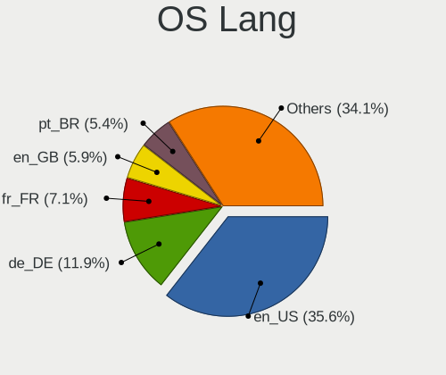

| Lang    | Notebooks | Percent |
|---------|-----------|---------|
| en_US   | 108       | 32.63%  |
| de_DE   | 49        | 14.8%   |
| pt_BR   | 23        | 6.95%   |
| fr_FR   | 23        | 6.95%   |
| en_GB   | 19        | 5.74%   |
| en_CA   | 13        | 3.93%   |
| ru_RU   | 10        | 3.02%   |
| en_IN   | 10        | 3.02%   |
| it_IT   | 8         | 2.42%   |
| es_AR   | 7         | 2.11%   |
| es_MX   | 6         | 1.81%   |
| C       | 6         | 1.81%   |
| es_ES   | 5         | 1.51%   |
| es_CL   | 4         | 1.21%   |
| hu_HU   | 3         | 0.91%   |
| en_AU   | 3         | 0.91%   |
| de_AT   | 3         | 0.91%   |
| Unknown | 3         | 0.91%   |
| pt_PT   | 2         | 0.6%    |
| pl_PL   | 2         | 0.6%    |
| fi_FI   | 2         | 0.6%    |
| en_IE   | 2         | 0.6%    |
| de_CH   | 2         | 0.6%    |
| zh_TW   | 1         | 0.3%    |
| zh_CN   | 1         | 0.3%    |
| uk_UA   | 1         | 0.3%    |
| tr_TR   | 1         | 0.3%    |
| nl_NL   | 1         | 0.3%    |
| nl_BE   | 1         | 0.3%    |
| nb_NO   | 1         | 0.3%    |
| lv_LV   | 1         | 0.3%    |
| id_ID   | 1         | 0.3%    |
| fr_CH   | 1         | 0.3%    |
| fr_BE   | 1         | 0.3%    |
| es_US   | 1         | 0.3%    |
| es_SV   | 1         | 0.3%    |
| es_PE   | 1         | 0.3%    |
| es_GT   | 1         | 0.3%    |
| es_EC   | 1         | 0.3%    |
| en_ZA   | 1         | 0.3%    |

Boot Mode
---------

EFI or BIOS

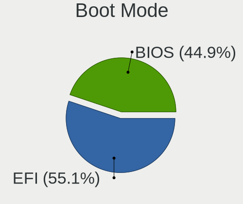

| Mode | Notebooks | Percent |
|------|-----------|---------|
| EFI  | 201       | 59.82%  |
| BIOS | 135       | 40.18%  |

Filesystem
----------

Type of filesystem

| Type    | Notebooks | Percent |
|---------|-----------|---------|
| Ext4    | 310       | 93.66%  |
| Zfs     | 8         | 2.42%   |
| Overlay | 6         | 1.81%   |
| Xfs     | 3         | 0.91%   |
| Btrfs   | 3         | 0.91%   |
| Jfs     | 1         | 0.3%    |

Part. scheme
------------

Scheme of partitioning

| Type    | Notebooks | Percent |
|---------|-----------|---------|
| Unknown | 172       | 51.81%  |
| GPT     | 134       | 40.36%  |
| MBR     | 26        | 7.83%   |

Dual Boot with Linux/BSD
------------------------

Hosting more than one Linux/BSD

| Dual boot | Notebooks | Percent |
|-----------|-----------|---------|
| No        | 295       | 88.59%  |
| Yes       | 38        | 11.41%  |

Dual Boot (Win)
---------------

Hosting Linux and Windows

| Dual boot | Notebooks | Percent |
|-----------|-----------|---------|
| No        | 230       | 69.07%  |
| Yes       | 103       | 30.93%  |

Board
-----

Vendor
------

Motherboard manufacturer

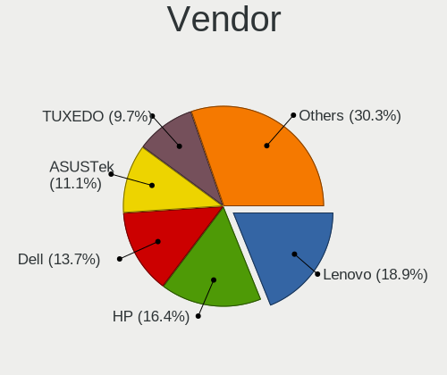

| Name                   | Notebooks | Percent |
|------------------------|-----------|---------|
| Lenovo                 | 63        | 19.09%  |
| Hewlett-Packard        | 50        | 15.15%  |
| Dell                   | 44        | 13.33%  |
| TUXEDO                 | 40        | 12.12%  |
| ASUSTek Computer       | 34        | 10.3%   |
| Acer                   | 21        | 6.36%   |
| MSI                    | 12        | 3.64%   |
| Apple                  | 11        | 3.33%   |
| Sony                   | 6         | 1.82%   |
| Samsung Electronics    | 5         | 1.52%   |
| HUAWEI                 | 5         | 1.52%   |
| Toshiba                | 4         | 1.21%   |
| Google                 | 4         | 1.21%   |
| Packard Bell           | 3         | 0.91%   |
| Fujitsu                | 3         | 0.91%   |
| Unknown                | 3         | 0.91%   |
| Timi                   | 2         | 0.61%   |
| Standard               | 2         | 0.61%   |
| Razer                  | 2         | 0.61%   |
| Positivo               | 2         | 0.61%   |
| Alienware              | 2         | 0.61%   |
| Viglen                 | 1         | 0.3%    |
| Quanta                 | 1         | 0.3%    |
| PC Specialist          | 1         | 0.3%    |
| GPU Company            | 1         | 0.3%    |
| Gigabyte Technology    | 1         | 0.3%    |
| EVOO                   | 1         | 0.3%    |
| Digibras               | 1         | 0.3%    |
| Chuwi                  | 1         | 0.3%    |
| BANGHO                 | 1         | 0.3%    |
| AXIOO                  | 1         | 0.3%    |
| AWOW                   | 1         | 0.3%    |
| Avell High Performance | 1         | 0.3%    |

Model
-----

Motherboard model

| Name                                   | Notebooks | Percent |
|----------------------------------------|-----------|---------|
| Unknown                                | 13        | 3.94%   |
| TUXEDO Aura 15 Gen1                    | 3         | 0.91%   |
| HP Pavilion g6                         | 3         | 0.91%   |
| TUXEDO Pulse 15 Gen1                   | 2         | 0.61%   |
| TUXEDO Polaris 15 AMD Gen1             | 2         | 0.61%   |
| TUXEDO InfinityBook S 15 Gen6          | 2         | 0.61%   |
| TUXEDO InfinityBook S 14 Gen6          | 2         | 0.61%   |
| TUXEDO InfinityBook Pro 14 Gen6        | 2         | 0.61%   |
| Standard MT40II                        | 2         | 0.61%   |
| Lenovo ThinkBook 14-IML 20RV           | 2         | 0.61%   |
| Lenovo IdeaPad 5 15ARE05 81YQ          | 2         | 0.61%   |
| Lenovo IdeaPad 330S-15ARR 81FB         | 2         | 0.61%   |
| Lenovo IdeaPad 320-15IKB 80XL          | 2         | 0.61%   |
| Lenovo G500 20236                      | 2         | 0.61%   |
| Lenovo G50-45 80E3                     | 2         | 0.61%   |
| HP ZBook Studio G3                     | 2         | 0.61%   |
| HP Notebook                            | 2         | 0.61%   |
| HP ENVY 17                             | 2         | 0.61%   |
| HP ENVY 15                             | 2         | 0.61%   |
| HP 2000                                | 2         | 0.61%   |
| Dell XPS 13 9380                       | 2         | 0.61%   |
| Dell Latitude E6540                    | 2         | 0.61%   |
| Dell Latitude E6410                    | 2         | 0.61%   |
| Dell Latitude 5400                     | 2         | 0.61%   |
| Dell Inspiron 5570                     | 2         | 0.61%   |
| ASUS VivoBook_ASUSLaptop X571GT_F571GT | 2         | 0.61%   |
| Apple MacBookPro8,1                    | 2         | 0.61%   |
| Acer TravelMate P446-M                 | 2         | 0.61%   |
| Viglen VUB1                            | 1         | 0.3%    |
| TUXEDO Stellaris Intel Gen3 (TGL)      | 1         | 0.3%    |
| TUXEDO Stellaris AMD Gen3 (CZN)        | 1         | 0.3%    |
| TUXEDO Polaris AMD Gen3 (CZN)          | 1         | 0.3%    |
| TUXEDO Polaris 17 AMD Gen1             | 1         | 0.3%    |
| TUXEDO Polaris (CML/Gen2)              | 1         | 0.3%    |
| TUXEDO P95_HR                          | 1         | 0.3%    |
| TUXEDO P95_HP                          | 1         | 0.3%    |
| TUXEDO P7xxTM1                         | 1         | 0.3%    |
| TUXEDO InfinityBook_Pro13_14_v4        | 1         | 0.3%    |
| TUXEDO InfinityBook S 14 v5            | 1         | 0.3%    |
| TUXEDO InfinityBook Pro 15 v4          | 1         | 0.3%    |

Model Family
------------

Motherboard model prefix

| Name                  | Notebooks | Percent |
|-----------------------|-----------|---------|
| Lenovo ThinkPad       | 30        | 9.09%   |
| Dell Latitude         | 18        | 5.45%   |
| Lenovo IdeaPad        | 15        | 4.55%   |
| Acer Aspire           | 13        | 3.94%   |
| Unknown               | 13        | 3.94%   |
| HP Pavilion           | 12        | 3.64%   |
| Dell Inspiron         | 12        | 3.64%   |
| TUXEDO InfinityBook   | 10        | 3.03%   |
| HP EliteBook          | 9         | 2.73%   |
| Dell XPS              | 8         | 2.42%   |
| ASUS VivoBook         | 7         | 2.12%   |
| HP ENVY               | 6         | 1.82%   |
| TUXEDO Polaris        | 5         | 1.52%   |
| TUXEDO Book           | 5         | 1.52%   |
| Toshiba Satellite     | 4         | 1.21%   |
| Lenovo ThinkBook      | 4         | 1.21%   |
| HP ZBook              | 4         | 1.21%   |
| HP ProBook            | 4         | 1.21%   |
| HP Laptop             | 4         | 1.21%   |
| Acer Swift            | 4         | 1.21%   |
| TUXEDO Aura           | 3         | 0.91%   |
| HP Compaq             | 3         | 0.91%   |
| Fujitsu LIFEBOOK      | 3         | 0.91%   |
| Dell Vostro           | 3         | 0.91%   |
| Apple MacBookPro8     | 3         | 0.91%   |
| Acer TravelMate       | 3         | 0.91%   |
| TUXEDO Stellaris      | 2         | 0.61%   |
| TUXEDO Pulse          | 2         | 0.61%   |
| TUXEDO P95            | 2         | 0.61%   |
| Standard MT40II       | 2         | 0.61%   |
| Razer Blade           | 2         | 0.61%   |
| Packard Bell EasyNote | 2         | 0.61%   |
| MSI Prestige          | 2         | 0.61%   |
| MSI Modern            | 2         | 0.61%   |
| Lenovo Yoga           | 2         | 0.61%   |
| Lenovo G500           | 2         | 0.61%   |
| Lenovo G50-45         | 2         | 0.61%   |
| HP Notebook           | 2         | 0.61%   |
| HP 2000               | 2         | 0.61%   |
| ASUS ZenBook          | 2         | 0.61%   |

MFG Year
--------

Motherboard manufacture year

| Year | Notebooks | Percent |
|------|-----------|---------|
| 2019 | 50        | 15.15%  |
| 2018 | 39        | 11.82%  |
| 2020 | 37        | 11.21%  |
| 2011 | 25        | 7.58%   |
| 2021 | 23        | 6.97%   |
| 2017 | 22        | 6.67%   |
| 2012 | 22        | 6.67%   |
| 2014 | 21        | 6.36%   |
| 2013 | 19        | 5.76%   |
| 2016 | 17        | 5.15%   |
| 2015 | 17        | 5.15%   |
| 2010 | 13        | 3.94%   |
| 2008 | 10        | 3.03%   |
| 2009 | 7         | 2.12%   |
| 2007 | 6         | 1.82%   |
| 2022 | 2         | 0.61%   |

Form Factor
-----------

Physical design of the computer

| Name     | Notebooks | Percent |
|----------|-----------|---------|
| Notebook | 330       | 100%    |

Secure Boot
-----------

Enabled or disabled

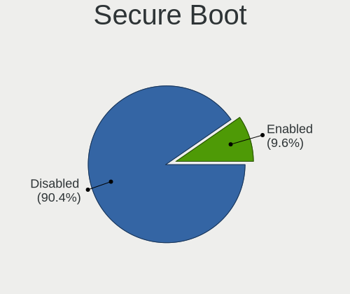

| State    | Notebooks | Percent |
|----------|-----------|---------|
| Disabled | 297       | 89.73%  |
| Enabled  | 34        | 10.27%  |

Coreboot
--------

Have coreboot on board

| Used | Notebooks | Percent |
|------|-----------|---------|
| No   | 326       | 98.79%  |
| Yes  | 4         | 1.21%   |

RAM Size
--------

Total RAM memory

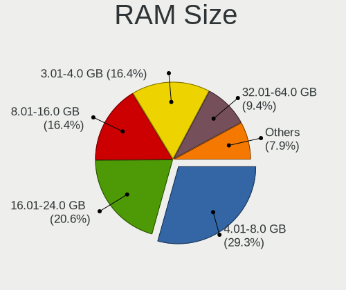

| Size in GB  | Notebooks | Percent |
|-------------|-----------|---------|
| 4.01-8.0    | 98        | 29.43%  |
| 16.01-24.0  | 71        | 21.32%  |
| 3.01-4.0    | 55        | 16.52%  |
| 8.01-16.0   | 53        | 15.92%  |
| 32.01-64.0  | 31        | 9.31%   |
| 64.01-256.0 | 10        | 3%      |
| 1.01-2.0    | 9         | 2.7%    |
| 24.01-32.0  | 4         | 1.2%    |
| 2.01-3.0    | 2         | 0.6%    |

RAM Used
--------

Used RAM memory

| Used GB    | Notebooks | Percent |
|------------|-----------|---------|
| 2.01-3.0   | 103       | 29.43%  |
| 1.01-2.0   | 102       | 29.14%  |
| 4.01-8.0   | 67        | 19.14%  |
| 3.01-4.0   | 57        | 16.29%  |
| 8.01-16.0  | 15        | 4.29%   |
| 0.51-1.0   | 3         | 0.86%   |
| 16.01-24.0 | 2         | 0.57%   |
| 24.01-32.0 | 1         | 0.29%   |

Total Drives
------------

Number of drives on board

| Drives | Notebooks | Percent |
|--------|-----------|---------|
| 1      | 239       | 71.77%  |
| 2      | 84        | 25.23%  |
| 3      | 9         | 2.7%    |
| 0      | 1         | 0.3%    |

Has CD-ROM
----------

Has CD-ROM on board

| Presented | Notebooks | Percent |
|-----------|-----------|---------|
| No        | 234       | 70.69%  |
| Yes       | 97        | 29.31%  |

Has Ethernet
------------

Has Ethernet on board

| Presented | Notebooks | Percent |
|-----------|-----------|---------|
| Yes       | 263       | 79.46%  |
| No        | 68        | 20.54%  |

Has WiFi
--------

Has WiFi module

| Presented | Notebooks | Percent |
|-----------|-----------|---------|
| Yes       | 326       | 98.79%  |
| No        | 4         | 1.21%   |

Has Bluetooth
-------------

Has Bluetooth module

| Presented | Notebooks | Percent |
|-----------|-----------|---------|
| Yes       | 276       | 83.13%  |
| No        | 56        | 16.87%  |

Location
--------

Country
-------

Geographic location (country)

| Country            | Notebooks | Percent |
|--------------------|-----------|---------|
| Germany            | 56        | 16.97%  |
| USA                | 43        | 13.03%  |
| Brazil             | 26        | 7.88%   |
| France             | 22        | 6.67%   |
| Russia             | 12        | 3.64%   |
| India              | 12        | 3.64%   |
| UK                 | 11        | 3.33%   |
| Italy              | 11        | 3.33%   |
| Canada             | 11        | 3.33%   |
| Argentina          | 9         | 2.73%   |
| Mexico             | 8         | 2.42%   |
| Netherlands        | 7         | 2.12%   |
| Spain              | 6         | 1.82%   |
| Poland             | 6         | 1.82%   |
| Austria            | 5         | 1.52%   |
| Ukraine            | 4         | 1.21%   |
| Switzerland        | 4         | 1.21%   |
| Hungary            | 4         | 1.21%   |
| Greece             | 4         | 1.21%   |
| Finland            | 4         | 1.21%   |
| Chile              | 4         | 1.21%   |
| Turkey             | 3         | 0.91%   |
| Sweden             | 3         | 0.91%   |
| South Africa       | 3         | 0.91%   |
| Portugal           | 3         | 0.91%   |
| Norway             | 3         | 0.91%   |
| Iran               | 3         | 0.91%   |
| Indonesia          | 3         | 0.91%   |
| Dominican Republic | 3         | 0.91%   |
| Belgium            | 3         | 0.91%   |
| Australia          | 3         | 0.91%   |
| Slovenia           | 2         | 0.61%   |
| Malaysia           | 2         | 0.61%   |
| Japan              | 2         | 0.61%   |
| Ireland            | 2         | 0.61%   |
| Ecuador            | 2         | 0.61%   |
| Colombia           | 2         | 0.61%   |
| Taiwan             | 1         | 0.3%    |
| Singapore          | 1         | 0.3%    |
| Serbia             | 1         | 0.3%    |

City
----

Geographic location (city)

| City               | Notebooks | Percent |
|--------------------|-----------|---------|
| Sao Paulo          | 6         | 1.79%   |
| Berlin             | 6         | 1.79%   |
| Moscow             | 5         | 1.49%   |
| Ravensburg         | 4         | 1.19%   |
| Budapest           | 4         | 1.19%   |
| Athens             | 4         | 1.19%   |
| Tehran             | 3         | 0.9%    |
| St Petersburg      | 3         | 0.9%    |
| Santo Domingo Este | 3         | 0.9%    |
| Munich             | 3         | 0.9%    |
| Montreal           | 3         | 0.9%    |
| Hamburg            | 3         | 0.9%    |
| Braslia          | 3         | 0.9%    |
| Austin             | 3         | 0.9%    |
| Wolfsburg          | 2         | 0.6%    |
| Vienna             | 2         | 0.6%    |
| Vancouver          | 2         | 0.6%    |
| Sunnyvale          | 2         | 0.6%    |
| Stuttgart          | 2         | 0.6%    |
| San Miguel         | 2         | 0.6%    |
| San Francisco      | 2         | 0.6%    |
| Pune               | 2         | 0.6%    |
| Portland           | 2         | 0.6%    |
| Paris              | 2         | 0.6%    |
| Nuremberg          | 2         | 0.6%    |
| Niteri           | 2         | 0.6%    |
| Mumbai             | 2         | 0.6%    |
| Milan              | 2         | 0.6%    |
| Lisbon             | 2         | 0.6%    |
| Kyiv               | 2         | 0.6%    |
| Kassel             | 2         | 0.6%    |
| Istanbul           | 2         | 0.6%    |
| Gurgaon            | 2         | 0.6%    |
| Dublin             | 2         | 0.6%    |
| Cologne            | 2         | 0.6%    |
| Burzaco            | 2         | 0.6%    |
| Belo Horizonte     | 2         | 0.6%    |
| Bamberg            | 2         | 0.6%    |
| Zurich             | 1         | 0.3%    |
| Zambrw           | 1         | 0.3%    |

Drives
------

Drive Vendor
------------

Hard drive vendors

| Vendor                         | Notebooks | Drives | Percent |
|--------------------------------|-----------|--------|---------|
| Samsung Electronics            | 91        | 115    | 21.88%  |
| WDC                            | 43        | 46     | 10.34%  |
| Seagate                        | 43        | 46     | 10.34%  |
| Toshiba                        | 35        | 41     | 8.41%   |
| Unknown                        | 29        | 32     | 6.97%   |
| SanDisk                        | 24        | 27     | 5.77%   |
| Kingston                       | 16        | 16     | 3.85%   |
| Crucial                        | 16        | 18     | 3.85%   |
| SK hynix                       | 15        | 17     | 3.61%   |
| Intel                          | 14        | 19     | 3.37%   |
| Micron Technology              | 9         | 10     | 2.16%   |
| HGST                           | 8         | 11     | 1.92%   |
| A-DATA Technology              | 8         | 9      | 1.92%   |
| Hitachi                        | 7         | 7      | 1.68%   |
| China                          | 7         | 9      | 1.68%   |
| SPCC                           | 5         | 5      | 1.2%    |
| Apple                          | 5         | 5      | 1.2%    |
| PNY                            | 4         | 6      | 0.96%   |
| JMicron Technology             | 3         | 3      | 0.72%   |
| LITEON                         | 2         | 2      | 0.48%   |
| Lenovo                         | 2         | 2      | 0.48%   |
| KIOXIA                         | 2         | 2      | 0.48%   |
| Intenso                        | 2         | 3      | 0.48%   |
| Hewlett-Packard                | 2         | 1      | 0.48%   |
| Corsair                        | 2         | 3      | 0.48%   |
| Unknown                        | 2         | 2      | 0.48%   |
| VISIPRO                        | 1         | 1      | 0.24%   |
| Vaseky                         | 1         | 1      | 0.24%   |
| USB30                          | 1         | 1      | 0.24%   |
| Union Memory                   | 1         | 1      | 0.24%   |
| TO Exter                       | 1         | 1      | 0.24%   |
| Solid State Storage Technology | 1         | 1      | 0.24%   |
| Realtek Semiconductor          | 1         | 2      | 0.24%   |
| Patriot                        | 1         | 1      | 0.24%   |
| OWC                            | 1         | 1      | 0.24%   |
| Netac                          | 1         | 1      | 0.24%   |
| Micron/Crucial Technology      | 1         | 1      | 0.24%   |
| LITEONIT                       | 1         | 1      | 0.24%   |
| LaCie                          | 1         | 1      | 0.24%   |
| KingSpec                       | 1         | 1      | 0.24%   |

Drive Model
-----------

Hard drive models

| Model                                | Notebooks | Percent |
|--------------------------------------|-----------|---------|
| Unknown MMC Card  64GB               | 6         | 1.4%    |
| Toshiba MQ01ABD100 1TB               | 6         | 1.4%    |
| WDC WD10JPVX-22JC3T0 1TB             | 5         | 1.17%   |
| Unknown MMC Card  32GB               | 5         | 1.17%   |
| Seagate ST1000LM035-1RK172 1TB       | 5         | 1.17%   |
| Seagate ST1000LM024 HN-M101MBB 1TB   | 5         | 1.17%   |
| Samsung SSD 860 EVO M.2 500GB        | 5         | 1.17%   |
| Samsung SSD 860 EVO M.2 250GB        | 5         | 1.17%   |
| Samsung NVMe SSD Drive 1TB           | 5         | 1.17%   |
| Toshiba MQ04ABF100 1TB               | 4         | 0.93%   |
| SK hynix NVMe SSD Drive 256GB        | 4         | 0.93%   |
| Seagate ST9500325AS 500GB            | 4         | 0.93%   |
| SanDisk NVMe SSD Drive 512GB         | 4         | 0.93%   |
| Samsung SSD 970 EVO Plus 1TB         | 4         | 0.93%   |
| Samsung NVMe SSD Drive 512GB         | 4         | 0.93%   |
| Samsung NVMe SSD Drive 500GB         | 4         | 0.93%   |
| Unknown SD64G  64GB                  | 3         | 0.7%    |
| SPCC Solid State Disk 120GB          | 3         | 0.7%    |
| Seagate ST500LT012-1DG142 500GB      | 3         | 0.7%    |
| Seagate ST1000LX015-1U7172 1TB       | 3         | 0.7%    |
| Samsung SSD 970 EVO Plus 500GB       | 3         | 0.7%    |
| Samsung SSD 970 EVO 500GB            | 3         | 0.7%    |
| Samsung SSD 860 EVO 500GB            | 3         | 0.7%    |
| Samsung SSD 750 EVO 250GB            | 3         | 0.7%    |
| Samsung NVMe SSD Drive 2TB           | 3         | 0.7%    |
| Samsung NVMe SSD Drive 250GB         | 3         | 0.7%    |
| WDC WDS500G2B0A-00SM50 500GB SSD     | 2         | 0.47%   |
| WDC WDS240G2G0B-00EPW0 240GB SSD     | 2         | 0.47%   |
| WDC WD10SPZX-60Z10T0 1TB             | 2         | 0.47%   |
| WDC WD10SPZX-24Z10 1TB               | 2         | 0.47%   |
| WDC PC SN730 SDBPNTY-512G-1027 512GB | 2         | 0.47%   |
| Unknown SD/MMC/MS PRO 1TB            | 2         | 0.47%   |
| Unknown MMC128  128GB                | 2         | 0.47%   |
| Unknown MMC Card  16GB               | 2         | 0.47%   |
| Toshiba MQ01ACF050 500GB             | 2         | 0.47%   |
| Seagate ST500LT012-9WS142 500GB      | 2         | 0.47%   |
| Seagate ST1000LM048-2E7172 1TB       | 2         | 0.47%   |
| Seagate Expansion Desk 8TB           | 2         | 0.47%   |
| Seagate BUP Slim BK 1TB              | 2         | 0.47%   |
| SanDisk X400 M.2 2280 512GB SSD      | 2         | 0.47%   |

HDD Vendor
----------

Hard disk drive vendors

| Vendor              | Notebooks | Drives | Percent |
|---------------------|-----------|--------|---------|
| Seagate             | 40        | 43     | 37.38%  |
| WDC                 | 24        | 26     | 22.43%  |
| Toshiba             | 24        | 27     | 22.43%  |
| HGST                | 8         | 11     | 7.48%   |
| Hitachi             | 7         | 7      | 6.54%   |
| Unknown             | 2         | 2      | 1.87%   |
| Samsung Electronics | 1         | 1      | 0.93%   |
| Fujitsu             | 1         | 1      | 0.93%   |

SSD Vendor
----------

Solid state drive vendors

| Vendor              | Notebooks | Drives | Percent |
|---------------------|-----------|--------|---------|
| Samsung Electronics | 43        | 53     | 28.1%   |
| SanDisk             | 16        | 16     | 10.46%  |
| Crucial             | 15        | 17     | 9.8%    |
| Kingston            | 12        | 12     | 7.84%   |
| WDC                 | 7         | 7      | 4.58%   |
| China               | 7         | 9      | 4.58%   |
| A-DATA Technology   | 6         | 7      | 3.92%   |
| SPCC                | 5         | 5      | 3.27%   |
| Micron Technology   | 5         | 6      | 3.27%   |
| PNY                 | 4         | 6      | 2.61%   |
| Intel               | 4         | 4      | 2.61%   |
| Apple               | 4         | 4      | 2.61%   |
| Toshiba             | 2         | 2      | 1.31%   |
| Seagate             | 2         | 2      | 1.31%   |
| LITEON              | 2         | 2      | 1.31%   |
| Intenso             | 2         | 3      | 1.31%   |
| VISIPRO             | 1         | 1      | 0.65%   |
| Vaseky              | 1         | 1      | 0.65%   |
| USB30               | 1         | 1      | 0.65%   |
| Unknown             | 1         | 1      | 0.65%   |
| Union Memory        | 1         | 1      | 0.65%   |
| TO Exter            | 1         | 1      | 0.65%   |
| SK hynix            | 1         | 1      | 0.65%   |
| Patriot             | 1         | 1      | 0.65%   |
| OWC                 | 1         | 1      | 0.65%   |
| Netac               | 1         | 1      | 0.65%   |
| LITEONIT            | 1         | 1      | 0.65%   |
| KingSpec            | 1         | 1      | 0.65%   |
| Hewlett-Packard     | 1         | 1      | 0.65%   |
| Gigabyte Technology | 1         | 1      | 0.65%   |
| Dogfish             | 1         | 1      | 0.65%   |
| Corsair             | 1         | 2      | 0.65%   |
| BIWIN               | 1         | 1      | 0.65%   |

Drive Kind
----------

HDD or SSD

| Kind    | Notebooks | Drives | Percent |
|---------|-----------|--------|---------|
| SSD     | 140       | 173    | 35.44%  |
| NVMe    | 117       | 149    | 29.62%  |
| HDD     | 104       | 118    | 26.33%  |
| MMC     | 28        | 33     | 7.09%   |
| Unknown | 6         | 5      | 1.52%   |

Drive Connector
---------------

SATA, SAS, NVMe, etc.

| Type | Notebooks | Drives | Percent |
|------|-----------|--------|---------|
| SATA | 211       | 282    | 56.87%  |
| NVMe | 116       | 147    | 31.27%  |
| MMC  | 28        | 33     | 7.55%   |
| SAS  | 16        | 16     | 4.31%   |

Drive Size
----------

Size of hard drive

| Size in TB | Notebooks | Drives | Percent |
|------------|-----------|--------|---------|
| 0.01-0.5   | 158       | 190    | 64.75%  |
| 0.51-1.0   | 74        | 87     | 30.33%  |
| 1.01-2.0   | 10        | 12     | 4.1%    |
| 4.01-10.0  | 2         | 2      | 0.82%   |

Space Total
-----------

Amount of disk space available on the file system

| Size in GB     | Notebooks | Percent |
|----------------|-----------|---------|
| 251-500        | 103       | 30.84%  |
| 101-250        | 100       | 29.94%  |
| 501-1000       | 46        | 13.77%  |
| 51-100         | 31        | 9.28%   |
| 21-50          | 17        | 5.09%   |
| 1001-2000      | 17        | 5.09%   |
| 1-20           | 7         | 2.1%    |
| 2001-3000      | 6         | 1.8%    |
| More than 3000 | 4         | 1.2%    |
| Unknown        | 3         | 0.9%    |

Space Used
----------

Amount of used disk space

| Used GB        | Notebooks | Percent |
|----------------|-----------|---------|
| 1-20           | 109       | 31.96%  |
| 21-50          | 67        | 19.65%  |
| 101-250        | 67        | 19.65%  |
| 51-100         | 48        | 14.08%  |
| 251-500        | 27        | 7.92%   |
| 501-1000       | 13        | 3.81%   |
| 1001-2000      | 5         | 1.47%   |
| Unknown        | 3         | 0.88%   |
| More than 3000 | 2         | 0.59%   |

Malfunc. Drives
---------------

Drive models with a malfunction

| Model                                | Notebooks | Drives | Percent |
|--------------------------------------|-----------|--------|---------|
| Toshiba MQ01ABD100 1TB               | 2         | 2      | 9.52%   |
| WDC WD6400BPVT-60HXZT3 640GB         | 1         | 1      | 4.76%   |
| WDC WD5000BPVT-00HXZT1 500GB         | 1         | 1      | 4.76%   |
| Toshiba MQ01ABF050 500GB             | 1         | 1      | 4.76%   |
| Toshiba MQ01ABD050 500GB             | 1         | 1      | 4.76%   |
| Toshiba MK5055GSX 500GB              | 1         | 1      | 4.76%   |
| Toshiba MK3265GSXN 320GB             | 1         | 1      | 4.76%   |
| Toshiba MK2561GSYN 250GB             | 1         | 1      | 4.76%   |
| Seagate ST9750420AS 752GB            | 1         | 1      | 4.76%   |
| Seagate ST9500423AS 500GB            | 1         | 1      | 4.76%   |
| Seagate ST9500325AS 500GB            | 1         | 1      | 4.76%   |
| Seagate ST500LX012-1LM162-SSHD 500GB | 1         | 1      | 4.76%   |
| Seagate ST500LT012-1DG142 500GB      | 1         | 1      | 4.76%   |
| Seagate ST1000LM024 HN-M101MBB 1TB   | 1         | 1      | 4.76%   |
| PNY SSD2SC120G3LC709B121-460I 120GB  | 1         | 1      | 4.76%   |
| Kingston SNS4151S316G 16GB SSD       | 1         | 1      | 4.76%   |
| HGST HTS725032A7E630 320GB           | 1         | 2      | 4.76%   |
| HGST HTS541075A9E680 752GB           | 1         | 1      | 4.76%   |
| Crucial CT500P1SSD8 500GB            | 1         | 1      | 4.76%   |
| China SSD 256GB                      | 1         | 1      | 4.76%   |

Malfunc. Drive Vendor
---------------------

Vendors of faulty drives

| Vendor   | Notebooks | Drives | Percent |
|----------|-----------|--------|---------|
| Toshiba  | 7         | 7      | 33.33%  |
| Seagate  | 6         | 6      | 28.57%  |
| WDC      | 2         | 2      | 9.52%   |
| HGST     | 2         | 3      | 9.52%   |
| PNY      | 1         | 1      | 4.76%   |
| Kingston | 1         | 1      | 4.76%   |
| Crucial  | 1         | 1      | 4.76%   |
| China    | 1         | 1      | 4.76%   |

Malfunc. HDD Vendor
-------------------

Vendors of faulty HDD drives

| Vendor  | Notebooks | Drives | Percent |
|---------|-----------|--------|---------|
| Toshiba | 7         | 7      | 41.18%  |
| Seagate | 6         | 6      | 35.29%  |
| WDC     | 2         | 2      | 11.76%  |
| HGST    | 2         | 3      | 11.76%  |

Malfunc. Drive Kind
-------------------

Kinds of faulty drives

| Kind | Notebooks | Drives | Percent |
|------|-----------|--------|---------|
| HDD  | 17        | 18     | 80.95%  |
| SSD  | 3         | 3      | 14.29%  |
| NVMe | 1         | 1      | 4.76%   |

Failed Drives
-------------

Failed drive models

Zero info for selected period =(

Failed Drive Vendor
-------------------

Failed drive vendors

Zero info for selected period =(

Drive Status
------------

Number of failed and malfunc. drives

| Status   | Notebooks | Drives | Percent |
|----------|-----------|--------|---------|
| Detected | 194       | 275    | 55.43%  |
| Works    | 136       | 181    | 38.86%  |
| Malfunc  | 20        | 22     | 5.71%   |

Storage controller
------------------

Storage Vendor
--------------

Storage controller vendors

| Vendor                         | Notebooks | Percent |
|--------------------------------|-----------|---------|
| Intel                          | 233       | 61.64%  |
| Samsung Electronics            | 52        | 13.76%  |
| AMD                            | 27        | 7.14%   |
| SanDisk                        | 19        | 5.03%   |
| SK hynix                       | 12        | 3.17%   |
| Toshiba America Info Systems   | 8         | 2.12%   |
| Micron Technology              | 4         | 1.06%   |
| Kingston Technology Company    | 4         | 1.06%   |
| KIOXIA                         | 3         | 0.79%   |
| Realtek Semiconductor          | 2         | 0.53%   |
| Nvidia                         | 2         | 0.53%   |
| Micron/Crucial Technology      | 2         | 0.53%   |
| Lenovo                         | 2         | 0.53%   |
| ADATA Technology               | 2         | 0.53%   |
| Union Memory (Shenzhen)        | 1         | 0.26%   |
| Solid State Storage Technology | 1         | 0.26%   |
| Silicon Motion                 | 1         | 0.26%   |
| Shenzhen Longsys Electronics   | 1         | 0.26%   |
| Phison Electronics             | 1         | 0.26%   |
| Apple                          | 1         | 0.26%   |

Storage Model
-------------

Storage controller models

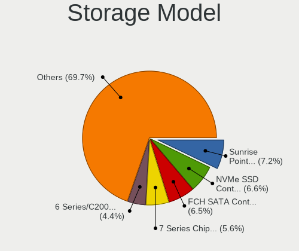

| Model                                                                            | Notebooks | Percent |
|----------------------------------------------------------------------------------|-----------|---------|
| Samsung NVMe SSD Controller SM981/PM981/PM983                                    | 33        | 8.27%   |
| Intel Sunrise Point-LP SATA Controller [AHCI mode]                               | 32        | 8.02%   |
| Intel 7 Series Chipset Family 6-port SATA Controller [AHCI mode]                 | 29        | 7.27%   |
| AMD FCH SATA Controller [AHCI mode]                                              | 24        | 6.02%   |
| Intel 6 Series/C200 Series Chipset Family 6 port Mobile SATA AHCI Controller     | 21        | 5.26%   |
| Intel 82801 Mobile SATA Controller [RAID mode]                                   | 15        | 3.76%   |
| Intel Cannon Point-LP SATA Controller [AHCI Mode]                                | 14        | 3.51%   |
| Intel 8 Series SATA Controller 1 [AHCI mode]                                     | 12        | 3.01%   |
| Intel Wildcat Point-LP SATA Controller [AHCI Mode]                               | 10        | 2.51%   |
| Intel Comet Lake SATA AHCI Controller                                            | 10        | 2.51%   |
| SanDisk WD Black SN750 / PC SN730 NVMe SSD                                       | 9         | 2.26%   |
| Intel 8 Series/C220 Series Chipset Family 6-port SATA Controller 1 [AHCI mode]   | 9         | 2.26%   |
| Samsung NVMe SSD Controller 980                                                  | 8         | 2.01%   |
| Intel HM170/QM170 Chipset SATA Controller [AHCI Mode]                            | 8         | 2.01%   |
| Intel Celeron/Pentium Silver Processor SATA Controller                           | 8         | 2.01%   |
| Intel 82801IBM/IEM (ICH9M/ICH9M-E) 4 port SATA Controller [AHCI mode]            | 7         | 1.75%   |
| Intel 82801HM/HEM (ICH8M/ICH8M-E) SATA Controller [AHCI mode]                    | 6         | 1.5%    |
| Intel 82801HM/HEM (ICH8M/ICH8M-E) IDE Controller                                 | 6         | 1.5%    |
| Samsung NVMe SSD Controller PM9A1/PM9A3/980PRO                                   | 5         | 1.25%   |
| Intel Volume Management Device NVMe RAID Controller                              | 5         | 1.25%   |
| Intel SSD 660P Series                                                            | 5         | 1.25%   |
| Intel Cannon Lake Mobile PCH SATA AHCI Controller                                | 5         | 1.25%   |
| Intel 400 Series Chipset Family SATA AHCI Controller                             | 5         | 1.25%   |
| SK hynix Non-Volatile memory controller                                          | 4         | 1%      |
| SanDisk WD Black 2018/SN750 / PC SN720 NVMe SSD                                  | 4         | 1%      |
| SanDisk PC SN520 NVMe SSD                                                        | 4         | 1%      |
| Micron Non-Volatile memory controller                                            | 4         | 1%      |
| Intel Q170/Q150/B150/H170/H110/Z170/CM236 Chipset SATA Controller [AHCI Mode]    | 4         | 1%      |
| Intel Ice Lake-LP SATA Controller [AHCI mode]                                    | 4         | 1%      |
| Intel 5 Series/3400 Series Chipset 6 port SATA AHCI Controller                   | 4         | 1%      |
| Intel 5 Series/3400 Series Chipset 4 port SATA AHCI Controller                   | 4         | 1%      |
| Toshiba America Info Systems XG6 NVMe SSD Controller                             | 3         | 0.75%   |
| Toshiba America Info Systems BG3 NVMe SSD Controller                             | 3         | 0.75%   |
| SK hynix BC501 NVMe Solid State Drive                                            | 3         | 0.75%   |
| Samsung NVMe SSD Controller SM961/PM961/SM963                                    | 3         | 0.75%   |
| KIOXIA NVMe SSD Controller BG4                                                   | 3         | 0.75%   |
| Intel Atom/Celeron/Pentium Processor x5-E8000/J3xxx/N3xxx Series SATA Controller | 3         | 0.75%   |
| Intel Atom Processor E3800 Series SATA AHCI Controller                           | 3         | 0.75%   |
| Toshiba America Info Systems Toshiba America Info Non-Volatile memory controller | 2         | 0.5%    |
| SK hynix PC401 NVMe Solid State Drive 256GB                                      | 2         | 0.5%    |

Storage Kind
------------

Kind of storage controller (IDE, SATA, NVMe, SAS, ...)

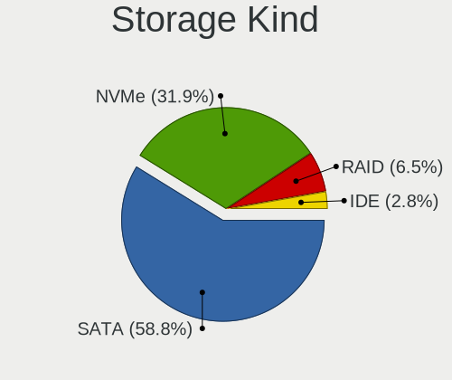

| Kind | Notebooks | Percent |
|------|-----------|---------|
| SATA | 237       | 61.08%  |
| NVMe | 118       | 30.41%  |
| RAID | 21        | 5.41%   |
| IDE  | 12        | 3.09%   |

Processor
---------

CPU Vendor
----------

Processor vendors

| Vendor | Notebooks | Percent |
|--------|-----------|---------|
| Intel  | 288       | 87.27%  |
| AMD    | 42        | 12.73%  |

CPU Model
---------

Processor models

| Model                                         | Notebooks | Percent |
|-----------------------------------------------|-----------|---------|
| Intel Core i7-8565U CPU @ 1.80GHz             | 17        | 5.15%   |
| Intel 11th Gen Core i7-1165G7 @ 2.80GHz       | 11        | 3.33%   |
| Intel Core i7-8550U CPU @ 1.80GHz             | 10        | 3.03%   |
| Intel Core i5-8250U CPU @ 1.60GHz             | 9         | 2.73%   |
| Intel Core i7-7500U CPU @ 2.70GHz             | 6         | 1.82%   |
| Intel Core i7-10510U CPU @ 1.80GHz            | 6         | 1.82%   |
| Intel Core i7-7700HQ CPU @ 2.80GHz            | 5         | 1.52%   |
| Intel Core i5-5200U CPU @ 2.20GHz             | 5         | 1.52%   |
| Intel Core i5-2520M CPU @ 2.50GHz             | 5         | 1.52%   |
| AMD Ryzen 7 4700U with Radeon Graphics        | 5         | 1.52%   |
| AMD Ryzen 5 3500U with Radeon Vega Mobile Gfx | 5         | 1.52%   |
| Intel Core i7-9750H CPU @ 2.60GHz             | 4         | 1.21%   |
| Intel Core i7-8750H CPU @ 2.20GHz             | 4         | 1.21%   |
| Intel Core i7-4500U CPU @ 1.80GHz             | 4         | 1.21%   |
| Intel Core i7-3520M CPU @ 2.90GHz             | 4         | 1.21%   |
| Intel Core i7-10710U CPU @ 1.10GHz            | 4         | 1.21%   |
| Intel Core i5-8265U CPU @ 1.60GHz             | 4         | 1.21%   |
| Intel Core i5-7200U CPU @ 2.50GHz             | 4         | 1.21%   |
| Intel Core i5-10210U CPU @ 1.60GHz            | 4         | 1.21%   |
| Intel Core i7-6500U CPU @ 2.50GHz             | 3         | 0.91%   |
| Intel Core i7-4710HQ CPU @ 2.50GHz            | 3         | 0.91%   |
| Intel Core i7-2630QM CPU @ 2.00GHz            | 3         | 0.91%   |
| Intel Core i7-10750H CPU @ 2.60GHz            | 3         | 0.91%   |
| Intel Core i5-8350U CPU @ 1.70GHz             | 3         | 0.91%   |
| Intel Core i5-3210M CPU @ 2.50GHz             | 3         | 0.91%   |
| Intel Core i3-3110M CPU @ 2.40GHz             | 3         | 0.91%   |
| Intel Core i3-2310M CPU @ 2.10GHz             | 3         | 0.91%   |
| Intel Celeron N4000 CPU @ 1.10GHz             | 3         | 0.91%   |
| AMD Ryzen 7 4800H with Radeon Graphics        | 3         | 0.91%   |
| AMD Ryzen 5 4600H with Radeon Graphics        | 3         | 0.91%   |
| AMD Ryzen 5 2500U with Radeon Vega Mobile Gfx | 3         | 0.91%   |
| Intel Pentium Silver N5030 CPU @ 1.10GHz      | 2         | 0.61%   |
| Intel Pentium Dual CPU T2370 @ 1.73GHz        | 2         | 0.61%   |
| Intel Pentium CPU B950 @ 2.10GHz              | 2         | 0.61%   |
| Intel Core i7-8665U CPU @ 1.90GHz             | 2         | 0.61%   |
| Intel Core i7-7820HQ CPU @ 2.90GHz            | 2         | 0.61%   |
| Intel Core i7-6700HQ CPU @ 2.60GHz            | 2         | 0.61%   |
| Intel Core i7-4800MQ CPU @ 2.70GHz            | 2         | 0.61%   |
| Intel Core i7-4700MQ CPU @ 2.40GHz            | 2         | 0.61%   |
| Intel Core i7-4600U CPU @ 2.10GHz             | 2         | 0.61%   |

CPU Model Family
----------------

Processor model prefix

| Model                   | Notebooks | Percent |
|-------------------------|-----------|---------|
| Intel Core i7           | 118       | 35.76%  |
| Intel Core i5           | 78        | 23.64%  |
| Intel Core i3           | 22        | 6.67%   |
| Other                   | 19        | 5.76%   |
| Intel Celeron           | 14        | 4.24%   |
| AMD Ryzen 5             | 14        | 4.24%   |
| Intel Core 2 Duo        | 11        | 3.33%   |
| AMD Ryzen 7             | 11        | 3.33%   |
| Intel Pentium           | 7         | 2.12%   |
| Intel Atom              | 6         | 1.82%   |
| Intel Pentium Silver    | 4         | 1.21%   |
| AMD A8                  | 4         | 1.21%   |
| AMD E                   | 3         | 0.91%   |
| Intel Pentium Dual      | 2         | 0.61%   |
| Intel Genuine           | 2         | 0.61%   |
| Intel Core i9           | 2         | 0.61%   |
| AMD Turion 64 X2 Mobile | 2         | 0.61%   |
| AMD Ryzen 9             | 2         | 0.61%   |
| AMD A6                  | 2         | 0.61%   |
| Intel Pentium Dual-Core | 1         | 0.3%    |
| Intel Core m5           | 1         | 0.3%    |
| Intel Core m3           | 1         | 0.3%    |
| AMD Quad-Core           | 1         | 0.3%    |
| AMD E1                  | 1         | 0.3%    |
| AMD Athlon II           | 1         | 0.3%    |
| AMD A10                 | 1         | 0.3%    |

CPU Cores
---------

Number of processor cores

| Number | Notebooks | Percent |
|--------|-----------|---------|
| 4      | 144       | 43.64%  |
| 2      | 138       | 41.82%  |
| 6      | 24        | 7.27%   |
| 8      | 19        | 5.76%   |
| 1      | 2         | 0.61%   |
| 16     | 1         | 0.3%    |
| 14     | 1         | 0.3%    |
| 10     | 1         | 0.3%    |

CPU Sockets
-----------

Number of sockets

| Number | Notebooks | Percent |
|--------|-----------|---------|
| 1      | 330       | 100%    |

CPU Threads
-----------

Threads per core (Hyper-Threading)

| Number | Notebooks | Percent |
|--------|-----------|---------|
| 2      | 255       | 77.27%  |
| 1      | 75        | 22.73%  |

CPU Op-Modes
------------

CPU Operation Modes (32-bit, 64-bit)

| Op mode        | Notebooks | Percent |
|----------------|-----------|---------|
| 32-bit, 64-bit | 329       | 99.7%   |
| 32-bit         | 1         | 0.3%    |

CPU Microcode
-------------

Microcode number

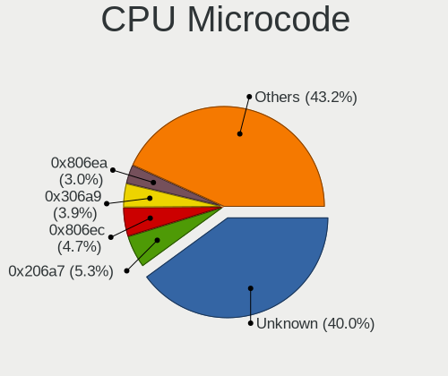

| Number     | Notebooks | Percent |
|------------|-----------|---------|
| Unknown    | 88        | 26.04%  |
| 0x206a7    | 23        | 6.8%    |
| 0x806ec    | 20        | 5.92%   |
| 0x306a9    | 19        | 5.62%   |
| 0x906ea    | 13        | 3.85%   |
| 0x806ea    | 13        | 3.85%   |
| 0x806c1    | 11        | 3.25%   |
| 0x40651    | 11        | 3.25%   |
| 0x806e9    | 10        | 2.96%   |
| 0x306d4    | 9         | 2.66%   |
| 0x306c3    | 9         | 2.66%   |
| 0x806eb    | 8         | 2.37%   |
| 0x406e3    | 8         | 2.37%   |
| 0x906e9    | 7         | 2.07%   |
| 0xa0652    | 5         | 1.48%   |
| 0x20655    | 5         | 1.48%   |
| 0x08600103 | 5         | 1.48%   |
| 0x1067a    | 4         | 1.18%   |
| 0x10676    | 4         | 1.18%   |
| 0x08600106 | 4         | 1.18%   |
| 0xa0660    | 3         | 0.89%   |
| 0x706e5    | 3         | 0.89%   |
| 0x706a8    | 3         | 0.89%   |
| 0x506e3    | 3         | 0.89%   |
| 0x406c3    | 3         | 0.89%   |
| 0x30678    | 3         | 0.89%   |
| 0x0a50000c | 3         | 0.89%   |
| 0x08108109 | 3         | 0.89%   |
| 0x0810100b | 3         | 0.89%   |
| 0x05000119 | 3         | 0.89%   |
| 0x806d1    | 2         | 0.59%   |
| 0x706a1    | 2         | 0.59%   |
| 0x6fd      | 2         | 0.59%   |
| 0x506c9    | 2         | 0.59%   |
| 0x20652    | 2         | 0.59%   |
| 0x106e5    | 2         | 0.59%   |
| 0x08600104 | 2         | 0.59%   |
| 0x08108102 | 2         | 0.59%   |
| 0x906ed    | 1         | 0.3%    |
| 0x906c0    | 1         | 0.3%    |

CPU Microarch
-------------

Microarchitecture

| Name             | Notebooks | Percent |
|------------------|-----------|---------|
| KabyLake         | 97        | 29.39%  |
| IvyBridge        | 27        | 8.18%   |
| SandyBridge      | 26        | 7.88%   |
| Haswell          | 23        | 6.97%   |
| Zen 2            | 15        | 4.55%   |
| Skylake          | 15        | 4.55%   |
| TigerLake        | 14        | 4.24%   |
| Silvermont       | 12        | 3.64%   |
| CometLake        | 12        | 3.64%   |
| Broadwell        | 12        | 3.64%   |
| Penryn           | 11        | 3.33%   |
| Goldmont plus    | 9         | 2.73%   |
| Westmere         | 8         | 2.42%   |
| IceLake          | 8         | 2.42%   |
| Zen+             | 5         | 1.52%   |
| Core             | 4         | 1.21%   |
| Zen 3            | 3         | 0.91%   |
| Zen              | 3         | 0.91%   |
| Puma             | 3         | 0.91%   |
| Bobcat           | 3         | 0.91%   |
| Unknown          | 3         | 0.91%   |
| Nehalem          | 2         | 0.61%   |
| K8 Hammer        | 2         | 0.61%   |
| Jaguar           | 2         | 0.61%   |
| Goldmont         | 2         | 0.61%   |
| Excavator        | 2         | 0.61%   |
| Tremont          | 1         | 0.3%    |
| Piledriver       | 1         | 0.3%    |
| P6               | 1         | 0.3%    |
| K10 Llano        | 1         | 0.3%    |
| K10              | 1         | 0.3%    |
| Bonnell          | 1         | 0.3%    |
| Alderlake Hybrid | 1         | 0.3%    |

Graphics
--------

GPU Vendor
----------

Vendors of graphics cards

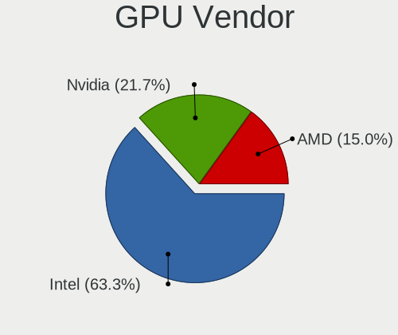

| Vendor | Notebooks | Percent |
|--------|-----------|---------|
| Intel  | 268       | 63.06%  |
| Nvidia | 96        | 22.59%  |
| AMD    | 61        | 14.35%  |

GPU Model
---------

Graphics card models

| Model                                                                                    | Notebooks | Percent |
|------------------------------------------------------------------------------------------|-----------|---------|
| Intel 3rd Gen Core processor Graphics Controller                                         | 25        | 5.77%   |
| Intel WhiskeyLake-U GT2 [UHD Graphics 620]                                               | 24        | 5.54%   |
| Intel 2nd Generation Core Processor Family Integrated Graphics Controller                | 24        | 5.54%   |
| Intel UHD Graphics 620                                                                   | 22        | 5.08%   |
| Intel TigerLake-LP GT2 [Iris Xe Graphics]                                                | 14        | 3.23%   |
| AMD Renoir                                                                               | 14        | 3.23%   |
| Intel Haswell-ULT Integrated Graphics Controller                                         | 13        | 3%      |
| Intel HD Graphics 620                                                                    | 12        | 2.77%   |
| Intel CometLake-U GT2 [UHD Graphics]                                                     | 12        | 2.77%   |
| Intel HD Graphics 5500                                                                   | 10        | 2.31%   |
| Intel CoffeeLake-H GT2 [UHD Graphics 630]                                                | 10        | 2.31%   |
| Intel 4th Gen Core Processor Integrated Graphics Controller                              | 9         | 2.08%   |
| Intel Skylake GT2 [HD Graphics 520]                                                      | 8         | 1.85%   |
| Intel HD Graphics 630                                                                    | 8         | 1.85%   |
| Intel Mobile 4 Series Chipset Integrated Graphics Controller                             | 7         | 1.62%   |
| Intel CometLake-H GT2 [UHD Graphics]                                                     | 7         | 1.62%   |
| Intel GeminiLake [UHD Graphics 600]                                                      | 6         | 1.39%   |
| Intel Core Processor Integrated Graphics Controller                                      | 6         | 1.39%   |
| Intel Atom/Celeron/Pentium Processor x5-E8000/J3xxx/N3xxx Integrated Graphics Controller | 6         | 1.39%   |
| Intel Atom Processor Z36xxx/Z37xxx Series Graphics & Display                             | 6         | 1.39%   |
| Nvidia TU117M [GeForce GTX 1650 Mobile / Max-Q]                                          | 5         | 1.15%   |
| Nvidia TU106M [GeForce RTX 2060 Mobile]                                                  | 5         | 1.15%   |
| Nvidia GP107M [GeForce GTX 1050 Mobile]                                                  | 5         | 1.15%   |
| Nvidia GA106M [GeForce RTX 3060 Mobile / Max-Q]                                          | 5         | 1.15%   |
| AMD Seymour [Radeon HD 6400M/7400M Series]                                               | 5         | 1.15%   |
| AMD Picasso/Raven 2 [Radeon Vega Series / Radeon Vega Mobile Series]                     | 5         | 1.15%   |
| Nvidia GP108M [GeForce MX150]                                                            | 4         | 0.92%   |
| Nvidia GP106M [GeForce GTX 1060 Mobile]                                                  | 4         | 0.92%   |
| Nvidia GM108M [GeForce 940MX]                                                            | 4         | 0.92%   |
| Intel Iris Plus Graphics G1 (Ice Lake)                                                   | 4         | 0.92%   |
| Intel HD Graphics 530                                                                    | 4         | 0.92%   |
| Intel Comet Lake UHD Graphics                                                            | 4         | 0.92%   |
| Nvidia GK208M [GeForce GT 740M]                                                          | 3         | 0.69%   |
| Intel TigerLake-H GT1 [UHD Graphics]                                                     | 3         | 0.69%   |
| Intel Mobile GM965/GL960 Integrated Graphics Controller (secondary)                      | 3         | 0.69%   |
| Intel Mobile GM965/GL960 Integrated Graphics Controller (primary)                        | 3         | 0.69%   |
| Intel GeminiLake [UHD Graphics 605]                                                      | 3         | 0.69%   |
| AMD Sun XT [Radeon HD 8670A/8670M/8690M / R5 M330 / M430 / Radeon 520 Mobile]            | 3         | 0.69%   |
| AMD Raven Ridge [Radeon Vega Series / Radeon Vega Mobile Series]                         | 3         | 0.69%   |
| AMD Mullins [Radeon R4/R5 Graphics]                                                      | 3         | 0.69%   |

GPU Combo
---------

Combinations of graphics cards

| Name           | Notebooks | Percent |
|----------------|-----------|---------|
| 1 x Intel      | 178       | 53.94%  |
| Intel + Nvidia | 73        | 22.12%  |
| 1 x AMD        | 35        | 10.61%  |
| 1 x Nvidia     | 17        | 5.15%   |
| Intel + AMD    | 16        | 4.85%   |
| AMD + Nvidia   | 6         | 1.82%   |
| 2 x AMD        | 4         | 1.21%   |
| Other          | 1         | 0.3%    |

GPU Driver
----------

Free vs proprietary

| Driver      | Notebooks | Percent |
|-------------|-----------|---------|
| Free        | 263       | 79.22%  |
| Proprietary | 64        | 19.28%  |
| Unknown     | 5         | 1.51%   |

GPU Memory
----------

Total video memory

| Size in GB | Notebooks | Percent |
|------------|-----------|---------|
| Unknown    | 230       | 68.86%  |
| 1.01-2.0   | 34        | 10.18%  |
| 0.01-0.5   | 19        | 5.69%   |
| 0.51-1.0   | 17        | 5.09%   |
| 3.01-4.0   | 16        | 4.79%   |
| 5.01-6.0   | 9         | 2.69%   |
| 7.01-8.0   | 8         | 2.4%    |
| 2.01-3.0   | 1         | 0.3%    |

Monitor
-------

Monitor Vendor
--------------

Monitor vendors

| Vendor                  | Notebooks | Percent |
|-------------------------|-----------|---------|
| Chimei Innolux          | 78        | 19.7%   |
| AU Optronics            | 67        | 16.92%  |
| BOE                     | 47        | 11.87%  |
| LG Display              | 45        | 11.36%  |
| Samsung Electronics     | 34        | 8.59%   |
| Dell                    | 14        | 3.54%   |
| Goldstar                | 12        | 3.03%   |
| Sharp                   | 11        | 2.78%   |
| Chi Mei Optoelectronics | 11        | 2.78%   |
| Apple                   | 10        | 2.53%   |
| Lenovo                  | 7         | 1.77%   |
| PANDA                   | 6         | 1.52%   |
| Hewlett-Packard         | 6         | 1.52%   |
| BenQ                    | 6         | 1.52%   |
| Acer                    | 5         | 1.26%   |
| Philips                 | 4         | 1.01%   |
| Ancor Communications    | 4         | 1.01%   |
| LGD                     | 3         | 0.76%   |
| InfoVision              | 3         | 0.76%   |
| Unknown (AAA)           | 2         | 0.51%   |
| Fujitsu Siemens         | 2         | 0.51%   |
| ASUSTek Computer        | 2         | 0.51%   |
| AOC                     | 2         | 0.51%   |
| Vestel Elektronik       | 1         | 0.25%   |
| UPD                     | 1         | 0.25%   |
| Unknown                 | 1         | 0.25%   |
| Sony                    | 1         | 0.25%   |
| MStar                   | 1         | 0.25%   |
| LG Philips              | 1         | 0.25%   |
| LaCie                   | 1         | 0.25%   |
| KTC                     | 1         | 0.25%   |
| JDI                     | 1         | 0.25%   |
| InnoLux Display         | 1         | 0.25%   |
| Iiyama                  | 1         | 0.25%   |
| IBM                     | 1         | 0.25%   |
| GDH                     | 1         | 0.25%   |
| Eizo                    | 1         | 0.25%   |
| CSO                     | 1         | 0.25%   |

Monitor Model
-------------

Monitor models

| Model                                                                    | Notebooks | Percent |
|--------------------------------------------------------------------------|-----------|---------|
| Chimei Innolux LCD Monitor CMN15E8 1920x1080 344x193mm 15.5-inch         | 6         | 1.49%   |
| Chimei Innolux LCD Monitor CMN14D2 1920x1080 309x173mm 13.9-inch         | 6         | 1.49%   |
| Chimei Innolux LCD Monitor CMN14D6 1366x768 309x173mm 13.9-inch          | 5         | 1.24%   |
| Chimei Innolux LCD Monitor CMN15F5 1920x1080 344x193mm 15.5-inch         | 3         | 0.75%   |
| Chimei Innolux LCD Monitor CMN15E7 1920x1080 344x193mm 15.5-inch         | 3         | 0.75%   |
| Chimei Innolux LCD Monitor CMN15E6 1366x768 344x193mm 15.5-inch          | 3         | 0.75%   |
| Chimei Innolux LCD Monitor CMN15DB 1366x768 344x193mm 15.5-inch          | 3         | 0.75%   |
| Chimei Innolux LCD Monitor CMN14D4 1920x1080 309x173mm 13.9-inch         | 3         | 0.75%   |
| BOE LCD Monitor BOE0974 2560x1440 344x194mm 15.5-inch                    | 3         | 0.75%   |
| BOE LCD Monitor BOE0747 1920x1080 344x194mm 15.5-inch                    | 3         | 0.75%   |
| AU Optronics LCD Monitor AUO623D 1920x1080 309x174mm 14.0-inch           | 3         | 0.75%   |
| AU Optronics LCD Monitor AUO38ED 1920x1080 344x193mm 15.5-inch           | 3         | 0.75%   |
| Sharp LQ156M1JW01 SHP14C3 1920x1080 344x194mm 15.5-inch                  | 2         | 0.5%    |
| Samsung Electronics LCD Monitor SEC5441 1366x768 344x194mm 15.5-inch     | 2         | 0.5%    |
| Samsung Electronics LCD Monitor SEC315A 1366x768 344x194mm 15.5-inch     | 2         | 0.5%    |
| Samsung Electronics LCD Monitor SAM0C3C 1360x768 609x347mm 27.6-inch     | 2         | 0.5%    |
| Philips PHL 243V5 PHLC0D1 1920x1080 520x290mm 23.4-inch                  | 2         | 0.5%    |
| PANDA LCD Monitor NCP0036 1920x1080 344x194mm 15.5-inch                  | 2         | 0.5%    |
| LGD LCD Monitor 1920x1080                                                | 2         | 0.5%    |
| LG Display LCD Monitor LGD0590 1920x1080 344x194mm 15.5-inch             | 2         | 0.5%    |
| LG Display LCD Monitor LGD053F 1920x1080 344x194mm 15.5-inch             | 2         | 0.5%    |
| LG Display LCD Monitor LGD04AF 1366x768 344x194mm 15.5-inch              | 2         | 0.5%    |
| LG Display LCD Monitor LGD046F 1920x1080 345x194mm 15.6-inch             | 2         | 0.5%    |
| LG Display LCD Monitor LGD02D8 1366x768 277x156mm 12.5-inch              | 2         | 0.5%    |
| InfoVision LCD Monitor IVO0579 1366x768 310x170mm 13.9-inch              | 2         | 0.5%    |
| Goldstar IPS FULLHD GSM5AB8 1920x1080 480x270mm 21.7-inch                | 2         | 0.5%    |
| Dell U3415W DELA0AA 3440x1440 798x335mm 34.1-inch                        | 2         | 0.5%    |
| Dell U2415 DELA0BA 1920x1200 518x324mm 24.1-inch                         | 2         | 0.5%    |
| Chimei Innolux LCD Monitor CMN15D7 1920x1080 344x193mm 15.5-inch         | 2         | 0.5%    |
| Chimei Innolux LCD Monitor CMN15CA 1366x768 344x193mm 15.5-inch          | 2         | 0.5%    |
| Chimei Innolux LCD Monitor CMN15BA 1920x1080 344x194mm 15.5-inch         | 2         | 0.5%    |
| Chimei Innolux LCD Monitor CMN1490 1366x768 309x173mm 13.9-inch          | 2         | 0.5%    |
| Chi Mei Optoelectronics LCD Monitor CMO15A7 1366x768 344x193mm 15.5-inch | 2         | 0.5%    |
| AU Optronics LCD Monitor AUO63ED 1920x1080 340x190mm 15.3-inch           | 2         | 0.5%    |
| AU Optronics LCD Monitor AUO45EC 1366x768 344x193mm 15.5-inch            | 2         | 0.5%    |
| AU Optronics LCD Monitor AUO403D 1920x1080 309x173mm 13.9-inch           | 2         | 0.5%    |
| AU Optronics LCD Monitor AUO303C 1366x768 309x173mm 13.9-inch            | 2         | 0.5%    |
| AU Optronics LCD Monitor AUO282B 3840x2160 293x165mm 13.2-inch           | 2         | 0.5%    |
| AU Optronics LCD Monitor AUO22EC 1366x768 344x193mm 15.5-inch            | 2         | 0.5%    |
| AU Optronics LCD Monitor AUO219D 1920x1080 381x214mm 17.2-inch           | 2         | 0.5%    |

Monitor Resolution
------------------

Monitor screen resolution

| Resolution         | Notebooks | Percent |
|--------------------|-----------|---------|
| 1920x1080 (FHD)    | 159       | 43.32%  |
| 1366x768 (WXGA)    | 104       | 28.34%  |
| 2560x1440 (QHD)    | 20        | 5.45%   |
| 1600x900 (HD+)     | 16        | 4.36%   |
| 3840x2160 (4K)     | 12        | 3.27%   |
| 1280x800 (WXGA)    | 12        | 3.27%   |
| 1920x1200 (WUXGA)  | 6         | 1.63%   |
| 1440x900 (WXGA+)   | 6         | 1.63%   |
| 2880x1800          | 4         | 1.09%   |
| 1680x1050 (WSXGA+) | 4         | 1.09%   |
| 3440x1440          | 3         | 0.82%   |
| 3200x1800 (QHD+)   | 3         | 0.82%   |
| 2560x1600          | 2         | 0.54%   |
| 2560x1080          | 2         | 0.54%   |
| 2160x1440          | 2         | 0.54%   |
| 1360x768           | 2         | 0.54%   |
| 1280x1024 (SXGA)   | 2         | 0.54%   |
| 3840x2400          | 1         | 0.27%   |
| 3840x1100          | 1         | 0.27%   |
| 3840x1080          | 1         | 0.27%   |
| 3000x2000          | 1         | 0.27%   |
| 2256x1504          | 1         | 0.27%   |
| 1920x1280          | 1         | 0.27%   |
| 1600x1200          | 1         | 0.27%   |
| 1280x768           | 1         | 0.27%   |

Monitor Diagonal
----------------

Diagonal size in inches

| Inches  | Notebooks | Percent |
|---------|-----------|---------|
| 15      | 148       | 37%     |
| 13      | 72        | 18%     |
| 14      | 47        | 11.75%  |
| 17      | 23        | 5.75%   |
| 24      | 20        | 5%      |
| 27      | 16        | 4%      |
| 23      | 12        | 3%      |
| 11      | 11        | 2.75%   |
| 21      | 7         | 1.75%   |
| Unknown | 6         | 1.5%    |
| 34      | 5         | 1.25%   |
| 31      | 5         | 1.25%   |
| 12      | 5         | 1.25%   |
| 19      | 4         | 1%      |
| 40      | 3         | 0.75%   |
| 84      | 2         | 0.5%    |
| 48      | 2         | 0.5%    |
| 32      | 2         | 0.5%    |
| 22      | 2         | 0.5%    |
| 18      | 2         | 0.5%    |
| 72      | 1         | 0.25%   |
| 54      | 1         | 0.25%   |
| 44      | 1         | 0.25%   |
| 29      | 1         | 0.25%   |
| 20      | 1         | 0.25%   |
| 10      | 1         | 0.25%   |

Monitor Width
-------------

Physical width

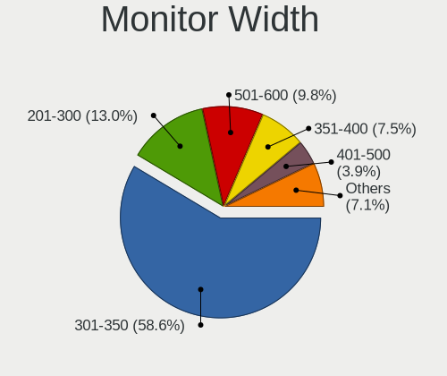

| Width in mm | Notebooks | Percent |
|-------------|-----------|---------|
| 301-350     | 229       | 57.97%  |
| 201-300     | 50        | 12.66%  |
| 501-600     | 43        | 10.89%  |
| 351-400     | 29        | 7.34%   |
| 401-500     | 15        | 3.8%    |
| 701-800     | 7         | 1.77%   |
| 601-700     | 6         | 1.52%   |
| Unknown     | 6         | 1.52%   |
| 801-900     | 3         | 0.76%   |
| 1501-2000   | 3         | 0.76%   |
| 1001-1500   | 3         | 0.76%   |
| 901-1000    | 1         | 0.25%   |

Aspect Ratio
------------

Proportional relationship between the width and the height

| Ratio   | Notebooks | Percent |
|---------|-----------|---------|
| 16/9    | 286       | 82.66%  |
| 16/10   | 39        | 11.27%  |
| 3/2     | 6         | 1.73%   |
| 21/9    | 5         | 1.45%   |
| Unknown | 5         | 1.45%   |
| 5/4     | 2         | 0.58%   |
| 4/3     | 1         | 0.29%   |
| 32/9    | 1         | 0.29%   |
| 3.40    | 1         | 0.29%   |

Monitor Area
------------

Area in inch

| Area in inch | Notebooks | Percent |
|----------------|-----------|---------|
| 101-110        | 147       | 36.93%  |
| 81-90          | 92        | 23.12%  |
| 201-250        | 31        | 7.79%   |
| 71-80          | 26        | 6.53%   |
| 121-130        | 19        | 4.77%   |
| 301-350        | 16        | 4.02%   |
| 351-500        | 13        | 3.27%   |
| 51-60          | 12        | 3.02%   |
| 251-300        | 8         | 2.01%   |
| Unknown        | 6         | 1.51%   |
| More than 1000 | 5         | 1.26%   |
| 61-70          | 5         | 1.26%   |
| 151-200        | 5         | 1.26%   |
| 501-1000       | 5         | 1.26%   |
| 131-140        | 4         | 1.01%   |
| 141-150        | 2         | 0.5%    |
| 41-50          | 1         | 0.25%   |
| 91-100         | 1         | 0.25%   |

Pixel Density
-------------

Pixels per inch

| Density       | Notebooks | Percent |
|---------------|-----------|---------|
| 121-160       | 146       | 37.44%  |
| 101-120       | 119       | 30.51%  |
| 51-100        | 65        | 16.67%  |
| 161-240       | 30        | 7.69%   |
| More than 240 | 16        | 4.1%    |
| 1-50          | 8         | 2.05%   |
| Unknown       | 6         | 1.54%   |

Multiple Monitors
-----------------

Total monitors connected

| Total | Notebooks | Percent |
|-------|-----------|---------|
| 1     | 261       | 77.45%  |
| 2     | 61        | 18.1%   |
| 3     | 10        | 2.97%   |
| 0     | 5         | 1.48%   |

Network
-------

Net Controller Vendor
---------------------

Controller vendors

| Vendor                                | Notebooks | Percent |
|---------------------------------------|-----------|---------|
| Intel                                 | 197       | 36.62%  |
| Realtek Semiconductor                 | 172       | 31.97%  |
| Qualcomm Atheros                      | 78        | 14.5%   |
| Broadcom                              | 27        | 5.02%   |
| Broadcom Limited                      | 13        | 2.42%   |
| Marvell Technology Group              | 7         | 1.3%    |
| Ralink                                | 5         | 0.93%   |
| Hewlett-Packard                       | 5         | 0.93%   |
| MediaTek                              | 3         | 0.56%   |
| Huawei Technologies                   | 3         | 0.56%   |
| ASIX Electronics                      | 3         | 0.56%   |
| Sierra Wireless                       | 2         | 0.37%   |
| Nvidia                                | 2         | 0.37%   |
| Lenovo                                | 2         | 0.37%   |
| JMicron Technology                    | 2         | 0.37%   |
| DisplayLink                           | 2         | 0.37%   |
| Xiaomi                                | 1         | 0.19%   |
| TP-Link                               | 1         | 0.19%   |
| Samsung Electronics                   | 1         | 0.19%   |
| Ralink Technology                     | 1         | 0.19%   |
| Qualcomm Atheros Communications       | 1         | 0.19%   |
| Novatek Microelectronics              | 1         | 0.19%   |
| NetGear                               | 1         | 0.19%   |
| Google                                | 1         | 0.19%   |
| Ericsson Business Mobile Networks     | 1         | 0.19%   |
| Edimax Technology                     | 1         | 0.19%   |
| Dell                                  | 1         | 0.19%   |
| BUFFALO                               | 1         | 0.19%   |
| ASUSTek Computer                      | 1         | 0.19%   |
| Apple                                 | 1         | 0.19%   |
| 802.11g Adapter [Linksys WUSB54GC v3] | 1         | 0.19%   |

Net Controller Model
--------------------

Controller models

| Model                                                             | Notebooks | Percent |
|-------------------------------------------------------------------|-----------|---------|
| Realtek RTL8111/8168/8411 PCI Express Gigabit Ethernet Controller | 104       | 16.3%   |
| Intel Wi-Fi 6 AX200                                               | 34        | 5.33%   |
| Realtek RTL8153 Gigabit Ethernet Adapter                          | 25        | 3.92%   |
| Realtek RTL810xE PCI Express Fast Ethernet controller             | 25        | 3.92%   |
| Intel Wireless 8265 / 8275                                        | 22        | 3.45%   |
| Qualcomm Atheros QCA9377 802.11ac Wireless Network Adapter        | 17        | 2.66%   |
| Intel 82579LM Gigabit Network Connection (Lewisville)             | 16        | 2.51%   |
| Intel Wireless-AC 9260                                            | 14        | 2.19%   |
| Qualcomm Atheros AR9285 Wireless Network Adapter (PCI-Express)    | 11        | 1.72%   |
| Intel Wireless 7265                                               | 11        | 1.72%   |
| Qualcomm Atheros QCA9565 / AR9565 Wireless Network Adapter        | 10        | 1.57%   |
| Intel Wireless 8260                                               | 10        | 1.57%   |
| Intel Comet Lake PCH-LP CNVi WiFi                                 | 10        | 1.57%   |
| Intel Centrino Advanced-N 6205 [Taylor Peak]                      | 10        | 1.57%   |
| Realtek RTL8821CE 802.11ac PCIe Wireless Network Adapter          | 9         | 1.41%   |
| Qualcomm Atheros AR9485 Wireless Network Adapter                  | 9         | 1.41%   |
| Qualcomm Atheros AR8151 v2.0 Gigabit Ethernet                     | 7         | 1.1%    |
| Intel Wi-Fi 6 AX201                                               | 7         | 1.1%    |
| Intel Cannon Point-LP CNVi [Wireless-AC]                          | 7         | 1.1%    |
| Broadcom BCM43142 802.11b/g/n                                     | 7         | 1.1%    |
| Qualcomm Atheros QCA6174 802.11ac Wireless Network Adapter        | 6         | 0.94%   |
| Intel Wireless 7260                                               | 6         | 0.94%   |
| Realtek RTL8723BE PCIe Wireless Network Adapter                   | 5         | 0.78%   |
| Realtek RTL8125 2.5GbE Controller                                 | 5         | 0.78%   |
| Qualcomm Atheros Killer E2500 Gigabit Ethernet Controller         | 5         | 0.78%   |
| Intel Wireless 3165                                               | 5         | 0.78%   |
| Intel Ethernet Connection (6) I219-V                              | 5         | 0.78%   |
| Intel Ethernet Connection (4) I219-LM                             | 5         | 0.78%   |
| Intel Dual Band Wireless-AC 3168NGW [Stone Peak]                  | 5         | 0.78%   |
| Realtek RTL8822CE 802.11ac PCIe Wireless Network Adapter          | 4         | 0.63%   |
| Qualcomm Atheros AR9462 Wireless Network Adapter                  | 4         | 0.63%   |
| Intel Ethernet Connection I219-LM                                 | 4         | 0.63%   |
| Intel Comet Lake PCH CNVi WiFi                                    | 4         | 0.63%   |
| Intel Centrino Wireless-N 1000 [Condor Peak]                      | 4         | 0.63%   |
| Intel Centrino Ultimate-N 6300                                    | 4         | 0.63%   |
| Intel Cannon Lake PCH CNVi WiFi                                   | 4         | 0.63%   |
| Broadcom NetXtreme BCM57765 Gigabit Ethernet PCIe                 | 4         | 0.63%   |
| Broadcom BCM4331 802.11a/b/g/n                                    | 4         | 0.63%   |
| Realtek RTL8822BE 802.11a/b/g/n/ac WiFi adapter                   | 3         | 0.47%   |
| Realtek RTL8821AE 802.11ac PCIe Wireless Network Adapter          | 3         | 0.47%   |

Wireless Vendor
---------------

Wireless vendors

| Vendor                                | Notebooks | Percent |
|---------------------------------------|-----------|---------|
| Intel                                 | 190       | 55.56%  |
| Qualcomm Atheros                      | 62        | 18.13%  |
| Realtek Semiconductor                 | 40        | 11.7%   |
| Broadcom                              | 22        | 6.43%   |
| Broadcom Limited                      | 9         | 2.63%   |
| Ralink                                | 5         | 1.46%   |
| MediaTek                              | 3         | 0.88%   |
| Sierra Wireless                       | 2         | 0.58%   |
| TP-Link                               | 1         | 0.29%   |
| Ralink Technology                     | 1         | 0.29%   |
| Qualcomm Atheros Communications       | 1         | 0.29%   |
| NetGear                               | 1         | 0.29%   |
| Hewlett-Packard                       | 1         | 0.29%   |
| Edimax Technology                     | 1         | 0.29%   |
| BUFFALO                               | 1         | 0.29%   |
| ASUSTek Computer                      | 1         | 0.29%   |
| 802.11g Adapter [Linksys WUSB54GC v3] | 1         | 0.29%   |

Wireless Model
--------------

Wireless models

| Model                                                          | Notebooks | Percent |
|----------------------------------------------------------------|-----------|---------|
| Intel Wi-Fi 6 AX200                                            | 34        | 9.91%   |
| Intel Wireless 8265 / 8275                                     | 22        | 6.41%   |
| Qualcomm Atheros QCA9377 802.11ac Wireless Network Adapter     | 17        | 4.96%   |
| Intel Wireless-AC 9260                                         | 14        | 4.08%   |
| Qualcomm Atheros AR9285 Wireless Network Adapter (PCI-Express) | 11        | 3.21%   |
| Intel Wireless 7265                                            | 11        | 3.21%   |
| Qualcomm Atheros QCA9565 / AR9565 Wireless Network Adapter     | 10        | 2.92%   |
| Intel Wireless 8260                                            | 10        | 2.92%   |
| Intel Comet Lake PCH-LP CNVi WiFi                              | 10        | 2.92%   |
| Intel Centrino Advanced-N 6205 [Taylor Peak]                   | 10        | 2.92%   |
| Realtek RTL8821CE 802.11ac PCIe Wireless Network Adapter       | 9         | 2.62%   |
| Qualcomm Atheros AR9485 Wireless Network Adapter               | 9         | 2.62%   |
| Intel Wi-Fi 6 AX201                                            | 7         | 2.04%   |
| Intel Cannon Point-LP CNVi [Wireless-AC]                       | 7         | 2.04%   |
| Broadcom BCM43142 802.11b/g/n                                  | 7         | 2.04%   |
| Qualcomm Atheros QCA6174 802.11ac Wireless Network Adapter     | 6         | 1.75%   |
| Intel Wireless 7260                                            | 6         | 1.75%   |
| Realtek RTL8723BE PCIe Wireless Network Adapter                | 5         | 1.46%   |
| Intel Wireless 3165                                            | 5         | 1.46%   |
| Intel Dual Band Wireless-AC 3168NGW [Stone Peak]               | 5         | 1.46%   |
| Realtek RTL8822CE 802.11ac PCIe Wireless Network Adapter       | 4         | 1.17%   |
| Qualcomm Atheros AR9462 Wireless Network Adapter               | 4         | 1.17%   |
| Intel Comet Lake PCH CNVi WiFi                                 | 4         | 1.17%   |
| Intel Centrino Wireless-N 1000 [Condor Peak]                   | 4         | 1.17%   |
| Intel Centrino Ultimate-N 6300                                 | 4         | 1.17%   |
| Intel Cannon Lake PCH CNVi WiFi                                | 4         | 1.17%   |
| Broadcom BCM4331 802.11a/b/g/n                                 | 4         | 1.17%   |
| Realtek RTL8822BE 802.11a/b/g/n/ac WiFi adapter                | 3         | 0.87%   |
| Realtek RTL8821AE 802.11ac PCIe Wireless Network Adapter       | 3         | 0.87%   |
| Realtek RTL8188CE 802.11b/g/n WiFi Adapter                     | 3         | 0.87%   |
| Realtek 802.11n WLAN Adapter                                   | 3         | 0.87%   |
| Ralink RT3290 Wireless 802.11n 1T/1R PCIe                      | 3         | 0.87%   |
| Intel WiFi Link 5100                                           | 3         | 0.87%   |
| Intel PRO/Wireless 3945ABG [Golan] Network Connection          | 3         | 0.87%   |
| Intel Centrino Wireless-N 2230                                 | 3         | 0.87%   |
| Intel Centrino Advanced-N 6235                                 | 3         | 0.87%   |
| Intel Centrino Advanced-N 6200                                 | 3         | 0.87%   |
| Broadcom Limited BCM4352 802.11ac Wireless Network Adapter     | 3         | 0.87%   |
| Broadcom BCM4313 802.11bgn Wireless Network Adapter            | 3         | 0.87%   |
| Realtek RTL8192CU 802.11n WLAN Adapter                         | 2         | 0.58%   |

Ethernet Vendor
---------------

Ethernet vendors

| Vendor                   | Notebooks | Percent |
|--------------------------|-----------|---------|
| Realtek Semiconductor    | 154       | 55.4%   |
| Intel                    | 62        | 22.3%   |
| Qualcomm Atheros         | 23        | 8.27%   |
| Broadcom                 | 11        | 3.96%   |
| Marvell Technology Group | 7         | 2.52%   |
| Broadcom Limited         | 4         | 1.44%   |
| ASIX Electronics         | 3         | 1.08%   |
| Nvidia                   | 2         | 0.72%   |
| Lenovo                   | 2         | 0.72%   |
| JMicron Technology       | 2         | 0.72%   |
| Hewlett-Packard          | 2         | 0.72%   |
| DisplayLink              | 2         | 0.72%   |
| Xiaomi                   | 1         | 0.36%   |
| Samsung Electronics      | 1         | 0.36%   |
| Google                   | 1         | 0.36%   |
| Apple                    | 1         | 0.36%   |

Ethernet Model
--------------

Ethernet models

| Model                                                                          | Notebooks | Percent |
|--------------------------------------------------------------------------------|-----------|---------|
| Realtek RTL8111/8168/8411 PCI Express Gigabit Ethernet Controller              | 104       | 36.24%  |
| Realtek RTL8153 Gigabit Ethernet Adapter                                       | 25        | 8.71%   |
| Realtek RTL810xE PCI Express Fast Ethernet controller                          | 25        | 8.71%   |
| Intel 82579LM Gigabit Network Connection (Lewisville)                          | 16        | 5.57%   |
| Qualcomm Atheros AR8151 v2.0 Gigabit Ethernet                                  | 7         | 2.44%   |
| Realtek RTL8125 2.5GbE Controller                                              | 5         | 1.74%   |
| Qualcomm Atheros Killer E2500 Gigabit Ethernet Controller                      | 5         | 1.74%   |
| Intel Ethernet Connection (6) I219-V                                           | 5         | 1.74%   |
| Intel Ethernet Connection (4) I219-LM                                          | 5         | 1.74%   |
| Intel Ethernet Connection I219-LM                                              | 4         | 1.39%   |
| Broadcom NetXtreme BCM57765 Gigabit Ethernet PCIe                              | 4         | 1.39%   |
| Qualcomm Atheros QCA8171 Gigabit Ethernet                                      | 3         | 1.05%   |
| Intel Ethernet Connection I218-LM                                              | 3         | 1.05%   |
| Intel Ethernet Connection (6) I219-LM                                          | 3         | 1.05%   |
| Intel 82577LM Gigabit Network Connection                                       | 3         | 1.05%   |
| Intel 82567LM Gigabit Network Connection                                       | 3         | 1.05%   |
| ASIX AX88179 Gigabit Ethernet                                                  | 3         | 1.05%   |
| Realtek RTL8152 Fast Ethernet Adapter                                          | 2         | 0.7%    |
| Qualcomm Atheros QCA8172 Fast Ethernet                                         | 2         | 0.7%    |
| Qualcomm Atheros Killer E2400 Gigabit Ethernet Controller                      | 2         | 0.7%    |
| Qualcomm Atheros AR8161 Gigabit Ethernet                                       | 2         | 0.7%    |
| Marvell Group Yukon Optima 88E8059 [PCIe Gigabit Ethernet Controller with AVB] | 2         | 0.7%    |
| Marvell Group 88E8058 PCI-E Gigabit Ethernet Controller                        | 2         | 0.7%    |
| JMicron JMC250 PCI Express Gigabit Ethernet Controller                         | 2         | 0.7%    |
| Intel Ethernet Connection I217-LM                                              | 2         | 0.7%    |
| Intel Ethernet Connection (7) I219-V                                           | 2         | 0.7%    |
| Intel Ethernet Connection (5) I219-LM                                          | 2         | 0.7%    |
| Intel Ethernet Connection (4) I219-V                                           | 2         | 0.7%    |
| Intel Ethernet Connection (3) I218-LM                                          | 2         | 0.7%    |
| Intel Ethernet Connection (2) I219-LM                                          | 2         | 0.7%    |
| HP HP lt4120 Snapdragon X5 LTE                                                 | 2         | 0.7%    |
| Broadcom NetLink BCM57780 Gigabit Ethernet PCIe                                | 2         | 0.7%    |
| Xiaomi Mi/Redmi series (RNDIS)                                                 | 1         | 0.35%   |
| Samsung Galaxy series, misc. (tethering mode)                                  | 1         | 0.35%   |
| Realtek RTL-8100/8101L/8139 PCI Fast Ethernet Adapter                          | 1         | 0.35%   |
| Realtek Killer E3000 2.5GbE Controller                                         | 1         | 0.35%   |
| Qualcomm Atheros Killer E220x Gigabit Ethernet Controller                      | 1         | 0.35%   |
| Qualcomm Atheros AR8152 v2.0 Fast Ethernet                                     | 1         | 0.35%   |
| Nvidia MCP79 Ethernet                                                          | 1         | 0.35%   |
| Nvidia MCP51 Ethernet Controller                                               | 1         | 0.35%   |

Net Controller Kind
-------------------

Ethernet, WiFi or modem

| Kind     | Notebooks | Percent |
|----------|-----------|---------|
| WiFi     | 326       | 54.61%  |
| Ethernet | 263       | 44.05%  |
| Modem    | 8         | 1.34%   |

Used Controller
---------------

Currently used network controller

| Kind     | Notebooks | Percent |
|----------|-----------|---------|
| WiFi     | 284       | 81.61%  |
| Ethernet | 64        | 18.39%  |

NICs
----

Total network controllers on board

| Total | Notebooks | Percent |
|-------|-----------|---------|
| 2     | 245       | 74.02%  |
| 1     | 77        | 23.26%  |
| 0     | 8         | 2.42%   |
| 3     | 1         | 0.3%    |

IPv6
----

IPv6 vs IPv4

| Used | Notebooks | Percent |
|------|-----------|---------|
| No   | 279       | 83.28%  |
| Yes  | 56        | 16.72%  |

Bluetooth
---------

Bluetooth Vendor
----------------

Controller vendors

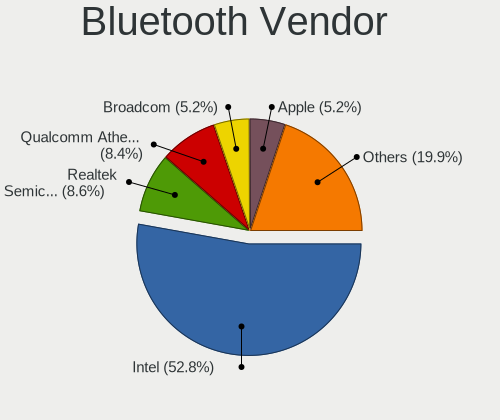

| Vendor                          | Notebooks | Percent |
|---------------------------------|-----------|---------|
| Intel                           | 150       | 53.96%  |
| Qualcomm Atheros Communications | 28        | 10.07%  |
| Realtek Semiconductor           | 19        | 6.83%   |
| Broadcom                        | 16        | 5.76%   |
| Foxconn / Hon Hai               | 10        | 3.6%    |
| Apple                           | 10        | 3.6%    |
| Lite-On Technology              | 9         | 3.24%   |
| IMC Networks                    | 8         | 2.88%   |
| Dell                            | 7         | 2.52%   |
| Hewlett-Packard                 | 5         | 1.8%    |
| Realtek                         | 4         | 1.44%   |
| Ralink                          | 3         | 1.08%   |
| Toshiba                         | 2         | 0.72%   |
| Foxconn International           | 2         | 0.72%   |
| Cambridge Silicon Radio         | 2         | 0.72%   |
| Unknown                         | 1         | 0.36%   |
| Integrated System Solution      | 1         | 0.36%   |
| Belkin Components               | 1         | 0.36%   |

Bluetooth Model
---------------

Controller models

| Model                                                                               | Notebooks | Percent |
|-------------------------------------------------------------------------------------|-----------|---------|
| Intel Bluetooth wireless interface                                                  | 55        | 19.78%  |
| Intel AX200 Bluetooth                                                               | 32        | 11.51%  |
| Intel AX201 Bluetooth                                                               | 20        | 7.19%   |
| Intel Bluetooth 9460/9560 Jefferson Peak (JfP)                                      | 17        | 6.12%   |
| Qualcomm Atheros  Bluetooth Device                                                  | 15        | 5.4%    |
| Intel Wireless-AC 9260 Bluetooth Adapter                                            | 14        | 5.04%   |
| Realtek Bluetooth Radio                                                             | 9         | 3.24%   |
| Qualcomm Atheros AR3011 Bluetooth                                                   | 6         | 2.16%   |
| Dell DW375 Bluetooth Module                                                         | 6         | 2.16%   |
| Apple Bluetooth Host Controller                                                     | 6         | 2.16%   |
| Foxconn / Hon Hai Bluetooth Device                                                  | 5         | 1.8%    |
| Realtek  Bluetooth 4.2 Adapter                                                      | 4         | 1.44%   |
| Realtek Bluetooth Radio                                                             | 4         | 1.44%   |
| Qualcomm Atheros AR3012 Bluetooth 4.0                                               | 4         | 1.44%   |
| Intel Wireless-AC 3168 Bluetooth                                                    | 4         | 1.44%   |
| Intel Centrino Bluetooth Wireless Transceiver                                       | 4         | 1.44%   |
| Realtek RTL8723B Bluetooth                                                          | 3         | 1.08%   |
| Ralink RT3290 Bluetooth                                                             | 3         | 1.08%   |
| Lite-On Qualcomm Atheros QCA9377 Bluetooth                                          | 3         | 1.08%   |
| Broadcom BCM20702 Bluetooth 4.0 [ThinkPad]                                          | 3         | 1.08%   |
| Realtek RTL8821A Bluetooth                                                          | 2         | 0.72%   |
| Qualcomm Atheros QCA61x4 Bluetooth 4.0                                              | 2         | 0.72%   |
| Lite-On Bluetooth Device                                                            | 2         | 0.72%   |
| Lite-On Atheros AR3012 Bluetooth                                                    | 2         | 0.72%   |
| Intel AX210 Bluetooth                                                               | 2         | 0.72%   |
| IMC Networks Wireless_Device                                                        | 2         | 0.72%   |
| IMC Networks Bluetooth Radio                                                        | 2         | 0.72%   |
| IMC Networks Bluetooth Device                                                       | 2         | 0.72%   |
| IMC Networks Atheros AR3012 Bluetooth 4.0 Adapter                                   | 2         | 0.72%   |
| HP Broadcom 2070 Bluetooth Combo                                                    | 2         | 0.72%   |
| HP Bluetooth 2.0 Interface [Broadcom BCM2045]                                       | 2         | 0.72%   |
| Foxconn International BCM43142A0 Bluetooth module                                   | 2         | 0.72%   |
| Foxconn / Hon Hai Foxconn T77H114 BCM2070 [Single-Chip Bluetooth 2.1 + EDR Adapter] | 2         | 0.72%   |
| Cambridge Silicon Radio Bluetooth Dongle (HCI mode)                                 | 2         | 0.72%   |
| Broadcom BCM43142A0 Bluetooth Device                                                | 2         | 0.72%   |
| Broadcom BCM2070 Bluetooth 2.1 + EDR                                                | 2         | 0.72%   |
| Broadcom BCM2045B (BDC-2.1) [Bluetooth Controller]                                  | 2         | 0.72%   |
| Apple Bluetooth USB Host Controller                                                 | 2         | 0.72%   |
| Apple Bluetooth HCI                                                                 | 2         | 0.72%   |
| Unknown Bluetooth Device                                                            | 1         | 0.36%   |

Sound
-----

Sound Vendor
------------

Sound card vendors

| Vendor                    | Notebooks | Percent |
|---------------------------|-----------|---------|
| Intel                     | 281       | 68.54%  |
| Nvidia                    | 49        | 11.95%  |
| AMD                       | 49        | 11.95%  |
| Realtek Semiconductor     | 7         | 1.71%   |
| GN Netcom                 | 3         | 0.73%   |
| Logitech                  | 2         | 0.49%   |
| Kingston Technology       | 2         | 0.49%   |
| C-Media Electronics       | 2         | 0.49%   |
| XMOS                      | 1         | 0.24%   |
| Sennheiser Communications | 1         | 0.24%   |
| Samson Technologies       | 1         | 0.24%   |
| Razer USA                 | 1         | 0.24%   |
| Plantronics               | 1         | 0.24%   |
| No brand                  | 1         | 0.24%   |
| Lenovo                    | 1         | 0.24%   |
| JMTek                     | 1         | 0.24%   |
| Hewlett-Packard           | 1         | 0.24%   |
| GYROCOM C&C               | 1         | 0.24%   |
| Generalplus Technology    | 1         | 0.24%   |
| Conexant Systems          | 1         | 0.24%   |
| CMX Systems               | 1         | 0.24%   |
| Cambridge Audio           | 1         | 0.24%   |
| Apple                     | 1         | 0.24%   |

Sound Model
-----------

Sound card models

| Model                                                                                             | Notebooks | Percent |
|---------------------------------------------------------------------------------------------------|-----------|---------|
| Intel Sunrise Point-LP HD Audio                                                                   | 46        | 9.62%   |
| Intel 7 Series/C216 Chipset Family High Definition Audio Controller                               | 30        | 6.28%   |
| AMD Family 17h/19h HD Audio Controller                                                            | 26        | 5.44%   |
| Intel Cannon Point-LP High Definition Audio Controller                                            | 25        | 5.23%   |
| Intel 6 Series/C200 Series Chipset Family High Definition Audio Controller                        | 23        | 4.81%   |
| Intel Comet Lake PCH-LP cAVS                                                                      | 16        | 3.35%   |
| Intel Tiger Lake-LP Smart Sound Technology Audio Controller                                       | 14        | 2.93%   |
| Intel Haswell-ULT HD Audio Controller                                                             | 13        | 2.72%   |
| Intel 8 Series HD Audio Controller                                                                | 13        | 2.72%   |
| AMD Renoir Radeon High Definition Audio Controller                                                | 13        | 2.72%   |
| Intel Wildcat Point-LP High Definition Audio Controller                                           | 12        | 2.51%   |
| Intel Cannon Lake PCH cAVS                                                                        | 12        | 2.51%   |
| Intel Broadwell-U Audio Controller                                                                | 12        | 2.51%   |
| Intel 8 Series/C220 Series Chipset High Definition Audio Controller                               | 10        | 2.09%   |
| Intel 5 Series/3400 Series Chipset High Definition Audio                                          | 10        | 2.09%   |
| Intel Xeon E3-1200 v3/4th Gen Core Processor HD Audio Controller                                  | 9         | 1.88%   |
| Intel CM238 HD Audio Controller                                                                   | 9         | 1.88%   |
| Intel Celeron/Pentium Silver Processor High Definition Audio                                      | 9         | 1.88%   |
| AMD FCH Azalia Controller                                                                         | 9         | 1.88%   |
| Nvidia TU106 High Definition Audio Controller                                                     | 8         | 1.67%   |
| Intel Comet Lake PCH cAVS                                                                         | 8         | 1.67%   |
| Intel 82801I (ICH9 Family) HD Audio Controller                                                    | 8         | 1.67%   |
| AMD Raven/Raven2/Fenghuang HDMI/DP Audio Controller                                               | 8         | 1.67%   |
| Realtek Semiconductor USB Audio                                                                   | 7         | 1.46%   |
| Intel Ice Lake-LP Smart Sound Technology Audio Controller                                         | 6         | 1.26%   |
| Intel 82801H (ICH8 Family) HD Audio Controller                                                    | 6         | 1.26%   |
| AMD Kabini HDMI/DP Audio                                                                          | 6         | 1.26%   |
| Nvidia GK107 HDMI Audio Controller                                                                | 5         | 1.05%   |
| Nvidia GA106 High Definition Audio Controller                                                     | 5         | 1.05%   |
| Intel 100 Series/C230 Series Chipset Family HD Audio Controller                                   | 5         | 1.05%   |
| Nvidia GP106 High Definition Audio Controller                                                     | 4         | 0.84%   |
| Intel Atom/Celeron/Pentium Processor x5-E8000/J3xxx/N3xxx Series High Definition Audio Controller | 4         | 0.84%   |
| AMD Oland/Hainan/Cape Verde/Pitcairn HDMI Audio [Radeon HD 7000 Series]                           | 4         | 0.84%   |
| Nvidia TU107 GeForce GTX 1650 High Definition Audio Controller                                    | 3         | 0.63%   |
| Nvidia GF108 High Definition Audio Controller                                                     | 3         | 0.63%   |
| Intel Tiger Lake-H HD Audio Controller                                                            | 3         | 0.63%   |
| Intel Atom Processor Z36xxx/Z37xxx Series High Definition Audio Controller                        | 3         | 0.63%   |
| AMD Wrestler HDMI Audio                                                                           | 3         | 0.63%   |
| AMD SBx00 Azalia (Intel HDA)                                                                      | 3         | 0.63%   |
| Nvidia TU104 HD Audio Controller                                                                  | 2         | 0.42%   |

Memory
------

Memory Vendor
-------------

Memory module vendors

| Vendor              | Notebooks | Percent |
|---------------------|-----------|---------|
| Samsung Electronics | 78        | 34.36%  |
| SK hynix            | 53        | 23.35%  |
| Micron Technology   | 25        | 11.01%  |
| Kingston            | 14        | 6.17%   |
| Unknown             | 10        | 4.41%   |
| Ramaxel Technology  | 10        | 4.41%   |
| Crucial             | 9         | 3.96%   |
| Unknown (ABCD)      | 4         | 1.76%   |
| Corsair             | 3         | 1.32%   |
| A-DATA Technology   | 3         | 1.32%   |
| Unknown             | 3         | 1.32%   |
| Teikon              | 2         | 0.88%   |
| Smart               | 2         | 0.88%   |
| Elpida              | 2         | 0.88%   |
| Smart Brazil        | 1         | 0.44%   |
| PNY                 | 1         | 0.44%   |
| Patriot             | 1         | 0.44%   |
| Nanya Technology    | 1         | 0.44%   |
| Kingmax             | 1         | 0.44%   |
| Goldkey             | 1         | 0.44%   |
| fef5                | 1         | 0.44%   |
| Cors                | 1         | 0.44%   |
| ASint Technology    | 1         | 0.44%   |

Memory Model
------------

Memory module models

| Model                                                            | Notebooks | Percent |
|------------------------------------------------------------------|-----------|---------|
| Samsung RAM M471A4G43AB1-CWE 32GB SODIMM DDR4 3200MT/s           | 7         | 2.88%   |
| Samsung RAM M471A2K43DB1-CWE 16GB SODIMM DDR4 3200MT/s           | 6         | 2.47%   |
| SK hynix RAM HMA81GS6AFR8N-UH 8GB SODIMM DDR4 2667MT/s           | 5         | 2.06%   |
| Samsung RAM M471A5244CB0-CTD 4GB SODIMM DDR4 3266MT/s            | 5         | 2.06%   |
| Samsung RAM M471A1K43CB1-CTD 8GB SODIMM DDR4 2667MT/s            | 5         | 2.06%   |
| Unknown (ABCD) RAM 123456789012345678 2GB SODIMM LPDDR4 2400MT/s | 4         | 1.65%   |
| Ramaxel RAM RMSA3260ME78HAF-2666 8GB SODIMM DDR4 2667MT/s        | 4         | 1.65%   |
| Micron RAM 4ATF51264HZ-2G6E1 4GB SODIMM DDR4 2667MT/s            | 4         | 1.65%   |
| SK hynix RAM HMT451S6BFR8A-PB 4GB SODIMM DDR3 1600MT/s           | 3         | 1.23%   |
| SK hynix RAM HMT351S6BFR8C-H9 4GB SODIMM DDR3 1333MT/s           | 3         | 1.23%   |
| Samsung RAM M471B5773DH0-CH9 2GB SODIMM DDR3 1600MT/s            | 3         | 1.23%   |
| Samsung RAM M471B1G73QH0-YK0 8GB SODIMM DDR3 1600MT/s            | 3         | 1.23%   |
| Samsung RAM M471A4G43MB1-CTD 32GB SODIMM DDR4 2667MT/s           | 3         | 1.23%   |
| Samsung RAM M471A2K43CB1-CTD 16GB SODIMM DDR4 8400MT/s           | 3         | 1.23%   |
| Samsung RAM M471A1K43DB1-CWE 8GB SODIMM DDR4 3200MT/s            | 3         | 1.23%   |
| Samsung RAM K4EBE304EC-EGCG 8GB Row Of Chips LPDDR3 2133MT/s     | 3         | 1.23%   |
| Ramaxel RAM RMSA3270ME86H9F-2666 4GB SODIMM DDR4 2667MT/s        | 3         | 1.23%   |
| Micron RAM 16KTF1G64HZ-1G6E1 8GB SODIMM DDR3 1600MT/s            | 3         | 1.23%   |
| Micron RAM 16ATF2G64HZ-2G6E1 16GB SODIMM DDR4 2667MT/s           | 3         | 1.23%   |
| Unknown                                                          | 3         | 1.23%   |
| Unknown RAM Module 4096MB SODIMM DDR2 667MT/s                    | 2         | 0.82%   |
| Unknown RAM Module 2GB SODIMM DDR3                               | 2         | 0.82%   |
| SK hynix RAM HMT41GS6AFR8A-PB 8GB SODIMM DDR3 1600MT/s           | 2         | 0.82%   |
| SK hynix RAM HMT351S6CFR8C-PB 4GB SODIMM DDR3 1600MT/s           | 2         | 0.82%   |
| SK hynix RAM HMT351S6CFR8A-PB 4GB SODIMM DDR3 1600MT/s           | 2         | 0.82%   |
| SK hynix RAM HMT325S6BFR8C-H9 2GB SODIMM DDR3 1600MT/s           | 2         | 0.82%   |
| SK hynix RAM HMA82GS6CJR8N-VK 16GB SODIMM DDR4 2667MT/s          | 2         | 0.82%   |
| Samsung RAM M471B5273EB0-CK0 4096MB SODIMM DDR3 4199MT/s         | 2         | 0.82%   |
| Samsung RAM M471B5273DH0-CK0 4GB SODIMM DDR3 1600MT/s            | 2         | 0.82%   |
| Samsung RAM M471B5273DH0-CH9 4GB SODIMM DDR3 1334MT/s            | 2         | 0.82%   |
| Samsung RAM M471B5173EB0-YK0 4GB SODIMM DDR3 1600MT/s            | 2         | 0.82%   |
| Samsung RAM M471A5244CB0-CRC 4GB SODIMM DDR4 2667MT/s            | 2         | 0.82%   |
| Samsung RAM M471A2K43CB1-CRC 16GB SODIMM DDR4 2667MT/s           | 2         | 0.82%   |
| Samsung RAM M471A1K43BB0-CPB 8GB SODIMM DDR4 2133MT/s            | 2         | 0.82%   |
| Samsung RAM M471A1G44AB0-CWE 8GB SODIMM DDR4 3200MT/s            | 2         | 0.82%   |
| Micron RAM 16JSF51264HZ-1G4D1 4096MB SODIMM DDR3 1334MT/s        | 2         | 0.82%   |
| Kingston RAM 9905428-417.A00LF 8GB SODIMM DDR3 1600MT/s          | 2         | 0.82%   |
| Unknown RAM Module 8192MB SODIMM DDR4 2400MT/s                   | 1         | 0.41%   |
| Unknown RAM Module 4GB SODIMM DDR4 2400MT/s                      | 1         | 0.41%   |
| Unknown RAM Module 4GB SODIMM DDR3                               | 1         | 0.41%   |

Memory Kind
-----------

Memory module kinds

| Kind    | Notebooks | Percent |
|---------|-----------|---------|
| DDR4    | 99        | 50.77%  |
| DDR3    | 65        | 33.33%  |
| LPDDR4  | 11        | 5.64%   |
| LPDDR3  | 10        | 5.13%   |
| SDRAM   | 3         | 1.54%   |
| DDR2    | 3         | 1.54%   |
| Unknown | 3         | 1.54%   |
| DDR     | 1         | 0.51%   |

Memory Form Factor
------------------

Physical design of the memory module

| Name         | Notebooks | Percent |
|--------------|-----------|---------|
| SODIMM       | 170       | 89.01%  |
| Row Of Chips | 18        | 9.42%   |
| Unknown      | 2         | 1.05%   |
| Chip         | 1         | 0.52%   |

Memory Size
-----------

Memory module size

| Size  | Notebooks | Percent |
|-------|-----------|---------|
| 4096  | 75        | 35.89%  |
| 8192  | 73        | 34.93%  |
| 16384 | 31        | 14.83%  |
| 2048  | 15        | 7.18%   |
| 32768 | 11        | 5.26%   |
| 1024  | 4         | 1.91%   |

Memory Speed
------------

Memory module speed

| Speed   | Notebooks | Percent |
|---------|-----------|---------|
| 2667    | 57        | 26.27%  |
| 1600    | 45        | 20.74%  |
| 3200    | 27        | 12.44%  |
| 2400    | 18        | 8.29%   |
| 2133    | 18        | 8.29%   |
| 1333    | 10        | 4.61%   |
| 1334    | 9         | 4.15%   |
| 3266    | 5         | 2.3%    |
| 1067    | 5         | 2.3%    |
| Unknown | 4         | 1.84%   |
| 8400    | 3         | 1.38%   |
| 4267    | 3         | 1.38%   |
| 4199    | 3         | 1.38%   |
| 1867    | 3         | 1.38%   |
| 667     | 3         | 1.38%   |
| 4266    | 1         | 0.46%   |
| 3733    | 1         | 0.46%   |
| 1066    | 1         | 0.46%   |
| 533     | 1         | 0.46%   |

Printers & scanners
-------------------

Printer Vendor
--------------

Printer device vendors

| Vendor              | Notebooks | Percent |
|---------------------|-----------|---------|
| Hewlett-Packard     | 2         | 40%     |
| Samsung Electronics | 1         | 20%     |
| Canon               | 1         | 20%     |
| Brother Industries  | 1         | 20%     |

Printer Model
-------------

Printer device models

| Model                  | Notebooks | Percent |
|------------------------|-----------|---------|
| Samsung M2020 Series   | 1         | 20%     |
| HP LaserJet 1320       | 1         | 20%     |
| HP DeskJet 2130 series | 1         | 20%     |
| Canon LiDE 400         | 1         | 20%     |
| Brother MFC-1810       | 1         | 20%     |

Scanner Vendor
--------------

Scanner device vendors

| Vendor | Notebooks | Percent |
|--------|-----------|---------|
| Canon  | 1         | 100%    |

Scanner Model
-------------

Scanner device models

| Model                   | Notebooks | Percent |
|-------------------------|-----------|---------|
| Canon CanoScan LiDE 220 | 1         | 100%    |

Camera
------

Camera Vendor
-------------

Camera device vendors

| Vendor                                 | Notebooks | Percent |
|----------------------------------------|-----------|---------|
| Chicony Electronics                    | 87        | 29.39%  |
| Sunplus Innovation Technology          | 28        | 9.46%   |
| IMC Networks                           | 28        | 9.46%   |
| Acer                                   | 26        | 8.78%   |
| Realtek Semiconductor                  | 25        | 8.45%   |
| Microdia                               | 21        | 7.09%   |
| Syntek                                 | 10        | 3.38%   |
| Suyin                                  | 10        | 3.38%   |
| Cheng Uei Precision Industry (Foxlink) | 10        | 3.38%   |
| Apple                                  | 10        | 3.38%   |
| Quanta                                 | 8         | 2.7%    |
| Silicon Motion                         | 6         | 2.03%   |
| Lite-On Technology                     | 4         | 1.35%   |
| Ricoh                                  | 3         | 1.01%   |
| Luxvisions Innotech Limited            | 3         | 1.01%   |
| Alcor Micro                            | 3         | 1.01%   |
| Logitech                               | 2         | 0.68%   |
| Unknown                                | 2         | 0.68%   |
| Z-Star Microelectronics                | 1         | 0.34%   |
| Sonix Technology                       | 1         | 0.34%   |
| Samsung Electronics                    | 1         | 0.34%   |
| Primax Electronics                     | 1         | 0.34%   |
| Polycom                                | 1         | 0.34%   |
| LG Electronics                         | 1         | 0.34%   |
| Importek                               | 1         | 0.34%   |
| icSpring                               | 1         | 0.34%   |
| Generalplus Technology                 | 1         | 0.34%   |
| Creative Technology                    | 1         | 0.34%   |

Camera Model
------------

Camera device models

| Model                                                   | Notebooks | Percent |
|---------------------------------------------------------|-----------|---------|
| Chicony USB2.0 Camera                                   | 17        | 5.74%   |
| Chicony HD Webcam                                       | 16        | 5.41%   |
| Chicony Integrated Camera                               | 11        | 3.72%   |
| Microdia Integrated_Webcam_HD                           | 9         | 3.04%   |
| IMC Networks Integrated Camera                          | 9         | 3.04%   |
| Realtek Integrated_Webcam_HD                            | 7         | 2.36%   |
| IMC Networks USB2.0 HD UVC WebCam                       | 7         | 2.36%   |
| Chicony HP HD Camera                                    | 6         | 2.03%   |
| Acer HD Webcam                                          | 6         | 2.03%   |
| Sunplus HD WebCam                                       | 5         | 1.69%   |
| Acer BisonCam,NB Pro                                    | 5         | 1.69%   |
| Syntek Integrated Camera                                | 4         | 1.35%   |
| Sunplus Integrated_Webcam_HD                            | 4         | 1.35%   |
| IMC Networks VGA UVC WebCam                             | 4         | 1.35%   |
| Apple FaceTime HD Camera                                | 4         | 1.35%   |
| Sunplus Asus Webcam                                     | 3         | 1.01%   |
| Realtek Lenovo EasyCamera                               | 3         | 1.01%   |
| Realtek Integrated Webcam                               | 3         | 1.01%   |
| Chicony USB2.0 VGA UVC WebCam                           | 3         | 1.01%   |
| Chicony Integrated Camera [ThinkPad]                    | 3         | 1.01%   |
| Chicony Integrated Camera (1280x720@30)                 | 3         | 1.01%   |
| Cheng Uei Precision Industry (Foxlink) HP Truevision HD | 3         | 1.01%   |
| Apple iPhone 5/5C/5S/6/SE                               | 3         | 1.01%   |
| Acer Integrated Camera                                  | 3         | 1.01%   |
| Acer BisonCam, NB Pro                                   | 3         | 1.01%   |
| Syntek Lenovo EasyCamera                                | 2         | 0.68%   |
| Syntek EasyCamera                                       | 2         | 0.68%   |
| Suyin USB 2.0 Camera                                    | 2         | 0.68%   |
| Suyin HP Truevision HD                                  | 2         | 0.68%   |
| Sunplus Lenovo EasyCamera                               | 2         | 0.68%   |
| Sunplus Laptop_Integrated_Webcam_FHD                    | 2         | 0.68%   |
| Sunplus HP HD Webcam [Fixed]                            | 2         | 0.68%   |
| Sunplus HD User Facing                                  | 2         | 0.68%   |
| Sunplus Aukey-PC-LM1E Camera                            | 2         | 0.68%   |
| Realtek USB2.0 HD UVC WebCam                            | 2         | 0.68%   |
| Realtek HP "Truevision HD" laptop camera                | 2         | 0.68%   |
| Realtek HD WebCam                                       | 2         | 0.68%   |
| Microdia Sonix USB 2.0 Camera                           | 2         | 0.68%   |
| Microdia Integrated Webcam HD                           | 2         | 0.68%   |
| Lite-On Integrated Camera                               | 2         | 0.68%   |

Security
--------

Fingerprint Vendor
------------------

Fingerprint sensor vendors

| Vendor                     | Notebooks | Percent |
|----------------------------|-----------|---------|
| Synaptics                  | 26        | 34.67%  |
| Validity Sensors           | 24        | 32%     |
| Shenzhen Goodix Technology | 11        | 14.67%  |
| LighTuning Technology      | 7         | 9.33%   |
| Elan Microelectronics      | 4         | 5.33%   |
| AuthenTec                  | 3         | 4%      |

Fingerprint Model
-----------------

Fingerprint sensor models

| Model                                                                      | Notebooks | Percent |
|----------------------------------------------------------------------------|-----------|---------|
| Shenzhen Goodix  FingerPrint Device                                        | 9         | 12%     |
| Synaptics Prometheus MIS Touch Fingerprint Reader                          | 8         | 10.67%  |
| Unknown                                                                    | 8         | 10.67%  |
| Validity Sensors VFS495 Fingerprint Reader                                 | 7         | 9.33%   |
| Validity Sensors Swipe Fingerprint Sensor                                  | 5         | 6.67%   |
| Validity Sensors VFS471 Fingerprint Reader                                 | 4         | 5.33%   |
| Synaptics WBDI Device                                                      | 4         | 5.33%   |
| Elan ELAN:Fingerprint                                                      | 4         | 5.33%   |
| Validity Sensors Fingerprint scanner                                       | 3         | 4%      |
| Synaptics Metallica MIS Touch Fingerprint Reader                           | 3         | 4%      |
| LighTuning EgisTec_ES603                                                   | 3         | 4%      |
| LighTuning EgisTec Touch Fingerprint Sensor                                | 3         | 4%      |
| Validity Sensors VFS5011 Fingerprint Reader                                | 2         | 2.67%   |
| Validity Sensors VFS491                                                    | 2         | 2.67%   |
| Synaptics Metallica MOH Touch Fingerprint Reader                           | 2         | 2.67%   |
| Validity Sensors Synaptics VFS7552 Touch Fingerprint Sensor with PurePrint | 1         | 1.33%   |
| Synaptics  VFS7552 Touch Fingerprint Sensor with PurePrint                 | 1         | 1.33%   |
| Shenzhen Goodix Fingerprint Reader                                         | 1         | 1.33%   |
| Shenzhen Goodix FingerPrint                                                | 1         | 1.33%   |
| LighTuning Fingerprint Reader                                              | 1         | 1.33%   |
| AuthenTec AES2810                                                          | 1         | 1.33%   |
| AuthenTec AES1660 Fingerprint Sensor                                       | 1         | 1.33%   |
| AuthenTec AES1600                                                          | 1         | 1.33%   |

Chipcard Vendor
---------------

Chipcard module vendors

| Vendor                | Notebooks | Percent |
|-----------------------|-----------|---------|
| Broadcom              | 11        | 47.83%  |
| Upek                  | 5         | 21.74%  |
| Alcor Micro           | 4         | 17.39%  |
| Lenovo                | 2         | 8.7%    |
| Gemalto (was Gemplus) | 1         | 4.35%   |

Chipcard Model
--------------

Chipcard module models

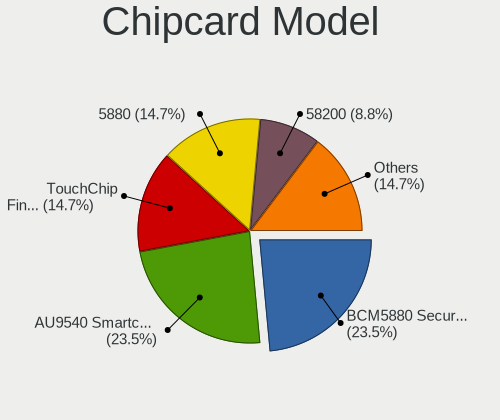

| Model                                                                        | Notebooks | Percent |
|------------------------------------------------------------------------------|-----------|---------|
| Upek TouchChip Fingerprint Coprocessor (WBF advanced mode)                   | 5         | 21.74%  |
| Broadcom BCM5880 Secure Applications Processor                               | 5         | 21.74%  |
| Alcor Micro AU9540 Smartcard Reader                                          | 4         | 17.39%  |
| Broadcom 5880                                                                | 3         | 13.04%  |
| Lenovo Integrated Smart Card Reader                                          | 2         | 8.7%    |
| Broadcom BCM5880 Secure Applications Processor with fingerprint swipe sensor | 2         | 8.7%    |
| Gemalto (was Gemplus) GemPC Twin SmartCard Reader                            | 1         | 4.35%   |
| Broadcom 58200                                                               | 1         | 4.35%   |

Unsupported
-----------

Unsupported Devices
-------------------

Total unsupported devices on board

| Total | Notebooks | Percent |
|-------|-----------|---------|
| 0     | 191       | 57.36%  |
| 1     | 113       | 33.93%  |
| 2     | 25        | 7.51%   |
| 3     | 2         | 0.6%    |
| 6     | 1         | 0.3%    |
| 4     | 1         | 0.3%    |

Unsupported Device Types
------------------------

Types of unsupported devices

| Type                     | Notebooks | Percent |
|--------------------------|-----------|---------|
| Fingerprint reader       | 74        | 43.79%  |
| Graphics card            | 24        | 14.2%   |
| Chipcard                 | 22        | 13.02%  |
| Communication controller | 14        | 8.28%   |
| Net/wireless             | 13        | 7.69%   |
| Camera                   | 5         | 2.96%   |
| Multimedia controller    | 4         | 2.37%   |
| Bluetooth                | 4         | 2.37%   |
| Storage                  | 3         | 1.78%   |
| Card reader              | 3         | 1.78%   |
| Sound                    | 2         | 1.18%   |
| Net/ethernet             | 1         | 0.59%   |

