Ubuntu Budgie - Tested Hardware & Statistics
--------------------------------------------

A project to collect tested hardware configurations for Ubuntu Budgie.

Anyone can contribute to this report by the [hw-probe](https://github.com/linuxhw/hw-probe) tool:

    sudo -E hw-probe -all -upload

Please contribute! Especially if your hardware is rare.

This is a report for all computer types. See also reports for [desktops](/Dist/Ubuntu_Budgie/Desktop/README.md) and [notebooks](/Dist/Ubuntu_Budgie/Notebook/README.md).

Contents
--------

* [ Test Cases ](#test-cases)

* [ System ](#system)
  - [ OS                       ](#os)
  - [ OS Family                ](#os-family)
  - [ Kernel                   ](#kernel)
  - [ Kernel Family            ](#kernel-family)
  - [ Kernel Major Ver.        ](#kernel-major-ver)
  - [ Arch                     ](#arch)
  - [ DE                       ](#de)
  - [ Display Server           ](#display-server)
  - [ Display Manager          ](#display-manager)
  - [ OS Lang                  ](#os-lang)
  - [ Boot Mode                ](#boot-mode)
  - [ Filesystem               ](#filesystem)
  - [ Part. scheme             ](#part-scheme)
  - [ Dual Boot with Linux/BSD ](#dual-boot-with-linuxbsd)
  - [ Dual Boot (Win)          ](#dual-boot-win)

* [ Board ](#board)
  - [ Vendor                   ](#vendor)
  - [ Model                    ](#model)
  - [ Model Family             ](#model-family)
  - [ MFG Year                 ](#mfg-year)
  - [ Form Factor              ](#form-factor)
  - [ Secure Boot              ](#secure-boot)
  - [ Coreboot                 ](#coreboot)
  - [ RAM Size                 ](#ram-size)
  - [ RAM Used                 ](#ram-used)
  - [ Total Drives             ](#total-drives)
  - [ Has CD-ROM               ](#has-cd-rom)
  - [ Has Ethernet             ](#has-ethernet)
  - [ Has WiFi                 ](#has-wifi)
  - [ Has Bluetooth            ](#has-bluetooth)

* [ Location ](#location)
  - [ Country                  ](#country)
  - [ City                     ](#city)

* [ Drives ](#drives)
  - [ Drive Vendor             ](#drive-vendor)
  - [ Drive Model              ](#drive-model)
  - [ HDD Vendor               ](#hdd-vendor)
  - [ SSD Vendor               ](#ssd-vendor)
  - [ Drive Kind               ](#drive-kind)
  - [ Drive Connector          ](#drive-connector)
  - [ Drive Size               ](#drive-size)
  - [ Space Total              ](#space-total)
  - [ Space Used               ](#space-used)
  - [ Malfunc. Drives          ](#malfunc-drives)
  - [ Malfunc. Drive Vendor    ](#malfunc-drive-vendor)
  - [ Malfunc. HDD Vendor      ](#malfunc-hdd-vendor)
  - [ Malfunc. Drive Kind      ](#malfunc-drive-kind)
  - [ Failed Drives            ](#failed-drives)
  - [ Failed Drive Vendor      ](#failed-drive-vendor)
  - [ Drive Status             ](#drive-status)

* [ Storage controller ](#storage-controller)
  - [ Storage Vendor           ](#storage-vendor)
  - [ Storage Model            ](#storage-model)
  - [ Storage Kind             ](#storage-kind)

* [ Processor ](#processor)
  - [ CPU Vendor               ](#cpu-vendor)
  - [ CPU Model                ](#cpu-model)
  - [ CPU Model Family         ](#cpu-model-family)
  - [ CPU Cores                ](#cpu-cores)
  - [ CPU Sockets              ](#cpu-sockets)
  - [ CPU Threads              ](#cpu-threads)
  - [ CPU Op-Modes             ](#cpu-op-modes)
  - [ CPU Microcode            ](#cpu-microcode)
  - [ CPU Microarch            ](#cpu-microarch)

* [ Graphics ](#graphics)
  - [ GPU Vendor               ](#gpu-vendor)
  - [ GPU Model                ](#gpu-model)
  - [ GPU Combo                ](#gpu-combo)
  - [ GPU Driver               ](#gpu-driver)
  - [ GPU Memory               ](#gpu-memory)

* [ Monitor ](#monitor)
  - [ Monitor Vendor           ](#monitor-vendor)
  - [ Monitor Model            ](#monitor-model)
  - [ Monitor Resolution       ](#monitor-resolution)
  - [ Monitor Diagonal         ](#monitor-diagonal)
  - [ Monitor Width            ](#monitor-width)
  - [ Aspect Ratio             ](#aspect-ratio)
  - [ Monitor Area             ](#monitor-area)
  - [ Pixel Density            ](#pixel-density)
  - [ Multiple Monitors        ](#multiple-monitors)

* [ Network ](#network)
  - [ Net Controller Vendor    ](#net-controller-vendor)
  - [ Net Controller Model     ](#net-controller-model)
  - [ Wireless Vendor          ](#wireless-vendor)
  - [ Wireless Model           ](#wireless-model)
  - [ Ethernet Vendor          ](#ethernet-vendor)
  - [ Ethernet Model           ](#ethernet-model)
  - [ Net Controller Kind      ](#net-controller-kind)
  - [ Used Controller          ](#used-controller)
  - [ NICs                     ](#nics)
  - [ IPv6                     ](#ipv6)

* [ Bluetooth ](#bluetooth)
  - [ Bluetooth Vendor         ](#bluetooth-vendor)
  - [ Bluetooth Model          ](#bluetooth-model)

* [ Sound ](#sound)
  - [ Sound Vendor             ](#sound-vendor)
  - [ Sound Model              ](#sound-model)

* [ Memory ](#memory)
  - [ Memory Vendor            ](#memory-vendor)
  - [ Memory Model             ](#memory-model)
  - [ Memory Kind              ](#memory-kind)
  - [ Memory Form Factor       ](#memory-form-factor)
  - [ Memory Size              ](#memory-size)
  - [ Memory Speed             ](#memory-speed)

* [ Printers & scanners ](#printers--scanners)
  - [ Printer Vendor           ](#printer-vendor)
  - [ Printer Model            ](#printer-model)
  - [ Scanner Vendor           ](#scanner-vendor)
  - [ Scanner Model            ](#scanner-model)

* [ Camera ](#camera)
  - [ Camera Vendor            ](#camera-vendor)
  - [ Camera Model             ](#camera-model)

* [ Security ](#security)
  - [ Fingerprint Vendor       ](#fingerprint-vendor)
  - [ Fingerprint Model        ](#fingerprint-model)
  - [ Chipcard Vendor          ](#chipcard-vendor)
  - [ Chipcard Model           ](#chipcard-model)

* [ Unsupported ](#unsupported)
  - [ Unsupported Devices      ](#unsupported-devices)
  - [ Unsupported Device Types ](#unsupported-device-types)

Test Cases
----------

Total: 1260

| Vendor        | Model                       | Form-Factor | Probe                                                      | Date         |
|---------------|-----------------------------|-------------|------------------------------------------------------------|--------------|
| HP            | ZBook Power 16 inch G11 ... | Notebook    | [e9dc3a9223](https://linux-hardware.org/?probe=e9dc3a9223) | Dec 21, 2025 |
| Intel         | NUC8BEB J72692-304          | Mini pc     | [87d8d9a85a](https://linux-hardware.org/?probe=87d8d9a85a) | Dec 17, 2025 |
| Intel         | NUC8BEB J72692-304          | Mini pc     | [6e079d5121](https://linux-hardware.org/?probe=6e079d5121) | Dec 17, 2025 |
| Lenovo        | ThinkPad T16 Gen 2 21K7C... | Notebook    | [999c27efc6](https://linux-hardware.org/?probe=999c27efc6) | Dec 15, 2025 |
| Apple         | MacBookPro8,2               | Notebook    | [97a87ca735](https://linux-hardware.org/?probe=97a87ca735) | Dec 15, 2025 |
| HP            | Pavilion g6                 | Notebook    | [7b48fc1b5f](https://linux-hardware.org/?probe=7b48fc1b5f) | Dec 15, 2025 |
| ASUSTek       | ROG Strix G713PV_G713PV     | Notebook    | [2cd803c12b](https://linux-hardware.org/?probe=2cd803c12b) | Dec 10, 2025 |
| MSI           | Indio                       | Desktop     | [9488789aae](https://linux-hardware.org/?probe=9488789aae) | Dec 09, 2025 |
| MSI           | Indio                       | Desktop     | [ef4428de90](https://linux-hardware.org/?probe=ef4428de90) | Dec 08, 2025 |
| Dell          | Latitude 5480               | Notebook    | [f9cb3f4f06](https://linux-hardware.org/?probe=f9cb3f4f06) | Dec 08, 2025 |
| ASUSTek       | UX303UA                     | Notebook    | [124456c402](https://linux-hardware.org/?probe=124456c402) | Dec 01, 2025 |
| Dell          | Latitude 5480               | Notebook    | [c4f9267dd0](https://linux-hardware.org/?probe=c4f9267dd0) | Nov 27, 2025 |
| HP            | EliteBook 840 G1            | Notebook    | [2160988d70](https://linux-hardware.org/?probe=2160988d70) | Nov 26, 2025 |
| Apple         | Mac-F2238AC8                | All in one  | [ec17221a5f](https://linux-hardware.org/?probe=ec17221a5f) | Nov 20, 2025 |
| HP            | 3646h                       | Desktop     | [b1b1ce12bc](https://linux-hardware.org/?probe=b1b1ce12bc) | Nov 19, 2025 |
| ASUSTek       | Vivobook Go E1504FA_E150... | Notebook    | [ea1adee43a](https://linux-hardware.org/?probe=ea1adee43a) | Nov 15, 2025 |
| ASUSTek       | Vivobook Go E1504FA_E150... | Notebook    | [b27cf5f053](https://linux-hardware.org/?probe=b27cf5f053) | Nov 15, 2025 |
| Apple         | MacBookPro15,4              | Notebook    | [ac5cdde42b](https://linux-hardware.org/?probe=ac5cdde42b) | Nov 14, 2025 |
| Dell          | OptiPlex 7050               | Desktop     | [283ff1bfff](https://linux-hardware.org/?probe=283ff1bfff) | Nov 07, 2025 |
| ASUSTek       | UX303UA                     | Notebook    | [3a42c35103](https://linux-hardware.org/?probe=3a42c35103) | Oct 31, 2025 |
| HP            | Pavilion x360 Convertibl... | Convertible | [042a9aa4ac](https://linux-hardware.org/?probe=042a9aa4ac) | Oct 31, 2025 |
| GMKtec        | NucBox K8 Plus              | Desktop     | [89b9a3fd58](https://linux-hardware.org/?probe=89b9a3fd58) | Oct 27, 2025 |
| Dell          | Precision 3540              | Notebook    | [d3e0d0b8c1](https://linux-hardware.org/?probe=d3e0d0b8c1) | Oct 12, 2025 |
| HP            | 82C0                        | Mini pc     | [6caeed8d84](https://linux-hardware.org/?probe=6caeed8d84) | Sep 27, 2025 |
| Dell          | Inspiron 15-3552            | Notebook    | [f1cd55d4c2](https://linux-hardware.org/?probe=f1cd55d4c2) | Sep 26, 2025 |
| Dell          | Inspiron 15-3552            | Notebook    | [25f1128ac3](https://linux-hardware.org/?probe=25f1128ac3) | Sep 26, 2025 |
| ASUSTek       | ROG Strix G614JV_G614JV     | Notebook    | [f4fa6052a7](https://linux-hardware.org/?probe=f4fa6052a7) | Sep 16, 2025 |
| Apple         | Mac-63001698E7A34814 iMa... | All in one  | [70490b679c](https://linux-hardware.org/?probe=70490b679c) | Sep 08, 2025 |
| ASUSTek       | TUF Gaming X570-PLUS        | Notebook    | [719d238f8e](https://linux-hardware.org/?probe=719d238f8e) | Sep 02, 2025 |
| Sony          | VPCEB1J8E                   | Notebook    | [aa25cc4ce1](https://linux-hardware.org/?probe=aa25cc4ce1) | Aug 31, 2025 |
| Acer          | Extensa 215-32              | Notebook    | [df20fc7d18](https://linux-hardware.org/?probe=df20fc7d18) | Aug 28, 2025 |
| MSI           | MPG X570 GAMING PLUS        | Desktop     | [3acf296c2b](https://linux-hardware.org/?probe=3acf296c2b) | Aug 26, 2025 |
| HP            | EliteBook Folio 1040 G3     | Notebook    | [bfbcf4905c](https://linux-hardware.org/?probe=bfbcf4905c) | Aug 23, 2025 |
| HP            | 82C0                        | Mini pc     | [5709ac54a6](https://linux-hardware.org/?probe=5709ac54a6) | Aug 14, 2025 |
| HP            | Laptop 15-fc0xxx            | Notebook    | [a0f64b1cf2](https://linux-hardware.org/?probe=a0f64b1cf2) | Aug 06, 2025 |
| HP            | Laptop 15-fc0xxx            | Notebook    | [e942056aea](https://linux-hardware.org/?probe=e942056aea) | Aug 06, 2025 |
| Star Labs     | Lite                        | Notebook    | [f8cc5dc518](https://linux-hardware.org/?probe=f8cc5dc518) | Aug 02, 2025 |
| MSI           | MAG B760 TOMAHAWK WIFI      | Desktop     | [ef517b24a2](https://linux-hardware.org/?probe=ef517b24a2) | Jul 31, 2025 |
| Lenovo        | ThinkPad P16 Gen 1 21D7S... | Notebook    | [93dde6625b](https://linux-hardware.org/?probe=93dde6625b) | Jul 30, 2025 |
| Acer          | Aspire 5935                 | Notebook    | [85f68eed9d](https://linux-hardware.org/?probe=85f68eed9d) | Jul 22, 2025 |
| ASUSTek       | ASUS TUF Gaming F17 FX70... | Notebook    | [d7d9ba2604](https://linux-hardware.org/?probe=d7d9ba2604) | Jul 18, 2025 |
| ASUSTek       | ASUS TUF Gaming F17 FX70... | Notebook    | [0c3728ebab](https://linux-hardware.org/?probe=0c3728ebab) | Jul 18, 2025 |
| Alienware     | m17 R3                      | Notebook    | [245ab94c78](https://linux-hardware.org/?probe=245ab94c78) | Jul 15, 2025 |
| Lenovo        | ThinkPad L560 20F2S0D300    | Notebook    | [e03ec0ce88](https://linux-hardware.org/?probe=e03ec0ce88) | Jul 12, 2025 |
| AZW           | MINI S                      | Mini pc     | [90579d6b89](https://linux-hardware.org/?probe=90579d6b89) | Jul 04, 2025 |
| ASUSTek       | Zenbook UX3404VA_Q420VA     | Notebook    | [03078d053e](https://linux-hardware.org/?probe=03078d053e) | Jun 27, 2025 |
| Lenovo        | ThinkPad L560 20F2S0D300    | Notebook    | [6b76985a0c](https://linux-hardware.org/?probe=6b76985a0c) | Jun 19, 2025 |
| Dell          | XPS 13 7390                 | Notebook    | [f698e62cea](https://linux-hardware.org/?probe=f698e62cea) | Jun 16, 2025 |
| ASUSTek       | PRIME H610M-A               | Desktop     | [01d0a5675c](https://linux-hardware.org/?probe=01d0a5675c) | Jun 09, 2025 |
| ASUSTek       | PRIME H610M-A               | Desktop     | [3402fe3a6e](https://linux-hardware.org/?probe=3402fe3a6e) | Jun 09, 2025 |
| ASRock        | FM2A68M-DG3+                | Desktop     | [7f7f9e9cb1](https://linux-hardware.org/?probe=7f7f9e9cb1) | May 26, 2025 |
| AOC           | ARB20X BIOS-A110            | Desktop     | [13767ea9b2](https://linux-hardware.org/?probe=13767ea9b2) | May 18, 2025 |
| AOC           | ARB20X BIOS-A110            | Desktop     | [6417043658](https://linux-hardware.org/?probe=6417043658) | May 18, 2025 |
| ASUSTek       | NX500JK                     | Notebook    | [5a43953c60](https://linux-hardware.org/?probe=5a43953c60) | May 16, 2025 |
| Dell          | Latitude E6440              | Notebook    | [e8b6a014ef](https://linux-hardware.org/?probe=e8b6a014ef) | May 14, 2025 |
| ASUSTek       | NX500JK                     | Notebook    | [af2e866f25](https://linux-hardware.org/?probe=af2e866f25) | May 11, 2025 |
| Lenovo        | V14 G2 ITL 82KA             | Notebook    | [e4052da9b7](https://linux-hardware.org/?probe=e4052da9b7) | May 11, 2025 |
| Lenovo        | V14 G2 ITL 82KA             | Notebook    | [e91e334c23](https://linux-hardware.org/?probe=e91e334c23) | May 11, 2025 |
| Biostar       | H410MH S2                   | Desktop     | [3fec18b74b](https://linux-hardware.org/?probe=3fec18b74b) | May 10, 2025 |
| Apple         | Mac-27ADBB7B4CEE8E61 iMa... | All in one  | [85aa017f19](https://linux-hardware.org/?probe=85aa017f19) | May 09, 2025 |
| Biostar       | H410MH S2                   | Desktop     | [05d618e084](https://linux-hardware.org/?probe=05d618e084) | May 08, 2025 |
| Dell          | Vostro 1720                 | Notebook    | [ca796f4129](https://linux-hardware.org/?probe=ca796f4129) | May 07, 2025 |
| ASUSTek       | ASUS TUF Gaming F15 FX50... | Notebook    | [fe475bd407](https://linux-hardware.org/?probe=fe475bd407) | May 02, 2025 |
| Biostar       | H410MH S2                   | Desktop     | [332e7ee898](https://linux-hardware.org/?probe=332e7ee898) | Apr 19, 2025 |
| Apple         | Mac-F22C86C8                | Mini pc     | [52433d61e7](https://linux-hardware.org/?probe=52433d61e7) | Apr 18, 2025 |
| Apple         | Mac-F22C86C8                | Mini pc     | [7b4784f8a4](https://linux-hardware.org/?probe=7b4784f8a4) | Apr 18, 2025 |
| Lenovo        | ThinkPad L15 Gen 3 21C70... | Notebook    | [708bfb835f](https://linux-hardware.org/?probe=708bfb835f) | Apr 18, 2025 |
| Lenovo        | ThinkPad T495 20NKS0SG00    | Notebook    | [d4d1a81686](https://linux-hardware.org/?probe=d4d1a81686) | Apr 04, 2025 |
| HP            | Pavilion dv6                | Notebook    | [0c0f7f68c0](https://linux-hardware.org/?probe=0c0f7f68c0) | Apr 03, 2025 |
| Dell          | Inspiron 5548               | Notebook    | [80974f080f](https://linux-hardware.org/?probe=80974f080f) | Mar 29, 2025 |
| Dell          | Inspiron 5548               | Notebook    | [00e2021874](https://linux-hardware.org/?probe=00e2021874) | Mar 29, 2025 |
| HP            | ProBook 4510s               | Notebook    | [ed83f78ccb](https://linux-hardware.org/?probe=ed83f78ccb) | Mar 27, 2025 |
| Dell          | Latitude 7390               | Notebook    | [65f46a9c5f](https://linux-hardware.org/?probe=65f46a9c5f) | Mar 27, 2025 |
| Dell          | Precision 7510              | Notebook    | [8a2830d4ec](https://linux-hardware.org/?probe=8a2830d4ec) | Mar 15, 2025 |
| Dell          | Latitude 3490               | Notebook    | [5dc4effe69](https://linux-hardware.org/?probe=5dc4effe69) | Mar 13, 2025 |
| Lenovo        | 312D SDK0J40697 WIN 3305... | Mini pc     | [35ba1f028f](https://linux-hardware.org/?probe=35ba1f028f) | Mar 08, 2025 |
| HP            | 82A2                        | Desktop     | [83f95be553](https://linux-hardware.org/?probe=83f95be553) | Feb 28, 2025 |
| Dell          | Latitude 3490               | Notebook    | [71c238fab0](https://linux-hardware.org/?probe=71c238fab0) | Feb 25, 2025 |
| ASUSTek       | K50IJ                       | Notebook    | [04bb6c983f](https://linux-hardware.org/?probe=04bb6c983f) | Feb 25, 2025 |
| ASUSTek       | K50IJ                       | Notebook    | [7b6c9d9f33](https://linux-hardware.org/?probe=7b6c9d9f33) | Feb 24, 2025 |
| Apple         | Mac-F2238AC8                | All in one  | [0f538b49e8](https://linux-hardware.org/?probe=0f538b49e8) | Feb 24, 2025 |
| ASRock        | H81M-DG4                    | Desktop     | [47fc8b338b](https://linux-hardware.org/?probe=47fc8b338b) | Feb 22, 2025 |
| ASRock        | H81M-DG4                    | Desktop     | [e2d7ae6752](https://linux-hardware.org/?probe=e2d7ae6752) | Feb 22, 2025 |
| Apple         | MacBookPro9,2               | Notebook    | [8d69d76e67](https://linux-hardware.org/?probe=8d69d76e67) | Feb 20, 2025 |
| HP            | 8906 SMVB                   | Desktop     | [77f05de678](https://linux-hardware.org/?probe=77f05de678) | Feb 20, 2025 |
| Apple         | MacBookAir7,1               | Notebook    | [f4999eb586](https://linux-hardware.org/?probe=f4999eb586) | Feb 19, 2025 |
| Lenovo        | SHARKBAY 0B98401 WIN        | Desktop     | [186307b47a](https://linux-hardware.org/?probe=186307b47a) | Feb 18, 2025 |
| Dell          | Latitude 5490               | Notebook    | [7ab1816c17](https://linux-hardware.org/?probe=7ab1816c17) | Feb 18, 2025 |
| Dell          | XPS 13 9310                 | Notebook    | [00156a8fe1](https://linux-hardware.org/?probe=00156a8fe1) | Feb 17, 2025 |
| Gigabyte      | X570 AORUS ULTRA            | Desktop     | [dfc2c55735](https://linux-hardware.org/?probe=dfc2c55735) | Feb 16, 2025 |
| Micro Comp... | V3                          | Tablet      | [b00f005f67](https://linux-hardware.org/?probe=b00f005f67) | Feb 16, 2025 |
| Apple         | MacBookAir4,2               | Notebook    | [16c250f9e9](https://linux-hardware.org/?probe=16c250f9e9) | Feb 13, 2025 |
| Lenovo        | ThinkPad P15v Gen 1 20TQ... | Notebook    | [636dc499aa](https://linux-hardware.org/?probe=636dc499aa) | Feb 12, 2025 |
| Acer          | TravelMate P614-51-G2       | Notebook    | [d246b80f27](https://linux-hardware.org/?probe=d246b80f27) | Feb 04, 2025 |
| Apple         | Mac-F2238AC8                | All in one  | [d533cbb4c5](https://linux-hardware.org/?probe=d533cbb4c5) | Feb 04, 2025 |
| ASUSTek       | TUF Gaming B550-PLUS WIF... | Desktop     | [2620496db4](https://linux-hardware.org/?probe=2620496db4) | Feb 01, 2025 |
| Lenovo        | Yoga Slim 6 14APU8 82X3     | Notebook    | [f33d3fc84e](https://linux-hardware.org/?probe=f33d3fc84e) | Jan 28, 2025 |
| Huanan        | X99-TF Gaming G368J V1.1    | Desktop     | [09906ed8fd](https://linux-hardware.org/?probe=09906ed8fd) | Jan 24, 2025 |
| Lenovo        | G50-45 80E3                 | Notebook    | [17117ae584](https://linux-hardware.org/?probe=17117ae584) | Jan 21, 2025 |
| Lenovo        | Y50-70 20378                | Notebook    | [639a969db0](https://linux-hardware.org/?probe=639a969db0) | Jan 21, 2025 |
| Lenovo        | Y50-70 20378                | Notebook    | [ff8f7a49af](https://linux-hardware.org/?probe=ff8f7a49af) | Jan 21, 2025 |
| ASRock        | H81M-DG4                    | Desktop     | [1889c25005](https://linux-hardware.org/?probe=1889c25005) | Jan 16, 2025 |
| HP            | EliteBook 2540p             | Notebook    | [6373ee4667](https://linux-hardware.org/?probe=6373ee4667) | Jan 14, 2025 |
| Lenovo        | ThinkPad T440 20B7S0F100    | Notebook    | [3330495ac8](https://linux-hardware.org/?probe=3330495ac8) | Jan 14, 2025 |
| ASUSTek       | ROG STRIX X670E-E GAMING... | Desktop     | [87f74726aa](https://linux-hardware.org/?probe=87f74726aa) | Jan 14, 2025 |
| ASUSTek       | ROG STRIX X670E-E GAMING... | Desktop     | [5ca09a46a8](https://linux-hardware.org/?probe=5ca09a46a8) | Jan 14, 2025 |
| ASUSTek       | ROG STRIX Z590-E GAMING ... | Desktop     | [5c133a0a60](https://linux-hardware.org/?probe=5c133a0a60) | Jan 08, 2025 |
| Lenovo        | ThinkPad P15 Gen 2i 20YR... | Notebook    | [0d82f56224](https://linux-hardware.org/?probe=0d82f56224) | Jan 07, 2025 |
| Lenovo        | ThinkPad P15 Gen 2i 20YR... | Notebook    | [3a8228babe](https://linux-hardware.org/?probe=3a8228babe) | Jan 07, 2025 |
| Apple         | Mac-F2238AC8                | All in one  | [acf991024f](https://linux-hardware.org/?probe=acf991024f) | Jan 06, 2025 |
| HP            | ProBook 4510s               | Notebook    | [d74e06d912](https://linux-hardware.org/?probe=d74e06d912) | Jan 06, 2025 |
| HP            | ProBook 4510s               | Notebook    | [cf51ebf11d](https://linux-hardware.org/?probe=cf51ebf11d) | Jan 06, 2025 |
| ASUSTek       | ROG STRIX Z590-E GAMING ... | Desktop     | [63751b6a23](https://linux-hardware.org/?probe=63751b6a23) | Jan 04, 2025 |
| HP            | Pavilion Laptop 15t-eg30... | Notebook    | [a2b911a2d0](https://linux-hardware.org/?probe=a2b911a2d0) | Jan 02, 2025 |
| Dell          | XPS 13 9310                 | Notebook    | [f07db9b11e](https://linux-hardware.org/?probe=f07db9b11e) | Jan 01, 2025 |
| Apple         | Mac-F2238AC8                | All in one  | [8d609f3f80](https://linux-hardware.org/?probe=8d609f3f80) | Jan 01, 2025 |
| Apple         | Mac-F2238AC8                | All in one  | [7bf0dbd618](https://linux-hardware.org/?probe=7bf0dbd618) | Dec 31, 2024 |
| Dell          | Latitude 5430               | Notebook    | [cc52da1214](https://linux-hardware.org/?probe=cc52da1214) | Dec 23, 2024 |
| Apple         | Mac-F2238AC8                | All in one  | [8c003b001e](https://linux-hardware.org/?probe=8c003b001e) | Dec 23, 2024 |
| Apple         | Mac-F2218FA9                | All in one  | [f3660a5d7b](https://linux-hardware.org/?probe=f3660a5d7b) | Dec 20, 2024 |
| Unknown       | Unknown                     | Desktop     | [baa0c4a10f](https://linux-hardware.org/?probe=baa0c4a10f) | Dec 20, 2024 |
| Apple         | MacBookPro7,1               | Notebook    | [47aa54e827](https://linux-hardware.org/?probe=47aa54e827) | Dec 18, 2024 |
| ASUSTek       | A88X-PRO                    | Desktop     | [0e0bc97fa5](https://linux-hardware.org/?probe=0e0bc97fa5) | Dec 17, 2024 |
| Dell          | 00V62H A01                  | Desktop     | [4aa8f12311](https://linux-hardware.org/?probe=4aa8f12311) | Dec 16, 2024 |
| Apple         | Mac-942B5BF58194151B        | All in one  | [2d92747ced](https://linux-hardware.org/?probe=2d92747ced) | Dec 14, 2024 |
| Gigabyte      | H310M HD2                   | Desktop     | [82869d9dec](https://linux-hardware.org/?probe=82869d9dec) | Dec 12, 2024 |
| HP            | ZBook 15v G5                | Notebook    | [9db28aa3ea](https://linux-hardware.org/?probe=9db28aa3ea) | Dec 09, 2024 |
| Apple         | Mac-F2238AC8                | All in one  | [507eba209b](https://linux-hardware.org/?probe=507eba209b) | Dec 09, 2024 |
| ASUSTek       | GL502VSK                    | Notebook    | [ccd94e881c](https://linux-hardware.org/?probe=ccd94e881c) | Dec 08, 2024 |
| Gigabyte      | H310M HD2                   | Desktop     | [c6f2cf8f23](https://linux-hardware.org/?probe=c6f2cf8f23) | Dec 04, 2024 |
| Intel         | DQ57TM AAE70931-403         | Desktop     | [106192cc83](https://linux-hardware.org/?probe=106192cc83) | Nov 28, 2024 |
| ASUSTek       | H81M-R                      | Desktop     | [48fb51cf34](https://linux-hardware.org/?probe=48fb51cf34) | Nov 27, 2024 |
| Apple         | MacBookPro12,1              | Notebook    | [57ae9d7c2c](https://linux-hardware.org/?probe=57ae9d7c2c) | Nov 25, 2024 |
| Apple         | MacBookPro12,1              | Notebook    | [12f0f16eb4](https://linux-hardware.org/?probe=12f0f16eb4) | Nov 20, 2024 |
| Dell          | Precision M6500             | Notebook    | [a96322627d](https://linux-hardware.org/?probe=a96322627d) | Nov 20, 2024 |
| Dell          | XPS 13 9310                 | Notebook    | [7fcc13f0a5](https://linux-hardware.org/?probe=7fcc13f0a5) | Nov 17, 2024 |
| Dell          | Precision M6500             | Notebook    | [84f6a1c29f](https://linux-hardware.org/?probe=84f6a1c29f) | Nov 12, 2024 |
| Acer          | Extensa 5620                | Notebook    | [8b93a69b2b](https://linux-hardware.org/?probe=8b93a69b2b) | Nov 07, 2024 |
| ASUSTek       | PRIME B350-PLUS             | Desktop     | [6e7d08406b](https://linux-hardware.org/?probe=6e7d08406b) | Nov 07, 2024 |
| Lenovo        | IdeaPad 5 15ITL05 82FG      | Notebook    | [a03f229cb3](https://linux-hardware.org/?probe=a03f229cb3) | Nov 06, 2024 |
| Gigabyte      | B450 AORUS PRO WIFI-CF      | Desktop     | [705e180d40](https://linux-hardware.org/?probe=705e180d40) | Nov 02, 2024 |
| ASUSTek       | Vivobook Go E1504GA_E150... | Notebook    | [f96d5e7cbc](https://linux-hardware.org/?probe=f96d5e7cbc) | Oct 31, 2024 |
| Dell          | Latitude 5490               | Notebook    | [00c2184d2d](https://linux-hardware.org/?probe=00c2184d2d) | Oct 18, 2024 |
| MSI           | MAG Z790 TOMAHAWK WIFI D... | Desktop     | [bc41d385a2](https://linux-hardware.org/?probe=bc41d385a2) | Oct 14, 2024 |
| Lenovo        | Yoga Slim 6 14APU8 82X3     | Notebook    | [846f23a439](https://linux-hardware.org/?probe=846f23a439) | Oct 14, 2024 |
| Acer          | TravelMate 8572             | Notebook    | [12985b02dc](https://linux-hardware.org/?probe=12985b02dc) | Oct 13, 2024 |
| Dell          | XPS 13 9310                 | Notebook    | [d05f6762f8](https://linux-hardware.org/?probe=d05f6762f8) | Oct 13, 2024 |
| ASUSTek       | UX303UA                     | Notebook    | [7151dfd4cb](https://linux-hardware.org/?probe=7151dfd4cb) | Oct 11, 2024 |
| Lenovo        | ThinkPad S1 Yoga 12 20DL... | Notebook    | [05af8a3249](https://linux-hardware.org/?probe=05af8a3249) | Oct 10, 2024 |
| Lenovo        | Yoga Slim 6 14APU8 82X3     | Notebook    | [f295336477](https://linux-hardware.org/?probe=f295336477) | Oct 06, 2024 |
| HP            | 250 G7 Notebook PC          | Notebook    | [30f5ea4c3f](https://linux-hardware.org/?probe=30f5ea4c3f) | Oct 02, 2024 |
| ASUSTek       | K52Jc                       | Notebook    | [364a24826b](https://linux-hardware.org/?probe=364a24826b) | Sep 29, 2024 |
| ASUSTek       | ASUS EXPERTBOOK B1402CBA... | Notebook    | [7e49febc40](https://linux-hardware.org/?probe=7e49febc40) | Sep 27, 2024 |
| TUXEDO        | Pulse 15 Gen1               | Notebook    | [df83d2c6b4](https://linux-hardware.org/?probe=df83d2c6b4) | Sep 26, 2024 |
| ASUSTek       | UX303UA                     | Notebook    | [8cb4bb7e08](https://linux-hardware.org/?probe=8cb4bb7e08) | Sep 20, 2024 |
| Apple         | MacBookPro8,1               | Notebook    | [03c92f2ac0](https://linux-hardware.org/?probe=03c92f2ac0) | Sep 19, 2024 |
| Lenovo        | Yoga Slim 6 14APU8 82X3     | Notebook    | [b39128c23f](https://linux-hardware.org/?probe=b39128c23f) | Sep 18, 2024 |
| Dell          | 0P0MXR A00                  | Desktop     | [90e5cee069](https://linux-hardware.org/?probe=90e5cee069) | Sep 16, 2024 |
| HP            | 212B                        | Desktop     | [9bf97f904d](https://linux-hardware.org/?probe=9bf97f904d) | Sep 13, 2024 |
| Toshiba       | STI 006998G                 | Desktop     | [e853bef3f9](https://linux-hardware.org/?probe=e853bef3f9) | Sep 08, 2024 |
| Dell          | XPS 13 9370                 | Notebook    | [f77ada41b7](https://linux-hardware.org/?probe=f77ada41b7) | Sep 08, 2024 |
| Acer          | TravelMate 8572             | Notebook    | [9433520464](https://linux-hardware.org/?probe=9433520464) | Sep 03, 2024 |
| Lenovo        | Yoga Slim 6 14APU8 82X3     | Notebook    | [66bca1f436](https://linux-hardware.org/?probe=66bca1f436) | Sep 01, 2024 |
| HP            | Pavilion dv8                | Notebook    | [33c6d5838c](https://linux-hardware.org/?probe=33c6d5838c) | Aug 30, 2024 |
| Dell          | XPS 15 7590                 | Notebook    | [fc9e70c2da](https://linux-hardware.org/?probe=fc9e70c2da) | Aug 29, 2024 |
| Sony          | SVS13A25PBS                 | Notebook    | [1a864e2a63](https://linux-hardware.org/?probe=1a864e2a63) | Aug 28, 2024 |
| Dell          | XPS 13 9370                 | Notebook    | [b1e23bca9e](https://linux-hardware.org/?probe=b1e23bca9e) | Aug 26, 2024 |
| ASUSTek       | A88X-PRO                    | Desktop     | [6c5b4b865c](https://linux-hardware.org/?probe=6c5b4b865c) | Aug 21, 2024 |
| ASUSTek       | A88X-PRO                    | Desktop     | [0d6421bb24](https://linux-hardware.org/?probe=0d6421bb24) | Aug 21, 2024 |
| Intel         | DX58SO AAE29331-703         | Desktop     | [33ca763c9f](https://linux-hardware.org/?probe=33ca763c9f) | Aug 19, 2024 |
| Apple         | MacBookPro11,4              | Notebook    | [eda7f45dd3](https://linux-hardware.org/?probe=eda7f45dd3) | Aug 16, 2024 |
| Apple         | MacBookPro11,4              | Notebook    | [8c01a14993](https://linux-hardware.org/?probe=8c01a14993) | Aug 16, 2024 |
| HP            | ENVY TS 15                  | Notebook    | [5ae88f75d1](https://linux-hardware.org/?probe=5ae88f75d1) | Aug 15, 2024 |
| ASUSTek       | H81T                        | Desktop     | [db12bb8871](https://linux-hardware.org/?probe=db12bb8871) | Aug 03, 2024 |
| Sony          | SVS13A25PBS                 | Notebook    | [d94f7cdf09](https://linux-hardware.org/?probe=d94f7cdf09) | Aug 01, 2024 |
| Fujitsu       | LIFEBOOK E554               | Notebook    | [df893fa78f](https://linux-hardware.org/?probe=df893fa78f) | Jul 30, 2024 |
| Fujitsu       | LIFEBOOK E554               | Notebook    | [010cf4260e](https://linux-hardware.org/?probe=010cf4260e) | Jul 30, 2024 |
| HP            | Spectre x360 Convertible... | Convertible | [ef0982b6bb](https://linux-hardware.org/?probe=ef0982b6bb) | Jul 29, 2024 |
| HP            | Spectre x360 Convertible... | Convertible | [6b84052006](https://linux-hardware.org/?probe=6b84052006) | Jul 29, 2024 |
| Sony          | SVS13A25PBS                 | Notebook    | [408978a559](https://linux-hardware.org/?probe=408978a559) | Jul 29, 2024 |
| HP            | ENVY TS 15                  | Notebook    | [4e23524711](https://linux-hardware.org/?probe=4e23524711) | Jul 29, 2024 |
| Notebook      | N150CU                      | Notebook    | [c208631141](https://linux-hardware.org/?probe=c208631141) | Jul 28, 2024 |
| HP            | ENVY x360 Convertible 15... | Convertible | [85c0696f9d](https://linux-hardware.org/?probe=85c0696f9d) | Jul 26, 2024 |
| Dell          | Inspiron 7591 2n1           | Convertible | [9ac524ac7d](https://linux-hardware.org/?probe=9ac524ac7d) | Jul 24, 2024 |
| Apple         | MacBookPro12,1              | Notebook    | [00884f6079](https://linux-hardware.org/?probe=00884f6079) | Jul 15, 2024 |
| Lenovo        | IdeaPad S145-15AST 81N3     | Notebook    | [dcb527ee60](https://linux-hardware.org/?probe=dcb527ee60) | Jul 14, 2024 |
| Samsung       | 700T1C                      | Notebook    | [33a6415fdc](https://linux-hardware.org/?probe=33a6415fdc) | Jul 07, 2024 |
| ASUSTek       | TUF Gaming B760M-PLUS       | Desktop     | [8473676081](https://linux-hardware.org/?probe=8473676081) | Jul 03, 2024 |
| ASUSTek       | X555LAB                     | Notebook    | [d81c85d9d6](https://linux-hardware.org/?probe=d81c85d9d6) | Jun 20, 2024 |
| Sony          | SVS13A25PBS                 | Notebook    | [ab978ada53](https://linux-hardware.org/?probe=ab978ada53) | Jun 18, 2024 |
| Dell          | 07WP95 A02                  | Desktop     | [40c3db479a](https://linux-hardware.org/?probe=40c3db479a) | Jun 13, 2024 |
| Lenovo        | MAHOBAY NOK                 | Desktop     | [4bd4830ae9](https://linux-hardware.org/?probe=4bd4830ae9) | Jun 10, 2024 |
| Lenovo        | IdeaPad Slim 3 15IAH8 83... | Notebook    | [af64297908](https://linux-hardware.org/?probe=af64297908) | Jun 01, 2024 |
| Lenovo        | ThinkPad L14 Gen 3 21C6S... | Notebook    | [584b93c097](https://linux-hardware.org/?probe=584b93c097) | May 31, 2024 |
| ASUSTek       | SABERTOOTH X79              | Desktop     | [f677738e4f](https://linux-hardware.org/?probe=f677738e4f) | May 26, 2024 |
| ASUSTek       | SABERTOOTH X79              | Desktop     | [95cb8ec60f](https://linux-hardware.org/?probe=95cb8ec60f) | May 26, 2024 |
| Toshiba       | Satellite L740              | Notebook    | [471713a2b2](https://linux-hardware.org/?probe=471713a2b2) | May 24, 2024 |
| HP            | Laptop 15s-fq2xxx           | Notebook    | [5e61a97c25](https://linux-hardware.org/?probe=5e61a97c25) | May 22, 2024 |
| HP            | Pavilion dv8                | Notebook    | [e9722285d5](https://linux-hardware.org/?probe=e9722285d5) | May 16, 2024 |
| HP            | Laptop 15s-fq2xxx           | Notebook    | [72068c6f4a](https://linux-hardware.org/?probe=72068c6f4a) | May 14, 2024 |
| Apple         | Mac-031AEE4D24BFF0B1 Mac... | Mini pc     | [1771c4cb2b](https://linux-hardware.org/?probe=1771c4cb2b) | May 14, 2024 |
| Notebook      | N150CU                      | Notebook    | [f57c924d44](https://linux-hardware.org/?probe=f57c924d44) | May 14, 2024 |
| HP            | Pavilion dv8                | Notebook    | [a44fe4349b](https://linux-hardware.org/?probe=a44fe4349b) | May 13, 2024 |
| Lenovo        | G50-45 80E3                 | Notebook    | [55945040da](https://linux-hardware.org/?probe=55945040da) | May 09, 2024 |
| Notebook      | N150CU                      | Notebook    | [348d0cab2d](https://linux-hardware.org/?probe=348d0cab2d) | May 07, 2024 |
| HP            | 83E1                        | Desktop     | [71a7fa85fb](https://linux-hardware.org/?probe=71a7fa85fb) | May 05, 2024 |
| Sony          | SVS13A25PBS                 | Notebook    | [32dc3304ac](https://linux-hardware.org/?probe=32dc3304ac) | May 02, 2024 |
| HP            | Spectre Pro x360 G1         | Notebook    | [39577e6ab0](https://linux-hardware.org/?probe=39577e6ab0) | May 01, 2024 |
| Microsoft     | Surface Pro 3               | Tablet      | [190985f2da](https://linux-hardware.org/?probe=190985f2da) | Apr 22, 2024 |
| ASRock        | B650E Taichi Lite           | Desktop     | [b69958b86b](https://linux-hardware.org/?probe=b69958b86b) | Apr 14, 2024 |
| HP            | Pavilion dv8                | Notebook    | [24eb3d99a9](https://linux-hardware.org/?probe=24eb3d99a9) | Apr 11, 2024 |
| Chuwi         | X312B                       | Notebook    | [3623330a1c](https://linux-hardware.org/?probe=3623330a1c) | Apr 09, 2024 |
| Chuwi         | X312B                       | Notebook    | [5aa107f741](https://linux-hardware.org/?probe=5aa107f741) | Apr 08, 2024 |
| ASUSTek       | VivoBook_ASUSLaptop K360... | Notebook    | [7bb2773966](https://linux-hardware.org/?probe=7bb2773966) | Apr 05, 2024 |
| Gigabyte      | B550I AORUS PRO AX          | Desktop     | [a3e56de041](https://linux-hardware.org/?probe=a3e56de041) | Apr 01, 2024 |
| Lenovo        | G50-45 80E3                 | Notebook    | [297eab2023](https://linux-hardware.org/?probe=297eab2023) | Mar 31, 2024 |
| Google        | Bobba                       | Notebook    | [d69b117fd0](https://linux-hardware.org/?probe=d69b117fd0) | Mar 30, 2024 |
| Lenovo        | 1059 SDK0T76530 WIN 3556... | Desktop     | [39db39fb8a](https://linux-hardware.org/?probe=39db39fb8a) | Mar 30, 2024 |
| HP            | Dragonfly 13.5 inch G4 N... | Notebook    | [4b22ed6279](https://linux-hardware.org/?probe=4b22ed6279) | Mar 29, 2024 |
| Sony          | SVS13A25PBS                 | Notebook    | [6ee5930fa8](https://linux-hardware.org/?probe=6ee5930fa8) | Mar 27, 2024 |
| Packard Be... | EasyNote TM98               | Notebook    | [e6c48ef91f](https://linux-hardware.org/?probe=e6c48ef91f) | Mar 22, 2024 |
| ASUSTek       | TUF Gaming FX505GT_FX505... | Notebook    | [d337b27afc](https://linux-hardware.org/?probe=d337b27afc) | Mar 21, 2024 |
| HP            | 8058                        | All in one  | [2a0c07d92f](https://linux-hardware.org/?probe=2a0c07d92f) | Mar 18, 2024 |
| HP            | ProBook 450 G1              | Notebook    | [3bfd1620fe](https://linux-hardware.org/?probe=3bfd1620fe) | Mar 12, 2024 |
| Winnovo       | TaBook                      | Convertible | [e98a415190](https://linux-hardware.org/?probe=e98a415190) | Mar 08, 2024 |
| ASUSTek       | PRIME B350-PLUS             | Desktop     | [4e1c5cafe7](https://linux-hardware.org/?probe=4e1c5cafe7) | Mar 03, 2024 |
| Dell          | Latitude 5480               | Notebook    | [5c3376ae97](https://linux-hardware.org/?probe=5c3376ae97) | Feb 29, 2024 |
| PCWare        | APM-A320G                   | Desktop     | [15ddb5b3fd](https://linux-hardware.org/?probe=15ddb5b3fd) | Feb 29, 2024 |
| Apple         | MacBookPro6,2               | Notebook    | [a3b8064ddf](https://linux-hardware.org/?probe=a3b8064ddf) | Feb 29, 2024 |
| ASUSTek       | ZenBook UX325EA_UX325EA     | Notebook    | [4963c40308](https://linux-hardware.org/?probe=4963c40308) | Feb 27, 2024 |
| Apple         | MacBookPro6,2               | Notebook    | [fd9e5de8cf](https://linux-hardware.org/?probe=fd9e5de8cf) | Feb 22, 2024 |
| Lenovo        | IdeaPad 3 15IIL05 81WE      | Notebook    | [29aa21542a](https://linux-hardware.org/?probe=29aa21542a) | Feb 22, 2024 |
| Dell          | Vostro 5625                 | Notebook    | [04e53619c6](https://linux-hardware.org/?probe=04e53619c6) | Feb 19, 2024 |
| TUXEDO        | InfinityBook_Pro13_14_v4    | Notebook    | [4264042062](https://linux-hardware.org/?probe=4264042062) | Feb 18, 2024 |
| HP            | 8169                        | Desktop     | [8aadb502eb](https://linux-hardware.org/?probe=8aadb502eb) | Feb 13, 2024 |
| ASUSTek       | G750JW                      | Notebook    | [1ba5260b50](https://linux-hardware.org/?probe=1ba5260b50) | Feb 13, 2024 |
| HP            | 15                          | Notebook    | [ef0b519e9b](https://linux-hardware.org/?probe=ef0b519e9b) | Feb 12, 2024 |
| MSI           | B450M GAMING PLUS           | Desktop     | [093c937aa6](https://linux-hardware.org/?probe=093c937aa6) | Feb 07, 2024 |
| TUXEDO        | InfinityBook S 15 Gen6      | Notebook    | [c80a1f64fc](https://linux-hardware.org/?probe=c80a1f64fc) | Jan 18, 2024 |
| Toshiba       | Satellite C855D-11X         | Notebook    | [d047649166](https://linux-hardware.org/?probe=d047649166) | Jan 14, 2024 |
| Alurin        | ALU-LPT-N4020-8256-140      | Notebook    | [61fdeffbaf](https://linux-hardware.org/?probe=61fdeffbaf) | Jan 12, 2024 |
| TUXEDO        | Pulse 14 Gen1               | Notebook    | [66efe29bec](https://linux-hardware.org/?probe=66efe29bec) | Jan 11, 2024 |
| ASUSTek       | VivoBook_ASUSLaptop X513... | Notebook    | [d041e87729](https://linux-hardware.org/?probe=d041e87729) | Jan 09, 2024 |
| ASUSTek       | ZenBook UX425UAZ_UM425UA... | Notebook    | [0bc6f72a01](https://linux-hardware.org/?probe=0bc6f72a01) | Jan 09, 2024 |
| Lenovo        | IdeaPad 110-17ACL 80UM      | Notebook    | [cce2fde2ac](https://linux-hardware.org/?probe=cce2fde2ac) | Jan 08, 2024 |
| ASUSTek       | ZenBook UX425UAZ_UM425UA... | Notebook    | [fd3f275cfb](https://linux-hardware.org/?probe=fd3f275cfb) | Jan 07, 2024 |
| Apple         | MacBookPro8,3               | Notebook    | [b1467995b6](https://linux-hardware.org/?probe=b1467995b6) | Jan 06, 2024 |
| MSI           | A68HM-E33 V2                | Desktop     | [462cb61dd3](https://linux-hardware.org/?probe=462cb61dd3) | Jan 05, 2024 |
| Gigabyte      | B650M AORUS ELITE AX        | Desktop     | [03e7ada99a](https://linux-hardware.org/?probe=03e7ada99a) | Jan 04, 2024 |
| Shenzhen M... | F7BSC                       | Mini pc     | [0961855530](https://linux-hardware.org/?probe=0961855530) | Dec 31, 2023 |
| MSI           | B450M PRO-VDH V2            | Desktop     | [7efa5db123](https://linux-hardware.org/?probe=7efa5db123) | Dec 29, 2023 |
| Lenovo        | ThinkPad X220 4291G75       | Notebook    | [1192d8e746](https://linux-hardware.org/?probe=1192d8e746) | Dec 27, 2023 |
| Lenovo        | ThinkPad X220 4291G75       | Notebook    | [3fdb3a1cc7](https://linux-hardware.org/?probe=3fdb3a1cc7) | Dec 27, 2023 |
| Toshiba       | Satellite A300              | Notebook    | [5e373b58ac](https://linux-hardware.org/?probe=5e373b58ac) | Dec 15, 2023 |
| ASUSTek       | E403SA                      | Notebook    | [141030490c](https://linux-hardware.org/?probe=141030490c) | Dec 14, 2023 |
| Lenovo        | ThinkPad X1 Carbon 5th 2... | Notebook    | [ddfffa5172](https://linux-hardware.org/?probe=ddfffa5172) | Dec 08, 2023 |
| Sony          | VPCW216AG                   | Notebook    | [fb60613609](https://linux-hardware.org/?probe=fb60613609) | Dec 08, 2023 |
| Unknown       | Unknown                     | Notebook    | [00756344be](https://linux-hardware.org/?probe=00756344be) | Nov 25, 2023 |
| Lenovo        | ThinkPad X260 20F5S0V500    | Notebook    | [a293b54992](https://linux-hardware.org/?probe=a293b54992) | Nov 24, 2023 |
| HP            | ZBook 17 G3                 | Notebook    | [5f26bd4798](https://linux-hardware.org/?probe=5f26bd4798) | Nov 21, 2023 |
| HP            | ZBook 17 G3                 | Notebook    | [ed1bde2ed6](https://linux-hardware.org/?probe=ed1bde2ed6) | Nov 20, 2023 |
| Dell          | Vostro 15 3510              | Notebook    | [9c0b7c2706](https://linux-hardware.org/?probe=9c0b7c2706) | Nov 15, 2023 |
| Toshiba       | STI 010433                  | Desktop     | [c172f735d2](https://linux-hardware.org/?probe=c172f735d2) | Nov 15, 2023 |
| TUXEDO        | InfinityBook S 15 Gen6      | Notebook    | [5efa262121](https://linux-hardware.org/?probe=5efa262121) | Nov 14, 2023 |
| HP            | 8309                        | Desktop     | [88e1f5e70c](https://linux-hardware.org/?probe=88e1f5e70c) | Nov 13, 2023 |
| Lenovo        | ThinkPad T440 20B7S0F100    | Notebook    | [7736f94150](https://linux-hardware.org/?probe=7736f94150) | Nov 13, 2023 |
| Fujitsu       | D3222-A1 S26361-D3222-A1    | Desktop     | [64ce1a549b](https://linux-hardware.org/?probe=64ce1a549b) | Nov 13, 2023 |
| Lenovo        | G50-45 80E3                 | Notebook    | [51f7d5e2dc](https://linux-hardware.org/?probe=51f7d5e2dc) | Nov 09, 2023 |
| Lenovo        | G50-45 80E3                 | Notebook    | [0a23b4526a](https://linux-hardware.org/?probe=0a23b4526a) | Nov 09, 2023 |
| Lenovo        | ThinkPad X260 20F5S0V500    | Notebook    | [143fa66e87](https://linux-hardware.org/?probe=143fa66e87) | Nov 08, 2023 |
| HONOR         | GLO-GXXX                    | Notebook    | [c6d6619fd9](https://linux-hardware.org/?probe=c6d6619fd9) | Nov 06, 2023 |
| Lenovo        | G50-45 80E3                 | Notebook    | [2ac9878b30](https://linux-hardware.org/?probe=2ac9878b30) | Nov 05, 2023 |
| Acer          | Aspire A515-57              | Notebook    | [532db79d07](https://linux-hardware.org/?probe=532db79d07) | Nov 05, 2023 |
| Lenovo        | G50-45 80E3                 | Notebook    | [a816b34b9e](https://linux-hardware.org/?probe=a816b34b9e) | Nov 03, 2023 |
| MSI           | A68HM-E33 V2                | Desktop     | [e1edc2410b](https://linux-hardware.org/?probe=e1edc2410b) | Nov 03, 2023 |
| Dell          | Latitude E5470              | Notebook    | [b1be043dc0](https://linux-hardware.org/?probe=b1be043dc0) | Oct 31, 2023 |
| Sony          | SVS13A25PBS                 | Notebook    | [7cb087bd2d](https://linux-hardware.org/?probe=7cb087bd2d) | Oct 27, 2023 |
| Toshiba       | Satellite C650              | Notebook    | [5236a2eca3](https://linux-hardware.org/?probe=5236a2eca3) | Oct 26, 2023 |
| ASUSTek       | ASUS TUF Gaming A17 FA70... | Notebook    | [47186b8e71](https://linux-hardware.org/?probe=47186b8e71) | Oct 24, 2023 |
| Lenovo        | G50-45 80E3                 | Notebook    | [41f9f44ee1](https://linux-hardware.org/?probe=41f9f44ee1) | Oct 20, 2023 |
| Lenovo        | G50-45 80E3                 | Notebook    | [98f1b28357](https://linux-hardware.org/?probe=98f1b28357) | Oct 20, 2023 |
| Dell          | 0M5DCD A00                  | Desktop     | [b3a6489f94](https://linux-hardware.org/?probe=b3a6489f94) | Oct 20, 2023 |
| IMUZ          | STORMBOOK14 APOLLO          | Notebook    | [6d8e8178b0](https://linux-hardware.org/?probe=6d8e8178b0) | Oct 19, 2023 |
| Google        | Kled                        | Notebook    | [4d546b71e7](https://linux-hardware.org/?probe=4d546b71e7) | Oct 17, 2023 |
| Gateway       | NV59C                       | Notebook    | [5a0c4e72d6](https://linux-hardware.org/?probe=5a0c4e72d6) | Oct 16, 2023 |
| Dell          | Inspiron 16 7630 2-in-1     | Convertible | [f4e2082297](https://linux-hardware.org/?probe=f4e2082297) | Oct 16, 2023 |
| HP            | EliteBook 840 G2            | Notebook    | [3055b32637](https://linux-hardware.org/?probe=3055b32637) | Oct 15, 2023 |
| Apple         | Mac-FFE5EF870D7BA81A iMa... | All in one  | [b09d2e33fd](https://linux-hardware.org/?probe=b09d2e33fd) | Oct 15, 2023 |
| HP            | Pavilion dv7                | Notebook    | [feb4113e4e](https://linux-hardware.org/?probe=feb4113e4e) | Oct 15, 2023 |
| HP            | Pavilion dv7                | Notebook    | [6bb631736f](https://linux-hardware.org/?probe=6bb631736f) | Oct 15, 2023 |
| HP            | 8054                        | Desktop     | [66ad5550d1](https://linux-hardware.org/?probe=66ad5550d1) | Oct 10, 2023 |
| HP            | Laptop 15-fc0xxx            | Notebook    | [c2205d1cf2](https://linux-hardware.org/?probe=c2205d1cf2) | Oct 10, 2023 |
| HP            | EliteBook 840 G2            | Notebook    | [a90e584705](https://linux-hardware.org/?probe=a90e584705) | Oct 04, 2023 |
| ASUSTek       | UX303UA                     | Notebook    | [657233bb53](https://linux-hardware.org/?probe=657233bb53) | Oct 02, 2023 |
| HONOR         | HLYL-WXX9                   | Notebook    | [5a440c873d](https://linux-hardware.org/?probe=5a440c873d) | Oct 01, 2023 |
| Lenovo        | IdeaPad C340-14API 81N6     | Notebook    | [73b5907f17](https://linux-hardware.org/?probe=73b5907f17) | Sep 30, 2023 |
| Apple         | MacBookPro15,2              | Notebook    | [1331a57778](https://linux-hardware.org/?probe=1331a57778) | Sep 27, 2023 |
| COM1          | NBINF-X5-9G5                | Notebook    | [919d36ddd8](https://linux-hardware.org/?probe=919d36ddd8) | Sep 24, 2023 |
| Acer          | Aspire 7530G                | Notebook    | [37d34804dd](https://linux-hardware.org/?probe=37d34804dd) | Sep 22, 2023 |
| ASUSTek       | ROG Strix G513IC_G513IC     | Notebook    | [9a1d56bda1](https://linux-hardware.org/?probe=9a1d56bda1) | Sep 20, 2023 |
| ASUSTek       | Z97M-PLUS                   | Desktop     | [01e90212e5](https://linux-hardware.org/?probe=01e90212e5) | Sep 20, 2023 |
| MSI           | A320M-A PRO                 | Desktop     | [6588973c54](https://linux-hardware.org/?probe=6588973c54) | Sep 19, 2023 |
| Gateway       | NV59C                       | Notebook    | [0885dc9384](https://linux-hardware.org/?probe=0885dc9384) | Sep 16, 2023 |
| Dell          | Latitude 7280               | Notebook    | [ecca4887d5](https://linux-hardware.org/?probe=ecca4887d5) | Sep 15, 2023 |
| Lenovo        | IdeaPad 3 15ALC6 82KU       | Notebook    | [312d4a06dc](https://linux-hardware.org/?probe=312d4a06dc) | Sep 05, 2023 |
| TUXEDO        | Pulse 15 Gen1               | Notebook    | [40c7e7f27b](https://linux-hardware.org/?probe=40c7e7f27b) | Aug 31, 2023 |
| Lenovo        | SHARKBAY 0B98401 PRO        | Desktop     | [4fe996e64f](https://linux-hardware.org/?probe=4fe996e64f) | Aug 29, 2023 |
| HP            | EliteBook 840 G8 Noteboo... | Notebook    | [f09b86405b](https://linux-hardware.org/?probe=f09b86405b) | Aug 26, 2023 |
| Lenovo        | G50-45 80E3                 | Notebook    | [044deb0ad2](https://linux-hardware.org/?probe=044deb0ad2) | Aug 22, 2023 |
| AZW           | SER V2.0                    | Mini pc     | [921d699e5d](https://linux-hardware.org/?probe=921d699e5d) | Aug 19, 2023 |
| MSI           | H510M-A PRO                 | Desktop     | [1e39da3f6e](https://linux-hardware.org/?probe=1e39da3f6e) | Aug 18, 2023 |
| ASUSTek       | UX303UA                     | Notebook    | [a34dfca1e3](https://linux-hardware.org/?probe=a34dfca1e3) | Aug 14, 2023 |
| ASUSTek       | X550CC                      | Notebook    | [934ab444f2](https://linux-hardware.org/?probe=934ab444f2) | Aug 07, 2023 |
| ASUSTek       | X550CC                      | Notebook    | [3f8e9bffbd](https://linux-hardware.org/?probe=3f8e9bffbd) | Aug 05, 2023 |
| Dell          | Latitude 7490               | Notebook    | [73efa45f4f](https://linux-hardware.org/?probe=73efa45f4f) | Aug 05, 2023 |
| Dell          | Latitude 7490               | Notebook    | [ce0e015b6e](https://linux-hardware.org/?probe=ce0e015b6e) | Aug 05, 2023 |
| Apple         | Mac-F2238BAE iMac11,3       | All in one  | [15fb5d0baf](https://linux-hardware.org/?probe=15fb5d0baf) | Aug 04, 2023 |
| TUXEDO        | Pulse 15 Gen1               | Notebook    | [e97688a8c1](https://linux-hardware.org/?probe=e97688a8c1) | Jul 27, 2023 |
| Lenovo        | IdeaPad 110-15ISK 80UD      | Notebook    | [7466fce2a2](https://linux-hardware.org/?probe=7466fce2a2) | Jul 18, 2023 |
| Gigabyte      | H410M S2H V3                | Desktop     | [e31d121593](https://linux-hardware.org/?probe=e31d121593) | Jul 15, 2023 |
| Lenovo        | IdeaPad 520-15IKB 81BF      | Notebook    | [cabc9a2940](https://linux-hardware.org/?probe=cabc9a2940) | Jul 15, 2023 |
| Gigabyte      | H410M S2H V3                | Desktop     | [9c3135decf](https://linux-hardware.org/?probe=9c3135decf) | Jul 10, 2023 |
| HP            | Pavilion Laptop 14-dv0xx... | Notebook    | [ce4fed4466](https://linux-hardware.org/?probe=ce4fed4466) | Jul 08, 2023 |
| ASUSTek       | H81M-R                      | Desktop     | [12561e59a4](https://linux-hardware.org/?probe=12561e59a4) | Jul 07, 2023 |
| ASUSTek       | H81M-R                      | Desktop     | [48526cd359](https://linux-hardware.org/?probe=48526cd359) | Jul 07, 2023 |
| Lenovo        | ThinkPad X260 20F5S0V500    | Notebook    | [760a6712db](https://linux-hardware.org/?probe=760a6712db) | Jul 07, 2023 |
| HP            | EliteBook 840 G3            | Notebook    | [95fa9e14bf](https://linux-hardware.org/?probe=95fa9e14bf) | Jul 07, 2023 |
| Lenovo        | ThinkPad T550 20CK000GCA    | Notebook    | [3e7598da34](https://linux-hardware.org/?probe=3e7598da34) | Jul 04, 2023 |
| Dell          | Latitude 5420               | Notebook    | [dedd6c842c](https://linux-hardware.org/?probe=dedd6c842c) | Jul 04, 2023 |
| Dell          | Latitude 5420               | Notebook    | [dfe3274d7e](https://linux-hardware.org/?probe=dfe3274d7e) | Jul 03, 2023 |
| Lenovo        | G50-45 80E3                 | Notebook    | [aae865deb7](https://linux-hardware.org/?probe=aae865deb7) | Jul 02, 2023 |
| Lenovo        | G50-45 80E3                 | Notebook    | [89db1a9656](https://linux-hardware.org/?probe=89db1a9656) | Jul 02, 2023 |
| HP            | Pavilion Gaming Notebook    | Notebook    | [0e9e13c4b5](https://linux-hardware.org/?probe=0e9e13c4b5) | Jul 02, 2023 |
| BANGHO        | BES G0304                   | Notebook    | [7b9e2a7570](https://linux-hardware.org/?probe=7b9e2a7570) | Jun 30, 2023 |
| Microsoft     | Surface Pro 3               | Tablet      | [c9a8bc63d4](https://linux-hardware.org/?probe=c9a8bc63d4) | Jun 27, 2023 |
| Microsoft     | Surface Pro 3               | Tablet      | [4428a36327](https://linux-hardware.org/?probe=4428a36327) | Jun 27, 2023 |
| HP            | EliteBook x360 1030 G4      | Convertible | [740bd03ee0](https://linux-hardware.org/?probe=740bd03ee0) | Jun 26, 2023 |
| HUAWEI        | HKD-WXX                     | Notebook    | [433d7b4f7e](https://linux-hardware.org/?probe=433d7b4f7e) | Jun 24, 2023 |
| HP            | 250 G6 Notebook PC          | Notebook    | [7cc301b3f7](https://linux-hardware.org/?probe=7cc301b3f7) | Jun 21, 2023 |
| HP            | 250 G6 Notebook PC          | Notebook    | [1ba2e18bc1](https://linux-hardware.org/?probe=1ba2e18bc1) | Jun 21, 2023 |
| Apple         | MacBookPro9,2               | Notebook    | [544b40258b](https://linux-hardware.org/?probe=544b40258b) | Jun 21, 2023 |
| Dell          | Inspiron 16 7630 2-in-1     | Convertible | [d003b60677](https://linux-hardware.org/?probe=d003b60677) | Jun 20, 2023 |
| Dell          | Inspiron 16 7630 2-in-1     | Convertible | [66607910c0](https://linux-hardware.org/?probe=66607910c0) | Jun 19, 2023 |
| Fujitsu       | D3233-A1 S26361-D3233-A1    | Desktop     | [4622902df7](https://linux-hardware.org/?probe=4622902df7) | Jun 17, 2023 |
| Gigabyte      | GA-890GPA-UD3H              | Desktop     | [f04b28a0e5](https://linux-hardware.org/?probe=f04b28a0e5) | Jun 10, 2023 |
| HUAWEI        | MACHD-WXX9                  | Notebook    | [f87fe0fe34](https://linux-hardware.org/?probe=f87fe0fe34) | Jun 08, 2023 |
| ASRock        | B450M Steel Legend          | Desktop     | [5d75bba35e](https://linux-hardware.org/?probe=5d75bba35e) | Jun 06, 2023 |
| ASUSTek       | UX303UA                     | Notebook    | [41514924ed](https://linux-hardware.org/?probe=41514924ed) | Jun 04, 2023 |
| Gigabyte      | H310M HD2                   | Desktop     | [b28787ecb7](https://linux-hardware.org/?probe=b28787ecb7) | Jun 04, 2023 |
| Lenovo        | ThinkPad E15 20RD003KHV     | Notebook    | [3903b22ffd](https://linux-hardware.org/?probe=3903b22ffd) | Jun 02, 2023 |
| HP            | Notebook                    | Notebook    | [c246477ea2](https://linux-hardware.org/?probe=c246477ea2) | May 31, 2023 |
| Dell          | XPS 13 9310                 | Notebook    | [d12d9a4fc2](https://linux-hardware.org/?probe=d12d9a4fc2) | May 29, 2023 |
| AZW           | SER V1.0                    | Mini pc     | [9cbdd21a81](https://linux-hardware.org/?probe=9cbdd21a81) | May 28, 2023 |
| Unknown       | Unknown                     | Notebook    | [b63a3cbd7b](https://linux-hardware.org/?probe=b63a3cbd7b) | May 25, 2023 |
| Unknown       | Unknown                     | Notebook    | [3db7516231](https://linux-hardware.org/?probe=3db7516231) | May 25, 2023 |
| Dell          | Latitude 5521               | Notebook    | [b33afe1463](https://linux-hardware.org/?probe=b33afe1463) | May 25, 2023 |
| TUXEDO        | InfinityBook Pro 14 v4      | Notebook    | [51c520b6e6](https://linux-hardware.org/?probe=51c520b6e6) | May 25, 2023 |
| ASUSTek       | ROG Strix G733PZ_G733PZ     | Notebook    | [e484eaf025](https://linux-hardware.org/?probe=e484eaf025) | May 24, 2023 |
| Apple         | MacBookAir6,2               | Notebook    | [5a0f8e19ee](https://linux-hardware.org/?probe=5a0f8e19ee) | May 19, 2023 |
| TUXEDO        | InfinityBook Pro 14 v4      | Notebook    | [741d6fe6d2](https://linux-hardware.org/?probe=741d6fe6d2) | May 19, 2023 |
| HP            | Bloog                       | Notebook    | [4673a7630e](https://linux-hardware.org/?probe=4673a7630e) | May 16, 2023 |
| HP            | Bloog                       | Notebook    | [1c91d5ef51](https://linux-hardware.org/?probe=1c91d5ef51) | May 16, 2023 |
| Dell          | 024JD7 A00                  | Desktop     | [904e4e2a0d](https://linux-hardware.org/?probe=904e4e2a0d) | May 15, 2023 |
| Dell          | Latitude E5420              | Notebook    | [571765685f](https://linux-hardware.org/?probe=571765685f) | May 14, 2023 |
| TUXEDO        | Book XP1511                 | Notebook    | [37a17568a0](https://linux-hardware.org/?probe=37a17568a0) | May 11, 2023 |
| Unknown       | Unknown                     | Notebook    | [9ed744299a](https://linux-hardware.org/?probe=9ed744299a) | May 06, 2023 |
| Lenovo        | ThinkPad T14 Gen 3 21AHC... | Notebook    | [8a80fd7103](https://linux-hardware.org/?probe=8a80fd7103) | May 04, 2023 |
| Lenovo        | ThinkPad T14 Gen 3 21AHC... | Notebook    | [3198c997b2](https://linux-hardware.org/?probe=3198c997b2) | May 04, 2023 |
| Dell          | Latitude E6420              | Notebook    | [7a26c45568](https://linux-hardware.org/?probe=7a26c45568) | May 04, 2023 |
| HP            | EliteBook 2540p             | Notebook    | [a0b1299baa](https://linux-hardware.org/?probe=a0b1299baa) | May 02, 2023 |
| Acer          | Aspire A317-53              | Notebook    | [612ab58d3f](https://linux-hardware.org/?probe=612ab58d3f) | May 02, 2023 |
| Lenovo        | ThinkPad T440 20B7S0F100    | Notebook    | [8a7ed180c0](https://linux-hardware.org/?probe=8a7ed180c0) | May 02, 2023 |
| Dell          | Latitude E5420              | Notebook    | [df8c9e7f40](https://linux-hardware.org/?probe=df8c9e7f40) | Apr 30, 2023 |
| HP            | EliteBook Folio 1040 G3     | Notebook    | [b3ac75c53e](https://linux-hardware.org/?probe=b3ac75c53e) | Apr 30, 2023 |
| ASUSTek       | ROG STRIX X670E-E GAMING... | Desktop     | [f87233a295](https://linux-hardware.org/?probe=f87233a295) | Apr 29, 2023 |
| Lenovo        | B50-30 80ES                 | Notebook    | [d84727b8e4](https://linux-hardware.org/?probe=d84727b8e4) | Apr 29, 2023 |
| Intel         | H61                         | Desktop     | [b8f0acdf61](https://linux-hardware.org/?probe=b8f0acdf61) | Apr 28, 2023 |
| ZOTAC         | ZBOX-ECM73070C/7307LH/53... | Mini pc     | [c3d1c96452](https://linux-hardware.org/?probe=c3d1c96452) | Apr 26, 2023 |
| ASUSTek       | PRIME X570-PRO              | Desktop     | [c546b0771a](https://linux-hardware.org/?probe=c546b0771a) | Apr 24, 2023 |
| Lenovo        | ThinkPad E15 20RD003KHV     | Notebook    | [b402183807](https://linux-hardware.org/?probe=b402183807) | Apr 24, 2023 |
| Acer          | Swift SF314-42              | Notebook    | [2508f138a4](https://linux-hardware.org/?probe=2508f138a4) | Apr 23, 2023 |
| Lenovo        | ThinkPad E15 20RD003KHV     | Notebook    | [090405a4a7](https://linux-hardware.org/?probe=090405a4a7) | Apr 22, 2023 |
| ASUSTek       | VivoBook_ASUSLaptop X513... | Notebook    | [7afa5cded3](https://linux-hardware.org/?probe=7afa5cded3) | Apr 18, 2023 |
| Lenovo        | ThinkPad T480s 20L8SF1X0... | Notebook    | [d567c29052](https://linux-hardware.org/?probe=d567c29052) | Apr 17, 2023 |
| ASRock        | A300M-STX                   | Desktop     | [8f9e883980](https://linux-hardware.org/?probe=8f9e883980) | Apr 16, 2023 |
| Lenovo        | ThinkPad X1 Carbon 2nd 2... | Notebook    | [19fc60d2a5](https://linux-hardware.org/?probe=19fc60d2a5) | Apr 14, 2023 |
| ASUSTek       | UX303UA                     | Notebook    | [6e9b87d6e1](https://linux-hardware.org/?probe=6e9b87d6e1) | Apr 11, 2023 |
| ZOTAC         | ZBOX-ECM73070C/7307LH/53... | Mini pc     | [6bdb0611ac](https://linux-hardware.org/?probe=6bdb0611ac) | Apr 10, 2023 |
| Lenovo        | ThinkPad L14 Gen 3 21C5C... | Notebook    | [683d3101d8](https://linux-hardware.org/?probe=683d3101d8) | Mar 31, 2023 |
| Apple         | Mac-B809C3757DA9BB8D iMa... | All in one  | [e8fc7722ef](https://linux-hardware.org/?probe=e8fc7722ef) | Mar 30, 2023 |
| ASUSTek       | ASUS TUF Gaming A17 FA70... | Notebook    | [1c517ff300](https://linux-hardware.org/?probe=1c517ff300) | Mar 27, 2023 |
| Dell          | Inspiron 3543               | Notebook    | [d714304a67](https://linux-hardware.org/?probe=d714304a67) | Mar 27, 2023 |
| Dell          | Inspiron 3543               | Notebook    | [f733f5b792](https://linux-hardware.org/?probe=f733f5b792) | Mar 27, 2023 |
| Lenovo        | ThinkPad E15 20RD003KHV     | Notebook    | [8701ff9985](https://linux-hardware.org/?probe=8701ff9985) | Mar 26, 2023 |
| MSI           | Alpha 15 B5EEK              | Notebook    | [03f3f846eb](https://linux-hardware.org/?probe=03f3f846eb) | Mar 24, 2023 |
| HP            | ZBook 15 G4                 | Notebook    | [ebd974c40f](https://linux-hardware.org/?probe=ebd974c40f) | Mar 23, 2023 |
| ASUSTek       | PRIME B450M-GAMING/BR       | Desktop     | [2536217d87](https://linux-hardware.org/?probe=2536217d87) | Mar 23, 2023 |
| Dell          | Latitude 7480               | Notebook    | [0301ad09f6](https://linux-hardware.org/?probe=0301ad09f6) | Mar 23, 2023 |
| Lenovo        | IdeaPad 120S-14IAP 81A5     | Notebook    | [a3339e152a](https://linux-hardware.org/?probe=a3339e152a) | Mar 18, 2023 |
| ASUSTek       | X555LAB                     | Notebook    | [18bf88d413](https://linux-hardware.org/?probe=18bf88d413) | Mar 17, 2023 |
| Apple         | MacBookPro11,3              | Notebook    | [1ade706194](https://linux-hardware.org/?probe=1ade706194) | Mar 17, 2023 |
| Apple         | MacBookPro11,3              | Notebook    | [45537ae306](https://linux-hardware.org/?probe=45537ae306) | Mar 17, 2023 |
| Apple         | Mac-F65AE981FFA204ED Mac... | Mini pc     | [d73bb5ec34](https://linux-hardware.org/?probe=d73bb5ec34) | Mar 15, 2023 |
| Lenovo        | IdeaPad Z500 20202          | Notebook    | [a7d30f68b1](https://linux-hardware.org/?probe=a7d30f68b1) | Mar 12, 2023 |
| Lenovo        | IdeaPad Z500 20202          | Notebook    | [d7ed4aaf2c](https://linux-hardware.org/?probe=d7ed4aaf2c) | Mar 11, 2023 |
| Lenovo        | IdeaPad Z500 20202          | Notebook    | [6e97141469](https://linux-hardware.org/?probe=6e97141469) | Mar 10, 2023 |
| ASUSTek       | K52F                        | Notebook    | [8fa6eaf7cf](https://linux-hardware.org/?probe=8fa6eaf7cf) | Mar 10, 2023 |
| HP            | 83E1                        | Desktop     | [86061f121d](https://linux-hardware.org/?probe=86061f121d) | Mar 08, 2023 |
| MSI           | Raider GE76 12UE            | Notebook    | [b78033fddd](https://linux-hardware.org/?probe=b78033fddd) | Mar 08, 2023 |
| Lenovo        | IdeaPad Z500 20202          | Notebook    | [8a70478523](https://linux-hardware.org/?probe=8a70478523) | Mar 06, 2023 |
| Lenovo        | IdeaPad Z500 20202          | Notebook    | [6e08a2dcf9](https://linux-hardware.org/?probe=6e08a2dcf9) | Mar 06, 2023 |
| Apple         | Mac-27ADBB7B4CEE8E61 iMa... | All in one  | [3c681075fb](https://linux-hardware.org/?probe=3c681075fb) | Mar 04, 2023 |
| HP            | ZBook 15 G4                 | Notebook    | [38a0ce48ed](https://linux-hardware.org/?probe=38a0ce48ed) | Mar 04, 2023 |
| Lenovo        | IdeaPad 3 14IGL05 81WH      | Notebook    | [ceb6fb20b2](https://linux-hardware.org/?probe=ceb6fb20b2) | Mar 02, 2023 |
| ASUSTek       | Z87-PRO                     | Desktop     | [7997191f44](https://linux-hardware.org/?probe=7997191f44) | Feb 28, 2023 |
| ASUSTek       | Z87-PRO                     | Desktop     | [9a6bc5f3af](https://linux-hardware.org/?probe=9a6bc5f3af) | Feb 28, 2023 |
| Lenovo        | ThinkPad L14 Gen 3 21C5C... | Notebook    | [b80c1e685f](https://linux-hardware.org/?probe=b80c1e685f) | Feb 26, 2023 |
| ASUSTek       | ASUS EXPERTBOOK P2451FA_... | Notebook    | [e3578290d2](https://linux-hardware.org/?probe=e3578290d2) | Feb 25, 2023 |
| Lenovo        | ThinkPad L14 Gen 3 21C5C... | Notebook    | [6b2160527d](https://linux-hardware.org/?probe=6b2160527d) | Feb 23, 2023 |
| MSI           | Z170-A PRO                  | Desktop     | [a5a54422a0](https://linux-hardware.org/?probe=a5a54422a0) | Feb 23, 2023 |
| Lenovo        | ThinkPad T440p 20AWS08S0... | Notebook    | [2daf635e15](https://linux-hardware.org/?probe=2daf635e15) | Feb 18, 2023 |
| TUXEDO        | Pulse 15 Gen1               | Notebook    | [12f305c12f](https://linux-hardware.org/?probe=12f305c12f) | Feb 17, 2023 |
| Google        | Boten                       | Notebook    | [5562b4af15](https://linux-hardware.org/?probe=5562b4af15) | Feb 11, 2023 |
| Google        | Boten                       | Notebook    | [d07e5295bb](https://linux-hardware.org/?probe=d07e5295bb) | Feb 11, 2023 |
| MSI           | X99S SLI PLUS               | Desktop     | [8c6fb84b12](https://linux-hardware.org/?probe=8c6fb84b12) | Feb 09, 2023 |
| ASRock        | Z390 Phantom Gaming 4-IB    | Desktop     | [3a9937a61b](https://linux-hardware.org/?probe=3a9937a61b) | Feb 09, 2023 |
| HP            | Laptop 14-cm0xxx            | Notebook    | [5dfc3e2280](https://linux-hardware.org/?probe=5dfc3e2280) | Feb 08, 2023 |
| HP            | Pavilion x360 Convertibl... | Convertible | [0e931084a7](https://linux-hardware.org/?probe=0e931084a7) | Feb 05, 2023 |
| ASUSTek       | ROG STRIX X570-I GAMING     | Desktop     | [866e97ab12](https://linux-hardware.org/?probe=866e97ab12) | Feb 03, 2023 |
| ASRock        | FM2A88X Extreme4+           | Desktop     | [9f812fe2a7](https://linux-hardware.org/?probe=9f812fe2a7) | Feb 02, 2023 |
| Fujitsu       | D3183-A1 S26361-D3183-A1    | Desktop     | [bfb86ee660](https://linux-hardware.org/?probe=bfb86ee660) | Jan 29, 2023 |
| Apple         | MacBookAir7,2               | Notebook    | [b5f0169944](https://linux-hardware.org/?probe=b5f0169944) | Jan 28, 2023 |
| Lenovo        | IdeaPadFlex 5 14ALC7 82R... | Convertible | [de3f21b51b](https://linux-hardware.org/?probe=de3f21b51b) | Jan 28, 2023 |
| Lenovo        | IdeaPadFlex 5 14ALC7 82R... | Convertible | [329e7b7105](https://linux-hardware.org/?probe=329e7b7105) | Jan 28, 2023 |
| Dell          | Latitude E6420              | Notebook    | [a772965137](https://linux-hardware.org/?probe=a772965137) | Jan 27, 2023 |
| TUXEDO        | InfinityBook S 15 Gen6      | Notebook    | [ee44dc2539](https://linux-hardware.org/?probe=ee44dc2539) | Jan 27, 2023 |
| HP            | ProBook 450 G7              | Notebook    | [1d507a3cdc](https://linux-hardware.org/?probe=1d507a3cdc) | Jan 27, 2023 |
| Lenovo        | 36F7 SDK0J40700 WIN 3258... | Desktop     | [831fd897ec](https://linux-hardware.org/?probe=831fd897ec) | Jan 25, 2023 |
| Lenovo        | IdeaPadFlex 5 14ALC7 82R... | Convertible | [0c8a9895bd](https://linux-hardware.org/?probe=0c8a9895bd) | Jan 25, 2023 |
| Lenovo        | IdeaPadFlex 5 14ALC7 82R... | Convertible | [b3bc8de731](https://linux-hardware.org/?probe=b3bc8de731) | Jan 25, 2023 |
| TUXEDO        | InfinityBook S 15 Gen6      | Notebook    | [7bf2d60c0b](https://linux-hardware.org/?probe=7bf2d60c0b) | Jan 21, 2023 |
| Google        | Banjo                       | Notebook    | [30a528ac6b](https://linux-hardware.org/?probe=30a528ac6b) | Jan 14, 2023 |
| Google        | Banjo                       | Notebook    | [66dc97b0de](https://linux-hardware.org/?probe=66dc97b0de) | Jan 14, 2023 |
| Lenovo        | ThinkStation C20 4263BA7    | Desktop     | [38ff99d952](https://linux-hardware.org/?probe=38ff99d952) | Jan 10, 2023 |
| HP            | Elite x2 1012 G2            | Tablet      | [a5e1965b89](https://linux-hardware.org/?probe=a5e1965b89) | Jan 05, 2023 |
| ASUSTek       | VivoBook_ASUSLaptop X705... | Notebook    | [d83005eb10](https://linux-hardware.org/?probe=d83005eb10) | Jan 03, 2023 |
| ASUSTek       | PRIME B560M-A               | Desktop     | [f560abfd7f](https://linux-hardware.org/?probe=f560abfd7f) | Jan 03, 2023 |
| ASUSTek       | M52AD_M12AD_A_F_K31AD       | Desktop     | [de65990b87](https://linux-hardware.org/?probe=de65990b87) | Jan 01, 2023 |
| ASUSTek       | VivoBook_ASUSLaptop TP14... | Convertible | [195eb3e6eb](https://linux-hardware.org/?probe=195eb3e6eb) | Dec 31, 2022 |
| TUXEDO        | Polaris (CML/Gen2)          | Notebook    | [a14e00ab97](https://linux-hardware.org/?probe=a14e00ab97) | Dec 29, 2022 |
| TUXEDO        | Polaris (CML/Gen2)          | Notebook    | [00e25b3232](https://linux-hardware.org/?probe=00e25b3232) | Dec 29, 2022 |
| Lenovo        | IdeaPad 110-15ISK 80UD      | Notebook    | [2d653884d9](https://linux-hardware.org/?probe=2d653884d9) | Dec 29, 2022 |
| Dell          | System XPS L502X            | Notebook    | [db4f93ae82](https://linux-hardware.org/?probe=db4f93ae82) | Dec 22, 2022 |
| MSI           | GL65 Leopard 10SDK          | Notebook    | [2c6e6ec3ec](https://linux-hardware.org/?probe=2c6e6ec3ec) | Dec 21, 2022 |
| Gigabyte      | Z170X-Gaming 3              | Desktop     | [1773b79334](https://linux-hardware.org/?probe=1773b79334) | Dec 17, 2022 |
| TUXEDO        | Polaris Intel Gen3 (TGL)    | Notebook    | [7da34e4f7f](https://linux-hardware.org/?probe=7da34e4f7f) | Dec 14, 2022 |
| HP            | ProBook 445 G7              | Notebook    | [b34265fdbe](https://linux-hardware.org/?probe=b34265fdbe) | Dec 14, 2022 |
| Unknown       | Unknown                     | Notebook    | [a6efa9c8ab](https://linux-hardware.org/?probe=a6efa9c8ab) | Dec 12, 2022 |
| Unknown       | Unknown                     | Notebook    | [b9b1bab552](https://linux-hardware.org/?probe=b9b1bab552) | Dec 12, 2022 |
| ASUSTek       | ROG STRIX X570-I GAMING     | Desktop     | [e95599a479](https://linux-hardware.org/?probe=e95599a479) | Dec 09, 2022 |
| Lenovo        | ThinkPad E15 20RD003KHV     | Notebook    | [ea74cd284c](https://linux-hardware.org/?probe=ea74cd284c) | Dec 08, 2022 |
| ASUSTek       | PRIME B450M-A               | Desktop     | [c40fd27f39](https://linux-hardware.org/?probe=c40fd27f39) | Dec 05, 2022 |
| Fujitsu       | D3222-A1 S26361-D3222-A1    | Desktop     | [3272263f3b](https://linux-hardware.org/?probe=3272263f3b) | Dec 04, 2022 |
| Fujitsu       | D3348-B2 S26361-D3348-B2    | Desktop     | [4568e83912](https://linux-hardware.org/?probe=4568e83912) | Dec 03, 2022 |
| Fujitsu       | D3348-B2 S26361-D3348-B2    | Desktop     | [2047a872cb](https://linux-hardware.org/?probe=2047a872cb) | Dec 03, 2022 |
| Acer          | Aspire XC-830               | Desktop     | [42efe1dfdf](https://linux-hardware.org/?probe=42efe1dfdf) | Dec 02, 2022 |
| Lenovo        | ThinkPad E15 20RD003KHV     | Notebook    | [bdc64a5196](https://linux-hardware.org/?probe=bdc64a5196) | Dec 02, 2022 |
| THUNDEROBO... | 911MT                       | Notebook    | [40111c09eb](https://linux-hardware.org/?probe=40111c09eb) | Dec 01, 2022 |
| Lenovo        | Legion Y530-15ICH 81FV      | Notebook    | [615b292682](https://linux-hardware.org/?probe=615b292682) | Dec 01, 2022 |
| THUNDEROBO... | 911MT                       | Notebook    | [cdd03a3498](https://linux-hardware.org/?probe=cdd03a3498) | Dec 01, 2022 |
| THUNDEROBO... | 911MT                       | Notebook    | [2731961e4c](https://linux-hardware.org/?probe=2731961e4c) | Nov 30, 2022 |
| Dell          | Inspiron 5566               | Notebook    | [a130766490](https://linux-hardware.org/?probe=a130766490) | Nov 29, 2022 |
| Lenovo        | V15 G2 ALC 82KD             | Notebook    | [be7a4a88a1](https://linux-hardware.org/?probe=be7a4a88a1) | Nov 23, 2022 |
| Fujitsu       | D3348-B2 S26361-D3348-B2    | Desktop     | [eabfad66da](https://linux-hardware.org/?probe=eabfad66da) | Nov 22, 2022 |
| Gigabyte      | H97M-D3H                    | Desktop     | [4e0102dff6](https://linux-hardware.org/?probe=4e0102dff6) | Nov 20, 2022 |
| Dell          | 0RW199                      | Desktop     | [2a2fa5baf8](https://linux-hardware.org/?probe=2a2fa5baf8) | Nov 20, 2022 |
| Sony          | VPCEA45FG                   | Notebook    | [cb719dbd60](https://linux-hardware.org/?probe=cb719dbd60) | Nov 19, 2022 |
| MSI           | B550M PRO-VDH WIFI          | Desktop     | [afb716fb12](https://linux-hardware.org/?probe=afb716fb12) | Nov 18, 2022 |
| MSI           | GL65 Leopard 10SFKV         | Notebook    | [84668eb3a8](https://linux-hardware.org/?probe=84668eb3a8) | Nov 16, 2022 |
| MSI           | GL65 Leopard 10SFKV         | Notebook    | [316e275c13](https://linux-hardware.org/?probe=316e275c13) | Nov 16, 2022 |
| Intel         | NUC12WSBi7 M46422-302       | Mini pc     | [0f94a77355](https://linux-hardware.org/?probe=0f94a77355) | Nov 12, 2022 |
| Thomson       | N17V3C8WH512                | Notebook    | [f13487a2f3](https://linux-hardware.org/?probe=f13487a2f3) | Nov 07, 2022 |
| Thomson       | N17V3C8WH512                | Notebook    | [58d6a21b17](https://linux-hardware.org/?probe=58d6a21b17) | Nov 06, 2022 |
| ASUSTek       | UX303UA                     | Notebook    | [751669286c](https://linux-hardware.org/?probe=751669286c) | Nov 05, 2022 |
| Dell          | XPS 13 9310                 | Notebook    | [104082422f](https://linux-hardware.org/?probe=104082422f) | Nov 04, 2022 |
| Dell          | XPS 13 9310                 | Notebook    | [2f2963b2fc](https://linux-hardware.org/?probe=2f2963b2fc) | Nov 04, 2022 |
| Razer         | Blade 15 Advanced Model ... | Notebook    | [e0a589194b](https://linux-hardware.org/?probe=e0a589194b) | Nov 01, 2022 |
| Lenovo        | ThinkPad X1 Tablet Gen 3... | Tablet      | [fd97cf3ecb](https://linux-hardware.org/?probe=fd97cf3ecb) | Nov 01, 2022 |
| Lenovo        | ThinkPad T480 20L6SDR21A    | Notebook    | [b401e89d9c](https://linux-hardware.org/?probe=b401e89d9c) | Oct 31, 2022 |
| Lenovo        | ThinkPad T480 20L6SDR21A    | Notebook    | [4650c9df06](https://linux-hardware.org/?probe=4650c9df06) | Oct 31, 2022 |
| Sony          | VPCEA45FG                   | Notebook    | [26a8adcee2](https://linux-hardware.org/?probe=26a8adcee2) | Oct 31, 2022 |
| Dell          | 0C27VV A01                  | Desktop     | [ed46beadef](https://linux-hardware.org/?probe=ed46beadef) | Oct 30, 2022 |
| MSI           | B450-A PRO MAX              | Desktop     | [0e8db93a43](https://linux-hardware.org/?probe=0e8db93a43) | Oct 30, 2022 |
| Sony          | VPCEA45FG                   | Notebook    | [3448172ca3](https://linux-hardware.org/?probe=3448172ca3) | Oct 29, 2022 |
| TUXEDO        | Aura 15 Gen1                | Notebook    | [4055c79756](https://linux-hardware.org/?probe=4055c79756) | Oct 28, 2022 |
| Toshiba       | Satellite A505              | Notebook    | [41dafcbfb9](https://linux-hardware.org/?probe=41dafcbfb9) | Oct 25, 2022 |
| ASUSTek       | X205TA                      | Notebook    | [2da58f110d](https://linux-hardware.org/?probe=2da58f110d) | Oct 24, 2022 |
| TUXEDO        | Polaris (CML/Gen2)          | Notebook    | [3cb2ce5a02](https://linux-hardware.org/?probe=3cb2ce5a02) | Oct 24, 2022 |
| Dell          | Vostro 15 5510              | Notebook    | [b397c3fd26](https://linux-hardware.org/?probe=b397c3fd26) | Oct 18, 2022 |
| Dell          | 0C27VV A01                  | Desktop     | [23c855f88b](https://linux-hardware.org/?probe=23c855f88b) | Oct 17, 2022 |
| Dell          | 0C27VV A01                  | Desktop     | [ebe65ec5fa](https://linux-hardware.org/?probe=ebe65ec5fa) | Oct 17, 2022 |
| Dell          | Latitude E5420              | Notebook    | [dcc7463646](https://linux-hardware.org/?probe=dcc7463646) | Oct 16, 2022 |
| Digibras      | NH4CU03                     | Notebook    | [45912a4bae](https://linux-hardware.org/?probe=45912a4bae) | Oct 16, 2022 |
| Lenovo        | IdeaPad C340-14API 81N6     | Notebook    | [3028d439cf](https://linux-hardware.org/?probe=3028d439cf) | Oct 14, 2022 |
| Dell          | XPS 13 9360                 | Notebook    | [6def734895](https://linux-hardware.org/?probe=6def734895) | Oct 14, 2022 |
| Lenovo        | ThinkPad E15 20RD003KHV     | Notebook    | [f4d09b3dae](https://linux-hardware.org/?probe=f4d09b3dae) | Oct 13, 2022 |
| MSI           | H67MA-E35                   | Desktop     | [d4f5628033](https://linux-hardware.org/?probe=d4f5628033) | Oct 11, 2022 |
| AXIOO         | Slimbook 13                 | Notebook    | [221b0b500d](https://linux-hardware.org/?probe=221b0b500d) | Oct 09, 2022 |
| Lenovo        | ThinkPad T440 20B7S0F100    | Notebook    | [fee12e32e5](https://linux-hardware.org/?probe=fee12e32e5) | Oct 07, 2022 |
| Dell          | Precision 5560              | Notebook    | [168025b691](https://linux-hardware.org/?probe=168025b691) | Oct 03, 2022 |
| Dell          | Latitude E6410              | Notebook    | [98545a1050](https://linux-hardware.org/?probe=98545a1050) | Sep 30, 2022 |
| Gigabyte      | M68MT-S2                    | Desktop     | [55db3c3775](https://linux-hardware.org/?probe=55db3c3775) | Sep 27, 2022 |
| HP            | ProBook 450 G8 Notebook ... | Notebook    | [15d9ea100b](https://linux-hardware.org/?probe=15d9ea100b) | Sep 26, 2022 |
| TUXEDO        | Book BA1510                 | Notebook    | [76a485fe7e](https://linux-hardware.org/?probe=76a485fe7e) | Sep 22, 2022 |
| ASUSTek       | ZenBook UX533FD_UX533FD     | Notebook    | [f185fff0a3](https://linux-hardware.org/?probe=f185fff0a3) | Sep 21, 2022 |
| Gigabyte      | X570 I AORUS PRO WIFI       | Desktop     | [293e528545](https://linux-hardware.org/?probe=293e528545) | Sep 21, 2022 |
| Lenovo        | G50-45 80E3                 | Notebook    | [5c9688dac8](https://linux-hardware.org/?probe=5c9688dac8) | Sep 19, 2022 |
| Gigabyte      | B75M-D3P                    | Desktop     | [da53115e6b](https://linux-hardware.org/?probe=da53115e6b) | Sep 15, 2022 |
| Gigabyte      | M68MT-S2                    | Desktop     | [1a5358a3c1](https://linux-hardware.org/?probe=1a5358a3c1) | Sep 14, 2022 |
| Lenovo        | G500 20236                  | Notebook    | [fc210ff2c2](https://linux-hardware.org/?probe=fc210ff2c2) | Sep 07, 2022 |
| Apple         | Mac-F22C86C8                | Mini pc     | [19a21d721c](https://linux-hardware.org/?probe=19a21d721c) | Sep 07, 2022 |
| Gigabyte      | X570S AORUS PRO AX          | Desktop     | [f42f75038e](https://linux-hardware.org/?probe=f42f75038e) | Sep 03, 2022 |
| Intel         | DP55WB AAE64798-206         | Desktop     | [548332086b](https://linux-hardware.org/?probe=548332086b) | Sep 02, 2022 |
| TUXEDO        | InfinityBook Pro 14 v4      | Notebook    | [cc583599ef](https://linux-hardware.org/?probe=cc583599ef) | Aug 28, 2022 |
| ASUSTek       | A88X-PRO                    | Desktop     | [922554664a](https://linux-hardware.org/?probe=922554664a) | Aug 25, 2022 |
| Google        | Rabbid                      | Notebook    | [8049c3894c](https://linux-hardware.org/?probe=8049c3894c) | Aug 24, 2022 |
| HP            | 3397                        | Desktop     | [335f59c96f](https://linux-hardware.org/?probe=335f59c96f) | Aug 22, 2022 |
| Intel         | X79M-S                      | Desktop     | [49a7d62fe8](https://linux-hardware.org/?probe=49a7d62fe8) | Aug 18, 2022 |
| Lenovo        | G500 20236                  | Notebook    | [45df8f9be9](https://linux-hardware.org/?probe=45df8f9be9) | Aug 18, 2022 |
| Lenovo        | G500 20236                  | Notebook    | [6974cf32ce](https://linux-hardware.org/?probe=6974cf32ce) | Aug 17, 2022 |
| ASUSTek       | Berkeley                    | Desktop     | [e9998910ee](https://linux-hardware.org/?probe=e9998910ee) | Aug 17, 2022 |
| Acer          | TravelMate P653-M           | Notebook    | [1e33abf031](https://linux-hardware.org/?probe=1e33abf031) | Aug 17, 2022 |
| HP            | 828A                        | Desktop     | [f42b1efd1e](https://linux-hardware.org/?probe=f42b1efd1e) | Aug 17, 2022 |
| TUXEDO        | Book XUX7 Gen11             | Notebook    | [ecf8be45de](https://linux-hardware.org/?probe=ecf8be45de) | Aug 16, 2022 |
| TUXEDO        | Book XUX7 Gen11             | Notebook    | [c5c7e42e91](https://linux-hardware.org/?probe=c5c7e42e91) | Aug 16, 2022 |
| Biostar       | A960D+V3                    | Desktop     | [83f7f840b7](https://linux-hardware.org/?probe=83f7f840b7) | Aug 15, 2022 |
| Lenovo        | ThinkPad E15 20RD003KHV     | Notebook    | [5d50a29ca9](https://linux-hardware.org/?probe=5d50a29ca9) | Aug 13, 2022 |
| Lenovo        | ThinkBook 14-IML 20RV       | Notebook    | [8c6f00600e](https://linux-hardware.org/?probe=8c6f00600e) | Aug 12, 2022 |
| ASRock        | A300M-STX                   | Desktop     | [a6aba67197](https://linux-hardware.org/?probe=a6aba67197) | Aug 02, 2022 |
| ASRock        | A300M-STX                   | Desktop     | [fae724727b](https://linux-hardware.org/?probe=fae724727b) | Aug 02, 2022 |
| Dell          | Inspiron 3793               | Notebook    | [15f2e25089](https://linux-hardware.org/?probe=15f2e25089) | Jul 29, 2022 |
| ASUSTek       | VivoBook_ASUSLaptop X705... | Notebook    | [e82d2e1076](https://linux-hardware.org/?probe=e82d2e1076) | Jul 28, 2022 |
| TUXEDO        | Pulse 15 Gen1               | Notebook    | [2a95697c62](https://linux-hardware.org/?probe=2a95697c62) | Jul 25, 2022 |
| Intel         | STK1A32SC H95551-301        | Desktop     | [ea91c7805d](https://linux-hardware.org/?probe=ea91c7805d) | Jul 22, 2022 |
| Alienware     | M11xR3                      | Notebook    | [e479dcdefb](https://linux-hardware.org/?probe=e479dcdefb) | Jul 22, 2022 |
| HP            | EliteBook 840 G3            | Notebook    | [e34f81fcfa](https://linux-hardware.org/?probe=e34f81fcfa) | Jul 18, 2022 |
| MSI           | GE75 Raider 10SE            | Notebook    | [d2ed25b6e8](https://linux-hardware.org/?probe=d2ed25b6e8) | Jul 16, 2022 |
| TUXEDO        | InfinityBook_Pro13_14_v4    | Notebook    | [f1dcf09169](https://linux-hardware.org/?probe=f1dcf09169) | Jul 14, 2022 |
| Lenovo        | ThinkPad T500 2242CTO       | Notebook    | [47bddb4e10](https://linux-hardware.org/?probe=47bddb4e10) | Jul 10, 2022 |
| Google        | Eve                         | Convertible | [be0c82653c](https://linux-hardware.org/?probe=be0c82653c) | Jul 09, 2022 |
| HP            | ENVY 17                     | Notebook    | [2d97952e56](https://linux-hardware.org/?probe=2d97952e56) | Jul 08, 2022 |
| Dell          | Latitude E7450              | Notebook    | [34913911ca](https://linux-hardware.org/?probe=34913911ca) | Jul 05, 2022 |
| Dell          | Latitude E7450              | Notebook    | [60e633e563](https://linux-hardware.org/?probe=60e633e563) | Jul 04, 2022 |
| Positivo      | Q232A                       | Notebook    | [c297e38afb](https://linux-hardware.org/?probe=c297e38afb) | Jun 27, 2022 |
| Positivo      | Q232A                       | Notebook    | [8774fcf3a2](https://linux-hardware.org/?probe=8774fcf3a2) | Jun 27, 2022 |
| Apple         | Mac-4B682C642B45593E iMa... | All in one  | [b48ce81bfa](https://linux-hardware.org/?probe=b48ce81bfa) | Jun 27, 2022 |
| Acer          | Aspire E5-573G              | Notebook    | [9f14a273b0](https://linux-hardware.org/?probe=9f14a273b0) | Jun 26, 2022 |
| Lenovo        | ThinkPad T400 6475AT3       | Notebook    | [55fd247328](https://linux-hardware.org/?probe=55fd247328) | Jun 26, 2022 |
| Gigabyte      | GA-890GPA-UD3H              | Desktop     | [f6faa2d944](https://linux-hardware.org/?probe=f6faa2d944) | Jun 25, 2022 |
| HP            | ElitePad 1000 G2            | Notebook    | [e478f31175](https://linux-hardware.org/?probe=e478f31175) | Jun 25, 2022 |
| HP            | 212B                        | Desktop     | [a163af0cb5](https://linux-hardware.org/?probe=a163af0cb5) | Jun 21, 2022 |
| MSI           | GL62 6QF                    | Notebook    | [39e2d35166](https://linux-hardware.org/?probe=39e2d35166) | Jun 20, 2022 |
| Timi          | TM1604                      | Notebook    | [2f45cc25b4](https://linux-hardware.org/?probe=2f45cc25b4) | Jun 20, 2022 |
| HP            | Pavilion dv7                | Notebook    | [add98928e5](https://linux-hardware.org/?probe=add98928e5) | Jun 18, 2022 |
| HP            | Pavilion dv7                | Notebook    | [bfecf091a6](https://linux-hardware.org/?probe=bfecf091a6) | Jun 18, 2022 |
| HP            | Spectre x360 Convertible... | Convertible | [261466af7b](https://linux-hardware.org/?probe=261466af7b) | Jun 17, 2022 |
| Lenovo        | ThinkPad E15 20RD003KHV     | Notebook    | [d4ad64d715](https://linux-hardware.org/?probe=d4ad64d715) | Jun 15, 2022 |
| ASUSTek       | X555LAB                     | Notebook    | [8e47a3c188](https://linux-hardware.org/?probe=8e47a3c188) | Jun 10, 2022 |
| Gigabyte      | B75M-D3H                    | Desktop     | [da04a03393](https://linux-hardware.org/?probe=da04a03393) | Jun 04, 2022 |
| Gigabyte      | GA-890GPA-UD3H              | Desktop     | [3195007eb2](https://linux-hardware.org/?probe=3195007eb2) | May 30, 2022 |
| Dell          | Inspiron 5570               | Notebook    | [ea74ff47bc](https://linux-hardware.org/?probe=ea74ff47bc) | May 27, 2022 |
| Dell          | Inspiron 5570               | Notebook    | [83e0c49ab0](https://linux-hardware.org/?probe=83e0c49ab0) | May 27, 2022 |
| HP            | Pavilion g6                 | Notebook    | [ef71909561](https://linux-hardware.org/?probe=ef71909561) | May 26, 2022 |
| HP            | Pavilion g6                 | Notebook    | [41d1e81397](https://linux-hardware.org/?probe=41d1e81397) | May 26, 2022 |
| Gigabyte      | F2A78M-HD2                  | Desktop     | [fc9dd3db05](https://linux-hardware.org/?probe=fc9dd3db05) | May 26, 2022 |
| ASUSTek       | PRIME B560M-A               | Desktop     | [7b393b3933](https://linux-hardware.org/?probe=7b393b3933) | May 24, 2022 |
| Chuwi         | HeroBook Pro                | Notebook    | [9f009d836c](https://linux-hardware.org/?probe=9f009d836c) | May 23, 2022 |
| Chuwi         | HeroBook Pro                | Notebook    | [206aa9b805](https://linux-hardware.org/?probe=206aa9b805) | May 23, 2022 |
| ASUSTek       | VivoBook_ASUSLaptop M340... | Notebook    | [b128814505](https://linux-hardware.org/?probe=b128814505) | May 21, 2022 |
| MSI           | X370 GAMING PRO CARBON      | Desktop     | [9acb45109f](https://linux-hardware.org/?probe=9acb45109f) | May 21, 2022 |
| Apple         | MacBookPro5,4               | Notebook    | [5b7383f9cb](https://linux-hardware.org/?probe=5b7383f9cb) | May 15, 2022 |
| Avell High... | B.ON                        | Notebook    | [9069ca4c66](https://linux-hardware.org/?probe=9069ca4c66) | May 13, 2022 |
| Gigabyte      | B75M-D3H                    | Desktop     | [b9437261b7](https://linux-hardware.org/?probe=b9437261b7) | May 10, 2022 |
| Gigabyte      | B450 I AORUS PRO WIFI-CF    | Desktop     | [4ab84df25d](https://linux-hardware.org/?probe=4ab84df25d) | May 10, 2022 |
| MSI           | Modern 15 A10M              | Notebook    | [88c226c079](https://linux-hardware.org/?probe=88c226c079) | May 09, 2022 |
| HP            | 1825                        | Desktop     | [fe93966c1c](https://linux-hardware.org/?probe=fe93966c1c) | May 09, 2022 |
| Lenovo        | IdeaPad 5 15ARE05 81YQ      | Notebook    | [296dc11e4b](https://linux-hardware.org/?probe=296dc11e4b) | May 08, 2022 |
| Apple         | Mac-F22C86C8                | Mini pc     | [e97309bc05](https://linux-hardware.org/?probe=e97309bc05) | May 07, 2022 |
| Lenovo        | IdeaPad S145-14IWL 81MU     | Notebook    | [ca08dea33b](https://linux-hardware.org/?probe=ca08dea33b) | May 07, 2022 |
| ASUSTek       | P8Z77-V LX                  | Desktop     | [9f241088c2](https://linux-hardware.org/?probe=9f241088c2) | May 06, 2022 |
| Google        | Boten                       | Notebook    | [6204cff7de](https://linux-hardware.org/?probe=6204cff7de) | May 05, 2022 |
| Lenovo        | IdeaPad 330-15IKB 81DE      | Notebook    | [4f2714e3fe](https://linux-hardware.org/?probe=4f2714e3fe) | May 04, 2022 |
| Samsung       | 740U3M                      | Convertible | [4ba9324ca5](https://linux-hardware.org/?probe=4ba9324ca5) | May 04, 2022 |
| Lenovo        | IdeaPad 330-15IKB 81FE      | Notebook    | [ff291ff9e3](https://linux-hardware.org/?probe=ff291ff9e3) | May 03, 2022 |
| Apple         | Mac-4B682C642B45593E iMa... | All in one  | [9505d0e8b7](https://linux-hardware.org/?probe=9505d0e8b7) | May 03, 2022 |
| Lenovo        | ThinkPad T14 Gen 2i 20W0... | Notebook    | [0c5f20e02c](https://linux-hardware.org/?probe=0c5f20e02c) | May 02, 2022 |
| HP            | 8446                        | All in one  | [b13e626d1a](https://linux-hardware.org/?probe=b13e626d1a) | May 02, 2022 |
| HP            | 8446                        | All in one  | [14d68e146a](https://linux-hardware.org/?probe=14d68e146a) | May 02, 2022 |
| Lenovo        | ThinkPad T440 20B7S0F100    | Notebook    | [0d006e41fc](https://linux-hardware.org/?probe=0d006e41fc) | May 01, 2022 |
| Lenovo        | IdeaPad 330-15IKB 81FE      | Notebook    | [6ace557278](https://linux-hardware.org/?probe=6ace557278) | Apr 29, 2022 |
| Lenovo        | ThinkPad E15 20RD003KHV     | Notebook    | [ef265ae548](https://linux-hardware.org/?probe=ef265ae548) | Apr 29, 2022 |
| Sony          | SVS13A25PBS                 | Notebook    | [c1be74b619](https://linux-hardware.org/?probe=c1be74b619) | Apr 25, 2022 |
| Acer          | Swift SF315-52              | Notebook    | [089d81a936](https://linux-hardware.org/?probe=089d81a936) | Apr 23, 2022 |
| Apple         | MacBookPro9,2               | Notebook    | [967eac195b](https://linux-hardware.org/?probe=967eac195b) | Apr 23, 2022 |
| Dell          | XPS 13 9305                 | Notebook    | [51daefb9d3](https://linux-hardware.org/?probe=51daefb9d3) | Apr 22, 2022 |
| HP            | EliteBook 840 G8 Noteboo... | Notebook    | [3b76e2f5ab](https://linux-hardware.org/?probe=3b76e2f5ab) | Apr 21, 2022 |
| Lenovo        | ThinkPad T430s 2356H83      | Notebook    | [714396bc62](https://linux-hardware.org/?probe=714396bc62) | Apr 20, 2022 |
| Lenovo        | ThinkPad E15 20RD003KHV     | Notebook    | [70547d6581](https://linux-hardware.org/?probe=70547d6581) | Apr 19, 2022 |
| ASUSTek       | P8Z77-V LX                  | Desktop     | [37fa300c26](https://linux-hardware.org/?probe=37fa300c26) | Apr 18, 2022 |
| TUXEDO        | Stellaris Intel Gen3 (TG... | Notebook    | [c1a5e02fa5](https://linux-hardware.org/?probe=c1a5e02fa5) | Apr 17, 2022 |
| Apple         | Mac-4B682C642B45593E iMa... | All in one  | [96eae556f2](https://linux-hardware.org/?probe=96eae556f2) | Apr 15, 2022 |
| Acer          | Swift SF114-34              | Notebook    | [ca66ed7272](https://linux-hardware.org/?probe=ca66ed7272) | Apr 14, 2022 |
| Gigabyte      | B550 AORUS ELITE AX V2      | Desktop     | [e2cbc23977](https://linux-hardware.org/?probe=e2cbc23977) | Apr 12, 2022 |
| MSI           | H81M-E33                    | Desktop     | [33547f6d85](https://linux-hardware.org/?probe=33547f6d85) | Apr 11, 2022 |
| Dell          | Inspiron 5570               | Notebook    | [a75a1551fa](https://linux-hardware.org/?probe=a75a1551fa) | Apr 09, 2022 |
| Alienware     | m15                         | Notebook    | [0cd462faaa](https://linux-hardware.org/?probe=0cd462faaa) | Apr 07, 2022 |
| Lenovo        | ThinkPad E490 20N9001MBR    | Notebook    | [1b041100a3](https://linux-hardware.org/?probe=1b041100a3) | Apr 07, 2022 |
| TUXEDO        | Aura 15 Gen1                | Notebook    | [cda73dafa0](https://linux-hardware.org/?probe=cda73dafa0) | Apr 04, 2022 |
| TUXEDO        | InfinityBook S 14 v5        | Notebook    | [6a5061e741](https://linux-hardware.org/?probe=6a5061e741) | Apr 03, 2022 |
| Gigabyte      | X570 UD                     | Desktop     | [860fedd7f0](https://linux-hardware.org/?probe=860fedd7f0) | Apr 01, 2022 |
| Dell          | Inspiron 14 5401            | Notebook    | [995691e022](https://linux-hardware.org/?probe=995691e022) | Apr 01, 2022 |
| TUXEDO        | InfinityBook S 14 Gen6      | Notebook    | [847b8f0788](https://linux-hardware.org/?probe=847b8f0788) | Apr 01, 2022 |
| Packard Be... | ENLE11BZ                    | Notebook    | [4fb836698c](https://linux-hardware.org/?probe=4fb836698c) | Mar 26, 2022 |
| ASUSTek       | G752VY                      | Notebook    | [2b82008ffc](https://linux-hardware.org/?probe=2b82008ffc) | Mar 23, 2022 |
| Apple         | MacBookPro15,1              | Notebook    | [0fe3cba205](https://linux-hardware.org/?probe=0fe3cba205) | Mar 23, 2022 |
| ASUSTek       | G752VY                      | Notebook    | [ffc0cdf0bd](https://linux-hardware.org/?probe=ffc0cdf0bd) | Mar 22, 2022 |
| HP            | 8158 A01                    | Mini pc     | [3ba669d072](https://linux-hardware.org/?probe=3ba669d072) | Mar 20, 2022 |
| Dell          | 03YJM6 A00                  | All in one  | [ca76b3a899](https://linux-hardware.org/?probe=ca76b3a899) | Mar 18, 2022 |
| Dell          | 03YJM6 A00                  | All in one  | [f444e85d64](https://linux-hardware.org/?probe=f444e85d64) | Mar 18, 2022 |
| TUXEDO        | InfinityBook Pro 14 Gen6    | Notebook    | [63ea3e99c5](https://linux-hardware.org/?probe=63ea3e99c5) | Mar 14, 2022 |
| TUXEDO        | Stellaris AMD Gen3 (CZN)    | Notebook    | [08525a320d](https://linux-hardware.org/?probe=08525a320d) | Mar 13, 2022 |
| Lenovo        | ThinkPad T480 20L6SDR21A    | Notebook    | [b61991cef4](https://linux-hardware.org/?probe=b61991cef4) | Mar 13, 2022 |
| Lenovo        | IdeaPad 330-15IKB 81FE      | Notebook    | [22452f39c2](https://linux-hardware.org/?probe=22452f39c2) | Mar 11, 2022 |
| HP            | ZBook 15u G6                | Notebook    | [42921aebfd](https://linux-hardware.org/?probe=42921aebfd) | Mar 10, 2022 |
| MSI           | Vector GP66 12UGS           | Notebook    | [be60e729e2](https://linux-hardware.org/?probe=be60e729e2) | Mar 06, 2022 |
| Gigabyte      | 970A-DS3P                   | Desktop     | [eaae14de4f](https://linux-hardware.org/?probe=eaae14de4f) | Mar 05, 2022 |
| HP            | Pavilion dm4                | Notebook    | [4786fbfbdd](https://linux-hardware.org/?probe=4786fbfbdd) | Mar 04, 2022 |
| HP            | Pavilion dm4                | Notebook    | [8adb026a31](https://linux-hardware.org/?probe=8adb026a31) | Mar 04, 2022 |
| Google        | Rammus                      | Notebook    | [a326a69db9](https://linux-hardware.org/?probe=a326a69db9) | Mar 02, 2022 |
| Google        | Rammus                      | Notebook    | [b395780983](https://linux-hardware.org/?probe=b395780983) | Mar 02, 2022 |
| Apple         | MacBookAir7,2               | Notebook    | [34da56b567](https://linux-hardware.org/?probe=34da56b567) | Mar 01, 2022 |
| Gigabyte      | B560 DS3H AC-Y1             | Desktop     | [5be284f90d](https://linux-hardware.org/?probe=5be284f90d) | Feb 26, 2022 |
| Microsoft     | Surface Book                | Tablet      | [a94d46ec1d](https://linux-hardware.org/?probe=a94d46ec1d) | Feb 25, 2022 |
| Microsoft     | Surface Book                | Tablet      | [f62d16f3b1](https://linux-hardware.org/?probe=f62d16f3b1) | Feb 25, 2022 |
| ASUSTek       | ROG STRIX B550-E GAMING     | Desktop     | [7fa418eb00](https://linux-hardware.org/?probe=7fa418eb00) | Feb 25, 2022 |
| ASUSTek       | UX303UA                     | Notebook    | [0ed28fa881](https://linux-hardware.org/?probe=0ed28fa881) | Feb 23, 2022 |
| HP            | Compaq Presario C700        | Notebook    | [52cff70be5](https://linux-hardware.org/?probe=52cff70be5) | Feb 21, 2022 |
| ASRock        | 970 Pro3 R2.0               | Desktop     | [9b8714532b](https://linux-hardware.org/?probe=9b8714532b) | Feb 20, 2022 |
| TUXEDO        | InfinityBook S 15 Gen6      | Notebook    | [e58eb70913](https://linux-hardware.org/?probe=e58eb70913) | Feb 19, 2022 |
| ASUSTek       | T200TAC                     | Notebook    | [20834c0dba](https://linux-hardware.org/?probe=20834c0dba) | Feb 17, 2022 |
| TUXEDO        | Aura 15 Gen1                | Notebook    | [536a1e49b0](https://linux-hardware.org/?probe=536a1e49b0) | Feb 17, 2022 |
| Dell          | 0RW199                      | Desktop     | [5cf70558c8](https://linux-hardware.org/?probe=5cf70558c8) | Feb 14, 2022 |
| ASUSTek       | M4A87TD/USB3                | Desktop     | [88768afd55](https://linux-hardware.org/?probe=88768afd55) | Feb 10, 2022 |
| Samsung       | 305V4A/305V5A               | Notebook    | [07233a144c](https://linux-hardware.org/?probe=07233a144c) | Feb 09, 2022 |
| Lenovo        | G500 20236                  | Notebook    | [2dd47c0a4b](https://linux-hardware.org/?probe=2dd47c0a4b) | Feb 08, 2022 |
| Viglen        | VUB1                        | Notebook    | [13f512e2d1](https://linux-hardware.org/?probe=13f512e2d1) | Feb 08, 2022 |
| Apple         | MacBookPro4,1               | Notebook    | [87e9ca3a01](https://linux-hardware.org/?probe=87e9ca3a01) | Feb 07, 2022 |
| Razer         | Blade Stealth               | Notebook    | [de6e279575](https://linux-hardware.org/?probe=de6e279575) | Feb 07, 2022 |
| Razer         | Blade Stealth               | Notebook    | [c85996c28c](https://linux-hardware.org/?probe=c85996c28c) | Feb 07, 2022 |
| HP            | ProBook 440 G5              | Notebook    | [5f6a923aa2](https://linux-hardware.org/?probe=5f6a923aa2) | Feb 05, 2022 |
| HP            | ProBook 440 G5              | Notebook    | [6ff30e8299](https://linux-hardware.org/?probe=6ff30e8299) | Feb 05, 2022 |
| Apple         | MacBookPro11,5              | Notebook    | [46ba4fcc12](https://linux-hardware.org/?probe=46ba4fcc12) | Feb 04, 2022 |
| Acer          | Aspire 8940G                | Notebook    | [686119ea77](https://linux-hardware.org/?probe=686119ea77) | Feb 03, 2022 |
| HP            | Laptop 15s-fq1xxx           | Notebook    | [81f3f014e7](https://linux-hardware.org/?probe=81f3f014e7) | Feb 01, 2022 |
| Lenovo        | IdeaPad 5 Pro 14ITL6 82L... | Notebook    | [f9e76db452](https://linux-hardware.org/?probe=f9e76db452) | Jan 31, 2022 |
| Lenovo        | IdeaPad 5 Pro 14ITL6 82L... | Notebook    | [74533ff76f](https://linux-hardware.org/?probe=74533ff76f) | Jan 28, 2022 |
| Dell          | Inspiron 7506 2n1           | Convertible | [77a04d958e](https://linux-hardware.org/?probe=77a04d958e) | Jan 27, 2022 |
| ASRock        | B550 Phantom Gaming-ITX/... | Desktop     | [6f4c9d5553](https://linux-hardware.org/?probe=6f4c9d5553) | Jan 27, 2022 |
| Lenovo        | V145-15AST 81MT             | Notebook    | [07192f2b7d](https://linux-hardware.org/?probe=07192f2b7d) | Jan 27, 2022 |
| Lenovo        | G50-45 80E3                 | Notebook    | [f7fafa6976](https://linux-hardware.org/?probe=f7fafa6976) | Jan 26, 2022 |
| TUXEDO        | Book XP1511                 | Notebook    | [9a62ad3fe4](https://linux-hardware.org/?probe=9a62ad3fe4) | Jan 25, 2022 |
| TUXEDO        | Pulse 15 Gen1               | Notebook    | [909aca1407](https://linux-hardware.org/?probe=909aca1407) | Jan 22, 2022 |
| Dell          | Latitude 5510               | Notebook    | [ab7eee3de9](https://linux-hardware.org/?probe=ab7eee3de9) | Jan 21, 2022 |
| Gigabyte      | 970A-DS3P                   | Desktop     | [b96e414ae9](https://linux-hardware.org/?probe=b96e414ae9) | Jan 21, 2022 |
| Gigabyte      | 970A-DS3P                   | Desktop     | [96047ce382](https://linux-hardware.org/?probe=96047ce382) | Jan 19, 2022 |
| Lenovo        | G50-45 80E3                 | Notebook    | [e45b9230c9](https://linux-hardware.org/?probe=e45b9230c9) | Jan 19, 2022 |
| HP            | EliteBook 8570w             | Notebook    | [edc7be1068](https://linux-hardware.org/?probe=edc7be1068) | Jan 18, 2022 |
| Lenovo        | G50-45 80E3                 | Notebook    | [98ff0f7580](https://linux-hardware.org/?probe=98ff0f7580) | Jan 17, 2022 |
| Lenovo        | IdeaPad S145-14IIL 81W6     | Notebook    | [585aa2aa39](https://linux-hardware.org/?probe=585aa2aa39) | Jan 16, 2022 |
| HP            | EliteBook 8570w             | Notebook    | [e324ae4a05](https://linux-hardware.org/?probe=e324ae4a05) | Jan 16, 2022 |
| Viglen        | VUB1                        | Notebook    | [d16d7f30b3](https://linux-hardware.org/?probe=d16d7f30b3) | Jan 16, 2022 |
| Apple         | Mac-77F17D7DA9285301 iMa... | All in one  | [d7414a7101](https://linux-hardware.org/?probe=d7414a7101) | Jan 15, 2022 |
| HP            | EliteBook 8570w             | Notebook    | [dd6c66b4dc](https://linux-hardware.org/?probe=dd6c66b4dc) | Jan 15, 2022 |
| ASUSTek       | P5KPL-AM SE                 | Desktop     | [e4d4e112f7](https://linux-hardware.org/?probe=e4d4e112f7) | Jan 13, 2022 |
| Lenovo        | V145-15AST 81MT             | Notebook    | [03a777b7b1](https://linux-hardware.org/?probe=03a777b7b1) | Jan 13, 2022 |
| Lenovo        | V145-15AST 81MT             | Notebook    | [43ea5ed123](https://linux-hardware.org/?probe=43ea5ed123) | Jan 12, 2022 |
| ASRock        | 4X4-4000 Series             | Desktop     | [172d5b0abc](https://linux-hardware.org/?probe=172d5b0abc) | Jan 12, 2022 |
| Lenovo        | Yoga 530-14IKB 81EK         | Convertible | [ecaadc9cb3](https://linux-hardware.org/?probe=ecaadc9cb3) | Jan 04, 2022 |
| Lenovo        | Yoga 530-14IKB 81EK         | Convertible | [bd181b10da](https://linux-hardware.org/?probe=bd181b10da) | Jan 04, 2022 |
| EVOO          | EV-C-116-7                  | Notebook    | [3fe03ac079](https://linux-hardware.org/?probe=3fe03ac079) | Jan 03, 2022 |
| Lenovo        | ThinkPad X1 Carbon 7th 2... | Notebook    | [e55162d481](https://linux-hardware.org/?probe=e55162d481) | Jan 02, 2022 |
| Lenovo        | ThinkPad X1 Carbon 7th 2... | Notebook    | [ee6ede67e9](https://linux-hardware.org/?probe=ee6ede67e9) | Jan 02, 2022 |
| TUXEDO        | Polaris AMD Gen3 (CZN)      | Notebook    | [a76fb98d8d](https://linux-hardware.org/?probe=a76fb98d8d) | Jan 01, 2022 |
| Apple         | MacBookPro8,1               | Notebook    | [56d0201ca6](https://linux-hardware.org/?probe=56d0201ca6) | Dec 29, 2021 |
| TUXEDO        | Unknown                     | Notebook    | [339ee3ca1c](https://linux-hardware.org/?probe=339ee3ca1c) | Dec 28, 2021 |
| Lenovo        | V310-15ISK 80SY             | Notebook    | [16855d1282](https://linux-hardware.org/?probe=16855d1282) | Dec 27, 2021 |
| TUXEDO        | Unknown                     | Notebook    | [14323d7f2a](https://linux-hardware.org/?probe=14323d7f2a) | Dec 27, 2021 |
| Acer          | Swift SF314-52              | Notebook    | [67fb871b2f](https://linux-hardware.org/?probe=67fb871b2f) | Dec 24, 2021 |
| Teclast       | X6 plus                     | Tablet      | [d476f875d2](https://linux-hardware.org/?probe=d476f875d2) | Dec 23, 2021 |
| TUXEDO        | Aura 15 Gen1                | Notebook    | [c860a1c3c5](https://linux-hardware.org/?probe=c860a1c3c5) | Dec 22, 2021 |
| ASUSTek       | H81M-C                      | Desktop     | [f0e03ffaed](https://linux-hardware.org/?probe=f0e03ffaed) | Dec 22, 2021 |
| Lenovo        | 36F7 SDK0J40700 WIN 3258... | Desktop     | [ddf55561ad](https://linux-hardware.org/?probe=ddf55561ad) | Dec 21, 2021 |
| HP            | Pavilion tx1000             | Notebook    | [a3639ffcd5](https://linux-hardware.org/?probe=a3639ffcd5) | Dec 21, 2021 |
| Dell          | 0XPDFK A01                  | Desktop     | [8e1c093fb8](https://linux-hardware.org/?probe=8e1c093fb8) | Dec 20, 2021 |
| Dell          | 0XPDFK A01                  | Desktop     | [7eabc884a6](https://linux-hardware.org/?probe=7eabc884a6) | Dec 19, 2021 |
| Lenovo        | 36F7 SDK0J40700 WIN 3258... | Desktop     | [d416ec7878](https://linux-hardware.org/?probe=d416ec7878) | Dec 17, 2021 |
| HP            | Pavilion dm1                | Notebook    | [5e63d24312](https://linux-hardware.org/?probe=5e63d24312) | Dec 17, 2021 |
| GPU Compan... | GWTN156-11                  | Notebook    | [f586c51674](https://linux-hardware.org/?probe=f586c51674) | Dec 17, 2021 |
| Dell          | 0XPDFK A01                  | Desktop     | [2aaaff47a4](https://linux-hardware.org/?probe=2aaaff47a4) | Dec 17, 2021 |
| ASUSTek       | PRIME B360M-A               | Desktop     | [d34989fcaa](https://linux-hardware.org/?probe=d34989fcaa) | Dec 16, 2021 |
| ASUSTek       | PRIME B360M-A               | Desktop     | [7587f8f78a](https://linux-hardware.org/?probe=7587f8f78a) | Dec 16, 2021 |
| Acer          | E3-112M-C6BV                | Notebook    | [81a7f64292](https://linux-hardware.org/?probe=81a7f64292) | Dec 15, 2021 |
| ASRock        | H61M-HVS                    | Desktop     | [bd9653afdd](https://linux-hardware.org/?probe=bd9653afdd) | Dec 15, 2021 |
| HP            | Pavilion tx1000             | Notebook    | [e568b07f70](https://linux-hardware.org/?probe=e568b07f70) | Dec 14, 2021 |
| TUXEDO        | Polaris 15 AMD Gen1         | Notebook    | [49234a5c74](https://linux-hardware.org/?probe=49234a5c74) | Dec 10, 2021 |
| TUXEDO        | Polaris 15 AMD Gen1         | Notebook    | [7cf830d39e](https://linux-hardware.org/?probe=7cf830d39e) | Dec 10, 2021 |
| Lenovo        | ThinkPad W530 244743G       | Notebook    | [4aff204627](https://linux-hardware.org/?probe=4aff204627) | Dec 10, 2021 |
| Toshiba       | Satellite S55-C             | Notebook    | [b6c63776b5](https://linux-hardware.org/?probe=b6c63776b5) | Dec 10, 2021 |
| Lenovo        | ThinkBook 14-IML 20RV       | Notebook    | [b2d2913170](https://linux-hardware.org/?probe=b2d2913170) | Dec 07, 2021 |
| Lenovo        | ThinkBook 14-IML 20RV       | Notebook    | [429851405d](https://linux-hardware.org/?probe=429851405d) | Dec 07, 2021 |
| ASRock        | Z370M Pro4                  | Desktop     | [ade1f1db1a](https://linux-hardware.org/?probe=ade1f1db1a) | Dec 07, 2021 |
| Toshiba       | Satellite S55-C             | Notebook    | [9721dbfb66](https://linux-hardware.org/?probe=9721dbfb66) | Dec 07, 2021 |
| Intel         | DP55WB AAE64798-206         | Desktop     | [6e77546d03](https://linux-hardware.org/?probe=6e77546d03) | Dec 06, 2021 |
| Toshiba       | Satellite S55-C             | Notebook    | [0e41e47583](https://linux-hardware.org/?probe=0e41e47583) | Dec 05, 2021 |
| ASRock        | 970M Pro3                   | Desktop     | [126c160ef3](https://linux-hardware.org/?probe=126c160ef3) | Dec 04, 2021 |
| Sony          | VPCEA47FX                   | Notebook    | [088fab187c](https://linux-hardware.org/?probe=088fab187c) | Dec 03, 2021 |
| Sony          | VPCEA47FX                   | Notebook    | [2f6f3b14de](https://linux-hardware.org/?probe=2f6f3b14de) | Dec 03, 2021 |
| Dell          | 0Y2MRG A00                  | Desktop     | [945995abf6](https://linux-hardware.org/?probe=945995abf6) | Dec 02, 2021 |
| Dell          | 0Y2MRG A00                  | Desktop     | [35a82530fb](https://linux-hardware.org/?probe=35a82530fb) | Dec 02, 2021 |
| Sony          | VPCEJ1L1E                   | Notebook    | [a48a00bdbc](https://linux-hardware.org/?probe=a48a00bdbc) | Dec 02, 2021 |
| TUXEDO        | P95_HP                      | Notebook    | [859d674cfe](https://linux-hardware.org/?probe=859d674cfe) | Dec 02, 2021 |
| Dell          | XPS 13 9365                 | Convertible | [e62e98d46d](https://linux-hardware.org/?probe=e62e98d46d) | Nov 30, 2021 |
| Pegatron      | IPI43-TTM                   | Desktop     | [3cea520e1f](https://linux-hardware.org/?probe=3cea520e1f) | Nov 29, 2021 |
| Pegatron      | IPI43-TTM                   | Desktop     | [3fbd626bf6](https://linux-hardware.org/?probe=3fbd626bf6) | Nov 27, 2021 |
| Pegatron      | IPI43-TTM                   | Desktop     | [ba184983ea](https://linux-hardware.org/?probe=ba184983ea) | Nov 27, 2021 |
| ASUSTek       | ASUS TUF Gaming F15 FX50... | Notebook    | [cd9d182e6e](https://linux-hardware.org/?probe=cd9d182e6e) | Nov 22, 2021 |
| Dell          | Vostro 1700                 | Notebook    | [86f23cb2f4](https://linux-hardware.org/?probe=86f23cb2f4) | Nov 22, 2021 |
| HP            | 0A5Ch                       | Desktop     | [4858eb5c73](https://linux-hardware.org/?probe=4858eb5c73) | Nov 21, 2021 |
| Dell          | Vostro 1700                 | Notebook    | [2aee39d91c](https://linux-hardware.org/?probe=2aee39d91c) | Nov 21, 2021 |
| Gigabyte      | B560M AORUS ELITE           | Desktop     | [b397fce5b8](https://linux-hardware.org/?probe=b397fce5b8) | Nov 20, 2021 |
| ASUSTek       | Pro WS 565-ACE              | Desktop     | [61f2f6aeab](https://linux-hardware.org/?probe=61f2f6aeab) | Nov 19, 2021 |
| Acer          | Swift SF114-32              | Notebook    | [008cd729a5](https://linux-hardware.org/?probe=008cd729a5) | Nov 14, 2021 |
| TUXEDO        | Unknown                     | Notebook    | [cb21aae05f](https://linux-hardware.org/?probe=cb21aae05f) | Nov 07, 2021 |
| Unknown       | Unknown                     | Notebook    | [ed14b60c7a](https://linux-hardware.org/?probe=ed14b60c7a) | Nov 05, 2021 |
| Lenovo        | SDK0J40700 WIN              | Desktop     | [f18f314bc7](https://linux-hardware.org/?probe=f18f314bc7) | Nov 01, 2021 |
| Dell          | Inspiron 5515               | Notebook    | [35d04dc3b9](https://linux-hardware.org/?probe=35d04dc3b9) | Nov 01, 2021 |
| Apple         | MacBookPro9,2               | Notebook    | [ef04c3c27a](https://linux-hardware.org/?probe=ef04c3c27a) | Oct 31, 2021 |
| Apple         | Mac-F2238AC8                | All in one  | [8ecbd29abd](https://linux-hardware.org/?probe=8ecbd29abd) | Oct 29, 2021 |
| TUXEDO        | Book XP15 / XP17 Gen12      | Notebook    | [4a518a759f](https://linux-hardware.org/?probe=4a518a759f) | Oct 25, 2021 |
| Apple         | MacBookPro8,2               | Notebook    | [571936bc0d](https://linux-hardware.org/?probe=571936bc0d) | Oct 23, 2021 |
| Gigabyte      | H410M H V3                  | Desktop     | [6a3a81abd6](https://linux-hardware.org/?probe=6a3a81abd6) | Oct 22, 2021 |
| Gigabyte      | H410M H V3                  | Desktop     | [2f0f49590b](https://linux-hardware.org/?probe=2f0f49590b) | Oct 22, 2021 |
| Apple         | Mac-AA95B1DDAB278B95 iMa... | All in one  | [90e49546c2](https://linux-hardware.org/?probe=90e49546c2) | Oct 21, 2021 |
| MSI           | X370 GAMING PRO CARBON      | Desktop     | [cc51204b2c](https://linux-hardware.org/?probe=cc51204b2c) | Oct 20, 2021 |
| Acer          | Aspire 4752                 | Notebook    | [c4e21818b1](https://linux-hardware.org/?probe=c4e21818b1) | Oct 20, 2021 |
| HP            | 0A5Ch                       | Desktop     | [8d102a03f6](https://linux-hardware.org/?probe=8d102a03f6) | Oct 19, 2021 |
| HP            | 0A5Ch                       | Desktop     | [139efd1a3d](https://linux-hardware.org/?probe=139efd1a3d) | Oct 19, 2021 |
| Gigabyte      | AB350-Gaming 3-CF           | Desktop     | [4cb5912db3](https://linux-hardware.org/?probe=4cb5912db3) | Oct 15, 2021 |
| Lenovo        | G570 4334                   | Notebook    | [7a9034f398](https://linux-hardware.org/?probe=7a9034f398) | Oct 12, 2021 |
| Lenovo        | ThinkPad L15 Gen 2 20X4S... | Notebook    | [1bea81fd91](https://linux-hardware.org/?probe=1bea81fd91) | Oct 10, 2021 |
| Lenovo        | ThinkPad L15 Gen 2 20X4S... | Notebook    | [d5ea22ef16](https://linux-hardware.org/?probe=d5ea22ef16) | Oct 09, 2021 |
| TUXEDO        | InfinityBook S 15 Gen6      | Notebook    | [b665ef94e7](https://linux-hardware.org/?probe=b665ef94e7) | Oct 01, 2021 |
| ASUSTek       | X302LJ                      | Notebook    | [281beb5fe7](https://linux-hardware.org/?probe=281beb5fe7) | Sep 23, 2021 |
| Lenovo        | ThinkPad T440 20B7S0F100    | Notebook    | [9710e6ad6f](https://linux-hardware.org/?probe=9710e6ad6f) | Sep 19, 2021 |
| Lenovo        | ThinkPad X1 Carbon 6th 2... | Notebook    | [b640e5da6d](https://linux-hardware.org/?probe=b640e5da6d) | Sep 17, 2021 |
| Lenovo        | IdeaPadFlex 5 14ITL05 82... | Convertible | [feb38e948d](https://linux-hardware.org/?probe=feb38e948d) | Sep 13, 2021 |
| Dell          | Inspiron 5570               | Notebook    | [3ea6af2159](https://linux-hardware.org/?probe=3ea6af2159) | Sep 09, 2021 |
| Dell          | Inspiron 5570               | Notebook    | [981856c740](https://linux-hardware.org/?probe=981856c740) | Sep 09, 2021 |
| ASRock        | Z370M Pro4                  | Desktop     | [17c9df42cd](https://linux-hardware.org/?probe=17c9df42cd) | Sep 07, 2021 |
| ASRock        | Z370M Pro4                  | Desktop     | [01d203a7af](https://linux-hardware.org/?probe=01d203a7af) | Sep 07, 2021 |
| Lenovo        | IdeaPad 100-15IBY 80MJ      | Notebook    | [4b6f0833eb](https://linux-hardware.org/?probe=4b6f0833eb) | Sep 02, 2021 |
| ASUSTek       | UX410UQK                    | Notebook    | [d2804fad00](https://linux-hardware.org/?probe=d2804fad00) | Sep 01, 2021 |
| ASUSTek       | UX410UQK                    | Notebook    | [819b70e8cb](https://linux-hardware.org/?probe=819b70e8cb) | Sep 01, 2021 |
| HP            | ZBook Studio G3             | Notebook    | [d0b29312b8](https://linux-hardware.org/?probe=d0b29312b8) | Aug 31, 2021 |
| HP            | x360 310 G2 PC              | Notebook    | [429d94dd0f](https://linux-hardware.org/?probe=429d94dd0f) | Aug 31, 2021 |
| Fujitsu       | LIFEBOOK U9311A             | Notebook    | [7d5eeb6448](https://linux-hardware.org/?probe=7d5eeb6448) | Aug 30, 2021 |
| Dell          | XPS 15 9560                 | Notebook    | [55f224e5c3](https://linux-hardware.org/?probe=55f224e5c3) | Aug 26, 2021 |
| TUXEDO        | InfinityBook S 15 Gen6      | Notebook    | [aabe23e7a8](https://linux-hardware.org/?probe=aabe23e7a8) | Aug 20, 2021 |
| ASRock        | H61M-VG3                    | Desktop     | [7257c7b0bb](https://linux-hardware.org/?probe=7257c7b0bb) | Aug 20, 2021 |
| Google        | Peppy                       | Notebook    | [b0be7ddeac](https://linux-hardware.org/?probe=b0be7ddeac) | Aug 18, 2021 |
| MSI           | X370 GAMING PRO CARBON      | Desktop     | [15b41a9b17](https://linux-hardware.org/?probe=15b41a9b17) | Aug 16, 2021 |
| MSI           | X370 GAMING PRO CARBON      | Desktop     | [dcbe85bfb3](https://linux-hardware.org/?probe=dcbe85bfb3) | Aug 16, 2021 |
| TUXEDO        | Book XP1511                 | Notebook    | [3312e66e9f](https://linux-hardware.org/?probe=3312e66e9f) | Aug 15, 2021 |
| Unknown       | Unknown                     | Notebook    | [8ffbb927af](https://linux-hardware.org/?probe=8ffbb927af) | Aug 13, 2021 |
| Raspberry ... | Raspberry Pi 4 Model B R... | Soc         | [53a8be279f](https://linux-hardware.org/?probe=53a8be279f) | Aug 12, 2021 |
| Lenovo        | ThinkPad E490 20N8S07A00    | Notebook    | [bd4a6e1eaf](https://linux-hardware.org/?probe=bd4a6e1eaf) | Aug 05, 2021 |
| ASUSTek       | P7P55D                      | Desktop     | [c62d162396](https://linux-hardware.org/?probe=c62d162396) | Aug 02, 2021 |
| Lenovo        | IdeaPad S340-15IWL 81N8     | Notebook    | [9452fd6e14](https://linux-hardware.org/?probe=9452fd6e14) | Aug 02, 2021 |
| ASUSTek       | PRIME B450M-A               | Desktop     | [7b213037a5](https://linux-hardware.org/?probe=7b213037a5) | Jul 31, 2021 |
| ASUSTek       | P7P55D                      | Desktop     | [cd96dbf86a](https://linux-hardware.org/?probe=cd96dbf86a) | Jul 30, 2021 |
| TUXEDO        | Book_XA1510                 | Notebook    | [bc0cfb6203](https://linux-hardware.org/?probe=bc0cfb6203) | Jul 29, 2021 |
| TUXEDO        | P95_HR                      | Notebook    | [60f8b3ac61](https://linux-hardware.org/?probe=60f8b3ac61) | Jul 26, 2021 |
| PC Special... | OctaneVI 15                 | Notebook    | [05e8f69907](https://linux-hardware.org/?probe=05e8f69907) | Jul 26, 2021 |
| Fujitsu       | LIFEBOOK E756               | Notebook    | [6afad8262f](https://linux-hardware.org/?probe=6afad8262f) | Jul 26, 2021 |
| ASUSTek       | ROG STRIX B550-I GAMING     | Desktop     | [6f7de51af1](https://linux-hardware.org/?probe=6f7de51af1) | Jul 25, 2021 |
| ASUSTek       | P7P55D                      | Desktop     | [b983e48d71](https://linux-hardware.org/?probe=b983e48d71) | Jul 24, 2021 |
| Gigabyte      | H110M-S2H-CF                | Desktop     | [18951b50fd](https://linux-hardware.org/?probe=18951b50fd) | Jul 23, 2021 |
| ASUSTek       | P7P55D                      | Desktop     | [2335f32be7](https://linux-hardware.org/?probe=2335f32be7) | Jul 22, 2021 |
| ASUSTek       | PRIME B450M-A               | Desktop     | [abea66177f](https://linux-hardware.org/?probe=abea66177f) | Jul 20, 2021 |
| Fujitsu       | D3227-A1 S26361-D3227-A1    | Desktop     | [157b9695ae](https://linux-hardware.org/?probe=157b9695ae) | Jul 15, 2021 |
| Gigabyte      | H110M-S2H-CF                | Desktop     | [e0f1466068](https://linux-hardware.org/?probe=e0f1466068) | Jul 09, 2021 |
| HP            | 1588h                       | Desktop     | [28a2da9b7f](https://linux-hardware.org/?probe=28a2da9b7f) | Jul 05, 2021 |
| TUXEDO        | Unknown                     | Notebook    | [b2586cfeba](https://linux-hardware.org/?probe=b2586cfeba) | Jul 05, 2021 |
| ASUSTek       | VivoBook 14_ASUS Laptop ... | Notebook    | [19f235e9dd](https://linux-hardware.org/?probe=19f235e9dd) | Jul 04, 2021 |
| Lenovo        | Y50-70 20378                | Notebook    | [cd4215f3d2](https://linux-hardware.org/?probe=cd4215f3d2) | Jul 03, 2021 |
| TUXEDO        | InfinityBook Pro 14 Gen6    | Notebook    | [bbda9475cc](https://linux-hardware.org/?probe=bbda9475cc) | Jul 02, 2021 |
| Dell          | 048DY8 A01                  | Desktop     | [04c41fe4c2](https://linux-hardware.org/?probe=04c41fe4c2) | Jun 30, 2021 |
| Lenovo        | IdeaPad 330S-15ARR 81FB     | Notebook    | [d2d1c6e65e](https://linux-hardware.org/?probe=d2d1c6e65e) | Jun 28, 2021 |
| Lenovo        | ThinkPad T490 20RY0005US    | Notebook    | [5e91d6296d](https://linux-hardware.org/?probe=5e91d6296d) | Jun 27, 2021 |
| Lenovo        | ThinkPad T490 20RY0005US    | Notebook    | [4e3ee76cd4](https://linux-hardware.org/?probe=4e3ee76cd4) | Jun 27, 2021 |
| Intel         | DB75EN AAG39650-303         | Desktop     | [d90efe186a](https://linux-hardware.org/?probe=d90efe186a) | Jun 25, 2021 |
| Lenovo        | IdeaPad 330S-15ARR 81FB     | Notebook    | [f8795e30bf](https://linux-hardware.org/?probe=f8795e30bf) | Jun 24, 2021 |
| Lenovo        | IdeaPad 330S-15ARR 81FB     | Notebook    | [143827e2e8](https://linux-hardware.org/?probe=143827e2e8) | Jun 16, 2021 |
| ASUSTek       | M4A87TD/USB3                | Desktop     | [ebcfe7dad0](https://linux-hardware.org/?probe=ebcfe7dad0) | Jun 16, 2021 |
| HP            | Notebook                    | Notebook    | [43b2a0f397](https://linux-hardware.org/?probe=43b2a0f397) | Jun 16, 2021 |
| BANGHO        | MAX G5 i1                   | Notebook    | [ca05e3a059](https://linux-hardware.org/?probe=ca05e3a059) | Jun 15, 2021 |
| Acer          | TravelMate P446-M           | Notebook    | [0c47a21c07](https://linux-hardware.org/?probe=0c47a21c07) | Jun 14, 2021 |
| HP            | 1998                        | Desktop     | [7b400d8da6](https://linux-hardware.org/?probe=7b400d8da6) | Jun 11, 2021 |
| Toshiba       | Satellite P300              | Notebook    | [f19856109a](https://linux-hardware.org/?probe=f19856109a) | Jun 09, 2021 |
| HP            | 1998                        | Desktop     | [304ce6f1c4](https://linux-hardware.org/?probe=304ce6f1c4) | Jun 02, 2021 |
| Acer          | Aspire A515-44              | Notebook    | [0f80210c56](https://linux-hardware.org/?probe=0f80210c56) | Jun 02, 2021 |
| Acer          | Aspire A515-44              | Notebook    | [8f5cb26311](https://linux-hardware.org/?probe=8f5cb26311) | Jun 02, 2021 |
| HUAWEI        | NBLK-WAX9X                  | Notebook    | [b7f26cced7](https://linux-hardware.org/?probe=b7f26cced7) | Jun 01, 2021 |
| Pegatron      | IPI43-TTM                   | Desktop     | [6a63f48182](https://linux-hardware.org/?probe=6a63f48182) | May 29, 2021 |
| AWOW          | AK41                        | Notebook    | [ca1ba6ce75](https://linux-hardware.org/?probe=ca1ba6ce75) | May 27, 2021 |
| Dell          | Latitude E6410              | Notebook    | [124fdcdccb](https://linux-hardware.org/?probe=124fdcdccb) | May 25, 2021 |
| Dell          | Latitude E6410              | Notebook    | [5715f12aee](https://linux-hardware.org/?probe=5715f12aee) | May 24, 2021 |
| Toshiba       | Satellite P300              | Notebook    | [34d9279028](https://linux-hardware.org/?probe=34d9279028) | May 24, 2021 |
| TUXEDO        | Unknown                     | Notebook    | [d39c5e1f70](https://linux-hardware.org/?probe=d39c5e1f70) | May 23, 2021 |
| ASUSTek       | K45DR                       | Notebook    | [583824ad87](https://linux-hardware.org/?probe=583824ad87) | May 21, 2021 |
| Acer          | Aspire A515-51G             | Notebook    | [ad8fffaf05](https://linux-hardware.org/?probe=ad8fffaf05) | May 20, 2021 |
| Gigabyte      | Z68M-D2H                    | Desktop     | [75877fb3b1](https://linux-hardware.org/?probe=75877fb3b1) | May 19, 2021 |
| Gigabyte      | Z68M-D2H                    | Desktop     | [91cee123e9](https://linux-hardware.org/?probe=91cee123e9) | May 19, 2021 |
| ASUSTek       | N53SM                       | Notebook    | [fb4667be90](https://linux-hardware.org/?probe=fb4667be90) | May 19, 2021 |
| Dell          | Latitude E6540              | Notebook    | [6399cecb6f](https://linux-hardware.org/?probe=6399cecb6f) | May 19, 2021 |
| HP            | EliteBook 850 G1            | Notebook    | [5533f32102](https://linux-hardware.org/?probe=5533f32102) | May 18, 2021 |
| Toshiba       | Satellite P300              | Notebook    | [62ac427393](https://linux-hardware.org/?probe=62ac427393) | May 16, 2021 |
| Gigabyte      | Z68M-D2H                    | Desktop     | [ec195ffe95](https://linux-hardware.org/?probe=ec195ffe95) | May 12, 2021 |
| TUXEDO        | Aura 15 Gen1                | Notebook    | [7aa1f41d1e](https://linux-hardware.org/?probe=7aa1f41d1e) | May 12, 2021 |
| Dell          | Latitude 5480               | Notebook    | [e6d8aca46a](https://linux-hardware.org/?probe=e6d8aca46a) | May 11, 2021 |
| Packard Be... | EasyNote TM98               | Notebook    | [2bb98626e9](https://linux-hardware.org/?probe=2bb98626e9) | May 03, 2021 |
| ASUSTek       | ROG STRIX Z390-H GAMING     | Desktop     | [8260769b47](https://linux-hardware.org/?probe=8260769b47) | May 01, 2021 |
| ASUSTek       | P6T SE                      | Desktop     | [a2fb8f6b18](https://linux-hardware.org/?probe=a2fb8f6b18) | May 01, 2021 |
| Dell          | Latitude D531               | Notebook    | [096370a055](https://linux-hardware.org/?probe=096370a055) | Apr 29, 2021 |
| Dell          | XPS 15 9500                 | Notebook    | [fbba77b949](https://linux-hardware.org/?probe=fbba77b949) | Apr 28, 2021 |
| Dell          | XPS 15 9500                 | Notebook    | [aba1faeb69](https://linux-hardware.org/?probe=aba1faeb69) | Apr 28, 2021 |
| Dell          | Vostro 5460                 | Notebook    | [cf32099d64](https://linux-hardware.org/?probe=cf32099d64) | Apr 27, 2021 |
| HUAWEI        | KLVL-WXX9                   | Notebook    | [d7318b3c30](https://linux-hardware.org/?probe=d7318b3c30) | Apr 26, 2021 |
| HUAWEI        | KLVL-WXX9                   | Notebook    | [ceee3d709c](https://linux-hardware.org/?probe=ceee3d709c) | Apr 26, 2021 |
| ASUSTek       | P8H77-M LE                  | Desktop     | [289b0a89c0](https://linux-hardware.org/?probe=289b0a89c0) | Apr 25, 2021 |
| ASUSTek       | Maximus VIII IMPACT         | Desktop     | [2c0a43e573](https://linux-hardware.org/?probe=2c0a43e573) | Apr 24, 2021 |
| Gigabyte      | Z77X-D3H                    | Desktop     | [28751098a6](https://linux-hardware.org/?probe=28751098a6) | Apr 23, 2021 |
| HP            | Pavilion g6                 | Notebook    | [e22e43c0b5](https://linux-hardware.org/?probe=e22e43c0b5) | Apr 22, 2021 |
| Gigabyte      | Z68M-D2H                    | Desktop     | [c2c4591ef9](https://linux-hardware.org/?probe=c2c4591ef9) | Apr 16, 2021 |
| TUXEDO        | Polaris 17 AMD Gen1         | Notebook    | [0d25287be0](https://linux-hardware.org/?probe=0d25287be0) | Apr 16, 2021 |
| TUXEDO        | Polaris 17 AMD Gen1         | Notebook    | [a74abd0b52](https://linux-hardware.org/?probe=a74abd0b52) | Apr 16, 2021 |
| Sony          | SVS13A25PBS                 | Notebook    | [c693fe6603](https://linux-hardware.org/?probe=c693fe6603) | Apr 14, 2021 |
| Lenovo        | IdeaPad Slim 1-14AST-05 ... | Notebook    | [09dc9d1375](https://linux-hardware.org/?probe=09dc9d1375) | Apr 14, 2021 |
| ASRock        | X370 Gaming-ITX/ac          | Desktop     | [e0fa7ade7a](https://linux-hardware.org/?probe=e0fa7ade7a) | Apr 06, 2021 |
| HP            | ENVY x360 Convertible 13... | Convertible | [9c8b7bc48a](https://linux-hardware.org/?probe=9c8b7bc48a) | Apr 06, 2021 |
| ASUSTek       | VivoBook_ASUS Laptop E40... | Notebook    | [3c414d527a](https://linux-hardware.org/?probe=3c414d527a) | Apr 05, 2021 |
| ASUSTek       | VivoBook_ASUS Laptop E40... | Notebook    | [383e2af37d](https://linux-hardware.org/?probe=383e2af37d) | Apr 05, 2021 |
| MSI           | CX62 6QL                    | Notebook    | [fc3756c451](https://linux-hardware.org/?probe=fc3756c451) | Apr 05, 2021 |
| MSI           | CX62 6QL                    | Notebook    | [41b87e1036](https://linux-hardware.org/?probe=41b87e1036) | Apr 05, 2021 |
| Acer          | Aspire E1-431               | Notebook    | [0a6108eb22](https://linux-hardware.org/?probe=0a6108eb22) | Apr 04, 2021 |
| Huanan        | X79 249PC V2.2              | Desktop     | [787866050a](https://linux-hardware.org/?probe=787866050a) | Apr 03, 2021 |
| Apple         | Mac-35C5E08120C7EEAF Mac... | Mini pc     | [104c966a1a](https://linux-hardware.org/?probe=104c966a1a) | Mar 30, 2021 |
| TUXEDO        | Aura 15 Gen1                | Notebook    | [7fbbadb983](https://linux-hardware.org/?probe=7fbbadb983) | Mar 27, 2021 |
| Pegatron      | IPI43-TTM                   | Desktop     | [87168e11ee](https://linux-hardware.org/?probe=87168e11ee) | Mar 26, 2021 |
| Pegatron      | IPI43-TTM                   | Desktop     | [72adf1881e](https://linux-hardware.org/?probe=72adf1881e) | Mar 26, 2021 |
| Raspberry ... | Raspberry Pi 4 Model B R... | Soc         | [f769aaeedd](https://linux-hardware.org/?probe=f769aaeedd) | Mar 26, 2021 |
| HP            | ProBook 640 G2              | Notebook    | [39e97c482d](https://linux-hardware.org/?probe=39e97c482d) | Mar 24, 2021 |
| ASUSTek       | Z77-A                       | Desktop     | [ca21510412](https://linux-hardware.org/?probe=ca21510412) | Mar 23, 2021 |
| ASUSTek       | PRIME A320M-K               | Desktop     | [4c755699d3](https://linux-hardware.org/?probe=4c755699d3) | Mar 21, 2021 |
| Lenovo        | ThinkPad P43s 20RHS00100    | Notebook    | [835766dc3a](https://linux-hardware.org/?probe=835766dc3a) | Mar 21, 2021 |
| Lenovo        | ThinkPad P43s 20RHS00100    | Notebook    | [fb954b806d](https://linux-hardware.org/?probe=fb954b806d) | Mar 21, 2021 |
| TUXEDO        | InfinityBook S 14 Gen6      | Notebook    | [153e336d81](https://linux-hardware.org/?probe=153e336d81) | Mar 21, 2021 |
| TUXEDO        | InfinityBook S 14 Gen6      | Notebook    | [fa3b417784](https://linux-hardware.org/?probe=fa3b417784) | Mar 21, 2021 |
| Unknown       | Unknown                     | Notebook    | [282adc38a9](https://linux-hardware.org/?probe=282adc38a9) | Mar 20, 2021 |
| Unknown       | Unknown                     | Notebook    | [c368ac7bac](https://linux-hardware.org/?probe=c368ac7bac) | Mar 20, 2021 |
| ASUSTek       | P7P55D-E LX                 | Desktop     | [83f55d5bf7](https://linux-hardware.org/?probe=83f55d5bf7) | Mar 20, 2021 |
| HP            | 3031h                       | Desktop     | [ee5e7baf77](https://linux-hardware.org/?probe=ee5e7baf77) | Mar 16, 2021 |
| ASUSTek       | Z97-A                       | Desktop     | [0cc10a7f8b](https://linux-hardware.org/?probe=0cc10a7f8b) | Mar 14, 2021 |
| Apple         | MacBookPro11,1              | Notebook    | [17a2a64f30](https://linux-hardware.org/?probe=17a2a64f30) | Mar 10, 2021 |
| ASUSTek       | ROG STRIX Z390-H GAMING     | Desktop     | [26c69c1a34](https://linux-hardware.org/?probe=26c69c1a34) | Mar 07, 2021 |
| Intel         | NUC10i7FNB K61360-303       | Mini pc     | [d9cc78fcff](https://linux-hardware.org/?probe=d9cc78fcff) | Mar 07, 2021 |
| ASUSTek       | PRIME B450-PLUS             | Desktop     | [79b5c4e048](https://linux-hardware.org/?probe=79b5c4e048) | Mar 07, 2021 |
| HP            | ENVY 15                     | Notebook    | [5c1bfc1459](https://linux-hardware.org/?probe=5c1bfc1459) | Mar 05, 2021 |
| Intel         | NUC10i7FNB K61360-303       | Mini pc     | [bc79c52365](https://linux-hardware.org/?probe=bc79c52365) | Mar 04, 2021 |
| Timi          | TM1701                      | Notebook    | [a47b371c00](https://linux-hardware.org/?probe=a47b371c00) | Mar 03, 2021 |
| Dell          | 0KJCC5 A00                  | Desktop     | [5587c00381](https://linux-hardware.org/?probe=5587c00381) | Mar 02, 2021 |
| HP            | Spectre x360 Convertible... | Convertible | [d1866f15b4](https://linux-hardware.org/?probe=d1866f15b4) | Mar 02, 2021 |
| TUXEDO        | Polaris 15 AMD Gen1         | Notebook    | [12212ad362](https://linux-hardware.org/?probe=12212ad362) | Feb 27, 2021 |
| Dell          | Latitude 5590               | Notebook    | [95fa6d8570](https://linux-hardware.org/?probe=95fa6d8570) | Feb 26, 2021 |
| Dell          | Latitude 7490               | Notebook    | [c72d91886b](https://linux-hardware.org/?probe=c72d91886b) | Feb 25, 2021 |
| Unknown       | Unknown                     | Desktop     | [c6d24d073b](https://linux-hardware.org/?probe=c6d24d073b) | Feb 25, 2021 |
| Unknown       | Unknown                     | Desktop     | [f97163d774](https://linux-hardware.org/?probe=f97163d774) | Feb 24, 2021 |
| Lenovo        | ThinkPad X1 Carbon 6th 2... | Notebook    | [290d20ab8b](https://linux-hardware.org/?probe=290d20ab8b) | Feb 23, 2021 |
| HP            | ENVY 15 x360 PC             | Notebook    | [1a67eafe01](https://linux-hardware.org/?probe=1a67eafe01) | Feb 22, 2021 |
| Dell          | Latitude E4300              | Notebook    | [ba125a9cb8](https://linux-hardware.org/?probe=ba125a9cb8) | Feb 22, 2021 |
| BCM           | RX965Q                      | Desktop     | [889ee09398](https://linux-hardware.org/?probe=889ee09398) | Feb 21, 2021 |
| HP            | Spectre x360 Convertible... | Convertible | [10e0380862](https://linux-hardware.org/?probe=10e0380862) | Feb 19, 2021 |
| ASUSTek       | ROG STRIX H470-I GAMING     | Desktop     | [f747681c25](https://linux-hardware.org/?probe=f747681c25) | Feb 19, 2021 |
| ASUSTek       | H61M-A                      | Desktop     | [2b8de1db1f](https://linux-hardware.org/?probe=2b8de1db1f) | Feb 19, 2021 |
| Dell          | 0KRC95 A02                  | Desktop     | [745c1185fd](https://linux-hardware.org/?probe=745c1185fd) | Feb 18, 2021 |
| ASUSTek       | H61M-K                      | Desktop     | [d470929ba8](https://linux-hardware.org/?probe=d470929ba8) | Feb 14, 2021 |
| MSI           | A320M PRO-VD PLUS           | Desktop     | [24a9ae34ed](https://linux-hardware.org/?probe=24a9ae34ed) | Feb 13, 2021 |
| Lenovo        | 36F2 SDK0J40700 WIN 3258... | All in one  | [f172b5b1ea](https://linux-hardware.org/?probe=f172b5b1ea) | Feb 13, 2021 |
| Gigabyte      | B450M DS3H-CF               | Desktop     | [5f9a9ff276](https://linux-hardware.org/?probe=5f9a9ff276) | Feb 13, 2021 |
| Gigabyte      | B450M DS3H-CF               | Desktop     | [d8069f1e01](https://linux-hardware.org/?probe=d8069f1e01) | Feb 12, 2021 |
| Lenovo        | ThinkPad P1 20MES01400      | Notebook    | [640ff77fea](https://linux-hardware.org/?probe=640ff77fea) | Feb 11, 2021 |
| HP            | Spectre x360 Convertible... | Convertible | [13979999ed](https://linux-hardware.org/?probe=13979999ed) | Feb 07, 2021 |
| Fujitsu       | LIFEBOOK A555               | Notebook    | [2028548034](https://linux-hardware.org/?probe=2028548034) | Feb 07, 2021 |
| MSI           | B250M BAZOOKA               | Desktop     | [f48bc9fc78](https://linux-hardware.org/?probe=f48bc9fc78) | Feb 07, 2021 |
| MSI           | B250M BAZOOKA               | Desktop     | [1f3b4b8203](https://linux-hardware.org/?probe=1f3b4b8203) | Feb 07, 2021 |
| MSI           | B250M BAZOOKA               | Desktop     | [005301f0e8](https://linux-hardware.org/?probe=005301f0e8) | Feb 07, 2021 |
| MSI           | B250M BAZOOKA               | Desktop     | [48a778609f](https://linux-hardware.org/?probe=48a778609f) | Feb 06, 2021 |
| Dell          | XPS 13 7390                 | Notebook    | [db6b98f685](https://linux-hardware.org/?probe=db6b98f685) | Feb 05, 2021 |
| HP            | ZBook Studio G3             | Notebook    | [6f207e9b7f](https://linux-hardware.org/?probe=6f207e9b7f) | Feb 04, 2021 |
| Dell          | Latitude 5580               | Notebook    | [b9ac308476](https://linux-hardware.org/?probe=b9ac308476) | Feb 04, 2021 |
| Dell          | XPS 13 7390                 | Notebook    | [771cb653c6](https://linux-hardware.org/?probe=771cb653c6) | Feb 03, 2021 |
| Lenovo        | IdeaPad 320-15IKB 80XL      | Notebook    | [c94818db0e](https://linux-hardware.org/?probe=c94818db0e) | Feb 03, 2021 |
| ASUSTek       | ROG Zephyrus GX550LXS_GX... | Notebook    | [748cc10c8c](https://linux-hardware.org/?probe=748cc10c8c) | Feb 03, 2021 |
| ASUSTek       | X551CA                      | Notebook    | [1857586e3a](https://linux-hardware.org/?probe=1857586e3a) | Feb 03, 2021 |
| Positivo      | C14CR21TV                   | Notebook    | [2133a41335](https://linux-hardware.org/?probe=2133a41335) | Feb 02, 2021 |
| MSI           | Prestige 14 A10SC           | Notebook    | [4af6bad702](https://linux-hardware.org/?probe=4af6bad702) | Jan 31, 2021 |
| Apple         | Mac-942B5BF58194151B        | All in one  | [3d2867cd98](https://linux-hardware.org/?probe=3d2867cd98) | Jan 30, 2021 |
| HUAWEI        | KLVC-WXX9                   | Notebook    | [f519b82ae5](https://linux-hardware.org/?probe=f519b82ae5) | Jan 26, 2021 |
| Lenovo        | ThinkBook 15 G2 ARE 20VG    | Notebook    | [47517be667](https://linux-hardware.org/?probe=47517be667) | Jan 23, 2021 |
| Lenovo        | G40-30 80FY                 | Notebook    | [2ade08670a](https://linux-hardware.org/?probe=2ade08670a) | Jan 22, 2021 |
| HP            | Laptop 15-da0xxx            | Notebook    | [3d5f8c3cd2](https://linux-hardware.org/?probe=3d5f8c3cd2) | Jan 21, 2021 |
| MSI           | GP73 Leopard 8RE            | Notebook    | [c554fa2a9d](https://linux-hardware.org/?probe=c554fa2a9d) | Jan 17, 2021 |
| Apple         | Mac-F4208DC8 PVT            | Desktop     | [bb89e367c8](https://linux-hardware.org/?probe=bb89e367c8) | Jan 17, 2021 |
| Dell          | XPS L322X                   | Notebook    | [e65c21cdd5](https://linux-hardware.org/?probe=e65c21cdd5) | Jan 16, 2021 |
| Gigabyte      | H110M-A-CF                  | Desktop     | [3a07ab383e](https://linux-hardware.org/?probe=3a07ab383e) | Jan 15, 2021 |
| ASUSTek       | N53SM                       | Notebook    | [41bf2f638a](https://linux-hardware.org/?probe=41bf2f638a) | Jan 13, 2021 |
| Gigabyte      | H110M-A-CF                  | Desktop     | [bb66f59b76](https://linux-hardware.org/?probe=bb66f59b76) | Jan 12, 2021 |
| HP            | 1589                        | Desktop     | [fe93b414cb](https://linux-hardware.org/?probe=fe93b414cb) | Jan 09, 2021 |
| MSI           | GE70 2PC\2PE                | Notebook    | [805e6fac6b](https://linux-hardware.org/?probe=805e6fac6b) | Jan 08, 2021 |
| Lenovo        | IdeaPad S340-15IIL 81VW     | Notebook    | [92c9f3e6c5](https://linux-hardware.org/?probe=92c9f3e6c5) | Jan 07, 2021 |
| ASUSTek       | TUF Z370-PLUS GAMING        | Desktop     | [276dda536a](https://linux-hardware.org/?probe=276dda536a) | Jan 06, 2021 |
| Acer          | TravelMate P446-M           | Notebook    | [a0706cf84a](https://linux-hardware.org/?probe=a0706cf84a) | Jan 06, 2021 |
| Gigabyte      | H110M-A-CF                  | Desktop     | [bff63b3c48](https://linux-hardware.org/?probe=bff63b3c48) | Jan 05, 2021 |
| Acer          | TravelMate P446-M           | Notebook    | [dd100bc162](https://linux-hardware.org/?probe=dd100bc162) | Jan 04, 2021 |
| Acer          | Aspire V3-771               | Notebook    | [450e8c59cc](https://linux-hardware.org/?probe=450e8c59cc) | Jan 02, 2021 |
| Acer          | Aspire V3-771               | Notebook    | [4122ea4b04](https://linux-hardware.org/?probe=4122ea4b04) | Jan 02, 2021 |
| ASUSTek       | TUF Z370-PLUS GAMING        | Desktop     | [a80e8c5eb0](https://linux-hardware.org/?probe=a80e8c5eb0) | Jan 02, 2021 |
| Acer          | TravelMate P446-M           | Notebook    | [d040cbadcc](https://linux-hardware.org/?probe=d040cbadcc) | Jan 02, 2021 |
| eMachines     | EZ1600                      | All in one  | [2c5f74bdac](https://linux-hardware.org/?probe=2c5f74bdac) | Jan 01, 2021 |
| Gigabyte      | B550I AORUS PRO AX          | Desktop     | [1effa5938b](https://linux-hardware.org/?probe=1effa5938b) | Dec 31, 2020 |
| Toshiba       | Satellite P750              | Notebook    | [3d7045dbbf](https://linux-hardware.org/?probe=3d7045dbbf) | Dec 28, 2020 |
| Intel         | NUC8BEB J72693-307          | Mini pc     | [0d1e39a79a](https://linux-hardware.org/?probe=0d1e39a79a) | Dec 27, 2020 |
| HP            | Pavilion 17                 | Notebook    | [b07af847e2](https://linux-hardware.org/?probe=b07af847e2) | Dec 26, 2020 |
| eMachines     | EZ1600                      | All in one  | [2181178e2b](https://linux-hardware.org/?probe=2181178e2b) | Dec 25, 2020 |
| Dell          | 0PK096                      | Desktop     | [e1a520e089](https://linux-hardware.org/?probe=e1a520e089) | Dec 24, 2020 |
| HP            | Spectre x360 Convertible... | Convertible | [6260a9fb0f](https://linux-hardware.org/?probe=6260a9fb0f) | Dec 22, 2020 |
| HP            | Stream Laptop 14-cb1xxx     | Notebook    | [4f8b9f90d8](https://linux-hardware.org/?probe=4f8b9f90d8) | Dec 21, 2020 |
| Intel         | NUC8BEB J72693-307          | Mini pc     | [c671dc11ee](https://linux-hardware.org/?probe=c671dc11ee) | Dec 20, 2020 |
| Gigabyte      | B550M AORUS PRO-P           | Desktop     | [c32461bc20](https://linux-hardware.org/?probe=c32461bc20) | Dec 19, 2020 |
| TUXEDO        | Aura 15 Gen1                | Notebook    | [c85ead3218](https://linux-hardware.org/?probe=c85ead3218) | Dec 19, 2020 |
| Apple         | Mac-F4238CC8 PVT            | All in one  | [05c93972e0](https://linux-hardware.org/?probe=05c93972e0) | Dec 16, 2020 |
| Unknown       | Unknown                     | Notebook    | [e81e3d85d6](https://linux-hardware.org/?probe=e81e3d85d6) | Dec 15, 2020 |
| Dell          | XPS 13 9380                 | Notebook    | [1eae71a2dd](https://linux-hardware.org/?probe=1eae71a2dd) | Dec 14, 2020 |
| Lenovo        | ThinkPad L450 20DT001HUK    | Notebook    | [ff0cd7f2bc](https://linux-hardware.org/?probe=ff0cd7f2bc) | Dec 13, 2020 |
| ASUSTek       | F9E                         | Notebook    | [0070b5eda7](https://linux-hardware.org/?probe=0070b5eda7) | Dec 12, 2020 |
| HP            | EliteBook 850 G1            | Notebook    | [671d151ab9](https://linux-hardware.org/?probe=671d151ab9) | Dec 12, 2020 |
| ASUSTek       | ZenBook UX425EA_UX425EA     | Notebook    | [a603cda0d7](https://linux-hardware.org/?probe=a603cda0d7) | Dec 12, 2020 |
| HP            | Pavilion Gaming Laptop 1... | Notebook    | [c04e40195e](https://linux-hardware.org/?probe=c04e40195e) | Dec 11, 2020 |
| Fujitsu       | LIFEBOOK E756               | Notebook    | [ccb7d3edd7](https://linux-hardware.org/?probe=ccb7d3edd7) | Dec 10, 2020 |
| ASUSTek       | PRIME A320M-K/BR            | Desktop     | [d65d3733f6](https://linux-hardware.org/?probe=d65d3733f6) | Dec 07, 2020 |
| Gigabyte      | TRX40 DESIGNARE             | Desktop     | [25ff6d84d0](https://linux-hardware.org/?probe=25ff6d84d0) | Dec 07, 2020 |
| HP            | Pavilion dv1000 (EW999LA... | Notebook    | [6675bde630](https://linux-hardware.org/?probe=6675bde630) | Dec 07, 2020 |
| ASRock        | P67 Extreme4                | Desktop     | [ca2f3a785a](https://linux-hardware.org/?probe=ca2f3a785a) | Dec 06, 2020 |
| Lenovo        | ThinkPad T480 20L50011US    | Notebook    | [d47823099d](https://linux-hardware.org/?probe=d47823099d) | Dec 02, 2020 |
| Lenovo        | IdeaPad 330S-15ARR 81FB     | Notebook    | [465bfd7567](https://linux-hardware.org/?probe=465bfd7567) | Nov 28, 2020 |
| MSI           | MAG B550 TOMAHAWK           | Desktop     | [77dc96c206](https://linux-hardware.org/?probe=77dc96c206) | Nov 27, 2020 |
| LattePanda    | Alpha                       | Desktop     | [706f930815](https://linux-hardware.org/?probe=706f930815) | Nov 26, 2020 |
| Intel         | NUC8BEB J72693-307          | Mini pc     | [c620f65d2b](https://linux-hardware.org/?probe=c620f65d2b) | Nov 25, 2020 |
| Acer          | Aspire E1-532               | Notebook    | [c4db9a001e](https://linux-hardware.org/?probe=c4db9a001e) | Nov 25, 2020 |
| LattePanda    | Alpha                       | Desktop     | [a5c3e54e65](https://linux-hardware.org/?probe=a5c3e54e65) | Nov 24, 2020 |
| ASUSTek       | FX503VD                     | Notebook    | [f391747dd0](https://linux-hardware.org/?probe=f391747dd0) | Nov 24, 2020 |
| Gigabyte      | 970A-D3P                    | Desktop     | [304945ac43](https://linux-hardware.org/?probe=304945ac43) | Nov 23, 2020 |
| Packard Be... | EasyNote LE69KB             | Notebook    | [0afa851fa7](https://linux-hardware.org/?probe=0afa851fa7) | Nov 22, 2020 |
| ASUSTek       | Z97-A-USB31                 | Desktop     | [8bbc1a2d1c](https://linux-hardware.org/?probe=8bbc1a2d1c) | Nov 22, 2020 |
| Apple         | Mac-F4238CC8 PVT            | All in one  | [732043cc5f](https://linux-hardware.org/?probe=732043cc5f) | Nov 21, 2020 |
| ASUSTek       | P8Z68-V                     | Desktop     | [643bb20dc1](https://linux-hardware.org/?probe=643bb20dc1) | Nov 20, 2020 |
| HP            | Laptop 17-ak0xx             | Notebook    | [81d47c5bbd](https://linux-hardware.org/?probe=81d47c5bbd) | Nov 14, 2020 |
| ASUSTek       | VivoBook_ASUSLaptop X510... | Notebook    | [7e8af2342a](https://linux-hardware.org/?probe=7e8af2342a) | Nov 12, 2020 |
| ASUSTek       | K52De                       | Notebook    | [d95e3b8198](https://linux-hardware.org/?probe=d95e3b8198) | Nov 12, 2020 |
| ASUSTek       | K52De                       | Notebook    | [9aec230d46](https://linux-hardware.org/?probe=9aec230d46) | Nov 12, 2020 |
| HP            | Laptop 17-ak0xx             | Notebook    | [bb3de0e33d](https://linux-hardware.org/?probe=bb3de0e33d) | Nov 08, 2020 |
| Sony          | SVS13A25PBS                 | Notebook    | [ec54069f90](https://linux-hardware.org/?probe=ec54069f90) | Nov 06, 2020 |
| TUXEDO        | Unknown                     | Notebook    | [ccab34bcd7](https://linux-hardware.org/?probe=ccab34bcd7) | Nov 03, 2020 |
| Lenovo        | IdeaPad S100 20109          | Notebook    | [8f26323f1e](https://linux-hardware.org/?probe=8f26323f1e) | Nov 02, 2020 |
| Lenovo        | ThinkPad L450 20DT001HUK    | Notebook    | [f403df4c45](https://linux-hardware.org/?probe=f403df4c45) | Nov 01, 2020 |
| Lenovo        | ThinkPad L450 20DT001HUK    | Notebook    | [2e03e273f1](https://linux-hardware.org/?probe=2e03e273f1) | Oct 31, 2020 |
| Lenovo        | ThinkPad L450 20DT001HUK    | Notebook    | [4a619e003e](https://linux-hardware.org/?probe=4a619e003e) | Oct 31, 2020 |
| Gigabyte      | TRX40 DESIGNARE             | Desktop     | [eb2134b274](https://linux-hardware.org/?probe=eb2134b274) | Oct 31, 2020 |
| MSI           | MEG Z490I UNIFY             | Desktop     | [e59b548946](https://linux-hardware.org/?probe=e59b548946) | Oct 31, 2020 |
| MSI           | MEG Z490I UNIFY             | Desktop     | [39348ac053](https://linux-hardware.org/?probe=39348ac053) | Oct 31, 2020 |
| Apple         | Mac-F2218FC8                | All in one  | [b72a5d9506](https://linux-hardware.org/?probe=b72a5d9506) | Oct 31, 2020 |

...

See full list of test cases in the file [Test_Cases.md](</Dist/Ubuntu_Budgie/All/Test_Cases.md>).

System
------

OS
--

Installed operating systems

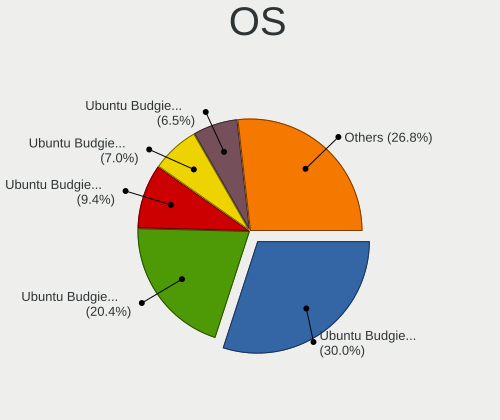

| Name                | Computers | Percent |
|---------------------|-----------|---------|
| Ubuntu Budgie 20.04 | 263       | 29.99%  |
| Ubuntu Budgie 22.04 | 179       | 20.41%  |
| Ubuntu Budgie 24.04 | 82        | 9.35%   |
| Ubuntu Budgie 20.10 | 61        | 6.96%   |
| Ubuntu Budgie 21.10 | 57        | 6.5%    |
| Ubuntu Budgie 18.04 | 44        | 5.02%   |
| Ubuntu Budgie 22.10 | 41        | 4.68%   |
| Ubuntu Budgie 21.04 | 37        | 4.22%   |
| Ubuntu Budgie 19.10 | 29        | 3.31%   |
| Ubuntu Budgie 23.04 | 25        | 2.85%   |
| Ubuntu Budgie 23.10 | 21        | 2.39%   |
| Ubuntu Budgie 24.10 | 18        | 2.05%   |
| Ubuntu Budgie 25.04 | 14        | 1.6%    |
| Ubuntu Budgie       | 3         | 0.34%   |
| Ubuntu Budgie 16.04 | 2         | 0.23%   |
| Ubuntu Budgie 25.10 | 1         | 0.11%   |

OS Family
---------

OS without a version

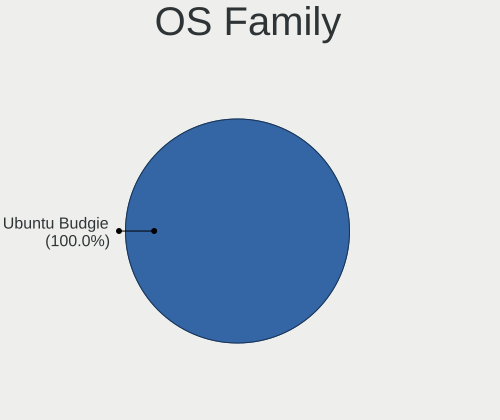

| Name          | Computers | Percent |
|---------------|-----------|---------|
| Ubuntu Budgie | 833       | 100%    |

Kernel
------

Version of the Linux kernel

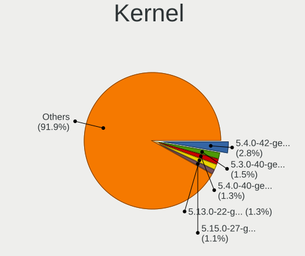

| Version           | Computers | Percent |
|-------------------|-----------|---------|
| 5.4.0-42-generic  | 27        | 2.76%   |
| 5.3.0-40-generic  | 15        | 1.53%   |
| 5.4.0-40-generic  | 13        | 1.33%   |
| 5.13.0-22-generic | 13        | 1.33%   |
| 5.15.0-27-generic | 11        | 1.12%   |
| 6.8.0-51-generic  | 10        | 1.02%   |
| 6.2.0-20-generic  | 10        | 1.02%   |
| 5.4.0-52-generic  | 10        | 1.02%   |
| 5.4.0-37-generic  | 10        | 1.02%   |
| 5.15.0-52-generic | 10        | 1.02%   |
| 5.13.0-39-generic | 10        | 1.02%   |
| 5.13.0-19-generic | 10        | 1.02%   |
| 5.4.0-58-generic  | 9         | 0.92%   |
| 5.4.0-48-generic  | 9         | 0.92%   |
| 5.4.0-29-generic  | 9         | 0.92%   |
| 5.8.0-48-generic  | 8         | 0.82%   |
| 5.8.0-44-generic  | 8         | 0.82%   |
| 5.8.0-43-generic  | 8         | 0.82%   |
| 5.8.0-41-generic  | 8         | 0.82%   |
| 5.13.0-40-generic | 8         | 0.82%   |
| 5.13.0-30-generic | 8         | 0.82%   |
| 5.13.0-28-generic | 8         | 0.82%   |
| 5.11.0-41-generic | 8         | 0.82%   |
| 6.8.0-31-generic  | 7         | 0.72%   |
| 6.2.0-26-generic  | 7         | 0.72%   |
| 6.14.0-15-generic | 7         | 0.72%   |
| 5.4.0-47-generic  | 7         | 0.72%   |
| 5.4.0-33-generic  | 7         | 0.72%   |
| 5.4.0-31-generic  | 7         | 0.72%   |
| 5.19.0-46-generic | 7         | 0.72%   |
| 5.19.0-38-generic | 7         | 0.72%   |
| 5.19.0-35-generic | 7         | 0.72%   |
| 5.19.0-26-generic | 7         | 0.72%   |
| 5.15.0-50-generic | 7         | 0.72%   |
| 5.15.0-46-generic | 7         | 0.72%   |
| 5.13.0-35-generic | 7         | 0.72%   |
| 6.8.0-45-generic  | 6         | 0.61%   |
| 6.8.0-40-generic  | 6         | 0.61%   |
| 6.14.0-27-generic | 6         | 0.61%   |
| 5.8.0-53-generic  | 6         | 0.61%   |

Kernel Family
-------------

Linux kernel without a distro release

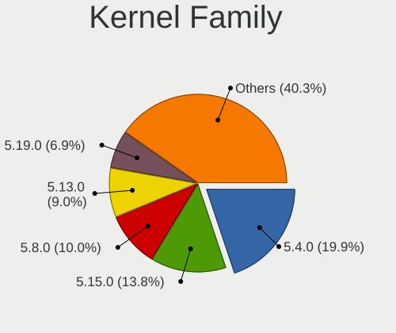

| Version | Computers | Percent |
|---------|-----------|---------|
| 5.4.0   | 178       | 19.87%  |
| 5.15.0  | 124       | 13.84%  |
| 5.8.0   | 90        | 10.04%  |
| 5.13.0  | 81        | 9.04%   |
| 5.19.0  | 62        | 6.92%   |
| 6.8.0   | 60        | 6.7%    |
| 5.11.0  | 55        | 6.14%   |
| 6.2.0   | 47        | 5.25%   |
| 5.3.0   | 42        | 4.69%   |
| 6.5.0   | 40        | 4.46%   |
| 6.11.0  | 30        | 3.35%   |
| 6.14.0  | 29        | 3.24%   |
| 4.15.0  | 17        | 1.9%    |
| 5.6.0   | 3         | 0.33%   |
| 5.0.0   | 3         | 0.33%   |
| 5.6.7   | 2         | 0.22%   |
| 5.12.0  | 2         | 0.22%   |
| 5.10.0  | 2         | 0.22%   |
| 4.18.0  | 2         | 0.22%   |
| 6.8.1   | 1         | 0.11%   |
| 6.6.0   | 1         | 0.11%   |
| 6.5.7   | 1         | 0.11%   |
| 6.5.5   | 1         | 0.11%   |
| 6.3.1   | 1         | 0.11%   |
| 6.17.0  | 1         | 0.11%   |
| 6.1.0   | 1         | 0.11%   |
| 5.9.1   | 1         | 0.11%   |
| 5.9.0   | 1         | 0.11%   |
| 5.8.6   | 1         | 0.11%   |
| 5.8.11  | 1         | 0.11%   |
| 5.7.7   | 1         | 0.11%   |
| 5.5.8   | 1         | 0.11%   |
| 5.5.0   | 1         | 0.11%   |
| 5.18.8  | 1         | 0.11%   |
| 5.18.19 | 1         | 0.11%   |
| 5.17.2  | 1         | 0.11%   |
| 5.17.1  | 1         | 0.11%   |
| 5.16.2  | 1         | 0.11%   |
| 5.16.14 | 1         | 0.11%   |
| 5.15.92 | 1         | 0.11%   |

Kernel Major Ver.
-----------------

Linux kernel major version

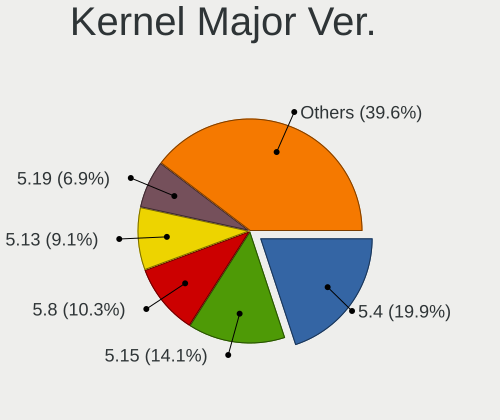

| Version | Computers | Percent |
|---------|-----------|---------|
| 5.4     | 178       | 19.93%  |
| 5.15    | 126       | 14.11%  |
| 5.8     | 92        | 10.3%   |
| 5.13    | 81        | 9.07%   |
| 5.19    | 62        | 6.94%   |
| 6.8     | 60        | 6.72%   |
| 5.11    | 55        | 6.16%   |
| 6.2     | 47        | 5.26%   |
| 6.5     | 42        | 4.7%    |
| 5.3     | 42        | 4.7%    |
| 6.11    | 30        | 3.36%   |
| 6.14    | 29        | 3.25%   |
| 4.15    | 17        | 1.9%    |
| 5.6     | 5         | 0.56%   |
| 5.10    | 3         | 0.34%   |
| 5.0     | 3         | 0.34%   |
| 5.9     | 2         | 0.22%   |
| 5.5     | 2         | 0.22%   |
| 5.17    | 2         | 0.22%   |
| 5.16    | 2         | 0.22%   |
| 5.12    | 2         | 0.22%   |
| 4.4     | 2         | 0.22%   |
| 4.18    | 2         | 0.22%   |
| 6.6     | 1         | 0.11%   |
| 6.3     | 1         | 0.11%   |
| 6.17    | 1         | 0.11%   |
| 6.1     | 1         | 0.11%   |
| 5.7     | 1         | 0.11%   |
| 5.18    | 1         | 0.11%   |
| 5.14    | 1         | 0.11%   |

Arch
----

OS architecture (x86_64, i586, etc.)

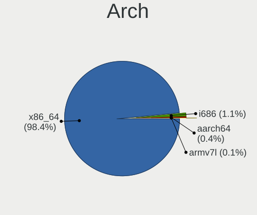

| Name    | Computers | Percent |
|---------|-----------|---------|
| x86_64  | 820       | 98.44%  |
| i686    | 9         | 1.08%   |
| aarch64 | 3         | 0.36%   |
| armv7l  | 1         | 0.12%   |

DE
--

Desktop Environment

| Name       | Computers | Percent |
|------------|-----------|---------|
| Budgie     | 804       | 96.52%  |
| GNOME      | 19        | 2.28%   |
| XFCE       | 2         | 0.24%   |
| MATE       | 2         | 0.24%   |
| KDE5       | 2         | 0.24%   |
| X-Cinnamon | 1         | 0.12%   |
| Unity      | 1         | 0.12%   |
| KDE6       | 1         | 0.12%   |
| KDE        | 1         | 0.12%   |

Display Server
--------------

X11 or Wayland

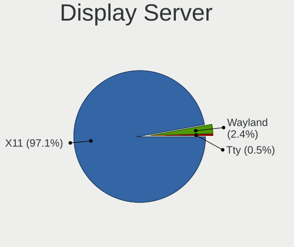

| Name    | Computers | Percent |
|---------|-----------|---------|
| X11     | 813       | 97.13%  |
| Wayland | 20        | 2.39%   |
| Tty     | 4         | 0.48%   |

Display Manager
---------------

SDDM, LightDM, etc.

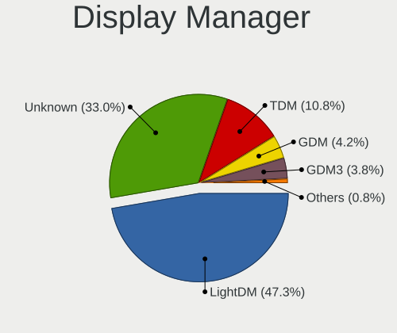

| Name    | Computers | Percent |
|---------|-----------|---------|
| LightDM | 401       | 47.29%  |
| Unknown | 280       | 33.02%  |
| TDM     | 92        | 10.85%  |
| GDM     | 36        | 4.25%   |
| GDM3    | 32        | 3.77%   |
| SDDM    | 7         | 0.83%   |

OS Lang
-------

Language

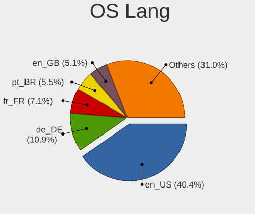

| Lang    | Computers | Percent |
|---------|-----------|---------|
| en_US   | 337       | 40.36%  |
| de_DE   | 91        | 10.9%   |
| fr_FR   | 59        | 7.07%   |
| pt_BR   | 46        | 5.51%   |
| en_GB   | 43        | 5.15%   |
| it_IT   | 27        | 3.23%   |
| en_CA   | 25        | 2.99%   |
| ru_RU   | 19        | 2.28%   |
| es_ES   | 16        | 1.92%   |
| en_IN   | 15        | 1.8%    |
| en_AU   | 14        | 1.68%   |
| C       | 13        | 1.56%   |
| es_MX   | 11        | 1.32%   |
| es_AR   | 11        | 1.32%   |
| pl_PL   | 9         | 1.08%   |
| es_CL   | 7         | 0.84%   |
| hu_HU   | 6         | 0.72%   |
| Unknown | 6         | 0.72%   |
| pt_PT   | 5         | 0.6%    |
| en_IE   | 5         | 0.6%    |
| cs_CZ   | 4         | 0.48%   |
| zh_TW   | 3         | 0.36%   |
| uk_UA   | 3         | 0.36%   |
| nl_NL   | 3         | 0.36%   |
| fr_BE   | 3         | 0.36%   |
| es_CO   | 3         | 0.36%   |
| en_ZA   | 3         | 0.36%   |
| en_SG   | 3         | 0.36%   |
| de_AT   | 3         | 0.36%   |
| zh_CN   | 2         | 0.24%   |
| sv_SE   | 2         | 0.24%   |
| nl_BE   | 2         | 0.24%   |
| ja_JP   | 2         | 0.24%   |
| fr_CH   | 2         | 0.24%   |
| fi_FI   | 2         | 0.24%   |
| eu_ES   | 2         | 0.24%   |
| en_NZ   | 2         | 0.24%   |
| en_IL   | 2         | 0.24%   |
| de_CH   | 2         | 0.24%   |
| bg_BG   | 2         | 0.24%   |

Boot Mode
---------

EFI or BIOS

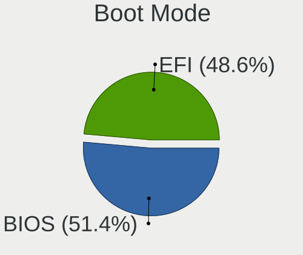

| Mode | Computers | Percent |
|------|-----------|---------|
| BIOS | 438       | 51.41%  |
| EFI  | 414       | 48.59%  |

Filesystem
----------

Type of filesystem

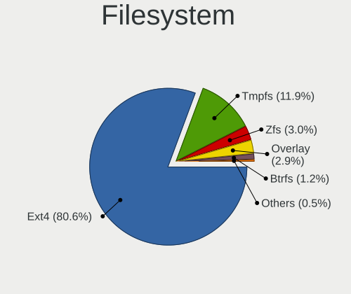

| Type    | Computers | Percent |
|---------|-----------|---------|
| Ext4    | 679       | 80.64%  |
| Tmpfs   | 100       | 11.88%  |
| Zfs     | 25        | 2.97%   |
| Overlay | 24        | 2.85%   |
| Btrfs   | 10        | 1.19%   |
| Xfs     | 3         | 0.36%   |
| Jfs     | 1         | 0.12%   |

Part. scheme
------------

Scheme of partitioning

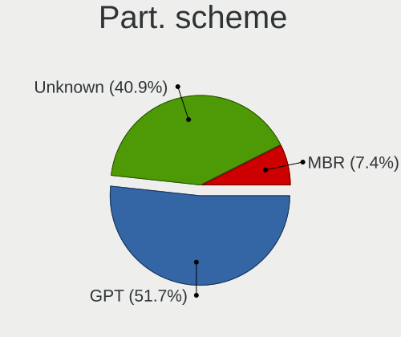

| Type    | Computers | Percent |
|---------|-----------|---------|
| GPT     | 439       | 51.71%  |
| Unknown | 347       | 40.87%  |
| MBR     | 63        | 7.42%   |

Dual Boot with Linux/BSD
------------------------

Hosting more than one Linux/BSD

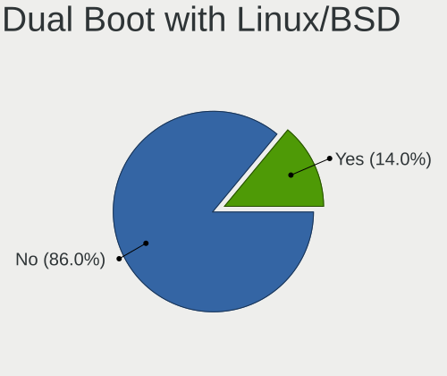

| Dual boot | Computers | Percent |
|-----------|-----------|---------|
| No        | 726       | 86.02%  |
| Yes       | 118       | 13.98%  |

Dual Boot (Win)
---------------

Hosting Linux and Windows

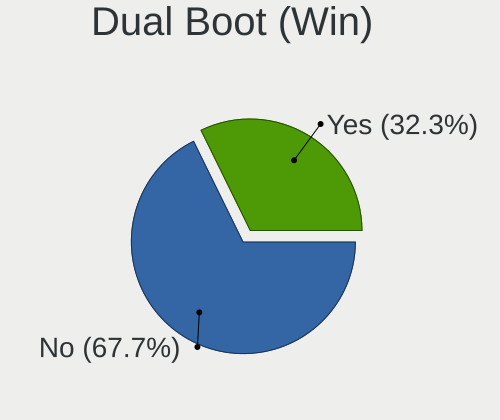

| Dual boot | Computers | Percent |
|-----------|-----------|---------|
| No        | 573       | 67.73%  |
| Yes       | 273       | 32.27%  |

Board
-----

Vendor
------

Motherboard manufacturer

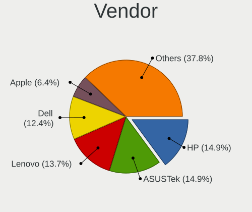

| Name                    | Computers | Percent |
|-------------------------|-----------|---------|
| Hewlett-Packard         | 124       | 14.89%  |
| ASUSTek Computer        | 124       | 14.89%  |
| Lenovo                  | 114       | 13.69%  |
| Dell                    | 103       | 12.36%  |
| Apple                   | 53        | 6.36%   |
| TUXEDO                  | 46        | 5.52%   |
| MSI                     | 42        | 5.04%   |
| Gigabyte Technology     | 41        | 4.92%   |
| Acer                    | 32        | 3.84%   |
| ASRock                  | 18        | 2.16%   |
| Intel                   | 13        | 1.56%   |
| Fujitsu                 | 9         | 1.08%   |
| Sony                    | 8         | 0.96%   |
| Google                  | 8         | 0.96%   |
| Unknown                 | 8         | 0.96%   |
| Toshiba                 | 7         | 0.84%   |
| Samsung Electronics     | 7         | 0.84%   |
| HUAWEI                  | 7         | 0.84%   |
| Packard Bell            | 4         | 0.48%   |
| Raspberry Pi Foundation | 3         | 0.36%   |
| Microsoft               | 3         | 0.36%   |
| Biostar                 | 3         | 0.36%   |
| AZW                     | 3         | 0.36%   |
| Alienware               | 3         | 0.36%   |
| Timi                    | 2         | 0.24%   |
| Standard                | 2         | 0.24%   |
| Semp Toshiba            | 2         | 0.24%   |
| Razer                   | 2         | 0.24%   |
| Positivo                | 2         | 0.24%   |
| Huanan                  | 2         | 0.24%   |
| eMachines               | 2         | 0.24%   |
| Chuwi                   | 2         | 0.24%   |
| BANGHO                  | 2         | 0.24%   |
| ZOTAC                   | 1         | 0.12%   |
| Winnovo                 | 1         | 0.12%   |
| Viglen                  | 1         | 0.12%   |
| THUNDEROBOT             | 1         | 0.12%   |
| Thomson                 | 1         | 0.12%   |
| Teclast                 | 1         | 0.12%   |
| Supermicro              | 1         | 0.12%   |

Model
-----

Motherboard model

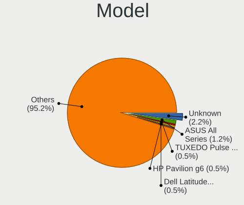

| Name                               | Computers | Percent |
|------------------------------------|-----------|---------|
| Unknown                            | 18        | 2.16%   |
| ASUS All Series                    | 10        | 1.2%    |
| TUXEDO Pulse 15 Gen1               | 4         | 0.48%   |
| HP Pavilion g6                     | 4         | 0.48%   |
| Dell Latitude 5480                 | 4         | 0.48%   |
| TUXEDO InfinityBook S 15 Gen6      | 3         | 0.36%   |
| TUXEDO Aura 15 Gen1                | 3         | 0.36%   |
| Lenovo G50-45 80E3                 | 3         | 0.36%   |
| HP Notebook                        | 3         | 0.36%   |
| Dell OptiPlex 780                  | 3         | 0.36%   |
| Dell Latitude E6420                | 3         | 0.36%   |
| Apple MacBookPro9,2                | 3         | 0.36%   |
| Apple MacBookPro8,1                | 3         | 0.36%   |
| TUXEDO Polaris 15 AMD Gen1         | 2         | 0.24%   |
| TUXEDO InfinityBook S 14 Gen6      | 2         | 0.24%   |
| TUXEDO InfinityBook Pro 14 Gen6    | 2         | 0.24%   |
| TUXEDO Book XP1511                 | 2         | 0.24%   |
| Standard MT40II                    | 2         | 0.24%   |
| Semp Toshiba STI                   | 2         | 0.24%   |
| RPi Raspberry Pi 4 Model B Rev 1.4 | 2         | 0.24%   |
| Packard Bell EasyNote TM98         | 2         | 0.24%   |
| MSI MS-7C84                        | 2         | 0.24%   |
| Microsoft Surface Pro 3            | 2         | 0.24%   |
| Lenovo Y50-70 20378                | 2         | 0.24%   |
| Lenovo ThinkPad E15 20RD003KHV     | 2         | 0.24%   |
| Lenovo ThinkBook 14-IML 20RV       | 2         | 0.24%   |
| Lenovo IdeaPad C340-14API 81N6     | 2         | 0.24%   |
| Lenovo IdeaPad 5 15ARE05 81YQ      | 2         | 0.24%   |
| Lenovo IdeaPad 330S-15ARR 81FB     | 2         | 0.24%   |
| Lenovo IdeaPad 320-15IKB 80XL      | 2         | 0.24%   |
| Lenovo IdeaPad 110-15ISK 80UD      | 2         | 0.24%   |
| Lenovo G500 20236                  | 2         | 0.24%   |
| Intel DP55WB AAE64798-206          | 2         | 0.24%   |
| HP ZBook Studio G3                 | 2         | 0.24%   |
| HP ZBook 15 G4                     | 2         | 0.24%   |
| HP Z440 Workstation                | 2         | 0.24%   |
| HP Pavilion dv7                    | 2         | 0.24%   |
| HP Pavilion dv6                    | 2         | 0.24%   |
| HP Laptop 15-fc0xxx                | 2         | 0.24%   |
| HP ENVY 17                         | 2         | 0.24%   |

Model Family
------------

Motherboard model prefix

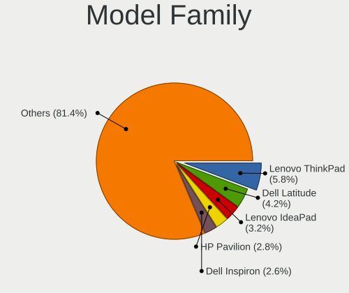

| Name                | Computers | Percent |
|---------------------|-----------|---------|
| Lenovo ThinkPad     | 48        | 5.76%   |
| Dell Latitude       | 35        | 4.2%    |
| Lenovo IdeaPad      | 27        | 3.24%   |
| HP Pavilion         | 23        | 2.76%   |
| Dell Inspiron       | 22        | 2.64%   |
| Acer Aspire         | 18        | 2.16%   |
| Unknown             | 18        | 2.16%   |
| HP EliteBook        | 16        | 1.92%   |
| Dell XPS            | 15        | 1.8%    |
| ASUS ROG            | 14        | 1.68%   |
| Dell OptiPlex       | 13        | 1.56%   |
| ASUS Vivobook       | 13        | 1.56%   |
| ASUS PRIME          | 13        | 1.56%   |
| TUXEDO InfinityBook | 11        | 1.32%   |
| HP ENVY             | 10        | 1.2%    |
| ASUS All            | 10        | 1.2%    |
| HP ZBook            | 9         | 1.08%   |
| Dell Precision      | 9         | 1.08%   |
| HP ProBook          | 8         | 0.96%   |
| HP Laptop           | 8         | 0.96%   |
| HP Compaq           | 8         | 0.96%   |
| Toshiba Satellite   | 7         | 0.84%   |
| HP Spectre          | 7         | 0.84%   |
| ASUS TUF            | 7         | 0.84%   |
| TUXEDO Polaris      | 6         | 0.72%   |
| TUXEDO Book         | 6         | 0.72%   |
| HP EliteDesk        | 6         | 0.72%   |
| Dell Vostro         | 6         | 0.72%   |
| ASUS ASUS           | 6         | 0.72%   |
| Apple MacBookPro8   | 6         | 0.72%   |
| TUXEDO Pulse        | 5         | 0.6%    |
| ASUS ZenBook        | 5         | 0.6%    |
| Acer TravelMate     | 5         | 0.6%    |
| Acer Swift          | 5         | 0.6%    |
| Lenovo Yoga         | 4         | 0.48%   |
| Lenovo ThinkCentre  | 4         | 0.48%   |
| Lenovo ThinkBook    | 4         | 0.48%   |
| Fujitsu LIFEBOOK    | 4         | 0.48%   |
| Apple MacBookPro11  | 4         | 0.48%   |
| TUXEDO Aura         | 3         | 0.36%   |

MFG Year
--------

Motherboard manufacture year

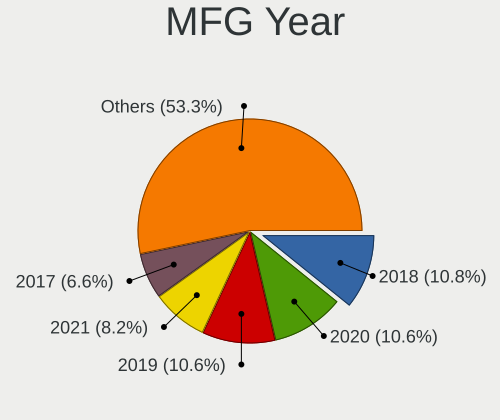

| Year    | Computers | Percent |
|---------|-----------|---------|
| 2018    | 90        | 10.8%   |
| 2020    | 88        | 10.56%  |
| 2019    | 88        | 10.56%  |
| 2021    | 68        | 8.16%   |
| 2017    | 55        | 6.6%    |
| 2014    | 54        | 6.48%   |
| 2013    | 51        | 6.12%   |
| 2012    | 49        | 5.88%   |
| 2011    | 48        | 5.76%   |
| 2016    | 42        | 5.04%   |
| 2015    | 38        | 4.56%   |
| 2010    | 38        | 4.56%   |
| 2009    | 32        | 3.84%   |
| 2022    | 23        | 2.76%   |
| 2008    | 23        | 2.76%   |
| 2023    | 18        | 2.16%   |
| 2007    | 15        | 1.8%    |
| 2024    | 10        | 1.2%    |
| 2006    | 2         | 0.24%   |
| Unknown | 1         | 0.12%   |

Form Factor
-----------

Physical design of the computer

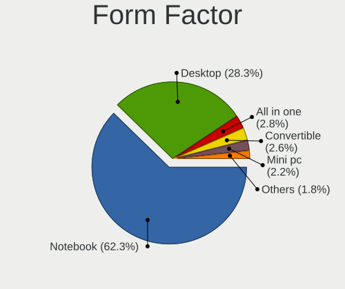

| Name           | Computers | Percent |
|----------------|-----------|---------|
| Notebook       | 519       | 62.3%   |
| Desktop        | 236       | 28.33%  |
| All in one     | 23        | 2.76%   |
| Convertible    | 22        | 2.64%   |
| Mini pc        | 18        | 2.16%   |
| Tablet         | 10        | 1.2%    |
| System on chip | 4         | 0.48%   |
| Server         | 1         | 0.12%   |

Secure Boot
-----------

Enabled or disabled

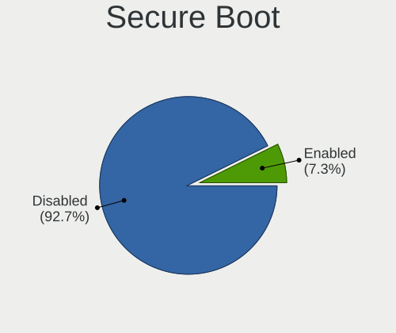

| State    | Computers | Percent |
|----------|-----------|---------|
| Disabled | 775       | 92.7%   |
| Enabled  | 61        | 7.3%    |

Coreboot
--------

Have coreboot on board

| Used | Computers | Percent |
|------|-----------|---------|
| No   | 823       | 98.8%   |
| Yes  | 10        | 1.2%    |

RAM Size
--------

Total RAM memory

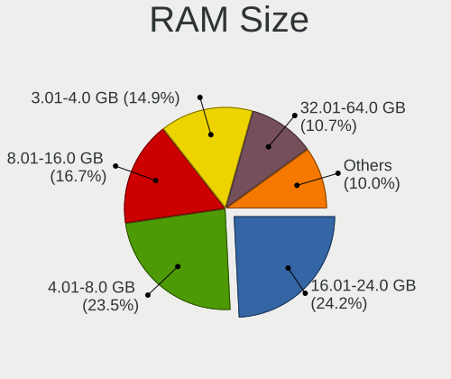

| Size in GB      | Computers | Percent |
|-----------------|-----------|---------|
| 16.01-24.0      | 204       | 24.2%   |
| 4.01-8.0        | 198       | 23.49%  |
| 8.01-16.0       | 141       | 16.73%  |
| 3.01-4.0        | 126       | 14.95%  |
| 32.01-64.0      | 90        | 10.68%  |
| 64.01-256.0     | 37        | 4.39%   |
| 24.01-32.0      | 23        | 2.73%   |
| 1.01-2.0        | 14        | 1.66%   |
| 2.01-3.0        | 7         | 0.83%   |
| 0.51-1.0        | 2         | 0.24%   |
| More than 256.0 | 1         | 0.12%   |

RAM Used
--------

Used RAM memory

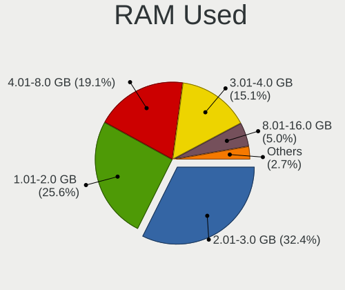

| Used GB    | Computers | Percent |
|------------|-----------|---------|
| 2.01-3.0   | 296       | 32.39%  |
| 1.01-2.0   | 234       | 25.6%   |
| 4.01-8.0   | 175       | 19.15%  |
| 3.01-4.0   | 138       | 15.1%   |
| 8.01-16.0  | 46        | 5.03%   |
| 0.51-1.0   | 11        | 1.2%    |
| 16.01-24.0 | 9         | 0.98%   |
| 24.01-32.0 | 3         | 0.33%   |
| 32.01-64.0 | 1         | 0.11%   |
| 0.01-0.5   | 1         | 0.11%   |

Total Drives
------------

Number of drives on board

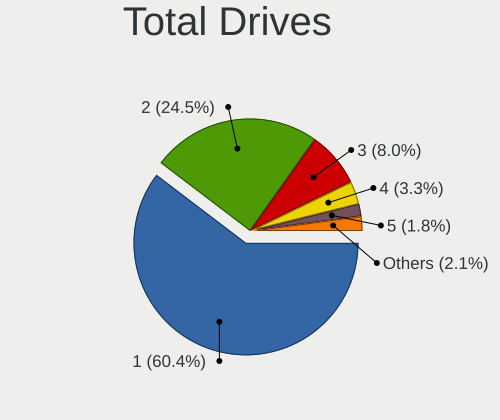

| Drives | Computers | Percent |
|--------|-----------|---------|
| 1      | 513       | 60.35%  |
| 2      | 208       | 24.47%  |
| 3      | 68        | 8%      |
| 4      | 28        | 3.29%   |
| 5      | 15        | 1.76%   |
| 8      | 6         | 0.71%   |
| 6      | 6         | 0.71%   |
| 0      | 3         | 0.35%   |
| 11     | 1         | 0.12%   |
| 9      | 1         | 0.12%   |
| 7      | 1         | 0.12%   |

Has CD-ROM
----------

Has CD-ROM on board

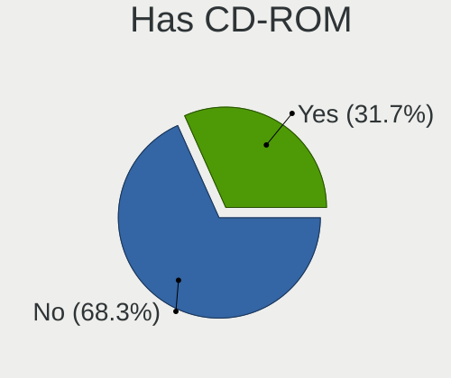

| Presented | Computers | Percent |
|-----------|-----------|---------|
| No        | 571       | 68.3%   |
| Yes       | 265       | 31.7%   |

Has Ethernet
------------

Has Ethernet on board

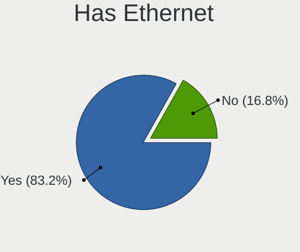

| Presented | Computers | Percent |
|-----------|-----------|---------|
| Yes       | 696       | 83.15%  |
| No        | 141       | 16.85%  |

Has WiFi
--------

Has WiFi module

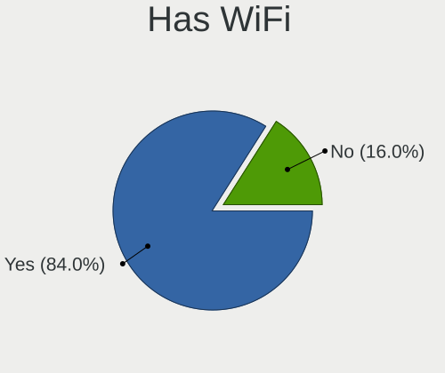

| Presented | Computers | Percent |
|-----------|-----------|---------|
| Yes       | 703       | 83.99%  |
| No        | 134       | 16.01%  |

Has Bluetooth
-------------

Has Bluetooth module

| Presented | Computers | Percent |
|-----------|-----------|---------|
| Yes       | 608       | 72.47%  |
| No        | 231       | 27.53%  |

Location
--------

Country
-------

Geographic location (country)

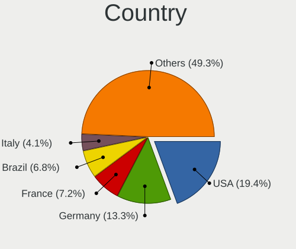

| Country      | Computers | Percent |
|--------------|-----------|---------|
| USA          | 162       | 19.38%  |
| Germany      | 111       | 13.28%  |
| France       | 60        | 7.18%   |
| Brazil       | 57        | 6.82%   |
| Italy        | 34        | 4.07%   |
| UK           | 32        | 3.83%   |
| Canada       | 25        | 2.99%   |
| Spain        | 21        | 2.51%   |
| Russia       | 20        | 2.39%   |
| Poland       | 20        | 2.39%   |
| Netherlands  | 19        | 2.27%   |
| India        | 19        | 2.27%   |
| Australia    | 14        | 1.67%   |
| Argentina    | 14        | 1.67%   |
| Mexico       | 13        | 1.56%   |
| Switzerland  | 11        | 1.32%   |
| Austria      | 10        | 1.2%    |
| Sweden       | 9         | 1.08%   |
| Belgium      | 9         | 1.08%   |
| Ukraine      | 8         | 0.96%   |
| Hungary      | 8         | 0.96%   |
| Portugal     | 7         | 0.84%   |
| Norway       | 7         | 0.84%   |
| Chile        | 7         | 0.84%   |
| South Africa | 6         | 0.72%   |
| Romania      | 6         | 0.72%   |
| Japan        | 6         | 0.72%   |
| Ireland      | 6         | 0.72%   |
| Greece       | 6         | 0.72%   |
| Czechia      | 6         | 0.72%   |
| Colombia     | 6         | 0.72%   |
| Iran         | 5         | 0.6%    |
| Turkey       | 4         | 0.48%   |
| Slovenia     | 4         | 0.48%   |
| Indonesia    | 4         | 0.48%   |
| Finland      | 4         | 0.48%   |
| Croatia      | 4         | 0.48%   |
| Slovakia     | 3         | 0.36%   |
| Singapore    | 3         | 0.36%   |
| Saudi Arabia | 3         | 0.36%   |

City
----

Geographic location (city)

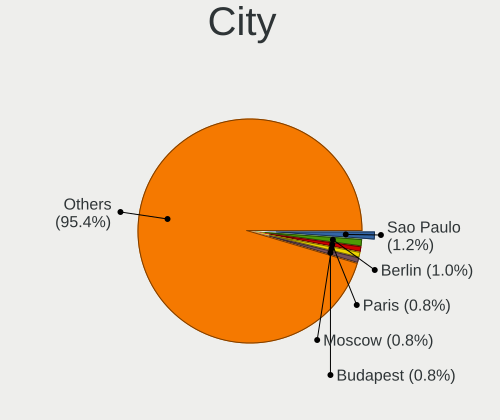

| City               | Computers | Percent |
|--------------------|-----------|---------|
| Sao Paulo          | 10        | 1.15%   |
| Berlin             | 9         | 1.04%   |
| Paris              | 7         | 0.81%   |
| Moscow             | 7         | 0.81%   |
| Budapest           | 7         | 0.81%   |
| Brasília          | 7         | 0.81%   |
| Warsaw             | 6         | 0.69%   |
| Dublin             | 6         | 0.69%   |
| Vienna             | 5         | 0.58%   |
| Ravensburg         | 5         | 0.58%   |
| Munich             | 5         | 0.58%   |
| Los Angeles        | 5         | 0.58%   |
| Hamburg            | 5         | 0.58%   |
| Athens             | 5         | 0.58%   |
| Zurich             | 4         | 0.46%   |
| Tehran             | 4         | 0.46%   |
| Sydney             | 4         | 0.46%   |
| Rio de Janeiro     | 4         | 0.46%   |
| Prague             | 4         | 0.46%   |
| Nuremberg          | 4         | 0.46%   |
| Montreal           | 4         | 0.46%   |
| Frankfurt am Main  | 4         | 0.46%   |
| Dresden            | 4         | 0.46%   |
| Barcelona          | 4         | 0.46%   |
| Austin             | 4         | 0.46%   |
| Zagreb             | 3         | 0.35%   |
| Trondheim          | 3         | 0.35%   |
| St Petersburg      | 3         | 0.35%   |
| Singapore          | 3         | 0.35%   |
| Santo Domingo Este | 3         | 0.35%   |
| San Jose           | 3         | 0.35%   |
| San Francisco      | 3         | 0.35%   |
| Pune               | 3         | 0.35%   |
| Portland           | 3         | 0.35%   |
| New York           | 3         | 0.35%   |
| Münster           | 3         | 0.35%   |
| Mumbai             | 3         | 0.35%   |
| Milan              | 3         | 0.35%   |
| Miami              | 3         | 0.35%   |
| Lisbon             | 3         | 0.35%   |

Drives
------

Drive Vendor
------------

Hard drive vendors

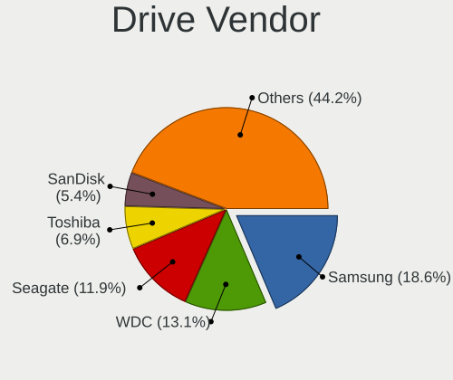

| Vendor                      | Computers | Drives | Percent |
|-----------------------------|-----------|--------|---------|
| Samsung Electronics         | 228       | 334    | 18.61%  |
| WDC                         | 160       | 225    | 13.06%  |
| Seagate                     | 146       | 220    | 11.92%  |
| Toshiba                     | 84        | 106    | 6.86%   |
| SanDisk                     | 66        | 84     | 5.39%   |
| Unknown                     | 61        | 75     | 4.98%   |
| Kingston                    | 50        | 64     | 4.08%   |
| Crucial                     | 44        | 58     | 3.59%   |
| Intel                       | 35        | 54     | 2.86%   |
| SK hynix                    | 29        | 32     | 2.37%   |
| Micron Technology           | 29        | 35     | 2.37%   |
| Hitachi                     | 28        | 36     | 2.29%   |
| Apple                       | 24        | 28     | 1.96%   |
| HGST                        | 19        | 24     | 1.55%   |
| China                       | 17        | 24     | 1.39%   |
| A-DATA Technology           | 16        | 21     | 1.31%   |
| Phison                      | 14        | 19     | 1.14%   |
| SPCC                        | 12        | 15     | 0.98%   |
| PNY                         | 10        | 18     | 0.82%   |
| KIOXIA                      | 9         | 11     | 0.73%   |
| Patriot                     | 7         | 9      | 0.57%   |
| Micron/Crucial Technology   | 7         | 8      | 0.57%   |
| Transcend                   | 6         | 6      | 0.49%   |
| OCZ                         | 6         | 9      | 0.49%   |
| JMicron Technology          | 6         | 7      | 0.49%   |
| Silicon Motion              | 5         | 7      | 0.41%   |
| Maxtor                      | 4         | 7      | 0.33%   |
| LITEON                      | 4         | 5      | 0.33%   |
| Kingston Technology Company | 4         | 4      | 0.33%   |
| Intenso                     | 4         | 5      | 0.33%   |
| Gigabyte Technology         | 4         | 4      | 0.33%   |
| Unknown                     | 4         | 4      | 0.33%   |
| SABRENT                     | 3         | 4      | 0.24%   |
| Phison Electronics          | 3         | 4      | 0.24%   |
| Netac                       | 3         | 4      | 0.24%   |
| Teclast                     | 2         | 3      | 0.16%   |
| Realtek Semiconductor       | 2         | 3      | 0.16%   |
| Plextor                     | 2         | 2      | 0.16%   |
| MAXIO Technology (Hangzhou) | 2         | 2      | 0.16%   |
| Lenovo                      | 2         | 2      | 0.16%   |

Drive Model
-----------

Hard drive models

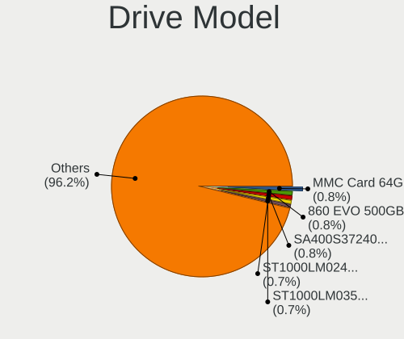

| Model                                             | Computers | Percent |
|---------------------------------------------------|-----------|---------|
| Unknown MMC Card  64GB                            | 11        | 0.81%   |
| Samsung SSD 860 EVO 500GB                         | 11        | 0.81%   |
| Kingston SA400S37240G 240GB SSD                   | 11        | 0.81%   |
| Seagate ST1000LM024 HN-M101MBB 1TB                | 10        | 0.73%   |
| Seagate ST1000LM035-1RK172 1TB                    | 9         | 0.66%   |
| Samsung NVMe SSD Drive 512GB                      | 9         | 0.66%   |
| Samsung NVMe SSD Controller SM981/PM981/PM983 1TB | 9         | 0.66%   |
| Unknown SD/MMC/MS PRO 2GB                         | 8         | 0.59%   |
| Unknown MMC Card  32GB                            | 8         | 0.59%   |
| Toshiba MQ04ABF100 1TB                            | 8         | 0.59%   |
| Toshiba MQ01ABD100 1TB                            | 8         | 0.59%   |
| Seagate ST9500325AS 500GB                         | 8         | 0.59%   |
| Seagate ST2000DM008-2FR102 2TB                    | 8         | 0.59%   |
| Samsung NVMe SSD Drive 500GB                      | 8         | 0.59%   |
| Kingston SA400S37480G 480GB SSD                   | 8         | 0.59%   |
| Seagate ST1000DM010-2EP102 1TB                    | 7         | 0.51%   |
| Samsung SSD 860 QVO 1TB                           | 7         | 0.51%   |
| Samsung SSD 850 EVO 500GB                         | 7         | 0.51%   |
| Samsung NVMe SSD Drive 1TB                        | 7         | 0.51%   |
| WDC WD10JPVX-22JC3T0 1TB                          | 6         | 0.44%   |
| Seagate ST500DM002-1BD142 500GB                   | 6         | 0.44%   |
| SanDisk SDSSDA240G 240GB                          | 6         | 0.44%   |
| Samsung SSD 970 EVO Plus 500GB                    | 6         | 0.44%   |
| Samsung SSD 860 EVO M.2 500GB                     | 6         | 0.44%   |
| Samsung SSD 840 EVO 250GB                         | 6         | 0.44%   |
| Samsung NVMe SSD Drive 256GB                      | 6         | 0.44%   |
| Crucial CT480BX500SSD1 480GB                      | 6         | 0.44%   |
| WDC WDS500G2B0A-00SM50 500GB                      | 5         | 0.37%   |
| SK hynix NVMe SSD Drive 256GB                     | 5         | 0.37%   |
| Seagate ST500LT012-1DG142 500GB                   | 5         | 0.37%   |
| Seagate ST2000DM006-2DM164 2TB                    | 5         | 0.37%   |
| Seagate ST2000DM001-1ER164 2TB                    | 5         | 0.37%   |
| SanDisk NVMe SSD Drive 1TB                        | 5         | 0.37%   |
| Samsung SSD 970 EVO Plus 1TB                      | 5         | 0.37%   |
| Samsung SSD 860 EVO M.2 250GB                     | 5         | 0.37%   |
| Samsung SSD 860 EVO 250GB                         | 5         | 0.37%   |
| Crucial CT240BX500SSD1 240GB                      | 5         | 0.37%   |
| China SSD 256GB                                   | 5         | 0.37%   |
| WDC WDS240G2G0B-00EPW0 240GB SSD                  | 4         | 0.29%   |
| WDC WDS120G2G0A-00JH30 120GB SSD                  | 4         | 0.29%   |

HDD Vendor
----------

Hard disk drive vendors

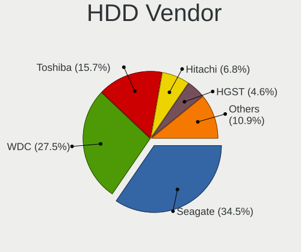

| Vendor              | Computers | Drives | Percent |
|---------------------|-----------|--------|---------|
| Seagate             | 143       | 216    | 34.54%  |
| WDC                 | 114       | 169    | 27.54%  |
| Toshiba             | 65        | 74     | 15.7%   |
| Hitachi             | 28        | 36     | 6.76%   |
| HGST                | 19        | 24     | 4.59%   |
| Samsung Electronics | 11        | 13     | 2.66%   |
| Apple               | 10        | 10     | 2.42%   |
| Unknown             | 8         | 8      | 1.93%   |
| Maxtor              | 4         | 7      | 0.97%   |
| JMicron Technology  | 4         | 4      | 0.97%   |
| Fujitsu             | 2         | 2      | 0.48%   |
| WD MediaMax         | 1         | 1      | 0.24%   |
| USB3.0              | 1         | 1      | 0.24%   |
| TO Exter            | 1         | 1      | 0.24%   |
| TDAS                | 1         | 3      | 0.24%   |
| EAGET               | 1         | 2      | 0.24%   |
| ASMT109x            | 1         | 1      | 0.24%   |

SSD Vendor
----------

Solid state drive vendors

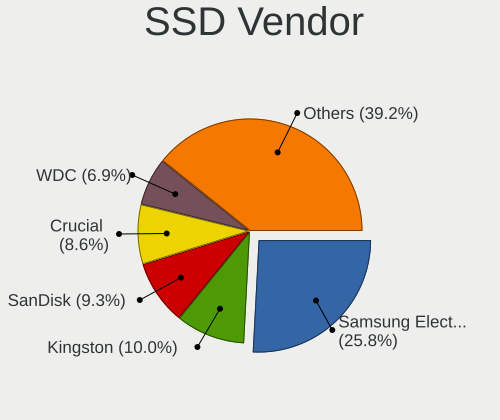

| Vendor              | Computers | Drives | Percent |
|---------------------|-----------|--------|---------|
| Samsung Electronics | 108       | 161    | 25.84%  |
| Kingston            | 42        | 51     | 10.05%  |
| SanDisk             | 39        | 49     | 9.33%   |
| Crucial             | 36        | 50     | 8.61%   |
| WDC                 | 29        | 34     | 6.94%   |
| China               | 17        | 24     | 4.07%   |
| Apple               | 13        | 13     | 3.11%   |
| Intel               | 12        | 13     | 2.87%   |
| SPCC                | 11        | 14     | 2.63%   |
| A-DATA Technology   | 11        | 15     | 2.63%   |
| Micron Technology   | 10        | 11     | 2.39%   |
| PNY                 | 9         | 17     | 2.15%   |
| Patriot             | 7         | 9      | 1.67%   |
| SK hynix            | 6         | 7      | 1.44%   |
| OCZ                 | 5         | 5      | 1.2%    |
| Transcend           | 4         | 4      | 0.96%   |
| Toshiba             | 4         | 4      | 0.96%   |
| LITEON              | 4         | 5      | 0.96%   |
| Gigabyte Technology | 4         | 4      | 0.96%   |
| SABRENT             | 3         | 4      | 0.72%   |
| Intenso             | 3         | 4      | 0.72%   |
| Teclast             | 2         | 3      | 0.48%   |
| Seagate             | 2         | 2      | 0.48%   |
| Plextor             | 2         | 2      | 0.48%   |
| Netac               | 2         | 2      | 0.48%   |
| KingSpec            | 2         | 2      | 0.48%   |
| Dogfish             | 2         | 2      | 0.48%   |
| Apacer              | 2         | 2      | 0.48%   |
| AMD                 | 2         | 17     | 0.48%   |
| Zheino              | 1         | 2      | 0.24%   |
| VISIPRO             | 1         | 1      | 0.24%   |
| Vaseky              | 1         | 1      | 0.24%   |
| USB30               | 1         | 1      | 0.24%   |
| Unknown             | 1         | 1      | 0.24%   |
| Union Memory        | 1         | 1      | 0.24%   |
| UMAX                | 1         | 1      | 0.24%   |
| Star                | 1         | 1      | 0.24%   |
| OWC                 | 1         | 1      | 0.24%   |
| Mushkin             | 1         | 1      | 0.24%   |
| MicroFrom           | 1         | 1      | 0.24%   |

Drive Kind
----------

HDD or SSD

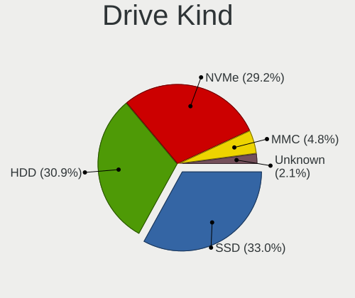

| Kind    | Computers | Drives | Percent |
|---------|-----------|--------|---------|
| SSD     | 364       | 558    | 33%     |
| HDD     | 341       | 572    | 30.92%  |
| NVMe    | 322       | 446    | 29.19%  |
| MMC     | 53        | 67     | 4.81%   |
| Unknown | 23        | 26     | 2.09%   |

Drive Connector
---------------

SATA, SAS, NVMe, etc.

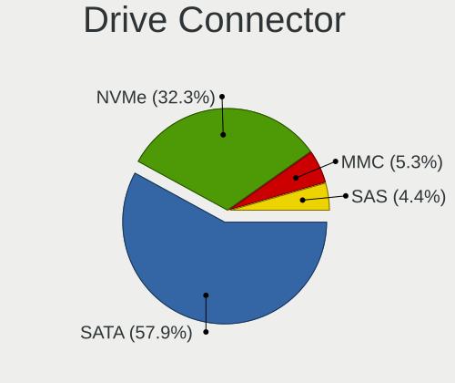

| Type | Computers | Drives | Percent |
|------|-----------|--------|---------|
| SATA | 576       | 1100   | 57.95%  |
| NVMe | 321       | 444    | 32.29%  |
| MMC  | 53        | 67     | 5.33%   |
| SAS  | 44        | 58     | 4.43%   |

Drive Size
----------

Size of hard drive

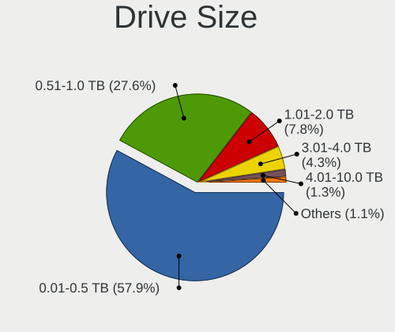

| Size in TB | Computers | Drives | Percent |
|------------|-----------|--------|---------|
| 0.01-0.5   | 430       | 669    | 57.87%  |
| 0.51-1.0   | 205       | 294    | 27.59%  |
| 1.01-2.0   | 58        | 93     | 7.81%   |
| 3.01-4.0   | 32        | 47     | 4.31%   |
| 4.01-10.0  | 10        | 14     | 1.35%   |
| 2.01-3.0   | 8         | 13     | 1.08%   |

Space Total
-----------

Amount of disk space available on the file system

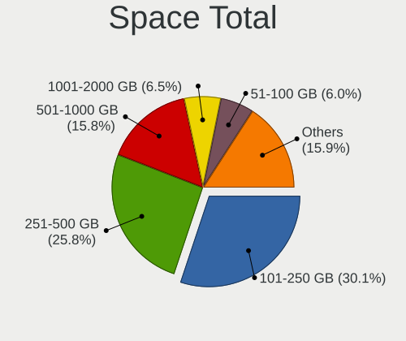

| Size in GB     | Computers | Percent |
|----------------|-----------|---------|
| 101-250        | 258       | 30.11%  |
| 251-500        | 221       | 25.79%  |
| 501-1000       | 135       | 15.75%  |
| 1001-2000      | 56        | 6.53%   |
| 51-100         | 51        | 5.95%   |
| 1-20           | 39        | 4.55%   |
| More than 3000 | 35        | 4.08%   |
| 21-50          | 34        | 3.97%   |
| 2001-3000      | 18        | 2.1%    |
| Unknown        | 10        | 1.17%   |

Space Used
----------

Amount of used disk space

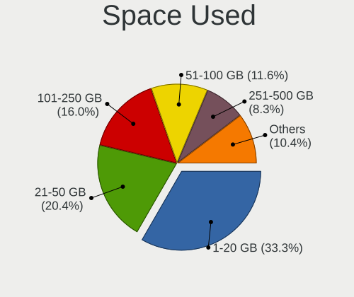

| Used GB        | Computers | Percent |
|----------------|-----------|---------|
| 1-20           | 296       | 33.33%  |
| 21-50          | 181       | 20.38%  |
| 101-250        | 142       | 15.99%  |
| 51-100         | 103       | 11.6%   |
| 251-500        | 74        | 8.33%   |
| 501-1000       | 39        | 4.39%   |
| 1001-2000      | 26        | 2.93%   |
| More than 3000 | 12        | 1.35%   |
| Unknown        | 10        | 1.13%   |
| 2001-3000      | 5         | 0.56%   |

Malfunc. Drives
---------------

Drive models with a malfunction

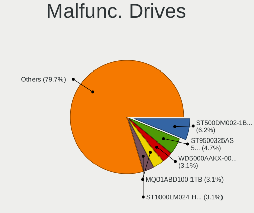

| Model                                        | Computers | Drives | Percent |
|----------------------------------------------|-----------|--------|---------|
| Seagate ST500DM002-1BD142 500GB              | 4         | 4      | 6.25%   |
| Seagate ST9500325AS 500GB                    | 3         | 3      | 4.69%   |
| WDC WD5000AAKX-001CA0 500GB                  | 2         | 2      | 3.13%   |
| Toshiba MQ01ABD100 1TB                       | 2         | 2      | 3.13%   |
| Seagate ST1000LM024 HN-M101MBB 1TB           | 2         | 2      | 3.13%   |
| WDC WD6400BPVT-60HXZT3 640GB                 | 1         | 1      | 1.56%   |
| WDC WD6000HLHX-01JJPV0 600GB                 | 1         | 1      | 1.56%   |
| WDC WD5000LPVX-22V0TT0 500GB                 | 1         | 2      | 1.56%   |
| WDC WD5000BPVT-00HXZT1 500GB                 | 1         | 1      | 1.56%   |
| WDC WD5000AVCS-632DY1 500GB                  | 1         | 1      | 1.56%   |
| WDC WD5000AAKX-329BA0 500GB                  | 1         | 1      | 1.56%   |
| WDC WD5000AAKX-003CA0 500GB                  | 1         | 1      | 1.56%   |
| WDC WD4003FZEX-00Z4SA0 4TB                   | 1         | 1      | 1.56%   |
| WDC WD2500BEKT-75PVMT1 250GB                 | 1         | 1      | 1.56%   |
| WDC WD2500AAJS-60M0A0 250GB                  | 1         | 1      | 1.56%   |
| WDC WD20EFRX-68EUZN0 2TB                     | 1         | 2      | 1.56%   |
| WDC WD10PURX-64E5EY0 1TB                     | 1         | 1      | 1.56%   |
| WDC WD10JPVX-60JC3T0 1TB                     | 1         | 1      | 1.56%   |
| WDC WD10EZEX-00RKKA0 1TB                     | 1         | 1      | 1.56%   |
| Toshiba MQ01ABF050 500GB                     | 1         | 1      | 1.56%   |
| Toshiba MQ01ABD075 752GB                     | 1         | 1      | 1.56%   |
| Toshiba MQ01ABD050 500GB                     | 1         | 1      | 1.56%   |
| Toshiba MK5055GSX 500GB                      | 1         | 1      | 1.56%   |
| Toshiba MK3265GSXN 320GB                     | 1         | 1      | 1.56%   |
| Toshiba MK2561GSYN 250GB                     | 1         | 1      | 1.56%   |
| Toshiba DT01ACA300 3TB                       | 1         | 3      | 1.56%   |
| Seagate ST9750420AS 752GB                    | 1         | 1      | 1.56%   |
| Seagate ST9500423AS 500GB                    | 1         | 1      | 1.56%   |
| Seagate ST500LX012-1LM162-SSHD 500GB         | 1         | 1      | 1.56%   |
| Seagate ST500LT012-1DG142 500GB              | 1         | 1      | 1.56%   |
| Seagate ST5000DM000-1FK178 5TB               | 1         | 1      | 1.56%   |
| Seagate ST3500320AS 500GB                    | 1         | 1      | 1.56%   |
| Seagate ST3320620AS 320GB                    | 1         | 1      | 1.56%   |
| Seagate ST3160815AS 160GB                    | 1         | 1      | 1.56%   |
| Seagate ST2000DM008-2FR102 2TB               | 1         | 1      | 1.56%   |
| Seagate ST1000DX001-1NS162 1TB               | 1         | 1      | 1.56%   |
| Seagate ST1000DM003-1SB102 1TB               | 1         | 1      | 1.56%   |
| Samsung Electronics MZVLQ512HBLU-00B00 512GB | 1         | 1      | 1.56%   |
| PNY SSD2SC120G3LC709B121-460I 120GB          | 1         | 1      | 1.56%   |
| Patriot Pyro m3 240GB SSD                    | 1         | 1      | 1.56%   |

Malfunc. Drive Vendor
---------------------

Vendors of faulty drives

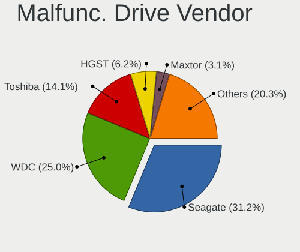

| Vendor              | Computers | Drives | Percent |
|---------------------|-----------|--------|---------|
| Seagate             | 20        | 20     | 31.25%  |
| WDC                 | 16        | 18     | 25%     |
| Toshiba             | 9         | 11     | 14.06%  |
| HGST                | 4         | 5      | 6.25%   |
| Maxtor              | 2         | 3      | 3.13%   |
| Intel               | 2         | 2      | 3.13%   |
| Hitachi             | 2         | 2      | 3.13%   |
| Apple               | 2         | 2      | 3.13%   |
| Samsung Electronics | 1         | 1      | 1.56%   |
| PNY                 | 1         | 1      | 1.56%   |
| Patriot             | 1         | 1      | 1.56%   |
| Kingston            | 1         | 1      | 1.56%   |
| HP Phison           | 1         | 1      | 1.56%   |
| Crucial             | 1         | 1      | 1.56%   |
| China               | 1         | 1      | 1.56%   |

Malfunc. HDD Vendor
-------------------

Vendors of faulty HDD drives

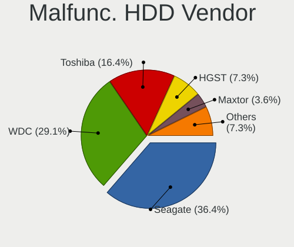

| Vendor  | Computers | Drives | Percent |
|---------|-----------|--------|---------|
| Seagate | 20        | 20     | 36.36%  |
| WDC     | 16        | 18     | 29.09%  |
| Toshiba | 9         | 11     | 16.36%  |
| HGST    | 4         | 5      | 7.27%   |
| Maxtor  | 2         | 3      | 3.64%   |
| Hitachi | 2         | 2      | 3.64%   |
| Apple   | 2         | 2      | 3.64%   |

Malfunc. Drive Kind
-------------------

Kinds of faulty drives

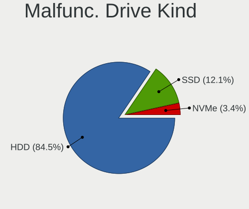

| Kind | Computers | Drives | Percent |
|------|-----------|--------|---------|
| HDD  | 49        | 61     | 84.48%  |
| SSD  | 7         | 7      | 12.07%  |
| NVMe | 2         | 2      | 3.45%   |

Failed Drives
-------------

Failed drive models

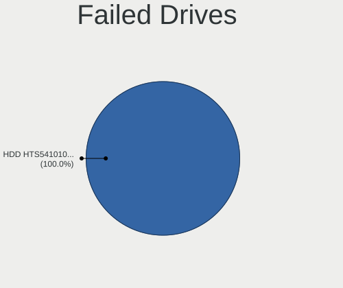

| Model                         | Computers | Drives | Percent |
|-------------------------------|-----------|--------|---------|
| Apple HDD HTS541010A9E662 1TB | 1         | 1      | 100%    |

Failed Drive Vendor
-------------------

Failed drive vendors

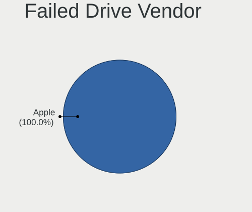

| Vendor | Computers | Drives | Percent |
|--------|-----------|--------|---------|
| Apple  | 1         | 1      | 100%    |

Drive Status
------------

Number of failed and malfunc. drives

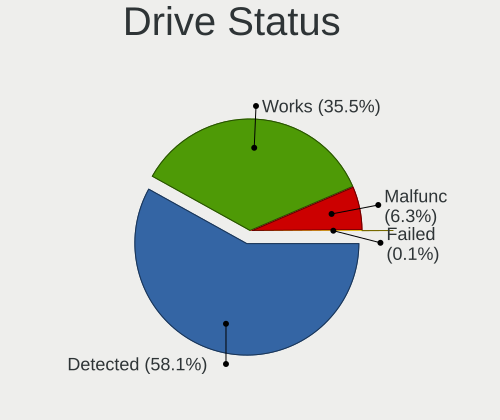

| Status   | Computers | Drives | Percent |
|----------|-----------|--------|---------|
| Detected | 522       | 1072   | 58.06%  |
| Works    | 319       | 526    | 35.48%  |
| Malfunc  | 57        | 70     | 6.34%   |
| Failed   | 1         | 1      | 0.11%   |

Storage controller
------------------

Storage Vendor
--------------

Storage controller vendors

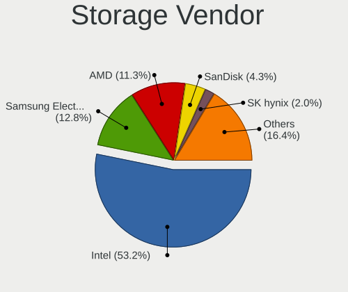

| Vendor                         | Computers | Percent |
|--------------------------------|-----------|---------|
| Intel                          | 558       | 53.19%  |
| Samsung Electronics            | 134       | 12.77%  |
| AMD                            | 119       | 11.34%  |
| SanDisk                        | 45        | 4.29%   |
| SK hynix                       | 21        | 2%      |
| Micron Technology              | 21        | 2%      |
| Phison Electronics             | 18        | 1.72%   |
| Toshiba America Info Systems   | 16        | 1.53%   |
| Marvell Technology Group       | 15        | 1.43%   |
| Micron/Crucial Technology      | 14        | 1.33%   |
| Kingston Technology Company    | 13        | 1.24%   |
| Nvidia                         | 10        | 0.95%   |
| ASMedia Technology             | 10        | 0.95%   |
| KIOXIA                         | 9         | 0.86%   |
| Silicon Motion                 | 8         | 0.76%   |
| JMicron Technology             | 6         | 0.57%   |
| ADATA Technology               | 6         | 0.57%   |
| Realtek Semiconductor          | 3         | 0.29%   |
| Apple                          | 3         | 0.29%   |
| Transcend                      | 2         | 0.19%   |
| Solid State Storage Technology | 2         | 0.19%   |
| MAXIO Technology (Hangzhou)    | 2         | 0.19%   |
| Lenovo                         | 2         | 0.19%   |
| Yangtze Memory Technologies    | 1         | 0.1%    |
| Union Memory (Shenzhen)        | 1         | 0.1%    |
| Solidigm                       | 1         | 0.1%    |
| Silicon Image                  | 1         | 0.1%    |
| Shenzhen Longsys Electronics   | 1         | 0.1%    |
| Seagate Technology             | 1         | 0.1%    |
| OCZ Technology Group           | 1         | 0.1%    |
| Netac Technology               | 1         | 0.1%    |
| Integrated Technology Express  | 1         | 0.1%    |
| INNOGRIT                       | 1         | 0.1%    |
| Hosin Global Electronics       | 1         | 0.1%    |
| Adaptec                        | 1         | 0.1%    |

Storage Model
-------------

Storage controller models

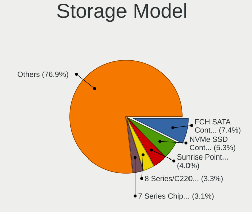

| Model                                                                          | Computers | Percent |
|--------------------------------------------------------------------------------|-----------|---------|
| AMD FCH SATA Controller [AHCI mode]                                            | 87        | 7.42%   |
| Samsung NVMe SSD Controller SM981/PM981/PM983                                  | 62        | 5.29%   |
| Intel Sunrise Point-LP SATA Controller [AHCI mode]                             | 47        | 4.01%   |
| Intel 8 Series/C220 Series Chipset Family 6-port SATA Controller 1 [AHCI mode] | 39        | 3.33%   |
| Intel 7 Series Chipset Family 6-port SATA Controller [AHCI mode]               | 36        | 3.07%   |
| Intel 6 Series/C200 Series Chipset Family 6 port Mobile SATA AHCI Controller   | 30        | 2.56%   |
| Intel 82801 Mobile SATA Controller [RAID mode]                                 | 27        | 2.3%    |
| Samsung NVMe SSD Controller 980 (DRAM-less)                                    | 21        | 1.79%   |
| Intel Q170/Q150/B150/H170/H110/Z170/CM236 Chipset SATA Controller [AHCI Mode]  | 20        | 1.71%   |
| Intel Comet Lake SATA AHCI Controller                                          | 20        | 1.71%   |
| Intel Cannon Lake PCH SATA AHCI Controller                                     | 19        | 1.62%   |
| Intel Volume Management Device NVMe RAID Controller                            | 18        | 1.54%   |
| Intel SATA Controller [RAID mode]                                              | 18        | 1.54%   |
| Intel 8 Series SATA Controller 1 [AHCI mode]                                   | 17        | 1.45%   |
| Samsung NVMe SSD Controller SM961/PM961/SM963                                  | 16        | 1.37%   |
| Intel Cannon Point-LP SATA Controller [AHCI Mode]                              | 16        | 1.37%   |
| AMD 400 Series Chipset SATA Controller                                         | 16        | 1.37%   |
| Samsung NVMe SSD Controller PM9A1/PM9A3/980PRO                                 | 15        | 1.28%   |
| Intel Wildcat Point-LP SATA Controller [AHCI Mode]                             | 15        | 1.28%   |
| Intel Celeron/Pentium Silver Processor SATA Controller                         | 15        | 1.28%   |
| Intel 6 Series/C200 Series Chipset Family 6 port Desktop SATA AHCI Controller  | 15        | 1.28%   |
| Intel 82801IBM/IEM (ICH9M/ICH9M-E) 4 port SATA Controller [AHCI mode]          | 13        | 1.11%   |
| SanDisk Extreme Pro / WD Black SN750 / PC SN730 / Red SN700 NVMe SSD           | 11        | 0.94%   |
| Intel SSD 660P Series                                                          | 11        | 0.94%   |
| Intel 5 Series/3400 Series Chipset 6 port SATA AHCI Controller                 | 11        | 0.94%   |
| AMD 500 Series Chipset SATA Controller                                         | 11        | 0.94%   |
| Intel HM170/QM170 Chipset SATA Controller [AHCI Mode]                          | 10        | 0.85%   |
| Intel Cannon Lake Mobile PCH SATA AHCI Controller                              | 10        | 0.85%   |
| Intel 5 Series/3400 Series Chipset 4 port SATA AHCI Controller                 | 10        | 0.85%   |
| Intel 200 Series PCH SATA controller [AHCI mode]                               | 10        | 0.85%   |
| SK hynix BC501 NVMe Solid State Drive                                          | 9         | 0.77%   |
| Micron/Crucial P2 [Nick P2] / P3 / P3 Plus NVMe PCIe SSD (DRAM-less)           | 9         | 0.77%   |
| Intel 7 Series/C210 Series Chipset Family 6-port SATA Controller [AHCI mode]   | 9         | 0.77%   |
| Intel 400 Series Chipset Family SATA AHCI Controller                           | 9         | 0.77%   |
| Phison E12 NVMe Controller                                                     | 8         | 0.68%   |
| Intel 82801HM/HEM (ICH8M/ICH8M-E) IDE Controller                               | 8         | 0.68%   |
| Intel 500 Series Chipset Family SATA AHCI Controller                           | 8         | 0.68%   |
| Intel 5 Series/3400 Series Chipset 4 port SATA IDE Controller                  | 8         | 0.68%   |
| AMD SB7x0/SB8x0/SB9x0 SATA Controller [AHCI mode]                              | 8         | 0.68%   |
| Toshiba America Info Systems XG6 NVMe SSD Controller                           | 7         | 0.6%    |

Storage Kind
------------

Kind of storage controller (IDE, SATA, NVMe, SAS, ...)

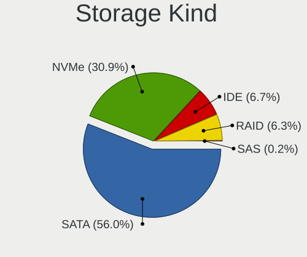

| Kind | Computers | Percent |
|------|-----------|---------|
| SATA | 588       | 56%     |
| NVMe | 324       | 30.86%  |
| IDE  | 70        | 6.67%   |
| RAID | 66        | 6.29%   |
| SAS  | 2         | 0.19%   |

Processor
---------

CPU Vendor
----------

Processor vendors

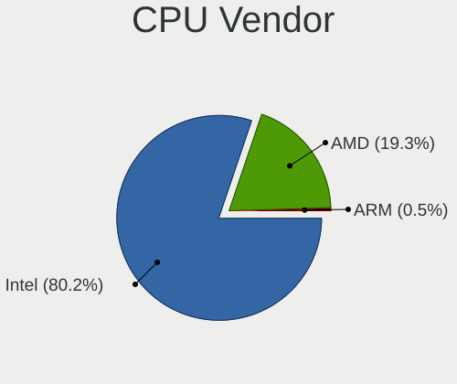

| Vendor | Computers | Percent |
|--------|-----------|---------|
| Intel  | 668       | 80.19%  |
| AMD    | 161       | 19.33%  |
| ARM    | 4         | 0.48%   |

CPU Model
---------

Processor models

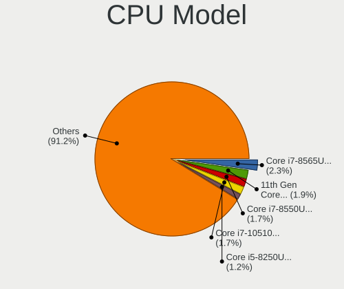

| Model                                         | Computers | Percent |
|-----------------------------------------------|-----------|---------|
| Intel Core i7-8565U CPU @ 1.80GHz             | 19        | 2.28%   |
| Intel 11th Gen Core i7-1165G7 @ 2.80GHz       | 16        | 1.92%   |
| Intel Core i7-8550U CPU @ 1.80GHz             | 14        | 1.68%   |
| Intel Core i7-10510U CPU @ 1.80GHz            | 14        | 1.68%   |
| Intel Core i5-8250U CPU @ 1.60GHz             | 10        | 1.2%    |
| Intel Core i5-2520M CPU @ 2.50GHz             | 9         | 1.08%   |
| Intel Core i7-7700HQ CPU @ 2.80GHz            | 7         | 0.84%   |
| Intel Core i7-7500U CPU @ 2.70GHz             | 7         | 0.84%   |
| Intel Core i7-10750H CPU @ 2.60GHz            | 7         | 0.84%   |
| Intel Core i5-7200U CPU @ 2.50GHz             | 7         | 0.84%   |
| Intel Core i5-10210U CPU @ 1.60GHz            | 7         | 0.84%   |
| AMD Ryzen 7 4800H with Radeon Graphics        | 7         | 0.84%   |
| AMD Ryzen 7 4700U with Radeon Graphics        | 7         | 0.84%   |
| AMD Ryzen 7 3700X 8-Core Processor            | 7         | 0.84%   |
| Intel Core i7-9750H CPU @ 2.60GHz             | 6         | 0.72%   |
| Intel Core i5-6300U CPU @ 2.40GHz             | 6         | 0.72%   |
| Intel Core i5-5200U CPU @ 2.20GHz             | 6         | 0.72%   |
| Intel Core i5-3210M CPU @ 2.50GHz             | 6         | 0.72%   |
| Intel Celeron N4020 CPU @ 1.10GHz             | 6         | 0.72%   |
| Intel 11th Gen Core i5-1135G7 @ 2.40GHz       | 6         | 0.72%   |
| Intel Core i7-8750H CPU @ 2.20GHz             | 5         | 0.6%    |
| Intel Core i7-4770 CPU @ 3.40GHz              | 5         | 0.6%    |
| Intel Core i7-3770 CPU @ 3.40GHz              | 5         | 0.6%    |
| Intel Core i7-10710U CPU @ 1.10GHz            | 5         | 0.6%    |
| Intel Core i5-8350U CPU @ 1.70GHz             | 5         | 0.6%    |
| Intel Core i5-6200U CPU @ 2.30GHz             | 5         | 0.6%    |
| AMD Ryzen 7 5800H with Radeon Graphics        | 5         | 0.6%    |
| AMD Ryzen 7 5700U with Radeon Graphics        | 5         | 0.6%    |
| AMD Ryzen 5 3500U with Radeon Vega Mobile Gfx | 5         | 0.6%    |
| Intel Pentium Silver N5030 CPU @ 1.10GHz      | 4         | 0.48%   |
| Intel Core i9-9900K CPU @ 3.60GHz             | 4         | 0.48%   |
| Intel Core i7-8700 CPU @ 3.20GHz              | 4         | 0.48%   |
| Intel Core i7-7820HQ CPU @ 2.90GHz            | 4         | 0.48%   |
| Intel Core i7-4790 CPU @ 3.60GHz              | 4         | 0.48%   |
| Intel Core i7-4600U CPU @ 2.10GHz             | 4         | 0.48%   |
| Intel Core i7-4500U CPU @ 1.80GHz             | 4         | 0.48%   |
| Intel Core i7-3520M CPU @ 2.90GHz             | 4         | 0.48%   |
| Intel Core i7-2600 CPU @ 3.40GHz              | 4         | 0.48%   |
| Intel Core i5-8265U CPU @ 1.60GHz             | 4         | 0.48%   |
| Intel Core i5-2415M CPU @ 2.30GHz             | 4         | 0.48%   |

CPU Model Family
----------------

Processor model prefix

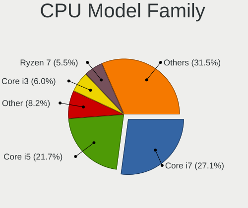

| Model                          | Computers | Percent |
|--------------------------------|-----------|---------|
| Intel Core i7                  | 226       | 27.1%   |
| Intel Core i5                  | 181       | 21.7%   |
| Other                          | 68        | 8.15%   |
| Intel Core i3                  | 50        | 6%      |
| AMD Ryzen 7                    | 46        | 5.52%   |
| AMD Ryzen 5                    | 42        | 5.04%   |
| Intel Celeron                  | 32        | 3.84%   |
| Intel Core 2 Duo               | 28        | 3.36%   |
| Intel Xeon                     | 18        | 2.16%   |
| Intel Pentium                  | 17        | 2.04%   |
| AMD Ryzen 9                    | 15        | 1.8%    |
| Intel Atom                     | 12        | 1.44%   |
| AMD Ryzen 3                    | 9         | 1.08%   |
| Intel Core i9                  | 8         | 0.96%   |
| Intel Pentium Silver           | 7         | 0.84%   |
| AMD A6                         | 7         | 0.84%   |
| Intel Pentium Dual-Core        | 6         | 0.72%   |
| Intel Pentium Dual             | 5         | 0.6%    |
| Intel Core 2                   | 5         | 0.6%    |
| AMD A8                         | 5         | 0.6%    |
| AMD Ryzen 5 PRO                | 4         | 0.48%   |
| AMD FX                         | 4         | 0.48%   |
| AMD A4                         | 4         | 0.48%   |
| Intel Genuine                  | 3         | 0.36%   |
| Intel Core 2 Quad              | 3         | 0.36%   |
| AMD E                          | 3         | 0.36%   |
| AMD A10                        | 3         | 0.36%   |
| Intel Core m3                  | 2         | 0.24%   |
| AMD Turion 64 X2 Mobile        | 2         | 0.24%   |
| AMD E1                         | 2         | 0.24%   |
| Intel Pentium 4                | 1         | 0.12%   |
| Intel Core m5                  | 1         | 0.12%   |
| Intel Core                     | 1         | 0.12%   |
| ARM BCM                        | 1         | 0.12%   |
| AMD Turion X2 Dual-Core Mobile | 1         | 0.12%   |
| AMD Sempron                    | 1         | 0.12%   |
| AMD Ryzen Threadripper         | 1         | 0.12%   |
| AMD Ryzen 7 PRO                | 1         | 0.12%   |
| AMD Quad-Core                  | 1         | 0.12%   |
| AMD Phenom II X6               | 1         | 0.12%   |

CPU Cores
---------

Number of processor cores

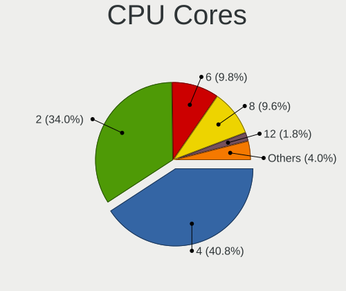

| Number | Computers | Percent |
|--------|-----------|---------|
| 4      | 340       | 40.82%  |
| 2      | 283       | 33.97%  |
| 6      | 82        | 9.84%   |
| 8      | 80        | 9.6%    |
| 12     | 15        | 1.8%    |
| 1      | 10        | 1.2%    |
| 16     | 9         | 1.08%   |
| 10     | 6         | 0.72%   |
| 14     | 4         | 0.48%   |
| 3      | 3         | 0.36%   |
| 24     | 1         | 0.12%   |

CPU Sockets
-----------

Number of sockets

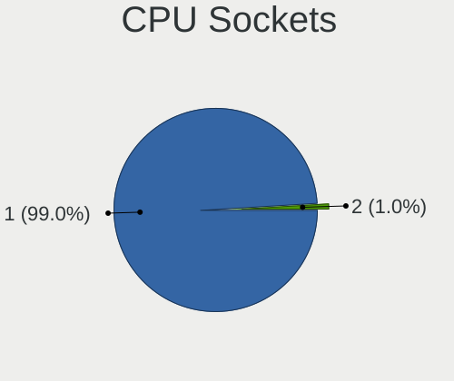

| Number | Computers | Percent |
|--------|-----------|---------|
| 1      | 825       | 99.04%  |
| 2      | 8         | 0.96%   |

CPU Threads
-----------

Threads per core (Hyper-Threading)

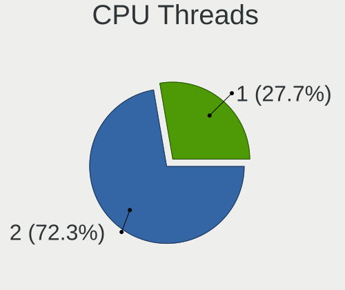

| Number | Computers | Percent |
|--------|-----------|---------|
| 2      | 603       | 72.3%   |
| 1      | 231       | 27.7%   |

CPU Op-Modes
------------

CPU Operation Modes (32-bit, 64-bit)

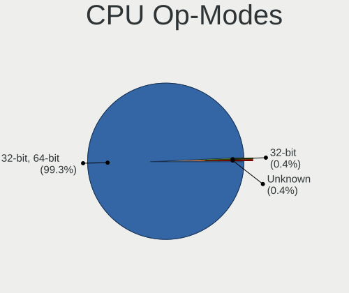

| Op mode        | Computers | Percent |
|----------------|-----------|---------|
| 32-bit, 64-bit | 827       | 99.28%  |
| 32-bit         | 3         | 0.36%   |
| Unknown        | 3         | 0.36%   |

CPU Microcode
-------------

Microcode number

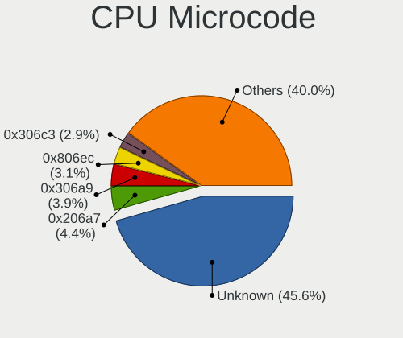

| Number     | Computers | Percent |
|------------|-----------|---------|
| Unknown    | 393       | 45.59%  |
| 0x206a7    | 38        | 4.41%   |
| 0x306a9    | 34        | 3.94%   |
| 0x806ec    | 27        | 3.13%   |
| 0x306c3    | 25        | 2.9%    |
| 0x806ea    | 18        | 2.09%   |
| 0x906ea    | 17        | 1.97%   |
| 0x806e9    | 16        | 1.86%   |
| 0x806c1    | 15        | 1.74%   |
| 0x1067a    | 14        | 1.62%   |
| 0x506e3    | 13        | 1.51%   |
| 0x406e3    | 13        | 1.51%   |
| 0x40651    | 12        | 1.39%   |
| 0x906e9    | 11        | 1.28%   |
| 0x806eb    | 9         | 1.04%   |
| 0x306d4    | 9         | 1.04%   |
| 0x20655    | 8         | 0.93%   |
| 0xa0652    | 7         | 0.81%   |
| 0x106e5    | 7         | 0.81%   |
| 0x0a50000c | 7         | 0.81%   |
| 0x08600103 | 7         | 0.81%   |
| 0x08600106 | 6         | 0.7%    |
| 0x08108109 | 6         | 0.7%    |
| 0x706a8    | 5         | 0.58%   |
| 0x30678    | 5         | 0.58%   |
| 0x08701021 | 5         | 0.58%   |
| 0x08600104 | 5         | 0.58%   |
| 0x906ec    | 4         | 0.46%   |
| 0x806d1    | 4         | 0.46%   |
| 0x706e5    | 4         | 0.46%   |
| 0x6fd      | 4         | 0.46%   |
| 0x406c4    | 4         | 0.46%   |
| 0x10676    | 4         | 0.46%   |
| 0x08608103 | 4         | 0.46%   |
| 0x0810100b | 4         | 0.46%   |
| 0x0800820d | 4         | 0.46%   |
| 0xa0671    | 3         | 0.35%   |
| 0xa0660    | 3         | 0.35%   |
| 0x906ed    | 3         | 0.35%   |
| 0x906a3    | 3         | 0.35%   |

CPU Microarch
-------------

Microarchitecture

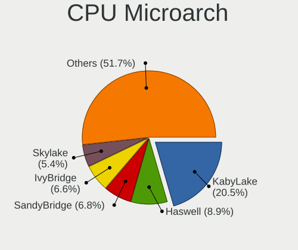

| Name             | Computers | Percent |
|------------------|-----------|---------|
| KabyLake         | 171       | 20.53%  |
| Haswell          | 74        | 8.88%   |
| SandyBridge      | 57        | 6.84%   |
| IvyBridge        | 55        | 6.6%    |
| Skylake          | 45        | 5.4%    |
| Zen 2            | 43        | 5.16%   |
| Unknown          | 42        | 5.04%   |
| Penryn           | 34        | 4.08%   |
| TigerLake        | 29        | 3.48%   |
| CometLake        | 25        | 3%      |
| Broadwell        | 24        | 2.88%   |
| Westmere         | 23        | 2.76%   |
| Silvermont       | 22        | 2.64%   |
| Zen 3            | 21        | 2.52%   |
| Zen+             | 20        | 2.4%    |
| Goldmont plus    | 18        | 2.16%   |
| IceLake          | 17        | 2.04%   |
| Core             | 17        | 2.04%   |
| Zen              | 14        | 1.68%   |
| Nehalem          | 14        | 1.68%   |
| Alderlake Hybrid | 12        | 1.44%   |
| Excavator        | 9         | 1.08%   |
| Piledriver       | 7         | 0.84%   |
| Goldmont         | 7         | 0.84%   |
| K10              | 6         | 0.72%   |
| Puma             | 5         | 0.6%    |
| Jaguar           | 4         | 0.48%   |
| Bonnell          | 3         | 0.36%   |
| Bobcat           | 3         | 0.36%   |
| Tremont          | 2         | 0.24%   |
| Steamroller      | 2         | 0.24%   |
| K8 Hammer        | 2         | 0.24%   |
| K10 Llano        | 2         | 0.24%   |
| P6               | 1         | 0.12%   |
| NetBurst         | 1         | 0.12%   |
| K8 & K10 hybrid  | 1         | 0.12%   |
| Bulldozer        | 1         | 0.12%   |

Graphics
--------

GPU Vendor
----------

Vendors of graphics cards

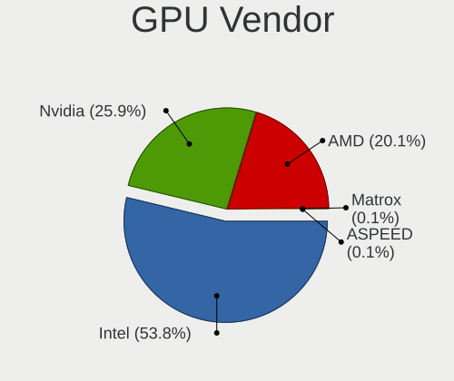

| Vendor                     | Computers | Percent |
|----------------------------|-----------|---------|
| Intel                      | 537       | 53.75%  |
| Nvidia                     | 259       | 25.93%  |
| AMD                        | 201       | 20.12%  |
| Matrox Electronics Systems | 1         | 0.1%    |
| ASPEED Technology          | 1         | 0.1%    |

GPU Model
---------

Graphics card models

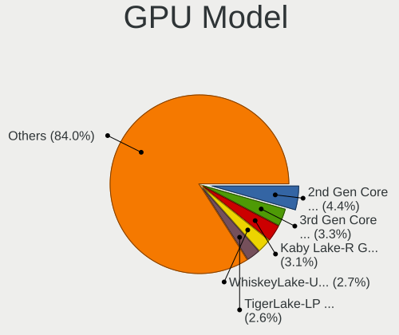

| Model                                                                                    | Computers | Percent |
|------------------------------------------------------------------------------------------|-----------|---------|
| Intel 2nd Generation Core Processor Family Integrated Graphics Controller                | 45        | 4.44%   |
| Intel 3rd Gen Core processor Graphics Controller                                         | 33        | 3.25%   |
| Intel Kaby Lake-R GT2 [UHD Graphics 620]                                                 | 31        | 3.06%   |
| Intel WhiskeyLake-U GT2 [UHD Graphics 620]                                               | 27        | 2.66%   |
| Intel TigerLake-LP GT2 [Iris Xe Graphics]                                                | 26        | 2.56%   |
| AMD Renoir [Radeon Vega Series / Radeon Vega Mobile Series]                              | 25        | 2.47%   |
| Intel CometLake-U GT2 [UHD Graphics]                                                     | 24        | 2.37%   |
| Intel Skylake-U GT2 [HD Graphics 520]                                                    | 19        | 1.87%   |
| Intel Kaby Lake-U GT2 [HD Graphics 620]                                                  | 18        | 1.78%   |
| Intel Haswell-ULT Integrated Graphics Controller                                         | 18        | 1.78%   |
| Intel Xeon E3-1200 v3/4th Gen Core Processor Integrated Graphics Controller              | 17        | 1.68%   |
| Intel 4th Gen Core Processor Integrated Graphics Controller                              | 17        | 1.68%   |
| AMD Ellesmere [Radeon RX 470/480/570/570X/580/580X/590]                                  | 16        | 1.58%   |
| Intel CoffeeLake-H GT2 [UHD Graphics 630]                                                | 15        | 1.48%   |
| Intel Broadwell-U GT2 [HD Graphics 5500]                                                 | 15        | 1.48%   |
| Intel Core Processor Integrated Graphics Controller                                      | 14        | 1.38%   |
| Intel Mobile 4 Series Chipset Integrated Graphics Controller                             | 13        | 1.28%   |
| Intel GeminiLake [UHD Graphics 600]                                                      | 13        | 1.28%   |
| Intel CometLake-H GT2 [UHD Graphics]                                                     | 12        | 1.18%   |
| AMD Picasso/Raven 2 [Radeon Vega Series / Radeon Vega Mobile Series]                     | 12        | 1.18%   |
| Intel Atom/Celeron/Pentium Processor x5-E8000/J3xxx/N3xxx Integrated Graphics Controller | 11        | 1.08%   |
| Intel Atom Processor Z36xxx/Z37xxx Series Graphics & Display                             | 11        | 1.08%   |
| Nvidia GP106 [GeForce GTX 1060 6GB]                                                      | 10        | 0.99%   |
| Intel Kaby Lake-H GT2 [HD Graphics 630]                                                  | 10        | 0.99%   |
| AMD Raven Ridge [Radeon Vega Series / Radeon Vega Mobile Series]                         | 10        | 0.99%   |
| Nvidia GP107 [GeForce GTX 1050 Ti]                                                       | 9         | 0.89%   |
| Intel CoffeeLake-S GT2 [UHD Graphics 630]                                                | 9         | 0.89%   |
| AMD Cezanne [Radeon Vega Series / Radeon Vega Mobile Series]                             | 9         | 0.89%   |
| Nvidia TU117M [GeForce GTX 1650 Mobile / Max-Q]                                          | 8         | 0.79%   |
| Intel Xeon E3-1200 v2/3rd Gen Core processor Graphics Controller                         | 8         | 0.79%   |
| Nvidia GA106M [GeForce RTX 3060 Mobile / Max-Q]                                          | 7         | 0.69%   |
| Intel TigerLake-H GT1 [UHD Graphics]                                                     | 7         | 0.69%   |
| AMD Lucienne                                                                             | 7         | 0.69%   |
| Nvidia GP108 [GeForce GT 1030]                                                           | 6         | 0.59%   |
| Intel Skylake-S GT2 [HD Graphics 530]                                                    | 6         | 0.59%   |
| Intel Skylake-H GT2 [HD Graphics 530]                                                    | 6         | 0.59%   |
| Intel Iris Plus Graphics G1 (Ice Lake)                                                   | 6         | 0.59%   |
| AMD Seymour [Radeon HD 6400M/7400M Series]                                               | 6         | 0.59%   |
| Nvidia TU106M [GeForce RTX 2060 Mobile]                                                  | 5         | 0.49%   |
| Nvidia GP108M [GeForce MX250]                                                            | 5         | 0.49%   |

GPU Combo
---------

Combinations of graphics cards

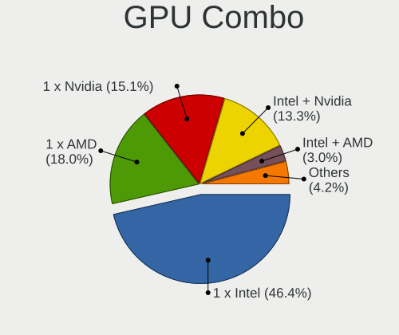

| Name            | Computers | Percent |
|-----------------|-----------|---------|
| 1 x Intel       | 390       | 46.43%  |
| 1 x AMD         | 151       | 17.98%  |
| 1 x Nvidia      | 127       | 15.12%  |
| Intel + Nvidia  | 112       | 13.33%  |
| Intel + AMD     | 25        | 2.98%   |
| AMD + Nvidia    | 17        | 2.02%   |
| Other           | 6         | 0.71%   |
| 2 x AMD         | 6         | 0.71%   |
| 2 x Nvidia      | 2         | 0.24%   |
| 2 x Intel       | 2         | 0.24%   |
| Nvidia + Matrox | 1         | 0.12%   |
| 1 x ASPEED      | 1         | 0.12%   |

GPU Driver
----------

Free vs proprietary

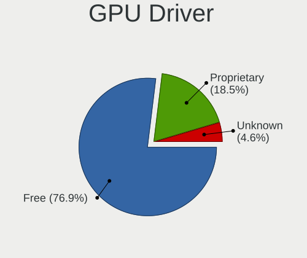

| Driver      | Computers | Percent |
|-------------|-----------|---------|
| Free        | 654       | 76.94%  |
| Proprietary | 157       | 18.47%  |
| Unknown     | 39        | 4.59%   |

GPU Memory
----------

Total video memory

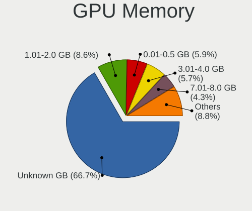

| Size in GB | Computers | Percent |
|------------|-----------|---------|
| Unknown    | 569       | 66.71%  |
| 1.01-2.0   | 73        | 8.56%   |
| 0.01-0.5   | 50        | 5.86%   |
| 3.01-4.0   | 49        | 5.74%   |
| 7.01-8.0   | 37        | 4.34%   |
| 0.51-1.0   | 34        | 3.99%   |
| 5.01-6.0   | 25        | 2.93%   |
| 8.01-16.0  | 7         | 0.82%   |
| 2.01-3.0   | 6         | 0.7%    |
| 16.01-24.0 | 3         | 0.35%   |

Monitor
-------

Monitor Vendor
--------------

Monitor vendors

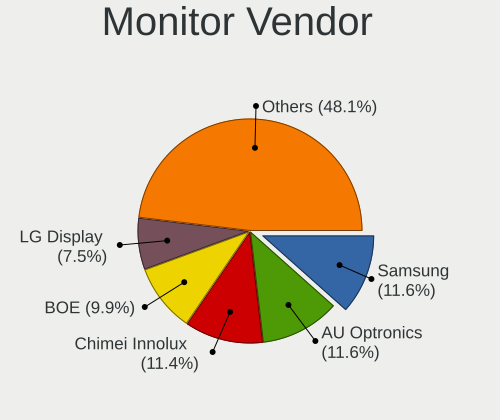

| Vendor                  | Computers | Percent |
|-------------------------|-----------|---------|
| Samsung Electronics     | 110       | 11.58%  |
| AU Optronics            | 110       | 11.58%  |
| Chimei Innolux          | 108       | 11.37%  |
| BOE                     | 94        | 9.89%   |
| LG Display              | 71        | 7.47%   |
| Dell                    | 58        | 6.11%   |
| Apple                   | 44        | 4.63%   |
| Goldstar                | 40        | 4.21%   |
| Hewlett-Packard         | 26        | 2.74%   |
| Acer                    | 25        | 2.63%   |
| AOC                     | 23        | 2.42%   |
| Philips                 | 19        | 2%      |
| BenQ                    | 19        | 2%      |
| Ancor Communications    | 18        | 1.89%   |
| Sharp                   | 16        | 1.68%   |
| Chi Mei Optoelectronics | 14        | 1.47%   |
| Lenovo                  | 12        | 1.26%   |
| PANDA                   | 9         | 0.95%   |
| Unknown                 | 8         | 0.84%   |
| ASUSTek Computer        | 8         | 0.84%   |
| InfoVision              | 7         | 0.74%   |
| Iiyama                  | 7         | 0.74%   |
| Fujitsu Siemens         | 6         | 0.63%   |
| Sony                    | 5         | 0.53%   |
| LG Electronics          | 5         | 0.53%   |
| Idek Iiyama             | 4         | 0.42%   |
| Gigabyte Technology     | 4         | 0.42%   |
| MStar                   | 3         | 0.32%   |
| Medion                  | 3         | 0.32%   |
| LGD                     | 3         | 0.32%   |
| LG Philips              | 3         | 0.32%   |
| HKC                     | 3         | 0.32%   |
| Eizo                    | 3         | 0.32%   |
| Vizio                   | 2         | 0.21%   |
| ViewSonic               | 2         | 0.21%   |
| Vestel Elektronik       | 2         | 0.21%   |
| Unknown (AAA)           | 2         | 0.21%   |
| Sceptre Tech            | 2         | 0.21%   |
| SANYO                   | 2         | 0.21%   |
| RTK                     | 2         | 0.21%   |

Monitor Model
-------------

Monitor models

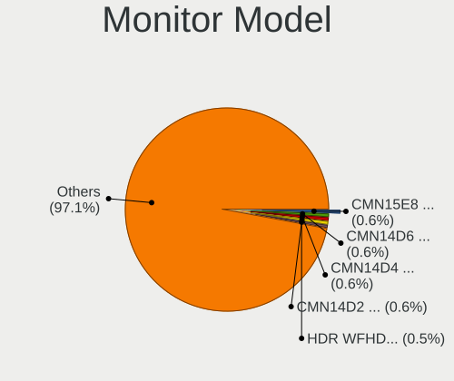

| Model                                                                 | Computers | Percent |
|-----------------------------------------------------------------------|-----------|---------|
| Chimei Innolux LCD Monitor CMN15E8 1920x1080 344x193mm 15.5-inch      | 6         | 0.6%    |
| Chimei Innolux LCD Monitor CMN14D6 1366x768 309x173mm 13.9-inch       | 6         | 0.6%    |
| Chimei Innolux LCD Monitor CMN14D4 1920x1080 309x173mm 13.9-inch      | 6         | 0.6%    |
| Chimei Innolux LCD Monitor CMN14D2 1920x1080 309x173mm 13.9-inch      | 6         | 0.6%    |
| Goldstar HDR WFHD GSM7714 2560x1080 798x334mm 34.1-inch               | 5         | 0.5%    |
| Chimei Innolux LCD Monitor CMN15F5 1920x1080 344x193mm 15.5-inch      | 5         | 0.5%    |
| Samsung Electronics LCD Monitor SDCA029 3840x2160 344x194mm 15.5-inch | 4         | 0.4%    |
| Chimei Innolux LCD Monitor CMN15E7 1920x1080 344x193mm 15.5-inch      | 4         | 0.4%    |
| BOE LCD Monitor BOE0974 2560x1440 344x194mm 15.5-inch                 | 4         | 0.4%    |
| BOE LCD Monitor BOE0747 1920x1080 344x194mm 15.5-inch                 | 4         | 0.4%    |
| AU Optronics LCD Monitor AUO22EC 1366x768 344x193mm 15.5-inch         | 4         | 0.4%    |
| Sharp LQ156M1JW01 SHP14C3 1920x1080 344x194mm 15.5-inch               | 3         | 0.3%    |
| Samsung Electronics LCD Monitor SEC5441 1280x800 331x207mm 15.4-inch  | 3         | 0.3%    |
| Philips PHL 243V7 PHLC155 1920x1080 527x296mm 23.8-inch               | 3         | 0.3%    |
| PANDA LCD Monitor NCP0036 1920x1080 344x194mm 15.5-inch               | 3         | 0.3%    |
| LG Display LCD Monitor LGD046F 1920x1080 344x194mm 15.5-inch          | 3         | 0.3%    |
| Goldstar LG ULTRAWIDE GSM59F1 2560x1080 670x280mm 28.6-inch           | 3         | 0.3%    |
| Dell U2415 DELA0BA 1920x1200 518x324mm 24.1-inch                      | 3         | 0.3%    |
| Chimei Innolux LCD Monitor CMN15E6 1366x768 344x193mm 15.5-inch       | 3         | 0.3%    |
| Chimei Innolux LCD Monitor CMN15DB 1366x768 344x193mm 15.5-inch       | 3         | 0.3%    |
| Chimei Innolux LCD Monitor CMN14D5 1920x1080 309x173mm 13.9-inch      | 3         | 0.3%    |
| BOE LCD Monitor BOE0812 1920x1080 344x194mm 15.5-inch                 | 3         | 0.3%    |
| BOE LCD Monitor BOE070D 1366x768 309x173mm 13.9-inch                  | 3         | 0.3%    |
| BOE LCD Monitor BOE0672 1366x768 344x194mm 15.5-inch                  | 3         | 0.3%    |
| AU Optronics LCD Monitor AUO623D 1920x1080 309x174mm 14.0-inch        | 3         | 0.3%    |
| AU Optronics LCD Monitor AUO403D 1920x1080 309x174mm 14.0-inch        | 3         | 0.3%    |
| AU Optronics LCD Monitor AUO38ED 1920x1080 344x193mm 15.5-inch        | 3         | 0.3%    |
| AU Optronics LCD Monitor AUO219D 1920x1080 381x214mm 17.2-inch        | 3         | 0.3%    |
| Apple LCD Monitor APP9CC3 1280x800 286x179mm 13.3-inch                | 3         | 0.3%    |
| Vestel Elektronik 40UHD_LCD_TV VES3700 3840x2160 880x500mm 39.8-inch  | 2         | 0.2%    |
| Unknown LCD Monitor SAMSUNG                                           | 2         | 0.2%    |
| Samsung Electronics S34J55x SAM0F70 3440x1440 797x333mm 34.0-inch     | 2         | 0.2%    |
| Samsung Electronics S27B550 SAM091B 1920x1080 598x336mm 27.0-inch     | 2         | 0.2%    |
| Samsung Electronics Odyssey G7 SAM72BF 3840x2160 697x392mm 31.5-inch  | 2         | 0.2%    |
| Samsung Electronics LF24T35 SAM707D 1920x1080 528x297mm 23.9-inch     | 2         | 0.2%    |
| Samsung Electronics LCD Monitor SEC3542 2160x1440 254x169mm 12.0-inch | 2         | 0.2%    |
| Samsung Electronics LCD Monitor SEC315A 1366x768 344x194mm 15.5-inch  | 2         | 0.2%    |
| Samsung Electronics LCD Monitor SDC4E51 1366x768 344x194mm 15.5-inch  | 2         | 0.2%    |
| Samsung Electronics LCD Monitor SDC424A 3200x1800 293x165mm 13.2-inch | 2         | 0.2%    |
| Samsung Electronics LCD Monitor SAM0C3C 1366x768 609x347mm 27.6-inch  | 2         | 0.2%    |

Monitor Resolution
------------------

Monitor screen resolution

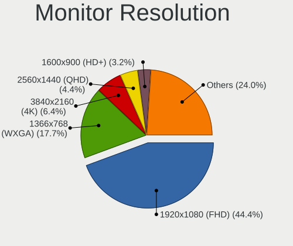

| Resolution         | Computers | Percent |
|--------------------|-----------|---------|
| 1920x1080 (FHD)    | 402       | 44.37%  |
| 1366x768 (WXGA)    | 160       | 17.66%  |
| 3840x2160 (4K)     | 58        | 6.4%    |
| 2560x1440 (QHD)    | 40        | 4.42%   |
| 1600x900 (HD+)     | 29        | 3.2%    |
| 1920x1200 (WUXGA)  | 27        | 2.98%   |
| 1680x1050 (WSXGA+) | 19        | 2.1%    |
| 1280x800 (WXGA)    | 19        | 2.1%    |
| 3440x1440          | 18        | 1.99%   |
| 1280x1024 (SXGA)   | 18        | 1.99%   |
| Unknown            | 16        | 1.77%   |
| 1440x900 (WXGA+)   | 13        | 1.43%   |
| 2560x1080          | 12        | 1.32%   |
| 2560x1600          | 9         | 0.99%   |
| 2880x1800          | 8         | 0.88%   |
| 3840x1080          | 7         | 0.77%   |
| 3200x1800 (QHD+)   | 4         | 0.44%   |
| 2160x1440          | 4         | 0.44%   |
| 1920x540           | 4         | 0.44%   |
| 3000x2000          | 3         | 0.33%   |
| 1360x768           | 3         | 0.33%   |
| 3520x1080          | 2         | 0.22%   |
| 2256x1504          | 2         | 0.22%   |
| 1920x1280          | 2         | 0.22%   |
| 1600x1200          | 2         | 0.22%   |
| 7680x2160          | 1         | 0.11%   |
| 5760x2160          | 1         | 0.11%   |
| 4480x1440          | 1         | 0.11%   |
| 4480x1080          | 1         | 0.11%   |
| 3840x2400          | 1         | 0.11%   |
| 3840x1440          | 1         | 0.11%   |
| 3840x1200          | 1         | 0.11%   |
| 3840x1100          | 1         | 0.11%   |
| 3600x1080          | 1         | 0.11%   |
| 3456x2160          | 1         | 0.11%   |
| 3280x1080          | 1         | 0.11%   |
| 2880x1920          | 1         | 0.11%   |
| 2736x1824          | 1         | 0.11%   |
| 2646x768           | 1         | 0.11%   |
| 2560x1024          | 1         | 0.11%   |

Monitor Diagonal
----------------

Diagonal size in inches

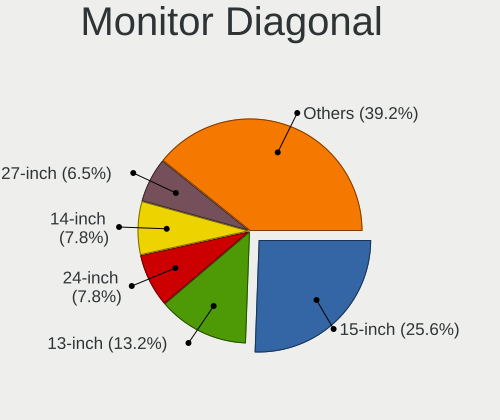

| Inches  | Computers | Percent |
|---------|-----------|---------|
| 15      | 244       | 25.58%  |
| 13      | 126       | 13.21%  |
| 24      | 74        | 7.76%   |
| 14      | 74        | 7.76%   |
| 27      | 62        | 6.5%    |
| Unknown | 57        | 5.97%   |
| 23      | 52        | 5.45%   |
| 21      | 43        | 4.51%   |
| 17      | 42        | 4.4%    |
| 31      | 24        | 2.52%   |
| 34      | 20        | 2.1%    |
| 19      | 16        | 1.68%   |
| 12      | 15        | 1.57%   |
| 11      | 14        | 1.47%   |
| 22      | 10        | 1.05%   |
| 20      | 10        | 1.05%   |
| 18      | 8         | 0.84%   |
| 16      | 7         | 0.73%   |
| 84      | 6         | 0.63%   |
| 63      | 6         | 0.63%   |
| 54      | 6         | 0.63%   |
| 32      | 5         | 0.52%   |
| 72      | 4         | 0.42%   |
| 40      | 4         | 0.42%   |
| 48      | 3         | 0.31%   |
| 46      | 3         | 0.31%   |
| 42      | 3         | 0.31%   |
| 28      | 3         | 0.31%   |
| 52      | 2         | 0.21%   |
| 33      | 2         | 0.21%   |
| 29      | 2         | 0.21%   |
| 142     | 1         | 0.1%    |
| 60      | 1         | 0.1%    |
| 44      | 1         | 0.1%    |
| 35      | 1         | 0.1%    |
| 26      | 1         | 0.1%    |
| 25      | 1         | 0.1%    |
| 10      | 1         | 0.1%    |

Monitor Width
-------------

Physical width

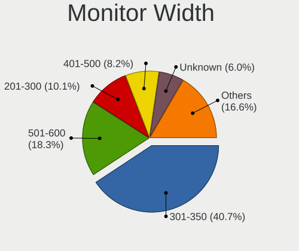

| Width in mm    | Computers | Percent |
|----------------|-----------|---------|
| 301-350        | 384       | 40.72%  |
| 501-600        | 173       | 18.35%  |
| 201-300        | 95        | 10.07%  |
| 401-500        | 77        | 8.17%   |
| Unknown        | 57        | 6.04%   |
| 351-400        | 53        | 5.62%   |
| 601-700        | 36        | 3.82%   |
| 701-800        | 27        | 2.86%   |
| 1001-1500      | 21        | 2.23%   |
| 1501-2000      | 10        | 1.06%   |
| 801-900        | 5         | 0.53%   |
| 901-1000       | 4         | 0.42%   |
| More than 2000 | 1         | 0.11%   |

Aspect Ratio
------------

Proportional relationship between the width and the height

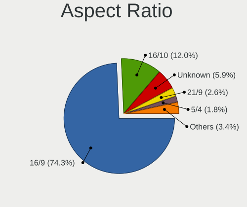

| Ratio   | Computers | Percent |
|---------|-----------|---------|
| 16/9    | 627       | 74.29%  |
| 16/10   | 101       | 11.97%  |
| Unknown | 50        | 5.92%   |
| 21/9    | 22        | 2.61%   |
| 5/4     | 15        | 1.78%   |
| 3/2     | 14        | 1.66%   |
| 4/3     | 7         | 0.83%   |
| 32/9    | 4         | 0.47%   |
| 1.00    | 2         | 0.24%   |
| 6/5     | 1         | 0.12%   |
| 3.40    | 1         | 0.12%   |

Monitor Area
------------

Area in inch²

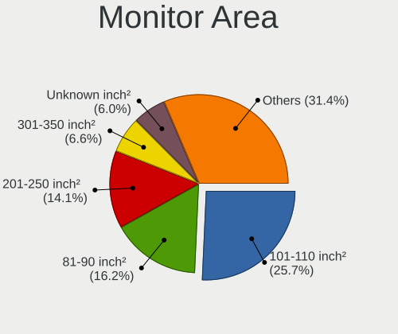

| Area in inch² | Computers | Percent |
|----------------|-----------|---------|
| 101-110        | 243       | 25.71%  |
| 81-90          | 153       | 16.19%  |
| 201-250        | 133       | 14.07%  |
| 301-350        | 62        | 6.56%   |
| Unknown        | 57        | 6.03%   |
| 351-500        | 54        | 5.71%   |
| 71-80          | 46        | 4.87%   |
| 151-200        | 38        | 4.02%   |
| 121-130        | 30        | 3.17%   |
| 251-300        | 29        | 3.07%   |
| More than 1000 | 27        | 2.86%   |
| 51-60          | 15        | 1.59%   |
| 501-1000       | 14        | 1.48%   |
| 141-150        | 13        | 1.38%   |
| 61-70          | 12        | 1.27%   |
| 131-140        | 8         | 0.85%   |
| 111-120        | 6         | 0.63%   |
| 91-100         | 4         | 0.42%   |
| 41-50          | 1         | 0.11%   |

Pixel Density
-------------

Pixels per inch

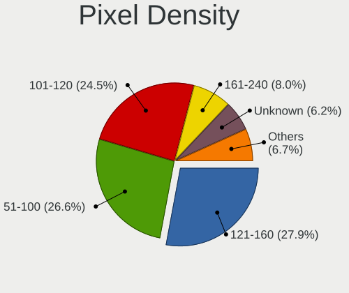

| Density       | Computers | Percent |
|---------------|-----------|---------|
| 121-160       | 257       | 27.93%  |
| 51-100        | 245       | 26.63%  |
| 101-120       | 225       | 24.46%  |
| 161-240       | 74        | 8.04%   |
| Unknown       | 57        | 6.2%    |
| More than 240 | 32        | 3.48%   |
| 1-50          | 30        | 3.26%   |

Multiple Monitors
-----------------

Total monitors connected

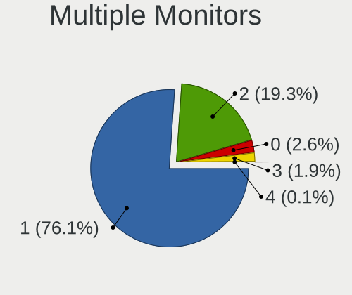

| Total | Computers | Percent |
|-------|-----------|---------|
| 1     | 649       | 76.08%  |
| 2     | 165       | 19.34%  |
| 0     | 22        | 2.58%   |
| 3     | 16        | 1.88%   |
| 4     | 1         | 0.12%   |

Network
-------

Net Controller Vendor
---------------------

Controller vendors

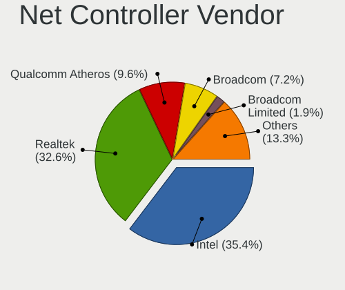

| Vendor                                | Computers | Percent |
|---------------------------------------|-----------|---------|
| Intel                                 | 456       | 35.38%  |
| Realtek Semiconductor                 | 420       | 32.58%  |
| Qualcomm Atheros                      | 124       | 9.62%   |
| Broadcom                              | 93        | 7.21%   |
| Broadcom Limited                      | 24        | 1.86%   |
| MediaTek                              | 22        | 1.71%   |
| Marvell Technology Group              | 13        | 1.01%   |
| Ralink Technology                     | 11        | 0.85%   |
| Ralink                                | 10        | 0.78%   |
| Nvidia                                | 8         | 0.62%   |
| NetGear                               | 8         | 0.62%   |
| ASIX Electronics                      | 8         | 0.62%   |
| DisplayLink                           | 7         | 0.54%   |
| Xiaomi                                | 6         | 0.47%   |
| TP-Link                               | 5         | 0.39%   |
| Samsung Electronics                   | 5         | 0.39%   |
| Lenovo                                | 5         | 0.39%   |
| Hewlett-Packard                       | 5         | 0.39%   |
| Shenzhen Goodix Technology            | 4         | 0.31%   |
| Microsoft                             | 4         | 0.31%   |
| JMicron Technology                    | 4         | 0.31%   |
| D-Link                                | 4         | 0.31%   |
| Sierra Wireless                       | 3         | 0.23%   |
| Qualcomm Atheros Communications       | 3         | 0.23%   |
| Huawei Technologies                   | 3         | 0.23%   |
| D-Link System                         | 3         | 0.23%   |
| Belkin Components                     | 3         | 0.23%   |
| ASUSTek Computer                      | 3         | 0.23%   |
| OnePlus Technology (Shenzhen)         | 2         | 0.16%   |
| Linksys                               | 2         | 0.16%   |
| Edimax Technology                     | 2         | 0.16%   |
| 802.11g Adapter [Linksys WUSB54GC v3] | 2         | 0.16%   |
| ZyXEL Communications                  | 1         | 0.08%   |
| Wacom                                 | 1         | 0.08%   |
| T & A Mobile Phones                   | 1         | 0.08%   |
| Realtek                               | 1         | 0.08%   |
| Raspberry Pi                          | 1         | 0.08%   |
| Novatek Microelectronics              | 1         | 0.08%   |
| Motorola PCS                          | 1         | 0.08%   |
| Microchip Technology                  | 1         | 0.08%   |

Net Controller Model
--------------------

Controller models

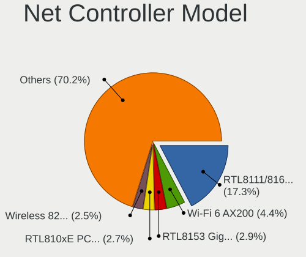

| Model                                                                  | Computers | Percent |
|------------------------------------------------------------------------|-----------|---------|
| Realtek RTL8111/8168/8211/8411 PCI Express Gigabit Ethernet Controller | 265       | 17.33%  |
| Intel Wi-Fi 6 AX200                                                    | 68        | 4.45%   |
| Realtek RTL8153 Gigabit Ethernet Adapter                               | 44        | 2.88%   |
| Realtek RTL810xE PCI Express Fast Ethernet controller                  | 41        | 2.68%   |
| Intel Wireless 8265 / 8275                                             | 38        | 2.49%   |
| Intel 82579LM Gigabit Network Connection (Lewisville)                  | 27        | 1.77%   |
| Qualcomm Atheros QCA9377 802.11ac Wireless Network Adapter             | 25        | 1.64%   |
| Realtek RTL8125 2.5GbE Controller                                      | 23        | 1.5%    |
| Intel Wi-Fi 5(802.11ac) Wireless-AC 9x6x [Thunder Peak]                | 21        | 1.37%   |
| Intel Comet Lake PCH-LP CNVi WiFi                                      | 21        | 1.37%   |
| Intel Wireless 8260                                                    | 20        | 1.31%   |
| Realtek RTL8821CE 802.11ac PCIe Wireless Network Adapter               | 18        | 1.18%   |
| Qualcomm Atheros AR9285 Wireless Network Adapter (PCI-Express)         | 18        | 1.18%   |
| Intel Wireless 7265                                                    | 18        | 1.18%   |
| Intel Wi-Fi 6 AX201                                                    | 17        | 1.11%   |
| Intel Ethernet Connection I217-LM                                      | 17        | 1.11%   |
| Intel Wi-Fi 6E(802.11ax) AX210/AX1675* 2x2 [Typhoon Peak]              | 16        | 1.05%   |
| Qualcomm Atheros QCA9565 / AR9565 Wireless Network Adapter             | 14        | 0.92%   |
| Intel Dual Band Wireless-AC 3168NGW [Stone Peak]                       | 14        | 0.92%   |
| Intel Wireless 7260                                                    | 13        | 0.85%   |
| Realtek RTL8822CE 802.11ac PCIe Wireless Network Adapter               | 12        | 0.78%   |
| Qualcomm Atheros AR9485 Wireless Network Adapter                       | 12        | 0.78%   |
| Intel I211 Gigabit Network Connection                                  | 12        | 0.78%   |
| Intel Ethernet Connection (4) I219-LM                                  | 12        | 0.78%   |
| Broadcom NetXtreme BCM57765 Gigabit Ethernet PCIe                      | 12        | 0.78%   |
| Intel Centrino Advanced-N 6205 [Taylor Peak]                           | 11        | 0.72%   |
| Intel Cannon Point-LP CNVi [Wireless-AC]                               | 11        | 0.72%   |
| Broadcom NetXtreme BCM57766 Gigabit Ethernet PCIe                      | 11        | 0.72%   |
| Broadcom BCM4331 802.11a/b/g/n                                         | 11        | 0.72%   |
| Realtek RTL8723BE PCIe Wireless Network Adapter                        | 10        | 0.65%   |
| Intel Ethernet Connection (7) I219-V                                   | 10        | 0.65%   |
| Intel Ethernet Connection (2) I219-LM                                  | 10        | 0.65%   |
| Intel Cannon Lake PCH CNVi WiFi                                        | 10        | 0.65%   |
| Broadcom BCM43142 802.11b/g/n                                          | 10        | 0.65%   |
| Qualcomm Atheros QCA6174 802.11ac Wireless Network Adapter             | 9         | 0.59%   |
| Qualcomm Atheros AR8151 v2.0 Gigabit Ethernet                          | 9         | 0.59%   |
| MediaTek MT7921 802.11ax PCIe Wireless Network Adapter [Filogic 330]   | 9         | 0.59%   |
| Intel Wireless 3165                                                    | 9         | 0.59%   |
| Broadcom BCM4360 802.11ac Dual Band Wireless Network Adapter           | 9         | 0.59%   |
| Realtek RTL8152 Fast Ethernet Adapter                                  | 8         | 0.52%   |

Wireless Vendor
---------------

Wireless vendors

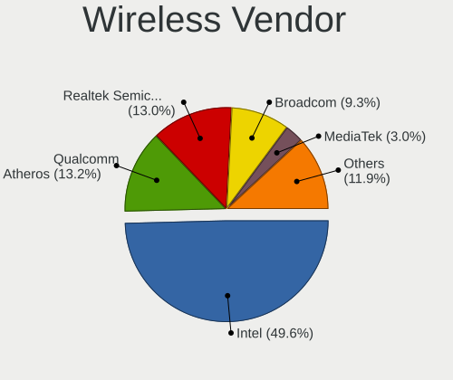

| Vendor                                | Computers | Percent |
|---------------------------------------|-----------|---------|
| Intel                                 | 367       | 49.59%  |
| Qualcomm Atheros                      | 98        | 13.24%  |
| Realtek Semiconductor                 | 96        | 12.97%  |
| Broadcom                              | 69        | 9.32%   |
| MediaTek                              | 22        | 2.97%   |
| Broadcom Limited                      | 17        | 2.3%    |
| Ralink Technology                     | 11        | 1.49%   |
| Ralink                                | 10        | 1.35%   |
| NetGear                               | 8         | 1.08%   |
| TP-Link                               | 4         | 0.54%   |
| Microsoft                             | 4         | 0.54%   |
| D-Link                                | 4         | 0.54%   |
| Sierra Wireless                       | 3         | 0.41%   |
| Qualcomm Atheros Communications       | 3         | 0.41%   |
| Marvell Technology Group              | 3         | 0.41%   |
| Belkin Components                     | 3         | 0.41%   |
| ASUSTek Computer                      | 3         | 0.41%   |
| Linksys                               | 2         | 0.27%   |
| Edimax Technology                     | 2         | 0.27%   |
| D-Link System                         | 2         | 0.27%   |
| 802.11g Adapter [Linksys WUSB54GC v3] | 2         | 0.27%   |
| ZyXEL Communications                  | 1         | 0.14%   |
| Wacom                                 | 1         | 0.14%   |
| Realtek                               | 1         | 0.14%   |
| Mercucys                              | 1         | 0.14%   |
| Hewlett-Packard                       | 1         | 0.14%   |
| Fibocom                               | 1         | 0.14%   |
| BUFFALO                               | 1         | 0.14%   |

Wireless Model
--------------

Wireless models

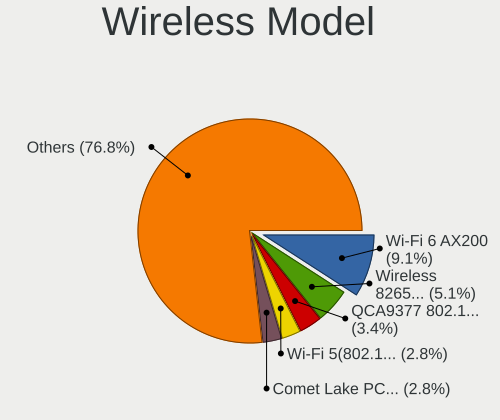

| Model                                                                | Computers | Percent |
|----------------------------------------------------------------------|-----------|---------|
| Intel Wi-Fi 6 AX200                                                  | 68        | 9.13%   |
| Intel Wireless 8265 / 8275                                           | 38        | 5.1%    |
| Qualcomm Atheros QCA9377 802.11ac Wireless Network Adapter           | 25        | 3.36%   |
| Intel Wi-Fi 5(802.11ac) Wireless-AC 9x6x [Thunder Peak]              | 21        | 2.82%   |
| Intel Comet Lake PCH-LP CNVi WiFi                                    | 21        | 2.82%   |
| Intel Wireless 8260                                                  | 20        | 2.68%   |
| Realtek RTL8821CE 802.11ac PCIe Wireless Network Adapter             | 18        | 2.42%   |
| Qualcomm Atheros AR9285 Wireless Network Adapter (PCI-Express)       | 18        | 2.42%   |
| Intel Wireless 7265                                                  | 18        | 2.42%   |
| Intel Wi-Fi 6 AX201                                                  | 17        | 2.28%   |
| Intel Wi-Fi 6E(802.11ax) AX210/AX1675* 2x2 [Typhoon Peak]            | 16        | 2.15%   |
| Qualcomm Atheros QCA9565 / AR9565 Wireless Network Adapter           | 14        | 1.88%   |
| Intel Dual Band Wireless-AC 3168NGW [Stone Peak]                     | 14        | 1.88%   |
| Intel Wireless 7260                                                  | 13        | 1.74%   |
| Realtek RTL8822CE 802.11ac PCIe Wireless Network Adapter             | 12        | 1.61%   |
| Qualcomm Atheros AR9485 Wireless Network Adapter                     | 12        | 1.61%   |
| Intel Centrino Advanced-N 6205 [Taylor Peak]                         | 11        | 1.48%   |
| Intel Cannon Point-LP CNVi [Wireless-AC]                             | 11        | 1.48%   |
| Broadcom BCM4331 802.11a/b/g/n                                       | 11        | 1.48%   |
| Realtek RTL8723BE PCIe Wireless Network Adapter                      | 10        | 1.34%   |
| Intel Cannon Lake PCH CNVi WiFi                                      | 10        | 1.34%   |
| Broadcom BCM43142 802.11b/g/n                                        | 10        | 1.34%   |
| Qualcomm Atheros QCA6174 802.11ac Wireless Network Adapter           | 9         | 1.21%   |
| MediaTek MT7921 802.11ax PCIe Wireless Network Adapter [Filogic 330] | 9         | 1.21%   |
| Intel Wireless 3165                                                  | 9         | 1.21%   |
| Broadcom BCM4360 802.11ac Dual Band Wireless Network Adapter         | 9         | 1.21%   |
| Intel Comet Lake PCH CNVi WiFi                                       | 8         | 1.07%   |
| Broadcom BCM43602 802.11ac Wireless LAN SoC                          | 8         | 1.07%   |
| Realtek RTL8822BE 802.11a/b/g/n/ac WiFi adapter                      | 6         | 0.81%   |
| Qualcomm Atheros AR9462 Wireless Network Adapter                     | 6         | 0.81%   |
| Intel Dual Band Wireless-AC 3165 Plus Bluetooth                      | 6         | 0.81%   |
| Broadcom Limited BCM4360 802.11ac Dual Band Wireless Network Adapter | 6         | 0.81%   |
| Broadcom BCM4322 802.11a/b/g/n Wireless LAN Controller               | 6         | 0.81%   |
| Realtek RTL8821AE 802.11ac PCIe Wireless Network Adapter             | 5         | 0.67%   |
| Realtek 802.11ac NIC                                                 | 5         | 0.67%   |
| Qualcomm Atheros AR928X Wireless Network Adapter (PCI-Express)       | 5         | 0.67%   |
| NetGear A6100 AC600 DB Wireless Adapter [Realtek RTL8811AU]          | 5         | 0.67%   |
| MediaTek MT7922 802.11ax PCI Express Wireless Network Adapter        | 5         | 0.67%   |
| Intel Gemini Lake PCH CNVi WiFi                                      | 5         | 0.67%   |
| Intel Centrino Advanced-N 6235                                       | 5         | 0.67%   |

Ethernet Vendor
---------------

Ethernet vendors

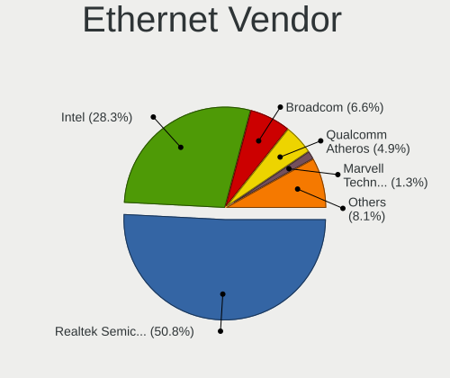

| Vendor                        | Computers | Percent |
|-------------------------------|-----------|---------|
| Realtek Semiconductor         | 377       | 50.81%  |
| Intel                         | 210       | 28.3%   |
| Broadcom                      | 49        | 6.6%    |
| Qualcomm Atheros              | 36        | 4.85%   |
| Marvell Technology Group      | 10        | 1.35%   |
| Nvidia                        | 8         | 1.08%   |
| ASIX Electronics              | 8         | 1.08%   |
| DisplayLink                   | 7         | 0.94%   |
| Broadcom Limited              | 7         | 0.94%   |
| Xiaomi                        | 6         | 0.81%   |
| Samsung Electronics           | 5         | 0.67%   |
| Lenovo                        | 5         | 0.67%   |
| JMicron Technology            | 4         | 0.54%   |
| OnePlus Technology (Shenzhen) | 2         | 0.27%   |
| Hewlett-Packard               | 2         | 0.27%   |
| TP-Link                       | 1         | 0.13%   |
| T & A Mobile Phones           | 1         | 0.13%   |
| Motorola PCS                  | 1         | 0.13%   |
| Google                        | 1         | 0.13%   |
| D-Link System                 | 1         | 0.13%   |
| Apple                         | 1         | 0.13%   |

Ethernet Model
--------------

Ethernet models

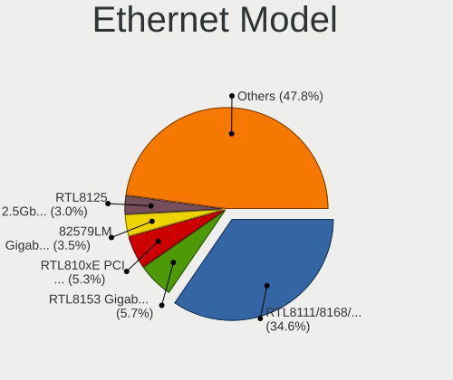

| Model                                                                  | Computers | Percent |
|------------------------------------------------------------------------|-----------|---------|
| Realtek RTL8111/8168/8211/8411 PCI Express Gigabit Ethernet Controller | 265       | 34.55%  |
| Realtek RTL8153 Gigabit Ethernet Adapter                               | 44        | 5.74%   |
| Realtek RTL810xE PCI Express Fast Ethernet controller                  | 41        | 5.35%   |
| Intel 82579LM Gigabit Network Connection (Lewisville)                  | 27        | 3.52%   |
| Realtek RTL8125 2.5GbE Controller                                      | 23        | 3%      |
| Intel Ethernet Connection I217-LM                                      | 17        | 2.22%   |
| Intel I211 Gigabit Network Connection                                  | 12        | 1.56%   |
| Intel Ethernet Connection (4) I219-LM                                  | 12        | 1.56%   |
| Broadcom NetXtreme BCM57765 Gigabit Ethernet PCIe                      | 12        | 1.56%   |
| Broadcom NetXtreme BCM57766 Gigabit Ethernet PCIe                      | 11        | 1.43%   |
| Intel Ethernet Connection (7) I219-V                                   | 10        | 1.3%    |
| Intel Ethernet Connection (2) I219-LM                                  | 10        | 1.3%    |
| Qualcomm Atheros AR8151 v2.0 Gigabit Ethernet                          | 9         | 1.17%   |
| Realtek RTL8152 Fast Ethernet Adapter                                  | 8         | 1.04%   |
| Intel Ethernet Controller I225-V                                       | 8         | 1.04%   |
| Intel Ethernet Connection (6) I219-V                                   | 7         | 0.91%   |
| Broadcom NetXtreme BCM5764M Gigabit Ethernet PCIe                      | 7         | 0.91%   |
| ASIX AX88179 Gigabit Ethernet                                          | 7         | 0.91%   |
| Xiaomi Mi/Redmi series (RNDIS)                                         | 6         | 0.78%   |
| Qualcomm Atheros Killer E2500 Gigabit Ethernet Controller              | 6         | 0.78%   |
| Intel 82579V Gigabit Network Connection                                | 6         | 0.78%   |
| Samsung Galaxy series, misc. (tethering mode)                          | 5         | 0.65%   |
| Realtek Killer E3000 2.5GbE Controller                                 | 5         | 0.65%   |
| Qualcomm Atheros QCA8171 Gigabit Ethernet                              | 5         | 0.65%   |
| Nvidia MCP79 Ethernet                                                  | 5         | 0.65%   |
| Intel I210 Gigabit Network Connection                                  | 5         | 0.65%   |
| Intel Ethernet Connection I219-V                                       | 5         | 0.65%   |
| Intel Ethernet Connection I219-LM                                      | 5         | 0.65%   |
| Intel Ethernet Connection I218-LM                                      | 5         | 0.65%   |
| Intel Ethernet Connection (5) I219-LM                                  | 5         | 0.65%   |
| Intel Ethernet Connection (2) I219-V                                   | 5         | 0.65%   |
| Intel Ethernet Connection (2) I218-V                                   | 5         | 0.65%   |
| Intel 82567LM-3 Gigabit Network Connection                             | 5         | 0.65%   |
| Broadcom NetLink BCM57780 Gigabit Ethernet PCIe                        | 5         | 0.65%   |
| JMicron JMC250 PCI Express Gigabit Ethernet Controller                 | 4         | 0.52%   |
| Intel Ethernet Connection (14) I219-V                                  | 4         | 0.52%   |
| Intel Ethernet Connection (10) I219-V                                  | 4         | 0.52%   |
| Intel Alder Lake-P PCH CNVi WiFi                                       | 4         | 0.52%   |
| Intel 82577LM Gigabit Network Connection                               | 4         | 0.52%   |
| Qualcomm Atheros Killer E2400 Gigabit Ethernet Controller              | 3         | 0.39%   |

Net Controller Kind
-------------------

Ethernet, WiFi or modem

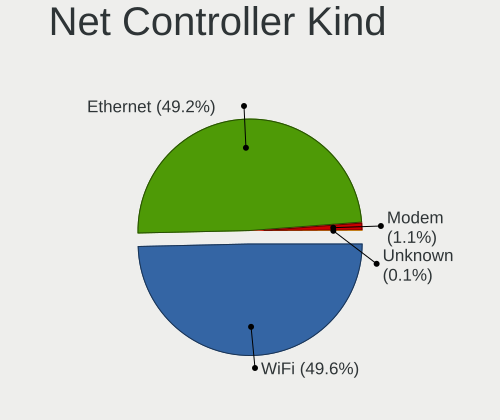

| Kind     | Computers | Percent |
|----------|-----------|---------|
| WiFi     | 703       | 49.65%  |
| Ethernet | 696       | 49.15%  |
| Modem    | 16        | 1.13%   |
| Unknown  | 1         | 0.07%   |

Used Controller
---------------

Currently used network controller

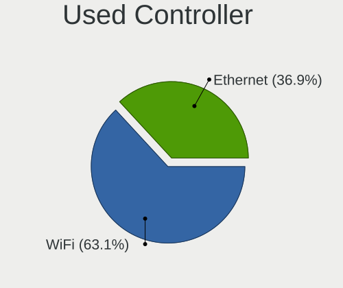

| Kind     | Computers | Percent |
|----------|-----------|---------|
| WiFi     | 560       | 63.13%  |
| Ethernet | 327       | 36.87%  |

NICs
----

Total network controllers on board

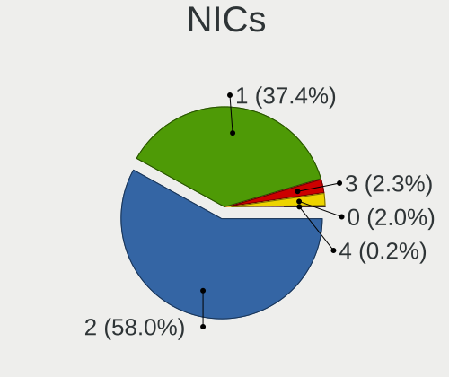

| Total | Computers | Percent |
|-------|-----------|---------|
| 2     | 484       | 58.03%  |
| 1     | 312       | 37.41%  |
| 3     | 19        | 2.28%   |
| 0     | 17        | 2.04%   |
| 4     | 2         | 0.24%   |

IPv6
----

IPv6 vs IPv4

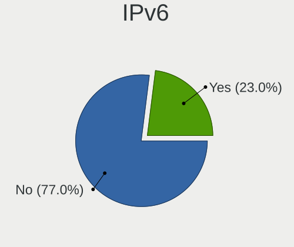

| Used | Computers | Percent |
|------|-----------|---------|
| No   | 652       | 76.98%  |
| Yes  | 195       | 23.02%  |

Bluetooth
---------

Bluetooth Vendor
----------------

Controller vendors

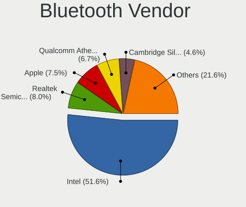

| Vendor                          | Computers | Percent |
|---------------------------------|-----------|---------|
| Intel                           | 316       | 51.63%  |
| Realtek Semiconductor           | 49        | 8.01%   |
| Apple                           | 46        | 7.52%   |
| Qualcomm Atheros Communications | 41        | 6.7%    |
| Cambridge Silicon Radio         | 28        | 4.58%   |
| Broadcom                        | 26        | 4.25%   |
| IMC Networks                    | 25        | 4.08%   |
| Foxconn / Hon Hai               | 22        | 3.59%   |
| Lite-On Technology              | 12        | 1.96%   |
| Dell                            | 10        | 1.63%   |
| Hewlett-Packard                 | 8         | 1.31%   |
| Realtek                         | 5         | 0.82%   |
| Ralink                          | 4         | 0.65%   |
| ASUSTek Computer                | 4         | 0.65%   |
| MediaTek                        | 3         | 0.49%   |
| Marvell Semiconductor           | 3         | 0.49%   |
| Belkin Components               | 3         | 0.49%   |
| Toshiba                         | 2         | 0.33%   |
| Foxconn International           | 2         | 0.33%   |
| TP-Link                         | 1         | 0.16%   |
| Smart Modular Technologies      | 1         | 0.16%   |
| Integrated System Solution      | 1         | 0.16%   |

Bluetooth Model
---------------

Controller models

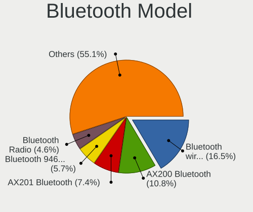

| Model                                                                               | Computers | Percent |
|-------------------------------------------------------------------------------------|-----------|---------|
| Intel Bluetooth wireless interface                                                  | 101       | 16.5%   |
| Intel AX200 Bluetooth                                                               | 66        | 10.78%  |
| Intel AX201 Bluetooth                                                               | 45        | 7.35%   |
| Intel Bluetooth 9460/9560 Jefferson Peak (JfP)                                      | 35        | 5.72%   |
| Realtek Bluetooth Radio                                                             | 28        | 4.58%   |
| Cambridge Silicon Radio Bluetooth Dongle (HCI mode)                                 | 28        | 4.58%   |
| Qualcomm Atheros  Bluetooth Device                                                  | 24        | 3.92%   |
| Intel Wireless-AC 9260 Bluetooth Adapter                                            | 21        | 3.43%   |
| Apple Bluetooth Host Controller                                                     | 19        | 3.1%    |
| Intel AX210 Bluetooth                                                               | 17        | 2.78%   |
| Apple Bluetooth USB Host Controller                                                 | 15        | 2.45%   |
| Intel Wireless-AC 3168 Bluetooth                                                    | 12        | 1.96%   |
| Intel Bluetooth Device                                                              | 11        | 1.8%    |
| Realtek  Bluetooth 4.2 Adapter                                                      | 9         | 1.47%   |
| IMC Networks Wireless_Device                                                        | 9         | 1.47%   |
| Dell DW375 Bluetooth Module                                                         | 9         | 1.47%   |
| Apple Built-in Bluetooth 2.0+EDR HCI                                                | 9         | 1.47%   |
| Qualcomm Atheros AR3011 Bluetooth                                                   | 8         | 1.31%   |
| Realtek RTL8723B Bluetooth                                                          | 7         | 1.14%   |
| Intel Centrino Bluetooth Wireless Transceiver                                       | 6         | 0.98%   |
| IMC Networks Bluetooth Radio                                                        | 6         | 0.98%   |
| Foxconn / Hon Hai Bluetooth Device                                                  | 6         | 0.98%   |
| Realtek Bluetooth Radio                                                             | 5         | 0.82%   |
| Qualcomm Atheros AR3012 Bluetooth 4.0                                               | 5         | 0.82%   |
| Foxconn / Hon Hai Wireless_Device                                                   | 5         | 0.82%   |
| Broadcom BCM20702A0 Bluetooth 4.0                                                   | 5         | 0.82%   |
| Ralink RT3290 Bluetooth                                                             | 4         | 0.65%   |
| Lite-On Qualcomm Atheros QCA9377 Bluetooth                                          | 4         | 0.65%   |
| IMC Networks Bluetooth Device                                                       | 4         | 0.65%   |
| HP Broadcom 2070 Bluetooth Combo                                                    | 4         | 0.65%   |
| Foxconn / Hon Hai Foxconn T77H114 BCM2070 [Single-Chip Bluetooth 2.1 + EDR Adapter] | 4         | 0.65%   |
| Realtek RTL8821A Bluetooth                                                          | 3         | 0.49%   |
| MediaTek Wireless_Device                                                            | 3         | 0.49%   |
| Lite-On Bluetooth Device                                                            | 3         | 0.49%   |
| IMC Networks Atheros AR3012 Bluetooth 4.0 Adapter                                   | 3         | 0.49%   |
| HP Bluetooth 2.0 Interface [Broadcom BCM2045]                                       | 3         | 0.49%   |
| Broadcom BCM20702 Bluetooth 4.0 [ThinkPad]                                          | 3         | 0.49%   |
| Belkin Components F8T065BF Mini Bluetooth 4.0 Adapter                               | 3         | 0.49%   |
| Apple Bluetooth HCI                                                                 | 3         | 0.49%   |
| Qualcomm Atheros QCA61x4 Bluetooth 4.0                                              | 2         | 0.33%   |

Sound
-----

Sound Vendor
------------

Sound card vendors

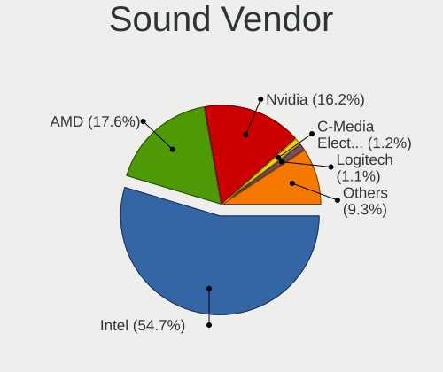

| Vendor                                       | Computers | Percent |
|----------------------------------------------|-----------|---------|
| Intel                                        | 646       | 54.65%  |
| AMD                                          | 208       | 17.6%   |
| Nvidia                                       | 191       | 16.16%  |
| C-Media Electronics                          | 14        | 1.18%   |
| Logitech                                     | 13        | 1.1%    |
| GN Netcom                                    | 11        | 0.93%   |
| Realtek Semiconductor                        | 9         | 0.76%   |
| Texas Instruments                            | 7         | 0.59%   |
| DSEA A/S                                     | 7         | 0.59%   |
| JMTek                                        | 5         | 0.42%   |
| Creative Technology                          | 5         | 0.42%   |
| Plantronics                                  | 4         | 0.34%   |
| Kingston Technology                          | 4         | 0.34%   |
| Creative Labs                                | 4         | 0.34%   |
| ASUSTek Computer                             | 4         | 0.34%   |
| Apple                                        | 4         | 0.34%   |
| SteelSeries ApS                              | 3         | 0.25%   |
| Samson Technologies                          | 3         | 0.25%   |
| Lenovo                                       | 3         | 0.25%   |
| Focusrite-Novation                           | 2         | 0.17%   |
| Blue Microphones                             | 2         | 0.17%   |
| Astro Gaming                                 | 2         | 0.17%   |
| AKAI Professional M.I.                       | 2         | 0.17%   |
| Zoran Co. Personal Media Division (Nogatech) | 1         | 0.08%   |
| Yamaha                                       | 1         | 0.08%   |
| XMOS                                         | 1         | 0.08%   |
| Sony                                         | 1         | 0.08%   |
| Shure                                        | 1         | 0.08%   |
| Razer USA                                    | 1         | 0.08%   |
| PreSonus Audio Electronics                   | 1         | 0.08%   |
| OPPO Electronics                             | 1         | 0.08%   |
| Nordic Semiconductor ASA                     | 1         | 0.08%   |
| No brand                                     | 1         | 0.08%   |
| Native Instruments                           | 1         | 0.08%   |
| Nam Tai E&E Products                         | 1         | 0.08%   |
| Microsoft                                    | 1         | 0.08%   |
| Micro Star International                     | 1         | 0.08%   |
| M-Audio                                      | 1         | 0.08%   |
| LINE TECH INDUSTRIAL                         | 1         | 0.08%   |
| Hewlett-Packard                              | 1         | 0.08%   |

Sound Model
-----------

Sound card models

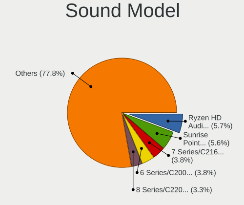

| Model                                                                      | Computers | Percent |
|----------------------------------------------------------------------------|-----------|---------|
| AMD Ryzen HD Audio Controller                                              | 79        | 5.72%   |
| Intel Sunrise Point-LP HD Audio                                            | 77        | 5.57%   |
| Intel 7 Series/C216 Chipset Family High Definition Audio Controller        | 53        | 3.84%   |
| Intel 6 Series/C200 Series Chipset Family High Definition Audio Controller | 53        | 3.84%   |
| Intel 8 Series/C220 Series Chipset High Definition Audio Controller        | 45        | 3.26%   |
| AMD Renoir/Cezanne HDMI/DP Audio Controller                                | 40        | 2.89%   |
| Intel Cannon Lake PCH cAVS                                                 | 36        | 2.6%    |
| Intel Xeon E3-1200 v3/4th Gen Core Processor HD Audio Controller           | 33        | 2.39%   |
| Intel Cannon Point-LP High Definition Audio Controller                     | 32        | 2.32%   |
| Intel 5 Series/3400 Series Chipset High Definition Audio                   | 31        | 2.24%   |
| Intel Tiger Lake-LP Smart Sound Technology Audio Controller                | 29        | 2.1%    |
| Intel Comet Lake PCH-LP cAVS                                               | 29        | 2.1%    |
| AMD Starship/Matisse HD Audio Controller                                   | 24        | 1.74%   |
| Intel Broadwell-U Audio Controller                                         | 22        | 1.59%   |
| AMD Raven/Raven2/Fenghuang HDMI/DP Audio Controller                        | 22        | 1.59%   |
| AMD FCH Azalia Controller                                                  | 21        | 1.52%   |
| Intel Wildcat Point-LP High Definition Audio Controller                    | 20        | 1.45%   |
| Intel Haswell-ULT HD Audio Controller                                      | 19        | 1.37%   |
| Intel 8 Series HD Audio Controller                                         | 19        | 1.37%   |
| Intel 100 Series/C230 Series Chipset Family HD Audio Controller            | 19        | 1.37%   |
| Intel Celeron/Pentium Silver Processor High Definition Audio               | 18        | 1.3%    |
| Nvidia TU106 High Definition Audio Controller                              | 17        | 1.23%   |
| Intel 82801I (ICH9 Family) HD Audio Controller                             | 17        | 1.23%   |
| Nvidia GP106 High Definition Audio Controller                              | 16        | 1.16%   |
| AMD Ellesmere HDMI Audio [Radeon RX 470/480 / 570/580/590]                 | 16        | 1.16%   |
| Intel Comet Lake PCH cAVS                                                  | 15        | 1.09%   |
| Nvidia GP107GL High Definition Audio Controller                            | 14        | 1.01%   |
| Intel CM238 HD Audio Controller                                            | 13        | 0.94%   |
| Intel 82801H (ICH8 Family) HD Audio Controller                             | 13        | 0.94%   |
| Intel Tiger Lake-H HD Audio Controller                                     | 12        | 0.87%   |
| AMD Family 17h (Models 00h-0fh) HD Audio Controller                        | 12        | 0.87%   |
| Intel 200 Series PCH HD Audio                                              | 11        | 0.8%    |
| AMD Kabini HDMI/DP Audio                                                   | 11        | 0.8%    |
| Nvidia GK107 HDMI Audio Controller                                         | 10        | 0.72%   |
| Intel NM10/ICH7 Family High Definition Audio Controller                    | 10        | 0.72%   |
| AMD SBx00 Azalia (Intel HDA)                                               | 10        | 0.72%   |
| AMD Radeon High Definition Audio Controller                                | 10        | 0.72%   |
| Nvidia GP104 High Definition Audio Controller                              | 9         | 0.65%   |
| Intel Ice Lake-LP Smart Sound Technology Audio Controller                  | 9         | 0.65%   |
| AMD Oland/Hainan/Cape Verde/Pitcairn HDMI Audio [Radeon HD 7000 Series]    | 9         | 0.65%   |

Memory
------

Memory Vendor
-------------

Memory module vendors

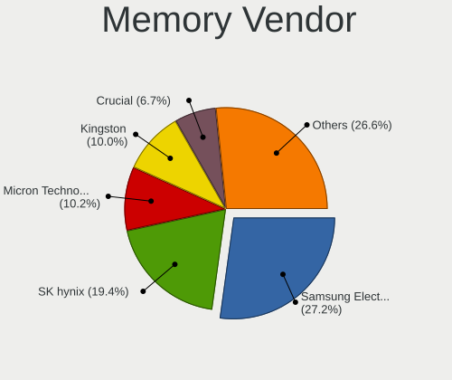

| Vendor              | Computers | Percent |
|---------------------|-----------|---------|
| Samsung Electronics | 147       | 27.17%  |
| SK hynix            | 105       | 19.41%  |
| Micron Technology   | 55        | 10.17%  |
| Kingston            | 54        | 9.98%   |
| Crucial             | 36        | 6.65%   |
| Unknown             | 30        | 5.55%   |
| Corsair             | 21        | 3.88%   |
| Ramaxel Technology  | 13        | 2.4%    |
| G.Skill             | 12        | 2.22%   |
| A-DATA Technology   | 11        | 2.03%   |
| Unknown (ABCD)      | 7         | 1.29%   |
| Team                | 6         | 1.11%   |
| Elpida              | 5         | 0.92%   |
| Unknown             | 4         | 0.74%   |
| Teikon              | 3         | 0.55%   |
| Nanya Technology    | 3         | 0.55%   |
| Transcend           | 2         | 0.37%   |
| Timetec             | 2         | 0.37%   |
| Smart               | 2         | 0.37%   |
| PNY                 | 2         | 0.37%   |
| GOODRAM             | 2         | 0.37%   |
| Unknown (F301)      | 1         | 0.18%   |
| Unknown (0x873E)    | 1         | 0.18%   |
| Smart Brazil        | 1         | 0.18%   |
| Sesame              | 1         | 0.18%   |
| Patriot             | 1         | 0.18%   |
| Magnum Tech         | 1         | 0.18%   |
| Lexar               | 1         | 0.18%   |
| Kingmax             | 1         | 0.18%   |
| Goldkey             | 1         | 0.18%   |
| ff                  | 1         | 0.18%   |
| fef5                | 1         | 0.18%   |
| Cors                | 1         | 0.18%   |
| ChangXin Memory     | 1         | 0.18%   |
| Avant               | 1         | 0.18%   |
| ASint Technology    | 1         | 0.18%   |
| Apacer              | 1         | 0.18%   |
| AMD                 | 1         | 0.18%   |
| 8945000080AD        | 1         | 0.18%   |
| 4ea5                | 1         | 0.18%   |

Memory Model
------------

Memory module models

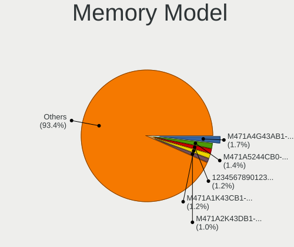

| Model                                                            | Computers | Percent |
|------------------------------------------------------------------|-----------|---------|
| Samsung RAM M471A4G43AB1-CWE 32GB SODIMM DDR4 3200MT/s           | 10        | 1.74%   |
| Samsung RAM M471A5244CB0-CTD 4GB SODIMM DDR4 3266MT/s            | 8         | 1.39%   |
| Unknown (ABCD) RAM 123456789012345678 2GB SODIMM LPDDR4 2400MT/s | 7         | 1.22%   |
| Samsung RAM M471A1K43CB1-CTD 8GB SODIMM DDR4 3200MT/s            | 7         | 1.22%   |
| SK hynix RAM HMA81GS6AFR8N-UH 8GB SODIMM DDR4 2667MT/s           | 6         | 1.05%   |
| Samsung RAM M471A2K43DB1-CWE 16GB SODIMM DDR4 3200MT/s           | 6         | 1.05%   |
| Samsung RAM M471A1K43DB1-CWE 8GB SODIMM DDR4 3200MT/s            | 6         | 1.05%   |
| Unknown RAM Module 2GB SODIMM DDR3                               | 4         | 0.7%    |
| SK hynix RAM HMT451S6BFR8A-PB 4GB SODIMM DDR3 1600MT/s           | 4         | 0.7%    |
| SK hynix RAM HMA82GS6AFR8N-UH 16GB SODIMM DDR4 2667MT/s          | 4         | 0.7%    |
| SK hynix RAM HMA81GS6JJR8N-VK 8GB SODIMM DDR4 2667MT/s           | 4         | 0.7%    |
| Samsung RAM M471B5773DH0-CH9 2GB SODIMM DDR3 1600MT/s            | 4         | 0.7%    |
| Samsung RAM M471A2K43CB1-CTD 16GB SODIMM DDR4 8400MT/s           | 4         | 0.7%    |
| Samsung RAM M471A1G44AB0-CWE 8GiB SODIMM DDR4 3200MT/s           | 4         | 0.7%    |
| Samsung RAM K4EBE304EC-EGCG 8GB Row Of Chips LPDDR3 2133MT/s     | 4         | 0.7%    |
| Ramaxel RAM RMSA3270ME86H9F-2666 4GB SODIMM DDR4 2667MT/s        | 4         | 0.7%    |
| Ramaxel RAM RMSA3260ME78HAF-2666 8GB SODIMM DDR4 2667MT/s        | 4         | 0.7%    |
| Micron RAM 4ATF51264HZ-2G6E1 4GB SODIMM DDR4 2667MT/s            | 4         | 0.7%    |
| Unknown                                                          | 4         | 0.7%    |
| SK hynix RAM Module 8GB SODIMM DDR3 1600MT/s                     | 3         | 0.52%   |
| SK hynix RAM HMT351S6BFR8C-H9 4GB SODIMM DDR3 1333MT/s           | 3         | 0.52%   |
| Samsung RAM M471B5173EB0-YK0 4GB SODIMM DDR3 1600MT/s            | 3         | 0.52%   |
| Samsung RAM M471B5173DB0-YK0 4GB SODIMM DDR3 1600MT/s            | 3         | 0.52%   |
| Samsung RAM M471B1G73QH0-YK0 8GB SODIMM DDR3 1600MT/s            | 3         | 0.52%   |
| Samsung RAM M471A5244CB0-CRC 4GB SODIMM DDR4 2667MT/s            | 3         | 0.52%   |
| Samsung RAM M471A4G43MB1-CTD 32GB SODIMM DDR4 2667MT/s           | 3         | 0.52%   |
| Samsung RAM M471A2G44BM0-CWE 16GB SODIMM DDR4 3200MT/s           | 3         | 0.52%   |
| Micron RAM 16KTF1G64HZ-1G6E1 8GB SODIMM DDR3 1600MT/s            | 3         | 0.52%   |
| Micron RAM 16ATF2G64HZ-2G6E1 16GB SODIMM DDR4 2667MT/s           | 3         | 0.52%   |
| Unknown RAM Module 4GB SODIMM DDR3                               | 2         | 0.35%   |
| Unknown RAM Module 4096MB SODIMM DDR3 1600MT/s                   | 2         | 0.35%   |
| Unknown RAM Module 4096MB SODIMM DDR2 667MT/s                    | 2         | 0.35%   |
| Unknown RAM Module 2GB SODIMM DDR2                               | 2         | 0.35%   |
| Unknown RAM Module 2048MB DIMM SDRAM                             | 2         | 0.35%   |
| SK hynix RAM Module 16GB SODIMM DDR4 2133MT/s                    | 2         | 0.35%   |
| SK hynix RAM HMT351S6CFR8C-PB 4GB SODIMM DDR3 1600MT/s           | 2         | 0.35%   |
| SK hynix RAM HMT351S6CFR8A-PB 4GB SODIMM DDR3 1600MT/s           | 2         | 0.35%   |
| SK hynix RAM HMT325S6BFR8C-H9 2GB SODIMM DDR3 1600MT/s           | 2         | 0.35%   |
| SK hynix RAM HMA851S6AFR6N-UH 4GB SODIMM DDR4 2667MT/s           | 2         | 0.35%   |
| SK hynix RAM HMA82GS6CJR8N-VK 16GB SODIMM DDR4 2667MT/s          | 2         | 0.35%   |

Memory Kind
-----------

Memory module kinds

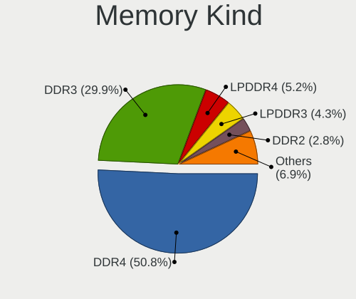

| Kind    | Computers | Percent |
|---------|-----------|---------|
| DDR4    | 234       | 50.76%  |
| DDR3    | 138       | 29.93%  |
| LPDDR4  | 24        | 5.21%   |
| LPDDR3  | 20        | 4.34%   |
| DDR2    | 13        | 2.82%   |
| SDRAM   | 10        | 2.17%   |
| DDR5    | 8         | 1.74%   |
| Unknown | 6         | 1.3%    |
| LPDDR5  | 5         | 1.08%   |
| DDR     | 2         | 0.43%   |
| DRAM    | 1         | 0.22%   |

Memory Form Factor
------------------

Physical design of the memory module

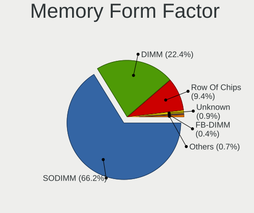

| Name         | Computers | Percent |
|--------------|-----------|---------|
| SODIMM       | 304       | 66.23%  |
| DIMM         | 103       | 22.44%  |
| Row Of Chips | 43        | 9.37%   |
| Unknown      | 4         | 0.87%   |
| FB-DIMM      | 2         | 0.44%   |
| Chip         | 2         | 0.44%   |
| RIMM         | 1         | 0.22%   |

Memory Size
-----------

Memory module size

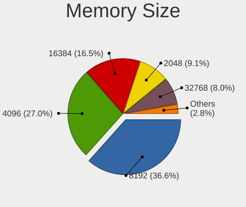

| Size  | Computers | Percent |
|-------|-----------|---------|
| 8192  | 182       | 36.62%  |
| 4096  | 134       | 26.96%  |
| 16384 | 82        | 16.5%   |
| 2048  | 45        | 9.05%   |
| 32768 | 40        | 8.05%   |
| 1024  | 12        | 2.41%   |
| 512   | 2         | 0.4%    |

Memory Speed
------------

Memory module speed

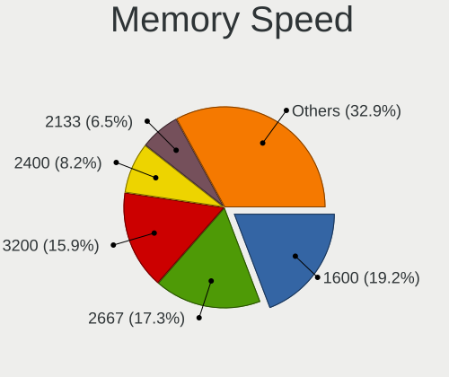

| Speed   | Computers | Percent |
|---------|-----------|---------|
| 1600    | 98        | 19.22%  |
| 2667    | 88        | 17.25%  |
| 3200    | 81        | 15.88%  |
| 2400    | 42        | 8.24%   |
| 2133    | 33        | 6.47%   |
| 1333    | 28        | 5.49%   |
| 3266    | 10        | 1.96%   |
| 1867    | 10        | 1.96%   |
| 1334    | 10        | 1.96%   |
| Unknown | 10        | 1.96%   |
| 1067    | 9         | 1.76%   |
| 3733    | 8         | 1.57%   |
| 4267    | 7         | 1.37%   |
| 8400    | 5         | 0.98%   |
| 800     | 5         | 0.98%   |
| 667     | 5         | 0.98%   |
| 4800    | 4         | 0.78%   |
| 4199    | 4         | 0.78%   |
| 4000    | 4         | 0.78%   |
| 3400    | 4         | 0.78%   |
| 3000    | 4         | 0.78%   |
| 1066    | 4         | 0.78%   |
| 6400    | 3         | 0.59%   |
| 4266    | 3         | 0.59%   |
| 3600    | 3         | 0.59%   |
| 2666    | 3         | 0.59%   |
| 533     | 3         | 0.59%   |
| 5600    | 2         | 0.39%   |
| 1800    | 2         | 0.39%   |
| 12800   | 1         | 0.2%    |
| 7500    | 1         | 0.2%    |
| 6000    | 1         | 0.2%    |
| 5500    | 1         | 0.2%    |
| 3800    | 1         | 0.2%    |
| 3666    | 1         | 0.2%    |
| 3500    | 1         | 0.2%    |
| 3466    | 1         | 0.2%    |
| 3007    | 1         | 0.2%    |
| 2933    | 1         | 0.2%    |
| 2800    | 1         | 0.2%    |

Printers & scanners
-------------------

Printer Vendor
--------------

Printer device vendors

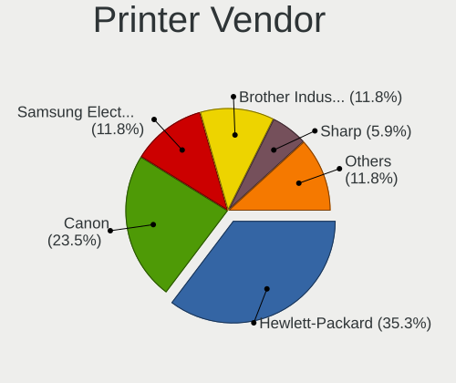

| Vendor              | Computers | Percent |
|---------------------|-----------|---------|
| Hewlett-Packard     | 6         | 35.29%  |
| Canon               | 4         | 23.53%  |
| Samsung Electronics | 2         | 11.76%  |
| Brother Industries  | 2         | 11.76%  |
| Sharp               | 1         | 5.88%   |
| Fuji Xerox          | 1         | 5.88%   |
| Dymo-CoStar         | 1         | 5.88%   |

Printer Model
-------------

Printer device models

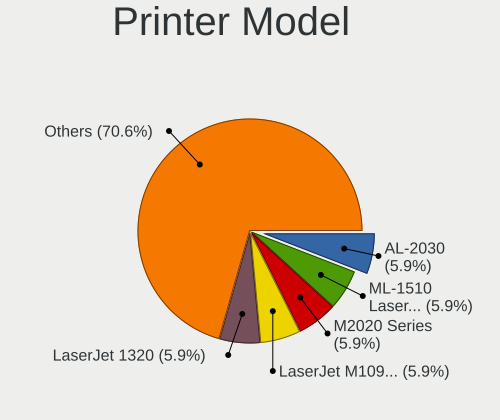

| Model                         | Computers | Percent |
|-------------------------------|-----------|---------|
| Sharp AL-2030                 | 1         | 5.88%   |
| Samsung ML-1510 Laser Printer | 1         | 5.88%   |
| Samsung M2020 Series          | 1         | 5.88%   |
| HP LaserJet M109-M112         | 1         | 5.88%   |
| HP LaserJet 1320              | 1         | 5.88%   |
| HP DeskJet 3700 series        | 1         | 5.88%   |
| HP Deskjet 3050 J610 series   | 1         | 5.88%   |
| HP Deskjet 2540 series        | 1         | 5.88%   |
| HP DeskJet 2130 series        | 1         | 5.88%   |
| Fuji Xerox DocuPrint CM305 df | 1         | 5.88%   |
| Dymo-CoStar LabelWriter 450   | 1         | 5.88%   |
| Canon TR7500 series           | 1         | 5.88%   |
| Canon MF4010 series           | 1         | 5.88%   |
| Canon MF240 Series UFRII LT   | 1         | 5.88%   |
| Canon LiDE 400                | 1         | 5.88%   |
| Brother MFC-1810              | 1         | 5.88%   |
| Brother HL-2240 series        | 1         | 5.88%   |

Scanner Vendor
--------------

Scanner device vendors

| Vendor | Computers | Percent |
|--------|-----------|---------|
| Canon  | 3         | 100%    |

Scanner Model
-------------

Scanner device models

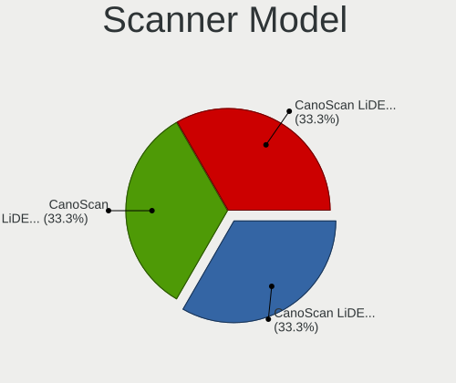

| Model                   | Computers | Percent |
|-------------------------|-----------|---------|
| Canon CanoScan LiDE 220 | 1         | 33.33%  |
| Canon CanoScan LiDE 120 | 1         | 33.33%  |
| Canon CanoScan LiDE 110 | 1         | 33.33%  |

Camera
------

Camera Vendor
-------------

Camera device vendors

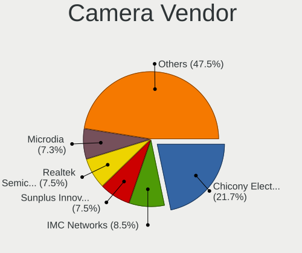

| Vendor                                 | Computers | Percent |
|----------------------------------------|-----------|---------|
| Chicony Electronics                    | 125       | 21.74%  |
| IMC Networks                           | 49        | 8.52%   |
| Sunplus Innovation Technology          | 43        | 7.48%   |
| Realtek Semiconductor                  | 43        | 7.48%   |
| Microdia                               | 42        | 7.3%    |
| Bison Electronics                      | 41        | 7.13%   |
| Apple                                  | 36        | 6.26%   |
| Logitech                               | 25        | 4.35%   |
| Quanta                                 | 22        | 3.83%   |
| Cheng Uei Precision Industry (Foxlink) | 20        | 3.48%   |
| Syntek                                 | 14        | 2.43%   |
| Suyin                                  | 14        | 2.43%   |
| Luxvisions Innotech Limited            | 12        | 2.09%   |
| Silicon Motion                         | 8         | 1.39%   |
| Lite-On Technology                     | 8         | 1.39%   |
| Samsung Electronics                    | 7         | 1.22%   |
| Generalplus Technology                 | 6         | 1.04%   |
| Microsoft                              | 5         | 0.87%   |
| Alcor Micro                            | 5         | 0.87%   |
| Ricoh                                  | 4         | 0.7%    |
| Z-Star Microelectronics                | 3         | 0.52%   |
| ShineTech                              | 3         | 0.52%   |
| Acer                                   | 3         | 0.52%   |
| LG Electronics                         | 2         | 0.35%   |
| Importek                               | 2         | 0.35%   |
| Cubeternet                             | 2         | 0.35%   |
| ARC International                      | 2         | 0.35%   |
| ALi                                    | 2         | 0.35%   |
| Unknown                                | 2         | 0.35%   |
| Y Media                                | 1         | 0.17%   |
| WaveRider Communications               | 1         | 0.17%   |
| ValueHD                                | 1         | 0.17%   |
| Unknown (3730304231393831325530)       | 1         | 0.17%   |
| Unknown                                | 1         | 0.17%   |
| Tobii Technology AB                    | 1         | 0.17%   |
| Sonix Technology                       | 1         | 0.17%   |
| Primax Electronics                     | 1         | 0.17%   |
| Polycom                                | 1         | 0.17%   |
| Pixart Imaging                         | 1         | 0.17%   |
| OPPO Electronics                       | 1         | 0.17%   |

Camera Model
------------

Camera device models

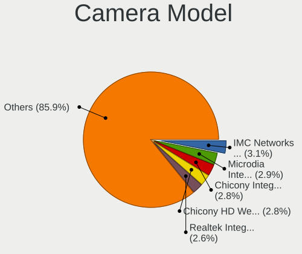

| Model                                                   | Computers | Percent |
|---------------------------------------------------------|-----------|---------|
| IMC Networks USB2.0 HD UVC WebCam                       | 18        | 3.1%    |
| Microdia Integrated_Webcam_HD                           | 17        | 2.93%   |
| Chicony Integrated Camera                               | 16        | 2.76%   |
| Chicony HD Webcam                                       | 16        | 2.76%   |
| Realtek Integrated_Webcam_HD                            | 15        | 2.59%   |
| IMC Networks Integrated Camera                          | 15        | 2.59%   |
| Apple FaceTime HD Camera (Built-in)                     | 11        | 1.9%    |
| Chicony Chicony USB2.0 Camera                           | 10        | 1.72%   |
| Apple Built-in iSight                                   | 10        | 1.72%   |
| Chicony USB2.0 Camera                                   | 9         | 1.55%   |
| Chicony HP HD Camera                                    | 9         | 1.55%   |
| Bison Integrated Camera                                 | 9         | 1.55%   |
| Apple FaceTime HD Camera                                | 9         | 1.55%   |
| Syntek Integrated Camera                                | 8         | 1.38%   |
| Sunplus Integrated_Webcam_HD                            | 7         | 1.21%   |
| Logitech HD Pro Webcam C920                             | 7         | 1.21%   |
| Chicony Integrated IR Camera                            | 7         | 1.21%   |
| Bison BisonCam,NB Pro                                   | 7         | 1.21%   |
| Samsung Galaxy series, misc. (MTP mode)                 | 6         | 1.03%   |
| Bison HD Webcam                                         | 6         | 1.03%   |
| Sunplus HD WebCam                                       | 5         | 0.86%   |
| Luxvisions Innotech Limited Integrated Camera           | 5         | 0.86%   |
| Cheng Uei Precision Industry (Foxlink) HP Truevision HD | 5         | 0.86%   |
| Sunplus Integrated Camera                               | 4         | 0.69%   |
| Realtek Integrated Webcam                               | 4         | 0.69%   |
| IMC Networks VGA UVC WebCam                             | 4         | 0.69%   |
| Generalplus GENERAL WEBCAM                              | 4         | 0.69%   |
| Chicony HP Truevision HD                                | 4         | 0.69%   |
| Chicony EasyCamera                                      | 4         | 0.69%   |
| Bison SunplusIT Integrated Camera                       | 4         | 0.69%   |
| Bison EasyCamera                                        | 4         | 0.69%   |
| Apple iPhone 5/5C/5S/6/SE/7/8/X                         | 4         | 0.69%   |
| Suyin HP Truevision HD                                  | 3         | 0.52%   |
| Sunplus Laptop_Integrated_Webcam_FHD                    | 3         | 0.52%   |
| Sunplus Integrated_Webcam_FHD                           | 3         | 0.52%   |
| Sunplus Asus Webcam                                     | 3         | 0.52%   |
| Realtek USB2.0 HD UVC WebCam                            | 3         | 0.52%   |
| Realtek Lenovo EasyCamera                               | 3         | 0.52%   |
| Realtek HD WebCam                                       | 3         | 0.52%   |
| Quanta USB2.0 HD UVC WebCam                             | 3         | 0.52%   |

Security
--------

Fingerprint Vendor
------------------

Fingerprint sensor vendors

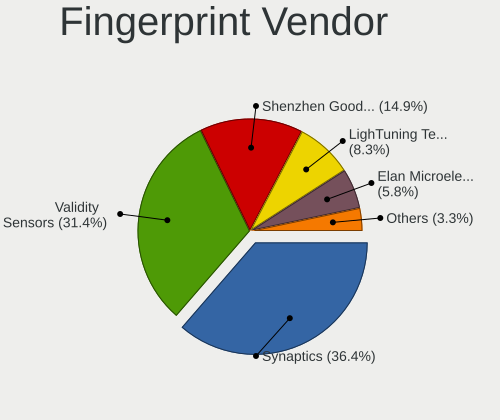

| Vendor                     | Computers | Percent |
|----------------------------|-----------|---------|
| Synaptics                  | 44        | 36.36%  |
| Validity Sensors           | 38        | 31.4%   |
| Shenzhen Goodix Technology | 18        | 14.88%  |
| LighTuning Technology      | 10        | 8.26%   |
| Elan Microelectronics      | 7         | 5.79%   |
| AuthenTec                  | 4         | 3.31%   |

Fingerprint Model
-----------------

Fingerprint sensor models

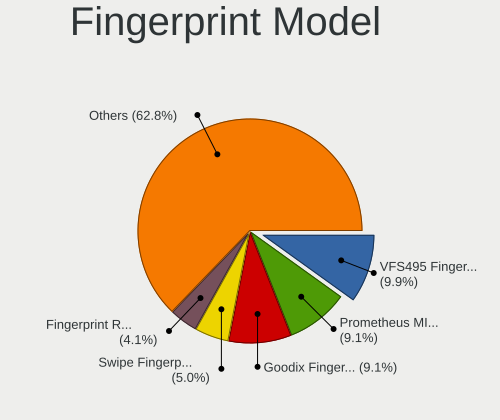

| Model                                                                      | Computers | Percent |
|----------------------------------------------------------------------------|-----------|---------|
| Validity Sensors VFS495 Fingerprint Reader                                 | 12        | 9.92%   |
| Synaptics Prometheus MIS Touch Fingerprint Reader                          | 11        | 9.09%   |
| Shenzhen Goodix  Fingerprint Device                                        | 11        | 9.09%   |
| Validity Sensors Swipe Fingerprint Sensor                                  | 6         | 4.96%   |
| Shenzhen Goodix Fingerprint Reader                                         | 5         | 4.13%   |
| Elan ELAN:Fingerprint                                                      | 5         | 4.13%   |
| Validity Sensors VFS471 Fingerprint Reader                                 | 4         | 3.31%   |
| Validity Sensors Fingerprint scanner                                       | 4         | 3.31%   |
| Synaptics WBDI Fingerprint Reader USB 102                                  | 4         | 3.31%   |
| Synaptics WBDI Device                                                      | 4         | 3.31%   |
| Synaptics TouchPad                                                         | 4         | 3.31%   |
| Synaptics Metallica MIS Touch Fingerprint Reader                           | 4         | 3.31%   |
| LighTuning ES603 Swipe Fingerprint Sensor                                  | 4         | 3.31%   |
| Unknown                                                                    | 4         | 3.31%   |
| LighTuning Fingerprint Reader                                              | 3         | 2.48%   |
| LighTuning EgisTec Touch Fingerprint Sensor                                | 3         | 2.48%   |
| Validity Sensors VFS5011 Fingerprint Reader                                | 2         | 1.65%   |
| Validity Sensors VFS491                                                    | 2         | 1.65%   |
| Synaptics WBDI Fingerprint Reader USB 086                                  | 2         | 1.65%   |
| Synaptics UWP WBDI Device                                                  | 2         | 1.65%   |
| Synaptics UWP WBDI                                                         | 2         | 1.65%   |
| Synaptics  WBDI                                                            | 2         | 1.65%   |
| Synaptics Metallica MOH Touch Fingerprint Reader                           | 2         | 1.65%   |
| Shenzhen Goodix FingerPrint                                                | 2         | 1.65%   |
| Elan ELAN:ARM-M4                                                           | 2         | 1.65%   |
| AuthenTec AES1600                                                          | 2         | 1.65%   |
| Validity Sensors VFS7552 Touch Fingerprint Sensor                          | 1         | 0.83%   |
| Validity Sensors VFS451 Fingerprint Reader                                 | 1         | 0.83%   |
| Validity Sensors VFS301 Fingerprint Reader                                 | 1         | 0.83%   |
| Validity Sensors VFS101 Fingerprint Reader                                 | 1         | 0.83%   |
| Validity Sensors VFS 5011 fingerprint sensor                               | 1         | 0.83%   |
| Validity Sensors Synaptics WBDI                                            | 1         | 0.83%   |
| Validity Sensors Synaptics VFS7552 Touch Fingerprint Sensor with PurePrint | 1         | 0.83%   |
| Validity Sensors Synaptics VFS7552 Touch Fingerprint Sensor                | 1         | 0.83%   |
| Synaptics  FS7604 Touch Fingerprint Sensor with PurePrint                  | 1         | 0.83%   |
| Synaptics FS7604 Touch Fingerprint Sensor with PurePrint                   | 1         | 0.83%   |
| Synaptics Fingerprint reader [HP G6]                                       | 1         | 0.83%   |
| AuthenTec AES2810                                                          | 1         | 0.83%   |
| AuthenTec AES1660 Fingerprint Sensor                                       | 1         | 0.83%   |

Chipcard Vendor
---------------

Chipcard module vendors

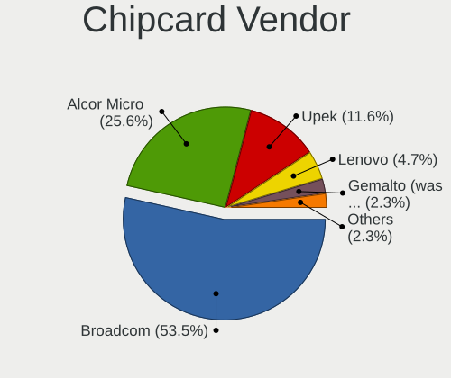

| Vendor                | Computers | Percent |
|-----------------------|-----------|---------|
| Broadcom              | 23        | 53.49%  |
| Alcor Micro           | 11        | 25.58%  |
| Upek                  | 5         | 11.63%  |
| Lenovo                | 2         | 4.65%   |
| Gemalto (was Gemplus) | 1         | 2.33%   |
| Advanced Card Systems | 1         | 2.33%   |

Chipcard Model
--------------

Chipcard module models

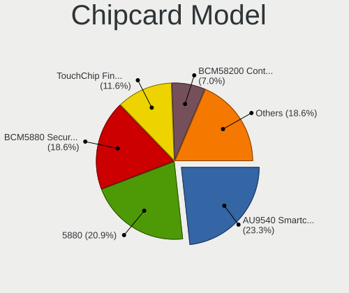

| Model                                                                        | Computers | Percent |
|------------------------------------------------------------------------------|-----------|---------|
| Alcor Micro AU9540 Smartcard Reader                                          | 10        | 23.26%  |
| Broadcom 5880                                                                | 9         | 20.93%  |
| Broadcom BCM5880 Secure Applications Processor                               | 8         | 18.6%   |
| Upek TouchChip Fingerprint Coprocessor (WBF advanced mode)                   | 5         | 11.63%  |
| Broadcom BCM58200 ControlVault 3 (FingerPrint sensor + Contacted SmartCard)  | 3         | 6.98%   |
| Lenovo Integrated Smart Card Reader                                          | 2         | 4.65%   |
| Broadcom BCM5880 Secure Applications Processor with fingerprint swipe sensor | 2         | 4.65%   |
| Gemalto (was Gemplus) GemPC Twin SmartCard Reader                            | 1         | 2.33%   |
| Broadcom 58200                                                               | 1         | 2.33%   |
| Alcor Micro Watchdata W 1981                                                 | 1         | 2.33%   |
| Advanced Card Systems ACR38 SmartCard Reader                                 | 1         | 2.33%   |

Unsupported
-----------

Unsupported Devices
-------------------

Total unsupported devices on board

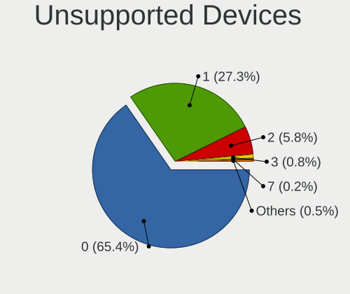

| Total | Computers | Percent |
|-------|-----------|---------|
| 0     | 555       | 65.37%  |
| 1     | 232       | 27.33%  |
| 2     | 49        | 5.77%   |
| 3     | 7         | 0.82%   |
| 7     | 2         | 0.24%   |
| 4     | 2         | 0.24%   |
| 9     | 1         | 0.12%   |
| 5     | 1         | 0.12%   |

Unsupported Device Types
------------------------

Types of unsupported devices

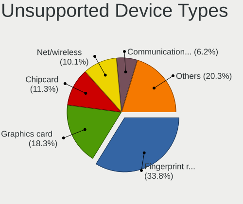

| Type                     | Computers | Percent |
|--------------------------|-----------|---------|
| Fingerprint reader       | 120       | 33.8%   |
| Graphics card            | 65        | 18.31%  |
| Chipcard                 | 40        | 11.27%  |
| Net/wireless             | 36        | 10.14%  |
| Communication controller | 22        | 6.2%    |
| Multimedia controller    | 15        | 4.23%   |
| Camera                   | 12        | 3.38%   |
| Sound                    | 11        | 3.1%    |
| Bluetooth                | 9         | 2.54%   |
| Card reader              | 8         | 2.25%   |
| Unassigned class         | 6         | 1.69%   |
| Storage                  | 6         | 1.69%   |
| Net/ethernet             | 5         | 1.41%   |

