Ubuntu Budgie 20.04 - Tested Hardware & Statistics (Desktops)
-------------------------------------------------------------

A project to collect tested hardware configurations for Ubuntu Budgie 20.04.

Anyone can contribute to this report by the [hw-probe](https://github.com/linuxhw/hw-probe) tool:

    sudo -E hw-probe -all -upload

Please submit a probe of your configuration if it's not presented on the page or is rare.

Full-feature report is available here: https://linux-hardware.org/?view=trends

Contents
--------

* [ Test Cases ](#test-cases)

* [ System ](#system)
  - [ Kernel                   ](#kernel)
  - [ Kernel Family            ](#kernel-family)
  - [ Kernel Major Ver.        ](#kernel-major-ver)
  - [ Arch                     ](#arch)
  - [ DE                       ](#de)
  - [ Display Server           ](#display-server)
  - [ Display Manager          ](#display-manager)
  - [ OS Lang                  ](#os-lang)
  - [ Boot Mode                ](#boot-mode)
  - [ Filesystem               ](#filesystem)
  - [ Part. scheme             ](#part-scheme)
  - [ Dual Boot with Linux/BSD ](#dual-boot-with-linuxbsd)
  - [ Dual Boot (Win)          ](#dual-boot-win)

* [ Board ](#board)
  - [ Vendor                   ](#vendor)
  - [ Model                    ](#model)
  - [ Model Family             ](#model-family)
  - [ MFG Year                 ](#mfg-year)
  - [ Form Factor              ](#form-factor)
  - [ Secure Boot              ](#secure-boot)
  - [ Coreboot                 ](#coreboot)
  - [ RAM Size                 ](#ram-size)
  - [ RAM Used                 ](#ram-used)
  - [ Total Drives             ](#total-drives)
  - [ Has CD-ROM               ](#has-cd-rom)
  - [ Has Ethernet             ](#has-ethernet)
  - [ Has WiFi                 ](#has-wifi)
  - [ Has Bluetooth            ](#has-bluetooth)

* [ Location ](#location)
  - [ Country                  ](#country)
  - [ City                     ](#city)

* [ Drives ](#drives)
  - [ Drive Vendor             ](#drive-vendor)
  - [ Drive Model              ](#drive-model)
  - [ HDD Vendor               ](#hdd-vendor)
  - [ SSD Vendor               ](#ssd-vendor)
  - [ Drive Kind               ](#drive-kind)
  - [ Drive Connector          ](#drive-connector)
  - [ Drive Size               ](#drive-size)
  - [ Space Total              ](#space-total)
  - [ Space Used               ](#space-used)
  - [ Malfunc. Drives          ](#malfunc-drives)
  - [ Malfunc. Drive Vendor    ](#malfunc-drive-vendor)
  - [ Malfunc. HDD Vendor      ](#malfunc-hdd-vendor)
  - [ Malfunc. Drive Kind      ](#malfunc-drive-kind)
  - [ Failed Drives            ](#failed-drives)
  - [ Failed Drive Vendor      ](#failed-drive-vendor)
  - [ Drive Status             ](#drive-status)

* [ Storage controller ](#storage-controller)
  - [ Storage Vendor           ](#storage-vendor)
  - [ Storage Model            ](#storage-model)
  - [ Storage Kind             ](#storage-kind)

* [ Processor ](#processor)
  - [ CPU Vendor               ](#cpu-vendor)
  - [ CPU Model                ](#cpu-model)
  - [ CPU Model Family         ](#cpu-model-family)
  - [ CPU Cores                ](#cpu-cores)
  - [ CPU Sockets              ](#cpu-sockets)
  - [ CPU Threads              ](#cpu-threads)
  - [ CPU Op-Modes             ](#cpu-op-modes)
  - [ CPU Microcode            ](#cpu-microcode)
  - [ CPU Microarch            ](#cpu-microarch)

* [ Graphics ](#graphics)
  - [ GPU Vendor               ](#gpu-vendor)
  - [ GPU Model                ](#gpu-model)
  - [ GPU Combo                ](#gpu-combo)
  - [ GPU Driver               ](#gpu-driver)
  - [ GPU Memory               ](#gpu-memory)

* [ Monitor ](#monitor)
  - [ Monitor Vendor           ](#monitor-vendor)
  - [ Monitor Model            ](#monitor-model)
  - [ Monitor Resolution       ](#monitor-resolution)
  - [ Monitor Diagonal         ](#monitor-diagonal)
  - [ Monitor Width            ](#monitor-width)
  - [ Aspect Ratio             ](#aspect-ratio)
  - [ Monitor Area             ](#monitor-area)
  - [ Pixel Density            ](#pixel-density)
  - [ Multiple Monitors        ](#multiple-monitors)

* [ Network ](#network)
  - [ Net Controller Vendor    ](#net-controller-vendor)
  - [ Net Controller Model     ](#net-controller-model)
  - [ Wireless Vendor          ](#wireless-vendor)
  - [ Wireless Model           ](#wireless-model)
  - [ Ethernet Vendor          ](#ethernet-vendor)
  - [ Ethernet Model           ](#ethernet-model)
  - [ Net Controller Kind      ](#net-controller-kind)
  - [ Used Controller          ](#used-controller)
  - [ NICs                     ](#nics)
  - [ IPv6                     ](#ipv6)

* [ Bluetooth ](#bluetooth)
  - [ Bluetooth Vendor         ](#bluetooth-vendor)
  - [ Bluetooth Model          ](#bluetooth-model)

* [ Sound ](#sound)
  - [ Sound Vendor             ](#sound-vendor)
  - [ Sound Model              ](#sound-model)

* [ Memory ](#memory)
  - [ Memory Vendor            ](#memory-vendor)
  - [ Memory Model             ](#memory-model)
  - [ Memory Kind              ](#memory-kind)
  - [ Memory Form Factor       ](#memory-form-factor)
  - [ Memory Size              ](#memory-size)
  - [ Memory Speed             ](#memory-speed)

* [ Printers & scanners ](#printers--scanners)
  - [ Printer Vendor           ](#printer-vendor)
  - [ Printer Model            ](#printer-model)
  - [ Scanner Vendor           ](#scanner-vendor)
  - [ Scanner Model            ](#scanner-model)

* [ Camera ](#camera)
  - [ Camera Vendor            ](#camera-vendor)
  - [ Camera Model             ](#camera-model)

* [ Security ](#security)
  - [ Fingerprint Vendor       ](#fingerprint-vendor)
  - [ Fingerprint Model        ](#fingerprint-model)
  - [ Chipcard Vendor          ](#chipcard-vendor)
  - [ Chipcard Model           ](#chipcard-model)

* [ Unsupported ](#unsupported)
  - [ Unsupported Devices      ](#unsupported-devices)
  - [ Unsupported Device Types ](#unsupported-device-types)

Test Cases
----------

| Vendor    | Model                       | Probe                                                      | Date         |
|-----------|-----------------------------|------------------------------------------------------------|--------------|
| HP        | 0A5Ch                       | [4858eb5c73](https://linux-hardware.org/?probe=4858eb5c73) | Nov 21, 2021 |
| Gigabyte  | B560M AORUS ELITE           | [b397fce5b8](https://linux-hardware.org/?probe=b397fce5b8) | Nov 20, 2021 |
| HP        | 0A5Ch                       | [8d102a03f6](https://linux-hardware.org/?probe=8d102a03f6) | Oct 19, 2021 |
| HP        | 0A5Ch                       | [139efd1a3d](https://linux-hardware.org/?probe=139efd1a3d) | Oct 19, 2021 |
| ASUSTek   | P7P55D                      | [c62d162396](https://linux-hardware.org/?probe=c62d162396) | Aug 02, 2021 |
| ASUSTek   | PRIME B450M-A               | [7b213037a5](https://linux-hardware.org/?probe=7b213037a5) | Jul 31, 2021 |
| ASUSTek   | P7P55D                      | [cd96dbf86a](https://linux-hardware.org/?probe=cd96dbf86a) | Jul 30, 2021 |
| ASUSTek   | P7P55D                      | [4d91af39ee](https://linux-hardware.org/?probe=4d91af39ee) | Jul 30, 2021 |
| ASUSTek   | P7P55D                      | [b983e48d71](https://linux-hardware.org/?probe=b983e48d71) | Jul 24, 2021 |
| ASUSTek   | P7P55D                      | [2335f32be7](https://linux-hardware.org/?probe=2335f32be7) | Jul 22, 2021 |
| ASUSTek   | PRIME B450M-A               | [abea66177f](https://linux-hardware.org/?probe=abea66177f) | Jul 20, 2021 |
| Fujitsu   | D3227-A1 S26361-D3227-A1    | [157b9695ae](https://linux-hardware.org/?probe=157b9695ae) | Jul 15, 2021 |
| Dell      | 048DY8 A01                  | [04c41fe4c2](https://linux-hardware.org/?probe=04c41fe4c2) | Jun 30, 2021 |
| ASUSTek   | Maximus VIII IMPACT         | [2c0a43e573](https://linux-hardware.org/?probe=2c0a43e573) | Apr 24, 2021 |
| Gigabyte  | Z77X-D3H                    | [28751098a6](https://linux-hardware.org/?probe=28751098a6) | Apr 23, 2021 |
| ASRock    | X370 Gaming-ITX/ac          | [e0fa7ade7a](https://linux-hardware.org/?probe=e0fa7ade7a) | Apr 06, 2021 |
| ASUSTek   | Z77-A                       | [ca21510412](https://linux-hardware.org/?probe=ca21510412) | Mar 23, 2021 |
| ASUSTek   | P7P55D-E LX                 | [83f55d5bf7](https://linux-hardware.org/?probe=83f55d5bf7) | Mar 20, 2021 |
| HP        | 3031h                       | [ee5e7baf77](https://linux-hardware.org/?probe=ee5e7baf77) | Mar 16, 2021 |
| ASUSTek   | PRIME B450-PLUS             | [79b5c4e048](https://linux-hardware.org/?probe=79b5c4e048) | Mar 07, 2021 |
| Unknown   | Unknown                     | [f97163d774](https://linux-hardware.org/?probe=f97163d774) | Feb 24, 2021 |
| ASUSTek   | ROG STRIX H470-I GAMING     | [f747681c25](https://linux-hardware.org/?probe=f747681c25) | Feb 19, 2021 |
| ASUSTek   | Maximus VIII IMPACT         | [ffbb4c8bec](https://linux-hardware.org/?probe=ffbb4c8bec) | Feb 17, 2021 |
| MSI       | A320M PRO-VD PLUS           | [24a9ae34ed](https://linux-hardware.org/?probe=24a9ae34ed) | Feb 13, 2021 |
| Gigabyte  | B450M DS3H-CF               | [5f9a9ff276](https://linux-hardware.org/?probe=5f9a9ff276) | Feb 13, 2021 |
| Gigabyte  | B450M DS3H-CF               | [d8069f1e01](https://linux-hardware.org/?probe=d8069f1e01) | Feb 12, 2021 |
| HP        | 1589                        | [fe93b414cb](https://linux-hardware.org/?probe=fe93b414cb) | Jan 09, 2021 |
| ASUSTek   | TUF Z370-PLUS GAMING        | [276dda536a](https://linux-hardware.org/?probe=276dda536a) | Jan 06, 2021 |
| ASUSTek   | TUF Z370-PLUS GAMING        | [e894de170a](https://linux-hardware.org/?probe=e894de170a) | Jan 06, 2021 |
| ASUSTek   | TUF Z370-PLUS GAMING        | [8c4fc87665](https://linux-hardware.org/?probe=8c4fc87665) | Jan 02, 2021 |
| ASUSTek   | TUF Z370-PLUS GAMING        | [a80e8c5eb0](https://linux-hardware.org/?probe=a80e8c5eb0) | Jan 02, 2021 |
| Gigabyte  | B550I AORUS PRO AX          | [1effa5938b](https://linux-hardware.org/?probe=1effa5938b) | Dec 31, 2020 |
| Gigabyte  | B550M AORUS PRO-P           | [c32461bc20](https://linux-hardware.org/?probe=c32461bc20) | Dec 19, 2020 |
| ASUSTek   | PRIME A320M-K/BR            | [d65d3733f6](https://linux-hardware.org/?probe=d65d3733f6) | Dec 07, 2020 |
| Gigabyte  | Z170X-Gaming 3              | [58b6426d57](https://linux-hardware.org/?probe=58b6426d57) | Oct 30, 2020 |
| ASUSTek   | Maximus VIII IMPACT         | [b5a98b7ffa](https://linux-hardware.org/?probe=b5a98b7ffa) | Oct 24, 2020 |
| HP        | 1998                        | [e8076a87a0](https://linux-hardware.org/?probe=e8076a87a0) | Oct 20, 2020 |
| Apple     | Mac-F4208DC8 PVT            | [25565a3bbf](https://linux-hardware.org/?probe=25565a3bbf) | Oct 19, 2020 |
| Apple     | Mac-F4208DC8 PVT            | [3aa954c07b](https://linux-hardware.org/?probe=3aa954c07b) | Oct 19, 2020 |
| MSI       | MAG X570 TOMAHAWK WIFI      | [7c78d9b4da](https://linux-hardware.org/?probe=7c78d9b4da) | Oct 18, 2020 |
| MSI       | MAG X570 TOMAHAWK WIFI      | [ca85fa1d88](https://linux-hardware.org/?probe=ca85fa1d88) | Oct 18, 2020 |
| AAEON     | UP-APL01 V0.4               | [3d2cb2e4d1](https://linux-hardware.org/?probe=3d2cb2e4d1) | Oct 12, 2020 |
| AAEON     | UP-APL01 V0.4               | [16d3bf5578](https://linux-hardware.org/?probe=16d3bf5578) | Oct 12, 2020 |
| MSI       | MAG X570 TOMAHAWK WIFI      | [4a62de4c07](https://linux-hardware.org/?probe=4a62de4c07) | Oct 01, 2020 |
| ASRock    | B550 Phantom Gaming 4       | [a996c3d55c](https://linux-hardware.org/?probe=a996c3d55c) | Sep 29, 2020 |
| ASUSTek   | P9X79 DELUXE                | [5b7738af52](https://linux-hardware.org/?probe=5b7738af52) | Sep 23, 2020 |
| Gigabyte  | B360 AORUS GAMING 3-CF      | [663a5ef41a](https://linux-hardware.org/?probe=663a5ef41a) | Sep 21, 2020 |
| Dell      | 0200DY A03                  | [e91f9c04b9](https://linux-hardware.org/?probe=e91f9c04b9) | Sep 21, 2020 |
| Gigabyte  | Z68M-D2H                    | [d746ae5a52](https://linux-hardware.org/?probe=d746ae5a52) | Sep 19, 2020 |
| MSI       | MAG X570 TOMAHAWK WIFI      | [1037d2b746](https://linux-hardware.org/?probe=1037d2b746) | Sep 09, 2020 |
| MSI       | MAG X570 TOMAHAWK WIFI      | [b3d6fb36eb](https://linux-hardware.org/?probe=b3d6fb36eb) | Sep 08, 2020 |
| Gigabyte  | Z390 DESIGNARE-CF           | [d36f3124d1](https://linux-hardware.org/?probe=d36f3124d1) | Sep 06, 2020 |
| ASUSTek   | ROG STRIX X470-F GAMING     | [e90f4fb0e5](https://linux-hardware.org/?probe=e90f4fb0e5) | Sep 06, 2020 |
| PCSMART   | 6.0                         | [e95fadbdfe](https://linux-hardware.org/?probe=e95fadbdfe) | Sep 05, 2020 |
| MSI       | Z97 GAMING 5                | [3f1b387a92](https://linux-hardware.org/?probe=3f1b387a92) | Sep 04, 2020 |
| ASUSTek   | P9X79 DELUXE                | [75f32f4978](https://linux-hardware.org/?probe=75f32f4978) | Aug 16, 2020 |
| Gigabyte  | P55A-UD4P                   | [c908fd4599](https://linux-hardware.org/?probe=c908fd4599) | Aug 07, 2020 |
| ASUSTek   | P8H77-M PRO                 | [d943208a7c](https://linux-hardware.org/?probe=d943208a7c) | Jul 30, 2020 |
| Gigabyte  | Z170-HD3 DDR3-CF            | [f8c44dc8be](https://linux-hardware.org/?probe=f8c44dc8be) | Jul 29, 2020 |
| ASUSTek   | STRIX B250F GAMING          | [cb5d511453](https://linux-hardware.org/?probe=cb5d511453) | Jul 28, 2020 |
| ASUSTek   | P8H77-M PRO                 | [87d7bc3077](https://linux-hardware.org/?probe=87d7bc3077) | Jul 28, 2020 |
| MSI       | X370 GAMING PRO CARBON      | [f38e8a0201](https://linux-hardware.org/?probe=f38e8a0201) | Jul 26, 2020 |
| HP        | 82F2                        | [172d6aed2a](https://linux-hardware.org/?probe=172d6aed2a) | Jul 26, 2020 |
| Gigabyte  | B360 AORUS GAMING 3 WIFI... | [2e6c21ed23](https://linux-hardware.org/?probe=2e6c21ed23) | Jul 26, 2020 |
| HP        | 3397                        | [edd52c2428](https://linux-hardware.org/?probe=edd52c2428) | Jul 24, 2020 |
| HP        | 3397                        | [20b3d353d8](https://linux-hardware.org/?probe=20b3d353d8) | Jul 24, 2020 |
| Gigabyte  | H61M-S1                     | [3ce4143dee](https://linux-hardware.org/?probe=3ce4143dee) | Jul 24, 2020 |
| Gigabyte  | B360 AORUS GAMING 3 WIFI... | [534a204796](https://linux-hardware.org/?probe=534a204796) | Jul 17, 2020 |
| ASUSTek   | M51AC                       | [fcc0f73453](https://linux-hardware.org/?probe=fcc0f73453) | Jul 15, 2020 |
| ASUSTek   | M4A87TD/USB3                | [7d642bd7dc](https://linux-hardware.org/?probe=7d642bd7dc) | Jul 14, 2020 |
| ASUSTek   | M4A87TD/USB3                | [76752b2d00](https://linux-hardware.org/?probe=76752b2d00) | Jul 13, 2020 |
| ASUSTek   | M4A87TD/USB3                | [8639032305](https://linux-hardware.org/?probe=8639032305) | Jul 13, 2020 |
| ASUSTek   | M51AC                       | [6af32ff946](https://linux-hardware.org/?probe=6af32ff946) | Jul 01, 2020 |
| ASUSTek   | B85M-E                      | [e46352dec8](https://linux-hardware.org/?probe=e46352dec8) | Jun 28, 2020 |
| Dell      | 09KPNV A00                  | [9f63cccd5c](https://linux-hardware.org/?probe=9f63cccd5c) | Jun 21, 2020 |
| ASUSTek   | P8Z68-V PRO GEN3            | [311c0852f2](https://linux-hardware.org/?probe=311c0852f2) | Jun 18, 2020 |
| ASUSTek   | ROG STRIX X570-E GAMING     | [49486e2abf](https://linux-hardware.org/?probe=49486e2abf) | May 24, 2020 |
| ASUSTek   | P8H77-M PRO                 | [e8b5bf55c7](https://linux-hardware.org/?probe=e8b5bf55c7) | May 20, 2020 |
| Dell      | 0J32FG A06                  | [d5d2970bc5](https://linux-hardware.org/?probe=d5d2970bc5) | May 15, 2020 |
| Gigabyte  | Z68M-D2H                    | [70c167639c](https://linux-hardware.org/?probe=70c167639c) | May 15, 2020 |
| Dell      | 0TNXNR A01                  | [c16ecd859c](https://linux-hardware.org/?probe=c16ecd859c) | May 11, 2020 |
| Lenovo    | 3704 SDK0R32862 WIN 3258... | [eb7d6f2ec3](https://linux-hardware.org/?probe=eb7d6f2ec3) | May 10, 2020 |
| Biostar   | G31-M7 TE                   | [e9d31442df](https://linux-hardware.org/?probe=e9d31442df) | May 09, 2020 |
| Gigabyte  | Z68M-D2H                    | [6fc5f4e0be](https://linux-hardware.org/?probe=6fc5f4e0be) | May 06, 2020 |
| ASRock    | B450 Gaming-ITX/ac          | [2e108e8f82](https://linux-hardware.org/?probe=2e108e8f82) | May 06, 2020 |
| Gigabyte  | Z68M-D2H                    | [1778c8dba1](https://linux-hardware.org/?probe=1778c8dba1) | May 03, 2020 |
| MSI       | MEG Z390 GODLIKE            | [f5c70a1643](https://linux-hardware.org/?probe=f5c70a1643) | Apr 30, 2020 |
| ASUSTek   | TUF B450-PLUS GAMING        | [6982ff0a12](https://linux-hardware.org/?probe=6982ff0a12) | Apr 25, 2020 |
| Gigabyte  | Z68M-D2H                    | [3db29a7f67](https://linux-hardware.org/?probe=3db29a7f67) | Apr 12, 2020 |
| Dell      | 0J32FG A06                  | [efb8737ca2](https://linux-hardware.org/?probe=efb8737ca2) | Mar 20, 2020 |
| eMachines | EL1852G                     | [e90ac3f652](https://linux-hardware.org/?probe=e90ac3f652) | Feb 27, 2020 |
| Gigabyte  | Z68M-D2H                    | [6cfda70306](https://linux-hardware.org/?probe=6cfda70306) | Feb 15, 2020 |

System
------

Kernel
------

Version of the Linux kernel

| Version                 | Desktops | Percent |
|-------------------------|----------|---------|
| 5.4.0-42-generic        | 7        | 10.94%  |
| 5.4.0-52-generic        | 4        | 6.25%   |
| 5.4.0-48-generic        | 4        | 6.25%   |
| 5.4.0-45-generic        | 4        | 6.25%   |
| 5.4.0-37-generic        | 4        | 6.25%   |
| 5.4.0-29-generic        | 4        | 6.25%   |
| 5.4.0-47-generic        | 3        | 4.69%   |
| 5.8.0-59-generic        | 2        | 3.13%   |
| 5.4.0-72-generic        | 2        | 3.13%   |
| 5.4.0-65-generic        | 2        | 3.13%   |
| 5.4.0-59-generic        | 2        | 3.13%   |
| 5.4.0-40-generic        | 2        | 3.13%   |
| 5.9.1-050901-generic    | 1        | 1.56%   |
| 5.8.0-59-lowlatency     | 1        | 1.56%   |
| 5.8.0-45-generic        | 1        | 1.56%   |
| 5.8.0-44-generic        | 1        | 1.56%   |
| 5.8.0-43-generic        | 1        | 1.56%   |
| 5.7.7-xanmod1           | 1        | 1.56%   |
| 5.5.8-050508-lowlatency | 1        | 1.56%   |
| 5.4.0-80-generic        | 1        | 1.56%   |
| 5.4.0-70-generic        | 1        | 1.56%   |
| 5.4.0-67-generic        | 1        | 1.56%   |
| 5.4.0-66-generic        | 1        | 1.56%   |
| 5.4.0-58-generic        | 1        | 1.56%   |
| 5.4.0-44-generic        | 1        | 1.56%   |
| 5.4.0-39-generic        | 1        | 1.56%   |
| 5.4.0-31-generic        | 1        | 1.56%   |
| 5.4.0-29-lowlatency     | 1        | 1.56%   |
| 5.4.0-28-generic        | 1        | 1.56%   |
| 5.4.0-26-generic        | 1        | 1.56%   |
| 5.4.0-24-generic        | 1        | 1.56%   |
| 5.4.0-18-generic        | 1        | 1.56%   |
| 5.4.0-16-generic        | 1        | 1.56%   |
| 5.4.0-14-generic        | 1        | 1.56%   |
| 5.11.0-38-generic       | 1        | 1.56%   |
| 5.11.0-37-generic       | 1        | 1.56%   |

Kernel Family
-------------

Linux kernel without a distro release

| Version | Desktops | Percent |
|---------|----------|---------|
| 5.4.0   | 45       | 81.82%  |
| 5.8.0   | 6        | 10.91%  |
| 5.9.1   | 1        | 1.82%   |
| 5.7.7   | 1        | 1.82%   |
| 5.5.8   | 1        | 1.82%   |
| 5.11.0  | 1        | 1.82%   |

Kernel Major Ver.
-----------------

Linux kernel major version

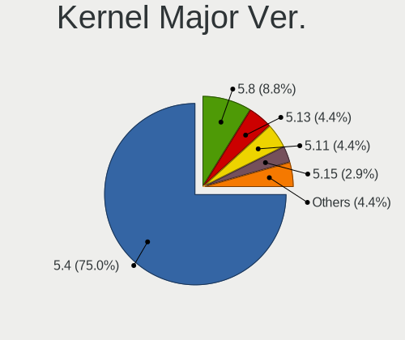

| Version | Desktops | Percent |
|---------|----------|---------|
| 5.4     | 45       | 81.82%  |
| 5.8     | 6        | 10.91%  |
| 5.9     | 1        | 1.82%   |
| 5.7     | 1        | 1.82%   |
| 5.5     | 1        | 1.82%   |
| 5.11    | 1        | 1.82%   |

Arch
----

OS architecture (x86_64, i586, etc.)

| Name   | Desktops | Percent |
|--------|----------|---------|
| x86_64 | 55       | 100%    |

DE
--

Desktop Environment

| Name   | Desktops | Percent |
|--------|----------|---------|
| Budgie | 54       | 98.18%  |
| GNOME  | 1        | 1.82%   |

Display Server
--------------

X11 or Wayland

| Name    | Desktops | Percent |
|---------|----------|---------|
| X11     | 54       | 98.18%  |
| Wayland | 1        | 1.82%   |

Display Manager
---------------

SDDM, LightDM, etc.

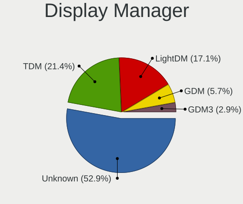

| Name    | Desktops | Percent |
|---------|----------|---------|
| Unknown | 36       | 64.29%  |
| TDM     | 15       | 26.79%  |
| GDM     | 3        | 5.36%   |
| LightDM | 2        | 3.57%   |

OS Lang
-------

Language

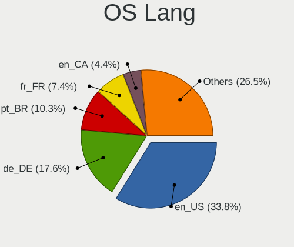

| Lang  | Desktops | Percent |
|-------|----------|---------|
| en_US | 19       | 34.55%  |
| pt_BR | 7        | 12.73%  |
| de_DE | 7        | 12.73%  |
| en_CA | 3        | 5.45%   |
| en_AU | 3        | 5.45%   |
| zh_TW | 2        | 3.64%   |
| fr_FR | 2        | 3.64%   |
| es_CO | 2        | 3.64%   |
| en_GB | 2        | 3.64%   |
| uk_UA | 1        | 1.82%   |
| ru_RU | 1        | 1.82%   |
| it_IT | 1        | 1.82%   |
| es_MX | 1        | 1.82%   |
| es_ES | 1        | 1.82%   |
| es_CL | 1        | 1.82%   |
| en_IL | 1        | 1.82%   |
| bg_BG | 1        | 1.82%   |

Boot Mode
---------

EFI or BIOS

| Mode | Desktops | Percent |
|------|----------|---------|
| BIOS | 32       | 55.17%  |
| EFI  | 26       | 44.83%  |

Filesystem
----------

Type of filesystem

| Type  | Desktops | Percent |
|-------|----------|---------|
| Ext4  | 50       | 90.91%  |
| Zfs   | 3        | 5.45%   |
| Btrfs | 2        | 3.64%   |

Part. scheme
------------

Scheme of partitioning

| Type    | Desktops | Percent |
|---------|----------|---------|
| Unknown | 37       | 66.07%  |
| GPT     | 12       | 21.43%  |
| MBR     | 7        | 12.5%   |

Dual Boot with Linux/BSD
------------------------

Hosting more than one Linux/BSD

| Dual boot | Desktops | Percent |
|-----------|----------|---------|
| No        | 47       | 85.45%  |
| Yes       | 8        | 14.55%  |

Dual Boot (Win)
---------------

Hosting Linux and Windows

| Dual boot | Desktops | Percent |
|-----------|----------|---------|
| No        | 38       | 66.67%  |
| Yes       | 19       | 33.33%  |

Board
-----

Vendor
------

Motherboard manufacturer

| Name                | Desktops | Percent |
|---------------------|----------|---------|
| ASUSTek Computer    | 18       | 32.73%  |
| Gigabyte Technology | 12       | 21.82%  |
| MSI                 | 6        | 10.91%  |
| Hewlett-Packard     | 6        | 10.91%  |
| Dell                | 5        | 9.09%   |
| ASRock              | 2        | 3.64%   |
| PCSMART             | 1        | 1.82%   |
| Lenovo              | 1        | 1.82%   |
| Fujitsu             | 1        | 1.82%   |
| eMachines           | 1        | 1.82%   |
| Biostar             | 1        | 1.82%   |
| Apple               | 1        | 1.82%   |

Model
-----

Motherboard model

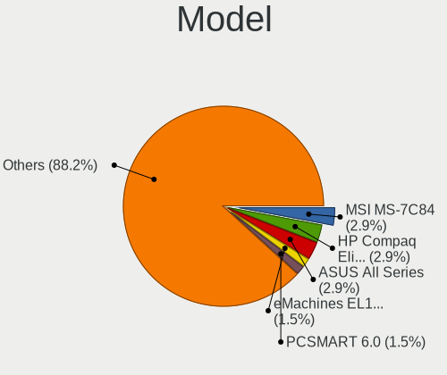

| Name                                | Desktops | Percent |
|-------------------------------------|----------|---------|
| MSI MS-7C84                         | 2        | 3.64%   |
| PCSMART 6.0                         | 1        | 1.82%   |
| MSI MS-7B38                         | 1        | 1.82%   |
| MSI MS-7B10                         | 1        | 1.82%   |
| MSI MS-7A32                         | 1        | 1.82%   |
| MSI MS-7917                         | 1        | 1.82%   |
| Lenovo Legion T530-28ICB 90L300BQMW | 1        | 1.82%   |
| HP Z420 Workstation                 | 1        | 1.82%   |
| HP Pavilion Desktop PC 570-p0xx     | 1        | 1.82%   |
| HP EliteDesk 800 G1 SFF             | 1        | 1.82%   |
| HP Compaq Elite 8300 SFF            | 1        | 1.82%   |
| HP Compaq dc7900 Small Form Factor  | 1        | 1.82%   |
| HP Compaq dc7700 Ultra-slim Desktop | 1        | 1.82%   |
| Gigabyte Z77X-D3H                   | 1        | 1.82%   |
| Gigabyte Z68M-D2H                   | 1        | 1.82%   |
| Gigabyte Z390 DESIGNARE             | 1        | 1.82%   |
| Gigabyte Z170X-Gaming 3             | 1        | 1.82%   |
| Gigabyte Z170-HD3 DDR3              | 1        | 1.82%   |
| Gigabyte P55A-UD4P                  | 1        | 1.82%   |
| Gigabyte H61M-S1                    | 1        | 1.82%   |
| Gigabyte B550M AORUS PRO-P          | 1        | 1.82%   |
| Gigabyte B550I AORUS PRO AX         | 1        | 1.82%   |
| Gigabyte B450M DS3H                 | 1        | 1.82%   |
| Gigabyte B360 AORUS GAMING 3 WIFI   | 1        | 1.82%   |
| Gigabyte B360 AORUS GAMING 3        | 1        | 1.82%   |
| Fujitsu CELSIUS W530                | 1        | 1.82%   |
| eMachines EL1852G                   | 1        | 1.82%   |
| Dell Precision WorkStation T3500    | 1        | 1.82%   |
| Dell Precision T1700                | 1        | 1.82%   |
| Dell OptiPlex XE                    | 1        | 1.82%   |
| Dell OptiPlex 9010                  | 1        | 1.82%   |
| Dell OptiPlex 780                   | 1        | 1.82%   |
| Biostar G31-M7 TE                   | 1        | 1.82%   |
| ASUS Z77-A                          | 1        | 1.82%   |
| ASUS TUF Z370-PLUS GAMING           | 1        | 1.82%   |
| ASUS TUF B450-PLUS GAMING           | 1        | 1.82%   |
| ASUS STRIX B250F GAMING             | 1        | 1.82%   |
| ASUS ROG STRIX X570-E GAMING        | 1        | 1.82%   |
| ASUS ROG STRIX X470-F GAMING        | 1        | 1.82%   |
| ASUS PRIME B450M-A                  | 1        | 1.82%   |
| ASUS PRIME B450-PLUS                | 1        | 1.82%   |
| ASUS PRIME A320M-K/BR               | 1        | 1.82%   |
| ASUS P9X79 DELUXE                   | 1        | 1.82%   |
| ASUS P8Z68-V PRO GEN3               | 1        | 1.82%   |
| ASUS P8H77-M PRO                    | 1        | 1.82%   |
| ASUS P7P55D-E LX                    | 1        | 1.82%   |
| ASUS P7P55D                         | 1        | 1.82%   |
| ASUS Maximus VIII IMPACT            | 1        | 1.82%   |
| ASUS M51AC                          | 1        | 1.82%   |
| ASUS M4A87TD/USB3                   | 1        | 1.82%   |
| ASUS All Series                     | 1        | 1.82%   |
| ASRock X370 Gaming-ITX/ac           | 1        | 1.82%   |
| ASRock B550 Phantom Gaming 4        | 1        | 1.82%   |
| Apple MacPro1,1                     | 1        | 1.82%   |

Model Family
------------

Motherboard model prefix

| Name                  | Desktops | Percent |
|-----------------------|----------|---------|
| HP Compaq             | 3        | 5.45%   |
| Dell OptiPlex         | 3        | 5.45%   |
| ASUS PRIME            | 3        | 5.45%   |
| MSI MS-7C84           | 2        | 3.64%   |
| Gigabyte B360         | 2        | 3.64%   |
| Dell Precision        | 2        | 3.64%   |
| ASUS TUF              | 2        | 3.64%   |
| ASUS ROG              | 2        | 3.64%   |
| PCSMART 6.0           | 1        | 1.82%   |
| MSI MS-7B38           | 1        | 1.82%   |
| MSI MS-7B10           | 1        | 1.82%   |
| MSI MS-7A32           | 1        | 1.82%   |
| MSI MS-7917           | 1        | 1.82%   |
| Lenovo Legion         | 1        | 1.82%   |
| HP Z420               | 1        | 1.82%   |
| HP Pavilion           | 1        | 1.82%   |
| HP EliteDesk          | 1        | 1.82%   |
| Gigabyte Z77X-D3H     | 1        | 1.82%   |
| Gigabyte Z68M-D2H     | 1        | 1.82%   |
| Gigabyte Z390         | 1        | 1.82%   |
| Gigabyte Z170X-Gaming | 1        | 1.82%   |
| Gigabyte Z170-HD3     | 1        | 1.82%   |
| Gigabyte P55A-UD4P    | 1        | 1.82%   |
| Gigabyte H61M-S1      | 1        | 1.82%   |
| Gigabyte B550M        | 1        | 1.82%   |
| Gigabyte B550I        | 1        | 1.82%   |
| Gigabyte B450M        | 1        | 1.82%   |
| Fujitsu CELSIUS       | 1        | 1.82%   |
| eMachines EL1852G     | 1        | 1.82%   |
| Biostar G31-M7        | 1        | 1.82%   |
| ASUS Z77-A            | 1        | 1.82%   |
| ASUS STRIX            | 1        | 1.82%   |
| ASUS P9X79            | 1        | 1.82%   |
| ASUS P8Z68-V          | 1        | 1.82%   |
| ASUS P8H77-M          | 1        | 1.82%   |
| ASUS P7P55D-E         | 1        | 1.82%   |
| ASUS P7P55D           | 1        | 1.82%   |
| ASUS Maximus          | 1        | 1.82%   |
| ASUS M51AC            | 1        | 1.82%   |
| ASUS M4A87TD          | 1        | 1.82%   |
| ASUS All              | 1        | 1.82%   |
| ASRock X370           | 1        | 1.82%   |
| ASRock B550           | 1        | 1.82%   |
| Apple MacPro1         | 1        | 1.82%   |

MFG Year
--------

Motherboard manufacture year

| Year | Desktops | Percent |
|------|----------|---------|
| 2019 | 12       | 21.82%  |
| 2020 | 9        | 16.36%  |
| 2018 | 9        | 16.36%  |
| 2013 | 7        | 12.73%  |
| 2011 | 4        | 7.27%   |
| 2010 | 4        | 7.27%   |
| 2016 | 2        | 3.64%   |
| 2014 | 2        | 3.64%   |
| 2012 | 2        | 3.64%   |
| 2009 | 2        | 3.64%   |
| 2015 | 1        | 1.82%   |
| 2007 | 1        | 1.82%   |

Form Factor
-----------

Physical design of the computer

| Name    | Desktops | Percent |
|---------|----------|---------|
| Desktop | 55       | 100%    |

Secure Boot
-----------

Enabled or disabled

| State    | Desktops | Percent |
|----------|----------|---------|
| Disabled | 55       | 100%    |

Coreboot
--------

Have coreboot on board

| Used | Desktops | Percent |
|------|----------|---------|
| No   | 55       | 100%    |

RAM Size
--------

Total RAM memory

| Size in GB  | Desktops | Percent |
|-------------|----------|---------|
| 16.01-24.0  | 26       | 45.61%  |
| 8.01-16.0   | 9        | 15.79%  |
| 32.01-64.0  | 7        | 12.28%  |
| 3.01-4.0    | 6        | 10.53%  |
| 4.01-8.0    | 5        | 8.77%   |
| 64.01-256.0 | 3        | 5.26%   |
| 24.01-32.0  | 1        | 1.75%   |

RAM Used
--------

Used RAM memory

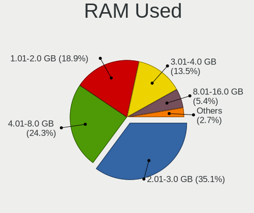

| Used GB    | Desktops | Percent |
|------------|----------|---------|
| 2.01-3.0   | 21       | 34.43%  |
| 4.01-8.0   | 17       | 27.87%  |
| 1.01-2.0   | 10       | 16.39%  |
| 3.01-4.0   | 8        | 13.11%  |
| 8.01-16.0  | 4        | 6.56%   |
| 32.01-64.0 | 1        | 1.64%   |

Total Drives
------------

Number of drives on board

| Drives | Desktops | Percent |
|--------|----------|---------|
| 1      | 17       | 29.82%  |
| 2      | 15       | 26.32%  |
| 3      | 10       | 17.54%  |
| 5      | 7        | 12.28%  |
| 4      | 6        | 10.53%  |
| 8      | 1        | 1.75%   |
| 6      | 1        | 1.75%   |

Has CD-ROM
----------

Has CD-ROM on board

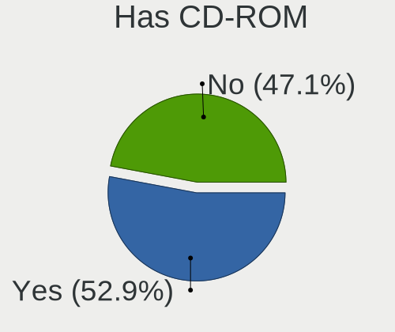

| Presented | Desktops | Percent |
|-----------|----------|---------|
| No        | 29       | 52.73%  |
| Yes       | 26       | 47.27%  |

Has Ethernet
------------

Has Ethernet on board

| Presented | Desktops | Percent |
|-----------|----------|---------|
| Yes       | 55       | 100%    |

Has WiFi
--------

Has WiFi module

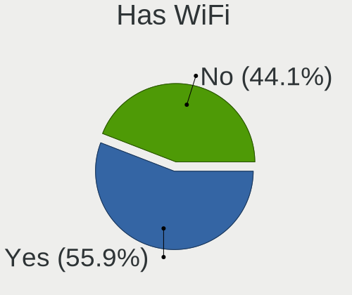

| Presented | Desktops | Percent |
|-----------|----------|---------|
| Yes       | 30       | 54.55%  |
| No        | 25       | 45.45%  |

Has Bluetooth
-------------

Has Bluetooth module

| Presented | Desktops | Percent |
|-----------|----------|---------|
| No        | 31       | 55.36%  |
| Yes       | 25       | 44.64%  |

Location
--------

Country
-------

Geographic location (country)

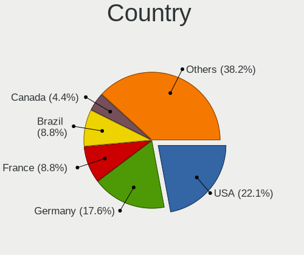

| Country     | Desktops | Percent |
|-------------|----------|---------|
| USA         | 13       | 23.64%  |
| Germany     | 7        | 12.73%  |
| Brazil      | 6        | 10.91%  |
| France      | 3        | 5.45%   |
| Canada      | 3        | 5.45%   |
| Australia   | 3        | 5.45%   |
| Mexico      | 2        | 3.64%   |
| Colombia    | 2        | 3.64%   |
| Ukraine     | 1        | 1.82%   |
| UK          | 1        | 1.82%   |
| Taiwan      | 1        | 1.82%   |
| Switzerland | 1        | 1.82%   |
| Sweden      | 1        | 1.82%   |
| Spain       | 1        | 1.82%   |
| Russia      | 1        | 1.82%   |
| Japan       | 1        | 1.82%   |
| Italy       | 1        | 1.82%   |
| Israel      | 1        | 1.82%   |
| Hungary     | 1        | 1.82%   |
| Croatia     | 1        | 1.82%   |
| Chile       | 1        | 1.82%   |
| Bulgaria    | 1        | 1.82%   |
| Bolivia     | 1        | 1.82%   |
| Belgium     | 1        | 1.82%   |

City
----

Geographic location (city)

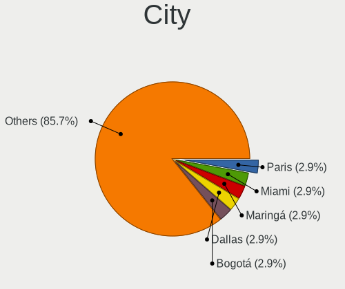

| City          | Desktops | Percent |
|---------------|----------|---------|
| Miami         | 2        | 3.57%   |
| Maringá      | 2        | 3.57%   |
| Dallas        | 2        | 3.57%   |
| Zapopan       | 1        | 1.79%   |
| Zagreb        | 1        | 1.79%   |
| Versailles    | 1        | 1.79%   |
| Uman          | 1        | 1.79%   |
| Tijuana       | 1        | 1.79%   |
| Ternopil      | 1        | 1.79%   |
| Talcahuano    | 1        | 1.79%   |
| Szentendre    | 1        | 1.79%   |
| Sydney        | 1        | 1.79%   |
| Stara Zagora  | 1        | 1.79%   |
| Smithville    | 1        | 1.79%   |
| Santo André  | 1        | 1.79%   |
| Québec       | 1        | 1.79%   |
| Queens        | 1        | 1.79%   |
| Pouso Alegre  | 1        | 1.79%   |
| Poplarville   | 1        | 1.79%   |
| Pocono Summit | 1        | 1.79%   |
| Petaẖ Tiqwa | 1        | 1.79%   |
| Perth         | 1        | 1.79%   |
| Paris         | 1        | 1.79%   |
| Palm Springs  | 1        | 1.79%   |
| Paderborn     | 1        | 1.79%   |
| New York      | 1        | 1.79%   |
| New Milford   | 1        | 1.79%   |
| Natal         | 1        | 1.79%   |
| Mainburg      | 1        | 1.79%   |
| Ljungby       | 1        | 1.79%   |
| Laupen        | 1        | 1.79%   |
| La Paz        | 1        | 1.79%   |
| Kirov         | 1        | 1.79%   |
| Hamburg       | 1        | 1.79%   |
| Grabenstatt   | 1        | 1.79%   |
| Genoa         | 1        | 1.79%   |
| Emsdetten     | 1        | 1.79%   |
| Dresden       | 1        | 1.79%   |
| Dour          | 1        | 1.79%   |
| Dickson       | 1        | 1.79%   |
| Connewarre    | 1        | 1.79%   |
| Chang-hua     | 1        | 1.79%   |
| Burnaby       | 1        | 1.79%   |
| Bogotá       | 1        | 1.79%   |
| Bogot??       | 1        | 1.79%   |
| Berlin        | 1        | 1.79%   |
| Belfast       | 1        | 1.79%   |
| Bauru         | 1        | 1.79%   |
| Barcelona     | 1        | 1.79%   |
| Baltimore     | 1        | 1.79%   |
| Aslonnes      | 1        | 1.79%   |
| Arnold        | 1        | 1.79%   |
| Anjo          | 1        | 1.79%   |

Drives
------

Drive Vendor
------------

Hard drive vendors

| Vendor                    | Desktops | Drives | Percent |
|---------------------------|----------|--------|---------|
| WDC                       | 21       | 35     | 18.92%  |
| Seagate                   | 17       | 28     | 15.32%  |
| Samsung Electronics       | 17       | 22     | 15.32%  |
| Kingston                  | 8        | 13     | 7.21%   |
| Toshiba                   | 6        | 6      | 5.41%   |
| Phison                    | 6        | 9      | 5.41%   |
| SanDisk                   | 5        | 8      | 4.5%    |
| Hitachi                   | 3        | 3      | 2.7%    |
| HGST                      | 3        | 4      | 2.7%    |
| Crucial                   | 3        | 4      | 2.7%    |
| Unknown                   | 2        | 3      | 1.8%    |
| PNY                       | 2        | 2      | 1.8%    |
| A-DATA Technology         | 2        | 2      | 1.8%    |
| XrayDisk                  | 1        | 1      | 0.9%    |
| Transcend                 | 1        | 1      | 0.9%    |
| Silicon Motion            | 1        | 1      | 0.9%    |
| PLEXTOR                   | 1        | 1      | 0.9%    |
| OCZ                       | 1        | 1      | 0.9%    |
| Netac                     | 1        | 1      | 0.9%    |
| Micron/Crucial Technology | 1        | 1      | 0.9%    |
| MAXTOR                    | 1        | 4      | 0.9%    |
| KingDian                  | 1        | 1      | 0.9%    |
| JMicron                   | 1        | 1      | 0.9%    |
| Intel                     | 1        | 1      | 0.9%    |
| HS-SSD-C100               | 1        | 1      | 0.9%    |
| China                     | 1        | 1      | 0.9%    |
| Axiom                     | 1        | 1      | 0.9%    |
| Apacer                    | 1        | 1      | 0.9%    |
| AMD                       | 1        | 8      | 0.9%    |

Drive Model
-----------

Hard drive models

| Model                               | Desktops | Percent |
|-------------------------------------|----------|---------|
| Seagate ST500DM002-1BD142 500GB     | 3        | 2.22%   |
| Samsung SSD 860 EVO 500GB           | 3        | 2.22%   |
| Samsung NVMe SSD Drive 500GB        | 3        | 2.22%   |
| WDC WD5000AAKX-001CA0 500GB         | 2        | 1.48%   |
| WDC WD5000AAKS-00UU3A0 500GB        | 2        | 1.48%   |
| Seagate ST4000DM000-1F2168 4TB      | 2        | 1.48%   |
| Seagate ST1000DM010-2EP102 1TB      | 2        | 1.48%   |
| SanDisk SDSSDA240G 240GB            | 2        | 1.48%   |
| SanDisk SDSSDA120G 120GB            | 2        | 1.48%   |
| Samsung SSD 860 QVO 1TB             | 2        | 1.48%   |
| Samsung NVMe SSD Drive 512GB        | 2        | 1.48%   |
| Phison Sabrent Rocket 4.0 1TB       | 2        | 1.48%   |
| Phison NVMe SSD Drive 240GB         | 2        | 1.48%   |
| Kingston SV300S37A60G 64GB SSD      | 2        | 1.48%   |
| Kingston SA400S37480G 480GB SSD     | 2        | 1.48%   |
| Kingston SA400S37240G 240GB SSD     | 2        | 1.48%   |
| XrayDisk 256GB                      | 1        | 0.74%   |
| WDC WDS500G2B0B-00YS70 500GB SSD    | 1        | 0.74%   |
| WDC WDS240G2G0B-00EPW0 240GB SSD    | 1        | 0.74%   |
| WDC WDS200T2B0A 2TB SSD             | 1        | 0.74%   |
| WDC WDS120G2G0A-00JH30 120GB SSD    | 1        | 0.74%   |
| WDC WD80EFAX-68LHPN0 8TB            | 1        | 0.74%   |
| WDC WD7502AAEX-00Y9A0 752GB         | 1        | 0.74%   |
| WDC WD7501AALS-00J7B1 752GB         | 1        | 0.74%   |
| WDC WD7500BPVT-24HXZT3 752GB        | 1        | 0.74%   |
| WDC WD6401AALS-00L3B2 640GB         | 1        | 0.74%   |
| WDC WD6000HLHX-01JJPV0 600GB        | 1        | 0.74%   |
| WDC WD5000AVCS-632DY1 500GB         | 1        | 0.74%   |
| WDC WD5000AAKS-75V0A0 500GB         | 1        | 0.74%   |
| WDC WD5000AAKS-00V1A0 500GB         | 1        | 0.74%   |
| WDC WD40EZRZ-00GXCB0 4TB            | 1        | 0.74%   |
| WDC WD40EFRX-68N32N0 4TB            | 1        | 0.74%   |
| WDC WD4003FZEX-00Z4SA0 4TB          | 1        | 0.74%   |
| WDC WD2500AAJS-60M0A0 250GB         | 1        | 0.74%   |
| WDC WD20EZAZ-00GGJB0 2TB            | 1        | 0.74%   |
| WDC WD20EFRX-68EUZN0 2TB            | 1        | 0.74%   |
| WDC WD2002FYPS-02W3B1 2TB           | 1        | 0.74%   |
| WDC WD2000JD-00FYB0 200GB           | 1        | 0.74%   |
| WDC WD10JPVX-60JC3T0 1TB            | 1        | 0.74%   |
| WDC WD10EZEX-22BN5A0 1TB            | 1        | 0.74%   |
| WDC WD10EARS-00Y5B1 1TB             | 1        | 0.74%   |
| WDC WD1003FZEX-00K3CA0 1TB          | 1        | 0.74%   |
| Unknown SD/MMC/MS PRO 394GB         | 1        | 0.74%   |
| Unknown SD/MMC 16GB                 | 1        | 0.74%   |
| Unknown M.S./M.S.Pro/HG 16GB        | 1        | 0.74%   |
| Transcend TS256GSSD370 256GB        | 1        | 0.74%   |
| Toshiba MQ01ABF050 500GB            | 1        | 0.74%   |
| Toshiba MD04ACA400 4TB              | 1        | 0.74%   |
| Toshiba HDWE160 6TB                 | 1        | 0.74%   |
| Toshiba DT02ABA400 4TB              | 1        | 0.74%   |
| Toshiba DT01ACA200 2TB              | 1        | 0.74%   |
| Toshiba DT01ACA100 1TB              | 1        | 0.74%   |
| Silicon Motion NVMe SSD Drive 512GB | 1        | 0.74%   |
| Seagate ST9500420AS 500GB           | 1        | 0.74%   |
| Seagate ST9500325AS 500GB           | 1        | 0.74%   |
| Seagate ST9160310AS 160GB           | 1        | 0.74%   |
| Seagate ST750LX003-1AC154 752GB     | 1        | 0.74%   |
| Seagate ST500LT012-1DG142 500GB     | 1        | 0.74%   |
| Seagate ST5000DM000-1FK178 5TB      | 1        | 0.74%   |
| Seagate ST380815AS 80GB             | 1        | 0.74%   |

HDD Vendor
----------

Hard disk drive vendors

| Vendor              | Desktops | Drives | Percent |
|---------------------|----------|--------|---------|
| WDC                 | 18       | 31     | 36%     |
| Seagate             | 17       | 28     | 34%     |
| Toshiba             | 6        | 6      | 12%     |
| Hitachi             | 3        | 3      | 6%      |
| HGST                | 3        | 4      | 6%      |
| Unknown             | 1        | 1      | 2%      |
| Samsung Electronics | 1        | 1      | 2%      |
| MAXTOR              | 1        | 4      | 2%      |

SSD Vendor
----------

Solid state drive vendors

| Vendor              | Desktops | Drives | Percent |
|---------------------|----------|--------|---------|
| Samsung Electronics | 9        | 11     | 22.5%   |
| Kingston            | 8        | 13     | 20%     |
| WDC                 | 4        | 4      | 10%     |
| SanDisk             | 4        | 7      | 10%     |
| Crucial             | 2        | 3      | 5%      |
| A-DATA Technology   | 2        | 2      | 5%      |
| Transcend           | 1        | 1      | 2.5%    |
| PNY                 | 1        | 1      | 2.5%    |
| PLEXTOR             | 1        | 1      | 2.5%    |
| Netac               | 1        | 1      | 2.5%    |
| KingDian            | 1        | 1      | 2.5%    |
| JMicron             | 1        | 1      | 2.5%    |
| Intel               | 1        | 1      | 2.5%    |
| China               | 1        | 1      | 2.5%    |
| Axiom               | 1        | 1      | 2.5%    |
| Apacer              | 1        | 1      | 2.5%    |
| AMD                 | 1        | 8      | 2.5%    |

Drive Kind
----------

HDD or SSD

| Kind    | Desktops | Drives | Percent |
|---------|----------|--------|---------|
| HDD     | 39       | 78     | 43.33%  |
| SSD     | 30       | 58     | 33.33%  |
| NVMe    | 18       | 25     | 20%     |
| Unknown | 3        | 4      | 3.33%   |

Drive Connector
---------------

SATA, SAS, NVMe, etc.

| Type | Desktops | Drives | Percent |
|------|----------|--------|---------|
| SATA | 50       | 136    | 71.43%  |
| NVMe | 18       | 25     | 25.71%  |
| SAS  | 2        | 4      | 2.86%   |

Drive Size
----------

Size of hard drive

| Size in TB | Desktops | Drives | Percent |
|------------|----------|--------|---------|
| 0.01-0.5   | 40       | 82     | 53.33%  |
| 0.51-1.0   | 20       | 31     | 26.67%  |
| 1.01-2.0   | 7        | 10     | 9.33%   |
| 3.01-4.0   | 5        | 9      | 6.67%   |
| 4.01-10.0  | 3        | 4      | 4%      |

Space Total
-----------

Amount of disk space available on the file system

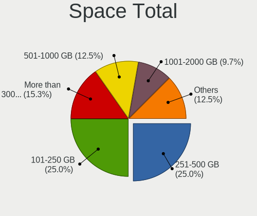

| Size in GB     | Desktops | Percent |
|----------------|----------|---------|
| 251-500        | 16       | 27.59%  |
| 101-250        | 14       | 24.14%  |
| 501-1000       | 8        | 13.79%  |
| More than 3000 | 7        | 12.07%  |
| 1001-2000      | 5        | 8.62%   |
| 21-50          | 2        | 3.45%   |
| 2001-3000      | 2        | 3.45%   |
| 1-20           | 2        | 3.45%   |
| Unknown        | 2        | 3.45%   |

Space Used
----------

Amount of used disk space

| Used GB        | Desktops | Percent |
|----------------|----------|---------|
| 1-20           | 16       | 26.67%  |
| 21-50          | 10       | 16.67%  |
| 101-250        | 10       | 16.67%  |
| 251-500        | 9        | 15%     |
| 1001-2000      | 6        | 10%     |
| 501-1000       | 3        | 5%      |
| 51-100         | 2        | 3.33%   |
| Unknown        | 2        | 3.33%   |
| More than 3000 | 1        | 1.67%   |
| 2001-3000      | 1        | 1.67%   |

Malfunc. Drives
---------------

Drive models with a malfunction

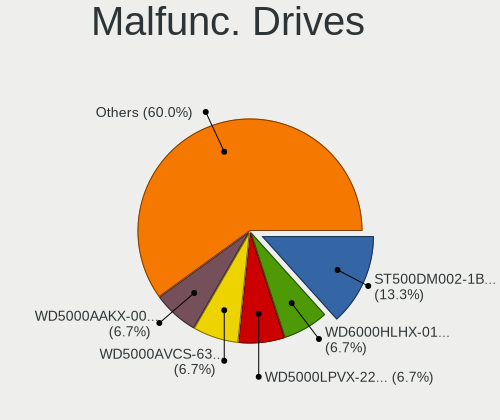

| Model                           | Desktops | Drives | Percent |
|---------------------------------|----------|--------|---------|
| Seagate ST500DM002-1BD142 500GB | 2        | 2      | 15.38%  |
| WDC WD6000HLHX-01JJPV0 600GB    | 1        | 1      | 7.69%   |
| WDC WD5000AVCS-632DY1 500GB     | 1        | 1      | 7.69%   |
| WDC WD5000AAKX-001CA0 500GB     | 1        | 1      | 7.69%   |
| WDC WD4003FZEX-00Z4SA0 4TB      | 1        | 1      | 7.69%   |
| WDC WD2500AAJS-60M0A0 250GB     | 1        | 1      | 7.69%   |
| WDC WD20EFRX-68EUZN0 2TB        | 1        | 2      | 7.69%   |
| Seagate ST9500325AS 500GB       | 1        | 1      | 7.69%   |
| Seagate ST5000DM000-1FK178 5TB  | 1        | 1      | 7.69%   |
| Seagate ST3320620AS 320GB       | 1        | 1      | 7.69%   |
| MAXTOR 6B200M0 208GB            | 1        | 2      | 7.69%   |
| Hitachi HDS721032CLA362 320GB   | 1        | 1      | 7.69%   |

Malfunc. Drive Vendor
---------------------

Vendors of faulty drives

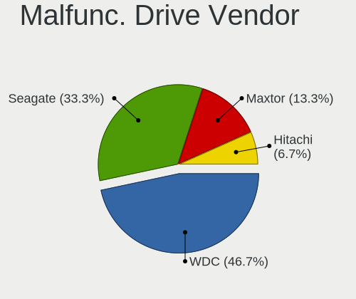

| Vendor  | Desktops | Drives | Percent |
|---------|----------|--------|---------|
| WDC     | 6        | 7      | 46.15%  |
| Seagate | 5        | 5      | 38.46%  |
| MAXTOR  | 1        | 2      | 7.69%   |
| Hitachi | 1        | 1      | 7.69%   |

Malfunc. HDD Vendor
-------------------

Vendors of faulty HDD drives

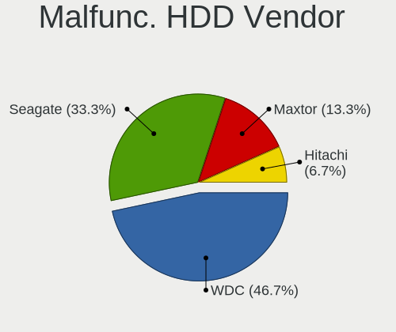

| Vendor  | Desktops | Drives | Percent |
|---------|----------|--------|---------|
| WDC     | 6        | 7      | 46.15%  |
| Seagate | 5        | 5      | 38.46%  |
| MAXTOR  | 1        | 2      | 7.69%   |
| Hitachi | 1        | 1      | 7.69%   |

Malfunc. Drive Kind
-------------------

Kinds of faulty drives

| Kind | Desktops | Drives | Percent |
|------|----------|--------|---------|
| HDD  | 9        | 15     | 100%    |

Failed Drives
-------------

Failed drive models

Zero info for selected period =(

Failed Drive Vendor
-------------------

Failed drive vendors

Zero info for selected period =(

Drive Status
------------

Number of failed and malfunc. drives

| Status   | Desktops | Drives | Percent |
|----------|----------|--------|---------|
| Detected | 38       | 100    | 59.38%  |
| Works    | 17       | 50     | 26.56%  |
| Malfunc  | 9        | 15     | 14.06%  |

Storage controller
------------------

Storage Vendor
--------------

Storage controller vendors

| Vendor                        | Desktops | Percent |
|-------------------------------|----------|---------|
| Intel                         | 39       | 44.83%  |
| AMD                           | 16       | 18.39%  |
| Samsung Electronics           | 8        | 9.2%    |
| Phison Electronics            | 6        | 6.9%    |
| Marvell Technology Group      | 5        | 5.75%   |
| JMicron Technology            | 4        | 4.6%    |
| Micron/Crucial Technology     | 2        | 2.3%    |
| Silicon Motion                | 1        | 1.15%   |
| Silicon Image                 | 1        | 1.15%   |
| Sandisk                       | 1        | 1.15%   |
| OCZ Technology Group          | 1        | 1.15%   |
| Integrated Technology Express | 1        | 1.15%   |
| ASMedia Technology            | 1        | 1.15%   |
| Adaptec                       | 1        | 1.15%   |

Storage Model
-------------

Storage controller models

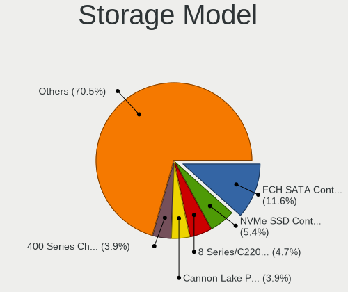

| Model                                                                                   | Desktops | Percent |
|-----------------------------------------------------------------------------------------|----------|---------|
| AMD FCH SATA Controller [AHCI mode]                                                     | 12       | 10.91%  |
| Samsung NVMe SSD Controller SM981/PM981/PM983                                           | 6        | 5.45%   |
| Intel Cannon Lake PCH SATA AHCI Controller                                              | 5        | 4.55%   |
| AMD 400 Series Chipset SATA Controller                                                  | 5        | 4.55%   |
| Phison E16 PCIe4 NVMe Controller                                                        | 4        | 3.64%   |
| Intel SATA Controller [RAID mode]                                                       | 4        | 3.64%   |
| Intel 8 Series/C220 Series Chipset Family 6-port SATA Controller 1 [AHCI mode]          | 4        | 3.64%   |
| Intel 7 Series/C210 Series Chipset Family 6-port SATA Controller [AHCI mode]            | 4        | 3.64%   |
| Phison E12 NVMe Controller                                                              | 3        | 2.73%   |
| Intel Q170/Q150/B150/H170/H110/Z170/CM236 Chipset SATA Controller [AHCI Mode]           | 3        | 2.73%   |
| Intel 200 Series PCH SATA controller [AHCI mode]                                        | 3        | 2.73%   |
| AMD Starship/Matisse Chipset SATA Controller [AHCI mode]                                | 3        | 2.73%   |
| Samsung NVMe SSD Controller SM951/PM951                                                 | 2        | 1.82%   |
| Micron/Crucial P2 NVMe PCIe SSD                                                         | 2        | 1.82%   |
| Marvell Group 88SE9172 SATA 6Gb/s Controller                                            | 2        | 1.82%   |
| Intel NM10/ICH7 Family SATA Controller [IDE mode]                                       | 2        | 1.82%   |
| Intel 82801G (ICH7 Family) IDE Controller                                               | 2        | 1.82%   |
| Intel 6 Series/C200 Series Chipset Family Desktop SATA Controller (IDE mode, ports 4-5) | 2        | 1.82%   |
| Intel 6 Series/C200 Series Chipset Family Desktop SATA Controller (IDE mode, ports 0-3) | 2        | 1.82%   |
| Intel 6 Series/C200 Series Chipset Family 6 port Desktop SATA AHCI Controller           | 2        | 1.82%   |
| AMD X370 Series Chipset SATA Controller                                                 | 2        | 1.82%   |
| AMD FCH SATA Controller D                                                               | 2        | 1.82%   |
| Silicon Motion SM2263EN/SM2263XT SSD Controller                                         | 1        | 0.91%   |
| Silicon Image SiI 3132 Serial ATA Raid II Controller                                    | 1        | 0.91%   |
| Sandisk WD Black 2018/SN750 / PC SN720 NVMe SSD                                         | 1        | 0.91%   |
| Phison E7 NVMe Controller                                                               | 1        | 0.91%   |
| OCZ Group RD400/400A SSD                                                                | 1        | 0.91%   |
| Marvell Group 88SE9172 SATA III 6Gb/s RAID Controller                                   | 1        | 0.91%   |
| Marvell Group 88SE9128 PCIe SATA 6 Gb/s RAID controller with HyperDuo                   | 1        | 0.91%   |
| Marvell Group 88SE9128 PCIe SATA 6 Gb/s RAID controller                                 | 1        | 0.91%   |
| Marvell Group 88SE9123 PCIe SATA 6.0 Gb/s controller                                    | 1        | 0.91%   |
| JMicron JMB368 IDE controller                                                           | 1        | 0.91%   |
| JMicron JMB363 SATA/IDE Controller                                                      | 1        | 0.91%   |
| JMicron JMB362 SATA Controller                                                          | 1        | 0.91%   |
| JMicron JMB361 AHCI/IDE                                                                 | 1        | 0.91%   |
| Intel C602 chipset 4-Port SATA Storage Control Unit                                     | 1        | 0.91%   |
| Intel C600/X79 series chipset SATA RAID Controller                                      | 1        | 0.91%   |
| Intel C600/X79 series chipset 6-Port SATA AHCI Controller                               | 1        | 0.91%   |
| Intel 9 Series Chipset Family SATA Controller [AHCI Mode]                               | 1        | 0.91%   |
| Intel 82801JI (ICH10 Family) SATA AHCI Controller                                       | 1        | 0.91%   |
| Intel 82801JD/DO (ICH10 Family) SATA AHCI Controller                                    | 1        | 0.91%   |
| Intel 82801JD/DO (ICH10 Family) 4-port SATA IDE Controller                              | 1        | 0.91%   |
| Intel 82801JD/DO (ICH10 Family) 2-port SATA IDE Controller                              | 1        | 0.91%   |
| Intel 82801H (ICH8 Family) 4 port SATA Controller [IDE mode]                            | 1        | 0.91%   |
| Intel 631xESB/632xESB/3100 Chipset SATA IDE Controller                                  | 1        | 0.91%   |
| Intel 631xESB/632xESB IDE Controller                                                    | 1        | 0.91%   |
| Intel 5 Series/3400 Series Chipset 6 port SATA AHCI Controller                          | 1        | 0.91%   |
| Intel 5 Series/3400 Series Chipset 4 port SATA IDE Controller                           | 1        | 0.91%   |
| Intel 5 Series/3400 Series Chipset 2 port SATA IDE Controller                           | 1        | 0.91%   |
| Intel 4 Series Chipset PT IDER Controller                                               | 1        | 0.91%   |
| Integrated Express IT8213 IDE Controller                                                | 1        | 0.91%   |
| ASMedia ASM1062 Serial ATA Controller                                                   | 1        | 0.91%   |
| AMD SB7x0/SB8x0/SB9x0 SATA Controller [IDE mode]                                        | 1        | 0.91%   |
| AMD SB7x0/SB8x0/SB9x0 SATA Controller [AHCI mode]                                       | 1        | 0.91%   |
| AMD SB7x0/SB8x0/SB9x0 IDE Controller                                                    | 1        | 0.91%   |
| Adaptec AAC-RAID                                                                        | 1        | 0.91%   |

Storage Kind
------------

Kind of storage controller (IDE, SATA, NVMe, SAS, ...)

| Kind | Desktops | Percent |
|------|----------|---------|
| SATA | 43       | 53.75%  |
| NVMe | 18       | 22.5%   |
| IDE  | 13       | 16.25%  |
| RAID | 5        | 6.25%   |
| SAS  | 1        | 1.25%   |

Processor
---------

CPU Vendor
----------

Processor vendors

| Vendor | Desktops | Percent |
|--------|----------|---------|
| Intel  | 39       | 70.91%  |
| AMD    | 16       | 29.09%  |

CPU Model
---------

Processor models

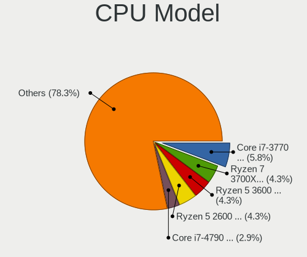

| Model                                        | Desktops | Percent |
|----------------------------------------------|----------|---------|
| Intel Core i7-3770 CPU @ 3.40GHz             | 4        | 7.14%   |
| AMD Ryzen 7 3700X 8-Core Processor           | 3        | 5.36%   |
| AMD Ryzen 5 3600 6-Core Processor            | 3        | 5.36%   |
| AMD Ryzen 5 2600 Six-Core Processor          | 3        | 5.36%   |
| Intel Core i7-4790 CPU @ 3.60GHz             | 2        | 3.57%   |
| Intel Core i7-2600 CPU @ 3.40GHz             | 2        | 3.57%   |
| Intel Core i5 CPU 750 @ 2.67GHz              | 2        | 3.57%   |
| AMD Ryzen 3 2200G with Radeon Vega Graphics  | 2        | 3.57%   |
| Intel Xeon CPU W3530 @ 2.80GHz               | 1        | 1.79%   |
| Intel Xeon CPU E5-2680 0 @ 2.70GHz           | 1        | 1.79%   |
| Intel Xeon CPU 5150 @ 2.66GHz                | 1        | 1.79%   |
| Intel Pentium CPU G2030 @ 3.00GHz            | 1        | 1.79%   |
| Intel Core i9-9900KF CPU @ 3.60GHz           | 1        | 1.79%   |
| Intel Core i9-9900K CPU @ 3.60GHz            | 1        | 1.79%   |
| Intel Core i7-9700 CPU @ 3.00GHz             | 1        | 1.79%   |
| Intel Core i7-7700 CPU @ 3.60GHz             | 1        | 1.79%   |
| Intel Core i7-6700K CPU @ 4.00GHz            | 1        | 1.79%   |
| Intel Core i7-6700 CPU @ 3.40GHz             | 1        | 1.79%   |
| Intel Core i7-4790K CPU @ 4.00GHz            | 1        | 1.79%   |
| Intel Core i7-4770 CPU @ 3.40GHz             | 1        | 1.79%   |
| Intel Core i7-3820 CPU @ 3.60GHz             | 1        | 1.79%   |
| Intel Core i7-2600K CPU @ 3.40GHz            | 1        | 1.79%   |
| Intel Core i7 CPU 870 @ 2.93GHz              | 1        | 1.79%   |
| Intel Core i5-9600K CPU @ 3.70GHz            | 1        | 1.79%   |
| Intel Core i5-8600K CPU @ 3.60GHz            | 1        | 1.79%   |
| Intel Core i5-8400 CPU @ 2.80GHz             | 1        | 1.79%   |
| Intel Core i5-6400 CPU @ 2.70GHz             | 1        | 1.79%   |
| Intel Core i5-4590 CPU @ 3.30GHz             | 1        | 1.79%   |
| Intel Core i5-4460 CPU @ 3.20GHz             | 1        | 1.79%   |
| Intel Core i5-3470 CPU @ 3.20GHz             | 1        | 1.79%   |
| Intel Core i5 CPU 760 @ 2.80GHz              | 1        | 1.79%   |
| Intel Core i3-6100 CPU @ 3.70GHz             | 1        | 1.79%   |
| Intel Core 2 Quad CPU Q8400 @ 2.66GHz        | 1        | 1.79%   |
| Intel Core 2 Duo CPU E8600 @ 3.33GHz         | 1        | 1.79%   |
| Intel Core 2 Duo CPU E8400 @ 3.00GHz         | 1        | 1.79%   |
| Intel Core 2 Duo CPU E7400 @ 2.80GHz         | 1        | 1.79%   |
| Intel Core 2 CPU 6420 @ 2.13GHz              | 1        | 1.79%   |
| Intel Core 2 CPU 6300 @ 1.86GHz              | 1        | 1.79%   |
| AMD Ryzen 9 3900X 12-Core Processor          | 1        | 1.79%   |
| AMD Ryzen 7 2700 Eight-Core Processor        | 1        | 1.79%   |
| AMD Ryzen 3 3200G with Radeon Vega Graphics  | 1        | 1.79%   |
| AMD Phenom II X6 1090T Processor             | 1        | 1.79%   |
| AMD A6-9500 RADEON R5, 8 COMPUTE CORES 2C+6G | 1        | 1.79%   |

CPU Model Family
----------------

Processor model prefix

| Model             | Desktops | Percent |
|-------------------|----------|---------|
| Intel Core i7     | 17       | 30.36%  |
| Intel Core i5     | 10       | 17.86%  |
| AMD Ryzen 5       | 6        | 10.71%  |
| AMD Ryzen 7       | 4        | 7.14%   |
| Intel Xeon        | 3        | 5.36%   |
| Intel Core 2 Duo  | 3        | 5.36%   |
| AMD Ryzen 3       | 3        | 5.36%   |
| Intel Core i9     | 2        | 3.57%   |
| Intel Core 2      | 2        | 3.57%   |
| Intel Pentium     | 1        | 1.79%   |
| Intel Core i3     | 1        | 1.79%   |
| Intel Core 2 Quad | 1        | 1.79%   |
| AMD Ryzen 9       | 1        | 1.79%   |
| AMD Phenom II X6  | 1        | 1.79%   |
| AMD A6            | 1        | 1.79%   |

CPU Cores
---------

Number of processor cores

| Number | Desktops | Percent |
|--------|----------|---------|
| 4      | 28       | 50.91%  |
| 6      | 10       | 18.18%  |
| 8      | 8        | 14.55%  |
| 2      | 7        | 12.73%  |
| 12     | 1        | 1.82%   |
| 1      | 1        | 1.82%   |

CPU Sockets
-----------

Number of sockets

| Number | Desktops | Percent |
|--------|----------|---------|
| 1      | 54       | 98.18%  |
| 2      | 1        | 1.82%   |

CPU Threads
-----------

Threads per core (Hyper-Threading)

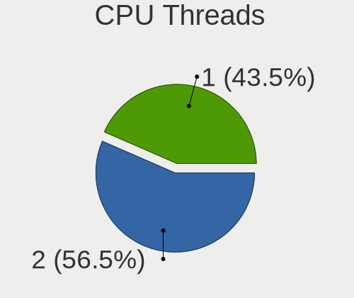

| Number | Desktops | Percent |
|--------|----------|---------|
| 2      | 33       | 58.93%  |
| 1      | 23       | 41.07%  |

CPU Op-Modes
------------

CPU Operation Modes (32-bit, 64-bit)

| Op mode        | Desktops | Percent |
|----------------|----------|---------|
| 32-bit, 64-bit | 55       | 100%    |

CPU Microcode
-------------

Microcode number

| Number     | Desktops | Percent |
|------------|----------|---------|
| Unknown    | 10       | 17.54%  |
| 0x306a9    | 6        | 10.53%  |
| 0x306c3    | 5        | 8.77%   |
| 0x506e3    | 4        | 7.02%   |
| 0x906ec    | 3        | 5.26%   |
| 0x206a7    | 3        | 5.26%   |
| 0x1067a    | 3        | 5.26%   |
| 0x08701021 | 3        | 5.26%   |
| 0x0800820d | 3        | 5.26%   |
| 0x906ea    | 2        | 3.51%   |
| 0x6f6      | 2        | 3.51%   |
| 0x206d7    | 2        | 3.51%   |
| 0x106e5    | 2        | 3.51%   |
| 0x906ed    | 1        | 1.75%   |
| 0x6f2      | 1        | 1.75%   |
| 0x106a5    | 1        | 1.75%   |
| 0x08701013 | 1        | 1.75%   |
| 0x08108109 | 1        | 1.75%   |
| 0x08101016 | 1        | 1.75%   |
| 0x0810100b | 1        | 1.75%   |
| 0x0600611a | 1        | 1.75%   |
| 0x010000dc | 1        | 1.75%   |

CPU Microarch
-------------

Microarchitecture

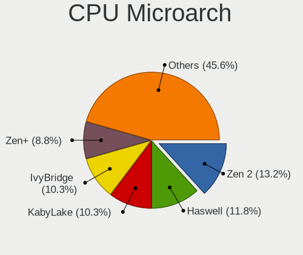

| Name        | Desktops | Percent |
|-------------|----------|---------|
| Zen 2       | 7        | 12.73%  |
| KabyLake    | 7        | 12.73%  |
| IvyBridge   | 6        | 10.91%  |
| Haswell     | 6        | 10.91%  |
| Zen+        | 5        | 9.09%   |
| SandyBridge | 5        | 9.09%   |
| Skylake     | 4        | 7.27%   |
| Penryn      | 4        | 7.27%   |
| Nehalem     | 4        | 7.27%   |
| Core        | 3        | 5.45%   |
| Zen         | 2        | 3.64%   |
| K10         | 1        | 1.82%   |
| Excavator   | 1        | 1.82%   |

Graphics
--------

GPU Vendor
----------

Vendors of graphics cards

| Vendor | Desktops | Percent |
|--------|----------|---------|
| Nvidia | 34       | 54.84%  |
| AMD    | 16       | 25.81%  |
| Intel  | 12       | 19.35%  |

GPU Model
---------

Graphics card models

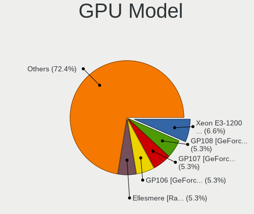

| Model                                                                       | Desktops | Percent |
|-----------------------------------------------------------------------------|----------|---------|
| Nvidia GP107 [GeForce GTX 1050 Ti]                                          | 4        | 6.35%   |
| Nvidia GP106 [GeForce GTX 1060 6GB]                                         | 4        | 6.35%   |
| Nvidia TU106 [GeForce RTX 2060 Rev. A]                                      | 3        | 4.76%   |
| Nvidia GP108 [GeForce GT 1030]                                              | 3        | 4.76%   |
| Intel Xeon E3-1200 v3/4th Gen Core Processor Integrated Graphics Controller | 3        | 4.76%   |
| Intel 4 Series Chipset Integrated Graphics Controller                       | 3        | 4.76%   |
| AMD Navi 10 [Radeon RX 5600 OEM/5600 XT / 5700/5700 XT]                     | 3        | 4.76%   |
| Intel Xeon E3-1200 v2/3rd Gen Core processor Graphics Controller            | 2        | 3.17%   |
| Intel 2nd Generation Core Processor Family Integrated Graphics Controller   | 2        | 3.17%   |
| AMD Vega 10 XL/XT [Radeon RX Vega 56/64]                                    | 2        | 3.17%   |
| AMD Raven Ridge [Radeon Vega Series / Radeon Vega Mobile Series]            | 2        | 3.17%   |
| AMD Juniper XT [Radeon HD 5770]                                             | 2        | 3.17%   |
| AMD Ellesmere [Radeon RX 470/480/570/570X/580/580X/590]                     | 2        | 3.17%   |
| Nvidia TU116 [GeForce GTX 1660]                                             | 1        | 1.59%   |
| Nvidia TU116 [GeForce GTX 1660 SUPER]                                       | 1        | 1.59%   |
| Nvidia TU116 [GeForce GTX 1650]                                             | 1        | 1.59%   |
| Nvidia TU106 [GeForce RTX 2070]                                             | 1        | 1.59%   |
| Nvidia TU106 [GeForce RTX 2060 SUPER]                                       | 1        | 1.59%   |
| Nvidia TU104 [GeForce RTX 2070 SUPER]                                       | 1        | 1.59%   |
| Nvidia TU104 [GeForce RTX 2060]                                             | 1        | 1.59%   |
| Nvidia GT200GL [Quadro FX 3800]                                             | 1        | 1.59%   |
| Nvidia GP104 [GeForce GTX 1080]                                             | 1        | 1.59%   |
| Nvidia GP102 [GeForce GTX 1080 Ti]                                          | 1        | 1.59%   |
| Nvidia GM206 [GeForce GTX 950]                                              | 1        | 1.59%   |
| Nvidia GM204 [GeForce GTX 970]                                              | 1        | 1.59%   |
| Nvidia GM200 [GeForce GTX 980 Ti]                                           | 1        | 1.59%   |
| Nvidia GK208B [GeForce GT 710]                                              | 1        | 1.59%   |
| Nvidia GK107 [GeForce GT 740]                                               | 1        | 1.59%   |
| Nvidia GK106 [GeForce GTX 650 Ti]                                           | 1        | 1.59%   |
| Nvidia GK104 [GeForce GTX 680]                                              | 1        | 1.59%   |
| Nvidia GF119 [GeForce GT 625 OEM]                                           | 1        | 1.59%   |
| Nvidia GF108 [GeForce GT 730]                                               | 1        | 1.59%   |
| Nvidia GF108 [GeForce GT 430]                                               | 1        | 1.59%   |
| Nvidia G92 [GeForce 9800 GTX+]                                              | 1        | 1.59%   |
| Intel 82Q963/Q965 Integrated Graphics Controller                            | 1        | 1.59%   |
| Intel 82G33/G31 Express Integrated Graphics Controller                      | 1        | 1.59%   |
| AMD RV790 [Radeon HD 4890]                                                  | 1        | 1.59%   |
| AMD Picasso/Raven 2 [Radeon Vega Series / Radeon Vega Mobile Series]        | 1        | 1.59%   |
| AMD Navi 14 [Radeon RX 5500/5500M / Pro 5500M]                              | 1        | 1.59%   |
| AMD Cedar [Radeon HD 5000/6000/7350/8350 Series]                            | 1        | 1.59%   |
| AMD Baffin [Radeon RX 550 640SP / RX 560/560X]                              | 1        | 1.59%   |

GPU Combo
---------

Combinations of graphics cards

| Name           | Desktops | Percent |
|----------------|----------|---------|
| 1 x Nvidia     | 29       | 50%     |
| 1 x AMD        | 13       | 22.41%  |
| 1 x Intel      | 11       | 18.97%  |
| AMD + Nvidia   | 3        | 5.17%   |
| 2 x Nvidia     | 1        | 1.72%   |
| Intel + Nvidia | 1        | 1.72%   |

GPU Driver
----------

Free vs proprietary

| Driver      | Desktops | Percent |
|-------------|----------|---------|
| Proprietary | 32       | 55.17%  |
| Free        | 25       | 43.1%   |
| Unknown     | 1        | 1.72%   |

GPU Memory
----------

Total video memory

| Size in GB | Desktops | Percent |
|------------|----------|---------|
| Unknown    | 17       | 28.81%  |
| 1.01-2.0   | 11       | 18.64%  |
| 7.01-8.0   | 9        | 15.25%  |
| 5.01-6.0   | 8        | 13.56%  |
| 3.01-4.0   | 7        | 11.86%  |
| 0.51-1.0   | 5        | 8.47%   |
| 8.01-16.0  | 1        | 1.69%   |
| 0.01-0.5   | 1        | 1.69%   |

Monitor
-------

Monitor Vendor
--------------

Monitor vendors

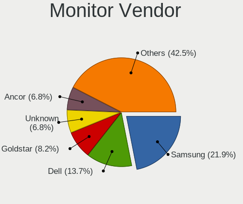

| Vendor               | Desktops | Percent |
|----------------------|----------|---------|
| Samsung Electronics  | 12       | 20%     |
| Dell                 | 9        | 15%     |
| Goldstar             | 6        | 10%     |
| Unknown              | 4        | 6.67%   |
| Ancor Communications | 4        | 6.67%   |
| LG Electronics       | 3        | 5%      |
| AOC                  | 3        | 5%      |
| Idek Iiyama          | 2        | 3.33%   |
| Hewlett-Packard      | 2        | 3.33%   |
| Eizo                 | 2        | 3.33%   |
| BenQ                 | 2        | 3.33%   |
| Sceptre Tech         | 1        | 1.67%   |
| Pioneer Electronic   | 1        | 1.67%   |
| Philips              | 1        | 1.67%   |
| NEC Computers        | 1        | 1.67%   |
| MStar                | 1        | 1.67%   |
| MPI                  | 1        | 1.67%   |
| Medion               | 1        | 1.67%   |
| Daewoo               | 1        | 1.67%   |
| ASUSTek Computer     | 1        | 1.67%   |
| AGO                  | 1        | 1.67%   |
| Acer                 | 1        | 1.67%   |

Monitor Model
-------------

Monitor models

| Model                                                                   | Desktops | Percent |
|-------------------------------------------------------------------------|----------|---------|
| Samsung Electronics LCD Monitor SAM0BB4 3840x2160 1872x1053mm 84.6-inch | 2        | 2.94%   |
| Samsung Electronics LCD Monitor C34H89x 3440x1440                       | 2        | 2.94%   |
| Unknown LCD Monitor SAMSUNG 3840x2160                                   | 1        | 1.47%   |
| Unknown LCD Monitor SAMSUNG                                             | 1        | 1.47%   |
| Unknown LCD Monitor GTW KX2153                                          | 1        | 1.47%   |
| Unknown LCD Monitor EMA E202HL                                          | 1        | 1.47%   |
| Sceptre Tech Sceptre B34 SPT0D52 2560x1080 797x334mm 34.0-inch          | 1        | 1.47%   |
| Samsung Electronics SyncMaster SAM05CD 1920x1080                        | 1        | 1.47%   |
| Samsung Electronics SyncMaster SAM021B 1400x1050 408x300mm 19.9-inch    | 1        | 1.47%   |
| Samsung Electronics S34J55x SAM0F72 3440x1440 797x333mm 34.0-inch       | 1        | 1.47%   |
| Samsung Electronics S27F350 SAM0D22 1920x1080 598x336mm 27.0-inch       | 1        | 1.47%   |
| Samsung Electronics S27B550 SAM091B 1920x1080 598x336mm 27.0-inch       | 1        | 1.47%   |
| Samsung Electronics S24C650 SAM09E9 1920x1080 521x293mm 23.5-inch       | 1        | 1.47%   |
| Samsung Electronics S24B300 SAM08CC 1920x1080 521x293mm 23.5-inch       | 1        | 1.47%   |
| Samsung Electronics S24B300 SAM08B4 1920x1080 521x293mm 23.5-inch       | 1        | 1.47%   |
| Samsung Electronics LCD Monitor SAM06CA 1920x1080 1110x620mm 50.1-inch  | 1        | 1.47%   |
| Samsung Electronics LCD Monitor S24E310 3840x1080                       | 1        | 1.47%   |
| Samsung Electronics LCD Monitor S24E310                                 | 1        | 1.47%   |
| Samsung Electronics LCD Monitor C32F391 1920x1080                       | 1        | 1.47%   |
| Pioneer Electronic LCD Monitor PDP-42FXE10 2646x768                     | 1        | 1.47%   |
| Pioneer Electronic LCD Monitor PDP-42FXE10 2390x768                     | 1        | 1.47%   |
| Philips PHL 243V7 PHLC155 1920x1080 530x300mm 24.0-inch                 | 1        | 1.47%   |
| NEC Computers LCD2070NX NEC667B 1600x1200 410x310mm 20.2-inch           | 1        | 1.47%   |
| NEC Computers LCD2070NX NEC667B 1600x1200 408x306mm 20.1-inch           | 1        | 1.47%   |
| MStar TV_MONITOR MST0030 1440x900 1150x650mm 52.0-inch                  | 1        | 1.47%   |
| MPI MPI7002 MPI7002 1920x1080 180x130mm 8.7-inch                        | 1        | 1.47%   |
| Medion MD41077EA MED078B 1280x1024 330x270mm 16.8-inch                  | 1        | 1.47%   |
| LG Electronics LCD Monitor LG ULTRAWIDE 2560x1080                       | 1        | 1.47%   |
| LG Electronics LCD Monitor LG QHD 2560x1440                             | 1        | 1.47%   |
| LG Electronics LCD Monitor 2D HD LG TV 1366x768                         | 1        | 1.47%   |
| Idek Iiyama LCD Monitor X2485 1920x1200                                 | 1        | 1.47%   |
| Idek Iiyama LCD Monitor PL2730H 1920x1080                               | 1        | 1.47%   |
| Hewlett-Packard LCD Monitor LP3065 2560x1600                            | 1        | 1.47%   |
| Hewlett-Packard L1940T HWP2682 1280x1024 380x300mm 19.1-inch            | 1        | 1.47%   |
| Goldstar LG ULTRAWIDE GSM59F1 1920x1080 580x240mm 24.7-inch             | 1        | 1.47%   |
| Goldstar L1919S GSM4AF0 1280x1024 376x301mm 19.0-inch                   | 1        | 1.47%   |
| Goldstar HDR WFHD GSM7714 2560x1080 798x334mm 34.1-inch                 | 1        | 1.47%   |
| Goldstar HDR 4K GSM7706 3840x2160 600x340mm 27.2-inch                   | 1        | 1.47%   |
| Goldstar HD GSM5ACD 1366x768 410x230mm 18.5-inch                        | 1        | 1.47%   |
| Goldstar 25UM58G GSM5B98 2560x1080 673x284mm 28.8-inch                  | 1        | 1.47%   |
| Eizo LCD Monitor L767 2560x1024                                         | 1        | 1.47%   |
| Eizo LCD Monitor L767                                                   | 1        | 1.47%   |
| Eizo FS2434 ENC2634 1920x1080 528x297mm 23.9-inch                       | 1        | 1.47%   |
| Dell LCD Monitor SP2309W 2048x1152                                      | 1        | 1.47%   |
| Dell LCD Monitor P2317H 1920x1080                                       | 1        | 1.47%   |
| Dell LCD Monitor E207WFP 1680x1050                                      | 1        | 1.47%   |
| Dell LCD Monitor AW2518HF 1920x1080                                     | 1        | 1.47%   |
| Dell E228WFP DELD014 1680x1050 473x296mm 22.0-inch                      | 1        | 1.47%   |
| Dell E207WFP DELD011 1680x1050 430x270mm 20.0-inch                      | 1        | 1.47%   |
| Dell 2405FPW DELA00F 1920x1200 519x324mm 24.1-inch                      | 1        | 1.47%   |
| Dell 1908FP DEL4026 1280x1024 376x301mm 19.0-inch                       | 1        | 1.47%   |
| Dell 1708FP DEL4024 1280x1024 338x270mm 17.0-inch                       | 1        | 1.47%   |
| Daewoo LM1810W DWE1810 1360x768 340x190mm 15.3-inch                     | 1        | 1.47%   |
| BenQ GL2760 BNQ78D5 1920x1080 600x340mm 27.2-inch                       | 1        | 1.47%   |
| BenQ GL2230 BNQ7874 1920x1080 480x270mm 21.7-inch                       | 1        | 1.47%   |
| ASUSTek Computer VP28U AUS28B1 3840x2160 621x341mm 27.9-inch            | 1        | 1.47%   |
| AOC LCD Monitor 24G2W1G4 3840x1080                                      | 1        | 1.47%   |
| AOC LCD Monitor 24G2W1G4                                                | 1        | 1.47%   |
| AOC LCD Monitor 2279WH 3520x1080                                        | 1        | 1.47%   |
| AOC 27G1G4 AOC2701 1920x1080 600x340mm 27.2-inch                        | 1        | 1.47%   |

Monitor Resolution
------------------

Monitor screen resolution

| Resolution         | Desktops | Percent |
|--------------------|----------|---------|
| 1920x1080 (FHD)    | 16       | 25%     |
| 3840x2160 (4K)     | 6        | 9.38%   |
| Unknown            | 6        | 9.38%   |
| 2560x1080          | 5        | 7.81%   |
| 1280x1024 (SXGA)   | 5        | 7.81%   |
| 3840x1080          | 3        | 4.69%   |
| 3440x1440          | 3        | 4.69%   |
| 1680x1050 (WSXGA+) | 3        | 4.69%   |
| 1366x768 (WXGA)    | 3        | 4.69%   |
| 2560x1440 (QHD)    | 2        | 3.13%   |
| 1920x1200 (WUXGA)  | 2        | 3.13%   |
| 3520x1080          | 1        | 1.56%   |
| 2646x768           | 1        | 1.56%   |
| 2560x1600          | 1        | 1.56%   |
| 2560x1024          | 1        | 1.56%   |
| 2390x768           | 1        | 1.56%   |
| 2048x1152          | 1        | 1.56%   |
| 1600x1200          | 1        | 1.56%   |
| 1400x1050          | 1        | 1.56%   |
| 1360x768           | 1        | 1.56%   |
| 1280x720 (HD)      | 1        | 1.56%   |

Monitor Diagonal
----------------

Diagonal size in inches

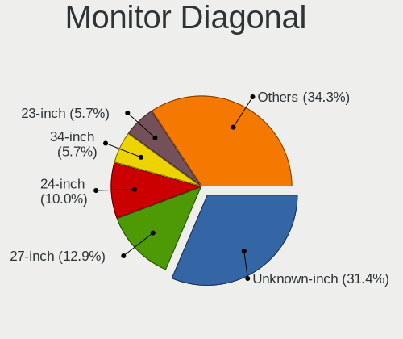

| Inches  | Desktops | Percent |
|---------|----------|---------|
| Unknown | 21       | 36.21%  |
| 27      | 7        | 12.07%  |
| 34      | 4        | 6.9%    |
| 19      | 4        | 6.9%    |
| 24      | 3        | 5.17%   |
| 23      | 3        | 5.17%   |
| 20      | 3        | 5.17%   |
| 84      | 2        | 3.45%   |
| 63      | 1        | 1.72%   |
| 52      | 1        | 1.72%   |
| 28      | 1        | 1.72%   |
| 22      | 1        | 1.72%   |
| 21      | 1        | 1.72%   |
| 18      | 1        | 1.72%   |
| 17      | 1        | 1.72%   |
| 16      | 1        | 1.72%   |
| 15      | 1        | 1.72%   |
| 12      | 1        | 1.72%   |
| 8       | 1        | 1.72%   |

Monitor Width
-------------

Physical width

| Width in mm | Desktops | Percent |
|-------------|----------|---------|
| Unknown     | 21       | 36.21%  |
| 501-600     | 11       | 18.97%  |
| 401-500     | 7        | 12.07%  |
| 701-800     | 4        | 6.9%    |
| 601-700     | 3        | 5.17%   |
| 351-400     | 3        | 5.17%   |
| 301-350     | 3        | 5.17%   |
| 1501-2000   | 2        | 3.45%   |
| 1001-1500   | 2        | 3.45%   |
| 201-300     | 1        | 1.72%   |
| 101-200     | 1        | 1.72%   |

Aspect Ratio
------------

Proportional relationship between the width and the height

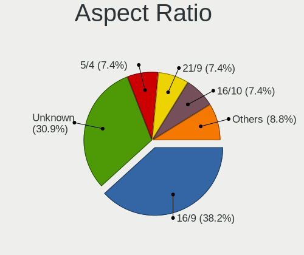

| Ratio   | Desktops | Percent |
|---------|----------|---------|
| Unknown | 20       | 35.71%  |
| 16/9    | 19       | 33.93%  |
| 21/9    | 5        | 8.93%   |
| 5/4     | 4        | 7.14%   |
| 4/3     | 4        | 7.14%   |
| 16/10   | 3        | 5.36%   |
| 6/5     | 1        | 1.79%   |

Monitor Area
------------

Area in inch²

| Area in inch² | Desktops | Percent |
|----------------|----------|---------|
| Unknown        | 21       | 36.84%  |
| 301-350        | 7        | 12.28%  |
| 201-250        | 7        | 12.28%  |
| 151-200        | 6        | 10.53%  |
| More than 1000 | 4        | 7.02%   |
| 351-500        | 4        | 7.02%   |
| 251-300        | 2        | 3.51%   |
| 141-150        | 2        | 3.51%   |
| 71-80          | 1        | 1.75%   |
| 1-40           | 1        | 1.75%   |
| 131-140        | 1        | 1.75%   |
| 91-100         | 1        | 1.75%   |

Pixel Density
-------------

Pixels per inch

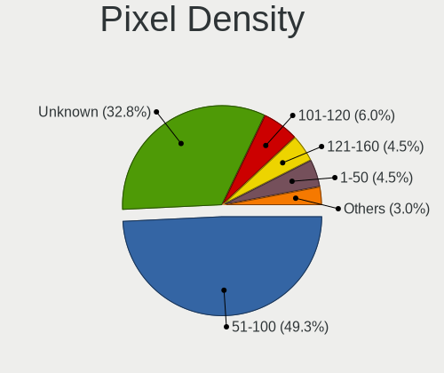

| Density | Desktops | Percent |
|---------|----------|---------|
| 51-100  | 24       | 43.64%  |
| Unknown | 21       | 38.18%  |
| 161-240 | 3        | 5.45%   |
| 101-120 | 3        | 5.45%   |
| 1-50    | 2        | 3.64%   |
| 121-160 | 2        | 3.64%   |

Multiple Monitors
-----------------

Total monitors connected

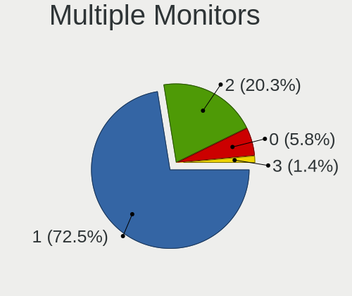

| Total | Desktops | Percent |
|-------|----------|---------|
| 1     | 39       | 69.64%  |
| 2     | 13       | 23.21%  |
| 0     | 3        | 5.36%   |
| 3     | 1        | 1.79%   |

Network
-------

Net Controller Vendor
---------------------

Controller vendors

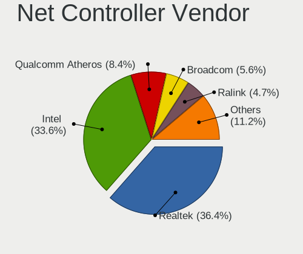

| Vendor                | Desktops | Percent |
|-----------------------|----------|---------|
| Realtek Semiconductor | 31       | 36.47%  |
| Intel                 | 29       | 34.12%  |
| Qualcomm Atheros      | 8        | 9.41%   |
| Broadcom              | 5        | 5.88%   |
| Ralink Technology     | 4        | 4.71%   |
| Xiaomi                | 1        | 1.18%   |
| Wacom                 | 1        | 1.18%   |
| Ralink                | 1        | 1.18%   |
| Microsoft             | 1        | 1.18%   |
| Linksys               | 1        | 1.18%   |
| D-Link System         | 1        | 1.18%   |
| D-Link                | 1        | 1.18%   |
| ASIX Electronics      | 1        | 1.18%   |

Net Controller Model
--------------------

Controller models

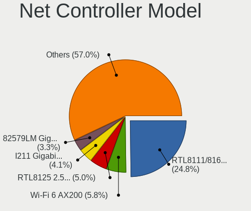

| Model                                                                      | Desktops | Percent |
|----------------------------------------------------------------------------|----------|---------|
| Realtek RTL8111/8168/8411 PCI Express Gigabit Ethernet Controller          | 22       | 23.16%  |
| Realtek RTL8125 2.5GbE Controller                                          | 5        | 5.26%   |
| Intel Wi-Fi 6 AX200                                                        | 5        | 5.26%   |
| Intel I211 Gigabit Network Connection                                      | 5        | 5.26%   |
| Intel Wireless-AC 9260                                                     | 3        | 3.16%   |
| Intel Ethernet Connection I217-LM                                          | 3        | 3.16%   |
| Intel Ethernet Connection (7) I219-V                                       | 3        | 3.16%   |
| Intel Ethernet Connection (2) I219-V                                       | 3        | 3.16%   |
| Intel 82579LM Gigabit Network Connection (Lewisville)                      | 3        | 3.16%   |
| Broadcom BCM4360 802.11ac Wireless Network Adapter                         | 3        | 3.16%   |
| Realtek RTL8192EU 802.11b/g/n WLAN Adapter                                 | 2        | 2.11%   |
| Ralink MT7601U Wireless Adapter                                            | 2        | 2.11%   |
| Qualcomm Atheros Killer E220x Gigabit Ethernet Controller                  | 2        | 2.11%   |
| Intel Cannon Lake PCH CNVi WiFi                                            | 2        | 2.11%   |
| Intel 82579V Gigabit Network Connection                                    | 2        | 2.11%   |
| Intel 82567LM-3 Gigabit Network Connection                                 | 2        | 2.11%   |
| Broadcom NetXtreme BCM5761 Gigabit Ethernet PCIe                           | 2        | 2.11%   |
| Xiaomi Mi/Redmi series (RNDIS)                                             | 1        | 1.05%   |
| Wacom ACK-40401 [Wireless Accessory Kit]                                   | 1        | 1.05%   |
| Realtek RTL8822BE 802.11a/b/g/n/ac WiFi adapter                            | 1        | 1.05%   |
| Realtek RTL8192CE PCIe Wireless Network Adapter                            | 1        | 1.05%   |
| Realtek RTL8153 Gigabit Ethernet Adapter                                   | 1        | 1.05%   |
| Realtek RTL810xE PCI Express Fast Ethernet controller                      | 1        | 1.05%   |
| Realtek 802.11ac NIC                                                       | 1        | 1.05%   |
| Ralink RT5372 Wireless Adapter                                             | 1        | 1.05%   |
| Ralink RT2870/RT3070 Wireless Adapter                                      | 1        | 1.05%   |
| Ralink RT3090 Wireless 802.11n 1T/1R PCIe                                  | 1        | 1.05%   |
| Qualcomm Atheros Killer E2500 Gigabit Ethernet Controller                  | 1        | 1.05%   |
| Qualcomm Atheros AR9485 Wireless Network Adapter                           | 1        | 1.05%   |
| Qualcomm Atheros AR93xx Wireless Network Adapter                           | 1        | 1.05%   |
| Qualcomm Atheros AR9285 Wireless Network Adapter (PCI-Express)             | 1        | 1.05%   |
| Qualcomm Atheros AR8152 v2.0 Fast Ethernet                                 | 1        | 1.05%   |
| Qualcomm Atheros AR8151 v2.0 Gigabit Ethernet                              | 1        | 1.05%   |
| Microsoft XBOX ACC                                                         | 1        | 1.05%   |
| Linksys WUSB54GC v1 802.11g Adapter [Ralink RT73]                          | 1        | 1.05%   |
| Intel Wireless 7265                                                        | 1        | 1.05%   |
| Intel Dual Band Wireless-AC 3168NGW [Stone Peak]                           | 1        | 1.05%   |
| Intel 82566DM Gigabit Network Connection                                   | 1        | 1.05%   |
| Intel 80003ES2LAN Gigabit Ethernet Controller (Copper)                     | 1        | 1.05%   |
| D-Link System AirPlus G DWL-G122 Wireless Adapter(rev.C1) [Ralink RT2571W] | 1        | 1.05%   |
| D-Link DWA-127 Wireless N 150 High-Gain Adapter(rev.A1) [Ralink RT3070]    | 1        | 1.05%   |
| Broadcom NetLink BCM57780 Gigabit Ethernet PCIe                            | 1        | 1.05%   |
| ASIX AX88772A Fast Ethernet                                                | 1        | 1.05%   |

Wireless Vendor
---------------

Wireless vendors

| Vendor                | Desktops | Percent |
|-----------------------|----------|---------|
| Intel                 | 12       | 36.36%  |
| Realtek Semiconductor | 5        | 15.15%  |
| Ralink Technology     | 4        | 12.12%  |
| Qualcomm Atheros      | 3        | 9.09%   |
| Broadcom              | 3        | 9.09%   |
| Wacom                 | 1        | 3.03%   |
| Ralink                | 1        | 3.03%   |
| Microsoft             | 1        | 3.03%   |
| Linksys               | 1        | 3.03%   |
| D-Link System         | 1        | 3.03%   |
| D-Link                | 1        | 3.03%   |

Wireless Model
--------------

Wireless models

| Model                                                                      | Desktops | Percent |
|----------------------------------------------------------------------------|----------|---------|
| Intel Wi-Fi 6 AX200                                                        | 5        | 15.15%  |
| Intel Wireless-AC 9260                                                     | 3        | 9.09%   |
| Broadcom BCM4360 802.11ac Wireless Network Adapter                         | 3        | 9.09%   |
| Realtek RTL8192EU 802.11b/g/n WLAN Adapter                                 | 2        | 6.06%   |
| Ralink MT7601U Wireless Adapter                                            | 2        | 6.06%   |
| Intel Cannon Lake PCH CNVi WiFi                                            | 2        | 6.06%   |
| Wacom ACK-40401 [Wireless Accessory Kit]                                   | 1        | 3.03%   |
| Realtek RTL8822BE 802.11a/b/g/n/ac WiFi adapter                            | 1        | 3.03%   |
| Realtek RTL8192CE PCIe Wireless Network Adapter                            | 1        | 3.03%   |
| Realtek 802.11ac NIC                                                       | 1        | 3.03%   |
| Ralink RT5372 Wireless Adapter                                             | 1        | 3.03%   |
| Ralink RT2870/RT3070 Wireless Adapter                                      | 1        | 3.03%   |
| Ralink RT3090 Wireless 802.11n 1T/1R PCIe                                  | 1        | 3.03%   |
| Qualcomm Atheros AR9485 Wireless Network Adapter                           | 1        | 3.03%   |
| Qualcomm Atheros AR93xx Wireless Network Adapter                           | 1        | 3.03%   |
| Qualcomm Atheros AR9285 Wireless Network Adapter (PCI-Express)             | 1        | 3.03%   |
| Microsoft XBOX ACC                                                         | 1        | 3.03%   |
| Linksys WUSB54GC v1 802.11g Adapter [Ralink RT73]                          | 1        | 3.03%   |
| Intel Wireless 7265                                                        | 1        | 3.03%   |
| Intel Dual Band Wireless-AC 3168NGW [Stone Peak]                           | 1        | 3.03%   |
| D-Link System AirPlus G DWL-G122 Wireless Adapter(rev.C1) [Ralink RT2571W] | 1        | 3.03%   |
| D-Link DWA-127 Wireless N 150 High-Gain Adapter(rev.A1) [Ralink RT3070]    | 1        | 3.03%   |

Ethernet Vendor
---------------

Ethernet vendors

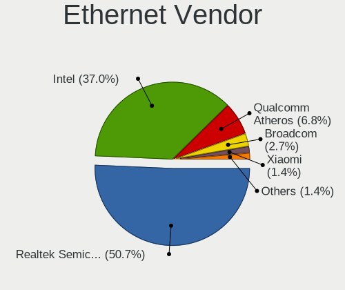

| Vendor                | Desktops | Percent |
|-----------------------|----------|---------|
| Realtek Semiconductor | 29       | 48.33%  |
| Intel                 | 22       | 36.67%  |
| Qualcomm Atheros      | 5        | 8.33%   |
| Broadcom              | 2        | 3.33%   |
| Xiaomi                | 1        | 1.67%   |
| ASIX Electronics      | 1        | 1.67%   |

Ethernet Model
--------------

Ethernet models

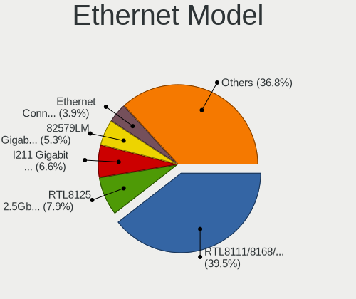

| Model                                                             | Desktops | Percent |
|-------------------------------------------------------------------|----------|---------|
| Realtek RTL8111/8168/8411 PCI Express Gigabit Ethernet Controller | 22       | 35.48%  |
| Realtek RTL8125 2.5GbE Controller                                 | 5        | 8.06%   |
| Intel I211 Gigabit Network Connection                             | 5        | 8.06%   |
| Intel Ethernet Connection I217-LM                                 | 3        | 4.84%   |
| Intel Ethernet Connection (7) I219-V                              | 3        | 4.84%   |
| Intel Ethernet Connection (2) I219-V                              | 3        | 4.84%   |
| Intel 82579LM Gigabit Network Connection (Lewisville)             | 3        | 4.84%   |
| Qualcomm Atheros Killer E220x Gigabit Ethernet Controller         | 2        | 3.23%   |
| Intel 82579V Gigabit Network Connection                           | 2        | 3.23%   |
| Intel 82567LM-3 Gigabit Network Connection                        | 2        | 3.23%   |
| Broadcom NetXtreme BCM5761 Gigabit Ethernet PCIe                  | 2        | 3.23%   |
| Xiaomi Mi/Redmi series (RNDIS)                                    | 1        | 1.61%   |
| Realtek RTL8153 Gigabit Ethernet Adapter                          | 1        | 1.61%   |
| Realtek RTL810xE PCI Express Fast Ethernet controller             | 1        | 1.61%   |
| Qualcomm Atheros Killer E2500 Gigabit Ethernet Controller         | 1        | 1.61%   |
| Qualcomm Atheros AR8152 v2.0 Fast Ethernet                        | 1        | 1.61%   |
| Qualcomm Atheros AR8151 v2.0 Gigabit Ethernet                     | 1        | 1.61%   |
| Intel 82566DM Gigabit Network Connection                          | 1        | 1.61%   |
| Intel 80003ES2LAN Gigabit Ethernet Controller (Copper)            | 1        | 1.61%   |
| Broadcom NetLink BCM57780 Gigabit Ethernet PCIe                   | 1        | 1.61%   |
| ASIX AX88772A Fast Ethernet                                       | 1        | 1.61%   |

Net Controller Kind
-------------------

Ethernet, WiFi or modem

| Kind     | Desktops | Percent |
|----------|----------|---------|
| Ethernet | 55       | 64.71%  |
| WiFi     | 30       | 35.29%  |

Used Controller
---------------

Currently used network controller

| Kind     | Desktops | Percent |
|----------|----------|---------|
| Ethernet | 43       | 63.24%  |
| WiFi     | 25       | 36.76%  |

NICs
----

Total network controllers on board

| Total | Desktops | Percent |
|-------|----------|---------|
| 1     | 34       | 61.82%  |
| 2     | 15       | 27.27%  |
| 3     | 6        | 10.91%  |

IPv6
----

IPv6 vs IPv4

| Used | Desktops | Percent |
|------|----------|---------|
| No   | 51       | 92.73%  |
| Yes  | 4        | 7.27%   |

Bluetooth
---------

Bluetooth Vendor
----------------

Controller vendors

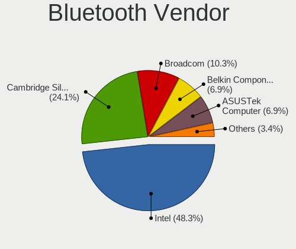

| Vendor                          | Desktops | Percent |
|---------------------------------|----------|---------|
| Intel                           | 12       | 46.15%  |
| Cambridge Silicon Radio         | 7        | 26.92%  |
| Broadcom                        | 3        | 11.54%  |
| ASUSTek Computer                | 2        | 7.69%   |
| Qualcomm Atheros Communications | 1        | 3.85%   |
| Belkin Components               | 1        | 3.85%   |

Bluetooth Model
---------------

Controller models

| Model                                                 | Desktops | Percent |
|-------------------------------------------------------|----------|---------|
| Cambridge Silicon Radio Bluetooth Dongle (HCI mode)   | 7        | 26.92%  |
| Intel AX200 Bluetooth                                 | 5        | 19.23%  |
| Intel Wireless-AC 9260 Bluetooth Adapter              | 3        | 11.54%  |
| Intel Bluetooth 9460/9560 Jefferson Peak (JfP)        | 2        | 7.69%   |
| Broadcom BCM20702A0 Bluetooth 4.0                     | 2        | 7.69%   |
| Qualcomm Atheros AR3011 Bluetooth                     | 1        | 3.85%   |
| Intel Wireless-AC 3168 Bluetooth                      | 1        | 3.85%   |
| Intel Bluetooth wireless interface                    | 1        | 3.85%   |
| Broadcom BCM92046DG-CL1ROM Bluetooth 2.1 Adapter      | 1        | 3.85%   |
| Belkin Components F8T065BF Mini Bluetooth 4.0 Adapter | 1        | 3.85%   |
| ASUS Broadcom BCM20702A0 Bluetooth                    | 1        | 3.85%   |
| ASUS Bluetooth Adapter                                | 1        | 3.85%   |

Sound
-----

Sound Vendor
------------

Sound card vendors

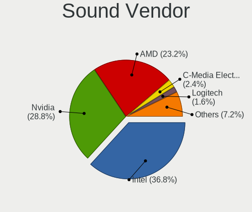

| Vendor              | Desktops | Percent |
|---------------------|----------|---------|
| Intel               | 38       | 36.19%  |
| Nvidia              | 32       | 30.48%  |
| AMD                 | 23       | 21.9%   |
| C-Media Electronics | 3        | 2.86%   |
| Logitech            | 2        | 1.9%    |
| SteelSeries ApS     | 1        | 0.95%   |
| Microsoft           | 1        | 0.95%   |
| Kingston Technology | 1        | 0.95%   |
| Focusrite-Novation  | 1        | 0.95%   |
| Creative Labs       | 1        | 0.95%   |
| Bose                | 1        | 0.95%   |
| Blue Microphones    | 1        | 0.95%   |

Sound Model
-----------

Sound card models

| Model                                                                      | Desktops | Percent |
|----------------------------------------------------------------------------|----------|---------|
| AMD Starship/Matisse HD Audio Controller                                   | 7        | 5.98%   |
| Intel Cannon Lake PCH cAVS                                                 | 5        | 4.27%   |
| Intel 8 Series/C220 Series Chipset High Definition Audio Controller        | 5        | 4.27%   |
| Intel 7 Series/C216 Chipset Family High Definition Audio Controller        | 5        | 4.27%   |
| Nvidia TU106 High Definition Audio Controller                              | 4        | 3.42%   |
| Nvidia GP107GL High Definition Audio Controller                            | 4        | 3.42%   |
| Nvidia GP106 High Definition Audio Controller                              | 4        | 3.42%   |
| Intel 6 Series/C200 Series Chipset Family High Definition Audio Controller | 4        | 3.42%   |
| AMD Navi 10 HDMI Audio                                                     | 4        | 3.42%   |
| AMD Family 17h (Models 00h-0fh) HD Audio Controller                        | 4        | 3.42%   |
| Nvidia TU116 High Definition Audio Controller                              | 3        | 2.56%   |
| Nvidia GP108 High Definition Audio Controller                              | 3        | 2.56%   |
| Intel Xeon E3-1200 v3/4th Gen Core Processor HD Audio Controller           | 3        | 2.56%   |
| Intel 82801JD/DO (ICH10 Family) HD Audio Controller                        | 3        | 2.56%   |
| Intel 5 Series/3400 Series Chipset High Definition Audio                   | 3        | 2.56%   |
| Intel 200 Series PCH HD Audio                                              | 3        | 2.56%   |
| AMD Raven/Raven2/Fenghuang HDMI/DP Audio Controller                        | 3        | 2.56%   |
| AMD Family 17h (Models 10h-1fh) HD Audio Controller                        | 3        | 2.56%   |
| Nvidia TU104 HD Audio Controller                                           | 2        | 1.71%   |
| Nvidia GF108 High Definition Audio Controller                              | 2        | 1.71%   |
| Intel NM10/ICH7 Family High Definition Audio Controller                    | 2        | 1.71%   |
| Intel C600/X79 series chipset High Definition Audio Controller             | 2        | 1.71%   |
| Intel 100 Series/C230 Series Chipset Family HD Audio Controller            | 2        | 1.71%   |
| AMD Vega 10 HDMI Audio [Radeon Vega 56/64]                                 | 2        | 1.71%   |
| AMD Juniper HDMI Audio [Radeon HD 5700 Series]                             | 2        | 1.71%   |
| AMD Ellesmere HDMI Audio [Radeon RX 470/480 / 570/580/590]                 | 2        | 1.71%   |
| SteelSeries ApS SteelSeries Arctis 5                                       | 1        | 0.85%   |
| Nvidia GP104 High Definition Audio Controller                              | 1        | 0.85%   |
| Nvidia GP102 HDMI Audio Controller                                         | 1        | 0.85%   |
| Nvidia GM206 High Definition Audio Controller                              | 1        | 0.85%   |
| Nvidia GM204 High Definition Audio Controller                              | 1        | 0.85%   |
| Nvidia GM200 High Definition Audio                                         | 1        | 0.85%   |
| Nvidia GK208 HDMI/DP Audio Controller                                      | 1        | 0.85%   |
| Nvidia GK107 HDMI Audio Controller                                         | 1        | 0.85%   |
| Nvidia GK106 HDMI Audio Controller                                         | 1        | 0.85%   |
| Nvidia GK104 HDMI Audio Controller                                         | 1        | 0.85%   |
| Nvidia GF119 HDMI Audio Controller                                         | 1        | 0.85%   |
| Microsoft LifeChat LX-4000                                                 | 1        | 0.85%   |
| Logitech [G533 Wireless Headset Dongle]                                    | 1        | 0.85%   |
| Logitech G430 Surround Sound Gaming Headset                                | 1        | 0.85%   |
| Kingston Technology HyperX Cloud Stinger Wireless                          | 1        | 0.85%   |
| Intel 9 Series Chipset Family HD Audio Controller                          | 1        | 0.85%   |
| Intel 82801JI (ICH10 Family) HD Audio Controller                           | 1        | 0.85%   |
| Intel 82801H (ICH8 Family) HD Audio Controller                             | 1        | 0.85%   |
| Intel 631xESB/632xESB High Definition Audio Controller                     | 1        | 0.85%   |
| Focusrite-Novation Scarlett 2i4                                            | 1        | 0.85%   |
| Creative Labs EMU20k1 [Sound Blaster X-Fi Series]                          | 1        | 0.85%   |
| C-Media Electronics CMI8738/CMI8768 PCI Audio                              | 1        | 0.85%   |
| C-Media Electronics CM108 Audio Controller                                 | 1        | 0.85%   |
| C-Media Electronics CM106 Like Sound Device                                | 1        | 0.85%   |
| Bose USB Audio                                                             | 1        | 0.85%   |
| Blue Microphones Yeti Stereo Microphone                                    | 1        | 0.85%   |
| AMD SBx00 Azalia (Intel HDA)                                               | 1        | 0.85%   |
| AMD RV770 HDMI Audio [Radeon HD 4850/4870]                                 | 1        | 0.85%   |
| AMD Family 15h (Models 60h-6fh) Audio Controller                           | 1        | 0.85%   |
| AMD Cedar HDMI Audio [Radeon HD 5400/6300/7300 Series]                     | 1        | 0.85%   |
| AMD Baffin HDMI/DP Audio [Radeon RX 550 640SP / RX 560/560X]               | 1        | 0.85%   |

Memory
------

Memory Vendor
-------------

Memory module vendors

| Vendor              | Desktops | Percent |
|---------------------|----------|---------|
| Kingston            | 4        | 14.29%  |
| G.Skill             | 4        | 14.29%  |
| Crucial             | 4        | 14.29%  |
| Corsair             | 4        | 14.29%  |
| Unknown             | 3        | 10.71%  |
| Samsung Electronics | 3        | 10.71%  |
| SK Hynix            | 2        | 7.14%   |
| TIMETEC             | 1        | 3.57%   |
| Team                | 1        | 3.57%   |
| Sesame              | 1        | 3.57%   |
| A-DATA Technology   | 1        | 3.57%   |

Memory Model
------------

Memory module models

| Model                                                     | Desktops | Percent |
|-----------------------------------------------------------|----------|---------|
| Corsair RAM CMW32GX4M2C3200C16 16384MB DIMM DDR4 3200MT/s | 2        | 6.67%   |
| Unknown RAM Module 8192MB DIMM DDR3 1333MT/s              | 1        | 3.33%   |
| Unknown RAM Module 4096MB DIMM DDR 1066MT/s               | 1        | 3.33%   |
| Unknown RAM Module 2048MB DIMM SDRAM                      | 1        | 3.33%   |
| Unknown RAM Module 2048MB DIMM DDR 1333MT/s               | 1        | 3.33%   |
| Unknown RAM Module 2048MB DIMM DDR 1066MT/s               | 1        | 3.33%   |
| TIMETEC RAM ED3-1600 8192MB DIMM DDR3 1600MT/s            | 1        | 3.33%   |
| Team RAM TEAMGROUP-UD4-2400 8192MB DIMM DDR4 3007MT/s     | 1        | 3.33%   |
| SK Hynix RAM Module 4096MB FB-DIMM DDR2 667MT/s           | 1        | 3.33%   |
| SK Hynix RAM HMT451U6AFR8C-PB 4GB DIMM DDR3 1600MT/s      | 1        | 3.33%   |
| Sesame RAM S939A2UGS-ITR.. 8192MB DIMM DDR3 1600MT/s      | 1        | 3.33%   |
| Samsung RAM M391B5673EH1-CF8 2048MB DIMM DDR3 1066MT/s    | 1        | 3.33%   |
| Samsung RAM M378A1K43CB2-CRC 8192MB DIMM DDR4 3500MT/s    | 1        | 3.33%   |
| Samsung RAM M3 78T5663EH3-CF7 2GB DIMM DDR2 2048MT/s      | 1        | 3.33%   |
| Kingston RAM KHX2133C11D3/4GX 4096MB DIMM DDR3 2134MT/s   | 1        | 3.33%   |
| Kingston RAM 99U5474-038.A00LF 4GB DIMM DDR3 1333MT/s     | 1        | 3.33%   |
| Kingston RAM 99U5403-159.A01LF 8192MB DIMM DDR3 1333MT/s  | 1        | 3.33%   |
| Kingston RAM 9905403-199.A00LF 4GB DIMM DDR3 1600MT/s     | 1        | 3.33%   |
| G.Skill RAM F4-3200C16-8GVKB 8GB DIMM DDR4 3200MT/s       | 1        | 3.33%   |
| G.Skill RAM F4-3200C16-8GVK 8192MB DIMM DDR4 3200MT/s     | 1        | 3.33%   |
| G.Skill RAM F4-3000C16-8GISB 8GB DIMM DDR4 3200MT/s       | 1        | 3.33%   |
| G.Skill RAM F3-1600C11-4GNT 4096MB DIMM DDR3 1333MT/s     | 1        | 3.33%   |
| Crucial RAM CT4G4DFS824A.M8FB 4096MB DIMM DDR4 2400MT/s   | 1        | 3.33%   |
| Crucial RAM CT102464BD160B.C16 8192MB DIMM DDR3 1600MT/s  | 1        | 3.33%   |
| Crucial RAM BLT8G3D1608DT1TX0. 8192MB DIMM DDR3 1600MT/s  | 1        | 3.33%   |
| Crucial RAM BLS4G4D240FSB.8FBD 4096MB DIMM DDR4 2400MT/s  | 1        | 3.33%   |
| Corsair RAM CMK16GX4M2D3600C18 8192MB DIMM DDR4 3600MT/s  | 1        | 3.33%   |
| Corsair RAM CMD16GX4M2B3200C16 8GB DIMM DDR4 3200MT/s     | 1        | 3.33%   |
| A-DATA RAM DDR4 3000 8GB DIMM DDR4 3600MT/s               | 1        | 3.33%   |

Memory Kind
-----------

Memory module kinds

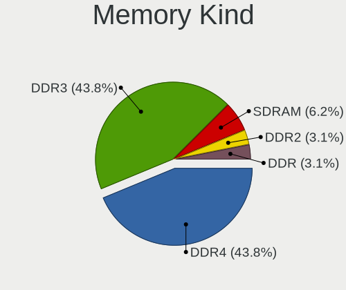

| Kind  | Desktops | Percent |
|-------|----------|---------|
| DDR4  | 11       | 42.31%  |
| DDR3  | 11       | 42.31%  |
| SDRAM | 2        | 7.69%   |
| DDR2  | 1        | 3.85%   |
| DDR   | 1        | 3.85%   |

Memory Form Factor
------------------

Physical design of the memory module

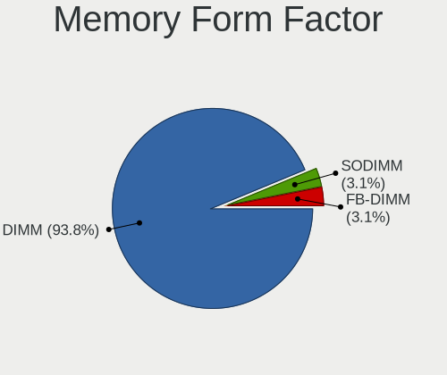

| Name    | Desktops | Percent |
|---------|----------|---------|
| DIMM    | 25       | 96.15%  |
| FB-DIMM | 1        | 3.85%   |

Memory Size
-----------

Memory module size

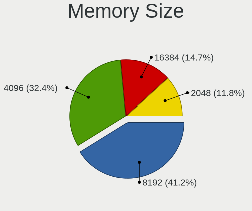

| Size  | Desktops | Percent |
|-------|----------|---------|
| 8192  | 11       | 39.29%  |
| 4096  | 9        | 32.14%  |
| 16384 | 4        | 14.29%  |
| 2048  | 4        | 14.29%  |

Memory Speed
------------

Memory module speed

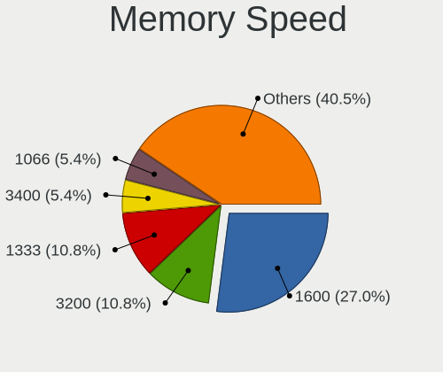

| Speed   | Desktops | Percent |
|---------|----------|---------|
| 1600    | 8        | 27.59%  |
| 3200    | 6        | 20.69%  |
| 1333    | 3        | 10.34%  |
| 3600    | 2        | 6.9%    |
| 2400    | 2        | 6.9%    |
| 1066    | 2        | 6.9%    |
| 3500    | 1        | 3.45%   |
| 3007    | 1        | 3.45%   |
| 2134    | 1        | 3.45%   |
| 2048    | 1        | 3.45%   |
| 667     | 1        | 3.45%   |
| Unknown | 1        | 3.45%   |

Printers & scanners
-------------------

Printer Vendor
--------------

Printer device vendors

| Vendor | Desktops | Percent |
|--------|----------|---------|
| Canon  | 2        | 66.67%  |
| Sharp  | 1        | 33.33%  |

Printer Model
-------------

Printer device models

| Model                 | Desktops | Percent |
|-----------------------|----------|---------|
| Sharp AL-2030         | 1        | 33.33%  |
| Canon TR7500 series   | 1        | 33.33%  |
| Canon MF240 Series V4 | 1        | 33.33%  |

Scanner Vendor
--------------

Scanner device vendors

Zero info for selected period =(

Scanner Model
-------------

Scanner device models

Zero info for selected period =(

Camera
------

Camera Vendor
-------------

Camera device vendors

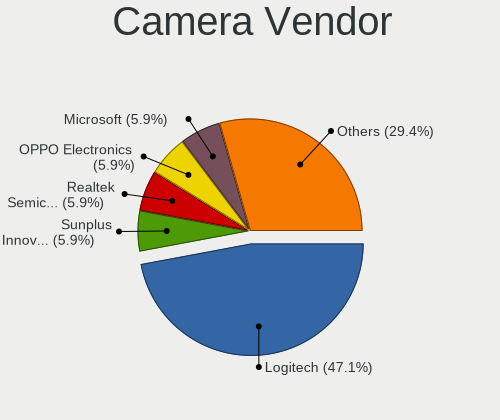

| Vendor                        | Desktops | Percent |
|-------------------------------|----------|---------|
| Logitech                      | 7        | 46.67%  |
| Sunplus Innovation Technology | 1        | 6.67%   |
| Realtek Semiconductor         | 1        | 6.67%   |
| OPPO Electronics              | 1        | 6.67%   |
| Microsoft                     | 1        | 6.67%   |
| LG Electronics                | 1        | 6.67%   |
| Guillemot                     | 1        | 6.67%   |
| Generalplus Technology        | 1        | 6.67%   |
| Cubeternet                    | 1        | 6.67%   |

Camera Model
------------

Camera device models

| Model                                | Desktops | Percent |
|--------------------------------------|----------|---------|
| Logitech Webcam C270                 | 2        | 13.33%  |
| Logitech Webcam B500                 | 2        | 13.33%  |
| Sunplus HD 720P webcam               | 1        | 6.67%   |
| Realtek Web Camera                   | 1        | 6.67%   |
| OPPO Reno4 5G                        | 1        | 6.67%   |
| Microsoft LifeCam HD-3000            | 1        | 6.67%   |
| Logitech Webcam C170                 | 1        | 6.67%   |
| Logitech Logitech Webcam C160        | 1        | 6.67%   |
| Logitech HD Pro Webcam C920          | 1        | 6.67%   |
| LG Optimus (Various Models) MTP Mode | 1        | 6.67%   |
| Guillemot Hercules HD Sunset         | 1        | 6.67%   |
| Generalplus 808 Camera               | 1        | 6.67%   |
| Cubeternet GL-UPC822 UVC WebCam      | 1        | 6.67%   |

Security
--------

Fingerprint Vendor
------------------

Fingerprint sensor vendors

Zero info for selected period =(

Fingerprint Model
-----------------

Fingerprint sensor models

Zero info for selected period =(

Chipcard Vendor
---------------

Chipcard module vendors

Zero info for selected period =(

Chipcard Model
--------------

Chipcard module models

Zero info for selected period =(

Unsupported
-----------

Unsupported Devices
-------------------

Total unsupported devices on board

| Total | Desktops | Percent |
|-------|----------|---------|
| 0     | 52       | 92.86%  |
| 1     | 4        | 7.14%   |

Unsupported Device Types
------------------------

Types of unsupported devices

| Type          | Desktops | Percent |
|---------------|----------|---------|
| Net/wireless  | 1        | 33.33%  |
| Graphics card | 1        | 33.33%  |
| Camera        | 1        | 33.33%  |

