Ubuntu Budgie 20.04 - Tested Hardware & Statistics (Notebooks)
--------------------------------------------------------------

A project to collect tested hardware configurations for Ubuntu Budgie 20.04.

Anyone can contribute to this report by the [hw-probe](https://github.com/linuxhw/hw-probe) tool:

    sudo -E hw-probe -all -upload

Please contribute! Especially if your hardware is rare.

Contents
--------

* [ Test Cases ](#test-cases)

* [ System ](#system)
  - [ Kernel                   ](#kernel)
  - [ Kernel Family            ](#kernel-family)
  - [ Kernel Major Ver.        ](#kernel-major-ver)
  - [ Arch                     ](#arch)
  - [ DE                       ](#de)
  - [ Display Server           ](#display-server)
  - [ Display Manager          ](#display-manager)
  - [ OS Lang                  ](#os-lang)
  - [ Boot Mode                ](#boot-mode)
  - [ Filesystem               ](#filesystem)
  - [ Part. scheme             ](#part-scheme)
  - [ Dual Boot with Linux/BSD ](#dual-boot-with-linuxbsd)
  - [ Dual Boot (Win)          ](#dual-boot-win)

* [ Board ](#board)
  - [ Vendor                   ](#vendor)
  - [ Model                    ](#model)
  - [ Model Family             ](#model-family)
  - [ MFG Year                 ](#mfg-year)
  - [ Form Factor              ](#form-factor)
  - [ Secure Boot              ](#secure-boot)
  - [ Coreboot                 ](#coreboot)
  - [ RAM Size                 ](#ram-size)
  - [ RAM Used                 ](#ram-used)
  - [ Total Drives             ](#total-drives)
  - [ Has CD-ROM               ](#has-cd-rom)
  - [ Has Ethernet             ](#has-ethernet)
  - [ Has WiFi                 ](#has-wifi)
  - [ Has Bluetooth            ](#has-bluetooth)

* [ Location ](#location)
  - [ Country                  ](#country)
  - [ City                     ](#city)

* [ Drives ](#drives)
  - [ Drive Vendor             ](#drive-vendor)
  - [ Drive Model              ](#drive-model)
  - [ HDD Vendor               ](#hdd-vendor)
  - [ SSD Vendor               ](#ssd-vendor)
  - [ Drive Kind               ](#drive-kind)
  - [ Drive Connector          ](#drive-connector)
  - [ Drive Size               ](#drive-size)
  - [ Space Total              ](#space-total)
  - [ Space Used               ](#space-used)
  - [ Malfunc. Drives          ](#malfunc-drives)
  - [ Malfunc. Drive Vendor    ](#malfunc-drive-vendor)
  - [ Malfunc. HDD Vendor      ](#malfunc-hdd-vendor)
  - [ Malfunc. Drive Kind      ](#malfunc-drive-kind)
  - [ Failed Drives            ](#failed-drives)
  - [ Failed Drive Vendor      ](#failed-drive-vendor)
  - [ Drive Status             ](#drive-status)

* [ Storage controller ](#storage-controller)
  - [ Storage Vendor           ](#storage-vendor)
  - [ Storage Model            ](#storage-model)
  - [ Storage Kind             ](#storage-kind)

* [ Processor ](#processor)
  - [ CPU Vendor               ](#cpu-vendor)
  - [ CPU Model                ](#cpu-model)
  - [ CPU Model Family         ](#cpu-model-family)
  - [ CPU Cores                ](#cpu-cores)
  - [ CPU Sockets              ](#cpu-sockets)
  - [ CPU Threads              ](#cpu-threads)
  - [ CPU Op-Modes             ](#cpu-op-modes)
  - [ CPU Microcode            ](#cpu-microcode)
  - [ CPU Microarch            ](#cpu-microarch)

* [ Graphics ](#graphics)
  - [ GPU Vendor               ](#gpu-vendor)
  - [ GPU Model                ](#gpu-model)
  - [ GPU Combo                ](#gpu-combo)
  - [ GPU Driver               ](#gpu-driver)
  - [ GPU Memory               ](#gpu-memory)

* [ Monitor ](#monitor)
  - [ Monitor Vendor           ](#monitor-vendor)
  - [ Monitor Model            ](#monitor-model)
  - [ Monitor Resolution       ](#monitor-resolution)
  - [ Monitor Diagonal         ](#monitor-diagonal)
  - [ Monitor Width            ](#monitor-width)
  - [ Aspect Ratio             ](#aspect-ratio)
  - [ Monitor Area             ](#monitor-area)
  - [ Pixel Density            ](#pixel-density)
  - [ Multiple Monitors        ](#multiple-monitors)

* [ Network ](#network)
  - [ Net Controller Vendor    ](#net-controller-vendor)
  - [ Net Controller Model     ](#net-controller-model)
  - [ Wireless Vendor          ](#wireless-vendor)
  - [ Wireless Model           ](#wireless-model)
  - [ Ethernet Vendor          ](#ethernet-vendor)
  - [ Ethernet Model           ](#ethernet-model)
  - [ Net Controller Kind      ](#net-controller-kind)
  - [ Used Controller          ](#used-controller)
  - [ NICs                     ](#nics)
  - [ IPv6                     ](#ipv6)

* [ Bluetooth ](#bluetooth)
  - [ Bluetooth Vendor         ](#bluetooth-vendor)
  - [ Bluetooth Model          ](#bluetooth-model)

* [ Sound ](#sound)
  - [ Sound Vendor             ](#sound-vendor)
  - [ Sound Model              ](#sound-model)

* [ Memory ](#memory)
  - [ Memory Vendor            ](#memory-vendor)
  - [ Memory Model             ](#memory-model)
  - [ Memory Kind              ](#memory-kind)
  - [ Memory Form Factor       ](#memory-form-factor)
  - [ Memory Size              ](#memory-size)
  - [ Memory Speed             ](#memory-speed)

* [ Printers & scanners ](#printers--scanners)
  - [ Printer Vendor           ](#printer-vendor)
  - [ Printer Model            ](#printer-model)
  - [ Scanner Vendor           ](#scanner-vendor)
  - [ Scanner Model            ](#scanner-model)

* [ Camera ](#camera)
  - [ Camera Vendor            ](#camera-vendor)
  - [ Camera Model             ](#camera-model)

* [ Security ](#security)
  - [ Fingerprint Vendor       ](#fingerprint-vendor)
  - [ Fingerprint Model        ](#fingerprint-model)
  - [ Chipcard Vendor          ](#chipcard-vendor)
  - [ Chipcard Model           ](#chipcard-model)

* [ Unsupported ](#unsupported)
  - [ Unsupported Devices      ](#unsupported-devices)
  - [ Unsupported Device Types ](#unsupported-device-types)

Test Cases
----------

Total: 232

| Vendor        | Model                       | Probe                                                      | Date         |
|---------------|-----------------------------|------------------------------------------------------------|--------------|
| TUXEDO        | Polaris (CML/Gen2)          | [a14e00ab97](https://linux-hardware.org/?probe=a14e00ab97) | Dec 29, 2022 |
| TUXEDO        | Polaris (CML/Gen2)          | [00e25b3232](https://linux-hardware.org/?probe=00e25b3232) | Dec 29, 2022 |
| Unknown       | Unknown                     | [a6efa9c8ab](https://linux-hardware.org/?probe=a6efa9c8ab) | Dec 12, 2022 |
| Unknown       | Unknown                     | [b9b1bab552](https://linux-hardware.org/?probe=b9b1bab552) | Dec 12, 2022 |
| ASUSTek       | UX303UA                     | [751669286c](https://linux-hardware.org/?probe=751669286c) | Nov 05, 2022 |
| TUXEDO        | Polaris (CML/Gen2)          | [3cb2ce5a02](https://linux-hardware.org/?probe=3cb2ce5a02) | Oct 24, 2022 |
| Lenovo        | ThinkPad E15 20RD003KHV     | [5d50a29ca9](https://linux-hardware.org/?probe=5d50a29ca9) | Aug 13, 2022 |
| Lenovo        | ThinkBook 14-IML 20RV       | [8c6f00600e](https://linux-hardware.org/?probe=8c6f00600e) | Aug 12, 2022 |
| TUXEDO        | Pulse 15 Gen1               | [2a95697c62](https://linux-hardware.org/?probe=2a95697c62) | Jul 25, 2022 |
| Alienware     | M11xR3                      | [e479dcdefb](https://linux-hardware.org/?probe=e479dcdefb) | Jul 22, 2022 |
| MSI           | GE75 Raider 10SE            | [d2ed25b6e8](https://linux-hardware.org/?probe=d2ed25b6e8) | Jul 16, 2022 |
| TUXEDO        | InfinityBook_Pro13_14_v4    | [f1dcf09169](https://linux-hardware.org/?probe=f1dcf09169) | Jul 14, 2022 |
| Dell          | Latitude E7450              | [34913911ca](https://linux-hardware.org/?probe=34913911ca) | Jul 05, 2022 |
| Dell          | Latitude E7450              | [60e633e563](https://linux-hardware.org/?probe=60e633e563) | Jul 04, 2022 |
| Lenovo        | ThinkPad T400 6475AT3       | [55fd247328](https://linux-hardware.org/?probe=55fd247328) | Jun 26, 2022 |
| Lenovo        | ThinkPad E15 20RD003KHV     | [d4ad64d715](https://linux-hardware.org/?probe=d4ad64d715) | Jun 15, 2022 |
| Lenovo        | ThinkPad E15 20RD003KHV     | [ef265ae548](https://linux-hardware.org/?probe=ef265ae548) | Apr 29, 2022 |
| Sony          | SVS13A25PBS                 | [c1be74b619](https://linux-hardware.org/?probe=c1be74b619) | Apr 25, 2022 |
| Dell          | XPS 13 9305                 | [51daefb9d3](https://linux-hardware.org/?probe=51daefb9d3) | Apr 22, 2022 |
| HP            | EliteBook 840 G8 Noteboo... | [3b76e2f5ab](https://linux-hardware.org/?probe=3b76e2f5ab) | Apr 21, 2022 |
| Lenovo        | ThinkPad E15 20RD003KHV     | [70547d6581](https://linux-hardware.org/?probe=70547d6581) | Apr 19, 2022 |
| TUXEDO        | Stellaris Intel Gen3 (TG... | [c1a5e02fa5](https://linux-hardware.org/?probe=c1a5e02fa5) | Apr 17, 2022 |
| Acer          | Swift SF114-34              | [ca66ed7272](https://linux-hardware.org/?probe=ca66ed7272) | Apr 14, 2022 |
| Dell          | Inspiron 5570               | [a75a1551fa](https://linux-hardware.org/?probe=a75a1551fa) | Apr 09, 2022 |
| TUXEDO        | InfinityBook S 14 v5        | [6a5061e741](https://linux-hardware.org/?probe=6a5061e741) | Apr 03, 2022 |
| Dell          | Inspiron 14 5401            | [995691e022](https://linux-hardware.org/?probe=995691e022) | Apr 01, 2022 |
| TUXEDO        | InfinityBook S 14 Gen6      | [847b8f0788](https://linux-hardware.org/?probe=847b8f0788) | Apr 01, 2022 |
| Packard Be... | ENLE11BZ                    | [4fb836698c](https://linux-hardware.org/?probe=4fb836698c) | Mar 26, 2022 |
| Apple         | MacBookPro15,1              | [0fe3cba205](https://linux-hardware.org/?probe=0fe3cba205) | Mar 23, 2022 |
| TUXEDO        | InfinityBook Pro 14 Gen6    | [63ea3e99c5](https://linux-hardware.org/?probe=63ea3e99c5) | Mar 14, 2022 |
| TUXEDO        | Stellaris AMD Gen3 (CZN)    | [08525a320d](https://linux-hardware.org/?probe=08525a320d) | Mar 13, 2022 |
| Lenovo        | ThinkPad T480 20L6SDR21A    | [b61991cef4](https://linux-hardware.org/?probe=b61991cef4) | Mar 13, 2022 |
| MSI           | Vector GP66 12UGS           | [be60e729e2](https://linux-hardware.org/?probe=be60e729e2) | Mar 06, 2022 |
| Apple         | MacBookAir7,2               | [34da56b567](https://linux-hardware.org/?probe=34da56b567) | Mar 01, 2022 |
| ASUSTek       | UX303UA                     | [0ed28fa881](https://linux-hardware.org/?probe=0ed28fa881) | Feb 23, 2022 |
| TUXEDO        | InfinityBook S 15 Gen6      | [e58eb70913](https://linux-hardware.org/?probe=e58eb70913) | Feb 19, 2022 |
| Apple         | MacBookPro4,1               | [87e9ca3a01](https://linux-hardware.org/?probe=87e9ca3a01) | Feb 07, 2022 |
| Razer         | Blade Stealth               | [de6e279575](https://linux-hardware.org/?probe=de6e279575) | Feb 07, 2022 |
| Razer         | Blade Stealth               | [c85996c28c](https://linux-hardware.org/?probe=c85996c28c) | Feb 07, 2022 |
| HP            | ProBook 440 G5              | [5f6a923aa2](https://linux-hardware.org/?probe=5f6a923aa2) | Feb 05, 2022 |
| HP            | ProBook 440 G5              | [6ff30e8299](https://linux-hardware.org/?probe=6ff30e8299) | Feb 05, 2022 |
| Apple         | MacBookPro11,5              | [46ba4fcc12](https://linux-hardware.org/?probe=46ba4fcc12) | Feb 04, 2022 |
| Acer          | Aspire 8940G                | [686119ea77](https://linux-hardware.org/?probe=686119ea77) | Feb 03, 2022 |
| HP            | Laptop 15s-fq1xxx           | [81f3f014e7](https://linux-hardware.org/?probe=81f3f014e7) | Feb 01, 2022 |
| Lenovo        | V145-15AST 81MT             | [07192f2b7d](https://linux-hardware.org/?probe=07192f2b7d) | Jan 27, 2022 |
| TUXEDO        | Book XP1511                 | [9a62ad3fe4](https://linux-hardware.org/?probe=9a62ad3fe4) | Jan 25, 2022 |
| TUXEDO        | Pulse 15 Gen1               | [909aca1407](https://linux-hardware.org/?probe=909aca1407) | Jan 22, 2022 |
| HP            | EliteBook 8570w             | [edc7be1068](https://linux-hardware.org/?probe=edc7be1068) | Jan 18, 2022 |
| HP            | EliteBook 8570w             | [e324ae4a05](https://linux-hardware.org/?probe=e324ae4a05) | Jan 16, 2022 |
| HP            | EliteBook 8570w             | [dd6c66b4dc](https://linux-hardware.org/?probe=dd6c66b4dc) | Jan 15, 2022 |
| Lenovo        | V145-15AST 81MT             | [03a777b7b1](https://linux-hardware.org/?probe=03a777b7b1) | Jan 13, 2022 |
| Lenovo        | V145-15AST 81MT             | [43ea5ed123](https://linux-hardware.org/?probe=43ea5ed123) | Jan 12, 2022 |
| TUXEDO        | Polaris AMD Gen3 (CZN)      | [a76fb98d8d](https://linux-hardware.org/?probe=a76fb98d8d) | Jan 01, 2022 |
| TUXEDO        | Unknown                     | [339ee3ca1c](https://linux-hardware.org/?probe=339ee3ca1c) | Dec 28, 2021 |
| Lenovo        | V310-15ISK 80SY             | [16855d1282](https://linux-hardware.org/?probe=16855d1282) | Dec 27, 2021 |
| TUXEDO        | Unknown                     | [14323d7f2a](https://linux-hardware.org/?probe=14323d7f2a) | Dec 27, 2021 |
| Acer          | Swift SF314-52              | [67fb871b2f](https://linux-hardware.org/?probe=67fb871b2f) | Dec 24, 2021 |
| HP            | Pavilion dm1                | [5e63d24312](https://linux-hardware.org/?probe=5e63d24312) | Dec 17, 2021 |
| TUXEDO        | Polaris 15 AMD Gen1         | [49234a5c74](https://linux-hardware.org/?probe=49234a5c74) | Dec 10, 2021 |
| TUXEDO        | Polaris 15 AMD Gen1         | [7cf830d39e](https://linux-hardware.org/?probe=7cf830d39e) | Dec 10, 2021 |
| Lenovo        | ThinkPad W530 244743G       | [4aff204627](https://linux-hardware.org/?probe=4aff204627) | Dec 10, 2021 |
| TUXEDO        | P95_HP                      | [859d674cfe](https://linux-hardware.org/?probe=859d674cfe) | Dec 02, 2021 |
| ASUSTek       | ASUS TUF Gaming F15 FX50... | [cd9d182e6e](https://linux-hardware.org/?probe=cd9d182e6e) | Nov 22, 2021 |
| Dell          | Vostro 1700                 | [2aee39d91c](https://linux-hardware.org/?probe=2aee39d91c) | Nov 21, 2021 |
| Unknown       | Unknown                     | [ed14b60c7a](https://linux-hardware.org/?probe=ed14b60c7a) | Nov 05, 2021 |
| Dell          | Inspiron 5515               | [35d04dc3b9](https://linux-hardware.org/?probe=35d04dc3b9) | Nov 01, 2021 |
| TUXEDO        | Book XP15 / XP17 Gen12      | [4a518a759f](https://linux-hardware.org/?probe=4a518a759f) | Oct 25, 2021 |
| Acer          | Aspire 4752                 | [c4e21818b1](https://linux-hardware.org/?probe=c4e21818b1) | Oct 20, 2021 |
| TUXEDO        | InfinityBook S 15 Gen6      | [b665ef94e7](https://linux-hardware.org/?probe=b665ef94e7) | Oct 01, 2021 |
| ASUSTek       | X302LJ                      | [281beb5fe7](https://linux-hardware.org/?probe=281beb5fe7) | Sep 23, 2021 |
| HP            | ZBook Studio G3             | [d0b29312b8](https://linux-hardware.org/?probe=d0b29312b8) | Aug 31, 2021 |
| HP            | x360 310 G2 PC              | [429d94dd0f](https://linux-hardware.org/?probe=429d94dd0f) | Aug 31, 2021 |
| Dell          | XPS 15 9560                 | [55f224e5c3](https://linux-hardware.org/?probe=55f224e5c3) | Aug 26, 2021 |
| TUXEDO        | InfinityBook S 15 Gen6      | [aabe23e7a8](https://linux-hardware.org/?probe=aabe23e7a8) | Aug 20, 2021 |
| TUXEDO        | Book XP1511                 | [3312e66e9f](https://linux-hardware.org/?probe=3312e66e9f) | Aug 15, 2021 |
| Lenovo        | ThinkPad E490 20N8S07A00    | [bd4a6e1eaf](https://linux-hardware.org/?probe=bd4a6e1eaf) | Aug 05, 2021 |
| TUXEDO        | Book_XA1510                 | [bc0cfb6203](https://linux-hardware.org/?probe=bc0cfb6203) | Jul 29, 2021 |
| TUXEDO        | P95_HR                      | [60f8b3ac61](https://linux-hardware.org/?probe=60f8b3ac61) | Jul 26, 2021 |
| Fujitsu       | LIFEBOOK E756               | [6afad8262f](https://linux-hardware.org/?probe=6afad8262f) | Jul 26, 2021 |
| TUXEDO        | InfinityBook Pro 14 Gen6    | [bbda9475cc](https://linux-hardware.org/?probe=bbda9475cc) | Jul 02, 2021 |
| HP            | Notebook                    | [43b2a0f397](https://linux-hardware.org/?probe=43b2a0f397) | Jun 16, 2021 |
| Acer          | TravelMate P446-M           | [0c47a21c07](https://linux-hardware.org/?probe=0c47a21c07) | Jun 14, 2021 |
| Toshiba       | Satellite P300              | [f19856109a](https://linux-hardware.org/?probe=f19856109a) | Jun 09, 2021 |
| Acer          | Aspire A515-44              | [0f80210c56](https://linux-hardware.org/?probe=0f80210c56) | Jun 02, 2021 |
| Acer          | Aspire A515-44              | [8f5cb26311](https://linux-hardware.org/?probe=8f5cb26311) | Jun 02, 2021 |
| Dell          | Latitude E6410              | [124fdcdccb](https://linux-hardware.org/?probe=124fdcdccb) | May 25, 2021 |
| Dell          | Latitude E6410              | [5715f12aee](https://linux-hardware.org/?probe=5715f12aee) | May 24, 2021 |
| Toshiba       | Satellite P300              | [34d9279028](https://linux-hardware.org/?probe=34d9279028) | May 24, 2021 |
| TUXEDO        | Unknown                     | [d39c5e1f70](https://linux-hardware.org/?probe=d39c5e1f70) | May 23, 2021 |
| ASUSTek       | K45DR                       | [583824ad87](https://linux-hardware.org/?probe=583824ad87) | May 21, 2021 |
| Acer          | Aspire A515-51G             | [ad8fffaf05](https://linux-hardware.org/?probe=ad8fffaf05) | May 20, 2021 |
| ASUSTek       | N53SM                       | [fb4667be90](https://linux-hardware.org/?probe=fb4667be90) | May 19, 2021 |
| HP            | EliteBook 850 G1            | [5533f32102](https://linux-hardware.org/?probe=5533f32102) | May 18, 2021 |
| Toshiba       | Satellite P300              | [62ac427393](https://linux-hardware.org/?probe=62ac427393) | May 16, 2021 |
| Dell          | XPS 15 9500                 | [fbba77b949](https://linux-hardware.org/?probe=fbba77b949) | Apr 28, 2021 |
| Dell          | XPS 15 9500                 | [aba1faeb69](https://linux-hardware.org/?probe=aba1faeb69) | Apr 28, 2021 |
| HP            | Pavilion g6                 | [e22e43c0b5](https://linux-hardware.org/?probe=e22e43c0b5) | Apr 22, 2021 |
| TUXEDO        | Polaris 17 AMD Gen1         | [0d25287be0](https://linux-hardware.org/?probe=0d25287be0) | Apr 16, 2021 |
| Sony          | SVS13A25PBS                 | [c693fe6603](https://linux-hardware.org/?probe=c693fe6603) | Apr 14, 2021 |
| MSI           | CX62 6QL                    | [fc3756c451](https://linux-hardware.org/?probe=fc3756c451) | Apr 05, 2021 |
| MSI           | CX62 6QL                    | [41b87e1036](https://linux-hardware.org/?probe=41b87e1036) | Apr 05, 2021 |
| TUXEDO        | Aura 15 Gen1                | [7fbbadb983](https://linux-hardware.org/?probe=7fbbadb983) | Mar 27, 2021 |
| HP            | ProBook 640 G2              | [39e97c482d](https://linux-hardware.org/?probe=39e97c482d) | Mar 24, 2021 |
| Lenovo        | ThinkPad P43s 20RHS00100    | [835766dc3a](https://linux-hardware.org/?probe=835766dc3a) | Mar 21, 2021 |
| Lenovo        | ThinkPad P43s 20RHS00100    | [fb954b806d](https://linux-hardware.org/?probe=fb954b806d) | Mar 21, 2021 |
| TUXEDO        | InfinityBook S 14 Gen6      | [153e336d81](https://linux-hardware.org/?probe=153e336d81) | Mar 21, 2021 |
| TUXEDO        | InfinityBook S 14 Gen6      | [fa3b417784](https://linux-hardware.org/?probe=fa3b417784) | Mar 21, 2021 |
| HP            | ENVY 15                     | [5c1bfc1459](https://linux-hardware.org/?probe=5c1bfc1459) | Mar 05, 2021 |
| TUXEDO        | Polaris 15 AMD Gen1         | [12212ad362](https://linux-hardware.org/?probe=12212ad362) | Feb 27, 2021 |
| Dell          | Latitude 5590               | [95fa6d8570](https://linux-hardware.org/?probe=95fa6d8570) | Feb 26, 2021 |
| Dell          | Latitude 7490               | [c72d91886b](https://linux-hardware.org/?probe=c72d91886b) | Feb 25, 2021 |
| Lenovo        | ThinkPad P1 20MES01400      | [640ff77fea](https://linux-hardware.org/?probe=640ff77fea) | Feb 11, 2021 |
| HP            | ZBook Studio G3             | [6f207e9b7f](https://linux-hardware.org/?probe=6f207e9b7f) | Feb 04, 2021 |
| Dell          | Latitude 5580               | [b9ac308476](https://linux-hardware.org/?probe=b9ac308476) | Feb 04, 2021 |
| ASUSTek       | X551CA                      | [1857586e3a](https://linux-hardware.org/?probe=1857586e3a) | Feb 03, 2021 |
| HP            | Laptop 15-da0xxx            | [3d5f8c3cd2](https://linux-hardware.org/?probe=3d5f8c3cd2) | Jan 21, 2021 |
| MSI           | GP73 Leopard 8RE            | [c554fa2a9d](https://linux-hardware.org/?probe=c554fa2a9d) | Jan 17, 2021 |
| ASUSTek       | N53SM                       | [41bf2f638a](https://linux-hardware.org/?probe=41bf2f638a) | Jan 13, 2021 |
| MSI           | GE70 2PC\2PE                | [805e6fac6b](https://linux-hardware.org/?probe=805e6fac6b) | Jan 08, 2021 |
| Acer          | TravelMate P446-M           | [a0706cf84a](https://linux-hardware.org/?probe=a0706cf84a) | Jan 06, 2021 |
| Acer          | TravelMate P446-M           | [dd100bc162](https://linux-hardware.org/?probe=dd100bc162) | Jan 04, 2021 |
| Acer          | Aspire V3-771               | [450e8c59cc](https://linux-hardware.org/?probe=450e8c59cc) | Jan 02, 2021 |
| Acer          | Aspire V3-771               | [4122ea4b04](https://linux-hardware.org/?probe=4122ea4b04) | Jan 02, 2021 |
| Acer          | TravelMate P446-M           | [d040cbadcc](https://linux-hardware.org/?probe=d040cbadcc) | Jan 02, 2021 |
| TUXEDO        | Aura 15 Gen1                | [c85ead3218](https://linux-hardware.org/?probe=c85ead3218) | Dec 19, 2020 |
| ASUSTek       | F9E                         | [0070b5eda7](https://linux-hardware.org/?probe=0070b5eda7) | Dec 12, 2020 |
| HP            | EliteBook 850 G1            | [671d151ab9](https://linux-hardware.org/?probe=671d151ab9) | Dec 12, 2020 |
| ASUSTek       | ZenBook UX425EA_UX425EA     | [a603cda0d7](https://linux-hardware.org/?probe=a603cda0d7) | Dec 12, 2020 |
| HP            | Pavilion Gaming Laptop 1... | [c04e40195e](https://linux-hardware.org/?probe=c04e40195e) | Dec 11, 2020 |
| Fujitsu       | LIFEBOOK E756               | [ccb7d3edd7](https://linux-hardware.org/?probe=ccb7d3edd7) | Dec 10, 2020 |
| Acer          | Aspire E1-532               | [c4db9a001e](https://linux-hardware.org/?probe=c4db9a001e) | Nov 25, 2020 |
| HP            | Laptop 17-ak0xx             | [81d47c5bbd](https://linux-hardware.org/?probe=81d47c5bbd) | Nov 14, 2020 |
| HP            | Laptop 17-ak0xx             | [bb3de0e33d](https://linux-hardware.org/?probe=bb3de0e33d) | Nov 08, 2020 |
| Sony          | SVS13A25PBS                 | [ec54069f90](https://linux-hardware.org/?probe=ec54069f90) | Nov 06, 2020 |
| TUXEDO        | Unknown                     | [ccab34bcd7](https://linux-hardware.org/?probe=ccab34bcd7) | Nov 03, 2020 |
| Fujitsu       | LIFEBOOK E756               | [7e515b01ea](https://linux-hardware.org/?probe=7e515b01ea) | Oct 30, 2020 |
| Dell          | Latitude E6540              | [45ad219146](https://linux-hardware.org/?probe=45ad219146) | Oct 29, 2020 |
| HP            | Elite x2 1012 G1            | [7a593747a4](https://linux-hardware.org/?probe=7a593747a4) | Oct 26, 2020 |
| HP            | Elite x2 1012 G1            | [82ff46fe7f](https://linux-hardware.org/?probe=82ff46fe7f) | Oct 26, 2020 |
| Dell          | Latitude 5400               | [9594ef7488](https://linux-hardware.org/?probe=9594ef7488) | Oct 20, 2020 |
| Dell          | Latitude 5400               | [d016f37257](https://linux-hardware.org/?probe=d016f37257) | Oct 20, 2020 |
| HP            | Laptop 14-dk0xxx            | [2f2b699bf6](https://linux-hardware.org/?probe=2f2b699bf6) | Oct 11, 2020 |
| Lenovo        | ThinkPad P43s 20RH0013US    | [e540cc2901](https://linux-hardware.org/?probe=e540cc2901) | Oct 09, 2020 |
| Lenovo        | 20SL                        | [bda45231ce](https://linux-hardware.org/?probe=bda45231ce) | Oct 07, 2020 |
| Apple         | MacBookPro8,1               | [3f17f3c6e8](https://linux-hardware.org/?probe=3f17f3c6e8) | Oct 06, 2020 |
| TUXEDO        | P7xxTM1                     | [1c64a38e1e](https://linux-hardware.org/?probe=1c64a38e1e) | Oct 05, 2020 |
| MSI           | Modern 14 A10RB             | [67d9e1d5e4](https://linux-hardware.org/?probe=67d9e1d5e4) | Sep 30, 2020 |
| Samsung       | 905S3G/906S3G/915S3G/930... | [2ebce35736](https://linux-hardware.org/?probe=2ebce35736) | Sep 29, 2020 |
| ASUSTek       | UX430UQ                     | [c201929d1a](https://linux-hardware.org/?probe=c201929d1a) | Sep 27, 2020 |
| Dell          | Latitude 5400               | [763c1287a5](https://linux-hardware.org/?probe=763c1287a5) | Sep 23, 2020 |
| HP            | ProBook 4730s               | [4363da5d51](https://linux-hardware.org/?probe=4363da5d51) | Sep 19, 2020 |
| Dell          | Inspiron 7560               | [4a1a3140a7](https://linux-hardware.org/?probe=4a1a3140a7) | Sep 15, 2020 |
| Fujitsu       | LIFEBOOK A512               | [0ce417fed7](https://linux-hardware.org/?probe=0ce417fed7) | Sep 08, 2020 |
| HP            | Pavilion g6                 | [522ff3c9c7](https://linux-hardware.org/?probe=522ff3c9c7) | Sep 03, 2020 |
| Dell          | G7 7588                     | [d6cd49b568](https://linux-hardware.org/?probe=d6cd49b568) | Sep 02, 2020 |
| Dell          | Inspiron 11-3168            | [bf9ae88e59](https://linux-hardware.org/?probe=bf9ae88e59) | Aug 20, 2020 |
| Dell          | Inspiron 11-3168            | [c168661ada](https://linux-hardware.org/?probe=c168661ada) | Aug 20, 2020 |
| MSI           | Prestige 15 A10SC           | [4cea086204](https://linux-hardware.org/?probe=4cea086204) | Aug 16, 2020 |
| Dell          | Inspiron 11-3168            | [d24b0f8f6a](https://linux-hardware.org/?probe=d24b0f8f6a) | Aug 16, 2020 |
| Dell          | Inspiron 11-3168            | [6bdfa3f1ad](https://linux-hardware.org/?probe=6bdfa3f1ad) | Aug 16, 2020 |
| Standard      | MT40II                      | [974f5398ca](https://linux-hardware.org/?probe=974f5398ca) | Aug 06, 2020 |
| Lenovo        | ThinkPad T430s 23539WU      | [3ff86ae696](https://linux-hardware.org/?probe=3ff86ae696) | Aug 03, 2020 |
| Samsung       | 340XAA/350XAA/550XAA        | [5caeef5a4f](https://linux-hardware.org/?probe=5caeef5a4f) | Aug 03, 2020 |
| Apple         | MacBook3,1                  | [7da122d44a](https://linux-hardware.org/?probe=7da122d44a) | Jul 29, 2020 |
| HUAWEI        | MACH-WX9                    | [999f65d55e](https://linux-hardware.org/?probe=999f65d55e) | Jul 28, 2020 |
| Samsung       | 340XAA/350XAA/550XAA        | [6a0fabe139](https://linux-hardware.org/?probe=6a0fabe139) | Jul 28, 2020 |
| Samsung       | 300E5EV/300E4EV/270E5EV/... | [ccd785c473](https://linux-hardware.org/?probe=ccd785c473) | Jul 27, 2020 |
| Samsung       | 530U3C/530U4C/532U3C        | [4f80b590f5](https://linux-hardware.org/?probe=4f80b590f5) | Jul 25, 2020 |
| HP            | Pavilion 14                 | [3243fbe29b](https://linux-hardware.org/?probe=3243fbe29b) | Jul 25, 2020 |
| HP            | Pavilion dv6                | [24b46efa49](https://linux-hardware.org/?probe=24b46efa49) | Jul 25, 2020 |
| HP            | EliteBook 2560p             | [dd251c0a0c](https://linux-hardware.org/?probe=dd251c0a0c) | Jul 25, 2020 |
| Dell          | Latitude E6320              | [d9ac43486e](https://linux-hardware.org/?probe=d9ac43486e) | Jul 25, 2020 |
| Dell          | G3 3579                     | [b129bccbcf](https://linux-hardware.org/?probe=b129bccbcf) | Jul 24, 2020 |
| Dell          | G7 7588                     | [cb6c4a378b](https://linux-hardware.org/?probe=cb6c4a378b) | Jul 24, 2020 |
| Dell          | Inspiron 5437               | [bae63d5905](https://linux-hardware.org/?probe=bae63d5905) | Jul 24, 2020 |
| Lenovo        | IdeaPad S145-15IWL 81S9     | [a4ff18fb01](https://linux-hardware.org/?probe=a4ff18fb01) | Jul 24, 2020 |
| Acer          | Aspire A315-41              | [689b63d743](https://linux-hardware.org/?probe=689b63d743) | Jul 24, 2020 |
| ASUSTek       | K53E                        | [965c0a5e03](https://linux-hardware.org/?probe=965c0a5e03) | Jul 20, 2020 |
| MSI           | GL62M 7RD                   | [ddfb055569](https://linux-hardware.org/?probe=ddfb055569) | Jul 18, 2020 |
| MSI           | GP72 7RE                    | [66efd09dbc](https://linux-hardware.org/?probe=66efd09dbc) | Jul 12, 2020 |
| ASUSTek       | X510UAR                     | [a8f39d2061](https://linux-hardware.org/?probe=a8f39d2061) | Jul 08, 2020 |
| HP            | EliteBook 840 G6            | [1a175eee47](https://linux-hardware.org/?probe=1a175eee47) | Jul 07, 2020 |
| Dell          | Inspiron 3537               | [803b8c9adc](https://linux-hardware.org/?probe=803b8c9adc) | Jul 06, 2020 |
| Dell          | Inspiron 3537               | [38640e68c7](https://linux-hardware.org/?probe=38640e68c7) | Jul 06, 2020 |
| HP            | Pavilion Laptop 15-cw1xx... | [e2f2937842](https://linux-hardware.org/?probe=e2f2937842) | Jul 05, 2020 |
| Lenovo        | IdeaPad 320-15IKB 80XL      | [e6480fdb93](https://linux-hardware.org/?probe=e6480fdb93) | Jul 04, 2020 |
| Dell          | XPS L401X                   | [291b1c0a01](https://linux-hardware.org/?probe=291b1c0a01) | Jul 03, 2020 |
| HP            | Pavilion Laptop 15-cw1xx... | [c67e3d5b3d](https://linux-hardware.org/?probe=c67e3d5b3d) | Jul 02, 2020 |
| Dell          | Latitude E6220              | [2177469041](https://linux-hardware.org/?probe=2177469041) | Jun 25, 2020 |
| HP            | Laptop 15-dw0xxx            | [a9c582ba02](https://linux-hardware.org/?probe=a9c582ba02) | Jun 19, 2020 |
| Acer          | Aspire R3-131T              | [b51cceda3f](https://linux-hardware.org/?probe=b51cceda3f) | Jun 17, 2020 |
| Acer          | Aspire R3-131T              | [52d48f4c11](https://linux-hardware.org/?probe=52d48f4c11) | Jun 17, 2020 |
| TUXEDO        | InfinityBook Pro 15 v4      | [7d351b71dc](https://linux-hardware.org/?probe=7d351b71dc) | Jun 17, 2020 |
| HP            | ENVY 17                     | [8ee27ae156](https://linux-hardware.org/?probe=8ee27ae156) | Jun 16, 2020 |
| Dell          | Inspiron 7590               | [1e4d9a97b8](https://linux-hardware.org/?probe=1e4d9a97b8) | Jun 15, 2020 |
| Sony          | VPCCW25FL                   | [2e9d3ed45b](https://linux-hardware.org/?probe=2e9d3ed45b) | Jun 14, 2020 |
| HP            | ENVY 17                     | [6717ca8025](https://linux-hardware.org/?probe=6717ca8025) | Jun 14, 2020 |
| Acer          | Aspire V3-572G              | [d780f9b6ef](https://linux-hardware.org/?probe=d780f9b6ef) | Jun 13, 2020 |
| ASUSTek       | X540LA                      | [99651c1c86](https://linux-hardware.org/?probe=99651c1c86) | Jun 12, 2020 |
| HP            | ENVY 17                     | [19571ad1c9](https://linux-hardware.org/?probe=19571ad1c9) | Jun 11, 2020 |
| HP            | ENVY 17                     | [16c895ce30](https://linux-hardware.org/?probe=16c895ce30) | Jun 07, 2020 |
| Lenovo        | ThinkPad X230 23257G6       | [95097be9d3](https://linux-hardware.org/?probe=95097be9d3) | Jun 02, 2020 |
| Lenovo        | ThinkPad X230 23257G6       | [d4c8c1735b](https://linux-hardware.org/?probe=d4c8c1735b) | May 31, 2020 |
| HUAWEI        | MACH-WX9                    | [f3ca082840](https://linux-hardware.org/?probe=f3ca082840) | May 31, 2020 |
| Lenovo        | IdeaPad 5 15ARE05 81YQ      | [6ad038b762](https://linux-hardware.org/?probe=6ad038b762) | May 30, 2020 |
| ASUSTek       | VivoBook_ASUSLaptop X571... | [3552bfc82b](https://linux-hardware.org/?probe=3552bfc82b) | May 29, 2020 |
| HP            | ENVY 17                     | [0bb6be8c85](https://linux-hardware.org/?probe=0bb6be8c85) | May 27, 2020 |
| HP            | ENVY 17                     | [4f1caa50f6](https://linux-hardware.org/?probe=4f1caa50f6) | May 27, 2020 |
| Lenovo        | ThinkPad X260 20F5S2HF06    | [fb34ca6c06](https://linux-hardware.org/?probe=fb34ca6c06) | May 26, 2020 |
| Lenovo        | ThinkPad T430 2349P74       | [50dbda3211](https://linux-hardware.org/?probe=50dbda3211) | May 21, 2020 |
| ASUSTek       | S400CA                      | [3e3bb3f13e](https://linux-hardware.org/?probe=3e3bb3f13e) | May 19, 2020 |
| ASUSTek       | X510UNR                     | [23cb30a022](https://linux-hardware.org/?probe=23cb30a022) | May 16, 2020 |
| ASUSTek       | X510UNR                     | [d28985973f](https://linux-hardware.org/?probe=d28985973f) | May 16, 2020 |
| Acer          | Aspire F5-573G              | [7eea93aa65](https://linux-hardware.org/?probe=7eea93aa65) | May 16, 2020 |
| Dell          | Latitude 5400               | [cfdf75da7b](https://linux-hardware.org/?probe=cfdf75da7b) | May 14, 2020 |
| Lenovo        | G550 2958                   | [4e4bcc14f1](https://linux-hardware.org/?probe=4e4bcc14f1) | May 11, 2020 |
| Lenovo        | G550 2958                   | [ea8d2d9296](https://linux-hardware.org/?probe=ea8d2d9296) | May 11, 2020 |
| ASUSTek       | S551LN                      | [51bb777f10](https://linux-hardware.org/?probe=51bb777f10) | May 08, 2020 |
| ASUSTek       | S551LN                      | [b81e2e0679](https://linux-hardware.org/?probe=b81e2e0679) | May 08, 2020 |
| Quanta        | QL3 TBD                     | [680a32b94c](https://linux-hardware.org/?probe=680a32b94c) | May 08, 2020 |
| Gigabyte      | GB-BKi7A-7500               | [a4c4bc09fb](https://linux-hardware.org/?probe=a4c4bc09fb) | May 08, 2020 |
| HP            | EliteBook 840 G5            | [5c81f4ef61](https://linux-hardware.org/?probe=5c81f4ef61) | May 07, 2020 |
| ASUSTek       | G55VW                       | [9cb0c68aa1](https://linux-hardware.org/?probe=9cb0c68aa1) | May 07, 2020 |
| HP            | EliteBook 8560w             | [e2fca9899f](https://linux-hardware.org/?probe=e2fca9899f) | May 07, 2020 |
| Acer          | Aspire F5-573G              | [0b67b7c423](https://linux-hardware.org/?probe=0b67b7c423) | May 06, 2020 |
| HP            | Notebook                    | [d666fee133](https://linux-hardware.org/?probe=d666fee133) | May 02, 2020 |
| Lenovo        | ThinkPad W530 2447GW3       | [69f36d1be1](https://linux-hardware.org/?probe=69f36d1be1) | Apr 30, 2020 |
| Lenovo        | ThinkPad X230 2306CTO       | [80111dac4b](https://linux-hardware.org/?probe=80111dac4b) | Apr 24, 2020 |
| HUAWEI        | BOHK-WAX9X                  | [cba2c66659](https://linux-hardware.org/?probe=cba2c66659) | Apr 20, 2020 |
| Lenovo        | ThinkPad T410 2537H21       | [0140b2344a](https://linux-hardware.org/?probe=0140b2344a) | Apr 08, 2020 |
| Lenovo        | ThinkPad P53 20QQS1JE00     | [6692834531](https://linux-hardware.org/?probe=6692834531) | Mar 18, 2020 |
| HP            | Compaq 8460p USAO           | [3eab448396](https://linux-hardware.org/?probe=3eab448396) | Dec 21, 2019 |

System
------

Kernel
------

Version of the Linux kernel

| Version                    | Notebooks | Percent |
|----------------------------|-----------|---------|
| 5.4.0-42-generic           | 17        | 9.19%   |
| 5.4.0-40-generic           | 9         | 4.86%   |
| 5.4.0-37-generic           | 6         | 3.24%   |
| 5.4.0-29-generic           | 6         | 3.24%   |
| 5.4.0-52-generic           | 5         | 2.7%    |
| 5.4.0-48-generic           | 5         | 2.7%    |
| 5.4.0-33-generic           | 5         | 2.7%    |
| 5.8.0-53-generic           | 4         | 2.16%   |
| 5.4.0-58-generic           | 4         | 2.16%   |
| 5.4.0-31-generic           | 4         | 2.16%   |
| 5.13.0-30-generic          | 4         | 2.16%   |
| 5.8.0-48-generic           | 3         | 1.62%   |
| 5.4.0-91-generic           | 3         | 1.62%   |
| 5.4.0-73-generic           | 3         | 1.62%   |
| 5.4.0-28-generic           | 3         | 1.62%   |
| 5.13.0-39-generic          | 3         | 1.62%   |
| 5.13.0-28-generic          | 3         | 1.62%   |
| 5.11.0-41-generic          | 3         | 1.62%   |
| 5.11.0-27-generic          | 3         | 1.62%   |
| 5.8.0-49-generic           | 2         | 1.08%   |
| 5.8.0-45-generic           | 2         | 1.08%   |
| 5.8.0-44-generic           | 2         | 1.08%   |
| 5.4.0-80-generic           | 2         | 1.08%   |
| 5.4.0-74-generic           | 2         | 1.08%   |
| 5.4.0-72-generic           | 2         | 1.08%   |
| 5.4.0-65-generic           | 2         | 1.08%   |
| 5.4.0-60-generic           | 2         | 1.08%   |
| 5.4.0-59-generic           | 2         | 1.08%   |
| 5.4.0-56-generic           | 2         | 1.08%   |
| 5.4.0-47-generic           | 2         | 1.08%   |
| 5.4.0-26-generic           | 2         | 1.08%   |
| 5.15.0-46-generic          | 2         | 1.08%   |
| 5.13.0-40-generic          | 2         | 1.08%   |
| 5.9.0-050900rc6-lowlatency | 1         | 0.54%   |
| 5.8.11-050811-generic      | 1         | 0.54%   |
| 5.8.0-63-generic           | 1         | 0.54%   |
| 5.8.0-59-generic           | 1         | 0.54%   |
| 5.8.0-50-generic           | 1         | 0.54%   |
| 5.8.0-43-generic           | 1         | 0.54%   |
| 5.8.0-41-generic           | 1         | 0.54%   |

Kernel Family
-------------

Linux kernel without a distro release

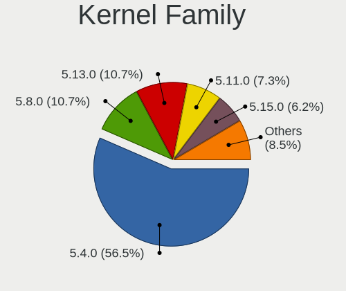

| Version | Notebooks | Percent |
|---------|-----------|---------|
| 5.4.0   | 99        | 57.89%  |
| 5.8.0   | 19        | 11.11%  |
| 5.13.0  | 19        | 11.11%  |
| 5.11.0  | 13        | 7.6%    |
| 5.15.0  | 7         | 4.09%   |
| 5.6.0   | 3         | 1.75%   |
| 5.3.0   | 2         | 1.17%   |
| 5.9.0   | 1         | 0.58%   |
| 5.8.11  | 1         | 0.58%   |
| 5.6.7   | 1         | 0.58%   |
| 5.5.0   | 1         | 0.58%   |
| 5.16.14 | 1         | 0.58%   |
| 5.15.11 | 1         | 0.58%   |
| 5.12.0  | 1         | 0.58%   |
| 5.10.11 | 1         | 0.58%   |
| 5.10.0  | 1         | 0.58%   |

Kernel Major Ver.
-----------------

Linux kernel major version

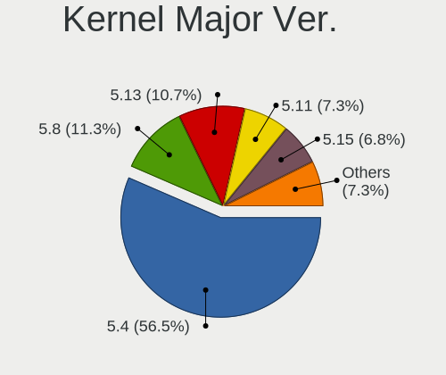

| Version | Notebooks | Percent |
|---------|-----------|---------|
| 5.4     | 99        | 57.89%  |
| 5.8     | 20        | 11.7%   |
| 5.13    | 19        | 11.11%  |
| 5.11    | 13        | 7.6%    |
| 5.15    | 8         | 4.68%   |
| 5.6     | 4         | 2.34%   |
| 5.3     | 2         | 1.17%   |
| 5.10    | 2         | 1.17%   |
| 5.9     | 1         | 0.58%   |
| 5.5     | 1         | 0.58%   |
| 5.16    | 1         | 0.58%   |
| 5.12    | 1         | 0.58%   |

Arch
----

OS architecture (x86_64, i586, etc.)

| Name   | Notebooks | Percent |
|--------|-----------|---------|
| x86_64 | 167       | 100%    |

DE
--

Desktop Environment

| Name   | Notebooks | Percent |
|--------|-----------|---------|
| Budgie | 164       | 98.2%   |
| GNOME  | 2         | 1.2%    |
| XFCE   | 1         | 0.6%    |

Display Server
--------------

X11 or Wayland

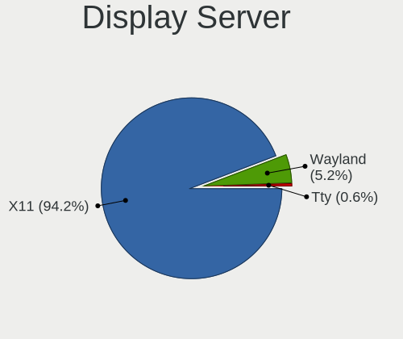

| Name    | Notebooks | Percent |
|---------|-----------|---------|
| X11     | 160       | 95.24%  |
| Wayland | 7         | 4.17%   |
| Tty     | 1         | 0.6%    |

Display Manager
---------------

SDDM, LightDM, etc.

| Name    | Notebooks | Percent |
|---------|-----------|---------|
| Unknown | 62        | 36.9%   |
| LightDM | 47        | 27.98%  |
| TDM     | 33        | 19.64%  |
| GDM     | 22        | 13.1%   |
| GDM3    | 4         | 2.38%   |

OS Lang
-------

Language

| Lang    | Notebooks | Percent |
|---------|-----------|---------|
| en_US   | 47        | 27.98%  |
| de_DE   | 29        | 17.26%  |
| pt_BR   | 14        | 8.33%   |
| fr_FR   | 12        | 7.14%   |
| en_GB   | 11        | 6.55%   |
| en_CA   | 7         | 4.17%   |
| ru_RU   | 6         | 3.57%   |
| en_IN   | 5         | 2.98%   |
| it_IT   | 3         | 1.79%   |
| es_ES   | 3         | 1.79%   |
| C       | 3         | 1.79%   |
| pt_PT   | 2         | 1.19%   |
| hu_HU   | 2         | 1.19%   |
| fi_FI   | 2         | 1.19%   |
| es_MX   | 2         | 1.19%   |
| es_AR   | 2         | 1.19%   |
| en_AU   | 2         | 1.19%   |
| de_CH   | 2         | 1.19%   |
| zh_CN   | 1         | 0.6%    |
| pl_PL   | 1         | 0.6%    |
| nl_NL   | 1         | 0.6%    |
| nb_NO   | 1         | 0.6%    |
| id_ID   | 1         | 0.6%    |
| fr_CH   | 1         | 0.6%    |
| es_US   | 1         | 0.6%    |
| es_SV   | 1         | 0.6%    |
| es_GT   | 1         | 0.6%    |
| es_CL   | 1         | 0.6%    |
| en_SG   | 1         | 0.6%    |
| de_AT   | 1         | 0.6%    |
| ca_ES   | 1         | 0.6%    |
| Unknown | 1         | 0.6%    |

Boot Mode
---------

EFI or BIOS

| Mode | Notebooks | Percent |
|------|-----------|---------|
| EFI  | 121       | 70.76%  |
| BIOS | 50        | 29.24%  |

Filesystem
----------

Type of filesystem

| Type    | Notebooks | Percent |
|---------|-----------|---------|
| Ext4    | 156       | 93.41%  |
| Zfs     | 5         | 2.99%   |
| Overlay | 3         | 1.8%    |
| Xfs     | 1         | 0.6%    |
| Jfs     | 1         | 0.6%    |
| Btrfs   | 1         | 0.6%    |

Part. scheme
------------

Scheme of partitioning

| Type    | Notebooks | Percent |
|---------|-----------|---------|
| Unknown | 77        | 45.83%  |
| GPT     | 70        | 41.67%  |
| MBR     | 21        | 12.5%   |

Dual Boot with Linux/BSD
------------------------

Hosting more than one Linux/BSD

| Dual boot | Notebooks | Percent |
|-----------|-----------|---------|
| No        | 153       | 90.53%  |
| Yes       | 16        | 9.47%   |

Dual Boot (Win)
---------------

Hosting Linux and Windows

| Dual boot | Notebooks | Percent |
|-----------|-----------|---------|
| No        | 116       | 69.46%  |
| Yes       | 51        | 30.54%  |

Board
-----

Vendor
------

Motherboard manufacturer

| Name                | Notebooks | Percent |
|---------------------|-----------|---------|
| TUXEDO              | 29        | 17.37%  |
| Hewlett-Packard     | 29        | 17.37%  |
| Lenovo              | 24        | 14.37%  |
| Dell                | 22        | 13.17%  |
| ASUSTek Computer    | 16        | 9.58%   |
| Acer                | 14        | 8.38%   |
| MSI                 | 9         | 5.39%   |
| Apple               | 6         | 3.59%   |
| Samsung Electronics | 4         | 2.4%    |
| Sony                | 2         | 1.2%    |
| HUAWEI              | 2         | 1.2%    |
| Unknown             | 2         | 1.2%    |
| Toshiba             | 1         | 0.6%    |
| Standard            | 1         | 0.6%    |
| Razer               | 1         | 0.6%    |
| Quanta              | 1         | 0.6%    |
| Packard Bell        | 1         | 0.6%    |
| Gigabyte Technology | 1         | 0.6%    |
| Fujitsu             | 1         | 0.6%    |
| Alienware           | 1         | 0.6%    |

Model
-----

Motherboard model

| Name                                                  | Notebooks | Percent |
|-------------------------------------------------------|-----------|---------|
| Unknown                                               | 6         | 3.59%   |
| TUXEDO Pulse 15 Gen1                                  | 2         | 1.2%    |
| TUXEDO Polaris 15 AMD Gen1                            | 2         | 1.2%    |
| TUXEDO InfinityBook S 15 Gen6                         | 2         | 1.2%    |
| TUXEDO InfinityBook S 14 Gen6                         | 2         | 1.2%    |
| TUXEDO InfinityBook Pro 14 Gen6                       | 2         | 1.2%    |
| HP ZBook Studio G3                                    | 2         | 1.2%    |
| HP Pavilion g6                                        | 2         | 1.2%    |
| HP Notebook                                           | 2         | 1.2%    |
| Dell Latitude 5400                                    | 2         | 1.2%    |
| Acer TravelMate P446-M                                | 2         | 1.2%    |
| TUXEDO Stellaris Intel Gen3 (TGL)                     | 1         | 0.6%    |
| TUXEDO Stellaris AMD Gen3 (CZN)                       | 1         | 0.6%    |
| TUXEDO Polaris AMD Gen3 (CZN)                         | 1         | 0.6%    |
| TUXEDO Polaris 17 AMD Gen1                            | 1         | 0.6%    |
| TUXEDO Polaris (CML/Gen2)                             | 1         | 0.6%    |
| TUXEDO P95_HR                                         | 1         | 0.6%    |
| TUXEDO P95_HP                                         | 1         | 0.6%    |
| TUXEDO P7xxTM1                                        | 1         | 0.6%    |
| TUXEDO InfinityBook_Pro13_14_v4                       | 1         | 0.6%    |
| TUXEDO InfinityBook S 14 v5                           | 1         | 0.6%    |
| TUXEDO InfinityBook Pro 15 v4                         | 1         | 0.6%    |
| TUXEDO Book_XA1510                                    | 1         | 0.6%    |
| TUXEDO Book XP1511                                    | 1         | 0.6%    |
| TUXEDO Book XP15 / XP17 Gen12                         | 1         | 0.6%    |
| TUXEDO Aura 15 Gen1                                   | 1         | 0.6%    |
| Toshiba Satellite P300                                | 1         | 0.6%    |
| Standard MT40II                                       | 1         | 0.6%    |
| Sony VPCCW25FL                                        | 1         | 0.6%    |
| Sony SVS13A25PBS                                      | 1         | 0.6%    |
| Samsung 905S3G/906S3G/915S3G/9305SG                   | 1         | 0.6%    |
| Samsung 530U3C/530U4C/532U3C                          | 1         | 0.6%    |
| Samsung 340XAA/350XAA/550XAA                          | 1         | 0.6%    |
| Samsung 300E5EV/300E4EV/270E5EV/270E4EV/2470EV/2470EE | 1         | 0.6%    |
| Razer Blade Stealth                                   | 1         | 0.6%    |
| Quanta R460-L.BG22P1                                  | 1         | 0.6%    |
| Packard Bell ENLE11BZ                                 | 1         | 0.6%    |
| MSI Vector GP66 12UGS                                 | 1         | 0.6%    |
| MSI Prestige 15 A10SC                                 | 1         | 0.6%    |
| MSI Modern 14 A10RB                                   | 1         | 0.6%    |

Model Family
------------

Motherboard model prefix

| Name                  | Notebooks | Percent |
|-----------------------|-----------|---------|
| Lenovo ThinkPad       | 16        | 9.58%   |
| Dell Latitude         | 10        | 5.99%   |
| Acer Aspire           | 10        | 5.99%   |
| TUXEDO InfinityBook   | 9         | 5.39%   |
| HP EliteBook          | 7         | 4.19%   |
| Dell Inspiron         | 7         | 4.19%   |
| HP Pavilion           | 6         | 3.59%   |
| Unknown               | 6         | 3.59%   |
| TUXEDO Polaris        | 5         | 2.99%   |
| HP Laptop             | 4         | 2.4%    |
| TUXEDO Book           | 3         | 1.8%    |
| Lenovo IdeaPad        | 3         | 1.8%    |
| HP ProBook            | 3         | 1.8%    |
| Dell XPS              | 3         | 1.8%    |
| TUXEDO Stellaris      | 2         | 1.2%    |
| TUXEDO Pulse          | 2         | 1.2%    |
| TUXEDO P95            | 2         | 1.2%    |
| HP ZBook              | 2         | 1.2%    |
| HP Notebook           | 2         | 1.2%    |
| HP ENVY               | 2         | 1.2%    |
| Acer TravelMate       | 2         | 1.2%    |
| Acer Swift            | 2         | 1.2%    |
| TUXEDO P7xxTM1        | 1         | 0.6%    |
| TUXEDO Aura           | 1         | 0.6%    |
| Toshiba Satellite     | 1         | 0.6%    |
| Standard MT40II       | 1         | 0.6%    |
| Sony VPCCW25FL        | 1         | 0.6%    |
| Sony SVS13A25PBS      | 1         | 0.6%    |
| Samsung 905S3G        | 1         | 0.6%    |
| Samsung 530U3C        | 1         | 0.6%    |
| Samsung 340XAA        | 1         | 0.6%    |
| Samsung 300E5EV       | 1         | 0.6%    |
| Razer Blade           | 1         | 0.6%    |
| Quanta R460-L.BG22P1  | 1         | 0.6%    |
| Packard Bell ENLE11BZ | 1         | 0.6%    |
| MSI Vector            | 1         | 0.6%    |
| MSI Prestige          | 1         | 0.6%    |
| MSI Modern            | 1         | 0.6%    |
| MSI GP73              | 1         | 0.6%    |
| MSI GP72              | 1         | 0.6%    |

MFG Year
--------

Motherboard manufacture year

| Year | Notebooks | Percent |
|------|-----------|---------|
| 2020 | 23        | 13.77%  |
| 2019 | 22        | 13.17%  |
| 2018 | 19        | 11.38%  |
| 2012 | 15        | 8.98%   |
| 2016 | 14        | 8.38%   |
| 2011 | 12        | 7.19%   |
| 2021 | 11        | 6.59%   |
| 2017 | 11        | 6.59%   |
| 2015 | 8         | 4.79%   |
| 2014 | 8         | 4.79%   |
| 2013 | 7         | 4.19%   |
| 2008 | 6         | 3.59%   |
| 2010 | 5         | 2.99%   |
| 2009 | 5         | 2.99%   |
| 2022 | 1         | 0.6%    |

Form Factor
-----------

Physical design of the computer

| Name     | Notebooks | Percent |
|----------|-----------|---------|
| Notebook | 167       | 100%    |

Secure Boot
-----------

Enabled or disabled

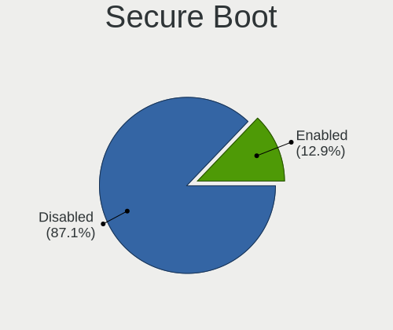

| State    | Notebooks | Percent |
|----------|-----------|---------|
| Disabled | 145       | 86.83%  |
| Enabled  | 22        | 13.17%  |

Coreboot
--------

Have coreboot on board

| Used | Notebooks | Percent |
|------|-----------|---------|
| No   | 167       | 100%    |

RAM Size
--------

Total RAM memory

| Size in GB  | Notebooks | Percent |
|-------------|-----------|---------|
| 4.01-8.0    | 49        | 28.99%  |
| 16.01-24.0  | 37        | 21.89%  |
| 8.01-16.0   | 28        | 16.57%  |
| 32.01-64.0  | 22        | 13.02%  |
| 3.01-4.0    | 21        | 12.43%  |
| 64.01-256.0 | 6         | 3.55%   |
| 24.01-32.0  | 2         | 1.18%   |
| 2.01-3.0    | 2         | 1.18%   |
| 1.01-2.0    | 2         | 1.18%   |

RAM Used
--------

Used RAM memory

| Used GB    | Notebooks | Percent |
|------------|-----------|---------|
| 2.01-3.0   | 49        | 27.84%  |
| 1.01-2.0   | 44        | 25%     |
| 4.01-8.0   | 38        | 21.59%  |
| 3.01-4.0   | 35        | 19.89%  |
| 8.01-16.0  | 9         | 5.11%   |
| 16.01-24.0 | 1         | 0.57%   |

Total Drives
------------

Number of drives on board

| Drives | Notebooks | Percent |
|--------|-----------|---------|
| 1      | 121       | 72.46%  |
| 2      | 42        | 25.15%  |
| 3      | 4         | 2.4%    |

Has CD-ROM
----------

Has CD-ROM on board

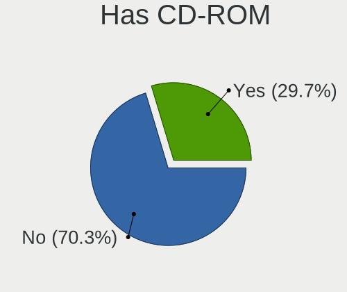

| Presented | Notebooks | Percent |
|-----------|-----------|---------|
| No        | 120       | 71.43%  |
| Yes       | 48        | 28.57%  |

Has Ethernet
------------

Has Ethernet on board

| Presented | Notebooks | Percent |
|-----------|-----------|---------|
| Yes       | 142       | 84.52%  |
| No        | 26        | 15.48%  |

Has WiFi
--------

Has WiFi module

| Presented | Notebooks | Percent |
|-----------|-----------|---------|
| Yes       | 167       | 100%    |

Has Bluetooth
-------------

Has Bluetooth module

| Presented | Notebooks | Percent |
|-----------|-----------|---------|
| Yes       | 143       | 85.12%  |
| No        | 25        | 14.88%  |

Location
--------

Country
-------

Geographic location (country)

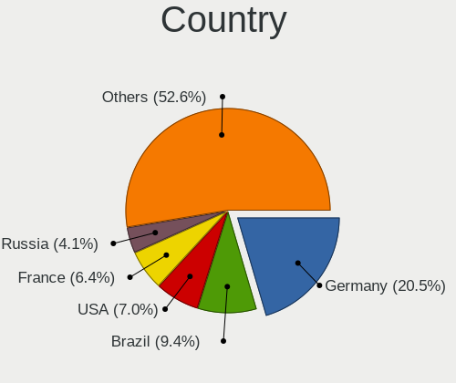

| Country            | Notebooks | Percent |
|--------------------|-----------|---------|
| Germany            | 34        | 20.36%  |
| Brazil             | 15        | 8.98%   |
| USA                | 12        | 7.19%   |
| France             | 11        | 6.59%   |
| Russia             | 7         | 4.19%   |
| Italy              | 6         | 3.59%   |
| Spain              | 5         | 2.99%   |
| Poland             | 5         | 2.99%   |
| India              | 5         | 2.99%   |
| Canada             | 5         | 2.99%   |
| UK                 | 4         | 2.4%    |
| Netherlands        | 4         | 2.4%    |
| Finland            | 4         | 2.4%    |
| Ukraine            | 3         | 1.8%    |
| Portugal           | 3         | 1.8%    |
| Mexico             | 3         | 1.8%    |
| Iran               | 3         | 1.8%    |
| Hungary            | 3         | 1.8%    |
| Turkey             | 2         | 1.2%    |
| Switzerland        | 2         | 1.2%    |
| South Africa       | 2         | 1.2%    |
| Norway             | 2         | 1.2%    |
| Japan              | 2         | 1.2%    |
| Indonesia          | 2         | 1.2%    |
| Colombia           | 2         | 1.2%    |
| Austria            | 2         | 1.2%    |
| Australia          | 2         | 1.2%    |
| Argentina          | 2         | 1.2%    |
| Sweden             | 1         | 0.6%    |
| Slovenia           | 1         | 0.6%    |
| Singapore          | 1         | 0.6%    |
| Malaysia           | 1         | 0.6%    |
| Kenya              | 1         | 0.6%    |
| Hong Kong          | 1         | 0.6%    |
| Honduras           | 1         | 0.6%    |
| Guatemala          | 1         | 0.6%    |
| Ghana              | 1         | 0.6%    |
| El Salvador        | 1         | 0.6%    |
| Ecuador            | 1         | 0.6%    |
| Dominican Republic | 1         | 0.6%    |

City
----

Geographic location (city)

| City           | Notebooks | Percent |
|----------------|-----------|---------|
| Sao Paulo      | 4         | 2.35%   |
| Ravensburg     | 4         | 2.35%   |
| Tehran         | 3         | 1.76%   |
| Munich         | 3         | 1.76%   |
| Moscow         | 3         | 1.76%   |
| Budapest       | 3         | 1.76%   |
| Wolfsburg      | 2         | 1.18%   |
| Stuttgart      | 2         | 1.18%   |
| Paris          | 2         | 1.18%   |
| Montreal       | 2         | 1.18%   |
| Lisbon         | 2         | 1.18%   |
| Kyiv           | 2         | 1.18%   |
| Istanbul       | 2         | 1.18%   |
| Hamburg        | 2         | 1.18%   |
| Cologne        | 2         | 1.18%   |
| Braslia      | 2         | 1.18%   |
| Berlin         | 2         | 1.18%   |
| Belo Horizonte | 2         | 1.18%   |
| Zurich         | 1         | 0.59%   |
| Zagreb         | 1         | 0.59%   |
| Yuma           | 1         | 0.59%   |
| Woking         | 1         | 0.59%   |
| Waterloo       | 1         | 0.59%   |
| Warsaw         | 1         | 0.59%   |
| Waiblingen     | 1         | 0.59%   |
| Vista Serrana  | 1         | 0.59%   |
| Vienna         | 1         | 0.59%   |
| Vernier        | 1         | 0.59%   |
| Vendelso       | 1         | 0.59%   |
| Vantaa         | 1         | 0.59%   |
| Vancouver      | 1         | 0.59%   |
| Valros         | 1         | 0.59%   |
| Usingen        | 1         | 0.59%   |
| Udine          | 1         | 0.59%   |
| Tuscola        | 1         | 0.59%   |
| Turku          | 1         | 0.59%   |
| Trzin          | 1         | 0.59%   |
| Totana         | 1         | 0.59%   |
| Tooele         | 1         | 0.59%   |
| Tokyo          | 1         | 0.59%   |

Drives
------

Drive Vendor
------------

Hard drive vendors

| Vendor                    | Notebooks | Drives  | Percent |
|---------------------------|-----------|---------|---------|
| Samsung Electronics       | 57        | 72      | 27.27%  |
| Seagate                   | 24        | 25      | 11.48%  |
| Toshiba                   | 21        | 25      | 10.05%  |
| WDC                       | 16        | 18      | 7.66%   |
| SanDisk                   | 11        | 12      | 5.26%   |
| Unknown                   | 9         | 10      | 4.31%   |
| Kingston                  | 8         | 9       | 3.83%   |
| SK hynix                  | 7         | 7       | 3.35%   |
| Intel                     | 7         | 9       | 3.35%   |
| Crucial                   | 7         | 7       | 3.35%   |
| Micron Technology         | 6         | 7       | 2.87%   |
| HGST                      | 6         | 9       | 2.87%   |
| Hitachi                   | 4         | 4       | 1.91%   |
| A-DATA Technology         | 4         | 5       | 1.91%   |
| PNY                       | 3         | 5       | 1.44%   |
| Apple                     | 3         | 3       | 1.44%   |
| LITEON                    | 2         | 2       | 0.96%   |
| China                     | 2         | 2       | 0.96%   |
| Vaseky                    | 1         | 1       | 0.48%   |
| USB30                     | 1         | 1       | 0.48%   |
| Realtek Semiconductor     | 1         | 1       | 0.48%   |
| Patriot                   | 1         | 1       | 0.48%   |
| Micron/Crucial Technology | 1         | 1       | 0.48%   |
| LaCie                     | 1         | 1       | 0.48%   |
| KingSpec                  | 1         | 1       | 0.48%   |
| KimMiDi                   | 1         | 1       | 0.48%   |
| Hewlett-Packard           | 1         | Unknown | 0.48%   |
| GALAX TA                  | 1         | 1       | 0.48%   |
| FORESEE                   | 1         | 1       | 0.48%   |
| Corsair                   | 1         | 1       | 0.48%   |

Drive Model
-----------

Hard drive models

| Model                               | Notebooks | Percent |
|-------------------------------------|-----------|---------|
| Toshiba MQ01ABD100 1TB              | 4         | 1.85%   |
| Samsung SSD 970 EVO Plus 1TB        | 4         | 1.85%   |
| Samsung NVMe SSD Drive 500GB        | 4         | 1.85%   |
| Seagate ST1000LM035-1RK172 1TB      | 3         | 1.39%   |
| Seagate ST1000LM024 HN-M101MBB 1TB  | 3         | 1.39%   |
| Samsung SSD 970 EVO Plus 500GB      | 3         | 1.39%   |
| Samsung SSD 860 EVO M.2 250GB       | 3         | 1.39%   |
| Samsung SSD 750 EVO 250GB           | 3         | 1.39%   |
| Samsung NVMe SSD Drive 250GB        | 3         | 1.39%   |
| Samsung NVMe SSD Drive 1TB          | 3         | 1.39%   |
| WDC WD10SPZX-60Z10T0 1TB            | 2         | 0.93%   |
| Unknown MMC Card  32GB              | 2         | 0.93%   |
| SK hynix NVMe SSD Drive 256GB       | 2         | 0.93%   |
| Seagate ST9500325AS 500GB           | 2         | 0.93%   |
| Seagate ST1000LX015-1U7172 1TB      | 2         | 0.93%   |
| Seagate ST1000LM048-2E7172 1TB      | 2         | 0.93%   |
| Seagate BUP Slim BK 1TB             | 2         | 0.93%   |
| SanDisk SSD PLUS 120GB              | 2         | 0.93%   |
| SanDisk NVMe SSD Drive 512GB        | 2         | 0.93%   |
| Samsung SSD 980 PRO 1TB             | 2         | 0.93%   |
| Samsung SSD 970 EVO 500GB           | 2         | 0.93%   |
| Samsung SSD 860 EVO M.2 500GB       | 2         | 0.93%   |
| Samsung SSD 860 EVO 500GB           | 2         | 0.93%   |
| Samsung NVMe SSD Drive 2TB          | 2         | 0.93%   |
| Samsung MZVLB256HAHQ-00000 256GB    | 2         | 0.93%   |
| Micron 1100_MTFDDAV256TBN 256GB SSD | 2         | 0.93%   |
| Hitachi HTS545050A7E380 500GB       | 2         | 0.93%   |
| HGST HTS725050A7E630 500GB          | 2         | 0.93%   |
| Crucial CT250MX500SSD1 250GB        | 2         | 0.93%   |
| WDC WDS500G2B0A-00SM50 500GB SSD    | 1         | 0.46%   |
| WDC WDS240G2G0A-00JH30 240GB SSD    | 1         | 0.46%   |
| WDC WDS120G2G0B-00EPW0 120GB SSD    | 1         | 0.46%   |
| WDC WD5000LPCX-60VHAT0 500GB        | 1         | 0.46%   |
| WDC WD1600BEVS-08VAT2 160GB         | 1         | 0.46%   |
| WDC WD10SPZX-75Z10T2 1TB            | 1         | 0.46%   |
| WDC WD10SPZX-35Z10T0 1TB            | 1         | 0.46%   |
| WDC WD10SPZX-24Z10 1TB              | 1         | 0.46%   |
| WDC WD10SPZX-21Z10T0 1TB            | 1         | 0.46%   |
| WDC WD10SPZX-17Z10T0 1TB            | 1         | 0.46%   |
| WDC WD10JPVX-22JC3T0 1TB            | 1         | 0.46%   |

HDD Vendor
----------

Hard disk drive vendors

| Vendor  | Notebooks | Drives | Percent |
|---------|-----------|--------|---------|
| Seagate | 22        | 23     | 37.93%  |
| Toshiba | 15        | 17     | 25.86%  |
| WDC     | 10        | 12     | 17.24%  |
| HGST    | 6         | 9      | 10.34%  |
| Hitachi | 4         | 4      | 6.9%    |
| Unknown | 1         | 1      | 1.72%   |

SSD Vendor
----------

Solid state drive vendors

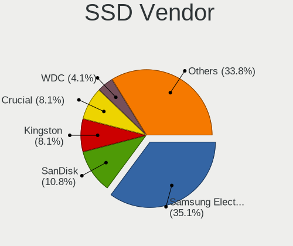

| Vendor              | Notebooks | Drives | Percent |
|---------------------|-----------|--------|---------|
| Samsung Electronics | 26        | 32     | 35.62%  |
| SanDisk             | 8         | 8      | 10.96%  |
| Kingston            | 6         | 6      | 8.22%   |
| Crucial             | 6         | 6      | 8.22%   |
| WDC                 | 3         | 3      | 4.11%   |
| PNY                 | 3         | 5      | 4.11%   |
| Micron Technology   | 3         | 4      | 4.11%   |
| A-DATA Technology   | 3         | 4      | 4.11%   |
| LITEON              | 2         | 2      | 2.74%   |
| China               | 2         | 2      | 2.74%   |
| Apple               | 2         | 2      | 2.74%   |
| Vaseky              | 1         | 1      | 1.37%   |
| USB30               | 1         | 1      | 1.37%   |
| Toshiba             | 1         | 1      | 1.37%   |
| SK hynix            | 1         | 1      | 1.37%   |
| Seagate             | 1         | 1      | 1.37%   |
| Patriot             | 1         | 1      | 1.37%   |
| KingSpec            | 1         | 1      | 1.37%   |
| Intel               | 1         | 1      | 1.37%   |
| FORESEE             | 1         | 1      | 1.37%   |

Drive Kind
----------

HDD or SSD

| Kind    | Notebooks | Drives | Percent |
|---------|-----------|--------|---------|
| SSD     | 69        | 83     | 34.5%   |
| NVMe    | 64        | 81     | 32%     |
| HDD     | 55        | 66     | 27.5%   |
| MMC     | 7         | 8      | 3.5%    |
| Unknown | 5         | 4      | 2.5%    |

Drive Connector
---------------

SATA, SAS, NVMe, etc.

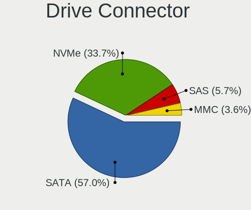

| Type | Notebooks | Drives | Percent |
|------|-----------|--------|---------|
| SATA | 107       | 145    | 57.22%  |
| NVMe | 64        | 81     | 34.22%  |
| SAS  | 9         | 8      | 4.81%   |
| MMC  | 7         | 8      | 3.74%   |

Drive Size
----------

Size of hard drive

| Size in TB | Notebooks | Drives | Percent |
|------------|-----------|--------|---------|
| 0.01-0.5   | 77        | 94     | 64.71%  |
| 0.51-1.0   | 39        | 51     | 32.77%  |
| 1.01-2.0   | 3         | 4      | 2.52%   |

Space Total
-----------

Amount of disk space available on the file system

| Size in GB     | Notebooks | Percent |
|----------------|-----------|---------|
| 101-250        | 55        | 32.54%  |
| 251-500        | 49        | 28.99%  |
| 501-1000       | 29        | 17.16%  |
| 51-100         | 10        | 5.92%   |
| 1001-2000      | 9         | 5.33%   |
| 21-50          | 8         | 4.73%   |
| 2001-3000      | 3         | 1.78%   |
| Unknown        | 3         | 1.78%   |
| 1-20           | 2         | 1.18%   |
| More than 3000 | 1         | 0.59%   |

Space Used
----------

Amount of used disk space

| Used GB   | Notebooks | Percent |
|-----------|-----------|---------|
| 1-20      | 48        | 27.59%  |
| 101-250   | 40        | 22.99%  |
| 21-50     | 32        | 18.39%  |
| 51-100    | 25        | 14.37%  |
| 251-500   | 17        | 9.77%   |
| 501-1000  | 7         | 4.02%   |
| Unknown   | 3         | 1.72%   |
| 1001-2000 | 2         | 1.15%   |

Malfunc. Drives
---------------

Drive models with a malfunction

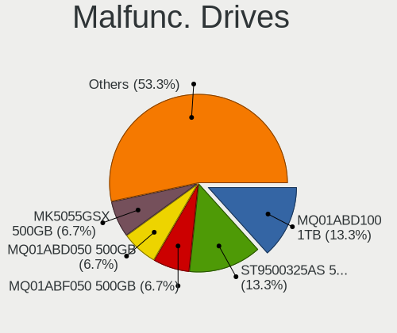

| Model                                | Notebooks | Drives | Percent |
|--------------------------------------|-----------|--------|---------|
| Toshiba MQ01ABD100 1TB               | 2         | 2      | 14.29%  |
| Toshiba MQ01ABF050 500GB             | 1         | 1      | 7.14%   |
| Toshiba MQ01ABD050 500GB             | 1         | 1      | 7.14%   |
| Toshiba MK5055GSX 500GB              | 1         | 1      | 7.14%   |
| Toshiba MK2561GSYN 250GB             | 1         | 1      | 7.14%   |
| Seagate ST9750420AS 752GB            | 1         | 1      | 7.14%   |
| Seagate ST9500423AS 500GB            | 1         | 1      | 7.14%   |
| Seagate ST9500325AS 500GB            | 1         | 1      | 7.14%   |
| Seagate ST500LX012-1LM162-SSHD 500GB | 1         | 1      | 7.14%   |
| Seagate ST1000LM024 HN-M101MBB 1TB   | 1         | 1      | 7.14%   |
| PNY SSD2SC120G3LC709B121-460I 120GB  | 1         | 1      | 7.14%   |
| HGST HTS725032A7E630 320GB           | 1         | 2      | 7.14%   |
| Crucial CT500P1SSD8 500GB            | 1         | 1      | 7.14%   |

Malfunc. Drive Vendor
---------------------

Vendors of faulty drives

| Vendor  | Notebooks | Drives | Percent |
|---------|-----------|--------|---------|
| Toshiba | 6         | 6      | 42.86%  |
| Seagate | 5         | 5      | 35.71%  |
| PNY     | 1         | 1      | 7.14%   |
| HGST    | 1         | 2      | 7.14%   |
| Crucial | 1         | 1      | 7.14%   |

Malfunc. HDD Vendor
-------------------

Vendors of faulty HDD drives

| Vendor  | Notebooks | Drives | Percent |
|---------|-----------|--------|---------|
| Toshiba | 6         | 6      | 50%     |
| Seagate | 5         | 5      | 41.67%  |
| HGST    | 1         | 2      | 8.33%   |

Malfunc. Drive Kind
-------------------

Kinds of faulty drives

| Kind | Notebooks | Drives | Percent |
|------|-----------|--------|---------|
| HDD  | 12        | 13     | 85.71%  |
| NVMe | 1         | 1      | 7.14%   |
| SSD  | 1         | 1      | 7.14%   |

Failed Drives
-------------

Failed drive models

Zero info for selected period =(

Failed Drive Vendor
-------------------

Failed drive vendors

Zero info for selected period =(

Drive Status
------------

Number of failed and malfunc. drives

| Status   | Notebooks | Drives | Percent |
|----------|-----------|--------|---------|
| Detected | 84        | 117    | 46.67%  |
| Works    | 82        | 110    | 45.56%  |
| Malfunc  | 14        | 15     | 7.78%   |

Storage controller
------------------

Storage Vendor
--------------

Storage controller vendors

| Vendor                       | Notebooks | Percent |
|------------------------------|-----------|---------|
| Intel                        | 123       | 60.89%  |
| Samsung Electronics          | 36        | 17.82%  |
| AMD                          | 13        | 6.44%   |
| SK hynix                     | 6         | 2.97%   |
| SanDisk                      | 6         | 2.97%   |
| Toshiba America Info Systems | 5         | 2.48%   |
| Micron Technology            | 3         | 1.49%   |
| Realtek Semiconductor        | 2         | 0.99%   |
| Micron/Crucial Technology    | 2         | 0.99%   |
| Kingston Technology Company  | 2         | 0.99%   |
| Silicon Motion               | 1         | 0.5%    |
| Phison Electronics           | 1         | 0.5%    |
| Apple                        | 1         | 0.5%    |
| ADATA Technology             | 1         | 0.5%    |

Storage Model
-------------

Storage controller models

| Model                                                                            | Notebooks | Percent |
|----------------------------------------------------------------------------------|-----------|---------|
| Samsung NVMe SSD Controller SM981/PM981/PM983                                    | 25        | 11.85%  |
| Intel Sunrise Point-LP SATA Controller [AHCI mode]                               | 20        | 9.48%   |
| Intel 7 Series Chipset Family 6-port SATA Controller [AHCI mode]                 | 16        | 7.58%   |
| AMD FCH SATA Controller [AHCI mode]                                              | 13        | 6.16%   |
| Intel 6 Series/C200 Series Chipset Family 6 port Mobile SATA AHCI Controller     | 12        | 5.69%   |
| Intel 82801 Mobile SATA Controller [RAID mode]                                   | 8         | 3.79%   |
| Intel Cannon Point-LP SATA Controller [AHCI Mode]                                | 7         | 3.32%   |
| Intel 8 Series SATA Controller 1 [AHCI mode]                                     | 7         | 3.32%   |
| Intel Comet Lake SATA AHCI Controller                                            | 5         | 2.37%   |
| Intel 82801IBM/IEM (ICH9M/ICH9M-E) 4 port SATA Controller [AHCI mode]            | 5         | 2.37%   |
| Intel 400 Series Chipset Family SATA AHCI Controller                             | 5         | 2.37%   |
| Samsung NVMe SSD Controller PM9A1/PM9A3/980PRO                                   | 4         | 1.9%    |
| Samsung NVMe SSD Controller 980                                                  | 4         | 1.9%    |
| Intel SSD 660P Series                                                            | 4         | 1.9%    |
| Intel HM170/QM170 Chipset SATA Controller [AHCI Mode]                            | 4         | 1.9%    |
| Intel 8 Series/C220 Series Chipset Family 6-port SATA Controller 1 [AHCI mode]   | 4         | 1.9%    |
| Intel 5 Series/3400 Series Chipset 6 port SATA AHCI Controller                   | 4         | 1.9%    |
| Toshiba America Info Systems BG3 NVMe SSD Controller                             | 3         | 1.42%   |
| Micron Non-Volatile memory controller                                            | 3         | 1.42%   |
| Intel Wildcat Point-LP SATA Controller [AHCI Mode]                               | 3         | 1.42%   |
| Intel Volume Management Device NVMe RAID Controller                              | 3         | 1.42%   |
| Intel Q170/Q150/B150/H170/H110/Z170/CM236 Chipset SATA Controller [AHCI Mode]    | 3         | 1.42%   |
| Intel Cannon Lake Mobile PCH SATA AHCI Controller                                | 3         | 1.42%   |
| Intel Atom/Celeron/Pentium Processor x5-E8000/J3xxx/N3xxx Series SATA Controller | 3         | 1.42%   |
| Intel 82801HM/HEM (ICH8M/ICH8M-E) SATA Controller [AHCI mode]                    | 3         | 1.42%   |
| Intel 82801HM/HEM (ICH8M/ICH8M-E) IDE Controller                                 | 3         | 1.42%   |
| SK hynix BC501 NVMe Solid State Drive                                            | 2         | 0.95%   |
| SanDisk WD Black SN750 / PC SN730 NVMe SSD                                       | 2         | 0.95%   |
| SanDisk PC SN520 NVMe SSD                                                        | 2         | 0.95%   |
| Samsung Electronics SATA controller                                              | 2         | 0.95%   |
| Realtek Realtek Non-Volatile memory controller                                   | 2         | 0.95%   |
| Intel Ice Lake-LP SATA Controller [AHCI mode]                                    | 2         | 0.95%   |
| Toshiba America Info Systems XG6 NVMe SSD Controller                             | 1         | 0.47%   |
| Toshiba America Info Systems XG5 NVMe SSD Controller                             | 1         | 0.47%   |
| SK hynix PC401 NVMe Solid State Drive 256GB                                      | 1         | 0.47%   |
| SK hynix Non-Volatile memory controller                                          | 1         | 0.47%   |
| SK hynix Gold P31/PC711 NVMe Solid State Drive                                   | 1         | 0.47%   |
| SK hynix BC511                                                                   | 1         | 0.47%   |
| Silicon Motion SM2263EN/SM2263XT SSD Controller                                  | 1         | 0.47%   |
| SanDisk WD Blue SN550 NVMe SSD                                                   | 1         | 0.47%   |

Storage Kind
------------

Kind of storage controller (IDE, SATA, NVMe, SAS, ...)

| Kind | Notebooks | Percent |
|------|-----------|---------|
| SATA | 123       | 60.29%  |
| NVMe | 66        | 32.35%  |
| RAID | 11        | 5.39%   |
| IDE  | 4         | 1.96%   |

Processor
---------

CPU Vendor
----------

Processor vendors

| Vendor | Notebooks | Percent |
|--------|-----------|---------|
| Intel  | 146       | 87.43%  |
| AMD    | 21        | 12.57%  |

CPU Model
---------

Processor models

| Model                                         | Notebooks | Percent |
|-----------------------------------------------|-----------|---------|
| Intel Core i7-8565U CPU @ 1.80GHz             | 7         | 4.19%   |
| Intel 11th Gen Core i7-1165G7 @ 2.80GHz       | 7         | 4.19%   |
| Intel Core i7-8550U CPU @ 1.80GHz             | 6         | 3.59%   |
| Intel Core i7-7500U CPU @ 2.70GHz             | 4         | 2.4%    |
| Intel Core i7-3520M CPU @ 2.90GHz             | 4         | 2.4%    |
| Intel Core i7-10510U CPU @ 1.80GHz            | 4         | 2.4%    |
| Intel Core i7-9750H CPU @ 2.60GHz             | 3         | 1.8%    |
| Intel Core i7-8750H CPU @ 2.20GHz             | 3         | 1.8%    |
| Intel Core i7-7700HQ CPU @ 2.80GHz            | 3         | 1.8%    |
| Intel Core i7-6500U CPU @ 2.50GHz             | 3         | 1.8%    |
| Intel Core i7-4500U CPU @ 1.80GHz             | 3         | 1.8%    |
| Intel Core i7-10750H CPU @ 2.60GHz            | 3         | 1.8%    |
| Intel Core i5-8265U CPU @ 1.60GHz             | 3         | 1.8%    |
| Intel Core i5-8250U CPU @ 1.60GHz             | 3         | 1.8%    |
| Intel Core i5-2520M CPU @ 2.50GHz             | 3         | 1.8%    |
| AMD Ryzen 5 4600H with Radeon Graphics        | 3         | 1.8%    |
| Intel Core i7-2670QM CPU @ 2.20GHz            | 2         | 1.2%    |
| Intel Core i7-10870H CPU @ 2.20GHz            | 2         | 1.2%    |
| Intel Core i5-8350U CPU @ 1.70GHz             | 2         | 1.2%    |
| Intel Core i5-7200U CPU @ 2.50GHz             | 2         | 1.2%    |
| Intel Core i5-5200U CPU @ 2.20GHz             | 2         | 1.2%    |
| Intel Core i5-2540M CPU @ 2.60GHz             | 2         | 1.2%    |
| Intel Core i5-10210U CPU @ 1.60GHz            | 2         | 1.2%    |
| Intel Core i5 CPU M 520 @ 2.40GHz             | 2         | 1.2%    |
| Intel Core i3-2310M CPU @ 2.10GHz             | 2         | 1.2%    |
| Intel Core i3-1005G1 CPU @ 1.20GHz            | 2         | 1.2%    |
| Intel Celeron CPU N3050 @ 1.60GHz             | 2         | 1.2%    |
| Intel 11th Gen Core i5-1135G7 @ 2.40GHz       | 2         | 1.2%    |
| AMD Ryzen 7 4800H with Radeon Graphics        | 2         | 1.2%    |
| AMD Ryzen 7 4700U with Radeon Graphics        | 2         | 1.2%    |
| AMD Ryzen 5 3500U with Radeon Vega Mobile Gfx | 2         | 1.2%    |
| Intel Pentium Silver N6000 @ 1.10GHz          | 1         | 0.6%    |
| Intel Pentium Dual-Core CPU T4500 @ 2.30GHz   | 1         | 0.6%    |
| Intel Pentium CPU N3710 @ 1.60GHz             | 1         | 0.6%    |
| Intel Pentium CPU N3700 @ 1.60GHz             | 1         | 0.6%    |
| Intel Pentium 3556U @ 1.70GHz                 | 1         | 0.6%    |
| Intel Genuine CPU U2300 @ 1.20GHz             | 1         | 0.6%    |
| Intel Core m5-6Y57 CPU @ 1.10GHz              | 1         | 0.6%    |
| Intel Core i7-8850H CPU @ 2.60GHz             | 1         | 0.6%    |
| Intel Core i7-8700 CPU @ 3.20GHz              | 1         | 0.6%    |

CPU Model Family
----------------

Processor model prefix

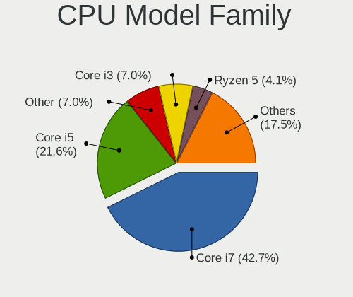

| Model                   | Notebooks | Percent |
|-------------------------|-----------|---------|
| Intel Core i7           | 72        | 43.11%  |
| Intel Core i5           | 36        | 21.56%  |
| Intel Core i3           | 12        | 7.19%   |
| Other                   | 11        | 6.59%   |
| AMD Ryzen 5             | 7         | 4.19%   |
| Intel Core 2 Duo        | 6         | 3.59%   |
| AMD Ryzen 7             | 6         | 3.59%   |
| Intel Pentium           | 3         | 1.8%    |
| AMD A6                  | 3         | 1.8%    |
| Intel Celeron           | 2         | 1.2%    |
| AMD Ryzen 9             | 2         | 1.2%    |
| Intel Pentium Silver    | 1         | 0.6%    |
| Intel Pentium Dual-Core | 1         | 0.6%    |
| Intel Genuine           | 1         | 0.6%    |
| Intel Core m5           | 1         | 0.6%    |
| AMD Quad-Core           | 1         | 0.6%    |
| AMD E                   | 1         | 0.6%    |
| AMD A8                  | 1         | 0.6%    |

CPU Cores
---------

Number of processor cores

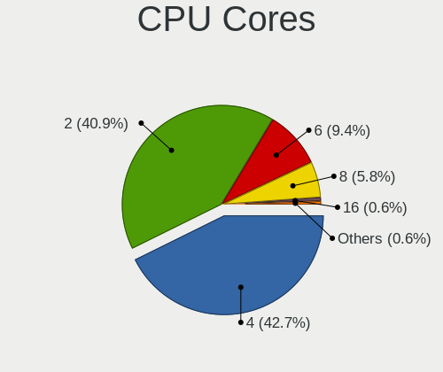

| Number | Notebooks | Percent |
|--------|-----------|---------|
| 4      | 72        | 43.11%  |
| 2      | 67        | 40.12%  |
| 6      | 16        | 9.58%   |
| 8      | 10        | 5.99%   |
| 16     | 1         | 0.6%    |
| 14     | 1         | 0.6%    |

CPU Sockets
-----------

Number of sockets

| Number | Notebooks | Percent |
|--------|-----------|---------|
| 1      | 167       | 100%    |

CPU Threads
-----------

Threads per core (Hyper-Threading)

| Number | Notebooks | Percent |
|--------|-----------|---------|
| 2      | 140       | 83.83%  |
| 1      | 27        | 16.17%  |

CPU Op-Modes
------------

CPU Operation Modes (32-bit, 64-bit)

| Op mode        | Notebooks | Percent |
|----------------|-----------|---------|
| 32-bit, 64-bit | 167       | 100%    |

CPU Microcode
-------------

Microcode number

| Number     | Notebooks | Percent |
|------------|-----------|---------|
| Unknown    | 18        | 10.47%  |
| 0x206a7    | 15        | 8.72%   |
| 0x306a9    | 13        | 7.56%   |
| 0x806ec    | 12        | 6.98%   |
| 0x906ea    | 9         | 5.23%   |
| 0x806ea    | 9         | 5.23%   |
| 0x806c1    | 9         | 5.23%   |
| 0x406e3    | 7         | 4.07%   |
| 0x40651    | 7         | 4.07%   |
| 0x806e9    | 6         | 3.49%   |
| 0xa0652    | 5         | 2.91%   |
| 0x306d4    | 5         | 2.91%   |
| 0x08600103 | 5         | 2.91%   |
| 0x906e9    | 4         | 2.33%   |
| 0x306c3    | 4         | 2.33%   |
| 0x10676    | 4         | 2.33%   |
| 0x806eb    | 3         | 1.74%   |
| 0x406c3    | 3         | 1.74%   |
| 0x1067a    | 3         | 1.74%   |
| 0x706e5    | 2         | 1.16%   |
| 0x506e3    | 2         | 1.16%   |
| 0x20655    | 2         | 1.16%   |
| 0x20652    | 2         | 1.16%   |
| 0x0a50000c | 2         | 1.16%   |
| 0x08108109 | 2         | 1.16%   |
| 0x0700010f | 2         | 1.16%   |
| 0xa0660    | 1         | 0.58%   |
| 0x906c0    | 1         | 0.58%   |
| 0x906a3    | 1         | 0.58%   |
| 0x806d1    | 1         | 0.58%   |
| 0x6fb      | 1         | 0.58%   |
| 0x406c4    | 1         | 0.58%   |
| 0x40661    | 1         | 0.58%   |
| 0x106e5    | 1         | 0.58%   |
| 0x08701013 | 1         | 0.58%   |
| 0x08608103 | 1         | 0.58%   |
| 0x08600106 | 1         | 0.58%   |
| 0x08600102 | 1         | 0.58%   |
| 0x0810100b | 1         | 0.58%   |
| 0x07030105 | 1         | 0.58%   |

CPU Microarch
-------------

Microarchitecture

| Name             | Notebooks | Percent |
|------------------|-----------|---------|
| KabyLake         | 52        | 31.14%  |
| SandyBridge      | 15        | 8.98%   |
| IvyBridge        | 14        | 8.38%   |
| Haswell          | 12        | 7.19%   |
| Zen 2            | 9         | 5.39%   |
| TigerLake        | 9         | 5.39%   |
| Skylake          | 9         | 5.39%   |
| Penryn           | 7         | 4.19%   |
| CometLake        | 7         | 4.19%   |
| Broadwell        | 5         | 2.99%   |
| Westmere         | 4         | 2.4%    |
| Silvermont       | 4         | 2.4%    |
| IceLake          | 4         | 2.4%    |
| Zen+             | 2         | 1.2%    |
| Zen 3            | 2         | 1.2%    |
| Jaguar           | 2         | 1.2%    |
| Zen              | 1         | 0.6%    |
| Tremont          | 1         | 0.6%    |
| Puma             | 1         | 0.6%    |
| Piledriver       | 1         | 0.6%    |
| Nehalem          | 1         | 0.6%    |
| Excavator        | 1         | 0.6%    |
| Core             | 1         | 0.6%    |
| Bobcat           | 1         | 0.6%    |
| Alderlake Hybrid | 1         | 0.6%    |
| Unknown          | 1         | 0.6%    |

Graphics
--------

GPU Vendor
----------

Vendors of graphics cards

| Vendor | Notebooks | Percent |
|--------|-----------|---------|
| Intel  | 135       | 59.73%  |
| Nvidia | 58        | 25.66%  |
| AMD    | 33        | 14.6%   |

GPU Model
---------

Graphics card models

| Model                                                                                    | Notebooks | Percent |
|------------------------------------------------------------------------------------------|-----------|---------|
| Intel 2nd Generation Core Processor Family Integrated Graphics Controller                | 14        | 6.11%   |
| Intel WhiskeyLake-U GT2 [UHD Graphics 620]                                               | 12        | 5.24%   |
| Intel 3rd Gen Core processor Graphics Controller                                         | 12        | 5.24%   |
| Intel UHD Graphics 620                                                                   | 11        | 4.8%    |
| Intel TigerLake-LP GT2 [Iris Xe Graphics]                                                | 9         | 3.93%   |
| Intel HD Graphics 620                                                                    | 8         | 3.49%   |
| AMD Renoir                                                                               | 8         | 3.49%   |
| Intel Haswell-ULT Integrated Graphics Controller                                         | 7         | 3.06%   |
| Intel CoffeeLake-H GT2 [UHD Graphics 630]                                                | 7         | 3.06%   |
| Intel CometLake-U GT2 [UHD Graphics]                                                     | 6         | 2.62%   |
| Intel CometLake-H GT2 [UHD Graphics]                                                     | 6         | 2.62%   |
| Intel Skylake GT2 [HD Graphics 520]                                                      | 5         | 2.18%   |
| Intel HD Graphics 630                                                                    | 5         | 2.18%   |
| Nvidia GA106M [GeForce RTX 3060 Mobile / Max-Q]                                          | 4         | 1.75%   |
| Intel Mobile 4 Series Chipset Integrated Graphics Controller                             | 4         | 1.75%   |
| Intel HD Graphics 5500                                                                   | 4         | 1.75%   |
| Intel Atom/Celeron/Pentium Processor x5-E8000/J3xxx/N3xxx Integrated Graphics Controller | 4         | 1.75%   |
| Intel 4th Gen Core Processor Integrated Graphics Controller                              | 4         | 1.75%   |
| Nvidia TU117M [GeForce GTX 1650 Mobile / Max-Q]                                          | 3         | 1.31%   |
| Nvidia TU106M [GeForce RTX 2060 Mobile]                                                  | 3         | 1.31%   |
| Nvidia GP108M [GeForce MX150]                                                            | 3         | 1.31%   |
| Nvidia GP106M [GeForce GTX 1060 Mobile]                                                  | 3         | 1.31%   |
| Intel Iris Plus Graphics G1 (Ice Lake)                                                   | 3         | 1.31%   |
| Intel Core Processor Integrated Graphics Controller                                      | 3         | 1.31%   |
| AMD Seymour [Radeon HD 6400M/7400M Series]                                               | 3         | 1.31%   |
| Nvidia TU117M [GeForce GTX 1650 Ti Mobile]                                               | 2         | 0.87%   |
| Nvidia TU106M [GeForce RTX 2070 Mobile / Max-Q Refresh]                                  | 2         | 0.87%   |
| Nvidia GP108GLM [Quadro P520]                                                            | 2         | 0.87%   |
| Nvidia GP107M [GeForce GTX 1050 Mobile]                                                  | 2         | 0.87%   |
| Nvidia GM108M [GeForce 940MX]                                                            | 2         | 0.87%   |
| Nvidia GM107 [GeForce 940MX]                                                             | 2         | 0.87%   |
| Intel Mobile GM965/GL960 Integrated Graphics Controller (secondary)                      | 2         | 0.87%   |
| Intel Mobile GM965/GL960 Integrated Graphics Controller (primary)                        | 2         | 0.87%   |
| Intel HD Graphics 530                                                                    | 2         | 0.87%   |
| AMD Temash [Radeon HD 8250/8280G]                                                        | 2         | 0.87%   |
| AMD Picasso/Raven 2 [Radeon Vega Series / Radeon Vega Mobile Series]                     | 2         | 0.87%   |
| AMD Cezanne [Radeon Vega Series / Radeon Vega Mobile Series]                             | 2         | 0.87%   |
| Nvidia TU117GLM [Quadro T2000 Mobile / Max-Q]                                            | 1         | 0.44%   |
| Nvidia TU116M [GeForce GTX 1650 Ti Mobile]                                               | 1         | 0.44%   |
| Nvidia GT216M [GeForce GT 330M]                                                          | 1         | 0.44%   |

GPU Combo
---------

Combinations of graphics cards

| Name           | Notebooks | Percent |
|----------------|-----------|---------|
| 1 x Intel      | 81        | 48.5%   |
| Intel + Nvidia | 45        | 26.95%  |
| 1 x AMD        | 18        | 10.78%  |
| Intel + AMD    | 9         | 5.39%   |
| 1 x Nvidia     | 8         | 4.79%   |
| AMD + Nvidia   | 5         | 2.99%   |
| 2 x AMD        | 1         | 0.6%    |

GPU Driver
----------

Free vs proprietary

| Driver      | Notebooks | Percent |
|-------------|-----------|---------|
| Free        | 123       | 73.21%  |
| Proprietary | 41        | 24.4%   |
| Unknown     | 4         | 2.38%   |

GPU Memory
----------

Total video memory

| Size in GB | Notebooks | Percent |
|------------|-----------|---------|
| Unknown    | 102       | 60.36%  |
| 1.01-2.0   | 21        | 12.43%  |
| 0.01-0.5   | 11        | 6.51%   |
| 3.01-4.0   | 10        | 5.92%   |
| 0.51-1.0   | 10        | 5.92%   |
| 5.01-6.0   | 8         | 4.73%   |
| 7.01-8.0   | 6         | 3.55%   |
| 2.01-3.0   | 1         | 0.59%   |

Monitor
-------

Monitor Vendor
--------------

Monitor vendors

| Vendor                  | Notebooks | Percent |
|-------------------------|-----------|---------|
| Chimei Innolux          | 37        | 17.7%   |
| LG Display              | 29        | 13.88%  |
| AU Optronics            | 29        | 13.88%  |
| BOE                     | 22        | 10.53%  |
| Samsung Electronics     | 16        | 7.66%   |
| Dell                    | 11        | 5.26%   |
| Chi Mei Optoelectronics | 7         | 3.35%   |
| Sharp                   | 6         | 2.87%   |
| Hewlett-Packard         | 6         | 2.87%   |
| Apple                   | 6         | 2.87%   |
| Lenovo                  | 5         | 2.39%   |
| Goldstar                | 5         | 2.39%   |
| PANDA                   | 3         | 1.44%   |
| BenQ                    | 3         | 1.44%   |
| Ancor Communications    | 3         | 1.44%   |
| Acer                    | 3         | 1.44%   |
| Philips                 | 2         | 0.96%   |
| LGD                     | 2         | 0.96%   |
| InfoVision              | 2         | 0.96%   |
| UPD                     | 1         | 0.48%   |
| Unknown                 | 1         | 0.48%   |
| KTC                     | 1         | 0.48%   |
| JDI                     | 1         | 0.48%   |
| InnoLux Display         | 1         | 0.48%   |
| Iiyama                  | 1         | 0.48%   |
| GDH                     | 1         | 0.48%   |
| Fujitsu Siemens         | 1         | 0.48%   |
| Eizo                    | 1         | 0.48%   |
| Daewoo                  | 1         | 0.48%   |
| CSO                     | 1         | 0.48%   |
| AOC                     | 1         | 0.48%   |

Monitor Model
-------------

Monitor models

| Model                                                                   | Notebooks | Percent |
|-------------------------------------------------------------------------|-----------|---------|
| Chimei Innolux LCD Monitor CMN14D2 1920x1080 309x173mm 13.9-inch        | 4         | 1.88%   |
| Chimei Innolux LCD Monitor CMN15F5 1920x1080 344x193mm 15.5-inch        | 3         | 1.41%   |
| Chimei Innolux LCD Monitor CMN14D4 1920x1080 309x173mm 13.9-inch        | 3         | 1.41%   |
| BOE LCD Monitor BOE0974 2560x1440 344x194mm 15.5-inch                   | 3         | 1.41%   |
| AU Optronics LCD Monitor AUO623D 1920x1080 309x174mm 14.0-inch          | 3         | 1.41%   |
| AU Optronics LCD Monitor AUO38ED 1920x1080 344x193mm 15.5-inch          | 3         | 1.41%   |
| Sharp LQ156M1JW01 SHP14C3 1920x1080 344x194mm 15.5-inch                 | 2         | 0.94%   |
| Samsung Electronics LCD Monitor SEC5441 1366x768 344x194mm 15.5-inch    | 2         | 0.94%   |
| Philips PHL 243V5 PHLC0D1 1920x1080 521x293mm 23.5-inch                 | 2         | 0.94%   |
| LGD LCD Monitor 1920x1080                                               | 2         | 0.94%   |
| LG Display LCD Monitor LGD053F 1920x1080 344x194mm 15.5-inch            | 2         | 0.94%   |
| LG Display LCD Monitor LGD02D8 1366x768 277x156mm 12.5-inch             | 2         | 0.94%   |
| Dell U2415 DELA0BA 1920x1200 520x320mm 24.0-inch                        | 2         | 0.94%   |
| Chimei Innolux LCD Monitor CMN15E8 1920x1080 344x193mm 15.5-inch        | 2         | 0.94%   |
| Chimei Innolux LCD Monitor CMN1490 1366x768 309x173mm 13.9-inch         | 2         | 0.94%   |
| AU Optronics LCD Monitor AUO63ED 1920x1080 344x193mm 15.5-inch          | 2         | 0.94%   |
| AU Optronics LCD Monitor AUO159E 1600x900 382x214mm 17.2-inch           | 2         | 0.94%   |
| AU Optronics LCD Monitor AUO13ED 1920x1080 344x193mm 15.5-inch          | 2         | 0.94%   |
| AU Optronics LCD Monitor AUO105C 1366x768 256x144mm 11.6-inch           | 2         | 0.94%   |
| UPD LCD801 UPD4843 1920x1080 708x398mm 32.0-inch                        | 1         | 0.47%   |
| Unknown LCD Monitor Sony Nvidia Default Flat Panel 1366x768             | 1         | 0.47%   |
| Sharp LQ133Z1JW26 SHP1493 3200x1800 294x165mm 13.3-inch                 | 1         | 0.47%   |
| Sharp LCD Monitor SHP14D0 3840x2400 336x210mm 15.6-inch                 | 1         | 0.47%   |
| Sharp LCD Monitor SHP14AE 1920x1080 294x165mm 13.3-inch                 | 1         | 0.47%   |
| Sharp LCD Monitor SHP1445 3840x2160 350x190mm 15.7-inch                 | 1         | 0.47%   |
| Samsung Electronics U32J59x SAM0F35 3840x2160 697x392mm 31.5-inch       | 1         | 0.47%   |
| Samsung Electronics SyncMaster SAM060D 1920x1080 531x299mm 24.0-inch    | 1         | 0.47%   |
| Samsung Electronics SyncMaster SAM041D 1920x1200 459x296mm 21.5-inch    | 1         | 0.47%   |
| Samsung Electronics LCD Monitor SEC5A42 1366x768 309x174mm 14.0-inch    | 1         | 0.47%   |
| Samsung Electronics LCD Monitor SEC4149 1366x768 292x174mm 13.4-inch    | 1         | 0.47%   |
| Samsung Electronics LCD Monitor SEC3847 1440x900 367x230mm 17.1-inch    | 1         | 0.47%   |
| Samsung Electronics LCD Monitor SEC324C 1600x900 310x174mm 14.0-inch    | 1         | 0.47%   |
| Samsung Electronics LCD Monitor SEC315A 1366x768 344x194mm 15.5-inch    | 1         | 0.47%   |
| Samsung Electronics LCD Monitor SDCA029 3840x2160 344x194mm 15.5-inch   | 1         | 0.47%   |
| Samsung Electronics LCD Monitor SDC4E51 1366x768 344x194mm 15.5-inch    | 1         | 0.47%   |
| Samsung Electronics LCD Monitor SDC3150 1920x1080 344x194mm 15.5-inch   | 1         | 0.47%   |
| Samsung Electronics LCD Monitor SAM0DF7 3840x2160 1872x1053mm 84.6-inch | 1         | 0.47%   |
| Samsung Electronics LCD Monitor SAM0C3C 1366x768 609x347mm 27.6-inch    | 1         | 0.47%   |
| Samsung Electronics LCD Monitor SAM0A7A 1920x1080 1060x626mm 48.5-inch  | 1         | 0.47%   |
| Samsung Electronics LCD Monitor SAM090B 1920x1080 1020x570mm 46.0-inch  | 1         | 0.47%   |

Monitor Resolution
------------------

Monitor screen resolution

| Resolution         | Notebooks | Percent |
|--------------------|-----------|---------|
| 1920x1080 (FHD)    | 93        | 48.95%  |
| 1366x768 (WXGA)    | 47        | 24.74%  |
| 2560x1440 (QHD)    | 12        | 6.32%   |
| 1600x900 (HD+)     | 7         | 3.68%   |
| 1440x900 (WXGA+)   | 5         | 2.63%   |
| 1280x800 (WXGA)    | 5         | 2.63%   |
| 3840x2160 (4K)     | 4         | 2.11%   |
| 1920x1200 (WUXGA)  | 4         | 2.11%   |
| 2880x1800          | 3         | 1.58%   |
| 3840x2400          | 1         | 0.53%   |
| 3440x1440          | 1         | 0.53%   |
| 3200x1800 (QHD+)   | 1         | 0.53%   |
| 3000x2000          | 1         | 0.53%   |
| 2256x1504          | 1         | 0.53%   |
| 1920x1280          | 1         | 0.53%   |
| 1680x1050 (WSXGA+) | 1         | 0.53%   |
| 1600x1200          | 1         | 0.53%   |
| 1360x768           | 1         | 0.53%   |
| 1280x1024 (SXGA)   | 1         | 0.53%   |

Monitor Diagonal
----------------

Diagonal size in inches

| Inches  | Notebooks | Percent |
|---------|-----------|---------|
| 15      | 77        | 36.32%  |
| 13      | 33        | 15.57%  |
| 14      | 24        | 11.32%  |
| 24      | 15        | 7.08%   |
| 17      | 11        | 5.19%   |
| 27      | 10        | 4.72%   |
| 23      | 7         | 3.3%    |
| 12      | 5         | 2.36%   |
| 11      | 5         | 2.36%   |
| 31      | 4         | 1.89%   |
| Unknown | 4         | 1.89%   |
| 21      | 3         | 1.42%   |
| 32      | 2         | 0.94%   |
| 22      | 2         | 0.94%   |
| 19      | 2         | 0.94%   |
| 18      | 2         | 0.94%   |
| 84      | 1         | 0.47%   |
| 54      | 1         | 0.47%   |
| 48      | 1         | 0.47%   |
| 44      | 1         | 0.47%   |
| 34      | 1         | 0.47%   |
| 29      | 1         | 0.47%   |

Monitor Width
-------------

Physical width

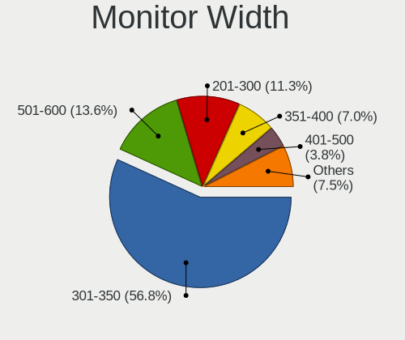

| Width in mm | Notebooks | Percent |
|-------------|-----------|---------|
| 301-350     | 118       | 56.73%  |
| 501-600     | 28        | 13.46%  |
| 201-300     | 23        | 11.06%  |
| 351-400     | 15        | 7.21%   |
| 401-500     | 8         | 3.85%   |
| 601-700     | 5         | 2.4%    |
| Unknown     | 4         | 1.92%   |
| 701-800     | 3         | 1.44%   |
| 1001-1500   | 2         | 0.96%   |
| 1501-2000   | 1         | 0.48%   |
| 901-1000    | 1         | 0.48%   |

Aspect Ratio
------------

Proportional relationship between the width and the height

| Ratio   | Notebooks | Percent |
|---------|-----------|---------|
| 16/9    | 146       | 82.02%  |
| 16/10   | 22        | 12.36%  |
| Unknown | 4         | 2.25%   |
| 3/2     | 3         | 1.69%   |
| 5/4     | 1         | 0.56%   |
| 4/3     | 1         | 0.56%   |
| 21/9    | 1         | 0.56%   |

Monitor Area
------------

Area in inch

| Area in inch | Notebooks | Percent |
|----------------|-----------|---------|
| 101-110        | 77        | 36.49%  |
| 81-90          | 47        | 22.27%  |
| 201-250        | 20        | 9.48%   |
| 71-80          | 10        | 4.74%   |
| 301-350        | 10        | 4.74%   |
| 121-130        | 10        | 4.74%   |
| 351-500        | 8         | 3.79%   |
| 251-300        | 6         | 2.84%   |
| 61-70          | 5         | 2.37%   |
| 51-60          | 5         | 2.37%   |
| Unknown        | 4         | 1.9%    |
| More than 1000 | 3         | 1.42%   |
| 151-200        | 2         | 0.95%   |
| 141-150        | 2         | 0.95%   |
| 131-140        | 1         | 0.47%   |
| 501-1000       | 1         | 0.47%   |

Pixel Density
-------------

Pixels per inch

| Density       | Notebooks | Percent |
|---------------|-----------|---------|
| 121-160       | 86        | 42.16%  |
| 101-120       | 53        | 25.98%  |
| 51-100        | 39        | 19.12%  |
| 161-240       | 12        | 5.88%   |
| More than 240 | 6         | 2.94%   |
| 1-50          | 4         | 1.96%   |
| Unknown       | 4         | 1.96%   |

Multiple Monitors
-----------------

Total monitors connected

| Total | Notebooks | Percent |
|-------|-----------|---------|
| 1     | 126       | 73.26%  |
| 2     | 35        | 20.35%  |
| 3     | 7         | 4.07%   |
| 0     | 4         | 2.33%   |

Network
-------

Net Controller Vendor
---------------------

Controller vendors

| Vendor                   | Notebooks | Percent |
|--------------------------|-----------|---------|
| Intel                    | 110       | 39.86%  |
| Realtek Semiconductor    | 91        | 32.97%  |
| Qualcomm Atheros         | 36        | 13.04%  |
| Broadcom                 | 13        | 4.71%   |
| Broadcom Limited         | 7         | 2.54%   |
| Ralink                   | 4         | 1.45%   |
| Marvell Technology Group | 4         | 1.45%   |
| Hewlett-Packard          | 3         | 1.09%   |
| Sierra Wireless          | 1         | 0.36%   |
| NetGear                  | 1         | 0.36%   |
| MediaTek                 | 1         | 0.36%   |
| Lenovo                   | 1         | 0.36%   |
| Huawei Technologies      | 1         | 0.36%   |
| DisplayLink              | 1         | 0.36%   |
| ASIX Electronics         | 1         | 0.36%   |
| Apple                    | 1         | 0.36%   |

Net Controller Model
--------------------

Controller models

| Model                                                             | Notebooks | Percent |
|-------------------------------------------------------------------|-----------|---------|
| Realtek RTL8111/8168/8411 PCI Express Gigabit Ethernet Controller | 57        | 17.07%  |
| Intel Wi-Fi 6 AX200                                               | 24        | 7.19%   |
| Realtek RTL8153 Gigabit Ethernet Adapter                          | 14        | 4.19%   |
| Realtek RTL810xE PCI Express Fast Ethernet controller             | 14        | 4.19%   |
| Intel Wireless 8265 / 8275                                        | 12        | 3.59%   |
| Intel 82579LM Gigabit Network Connection (Lewisville)             | 12        | 3.59%   |
| Qualcomm Atheros AR9485 Wireless Network Adapter                  | 7         | 2.1%    |
| Intel Wireless-AC 9260                                            | 7         | 2.1%    |
| Intel Wireless 8260                                               | 7         | 2.1%    |
| Realtek RTL8821CE 802.11ac PCIe Wireless Network Adapter          | 6         | 1.8%    |
| Qualcomm Atheros QCA9377 802.11ac Wireless Network Adapter        | 6         | 1.8%    |
| Intel Centrino Advanced-N 6205 [Taylor Peak]                      | 6         | 1.8%    |
| Realtek RTL8125 2.5GbE Controller                                 | 5         | 1.5%    |
| Qualcomm Atheros AR8151 v2.0 Gigabit Ethernet                     | 5         | 1.5%    |
| Qualcomm Atheros QCA9565 / AR9565 Wireless Network Adapter        | 4         | 1.2%    |
| Qualcomm Atheros AR9285 Wireless Network Adapter (PCI-Express)    | 4         | 1.2%    |
| Intel Wireless 7265                                               | 4         | 1.2%    |
| Intel Ethernet Connection (4) I219-LM                             | 4         | 1.2%    |
| Intel Centrino Ultimate-N 6300                                    | 4         | 1.2%    |
| Intel Cannon Point-LP CNVi [Wireless-AC]                          | 4         | 1.2%    |
| Intel Cannon Lake PCH CNVi WiFi                                   | 4         | 1.2%    |
| Realtek RTL8723BE PCIe Wireless Network Adapter                   | 3         | 0.9%    |
| Qualcomm Atheros QCA6174 802.11ac Wireless Network Adapter        | 3         | 0.9%    |
| Qualcomm Atheros Killer E2500 Gigabit Ethernet Controller         | 3         | 0.9%    |
| Intel Wireless 3165                                               | 3         | 0.9%    |
| Intel Wi-Fi 6 AX201                                               | 3         | 0.9%    |
| Intel Ethernet Connection I219-LM                                 | 3         | 0.9%    |
| Intel Ethernet Connection (6) I219-V                              | 3         | 0.9%    |
| Intel Dual Band Wireless-AC 3168NGW [Stone Peak]                  | 3         | 0.9%    |
| Intel Comet Lake PCH-LP CNVi WiFi                                 | 3         | 0.9%    |
| Intel Comet Lake PCH CNVi WiFi                                    | 3         | 0.9%    |
| Broadcom BCM43142 802.11b/g/n                                     | 3         | 0.9%    |
| Ralink RT3290 Wireless 802.11n 1T/1R PCIe                         | 2         | 0.6%    |
| Qualcomm Atheros QCA8171 Gigabit Ethernet                         | 2         | 0.6%    |
| Qualcomm Atheros Killer E2400 Gigabit Ethernet Controller         | 2         | 0.6%    |
| Qualcomm Atheros AR9462 Wireless Network Adapter                  | 2         | 0.6%    |
| Marvell Group 88E8058 PCI-E Gigabit Ethernet Controller           | 2         | 0.6%    |
| Intel WiFi Link 5100                                              | 2         | 0.6%    |
| Intel Ethernet Connection (6) I219-LM                             | 2         | 0.6%    |
| Intel Ethernet Connection (2) I219-LM                             | 2         | 0.6%    |

Wireless Vendor
---------------

Wireless vendors

| Vendor                | Notebooks | Percent |
|-----------------------|-----------|---------|
| Intel                 | 106       | 60.92%  |
| Qualcomm Atheros      | 27        | 15.52%  |
| Realtek Semiconductor | 17        | 9.77%   |
| Broadcom              | 11        | 6.32%   |
| Broadcom Limited      | 6         | 3.45%   |
| Ralink                | 4         | 2.3%    |
| Sierra Wireless       | 1         | 0.57%   |
| NetGear               | 1         | 0.57%   |
| MediaTek              | 1         | 0.57%   |

Wireless Model
--------------

Wireless models

| Model                                                          | Notebooks | Percent |
|----------------------------------------------------------------|-----------|---------|
| Intel Wi-Fi 6 AX200                                            | 24        | 13.71%  |
| Intel Wireless 8265 / 8275                                     | 12        | 6.86%   |
| Qualcomm Atheros AR9485 Wireless Network Adapter               | 7         | 4%      |
| Intel Wireless-AC 9260                                         | 7         | 4%      |
| Intel Wireless 8260                                            | 7         | 4%      |
| Realtek RTL8821CE 802.11ac PCIe Wireless Network Adapter       | 6         | 3.43%   |
| Qualcomm Atheros QCA9377 802.11ac Wireless Network Adapter     | 6         | 3.43%   |
| Intel Centrino Advanced-N 6205 [Taylor Peak]                   | 6         | 3.43%   |
| Qualcomm Atheros QCA9565 / AR9565 Wireless Network Adapter     | 4         | 2.29%   |
| Qualcomm Atheros AR9285 Wireless Network Adapter (PCI-Express) | 4         | 2.29%   |
| Intel Wireless 7265                                            | 4         | 2.29%   |
| Intel Centrino Ultimate-N 6300                                 | 4         | 2.29%   |
| Intel Cannon Point-LP CNVi [Wireless-AC]                       | 4         | 2.29%   |
| Intel Cannon Lake PCH CNVi WiFi                                | 4         | 2.29%   |
| Realtek RTL8723BE PCIe Wireless Network Adapter                | 3         | 1.71%   |
| Qualcomm Atheros QCA6174 802.11ac Wireless Network Adapter     | 3         | 1.71%   |
| Intel Wireless 3165                                            | 3         | 1.71%   |
| Intel Wi-Fi 6 AX201                                            | 3         | 1.71%   |
| Intel Dual Band Wireless-AC 3168NGW [Stone Peak]               | 3         | 1.71%   |
| Intel Comet Lake PCH-LP CNVi WiFi                              | 3         | 1.71%   |
| Intel Comet Lake PCH CNVi WiFi                                 | 3         | 1.71%   |
| Broadcom BCM43142 802.11b/g/n                                  | 3         | 1.71%   |
| Ralink RT3290 Wireless 802.11n 1T/1R PCIe                      | 2         | 1.14%   |
| Qualcomm Atheros AR9462 Wireless Network Adapter               | 2         | 1.14%   |
| Intel WiFi Link 5100                                           | 2         | 1.14%   |
| Intel Dual Band Wireless-AC 3165 Plus Bluetooth                | 2         | 1.14%   |
| Intel Centrino Advanced-N 6200                                 | 2         | 1.14%   |
| Broadcom Limited BCM4352 802.11ac Wireless Network Adapter     | 2         | 1.14%   |
| Broadcom BCM4321 802.11a/b/g/n                                 | 2         | 1.14%   |
| Broadcom BCM4313 802.11bgn Wireless Network Adapter            | 2         | 1.14%   |
| Sierra Wireless EM7305 Modem                                   | 1         | 0.57%   |
| Realtek RTL88x2bu [AC1200 Techkey]                             | 1         | 0.57%   |
| Realtek RTL8822CE 802.11ac PCIe Wireless Network Adapter       | 1         | 0.57%   |
| Realtek RTL8821AE 802.11ac PCIe Wireless Network Adapter       | 1         | 0.57%   |
| Realtek RTL8811AU 802.11a/b/g/n/ac WLAN Adapter                | 1         | 0.57%   |
| Realtek RTL8192CU 802.11n WLAN Adapter                         | 1         | 0.57%   |
| Realtek RTL8191SU 802.11n WLAN Adapter                         | 1         | 0.57%   |
| Realtek RTL8188CUS 802.11n WLAN Adapter                        | 1         | 0.57%   |
| Realtek RTL8188CE 802.11b/g/n WiFi Adapter                     | 1         | 0.57%   |
| Realtek 802.11ac NIC                                           | 1         | 0.57%   |

Ethernet Vendor
---------------

Ethernet vendors

| Vendor                   | Notebooks | Percent |
|--------------------------|-----------|---------|
| Realtek Semiconductor    | 84        | 56.38%  |
| Intel                    | 36        | 24.16%  |
| Qualcomm Atheros         | 14        | 9.4%    |
| Broadcom                 | 5         | 3.36%   |
| Marvell Technology Group | 4         | 2.68%   |
| Lenovo                   | 1         | 0.67%   |
| Hewlett-Packard          | 1         | 0.67%   |
| DisplayLink              | 1         | 0.67%   |
| Broadcom Limited         | 1         | 0.67%   |
| ASIX Electronics         | 1         | 0.67%   |
| Apple                    | 1         | 0.67%   |

Ethernet Model
--------------

Ethernet models

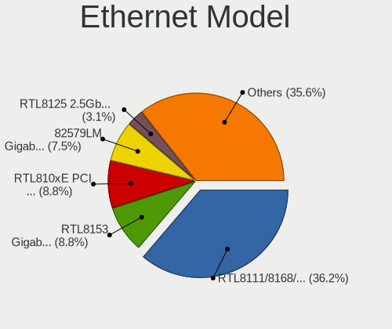

| Model                                                             | Notebooks | Percent |
|-------------------------------------------------------------------|-----------|---------|
| Realtek RTL8111/8168/8411 PCI Express Gigabit Ethernet Controller | 57        | 36.54%  |
| Realtek RTL8153 Gigabit Ethernet Adapter                          | 14        | 8.97%   |
| Realtek RTL810xE PCI Express Fast Ethernet controller             | 14        | 8.97%   |
| Intel 82579LM Gigabit Network Connection (Lewisville)             | 12        | 7.69%   |
| Realtek RTL8125 2.5GbE Controller                                 | 5         | 3.21%   |
| Qualcomm Atheros AR8151 v2.0 Gigabit Ethernet                     | 5         | 3.21%   |
| Intel Ethernet Connection (4) I219-LM                             | 4         | 2.56%   |
| Qualcomm Atheros Killer E2500 Gigabit Ethernet Controller         | 3         | 1.92%   |
| Intel Ethernet Connection I219-LM                                 | 3         | 1.92%   |
| Intel Ethernet Connection (6) I219-V                              | 3         | 1.92%   |
| Qualcomm Atheros QCA8171 Gigabit Ethernet                         | 2         | 1.28%   |
| Qualcomm Atheros Killer E2400 Gigabit Ethernet Controller         | 2         | 1.28%   |
| Marvell Group 88E8058 PCI-E Gigabit Ethernet Controller           | 2         | 1.28%   |
| Intel Ethernet Connection (6) I219-LM                             | 2         | 1.28%   |
| Intel Ethernet Connection (2) I219-LM                             | 2         | 1.28%   |
| Intel 82577LM Gigabit Network Connection                          | 2         | 1.28%   |
| Realtek RTL8152 Fast Ethernet Adapter                             | 1         | 0.64%   |
| Qualcomm Atheros Killer E220x Gigabit Ethernet Controller         | 1         | 0.64%   |
| Qualcomm Atheros AR8161 Gigabit Ethernet                          | 1         | 0.64%   |
| Marvell Group 88E8057 PCI-E Gigabit Ethernet Controller           | 1         | 0.64%   |
| Marvell Group 88E8040T PCI-E Fast Ethernet Controller             | 1         | 0.64%   |
| Lenovo ThinkPad TBT3 LAN                                          | 1         | 0.64%   |
| Intel Ethernet Connection I219-V                                  | 1         | 0.64%   |
| Intel Ethernet Connection I218-LM                                 | 1         | 0.64%   |
| Intel Ethernet Connection I217-LM                                 | 1         | 0.64%   |
| Intel Ethernet Connection (7) I219-V                              | 1         | 0.64%   |
| Intel Ethernet Connection (7) I219-LM                             | 1         | 0.64%   |
| Intel Ethernet Connection (5) I219-LM                             | 1         | 0.64%   |
| Intel Ethernet Connection (3) I218-LM                             | 1         | 0.64%   |
| Intel 82567LM Gigabit Network Connection                          | 1         | 0.64%   |
| HP lt4120 Snapdragon X5 LTE                                       | 1         | 0.64%   |
| DisplayLink 6950                                                  | 1         | 0.64%   |
| Broadcom NetXtreme BCM57786 Gigabit Ethernet PCIe                 | 1         | 0.64%   |
| Broadcom NetXtreme BCM57765 Gigabit Ethernet PCIe                 | 1         | 0.64%   |
| Broadcom NetXtreme BCM57762 Gigabit Ethernet PCIe                 | 1         | 0.64%   |
| Broadcom NetLink BCM5906M Fast Ethernet PCI Express               | 1         | 0.64%   |
| Broadcom NetLink BCM57785 Gigabit Ethernet PCIe                   | 1         | 0.64%   |
| Broadcom Limited NetLink BCM5784M Gigabit Ethernet PCIe           | 1         | 0.64%   |
| ASIX AX88179 Gigabit Ethernet                                     | 1         | 0.64%   |
| Apple iBridge                                                     | 1         | 0.64%   |

Net Controller Kind
-------------------

Ethernet, WiFi or modem

| Kind     | Notebooks | Percent |
|----------|-----------|---------|
| WiFi     | 167       | 53.53%  |
| Ethernet | 142       | 45.51%  |
| Modem    | 3         | 0.96%   |

Used Controller
---------------

Currently used network controller

| Kind     | Notebooks | Percent |
|----------|-----------|---------|
| WiFi     | 145       | 80.11%  |
| Ethernet | 36        | 19.89%  |

NICs
----

Total network controllers on board

| Total | Notebooks | Percent |
|-------|-----------|---------|
| 2     | 136       | 81.44%  |
| 1     | 31        | 18.56%  |

IPv6
----

IPv6 vs IPv4

| Used | Notebooks | Percent |
|------|-----------|---------|
| No   | 146       | 86.39%  |
| Yes  | 23        | 13.61%  |

Bluetooth
---------

Bluetooth Vendor
----------------

Controller vendors

| Vendor                          | Notebooks | Percent |
|---------------------------------|-----------|---------|
| Intel                           | 80        | 55.56%  |
| Qualcomm Atheros Communications | 12        | 8.33%   |
| Broadcom                        | 12        | 8.33%   |
| Realtek Semiconductor           | 9         | 6.25%   |
| Lite-On Technology              | 8         | 5.56%   |
| Apple                           | 5         | 3.47%   |
| Foxconn / Hon Hai               | 4         | 2.78%   |
| Dell                            | 4         | 2.78%   |
| Hewlett-Packard                 | 3         | 2.08%   |
| Ralink                          | 2         | 1.39%   |
| IMC Networks                    | 2         | 1.39%   |
| Toshiba                         | 1         | 0.69%   |
| Realtek                         | 1         | 0.69%   |
| Cambridge Silicon Radio         | 1         | 0.69%   |

Bluetooth Model
---------------

Controller models

| Model                                                                               | Notebooks | Percent |
|-------------------------------------------------------------------------------------|-----------|---------|
| Intel Bluetooth wireless interface                                                  | 26        | 18.06%  |
| Intel AX200 Bluetooth                                                               | 23        | 15.97%  |
| Intel AX201 Bluetooth                                                               | 11        | 7.64%   |
| Intel Bluetooth 9460/9560 Jefferson Peak (JfP)                                      | 8         | 5.56%   |
| Intel Wireless-AC 9260 Bluetooth Adapter                                            | 7         | 4.86%   |
| Qualcomm Atheros  Bluetooth Device                                                  | 5         | 3.47%   |
| Realtek Bluetooth Radio                                                             | 4         | 2.78%   |
| Dell DW375 Bluetooth Module                                                         | 4         | 2.78%   |
| Realtek  Bluetooth 4.2 Adapter                                                      | 3         | 2.08%   |
| Qualcomm Atheros AR3011 Bluetooth                                                   | 3         | 2.08%   |
| Lite-On Qualcomm Atheros QCA9377 Bluetooth                                          | 3         | 2.08%   |
| Broadcom BCM20702 Bluetooth 4.0 [ThinkPad]                                          | 3         | 2.08%   |
| Ralink RT3290 Bluetooth                                                             | 2         | 1.39%   |
| Qualcomm Atheros AR3012 Bluetooth 4.0                                               | 2         | 1.39%   |
| Lite-On Bluetooth Device                                                            | 2         | 1.39%   |
| Intel Wireless-AC 3168 Bluetooth                                                    | 2         | 1.39%   |
| HP Broadcom 2070 Bluetooth Combo                                                    | 2         | 1.39%   |
| Apple Bluetooth Host Controller                                                     | 2         | 1.39%   |
| Apple Bluetooth HCI                                                                 | 2         | 1.39%   |
| Toshiba Integrated Bluetooth HCI                                                    | 1         | 0.69%   |
| Realtek RTL8821A Bluetooth                                                          | 1         | 0.69%   |
| Realtek RTL8723B Bluetooth                                                          | 1         | 0.69%   |
| Realtek Bluetooth Radio                                                             | 1         | 0.69%   |
| Qualcomm Atheros QCA61x4 Bluetooth 4.0                                              | 1         | 0.69%   |
| Qualcomm Atheros AR9462 Bluetooth                                                   | 1         | 0.69%   |
| Lite-On Broadcom BCM43142A0 Bluetooth Device                                        | 1         | 0.69%   |
| Lite-On Atheros Bluetooth                                                           | 1         | 0.69%   |
| Lite-On Atheros AR3012 Bluetooth                                                    | 1         | 0.69%   |
| Intel Centrino Bluetooth Wireless Transceiver                                       | 1         | 0.69%   |
| Intel Centrino Advanced-N 6230 Bluetooth adapter                                    | 1         | 0.69%   |
| Intel Bluetooth Device                                                              | 1         | 0.69%   |
| IMC Networks Wireless_Device                                                        | 1         | 0.69%   |
| IMC Networks Atheros AR3012 Bluetooth 4.0 Adapter                                   | 1         | 0.69%   |
| HP Integrated Module with Bluetooth 2.1 Wireless technology                         | 1         | 0.69%   |
| Foxconn / Hon Hai Foxconn T77H114 BCM2070 [Single-Chip Bluetooth 2.1 + EDR Adapter] | 1         | 0.69%   |
| Foxconn / Hon Hai Bluetooth USB Host Controller                                     | 1         | 0.69%   |
| Foxconn / Hon Hai Bluetooth Device                                                  | 1         | 0.69%   |
| Foxconn / Hon Hai Acer Bluetooth module                                             | 1         | 0.69%   |
| Cambridge Silicon Radio Bluetooth Dongle (HCI mode)                                 | 1         | 0.69%   |
| Broadcom HP Portable SoftSailing                                                    | 1         | 0.69%   |

Sound
-----

Sound Vendor
------------

Sound card vendors

| Vendor                 | Notebooks | Percent |
|------------------------|-----------|---------|
| Intel                  | 145       | 63.04%  |
| Nvidia                 | 35        | 15.22%  |
| AMD                    | 26        | 11.3%   |
| Realtek Semiconductor  | 7         | 3.04%   |
| GN Netcom              | 3         | 1.3%    |
| Kingston Technology    | 2         | 0.87%   |
| Razer USA              | 1         | 0.43%   |
| Plantronics            | 1         | 0.43%   |
| Lenovo                 | 1         | 0.43%   |
| JMTek                  | 1         | 0.43%   |
| Hewlett-Packard        | 1         | 0.43%   |
| GYROCOM C&C            | 1         | 0.43%   |
| Generalplus Technology | 1         | 0.43%   |
| DSEA A/S               | 1         | 0.43%   |
| Conexant Systems       | 1         | 0.43%   |
| CMX Systems            | 1         | 0.43%   |
| C-Media Electronics    | 1         | 0.43%   |
| Apple                  | 1         | 0.43%   |

Sound Model
-----------

Sound card models

| Model                                                                                             | Notebooks | Percent |
|---------------------------------------------------------------------------------------------------|-----------|---------|
| Intel Sunrise Point-LP HD Audio                                                                   | 26        | 9.96%   |
| Intel 7 Series/C216 Chipset Family High Definition Audio Controller                               | 16        | 6.13%   |
| AMD Family 17h/19h HD Audio Controller                                                            | 14        | 5.36%   |
| Intel 6 Series/C200 Series Chipset Family High Definition Audio Controller                        | 13        | 4.98%   |
| Intel Cannon Point-LP High Definition Audio Controller                                            | 12        | 4.6%    |
| Intel Tiger Lake-LP Smart Sound Technology Audio Controller                                       | 9         | 3.45%   |
| Intel Cannon Lake PCH cAVS                                                                        | 8         | 3.07%   |
| Realtek Semiconductor USB Audio                                                                   | 7         | 2.68%   |
| Intel Haswell-ULT HD Audio Controller                                                             | 7         | 2.68%   |
| Intel Comet Lake PCH-LP cAVS                                                                      | 7         | 2.68%   |
| Intel 8 Series HD Audio Controller                                                                | 7         | 2.68%   |
| Intel Comet Lake PCH cAVS                                                                         | 6         | 2.3%    |
| AMD Renoir Radeon High Definition Audio Controller                                                | 6         | 2.3%    |
| Nvidia TU106 High Definition Audio Controller                                                     | 5         | 1.92%   |
| Intel Wildcat Point-LP High Definition Audio Controller                                           | 5         | 1.92%   |
| Intel CM238 HD Audio Controller                                                                   | 5         | 1.92%   |
| Intel Broadwell-U Audio Controller                                                                | 5         | 1.92%   |
| Intel 82801I (ICH9 Family) HD Audio Controller                                                    | 5         | 1.92%   |
| Intel 8 Series/C220 Series Chipset High Definition Audio Controller                               | 5         | 1.92%   |
| Intel 5 Series/3400 Series Chipset High Definition Audio                                          | 5         | 1.92%   |
| AMD FCH Azalia Controller                                                                         | 5         | 1.92%   |
| Nvidia GK107 HDMI Audio Controller                                                                | 4         | 1.53%   |
| Nvidia GA106 High Definition Audio Controller                                                     | 4         | 1.53%   |
| Intel Xeon E3-1200 v3/4th Gen Core Processor HD Audio Controller                                  | 4         | 1.53%   |
| Intel Atom/Celeron/Pentium Processor x5-E8000/J3xxx/N3xxx Series High Definition Audio Controller | 4         | 1.53%   |
| Nvidia TU107 GeForce GTX 1650 High Definition Audio Controller                                    | 3         | 1.15%   |
| Nvidia GP106 High Definition Audio Controller                                                     | 3         | 1.15%   |
| Nvidia GF108 High Definition Audio Controller                                                     | 3         | 1.15%   |
| Intel Ice Lake-LP Smart Sound Technology Audio Controller                                         | 3         | 1.15%   |
| Intel 82801H (ICH8 Family) HD Audio Controller                                                    | 3         | 1.15%   |
| AMD Raven/Raven2/Fenghuang HDMI/DP Audio Controller                                               | 3         | 1.15%   |
| AMD Oland/Hainan/Cape Verde/Pitcairn HDMI Audio [Radeon HD 7000 Series]                           | 3         | 1.15%   |
| AMD Kabini HDMI/DP Audio                                                                          | 3         | 1.15%   |
| Nvidia GP107GL High Definition Audio Controller                                                   | 2         | 0.77%   |
| Nvidia GP104 High Definition Audio Controller                                                     | 2         | 0.77%   |
| Nvidia GM107 High Definition Audio Controller [GeForce 940MX]                                     | 2         | 0.77%   |
| Nvidia GA104 High Definition Audio Controller                                                     | 2         | 0.77%   |
| Intel 100 Series/C230 Series Chipset Family HD Audio Controller                                   | 2         | 0.77%   |
| Razer USA Kraken Tournament Edition                                                               | 1         | 0.38%   |
| Plantronics C320-M                                                                                | 1         | 0.38%   |

Memory
------

Memory Vendor
-------------

Memory module vendors

| Vendor              | Notebooks | Percent |
|---------------------|-----------|---------|
| Samsung Electronics | 44        | 34.92%  |
| SK hynix            | 29        | 23.02%  |
| Micron Technology   | 14        | 11.11%  |
| Crucial             | 9         | 7.14%   |
| Kingston            | 7         | 5.56%   |
| Unknown             | 5         | 3.97%   |
| Ramaxel Technology  | 4         | 3.17%   |
| A-DATA Technology   | 3         | 2.38%   |
| Smart               | 2         | 1.59%   |
| Unknown             | 2         | 1.59%   |
| Teikon              | 1         | 0.79%   |
| Smart Brazil        | 1         | 0.79%   |
| Nanya Technology    | 1         | 0.79%   |
| Kingmax             | 1         | 0.79%   |
| Elpida              | 1         | 0.79%   |
| Corsair             | 1         | 0.79%   |
| ASint Technology    | 1         | 0.79%   |

Memory Model
------------

Memory module models

| Model                                                           | Notebooks | Percent |
|-----------------------------------------------------------------|-----------|---------|
| Samsung RAM M471A4G43AB1-CWE 32GB SODIMM DDR4 3200MT/s          | 6         | 4.41%   |
| Samsung RAM M471A2K43DB1-CWE 16GB SODIMM DDR4 3200MT/s          | 6         | 4.41%   |
| Samsung RAM M471A2K43CB1-CTD 16GB SODIMM DDR4 8400MT/s          | 3         | 2.21%   |
| Samsung RAM M471A1K43CB1-CTD 8GB SODIMM DDR4 2667MT/s           | 3         | 2.21%   |
| Unknown RAM Module 4096MB SODIMM DDR2 667MT/s                   | 2         | 1.47%   |
| SK hynix RAM HMT451S6BFR8A-PB 4GB SODIMM DDR3 1600MT/s          | 2         | 1.47%   |
| SK hynix RAM HMT351S6CFR8A-PB 4096MB SODIMM DDR3 1600MT/s       | 2         | 1.47%   |
| SK hynix RAM HMT351S6BFR8C-H9 4GB SODIMM DDR3 1333MT/s          | 2         | 1.47%   |
| SK hynix RAM HMA82GS6CJR8N-VK 16GB SODIMM DDR4 2667MT/s         | 2         | 1.47%   |
| SK hynix RAM HMA81GS6AFR8N-UH 8GB SODIMM DDR4 2667MT/s          | 2         | 1.47%   |
| Samsung RAM M471B5273EB0-CK0 4096MB SODIMM DDR3 4199MT/s        | 2         | 1.47%   |
| Samsung RAM M471B5173EB0-YK0 4GB SODIMM DDR3 1600MT/s           | 2         | 1.47%   |
| Samsung RAM M471A4G43MB1-CTD 32GB SODIMM DDR4 2667MT/s          | 2         | 1.47%   |
| Ramaxel RAM RMSA3260ME78HAF-2666 8GB SODIMM DDR4 2667MT/s       | 2         | 1.47%   |
| Micron RAM 4ATF51264HZ-2G6E1 4GB SODIMM DDR4 2667MT/s           | 2         | 1.47%   |
| Micron RAM 16KTF1G64HZ-1G6E1 8GB SODIMM DDR3 1600MT/s           | 2         | 1.47%   |
| Micron RAM 16JSF51264HZ-1G4D1 4096MB SODIMM DDR3 1334MT/s       | 2         | 1.47%   |
| Micron RAM 16ATF2G64HZ-2G6E1 16GB SODIMM DDR4 2667MT/s          | 2         | 1.47%   |
| Unknown                                                         | 2         | 1.47%   |
| Unknown RAM Module 8192MB SODIMM DDR4 2400MT/s                  | 1         | 0.74%   |
| Unknown RAM Module 4096MB SODIMM DDR3                           | 1         | 0.74%   |
| Unknown RAM Module 2048MB SODIMM DDR3                           | 1         | 0.74%   |
| Unknown RAM Module 2048MB Row Of Chips LPDDR4 4267MT/s          | 1         | 0.74%   |
| Teikon RAM TMT451S6BFR8A-PBAJ 4GB SODIMM DDR3 1333MT/s          | 1         | 0.74%   |
| Smart RAM SMS4TDC3C0K0446SCG 4GB SODIMM DDR4 2667MT/s           | 1         | 0.74%   |
| Smart RAM SH564128FJ8NWRNSQG 4GB SODIMM DDR3 1600MT/s           | 1         | 0.74%   |
| Smart RAM SF4641G8CK8IEHLSBG 8192MB SODIMM DDR4 2667MT/s        | 1         | 0.74%   |
| Smart Brazil RAM SMS4TDC3C0K0446SCG 4096MB SODIMM DDR4 2667MT/s | 1         | 0.74%   |
| SK hynix RAM Module 4096MB SODIMM LPDDR3 1867MT/s               | 1         | 0.74%   |
| SK hynix RAM Module 4096MB SODIMM DDR3 1600MT/s                 | 1         | 0.74%   |
| SK hynix RAM Module 2048MB SODIMM DDR2 667MT/s                  | 1         | 0.74%   |
| SK hynix RAM Module 16384MB SODIMM DDR4 2133MT/s                | 1         | 0.74%   |
| SK hynix RAM HMT451S6AFR8C-PB 4GB SODIMM DDR3 1600MT/s          | 1         | 0.74%   |
| SK hynix RAM HMT451S6AFR8A-PB 4GB SODIMM DDR3 1600MT/s          | 1         | 0.74%   |
| SK hynix RAM HMT41GS6AFR8A-PB 8GB SODIMM DDR3 1600MT/s          | 1         | 0.74%   |
| SK hynix RAM HMT351S6EFR8C-PB 4GB SODIMM DDR3 1600MT/s          | 1         | 0.74%   |
| SK hynix RAM HMT351S6CFR8C-PB 4GB SODIMM DDR3 1600MT/s          | 1         | 0.74%   |
| SK hynix RAM HMT351S6CFR8C-H9 4GB SODIMM DDR3 1334MT/s          | 1         | 0.74%   |
| SK hynix RAM HMT325S6BFR8C-H9 2GB SODIMM DDR3 1600MT/s          | 1         | 0.74%   |
| SK hynix RAM HMT125S6BFR8C-G7 2GB SODIMM DDR3 1333MT/s          | 1         | 0.74%   |

Memory Kind
-----------

Memory module kinds

| Kind    | Notebooks | Percent |
|---------|-----------|---------|
| DDR4    | 59        | 52.68%  |
| DDR3    | 40        | 35.71%  |
| LPDDR4  | 4         | 3.57%   |
| SDRAM   | 3         | 2.68%   |
| LPDDR3  | 2         | 1.79%   |
| DDR2    | 2         | 1.79%   |
| DDR     | 1         | 0.89%   |
| Unknown | 1         | 0.89%   |

Memory Form Factor
------------------

Physical design of the memory module

| Name         | Notebooks | Percent |
|--------------|-----------|---------|
| SODIMM       | 102       | 94.44%  |
| Row Of Chips | 6         | 5.56%   |

Memory Size
-----------

Memory module size

| Size  | Notebooks | Percent |
|-------|-----------|---------|
| 4096  | 41        | 34.17%  |
| 8192  | 39        | 32.5%   |
| 16384 | 23        | 19.17%  |
| 32768 | 8         | 6.67%   |
| 2048  | 7         | 5.83%   |
| 1024  | 2         | 1.67%   |

Memory Speed
------------

Memory module speed

| Speed   | Notebooks | Percent |
|---------|-----------|---------|
| 2667    | 29        | 23.77%  |
| 1600    | 29        | 23.77%  |
| 3200    | 18        | 14.75%  |
| 2133    | 7         | 5.74%   |
| 1334    | 7         | 5.74%   |
| 1333    | 7         | 5.74%   |
| 2400    | 6         | 4.92%   |
| 1067    | 4         | 3.28%   |
| 8400    | 3         | 2.46%   |
| 4199    | 3         | 2.46%   |
| 667     | 3         | 2.46%   |
| 4267    | 2         | 1.64%   |
| 3733    | 1         | 0.82%   |
| 3266    | 1         | 0.82%   |
| 1867    | 1         | 0.82%   |
| Unknown | 1         | 0.82%   |

Printers & scanners
-------------------

Printer Vendor
--------------

Printer device vendors

| Vendor              | Notebooks | Percent |
|---------------------|-----------|---------|
| Samsung Electronics | 1         | 50%     |
| Hewlett-Packard     | 1         | 50%     |

Printer Model
-------------

Printer device models

| Model                  | Notebooks | Percent |
|------------------------|-----------|---------|
| Samsung M2020 Series   | 1         | 50%     |
| HP DeskJet 2130 series | 1         | 50%     |

Scanner Vendor
--------------

Scanner device vendors

| Vendor | Notebooks | Percent |
|--------|-----------|---------|
| Canon  | 1         | 100%    |

Scanner Model
-------------

Scanner device models

| Model                   | Notebooks | Percent |
|-------------------------|-----------|---------|
| Canon CanoScan LiDE 220 | 1         | 100%    |

Camera
------

Camera Vendor
-------------

Camera device vendors

| Vendor                                 | Notebooks | Percent |
|----------------------------------------|-----------|---------|
| Chicony Electronics                    | 48        | 31.17%  |
| Acer                                   | 18        | 11.69%  |
| Sunplus Innovation Technology          | 14        | 9.09%   |
| Realtek Semiconductor                  | 13        | 8.44%   |
| Microdia                               | 9         | 5.84%   |
| IMC Networks                           | 9         | 5.84%   |
| Cheng Uei Precision Industry (Foxlink) | 7         | 4.55%   |
| Quanta                                 | 6         | 3.9%    |
| Suyin                                  | 5         | 3.25%   |
| Silicon Motion                         | 5         | 3.25%   |
| Syntek                                 | 4         | 2.6%    |
| Apple                                  | 4         | 2.6%    |
| Lite-On Technology                     | 3         | 1.95%   |
| Sonix Technology                       | 1         | 0.65%   |
| Ricoh                                  | 1         | 0.65%   |
| Primax Electronics                     | 1         | 0.65%   |
| Luxvisions Innotech Limited            | 1         | 0.65%   |
| Logitech                               | 1         | 0.65%   |
| LG Electronics                         | 1         | 0.65%   |
| Generalplus Technology                 | 1         | 0.65%   |
| Creative Technology                    | 1         | 0.65%   |
| Alcor Micro                            | 1         | 0.65%   |

Camera Model
------------

Camera device models

| Model                                                                      | Notebooks | Percent |
|----------------------------------------------------------------------------|-----------|---------|
| Chicony HD Webcam                                                          | 14        | 9.09%   |
| Chicony USB2.0 Camera                                                      | 10        | 6.49%   |
| Microdia Integrated_Webcam_HD                                              | 6         | 3.9%    |
| Realtek Integrated_Webcam_HD                                               | 5         | 3.25%   |
| Chicony Integrated Camera                                                  | 5         | 3.25%   |
| Acer HD Webcam                                                             | 5         | 3.25%   |
| Chicony HP HD Camera                                                       | 4         | 2.6%    |
| Sunplus Asus Webcam                                                        | 3         | 1.95%   |
| IMC Networks Integrated Camera                                             | 3         | 1.95%   |
| Acer BisonCam,NB Pro                                                       | 3         | 1.95%   |
| Acer BisonCam, NB Pro                                                      | 3         | 1.95%   |
| Suyin HP Truevision HD                                                     | 2         | 1.3%    |
| Sunplus Integrated_Webcam_HD                                               | 2         | 1.3%    |
| Sunplus HP HD Webcam [Fixed]                                               | 2         | 1.3%    |
| Sunplus HD WebCam                                                          | 2         | 1.3%    |
| Sunplus Aukey-PC-LM1E Camera                                               | 2         | 1.3%    |
| Realtek Integrated Webcam                                                  | 2         | 1.3%    |
| IMC Networks VGA UVC WebCam                                                | 2         | 1.3%    |
| IMC Networks USB2.0 HD UVC WebCam                                          | 2         | 1.3%    |
| Chicony Integrated Camera [ThinkPad]                                       | 2         | 1.3%    |
| Cheng Uei Precision Industry (Foxlink) HP Wide Vision HD Integrated Webcam | 2         | 1.3%    |
| Cheng Uei Precision Industry (Foxlink) HP Truevision HD                    | 2         | 1.3%    |
| Acer SunplusIT Integrated Camera                                           | 2         | 1.3%    |
| Acer Integrated Camera                                                     | 2         | 1.3%    |
| Syntek Web Cam - Asus F3SA, F9J, F9S                                       | 1         | 0.65%   |
| Syntek USB2.0 Camera                                                       | 1         | 0.65%   |
| Syntek Integrated Camera                                                   | 1         | 0.65%   |
| Syntek EasyCamera                                                          | 1         | 0.65%   |
| Suyin Laptop_Integrated_Webcam_2M                                          | 1         | 0.65%   |
| Suyin HD WebCam                                                            | 1         | 0.65%   |
| Suyin HD Video WebCam                                                      | 1         | 0.65%   |
| Sunplus USB Camera                                                         | 1         | 0.65%   |
| Sunplus Laptop_Integrated_Webcam_HD                                        | 1         | 0.65%   |
| Sunplus Laptop Integrated WebCam HD                                        | 1         | 0.65%   |
| Sonix USB2.0 HD UVC WebCam                                                 | 1         | 0.65%   |
| Silicon Motion WebCam SC-13HDL12131N                                       | 1         | 0.65%   |
| Silicon Motion WebCam SC-10HDD13335N                                       | 1         | 0.65%   |
| Silicon Motion WebCam SC-10HDD12636N                                       | 1         | 0.65%   |
| Silicon Motion Web Camera                                                  | 1         | 0.65%   |
| Silicon Motion HP Webcam-50                                                | 1         | 0.65%   |

Security
--------

Fingerprint Vendor
------------------

Fingerprint sensor vendors

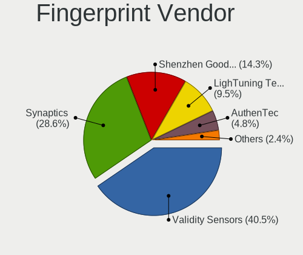

| Vendor                     | Notebooks | Percent |
|----------------------------|-----------|---------|
| Validity Sensors           | 16        | 39.02%  |
| Synaptics                  | 12        | 29.27%  |
| Shenzhen Goodix Technology | 6         | 14.63%  |
| LighTuning Technology      | 4         | 9.76%   |
| AuthenTec                  | 2         | 4.88%   |
| Elan Microelectronics      | 1         | 2.44%   |

Fingerprint Model
-----------------

Fingerprint sensor models

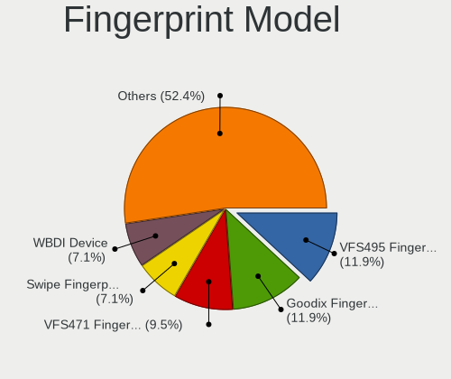

| Model                                                                      | Notebooks | Percent |
|----------------------------------------------------------------------------|-----------|---------|
| Validity Sensors VFS495 Fingerprint Reader                                 | 5         | 12.2%   |
| Shenzhen Goodix  FingerPrint Device                                        | 5         | 12.2%   |
| Validity Sensors VFS471 Fingerprint Reader                                 | 4         | 9.76%   |
| Unknown                                                                    | 4         | 9.76%   |
| Validity Sensors Swipe Fingerprint Sensor                                  | 3         | 7.32%   |
| Synaptics WBDI Device                                                      | 3         | 7.32%   |
| Synaptics Prometheus MIS Touch Fingerprint Reader                          | 3         | 7.32%   |
| Synaptics Metallica MIS Touch Fingerprint Reader                           | 2         | 4.88%   |
| LighTuning ES603 Swipe Fingerprint Sensor                                  | 2         | 4.88%   |
| Validity Sensors VFS5011 Fingerprint Reader                                | 1         | 2.44%   |
| Validity Sensors VFS491                                                    | 1         | 2.44%   |
| Validity Sensors Synaptics VFS7552 Touch Fingerprint Sensor with PurePrint | 1         | 2.44%   |
| Validity Sensors Fingerprint scanner                                       | 1         | 2.44%   |
| Shenzhen Goodix FingerPrint                                                | 1         | 2.44%   |
| LighTuning Fingerprint Reader                                              | 1         | 2.44%   |
| LighTuning EgisTec Touch Fingerprint Sensor                                | 1         | 2.44%   |
| Elan ELAN:Fingerprint                                                      | 1         | 2.44%   |
| AuthenTec AES2810                                                          | 1         | 2.44%   |
| AuthenTec AES1660 Fingerprint Sensor                                       | 1         | 2.44%   |

Chipcard Vendor
---------------

Chipcard module vendors

| Vendor      | Notebooks | Percent |
|-------------|-----------|---------|
| Broadcom    | 7         | 53.85%  |
| Upek        | 4         | 30.77%  |
| Lenovo      | 1         | 7.69%   |
| Alcor Micro | 1         | 7.69%   |

Chipcard Model
--------------

Chipcard module models

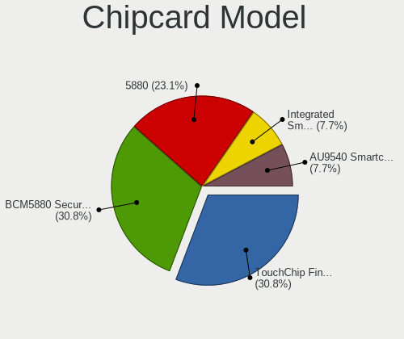

| Model                                                      | Notebooks | Percent |
|------------------------------------------------------------|-----------|---------|
| Upek TouchChip Fingerprint Coprocessor (WBF advanced mode) | 4         | 30.77%  |
| Broadcom BCM5880 Secure Applications Processor             | 4         | 30.77%  |
| Broadcom 5880                                              | 3         | 23.08%  |
| Lenovo Integrated Smart Card Reader                        | 1         | 7.69%   |
| Alcor Micro AU9540 Smartcard Reader                        | 1         | 7.69%   |

Unsupported
-----------

Unsupported Devices
-------------------

Total unsupported devices on board

| Total | Notebooks | Percent |
|-------|-----------|---------|
| 0     | 86        | 50.89%  |
| 1     | 65        | 38.46%  |
| 2     | 15        | 8.88%   |
| 5     | 1         | 0.59%   |
| 4     | 1         | 0.59%   |
| 3     | 1         | 0.59%   |

Unsupported Device Types
------------------------

Types of unsupported devices

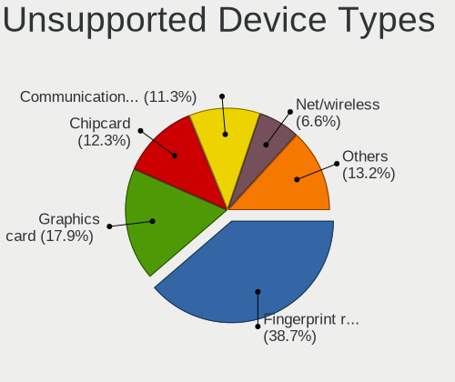

| Type                     | Notebooks | Percent |
|--------------------------|-----------|---------|
| Fingerprint reader       | 40        | 39.6%   |
| Graphics card            | 16        | 15.84%  |
| Chipcard                 | 13        | 12.87%  |
| Communication controller | 12        | 11.88%  |
| Net/wireless             | 7         | 6.93%   |
| Multimedia controller    | 3         | 2.97%   |
| Bluetooth                | 3         | 2.97%   |
| Storage                  | 2         | 1.98%   |
| Card reader              | 2         | 1.98%   |
| Sound                    | 1         | 0.99%   |
| Net/ethernet             | 1         | 0.99%   |
| Camera                   | 1         | 0.99%   |

