Ubuntu Budgie 20.04 - Tested Hardware & Statistics
--------------------------------------------------

A project to collect tested hardware configurations for Ubuntu Budgie 20.04.

Anyone can contribute to this report by the [hw-probe](https://github.com/linuxhw/hw-probe) tool:

    sudo -E hw-probe -all -upload

Please submit a probe of your configuration if it's not presented on the page or is rare.

This is a report for all computer types. See also reports for [desktops](/Dist/Ubuntu_Budgie_20.04/Desktop/README.md) and [notebooks](/Dist/Ubuntu_Budgie_20.04/Notebook/README.md).

Full-feature report is available here: https://linux-hardware.org/?view=trends

Contents
--------

* [ Test Cases ](#test-cases)

* [ System ](#system)
  - [ Kernel                   ](#kernel)
  - [ Kernel Family            ](#kernel-family)
  - [ Kernel Major Ver.        ](#kernel-major-ver)
  - [ Arch                     ](#arch)
  - [ DE                       ](#de)
  - [ Display Server           ](#display-server)
  - [ Display Manager          ](#display-manager)
  - [ OS Lang                  ](#os-lang)
  - [ Boot Mode                ](#boot-mode)
  - [ Filesystem               ](#filesystem)
  - [ Part. scheme             ](#part-scheme)
  - [ Dual Boot with Linux/BSD ](#dual-boot-with-linuxbsd)
  - [ Dual Boot (Win)          ](#dual-boot-win)

* [ Board ](#board)
  - [ Vendor                   ](#vendor)
  - [ Model                    ](#model)
  - [ Model Family             ](#model-family)
  - [ MFG Year                 ](#mfg-year)
  - [ Form Factor              ](#form-factor)
  - [ Secure Boot              ](#secure-boot)
  - [ Coreboot                 ](#coreboot)
  - [ RAM Size                 ](#ram-size)
  - [ RAM Used                 ](#ram-used)
  - [ Total Drives             ](#total-drives)
  - [ Has CD-ROM               ](#has-cd-rom)
  - [ Has Ethernet             ](#has-ethernet)
  - [ Has WiFi                 ](#has-wifi)
  - [ Has Bluetooth            ](#has-bluetooth)

* [ Location ](#location)
  - [ Country                  ](#country)
  - [ City                     ](#city)

* [ Drives ](#drives)
  - [ Drive Vendor             ](#drive-vendor)
  - [ Drive Model              ](#drive-model)
  - [ HDD Vendor               ](#hdd-vendor)
  - [ SSD Vendor               ](#ssd-vendor)
  - [ Drive Kind               ](#drive-kind)
  - [ Drive Connector          ](#drive-connector)
  - [ Drive Size               ](#drive-size)
  - [ Space Total              ](#space-total)
  - [ Space Used               ](#space-used)
  - [ Malfunc. Drives          ](#malfunc-drives)
  - [ Malfunc. Drive Vendor    ](#malfunc-drive-vendor)
  - [ Malfunc. HDD Vendor      ](#malfunc-hdd-vendor)
  - [ Malfunc. Drive Kind      ](#malfunc-drive-kind)
  - [ Failed Drives            ](#failed-drives)
  - [ Failed Drive Vendor      ](#failed-drive-vendor)
  - [ Drive Status             ](#drive-status)

* [ Storage controller ](#storage-controller)
  - [ Storage Vendor           ](#storage-vendor)
  - [ Storage Model            ](#storage-model)
  - [ Storage Kind             ](#storage-kind)

* [ Processor ](#processor)
  - [ CPU Vendor               ](#cpu-vendor)
  - [ CPU Model                ](#cpu-model)
  - [ CPU Model Family         ](#cpu-model-family)
  - [ CPU Cores                ](#cpu-cores)
  - [ CPU Sockets              ](#cpu-sockets)
  - [ CPU Threads              ](#cpu-threads)
  - [ CPU Op-Modes             ](#cpu-op-modes)
  - [ CPU Microcode            ](#cpu-microcode)
  - [ CPU Microarch            ](#cpu-microarch)

* [ Graphics ](#graphics)
  - [ GPU Vendor               ](#gpu-vendor)
  - [ GPU Model                ](#gpu-model)
  - [ GPU Combo                ](#gpu-combo)
  - [ GPU Driver               ](#gpu-driver)
  - [ GPU Memory               ](#gpu-memory)

* [ Monitor ](#monitor)
  - [ Monitor Vendor           ](#monitor-vendor)
  - [ Monitor Model            ](#monitor-model)
  - [ Monitor Resolution       ](#monitor-resolution)
  - [ Monitor Diagonal         ](#monitor-diagonal)
  - [ Monitor Width            ](#monitor-width)
  - [ Aspect Ratio             ](#aspect-ratio)
  - [ Monitor Area             ](#monitor-area)
  - [ Pixel Density            ](#pixel-density)
  - [ Multiple Monitors        ](#multiple-monitors)

* [ Network ](#network)
  - [ Net Controller Vendor    ](#net-controller-vendor)
  - [ Net Controller Model     ](#net-controller-model)
  - [ Wireless Vendor          ](#wireless-vendor)
  - [ Wireless Model           ](#wireless-model)
  - [ Ethernet Vendor          ](#ethernet-vendor)
  - [ Ethernet Model           ](#ethernet-model)
  - [ Net Controller Kind      ](#net-controller-kind)
  - [ Used Controller          ](#used-controller)
  - [ NICs                     ](#nics)
  - [ IPv6                     ](#ipv6)

* [ Bluetooth ](#bluetooth)
  - [ Bluetooth Vendor         ](#bluetooth-vendor)
  - [ Bluetooth Model          ](#bluetooth-model)

* [ Sound ](#sound)
  - [ Sound Vendor             ](#sound-vendor)
  - [ Sound Model              ](#sound-model)

* [ Memory ](#memory)
  - [ Memory Vendor            ](#memory-vendor)
  - [ Memory Model             ](#memory-model)
  - [ Memory Kind              ](#memory-kind)
  - [ Memory Form Factor       ](#memory-form-factor)
  - [ Memory Size              ](#memory-size)
  - [ Memory Speed             ](#memory-speed)

* [ Printers & scanners ](#printers--scanners)
  - [ Printer Vendor           ](#printer-vendor)
  - [ Printer Model            ](#printer-model)
  - [ Scanner Vendor           ](#scanner-vendor)
  - [ Scanner Model            ](#scanner-model)

* [ Camera ](#camera)
  - [ Camera Vendor            ](#camera-vendor)
  - [ Camera Model             ](#camera-model)

* [ Security ](#security)
  - [ Fingerprint Vendor       ](#fingerprint-vendor)
  - [ Fingerprint Model        ](#fingerprint-model)
  - [ Chipcard Vendor          ](#chipcard-vendor)
  - [ Chipcard Model           ](#chipcard-model)

* [ Unsupported ](#unsupported)
  - [ Unsupported Devices      ](#unsupported-devices)
  - [ Unsupported Device Types ](#unsupported-device-types)

Test Cases
----------

Total: 360

| Vendor        | Model                       | Form-Factor | Probe                                                      | Date         |
|---------------|-----------------------------|-------------|------------------------------------------------------------|--------------|
| TUXEDO        | InfinityBook S 14 Gen6      | Notebook    | [847b8f0788](https://linux-hardware.org/?probe=847b8f0788) | Apr 01, 2022 |
| Packard Be... | ENLE11BZ                    | Notebook    | [4fb836698c](https://linux-hardware.org/?probe=4fb836698c) | Mar 26, 2022 |
| Apple         | MacBookPro15,1              | Notebook    | [0fe3cba205](https://linux-hardware.org/?probe=0fe3cba205) | Mar 23, 2022 |
| HP            | 8158 A01                    | Mini pc     | [3ba669d072](https://linux-hardware.org/?probe=3ba669d072) | Mar 20, 2022 |
| TUXEDO        | InfinityBook Pro 14 Gen6    | Notebook    | [63ea3e99c5](https://linux-hardware.org/?probe=63ea3e99c5) | Mar 14, 2022 |
| TUXEDO        | Stellaris AMD Gen3 (CZN)    | Notebook    | [08525a320d](https://linux-hardware.org/?probe=08525a320d) | Mar 13, 2022 |
| Lenovo        | ThinkPad T480 20L6SDR21A    | Notebook    | [b61991cef4](https://linux-hardware.org/?probe=b61991cef4) | Mar 13, 2022 |
| MSI           | Vector GP66 12UGS           | Notebook    | [be60e729e2](https://linux-hardware.org/?probe=be60e729e2) | Mar 06, 2022 |
| Gigabyte      | 970A-DS3P                   | Desktop     | [eaae14de4f](https://linux-hardware.org/?probe=eaae14de4f) | Mar 05, 2022 |
| Apple         | MacBookAir7,2               | Notebook    | [34da56b567](https://linux-hardware.org/?probe=34da56b567) | Mar 01, 2022 |
| Microsoft     | Surface Book                | Tablet      | [a94d46ec1d](https://linux-hardware.org/?probe=a94d46ec1d) | Feb 25, 2022 |
| Microsoft     | Surface Book                | Tablet      | [f62d16f3b1](https://linux-hardware.org/?probe=f62d16f3b1) | Feb 25, 2022 |
| ASUSTek       | ROG STRIX B550-E GAMING     | Desktop     | [7fa418eb00](https://linux-hardware.org/?probe=7fa418eb00) | Feb 25, 2022 |
| ASUSTek       | UX303UA                     | Notebook    | [0ed28fa881](https://linux-hardware.org/?probe=0ed28fa881) | Feb 23, 2022 |
| TUXEDO        | InfinityBook S 15 Gen6      | Notebook    | [e58eb70913](https://linux-hardware.org/?probe=e58eb70913) | Feb 19, 2022 |
| ASUSTek       | M4A87TD/USB3                | Desktop     | [88768afd55](https://linux-hardware.org/?probe=88768afd55) | Feb 10, 2022 |
| ASUSTek       | M4A87TD/USB3                | Desktop     | [74c94f396f](https://linux-hardware.org/?probe=74c94f396f) | Feb 10, 2022 |
| Apple         | MacBookPro4,1               | Notebook    | [87e9ca3a01](https://linux-hardware.org/?probe=87e9ca3a01) | Feb 07, 2022 |
| Razer         | Blade Stealth               | Notebook    | [de6e279575](https://linux-hardware.org/?probe=de6e279575) | Feb 07, 2022 |
| Razer         | Blade Stealth               | Notebook    | [c85996c28c](https://linux-hardware.org/?probe=c85996c28c) | Feb 07, 2022 |
| HP            | ProBook 440 G5              | Notebook    | [5f6a923aa2](https://linux-hardware.org/?probe=5f6a923aa2) | Feb 05, 2022 |
| HP            | ProBook 440 G5              | Notebook    | [6ff30e8299](https://linux-hardware.org/?probe=6ff30e8299) | Feb 05, 2022 |
| Apple         | MacBookPro11,5              | Notebook    | [46ba4fcc12](https://linux-hardware.org/?probe=46ba4fcc12) | Feb 04, 2022 |
| Acer          | Aspire 8940G                | Notebook    | [686119ea77](https://linux-hardware.org/?probe=686119ea77) | Feb 03, 2022 |
| Sony          | SVS13A25PBS                 | Notebook    | [9072890c1d](https://linux-hardware.org/?probe=9072890c1d) | Feb 02, 2022 |
| Sony          | SVS13A25PBS                 | Notebook    | [894e40654e](https://linux-hardware.org/?probe=894e40654e) | Feb 02, 2022 |
| HP            | Laptop 15s-fq1xxx           | Notebook    | [81f3f014e7](https://linux-hardware.org/?probe=81f3f014e7) | Feb 01, 2022 |
| Lenovo        | V145-15AST 81MT             | Notebook    | [07192f2b7d](https://linux-hardware.org/?probe=07192f2b7d) | Jan 27, 2022 |
| TUXEDO        | Book XP1511                 | Notebook    | [9a62ad3fe4](https://linux-hardware.org/?probe=9a62ad3fe4) | Jan 25, 2022 |
| TUXEDO        | Pulse 15 Gen1               | Notebook    | [909aca1407](https://linux-hardware.org/?probe=909aca1407) | Jan 22, 2022 |
| Gigabyte      | 970A-DS3P                   | Desktop     | [b96e414ae9](https://linux-hardware.org/?probe=b96e414ae9) | Jan 21, 2022 |
| Gigabyte      | 970A-DS3P                   | Desktop     | [96047ce382](https://linux-hardware.org/?probe=96047ce382) | Jan 19, 2022 |
| HP            | EliteBook 8570w             | Notebook    | [edc7be1068](https://linux-hardware.org/?probe=edc7be1068) | Jan 18, 2022 |
| HP            | EliteBook 8570w             | Notebook    | [249a326a8b](https://linux-hardware.org/?probe=249a326a8b) | Jan 17, 2022 |
| HP            | EliteBook 8570w             | Notebook    | [e324ae4a05](https://linux-hardware.org/?probe=e324ae4a05) | Jan 16, 2022 |
| HP            | EliteBook 8570w             | Notebook    | [dd6c66b4dc](https://linux-hardware.org/?probe=dd6c66b4dc) | Jan 15, 2022 |
| Lenovo        | V145-15AST 81MT             | Notebook    | [03a777b7b1](https://linux-hardware.org/?probe=03a777b7b1) | Jan 13, 2022 |
| Lenovo        | V145-15AST 81MT             | Notebook    | [43ea5ed123](https://linux-hardware.org/?probe=43ea5ed123) | Jan 12, 2022 |
| ASRock        | 4X4-4000 Series             | Desktop     | [172d5b0abc](https://linux-hardware.org/?probe=172d5b0abc) | Jan 12, 2022 |
| TUXEDO        | Polaris AMD Gen3 (CZN)      | Notebook    | [a76fb98d8d](https://linux-hardware.org/?probe=a76fb98d8d) | Jan 01, 2022 |
| TUXEDO        | Unknown                     | Notebook    | [339ee3ca1c](https://linux-hardware.org/?probe=339ee3ca1c) | Dec 28, 2021 |
| Lenovo        | V310-15ISK 80SY             | Notebook    | [16855d1282](https://linux-hardware.org/?probe=16855d1282) | Dec 27, 2021 |
| TUXEDO        | Unknown                     | Notebook    | [14323d7f2a](https://linux-hardware.org/?probe=14323d7f2a) | Dec 27, 2021 |
| Acer          | Swift SF314-52              | Notebook    | [67fb871b2f](https://linux-hardware.org/?probe=67fb871b2f) | Dec 24, 2021 |
| ASUSTek       | H81M-C                      | Desktop     | [f0e03ffaed](https://linux-hardware.org/?probe=f0e03ffaed) | Dec 22, 2021 |
| Lenovo        | 36F7 SDK0J40700 WIN 3258... | Desktop     | [ddf55561ad](https://linux-hardware.org/?probe=ddf55561ad) | Dec 21, 2021 |
| Lenovo        | 36F7 SDK0J40700 WIN 3258... | Desktop     | [d416ec7878](https://linux-hardware.org/?probe=d416ec7878) | Dec 17, 2021 |
| HP            | Pavilion dm1                | Notebook    | [5e63d24312](https://linux-hardware.org/?probe=5e63d24312) | Dec 17, 2021 |
| TUXEDO        | Polaris 15 AMD Gen1         | Notebook    | [49234a5c74](https://linux-hardware.org/?probe=49234a5c74) | Dec 10, 2021 |
| TUXEDO        | Polaris 15 AMD Gen1         | Notebook    | [7cf830d39e](https://linux-hardware.org/?probe=7cf830d39e) | Dec 10, 2021 |
| Lenovo        | ThinkPad W530 244743G       | Notebook    | [4aff204627](https://linux-hardware.org/?probe=4aff204627) | Dec 10, 2021 |
| Intel         | DP55WB AAE64798-206         | Desktop     | [6e77546d03](https://linux-hardware.org/?probe=6e77546d03) | Dec 06, 2021 |
| TUXEDO        | P95_HP                      | Notebook    | [859d674cfe](https://linux-hardware.org/?probe=859d674cfe) | Dec 02, 2021 |
| Dell          | XPS 13 9365                 | Convertible | [e62e98d46d](https://linux-hardware.org/?probe=e62e98d46d) | Nov 30, 2021 |
| ASUSTek       | ASUS TUF Gaming F15 FX50... | Notebook    | [cd9d182e6e](https://linux-hardware.org/?probe=cd9d182e6e) | Nov 22, 2021 |
| HP            | 0A5Ch                       | Desktop     | [4858eb5c73](https://linux-hardware.org/?probe=4858eb5c73) | Nov 21, 2021 |
| Dell          | Vostro 1700                 | Notebook    | [2aee39d91c](https://linux-hardware.org/?probe=2aee39d91c) | Nov 21, 2021 |
| Gigabyte      | B560M AORUS ELITE           | Desktop     | [b397fce5b8](https://linux-hardware.org/?probe=b397fce5b8) | Nov 20, 2021 |
| Unknown       | Unknown                     | Notebook    | [ed14b60c7a](https://linux-hardware.org/?probe=ed14b60c7a) | Nov 05, 2021 |
| Dell          | Inspiron 5515               | Notebook    | [35d04dc3b9](https://linux-hardware.org/?probe=35d04dc3b9) | Nov 01, 2021 |
| TUXEDO        | Book XP15 / XP17 Gen12      | Notebook    | [4a518a759f](https://linux-hardware.org/?probe=4a518a759f) | Oct 25, 2021 |
| Apple         | Mac-AA95B1DDAB278B95 iMa... | All in one  | [90e49546c2](https://linux-hardware.org/?probe=90e49546c2) | Oct 21, 2021 |
| Acer          | Aspire 4752                 | Notebook    | [c4e21818b1](https://linux-hardware.org/?probe=c4e21818b1) | Oct 20, 2021 |
| HP            | 0A5Ch                       | Desktop     | [8d102a03f6](https://linux-hardware.org/?probe=8d102a03f6) | Oct 19, 2021 |
| HP            | 0A5Ch                       | Desktop     | [139efd1a3d](https://linux-hardware.org/?probe=139efd1a3d) | Oct 19, 2021 |
| TUXEDO        | InfinityBook S 15 Gen6      | Notebook    | [b665ef94e7](https://linux-hardware.org/?probe=b665ef94e7) | Oct 01, 2021 |
| ASUSTek       | X302LJ                      | Notebook    | [281beb5fe7](https://linux-hardware.org/?probe=281beb5fe7) | Sep 23, 2021 |
| HP            | ZBook Studio G3             | Notebook    | [d0b29312b8](https://linux-hardware.org/?probe=d0b29312b8) | Aug 31, 2021 |
| HP            | x360 310 G2 PC              | Notebook    | [429d94dd0f](https://linux-hardware.org/?probe=429d94dd0f) | Aug 31, 2021 |
| Dell          | XPS 15 9560                 | Notebook    | [55f224e5c3](https://linux-hardware.org/?probe=55f224e5c3) | Aug 26, 2021 |
| TUXEDO        | InfinityBook S 15 Gen6      | Notebook    | [aabe23e7a8](https://linux-hardware.org/?probe=aabe23e7a8) | Aug 20, 2021 |
| TUXEDO        | Book XP1511                 | Notebook    | [7526222677](https://linux-hardware.org/?probe=7526222677) | Aug 15, 2021 |
| TUXEDO        | Book XP1511                 | Notebook    | [3312e66e9f](https://linux-hardware.org/?probe=3312e66e9f) | Aug 15, 2021 |
| Lenovo        | ThinkPad E490 20N8S07A00    | Notebook    | [bd4a6e1eaf](https://linux-hardware.org/?probe=bd4a6e1eaf) | Aug 05, 2021 |
| ASUSTek       | P7P55D                      | Desktop     | [c62d162396](https://linux-hardware.org/?probe=c62d162396) | Aug 02, 2021 |
| ASUSTek       | PRIME B450M-A               | Desktop     | [7b213037a5](https://linux-hardware.org/?probe=7b213037a5) | Jul 31, 2021 |
| ASUSTek       | P7P55D                      | Desktop     | [cd96dbf86a](https://linux-hardware.org/?probe=cd96dbf86a) | Jul 30, 2021 |
| ASUSTek       | P7P55D                      | Desktop     | [4d91af39ee](https://linux-hardware.org/?probe=4d91af39ee) | Jul 30, 2021 |
| TUXEDO        | TUXEDO_Book_XA1510          | Notebook    | [bc0cfb6203](https://linux-hardware.org/?probe=bc0cfb6203) | Jul 29, 2021 |
| TUXEDO        | P95_HR                      | Notebook    | [60f8b3ac61](https://linux-hardware.org/?probe=60f8b3ac61) | Jul 26, 2021 |
| Fujitsu       | LIFEBOOK E756               | Notebook    | [6afad8262f](https://linux-hardware.org/?probe=6afad8262f) | Jul 26, 2021 |
| ASUSTek       | P7P55D                      | Desktop     | [b983e48d71](https://linux-hardware.org/?probe=b983e48d71) | Jul 24, 2021 |
| ASUSTek       | P7P55D                      | Desktop     | [2335f32be7](https://linux-hardware.org/?probe=2335f32be7) | Jul 22, 2021 |
| ASUSTek       | PRIME B450M-A               | Desktop     | [abea66177f](https://linux-hardware.org/?probe=abea66177f) | Jul 20, 2021 |
| Fujitsu       | D3227-A1 S26361-D3227-A1    | Desktop     | [157b9695ae](https://linux-hardware.org/?probe=157b9695ae) | Jul 15, 2021 |
| TUXEDO        | InfinityBook Pro 14 Gen6    | Notebook    | [bbda9475cc](https://linux-hardware.org/?probe=bbda9475cc) | Jul 02, 2021 |
| Dell          | 048DY8 A01                  | Desktop     | [04c41fe4c2](https://linux-hardware.org/?probe=04c41fe4c2) | Jun 30, 2021 |
| Fujitsu       | LIFEBOOK E756               | Notebook    | [1c72549a32](https://linux-hardware.org/?probe=1c72549a32) | Jun 29, 2021 |
| HP            | Notebook                    | Notebook    | [43b2a0f397](https://linux-hardware.org/?probe=43b2a0f397) | Jun 16, 2021 |
| Acer          | TravelMate P446-M           | Notebook    | [0c47a21c07](https://linux-hardware.org/?probe=0c47a21c07) | Jun 14, 2021 |
| Toshiba       | Satellite P300              | Notebook    | [f19856109a](https://linux-hardware.org/?probe=f19856109a) | Jun 09, 2021 |
| Toshiba       | Satellite P300              | Notebook    | [a53633e2b1](https://linux-hardware.org/?probe=a53633e2b1) | Jun 09, 2021 |
| Toshiba       | Satellite P300              | Notebook    | [3984b7401d](https://linux-hardware.org/?probe=3984b7401d) | Jun 02, 2021 |
| Acer          | Aspire A515-44              | Notebook    | [0f80210c56](https://linux-hardware.org/?probe=0f80210c56) | Jun 02, 2021 |
| Acer          | Aspire A515-44              | Notebook    | [8f5cb26311](https://linux-hardware.org/?probe=8f5cb26311) | Jun 02, 2021 |
| Dell          | Latitude E6410              | Notebook    | [124fdcdccb](https://linux-hardware.org/?probe=124fdcdccb) | May 25, 2021 |
| Dell          | Latitude E6410              | Notebook    | [5715f12aee](https://linux-hardware.org/?probe=5715f12aee) | May 24, 2021 |
| Toshiba       | Satellite P300              | Notebook    | [34d9279028](https://linux-hardware.org/?probe=34d9279028) | May 24, 2021 |
| TUXEDO        | Unknown                     | Notebook    | [d39c5e1f70](https://linux-hardware.org/?probe=d39c5e1f70) | May 23, 2021 |
| ASUSTek       | K45DR                       | Notebook    | [583824ad87](https://linux-hardware.org/?probe=583824ad87) | May 21, 2021 |
| Acer          | Aspire A515-51G             | Notebook    | [ad8fffaf05](https://linux-hardware.org/?probe=ad8fffaf05) | May 20, 2021 |
| ASUSTek       | N53SM                       | Notebook    | [fb4667be90](https://linux-hardware.org/?probe=fb4667be90) | May 19, 2021 |
| HP            | EliteBook 850 G1            | Notebook    | [5533f32102](https://linux-hardware.org/?probe=5533f32102) | May 18, 2021 |
| Toshiba       | Satellite P300              | Notebook    | [62ac427393](https://linux-hardware.org/?probe=62ac427393) | May 16, 2021 |
| Dell          | XPS 15 9500                 | Notebook    | [fbba77b949](https://linux-hardware.org/?probe=fbba77b949) | Apr 28, 2021 |
| Dell          | XPS 15 9500                 | Notebook    | [aba1faeb69](https://linux-hardware.org/?probe=aba1faeb69) | Apr 28, 2021 |
| ASUSTek       | Maximus VIII IMPACT         | Desktop     | [2c0a43e573](https://linux-hardware.org/?probe=2c0a43e573) | Apr 24, 2021 |
| Gigabyte      | Z77X-D3H                    | Desktop     | [28751098a6](https://linux-hardware.org/?probe=28751098a6) | Apr 23, 2021 |
| HP            | Pavilion g6                 | Notebook    | [e22e43c0b5](https://linux-hardware.org/?probe=e22e43c0b5) | Apr 22, 2021 |
| TUXEDO        | Polaris 17 AMD Gen1         | Notebook    | [0d25287be0](https://linux-hardware.org/?probe=0d25287be0) | Apr 16, 2021 |
| Sony          | SVS13A25PBS                 | Notebook    | [c693fe6603](https://linux-hardware.org/?probe=c693fe6603) | Apr 14, 2021 |
| ASRock        | X370 Gaming-ITX/ac          | Desktop     | [e0fa7ade7a](https://linux-hardware.org/?probe=e0fa7ade7a) | Apr 06, 2021 |
| MSI           | CX62 6QL                    | Notebook    | [fc3756c451](https://linux-hardware.org/?probe=fc3756c451) | Apr 05, 2021 |
| MSI           | CX62 6QL                    | Notebook    | [41b87e1036](https://linux-hardware.org/?probe=41b87e1036) | Apr 05, 2021 |
| TUXEDO        | Aura 15 Gen1                | Notebook    | [7fbbadb983](https://linux-hardware.org/?probe=7fbbadb983) | Mar 27, 2021 |
| HP            | ProBook 640 G2              | Notebook    | [39e97c482d](https://linux-hardware.org/?probe=39e97c482d) | Mar 24, 2021 |
| ASUSTek       | Z77-A                       | Desktop     | [ca21510412](https://linux-hardware.org/?probe=ca21510412) | Mar 23, 2021 |
| Lenovo        | ThinkPad P43s 20RHS00100    | Notebook    | [835766dc3a](https://linux-hardware.org/?probe=835766dc3a) | Mar 21, 2021 |
| Lenovo        | ThinkPad P43s 20RHS00100    | Notebook    | [fb954b806d](https://linux-hardware.org/?probe=fb954b806d) | Mar 21, 2021 |
| TUXEDO        | InfinityBook S 14 Gen6      | Notebook    | [153e336d81](https://linux-hardware.org/?probe=153e336d81) | Mar 21, 2021 |
| TUXEDO        | InfinityBook S 14 Gen6      | Notebook    | [fa3b417784](https://linux-hardware.org/?probe=fa3b417784) | Mar 21, 2021 |
| ASUSTek       | P7P55D-E LX                 | Desktop     | [83f55d5bf7](https://linux-hardware.org/?probe=83f55d5bf7) | Mar 20, 2021 |
| HP            | 3031h                       | Desktop     | [ee5e7baf77](https://linux-hardware.org/?probe=ee5e7baf77) | Mar 16, 2021 |
| ASUSTek       | PRIME B450-PLUS             | Desktop     | [79b5c4e048](https://linux-hardware.org/?probe=79b5c4e048) | Mar 07, 2021 |
| Fujitsu       | LIFEBOOK E756               | Notebook    | [2e450a6687](https://linux-hardware.org/?probe=2e450a6687) | Mar 06, 2021 |
| HP            | ENVY 15                     | Notebook    | [5c1bfc1459](https://linux-hardware.org/?probe=5c1bfc1459) | Mar 05, 2021 |
| HP            | Spectre x360 Convertible... | Convertible | [d1866f15b4](https://linux-hardware.org/?probe=d1866f15b4) | Mar 02, 2021 |
| TUXEDO        | Polaris 15 AMD Gen1         | Notebook    | [12212ad362](https://linux-hardware.org/?probe=12212ad362) | Feb 27, 2021 |
| Dell          | Latitude 5590               | Notebook    | [95fa6d8570](https://linux-hardware.org/?probe=95fa6d8570) | Feb 26, 2021 |
| Dell          | Latitude 7490               | Notebook    | [c72d91886b](https://linux-hardware.org/?probe=c72d91886b) | Feb 25, 2021 |
| Unknown       | Unknown                     | Desktop     | [f97163d774](https://linux-hardware.org/?probe=f97163d774) | Feb 24, 2021 |
| HP            | Spectre x360 Convertible... | Convertible | [10e0380862](https://linux-hardware.org/?probe=10e0380862) | Feb 19, 2021 |
| ASUSTek       | ROG STRIX H470-I GAMING     | Desktop     | [f747681c25](https://linux-hardware.org/?probe=f747681c25) | Feb 19, 2021 |
| ASUSTek       | Maximus VIII IMPACT         | Desktop     | [ffbb4c8bec](https://linux-hardware.org/?probe=ffbb4c8bec) | Feb 17, 2021 |
| MSI           | A320M PRO-VD PLUS           | Desktop     | [24a9ae34ed](https://linux-hardware.org/?probe=24a9ae34ed) | Feb 13, 2021 |
| Gigabyte      | B450M DS3H-CF               | Desktop     | [5f9a9ff276](https://linux-hardware.org/?probe=5f9a9ff276) | Feb 13, 2021 |
| Gigabyte      | B450M DS3H-CF               | Desktop     | [d8069f1e01](https://linux-hardware.org/?probe=d8069f1e01) | Feb 12, 2021 |
| Lenovo        | ThinkPad P1 20MES01400      | Notebook    | [640ff77fea](https://linux-hardware.org/?probe=640ff77fea) | Feb 11, 2021 |
| HP            | Spectre x360 Convertible... | Convertible | [13979999ed](https://linux-hardware.org/?probe=13979999ed) | Feb 07, 2021 |
| HP            | ZBook Studio G3             | Notebook    | [6f207e9b7f](https://linux-hardware.org/?probe=6f207e9b7f) | Feb 04, 2021 |
| Dell          | Latitude 5580               | Notebook    | [b9ac308476](https://linux-hardware.org/?probe=b9ac308476) | Feb 04, 2021 |
| ASUSTek       | X551CA                      | Notebook    | [1857586e3a](https://linux-hardware.org/?probe=1857586e3a) | Feb 03, 2021 |
| ASUSTek       | N53SM                       | Notebook    | [e4689416a8](https://linux-hardware.org/?probe=e4689416a8) | Feb 02, 2021 |
| Apple         | Mac-942B5BF58194151B        | All in one  | [3d2867cd98](https://linux-hardware.org/?probe=3d2867cd98) | Jan 30, 2021 |
| HP            | Laptop 15-da0xxx            | Notebook    | [3d5f8c3cd2](https://linux-hardware.org/?probe=3d5f8c3cd2) | Jan 21, 2021 |
| MSI           | GP73 Leopard 8RE            | Notebook    | [c554fa2a9d](https://linux-hardware.org/?probe=c554fa2a9d) | Jan 17, 2021 |
| ASUSTek       | N53SM                       | Notebook    | [41bf2f638a](https://linux-hardware.org/?probe=41bf2f638a) | Jan 13, 2021 |
| HP            | 1589                        | Desktop     | [fe93b414cb](https://linux-hardware.org/?probe=fe93b414cb) | Jan 09, 2021 |
| MSI           | GE70 2PC\2PE                | Notebook    | [805e6fac6b](https://linux-hardware.org/?probe=805e6fac6b) | Jan 08, 2021 |
| ASUSTek       | TUF Z370-PLUS GAMING        | Desktop     | [276dda536a](https://linux-hardware.org/?probe=276dda536a) | Jan 06, 2021 |
| ASUSTek       | TUF Z370-PLUS GAMING        | Desktop     | [e894de170a](https://linux-hardware.org/?probe=e894de170a) | Jan 06, 2021 |
| Acer          | TravelMate P446-M           | Notebook    | [a0706cf84a](https://linux-hardware.org/?probe=a0706cf84a) | Jan 06, 2021 |
| Acer          | TravelMate P446-M           | Notebook    | [dd100bc162](https://linux-hardware.org/?probe=dd100bc162) | Jan 04, 2021 |
| Acer          | Aspire V3-771               | Notebook    | [450e8c59cc](https://linux-hardware.org/?probe=450e8c59cc) | Jan 02, 2021 |
| Acer          | Aspire V3-771               | Notebook    | [4122ea4b04](https://linux-hardware.org/?probe=4122ea4b04) | Jan 02, 2021 |
| ASUSTek       | TUF Z370-PLUS GAMING        | Desktop     | [8c4fc87665](https://linux-hardware.org/?probe=8c4fc87665) | Jan 02, 2021 |
| ASUSTek       | TUF Z370-PLUS GAMING        | Desktop     | [a80e8c5eb0](https://linux-hardware.org/?probe=a80e8c5eb0) | Jan 02, 2021 |
| Acer          | TravelMate P446-M           | Notebook    | [d040cbadcc](https://linux-hardware.org/?probe=d040cbadcc) | Jan 02, 2021 |
| Gigabyte      | B550I AORUS PRO AX          | Desktop     | [1effa5938b](https://linux-hardware.org/?probe=1effa5938b) | Dec 31, 2020 |
| Intel         | NUC8BEB J72693-307          | Mini pc     | [0d1e39a79a](https://linux-hardware.org/?probe=0d1e39a79a) | Dec 27, 2020 |
| Intel         | NUC8BEB J72693-307          | Mini pc     | [e06953d2f0](https://linux-hardware.org/?probe=e06953d2f0) | Dec 25, 2020 |
| HP            | Spectre x360 Convertible... | Convertible | [6260a9fb0f](https://linux-hardware.org/?probe=6260a9fb0f) | Dec 22, 2020 |
| Intel         | NUC8BEB J72693-307          | Mini pc     | [c671dc11ee](https://linux-hardware.org/?probe=c671dc11ee) | Dec 20, 2020 |
| Gigabyte      | B550M AORUS PRO-P           | Desktop     | [c32461bc20](https://linux-hardware.org/?probe=c32461bc20) | Dec 19, 2020 |
| TUXEDO        | Aura 15 Gen1                | Notebook    | [c85ead3218](https://linux-hardware.org/?probe=c85ead3218) | Dec 19, 2020 |
| Apple         | Mac-F4238CC8 PVT            | All in one  | [05c93972e0](https://linux-hardware.org/?probe=05c93972e0) | Dec 16, 2020 |
| ASUSTek       | F9E                         | Notebook    | [0070b5eda7](https://linux-hardware.org/?probe=0070b5eda7) | Dec 12, 2020 |
| Intel         | NUC8BEB J72693-307          | Mini pc     | [27239584b2](https://linux-hardware.org/?probe=27239584b2) | Dec 12, 2020 |
| HP            | EliteBook 850 G1            | Notebook    | [671d151ab9](https://linux-hardware.org/?probe=671d151ab9) | Dec 12, 2020 |
| ASUSTek       | ZenBook UX425EA_UX425EA     | Notebook    | [a603cda0d7](https://linux-hardware.org/?probe=a603cda0d7) | Dec 12, 2020 |
| HP            | Pavilion Gaming Laptop 1... | Notebook    | [c04e40195e](https://linux-hardware.org/?probe=c04e40195e) | Dec 11, 2020 |
| Fujitsu       | LIFEBOOK E756               | Notebook    | [ccb7d3edd7](https://linux-hardware.org/?probe=ccb7d3edd7) | Dec 10, 2020 |
| ASUSTek       | PRIME A320M-K/BR            | Desktop     | [d65d3733f6](https://linux-hardware.org/?probe=d65d3733f6) | Dec 07, 2020 |
| Intel         | NUC8BEB J72693-307          | Mini pc     | [c620f65d2b](https://linux-hardware.org/?probe=c620f65d2b) | Nov 25, 2020 |
| Acer          | Aspire E1-532               | Notebook    | [c4db9a001e](https://linux-hardware.org/?probe=c4db9a001e) | Nov 25, 2020 |
| Apple         | Mac-F4238CC8 PVT            | All in one  | [732043cc5f](https://linux-hardware.org/?probe=732043cc5f) | Nov 21, 2020 |
| HP            | Laptop 17-ak0xx             | Notebook    | [81d47c5bbd](https://linux-hardware.org/?probe=81d47c5bbd) | Nov 14, 2020 |
| HP            | Laptop 17-ak0xx             | Notebook    | [e51b8a2e3d](https://linux-hardware.org/?probe=e51b8a2e3d) | Nov 14, 2020 |
| HP            | Laptop 17-ak0xx             | Notebook    | [bb3de0e33d](https://linux-hardware.org/?probe=bb3de0e33d) | Nov 08, 2020 |
| Fujitsu       | LIFEBOOK E756               | Notebook    | [3d1548beea](https://linux-hardware.org/?probe=3d1548beea) | Nov 06, 2020 |
| Sony          | SVS13A25PBS                 | Notebook    | [ec54069f90](https://linux-hardware.org/?probe=ec54069f90) | Nov 06, 2020 |
| TUXEDO        | Unknown                     | Notebook    | [ccab34bcd7](https://linux-hardware.org/?probe=ccab34bcd7) | Nov 03, 2020 |
| Apple         | Mac-F2218FC8                | All in one  | [b72a5d9506](https://linux-hardware.org/?probe=b72a5d9506) | Oct 31, 2020 |
| Gigabyte      | Z170X-Gaming 3              | Desktop     | [58b6426d57](https://linux-hardware.org/?probe=58b6426d57) | Oct 30, 2020 |
| Fujitsu       | LIFEBOOK E756               | Notebook    | [7e515b01ea](https://linux-hardware.org/?probe=7e515b01ea) | Oct 30, 2020 |
| Dell          | Latitude E6540              | Notebook    | [45ad219146](https://linux-hardware.org/?probe=45ad219146) | Oct 29, 2020 |
| HP            | Elite x2 1012 G1            | Notebook    | [7a593747a4](https://linux-hardware.org/?probe=7a593747a4) | Oct 26, 2020 |
| HP            | Elite x2 1012 G1            | Notebook    | [82ff46fe7f](https://linux-hardware.org/?probe=82ff46fe7f) | Oct 26, 2020 |
| HP            | Stream 7 Tablet             | Tablet      | [1cb5fb4518](https://linux-hardware.org/?probe=1cb5fb4518) | Oct 25, 2020 |
| ASUSTek       | Maximus VIII IMPACT         | Desktop     | [b5a98b7ffa](https://linux-hardware.org/?probe=b5a98b7ffa) | Oct 24, 2020 |
| Dell          | Latitude 5400               | Notebook    | [9594ef7488](https://linux-hardware.org/?probe=9594ef7488) | Oct 20, 2020 |
| Dell          | Latitude 5400               | Notebook    | [d016f37257](https://linux-hardware.org/?probe=d016f37257) | Oct 20, 2020 |
| HP            | 1998                        | Desktop     | [e8076a87a0](https://linux-hardware.org/?probe=e8076a87a0) | Oct 20, 2020 |
| Apple         | Mac-F4208DC8 PVT            | Desktop     | [25565a3bbf](https://linux-hardware.org/?probe=25565a3bbf) | Oct 19, 2020 |
| Apple         | Mac-F4208DC8 PVT            | Desktop     | [3aa954c07b](https://linux-hardware.org/?probe=3aa954c07b) | Oct 19, 2020 |
| MSI           | MAG X570 TOMAHAWK WIFI      | Desktop     | [7c78d9b4da](https://linux-hardware.org/?probe=7c78d9b4da) | Oct 18, 2020 |
| MSI           | MAG X570 TOMAHAWK WIFI      | Desktop     | [ca85fa1d88](https://linux-hardware.org/?probe=ca85fa1d88) | Oct 18, 2020 |
| AAEON         | UP-APL01 V0.4               | Desktop     | [3d2cb2e4d1](https://linux-hardware.org/?probe=3d2cb2e4d1) | Oct 12, 2020 |
| AAEON         | UP-APL01 V0.4               | Desktop     | [16d3bf5578](https://linux-hardware.org/?probe=16d3bf5578) | Oct 12, 2020 |
| HP            | Laptop 14-dk0xxx            | Notebook    | [2f2b699bf6](https://linux-hardware.org/?probe=2f2b699bf6) | Oct 11, 2020 |
| Lenovo        | ThinkPad P43s 20RH0013US    | Notebook    | [e540cc2901](https://linux-hardware.org/?probe=e540cc2901) | Oct 09, 2020 |
| Lenovo        | 20SL                        | Notebook    | [bda45231ce](https://linux-hardware.org/?probe=bda45231ce) | Oct 07, 2020 |
| Apple         | MacBookPro8,1               | Notebook    | [3f17f3c6e8](https://linux-hardware.org/?probe=3f17f3c6e8) | Oct 06, 2020 |
| TUXEDO        | P7xxTM1                     | Notebook    | [1c64a38e1e](https://linux-hardware.org/?probe=1c64a38e1e) | Oct 05, 2020 |
| MSI           | MAG X570 TOMAHAWK WIFI      | Desktop     | [4a62de4c07](https://linux-hardware.org/?probe=4a62de4c07) | Oct 01, 2020 |
| MSI           | Modern 14 A10RB             | Notebook    | [67d9e1d5e4](https://linux-hardware.org/?probe=67d9e1d5e4) | Sep 30, 2020 |
| ASRock        | B550 Phantom Gaming 4       | Desktop     | [a996c3d55c](https://linux-hardware.org/?probe=a996c3d55c) | Sep 29, 2020 |
| Samsung       | 905S3G/906S3G/915S3G/930... | Notebook    | [2ebce35736](https://linux-hardware.org/?probe=2ebce35736) | Sep 29, 2020 |
| ASUSTek       | UX430UQ                     | Notebook    | [c201929d1a](https://linux-hardware.org/?probe=c201929d1a) | Sep 27, 2020 |
| ASUSTek       | P9X79 DELUXE                | Desktop     | [5b7738af52](https://linux-hardware.org/?probe=5b7738af52) | Sep 23, 2020 |
| Dell          | Latitude 5400               | Notebook    | [763c1287a5](https://linux-hardware.org/?probe=763c1287a5) | Sep 23, 2020 |
| Gigabyte      | B360 AORUS GAMING 3-CF      | Desktop     | [663a5ef41a](https://linux-hardware.org/?probe=663a5ef41a) | Sep 21, 2020 |
| Dell          | 0200DY A03                  | Desktop     | [e91f9c04b9](https://linux-hardware.org/?probe=e91f9c04b9) | Sep 21, 2020 |
| Gigabyte      | Z68M-D2H                    | Desktop     | [d746ae5a52](https://linux-hardware.org/?probe=d746ae5a52) | Sep 19, 2020 |
| HP            | ProBook 4730s               | Notebook    | [4363da5d51](https://linux-hardware.org/?probe=4363da5d51) | Sep 19, 2020 |
| Dell          | Inspiron 7560               | Notebook    | [4a1a3140a7](https://linux-hardware.org/?probe=4a1a3140a7) | Sep 15, 2020 |
| Radxa         | ROCK Pi 4A                  | Soc         | [b335776d4a](https://linux-hardware.org/?probe=b335776d4a) | Sep 14, 2020 |
| MSI           | MAG X570 TOMAHAWK WIFI      | Desktop     | [1037d2b746](https://linux-hardware.org/?probe=1037d2b746) | Sep 09, 2020 |
| MSI           | MAG X570 TOMAHAWK WIFI      | Desktop     | [b3d6fb36eb](https://linux-hardware.org/?probe=b3d6fb36eb) | Sep 08, 2020 |
| Fujitsu       | LIFEBOOK A512               | Notebook    | [0ce417fed7](https://linux-hardware.org/?probe=0ce417fed7) | Sep 08, 2020 |
| Gigabyte      | Z390 DESIGNARE-CF           | Desktop     | [d36f3124d1](https://linux-hardware.org/?probe=d36f3124d1) | Sep 06, 2020 |
| ASUSTek       | ROG STRIX X470-F GAMING     | Desktop     | [e90f4fb0e5](https://linux-hardware.org/?probe=e90f4fb0e5) | Sep 06, 2020 |
| PCSMART       | 6.0                         | Desktop     | [e95fadbdfe](https://linux-hardware.org/?probe=e95fadbdfe) | Sep 05, 2020 |
| MSI           | Z97 GAMING 5                | Desktop     | [3f1b387a92](https://linux-hardware.org/?probe=3f1b387a92) | Sep 04, 2020 |
| HP            | Pavilion g6                 | Notebook    | [522ff3c9c7](https://linux-hardware.org/?probe=522ff3c9c7) | Sep 03, 2020 |
| Dell          | G7 7588                     | Notebook    | [d6cd49b568](https://linux-hardware.org/?probe=d6cd49b568) | Sep 02, 2020 |
| Intel         | NUC8BEB J72693-307          | Mini pc     | [bc9c588fd8](https://linux-hardware.org/?probe=bc9c588fd8) | Aug 30, 2020 |
| Intel         | NUC8BEB J72693-307          | Mini pc     | [5377671241](https://linux-hardware.org/?probe=5377671241) | Aug 27, 2020 |
| Intel         | NUC8BEB J72693-307          | Mini pc     | [2ceaeaf356](https://linux-hardware.org/?probe=2ceaeaf356) | Aug 27, 2020 |
| Dell          | Inspiron 11-3168            | Notebook    | [bf9ae88e59](https://linux-hardware.org/?probe=bf9ae88e59) | Aug 20, 2020 |
| Dell          | Inspiron 11-3168            | Notebook    | [c168661ada](https://linux-hardware.org/?probe=c168661ada) | Aug 20, 2020 |
| Intel         | NUC8BEB J72693-307          | Mini pc     | [957889f93d](https://linux-hardware.org/?probe=957889f93d) | Aug 18, 2020 |
| ASUSTek       | P9X79 DELUXE                | Desktop     | [75f32f4978](https://linux-hardware.org/?probe=75f32f4978) | Aug 16, 2020 |
| MSI           | Prestige 15 A10SC           | Notebook    | [4cea086204](https://linux-hardware.org/?probe=4cea086204) | Aug 16, 2020 |
| Dell          | Inspiron 11-3168            | Notebook    | [d24b0f8f6a](https://linux-hardware.org/?probe=d24b0f8f6a) | Aug 16, 2020 |
| Intel         | NUC8BEB J72693-307          | Mini pc     | [2703fac7a8](https://linux-hardware.org/?probe=2703fac7a8) | Aug 16, 2020 |
| Dell          | Inspiron 11-3168            | Notebook    | [6bdfa3f1ad](https://linux-hardware.org/?probe=6bdfa3f1ad) | Aug 16, 2020 |
| Intel         | NUC8BEB J72693-307          | Mini pc     | [ac036c1715](https://linux-hardware.org/?probe=ac036c1715) | Aug 14, 2020 |
| Gigabyte      | P55A-UD4P                   | Desktop     | [c908fd4599](https://linux-hardware.org/?probe=c908fd4599) | Aug 07, 2020 |
| Standard      | MT40II                      | Notebook    | [974f5398ca](https://linux-hardware.org/?probe=974f5398ca) | Aug 06, 2020 |
| Lenovo        | ThinkPad T430s 23539WU      | Notebook    | [3ff86ae696](https://linux-hardware.org/?probe=3ff86ae696) | Aug 03, 2020 |
| Samsung       | 340XAA/350XAA/550XAA        | Notebook    | [5caeef5a4f](https://linux-hardware.org/?probe=5caeef5a4f) | Aug 03, 2020 |
| Samsung       | 340XAA/350XAA/550XAA        | Notebook    | [89e1df883c](https://linux-hardware.org/?probe=89e1df883c) | Aug 01, 2020 |
| Samsung       | 340XAA/350XAA/550XAA        | Notebook    | [545f6ed65f](https://linux-hardware.org/?probe=545f6ed65f) | Jul 31, 2020 |
| ASUSTek       | P8H77-M PRO                 | Desktop     | [d943208a7c](https://linux-hardware.org/?probe=d943208a7c) | Jul 30, 2020 |
| Apple         | MacBook3,1                  | Notebook    | [7da122d44a](https://linux-hardware.org/?probe=7da122d44a) | Jul 29, 2020 |
| Gigabyte      | Z170-HD3 DDR3-CF            | Desktop     | [f8c44dc8be](https://linux-hardware.org/?probe=f8c44dc8be) | Jul 29, 2020 |
| ASUSTek       | STRIX B250F GAMING          | Desktop     | [cb5d511453](https://linux-hardware.org/?probe=cb5d511453) | Jul 28, 2020 |
| HUAWEI        | MACH-WX9                    | Notebook    | [999f65d55e](https://linux-hardware.org/?probe=999f65d55e) | Jul 28, 2020 |
| ASUSTek       | P8H77-M PRO                 | Desktop     | [87d7bc3077](https://linux-hardware.org/?probe=87d7bc3077) | Jul 28, 2020 |
| Samsung       | 340XAA/350XAA/550XAA        | Notebook    | [6a0fabe139](https://linux-hardware.org/?probe=6a0fabe139) | Jul 28, 2020 |
| Intel         | NUC8BEB J72693-307          | Mini pc     | [ad54591d3a](https://linux-hardware.org/?probe=ad54591d3a) | Jul 27, 2020 |
| Samsung       | 300E5EV/300E4EV/270E5EV/... | Notebook    | [ccd785c473](https://linux-hardware.org/?probe=ccd785c473) | Jul 27, 2020 |
| MSI           | X370 GAMING PRO CARBON      | Desktop     | [f38e8a0201](https://linux-hardware.org/?probe=f38e8a0201) | Jul 26, 2020 |
| HP            | 82F2                        | Desktop     | [172d6aed2a](https://linux-hardware.org/?probe=172d6aed2a) | Jul 26, 2020 |
| Intel         | NUC8BEB J72693-307          | Mini pc     | [0479f5e75d](https://linux-hardware.org/?probe=0479f5e75d) | Jul 26, 2020 |
| Gigabyte      | B360 AORUS GAMING 3 WIFI... | Desktop     | [2e6c21ed23](https://linux-hardware.org/?probe=2e6c21ed23) | Jul 26, 2020 |
| Samsung       | 530U3C/530U4C/532U3C        | Notebook    | [4f80b590f5](https://linux-hardware.org/?probe=4f80b590f5) | Jul 25, 2020 |
| HP            | Pavilion 14                 | Notebook    | [3243fbe29b](https://linux-hardware.org/?probe=3243fbe29b) | Jul 25, 2020 |
| HP            | Pavilion dv6                | Notebook    | [24b46efa49](https://linux-hardware.org/?probe=24b46efa49) | Jul 25, 2020 |
| HP            | EliteBook 2560p             | Notebook    | [dd251c0a0c](https://linux-hardware.org/?probe=dd251c0a0c) | Jul 25, 2020 |
| Dell          | Latitude E6320              | Notebook    | [d9ac43486e](https://linux-hardware.org/?probe=d9ac43486e) | Jul 25, 2020 |
| HP            | 3397                        | Desktop     | [edd52c2428](https://linux-hardware.org/?probe=edd52c2428) | Jul 24, 2020 |
| HP            | 3397                        | Desktop     | [20b3d353d8](https://linux-hardware.org/?probe=20b3d353d8) | Jul 24, 2020 |
| Gigabyte      | H61M-S1                     | Desktop     | [3ce4143dee](https://linux-hardware.org/?probe=3ce4143dee) | Jul 24, 2020 |
| Dell          | G3 3579                     | Notebook    | [b129bccbcf](https://linux-hardware.org/?probe=b129bccbcf) | Jul 24, 2020 |
| Dell          | G7 7588                     | Notebook    | [cb6c4a378b](https://linux-hardware.org/?probe=cb6c4a378b) | Jul 24, 2020 |
| Dell          | Inspiron 5437               | Notebook    | [bae63d5905](https://linux-hardware.org/?probe=bae63d5905) | Jul 24, 2020 |
| Lenovo        | IdeaPad S145-15IWL 81S9     | Notebook    | [a4ff18fb01](https://linux-hardware.org/?probe=a4ff18fb01) | Jul 24, 2020 |
| Acer          | Aspire A315-41              | Notebook    | [689b63d743](https://linux-hardware.org/?probe=689b63d743) | Jul 24, 2020 |
| ASUSTek       | K53E                        | Notebook    | [965c0a5e03](https://linux-hardware.org/?probe=965c0a5e03) | Jul 20, 2020 |
| MSI           | GL62M 7RD                   | Notebook    | [ddfb055569](https://linux-hardware.org/?probe=ddfb055569) | Jul 18, 2020 |
| HP            | Spectre x360 Convertible... | Convertible | [12a4926d36](https://linux-hardware.org/?probe=12a4926d36) | Jul 17, 2020 |
| Gigabyte      | B360 AORUS GAMING 3 WIFI... | Desktop     | [534a204796](https://linux-hardware.org/?probe=534a204796) | Jul 17, 2020 |
| ASUSTek       | M51AC                       | Desktop     | [fcc0f73453](https://linux-hardware.org/?probe=fcc0f73453) | Jul 15, 2020 |
| ASUSTek       | M4A87TD/USB3                | Desktop     | [7d642bd7dc](https://linux-hardware.org/?probe=7d642bd7dc) | Jul 14, 2020 |
| ASUSTek       | M4A87TD/USB3                | Desktop     | [76752b2d00](https://linux-hardware.org/?probe=76752b2d00) | Jul 13, 2020 |
| ASUSTek       | M4A87TD/USB3                | Desktop     | [8639032305](https://linux-hardware.org/?probe=8639032305) | Jul 13, 2020 |
| MSI           | GP72 7RE                    | Notebook    | [66efd09dbc](https://linux-hardware.org/?probe=66efd09dbc) | Jul 12, 2020 |
| Lenovo        | MIIX 310-10ICR 80SG         | Tablet      | [c7cdebaa45](https://linux-hardware.org/?probe=c7cdebaa45) | Jul 09, 2020 |
| ASUSTek       | X510UAR                     | Notebook    | [a8f39d2061](https://linux-hardware.org/?probe=a8f39d2061) | Jul 08, 2020 |
| HP            | EliteBook 840 G6            | Notebook    | [1a175eee47](https://linux-hardware.org/?probe=1a175eee47) | Jul 07, 2020 |
| Dell          | Inspiron 3537               | Notebook    | [803b8c9adc](https://linux-hardware.org/?probe=803b8c9adc) | Jul 06, 2020 |
| Dell          | Inspiron 3537               | Notebook    | [38640e68c7](https://linux-hardware.org/?probe=38640e68c7) | Jul 06, 2020 |
| HP            | Pavilion Laptop 15-cw1xx... | Notebook    | [e2f2937842](https://linux-hardware.org/?probe=e2f2937842) | Jul 05, 2020 |
| Lenovo        | IdeaPad 320-15IKB 80XL      | Notebook    | [e6480fdb93](https://linux-hardware.org/?probe=e6480fdb93) | Jul 04, 2020 |
| Dell          | XPS L401X                   | Notebook    | [291b1c0a01](https://linux-hardware.org/?probe=291b1c0a01) | Jul 03, 2020 |
| HP            | Pavilion Laptop 15-cw1xx... | Notebook    | [c67e3d5b3d](https://linux-hardware.org/?probe=c67e3d5b3d) | Jul 02, 2020 |
| ASUSTek       | M51AC                       | Desktop     | [6af32ff946](https://linux-hardware.org/?probe=6af32ff946) | Jul 01, 2020 |
| ASUSTek       | B85M-E                      | Desktop     | [e46352dec8](https://linux-hardware.org/?probe=e46352dec8) | Jun 28, 2020 |
| Dell          | Latitude E6220              | Notebook    | [2177469041](https://linux-hardware.org/?probe=2177469041) | Jun 25, 2020 |
| Apple         | Mac-8ED6AF5B48C039E1 Mac... | Mini pc     | [33d1532efd](https://linux-hardware.org/?probe=33d1532efd) | Jun 23, 2020 |
| Apple         | Mac-8ED6AF5B48C039E1 Mac... | Mini pc     | [110bf098e8](https://linux-hardware.org/?probe=110bf098e8) | Jun 22, 2020 |
| Dell          | 09KPNV A00                  | Desktop     | [9f63cccd5c](https://linux-hardware.org/?probe=9f63cccd5c) | Jun 21, 2020 |
| HP            | Laptop 15-dw0xxx            | Notebook    | [a9c582ba02](https://linux-hardware.org/?probe=a9c582ba02) | Jun 19, 2020 |
| ASUSTek       | P8Z68-V PRO GEN3            | Desktop     | [311c0852f2](https://linux-hardware.org/?probe=311c0852f2) | Jun 18, 2020 |
| Acer          | Aspire R3-131T              | Notebook    | [b51cceda3f](https://linux-hardware.org/?probe=b51cceda3f) | Jun 17, 2020 |
| Acer          | Aspire R3-131T              | Notebook    | [52d48f4c11](https://linux-hardware.org/?probe=52d48f4c11) | Jun 17, 2020 |
| TUXEDO        | InfinityBook Pro 15 v4      | Notebook    | [7d351b71dc](https://linux-hardware.org/?probe=7d351b71dc) | Jun 17, 2020 |
| HP            | ENVY 17                     | Notebook    | [8ee27ae156](https://linux-hardware.org/?probe=8ee27ae156) | Jun 16, 2020 |
| Dell          | Inspiron 7590               | Notebook    | [1e4d9a97b8](https://linux-hardware.org/?probe=1e4d9a97b8) | Jun 15, 2020 |
| Sony          | VPCCW25FL                   | Notebook    | [2e9d3ed45b](https://linux-hardware.org/?probe=2e9d3ed45b) | Jun 14, 2020 |
| HP            | ENVY 17                     | Notebook    | [6717ca8025](https://linux-hardware.org/?probe=6717ca8025) | Jun 14, 2020 |
| Acer          | Aspire V3-572G              | Notebook    | [d780f9b6ef](https://linux-hardware.org/?probe=d780f9b6ef) | Jun 13, 2020 |
| ASUSTek       | X540LA                      | Notebook    | [99651c1c86](https://linux-hardware.org/?probe=99651c1c86) | Jun 12, 2020 |
| HP            | ENVY 17                     | Notebook    | [19571ad1c9](https://linux-hardware.org/?probe=19571ad1c9) | Jun 11, 2020 |
| HP            | ENVY 17                     | Notebook    | [16c895ce30](https://linux-hardware.org/?probe=16c895ce30) | Jun 07, 2020 |
| Lenovo        | ThinkPad X230 23257G6       | Notebook    | [95097be9d3](https://linux-hardware.org/?probe=95097be9d3) | Jun 02, 2020 |
| Acer          | Aspire ZC-105               | All in one  | [42b2dbab31](https://linux-hardware.org/?probe=42b2dbab31) | Jun 01, 2020 |
| Lenovo        | ThinkPad X230 23257G6       | Notebook    | [d4c8c1735b](https://linux-hardware.org/?probe=d4c8c1735b) | May 31, 2020 |
| HUAWEI        | MACH-WX9                    | Notebook    | [f3ca082840](https://linux-hardware.org/?probe=f3ca082840) | May 31, 2020 |
| Lenovo        | IdeaPad 5 15ARE05 81YQ      | Notebook    | [6ad038b762](https://linux-hardware.org/?probe=6ad038b762) | May 30, 2020 |
| ASUSTek       | VivoBook_ASUSLaptop X571... | Notebook    | [3552bfc82b](https://linux-hardware.org/?probe=3552bfc82b) | May 29, 2020 |
| HP            | ENVY 17                     | Notebook    | [0bb6be8c85](https://linux-hardware.org/?probe=0bb6be8c85) | May 27, 2020 |
| HP            | ENVY 17                     | Notebook    | [4f1caa50f6](https://linux-hardware.org/?probe=4f1caa50f6) | May 27, 2020 |
| Lenovo        | ThinkPad X260 20F5S2HF06    | Notebook    | [fb34ca6c06](https://linux-hardware.org/?probe=fb34ca6c06) | May 26, 2020 |
| ASUSTek       | ROG STRIX X570-E GAMING     | Desktop     | [49486e2abf](https://linux-hardware.org/?probe=49486e2abf) | May 24, 2020 |
| Lenovo        | ThinkPad T430 2349P74       | Notebook    | [50dbda3211](https://linux-hardware.org/?probe=50dbda3211) | May 21, 2020 |
| ASUSTek       | P8H77-M PRO                 | Desktop     | [e8b5bf55c7](https://linux-hardware.org/?probe=e8b5bf55c7) | May 20, 2020 |
| ASUSTek       | S400CA                      | Notebook    | [3e3bb3f13e](https://linux-hardware.org/?probe=3e3bb3f13e) | May 19, 2020 |
| ASUSTek       | X510UNR                     | Notebook    | [23cb30a022](https://linux-hardware.org/?probe=23cb30a022) | May 16, 2020 |
| ASUSTek       | X510UNR                     | Notebook    | [d28985973f](https://linux-hardware.org/?probe=d28985973f) | May 16, 2020 |
| Acer          | Aspire F5-573G              | Notebook    | [7eea93aa65](https://linux-hardware.org/?probe=7eea93aa65) | May 16, 2020 |
| Dell          | 0J32FG A06                  | Desktop     | [d5d2970bc5](https://linux-hardware.org/?probe=d5d2970bc5) | May 15, 2020 |
| Gigabyte      | Z68M-D2H                    | Desktop     | [70c167639c](https://linux-hardware.org/?probe=70c167639c) | May 15, 2020 |
| Dell          | Latitude 5400               | Notebook    | [cfdf75da7b](https://linux-hardware.org/?probe=cfdf75da7b) | May 14, 2020 |
| Lenovo        | G550 2958                   | Notebook    | [4e4bcc14f1](https://linux-hardware.org/?probe=4e4bcc14f1) | May 11, 2020 |
| Lenovo        | G550 2958                   | Notebook    | [e4d76f72dc](https://linux-hardware.org/?probe=e4d76f72dc) | May 11, 2020 |
| Lenovo        | G550 2958                   | Notebook    | [ea8d2d9296](https://linux-hardware.org/?probe=ea8d2d9296) | May 11, 2020 |
| Dell          | 0TNXNR A01                  | Desktop     | [c16ecd859c](https://linux-hardware.org/?probe=c16ecd859c) | May 11, 2020 |
| Lenovo        | 3704 SDK0R32862 WIN 3258... | Desktop     | [eb7d6f2ec3](https://linux-hardware.org/?probe=eb7d6f2ec3) | May 10, 2020 |
| Biostar       | G31-M7 TE                   | Desktop     | [e9d31442df](https://linux-hardware.org/?probe=e9d31442df) | May 09, 2020 |
| ASUSTek       | S551LN                      | Notebook    | [51bb777f10](https://linux-hardware.org/?probe=51bb777f10) | May 08, 2020 |
| ASUSTek       | S551LN                      | Notebook    | [b81e2e0679](https://linux-hardware.org/?probe=b81e2e0679) | May 08, 2020 |
| Quanta        | QL3 TBD                     | Notebook    | [680a32b94c](https://linux-hardware.org/?probe=680a32b94c) | May 08, 2020 |
| Gigabyte      | GB-BKi7A-7500               | Notebook    | [a4c4bc09fb](https://linux-hardware.org/?probe=a4c4bc09fb) | May 08, 2020 |
| HP            | EliteBook 840 G5            | Notebook    | [5c81f4ef61](https://linux-hardware.org/?probe=5c81f4ef61) | May 07, 2020 |
| ASUSTek       | G55VW                       | Notebook    | [9cb0c68aa1](https://linux-hardware.org/?probe=9cb0c68aa1) | May 07, 2020 |
| HP            | EliteBook 8560w             | Notebook    | [e2fca9899f](https://linux-hardware.org/?probe=e2fca9899f) | May 07, 2020 |
| Acer          | Aspire F5-573G              | Notebook    | [0b67b7c423](https://linux-hardware.org/?probe=0b67b7c423) | May 06, 2020 |
| Gigabyte      | Z68M-D2H                    | Desktop     | [6fc5f4e0be](https://linux-hardware.org/?probe=6fc5f4e0be) | May 06, 2020 |
| ASRock        | B450 Gaming-ITX/ac          | Desktop     | [2e108e8f82](https://linux-hardware.org/?probe=2e108e8f82) | May 06, 2020 |
| HP            | Spectre x360 Convertible... | Convertible | [181868c1fe](https://linux-hardware.org/?probe=181868c1fe) | May 05, 2020 |
| Gigabyte      | Z68M-D2H                    | Desktop     | [1778c8dba1](https://linux-hardware.org/?probe=1778c8dba1) | May 03, 2020 |
| HP            | Notebook                    | Notebook    | [d666fee133](https://linux-hardware.org/?probe=d666fee133) | May 02, 2020 |
| MSI           | MEG Z390 GODLIKE            | Desktop     | [f5c70a1643](https://linux-hardware.org/?probe=f5c70a1643) | Apr 30, 2020 |
| Lenovo        | ThinkPad W530 2447GW3       | Notebook    | [69f36d1be1](https://linux-hardware.org/?probe=69f36d1be1) | Apr 30, 2020 |
| HP            | Spectre x360 Convertible... | Convertible | [7db8dc0e44](https://linux-hardware.org/?probe=7db8dc0e44) | Apr 28, 2020 |
| ASUSTek       | TUF B450-PLUS GAMING        | Desktop     | [6982ff0a12](https://linux-hardware.org/?probe=6982ff0a12) | Apr 25, 2020 |
| Lenovo        | ThinkPad X230 2306CTO       | Notebook    | [80111dac4b](https://linux-hardware.org/?probe=80111dac4b) | Apr 24, 2020 |
| HUAWEI        | BOHK-WAX9X                  | Notebook    | [cba2c66659](https://linux-hardware.org/?probe=cba2c66659) | Apr 20, 2020 |
| Gigabyte      | Z68M-D2H                    | Desktop     | [3db29a7f67](https://linux-hardware.org/?probe=3db29a7f67) | Apr 12, 2020 |
| Lenovo        | ThinkPad T410 2537H21       | Notebook    | [0140b2344a](https://linux-hardware.org/?probe=0140b2344a) | Apr 08, 2020 |
| HP            | Spectre x360 Convertible... | Convertible | [c17da47049](https://linux-hardware.org/?probe=c17da47049) | Apr 03, 2020 |
| HP            | Spectre x360 Convertible... | Convertible | [18f447ca5d](https://linux-hardware.org/?probe=18f447ca5d) | Apr 03, 2020 |
| Dell          | 0J32FG A06                  | Desktop     | [efb8737ca2](https://linux-hardware.org/?probe=efb8737ca2) | Mar 20, 2020 |
| Lenovo        | ThinkPad P53 20QQS1JE00     | Notebook    | [6692834531](https://linux-hardware.org/?probe=6692834531) | Mar 18, 2020 |
| eMachines     | EL1852G                     | Desktop     | [e90ac3f652](https://linux-hardware.org/?probe=e90ac3f652) | Feb 27, 2020 |
| Gigabyte      | Z68M-D2H                    | Desktop     | [6cfda70306](https://linux-hardware.org/?probe=6cfda70306) | Feb 15, 2020 |
| HP            | Compaq 8460p USAO           | Notebook    | [3eab448396](https://linux-hardware.org/?probe=3eab448396) | Dec 21, 2019 |

System
------

Kernel
------

Version of the Linux kernel

| Version                    | Computers | Percent |
|----------------------------|-----------|---------|
| 5.4.0-42-generic           | 24        | 9.23%   |
| 5.4.0-40-generic           | 13        | 5%      |
| 5.4.0-52-generic           | 10        | 3.85%   |
| 5.4.0-37-generic           | 10        | 3.85%   |
| 5.4.0-29-generic           | 10        | 3.85%   |
| 5.4.0-48-generic           | 9         | 3.46%   |
| 5.4.0-58-generic           | 8         | 3.08%   |
| 5.4.0-33-generic           | 6         | 2.31%   |
| 5.4.0-91-generic           | 5         | 1.92%   |
| 5.4.0-65-generic           | 5         | 1.92%   |
| 5.4.0-47-generic           | 5         | 1.92%   |
| 5.4.0-45-generic           | 5         | 1.92%   |
| 5.4.0-31-generic           | 5         | 1.92%   |
| 5.8.0-53-generic           | 4         | 1.54%   |
| 5.4.0-72-generic           | 4         | 1.54%   |
| 5.4.0-66-generic           | 4         | 1.54%   |
| 5.4.0-59-generic           | 4         | 1.54%   |
| 5.4.0-28-generic           | 4         | 1.54%   |
| 5.13.0-30-generic          | 4         | 1.54%   |
| 5.13.0-28-generic          | 4         | 1.54%   |
| 5.11.0-41-generic          | 4         | 1.54%   |
| 5.8.0-59-generic           | 3         | 1.15%   |
| 5.8.0-48-generic           | 3         | 1.15%   |
| 5.8.0-45-generic           | 3         | 1.15%   |
| 5.8.0-44-generic           | 3         | 1.15%   |
| 5.8.0-43-generic           | 3         | 1.15%   |
| 5.4.0-80-generic           | 3         | 1.15%   |
| 5.4.0-73-generic           | 3         | 1.15%   |
| 5.4.0-54-generic           | 3         | 1.15%   |
| 5.4.0-26-generic           | 3         | 1.15%   |
| 5.11.0-38-generic          | 3         | 1.15%   |
| 5.11.0-27-generic          | 3         | 1.15%   |
| 5.8.0-49-generic           | 2         | 0.77%   |
| 5.4.0-62-generic           | 2         | 0.77%   |
| 5.4.0-60-generic           | 2         | 0.77%   |
| 5.4.0-56-generic           | 2         | 0.77%   |
| 5.4.0-51-generic           | 2         | 0.77%   |
| 5.4.0-44-generic           | 2         | 0.77%   |
| 5.4.0-21-generic           | 2         | 0.77%   |
| 5.4.0-18-generic           | 2         | 0.77%   |
| 5.13.0-35-generic          | 2         | 0.77%   |
| 5.11.0-46-generic          | 2         | 0.77%   |
| 5.11.0-40-generic          | 2         | 0.77%   |
| 5.11.0-37-generic          | 2         | 0.77%   |
| 5.9.1-050901-generic       | 1         | 0.38%   |
| 5.9.0-050900rc6-lowlatency | 1         | 0.38%   |
| 5.8.6-rockchip64           | 1         | 0.38%   |
| 5.8.11-050811-generic      | 1         | 0.38%   |
| 5.8.0-63-generic           | 1         | 0.38%   |
| 5.8.0-59-lowlatency        | 1         | 0.38%   |
| 5.8.0-50-generic           | 1         | 0.38%   |
| 5.8.0-41-generic           | 1         | 0.38%   |
| 5.7.7-xanmod1              | 1         | 0.38%   |
| 5.6.7-050607-lowlatency    | 1         | 0.38%   |
| 5.6.7-050607-generic       | 1         | 0.38%   |
| 5.6.0-1048-oem             | 1         | 0.38%   |
| 5.6.0-1042-oem             | 1         | 0.38%   |
| 5.6.0-1034-oem             | 1         | 0.38%   |
| 5.5.8-050508-lowlatency    | 1         | 0.38%   |
| 5.5.0-2.1-liquorix-amd64   | 1         | 0.38%   |

Kernel Family
-------------

Linux kernel without a distro release

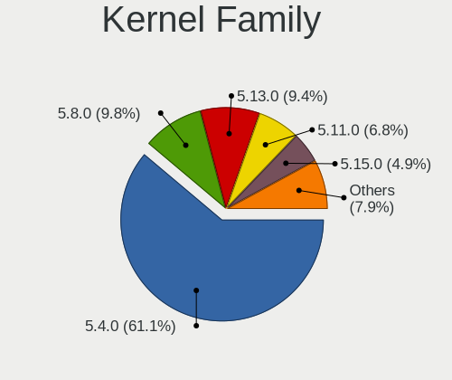

| Version | Computers | Percent |
|---------|-----------|---------|
| 5.4.0   | 155       | 66.52%  |
| 5.8.0   | 25        | 10.73%  |
| 5.11.0  | 18        | 7.73%   |
| 5.13.0  | 15        | 6.44%   |
| 5.6.0   | 3         | 1.29%   |
| 5.6.7   | 2         | 0.86%   |
| 5.3.0   | 2         | 0.86%   |
| 5.9.1   | 1         | 0.43%   |
| 5.9.0   | 1         | 0.43%   |
| 5.8.6   | 1         | 0.43%   |
| 5.8.11  | 1         | 0.43%   |
| 5.7.7   | 1         | 0.43%   |
| 5.5.8   | 1         | 0.43%   |
| 5.5.0   | 1         | 0.43%   |
| 5.16.14 | 1         | 0.43%   |
| 5.15.11 | 1         | 0.43%   |
| 5.15.0  | 1         | 0.43%   |
| 5.12.0  | 1         | 0.43%   |
| 5.10.11 | 1         | 0.43%   |
| 5.10.0  | 1         | 0.43%   |

Kernel Major Ver.
-----------------

Linux kernel major version

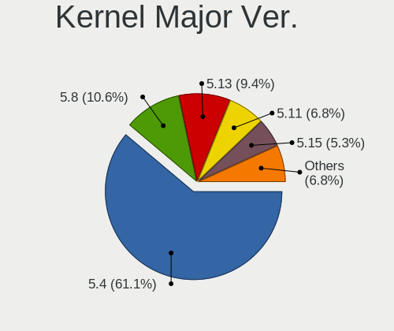

| Version | Computers | Percent |
|---------|-----------|---------|
| 5.4     | 155       | 66.52%  |
| 5.8     | 27        | 11.59%  |
| 5.11    | 18        | 7.73%   |
| 5.13    | 15        | 6.44%   |
| 5.6     | 5         | 2.15%   |
| 5.9     | 2         | 0.86%   |
| 5.5     | 2         | 0.86%   |
| 5.3     | 2         | 0.86%   |
| 5.15    | 2         | 0.86%   |
| 5.10    | 2         | 0.86%   |
| 5.7     | 1         | 0.43%   |
| 5.16    | 1         | 0.43%   |
| 5.12    | 1         | 0.43%   |

Arch
----

OS architecture (x86_64, i586, etc.)

| Name    | Computers | Percent |
|---------|-----------|---------|
| x86_64  | 229       | 99.57%  |
| aarch64 | 1         | 0.43%   |

DE
--

Desktop Environment

| Name   | Computers | Percent |
|--------|-----------|---------|
| Budgie | 224       | 97.39%  |
| GNOME  | 5         | 2.17%   |
| XFCE   | 1         | 0.43%   |

Display Server
--------------

X11 or Wayland

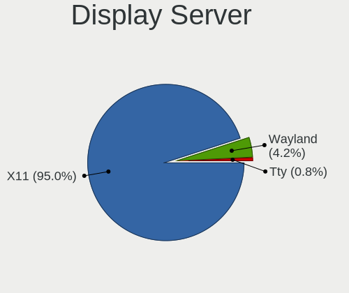

| Name    | Computers | Percent |
|---------|-----------|---------|
| X11     | 222       | 96.52%  |
| Wayland | 7         | 3.04%   |
| Tty     | 1         | 0.43%   |

Display Manager
---------------

SDDM, LightDM, etc.

| Name    | Computers | Percent |
|---------|-----------|---------|
| Unknown | 107       | 45.92%  |
| TDM     | 52        | 22.32%  |
| LightDM | 48        | 20.6%   |
| GDM     | 23        | 9.87%   |
| GDM3    | 3         | 1.29%   |

OS Lang
-------

Language

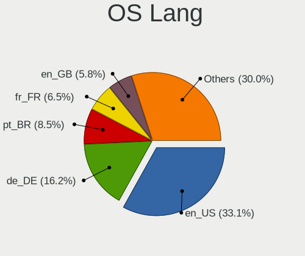

| Lang    | Computers | Percent |
|---------|-----------|---------|
| en_US   | 76        | 32.9%   |
| de_DE   | 35        | 15.15%  |
| pt_BR   | 22        | 9.52%   |
| en_GB   | 15        | 6.49%   |
| fr_FR   | 14        | 6.06%   |
| en_CA   | 9         | 3.9%    |
| ru_RU   | 7         | 3.03%   |
| it_IT   | 5         | 2.16%   |
| en_AU   | 5         | 2.16%   |
| es_ES   | 4         | 1.73%   |
| en_IN   | 4         | 1.73%   |
| zh_TW   | 2         | 0.87%   |
| pt_PT   | 2         | 0.87%   |
| fi_FI   | 2         | 0.87%   |
| es_MX   | 2         | 0.87%   |
| es_CO   | 2         | 0.87%   |
| es_CL   | 2         | 0.87%   |
| es_AR   | 2         | 0.87%   |
| de_CH   | 2         | 0.87%   |
| C       | 2         | 0.87%   |
| zh_CN   | 1         | 0.43%   |
| uk_UA   | 1         | 0.43%   |
| sv_SE   | 1         | 0.43%   |
| pl_PL   | 1         | 0.43%   |
| nl_NL   | 1         | 0.43%   |
| nb_NO   | 1         | 0.43%   |
| id_ID   | 1         | 0.43%   |
| hu_HU   | 1         | 0.43%   |
| fr_CH   | 1         | 0.43%   |
| es_US   | 1         | 0.43%   |
| es_SV   | 1         | 0.43%   |
| es_GT   | 1         | 0.43%   |
| en_SG   | 1         | 0.43%   |
| en_IL   | 1         | 0.43%   |
| de_AT   | 1         | 0.43%   |
| bg_BG   | 1         | 0.43%   |
| Unknown | 1         | 0.43%   |

Boot Mode
---------

EFI or BIOS

| Mode | Computers | Percent |
|------|-----------|---------|
| EFI  | 155       | 64.85%  |
| BIOS | 84        | 35.15%  |

Filesystem
----------

Type of filesystem

| Type    | Computers | Percent |
|---------|-----------|---------|
| Ext4    | 215       | 93.48%  |
| Zfs     | 8         | 3.48%   |
| Btrfs   | 3         | 1.3%    |
| Overlay | 2         | 0.87%   |
| Xfs     | 1         | 0.43%   |
| Jfs     | 1         | 0.43%   |

Part. scheme
------------

Scheme of partitioning

| Type    | Computers | Percent |
|---------|-----------|---------|
| Unknown | 125       | 53.88%  |
| GPT     | 80        | 34.48%  |
| MBR     | 27        | 11.64%  |

Dual Boot with Linux/BSD
------------------------

Hosting more than one Linux/BSD

| Dual boot | Computers | Percent |
|-----------|-----------|---------|
| No        | 208       | 89.27%  |
| Yes       | 25        | 10.73%  |

Dual Boot (Win)
---------------

Hosting Linux and Windows

| Dual boot | Computers | Percent |
|-----------|-----------|---------|
| No        | 160       | 68.97%  |
| Yes       | 72        | 31.03%  |

Board
-----

Vendor
------

Motherboard manufacturer

| Name                | Computers | Percent |
|---------------------|-----------|---------|
| Hewlett-Packard     | 41        | 17.83%  |
| ASUSTek Computer    | 36        | 15.65%  |
| Dell                | 25        | 10.87%  |
| TUXEDO              | 24        | 10.43%  |
| Lenovo              | 24        | 10.43%  |
| MSI                 | 14        | 6.09%   |
| Gigabyte Technology | 14        | 6.09%   |
| Acer                | 14        | 6.09%   |
| Apple               | 12        | 5.22%   |
| Samsung Electronics | 4         | 1.74%   |
| ASRock              | 3         | 1.3%    |
| Sony                | 2         | 0.87%   |
| Intel               | 2         | 0.87%   |
| HUAWEI              | 2         | 0.87%   |
| Fujitsu             | 2         | 0.87%   |
| Toshiba             | 1         | 0.43%   |
| Standard            | 1         | 0.43%   |
| Razer               | 1         | 0.43%   |
| Radxa               | 1         | 0.43%   |
| Quanta              | 1         | 0.43%   |
| PCSMART             | 1         | 0.43%   |
| Packard Bell        | 1         | 0.43%   |
| Microsoft           | 1         | 0.43%   |
| eMachines           | 1         | 0.43%   |
| Biostar             | 1         | 0.43%   |
| Unknown             | 1         | 0.43%   |

Model
-----

Motherboard model

| Name                                                  | Computers | Percent |
|-------------------------------------------------------|-----------|---------|
| Unknown                                               | 5         | 2.17%   |
| TUXEDO Polaris 15 AMD Gen1                            | 2         | 0.87%   |
| TUXEDO InfinityBook S 15 Gen6                         | 2         | 0.87%   |
| TUXEDO InfinityBook S 14 Gen6                         | 2         | 0.87%   |
| TUXEDO InfinityBook Pro 14 Gen6                       | 2         | 0.87%   |
| MSI MS-7C84                                           | 2         | 0.87%   |
| HP ZBook Studio G3                                    | 2         | 0.87%   |
| HP Pavilion g6                                        | 2         | 0.87%   |
| HP Notebook                                           | 2         | 0.87%   |
| Dell Latitude 5400                                    | 2         | 0.87%   |
| ASUS All Series                                       | 2         | 0.87%   |
| Acer TravelMate P446-M                                | 2         | 0.87%   |
| TUXEDO TUXEDO_Book_XA1510                             | 1         | 0.43%   |
| TUXEDO Stellaris AMD Gen3 (CZN)                       | 1         | 0.43%   |
| TUXEDO Pulse 15 Gen1                                  | 1         | 0.43%   |
| TUXEDO Polaris AMD Gen3 (CZN)                         | 1         | 0.43%   |
| TUXEDO Polaris 17 AMD Gen1                            | 1         | 0.43%   |
| TUXEDO P95_HR                                         | 1         | 0.43%   |
| TUXEDO P95_HP                                         | 1         | 0.43%   |
| TUXEDO P7xxTM1                                        | 1         | 0.43%   |
| TUXEDO InfinityBook Pro 15 v4                         | 1         | 0.43%   |
| TUXEDO Book XP1511                                    | 1         | 0.43%   |
| TUXEDO Book XP15 / XP17 Gen12                         | 1         | 0.43%   |
| TUXEDO Aura 15 Gen1                                   | 1         | 0.43%   |
| Toshiba Satellite P300                                | 1         | 0.43%   |
| Standard MT40II                                       | 1         | 0.43%   |
| Sony VPCCW25FL                                        | 1         | 0.43%   |
| Sony SVS13A25PBS                                      | 1         | 0.43%   |
| Samsung 905S3G/906S3G/915S3G/9305SG                   | 1         | 0.43%   |
| Samsung 530U3C/530U4C/532U3C                          | 1         | 0.43%   |
| Samsung 340XAA/350XAA/550XAA                          | 1         | 0.43%   |
| Samsung 300E5EV/300E4EV/270E5EV/270E4EV/2470EV/2470EE | 1         | 0.43%   |
| Razer Blade Stealth                                   | 1         | 0.43%   |
| Radxa ROCK Pi 4A                                      | 1         | 0.43%   |
| Quanta R460-L.BG22P1                                  | 1         | 0.43%   |
| PCSMART 6.0                                           | 1         | 0.43%   |
| Packard Bell ENLE11BZ                                 | 1         | 0.43%   |
| MSI Vector GP66 12UGS                                 | 1         | 0.43%   |
| MSI Prestige 15 A10SC                                 | 1         | 0.43%   |
| MSI MS-7B38                                           | 1         | 0.43%   |
| MSI MS-7B10                                           | 1         | 0.43%   |
| MSI MS-7A32                                           | 1         | 0.43%   |
| MSI MS-7917                                           | 1         | 0.43%   |
| MSI Modern 14 A10RB                                   | 1         | 0.43%   |
| MSI GP73 Leopard 8RE                                  | 1         | 0.43%   |
| MSI GP72 7RE                                          | 1         | 0.43%   |
| MSI GL62M 7RD                                         | 1         | 0.43%   |
| MSI GE70 2PC\2PE                                      | 1         | 0.43%   |
| MSI CX62 6QL                                          | 1         | 0.43%   |
| Microsoft Surface Book                                | 1         | 0.43%   |
| Lenovo V310-15ISK 80SY                                | 1         | 0.43%   |
| Lenovo V145-15AST 81MT                                | 1         | 0.43%   |
| Lenovo ThinkPad X260 20F5S2HF06                       | 1         | 0.43%   |
| Lenovo ThinkPad X230 23257G6                          | 1         | 0.43%   |
| Lenovo ThinkPad X230 2306CTO                          | 1         | 0.43%   |
| Lenovo ThinkPad W530 2447GW3                          | 1         | 0.43%   |
| Lenovo ThinkPad W530 244743G                          | 1         | 0.43%   |
| Lenovo ThinkPad T480 20L6SDR21A                       | 1         | 0.43%   |
| Lenovo ThinkPad T430s 23539WU                         | 1         | 0.43%   |
| Lenovo ThinkPad T430 2349P74                          | 1         | 0.43%   |

Model Family
------------

Motherboard model prefix

| Name                  | Computers | Percent |
|-----------------------|-----------|---------|
| Lenovo ThinkPad       | 14        | 6.09%   |
| Acer Aspire           | 11        | 4.78%   |
| Dell Latitude         | 9         | 3.91%   |
| TUXEDO InfinityBook   | 7         | 3.04%   |
| HP Pavilion           | 7         | 3.04%   |
| HP EliteBook          | 6         | 2.61%   |
| Dell Inspiron         | 6         | 2.61%   |
| HP Spectre            | 5         | 2.17%   |
| Unknown               | 5         | 2.17%   |
| TUXEDO Polaris        | 4         | 1.74%   |
| HP Laptop             | 4         | 1.74%   |
| HP Compaq             | 4         | 1.74%   |
| Lenovo IdeaPad        | 3         | 1.3%    |
| HP ProBook            | 3         | 1.3%    |
| Dell XPS              | 3         | 1.3%    |
| Dell OptiPlex         | 3         | 1.3%    |
| ASUS ROG              | 3         | 1.3%    |
| ASUS PRIME            | 3         | 1.3%    |
| TUXEDO P95            | 2         | 0.87%   |
| TUXEDO Book           | 2         | 0.87%   |
| MSI MS-7C84           | 2         | 0.87%   |
| HP ZBook              | 2         | 0.87%   |
| HP Notebook           | 2         | 0.87%   |
| HP ENVY               | 2         | 0.87%   |
| Gigabyte B360         | 2         | 0.87%   |
| Dell Precision        | 2         | 0.87%   |
| ASUS TUF              | 2         | 0.87%   |
| ASUS All              | 2         | 0.87%   |
| Acer TravelMate       | 2         | 0.87%   |
| TUXEDO TUXEDO         | 1         | 0.43%   |
| TUXEDO Stellaris      | 1         | 0.43%   |
| TUXEDO Pulse          | 1         | 0.43%   |
| TUXEDO P7xxTM1        | 1         | 0.43%   |
| TUXEDO Aura           | 1         | 0.43%   |
| Toshiba Satellite     | 1         | 0.43%   |
| Standard MT40II       | 1         | 0.43%   |
| Sony VPCCW25FL        | 1         | 0.43%   |
| Sony SVS13A25PBS      | 1         | 0.43%   |
| Samsung 905S3G        | 1         | 0.43%   |
| Samsung 530U3C        | 1         | 0.43%   |
| Samsung 340XAA        | 1         | 0.43%   |
| Samsung 300E5EV       | 1         | 0.43%   |
| Razer Blade           | 1         | 0.43%   |
| Radxa ROCK            | 1         | 0.43%   |
| Quanta R460-L.BG22P1  | 1         | 0.43%   |
| PCSMART 6.0           | 1         | 0.43%   |
| Packard Bell ENLE11BZ | 1         | 0.43%   |
| MSI Vector            | 1         | 0.43%   |
| MSI Prestige          | 1         | 0.43%   |
| MSI MS-7B38           | 1         | 0.43%   |
| MSI MS-7B10           | 1         | 0.43%   |
| MSI MS-7A32           | 1         | 0.43%   |
| MSI MS-7917           | 1         | 0.43%   |
| MSI Modern            | 1         | 0.43%   |
| MSI GP73              | 1         | 0.43%   |
| MSI GP72              | 1         | 0.43%   |
| MSI GL62M             | 1         | 0.43%   |
| MSI GE70              | 1         | 0.43%   |
| MSI CX62              | 1         | 0.43%   |
| Microsoft Surface     | 1         | 0.43%   |

MFG Year
--------

Motherboard manufacture year

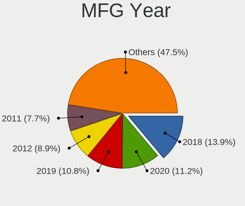

| Year    | Computers | Percent |
|---------|-----------|---------|
| 2018    | 33        | 14.35%  |
| 2019    | 28        | 12.17%  |
| 2020    | 23        | 10%     |
| 2012    | 21        | 9.13%   |
| 2017    | 19        | 8.26%   |
| 2011    | 18        | 7.83%   |
| 2016    | 17        | 7.39%   |
| 2013    | 15        | 6.52%   |
| 2015    | 10        | 4.35%   |
| 2009    | 10        | 4.35%   |
| 2014    | 9         | 3.91%   |
| 2021    | 8         | 3.48%   |
| 2010    | 7         | 3.04%   |
| 2008    | 7         | 3.04%   |
| 2007    | 3         | 1.3%    |
| 2022    | 1         | 0.43%   |
| Unknown | 1         | 0.43%   |

Form Factor
-----------

Physical design of the computer

| Name           | Computers | Percent |
|----------------|-----------|---------|
| Notebook       | 151       | 65.65%  |
| Desktop        | 61        | 26.52%  |
| Convertible    | 6         | 2.61%   |
| All in one     | 5         | 2.17%   |
| Tablet         | 3         | 1.3%    |
| Mini pc        | 3         | 1.3%    |
| System on chip | 1         | 0.43%   |

Secure Boot
-----------

Enabled or disabled

| State    | Computers | Percent |
|----------|-----------|---------|
| Disabled | 210       | 91.3%   |
| Enabled  | 20        | 8.7%    |

Coreboot
--------

Have coreboot on board

| Used | Computers | Percent |
|------|-----------|---------|
| No   | 230       | 100%    |

RAM Size
--------

Total RAM memory

| Size in GB  | Computers | Percent |
|-------------|-----------|---------|
| 16.01-24.0  | 66        | 28.21%  |
| 4.01-8.0    | 52        | 22.22%  |
| 8.01-16.0   | 44        | 18.8%   |
| 3.01-4.0    | 31        | 13.25%  |
| 32.01-64.0  | 26        | 11.11%  |
| 64.01-256.0 | 10        | 4.27%   |
| 2.01-3.0    | 2         | 0.85%   |
| 24.01-32.0  | 1         | 0.43%   |
| 1.01-2.0    | 1         | 0.43%   |
| 0.51-1.0    | 1         | 0.43%   |

RAM Used
--------

Used RAM memory

| Used GB    | Computers | Percent |
|------------|-----------|---------|
| 2.01-3.0   | 75        | 30.12%  |
| 1.01-2.0   | 58        | 23.29%  |
| 4.01-8.0   | 55        | 22.09%  |
| 3.01-4.0   | 44        | 17.67%  |
| 8.01-16.0  | 15        | 6.02%   |
| 32.01-64.0 | 1         | 0.4%    |
| 0.01-0.5   | 1         | 0.4%    |

Total Drives
------------

Number of drives on board

| Drives | Computers | Percent |
|--------|-----------|---------|
| 1      | 139       | 59.91%  |
| 2      | 62        | 26.72%  |
| 3      | 14        | 6.03%   |
| 5      | 8         | 3.45%   |
| 4      | 7         | 3.02%   |
| 8      | 1         | 0.43%   |
| 6      | 1         | 0.43%   |

Has CD-ROM
----------

Has CD-ROM on board

| Presented | Computers | Percent |
|-----------|-----------|---------|
| No        | 150       | 64.94%  |
| Yes       | 81        | 35.06%  |

Has Ethernet
------------

Has Ethernet on board

| Presented | Computers | Percent |
|-----------|-----------|---------|
| Yes       | 203       | 88.26%  |
| No        | 27        | 11.74%  |

Has WiFi
--------

Has WiFi module

| Presented | Computers | Percent |
|-----------|-----------|---------|
| Yes       | 200       | 86.96%  |
| No        | 30        | 13.04%  |

Has Bluetooth
-------------

Has Bluetooth module

| Presented | Computers | Percent |
|-----------|-----------|---------|
| Yes       | 166       | 71.55%  |
| No        | 66        | 28.45%  |

Location
--------

Country
-------

Geographic location (country)

| Country            | Computers | Percent |
|--------------------|-----------|---------|
| Germany            | 40        | 17.39%  |
| USA                | 31        | 13.48%  |
| Brazil             | 22        | 9.57%   |
| France             | 14        | 6.09%   |
| Russia             | 8         | 3.48%   |
| Italy              | 8         | 3.48%   |
| UK                 | 7         | 3.04%   |
| Canada             | 7         | 3.04%   |
| Spain              | 5         | 2.17%   |
| Poland             | 5         | 2.17%   |
| Australia          | 5         | 2.17%   |
| Ukraine            | 4         | 1.74%   |
| Switzerland        | 4         | 1.74%   |
| Netherlands        | 4         | 1.74%   |
| Japan              | 4         | 1.74%   |
| India              | 4         | 1.74%   |
| Finland            | 4         | 1.74%   |
| Austria            | 4         | 1.74%   |
| Portugal           | 3         | 1.3%    |
| Norway             | 3         | 1.3%    |
| Mexico             | 3         | 1.3%    |
| Iran               | 3         | 1.3%    |
| Hungary            | 3         | 1.3%    |
| Colombia           | 3         | 1.3%    |
| Turkey             | 2         | 0.87%   |
| Sweden             | 2         | 0.87%   |
| South Africa       | 2         | 0.87%   |
| Indonesia          | 2         | 0.87%   |
| Croatia            | 2         | 0.87%   |
| Chile              | 2         | 0.87%   |
| Belgium            | 2         | 0.87%   |
| Argentina          | 2         | 0.87%   |
| Taiwan             | 1         | 0.43%   |
| Slovenia           | 1         | 0.43%   |
| Singapore          | 1         | 0.43%   |
| Saudi Arabia       | 1         | 0.43%   |
| Malaysia           | 1         | 0.43%   |
| Kenya              | 1         | 0.43%   |
| Israel             | 1         | 0.43%   |
| Hong Kong          | 1         | 0.43%   |
| Honduras           | 1         | 0.43%   |
| Guatemala          | 1         | 0.43%   |
| Ghana              | 1         | 0.43%   |
| El Salvador        | 1         | 0.43%   |
| Ecuador            | 1         | 0.43%   |
| Dominican Republic | 1         | 0.43%   |
| Bulgaria           | 1         | 0.43%   |
| Bolivia            | 1         | 0.43%   |

City
----

Geographic location (city)

| City                      | Computers | Percent |
|---------------------------|-----------|---------|
| Paris                     | 4         | 1.69%   |
| Tehran                    | 3         | 1.27%   |
| Stuttgart                 | 3         | 1.27%   |
| Sao Paulo                 | 3         | 1.27%   |
| Ravensburg                | 3         | 1.27%   |
| Munich                    | 3         | 1.27%   |
| Moscow                    | 3         | 1.27%   |
| Zagreb                    | 2         | 0.84%   |
| Wilchingen, Osterfingen   | 2         | 0.84%   |
| Vienna                    | 2         | 0.84%   |
| Sydney                    | 2         | 0.84%   |
| Montreal                  | 2         | 0.84%   |
| Miami                     | 2         | 0.84%   |
| Maring                | 2         | 0.84%   |
| Los Angeles               | 2         | 0.84%   |
| Lisbon                    | 2         | 0.84%   |
| Kyiv                      | 2         | 0.84%   |
| Hamburg                   | 2         | 0.84%   |
| Frankfurt am Main         | 2         | 0.84%   |
| Dresden                   | 2         | 0.84%   |
| Dallas                    | 2         | 0.84%   |
| Budapest                  | 2         | 0.84%   |
| Braslia               | 2         | 0.84%   |
| Bogot                 | 2         | 0.84%   |
| Berlin                    | 2         | 0.84%   |
| Belo Horizonte            | 2         | 0.84%   |
| Zheleznodorozhnyy         | 1         | 0.42%   |
| Zapopan                   | 1         | 0.42%   |
| Zabrze                    | 1         | 0.42%   |
| Yuma                      | 1         | 0.42%   |
| Wolfsburg                 | 1         | 0.42%   |
| Woking                    | 1         | 0.42%   |
| West Lafayette            | 1         | 0.42%   |
| Waterloo                  | 1         | 0.42%   |
| Warsaw                    | 1         | 0.42%   |
| Villingen-Schwenningen    | 1         | 0.42%   |
| Vicente Lopez             | 1         | 0.42%   |
| Versailles                | 1         | 0.42%   |
| Vantaa                    | 1         | 0.42%   |
| Uman                      | 1         | 0.42%   |
| Tuttlingen                | 1         | 0.42%   |
| Tuscola                   | 1         | 0.42%   |
| Turku                     | 1         | 0.42%   |
| Trondheim                 | 1         | 0.42%   |
| Totana                    | 1         | 0.42%   |
| Topeka                    | 1         | 0.42%   |
| Tokyo                     | 1         | 0.42%   |
| Tijuana                   | 1         | 0.42%   |
| Tiel                      | 1         | 0.42%   |
| The Hague                 | 1         | 0.42%   |
| Ternopil                  | 1         | 0.42%   |
| Teresina                  | 1         | 0.42%   |
| Tangerang                 | 1         | 0.42%   |
| Talcahuano                | 1         | 0.42%   |
| So Lus            | 1         | 0.42%   |
| So Jos dos Campos | 1         | 0.42%   |
| Szentendre                | 1         | 0.42%   |
| Steinmauern               | 1         | 0.42%   |
| Stara Zagora              | 1         | 0.42%   |
| St Petersburg             | 1         | 0.42%   |

Drives
------

Drive Vendor
------------

Hard drive vendors

| Vendor                    | Computers | Drives  | Percent |
|---------------------------|-----------|---------|---------|
| Samsung Electronics       | 75        | 96      | 22.39%  |
| WDC                       | 41        | 59      | 12.24%  |
| Seagate                   | 41        | 59      | 12.24%  |
| Toshiba                   | 28        | 30      | 8.36%   |
| SanDisk                   | 18        | 22      | 5.37%   |
| Kingston                  | 16        | 22      | 4.78%   |
| Unknown                   | 13        | 16      | 3.88%   |
| Intel                     | 11        | 21      | 3.28%   |
| Crucial                   | 10        | 11      | 2.99%   |
| HGST                      | 9         | 13      | 2.69%   |
| Hitachi                   | 8         | 11      | 2.39%   |
| Phison                    | 6         | 9       | 1.79%   |
| Micron Technology         | 6         | 8       | 1.79%   |
| A-DATA Technology         | 6         | 7       | 1.79%   |
| SK Hynix                  | 5         | 5       | 1.49%   |
| PNY                       | 5         | 7       | 1.49%   |
| Apple                     | 5         | 6       | 1.49%   |
| China                     | 3         | 3       | 0.9%    |
| Micron/Crucial Technology | 2         | 2       | 0.6%    |
| MAXTOR                    | 2         | 5       | 0.6%    |
| LITEON                    | 2         | 2       | 0.6%    |
| HS-SSD-C100               | 2         | 2       | 0.6%    |
| XrayDisk                  | 1         | 1       | 0.3%    |
| Vaseky                    | 1         | 1       | 0.3%    |
| USB30                     | 1         | 1       | 0.3%    |
| Transcend                 | 1         | 1       | 0.3%    |
| Silicon Motion            | 1         | 1       | 0.3%    |
| SABRENT                   | 1         | 1       | 0.3%    |
| PLEXTOR                   | 1         | 1       | 0.3%    |
| OCZ                       | 1         | 1       | 0.3%    |
| Netac                     | 1         | 1       | 0.3%    |
| LaCie                     | 1         | 1       | 0.3%    |
| KingSpec                  | 1         | 1       | 0.3%    |
| KingDian                  | 1         | 1       | 0.3%    |
| KimMiDi                   | 1         | 1       | 0.3%    |
| JMicron                   | 1         | 1       | 0.3%    |
| HP Phison                 | 1         | 1       | 0.3%    |
| Hewlett-Packard           | 1         | Unknown | 0.3%    |
| GALAX TA                  | 1         | 1       | 0.3%    |
| Corsair                   | 1         | 1       | 0.3%    |
| Axiom                     | 1         | 1       | 0.3%    |
| Apacer                    | 1         | 1       | 0.3%    |
| AMD                       | 1         | 8       | 0.3%    |

Drive Model
-----------

Hard drive models

| Model                               | Computers | Percent |
|-------------------------------------|-----------|---------|
| Samsung NVMe SSD Drive 500GB        | 7         | 1.88%   |
| Samsung SSD 860 EVO 500GB           | 5         | 1.34%   |
| Toshiba MQ01ABD100 1TB              | 4         | 1.08%   |
| Seagate ST1000LM024 HN-M101MBB 1TB  | 4         | 1.08%   |
| Samsung SSD 970 EVO Plus 1TB        | 4         | 1.08%   |
| Samsung NVMe SSD Drive 512GB        | 4         | 1.08%   |
| Samsung NVMe SSD Drive 250GB        | 4         | 1.08%   |
| Kingston SA400S37240G 240GB SSD     | 4         | 1.08%   |
| Unknown MMC Card  64GB              | 3         | 0.81%   |
| Unknown MMC Card  32GB              | 3         | 0.81%   |
| Seagate ST9500325AS 500GB           | 3         | 0.81%   |
| Seagate ST500DM002-1BD142 500GB     | 3         | 0.81%   |
| Seagate ST1000LM035-1RK172 1TB      | 3         | 0.81%   |
| SanDisk SDSSDA240G 240GB            | 3         | 0.81%   |
| SanDisk SDSSDA120G 120GB            | 3         | 0.81%   |
| Samsung SSD 970 EVO Plus 500GB      | 3         | 0.81%   |
| Samsung SSD 970 EVO 500GB           | 3         | 0.81%   |
| Samsung SSD 750 EVO 250GB           | 3         | 0.81%   |
| Samsung NVMe SSD Drive 1TB          | 3         | 0.81%   |
| Intel NVMe SSD Drive 512GB          | 3         | 0.81%   |
| WDC WD5000AAKX-001CA0 500GB         | 2         | 0.54%   |
| WDC WD5000AAKS-00UU3A0 500GB        | 2         | 0.54%   |
| WDC WD10SPZX-60Z10T0 1TB            | 2         | 0.54%   |
| Unknown SD/MMC/MS PRO 32GB          | 2         | 0.54%   |
| Toshiba MQ01ABF050 500GB            | 2         | 0.54%   |
| SK Hynix NVMe SSD Drive 256GB       | 2         | 0.54%   |
| Seagate ST500LT012-1DG142 500GB     | 2         | 0.54%   |
| Seagate ST4000DM000-1F2168 4TB      | 2         | 0.54%   |
| Seagate ST2000LM015-2E8174 2TB      | 2         | 0.54%   |
| Seagate ST1000LX015-1U7172 1TB      | 2         | 0.54%   |
| Seagate ST1000DM010-2EP102 1TB      | 2         | 0.54%   |
| Seagate ST1000DM003-1CH162 1TB      | 2         | 0.54%   |
| Seagate BUP Slim BK 1TB             | 2         | 0.54%   |
| SanDisk SSD PLUS 120GB              | 2         | 0.54%   |
| Sandisk NVMe SSD Drive 512GB        | 2         | 0.54%   |
| Samsung SSD 980 PRO 1TB             | 2         | 0.54%   |
| Samsung SSD 860 QVO 1TB             | 2         | 0.54%   |
| Samsung SSD 860 EVO M.2 250GB       | 2         | 0.54%   |
| Samsung NVMe SSD Drive 2TB          | 2         | 0.54%   |
| Samsung MZVLB256HAHQ-00000 256GB    | 2         | 0.54%   |
| PNY CS900 240GB SSD                 | 2         | 0.54%   |
| Phison Sabrent Rocket 4.0 1TB       | 2         | 0.54%   |
| Phison NVMe SSD Drive 240GB         | 2         | 0.54%   |
| Micron/Crucial NVMe SSD Drive 1TB   | 2         | 0.54%   |
| Micron 1100_MTFDDAV256TBN 256GB SSD | 2         | 0.54%   |
| Kingston SV300S37A60G 64GB SSD      | 2         | 0.54%   |
| Kingston SA400S37480G 480GB SSD     | 2         | 0.54%   |
| Intel NVMe SSD Drive 32GB           | 2         | 0.54%   |
| Hitachi HTS545050A7E380 500GB       | 2         | 0.54%   |
| HGST HTS725050A7E630 500GB          | 2         | 0.54%   |
| HGST HTS541010A9E680 1TB            | 2         | 0.54%   |
| Crucial CT250MX500SSD1 250GB        | 2         | 0.54%   |
| XrayDisk 256GB                      | 1         | 0.27%   |
| WDC WDS500G2B0B-00YS70 500GB SSD    | 1         | 0.27%   |
| WDC WDS500G2B0A-00SM50 500GB SSD    | 1         | 0.27%   |
| WDC WDS240G2G0B-00EPW0 240GB SSD    | 1         | 0.27%   |
| WDC WDS240G2G0A-00JH30 240GB SSD    | 1         | 0.27%   |
| WDC WDS200T2B0A 2TB SSD             | 1         | 0.27%   |
| WDC WDS120G2G0B-00EPW0 120GB SSD    | 1         | 0.27%   |
| WDC WDS120G2G0A-00JH30 120GB SSD    | 1         | 0.27%   |

HDD Vendor
----------

Hard disk drive vendors

| Vendor              | Computers | Drives | Percent |
|---------------------|-----------|--------|---------|
| Seagate             | 39        | 57     | 33.33%  |
| WDC                 | 32        | 48     | 27.35%  |
| Toshiba             | 22        | 24     | 18.8%   |
| HGST                | 9         | 13     | 7.69%   |
| Hitachi             | 8         | 11     | 6.84%   |
| Unknown             | 2         | 2      | 1.71%   |
| MAXTOR              | 2         | 5      | 1.71%   |
| Samsung Electronics | 1         | 1      | 0.85%   |
| SABRENT             | 1         | 1      | 0.85%   |
| Apple               | 1         | 1      | 0.85%   |

SSD Vendor
----------

Solid state drive vendors

| Vendor              | Computers | Drives | Percent |
|---------------------|-----------|--------|---------|
| Samsung Electronics | 36        | 44     | 30.25%  |
| Kingston            | 15        | 21     | 12.61%  |
| SanDisk             | 14        | 17     | 11.76%  |
| WDC                 | 8         | 9      | 6.72%   |
| Crucial             | 8         | 9      | 6.72%   |
| A-DATA Technology   | 5         | 6      | 4.2%    |
| PNY                 | 4         | 6      | 3.36%   |
| Micron Technology   | 3         | 5      | 2.52%   |
| Intel               | 3         | 3      | 2.52%   |
| China               | 3         | 3      | 2.52%   |
| Apple               | 3         | 3      | 2.52%   |
| LITEON              | 2         | 2      | 1.68%   |
| Vaseky              | 1         | 1      | 0.84%   |
| USB30               | 1         | 1      | 0.84%   |
| Transcend           | 1         | 1      | 0.84%   |
| Toshiba             | 1         | 1      | 0.84%   |
| SK Hynix            | 1         | 1      | 0.84%   |
| Seagate             | 1         | 1      | 0.84%   |
| PLEXTOR             | 1         | 1      | 0.84%   |
| Netac               | 1         | 1      | 0.84%   |
| KingSpec            | 1         | 1      | 0.84%   |
| KingDian            | 1         | 1      | 0.84%   |
| JMicron             | 1         | 1      | 0.84%   |
| HP Phison           | 1         | 1      | 0.84%   |
| Axiom               | 1         | 1      | 0.84%   |
| Apacer              | 1         | 1      | 0.84%   |
| AMD                 | 1         | 8      | 0.84%   |

Drive Kind
----------

HDD or SSD

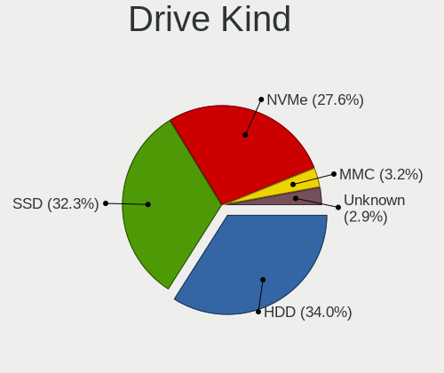

| Kind    | Computers | Drives | Percent |
|---------|-----------|--------|---------|
| SSD     | 103       | 150    | 33.66%  |
| HDD     | 103       | 163    | 33.66%  |
| NVMe    | 82        | 110    | 26.8%   |
| MMC     | 9         | 11     | 2.94%   |
| Unknown | 9         | 9      | 2.94%   |

Drive Connector
---------------

SATA, SAS, NVMe, etc.

| Type | Computers | Drives | Percent |
|------|-----------|--------|---------|
| SATA | 163       | 308    | 61.05%  |
| NVMe | 82        | 110    | 30.71%  |
| SAS  | 13        | 14     | 4.87%   |
| MMC  | 9         | 11     | 3.37%   |

Drive Size
----------

Size of hard drive

| Size in TB | Computers | Drives | Percent |
|------------|-----------|--------|---------|
| 0.01-0.5   | 119       | 185    | 57.77%  |
| 0.51-1.0   | 61        | 85     | 29.61%  |
| 1.01-2.0   | 17        | 29     | 8.25%   |
| 3.01-4.0   | 6         | 10     | 2.91%   |
| 4.01-10.0  | 3         | 4      | 1.46%   |

Space Total
-----------

Amount of disk space available on the file system

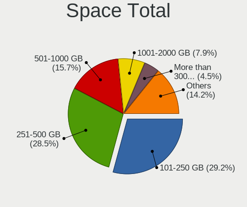

| Size in GB     | Computers | Percent |
|----------------|-----------|---------|
| 251-500        | 68        | 28.45%  |
| 101-250        | 68        | 28.45%  |
| 501-1000       | 39        | 16.32%  |
| 1001-2000      | 17        | 7.11%   |
| 21-50          | 12        | 5.02%   |
| 51-100         | 11        | 4.6%    |
| More than 3000 | 9         | 3.77%   |
| 2001-3000      | 6         | 2.51%   |
| Unknown        | 5         | 2.09%   |
| 1-20           | 4         | 1.67%   |

Space Used
----------

Amount of used disk space

| Used GB        | Computers | Percent |
|----------------|-----------|---------|
| 1-20           | 67        | 27.8%   |
| 101-250        | 49        | 20.33%  |
| 21-50          | 43        | 17.84%  |
| 51-100         | 32        | 13.28%  |
| 251-500        | 25        | 10.37%  |
| 501-1000       | 10        | 4.15%   |
| 1001-2000      | 8         | 3.32%   |
| Unknown        | 5         | 2.07%   |
| More than 3000 | 1         | 0.41%   |
| 2001-3000      | 1         | 0.41%   |

Malfunc. Drives
---------------

Drive models with a malfunction

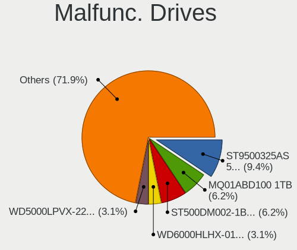

| Model                               | Computers | Drives | Percent |
|-------------------------------------|-----------|--------|---------|
| Toshiba MQ01ABD100 1TB              | 2         | 2      | 7.14%   |
| Seagate ST9500325AS 500GB           | 2         | 2      | 7.14%   |
| Seagate ST500DM002-1BD142 500GB     | 2         | 2      | 7.14%   |
| WDC WD6000HLHX-01JJPV0 600GB        | 1         | 1      | 3.57%   |
| WDC WD5000AVCS-632DY1 500GB         | 1         | 1      | 3.57%   |
| WDC WD5000AAKX-001CA0 500GB         | 1         | 1      | 3.57%   |
| WDC WD4003FZEX-00Z4SA0 4TB          | 1         | 1      | 3.57%   |
| WDC WD2500AAJS-60M0A0 250GB         | 1         | 1      | 3.57%   |
| WDC WD20EFRX-68EUZN0 2TB            | 1         | 2      | 3.57%   |
| Toshiba MQ01ABF050 500GB            | 1         | 1      | 3.57%   |
| Toshiba MQ01ABD050 500GB            | 1         | 1      | 3.57%   |
| Toshiba MK5055GSX 500GB             | 1         | 1      | 3.57%   |
| Toshiba MK2561GSYN 250GB            | 1         | 1      | 3.57%   |
| Seagate ST9750420AS 752GB           | 1         | 1      | 3.57%   |
| Seagate ST5000DM000-1FK178 5TB      | 1         | 1      | 3.57%   |
| Seagate ST3320620AS 320GB           | 1         | 1      | 3.57%   |
| Seagate ST1000LM024 HN-M101MBB 1TB  | 1         | 1      | 3.57%   |
| PNY SSD2SC120G3LC709B121-460I 120GB | 1         | 1      | 3.57%   |
| MAXTOR STM3250310AS 250GB           | 1         | 1      | 3.57%   |
| MAXTOR 6B200M0 208GB                | 1         | 2      | 3.57%   |
| HP Phison PSSBN032GA27MC1 32GB SSD  | 1         | 1      | 3.57%   |
| Hitachi HTS545025B9SA02 250GB       | 1         | 1      | 3.57%   |
| Hitachi HDS721032CLA362 320GB       | 1         | 1      | 3.57%   |
| HGST HTS725032A7E630 320GB          | 1         | 2      | 3.57%   |
| Crucial CT500P1SSD8 500GB           | 1         | 1      | 3.57%   |

Malfunc. Drive Vendor
---------------------

Vendors of faulty drives

| Vendor    | Computers | Drives | Percent |
|-----------|-----------|--------|---------|
| Seagate   | 8         | 8      | 28.57%  |
| WDC       | 6         | 7      | 21.43%  |
| Toshiba   | 6         | 6      | 21.43%  |
| MAXTOR    | 2         | 3      | 7.14%   |
| Hitachi   | 2         | 2      | 7.14%   |
| PNY       | 1         | 1      | 3.57%   |
| HP Phison | 1         | 1      | 3.57%   |
| HGST      | 1         | 2      | 3.57%   |
| Crucial   | 1         | 1      | 3.57%   |

Malfunc. HDD Vendor
-------------------

Vendors of faulty HDD drives

| Vendor  | Computers | Drives | Percent |
|---------|-----------|--------|---------|
| Seagate | 8         | 8      | 32%     |
| WDC     | 6         | 7      | 24%     |
| Toshiba | 6         | 6      | 24%     |
| MAXTOR  | 2         | 3      | 8%      |
| Hitachi | 2         | 2      | 8%      |
| HGST    | 1         | 2      | 4%      |

Malfunc. Drive Kind
-------------------

Kinds of faulty drives

| Kind | Computers | Drives | Percent |
|------|-----------|--------|---------|
| HDD  | 21        | 28     | 87.5%   |
| SSD  | 2         | 2      | 8.33%   |
| NVMe | 1         | 1      | 4.17%   |

Failed Drives
-------------

Failed drive models

Zero info for selected period =(

Failed Drive Vendor
-------------------

Failed drive vendors

Zero info for selected period =(

Drive Status
------------

Number of failed and malfunc. drives

| Status   | Computers | Drives | Percent |
|----------|-----------|--------|---------|
| Detected | 133       | 259    | 52.16%  |
| Works    | 98        | 153    | 38.43%  |
| Malfunc  | 24        | 31     | 9.41%   |

Storage controller
------------------

Storage Vendor
--------------

Storage controller vendors

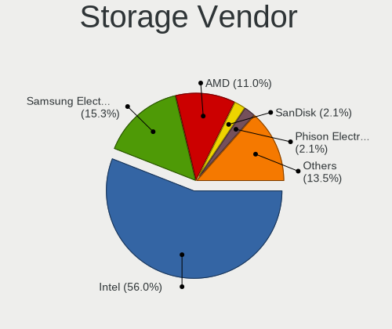

| Vendor                        | Computers | Percent |
|-------------------------------|-----------|---------|
| Intel                         | 159       | 55.21%  |
| Samsung Electronics           | 46        | 15.97%  |
| AMD                           | 33        | 11.46%  |
| Phison Electronics            | 7         | 2.43%   |
| Sandisk                       | 6         | 2.08%   |
| Toshiba America Info Systems  | 5         | 1.74%   |
| Marvell Technology Group      | 5         | 1.74%   |
| SK Hynix                      | 4         | 1.39%   |
| Micron/Crucial Technology     | 4         | 1.39%   |
| JMicron Technology            | 4         | 1.39%   |
| Micron Technology             | 3         | 1.04%   |
| Silicon Motion                | 2         | 0.69%   |
| Silicon Image                 | 1         | 0.35%   |
| Realtek Semiconductor         | 1         | 0.35%   |
| OCZ Technology Group          | 1         | 0.35%   |
| Nvidia                        | 1         | 0.35%   |
| Kingston Technology Company   | 1         | 0.35%   |
| Integrated Technology Express | 1         | 0.35%   |
| ASMedia Technology            | 1         | 0.35%   |
| Apple                         | 1         | 0.35%   |
| ADATA Technology              | 1         | 0.35%   |
| Adaptec                       | 1         | 0.35%   |

Storage Model
-------------

Storage controller models

| Model                                                                                   | Computers | Percent |
|-----------------------------------------------------------------------------------------|-----------|---------|
| Samsung NVMe SSD Controller SM981/PM981/PM983                                           | 31        | 9.6%    |
| AMD FCH SATA Controller [AHCI mode]                                                     | 27        | 8.36%   |
| Intel Sunrise Point-LP SATA Controller [AHCI mode]                                      | 19        | 5.88%   |
| Intel 7 Series Chipset Family 6-port SATA Controller [AHCI mode]                        | 16        | 4.95%   |
| Intel 6 Series/C200 Series Chipset Family 6 port Mobile SATA AHCI Controller            | 12        | 3.72%   |
| Intel 82801 Mobile SATA Controller [RAID mode]                                          | 10        | 3.1%    |
| Intel 8 Series/C220 Series Chipset Family 6-port SATA Controller 1 [AHCI mode]          | 9         | 2.79%   |
| Intel Cannon Point-LP SATA Controller [AHCI Mode]                                       | 7         | 2.17%   |
| Intel 8 Series SATA Controller 1 [AHCI mode]                                            | 7         | 2.17%   |
| Intel Q170/Q150/B150/H170/H110/Z170/CM236 Chipset SATA Controller [AHCI Mode]           | 6         | 1.86%   |
| Intel Cannon Lake PCH SATA AHCI Controller                                              | 6         | 1.86%   |
| AMD 400 Series Chipset SATA Controller                                                  | 6         | 1.86%   |
| Intel 5 Series/3400 Series Chipset 6 port SATA AHCI Controller                          | 5         | 1.55%   |
| Samsung NVMe SSD Controller PM9A1/PM9A3/980PRO                                          | 4         | 1.24%   |
| Phison E16 PCIe4 NVMe Controller                                                        | 4         | 1.24%   |
| Phison E12 NVMe Controller                                                              | 4         | 1.24%   |
| Intel SSD 660P Series                                                                   | 4         | 1.24%   |
| Intel SATA Controller [RAID mode]                                                       | 4         | 1.24%   |
| Intel HM170/QM170 Chipset SATA Controller [AHCI Mode]                                   | 4         | 1.24%   |
| Intel 82801IBM/IEM (ICH9M/ICH9M-E) 4 port SATA Controller [AHCI mode]                   | 4         | 1.24%   |
| Intel 82801HM/HEM (ICH8M/ICH8M-E) SATA Controller [AHCI mode]                           | 4         | 1.24%   |
| Intel 82801HM/HEM (ICH8M/ICH8M-E) IDE Controller                                        | 4         | 1.24%   |
| Intel 7 Series/C210 Series Chipset Family 6-port SATA Controller [AHCI mode]            | 4         | 1.24%   |
| Intel 200 Series PCH SATA controller [AHCI mode]                                        | 4         | 1.24%   |
| AMD 500 Series Chipset SATA Controller                                                  | 4         | 1.24%   |
| Samsung NVMe SSD Controller SM951/PM951                                                 | 3         | 0.93%   |
| Samsung NVMe SSD Controller 980                                                         | 3         | 0.93%   |
| Micron/Crucial P2 NVMe PCIe SSD                                                         | 3         | 0.93%   |
| Micron Non-Volatile memory controller                                                   | 3         | 0.93%   |
| Intel Wildcat Point-LP SATA Controller [AHCI Mode]                                      | 3         | 0.93%   |
| Intel Non-Volatile memory controller                                                    | 3         | 0.93%   |
| Intel Cannon Lake Mobile PCH SATA AHCI Controller                                       | 3         | 0.93%   |
| Intel Atom/Celeron/Pentium Processor x5-E8000/J3xxx/N3xxx Series SATA Controller        | 3         | 0.93%   |
| Intel 6 Series/C200 Series Chipset Family 6 port Desktop SATA AHCI Controller           | 3         | 0.93%   |
| Intel 5 Series/3400 Series Chipset 4 port SATA IDE Controller                           | 3         | 0.93%   |
| Intel 5 Series/3400 Series Chipset 2 port SATA IDE Controller                           | 3         | 0.93%   |
| Intel 400 Series Chipset Family SATA AHCI Controller                                    | 3         | 0.93%   |
| Toshiba America Info Systems Toshiba America Info Non-Volatile memory controller        | 2         | 0.62%   |
| Toshiba America Info Systems BG3 NVMe SSD Controller                                    | 2         | 0.62%   |
| SK Hynix BC501 NVMe Solid State Drive                                                   | 2         | 0.62%   |
| Silicon Motion SM2263EN/SM2263XT SSD Controller                                         | 2         | 0.62%   |
| Sandisk WD Black SN750 / PC SN730 NVMe SSD                                              | 2         | 0.62%   |
| Sandisk WD Black 2018/SN750 / PC SN720 NVMe SSD                                         | 2         | 0.62%   |
| Sandisk PC SN520 NVMe SSD                                                               | 2         | 0.62%   |
| Samsung NVMe SSD Controller SM961/PM961/SM963                                           | 2         | 0.62%   |
| Samsung Electronics SATA controller                                                     | 2         | 0.62%   |
| Marvell Group 88SE9172 SATA 6Gb/s Controller                                            | 2         | 0.62%   |
| Intel NM10/ICH7 Family SATA Controller [IDE mode]                                       | 2         | 0.62%   |
| Intel Ice Lake-LP SATA Controller [AHCI mode]                                           | 2         | 0.62%   |
| Intel Comet Lake SATA AHCI Controller                                                   | 2         | 0.62%   |
| Intel 82801G (ICH7 Family) IDE Controller                                               | 2         | 0.62%   |
| Intel 6 Series/C200 Series Chipset Family Desktop SATA Controller (IDE mode, ports 4-5) | 2         | 0.62%   |
| Intel 6 Series/C200 Series Chipset Family Desktop SATA Controller (IDE mode, ports 0-3) | 2         | 0.62%   |
| AMD X370 Series Chipset SATA Controller                                                 | 2         | 0.62%   |
| AMD SB7x0/SB8x0/SB9x0 SATA Controller [AHCI mode]                                       | 2         | 0.62%   |
| AMD FCH SATA Controller D                                                               | 2         | 0.62%   |
| Toshiba America Info Systems XG6 NVMe SSD Controller                                    | 1         | 0.31%   |
| SK Hynix PC401 NVMe Solid State Drive 256GB                                             | 1         | 0.31%   |
| SK Hynix BC511                                                                          | 1         | 0.31%   |
| Silicon Image SiI 3132 Serial ATA Raid II Controller                                    | 1         | 0.31%   |

Storage Kind
------------

Kind of storage controller (IDE, SATA, NVMe, SAS, ...)

| Kind | Computers | Percent |
|------|-----------|---------|
| SATA | 167       | 58.19%  |
| NVMe | 84        | 29.27%  |
| IDE  | 18        | 6.27%   |
| RAID | 17        | 5.92%   |
| SAS  | 1         | 0.35%   |

Processor
---------

CPU Vendor
----------

Processor vendors

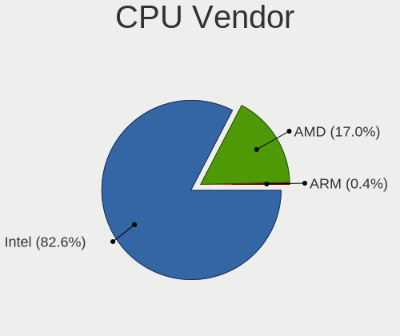

| Vendor | Computers | Percent |
|--------|-----------|---------|
| Intel  | 188       | 81.74%  |
| AMD    | 41        | 17.83%  |
| ARM    | 1         | 0.43%   |

CPU Model
---------

Processor models

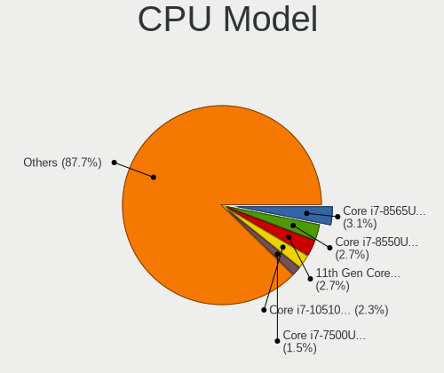

| Model                                         | Computers | Percent |
|-----------------------------------------------|-----------|---------|
| Intel Core i7-8565U CPU @ 1.80GHz             | 7         | 3.03%   |
| Intel Core i7-8550U CPU @ 1.80GHz             | 6         | 2.6%    |
| Intel 11th Gen Core i7-1165G7 @ 2.80GHz       | 6         | 2.6%    |
| Intel Core i7-10510U CPU @ 1.80GHz            | 5         | 2.16%   |
| Intel Core i7-7500U CPU @ 2.70GHz             | 4         | 1.73%   |
| Intel Core i7-3770 CPU @ 3.40GHz              | 4         | 1.73%   |
| Intel Core i7-3520M CPU @ 2.90GHz             | 4         | 1.73%   |
| Intel Core i7-9750H CPU @ 2.60GHz             | 3         | 1.3%    |
| Intel Core i7-8750H CPU @ 2.20GHz             | 3         | 1.3%    |
| Intel Core i7-7700HQ CPU @ 2.80GHz            | 3         | 1.3%    |
| Intel Core i7-6500U CPU @ 2.50GHz             | 3         | 1.3%    |
| Intel Core i7-4500U CPU @ 1.80GHz             | 3         | 1.3%    |
| Intel Core i5-8265U CPU @ 1.60GHz             | 3         | 1.3%    |
| Intel Core i5-8250U CPU @ 1.60GHz             | 3         | 1.3%    |
| Intel Core i5-2520M CPU @ 2.50GHz             | 3         | 1.3%    |
| AMD Ryzen 7 3700X 8-Core Processor            | 3         | 1.3%    |
| AMD Ryzen 5 4600H with Radeon Graphics        | 3         | 1.3%    |
| AMD Ryzen 5 3600 6-Core Processor             | 3         | 1.3%    |
| AMD Ryzen 5 2600 Six-Core Processor           | 3         | 1.3%    |
| Intel Core i9-9900K CPU @ 3.60GHz             | 2         | 0.87%   |
| Intel Core i7-4790 CPU @ 3.60GHz              | 2         | 0.87%   |
| Intel Core i7-2670QM CPU @ 2.20GHz            | 2         | 0.87%   |
| Intel Core i7-2600 CPU @ 3.40GHz              | 2         | 0.87%   |
| Intel Core i7-10750H CPU @ 2.60GHz            | 2         | 0.87%   |
| Intel Core i5-8350U CPU @ 1.70GHz             | 2         | 0.87%   |
| Intel Core i5-7200U CPU @ 2.50GHz             | 2         | 0.87%   |
| Intel Core i5-6300U CPU @ 2.40GHz             | 2         | 0.87%   |
| Intel Core i5-5200U CPU @ 2.20GHz             | 2         | 0.87%   |
| Intel Core i5-2540M CPU @ 2.60GHz             | 2         | 0.87%   |
| Intel Core i5-2415M CPU @ 2.30GHz             | 2         | 0.87%   |
| Intel Core i5 CPU M 520 @ 2.40GHz             | 2         | 0.87%   |
| Intel Core i5 CPU 750 @ 2.67GHz               | 2         | 0.87%   |
| Intel Core i3-2310M CPU @ 2.10GHz             | 2         | 0.87%   |
| Intel Core i3-1005G1 CPU @ 1.20GHz            | 2         | 0.87%   |
| Intel Celeron CPU N3050 @ 1.60GHz             | 2         | 0.87%   |
| AMD Ryzen 7 4700U with Radeon Graphics        | 2         | 0.87%   |
| AMD Ryzen 5 3500U with Radeon Vega Mobile Gfx | 2         | 0.87%   |
| AMD Ryzen 3 2200G with Radeon Vega Graphics   | 2         | 0.87%   |
| Intel Xeon CPU W3530 @ 2.80GHz                | 1         | 0.43%   |
| Intel Xeon CPU E5-2680 0 @ 2.70GHz            | 1         | 0.43%   |
| Intel Xeon CPU 5150 @ 2.66GHz                 | 1         | 0.43%   |
| Intel Pentium Dual-Core CPU T4500 @ 2.30GHz   | 1         | 0.43%   |
| Intel Pentium CPU N3710 @ 1.60GHz             | 1         | 0.43%   |
| Intel Pentium CPU N3700 @ 1.60GHz             | 1         | 0.43%   |
| Intel Pentium CPU G3220 @ 3.00GHz             | 1         | 0.43%   |
| Intel Pentium CPU G2030 @ 3.00GHz             | 1         | 0.43%   |
| Intel Pentium 3556U @ 1.70GHz                 | 1         | 0.43%   |
| Intel Genuine CPU U2300 @ 1.20GHz             | 1         | 0.43%   |
| Intel Core m5-6Y57 CPU @ 1.10GHz              | 1         | 0.43%   |
| Intel Core i9-9900KF CPU @ 3.60GHz            | 1         | 0.43%   |
| Intel Core i7-9700 CPU @ 3.00GHz              | 1         | 0.43%   |
| Intel Core i7-8850H CPU @ 2.60GHz             | 1         | 0.43%   |
| Intel Core i7-8700 CPU @ 3.20GHz              | 1         | 0.43%   |
| Intel Core i7-8665U CPU @ 1.90GHz             | 1         | 0.43%   |
| Intel Core i7-7Y75 CPU @ 1.30GHz              | 1         | 0.43%   |
| Intel Core i7-7820HQ CPU @ 2.90GHz            | 1         | 0.43%   |
| Intel Core i7-7700 CPU @ 3.60GHz              | 1         | 0.43%   |
| Intel Core i7-7600U CPU @ 2.80GHz             | 1         | 0.43%   |
| Intel Core i7-6820HQ CPU @ 2.70GHz            | 1         | 0.43%   |
| Intel Core i7-6700K CPU @ 4.00GHz             | 1         | 0.43%   |

CPU Model Family
----------------

Processor model prefix

| Model                   | Computers | Percent |
|-------------------------|-----------|---------|
| Intel Core i7           | 91        | 39.39%  |
| Intel Core i5           | 46        | 19.91%  |
| AMD Ryzen 5             | 14        | 6.06%   |
| Intel Core i3           | 13        | 5.63%   |
| Other                   | 10        | 4.33%   |
| Intel Core 2 Duo        | 10        | 4.33%   |
| AMD Ryzen 7             | 10        | 4.33%   |
| Intel Pentium           | 5         | 2.16%   |
| Intel Xeon              | 3         | 1.3%    |
| Intel Core i9           | 3         | 1.3%    |
| AMD Ryzen 9             | 3         | 1.3%    |
| AMD Ryzen 3             | 3         | 1.3%    |
| AMD A6                  | 3         | 1.3%    |
| Intel Core 2            | 2         | 0.87%   |
| Intel Celeron           | 2         | 0.87%   |
| Intel Atom              | 2         | 0.87%   |
| Intel Pentium Dual-Core | 1         | 0.43%   |
| Intel Genuine           | 1         | 0.43%   |
| Intel Core m5           | 1         | 0.43%   |
| Intel Core 2 Quad       | 1         | 0.43%   |
| AMD Quad-Core           | 1         | 0.43%   |
| AMD Phenom II X6        | 1         | 0.43%   |
| AMD FX                  | 1         | 0.43%   |
| AMD Embedded            | 1         | 0.43%   |
| AMD E1                  | 1         | 0.43%   |
| AMD E                   | 1         | 0.43%   |
| AMD A8                  | 1         | 0.43%   |

CPU Cores
---------

Number of processor cores

| Number | Computers | Percent |
|--------|-----------|---------|
| 4      | 100       | 43.48%  |
| 2      | 81        | 35.22%  |
| 6      | 27        | 11.74%  |
| 8      | 17        | 7.39%   |
| 16     | 1         | 0.43%   |
| 14     | 1         | 0.43%   |
| 12     | 1         | 0.43%   |
| 3      | 1         | 0.43%   |
| 1      | 1         | 0.43%   |

CPU Sockets
-----------

Number of sockets

| Number | Computers | Percent |
|--------|-----------|---------|
| 1      | 228       | 99.13%  |
| 2      | 2         | 0.87%   |

CPU Threads
-----------

Threads per core (Hyper-Threading)

| Number | Computers | Percent |
|--------|-----------|---------|
| 2      | 175       | 75.76%  |
| 1      | 56        | 24.24%  |

CPU Op-Modes
------------

CPU Operation Modes (32-bit, 64-bit)

| Op mode        | Computers | Percent |
|----------------|-----------|---------|
| 32-bit, 64-bit | 229       | 99.57%  |
| Unknown        | 1         | 0.43%   |

CPU Microcode
-------------

Microcode number

| Number     | Computers | Percent |
|------------|-----------|---------|
| Unknown    | 28        | 11.81%  |
| 0x306a9    | 19        | 8.02%   |
| 0x206a7    | 19        | 8.02%   |
| 0x906ea    | 11        | 4.64%   |
| 0x806ec    | 11        | 4.64%   |
| 0x806ea    | 10        | 4.22%   |
| 0x306c3    | 10        | 4.22%   |
| 0x406e3    | 8         | 3.38%   |
| 0x806e9    | 7         | 2.95%   |
| 0x806c1    | 7         | 2.95%   |
| 0x40651    | 7         | 2.95%   |
| 0x1067a    | 7         | 2.95%   |
| 0x506e3    | 6         | 2.53%   |
| 0x08600103 | 6         | 2.53%   |
| 0xa0652    | 4         | 1.69%   |
| 0x906e9    | 4         | 1.69%   |
| 0x306d4    | 4         | 1.69%   |
| 0x106e5    | 4         | 1.69%   |
| 0x906ec    | 3         | 1.27%   |
| 0x806eb    | 3         | 1.27%   |
| 0x706e5    | 3         | 1.27%   |
| 0x406c3    | 3         | 1.27%   |
| 0x10676    | 3         | 1.27%   |
| 0x08701021 | 3         | 1.27%   |
| 0x08108109 | 3         | 1.27%   |
| 0x0800820d | 3         | 1.27%   |
| 0x906ed    | 2         | 0.84%   |
| 0x6f6      | 2         | 0.84%   |
| 0x406c4    | 2         | 0.84%   |
| 0x206d7    | 2         | 0.84%   |
| 0x20655    | 2         | 0.84%   |
| 0x20652    | 2         | 0.84%   |
| 0x0a50000c | 2         | 0.84%   |
| 0x08701013 | 2         | 0.84%   |
| 0x0810100b | 2         | 0.84%   |
| 0x0700010f | 2         | 0.84%   |
| 0x0600611a | 2         | 0.84%   |
| 0xa0660    | 1         | 0.42%   |
| 0x906a3    | 1         | 0.42%   |
| 0x6fb      | 1         | 0.42%   |
| 0x6fa      | 1         | 0.42%   |
| 0x6f2      | 1         | 0.42%   |
| 0x40661    | 1         | 0.42%   |
| 0x30678    | 1         | 0.42%   |
| 0x106a5    | 1         | 0.42%   |
| 0x08608103 | 1         | 0.42%   |
| 0x08600106 | 1         | 0.42%   |
| 0x08600102 | 1         | 0.42%   |
| 0x08101016 | 1         | 0.42%   |
| 0x07030105 | 1         | 0.42%   |
| 0x06006705 | 1         | 0.42%   |
| 0x06006704 | 1         | 0.42%   |
| 0x06001119 | 1         | 0.42%   |
| 0x06000852 | 1         | 0.42%   |
| 0x05000119 | 1         | 0.42%   |
| 0x010000dc | 1         | 0.42%   |

CPU Microarch
-------------

Microarchitecture

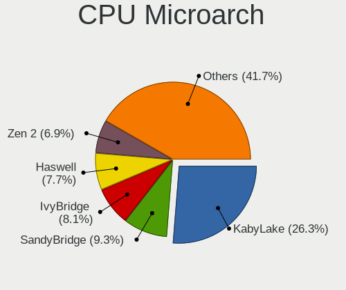

| Name             | Computers | Percent |
|------------------|-----------|---------|
| KabyLake         | 61        | 26.52%  |
| SandyBridge      | 21        | 9.13%   |
| IvyBridge        | 20        | 8.7%    |
| Haswell          | 19        | 8.26%   |
| Zen 2            | 17        | 7.39%   |
| Skylake          | 14        | 6.09%   |
| Penryn           | 11        | 4.78%   |
| Zen+             | 7         | 3.04%   |
| TigerLake        | 7         | 3.04%   |
| Silvermont       | 6         | 2.61%   |
| Nehalem          | 6         | 2.61%   |
| Core             | 5         | 2.17%   |
| CometLake        | 5         | 2.17%   |
| Westmere         | 4         | 1.74%   |
| IceLake          | 4         | 1.74%   |
| Excavator        | 4         | 1.74%   |
| Broadwell        | 4         | 1.74%   |
| Zen              | 3         | 1.3%    |
| Zen 3            | 2         | 0.87%   |
| Piledriver       | 2         | 0.87%   |
| Jaguar           | 2         | 0.87%   |
| Unknown          | 2         | 0.87%   |
| Puma             | 1         | 0.43%   |
| K10              | 1         | 0.43%   |
| Bobcat           | 1         | 0.43%   |
| Alderlake Hybrid | 1         | 0.43%   |

Graphics
--------

GPU Vendor
----------

Vendors of graphics cards

| Vendor | Computers | Percent |
|--------|-----------|---------|
| Intel  | 146       | 49.83%  |
| Nvidia | 92        | 31.4%   |
| AMD    | 55        | 18.77%  |

GPU Model
---------

Graphics card models

| Model                                                                                    | Computers | Percent |
|------------------------------------------------------------------------------------------|-----------|---------|
| Intel 2nd Generation Core Processor Family Integrated Graphics Controller                | 17        | 5.72%   |
| Intel WhiskeyLake-U GT2 [UHD Graphics 620]                                               | 12        | 4.04%   |
| Intel 3rd Gen Core processor Graphics Controller                                         | 12        | 4.04%   |
| Intel UHD Graphics 620                                                                   | 11        | 3.7%    |
| Intel HD Graphics 620                                                                    | 8         | 2.69%   |
| AMD Renoir                                                                               | 8         | 2.69%   |
| Intel TigerLake-LP GT2 [Iris Xe Graphics]                                                | 7         | 2.36%   |
| Intel Haswell-ULT Integrated Graphics Controller                                         | 7         | 2.36%   |
| Intel CoffeeLake-H GT2 [UHD Graphics 630]                                                | 7         | 2.36%   |
| Intel Skylake GT2 [HD Graphics 520]                                                      | 6         | 2.02%   |
| Intel HD Graphics 630                                                                    | 5         | 1.68%   |
| Intel CometLake-U GT2 [UHD Graphics]                                                     | 5         | 1.68%   |
| Intel Atom/Celeron/Pentium Processor x5-E8000/J3xxx/N3xxx Integrated Graphics Controller | 5         | 1.68%   |
| AMD Ellesmere [Radeon RX 470/480/570/570X/580/580X/590]                                  | 5         | 1.68%   |
| Nvidia GP107 [GeForce GTX 1050 Ti]                                                       | 4         | 1.35%   |
| Nvidia GP106 [GeForce GTX 1060 6GB]                                                      | 4         | 1.35%   |
| Intel Xeon E3-1200 v3/4th Gen Core Processor Integrated Graphics Controller              | 4         | 1.35%   |
| Intel CometLake-H GT2 [UHD Graphics]                                                     | 4         | 1.35%   |
| Intel 4th Gen Core Processor Integrated Graphics Controller                              | 4         | 1.35%   |
| Nvidia TU117M [GeForce GTX 1650 Mobile / Max-Q]                                          | 3         | 1.01%   |
| Nvidia TU106 [GeForce RTX 2060 Rev. A]                                                   | 3         | 1.01%   |
| Nvidia GP108M [GeForce MX250]                                                            | 3         | 1.01%   |
| Nvidia GP108M [GeForce MX150]                                                            | 3         | 1.01%   |
| Nvidia GP108 [GeForce GT 1030]                                                           | 3         | 1.01%   |
| Nvidia GP106M [GeForce GTX 1060 Mobile]                                                  | 3         | 1.01%   |
| Intel Mobile 4 Series Chipset Integrated Graphics Controller                             | 3         | 1.01%   |
| Intel Iris Plus Graphics G1 (Ice Lake)                                                   | 3         | 1.01%   |
| Intel HD Graphics 5500                                                                   | 3         | 1.01%   |
| Intel Core Processor Integrated Graphics Controller                                      | 3         | 1.01%   |
| Intel 4 Series Chipset Integrated Graphics Controller                                    | 3         | 1.01%   |
| AMD Seymour [Radeon HD 6400M/7400M Series]                                               | 3         | 1.01%   |
| AMD Raven Ridge [Radeon Vega Series / Radeon Vega Mobile Series]                         | 3         | 1.01%   |
| AMD Picasso/Raven 2 [Radeon Vega Series / Radeon Vega Mobile Series]                     | 3         | 1.01%   |
| AMD Navi 10 [Radeon RX 5600 OEM/5600 XT / 5700/5700 XT]                                  | 3         | 1.01%   |
| Nvidia TU117M [GeForce GTX 1650 Ti Mobile]                                               | 2         | 0.67%   |
| Nvidia TU106M [GeForce RTX 2070 Mobile / Max-Q Refresh]                                  | 2         | 0.67%   |
| Nvidia TU106M [GeForce RTX 2060 Mobile]                                                  | 2         | 0.67%   |
| Nvidia GP108GLM [Quadro P520]                                                            | 2         | 0.67%   |
| Nvidia GP107M [GeForce GTX 1050 Mobile]                                                  | 2         | 0.67%   |
| Nvidia GM108M [GeForce 940MX]                                                            | 2         | 0.67%   |
| Nvidia GM107 [GeForce 940MX]                                                             | 2         | 0.67%   |
| Nvidia GA106M [GeForce RTX 3060 Mobile / Max-Q]                                          | 2         | 0.67%   |
| Intel Xeon E3-1200 v2/3rd Gen Core processor Graphics Controller                         | 2         | 0.67%   |
| Intel Mobile GM965/GL960 Integrated Graphics Controller (secondary)                      | 2         | 0.67%   |
| Intel Mobile GM965/GL960 Integrated Graphics Controller (primary)                        | 2         | 0.67%   |
| Intel HD Graphics 530                                                                    | 2         | 0.67%   |
| AMD Whistler [Radeon HD 6730M/6770M/7690M XT]                                            | 2         | 0.67%   |
| AMD Vega 10 XL/XT [Radeon RX Vega 56/64]                                                 | 2         | 0.67%   |
| AMD Stoney [Radeon R2/R3/R4/R5 Graphics]                                                 | 2         | 0.67%   |
| AMD Juniper XT [Radeon HD 5770]                                                          | 2         | 0.67%   |
| AMD Cezanne                                                                              | 2         | 0.67%   |
| Nvidia TU117GLM [Quadro T2000 Mobile / Max-Q]                                            | 1         | 0.34%   |
| Nvidia TU116M [GeForce GTX 1650 Ti Mobile]                                               | 1         | 0.34%   |
| Nvidia TU116 [GeForce GTX 1660]                                                          | 1         | 0.34%   |
| Nvidia TU116 [GeForce GTX 1660 SUPER]                                                    | 1         | 0.34%   |
| Nvidia TU116 [GeForce GTX 1650]                                                          | 1         | 0.34%   |
| Nvidia TU106 [GeForce RTX 2070]                                                          | 1         | 0.34%   |
| Nvidia TU106 [GeForce RTX 2060 SUPER]                                                    | 1         | 0.34%   |
| Nvidia TU104 [GeForce RTX 2070 SUPER]                                                    | 1         | 0.34%   |
| Nvidia TU104 [GeForce RTX 2060]                                                          | 1         | 0.34%   |

GPU Combo
---------

Combinations of graphics cards

| Name           | Computers | Percent |
|----------------|-----------|---------|
| 1 x Intel      | 93        | 39.91%  |
| Intel + Nvidia | 44        | 18.88%  |
| 1 x Nvidia     | 39        | 16.74%  |
| 1 x AMD        | 38        | 16.31%  |
| Intel + AMD    | 8         | 3.43%   |
| AMD + Nvidia   | 8         | 3.43%   |
| Other          | 1         | 0.43%   |
| 2 x Nvidia     | 1         | 0.43%   |
| 2 x AMD        | 1         | 0.43%   |

GPU Driver
----------

Free vs proprietary

| Driver      | Computers | Percent |
|-------------|-----------|---------|
| Free        | 157       | 66.81%  |
| Proprietary | 72        | 30.64%  |
| Unknown     | 6         | 2.55%   |

GPU Memory
----------

Total video memory

| Size in GB | Computers | Percent |
|------------|-----------|---------|
| Unknown    | 121       | 51.05%  |
| 1.01-2.0   | 33        | 13.92%  |
| 0.01-0.5   | 19        | 8.02%   |
| 3.01-4.0   | 18        | 7.59%   |
| 7.01-8.0   | 16        | 6.75%   |
| 5.01-6.0   | 14        | 5.91%   |
| 0.51-1.0   | 14        | 5.91%   |
| 2.01-3.0   | 1         | 0.42%   |
| 8.01-16.0  | 1         | 0.42%   |

Monitor
-------

Monitor Vendor
--------------

Monitor vendors

| Vendor                  | Computers | Percent |
|-------------------------|-----------|---------|
| Samsung Electronics     | 33        | 11.96%  |
| Chimei Innolux          | 31        | 11.23%  |
| AU Optronics            | 31        | 11.23%  |
| LG Display              | 29        | 10.51%  |
| Dell                    | 19        | 6.88%   |
| BOE                     | 18        | 6.52%   |
| Goldstar                | 12        | 4.35%   |
| Apple                   | 10        | 3.62%   |
| Hewlett-Packard         | 9         | 3.26%   |
| AOC                     | 7         | 2.54%   |
| Unknown                 | 6         | 2.17%   |
| Chi Mei Optoelectronics | 6         | 2.17%   |
| Ancor Communications    | 6         | 2.17%   |
| Sharp                   | 5         | 1.81%   |
| BenQ                    | 5         | 1.81%   |
| Philips                 | 4         | 1.45%   |
| Acer                    | 4         | 1.45%   |
| PANDA                   | 3         | 1.09%   |
| LG Electronics          | 3         | 1.09%   |
| Lenovo                  | 3         | 1.09%   |
| InfoVision              | 3         | 1.09%   |
| Eizo                    | 3         | 1.09%   |
| LGD                     | 2         | 0.72%   |
| Iiyama                  | 2         | 0.72%   |
| Idek Iiyama             | 2         | 0.72%   |
| UPD                     | 1         | 0.36%   |
| Sceptre Tech            | 1         | 0.36%   |
| RTK                     | 1         | 0.36%   |
| Pioneer Electronic      | 1         | 0.36%   |
| Panasonic               | 1         | 0.36%   |
| Orion                   | 1         | 0.36%   |
| NEC Computers           | 1         | 0.36%   |
| MStar                   | 1         | 0.36%   |
| MPI                     | 1         | 0.36%   |
| Medion                  | 1         | 0.36%   |
| KTC                     | 1         | 0.36%   |
| JDI                     | 1         | 0.36%   |
| InnoLux Display         | 1         | 0.36%   |
| HannStar                | 1         | 0.36%   |
| GDH                     | 1         | 0.36%   |
| Fujitsu Siemens         | 1         | 0.36%   |
| Daewoo                  | 1         | 0.36%   |
| CSO                     | 1         | 0.36%   |
| ASUSTek Computer        | 1         | 0.36%   |
| AGO                     | 1         | 0.36%   |

Monitor Model
-------------

Monitor models

| Model                                                                   | Computers | Percent |
|-------------------------------------------------------------------------|-----------|---------|
| Chimei Innolux LCD Monitor CMN15F5 1920x1080 344x193mm 15.5-inch        | 3         | 1.04%   |
| Chimei Innolux LCD Monitor CMN14D2 1920x1080 309x173mm 13.9-inch        | 3         | 1.04%   |
| AU Optronics LCD Monitor AUO38ED 1920x1080 344x193mm 15.5-inch          | 3         | 1.04%   |
| Samsung Electronics S27B550 SAM091B 1920x1080 598x336mm 27.0-inch       | 2         | 0.69%   |
| Samsung Electronics LCD Monitor SEC5441 1366x768 256x144mm 11.6-inch    | 2         | 0.69%   |
| Samsung Electronics LCD Monitor SDCA029 3840x2160 344x194mm 15.5-inch   | 2         | 0.69%   |
| Samsung Electronics LCD Monitor SAM0BB4 3840x2160 1872x1053mm 84.6-inch | 2         | 0.69%   |
| Samsung Electronics LCD Monitor C34H89x 3440x1440                       | 2         | 0.69%   |
| Philips PHL 243V5 PHLC0D1 1920x1080 521x293mm 23.5-inch                 | 2         | 0.69%   |
| LGD LCD Monitor 1920x1080                                               | 2         | 0.69%   |
| LG Display LCD Monitor LGD053F 1920x1080 344x194mm 15.5-inch            | 2         | 0.69%   |
| LG Display LCD Monitor LGD02D8 1366x768 277x156mm 12.5-inch             | 2         | 0.69%   |
| Chimei Innolux LCD Monitor CMN15E8 1920x1080 340x190mm 15.3-inch        | 2         | 0.69%   |
| Chimei Innolux LCD Monitor CMN14D4 1920x1080 309x173mm 13.9-inch        | 2         | 0.69%   |
| Chimei Innolux LCD Monitor CMN1490 1366x768 309x173mm 13.9-inch         | 2         | 0.69%   |
| AU Optronics LCD Monitor AUO63ED 1920x1080 344x193mm 15.5-inch          | 2         | 0.69%   |
| AU Optronics LCD Monitor AUO623D 1920x1080 309x174mm 14.0-inch          | 2         | 0.69%   |
| AU Optronics LCD Monitor AUO159E 1600x900 382x214mm 17.2-inch           | 2         | 0.69%   |
| AU Optronics LCD Monitor AUO13ED 1920x1080 340x190mm 15.3-inch          | 2         | 0.69%   |
| AU Optronics LCD Monitor AUO105C 1366x768 256x144mm 11.6-inch           | 2         | 0.69%   |
| UPD LCD801 UPD4843 1920x1080 708x398mm 32.0-inch                        | 1         | 0.35%   |
| Unknown LCD Monitor Sony Nvidia Default Flat Panel 1366x768             | 1         | 0.35%   |
| Unknown LCD Monitor SAMSUNG 3840x2160                                   | 1         | 0.35%   |
| Unknown LCD Monitor SAMSUNG                                             | 1         | 0.35%   |
| Unknown LCD Monitor GTW KX2153                                          | 1         | 0.35%   |
| Unknown LCD Monitor FFFF 2288x1287 2550x2550mm 142.0-inch               | 1         | 0.35%   |
| Unknown LCD Monitor EMA E202HL                                          | 1         | 0.35%   |
| Sharp LQ156M1JW01 SHP14C3 1920x1080 344x194mm 15.5-inch                 | 1         | 0.35%   |
| Sharp LQ133Z1JW26 SHP1493 3200x1800 294x165mm 13.3-inch                 | 1         | 0.35%   |
| Sharp LCD Monitor SHP14D0 3840x2400 336x210mm 15.6-inch                 | 1         | 0.35%   |
| Sharp LCD Monitor SHP146A 1920x1080 294x165mm 13.3-inch                 | 1         | 0.35%   |
| Sharp LCD Monitor SHP1445 3840x2160 350x190mm 15.7-inch                 | 1         | 0.35%   |
| Sceptre Tech Sceptre B34 SPT0D52 2560x1080 797x334mm 34.0-inch          | 1         | 0.35%   |
| Samsung Electronics U32J59x SAM0F35 3840x2160 700x390mm 31.5-inch       | 1         | 0.35%   |
| Samsung Electronics U28E570 SAM0D70 3840x2160 608x345mm 27.5-inch       | 1         | 0.35%   |
| Samsung Electronics SyncMaster SAM060D 1920x1080 531x299mm 24.0-inch    | 1         | 0.35%   |
| Samsung Electronics SyncMaster SAM05CD 1920x1080                        | 1         | 0.35%   |
| Samsung Electronics SyncMaster SAM0587 1920x1200 518x324mm 24.1-inch    | 1         | 0.35%   |
| Samsung Electronics SyncMaster SAM041D 1920x1200 459x296mm 21.5-inch    | 1         | 0.35%   |
| Samsung Electronics SyncMaster SAM021B 1400x1050 408x300mm 19.9-inch    | 1         | 0.35%   |
| Samsung Electronics S34J55x SAM0F72 3440x1440 800x330mm 34.1-inch       | 1         | 0.35%   |
| Samsung Electronics S27F350 SAM0D22 1920x1080 600x340mm 27.2-inch       | 1         | 0.35%   |
| Samsung Electronics S24C650 SAM09E9 1920x1080 521x293mm 23.5-inch       | 1         | 0.35%   |
| Samsung Electronics S24B300 SAM08CC 1920x1080 521x293mm 23.5-inch       | 1         | 0.35%   |
| Samsung Electronics S24B300 SAM08B4 1920x1080 521x293mm 23.5-inch       | 1         | 0.35%   |
| Samsung Electronics LCD Monitor SEC5A42 1366x768 309x174mm 14.0-inch    | 1         | 0.35%   |
| Samsung Electronics LCD Monitor SEC4149 1366x768 292x174mm 13.4-inch    | 1         | 0.35%   |
| Samsung Electronics LCD Monitor SEC3847 1440x900 367x230mm 17.1-inch    | 1         | 0.35%   |
| Samsung Electronics LCD Monitor SEC324C 1600x900 310x174mm 14.0-inch    | 1         | 0.35%   |
| Samsung Electronics LCD Monitor SEC315A 1366x768 344x194mm 15.5-inch    | 1         | 0.35%   |
| Samsung Electronics LCD Monitor SDC4E51 1366x768 344x194mm 15.5-inch    | 1         | 0.35%   |
| Samsung Electronics LCD Monitor SDC3150 1920x1080 344x194mm 15.5-inch   | 1         | 0.35%   |
| Samsung Electronics LCD Monitor SAM0C3C 1366x768 609x347mm 27.6-inch    | 1         | 0.35%   |
| Samsung Electronics LCD Monitor SAM0A7A 1920x1080 480x270mm 21.7-inch   | 1         | 0.35%   |
| Samsung Electronics LCD Monitor SAM090B 1920x1080 890x500mm 40.2-inch   | 1         | 0.35%   |
| Samsung Electronics LCD Monitor SAM0902 1920x1080 890x500mm 40.2-inch   | 1         | 0.35%   |
| Samsung Electronics LCD Monitor SAM06CA 1920x1080 1110x620mm 50.1-inch  | 1         | 0.35%   |
| Samsung Electronics LCD Monitor S24E310 3840x1080                       | 1         | 0.35%   |
| Samsung Electronics LCD Monitor S24E310                                 | 1         | 0.35%   |
| Samsung Electronics LCD Monitor C32F391 1920x1080                       | 1         | 0.35%   |

Monitor Resolution
------------------

Monitor screen resolution

| Resolution         | Computers | Percent |
|--------------------|-----------|---------|
| 1920x1080 (FHD)    | 110       | 42.64%  |
| 1366x768 (WXGA)    | 49        | 18.99%  |
| 3840x2160 (4K)     | 14        | 5.43%   |
| 2560x1440 (QHD)    | 11        | 4.26%   |
| 1920x1200 (WUXGA)  | 8         | 3.1%    |
| 1600x900 (HD+)     | 7         | 2.71%   |
| 2560x1080          | 6         | 2.33%   |
| 1280x1024 (SXGA)   | 6         | 2.33%   |
| Unknown            | 6         | 2.33%   |
| 1680x1050 (WSXGA+) | 5         | 1.94%   |
| 1440x900 (WXGA+)   | 5         | 1.94%   |
| 1280x800 (WXGA)    | 4         | 1.55%   |
| 3840x1080          | 3         | 1.16%   |
| 3440x1440          | 3         | 1.16%   |
| 2880x1800          | 3         | 1.16%   |
| 1600x1200          | 2         | 0.78%   |
| 3840x2400          | 1         | 0.39%   |
| 3520x1080          | 1         | 0.39%   |
| 3200x1800 (QHD+)   | 1         | 0.39%   |
| 3000x2000          | 1         | 0.39%   |
| 2646x768           | 1         | 0.39%   |
| 2560x1600          | 1         | 0.39%   |
| 2560x1024          | 1         | 0.39%   |
| 2390x768           | 1         | 0.39%   |
| 2288x1287          | 1         | 0.39%   |
| 2256x1504          | 1         | 0.39%   |
| 2048x1152          | 1         | 0.39%   |
| 1920x540           | 1         | 0.39%   |
| 1920x1280          | 1         | 0.39%   |
| 1400x1050          | 1         | 0.39%   |
| 1360x768           | 1         | 0.39%   |
| 1280x720 (HD)      | 1         | 0.39%   |

Monitor Diagonal
----------------

Diagonal size in inches

| Inches  | Computers | Percent |
|---------|-----------|---------|
| 15      | 75        | 27.37%  |
| 13      | 31        | 11.31%  |
| Unknown | 27        | 9.85%   |
| 14      | 22        | 8.03%   |
| 27      | 21        | 7.66%   |
| 24      | 18        | 6.57%   |
| 17      | 12        | 4.38%   |
| 23      | 11        | 4.01%   |
| 19      | 6         | 2.19%   |
| 12      | 6         | 2.19%   |
| 31      | 5         | 1.82%   |
| 21      | 5         | 1.82%   |
| 34      | 4         | 1.46%   |
| 20      | 4         | 1.46%   |
| 11      | 4         | 1.46%   |
| 54      | 3         | 1.09%   |
| 22      | 3         | 1.09%   |
| 18      | 3         | 1.09%   |
| 84      | 2         | 0.73%   |
| 32      | 2         | 0.73%   |
| 28      | 2         | 0.73%   |
| 142     | 1         | 0.36%   |
| 63      | 1         | 0.36%   |
| 52      | 1         | 0.36%   |
| 48      | 1         | 0.36%   |
| 44      | 1         | 0.36%   |
| 29      | 1         | 0.36%   |
| 16      | 1         | 0.36%   |
| 8       | 1         | 0.36%   |

Monitor Width
-------------

Physical width

| Width in mm    | Computers | Percent |
|----------------|-----------|---------|
| 301-350        | 111       | 40.96%  |
| 501-600        | 43        | 15.87%  |
| Unknown        | 27        | 9.96%   |
| 201-300        | 26        | 9.59%   |
| 351-400        | 18        | 6.64%   |
| 401-500        | 17        | 6.27%   |
| 601-700        | 12        | 4.43%   |
| 701-800        | 6         | 2.21%   |
| 1001-1500      | 6         | 2.21%   |
| 1501-2000      | 2         | 0.74%   |
| More than 2000 | 1         | 0.37%   |
| 101-200        | 1         | 0.37%   |
| 901-1000       | 1         | 0.37%   |

Aspect Ratio
------------

Proportional relationship between the width and the height

| Ratio   | Computers | Percent |
|---------|-----------|---------|
| 16/9    | 166       | 69.75%  |
| 16/10   | 25        | 10.5%   |
| Unknown | 25        | 10.5%   |
| 21/9    | 6         | 2.52%   |
| 5/4     | 5         | 2.1%    |
| 4/3     | 5         | 2.1%    |
| 3/2     | 3         | 1.26%   |
| 6/5     | 1         | 0.42%   |
| 32/9    | 1         | 0.42%   |
| 1.00    | 1         | 0.42%   |

Monitor Area
------------

Area in inch

| Area in inch | Computers | Percent |
|----------------|-----------|---------|
| 101-110        | 74        | 27.21%  |
| 81-90          | 40        | 14.71%  |
| 201-250        | 29        | 10.66%  |
| Unknown        | 27        | 9.93%   |
| 301-350        | 21        | 7.72%   |
| 71-80          | 14        | 5.15%   |
| 351-500        | 12        | 4.41%   |
| 121-130        | 10        | 3.68%   |
| More than 1000 | 9         | 3.31%   |
| 251-300        | 9         | 3.31%   |
| 151-200        | 9         | 3.31%   |
| 61-70          | 5         | 1.84%   |
| 51-60          | 4         | 1.47%   |
| 141-150        | 4         | 1.47%   |
| 131-140        | 2         | 0.74%   |
| 1-40           | 1         | 0.37%   |
| 501-1000       | 1         | 0.37%   |
| 91-100         | 1         | 0.37%   |

Pixel Density
-------------

Pixels per inch

| Density       | Computers | Percent |
|---------------|-----------|---------|
| 121-160       | 79        | 30.15%  |
| 51-100        | 67        | 25.57%  |
| 101-120       | 53        | 20.23%  |
| Unknown       | 27        | 10.31%  |
| 161-240       | 18        | 6.87%   |
| More than 240 | 9         | 3.44%   |
| 1-50          | 9         | 3.44%   |

Multiple Monitors
-----------------

Total monitors connected

| Total | Computers | Percent |
|-------|-----------|---------|
| 1     | 172       | 73.19%  |
| 2     | 49        | 20.85%  |
| 3     | 8         | 3.4%    |
| 0     | 6         | 2.55%   |

Network
-------

Net Controller Vendor
---------------------

Controller vendors

| Vendor                   | Computers | Percent |
|--------------------------|-----------|---------|
| Intel                    | 136       | 36.76%  |
| Realtek Semiconductor    | 125       | 33.78%  |
| Qualcomm Atheros         | 44        | 11.89%  |
| Broadcom                 | 23        | 6.22%   |
| Broadcom Limited         | 7         | 1.89%   |
| Marvell Technology Group | 6         | 1.62%   |
| Ralink Technology        | 5         | 1.35%   |
| Ralink                   | 5         | 1.35%   |
| Hewlett-Packard          | 3         | 0.81%   |
| ASIX Electronics         | 2         | 0.54%   |
| Xiaomi                   | 1         | 0.27%   |
| Wacom                    | 1         | 0.27%   |
| Sierra Wireless          | 1         | 0.27%   |
| Nvidia                   | 1         | 0.27%   |
| NetGear                  | 1         | 0.27%   |
| Microsoft                | 1         | 0.27%   |
| MEDIATEK                 | 1         | 0.27%   |
| Luminary Micro           | 1         | 0.27%   |
| Linksys                  | 1         | 0.27%   |
| Lenovo                   | 1         | 0.27%   |
| Huawei Technologies      | 1         | 0.27%   |
| D-Link System            | 1         | 0.27%   |
| D-Link                   | 1         | 0.27%   |
| Apple                    | 1         | 0.27%   |

Net Controller Model
--------------------

Controller models

| Model                                                             | Computers | Percent |
|-------------------------------------------------------------------|-----------|---------|
| Realtek RTL8111/8168/8411 PCI Express Gigabit Ethernet Controller | 80        | 18.18%  |
| Intel Wi-Fi 6 AX200                                               | 28        | 6.36%   |
| Realtek RTL8153 Gigabit Ethernet Adapter                          | 19        | 4.32%   |
| Intel 82579LM Gigabit Network Connection (Lewisville)             | 15        | 3.41%   |
| Realtek RTL810xE PCI Express Fast Ethernet controller             | 14        | 3.18%   |
| Intel Wireless 8265 / 8275                                        | 14        | 3.18%   |
| Realtek RTL8125 2.5GbE Controller                                 | 9         | 2.05%   |
| Qualcomm Atheros AR9485 Wireless Network Adapter                  | 9         | 2.05%   |
| Intel Wireless-AC 9260                                            | 9         | 2.05%   |
| Realtek RTL8821CE 802.11ac PCIe Wireless Network Adapter          | 7         | 1.59%   |
| Intel Wireless 8260                                               | 7         | 1.59%   |
| Intel Centrino Advanced-N 6205 [Taylor Peak]                      | 6         | 1.36%   |
| Intel Cannon Point-LP CNVi [Wireless-AC]                          | 6         | 1.36%   |
| Intel Cannon Lake PCH CNVi WiFi                                   | 6         | 1.36%   |
| Qualcomm Atheros QCA9377 802.11ac Wireless Network Adapter        | 5         | 1.14%   |
| Qualcomm Atheros AR9285 Wireless Network Adapter (PCI-Express)    | 5         | 1.14%   |
| Qualcomm Atheros AR8151 v2.0 Gigabit Ethernet                     | 5         | 1.14%   |
| Intel Wireless 7265                                               | 5         | 1.14%   |
| Intel I211 Gigabit Network Connection                             | 5         | 1.14%   |
| Intel Dual Band Wireless-AC 3168NGW [Stone Peak]                  | 5         | 1.14%   |
| Qualcomm Atheros QCA9565 / AR9565 Wireless Network Adapter        | 4         | 0.91%   |
| Intel Ethernet Connection I217-LM                                 | 4         | 0.91%   |
| Intel Ethernet Connection (7) I219-V                              | 4         | 0.91%   |
| Intel Ethernet Connection (6) I219-V                              | 4         | 0.91%   |
| Intel Ethernet Connection (4) I219-LM                             | 4         | 0.91%   |
| Intel Centrino Ultimate-N 6300                                    | 4         | 0.91%   |
| Qualcomm Atheros QCA6174 802.11ac Wireless Network Adapter        | 3         | 0.68%   |
| Qualcomm Atheros Killer E2500 Gigabit Ethernet Controller         | 3         | 0.68%   |
| Qualcomm Atheros Killer E220x Gigabit Ethernet Controller         | 3         | 0.68%   |
| Qualcomm Atheros AR9462 Wireless Network Adapter                  | 3         | 0.68%   |
| Marvell Group 88E8058 PCI-E Gigabit Ethernet Controller           | 3         | 0.68%   |
| Intel Wireless 3165                                               | 3         | 0.68%   |
| Intel Ethernet Connection I219-LM                                 | 3         | 0.68%   |
| Intel Ethernet Connection (2) I219-V                              | 3         | 0.68%   |
| Intel Comet Lake PCH-LP CNVi WiFi                                 | 3         | 0.68%   |
| Broadcom NetXtreme BCM57765 Gigabit Ethernet PCIe                 | 3         | 0.68%   |
| Broadcom BCM4360 802.11ac Wireless Network Adapter                | 3         | 0.68%   |
| Broadcom BCM4321 802.11a/b/g/n                                    | 3         | 0.68%   |
| Broadcom BCM43142 802.11b/g/n                                     | 3         | 0.68%   |
| Realtek RTL8723BE PCIe Wireless Network Adapter                   | 2         | 0.45%   |
| Realtek RTL8192EU 802.11b/g/n WLAN Adapter                        | 2         | 0.45%   |
| Realtek 802.11ac NIC                                              | 2         | 0.45%   |
| Ralink RT5372 Wireless Adapter                                    | 2         | 0.45%   |
| Ralink MT7601U Wireless Adapter                                   | 2         | 0.45%   |
| Ralink RT3290 Wireless 802.11n 1T/1R PCIe                         | 2         | 0.45%   |
| Qualcomm Atheros QCA8171 Gigabit Ethernet                         | 2         | 0.45%   |
| Qualcomm Atheros Killer E2400 Gigabit Ethernet Controller         | 2         | 0.45%   |
| Qualcomm Atheros AR93xx Wireless Network Adapter                  | 2         | 0.45%   |
| Intel WiFi Link 5100                                              | 2         | 0.45%   |
| Intel Wi-Fi 6 AX201                                               | 2         | 0.45%   |
| Intel Ice Lake-LP PCH CNVi WiFi                                   | 2         | 0.45%   |
| Intel Ethernet Connection (6) I219-LM                             | 2         | 0.45%   |
| Intel Ethernet Connection (2) I219-LM                             | 2         | 0.45%   |
| Intel Dual Band Wireless-AC 3165 Plus Bluetooth                   | 2         | 0.45%   |
| Intel Centrino Advanced-N 6200                                    | 2         | 0.45%   |
| Intel 82579V Gigabit Network Connection                           | 2         | 0.45%   |
| Intel 82577LM Gigabit Network Connection                          | 2         | 0.45%   |
| Intel 82567LM-3 Gigabit Network Connection                        | 2         | 0.45%   |
| HP un2430 Mobile Broadband Module                                 | 2         | 0.45%   |
| Broadcom NetXtreme BCM5761 Gigabit Ethernet PCIe                  | 2         | 0.45%   |

Wireless Vendor
---------------

Wireless vendors

| Vendor                   | Computers | Percent |
|--------------------------|-----------|---------|
| Intel                    | 115       | 54.5%   |
| Qualcomm Atheros         | 32        | 15.17%  |
| Realtek Semiconductor    | 22        | 10.43%  |
| Broadcom                 | 17        | 8.06%   |
| Broadcom Limited         | 6         | 2.84%   |
| Ralink Technology        | 5         | 2.37%   |
| Ralink                   | 5         | 2.37%   |
| Wacom                    | 1         | 0.47%   |
| Sierra Wireless          | 1         | 0.47%   |
| NetGear                  | 1         | 0.47%   |
| Microsoft                | 1         | 0.47%   |
| MEDIATEK                 | 1         | 0.47%   |
| Marvell Technology Group | 1         | 0.47%   |
| Linksys                  | 1         | 0.47%   |
| D-Link System            | 1         | 0.47%   |
| D-Link                   | 1         | 0.47%   |

Wireless Model
--------------

Wireless models

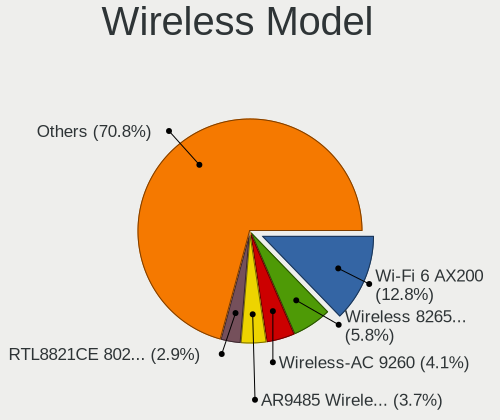

| Model                                                          | Computers | Percent |
|----------------------------------------------------------------|-----------|---------|
| Intel Wi-Fi 6 AX200                                            | 28        | 13.21%  |
| Intel Wireless 8265 / 8275                                     | 14        | 6.6%    |
| Qualcomm Atheros AR9485 Wireless Network Adapter               | 9         | 4.25%   |
| Intel Wireless-AC 9260                                         | 9         | 4.25%   |
| Realtek RTL8821CE 802.11ac PCIe Wireless Network Adapter       | 7         | 3.3%    |
| Intel Wireless 8260                                            | 7         | 3.3%    |
| Intel Centrino Advanced-N 6205 [Taylor Peak]                   | 6         | 2.83%   |
| Intel Cannon Point-LP CNVi [Wireless-AC]                       | 6         | 2.83%   |
| Intel Cannon Lake PCH CNVi WiFi                                | 6         | 2.83%   |
| Qualcomm Atheros QCA9377 802.11ac Wireless Network Adapter     | 5         | 2.36%   |
| Qualcomm Atheros AR9285 Wireless Network Adapter (PCI-Express) | 5         | 2.36%   |
| Intel Wireless 7265                                            | 5         | 2.36%   |
| Intel Dual Band Wireless-AC 3168NGW [Stone Peak]               | 5         | 2.36%   |
| Qualcomm Atheros QCA9565 / AR9565 Wireless Network Adapter     | 4         | 1.89%   |
| Intel Centrino Ultimate-N 6300                                 | 4         | 1.89%   |
| Qualcomm Atheros QCA6174 802.11ac Wireless Network Adapter     | 3         | 1.42%   |
| Qualcomm Atheros AR9462 Wireless Network Adapter               | 3         | 1.42%   |
| Intel Wireless 3165                                            | 3         | 1.42%   |
| Intel Comet Lake PCH-LP CNVi WiFi                              | 3         | 1.42%   |
| Broadcom BCM4360 802.11ac Wireless Network Adapter             | 3         | 1.42%   |
| Broadcom BCM4321 802.11a/b/g/n                                 | 3         | 1.42%   |
| Broadcom BCM43142 802.11b/g/n                                  | 3         | 1.42%   |
| Realtek RTL8723BE PCIe Wireless Network Adapter                | 2         | 0.94%   |
| Realtek RTL8192EU 802.11b/g/n WLAN Adapter                     | 2         | 0.94%   |
| Realtek 802.11ac NIC                                           | 2         | 0.94%   |
| Ralink RT5372 Wireless Adapter                                 | 2         | 0.94%   |
| Ralink MT7601U Wireless Adapter                                | 2         | 0.94%   |
| Ralink RT3290 Wireless 802.11n 1T/1R PCIe                      | 2         | 0.94%   |
| Qualcomm Atheros AR93xx Wireless Network Adapter               | 2         | 0.94%   |
| Intel WiFi Link 5100                                           | 2         | 0.94%   |
| Intel Wi-Fi 6 AX201                                            | 2         | 0.94%   |
| Intel Ice Lake-LP PCH CNVi WiFi                                | 2         | 0.94%   |
| Intel Dual Band Wireless-AC 3165 Plus Bluetooth                | 2         | 0.94%   |
| Intel Centrino Advanced-N 6200                                 | 2         | 0.94%   |
| Broadcom BCM4364 802.11ac Wireless Network Adapter             | 2         | 0.94%   |
| Broadcom BCM4313 802.11bgn Wireless Network Adapter            | 2         | 0.94%   |
| Wacom ACK-40401 [Wireless Accessory Kit]                       | 1         | 0.47%   |
| Sierra Wireless EM7305                                         | 1         | 0.47%   |
| Realtek RTL88x2bu [AC1200 Techkey]                             | 1         | 0.47%   |
| Realtek RTL8822CE 802.11ac PCIe Wireless Network Adapter       | 1         | 0.47%   |
| Realtek RTL8822BE 802.11a/b/g/n/ac WiFi adapter                | 1         | 0.47%   |
| Realtek RTL8821AE 802.11ac PCIe Wireless Network Adapter       | 1         | 0.47%   |
| Realtek RTL8811AU 802.11a/b/g/n/ac WLAN Adapter                | 1         | 0.47%   |
| Realtek RTL8192CU 802.11n WLAN Adapter                         | 1         | 0.47%   |
| Realtek RTL8192CE PCIe Wireless Network Adapter                | 1         | 0.47%   |
| Realtek RTL8191SU 802.11n WLAN Adapter                         | 1         | 0.47%   |
| Realtek RTL8188CUS 802.11n WLAN Adapter                        | 1         | 0.47%   |
| Realtek RTL8188CE 802.11b/g/n WiFi Adapter                     | 1         | 0.47%   |
| Ralink RT2870/RT3070 Wireless Adapter                          | 1         | 0.47%   |
| Ralink RT5390 Wireless 802.11n 1T/1R PCIe                      | 1         | 0.47%   |
| Ralink RT3090 Wireless 802.11n 1T/1R PCIe                      | 1         | 0.47%   |
| Ralink RT2790 Wireless 802.11n 1T/2R PCIe                      | 1         | 0.47%   |
| Qualcomm Atheros AR9287 Wireless Network Adapter (PCI-Express) | 1         | 0.47%   |
| NetGear A6100 AC600 DB Wireless Adapter [Realtek RTL8811AU]    | 1         | 0.47%   |
| Microsoft XBOX ACC                                             | 1         | 0.47%   |
| MEDIATEK MT7921 802.11ax PCI Express Wireless Network Adapter  | 1         | 0.47%   |
| Marvell Group 88W8897 [AVASTAR] 802.11ac Wireless              | 1         | 0.47%   |
| Linksys WUSB54GC v1 802.11g Adapter [Ralink RT73]              | 1         | 0.47%   |
| Intel Wireless 7260                                            | 1         | 0.47%   |
| Intel Wireless 3160                                            | 1         | 0.47%   |

Ethernet Vendor
---------------

Ethernet vendors

| Vendor                   | Computers | Percent |
|--------------------------|-----------|---------|
| Realtek Semiconductor    | 116       | 53.95%  |
| Intel                    | 59        | 27.44%  |
| Qualcomm Atheros         | 17        | 7.91%   |
| Broadcom                 | 10        | 4.65%   |
| Marvell Technology Group | 5         | 2.33%   |
| ASIX Electronics         | 2         | 0.93%   |
| Xiaomi                   | 1         | 0.47%   |
| Nvidia                   | 1         | 0.47%   |
| Lenovo                   | 1         | 0.47%   |
| Hewlett-Packard          | 1         | 0.47%   |
| Broadcom Limited         | 1         | 0.47%   |
| Apple                    | 1         | 0.47%   |

Ethernet Model
--------------

Ethernet models

| Model                                                             | Computers | Percent |
|-------------------------------------------------------------------|-----------|---------|
| Realtek RTL8111/8168/8411 PCI Express Gigabit Ethernet Controller | 80        | 35.71%  |
| Realtek RTL8153 Gigabit Ethernet Adapter                          | 19        | 8.48%   |
| Intel 82579LM Gigabit Network Connection (Lewisville)             | 15        | 6.7%    |
| Realtek RTL810xE PCI Express Fast Ethernet controller             | 14        | 6.25%   |
| Realtek RTL8125 2.5GbE Controller                                 | 9         | 4.02%   |
| Qualcomm Atheros AR8151 v2.0 Gigabit Ethernet                     | 5         | 2.23%   |
| Intel I211 Gigabit Network Connection                             | 5         | 2.23%   |
| Intel Ethernet Connection I217-LM                                 | 4         | 1.79%   |
| Intel Ethernet Connection (7) I219-V                              | 4         | 1.79%   |
| Intel Ethernet Connection (6) I219-V                              | 4         | 1.79%   |
| Intel Ethernet Connection (4) I219-LM                             | 4         | 1.79%   |
| Qualcomm Atheros Killer E2500 Gigabit Ethernet Controller         | 3         | 1.34%   |
| Qualcomm Atheros Killer E220x Gigabit Ethernet Controller         | 3         | 1.34%   |
| Marvell Group 88E8058 PCI-E Gigabit Ethernet Controller           | 3         | 1.34%   |
| Intel Ethernet Connection I219-LM                                 | 3         | 1.34%   |
| Intel Ethernet Connection (2) I219-V                              | 3         | 1.34%   |
| Broadcom NetXtreme BCM57765 Gigabit Ethernet PCIe                 | 3         | 1.34%   |
| Qualcomm Atheros QCA8171 Gigabit Ethernet                         | 2         | 0.89%   |
| Qualcomm Atheros Killer E2400 Gigabit Ethernet Controller         | 2         | 0.89%   |
| Intel Ethernet Connection (6) I219-LM                             | 2         | 0.89%   |
| Intel Ethernet Connection (2) I219-LM                             | 2         | 0.89%   |
| Intel 82579V Gigabit Network Connection                           | 2         | 0.89%   |
| Intel 82577LM Gigabit Network Connection                          | 2         | 0.89%   |
| Intel 82567LM-3 Gigabit Network Connection                        | 2         | 0.89%   |
| Broadcom NetXtreme BCM5761 Gigabit Ethernet PCIe                  | 2         | 0.89%   |
| Xiaomi Mi/Redmi series (RNDIS)                                    | 1         | 0.45%   |
| Realtek RTL8152 Fast Ethernet Adapter                             | 1         | 0.45%   |
| Qualcomm Atheros AR8161 Gigabit Ethernet                          | 1         | 0.45%   |
| Qualcomm Atheros AR8152 v2.0 Fast Ethernet                        | 1         | 0.45%   |
| Nvidia MCP79 Ethernet                                             | 1         | 0.45%   |
| Marvell Group 88E8057 PCI-E Gigabit Ethernet Controller           | 1         | 0.45%   |
| Marvell Group 88E8040T PCI-E Fast Ethernet Controller             | 1         | 0.45%   |
| Lenovo ThinkPad TBT3 LAN                                          | 1         | 0.45%   |
| Intel Ethernet Controller I225-V                                  | 1         | 0.45%   |
| Intel Ethernet Connection I219-V                                  | 1         | 0.45%   |
| Intel Ethernet Connection I218-LM                                 | 1         | 0.45%   |
| Intel Ethernet Connection (7) I219-LM                             | 1         | 0.45%   |
| Intel Ethernet Connection (5) I219-LM                             | 1         | 0.45%   |
| Intel 82578DC Gigabit Network Connection                          | 1         | 0.45%   |
| Intel 82566DM Gigabit Network Connection                          | 1         | 0.45%   |
| Intel 80003ES2LAN Gigabit Ethernet Controller (Copper)            | 1         | 0.45%   |
| HP lt4120 Snapdragon X5 LTE                                       | 1         | 0.45%   |
| Broadcom NetXtreme BCM57786 Gigabit Ethernet PCIe                 | 1         | 0.45%   |
| Broadcom NetXtreme BCM57766 Gigabit Ethernet PCIe                 | 1         | 0.45%   |
| Broadcom NetXtreme BCM57762 Gigabit Ethernet PCIe                 | 1         | 0.45%   |
| Broadcom NetLink BCM5906M Fast Ethernet PCI Express               | 1         | 0.45%   |
| Broadcom NetLink BCM57785 Gigabit Ethernet PCIe                   | 1         | 0.45%   |
| Broadcom NetLink BCM57780 Gigabit Ethernet PCIe                   | 1         | 0.45%   |
| Broadcom Limited NetLink BCM5784M Gigabit Ethernet PCIe           | 1         | 0.45%   |
| ASIX AX88772A Fast Ethernet                                       | 1         | 0.45%   |
| ASIX AX88179 Gigabit Ethernet                                     | 1         | 0.45%   |
| Apple iBridge                                                     | 1         | 0.45%   |

Net Controller Kind
-------------------

Ethernet, WiFi or modem

| Kind     | Computers | Percent |
|----------|-----------|---------|
| Ethernet | 203       | 49.88%  |
| WiFi     | 200       | 49.14%  |
| Modem    | 4         | 0.98%   |

Used Controller
---------------

Currently used network controller

| Kind     | Computers | Percent |
|----------|-----------|---------|
| WiFi     | 184       | 56.1%   |
| Ethernet | 143       | 43.6%   |
| Modem    | 1         | 0.3%    |

NICs
----

Total network controllers on board

| Total | Computers | Percent |
|-------|-----------|---------|
| 2     | 150       | 65.22%  |
| 1     | 70        | 30.43%  |
| 3     | 7         | 3.04%   |
| 0     | 3         | 1.3%    |

IPv6
----

IPv6 vs IPv4

| Used | Computers | Percent |
|------|-----------|---------|
| No   | 205       | 87.98%  |
| Yes  | 28        | 12.02%  |

Bluetooth
---------

Bluetooth Vendor
----------------

Controller vendors

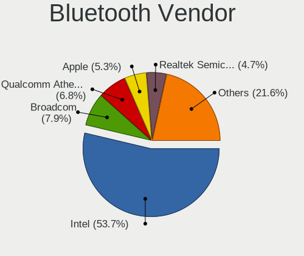

| Vendor                          | Computers | Percent |
|---------------------------------|-----------|---------|
| Intel                           | 89        | 52.98%  |
| Broadcom                        | 13        | 7.74%   |
| Qualcomm Atheros Communications | 12        | 7.14%   |
| Lite-On Technology              | 9         | 5.36%   |
| Apple                           | 9         | 5.36%   |
| Realtek Semiconductor           | 8         | 4.76%   |
| Cambridge Silicon Radio         | 8         | 4.76%   |
| Foxconn / Hon Hai               | 4         | 2.38%   |
| Hewlett-Packard                 | 3         | 1.79%   |
| Dell                            | 3         | 1.79%   |
| Ralink                          | 2         | 1.19%   |
| IMC Networks                    | 2         | 1.19%   |
| ASUSTek Computer                | 2         | 1.19%   |
| Toshiba                         | 1         | 0.6%    |
| Realtek                         | 1         | 0.6%    |
| Marvell Semiconductor           | 1         | 0.6%    |
| Belkin Components               | 1         | 0.6%    |

Bluetooth Model
---------------

Controller models

| Model                                                                               | Computers | Percent |
|-------------------------------------------------------------------------------------|-----------|---------|
| Intel Bluetooth wireless interface                                                  | 29        | 17.26%  |
| Intel AX200 Bluetooth                                                               | 27        | 16.07%  |
| Intel Bluetooth 9460/9560 Jefferson Peak (JfP)                                      | 11        | 6.55%   |
| Intel Bluetooth Device                                                              | 10        | 5.95%   |
| Cambridge Silicon Radio Bluetooth Dongle (HCI mode)                                 | 8         | 4.76%   |
| Intel AX201 Bluetooth                                                               | 6         | 3.57%   |
| Realtek Bluetooth Radio                                                             | 4         | 2.38%   |
| Qualcomm Atheros  Bluetooth Device                                                  | 4         | 2.38%   |
| Qualcomm Atheros AR3011 Bluetooth                                                   | 4         | 2.38%   |
| Intel Wireless-AC 3168 Bluetooth                                                    | 4         | 2.38%   |
| Realtek  Bluetooth 4.2 Adapter                                                      | 3         | 1.79%   |
| Lite-On Qualcomm Atheros QCA9377 Bluetooth                                          | 3         | 1.79%   |
| Lite-On Bluetooth Device                                                            | 3         | 1.79%   |
| Dell DW375 Bluetooth Module                                                         | 3         | 1.79%   |
| Broadcom BCM20702A0 Bluetooth 4.0                                                   | 3         | 1.79%   |
| Broadcom BCM20702 Bluetooth 4.0 [ThinkPad]                                          | 3         | 1.79%   |
| Apple Bluetooth Host Controller                                                     | 3         | 1.79%   |
| Apple Bluetooth HCI                                                                 | 3         | 1.79%   |
| Ralink RT3290 Bluetooth                                                             | 2         | 1.19%   |
| Qualcomm Atheros AR3012 Bluetooth 4.0                                               | 2         | 1.19%   |
| HP Broadcom 2070 Bluetooth Combo                                                    | 2         | 1.19%   |
| Apple Built-in Bluetooth 2.0+EDR HCI                                                | 2         | 1.19%   |
| Toshiba Integrated Bluetooth HCI                                                    | 1         | 0.6%    |
| Realtek RTL8821A Bluetooth                                                          | 1         | 0.6%    |
| Realtek Bluetooth Radio                                                             | 1         | 0.6%    |
| Qualcomm Atheros QCA61x4 Bluetooth 4.0                                              | 1         | 0.6%    |
| Qualcomm Atheros AR9462 Bluetooth                                                   | 1         | 0.6%    |
| Marvell Bluetooth and Wireless LAN Composite                                        | 1         | 0.6%    |
| Lite-On Broadcom BCM43142A0 Bluetooth Device                                        | 1         | 0.6%    |
| Lite-On Atheros Bluetooth                                                           | 1         | 0.6%    |
| Lite-On Atheros AR3012 Bluetooth                                                    | 1         | 0.6%    |
| Intel Centrino Bluetooth Wireless Transceiver                                       | 1         | 0.6%    |
| Intel Centrino Advanced-N 6230 Bluetooth adapter                                    | 1         | 0.6%    |
| IMC Networks Wireless_Device                                                        | 1         | 0.6%    |
| IMC Networks Atheros AR3012 Bluetooth 4.0 Adapter                                   | 1         | 0.6%    |
| HP Integrated Module with Bluetooth 2.1 Wireless technology                         | 1         | 0.6%    |
| Foxconn / Hon Hai Foxconn T77H114 BCM2070 [Single-Chip Bluetooth 2.1 + EDR Adapter] | 1         | 0.6%    |
| Foxconn / Hon Hai Bluetooth USB Host Controller                                     | 1         | 0.6%    |
| Foxconn / Hon Hai Bluetooth Device                                                  | 1         | 0.6%    |
| Foxconn / Hon Hai Acer Bluetooth module                                             | 1         | 0.6%    |
| Broadcom HP Portable SoftSailing                                                    | 1         | 0.6%    |
| Broadcom BRCM2070 BT 2.1 + HS USB Module                                            | 1         | 0.6%    |
| Broadcom BCM92046DG-CL1ROM Bluetooth 2.1 Adapter                                    | 1         | 0.6%    |
| Broadcom BCM43142A0 Bluetooth 4.0                                                   | 1         | 0.6%    |
| Broadcom BCM43142 Bluetooth 4.0                                                     | 1         | 0.6%    |
| Broadcom BCM20702A0                                                                 | 1         | 0.6%    |
| Broadcom BCM2070 Bluetooth 2.1 + EDR                                                | 1         | 0.6%    |
| Belkin Components F8T065BF Mini Bluetooth 4.0 Adapter                               | 1         | 0.6%    |
| ASUS Broadcom BCM20702A0 Bluetooth                                                  | 1         | 0.6%    |
| ASUS Bluetooth Adapter                                                              | 1         | 0.6%    |
| Apple Bluetooth USB Host Controller                                                 | 1         | 0.6%    |

Sound
-----

Sound Vendor
------------

Sound card vendors

| Vendor                    | Computers | Percent |
|---------------------------|-----------|---------|
| Intel                     | 183       | 52.74%  |
| Nvidia                    | 65        | 18.73%  |
| AMD                       | 55        | 15.85%  |
| Realtek Semiconductor     | 7         | 2.02%   |
| C-Media Electronics       | 6         | 1.73%   |
| GN Netcom                 | 4         | 1.15%   |
| Sennheiser Communications | 3         | 0.86%   |
| Kingston Technology       | 3         | 0.86%   |
| Logitech                  | 2         | 0.58%   |
| JMTek                     | 2         | 0.58%   |
| Focusrite-Novation        | 2         | 0.58%   |
| Blue Microphones          | 2         | 0.58%   |
| SteelSeries ApS           | 1         | 0.29%   |
| Razer USA                 | 1         | 0.29%   |
| Plantronics               | 1         | 0.29%   |
| Microsoft                 | 1         | 0.29%   |
| Lenovo                    | 1         | 0.29%   |
| Hewlett-Packard           | 1         | 0.29%   |
| Generalplus Technology    | 1         | 0.29%   |
| Creative Labs             | 1         | 0.29%   |
| Conexant Systems          | 1         | 0.29%   |
| CMX Systems               | 1         | 0.29%   |
| Bose                      | 1         | 0.29%   |
| Apple                     | 1         | 0.29%   |
| AKAI Professional M.I.    | 1         | 0.29%   |

Sound Model
-----------

Sound card models

| Model                                                                                             | Computers | Percent |
|---------------------------------------------------------------------------------------------------|-----------|---------|
| Intel Sunrise Point-LP HD Audio                                                                   | 28        | 7.14%   |
| Intel 7 Series/C216 Chipset Family High Definition Audio Controller                               | 21        | 5.36%   |
| Intel 6 Series/C200 Series Chipset Family High Definition Audio Controller                        | 18        | 4.59%   |
| AMD Family 17h/19h HD Audio Controller                                                            | 17        | 4.34%   |
| Intel Cannon Lake PCH cAVS                                                                        | 14        | 3.57%   |
| Intel Cannon Point-LP High Definition Audio Controller                                            | 13        | 3.32%   |
| Intel 8 Series/C220 Series Chipset High Definition Audio Controller                               | 11        | 2.81%   |
| Intel 5 Series/3400 Series Chipset High Definition Audio                                          | 9         | 2.3%    |
| AMD Starship/Matisse HD Audio Controller                                                          | 9         | 2.3%    |
| Nvidia TU106 High Definition Audio Controller                                                     | 8         | 2.04%   |
| Realtek Semiconductor USB Audio                                                                   | 7         | 1.79%   |
| Nvidia GP106 High Definition Audio Controller                                                     | 7         | 1.79%   |
| Intel Xeon E3-1200 v3/4th Gen Core Processor HD Audio Controller                                  | 7         | 1.79%   |
| Intel Tiger Lake-LP Smart Sound Technology Audio Controller                                       | 7         | 1.79%   |
| Intel Haswell-ULT HD Audio Controller                                                             | 7         | 1.79%   |
| Intel 8 Series HD Audio Controller                                                                | 7         | 1.79%   |
| Nvidia GP107GL High Definition Audio Controller                                                   | 6         | 1.53%   |
| Intel Comet Lake PCH-LP cAVS                                                                      | 6         | 1.53%   |
| AMD Renoir Radeon High Definition Audio Controller                                                | 6         | 1.53%   |
| AMD Raven/Raven2/Fenghuang HDMI/DP Audio Controller                                               | 6         | 1.53%   |
| Nvidia GK107 HDMI Audio Controller                                                                | 5         | 1.28%   |
| Intel CM238 HD Audio Controller                                                                   | 5         | 1.28%   |
| Intel 82801H (ICH8 Family) HD Audio Controller                                                    | 5         | 1.28%   |
| AMD FCH Azalia Controller                                                                         | 5         | 1.28%   |
| AMD Ellesmere HDMI Audio [Radeon RX 470/480 / 570/580/590]                                        | 5         | 1.28%   |
| Nvidia TU116 High Definition Audio Controller                                                     | 4         | 1.02%   |
| Nvidia GF108 High Definition Audio Controller                                                     | 4         | 1.02%   |
| Intel Wildcat Point-LP High Definition Audio Controller                                           | 4         | 1.02%   |
| Intel Ice Lake-LP Smart Sound Technology Audio Controller                                         | 4         | 1.02%   |
| Intel Comet Lake PCH cAVS                                                                         | 4         | 1.02%   |
| Intel Broadwell-U Audio Controller                                                                | 4         | 1.02%   |
| Intel Atom/Celeron/Pentium Processor x5-E8000/J3xxx/N3xxx Series High Definition Audio Controller | 4         | 1.02%   |
| Intel 82801I (ICH9 Family) HD Audio Controller                                                    | 4         | 1.02%   |
| Intel 200 Series PCH HD Audio                                                                     | 4         | 1.02%   |
| Intel 100 Series/C230 Series Chipset Family HD Audio Controller                                   | 4         | 1.02%   |
| AMD Navi 10 HDMI Audio                                                                            | 4         | 1.02%   |
| AMD Family 17h (Models 00h-0fh) HD Audio Controller                                               | 4         | 1.02%   |
| AMD Family 15h (Models 60h-6fh) Audio Controller                                                  | 4         | 1.02%   |
| Nvidia TU107 GeForce GTX 1650 High Definition Audio Controller                                    | 3         | 0.77%   |
| Nvidia GP108 High Definition Audio Controller                                                     | 3         | 0.77%   |
| Nvidia GP104 High Definition Audio Controller                                                     | 3         | 0.77%   |
| Intel 82801JD/DO (ICH10 Family) HD Audio Controller                                               | 3         | 0.77%   |
| AMD Oland/Hainan/Cape Verde/Pitcairn HDMI Audio [Radeon HD 7000 Series]                           | 3         | 0.77%   |
| AMD Kabini HDMI/DP Audio                                                                          | 3         | 0.77%   |
| Nvidia TU104 HD Audio Controller                                                                  | 2         | 0.51%   |
| Nvidia High Definition Audio Controller                                                           | 2         | 0.51%   |
| Nvidia GM107 High Definition Audio Controller [GeForce 940MX]                                     | 2         | 0.51%   |
| Nvidia GK208 HDMI/DP Audio Controller                                                             | 2         | 0.51%   |
| Nvidia GA104 High Definition Audio Controller                                                     | 2         | 0.51%   |
| Nvidia Audio device                                                                               | 2         | 0.51%   |
| Kingston Technology HyperX Cloud Stinger Wireless                                                 | 2         | 0.51%   |
| Intel NM10/ICH7 Family High Definition Audio Controller                                           | 2         | 0.51%   |
| Intel C600/X79 series chipset High Definition Audio Controller                                    | 2         | 0.51%   |
| C-Media Electronics Blue Snowball                                                                 | 2         | 0.51%   |
| Blue Microphones Yeti Stereo Microphone                                                           | 2         | 0.51%   |
| AMD Vega 10 HDMI Audio [Radeon Vega 56/64]                                                        | 2         | 0.51%   |
| AMD SBx00 Azalia (Intel HDA)                                                                      | 2         | 0.51%   |
| AMD Juniper HDMI Audio [Radeon HD 5700 Series]                                                    | 2         | 0.51%   |
| AMD High Definition Audio Controller                                                              | 2         | 0.51%   |
| AMD Baffin HDMI/DP Audio [Radeon RX 550 640SP / RX 560/560X]                                      | 2         | 0.51%   |

Memory
------

Memory Vendor
-------------

Memory module vendors

| Vendor              | Computers | Percent |
|---------------------|-----------|---------|
| Samsung Electronics | 44        | 28.39%  |
| SK Hynix            | 36        | 23.23%  |
| Micron Technology   | 14        | 9.03%   |
| Kingston            | 12        | 7.74%   |
| Crucial             | 11        | 7.1%    |
| Unknown             | 7         | 4.52%   |
| Corsair             | 6         | 3.87%   |
| G.Skill             | 4         | 2.58%   |
| A-DATA Technology   | 4         | 2.58%   |
| Ramaxel Technology  | 3         | 1.94%   |
| Smart               | 2         | 1.29%   |
| Unknown             | 2         | 1.29%   |
| Unknown (F301)      | 1         | 0.65%   |
| TIMETEC             | 1         | 0.65%   |
| Teikon              | 1         | 0.65%   |
| Team                | 1         | 0.65%   |
| SMART Brazil        | 1         | 0.65%   |
| Sesame              | 1         | 0.65%   |
| Nanya Technology    | 1         | 0.65%   |
| Kingmax             | 1         | 0.65%   |
| Elpida              | 1         | 0.65%   |
| ASint Technology    | 1         | 0.65%   |

Memory Model
------------

Memory module models

| Model                                                           | Computers | Percent |
|-----------------------------------------------------------------|-----------|---------|
| Samsung RAM M471A4G43AB1-CWE 32GB SODIMM DDR4 3200MT/s          | 5         | 3.01%   |
| Samsung RAM M471A2K43DB1-CWE 16GB SODIMM DDR4 3200MT/s          | 5         | 3.01%   |
| Samsung RAM M471A1K43CB1-CTD 8192MB SODIMM DDR4 2667MT/s        | 4         | 2.41%   |
| Samsung RAM M471A2K43CB1-CTD 16384MB SODIMM DDR4 2667MT/s       | 3         | 1.81%   |
| SK Hynix RAM HMT351S6CFR8A-PB 4GB SODIMM DDR3 1600MT/s          | 2         | 1.2%    |
| SK Hynix RAM HMT351S6BFR8C-H9 4GB SODIMM DDR3 1333MT/s          | 2         | 1.2%    |
| SK Hynix RAM HMA82GS6CJR8N-VK 16GB SODIMM DDR4 2667MT/s         | 2         | 1.2%    |
| SK Hynix RAM HMA81GS6JJR8N-VK 8GB SODIMM DDR4 2667MT/s          | 2         | 1.2%    |
| SK Hynix RAM HMA81GS6AFR8N-UH 8GB SODIMM DDR4 2667MT/s          | 2         | 1.2%    |
| Samsung RAM M471B5273EB0-CK0 4096MB SODIMM DDR3 4199MT/s        | 2         | 1.2%    |
| Samsung RAM M471B5173EB0-YK0 4GB SODIMM DDR3 1600MT/s           | 2         | 1.2%    |
| Micron RAM 4ATF51264HZ-2G6E1 4GB SODIMM DDR4 2667MT/s           | 2         | 1.2%    |
| Micron RAM 16JSF51264HZ-1G4D1 4GB SODIMM DDR3 1334MT/s          | 2         | 1.2%    |
| Micron RAM 16ATF2G64HZ-2G6E1 16GB SODIMM DDR4 2667MT/s          | 2         | 1.2%    |
| Corsair RAM CMW32GX4M2C3200C16 16GB DIMM DDR4 3200MT/s          | 2         | 1.2%    |
| Unknown                                                         | 2         | 1.2%    |
| Unknown RAM Module 8192MB SODIMM DDR4 2400MT/s                  | 1         | 0.6%    |
| Unknown RAM Module 8192MB DIMM DDR3 1333MT/s                    | 1         | 0.6%    |
| Unknown RAM Module 4096MB SODIMM DDR3 1600MT/s                  | 1         | 0.6%    |
| Unknown RAM Module 4096MB SODIMM DDR3                           | 1         | 0.6%    |
| Unknown RAM Module 4096MB SODIMM DDR2 667MT/s                   | 1         | 0.6%    |
| Unknown RAM Module 4096MB DIMM DDR 1066MT/s                     | 1         | 0.6%    |
| Unknown RAM Module 2048MB SODIMM DDR3                           | 1         | 0.6%    |
| Unknown RAM Module 2048MB DIMM SDRAM                            | 1         | 0.6%    |
| Unknown RAM Module 2048MB DIMM DDR 1333MT/s                     | 1         | 0.6%    |
| Unknown RAM Module 2048MB DIMM DDR 1066MT/s                     | 1         | 0.6%    |
| Unknown (F301) RAM G2RT-4AFT00 16384MB SODIMM DDR4 2667MT/s     | 1         | 0.6%    |
| TIMETEC RAM ED3-1600 8192MB DIMM DDR3 1600MT/s                  | 1         | 0.6%    |
| Teikon RAM TMT451S6BFR8A-PBAJ 4096MB SODIMM DDR3 1600MT/s       | 1         | 0.6%    |
| Team RAM TEAMGROUP-UD4-2400 8192MB DIMM DDR4 3007MT/s           | 1         | 0.6%    |
| Smart RAM SMS4TDC3C0K0446SCG 4096MB SODIMM DDR4 2667MT/s        | 1         | 0.6%    |
| Smart RAM SH564128FJ8NWRNSQG 4GB SODIMM DDR3 1600MT/s           | 1         | 0.6%    |
| Smart RAM SF4641G8CK8IEHLSBG 8GB SODIMM DDR4 2667MT/s           | 1         | 0.6%    |
| SMART Brazil RAM SMS4TDC3C0K0446SCG 4096MB SODIMM DDR4 2667MT/s | 1         | 0.6%    |
| SK Hynix RAM Module 4096MB SODIMM LPDDR3 1867MT/s               | 1         | 0.6%    |
| SK Hynix RAM Module 4096MB SODIMM DDR3 1600MT/s                 | 1         | 0.6%    |
| SK Hynix RAM Module 4096MB SODIMM DDR3 1333MT/s                 | 1         | 0.6%    |
| SK Hynix RAM Module 4096MB FB-DIMM DDR2 667MT/s                 | 1         | 0.6%    |
| SK Hynix RAM Module 2048MB SODIMM DDR2 667MT/s                  | 1         | 0.6%    |
| SK Hynix RAM Module 16384MB SODIMM DDR4 2133MT/s                | 1         | 0.6%    |
| SK Hynix RAM HMT451U6AFR8C-PB 4GB DIMM DDR3 1600MT/s            | 1         | 0.6%    |
| SK Hynix RAM HMT451S6BFR8A-PB 4GB SODIMM DDR3 1600MT/s          | 1         | 0.6%    |
| SK Hynix RAM HMT451S6BFR8A-PB 4096MB SODIMM DDR3 1600MT/s       | 1         | 0.6%    |
| SK Hynix RAM HMT451S6AFR8C-PB 4GB SODIMM DDR3 1600MT/s          | 1         | 0.6%    |
| SK Hynix RAM HMT451S6AFR8A-PB 4GB SODIMM DDR3 1600MT/s          | 1         | 0.6%    |
| SK Hynix RAM HMT41GS6AFR8A-PB 8192MB SODIMM DDR3 1600MT/s       | 1         | 0.6%    |
| SK Hynix RAM HMT351S6EFR8C-PB 4GB SODIMM DDR3 1600MT/s          | 1         | 0.6%    |
| SK Hynix RAM HMT351S6CFR8C-PB 4GB SODIMM DDR3 1600MT/s          | 1         | 0.6%    |
| SK Hynix RAM HMT351S6CFR8C-H9 4096MB SODIMM DDR3 1334MT/s       | 1         | 0.6%    |
| SK Hynix RAM HMT325S6BFR8C-H9 2GB SODIMM 1600MT/s               | 1         | 0.6%    |
| SK Hynix RAM HMT125S6BFR8C-G7 2GB SODIMM DDR3 1333MT/s          | 1         | 0.6%    |
| SK Hynix RAM HMT125S6AFR8C-G7 2048MB SODIMM DDR3 1067MT/s       | 1         | 0.6%    |
| SK Hynix RAM HMA851S6CJR6N-VK 4GB Row Of Chips DDR4 2667MT/s    | 1         | 0.6%    |
| SK Hynix RAM HMA851S6CJR6N-VK 4096MB SODIMM DDR4 2667MT/s       | 1         | 0.6%    |
| SK Hynix RAM HMA851S6AFR6N-UH 4096MB SODIMM DDR4 2667MT/s       | 1         | 0.6%    |
| SK Hynix RAM HMA851S6AFR6N-TF 4GB SODIMM DDR4 2133MT/s          | 1         | 0.6%    |
| SK Hynix RAM HMA82GS6JJR8N-VK 16GB SODIMM DDR4 2667MT/s         | 1         | 0.6%    |
| SK Hynix RAM HMA82GS6AFR8N-UH 16GB SODIMM DDR4 2667MT/s         | 1         | 0.6%    |
| SK Hynix RAM HMA82GS6AFR8N-UH 16384MB SODIMM DDR4 2133MT/s      | 1         | 0.6%    |
| SK Hynix RAM HMA81GS6CJR8N-VK 8192MB SODIMM DDR4 2667MT/s       | 1         | 0.6%    |

Memory Kind
-----------

Memory module kinds

| Kind    | Computers | Percent |
|---------|-----------|---------|
| DDR4    | 70        | 50%     |
| DDR3    | 53        | 37.86%  |
| SDRAM   | 5         | 3.57%   |
| LPDDR3  | 5         | 3.57%   |
| LPDDR4  | 2         | 1.43%   |
| DDR2    | 2         | 1.43%   |
| DDR     | 2         | 1.43%   |
| Unknown | 1         | 0.71%   |

Memory Form Factor
------------------

Physical design of the memory module

| Name         | Computers | Percent |
|--------------|-----------|---------|
| SODIMM       | 101       | 74.26%  |
| DIMM         | 27        | 19.85%  |
| Row Of Chips | 7         | 5.15%   |
| FB-DIMM      | 1         | 0.74%   |

Memory Size
-----------

Memory module size

| Size  | Computers | Percent |
|-------|-----------|---------|
| 4096  | 52        | 35.14%  |
| 8192  | 50        | 33.78%  |
| 16384 | 27        | 18.24%  |
| 2048  | 11        | 7.43%   |
| 32768 | 6         | 4.05%   |
| 1024  | 2         | 1.35%   |

Memory Speed
------------

Memory module speed

| Speed   | Computers | Percent |
|---------|-----------|---------|
| 1600    | 37        | 24.5%   |
| 2667    | 31        | 20.53%  |
| 3200    | 19        | 12.58%  |
| 1333    | 11        | 7.28%   |
| 2400    | 10        | 6.62%   |
| 2133    | 9         | 5.96%   |
| 1334    | 7         | 4.64%   |
| 1067    | 4         | 2.65%   |
| 4199    | 3         | 1.99%   |
| 1867    | 3         | 1.99%   |
| 667     | 3         | 1.99%   |
| 3600    | 2         | 1.32%   |
| 1066    | 2         | 1.32%   |
| Unknown | 2         | 1.32%   |
| 3733    | 1         | 0.66%   |
| 3500    | 1         | 0.66%   |
| 3466    | 1         | 0.66%   |
| 3266    | 1         | 0.66%   |
| 3007    | 1         | 0.66%   |
| 2134    | 1         | 0.66%   |
| 2048    | 1         | 0.66%   |
| 1866    | 1         | 0.66%   |

Printers & scanners
-------------------

Printer Vendor
--------------

Printer device vendors

| Vendor              | Computers | Percent |
|---------------------|-----------|---------|
| Hewlett-Packard     | 2         | 33.33%  |
| Canon               | 2         | 33.33%  |
| Sharp               | 1         | 16.67%  |
| Samsung Electronics | 1         | 16.67%  |

Printer Model
-------------

Printer device models

| Model                       | Computers | Percent |
|-----------------------------|-----------|---------|
| Sharp AL-2030               | 1         | 16.67%  |
| Samsung M2020 Series        | 1         | 16.67%  |
| HP Deskjet 3050 J610 series | 1         | 16.67%  |
| HP DeskJet 2130 series      | 1         | 16.67%  |
| Canon TR7500 series         | 1         | 16.67%  |
| Canon MF240 Series V4       | 1         | 16.67%  |

Scanner Vendor
--------------

Scanner device vendors

| Vendor | Computers | Percent |
|--------|-----------|---------|
| Canon  | 2         | 100%    |

Scanner Model
-------------

Scanner device models

| Model                   | Computers | Percent |
|-------------------------|-----------|---------|
| Canon CanoScan LiDE 220 | 1         | 50%     |
| Canon CanoScan LiDE 110 | 1         | 50%     |

Camera
------

Camera Vendor
-------------

Camera device vendors

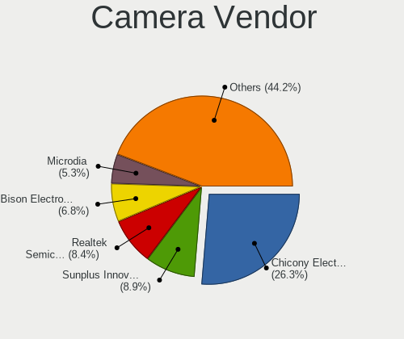

| Vendor                                 | Computers | Percent |
|----------------------------------------|-----------|---------|
| Chicony Electronics                    | 44        | 26.67%  |
| Acer                                   | 18        | 10.91%  |
| Sunplus Innovation Technology          | 14        | 8.48%   |
| Realtek Semiconductor                  | 14        | 8.48%   |
| Microdia                               | 8         | 4.85%   |
| IMC Networks                           | 8         | 4.85%   |
| Cheng Uei Precision Industry (Foxlink) | 8         | 4.85%   |
| Apple                                  | 8         | 4.85%   |
| Logitech                               | 7         | 4.24%   |
| Quanta                                 | 6         | 3.64%   |
| Silicon Motion                         | 5         | 3.03%   |
| Syntek                                 | 4         | 2.42%   |
| Suyin                                  | 4         | 2.42%   |
| Lite-On Technology                     | 3         | 1.82%   |
| LG Electronics                         | 2         | 1.21%   |
| Generalplus Technology                 | 2         | 1.21%   |
| Sonix Technology                       | 1         | 0.61%   |
| Ricoh                                  | 1         | 0.61%   |
| Primax Electronics                     | 1         | 0.61%   |
| OPPO Electronics                       | 1         | 0.61%   |
| Microsoft                              | 1         | 0.61%   |
| Luxvisions Innotech Limited            | 1         | 0.61%   |
| Guillemot                              | 1         | 0.61%   |
| Cubeternet                             | 1         | 0.61%   |
| Creative Technology                    | 1         | 0.61%   |
| Alcor Micro                            | 1         | 0.61%   |

Camera Model
------------

Camera device models

| Model                                                                      | Computers | Percent |
|----------------------------------------------------------------------------|-----------|---------|
| Chicony HD Webcam                                                          | 11        | 6.67%   |
| Chicony USB2.0 Camera                                                      | 8         | 4.85%   |
| Realtek Integrated_Webcam_HD                                               | 6         | 3.64%   |
| Microdia Integrated_Webcam_HD                                              | 5         | 3.03%   |
| Chicony Integrated Camera                                                  | 5         | 3.03%   |
| Acer HD Webcam                                                             | 5         | 3.03%   |
| Chicony HP HD Camera                                                       | 4         | 2.42%   |
| Sunplus Asus Webcam                                                        | 3         | 1.82%   |
| Apple FaceTime HD Camera (Built-in)                                        | 3         | 1.82%   |
| Apple Built-in iSight                                                      | 3         | 1.82%   |
| Acer BisonCam,NB Pro                                                       | 3         | 1.82%   |
| Acer BisonCam, NB Pro                                                      | 3         | 1.82%   |
| Suyin HP Truevision HD                                                     | 2         | 1.21%   |
| Sunplus USB Camera                                                         | 2         | 1.21%   |
| Sunplus HP HD Webcam [Fixed]                                               | 2         | 1.21%   |
| Realtek USB2.0 HD UVC WebCam                                               | 2         | 1.21%   |
| Microdia Laptop_Integrated_Webcam_HD                                       | 2         | 1.21%   |
| Logitech Webcam C270                                                       | 2         | 1.21%   |
| Logitech Webcam B500                                                       | 2         | 1.21%   |
| IMC Networks VGA UVC WebCam                                                | 2         | 1.21%   |
| IMC Networks USB2.0 HD UVC WebCam                                          | 2         | 1.21%   |
| IMC Networks Integrated Camera                                             | 2         | 1.21%   |
| Chicony Integrated Camera [ThinkPad]                                       | 2         | 1.21%   |
| Chicony HP Wide Vision FHD Camera                                          | 2         | 1.21%   |
| Cheng Uei Precision Industry (Foxlink) HP Wide Vision HD Integrated Webcam | 2         | 1.21%   |
| Cheng Uei Precision Industry (Foxlink) HP Truevision HD                    | 2         | 1.21%   |
| Acer SunplusIT Integrated Camera                                           | 2         | 1.21%   |
| Syntek Web Cam - Asus F3SA, F9J, F9S                                       | 1         | 0.61%   |
| Syntek USB2.0 Camera                                                       | 1         | 0.61%   |
| Syntek Integrated Camera                                                   | 1         | 0.61%   |
| Syntek EasyCamera                                                          | 1         | 0.61%   |
| Suyin HD WebCam                                                            | 1         | 0.61%   |
| Suyin Acer HD Crystal Eye webcam                                           | 1         | 0.61%   |
| Sunplus MTD Camera                                                         | 1         | 0.61%   |
| Sunplus Laptop_Integrated_Webcam_HD                                        | 1         | 0.61%   |
| Sunplus Laptop Integrated WebCam HD                                        | 1         | 0.61%   |
| Sunplus Integrated_Webcam_HD                                               | 1         | 0.61%   |
| Sunplus HD WebCam                                                          | 1         | 0.61%   |
| Sunplus HD 720P webcam                                                     | 1         | 0.61%   |
| Sunplus Aukey-PC-LM1E Camera                                               | 1         | 0.61%   |
| Sonix USB2.0 HD UVC WebCam                                                 | 1         | 0.61%   |
| Silicon Motion WebCam SC-13HDL12131N                                       | 1         | 0.61%   |
| Silicon Motion WebCam SC-10HDD13335N                                       | 1         | 0.61%   |
| Silicon Motion WebCam SC-10HDD12636N                                       | 1         | 0.61%   |
| Silicon Motion Web Camera                                                  | 1         | 0.61%   |
| Silicon Motion HP Webcam-50                                                | 1         | 0.61%   |
| Ricoh Sony Vaio Integrated Webcam                                          | 1         | 0.61%   |
| Realtek Web Camera                                                         | 1         | 0.61%   |
| Realtek USB2.0 VGA UVC WebCam                                              | 1         | 0.61%   |
| Realtek Integrated Webcam HD                                               | 1         | 0.61%   |
| Realtek Integrated Webcam                                                  | 1         | 0.61%   |
| Realtek HP "Truevision HD" laptop camera                                   | 1         | 0.61%   |
| Realtek HD WebCam                                                          | 1         | 0.61%   |
| Quanta VGA WebCam                                                          | 1         | 0.61%   |
| Quanta LG Webcam                                                           | 1         | 0.61%   |
| Quanta Laptop_Integrated_Webcam_2HDM                                       | 1         | 0.61%   |
| Quanta HP TrueVision HD Camera                                             | 1         | 0.61%   |
| Quanta HP True Vision HD Camera                                            | 1         | 0.61%   |
| Quanta HD User Facing                                                      | 1         | 0.61%   |
| Primax HP HD Webcam [Fixed]                                                | 1         | 0.61%   |

Security
--------

Fingerprint Vendor
------------------

Fingerprint sensor vendors

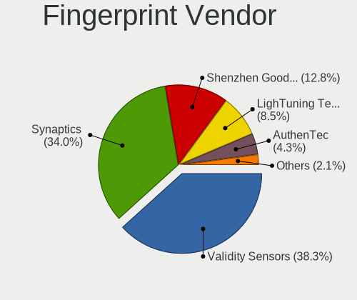

| Vendor                     | Computers | Percent |
|----------------------------|-----------|---------|
| Validity Sensors           | 17        | 40.48%  |
| Synaptics                  | 16        | 38.1%   |
| LighTuning Technology      | 4         | 9.52%   |
| Shenzhen Goodix Technology | 3         | 7.14%   |
| Elan Microelectronics      | 1         | 2.38%   |
| AuthenTec                  | 1         | 2.38%   |

Fingerprint Model
-----------------

Fingerprint sensor models

| Model                                                                      | Computers | Percent |
|----------------------------------------------------------------------------|-----------|---------|
| Unknown                                                                    | 8         | 19.05%  |
| Validity Sensors VFS495 Fingerprint Reader                                 | 5         | 11.9%   |
| Validity Sensors VFS471 Fingerprint Reader                                 | 4         | 9.52%   |
| Validity Sensors Swipe Fingerprint Sensor                                  | 3         | 7.14%   |
| Synaptics WBDI Device                                                      | 3         | 7.14%   |
| Synaptics Prometheus MIS Touch Fingerprint Reader                          | 3         | 7.14%   |
| Synaptics Metallica MIS Touch Fingerprint Reader                           | 2         | 4.76%   |
| Shenzhen Goodix  FingerPrint Device                                        | 2         | 4.76%   |
| LighTuning ES603 Swipe Fingerprint Sensor                                  | 2         | 4.76%   |
| Validity Sensors VFS7552 Touch Fingerprint Sensor                          | 1         | 2.38%   |
| Validity Sensors VFS5011 Fingerprint Reader                                | 1         | 2.38%   |
| Validity Sensors VFS491                                                    | 1         | 2.38%   |
| Validity Sensors Synaptics VFS7552 Touch Fingerprint Sensor with PurePrint | 1         | 2.38%   |
| Validity Sensors Fingerprint scanner                                       | 1         | 2.38%   |
| Shenzhen Goodix FingerPrint                                                | 1         | 2.38%   |
| LighTuning Fingerprint Reader                                              | 1         | 2.38%   |
| LighTuning EgisTec Touch Fingerprint Sensor                                | 1         | 2.38%   |
| Elan ELAN:Fingerprint                                                      | 1         | 2.38%   |
| AuthenTec AES1660 Fingerprint Sensor                                       | 1         | 2.38%   |

Chipcard Vendor
---------------

Chipcard module vendors

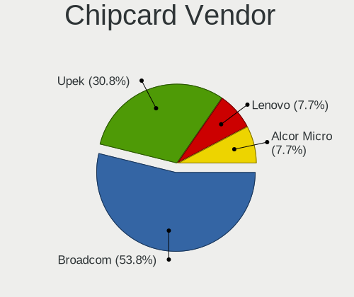

| Vendor      | Computers | Percent |
|-------------|-----------|---------|
| Broadcom    | 6         | 50%     |
| Upek        | 4         | 33.33%  |
| Lenovo      | 1         | 8.33%   |
| Alcor Micro | 1         | 8.33%   |

Chipcard Model
--------------

Chipcard module models

| Model                                                      | Computers | Percent |
|------------------------------------------------------------|-----------|---------|
| Upek TouchChip Fingerprint Coprocessor (WBF advanced mode) | 4         | 33.33%  |
| Broadcom BCM5880 Secure Applications Processor             | 3         | 25%     |
| Broadcom 5880                                              | 3         | 25%     |
| Lenovo Integrated Smart Card Reader                        | 1         | 8.33%   |
| Alcor Micro AU9540 Smartcard Reader                        | 1         | 8.33%   |

Unsupported
-----------

Unsupported Devices
-------------------

Total unsupported devices on board

| Total | Computers | Percent |
|-------|-----------|---------|
| 0     | 148       | 63.25%  |
| 1     | 68        | 29.06%  |
| 2     | 16        | 6.84%   |
| 4     | 1         | 0.43%   |
| 3     | 1         | 0.43%   |

Unsupported Device Types
------------------------

Types of unsupported devices

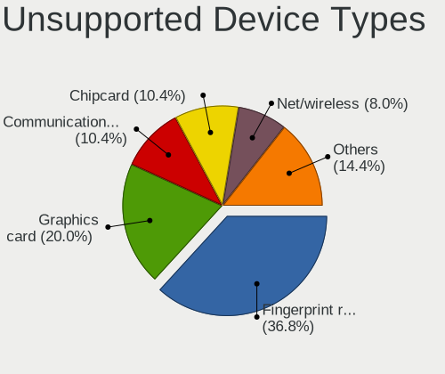

| Type                     | Computers | Percent |
|--------------------------|-----------|---------|
| Fingerprint reader       | 42        | 42.42%  |
| Graphics card            | 18        | 18.18%  |
| Chipcard                 | 12        | 12.12%  |
| Communication controller | 9         | 9.09%   |
| Net/wireless             | 7         | 7.07%   |
| Multimedia controller    | 3         | 3.03%   |
| Storage                  | 2         | 2.02%   |
| Camera                   | 2         | 2.02%   |
| Bluetooth                | 2         | 2.02%   |
| Net/ethernet             | 1         | 1.01%   |
| Card reader              | 1         | 1.01%   |

