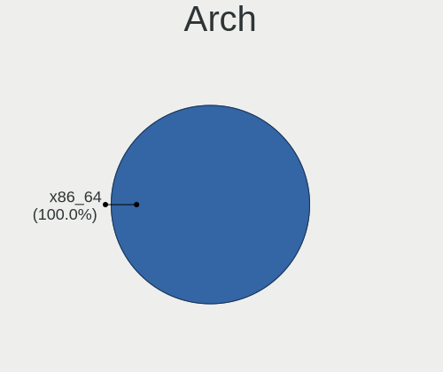
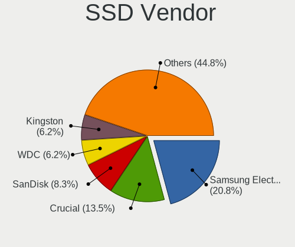
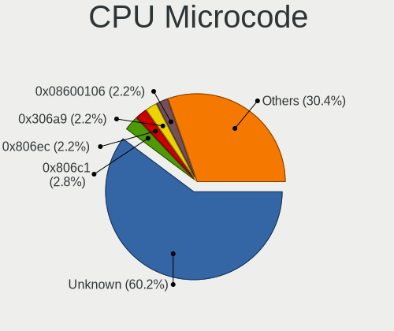
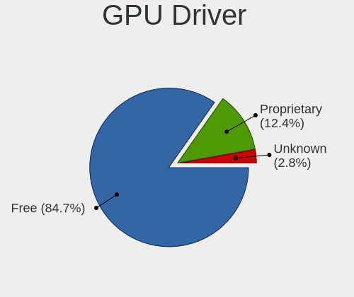
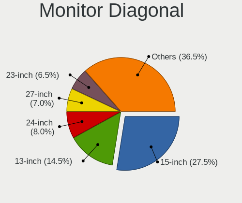
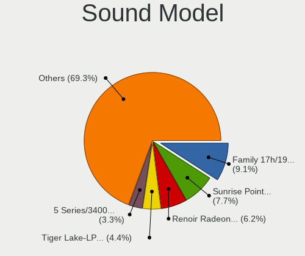
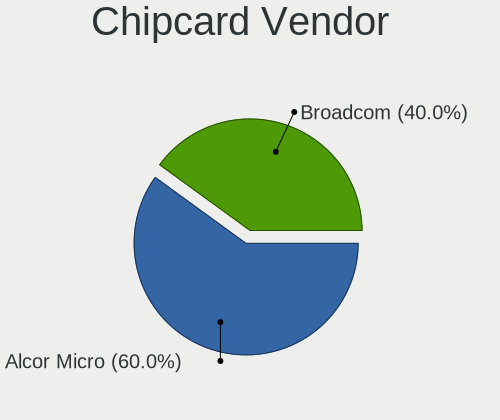
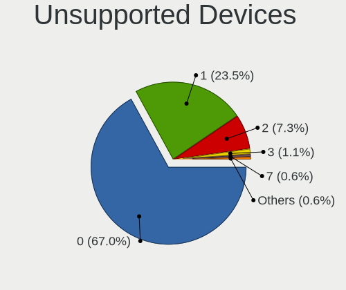

Ubuntu Budgie 22.04 - Tested Hardware & Statistics
--------------------------------------------------

A project to collect tested hardware configurations for Ubuntu Budgie 22.04.

Anyone can contribute to this report by the [hw-probe](https://github.com/linuxhw/hw-probe) tool:

    sudo -E hw-probe -all -upload

Please contribute! Especially if your hardware is rare.

This is a report for all computer types. See also reports for [desktops](/Dist/Ubuntu_Budgie_22.04/Desktop/README.md) and [notebooks](/Dist/Ubuntu_Budgie_22.04/Notebook/README.md).

Contents
--------

* [ Test Cases ](#test-cases)

* [ System ](#system)
  - [ Kernel                   ](#kernel)
  - [ Kernel Family            ](#kernel-family)
  - [ Kernel Major Ver.        ](#kernel-major-ver)
  - [ Arch                     ](#arch)
  - [ DE                       ](#de)
  - [ Display Server           ](#display-server)
  - [ Display Manager          ](#display-manager)
  - [ OS Lang                  ](#os-lang)
  - [ Boot Mode                ](#boot-mode)
  - [ Filesystem               ](#filesystem)
  - [ Part. scheme             ](#part-scheme)
  - [ Dual Boot with Linux/BSD ](#dual-boot-with-linuxbsd)
  - [ Dual Boot (Win)          ](#dual-boot-win)

* [ Board ](#board)
  - [ Vendor                   ](#vendor)
  - [ Model                    ](#model)
  - [ Model Family             ](#model-family)
  - [ MFG Year                 ](#mfg-year)
  - [ Form Factor              ](#form-factor)
  - [ Secure Boot              ](#secure-boot)
  - [ Coreboot                 ](#coreboot)
  - [ RAM Size                 ](#ram-size)
  - [ RAM Used                 ](#ram-used)
  - [ Total Drives             ](#total-drives)
  - [ Has CD-ROM               ](#has-cd-rom)
  - [ Has Ethernet             ](#has-ethernet)
  - [ Has WiFi                 ](#has-wifi)
  - [ Has Bluetooth            ](#has-bluetooth)

* [ Location ](#location)
  - [ Country                  ](#country)
  - [ City                     ](#city)

* [ Drives ](#drives)
  - [ Drive Vendor             ](#drive-vendor)
  - [ Drive Model              ](#drive-model)
  - [ HDD Vendor               ](#hdd-vendor)
  - [ SSD Vendor               ](#ssd-vendor)
  - [ Drive Kind               ](#drive-kind)
  - [ Drive Connector          ](#drive-connector)
  - [ Drive Size               ](#drive-size)
  - [ Space Total              ](#space-total)
  - [ Space Used               ](#space-used)
  - [ Malfunc. Drives          ](#malfunc-drives)
  - [ Malfunc. Drive Vendor    ](#malfunc-drive-vendor)
  - [ Malfunc. HDD Vendor      ](#malfunc-hdd-vendor)
  - [ Malfunc. Drive Kind      ](#malfunc-drive-kind)
  - [ Failed Drives            ](#failed-drives)
  - [ Failed Drive Vendor      ](#failed-drive-vendor)
  - [ Drive Status             ](#drive-status)

* [ Storage controller ](#storage-controller)
  - [ Storage Vendor           ](#storage-vendor)
  - [ Storage Model            ](#storage-model)
  - [ Storage Kind             ](#storage-kind)

* [ Processor ](#processor)
  - [ CPU Vendor               ](#cpu-vendor)
  - [ CPU Model                ](#cpu-model)
  - [ CPU Model Family         ](#cpu-model-family)
  - [ CPU Cores                ](#cpu-cores)
  - [ CPU Sockets              ](#cpu-sockets)
  - [ CPU Threads              ](#cpu-threads)
  - [ CPU Op-Modes             ](#cpu-op-modes)
  - [ CPU Microcode            ](#cpu-microcode)
  - [ CPU Microarch            ](#cpu-microarch)

* [ Graphics ](#graphics)
  - [ GPU Vendor               ](#gpu-vendor)
  - [ GPU Model                ](#gpu-model)
  - [ GPU Combo                ](#gpu-combo)
  - [ GPU Driver               ](#gpu-driver)
  - [ GPU Memory               ](#gpu-memory)

* [ Monitor ](#monitor)
  - [ Monitor Vendor           ](#monitor-vendor)
  - [ Monitor Model            ](#monitor-model)
  - [ Monitor Resolution       ](#monitor-resolution)
  - [ Monitor Diagonal         ](#monitor-diagonal)
  - [ Monitor Width            ](#monitor-width)
  - [ Aspect Ratio             ](#aspect-ratio)
  - [ Monitor Area             ](#monitor-area)
  - [ Pixel Density            ](#pixel-density)
  - [ Multiple Monitors        ](#multiple-monitors)

* [ Network ](#network)
  - [ Net Controller Vendor    ](#net-controller-vendor)
  - [ Net Controller Model     ](#net-controller-model)
  - [ Wireless Vendor          ](#wireless-vendor)
  - [ Wireless Model           ](#wireless-model)
  - [ Ethernet Vendor          ](#ethernet-vendor)
  - [ Ethernet Model           ](#ethernet-model)
  - [ Net Controller Kind      ](#net-controller-kind)
  - [ Used Controller          ](#used-controller)
  - [ NICs                     ](#nics)
  - [ IPv6                     ](#ipv6)

* [ Bluetooth ](#bluetooth)
  - [ Bluetooth Vendor         ](#bluetooth-vendor)
  - [ Bluetooth Model          ](#bluetooth-model)

* [ Sound ](#sound)
  - [ Sound Vendor             ](#sound-vendor)
  - [ Sound Model              ](#sound-model)

* [ Memory ](#memory)
  - [ Memory Vendor            ](#memory-vendor)
  - [ Memory Model             ](#memory-model)
  - [ Memory Kind              ](#memory-kind)
  - [ Memory Form Factor       ](#memory-form-factor)
  - [ Memory Size              ](#memory-size)
  - [ Memory Speed             ](#memory-speed)

* [ Printers & scanners ](#printers--scanners)
  - [ Printer Vendor           ](#printer-vendor)
  - [ Printer Model            ](#printer-model)
  - [ Scanner Vendor           ](#scanner-vendor)
  - [ Scanner Model            ](#scanner-model)

* [ Camera ](#camera)
  - [ Camera Vendor            ](#camera-vendor)
  - [ Camera Model             ](#camera-model)

* [ Security ](#security)
  - [ Fingerprint Vendor       ](#fingerprint-vendor)
  - [ Fingerprint Model        ](#fingerprint-model)
  - [ Chipcard Vendor          ](#chipcard-vendor)
  - [ Chipcard Model           ](#chipcard-model)

* [ Unsupported ](#unsupported)
  - [ Unsupported Devices      ](#unsupported-devices)
  - [ Unsupported Device Types ](#unsupported-device-types)

Test Cases
----------

Total: 115

| Vendor        | Model                       | Form-Factor | Probe                                                      | Date         |
|---------------|-----------------------------|-------------|------------------------------------------------------------|--------------|
| Fujitsu       | D3183-A1 S26361-D3183-A1    | Desktop     | [bfb86ee660](https://linux-hardware.org/?probe=bfb86ee660) | Jan 29, 2023 |
| Lenovo        | IdeaPadFlex 5 14ALC7 82R... | Convertible | [de3f21b51b](https://linux-hardware.org/?probe=de3f21b51b) | Jan 28, 2023 |
| Lenovo        | IdeaPadFlex 5 14ALC7 82R... | Convertible | [329e7b7105](https://linux-hardware.org/?probe=329e7b7105) | Jan 28, 2023 |
| TUXEDO        | InfinityBook S 15 Gen6      | Notebook    | [ee44dc2539](https://linux-hardware.org/?probe=ee44dc2539) | Jan 27, 2023 |
| HP            | ProBook 450 G7              | Notebook    | [1d507a3cdc](https://linux-hardware.org/?probe=1d507a3cdc) | Jan 27, 2023 |
| Lenovo        | 36F7 SDK0J40700 WIN 3258... | Desktop     | [831fd897ec](https://linux-hardware.org/?probe=831fd897ec) | Jan 25, 2023 |
| Lenovo        | IdeaPadFlex 5 14ALC7 82R... | Convertible | [0c8a9895bd](https://linux-hardware.org/?probe=0c8a9895bd) | Jan 25, 2023 |
| Lenovo        | IdeaPadFlex 5 14ALC7 82R... | Convertible | [b3bc8de731](https://linux-hardware.org/?probe=b3bc8de731) | Jan 25, 2023 |
| TUXEDO        | InfinityBook S 15 Gen6      | Notebook    | [7bf2d60c0b](https://linux-hardware.org/?probe=7bf2d60c0b) | Jan 21, 2023 |
| Lenovo        | ThinkStation C20 4263BA7    | Desktop     | [38ff99d952](https://linux-hardware.org/?probe=38ff99d952) | Jan 10, 2023 |
| HP            | Elite x2 1012 G2            | Tablet      | [a5e1965b89](https://linux-hardware.org/?probe=a5e1965b89) | Jan 05, 2023 |
| ASUSTek       | VivoBook_ASUSLaptop TP14... | Convertible | [195eb3e6eb](https://linux-hardware.org/?probe=195eb3e6eb) | Dec 31, 2022 |
| TUXEDO        | Polaris Intel Gen3 (TGL)    | Notebook    | [7da34e4f7f](https://linux-hardware.org/?probe=7da34e4f7f) | Dec 14, 2022 |
| HP            | ProBook 445 G7              | Notebook    | [b34265fdbe](https://linux-hardware.org/?probe=b34265fdbe) | Dec 14, 2022 |
| Lenovo        | ThinkPad E15 20RD003KHV     | Notebook    | [ea74cd284c](https://linux-hardware.org/?probe=ea74cd284c) | Dec 08, 2022 |
| Fujitsu       | D3348-B2 S26361-D3348-B2    | Desktop     | [4568e83912](https://linux-hardware.org/?probe=4568e83912) | Dec 03, 2022 |
| Fujitsu       | D3348-B2 S26361-D3348-B2    | Desktop     | [2047a872cb](https://linux-hardware.org/?probe=2047a872cb) | Dec 03, 2022 |
| Lenovo        | ThinkPad E15 20RD003KHV     | Notebook    | [bdc64a5196](https://linux-hardware.org/?probe=bdc64a5196) | Dec 02, 2022 |
| Lenovo        | Legion Y530-15ICH 81FV      | Notebook    | [615b292682](https://linux-hardware.org/?probe=615b292682) | Dec 01, 2022 |
| Dell          | Inspiron 5566               | Notebook    | [a130766490](https://linux-hardware.org/?probe=a130766490) | Nov 29, 2022 |
| Lenovo        | V15 G2 ALC 82KD             | Notebook    | [be7a4a88a1](https://linux-hardware.org/?probe=be7a4a88a1) | Nov 23, 2022 |
| Fujitsu       | D3348-B2 S26361-D3348-B2    | Desktop     | [eabfad66da](https://linux-hardware.org/?probe=eabfad66da) | Nov 22, 2022 |
| Dell          | 0RW199                      | Desktop     | [2a2fa5baf8](https://linux-hardware.org/?probe=2a2fa5baf8) | Nov 20, 2022 |
| MSI           | B550M PRO-VDH WIFI          | Desktop     | [afb716fb12](https://linux-hardware.org/?probe=afb716fb12) | Nov 18, 2022 |
| Intel         | NUC12WSBi7 M46422-302       | Mini pc     | [0f94a77355](https://linux-hardware.org/?probe=0f94a77355) | Nov 12, 2022 |
| Dell          | XPS 13 9310                 | Notebook    | [104082422f](https://linux-hardware.org/?probe=104082422f) | Nov 04, 2022 |
| Dell          | XPS 13 9310                 | Notebook    | [2f2963b2fc](https://linux-hardware.org/?probe=2f2963b2fc) | Nov 04, 2022 |
| Razer         | Blade 15 Advanced Model ... | Notebook    | [e0a589194b](https://linux-hardware.org/?probe=e0a589194b) | Nov 01, 2022 |
| Lenovo        | ThinkPad T480 20L6SDR21A    | Notebook    | [b401e89d9c](https://linux-hardware.org/?probe=b401e89d9c) | Oct 31, 2022 |
| Lenovo        | ThinkPad T480 20L6SDR21A    | Notebook    | [4650c9df06](https://linux-hardware.org/?probe=4650c9df06) | Oct 31, 2022 |
| Dell          | 0C27VV A01                  | Desktop     | [ed46beadef](https://linux-hardware.org/?probe=ed46beadef) | Oct 30, 2022 |
| MSI           | B450-A PRO MAX              | Desktop     | [0e8db93a43](https://linux-hardware.org/?probe=0e8db93a43) | Oct 30, 2022 |
| TUXEDO        | Aura 15 Gen1                | Notebook    | [4055c79756](https://linux-hardware.org/?probe=4055c79756) | Oct 28, 2022 |
| Toshiba       | Satellite A505              | Notebook    | [41dafcbfb9](https://linux-hardware.org/?probe=41dafcbfb9) | Oct 25, 2022 |
| ASUSTek       | X205TA                      | Notebook    | [2da58f110d](https://linux-hardware.org/?probe=2da58f110d) | Oct 24, 2022 |
| Dell          | Vostro 15 5510              | Notebook    | [b397c3fd26](https://linux-hardware.org/?probe=b397c3fd26) | Oct 18, 2022 |
| Dell          | 0C27VV A01                  | Desktop     | [23c855f88b](https://linux-hardware.org/?probe=23c855f88b) | Oct 17, 2022 |
| Dell          | 0C27VV A01                  | Desktop     | [ebe65ec5fa](https://linux-hardware.org/?probe=ebe65ec5fa) | Oct 17, 2022 |
| Dell          | Latitude E5420              | Notebook    | [dcc7463646](https://linux-hardware.org/?probe=dcc7463646) | Oct 16, 2022 |
| Digibras      | NH4CU03                     | Notebook    | [45912a4bae](https://linux-hardware.org/?probe=45912a4bae) | Oct 16, 2022 |
| Lenovo        | IdeaPad C340-14API 81N6     | Notebook    | [3028d439cf](https://linux-hardware.org/?probe=3028d439cf) | Oct 14, 2022 |
| Dell          | XPS 13 9360                 | Notebook    | [6def734895](https://linux-hardware.org/?probe=6def734895) | Oct 14, 2022 |
| Lenovo        | ThinkPad E15 20RD003KHV     | Notebook    | [f4d09b3dae](https://linux-hardware.org/?probe=f4d09b3dae) | Oct 13, 2022 |
| AXIOO         | Slimbook 13                 | Notebook    | [221b0b500d](https://linux-hardware.org/?probe=221b0b500d) | Oct 09, 2022 |
| Lenovo        | ThinkPad T440 20B7S0F100    | Notebook    | [fee12e32e5](https://linux-hardware.org/?probe=fee12e32e5) | Oct 07, 2022 |
| Dell          | Precision 5560              | Notebook    | [168025b691](https://linux-hardware.org/?probe=168025b691) | Oct 03, 2022 |
| Dell          | Latitude E6410              | Notebook    | [98545a1050](https://linux-hardware.org/?probe=98545a1050) | Sep 30, 2022 |
| Gigabyte      | M68MT-S2                    | Desktop     | [55db3c3775](https://linux-hardware.org/?probe=55db3c3775) | Sep 27, 2022 |
| HP            | ProBook 450 G8 Notebook ... | Notebook    | [15d9ea100b](https://linux-hardware.org/?probe=15d9ea100b) | Sep 26, 2022 |
| TUXEDO        | Book BA1510                 | Notebook    | [76a485fe7e](https://linux-hardware.org/?probe=76a485fe7e) | Sep 22, 2022 |
| ASUSTek       | ZenBook UX533FD_UX533FD     | Notebook    | [f185fff0a3](https://linux-hardware.org/?probe=f185fff0a3) | Sep 21, 2022 |
| Lenovo        | G50-45 80E3                 | Notebook    | [5c9688dac8](https://linux-hardware.org/?probe=5c9688dac8) | Sep 19, 2022 |
| Gigabyte      | B75M-D3P                    | Desktop     | [da53115e6b](https://linux-hardware.org/?probe=da53115e6b) | Sep 15, 2022 |
| Gigabyte      | M68MT-S2                    | Desktop     | [1a5358a3c1](https://linux-hardware.org/?probe=1a5358a3c1) | Sep 14, 2022 |
| Lenovo        | G500 20236                  | Notebook    | [fc210ff2c2](https://linux-hardware.org/?probe=fc210ff2c2) | Sep 07, 2022 |
| Apple         | Mac-F22C86C8                | Mini pc     | [19a21d721c](https://linux-hardware.org/?probe=19a21d721c) | Sep 07, 2022 |
| Gigabyte      | X570S AORUS PRO AX          | Desktop     | [f42f75038e](https://linux-hardware.org/?probe=f42f75038e) | Sep 03, 2022 |
| Intel         | DP55WB AAE64798-206         | Desktop     | [548332086b](https://linux-hardware.org/?probe=548332086b) | Sep 02, 2022 |
| ASUSTek       | A88X-PRO                    | Desktop     | [922554664a](https://linux-hardware.org/?probe=922554664a) | Aug 25, 2022 |
| Google        | Rabbid                      | Notebook    | [8049c3894c](https://linux-hardware.org/?probe=8049c3894c) | Aug 24, 2022 |
| Intel         | X79M-S                      | Desktop     | [49a7d62fe8](https://linux-hardware.org/?probe=49a7d62fe8) | Aug 18, 2022 |
| Lenovo        | G500 20236                  | Notebook    | [45df8f9be9](https://linux-hardware.org/?probe=45df8f9be9) | Aug 18, 2022 |
| Lenovo        | G500 20236                  | Notebook    | [6974cf32ce](https://linux-hardware.org/?probe=6974cf32ce) | Aug 17, 2022 |
| HP            | 828A                        | Desktop     | [f42b1efd1e](https://linux-hardware.org/?probe=f42b1efd1e) | Aug 17, 2022 |
| TUXEDO        | Book XUX7 Gen11             | Notebook    | [ecf8be45de](https://linux-hardware.org/?probe=ecf8be45de) | Aug 16, 2022 |
| TUXEDO        | Book XUX7 Gen11             | Notebook    | [c5c7e42e91](https://linux-hardware.org/?probe=c5c7e42e91) | Aug 16, 2022 |
| Biostar       | A960D+V3                    | Desktop     | [83f7f840b7](https://linux-hardware.org/?probe=83f7f840b7) | Aug 15, 2022 |
| ASRock        | A300M-STX                   | Desktop     | [a6aba67197](https://linux-hardware.org/?probe=a6aba67197) | Aug 02, 2022 |
| ASRock        | A300M-STX                   | Desktop     | [fae724727b](https://linux-hardware.org/?probe=fae724727b) | Aug 02, 2022 |
| Dell          | Inspiron 3793               | Notebook    | [15f2e25089](https://linux-hardware.org/?probe=15f2e25089) | Jul 29, 2022 |
| ASUSTek       | VivoBook_ASUSLaptop X705... | Notebook    | [e82d2e1076](https://linux-hardware.org/?probe=e82d2e1076) | Jul 28, 2022 |
| Intel         | STK1A32SC H95551-301        | Desktop     | [ea91c7805d](https://linux-hardware.org/?probe=ea91c7805d) | Jul 22, 2022 |
| HP            | EliteBook 840 G3            | Notebook    | [e34f81fcfa](https://linux-hardware.org/?probe=e34f81fcfa) | Jul 18, 2022 |
| Lenovo        | ThinkPad T500 2242CTO       | Notebook    | [47bddb4e10](https://linux-hardware.org/?probe=47bddb4e10) | Jul 10, 2022 |
| HP            | ENVY 17                     | Notebook    | [2d97952e56](https://linux-hardware.org/?probe=2d97952e56) | Jul 08, 2022 |
| Apple         | Mac-4B682C642B45593E iMa... | All in one  | [b48ce81bfa](https://linux-hardware.org/?probe=b48ce81bfa) | Jun 27, 2022 |
| Acer          | Aspire E5-573G              | Notebook    | [9f14a273b0](https://linux-hardware.org/?probe=9f14a273b0) | Jun 26, 2022 |
| Gigabyte      | GA-890GPA-UD3H              | Desktop     | [f6faa2d944](https://linux-hardware.org/?probe=f6faa2d944) | Jun 25, 2022 |
| HP            | ElitePad 1000 G2            | Notebook    | [e478f31175](https://linux-hardware.org/?probe=e478f31175) | Jun 25, 2022 |
| HP            | 212B                        | Desktop     | [a163af0cb5](https://linux-hardware.org/?probe=a163af0cb5) | Jun 21, 2022 |
| MSI           | GL62 6QF                    | Notebook    | [39e2d35166](https://linux-hardware.org/?probe=39e2d35166) | Jun 20, 2022 |
| Timi          | TM1604                      | Notebook    | [2f45cc25b4](https://linux-hardware.org/?probe=2f45cc25b4) | Jun 20, 2022 |
| HP            | Spectre x360 Convertible... | Convertible | [261466af7b](https://linux-hardware.org/?probe=261466af7b) | Jun 17, 2022 |
| Gigabyte      | B75M-D3H                    | Desktop     | [da04a03393](https://linux-hardware.org/?probe=da04a03393) | Jun 04, 2022 |
| Dell          | Inspiron 5570               | Notebook    | [ea74ff47bc](https://linux-hardware.org/?probe=ea74ff47bc) | May 27, 2022 |
| Dell          | Inspiron 5570               | Notebook    | [83e0c49ab0](https://linux-hardware.org/?probe=83e0c49ab0) | May 27, 2022 |
| HP            | Pavilion g6                 | Notebook    | [ef71909561](https://linux-hardware.org/?probe=ef71909561) | May 26, 2022 |
| HP            | Pavilion g6                 | Notebook    | [41d1e81397](https://linux-hardware.org/?probe=41d1e81397) | May 26, 2022 |
| Gigabyte      | F2A78M-HD2                  | Desktop     | [fc9dd3db05](https://linux-hardware.org/?probe=fc9dd3db05) | May 26, 2022 |
| ASUSTek       | PRIME B560M-A               | Desktop     | [7b393b3933](https://linux-hardware.org/?probe=7b393b3933) | May 24, 2022 |
| Chuwi         | HeroBook Pro                | Notebook    | [9f009d836c](https://linux-hardware.org/?probe=9f009d836c) | May 23, 2022 |
| Chuwi         | HeroBook Pro                | Notebook    | [206aa9b805](https://linux-hardware.org/?probe=206aa9b805) | May 23, 2022 |
| ASUSTek       | VivoBook_ASUSLaptop M340... | Notebook    | [b128814505](https://linux-hardware.org/?probe=b128814505) | May 21, 2022 |
| MSI           | X370 GAMING PRO CARBON      | Desktop     | [9acb45109f](https://linux-hardware.org/?probe=9acb45109f) | May 21, 2022 |
| Apple         | MacBookPro5,4               | Notebook    | [5b7383f9cb](https://linux-hardware.org/?probe=5b7383f9cb) | May 15, 2022 |
| Avell High... | B.ON                        | Notebook    | [9069ca4c66](https://linux-hardware.org/?probe=9069ca4c66) | May 13, 2022 |
| Gigabyte      | B75M-D3H                    | Desktop     | [b9437261b7](https://linux-hardware.org/?probe=b9437261b7) | May 10, 2022 |
| Gigabyte      | B450 I AORUS PRO WIFI-CF    | Desktop     | [4ab84df25d](https://linux-hardware.org/?probe=4ab84df25d) | May 10, 2022 |
| MSI           | Modern 15 A10M              | Notebook    | [88c226c079](https://linux-hardware.org/?probe=88c226c079) | May 09, 2022 |
| HP            | 1825                        | Desktop     | [fe93966c1c](https://linux-hardware.org/?probe=fe93966c1c) | May 09, 2022 |
| Lenovo        | IdeaPad 5 15ARE05 81YQ      | Notebook    | [296dc11e4b](https://linux-hardware.org/?probe=296dc11e4b) | May 08, 2022 |
| Lenovo        | IdeaPad S145-14IWL 81MU     | Notebook    | [ca08dea33b](https://linux-hardware.org/?probe=ca08dea33b) | May 07, 2022 |
| Google        | Boten                       | Notebook    | [6204cff7de](https://linux-hardware.org/?probe=6204cff7de) | May 05, 2022 |
| Samsung       | 740U3M                      | Convertible | [4ba9324ca5](https://linux-hardware.org/?probe=4ba9324ca5) | May 04, 2022 |
| Lenovo        | IdeaPad 330-15IKB 81FE      | Notebook    | [ff291ff9e3](https://linux-hardware.org/?probe=ff291ff9e3) | May 03, 2022 |
| Lenovo        | ThinkPad T14 Gen 2i 20W0... | Notebook    | [0c5f20e02c](https://linux-hardware.org/?probe=0c5f20e02c) | May 02, 2022 |
| HP            | 8446                        | All in one  | [b13e626d1a](https://linux-hardware.org/?probe=b13e626d1a) | May 02, 2022 |
| HP            | 8446                        | All in one  | [14d68e146a](https://linux-hardware.org/?probe=14d68e146a) | May 02, 2022 |
| Lenovo        | ThinkPad T440 20B7S0F100    | Notebook    | [0d006e41fc](https://linux-hardware.org/?probe=0d006e41fc) | May 01, 2022 |
| Lenovo        | IdeaPad 330-15IKB 81FE      | Notebook    | [6ace557278](https://linux-hardware.org/?probe=6ace557278) | Apr 29, 2022 |
| Apple         | MacBookPro9,2               | Notebook    | [967eac195b](https://linux-hardware.org/?probe=967eac195b) | Apr 23, 2022 |
| Gigabyte      | B550 AORUS ELITE AX V2      | Desktop     | [e2cbc23977](https://linux-hardware.org/?probe=e2cbc23977) | Apr 12, 2022 |
| ASUSTek       | T200TAC                     | Notebook    | [20834c0dba](https://linux-hardware.org/?probe=20834c0dba) | Feb 17, 2022 |
| Dell          | Inspiron 7506 2n1           | Convertible | [77a04d958e](https://linux-hardware.org/?probe=77a04d958e) | Jan 27, 2022 |
| Apple         | MacBookPro8,1               | Notebook    | [56d0201ca6](https://linux-hardware.org/?probe=56d0201ca6) | Dec 29, 2021 |

System
------

Kernel
------

Version of the Linux kernel

| Version               | Computers | Percent |
|-----------------------|-----------|---------|
| 5.15.0-27-generic     | 11        | 11.7%   |
| 5.15.0-52-generic     | 9         | 9.57%   |
| 5.15.0-50-generic     | 7         | 7.45%   |
| 5.15.0-48-generic     | 6         | 6.38%   |
| 5.15.0-30-generic     | 6         | 6.38%   |
| 5.15.0-46-generic     | 5         | 5.32%   |
| 5.15.0-39-generic     | 5         | 5.32%   |
| 5.15.0-56-generic     | 4         | 4.26%   |
| 5.15.0-43-generic     | 4         | 4.26%   |
| 5.15.0-33-generic     | 4         | 4.26%   |
| 5.15.0-25-generic     | 4         | 4.26%   |
| 5.15.0-53-generic     | 3         | 3.19%   |
| 5.15.0-47-generic     | 3         | 3.19%   |
| 5.15.0-40-generic     | 3         | 3.19%   |
| 5.15.0-57-generic     | 2         | 2.13%   |
| 5.15.0-41-generic     | 2         | 2.13%   |
| 5.19.0-051900-generic | 1         | 1.06%   |
| 5.17.2-051702-generic | 1         | 1.06%   |
| 5.16.2                | 1         | 1.06%   |
| 5.15.0-58-generic     | 1         | 1.06%   |
| 5.15.0-52-lowlatency  | 1         | 1.06%   |
| 5.15.0-47-lowlatency  | 1         | 1.06%   |
| 5.15.0-35-generic     | 1         | 1.06%   |
| 5.15.0-18-generic     | 1         | 1.06%   |
| 5.15.0-10058-tuxedo   | 1         | 1.06%   |
| 5.15.0-10056-tuxedo   | 1         | 1.06%   |
| 5.15.0-10052-tuxedo   | 1         | 1.06%   |
| 5.15.0-10047-tuxedo   | 1         | 1.06%   |
| 5.15.0-10041-tuxedo   | 1         | 1.06%   |
| 5.13.0-44-generic     | 1         | 1.06%   |
| 5.13.0-35-generic     | 1         | 1.06%   |
| 5.13.0-19-generic     | 1         | 1.06%   |

Kernel Family
-------------

Linux kernel without a distro release

| Version | Computers | Percent |
|---------|-----------|---------|
| 5.15.0  | 83        | 93.26%  |
| 5.13.0  | 3         | 3.37%   |
| 5.19.0  | 1         | 1.12%   |
| 5.17.2  | 1         | 1.12%   |
| 5.16.2  | 1         | 1.12%   |

Kernel Major Ver.
-----------------

Linux kernel major version

| Version | Computers | Percent |
|---------|-----------|---------|
| 5.15    | 83        | 93.26%  |
| 5.13    | 3         | 3.37%   |
| 5.19    | 1         | 1.12%   |
| 5.17    | 1         | 1.12%   |
| 5.16    | 1         | 1.12%   |

Arch
----

OS architecture (x86_64, i586, etc.)

| Name   | Computers | Percent |
|--------|-----------|---------|
| x86_64 | 89        | 100%    |

DE
--

Desktop Environment

| Name   | Computers | Percent |
|--------|-----------|---------|
| Budgie | 86        | 96.63%  |
| GNOME  | 3         | 3.37%   |

Display Server
--------------

X11 or Wayland

| Name    | Computers | Percent |
|---------|-----------|---------|
| X11     | 87        | 97.75%  |
| Wayland | 2         | 2.25%   |

Display Manager
---------------

SDDM, LightDM, etc.

| Name    | Computers | Percent |
|---------|-----------|---------|
| LightDM | 61        | 68.54%  |
| Unknown | 20        | 22.47%  |
| GDM3    | 7         | 7.87%   |
| GDM     | 1         | 1.12%   |

OS Lang
-------

Language

| Lang  | Computers | Percent |
|-------|-----------|---------|
| en_US | 33        | 37.08%  |
| de_DE | 13        | 14.61%  |
| fr_FR | 9         | 10.11%  |
| pt_BR | 6         | 6.74%   |
| en_GB | 6         | 6.74%   |
| en_CA | 3         | 3.37%   |
| ru_RU | 2         | 2.25%   |
| hu_HU | 2         | 2.25%   |
| es_MX | 2         | 2.25%   |
| es_ES | 2         | 2.25%   |
| mt_MT | 1         | 1.12%   |
| it_IT | 1         | 1.12%   |
| fr_BE | 1         | 1.12%   |
| es_PE | 1         | 1.12%   |
| es_EC | 1         | 1.12%   |
| es_CL | 1         | 1.12%   |
| en_NZ | 1         | 1.12%   |
| en_IE | 1         | 1.12%   |
| el_GR | 1         | 1.12%   |
| cs_CZ | 1         | 1.12%   |
| C     | 1         | 1.12%   |

Boot Mode
---------

EFI or BIOS

| Mode | Computers | Percent |
|------|-----------|---------|
| BIOS | 54        | 60%     |
| EFI  | 36        | 40%     |

Filesystem
----------

Type of filesystem

| Type    | Computers | Percent |
|---------|-----------|---------|
| Ext4    | 79        | 88.76%  |
| Overlay | 5         | 5.62%   |
| Btrfs   | 3         | 3.37%   |
| Zfs     | 1         | 1.12%   |
| Xfs     | 1         | 1.12%   |

Part. scheme
------------

Scheme of partitioning

| Type    | Computers | Percent |
|---------|-----------|---------|
| GPT     | 49        | 55.06%  |
| Unknown | 37        | 41.57%  |
| MBR     | 3         | 3.37%   |

Dual Boot with Linux/BSD
------------------------

Hosting more than one Linux/BSD

| Dual boot | Computers | Percent |
|-----------|-----------|---------|
| No        | 73        | 82.02%  |
| Yes       | 16        | 17.98%  |

Dual Boot (Win)
---------------

Hosting Linux and Windows

| Dual boot | Computers | Percent |
|-----------|-----------|---------|
| No        | 65        | 72.22%  |
| Yes       | 25        | 27.78%  |

Board
-----

Vendor
------

Motherboard manufacturer

| Name                   | Computers | Percent |
|------------------------|-----------|---------|
| Lenovo                 | 15        | 16.85%  |
| Hewlett-Packard        | 13        | 14.61%  |
| Dell                   | 12        | 13.48%  |
| Gigabyte Technology    | 8         | 8.99%   |
| ASUSTek Computer       | 8         | 8.99%   |
| TUXEDO                 | 5         | 5.62%   |
| MSI                    | 5         | 5.62%   |
| Apple                  | 5         | 5.62%   |
| Intel                  | 3         | 3.37%   |
| Google                 | 2         | 2.25%   |
| Fujitsu                | 2         | 2.25%   |
| Toshiba                | 1         | 1.12%   |
| Timi                   | 1         | 1.12%   |
| Samsung Electronics    | 1         | 1.12%   |
| Razer                  | 1         | 1.12%   |
| Digibras               | 1         | 1.12%   |
| Chuwi                  | 1         | 1.12%   |
| Biostar                | 1         | 1.12%   |
| AXIOO                  | 1         | 1.12%   |
| Avell High Performance | 1         | 1.12%   |
| ASRock                 | 1         | 1.12%   |
| Acer                   | 1         | 1.12%   |

Model
-----

Motherboard model

| Name                                                 | Computers | Percent |
|------------------------------------------------------|-----------|---------|
| TUXEDO Polaris Intel Gen3 (TGL)                      | 1         | 1.12%   |
| TUXEDO InfinityBook S 15 Gen6                        | 1         | 1.12%   |
| TUXEDO Book XUX7 Gen11                               | 1         | 1.12%   |
| TUXEDO Book BA1510                                   | 1         | 1.12%   |
| TUXEDO Aura 15 Gen1                                  | 1         | 1.12%   |
| Toshiba Satellite A505                               | 1         | 1.12%   |
| Timi TM1604                                          | 1         | 1.12%   |
| Samsung 740U3M                                       | 1         | 1.12%   |
| Razer Blade 15 Advanced Model (Mid 2021) - RZ09-0409 | 1         | 1.12%   |
| MSI MS-7C95                                          | 1         | 1.12%   |
| MSI MS-7B86                                          | 1         | 1.12%   |
| MSI MS-7A32                                          | 1         | 1.12%   |
| MSI Modern 15 A10M                                   | 1         | 1.12%   |
| MSI GL62 6QF                                         | 1         | 1.12%   |
| Lenovo V15 G2 ALC 82KD                               | 1         | 1.12%   |
| Lenovo ThinkStation C20 4263BA7                      | 1         | 1.12%   |
| Lenovo ThinkPad T500 2242CTO                         | 1         | 1.12%   |
| Lenovo ThinkPad T480 20L6SDR21A                      | 1         | 1.12%   |
| Lenovo ThinkPad T440 20B7S0F100                      | 1         | 1.12%   |
| Lenovo ThinkPad T14 Gen 2i 20W000Q4GE                | 1         | 1.12%   |
| Lenovo ThinkPad E15 20RD003KHV                       | 1         | 1.12%   |
| Lenovo Legion Y530-15ICH 81FV                        | 1         | 1.12%   |
| Lenovo IdeaPadFlex 5 14ALC7 82R9                     | 1         | 1.12%   |
| Lenovo IdeaPad S145-14IWL 81MU                       | 1         | 1.12%   |
| Lenovo IdeaPad C340-14API 81N6                       | 1         | 1.12%   |
| Lenovo IdeaPad 5 15ARE05 81YQ                        | 1         | 1.12%   |
| Lenovo IdeaPad 330-15IKB 81FE                        | 1         | 1.12%   |
| Lenovo G500 20236                                    | 1         | 1.12%   |
| Lenovo G50-45 80E3                                   | 1         | 1.12%   |
| Intel STK1A32SC                                      | 1         | 1.12%   |
| Intel NUC12WSKi7                                     | 1         | 1.12%   |
| Intel DP55WB AAE64798-206                            | 1         | 1.12%   |
| HP Z440 Workstation                                  | 1         | 1.12%   |
| HP Spectre x360 Convertible 15t-df100                | 1         | 1.12%   |
| HP ProBook 450 G8 Notebook PC                        | 1         | 1.12%   |
| HP ProBook 450 G7                                    | 1         | 1.12%   |
| HP ProBook 445 G7                                    | 1         | 1.12%   |
| HP Pavilion g6                                       | 1         | 1.12%   |
| HP ENVY 17                                           | 1         | 1.12%   |
| HP ElitePad 1000 G2                                  | 1         | 1.12%   |

Model Family
------------

Motherboard model prefix

| Name                | Computers | Percent |
|---------------------|-----------|---------|
| Lenovo ThinkPad     | 5         | 5.62%   |
| Lenovo IdeaPad      | 4         | 4.49%   |
| Dell Inspiron       | 4         | 4.49%   |
| HP ProBook          | 3         | 3.37%   |
| ASUS VivoBook       | 3         | 3.37%   |
| TUXEDO Book         | 2         | 2.25%   |
| Dell XPS            | 2         | 2.25%   |
| Dell Precision      | 2         | 2.25%   |
| Dell Latitude       | 2         | 2.25%   |
| TUXEDO Polaris      | 1         | 1.12%   |
| TUXEDO InfinityBook | 1         | 1.12%   |
| TUXEDO Aura         | 1         | 1.12%   |
| Toshiba Satellite   | 1         | 1.12%   |
| Timi TM1604         | 1         | 1.12%   |
| Samsung 740U3M      | 1         | 1.12%   |
| Razer Blade         | 1         | 1.12%   |
| MSI MS-7C95         | 1         | 1.12%   |
| MSI MS-7B86         | 1         | 1.12%   |
| MSI MS-7A32         | 1         | 1.12%   |
| MSI Modern          | 1         | 1.12%   |
| MSI GL62            | 1         | 1.12%   |
| Lenovo V15          | 1         | 1.12%   |
| Lenovo ThinkStation | 1         | 1.12%   |
| Lenovo Legion       | 1         | 1.12%   |
| Lenovo IdeaPadFlex  | 1         | 1.12%   |
| Lenovo G500         | 1         | 1.12%   |
| Lenovo G50-45       | 1         | 1.12%   |
| Intel STK1A32SC     | 1         | 1.12%   |
| Intel NUC12WSKi7    | 1         | 1.12%   |
| Intel DP55WB        | 1         | 1.12%   |
| HP Z440             | 1         | 1.12%   |
| HP Spectre          | 1         | 1.12%   |
| HP Pavilion         | 1         | 1.12%   |
| HP ENVY             | 1         | 1.12%   |
| HP ElitePad         | 1         | 1.12%   |
| HP EliteDesk        | 1         | 1.12%   |
| HP EliteBook        | 1         | 1.12%   |
| HP Elite            | 1         | 1.12%   |
| HP All-in-One       | 1         | 1.12%   |
| HP 750-417c         | 1         | 1.12%   |

MFG Year
--------

Motherboard manufacture year

| Year | Computers | Percent |
|------|-----------|---------|
| 2021 | 13        | 14.61%  |
| 2020 | 13        | 14.61%  |
| 2018 | 9         | 10.11%  |
| 2019 | 8         | 8.99%   |
| 2016 | 7         | 7.87%   |
| 2014 | 6         | 6.74%   |
| 2010 | 5         | 5.62%   |
| 2022 | 4         | 4.49%   |
| 2017 | 4         | 4.49%   |
| 2013 | 4         | 4.49%   |
| 2011 | 4         | 4.49%   |
| 2015 | 3         | 3.37%   |
| 2012 | 3         | 3.37%   |
| 2009 | 3         | 3.37%   |
| 2008 | 3         | 3.37%   |

Form Factor
-----------

Physical design of the computer

| Name        | Computers | Percent |
|-------------|-----------|---------|
| Notebook    | 54        | 60.67%  |
| Desktop     | 25        | 28.09%  |
| Convertible | 5         | 5.62%   |
| Mini pc     | 2         | 2.25%   |
| All in one  | 2         | 2.25%   |
| Tablet      | 1         | 1.12%   |

Secure Boot
-----------

Enabled or disabled

| State    | Computers | Percent |
|----------|-----------|---------|
| Disabled | 84        | 94.38%  |
| Enabled  | 5         | 5.62%   |

Coreboot
--------

Have coreboot on board

| Used | Computers | Percent |
|------|-----------|---------|
| No   | 87        | 97.75%  |
| Yes  | 2         | 2.25%   |

RAM Size
--------

Total RAM memory

| Size in GB      | Computers | Percent |
|-----------------|-----------|---------|
| 4.01-8.0        | 25        | 28.09%  |
| 16.01-24.0      | 25        | 28.09%  |
| 8.01-16.0       | 17        | 19.1%   |
| 32.01-64.0      | 8         | 8.99%   |
| 3.01-4.0        | 8         | 8.99%   |
| 64.01-256.0     | 2         | 2.25%   |
| 1.01-2.0        | 2         | 2.25%   |
| More than 256.0 | 1         | 1.12%   |
| 24.01-32.0      | 1         | 1.12%   |

RAM Used
--------

Used RAM memory

| Used GB    | Computers | Percent |
|------------|-----------|---------|
| 1.01-2.0   | 30        | 32.61%  |
| 2.01-3.0   | 28        | 30.43%  |
| 4.01-8.0   | 20        | 21.74%  |
| 3.01-4.0   | 7         | 7.61%   |
| 8.01-16.0  | 6         | 6.52%   |
| 24.01-32.0 | 1         | 1.09%   |

Total Drives
------------

Number of drives on board

| Drives | Computers | Percent |
|--------|-----------|---------|
| 1      | 51        | 56.67%  |
| 2      | 28        | 31.11%  |
| 3      | 5         | 5.56%   |
| 4      | 3         | 3.33%   |
| 6      | 2         | 2.22%   |
| 7      | 1         | 1.11%   |

Has CD-ROM
----------

Has CD-ROM on board

| Presented | Computers | Percent |
|-----------|-----------|---------|
| No        | 66        | 74.16%  |
| Yes       | 23        | 25.84%  |

Has Ethernet
------------

Has Ethernet on board

| Presented | Computers | Percent |
|-----------|-----------|---------|
| Yes       | 69        | 77.53%  |
| No        | 20        | 22.47%  |

Has WiFi
--------

Has WiFi module

| Presented | Computers | Percent |
|-----------|-----------|---------|
| Yes       | 75        | 84.27%  |
| No        | 14        | 15.73%  |

Has Bluetooth
-------------

Has Bluetooth module

| Presented | Computers | Percent |
|-----------|-----------|---------|
| Yes       | 64        | 71.91%  |
| No        | 25        | 28.09%  |

Location
--------

Country
-------

Geographic location (country)

| Country            | Computers | Percent |
|--------------------|-----------|---------|
| USA                | 21        | 23.6%   |
| Germany            | 12        | 13.48%  |
| France             | 8         | 8.99%   |
| Brazil             | 7         | 7.87%   |
| UK                 | 3         | 3.37%   |
| Switzerland        | 2         | 2.25%   |
| Slovenia           | 2         | 2.25%   |
| Mexico             | 2         | 2.25%   |
| Hungary            | 2         | 2.25%   |
| Greece             | 2         | 2.25%   |
| Canada             | 2         | 2.25%   |
| Austria            | 2         | 2.25%   |
| Sweden             | 1         | 1.12%   |
| Spain              | 1         | 1.12%   |
| Russia             | 1         | 1.12%   |
| Romania            | 1         | 1.12%   |
| Poland             | 1         | 1.12%   |
| Peru               | 1         | 1.12%   |
| Norway             | 1         | 1.12%   |
| New Zealand        | 1         | 1.12%   |
| Netherlands        | 1         | 1.12%   |
| Malta              | 1         | 1.12%   |
| Italy              | 1         | 1.12%   |
| Ireland            | 1         | 1.12%   |
| Indonesia          | 1         | 1.12%   |
| Ghana              | 1         | 1.12%   |
| Ecuador            | 1         | 1.12%   |
| Dominican Republic | 1         | 1.12%   |
| Czechia            | 1         | 1.12%   |
| Croatia            | 1         | 1.12%   |
| Chile              | 1         | 1.12%   |
| Cabo Verde         | 1         | 1.12%   |
| Belgium            | 1         | 1.12%   |
| Belarus            | 1         | 1.12%   |
| Argentina          | 1         | 1.12%   |
| Algeria            | 1         | 1.12%   |

City
----

Geographic location (city)

| City                  | Computers | Percent |
|-----------------------|-----------|---------|
| Milwaukee             | 2         | 2.22%   |
| Budapest              | 2         | 2.22%   |
| Athens                | 2         | 2.22%   |
| Zurich                | 1         | 1.11%   |
| West Lafayette        | 1         | 1.11%   |
| Wertheim am Main      | 1         | 1.11%   |
| Weisswasser           | 1         | 1.11%   |
| Weilheim              | 1         | 1.11%   |
| Warsaw                | 1         | 1.11%   |
| Walled Lake           | 1         | 1.11%   |
| Vienna                | 1         | 1.11%   |
| Victoria              | 1         | 1.11%   |
| Venray                | 1         | 1.11%   |
| Trondheim             | 1         | 1.11%   |
| Tocantins             | 1         | 1.11%   |
| Targu Frumos          | 1         | 1.11%   |
| Tarakan               | 1         | 1.11%   |
| Tann                  | 1         | 1.11%   |
| Tampa                 | 1         | 1.11%   |
| Sunnyvale             | 1         | 1.11%   |
| St Petersburg         | 1         | 1.11%   |
| Siegen                | 1         | 1.11%   |
| Sétif                | 1         | 1.11%   |
| Seelze                | 1         | 1.11%   |
| Seattle               | 1         | 1.11%   |
| Sao Paulo             | 1         | 1.11%   |
| Sao Bernardo do Campo | 1         | 1.11%   |
| Santo Domingo Este    | 1         | 1.11%   |
| Santiago              | 1         | 1.11%   |
| San Luis Potosí City | 1         | 1.11%   |
| Saint-Gilles          | 1         | 1.11%   |
| Rueil-Malmaison       | 1         | 1.11%   |
| Recife                | 1         | 1.11%   |
| Queens                | 1         | 1.11%   |
| Pula                  | 1         | 1.11%   |
| Puebla City           | 1         | 1.11%   |
| Praia                 | 1         | 1.11%   |
| Postojna              | 1         | 1.11%   |
| Pine Island           | 1         | 1.11%   |
| Ostrava               | 1         | 1.11%   |

Drives
------

Drive Vendor
------------

Hard drive vendors

| Vendor                         | Computers | Drives | Percent |
|--------------------------------|-----------|--------|---------|
| Samsung Electronics            | 22        | 38     | 16.3%   |
| Seagate                        | 13        | 18     | 9.63%   |
| Unknown                        | 11        | 11     | 8.15%   |
| WDC                            | 9         | 11     | 6.67%   |
| Toshiba                        | 9         | 10     | 6.67%   |
| Crucial                        | 8         | 9      | 5.93%   |
| SK hynix                       | 6         | 6      | 4.44%   |
| Micron Technology              | 6         | 6      | 4.44%   |
| SanDisk                        | 5         | 6      | 3.7%    |
| Intel                          | 5         | 7      | 3.7%    |
| Kingston                       | 4         | 5      | 2.96%   |
| SPCC                           | 3         | 3      | 2.22%   |
| JMicron Technology             | 3         | 3      | 2.22%   |
| China                          | 3         | 4      | 2.22%   |
| Phison                         | 2         | 2      | 1.48%   |
| OCZ                            | 2         | 2      | 1.48%   |
| A-DATA Technology              | 2         | 2      | 1.48%   |
| Zheino                         | 1         | 1      | 0.74%   |
| VISIPRO                        | 1         | 1      | 0.74%   |
| Union Memory                   | 1         | 1      | 0.74%   |
| Transcend                      | 1         | 1      | 0.74%   |
| TO Exter                       | 1         | 1      | 0.74%   |
| Solid State Storage Technology | 1         | 1      | 0.74%   |
| SABRENT                        | 1         | 1      | 0.74%   |
| Realtek Semiconductor          | 1         | 1      | 0.74%   |
| PNY                            | 1         | 1      | 0.74%   |
| Phison Electronics             | 1         | 1      | 0.74%   |
| OWC                            | 1         | 1      | 0.74%   |
| Netac                          | 1         | 1      | 0.74%   |
| Mushkin                        | 1         | 1      | 0.74%   |
| Maxtor                         | 1         | 1      | 0.74%   |
| LITEON                         | 1         | 1      | 0.74%   |
| KIOXIA                         | 1         | 1      | 0.74%   |
| HGST                           | 1         | 1      | 0.74%   |
| Hewlett-Packard                | 1         | 1      | 0.74%   |
| Corsair                        | 1         | 2      | 0.74%   |
| ASMT109x                       | 1         | 1      | 0.74%   |
| Apple                          | 1         | 1      | 0.74%   |
| Unknown                        | 1         | 1      | 0.74%   |

Drive Model
-----------

Hard drive models

| Model                                  | Computers | Percent |
|----------------------------------------|-----------|---------|
| WDC WD10JPVX-22JC3T0 1TB               | 2         | 1.35%   |
| Unknown SD64G  64GB                    | 2         | 1.35%   |
| Unknown SD/MMC/MS PRO 2GB              | 2         | 1.35%   |
| Seagate ST1000LM048-2E7172 1TB         | 2         | 1.35%   |
| Seagate ST1000LM024 HN-M101MBB 1TB     | 2         | 1.35%   |
| SanDisk SDSSDA120G 120GB               | 2         | 1.35%   |
| Samsung SSD 980 PRO 2TB                | 2         | 1.35%   |
| Samsung SSD 980 500GB                  | 2         | 1.35%   |
| Samsung SSD 870 EVO 250GB              | 2         | 1.35%   |
| Samsung SSD 860 EVO M.2 500GB          | 2         | 1.35%   |
| Samsung SM963 2.5" NVMe PCIe SSD 256GB | 2         | 1.35%   |
| Samsung MZVLQ512HALU-000H1 512GB       | 2         | 1.35%   |
| JMicron Generic 500GB                  | 2         | 1.35%   |
| Crucial CT240BX500SSD1 240GB           | 2         | 1.35%   |
| Crucial CT1000MX500SSD1 1TB            | 2         | 1.35%   |
| Zheino CHN-25SATAC3-120 120GB          | 1         | 0.68%   |
| WDC WDS240G2G0A-00JH30 240GB SSD       | 1         | 0.68%   |
| WDC WD5000LPVX-22V0TT0 500GB           | 1         | 0.68%   |
| WDC WD40PURZ-85TTDY0 4TB               | 1         | 0.68%   |
| WDC WD1600AAJS-60WAA0 160GB            | 1         | 0.68%   |
| WDC WD10JPVX-75JC3T0 1TB               | 1         | 0.68%   |
| WDC WD10EARS-00Y5B1 1TB                | 1         | 0.68%   |
| WDC WD10EADS-00M2B0 1TB                | 1         | 0.68%   |
| WDC PC SN730 NVMe 256GB                | 1         | 0.68%   |
| WDC PC SN520 SDAPNUW-512G-1002 512GB   | 1         | 0.68%   |
| VISIPRO SSD 256GB                      | 1         | 0.68%   |
| Unknown SL128  128GB                   | 1         | 0.68%   |
| Unknown SA16G  16GB                    | 1         | 0.68%   |
| Unknown NCard  4GB                     | 1         | 0.68%   |
| Unknown MMC128  128GB                  | 1         | 0.68%   |
| Unknown MMC Card  64GB                 | 1         | 0.68%   |
| Unknown MMC Card  128GB                | 1         | 0.68%   |
| Unknown 00000  64GB                    | 1         | 0.68%   |
| Union Memory RTOTJ128VGD2EYX 128GB SSD | 1         | 0.68%   |
| Transcend TS128GMTE110S 128GB          | 1         | 0.68%   |
| Toshiba XG6 NVMe SSD Controller 512GB  | 1         | 0.68%   |
| Toshiba TR150 480GB SSD                | 1         | 0.68%   |
| Toshiba MQ04ABF100 1TB                 | 1         | 0.68%   |
| Toshiba KXG50ZNV512G NVMe 512GB        | 1         | 0.68%   |
| Toshiba KBG40ZNT256G MEMORY 256GB      | 1         | 0.68%   |

HDD Vendor
----------

Hard disk drive vendors

| Vendor              | Computers | Drives | Percent |
|---------------------|-----------|--------|---------|
| Seagate             | 13        | 17     | 40.63%  |
| WDC                 | 7         | 8      | 21.88%  |
| Toshiba             | 4         | 4      | 12.5%   |
| Unknown             | 2         | 2      | 6.25%   |
| Samsung Electronics | 2         | 3      | 6.25%   |
| SABRENT             | 1         | 1      | 3.13%   |
| Maxtor              | 1         | 1      | 3.13%   |
| HGST                | 1         | 1      | 3.13%   |
| ASMT109x            | 1         | 1      | 3.13%   |

SSD Vendor
----------

Solid state drive vendors

| Vendor              | Computers | Drives | Percent |
|---------------------|-----------|--------|---------|
| Samsung Electronics | 9         | 21     | 18.75%  |
| Crucial             | 8         | 9      | 16.67%  |
| Micron Technology   | 3         | 3      | 6.25%   |
| China               | 3         | 4      | 6.25%   |
| SPCC                | 2         | 2      | 4.17%   |
| SanDisk             | 2         | 2      | 4.17%   |
| JMicron Technology  | 2         | 2      | 4.17%   |
| Zheino              | 1         | 1      | 2.08%   |
| WDC                 | 1         | 1      | 2.08%   |
| VISIPRO             | 1         | 1      | 2.08%   |
| Union Memory        | 1         | 1      | 2.08%   |
| Toshiba             | 1         | 1      | 2.08%   |
| TO Exter            | 1         | 1      | 2.08%   |
| SK hynix            | 1         | 1      | 2.08%   |
| PNY                 | 1         | 1      | 2.08%   |
| OWC                 | 1         | 1      | 2.08%   |
| OCZ                 | 1         | 1      | 2.08%   |
| Netac               | 1         | 1      | 2.08%   |
| Mushkin             | 1         | 1      | 2.08%   |
| LITEON              | 1         | 1      | 2.08%   |
| Kingston            | 1         | 2      | 2.08%   |
| Intel               | 1         | 1      | 2.08%   |
| Hewlett-Packard     | 1         | 1      | 2.08%   |
| Corsair             | 1         | 2      | 2.08%   |
| Apple               | 1         | 1      | 2.08%   |
| A-DATA Technology   | 1         | 1      | 2.08%   |

Drive Kind
----------

HDD or SSD

| Kind    | Computers | Drives | Percent |
|---------|-----------|--------|---------|
| NVMe    | 40        | 50     | 34.19%  |
| SSD     | 40        | 64     | 34.19%  |
| HDD     | 25        | 38     | 21.37%  |
| MMC     | 11        | 13     | 9.4%    |
| Unknown | 1         | 1      | 0.85%   |

Drive Connector
---------------

SATA, SAS, NVMe, etc.

| Type | Computers | Drives | Percent |
|------|-----------|--------|---------|
| SATA | 54        | 95     | 48.21%  |
| NVMe | 40        | 50     | 35.71%  |
| MMC  | 11        | 13     | 9.82%   |
| SAS  | 7         | 8      | 6.25%   |

Drive Size
----------

Size of hard drive

| Size in TB | Computers | Drives | Percent |
|------------|-----------|--------|---------|
| 0.01-0.5   | 47        | 70     | 65.28%  |
| 0.51-1.0   | 16        | 22     | 22.22%  |
| 1.01-2.0   | 5         | 6      | 6.94%   |
| 3.01-4.0   | 4         | 4      | 5.56%   |

Space Total
-----------

Amount of disk space available on the file system

| Size in GB     | Computers | Percent |
|----------------|-----------|---------|
| 101-250        | 28        | 31.46%  |
| 251-500        | 25        | 28.09%  |
| 51-100         | 11        | 12.36%  |
| 501-1000       | 7         | 7.87%   |
| 1001-2000      | 6         | 6.74%   |
| 21-50          | 4         | 4.49%   |
| 1-20           | 4         | 4.49%   |
| More than 3000 | 3         | 3.37%   |
| 2001-3000      | 1         | 1.12%   |

Space Used
----------

Amount of used disk space

| Used GB   | Computers | Percent |
|-----------|-----------|---------|
| 1-20      | 25        | 27.78%  |
| 21-50     | 23        | 25.56%  |
| 101-250   | 15        | 16.67%  |
| 51-100    | 13        | 14.44%  |
| 251-500   | 7         | 7.78%   |
| 501-1000  | 4         | 4.44%   |
| 1001-2000 | 2         | 2.22%   |
| 2001-3000 | 1         | 1.11%   |

Malfunc. Drives
---------------

Drive models with a malfunction

| Model                              | Computers | Drives | Percent |
|------------------------------------|-----------|--------|---------|
| WDC WD5000LPVX-22V0TT0 500GB       | 1         | 1      | 50%     |
| Seagate ST1000LM024 HN-M101MBB 1TB | 1         | 1      | 50%     |

Malfunc. Drive Vendor
---------------------

Vendors of faulty drives

| Vendor  | Computers | Drives | Percent |
|---------|-----------|--------|---------|
| WDC     | 1         | 1      | 50%     |
| Seagate | 1         | 1      | 50%     |

Malfunc. HDD Vendor
-------------------

Vendors of faulty HDD drives

| Vendor  | Computers | Drives | Percent |
|---------|-----------|--------|---------|
| WDC     | 1         | 1      | 50%     |
| Seagate | 1         | 1      | 50%     |

Malfunc. Drive Kind
-------------------

Kinds of faulty drives

| Kind | Computers | Drives | Percent |
|------|-----------|--------|---------|
| HDD  | 2         | 2      | 100%    |

Failed Drives
-------------

Failed drive models

Zero info for selected period =(

Failed Drive Vendor
-------------------

Failed drive vendors

Zero info for selected period =(

Drive Status
------------

Number of failed and malfunc. drives

| Status   | Computers | Drives | Percent |
|----------|-----------|--------|---------|
| Detected | 58        | 108    | 59.18%  |
| Works    | 38        | 56     | 38.78%  |
| Malfunc  | 2         | 2      | 2.04%   |

Storage controller
------------------

Storage Vendor
--------------

Storage controller vendors

| Vendor                         | Computers | Percent |
|--------------------------------|-----------|---------|
| Intel                          | 52        | 46.02%  |
| AMD                            | 17        | 15.04%  |
| Samsung Electronics            | 12        | 10.62%  |
| SanDisk                        | 4         | 3.54%   |
| Toshiba America Info Systems   | 3         | 2.65%   |
| SK hynix                       | 3         | 2.65%   |
| Phison Electronics             | 3         | 2.65%   |
| Nvidia                         | 3         | 2.65%   |
| Micron Technology              | 3         | 2.65%   |
| Kingston Technology Company    | 3         | 2.65%   |
| KIOXIA                         | 2         | 1.77%   |
| Transcend                      | 1         | 0.88%   |
| Solid State Storage Technology | 1         | 0.88%   |
| Seagate Technology             | 1         | 0.88%   |
| Realtek Semiconductor          | 1         | 0.88%   |
| OCZ Technology Group           | 1         | 0.88%   |
| Marvell Technology Group       | 1         | 0.88%   |
| JMicron Technology             | 1         | 0.88%   |
| ADATA Technology               | 1         | 0.88%   |

Storage Model
-------------

Storage controller models

| Model                                                                        | Computers | Percent |
|------------------------------------------------------------------------------|-----------|---------|
| AMD FCH SATA Controller [AHCI mode]                                          | 11        | 8.66%   |
| Intel Sunrise Point-LP SATA Controller [AHCI mode]                           | 7         | 5.51%   |
| Samsung NVMe SSD Controller 980                                              | 4         | 3.15%   |
| Intel Volume Management Device NVMe RAID Controller                          | 4         | 3.15%   |
| Samsung NVMe SSD Controller SM961/PM961/SM963                                | 3         | 2.36%   |
| Micron Non-Volatile memory controller                                        | 3         | 2.36%   |
| Intel Non-Volatile memory controller                                         | 3         | 2.36%   |
| Intel Comet Lake SATA AHCI Controller                                        | 3         | 2.36%   |
| Intel Celeron/Pentium Silver Processor SATA Controller                       | 3         | 2.36%   |
| Intel 7 Series Chipset Family 6-port SATA Controller [AHCI mode]             | 3         | 2.36%   |
| Intel 6 Series/C200 Series Chipset Family 6 port Mobile SATA AHCI Controller | 3         | 2.36%   |
| Samsung NVMe SSD Controller SM981/PM981/PM983                                | 2         | 1.57%   |
| Samsung NVMe SSD Controller PM9A1/PM9A3/980PRO                               | 2         | 1.57%   |
| Phison PS5013 E13 NVMe Controller                                            | 2         | 1.57%   |
| Nvidia MCP79 AHCI Controller                                                 | 2         | 1.57%   |
| KIOXIA NVMe SSD Controller BG4                                               | 2         | 1.57%   |
| Intel Tiger Lake-LP SATA Controller                                          | 2         | 1.57%   |
| Intel 8 Series SATA Controller 1 [AHCI mode]                                 | 2         | 1.57%   |
| Intel 7 Series/C210 Series Chipset Family 6-port SATA Controller [AHCI mode] | 2         | 1.57%   |
| Intel 500 Series Chipset Family SATA AHCI Controller                         | 2         | 1.57%   |
| Intel 5 Series/3400 Series Chipset 4 port SATA IDE Controller                | 2         | 1.57%   |
| Intel 5 Series/3400 Series Chipset 2 port SATA IDE Controller                | 2         | 1.57%   |
| AMD SB7x0/SB8x0/SB9x0 IDE Controller                                         | 2         | 1.57%   |
| AMD 500 Series Chipset SATA Controller                                       | 2         | 1.57%   |
| AMD 400 Series Chipset SATA Controller                                       | 2         | 1.57%   |
| Transcend Non-Volatile memory controller                                     | 1         | 0.79%   |
| Toshiba America Info Systems XG6 NVMe SSD Controller                         | 1         | 0.79%   |
| Toshiba America Info Systems XG5 NVMe SSD Controller                         | 1         | 0.79%   |
| Toshiba America Info Systems BG3 NVMe SSD Controller                         | 1         | 0.79%   |
| Solid State Storage Non-Volatile memory controller                           | 1         | 0.79%   |
| SK hynix Non-Volatile memory controller                                      | 1         | 0.79%   |
| SK hynix Gold P31/PC711 NVMe Solid State Drive                               | 1         | 0.79%   |
| SK hynix BC501 NVMe Solid State Drive                                        | 1         | 0.79%   |
| Seagate Non-Volatile memory controller                                       | 1         | 0.79%   |
| SanDisk WD Blue SN570 NVMe SSD                                               | 1         | 0.79%   |
| SanDisk WD Blue SN550 NVMe SSD                                               | 1         | 0.79%   |
| SanDisk WD Blue SN500 / PC SN520 NVMe SSD                                    | 1         | 0.79%   |
| SanDisk WD Black SN750 / PC SN730 NVMe SSD                                   | 1         | 0.79%   |
| Samsung NVMe SSD Controller 172X                                             | 1         | 0.79%   |
| Realtek Realtek Non-Volatile memory controller                               | 1         | 0.79%   |

Storage Kind
------------

Kind of storage controller (IDE, SATA, NVMe, SAS, ...)

| Kind | Computers | Percent |
|------|-----------|---------|
| SATA | 61        | 52.59%  |
| NVMe | 40        | 34.48%  |
| IDE  | 9         | 7.76%   |
| RAID | 6         | 5.17%   |

Processor
---------

CPU Vendor
----------

Processor vendors

| Vendor | Computers | Percent |
|--------|-----------|---------|
| Intel  | 68        | 76.4%   |
| AMD    | 21        | 23.6%   |

CPU Model
---------

Processor models

| Model                                         | Computers | Percent |
|-----------------------------------------------|-----------|---------|
| Intel 11th Gen Core i7-1165G7 @ 2.80GHz       | 5         | 5.62%   |
| Intel Core i5-7200U CPU @ 2.50GHz             | 3         | 3.37%   |
| Intel Core i7-8550U CPU @ 1.80GHz             | 2         | 2.25%   |
| Intel Core i7-10510U CPU @ 1.80GHz            | 2         | 2.25%   |
| Intel Core 2 Duo CPU P8700 @ 2.53GHz          | 2         | 2.25%   |
| Intel Celeron N4500 @ 1.10GHz                 | 2         | 2.25%   |
| Intel Celeron N4020 CPU @ 1.10GHz             | 2         | 2.25%   |
| Intel Atom CPU Z3795 @ 1.60GHz                | 2         | 2.25%   |
| Intel 11th Gen Core i7-11800H @ 2.30GHz       | 2         | 2.25%   |
| AMD Ryzen 5 5600G with Radeon Graphics        | 2         | 2.25%   |
| AMD Ryzen 5 4500U with Radeon Graphics        | 2         | 2.25%   |
| AMD Ryzen 5 3500U with Radeon Vega Mobile Gfx | 2         | 2.25%   |
| AMD Ryzen 5 3400G with Radeon Vega Graphics   | 2         | 2.25%   |
| Intel Xeon CPU X5492 @ 3.40GHz                | 1         | 1.12%   |
| Intel Xeon CPU E5620 @ 2.40GHz                | 1         | 1.12%   |
| Intel Xeon CPU E5-2697A v4 @ 2.60GHz          | 1         | 1.12%   |
| Intel Xeon CPU E5-1620 v4 @ 3.50GHz           | 1         | 1.12%   |
| Intel Pentium Silver N5030 CPU @ 1.10GHz      | 1         | 1.12%   |
| Intel Pentium CPU 5405U @ 2.30GHz             | 1         | 1.12%   |
| Intel Core i9-10900K CPU @ 3.70GHz            | 1         | 1.12%   |
| Intel Core i7-8750H CPU @ 2.20GHz             | 1         | 1.12%   |
| Intel Core i7-8565U CPU @ 1.80GHz             | 1         | 1.12%   |
| Intel Core i7-3610QM CPU @ 2.30GHz            | 1         | 1.12%   |
| Intel Core i7-1065G7 CPU @ 1.30GHz            | 1         | 1.12%   |
| Intel Core i7 CPU Q 720 @ 1.60GHz             | 1         | 1.12%   |
| Intel Core i7 CPU 860 @ 2.80GHz               | 1         | 1.12%   |
| Intel Core i5-8350U CPU @ 1.70GHz             | 1         | 1.12%   |
| Intel Core i5-8250U CPU @ 1.60GHz             | 1         | 1.12%   |
| Intel Core i5-7360U CPU @ 2.30GHz             | 1         | 1.12%   |
| Intel Core i5-6400 CPU @ 2.70GHz              | 1         | 1.12%   |
| Intel Core i5-6300U CPU @ 2.40GHz             | 1         | 1.12%   |
| Intel Core i5-6300HQ CPU @ 2.30GHz            | 1         | 1.12%   |
| Intel Core i5-5200U CPU @ 2.20GHz             | 1         | 1.12%   |
| Intel Core i5-4590T CPU @ 2.00GHz             | 1         | 1.12%   |
| Intel Core i5-4300U CPU @ 1.90GHz             | 1         | 1.12%   |
| Intel Core i5-4210U CPU @ 1.70GHz             | 1         | 1.12%   |
| Intel Core i5-3470T CPU @ 2.90GHz             | 1         | 1.12%   |
| Intel Core i5-3470 CPU @ 3.20GHz              | 1         | 1.12%   |
| Intel Core i5-3210M CPU @ 2.50GHz             | 1         | 1.12%   |
| Intel Core i5-2520M CPU @ 2.50GHz             | 1         | 1.12%   |

CPU Model Family
----------------

Processor model prefix

| Model                | Computers | Percent |
|----------------------|-----------|---------|
| Intel Core i5        | 21        | 23.6%   |
| Other                | 12        | 13.48%  |
| Intel Core i7        | 10        | 11.24%  |
| AMD Ryzen 5          | 9         | 10.11%  |
| Intel Celeron        | 6         | 6.74%   |
| Intel Xeon           | 4         | 4.49%   |
| Intel Core i3        | 4         | 4.49%   |
| Intel Atom           | 4         | 4.49%   |
| Intel Core 2 Duo     | 3         | 3.37%   |
| AMD Ryzen 7          | 3         | 3.37%   |
| Intel Pentium Silver | 1         | 1.12%   |
| Intel Pentium        | 1         | 1.12%   |
| Intel Core i9        | 1         | 1.12%   |
| Intel Core 2 Quad    | 1         | 1.12%   |
| AMD Ryzen 9          | 1         | 1.12%   |
| AMD Ryzen 3          | 1         | 1.12%   |
| AMD Phenom II X4     | 1         | 1.12%   |
| AMD FX               | 1         | 1.12%   |
| AMD Athlon II X3     | 1         | 1.12%   |
| AMD Athlon           | 1         | 1.12%   |
| AMD A8               | 1         | 1.12%   |
| AMD A4               | 1         | 1.12%   |
| AMD A10              | 1         | 1.12%   |

CPU Cores
---------

Number of processor cores

| Number | Computers | Percent |
|--------|-----------|---------|
| 4      | 38        | 42.7%   |
| 2      | 30        | 33.71%  |
| 8      | 8         | 8.99%   |
| 6      | 7         | 7.87%   |
| 12     | 2         | 2.25%   |
| 16     | 1         | 1.12%   |
| 10     | 1         | 1.12%   |
| 3      | 1         | 1.12%   |
| 1      | 1         | 1.12%   |

CPU Sockets
-----------

Number of sockets

| Number | Computers | Percent |
|--------|-----------|---------|
| 1      | 87        | 97.75%  |
| 2      | 2         | 2.25%   |

CPU Threads
-----------

Threads per core (Hyper-Threading)

| Number | Computers | Percent |
|--------|-----------|---------|
| 2      | 63        | 70.79%  |
| 1      | 26        | 29.21%  |

CPU Op-Modes
------------

CPU Operation Modes (32-bit, 64-bit)

| Op mode        | Computers | Percent |
|----------------|-----------|---------|
| 32-bit, 64-bit | 89        | 100%    |

CPU Microcode
-------------

Microcode number

| Number     | Computers | Percent |
|------------|-----------|---------|
| Unknown    | 47        | 51.65%  |
| 0x806ec    | 3         | 3.3%    |
| 0x806c1    | 3         | 3.3%    |
| 0x306a9    | 3         | 3.3%    |
| 0x206a7    | 3         | 3.3%    |
| 0x08600106 | 3         | 3.3%    |
| 0x08108102 | 3         | 3.3%    |
| 0x706a8    | 2         | 2.2%    |
| 0x406f1    | 2         | 2.2%    |
| 0x0a50000c | 2         | 2.2%    |
| 0xa0671    | 1         | 1.1%    |
| 0x906eb    | 1         | 1.1%    |
| 0x906ea    | 1         | 1.1%    |
| 0x906a3    | 1         | 1.1%    |
| 0x806eb    | 1         | 1.1%    |
| 0x806e9    | 1         | 1.1%    |
| 0x806d1    | 1         | 1.1%    |
| 0x506c9    | 1         | 1.1%    |
| 0x406c4    | 1         | 1.1%    |
| 0x40651    | 1         | 1.1%    |
| 0x306d4    | 1         | 1.1%    |
| 0x30678    | 1         | 1.1%    |
| 0x20655    | 1         | 1.1%    |
| 0x106e5    | 1         | 1.1%    |
| 0x1067a    | 1         | 1.1%    |
| 0x10677    | 1         | 1.1%    |
| 0x08608104 | 1         | 1.1%    |
| 0x08108109 | 1         | 1.1%    |
| 0x07030104 | 1         | 1.1%    |
| 0x06001119 | 1         | 1.1%    |

CPU Microarch
-------------

Microarchitecture

| Name             | Computers | Percent |
|------------------|-----------|---------|
| KabyLake         | 16        | 17.98%  |
| TigerLake        | 7         | 7.87%   |
| Zen+             | 6         | 6.74%   |
| IvyBridge        | 6         | 6.74%   |
| Unknown          | 6         | 6.74%   |
| Penryn           | 5         | 5.62%   |
| Zen 3            | 4         | 4.49%   |
| Skylake          | 4         | 4.49%   |
| Silvermont       | 4         | 4.49%   |
| Zen 2            | 3         | 3.37%   |
| SandyBridge      | 3         | 3.37%   |
| Icelake          | 3         | 3.37%   |
| Haswell          | 3         | 3.37%   |
| Goldmont plus    | 3         | 3.37%   |
| Broadwell        | 3         | 3.37%   |
| Westmere         | 2         | 2.25%   |
| Nehalem          | 2         | 2.25%   |
| K10              | 2         | 2.25%   |
| Steamroller      | 1         | 1.12%   |
| Puma             | 1         | 1.12%   |
| Piledriver       | 1         | 1.12%   |
| Goldmont         | 1         | 1.12%   |
| CometLake        | 1         | 1.12%   |
| Bulldozer        | 1         | 1.12%   |
| Alderlake Hybrid | 1         | 1.12%   |

Graphics
--------

GPU Vendor
----------

Vendors of graphics cards

| Vendor | Computers | Percent |
|--------|-----------|---------|
| Intel  | 57        | 54.29%  |
| Nvidia | 24        | 22.86%  |
| AMD    | 24        | 22.86%  |

GPU Model
---------

Graphics card models

| Model                                                                     | Computers | Percent |
|---------------------------------------------------------------------------|-----------|---------|
| Intel TigerLake-LP GT2 [Iris Xe Graphics]                                 | 7         | 6.54%   |
| AMD Picasso/Raven 2 [Radeon Vega Series / Radeon Vega Mobile Series]      | 5         | 4.67%   |
| Intel UHD Graphics 620                                                    | 4         | 3.74%   |
| Intel CometLake-U GT2 [UHD Graphics]                                      | 4         | 3.74%   |
| Intel TigerLake-H GT1 [UHD Graphics]                                      | 3         | 2.8%    |
| Intel HD Graphics 620                                                     | 3         | 2.8%    |
| Intel Atom Processor Z36xxx/Z37xxx Series Graphics & Display              | 3         | 2.8%    |
| Intel 3rd Gen Core processor Graphics Controller                          | 3         | 2.8%    |
| Intel 2nd Generation Core Processor Family Integrated Graphics Controller | 3         | 2.8%    |
| AMD Renoir                                                                | 3         | 2.8%    |
| AMD Cezanne [Radeon Vega Series / Radeon Vega Mobile Series]              | 3         | 2.8%    |
| Nvidia GA106M [GeForce RTX 3060 Mobile / Max-Q]                           | 2         | 1.87%   |
| Intel Xeon E3-1200 v2/3rd Gen Core processor Graphics Controller          | 2         | 1.87%   |
| Intel Skylake GT2 [HD Graphics 520]                                       | 2         | 1.87%   |
| Intel JasperLake [UHD Graphics]                                           | 2         | 1.87%   |
| Intel HD Graphics 530                                                     | 2         | 1.87%   |
| Intel Haswell-ULT Integrated Graphics Controller                          | 2         | 1.87%   |
| Intel GeminiLake [UHD Graphics 600]                                       | 2         | 1.87%   |
| AMD Lucienne                                                              | 2         | 1.87%   |
| AMD Cedar [Radeon HD 5000/6000/7350/8350 Series]                          | 2         | 1.87%   |
| Nvidia TU104BM [GeForce RTX 2080 SUPER Mobile / Max-Q]                    | 1         | 0.93%   |
| Nvidia GT218M [GeForce 310M]                                              | 1         | 0.93%   |
| Nvidia GP108M [GeForce MX250]                                             | 1         | 0.93%   |
| Nvidia GP108M [GeForce MX230]                                             | 1         | 0.93%   |
| Nvidia GP108M [GeForce MX150]                                             | 1         | 0.93%   |
| Nvidia GP108 [GeForce GT 1030]                                            | 1         | 0.93%   |
| Nvidia GP107M [GeForce GTX 1050 Ti Mobile]                                | 1         | 0.93%   |
| Nvidia GP107M [GeForce GTX 1050 Mobile]                                   | 1         | 0.93%   |
| Nvidia GP104GL [Quadro P4000]                                             | 1         | 0.93%   |
| Nvidia GM108M [GeForce 840M]                                              | 1         | 0.93%   |
| Nvidia GM107M [GeForce GTX 960M]                                          | 1         | 0.93%   |
| Nvidia GK208BM [GeForce 920M]                                             | 1         | 0.93%   |
| Nvidia GK110 [GeForce GTX 780]                                            | 1         | 0.93%   |
| Nvidia GK106 [GeForce GTX 660]                                            | 1         | 0.93%   |
| Nvidia GK106 [GeForce GTX 650 Ti]                                         | 1         | 0.93%   |
| Nvidia GF110 [GeForce GTX 570]                                            | 1         | 0.93%   |
| Nvidia GA107M [GeForce RTX 3050 Mobile]                                   | 1         | 0.93%   |
| Nvidia GA107GLM [RTX A2000 Mobile]                                        | 1         | 0.93%   |
| Nvidia GA106 [Geforce RTX 3050]                                           | 1         | 0.93%   |
| Nvidia C79 [GeForce 9400]                                                 | 1         | 0.93%   |

GPU Combo
---------

Combinations of graphics cards

| Name           | Computers | Percent |
|----------------|-----------|---------|
| 1 x Intel      | 41        | 46.07%  |
| 1 x AMD        | 19        | 21.35%  |
| 1 x Nvidia     | 11        | 12.36%  |
| Intel + Nvidia | 11        | 12.36%  |
| Intel + AMD    | 2         | 2.25%   |
| AMD + Nvidia   | 2         | 2.25%   |
| Other          | 1         | 1.12%   |
| 2 x Intel      | 1         | 1.12%   |
| 2 x AMD        | 1         | 1.12%   |

GPU Driver
----------

Free vs proprietary

| Driver      | Computers | Percent |
|-------------|-----------|---------|
| Free        | 76        | 85.39%  |
| Proprietary | 11        | 12.36%  |
| Unknown     | 2         | 2.25%   |

GPU Memory
----------

Total video memory

| Size in GB | Computers | Percent |
|------------|-----------|---------|
| Unknown    | 67        | 75.28%  |
| 1.01-2.0   | 8         | 8.99%   |
| 0.01-0.5   | 7         | 7.87%   |
| 7.01-8.0   | 3         | 3.37%   |
| 0.51-1.0   | 3         | 3.37%   |
| 3.01-4.0   | 1         | 1.12%   |

Monitor
-------

Monitor Vendor
--------------

Monitor vendors

| Vendor                  | Computers | Percent |
|-------------------------|-----------|---------|
| Samsung Electronics     | 18        | 18.37%  |
| BOE                     | 17        | 17.35%  |
| Chimei Innolux          | 15        | 15.31%  |
| AU Optronics            | 7         | 7.14%   |
| LG Display              | 6         | 6.12%   |
| Apple                   | 5         | 5.1%    |
| Hewlett-Packard         | 4         | 4.08%   |
| Sharp                   | 3         | 3.06%   |
| Philips                 | 3         | 3.06%   |
| SANYO                   | 2         | 2.04%   |
| Goldstar                | 2         | 2.04%   |
| AOC                     | 2         | 2.04%   |
| Vestel Elektronik       | 1         | 1.02%   |
| Unknown (XXX)           | 1         | 1.02%   |
| Unknown (AAA)           | 1         | 1.02%   |
| Sony                    | 1         | 1.02%   |
| Panasonic               | 1         | 1.02%   |
| ONN                     | 1         | 1.02%   |
| MStar                   | 1         | 1.02%   |
| Lenovo                  | 1         | 1.02%   |
| IBM                     | 1         | 1.02%   |
| Fujitsu Siemens         | 1         | 1.02%   |
| Denver                  | 1         | 1.02%   |
| Dell                    | 1         | 1.02%   |
| Chi Mei Optoelectronics | 1         | 1.02%   |
| BenQ                    | 1         | 1.02%   |

Monitor Model
-------------

Monitor models

| Model                                                                 | Computers | Percent |
|-----------------------------------------------------------------------|-----------|---------|
| Chimei Innolux LCD Monitor CMN14D6 1366x768 309x173mm 13.9-inch       | 2         | 2.02%   |
| Vestel Elektronik 50FHD_LCD_TV VES3700 1920x1080 1280x720mm 57.8-inch | 1         | 1.01%   |
| Unknown (XXX) Union TV XXX2841 1920x1080 1209x680mm 54.6-inch         | 1         | 1.01%   |
| Unknown (AAA) LCDTV AAA3393 1360x768 890x500mm 40.2-inch              | 1         | 1.01%   |
| Sony TV SNYEE01 1920x1080                                             | 1         | 1.01%   |
| Sharp LQ156T1JW03 SHP1529 2560x1440 344x194mm 15.5-inch               | 1         | 1.01%   |
| Sharp LCD Monitor SHP1449 1920x1080 294x165mm 13.3-inch               | 1         | 1.01%   |
| Sharp LCD Monitor SHP1447 1920x1080 290x170mm 13.2-inch               | 1         | 1.01%   |
| SANYO LCD-24XH7** SAN0B92 1920x540 531x299mm 24.0-inch                | 1         | 1.01%   |
| SANYO LCD SAN0A12 1920x540                                            | 1         | 1.01%   |
| Samsung Electronics SyncMaster SAM060C 1920x1080 510x290mm 23.1-inch  | 1         | 1.01%   |
| Samsung Electronics SyncMaster SAM0346 1680x1050 459x296mm 21.5-inch  | 1         | 1.01%   |
| Samsung Electronics SyncMaster SAM0304 1680x1050 494x320mm 23.2-inch  | 1         | 1.01%   |
| Samsung Electronics SMB1930N SAM0632 1360x768 410x230mm 18.5-inch     | 1         | 1.01%   |
| Samsung Electronics S24C450 SAM09CF 1920x1200 518x324mm 24.1-inch     | 1         | 1.01%   |
| Samsung Electronics LU28R55 SAM1018 3840x2160 632x360mm 28.6-inch     | 1         | 1.01%   |
| Samsung Electronics LS24AG30x SAM7178 1920x1080 527x296mm 23.8-inch   | 1         | 1.01%   |
| Samsung Electronics LF24T35 SAM707D 1920x1080 528x297mm 23.9-inch     | 1         | 1.01%   |
| Samsung Electronics LF22T35 SAM707B 1920x1080 477x268mm 21.5-inch     | 1         | 1.01%   |
| Samsung Electronics LCD Monitor SEC4251 1366x768 344x194mm 15.5-inch  | 1         | 1.01%   |
| Samsung Electronics LCD Monitor SEC3041 1366x768 353x198mm 15.9-inch  | 1         | 1.01%   |
| Samsung Electronics LCD Monitor SDC4171 2880x1800 302x189mm 14.0-inch | 1         | 1.01%   |
| Samsung Electronics LCD Monitor SDC414F 3456x2160 288x180mm 13.4-inch | 1         | 1.01%   |
| Samsung Electronics LCD Monitor SAM0C3C 1366x768 609x347mm 27.6-inch  | 1         | 1.01%   |
| Samsung Electronics LCD Monitor SAM0C39 1920x1080 885x498mm 40.0-inch | 1         | 1.01%   |
| Samsung Electronics LCD Monitor SAM0C26 1920x1080 700x390mm 31.5-inch | 1         | 1.01%   |
| Samsung Electronics C34J79x SAM0F1C 3440x1440 797x333mm 34.0-inch     | 1         | 1.01%   |
| Samsung Electronics C27F390 SAM0D32 1920x1080 598x336mm 27.0-inch     | 1         | 1.01%   |
| Philips PHL 276B1 PHL0947 2560x1440 597x336mm 27.0-inch               | 1         | 1.01%   |
| Philips PHL 241B7Q PHL0909 1920x1080 527x296mm 23.8-inch              | 1         | 1.01%   |
| Philips PHL 233V5 PHLC0D0 1920x1080 509x286mm 23.0-inch               | 1         | 1.01%   |
| Philips 273EL PHLC07C 1920x1080 598x336mm 27.0-inch                   | 1         | 1.01%   |
| Panasonic PanasonicTV0 MEIA0D7 1920x540                               | 1         | 1.01%   |
| ONN ONN50 ONN3458 3840x2160 575x323mm 26.0-inch                       | 1         | 1.01%   |
| MStar LCD TV MST9000 1360x768                                         | 1         | 1.01%   |
| LG Display LCD Monitor LGD06B3 1920x1200 336x210mm 15.6-inch          | 1         | 1.01%   |
| LG Display LCD Monitor LGD060F 1920x1080 309x174mm 14.0-inch          | 1         | 1.01%   |
| LG Display LCD Monitor LGD05E5 1920x1080 344x194mm 15.5-inch          | 1         | 1.01%   |
| LG Display LCD Monitor LGD056F 2736x1824 260x173mm 12.3-inch          | 1         | 1.01%   |
| LG Display LCD Monitor LGD04AF 1366x768 344x194mm 15.5-inch           | 1         | 1.01%   |

Monitor Resolution
------------------

Monitor screen resolution

| Resolution         | Computers | Percent |
|--------------------|-----------|---------|
| 1920x1080 (FHD)    | 40        | 43.01%  |
| 1366x768 (WXGA)    | 16        | 17.2%   |
| 3840x2160 (4K)     | 7         | 7.53%   |
| 2560x1440 (QHD)    | 5         | 5.38%   |
| 1920x1200 (WUXGA)  | 4         | 4.3%    |
| 1920x540           | 3         | 3.23%   |
| 1680x1050 (WSXGA+) | 3         | 3.23%   |
| 1600x900 (HD+)     | 3         | 3.23%   |
| 1280x800 (WXGA)    | 3         | 3.23%   |
| 3456x2160          | 1         | 1.08%   |
| 3440x1440          | 1         | 1.08%   |
| 2880x1800          | 1         | 1.08%   |
| 2736x1824          | 1         | 1.08%   |
| 2560x1600          | 1         | 1.08%   |
| 2240x1400          | 1         | 1.08%   |
| 1440x900 (WXGA+)   | 1         | 1.08%   |
| 1360x768           | 1         | 1.08%   |
| 1280x1024 (SXGA)   | 1         | 1.08%   |

Monitor Diagonal
----------------

Diagonal size in inches

| Inches  | Computers | Percent |
|---------|-----------|---------|
| 15      | 27        | 27.55%  |
| 13      | 14        | 14.29%  |
| 24      | 7         | 7.14%   |
| 14      | 7         | 7.14%   |
| 27      | 6         | 6.12%   |
| 23      | 5         | 5.1%    |
| 21      | 5         | 5.1%    |
| 17      | 4         | 4.08%   |
| 40      | 3         | 3.06%   |
| 11      | 3         | 3.06%   |
| Unknown | 3         | 3.06%   |
| 31      | 2         | 2.04%   |
| 84      | 1         | 1.02%   |
| 72      | 1         | 1.02%   |
| 60      | 1         | 1.02%   |
| 54      | 1         | 1.02%   |
| 47      | 1         | 1.02%   |
| 34      | 1         | 1.02%   |
| 33      | 1         | 1.02%   |
| 28      | 1         | 1.02%   |
| 26      | 1         | 1.02%   |
| 18      | 1         | 1.02%   |
| 12      | 1         | 1.02%   |
| 10      | 1         | 1.02%   |

Monitor Width
-------------

Physical width

| Width in mm | Computers | Percent |
|-------------|-----------|---------|
| 301-350     | 40        | 41.24%  |
| 501-600     | 17        | 17.53%  |
| 201-300     | 12        | 12.37%  |
| 401-500     | 7         | 7.22%   |
| 351-400     | 5         | 5.15%   |
| 801-900     | 3         | 3.09%   |
| 601-700     | 3         | 3.09%   |
| 1001-1500   | 3         | 3.09%   |
| Unknown     | 3         | 3.09%   |
| 701-800     | 2         | 2.06%   |
| 1501-2000   | 2         | 2.06%   |

Aspect Ratio
------------

Proportional relationship between the width and the height

| Ratio   | Computers | Percent |
|---------|-----------|---------|
| 16/9    | 69        | 78.41%  |
| 16/10   | 14        | 15.91%  |
| 3/2     | 2         | 2.27%   |
| 32/9    | 1         | 1.14%   |
| 21/9    | 1         | 1.14%   |
| Unknown | 1         | 1.14%   |

Monitor Area
------------

Area in inch²

| Area in inch² | Computers | Percent |
|----------------|-----------|---------|
| 101-110        | 27        | 28.13%  |
| 81-90          | 17        | 17.71%  |
| 201-250        | 12        | 12.5%   |
| 301-350        | 6         | 6.25%   |
| 351-500        | 5         | 5.21%   |
| More than 1000 | 4         | 4.17%   |
| 71-80          | 4         | 4.17%   |
| 121-130        | 4         | 4.17%   |
| 501-1000       | 4         | 4.17%   |
| 51-60          | 3         | 3.13%   |
| 251-300        | 3         | 3.13%   |
| Unknown        | 3         | 3.13%   |
| 61-70          | 1         | 1.04%   |
| 41-50          | 1         | 1.04%   |
| 151-200        | 1         | 1.04%   |
| 141-150        | 1         | 1.04%   |

Pixel Density
-------------

Pixels per inch

| Density       | Computers | Percent |
|---------------|-----------|---------|
| 121-160       | 28        | 29.17%  |
| 51-100        | 22        | 22.92%  |
| 101-120       | 21        | 21.88%  |
| 161-240       | 10        | 10.42%  |
| More than 240 | 6         | 6.25%   |
| 1-50          | 6         | 6.25%   |
| Unknown       | 3         | 3.13%   |

Multiple Monitors
-----------------

Total monitors connected

| Total | Computers | Percent |
|-------|-----------|---------|
| 1     | 76        | 84.44%  |
| 2     | 13        | 14.44%  |
| 0     | 1         | 1.11%   |

Network
-------

Net Controller Vendor
---------------------

Controller vendors

| Vendor                | Computers | Percent |
|-----------------------|-----------|---------|
| Intel                 | 48        | 37.5%   |
| Realtek Semiconductor | 45        | 35.16%  |
| Qualcomm Atheros      | 10        | 7.81%   |
| Broadcom              | 9         | 7.03%   |
| MediaTek              | 4         | 3.13%   |
| Nvidia                | 3         | 2.34%   |
| Broadcom Limited      | 3         | 2.34%   |
| Hewlett-Packard       | 2         | 1.56%   |
| ASIX Electronics      | 2         | 1.56%   |
| Ralink Technology     | 1         | 0.78%   |
| Huawei Technologies   | 1         | 0.78%   |

Net Controller Model
--------------------

Controller models

| Model                                                             | Computers | Percent |
|-------------------------------------------------------------------|-----------|---------|
| Realtek RTL8111/8168/8411 PCI Express Gigabit Ethernet Controller | 27        | 17.88%  |
| Realtek RTL8153 Gigabit Ethernet Adapter                          | 6         | 3.97%   |
| Intel Wi-Fi 6 AX201                                               | 6         | 3.97%   |
| Realtek RTL8821CE 802.11ac PCIe Wireless Network Adapter          | 5         | 3.31%   |
| Realtek RTL810xE PCI Express Fast Ethernet controller             | 5         | 3.31%   |
| Intel Wi-Fi 6 AX200                                               | 5         | 3.31%   |
| Qualcomm Atheros QCA9377 802.11ac Wireless Network Adapter        | 4         | 2.65%   |
| Intel Dual Band Wireless-AC 3168NGW [Stone Peak]                  | 4         | 2.65%   |
| Intel Comet Lake PCH-LP CNVi WiFi                                 | 4         | 2.65%   |
| Intel Wireless 8265 / 8275                                        | 3         | 1.99%   |
| Realtek RTL8822CE 802.11ac PCIe Wireless Network Adapter          | 2         | 1.32%   |
| Realtek RTL8125 2.5GbE Controller                                 | 2         | 1.32%   |
| Qualcomm Atheros QCA9565 / AR9565 Wireless Network Adapter        | 2         | 1.32%   |
| Nvidia MCP79 Ethernet                                             | 2         | 1.32%   |
| MediaTek MT7921 802.11ax PCI Express Wireless Network Adapter     | 2         | 1.32%   |
| Intel Wireless 8260                                               | 2         | 1.32%   |
| Intel Wireless 7265                                               | 2         | 1.32%   |
| Intel Wi-Fi 6 AX210/AX211/AX411 160MHz                            | 2         | 1.32%   |
| Intel Tiger Lake PCH CNVi WiFi                                    | 2         | 1.32%   |
| Intel I211 Gigabit Network Connection                             | 2         | 1.32%   |
| Intel Ethernet Controller I225-V                                  | 2         | 1.32%   |
| Intel Ethernet Connection I217-LM                                 | 2         | 1.32%   |
| Broadcom NetXtreme BCM57765 Gigabit Ethernet PCIe                 | 2         | 1.32%   |
| Broadcom BCM4331 802.11a/b/g/n                                    | 2         | 1.32%   |
| Broadcom BCM43142 802.11b/g/n                                     | 2         | 1.32%   |
| ASIX AX88179 Gigabit Ethernet                                     | 2         | 1.32%   |
| Realtek RTL88x2bu [AC1200 Techkey]                                | 1         | 0.66%   |
| Realtek RTL8814AU 802.11a/b/g/n/ac Wireless Adapter               | 1         | 0.66%   |
| Realtek RTL8723BE PCIe Wireless Network Adapter                   | 1         | 0.66%   |
| Realtek RTL8191SEvB Wireless LAN Controller                       | 1         | 0.66%   |
| Realtek RTL8188CUS 802.11n WLAN Adapter                           | 1         | 0.66%   |
| Realtek RTL8188CE 802.11b/g/n WiFi Adapter                        | 1         | 0.66%   |
| Realtek RTL8152 Fast Ethernet Adapter                             | 1         | 0.66%   |
| Realtek Killer E3000 2.5GbE Controller                            | 1         | 0.66%   |
| Realtek 802.11n WLAN Adapter                                      | 1         | 0.66%   |
| Realtek 802.11ac NIC                                              | 1         | 0.66%   |
| Ralink RT3072 Wireless Adapter                                    | 1         | 0.66%   |
| Qualcomm Atheros QCA8172 Fast Ethernet                            | 1         | 0.66%   |
| Qualcomm Atheros QCA8171 Gigabit Ethernet                         | 1         | 0.66%   |
| Qualcomm Atheros QCA6174 802.11ac Wireless Network Adapter        | 1         | 0.66%   |

Wireless Vendor
---------------

Wireless vendors

| Vendor                | Computers | Percent |
|-----------------------|-----------|---------|
| Intel                 | 39        | 50.65%  |
| Realtek Semiconductor | 15        | 19.48%  |
| Qualcomm Atheros      | 8         | 10.39%  |
| Broadcom              | 8         | 10.39%  |
| MediaTek              | 4         | 5.19%   |
| Ralink Technology     | 1         | 1.3%    |
| Hewlett-Packard       | 1         | 1.3%    |
| Broadcom Limited      | 1         | 1.3%    |

Wireless Model
--------------

Wireless models

| Model                                                                   | Computers | Percent |
|-------------------------------------------------------------------------|-----------|---------|
| Intel Wi-Fi 6 AX201                                                     | 6         | 7.79%   |
| Realtek RTL8821CE 802.11ac PCIe Wireless Network Adapter                | 5         | 6.49%   |
| Intel Wi-Fi 6 AX200                                                     | 5         | 6.49%   |
| Qualcomm Atheros QCA9377 802.11ac Wireless Network Adapter              | 4         | 5.19%   |
| Intel Dual Band Wireless-AC 3168NGW [Stone Peak]                        | 4         | 5.19%   |
| Intel Comet Lake PCH-LP CNVi WiFi                                       | 4         | 5.19%   |
| Intel Wireless 8265 / 8275                                              | 3         | 3.9%    |
| Realtek RTL8822CE 802.11ac PCIe Wireless Network Adapter                | 2         | 2.6%    |
| Qualcomm Atheros QCA9565 / AR9565 Wireless Network Adapter              | 2         | 2.6%    |
| MediaTek MT7921 802.11ax PCI Express Wireless Network Adapter           | 2         | 2.6%    |
| Intel Wireless 8260                                                     | 2         | 2.6%    |
| Intel Wireless 7265                                                     | 2         | 2.6%    |
| Intel Wi-Fi 6 AX210/AX211/AX411 160MHz                                  | 2         | 2.6%    |
| Intel Tiger Lake PCH CNVi WiFi                                          | 2         | 2.6%    |
| Broadcom BCM4331 802.11a/b/g/n                                          | 2         | 2.6%    |
| Broadcom BCM43142 802.11b/g/n                                           | 2         | 2.6%    |
| Realtek RTL88x2bu [AC1200 Techkey]                                      | 1         | 1.3%    |
| Realtek RTL8814AU 802.11a/b/g/n/ac Wireless Adapter                     | 1         | 1.3%    |
| Realtek RTL8723BE PCIe Wireless Network Adapter                         | 1         | 1.3%    |
| Realtek RTL8191SEvB Wireless LAN Controller                             | 1         | 1.3%    |
| Realtek RTL8188CUS 802.11n WLAN Adapter                                 | 1         | 1.3%    |
| Realtek RTL8188CE 802.11b/g/n WiFi Adapter                              | 1         | 1.3%    |
| Realtek 802.11n WLAN Adapter                                            | 1         | 1.3%    |
| Realtek 802.11ac NIC                                                    | 1         | 1.3%    |
| Ralink RT3072 Wireless Adapter                                          | 1         | 1.3%    |
| Qualcomm Atheros QCA6174 802.11ac Wireless Network Adapter              | 1         | 1.3%    |
| Qualcomm Atheros AR242x / AR542x Wireless Network Adapter (PCI-Express) | 1         | 1.3%    |
| MediaTek MT7921K (RZ608) Wi-Fi 6E 80MHz                                 | 1         | 1.3%    |
| MediaTek 802.11 n WLAN                                                  | 1         | 1.3%    |
| Intel Wireless-AC 9260                                                  | 1         | 1.3%    |
| Intel Wireless 7260                                                     | 1         | 1.3%    |
| Intel Wireless 3165                                                     | 1         | 1.3%    |
| Intel Wi-Fi 6 AX201 160MHz                                              | 1         | 1.3%    |
| Intel Dual Band Wireless-AC 3165 Plus Bluetooth                         | 1         | 1.3%    |
| Intel Centrino Advanced-N 6205 [Taylor Peak]                            | 1         | 1.3%    |
| Intel Centrino Advanced-N 6200                                          | 1         | 1.3%    |
| Intel Cannon Point-LP CNVi [Wireless-AC]                                | 1         | 1.3%    |
| Intel Alder Lake-P PCH CNVi WiFi                                        | 1         | 1.3%    |
| HP lt4112 Gobi 4G Module Network Device                                 | 1         | 1.3%    |
| Broadcom Limited BCM4321 802.11a/b/g/n                                  | 1         | 1.3%    |

Ethernet Vendor
---------------

Ethernet vendors

| Vendor                | Computers | Percent |
|-----------------------|-----------|---------|
| Realtek Semiconductor | 40        | 57.14%  |
| Intel                 | 16        | 22.86%  |
| Broadcom              | 4         | 5.71%   |
| Nvidia                | 3         | 4.29%   |
| Qualcomm Atheros      | 2         | 2.86%   |
| Broadcom Limited      | 2         | 2.86%   |
| ASIX Electronics      | 2         | 2.86%   |
| Hewlett-Packard       | 1         | 1.43%   |

Ethernet Model
--------------

Ethernet models

| Model                                                             | Computers | Percent |
|-------------------------------------------------------------------|-----------|---------|
| Realtek RTL8111/8168/8411 PCI Express Gigabit Ethernet Controller | 27        | 36.99%  |
| Realtek RTL8153 Gigabit Ethernet Adapter                          | 6         | 8.22%   |
| Realtek RTL810xE PCI Express Fast Ethernet controller             | 5         | 6.85%   |
| Realtek RTL8125 2.5GbE Controller                                 | 2         | 2.74%   |
| Nvidia MCP79 Ethernet                                             | 2         | 2.74%   |
| Intel I211 Gigabit Network Connection                             | 2         | 2.74%   |
| Intel Ethernet Controller I225-V                                  | 2         | 2.74%   |
| Intel Ethernet Connection I217-LM                                 | 2         | 2.74%   |
| Broadcom NetXtreme BCM57765 Gigabit Ethernet PCIe                 | 2         | 2.74%   |
| ASIX AX88179 Gigabit Ethernet                                     | 2         | 2.74%   |
| Realtek RTL8152 Fast Ethernet Adapter                             | 1         | 1.37%   |
| Realtek Killer E3000 2.5GbE Controller                            | 1         | 1.37%   |
| Qualcomm Atheros QCA8172 Fast Ethernet                            | 1         | 1.37%   |
| Qualcomm Atheros QCA8171 Gigabit Ethernet                         | 1         | 1.37%   |
| Nvidia MCP61 Ethernet                                             | 1         | 1.37%   |
| Intel I210 Gigabit Network Connection                             | 1         | 1.37%   |
| Intel Ethernet Connection I219-LM                                 | 1         | 1.37%   |
| Intel Ethernet Connection I218-LM                                 | 1         | 1.37%   |
| Intel Ethernet Connection (4) I219-LM                             | 1         | 1.37%   |
| Intel Ethernet Connection (2) I218-LM                             | 1         | 1.37%   |
| Intel Ethernet Connection (14) I219-V                             | 1         | 1.37%   |
| Intel 82579LM Gigabit Network Connection (Lewisville)             | 1         | 1.37%   |
| Intel 82578DC Gigabit Network Connection                          | 1         | 1.37%   |
| Intel 82577LM Gigabit Network Connection                          | 1         | 1.37%   |
| Intel 82567LM-3 Gigabit Network Connection                        | 1         | 1.37%   |
| Intel 82567LM Gigabit Network Connection                          | 1         | 1.37%   |
| HP lt4120 Snapdragon X5 LTE                                       | 1         | 1.37%   |
| Broadcom NetXtreme BCM57766 Gigabit Ethernet PCIe                 | 1         | 1.37%   |
| Broadcom NetXtreme BCM5754 Gigabit Ethernet PCI Express           | 1         | 1.37%   |
| Broadcom Limited NetXtreme BCM5761 Gigabit Ethernet PCIe          | 1         | 1.37%   |
| Broadcom Limited NetXtreme BCM5755 Gigabit Ethernet PCI Express   | 1         | 1.37%   |

Net Controller Kind
-------------------

Ethernet, WiFi or modem

| Kind     | Computers | Percent |
|----------|-----------|---------|
| WiFi     | 75        | 52.08%  |
| Ethernet | 68        | 47.22%  |
| Modem    | 1         | 0.69%   |

Used Controller
---------------

Currently used network controller

| Kind     | Computers | Percent |
|----------|-----------|---------|
| WiFi     | 61        | 67.78%  |
| Ethernet | 29        | 32.22%  |

NICs
----

Total network controllers on board

| Total | Computers | Percent |
|-------|-----------|---------|
| 2     | 48        | 53.93%  |
| 1     | 37        | 41.57%  |
| 0     | 4         | 4.49%   |

IPv6
----

IPv6 vs IPv4

| Used | Computers | Percent |
|------|-----------|---------|
| No   | 65        | 71.43%  |
| Yes  | 26        | 28.57%  |

Bluetooth
---------

Bluetooth Vendor
----------------

Controller vendors

| Vendor                          | Computers | Percent |
|---------------------------------|-----------|---------|
| Intel                           | 34        | 53.13%  |
| Realtek Semiconductor           | 6         | 9.38%   |
| Qualcomm Atheros Communications | 5         | 7.81%   |
| Apple                           | 5         | 7.81%   |
| Broadcom                        | 3         | 4.69%   |
| IMC Networks                    | 2         | 3.13%   |
| Dell                            | 2         | 3.13%   |
| Cambridge Silicon Radio         | 2         | 3.13%   |
| Unknown                         | 1         | 1.56%   |
| MediaTek                        | 1         | 1.56%   |
| Lite-On Technology              | 1         | 1.56%   |
| Foxconn International           | 1         | 1.56%   |
| Foxconn / Hon Hai               | 1         | 1.56%   |

Bluetooth Model
---------------

Controller models

| Model                                               | Computers | Percent |
|-----------------------------------------------------|-----------|---------|
| Intel Bluetooth Device                              | 11        | 17.19%  |
| Intel Bluetooth wireless interface                  | 10        | 15.63%  |
| Intel AX200 Bluetooth                               | 5         | 7.81%   |
| Realtek Bluetooth Radio                             | 4         | 6.25%   |
| Qualcomm Atheros  Bluetooth Device                  | 4         | 6.25%   |
| Intel Wireless-AC 3168 Bluetooth                    | 3         | 4.69%   |
| Apple Bluetooth USB Host Controller                 | 3         | 4.69%   |
| Intel Bluetooth 9460/9560 Jefferson Peak (JfP)      | 2         | 3.13%   |
| Intel AX210 Bluetooth                               | 2         | 3.13%   |
| Dell DW375 Bluetooth Module                         | 2         | 3.13%   |
| Cambridge Silicon Radio Bluetooth Dongle (HCI mode) | 2         | 3.13%   |
| Apple Bluetooth Host Controller                     | 2         | 3.13%   |
| Unknown Bluetooth Device                            | 1         | 1.56%   |
| Realtek RTL8723B Bluetooth                          | 1         | 1.56%   |
| Realtek  Bluetooth 4.2 Adapter                      | 1         | 1.56%   |
| Qualcomm Atheros QCA61x4 Bluetooth 4.0              | 1         | 1.56%   |
| MediaTek Wireless_Device                            | 1         | 1.56%   |
| Lite-On Bluetooth Radio                             | 1         | 1.56%   |
| Intel Wireless-AC 9260 Bluetooth Adapter            | 1         | 1.56%   |
| IMC Networks Wireless_Device                        | 1         | 1.56%   |
| IMC Networks Bluetooth Radio                        | 1         | 1.56%   |
| Foxconn International BCM43142A0 Bluetooth module   | 1         | 1.56%   |
| Foxconn / Hon Hai Wireless_Device                   | 1         | 1.56%   |
| Broadcom BCM43142A0 Bluetooth Device                | 1         | 1.56%   |
| Broadcom BCM2070 Bluetooth 2.1 + EDR                | 1         | 1.56%   |
| Broadcom BCM2045B (BDC-2.1) [Bluetooth Controller]  | 1         | 1.56%   |

Sound
-----

Sound Vendor
------------

Sound card vendors

| Vendor                | Computers | Percent |
|-----------------------|-----------|---------|
| Intel                 | 61        | 56.48%  |
| AMD                   | 24        | 22.22%  |
| Nvidia                | 16        | 14.81%  |
| Plantronics           | 2         | 1.85%   |
| Texas Instruments     | 1         | 0.93%   |
| Realtek Semiconductor | 1         | 0.93%   |
| Logitech              | 1         | 0.93%   |
| LINE TECH INDUSTRIAL  | 1         | 0.93%   |
| Apple                 | 1         | 0.93%   |

Sound Model
-----------

Sound card models

| Model                                                                      | Computers | Percent |
|----------------------------------------------------------------------------|-----------|---------|
| AMD Family 17h/19h HD Audio Controller                                     | 13        | 10%     |
| Intel Sunrise Point-LP HD Audio                                            | 10        | 7.69%   |
| AMD Renoir Radeon High Definition Audio Controller                         | 8         | 6.15%   |
| Intel Tiger Lake-LP Smart Sound Technology Audio Controller                | 7         | 5.38%   |
| Intel 7 Series/C216 Chipset Family High Definition Audio Controller        | 6         | 4.62%   |
| AMD Raven/Raven2/Fenghuang HDMI/DP Audio Controller                        | 5         | 3.85%   |
| Intel Tiger Lake-H HD Audio Controller                                     | 4         | 3.08%   |
| Intel Comet Lake PCH-LP cAVS                                               | 4         | 3.08%   |
| Nvidia GA106 High Definition Audio Controller                              | 3         | 2.31%   |
| Intel Celeron/Pentium Silver Processor High Definition Audio               | 3         | 2.31%   |
| Intel 6 Series/C200 Series Chipset Family High Definition Audio Controller | 3         | 2.31%   |
| Intel 5 Series/3400 Series Chipset High Definition Audio                   | 3         | 2.31%   |
| AMD FCH Azalia Controller                                                  | 3         | 2.31%   |
| Nvidia MCP79 High Definition Audio                                         | 2         | 1.54%   |
| Nvidia GK106 HDMI Audio Controller                                         | 2         | 1.54%   |
| Intel Jasper Lake HD Audio                                                 | 2         | 1.54%   |
| Intel Haswell-ULT HD Audio Controller                                      | 2         | 1.54%   |
| Intel Cannon Point-LP High Definition Audio Controller                     | 2         | 1.54%   |
| Intel Cannon Lake PCH cAVS                                                 | 2         | 1.54%   |
| Intel C610/X99 series chipset HD Audio Controller                          | 2         | 1.54%   |
| Intel 8 Series HD Audio Controller                                         | 2         | 1.54%   |
| Intel 100 Series/C230 Series Chipset Family HD Audio Controller            | 2         | 1.54%   |
| AMD SBx00 Azalia (Intel HDA)                                               | 2         | 1.54%   |
| AMD Cedar HDMI Audio [Radeon HD 5400/6300/7300 Series]                     | 2         | 1.54%   |
| Texas Instruments PCM2902 Audio Codec                                      | 1         | 0.77%   |
| Realtek Semiconductor USB Audio                                            | 1         | 0.77%   |
| Plantronics Blackwire 5220 Series                                          | 1         | 0.77%   |
| Plantronics Blackwire 3225 Series                                          | 1         | 0.77%   |
| Nvidia TU104 HD Audio Controller                                           | 1         | 0.77%   |
| Nvidia MCP61 High Definition Audio                                         | 1         | 0.77%   |
| Nvidia High Definition Audio Controller                                    | 1         | 0.77%   |
| Nvidia GP108 High Definition Audio Controller                              | 1         | 0.77%   |
| Nvidia GP107GL High Definition Audio Controller                            | 1         | 0.77%   |
| Nvidia GP104 High Definition Audio Controller                              | 1         | 0.77%   |
| Nvidia GK208 HDMI/DP Audio Controller                                      | 1         | 0.77%   |
| Nvidia GK110 High Definition Audio Controller                              | 1         | 0.77%   |
| Nvidia GF110 High Definition Audio Controller                              | 1         | 0.77%   |
| Logitech PRO X                                                             | 1         | 0.77%   |
| LINE TECH INDUSTRIAL YTL HEADSET                                           | 1         | 0.77%   |
| Intel Xeon E3-1200 v3/4th Gen Core Processor HD Audio Controller           | 1         | 0.77%   |

Memory
------

Memory Vendor
-------------

Memory module vendors

| Vendor              | Computers | Percent |
|---------------------|-----------|---------|
| Samsung Electronics | 16        | 25.4%   |
| SK hynix            | 14        | 22.22%  |
| Kingston            | 9         | 14.29%  |
| Micron Technology   | 5         | 7.94%   |
| Crucial             | 5         | 7.94%   |
| Unknown (ABCD)      | 2         | 3.17%   |
| Ramaxel Technology  | 2         | 3.17%   |
| Elpida              | 2         | 3.17%   |
| Unknown             | 1         | 1.59%   |
| Transcend           | 1         | 1.59%   |
| Teikon              | 1         | 1.59%   |
| fef5                | 1         | 1.59%   |
| Corsair             | 1         | 1.59%   |
| A-DATA Technology   | 1         | 1.59%   |
| 8945000080AD        | 1         | 1.59%   |
| Unknown             | 1         | 1.59%   |

Memory Model
------------

Memory module models

| Model                                                            | Computers | Percent |
|------------------------------------------------------------------|-----------|---------|
| Unknown (ABCD) RAM 123456789012345678 2GB SODIMM LPDDR4 2400MT/s | 2         | 3.03%   |
| Samsung RAM M471A4G43AB1-CWE 32GB SODIMM DDR4 3200MT/s           | 2         | 3.03%   |
| Kingston RAM KF3200C16D4/16GX 16GB DIMM DDR4 3200MT/s            | 2         | 3.03%   |
| Unknown RAM Module 2GB SODIMM DDR3 1066MT/s                      | 1         | 1.52%   |
| Transcend RAM TS256MLK64V3U 2GB DIMM DDR3 1066MT/s               | 1         | 1.52%   |
| Teikon RAM TMT41GS6BFR8A-PBHJ 8GB SODIMM DDR3 1600MT/s           | 1         | 1.52%   |
| SK hynix RAM Module 8GB SODIMM DDR3 1600MT/s                     | 1         | 1.52%   |
| SK hynix RAM Module 4GB SODIMM DDR4 2133MT/s                     | 1         | 1.52%   |
| SK hynix RAM Module 4GB Row Of Chips LPDDR3 1867MT/s             | 1         | 1.52%   |
| SK hynix RAM Module 2GB DIMM DDR3 1600MT/s                       | 1         | 1.52%   |
| SK hynix RAM Module 16GB SODIMM DDR4 2133MT/s                    | 1         | 1.52%   |
| SK hynix RAM HMT41GS6MFR8C-PB 8GB SODIMM DDR3 1600MT/s           | 1         | 1.52%   |
| SK hynix RAM HMT41GS6AFR8A-PB 8GB SODIMM DDR3 1600MT/s           | 1         | 1.52%   |
| SK hynix RAM HMT41GS6AFR8A-PB 8GB Chip DDR3 1600MT/s             | 1         | 1.52%   |
| SK hynix RAM HMT351S6CFR8C-PB 4GB SODIMM DDR3 1600MT/s           | 1         | 1.52%   |
| SK hynix RAM HMT351S6CFR8C-H9 4GB SODIMM DDR3 1333MT/s           | 1         | 1.52%   |
| SK hynix RAM HMAB2GS6AMR6N-XN 16384MB SODIMM DDR4 3200MT/s       | 1         | 1.52%   |
| SK hynix RAM HMAA1GS6CJR6N-XN 8GB SODIMM DDR4 3200MT/s           | 1         | 1.52%   |
| SK hynix RAM HMA851S6AFR6N-UH 4GB SODIMM DDR4 2667MT/s           | 1         | 1.52%   |
| SK hynix RAM HMA81GS6JJR8N-VK 8GB SODIMM DDR4 2667MT/s           | 1         | 1.52%   |
| SK hynix RAM HMA81GS6AFR8N-UH 8192MB SODIMM DDR4 2667MT/s        | 1         | 1.52%   |
| SK hynix RAM HMA41GR7AFR4N-UH 8GB DIMM DDR4 2400MT/s             | 1         | 1.52%   |
| Samsung RAM UBE3D4AA-MGCR 2048MB Row Of Chips LPDDR4 4267MT/s    | 1         | 1.52%   |
| Samsung RAM Module 8GB SODIMM DDR4 3200MT/s                      | 1         | 1.52%   |
| Samsung RAM Module 16GB SODIMM DDR4 2667MT/s                     | 1         | 1.52%   |
| Samsung RAM M471A5244CB0-CWE 4GB Row Of Chips DDR4 3200MT/s      | 1         | 1.52%   |
| Samsung RAM M471A5244CB0-CTD 4GB SODIMM DDR4 3266MT/s            | 1         | 1.52%   |
| Samsung RAM M471A2G43AB2-CWE 16GB SODIMM DDR4 3200MT/s           | 1         | 1.52%   |
| Samsung RAM M471A1K44BM0-CRC 8192MB SODIMM DDR4 2400MT/s         | 1         | 1.52%   |
| Samsung RAM M471A1K43DB1-CWE 8GB SODIMM DDR4 3200MT/s            | 1         | 1.52%   |
| Samsung RAM M471A1K43CB1-CTD 8GB SODIMM DDR4 2667MT/s            | 1         | 1.52%   |
| Samsung RAM M471A1G44AB0-CWE 8GB SODIMM DDR4 3200MT/s            | 1         | 1.52%   |
| Samsung RAM M393A4K40CB1-CRC 32GB DIMM DDR4 2400MT/s             | 1         | 1.52%   |
| Samsung RAM M393A1K43BB0-CRC 8GB DIMM DDR4 2400MT/s              | 1         | 1.52%   |
| Samsung RAM K4F8E304HB-MGCJ 1GB 2400MT/s                         | 1         | 1.52%   |
| Samsung RAM INSPIRON 5566 8GB SODIMM DDR4 2400MT/s               | 1         | 1.52%   |
| Ramaxel RAM RMSA3270ME86H9F-2666 4GB SODIMM DDR4 2667MT/s        | 1         | 1.52%   |
| Ramaxel RAM RMSA3260ME78HAF-2666 8192MB SODIMM DDR4 2667MT/s     | 1         | 1.52%   |
| Micron RAM MT53E1G32D4NQ-046 8GB Row Of Chips LPDDR4 4267MT/s    | 1         | 1.52%   |
| Micron RAM 53E1G32D4NQ-046 2GB Row Of Chips LPDDR4 4267MT/s      | 1         | 1.52%   |

Memory Kind
-----------

Memory module kinds

| Kind    | Computers | Percent |
|---------|-----------|---------|
| DDR4    | 28        | 53.85%  |
| DDR3    | 14        | 26.92%  |
| LPDDR4  | 7         | 13.46%  |
| SDRAM   | 1         | 1.92%   |
| LPDDR3  | 1         | 1.92%   |
| Unknown | 1         | 1.92%   |

Memory Form Factor
------------------

Physical design of the memory module

| Name         | Computers | Percent |
|--------------|-----------|---------|
| SODIMM       | 34        | 68%     |
| DIMM         | 9         | 18%     |
| Row Of Chips | 5         | 10%     |
| Chip         | 1         | 2%      |
| Unknown      | 1         | 2%      |

Memory Size
-----------

Memory module size

| Size  | Computers | Percent |
|-------|-----------|---------|
| 8192  | 23        | 43.4%   |
| 4096  | 13        | 24.53%  |
| 16384 | 8         | 15.09%  |
| 32768 | 4         | 7.55%   |
| 2048  | 4         | 7.55%   |
| 1024  | 1         | 1.89%   |

Memory Speed
------------

Memory module speed

| Speed | Computers | Percent |
|-------|-----------|---------|
| 3200  | 12        | 21.43%  |
| 2667  | 10        | 17.86%  |
| 1600  | 10        | 17.86%  |
| 2400  | 9         | 16.07%  |
| 4267  | 3         | 5.36%   |
| 1333  | 3         | 5.36%   |
| 1067  | 2         | 3.57%   |
| 1066  | 2         | 3.57%   |
| 3600  | 1         | 1.79%   |
| 3266  | 1         | 1.79%   |
| 2133  | 1         | 1.79%   |
| 1867  | 1         | 1.79%   |
| 1334  | 1         | 1.79%   |

Printers & scanners
-------------------

Printer Vendor
--------------

Printer device vendors

| Vendor              | Computers | Percent |
|---------------------|-----------|---------|
| Samsung Electronics | 1         | 33.33%  |
| Hewlett-Packard     | 1         | 33.33%  |
| Canon               | 1         | 33.33%  |

Printer Model
-------------

Printer device models

| Model                         | Computers | Percent |
|-------------------------------|-----------|---------|
| Samsung ML-1510 Laser Printer | 1         | 33.33%  |
| HP LaserJet 1320              | 1         | 33.33%  |
| Canon LiDE 400                | 1         | 33.33%  |

Scanner Vendor
--------------

Scanner device vendors

Zero info for selected period =(

Scanner Model
-------------

Scanner device models

Zero info for selected period =(

Camera
------

Camera Vendor
-------------

Camera device vendors

| Vendor                                 | Computers | Percent |
|----------------------------------------|-----------|---------|
| Chicony Electronics                    | 13        | 23.21%  |
| IMC Networks                           | 7         | 12.5%   |
| Realtek Semiconductor                  | 5         | 8.93%   |
| Apple                                  | 5         | 8.93%   |
| Acer                                   | 4         | 7.14%   |
| Syntek                                 | 3         | 5.36%   |
| Sunplus Innovation Technology          | 3         | 5.36%   |
| Microdia                               | 3         | 5.36%   |
| Luxvisions Innotech Limited            | 3         | 5.36%   |
| Logitech                               | 2         | 3.57%   |
| Cheng Uei Precision Industry (Foxlink) | 2         | 3.57%   |
| Unknown                                | 1         | 1.79%   |
| Samsung Electronics                    | 1         | 1.79%   |
| Quanta                                 | 1         | 1.79%   |
| Polycom                                | 1         | 1.79%   |
| Alcor Micro                            | 1         | 1.79%   |
| Unknown                                | 1         | 1.79%   |

Camera Model
------------

Camera device models

| Model                                                                      | Computers | Percent |
|----------------------------------------------------------------------------|-----------|---------|
| Realtek Integrated_Webcam_HD                                               | 3         | 5.36%   |
| IMC Networks Integrated Camera                                             | 3         | 5.36%   |
| Syntek Integrated Camera                                                   | 2         | 3.57%   |
| Luxvisions Innotech Limited HP HD Camera                                   | 2         | 3.57%   |
| Logitech HD Pro Webcam C920                                                | 2         | 3.57%   |
| IMC Networks USB2.0 HD UVC WebCam                                          | 2         | 3.57%   |
| Chicony USB2.0 Camera                                                      | 2         | 3.57%   |
| Chicony Integrated Camera                                                  | 2         | 3.57%   |
| Chicony HD Webcam                                                          | 2         | 3.57%   |
| Apple FaceTime HD Camera                                                   | 2         | 3.57%   |
| Acer SunplusIT Integrated Camera                                           | 2         | 3.57%   |
| Unknown ATIV VGA CAMERA                                                    | 1         | 1.79%   |
| Syntek Lenovo EasyCamera                                                   | 1         | 1.79%   |
| Sunplus Laptop_Integrated_Webcam_FHD                                       | 1         | 1.79%   |
| Sunplus Integrated_Webcam_HD                                               | 1         | 1.79%   |
| Sunplus HD WebCam                                                          | 1         | 1.79%   |
| Samsung Galaxy A5 (MTP)                                                    | 1         | 1.79%   |
| Realtek Lenovo EasyCamera                                                  | 1         | 1.79%   |
| Realtek Integrated Webcam                                                  | 1         | 1.79%   |
| Quanta USB2.0 HD UVC WebCam                                                | 1         | 1.79%   |
| Polycom Poly Studio P5 webcam                                              | 1         | 1.79%   |
| Microdia Integrated_Webcam_HD                                              | 1         | 1.79%   |
| Microdia Integrated Webcam HD                                              | 1         | 1.79%   |
| Microdia Camera                                                            | 1         | 1.79%   |
| Luxvisions Innotech Limited Integrated Camera                              | 1         | 1.79%   |
| IMC Networks USB2.0 VGA UVC WebCam                                         | 1         | 1.79%   |
| IMC Networks Integrated RGB Camera                                         | 1         | 1.79%   |
| Chicony XiaoMi USB 2.0 Webcam                                              | 1         | 1.79%   |
| Chicony USB2.0 VGA UVC WebCam                                              | 1         | 1.79%   |
| Chicony USB2.0 UVC WebCam                                                  | 1         | 1.79%   |
| Chicony HP Wide Vision FHD Camera                                          | 1         | 1.79%   |
| Chicony HP Truevision HD camera                                            | 1         | 1.79%   |
| Chicony HP Integrated Webcam                                               | 1         | 1.79%   |
| Chicony HP HD Camera                                                       | 1         | 1.79%   |
| Cheng Uei Precision Industry (Foxlink) HP Wide Vision HD Integrated Webcam | 1         | 1.79%   |
| Cheng Uei Precision Industry (Foxlink) HP TrueVision HD Camera             | 1         | 1.79%   |
| Apple iSight in LED Cinema Display                                         | 1         | 1.79%   |
| Apple FaceTime HD Camera (Built-in)                                        | 1         | 1.79%   |
| Apple Built-in iSight                                                      | 1         | 1.79%   |
| Alcor Micro USB Camera                                                     | 1         | 1.79%   |

Security
--------

Fingerprint Vendor
------------------

Fingerprint sensor vendors

| Vendor                     | Computers | Percent |
|----------------------------|-----------|---------|
| Synaptics                  | 5         | 38.46%  |
| Shenzhen Goodix Technology | 5         | 38.46%  |
| Validity Sensors           | 2         | 15.38%  |
| Elan Microelectronics      | 1         | 7.69%   |

Fingerprint Model
-----------------

Fingerprint sensor models

| Model                                                     | Computers | Percent |
|-----------------------------------------------------------|-----------|---------|
| Shenzhen Goodix  FingerPrint Device                       | 2         | 15.38%  |
| Shenzhen Goodix Fingerprint Reader                        | 2         | 15.38%  |
| Unknown                                                   | 2         | 15.38%  |
| Validity Sensors VFS495 Fingerprint Reader                | 1         | 7.69%   |
| Validity Sensors Swipe Fingerprint Sensor                 | 1         | 7.69%   |
| Synaptics  FS7604 Touch Fingerprint Sensor with PurePrint | 1         | 7.69%   |
| Synaptics Prometheus MIS Touch Fingerprint Reader         | 1         | 7.69%   |
| Synaptics Metallica MIS Touch Fingerprint Reader          | 1         | 7.69%   |
| Shenzhen Goodix FingerPrint                               | 1         | 7.69%   |
| Elan ELAN:Fingerprint                                     | 1         | 7.69%   |

Chipcard Vendor
---------------

Chipcard module vendors

| Vendor      | Computers | Percent |
|-------------|-----------|---------|
| Broadcom    | 1         | 50%     |
| Alcor Micro | 1         | 50%     |

Chipcard Model
--------------

Chipcard module models

| Model                                          | Computers | Percent |
|------------------------------------------------|-----------|---------|
| Broadcom BCM5880 Secure Applications Processor | 1         | 50%     |
| Alcor Micro AU9540 Smartcard Reader            | 1         | 50%     |

Unsupported
-----------

Unsupported Devices
-------------------

Total unsupported devices on board

| Total | Computers | Percent |
|-------|-----------|---------|
| 0     | 60        | 67.42%  |
| 1     | 20        | 22.47%  |
| 2     | 6         | 6.74%   |
| 6     | 1         | 1.12%   |
| 4     | 1         | 1.12%   |
| 3     | 1         | 1.12%   |

Unsupported Device Types
------------------------

Types of unsupported devices

| Type                     | Computers | Percent |
|--------------------------|-----------|---------|
| Fingerprint reader       | 12        | 31.58%  |
| Net/wireless             | 5         | 13.16%  |
| Graphics card            | 5         | 13.16%  |
| Sound                    | 4         | 10.53%  |
| Communication controller | 3         | 7.89%   |
| Unassigned class         | 2         | 5.26%   |
| Chipcard                 | 2         | 5.26%   |
| Camera                   | 2         | 5.26%   |
| Net/ethernet             | 1         | 2.63%   |
| Multimedia controller    | 1         | 2.63%   |
| Bluetooth                | 1         | 2.63%   |

