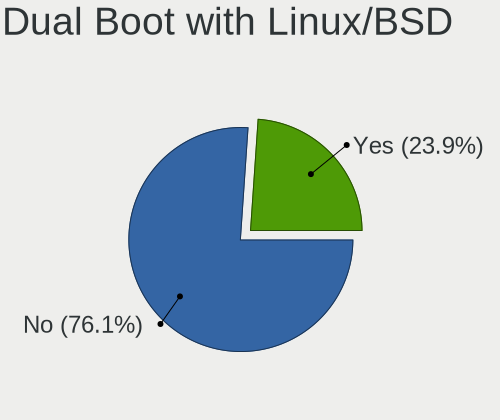
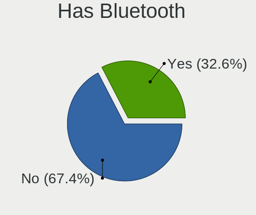
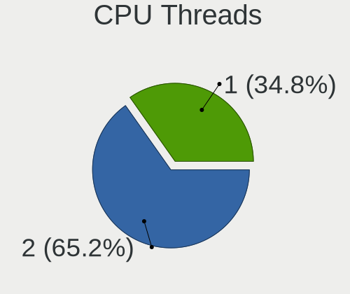
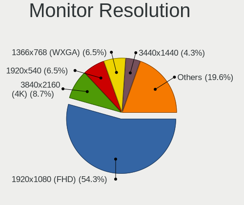
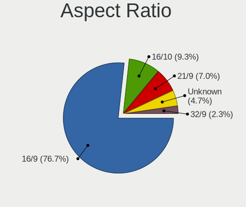
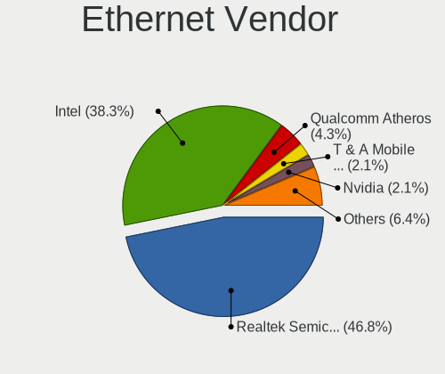
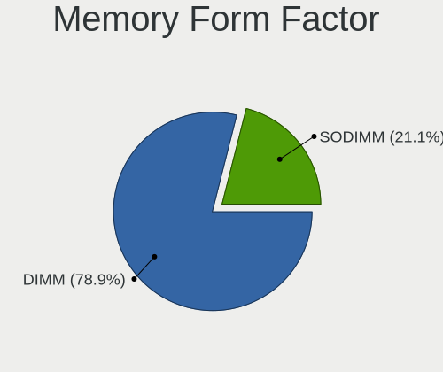

Ubuntu Budgie 22.04 - Tested Hardware & Statistics (Desktops)
-------------------------------------------------------------

A project to collect tested hardware configurations for Ubuntu Budgie 22.04.

Anyone can contribute to this report by the [hw-probe](https://github.com/linuxhw/hw-probe) tool:

    sudo -E hw-probe -all -upload

Please contribute! Especially if your hardware is rare.

Contents
--------

* [ Test Cases ](#test-cases)

* [ System ](#system)
  - [ Kernel                   ](#kernel)
  - [ Kernel Family            ](#kernel-family)
  - [ Kernel Major Ver.        ](#kernel-major-ver)
  - [ Arch                     ](#arch)
  - [ DE                       ](#de)
  - [ Display Server           ](#display-server)
  - [ Display Manager          ](#display-manager)
  - [ OS Lang                  ](#os-lang)
  - [ Boot Mode                ](#boot-mode)
  - [ Filesystem               ](#filesystem)
  - [ Part. scheme             ](#part-scheme)
  - [ Dual Boot with Linux/BSD ](#dual-boot-with-linuxbsd)
  - [ Dual Boot (Win)          ](#dual-boot-win)

* [ Board ](#board)
  - [ Vendor                   ](#vendor)
  - [ Model                    ](#model)
  - [ Model Family             ](#model-family)
  - [ MFG Year                 ](#mfg-year)
  - [ Form Factor              ](#form-factor)
  - [ Secure Boot              ](#secure-boot)
  - [ Coreboot                 ](#coreboot)
  - [ RAM Size                 ](#ram-size)
  - [ RAM Used                 ](#ram-used)
  - [ Total Drives             ](#total-drives)
  - [ Has CD-ROM               ](#has-cd-rom)
  - [ Has Ethernet             ](#has-ethernet)
  - [ Has WiFi                 ](#has-wifi)
  - [ Has Bluetooth            ](#has-bluetooth)

* [ Location ](#location)
  - [ Country                  ](#country)
  - [ City                     ](#city)

* [ Drives ](#drives)
  - [ Drive Vendor             ](#drive-vendor)
  - [ Drive Model              ](#drive-model)
  - [ HDD Vendor               ](#hdd-vendor)
  - [ SSD Vendor               ](#ssd-vendor)
  - [ Drive Kind               ](#drive-kind)
  - [ Drive Connector          ](#drive-connector)
  - [ Drive Size               ](#drive-size)
  - [ Space Total              ](#space-total)
  - [ Space Used               ](#space-used)
  - [ Malfunc. Drives          ](#malfunc-drives)
  - [ Malfunc. Drive Vendor    ](#malfunc-drive-vendor)
  - [ Malfunc. HDD Vendor      ](#malfunc-hdd-vendor)
  - [ Malfunc. Drive Kind      ](#malfunc-drive-kind)
  - [ Failed Drives            ](#failed-drives)
  - [ Failed Drive Vendor      ](#failed-drive-vendor)
  - [ Drive Status             ](#drive-status)

* [ Storage controller ](#storage-controller)
  - [ Storage Vendor           ](#storage-vendor)
  - [ Storage Model            ](#storage-model)
  - [ Storage Kind             ](#storage-kind)

* [ Processor ](#processor)
  - [ CPU Vendor               ](#cpu-vendor)
  - [ CPU Model                ](#cpu-model)
  - [ CPU Model Family         ](#cpu-model-family)
  - [ CPU Cores                ](#cpu-cores)
  - [ CPU Sockets              ](#cpu-sockets)
  - [ CPU Threads              ](#cpu-threads)
  - [ CPU Op-Modes             ](#cpu-op-modes)
  - [ CPU Microcode            ](#cpu-microcode)
  - [ CPU Microarch            ](#cpu-microarch)

* [ Graphics ](#graphics)
  - [ GPU Vendor               ](#gpu-vendor)
  - [ GPU Model                ](#gpu-model)
  - [ GPU Combo                ](#gpu-combo)
  - [ GPU Driver               ](#gpu-driver)
  - [ GPU Memory               ](#gpu-memory)

* [ Monitor ](#monitor)
  - [ Monitor Vendor           ](#monitor-vendor)
  - [ Monitor Model            ](#monitor-model)
  - [ Monitor Resolution       ](#monitor-resolution)
  - [ Monitor Diagonal         ](#monitor-diagonal)
  - [ Monitor Width            ](#monitor-width)
  - [ Aspect Ratio             ](#aspect-ratio)
  - [ Monitor Area             ](#monitor-area)
  - [ Pixel Density            ](#pixel-density)
  - [ Multiple Monitors        ](#multiple-monitors)

* [ Network ](#network)
  - [ Net Controller Vendor    ](#net-controller-vendor)
  - [ Net Controller Model     ](#net-controller-model)
  - [ Wireless Vendor          ](#wireless-vendor)
  - [ Wireless Model           ](#wireless-model)
  - [ Ethernet Vendor          ](#ethernet-vendor)
  - [ Ethernet Model           ](#ethernet-model)
  - [ Net Controller Kind      ](#net-controller-kind)
  - [ Used Controller          ](#used-controller)
  - [ NICs                     ](#nics)
  - [ IPv6                     ](#ipv6)

* [ Bluetooth ](#bluetooth)
  - [ Bluetooth Vendor         ](#bluetooth-vendor)
  - [ Bluetooth Model          ](#bluetooth-model)

* [ Sound ](#sound)
  - [ Sound Vendor             ](#sound-vendor)
  - [ Sound Model              ](#sound-model)

* [ Memory ](#memory)
  - [ Memory Vendor            ](#memory-vendor)
  - [ Memory Model             ](#memory-model)
  - [ Memory Kind              ](#memory-kind)
  - [ Memory Form Factor       ](#memory-form-factor)
  - [ Memory Size              ](#memory-size)
  - [ Memory Speed             ](#memory-speed)

* [ Printers & scanners ](#printers--scanners)
  - [ Printer Vendor           ](#printer-vendor)
  - [ Printer Model            ](#printer-model)
  - [ Scanner Vendor           ](#scanner-vendor)
  - [ Scanner Model            ](#scanner-model)

* [ Camera ](#camera)
  - [ Camera Vendor            ](#camera-vendor)
  - [ Camera Model             ](#camera-model)

* [ Security ](#security)
  - [ Fingerprint Vendor       ](#fingerprint-vendor)
  - [ Fingerprint Model        ](#fingerprint-model)
  - [ Chipcard Vendor          ](#chipcard-vendor)
  - [ Chipcard Model           ](#chipcard-model)

* [ Unsupported ](#unsupported)
  - [ Unsupported Devices      ](#unsupported-devices)
  - [ Unsupported Device Types ](#unsupported-device-types)

Test Cases
----------

Total: 26

| Vendor   | Model                    | Probe                                                      | Date         |
|----------|--------------------------|------------------------------------------------------------|--------------|
| Dell     | 0C27VV A01               | [ed46beadef](https://linux-hardware.org/?probe=ed46beadef) | Oct 30, 2022 |
| MSI      | B450-A PRO MAX           | [0e8db93a43](https://linux-hardware.org/?probe=0e8db93a43) | Oct 30, 2022 |
| Dell     | 0C27VV A01               | [23c855f88b](https://linux-hardware.org/?probe=23c855f88b) | Oct 17, 2022 |
| Dell     | 0C27VV A01               | [ebe65ec5fa](https://linux-hardware.org/?probe=ebe65ec5fa) | Oct 17, 2022 |
| Gigabyte | M68MT-S2                 | [55db3c3775](https://linux-hardware.org/?probe=55db3c3775) | Sep 27, 2022 |
| Gigabyte | B75M-D3P                 | [da53115e6b](https://linux-hardware.org/?probe=da53115e6b) | Sep 15, 2022 |
| Gigabyte | M68MT-S2                 | [1a5358a3c1](https://linux-hardware.org/?probe=1a5358a3c1) | Sep 14, 2022 |
| Gigabyte | X570S AORUS PRO AX       | [f42f75038e](https://linux-hardware.org/?probe=f42f75038e) | Sep 03, 2022 |
| Intel    | DP55WB AAE64798-206      | [548332086b](https://linux-hardware.org/?probe=548332086b) | Sep 02, 2022 |
| ASUSTek  | A88X-PRO                 | [922554664a](https://linux-hardware.org/?probe=922554664a) | Aug 25, 2022 |
| Intel    | X79M-S                   | [49a7d62fe8](https://linux-hardware.org/?probe=49a7d62fe8) | Aug 18, 2022 |
| HP       | 828A                     | [f42b1efd1e](https://linux-hardware.org/?probe=f42b1efd1e) | Aug 17, 2022 |
| Biostar  | A960D+V3                 | [83f7f840b7](https://linux-hardware.org/?probe=83f7f840b7) | Aug 15, 2022 |
| ASRock   | A300M-STX                | [a6aba67197](https://linux-hardware.org/?probe=a6aba67197) | Aug 02, 2022 |
| ASRock   | A300M-STX                | [fae724727b](https://linux-hardware.org/?probe=fae724727b) | Aug 02, 2022 |
| Intel    | STK1A32SC H95551-301     | [ea91c7805d](https://linux-hardware.org/?probe=ea91c7805d) | Jul 22, 2022 |
| Gigabyte | GA-890GPA-UD3H           | [f6faa2d944](https://linux-hardware.org/?probe=f6faa2d944) | Jun 25, 2022 |
| HP       | 212B                     | [a163af0cb5](https://linux-hardware.org/?probe=a163af0cb5) | Jun 21, 2022 |
| Gigabyte | B75M-D3H                 | [da04a03393](https://linux-hardware.org/?probe=da04a03393) | Jun 04, 2022 |
| Gigabyte | F2A78M-HD2               | [fc9dd3db05](https://linux-hardware.org/?probe=fc9dd3db05) | May 26, 2022 |
| ASUSTek  | PRIME B560M-A            | [7b393b3933](https://linux-hardware.org/?probe=7b393b3933) | May 24, 2022 |
| MSI      | X370 GAMING PRO CARBON   | [9acb45109f](https://linux-hardware.org/?probe=9acb45109f) | May 21, 2022 |
| Gigabyte | B75M-D3H                 | [b9437261b7](https://linux-hardware.org/?probe=b9437261b7) | May 10, 2022 |
| Gigabyte | B450 I AORUS PRO WIFI-CF | [4ab84df25d](https://linux-hardware.org/?probe=4ab84df25d) | May 10, 2022 |
| HP       | 1825                     | [fe93966c1c](https://linux-hardware.org/?probe=fe93966c1c) | May 09, 2022 |
| Gigabyte | B550 AORUS ELITE AX V2   | [e2cbc23977](https://linux-hardware.org/?probe=e2cbc23977) | Apr 12, 2022 |

System
------

Kernel
------

Version of the Linux kernel

| Version               | Desktops | Percent |
|-----------------------|----------|---------|
| 5.15.0-46-generic     | 3        | 14.29%  |
| 5.15.0-30-generic     | 3        | 14.29%  |
| 5.15.0-43-generic     | 2        | 9.52%   |
| 5.15.0-33-generic     | 2        | 9.52%   |
| 5.15.0-27-generic     | 2        | 9.52%   |
| 5.15.0-25-generic     | 2        | 9.52%   |
| 5.17.2-051702-generic | 1        | 4.76%   |
| 5.15.0-52-generic     | 1        | 4.76%   |
| 5.15.0-50-generic     | 1        | 4.76%   |
| 5.15.0-48-generic     | 1        | 4.76%   |
| 5.15.0-47-generic     | 1        | 4.76%   |
| 5.15.0-41-generic     | 1        | 4.76%   |
| 5.13.0-44-generic     | 1        | 4.76%   |

Kernel Family
-------------

Linux kernel without a distro release

| Version | Desktops | Percent |
|---------|----------|---------|
| 5.15.0  | 18       | 90%     |
| 5.17.2  | 1        | 5%      |
| 5.13.0  | 1        | 5%      |

Kernel Major Ver.
-----------------

Linux kernel major version

| Version | Desktops | Percent |
|---------|----------|---------|
| 5.15    | 18       | 90%     |
| 5.17    | 1        | 5%      |
| 5.13    | 1        | 5%      |

Arch
----

OS architecture (x86_64, i586, etc.)

| Name   | Desktops | Percent |
|--------|----------|---------|
| x86_64 | 20       | 100%    |

DE
--

Desktop Environment

| Name   | Desktops | Percent |
|--------|----------|---------|
| Budgie | 20       | 100%    |

Display Server
--------------

X11 or Wayland

| Name | Desktops | Percent |
|------|----------|---------|
| X11  | 20       | 100%    |

Display Manager
---------------

SDDM, LightDM, etc.

| Name    | Desktops | Percent |
|---------|----------|---------|
| LightDM | 14       | 70%     |
| Unknown | 5        | 25%     |
| GDM     | 1        | 5%      |

OS Lang
-------

Language

| Lang  | Desktops | Percent |
|-------|----------|---------|
| en_US | 9        | 45%     |
| de_DE | 4        | 20%     |
| fr_FR | 2        | 10%     |
| es_ES | 2        | 10%     |
| es_MX | 1        | 5%      |
| en_GB | 1        | 5%      |
| el_GR | 1        | 5%      |

Boot Mode
---------

EFI or BIOS

| Mode | Desktops | Percent |
|------|----------|---------|
| BIOS | 13       | 61.9%   |
| EFI  | 8        | 38.1%   |

Filesystem
----------

Type of filesystem

| Type    | Desktops | Percent |
|---------|----------|---------|
| Ext4    | 17       | 85%     |
| Overlay | 3        | 15%     |

Part. scheme
------------

Scheme of partitioning

| Type    | Desktops | Percent |
|---------|----------|---------|
| Unknown | 12       | 60%     |
| GPT     | 8        | 40%     |

Dual Boot with Linux/BSD
------------------------

Hosting more than one Linux/BSD

| Dual boot | Desktops | Percent |
|-----------|----------|---------|
| No        | 15       | 75%     |
| Yes       | 5        | 25%     |

Dual Boot (Win)
---------------

Hosting Linux and Windows

| Dual boot | Desktops | Percent |
|-----------|----------|---------|
| No        | 12       | 60%     |
| Yes       | 8        | 40%     |

Board
-----

Vendor
------

Motherboard manufacturer

| Name                | Desktops | Percent |
|---------------------|----------|---------|
| Gigabyte Technology | 8        | 40%     |
| Hewlett-Packard     | 3        | 15%     |
| MSI                 | 2        | 10%     |
| Intel               | 2        | 10%     |
| ASUSTek Computer    | 2        | 10%     |
| Dell                | 1        | 5%      |
| Biostar             | 1        | 5%      |
| ASRock              | 1        | 5%      |

Model
-----

Motherboard model

| Name                            | Desktops | Percent |
|---------------------------------|----------|---------|
| MSI MS-7B86                     | 1        | 5%      |
| MSI MS-7A32                     | 1        | 5%      |
| Intel STK1A32SC                 | 1        | 5%      |
| Intel DP55WB AAE64798-206       | 1        | 5%      |
| HP Z440 Workstation             | 1        | 5%      |
| HP EliteDesk 800 G1 DM          | 1        | 5%      |
| HP 750-417c                     | 1        | 5%      |
| Gigabyte X570S AORUS PRO AX     | 1        | 5%      |
| Gigabyte M68MT-S2               | 1        | 5%      |
| Gigabyte GA-890GPA-UD3H         | 1        | 5%      |
| Gigabyte F2A78M-HD2             | 1        | 5%      |
| Gigabyte B75M-D3P               | 1        | 5%      |
| Gigabyte B75M-D3H               | 1        | 5%      |
| Gigabyte B550 AORUS ELITE AX V2 | 1        | 5%      |
| Gigabyte B450 I AORUS PRO WIFI  | 1        | 5%      |
| Dell OptiPlex 780               | 1        | 5%      |
| Biostar A960D+V3                | 1        | 5%      |
| ASUS PRIME B560M-A              | 1        | 5%      |
| ASUS A88X-PRO                   | 1        | 5%      |
| ASRock A300M-STX                | 1        | 5%      |

Model Family
------------

Motherboard model prefix

| Name                    | Desktops | Percent |
|-------------------------|----------|---------|
| MSI MS-7B86             | 1        | 5%      |
| MSI MS-7A32             | 1        | 5%      |
| Intel STK1A32SC         | 1        | 5%      |
| Intel DP55WB            | 1        | 5%      |
| HP Z440                 | 1        | 5%      |
| HP EliteDesk            | 1        | 5%      |
| HP 750-417c             | 1        | 5%      |
| Gigabyte X570S          | 1        | 5%      |
| Gigabyte M68MT-S2       | 1        | 5%      |
| Gigabyte GA-890GPA-UD3H | 1        | 5%      |
| Gigabyte F2A78M-HD2     | 1        | 5%      |
| Gigabyte B75M-D3P       | 1        | 5%      |
| Gigabyte B75M-D3H       | 1        | 5%      |
| Gigabyte B550           | 1        | 5%      |
| Gigabyte B450           | 1        | 5%      |
| Dell OptiPlex           | 1        | 5%      |
| Biostar A960D+V3        | 1        | 5%      |
| ASUS PRIME              | 1        | 5%      |
| ASUS A88X-PRO           | 1        | 5%      |
| ASRock A300M-STX        | 1        | 5%      |

MFG Year
--------

Motherboard manufacture year

| Year | Desktops | Percent |
|------|----------|---------|
| 2018 | 3        | 15%     |
| 2010 | 3        | 15%     |
| 2021 | 2        | 10%     |
| 2016 | 2        | 10%     |
| 2015 | 2        | 10%     |
| 2014 | 2        | 10%     |
| 2020 | 1        | 5%      |
| 2019 | 1        | 5%      |
| 2017 | 1        | 5%      |
| 2013 | 1        | 5%      |
| 2012 | 1        | 5%      |
| 2009 | 1        | 5%      |

Form Factor
-----------

Physical design of the computer

| Name    | Desktops | Percent |
|---------|----------|---------|
| Desktop | 20       | 100%    |

Secure Boot
-----------

Enabled or disabled

| State    | Desktops | Percent |
|----------|----------|---------|
| Disabled | 20       | 100%    |

Coreboot
--------

Have coreboot on board

| Used | Desktops | Percent |
|------|----------|---------|
| No   | 20       | 100%    |

RAM Size
--------

Total RAM memory

| Size in GB | Desktops | Percent |
|------------|----------|---------|
| 16.01-24.0 | 7        | 35%     |
| 4.01-8.0   | 5        | 25%     |
| 8.01-16.0  | 5        | 25%     |
| 32.01-64.0 | 2        | 10%     |
| 1.01-2.0   | 1        | 5%      |

RAM Used
--------

Used RAM memory

| Used GB  | Desktops | Percent |
|----------|----------|---------|
| 1.01-2.0 | 9        | 42.86%  |
| 2.01-3.0 | 8        | 38.1%   |
| 4.01-8.0 | 3        | 14.29%  |
| 3.01-4.0 | 1        | 4.76%   |

Total Drives
------------

Number of drives on board

| Drives | Desktops | Percent |
|--------|----------|---------|
| 2      | 7        | 35%     |
| 1      | 6        | 30%     |
| 4      | 3        | 15%     |
| 6      | 2        | 10%     |
| 3      | 2        | 10%     |

Has CD-ROM
----------

Has CD-ROM on board

| Presented | Desktops | Percent |
|-----------|----------|---------|
| No        | 12       | 60%     |
| Yes       | 8        | 40%     |

Has Ethernet
------------

Has Ethernet on board

| Presented | Desktops | Percent |
|-----------|----------|---------|
| Yes       | 19       | 95%     |
| No        | 1        | 5%      |

Has WiFi
--------

Has WiFi module

| Presented | Desktops | Percent |
|-----------|----------|---------|
| Yes       | 12       | 60%     |
| No        | 8        | 40%     |

Has Bluetooth
-------------

Has Bluetooth module

| Presented | Desktops | Percent |
|-----------|----------|---------|
| No        | 13       | 65%     |
| Yes       | 7        | 35%     |

Location
--------

Country
-------

Geographic location (country)

| Country     | Desktops | Percent |
|-------------|----------|---------|
| USA         | 6        | 30%     |
| Germany     | 3        | 15%     |
| UK          | 1        | 5%      |
| Switzerland | 1        | 5%      |
| Spain       | 1        | 5%      |
| Slovenia    | 1        | 5%      |
| Norway      | 1        | 5%      |
| Mexico      | 1        | 5%      |
| Greece      | 1        | 5%      |
| France      | 1        | 5%      |
| Croatia     | 1        | 5%      |
| Brazil      | 1        | 5%      |
| Argentina   | 1        | 5%      |

City
----

Geographic location (city)

| City                  | Desktops | Percent |
|-----------------------|----------|---------|
| Milwaukee             | 2        | 10%     |
| Walled Lake           | 1        | 5%      |
| Trondheim             | 1        | 5%      |
| Tocantins             | 1        | 5%      |
| San Luis Potosí City | 1        | 5%      |
| Rueil-Malmaison       | 1        | 5%      |
| Pula                  | 1        | 5%      |
| Pine Island           | 1        | 5%      |
| New York              | 1        | 5%      |
| Maribor               | 1        | 5%      |
| Madrid                | 1        | 5%      |
| Kirkcaldy             | 1        | 5%      |
| Hamburg               | 1        | 5%      |
| Ennepetal             | 1        | 5%      |
| Delbrueck             | 1        | 5%      |
| Colon                 | 1        | 5%      |
| Caslano               | 1        | 5%      |
| Bradenton             | 1        | 5%      |
| Athens                | 1        | 5%      |

Drives
------

Drive Vendor
------------

Hard drive vendors

| Vendor              | Desktops | Drives | Percent |
|---------------------|----------|--------|---------|
| Seagate             | 9        | 14     | 21.43%  |
| WDC                 | 4        | 5      | 9.52%   |
| SanDisk             | 4        | 5      | 9.52%   |
| Samsung Electronics | 4        | 6      | 9.52%   |
| Toshiba             | 2        | 2      | 4.76%   |
| OCZ                 | 2        | 2      | 4.76%   |
| Kingston            | 2        | 3      | 4.76%   |
| Crucial             | 2        | 2      | 4.76%   |
| Unknown             | 1        | 1      | 2.38%   |
| Transcend           | 1        | 1      | 2.38%   |
| SPCC                | 1        | 1      | 2.38%   |
| SK hynix            | 1        | 1      | 2.38%   |
| PNY                 | 1        | 1      | 2.38%   |
| Phison              | 1        | 1      | 2.38%   |
| Micron Technology   | 1        | 1      | 2.38%   |
| Maxtor              | 1        | 1      | 2.38%   |
| JMicron Technology  | 1        | 1      | 2.38%   |
| Intel               | 1        | 1      | 2.38%   |
| HGST                | 1        | 1      | 2.38%   |
| ASMT109x            | 1        | 1      | 2.38%   |
| A-DATA Technology   | 1        | 1      | 2.38%   |

Drive Model
-----------

Hard drive models

| Model                              | Desktops | Percent |
|------------------------------------|----------|---------|
| Seagate ST1000LM048-2E7172 1TB     | 2        | 4.17%   |
| SanDisk SDSSDA120G 120GB           | 2        | 4.17%   |
| Samsung SSD 870 EVO 250GB          | 2        | 4.17%   |
| WDC WD5000LPVX-22V0TT0 500GB       | 1        | 2.08%   |
| WDC WD40PURZ-85TTDY0 4TB           | 1        | 2.08%   |
| WDC WD1600AAJS-60WAA0 160GB        | 1        | 2.08%   |
| WDC WD10EARS-00Y5B1 1TB            | 1        | 2.08%   |
| WDC WD10EADS-00M2B0 1TB            | 1        | 2.08%   |
| Unknown SD/MMC/MS PRO 1TB          | 1        | 2.08%   |
| Transcend TS128GMTE110S 128GB      | 1        | 2.08%   |
| Toshiba HDWD240 4TB                | 1        | 2.08%   |
| Toshiba HDWD220 2TB                | 1        | 2.08%   |
| SPCC Solid State Disk 256GB        | 1        | 2.08%   |
| SK hynix SC210 2.5 7MM 128GB SSD   | 1        | 2.08%   |
| Seagate ST9500325AS 500GB          | 1        | 2.08%   |
| Seagate ST500LT012-1DG142 500GB    | 1        | 2.08%   |
| Seagate ST380815AS 80GB            | 1        | 2.08%   |
| Seagate ST3500418AS 500GB          | 1        | 2.08%   |
| Seagate ST3500412AS 500GB          | 1        | 2.08%   |
| Seagate ST3160815AS 160GB          | 1        | 2.08%   |
| Seagate ST2000DM008-2FR102 2TB     | 1        | 2.08%   |
| Seagate ST2000DM001-1ER164 2TB     | 1        | 2.08%   |
| Seagate ST1000LM024 HN-M101MBB 1TB | 1        | 2.08%   |
| Seagate ST1000LM014-1EJ164 1TB     | 1        | 2.08%   |
| Seagate ST1000DM003-1SB10C 1TB     | 1        | 2.08%   |
| Seagate NVMe SSD Drive 500GB       | 1        | 2.08%   |
| SanDisk NVMe SSD Drive 500GB       | 1        | 2.08%   |
| SanDisk DF4032  32GB               | 1        | 2.08%   |
| Samsung MZVLW256HEHP-000H1 256GB   | 1        | 2.08%   |
| Samsung HD250HJ 250GB              | 1        | 2.08%   |
| PNY CS900 120GB SSD                | 1        | 2.08%   |
| Phison NVMe SSD Drive 512GB        | 1        | 2.08%   |
| OCZ TRION150 240GB SSD             | 1        | 2.08%   |
| OCZ NVMe SSD Drive 256GB           | 1        | 2.08%   |
| Micron NVMe SSD Drive 500GB        | 1        | 2.08%   |
| Maxtor 6V160E0 160GB               | 1        | 2.08%   |
| Kingston SUV400S37120G 120GB SSD   | 1        | 2.08%   |
| Kingston SA2000M8250G 250GB        | 1        | 2.08%   |
| JMicron Generic 500GB              | 1        | 2.08%   |
| Intel SSDPEKNU512GZ 512GB          | 1        | 2.08%   |

HDD Vendor
----------

Hard disk drive vendors

| Vendor              | Desktops | Drives | Percent |
|---------------------|----------|--------|---------|
| Seagate             | 9        | 13     | 45%     |
| WDC                 | 4        | 5      | 20%     |
| Toshiba             | 2        | 2      | 10%     |
| Unknown             | 1        | 1      | 5%      |
| Samsung Electronics | 1        | 2      | 5%      |
| Maxtor              | 1        | 1      | 5%      |
| HGST                | 1        | 1      | 5%      |
| ASMT109x            | 1        | 1      | 5%      |

SSD Vendor
----------

Solid state drive vendors

| Vendor              | Desktops | Drives | Percent |
|---------------------|----------|--------|---------|
| SanDisk             | 2        | 2      | 16.67%  |
| Samsung Electronics | 2        | 3      | 16.67%  |
| Crucial             | 2        | 2      | 16.67%  |
| SPCC                | 1        | 1      | 8.33%   |
| SK hynix            | 1        | 1      | 8.33%   |
| PNY                 | 1        | 1      | 8.33%   |
| OCZ                 | 1        | 1      | 8.33%   |
| Kingston            | 1        | 2      | 8.33%   |
| A-DATA Technology   | 1        | 1      | 8.33%   |

Drive Kind
----------

HDD or SSD

| Kind | Desktops | Drives | Percent |
|------|----------|--------|---------|
| HDD  | 14       | 26     | 41.18%  |
| SSD  | 11       | 14     | 32.35%  |
| NVMe | 8        | 11     | 23.53%  |
| MMC  | 1        | 1      | 2.94%   |

Drive Connector
---------------

SATA, SAS, NVMe, etc.

| Type | Desktops | Drives | Percent |
|------|----------|--------|---------|
| SATA | 18       | 38     | 62.07%  |
| NVMe | 7        | 10     | 24.14%  |
| SAS  | 3        | 3      | 10.34%  |
| MMC  | 1        | 1      | 3.45%   |

Drive Size
----------

Size of hard drive

| Size in TB | Desktops | Drives | Percent |
|------------|----------|--------|---------|
| 0.01-0.5   | 16       | 25     | 57.14%  |
| 0.51-1.0   | 7        | 9      | 25%     |
| 3.01-4.0   | 3        | 3      | 10.71%  |
| 1.01-2.0   | 2        | 3      | 7.14%   |

Space Total
-----------

Amount of disk space available on the file system

| Size in GB     | Desktops | Percent |
|----------------|----------|---------|
| 101-250        | 8        | 40%     |
| 251-500        | 3        | 15%     |
| 1001-2000      | 2        | 10%     |
| 1-20           | 2        | 10%     |
| 51-100         | 2        | 10%     |
| More than 3000 | 1        | 5%      |
| 21-50          | 1        | 5%      |
| 501-1000       | 1        | 5%      |

Space Used
----------

Amount of used disk space

| Used GB   | Desktops | Percent |
|-----------|----------|---------|
| 21-50     | 6        | 30%     |
| 1-20      | 6        | 30%     |
| 101-250   | 3        | 15%     |
| 51-100    | 3        | 15%     |
| 251-500   | 1        | 5%      |
| 2001-3000 | 1        | 5%      |

Malfunc. Drives
---------------

Drive models with a malfunction

| Model                              | Desktops | Drives | Percent |
|------------------------------------|----------|--------|---------|
| WDC WD5000LPVX-22V0TT0 500GB       | 1        | 1      | 50%     |
| Seagate ST1000LM024 HN-M101MBB 1TB | 1        | 1      | 50%     |

Malfunc. Drive Vendor
---------------------

Vendors of faulty drives

| Vendor  | Desktops | Drives | Percent |
|---------|----------|--------|---------|
| WDC     | 1        | 1      | 50%     |
| Seagate | 1        | 1      | 50%     |

Malfunc. HDD Vendor
-------------------

Vendors of faulty HDD drives

| Vendor  | Desktops | Drives | Percent |
|---------|----------|--------|---------|
| WDC     | 1        | 1      | 50%     |
| Seagate | 1        | 1      | 50%     |

Malfunc. Drive Kind
-------------------

Kinds of faulty drives

| Kind | Desktops | Drives | Percent |
|------|----------|--------|---------|
| HDD  | 2        | 2      | 100%    |

Failed Drives
-------------

Failed drive models

Zero info for selected period =(

Failed Drive Vendor
-------------------

Failed drive vendors

Zero info for selected period =(

Drive Status
------------

Number of failed and malfunc. drives

| Status   | Desktops | Drives | Percent |
|----------|----------|--------|---------|
| Detected | 15       | 35     | 62.5%   |
| Works    | 7        | 15     | 29.17%  |
| Malfunc  | 2        | 2      | 8.33%   |

Storage controller
------------------

Storage Vendor
--------------

Storage controller vendors

| Vendor                      | Desktops | Percent |
|-----------------------------|----------|---------|
| AMD                         | 10       | 33.33%  |
| Intel                       | 9        | 30%     |
| Transcend                   | 1        | 3.33%   |
| Seagate Technology          | 1        | 3.33%   |
| SanDisk                     | 1        | 3.33%   |
| Samsung Electronics         | 1        | 3.33%   |
| Phison Electronics          | 1        | 3.33%   |
| OCZ Technology Group        | 1        | 3.33%   |
| Nvidia                      | 1        | 3.33%   |
| Micron Technology           | 1        | 3.33%   |
| Marvell Technology Group    | 1        | 3.33%   |
| Kingston Technology Company | 1        | 3.33%   |
| JMicron Technology          | 1        | 3.33%   |

Storage Model
-------------

Storage controller models

| Model                                                                          | Desktops | Percent |
|--------------------------------------------------------------------------------|----------|---------|
| AMD FCH SATA Controller [AHCI mode]                                            | 5        | 13.16%  |
| AMD SB7x0/SB8x0/SB9x0 IDE Controller                                           | 2        | 5.26%   |
| AMD 400 Series Chipset SATA Controller                                         | 2        | 5.26%   |
| Transcend Non-Volatile memory controller                                       | 1        | 2.63%   |
| Seagate Non-Volatile memory controller                                         | 1        | 2.63%   |
| SanDisk WD Blue SN570 NVMe SSD                                                 | 1        | 2.63%   |
| Samsung NVMe SSD Controller SM961/PM961/SM963                                  | 1        | 2.63%   |
| Phison PS5013 E13 NVMe Controller                                              | 1        | 2.63%   |
| OCZ Group RD400/400A SSD                                                       | 1        | 2.63%   |
| Nvidia MCP61 SATA Controller                                                   | 1        | 2.63%   |
| Micron Non-Volatile memory controller                                          | 1        | 2.63%   |
| Marvell Group 88SE9172 SATA 6Gb/s Controller                                   | 1        | 2.63%   |
| Kingston Company A2000 NVMe SSD                                                | 1        | 2.63%   |
| JMicron JMB363 SATA/IDE Controller                                             | 1        | 2.63%   |
| Intel Q170/Q150/B150/H170/H110/Z170/CM236 Chipset SATA Controller [AHCI Mode]  | 1        | 2.63%   |
| Intel Non-Volatile memory controller                                           | 1        | 2.63%   |
| Intel C610/X99 series chipset sSATA Controller [RAID mode]                     | 1        | 2.63%   |
| Intel C600/X79 series chipset SATA RAID Controller                             | 1        | 2.63%   |
| Intel 82801JD/DO (ICH10 Family) SATA AHCI Controller                           | 1        | 2.63%   |
| Intel 8 Series/C220 Series Chipset Family 6-port SATA Controller 1 [AHCI mode] | 1        | 2.63%   |
| Intel 7 Series/C210 Series Chipset Family 6-port SATA Controller [AHCI mode]   | 1        | 2.63%   |
| Intel 7 Series/C210 Series Chipset Family 4-port SATA Controller [IDE mode]    | 1        | 2.63%   |
| Intel 7 Series/C210 Series Chipset Family 2-port SATA Controller [IDE mode]    | 1        | 2.63%   |
| Intel 500 Series Chipset Family SATA AHCI Controller                           | 1        | 2.63%   |
| Intel 5 Series/3400 Series Chipset 4 port SATA IDE Controller                  | 1        | 2.63%   |
| Intel 5 Series/3400 Series Chipset 2 port SATA IDE Controller                  | 1        | 2.63%   |
| Intel 4 Series Chipset PT IDER Controller                                      | 1        | 2.63%   |
| AMD X370 Series Chipset SATA Controller                                        | 1        | 2.63%   |
| AMD SB7x0/SB8x0/SB9x0 SATA Controller [IDE mode]                               | 1        | 2.63%   |
| AMD SB7x0/SB8x0/SB9x0 SATA Controller [AHCI mode]                              | 1        | 2.63%   |
| AMD FCH IDE Controller                                                         | 1        | 2.63%   |
| AMD 500 Series Chipset SATA Controller                                         | 1        | 2.63%   |

Storage Kind
------------

Kind of storage controller (IDE, SATA, NVMe, SAS, ...)

| Kind | Desktops | Percent |
|------|----------|---------|
| SATA | 15       | 50%     |
| NVMe | 7        | 23.33%  |
| IDE  | 7        | 23.33%  |
| RAID | 1        | 3.33%   |

Processor
---------

CPU Vendor
----------

Processor vendors

| Vendor | Desktops | Percent |
|--------|----------|---------|
| AMD    | 11       | 55%     |
| Intel  | 9        | 45%     |

CPU Model
---------

Processor models

| Model                                           | Desktops | Percent |
|-------------------------------------------------|----------|---------|
| AMD Ryzen 5 3400G with Radeon Vega Graphics     | 2        | 10%     |
| Intel Xeon CPU E5-1620 v4 @ 3.50GHz             | 1        | 5%      |
| Intel Core i7 CPU 860 @ 2.80GHz                 | 1        | 5%      |
| Intel Core i5-6400 CPU @ 2.70GHz                | 1        | 5%      |
| Intel Core i5-4590T CPU @ 2.00GHz               | 1        | 5%      |
| Intel Core i5-3470 CPU @ 3.20GHz                | 1        | 5%      |
| Intel Core i3-3225 CPU @ 3.30GHz                | 1        | 5%      |
| Intel Core 2 Quad CPU Q9550 @ 2.83GHz           | 1        | 5%      |
| Intel Atom x5-Z8330 CPU @ 1.44GHz               | 1        | 5%      |
| Intel 11th Gen Core i5-11600 @ 2.80GHz          | 1        | 5%      |
| AMD Ryzen 9 5900X 12-Core Processor             | 1        | 5%      |
| AMD Ryzen 5 5600G with Radeon Graphics          | 1        | 5%      |
| AMD Ryzen 5 2600 Six-Core Processor             | 1        | 5%      |
| AMD Phenom II X4 965 Processor                  | 1        | 5%      |
| AMD FX-8150 Eight-Core Processor                | 1        | 5%      |
| AMD Athlon II X3 445 Processor                  | 1        | 5%      |
| AMD Athlon 3000G with Radeon Vega Graphics      | 1        | 5%      |
| AMD A4-4000 APU with Radeon HD Graphics         | 1        | 5%      |
| AMD A10-7850K Radeon R7, 12 Compute Cores 4C+8G | 1        | 5%      |

CPU Model Family
----------------

Processor model prefix

| Model             | Desktops | Percent |
|-------------------|----------|---------|
| AMD Ryzen 5       | 4        | 20%     |
| Intel Core i5     | 3        | 15%     |
| Other             | 1        | 5%      |
| Intel Xeon        | 1        | 5%      |
| Intel Core i7     | 1        | 5%      |
| Intel Core i3     | 1        | 5%      |
| Intel Core 2 Quad | 1        | 5%      |
| Intel Atom        | 1        | 5%      |
| AMD Ryzen 9       | 1        | 5%      |
| AMD Phenom II X4  | 1        | 5%      |
| AMD FX            | 1        | 5%      |
| AMD Athlon II X3  | 1        | 5%      |
| AMD Athlon        | 1        | 5%      |
| AMD A4            | 1        | 5%      |
| AMD A10           | 1        | 5%      |

CPU Cores
---------

Number of processor cores

| Number | Desktops | Percent |
|--------|----------|---------|
| 4      | 11       | 55%     |
| 6      | 3        | 15%     |
| 2      | 3        | 15%     |
| 12     | 1        | 5%      |
| 3      | 1        | 5%      |
| 1      | 1        | 5%      |

CPU Sockets
-----------

Number of sockets

| Number | Desktops | Percent |
|--------|----------|---------|
| 1      | 20       | 100%    |

CPU Threads
-----------

Threads per core (Hyper-Threading)

| Number | Desktops | Percent |
|--------|----------|---------|
| 2      | 13       | 65%     |
| 1      | 7        | 35%     |

CPU Op-Modes
------------

CPU Operation Modes (32-bit, 64-bit)

| Op mode        | Desktops | Percent |
|----------------|----------|---------|
| 32-bit, 64-bit | 20       | 100%    |

CPU Microcode
-------------

Microcode number

| Number     | Desktops | Percent |
|------------|----------|---------|
| Unknown    | 11       | 52.38%  |
| 0x306a9    | 2        | 9.52%   |
| 0xa0671    | 1        | 4.76%   |
| 0x406f1    | 1        | 4.76%   |
| 0x406c4    | 1        | 4.76%   |
| 0x10677    | 1        | 4.76%   |
| 0x0a50000c | 1        | 4.76%   |
| 0x08108109 | 1        | 4.76%   |
| 0x08108102 | 1        | 4.76%   |
| 0x06001119 | 1        | 4.76%   |

CPU Microarch
-------------

Microarchitecture

| Name        | Desktops | Percent |
|-------------|----------|---------|
| Zen+        | 4        | 20%     |
| Zen 3       | 2        | 10%     |
| K10         | 2        | 10%     |
| IvyBridge   | 2        | 10%     |
| Steamroller | 1        | 5%      |
| Skylake     | 1        | 5%      |
| Silvermont  | 1        | 5%      |
| Piledriver  | 1        | 5%      |
| Penryn      | 1        | 5%      |
| Nehalem     | 1        | 5%      |
| Icelake     | 1        | 5%      |
| Haswell     | 1        | 5%      |
| Bulldozer   | 1        | 5%      |
| Broadwell   | 1        | 5%      |

Graphics
--------

GPU Vendor
----------

Vendors of graphics cards

| Vendor | Desktops | Percent |
|--------|----------|---------|
| AMD    | 11       | 52.38%  |
| Nvidia | 5        | 23.81%  |
| Intel  | 5        | 23.81%  |

GPU Model
---------

Graphics card models

| Model                                                                                    | Desktops | Percent |
|------------------------------------------------------------------------------------------|----------|---------|
| AMD Picasso/Raven 2 [Radeon Vega Series / Radeon Vega Mobile Series]                     | 3        | 14.29%  |
| AMD Cedar [Radeon HD 5000/6000/7350/8350 Series]                                         | 2        | 9.52%   |
| Nvidia GP104GL [Quadro P4000]                                                            | 1        | 4.76%   |
| Nvidia GK106 [GeForce GTX 660]                                                           | 1        | 4.76%   |
| Nvidia GF110 [GeForce GTX 570]                                                           | 1        | 4.76%   |
| Nvidia GA106 [Geforce RTX 3050]                                                          | 1        | 4.76%   |
| Nvidia C61 [GeForce 7025 / nForce 630a]                                                  | 1        | 4.76%   |
| Intel Xeon E3-1200 v3/4th Gen Core Processor Integrated Graphics Controller              | 1        | 4.76%   |
| Intel Xeon E3-1200 v2/3rd Gen Core processor Graphics Controller                         | 1        | 4.76%   |
| Intel IvyBridge GT2 [HD Graphics 4000]                                                   | 1        | 4.76%   |
| Intel HD Graphics 530                                                                    | 1        | 4.76%   |
| Intel Atom/Celeron/Pentium Processor x5-E8000/J3xxx/N3xxx Integrated Graphics Controller | 1        | 4.76%   |
| AMD Trinity 2 [Radeon HD 7480D]                                                          | 1        | 4.76%   |
| AMD Kaveri [Radeon R7 Graphics]                                                          | 1        | 4.76%   |
| AMD Juniper PRO [Radeon HD 5750]                                                         | 1        | 4.76%   |
| AMD Cypress XT [Radeon HD 5870]                                                          | 1        | 4.76%   |
| AMD Cezanne                                                                              | 1        | 4.76%   |
| AMD Baffin [Radeon RX 550 640SP / RX 560/560X]                                           | 1        | 4.76%   |

GPU Combo
---------

Combinations of graphics cards

| Name       | Desktops | Percent |
|------------|----------|---------|
| 1 x AMD    | 11       | 55%     |
| 1 x Nvidia | 5        | 25%     |
| 1 x Intel  | 4        | 20%     |

GPU Driver
----------

Free vs proprietary

| Driver      | Desktops | Percent |
|-------------|----------|---------|
| Free        | 16       | 80%     |
| Proprietary | 3        | 15%     |
| Unknown     | 1        | 5%      |

GPU Memory
----------

Total video memory

| Size in GB | Desktops | Percent |
|------------|----------|---------|
| Unknown    | 12       | 60%     |
| 7.01-8.0   | 2        | 10%     |
| 1.01-2.0   | 2        | 10%     |
| 0.01-0.5   | 2        | 10%     |
| 3.01-4.0   | 1        | 5%      |
| 0.51-1.0   | 1        | 5%      |

Monitor
-------

Monitor Vendor
--------------

Monitor vendors

| Vendor              | Desktops | Percent |
|---------------------|----------|---------|
| Samsung Electronics | 8        | 38.1%   |
| Hewlett-Packard     | 3        | 14.29%  |
| SANYO               | 2        | 9.52%   |
| Philips             | 2        | 9.52%   |
| Unknown (XXX)       | 1        | 4.76%   |
| Sony                | 1        | 4.76%   |
| Fujitsu Siemens     | 1        | 4.76%   |
| Dell                | 1        | 4.76%   |
| BenQ                | 1        | 4.76%   |
| AOC                 | 1        | 4.76%   |

Monitor Model
-------------

Monitor models

| Model                                                                 | Desktops | Percent |
|-----------------------------------------------------------------------|----------|---------|
| Unknown (XXX) Union TV XXX2841 1920x1080 1209x680mm 54.6-inch         | 1        | 4.55%   |
| Sony TV SNYEE01 1920x1080                                             | 1        | 4.55%   |
| SANYO LCD-24XH7** SAN0B92 1920x540 531x299mm 24.0-inch                | 1        | 4.55%   |
| SANYO LCD SAN0A12 1920x540                                            | 1        | 4.55%   |
| Samsung Electronics SyncMaster SAM060C 1920x1080 510x290mm 23.1-inch  | 1        | 4.55%   |
| Samsung Electronics SyncMaster SAM0346 1680x1050 459x296mm 21.5-inch  | 1        | 4.55%   |
| Samsung Electronics SMB1930N SAM0632 1366x768 410x230mm 18.5-inch     | 1        | 4.55%   |
| Samsung Electronics S24C450 SAM09CF 1920x1200 518x324mm 24.1-inch     | 1        | 4.55%   |
| Samsung Electronics LF24T35 SAM707D 1920x1080 528x297mm 23.9-inch     | 1        | 4.55%   |
| Samsung Electronics LF22T35 SAM707B 1920x1080 477x268mm 21.5-inch     | 1        | 4.55%   |
| Samsung Electronics LCD Monitor SAM0C39 1920x1080 885x498mm 40.0-inch | 1        | 4.55%   |
| Samsung Electronics C27F390 SAM0D32 1920x1080 598x336mm 27.0-inch     | 1        | 4.55%   |
| Philips PHL 241B7Q PHL0909 1920x1080 530x300mm 24.0-inch              | 1        | 4.55%   |
| Philips PHL 233V5 PHLC0D0 1920x1080 509x286mm 23.0-inch               | 1        | 4.55%   |
| Philips 273EL PHLC07C 1920x1080 598x336mm 27.0-inch                   | 1        | 4.55%   |
| Hewlett-Packard E243 HPN3468 1920x1080 527x296mm 23.8-inch            | 1        | 4.55%   |
| Hewlett-Packard E232 HWP327A 1920x1080 509x286mm 23.0-inch            | 1        | 4.55%   |
| Hewlett-Packard 27w HPN3494 1920x1080 598x336mm 27.0-inch             | 1        | 4.55%   |
| Fujitsu Siemens L24W-2 FUS077A 1920x1200 518x324mm 24.1-inch          | 1        | 4.55%   |
| Dell LCD Monitor 1704FPV 1280x1024                                    | 1        | 4.55%   |
| BenQ GW2750H BNQ78C3 1920x1080 598x336mm 27.0-inch                    | 1        | 4.55%   |
| AOC Q3279WG5B AOC3279 2560x1440 725x428mm 33.1-inch                   | 1        | 4.55%   |

Monitor Resolution
------------------

Monitor screen resolution

| Resolution         | Desktops | Percent |
|--------------------|----------|---------|
| 1920x1080 (FHD)    | 13       | 61.9%   |
| 1920x540           | 2        | 9.52%   |
| 1920x1200 (WUXGA)  | 2        | 9.52%   |
| 2560x1440 (QHD)    | 1        | 4.76%   |
| 1680x1050 (WSXGA+) | 1        | 4.76%   |
| 1366x768 (WXGA)    | 1        | 4.76%   |
| 1280x1024 (SXGA)   | 1        | 4.76%   |

Monitor Diagonal
----------------

Diagonal size in inches

| Inches  | Desktops | Percent |
|---------|----------|---------|
| 24      | 6        | 27.27%  |
| 27      | 4        | 18.18%  |
| 23      | 3        | 13.64%  |
| 21      | 2        | 9.09%   |
| Unknown | 2        | 9.09%   |
| 72      | 1        | 4.55%   |
| 54      | 1        | 4.55%   |
| 47      | 1        | 4.55%   |
| 33      | 1        | 4.55%   |
| 18      | 1        | 4.55%   |

Monitor Width
-------------

Physical width

| Width in mm | Desktops | Percent |
|-------------|----------|---------|
| 501-600     | 12       | 57.14%  |
| 401-500     | 3        | 14.29%  |
| 1001-1500   | 2        | 9.52%   |
| Unknown     | 2        | 9.52%   |
| 701-800     | 1        | 4.76%   |
| 1501-2000   | 1        | 4.76%   |

Aspect Ratio
------------

Proportional relationship between the width and the height

| Ratio   | Desktops | Percent |
|---------|----------|---------|
| 16/9    | 15       | 75%     |
| 16/10   | 3        | 15%     |
| 32/9    | 1        | 5%      |
| Unknown | 1        | 5%      |

Monitor Area
------------

Area in inch²

| Area in inch² | Desktops | Percent |
|----------------|----------|---------|
| 201-250        | 7        | 35%     |
| 301-350        | 4        | 20%     |
| More than 1000 | 2        | 10%     |
| 251-300        | 2        | 10%     |
| Unknown        | 2        | 10%     |
| 351-500        | 1        | 5%      |
| 141-150        | 1        | 5%      |
| 501-1000       | 1        | 5%      |

Pixel Density
-------------

Pixels per inch

| Density | Desktops | Percent |
|---------|----------|---------|
| 51-100  | 14       | 70%     |
| 1-50    | 3        | 15%     |
| Unknown | 2        | 10%     |
| 101-120 | 1        | 5%      |

Multiple Monitors
-----------------

Total monitors connected

| Total | Desktops | Percent |
|-------|----------|---------|
| 1     | 18       | 90%     |
| 2     | 2        | 10%     |

Network
-------

Net Controller Vendor
---------------------

Controller vendors

| Vendor                | Desktops | Percent |
|-----------------------|----------|---------|
| Intel                 | 12       | 44.44%  |
| Realtek Semiconductor | 11       | 40.74%  |
| Ralink Technology     | 1        | 3.7%    |
| Nvidia                | 1        | 3.7%    |
| MediaTek              | 1        | 3.7%    |
| Broadcom              | 1        | 3.7%    |

Net Controller Model
--------------------

Controller models

| Model                                                             | Desktops | Percent |
|-------------------------------------------------------------------|----------|---------|
| Realtek RTL8111/8168/8411 PCI Express Gigabit Ethernet Controller | 9        | 28.13%  |
| Intel I211 Gigabit Network Connection                             | 2        | 6.25%   |
| Intel Dual Band Wireless-AC 3168NGW [Stone Peak]                  | 2        | 6.25%   |
| Realtek RTL8814AU 802.11a/b/g/n/ac Wireless Adapter               | 1        | 3.13%   |
| Realtek RTL8188CUS 802.11n WLAN Adapter                           | 1        | 3.13%   |
| Realtek RTL8153 Gigabit Ethernet Adapter                          | 1        | 3.13%   |
| Realtek RTL8125 2.5GbE Controller                                 | 1        | 3.13%   |
| Realtek 802.11ac NIC                                              | 1        | 3.13%   |
| Ralink RT3072 Wireless Adapter                                    | 1        | 3.13%   |
| Nvidia MCP61 Ethernet                                             | 1        | 3.13%   |
| MediaTek MT7921K (RZ608) Wi-Fi 6E 80MHz                           | 1        | 3.13%   |
| Intel Wireless-AC 9260                                            | 1        | 3.13%   |
| Intel Wireless 7265                                               | 1        | 3.13%   |
| Intel Wi-Fi 6 AX210/AX211/AX411 160MHz                            | 1        | 3.13%   |
| Intel Wi-Fi 6 AX200                                               | 1        | 3.13%   |
| Intel Ethernet Controller I225-V                                  | 1        | 3.13%   |
| Intel Ethernet Connection I217-LM                                 | 1        | 3.13%   |
| Intel Ethernet Connection (2) I218-LM                             | 1        | 3.13%   |
| Intel Ethernet Connection (14) I219-V                             | 1        | 3.13%   |
| Intel 82578DC Gigabit Network Connection                          | 1        | 3.13%   |
| Intel 82567LM-3 Gigabit Network Connection                        | 1        | 3.13%   |
| Broadcom BCM4360 802.11ac Wireless Network Adapter                | 1        | 3.13%   |

Wireless Vendor
---------------

Wireless vendors

| Vendor                | Desktops | Percent |
|-----------------------|----------|---------|
| Intel                 | 6        | 50%     |
| Realtek Semiconductor | 3        | 25%     |
| Ralink Technology     | 1        | 8.33%   |
| MediaTek              | 1        | 8.33%   |
| Broadcom              | 1        | 8.33%   |

Wireless Model
--------------

Wireless models

| Model                                               | Desktops | Percent |
|-----------------------------------------------------|----------|---------|
| Intel Dual Band Wireless-AC 3168NGW [Stone Peak]    | 2        | 16.67%  |
| Realtek RTL8814AU 802.11a/b/g/n/ac Wireless Adapter | 1        | 8.33%   |
| Realtek RTL8188CUS 802.11n WLAN Adapter             | 1        | 8.33%   |
| Realtek 802.11ac NIC                                | 1        | 8.33%   |
| Ralink RT3072 Wireless Adapter                      | 1        | 8.33%   |
| MediaTek MT7921K (RZ608) Wi-Fi 6E 80MHz             | 1        | 8.33%   |
| Intel Wireless-AC 9260                              | 1        | 8.33%   |
| Intel Wireless 7265                                 | 1        | 8.33%   |
| Intel Wi-Fi 6 AX210/AX211/AX411 160MHz              | 1        | 8.33%   |
| Intel Wi-Fi 6 AX200                                 | 1        | 8.33%   |
| Broadcom BCM4360 802.11ac Wireless Network Adapter  | 1        | 8.33%   |

Ethernet Vendor
---------------

Ethernet vendors

| Vendor                | Desktops | Percent |
|-----------------------|----------|---------|
| Realtek Semiconductor | 10       | 52.63%  |
| Intel                 | 8        | 42.11%  |
| Nvidia                | 1        | 5.26%   |

Ethernet Model
--------------

Ethernet models

| Model                                                             | Desktops | Percent |
|-------------------------------------------------------------------|----------|---------|
| Realtek RTL8111/8168/8411 PCI Express Gigabit Ethernet Controller | 9        | 45%     |
| Intel I211 Gigabit Network Connection                             | 2        | 10%     |
| Realtek RTL8153 Gigabit Ethernet Adapter                          | 1        | 5%      |
| Realtek RTL8125 2.5GbE Controller                                 | 1        | 5%      |
| Nvidia MCP61 Ethernet                                             | 1        | 5%      |
| Intel Ethernet Controller I225-V                                  | 1        | 5%      |
| Intel Ethernet Connection I217-LM                                 | 1        | 5%      |
| Intel Ethernet Connection (2) I218-LM                             | 1        | 5%      |
| Intel Ethernet Connection (14) I219-V                             | 1        | 5%      |
| Intel 82578DC Gigabit Network Connection                          | 1        | 5%      |
| Intel 82567LM-3 Gigabit Network Connection                        | 1        | 5%      |

Net Controller Kind
-------------------

Ethernet, WiFi or modem

| Kind     | Desktops | Percent |
|----------|----------|---------|
| Ethernet | 19       | 61.29%  |
| WiFi     | 12       | 38.71%  |

Used Controller
---------------

Currently used network controller

| Kind     | Desktops | Percent |
|----------|----------|---------|
| Ethernet | 13       | 65%     |
| WiFi     | 7        | 35%     |

NICs
----

Total network controllers on board

| Total | Desktops | Percent |
|-------|----------|---------|
| 1     | 12       | 60%     |
| 2     | 8        | 40%     |

IPv6
----

IPv6 vs IPv4

| Used | Desktops | Percent |
|------|----------|---------|
| No   | 17       | 85%     |
| Yes  | 3        | 15%     |

Bluetooth
---------

Bluetooth Vendor
----------------

Controller vendors

| Vendor                  | Desktops | Percent |
|-------------------------|----------|---------|
| Intel                   | 5        | 71.43%  |
| MediaTek                | 1        | 14.29%  |
| Cambridge Silicon Radio | 1        | 14.29%  |

Bluetooth Model
---------------

Controller models

| Model                                               | Desktops | Percent |
|-----------------------------------------------------|----------|---------|
| MediaTek Wireless_Device                            | 1        | 14.29%  |
| Intel Wireless-AC 9260 Bluetooth Adapter            | 1        | 14.29%  |
| Intel Wireless-AC 3168 Bluetooth                    | 1        | 14.29%  |
| Intel Bluetooth wireless interface                  | 1        | 14.29%  |
| Intel AX210 Bluetooth                               | 1        | 14.29%  |
| Intel AX200 Bluetooth                               | 1        | 14.29%  |
| Cambridge Silicon Radio Bluetooth Dongle (HCI mode) | 1        | 14.29%  |

Sound
-----

Sound Vendor
------------

Sound card vendors

| Vendor                | Desktops | Percent |
|-----------------------|----------|---------|
| AMD                   | 13       | 46.43%  |
| Intel                 | 8        | 28.57%  |
| Nvidia                | 5        | 17.86%  |
| Texas Instruments     | 1        | 3.57%   |
| Realtek Semiconductor | 1        | 3.57%   |

Sound Model
-----------

Sound card models

| Model                                                                 | Desktops | Percent |
|-----------------------------------------------------------------------|----------|---------|
| AMD Family 17h/19h HD Audio Controller                                | 4        | 10.81%  |
| AMD Raven/Raven2/Fenghuang HDMI/DP Audio Controller                   | 3        | 8.11%   |
| Intel 7 Series/C216 Chipset Family High Definition Audio Controller   | 2        | 5.41%   |
| AMD SBx00 Azalia (Intel HDA)                                          | 2        | 5.41%   |
| AMD FCH Azalia Controller                                             | 2        | 5.41%   |
| AMD Cedar HDMI Audio [Radeon HD 5400/6300/7300 Series]                | 2        | 5.41%   |
| Texas Instruments PCM2902 Audio Codec                                 | 1        | 2.7%    |
| Realtek Semiconductor USB Audio                                       | 1        | 2.7%    |
| Nvidia MCP61 High Definition Audio                                    | 1        | 2.7%    |
| Nvidia GP104 High Definition Audio Controller                         | 1        | 2.7%    |
| Nvidia GK106 HDMI Audio Controller                                    | 1        | 2.7%    |
| Nvidia GF110 High Definition Audio Controller                         | 1        | 2.7%    |
| Nvidia GA106 High Definition Audio Controller                         | 1        | 2.7%    |
| Intel Xeon E3-1200 v3/4th Gen Core Processor HD Audio Controller      | 1        | 2.7%    |
| Intel Tiger Lake-H HD Audio Controller                                | 1        | 2.7%    |
| Intel C610/X99 series chipset HD Audio Controller                     | 1        | 2.7%    |
| Intel 82801JD/DO (ICH10 Family) HD Audio Controller                   | 1        | 2.7%    |
| Intel 8 Series/C220 Series Chipset High Definition Audio Controller   | 1        | 2.7%    |
| Intel 5 Series/3400 Series Chipset High Definition Audio              | 1        | 2.7%    |
| Intel 100 Series/C230 Series Chipset Family HD Audio Controller       | 1        | 2.7%    |
| AMD Trinity HDMI Audio Controller                                     | 1        | 2.7%    |
| AMD Starship/Matisse HD Audio Controller                              | 1        | 2.7%    |
| AMD Renoir Radeon High Definition Audio Controller                    | 1        | 2.7%    |
| AMD Kaveri HDMI/DP Audio Controller                                   | 1        | 2.7%    |
| AMD Juniper HDMI Audio [Radeon HD 5700 Series]                        | 1        | 2.7%    |
| AMD Family 17h (Models 00h-0fh) HD Audio Controller                   | 1        | 2.7%    |
| AMD Cypress HDMI Audio [Radeon HD 5830/5850/5870 / 6850/6870 Rebrand] | 1        | 2.7%    |
| AMD Baffin HDMI/DP Audio [Radeon RX 550 640SP / RX 560/560X]          | 1        | 2.7%    |

Memory
------

Memory Vendor
-------------

Memory module vendors

| Vendor              | Desktops | Percent |
|---------------------|----------|---------|
| Kingston            | 4        | 28.57%  |
| SK hynix            | 2        | 14.29%  |
| Crucial             | 2        | 14.29%  |
| Transcend           | 1        | 7.14%   |
| Samsung Electronics | 1        | 7.14%   |
| Micron Technology   | 1        | 7.14%   |
| Elpida              | 1        | 7.14%   |
| Corsair             | 1        | 7.14%   |
| A-DATA Technology   | 1        | 7.14%   |

Memory Model
------------

Memory module models

| Model                                                  | Desktops | Percent |
|--------------------------------------------------------|----------|---------|
| Kingston RAM KF3200C16D4/16GX 16GB DIMM DDR4 3200MT/s  | 2        | 13.33%  |
| Transcend RAM TS256MLK64V3U 2GB DIMM DDR3 1066MT/s     | 1        | 6.67%   |
| SK hynix RAM Module 2GB DIMM DDR3 1600MT/s             | 1        | 6.67%   |
| SK hynix RAM HMA41GR7AFR4N-UH 8GB DIMM DDR4 2400MT/s   | 1        | 6.67%   |
| Samsung RAM M393A1K43BB0-CRC 8GB DIMM DDR4 2400MT/s    | 1        | 6.67%   |
| Micron RAM 16JTF51264AZ-1G4D1 4GB DIMM DDR3 1333MT/s   | 1        | 6.67%   |
| Kingston RAM 9905584-032.A 4GB DIMM DDR3 1600MT/s      | 1        | 6.67%   |
| Kingston RAM 9905403-011.A02LF 2GB DIMM DDR3 1333MT/s  | 1        | 6.67%   |
| Elpida RAM EBJ20UF8BCF0-DJ-F 2GB DIMM DDR3 1333MT/s    | 1        | 6.67%   |
| Crucial RAM CT8G4SFS8266.M8FD 8GB SODIMM DDR4 2667MT/s | 1        | 6.67%   |
| Crucial RAM CT51264BD160B.C16F 4GB DIMM DDR3 1600MT/s  | 1        | 6.67%   |
| Corsair RAM CMV8GX3M2A1333C9 4GB DIMM DDR3 1333MT/s    | 1        | 6.67%   |
| Corsair RAM CMV4GX3M1A1333C9 4096MB DIMM DDR3 1600MT/s | 1        | 6.67%   |
| A-DATA RAM DDR4 3000 8GB DIMM DDR4 3600MT/s            | 1        | 6.67%   |

Memory Kind
-----------

Memory module kinds

| Kind  | Desktops | Percent |
|-------|----------|---------|
| DDR4  | 5        | 50%     |
| DDR3  | 4        | 40%     |
| SDRAM | 1        | 10%     |

Memory Form Factor
------------------

Physical design of the memory module

| Name   | Desktops | Percent |
|--------|----------|---------|
| DIMM   | 8        | 88.89%  |
| SODIMM | 1        | 11.11%  |

Memory Size
-----------

Memory module size

| Size  | Desktops | Percent |
|-------|----------|---------|
| 16384 | 3        | 27.27%  |
| 8192  | 3        | 27.27%  |
| 4096  | 3        | 27.27%  |
| 2048  | 2        | 18.18%  |

Memory Speed
------------

Memory module speed

| Speed | Desktops | Percent |
|-------|----------|---------|
| 1600  | 4        | 33.33%  |
| 3200  | 2        | 16.67%  |
| 1333  | 2        | 16.67%  |
| 3600  | 1        | 8.33%   |
| 2667  | 1        | 8.33%   |
| 2400  | 1        | 8.33%   |
| 1066  | 1        | 8.33%   |

Printers & scanners
-------------------

Printer Vendor
--------------

Printer device vendors

Zero info for selected period =(

Printer Model
-------------

Printer device models

Zero info for selected period =(

Scanner Vendor
--------------

Scanner device vendors

Zero info for selected period =(

Scanner Model
-------------

Scanner device models

Zero info for selected period =(

Camera
------

Camera Vendor
-------------

Camera device vendors

| Vendor              | Desktops | Percent |
|---------------------|----------|---------|
| Samsung Electronics | 1        | 33.33%  |
| Microdia            | 1        | 33.33%  |
| Logitech            | 1        | 33.33%  |

Camera Model
------------

Camera device models

| Model                                   | Desktops | Percent |
|-----------------------------------------|----------|---------|
| Samsung Galaxy series, misc. (MTP mode) | 1        | 33.33%  |
| Microdia Camera                         | 1        | 33.33%  |
| Logitech HD Pro Webcam C920             | 1        | 33.33%  |

Security
--------

Fingerprint Vendor
------------------

Fingerprint sensor vendors

Zero info for selected period =(

Fingerprint Model
-----------------

Fingerprint sensor models

Zero info for selected period =(

Chipcard Vendor
---------------

Chipcard module vendors

Zero info for selected period =(

Chipcard Model
--------------

Chipcard module models

Zero info for selected period =(

Unsupported
-----------

Unsupported Devices
-------------------

Total unsupported devices on board

| Total | Desktops | Percent |
|-------|----------|---------|
| 0     | 17       | 85%     |
| 1     | 2        | 10%     |
| 4     | 1        | 5%      |

Unsupported Device Types
------------------------

Types of unsupported devices

| Type             | Desktops | Percent |
|------------------|----------|---------|
| Unassigned class | 1        | 20%     |
| Sound            | 1        | 20%     |
| Net/wireless     | 1        | 20%     |
| Net/ethernet     | 1        | 20%     |
| Graphics card    | 1        | 20%     |

