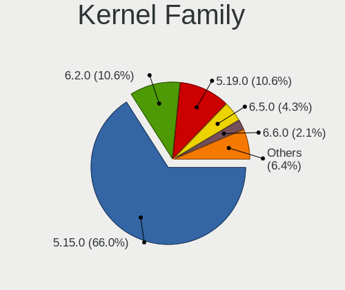
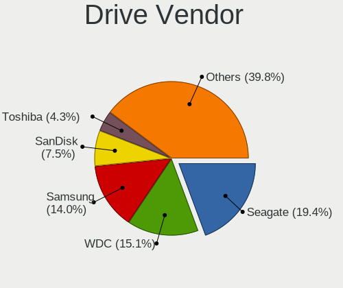
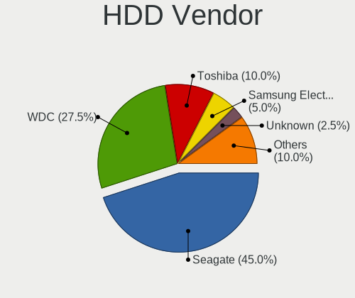
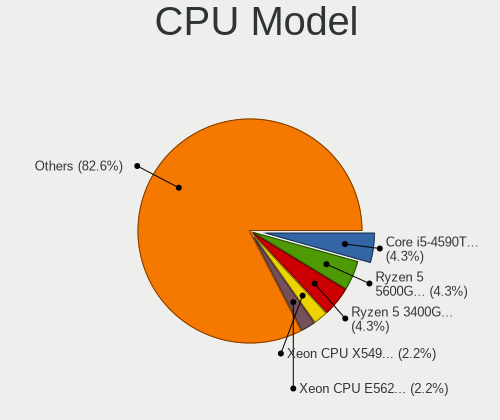
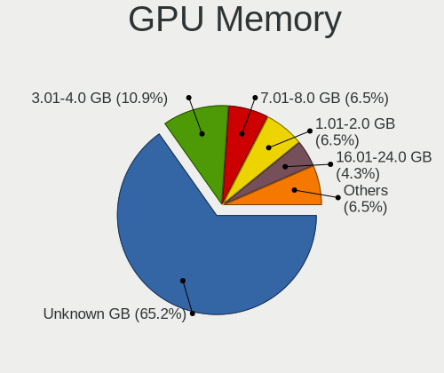
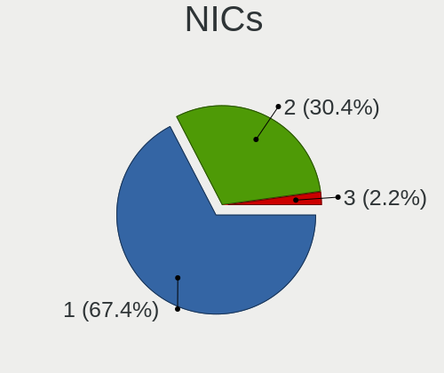
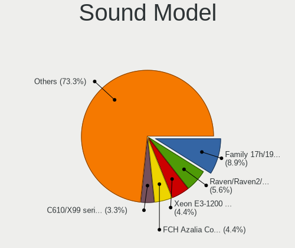
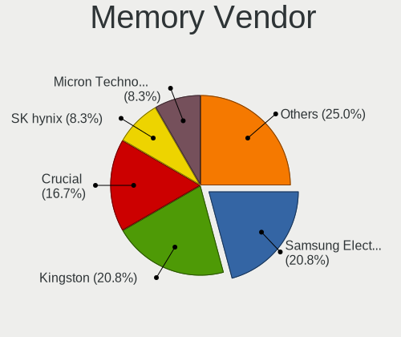

Ubuntu Budgie 22.04 - Tested Hardware & Statistics (Desktops)
-------------------------------------------------------------

A project to collect tested hardware configurations for Ubuntu Budgie 22.04.

Anyone can contribute to this report by the [hw-probe](https://github.com/linuxhw/hw-probe) tool:

    sudo -E hw-probe -all -upload

Please contribute! Especially if your hardware is rare.

Contents
--------

* [ Test Cases ](#test-cases)

* [ System ](#system)
  - [ Kernel                   ](#kernel)
  - [ Kernel Family            ](#kernel-family)
  - [ Kernel Major Ver.        ](#kernel-major-ver)
  - [ Arch                     ](#arch)
  - [ DE                       ](#de)
  - [ Display Server           ](#display-server)
  - [ Display Manager          ](#display-manager)
  - [ OS Lang                  ](#os-lang)
  - [ Boot Mode                ](#boot-mode)
  - [ Filesystem               ](#filesystem)
  - [ Part. scheme             ](#part-scheme)
  - [ Dual Boot with Linux/BSD ](#dual-boot-with-linuxbsd)
  - [ Dual Boot (Win)          ](#dual-boot-win)

* [ Board ](#board)
  - [ Vendor                   ](#vendor)
  - [ Model                    ](#model)
  - [ Model Family             ](#model-family)
  - [ MFG Year                 ](#mfg-year)
  - [ Form Factor              ](#form-factor)
  - [ Secure Boot              ](#secure-boot)
  - [ Coreboot                 ](#coreboot)
  - [ RAM Size                 ](#ram-size)
  - [ RAM Used                 ](#ram-used)
  - [ Total Drives             ](#total-drives)
  - [ Has CD-ROM               ](#has-cd-rom)
  - [ Has Ethernet             ](#has-ethernet)
  - [ Has WiFi                 ](#has-wifi)
  - [ Has Bluetooth            ](#has-bluetooth)

* [ Location ](#location)
  - [ Country                  ](#country)
  - [ City                     ](#city)

* [ Drives ](#drives)
  - [ Drive Vendor             ](#drive-vendor)
  - [ Drive Model              ](#drive-model)
  - [ HDD Vendor               ](#hdd-vendor)
  - [ SSD Vendor               ](#ssd-vendor)
  - [ Drive Kind               ](#drive-kind)
  - [ Drive Connector          ](#drive-connector)
  - [ Drive Size               ](#drive-size)
  - [ Space Total              ](#space-total)
  - [ Space Used               ](#space-used)
  - [ Malfunc. Drives          ](#malfunc-drives)
  - [ Malfunc. Drive Vendor    ](#malfunc-drive-vendor)
  - [ Malfunc. HDD Vendor      ](#malfunc-hdd-vendor)
  - [ Malfunc. Drive Kind      ](#malfunc-drive-kind)
  - [ Failed Drives            ](#failed-drives)
  - [ Failed Drive Vendor      ](#failed-drive-vendor)
  - [ Drive Status             ](#drive-status)

* [ Storage controller ](#storage-controller)
  - [ Storage Vendor           ](#storage-vendor)
  - [ Storage Model            ](#storage-model)
  - [ Storage Kind             ](#storage-kind)

* [ Processor ](#processor)
  - [ CPU Vendor               ](#cpu-vendor)
  - [ CPU Model                ](#cpu-model)
  - [ CPU Model Family         ](#cpu-model-family)
  - [ CPU Cores                ](#cpu-cores)
  - [ CPU Sockets              ](#cpu-sockets)
  - [ CPU Threads              ](#cpu-threads)
  - [ CPU Op-Modes             ](#cpu-op-modes)
  - [ CPU Microcode            ](#cpu-microcode)
  - [ CPU Microarch            ](#cpu-microarch)

* [ Graphics ](#graphics)
  - [ GPU Vendor               ](#gpu-vendor)
  - [ GPU Model                ](#gpu-model)
  - [ GPU Combo                ](#gpu-combo)
  - [ GPU Driver               ](#gpu-driver)
  - [ GPU Memory               ](#gpu-memory)

* [ Monitor ](#monitor)
  - [ Monitor Vendor           ](#monitor-vendor)
  - [ Monitor Model            ](#monitor-model)
  - [ Monitor Resolution       ](#monitor-resolution)
  - [ Monitor Diagonal         ](#monitor-diagonal)
  - [ Monitor Width            ](#monitor-width)
  - [ Aspect Ratio             ](#aspect-ratio)
  - [ Monitor Area             ](#monitor-area)
  - [ Pixel Density            ](#pixel-density)
  - [ Multiple Monitors        ](#multiple-monitors)

* [ Network ](#network)
  - [ Net Controller Vendor    ](#net-controller-vendor)
  - [ Net Controller Model     ](#net-controller-model)
  - [ Wireless Vendor          ](#wireless-vendor)
  - [ Wireless Model           ](#wireless-model)
  - [ Ethernet Vendor          ](#ethernet-vendor)
  - [ Ethernet Model           ](#ethernet-model)
  - [ Net Controller Kind      ](#net-controller-kind)
  - [ Used Controller          ](#used-controller)
  - [ NICs                     ](#nics)
  - [ IPv6                     ](#ipv6)

* [ Bluetooth ](#bluetooth)
  - [ Bluetooth Vendor         ](#bluetooth-vendor)
  - [ Bluetooth Model          ](#bluetooth-model)

* [ Sound ](#sound)
  - [ Sound Vendor             ](#sound-vendor)
  - [ Sound Model              ](#sound-model)

* [ Memory ](#memory)
  - [ Memory Vendor            ](#memory-vendor)
  - [ Memory Model             ](#memory-model)
  - [ Memory Kind              ](#memory-kind)
  - [ Memory Form Factor       ](#memory-form-factor)
  - [ Memory Size              ](#memory-size)
  - [ Memory Speed             ](#memory-speed)

* [ Printers & scanners ](#printers--scanners)
  - [ Printer Vendor           ](#printer-vendor)
  - [ Printer Model            ](#printer-model)
  - [ Scanner Vendor           ](#scanner-vendor)
  - [ Scanner Model            ](#scanner-model)

* [ Camera ](#camera)
  - [ Camera Vendor            ](#camera-vendor)
  - [ Camera Model             ](#camera-model)

* [ Security ](#security)
  - [ Fingerprint Vendor       ](#fingerprint-vendor)
  - [ Fingerprint Model        ](#fingerprint-model)
  - [ Chipcard Vendor          ](#chipcard-vendor)
  - [ Chipcard Model           ](#chipcard-model)

* [ Unsupported ](#unsupported)
  - [ Unsupported Devices      ](#unsupported-devices)
  - [ Unsupported Device Types ](#unsupported-device-types)

Test Cases
----------

Total: 57

| Vendor   | Model                       | Probe                                                      | Date         |
|----------|-----------------------------|------------------------------------------------------------|--------------|
| Lenovo   | 1059 SDK0T76530 WIN 3556... | [39db39fb8a](https://linux-hardware.org/?probe=39db39fb8a) | Mar 30, 2024 |
| PCWare   | APM-A320G                   | [15ddb5b3fd](https://linux-hardware.org/?probe=15ddb5b3fd) | Feb 29, 2024 |
| HP       | 8169                        | [8aadb502eb](https://linux-hardware.org/?probe=8aadb502eb) | Feb 13, 2024 |
| MSI      | B450M GAMING PLUS           | [093c937aa6](https://linux-hardware.org/?probe=093c937aa6) | Feb 07, 2024 |
| MSI      | A68HM-E33 V2                | [462cb61dd3](https://linux-hardware.org/?probe=462cb61dd3) | Jan 05, 2024 |
| Gigabyte | B650M AORUS ELITE AX        | [03e7ada99a](https://linux-hardware.org/?probe=03e7ada99a) | Jan 04, 2024 |
| MSI      | B450M PRO-VDH V2            | [7efa5db123](https://linux-hardware.org/?probe=7efa5db123) | Dec 29, 2023 |
| Toshiba  | STI 010433                  | [c172f735d2](https://linux-hardware.org/?probe=c172f735d2) | Nov 15, 2023 |
| MSI      | A68HM-E33 V2                | [e1edc2410b](https://linux-hardware.org/?probe=e1edc2410b) | Nov 03, 2023 |
| Dell     | 0M5DCD A00                  | [b3a6489f94](https://linux-hardware.org/?probe=b3a6489f94) | Oct 20, 2023 |
| HP       | 8054                        | [66ad5550d1](https://linux-hardware.org/?probe=66ad5550d1) | Oct 10, 2023 |
| ASUSTek  | Z97M-PLUS                   | [01e90212e5](https://linux-hardware.org/?probe=01e90212e5) | Sep 20, 2023 |
| MSI      | A320M-A PRO                 | [6588973c54](https://linux-hardware.org/?probe=6588973c54) | Sep 19, 2023 |
| Gigabyte | H410M S2H V3                | [e31d121593](https://linux-hardware.org/?probe=e31d121593) | Jul 15, 2023 |
| Gigabyte | H410M S2H V3                | [9c3135decf](https://linux-hardware.org/?probe=9c3135decf) | Jul 10, 2023 |
| Fujitsu  | D3233-A1 S26361-D3233-A1    | [4622902df7](https://linux-hardware.org/?probe=4622902df7) | Jun 17, 2023 |
| Gigabyte | GA-890GPA-UD3H              | [f04b28a0e5](https://linux-hardware.org/?probe=f04b28a0e5) | Jun 10, 2023 |
| ASRock   | B450M Steel Legend          | [5d75bba35e](https://linux-hardware.org/?probe=5d75bba35e) | Jun 06, 2023 |
| Gigabyte | H310M HD2                   | [b28787ecb7](https://linux-hardware.org/?probe=b28787ecb7) | Jun 04, 2023 |
| ASUSTek  | ROG STRIX X670E-E GAMING... | [f87233a295](https://linux-hardware.org/?probe=f87233a295) | Apr 29, 2023 |
| Intel    | H61                         | [b8f0acdf61](https://linux-hardware.org/?probe=b8f0acdf61) | Apr 28, 2023 |
| MSI      | X99S SLI PLUS               | [8c6fb84b12](https://linux-hardware.org/?probe=8c6fb84b12) | Feb 09, 2023 |
| ASRock   | FM2A88X Extreme4+           | [9f812fe2a7](https://linux-hardware.org/?probe=9f812fe2a7) | Feb 02, 2023 |
| Fujitsu  | D3183-A1 S26361-D3183-A1    | [bfb86ee660](https://linux-hardware.org/?probe=bfb86ee660) | Jan 29, 2023 |
| Lenovo   | 36F7 SDK0J40700 WIN 3258... | [831fd897ec](https://linux-hardware.org/?probe=831fd897ec) | Jan 25, 2023 |
| Lenovo   | ThinkStation C20 4263BA7    | [38ff99d952](https://linux-hardware.org/?probe=38ff99d952) | Jan 10, 2023 |
| Fujitsu  | D3348-B2 S26361-D3348-B2    | [4568e83912](https://linux-hardware.org/?probe=4568e83912) | Dec 03, 2022 |
| Fujitsu  | D3348-B2 S26361-D3348-B2    | [2047a872cb](https://linux-hardware.org/?probe=2047a872cb) | Dec 03, 2022 |
| Fujitsu  | D3348-B2 S26361-D3348-B2    | [eabfad66da](https://linux-hardware.org/?probe=eabfad66da) | Nov 22, 2022 |
| Dell     | 0RW199                      | [2a2fa5baf8](https://linux-hardware.org/?probe=2a2fa5baf8) | Nov 20, 2022 |
| MSI      | B550M PRO-VDH WIFI          | [afb716fb12](https://linux-hardware.org/?probe=afb716fb12) | Nov 18, 2022 |
| Dell     | 0C27VV A01                  | [ed46beadef](https://linux-hardware.org/?probe=ed46beadef) | Oct 30, 2022 |
| MSI      | B450-A PRO MAX              | [0e8db93a43](https://linux-hardware.org/?probe=0e8db93a43) | Oct 30, 2022 |
| Dell     | 0C27VV A01                  | [23c855f88b](https://linux-hardware.org/?probe=23c855f88b) | Oct 17, 2022 |
| Dell     | 0C27VV A01                  | [ebe65ec5fa](https://linux-hardware.org/?probe=ebe65ec5fa) | Oct 17, 2022 |
| Gigabyte | M68MT-S2                    | [55db3c3775](https://linux-hardware.org/?probe=55db3c3775) | Sep 27, 2022 |
| Gigabyte | B75M-D3P                    | [da53115e6b](https://linux-hardware.org/?probe=da53115e6b) | Sep 15, 2022 |
| Gigabyte | M68MT-S2                    | [1a5358a3c1](https://linux-hardware.org/?probe=1a5358a3c1) | Sep 14, 2022 |
| Gigabyte | X570S AORUS PRO AX          | [f42f75038e](https://linux-hardware.org/?probe=f42f75038e) | Sep 03, 2022 |
| Intel    | DP55WB AAE64798-206         | [548332086b](https://linux-hardware.org/?probe=548332086b) | Sep 02, 2022 |
| ASUSTek  | A88X-PRO                    | [922554664a](https://linux-hardware.org/?probe=922554664a) | Aug 25, 2022 |
| Intel    | X79M-S                      | [49a7d62fe8](https://linux-hardware.org/?probe=49a7d62fe8) | Aug 18, 2022 |
| HP       | 828A                        | [f42b1efd1e](https://linux-hardware.org/?probe=f42b1efd1e) | Aug 17, 2022 |
| Biostar  | A960D+V3                    | [83f7f840b7](https://linux-hardware.org/?probe=83f7f840b7) | Aug 15, 2022 |
| ASRock   | A300M-STX                   | [a6aba67197](https://linux-hardware.org/?probe=a6aba67197) | Aug 02, 2022 |
| ASRock   | A300M-STX                   | [fae724727b](https://linux-hardware.org/?probe=fae724727b) | Aug 02, 2022 |
| Intel    | STK1A32SC H95551-301        | [ea91c7805d](https://linux-hardware.org/?probe=ea91c7805d) | Jul 22, 2022 |
| Gigabyte | GA-890GPA-UD3H              | [f6faa2d944](https://linux-hardware.org/?probe=f6faa2d944) | Jun 25, 2022 |
| HP       | 212B                        | [a163af0cb5](https://linux-hardware.org/?probe=a163af0cb5) | Jun 21, 2022 |
| Gigabyte | B75M-D3H                    | [da04a03393](https://linux-hardware.org/?probe=da04a03393) | Jun 04, 2022 |
| Gigabyte | F2A78M-HD2                  | [fc9dd3db05](https://linux-hardware.org/?probe=fc9dd3db05) | May 26, 2022 |
| ASUSTek  | PRIME B560M-A               | [7b393b3933](https://linux-hardware.org/?probe=7b393b3933) | May 24, 2022 |
| MSI      | X370 GAMING PRO CARBON      | [9acb45109f](https://linux-hardware.org/?probe=9acb45109f) | May 21, 2022 |
| Gigabyte | B75M-D3H                    | [b9437261b7](https://linux-hardware.org/?probe=b9437261b7) | May 10, 2022 |
| Gigabyte | B450 I AORUS PRO WIFI-CF    | [4ab84df25d](https://linux-hardware.org/?probe=4ab84df25d) | May 10, 2022 |
| HP       | 1825                        | [fe93966c1c](https://linux-hardware.org/?probe=fe93966c1c) | May 09, 2022 |
| Gigabyte | B550 AORUS ELITE AX V2      | [e2cbc23977](https://linux-hardware.org/?probe=e2cbc23977) | Apr 12, 2022 |

System
------

Kernel
------

Version of the Linux kernel

| Version                 | Desktops | Percent |
|-------------------------|----------|---------|
| 5.15.0-52-generic       | 4        | 8.16%   |
| 5.15.0-57-generic       | 3        | 6.12%   |
| 5.15.0-46-generic       | 3        | 6.12%   |
| 5.15.0-43-generic       | 3        | 6.12%   |
| 5.15.0-30-generic       | 3        | 6.12%   |
| 5.19.0-45-generic       | 2        | 4.08%   |
| 5.19.0-40-generic       | 2        | 4.08%   |
| 5.15.0-33-generic       | 2        | 4.08%   |
| 5.15.0-27-generic       | 2        | 4.08%   |
| 5.15.0-25-generic       | 2        | 4.08%   |
| 6.6.0-060600rc4-generic | 1        | 2.04%   |
| 6.5.0-21-generic        | 1        | 2.04%   |
| 6.5.0-18-generic        | 1        | 2.04%   |
| 6.2.0-39-generic        | 1        | 2.04%   |
| 6.2.0-37-generic        | 1        | 2.04%   |
| 6.2.0-36-generic        | 1        | 2.04%   |
| 6.2.0-35-generic        | 1        | 2.04%   |
| 6.2.0-33-generic        | 1        | 2.04%   |
| 6.2.0-26-generic        | 1        | 2.04%   |
| 5.19.0-46-generic       | 1        | 2.04%   |
| 5.17.2-051702-generic   | 1        | 2.04%   |
| 5.15.92-051592-generic  | 1        | 2.04%   |
| 5.15.0-94-generic       | 1        | 2.04%   |
| 5.15.0-84-generic       | 1        | 2.04%   |
| 5.15.0-73-generic       | 1        | 2.04%   |
| 5.15.0-71-generic       | 1        | 2.04%   |
| 5.15.0-60-generic       | 1        | 2.04%   |
| 5.15.0-56-generic       | 1        | 2.04%   |
| 5.15.0-50-generic       | 1        | 2.04%   |
| 5.15.0-48-generic       | 1        | 2.04%   |
| 5.15.0-47-generic       | 1        | 2.04%   |
| 5.15.0-41-generic       | 1        | 2.04%   |
| 5.13.0-44-generic       | 1        | 2.04%   |

Kernel Family
-------------

Linux kernel without a distro release

| Version | Desktops | Percent |
|---------|----------|---------|
| 5.15.0  | 30       | 65.22%  |
| 6.2.0   | 5        | 10.87%  |
| 5.19.0  | 5        | 10.87%  |
| 6.5.0   | 2        | 4.35%   |
| 6.6.0   | 1        | 2.17%   |
| 5.17.2  | 1        | 2.17%   |
| 5.15.92 | 1        | 2.17%   |
| 5.13.0  | 1        | 2.17%   |

Kernel Major Ver.
-----------------

Linux kernel major version

| Version | Desktops | Percent |
|---------|----------|---------|
| 5.15    | 31       | 67.39%  |
| 6.2     | 5        | 10.87%  |
| 5.19    | 5        | 10.87%  |
| 6.5     | 2        | 4.35%   |
| 6.6     | 1        | 2.17%   |
| 5.17    | 1        | 2.17%   |
| 5.13    | 1        | 2.17%   |

Arch
----

OS architecture (x86_64, i586, etc.)

| Name   | Desktops | Percent |
|--------|----------|---------|
| x86_64 | 45       | 100%    |

DE
--

Desktop Environment

| Name   | Desktops | Percent |
|--------|----------|---------|
| Budgie | 45       | 100%    |

Display Server
--------------

X11 or Wayland

| Name | Desktops | Percent |
|------|----------|---------|
| X11  | 45       | 100%    |

Display Manager
---------------

SDDM, LightDM, etc.

| Name    | Desktops | Percent |
|---------|----------|---------|
| LightDM | 34       | 75.56%  |
| Unknown | 9        | 20%     |
| SDDM    | 1        | 2.22%   |
| GDM     | 1        | 2.22%   |

OS Lang
-------

Language

| Lang  | Desktops | Percent |
|-------|----------|---------|
| en_US | 18       | 40%     |
| de_DE | 6        | 13.33%  |
| pt_BR | 5        | 11.11%  |
| es_ES | 3        | 6.67%   |
| fr_FR | 2        | 4.44%   |
| en_GB | 2        | 4.44%   |
| it_IT | 1        | 2.22%   |
| es_MX | 1        | 2.22%   |
| es_AR | 1        | 2.22%   |
| en_ZA | 1        | 2.22%   |
| en_SG | 1        | 2.22%   |
| en_IN | 1        | 2.22%   |
| en_CA | 1        | 2.22%   |
| en_AU | 1        | 2.22%   |
| el_GR | 1        | 2.22%   |

Boot Mode
---------

EFI or BIOS

| Mode | Desktops | Percent |
|------|----------|---------|
| BIOS | 32       | 69.57%  |
| EFI  | 14       | 30.43%  |

Filesystem
----------

Type of filesystem

| Type    | Desktops | Percent |
|---------|----------|---------|
| Ext4    | 33       | 73.33%  |
| Tmpfs   | 6        | 13.33%  |
| Overlay | 4        | 8.89%   |
| Zfs     | 1        | 2.22%   |
| Btrfs   | 1        | 2.22%   |

Part. scheme
------------

Scheme of partitioning

| Type    | Desktops | Percent |
|---------|----------|---------|
| GPT     | 29       | 63.04%  |
| Unknown | 16       | 34.78%  |
| MBR     | 1        | 2.17%   |

Dual Boot with Linux/BSD
------------------------

Hosting more than one Linux/BSD

| Dual boot | Desktops | Percent |
|-----------|----------|---------|
| No        | 34       | 75.56%  |
| Yes       | 11       | 24.44%  |

Dual Boot (Win)
---------------

Hosting Linux and Windows

| Dual boot | Desktops | Percent |
|-----------|----------|---------|
| No        | 25       | 55.56%  |
| Yes       | 20       | 44.44%  |

Board
-----

Vendor
------

Motherboard manufacturer

| Name                | Desktops | Percent |
|---------------------|----------|---------|
| Gigabyte Technology | 11       | 24.44%  |
| MSI                 | 8        | 17.78%  |
| Hewlett-Packard     | 5        | 11.11%  |
| ASUSTek Computer    | 4        | 8.89%   |
| Intel               | 3        | 6.67%   |
| Fujitsu             | 3        | 6.67%   |
| Dell                | 3        | 6.67%   |
| ASRock              | 3        | 6.67%   |
| Lenovo              | 2        | 4.44%   |
| Semp Toshiba        | 1        | 2.22%   |
| PCWare              | 1        | 2.22%   |
| Biostar             | 1        | 2.22%   |

Model
-----

Motherboard model

| Name                                      | Desktops | Percent |
|-------------------------------------------|----------|---------|
| Semp Toshiba STI                          | 1        | 2.22%   |
| PCWare APM-A320G                          | 1        | 2.22%   |
| MSI MS-7C95                               | 1        | 2.22%   |
| MSI MS-7C51                               | 1        | 2.22%   |
| MSI MS-7B87                               | 1        | 2.22%   |
| MSI MS-7B86                               | 1        | 2.22%   |
| MSI MS-7A38                               | 1        | 2.22%   |
| MSI MS-7A32                               | 1        | 2.22%   |
| MSI MS-7885                               | 1        | 2.22%   |
| MSI MS-7721                               | 1        | 2.22%   |
| Lenovo ThinkStation P360 Ultra 30G1001AUS | 1        | 2.22%   |
| Lenovo ThinkStation C20 4263BA7           | 1        | 2.22%   |
| Intel STK1A32SC                           | 1        | 2.22%   |
| Intel H61                                 | 1        | 2.22%   |
| Intel DP55WB AAE64798-206                 | 1        | 2.22%   |
| HP Z440 Workstation                       | 1        | 2.22%   |
| HP ProDesk 600 G2 DM                      | 1        | 2.22%   |
| HP EliteDesk 800 G2 SFF                   | 1        | 2.22%   |
| HP EliteDesk 800 G1 DM                    | 1        | 2.22%   |
| HP 750-417c                               | 1        | 2.22%   |
| Gigabyte X570S AORUS PRO AX               | 1        | 2.22%   |
| Gigabyte M68MT-S2                         | 1        | 2.22%   |
| Gigabyte H410M S2H V3                     | 1        | 2.22%   |
| Gigabyte H310MHD2                         | 1        | 2.22%   |
| Gigabyte GA-890GPA-UD3H                   | 1        | 2.22%   |
| Gigabyte F2A78M-HD2                       | 1        | 2.22%   |
| Gigabyte B75M-D3P                         | 1        | 2.22%   |
| Gigabyte B75M-D3H                         | 1        | 2.22%   |
| Gigabyte B650M AORUS ELITE AX             | 1        | 2.22%   |
| Gigabyte B550 AORUS ELITE AX V2           | 1        | 2.22%   |
| Gigabyte B450 I AORUS PRO WIFI            | 1        | 2.22%   |
| Fujitsu ESPRIMO Q920                      | 1        | 2.22%   |
| Fujitsu ESPRIMO Q910                      | 1        | 2.22%   |
| Fujitsu D3348-B2                          | 1        | 2.22%   |
| Dell Precision WorkStation T7400          | 1        | 2.22%   |
| Dell OptiPlex 780                         | 1        | 2.22%   |
| Dell OptiPlex 390                         | 1        | 2.22%   |
| Biostar A960D+V3                          | 1        | 2.22%   |
| ASUS ROG STRIX X670E-E GAMING WIFI        | 1        | 2.22%   |
| ASUS PRIME B560M-A                        | 1        | 2.22%   |

Model Family
------------

Motherboard model prefix

| Name                    | Desktops | Percent |
|-------------------------|----------|---------|
| Lenovo ThinkStation     | 2        | 4.44%   |
| HP EliteDesk            | 2        | 4.44%   |
| Fujitsu ESPRIMO         | 2        | 4.44%   |
| Dell OptiPlex           | 2        | 4.44%   |
| Semp Toshiba STI        | 1        | 2.22%   |
| PCWare APM-A320G        | 1        | 2.22%   |
| MSI MS-7C95             | 1        | 2.22%   |
| MSI MS-7C51             | 1        | 2.22%   |
| MSI MS-7B87             | 1        | 2.22%   |
| MSI MS-7B86             | 1        | 2.22%   |
| MSI MS-7A38             | 1        | 2.22%   |
| MSI MS-7A32             | 1        | 2.22%   |
| MSI MS-7885             | 1        | 2.22%   |
| MSI MS-7721             | 1        | 2.22%   |
| Intel STK1A32SC         | 1        | 2.22%   |
| Intel H61               | 1        | 2.22%   |
| Intel DP55WB            | 1        | 2.22%   |
| HP Z440                 | 1        | 2.22%   |
| HP ProDesk              | 1        | 2.22%   |
| HP 750-417c             | 1        | 2.22%   |
| Gigabyte X570S          | 1        | 2.22%   |
| Gigabyte M68MT-S2       | 1        | 2.22%   |
| Gigabyte H410M          | 1        | 2.22%   |
| Gigabyte H310MHD2       | 1        | 2.22%   |
| Gigabyte GA-890GPA-UD3H | 1        | 2.22%   |
| Gigabyte F2A78M-HD2     | 1        | 2.22%   |
| Gigabyte B75M-D3P       | 1        | 2.22%   |
| Gigabyte B75M-D3H       | 1        | 2.22%   |
| Gigabyte B650M          | 1        | 2.22%   |
| Gigabyte B550           | 1        | 2.22%   |
| Gigabyte B450           | 1        | 2.22%   |
| Fujitsu D3348-B2        | 1        | 2.22%   |
| Dell Precision          | 1        | 2.22%   |
| Biostar A960D+V3        | 1        | 2.22%   |
| ASUS ROG                | 1        | 2.22%   |
| ASUS PRIME              | 1        | 2.22%   |
| ASUS All                | 1        | 2.22%   |
| ASUS A88X-PRO           | 1        | 2.22%   |
| ASRock FM2A88X          | 1        | 2.22%   |
| ASRock B450M            | 1        | 2.22%   |

MFG Year
--------

Motherboard manufacture year

| Year | Desktops | Percent |
|------|----------|---------|
| 2018 | 7        | 15.56%  |
| 2014 | 7        | 15.56%  |
| 2022 | 3        | 6.67%   |
| 2021 | 3        | 6.67%   |
| 2019 | 3        | 6.67%   |
| 2017 | 3        | 6.67%   |
| 2016 | 3        | 6.67%   |
| 2015 | 3        | 6.67%   |
| 2011 | 3        | 6.67%   |
| 2010 | 3        | 6.67%   |
| 2020 | 2        | 4.44%   |
| 2012 | 2        | 4.44%   |
| 2013 | 1        | 2.22%   |
| 2009 | 1        | 2.22%   |
| 2008 | 1        | 2.22%   |

Form Factor
-----------

Physical design of the computer

| Name    | Desktops | Percent |
|---------|----------|---------|
| Desktop | 45       | 100%    |

Secure Boot
-----------

Enabled or disabled

| State    | Desktops | Percent |
|----------|----------|---------|
| Disabled | 44       | 97.78%  |
| Enabled  | 1        | 2.22%   |

Coreboot
--------

Have coreboot on board

| Used | Desktops | Percent |
|------|----------|---------|
| No   | 45       | 100%    |

RAM Size
--------

Total RAM memory

| Size in GB      | Desktops | Percent |
|-----------------|----------|---------|
| 16.01-24.0      | 14       | 31.11%  |
| 8.01-16.0       | 12       | 26.67%  |
| 4.01-8.0        | 10       | 22.22%  |
| 32.01-64.0      | 3        | 6.67%   |
| 24.01-32.0      | 2        | 4.44%   |
| 64.01-256.0     | 2        | 4.44%   |
| More than 256.0 | 1        | 2.22%   |
| 1.01-2.0        | 1        | 2.22%   |

RAM Used
--------

Used RAM memory

| Used GB    | Desktops | Percent |
|------------|----------|---------|
| 2.01-3.0   | 16       | 32.65%  |
| 1.01-2.0   | 16       | 32.65%  |
| 4.01-8.0   | 10       | 20.41%  |
| 3.01-4.0   | 4        | 8.16%   |
| 8.01-16.0  | 2        | 4.08%   |
| 16.01-24.0 | 1        | 2.04%   |

Total Drives
------------

Number of drives on board

| Drives | Desktops | Percent |
|--------|----------|---------|
| 2      | 14       | 31.11%  |
| 1      | 14       | 31.11%  |
| 3      | 7        | 15.56%  |
| 4      | 6        | 13.33%  |
| 6      | 2        | 4.44%   |
| 8      | 1        | 2.22%   |
| 7      | 1        | 2.22%   |

Has CD-ROM
----------

Has CD-ROM on board

| Presented | Desktops | Percent |
|-----------|----------|---------|
| No        | 28       | 62.22%  |
| Yes       | 17       | 37.78%  |

Has Ethernet
------------

Has Ethernet on board

| Presented | Desktops | Percent |
|-----------|----------|---------|
| Yes       | 44       | 97.78%  |
| No        | 1        | 2.22%   |

Has WiFi
--------

Has WiFi module

| Presented | Desktops | Percent |
|-----------|----------|---------|
| No        | 24       | 53.33%  |
| Yes       | 21       | 46.67%  |

Has Bluetooth
-------------

Has Bluetooth module

| Presented | Desktops | Percent |
|-----------|----------|---------|
| No        | 31       | 68.89%  |
| Yes       | 14       | 31.11%  |

Location
--------

Country
-------

Geographic location (country)

| Country      | Desktops | Percent |
|--------------|----------|---------|
| USA          | 10       | 22.22%  |
| Brazil       | 6        | 13.33%  |
| Germany      | 5        | 11.11%  |
| Spain        | 3        | 6.67%   |
| UK           | 2        | 4.44%   |
| Switzerland  | 2        | 4.44%   |
| France       | 2        | 4.44%   |
| Argentina    | 2        | 4.44%   |
| South Africa | 1        | 2.22%   |
| Slovenia     | 1        | 2.22%   |
| Singapore    | 1        | 2.22%   |
| Romania      | 1        | 2.22%   |
| Norway       | 1        | 2.22%   |
| Mexico       | 1        | 2.22%   |
| Italy        | 1        | 2.22%   |
| India        | 1        | 2.22%   |
| Greece       | 1        | 2.22%   |
| Croatia      | 1        | 2.22%   |
| Canada       | 1        | 2.22%   |
| Austria      | 1        | 2.22%   |
| Australia    | 1        | 2.22%   |

City
----

Geographic location (city)

| City                      | Desktops | Percent |
|---------------------------|----------|---------|
| Brasília                 | 3        | 6.25%   |
| Milwaukee                 | 2        | 4.17%   |
| Zurich                    | 1        | 2.08%   |
| Walled Lake               | 1        | 2.08%   |
| Trondheim                 | 1        | 2.08%   |
| Tocantins                 | 1        | 2.08%   |
| Tann                      | 1        | 2.08%   |
| Sooke                     | 1        | 2.08%   |
| Singapore                 | 1        | 2.08%   |
| Seattle                   | 1        | 2.08%   |
| San Luis Potosí City     | 1        | 2.08%   |
| San Francisco de Santa Fe | 1        | 2.08%   |
| San Francisco             | 1        | 2.08%   |
| San Diego                 | 1        | 2.08%   |
| Rueil-Malmaison           | 1        | 2.08%   |
| Pula                      | 1        | 2.08%   |
| Pine Island               | 1        | 2.08%   |
| New York                  | 1        | 2.08%   |
| Maribor                   | 1        | 2.08%   |
| Manaus                    | 1        | 2.08%   |
| Malalbergo                | 1        | 2.08%   |
| Madrid                    | 1        | 2.08%   |
| London                    | 1        | 2.08%   |
| Limay                     | 1        | 2.08%   |
| Kolkata                   | 1        | 2.08%   |
| Kittsee                   | 1        | 2.08%   |
| Kirkcaldy                 | 1        | 2.08%   |
| Houston                   | 1        | 2.08%   |
| Hamburg                   | 1        | 2.08%   |
| Guarulhos                 | 1        | 2.08%   |
| Granada                   | 1        | 2.08%   |
| Eugene                    | 1        | 2.08%   |
| Ennepetal                 | 1        | 2.08%   |
| Dortmund                  | 1        | 2.08%   |
| Delbrueck                 | 1        | 2.08%   |
| Colon                     | 1        | 2.08%   |
| Caslano                   | 1        | 2.08%   |
| Cape Town                 | 1        | 2.08%   |
| Camp Hill                 | 1        | 2.08%   |
| Brisbane                  | 1        | 2.08%   |

Drives
------

Drive Vendor
------------

Hard drive vendors

| Vendor                    | Desktops | Drives | Percent |
|---------------------------|----------|--------|---------|
| Seagate                   | 18       | 27     | 19.78%  |
| WDC                       | 14       | 17     | 15.38%  |
| Samsung Electronics       | 12       | 33     | 13.19%  |
| Sandisk                   | 6        | 7      | 6.59%   |
| Toshiba                   | 4        | 4      | 4.4%    |
| Kingston                  | 4        | 5      | 4.4%    |
| Crucial                   | 4        | 4      | 4.4%    |
| China                     | 3        | 3      | 3.3%    |
| Transcend                 | 2        | 2      | 2.2%    |
| PNY                       | 2        | 2      | 2.2%    |
| OCZ                       | 2        | 2      | 2.2%    |
| Micron/Crucial Technology | 2        | 2      | 2.2%    |
| Micron Technology         | 2        | 2      | 2.2%    |
| A-DATA Technology         | 2        | 2      | 2.2%    |
| Zheino                    | 1        | 1      | 1.1%    |
| Unknown                   | 1        | 1      | 1.1%    |
| SPCC                      | 1        | 1      | 1.1%    |
| SK hynix                  | 1        | 1      | 1.1%    |
| Phison                    | 1        | 1      | 1.1%    |
| Mushkin                   | 1        | 1      | 1.1%    |
| MicroFrom                 | 1        | 1      | 1.1%    |
| Maxtor                    | 1        | 1      | 1.1%    |
| JMicron Technology        | 1        | 1      | 1.1%    |
| Intenso                   | 1        | 1      | 1.1%    |
| Intel                     | 1        | 1      | 1.1%    |
| HGST                      | 1        | 1      | 1.1%    |
| ASMT109x                  | 1        | 1      | 1.1%    |
| 4Life                     | 1        | 1      | 1.1%    |

Drive Model
-----------

Hard drive models

| Model                             | Desktops | Percent |
|-----------------------------------|----------|---------|
| WDC WD5000LPVX-22V0TT0 500GB      | 2        | 1.87%   |
| Seagate ST3500418AS 500GB         | 2        | 1.87%   |
| Seagate ST3500413AS 500GB         | 2        | 1.87%   |
| Seagate ST1000LM048-2E7172 1TB    | 2        | 1.87%   |
| Seagate ST1000DM010-2EP102 1TB    | 2        | 1.87%   |
| SanDisk SDSSDA120G 120GB          | 2        | 1.87%   |
| Samsung SSD 870 EVO 250GB         | 2        | 1.87%   |
| Samsung SSD 850 PRO 256GB         | 2        | 1.87%   |
| Samsung SSD 840 EVO 250GB         | 2        | 1.87%   |
| Kingston SA400S37240G 240GB SSD   | 2        | 1.87%   |
| Zheino CHN-25SATAC3-120 120GB SSD | 1        | 0.93%   |
| WDC WDS240G2G0A-00JH30 240GB SSD  | 1        | 0.93%   |
| WDC WDS120G2G0A-00JH30 120GB SSD  | 1        | 0.93%   |
| WDC WDS100T2B0C 1TB               | 1        | 0.93%   |
| WDC WD40PURZ-85TTDY0 4TB          | 1        | 0.93%   |
| WDC WD40EZAZ-00SF3B0 4TB          | 1        | 0.93%   |
| WDC WD40EFAX-68JH4N1 4TB          | 1        | 0.93%   |
| WDC WD3200LPVX-22V0TT0 320GB      | 1        | 0.93%   |
| WDC WD20EARX-00PASB0 2TB          | 1        | 0.93%   |
| WDC WD1600AAJS-60WAA0 160GB       | 1        | 0.93%   |
| WDC WD10EZEX-00BN5A0 1TB          | 1        | 0.93%   |
| WDC WD10EARS-00Y5B1 1TB           | 1        | 0.93%   |
| WDC WD10EADS-00M2B0 1TB           | 1        | 0.93%   |
| WDC WD1003FZEX-00MK2A0 1TB        | 1        | 0.93%   |
| WDC WD Green 2.5 240GB            | 1        | 0.93%   |
| Unknown SD/MMC/MS PRO 128GB       | 1        | 0.93%   |
| Transcend TS480GMTS820S 480GB SSD | 1        | 0.93%   |
| Transcend TS128GMTE110S 128GB     | 1        | 0.93%   |
| Toshiba MD04ACA400 4TB            | 1        | 0.93%   |
| Toshiba HDWD240 4TB               | 1        | 0.93%   |
| Toshiba HDWD220 2TB               | 1        | 0.93%   |
| Toshiba DT01ACA050 500GB          | 1        | 0.93%   |
| SPCC Solid State Disk 256GB       | 1        | 0.93%   |
| SK hynix SC210 2.5 7MM 128GB SSD  | 1        | 0.93%   |
| Seagate ST9500325AS 500GB         | 1        | 0.93%   |
| Seagate ST8000VN0022-2EL112 8TB   | 1        | 0.93%   |
| Seagate ST500LT012-1DG142 500GB   | 1        | 0.93%   |
| Seagate ST500DM002-1BD142 500GB   | 1        | 0.93%   |
| Seagate ST4000DM004-2CV104 4TB    | 1        | 0.93%   |
| Seagate ST380815AS 80GB           | 1        | 0.93%   |

HDD Vendor
----------

Hard disk drive vendors

| Vendor              | Desktops | Drives | Percent |
|---------------------|----------|--------|---------|
| Seagate             | 18       | 26     | 45%     |
| WDC                 | 11       | 13     | 27.5%   |
| Toshiba             | 4        | 4      | 10%     |
| Samsung Electronics | 2        | 4      | 5%      |
| Unknown             | 1        | 1      | 2.5%    |
| Maxtor              | 1        | 1      | 2.5%    |
| JMicron Technology  | 1        | 1      | 2.5%    |
| HGST                | 1        | 1      | 2.5%    |
| ASMT109x            | 1        | 1      | 2.5%    |

SSD Vendor
----------

Solid state drive vendors

| Vendor              | Desktops | Drives | Percent |
|---------------------|----------|--------|---------|
| Samsung Electronics | 7        | 22     | 19.44%  |
| Crucial             | 4        | 4      | 11.11%  |
| WDC                 | 3        | 3      | 8.33%   |
| SanDisk             | 3        | 3      | 8.33%   |
| Kingston            | 3        | 4      | 8.33%   |
| China               | 3        | 3      | 8.33%   |
| PNY                 | 2        | 2      | 5.56%   |
| A-DATA Technology   | 2        | 2      | 5.56%   |
| Zheino              | 1        | 1      | 2.78%   |
| Transcend           | 1        | 1      | 2.78%   |
| SPCC                | 1        | 1      | 2.78%   |
| SK hynix            | 1        | 1      | 2.78%   |
| OCZ                 | 1        | 1      | 2.78%   |
| Mushkin             | 1        | 1      | 2.78%   |
| Micron Technology   | 1        | 1      | 2.78%   |
| MicroFrom           | 1        | 1      | 2.78%   |
| 4Life               | 1        | 1      | 2.78%   |

Drive Kind
----------

HDD or SSD

| Kind    | Desktops | Drives | Percent |
|---------|----------|--------|---------|
| SSD     | 30       | 52     | 39.47%  |
| HDD     | 29       | 52     | 38.16%  |
| NVMe    | 15       | 20     | 19.74%  |
| MMC     | 1        | 1      | 1.32%   |
| Unknown | 1        | 1      | 1.32%   |

Drive Connector
---------------

SATA, SAS, NVMe, etc.

| Type | Desktops | Drives | Percent |
|------|----------|--------|---------|
| SATA | 41       | 102    | 68.33%  |
| NVMe | 15       | 20     | 25%     |
| SAS  | 3        | 3      | 5%      |
| MMC  | 1        | 1      | 1.67%   |

Drive Size
----------

Size of hard drive

| Size in TB | Desktops | Drives | Percent |
|------------|----------|--------|---------|
| 0.01-0.5   | 37       | 67     | 57.81%  |
| 0.51-1.0   | 14       | 20     | 21.88%  |
| 3.01-4.0   | 7        | 8      | 10.94%  |
| 1.01-2.0   | 5        | 7      | 7.81%   |
| 4.01-10.0  | 1        | 2      | 1.56%   |

Space Total
-----------

Amount of disk space available on the file system

| Size in GB     | Desktops | Percent |
|----------------|----------|---------|
| 101-250        | 15       | 33.33%  |
| 251-500        | 6        | 13.33%  |
| More than 3000 | 5        | 11.11%  |
| 1-20           | 5        | 11.11%  |
| 1001-2000      | 4        | 8.89%   |
| 51-100         | 4        | 8.89%   |
| 501-1000       | 3        | 6.67%   |
| 2001-3000      | 2        | 4.44%   |
| 21-50          | 1        | 2.22%   |

Space Used
----------

Amount of used disk space

| Used GB        | Desktops | Percent |
|----------------|----------|---------|
| 21-50          | 13       | 27.66%  |
| 1-20           | 13       | 27.66%  |
| 51-100         | 8        | 17.02%  |
| 101-250        | 5        | 10.64%  |
| 1001-2000      | 3        | 6.38%   |
| More than 3000 | 2        | 4.26%   |
| 251-500        | 2        | 4.26%   |
| 2001-3000      | 1        | 2.13%   |

Malfunc. Drives
---------------

Drive models with a malfunction

| Model                              | Desktops | Drives | Percent |
|------------------------------------|----------|--------|---------|
| WDC WD5000LPVX-22V0TT0 500GB       | 1        | 1      | 33.33%  |
| Seagate ST500DM002-1BD142 500GB    | 1        | 1      | 33.33%  |
| Seagate ST1000LM024 HN-M101MBB 1TB | 1        | 1      | 33.33%  |

Malfunc. Drive Vendor
---------------------

Vendors of faulty drives

| Vendor  | Desktops | Drives | Percent |
|---------|----------|--------|---------|
| Seagate | 2        | 2      | 66.67%  |
| WDC     | 1        | 1      | 33.33%  |

Malfunc. HDD Vendor
-------------------

Vendors of faulty HDD drives

| Vendor  | Desktops | Drives | Percent |
|---------|----------|--------|---------|
| Seagate | 2        | 2      | 66.67%  |
| WDC     | 1        | 1      | 33.33%  |

Malfunc. Drive Kind
-------------------

Kinds of faulty drives

| Kind | Desktops | Drives | Percent |
|------|----------|--------|---------|
| HDD  | 3        | 3      | 100%    |

Failed Drives
-------------

Failed drive models

Zero info for selected period =(

Failed Drive Vendor
-------------------

Failed drive vendors

Zero info for selected period =(

Drive Status
------------

Number of failed and malfunc. drives

| Status   | Desktops | Drives | Percent |
|----------|----------|--------|---------|
| Detected | 31       | 87     | 62%     |
| Works    | 16       | 36     | 32%     |
| Malfunc  | 3        | 3      | 6%      |

Storage controller
------------------

Storage Vendor
--------------

Storage controller vendors

| Vendor                      | Desktops | Percent |
|-----------------------------|----------|---------|
| Intel                       | 24       | 37.5%   |
| AMD                         | 20       | 31.25%  |
| Samsung Electronics         | 6        | 9.38%   |
| SanDisk                     | 3        | 4.69%   |
| Micron/Crucial Technology   | 2        | 3.13%   |
| Transcend                   | 1        | 1.56%   |
| Seagate Technology          | 1        | 1.56%   |
| Phison Electronics          | 1        | 1.56%   |
| OCZ Technology Group        | 1        | 1.56%   |
| Nvidia                      | 1        | 1.56%   |
| Micron Technology           | 1        | 1.56%   |
| Marvell Technology Group    | 1        | 1.56%   |
| Kingston Technology Company | 1        | 1.56%   |
| JMicron Technology          | 1        | 1.56%   |

Storage Model
-------------

Storage controller models

| Model                                                                          | Desktops | Percent |
|--------------------------------------------------------------------------------|----------|---------|
| AMD FCH SATA Controller [AHCI mode]                                            | 9        | 11.39%  |
| AMD 400 Series Chipset SATA Controller                                         | 5        | 6.33%   |
| Intel Q170/Q150/B150/H170/H110/Z170/CM236 Chipset SATA Controller [AHCI Mode]  | 3        | 3.8%    |
| SanDisk Ultra 3D / WD Blue SN550 NVMe SSD                                      | 2        | 2.53%   |
| Samsung NVMe SSD Controller SM961/PM961/SM963                                  | 2        | 2.53%   |
| Intel C610/X99 series chipset sSATA Controller [AHCI mode]                     | 2        | 2.53%   |
| Intel C610/X99 series chipset 6-Port SATA Controller [AHCI mode]               | 2        | 2.53%   |
| Intel 8 Series/C220 Series Chipset Family 6-port SATA Controller 1 [AHCI mode] | 2        | 2.53%   |
| Intel 7 Series/C210 Series Chipset Family 6-port SATA Controller [AHCI mode]   | 2        | 2.53%   |
| Intel 6 Series/C200 Series Chipset Family 6 port Desktop SATA AHCI Controller  | 2        | 2.53%   |
| Intel 500 Series Chipset Family SATA AHCI Controller                           | 2        | 2.53%   |
| AMD SB7x0/SB8x0/SB9x0 IDE Controller                                           | 2        | 2.53%   |
| AMD FCH SATA Controller D                                                      | 2        | 2.53%   |
| AMD FCH IDE Controller                                                         | 2        | 2.53%   |
| AMD 600 Series Chipset SATA Controller                                         | 2        | 2.53%   |
| AMD 500 Series Chipset SATA Controller                                         | 2        | 2.53%   |
| Transcend NVMe PCIe SSD 110S/112S/120S/MTE300S/MTE400S/MTE652T2 (DRAM-less)    | 1        | 1.27%   |
| Seagate BarraCuda Q5 NVMe SSD (DRAM-less)                                      | 1        | 1.27%   |
| SanDisk Ultra 3D / WD Blue SN570 NVMe SSD (DRAM-less)                          | 1        | 1.27%   |
| Samsung NVMe SSD Controller S4LV008[Pascal]                                    | 1        | 1.27%   |
| Samsung NVMe SSD Controller PM9A1/PM9A3/980PRO                                 | 1        | 1.27%   |
| Samsung NVMe SSD Controller 980 (DRAM-less)                                    | 1        | 1.27%   |
| Samsung NVMe SSD Controller 172X                                               | 1        | 1.27%   |
| Phison PS5013-E13 PCIe3 NVMe Controller (DRAM-less)                            | 1        | 1.27%   |
| OCZ Group RD400/400A SSD                                                       | 1        | 1.27%   |
| Nvidia MCP61 SATA Controller                                                   | 1        | 1.27%   |
| Micron/Crucial P5 Plus NVMe PCIe SSD                                           | 1        | 1.27%   |
| Micron/Crucial P2 [Nick P2] / P3 / P3 Plus NVMe PCIe SSD (DRAM-less)           | 1        | 1.27%   |
| Micron 2300 NVMe SSD [Santana]                                                 | 1        | 1.27%   |
| Marvell Group 88SE9172 SATA 6Gb/s Controller                                   | 1        | 1.27%   |
| Kingston Company A2000 NVMe SSD SM2263EN                                       | 1        | 1.27%   |
| JMicron JMB363 SATA/IDE Controller                                             | 1        | 1.27%   |
| Intel SSD 670p Series [Keystone Harbor]                                        | 1        | 1.27%   |
| Intel sSATA Controller [RAID Mode]                                             | 1        | 1.27%   |
| Intel SATA Controller [RAID Mode]                                              | 1        | 1.27%   |
| Intel Cannon Lake PCH SATA AHCI Controller                                     | 1        | 1.27%   |
| Intel Alder Lake-S PCH SATA Controller [AHCI Mode]                             | 1        | 1.27%   |
| Intel 9 Series Chipset Family SATA Controller [AHCI Mode]                      | 1        | 1.27%   |
| Intel 82801JI (ICH10 Family) SATA AHCI Controller                              | 1        | 1.27%   |
| Intel 82801JD/DO (ICH10 Family) SATA AHCI Controller                           | 1        | 1.27%   |

Storage Kind
------------

Kind of storage controller (IDE, SATA, NVMe, SAS, ...)

| Kind | Desktops | Percent |
|------|----------|---------|
| SATA | 39       | 60%     |
| NVMe | 15       | 23.08%  |
| IDE  | 10       | 15.38%  |
| RAID | 1        | 1.54%   |

Processor
---------

CPU Vendor
----------

Processor vendors

| Vendor | Desktops | Percent |
|--------|----------|---------|
| Intel  | 24       | 53.33%  |
| AMD    | 21       | 46.67%  |

CPU Model
---------

Processor models

| Model                                       | Desktops | Percent |
|---------------------------------------------|----------|---------|
| Intel Core i5-4590T CPU @ 2.00GHz           | 2        | 4.44%   |
| AMD Ryzen 5 5600G with Radeon Graphics      | 2        | 4.44%   |
| AMD Ryzen 5 3400G with Radeon Vega Graphics | 2        | 4.44%   |
| Intel Xeon CPU X5492 @ 3.40GHz              | 1        | 2.22%   |
| Intel Xeon CPU E5620 @ 2.40GHz              | 1        | 2.22%   |
| Intel Xeon CPU E5-2697A v4 @ 2.60GHz        | 1        | 2.22%   |
| Intel Xeon CPU E5-1620 v4 @ 3.50GHz         | 1        | 2.22%   |
| Intel Pentium CPU G620 @ 2.60GHz            | 1        | 2.22%   |
| Intel Core i7-5820K CPU @ 3.30GHz           | 1        | 2.22%   |
| Intel Core i7-4790 CPU @ 3.60GHz            | 1        | 2.22%   |
| Intel Core i7-2600K CPU @ 3.40GHz           | 1        | 2.22%   |
| Intel Core i7 CPU 860 @ 2.80GHz             | 1        | 2.22%   |
| Intel Core i5-8400 CPU @ 2.80GHz            | 1        | 2.22%   |
| Intel Core i5-6500T CPU @ 2.50GHz           | 1        | 2.22%   |
| Intel Core i5-6500 CPU @ 3.20GHz            | 1        | 2.22%   |
| Intel Core i5-6400 CPU @ 2.70GHz            | 1        | 2.22%   |
| Intel Core i5-3470T CPU @ 2.90GHz           | 1        | 2.22%   |
| Intel Core i5-3470 CPU @ 3.20GHz            | 1        | 2.22%   |
| Intel Core i5-2400 CPU @ 3.10GHz            | 1        | 2.22%   |
| Intel Core i5-10400 CPU @ 2.90GHz           | 1        | 2.22%   |
| Intel Core i3-3225 CPU @ 3.30GHz            | 1        | 2.22%   |
| Intel Core 2 Quad CPU Q9550 @ 2.83GHz       | 1        | 2.22%   |
| Intel Atom x5-Z8330 CPU @ 1.44GHz           | 1        | 2.22%   |
| Intel 12th Gen Core i7-12700                | 1        | 2.22%   |
| Intel 11th Gen Core i5-11600 @ 2.80GHz      | 1        | 2.22%   |
| AMD Ryzen 9 7900X 12-Core Processor         | 1        | 2.22%   |
| AMD Ryzen 9 7900 12-Core Processor          | 1        | 2.22%   |
| AMD Ryzen 9 5900X 12-Core Processor         | 1        | 2.22%   |
| AMD Ryzen 7 5800X 8-Core Processor          | 1        | 2.22%   |
| AMD Ryzen 5 5600 6-Core Processor           | 1        | 2.22%   |
| AMD Ryzen 5 2600X Six-Core Processor        | 1        | 2.22%   |
| AMD Ryzen 5 2600 Six-Core Processor         | 1        | 2.22%   |
| AMD Ryzen 3 3200G with Radeon Vega Graphics | 1        | 2.22%   |
| AMD Ryzen 3 2200G with Radeon Vega Graphics | 1        | 2.22%   |
| AMD Phenom II X4 965 Processor              | 1        | 2.22%   |
| AMD FX-8150 Eight-Core Processor            | 1        | 2.22%   |
| AMD Athlon X4 845 Quad Core Processor       | 1        | 2.22%   |
| AMD Athlon II X3 445 Processor              | 1        | 2.22%   |
| AMD Athlon 3000G with Radeon Vega Graphics  | 1        | 2.22%   |
| AMD A4-6300 APU with Radeon HD Graphics     | 1        | 2.22%   |

CPU Model Family
----------------

Processor model prefix

| Model             | Desktops | Percent |
|-------------------|----------|---------|
| Intel Core i5     | 10       | 22.22%  |
| AMD Ryzen 5       | 7        | 15.56%  |
| Intel Xeon        | 4        | 8.89%   |
| Intel Core i7     | 4        | 8.89%   |
| AMD Ryzen 9       | 3        | 6.67%   |
| Other             | 2        | 4.44%   |
| AMD Ryzen 3       | 2        | 4.44%   |
| AMD A4            | 2        | 4.44%   |
| Intel Pentium     | 1        | 2.22%   |
| Intel Core i3     | 1        | 2.22%   |
| Intel Core 2 Quad | 1        | 2.22%   |
| Intel Atom        | 1        | 2.22%   |
| AMD Ryzen 7       | 1        | 2.22%   |
| AMD Phenom II X4  | 1        | 2.22%   |
| AMD FX            | 1        | 2.22%   |
| AMD Athlon X4     | 1        | 2.22%   |
| AMD Athlon II X3  | 1        | 2.22%   |
| AMD Athlon        | 1        | 2.22%   |
| AMD A10           | 1        | 2.22%   |

CPU Cores
---------

Number of processor cores

| Number | Desktops | Percent |
|--------|----------|---------|
| 4      | 19       | 42.22%  |
| 6      | 9        | 20%     |
| 2      | 6        | 13.33%  |
| 12     | 4        | 8.89%   |
| 8      | 3        | 6.67%   |
| 1      | 2        | 4.44%   |
| 16     | 1        | 2.22%   |
| 3      | 1        | 2.22%   |

CPU Sockets
-----------

Number of sockets

| Number | Desktops | Percent |
|--------|----------|---------|
| 1      | 43       | 95.56%  |
| 2      | 2        | 4.44%   |

CPU Threads
-----------

Threads per core (Hyper-Threading)

| Number | Desktops | Percent |
|--------|----------|---------|
| 2      | 29       | 64.44%  |
| 1      | 16       | 35.56%  |

CPU Op-Modes
------------

CPU Operation Modes (32-bit, 64-bit)

| Op mode        | Desktops | Percent |
|----------------|----------|---------|
| 32-bit, 64-bit | 45       | 100%    |

CPU Microcode
-------------

Microcode number

| Number     | Desktops | Percent |
|------------|----------|---------|
| Unknown    | 29       | 61.7%   |
| 0x306a9    | 3        | 6.38%   |
| 0x506e3    | 2        | 4.26%   |
| 0x406f1    | 2        | 4.26%   |
| 0xa0671    | 1        | 2.13%   |
| 0x406c4    | 1        | 2.13%   |
| 0x306c3    | 1        | 2.13%   |
| 0x10677    | 1        | 2.13%   |
| 0x0a601206 | 1        | 2.13%   |
| 0x0a50000c | 1        | 2.13%   |
| 0x0a201205 | 1        | 2.13%   |
| 0x0a201016 | 1        | 2.13%   |
| 0x08108109 | 1        | 2.13%   |
| 0x08108102 | 1        | 2.13%   |
| 0x06001119 | 1        | 2.13%   |

CPU Microarch
-------------

Microarchitecture

| Name             | Desktops | Percent |
|------------------|----------|---------|
| Zen+             | 6        | 13.33%  |
| Zen 3            | 5        | 11.11%  |
| Haswell          | 4        | 8.89%   |
| Skylake          | 3        | 6.67%   |
| SandyBridge      | 3        | 6.67%   |
| IvyBridge        | 3        | 6.67%   |
| Piledriver       | 2        | 4.44%   |
| Penryn           | 2        | 4.44%   |
| K10              | 2        | 4.44%   |
| Broadwell        | 2        | 4.44%   |
| Unknown          | 2        | 4.44%   |
| Zen              | 1        | 2.22%   |
| Westmere         | 1        | 2.22%   |
| Steamroller      | 1        | 2.22%   |
| Silvermont       | 1        | 2.22%   |
| Nehalem          | 1        | 2.22%   |
| KabyLake         | 1        | 2.22%   |
| Icelake          | 1        | 2.22%   |
| Excavator        | 1        | 2.22%   |
| CometLake        | 1        | 2.22%   |
| Bulldozer        | 1        | 2.22%   |
| Alderlake Hybrid | 1        | 2.22%   |

Graphics
--------

GPU Vendor
----------

Vendors of graphics cards

| Vendor | Desktops | Percent |
|--------|----------|---------|
| AMD    | 18       | 36.73%  |
| Nvidia | 17       | 34.69%  |
| Intel  | 14       | 28.57%  |

GPU Model
---------

Graphics card models

| Model                                                                                    | Desktops | Percent |
|------------------------------------------------------------------------------------------|----------|---------|
| AMD Picasso/Raven 2 [Radeon Vega Series / Radeon Vega Mobile Series]                     | 4        | 8.16%   |
| Intel Xeon E3-1200 v3/4th Gen Core Processor Integrated Graphics Controller              | 3        | 6.12%   |
| Intel HD Graphics 530                                                                    | 3        | 6.12%   |
| Nvidia GP107 [GeForce GTX 1050 Ti]                                                       | 2        | 4.08%   |
| Intel Xeon E3-1200 v2/3rd Gen Core processor Graphics Controller                         | 2        | 4.08%   |
| Intel 2nd Generation Core Processor Family Integrated Graphics Controller                | 2        | 4.08%   |
| AMD Navi 31 [Radeon RX 7900 XT/7900 XTX/7900M]                                           | 2        | 4.08%   |
| AMD Ellesmere [Radeon RX 470/480/570/570X/580/580X/590]                                  | 2        | 4.08%   |
| AMD Cezanne [Radeon Vega Series / Radeon Vega Mobile Series]                             | 2        | 4.08%   |
| AMD Cedar [Radeon HD 5000/6000/7350/8350 Series]                                         | 2        | 4.08%   |
| Nvidia TU117GL [T400 4GB]                                                                | 1        | 2.04%   |
| Nvidia TU106 [GeForce RTX 2060 SUPER]                                                    | 1        | 2.04%   |
| Nvidia GP108 [GeForce GT 1030]                                                           | 1        | 2.04%   |
| Nvidia GP106 [GeForce GTX 1060 6GB]                                                      | 1        | 2.04%   |
| Nvidia GP104GL [Quadro P4000]                                                            | 1        | 2.04%   |
| Nvidia GM204 [GeForce GTX 970]                                                           | 1        | 2.04%   |
| Nvidia GM107 [GeForce GTX 750 Ti]                                                        | 1        | 2.04%   |
| Nvidia GK208B [GeForce GT 710]                                                           | 1        | 2.04%   |
| Nvidia GK110 [GeForce GTX 780]                                                           | 1        | 2.04%   |
| Nvidia GK106 [GeForce GTX 660]                                                           | 1        | 2.04%   |
| Nvidia GK106 [GeForce GTX 650 Ti]                                                        | 1        | 2.04%   |
| Nvidia GF110 [GeForce GTX 570]                                                           | 1        | 2.04%   |
| Nvidia GA106 [Geforce RTX 3050]                                                          | 1        | 2.04%   |
| Nvidia C61 [GeForce 7025 / nForce 630a]                                                  | 1        | 2.04%   |
| Nvidia AD102 [GeForce RTX 4090]                                                          | 1        | 2.04%   |
| Intel IvyBridge GT2 [HD Graphics 4000]                                                   | 1        | 2.04%   |
| Intel CometLake-S GT2 [UHD Graphics 630]                                                 | 1        | 2.04%   |
| Intel Atom/Celeron/Pentium Processor x5-E8000/J3xxx/N3xxx Integrated Graphics Controller | 1        | 2.04%   |
| Intel AlderLake-S GT1                                                                    | 1        | 2.04%   |
| AMD Trinity 2 [Radeon HD 7480D]                                                          | 1        | 2.04%   |
| AMD Raven Ridge [Radeon Vega Series / Radeon Vega Mobile Series]                         | 1        | 2.04%   |
| AMD Kaveri [Radeon R7 Graphics]                                                          | 1        | 2.04%   |
| AMD Juniper PRO [Radeon HD 5750]                                                         | 1        | 2.04%   |
| AMD Cypress XT [Radeon HD 5870]                                                          | 1        | 2.04%   |
| AMD Baffin [Radeon RX 550 640SP / RX 560/560X]                                           | 1        | 2.04%   |

GPU Combo
---------

Combinations of graphics cards

| Name         | Desktops | Percent |
|--------------|----------|---------|
| 1 x AMD      | 17       | 37.78%  |
| 1 x Nvidia   | 16       | 35.56%  |
| 1 x Intel    | 11       | 24.44%  |
| AMD + Nvidia | 1        | 2.22%   |

GPU Driver
----------

Free vs proprietary

| Driver      | Desktops | Percent |
|-------------|----------|---------|
| Free        | 35       | 76.09%  |
| Proprietary | 9        | 19.57%  |
| Unknown     | 2        | 4.35%   |

GPU Memory
----------

Total video memory

| Size in GB | Desktops | Percent |
|------------|----------|---------|
| Unknown    | 29       | 64.44%  |
| 3.01-4.0   | 5        | 11.11%  |
| 7.01-8.0   | 3        | 6.67%   |
| 1.01-2.0   | 3        | 6.67%   |
| 16.01-24.0 | 2        | 4.44%   |
| 0.01-0.5   | 2        | 4.44%   |
| 0.51-1.0   | 1        | 2.22%   |

Monitor
-------

Monitor Vendor
--------------

Monitor vendors

| Vendor               | Desktops | Percent |
|----------------------|----------|---------|
| Samsung Electronics  | 14       | 31.82%  |
| AOC                  | 4        | 9.09%   |
| Philips              | 3        | 6.82%   |
| Hewlett-Packard      | 3        | 6.82%   |
| Goldstar             | 3        | 6.82%   |
| SANYO                | 2        | 4.55%   |
| Fujitsu Siemens      | 2        | 4.55%   |
| Ancor Communications | 2        | 4.55%   |
| Vizio                | 1        | 2.27%   |
| Unknown (XXX)        | 1        | 2.27%   |
| Sony                 | 1        | 2.27%   |
| RTK                  | 1        | 2.27%   |
| Panasonic            | 1        | 2.27%   |
| NEC Computers        | 1        | 2.27%   |
| LG Electronics       | 1        | 2.27%   |
| HKC                  | 1        | 2.27%   |
| Dell                 | 1        | 2.27%   |
| BenQ                 | 1        | 2.27%   |
| Acer                 | 1        | 2.27%   |

Monitor Model
-------------

Monitor models

| Model                                                                 | Desktops | Percent |
|-----------------------------------------------------------------------|----------|---------|
| Vizio E320-A1 VIZ0095 1360x768 697x392mm 31.5-inch                    | 1        | 2.08%   |
| Unknown (XXX) Union TV XXX2841 1920x1080 1209x680mm 54.6-inch         | 1        | 2.08%   |
| Sony TV SNYEE01 1920x1080                                             | 1        | 2.08%   |
| SANYO LCD-24XH7** SAN0B92 1920x540 531x299mm 24.0-inch                | 1        | 2.08%   |
| SANYO LCD SAN0A12 1920x540                                            | 1        | 2.08%   |
| Samsung Electronics U32J59x SAM0F52 3840x2160 697x392mm 31.5-inch     | 1        | 2.08%   |
| Samsung Electronics SyncMaster SAM060C 1920x1080 510x290mm 23.1-inch  | 1        | 2.08%   |
| Samsung Electronics SyncMaster SAM0346 1680x1050 459x296mm 21.5-inch  | 1        | 2.08%   |
| Samsung Electronics SMT22A550 SAM07AF 1920x1080 477x268mm 21.5-inch   | 1        | 2.08%   |
| Samsung Electronics SMB2030N SAM0634 1600x900 443x249mm 20.0-inch     | 1        | 2.08%   |
| Samsung Electronics SMB1930N SAM0632 1360x768 410x230mm 18.5-inch     | 1        | 2.08%   |
| Samsung Electronics S24C450 SAM09CF 1920x1200 518x324mm 24.1-inch     | 1        | 2.08%   |
| Samsung Electronics Odyssey G7 SAM72BF 3840x2160 697x392mm 31.5-inch  | 1        | 2.08%   |
| Samsung Electronics LU28R55 SAM1018 3840x2160 630x360mm 28.6-inch     | 1        | 2.08%   |
| Samsung Electronics LF24T35 SAM707D 1920x1080 528x297mm 23.9-inch     | 1        | 2.08%   |
| Samsung Electronics LF22T35 SAM707B 1920x1080 477x268mm 21.5-inch     | 1        | 2.08%   |
| Samsung Electronics LCD Monitor SAM0C39 1920x1080 885x498mm 40.0-inch | 1        | 2.08%   |
| Samsung Electronics C34J79x SAM0F1C 3440x1440 797x333mm 34.0-inch     | 1        | 2.08%   |
| Samsung Electronics C27F390 SAM0D32 1920x1080 598x336mm 27.0-inch     | 1        | 2.08%   |
| RTK LCD Monitor RTK1D1A 1920x1080 1020x570mm 46.0-inch                | 1        | 2.08%   |
| Philips PHL 272V8 PHLC21A 1920x1080 598x336mm 27.0-inch               | 1        | 2.08%   |
| Philips PHL 241B7Q PHL0909 1920x1080 527x296mm 23.8-inch              | 1        | 2.08%   |
| Philips PHL 233V5 PHLC0D0 1920x1080 509x286mm 23.0-inch               | 1        | 2.08%   |
| Philips 273EL PHLC07C 1920x1080 598x336mm 27.0-inch                   | 1        | 2.08%   |
| Panasonic PanasonicTV0 MEIA0D7 1920x540                               | 1        | 2.08%   |
| NEC Computers E224Wi NEC694F 1920x1080 476x267mm 21.5-inch            | 1        | 2.08%   |
| NEC Computers E224Wi NEC694E 1920x1080 476x267mm 21.5-inch            | 1        | 2.08%   |
| LG Electronics LCD Monitor LG Ultra HD 3840x2160                      | 1        | 2.08%   |
| HKC '' HKC2160 1920x1080 360x270mm 17.7-inch                          | 1        | 2.08%   |
| Hewlett-Packard E243 HPN3468 1920x1080 527x296mm 23.8-inch            | 1        | 2.08%   |
| Hewlett-Packard E232 HWP327A 1920x1080 509x286mm 23.0-inch            | 1        | 2.08%   |
| Hewlett-Packard 27w HPN3494 1920x1080 598x336mm 27.0-inch             | 1        | 2.08%   |
| Goldstar W2343 GSM5701 1920x1080 510x290mm 23.1-inch                  | 1        | 2.08%   |
| Goldstar W2052 GSM4E89 1680x1050 474x296mm 22.0-inch                  | 1        | 2.08%   |
| Goldstar ULTRAWIDE GSM59F1 2560x1080 673x284mm 28.8-inch              | 1        | 2.08%   |
| Goldstar HDR WFHD GSM7715 2560x1080 798x334mm 34.1-inch               | 1        | 2.08%   |
| Fujitsu Siemens L24W-2 FUS077A 1920x1200 518x324mm 24.1-inch          | 1        | 2.08%   |
| Fujitsu Siemens B27T-7 Pro FUS0891 1920x1080 598x336mm 27.0-inch      | 1        | 2.08%   |
| Dell LCD Monitor 1704FPV 1280x1024                                    | 1        | 2.08%   |
| BenQ GW2750H BNQ78C3 1920x1080 598x336mm 27.0-inch                    | 1        | 2.08%   |

Monitor Resolution
------------------

Monitor screen resolution

| Resolution         | Desktops | Percent |
|--------------------|----------|---------|
| 1920x1080 (FHD)    | 24       | 54.55%  |
| 3840x2160 (4K)     | 4        | 9.09%   |
| 1920x540           | 3        | 6.82%   |
| 3440x1440          | 2        | 4.55%   |
| 2560x1440 (QHD)    | 2        | 4.55%   |
| 1920x1200 (WUXGA)  | 2        | 4.55%   |
| 1680x1050 (WSXGA+) | 2        | 4.55%   |
| 1366x768 (WXGA)    | 2        | 4.55%   |
| 2560x1080          | 1        | 2.27%   |
| 1600x900 (HD+)     | 1        | 2.27%   |
| 1280x1024 (SXGA)   | 1        | 2.27%   |

Monitor Diagonal
----------------

Diagonal size in inches

| Inches  | Desktops | Percent |
|---------|----------|---------|
| 24      | 9        | 19.57%  |
| 27      | 6        | 13.04%  |
| 23      | 6        | 13.04%  |
| 21      | 5        | 10.87%  |
| 31      | 4        | 8.7%    |
| 34      | 3        | 6.52%   |
| Unknown | 3        | 6.52%   |
| 54      | 2        | 4.35%   |
| 72      | 1        | 2.17%   |
| 46      | 1        | 2.17%   |
| 40      | 1        | 2.17%   |
| 33      | 1        | 2.17%   |
| 28      | 1        | 2.17%   |
| 22      | 1        | 2.17%   |
| 20      | 1        | 2.17%   |
| 18      | 1        | 2.17%   |

Monitor Width
-------------

Physical width

| Width in mm | Desktops | Percent |
|-------------|----------|---------|
| 501-600     | 19       | 43.18%  |
| 401-500     | 8        | 18.18%  |
| 601-700     | 5        | 11.36%  |
| 701-800     | 4        | 9.09%   |
| 1001-1500   | 3        | 6.82%   |
| Unknown     | 3        | 6.82%   |
| 801-900     | 1        | 2.27%   |
| 1501-2000   | 1        | 2.27%   |

Aspect Ratio
------------

Proportional relationship between the width and the height

| Ratio   | Desktops | Percent |
|---------|----------|---------|
| 16/9    | 32       | 76.19%  |
| 16/10   | 4        | 9.52%   |
| 21/9    | 3        | 7.14%   |
| Unknown | 2        | 4.76%   |
| 32/9    | 1        | 2.38%   |

Monitor Area
------------

Area in inch²

| Area in inch² | Desktops | Percent |
|----------------|----------|---------|
| 201-250        | 15       | 34.88%  |
| 351-500        | 9        | 20.93%  |
| 301-350        | 6        | 13.95%  |
| More than 1000 | 3        | 6.98%   |
| Unknown        | 3        | 6.98%   |
| 251-300        | 2        | 4.65%   |
| 151-200        | 2        | 4.65%   |
| 501-1000       | 2        | 4.65%   |
| 141-150        | 1        | 2.33%   |

Pixel Density
-------------

Pixels per inch

| Density | Desktops | Percent |
|---------|----------|---------|
| 51-100  | 26       | 60.47%  |
| 101-120 | 6        | 13.95%  |
| 1-50    | 5        | 11.63%  |
| 121-160 | 3        | 6.98%   |
| Unknown | 3        | 6.98%   |

Multiple Monitors
-----------------

Total monitors connected

| Total | Desktops | Percent |
|-------|----------|---------|
| 1     | 37       | 82.22%  |
| 2     | 7        | 15.56%  |
| 0     | 1        | 2.22%   |

Network
-------

Net Controller Vendor
---------------------

Controller vendors

| Vendor                | Desktops | Percent |
|-----------------------|----------|---------|
| Realtek Semiconductor | 24       | 39.34%  |
| Intel                 | 24       | 39.34%  |
| Qualcomm Atheros      | 2        | 3.28%   |
| Broadcom              | 2        | 3.28%   |
| T & A Mobile Phones   | 1        | 1.64%   |
| Raspberry Pi          | 1        | 1.64%   |
| Ralink Technology     | 1        | 1.64%   |
| Nvidia                | 1        | 1.64%   |
| Microsoft             | 1        | 1.64%   |
| Microchip Technology  | 1        | 1.64%   |
| MediaTek              | 1        | 1.64%   |
| Broadcom Limited      | 1        | 1.64%   |
| ASUSTek Computer      | 1        | 1.64%   |

Net Controller Model
--------------------

Controller models

| Model                                                                  | Desktops | Percent |
|------------------------------------------------------------------------|----------|---------|
| Realtek RTL8111/8168/8211/8411 PCI Express Gigabit Ethernet Controller | 18       | 25.35%  |
| Intel Wi-Fi 6E(802.11ax) AX210/AX1675* 2x2 [Typhoon Peak]              | 3        | 4.23%   |
| Intel Ethernet Connection I217-LM                                      | 3        | 4.23%   |
| Intel Dual Band Wireless-AC 3168NGW [Stone Peak]                       | 3        | 4.23%   |
| Realtek RTL8125 2.5GbE Controller                                      | 2        | 2.82%   |
| Intel I211 Gigabit Network Connection                                  | 2        | 2.82%   |
| Intel I210 Gigabit Network Connection                                  | 2        | 2.82%   |
| Intel Ethernet Controller I225-V                                       | 2        | 2.82%   |
| Intel Ethernet Connection (2) I219-LM                                  | 2        | 2.82%   |
| Intel Ethernet Connection (2) I218-V                                   | 2        | 2.82%   |
| Intel Ethernet Connection (14) I219-V                                  | 2        | 2.82%   |
| T & A Mobile Phones TCL 20E                                            | 1        | 1.41%   |
| Realtek RTL8814AU 802.11a/b/g/n/ac Wireless Adapter                    | 1        | 1.41%   |
| Realtek RTL8812AU 802.11a/b/g/n/ac 2T2R DB WLAN Adapter                | 1        | 1.41%   |
| Realtek RTL8188FTV 802.11b/g/n 1T1R 2.4G WLAN Adapter                  | 1        | 1.41%   |
| Realtek RTL8188EE Wireless Network Adapter                             | 1        | 1.41%   |
| Realtek RTL8188CUS 802.11n WLAN Adapter                                | 1        | 1.41%   |
| Realtek RTL8153 Gigabit Ethernet Adapter                               | 1        | 1.41%   |
| Realtek RTL8111/8168/8411 PCI Express Gigabit Ethernet Controller      | 1        | 1.41%   |
| Realtek 802.11ac NIC                                                   | 1        | 1.41%   |
| Raspberry Pi Pico                                                      | 1        | 1.41%   |
| Ralink RT3072 Wireless Adapter                                         | 1        | 1.41%   |
| Qualcomm Atheros QCA8171 Gigabit Ethernet                              | 1        | 1.41%   |
| Qualcomm Atheros AR8151 v2.0 Gigabit Ethernet                          | 1        | 1.41%   |
| Nvidia MCP61 Ethernet                                                  | 1        | 1.41%   |
| Microsoft Xbox Wireless Adapter for Windows                            | 1        | 1.41%   |
| Microchip Cinta USB Serial Port Emulator                               | 1        | 1.41%   |
| MediaTek MT7921K (RZ608) Wi-Fi 6E 80MHz                                | 1        | 1.41%   |
| Intel Wireless 7265                                                    | 1        | 1.41%   |
| Intel Wi-Fi 6 AX200                                                    | 1        | 1.41%   |
| Intel Wi-Fi 5(802.11ac) Wireless-AC 9x6x [Thunder Peak]                | 1        | 1.41%   |
| Intel Ethernet Controller I225-LM                                      | 1        | 1.41%   |
| Intel Ethernet Connection (2) I218-LM                                  | 1        | 1.41%   |
| Intel Alder Lake-S PCH CNVi WiFi                                       | 1        | 1.41%   |
| Intel 82579LM Gigabit Network Connection (Lewisville)                  | 1        | 1.41%   |
| Intel 82578DC Gigabit Network Connection                               | 1        | 1.41%   |
| Intel 82567LM-3 Gigabit Network Connection                             | 1        | 1.41%   |
| Broadcom NetXtreme BCM5754 Gigabit Ethernet PCI Express                | 1        | 1.41%   |
| Broadcom Limited NetXtreme BCM5755 Gigabit Ethernet PCI Express        | 1        | 1.41%   |
| Broadcom BCM4360 802.11ac Dual Band Wireless Network Adapter           | 1        | 1.41%   |

Wireless Vendor
---------------

Wireless vendors

| Vendor                | Desktops | Percent |
|-----------------------|----------|---------|
| Intel                 | 10       | 47.62%  |
| Realtek Semiconductor | 6        | 28.57%  |
| Ralink Technology     | 1        | 4.76%   |
| Microsoft             | 1        | 4.76%   |
| MediaTek              | 1        | 4.76%   |
| Broadcom              | 1        | 4.76%   |
| ASUSTek Computer      | 1        | 4.76%   |

Wireless Model
--------------

Wireless models

| Model                                                        | Desktops | Percent |
|--------------------------------------------------------------|----------|---------|
| Intel Wi-Fi 6E(802.11ax) AX210/AX1675* 2x2 [Typhoon Peak]    | 3        | 14.29%  |
| Intel Dual Band Wireless-AC 3168NGW [Stone Peak]             | 3        | 14.29%  |
| Realtek RTL8814AU 802.11a/b/g/n/ac Wireless Adapter          | 1        | 4.76%   |
| Realtek RTL8812AU 802.11a/b/g/n/ac 2T2R DB WLAN Adapter      | 1        | 4.76%   |
| Realtek RTL8188FTV 802.11b/g/n 1T1R 2.4G WLAN Adapter        | 1        | 4.76%   |
| Realtek RTL8188EE Wireless Network Adapter                   | 1        | 4.76%   |
| Realtek RTL8188CUS 802.11n WLAN Adapter                      | 1        | 4.76%   |
| Realtek 802.11ac NIC                                         | 1        | 4.76%   |
| Ralink RT3072 Wireless Adapter                               | 1        | 4.76%   |
| Microsoft Xbox Wireless Adapter for Windows                  | 1        | 4.76%   |
| MediaTek MT7921K (RZ608) Wi-Fi 6E 80MHz                      | 1        | 4.76%   |
| Intel Wireless 7265                                          | 1        | 4.76%   |
| Intel Wi-Fi 6 AX200                                          | 1        | 4.76%   |
| Intel Wi-Fi 5(802.11ac) Wireless-AC 9x6x [Thunder Peak]      | 1        | 4.76%   |
| Intel Alder Lake-S PCH CNVi WiFi                             | 1        | 4.76%   |
| Broadcom BCM4360 802.11ac Dual Band Wireless Network Adapter | 1        | 4.76%   |
| ASUS N10 Nano 802.11n Network Adapter [Realtek RTL8192CU]    | 1        | 4.76%   |

Ethernet Vendor
---------------

Ethernet vendors

| Vendor                | Desktops | Percent |
|-----------------------|----------|---------|
| Realtek Semiconductor | 21       | 46.67%  |
| Intel                 | 18       | 40%     |
| Qualcomm Atheros      | 2        | 4.44%   |
| T & A Mobile Phones   | 1        | 2.22%   |
| Nvidia                | 1        | 2.22%   |
| Broadcom Limited      | 1        | 2.22%   |
| Broadcom              | 1        | 2.22%   |

Ethernet Model
--------------

Ethernet models

| Model                                                                  | Desktops | Percent |
|------------------------------------------------------------------------|----------|---------|
| Realtek RTL8111/8168/8211/8411 PCI Express Gigabit Ethernet Controller | 18       | 37.5%   |
| Intel Ethernet Connection I217-LM                                      | 3        | 6.25%   |
| Realtek RTL8125 2.5GbE Controller                                      | 2        | 4.17%   |
| Intel I211 Gigabit Network Connection                                  | 2        | 4.17%   |
| Intel I210 Gigabit Network Connection                                  | 2        | 4.17%   |
| Intel Ethernet Controller I225-V                                       | 2        | 4.17%   |
| Intel Ethernet Connection (2) I219-LM                                  | 2        | 4.17%   |
| Intel Ethernet Connection (2) I218-V                                   | 2        | 4.17%   |
| Intel Ethernet Connection (14) I219-V                                  | 2        | 4.17%   |
| T & A Mobile Phones TCL 20E                                            | 1        | 2.08%   |
| Realtek RTL8153 Gigabit Ethernet Adapter                               | 1        | 2.08%   |
| Realtek RTL8111/8168/8411 PCI Express Gigabit Ethernet Controller      | 1        | 2.08%   |
| Qualcomm Atheros QCA8171 Gigabit Ethernet                              | 1        | 2.08%   |
| Qualcomm Atheros AR8151 v2.0 Gigabit Ethernet                          | 1        | 2.08%   |
| Nvidia MCP61 Ethernet                                                  | 1        | 2.08%   |
| Intel Ethernet Controller I225-LM                                      | 1        | 2.08%   |
| Intel Ethernet Connection (2) I218-LM                                  | 1        | 2.08%   |
| Intel 82579LM Gigabit Network Connection (Lewisville)                  | 1        | 2.08%   |
| Intel 82578DC Gigabit Network Connection                               | 1        | 2.08%   |
| Intel 82567LM-3 Gigabit Network Connection                             | 1        | 2.08%   |
| Broadcom NetXtreme BCM5754 Gigabit Ethernet PCI Express                | 1        | 2.08%   |
| Broadcom Limited NetXtreme BCM5755 Gigabit Ethernet PCI Express        | 1        | 2.08%   |

Net Controller Kind
-------------------

Ethernet, WiFi or modem

| Kind     | Desktops | Percent |
|----------|----------|---------|
| Ethernet | 44       | 65.67%  |
| WiFi     | 21       | 31.34%  |
| Modem    | 2        | 2.99%   |

Used Controller
---------------

Currently used network controller

| Kind     | Desktops | Percent |
|----------|----------|---------|
| Ethernet | 36       | 78.26%  |
| WiFi     | 10       | 21.74%  |

NICs
----

Total network controllers on board

| Total | Desktops | Percent |
|-------|----------|---------|
| 1     | 31       | 68.89%  |
| 2     | 13       | 28.89%  |
| 3     | 1        | 2.22%   |

IPv6
----

IPv6 vs IPv4

| Used | Desktops | Percent |
|------|----------|---------|
| No   | 36       | 80%     |
| Yes  | 9        | 20%     |

Bluetooth
---------

Bluetooth Vendor
----------------

Controller vendors

| Vendor                  | Desktops | Percent |
|-------------------------|----------|---------|
| Intel                   | 9        | 64.29%  |
| Cambridge Silicon Radio | 3        | 21.43%  |
| MediaTek                | 1        | 7.14%   |
| Broadcom                | 1        | 7.14%   |

Bluetooth Model
---------------

Controller models

| Model                                               | Desktops | Percent |
|-----------------------------------------------------|----------|---------|
| Intel AX210 Bluetooth                               | 3        | 21.43%  |
| Cambridge Silicon Radio Bluetooth Dongle (HCI mode) | 3        | 21.43%  |
| Intel Wireless-AC 3168 Bluetooth                    | 2        | 14.29%  |
| MediaTek Wireless_Device                            | 1        | 7.14%   |
| Intel Wireless-AC 9260 Bluetooth Adapter            | 1        | 7.14%   |
| Intel Bluetooth wireless interface                  | 1        | 7.14%   |
| Intel AX211 Bluetooth                               | 1        | 7.14%   |
| Intel AX200 Bluetooth                               | 1        | 7.14%   |
| Broadcom BCM20702A0 Bluetooth 4.0                   | 1        | 7.14%   |

Sound
-----

Sound Vendor
------------

Sound card vendors

| Vendor                  | Desktops | Percent |
|-------------------------|----------|---------|
| AMD                     | 24       | 33.33%  |
| Intel                   | 22       | 30.56%  |
| Nvidia                  | 17       | 23.61%  |
| Logitech                | 2        | 2.78%   |
| Texas Instruments       | 1        | 1.39%   |
| Shure                   | 1        | 1.39%   |
| Realtek Semiconductor   | 1        | 1.39%   |
| GN Netcom               | 1        | 1.39%   |
| DSEA A/S                | 1        | 1.39%   |
| ClearOne Communications | 1        | 1.39%   |
| ASUSTek Computer        | 1        | 1.39%   |

Sound Model
-----------

Sound card models

| Model                                                                      | Desktops | Percent |
|----------------------------------------------------------------------------|----------|---------|
| AMD Family 17h/19h HD Audio Controller                                     | 8        | 9.09%   |
| AMD Raven/Raven2/Fenghuang HDMI/DP Audio Controller                        | 5        | 5.68%   |
| AMD FCH Azalia Controller                                                  | 4        | 4.55%   |
| Intel Xeon E3-1200 v3/4th Gen Core Processor HD Audio Controller           | 3        | 3.41%   |
| Intel C610/X99 series chipset HD Audio Controller                          | 3        | 3.41%   |
| Intel 7 Series/C216 Chipset Family High Definition Audio Controller        | 3        | 3.41%   |
| Intel 6 Series/C200 Series Chipset Family High Definition Audio Controller | 3        | 3.41%   |
| Intel 100 Series/C230 Series Chipset Family HD Audio Controller            | 3        | 3.41%   |
| AMD Starship/Matisse HD Audio Controller                                   | 3        | 3.41%   |
| Nvidia GP107GL High Definition Audio Controller                            | 2        | 2.27%   |
| Nvidia GK106 HDMI Audio Controller                                         | 2        | 2.27%   |
| Intel 8 Series/C220 Series Chipset High Definition Audio Controller        | 2        | 2.27%   |
| AMD SBx00 Azalia (Intel HDA)                                               | 2        | 2.27%   |
| AMD Renoir Radeon High Definition Audio Controller                         | 2        | 2.27%   |
| AMD Navi 31 HDMI/DP Audio                                                  | 2        | 2.27%   |
| AMD Family 17h (Models 00h-0fh) HD Audio Controller                        | 2        | 2.27%   |
| AMD Ellesmere HDMI Audio [Radeon RX 470/480 / 570/580/590]                 | 2        | 2.27%   |
| AMD Cedar HDMI Audio [Radeon HD 5400/6300/7300 Series]                     | 2        | 2.27%   |
| Texas Instruments PCM2902 Audio Codec                                      | 1        | 1.14%   |
| Shure MV88+                                                                | 1        | 1.14%   |
| Realtek Semiconductor USB Audio                                            | 1        | 1.14%   |
| Nvidia TU107 GeForce GTX 1650 High Definition Audio Controller             | 1        | 1.14%   |
| Nvidia TU106 High Definition Audio Controller                              | 1        | 1.14%   |
| Nvidia MCP61 High Definition Audio                                         | 1        | 1.14%   |
| Nvidia GP108 High Definition Audio Controller                              | 1        | 1.14%   |
| Nvidia GP106 High Definition Audio Controller                              | 1        | 1.14%   |
| Nvidia GP104 High Definition Audio Controller                              | 1        | 1.14%   |
| Nvidia GM204 High Definition Audio Controller                              | 1        | 1.14%   |
| Nvidia GM107 High Definition Audio Controller [GeForce 940MX]              | 1        | 1.14%   |
| Nvidia GK208 HDMI/DP Audio Controller                                      | 1        | 1.14%   |
| Nvidia GK110 High Definition Audio Controller                              | 1        | 1.14%   |
| Nvidia GF110 High Definition Audio Controller                              | 1        | 1.14%   |
| Nvidia GA106 High Definition Audio Controller                              | 1        | 1.14%   |
| Nvidia AD102 High Definition Audio Controller                              | 1        | 1.14%   |
| Logitech [G533 Wireless Headset Dongle]                                    | 1        | 1.14%   |
| Logitech Blue Microphones                                                  | 1        | 1.14%   |
| Intel Tiger Lake-H HD Audio Controller                                     | 1        | 1.14%   |
| Intel Smart Sound Technology (SST) Audio Controller                        | 1        | 1.14%   |
| Intel Cannon Lake PCH cAVS                                                 | 1        | 1.14%   |
| Intel Alder Lake-S HD Audio Controller                                     | 1        | 1.14%   |

Memory
------

Memory Vendor
-------------

Memory module vendors

| Vendor              | Desktops | Percent |
|---------------------|----------|---------|
| Samsung Electronics | 5        | 20.83%  |
| Kingston            | 5        | 20.83%  |
| Crucial             | 4        | 16.67%  |
| SK hynix            | 2        | 8.33%   |
| Micron Technology   | 2        | 8.33%   |
| Corsair             | 2        | 8.33%   |
| Transcend           | 1        | 4.17%   |
| G.Skill             | 1        | 4.17%   |
| Elpida              | 1        | 4.17%   |
| A-DATA Technology   | 1        | 4.17%   |

Memory Model
------------

Memory module models

| Model                                                    | Desktops | Percent |
|----------------------------------------------------------|----------|---------|
| Kingston RAM KF3200C16D4/16GX 16GB DIMM DDR4 3200MT/s    | 2        | 7.69%   |
| Transcend RAM TS256MLK64V3U 2GB DIMM DDR3 1066MT/s       | 1        | 3.85%   |
| SK hynix RAM Module 2GB DIMM DDR3 1600MT/s               | 1        | 3.85%   |
| SK hynix RAM HMA41GR7AFR4N-UH 8GB DIMM DDR4 2400MT/s     | 1        | 3.85%   |
| Samsung RAM Module 8GB SODIMM DDR4 2133MT/s              | 1        | 3.85%   |
| Samsung RAM Module 8GB DIMM DDR4 2133MT/s                | 1        | 3.85%   |
| Samsung RAM M425R2GA3BB0-CQKOD 16GB SODIMM DDR5 4800MT/s | 1        | 3.85%   |
| Samsung RAM M393A4K40CB1-CRC 32GB DIMM DRAM 2400MT/s     | 1        | 3.85%   |
| Samsung RAM M393A1K43BB0-CRC 8GB DIMM DDR4 2400MT/s      | 1        | 3.85%   |
| Micron RAM 16KTF51264HZ-1G6M1 4GB SODIMM DDR3 1600MT/s   | 1        | 3.85%   |
| Micron RAM 16JTF51264AZ-1G4D1 4GB DIMM DDR3 1333MT/s     | 1        | 3.85%   |
| Kingston RAM KHX3000C15D4/4GX 4GB DIMM DDR4 3000MT/s     | 1        | 3.85%   |
| Kingston RAM 9905584-032.A 4GB DIMM DDR3 1600MT/s        | 1        | 3.85%   |
| Kingston RAM 9905403-011.A02LF 2GB DIMM DDR3 1333MT/s    | 1        | 3.85%   |
| G.Skill RAM F5-6000J3238F16G 16GB DIMM DDR5 6000MT/s     | 1        | 3.85%   |
| Elpida RAM EBJ20UF8BCF0-DJ-F 2GB DIMM DDR3 1333MT/s      | 1        | 3.85%   |
| Crucial RAM CT8G4SFS8266.M8FD 8GB SODIMM DDR4 2667MT/s   | 1        | 3.85%   |
| Crucial RAM CT8G4DFD8213.C16FAD 8GB DIMM DDR4 2133MT/s   | 1        | 3.85%   |
| Crucial RAM CT51264BD160B.C16F 4GB DIMM DDR3 1600MT/s    | 1        | 3.85%   |
| Crucial RAM BLS8G4D26BFSBK.8FD 8GB DIMM DDR4 2933MT/s    | 1        | 3.85%   |
| Crucial RAM BL8G26C16U4B.8FD 8GB DIMM DDR4 2667MT/s      | 1        | 3.85%   |
| Corsair RAM CMV8GX3M2A1333C9 4GB DIMM DDR3 1333MT/s      | 1        | 3.85%   |
| Corsair RAM CMV4GX3M1A1333C9 4GB DIMM DDR3 1600MT/s      | 1        | 3.85%   |
| Corsair RAM CMP8GX3M2A1600C9 4GB DIMM DDR3 1333MT/s      | 1        | 3.85%   |
| A-DATA RAM DDR4 3000 8GB DIMM DDR4 3600MT/s              | 1        | 3.85%   |

Memory Kind
-----------

Memory module kinds

| Kind  | Desktops | Percent |
|-------|----------|---------|
| DDR4  | 10       | 50%     |
| DDR3  | 6        | 30%     |
| DDR5  | 2        | 10%     |
| SDRAM | 1        | 5%      |
| DRAM  | 1        | 5%      |

Memory Form Factor
------------------

Physical design of the memory module

| Name   | Desktops | Percent |
|--------|----------|---------|
| DIMM   | 15       | 78.95%  |
| SODIMM | 4        | 21.05%  |

Memory Size
-----------

Memory module size

| Size  | Desktops | Percent |
|-------|----------|---------|
| 8192  | 8        | 38.1%   |
| 16384 | 5        | 23.81%  |
| 4096  | 5        | 23.81%  |
| 2048  | 2        | 9.52%   |
| 32768 | 1        | 4.76%   |

Memory Speed
------------

Memory module speed

| Speed | Desktops | Percent |
|-------|----------|---------|
| 1600  | 5        | 21.74%  |
| 2133  | 3        | 13.04%  |
| 1333  | 3        | 13.04%  |
| 3200  | 2        | 8.7%    |
| 2667  | 2        | 8.7%    |
| 2400  | 2        | 8.7%    |
| 6000  | 1        | 4.35%   |
| 4800  | 1        | 4.35%   |
| 3600  | 1        | 4.35%   |
| 3000  | 1        | 4.35%   |
| 2933  | 1        | 4.35%   |
| 1066  | 1        | 4.35%   |

Printers & scanners
-------------------

Printer Vendor
--------------

Printer device vendors

| Vendor          | Desktops | Percent |
|-----------------|----------|---------|
| Hewlett-Packard | 1        | 100%    |

Printer Model
-------------

Printer device models

| Model                  | Desktops | Percent |
|------------------------|----------|---------|
| HP DeskJet 3700 series | 1        | 100%    |

Scanner Vendor
--------------

Scanner device vendors

Zero info for selected period =(

Scanner Model
-------------

Scanner device models

Zero info for selected period =(

Camera
------

Camera Vendor
-------------

Camera device vendors

| Vendor                        | Desktops | Percent |
|-------------------------------|----------|---------|
| Logitech                      | 3        | 33.33%  |
| WaveRider Communications      | 1        | 11.11%  |
| ValueHD                       | 1        | 11.11%  |
| Sunplus Innovation Technology | 1        | 11.11%  |
| Samsung Electronics           | 1        | 11.11%  |
| Microdia                      | 1        | 11.11%  |
| Generalplus Technology        | 1        | 11.11%  |

Camera Model
------------

Camera device models

| Model                                   | Desktops | Percent |
|-----------------------------------------|----------|---------|
| Logitech HD Pro Webcam C920             | 2        | 22.22%  |
| WaveRider USB 2.0 Camera                | 1        | 11.11%  |
| ValueHD Konftel Cam20                   | 1        | 11.11%  |
| Sunplus PC Camera                       | 1        | 11.11%  |
| Samsung Galaxy series, misc. (MTP mode) | 1        | 11.11%  |
| Microdia Camera                         | 1        | 11.11%  |
| Logitech BRIO Ultra HD Webcam           | 1        | 11.11%  |
| Generalplus 808 Camera                  | 1        | 11.11%  |

Security
--------

Fingerprint Vendor
------------------

Fingerprint sensor vendors

Zero info for selected period =(

Fingerprint Model
-----------------

Fingerprint sensor models

Zero info for selected period =(

Chipcard Vendor
---------------

Chipcard module vendors

Zero info for selected period =(

Chipcard Model
--------------

Chipcard module models

Zero info for selected period =(

Unsupported
-----------

Unsupported Devices
-------------------

Total unsupported devices on board

| Total | Desktops | Percent |
|-------|----------|---------|
| 0     | 37       | 80.43%  |
| 1     | 6        | 13.04%  |
| 2     | 2        | 4.35%   |
| 4     | 1        | 2.17%   |

Unsupported Device Types
------------------------

Types of unsupported devices

| Type             | Desktops | Percent |
|------------------|----------|---------|
| Unassigned class | 3        | 25%     |
| Net/wireless     | 3        | 25%     |
| Sound            | 2        | 16.67%  |
| Graphics card    | 2        | 16.67%  |
| Net/ethernet     | 1        | 8.33%   |
| Bluetooth        | 1        | 8.33%   |

