Ubuntu Budgie 22.04 - Tested Hardware & Statistics (Notebooks)
--------------------------------------------------------------

A project to collect tested hardware configurations for Ubuntu Budgie 22.04.

Anyone can contribute to this report by the [hw-probe](https://github.com/linuxhw/hw-probe) tool:

    sudo -E hw-probe -all -upload

Please contribute! Especially if your hardware is rare.

Contents
--------

* [ Test Cases ](#test-cases)

* [ System ](#system)
  - [ Kernel                   ](#kernel)
  - [ Kernel Family            ](#kernel-family)
  - [ Kernel Major Ver.        ](#kernel-major-ver)
  - [ Arch                     ](#arch)
  - [ DE                       ](#de)
  - [ Display Server           ](#display-server)
  - [ Display Manager          ](#display-manager)
  - [ OS Lang                  ](#os-lang)
  - [ Boot Mode                ](#boot-mode)
  - [ Filesystem               ](#filesystem)
  - [ Part. scheme             ](#part-scheme)
  - [ Dual Boot with Linux/BSD ](#dual-boot-with-linuxbsd)
  - [ Dual Boot (Win)          ](#dual-boot-win)

* [ Board ](#board)
  - [ Vendor                   ](#vendor)
  - [ Model                    ](#model)
  - [ Model Family             ](#model-family)
  - [ MFG Year                 ](#mfg-year)
  - [ Form Factor              ](#form-factor)
  - [ Secure Boot              ](#secure-boot)
  - [ Coreboot                 ](#coreboot)
  - [ RAM Size                 ](#ram-size)
  - [ RAM Used                 ](#ram-used)
  - [ Total Drives             ](#total-drives)
  - [ Has CD-ROM               ](#has-cd-rom)
  - [ Has Ethernet             ](#has-ethernet)
  - [ Has WiFi                 ](#has-wifi)
  - [ Has Bluetooth            ](#has-bluetooth)

* [ Location ](#location)
  - [ Country                  ](#country)
  - [ City                     ](#city)

* [ Drives ](#drives)
  - [ Drive Vendor             ](#drive-vendor)
  - [ Drive Model              ](#drive-model)
  - [ HDD Vendor               ](#hdd-vendor)
  - [ SSD Vendor               ](#ssd-vendor)
  - [ Drive Kind               ](#drive-kind)
  - [ Drive Connector          ](#drive-connector)
  - [ Drive Size               ](#drive-size)
  - [ Space Total              ](#space-total)
  - [ Space Used               ](#space-used)
  - [ Malfunc. Drives          ](#malfunc-drives)
  - [ Malfunc. Drive Vendor    ](#malfunc-drive-vendor)
  - [ Malfunc. HDD Vendor      ](#malfunc-hdd-vendor)
  - [ Malfunc. Drive Kind      ](#malfunc-drive-kind)
  - [ Failed Drives            ](#failed-drives)
  - [ Failed Drive Vendor      ](#failed-drive-vendor)
  - [ Drive Status             ](#drive-status)

* [ Storage controller ](#storage-controller)
  - [ Storage Vendor           ](#storage-vendor)
  - [ Storage Model            ](#storage-model)
  - [ Storage Kind             ](#storage-kind)

* [ Processor ](#processor)
  - [ CPU Vendor               ](#cpu-vendor)
  - [ CPU Model                ](#cpu-model)
  - [ CPU Model Family         ](#cpu-model-family)
  - [ CPU Cores                ](#cpu-cores)
  - [ CPU Sockets              ](#cpu-sockets)
  - [ CPU Threads              ](#cpu-threads)
  - [ CPU Op-Modes             ](#cpu-op-modes)
  - [ CPU Microcode            ](#cpu-microcode)
  - [ CPU Microarch            ](#cpu-microarch)

* [ Graphics ](#graphics)
  - [ GPU Vendor               ](#gpu-vendor)
  - [ GPU Model                ](#gpu-model)
  - [ GPU Combo                ](#gpu-combo)
  - [ GPU Driver               ](#gpu-driver)
  - [ GPU Memory               ](#gpu-memory)

* [ Monitor ](#monitor)
  - [ Monitor Vendor           ](#monitor-vendor)
  - [ Monitor Model            ](#monitor-model)
  - [ Monitor Resolution       ](#monitor-resolution)
  - [ Monitor Diagonal         ](#monitor-diagonal)
  - [ Monitor Width            ](#monitor-width)
  - [ Aspect Ratio             ](#aspect-ratio)
  - [ Monitor Area             ](#monitor-area)
  - [ Pixel Density            ](#pixel-density)
  - [ Multiple Monitors        ](#multiple-monitors)

* [ Network ](#network)
  - [ Net Controller Vendor    ](#net-controller-vendor)
  - [ Net Controller Model     ](#net-controller-model)
  - [ Wireless Vendor          ](#wireless-vendor)
  - [ Wireless Model           ](#wireless-model)
  - [ Ethernet Vendor          ](#ethernet-vendor)
  - [ Ethernet Model           ](#ethernet-model)
  - [ Net Controller Kind      ](#net-controller-kind)
  - [ Used Controller          ](#used-controller)
  - [ NICs                     ](#nics)
  - [ IPv6                     ](#ipv6)

* [ Bluetooth ](#bluetooth)
  - [ Bluetooth Vendor         ](#bluetooth-vendor)
  - [ Bluetooth Model          ](#bluetooth-model)

* [ Sound ](#sound)
  - [ Sound Vendor             ](#sound-vendor)
  - [ Sound Model              ](#sound-model)

* [ Memory ](#memory)
  - [ Memory Vendor            ](#memory-vendor)
  - [ Memory Model             ](#memory-model)
  - [ Memory Kind              ](#memory-kind)
  - [ Memory Form Factor       ](#memory-form-factor)
  - [ Memory Size              ](#memory-size)
  - [ Memory Speed             ](#memory-speed)

* [ Printers & scanners ](#printers--scanners)
  - [ Printer Vendor           ](#printer-vendor)
  - [ Printer Model            ](#printer-model)
  - [ Scanner Vendor           ](#scanner-vendor)
  - [ Scanner Model            ](#scanner-model)

* [ Camera ](#camera)
  - [ Camera Vendor            ](#camera-vendor)
  - [ Camera Model             ](#camera-model)

* [ Security ](#security)
  - [ Fingerprint Vendor       ](#fingerprint-vendor)
  - [ Fingerprint Model        ](#fingerprint-model)
  - [ Chipcard Vendor          ](#chipcard-vendor)
  - [ Chipcard Model           ](#chipcard-model)

* [ Unsupported ](#unsupported)
  - [ Unsupported Devices      ](#unsupported-devices)
  - [ Unsupported Device Types ](#unsupported-device-types)

Test Cases
----------

Total: 171

| Vendor        | Model                       | Probe                                                      | Date         |
|---------------|-----------------------------|------------------------------------------------------------|--------------|
| Acer          | Extensa 215-32              | [df20fc7d18](https://linux-hardware.org/?probe=df20fc7d18) | Aug 28, 2025 |
| HP            | EliteBook Folio 1040 G3     | [bfbcf4905c](https://linux-hardware.org/?probe=bfbcf4905c) | Aug 23, 2025 |
| Lenovo        | ThinkPad P15v Gen 1 20TQ... | [636dc499aa](https://linux-hardware.org/?probe=636dc499aa) | Feb 12, 2025 |
| ASUSTek       | UX303UA                     | [7151dfd4cb](https://linux-hardware.org/?probe=7151dfd4cb) | Oct 11, 2024 |
| Lenovo        | ThinkPad S1 Yoga 12 20DL... | [05af8a3249](https://linux-hardware.org/?probe=05af8a3249) | Oct 10, 2024 |
| ASUSTek       | K52Jc                       | [364a24826b](https://linux-hardware.org/?probe=364a24826b) | Sep 29, 2024 |
| ASUSTek       | ASUS EXPERTBOOK B1402CBA... | [7e49febc40](https://linux-hardware.org/?probe=7e49febc40) | Sep 27, 2024 |
| TUXEDO        | Pulse 15 Gen1               | [df83d2c6b4](https://linux-hardware.org/?probe=df83d2c6b4) | Sep 26, 2024 |
| ASUSTek       | UX303UA                     | [8cb4bb7e08](https://linux-hardware.org/?probe=8cb4bb7e08) | Sep 20, 2024 |
| Dell          | XPS 13 9370                 | [f77ada41b7](https://linux-hardware.org/?probe=f77ada41b7) | Sep 08, 2024 |
| Dell          | XPS 15 7590                 | [fc9e70c2da](https://linux-hardware.org/?probe=fc9e70c2da) | Aug 29, 2024 |
| Dell          | XPS 13 9370                 | [b1e23bca9e](https://linux-hardware.org/?probe=b1e23bca9e) | Aug 26, 2024 |
| ASUSTek       | X555LAB                     | [d81c85d9d6](https://linux-hardware.org/?probe=d81c85d9d6) | Jun 20, 2024 |
| Lenovo        | G50-45 80E3                 | [55945040da](https://linux-hardware.org/?probe=55945040da) | May 09, 2024 |
| HP            | Pavilion dv8                | [24eb3d99a9](https://linux-hardware.org/?probe=24eb3d99a9) | Apr 11, 2024 |
| Chuwi         | X312B                       | [3623330a1c](https://linux-hardware.org/?probe=3623330a1c) | Apr 09, 2024 |
| Chuwi         | X312B                       | [5aa107f741](https://linux-hardware.org/?probe=5aa107f741) | Apr 08, 2024 |
| ASUSTek       | VivoBook_ASUSLaptop K360... | [7bb2773966](https://linux-hardware.org/?probe=7bb2773966) | Apr 05, 2024 |
| Lenovo        | G50-45 80E3                 | [297eab2023](https://linux-hardware.org/?probe=297eab2023) | Mar 31, 2024 |
| Google        | Bobba                       | [d69b117fd0](https://linux-hardware.org/?probe=d69b117fd0) | Mar 30, 2024 |
| HP            | Dragonfly 13.5 inch G4 N... | [4b22ed6279](https://linux-hardware.org/?probe=4b22ed6279) | Mar 29, 2024 |
| Packard Be... | EasyNote TM98               | [e6c48ef91f](https://linux-hardware.org/?probe=e6c48ef91f) | Mar 22, 2024 |
| ASUSTek       | TUF Gaming FX505GT_FX505... | [d337b27afc](https://linux-hardware.org/?probe=d337b27afc) | Mar 21, 2024 |
| HP            | ProBook 450 G1              | [3bfd1620fe](https://linux-hardware.org/?probe=3bfd1620fe) | Mar 12, 2024 |
| Apple         | MacBookPro6,2               | [a3b8064ddf](https://linux-hardware.org/?probe=a3b8064ddf) | Feb 29, 2024 |
| ASUSTek       | ZenBook UX325EA_UX325EA     | [4963c40308](https://linux-hardware.org/?probe=4963c40308) | Feb 27, 2024 |
| Apple         | MacBookPro6,2               | [fd9e5de8cf](https://linux-hardware.org/?probe=fd9e5de8cf) | Feb 22, 2024 |
| Dell          | Vostro 5625                 | [04e53619c6](https://linux-hardware.org/?probe=04e53619c6) | Feb 19, 2024 |
| TUXEDO        | InfinityBook_Pro13_14_v4    | [4264042062](https://linux-hardware.org/?probe=4264042062) | Feb 18, 2024 |
| HP            | 15                          | [ef0b519e9b](https://linux-hardware.org/?probe=ef0b519e9b) | Feb 12, 2024 |
| TUXEDO        | InfinityBook S 15 Gen6      | [c80a1f64fc](https://linux-hardware.org/?probe=c80a1f64fc) | Jan 18, 2024 |
| Toshiba       | Satellite C855D-11X         | [d047649166](https://linux-hardware.org/?probe=d047649166) | Jan 14, 2024 |
| Alurin        | ALU-LPT-N4020-8256-140      | [61fdeffbaf](https://linux-hardware.org/?probe=61fdeffbaf) | Jan 12, 2024 |
| TUXEDO        | Pulse 14 Gen1               | [66efe29bec](https://linux-hardware.org/?probe=66efe29bec) | Jan 11, 2024 |
| ASUSTek       | ZenBook UX425UAZ_UM425UA... | [0bc6f72a01](https://linux-hardware.org/?probe=0bc6f72a01) | Jan 09, 2024 |
| Lenovo        | IdeaPad 110-17ACL 80UM      | [cce2fde2ac](https://linux-hardware.org/?probe=cce2fde2ac) | Jan 08, 2024 |
| ASUSTek       | ZenBook UX425UAZ_UM425UA... | [fd3f275cfb](https://linux-hardware.org/?probe=fd3f275cfb) | Jan 07, 2024 |
| Apple         | MacBookPro8,3               | [b1467995b6](https://linux-hardware.org/?probe=b1467995b6) | Jan 06, 2024 |
| Lenovo        | ThinkPad X220 4291G75       | [1192d8e746](https://linux-hardware.org/?probe=1192d8e746) | Dec 27, 2023 |
| Lenovo        | ThinkPad X220 4291G75       | [3fdb3a1cc7](https://linux-hardware.org/?probe=3fdb3a1cc7) | Dec 27, 2023 |
| Toshiba       | Satellite A300              | [5e373b58ac](https://linux-hardware.org/?probe=5e373b58ac) | Dec 15, 2023 |
| ASUSTek       | E403SA                      | [141030490c](https://linux-hardware.org/?probe=141030490c) | Dec 14, 2023 |
| Lenovo        | ThinkPad X1 Carbon 5th 2... | [ddfffa5172](https://linux-hardware.org/?probe=ddfffa5172) | Dec 08, 2023 |
| Lenovo        | ThinkPad X260 20F5S0V500    | [a293b54992](https://linux-hardware.org/?probe=a293b54992) | Nov 24, 2023 |
| TUXEDO        | InfinityBook S 15 Gen6      | [5efa262121](https://linux-hardware.org/?probe=5efa262121) | Nov 14, 2023 |
| Lenovo        | G50-45 80E3                 | [51f7d5e2dc](https://linux-hardware.org/?probe=51f7d5e2dc) | Nov 09, 2023 |
| Lenovo        | G50-45 80E3                 | [0a23b4526a](https://linux-hardware.org/?probe=0a23b4526a) | Nov 09, 2023 |
| Lenovo        | ThinkPad X260 20F5S0V500    | [143fa66e87](https://linux-hardware.org/?probe=143fa66e87) | Nov 08, 2023 |
| HONOR         | GLO-GXXX                    | [c6d6619fd9](https://linux-hardware.org/?probe=c6d6619fd9) | Nov 06, 2023 |
| Lenovo        | G50-45 80E3                 | [2ac9878b30](https://linux-hardware.org/?probe=2ac9878b30) | Nov 05, 2023 |
| Acer          | Aspire A515-57              | [532db79d07](https://linux-hardware.org/?probe=532db79d07) | Nov 05, 2023 |
| Lenovo        | G50-45 80E3                 | [a816b34b9e](https://linux-hardware.org/?probe=a816b34b9e) | Nov 03, 2023 |
| Lenovo        | G50-45 80E3                 | [41f9f44ee1](https://linux-hardware.org/?probe=41f9f44ee1) | Oct 20, 2023 |
| Lenovo        | G50-45 80E3                 | [98f1b28357](https://linux-hardware.org/?probe=98f1b28357) | Oct 20, 2023 |
| ASUSTek       | UX303UA                     | [657233bb53](https://linux-hardware.org/?probe=657233bb53) | Oct 02, 2023 |
| COM1          | NBINF-X5-9G5                | [919d36ddd8](https://linux-hardware.org/?probe=919d36ddd8) | Sep 24, 2023 |
| ASUSTek       | ROG Strix G513IC_G513IC     | [9a1d56bda1](https://linux-hardware.org/?probe=9a1d56bda1) | Sep 20, 2023 |
| Dell          | Latitude 7280               | [ecca4887d5](https://linux-hardware.org/?probe=ecca4887d5) | Sep 15, 2023 |
| TUXEDO        | Pulse 15 Gen1               | [40c7e7f27b](https://linux-hardware.org/?probe=40c7e7f27b) | Aug 31, 2023 |
| HP            | EliteBook 840 G8 Noteboo... | [f09b86405b](https://linux-hardware.org/?probe=f09b86405b) | Aug 26, 2023 |
| Lenovo        | G50-45 80E3                 | [044deb0ad2](https://linux-hardware.org/?probe=044deb0ad2) | Aug 22, 2023 |
| ASUSTek       | UX303UA                     | [a34dfca1e3](https://linux-hardware.org/?probe=a34dfca1e3) | Aug 14, 2023 |
| TUXEDO        | Pulse 15 Gen1               | [e97688a8c1](https://linux-hardware.org/?probe=e97688a8c1) | Jul 27, 2023 |
| Lenovo        | IdeaPad 110-15ISK 80UD      | [7466fce2a2](https://linux-hardware.org/?probe=7466fce2a2) | Jul 18, 2023 |
| Lenovo        | IdeaPad 520-15IKB 81BF      | [cabc9a2940](https://linux-hardware.org/?probe=cabc9a2940) | Jul 15, 2023 |
| HP            | Pavilion Laptop 14-dv0xx... | [ce4fed4466](https://linux-hardware.org/?probe=ce4fed4466) | Jul 08, 2023 |
| Lenovo        | ThinkPad X260 20F5S0V500    | [760a6712db](https://linux-hardware.org/?probe=760a6712db) | Jul 07, 2023 |
| HP            | EliteBook 840 G3            | [95fa9e14bf](https://linux-hardware.org/?probe=95fa9e14bf) | Jul 07, 2023 |
| Lenovo        | G50-45 80E3                 | [aae865deb7](https://linux-hardware.org/?probe=aae865deb7) | Jul 02, 2023 |
| Lenovo        | G50-45 80E3                 | [89db1a9656](https://linux-hardware.org/?probe=89db1a9656) | Jul 02, 2023 |
| HP            | Pavilion Gaming Notebook    | [0e9e13c4b5](https://linux-hardware.org/?probe=0e9e13c4b5) | Jul 02, 2023 |
| BANGHO        | BES G0304                   | [7b9e2a7570](https://linux-hardware.org/?probe=7b9e2a7570) | Jun 30, 2023 |
| HUAWEI        | HKD-WXX                     | [433d7b4f7e](https://linux-hardware.org/?probe=433d7b4f7e) | Jun 24, 2023 |
| ASUSTek       | UX303UA                     | [41514924ed](https://linux-hardware.org/?probe=41514924ed) | Jun 04, 2023 |
| Dell          | XPS 13 9310                 | [d12d9a4fc2](https://linux-hardware.org/?probe=d12d9a4fc2) | May 29, 2023 |
| Dell          | Latitude 5521               | [b33afe1463](https://linux-hardware.org/?probe=b33afe1463) | May 25, 2023 |
| TUXEDO        | InfinityBook Pro 14 v4      | [51c520b6e6](https://linux-hardware.org/?probe=51c520b6e6) | May 25, 2023 |
| Apple         | MacBookAir6,2               | [5a0f8e19ee](https://linux-hardware.org/?probe=5a0f8e19ee) | May 19, 2023 |
| TUXEDO        | InfinityBook Pro 14 v4      | [741d6fe6d2](https://linux-hardware.org/?probe=741d6fe6d2) | May 19, 2023 |
| HP            | Bloog                       | [4673a7630e](https://linux-hardware.org/?probe=4673a7630e) | May 16, 2023 |
| HP            | Bloog                       | [1c91d5ef51](https://linux-hardware.org/?probe=1c91d5ef51) | May 16, 2023 |
| Dell          | Latitude E5420              | [571765685f](https://linux-hardware.org/?probe=571765685f) | May 14, 2023 |
| TUXEDO        | Book XP1511                 | [37a17568a0](https://linux-hardware.org/?probe=37a17568a0) | May 11, 2023 |
| Lenovo        | ThinkPad T14 Gen 3 21AHC... | [8a80fd7103](https://linux-hardware.org/?probe=8a80fd7103) | May 04, 2023 |
| Lenovo        | ThinkPad T14 Gen 3 21AHC... | [3198c997b2](https://linux-hardware.org/?probe=3198c997b2) | May 04, 2023 |
| Acer          | Aspire A317-53              | [612ab58d3f](https://linux-hardware.org/?probe=612ab58d3f) | May 02, 2023 |
| HP            | EliteBook Folio 1040 G3     | [b3ac75c53e](https://linux-hardware.org/?probe=b3ac75c53e) | Apr 30, 2023 |
| Lenovo        | ThinkPad E15 20RD003KHV     | [090405a4a7](https://linux-hardware.org/?probe=090405a4a7) | Apr 22, 2023 |
| ASUSTek       | VivoBook_ASUSLaptop X513... | [7afa5cded3](https://linux-hardware.org/?probe=7afa5cded3) | Apr 18, 2023 |
| Lenovo        | ThinkPad T480s 20L8SF1X0... | [d567c29052](https://linux-hardware.org/?probe=d567c29052) | Apr 17, 2023 |
| ASUSTek       | UX303UA                     | [6e9b87d6e1](https://linux-hardware.org/?probe=6e9b87d6e1) | Apr 11, 2023 |
| Dell          | Inspiron 3543               | [d714304a67](https://linux-hardware.org/?probe=d714304a67) | Mar 27, 2023 |
| Dell          | Inspiron 3543               | [f733f5b792](https://linux-hardware.org/?probe=f733f5b792) | Mar 27, 2023 |
| Lenovo        | ThinkPad E15 20RD003KHV     | [8701ff9985](https://linux-hardware.org/?probe=8701ff9985) | Mar 26, 2023 |
| MSI           | Alpha 15 B5EEK              | [03f3f846eb](https://linux-hardware.org/?probe=03f3f846eb) | Mar 24, 2023 |
| Dell          | Latitude 7480               | [0301ad09f6](https://linux-hardware.org/?probe=0301ad09f6) | Mar 23, 2023 |
| ASUSTek       | X555LAB                     | [18bf88d413](https://linux-hardware.org/?probe=18bf88d413) | Mar 17, 2023 |
| Lenovo        | IdeaPad Z500 20202          | [a7d30f68b1](https://linux-hardware.org/?probe=a7d30f68b1) | Mar 12, 2023 |
| Lenovo        | IdeaPad Z500 20202          | [d7ed4aaf2c](https://linux-hardware.org/?probe=d7ed4aaf2c) | Mar 11, 2023 |
| Lenovo        | IdeaPad Z500 20202          | [6e97141469](https://linux-hardware.org/?probe=6e97141469) | Mar 10, 2023 |
| ASUSTek       | K52F                        | [8fa6eaf7cf](https://linux-hardware.org/?probe=8fa6eaf7cf) | Mar 10, 2023 |
| Lenovo        | IdeaPad Z500 20202          | [8a70478523](https://linux-hardware.org/?probe=8a70478523) | Mar 06, 2023 |
| Lenovo        | IdeaPad Z500 20202          | [6e08a2dcf9](https://linux-hardware.org/?probe=6e08a2dcf9) | Mar 06, 2023 |
| ASUSTek       | ASUS EXPERTBOOK P2451FA_... | [e3578290d2](https://linux-hardware.org/?probe=e3578290d2) | Feb 25, 2023 |
| TUXEDO        | InfinityBook S 15 Gen6      | [ee44dc2539](https://linux-hardware.org/?probe=ee44dc2539) | Jan 27, 2023 |
| HP            | ProBook 450 G7              | [1d507a3cdc](https://linux-hardware.org/?probe=1d507a3cdc) | Jan 27, 2023 |
| TUXEDO        | InfinityBook S 15 Gen6      | [7bf2d60c0b](https://linux-hardware.org/?probe=7bf2d60c0b) | Jan 21, 2023 |
| TUXEDO        | Polaris Intel Gen3 (TGL)    | [7da34e4f7f](https://linux-hardware.org/?probe=7da34e4f7f) | Dec 14, 2022 |
| HP            | ProBook 445 G7              | [b34265fdbe](https://linux-hardware.org/?probe=b34265fdbe) | Dec 14, 2022 |
| Lenovo        | ThinkPad E15 20RD003KHV     | [ea74cd284c](https://linux-hardware.org/?probe=ea74cd284c) | Dec 08, 2022 |
| Lenovo        | ThinkPad E15 20RD003KHV     | [bdc64a5196](https://linux-hardware.org/?probe=bdc64a5196) | Dec 02, 2022 |
| Lenovo        | Legion Y530-15ICH 81FV      | [615b292682](https://linux-hardware.org/?probe=615b292682) | Dec 01, 2022 |
| Dell          | Inspiron 5566               | [a130766490](https://linux-hardware.org/?probe=a130766490) | Nov 29, 2022 |
| Lenovo        | V15 G2 ALC 82KD             | [be7a4a88a1](https://linux-hardware.org/?probe=be7a4a88a1) | Nov 23, 2022 |
| Dell          | XPS 13 9310                 | [104082422f](https://linux-hardware.org/?probe=104082422f) | Nov 04, 2022 |
| Dell          | XPS 13 9310                 | [2f2963b2fc](https://linux-hardware.org/?probe=2f2963b2fc) | Nov 04, 2022 |
| Razer         | Blade 15 Advanced Model ... | [e0a589194b](https://linux-hardware.org/?probe=e0a589194b) | Nov 01, 2022 |
| Lenovo        | ThinkPad T480 20L6SDR21A    | [b401e89d9c](https://linux-hardware.org/?probe=b401e89d9c) | Oct 31, 2022 |
| Lenovo        | ThinkPad T480 20L6SDR21A    | [4650c9df06](https://linux-hardware.org/?probe=4650c9df06) | Oct 31, 2022 |
| TUXEDO        | Aura 15 Gen1                | [4055c79756](https://linux-hardware.org/?probe=4055c79756) | Oct 28, 2022 |
| Toshiba       | Satellite A505              | [41dafcbfb9](https://linux-hardware.org/?probe=41dafcbfb9) | Oct 25, 2022 |
| ASUSTek       | X205TA                      | [2da58f110d](https://linux-hardware.org/?probe=2da58f110d) | Oct 24, 2022 |
| Dell          | Vostro 15 5510              | [b397c3fd26](https://linux-hardware.org/?probe=b397c3fd26) | Oct 18, 2022 |
| Dell          | Latitude E5420              | [dcc7463646](https://linux-hardware.org/?probe=dcc7463646) | Oct 16, 2022 |
| Digibras      | NH4CU03                     | [45912a4bae](https://linux-hardware.org/?probe=45912a4bae) | Oct 16, 2022 |
| Lenovo        | IdeaPad C340-14API 81N6     | [3028d439cf](https://linux-hardware.org/?probe=3028d439cf) | Oct 14, 2022 |
| Dell          | XPS 13 9360                 | [6def734895](https://linux-hardware.org/?probe=6def734895) | Oct 14, 2022 |
| Lenovo        | ThinkPad E15 20RD003KHV     | [f4d09b3dae](https://linux-hardware.org/?probe=f4d09b3dae) | Oct 13, 2022 |
| AXIOO         | Slimbook 13                 | [221b0b500d](https://linux-hardware.org/?probe=221b0b500d) | Oct 09, 2022 |
| Lenovo        | ThinkPad T440 20B7S0F100    | [fee12e32e5](https://linux-hardware.org/?probe=fee12e32e5) | Oct 07, 2022 |
| Dell          | Precision 5560              | [168025b691](https://linux-hardware.org/?probe=168025b691) | Oct 03, 2022 |
| Dell          | Latitude E6410              | [98545a1050](https://linux-hardware.org/?probe=98545a1050) | Sep 30, 2022 |
| HP            | ProBook 450 G8 Notebook ... | [15d9ea100b](https://linux-hardware.org/?probe=15d9ea100b) | Sep 26, 2022 |
| TUXEDO        | Book BA1510                 | [76a485fe7e](https://linux-hardware.org/?probe=76a485fe7e) | Sep 22, 2022 |
| ASUSTek       | ZenBook UX533FD_UX533FD     | [f185fff0a3](https://linux-hardware.org/?probe=f185fff0a3) | Sep 21, 2022 |
| Lenovo        | G50-45 80E3                 | [5c9688dac8](https://linux-hardware.org/?probe=5c9688dac8) | Sep 19, 2022 |
| Lenovo        | G500 20236                  | [fc210ff2c2](https://linux-hardware.org/?probe=fc210ff2c2) | Sep 07, 2022 |
| Google        | Rabbid                      | [8049c3894c](https://linux-hardware.org/?probe=8049c3894c) | Aug 24, 2022 |
| Lenovo        | G500 20236                  | [45df8f9be9](https://linux-hardware.org/?probe=45df8f9be9) | Aug 18, 2022 |
| Lenovo        | G500 20236                  | [6974cf32ce](https://linux-hardware.org/?probe=6974cf32ce) | Aug 17, 2022 |
| TUXEDO        | Book XUX7 Gen11             | [ecf8be45de](https://linux-hardware.org/?probe=ecf8be45de) | Aug 16, 2022 |
| TUXEDO        | Book XUX7 Gen11             | [c5c7e42e91](https://linux-hardware.org/?probe=c5c7e42e91) | Aug 16, 2022 |
| Dell          | Inspiron 3793               | [15f2e25089](https://linux-hardware.org/?probe=15f2e25089) | Jul 29, 2022 |
| ASUSTek       | VivoBook_ASUSLaptop X705... | [e82d2e1076](https://linux-hardware.org/?probe=e82d2e1076) | Jul 28, 2022 |
| HP            | EliteBook 840 G3            | [e34f81fcfa](https://linux-hardware.org/?probe=e34f81fcfa) | Jul 18, 2022 |
| Lenovo        | ThinkPad T500 2242CTO       | [47bddb4e10](https://linux-hardware.org/?probe=47bddb4e10) | Jul 10, 2022 |
| HP            | ENVY 17                     | [2d97952e56](https://linux-hardware.org/?probe=2d97952e56) | Jul 08, 2022 |
| Acer          | Aspire E5-573G              | [9f14a273b0](https://linux-hardware.org/?probe=9f14a273b0) | Jun 26, 2022 |
| HP            | ElitePad 1000 G2            | [e478f31175](https://linux-hardware.org/?probe=e478f31175) | Jun 25, 2022 |
| MSI           | GL62 6QF                    | [39e2d35166](https://linux-hardware.org/?probe=39e2d35166) | Jun 20, 2022 |
| Timi          | TM1604                      | [2f45cc25b4](https://linux-hardware.org/?probe=2f45cc25b4) | Jun 20, 2022 |
| Dell          | Inspiron 5570               | [ea74ff47bc](https://linux-hardware.org/?probe=ea74ff47bc) | May 27, 2022 |
| Dell          | Inspiron 5570               | [83e0c49ab0](https://linux-hardware.org/?probe=83e0c49ab0) | May 27, 2022 |
| HP            | Pavilion g6                 | [ef71909561](https://linux-hardware.org/?probe=ef71909561) | May 26, 2022 |
| HP            | Pavilion g6                 | [41d1e81397](https://linux-hardware.org/?probe=41d1e81397) | May 26, 2022 |
| Chuwi         | HeroBook Pro                | [9f009d836c](https://linux-hardware.org/?probe=9f009d836c) | May 23, 2022 |
| Chuwi         | HeroBook Pro                | [206aa9b805](https://linux-hardware.org/?probe=206aa9b805) | May 23, 2022 |
| ASUSTek       | VivoBook_ASUSLaptop M340... | [b128814505](https://linux-hardware.org/?probe=b128814505) | May 21, 2022 |
| Apple         | MacBookPro5,4               | [5b7383f9cb](https://linux-hardware.org/?probe=5b7383f9cb) | May 15, 2022 |
| Avell High... | B.ON                        | [9069ca4c66](https://linux-hardware.org/?probe=9069ca4c66) | May 13, 2022 |
| MSI           | Modern 15 A10M              | [88c226c079](https://linux-hardware.org/?probe=88c226c079) | May 09, 2022 |
| Lenovo        | IdeaPad 5 15ARE05 81YQ      | [296dc11e4b](https://linux-hardware.org/?probe=296dc11e4b) | May 08, 2022 |
| Lenovo        | IdeaPad S145-14IWL 81MU     | [ca08dea33b](https://linux-hardware.org/?probe=ca08dea33b) | May 07, 2022 |
| Google        | Boten                       | [6204cff7de](https://linux-hardware.org/?probe=6204cff7de) | May 05, 2022 |
| Lenovo        | IdeaPad 330-15IKB 81FE      | [ff291ff9e3](https://linux-hardware.org/?probe=ff291ff9e3) | May 03, 2022 |
| Lenovo        | ThinkPad T14 Gen 2i 20W0... | [0c5f20e02c](https://linux-hardware.org/?probe=0c5f20e02c) | May 02, 2022 |
| Lenovo        | ThinkPad T440 20B7S0F100    | [0d006e41fc](https://linux-hardware.org/?probe=0d006e41fc) | May 01, 2022 |
| Lenovo        | IdeaPad 330-15IKB 81FE      | [6ace557278](https://linux-hardware.org/?probe=6ace557278) | Apr 29, 2022 |
| Apple         | MacBookPro9,2               | [967eac195b](https://linux-hardware.org/?probe=967eac195b) | Apr 23, 2022 |
| ASUSTek       | T200TAC                     | [20834c0dba](https://linux-hardware.org/?probe=20834c0dba) | Feb 17, 2022 |
| Apple         | MacBookPro8,1               | [56d0201ca6](https://linux-hardware.org/?probe=56d0201ca6) | Dec 29, 2021 |

System
------

Kernel
------

Version of the Linux kernel

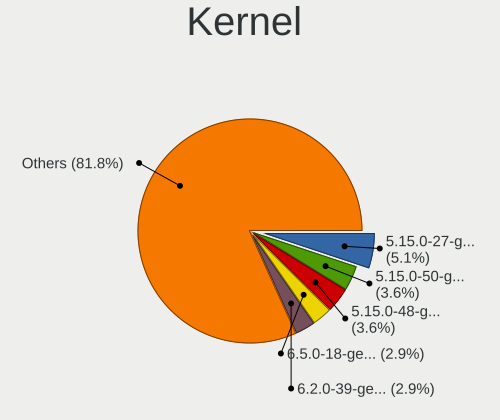

| Version              | Notebooks | Percent |
|----------------------|-----------|---------|
| 5.15.0-27-generic    | 7         | 5.11%   |
| 5.15.0-50-generic    | 5         | 3.65%   |
| 5.15.0-48-generic    | 5         | 3.65%   |
| 6.5.0-18-generic     | 4         | 2.92%   |
| 6.2.0-39-generic     | 4         | 2.92%   |
| 5.19.0-46-generic    | 4         | 2.92%   |
| 5.15.0-52-generic    | 4         | 2.92%   |
| 6.5.0-26-generic     | 3         | 2.19%   |
| 6.2.0-26-generic     | 3         | 2.19%   |
| 5.19.0-41-generic    | 3         | 2.19%   |
| 5.19.0-35-generic    | 3         | 2.19%   |
| 5.15.0-53-generic    | 3         | 2.19%   |
| 5.15.0-40-generic    | 3         | 2.19%   |
| 5.15.0-39-generic    | 3         | 2.19%   |
| 5.15.0-30-generic    | 3         | 2.19%   |
| 6.8.0-45-generic     | 2         | 1.46%   |
| 6.8.0-40-generic     | 2         | 1.46%   |
| 6.5.0-15-generic     | 2         | 1.46%   |
| 6.5.0-14-generic     | 2         | 1.46%   |
| 6.5.0-10013-tuxedo   | 2         | 1.46%   |
| 6.2.0-33-generic     | 2         | 1.46%   |
| 6.2.0-32-generic     | 2         | 1.46%   |
| 6.2.0-10007-tuxedo   | 2         | 1.46%   |
| 5.19.0-42-generic    | 2         | 1.46%   |
| 5.19.0-38-generic    | 2         | 1.46%   |
| 5.15.0-67-generic    | 2         | 1.46%   |
| 5.15.0-58-generic    | 2         | 1.46%   |
| 5.15.0-56-generic    | 2         | 1.46%   |
| 5.15.0-47-generic    | 2         | 1.46%   |
| 5.15.0-46-generic    | 2         | 1.46%   |
| 5.15.0-33-generic    | 2         | 1.46%   |
| 5.15.0-25-generic    | 2         | 1.46%   |
| 6.8.0-65-generic     | 1         | 0.73%   |
| 6.8.0-52-generic     | 1         | 0.73%   |
| 6.8.0-103044-tuxedo  | 1         | 0.73%   |
| 6.5.0-41-generic     | 1         | 0.73%   |
| 6.5.0-27-generic     | 1         | 0.73%   |
| 6.5.0-25-generic     | 1         | 0.73%   |
| 6.5.0-10008-tuxedo   | 1         | 0.73%   |
| 6.3.1-060301-generic | 1         | 0.73%   |

Kernel Family
-------------

Linux kernel without a distro release

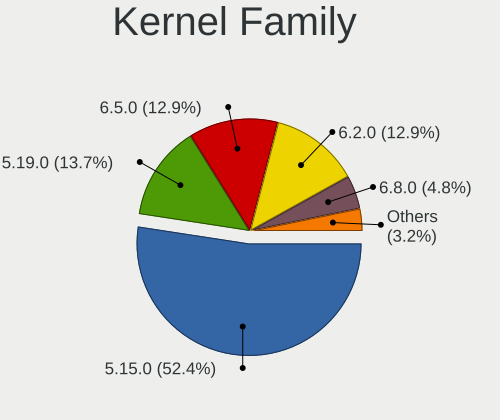

| Version | Notebooks | Percent |
|---------|-----------|---------|
| 5.15.0  | 65        | 52.42%  |
| 5.19.0  | 17        | 13.71%  |
| 6.5.0   | 16        | 12.9%   |
| 6.2.0   | 16        | 12.9%   |
| 6.8.0   | 6         | 4.84%   |
| 5.13.0  | 2         | 1.61%   |
| 6.3.1   | 1         | 0.81%   |
| 6.1.0   | 1         | 0.81%   |

Kernel Major Ver.
-----------------

Linux kernel major version

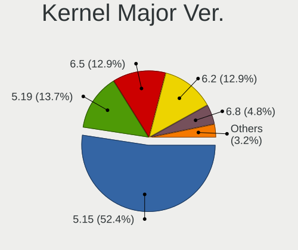

| Version | Notebooks | Percent |
|---------|-----------|---------|
| 5.15    | 65        | 52.42%  |
| 5.19    | 17        | 13.71%  |
| 6.5     | 16        | 12.9%   |
| 6.2     | 16        | 12.9%   |
| 6.8     | 6         | 4.84%   |
| 5.13    | 2         | 1.61%   |
| 6.3     | 1         | 0.81%   |
| 6.1     | 1         | 0.81%   |

Arch
----

OS architecture (x86_64, i586, etc.)

| Name   | Notebooks | Percent |
|--------|-----------|---------|
| x86_64 | 115       | 100%    |

DE
--

Desktop Environment

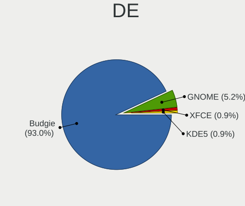

| Name   | Notebooks | Percent |
|--------|-----------|---------|
| Budgie | 107       | 93.04%  |
| GNOME  | 6         | 5.22%   |
| XFCE   | 1         | 0.87%   |
| KDE5   | 1         | 0.87%   |

Display Server
--------------

X11 or Wayland

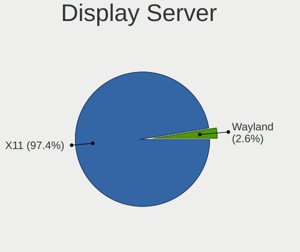

| Name    | Notebooks | Percent |
|---------|-----------|---------|
| X11     | 112       | 97.39%  |
| Wayland | 3         | 2.61%   |

Display Manager
---------------

SDDM, LightDM, etc.

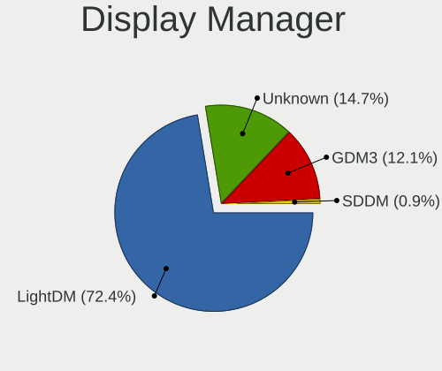

| Name    | Notebooks | Percent |
|---------|-----------|---------|
| LightDM | 84        | 72.41%  |
| Unknown | 17        | 14.66%  |
| GDM3    | 14        | 12.07%  |
| SDDM    | 1         | 0.86%   |

OS Lang
-------

Language

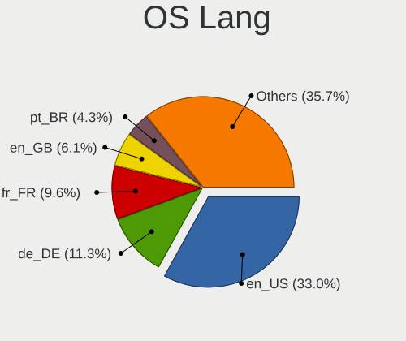

| Lang  | Notebooks | Percent |
|-------|-----------|---------|
| en_US | 38        | 33.04%  |
| de_DE | 13        | 11.3%   |
| fr_FR | 11        | 9.57%   |
| en_GB | 7         | 6.09%   |
| pt_BR | 5         | 4.35%   |
| ru_RU | 4         | 3.48%   |
| it_IT | 4         | 3.48%   |
| en_CA | 4         | 3.48%   |
| pl_PL | 2         | 1.74%   |
| hu_HU | 2         | 1.74%   |
| fr_BE | 2         | 1.74%   |
| eu_ES | 2         | 1.74%   |
| es_ES | 2         | 1.74%   |
| es_CL | 2         | 1.74%   |
| en_IE | 2         | 1.74%   |
| mt_MT | 1         | 0.87%   |
| ja_JP | 1         | 0.87%   |
| es_PE | 1         | 0.87%   |
| es_MX | 1         | 0.87%   |
| es_EC | 1         | 0.87%   |
| es_AR | 1         | 0.87%   |
| en_ZA | 1         | 0.87%   |
| en_SG | 1         | 0.87%   |
| en_IN | 1         | 0.87%   |
| en_IL | 1         | 0.87%   |
| en_AU | 1         | 0.87%   |
| da_DK | 1         | 0.87%   |
| cs_CZ | 1         | 0.87%   |
| C     | 1         | 0.87%   |
| bg_BG | 1         | 0.87%   |

Boot Mode
---------

EFI or BIOS

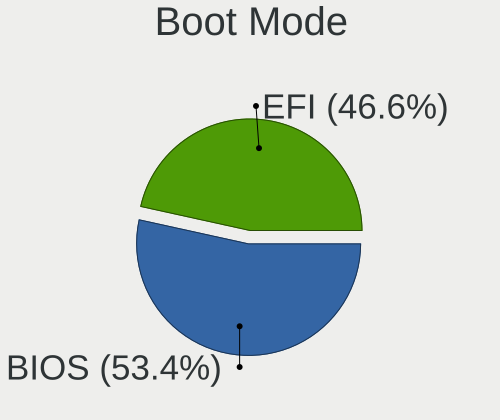

| Mode | Notebooks | Percent |
|------|-----------|---------|
| BIOS | 62        | 53.45%  |
| EFI  | 54        | 46.55%  |

Filesystem
----------

Type of filesystem

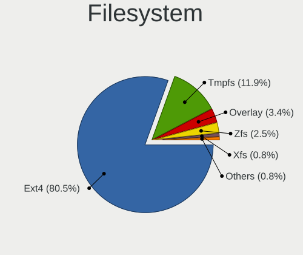

| Type    | Notebooks | Percent |
|---------|-----------|---------|
| Ext4    | 95        | 80.51%  |
| Tmpfs   | 14        | 11.86%  |
| Overlay | 4         | 3.39%   |
| Zfs     | 3         | 2.54%   |
| Xfs     | 1         | 0.85%   |
| Btrfs   | 1         | 0.85%   |

Part. scheme
------------

Scheme of partitioning

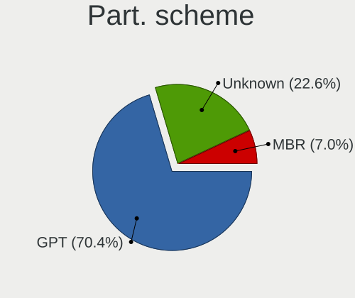

| Type    | Notebooks | Percent |
|---------|-----------|---------|
| GPT     | 81        | 70.43%  |
| Unknown | 26        | 22.61%  |
| MBR     | 8         | 6.96%   |

Dual Boot with Linux/BSD
------------------------

Hosting more than one Linux/BSD

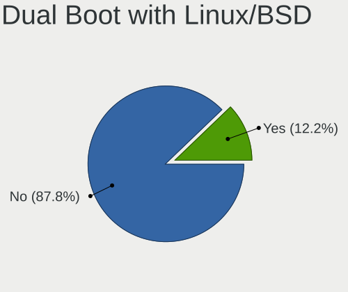

| Dual boot | Notebooks | Percent |
|-----------|-----------|---------|
| No        | 101       | 87.83%  |
| Yes       | 14        | 12.17%  |

Dual Boot (Win)
---------------

Hosting Linux and Windows

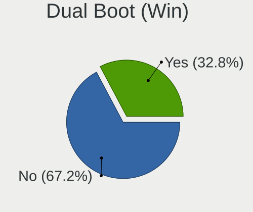

| Dual boot | Notebooks | Percent |
|-----------|-----------|---------|
| No        | 78        | 67.24%  |
| Yes       | 38        | 32.76%  |

Board
-----

Vendor
------

Motherboard manufacturer

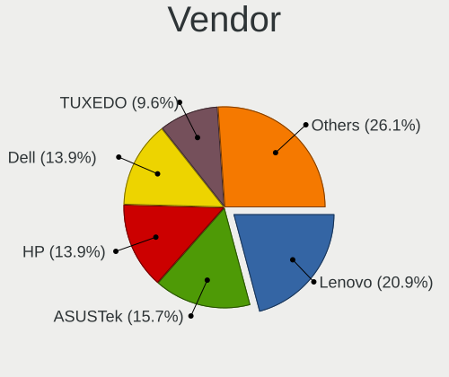

| Name                   | Notebooks | Percent |
|------------------------|-----------|---------|
| Lenovo                 | 24        | 20.87%  |
| ASUSTek Computer       | 18        | 15.65%  |
| Hewlett-Packard        | 16        | 13.91%  |
| Dell                   | 16        | 13.91%  |
| TUXEDO                 | 11        | 9.57%   |
| Apple                  | 6         | 5.22%   |
| Toshiba                | 3         | 2.61%   |
| MSI                    | 3         | 2.61%   |
| Google                 | 3         | 2.61%   |
| Acer                   | 3         | 2.61%   |
| Chuwi                  | 2         | 1.74%   |
| Timi                   | 1         | 0.87%   |
| Razer                  | 1         | 0.87%   |
| Packard Bell           | 1         | 0.87%   |
| HUAWEI                 | 1         | 0.87%   |
| Digibras               | 1         | 0.87%   |
| COM1                   | 1         | 0.87%   |
| BANGHO                 | 1         | 0.87%   |
| AXIOO                  | 1         | 0.87%   |
| Avell High Performance | 1         | 0.87%   |
| Alurin                 | 1         | 0.87%   |

Model
-----

Motherboard model

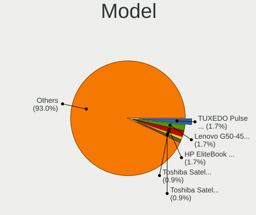

| Name                                                 | Notebooks | Percent |
|------------------------------------------------------|-----------|---------|
| TUXEDO Pulse 15 Gen1                                 | 2         | 1.74%   |
| Lenovo G50-45 80E3                                   | 2         | 1.74%   |
| HP EliteBook 840 G3                                  | 2         | 1.74%   |
| TUXEDO Pulse 14 Gen1                                 | 1         | 0.87%   |
| TUXEDO Polaris Intel Gen3 (TGL)                      | 1         | 0.87%   |
| TUXEDO InfinityBook_Pro13_14_v4                      | 1         | 0.87%   |
| TUXEDO InfinityBook S 15 Gen6                        | 1         | 0.87%   |
| TUXEDO InfinityBook Pro 14 v4                        | 1         | 0.87%   |
| TUXEDO Book XUX7 Gen11                               | 1         | 0.87%   |
| TUXEDO Book XP1511                                   | 1         | 0.87%   |
| TUXEDO Book BA1510                                   | 1         | 0.87%   |
| TUXEDO Aura 15 Gen1                                  | 1         | 0.87%   |
| Toshiba Satellite C855D-11X                          | 1         | 0.87%   |
| Toshiba Satellite A505                               | 1         | 0.87%   |
| Toshiba Satellite A300                               | 1         | 0.87%   |
| Timi TM1604                                          | 1         | 0.87%   |
| Razer Blade 15 Advanced Model (Mid 2021) - RZ09-0409 | 1         | 0.87%   |
| Packard Bell EasyNote TM98                           | 1         | 0.87%   |
| MSI Modern 15 A10M                                   | 1         | 0.87%   |
| MSI GL62 6QF                                         | 1         | 0.87%   |
| MSI Alpha 15 B5EEK                                   | 1         | 0.87%   |
| Lenovo V15 G2 ALC 82KD                               | 1         | 0.87%   |
| Lenovo ThinkPad X260 20F5S0V500                      | 1         | 0.87%   |
| Lenovo ThinkPad X220 4291G75                         | 1         | 0.87%   |
| Lenovo ThinkPad X1 Carbon 5th 20HR002SIV             | 1         | 0.87%   |
| Lenovo ThinkPad T500 2242CTO                         | 1         | 0.87%   |
| Lenovo ThinkPad T480s 20L8SF1X00                     | 1         | 0.87%   |
| Lenovo ThinkPad T480 20L6SDR21A                      | 1         | 0.87%   |
| Lenovo ThinkPad T440 20B7S0F100                      | 1         | 0.87%   |
| Lenovo ThinkPad T14 Gen 3 21AHCTO1WW                 | 1         | 0.87%   |
| Lenovo ThinkPad T14 Gen 2i 20W000Q4GE                | 1         | 0.87%   |
| Lenovo ThinkPad S1 Yoga 12 20DL003AUS                | 1         | 0.87%   |
| Lenovo ThinkPad P15v Gen 1 20TQ0042PB                | 1         | 0.87%   |
| Lenovo ThinkPad E15 20RD003KHV                       | 1         | 0.87%   |
| Lenovo Legion Y530-15ICH 81FV                        | 1         | 0.87%   |
| Lenovo IdeaPad Z500 20202                            | 1         | 0.87%   |
| Lenovo IdeaPad S145-14IWL 81MU                       | 1         | 0.87%   |
| Lenovo IdeaPad C340-14API 81N6                       | 1         | 0.87%   |
| Lenovo IdeaPad 520-15IKB 81BF                        | 1         | 0.87%   |
| Lenovo IdeaPad 5 15ARE05 81YQ                        | 1         | 0.87%   |

Model Family
------------

Motherboard model prefix

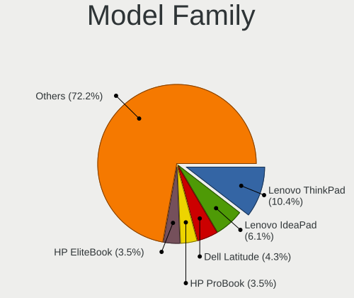

| Name                  | Notebooks | Percent |
|-----------------------|-----------|---------|
| Lenovo ThinkPad       | 12        | 10.43%  |
| Lenovo IdeaPad        | 7         | 6.09%   |
| Dell Latitude         | 5         | 4.35%   |
| HP ProBook            | 4         | 3.48%   |
| HP EliteBook          | 4         | 3.48%   |
| Dell XPS              | 4         | 3.48%   |
| Dell Inspiron         | 4         | 3.48%   |
| ASUS VivoBook         | 4         | 3.48%   |
| TUXEDO Pulse          | 3         | 2.61%   |
| TUXEDO InfinityBook   | 3         | 2.61%   |
| TUXEDO Book           | 3         | 2.61%   |
| Toshiba Satellite     | 3         | 2.61%   |
| HP Pavilion           | 3         | 2.61%   |
| ASUS ZenBook          | 3         | 2.61%   |
| Lenovo G50-45         | 2         | 1.74%   |
| Dell Vostro           | 2         | 1.74%   |
| ASUS ASUS             | 2         | 1.74%   |
| Apple MacBookPro8     | 2         | 1.74%   |
| Acer Aspire           | 2         | 1.74%   |
| TUXEDO Polaris        | 1         | 0.87%   |
| TUXEDO Aura           | 1         | 0.87%   |
| Timi TM1604           | 1         | 0.87%   |
| Razer Blade           | 1         | 0.87%   |
| Packard Bell EasyNote | 1         | 0.87%   |
| MSI Modern            | 1         | 0.87%   |
| MSI GL62              | 1         | 0.87%   |
| MSI Alpha             | 1         | 0.87%   |
| Lenovo V15            | 1         | 0.87%   |
| Lenovo Legion         | 1         | 0.87%   |
| Lenovo G500           | 1         | 0.87%   |
| HUAWEI HKD-WXX        | 1         | 0.87%   |
| HP ENVY               | 1         | 0.87%   |
| HP ElitePad           | 1         | 0.87%   |
| HP Dragonfly          | 1         | 0.87%   |
| HP Bloog              | 1         | 0.87%   |
| HP 15                 | 1         | 0.87%   |
| Google Rabbid         | 1         | 0.87%   |
| Google Boten          | 1         | 0.87%   |
| Google Bobba          | 1         | 0.87%   |
| Digibras NH4CU03      | 1         | 0.87%   |

MFG Year
--------

Motherboard manufacture year

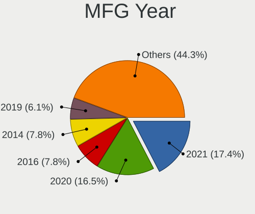

| Year | Notebooks | Percent |
|------|-----------|---------|
| 2021 | 20        | 17.39%  |
| 2020 | 19        | 16.52%  |
| 2016 | 9         | 7.83%   |
| 2014 | 9         | 7.83%   |
| 2019 | 7         | 6.09%   |
| 2018 | 7         | 6.09%   |
| 2013 | 6         | 5.22%   |
| 2017 | 5         | 4.35%   |
| 2012 | 5         | 4.35%   |
| 2010 | 5         | 4.35%   |
| 2023 | 4         | 3.48%   |
| 2022 | 4         | 3.48%   |
| 2015 | 4         | 3.48%   |
| 2011 | 4         | 3.48%   |
| 2009 | 4         | 3.48%   |
| 2008 | 2         | 1.74%   |
| 2024 | 1         | 0.87%   |

Form Factor
-----------

Physical design of the computer

| Name     | Notebooks | Percent |
|----------|-----------|---------|
| Notebook | 115       | 100%    |

Secure Boot
-----------

Enabled or disabled

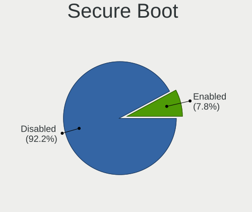

| State    | Notebooks | Percent |
|----------|-----------|---------|
| Disabled | 106       | 92.17%  |
| Enabled  | 9         | 7.83%   |

Coreboot
--------

Have coreboot on board

| Used | Notebooks | Percent |
|------|-----------|---------|
| No   | 111       | 96.52%  |
| Yes  | 4         | 3.48%   |

RAM Size
--------

Total RAM memory

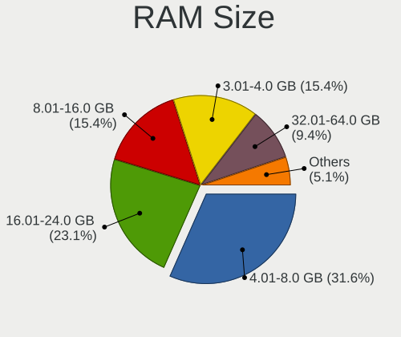

| Size in GB  | Notebooks | Percent |
|-------------|-----------|---------|
| 4.01-8.0    | 37        | 31.62%  |
| 16.01-24.0  | 27        | 23.08%  |
| 3.01-4.0    | 18        | 15.38%  |
| 8.01-16.0   | 18        | 15.38%  |
| 32.01-64.0  | 11        | 9.4%    |
| 64.01-256.0 | 5         | 4.27%   |
| 1.01-2.0    | 1         | 0.85%   |

RAM Used
--------

Used RAM memory

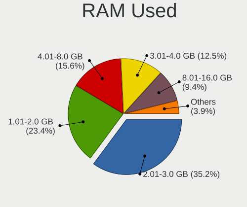

| Used GB    | Notebooks | Percent |
|------------|-----------|---------|
| 2.01-3.0   | 45        | 35.16%  |
| 1.01-2.0   | 30        | 23.44%  |
| 4.01-8.0   | 20        | 15.63%  |
| 3.01-4.0   | 16        | 12.5%   |
| 8.01-16.0  | 12        | 9.38%   |
| 16.01-24.0 | 3         | 2.34%   |
| 24.01-32.0 | 2         | 1.56%   |

Total Drives
------------

Number of drives on board

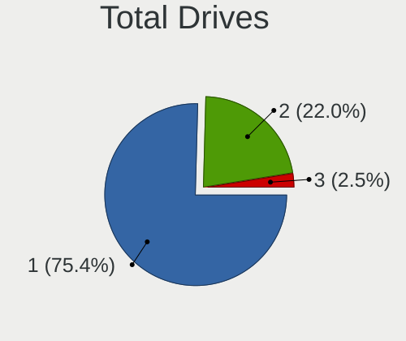

| Drives | Notebooks | Percent |
|--------|-----------|---------|
| 1      | 89        | 75.42%  |
| 2      | 26        | 22.03%  |
| 3      | 3         | 2.54%   |

Has CD-ROM
----------

Has CD-ROM on board

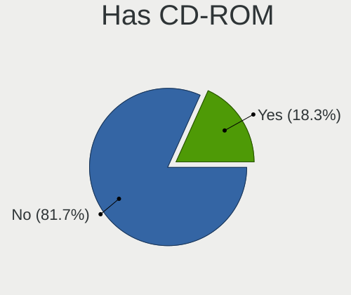

| Presented | Notebooks | Percent |
|-----------|-----------|---------|
| No        | 94        | 81.74%  |
| Yes       | 21        | 18.26%  |

Has Ethernet
------------

Has Ethernet on board

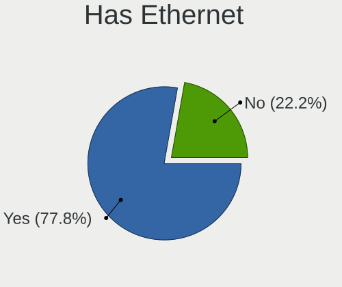

| Presented | Notebooks | Percent |
|-----------|-----------|---------|
| Yes       | 91        | 77.78%  |
| No        | 26        | 22.22%  |

Has WiFi
--------

Has WiFi module

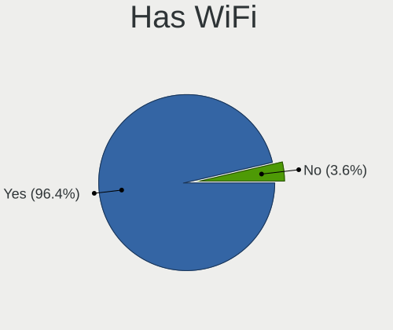

| Presented | Notebooks | Percent |
|-----------|-----------|---------|
| Yes       | 110       | 95.65%  |
| No        | 5         | 4.35%   |

Has Bluetooth
-------------

Has Bluetooth module

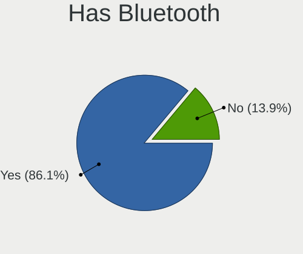

| Presented | Notebooks | Percent |
|-----------|-----------|---------|
| Yes       | 99        | 86.09%  |
| No        | 16        | 13.91%  |

Location
--------

Country
-------

Geographic location (country)

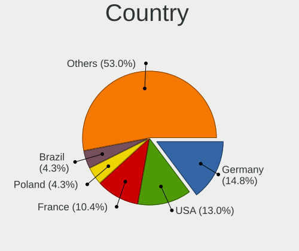

| Country            | Notebooks | Percent |
|--------------------|-----------|---------|
| Germany            | 17        | 14.78%  |
| USA                | 15        | 13.04%  |
| France             | 12        | 10.43%  |
| Poland             | 5         | 4.35%   |
| Brazil             | 5         | 4.35%   |
| UK                 | 4         | 3.48%   |
| Spain              | 4         | 3.48%   |
| Italy              | 4         | 3.48%   |
| Canada             | 4         | 3.48%   |
| Russia             | 3         | 2.61%   |
| Peru               | 2         | 1.74%   |
| Ireland            | 2         | 1.74%   |
| Indonesia          | 2         | 1.74%   |
| Hungary            | 2         | 1.74%   |
| Czechia            | 2         | 1.74%   |
| Chile              | 2         | 1.74%   |
| Bulgaria           | 2         | 1.74%   |
| Belgium            | 2         | 1.74%   |
| Austria            | 2         | 1.74%   |
| Turkey             | 1         | 0.87%   |
| Sweden             | 1         | 0.87%   |
| South Africa       | 1         | 0.87%   |
| Slovenia           | 1         | 0.87%   |
| Slovakia           | 1         | 0.87%   |
| Singapore          | 1         | 0.87%   |
| Romania            | 1         | 0.87%   |
| Netherlands        | 1         | 0.87%   |
| Mexico             | 1         | 0.87%   |
| Malta              | 1         | 0.87%   |
| Japan              | 1         | 0.87%   |
| Israel             | 1         | 0.87%   |
| India              | 1         | 0.87%   |
| Greece             | 1         | 0.87%   |
| Ghana              | 1         | 0.87%   |
| Ecuador            | 1         | 0.87%   |
| Dominican Republic | 1         | 0.87%   |
| Denmark            | 1         | 0.87%   |
| Cuba               | 1         | 0.87%   |
| Cabo Verde         | 1         | 0.87%   |
| Belarus            | 1         | 0.87%   |

City
----

Geographic location (city)

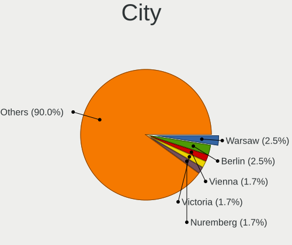

| City                  | Notebooks | Percent |
|-----------------------|-----------|---------|
| Warsaw                | 3         | 2.5%    |
| Berlin                | 3         | 2.5%    |
| Vienna                | 2         | 1.67%   |
| Victoria              | 2         | 1.67%   |
| Nuremberg             | 2         | 1.67%   |
| Laval                 | 2         | 1.67%   |
| Frankfurt am Main     | 2         | 1.67%   |
| Dublin                | 2         | 1.67%   |
| Budapest              | 2         | 1.67%   |
| Yogyakarta            | 1         | 0.83%   |
| Wertheim am Main      | 1         | 0.83%   |
| Weisswasser           | 1         | 0.83%   |
| Weilheim              | 1         | 0.83%   |
| Washington            | 1         | 0.83%   |
| Veliko Tarnovo        | 1         | 0.83%   |
| Torun                 | 1         | 0.83%   |
| Tegueste              | 1         | 0.83%   |
| Targu Frumos          | 1         | 0.83%   |
| Tarakan               | 1         | 0.83%   |
| Syktyvkar             | 1         | 0.83%   |
| Sunnyvale             | 1         | 0.83%   |
| St Petersburg         | 1         | 0.83%   |
| Sofia                 | 1         | 0.83%   |
| Singapore             | 1         | 0.83%   |
| Siegen                | 1         | 0.83%   |
| Shirakuni             | 1         | 0.83%   |
| Sétif                | 1         | 0.83%   |
| Seelze                | 1         | 0.83%   |
| Sao Paulo             | 1         | 0.83%   |
| Sao Bernardo do Campo | 1         | 0.83%   |
| Santo Domingo Este    | 1         | 0.83%   |
| Santiago              | 1         | 0.83%   |
| Saint-Gilles          | 1         | 0.83%   |
| Rishon LeTsiyyon      | 1         | 0.83%   |
| Richmond              | 1         | 0.83%   |
| Renton                | 1         | 0.83%   |
| Recife                | 1         | 0.83%   |
| Queens                | 1         | 0.83%   |
| Quedlinburg           | 1         | 0.83%   |
| Puteaux               | 1         | 0.83%   |

Drives
------

Drive Vendor
------------

Hard drive vendors

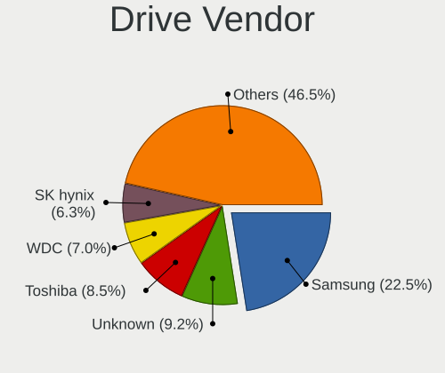

| Vendor                         | Notebooks | Drives | Percent |
|--------------------------------|-----------|--------|---------|
| Samsung Electronics            | 32        | 42     | 22.54%  |
| Unknown                        | 13        | 14     | 9.15%   |
| Toshiba                        | 12        | 17     | 8.45%   |
| WDC                            | 10        | 11     | 7.04%   |
| SK hynix                       | 9         | 9      | 6.34%   |
| Micron Technology              | 8         | 8      | 5.63%   |
| Crucial                        | 7         | 14     | 4.93%   |
| Seagate                        | 6         | 6      | 4.23%   |
| Kingston                       | 5         | 5      | 3.52%   |
| SanDisk                        | 4         | 5      | 2.82%   |
| Intel                          | 4         | 4      | 2.82%   |
| China                          | 3         | 4      | 2.11%   |
| SPCC                           | 2         | 3      | 1.41%   |
| JMicron Technology             | 2         | 2      | 1.41%   |
| Apple                          | 2         | 2      | 1.41%   |
| A-DATA Technology              | 2         | 3      | 1.41%   |
| YMTC                           | 1         | 1      | 0.7%    |
| VISIPRO                        | 1         | 1      | 0.7%    |
| Union Memory                   | 1         | 1      | 0.7%    |
| UMAX                           | 1         | 1      | 0.7%    |
| TO Exter                       | 1         | 1      | 0.7%    |
| Solid State Storage Technology | 1         | 1      | 0.7%    |
| Silicon Motion                 | 1         | 1      | 0.7%    |
| Realtek Semiconductor          | 1         | 1      | 0.7%    |
| Plextor                        | 1         | 1      | 0.7%    |
| Phison Electronics             | 1         | 1      | 0.7%    |
| Patriot                        | 1         | 1      | 0.7%    |
| OWC                            | 1         | 1      | 0.7%    |
| Netac                          | 1         | 1      | 0.7%    |
| NE-1TB                         | 1         | 1      | 0.7%    |
| Kllisre                        | 1         | 1      | 0.7%    |
| KIOXIA                         | 1         | 1      | 0.7%    |
| HGST                           | 1         | 1      | 0.7%    |
| Hewlett-Packard                | 1         | 1      | 0.7%    |
| Gigabyte Technology            | 1         | 1      | 0.7%    |
| Corsair                        | 1         | 2      | 0.7%    |
| Unknown                        | 1         | 1      | 0.7%    |

Drive Model
-----------

Hard drive models

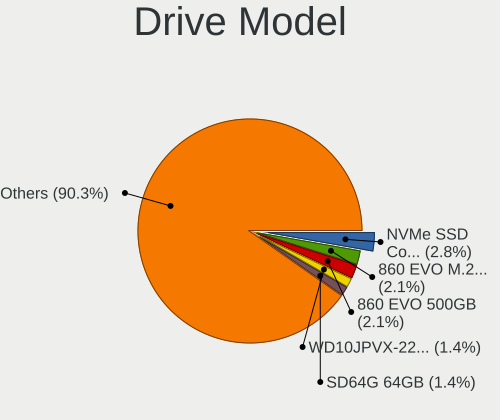

| Model                                             | Notebooks | Percent |
|---------------------------------------------------|-----------|---------|
| Samsung NVMe SSD Controller SM981/PM981/PM983 1TB | 4         | 2.78%   |
| Samsung SSD 860 EVO M.2 500GB                     | 3         | 2.08%   |
| Samsung SSD 860 EVO 500GB                         | 3         | 2.08%   |
| WDC WD10JPVX-22JC3T0 1TB                          | 2         | 1.39%   |
| Unknown SD64G  64GB                               | 2         | 1.39%   |
| Unknown MMC Card  64GB                            | 2         | 1.39%   |
| Seagate ST1000LM024 HN-M101MBB 1TB                | 2         | 1.39%   |
| Samsung SSD 980 PRO 2TB                           | 2         | 1.39%   |
| Samsung SSD 980 500GB                             | 2         | 1.39%   |
| Samsung MZVLQ512HALU-000H1 512GB                  | 2         | 1.39%   |
| Kingston SA400S37240G 240GB SSD                   | 2         | 1.39%   |
| Crucial CT240BX500SSD1 240GB                      | 2         | 1.39%   |
| YMTC PC005 1TB                                    | 1         | 0.69%   |
| WDC WDS500G2B0A-00SM50 500GB                      | 1         | 0.69%   |
| WDC WD6400BEVT-22A0RT0 640GB                      | 1         | 0.69%   |
| WDC WD10JPVX-75JC3T0 1TB                          | 1         | 0.69%   |
| WDC WD10JPVX-60JC3T0 1TB                          | 1         | 0.69%   |
| WDC PC SN730 NVMe 256GB                           | 1         | 0.69%   |
| WDC PC SN720 SDAQNTW-512G-1001 512GB              | 1         | 0.69%   |
| WDC PC SN530 SDBPTPZ-512G-1002 512GB              | 1         | 0.69%   |
| WDC PC SN530 SDBPNPZ-256G-1114 256GB              | 1         | 0.69%   |
| WDC PC SN520 SDAPNUW-512G-1002 512GB              | 1         | 0.69%   |
| VISIPRO SSD 256GB                                 | 1         | 0.69%   |
| Unknown SL128  128GB                              | 1         | 0.69%   |
| Unknown SA16G  16GB                               | 1         | 0.69%   |
| Unknown NVMe SSD Drive 512GB                      | 1         | 0.69%   |
| Unknown NCard  4GB                                | 1         | 0.69%   |
| Unknown MMC128  128GB                             | 1         | 0.69%   |
| Unknown MMC Card  968MB                           | 1         | 0.69%   |
| Unknown MMC Card  32GB                            | 1         | 0.69%   |
| Unknown MMC Card  128GB                           | 1         | 0.69%   |
| Unknown DA4064  64GB                              | 1         | 0.69%   |
| Union Memory RTOTJ128VGD2EYX 128GB SSD            | 1         | 0.69%   |
| UMAX 2242 512GB SSD                               | 1         | 0.69%   |
| Toshiba XG6 NVMe SSD Controller 1024GB            | 1         | 0.69%   |
| Toshiba TR150 480GB SSD                           | 1         | 0.69%   |
| Toshiba MQ04ABF100 1TB                            | 1         | 0.69%   |
| Toshiba MQ01ABD100 1TB                            | 1         | 0.69%   |
| Toshiba MQ01ABD075 752GB                          | 1         | 0.69%   |
| Toshiba MQ01ABD050 500GB                          | 1         | 0.69%   |

HDD Vendor
----------

Hard disk drive vendors

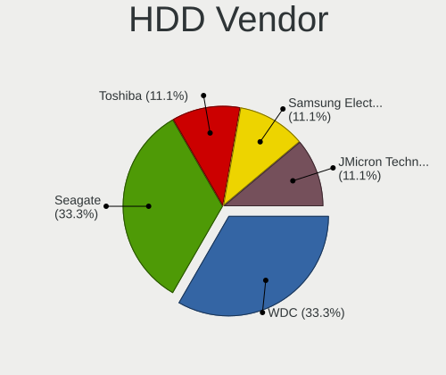

| Vendor              | Notebooks | Drives | Percent |
|---------------------|-----------|--------|---------|
| Seagate             | 6         | 6      | 30%     |
| WDC                 | 5         | 5      | 25%     |
| Toshiba             | 5         | 6      | 25%     |
| TO Exter            | 1         | 1      | 5%      |
| Samsung Electronics | 1         | 1      | 5%      |
| JMicron Technology  | 1         | 1      | 5%      |
| HGST                | 1         | 1      | 5%      |

SSD Vendor
----------

Solid state drive vendors

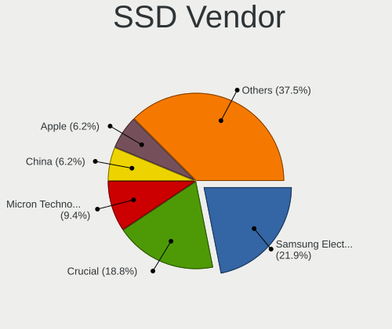

| Vendor              | Notebooks | Drives | Percent |
|---------------------|-----------|--------|---------|
| Samsung Electronics | 12        | 19     | 24%     |
| Crucial             | 7         | 14     | 14%     |
| Micron Technology   | 4         | 4      | 8%      |
| SanDisk             | 3         | 4      | 6%      |
| Kingston            | 3         | 3      | 6%      |
| China               | 3         | 4      | 6%      |
| SPCC                | 2         | 3      | 4%      |
| Apple               | 2         | 2      | 4%      |
| WDC                 | 1         | 1      | 2%      |
| VISIPRO             | 1         | 1      | 2%      |
| Union Memory        | 1         | 1      | 2%      |
| UMAX                | 1         | 1      | 2%      |
| Toshiba             | 1         | 1      | 2%      |
| SK hynix            | 1         | 1      | 2%      |
| Plextor             | 1         | 1      | 2%      |
| Patriot             | 1         | 1      | 2%      |
| OWC                 | 1         | 1      | 2%      |
| Netac               | 1         | 1      | 2%      |
| Intel               | 1         | 1      | 2%      |
| Hewlett-Packard     | 1         | 1      | 2%      |
| Gigabyte Technology | 1         | 1      | 2%      |
| Corsair             | 1         | 2      | 2%      |

Drive Kind
----------

HDD or SSD

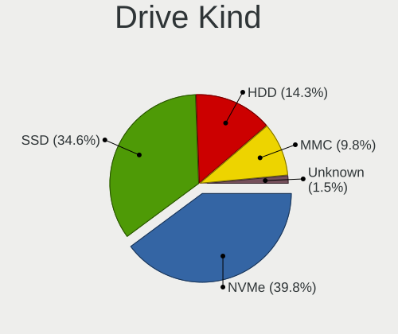

| Kind    | Notebooks | Drives | Percent |
|---------|-----------|--------|---------|
| NVMe    | 53        | 64     | 39.85%  |
| SSD     | 46        | 68     | 34.59%  |
| HDD     | 19        | 21     | 14.29%  |
| MMC     | 13        | 16     | 9.77%   |
| Unknown | 2         | 2      | 1.5%    |

Drive Connector
---------------

SATA, SAS, NVMe, etc.

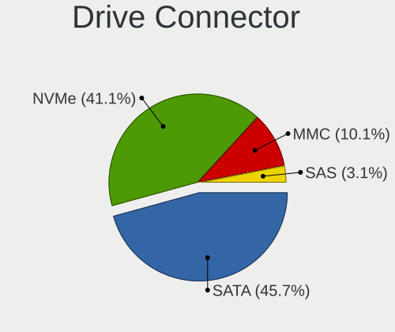

| Type | Notebooks | Drives | Percent |
|------|-----------|--------|---------|
| SATA | 59        | 87     | 45.74%  |
| NVMe | 53        | 63     | 41.09%  |
| MMC  | 13        | 16     | 10.08%  |
| SAS  | 4         | 5      | 3.1%    |

Drive Size
----------

Size of hard drive

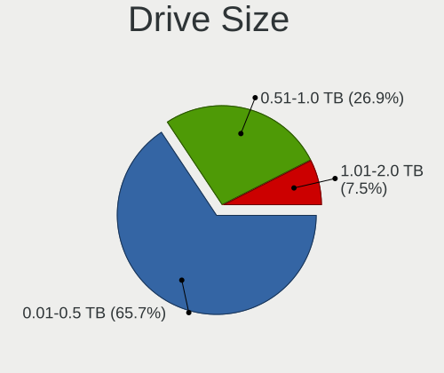

| Size in TB | Notebooks | Drives | Percent |
|------------|-----------|--------|---------|
| 0.01-0.5   | 44        | 58     | 65.67%  |
| 0.51-1.0   | 18        | 25     | 26.87%  |
| 1.01-2.0   | 5         | 6      | 7.46%   |

Space Total
-----------

Amount of disk space available on the file system

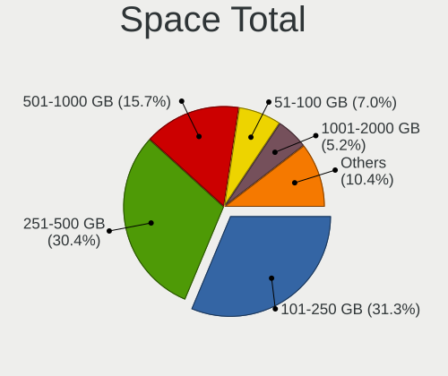

| Size in GB     | Notebooks | Percent |
|----------------|-----------|---------|
| 101-250        | 36        | 31.3%   |
| 251-500        | 35        | 30.43%  |
| 501-1000       | 18        | 15.65%  |
| 51-100         | 8         | 6.96%   |
| 1001-2000      | 6         | 5.22%   |
| 21-50          | 5         | 4.35%   |
| 1-20           | 5         | 4.35%   |
| More than 3000 | 1         | 0.87%   |
| 2001-3000      | 1         | 0.87%   |

Space Used
----------

Amount of used disk space

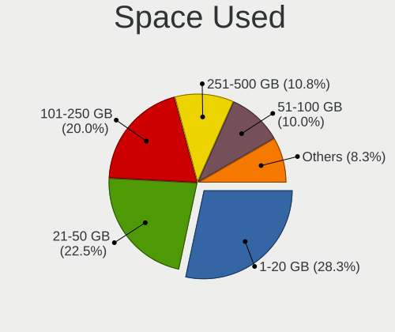

| Used GB   | Notebooks | Percent |
|-----------|-----------|---------|
| 1-20      | 34        | 28.33%  |
| 21-50     | 27        | 22.5%   |
| 101-250   | 24        | 20%     |
| 251-500   | 13        | 10.83%  |
| 51-100    | 12        | 10%     |
| 501-1000  | 6         | 5%      |
| 1001-2000 | 4         | 3.33%   |

Malfunc. Drives
---------------

Drive models with a malfunction

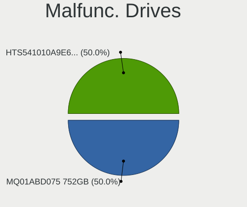

| Model                    | Notebooks | Drives | Percent |
|--------------------------|-----------|--------|---------|
| WDC WD10JPVX-60JC3T0 1TB | 1         | 1      | 33.33%  |
| Toshiba MQ01ABD075 752GB | 1         | 1      | 33.33%  |
| HGST HTS541010A9E680 1TB | 1         | 1      | 33.33%  |

Malfunc. Drive Vendor
---------------------

Vendors of faulty drives

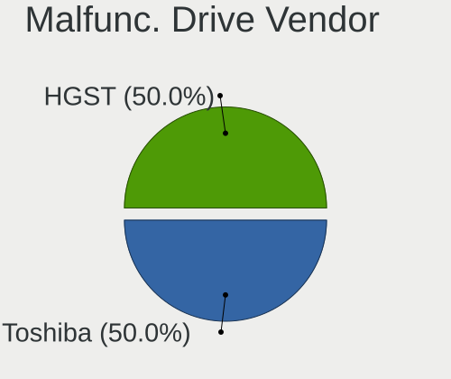

| Vendor  | Notebooks | Drives | Percent |
|---------|-----------|--------|---------|
| WDC     | 1         | 1      | 33.33%  |
| Toshiba | 1         | 1      | 33.33%  |
| HGST    | 1         | 1      | 33.33%  |

Malfunc. HDD Vendor
-------------------

Vendors of faulty HDD drives

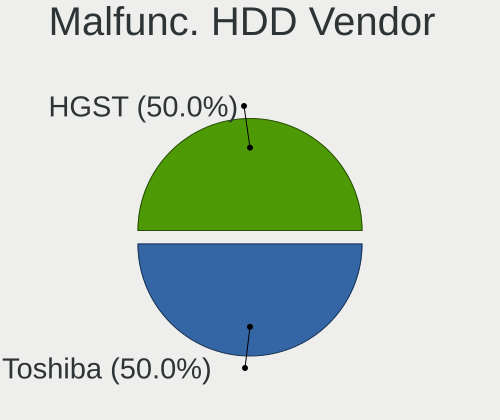

| Vendor  | Notebooks | Drives | Percent |
|---------|-----------|--------|---------|
| WDC     | 1         | 1      | 33.33%  |
| Toshiba | 1         | 1      | 33.33%  |
| HGST    | 1         | 1      | 33.33%  |

Malfunc. Drive Kind
-------------------

Kinds of faulty drives

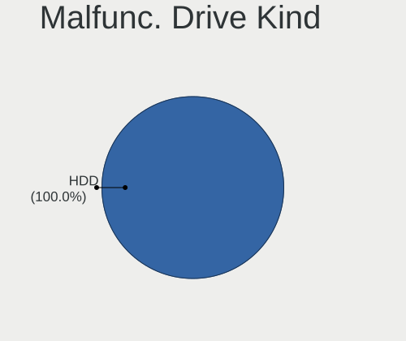

| Kind | Notebooks | Drives | Percent |
|------|-----------|--------|---------|
| HDD  | 3         | 3      | 100%    |

Failed Drives
-------------

Failed drive models

Zero info for selected period =(

Failed Drive Vendor
-------------------

Failed drive vendors

Zero info for selected period =(

Drive Status
------------

Number of failed and malfunc. drives

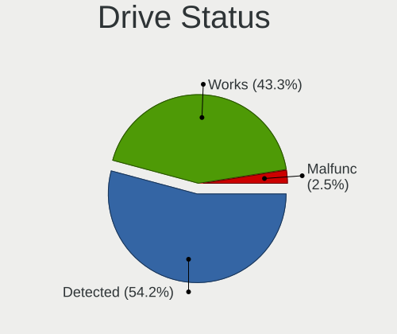

| Status   | Notebooks | Drives | Percent |
|----------|-----------|--------|---------|
| Detected | 65        | 99     | 54.17%  |
| Works    | 52        | 69     | 43.33%  |
| Malfunc  | 3         | 3      | 2.5%    |

Storage controller
------------------

Storage Vendor
--------------

Storage controller vendors

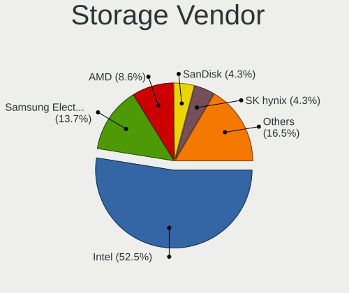

| Vendor                         | Notebooks | Percent |
|--------------------------------|-----------|---------|
| Intel                          | 73        | 52.52%  |
| Samsung Electronics            | 19        | 13.67%  |
| AMD                            | 12        | 8.63%   |
| SK hynix                       | 6         | 4.32%   |
| SanDisk                        | 6         | 4.32%   |
| Toshiba America Info Systems   | 5         | 3.6%    |
| Micron Technology              | 4         | 2.88%   |
| KIOXIA                         | 2         | 1.44%   |
| Kingston Technology Company    | 2         | 1.44%   |
| ADATA Technology               | 2         | 1.44%   |
| Yangtze Memory Technologies    | 1         | 0.72%   |
| Solidigm                       | 1         | 0.72%   |
| Solid State Storage Technology | 1         | 0.72%   |
| Silicon Motion                 | 1         | 0.72%   |
| Realtek Semiconductor          | 1         | 0.72%   |
| Phison Electronics             | 1         | 0.72%   |
| Nvidia                         | 1         | 0.72%   |
| Marvell Technology Group       | 1         | 0.72%   |

Storage Model
-------------

Storage controller models

| Model                                                                          | Notebooks | Percent |
|--------------------------------------------------------------------------------|-----------|---------|
| AMD FCH SATA Controller [AHCI mode]                                            | 12        | 8.28%   |
| Intel Sunrise Point-LP SATA Controller [AHCI mode]                             | 11        | 7.59%   |
| Intel Volume Management Device NVMe RAID Controller                            | 7         | 4.83%   |
| Samsung NVMe SSD Controller SM981/PM981/PM983                                  | 6         | 4.14%   |
| Samsung NVMe SSD Controller 980 (DRAM-less)                                    | 6         | 4.14%   |
| Samsung NVMe SSD Controller PM9A1/PM9A3/980PRO                                 | 5         | 3.45%   |
| Intel Celeron/Pentium Silver Processor SATA Controller                         | 5         | 3.45%   |
| Intel 6 Series/C200 Series Chipset Family 6 port Mobile SATA AHCI Controller   | 5         | 3.45%   |
| Intel 5 Series/3400 Series Chipset 4 port SATA AHCI Controller                 | 5         | 3.45%   |
| Intel Wildcat Point-LP SATA Controller [AHCI Mode]                             | 4         | 2.76%   |
| Intel Comet Lake SATA AHCI Controller                                          | 4         | 2.76%   |
| Intel Cannon Lake Mobile PCH SATA AHCI Controller                              | 4         | 2.76%   |
| Intel 7 Series Chipset Family 6-port SATA Controller [AHCI mode]               | 4         | 2.76%   |
| SK hynix Gold P31/BC711/PC711 NVMe Solid State Drive                           | 3         | 2.07%   |
| Intel Tiger Lake-LP SATA Controller                                            | 3         | 2.07%   |
| Intel Cannon Point-LP SATA Controller [AHCI Mode]                              | 3         | 2.07%   |
| Toshiba America Info Systems XG6 NVMe SSD Controller                           | 2         | 1.38%   |
| Toshiba America Info Systems XG5 NVMe SSD Controller                           | 2         | 1.38%   |
| Samsung NVMe SSD Controller SM961/PM961/SM963                                  | 2         | 1.38%   |
| Micron 2400 NVMe SSD (DRAM-less)                                               | 2         | 1.38%   |
| KIOXIA NVMe SSD Controller BG4 (DRAM-less)                                     | 2         | 1.38%   |
| Intel Tiger Lake SATA AHCI Controller                                          | 2         | 1.38%   |
| Intel SSD 660P Series                                                          | 2         | 1.38%   |
| Intel HM170/QM170 Chipset SATA Controller [AHCI Mode]                          | 2         | 1.38%   |
| Intel 82801IBM/IEM (ICH9M/ICH9M-E) 4 port SATA Controller [AHCI mode]          | 2         | 1.38%   |
| Intel 82801 Mobile SATA Controller [RAID mode]                                 | 2         | 1.38%   |
| Intel 8 Series/C220 Series Chipset Family 6-port SATA Controller 1 [AHCI mode] | 2         | 1.38%   |
| Intel 8 Series SATA Controller 1 [AHCI mode]                                   | 2         | 1.38%   |
| Yangtze Memory PC005 NVMe SSD                                                  | 1         | 0.69%   |
| Toshiba America Info Systems BG3 x2 NVMe SSD Controller (DRAM-less)            | 1         | 0.69%   |
| Solidigm P41 Plus NVMe SSD (DRAM-less) [Echo Harbor]                           | 1         | 0.69%   |
| Solid State Storage CA6-8D512 NVMe SSD M.2                                     | 1         | 0.69%   |
| SK hynix PC611 NVMe Solid State Drive                                          | 1         | 0.69%   |
| SK hynix PC601 NVMe Solid State Drive                                          | 1         | 0.69%   |
| SK hynix BC501 NVMe Solid State Drive                                          | 1         | 0.69%   |
| Silicon Motion SM2263EN/SM2263XT (DRAM-less) NVMe SSD Controllers              | 1         | 0.69%   |
| SanDisk WD SN560/SN740/SN770/SN5000 NVMe SSD                                   | 1         | 0.69%   |
| SanDisk WD Blue SN500 / PC SN520 x2 M.2 2280 NVMe SSD                          | 1         | 0.69%   |
| SanDisk Ultra 3D / WD PC SN530, IX SN530, Blue SN550 NVMe SSD (DRAM-less)      | 1         | 0.69%   |
| SanDisk IX SN530 NVMe SSD / microSD Express Card (DRAM-less)                   | 1         | 0.69%   |

Storage Kind
------------

Kind of storage controller (IDE, SATA, NVMe, SAS, ...)

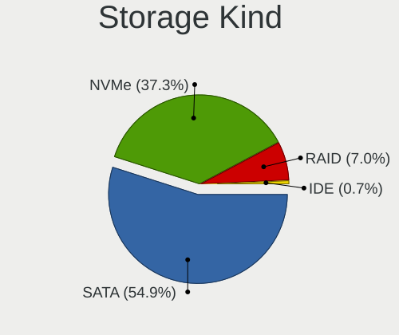

| Kind | Notebooks | Percent |
|------|-----------|---------|
| SATA | 78        | 54.93%  |
| NVMe | 53        | 37.32%  |
| RAID | 10        | 7.04%   |
| IDE  | 1         | 0.7%    |

Processor
---------

CPU Vendor
----------

Processor vendors

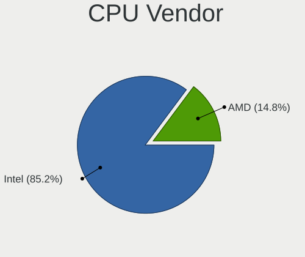

| Vendor | Notebooks | Percent |
|--------|-----------|---------|
| Intel  | 98        | 85.22%  |
| AMD    | 17        | 14.78%  |

CPU Model
---------

Processor models

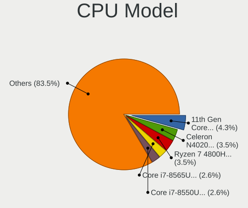

| Model                                         | Notebooks | Percent |
|-----------------------------------------------|-----------|---------|
| Intel 11th Gen Core i7-1165G7 @ 2.80GHz       | 5         | 4.35%   |
| Intel Celeron N4020 CPU @ 1.10GHz             | 4         | 3.48%   |
| AMD Ryzen 7 4800H with Radeon Graphics        | 4         | 3.48%   |
| Intel Core i7-8565U CPU @ 1.80GHz             | 3         | 2.61%   |
| Intel Core i7-8550U CPU @ 1.80GHz             | 3         | 2.61%   |
| Intel Core i5-6200U CPU @ 2.30GHz             | 3         | 2.61%   |
| Intel Pentium Silver N5030 CPU @ 1.10GHz      | 2         | 1.74%   |
| Intel Core i7-9750H CPU @ 2.60GHz             | 2         | 1.74%   |
| Intel Core i7-10750H CPU @ 2.60GHz            | 2         | 1.74%   |
| Intel Core i7-10510U CPU @ 1.80GHz            | 2         | 1.74%   |
| Intel Core i7 CPU Q 720 @ 1.60GHz             | 2         | 1.74%   |
| Intel Core i5-8350U CPU @ 1.70GHz             | 2         | 1.74%   |
| Intel Core i5-8250U CPU @ 1.60GHz             | 2         | 1.74%   |
| Intel Core i5-6300U CPU @ 2.40GHz             | 2         | 1.74%   |
| Intel Core i5-6300HQ CPU @ 2.30GHz            | 2         | 1.74%   |
| Intel Core i5-2520M CPU @ 2.50GHz             | 2         | 1.74%   |
| Intel Core i3-5005U CPU @ 2.00GHz             | 2         | 1.74%   |
| Intel Atom CPU Z3795 @ 1.60GHz                | 2         | 1.74%   |
| Intel 11th Gen Core i7-11850H @ 2.50GHz       | 2         | 1.74%   |
| Intel 11th Gen Core i7-11800H @ 2.30GHz       | 2         | 1.74%   |
| Intel 11th Gen Core i5-1135G7 @ 2.40GHz       | 2         | 1.74%   |
| AMD Ryzen 7 5800H with Radeon Graphics        | 2         | 1.74%   |
| AMD Ryzen 5 4500U with Radeon Graphics        | 2         | 1.74%   |
| AMD Ryzen 5 3500U with Radeon Vega Mobile Gfx | 2         | 1.74%   |
| AMD A8-6410 APU with AMD Radeon R5 Graphics   | 2         | 1.74%   |
| Intel Pentium Silver N6000 @ 1.10GHz          | 1         | 0.87%   |
| Intel Pentium Dual-Core CPU T4200 @ 2.00GHz   | 1         | 0.87%   |
| Intel Pentium CPU P6200 @ 2.13GHz             | 1         | 0.87%   |
| Intel Pentium CPU N3540 @ 2.16GHz             | 1         | 0.87%   |
| Intel Pentium CPU 5405U @ 2.30GHz             | 1         | 0.87%   |
| Intel Core i9-10900K CPU @ 3.70GHz            | 1         | 0.87%   |
| Intel Core i7-8750H CPU @ 2.20GHz             | 1         | 0.87%   |
| Intel Core i7-7600U CPU @ 2.80GHz             | 1         | 0.87%   |
| Intel Core i7-7500U CPU @ 2.70GHz             | 1         | 0.87%   |
| Intel Core i7-6500U CPU @ 2.50GHz             | 1         | 0.87%   |
| Intel Core i7-5600U CPU @ 2.60GHz             | 1         | 0.87%   |
| Intel Core i7-4702MQ CPU @ 2.20GHz            | 1         | 0.87%   |
| Intel Core i7-3632QM CPU @ 2.20GHz            | 1         | 0.87%   |
| Intel Core i7-3610QM CPU @ 2.30GHz            | 1         | 0.87%   |
| Intel Core i7-2760QM CPU @ 2.40GHz            | 1         | 0.87%   |

CPU Model Family
----------------

Processor model prefix

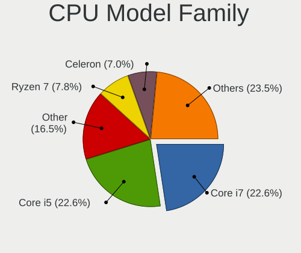

| Model                   | Notebooks | Percent |
|-------------------------|-----------|---------|
| Intel Core i7           | 26        | 22.61%  |
| Intel Core i5           | 26        | 22.61%  |
| Other                   | 19        | 16.52%  |
| AMD Ryzen 7             | 9         | 7.83%   |
| Intel Celeron           | 8         | 6.96%   |
| Intel Core i3           | 6         | 5.22%   |
| AMD Ryzen 5             | 4         | 3.48%   |
| Intel Pentium Silver    | 3         | 2.61%   |
| Intel Pentium           | 3         | 2.61%   |
| Intel Atom              | 3         | 2.61%   |
| Intel Core 2 Duo        | 2         | 1.74%   |
| AMD A8                  | 2         | 1.74%   |
| Intel Pentium Dual-Core | 1         | 0.87%   |
| Intel Core i9           | 1         | 0.87%   |
| AMD Ryzen 3             | 1         | 0.87%   |
| AMD A6                  | 1         | 0.87%   |

CPU Cores
---------

Number of processor cores

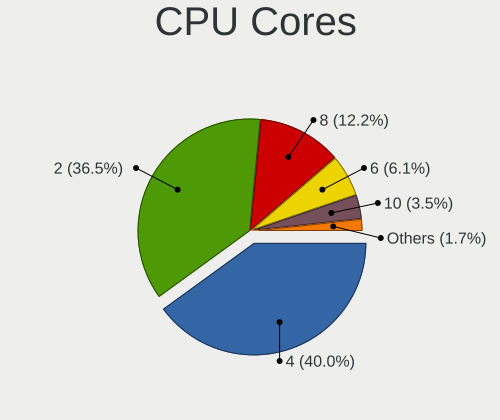

| Number | Notebooks | Percent |
|--------|-----------|---------|
| 4      | 46        | 40%     |
| 2      | 42        | 36.52%  |
| 8      | 14        | 12.17%  |
| 6      | 7         | 6.09%   |
| 10     | 4         | 3.48%   |
| 12     | 1         | 0.87%   |
| 1      | 1         | 0.87%   |

CPU Sockets
-----------

Number of sockets

| Number | Notebooks | Percent |
|--------|-----------|---------|
| 1      | 115       | 100%    |

CPU Threads
-----------

Threads per core (Hyper-Threading)

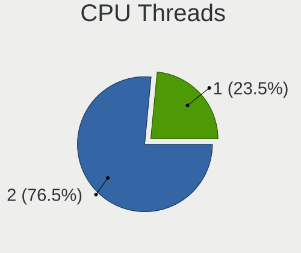

| Number | Notebooks | Percent |
|--------|-----------|---------|
| 2      | 88        | 76.52%  |
| 1      | 27        | 23.48%  |

CPU Op-Modes
------------

CPU Operation Modes (32-bit, 64-bit)

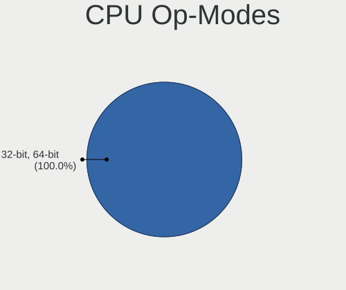

| Op mode        | Notebooks | Percent |
|----------------|-----------|---------|
| 32-bit, 64-bit | 115       | 100%    |

CPU Microcode
-------------

Microcode number

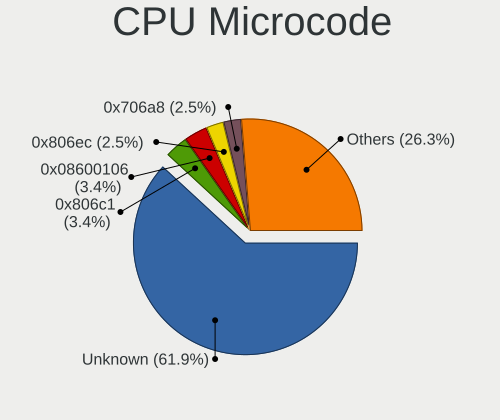

| Number     | Notebooks | Percent |
|------------|-----------|---------|
| Unknown    | 73        | 61.86%  |
| 0x806c1    | 4         | 3.39%   |
| 0x08600106 | 4         | 3.39%   |
| 0x806ec    | 3         | 2.54%   |
| 0x706a8    | 3         | 2.54%   |
| 0x206a7    | 3         | 2.54%   |
| 0x806eb    | 2         | 1.69%   |
| 0x806ea    | 2         | 1.69%   |
| 0x806d1    | 2         | 1.69%   |
| 0x406e3    | 2         | 1.69%   |
| 0x20655    | 2         | 1.69%   |
| 0x0a50000c | 2         | 1.69%   |
| 0x08108102 | 2         | 1.69%   |
| 0x906ea    | 1         | 0.85%   |
| 0x906c0    | 1         | 0.85%   |
| 0x806e9    | 1         | 0.85%   |
| 0x506e3    | 1         | 0.85%   |
| 0x506c9    | 1         | 0.85%   |
| 0x40651    | 1         | 0.85%   |
| 0x306d4    | 1         | 0.85%   |
| 0x306c3    | 1         | 0.85%   |
| 0x30678    | 1         | 0.85%   |
| 0x106e5    | 1         | 0.85%   |
| 0x08608103 | 1         | 0.85%   |
| 0x08600103 | 1         | 0.85%   |
| 0x07030105 | 1         | 0.85%   |
| 0x07030104 | 1         | 0.85%   |

CPU Microarch
-------------

Microarchitecture

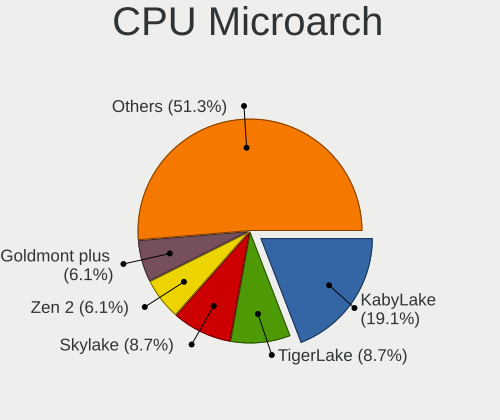

| Name             | Notebooks | Percent |
|------------------|-----------|---------|
| KabyLake         | 22        | 19.13%  |
| TigerLake        | 10        | 8.7%    |
| Skylake          | 10        | 8.7%    |
| Zen 2            | 7         | 6.09%   |
| Goldmont plus    | 7         | 6.09%   |
| Unknown          | 7         | 6.09%   |
| Westmere         | 5         | 4.35%   |
| Silvermont       | 5         | 4.35%   |
| SandyBridge      | 5         | 4.35%   |
| Haswell          | 5         | 4.35%   |
| IvyBridge        | 4         | 3.48%   |
| Broadwell        | 4         | 3.48%   |
| Zen 3            | 3         | 2.61%   |
| Penryn           | 3         | 2.61%   |
| IceLake          | 3         | 2.61%   |
| CometLake        | 3         | 2.61%   |
| Alderlake Hybrid | 3         | 2.61%   |
| Zen+             | 2         | 1.74%   |
| Puma             | 2         | 1.74%   |
| Nehalem          | 2         | 1.74%   |
| Tremont          | 1         | 0.87%   |
| Piledriver       | 1         | 0.87%   |
| Goldmont         | 1         | 0.87%   |

Graphics
--------

GPU Vendor
----------

Vendors of graphics cards

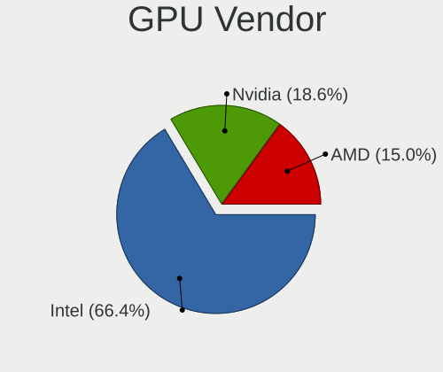

| Vendor | Notebooks | Percent |
|--------|-----------|---------|
| Intel  | 93        | 66.43%  |
| Nvidia | 26        | 18.57%  |
| AMD    | 21        | 15%     |

GPU Model
---------

Graphics card models

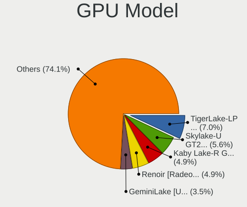

| Model                                                                     | Notebooks | Percent |
|---------------------------------------------------------------------------|-----------|---------|
| Intel TigerLake-LP GT2 [Iris Xe Graphics]                                 | 10        | 6.99%   |
| Intel Skylake-U GT2 [HD Graphics 520]                                     | 8         | 5.59%   |
| Intel Kaby Lake-R GT2 [UHD Graphics 620]                                  | 7         | 4.9%    |
| AMD Renoir [Radeon Vega Series / Radeon Vega Mobile Series]               | 7         | 4.9%    |
| Intel GeminiLake [UHD Graphics 600]                                       | 5         | 3.5%    |
| Intel 2nd Generation Core Processor Family Integrated Graphics Controller | 5         | 3.5%    |
| Intel TigerLake-H GT1 [UHD Graphics]                                      | 4         | 2.8%    |
| Intel Core Processor Integrated Graphics Controller                       | 4         | 2.8%    |
| Intel CometLake-U GT2 [UHD Graphics]                                      | 4         | 2.8%    |
| Intel CoffeeLake-H GT2 [UHD Graphics 630]                                 | 4         | 2.8%    |
| Intel Broadwell-U GT2 [HD Graphics 5500]                                  | 4         | 2.8%    |
| Intel Atom Processor Z36xxx/Z37xxx Series Graphics & Display              | 4         | 2.8%    |
| Intel 3rd Gen Core processor Graphics Controller                          | 4         | 2.8%    |
| Nvidia TU117M [GeForce GTX 1650 Mobile / Max-Q]                           | 3         | 2.1%    |
| Intel WhiskeyLake-U GT2 [UHD Graphics 620]                                | 3         | 2.1%    |
| Intel Kaby Lake-U GT2 [HD Graphics 620]                                   | 3         | 2.1%    |
| Intel Haswell-ULT Integrated Graphics Controller                          | 3         | 2.1%    |
| Nvidia GP108M [GeForce MX150]                                             | 2         | 1.4%    |
| Nvidia GA107M [GeForce RTX 3050 Mobile]                                   | 2         | 1.4%    |
| Nvidia GA106M [GeForce RTX 3060 Mobile / Max-Q]                           | 2         | 1.4%    |
| Intel Skylake-H GT2 [HD Graphics 530]                                     | 2         | 1.4%    |
| Intel Mobile 4 Series Chipset Integrated Graphics Controller              | 2         | 1.4%    |
| Intel JasperLake [UHD Graphics]                                           | 2         | 1.4%    |
| Intel GeminiLake [UHD Graphics 605]                                       | 2         | 1.4%    |
| Intel CometLake-H GT2 [UHD Graphics]                                      | 2         | 1.4%    |
| Intel 4th Gen Core Processor Integrated Graphics Controller               | 2         | 1.4%    |
| AMD Picasso/Raven 2 [Radeon Vega Series / Radeon Vega Mobile Series]      | 2         | 1.4%    |
| AMD Mullins [Radeon R4/R5 Graphics]                                       | 2         | 1.4%    |
| AMD Lucienne                                                              | 2         | 1.4%    |
| AMD Cezanne [Radeon Vega Series / Radeon Vega Mobile Series]              | 2         | 1.4%    |
| Nvidia TU117M [GeForce MX450]                                             | 1         | 0.7%    |
| Nvidia TU106M [GeForce RTX 2070 Mobile / Max-Q Refresh]                   | 1         | 0.7%    |
| Nvidia TU104BM [GeForce RTX 2080 SUPER Mobile / Max-Q]                    | 1         | 0.7%    |
| Nvidia GT218M [GeForce 310M]                                              | 1         | 0.7%    |
| Nvidia GT216M [GeForce GT 330M]                                           | 1         | 0.7%    |
| Nvidia GT216M [GeForce GT 230M]                                           | 1         | 0.7%    |
| Nvidia GP108M [GeForce MX230]                                             | 1         | 0.7%    |
| Nvidia GP107M [GeForce GTX 1050 Ti Mobile]                                | 1         | 0.7%    |
| Nvidia GP107M [GeForce GTX 1050 Mobile]                                   | 1         | 0.7%    |
| Nvidia GM108M [GeForce 840M]                                              | 1         | 0.7%    |

GPU Combo
---------

Combinations of graphics cards

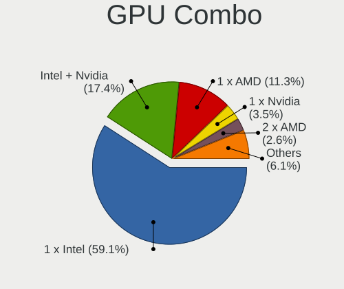

| Name           | Notebooks | Percent |
|----------------|-----------|---------|
| 1 x Intel      | 68        | 59.13%  |
| Intel + Nvidia | 20        | 17.39%  |
| 1 x AMD        | 13        | 11.3%   |
| 1 x Nvidia     | 4         | 3.48%   |
| 2 x AMD        | 3         | 2.61%   |
| Intel + AMD    | 3         | 2.61%   |
| Other          | 2         | 1.74%   |
| AMD + Nvidia   | 2         | 1.74%   |

GPU Driver
----------

Free vs proprietary

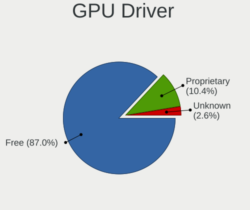

| Driver      | Notebooks | Percent |
|-------------|-----------|---------|
| Free        | 100       | 86.96%  |
| Proprietary | 12        | 10.43%  |
| Unknown     | 3         | 2.61%   |

GPU Memory
----------

Total video memory

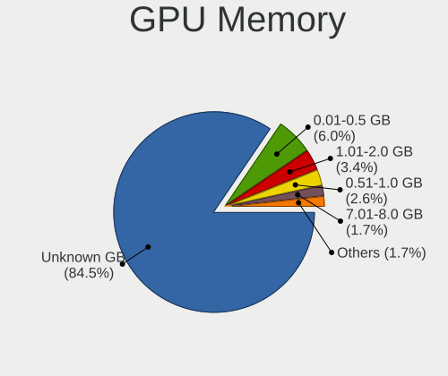

| Size in GB | Notebooks | Percent |
|------------|-----------|---------|
| Unknown    | 98        | 84.48%  |
| 0.01-0.5   | 7         | 6.03%   |
| 1.01-2.0   | 4         | 3.45%   |
| 0.51-1.0   | 3         | 2.59%   |
| 7.01-8.0   | 2         | 1.72%   |
| 3.01-4.0   | 2         | 1.72%   |

Monitor
-------

Monitor Vendor
--------------

Monitor vendors

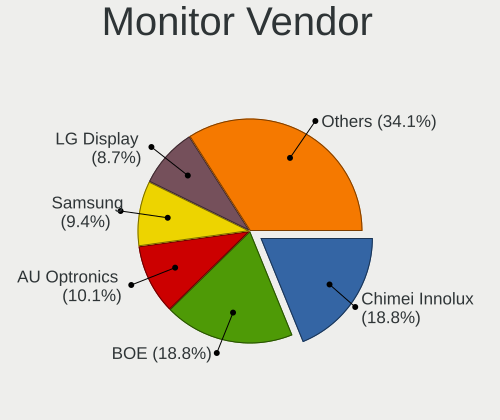

| Vendor                  | Notebooks | Percent |
|-------------------------|-----------|---------|
| Chimei Innolux          | 26        | 18.84%  |
| BOE                     | 26        | 18.84%  |
| AU Optronics            | 14        | 10.14%  |
| Samsung Electronics     | 13        | 9.42%   |
| LG Display              | 12        | 8.7%    |
| Apple                   | 6         | 4.35%   |
| Sharp                   | 5         | 3.62%   |
| Goldstar                | 4         | 2.9%    |
| Philips                 | 3         | 2.17%   |
| PANDA                   | 3         | 2.17%   |
| Lenovo                  | 3         | 2.17%   |
| Dell                    | 3         | 2.17%   |
| Chi Mei Optoelectronics | 3         | 2.17%   |
| Acer                    | 2         | 1.45%   |
| Unknown (AAA)           | 1         | 0.72%   |
| TMX                     | 1         | 0.72%   |
| Sony                    | 1         | 0.72%   |
| MStar                   | 1         | 0.72%   |
| LG Philips              | 1         | 0.72%   |
| KDC                     | 1         | 0.72%   |
| JDZ                     | 1         | 0.72%   |
| InfoVision              | 1         | 0.72%   |
| IBM                     | 1         | 0.72%   |
| HKC                     | 1         | 0.72%   |
| Hewlett-Packard         | 1         | 0.72%   |
| Daewoo                  | 1         | 0.72%   |
| BenQ                    | 1         | 0.72%   |
| ASUSTek Computer        | 1         | 0.72%   |
| AOC                     | 1         | 0.72%   |

Monitor Model
-------------

Monitor models

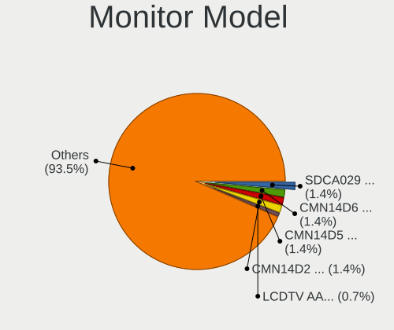

| Model                                                                   | Notebooks | Percent |
|-------------------------------------------------------------------------|-----------|---------|
| Samsung Electronics LCD Monitor SDCA029 3840x2160 344x194mm 15.5-inch   | 2         | 1.45%   |
| Chimei Innolux LCD Monitor CMN14D6 1366x768 309x173mm 13.9-inch         | 2         | 1.45%   |
| Chimei Innolux LCD Monitor CMN14D5 1920x1080 309x173mm 13.9-inch        | 2         | 1.45%   |
| Chimei Innolux LCD Monitor CMN14D2 1920x1080 309x173mm 13.9-inch        | 2         | 1.45%   |
| Unknown (AAA) LCDTV AAA3393 1360x768 890x500mm 40.2-inch                | 1         | 0.72%   |
| TMX TL142GDXP02-0 TMX1420 2520x1680 300x200mm 14.2-inch                 | 1         | 0.72%   |
| Sony TV SNYAB03 1920x1080                                               | 1         | 0.72%   |
| Sharp LQ156T1JW03 SHP1529 2560x1440 344x194mm 15.5-inch                 | 1         | 0.72%   |
| Sharp LQ156M1JW01 SHP14C3 1920x1080 344x194mm 15.5-inch                 | 1         | 0.72%   |
| Sharp LCD Monitor SHP148B 3840x2160 294x165mm 13.3-inch                 | 1         | 0.72%   |
| Sharp LCD Monitor SHP1449 1920x1080 294x165mm 13.3-inch                 | 1         | 0.72%   |
| Sharp LCD Monitor SHP1447 1920x1080 294x165mm 13.3-inch                 | 1         | 0.72%   |
| Samsung Electronics SyncMaster SAM0304 1680x1050 494x320mm 23.2-inch    | 1         | 0.72%   |
| Samsung Electronics LS24AG30x SAM7178 1920x1080 527x296mm 23.8-inch     | 1         | 0.72%   |
| Samsung Electronics LCD Monitor SEC4251 1366x768 344x194mm 15.5-inch    | 1         | 0.72%   |
| Samsung Electronics LCD Monitor SEC3041 1366x768 353x198mm 15.9-inch    | 1         | 0.72%   |
| Samsung Electronics LCD Monitor SDC5844 1920x1080 344x194mm 15.5-inch   | 1         | 0.72%   |
| Samsung Electronics LCD Monitor SDC4171 2880x1800 302x189mm 14.0-inch   | 1         | 0.72%   |
| Samsung Electronics LCD Monitor SDC4158 1920x1080 294x165mm 13.3-inch   | 1         | 0.72%   |
| Samsung Electronics LCD Monitor SDC414F 3456x2160 288x180mm 13.4-inch   | 1         | 0.72%   |
| Samsung Electronics LCD Monitor SAM7016 3840x2160 1872x1053mm 84.6-inch | 1         | 0.72%   |
| Samsung Electronics LCD Monitor SAM0C3C 1366x768 609x347mm 27.6-inch    | 1         | 0.72%   |
| Samsung Electronics LCD Monitor SAM0C26 1920x1080 1209x680mm 54.6-inch  | 1         | 0.72%   |
| Philips PHL 276B1 PHL0947 2560x1440 600x340mm 27.2-inch                 | 1         | 0.72%   |
| Philips PHL 243V7 PHLC155 1920x1080 527x296mm 23.8-inch                 | 1         | 0.72%   |
| Philips PHL 216V6 PHLC10D 1920x1080 419x262mm 19.5-inch                 | 1         | 0.72%   |
| PANDA LCD Monitor NCP004D 1920x1080 344x194mm 15.5-inch                 | 1         | 0.72%   |
| PANDA LCD Monitor NCP0036 1920x1080 344x194mm 15.5-inch                 | 1         | 0.72%   |
| PANDA LCD Monitor NCP0035 1920x1080 344x194mm 15.5-inch                 | 1         | 0.72%   |
| MStar LCD TV MST9000 1360x768                                           | 1         | 0.72%   |
| LG Philips LP154WX4-TLC8 LPL0120 1280x800 331x207mm 15.4-inch           | 1         | 0.72%   |
| LG Display LCD Monitor LGD0701 1920x1200 345x215mm 16.0-inch            | 1         | 0.72%   |
| LG Display LCD Monitor LGD06B3 1920x1200 336x210mm 15.6-inch            | 1         | 0.72%   |
| LG Display LCD Monitor LGD060F 1920x1080 309x174mm 14.0-inch            | 1         | 0.72%   |
| LG Display LCD Monitor LGD05E5 1920x1080 344x194mm 15.5-inch            | 1         | 0.72%   |
| LG Display LCD Monitor LGD0542 1920x1080 276x156mm 12.5-inch            | 1         | 0.72%   |
| LG Display LCD Monitor LGD04AF 1366x768 344x194mm 15.5-inch             | 1         | 0.72%   |
| LG Display LCD Monitor LGD045D 1366x768 345x194mm 15.6-inch             | 1         | 0.72%   |
| LG Display LCD Monitor LGD0456 1366x768 344x194mm 15.5-inch             | 1         | 0.72%   |
| LG Display LCD Monitor LGD0437 1920x1080 276x156mm 12.5-inch            | 1         | 0.72%   |

Monitor Resolution
------------------

Monitor screen resolution

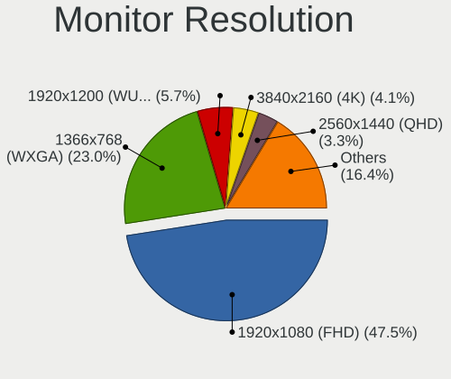

| Resolution         | Notebooks | Percent |
|--------------------|-----------|---------|
| 1920x1080 (FHD)    | 58        | 47.54%  |
| 1366x768 (WXGA)    | 28        | 22.95%  |
| 1920x1200 (WUXGA)  | 7         | 5.74%   |
| 3840x2160 (4K)     | 5         | 4.1%    |
| 2560x1440 (QHD)    | 4         | 3.28%   |
| 1280x800 (WXGA)    | 4         | 3.28%   |
| 1600x900 (HD+)     | 3         | 2.46%   |
| 1440x900 (WXGA+)   | 3         | 2.46%   |
| 1680x1050 (WSXGA+) | 2         | 1.64%   |
| 3456x2160          | 1         | 0.82%   |
| 3440x1440          | 1         | 0.82%   |
| 2880x1800          | 1         | 0.82%   |
| 2560x1600          | 1         | 0.82%   |
| 2560x1080          | 1         | 0.82%   |
| 2520x1680          | 1         | 0.82%   |
| 1920x1280          | 1         | 0.82%   |
| 1360x768           | 1         | 0.82%   |

Monitor Diagonal
----------------

Diagonal size in inches

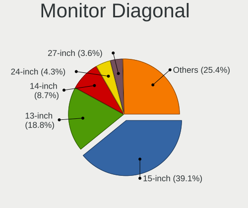

| Inches  | Notebooks | Percent |
|---------|-----------|---------|
| 15      | 54        | 39.13%  |
| 13      | 26        | 18.84%  |
| 14      | 12        | 8.7%    |
| 24      | 6         | 4.35%   |
| 27      | 5         | 3.62%   |
| 23      | 5         | 3.62%   |
| 17      | 5         | 3.62%   |
| 12      | 4         | 2.9%    |
| 11      | 4         | 2.9%    |
| 21      | 3         | 2.17%   |
| 40      | 2         | 1.45%   |
| 16      | 2         | 1.45%   |
| 84      | 1         | 0.72%   |
| 72      | 1         | 0.72%   |
| 63      | 1         | 0.72%   |
| 60      | 1         | 0.72%   |
| 34      | 1         | 0.72%   |
| 31      | 1         | 0.72%   |
| 19      | 1         | 0.72%   |
| 18      | 1         | 0.72%   |
| 10      | 1         | 0.72%   |
| Unknown | 1         | 0.72%   |

Monitor Width
-------------

Physical width

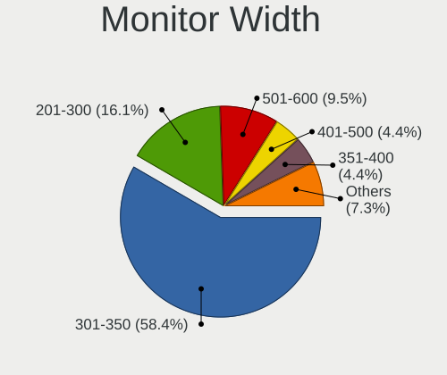

| Width in mm | Notebooks | Percent |
|-------------|-----------|---------|
| 301-350     | 80        | 58.39%  |
| 201-300     | 22        | 16.06%  |
| 501-600     | 13        | 9.49%   |
| 401-500     | 6         | 4.38%   |
| 351-400     | 6         | 4.38%   |
| 801-900     | 2         | 1.46%   |
| 601-700     | 2         | 1.46%   |
| 1501-2000   | 2         | 1.46%   |
| 1001-1500   | 2         | 1.46%   |
| 701-800     | 1         | 0.73%   |
| Unknown     | 1         | 0.73%   |

Aspect Ratio
------------

Proportional relationship between the width and the height

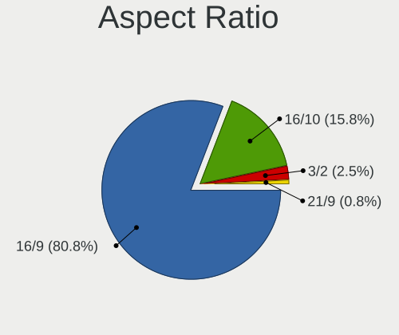

| Ratio | Notebooks | Percent |
|-------|-----------|---------|
| 16/9  | 97        | 80.83%  |
| 16/10 | 19        | 15.83%  |
| 3/2   | 3         | 2.5%    |
| 21/9  | 1         | 0.83%   |

Monitor Area
------------

Area in inch²

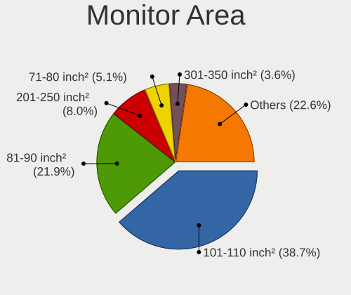

| Area in inch² | Notebooks | Percent |
|----------------|-----------|---------|
| 101-110        | 53        | 38.69%  |
| 81-90          | 30        | 21.9%   |
| 201-250        | 11        | 8.03%   |
| 71-80          | 7         | 5.11%   |
| 301-350        | 5         | 3.65%   |
| More than 1000 | 4         | 2.92%   |
| 61-70          | 4         | 2.92%   |
| 51-60          | 4         | 2.92%   |
| 121-130        | 4         | 2.92%   |
| 111-120        | 3         | 2.19%   |
| 351-500        | 2         | 1.46%   |
| 151-200        | 2         | 1.46%   |
| 501-1000       | 2         | 1.46%   |
| 41-50          | 1         | 0.73%   |
| 251-300        | 1         | 0.73%   |
| 141-150        | 1         | 0.73%   |
| 131-140        | 1         | 0.73%   |
| 91-100         | 1         | 0.73%   |
| Unknown        | 1         | 0.73%   |

Pixel Density
-------------

Pixels per inch

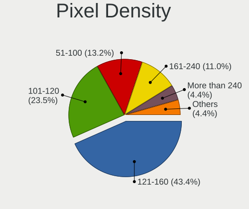

| Density       | Notebooks | Percent |
|---------------|-----------|---------|
| 121-160       | 59        | 43.38%  |
| 101-120       | 32        | 23.53%  |
| 51-100        | 18        | 13.24%  |
| 161-240       | 15        | 11.03%  |
| More than 240 | 6         | 4.41%   |
| 1-50          | 5         | 3.68%   |
| Unknown       | 1         | 0.74%   |

Multiple Monitors
-----------------

Total monitors connected

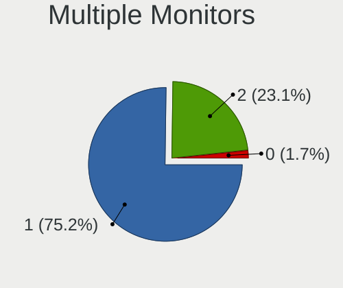

| Total | Notebooks | Percent |
|-------|-----------|---------|
| 1     | 88        | 75.21%  |
| 2     | 27        | 23.08%  |
| 0     | 2         | 1.71%   |

Network
-------

Net Controller Vendor
---------------------

Controller vendors

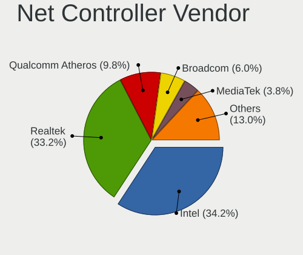

| Vendor                     | Notebooks | Percent |
|----------------------------|-----------|---------|
| Intel                      | 63        | 34.24%  |
| Realtek Semiconductor      | 61        | 33.15%  |
| Qualcomm Atheros           | 18        | 9.78%   |
| Broadcom                   | 11        | 5.98%   |
| MediaTek                   | 7         | 3.8%    |
| ASIX Electronics           | 4         | 2.17%   |
| Xiaomi                     | 2         | 1.09%   |
| Lenovo                     | 2         | 1.09%   |
| JMicron Technology         | 2         | 1.09%   |
| Hewlett-Packard            | 2         | 1.09%   |
| DisplayLink                | 2         | 1.09%   |
| Broadcom Limited           | 2         | 1.09%   |
| TP-Link                    | 1         | 0.54%   |
| Sierra Wireless            | 1         | 0.54%   |
| Shenzhen Goodix Technology | 1         | 0.54%   |
| Samsung Electronics        | 1         | 0.54%   |
| Ralink                     | 1         | 0.54%   |
| Nvidia                     | 1         | 0.54%   |
| Huawei Technologies        | 1         | 0.54%   |
| Fibocom                    | 1         | 0.54%   |

Net Controller Model
--------------------

Controller models

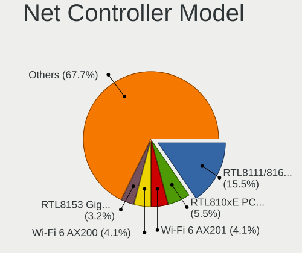

| Model                                                                   | Notebooks | Percent |
|-------------------------------------------------------------------------|-----------|---------|
| Realtek RTL8111/8168/8211/8411 PCI Express Gigabit Ethernet Controller  | 34        | 15.45%  |
| Realtek RTL810xE PCI Express Fast Ethernet controller                   | 12        | 5.45%   |
| Intel Wi-Fi 6 AX201                                                     | 9         | 4.09%   |
| Intel Wi-Fi 6 AX200                                                     | 9         | 4.09%   |
| Realtek RTL8153 Gigabit Ethernet Adapter                                | 7         | 3.18%   |
| Intel Wireless 8265 / 8275                                              | 7         | 3.18%   |
| Qualcomm Atheros QCA9377 802.11ac Wireless Network Adapter              | 5         | 2.27%   |
| Realtek RTL8821CE 802.11ac PCIe Wireless Network Adapter                | 4         | 1.82%   |
| Qualcomm Atheros QCA9565 / AR9565 Wireless Network Adapter              | 4         | 1.82%   |
| MediaTek MT7921 802.11ax PCIe Wireless Network Adapter [Filogic 330]    | 4         | 1.82%   |
| Intel Wireless 8260                                                     | 4         | 1.82%   |
| Intel Ethernet Connection (4) I219-LM                                   | 4         | 1.82%   |
| Intel Comet Lake PCH-LP CNVi WiFi                                       | 4         | 1.82%   |
| Broadcom BCM43142 802.11b/g/n                                           | 4         | 1.82%   |
| ASIX AX88179 Gigabit Ethernet                                           | 4         | 1.82%   |
| Realtek RTL8822CE 802.11ac PCIe Wireless Network Adapter                | 3         | 1.36%   |
| Realtek RTL8152 Fast Ethernet Adapter                                   | 3         | 1.36%   |
| Intel Wireless 7265                                                     | 3         | 1.36%   |
| Intel Ethernet Connection I219-V                                        | 3         | 1.36%   |
| Intel Alder Lake-P PCH CNVi WiFi                                        | 3         | 1.36%   |
| Broadcom NetXtreme BCM57765 Gigabit Ethernet PCIe                       | 3         | 1.36%   |
| Broadcom BCM4331 802.11a/b/g/n                                          | 3         | 1.36%   |
| Xiaomi Mi/Redmi series (RNDIS)                                          | 2         | 0.91%   |
| Realtek RTL8821AE 802.11ac PCIe Wireless Network Adapter                | 2         | 0.91%   |
| Realtek 802.11n WLAN Adapter                                            | 2         | 0.91%   |
| Qualcomm Atheros QCA6174 802.11ac Wireless Network Adapter              | 2         | 0.91%   |
| Qualcomm Atheros AR9285 Wireless Network Adapter (PCI-Express)          | 2         | 0.91%   |
| Qualcomm Atheros AR242x / AR542x Wireless Network Adapter (PCI-Express) | 2         | 0.91%   |
| JMicron JMC250 PCI Express Gigabit Ethernet Controller                  | 2         | 0.91%   |
| Intel Wi-Fi 6E(802.11ax) AX210/AX1675* 2x2 [Typhoon Peak]               | 2         | 0.91%   |
| Intel Tiger Lake PCH CNVi WiFi                                          | 2         | 0.91%   |
| Intel Jasper Lake PCH CNVi WiFi                                         | 2         | 0.91%   |
| Intel Centrino Advanced-N 6205 [Taylor Peak]                            | 2         | 0.91%   |
| Intel Cannon Lake PCH CNVi WiFi                                         | 2         | 0.91%   |
| DisplayLink Dell Universal Dock D6000                                   | 2         | 0.91%   |
| TP-Link Archer T3U [Realtek RTL8812BU]                                  | 1         | 0.45%   |
| Sierra Wireless EM7455                                                  | 1         | 0.45%   |
| Shenzhen Goodix Fingerprint Reader                                      | 1         | 0.45%   |
| Samsung Galaxy series, misc. (tethering mode)                           | 1         | 0.45%   |
| Realtek RTL88x2bu [AC1200 Techkey]                                      | 1         | 0.45%   |

Wireless Vendor
---------------

Wireless vendors

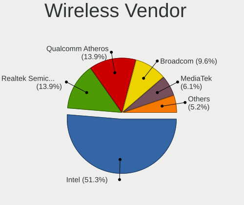

| Vendor                | Notebooks | Percent |
|-----------------------|-----------|---------|
| Intel                 | 59        | 51.3%   |
| Realtek Semiconductor | 16        | 13.91%  |
| Qualcomm Atheros      | 16        | 13.91%  |
| Broadcom              | 11        | 9.57%   |
| MediaTek              | 7         | 6.09%   |
| TP-Link               | 1         | 0.87%   |
| Sierra Wireless       | 1         | 0.87%   |
| Ralink                | 1         | 0.87%   |
| Hewlett-Packard       | 1         | 0.87%   |
| Fibocom               | 1         | 0.87%   |
| Broadcom Limited      | 1         | 0.87%   |

Wireless Model
--------------

Wireless models

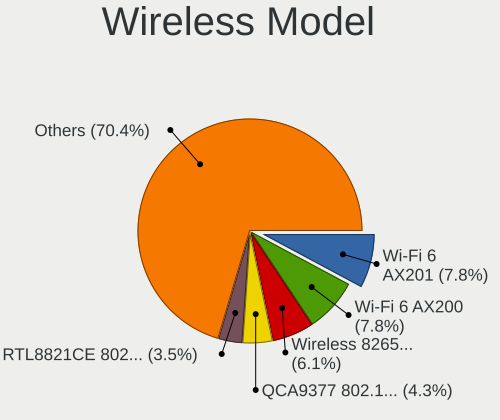

| Model                                                                   | Notebooks | Percent |
|-------------------------------------------------------------------------|-----------|---------|
| Intel Wi-Fi 6 AX201                                                     | 9         | 7.83%   |
| Intel Wi-Fi 6 AX200                                                     | 9         | 7.83%   |
| Intel Wireless 8265 / 8275                                              | 7         | 6.09%   |
| Qualcomm Atheros QCA9377 802.11ac Wireless Network Adapter              | 5         | 4.35%   |
| Realtek RTL8821CE 802.11ac PCIe Wireless Network Adapter                | 4         | 3.48%   |
| Qualcomm Atheros QCA9565 / AR9565 Wireless Network Adapter              | 4         | 3.48%   |
| MediaTek MT7921 802.11ax PCIe Wireless Network Adapter [Filogic 330]    | 4         | 3.48%   |
| Intel Wireless 8260                                                     | 4         | 3.48%   |
| Intel Comet Lake PCH-LP CNVi WiFi                                       | 4         | 3.48%   |
| Broadcom BCM43142 802.11b/g/n                                           | 4         | 3.48%   |
| Realtek RTL8822CE 802.11ac PCIe Wireless Network Adapter                | 3         | 2.61%   |
| Intel Wireless 7265                                                     | 3         | 2.61%   |
| Broadcom BCM4331 802.11a/b/g/n                                          | 3         | 2.61%   |
| Realtek RTL8821AE 802.11ac PCIe Wireless Network Adapter                | 2         | 1.74%   |
| Realtek 802.11n WLAN Adapter                                            | 2         | 1.74%   |
| Qualcomm Atheros QCA6174 802.11ac Wireless Network Adapter              | 2         | 1.74%   |
| Qualcomm Atheros AR9285 Wireless Network Adapter (PCI-Express)          | 2         | 1.74%   |
| Qualcomm Atheros AR242x / AR542x Wireless Network Adapter (PCI-Express) | 2         | 1.74%   |
| Intel Wi-Fi 6E(802.11ax) AX210/AX1675* 2x2 [Typhoon Peak]               | 2         | 1.74%   |
| Intel Tiger Lake PCH CNVi WiFi                                          | 2         | 1.74%   |
| Intel Jasper Lake PCH CNVi WiFi                                         | 2         | 1.74%   |
| Intel Centrino Advanced-N 6205 [Taylor Peak]                            | 2         | 1.74%   |
| Intel Cannon Lake PCH CNVi WiFi                                         | 2         | 1.74%   |
| TP-Link Archer T3U [Realtek RTL8812BU]                                  | 1         | 0.87%   |
| Sierra Wireless EM7455                                                  | 1         | 0.87%   |
| Realtek RTL88x2bu [AC1200 Techkey]                                      | 1         | 0.87%   |
| Realtek RTL8723BE PCIe Wireless Network Adapter                         | 1         | 0.87%   |
| Realtek RTL8723AE PCIe Wireless Network Adapter                         | 1         | 0.87%   |
| Realtek RTL8191SEvB Wireless LAN Controller                             | 1         | 0.87%   |
| Realtek RTL8188CE 802.11b/g/n WiFi Adapter                              | 1         | 0.87%   |
| Ralink RT3290 Wireless 802.11n 1T/1R PCIe                               | 1         | 0.87%   |
| Qualcomm Atheros AR9462 Wireless Network Adapter                        | 1         | 0.87%   |
| MediaTek MT7921K (RZ608) Wi-Fi 6E 80MHz                                 | 1         | 0.87%   |
| MediaTek MT7902 802.11ax PCIe Wireless Network Adapter [Filogic 310]    | 1         | 0.87%   |
| MediaTek 802.11 n WLAN                                                  | 1         | 0.87%   |
| Intel Wireless 7260                                                     | 1         | 0.87%   |
| Intel Wireless 3165                                                     | 1         | 0.87%   |
| Intel Wireless 3160                                                     | 1         | 0.87%   |
| Intel Wi-Fi 5(802.11ac) Wireless-AC 9x6x [Thunder Peak]                 | 1         | 0.87%   |
| Intel Raptor Lake PCH CNVi WiFi                                         | 1         | 0.87%   |

Ethernet Vendor
---------------

Ethernet vendors

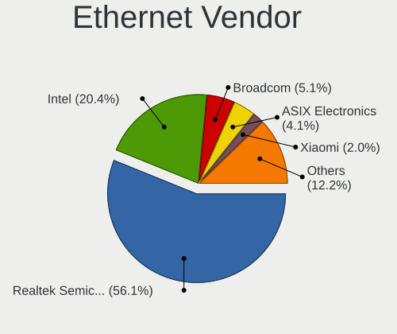

| Vendor                | Notebooks | Percent |
|-----------------------|-----------|---------|
| Realtek Semiconductor | 55        | 56.12%  |
| Intel                 | 20        | 20.41%  |
| Broadcom              | 5         | 5.1%    |
| ASIX Electronics      | 4         | 4.08%   |
| Xiaomi                | 2         | 2.04%   |
| Qualcomm Atheros      | 2         | 2.04%   |
| Lenovo                | 2         | 2.04%   |
| JMicron Technology    | 2         | 2.04%   |
| DisplayLink           | 2         | 2.04%   |
| Samsung Electronics   | 1         | 1.02%   |
| Nvidia                | 1         | 1.02%   |
| Hewlett-Packard       | 1         | 1.02%   |
| Broadcom Limited      | 1         | 1.02%   |

Ethernet Model
--------------

Ethernet models

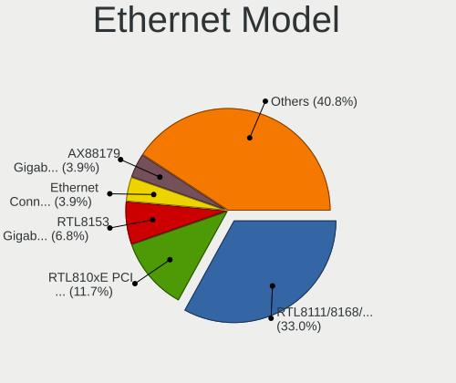

| Model                                                                  | Notebooks | Percent |
|------------------------------------------------------------------------|-----------|---------|
| Realtek RTL8111/8168/8211/8411 PCI Express Gigabit Ethernet Controller | 34        | 33.01%  |
| Realtek RTL810xE PCI Express Fast Ethernet controller                  | 12        | 11.65%  |
| Realtek RTL8153 Gigabit Ethernet Adapter                               | 7         | 6.8%    |
| Intel Ethernet Connection (4) I219-LM                                  | 4         | 3.88%   |
| ASIX AX88179 Gigabit Ethernet                                          | 4         | 3.88%   |
| Realtek RTL8152 Fast Ethernet Adapter                                  | 3         | 2.91%   |
| Intel Ethernet Connection I219-V                                       | 3         | 2.91%   |
| Intel Alder Lake-P PCH CNVi WiFi                                       | 3         | 2.91%   |
| Broadcom NetXtreme BCM57765 Gigabit Ethernet PCIe                      | 3         | 2.91%   |
| Xiaomi Mi/Redmi series (RNDIS)                                         | 2         | 1.94%   |
| JMicron JMC250 PCI Express Gigabit Ethernet Controller                 | 2         | 1.94%   |
| DisplayLink Dell Universal Dock D6000                                  | 2         | 1.94%   |
| Samsung Galaxy series, misc. (tethering mode)                          | 1         | 0.97%   |
| Realtek RTL8125 2.5GbE Controller                                      | 1         | 0.97%   |
| Realtek Killer E3000 2.5GbE Controller                                 | 1         | 0.97%   |
| Qualcomm Atheros QCA8172 Fast Ethernet                                 | 1         | 0.97%   |
| Qualcomm Atheros QCA8171 Gigabit Ethernet                              | 1         | 0.97%   |
| Nvidia MCP79 Ethernet                                                  | 1         | 0.97%   |
| Lenovo ThinkPad Lan                                                    | 1         | 0.97%   |
| Lenovo AX88179 Gigabit Ethernet [ThinkPad OneLink GigaLAN]             | 1         | 0.97%   |
| Intel Ethernet Connection I219-LM                                      | 1         | 0.97%   |
| Intel Ethernet Connection I218-LM                                      | 1         | 0.97%   |
| Intel Ethernet Connection I217-LM                                      | 1         | 0.97%   |
| Intel Ethernet Connection (4) I219-V                                   | 1         | 0.97%   |
| Intel Ethernet Connection (16) I219-V                                  | 1         | 0.97%   |
| Intel Ethernet Connection (16) I219-LM                                 | 1         | 0.97%   |
| Intel Ethernet Connection (14) I219-LM                                 | 1         | 0.97%   |
| Intel Ethernet Connection (11) I219-V                                  | 1         | 0.97%   |
| Intel Ethernet Connection (10) I219-V                                  | 1         | 0.97%   |
| Intel 82579LM Gigabit Network Connection (Lewisville)                  | 1         | 0.97%   |
| Intel 82577LM Gigabit Network Connection                               | 1         | 0.97%   |
| Intel 82567LM Gigabit Network Connection                               | 1         | 0.97%   |
| HP HP lt4120 Snapdragon X5 LTE                                         | 1         | 0.97%   |
| Broadcom NetXtreme BCM5764M Gigabit Ethernet PCIe                      | 1         | 0.97%   |
| Broadcom NetLink BCM57780 Gigabit Ethernet PCIe                        | 1         | 0.97%   |
| Broadcom Limited NetXtreme BCM5761 Gigabit Ethernet PCIe               | 1         | 0.97%   |

Net Controller Kind
-------------------

Ethernet, WiFi or modem

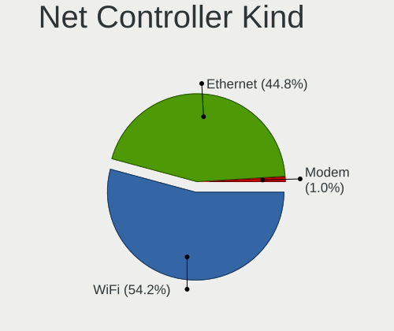

| Kind     | Notebooks | Percent |
|----------|-----------|---------|
| WiFi     | 110       | 54.19%  |
| Ethernet | 91        | 44.83%  |
| Modem    | 2         | 0.99%   |

Used Controller
---------------

Currently used network controller

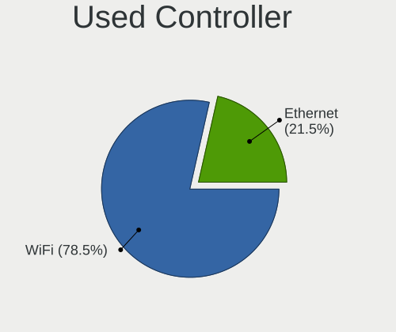

| Kind     | Notebooks | Percent |
|----------|-----------|---------|
| WiFi     | 95        | 78.51%  |
| Ethernet | 26        | 21.49%  |

NICs
----

Total network controllers on board

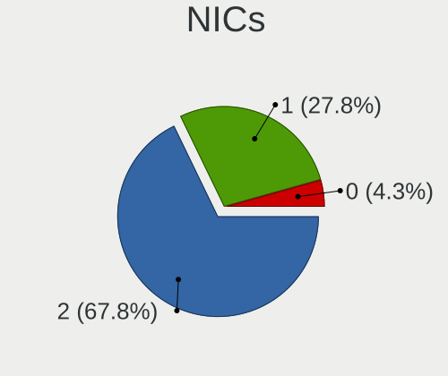

| Total | Notebooks | Percent |
|-------|-----------|---------|
| 2     | 78        | 67.83%  |
| 1     | 32        | 27.83%  |
| 0     | 5         | 4.35%   |

IPv6
----

IPv6 vs IPv4

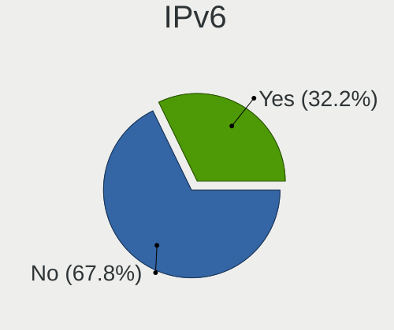

| Used | Notebooks | Percent |
|------|-----------|---------|
| No   | 80        | 67.8%   |
| Yes  | 38        | 32.2%   |

Bluetooth
---------

Bluetooth Vendor
----------------

Controller vendors

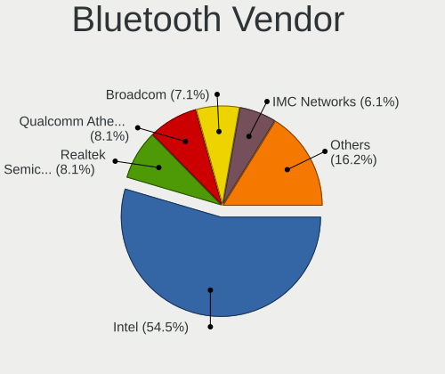

| Vendor                          | Notebooks | Percent |
|---------------------------------|-----------|---------|
| Intel                           | 54        | 54.55%  |
| Realtek Semiconductor           | 8         | 8.08%   |
| Qualcomm Atheros Communications | 8         | 8.08%   |
| Broadcom                        | 7         | 7.07%   |
| IMC Networks                    | 6         | 6.06%   |
| Apple                           | 6         | 6.06%   |
| Foxconn / Hon Hai               | 2         | 2.02%   |
| Dell                            | 2         | 2.02%   |
| Smart Modular Technologies      | 1         | 1.01%   |
| Realtek                         | 1         | 1.01%   |
| Ralink                          | 1         | 1.01%   |
| MediaTek                        | 1         | 1.01%   |
| Hewlett-Packard                 | 1         | 1.01%   |
| Foxconn International           | 1         | 1.01%   |

Bluetooth Model
---------------

Controller models

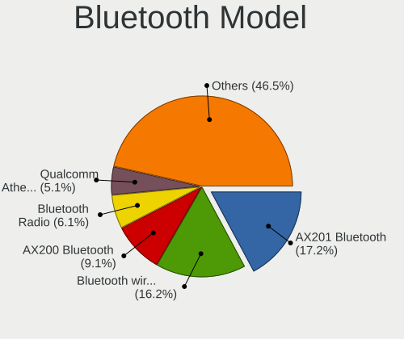

| Model                                              | Notebooks | Percent |
|----------------------------------------------------|-----------|---------|
| Intel AX201 Bluetooth                              | 17        | 17.17%  |
| Intel Bluetooth wireless interface                 | 16        | 16.16%  |
| Intel AX200 Bluetooth                              | 9         | 9.09%   |
| Realtek Bluetooth Radio                            | 6         | 6.06%   |
| Qualcomm Atheros  Bluetooth Device                 | 5         | 5.05%   |
| Intel Bluetooth 9460/9560 Jefferson Peak (JfP)     | 5         | 5.05%   |
| IMC Networks Wireless_Device                       | 4         | 4.04%   |
| Apple Bluetooth Host Controller                    | 4         | 4.04%   |
| Intel Bluetooth Device                             | 2         | 2.02%   |
| Intel AX210 Bluetooth                              | 2         | 2.02%   |
| Dell DW375 Bluetooth Module                        | 2         | 2.02%   |
| Apple Bluetooth USB Host Controller                | 2         | 2.02%   |
| Smart Modular Bluetooth Device                     | 1         | 1.01%   |
| Realtek RTL8821A Bluetooth                         | 1         | 1.01%   |
| Realtek RTL8723B Bluetooth                         | 1         | 1.01%   |
| Realtek Bluetooth Radio                            | 1         | 1.01%   |
| Ralink RT3290 Bluetooth                            | 1         | 1.01%   |
| Qualcomm Atheros QCA61x4 Bluetooth 4.0             | 1         | 1.01%   |
| Qualcomm Atheros AR3012 Bluetooth 4.0              | 1         | 1.01%   |
| Qualcomm Atheros AR3012 Bluetooth                  | 1         | 1.01%   |
| MediaTek Wireless_Device                           | 1         | 1.01%   |
| Intel Wireless-AC 9260 Bluetooth Adapter           | 1         | 1.01%   |
| Intel Wireless-AC 3168 Bluetooth                   | 1         | 1.01%   |
| Intel Centrino Bluetooth Wireless Transceiver      | 1         | 1.01%   |
| IMC Networks Bluetooth Radio                       | 1         | 1.01%   |
| IMC Networks Atheros AR3012 Bluetooth              | 1         | 1.01%   |
| HP Broadcom 2070 Bluetooth Combo                   | 1         | 1.01%   |
| Foxconn International BCM43142A0 Bluetooth module  | 1         | 1.01%   |
| Foxconn / Hon Hai MediaTek MT7921 Bluetooth        | 1         | 1.01%   |
| Foxconn / Hon Hai Bluetooth Device                 | 1         | 1.01%   |
| Broadcom HP Portable Bumble Bee                    | 1         | 1.01%   |
| Broadcom BCM43142A0 Bluetooth Device               | 1         | 1.01%   |
| Broadcom BCM43142A0 Bluetooth 4.0                  | 1         | 1.01%   |
| Broadcom BCM43142 Bluetooth 4.0                    | 1         | 1.01%   |
| Broadcom BCM2070 Bluetooth 2.1 + EDR               | 1         | 1.01%   |
| Broadcom BCM2045B (BDC-2.1) [Bluetooth Controller] | 1         | 1.01%   |
| Broadcom BCM2045B (BDC-2.1)                        | 1         | 1.01%   |

Sound
-----

Sound Vendor
------------

Sound card vendors

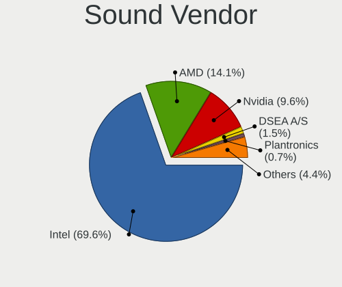

| Vendor                 | Notebooks | Percent |
|------------------------|-----------|---------|
| Intel                  | 94        | 69.63%  |
| AMD                    | 19        | 14.07%  |
| Nvidia                 | 13        | 9.63%   |
| DSEA A/S               | 2         | 1.48%   |
| Plantronics            | 1         | 0.74%   |
| Logitech               | 1         | 0.74%   |
| LINE TECH INDUSTRIAL   | 1         | 0.74%   |
| Lenovo                 | 1         | 0.74%   |
| GN Netcom              | 1         | 0.74%   |
| Arturia                | 1         | 0.74%   |
| AKAI Professional M.I. | 1         | 0.74%   |

Sound Model
-----------

Sound card models

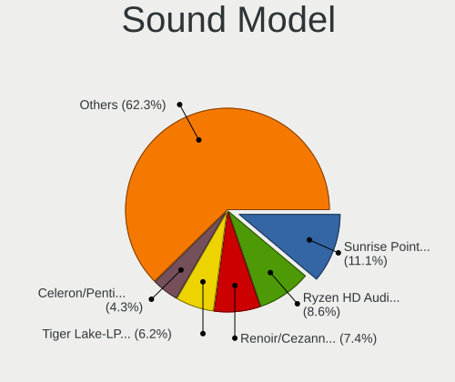

| Model                                                                      | Notebooks | Percent |
|----------------------------------------------------------------------------|-----------|---------|
| Intel Sunrise Point-LP HD Audio                                            | 18        | 11.11%  |
| AMD Ryzen HD Audio Controller                                              | 14        | 8.64%   |
| AMD Renoir/Cezanne HDMI/DP Audio Controller                                | 12        | 7.41%   |
| Intel Tiger Lake-LP Smart Sound Technology Audio Controller                | 10        | 6.17%   |
| Intel Celeron/Pentium Silver Processor High Definition Audio               | 7         | 4.32%   |
| Intel 5 Series/3400 Series Chipset High Definition Audio                   | 7         | 4.32%   |
| Intel 6 Series/C200 Series Chipset Family High Definition Audio Controller | 5         | 3.09%   |
| Intel Wildcat Point-LP High Definition Audio Controller                    | 4         | 2.47%   |
| Intel Tiger Lake-H HD Audio Controller                                     | 4         | 2.47%   |
| Intel Comet Lake PCH-LP cAVS                                               | 4         | 2.47%   |
| Intel Cannon Point-LP High Definition Audio Controller                     | 4         | 2.47%   |
| Intel Cannon Lake PCH cAVS                                                 | 4         | 2.47%   |
| Intel Broadwell-U Audio Controller                                         | 4         | 2.47%   |
| Intel 7 Series/C216 Chipset Family High Definition Audio Controller        | 4         | 2.47%   |
| Intel Haswell-ULT HD Audio Controller                                      | 3         | 1.85%   |
| Intel Comet Lake PCH cAVS                                                  | 3         | 1.85%   |
| Intel Alder Lake PCH-P High Definition Audio Controller                    | 3         | 1.85%   |
| Intel 8 Series HD Audio Controller                                         | 3         | 1.85%   |
| AMD FCH Azalia Controller                                                  | 3         | 1.85%   |
| Nvidia TU107 GeForce GTX 1650 High Definition Audio Controller             | 2         | 1.23%   |
| Nvidia GT216 HDMI Audio Controller                                         | 2         | 1.23%   |
| Nvidia GA106 High Definition Audio Controller                              | 2         | 1.23%   |
| Intel Xeon E3-1200 v3/4th Gen Core Processor HD Audio Controller           | 2         | 1.23%   |
| Intel Raptor Lake-P/U/H cAVS                                               | 2         | 1.23%   |
| Intel Jasper Lake HD Audio                                                 | 2         | 1.23%   |
| Intel 82801I (ICH9 Family) HD Audio Controller                             | 2         | 1.23%   |
| Intel 8 Series/C220 Series Chipset High Definition Audio Controller        | 2         | 1.23%   |
| Intel 100 Series/C230 Series Chipset Family HD Audio Controller            | 2         | 1.23%   |
| AMD Raven/Raven2/Fenghuang HDMI/DP Audio Controller                        | 2         | 1.23%   |
| AMD Kabini HDMI/DP Audio                                                   | 2         | 1.23%   |
| Plantronics Plantronics Blackwire 3225 Series                              | 1         | 0.62%   |
| Nvidia TU106 High Definition Audio Controller                              | 1         | 0.62%   |
| Nvidia TU104 HD Audio Controller                                           | 1         | 0.62%   |
| Nvidia MCP79 High Definition Audio                                         | 1         | 0.62%   |
| Nvidia High Definition Audio Controller                                    | 1         | 0.62%   |
| Nvidia GP107GL High Definition Audio Controller                            | 1         | 0.62%   |
| Nvidia GK208 HDMI/DP Audio Controller                                      | 1         | 0.62%   |
| Nvidia GA107 High Definition Audio Controller                              | 1         | 0.62%   |
| Logitech Logitech G PRO X Gaming Headset                                   | 1         | 0.62%   |
| LINE TECH INDUSTRIAL YTL HEADSET                                           | 1         | 0.62%   |

Memory
------

Memory Vendor
-------------

Memory module vendors

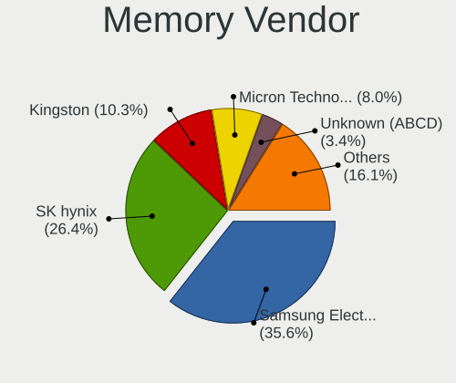

| Vendor              | Notebooks | Percent |
|---------------------|-----------|---------|
| Samsung Electronics | 31        | 35.63%  |
| SK hynix            | 23        | 26.44%  |
| Kingston            | 9         | 10.34%  |
| Micron Technology   | 7         | 8.05%   |
| Unknown (ABCD)      | 3         | 3.45%   |
| Elpida              | 3         | 3.45%   |
| Ramaxel Technology  | 2         | 2.3%    |
| Unknown             | 1         | 1.15%   |
| Teikon              | 1         | 1.15%   |
| Magnum Tech         | 1         | 1.15%   |
| ff                  | 1         | 1.15%   |
| fef5                | 1         | 1.15%   |
| ChangXin Memory     | 1         | 1.15%   |
| A-DATA Technology   | 1         | 1.15%   |
| 8945000080AD        | 1         | 1.15%   |
| 4ea5                | 1         | 1.15%   |

Memory Model
------------

Memory module models

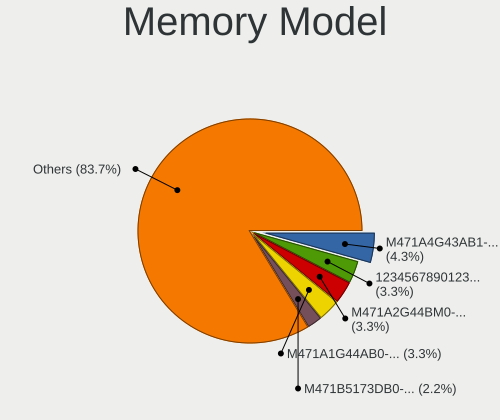

| Model                                                            | Notebooks | Percent |
|------------------------------------------------------------------|-----------|---------|
| Samsung RAM M471A4G43AB1-CWE 32GB SODIMM DDR4 3200MT/s           | 4         | 4.35%   |
| Unknown (ABCD) RAM 123456789012345678 2GB SODIMM LPDDR4 2400MT/s | 3         | 3.26%   |
| Samsung RAM M471A2G44BM0-CWE 16GB SODIMM DDR4 3200MT/s           | 3         | 3.26%   |
| Samsung RAM M471A1G44AB0-CWE 8GiB SODIMM DDR4 3200MT/s           | 3         | 3.26%   |
| SK hynix RAM HMA81GS6AFR8N-UH 8GB SODIMM DDR4 2667MT/s           | 2         | 2.17%   |
| Samsung RAM M471B5173DB0-YK0 4GB SODIMM DDR3 1600MT/s            | 2         | 2.17%   |
| Samsung RAM M471A1K43DB1-CWE 8GB SODIMM DDR4 3200MT/s            | 2         | 2.17%   |
| Samsung RAM M471A1K43CB1-CTD 8GB SODIMM DDR4 3200MT/s            | 2         | 2.17%   |
| Elpida RAM EBJ41UF8BCS0-DJ-F 4GB SODIMM DDR3 1334MT/s            | 2         | 2.17%   |
| Unknown RAM Module 2GB SODIMM DDR3 1066MT/s                      | 1         | 1.09%   |
| Teikon RAM TMT41GS6BFR8A-PBHJ 8GB SODIMM DDR3 1600MT/s           | 1         | 1.09%   |
| SK hynix RAM Module 8GB SODIMM DDR3 1600MT/s                     | 1         | 1.09%   |
| SK hynix RAM Module 4GB SODIMM DDR4 2133MT/s                     | 1         | 1.09%   |
| SK hynix RAM Module 2GB Row Of Chips LPDDR5 6400MT/s             | 1         | 1.09%   |
| SK hynix RAM Module 16GB SODIMM DDR4 2133MT/s                    | 1         | 1.09%   |
| SK hynix RAM HMT851S6AMR6R-PB 4GB SODIMM DDR3 1600MT/s           | 1         | 1.09%   |
| SK hynix RAM HMT41GS6MFR8C-PB 8GB SODIMM DDR3 1600MT/s           | 1         | 1.09%   |
| SK hynix RAM HMT41GS6AFR8A-PB 8GiB SODIMM DDR3 2667MT/s          | 1         | 1.09%   |
| SK hynix RAM HMT41GS6AFR8A-PB 8GB Chip DDR3 1600MT/s             | 1         | 1.09%   |
| SK hynix RAM HMT351S6EFR8A-PB 4GB SODIMM DDR3 1600MT/s           | 1         | 1.09%   |
| SK hynix RAM HMT351S6CFR8C-PB 4GB SODIMM DDR3 1600MT/s           | 1         | 1.09%   |
| SK hynix RAM HMT351S6CFR8C-PB 4096MB SODIMM DDR3 1600MT/s        | 1         | 1.09%   |
| SK hynix RAM HMT351S6CFR8C-H9 4GB SODIMM DDR3 1333MT/s           | 1         | 1.09%   |
| SK hynix RAM HMAB2GS6AMR6N-XN 16GB SODIMM DDR4 3200MT/s          | 1         | 1.09%   |
| SK hynix RAM HMAA2GS6AJR8N-XN 16GB SODIMM DDR4 3200MT/s          | 1         | 1.09%   |
| SK hynix RAM HMAA1GS6CJR6N-XN 8GB SODIMM DDR4 3200MT/s           | 1         | 1.09%   |
| SK hynix RAM HMA82GS6DJR8N-VK 16GB SODIMM DDR4 2667MT/s          | 1         | 1.09%   |
| SK hynix RAM HMA81GS6DJR8N-XN 8GB SODIMM DDR4 3200MT/s           | 1         | 1.09%   |
| SK hynix RAM HMA451S6AFR8N-TF 4GB SODIMM DDR4 2133MT/s           | 1         | 1.09%   |
| SK hynix RAM H9HCNNNCPMMLXR-NEE 8GB SODIMM LPDDR4 4266MT/s       | 1         | 1.09%   |
| SK hynix RAM H9HCNNN8KUMLHR-NME 1GB LPDDR4 2400MT/s              | 1         | 1.09%   |
| SK hynix RAM H9HCNNN8KUMLHR 1GB 2400MT/s                         | 1         | 1.09%   |
| SK hynix RAM H9CCNNNCLGALAR-NVD 8GB Row Of Chips LPDDR3 2133MT/s | 1         | 1.09%   |
| SK hynix RAM H9CCNNNCLGALAR-NUD 8GB Row Of Chips LPDDR3 1867MT/s | 1         | 1.09%   |
| Samsung RAM UBE3D4AA-MGCR 2GB Row Of Chips LPDDR4 4267MT/s       | 1         | 1.09%   |
| Samsung RAM Module 8GB SODIMM DDR4 3200MT/s                      | 1         | 1.09%   |
| Samsung RAM Module 8GB SODIMM DDR4 2133MT/s                      | 1         | 1.09%   |
| Samsung RAM Module 16GB SODIMM DDR4 2667MT/s                     | 1         | 1.09%   |
| Samsung RAM M471B5773DH0-CH9 2GB SODIMM DDR3 1600MT/s            | 1         | 1.09%   |
| Samsung RAM M471B5173EB0-YK0 4GB SODIMM DDR3 1600MT/s            | 1         | 1.09%   |

Memory Kind
-----------

Memory module kinds

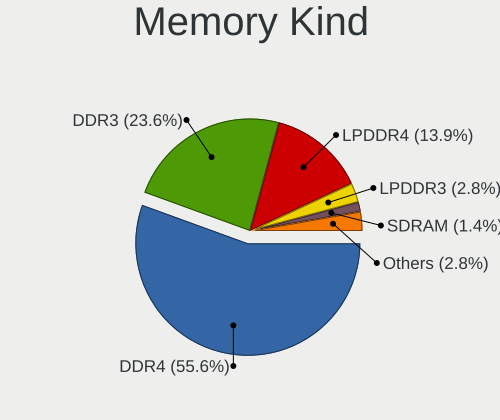

| Kind    | Notebooks | Percent |
|---------|-----------|---------|
| DDR4    | 40        | 55.56%  |
| DDR3    | 17        | 23.61%  |
| LPDDR4  | 10        | 13.89%  |
| LPDDR3  | 2         | 2.78%   |
| SDRAM   | 1         | 1.39%   |
| LPDDR5  | 1         | 1.39%   |
| Unknown | 1         | 1.39%   |

Memory Form Factor
------------------

Physical design of the memory module

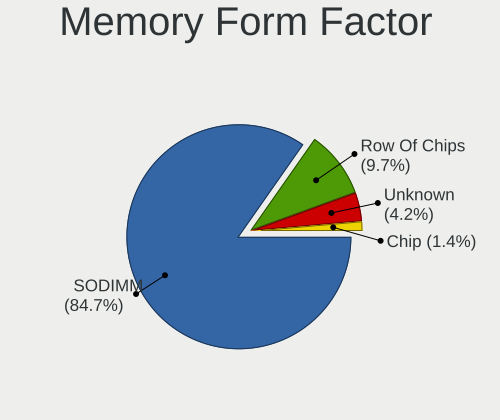

| Name         | Notebooks | Percent |
|--------------|-----------|---------|
| SODIMM       | 61        | 84.72%  |
| Row Of Chips | 7         | 9.72%   |
| Unknown      | 3         | 4.17%   |
| Chip         | 1         | 1.39%   |

Memory Size
-----------

Memory module size

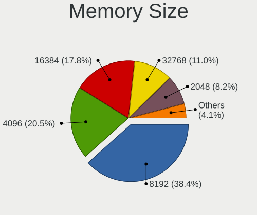

| Size  | Notebooks | Percent |
|-------|-----------|---------|
| 8192  | 28        | 38.36%  |
| 4096  | 15        | 20.55%  |
| 16384 | 13        | 17.81%  |
| 32768 | 8         | 10.96%  |
| 2048  | 6         | 8.22%   |
| 1024  | 3         | 4.11%   |

Memory Speed
------------

Memory module speed

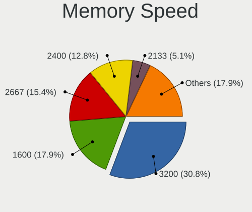

| Speed | Notebooks | Percent |
|-------|-----------|---------|
| 3200  | 24        | 30.77%  |
| 1600  | 14        | 17.95%  |
| 2667  | 12        | 15.38%  |
| 2400  | 10        | 12.82%  |
| 2133  | 4         | 5.13%   |
| 4267  | 2         | 2.56%   |
| 1334  | 2         | 2.56%   |
| 1333  | 2         | 2.56%   |
| 6400  | 1         | 1.28%   |
| 4266  | 1         | 1.28%   |
| 4199  | 1         | 1.28%   |
| 3733  | 1         | 1.28%   |
| 3266  | 1         | 1.28%   |
| 1867  | 1         | 1.28%   |
| 1067  | 1         | 1.28%   |
| 1066  | 1         | 1.28%   |

Printers & scanners
-------------------

Printer Vendor
--------------

Printer device vendors

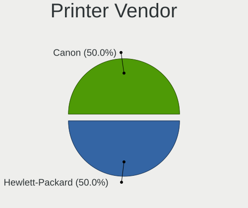

| Vendor          | Notebooks | Percent |
|-----------------|-----------|---------|
| Hewlett-Packard | 1         | 50%     |
| Canon           | 1         | 50%     |

Printer Model
-------------

Printer device models

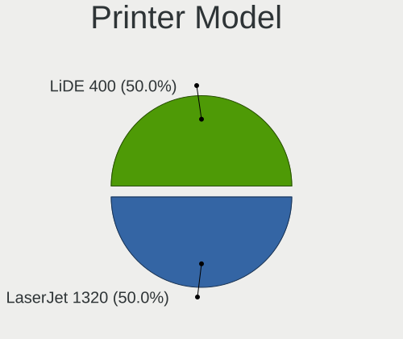

| Model            | Notebooks | Percent |
|------------------|-----------|---------|
| HP LaserJet 1320 | 1         | 50%     |
| Canon LiDE 400   | 1         | 50%     |

Scanner Vendor
--------------

Scanner device vendors

Zero info for selected period =(

Scanner Model
-------------

Scanner device models

Zero info for selected period =(

Camera
------

Camera Vendor
-------------

Camera device vendors

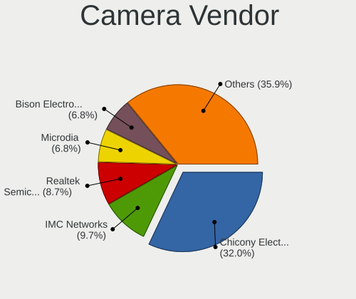

| Vendor                                 | Notebooks | Percent |
|----------------------------------------|-----------|---------|
| Chicony Electronics                    | 33        | 32.04%  |
| IMC Networks                           | 10        | 9.71%   |
| Realtek Semiconductor                  | 9         | 8.74%   |
| Microdia                               | 7         | 6.8%    |
| Bison Electronics                      | 7         | 6.8%    |
| Sunplus Innovation Technology          | 6         | 5.83%   |
| Quanta                                 | 6         | 5.83%   |
| Apple                                  | 5         | 4.85%   |
| Luxvisions Innotech Limited            | 4         | 3.88%   |
| Syntek                                 | 3         | 2.91%   |
| Cheng Uei Precision Industry (Foxlink) | 2         | 1.94%   |
| Unknown (3730304231393831325530)       | 1         | 0.97%   |
| Suyin                                  | 1         | 0.97%   |
| Silicon Motion                         | 1         | 0.97%   |
| ShineTech                              | 1         | 0.97%   |
| Samsung Electronics                    | 1         | 0.97%   |
| Polycom                                | 1         | 0.97%   |
| Pixart Imaging                         | 1         | 0.97%   |
| Logitech                               | 1         | 0.97%   |
| ALi                                    | 1         | 0.97%   |
| Alcor Micro                            | 1         | 0.97%   |
| Unknown                                | 1         | 0.97%   |

Camera Model
------------

Camera device models

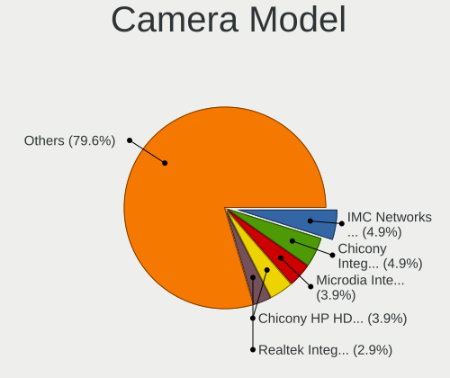

| Model                                       | Notebooks | Percent |
|---------------------------------------------|-----------|---------|
| IMC Networks USB2.0 HD UVC WebCam           | 5         | 4.85%   |
| Chicony Integrated Camera                   | 5         | 4.85%   |
| Microdia Integrated_Webcam_HD               | 4         | 3.88%   |
| Chicony HP HD Camera                        | 4         | 3.88%   |
| Realtek Integrated_Webcam_HD                | 3         | 2.91%   |
| Quanta USB2.0 HD UVC WebCam                 | 3         | 2.91%   |
| IMC Networks Integrated Camera              | 3         | 2.91%   |
| Chicony USB2.0 Camera                       | 3         | 2.91%   |
| Chicony Integrated IR Camera                | 3         | 2.91%   |
| Chicony HD Webcam                           | 3         | 2.91%   |
| Bison SunplusIT Integrated Camera           | 3         | 2.91%   |
| Apple FaceTime HD Camera                    | 3         | 2.91%   |
| Syntek Integrated Camera                    | 2         | 1.94%   |
| Sunplus Integrated Camera                   | 2         | 1.94%   |
| Luxvisions Innotech Limited HP HD Camera    | 2         | 1.94%   |
| Chicony USB2.0 VGA UVC WebCam               | 2         | 1.94%   |
| Chicony USB2.0 0.3M UVC WebCam              | 2         | 1.94%   |
| Bison EasyCamera                            | 2         | 1.94%   |
| Apple Built-in iSight                       | 2         | 1.94%   |
| Unknown (3730304231393831325530) USB Camera | 1         | 0.97%   |
| Syntek Lenovo EasyCamera                    | 1         | 0.97%   |
| Suyin HP Truevision HD                      | 1         | 0.97%   |
| Sunplus Laptop_Integrated_Webcam_FHD        | 1         | 0.97%   |
| Sunplus Integrated_Webcam_HD                | 1         | 0.97%   |
| Sunplus HD WebCam                           | 1         | 0.97%   |
| Sunplus Aukey-PC-LM1E Camera                | 1         | 0.97%   |
| Silicon Motion 300k Pixel Camera            | 1         | 0.97%   |
| ShineTech USB2.0 HD UVC WebCam              | 1         | 0.97%   |
| Samsung Galaxy series, misc. (MTP mode)     | 1         | 0.97%   |
| Realtek USB2.0 HD UVC WebCam                | 1         | 0.97%   |
| Realtek USB2.0 camera                       | 1         | 0.97%   |
| Realtek USB Camera                          | 1         | 0.97%   |
| Realtek Lenovo EasyCamera                   | 1         | 0.97%   |
| Realtek Integrated Webcam HD                | 1         | 0.97%   |
| Realtek Integrated Webcam                   | 1         | 0.97%   |
| Quanta VGA WebCam                           | 1         | 0.97%   |
| Quanta HP Wide Vision HD Camera             | 1         | 0.97%   |
| Quanta HP Webcam                            | 1         | 0.97%   |
| Polycom Poly Studio P5 webcam               | 1         | 0.97%   |
| Pixart Imaging USB_2.0_Webcam               | 1         | 0.97%   |

Security
--------

Fingerprint Vendor
------------------

Fingerprint sensor vendors

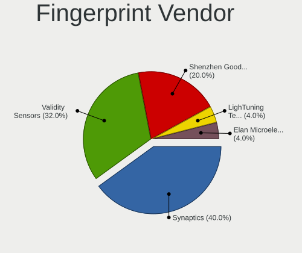

| Vendor                     | Notebooks | Percent |
|----------------------------|-----------|---------|
| Synaptics                  | 10        | 40%     |
| Validity Sensors           | 8         | 32%     |
| Shenzhen Goodix Technology | 5         | 20%     |
| LighTuning Technology      | 1         | 4%      |
| Elan Microelectronics      | 1         | 4%      |

Fingerprint Model
-----------------

Fingerprint sensor models

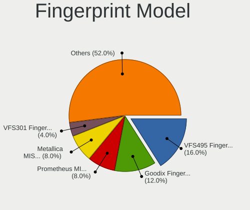

| Model                                                     | Notebooks | Percent |
|-----------------------------------------------------------|-----------|---------|
| Validity Sensors VFS495 Fingerprint Reader                | 4         | 16%     |
| Shenzhen Goodix  Fingerprint Device                       | 3         | 12%     |
| Synaptics Prometheus MIS Touch Fingerprint Reader         | 2         | 8%      |
| Synaptics Metallica MIS Touch Fingerprint Reader          | 2         | 8%      |
| Validity Sensors VFS301 Fingerprint Reader                | 1         | 4%      |
| Validity Sensors VFS 5011 fingerprint sensor              | 1         | 4%      |
| Validity Sensors Synaptics WBDI                           | 1         | 4%      |
| Validity Sensors Swipe Fingerprint Sensor                 | 1         | 4%      |
| Synaptics UWP WBDI Device                                 | 1         | 4%      |
| Synaptics TouchPad                                        | 1         | 4%      |
| Synaptics  WBDI                                           | 1         | 4%      |
| Synaptics  FS7604 Touch Fingerprint Sensor with PurePrint | 1         | 4%      |
| Synaptics FS7604 Touch Fingerprint Sensor with PurePrint  | 1         | 4%      |
| Shenzhen Goodix Fingerprint Reader                        | 1         | 4%      |
| Shenzhen Goodix FingerPrint                               | 1         | 4%      |
| LighTuning ES603 Swipe Fingerprint Sensor                 | 1         | 4%      |
| Elan ELAN:Fingerprint                                     | 1         | 4%      |
| Unknown                                                   | 1         | 4%      |

Chipcard Vendor
---------------

Chipcard module vendors

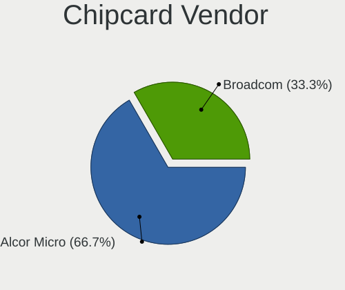

| Vendor      | Notebooks | Percent |
|-------------|-----------|---------|
| Alcor Micro | 4         | 66.67%  |
| Broadcom    | 2         | 33.33%  |

Chipcard Model
--------------

Chipcard module models

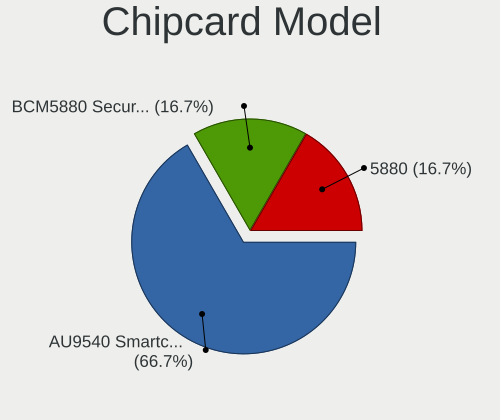

| Model                                          | Notebooks | Percent |
|------------------------------------------------|-----------|---------|
| Alcor Micro AU9540 Smartcard Reader            | 4         | 66.67%  |
| Broadcom BCM5880 Secure Applications Processor | 1         | 16.67%  |
| Broadcom 5880                                  | 1         | 16.67%  |

Unsupported
-----------

Unsupported Devices
-------------------

Total unsupported devices on board

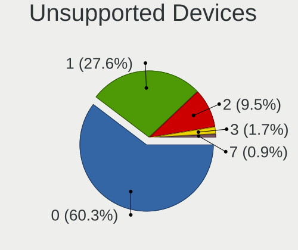

| Total | Notebooks | Percent |
|-------|-----------|---------|
| 0     | 70        | 60.34%  |
| 1     | 32        | 27.59%  |
| 2     | 11        | 9.48%   |
| 3     | 2         | 1.72%   |
| 7     | 1         | 0.86%   |

Unsupported Device Types
------------------------

Types of unsupported devices

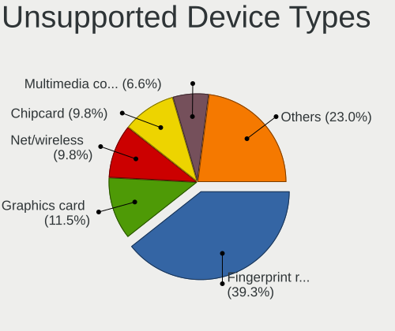

| Type                     | Notebooks | Percent |
|--------------------------|-----------|---------|
| Fingerprint reader       | 24        | 39.34%  |
| Graphics card            | 7         | 11.48%  |
| Net/wireless             | 6         | 9.84%   |
| Chipcard                 | 6         | 9.84%   |
| Multimedia controller    | 4         | 6.56%   |
| Communication controller | 4         | 6.56%   |
| Camera                   | 4         | 6.56%   |
| Sound                    | 2         | 3.28%   |
| Card reader              | 2         | 3.28%   |
| Bluetooth                | 2         | 3.28%   |

