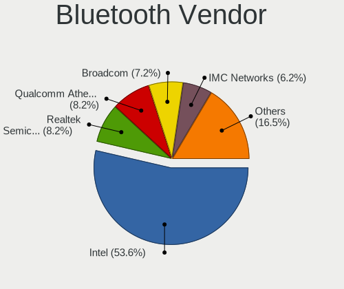
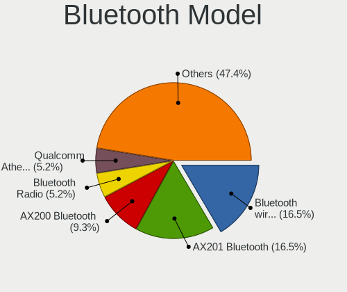
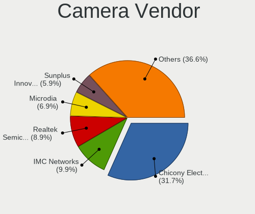

Ubuntu Budgie 22.04 - Tested Hardware & Statistics (Notebooks)
--------------------------------------------------------------

A project to collect tested hardware configurations for Ubuntu Budgie 22.04.

Anyone can contribute to this report by the [hw-probe](https://github.com/linuxhw/hw-probe) tool:

    sudo -E hw-probe -all -upload

Please contribute! Especially if your hardware is rare.

Contents
--------

* [ Test Cases ](#test-cases)

* [ System ](#system)
  - [ Kernel                   ](#kernel)
  - [ Kernel Family            ](#kernel-family)
  - [ Kernel Major Ver.        ](#kernel-major-ver)
  - [ Arch                     ](#arch)
  - [ DE                       ](#de)
  - [ Display Server           ](#display-server)
  - [ Display Manager          ](#display-manager)
  - [ OS Lang                  ](#os-lang)
  - [ Boot Mode                ](#boot-mode)
  - [ Filesystem               ](#filesystem)
  - [ Part. scheme             ](#part-scheme)
  - [ Dual Boot with Linux/BSD ](#dual-boot-with-linuxbsd)
  - [ Dual Boot (Win)          ](#dual-boot-win)

* [ Board ](#board)
  - [ Vendor                   ](#vendor)
  - [ Model                    ](#model)
  - [ Model Family             ](#model-family)
  - [ MFG Year                 ](#mfg-year)
  - [ Form Factor              ](#form-factor)
  - [ Secure Boot              ](#secure-boot)
  - [ Coreboot                 ](#coreboot)
  - [ RAM Size                 ](#ram-size)
  - [ RAM Used                 ](#ram-used)
  - [ Total Drives             ](#total-drives)
  - [ Has CD-ROM               ](#has-cd-rom)
  - [ Has Ethernet             ](#has-ethernet)
  - [ Has WiFi                 ](#has-wifi)
  - [ Has Bluetooth            ](#has-bluetooth)

* [ Location ](#location)
  - [ Country                  ](#country)
  - [ City                     ](#city)

* [ Drives ](#drives)
  - [ Drive Vendor             ](#drive-vendor)
  - [ Drive Model              ](#drive-model)
  - [ HDD Vendor               ](#hdd-vendor)
  - [ SSD Vendor               ](#ssd-vendor)
  - [ Drive Kind               ](#drive-kind)
  - [ Drive Connector          ](#drive-connector)
  - [ Drive Size               ](#drive-size)
  - [ Space Total              ](#space-total)
  - [ Space Used               ](#space-used)
  - [ Malfunc. Drives          ](#malfunc-drives)
  - [ Malfunc. Drive Vendor    ](#malfunc-drive-vendor)
  - [ Malfunc. HDD Vendor      ](#malfunc-hdd-vendor)
  - [ Malfunc. Drive Kind      ](#malfunc-drive-kind)
  - [ Failed Drives            ](#failed-drives)
  - [ Failed Drive Vendor      ](#failed-drive-vendor)
  - [ Drive Status             ](#drive-status)

* [ Storage controller ](#storage-controller)
  - [ Storage Vendor           ](#storage-vendor)
  - [ Storage Model            ](#storage-model)
  - [ Storage Kind             ](#storage-kind)

* [ Processor ](#processor)
  - [ CPU Vendor               ](#cpu-vendor)
  - [ CPU Model                ](#cpu-model)
  - [ CPU Model Family         ](#cpu-model-family)
  - [ CPU Cores                ](#cpu-cores)
  - [ CPU Sockets              ](#cpu-sockets)
  - [ CPU Threads              ](#cpu-threads)
  - [ CPU Op-Modes             ](#cpu-op-modes)
  - [ CPU Microcode            ](#cpu-microcode)
  - [ CPU Microarch            ](#cpu-microarch)

* [ Graphics ](#graphics)
  - [ GPU Vendor               ](#gpu-vendor)
  - [ GPU Model                ](#gpu-model)
  - [ GPU Combo                ](#gpu-combo)
  - [ GPU Driver               ](#gpu-driver)
  - [ GPU Memory               ](#gpu-memory)

* [ Monitor ](#monitor)
  - [ Monitor Vendor           ](#monitor-vendor)
  - [ Monitor Model            ](#monitor-model)
  - [ Monitor Resolution       ](#monitor-resolution)
  - [ Monitor Diagonal         ](#monitor-diagonal)
  - [ Monitor Width            ](#monitor-width)
  - [ Aspect Ratio             ](#aspect-ratio)
  - [ Monitor Area             ](#monitor-area)
  - [ Pixel Density            ](#pixel-density)
  - [ Multiple Monitors        ](#multiple-monitors)

* [ Network ](#network)
  - [ Net Controller Vendor    ](#net-controller-vendor)
  - [ Net Controller Model     ](#net-controller-model)
  - [ Wireless Vendor          ](#wireless-vendor)
  - [ Wireless Model           ](#wireless-model)
  - [ Ethernet Vendor          ](#ethernet-vendor)
  - [ Ethernet Model           ](#ethernet-model)
  - [ Net Controller Kind      ](#net-controller-kind)
  - [ Used Controller          ](#used-controller)
  - [ NICs                     ](#nics)
  - [ IPv6                     ](#ipv6)

* [ Bluetooth ](#bluetooth)
  - [ Bluetooth Vendor         ](#bluetooth-vendor)
  - [ Bluetooth Model          ](#bluetooth-model)

* [ Sound ](#sound)
  - [ Sound Vendor             ](#sound-vendor)
  - [ Sound Model              ](#sound-model)

* [ Memory ](#memory)
  - [ Memory Vendor            ](#memory-vendor)
  - [ Memory Model             ](#memory-model)
  - [ Memory Kind              ](#memory-kind)
  - [ Memory Form Factor       ](#memory-form-factor)
  - [ Memory Size              ](#memory-size)
  - [ Memory Speed             ](#memory-speed)

* [ Printers & scanners ](#printers--scanners)
  - [ Printer Vendor           ](#printer-vendor)
  - [ Printer Model            ](#printer-model)
  - [ Scanner Vendor           ](#scanner-vendor)
  - [ Scanner Model            ](#scanner-model)

* [ Camera ](#camera)
  - [ Camera Vendor            ](#camera-vendor)
  - [ Camera Model             ](#camera-model)

* [ Security ](#security)
  - [ Fingerprint Vendor       ](#fingerprint-vendor)
  - [ Fingerprint Model        ](#fingerprint-model)
  - [ Chipcard Vendor          ](#chipcard-vendor)
  - [ Chipcard Model           ](#chipcard-model)

* [ Unsupported ](#unsupported)
  - [ Unsupported Devices      ](#unsupported-devices)
  - [ Unsupported Device Types ](#unsupported-device-types)

Test Cases
----------

Total: 80

| Vendor        | Model                       | Probe                                                      | Date         |
|---------------|-----------------------------|------------------------------------------------------------|--------------|
| Dell          | Inspiron 3543               | [d714304a67](https://linux-hardware.org/?probe=d714304a67) | Mar 27, 2023 |
| Dell          | Inspiron 3543               | [f733f5b792](https://linux-hardware.org/?probe=f733f5b792) | Mar 27, 2023 |
| Lenovo        | ThinkPad E15 20RD003KHV     | [8701ff9985](https://linux-hardware.org/?probe=8701ff9985) | Mar 26, 2023 |
| MSI           | Alpha 15 B5EEK              | [03f3f846eb](https://linux-hardware.org/?probe=03f3f846eb) | Mar 24, 2023 |
| Dell          | Latitude 7480               | [0301ad09f6](https://linux-hardware.org/?probe=0301ad09f6) | Mar 23, 2023 |
| ASUSTek       | X555LAB                     | [18bf88d413](https://linux-hardware.org/?probe=18bf88d413) | Mar 17, 2023 |
| Lenovo        | IdeaPad Z500 20202          | [a7d30f68b1](https://linux-hardware.org/?probe=a7d30f68b1) | Mar 12, 2023 |
| Lenovo        | IdeaPad Z500 20202          | [d7ed4aaf2c](https://linux-hardware.org/?probe=d7ed4aaf2c) | Mar 11, 2023 |
| Lenovo        | IdeaPad Z500 20202          | [6e97141469](https://linux-hardware.org/?probe=6e97141469) | Mar 10, 2023 |
| ASUSTek       | K52F                        | [8fa6eaf7cf](https://linux-hardware.org/?probe=8fa6eaf7cf) | Mar 10, 2023 |
| Lenovo        | IdeaPad Z500 20202          | [8a70478523](https://linux-hardware.org/?probe=8a70478523) | Mar 06, 2023 |
| Lenovo        | IdeaPad Z500 20202          | [6e08a2dcf9](https://linux-hardware.org/?probe=6e08a2dcf9) | Mar 06, 2023 |
| ASUSTek       | ASUS EXPERTBOOK P2451FA_... | [e3578290d2](https://linux-hardware.org/?probe=e3578290d2) | Feb 25, 2023 |
| TUXEDO        | InfinityBook S 15 Gen6      | [ee44dc2539](https://linux-hardware.org/?probe=ee44dc2539) | Jan 27, 2023 |
| HP            | ProBook 450 G7              | [1d507a3cdc](https://linux-hardware.org/?probe=1d507a3cdc) | Jan 27, 2023 |
| TUXEDO        | InfinityBook S 15 Gen6      | [7bf2d60c0b](https://linux-hardware.org/?probe=7bf2d60c0b) | Jan 21, 2023 |
| TUXEDO        | Polaris Intel Gen3 (TGL)    | [7da34e4f7f](https://linux-hardware.org/?probe=7da34e4f7f) | Dec 14, 2022 |
| HP            | ProBook 445 G7              | [b34265fdbe](https://linux-hardware.org/?probe=b34265fdbe) | Dec 14, 2022 |
| Lenovo        | ThinkPad E15 20RD003KHV     | [ea74cd284c](https://linux-hardware.org/?probe=ea74cd284c) | Dec 08, 2022 |
| Lenovo        | ThinkPad E15 20RD003KHV     | [bdc64a5196](https://linux-hardware.org/?probe=bdc64a5196) | Dec 02, 2022 |
| Lenovo        | Legion Y530-15ICH 81FV      | [615b292682](https://linux-hardware.org/?probe=615b292682) | Dec 01, 2022 |
| Dell          | Inspiron 5566               | [a130766490](https://linux-hardware.org/?probe=a130766490) | Nov 29, 2022 |
| Lenovo        | V15 G2 ALC 82KD             | [be7a4a88a1](https://linux-hardware.org/?probe=be7a4a88a1) | Nov 23, 2022 |
| Dell          | XPS 13 9310                 | [104082422f](https://linux-hardware.org/?probe=104082422f) | Nov 04, 2022 |
| Dell          | XPS 13 9310                 | [2f2963b2fc](https://linux-hardware.org/?probe=2f2963b2fc) | Nov 04, 2022 |
| Razer         | Blade 15 Advanced Model ... | [e0a589194b](https://linux-hardware.org/?probe=e0a589194b) | Nov 01, 2022 |
| Lenovo        | ThinkPad T480 20L6SDR21A    | [b401e89d9c](https://linux-hardware.org/?probe=b401e89d9c) | Oct 31, 2022 |
| Lenovo        | ThinkPad T480 20L6SDR21A    | [4650c9df06](https://linux-hardware.org/?probe=4650c9df06) | Oct 31, 2022 |
| TUXEDO        | Aura 15 Gen1                | [4055c79756](https://linux-hardware.org/?probe=4055c79756) | Oct 28, 2022 |
| Toshiba       | Satellite A505              | [41dafcbfb9](https://linux-hardware.org/?probe=41dafcbfb9) | Oct 25, 2022 |
| ASUSTek       | X205TA                      | [2da58f110d](https://linux-hardware.org/?probe=2da58f110d) | Oct 24, 2022 |
| Dell          | Vostro 15 5510              | [b397c3fd26](https://linux-hardware.org/?probe=b397c3fd26) | Oct 18, 2022 |
| Dell          | Latitude E5420              | [dcc7463646](https://linux-hardware.org/?probe=dcc7463646) | Oct 16, 2022 |
| Digibras      | NH4CU03                     | [45912a4bae](https://linux-hardware.org/?probe=45912a4bae) | Oct 16, 2022 |
| Lenovo        | IdeaPad C340-14API 81N6     | [3028d439cf](https://linux-hardware.org/?probe=3028d439cf) | Oct 14, 2022 |
| Dell          | XPS 13 9360                 | [6def734895](https://linux-hardware.org/?probe=6def734895) | Oct 14, 2022 |
| Lenovo        | ThinkPad E15 20RD003KHV     | [f4d09b3dae](https://linux-hardware.org/?probe=f4d09b3dae) | Oct 13, 2022 |
| AXIOO         | Slimbook 13                 | [221b0b500d](https://linux-hardware.org/?probe=221b0b500d) | Oct 09, 2022 |
| Lenovo        | ThinkPad T440 20B7S0F100    | [fee12e32e5](https://linux-hardware.org/?probe=fee12e32e5) | Oct 07, 2022 |
| Dell          | Precision 5560              | [168025b691](https://linux-hardware.org/?probe=168025b691) | Oct 03, 2022 |
| Dell          | Latitude E6410              | [98545a1050](https://linux-hardware.org/?probe=98545a1050) | Sep 30, 2022 |
| HP            | ProBook 450 G8 Notebook ... | [15d9ea100b](https://linux-hardware.org/?probe=15d9ea100b) | Sep 26, 2022 |
| TUXEDO        | Book BA1510                 | [76a485fe7e](https://linux-hardware.org/?probe=76a485fe7e) | Sep 22, 2022 |
| ASUSTek       | ZenBook UX533FD_UX533FD     | [f185fff0a3](https://linux-hardware.org/?probe=f185fff0a3) | Sep 21, 2022 |
| Lenovo        | G50-45 80E3                 | [5c9688dac8](https://linux-hardware.org/?probe=5c9688dac8) | Sep 19, 2022 |
| Lenovo        | G500 20236                  | [fc210ff2c2](https://linux-hardware.org/?probe=fc210ff2c2) | Sep 07, 2022 |
| Google        | Rabbid                      | [8049c3894c](https://linux-hardware.org/?probe=8049c3894c) | Aug 24, 2022 |
| Lenovo        | G500 20236                  | [45df8f9be9](https://linux-hardware.org/?probe=45df8f9be9) | Aug 18, 2022 |
| Lenovo        | G500 20236                  | [6974cf32ce](https://linux-hardware.org/?probe=6974cf32ce) | Aug 17, 2022 |
| TUXEDO        | Book XUX7 Gen11             | [ecf8be45de](https://linux-hardware.org/?probe=ecf8be45de) | Aug 16, 2022 |
| TUXEDO        | Book XUX7 Gen11             | [c5c7e42e91](https://linux-hardware.org/?probe=c5c7e42e91) | Aug 16, 2022 |
| Dell          | Inspiron 3793               | [15f2e25089](https://linux-hardware.org/?probe=15f2e25089) | Jul 29, 2022 |
| ASUSTek       | VivoBook_ASUSLaptop X705... | [e82d2e1076](https://linux-hardware.org/?probe=e82d2e1076) | Jul 28, 2022 |
| HP            | EliteBook 840 G3            | [e34f81fcfa](https://linux-hardware.org/?probe=e34f81fcfa) | Jul 18, 2022 |
| Lenovo        | ThinkPad T500 2242CTO       | [47bddb4e10](https://linux-hardware.org/?probe=47bddb4e10) | Jul 10, 2022 |
| HP            | ENVY 17                     | [2d97952e56](https://linux-hardware.org/?probe=2d97952e56) | Jul 08, 2022 |
| Acer          | Aspire E5-573G              | [9f14a273b0](https://linux-hardware.org/?probe=9f14a273b0) | Jun 26, 2022 |
| HP            | ElitePad 1000 G2            | [e478f31175](https://linux-hardware.org/?probe=e478f31175) | Jun 25, 2022 |
| MSI           | GL62 6QF                    | [39e2d35166](https://linux-hardware.org/?probe=39e2d35166) | Jun 20, 2022 |
| Timi          | TM1604                      | [2f45cc25b4](https://linux-hardware.org/?probe=2f45cc25b4) | Jun 20, 2022 |
| Dell          | Inspiron 5570               | [ea74ff47bc](https://linux-hardware.org/?probe=ea74ff47bc) | May 27, 2022 |
| Dell          | Inspiron 5570               | [83e0c49ab0](https://linux-hardware.org/?probe=83e0c49ab0) | May 27, 2022 |
| HP            | Pavilion g6                 | [ef71909561](https://linux-hardware.org/?probe=ef71909561) | May 26, 2022 |
| HP            | Pavilion g6                 | [41d1e81397](https://linux-hardware.org/?probe=41d1e81397) | May 26, 2022 |
| Chuwi         | HeroBook Pro                | [9f009d836c](https://linux-hardware.org/?probe=9f009d836c) | May 23, 2022 |
| Chuwi         | HeroBook Pro                | [206aa9b805](https://linux-hardware.org/?probe=206aa9b805) | May 23, 2022 |
| ASUSTek       | VivoBook_ASUSLaptop M340... | [b128814505](https://linux-hardware.org/?probe=b128814505) | May 21, 2022 |
| Apple         | MacBookPro5,4               | [5b7383f9cb](https://linux-hardware.org/?probe=5b7383f9cb) | May 15, 2022 |
| Avell High... | B.ON                        | [9069ca4c66](https://linux-hardware.org/?probe=9069ca4c66) | May 13, 2022 |
| MSI           | Modern 15 A10M              | [88c226c079](https://linux-hardware.org/?probe=88c226c079) | May 09, 2022 |
| Lenovo        | IdeaPad 5 15ARE05 81YQ      | [296dc11e4b](https://linux-hardware.org/?probe=296dc11e4b) | May 08, 2022 |
| Lenovo        | IdeaPad S145-14IWL 81MU     | [ca08dea33b](https://linux-hardware.org/?probe=ca08dea33b) | May 07, 2022 |
| Google        | Boten                       | [6204cff7de](https://linux-hardware.org/?probe=6204cff7de) | May 05, 2022 |
| Lenovo        | IdeaPad 330-15IKB 81FE      | [ff291ff9e3](https://linux-hardware.org/?probe=ff291ff9e3) | May 03, 2022 |
| Lenovo        | ThinkPad T14 Gen 2i 20W0... | [0c5f20e02c](https://linux-hardware.org/?probe=0c5f20e02c) | May 02, 2022 |
| Lenovo        | ThinkPad T440 20B7S0F100    | [0d006e41fc](https://linux-hardware.org/?probe=0d006e41fc) | May 01, 2022 |
| Lenovo        | IdeaPad 330-15IKB 81FE      | [6ace557278](https://linux-hardware.org/?probe=6ace557278) | Apr 29, 2022 |
| Apple         | MacBookPro9,2               | [967eac195b](https://linux-hardware.org/?probe=967eac195b) | Apr 23, 2022 |
| ASUSTek       | T200TAC                     | [20834c0dba](https://linux-hardware.org/?probe=20834c0dba) | Feb 17, 2022 |
| Apple         | MacBookPro8,1               | [56d0201ca6](https://linux-hardware.org/?probe=56d0201ca6) | Dec 29, 2021 |

System
------

Kernel
------

Version of the Linux kernel

| Version               | Notebooks | Percent |
|-----------------------|-----------|---------|
| 5.15.0-27-generic     | 7         | 10.77%  |
| 5.15.0-50-generic     | 5         | 7.69%   |
| 5.15.0-48-generic     | 5         | 7.69%   |
| 5.15.0-52-generic     | 4         | 6.15%   |
| 5.19.0-35-generic     | 3         | 4.62%   |
| 5.15.0-53-generic     | 3         | 4.62%   |
| 5.15.0-40-generic     | 3         | 4.62%   |
| 5.15.0-39-generic     | 3         | 4.62%   |
| 5.15.0-30-generic     | 3         | 4.62%   |
| 5.15.0-67-generic     | 2         | 3.08%   |
| 5.15.0-56-generic     | 2         | 3.08%   |
| 5.15.0-47-generic     | 2         | 3.08%   |
| 5.15.0-46-generic     | 2         | 3.08%   |
| 5.15.0-33-generic     | 2         | 3.08%   |
| 5.15.0-25-generic     | 2         | 3.08%   |
| 6.1.0-060100-generic  | 1         | 1.54%   |
| 5.19.0-051900-generic | 1         | 1.54%   |
| 5.15.0-60-generic     | 1         | 1.54%   |
| 5.15.0-58-generic     | 1         | 1.54%   |
| 5.15.0-57-generic     | 1         | 1.54%   |
| 5.15.0-52-lowlatency  | 1         | 1.54%   |
| 5.15.0-43-generic     | 1         | 1.54%   |
| 5.15.0-41-generic     | 1         | 1.54%   |
| 5.15.0-35-generic     | 1         | 1.54%   |
| 5.15.0-18-generic     | 1         | 1.54%   |
| 5.15.0-10058-tuxedo   | 1         | 1.54%   |
| 5.15.0-10056-tuxedo   | 1         | 1.54%   |
| 5.15.0-10052-tuxedo   | 1         | 1.54%   |
| 5.15.0-10047-tuxedo   | 1         | 1.54%   |
| 5.15.0-10041-tuxedo   | 1         | 1.54%   |
| 5.13.0-35-generic     | 1         | 1.54%   |
| 5.13.0-19-generic     | 1         | 1.54%   |

Kernel Family
-------------

Linux kernel without a distro release

| Version | Notebooks | Percent |
|---------|-----------|---------|
| 5.15.0  | 55        | 88.71%  |
| 5.19.0  | 4         | 6.45%   |
| 5.13.0  | 2         | 3.23%   |
| 6.1.0   | 1         | 1.61%   |

Kernel Major Ver.
-----------------

Linux kernel major version

| Version | Notebooks | Percent |
|---------|-----------|---------|
| 5.15    | 55        | 88.71%  |
| 5.19    | 4         | 6.45%   |
| 5.13    | 2         | 3.23%   |
| 6.1     | 1         | 1.61%   |

Arch
----

OS architecture (x86_64, i586, etc.)

| Name   | Notebooks | Percent |
|--------|-----------|---------|
| x86_64 | 61        | 100%    |

DE
--

Desktop Environment

| Name   | Notebooks | Percent |
|--------|-----------|---------|
| Budgie | 58        | 95.08%  |
| GNOME  | 3         | 4.92%   |

Display Server
--------------

X11 or Wayland

| Name    | Notebooks | Percent |
|---------|-----------|---------|
| X11     | 59        | 96.72%  |
| Wayland | 2         | 3.28%   |

Display Manager
---------------

SDDM, LightDM, etc.

| Name    | Notebooks | Percent |
|---------|-----------|---------|
| LightDM | 44        | 72.13%  |
| Unknown | 11        | 18.03%  |
| GDM3    | 6         | 9.84%   |

OS Lang
-------

Language

| Lang  | Notebooks | Percent |
|-------|-----------|---------|
| en_US | 18        | 29.51%  |
| de_DE | 8         | 13.11%  |
| fr_FR | 7         | 11.48%  |
| pt_BR | 5         | 8.2%    |
| it_IT | 3         | 4.92%   |
| en_GB | 3         | 4.92%   |
| ru_RU | 2         | 3.28%   |
| hu_HU | 2         | 3.28%   |
| fr_BE | 2         | 3.28%   |
| en_CA | 2         | 3.28%   |
| mt_MT | 1         | 1.64%   |
| ja_JP | 1         | 1.64%   |
| es_PE | 1         | 1.64%   |
| es_MX | 1         | 1.64%   |
| es_EC | 1         | 1.64%   |
| es_CL | 1         | 1.64%   |
| en_IE | 1         | 1.64%   |
| cs_CZ | 1         | 1.64%   |
| C     | 1         | 1.64%   |

Boot Mode
---------

EFI or BIOS

| Mode | Notebooks | Percent |
|------|-----------|---------|
| BIOS | 38        | 62.3%   |
| EFI  | 23        | 37.7%   |

Filesystem
----------

Type of filesystem

| Type    | Notebooks | Percent |
|---------|-----------|---------|
| Ext4    | 57        | 93.44%  |
| Overlay | 2         | 3.28%   |
| Xfs     | 1         | 1.64%   |
| Btrfs   | 1         | 1.64%   |

Part. scheme
------------

Scheme of partitioning

| Type    | Notebooks | Percent |
|---------|-----------|---------|
| GPT     | 37        | 60.66%  |
| Unknown | 20        | 32.79%  |
| MBR     | 4         | 6.56%   |

Dual Boot with Linux/BSD
------------------------

Hosting more than one Linux/BSD

| Dual boot | Notebooks | Percent |
|-----------|-----------|---------|
| No        | 51        | 83.61%  |
| Yes       | 10        | 16.39%  |

Dual Boot (Win)
---------------

Hosting Linux and Windows

| Dual boot | Notebooks | Percent |
|-----------|-----------|---------|
| No        | 43        | 69.35%  |
| Yes       | 19        | 30.65%  |

Board
-----

Vendor
------

Motherboard manufacturer

| Name                   | Notebooks | Percent |
|------------------------|-----------|---------|
| Lenovo                 | 14        | 22.95%  |
| Dell                   | 11        | 18.03%  |
| ASUSTek Computer       | 8         | 13.11%  |
| Hewlett-Packard        | 7         | 11.48%  |
| TUXEDO                 | 5         | 8.2%    |
| MSI                    | 3         | 4.92%   |
| Apple                  | 3         | 4.92%   |
| Google                 | 2         | 3.28%   |
| Toshiba                | 1         | 1.64%   |
| Timi                   | 1         | 1.64%   |
| Razer                  | 1         | 1.64%   |
| Digibras               | 1         | 1.64%   |
| Chuwi                  | 1         | 1.64%   |
| AXIOO                  | 1         | 1.64%   |
| Avell High Performance | 1         | 1.64%   |
| Acer                   | 1         | 1.64%   |

Model
-----

Motherboard model

| Name                                                 | Notebooks | Percent |
|------------------------------------------------------|-----------|---------|
| TUXEDO Polaris Intel Gen3 (TGL)                      | 1         | 1.64%   |
| TUXEDO InfinityBook S 15 Gen6                        | 1         | 1.64%   |
| TUXEDO Book XUX7 Gen11                               | 1         | 1.64%   |
| TUXEDO Book BA1510                                   | 1         | 1.64%   |
| TUXEDO Aura 15 Gen1                                  | 1         | 1.64%   |
| Toshiba Satellite A505                               | 1         | 1.64%   |
| Timi TM1604                                          | 1         | 1.64%   |
| Razer Blade 15 Advanced Model (Mid 2021) - RZ09-0409 | 1         | 1.64%   |
| MSI Modern 15 A10M                                   | 1         | 1.64%   |
| MSI GL62 6QF                                         | 1         | 1.64%   |
| MSI Alpha 15 B5EEK                                   | 1         | 1.64%   |
| Lenovo V15 G2 ALC 82KD                               | 1         | 1.64%   |
| Lenovo ThinkPad T500 2242CTO                         | 1         | 1.64%   |
| Lenovo ThinkPad T480 20L6SDR21A                      | 1         | 1.64%   |
| Lenovo ThinkPad T440 20B7S0F100                      | 1         | 1.64%   |
| Lenovo ThinkPad T14 Gen 2i 20W000Q4GE                | 1         | 1.64%   |
| Lenovo ThinkPad E15 20RD003KHV                       | 1         | 1.64%   |
| Lenovo Legion Y530-15ICH 81FV                        | 1         | 1.64%   |
| Lenovo IdeaPad Z500 20202                            | 1         | 1.64%   |
| Lenovo IdeaPad S145-14IWL 81MU                       | 1         | 1.64%   |
| Lenovo IdeaPad C340-14API 81N6                       | 1         | 1.64%   |
| Lenovo IdeaPad 5 15ARE05 81YQ                        | 1         | 1.64%   |
| Lenovo IdeaPad 330-15IKB 81FE                        | 1         | 1.64%   |
| Lenovo G500 20236                                    | 1         | 1.64%   |
| Lenovo G50-45 80E3                                   | 1         | 1.64%   |
| HP ProBook 450 G8 Notebook PC                        | 1         | 1.64%   |
| HP ProBook 450 G7                                    | 1         | 1.64%   |
| HP ProBook 445 G7                                    | 1         | 1.64%   |
| HP Pavilion g6                                       | 1         | 1.64%   |
| HP ENVY 17                                           | 1         | 1.64%   |
| HP ElitePad 1000 G2                                  | 1         | 1.64%   |
| HP EliteBook 840 G3                                  | 1         | 1.64%   |
| Google Rabbid                                        | 1         | 1.64%   |
| Google Boten                                         | 1         | 1.64%   |
| Digibras NH4CU03                                     | 1         | 1.64%   |
| Dell XPS 13 9360                                     | 1         | 1.64%   |
| Dell XPS 13 9310                                     | 1         | 1.64%   |
| Dell Vostro 15 5510                                  | 1         | 1.64%   |
| Dell Precision 5560                                  | 1         | 1.64%   |
| Dell Latitude E6410                                  | 1         | 1.64%   |

Model Family
------------

Motherboard model prefix

| Name                        | Notebooks | Percent |
|-----------------------------|-----------|---------|
| Lenovo ThinkPad             | 5         | 8.2%    |
| Lenovo IdeaPad              | 5         | 8.2%    |
| Dell Inspiron               | 4         | 6.56%   |
| HP ProBook                  | 3         | 4.92%   |
| Dell Latitude               | 3         | 4.92%   |
| TUXEDO Book                 | 2         | 3.28%   |
| Dell XPS                    | 2         | 3.28%   |
| ASUS VivoBook               | 2         | 3.28%   |
| TUXEDO Polaris              | 1         | 1.64%   |
| TUXEDO InfinityBook         | 1         | 1.64%   |
| TUXEDO Aura                 | 1         | 1.64%   |
| Toshiba Satellite           | 1         | 1.64%   |
| Timi TM1604                 | 1         | 1.64%   |
| Razer Blade                 | 1         | 1.64%   |
| MSI Modern                  | 1         | 1.64%   |
| MSI GL62                    | 1         | 1.64%   |
| MSI Alpha                   | 1         | 1.64%   |
| Lenovo V15                  | 1         | 1.64%   |
| Lenovo Legion               | 1         | 1.64%   |
| Lenovo G500                 | 1         | 1.64%   |
| Lenovo G50-45               | 1         | 1.64%   |
| HP Pavilion                 | 1         | 1.64%   |
| HP ENVY                     | 1         | 1.64%   |
| HP ElitePad                 | 1         | 1.64%   |
| HP EliteBook                | 1         | 1.64%   |
| Google Rabbid               | 1         | 1.64%   |
| Google Boten                | 1         | 1.64%   |
| Digibras NH4CU03            | 1         | 1.64%   |
| Dell Vostro                 | 1         | 1.64%   |
| Dell Precision              | 1         | 1.64%   |
| Chuwi HeroBook              | 1         | 1.64%   |
| AXIOO Slimbook              | 1         | 1.64%   |
| Avell High Performance B.ON | 1         | 1.64%   |
| ASUS ZenBook                | 1         | 1.64%   |
| ASUS X555LAB                | 1         | 1.64%   |
| ASUS X205TA                 | 1         | 1.64%   |
| ASUS T200TAC                | 1         | 1.64%   |
| ASUS K52F                   | 1         | 1.64%   |
| ASUS ASUS                   | 1         | 1.64%   |
| Apple MacBookPro9           | 1         | 1.64%   |

MFG Year
--------

Motherboard manufacture year

| Year | Notebooks | Percent |
|------|-----------|---------|
| 2021 | 12        | 19.67%  |
| 2020 | 10        | 16.39%  |
| 2019 | 6         | 9.84%   |
| 2014 | 6         | 9.84%   |
| 2018 | 4         | 6.56%   |
| 2016 | 4         | 6.56%   |
| 2017 | 3         | 4.92%   |
| 2013 | 3         | 4.92%   |
| 2011 | 3         | 4.92%   |
| 2009 | 3         | 4.92%   |
| 2012 | 2         | 3.28%   |
| 2010 | 2         | 3.28%   |
| 2022 | 1         | 1.64%   |
| 2015 | 1         | 1.64%   |
| 2008 | 1         | 1.64%   |

Form Factor
-----------

Physical design of the computer

| Name     | Notebooks | Percent |
|----------|-----------|---------|
| Notebook | 61        | 100%    |

Secure Boot
-----------

Enabled or disabled

| State    | Notebooks | Percent |
|----------|-----------|---------|
| Disabled | 55        | 90.16%  |
| Enabled  | 6         | 9.84%   |

Coreboot
--------

Have coreboot on board

| Used | Notebooks | Percent |
|------|-----------|---------|
| No   | 59        | 96.72%  |
| Yes  | 2         | 3.28%   |

RAM Size
--------

Total RAM memory

| Size in GB  | Notebooks | Percent |
|-------------|-----------|---------|
| 4.01-8.0    | 21        | 33.87%  |
| 16.01-24.0  | 17        | 27.42%  |
| 3.01-4.0    | 8         | 12.9%   |
| 8.01-16.0   | 8         | 12.9%   |
| 32.01-64.0  | 5         | 8.06%   |
| 64.01-256.0 | 2         | 3.23%   |
| 1.01-2.0    | 1         | 1.61%   |

RAM Used
--------

Used RAM memory

| Used GB    | Notebooks | Percent |
|------------|-----------|---------|
| 2.01-3.0   | 20        | 31.75%  |
| 1.01-2.0   | 18        | 28.57%  |
| 4.01-8.0   | 14        | 22.22%  |
| 3.01-4.0   | 6         | 9.52%   |
| 8.01-16.0  | 4         | 6.35%   |
| 24.01-32.0 | 1         | 1.59%   |

Total Drives
------------

Number of drives on board

| Drives | Notebooks | Percent |
|--------|-----------|---------|
| 1      | 46        | 73.02%  |
| 2      | 15        | 23.81%  |
| 3      | 2         | 3.17%   |

Has CD-ROM
----------

Has CD-ROM on board

| Presented | Notebooks | Percent |
|-----------|-----------|---------|
| No        | 49        | 80.33%  |
| Yes       | 12        | 19.67%  |

Has Ethernet
------------

Has Ethernet on board

| Presented | Notebooks | Percent |
|-----------|-----------|---------|
| Yes       | 47        | 77.05%  |
| No        | 14        | 22.95%  |

Has WiFi
--------

Has WiFi module

| Presented | Notebooks | Percent |
|-----------|-----------|---------|
| Yes       | 59        | 96.72%  |
| No        | 2         | 3.28%   |

Has Bluetooth
-------------

Has Bluetooth module

| Presented | Notebooks | Percent |
|-----------|-----------|---------|
| Yes       | 52        | 85.25%  |
| No        | 9         | 14.75%  |

Location
--------

Country
-------

Geographic location (country)

| Country            | Notebooks | Percent |
|--------------------|-----------|---------|
| USA                | 10        | 16.39%  |
| Germany            | 8         | 13.11%  |
| France             | 7         | 11.48%  |
| Brazil             | 5         | 8.2%    |
| Italy              | 3         | 4.92%   |
| Hungary            | 2         | 3.28%   |
| Canada             | 2         | 3.28%   |
| Belgium            | 2         | 3.28%   |
| UK                 | 1         | 1.64%   |
| Sweden             | 1         | 1.64%   |
| Slovenia           | 1         | 1.64%   |
| Russia             | 1         | 1.64%   |
| Romania            | 1         | 1.64%   |
| Poland             | 1         | 1.64%   |
| Peru               | 1         | 1.64%   |
| Mexico             | 1         | 1.64%   |
| Malta              | 1         | 1.64%   |
| Japan              | 1         | 1.64%   |
| Ireland            | 1         | 1.64%   |
| Indonesia          | 1         | 1.64%   |
| Greece             | 1         | 1.64%   |
| Ghana              | 1         | 1.64%   |
| Ecuador            | 1         | 1.64%   |
| Dominican Republic | 1         | 1.64%   |
| Czechia            | 1         | 1.64%   |
| Chile              | 1         | 1.64%   |
| Cabo Verde         | 1         | 1.64%   |
| Belarus            | 1         | 1.64%   |
| Austria            | 1         | 1.64%   |
| Algeria            | 1         | 1.64%   |

City
----

Geographic location (city)

| City                  | Notebooks | Percent |
|-----------------------|-----------|---------|
| Budapest              | 2         | 3.28%   |
| Wertheim am Main      | 1         | 1.64%   |
| Weisswasser           | 1         | 1.64%   |
| Weilheim              | 1         | 1.64%   |
| Warsaw                | 1         | 1.64%   |
| Vienna                | 1         | 1.64%   |
| Victoria              | 1         | 1.64%   |
| Vasto                 | 1         | 1.64%   |
| Targu Frumos          | 1         | 1.64%   |
| Tarakan               | 1         | 1.64%   |
| Sunnyvale             | 1         | 1.64%   |
| St Petersburg         | 1         | 1.64%   |
| Siegen                | 1         | 1.64%   |
| Sétif                | 1         | 1.64%   |
| Seelze                | 1         | 1.64%   |
| Sao Paulo             | 1         | 1.64%   |
| Sao Bernardo do Campo | 1         | 1.64%   |
| Santo Domingo Este    | 1         | 1.64%   |
| Santiago              | 1         | 1.64%   |
| Saint-Gilles          | 1         | 1.64%   |
| Renton                | 1         | 1.64%   |
| Recife                | 1         | 1.64%   |
| Queens                | 1         | 1.64%   |
| Puebla City           | 1         | 1.64%   |
| Praia                 | 1         | 1.64%   |
| Postojna              | 1         | 1.64%   |
| Ostrava               | 1         | 1.64%   |
| Orvault               | 1         | 1.64%   |
| Nuremberg             | 1         | 1.64%   |
| Naples                | 1         | 1.64%   |
| Monza                 | 1         | 1.64%   |
| Mishawaka             | 1         | 1.64%   |
| Massaranduba          | 1         | 1.64%   |
| Lund                  | 1         | 1.64%   |
| Lima                  | 1         | 1.64%   |
| Lille                 | 1         | 1.64%   |
| Leominster            | 1         | 1.64%   |
| Le Mee-sur-Seine      | 1         | 1.64%   |
| Laval                 | 1         | 1.64%   |
| Kassel                | 1         | 1.64%   |

Drives
------

Drive Vendor
------------

Hard drive vendors

| Vendor                         | Notebooks | Drives | Percent |
|--------------------------------|-----------|--------|---------|
| Samsung Electronics            | 16        | 17     | 20.51%  |
| Toshiba                        | 8         | 10     | 10.26%  |
| Unknown                        | 7         | 7      | 8.97%   |
| Crucial                        | 6         | 7      | 7.69%   |
| Seagate                        | 5         | 5      | 6.41%   |
| Micron Technology              | 5         | 5      | 6.41%   |
| WDC                            | 4         | 5      | 5.13%   |
| SK hynix                       | 4         | 4      | 5.13%   |
| Kingston                       | 2         | 2      | 2.56%   |
| JMicron Technology             | 2         | 2      | 2.56%   |
| Intel                          | 2         | 2      | 2.56%   |
| China                          | 2         | 3      | 2.56%   |
| VISIPRO                        | 1         | 1      | 1.28%   |
| Union Memory                   | 1         | 1      | 1.28%   |
| TO Exter                       | 1         | 1      | 1.28%   |
| SPCC                           | 1         | 1      | 1.28%   |
| Solid State Storage Technology | 1         | 1      | 1.28%   |
| Realtek Semiconductor          | 1         | 1      | 1.28%   |
| Phison Electronics             | 1         | 1      | 1.28%   |
| OWC                            | 1         | 1      | 1.28%   |
| Netac                          | 1         | 1      | 1.28%   |
| KIOXIA                         | 1         | 1      | 1.28%   |
| Hewlett-Packard                | 1         | 1      | 1.28%   |
| Corsair                        | 1         | 2      | 1.28%   |
| Apple                          | 1         | 1      | 1.28%   |
| A-DATA Technology              | 1         | 1      | 1.28%   |
| Unknown                        | 1         | 1      | 1.28%   |

Drive Model
-----------

Hard drive models

| Model                                      | Notebooks | Percent |
|--------------------------------------------|-----------|---------|
| WDC WD10JPVX-22JC3T0 1TB                   | 2         | 2.53%   |
| Unknown SD64G  64GB                        | 2         | 2.53%   |
| Seagate ST1000LM024 HN-M101MBB 1TB         | 2         | 2.53%   |
| Samsung SSD 980 PRO 2TB                    | 2         | 2.53%   |
| Samsung SSD 980 500GB                      | 2         | 2.53%   |
| Samsung SSD 860 EVO M.2 500GB              | 2         | 2.53%   |
| Samsung MZVLQ512HALU-000H1 512GB           | 2         | 2.53%   |
| Crucial CT240BX500SSD1 240GB               | 2         | 2.53%   |
| WDC WD10JPVX-75JC3T0 1TB                   | 1         | 1.27%   |
| WDC PC SN730 NVMe 256GB                    | 1         | 1.27%   |
| WDC PC SN520 SDAPNUW-512G-1002 512GB       | 1         | 1.27%   |
| VISIPRO SSD 256GB                          | 1         | 1.27%   |
| Unknown SL128  128GB                       | 1         | 1.27%   |
| Unknown SA16G  16GB                        | 1         | 1.27%   |
| Unknown NCard  4GB                         | 1         | 1.27%   |
| Unknown MMC128  128GB                      | 1         | 1.27%   |
| Unknown MMC Card  64GB                     | 1         | 1.27%   |
| Union Memory RTOTJ128VGD2EYX 128GB SSD     | 1         | 1.27%   |
| Toshiba XG6 NVMe SSD Controller 512GB      | 1         | 1.27%   |
| Toshiba TR150 480GB SSD                    | 1         | 1.27%   |
| Toshiba MQ04ABF100 1TB                     | 1         | 1.27%   |
| Toshiba MQ01ABD100 1TB                     | 1         | 1.27%   |
| Toshiba MQ01ABD075 752GB                   | 1         | 1.27%   |
| Toshiba KXG50ZNV512G NVMe 512GB            | 1         | 1.27%   |
| Toshiba KBG40ZNT256G MEMORY 256GB          | 1         | 1.27%   |
| Toshiba KBG30ZMT256G 256GB                 | 1         | 1.27%   |
| TO Exter nal USB 3.0 1TB                   | 1         | 1.27%   |
| SPCC Solid State Disk 120GB                | 1         | 1.27%   |
| Solid State Storage NVMe CA6-8D1024 1024GB | 1         | 1.27%   |
| SK hynix SKHynix_HFS256GD9TNG-L3A0B 256GB  | 1         | 1.27%   |
| SK hynix SKHynix_HFS001TDE9X081N 1024GB    | 1         | 1.27%   |
| SK hynix HCG8e  64GB                       | 1         | 1.27%   |
| SK hynix HBG4e  32GB                       | 1         | 1.27%   |
| Seagate ST500LT012-9WS142 500GB            | 1         | 1.27%   |
| Seagate ST2000LM007-1R8174 2TB             | 1         | 1.27%   |
| Seagate ST1000LM014-1EJ164 1TB             | 1         | 1.27%   |
| Samsung SSD 860 EVO M.2 250GB              | 1         | 1.27%   |
| Samsung SSD 860 EVO 500GB                  | 1         | 1.27%   |
| Samsung SSD 850 EVO 500GB                  | 1         | 1.27%   |
| Samsung SSD 850 EVO 250GB                  | 1         | 1.27%   |

HDD Vendor
----------

Hard disk drive vendors

| Vendor              | Notebooks | Drives | Percent |
|---------------------|-----------|--------|---------|
| Seagate             | 5         | 5      | 41.67%  |
| WDC                 | 3         | 3      | 25%     |
| Toshiba             | 3         | 3      | 25%     |
| Samsung Electronics | 1         | 1      | 8.33%   |

SSD Vendor
----------

Solid state drive vendors

| Vendor              | Notebooks | Drives | Percent |
|---------------------|-----------|--------|---------|
| Samsung Electronics | 6         | 6      | 20.69%  |
| Crucial             | 6         | 7      | 20.69%  |
| Micron Technology   | 3         | 3      | 10.34%  |
| China               | 2         | 3      | 6.9%    |
| VISIPRO             | 1         | 1      | 3.45%   |
| Union Memory        | 1         | 1      | 3.45%   |
| Toshiba             | 1         | 1      | 3.45%   |
| TO Exter            | 1         | 1      | 3.45%   |
| SPCC                | 1         | 1      | 3.45%   |
| OWC                 | 1         | 1      | 3.45%   |
| Netac               | 1         | 1      | 3.45%   |
| JMicron Technology  | 1         | 1      | 3.45%   |
| Intel               | 1         | 1      | 3.45%   |
| Hewlett-Packard     | 1         | 1      | 3.45%   |
| Corsair             | 1         | 2      | 3.45%   |
| Apple               | 1         | 1      | 3.45%   |

Drive Kind
----------

HDD or SSD

| Kind    | Notebooks | Drives | Percent |
|---------|-----------|--------|---------|
| NVMe    | 26        | 30     | 36.11%  |
| SSD     | 25        | 32     | 34.72%  |
| HDD     | 12        | 12     | 16.67%  |
| MMC     | 8         | 10     | 11.11%  |
| Unknown | 1         | 1      | 1.39%   |

Drive Connector
---------------

SATA, SAS, NVMe, etc.

| Type | Notebooks | Drives | Percent |
|------|-----------|--------|---------|
| SATA | 34        | 42     | 48.57%  |
| NVMe | 26        | 30     | 37.14%  |
| MMC  | 8         | 10     | 11.43%  |
| SAS  | 2         | 3      | 2.86%   |

Drive Size
----------

Size of hard drive

| Size in TB | Notebooks | Drives | Percent |
|------------|-----------|--------|---------|
| 0.01-0.5   | 26        | 30     | 65%     |
| 0.51-1.0   | 11        | 11     | 27.5%   |
| 1.01-2.0   | 3         | 3      | 7.5%    |

Space Total
-----------

Amount of disk space available on the file system

| Size in GB     | Notebooks | Percent |
|----------------|-----------|---------|
| 251-500        | 24        | 39.34%  |
| 101-250        | 18        | 29.51%  |
| 51-100         | 6         | 9.84%   |
| 501-1000       | 5         | 8.2%    |
| 21-50          | 3         | 4.92%   |
| 1001-2000      | 3         | 4.92%   |
| More than 3000 | 1         | 1.64%   |
| 1-20           | 1         | 1.64%   |

Space Used
----------

Amount of used disk space

| Used GB   | Notebooks | Percent |
|-----------|-----------|---------|
| 21-50     | 16        | 25.81%  |
| 1-20      | 16        | 25.81%  |
| 101-250   | 12        | 19.35%  |
| 51-100    | 10        | 16.13%  |
| 251-500   | 5         | 8.06%   |
| 501-1000  | 2         | 3.23%   |
| 1001-2000 | 1         | 1.61%   |

Malfunc. Drives
---------------

Drive models with a malfunction

| Model                    | Notebooks | Drives | Percent |
|--------------------------|-----------|--------|---------|
| Toshiba MQ01ABD075 752GB | 1         | 1      | 100%    |

Malfunc. Drive Vendor
---------------------

Vendors of faulty drives

| Vendor  | Notebooks | Drives | Percent |
|---------|-----------|--------|---------|
| Toshiba | 1         | 1      | 100%    |

Malfunc. HDD Vendor
-------------------

Vendors of faulty HDD drives

| Vendor  | Notebooks | Drives | Percent |
|---------|-----------|--------|---------|
| Toshiba | 1         | 1      | 100%    |

Malfunc. Drive Kind
-------------------

Kinds of faulty drives

| Kind | Notebooks | Drives | Percent |
|------|-----------|--------|---------|
| HDD  | 1         | 1      | 100%    |

Failed Drives
-------------

Failed drive models

Zero info for selected period =(

Failed Drive Vendor
-------------------

Failed drive vendors

Zero info for selected period =(

Drive Status
------------

Number of failed and malfunc. drives

| Status   | Notebooks | Drives | Percent |
|----------|-----------|--------|---------|
| Detected | 38        | 48     | 59.38%  |
| Works    | 25        | 36     | 39.06%  |
| Malfunc  | 1         | 1      | 1.56%   |

Storage controller
------------------

Storage Vendor
--------------

Storage controller vendors

| Vendor                         | Notebooks | Percent |
|--------------------------------|-----------|---------|
| Intel                          | 39        | 54.17%  |
| Samsung Electronics            | 9         | 12.5%   |
| AMD                            | 6         | 8.33%   |
| Toshiba America Info Systems   | 3         | 4.17%   |
| SK hynix                       | 2         | 2.78%   |
| SanDisk                        | 2         | 2.78%   |
| Micron Technology              | 2         | 2.78%   |
| KIOXIA                         | 2         | 2.78%   |
| Kingston Technology Company    | 2         | 2.78%   |
| Solid State Storage Technology | 1         | 1.39%   |
| Realtek Semiconductor          | 1         | 1.39%   |
| Phison Electronics             | 1         | 1.39%   |
| Nvidia                         | 1         | 1.39%   |
| ADATA Technology               | 1         | 1.39%   |

Storage Model
-------------

Storage controller models

| Model                                                                        | Notebooks | Percent |
|------------------------------------------------------------------------------|-----------|---------|
| AMD FCH SATA Controller [AHCI mode]                                          | 6         | 8.11%   |
| Samsung NVMe SSD Controller 980                                              | 5         | 6.76%   |
| Intel Sunrise Point-LP SATA Controller [AHCI mode]                           | 5         | 6.76%   |
| Intel Comet Lake SATA AHCI Controller                                        | 4         | 5.41%   |
| Intel 7 Series Chipset Family 6-port SATA Controller [AHCI mode]             | 4         | 5.41%   |
| Intel Wildcat Point-LP SATA Controller [AHCI Mode]                           | 3         | 4.05%   |
| Intel Volume Management Device NVMe RAID Controller                          | 3         | 4.05%   |
| Intel Celeron/Pentium Silver Processor SATA Controller                       | 3         | 4.05%   |
| Intel 6 Series/C200 Series Chipset Family 6 port Mobile SATA AHCI Controller | 3         | 4.05%   |
| Samsung NVMe SSD Controller PM9A1/PM9A3/980PRO                               | 2         | 2.7%    |
| KIOXIA NVMe SSD Controller BG4                                               | 2         | 2.7%    |
| Intel Tiger Lake-LP SATA Controller                                          | 2         | 2.7%    |
| Intel 8 Series SATA Controller 1 [AHCI mode]                                 | 2         | 2.7%    |
| Intel 5 Series/3400 Series Chipset 4 port SATA AHCI Controller               | 2         | 2.7%    |
| Toshiba America Info Systems XG6 NVMe SSD Controller                         | 1         | 1.35%   |
| Toshiba America Info Systems XG5 NVMe SSD Controller                         | 1         | 1.35%   |
| Toshiba America Info Systems BG3 NVMe SSD Controller                         | 1         | 1.35%   |
| Solid State Storage Non-Volatile memory controller                           | 1         | 1.35%   |
| SK hynix Non-Volatile memory controller                                      | 1         | 1.35%   |
| SK hynix Gold P31/PC711 NVMe Solid State Drive                               | 1         | 1.35%   |
| SanDisk WD Blue SN500 / PC SN520 NVMe SSD                                    | 1         | 1.35%   |
| SanDisk WD Black SN750 / PC SN730 NVMe SSD                                   | 1         | 1.35%   |
| Samsung NVMe SSD Controller SM981/PM981/PM983                                | 1         | 1.35%   |
| Samsung NVMe SSD Controller SM961/PM961/SM963                                | 1         | 1.35%   |
| Realtek NVMe Controller                                                      | 1         | 1.35%   |
| Phison NVMe Storage Controller                                               | 1         | 1.35%   |
| Nvidia MCP79 AHCI Controller                                                 | 1         | 1.35%   |
| Micron NVMe Storage Controller                                               | 1         | 1.35%   |
| Micron NVMe Controller                                                       | 1         | 1.35%   |
| Kingston Company OM3PDP3 NVMe SSD                                            | 1         | 1.35%   |
| Kingston Company NVMe Controller                                             | 1         | 1.35%   |
| Intel SSD Pro 7600p/760p/E 6100p Series                                      | 1         | 1.35%   |
| Intel Ice Lake-LP SATA Controller [AHCI mode]                                | 1         | 1.35%   |
| Intel HM170/QM170 Chipset SATA Controller [AHCI Mode]                        | 1         | 1.35%   |
| Intel Cannon Point-LP SATA Controller [AHCI Mode]                            | 1         | 1.35%   |
| Intel Cannon Lake Mobile PCH SATA AHCI Controller                            | 1         | 1.35%   |
| Intel 82801IBM/IEM (ICH9M/ICH9M-E) 4 port SATA Controller [AHCI mode]        | 1         | 1.35%   |
| Intel 82801 Mobile SATA Controller [RAID mode]                               | 1         | 1.35%   |
| Intel 500 Series Chipset Family SATA AHCI Controller                         | 1         | 1.35%   |
| Intel 5 Series/3400 Series Chipset 4 port SATA IDE Controller                | 1         | 1.35%   |

Storage Kind
------------

Kind of storage controller (IDE, SATA, NVMe, SAS, ...)

| Kind | Notebooks | Percent |
|------|-----------|---------|
| SATA | 41        | 56.94%  |
| NVMe | 26        | 36.11%  |
| RAID | 4         | 5.56%   |
| IDE  | 1         | 1.39%   |

Processor
---------

CPU Vendor
----------

Processor vendors

| Vendor | Notebooks | Percent |
|--------|-----------|---------|
| Intel  | 52        | 85.25%  |
| AMD    | 9         | 14.75%  |

CPU Model
---------

Processor models

| Model                                         | Notebooks | Percent |
|-----------------------------------------------|-----------|---------|
| Intel 11th Gen Core i7-1165G7 @ 2.80GHz       | 4         | 6.56%   |
| Intel Core i7-8550U CPU @ 1.80GHz             | 2         | 3.28%   |
| Intel Core i7-10510U CPU @ 1.80GHz            | 2         | 3.28%   |
| Intel Core i3-5005U CPU @ 2.00GHz             | 2         | 3.28%   |
| Intel Celeron N4020 CPU @ 1.10GHz             | 2         | 3.28%   |
| Intel Atom CPU Z3795 @ 1.60GHz                | 2         | 3.28%   |
| Intel 11th Gen Core i7-11800H @ 2.30GHz       | 2         | 3.28%   |
| AMD Ryzen 7 5800H with Radeon Graphics        | 2         | 3.28%   |
| AMD Ryzen 5 4500U with Radeon Graphics        | 2         | 3.28%   |
| AMD Ryzen 5 3500U with Radeon Vega Mobile Gfx | 2         | 3.28%   |
| Intel Pentium Silver N5030 CPU @ 1.10GHz      | 1         | 1.64%   |
| Intel Pentium CPU P6200 @ 2.13GHz             | 1         | 1.64%   |
| Intel Pentium CPU 5405U @ 2.30GHz             | 1         | 1.64%   |
| Intel Core i9-10900K CPU @ 3.70GHz            | 1         | 1.64%   |
| Intel Core i7-8750H CPU @ 2.20GHz             | 1         | 1.64%   |
| Intel Core i7-8565U CPU @ 1.80GHz             | 1         | 1.64%   |
| Intel Core i7-7600U CPU @ 2.80GHz             | 1         | 1.64%   |
| Intel Core i7-3632QM CPU @ 2.20GHz            | 1         | 1.64%   |
| Intel Core i7-3610QM CPU @ 2.30GHz            | 1         | 1.64%   |
| Intel Core i7-1065G7 CPU @ 1.30GHz            | 1         | 1.64%   |
| Intel Core i7 CPU Q 720 @ 1.60GHz             | 1         | 1.64%   |
| Intel Core i5-8350U CPU @ 1.70GHz             | 1         | 1.64%   |
| Intel Core i5-8250U CPU @ 1.60GHz             | 1         | 1.64%   |
| Intel Core i5-7200U CPU @ 2.50GHz             | 1         | 1.64%   |
| Intel Core i5-6300U CPU @ 2.40GHz             | 1         | 1.64%   |
| Intel Core i5-6300HQ CPU @ 2.30GHz            | 1         | 1.64%   |
| Intel Core i5-5200U CPU @ 2.20GHz             | 1         | 1.64%   |
| Intel Core i5-4300U CPU @ 1.90GHz             | 1         | 1.64%   |
| Intel Core i5-4210U CPU @ 1.70GHz             | 1         | 1.64%   |
| Intel Core i5-3210M CPU @ 2.50GHz             | 1         | 1.64%   |
| Intel Core i5-2520M CPU @ 2.50GHz             | 1         | 1.64%   |
| Intel Core i5-2415M CPU @ 2.30GHz             | 1         | 1.64%   |
| Intel Core i5-2410M CPU @ 2.30GHz             | 1         | 1.64%   |
| Intel Core i5-10210U CPU @ 1.60GHz            | 1         | 1.64%   |
| Intel Core i5 CPU M 560 @ 2.67GHz             | 1         | 1.64%   |
| Intel Core i3-6006U CPU @ 2.00GHz             | 1         | 1.64%   |
| Intel Core i3-3217U CPU @ 1.80GHz             | 1         | 1.64%   |
| Intel Core i3-10110U CPU @ 2.10GHz            | 1         | 1.64%   |
| Intel Core 2 Duo CPU T9600 @ 2.80GHz          | 1         | 1.64%   |
| Intel Core 2 Duo CPU P8700 @ 2.53GHz          | 1         | 1.64%   |

CPU Model Family
----------------

Processor model prefix

| Model                | Notebooks | Percent |
|----------------------|-----------|---------|
| Intel Core i5        | 14        | 22.95%  |
| Intel Core i7        | 11        | 18.03%  |
| Other                | 9         | 14.75%  |
| Intel Core i3        | 5         | 8.2%    |
| Intel Celeron        | 4         | 6.56%   |
| AMD Ryzen 5          | 4         | 6.56%   |
| Intel Atom           | 3         | 4.92%   |
| AMD Ryzen 7          | 3         | 4.92%   |
| Intel Pentium        | 2         | 3.28%   |
| Intel Core 2 Duo     | 2         | 3.28%   |
| Intel Pentium Silver | 1         | 1.64%   |
| Intel Core i9        | 1         | 1.64%   |
| AMD Ryzen 3          | 1         | 1.64%   |
| AMD A8               | 1         | 1.64%   |

CPU Cores
---------

Number of processor cores

| Number | Notebooks | Percent |
|--------|-----------|---------|
| 4      | 27        | 44.26%  |
| 2      | 24        | 39.34%  |
| 8      | 6         | 9.84%   |
| 6      | 3         | 4.92%   |
| 10     | 1         | 1.64%   |

CPU Sockets
-----------

Number of sockets

| Number | Notebooks | Percent |
|--------|-----------|---------|
| 1      | 61        | 100%    |

CPU Threads
-----------

Threads per core (Hyper-Threading)

| Number | Notebooks | Percent |
|--------|-----------|---------|
| 2      | 45        | 73.77%  |
| 1      | 16        | 26.23%  |

CPU Op-Modes
------------

CPU Operation Modes (32-bit, 64-bit)

| Op mode        | Notebooks | Percent |
|----------------|-----------|---------|
| 32-bit, 64-bit | 61        | 100%    |

CPU Microcode
-------------

Microcode number

| Number     | Notebooks | Percent |
|------------|-----------|---------|
| Unknown    | 35        | 56.45%  |
| 0x806ec    | 3         | 4.84%   |
| 0x206a7    | 3         | 4.84%   |
| 0x08600106 | 3         | 4.84%   |
| 0x806c1    | 2         | 3.23%   |
| 0x706a8    | 2         | 3.23%   |
| 0x20655    | 2         | 3.23%   |
| 0x08108102 | 2         | 3.23%   |
| 0x906ea    | 1         | 1.61%   |
| 0x806eb    | 1         | 1.61%   |
| 0x806d1    | 1         | 1.61%   |
| 0x506c9    | 1         | 1.61%   |
| 0x40651    | 1         | 1.61%   |
| 0x306d4    | 1         | 1.61%   |
| 0x30678    | 1         | 1.61%   |
| 0x106e5    | 1         | 1.61%   |
| 0x0a50000c | 1         | 1.61%   |
| 0x07030104 | 1         | 1.61%   |

CPU Microarch
-------------

Microarchitecture

| Name          | Notebooks | Percent |
|---------------|-----------|---------|
| KabyLake      | 13        | 21.31%  |
| TigerLake     | 6         | 9.84%   |
| IvyBridge     | 4         | 6.56%   |
| Unknown       | 4         | 6.56%   |
| Zen 2         | 3         | 4.92%   |
| Skylake       | 3         | 4.92%   |
| Silvermont    | 3         | 4.92%   |
| SandyBridge   | 3         | 4.92%   |
| Goldmont plus | 3         | 4.92%   |
| Broadwell     | 3         | 4.92%   |
| Zen+          | 2         | 3.28%   |
| Zen 3         | 2         | 3.28%   |
| Westmere      | 2         | 3.28%   |
| Penryn        | 2         | 3.28%   |
| IceLake       | 2         | 3.28%   |
| Haswell       | 2         | 3.28%   |
| Puma          | 1         | 1.64%   |
| Nehalem       | 1         | 1.64%   |
| Goldmont      | 1         | 1.64%   |
| CometLake     | 1         | 1.64%   |

Graphics
--------

GPU Vendor
----------

Vendors of graphics cards

| Vendor | Notebooks | Percent |
|--------|-----------|---------|
| Intel  | 49        | 65.33%  |
| Nvidia | 15        | 20%     |
| AMD    | 11        | 14.67%  |

GPU Model
---------

Graphics card models

| Model                                                                                 | Notebooks | Percent |
|---------------------------------------------------------------------------------------|-----------|---------|
| Intel TigerLake-LP GT2 [Iris Xe Graphics]                                             | 6         | 7.79%   |
| Intel UHD Graphics 620                                                                | 4         | 5.19%   |
| Intel CometLake-U GT2 [UHD Graphics]                                                  | 4         | 5.19%   |
| Intel 3rd Gen Core processor Graphics Controller                                      | 4         | 5.19%   |
| Intel TigerLake-H GT1 [UHD Graphics]                                                  | 3         | 3.9%    |
| Intel HD Graphics 5500                                                                | 3         | 3.9%    |
| Intel Atom Processor Z36xxx/Z37xxx Series Graphics & Display                          | 3         | 3.9%    |
| Intel 2nd Generation Core Processor Family Integrated Graphics Controller             | 3         | 3.9%    |
| AMD Renoir                                                                            | 3         | 3.9%    |
| Nvidia GA106M [GeForce RTX 3060 Mobile / Max-Q]                                       | 2         | 2.6%    |
| Intel Skylake GT2 [HD Graphics 520]                                                   | 2         | 2.6%    |
| Intel HD Graphics 620                                                                 | 2         | 2.6%    |
| Intel Haswell-ULT Integrated Graphics Controller                                      | 2         | 2.6%    |
| Intel GeminiLake [UHD Graphics 600]                                                   | 2         | 2.6%    |
| Intel Core Processor Integrated Graphics Controller                                   | 2         | 2.6%    |
| AMD Picasso/Raven 2 [Radeon Vega Series / Radeon Vega Mobile Series]                  | 2         | 2.6%    |
| AMD Cezanne [Radeon Vega Series / Radeon Vega Mobile Series]                          | 2         | 2.6%    |
| Nvidia TU104BM [GeForce RTX 2080 SUPER Mobile / Max-Q]                                | 1         | 1.3%    |
| Nvidia GT218M [GeForce 310M]                                                          | 1         | 1.3%    |
| Nvidia GP108M [GeForce MX230]                                                         | 1         | 1.3%    |
| Nvidia GP108M [GeForce MX150]                                                         | 1         | 1.3%    |
| Nvidia GP107M [GeForce GTX 1050 Ti Mobile]                                            | 1         | 1.3%    |
| Nvidia GP107M [GeForce GTX 1050 Mobile]                                               | 1         | 1.3%    |
| Nvidia GM108M [GeForce 840M]                                                          | 1         | 1.3%    |
| Nvidia GM107M [GeForce GTX 960M]                                                      | 1         | 1.3%    |
| Nvidia GK208M [GeForce GT 740M]                                                       | 1         | 1.3%    |
| Nvidia GK208BM [GeForce 920M]                                                         | 1         | 1.3%    |
| Nvidia GA107M [GeForce RTX 3050 Mobile]                                               | 1         | 1.3%    |
| Nvidia GA107GLM [RTX A2000 Mobile]                                                    | 1         | 1.3%    |
| Nvidia C79 [GeForce 9400M]                                                            | 1         | 1.3%    |
| Intel WhiskeyLake-U GT2 [UHD Graphics 620]                                            | 1         | 1.3%    |
| Intel Whiskey Lake-U GT1 [UHD Graphics 610]                                           | 1         | 1.3%    |
| Intel Mobile 4 Series Chipset Integrated Graphics Controller                          | 1         | 1.3%    |
| Intel JasperLake [UHD Graphics]                                                       | 1         | 1.3%    |
| Intel Iris Plus Graphics G7                                                           | 1         | 1.3%    |
| Intel HD Graphics 530                                                                 | 1         | 1.3%    |
| Intel HD Graphics 500                                                                 | 1         | 1.3%    |
| Intel GeminiLake [UHD Graphics 605]                                                   | 1         | 1.3%    |
| Intel CoffeeLake-H GT2 [UHD Graphics 630]                                             | 1         | 1.3%    |
| AMD Topaz XT [Radeon R7 M260/M265 / M340/M360 / M440/M445 / 530/535 / 620/625 Mobile] | 1         | 1.3%    |

GPU Combo
---------

Combinations of graphics cards

| Name           | Notebooks | Percent |
|----------------|-----------|---------|
| 1 x Intel      | 35        | 57.38%  |
| Intel + Nvidia | 11        | 18.03%  |
| 1 x AMD        | 6         | 9.84%   |
| 1 x Nvidia     | 3         | 4.92%   |
| 2 x AMD        | 2         | 3.28%   |
| Intel + AMD    | 2         | 3.28%   |
| Other          | 1         | 1.64%   |
| AMD + Nvidia   | 1         | 1.64%   |

GPU Driver
----------

Free vs proprietary

| Driver      | Notebooks | Percent |
|-------------|-----------|---------|
| Free        | 52        | 85.25%  |
| Proprietary | 8         | 13.11%  |
| Unknown     | 1         | 1.64%   |

GPU Memory
----------

Total video memory

| Size in GB | Notebooks | Percent |
|------------|-----------|---------|
| Unknown    | 51        | 83.61%  |
| 1.01-2.0   | 4         | 6.56%   |
| 0.01-0.5   | 3         | 4.92%   |
| 0.51-1.0   | 2         | 3.28%   |
| 7.01-8.0   | 1         | 1.64%   |

Monitor
-------

Monitor Vendor
--------------

Monitor vendors

| Vendor                  | Notebooks | Percent |
|-------------------------|-----------|---------|
| Chimei Innolux          | 16        | 23.19%  |
| BOE                     | 15        | 21.74%  |
| Samsung Electronics     | 9         | 13.04%  |
| AU Optronics            | 8         | 11.59%  |
| LG Display              | 7         | 10.14%  |
| Sharp                   | 3         | 4.35%   |
| Apple                   | 3         | 4.35%   |
| Goldstar                | 2         | 2.9%    |
| Unknown (AAA)           | 1         | 1.45%   |
| Philips                 | 1         | 1.45%   |
| MStar                   | 1         | 1.45%   |
| Lenovo                  | 1         | 1.45%   |
| IBM                     | 1         | 1.45%   |
| Chi Mei Optoelectronics | 1         | 1.45%   |

Monitor Model
-------------

Monitor models

| Model                                                                  | Notebooks | Percent |
|------------------------------------------------------------------------|-----------|---------|
| Chimei Innolux LCD Monitor CMN14D6 1366x768 309x173mm 13.9-inch        | 2         | 2.9%    |
| Unknown (AAA) LCDTV AAA3393 1360x768 890x500mm 40.2-inch               | 1         | 1.45%   |
| Sharp LQ156T1JW03 SHP1529 2560x1440 344x194mm 15.5-inch                | 1         | 1.45%   |
| Sharp LCD Monitor SHP1449 1920x1080 294x165mm 13.3-inch                | 1         | 1.45%   |
| Sharp LCD Monitor SHP1447 1920x1080 294x165mm 13.3-inch                | 1         | 1.45%   |
| Samsung Electronics SyncMaster SAM0304 1680x1050 494x320mm 23.2-inch   | 1         | 1.45%   |
| Samsung Electronics LS24AG30x SAM7178 1920x1080 527x296mm 23.8-inch    | 1         | 1.45%   |
| Samsung Electronics LCD Monitor SEC4251 1366x768 344x194mm 15.5-inch   | 1         | 1.45%   |
| Samsung Electronics LCD Monitor SEC3041 1366x768 353x198mm 15.9-inch   | 1         | 1.45%   |
| Samsung Electronics LCD Monitor SDC4171 2880x1800 302x189mm 14.0-inch  | 1         | 1.45%   |
| Samsung Electronics LCD Monitor SDC414F 3456x2160 288x180mm 13.4-inch  | 1         | 1.45%   |
| Samsung Electronics LCD Monitor SAM7016 3840x2160 1020x570mm 46.0-inch | 1         | 1.45%   |
| Samsung Electronics LCD Monitor SAM0C3C 1366x768 609x347mm 27.6-inch   | 1         | 1.45%   |
| Samsung Electronics LCD Monitor SAM0C26 1920x1080 1209x680mm 54.6-inch | 1         | 1.45%   |
| Philips PHL 276B1 PHL0947 2560x1440 597x336mm 27.0-inch                | 1         | 1.45%   |
| MStar LCD TV MST9000 1360x768                                          | 1         | 1.45%   |
| LG Display LCD Monitor LGD06B3 1920x1200 336x210mm 15.6-inch           | 1         | 1.45%   |
| LG Display LCD Monitor LGD060F 1920x1080 309x174mm 14.0-inch           | 1         | 1.45%   |
| LG Display LCD Monitor LGD05E5 1920x1080 344x194mm 15.5-inch           | 1         | 1.45%   |
| LG Display LCD Monitor LGD04AF 1366x768 344x194mm 15.5-inch            | 1         | 1.45%   |
| LG Display LCD Monitor LGD0456 1366x768 344x194mm 15.5-inch            | 1         | 1.45%   |
| LG Display LCD Monitor LGD03D6 1366x768 345x194mm 15.6-inch            | 1         | 1.45%   |
| LG Display LCD Monitor LGD02DF 1600x900 310x174mm 14.0-inch            | 1         | 1.45%   |
| Lenovo LEN D27-20B LEN65F5 1920x1080 598x336mm 27.0-inch               | 1         | 1.45%   |
| IBM LCD Monitor IBM2887 1680x1050 331x207mm 15.4-inch                  | 1         | 1.45%   |
| Goldstar Ultra HD GSM5B08 3840x2160 600x340mm 27.2-inch                | 1         | 1.45%   |
| Goldstar IPS FULLHD GSM5AB8 1920x1080 480x270mm 21.7-inch              | 1         | 1.45%   |
| Chimei Innolux LCD Monitor CMN1738 1920x1080 381x214mm 17.2-inch       | 1         | 1.45%   |
| Chimei Innolux LCD Monitor CMN15F6 1920x1080 344x193mm 15.5-inch       | 1         | 1.45%   |
| Chimei Innolux LCD Monitor CMN15E8 1920x1080 344x193mm 15.5-inch       | 1         | 1.45%   |
| Chimei Innolux LCD Monitor CMN15E7 1920x1080 344x193mm 15.5-inch       | 1         | 1.45%   |
| Chimei Innolux LCD Monitor CMN15DB 1366x768 344x193mm 15.5-inch        | 1         | 1.45%   |
| Chimei Innolux LCD Monitor CMN15CA 1366x768 344x193mm 15.5-inch        | 1         | 1.45%   |
| Chimei Innolux LCD Monitor CMN1521 1920x1080 344x193mm 15.5-inch       | 1         | 1.45%   |
| Chimei Innolux LCD Monitor CMN151E 1920x1080 344x193mm 15.5-inch       | 1         | 1.45%   |
| Chimei Innolux LCD Monitor CMN1512 1920x1080 344x193mm 15.5-inch       | 1         | 1.45%   |
| Chimei Innolux LCD Monitor CMN14E7 1920x1080 309x173mm 13.9-inch       | 1         | 1.45%   |
| Chimei Innolux LCD Monitor CMN14D5 1920x1080 309x173mm 13.9-inch       | 1         | 1.45%   |
| Chimei Innolux LCD Monitor CMN1482 1600x900 309x174mm 14.0-inch        | 1         | 1.45%   |
| Chimei Innolux LCD Monitor CMN13B0 2560x1600 286x178mm 13.3-inch       | 1         | 1.45%   |

Monitor Resolution
------------------

Monitor screen resolution

| Resolution         | Notebooks | Percent |
|--------------------|-----------|---------|
| 1920x1080 (FHD)    | 25        | 39.06%  |
| 1366x768 (WXGA)    | 19        | 29.69%  |
| 2560x1440 (QHD)    | 3         | 4.69%   |
| 1600x900 (HD+)     | 3         | 4.69%   |
| 1280x800 (WXGA)    | 3         | 4.69%   |
| 3840x2160 (4K)     | 2         | 3.13%   |
| 1920x1200 (WUXGA)  | 2         | 3.13%   |
| 1680x1050 (WSXGA+) | 2         | 3.13%   |
| 3456x2160          | 1         | 1.56%   |
| 2880x1800          | 1         | 1.56%   |
| 2560x1600          | 1         | 1.56%   |
| 1440x900 (WXGA+)   | 1         | 1.56%   |
| 1360x768           | 1         | 1.56%   |

Monitor Diagonal
----------------

Diagonal size in inches

| Inches  | Notebooks | Percent |
|---------|-----------|---------|
| 15      | 30        | 43.48%  |
| 13      | 13        | 18.84%  |
| 14      | 7         | 10.14%  |
| 17      | 4         | 5.8%    |
| 11      | 3         | 4.35%   |
| 40      | 2         | 2.9%    |
| 27      | 2         | 2.9%    |
| 84      | 1         | 1.45%   |
| 60      | 1         | 1.45%   |
| 31      | 1         | 1.45%   |
| 24      | 1         | 1.45%   |
| 23      | 1         | 1.45%   |
| 21      | 1         | 1.45%   |
| 10      | 1         | 1.45%   |
| Unknown | 1         | 1.45%   |

Monitor Width
-------------

Physical width

| Width in mm | Notebooks | Percent |
|-------------|-----------|---------|
| 301-350     | 43        | 62.32%  |
| 201-300     | 10        | 14.49%  |
| 351-400     | 5         | 7.25%   |
| 501-600     | 3         | 4.35%   |
| 801-900     | 2         | 2.9%    |
| 401-500     | 2         | 2.9%    |
| 601-700     | 1         | 1.45%   |
| 1501-2000   | 1         | 1.45%   |
| 1001-1500   | 1         | 1.45%   |
| Unknown     | 1         | 1.45%   |

Aspect Ratio
------------

Proportional relationship between the width and the height

| Ratio | Notebooks | Percent |
|-------|-----------|---------|
| 16/9  | 50        | 81.97%  |
| 16/10 | 10        | 16.39%  |
| 3/2   | 1         | 1.64%   |

Monitor Area
------------

Area in inch²

| Area in inch² | Notebooks | Percent |
|----------------|-----------|---------|
| 101-110        | 30        | 43.48%  |
| 81-90          | 17        | 24.64%  |
| 121-130        | 4         | 5.8%    |
| 71-80          | 3         | 4.35%   |
| 51-60          | 3         | 4.35%   |
| 201-250        | 3         | 4.35%   |
| More than 1000 | 2         | 2.9%    |
| 301-350        | 2         | 2.9%    |
| 501-1000       | 2         | 2.9%    |
| 351-500        | 1         | 1.45%   |
| 41-50          | 1         | 1.45%   |
| Unknown        | 1         | 1.45%   |

Pixel Density
-------------

Pixels per inch

| Density       | Notebooks | Percent |
|---------------|-----------|---------|
| 121-160       | 29        | 42.03%  |
| 101-120       | 20        | 28.99%  |
| 161-240       | 7         | 10.14%  |
| 51-100        | 6         | 8.7%    |
| More than 240 | 3         | 4.35%   |
| 1-50          | 3         | 4.35%   |
| Unknown       | 1         | 1.45%   |

Multiple Monitors
-----------------

Total monitors connected

| Total | Notebooks | Percent |
|-------|-----------|---------|
| 1     | 51        | 82.26%  |
| 2     | 10        | 16.13%  |
| 0     | 1         | 1.61%   |

Network
-------

Net Controller Vendor
---------------------

Controller vendors

| Vendor                | Notebooks | Percent |
|-----------------------|-----------|---------|
| Realtek Semiconductor | 35        | 36.46%  |
| Intel                 | 31        | 32.29%  |
| Qualcomm Atheros      | 11        | 11.46%  |
| Broadcom              | 7         | 7.29%   |
| MediaTek              | 3         | 3.13%   |
| Hewlett-Packard       | 2         | 2.08%   |
| ASIX Electronics      | 2         | 2.08%   |
| TP-Link               | 1         | 1.04%   |
| Nvidia                | 1         | 1.04%   |
| JMicron Technology    | 1         | 1.04%   |
| Huawei Technologies   | 1         | 1.04%   |
| Broadcom Limited      | 1         | 1.04%   |

Net Controller Model
--------------------

Controller models

| Model                                                                   | Notebooks | Percent |
|-------------------------------------------------------------------------|-----------|---------|
| Realtek RTL8111/8168/8411 PCI Express Gigabit Ethernet Controller       | 18        | 15.93%  |
| Realtek RTL810xE PCI Express Fast Ethernet controller                   | 7         | 6.19%   |
| Realtek RTL8153 Gigabit Ethernet Adapter                                | 5         | 4.42%   |
| Intel Wi-Fi 6 AX201                                                     | 5         | 4.42%   |
| Qualcomm Atheros QCA9377 802.11ac Wireless Network Adapter              | 4         | 3.54%   |
| Intel Wi-Fi 6 AX200                                                     | 4         | 3.54%   |
| Intel Comet Lake PCH-LP CNVi WiFi                                       | 4         | 3.54%   |
| Realtek RTL8821CE 802.11ac PCIe Wireless Network Adapter                | 3         | 2.65%   |
| Intel Wireless 8265 / 8275                                              | 3         | 2.65%   |
| Broadcom BCM43142 802.11b/g/n                                           | 3         | 2.65%   |
| Realtek RTL8822CE 802.11ac PCIe Wireless Network Adapter                | 2         | 1.77%   |
| Qualcomm Atheros QCA9565 / AR9565 Wireless Network Adapter              | 2         | 1.77%   |
| Intel Tiger Lake PCH CNVi WiFi                                          | 2         | 1.77%   |
| Intel Ethernet Connection (4) I219-LM                                   | 2         | 1.77%   |
| Broadcom NetXtreme BCM57765 Gigabit Ethernet PCIe                       | 2         | 1.77%   |
| Broadcom BCM4331 802.11a/b/g/n                                          | 2         | 1.77%   |
| ASIX AX88179 Gigabit Ethernet                                           | 2         | 1.77%   |
| TP-Link Archer T3U [Realtek RTL8812BU]                                  | 1         | 0.88%   |
| Realtek RTL88x2bu [AC1200 Techkey]                                      | 1         | 0.88%   |
| Realtek RTL8821AE 802.11ac PCIe Wireless Network Adapter                | 1         | 0.88%   |
| Realtek RTL8723BE PCIe Wireless Network Adapter                         | 1         | 0.88%   |
| Realtek RTL8191SEvB Wireless LAN Controller                             | 1         | 0.88%   |
| Realtek RTL8188CE 802.11b/g/n WiFi Adapter                              | 1         | 0.88%   |
| Realtek RTL8152 Fast Ethernet Adapter                                   | 1         | 0.88%   |
| Realtek RTL8125 2.5GbE Controller                                       | 1         | 0.88%   |
| Realtek Killer E3000 2.5GbE Controller                                  | 1         | 0.88%   |
| Realtek 802.11n WLAN Adapter                                            | 1         | 0.88%   |
| Qualcomm Atheros QCA8172 Fast Ethernet                                  | 1         | 0.88%   |
| Qualcomm Atheros QCA8171 Gigabit Ethernet                               | 1         | 0.88%   |
| Qualcomm Atheros QCA6174 802.11ac Wireless Network Adapter              | 1         | 0.88%   |
| Qualcomm Atheros AR9285 Wireless Network Adapter (PCI-Express)          | 1         | 0.88%   |
| Qualcomm Atheros AR242x / AR542x Wireless Network Adapter (PCI-Express) | 1         | 0.88%   |
| Nvidia MCP79 Ethernet                                                   | 1         | 0.88%   |
| MediaTek MT7921K (RZ608) Wi-Fi 6E 80MHz                                 | 1         | 0.88%   |
| MediaTek MT7921 802.11ax PCI Express Wireless Network Adapter           | 1         | 0.88%   |
| MediaTek 802.11 n WLAN                                                  | 1         | 0.88%   |
| JMicron JMC250 PCI Express Gigabit Ethernet Controller                  | 1         | 0.88%   |
| Intel Wireless 8260                                                     | 1         | 0.88%   |
| Intel Wireless 7265                                                     | 1         | 0.88%   |
| Intel Wireless 7260                                                     | 1         | 0.88%   |

Wireless Vendor
---------------

Wireless vendors

| Vendor                | Notebooks | Percent |
|-----------------------|-----------|---------|
| Intel                 | 30        | 48.39%  |
| Realtek Semiconductor | 11        | 17.74%  |
| Qualcomm Atheros      | 9         | 14.52%  |
| Broadcom              | 7         | 11.29%  |
| MediaTek              | 3         | 4.84%   |
| TP-Link               | 1         | 1.61%   |
| Hewlett-Packard       | 1         | 1.61%   |

Wireless Model
--------------

Wireless models

| Model                                                                   | Notebooks | Percent |
|-------------------------------------------------------------------------|-----------|---------|
| Intel Wi-Fi 6 AX201                                                     | 5         | 8.06%   |
| Qualcomm Atheros QCA9377 802.11ac Wireless Network Adapter              | 4         | 6.45%   |
| Intel Wi-Fi 6 AX200                                                     | 4         | 6.45%   |
| Intel Comet Lake PCH-LP CNVi WiFi                                       | 4         | 6.45%   |
| Realtek RTL8821CE 802.11ac PCIe Wireless Network Adapter                | 3         | 4.84%   |
| Intel Wireless 8265 / 8275                                              | 3         | 4.84%   |
| Broadcom BCM43142 802.11b/g/n                                           | 3         | 4.84%   |
| Realtek RTL8822CE 802.11ac PCIe Wireless Network Adapter                | 2         | 3.23%   |
| Qualcomm Atheros QCA9565 / AR9565 Wireless Network Adapter              | 2         | 3.23%   |
| Intel Tiger Lake PCH CNVi WiFi                                          | 2         | 3.23%   |
| Broadcom BCM4331 802.11a/b/g/n                                          | 2         | 3.23%   |
| TP-Link Archer T3U [Realtek RTL8812BU]                                  | 1         | 1.61%   |
| Realtek RTL88x2bu [AC1200 Techkey]                                      | 1         | 1.61%   |
| Realtek RTL8821AE 802.11ac PCIe Wireless Network Adapter                | 1         | 1.61%   |
| Realtek RTL8723BE PCIe Wireless Network Adapter                         | 1         | 1.61%   |
| Realtek RTL8191SEvB Wireless LAN Controller                             | 1         | 1.61%   |
| Realtek RTL8188CE 802.11b/g/n WiFi Adapter                              | 1         | 1.61%   |
| Realtek 802.11n WLAN Adapter                                            | 1         | 1.61%   |
| Qualcomm Atheros QCA6174 802.11ac Wireless Network Adapter              | 1         | 1.61%   |
| Qualcomm Atheros AR9285 Wireless Network Adapter (PCI-Express)          | 1         | 1.61%   |
| Qualcomm Atheros AR242x / AR542x Wireless Network Adapter (PCI-Express) | 1         | 1.61%   |
| MediaTek MT7921K (RZ608) Wi-Fi 6E 80MHz                                 | 1         | 1.61%   |
| MediaTek MT7921 802.11ax PCI Express Wireless Network Adapter           | 1         | 1.61%   |
| MediaTek 802.11 n WLAN                                                  | 1         | 1.61%   |
| Intel Wireless 8260                                                     | 1         | 1.61%   |
| Intel Wireless 7265                                                     | 1         | 1.61%   |
| Intel Wireless 7260                                                     | 1         | 1.61%   |
| Intel Wireless 3165                                                     | 1         | 1.61%   |
| Intel Wi-Fi 6 AX210/AX211/AX411 160MHz                                  | 1         | 1.61%   |
| Intel Wi-Fi 6 AX201 160MHz                                              | 1         | 1.61%   |
| Intel Dual Band Wireless-AC 3168NGW [Stone Peak]                        | 1         | 1.61%   |
| Intel Dual Band Wireless-AC 3165 Plus Bluetooth                         | 1         | 1.61%   |
| Intel Centrino Wireless-N 2230                                          | 1         | 1.61%   |
| Intel Centrino Advanced-N 6205 [Taylor Peak]                            | 1         | 1.61%   |
| Intel Centrino Advanced-N 6200                                          | 1         | 1.61%   |
| Intel Cannon Point-LP CNVi [Wireless-AC]                                | 1         | 1.61%   |
| HP lt4112 Gobi 4G Module Network Device                                 | 1         | 1.61%   |
| Broadcom BCM4322 802.11a/b/g/n Wireless LAN Controller                  | 1         | 1.61%   |
| Broadcom BCM4313 802.11bgn Wireless Network Adapter                     | 1         | 1.61%   |

Ethernet Vendor
---------------

Ethernet vendors

| Vendor                | Notebooks | Percent |
|-----------------------|-----------|---------|
| Realtek Semiconductor | 32        | 65.31%  |
| Intel                 | 7         | 14.29%  |
| Qualcomm Atheros      | 2         | 4.08%   |
| Broadcom              | 2         | 4.08%   |
| ASIX Electronics      | 2         | 4.08%   |
| Nvidia                | 1         | 2.04%   |
| JMicron Technology    | 1         | 2.04%   |
| Hewlett-Packard       | 1         | 2.04%   |
| Broadcom Limited      | 1         | 2.04%   |

Ethernet Model
--------------

Ethernet models

| Model                                                             | Notebooks | Percent |
|-------------------------------------------------------------------|-----------|---------|
| Realtek RTL8111/8168/8411 PCI Express Gigabit Ethernet Controller | 18        | 36%     |
| Realtek RTL810xE PCI Express Fast Ethernet controller             | 7         | 14%     |
| Realtek RTL8153 Gigabit Ethernet Adapter                          | 5         | 10%     |
| Intel Ethernet Connection (4) I219-LM                             | 2         | 4%      |
| Broadcom NetXtreme BCM57765 Gigabit Ethernet PCIe                 | 2         | 4%      |
| ASIX AX88179 Gigabit Ethernet                                     | 2         | 4%      |
| Realtek RTL8152 Fast Ethernet Adapter                             | 1         | 2%      |
| Realtek RTL8125 2.5GbE Controller                                 | 1         | 2%      |
| Realtek Killer E3000 2.5GbE Controller                            | 1         | 2%      |
| Qualcomm Atheros QCA8172 Fast Ethernet                            | 1         | 2%      |
| Qualcomm Atheros QCA8171 Gigabit Ethernet                         | 1         | 2%      |
| Nvidia MCP79 Ethernet                                             | 1         | 2%      |
| JMicron JMC250 PCI Express Gigabit Ethernet Controller            | 1         | 2%      |
| Intel Ethernet Connection I219-LM                                 | 1         | 2%      |
| Intel Ethernet Connection I218-LM                                 | 1         | 2%      |
| Intel Ethernet Connection (10) I219-V                             | 1         | 2%      |
| Intel 82577LM Gigabit Network Connection                          | 1         | 2%      |
| Intel 82567LM Gigabit Network Connection                          | 1         | 2%      |
| HP lt4120 Snapdragon X5 LTE                                       | 1         | 2%      |
| Broadcom Limited NetXtreme BCM5761 Gigabit Ethernet PCIe          | 1         | 2%      |

Net Controller Kind
-------------------

Ethernet, WiFi or modem

| Kind     | Notebooks | Percent |
|----------|-----------|---------|
| WiFi     | 59        | 55.14%  |
| Ethernet | 47        | 43.93%  |
| Modem    | 1         | 0.93%   |

Used Controller
---------------

Currently used network controller

| Kind     | Notebooks | Percent |
|----------|-----------|---------|
| WiFi     | 52        | 83.87%  |
| Ethernet | 10        | 16.13%  |

NICs
----

Total network controllers on board

| Total | Notebooks | Percent |
|-------|-----------|---------|
| 2     | 41        | 67.21%  |
| 1     | 16        | 26.23%  |
| 0     | 4         | 6.56%   |

IPv6
----

IPv6 vs IPv4

| Used | Notebooks | Percent |
|------|-----------|---------|
| No   | 41        | 65.08%  |
| Yes  | 22        | 34.92%  |

Bluetooth
---------

Bluetooth Vendor
----------------

Controller vendors

| Vendor                          | Notebooks | Percent |
|---------------------------------|-----------|---------|
| Intel                           | 27        | 51.92%  |
| Realtek Semiconductor           | 5         | 9.62%   |
| Qualcomm Atheros Communications | 5         | 9.62%   |
| Broadcom                        | 4         | 7.69%   |
| Apple                           | 3         | 5.77%   |
| IMC Networks                    | 2         | 3.85%   |
| Dell                            | 2         | 3.85%   |
| Smart Modular Technologies      | 1         | 1.92%   |
| Realtek                         | 1         | 1.92%   |
| MediaTek                        | 1         | 1.92%   |
| Foxconn International           | 1         | 1.92%   |

Bluetooth Model
---------------

Controller models

| Model                                              | Notebooks | Percent |
|----------------------------------------------------|-----------|---------|
| Intel AX201 Bluetooth                              | 10        | 19.23%  |
| Intel Bluetooth wireless interface                 | 8         | 15.38%  |
| Realtek Bluetooth Radio                            | 4         | 7.69%   |
| Qualcomm Atheros  Bluetooth Device                 | 4         | 7.69%   |
| Intel AX200 Bluetooth                              | 4         | 7.69%   |
| Intel Bluetooth 9460/9560 Jefferson Peak (JfP)     | 2         | 3.85%   |
| Dell DW375 Bluetooth Module                        | 2         | 3.85%   |
| Apple Bluetooth Host Controller                    | 2         | 3.85%   |
| Smart Modular Bluetooth Device                     | 1         | 1.92%   |
| Realtek RTL8723B Bluetooth                         | 1         | 1.92%   |
| Realtek Bluetooth Radio                            | 1         | 1.92%   |
| Qualcomm Atheros QCA61x4 Bluetooth 4.0             | 1         | 1.92%   |
| MediaTek Wireless_Device                           | 1         | 1.92%   |
| Intel Wireless-AC 3168 Bluetooth                   | 1         | 1.92%   |
| Intel Centrino Bluetooth Wireless Transceiver      | 1         | 1.92%   |
| Intel AX210 Bluetooth                              | 1         | 1.92%   |
| IMC Networks Wireless_Device                       | 1         | 1.92%   |
| IMC Networks Bluetooth Radio                       | 1         | 1.92%   |
| Foxconn International BCM43142A0 Bluetooth module  | 1         | 1.92%   |
| Broadcom BCM43142A0 Bluetooth Device               | 1         | 1.92%   |
| Broadcom BCM43142 Bluetooth 4.0                    | 1         | 1.92%   |
| Broadcom BCM2070 Bluetooth 2.1 + EDR               | 1         | 1.92%   |
| Broadcom BCM2045B (BDC-2.1) [Bluetooth Controller] | 1         | 1.92%   |
| Apple Bluetooth USB Host Controller                | 1         | 1.92%   |

Sound
-----

Sound Vendor
------------

Sound card vendors

| Vendor               | Notebooks | Percent |
|----------------------|-----------|---------|
| Intel                | 48        | 71.64%  |
| AMD                  | 9         | 13.43%  |
| Nvidia               | 7         | 10.45%  |
| Plantronics          | 1         | 1.49%   |
| Logitech             | 1         | 1.49%   |
| LINE TECH INDUSTRIAL | 1         | 1.49%   |

Sound Model
-----------

Sound card models

| Model                                                                      | Notebooks | Percent |
|----------------------------------------------------------------------------|-----------|---------|
| Intel Sunrise Point-LP HD Audio                                            | 8         | 9.76%   |
| AMD Family 17h/19h HD Audio Controller                                     | 8         | 9.76%   |
| Intel Tiger Lake-LP Smart Sound Technology Audio Controller                | 6         | 7.32%   |
| AMD Renoir Radeon High Definition Audio Controller                         | 6         | 7.32%   |
| Intel Comet Lake PCH-LP cAVS                                               | 4         | 4.88%   |
| Intel 7 Series/C216 Chipset Family High Definition Audio Controller        | 4         | 4.88%   |
| Intel Wildcat Point-LP High Definition Audio Controller                    | 3         | 3.66%   |
| Intel Tiger Lake-H HD Audio Controller                                     | 3         | 3.66%   |
| Intel Celeron/Pentium Silver Processor High Definition Audio               | 3         | 3.66%   |
| Intel Broadwell-U Audio Controller                                         | 3         | 3.66%   |
| Intel 6 Series/C200 Series Chipset Family High Definition Audio Controller | 3         | 3.66%   |
| Intel 5 Series/3400 Series Chipset High Definition Audio                   | 3         | 3.66%   |
| Nvidia GA106 High Definition Audio Controller                              | 2         | 2.44%   |
| Intel Haswell-ULT HD Audio Controller                                      | 2         | 2.44%   |
| Intel Cannon Point-LP High Definition Audio Controller                     | 2         | 2.44%   |
| Intel 8 Series HD Audio Controller                                         | 2         | 2.44%   |
| AMD Raven/Raven2/Fenghuang HDMI/DP Audio Controller                        | 2         | 2.44%   |
| Plantronics Blackwire 3225 Series                                          | 1         | 1.22%   |
| Nvidia TU104 HD Audio Controller                                           | 1         | 1.22%   |
| Nvidia MCP79 High Definition Audio                                         | 1         | 1.22%   |
| Nvidia High Definition Audio Controller                                    | 1         | 1.22%   |
| Nvidia GP107GL High Definition Audio Controller                            | 1         | 1.22%   |
| Nvidia GK208 HDMI/DP Audio Controller                                      | 1         | 1.22%   |
| Logitech Logitech G PRO X Gaming Headset                                   | 1         | 1.22%   |
| LINE TECH INDUSTRIAL YTL HEADSET                                           | 1         | 1.22%   |
| Intel Jasper Lake HD Audio                                                 | 1         | 1.22%   |
| Intel Ice Lake-LP Smart Sound Technology Audio Controller                  | 1         | 1.22%   |
| Intel Comet Lake PCH cAVS                                                  | 1         | 1.22%   |
| Intel Celeron N3350/Pentium N4200/Atom E3900 Series Audio Cluster          | 1         | 1.22%   |
| Intel Cannon Lake PCH cAVS                                                 | 1         | 1.22%   |
| Intel 82801I (ICH9 Family) HD Audio Controller                             | 1         | 1.22%   |
| Intel 100 Series/C230 Series Chipset Family HD Audio Controller            | 1         | 1.22%   |
| AMD Navi 21/23 HDMI/DP Audio Controller                                    | 1         | 1.22%   |
| AMD Kabini HDMI/DP Audio                                                   | 1         | 1.22%   |
| AMD FCH Azalia Controller                                                  | 1         | 1.22%   |

Memory
------

Memory Vendor
-------------

Memory module vendors

| Vendor              | Notebooks | Percent |
|---------------------|-----------|---------|
| Samsung Electronics | 13        | 30.95%  |
| SK hynix            | 11        | 26.19%  |
| Kingston            | 5         | 11.9%   |
| Micron Technology   | 3         | 7.14%   |
| Unknown (ABCD)      | 2         | 4.76%   |
| Ramaxel Technology  | 2         | 4.76%   |
| Elpida              | 2         | 4.76%   |
| Unknown             | 1         | 2.38%   |
| Teikon              | 1         | 2.38%   |
| fef5                | 1         | 2.38%   |
| 8945000080AD        | 1         | 2.38%   |

Memory Model
------------

Memory module models

| Model                                                            | Notebooks | Percent |
|------------------------------------------------------------------|-----------|---------|
| Unknown (ABCD) RAM 123456789012345678 2GB SODIMM LPDDR4 2400MT/s | 2         | 4.55%   |
| Samsung RAM M471A4G43AB1-CWE 32GB SODIMM DDR4 3200MT/s           | 2         | 4.55%   |
| Elpida RAM EBJ41UF8BCS0-DJ-F 4GB SODIMM DDR3 1334MT/s            | 2         | 4.55%   |
| Unknown RAM Module 2GB SODIMM DDR3 1066MT/s                      | 1         | 2.27%   |
| Teikon RAM TMT41GS6BFR8A-PBHJ 8GB SODIMM DDR3 1600MT/s           | 1         | 2.27%   |
| SK hynix RAM Module 8GB SODIMM DDR3 1600MT/s                     | 1         | 2.27%   |
| SK hynix RAM Module 4GB SODIMM DDR4 2133MT/s                     | 1         | 2.27%   |
| SK hynix RAM Module 16GB SODIMM DDR4 2133MT/s                    | 1         | 2.27%   |
| SK hynix RAM HMT41GS6MFR8C-PB 8GB SODIMM DDR3 1600MT/s           | 1         | 2.27%   |
| SK hynix RAM HMT41GS6AFR8A-PB 8GB SODIMM DDR3 1600MT/s           | 1         | 2.27%   |
| SK hynix RAM HMT41GS6AFR8A-PB 8GB Chip DDR3 1600MT/s             | 1         | 2.27%   |
| SK hynix RAM HMT351S6CFR8C-PB 4GB SODIMM DDR3 1600MT/s           | 1         | 2.27%   |
| SK hynix RAM HMT351S6CFR8C-PB 4096MB SODIMM DDR3 1600MT/s        | 1         | 2.27%   |
| SK hynix RAM HMT351S6CFR8C-H9 4096MB SODIMM DDR3 1333MT/s        | 1         | 2.27%   |
| SK hynix RAM HMAB2GS6AMR6N-XN 16384MB SODIMM DDR4 3200MT/s       | 1         | 2.27%   |
| SK hynix RAM HMAA2GS6AJR8N-XN 16GB SODIMM DDR4 3200MT/s          | 1         | 2.27%   |
| SK hynix RAM HMAA1GS6CJR6N-XN 8GB SODIMM DDR4 3200MT/s           | 1         | 2.27%   |
| SK hynix RAM HMA81GS6AFR8N-UH 8GB SODIMM DDR4 2667MT/s           | 1         | 2.27%   |
| Samsung RAM Module 8GB SODIMM DDR4 3200MT/s                      | 1         | 2.27%   |
| Samsung RAM Module 16GB SODIMM DDR4 2667MT/s                     | 1         | 2.27%   |
| Samsung RAM M471A5244CB0-CWE 4GB Row Of Chips DDR4 3200MT/s      | 1         | 2.27%   |
| Samsung RAM M471A5244CB0-CTD 4GB SODIMM DDR4 3266MT/s            | 1         | 2.27%   |
| Samsung RAM M471A2G43AB2-CWE 16384MB SODIMM DDR4 3200MT/s        | 1         | 2.27%   |
| Samsung RAM M471A1K44BM0-CRC 8GB SODIMM DDR4 2400MT/s            | 1         | 2.27%   |
| Samsung RAM M471A1K43DB1-CWE 8GB SODIMM DDR4 3200MT/s            | 1         | 2.27%   |
| Samsung RAM M471A1K43CB1-CTD 8GB SODIMM DDR4 2667MT/s            | 1         | 2.27%   |
| Samsung RAM M471A1G44AB0-CWE 8GB SODIMM DDR4 3200MT/s            | 1         | 2.27%   |
| Samsung RAM K4F8E304HB-MGCJ 1GB 2400MT/s                         | 1         | 2.27%   |
| Samsung RAM INSPIRON 5566 8GB SODIMM DDR4 2400MT/s               | 1         | 2.27%   |
| Ramaxel RAM RMSA3270ME86H9F-2666 4GB SODIMM DDR4 2667MT/s        | 1         | 2.27%   |
| Ramaxel RAM RMSA3260ME78HAF-2666 8GB SODIMM DDR4 2667MT/s        | 1         | 2.27%   |
| Micron RAM 53E1G32D4NQ-046 2GB Row Of Chips LPDDR4 4267MT/s      | 1         | 2.27%   |
| Micron RAM 4ATF51264HZ-2G6E1 4GB SODIMM DDR4 2667MT/s            | 1         | 2.27%   |
| Micron RAM 16JSS51264HY-1G1A1 4GB SODIMM DDR3 1067MT/s           | 1         | 2.27%   |
| Kingston RAM MSI24D4S7S8MB-8 8GB SODIMM DDR4 2400MT/s            | 1         | 2.27%   |
| Kingston RAM 9905703-008.A00G 16GB SODIMM DDR4 2667MT/s          | 1         | 2.27%   |
| Kingston RAM 9905700-084.A00G 16GB SODIMM DDR4 3200MT/s          | 1         | 2.27%   |
| Kingston RAM 9905624-059.A00G 8192MB SODIMM DDR4 2667MT/s        | 1         | 2.27%   |
| Kingston RAM 9905428-417.A00LF 8GB SODIMM DDR3 1600MT/s          | 1         | 2.27%   |
| fef5 RAM K4F8E304HB-MGCJ 1GB 2400MT/s                            | 1         | 2.27%   |

Memory Kind
-----------

Memory module kinds

| Kind    | Notebooks | Percent |
|---------|-----------|---------|
| DDR4    | 20        | 58.82%  |
| DDR3    | 9         | 26.47%  |
| LPDDR4  | 4         | 11.76%  |
| Unknown | 1         | 2.94%   |

Memory Form Factor
------------------

Physical design of the memory module

| Name         | Notebooks | Percent |
|--------------|-----------|---------|
| SODIMM       | 30        | 88.24%  |
| Row Of Chips | 2         | 5.88%   |
| Chip         | 1         | 2.94%   |
| Unknown      | 1         | 2.94%   |

Memory Size
-----------

Memory module size

| Size  | Notebooks | Percent |
|-------|-----------|---------|
| 8192  | 16        | 45.71%  |
| 4096  | 8         | 22.86%  |
| 16384 | 6         | 17.14%  |
| 32768 | 2         | 5.71%   |
| 2048  | 2         | 5.71%   |
| 1024  | 1         | 2.86%   |

Memory Speed
------------

Memory module speed

| Speed | Notebooks | Percent |
|-------|-----------|---------|
| 3200  | 10        | 27.03%  |
| 2667  | 7         | 18.92%  |
| 2400  | 6         | 16.22%  |
| 1600  | 6         | 16.22%  |
| 1334  | 2         | 5.41%   |
| 4267  | 1         | 2.7%    |
| 3266  | 1         | 2.7%    |
| 2133  | 1         | 2.7%    |
| 1333  | 1         | 2.7%    |
| 1067  | 1         | 2.7%    |
| 1066  | 1         | 2.7%    |

Printers & scanners
-------------------

Printer Vendor
--------------

Printer device vendors

| Vendor          | Notebooks | Percent |
|-----------------|-----------|---------|
| Hewlett-Packard | 1         | 50%     |
| Canon           | 1         | 50%     |

Printer Model
-------------

Printer device models

| Model            | Notebooks | Percent |
|------------------|-----------|---------|
| HP LaserJet 1320 | 1         | 50%     |
| Canon LiDE 400   | 1         | 50%     |

Scanner Vendor
--------------

Scanner device vendors

Zero info for selected period =(

Scanner Model
-------------

Scanner device models

Zero info for selected period =(

Camera
------

Camera Vendor
-------------

Camera device vendors

| Vendor                                 | Notebooks | Percent |
|----------------------------------------|-----------|---------|
| Chicony Electronics                    | 15        | 29.41%  |
| IMC Networks                           | 7         | 13.73%  |
| Realtek Semiconductor                  | 5         | 9.8%    |
| Acer                                   | 4         | 7.84%   |
| Syntek                                 | 3         | 5.88%   |
| Sunplus Innovation Technology          | 3         | 5.88%   |
| Microdia                               | 3         | 5.88%   |
| Luxvisions Innotech Limited            | 3         | 5.88%   |
| Apple                                  | 3         | 5.88%   |
| Quanta                                 | 1         | 1.96%   |
| Polycom                                | 1         | 1.96%   |
| Cheng Uei Precision Industry (Foxlink) | 1         | 1.96%   |
| Alcor Micro                            | 1         | 1.96%   |
| Unknown                                | 1         | 1.96%   |

Camera Model
------------

Camera device models

| Model                                                                      | Notebooks | Percent |
|----------------------------------------------------------------------------|-----------|---------|
| IMC Networks Integrated Camera                                             | 3         | 5.88%   |
| Syntek Integrated Camera                                                   | 2         | 3.92%   |
| Realtek Integrated_Webcam_HD                                               | 2         | 3.92%   |
| Microdia Integrated_Webcam_HD                                              | 2         | 3.92%   |
| Luxvisions Innotech Limited HP HD Camera                                   | 2         | 3.92%   |
| IMC Networks USB2.0 HD UVC WebCam                                          | 2         | 3.92%   |
| Chicony USB2.0 VGA UVC WebCam                                              | 2         | 3.92%   |
| Chicony USB2.0 Camera                                                      | 2         | 3.92%   |
| Chicony Integrated Camera                                                  | 2         | 3.92%   |
| Apple FaceTime HD Camera                                                   | 2         | 3.92%   |
| Acer SunplusIT Integrated Camera                                           | 2         | 3.92%   |
| Syntek Lenovo EasyCamera                                                   | 1         | 1.96%   |
| Sunplus Laptop_Integrated_Webcam_FHD                                       | 1         | 1.96%   |
| Sunplus Integrated_Webcam_HD                                               | 1         | 1.96%   |
| Sunplus HD WebCam                                                          | 1         | 1.96%   |
| Realtek Lenovo EasyCamera                                                  | 1         | 1.96%   |
| Realtek Integrated Webcam HD                                               | 1         | 1.96%   |
| Realtek Integrated Webcam                                                  | 1         | 1.96%   |
| Quanta USB2.0 HD UVC WebCam                                                | 1         | 1.96%   |
| Polycom Poly Studio P5 webcam                                              | 1         | 1.96%   |
| Microdia Integrated Webcam HD                                              | 1         | 1.96%   |
| Luxvisions Innotech Limited Integrated Camera                              | 1         | 1.96%   |
| IMC Networks USB2.0 VGA UVC WebCam                                         | 1         | 1.96%   |
| IMC Networks Integrated RGB Camera                                         | 1         | 1.96%   |
| Chicony XiaoMi USB 2.0 Webcam                                              | 1         | 1.96%   |
| Chicony USB2.0 UVC WebCam                                                  | 1         | 1.96%   |
| Chicony USB2.0 0.3M UVC WebCam                                             | 1         | 1.96%   |
| Chicony Lenovo EasyCamera                                                  | 1         | 1.96%   |
| Chicony Integrated IR Camera                                               | 1         | 1.96%   |
| Chicony HP Truevision HD camera                                            | 1         | 1.96%   |
| Chicony HP Integrated Webcam                                               | 1         | 1.96%   |
| Chicony HP HD Camera                                                       | 1         | 1.96%   |
| Chicony HD Webcam                                                          | 1         | 1.96%   |
| Cheng Uei Precision Industry (Foxlink) HP Wide Vision HD Integrated Webcam | 1         | 1.96%   |
| Apple Built-in iSight                                                      | 1         | 1.96%   |
| Alcor Micro USB 2.0 Camera                                                 | 1         | 1.96%   |
| Acer Integrated Camera                                                     | 1         | 1.96%   |
| Acer EasyCamera                                                            | 1         | 1.96%   |
| Unknown                                                                    | 1         | 1.96%   |

Security
--------

Fingerprint Vendor
------------------

Fingerprint sensor vendors

| Vendor                     | Notebooks | Percent |
|----------------------------|-----------|---------|
| Synaptics                  | 4         | 36.36%  |
| Shenzhen Goodix Technology | 4         | 36.36%  |
| Validity Sensors           | 2         | 18.18%  |
| Elan Microelectronics      | 1         | 9.09%   |

Fingerprint Model
-----------------

Fingerprint sensor models

| Model                                                     | Notebooks | Percent |
|-----------------------------------------------------------|-----------|---------|
| Shenzhen Goodix  FingerPrint Device                       | 2         | 18.18%  |
| Validity Sensors VFS495 Fingerprint Reader                | 1         | 9.09%   |
| Validity Sensors Swipe Fingerprint Sensor                 | 1         | 9.09%   |
| Synaptics  FS7604 Touch Fingerprint Sensor with PurePrint | 1         | 9.09%   |
| Synaptics Prometheus MIS Touch Fingerprint Reader         | 1         | 9.09%   |
| Synaptics Metallica MIS Touch Fingerprint Reader          | 1         | 9.09%   |
| Shenzhen Goodix Fingerprint Reader                        | 1         | 9.09%   |
| Shenzhen Goodix FingerPrint                               | 1         | 9.09%   |
| Elan ELAN:Fingerprint                                     | 1         | 9.09%   |
| Unknown                                                   | 1         | 9.09%   |

Chipcard Vendor
---------------

Chipcard module vendors

| Vendor      | Notebooks | Percent |
|-------------|-----------|---------|
| Broadcom    | 2         | 66.67%  |
| Alcor Micro | 1         | 33.33%  |

Chipcard Model
--------------

Chipcard module models

| Model                                          | Notebooks | Percent |
|------------------------------------------------|-----------|---------|
| Broadcom BCM5880 Secure Applications Processor | 1         | 33.33%  |
| Broadcom 5880                                  | 1         | 33.33%  |
| Alcor Micro AU9540 Smartcard Reader            | 1         | 33.33%  |

Unsupported
-----------

Unsupported Devices
-------------------

Total unsupported devices on board

| Total | Notebooks | Percent |
|-------|-----------|---------|
| 0     | 39        | 63.93%  |
| 1     | 15        | 24.59%  |
| 2     | 5         | 8.2%    |
| 6     | 1         | 1.64%   |
| 3     | 1         | 1.64%   |

Unsupported Device Types
------------------------

Types of unsupported devices

| Type                     | Notebooks | Percent |
|--------------------------|-----------|---------|
| Fingerprint reader       | 10        | 33.33%  |
| Net/wireless             | 4         | 13.33%  |
| Graphics card            | 4         | 13.33%  |
| Communication controller | 3         | 10%     |
| Chipcard                 | 3         | 10%     |
| Sound                    | 2         | 6.67%   |
| Camera                   | 2         | 6.67%   |
| Multimedia controller    | 1         | 3.33%   |
| Bluetooth                | 1         | 3.33%   |

