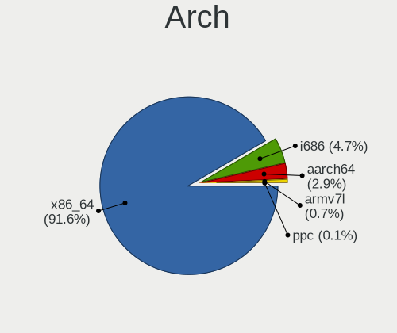
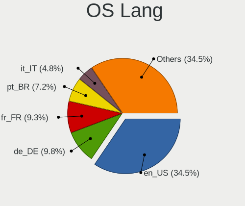
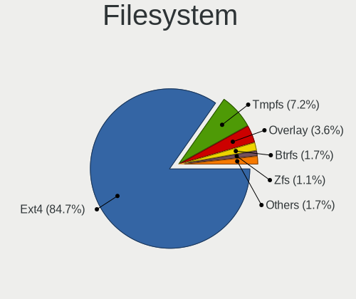
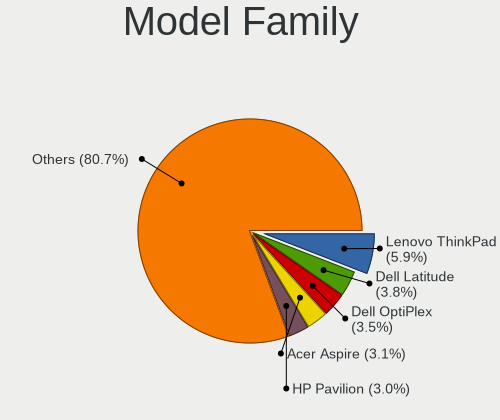
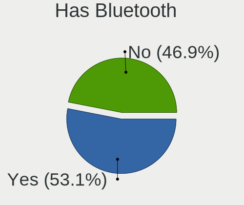
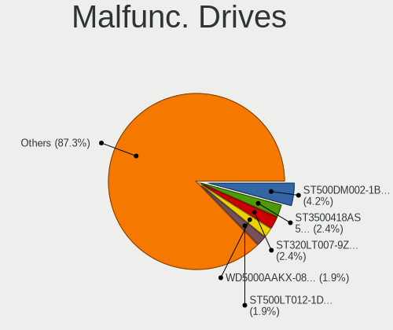
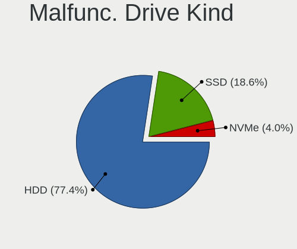
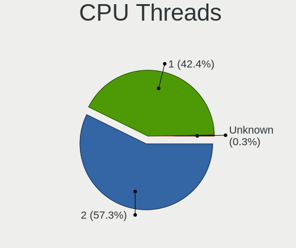
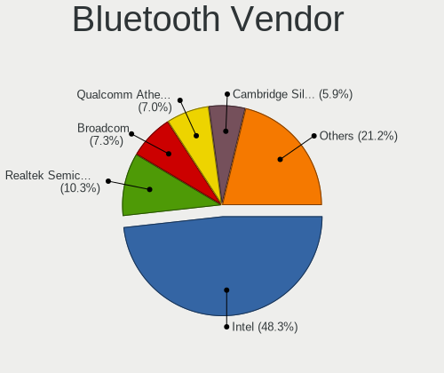
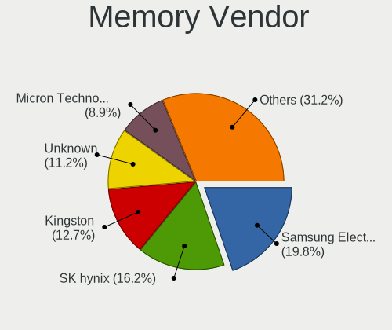

Ubuntu MATE - Tested Hardware & Statistics
------------------------------------------

A project to collect tested hardware configurations for Ubuntu MATE.

Anyone can contribute to this report by the [hw-probe](https://github.com/linuxhw/hw-probe) tool:

    sudo -E hw-probe -all -upload

Please contribute! Especially if your hardware is rare.

This is a report for all computer types. See also reports for [desktops](/Dist/Ubuntu_MATE/Desktop/README.md) and [notebooks](/Dist/Ubuntu_MATE/Notebook/README.md).

Contents
--------

* [ Test Cases ](#test-cases)

* [ System ](#system)
  - [ OS                       ](#os)
  - [ OS Family                ](#os-family)
  - [ Kernel                   ](#kernel)
  - [ Kernel Family            ](#kernel-family)
  - [ Kernel Major Ver.        ](#kernel-major-ver)
  - [ Arch                     ](#arch)
  - [ DE                       ](#de)
  - [ Display Server           ](#display-server)
  - [ Display Manager          ](#display-manager)
  - [ OS Lang                  ](#os-lang)
  - [ Boot Mode                ](#boot-mode)
  - [ Filesystem               ](#filesystem)
  - [ Part. scheme             ](#part-scheme)
  - [ Dual Boot with Linux/BSD ](#dual-boot-with-linuxbsd)
  - [ Dual Boot (Win)          ](#dual-boot-win)

* [ Board ](#board)
  - [ Vendor                   ](#vendor)
  - [ Model                    ](#model)
  - [ Model Family             ](#model-family)
  - [ MFG Year                 ](#mfg-year)
  - [ Form Factor              ](#form-factor)
  - [ Secure Boot              ](#secure-boot)
  - [ Coreboot                 ](#coreboot)
  - [ RAM Size                 ](#ram-size)
  - [ RAM Used                 ](#ram-used)
  - [ Total Drives             ](#total-drives)
  - [ Has CD-ROM               ](#has-cd-rom)
  - [ Has Ethernet             ](#has-ethernet)
  - [ Has WiFi                 ](#has-wifi)
  - [ Has Bluetooth            ](#has-bluetooth)

* [ Location ](#location)
  - [ Country                  ](#country)
  - [ City                     ](#city)

* [ Drives ](#drives)
  - [ Drive Vendor             ](#drive-vendor)
  - [ Drive Model              ](#drive-model)
  - [ HDD Vendor               ](#hdd-vendor)
  - [ SSD Vendor               ](#ssd-vendor)
  - [ Drive Kind               ](#drive-kind)
  - [ Drive Connector          ](#drive-connector)
  - [ Drive Size               ](#drive-size)
  - [ Space Total              ](#space-total)
  - [ Space Used               ](#space-used)
  - [ Malfunc. Drives          ](#malfunc-drives)
  - [ Malfunc. Drive Vendor    ](#malfunc-drive-vendor)
  - [ Malfunc. HDD Vendor      ](#malfunc-hdd-vendor)
  - [ Malfunc. Drive Kind      ](#malfunc-drive-kind)
  - [ Failed Drives            ](#failed-drives)
  - [ Failed Drive Vendor      ](#failed-drive-vendor)
  - [ Drive Status             ](#drive-status)

* [ Storage controller ](#storage-controller)
  - [ Storage Vendor           ](#storage-vendor)
  - [ Storage Model            ](#storage-model)
  - [ Storage Kind             ](#storage-kind)

* [ Processor ](#processor)
  - [ CPU Vendor               ](#cpu-vendor)
  - [ CPU Model                ](#cpu-model)
  - [ CPU Model Family         ](#cpu-model-family)
  - [ CPU Cores                ](#cpu-cores)
  - [ CPU Sockets              ](#cpu-sockets)
  - [ CPU Threads              ](#cpu-threads)
  - [ CPU Op-Modes             ](#cpu-op-modes)
  - [ CPU Microcode            ](#cpu-microcode)
  - [ CPU Microarch            ](#cpu-microarch)

* [ Graphics ](#graphics)
  - [ GPU Vendor               ](#gpu-vendor)
  - [ GPU Model                ](#gpu-model)
  - [ GPU Combo                ](#gpu-combo)
  - [ GPU Driver               ](#gpu-driver)
  - [ GPU Memory               ](#gpu-memory)

* [ Monitor ](#monitor)
  - [ Monitor Vendor           ](#monitor-vendor)
  - [ Monitor Model            ](#monitor-model)
  - [ Monitor Resolution       ](#monitor-resolution)
  - [ Monitor Diagonal         ](#monitor-diagonal)
  - [ Monitor Width            ](#monitor-width)
  - [ Aspect Ratio             ](#aspect-ratio)
  - [ Monitor Area             ](#monitor-area)
  - [ Pixel Density            ](#pixel-density)
  - [ Multiple Monitors        ](#multiple-monitors)

* [ Network ](#network)
  - [ Net Controller Vendor    ](#net-controller-vendor)
  - [ Net Controller Model     ](#net-controller-model)
  - [ Wireless Vendor          ](#wireless-vendor)
  - [ Wireless Model           ](#wireless-model)
  - [ Ethernet Vendor          ](#ethernet-vendor)
  - [ Ethernet Model           ](#ethernet-model)
  - [ Net Controller Kind      ](#net-controller-kind)
  - [ Used Controller          ](#used-controller)
  - [ NICs                     ](#nics)
  - [ IPv6                     ](#ipv6)

* [ Bluetooth ](#bluetooth)
  - [ Bluetooth Vendor         ](#bluetooth-vendor)
  - [ Bluetooth Model          ](#bluetooth-model)

* [ Sound ](#sound)
  - [ Sound Vendor             ](#sound-vendor)
  - [ Sound Model              ](#sound-model)

* [ Memory ](#memory)
  - [ Memory Vendor            ](#memory-vendor)
  - [ Memory Model             ](#memory-model)
  - [ Memory Kind              ](#memory-kind)
  - [ Memory Form Factor       ](#memory-form-factor)
  - [ Memory Size              ](#memory-size)
  - [ Memory Speed             ](#memory-speed)

* [ Printers & scanners ](#printers--scanners)
  - [ Printer Vendor           ](#printer-vendor)
  - [ Printer Model            ](#printer-model)
  - [ Scanner Vendor           ](#scanner-vendor)
  - [ Scanner Model            ](#scanner-model)

* [ Camera ](#camera)
  - [ Camera Vendor            ](#camera-vendor)
  - [ Camera Model             ](#camera-model)

* [ Security ](#security)
  - [ Fingerprint Vendor       ](#fingerprint-vendor)
  - [ Fingerprint Model        ](#fingerprint-model)
  - [ Chipcard Vendor          ](#chipcard-vendor)
  - [ Chipcard Model           ](#chipcard-model)

* [ Unsupported ](#unsupported)
  - [ Unsupported Devices      ](#unsupported-devices)
  - [ Unsupported Device Types ](#unsupported-device-types)

Test Cases
----------

Total: 1901

| Vendor        | Model                       | Form-Factor | Probe                                                      | Date         |
|---------------|-----------------------------|-------------|------------------------------------------------------------|--------------|
| Gigabyte      | GA-MA770T-UD3               | Desktop     | [4644d239d7](https://linux-hardware.org/?probe=4644d239d7) | Feb 01, 2023 |
| Notebook      | NJx0MU                      | Notebook    | [c402e9c063](https://linux-hardware.org/?probe=c402e9c063) | Feb 01, 2023 |
| Notebook      | NJx0MU                      | Notebook    | [eb152c7d4e](https://linux-hardware.org/?probe=eb152c7d4e) | Feb 01, 2023 |
| Notebook      | NJx0MU                      | Notebook    | [58d5bdaa2d](https://linux-hardware.org/?probe=58d5bdaa2d) | Jan 31, 2023 |
| Acer          | Swift SF514-52T             | Notebook    | [6f95748149](https://linux-hardware.org/?probe=6f95748149) | Jan 30, 2023 |
| Notebook      | NJx0MU                      | Notebook    | [10cdf2558f](https://linux-hardware.org/?probe=10cdf2558f) | Jan 29, 2023 |
| Notebook      | NJx0MU                      | Notebook    | [09bbe80125](https://linux-hardware.org/?probe=09bbe80125) | Jan 29, 2023 |
| ASUSTek       | K93SV                       | Notebook    | [3b4dd13d9f](https://linux-hardware.org/?probe=3b4dd13d9f) | Jan 29, 2023 |
| ASUSTek       | TUF Gaming FX505DT_FX505... | Notebook    | [4333734c92](https://linux-hardware.org/?probe=4333734c92) | Jan 29, 2023 |
| ASUSTek       | CROSSHAIR VI HERO           | Desktop     | [190a780b8a](https://linux-hardware.org/?probe=190a780b8a) | Jan 29, 2023 |
| Lenovo        | IdeaPad 3 15ALC6 82KU       | Notebook    | [a4ded61661](https://linux-hardware.org/?probe=a4ded61661) | Jan 27, 2023 |
| Notebook      | P17SM-A                     | Notebook    | [609a89ca14](https://linux-hardware.org/?probe=609a89ca14) | Jan 27, 2023 |
| Notebook      | P17SM-A                     | Notebook    | [6ed204eca5](https://linux-hardware.org/?probe=6ed204eca5) | Jan 26, 2023 |
| Notebook      | NJx0MU                      | Notebook    | [26e692f7de](https://linux-hardware.org/?probe=26e692f7de) | Jan 26, 2023 |
| Lenovo        | ThinkPad X270 W10DG 20K5... | Notebook    | [a3a0a3a505](https://linux-hardware.org/?probe=a3a0a3a505) | Jan 25, 2023 |
| Notebook      | NJx0MU                      | Notebook    | [7c19df8c01](https://linux-hardware.org/?probe=7c19df8c01) | Jan 25, 2023 |
| Notebook      | NJx0MU                      | Notebook    | [54d0592fb2](https://linux-hardware.org/?probe=54d0592fb2) | Jan 24, 2023 |
| Notebook      | NJx0MU                      | Notebook    | [206e04bc7d](https://linux-hardware.org/?probe=206e04bc7d) | Jan 23, 2023 |
| Hardkernel    | ODROID-N2Plus               | Soc         | [eb2e4b24cc](https://linux-hardware.org/?probe=eb2e4b24cc) | Jan 23, 2023 |
| HP            | Pavilion x360 Convertibl... | Convertible | [3a542dd368](https://linux-hardware.org/?probe=3a542dd368) | Jan 22, 2023 |
| Notebook      | NJx0MU                      | Notebook    | [9e9dcb9883](https://linux-hardware.org/?probe=9e9dcb9883) | Jan 22, 2023 |
| Notebook      | NJx0MU                      | Notebook    | [fdca7d69cd](https://linux-hardware.org/?probe=fdca7d69cd) | Jan 22, 2023 |
| Raspberry ... | Raspberry Pi 400 Rev 1.1    | Soc         | [9536b9eedc](https://linux-hardware.org/?probe=9536b9eedc) | Jan 22, 2023 |
| Google        | Relm                        | Notebook    | [44fb1d9db1](https://linux-hardware.org/?probe=44fb1d9db1) | Jan 21, 2023 |
| Raspberry ... | Raspberry Pi 400 Rev 1.1    | Soc         | [571389ffa0](https://linux-hardware.org/?probe=571389ffa0) | Jan 21, 2023 |
| Notebook      | NJx0MU                      | Notebook    | [edee5aee7a](https://linux-hardware.org/?probe=edee5aee7a) | Jan 21, 2023 |
| ASUSTek       | PRIME B450-PLUS             | Desktop     | [e3525b1f86](https://linux-hardware.org/?probe=e3525b1f86) | Jan 21, 2023 |
| Gigabyte      | Z590 UD AC                  | Desktop     | [91dea34a76](https://linux-hardware.org/?probe=91dea34a76) | Jan 20, 2023 |
| Dell          | 0KJCC5 A00                  | Desktop     | [08502cda27](https://linux-hardware.org/?probe=08502cda27) | Jan 20, 2023 |
| Notebook      | NJx0MU                      | Notebook    | [c7ab1c1990](https://linux-hardware.org/?probe=c7ab1c1990) | Jan 20, 2023 |
| HP            | 1495                        | Desktop     | [3f6b7a9b73](https://linux-hardware.org/?probe=3f6b7a9b73) | Jan 19, 2023 |
| Gigabyte      | B550 GAMING X V2            | Desktop     | [4f24524e7d](https://linux-hardware.org/?probe=4f24524e7d) | Jan 19, 2023 |
| Raspberry ... | Raspberry Pi 400 Rev 1.1    | Soc         | [e652633643](https://linux-hardware.org/?probe=e652633643) | Jan 18, 2023 |
| ASUSTek       | ASUS TUF Gaming F15 FX50... | Notebook    | [5a1bee99ee](https://linux-hardware.org/?probe=5a1bee99ee) | Jan 18, 2023 |
| Notebook      | NJx0MU                      | Notebook    | [98f8255c15](https://linux-hardware.org/?probe=98f8255c15) | Jan 18, 2023 |
| Raspberry ... | Raspberry Pi 400 Rev 1.1    | Soc         | [c2b8de2fdf](https://linux-hardware.org/?probe=c2b8de2fdf) | Jan 17, 2023 |
| Dell          | Latitude 5410               | Notebook    | [c97379d747](https://linux-hardware.org/?probe=c97379d747) | Jan 17, 2023 |
| Notebook      | NJx0MU                      | Notebook    | [e76a4c32dc](https://linux-hardware.org/?probe=e76a4c32dc) | Jan 17, 2023 |
| Gigabyte      | H510M H                     | Desktop     | [e8cc3131fc](https://linux-hardware.org/?probe=e8cc3131fc) | Jan 15, 2023 |
| Gigabyte      | X570S AERO G                | Desktop     | [d30e9b41ef](https://linux-hardware.org/?probe=d30e9b41ef) | Jan 15, 2023 |
| Gigabyte      | X570S AERO G                | Desktop     | [a265db8e50](https://linux-hardware.org/?probe=a265db8e50) | Jan 15, 2023 |
| HP            | 805A                        | Desktop     | [5fdeec8d8a](https://linux-hardware.org/?probe=5fdeec8d8a) | Jan 14, 2023 |
| Lenovo        | ThinkPad T15 Gen 1 20S6S... | Notebook    | [b4629bd83f](https://linux-hardware.org/?probe=b4629bd83f) | Jan 14, 2023 |
| Lenovo        | G500 20236                  | Notebook    | [d92542c9e8](https://linux-hardware.org/?probe=d92542c9e8) | Jan 14, 2023 |
| Gigabyte      | EP45-UD3P                   | Desktop     | [aa53c5066d](https://linux-hardware.org/?probe=aa53c5066d) | Jan 14, 2023 |
| Notebook      | NJx0MU                      | Notebook    | [cdd815de42](https://linux-hardware.org/?probe=cdd815de42) | Jan 14, 2023 |
| ASUSTek       | X550LN                      | Notebook    | [d412367e44](https://linux-hardware.org/?probe=d412367e44) | Jan 13, 2023 |
| ASUSTek       | X550LN                      | Notebook    | [196ba30ef7](https://linux-hardware.org/?probe=196ba30ef7) | Jan 13, 2023 |
| Notebook      | NJx0MU                      | Notebook    | [ff52c2505f](https://linux-hardware.org/?probe=ff52c2505f) | Jan 13, 2023 |
| HP            | 15                          | Notebook    | [b06a589496](https://linux-hardware.org/?probe=b06a589496) | Jan 12, 2023 |
| ASUSTek       | ROG STRIX Z370-G GAMING     | Desktop     | [d92a983612](https://linux-hardware.org/?probe=d92a983612) | Jan 12, 2023 |
| Gigabyte      | B85M-D3H                    | Desktop     | [e83827b548](https://linux-hardware.org/?probe=e83827b548) | Jan 11, 2023 |
| Gigabyte      | B85M-D3H                    | Desktop     | [0e81ffb471](https://linux-hardware.org/?probe=0e81ffb471) | Jan 11, 2023 |
| Raspberry ... | Raspberry Pi 3 Model B R... | Soc         | [88ffbf550c](https://linux-hardware.org/?probe=88ffbf550c) | Jan 11, 2023 |
| Acer          | AO756                       | Notebook    | [e0332e892a](https://linux-hardware.org/?probe=e0332e892a) | Jan 11, 2023 |
| HP            | EliteBook 855 G7 Noteboo... | Notebook    | [e14b3158f3](https://linux-hardware.org/?probe=e14b3158f3) | Jan 10, 2023 |
| Raspberry ... | Raspberry Pi                | Soc         | [433ba8749a](https://linux-hardware.org/?probe=433ba8749a) | Jan 10, 2023 |
| Notebook      | NJx0MU                      | Notebook    | [03505c402c](https://linux-hardware.org/?probe=03505c402c) | Jan 08, 2023 |
| Notebook      | NJx0MU                      | Notebook    | [7ee7875a97](https://linux-hardware.org/?probe=7ee7875a97) | Jan 08, 2023 |
| Lenovo        | ThinkPad R61 8918DEG        | Notebook    | [1ad8a2f766](https://linux-hardware.org/?probe=1ad8a2f766) | Jan 08, 2023 |
| Gigabyte      | X570S AERO G                | Desktop     | [75def9e004](https://linux-hardware.org/?probe=75def9e004) | Jan 07, 2023 |
| HP            | Pavilion Laptop 15-cs0xx... | Notebook    | [b30f449318](https://linux-hardware.org/?probe=b30f449318) | Jan 07, 2023 |
| Notebook      | NJx0MU                      | Notebook    | [efd4eaee02](https://linux-hardware.org/?probe=efd4eaee02) | Jan 07, 2023 |
| Gigabyte      | X570S AERO G                | Desktop     | [c5a401b596](https://linux-hardware.org/?probe=c5a401b596) | Jan 07, 2023 |
| Dell          | Inspiron 5520               | Notebook    | [9b4925d88d](https://linux-hardware.org/?probe=9b4925d88d) | Jan 07, 2023 |
| Notebook      | NJx0MU                      | Notebook    | [8b7d2f1a46](https://linux-hardware.org/?probe=8b7d2f1a46) | Jan 07, 2023 |
| HP            | ProLiant MicroServer        | Desktop     | [4bdffcda7f](https://linux-hardware.org/?probe=4bdffcda7f) | Jan 07, 2023 |
| HP            | Pavilion Gaming Laptop 1... | Notebook    | [a8fb72e94a](https://linux-hardware.org/?probe=a8fb72e94a) | Jan 06, 2023 |
| Notebook      | NJx0MU                      | Notebook    | [05c69304bb](https://linux-hardware.org/?probe=05c69304bb) | Jan 06, 2023 |
| ASUSTek       | VivoBook_ASUSLaptop M150... | Notebook    | [2cb5d2f306](https://linux-hardware.org/?probe=2cb5d2f306) | Jan 05, 2023 |
| Notebook      | NJx0MU                      | Notebook    | [fc365670d0](https://linux-hardware.org/?probe=fc365670d0) | Jan 05, 2023 |
| Dell          | Precision 7520              | Notebook    | [10c791a9f5](https://linux-hardware.org/?probe=10c791a9f5) | Jan 05, 2023 |
| Acer          | Aspire 5530                 | Notebook    | [8c12909b0a](https://linux-hardware.org/?probe=8c12909b0a) | Jan 04, 2023 |
| Dell          | G5 5590                     | Notebook    | [c0bba3f9fd](https://linux-hardware.org/?probe=c0bba3f9fd) | Jan 04, 2023 |
| Dell          | G5 5590                     | Notebook    | [cb89cf0f00](https://linux-hardware.org/?probe=cb89cf0f00) | Jan 04, 2023 |
| MSI           | B550M PRO-VDH WIFI          | Desktop     | [73de62ce79](https://linux-hardware.org/?probe=73de62ce79) | Jan 03, 2023 |
| HP            | ProLiant ML350p Gen8        | Desktop     | [8a7807ff8c](https://linux-hardware.org/?probe=8a7807ff8c) | Jan 03, 2023 |
| HP            | ProLiant ML350p Gen8        | Desktop     | [1b66a8a1a8](https://linux-hardware.org/?probe=1b66a8a1a8) | Jan 02, 2023 |
| Lenovo        | G500 20236                  | Notebook    | [501b47c258](https://linux-hardware.org/?probe=501b47c258) | Jan 02, 2023 |
| MSI           | B550M PRO-VDH WIFI          | Desktop     | [03ca911bb7](https://linux-hardware.org/?probe=03ca911bb7) | Jan 01, 2023 |
| Notebook      | NJx0MU                      | Notebook    | [0eb54f1078](https://linux-hardware.org/?probe=0eb54f1078) | Jan 01, 2023 |
| Apple         | Mac-F2238BAE iMac11,3       | All in one  | [13c0ee7f2d](https://linux-hardware.org/?probe=13c0ee7f2d) | Jan 01, 2023 |
| Notebook      | NJx0MU                      | Notebook    | [43923d1e98](https://linux-hardware.org/?probe=43923d1e98) | Jan 01, 2023 |
| Lenovo        | ThinkPad R61 8918DEG        | Notebook    | [48c688033a](https://linux-hardware.org/?probe=48c688033a) | Dec 30, 2022 |
| Notebook      | NJx0MU                      | Notebook    | [8540c1c554](https://linux-hardware.org/?probe=8540c1c554) | Dec 30, 2022 |
| Lenovo        | ThinkPad R61 8918DEG        | Notebook    | [82cbc15539](https://linux-hardware.org/?probe=82cbc15539) | Dec 30, 2022 |
| Notebook      | NJx0MU                      | Notebook    | [b4c615f28c](https://linux-hardware.org/?probe=b4c615f28c) | Dec 30, 2022 |
| Apple         | Mac-F2238BAE iMac11,3       | All in one  | [a323cc954e](https://linux-hardware.org/?probe=a323cc954e) | Dec 30, 2022 |
| Raspberry ... | Raspberry Pi                | Soc         | [531e60d101](https://linux-hardware.org/?probe=531e60d101) | Dec 30, 2022 |
| ASUSTek       | M5A78L-M LX                 | Desktop     | [b0f7933824](https://linux-hardware.org/?probe=b0f7933824) | Dec 29, 2022 |
| ASUSTek       | TUF Gaming FX705GM_FX705... | Notebook    | [c286883155](https://linux-hardware.org/?probe=c286883155) | Dec 29, 2022 |
| ASUSTek       | H110M-K                     | Desktop     | [4dab06b05f](https://linux-hardware.org/?probe=4dab06b05f) | Dec 29, 2022 |
| Notebook      | NJx0MU                      | Notebook    | [4a26556b6b](https://linux-hardware.org/?probe=4a26556b6b) | Dec 29, 2022 |
| HP            | Stream Laptop 14-cb1xxx     | Notebook    | [7ac222385a](https://linux-hardware.org/?probe=7ac222385a) | Dec 28, 2022 |
| HP            | Stream Laptop 14-cb1xxx     | Notebook    | [faf2c0e5d7](https://linux-hardware.org/?probe=faf2c0e5d7) | Dec 28, 2022 |
| HP            | ZBook 17 G5                 | Notebook    | [870deddfbe](https://linux-hardware.org/?probe=870deddfbe) | Dec 27, 2022 |
| Gigabyte      | B85M-D3H                    | Desktop     | [4283e3bb1e](https://linux-hardware.org/?probe=4283e3bb1e) | Dec 27, 2022 |
| Notebook      | NJx0MU                      | Notebook    | [db1c25cde3](https://linux-hardware.org/?probe=db1c25cde3) | Dec 27, 2022 |
| Lenovo        | IdeaPad 330-15AST 81D6      | Notebook    | [0a5cad12c2](https://linux-hardware.org/?probe=0a5cad12c2) | Dec 26, 2022 |
| Notebook      | NJx0MU                      | Notebook    | [037841f71c](https://linux-hardware.org/?probe=037841f71c) | Dec 25, 2022 |
| ASUSTek       | X550LN                      | Notebook    | [207f82e19c](https://linux-hardware.org/?probe=207f82e19c) | Dec 25, 2022 |
| ASUSTek       | TUF Gaming FX505DT_FX505... | Notebook    | [f113c7d475](https://linux-hardware.org/?probe=f113c7d475) | Dec 25, 2022 |
| Notebook      | NJx0MU                      | Notebook    | [cc49bb2ef6](https://linux-hardware.org/?probe=cc49bb2ef6) | Dec 25, 2022 |
| Notebook      | NJx0MU                      | Notebook    | [838eb1f6fa](https://linux-hardware.org/?probe=838eb1f6fa) | Dec 24, 2022 |
| Notebook      | NJx0MU                      | Notebook    | [2995a5ea20](https://linux-hardware.org/?probe=2995a5ea20) | Dec 24, 2022 |
| Acer          | TravelMate 7730             | Notebook    | [8d166266b9](https://linux-hardware.org/?probe=8d166266b9) | Dec 23, 2022 |
| Toshiba       | Satellite C50D-C            | Notebook    | [5f2debe594](https://linux-hardware.org/?probe=5f2debe594) | Dec 23, 2022 |
| Lenovo        | IdeaPad 3 15IIL05 81WE      | Notebook    | [a4447312cc](https://linux-hardware.org/?probe=a4447312cc) | Dec 23, 2022 |
| Dell          | Latitude E5430 non-vPro     | Notebook    | [cc88046606](https://linux-hardware.org/?probe=cc88046606) | Dec 22, 2022 |
| HP            | Compaq Presario CQ61        | Notebook    | [a85b255853](https://linux-hardware.org/?probe=a85b255853) | Dec 22, 2022 |
| Dell          | 0J1C3P A00                  | Desktop     | [b65b20a073](https://linux-hardware.org/?probe=b65b20a073) | Dec 22, 2022 |
| Notebook      | NJx0MU                      | Notebook    | [c1d47a051f](https://linux-hardware.org/?probe=c1d47a051f) | Dec 22, 2022 |
| Notebook      | NJx0MU                      | Notebook    | [0410be2105](https://linux-hardware.org/?probe=0410be2105) | Dec 22, 2022 |
| Notebook      | NJx0MU                      | Notebook    | [d1dc69cc49](https://linux-hardware.org/?probe=d1dc69cc49) | Dec 22, 2022 |
| ASUSTek       | P8Z77-V PRO                 | Desktop     | [2ad8b45619](https://linux-hardware.org/?probe=2ad8b45619) | Dec 21, 2022 |
| ASUSTek       | P8Z77-V PRO                 | Desktop     | [0e53e0be48](https://linux-hardware.org/?probe=0e53e0be48) | Dec 21, 2022 |
| Notebook      | NJx0MU                      | Notebook    | [ae1cc3b6c0](https://linux-hardware.org/?probe=ae1cc3b6c0) | Dec 21, 2022 |
| Lenovo        | IdeaPad C340-14IML 81TK     | Convertible | [c3835ed07f](https://linux-hardware.org/?probe=c3835ed07f) | Dec 20, 2022 |
| Notebook      | NJx0MU                      | Notebook    | [2f3edb2954](https://linux-hardware.org/?probe=2f3edb2954) | Dec 20, 2022 |
| Notebook      | NJx0MU                      | Notebook    | [5542739f1e](https://linux-hardware.org/?probe=5542739f1e) | Dec 20, 2022 |
| Notebook      | NJx0MU                      | Notebook    | [0d03f7978b](https://linux-hardware.org/?probe=0d03f7978b) | Dec 20, 2022 |
| Acer          | TravelMate 7730             | Notebook    | [8078925015](https://linux-hardware.org/?probe=8078925015) | Dec 20, 2022 |
| ASRock        | B550M-ITX/ac                | Desktop     | [21a91196b1](https://linux-hardware.org/?probe=21a91196b1) | Dec 19, 2022 |
| MSI           | Summit E16Flip A12UCT       | Notebook    | [af260af715](https://linux-hardware.org/?probe=af260af715) | Dec 19, 2022 |
| Lenovo        | ThinkPad T430 2347G5U       | Notebook    | [ac787dc7dc](https://linux-hardware.org/?probe=ac787dc7dc) | Dec 17, 2022 |
| ASUSTek       | PRIME Z590-P WIFI           | Desktop     | [34ac0b3211](https://linux-hardware.org/?probe=34ac0b3211) | Dec 17, 2022 |
| Lenovo        | ThinkPad T430 2347G5U       | Notebook    | [e47e7c18c9](https://linux-hardware.org/?probe=e47e7c18c9) | Dec 17, 2022 |
| Notebook      | NJx0MU                      | Notebook    | [e3ac894e13](https://linux-hardware.org/?probe=e3ac894e13) | Dec 17, 2022 |
| Notebook      | NJx0MU                      | Notebook    | [987d96714a](https://linux-hardware.org/?probe=987d96714a) | Dec 17, 2022 |
| ASUSTek       | ROG STRIX Z690-A GAMING ... | Desktop     | [ac15fdcc8b](https://linux-hardware.org/?probe=ac15fdcc8b) | Dec 16, 2022 |
| HP            | 2215                        | Desktop     | [78151a5e1b](https://linux-hardware.org/?probe=78151a5e1b) | Dec 16, 2022 |
| ASUSTek       | X550LN                      | Notebook    | [d09c34a000](https://linux-hardware.org/?probe=d09c34a000) | Dec 16, 2022 |
| Notebook      | NJx0MU                      | Notebook    | [7f2f68d436](https://linux-hardware.org/?probe=7f2f68d436) | Dec 16, 2022 |
| Lenovo        | ThinkPad T430 2344BZU       | Notebook    | [a69be3386b](https://linux-hardware.org/?probe=a69be3386b) | Dec 16, 2022 |
| HUAWEI        | KPL-W0X                     | Notebook    | [8caca0975b](https://linux-hardware.org/?probe=8caca0975b) | Dec 15, 2022 |
| Notebook      | NJx0MU                      | Notebook    | [2c5167b360](https://linux-hardware.org/?probe=2c5167b360) | Dec 14, 2022 |
| Notebook      | NJx0MU                      | Notebook    | [ca7464eb3f](https://linux-hardware.org/?probe=ca7464eb3f) | Dec 14, 2022 |
| HP            | 14                          | Notebook    | [4794938b36](https://linux-hardware.org/?probe=4794938b36) | Dec 14, 2022 |
| Gigabyte      | F2A68HM-DS2                 | Desktop     | [976923f807](https://linux-hardware.org/?probe=976923f807) | Dec 12, 2022 |
| Dell          | 0P67HD A00                  | Desktop     | [67f13377be](https://linux-hardware.org/?probe=67f13377be) | Dec 12, 2022 |
| Biostar       | A320MH                      | Desktop     | [31cc96d1d3](https://linux-hardware.org/?probe=31cc96d1d3) | Dec 11, 2022 |
| MSI           | H81M-E34                    | Desktop     | [a9cc317647](https://linux-hardware.org/?probe=a9cc317647) | Dec 11, 2022 |
| HP            | 255 G7 Notebook PC          | Notebook    | [b7a944c773](https://linux-hardware.org/?probe=b7a944c773) | Dec 11, 2022 |
| ASUSTek       | T100TA                      | Notebook    | [efd7016171](https://linux-hardware.org/?probe=efd7016171) | Dec 11, 2022 |
| Gigabyte      | X570S AERO G                | Desktop     | [118d4ebca0](https://linux-hardware.org/?probe=118d4ebca0) | Dec 11, 2022 |
| MSI           | X570-A PRO                  | Desktop     | [c57f5be505](https://linux-hardware.org/?probe=c57f5be505) | Dec 10, 2022 |
| Acer          | Aspire E1-572               | Notebook    | [7a6c67f095](https://linux-hardware.org/?probe=7a6c67f095) | Dec 09, 2022 |
| Notebook      | NJx0MU                      | Notebook    | [345eb47090](https://linux-hardware.org/?probe=345eb47090) | Dec 09, 2022 |
| Gigabyte      | AB350M-Gaming 3-CF          | Desktop     | [7ae8aecc25](https://linux-hardware.org/?probe=7ae8aecc25) | Dec 08, 2022 |
| ASRock        | B550M-ITX/ac                | Desktop     | [1d97601be2](https://linux-hardware.org/?probe=1d97601be2) | Dec 08, 2022 |
| ASRock        | B550M-ITX/ac                | Desktop     | [4943e0aa12](https://linux-hardware.org/?probe=4943e0aa12) | Dec 08, 2022 |
| Notebook      | NJx0MU                      | Notebook    | [bb704e1b90](https://linux-hardware.org/?probe=bb704e1b90) | Dec 08, 2022 |
| ASUSTek       | P7P55 LX                    | Desktop     | [be0753651f](https://linux-hardware.org/?probe=be0753651f) | Dec 07, 2022 |
| Lenovo        | IdeaPad S145-14IIL 81W6     | Notebook    | [c458ba13c3](https://linux-hardware.org/?probe=c458ba13c3) | Dec 05, 2022 |
| Lenovo        | IdeaPad S145-14IIL 81W6     | Notebook    | [bd9f0dc967](https://linux-hardware.org/?probe=bd9f0dc967) | Dec 05, 2022 |
| HP            | EliteBook 840 G5            | Notebook    | [3caa213ecf](https://linux-hardware.org/?probe=3caa213ecf) | Dec 04, 2022 |
| IP3 Tech      | GB3B                        | Mini pc     | [c41ea027f7](https://linux-hardware.org/?probe=c41ea027f7) | Dec 04, 2022 |
| MSI           | A320M-A PRO                 | Desktop     | [1b37803020](https://linux-hardware.org/?probe=1b37803020) | Dec 04, 2022 |
| Intel         | H61                         | Desktop     | [4050e46b94](https://linux-hardware.org/?probe=4050e46b94) | Dec 03, 2022 |
| HP            | 14                          | Notebook    | [868daee488](https://linux-hardware.org/?probe=868daee488) | Dec 03, 2022 |
| Notebook      | NJx0MU                      | Notebook    | [bd06d3a448](https://linux-hardware.org/?probe=bd06d3a448) | Dec 03, 2022 |
| HP            | Pavilion Gaming Laptop 1... | Notebook    | [e61b6313fa](https://linux-hardware.org/?probe=e61b6313fa) | Dec 02, 2022 |
| Unknown       | Unknown                     | Notebook    | [9964cb6fe2](https://linux-hardware.org/?probe=9964cb6fe2) | Nov 30, 2022 |
| HP            | ProBook 450 G6              | Notebook    | [c9e94d483e](https://linux-hardware.org/?probe=c9e94d483e) | Nov 30, 2022 |
| Notebook      | NJx0MU                      | Notebook    | [d53007b0b3](https://linux-hardware.org/?probe=d53007b0b3) | Nov 30, 2022 |
| Acer          | TravelMate P614-51T-G2      | Notebook    | [37e14fc1c1](https://linux-hardware.org/?probe=37e14fc1c1) | Nov 30, 2022 |
| ASUSTek       | X555LAB                     | Notebook    | [d62cc93587](https://linux-hardware.org/?probe=d62cc93587) | Nov 28, 2022 |
| ASUSTek       | X555LAB                     | Notebook    | [8d8fc0d4d4](https://linux-hardware.org/?probe=8d8fc0d4d4) | Nov 28, 2022 |
| Acer          | Aspire A515-45              | Notebook    | [4cec4d0e04](https://linux-hardware.org/?probe=4cec4d0e04) | Nov 27, 2022 |
| Getac         | S410                        | Notebook    | [3df44aa3af](https://linux-hardware.org/?probe=3df44aa3af) | Nov 26, 2022 |
| HP            | 3397                        | Desktop     | [0605f9214a](https://linux-hardware.org/?probe=0605f9214a) | Nov 25, 2022 |
| Notebook      | NJx0MU                      | Notebook    | [05d0bf9d8d](https://linux-hardware.org/?probe=05d0bf9d8d) | Nov 25, 2022 |
| HP            | Pavilion Laptop 15-eh1xx... | Notebook    | [9e22e08aa1](https://linux-hardware.org/?probe=9e22e08aa1) | Nov 25, 2022 |
| HP            | ProBook 640 G8 Notebook ... | Notebook    | [ce586530e4](https://linux-hardware.org/?probe=ce586530e4) | Nov 24, 2022 |
| ASUSTek       | ASUS TUF Gaming A17 FA70... | Notebook    | [cf30d2df93](https://linux-hardware.org/?probe=cf30d2df93) | Nov 24, 2022 |
| Notebook      | NJx0MU                      | Notebook    | [bc690a128e](https://linux-hardware.org/?probe=bc690a128e) | Nov 23, 2022 |
| Dell          | Studio 1558                 | Notebook    | [ef9a6b217c](https://linux-hardware.org/?probe=ef9a6b217c) | Nov 22, 2022 |
| Dell          | Vostro 3501                 | Notebook    | [ea7c3c0cc4](https://linux-hardware.org/?probe=ea7c3c0cc4) | Nov 22, 2022 |
| Gigabyte      | GA-MA770T-UD3               | Desktop     | [29b92290e8](https://linux-hardware.org/?probe=29b92290e8) | Nov 22, 2022 |
| ASRock        | Z590M-ITX/ax                | Desktop     | [f01dec11e4](https://linux-hardware.org/?probe=f01dec11e4) | Nov 21, 2022 |
| ASRock        | 990FX Extreme3              | Desktop     | [84b8daa5c4](https://linux-hardware.org/?probe=84b8daa5c4) | Nov 20, 2022 |
| Lenovo        | Yoga 520-14IKB 80X8         | Convertible | [39a6819014](https://linux-hardware.org/?probe=39a6819014) | Nov 19, 2022 |
| Toshiba       | Satellite P50-B-10Z         | Notebook    | [c5413ac393](https://linux-hardware.org/?probe=c5413ac393) | Nov 19, 2022 |
| Acer          | Swift SF114-34              | Notebook    | [96d82e20c4](https://linux-hardware.org/?probe=96d82e20c4) | Nov 19, 2022 |
| Acer          | Swift SF114-34              | Notebook    | [f5fd517d69](https://linux-hardware.org/?probe=f5fd517d69) | Nov 19, 2022 |
| Lenovo        | IdeaPad 130-15AST 81H5      | Notebook    | [d4b8ffffe1](https://linux-hardware.org/?probe=d4b8ffffe1) | Nov 19, 2022 |
| Dell          | Vostro 3501                 | Notebook    | [39ecfb673f](https://linux-hardware.org/?probe=39ecfb673f) | Nov 19, 2022 |
| NEC Comput... | PC-VK27MCZDM                | Notebook    | [fce4afe996](https://linux-hardware.org/?probe=fce4afe996) | Nov 19, 2022 |
| Lenovo        | Yoga 520-14IKB 80X8         | Convertible | [a09398bb26](https://linux-hardware.org/?probe=a09398bb26) | Nov 18, 2022 |
| Notebook      | NJx0MU                      | Notebook    | [f2e60e58dc](https://linux-hardware.org/?probe=f2e60e58dc) | Nov 17, 2022 |
| Chuwi         | X312B                       | Notebook    | [b0c9263212](https://linux-hardware.org/?probe=b0c9263212) | Nov 17, 2022 |
| Notebook      | NJx0MU                      | Notebook    | [fe43edb930](https://linux-hardware.org/?probe=fe43edb930) | Nov 16, 2022 |
| Chuwi         | X312B                       | Notebook    | [7583d01bd8](https://linux-hardware.org/?probe=7583d01bd8) | Nov 15, 2022 |
| HP            | 1998                        | Desktop     | [f9746a4ae0](https://linux-hardware.org/?probe=f9746a4ae0) | Nov 15, 2022 |
| MSI           | Z97I GAMING AC              | Desktop     | [b0a5c0251f](https://linux-hardware.org/?probe=b0a5c0251f) | Nov 15, 2022 |
| HP            | EliteBook 8540w             | Notebook    | [4da059da1b](https://linux-hardware.org/?probe=4da059da1b) | Nov 14, 2022 |
| Dell          | Latitude D630               | Notebook    | [3a15603bd6](https://linux-hardware.org/?probe=3a15603bd6) | Nov 13, 2022 |
| Dell          | Latitude D630               | Notebook    | [3e964fdd59](https://linux-hardware.org/?probe=3e964fdd59) | Nov 12, 2022 |
| ASUSTek       | K93SV                       | Notebook    | [8511ee86ad](https://linux-hardware.org/?probe=8511ee86ad) | Nov 12, 2022 |
| Notebook      | NJx0MU                      | Notebook    | [2dc75b76f4](https://linux-hardware.org/?probe=2dc75b76f4) | Nov 12, 2022 |
| Sony          | VGN-CR120E                  | Notebook    | [99def76c59](https://linux-hardware.org/?probe=99def76c59) | Nov 12, 2022 |
| Intel         | H61                         | Desktop     | [7d93f12ac4](https://linux-hardware.org/?probe=7d93f12ac4) | Nov 11, 2022 |
| Gigabyte      | H110M-S2V-CF                | Desktop     | [1117e533c3](https://linux-hardware.org/?probe=1117e533c3) | Nov 11, 2022 |
| Notebook      | NJx0MU                      | Notebook    | [01a339fb27](https://linux-hardware.org/?probe=01a339fb27) | Nov 11, 2022 |
| Microsoft     | Surface 2                   | Tablet      | [0cab1d9501](https://linux-hardware.org/?probe=0cab1d9501) | Nov 10, 2022 |
| Lenovo        | IdeaPad S410p 20296         | Notebook    | [77f7b2ff84](https://linux-hardware.org/?probe=77f7b2ff84) | Nov 10, 2022 |
| Gigabyte      | GA-MA770T-UD3               | Desktop     | [6e773a6bf0](https://linux-hardware.org/?probe=6e773a6bf0) | Nov 09, 2022 |
| HP            | EliteBook 855 G7 Noteboo... | Notebook    | [5264f28363](https://linux-hardware.org/?probe=5264f28363) | Nov 07, 2022 |
| Lenovo        | ThinkPad T420 4238LY7       | Notebook    | [c5cf611a37](https://linux-hardware.org/?probe=c5cf611a37) | Nov 07, 2022 |
| Lenovo        | G50-45 80E3                 | Notebook    | [7818a033c6](https://linux-hardware.org/?probe=7818a033c6) | Nov 06, 2022 |
| Dell          | Studio 1558                 | Notebook    | [8b5cb100a8](https://linux-hardware.org/?probe=8b5cb100a8) | Nov 05, 2022 |
| HP            | Laptop 15s-eq1xxx           | Notebook    | [b59f9dcf48](https://linux-hardware.org/?probe=b59f9dcf48) | Nov 05, 2022 |
| HP            | Pavilion g6                 | Notebook    | [5ad3928a6d](https://linux-hardware.org/?probe=5ad3928a6d) | Nov 05, 2022 |
| Notebook      | NJx0MU                      | Notebook    | [e56aa65a39](https://linux-hardware.org/?probe=e56aa65a39) | Nov 05, 2022 |
| HP            | Laptop 15s-eq1xxx           | Notebook    | [8fdaec6b5a](https://linux-hardware.org/?probe=8fdaec6b5a) | Nov 04, 2022 |
| ASUSTek       | P8Z77-V                     | Desktop     | [65c0f5965b](https://linux-hardware.org/?probe=65c0f5965b) | Nov 04, 2022 |
| ASUSTek       | H61M-K                      | Desktop     | [4b580ecb2b](https://linux-hardware.org/?probe=4b580ecb2b) | Nov 03, 2022 |
| ASUSTek       | H61M-K                      | Desktop     | [c47ee488a5](https://linux-hardware.org/?probe=c47ee488a5) | Nov 03, 2022 |
| HP            | EliteBook 840 G5            | Notebook    | [34c050ed44](https://linux-hardware.org/?probe=34c050ed44) | Nov 03, 2022 |
| HP            | EliteBook 855 G7 Noteboo... | Notebook    | [ada830a489](https://linux-hardware.org/?probe=ada830a489) | Nov 03, 2022 |
| HP            | Laptop 15s-eq1xxx           | Notebook    | [4f5b04e8d9](https://linux-hardware.org/?probe=4f5b04e8d9) | Nov 03, 2022 |
| Notebook      | NJx0MU                      | Notebook    | [5c0b61dfb6](https://linux-hardware.org/?probe=5c0b61dfb6) | Nov 03, 2022 |
| HP            | 15 Notebook PC              | Notebook    | [d17e8e8e36](https://linux-hardware.org/?probe=d17e8e8e36) | Nov 03, 2022 |
| Notebook      | NJx0MU                      | Notebook    | [342c7609c9](https://linux-hardware.org/?probe=342c7609c9) | Nov 02, 2022 |
| Notebook      | NJx0MU                      | Notebook    | [5b45883fef](https://linux-hardware.org/?probe=5b45883fef) | Nov 02, 2022 |
| MSI           | B75A-IE35                   | Desktop     | [57b74e4ca2](https://linux-hardware.org/?probe=57b74e4ca2) | Nov 01, 2022 |
| Notebook      | NJx0MU                      | Notebook    | [6b2b490208](https://linux-hardware.org/?probe=6b2b490208) | Nov 01, 2022 |
| HP            | Compaq Presario CQ71        | Notebook    | [ea057ea9b9](https://linux-hardware.org/?probe=ea057ea9b9) | Oct 31, 2022 |
| Intel         | NUC11PABi7 K90104-305       | Mini pc     | [e4af6d51f3](https://linux-hardware.org/?probe=e4af6d51f3) | Oct 31, 2022 |
| Notebook      | NJx0MU                      | Notebook    | [1b626eed02](https://linux-hardware.org/?probe=1b626eed02) | Oct 31, 2022 |
| Gigabyte      | X570S AERO G                | Desktop     | [600587e66a](https://linux-hardware.org/?probe=600587e66a) | Oct 31, 2022 |
| Notebook      | NJx0MU                      | Notebook    | [1b03bb8445](https://linux-hardware.org/?probe=1b03bb8445) | Oct 30, 2022 |
| Notebook      | NJx0MU                      | Notebook    | [f27aa95917](https://linux-hardware.org/?probe=f27aa95917) | Oct 29, 2022 |
| Dell          | Inspiron MM061              | Notebook    | [e1709bf653](https://linux-hardware.org/?probe=e1709bf653) | Oct 28, 2022 |
| Dell          | Inspiron MM061              | Notebook    | [05cffb09e0](https://linux-hardware.org/?probe=05cffb09e0) | Oct 28, 2022 |
| Samsung       | 760XBE                      | Notebook    | [436b83d360](https://linux-hardware.org/?probe=436b83d360) | Oct 27, 2022 |
| Samsung       | 760XBE                      | Notebook    | [6787286004](https://linux-hardware.org/?probe=6787286004) | Oct 27, 2022 |
| Dell          | Precision 7760              | Notebook    | [b8fce270db](https://linux-hardware.org/?probe=b8fce270db) | Oct 27, 2022 |
| Notebook      | NJx0MU                      | Notebook    | [2474ff9baf](https://linux-hardware.org/?probe=2474ff9baf) | Oct 27, 2022 |
| Toshiba       | Satellite C50D-A-133        | Notebook    | [c1ba737ccc](https://linux-hardware.org/?probe=c1ba737ccc) | Oct 25, 2022 |
| Apple         | MacBookAir6,1               | Notebook    | [4785b7f6f6](https://linux-hardware.org/?probe=4785b7f6f6) | Oct 25, 2022 |
| Lenovo        | ThinkPad X1 Carbon Gen 8... | Notebook    | [85510879a5](https://linux-hardware.org/?probe=85510879a5) | Oct 24, 2022 |
| ASUSTek       | TUF Gaming B560M-PLUS       | Desktop     | [91bf754e64](https://linux-hardware.org/?probe=91bf754e64) | Oct 24, 2022 |
| ASUSTek       | T100TA                      | Notebook    | [0ceb92e552](https://linux-hardware.org/?probe=0ceb92e552) | Oct 21, 2022 |
| ASUSTek       | Leonite2                    | Desktop     | [7640c7a49f](https://linux-hardware.org/?probe=7640c7a49f) | Oct 20, 2022 |
| ASRock        | Z77 Extreme4                | Desktop     | [7d12ed56e5](https://linux-hardware.org/?probe=7d12ed56e5) | Oct 19, 2022 |
| HP            | ENVY Sleekbook 6            | Notebook    | [a197375e26](https://linux-hardware.org/?probe=a197375e26) | Oct 19, 2022 |
| Gigabyte      | B450M DS3H-CF               | Desktop     | [6e45f7ecd7](https://linux-hardware.org/?probe=6e45f7ecd7) | Oct 15, 2022 |
| ASUSTek       | Z170 PRO GAMING/AURA        | Desktop     | [d1a5c91196](https://linux-hardware.org/?probe=d1a5c91196) | Oct 14, 2022 |
| ASUSTek       | Z170 PRO GAMING/AURA        | Desktop     | [b69b373cc1](https://linux-hardware.org/?probe=b69b373cc1) | Oct 14, 2022 |
| ASUSTek       | ROG STRIX Z590-E GAMING ... | Desktop     | [175ebd8462](https://linux-hardware.org/?probe=175ebd8462) | Oct 14, 2022 |
| Lenovo        | B51-30 80LK                 | Notebook    | [13e68d4364](https://linux-hardware.org/?probe=13e68d4364) | Oct 12, 2022 |
| Lenovo        | B51-30 80LK                 | Notebook    | [1444f8cc5b](https://linux-hardware.org/?probe=1444f8cc5b) | Oct 12, 2022 |
| Acer          | Aspire 7750G                | Notebook    | [e0c71d09bb](https://linux-hardware.org/?probe=e0c71d09bb) | Oct 11, 2022 |
| MSI           | H310M PRO-VDH PLUS          | Desktop     | [1ba5f65f98](https://linux-hardware.org/?probe=1ba5f65f98) | Oct 10, 2022 |
| MSI           | H310M PRO-VDH PLUS          | Desktop     | [41dd35ae5f](https://linux-hardware.org/?probe=41dd35ae5f) | Oct 10, 2022 |
| Chuwi         | GemiBook Pro                | Notebook    | [02170aab85](https://linux-hardware.org/?probe=02170aab85) | Oct 09, 2022 |
| ASUSTek       | M5A78L LE                   | Desktop     | [69023fe30e](https://linux-hardware.org/?probe=69023fe30e) | Oct 09, 2022 |
| Lenovo        | T530-28ICB                  | Desktop     | [b87998cf32](https://linux-hardware.org/?probe=b87998cf32) | Oct 09, 2022 |
| Dell          | 0DPRF9 A00                  | All in one  | [3d0b820b58](https://linux-hardware.org/?probe=3d0b820b58) | Oct 08, 2022 |
| Chuwi         | GemiBook Pro                | Notebook    | [1a165faedb](https://linux-hardware.org/?probe=1a165faedb) | Oct 08, 2022 |
| HP            | ENVY x360                   | Convertible | [b299af0bca](https://linux-hardware.org/?probe=b299af0bca) | Oct 08, 2022 |
| HP            | EliteBook 840 G3            | Notebook    | [2643af430d](https://linux-hardware.org/?probe=2643af430d) | Oct 08, 2022 |
| MSI           | B550-A PRO                  | Desktop     | [be6a0fda35](https://linux-hardware.org/?probe=be6a0fda35) | Oct 08, 2022 |
| Lenovo        | IdeaPad 3 15ALC6 82KU       | Notebook    | [bc1f7e7d02](https://linux-hardware.org/?probe=bc1f7e7d02) | Oct 06, 2022 |
| Lenovo        | T530-28ICB                  | Desktop     | [175a71260e](https://linux-hardware.org/?probe=175a71260e) | Oct 06, 2022 |
| ASUSTek       | PRIME B450-PLUS             | Desktop     | [85eb59fc6d](https://linux-hardware.org/?probe=85eb59fc6d) | Oct 05, 2022 |
| Lenovo        | ThinkPad T460p 20FW002CP... | Notebook    | [b7cd76d0b6](https://linux-hardware.org/?probe=b7cd76d0b6) | Oct 05, 2022 |
| ASUSTek       | UX32VD                      | Notebook    | [0bea9d8673](https://linux-hardware.org/?probe=0bea9d8673) | Oct 05, 2022 |
| Lenovo        | ThinkPad X230 2325Y5L       | Notebook    | [7c5c62cc90](https://linux-hardware.org/?probe=7c5c62cc90) | Oct 03, 2022 |
| Dell          | Latitude 7300               | Notebook    | [d9acb6ec9c](https://linux-hardware.org/?probe=d9acb6ec9c) | Oct 03, 2022 |
| Sony          | VGN-SZ3XP_C                 | Notebook    | [6e9671dd1a](https://linux-hardware.org/?probe=6e9671dd1a) | Oct 02, 2022 |
| Acer          | Aspire 7750G                | Notebook    | [ccf9b69093](https://linux-hardware.org/?probe=ccf9b69093) | Oct 02, 2022 |
| Acer          | Aspire 7750G                | Notebook    | [7b89b5d0cf](https://linux-hardware.org/?probe=7b89b5d0cf) | Oct 02, 2022 |
| HP            | ZBook 14 G2                 | Notebook    | [ac14cbda52](https://linux-hardware.org/?probe=ac14cbda52) | Oct 02, 2022 |
| ASUSTek       | ProArt X670E-CREATOR WIF... | Desktop     | [92e65a376a](https://linux-hardware.org/?probe=92e65a376a) | Oct 02, 2022 |
| Lenovo        | SHARKBAY SDK0E50510 PRO     | Desktop     | [cb5d0d1945](https://linux-hardware.org/?probe=cb5d0d1945) | Oct 01, 2022 |
| Lenovo        | SHARKBAY SDK0E50510 PRO     | Desktop     | [3af0c5cc5f](https://linux-hardware.org/?probe=3af0c5cc5f) | Oct 01, 2022 |
| ASUSTek       | PRIME B450-PLUS             | Desktop     | [db15c7b708](https://linux-hardware.org/?probe=db15c7b708) | Oct 01, 2022 |
| ASUSTek       | K30AD_M31AD_M51AD_M32AD     | Desktop     | [608c715bab](https://linux-hardware.org/?probe=608c715bab) | Sep 26, 2022 |
| Intel         | H81U                        | Notebook    | [9e4458528b](https://linux-hardware.org/?probe=9e4458528b) | Sep 25, 2022 |
| HP            | 15                          | Notebook    | [bd8fc32d19](https://linux-hardware.org/?probe=bd8fc32d19) | Sep 24, 2022 |
| ASUSTek       | H61M-K                      | Desktop     | [682eb02d48](https://linux-hardware.org/?probe=682eb02d48) | Sep 22, 2022 |
| Dell          | Precision 7760              | Notebook    | [f6600a1244](https://linux-hardware.org/?probe=f6600a1244) | Sep 22, 2022 |
| Intel         | Kabylake Platform           | Notebook    | [8b1c5eb5bf](https://linux-hardware.org/?probe=8b1c5eb5bf) | Sep 21, 2022 |
| MSI           | H81M-P33                    | Desktop     | [108817dc0f](https://linux-hardware.org/?probe=108817dc0f) | Sep 21, 2022 |
| ASRock        | HM55-HT                     | Desktop     | [64fff8f065](https://linux-hardware.org/?probe=64fff8f065) | Sep 20, 2022 |
| Intel         | NUC8i7HNB J68197-502        | Mini pc     | [1573d65d2d](https://linux-hardware.org/?probe=1573d65d2d) | Sep 18, 2022 |
| MSI           | 870-G45                     | Desktop     | [74af87b0c5](https://linux-hardware.org/?probe=74af87b0c5) | Sep 17, 2022 |
| ASUSTek       | ROG STRIX Z690-A GAMING ... | Desktop     | [081d4b1d50](https://linux-hardware.org/?probe=081d4b1d50) | Sep 16, 2022 |
| ASUSTek       | M2A74-AM                    | Desktop     | [25c30e4e54](https://linux-hardware.org/?probe=25c30e4e54) | Sep 14, 2022 |
| ASUSTek       | M2A74-AM                    | Desktop     | [24e6ffe552](https://linux-hardware.org/?probe=24e6ffe552) | Sep 14, 2022 |
| Dell          | Precision 7520              | Notebook    | [b83fea6b96](https://linux-hardware.org/?probe=b83fea6b96) | Sep 14, 2022 |
| ASUSTek       | P7P55 LX                    | Desktop     | [cc28ed218f](https://linux-hardware.org/?probe=cc28ed218f) | Sep 13, 2022 |
| Gigabyte      | Z590 UD AC                  | Desktop     | [8774a8312b](https://linux-hardware.org/?probe=8774a8312b) | Sep 13, 2022 |
| Acer          | Aspire 5050                 | Notebook    | [1961d1c468](https://linux-hardware.org/?probe=1961d1c468) | Sep 13, 2022 |
| Raspberry ... | Raspberry Pi                | Soc         | [a86e9d966b](https://linux-hardware.org/?probe=a86e9d966b) | Sep 12, 2022 |
| ASUSTek       | VivoBook_ASUSLaptop X712... | Notebook    | [64b8914cb2](https://linux-hardware.org/?probe=64b8914cb2) | Sep 12, 2022 |
| LG Electro... | 17Z990-R.AAS8U1             | Notebook    | [2df5aeabed](https://linux-hardware.org/?probe=2df5aeabed) | Sep 08, 2022 |
| ASRock        | J5040-ITX                   | Desktop     | [e36022370b](https://linux-hardware.org/?probe=e36022370b) | Sep 08, 2022 |
| Rockchip      | Unknown                     | Soc         | [37447111b3](https://linux-hardware.org/?probe=37447111b3) | Sep 07, 2022 |
| Acer          | Aspire X3950                | Desktop     | [22d1319220](https://linux-hardware.org/?probe=22d1319220) | Sep 06, 2022 |
| ASUSTek       | P5GZ-MX                     | Desktop     | [883739db23](https://linux-hardware.org/?probe=883739db23) | Sep 05, 2022 |
| ASRock        | B450 Gaming-ITX/ac          | Desktop     | [f16d383b65](https://linux-hardware.org/?probe=f16d383b65) | Sep 05, 2022 |
| Dell          | Precision 7760              | Notebook    | [e920197599](https://linux-hardware.org/?probe=e920197599) | Sep 05, 2022 |
| HP            | Pavilion 15                 | Notebook    | [194bb33f3d](https://linux-hardware.org/?probe=194bb33f3d) | Sep 04, 2022 |
| HP            | 2ADC                        | Desktop     | [d9e5d2b511](https://linux-hardware.org/?probe=d9e5d2b511) | Sep 04, 2022 |
| Dell          | Inspiron 7720               | Notebook    | [0749c352d0](https://linux-hardware.org/?probe=0749c352d0) | Sep 03, 2022 |
| HP            | 18E4                        | Desktop     | [c58c0043cb](https://linux-hardware.org/?probe=c58c0043cb) | Sep 03, 2022 |
| HP            | 3397                        | Desktop     | [5cd2349a9c](https://linux-hardware.org/?probe=5cd2349a9c) | Sep 02, 2022 |
| ASUSTek       | T100TA                      | Notebook    | [fb4d9c8521](https://linux-hardware.org/?probe=fb4d9c8521) | Sep 02, 2022 |
| Lenovo        | IdeaPad S410p 20296         | Notebook    | [dac943f23a](https://linux-hardware.org/?probe=dac943f23a) | Sep 01, 2022 |
| Dell          | Latitude 5285               | Tablet      | [4e75bec854](https://linux-hardware.org/?probe=4e75bec854) | Sep 01, 2022 |
| HP            | Notebook                    | Notebook    | [573d359faf](https://linux-hardware.org/?probe=573d359faf) | Aug 31, 2022 |
| HP            | 15 Notebook PC              | Notebook    | [1109650747](https://linux-hardware.org/?probe=1109650747) | Aug 31, 2022 |
| Lenovo        | 3111 SDK0J40697 WIN 3305... | Desktop     | [2be9b66ba1](https://linux-hardware.org/?probe=2be9b66ba1) | Aug 30, 2022 |
| Intel         | NUC7i5BNB J31144-311        | Mini pc     | [2d66cac294](https://linux-hardware.org/?probe=2d66cac294) | Aug 28, 2022 |
| HP            | Pavilion dv5                | Notebook    | [dd2f0b859b](https://linux-hardware.org/?probe=dd2f0b859b) | Aug 24, 2022 |
| LincPlus      | LINNCPLUS P1                | Notebook    | [516427e0e9](https://linux-hardware.org/?probe=516427e0e9) | Aug 23, 2022 |
| Lenovo        | IdeaPad Gaming 3 15ARH05... | Notebook    | [5028378988](https://linux-hardware.org/?probe=5028378988) | Aug 23, 2022 |
| Notebook      | NJx0MU                      | Notebook    | [7a86bdf14e](https://linux-hardware.org/?probe=7a86bdf14e) | Aug 22, 2022 |
| AZW           | GK55                        | Desktop     | [0ae52e1fdf](https://linux-hardware.org/?probe=0ae52e1fdf) | Aug 21, 2022 |
| Dell          | Latitude 7420               | Notebook    | [d599ef65fd](https://linux-hardware.org/?probe=d599ef65fd) | Aug 20, 2022 |
| ASUSTek       | M4A78-E                     | Desktop     | [76028e78e9](https://linux-hardware.org/?probe=76028e78e9) | Aug 19, 2022 |
| Lenovo        | IdeaPad 3 15IIL05 81WE      | Notebook    | [4efd818377](https://linux-hardware.org/?probe=4efd818377) | Aug 19, 2022 |
| ASUSTek       | M5A88-V EVO                 | Desktop     | [e8b519c4de](https://linux-hardware.org/?probe=e8b519c4de) | Aug 18, 2022 |
| ASUSTek       | UX32A                       | Notebook    | [99bb55bc78](https://linux-hardware.org/?probe=99bb55bc78) | Aug 17, 2022 |
| Gigabyte      | B85M-D3PH                   | Desktop     | [a5ed221478](https://linux-hardware.org/?probe=a5ed221478) | Aug 17, 2022 |
| MSI           | H170M PRO-VDH               | Desktop     | [4d7aa09763](https://linux-hardware.org/?probe=4d7aa09763) | Aug 16, 2022 |
| HP            | EliteBook 745 G5            | Notebook    | [7e8d33a07f](https://linux-hardware.org/?probe=7e8d33a07f) | Aug 16, 2022 |
| Dell          | 08NPPY A00                  | Desktop     | [1b78691cac](https://linux-hardware.org/?probe=1b78691cac) | Aug 14, 2022 |
| Dell          | 08NPPY A00                  | Desktop     | [b41823f392](https://linux-hardware.org/?probe=b41823f392) | Aug 14, 2022 |
| Lenovo        | ThinkBook 14 G2 ITL 20VD    | Notebook    | [644fbe551a](https://linux-hardware.org/?probe=644fbe551a) | Aug 13, 2022 |
| Dell          | Latitude E7470              | Notebook    | [61d0b104e9](https://linux-hardware.org/?probe=61d0b104e9) | Aug 13, 2022 |
| MSI           | MS-77311                    | Desktop     | [86b4d71bc0](https://linux-hardware.org/?probe=86b4d71bc0) | Aug 11, 2022 |
| HP            | 15 Notebook PC              | Notebook    | [46aa83aeb4](https://linux-hardware.org/?probe=46aa83aeb4) | Aug 07, 2022 |
| HP            | ProBook 455 G7              | Notebook    | [c563966e9c](https://linux-hardware.org/?probe=c563966e9c) | Aug 06, 2022 |
| Dell          | 03NVJ6 A00                  | Desktop     | [9655bf78d0](https://linux-hardware.org/?probe=9655bf78d0) | Aug 05, 2022 |
| HONOR         | BOHK-WAX9X                  | Notebook    | [3d426cb1de](https://linux-hardware.org/?probe=3d426cb1de) | Aug 04, 2022 |
| Google        | Swanky                      | Notebook    | [f54bdd7887](https://linux-hardware.org/?probe=f54bdd7887) | Aug 04, 2022 |
| Hardkernel    | ODROID-N2Plus               | Soc         | [40099f2516](https://linux-hardware.org/?probe=40099f2516) | Aug 03, 2022 |
| HP            | 8433 11                     | Desktop     | [cd790281b5](https://linux-hardware.org/?probe=cd790281b5) | Aug 02, 2022 |
| Google        | Swanky                      | Notebook    | [daac706167](https://linux-hardware.org/?probe=daac706167) | Aug 02, 2022 |
| HP            | Pavilion g6                 | Notebook    | [b48c146eff](https://linux-hardware.org/?probe=b48c146eff) | Aug 01, 2022 |
| Raspberry ... | Raspberry Pi                | Soc         | [b44bebcab6](https://linux-hardware.org/?probe=b44bebcab6) | Aug 01, 2022 |
| Dell          | 0KWVT8 A03                  | Desktop     | [cdca6713e9](https://linux-hardware.org/?probe=cdca6713e9) | Jul 31, 2022 |
| Dell          | 0KWVT8 A03                  | Desktop     | [1444843fcd](https://linux-hardware.org/?probe=1444843fcd) | Jul 31, 2022 |
| ASUSTek       | M5A97 R2.0                  | Desktop     | [3aa2ff8224](https://linux-hardware.org/?probe=3aa2ff8224) | Jul 29, 2022 |
| ASUSTek       | B85M-G                      | Desktop     | [5d5fd15071](https://linux-hardware.org/?probe=5d5fd15071) | Jul 28, 2022 |
| Lenovo        | Legion R9000P2021H 82JQ     | Notebook    | [4f2ba69c49](https://linux-hardware.org/?probe=4f2ba69c49) | Jul 27, 2022 |
| ASUSTek       | M5A97 R2.0                  | Desktop     | [19572ca302](https://linux-hardware.org/?probe=19572ca302) | Jul 27, 2022 |
| Acer          | Aspire 5050                 | Notebook    | [59d8bb1e10](https://linux-hardware.org/?probe=59d8bb1e10) | Jul 26, 2022 |
| Acer          | Aspire 5050                 | Notebook    | [a8bcc56e78](https://linux-hardware.org/?probe=a8bcc56e78) | Jul 26, 2022 |
| ASUSTek       | M5A97 R2.0                  | Desktop     | [5795e098d2](https://linux-hardware.org/?probe=5795e098d2) | Jul 26, 2022 |
| ONDA          | H110-MINI V3.00 Ver:3.00    | Desktop     | [62b2a7897b](https://linux-hardware.org/?probe=62b2a7897b) | Jul 24, 2022 |
| MSI           | 2AE0                        | Desktop     | [5c0034d313](https://linux-hardware.org/?probe=5c0034d313) | Jul 22, 2022 |
| MSI           | 2AE0                        | Desktop     | [df441346da](https://linux-hardware.org/?probe=df441346da) | Jul 22, 2022 |
| Dell          | Latitude E4200              | Notebook    | [6cc0415a8a](https://linux-hardware.org/?probe=6cc0415a8a) | Jul 21, 2022 |
| Dell          | Inspiron MM061              | Notebook    | [2360c35ac1](https://linux-hardware.org/?probe=2360c35ac1) | Jul 20, 2022 |
| Dell          | Inspiron MM061              | Notebook    | [5cb9487776](https://linux-hardware.org/?probe=5cb9487776) | Jul 20, 2022 |
| HP            | EliteBook 8570p             | Notebook    | [f4f889fb4e](https://linux-hardware.org/?probe=f4f889fb4e) | Jul 20, 2022 |
| BESSTAR Te... | CB9                         | Mini pc     | [faa42224f0](https://linux-hardware.org/?probe=faa42224f0) | Jul 18, 2022 |
| Medion        | MS-7797                     | Desktop     | [caf13d5392](https://linux-hardware.org/?probe=caf13d5392) | Jul 14, 2022 |
| Lenovo        | 3111 SDK0J40697 WIN 3305... | Mini pc     | [3e74ebae5a](https://linux-hardware.org/?probe=3e74ebae5a) | Jul 14, 2022 |
| Compaq        | Presario CQ-23              | Notebook    | [589a41e629](https://linux-hardware.org/?probe=589a41e629) | Jul 14, 2022 |
| Sony          | VPCEB1S1E                   | Notebook    | [d35015a369](https://linux-hardware.org/?probe=d35015a369) | Jul 12, 2022 |
| Dell          | Latitude XT                 | Notebook    | [9d9deeace5](https://linux-hardware.org/?probe=9d9deeace5) | Jul 10, 2022 |
| Dell          | Latitude XT                 | Notebook    | [b0a096fb7d](https://linux-hardware.org/?probe=b0a096fb7d) | Jul 10, 2022 |
| ASRock        | B450M Pro4                  | Desktop     | [0cdcc2c0e0](https://linux-hardware.org/?probe=0cdcc2c0e0) | Jul 10, 2022 |
| MicroByte     | ezbook                      | Notebook    | [0f08faf963](https://linux-hardware.org/?probe=0f08faf963) | Jul 08, 2022 |
| Dell          | 0GM819                      | Desktop     | [3d18cc2632](https://linux-hardware.org/?probe=3d18cc2632) | Jul 08, 2022 |
| Dell          | Latitude 7320 Detachable    | Tablet      | [5f1b339a57](https://linux-hardware.org/?probe=5f1b339a57) | Jul 07, 2022 |
| Gigabyte      | Z87-HD3                     | Desktop     | [95e6ec0822](https://linux-hardware.org/?probe=95e6ec0822) | Jul 05, 2022 |
| Lenovo        | 3190 SDK0J40697 WIN 3305... | Mini pc     | [cce90ecbf2](https://linux-hardware.org/?probe=cce90ecbf2) | Jul 04, 2022 |
| HP            | 3646h                       | Desktop     | [9e0737f23f](https://linux-hardware.org/?probe=9e0737f23f) | Jul 04, 2022 |
| Apple         | Mac-F2238BAE iMac11,3       | All in one  | [e0c6593aee](https://linux-hardware.org/?probe=e0c6593aee) | Jul 04, 2022 |
| Dell          | 0M6C7G A00                  | Desktop     | [5eee0db64f](https://linux-hardware.org/?probe=5eee0db64f) | Jul 03, 2022 |
| Gigabyte      | Z87-HD3                     | Desktop     | [28429fdd32](https://linux-hardware.org/?probe=28429fdd32) | Jul 02, 2022 |
| HP            | 8169                        | Desktop     | [18c6ea7678](https://linux-hardware.org/?probe=18c6ea7678) | Jul 01, 2022 |
| HP            | 8169                        | Desktop     | [c479baadc1](https://linux-hardware.org/?probe=c479baadc1) | Jul 01, 2022 |
| HP            | 2B0D A01                    | All in one  | [43b3fd0fd4](https://linux-hardware.org/?probe=43b3fd0fd4) | Jul 01, 2022 |
| Lenovo        | ThinkPad E15 Gen 2 20TDC... | Notebook    | [87eecce08e](https://linux-hardware.org/?probe=87eecce08e) | Jun 30, 2022 |
| MicroByte     | ezbook                      | Notebook    | [91b1fc169b](https://linux-hardware.org/?probe=91b1fc169b) | Jun 28, 2022 |
| Dell          | XPS 17 9710                 | Notebook    | [6e16eed17c](https://linux-hardware.org/?probe=6e16eed17c) | Jun 26, 2022 |
| Dell          | XPS 17 9710                 | Notebook    | [f37581d70e](https://linux-hardware.org/?probe=f37581d70e) | Jun 26, 2022 |
| ASUSTek       | S550CM                      | Notebook    | [c7262ada04](https://linux-hardware.org/?probe=c7262ada04) | Jun 25, 2022 |
| HUAWEI        | KLVD-WXX9                   | Notebook    | [a8c98b76b4](https://linux-hardware.org/?probe=a8c98b76b4) | Jun 24, 2022 |
| Lenovo        | ThinkPad E15 Gen 2 20TDS... | Notebook    | [10de805cb0](https://linux-hardware.org/?probe=10de805cb0) | Jun 24, 2022 |
| MSI           | H81M-E33                    | Desktop     | [0685f37e2c](https://linux-hardware.org/?probe=0685f37e2c) | Jun 22, 2022 |
| ASUSTek       | H61M-K                      | Desktop     | [0112d58d4e](https://linux-hardware.org/?probe=0112d58d4e) | Jun 18, 2022 |
| ASUSTek       | TUF Gaming B550M-PLUS       | Desktop     | [e048d9df09](https://linux-hardware.org/?probe=e048d9df09) | Jun 17, 2022 |
| Google        | Kled                        | Notebook    | [5f47e6d3e3](https://linux-hardware.org/?probe=5f47e6d3e3) | Jun 16, 2022 |
| Google        | Kled                        | Notebook    | [6a566134c4](https://linux-hardware.org/?probe=6a566134c4) | Jun 16, 2022 |
| MSI           | 3664h                       | Desktop     | [5fbb22c653](https://linux-hardware.org/?probe=5fbb22c653) | Jun 15, 2022 |
| Lenovo        | ThinkPad E15 Gen 2 20TDS... | Notebook    | [f7abc9fae0](https://linux-hardware.org/?probe=f7abc9fae0) | Jun 14, 2022 |
| Acer          | Aspire X3950                | Desktop     | [81797815d2](https://linux-hardware.org/?probe=81797815d2) | Jun 13, 2022 |
| Unknown       | Unknown                     | Desktop     | [c62add2d70](https://linux-hardware.org/?probe=c62add2d70) | Jun 13, 2022 |
| Hardkernel    | ODROID-N2Plus               | Soc         | [94abe2c8af](https://linux-hardware.org/?probe=94abe2c8af) | Jun 13, 2022 |
| Raspberry ... | Raspberry Pi                | Soc         | [efc9e12c05](https://linux-hardware.org/?probe=efc9e12c05) | Jun 12, 2022 |
| ASRock        | B450M Pro4                  | Desktop     | [3de31234b3](https://linux-hardware.org/?probe=3de31234b3) | Jun 12, 2022 |
| Dell          | 0HV8FN A01                  | Desktop     | [33d201cb1d](https://linux-hardware.org/?probe=33d201cb1d) | Jun 10, 2022 |
| Lenovo        | V15 G2 ITL 82KB             | Notebook    | [e956f6b0b8](https://linux-hardware.org/?probe=e956f6b0b8) | Jun 09, 2022 |
| HP            | EliteBook 8560p             | Notebook    | [9bfdb902ce](https://linux-hardware.org/?probe=9bfdb902ce) | Jun 08, 2022 |
| HP            | 3397                        | Desktop     | [55bcbdbc1f](https://linux-hardware.org/?probe=55bcbdbc1f) | Jun 07, 2022 |
| Gigabyte      | B360M AORUS Gaming 3-CF     | Desktop     | [5407d4a1f6](https://linux-hardware.org/?probe=5407d4a1f6) | Jun 07, 2022 |
| Intel         | Kabylake Platform           | Notebook    | [074fd90c6a](https://linux-hardware.org/?probe=074fd90c6a) | Jun 06, 2022 |
| Gigabyte      | GA-990FXA-UD5               | Desktop     | [d9e8d3957e](https://linux-hardware.org/?probe=d9e8d3957e) | Jun 06, 2022 |
| TrekStor      | Surfbook A13B               | Notebook    | [a42b3de31a](https://linux-hardware.org/?probe=a42b3de31a) | Jun 05, 2022 |
| ASUSTek       | PRIME X570-P                | Desktop     | [3b4483236d](https://linux-hardware.org/?probe=3b4483236d) | Jun 05, 2022 |
| Dell          | 00V62H A01                  | Desktop     | [20544feb00](https://linux-hardware.org/?probe=20544feb00) | Jun 03, 2022 |
| Dell          | XPS 13 9360                 | Notebook    | [73746e5672](https://linux-hardware.org/?probe=73746e5672) | Jun 03, 2022 |
| Dell          | Precision M6500             | Notebook    | [1b68d2ca74](https://linux-hardware.org/?probe=1b68d2ca74) | Jun 01, 2022 |
| Fujitsu       | LIFEBOOK E5511              | Notebook    | [32317d8883](https://linux-hardware.org/?probe=32317d8883) | May 30, 2022 |
| HP            | Stream Laptop 11-ak1xxx     | Notebook    | [2d2044b499](https://linux-hardware.org/?probe=2d2044b499) | May 30, 2022 |
| HP            | Pavilion Power Laptop 15... | Notebook    | [4813c4e0b4](https://linux-hardware.org/?probe=4813c4e0b4) | May 28, 2022 |
| Gigabyte      | 970A-DS3P                   | Desktop     | [8e0addf4d3](https://linux-hardware.org/?probe=8e0addf4d3) | May 24, 2022 |
| INP           | i1000BTS                    | Desktop     | [95da2ada33](https://linux-hardware.org/?probe=95da2ada33) | May 24, 2022 |
| Apple         | MacBook5,1                  | Notebook    | [74e6dbe9af](https://linux-hardware.org/?probe=74e6dbe9af) | May 23, 2022 |
| Apple         | MacBook5,1                  | Notebook    | [a53d746d08](https://linux-hardware.org/?probe=a53d746d08) | May 23, 2022 |
| HP            | ProBook 650 G1              | Notebook    | [d3f5e5aa45](https://linux-hardware.org/?probe=d3f5e5aa45) | May 22, 2022 |
| Dell          | Latitude E6410              | Notebook    | [739ffac681](https://linux-hardware.org/?probe=739ffac681) | May 21, 2022 |
| ASUSTek       | P5G41T-M LX2/BR             | Desktop     | [9044b2e4e2](https://linux-hardware.org/?probe=9044b2e4e2) | May 18, 2022 |
| Medion        | Akoya E6415                 | Notebook    | [32545030d4](https://linux-hardware.org/?probe=32545030d4) | May 16, 2022 |
| Avell High... | A70 MOB                     | Notebook    | [c8900ed973](https://linux-hardware.org/?probe=c8900ed973) | May 15, 2022 |
| Avell High... | A62 LIV                     | Notebook    | [8b912c2c4f](https://linux-hardware.org/?probe=8b912c2c4f) | May 15, 2022 |
| ASUSTek       | VivoBook_ASUSLaptop X509... | Notebook    | [5107890ffd](https://linux-hardware.org/?probe=5107890ffd) | May 15, 2022 |
| Sony          | VPCEA36FG                   | Notebook    | [0161a27629](https://linux-hardware.org/?probe=0161a27629) | May 13, 2022 |
| HONOR         | BOHK-WAX9X                  | Notebook    | [e6c4aaa3d8](https://linux-hardware.org/?probe=e6c4aaa3d8) | May 12, 2022 |
| ASUSTek       | ProArt Z490-CREATOR 10G     | Desktop     | [4d68e6fd8d](https://linux-hardware.org/?probe=4d68e6fd8d) | May 12, 2022 |
| HP            | 3031h                       | Desktop     | [4a57ff5761](https://linux-hardware.org/?probe=4a57ff5761) | May 10, 2022 |
| Unknown       | HX90                        | Desktop     | [3a7e2628b0](https://linux-hardware.org/?probe=3a7e2628b0) | May 09, 2022 |
| Lenovo        | ThinkBook 16p Gen 2 20YM    | Notebook    | [e99cdba363](https://linux-hardware.org/?probe=e99cdba363) | May 07, 2022 |
| HP            | EliteBook 840 G5            | Notebook    | [a53b09a7f3](https://linux-hardware.org/?probe=a53b09a7f3) | May 07, 2022 |
| HYPERPC       | PLAY                        | Notebook    | [408e86d04f](https://linux-hardware.org/?probe=408e86d04f) | May 06, 2022 |
| MSI           | B450 TOMAHAWK MAX           | Desktop     | [246c63d834](https://linux-hardware.org/?probe=246c63d834) | May 06, 2022 |
| HP            | Laptop 17-by3xxx            | Notebook    | [86c82d9ca0](https://linux-hardware.org/?probe=86c82d9ca0) | May 03, 2022 |
| HP            | Laptop 17-by3xxx            | Notebook    | [a55c5c5c9f](https://linux-hardware.org/?probe=a55c5c5c9f) | May 03, 2022 |
| Apple         | MacBookPro6,2               | Notebook    | [ebaaf4a69b](https://linux-hardware.org/?probe=ebaaf4a69b) | May 01, 2022 |
| Toshiba       | Satellite C660              | Notebook    | [f4403056c8](https://linux-hardware.org/?probe=f4403056c8) | Apr 30, 2022 |
| HP            | 8433 11                     | Desktop     | [a5b829538b](https://linux-hardware.org/?probe=a5b829538b) | Apr 29, 2022 |
| TYAN Compu... | S7012                       | Server      | [018f293210](https://linux-hardware.org/?probe=018f293210) | Apr 28, 2022 |
| Lenovo        | G700 20251                  | Notebook    | [4dd8fa1d2f](https://linux-hardware.org/?probe=4dd8fa1d2f) | Apr 27, 2022 |
| Lenovo        | G700 20251                  | Notebook    | [fc283a78af](https://linux-hardware.org/?probe=fc283a78af) | Apr 26, 2022 |
| Lenovo        | G700 20251                  | Notebook    | [bbb54a4f60](https://linux-hardware.org/?probe=bbb54a4f60) | Apr 26, 2022 |
| Apple         | MacBookPro9,1               | Notebook    | [35b3b3ae30](https://linux-hardware.org/?probe=35b3b3ae30) | Apr 26, 2022 |
| ASUSTek       | A55BM-E                     | Desktop     | [b2b220b65d](https://linux-hardware.org/?probe=b2b220b65d) | Apr 25, 2022 |
| ASUSTek       | P5KPL-AM SE                 | Desktop     | [d3d995a41b](https://linux-hardware.org/?probe=d3d995a41b) | Apr 24, 2022 |
| Apple         | MacBookPro9,1               | Notebook    | [faf447a067](https://linux-hardware.org/?probe=faf447a067) | Apr 24, 2022 |
| Dell          | Precision 3561              | Notebook    | [26fa0f202c](https://linux-hardware.org/?probe=26fa0f202c) | Apr 20, 2022 |
| ASRock        | Z87M Extreme4               | Desktop     | [83ffe21604](https://linux-hardware.org/?probe=83ffe21604) | Apr 18, 2022 |
| Dell          | 0X9M3X A05                  | Desktop     | [f049c88dfe](https://linux-hardware.org/?probe=f049c88dfe) | Apr 18, 2022 |
| Clevo         | W54xEU                      | Notebook    | [cb4036a7dc](https://linux-hardware.org/?probe=cb4036a7dc) | Apr 18, 2022 |
| Lenovo        | IdeaPad 3 15IML05 81WR      | Notebook    | [81dced5e0a](https://linux-hardware.org/?probe=81dced5e0a) | Apr 16, 2022 |
| Gigabyte      | X99P-SLI-CF                 | Desktop     | [19055b80bc](https://linux-hardware.org/?probe=19055b80bc) | Apr 16, 2022 |
| ASUSTek       | Z97-K                       | Desktop     | [4852dde595](https://linux-hardware.org/?probe=4852dde595) | Apr 15, 2022 |
| Dell          | Latitude E5530 non-vPro     | Notebook    | [2f865445ce](https://linux-hardware.org/?probe=2f865445ce) | Apr 14, 2022 |
| Dell          | Latitude E5530 non-vPro     | Notebook    | [d32ffb065a](https://linux-hardware.org/?probe=d32ffb065a) | Apr 14, 2022 |
| Clevo         | W54xEU                      | Notebook    | [0a8ddf1dff](https://linux-hardware.org/?probe=0a8ddf1dff) | Apr 14, 2022 |
| Dell          | XPS 15 9500                 | Notebook    | [d873b2d218](https://linux-hardware.org/?probe=d873b2d218) | Apr 14, 2022 |
| Unknown       | Unknown                     | Desktop     | [d7811dbd43](https://linux-hardware.org/?probe=d7811dbd43) | Apr 14, 2022 |
| Lenovo        | ThinkPad X1 Carbon 7th 2... | Notebook    | [52d05bca1d](https://linux-hardware.org/?probe=52d05bca1d) | Apr 13, 2022 |
| Dell          | XPS 13 9380                 | Notebook    | [0897999e8d](https://linux-hardware.org/?probe=0897999e8d) | Apr 13, 2022 |
| MSI           | MAG B550M MORTAR            | Desktop     | [7a9f6e1de7](https://linux-hardware.org/?probe=7a9f6e1de7) | Apr 13, 2022 |
| TUXEDO        | Pulse 14 Gen1               | Notebook    | [68e6736cd2](https://linux-hardware.org/?probe=68e6736cd2) | Apr 13, 2022 |
| Samsung       | R505                        | Notebook    | [9ff46a8ca6](https://linux-hardware.org/?probe=9ff46a8ca6) | Apr 13, 2022 |
| Dell          | Latitude E5400              | Notebook    | [0ac76c891f](https://linux-hardware.org/?probe=0ac76c891f) | Apr 11, 2022 |
| Dell          | 03NVJ6 A00                  | Desktop     | [c640615939](https://linux-hardware.org/?probe=c640615939) | Apr 10, 2022 |
| Raspberry ... | Raspberry Pi                | Soc         | [a54c91912a](https://linux-hardware.org/?probe=a54c91912a) | Apr 09, 2022 |
| Lenovo        | IdeaPadFlex 6-14IKB 81EM    | Convertible | [5e31d89c28](https://linux-hardware.org/?probe=5e31d89c28) | Apr 09, 2022 |
| ASUSTek       | M5A78L-M PLUS/USB3          | Desktop     | [3c17fb0db4](https://linux-hardware.org/?probe=3c17fb0db4) | Apr 07, 2022 |
| Gigabyte      | H470M DS3H                  | Desktop     | [bbfc43c637](https://linux-hardware.org/?probe=bbfc43c637) | Apr 05, 2022 |
| IPASON        | MaxBook P1                  | Notebook    | [d66d062f54](https://linux-hardware.org/?probe=d66d062f54) | Apr 05, 2022 |
| ASRock        | N68C-GS FX                  | Desktop     | [5f45322780](https://linux-hardware.org/?probe=5f45322780) | Apr 04, 2022 |
| Dell          | 06X1TJ A00                  | Desktop     | [42cf748563](https://linux-hardware.org/?probe=42cf748563) | Apr 03, 2022 |
| Lenovo        | G700 20251                  | Notebook    | [790d42fec8](https://linux-hardware.org/?probe=790d42fec8) | Mar 30, 2022 |
| Lenovo        | G700 20251                  | Notebook    | [d8166d09e9](https://linux-hardware.org/?probe=d8166d09e9) | Mar 30, 2022 |
| HP            | Pavilion dv7                | Notebook    | [112a1842a0](https://linux-hardware.org/?probe=112a1842a0) | Mar 30, 2022 |
| ASUSTek       | A88X-GAMER                  | Desktop     | [8340e366fc](https://linux-hardware.org/?probe=8340e366fc) | Mar 28, 2022 |
| Toshiba       | Satellite L755D             | Notebook    | [d99ccc2771](https://linux-hardware.org/?probe=d99ccc2771) | Mar 28, 2022 |
| Samsung       | R530/R730/R540              | Notebook    | [186f96a5a1](https://linux-hardware.org/?probe=186f96a5a1) | Mar 27, 2022 |
| Acer          | Aspire 3000                 | Notebook    | [8f647a08f9](https://linux-hardware.org/?probe=8f647a08f9) | Mar 26, 2022 |
| Hardkernel    | ODROID-N2Plus               | Soc         | [3a8a0e2c0c](https://linux-hardware.org/?probe=3a8a0e2c0c) | Mar 26, 2022 |
| Dell          | 05KX61 A00                  | Server      | [77d570f7ae](https://linux-hardware.org/?probe=77d570f7ae) | Mar 25, 2022 |
| Dell          | Studio 1558                 | Notebook    | [7004b83ddf](https://linux-hardware.org/?probe=7004b83ddf) | Mar 23, 2022 |
| Dell          | Vostro 3350                 | Notebook    | [721a0ea932](https://linux-hardware.org/?probe=721a0ea932) | Mar 21, 2022 |
| HP            | 802E                        | Desktop     | [b15f756d65](https://linux-hardware.org/?probe=b15f756d65) | Mar 21, 2022 |
| ASUSTek       | X541UV                      | Notebook    | [a23f80c36b](https://linux-hardware.org/?probe=a23f80c36b) | Mar 19, 2022 |
| HP            | 3397                        | Desktop     | [fe1ae429b1](https://linux-hardware.org/?probe=fe1ae429b1) | Mar 18, 2022 |
| ASUSTek       | PRIME H410M-A               | Desktop     | [9352c21f95](https://linux-hardware.org/?probe=9352c21f95) | Mar 17, 2022 |
| HP            | Pavilion dv7                | Notebook    | [0eb8ef5cd3](https://linux-hardware.org/?probe=0eb8ef5cd3) | Mar 16, 2022 |
| ASUSTek       | ROG STRIX B350-F GAMING     | Desktop     | [220c4f69b0](https://linux-hardware.org/?probe=220c4f69b0) | Mar 15, 2022 |
| ASUSTek       | A55BM-E                     | Desktop     | [7bbbcc53c1](https://linux-hardware.org/?probe=7bbbcc53c1) | Mar 14, 2022 |
| Dell          | OptiPlex 980                | Desktop     | [14cf2b23f7](https://linux-hardware.org/?probe=14cf2b23f7) | Mar 14, 2022 |
| Dell          | Vostro 3401                 | Notebook    | [225095b10b](https://linux-hardware.org/?probe=225095b10b) | Mar 12, 2022 |
| ASUSTek       | M4A79XTD EVO                | Desktop     | [d59f0b152c](https://linux-hardware.org/?probe=d59f0b152c) | Mar 10, 2022 |
| Toshiba       | Satellite P755              | Notebook    | [ceb8d030e2](https://linux-hardware.org/?probe=ceb8d030e2) | Mar 10, 2022 |
| ASUSTek       | 1011PX                      | Notebook    | [776d052837](https://linux-hardware.org/?probe=776d052837) | Mar 09, 2022 |
| Packard Be... | EasyNote MH35               | Notebook    | [66bff1bcfd](https://linux-hardware.org/?probe=66bff1bcfd) | Mar 08, 2022 |
| Gigabyte      | Z68XP-UD3                   | Desktop     | [6382c70064](https://linux-hardware.org/?probe=6382c70064) | Mar 07, 2022 |
| Hardkernel    | Odroid XU4                  | Soc         | [8e3573295d](https://linux-hardware.org/?probe=8e3573295d) | Mar 07, 2022 |
| Hardkernel    | Odroid XU4                  | Soc         | [d57f5c8ce3](https://linux-hardware.org/?probe=d57f5c8ce3) | Mar 07, 2022 |
| Medion        | MS-7797                     | Desktop     | [88982d8ccb](https://linux-hardware.org/?probe=88982d8ccb) | Mar 05, 2022 |
| ASUSTek       | Zenbook UP5401EA_UP5401E... | Convertible | [f23d0b2728](https://linux-hardware.org/?probe=f23d0b2728) | Mar 05, 2022 |
| ASRock        | B450M Pro4                  | Desktop     | [b18f6804d6](https://linux-hardware.org/?probe=b18f6804d6) | Mar 02, 2022 |
| ECS           | A785GM-AD3                  | Desktop     | [43c3e7c4a0](https://linux-hardware.org/?probe=43c3e7c4a0) | Mar 02, 2022 |
| Lenovo        | U310                        | Notebook    | [856a65502e](https://linux-hardware.org/?probe=856a65502e) | Feb 28, 2022 |
| ASUSTek       | UX305FA                     | Notebook    | [6618b00369](https://linux-hardware.org/?probe=6618b00369) | Feb 28, 2022 |
| Intel         | H55                         | Desktop     | [2f52a73f85](https://linux-hardware.org/?probe=2f52a73f85) | Feb 27, 2022 |
| HP            | Elite x2 1012 G2            | Tablet      | [beeb081772](https://linux-hardware.org/?probe=beeb081772) | Feb 27, 2022 |
| Fujitsu       | LIFEBOOK S752               | Notebook    | [abb12adccc](https://linux-hardware.org/?probe=abb12adccc) | Feb 26, 2022 |
| Pegatron      | Narra6                      | Desktop     | [ad9a06f14d](https://linux-hardware.org/?probe=ad9a06f14d) | Feb 25, 2022 |
| Acer          | Aspire E1-571G              | Notebook    | [de462f47a3](https://linux-hardware.org/?probe=de462f47a3) | Feb 24, 2022 |
| Acer          | Aspire E1-571G              | Notebook    | [ac593e3a3a](https://linux-hardware.org/?probe=ac593e3a3a) | Feb 24, 2022 |
| ASUSTek       | PRIME B450M-A II            | Desktop     | [09aca1c435](https://linux-hardware.org/?probe=09aca1c435) | Feb 22, 2022 |
| ASUSTek       | PRIME B450M-A II            | Desktop     | [35c00d5889](https://linux-hardware.org/?probe=35c00d5889) | Feb 22, 2022 |
| ASUSTek       | PRIME B450M-A II            | Desktop     | [265235f4f4](https://linux-hardware.org/?probe=265235f4f4) | Feb 21, 2022 |
| ECS           | G41T-M7                     | Desktop     | [c4aca5bc12](https://linux-hardware.org/?probe=c4aca5bc12) | Feb 20, 2022 |
| Lenovo        | ThinkPad T460p 20FW000VU... | Notebook    | [9cbb915f78](https://linux-hardware.org/?probe=9cbb915f78) | Feb 18, 2022 |
| HP            | ProBook x360 435 G7         | Convertible | [0747de6777](https://linux-hardware.org/?probe=0747de6777) | Feb 18, 2022 |
| ASUSTek       | X553MA                      | Notebook    | [94ebaa5d9b](https://linux-hardware.org/?probe=94ebaa5d9b) | Feb 15, 2022 |
| ECS           | A785GM-AD3                  | Desktop     | [b6459dbb39](https://linux-hardware.org/?probe=b6459dbb39) | Feb 12, 2022 |
| MSI           | MAG Z390 TOMAHAWK           | Desktop     | [e58751112a](https://linux-hardware.org/?probe=e58751112a) | Feb 11, 2022 |
| Notebook      | NK50S5_SZ                   | Notebook    | [c5a3485d32](https://linux-hardware.org/?probe=c5a3485d32) | Feb 11, 2022 |
| ASUSTek       | PRIME B250M-K               | Desktop     | [6f66651cd1](https://linux-hardware.org/?probe=6f66651cd1) | Feb 10, 2022 |
| ASUSTek       | P5W DH Deluxe               | Desktop     | [7c3fa0c43b](https://linux-hardware.org/?probe=7c3fa0c43b) | Feb 08, 2022 |
| HP            | Pavilion 17                 | Notebook    | [3d6c666b77](https://linux-hardware.org/?probe=3d6c666b77) | Feb 08, 2022 |
| Gigabyte      | GA-990XA-UD3                | Desktop     | [6bb9884c12](https://linux-hardware.org/?probe=6bb9884c12) | Feb 08, 2022 |
| Gigabyte      | F2A88XM-D3HP                | Desktop     | [c6783b6b8b](https://linux-hardware.org/?probe=c6783b6b8b) | Feb 07, 2022 |
| Gigabyte      | GA-990XA-UD3                | Desktop     | [74ebb0645d](https://linux-hardware.org/?probe=74ebb0645d) | Feb 06, 2022 |
| HP            | Notebook                    | Notebook    | [69071da574](https://linux-hardware.org/?probe=69071da574) | Feb 06, 2022 |
| Acer          | Aspire 7735                 | Notebook    | [38d97cd9da](https://linux-hardware.org/?probe=38d97cd9da) | Feb 06, 2022 |
| Lenovo        | ThinkBook 14s Yoga ITL 2... | Convertible | [451c540217](https://linux-hardware.org/?probe=451c540217) | Feb 05, 2022 |
| ASUSTek       | H61M-K                      | Desktop     | [0e2c677ddc](https://linux-hardware.org/?probe=0e2c677ddc) | Feb 03, 2022 |
| Dell          | XPS 15 9570                 | Notebook    | [d1f8ff2cb8](https://linux-hardware.org/?probe=d1f8ff2cb8) | Feb 02, 2022 |
| Lenovo        | ThinkCentre M58 7373W43     | Desktop     | [4dc312f4f3](https://linux-hardware.org/?probe=4dc312f4f3) | Feb 02, 2022 |
| Lenovo        | SDK0E50510 WIN              | Desktop     | [f317005b0a](https://linux-hardware.org/?probe=f317005b0a) | Feb 02, 2022 |
| Lenovo        | NOK                         | Desktop     | [8905840b45](https://linux-hardware.org/?probe=8905840b45) | Feb 02, 2022 |
| Lenovo        | ThinkPad SL500 27463ZG      | Notebook    | [b746a25ff1](https://linux-hardware.org/?probe=b746a25ff1) | Jan 28, 2022 |
| HP            | 8434 11                     | Desktop     | [76a7851e7f](https://linux-hardware.org/?probe=76a7851e7f) | Jan 28, 2022 |
| Dell          | Latitude 3410               | Notebook    | [8f2181125e](https://linux-hardware.org/?probe=8f2181125e) | Jan 27, 2022 |
| ASUSTek       | M5A99X EVO R2.0             | Desktop     | [fab2b2828e](https://linux-hardware.org/?probe=fab2b2828e) | Jan 26, 2022 |
| ASRock        | Z77 Pro4                    | Desktop     | [8062682731](https://linux-hardware.org/?probe=8062682731) | Jan 25, 2022 |
| IP3 Tech      | GB3B                        | Mini pc     | [47e447f5da](https://linux-hardware.org/?probe=47e447f5da) | Jan 25, 2022 |
| Sony          | VPCF13Z1R                   | Notebook    | [7aff0d5c29](https://linux-hardware.org/?probe=7aff0d5c29) | Jan 25, 2022 |
| Fujitsu       | LIFEBOOK U748               | Notebook    | [cad36b0eba](https://linux-hardware.org/?probe=cad36b0eba) | Jan 24, 2022 |
| Gigabyte      | H410M H V3                  | Desktop     | [f6b7e2e2e6](https://linux-hardware.org/?probe=f6b7e2e2e6) | Jan 24, 2022 |
| ASUSTek       | P5KPL-AM SE                 | Desktop     | [868c5fe3a4](https://linux-hardware.org/?probe=868c5fe3a4) | Jan 24, 2022 |
| Lenovo        | 1052 SDK0J40697 WIN 3305... | Desktop     | [a4b48a8427](https://linux-hardware.org/?probe=a4b48a8427) | Jan 23, 2022 |
| Lenovo        | 1052 SDK0J40697 WIN 3305... | Desktop     | [622bf721f3](https://linux-hardware.org/?probe=622bf721f3) | Jan 23, 2022 |
| Hardkernel    | ODROID-N2Plus               | Soc         | [55067d6afe](https://linux-hardware.org/?probe=55067d6afe) | Jan 21, 2022 |
| ASUSTek       | ROG Zephyrus G14 GA401QM... | Notebook    | [37730388fd](https://linux-hardware.org/?probe=37730388fd) | Jan 21, 2022 |
| ASRock        | G41C-VS                     | Desktop     | [4dbb4b7fad](https://linux-hardware.org/?probe=4dbb4b7fad) | Jan 21, 2022 |
| Albatron      | PM73V                       | Desktop     | [7bd3956f1f](https://linux-hardware.org/?probe=7bd3956f1f) | Jan 21, 2022 |
| ASUSTek       | H81M-K                      | Desktop     | [e5d70436b2](https://linux-hardware.org/?probe=e5d70436b2) | Jan 21, 2022 |
| HP            | 8455                        | Desktop     | [fbf272366c](https://linux-hardware.org/?probe=fbf272366c) | Jan 20, 2022 |
| ASUSTek       | ROG Zephyrus G14 GA401QM... | Notebook    | [512b021ab8](https://linux-hardware.org/?probe=512b021ab8) | Jan 19, 2022 |
| Lenovo        | V155-15API 81V5             | Notebook    | [09e824f68b](https://linux-hardware.org/?probe=09e824f68b) | Jan 19, 2022 |
| ASUSTek       | P5LD2                       | Desktop     | [00ec990ce2](https://linux-hardware.org/?probe=00ec990ce2) | Jan 19, 2022 |
| Dell          | 0KP561                      | Desktop     | [1b772786e5](https://linux-hardware.org/?probe=1b772786e5) | Jan 19, 2022 |
| Dell          | 0FH884                      | Desktop     | [5ffacf9f99](https://linux-hardware.org/?probe=5ffacf9f99) | Jan 19, 2022 |
| Dell          | 0UG982                      | Desktop     | [c85c923e97](https://linux-hardware.org/?probe=c85c923e97) | Jan 19, 2022 |
| Dell          | 0X7841                      | Desktop     | [40600195c8](https://linux-hardware.org/?probe=40600195c8) | Jan 19, 2022 |
| Lenovo        | SDK0E50510 WIN              | Desktop     | [597677191c](https://linux-hardware.org/?probe=597677191c) | Jan 19, 2022 |
| Dell          | 0UG982                      | Desktop     | [686f3558d2](https://linux-hardware.org/?probe=686f3558d2) | Jan 19, 2022 |
| Dell          | 0FH884                      | Desktop     | [f6e9bda3a9](https://linux-hardware.org/?probe=f6e9bda3a9) | Jan 19, 2022 |
| HP            | 18E7                        | Desktop     | [b68364ed90](https://linux-hardware.org/?probe=b68364ed90) | Jan 19, 2022 |
| Dell          | 0HY9JP A02                  | Desktop     | [8314cd9ba6](https://linux-hardware.org/?probe=8314cd9ba6) | Jan 19, 2022 |
| Dell          | 0UG982                      | Desktop     | [38c30e280b](https://linux-hardware.org/?probe=38c30e280b) | Jan 19, 2022 |
| Gigabyte      | H81M-S2PV                   | Desktop     | [f2d5dba7ff](https://linux-hardware.org/?probe=f2d5dba7ff) | Jan 19, 2022 |
| Dell          | 0FH884                      | Desktop     | [083697081f](https://linux-hardware.org/?probe=083697081f) | Jan 19, 2022 |
| HP            | 18E7                        | Desktop     | [9fedcb7ff7](https://linux-hardware.org/?probe=9fedcb7ff7) | Jan 18, 2022 |
| HP            | 18E7                        | Desktop     | [48871270a2](https://linux-hardware.org/?probe=48871270a2) | Jan 18, 2022 |
| HP            | 18E7                        | Desktop     | [ca38c856e1](https://linux-hardware.org/?probe=ca38c856e1) | Jan 18, 2022 |
| HP            | 18E7                        | Desktop     | [a4df88b38f](https://linux-hardware.org/?probe=a4df88b38f) | Jan 18, 2022 |
| HP            | 18E7                        | Desktop     | [a745b9add0](https://linux-hardware.org/?probe=a745b9add0) | Jan 18, 2022 |
| HP            | 18E7                        | Desktop     | [b69abe6fd4](https://linux-hardware.org/?probe=b69abe6fd4) | Jan 18, 2022 |
| Lenovo        | SDK0E50510 WIN              | Desktop     | [9753f9164a](https://linux-hardware.org/?probe=9753f9164a) | Jan 18, 2022 |
| Lenovo        | ThinkCentre M58 7373W43     | Desktop     | [2d7a6e6cb6](https://linux-hardware.org/?probe=2d7a6e6cb6) | Jan 18, 2022 |
| Lenovo        | SDK0E50510 WIN              | Desktop     | [51484889f9](https://linux-hardware.org/?probe=51484889f9) | Jan 18, 2022 |
| Lenovo        | SDK0E50510 WIN              | Desktop     | [4ca462c89a](https://linux-hardware.org/?probe=4ca462c89a) | Jan 18, 2022 |
| Dell          | 0HY9JP A02                  | Desktop     | [c4c9f4b0a9](https://linux-hardware.org/?probe=c4c9f4b0a9) | Jan 18, 2022 |
| HP            | 8434 11                     | Desktop     | [4a128d2bb2](https://linux-hardware.org/?probe=4a128d2bb2) | Jan 18, 2022 |
| HP            | 18E7                        | Desktop     | [97d4bc7367](https://linux-hardware.org/?probe=97d4bc7367) | Jan 18, 2022 |
| Lenovo        | NOK                         | Desktop     | [7ae2819a6f](https://linux-hardware.org/?probe=7ae2819a6f) | Jan 18, 2022 |
| HP            | 18E7                        | Desktop     | [e86d0cc284](https://linux-hardware.org/?probe=e86d0cc284) | Jan 18, 2022 |
| Lenovo        | SDK0E50510 WIN              | Desktop     | [022f56a960](https://linux-hardware.org/?probe=022f56a960) | Jan 18, 2022 |
| HP            | 18E7                        | Desktop     | [0d2a09f683](https://linux-hardware.org/?probe=0d2a09f683) | Jan 18, 2022 |
| HP            | 8455                        | Desktop     | [639182896b](https://linux-hardware.org/?probe=639182896b) | Jan 18, 2022 |
| ASRock        | B450M Pro4                  | Desktop     | [556d0fb884](https://linux-hardware.org/?probe=556d0fb884) | Jan 18, 2022 |
| Apple         | Mac-F22C86C8                | Mini pc     | [c3d19d1297](https://linux-hardware.org/?probe=c3d19d1297) | Jan 18, 2022 |
| ASUSTek       | X553MA                      | Notebook    | [a748bb8955](https://linux-hardware.org/?probe=a748bb8955) | Jan 18, 2022 |
| ASUSTek       | X553MA                      | Notebook    | [08613587e8](https://linux-hardware.org/?probe=08613587e8) | Jan 18, 2022 |
| ASUSTek       | X553MA                      | Notebook    | [f5b0fd8e22](https://linux-hardware.org/?probe=f5b0fd8e22) | Jan 18, 2022 |
| ASUSTek       | H81M-C                      | Desktop     | [f4bb742149](https://linux-hardware.org/?probe=f4bb742149) | Jan 17, 2022 |
| ASUSTek       | P5LD2                       | Desktop     | [b972c7929f](https://linux-hardware.org/?probe=b972c7929f) | Jan 17, 2022 |
| ASUSTek       | PRIME H310M-D R2.0          | Desktop     | [9a6c2f82f1](https://linux-hardware.org/?probe=9a6c2f82f1) | Jan 17, 2022 |
| Dell          | 0UG982                      | Desktop     | [684478b2fb](https://linux-hardware.org/?probe=684478b2fb) | Jan 17, 2022 |
| Gigabyte      | H410M H V3                  | Desktop     | [13b01fb40a](https://linux-hardware.org/?probe=13b01fb40a) | Jan 17, 2022 |
| ASUSTek       | PRIME H310M-D R2.0          | Desktop     | [385f76b996](https://linux-hardware.org/?probe=385f76b996) | Jan 17, 2022 |
| Quanta        | TW8/SW8/DW8 TBD             | Notebook    | [8b2f4ffccd](https://linux-hardware.org/?probe=8b2f4ffccd) | Jan 16, 2022 |
| Dell          | XPS 12 9Q23                 | Notebook    | [3c8e26636b](https://linux-hardware.org/?probe=3c8e26636b) | Jan 15, 2022 |
| ASUSTek       | ROG STRIX B550-I GAMING     | Desktop     | [6438d5a5af](https://linux-hardware.org/?probe=6438d5a5af) | Jan 15, 2022 |
| ASUSTek       | H81M-C                      | Desktop     | [f21bf32c9a](https://linux-hardware.org/?probe=f21bf32c9a) | Jan 15, 2022 |
| Apple         | Mac-F22C86C8                | Mini pc     | [89d70da207](https://linux-hardware.org/?probe=89d70da207) | Jan 15, 2022 |
| HP            | Pavilion Gaming Laptop 1... | Notebook    | [ae80854830](https://linux-hardware.org/?probe=ae80854830) | Jan 15, 2022 |
| ZOTAC         | NM10                        | Desktop     | [d758728651](https://linux-hardware.org/?probe=d758728651) | Jan 14, 2022 |
| ASUSTek       | H81M-K                      | Desktop     | [f1858e63f4](https://linux-hardware.org/?probe=f1858e63f4) | Jan 14, 2022 |
| Raspberry ... | Raspberry Pi                | Soc         | [9d2fa7ede7](https://linux-hardware.org/?probe=9d2fa7ede7) | Jan 13, 2022 |
| ASUSTek       | PRIME X470-PRO              | Desktop     | [c450cd4a79](https://linux-hardware.org/?probe=c450cd4a79) | Jan 13, 2022 |
| Raspberry ... | Raspberry Pi                | Soc         | [2fbac2ebd5](https://linux-hardware.org/?probe=2fbac2ebd5) | Jan 12, 2022 |
| HPE           | ML10Gen9                    | Server      | [03f2d30df2](https://linux-hardware.org/?probe=03f2d30df2) | Jan 11, 2022 |
| Dell          | Latitude E5400              | Notebook    | [4f72d3dae0](https://linux-hardware.org/?probe=4f72d3dae0) | Jan 09, 2022 |
| HP            | 3397                        | Desktop     | [38a4d731fe](https://linux-hardware.org/?probe=38a4d731fe) | Jan 08, 2022 |
| ASUSTek       | X541SA                      | Notebook    | [4103077e59](https://linux-hardware.org/?probe=4103077e59) | Jan 08, 2022 |
| Gigabyte      | B450M S2H                   | Desktop     | [858d718984](https://linux-hardware.org/?probe=858d718984) | Jan 07, 2022 |
| Raspberry ... | Raspberry Pi                | Soc         | [faef08af10](https://linux-hardware.org/?probe=faef08af10) | Jan 06, 2022 |
| Fujitsu       | LIFEBOOK E746               | Notebook    | [55ac013e1e](https://linux-hardware.org/?probe=55ac013e1e) | Jan 06, 2022 |
| Dell          | 032W55 A03                  | Desktop     | [f3838abaaf](https://linux-hardware.org/?probe=f3838abaaf) | Jan 04, 2022 |
| HP            | ProLiant DL120 G7           | Server      | [70c39995ec](https://linux-hardware.org/?probe=70c39995ec) | Jan 03, 2022 |
| Fujitsu       | LIFEBOOK U748               | Notebook    | [9eb9340d47](https://linux-hardware.org/?probe=9eb9340d47) | Jan 02, 2022 |
| Lenovo        | Flex 2-14 20404             | Notebook    | [1ddb6e11fb](https://linux-hardware.org/?probe=1ddb6e11fb) | Jan 01, 2022 |
| ASRock        | 870iCafe R2.0               | Desktop     | [f67cc91b2e](https://linux-hardware.org/?probe=f67cc91b2e) | Dec 31, 2021 |
| Raspberry ... | Raspberry Pi                | Soc         | [5a25a3ab14](https://linux-hardware.org/?probe=5a25a3ab14) | Dec 31, 2021 |
| Gigabyte      | MZ71-CE0-00 01000100        | Server      | [6d2ee30f72](https://linux-hardware.org/?probe=6d2ee30f72) | Dec 31, 2021 |
| MSI           | H81M-P33                    | Desktop     | [e637f730e7](https://linux-hardware.org/?probe=e637f730e7) | Dec 31, 2021 |
| MSI           | H81M-P33                    | Desktop     | [4c225dc457](https://linux-hardware.org/?probe=4c225dc457) | Dec 30, 2021 |
| Acer          | Aspire A515-43              | Notebook    | [82163f143b](https://linux-hardware.org/?probe=82163f143b) | Dec 29, 2021 |
| Gigabyte      | H67MA-UD2H-B3               | Desktop     | [e32af6a3de](https://linux-hardware.org/?probe=e32af6a3de) | Dec 26, 2021 |
| Lenovo        | ThinkPad X131e 33722VU      | Notebook    | [c8dc197420](https://linux-hardware.org/?probe=c8dc197420) | Dec 26, 2021 |
| MSI           | 760GM-P23                   | Desktop     | [62abb9d0ef](https://linux-hardware.org/?probe=62abb9d0ef) | Dec 25, 2021 |
| Lenovo        | U310                        | Notebook    | [fa57a69141](https://linux-hardware.org/?probe=fa57a69141) | Dec 24, 2021 |
| ASRock        | 970 Extreme4                | Desktop     | [1fbef2b76c](https://linux-hardware.org/?probe=1fbef2b76c) | Dec 23, 2021 |
| HP            | Pavilion dv4                | Notebook    | [7152c2fcd9](https://linux-hardware.org/?probe=7152c2fcd9) | Dec 22, 2021 |
| Lenovo        | G580 2189                   | Notebook    | [843f8c04fe](https://linux-hardware.org/?probe=843f8c04fe) | Dec 21, 2021 |
| ASUSTek       | PRIME B360M-K               | Desktop     | [8df64a7f80](https://linux-hardware.org/?probe=8df64a7f80) | Dec 21, 2021 |
| ASUSTek       | H61M-K                      | Desktop     | [8f53f4e97c](https://linux-hardware.org/?probe=8f53f4e97c) | Dec 19, 2021 |
| AZW           | GK mini                     | Mini pc     | [bb4770d627](https://linux-hardware.org/?probe=bb4770d627) | Dec 17, 2021 |
| HP            | ENVY Notebook               | Notebook    | [69b60fabe0](https://linux-hardware.org/?probe=69b60fabe0) | Dec 15, 2021 |
| Acer          | Aspire ES1-523              | Notebook    | [66a8186276](https://linux-hardware.org/?probe=66a8186276) | Dec 15, 2021 |
| Quanta        | TW8/SW8/DW8 TBD             | Notebook    | [43f645de28](https://linux-hardware.org/?probe=43f645de28) | Dec 11, 2021 |
| Hardkernel    | ODROID-C4                   | Soc         | [3bd9548bab](https://linux-hardware.org/?probe=3bd9548bab) | Dec 10, 2021 |
| Unknown       | Unknown                     | Notebook    | [d07ab607e1](https://linux-hardware.org/?probe=d07ab607e1) | Dec 08, 2021 |
| ASUSTek       | X751BP                      | Notebook    | [e1acc83725](https://linux-hardware.org/?probe=e1acc83725) | Dec 06, 2021 |
| MSI           | H61M-S20                    | Desktop     | [7e1fdb578c](https://linux-hardware.org/?probe=7e1fdb578c) | Dec 02, 2021 |
| HP            | EliteBook Folio 9480m       | Notebook    | [2cd39490da](https://linux-hardware.org/?probe=2cd39490da) | Dec 02, 2021 |
| ASUSTek       | H81M-A                      | Desktop     | [50acb69e6e](https://linux-hardware.org/?probe=50acb69e6e) | Dec 02, 2021 |
| Apple         | MacBookPro9,1               | Notebook    | [4f46a6c92a](https://linux-hardware.org/?probe=4f46a6c92a) | Dec 02, 2021 |
| Apple         | MacBookPro9,1               | Notebook    | [1521941a87](https://linux-hardware.org/?probe=1521941a87) | Dec 02, 2021 |
| Dell          | Latitude E6400              | Notebook    | [170f397883](https://linux-hardware.org/?probe=170f397883) | Dec 02, 2021 |
| Raspberry ... | Raspberry Pi 4 Model B R... | Soc         | [d0d26ec246](https://linux-hardware.org/?probe=d0d26ec246) | Dec 01, 2021 |
| HP            | EliteBook Folio 9480m       | Notebook    | [3b06bfa748](https://linux-hardware.org/?probe=3b06bfa748) | Dec 01, 2021 |
| Fujitsu       | LIFEBOOK AH531/GFO          | Notebook    | [5f2264a472](https://linux-hardware.org/?probe=5f2264a472) | Nov 30, 2021 |
| TUXEDO        | InfinityBook Pro 14 Gen6    | Notebook    | [40a204e5f1](https://linux-hardware.org/?probe=40a204e5f1) | Nov 30, 2021 |
| HP            | 3646h                       | Desktop     | [e7069f8a3b](https://linux-hardware.org/?probe=e7069f8a3b) | Nov 29, 2021 |
| HP            | 3646h                       | Desktop     | [a46d638004](https://linux-hardware.org/?probe=a46d638004) | Nov 29, 2021 |
| ASUSTek       | PRIME X570-P                | Desktop     | [6b7ec76b64](https://linux-hardware.org/?probe=6b7ec76b64) | Nov 28, 2021 |
| ASRock        | Z68 Extreme3 Gen3           | Desktop     | [9b13286f92](https://linux-hardware.org/?probe=9b13286f92) | Nov 28, 2021 |
| MSI           | H81M-P33                    | Desktop     | [3d2583b1f1](https://linux-hardware.org/?probe=3d2583b1f1) | Nov 26, 2021 |
| Polaroid      | MP1464PR001                 | Notebook    | [6475eec282](https://linux-hardware.org/?probe=6475eec282) | Nov 25, 2021 |
| Polaroid      | MP1464PR001                 | Notebook    | [244042f0d1](https://linux-hardware.org/?probe=244042f0d1) | Nov 25, 2021 |
| Dell          | 0T656F A01                  | Desktop     | [06f4633f1b](https://linux-hardware.org/?probe=06f4633f1b) | Nov 24, 2021 |
| HP            | EliteBook Folio 9480m       | Notebook    | [8b5c3b008f](https://linux-hardware.org/?probe=8b5c3b008f) | Nov 24, 2021 |
| HP            | EliteBook Folio 9480m       | Notebook    | [bf8ac4dc12](https://linux-hardware.org/?probe=bf8ac4dc12) | Nov 24, 2021 |
| Lenovo        | G580 20157                  | Notebook    | [bb170a308c](https://linux-hardware.org/?probe=bb170a308c) | Nov 24, 2021 |
| HPE           | ML10Gen9                    | Server      | [141f8709dd](https://linux-hardware.org/?probe=141f8709dd) | Nov 23, 2021 |
| ASUSTek       | PRIME B550-PLUS             | Desktop     | [4368bd67ac](https://linux-hardware.org/?probe=4368bd67ac) | Nov 23, 2021 |
| ASUSTek       | PRIME B550-PLUS             | Desktop     | [686454975b](https://linux-hardware.org/?probe=686454975b) | Nov 23, 2021 |
| Dell          | Precision 5560              | Notebook    | [aa3dbdc6bb](https://linux-hardware.org/?probe=aa3dbdc6bb) | Nov 22, 2021 |
| ASUSTek       | AT3IONT-I                   | Desktop     | [b8f5329824](https://linux-hardware.org/?probe=b8f5329824) | Nov 22, 2021 |
| Dell          | 0M017G A00                  | Desktop     | [da444f9b8f](https://linux-hardware.org/?probe=da444f9b8f) | Nov 22, 2021 |
| ASUSTek       | M52AD_M12AD_A_F_K31AD       | Desktop     | [a13103a9ad](https://linux-hardware.org/?probe=a13103a9ad) | Nov 20, 2021 |
| Acer          | TravelMate 5720             | Notebook    | [77b5cad080](https://linux-hardware.org/?probe=77b5cad080) | Nov 18, 2021 |
| HP            | ZBook Fury 17.3 inch G8 ... | Notebook    | [63f392ea8b](https://linux-hardware.org/?probe=63f392ea8b) | Nov 18, 2021 |
| ASUSTek       | ROG Maximus XIII HERO       | Desktop     | [36ac197007](https://linux-hardware.org/?probe=36ac197007) | Nov 17, 2021 |
| Dell          | 0G261D A00                  | Desktop     | [1bb376a60b](https://linux-hardware.org/?probe=1bb376a60b) | Nov 17, 2021 |
| Lenovo        | ThinkPad T440p 20AWS0Q30... | Notebook    | [3ddad52d21](https://linux-hardware.org/?probe=3ddad52d21) | Nov 16, 2021 |
| ASUSTek       | ROG Strix G513QM_G513QM     | Notebook    | [162531d482](https://linux-hardware.org/?probe=162531d482) | Nov 16, 2021 |
| Fujitsu       | D3633-S1 S26361-D3633-S1    | Desktop     | [8a6de2970d](https://linux-hardware.org/?probe=8a6de2970d) | Nov 15, 2021 |
| Dell          | Vostro 5568                 | Notebook    | [403ef45f63](https://linux-hardware.org/?probe=403ef45f63) | Nov 15, 2021 |
| ASRock        | B450M Pro4                  | Desktop     | [2cdd151d75](https://linux-hardware.org/?probe=2cdd151d75) | Nov 14, 2021 |
| Lenovo        | ThinkPad Yoga 260 20FES2... | Notebook    | [e881f41269](https://linux-hardware.org/?probe=e881f41269) | Nov 14, 2021 |
| Dell          | Latitude E6410              | Notebook    | [1a31fa8433](https://linux-hardware.org/?probe=1a31fa8433) | Nov 13, 2021 |
| AMI           | Unknown                     | Notebook    | [d1cd5b09e1](https://linux-hardware.org/?probe=d1cd5b09e1) | Nov 12, 2021 |
| Toshiba       | Satellite C665              | Notebook    | [a136cdd51d](https://linux-hardware.org/?probe=a136cdd51d) | Nov 11, 2021 |
| Dell          | 03NVJ6 A00                  | Desktop     | [61bfe5dfa7](https://linux-hardware.org/?probe=61bfe5dfa7) | Nov 11, 2021 |
| Fujitsu       | D3633-S1 S26361-D3633-S1    | Desktop     | [1971073b86](https://linux-hardware.org/?probe=1971073b86) | Nov 10, 2021 |
| HP            | ZBook 15                    | Notebook    | [835fb0e921](https://linux-hardware.org/?probe=835fb0e921) | Nov 10, 2021 |
| ASUSTek       | M4A78-E                     | Desktop     | [dd8a96b615](https://linux-hardware.org/?probe=dd8a96b615) | Nov 09, 2021 |
| ASUSTek       | M4A78-E                     | Desktop     | [89aff3881c](https://linux-hardware.org/?probe=89aff3881c) | Nov 09, 2021 |
| ASUSTek       | A55BM-E                     | Desktop     | [fd25737c58](https://linux-hardware.org/?probe=fd25737c58) | Nov 09, 2021 |
| Intel         | NUC5i5RYB H40999-504        | Mini pc     | [c0b1971c18](https://linux-hardware.org/?probe=c0b1971c18) | Nov 09, 2021 |
| Lenovo        | ThinkBook 16p Gen 2 20YM    | Notebook    | [c8b67f9143](https://linux-hardware.org/?probe=c8b67f9143) | Nov 08, 2021 |
| Rockchip      | Unknown                     | Soc         | [de559ac6d9](https://linux-hardware.org/?probe=de559ac6d9) | Nov 08, 2021 |
| ASUSTek       | M5A97 LE R2.0               | Desktop     | [e21897758d](https://linux-hardware.org/?probe=e21897758d) | Nov 07, 2021 |
| Gigabyte      | Z97X-UD3H-CF                | Desktop     | [914d585adc](https://linux-hardware.org/?probe=914d585adc) | Nov 07, 2021 |
| GPD           | P2 MAX                      | Notebook    | [9adb3fd2eb](https://linux-hardware.org/?probe=9adb3fd2eb) | Nov 02, 2021 |
| AZW           | SEi                         | Notebook    | [6d9a86e769](https://linux-hardware.org/?probe=6d9a86e769) | Nov 02, 2021 |
| Gigabyte      | H97M-D3H                    | Desktop     | [05e3caa05c](https://linux-hardware.org/?probe=05e3caa05c) | Nov 02, 2021 |
| MSI           | GE76 Raider 11UG            | Notebook    | [cbbe604f22](https://linux-hardware.org/?probe=cbbe604f22) | Nov 01, 2021 |
| ASRock        | B450M Pro4                  | Desktop     | [60ffb9d428](https://linux-hardware.org/?probe=60ffb9d428) | Oct 31, 2021 |
| Acer          | Aspire 7750G                | Notebook    | [7eaeae034c](https://linux-hardware.org/?probe=7eaeae034c) | Oct 29, 2021 |
| Hardkernel    | ODROID-N2Plus               | Soc         | [6e1fbe4dde](https://linux-hardware.org/?probe=6e1fbe4dde) | Oct 27, 2021 |
| ASUSTek       | VivoBook 12_ASUS Laptop ... | Notebook    | [10e9f4b604](https://linux-hardware.org/?probe=10e9f4b604) | Oct 27, 2021 |
| Dell          | Precision 7520              | Notebook    | [83df635945](https://linux-hardware.org/?probe=83df635945) | Oct 26, 2021 |
| ASRock        | Z68 Extreme3 Gen3           | Desktop     | [4946a6a02c](https://linux-hardware.org/?probe=4946a6a02c) | Oct 26, 2021 |
| ASRock        | Z68 Extreme3 Gen3           | Desktop     | [0ad429cea5](https://linux-hardware.org/?probe=0ad429cea5) | Oct 26, 2021 |
| HP            | Pavilion Notebook           | Notebook    | [cd2454732b](https://linux-hardware.org/?probe=cd2454732b) | Oct 25, 2021 |
| HP            | G70                         | Notebook    | [68fb8430c2](https://linux-hardware.org/?probe=68fb8430c2) | Oct 24, 2021 |
| HP            | G70                         | Notebook    | [3e2c50a321](https://linux-hardware.org/?probe=3e2c50a321) | Oct 24, 2021 |
| ASUSTek       | PN50-E1                     | Mini pc     | [4ba408d68c](https://linux-hardware.org/?probe=4ba408d68c) | Oct 23, 2021 |
| ASUSTek       | M5A78L LE                   | Desktop     | [adf114d66e](https://linux-hardware.org/?probe=adf114d66e) | Oct 23, 2021 |
| Lenovo        | ThinkPad E15 Gen 2 20TES... | Notebook    | [e82ee9096e](https://linux-hardware.org/?probe=e82ee9096e) | Oct 23, 2021 |
| ASUSTek       | N53SM                       | Notebook    | [3e15c8708a](https://linux-hardware.org/?probe=3e15c8708a) | Oct 23, 2021 |
| Rockchip      | Unknown                     | Soc         | [e7c44d5f41](https://linux-hardware.org/?probe=e7c44d5f41) | Oct 22, 2021 |
| ASUSTek       | PRIME H310M-K R2.0          | Desktop     | [09e3d5da46](https://linux-hardware.org/?probe=09e3d5da46) | Oct 21, 2021 |
| MSI           | MAG B550 TOMAHAWK           | Desktop     | [27b0a66ceb](https://linux-hardware.org/?probe=27b0a66ceb) | Oct 20, 2021 |
| Lenovo        | ThinkPad L512 2598A59       | Notebook    | [0bc832bd49](https://linux-hardware.org/?probe=0bc832bd49) | Oct 19, 2021 |
| Notebook      | P17SM-A                     | Notebook    | [34a5253469](https://linux-hardware.org/?probe=34a5253469) | Oct 16, 2021 |
| Lenovo        | B570e HuronRiver Platfor... | Notebook    | [2bc2b5c1d6](https://linux-hardware.org/?probe=2bc2b5c1d6) | Oct 15, 2021 |
| Notebook      | P17SM-A                     | Notebook    | [b4660289b3](https://linux-hardware.org/?probe=b4660289b3) | Oct 15, 2021 |
| Lenovo        | ThinkPad T440p 20AWS0Q30... | Notebook    | [36f407c3aa](https://linux-hardware.org/?probe=36f407c3aa) | Oct 15, 2021 |
| Lenovo        | ThinkPad T440p 20AWS0Q30... | Notebook    | [1b3b80e104](https://linux-hardware.org/?probe=1b3b80e104) | Oct 15, 2021 |
| Wortmann      | TERRA_MOBILE_1749           | Notebook    | [8917a2fc6b](https://linux-hardware.org/?probe=8917a2fc6b) | Oct 15, 2021 |
| Dell          | Latitude E6440              | Notebook    | [383edb4c99](https://linux-hardware.org/?probe=383edb4c99) | Oct 15, 2021 |
| HP            | Pavilion Gaming Laptop 1... | Notebook    | [6c0867e544](https://linux-hardware.org/?probe=6c0867e544) | Oct 15, 2021 |
| HP            | Pavilion Laptop 15-eg0xx... | Notebook    | [3dfc4362d9](https://linux-hardware.org/?probe=3dfc4362d9) | Oct 14, 2021 |
| Lenovo        | IdeaPad 330-17IKB 81DM      | Notebook    | [b566b7f862](https://linux-hardware.org/?probe=b566b7f862) | Oct 13, 2021 |
| Samsung       | 305E4A/305E5A/305E7A        | Notebook    | [a8e5248d3d](https://linux-hardware.org/?probe=a8e5248d3d) | Oct 13, 2021 |
| ASUSTek       | ROG Maximus XIII HERO       | Desktop     | [4505c960f2](https://linux-hardware.org/?probe=4505c960f2) | Oct 13, 2021 |
| ASUSTek       | U36SD                       | Notebook    | [c426070626](https://linux-hardware.org/?probe=c426070626) | Oct 12, 2021 |
| Lenovo        | IdeaPad 3 15IIL05 81WE      | Notebook    | [26453872b1](https://linux-hardware.org/?probe=26453872b1) | Oct 12, 2021 |
| ASUSTek       | N43SL                       | Notebook    | [c5adc8860e](https://linux-hardware.org/?probe=c5adc8860e) | Oct 09, 2021 |
| Lenovo        | IdeaPad 3 15IIL05 81WE      | Notebook    | [044c6efa0d](https://linux-hardware.org/?probe=044c6efa0d) | Oct 08, 2021 |
| Gigabyte      | B450M S2H                   | Desktop     | [fe1c549ed6](https://linux-hardware.org/?probe=fe1c549ed6) | Oct 05, 2021 |
| Lenovo        | Z51-70 80K6                 | Notebook    | [219e5cd0d5](https://linux-hardware.org/?probe=219e5cd0d5) | Oct 04, 2021 |
| Dell          | 08NPPY A00                  | Desktop     | [f0ff9a911e](https://linux-hardware.org/?probe=f0ff9a911e) | Oct 03, 2021 |
| Dell          | Latitude E6440              | Notebook    | [a8884539e7](https://linux-hardware.org/?probe=a8884539e7) | Oct 02, 2021 |
| HP            | EliteBook 840 G7 Noteboo... | Notebook    | [b535b99341](https://linux-hardware.org/?probe=b535b99341) | Sep 29, 2021 |
| HP            | EliteBook 840 G7 Noteboo... | Notebook    | [f04c751d60](https://linux-hardware.org/?probe=f04c751d60) | Sep 29, 2021 |
| HP            | ProBook 455 G7              | Notebook    | [491cab82de](https://linux-hardware.org/?probe=491cab82de) | Sep 29, 2021 |
| HP            | ProBook 455 G7              | Notebook    | [04ff8f3c32](https://linux-hardware.org/?probe=04ff8f3c32) | Sep 29, 2021 |
| Gigabyte      | Z97-HD3                     | Desktop     | [5f6c245dc5](https://linux-hardware.org/?probe=5f6c245dc5) | Sep 28, 2021 |
| MSI           | H61M-P23                    | Desktop     | [3a07878154](https://linux-hardware.org/?probe=3a07878154) | Sep 28, 2021 |
| Dell          | Vostro 3350                 | Notebook    | [384af306e6](https://linux-hardware.org/?probe=384af306e6) | Sep 27, 2021 |
| Dell          | 03NVJ6 A00                  | Desktop     | [5422d3bf1d](https://linux-hardware.org/?probe=5422d3bf1d) | Sep 27, 2021 |
| Intel         | DG31PR AAD97573-206         | Desktop     | [060da3d3ab](https://linux-hardware.org/?probe=060da3d3ab) | Sep 26, 2021 |
| HP            | Laptop 15-db0xxx            | Notebook    | [ed937ed1cd](https://linux-hardware.org/?probe=ed937ed1cd) | Sep 26, 2021 |
| Lenovo        | IdeaPad 3 15IIL05 81WE      | Notebook    | [2e1581c3b3](https://linux-hardware.org/?probe=2e1581c3b3) | Sep 24, 2021 |
| Entroware     | Aether                      | Notebook    | [c65a69857f](https://linux-hardware.org/?probe=c65a69857f) | Sep 22, 2021 |
| HP            | 8265                        | Desktop     | [f840aed42d](https://linux-hardware.org/?probe=f840aed42d) | Sep 21, 2021 |
| ASUSTek       | PRIME B450M-A               | Desktop     | [f93c2362ff](https://linux-hardware.org/?probe=f93c2362ff) | Sep 21, 2021 |
| ASUSTek       | TUF Gaming B550M-PLUS       | Desktop     | [a5211dc1bb](https://linux-hardware.org/?probe=a5211dc1bb) | Sep 21, 2021 |
| Acer          | Aspire A515-43              | Notebook    | [523fe48a54](https://linux-hardware.org/?probe=523fe48a54) | Sep 19, 2021 |
| Gigabyte      | B450M S2H                   | Desktop     | [13298e0f6b](https://linux-hardware.org/?probe=13298e0f6b) | Sep 19, 2021 |
| HP            | 3397                        | Desktop     | [13d358c48e](https://linux-hardware.org/?probe=13d358c48e) | Sep 18, 2021 |
| HP            | x2 Detachable 10-p0XX       | Tablet      | [3c40bbda61](https://linux-hardware.org/?probe=3c40bbda61) | Sep 18, 2021 |
| HP            | 1497                        | Desktop     | [311efc294a](https://linux-hardware.org/?probe=311efc294a) | Sep 16, 2021 |
| ASRock        | H110M-STX                   | Desktop     | [6bb90d3b07](https://linux-hardware.org/?probe=6bb90d3b07) | Sep 16, 2021 |
| Medion        | MS-7797                     | Desktop     | [f2f5579dc5](https://linux-hardware.org/?probe=f2f5579dc5) | Sep 15, 2021 |
| Medion        | MS-7797                     | Desktop     | [6ca6bee736](https://linux-hardware.org/?probe=6ca6bee736) | Sep 15, 2021 |
| Lenovo        | ThinkPad T440p 20AN006DU... | Notebook    | [6e8ca97f4b](https://linux-hardware.org/?probe=6e8ca97f4b) | Sep 14, 2021 |
| Lenovo        | ThinkPad T440p 20AN006DU... | Notebook    | [e0b0d2d509](https://linux-hardware.org/?probe=e0b0d2d509) | Sep 13, 2021 |
| Teclast       | F15S                        | Notebook    | [b6fcd1a34d](https://linux-hardware.org/?probe=b6fcd1a34d) | Sep 13, 2021 |
| Teclast       | F15S                        | Notebook    | [93d4fafebd](https://linux-hardware.org/?probe=93d4fafebd) | Sep 13, 2021 |
| Lenovo        | ThinkPad T420 42361P0       | Notebook    | [24f3d09047](https://linux-hardware.org/?probe=24f3d09047) | Sep 13, 2021 |
| Unknown       | Unknown                     | Notebook    | [6670bba1d8](https://linux-hardware.org/?probe=6670bba1d8) | Sep 13, 2021 |
| Dell          | Vostro 3350                 | Notebook    | [0fdc4bc08a](https://linux-hardware.org/?probe=0fdc4bc08a) | Sep 13, 2021 |
| Dell          | Latitude E7450              | Notebook    | [012bae3aa2](https://linux-hardware.org/?probe=012bae3aa2) | Sep 11, 2021 |
| ASUSTek       | Z550MA                      | Notebook    | [4786139b6b](https://linux-hardware.org/?probe=4786139b6b) | Sep 11, 2021 |
| Digibras      | NH4CU53                     | Notebook    | [5f2f500f7a](https://linux-hardware.org/?probe=5f2f500f7a) | Sep 10, 2021 |
| Lenovo        | IdeaPadFlex 5 14ARE05 81... | Convertible | [1172b42b6b](https://linux-hardware.org/?probe=1172b42b6b) | Sep 10, 2021 |
| Intel         | DH67CL AAG10212-204         | Desktop     | [e9d68ab5e4](https://linux-hardware.org/?probe=e9d68ab5e4) | Sep 09, 2021 |
| Lenovo        | ThinkBook 14s Yoga ITL 2... | Convertible | [14109edfc9](https://linux-hardware.org/?probe=14109edfc9) | Sep 07, 2021 |
| Lenovo        | ThinkBook 14s Yoga ITL 2... | Convertible | [cb82d03efe](https://linux-hardware.org/?probe=cb82d03efe) | Sep 07, 2021 |
| Lenovo        | ThinkPad T470 20JNS3M500    | Notebook    | [d05cb87743](https://linux-hardware.org/?probe=d05cb87743) | Sep 07, 2021 |
| Lenovo        | ThinkPad P50 20EN0006MS     | Notebook    | [812085deb0](https://linux-hardware.org/?probe=812085deb0) | Sep 07, 2021 |
| Acer          | Spin SP111-33               | Convertible | [2a5ddf7be8](https://linux-hardware.org/?probe=2a5ddf7be8) | Sep 05, 2021 |
| HP            | 3396                        | Desktop     | [147c8ed96c](https://linux-hardware.org/?probe=147c8ed96c) | Sep 04, 2021 |
| Lenovo        | ThinkPad T440p 20AN006DU... | Notebook    | [54c321b6bd](https://linux-hardware.org/?probe=54c321b6bd) | Sep 04, 2021 |
| Lenovo        | ThinkPad T440p 20AN006DU... | Notebook    | [812cc9220c](https://linux-hardware.org/?probe=812cc9220c) | Sep 01, 2021 |
| MSI           | CR70 2M/CX70 2OC/CX70 2O... | Notebook    | [5ee9ab86d7](https://linux-hardware.org/?probe=5ee9ab86d7) | Aug 31, 2021 |
| MSI           | Z370 PC PRO                 | Desktop     | [c594736488](https://linux-hardware.org/?probe=c594736488) | Aug 30, 2021 |
| ASRock        | B75M-DGS R2.0               | Desktop     | [16250b0c12](https://linux-hardware.org/?probe=16250b0c12) | Aug 29, 2021 |
| MSI           | B550M PRO-VDH WIFI          | Desktop     | [41e440c2e5](https://linux-hardware.org/?probe=41e440c2e5) | Aug 29, 2021 |
| MSI           | B550M PRO-VDH WIFI          | Desktop     | [e086d2eb61](https://linux-hardware.org/?probe=e086d2eb61) | Aug 29, 2021 |
| MSI           | 2A9C                        | Desktop     | [57601d98f3](https://linux-hardware.org/?probe=57601d98f3) | Aug 28, 2021 |
| Notebook      | NK50S5_SZ                   | Notebook    | [6cba599e57](https://linux-hardware.org/?probe=6cba599e57) | Aug 27, 2021 |
| Apple         | Mac-F4228EC8 DVT            | All in one  | [c375ab72c5](https://linux-hardware.org/?probe=c375ab72c5) | Aug 25, 2021 |
| Apple         | Mac-F4228EC8 DVT            | All in one  | [d3e14ad15a](https://linux-hardware.org/?probe=d3e14ad15a) | Aug 25, 2021 |
| MSI           | MPG Z390 GAMING PRO CARB... | Desktop     | [413934fef3](https://linux-hardware.org/?probe=413934fef3) | Aug 23, 2021 |
| MSI           | B450M PRO-M2 MAX            | Desktop     | [b28b036f78](https://linux-hardware.org/?probe=b28b036f78) | Aug 22, 2021 |
| Raspberry ... | Raspberry Pi 4 Model B R... | Soc         | [1a1189f529](https://linux-hardware.org/?probe=1a1189f529) | Aug 21, 2021 |
| Raspberry ... | Raspberry Pi 4 Model B R... | Soc         | [19cfd7b8f5](https://linux-hardware.org/?probe=19cfd7b8f5) | Aug 21, 2021 |
| Packard Be... | EasyNote SL65               | Notebook    | [934368dd02](https://linux-hardware.org/?probe=934368dd02) | Aug 20, 2021 |
| GPD           | MicroPC                     | Notebook    | [7fa0c4e3c4](https://linux-hardware.org/?probe=7fa0c4e3c4) | Aug 20, 2021 |
| Lenovo        | ThinkPad T420 4180PA9       | Notebook    | [17b9828f96](https://linux-hardware.org/?probe=17b9828f96) | Aug 19, 2021 |
| ASUSTek       | X556UAK                     | Notebook    | [70e369f2ba](https://linux-hardware.org/?probe=70e369f2ba) | Aug 19, 2021 |
| ASUSTek       | VivoBook_ASUSLaptop X421... | Notebook    | [635d8e55e7](https://linux-hardware.org/?probe=635d8e55e7) | Aug 17, 2021 |
| HP            | ProBook 445 G7              | Notebook    | [e42e169a72](https://linux-hardware.org/?probe=e42e169a72) | Aug 15, 2021 |
| Acer          | Extensa 5630                | Notebook    | [f32dfbfe2a](https://linux-hardware.org/?probe=f32dfbfe2a) | Aug 15, 2021 |
| ASRock        | M3A785GMH/128M              | Desktop     | [4ace1ea1ac](https://linux-hardware.org/?probe=4ace1ea1ac) | Aug 15, 2021 |
| HP            | Notebook                    | Notebook    | [be1a21a391](https://linux-hardware.org/?probe=be1a21a391) | Aug 14, 2021 |
| Chuwi         | GemiBook Pro                | Notebook    | [0ffe99b73b](https://linux-hardware.org/?probe=0ffe99b73b) | Aug 14, 2021 |
| MSI           | X79A-GD45                   | Desktop     | [c5b78e1a01](https://linux-hardware.org/?probe=c5b78e1a01) | Aug 13, 2021 |
| Lenovo        | ThinkPad E15 Gen 2 20TD0... | Notebook    | [cfe37f86a3](https://linux-hardware.org/?probe=cfe37f86a3) | Aug 12, 2021 |
| Gigabyte      | B550M DS3H                  | Desktop     | [6776a424d5](https://linux-hardware.org/?probe=6776a424d5) | Aug 11, 2021 |
| Dell          | 05GD68 A00                  | Desktop     | [bbfbd42562](https://linux-hardware.org/?probe=bbfbd42562) | Aug 07, 2021 |
| ASUSTek       | X556UAK                     | Notebook    | [399d9ceec5](https://linux-hardware.org/?probe=399d9ceec5) | Aug 06, 2021 |
| Intel         | AMI                         | Notebook    | [c11ff5c3a9](https://linux-hardware.org/?probe=c11ff5c3a9) | Aug 06, 2021 |
| Intel         | AMI                         | Notebook    | [bfe9befd10](https://linux-hardware.org/?probe=bfe9befd10) | Aug 05, 2021 |
| Notebook      | N24_25GU                    | Notebook    | [2e67e53ad7](https://linux-hardware.org/?probe=2e67e53ad7) | Aug 05, 2021 |
| MSI           | MPG Z390 GAMING PRO CARB... | Desktop     | [c861e28d21](https://linux-hardware.org/?probe=c861e28d21) | Aug 05, 2021 |
| ASRock        | Q1900M                      | Desktop     | [700f4a0ca1](https://linux-hardware.org/?probe=700f4a0ca1) | Aug 02, 2021 |
| Dell          | 08NPPY A00                  | Desktop     | [e706b18dd8](https://linux-hardware.org/?probe=e706b18dd8) | Aug 01, 2021 |
| Lenovo        | ThinkPad T430s 2356CTO      | Notebook    | [f3d9dd3c21](https://linux-hardware.org/?probe=f3d9dd3c21) | Jul 31, 2021 |
| Dell          | Vostro 1520                 | Notebook    | [af01145277](https://linux-hardware.org/?probe=af01145277) | Jul 28, 2021 |
| Clevo         | M720R                       | Notebook    | [a52f0f2d7c](https://linux-hardware.org/?probe=a52f0f2d7c) | Jul 27, 2021 |
| ASUSTek       | TUF Gaming B550-PLUS        | Desktop     | [20fd03515f](https://linux-hardware.org/?probe=20fd03515f) | Jul 27, 2021 |
| Acer          | Aspire E1-571               | Notebook    | [561ec14e6b](https://linux-hardware.org/?probe=561ec14e6b) | Jul 25, 2021 |
| Acer          | Aspire E1-571               | Notebook    | [068e66bfae](https://linux-hardware.org/?probe=068e66bfae) | Jul 25, 2021 |
| HP            | Laptop 15z-ef1xxx           | Notebook    | [d72c30940e](https://linux-hardware.org/?probe=d72c30940e) | Jul 25, 2021 |
| Samsung       | 350V5C/351V5C/3540VC/344... | Notebook    | [49be4c6d59](https://linux-hardware.org/?probe=49be4c6d59) | Jul 23, 2021 |
| ASUSTek       | M2N68-AM Plus               | Desktop     | [6863bea30a](https://linux-hardware.org/?probe=6863bea30a) | Jul 23, 2021 |
| Gigabyte      | B360M AORUS Gaming 3-CF     | Desktop     | [e8e43c77ca](https://linux-hardware.org/?probe=e8e43c77ca) | Jul 23, 2021 |
| Gigabyte      | Z390 GAMING X-CF            | Desktop     | [6dcb19e468](https://linux-hardware.org/?probe=6dcb19e468) | Jul 23, 2021 |
| ASUSTek       | P8H67-M LE                  | Desktop     | [db7104ee10](https://linux-hardware.org/?probe=db7104ee10) | Jul 23, 2021 |
| ASUSTek       | M5A97 R2.0                  | Desktop     | [647fe69592](https://linux-hardware.org/?probe=647fe69592) | Jul 22, 2021 |
| Toshiba       | Satellite C660              | Notebook    | [d80d4d487b](https://linux-hardware.org/?probe=d80d4d487b) | Jul 22, 2021 |
| HP            | ProBook 450 G3              | Notebook    | [8b355a2630](https://linux-hardware.org/?probe=8b355a2630) | Jul 20, 2021 |
| Lenovo        | Legion Y530-15ICH 81FV      | Notebook    | [1cd948b8e0](https://linux-hardware.org/?probe=1cd948b8e0) | Jul 19, 2021 |
| System76      | Galago Pro                  | Notebook    | [c74e5f1cf9](https://linux-hardware.org/?probe=c74e5f1cf9) | Jul 17, 2021 |
| MSI           | H61M-E33                    | Desktop     | [0d1a9284a9](https://linux-hardware.org/?probe=0d1a9284a9) | Jul 17, 2021 |
| Lenovo        | IdeaPad Gaming 3 15ARH05... | Notebook    | [14ce128e1a](https://linux-hardware.org/?probe=14ce128e1a) | Jul 16, 2021 |
| Lenovo        | IdeaPad Gaming 3 15ARH05... | Notebook    | [f656b6c149](https://linux-hardware.org/?probe=f656b6c149) | Jul 16, 2021 |
| Dell          | Studio 1558                 | Notebook    | [d1fad8f698](https://linux-hardware.org/?probe=d1fad8f698) | Jul 16, 2021 |
| Lenovo        | ThinkPad W520 4284HP9       | Notebook    | [9f00795579](https://linux-hardware.org/?probe=9f00795579) | Jul 15, 2021 |
| Gigabyte      | B360 AORUS GAMING 3 WIFI... | Desktop     | [6001052e23](https://linux-hardware.org/?probe=6001052e23) | Jul 15, 2021 |
| Toshiba       | Satellite C850-BMK          | Notebook    | [d92515e12e](https://linux-hardware.org/?probe=d92515e12e) | Jul 14, 2021 |
| HP            | Pavilion 17                 | Notebook    | [628e42055f](https://linux-hardware.org/?probe=628e42055f) | Jul 12, 2021 |
| Lenovo        | Tilapia CRB                 | Desktop     | [da1f0d65ec](https://linux-hardware.org/?probe=da1f0d65ec) | Jul 12, 2021 |
| Raspberry ... | Raspberry Pi 3 Model B R... | Soc         | [d49086311b](https://linux-hardware.org/?probe=d49086311b) | Jul 12, 2021 |
| Fujitsu       | LIFEBOOK E5511              | Notebook    | [4c13b21a8c](https://linux-hardware.org/?probe=4c13b21a8c) | Jul 10, 2021 |
| Unknown       | TB-4000                     | Desktop     | [fb3e1984b0](https://linux-hardware.org/?probe=fb3e1984b0) | Jul 10, 2021 |
| HP            | Laptop 15s-eq1xxx           | Notebook    | [89a5013659](https://linux-hardware.org/?probe=89a5013659) | Jul 09, 2021 |
| MSI           | MPG Z390 GAMING PLUS        | Desktop     | [ae14beb6fd](https://linux-hardware.org/?probe=ae14beb6fd) | Jul 09, 2021 |
| ASUSTek       | ROG STRIX Z490-E GAMING     | Desktop     | [7adcf7dc7c](https://linux-hardware.org/?probe=7adcf7dc7c) | Jul 09, 2021 |
| Dell          | 05GD68 A00                  | Desktop     | [ebd157141b](https://linux-hardware.org/?probe=ebd157141b) | Jul 08, 2021 |
| Gigabyte      | H81M-S1                     | Desktop     | [4b2c3ea073](https://linux-hardware.org/?probe=4b2c3ea073) | Jul 07, 2021 |
| HP            | Pavilion Gaming Laptop 1... | Notebook    | [cce6c3a767](https://linux-hardware.org/?probe=cce6c3a767) | Jul 06, 2021 |
| HP            | Laptop 15-db0xxx            | Notebook    | [b6c1f36f1f](https://linux-hardware.org/?probe=b6c1f36f1f) | Jul 04, 2021 |
| ASUSTek       | Z170-AR                     | Desktop     | [37343856a5](https://linux-hardware.org/?probe=37343856a5) | Jul 02, 2021 |
| Lenovo        | ThinkPad E15 20RES31K00     | Notebook    | [6d359d339e](https://linux-hardware.org/?probe=6d359d339e) | Jul 02, 2021 |
| Dell          | 05GD68 A00                  | Desktop     | [9bb3c8dbe9](https://linux-hardware.org/?probe=9bb3c8dbe9) | Jul 02, 2021 |
| Dell          | Inspiron 3505               | Notebook    | [820725cbbd](https://linux-hardware.org/?probe=820725cbbd) | Jun 30, 2021 |
| Dell          | Inspiron 15 7000 Gaming     | Notebook    | [90235ac63a](https://linux-hardware.org/?probe=90235ac63a) | Jun 30, 2021 |
| Notebook      | P17SM-A                     | Notebook    | [dcf91492a2](https://linux-hardware.org/?probe=dcf91492a2) | Jun 29, 2021 |
| ASUSTek       | WS-C621E-SAGE Series        | Server      | [55bdc0f976](https://linux-hardware.org/?probe=55bdc0f976) | Jun 28, 2021 |
| ASUSTek       | PRIME H310M-K R2.0          | Desktop     | [d90a6deaeb](https://linux-hardware.org/?probe=d90a6deaeb) | Jun 27, 2021 |
| ASUSTek       | PRIME H310M-K R2.0          | Desktop     | [0e6ca5f944](https://linux-hardware.org/?probe=0e6ca5f944) | Jun 27, 2021 |
| HP            | Pavilion g6                 | Notebook    | [3cfb1f50dc](https://linux-hardware.org/?probe=3cfb1f50dc) | Jun 26, 2021 |
| Raspberry ... | Raspberry Pi 4 Model B R... | Soc         | [772a91651b](https://linux-hardware.org/?probe=772a91651b) | Jun 26, 2021 |
| HP            | EliteBook 2560p             | Notebook    | [4b13ffc6ce](https://linux-hardware.org/?probe=4b13ffc6ce) | Jun 26, 2021 |
| HP            | EliteBook 2170p             | Notebook    | [212819389c](https://linux-hardware.org/?probe=212819389c) | Jun 25, 2021 |
| HP            | EliteBook 2560p             | Notebook    | [4fdc27b018](https://linux-hardware.org/?probe=4fdc27b018) | Jun 25, 2021 |
| HP            | Pavilion dv7                | Notebook    | [590ba6b3a3](https://linux-hardware.org/?probe=590ba6b3a3) | Jun 23, 2021 |
| ASUSTek       | M5A97 LE R2.0               | Desktop     | [7fba4b1b78](https://linux-hardware.org/?probe=7fba4b1b78) | Jun 23, 2021 |
| Acer          | V7-710                      | Notebook    | [fe9a84f137](https://linux-hardware.org/?probe=fe9a84f137) | Jun 23, 2021 |
| Dell          | Latitude E6400              | Notebook    | [547126dd82](https://linux-hardware.org/?probe=547126dd82) | Jun 20, 2021 |
| HP            | 1495                        | Desktop     | [03ab704550](https://linux-hardware.org/?probe=03ab704550) | Jun 20, 2021 |
| ASRock        | B450M Pro4                  | Desktop     | [c71b41c7a8](https://linux-hardware.org/?probe=c71b41c7a8) | Jun 20, 2021 |
| ASRock        | B450M Pro4                  | Desktop     | [f39e5005bd](https://linux-hardware.org/?probe=f39e5005bd) | Jun 20, 2021 |
| HP            | ProBook 430 G6              | Notebook    | [7bf43ae0d0](https://linux-hardware.org/?probe=7bf43ae0d0) | Jun 19, 2021 |
| HP            | ProBook 430 G6              | Notebook    | [9a4e288f49](https://linux-hardware.org/?probe=9a4e288f49) | Jun 19, 2021 |
| HP            | Spectre x360 Convertible... | Convertible | [d41809b4c9](https://linux-hardware.org/?probe=d41809b4c9) | Jun 19, 2021 |
| Hardkernel    | ODROID-C4                   | Soc         | [b10313d89f](https://linux-hardware.org/?probe=b10313d89f) | Jun 17, 2021 |
| Lenovo        | IdeaPad 110-15AST 80TR      | Notebook    | [32538ae4b8](https://linux-hardware.org/?probe=32538ae4b8) | Jun 17, 2021 |
| Lenovo        | IdeaPad 110-15AST 80TR      | Notebook    | [882855d037](https://linux-hardware.org/?probe=882855d037) | Jun 17, 2021 |
| eMachines     | EL1352                      | Desktop     | [f175ae71f2](https://linux-hardware.org/?probe=f175ae71f2) | Jun 16, 2021 |
| Gigabyte      | B450 AORUS PRO WIFI-CF      | Desktop     | [8bb06ce851](https://linux-hardware.org/?probe=8bb06ce851) | Jun 16, 2021 |
| MSI           | MAG X570 TOMAHAWK WIFI      | Desktop     | [0616fdb086](https://linux-hardware.org/?probe=0616fdb086) | Jun 14, 2021 |
| ASUSTek       | M5A97 LE R2.0               | Desktop     | [3d47d96665](https://linux-hardware.org/?probe=3d47d96665) | Jun 12, 2021 |
| ASUSTek       | PRIME B450M-A               | Desktop     | [c9bea47caa](https://linux-hardware.org/?probe=c9bea47caa) | Jun 12, 2021 |
| ASUSTek       | PRIME B450M-A               | Desktop     | [c9c757474a](https://linux-hardware.org/?probe=c9c757474a) | Jun 12, 2021 |
| Dell          | Latitude D520               | Notebook    | [5f08e309ae](https://linux-hardware.org/?probe=5f08e309ae) | Jun 11, 2021 |
| Dell          | Latitude E6510              | Notebook    | [ee7157e97d](https://linux-hardware.org/?probe=ee7157e97d) | Jun 11, 2021 |
| Acer          | Aspire 7730G                | Notebook    | [4d314b5039](https://linux-hardware.org/?probe=4d314b5039) | Jun 10, 2021 |
| ASRock        | ALiveXFire-eSATA2           | Desktop     | [17af721bae](https://linux-hardware.org/?probe=17af721bae) | Jun 10, 2021 |
| Raspberry ... | Raspberry Pi 4 Model B R... | Soc         | [23dc47130c](https://linux-hardware.org/?probe=23dc47130c) | Jun 10, 2021 |
| Gigabyte      | Z97-HD3                     | Desktop     | [1ab4ff25ab](https://linux-hardware.org/?probe=1ab4ff25ab) | Jun 10, 2021 |
| HP            | Pavilion 17                 | Notebook    | [b234c99d47](https://linux-hardware.org/?probe=b234c99d47) | Jun 08, 2021 |
| Intel         | NUC8BEB J72688-304          | Mini pc     | [95708a9a82](https://linux-hardware.org/?probe=95708a9a82) | Jun 07, 2021 |
| HP            | Pavilion x360 Convertibl... | Convertible | [865f37b773](https://linux-hardware.org/?probe=865f37b773) | Jun 06, 2021 |
| Raspberry ... | Raspberry Pi 4 Model B R... | Soc         | [b5aa561890](https://linux-hardware.org/?probe=b5aa561890) | Jun 05, 2021 |
| ASUSTek       | K73SJ                       | Notebook    | [cb0f042995](https://linux-hardware.org/?probe=cb0f042995) | Jun 04, 2021 |
| Dell          | Latitude 7420               | Notebook    | [f417016cf6](https://linux-hardware.org/?probe=f417016cf6) | Jun 04, 2021 |
| HP            | ProBook 450 G6              | Notebook    | [af16143ad8](https://linux-hardware.org/?probe=af16143ad8) | Jun 03, 2021 |
| HP            | Pavilion Laptop 15-cs3xx... | Notebook    | [59df1ed0f5](https://linux-hardware.org/?probe=59df1ed0f5) | Jun 03, 2021 |
| ASUSTek       | P8B75-M                     | Desktop     | [d732611ebb](https://linux-hardware.org/?probe=d732611ebb) | Jun 02, 2021 |
| Gigabyte      | GA-870A-UD3                 | Desktop     | [3f2f789273](https://linux-hardware.org/?probe=3f2f789273) | Jun 01, 2021 |
| HP            | Pavilion g6                 | Notebook    | [0245da9040](https://linux-hardware.org/?probe=0245da9040) | May 31, 2021 |
| Lenovo        | 3102 NOK                    | Desktop     | [3d1a8cffc3](https://linux-hardware.org/?probe=3d1a8cffc3) | May 31, 2021 |
| Dell          | 0KRC95 A00                  | Desktop     | [913ea68973](https://linux-hardware.org/?probe=913ea68973) | May 31, 2021 |
| Raspberry ... | Raspberry Pi 4 Model B R... | Soc         | [23a20d91ef](https://linux-hardware.org/?probe=23a20d91ef) | May 31, 2021 |
| Dell          | 0PC5F7 A02                  | Desktop     | [86611a5efe](https://linux-hardware.org/?probe=86611a5efe) | May 31, 2021 |
| Inventec      | Z CLASS A02                 | Desktop     | [7fc4815cbd](https://linux-hardware.org/?probe=7fc4815cbd) | May 29, 2021 |
| ASUSTek       | GL12CX                      | Desktop     | [d95dd524bc](https://linux-hardware.org/?probe=d95dd524bc) | May 28, 2021 |
| Gigabyte      | TRX40 AORUS PRO WIFI        | Desktop     | [cf31dd498a](https://linux-hardware.org/?probe=cf31dd498a) | May 26, 2021 |
| Toshiba       | Satellite A200              | Notebook    | [8e44c9edaf](https://linux-hardware.org/?probe=8e44c9edaf) | May 26, 2021 |
| Toshiba       | Satellite A200              | Notebook    | [3a2f765228](https://linux-hardware.org/?probe=3a2f765228) | May 26, 2021 |
| HP            | Pavilion                    | Notebook    | [1fa0cb66b1](https://linux-hardware.org/?probe=1fa0cb66b1) | May 26, 2021 |
| HP            | 635                         | Notebook    | [acff9705ee](https://linux-hardware.org/?probe=acff9705ee) | May 26, 2021 |
| Dell          | G7 7500                     | Notebook    | [65cb46fe46](https://linux-hardware.org/?probe=65cb46fe46) | May 25, 2021 |
| HP            | 635                         | Notebook    | [b96dfdc2fa](https://linux-hardware.org/?probe=b96dfdc2fa) | May 24, 2021 |
| Dell          | Precision M4800             | Notebook    | [a85ce8a041](https://linux-hardware.org/?probe=a85ce8a041) | May 24, 2021 |
| Gigabyte      | B450 AORUS M                | Desktop     | [a9539e0359](https://linux-hardware.org/?probe=a9539e0359) | May 24, 2021 |
| Raspberry ... | Raspberry Pi 4 Model B R... | Soc         | [74e472db93](https://linux-hardware.org/?probe=74e472db93) | May 23, 2021 |
| Lenovo        | ThinkPad X230 23253Z5       | Notebook    | [0af5f89b23](https://linux-hardware.org/?probe=0af5f89b23) | May 22, 2021 |
| Unknown       | Unknown                     | Notebook    | [e9dc8181d8](https://linux-hardware.org/?probe=e9dc8181d8) | May 20, 2021 |
| Toshiba       | Satellite C675              | Notebook    | [5225757c73](https://linux-hardware.org/?probe=5225757c73) | May 19, 2021 |
| Wistron       | ProLiant ML110 G6           | Desktop     | [d328ce9f69](https://linux-hardware.org/?probe=d328ce9f69) | May 18, 2021 |
| Dell          | 02YYK5 A01                  | Desktop     | [6b9dbebe2f](https://linux-hardware.org/?probe=6b9dbebe2f) | May 18, 2021 |
| Acer          | C-AXC-605                   | Desktop     | [7f9d35f468](https://linux-hardware.org/?probe=7f9d35f468) | May 18, 2021 |
| HP            | ProLiant DL360 G7           | Server      | [c56840df98](https://linux-hardware.org/?probe=c56840df98) | May 17, 2021 |
| ASUSTek       | CROSSHAIR VI HERO           | Desktop     | [f1592b156b](https://linux-hardware.org/?probe=f1592b156b) | May 16, 2021 |
| ASUSTek       | PRIME B450-PLUS             | Desktop     | [dec38c20c6](https://linux-hardware.org/?probe=dec38c20c6) | May 15, 2021 |
| HP            | Pavilion Laptop 15-cs3xx... | Notebook    | [96c336b648](https://linux-hardware.org/?probe=96c336b648) | May 15, 2021 |
| Lenovo        | ThinkPad E520 11433KG       | Notebook    | [336659ac3a](https://linux-hardware.org/?probe=336659ac3a) | May 15, 2021 |
| Wortmann      | TERRA_MOBILE_1749           | Notebook    | [47e02d3203](https://linux-hardware.org/?probe=47e02d3203) | May 14, 2021 |
| Toshiba       | Satellite Pro C660          | Notebook    | [d4ed145cfd](https://linux-hardware.org/?probe=d4ed145cfd) | May 14, 2021 |
| Lenovo        | IdeaPad S145-15API 81UT     | Notebook    | [ea47dfa580](https://linux-hardware.org/?probe=ea47dfa580) | May 13, 2021 |
| ASUSTek       | PRIME B450-PLUS             | Desktop     | [bbefe7273f](https://linux-hardware.org/?probe=bbefe7273f) | May 13, 2021 |
| Notebook      | P17SM-A                     | Notebook    | [e39d859a43](https://linux-hardware.org/?probe=e39d859a43) | May 12, 2021 |
| LG Electro... | S460-G.BG31P1               | Notebook    | [6b07e6e09b](https://linux-hardware.org/?probe=6b07e6e09b) | May 12, 2021 |
| Notebook      | P17SM-A                     | Notebook    | [2a8297469f](https://linux-hardware.org/?probe=2a8297469f) | May 11, 2021 |
| ASUSTek       | PRIME B550-PLUS             | Desktop     | [33a95ff348](https://linux-hardware.org/?probe=33a95ff348) | May 10, 2021 |
| Dell          | Precision M4500             | Notebook    | [407d9c0748](https://linux-hardware.org/?probe=407d9c0748) | May 10, 2021 |
| ASUSTek       | PRIME B550-PLUS             | Desktop     | [40a8a145e6](https://linux-hardware.org/?probe=40a8a145e6) | May 10, 2021 |
| Dell          | G7 7588                     | Notebook    | [8ae4bf0bf2](https://linux-hardware.org/?probe=8ae4bf0bf2) | May 10, 2021 |
| Samsung       | R540/R580/R780/SA41/E452... | Notebook    | [d0fb43caf0](https://linux-hardware.org/?probe=d0fb43caf0) | May 08, 2021 |
| HP            | Pavilion 17                 | Notebook    | [32ea31fd5f](https://linux-hardware.org/?probe=32ea31fd5f) | May 07, 2021 |
| Cube          | i18-L                       | Notebook    | [77cd23575f](https://linux-hardware.org/?probe=77cd23575f) | May 07, 2021 |
| ASUSTek       | UN45H                       | Desktop     | [714a70d40a](https://linux-hardware.org/?probe=714a70d40a) | May 07, 2021 |
| Dell          | 06D7TR A00                  | Desktop     | [9db6c930c1](https://linux-hardware.org/?probe=9db6c930c1) | May 06, 2021 |
| ASUSTek       | UN45H                       | Desktop     | [efc8ac4c79](https://linux-hardware.org/?probe=efc8ac4c79) | May 06, 2021 |
| HP            | Pavilion                    | Notebook    | [e874b8bf1c](https://linux-hardware.org/?probe=e874b8bf1c) | May 04, 2021 |
| ASUSTek       | VivoBook_ASUSLaptop X412... | Notebook    | [90d1b76313](https://linux-hardware.org/?probe=90d1b76313) | May 04, 2021 |
| ASUSTek       | M2N68-AM Plus               | Desktop     | [4af6233f97](https://linux-hardware.org/?probe=4af6233f97) | May 03, 2021 |
| HP            | EliteBook 840 G5            | Notebook    | [1eea89f8bb](https://linux-hardware.org/?probe=1eea89f8bb) | May 03, 2021 |
| MSI           | B550M PRO-VDH WIFI          | Desktop     | [9ff1a95290](https://linux-hardware.org/?probe=9ff1a95290) | May 01, 2021 |
| Lenovo        | ThinkPad X201 Tablet 309... | Notebook    | [66c2a37fb9](https://linux-hardware.org/?probe=66c2a37fb9) | May 01, 2021 |
| Lenovo        | ThinkPad X201 Tablet 309... | Notebook    | [30c34c8c01](https://linux-hardware.org/?probe=30c34c8c01) | May 01, 2021 |
| HP            | Pavilion 17                 | Notebook    | [7bb6b560e5](https://linux-hardware.org/?probe=7bb6b560e5) | Apr 29, 2021 |
| Gigabyte      | B150-HD3-CF                 | Desktop     | [e91c8823fa](https://linux-hardware.org/?probe=e91c8823fa) | Apr 28, 2021 |
| Intel         | S5520HC E26045-407          | Server      | [61dfd26e01](https://linux-hardware.org/?probe=61dfd26e01) | Apr 24, 2021 |
| GPD           | MicroPC                     | Notebook    | [1169a84e36](https://linux-hardware.org/?probe=1169a84e36) | Apr 24, 2021 |
| Intel         | S5520HC E26045-407          | Server      | [28bf977c65](https://linux-hardware.org/?probe=28bf977c65) | Apr 24, 2021 |
| ONE-NETBOO... | A1                          | Notebook    | [86c38b0aca](https://linux-hardware.org/?probe=86c38b0aca) | Apr 23, 2021 |
| Pegatron      | Benicia                     | Desktop     | [517b7af416](https://linux-hardware.org/?probe=517b7af416) | Apr 22, 2021 |
| HP            | Pavilion 17                 | Notebook    | [b5353a5537](https://linux-hardware.org/?probe=b5353a5537) | Apr 22, 2021 |
| Samsung       | 300E4A/300E5A/300E7A/343... | Notebook    | [3835eff7c6](https://linux-hardware.org/?probe=3835eff7c6) | Apr 21, 2021 |
| HP            | Pavilion 17                 | Notebook    | [eb45979ba4](https://linux-hardware.org/?probe=eb45979ba4) | Apr 19, 2021 |
| Dell          | Vostro 1014                 | Notebook    | [84a1787483](https://linux-hardware.org/?probe=84a1787483) | Apr 18, 2021 |
| ASUSTek       | M52AD_M12AD_A_F_K31AD       | Desktop     | [289a9d70d9](https://linux-hardware.org/?probe=289a9d70d9) | Apr 17, 2021 |
| Fujitsu Si... | D2840-A1 S26361-D2840-A1    | Desktop     | [d5310b7f74](https://linux-hardware.org/?probe=d5310b7f74) | Apr 15, 2021 |
| Packard Be... | EasyNote SB87               | Notebook    | [342ca9babb](https://linux-hardware.org/?probe=342ca9babb) | Apr 15, 2021 |
| MSI           | Z97 GAMING 5                | Desktop     | [21501b34c2](https://linux-hardware.org/?probe=21501b34c2) | Apr 15, 2021 |
| Dell          | Inspiron 3480               | Notebook    | [75f43079fb](https://linux-hardware.org/?probe=75f43079fb) | Apr 13, 2021 |
| Dell          | Inspiron 3480               | Notebook    | [dce5f8220a](https://linux-hardware.org/?probe=dce5f8220a) | Apr 13, 2021 |
| ASUSTek       | ZenBook UX431DA_UM431DA     | Notebook    | [fb0db0afbd](https://linux-hardware.org/?probe=fb0db0afbd) | Apr 13, 2021 |
| ASUSTek       | ZenBook UX431DA_UM431DA     | Notebook    | [236be7c7e7](https://linux-hardware.org/?probe=236be7c7e7) | Apr 12, 2021 |
| HP            | ProBook 450 G3              | Notebook    | [37502c4abe](https://linux-hardware.org/?probe=37502c4abe) | Apr 12, 2021 |
| Unknown       | NF-MCP61                    | Desktop     | [265d75e8f5](https://linux-hardware.org/?probe=265d75e8f5) | Apr 12, 2021 |
| HP            | ProBook 450 G3              | Notebook    | [416997431c](https://linux-hardware.org/?probe=416997431c) | Apr 11, 2021 |
| Dell          | Latitude E6410              | Notebook    | [9fc394df40](https://linux-hardware.org/?probe=9fc394df40) | Apr 10, 2021 |
| HP            | Stream Laptop 14-cb0XX      | Notebook    | [a0e1e8da67](https://linux-hardware.org/?probe=a0e1e8da67) | Apr 10, 2021 |
| Lenovo        | ThinkPad E15 Gen 2 20TD0... | Notebook    | [33f5b55ba6](https://linux-hardware.org/?probe=33f5b55ba6) | Apr 09, 2021 |
| HP            | Pavilion dv6                | Notebook    | [bf634bb665](https://linux-hardware.org/?probe=bf634bb665) | Apr 09, 2021 |
| ASUSTek       | M5A78L-M/USB3               | Desktop     | [c2aed97877](https://linux-hardware.org/?probe=c2aed97877) | Apr 08, 2021 |
| HP            | 15                          | Notebook    | [acc9ccddfa](https://linux-hardware.org/?probe=acc9ccddfa) | Apr 08, 2021 |
| MSI           | Z97 GAMING 5                | Desktop     | [946c22503a](https://linux-hardware.org/?probe=946c22503a) | Apr 07, 2021 |
| HP            | ProBook 4530s               | Notebook    | [91397a0024](https://linux-hardware.org/?probe=91397a0024) | Apr 07, 2021 |
| HP            | ProBook 4530s               | Notebook    | [12a7784eb4](https://linux-hardware.org/?probe=12a7784eb4) | Apr 06, 2021 |
| Raspberry ... | Raspberry Pi 4 Model B R... | Soc         | [1d9693a3dc](https://linux-hardware.org/?probe=1d9693a3dc) | Apr 05, 2021 |
| Gigabyte      | B450M H                     | Desktop     | [d1a51a8680](https://linux-hardware.org/?probe=d1a51a8680) | Apr 04, 2021 |
| Dell          | 0F6X5P A00                  | Desktop     | [16218d28da](https://linux-hardware.org/?probe=16218d28da) | Apr 04, 2021 |
| Dell          | Precision 5550              | Notebook    | [fb83e2c0e0](https://linux-hardware.org/?probe=fb83e2c0e0) | Apr 04, 2021 |
| Dell          | Precision 5550              | Notebook    | [bf3982f88a](https://linux-hardware.org/?probe=bf3982f88a) | Apr 04, 2021 |
| Dell          | Latitude E6410              | Notebook    | [297aaeb4ac](https://linux-hardware.org/?probe=297aaeb4ac) | Apr 03, 2021 |
| Intel         | NUC8BEB J72693-308          | Mini pc     | [4a94a9d35a](https://linux-hardware.org/?probe=4a94a9d35a) | Apr 02, 2021 |
| Gigabyte      | P31-S3G                     | Desktop     | [8600b9ee23](https://linux-hardware.org/?probe=8600b9ee23) | Apr 02, 2021 |
| ASUSTek       | M5A78L/USB3                 | Desktop     | [9afaeda84f](https://linux-hardware.org/?probe=9afaeda84f) | Apr 01, 2021 |
| ASUSTek       | ROG STRIX B450-F GAMING     | Desktop     | [db1ca65bed](https://linux-hardware.org/?probe=db1ca65bed) | Apr 01, 2021 |
| Unknown       | Unknown                     | All in one  | [a8185511a2](https://linux-hardware.org/?probe=a8185511a2) | Apr 01, 2021 |
| Lenovo        | ThinkPad T480 20L5CTO1WW    | Notebook    | [fa8acecaa2](https://linux-hardware.org/?probe=fa8acecaa2) | Apr 01, 2021 |
| Pegatron      | Benicia                     | Desktop     | [4e2a1c50d1](https://linux-hardware.org/?probe=4e2a1c50d1) | Apr 01, 2021 |
| HP            | 1632                        | Desktop     | [c6df0e432e](https://linux-hardware.org/?probe=c6df0e432e) | Mar 31, 2021 |
| HP            | 3397                        | Desktop     | [e5812883ce](https://linux-hardware.org/?probe=e5812883ce) | Mar 31, 2021 |
| Dell          | Latitude E7250              | Notebook    | [d88e8eb416](https://linux-hardware.org/?probe=d88e8eb416) | Mar 31, 2021 |
| ASUSTek       | M5A97 R2.0                  | Desktop     | [1509fc7671](https://linux-hardware.org/?probe=1509fc7671) | Mar 31, 2021 |
| Lenovo        | Legion Y530-15ICH 81FV      | Notebook    | [2d68f9ad7f](https://linux-hardware.org/?probe=2d68f9ad7f) | Mar 31, 2021 |
| Dell          | Latitude 7310               | Notebook    | [9f4c2f64a5](https://linux-hardware.org/?probe=9f4c2f64a5) | Mar 30, 2021 |

...

See full list of test cases in the file [Test_Cases.md](</Dist/Ubuntu_MATE/All/Test_Cases.md>).

System
------

OS
--

Installed operating systems

| Name              | Computers | Percent |
|-------------------|-----------|---------|
| Ubuntu MATE 20.04 | 618       | 47.87%  |
| Ubuntu MATE 18.04 | 260       | 20.14%  |
| Ubuntu MATE 22.04 | 164       | 12.7%   |
| Ubuntu MATE 20.10 | 53        | 4.11%   |
| Ubuntu MATE 19.10 | 48        | 3.72%   |
| Ubuntu MATE 21.10 | 45        | 3.49%   |
| Ubuntu MATE 21.04 | 42        | 3.25%   |
| Ubuntu MATE 22.10 | 26        | 2.01%   |
| Ubuntu MATE 16.04 | 21        | 1.63%   |
| Ubuntu MATE       | 6         | 0.46%   |
| Ubuntu MATE 19.04 | 2         | 0.15%   |
| Ubuntu MATE 18.10 | 2         | 0.15%   |
| Ubuntu MATE 17.04 | 2         | 0.15%   |
| Ubuntu MATE 16.10 | 1         | 0.08%   |
| Ubuntu MATE 15.04 | 1         | 0.08%   |

OS Family
---------

OS without a version

| Name        | Computers | Percent |
|-------------|-----------|---------|
| Ubuntu MATE | 1244      | 100%    |

Kernel
------

Version of the Linux kernel

| Version            | Computers | Percent |
|--------------------|-----------|---------|
| 5.4.0-42-generic   | 56        | 3.91%   |
| 5.4.0-48-generic   | 44        | 3.07%   |
| 5.4.0-52-generic   | 35        | 2.44%   |
| 5.4.0-47-generic   | 31        | 2.16%   |
| 5.15.0-56-generic  | 29        | 2.02%   |
| 5.4.0-65-generic   | 23        | 1.6%    |
| 5.4.0-58-generic   | 19        | 1.32%   |
| 5.4.0-40-generic   | 18        | 1.26%   |
| 5.15.0-47-generic  | 18        | 1.26%   |
| 4.15.0-163-generic | 17        | 1.19%   |
| 5.4.0-45-generic   | 16        | 1.12%   |
| 5.3.0-46-generic   | 16        | 1.12%   |
| 5.3.0-40-generic   | 16        | 1.12%   |
| 5.8.0-48-generic   | 15        | 1.05%   |
| 5.15.0-48-generic  | 15        | 1.05%   |
| 5.15.0-46-generic  | 14        | 0.98%   |
| 5.4.0-94-generic   | 13        | 0.91%   |
| 5.3.0-42-generic   | 13        | 0.91%   |
| 5.11.0-40-generic  | 13        | 0.91%   |
| 5.8.0-50-generic   | 12        | 0.84%   |
| 5.4.0-81-generic   | 12        | 0.84%   |
| 5.4.0-56-generic   | 12        | 0.84%   |
| 5.15.0-52-generic  | 12        | 0.84%   |
| 5.15.0-43-generic  | 12        | 0.84%   |
| 5.4.0-26-generic   | 11        | 0.77%   |
| 5.15.0-40-generic  | 11        | 0.77%   |
| 5.13.0-30-generic  | 11        | 0.77%   |
| 5.4.0-89-generic   | 10        | 0.7%    |
| 5.4.0-74-generic   | 10        | 0.7%    |
| 5.4.0-66-generic   | 10        | 0.7%    |
| 5.4.0-31-generic   | 10        | 0.7%    |
| 5.4.0-29-generic   | 10        | 0.7%    |
| 5.3.0-51-generic   | 10        | 0.7%    |
| 5.3.0-28-generic   | 10        | 0.7%    |
| 5.13.0-39-generic  | 10        | 0.7%    |
| 5.8.0-59-generic   | 9         | 0.63%   |
| 5.4.0-80-generic   | 9         | 0.63%   |
| 5.4.0-70-generic   | 9         | 0.63%   |
| 5.4.0-54-generic   | 9         | 0.63%   |
| 5.3.0-45-generic   | 9         | 0.63%   |

Kernel Family
-------------

Linux kernel without a distro release

| Version | Computers | Percent |
|---------|-----------|---------|
| 5.4.0   | 509       | 38.85%  |
| 5.15.0  | 176       | 13.44%  |
| 5.3.0   | 118       | 9.01%   |
| 5.8.0   | 105       | 8.02%   |
| 4.15.0  | 98        | 7.48%   |
| 5.11.0  | 96        | 7.33%   |
| 5.13.0  | 88        | 6.72%   |
| 5.19.0  | 24        | 1.83%   |
| 5.0.0   | 15        | 1.15%   |
| 4.4.0   | 9         | 0.69%   |
| 5.14.0  | 8         | 0.61%   |
| 5.10.27 | 4         | 0.31%   |
| 4.9.277 | 4         | 0.31%   |
| 4.18.0  | 4         | 0.31%   |
| 5.18.0  | 3         | 0.23%   |
| 5.17.0  | 3         | 0.23%   |
| 4.10.0  | 3         | 0.23%   |
| 5.4.2   | 2         | 0.15%   |
| 5.10.5  | 2         | 0.15%   |
| 5.10.0  | 2         | 0.15%   |
| 4.4.154 | 2         | 0.15%   |
| 6.1.8   | 1         | 0.08%   |
| 6.0.8   | 1         | 0.08%   |
| 5.9.3   | 1         | 0.08%   |
| 5.9.1   | 1         | 0.08%   |
| 5.9.0   | 1         | 0.08%   |
| 5.8.17  | 1         | 0.08%   |
| 5.8.16  | 1         | 0.08%   |
| 5.7.6   | 1         | 0.08%   |
| 5.7.0   | 1         | 0.08%   |
| 5.6.7   | 1         | 0.08%   |
| 5.6.5   | 1         | 0.08%   |
| 5.5.5   | 1         | 0.08%   |
| 5.5.11  | 1         | 0.08%   |
| 5.4.167 | 1         | 0.08%   |
| 5.17.1  | 1         | 0.08%   |
| 5.16.0  | 1         | 0.08%   |
| 5.15.6  | 1         | 0.08%   |
| 5.15.34 | 1         | 0.08%   |
| 5.15.29 | 1         | 0.08%   |

Kernel Major Ver.
-----------------

Linux kernel major version

| Version | Computers | Percent |
|---------|-----------|---------|
| 5.4     | 512       | 39.11%  |
| 5.15    | 181       | 13.83%  |
| 5.3     | 118       | 9.01%   |
| 5.8     | 107       | 8.17%   |
| 4.15    | 98        | 7.49%   |
| 5.11    | 96        | 7.33%   |
| 5.13    | 88        | 6.72%   |
| 5.19    | 24        | 1.83%   |
| 5.0     | 15        | 1.15%   |
| 4.4     | 12        | 0.92%   |
| 5.14    | 8         | 0.61%   |
| 5.10    | 8         | 0.61%   |
| 4.9     | 6         | 0.46%   |
| 5.17    | 4         | 0.31%   |
| 4.18    | 4         | 0.31%   |
| 5.9     | 3         | 0.23%   |
| 5.18    | 3         | 0.23%   |
| 4.14    | 3         | 0.23%   |
| 4.10    | 3         | 0.23%   |
| 5.7     | 2         | 0.15%   |
| 5.6     | 2         | 0.15%   |
| 5.5     | 2         | 0.15%   |
| 5.12    | 2         | 0.15%   |
| 6.1     | 1         | 0.08%   |
| 6.0     | 1         | 0.08%   |
| 5.16    | 1         | 0.08%   |
| 4.8     | 1         | 0.08%   |
| 4.13    | 1         | 0.08%   |
| 3.19    | 1         | 0.08%   |
| 3.16    | 1         | 0.08%   |
| 3.14    | 1         | 0.08%   |

Arch
----

OS architecture (x86_64, i586, etc.)

| Name    | Computers | Percent |
|---------|-----------|---------|
| x86_64  | 1118      | 89.87%  |
| i686    | 71        | 5.71%   |
| aarch64 | 45        | 3.62%   |
| armv7l  | 9         | 0.72%   |
| ppc     | 1         | 0.08%   |

DE
--

Desktop Environment

| Name       | Computers | Percent |
|------------|-----------|---------|
| MATE       | 1217      | 97.75%  |
| Cinnamon   | 7         | 0.56%   |
| KDE5       | 6         | 0.48%   |
| X-Cinnamon | 5         | 0.4%    |
| GNOME      | 4         | 0.32%   |
| Trinity    | 2         | 0.16%   |
| Budgie     | 2         | 0.16%   |
| XFCE       | 1         | 0.08%   |
| i3         | 1         | 0.08%   |

Display Server
--------------

X11 or Wayland

| Name    | Computers | Percent |
|---------|-----------|---------|
| X11     | 1208      | 96.95%  |
| Tty     | 24        | 1.93%   |
| Wayland | 14        | 1.12%   |

Display Manager
---------------

SDDM, LightDM, etc.

| Name    | Computers | Percent |
|---------|-----------|---------|
| LightDM | 461       | 35.71%  |
| Unknown | 448       | 34.7%   |
| TDM     | 309       | 23.93%  |
| GDM     | 36        | 2.79%   |
| GDM3    | 29        | 2.25%   |
| SDDM    | 5         | 0.39%   |
| SLiM    | 3         | 0.23%   |

OS Lang
-------

Language

| Lang    | Computers | Percent |
|---------|-----------|---------|
| en_US   | 419       | 33.36%  |
| pt_BR   | 113       | 9%      |
| de_DE   | 107       | 8.52%   |
| fr_FR   | 105       | 8.36%   |
| en_GB   | 64        | 5.1%    |
| it_IT   | 54        | 4.3%    |
| es_ES   | 38        | 3.03%   |
| ru_RU   | 37        | 2.95%   |
| Unknown | 35        | 2.79%   |
| el_GR   | 34        | 2.71%   |
| en_CA   | 28        | 2.23%   |
| C       | 28        | 2.23%   |
| en_AU   | 22        | 1.75%   |
| es_AR   | 15        | 1.19%   |
| pl_PL   | 14        | 1.11%   |
| hu_HU   | 11        | 0.88%   |
| nl_NL   | 9         | 0.72%   |
| en_IN   | 9         | 0.72%   |
| de_CH   | 8         | 0.64%   |
| fi_FI   | 7         | 0.56%   |
| es_PE   | 7         | 0.56%   |
| ru_UA   | 6         | 0.48%   |
| cs_CZ   | 6         | 0.48%   |
| sv_SE   | 5         | 0.4%    |
| es_VE   | 4         | 0.32%   |
| es_CL   | 4         | 0.32%   |
| en_PH   | 4         | 0.32%   |
| en_IL   | 4         | 0.32%   |
| de_AT   | 4         | 0.32%   |
| pt_PT   | 3         | 0.24%   |
| nl_BE   | 3         | 0.24%   |
| hr_HR   | 3         | 0.24%   |
| fr_CA   | 3         | 0.24%   |
| es_MX   | 3         | 0.24%   |
| da_DK   | 3         | 0.24%   |
| ca_ES   | 3         | 0.24%   |
| zh_TW   | 2         | 0.16%   |
| zh_CN   | 2         | 0.16%   |
| ja_JP   | 2         | 0.16%   |
| fr_BE   | 2         | 0.16%   |

Boot Mode
---------

EFI or BIOS

| Mode | Computers | Percent |
|------|-----------|---------|
| BIOS | 709       | 55.96%  |
| EFI  | 558       | 44.04%  |

Filesystem
----------

Type of filesystem

| Type    | Computers | Percent |
|---------|-----------|---------|
| Ext4    | 1140      | 91.2%   |
| Overlay | 49        | 3.92%   |
| Btrfs   | 18        | 1.44%   |
| Zfs     | 17        | 1.36%   |
| Unknown | 9         | 0.72%   |
| Xfs     | 8         | 0.64%   |
| Ext3    | 3         | 0.24%   |
| Jfs     | 2         | 0.16%   |
| Aufs    | 2         | 0.16%   |
| ExX4    | 1         | 0.08%   |
| Ext2    | 1         | 0.08%   |

Part. scheme
------------

Scheme of partitioning

| Type    | Computers | Percent |
|---------|-----------|---------|
| Unknown | 549       | 43.23%  |
| GPT     | 465       | 36.61%  |
| MBR     | 256       | 20.16%  |

Dual Boot with Linux/BSD
------------------------

Hosting more than one Linux/BSD

| Dual boot | Computers | Percent |
|-----------|-----------|---------|
| No        | 1077      | 85.54%  |
| Yes       | 182       | 14.46%  |

Dual Boot (Win)
---------------

Hosting Linux and Windows

| Dual boot | Computers | Percent |
|-----------|-----------|---------|
| No        | 842       | 66.67%  |
| Yes       | 421       | 33.33%  |

Board
-----

Vendor
------

Motherboard manufacturer

| Name                    | Computers | Percent |
|-------------------------|-----------|---------|
| Hewlett-Packard         | 208       | 16.72%  |
| ASUSTek Computer        | 191       | 15.35%  |
| Dell                    | 172       | 13.83%  |
| Lenovo                  | 148       | 11.9%   |
| Gigabyte Technology     | 70        | 5.63%   |
| MSI                     | 62        | 4.98%   |
| Acer                    | 53        | 4.26%   |
| Raspberry Pi Foundation | 38        | 3.05%   |
| ASRock                  | 34        | 2.73%   |
| Intel                   | 32        | 2.57%   |
| Toshiba                 | 25        | 2.01%   |
| Unknown                 | 15        | 1.21%   |
| Samsung Electronics     | 13        | 1.05%   |
| Apple                   | 13        | 1.05%   |
| Sony                    | 12        | 0.96%   |
| Fujitsu                 | 11        | 0.88%   |
| Hardkernel              | 10        | 0.8%    |
| Medion                  | 9         | 0.72%   |
| Notebook                | 7         | 0.56%   |
| Supermicro              | 6         | 0.48%   |
| Pegatron                | 5         | 0.4%    |
| Packard Bell            | 5         | 0.4%    |
| Positivo                | 4         | 0.32%   |
| Fujitsu Siemens         | 4         | 0.32%   |
| ECS                     | 4         | 0.32%   |
| Biostar                 | 4         | 0.32%   |
| TUXEDO                  | 3         | 0.24%   |
| TrekStor                | 3         | 0.24%   |
| Quanta                  | 3         | 0.24%   |
| LG Electronics          | 3         | 0.24%   |
| Google                  | 3         | 0.24%   |
| eMachines               | 3         | 0.24%   |
| Clevo                   | 3         | 0.24%   |
| Chuwi                   | 3         | 0.24%   |
| AZW                     | 3         | 0.24%   |
| Wortmann AG             | 2         | 0.16%   |
| TYAN Computer           | 2         | 0.16%   |
| System76                | 2         | 0.16%   |
| Semp Toshiba            | 2         | 0.16%   |
| Rockchip                | 2         | 0.16%   |

Model
-----

Motherboard model

| Name                               | Computers | Percent |
|------------------------------------|-----------|---------|
| Unknown                            | 25        | 2.01%   |
| RPi Raspberry Pi 4 Model B Rev 1.4 | 10        | 0.8%    |
| HP Compaq Elite 8300 SFF           | 10        | 0.8%    |
| ASUS All Series                    | 10        | 0.8%    |
| RPi Raspberry Pi 4 Model B Rev 1.2 | 8         | 0.64%   |
| RPi Raspberry Pi                   | 8         | 0.64%   |
| HP ProDesk 600 G1 SFF              | 8         | 0.64%   |
| HP Compaq 6005 Pro SFF PC          | 8         | 0.64%   |
| RPi Raspberry Pi 4 Model B Rev 1.1 | 7         | 0.56%   |
| HP Pavilion g6                     | 6         | 0.48%   |
| Hardkernel ODROID-N2Plus           | 6         | 0.48%   |
| Dell Latitude E6410                | 6         | 0.48%   |
| HP Pavilion dv7                    | 5         | 0.4%    |
| Dell OptiPlex 3010                 | 5         | 0.4%    |
| Dell Latitude E6420                | 5         | 0.4%    |
| MSI MS-7817                        | 4         | 0.32%   |
| Lenovo IdeaPad 3 15IIL05 81WE      | 4         | 0.32%   |
| HP Notebook                        | 4         | 0.32%   |
| HP Compaq 6200 Pro SFF PC          | 4         | 0.32%   |
| Dell OptiPlex GX520                | 4         | 0.32%   |
| Dell OptiPlex 755                  | 4         | 0.32%   |
| Dell OptiPlex 390                  | 4         | 0.32%   |
| Dell OptiPlex 360                  | 4         | 0.32%   |
| ASUS M5A97 R2.0                    | 4         | 0.32%   |
| ASRock B450M Pro4                  | 4         | 0.32%   |
| TrekStor Surfbook A13B             | 3         | 0.24%   |
| RPi Raspberry Pi 3 Model B Rev 1.2 | 3         | 0.24%   |
| HP ProLiant MicroServer            | 3         | 0.24%   |
| HP Compaq 8000 Elite SFF PC        | 3         | 0.24%   |
| HP 15                              | 3         | 0.24%   |
| Gigabyte B450M DS3H                | 3         | 0.24%   |
| Dell Precision M4800               | 3         | 0.24%   |
| Dell OptiPlex GX620                | 3         | 0.24%   |
| Dell OptiPlex 330                  | 3         | 0.24%   |
| Dell Latitude E6500                | 3         | 0.24%   |
| ASUS M5A78L-M/USB3                 | 3         | 0.24%   |
| Toshiba Satellite C660             | 2         | 0.16%   |
| Toshiba Satellite A200             | 2         | 0.16%   |
| Supermicro H8DG6/H8DGi             | 2         | 0.16%   |
| Sony VGN-CR120E                    | 2         | 0.16%   |

Model Family
------------

Motherboard model prefix

| Name                     | Computers | Percent |
|--------------------------|-----------|---------|
| Lenovo ThinkPad          | 67        | 5.39%   |
| Dell OptiPlex            | 49        | 3.94%   |
| HP Compaq                | 43        | 3.46%   |
| Dell Latitude            | 42        | 3.38%   |
| RPi Raspberry            | 38        | 3.05%   |
| HP Pavilion              | 37        | 2.97%   |
| Acer Aspire              | 36        | 2.89%   |
| Lenovo IdeaPad           | 29        | 2.33%   |
| Dell Precision           | 26        | 2.09%   |
| Unknown                  | 25        | 2.01%   |
| HP EliteBook             | 24        | 1.93%   |
| Toshiba Satellite        | 23        | 1.85%   |
| Dell Inspiron            | 22        | 1.77%   |
| ASUS PRIME               | 19        | 1.53%   |
| Lenovo ThinkCentre       | 16        | 1.29%   |
| ASUS ROG                 | 14        | 1.13%   |
| HP ProBook               | 13        | 1.05%   |
| HP ProDesk               | 10        | 0.8%    |
| Dell XPS                 | 10        | 0.8%    |
| ASUS All                 | 10        | 0.8%    |
| Fujitsu LIFEBOOK         | 9         | 0.72%   |
| Dell Vostro              | 9         | 0.72%   |
| ASUS VivoBook            | 8         | 0.64%   |
| HP ZBook                 | 7         | 0.56%   |
| HP Laptop                | 7         | 0.56%   |
| ASUS TUF                 | 7         | 0.56%   |
| Lenovo ThinkBook         | 6         | 0.48%   |
| HP ProLiant              | 6         | 0.48%   |
| HP 250                   | 6         | 0.48%   |
| Hardkernel ODROID-N2Plus | 6         | 0.48%   |
| ASUS M5A97               | 6         | 0.48%   |
| ASUS M5A78L-M            | 6         | 0.48%   |
| HP ENVY                  | 5         | 0.4%    |
| HP EliteDesk             | 5         | 0.4%    |
| Acer TravelMate          | 5         | 0.4%    |
| Packard Bell EasyNote    | 4         | 0.32%   |
| MSI MS-7817              | 4         | 0.32%   |
| Lenovo IdeaPadFlex       | 4         | 0.32%   |
| HP Stream                | 4         | 0.32%   |
| HP Notebook              | 4         | 0.32%   |

MFG Year
--------

Motherboard manufacture year

| Year    | Computers | Percent |
|---------|-----------|---------|
| 2011    | 122       | 9.81%   |
| 2012    | 113       | 9.08%   |
| 2020    | 107       | 8.6%    |
| 2018    | 103       | 8.28%   |
| 2013    | 96        | 7.72%   |
| 2019    | 77        | 6.19%   |
| 2010    | 72        | 5.79%   |
| 2014    | 71        | 5.71%   |
| 2008    | 67        | 5.39%   |
| 2009    | 65        | 5.23%   |
| 2021    | 63        | 5.06%   |
| 2017    | 61        | 4.9%    |
| 2015    | 57        | 4.58%   |
| 2016    | 50        | 4.02%   |
| 2007    | 37        | 2.97%   |
| Unknown | 37        | 2.97%   |
| 2006    | 22        | 1.77%   |
| 2005    | 12        | 0.96%   |
| 2022    | 10        | 0.8%    |
| 2004    | 1         | 0.08%   |
| 2003    | 1         | 0.08%   |

Form Factor
-----------

Physical design of the computer

| Name           | Computers | Percent |
|----------------|-----------|---------|
| Notebook       | 619       | 49.76%  |
| Desktop        | 498       | 40.03%  |
| System on chip | 52        | 4.18%   |
| Mini pc        | 22        | 1.77%   |
| Convertible    | 17        | 1.37%   |
| Server         | 15        | 1.21%   |
| All in one     | 12        | 0.96%   |
| Tablet         | 9         | 0.72%   |

Secure Boot
-----------

Enabled or disabled

| State    | Computers | Percent |
|----------|-----------|---------|
| Disabled | 1169      | 93.52%  |
| Enabled  | 81        | 6.48%   |

Coreboot
--------

Have coreboot on board

| Used | Computers | Percent |
|------|-----------|---------|
| No   | 1240      | 99.68%  |
| Yes  | 4         | 0.32%   |

RAM Size
--------

Total RAM memory

| Size in GB      | Computers | Percent |
|-----------------|-----------|---------|
| 3.01-4.0        | 332       | 26.43%  |
| 4.01-8.0        | 255       | 20.3%   |
| 8.01-16.0       | 197       | 15.68%  |
| 16.01-24.0      | 183       | 14.57%  |
| 32.01-64.0      | 98        | 7.8%    |
| 1.01-2.0        | 71        | 5.65%   |
| 64.01-256.0     | 51        | 4.06%   |
| 2.01-3.0        | 30        | 2.39%   |
| 0.51-1.0        | 19        | 1.51%   |
| 24.01-32.0      | 18        | 1.43%   |
| More than 256.0 | 1         | 0.08%   |
| 0.01-0.5        | 1         | 0.08%   |

RAM Used
--------

Used RAM memory

| Used GB    | Computers | Percent |
|------------|-----------|---------|
| 1.01-2.0   | 470       | 35.07%  |
| 2.01-3.0   | 297       | 22.16%  |
| 0.51-1.0   | 190       | 14.18%  |
| 4.01-8.0   | 156       | 11.64%  |
| 3.01-4.0   | 149       | 11.12%  |
| 8.01-16.0  | 41        | 3.06%   |
| 0.01-0.5   | 21        | 1.57%   |
| 24.01-32.0 | 7         | 0.52%   |
| 16.01-24.0 | 5         | 0.37%   |
| 32.01-64.0 | 4         | 0.3%    |

Total Drives
------------

Number of drives on board

| Drives | Computers | Percent |
|--------|-----------|---------|
| 1      | 774       | 60.71%  |
| 2      | 316       | 24.78%  |
| 3      | 94        | 7.37%   |
| 4      | 42        | 3.29%   |
| 5      | 15        | 1.18%   |
| 6      | 10        | 0.78%   |
| 0      | 8         | 0.63%   |
| 7      | 6         | 0.47%   |
| 10     | 3         | 0.24%   |
| 11     | 2         | 0.16%   |
| 8      | 2         | 0.16%   |
| 20     | 1         | 0.08%   |
| 12     | 1         | 0.08%   |
| 9      | 1         | 0.08%   |

Has CD-ROM
----------

Has CD-ROM on board

| Presented | Computers | Percent |
|-----------|-----------|---------|
| No        | 647       | 51.55%  |
| Yes       | 608       | 48.45%  |

Has Ethernet
------------

Has Ethernet on board

| Presented | Computers | Percent |
|-----------|-----------|---------|
| Yes       | 1083      | 86.99%  |
| No        | 162       | 13.01%  |

Has WiFi
--------

Has WiFi module

| Presented | Computers | Percent |
|-----------|-----------|---------|
| Yes       | 853       | 68.08%  |
| No        | 400       | 31.92%  |

Has Bluetooth
-------------

Has Bluetooth module

| Presented | Computers | Percent |
|-----------|-----------|---------|
| No        | 628       | 50.12%  |
| Yes       | 625       | 49.88%  |

Location
--------

Country
-------

Geographic location (country)

| Country     | Computers | Percent |
|-------------|-----------|---------|
| USA         | 175       | 13.99%  |
| Germany     | 136       | 10.87%  |
| Brazil      | 132       | 10.55%  |
| France      | 114       | 9.11%   |
| Italy       | 68        | 5.44%   |
| UK          | 63        | 5.04%   |
| Russia      | 61        | 4.88%   |
| Spain       | 54        | 4.32%   |
| Greece      | 41        | 3.28%   |
| Canada      | 29        | 2.32%   |
| Australia   | 23        | 1.84%   |
| Netherlands | 20        | 1.6%    |
| Argentina   | 20        | 1.6%    |
| Switzerland | 17        | 1.36%   |
| Hungary     | 17        | 1.36%   |
| Ukraine     | 15        | 1.2%    |
| Poland      | 15        | 1.2%    |
| India       | 13        | 1.04%   |
| Finland     | 13        | 1.04%   |
| Belgium     | 13        | 1.04%   |
| Turkey      | 12        | 0.96%   |
| Austria     | 12        | 0.96%   |
| Czechia     | 11        | 0.88%   |
| Sweden      | 9         | 0.72%   |
| Romania     | 9         | 0.72%   |
| Norway      | 9         | 0.72%   |
| Portugal    | 8         | 0.64%   |
| Mexico      | 8         | 0.64%   |
| Peru        | 7         | 0.56%   |
| Indonesia   | 7         | 0.56%   |
| Chile       | 7         | 0.56%   |
| Denmark     | 6         | 0.48%   |
| Croatia     | 6         | 0.48%   |
| Venezuela   | 5         | 0.4%    |
| Thailand    | 5         | 0.4%    |
| Taiwan      | 5         | 0.4%    |
| Philippines | 4         | 0.32%   |
| Japan       | 4         | 0.32%   |
| Israel      | 4         | 0.32%   |
| Estonia     | 4         | 0.32%   |

City
----

Geographic location (city)

| City             | Computers | Percent |
|------------------|-----------|---------|
| Sao Paulo        | 75        | 5.69%   |
| Paris            | 23        | 1.75%   |
| Moscow           | 21        | 1.59%   |
| Thessaloniki     | 19        | 1.44%   |
| Berlin           | 17        | 1.29%   |
| Athens           | 17        | 1.29%   |
| Rome             | 10        | 0.76%   |
| St Petersburg    | 9         | 0.68%   |
| Budapest         | 8         | 0.61%   |
| Melbourne        | 7         | 0.53%   |
| Zurich           | 6         | 0.46%   |
| Manchester       | 6         | 0.46%   |
| Madrid           | 6         | 0.46%   |
| Kyiv             | 6         | 0.46%   |
| Hamburg          | 6         | 0.46%   |
| Amsterdam        | 6         | 0.46%   |
| Vienna           | 5         | 0.38%   |
| Rio de Janeiro   | 5         | 0.38%   |
| Munich           | 5         | 0.38%   |
| Montpellier      | 5         | 0.38%   |
| Los Angeles      | 5         | 0.38%   |
| Helsinki         | 5         | 0.38%   |
| Barcelona        | 5         | 0.38%   |
| Southampton      | 4         | 0.3%    |
| Perth            | 4         | 0.3%    |
| Milan            | 4         | 0.3%    |
| Mannheim         | 4         | 0.3%    |
| Genoa            | 4         | 0.3%    |
| Essen            | 4         | 0.3%    |
| Ely              | 4         | 0.3%    |
| Cleveland        | 4         | 0.3%    |
| Bucharest        | 4         | 0.3%    |
| Brisbane         | 4         | 0.3%    |
| Bengaluru        | 4         | 0.3%    |
| Zagreb           | 3         | 0.23%   |
| Windsor          | 3         | 0.23%   |
| West Stockbridge | 3         | 0.23%   |
| Vancouver        | 3         | 0.23%   |
| Toronto          | 3         | 0.23%   |
| Sydney           | 3         | 0.23%   |

Drives
------

Drive Vendor
------------

Hard drive vendors

| Vendor                    | Computers | Drives | Percent |
|---------------------------|-----------|--------|---------|
| Seagate                   | 298       | 477    | 16.8%   |
| WDC                       | 287       | 425    | 16.18%  |
| Samsung Electronics       | 257       | 379    | 14.49%  |
| Toshiba                   | 117       | 162    | 6.6%    |
| Unknown                   | 111       | 147    | 6.26%   |
| Kingston                  | 101       | 124    | 5.69%   |
| SanDisk                   | 79        | 94     | 4.45%   |
| Hitachi                   | 71        | 85     | 4%      |
| Crucial                   | 64        | 91     | 3.61%   |
| Intel                     | 39        | 49     | 2.2%    |
| SK hynix                  | 35        | 45     | 1.97%   |
| A-DATA Technology         | 25        | 26     | 1.41%   |
| HGST                      | 19        | 26     | 1.07%   |
| China                     | 18        | 22     | 1.01%   |
| Fujitsu                   | 15        | 16     | 0.85%   |
| Phison                    | 14        | 15     | 0.79%   |
| PNY                       | 12        | 13     | 0.68%   |
| Micron Technology         | 12        | 13     | 0.68%   |
| KIOXIA                    | 10        | 11     | 0.56%   |
| SPCC                      | 8         | 14     | 0.45%   |
| Patriot                   | 8         | 10     | 0.45%   |
| Intenso                   | 8         | 11     | 0.45%   |
| Silicon Motion            | 7         | 8      | 0.39%   |
| Maxtor                    | 7         | 12     | 0.39%   |
| JMicron Technology        | 7         | 10     | 0.39%   |
| LITEON                    | 6         | 7      | 0.34%   |
| Corsair                   | 6         | 7      | 0.34%   |
| Transcend                 | 5         | 8      | 0.28%   |
| LITEONIT                  | 5         | 6      | 0.28%   |
| Apacer                    | 5         | 6      | 0.28%   |
| Netac                     | 4         | 4      | 0.23%   |
| Micron/Crucial Technology | 4         | 8      | 0.23%   |
| KingSpec                  | 4         | 5      | 0.23%   |
| Hewlett-Packard           | 4         | 5      | 0.23%   |
| Unknown                   | 4         | 4      | 0.23%   |
| SABRENT                   | 3         | 3      | 0.17%   |
| Plextor                   | 3         | 3      | 0.17%   |
| Phison Electronics        | 3         | 3      | 0.17%   |
| OCZ                       | 3         | 3      | 0.17%   |
| LaCie                     | 3         | 3      | 0.17%   |

Drive Model
-----------

Hard drive models

| Model                               | Computers | Percent |
|-------------------------------------|-----------|---------|
| Unknown MMC Card  32GB              | 28        | 1.43%   |
| Seagate ST500DM002-1BD142 500GB     | 24        | 1.23%   |
| Unknown MMC Card  64GB              | 21        | 1.07%   |
| Kingston SA400S37120G 120GB SSD     | 20        | 1.02%   |
| Samsung SSD 860 EVO 500GB           | 15        | 0.77%   |
| WDC WD10EZEX-08WN4A0 1TB            | 14        | 0.72%   |
| Kingston SA400S37240G 240GB SSD     | 14        | 0.72%   |
| Toshiba MQ01ABF050 500GB            | 12        | 0.61%   |
| Seagate ST2000DM001-1ER164 2TB      | 12        | 0.61%   |
| Seagate ST1000LM035-1RK172 1TB      | 12        | 0.61%   |
| Seagate ST2000DM008-2FR102 2TB      | 11        | 0.56%   |
| Kingston SV300S37A120G 120GB SSD    | 11        | 0.56%   |
| Unknown MMC Card  16GB              | 10        | 0.51%   |
| Toshiba DT01ACA050 500GB            | 10        | 0.51%   |
| Seagate ST3500418AS 500GB           | 10        | 0.51%   |
| Seagate ST1000DM003-1ER162 1TB      | 10        | 0.51%   |
| WDC WD20EZRZ-00Z5HB0 2TB            | 9         | 0.46%   |
| Unknown MMC Card  128GB             | 9         | 0.46%   |
| Toshiba DT01ACA100 1TB              | 9         | 0.46%   |
| Seagate ST1000DM010-2EP102 1TB      | 9         | 0.46%   |
| Kingston SA400S37480G 480GB SSD     | 9         | 0.46%   |
| Seagate ST9500325AS 500GB           | 8         | 0.41%   |
| WDC WD5000AAKX-003CA0 500GB         | 7         | 0.36%   |
| Toshiba MQ01ABD100 1TB              | 7         | 0.36%   |
| Toshiba DT01ACA200 2TB              | 7         | 0.36%   |
| Seagate ST500LT012-9WS142 500GB     | 7         | 0.36%   |
| Seagate ST500LT012-1DG142 500GB     | 7         | 0.36%   |
| Seagate ST500LM012 HN-M500MBB 500GB | 7         | 0.36%   |
| Seagate ST4000DM004-2CV104 4TB      | 7         | 0.36%   |
| Seagate ST320LT007-9ZV142 320GB     | 7         | 0.36%   |
| Seagate ST1000LM024 HN-M101MBB 1TB  | 7         | 0.36%   |
| Seagate ST1000DM003-1CH162 1TB      | 7         | 0.36%   |
| SanDisk SSD PLUS 480GB              | 7         | 0.36%   |
| SanDisk SDSSDA240G 240GB            | 7         | 0.36%   |
| Samsung SSD 850 EVO 250GB           | 7         | 0.36%   |
| Samsung NVMe SSD Drive 500GB        | 7         | 0.36%   |
| Crucial CT500MX500SSD1 500GB        | 7         | 0.36%   |
| WDC WDS240G2G0A-00JH30 240GB SSD    | 6         | 0.31%   |
| WDC WD5000AAKX-083CA1 500GB         | 6         | 0.31%   |
| WDC WD10EZEX-00BN5A0 1TB            | 6         | 0.31%   |

HDD Vendor
----------

Hard disk drive vendors

| Vendor              | Computers | Drives | Percent |
|---------------------|-----------|--------|---------|
| Seagate             | 297       | 473    | 36.62%  |
| WDC                 | 241       | 354    | 29.72%  |
| Toshiba             | 96        | 135    | 11.84%  |
| Hitachi             | 71        | 85     | 8.75%   |
| Samsung Electronics | 41        | 52     | 5.06%   |
| HGST                | 19        | 26     | 2.34%   |
| Fujitsu             | 15        | 16     | 1.85%   |
| Unknown             | 7         | 10     | 0.86%   |
| Maxtor              | 6         | 10     | 0.74%   |
| SABRENT             | 3         | 3      | 0.37%   |
| IBM/Hitachi         | 2         | 2      | 0.25%   |
| Hewlett-Packard     | 2         | 3      | 0.25%   |
| ASMT109x            | 2         | 3      | 0.25%   |
| USB3.0              | 1         | 1      | 0.12%   |
| SAGE                | 1         | 1      | 0.12%   |
| LaCie               | 1         | 1      | 0.12%   |
| KESU                | 1         | 3      | 0.12%   |
| JMicron Technology  | 1         | 1      | 0.12%   |
| DAS                 | 1         | 6      | 0.12%   |
| ASMT                | 1         | 2      | 0.12%   |
| ASMedia             | 1         | 1      | 0.12%   |
| Apricorn            | 1         | 1      | 0.12%   |

SSD Vendor
----------

Solid state drive vendors

| Vendor              | Computers | Drives | Percent |
|---------------------|-----------|--------|---------|
| Samsung Electronics | 137       | 191    | 23.83%  |
| Kingston            | 86        | 102    | 14.96%  |
| SanDisk             | 64        | 76     | 11.13%  |
| Crucial             | 61        | 88     | 10.61%  |
| WDC                 | 33        | 45     | 5.74%   |
| A-DATA Technology   | 22        | 23     | 3.83%   |
| Intel               | 21        | 29     | 3.65%   |
| China               | 17        | 21     | 2.96%   |
| PNY                 | 12        | 13     | 2.09%   |
| Toshiba             | 8         | 10     | 1.39%   |
| SK hynix            | 7         | 9      | 1.22%   |
| Intenso             | 7         | 10     | 1.22%   |
| SPCC                | 6         | 11     | 1.04%   |
| Patriot             | 6         | 8      | 1.04%   |
| Transcend           | 5         | 8      | 0.87%   |
| LITEONIT            | 5         | 6      | 0.87%   |
| LITEON              | 5         | 6      | 0.87%   |
| Apacer              | 5         | 6      | 0.87%   |
| Micron Technology   | 4         | 5      | 0.7%    |
| KingSpec            | 4         | 5      | 0.7%    |
| Plextor             | 3         | 3      | 0.52%   |
| OCZ                 | 3         | 3      | 0.52%   |
| Netac               | 3         | 3      | 0.52%   |
| JMicron Technology  | 3         | 4      | 0.52%   |
| Verbatim            | 2         | 3      | 0.35%   |
| Vaseky              | 2         | 2      | 0.35%   |
| Team                | 2         | 2      | 0.35%   |
| Seagate             | 2         | 2      | 0.35%   |
| FORESEE             | 2         | 2      | 0.35%   |
| Corsair             | 2         | 2      | 0.35%   |
| BAITITON            | 2         | 2      | 0.35%   |
| Argon               | 2         | 3      | 0.35%   |
| AMD                 | 2         | 2      | 0.35%   |
| WDC WDS2            | 1         | 1      | 0.17%   |
| Unknown             | 1         | 2      | 0.17%   |
| TO Exter            | 1         | 1      | 0.17%   |
| Super Talent        | 1         | 1      | 0.17%   |
| SMI                 | 1         | 1      | 0.17%   |
| Smart               | 1         | 1      | 0.17%   |
| RZX                 | 1         | 1      | 0.17%   |

Drive Kind
----------

HDD or SSD

| Kind    | Computers | Drives | Percent |
|---------|-----------|--------|---------|
| HDD     | 694       | 1189   | 43.48%  |
| SSD     | 506       | 738    | 31.7%   |
| NVMe    | 267       | 366    | 16.73%  |
| MMC     | 102       | 136    | 6.39%   |
| Unknown | 27        | 31     | 1.69%   |

Drive Connector
---------------

SATA, SAS, NVMe, etc.

| Type | Computers | Drives | Percent |
|------|-----------|--------|---------|
| SATA | 993       | 1855   | 69.25%  |
| NVMe | 267       | 366    | 18.62%  |
| MMC  | 102       | 136    | 7.11%   |
| SAS  | 72        | 103    | 5.02%   |

Drive Size
----------

Size of hard drive

| Size in TB | Computers | Drives | Percent |
|------------|-----------|--------|---------|
| 0.01-0.5   | 774       | 1118   | 60.47%  |
| 0.51-1.0   | 310       | 474    | 24.22%  |
| 1.01-2.0   | 114       | 183    | 8.91%   |
| 3.01-4.0   | 37        | 52     | 2.89%   |
| 4.01-10.0  | 28        | 63     | 2.19%   |
| 2.01-3.0   | 15        | 28     | 1.17%   |
| 10.01-20.0 | 2         | 9      | 0.16%   |

Space Total
-----------

Amount of disk space available on the file system

| Size in GB     | Computers | Percent |
|----------------|-----------|---------|
| 101-250        | 330       | 25.52%  |
| 251-500        | 315       | 24.36%  |
| 501-1000       | 189       | 14.62%  |
| 1001-2000      | 108       | 8.35%   |
| 51-100         | 90        | 6.96%   |
| More than 3000 | 74        | 5.72%   |
| 21-50          | 59        | 4.56%   |
| 1-20           | 57        | 4.41%   |
| 2001-3000      | 42        | 3.25%   |
| Unknown        | 29        | 2.24%   |

Space Used
----------

Amount of used disk space

| Used GB        | Computers | Percent |
|----------------|-----------|---------|
| 1-20           | 441       | 33.18%  |
| 21-50          | 202       | 15.2%   |
| 101-250        | 185       | 13.92%  |
| 51-100         | 165       | 12.42%  |
| 251-500        | 119       | 8.95%   |
| 501-1000       | 80        | 6.02%   |
| 1001-2000      | 52        | 3.91%   |
| More than 3000 | 30        | 2.26%   |
| Unknown        | 29        | 2.18%   |
| 2001-3000      | 26        | 1.96%   |

Malfunc. Drives
---------------

Drive models with a malfunction

| Model                             | Computers | Drives | Percent |
|-----------------------------------|-----------|--------|---------|
| Seagate ST500DM002-1BD142 500GB   | 9         | 9      | 5.81%   |
| Seagate ST320LT007-9ZV142 320GB   | 5         | 5      | 3.23%   |
| WDC WD5000AAKX-083CA1 500GB       | 4         | 4      | 2.58%   |
| Seagate ST3500418AS 500GB         | 4         | 4      | 2.58%   |
| WDC WD5000AAKX-003CA0 500GB       | 2         | 2      | 1.29%   |
| WDC WD3200BEVT-60ZCT1 320GB       | 2         | 2      | 1.29%   |
| WDC WD2500AAKX-753CA1 250GB       | 2         | 2      | 1.29%   |
| WDC WD10EADS-00L5B1 1TB           | 2         | 4      | 1.29%   |
| Unknown MM0500EANCR 500GB         | 2         | 5      | 1.29%   |
| Toshiba MK7559GSXP 752GB          | 2         | 2      | 1.29%   |
| Seagate ST9500420AS 500GB         | 2         | 2      | 1.29%   |
| Seagate ST9500325AS 500GB         | 2         | 2      | 1.29%   |
| Seagate ST9320325AS 320GB         | 2         | 2      | 1.29%   |
| Seagate ST500LT012-9WS142 500GB   | 2         | 2      | 1.29%   |
| Seagate ST2000DM001-9YN164 2TB    | 2         | 3      | 1.29%   |
| Seagate ST1000LM049-2GH172 1TB    | 2         | 2      | 1.29%   |
| Seagate ST1000DM003-1CH162 1TB    | 2         | 2      | 1.29%   |
| Samsung Electronics HD502HJ 500GB | 2         | 2      | 1.29%   |
| Hitachi HTS547575A9E384 752GB     | 2         | 2      | 1.29%   |
| Hitachi HTS545050B9A300 500GB     | 2         | 2      | 1.29%   |
| Hitachi HTS542516K9SA00 160GB     | 2         | 2      | 1.29%   |
| WDC WDS240G2G0A-00JH30 240GB SSD  | 1         | 1      | 0.65%   |
| WDC WD7500BPVX-22JC3T0 752GB      | 1         | 1      | 0.65%   |
| WDC WD7500BPVT-75HXZT1 752GB      | 1         | 1      | 0.65%   |
| WDC WD7500BPVT-22A1YT0 752GB      | 1         | 1      | 0.65%   |
| WDC WD7500BPKT-75PK4T0 752GB      | 1         | 1      | 0.65%   |
| WDC WD5000LPVX-22V0TT0 500GB      | 1         | 1      | 0.65%   |
| WDC WD5000BPKT-75PK4T0 500GB      | 1         | 2      | 0.65%   |
| WDC WD5000AAKS-00V1A0 500GB       | 1         | 1      | 0.65%   |
| WDC WD5000AADS-00S9B0 500GB       | 1         | 1      | 0.65%   |
| WDC WD40EFAX-68JH4N0 4TB          | 1         | 2      | 0.65%   |
| WDC WD3200BEKT-60V5T1 320GB       | 1         | 1      | 0.65%   |
| WDC WD3200AAJS-40VWA1 320GB       | 1         | 1      | 0.65%   |
| WDC WD30EFRX-68EUZN0 3TB          | 1         | 1      | 0.65%   |
| WDC WD2500YS-01SHB1 256GB         | 1         | 1      | 0.65%   |
| WDC WD2500BEKT-60A25T1 250GB      | 1         | 1      | 0.65%   |
| WDC WD2500AAKX-75U6AA0 250GB      | 1         | 1      | 0.65%   |
| WDC WD2500AAJS-75M0A0 250GB       | 1         | 1      | 0.65%   |
| WDC WD20EZRZ-00Z5HB0 2TB          | 1         | 1      | 0.65%   |
| WDC WD1600AAJS-75M0A0 160GB       | 1         | 2      | 0.65%   |

Malfunc. Drive Vendor
---------------------

Vendors of faulty drives

| Vendor              | Computers | Drives | Percent |
|---------------------|-----------|--------|---------|
| Seagate             | 51        | 54     | 33.55%  |
| WDC                 | 37        | 45     | 24.34%  |
| Samsung Electronics | 13        | 17     | 8.55%   |
| Hitachi             | 11        | 11     | 7.24%   |
| Toshiba             | 8         | 8      | 5.26%   |
| Intel               | 5         | 6      | 3.29%   |
| Unknown             | 2         | 5      | 1.32%   |
| SanDisk             | 2         | 2      | 1.32%   |
| Maxtor              | 2         | 2      | 1.32%   |
| Kingston            | 2         | 3      | 1.32%   |
| Fujitsu             | 2         | 2      | 1.32%   |
| Crucial             | 2         | 2      | 1.32%   |
| China               | 2         | 2      | 1.32%   |
| A-DATA Technology   | 2         | 3      | 1.32%   |
| Vaseky              | 1         | 1      | 0.66%   |
| SK hynix            | 1         | 4      | 0.66%   |
| OCZ                 | 1         | 1      | 0.66%   |
| NGFF                | 1         | 1      | 0.66%   |
| Netac               | 1         | 1      | 0.66%   |
| IBM/Hitachi         | 1         | 1      | 0.66%   |
| HGST                | 1         | 2      | 0.66%   |
| Eluktro             | 1         | 1      | 0.66%   |
| DAS                 | 1         | 3      | 0.66%   |
| ASMT                | 1         | 2      | 0.66%   |
| Apricorn            | 1         | 1      | 0.66%   |

Malfunc. HDD Vendor
-------------------

Vendors of faulty HDD drives

| Vendor              | Computers | Drives | Percent |
|---------------------|-----------|--------|---------|
| Seagate             | 51        | 54     | 41.13%  |
| WDC                 | 36        | 44     | 29.03%  |
| Hitachi             | 11        | 11     | 8.87%   |
| Toshiba             | 8         | 8      | 6.45%   |
| Samsung Electronics | 7         | 8      | 5.65%   |
| Unknown             | 2         | 5      | 1.61%   |
| Maxtor              | 2         | 2      | 1.61%   |
| Fujitsu             | 2         | 2      | 1.61%   |
| IBM/Hitachi         | 1         | 1      | 0.81%   |
| HGST                | 1         | 2      | 0.81%   |
| DAS                 | 1         | 3      | 0.81%   |
| ASMT                | 1         | 2      | 0.81%   |
| Apricorn            | 1         | 1      | 0.81%   |

Malfunc. Drive Kind
-------------------

Kinds of faulty drives

| Kind | Computers | Drives | Percent |
|------|-----------|--------|---------|
| HDD  | 118       | 143    | 80.82%  |
| SSD  | 22        | 23     | 15.07%  |
| NVMe | 6         | 14     | 4.11%   |

Failed Drives
-------------

Failed drive models

Zero info for selected period =(

Failed Drive Vendor
-------------------

Failed drive vendors

Zero info for selected period =(

Drive Status
------------

Number of failed and malfunc. drives

| Status   | Computers | Drives | Percent |
|----------|-----------|--------|---------|
| Detected | 628       | 1261   | 46.21%  |
| Works    | 589       | 1019   | 43.34%  |
| Malfunc  | 142       | 180    | 10.45%  |

Storage controller
------------------

Storage Vendor
--------------

Storage controller vendors

| Vendor                           | Computers | Percent |
|----------------------------------|-----------|---------|
| Intel                            | 835       | 58.47%  |
| AMD                              | 223       | 15.62%  |
| Samsung Electronics              | 92        | 6.44%   |
| SanDisk                          | 35        | 2.45%   |
| SK hynix                         | 25        | 1.75%   |
| Phison Electronics               | 25        | 1.75%   |
| Nvidia                           | 25        | 1.75%   |
| ASMedia Technology               | 23        | 1.61%   |
| Marvell Technology Group         | 19        | 1.33%   |
| Kingston Technology Company      | 18        | 1.26%   |
| Toshiba America Info Systems     | 17        | 1.19%   |
| Silicon Motion                   | 13        | 0.91%   |
| JMicron Technology               | 11        | 0.77%   |
| Silicon Integrated Systems [SiS] | 8         | 0.56%   |
| Micron Technology                | 8         | 0.56%   |
| KIOXIA                           | 8         | 0.56%   |
| Micron/Crucial Technology        | 7         | 0.49%   |
| VIA Technologies                 | 6         | 0.42%   |
| ADATA Technology                 | 6         | 0.42%   |
| LSI Logic / Symbios Logic        | 4         | 0.28%   |
| Union Memory (Shenzhen)          | 3         | 0.21%   |
| Solid State Storage Technology   | 3         | 0.21%   |
| Hewlett-Packard                  | 3         | 0.21%   |
| Realtek Semiconductor            | 2         | 0.14%   |
| Silicon Image                    | 1         | 0.07%   |
| MAXIO Technology (Hangzhou)      | 1         | 0.07%   |
| Lite-On Technology               | 1         | 0.07%   |
| Lite-On IT Corp. / Plextor       | 1         | 0.07%   |
| Lenovo                           | 1         | 0.07%   |
| Integrated Technology Express    | 1         | 0.07%   |
| Broadcom / LSI                   | 1         | 0.07%   |
| Adaptec                          | 1         | 0.07%   |
| 3ware                            | 1         | 0.07%   |

Storage Model
-------------

Storage controller models

| Model                                                                                   | Computers | Percent |
|-----------------------------------------------------------------------------------------|-----------|---------|
| AMD FCH SATA Controller [AHCI mode]                                                     | 120       | 7.05%   |
| Intel 8 Series/C220 Series Chipset Family 6-port SATA Controller 1 [AHCI mode]          | 67        | 3.94%   |
| Intel 7 Series Chipset Family 6-port SATA Controller [AHCI mode]                        | 65        | 3.82%   |
| Intel 6 Series/C200 Series Chipset Family 6 port Mobile SATA AHCI Controller            | 47        | 2.76%   |
| Intel NM10/ICH7 Family SATA Controller [IDE mode]                                       | 45        | 2.64%   |
| AMD SB7x0/SB8x0/SB9x0 SATA Controller [AHCI mode]                                       | 45        | 2.64%   |
| Samsung NVMe SSD Controller SM981/PM981/PM983                                           | 43        | 2.53%   |
| Intel Sunrise Point-LP SATA Controller [AHCI mode]                                      | 41        | 2.41%   |
| Intel 82801G (ICH7 Family) IDE Controller                                               | 41        | 2.41%   |
| AMD SB7x0/SB8x0/SB9x0 IDE Controller                                                    | 38        | 2.23%   |
| Intel 82801 Mobile SATA Controller [RAID mode]                                          | 36        | 2.12%   |
| Intel 6 Series/C200 Series Chipset Family 6 port Desktop SATA AHCI Controller           | 32        | 1.88%   |
| Intel 7 Series/C210 Series Chipset Family 6-port SATA Controller [AHCI mode]            | 26        | 1.53%   |
| Intel Q170/Q150/B150/H170/H110/Z170/CM236 Chipset SATA Controller [AHCI Mode]           | 25        | 1.47%   |
| AMD SB7x0/SB8x0/SB9x0 SATA Controller [IDE mode]                                        | 25        | 1.47%   |
| Samsung NVMe SSD Controller 980                                                         | 24        | 1.41%   |
| AMD 400 Series Chipset SATA Controller                                                  | 23        | 1.35%   |
| Intel Wildcat Point-LP SATA Controller [AHCI Mode]                                      | 22        | 1.29%   |
| Intel 82801IBM/IEM (ICH9M/ICH9M-E) 4 port SATA Controller [AHCI mode]                   | 22        | 1.29%   |
| Intel 8 Series SATA Controller 1 [AHCI mode]                                            | 22        | 1.29%   |
| ASMedia ASM1062 Serial ATA Controller                                                   | 20        | 1.18%   |
| Intel Celeron/Pentium Silver Processor SATA Controller                                  | 18        | 1.06%   |
| Intel Cannon Lake Mobile PCH SATA AHCI Controller                                       | 18        | 1.06%   |
| Intel Atom Processor E3800 Series SATA AHCI Controller                                  | 18        | 1.06%   |
| Intel 5 Series/3400 Series Chipset 4 port SATA AHCI Controller                          | 18        | 1.06%   |
| Intel 200 Series PCH SATA controller [AHCI mode]                                        | 17        | 1%      |
| Intel 82801HM/HEM (ICH8M/ICH8M-E) IDE Controller                                        | 16        | 0.94%   |
| Intel 5 Series/3400 Series Chipset 6 port SATA AHCI Controller                          | 16        | 0.94%   |
| Samsung NVMe SSD Controller PM9A1/PM9A3/980PRO                                          | 15        | 0.88%   |
| Nvidia MCP61 SATA Controller                                                            | 15        | 0.88%   |
| Intel Volume Management Device NVMe RAID Controller                                     | 15        | 0.88%   |
| Intel Cannon Lake PCH SATA AHCI Controller                                              | 15        | 0.88%   |
| Intel 6 Series/C200 Series Chipset Family Desktop SATA Controller (IDE mode, ports 4-5) | 15        | 0.88%   |
| Intel 6 Series/C200 Series Chipset Family Desktop SATA Controller (IDE mode, ports 0-3) | 15        | 0.88%   |
| Intel SATA Controller [RAID mode]                                                       | 14        | 0.82%   |
| Intel 82801HM/HEM (ICH8M/ICH8M-E) SATA Controller [AHCI mode]                           | 14        | 0.82%   |
| Intel HM170/QM170 Chipset SATA Controller [AHCI Mode]                                   | 13        | 0.76%   |
| Intel Comet Lake SATA AHCI Controller                                                   | 13        | 0.76%   |
| Intel Cannon Point-LP SATA Controller [AHCI Mode]                                       | 13        | 0.76%   |
| Intel 500 Series Chipset Family SATA AHCI Controller                                    | 13        | 0.76%   |

Storage Kind
------------

Kind of storage controller (IDE, SATA, NVMe, SAS, ...)

| Kind | Computers | Percent |
|------|-----------|---------|
| SATA | 873       | 59.27%  |
| NVMe | 265       | 17.99%  |
| IDE  | 244       | 16.56%  |
| RAID | 83        | 5.63%   |
| SAS  | 6         | 0.41%   |
| SCSI | 2         | 0.14%   |

Processor
---------

CPU Vendor
----------

Processor vendors

| Vendor       | Computers | Percent |
|--------------|-----------|---------|
| Intel        | 925       | 74.36%  |
| AMD          | 263       | 21.14%  |
| ARM          | 54        | 4.34%   |
| PowerBook5,6 | 1         | 0.08%   |
| CentaurHauls | 1         | 0.08%   |

CPU Model
---------

Processor models

| Model                                         | Computers | Percent |
|-----------------------------------------------|-----------|---------|
| ARM Processor                                 | 45        | 3.62%   |
| Intel 11th Gen Core i7-1165G7 @ 2.80GHz       | 11        | 0.88%   |
| Intel Core i7-8565U CPU @ 1.80GHz             | 10        | 0.8%    |
| Intel Core i7-8550U CPU @ 1.80GHz             | 10        | 0.8%    |
| Intel Core i5-3470 CPU @ 3.20GHz              | 10        | 0.8%    |
| Intel 11th Gen Core i5-1135G7 @ 2.40GHz       | 9         | 0.72%   |
| Intel Core i5-6200U CPU @ 2.30GHz             | 8         | 0.64%   |
| Intel Core i5-1035G1 CPU @ 1.00GHz            | 8         | 0.64%   |
| Intel Core i7-8750H CPU @ 2.20GHz             | 7         | 0.56%   |
| Intel Core i7-7700HQ CPU @ 2.80GHz            | 7         | 0.56%   |
| Intel Core i5-8265U CPU @ 1.60GHz             | 7         | 0.56%   |
| Intel Core i5-8250U CPU @ 1.60GHz             | 7         | 0.56%   |
| Intel Core i5-2410M CPU @ 2.30GHz             | 7         | 0.56%   |
| Intel Core i5-10210U CPU @ 1.60GHz            | 7         | 0.56%   |
| Intel Atom x5-Z8350 CPU @ 1.44GHz             | 7         | 0.56%   |
| AMD Phenom II X4 B97 Processor                | 7         | 0.56%   |
| Intel Pentium CPU N3540 @ 2.16GHz             | 6         | 0.48%   |
| Intel Pentium 4 CPU 3.00GHz                   | 6         | 0.48%   |
| Intel Core i7-4790 CPU @ 3.60GHz              | 6         | 0.48%   |
| Intel Core i5-7200U CPU @ 2.50GHz             | 6         | 0.48%   |
| Intel Core i5-5200U CPU @ 2.20GHz             | 6         | 0.48%   |
| Intel Core i5-3230M CPU @ 2.60GHz             | 6         | 0.48%   |
| Intel Core i3-3220 CPU @ 3.30GHz              | 6         | 0.48%   |
| Intel Core 2 Quad CPU Q6600 @ 2.40GHz         | 6         | 0.48%   |
| Intel Celeron J4125 CPU @ 2.00GHz             | 6         | 0.48%   |
| Intel Celeron CPU G1840 @ 2.80GHz             | 6         | 0.48%   |
| AMD Ryzen 5 3600 6-Core Processor             | 6         | 0.48%   |
| AMD Ryzen 5 3500U with Radeon Vega Mobile Gfx | 6         | 0.48%   |
| AMD Ryzen 5 2400G with Radeon Vega Graphics   | 6         | 0.48%   |
| AMD Ryzen 3 2200G with Radeon Vega Graphics   | 6         | 0.48%   |
| Intel Pentium Dual-Core CPU T4500 @ 2.30GHz   | 5         | 0.4%    |
| Intel Pentium D CPU 2.80GHz                   | 5         | 0.4%    |
| Intel Pentium CPU G3240 @ 3.10GHz             | 5         | 0.4%    |
| Intel Core i7-9750H CPU @ 2.60GHz             | 5         | 0.4%    |
| Intel Core i7-4790K CPU @ 4.00GHz             | 5         | 0.4%    |
| Intel Core i7-3770K CPU @ 3.50GHz             | 5         | 0.4%    |
| Intel Core i7-3630QM CPU @ 2.40GHz            | 5         | 0.4%    |
| Intel Core i7-2670QM CPU @ 2.20GHz            | 5         | 0.4%    |
| Intel Core i7-2630QM CPU @ 2.00GHz            | 5         | 0.4%    |
| Intel Core i7-10510U CPU @ 1.80GHz            | 5         | 0.4%    |

CPU Model Family
----------------

Processor model prefix

| Model                          | Computers | Percent |
|--------------------------------|-----------|---------|
| Intel Core i5                  | 243       | 19.53%  |
| Intel Core i7                  | 191       | 15.35%  |
| Intel Core i3                  | 100       | 8.04%   |
| Other                          | 99        | 7.96%   |
| Intel Celeron                  | 68        | 5.47%   |
| Intel Core 2 Duo               | 63        | 5.06%   |
| Intel Pentium                  | 45        | 3.62%   |
| AMD Ryzen 5                    | 45        | 3.62%   |
| Intel Xeon                     | 34        | 2.73%   |
| Intel Atom                     | 29        | 2.33%   |
| AMD Ryzen 7                    | 29        | 2.33%   |
| AMD FX                         | 21        | 1.69%   |
| Intel Pentium Dual-Core        | 20        | 1.61%   |
| Intel Core 2 Quad              | 18        | 1.45%   |
| AMD Athlon II X2               | 18        | 1.45%   |
| AMD Ryzen 3                    | 14        | 1.13%   |
| AMD Phenom II X4               | 13        | 1.05%   |
| AMD Ryzen 9                    | 11        | 0.88%   |
| AMD A6                         | 11        | 0.88%   |
| Intel Pentium 4                | 10        | 0.8%    |
| Intel Genuine                  | 10        | 0.8%    |
| AMD A4                         | 9         | 0.72%   |
| Intel Core i9                  | 8         | 0.64%   |
| Intel Core 2                   | 8         | 0.64%   |
| AMD A8                         | 8         | 0.64%   |
| AMD Athlon                     | 7         | 0.56%   |
| Intel Pentium Dual             | 6         | 0.48%   |
| Intel Pentium D                | 6         | 0.48%   |
| ARM BCM                        | 6         | 0.48%   |
| Intel Pentium Silver           | 5         | 0.4%    |
| AMD E                          | 5         | 0.4%    |
| AMD Athlon II X4               | 5         | 0.4%    |
| AMD Athlon 64 X2               | 5         | 0.4%    |
| AMD Turion 64 X2 Mobile        | 4         | 0.32%   |
| AMD Ryzen 7 PRO                | 4         | 0.32%   |
| AMD E1                         | 4         | 0.32%   |
| AMD A10                        | 4         | 0.32%   |
| Intel Core m3                  | 3         | 0.24%   |
| Intel Core Duo                 | 3         | 0.24%   |
| AMD Turion X2 Dual-Core Mobile | 3         | 0.24%   |

CPU Cores
---------

Number of processor cores

| Number  | Computers | Percent |
|---------|-----------|---------|
| 2       | 538       | 43.14%  |
| 4       | 478       | 38.33%  |
| 6       | 84        | 6.74%   |
| 8       | 56        | 4.49%   |
| 1       | 43        | 3.45%   |
| 16      | 13        | 1.04%   |
| 12      | 11        | 0.88%   |
| 3       | 9         | 0.72%   |
| 10      | 6         | 0.48%   |
| 24      | 3         | 0.24%   |
| Unknown | 3         | 0.24%   |
| 32      | 2         | 0.16%   |
| 14      | 1         | 0.08%   |

CPU Sockets
-----------

Number of sockets

| Number  | Computers | Percent |
|---------|-----------|---------|
| 1       | 1215      | 97.59%  |
| 2       | 26        | 2.09%   |
| 4       | 2         | 0.16%   |
| Unknown | 2         | 0.16%   |

CPU Threads
-----------

Threads per core (Hyper-Threading)

| Number  | Computers | Percent |
|---------|-----------|---------|
| 2       | 681       | 54.61%  |
| 1       | 563       | 45.15%  |
| Unknown | 3         | 0.24%   |

CPU Op-Modes
------------

CPU Operation Modes (32-bit, 64-bit)

| Op mode        | Computers | Percent |
|----------------|-----------|---------|
| 32-bit, 64-bit | 1181      | 94.86%  |
| Unknown        | 36        | 2.89%   |
| 32-bit         | 25        | 2.01%   |
| 64-bit         | 3         | 0.24%   |

CPU Microcode
-------------

Microcode number

| Number     | Computers | Percent |
|------------|-----------|---------|
| Unknown    | 279       | 21.73%  |
| 0x306a9    | 90        | 7.01%   |
| 0x206a7    | 82        | 6.39%   |
| 0x306c3    | 70        | 5.45%   |
| 0x1067a    | 54        | 4.21%   |
| 0x806ec    | 25        | 1.95%   |
| 0x906e9    | 23        | 1.79%   |
| 0x6fd      | 23        | 1.79%   |
| 0x010000c8 | 23        | 1.79%   |
| 0x906ea    | 22        | 1.71%   |
| 0x806ea    | 22        | 1.71%   |
| 0x806c1    | 22        | 1.71%   |
| 0x506e3    | 22        | 1.71%   |
| 0x40651    | 20        | 1.56%   |
| 0x20655    | 20        | 1.56%   |
| 0x306d4    | 18        | 1.4%    |
| 0x30678    | 18        | 1.4%    |
| 0x806e9    | 17        | 1.32%   |
| 0x406c4    | 16        | 1.25%   |
| 0x10676    | 15        | 1.17%   |
| 0x706e5    | 13        | 1.01%   |
| 0x406e3    | 12        | 0.93%   |
| 0x08108109 | 12        | 0.93%   |
| 0x06000852 | 12        | 0.93%   |
| 0x706a1    | 10        | 0.78%   |
| 0x6fb      | 10        | 0.78%   |
| 0x106e5    | 10        | 0.78%   |
| 0x08701021 | 10        | 0.78%   |
| 0x06001119 | 10        | 0.78%   |
| 0xa0671    | 9         | 0.7%    |
| 0x20652    | 9         | 0.7%    |
| 0x08600106 | 9         | 0.7%    |
| 0x906ed    | 8         | 0.62%   |
| 0x106ca    | 8         | 0.62%   |
| 0x0a50000c | 8         | 0.62%   |
| 0xf41      | 7         | 0.55%   |
| 0x806d1    | 7         | 0.55%   |
| 0x08108102 | 7         | 0.55%   |
| 0x08101016 | 7         | 0.55%   |
| 0x07030105 | 7         | 0.55%   |

CPU Microarch
-------------

Microarchitecture

| Name             | Computers | Percent |
|------------------|-----------|---------|
| KabyLake         | 151       | 12.12%  |
| Haswell          | 111       | 8.91%   |
| SandyBridge      | 107       | 8.59%   |
| IvyBridge        | 105       | 8.43%   |
| Penryn           | 81        | 6.5%    |
| Unknown          | 69        | 5.54%   |
| K10              | 50        | 4.01%   |
| Core             | 49        | 3.93%   |
| Silvermont       | 44        | 3.53%   |
| Skylake          | 43        | 3.45%   |
| Zen 2            | 39        | 3.13%   |
| Westmere         | 37        | 2.97%   |
| Piledriver       | 30        | 2.41%   |
| Zen+             | 29        | 2.33%   |
| Icelake          | 28        | 2.25%   |
| Zen              | 25        | 2.01%   |
| TigerLake        | 24        | 1.93%   |
| Broadwell        | 23        | 1.85%   |
| Goldmont plus    | 20        | 1.61%   |
| CometLake        | 19        | 1.52%   |
| Zen 3            | 18        | 1.44%   |
| NetBurst         | 18        | 1.44%   |
| Nehalem          | 18        | 1.44%   |
| K8 Hammer        | 18        | 1.44%   |
| Bonnell          | 17        | 1.36%   |
| P6               | 13        | 1.04%   |
| Excavator        | 13        | 1.04%   |
| Bobcat           | 9         | 0.72%   |
| Puma             | 8         | 0.64%   |
| Goldmont         | 7         | 0.56%   |
| K8 & K10 hybrid  | 5         | 0.4%    |
| Jaguar           | 5         | 0.4%    |
| Bulldozer        | 5         | 0.4%    |
| Steamroller      | 3         | 0.24%   |
| Alderlake Hybrid | 3         | 0.24%   |
| K10 Llano        | 2         | 0.16%   |

Graphics
--------

GPU Vendor
----------

Vendors of graphics cards

| Vendor                           | Computers | Percent |
|----------------------------------|-----------|---------|
| Intel                            | 708       | 51.53%  |
| Nvidia                           | 336       | 24.45%  |
| AMD                              | 309       | 22.49%  |
| Matrox Electronics Systems       | 7         | 0.51%   |
| Silicon Integrated Systems [SiS] | 6         | 0.44%   |
| ASPEED Technology                | 5         | 0.36%   |
| VIA Technologies                 | 3         | 0.22%   |

GPU Model
---------

Graphics card models

| Model                                                                                    | Computers | Percent |
|------------------------------------------------------------------------------------------|-----------|---------|
| Intel 2nd Generation Core Processor Family Integrated Graphics Controller                | 71        | 5.01%   |
| Intel 3rd Gen Core processor Graphics Controller                                         | 62        | 4.38%   |
| Intel Xeon E3-1200 v3/4th Gen Core Processor Integrated Graphics Controller              | 41        | 2.89%   |
| Intel Xeon E3-1200 v2/3rd Gen Core processor Graphics Controller                         | 24        | 1.69%   |
| Intel WhiskeyLake-U GT2 [UHD Graphics 620]                                               | 23        | 1.62%   |
| Intel Haswell-ULT Integrated Graphics Controller                                         | 23        | 1.62%   |
| Intel Core Processor Integrated Graphics Controller                                      | 23        | 1.62%   |
| Intel UHD Graphics 620                                                                   | 22        | 1.55%   |
| Intel TigerLake-LP GT2 [Iris Xe Graphics]                                                | 22        | 1.55%   |
| Intel Atom/Celeron/Pentium Processor x5-E8000/J3xxx/N3xxx Integrated Graphics Controller | 22        | 1.55%   |
| Intel Atom Processor Z36xxx/Z37xxx Series Graphics & Display                             | 22        | 1.55%   |
| Intel 4 Series Chipset Integrated Graphics Controller                                    | 22        | 1.55%   |
| Intel Mobile 4 Series Chipset Integrated Graphics Controller                             | 21        | 1.48%   |
| AMD Picasso/Raven 2 [Radeon Vega Series / Radeon Vega Mobile Series]                     | 21        | 1.48%   |
| Intel HD Graphics 5500                                                                   | 20        | 1.41%   |
| Intel CoffeeLake-H GT2 [UHD Graphics 630]                                                | 19        | 1.34%   |
| Intel 4th Gen Core Processor Integrated Graphics Controller                              | 17        | 1.2%    |
| AMD Renoir                                                                               | 17        | 1.2%    |
| Intel GeminiLake [UHD Graphics 600]                                                      | 16        | 1.13%   |
| AMD Raven Ridge [Radeon Vega Series / Radeon Vega Mobile Series]                         | 16        | 1.13%   |
| Nvidia GT218 [GeForce 210]                                                               | 15        | 1.06%   |
| Intel Skylake GT2 [HD Graphics 520]                                                      | 15        | 1.06%   |
| Intel HD Graphics 630                                                                    | 15        | 1.06%   |
| Intel CometLake-U GT2 [UHD Graphics]                                                     | 15        | 1.06%   |
| Nvidia GP108 [GeForce GT 1030]                                                           | 13        | 0.92%   |
| Intel Mobile GM965/GL960 Integrated Graphics Controller (secondary)                      | 13        | 0.92%   |
| Intel Mobile GM965/GL960 Integrated Graphics Controller (primary)                        | 13        | 0.92%   |
| Intel HD Graphics 530                                                                    | 13        | 0.92%   |
| Intel 82945G/GZ Integrated Graphics Controller                                           | 12        | 0.85%   |
| AMD Ellesmere [Radeon RX 470/480/570/570X/580/580X/590]                                  | 12        | 0.85%   |
| AMD Cezanne [Radeon Vega Series / Radeon Vega Mobile Series]                             | 12        | 0.85%   |
| Intel Iris Plus Graphics G1 (Ice Lake)                                                   | 11        | 0.78%   |
| Intel CoffeeLake-S GT2 [UHD Graphics 630]                                                | 11        | 0.78%   |
| Intel 82G33/G31 Express Integrated Graphics Controller                                   | 11        | 0.78%   |
| AMD Stoney [Radeon R2/R3/R4/R5 Graphics]                                                 | 11        | 0.78%   |
| AMD RS880 [Radeon HD 4200]                                                               | 11        | 0.78%   |
| Nvidia GK208B [GeForce GT 710]                                                           | 10        | 0.71%   |
| Intel HD Graphics 620                                                                    | 10        | 0.71%   |
| AMD Cedar [Radeon HD 5000/6000/7350/8350 Series]                                         | 10        | 0.71%   |
| Intel Mobile 945GM/GMS, 943/940GML Express Integrated Graphics Controller                | 9         | 0.64%   |

GPU Combo
---------

Combinations of graphics cards

| Name                     | Computers | Percent |
|--------------------------|-----------|---------|
| 1 x Intel                | 548       | 43.95%  |
| 1 x AMD                  | 244       | 19.57%  |
| 1 x Nvidia               | 204       | 16.36%  |
| Intel + Nvidia           | 113       | 9.06%   |
| Other                    | 55        | 4.41%   |
| Intel + AMD              | 34        | 2.73%   |
| 2 x AMD                  | 14        | 1.12%   |
| AMD + Nvidia             | 11        | 0.88%   |
| 1 x SiS                  | 6         | 0.48%   |
| 1 x Matrox               | 4         | 0.32%   |
| 1 x VIA                  | 3         | 0.24%   |
| Nvidia + Matrox          | 3         | 0.24%   |
| 2 x Nvidia               | 2         | 0.16%   |
| 1 x ASPEED               | 2         | 0.16%   |
| AMD + ASPEED             | 2         | 0.16%   |
| Nvidia + ASPEED          | 1         | 0.08%   |
| Intel + AMD + 1 x Nvidia | 1         | 0.08%   |

GPU Driver
----------

Free vs proprietary

| Driver      | Computers | Percent |
|-------------|-----------|---------|
| Free        | 952       | 75.86%  |
| Proprietary | 208       | 16.57%  |
| Unknown     | 95        | 7.57%   |

GPU Memory
----------

Total video memory

| Size in GB | Computers | Percent |
|------------|-----------|---------|
| Unknown    | 715       | 56.34%  |
| 1.01-2.0   | 163       | 12.84%  |
| 0.01-0.5   | 158       | 12.45%  |
| 0.51-1.0   | 104       | 8.2%    |
| 3.01-4.0   | 70        | 5.52%   |
| 7.01-8.0   | 30        | 2.36%   |
| 5.01-6.0   | 16        | 1.26%   |
| 2.01-3.0   | 7         | 0.55%   |
| 16.01-24.0 | 3         | 0.24%   |
| 8.01-16.0  | 2         | 0.16%   |
| 4.01-5.0   | 1         | 0.08%   |

Monitor
-------

Monitor Vendor
--------------

Monitor vendors

| Vendor                  | Computers | Percent |
|-------------------------|-----------|---------|
| Samsung Electronics     | 197       | 15.03%  |
| AU Optronics            | 134       | 10.22%  |
| Dell                    | 125       | 9.53%   |
| LG Display              | 106       | 8.09%   |
| Chimei Innolux          | 89        | 6.79%   |
| Goldstar                | 75        | 5.72%   |
| BOE                     | 75        | 5.72%   |
| Hewlett-Packard         | 59        | 4.5%    |
| Acer                    | 47        | 3.59%   |
| Philips                 | 39        | 2.97%   |
| BenQ                    | 27        | 2.06%   |
| AOC                     | 26        | 1.98%   |
| Ancor Communications    | 26        | 1.98%   |
| Chi Mei Optoelectronics | 24        | 1.83%   |
| ViewSonic               | 17        | 1.3%    |
| Sharp                   | 15        | 1.14%   |
| Lenovo                  | 15        | 1.14%   |
| Unknown                 | 13        | 0.99%   |
| PANDA                   | 13        | 0.99%   |
| Iiyama                  | 13        | 0.99%   |
| Apple                   | 13        | 0.99%   |
| Sony                    | 10        | 0.76%   |
| LG Electronics          | 9         | 0.69%   |
| LG Philips              | 8         | 0.61%   |
| HannStar                | 8         | 0.61%   |
| ASUSTek Computer        | 8         | 0.61%   |
| NEC Computers           | 7         | 0.53%   |
| Eizo                    | 7         | 0.53%   |
| Vizio                   | 6         | 0.46%   |
| InfoVision              | 5         | 0.38%   |
| Fujitsu Siemens         | 5         | 0.38%   |
| Toshiba                 | 4         | 0.31%   |
| Packard Bell            | 4         | 0.31%   |
| Medion                  | 4         | 0.31%   |
| Gateway                 | 4         | 0.31%   |
| Belinea                 | 4         | 0.31%   |
| RTK                     | 3         | 0.23%   |
| Insignia                | 3         | 0.23%   |
| InnoLux Display         | 3         | 0.23%   |
| Hitachi                 | 3         | 0.23%   |

Monitor Model
-------------

Monitor models

| Model                                                                    | Computers | Percent |
|--------------------------------------------------------------------------|-----------|---------|
| Dell 1708FP DEL4023 1280x1024 338x270mm 17.0-inch                        | 31        | 2.28%   |
| Samsung Electronics LCD Monitor SEC5441 1366x768 344x194mm 15.5-inch     | 11        | 0.81%   |
| AU Optronics LCD Monitor AUO21ED 1920x1080 344x194mm 15.5-inch           | 8         | 0.59%   |
| Chi Mei Optoelectronics LCD Monitor CMO15A7 1366x768 344x193mm 15.5-inch | 7         | 0.52%   |
| Goldstar IPS FULLHD GSM5AB8 1920x1080 480x270mm 21.7-inch                | 5         | 0.37%   |
| BenQ G610HDA BNQ7819 1366x768 344x194mm 15.5-inch                        | 5         | 0.37%   |
| ViewSonic VA703-4SERIES VSC6A1E 1280x1024 338x270mm 17.0-inch            | 4         | 0.29%   |
| LG Display LCD Monitor LGD04A7 1920x1080 344x194mm 15.5-inch             | 4         | 0.29%   |
| LG Display LCD Monitor LGD0456 1366x768 344x194mm 15.5-inch              | 4         | 0.29%   |
| LG Display LCD Monitor LGD0385 1366x768 309x174mm 14.0-inch              | 4         | 0.29%   |
| LG Display LCD Monitor LGD02F2 1366x768 344x194mm 15.5-inch              | 4         | 0.29%   |
| Dell U2412M DELA07A 1920x1200 518x324mm 24.1-inch                        | 4         | 0.29%   |
| Chimei Innolux LCD Monitor CMN15DB 1366x768 344x193mm 15.5-inch          | 4         | 0.29%   |
| Chimei Innolux LCD Monitor CMN15C4 1920x1080 344x193mm 15.5-inch         | 4         | 0.29%   |
| Chimei Innolux LCD Monitor CMN14D4 1920x1080 309x173mm 13.9-inch         | 4         | 0.29%   |
| BOE LCD Monitor BOE0812 1920x1080 344x194mm 15.5-inch                    | 4         | 0.29%   |
| BOE LCD Monitor BOE0687 1920x1080 344x193mm 15.5-inch                    | 4         | 0.29%   |
| AU Optronics LCD Monitor AUO22EC 1366x768 344x193mm 15.5-inch            | 4         | 0.29%   |
| AU Optronics LCD Monitor AUO109E 1600x900 382x214mm 17.2-inch            | 4         | 0.29%   |
| Samsung Electronics U28E590 SAM0C4D 3840x2160 607x345mm 27.5-inch        | 3         | 0.22%   |
| Samsung Electronics S24F350 SAM0D20 1920x1080 521x293mm 23.5-inch        | 3         | 0.22%   |
| Samsung Electronics LCD Monitor SEC5541 1366x768 344x193mm 15.5-inch     | 3         | 0.22%   |
| Samsung Electronics LCD Monitor SEC3245 1366x768 344x194mm 15.5-inch     | 3         | 0.22%   |
| Hewlett-Packard L1740 HWP2648 1280x1024 338x270mm 17.0-inch              | 3         | 0.22%   |
| Goldstar W1943 GSM4BAD 1360x768 406x229mm 18.4-inch                      | 3         | 0.22%   |
| Goldstar Ultra HD GSM5B09 3840x2160 600x340mm 27.2-inch                  | 3         | 0.22%   |
| Goldstar LG ULTRAWIDE GSM59F1 2560x1080 670x280mm 28.6-inch              | 3         | 0.22%   |
| Goldstar IPS FULLHD GSM5AB6 1920x1080 480x270mm 21.7-inch                | 3         | 0.22%   |
| Dell SE2717H/HX DELD0A1 1920x1080 598x336mm 27.0-inch                    | 3         | 0.22%   |
| Dell E1916H DELF064 1366x768 410x230mm 18.5-inch                         | 3         | 0.22%   |
| Dell 1708FP DEL4024 1280x1024 338x270mm 17.0-inch                        | 3         | 0.22%   |
| Chimei Innolux LCD Monitor CMN1747 1920x1080 381x214mm 17.2-inch         | 3         | 0.22%   |
| Chimei Innolux LCD Monitor CMN15F5 1920x1080 344x193mm 15.5-inch         | 3         | 0.22%   |
| Chimei Innolux LCD Monitor CMN14D6 1366x768 309x173mm 13.9-inch          | 3         | 0.22%   |
| Chimei Innolux LCD Monitor CMN14B1 1920x1080 308x173mm 13.9-inch         | 3         | 0.22%   |
| Chi Mei Optoelectronics LCD Monitor CMO1592 1366x768 344x193mm 15.5-inch | 3         | 0.22%   |
| AU Optronics LCD Monitor AUO71EC 1366x768 344x193mm 15.5-inch            | 3         | 0.22%   |
| AU Optronics LCD Monitor AUO38ED 1920x1080 344x193mm 15.5-inch           | 3         | 0.22%   |
| AU Optronics LCD Monitor AUO313E 1600x900 309x174mm 14.0-inch            | 3         | 0.22%   |
| AU Optronics LCD Monitor AUO2D3C 1366x768 309x173mm 13.9-inch            | 3         | 0.22%   |

Monitor Resolution
------------------

Monitor screen resolution

| Resolution         | Computers | Percent |
|--------------------|-----------|---------|
| 1920x1080 (FHD)    | 475       | 37.82%  |
| 1366x768 (WXGA)    | 242       | 19.27%  |
| 1280x1024 (SXGA)   | 112       | 8.92%   |
| 1600x900 (HD+)     | 59        | 4.7%    |
| 3840x2160 (4K)     | 57        | 4.54%   |
| 1680x1050 (WSXGA+) | 42        | 3.34%   |
| 1440x900 (WXGA+)   | 41        | 3.26%   |
| 2560x1440 (QHD)    | 39        | 3.11%   |
| 1920x1200 (WUXGA)  | 33        | 2.63%   |
| 1280x800 (WXGA)    | 32        | 2.55%   |
| 1360x768           | 23        | 1.83%   |
| Unknown            | 17        | 1.35%   |
| 1024x600           | 11        | 0.88%   |
| 3440x1440          | 10        | 0.8%    |
| 1600x1200          | 9         | 0.72%   |
| 3840x1080          | 8         | 0.64%   |
| 2560x1600          | 6         | 0.48%   |
| 2560x1080          | 4         | 0.32%   |
| 1024x768 (XGA)     | 4         | 0.32%   |
| 2160x1440          | 3         | 0.24%   |
| 1280x720 (HD)      | 3         | 0.24%   |
| 3200x1800 (QHD+)   | 2         | 0.16%   |
| 2880x1800          | 2         | 0.16%   |
| 1920x540           | 2         | 0.16%   |
| 1920x1280          | 2         | 0.16%   |
| 1400x1050          | 2         | 0.16%   |
| 6400x1080          | 1         | 0.08%   |
| 5840x1440          | 1         | 0.08%   |
| 5760x2160          | 1         | 0.08%   |
| 5040x1050          | 1         | 0.08%   |
| 4240x1440          | 1         | 0.08%   |
| 3840x2400          | 1         | 0.08%   |
| 3840x1200          | 1         | 0.08%   |
| 3200x1080          | 1         | 0.08%   |
| 3000x1920          | 1         | 0.08%   |
| 2880x900           | 1         | 0.08%   |
| 2880x1620          | 1         | 0.08%   |
| 2736x1824          | 1         | 0.08%   |
| 2640x1024          | 1         | 0.08%   |
| 1680x945           | 1         | 0.08%   |

Monitor Diagonal
----------------

Diagonal size in inches

| Inches  | Computers | Percent |
|---------|-----------|---------|
| 15      | 284       | 21.8%   |
| 17      | 142       | 10.9%   |
| 14      | 91        | 6.98%   |
| 13      | 88        | 6.75%   |
| 24      | 84        | 6.45%   |
| 23      | 79        | 6.06%   |
| 21      | 77        | 5.91%   |
| Unknown | 76        | 5.83%   |
| 27      | 71        | 5.45%   |
| 19      | 51        | 3.91%   |
| 18      | 38        | 2.92%   |
| 31      | 31        | 2.38%   |
| 22      | 28        | 2.15%   |
| 12      | 22        | 1.69%   |
| 20      | 21        | 1.61%   |
| 11      | 19        | 1.46%   |
| 10      | 15        | 1.15%   |
| 34      | 13        | 1%      |
| 84      | 9         | 0.69%   |
| 72      | 8         | 0.61%   |
| 40      | 8         | 0.61%   |
| 32      | 6         | 0.46%   |
| 46      | 5         | 0.38%   |
| 54      | 4         | 0.31%   |
| 33      | 4         | 0.31%   |
| 25      | 4         | 0.31%   |
| 16      | 4         | 0.31%   |
| 52      | 3         | 0.23%   |
| 42      | 3         | 0.23%   |
| 36      | 2         | 0.15%   |
| 74      | 1         | 0.08%   |
| 65      | 1         | 0.08%   |
| 63      | 1         | 0.08%   |
| 57      | 1         | 0.08%   |
| 49      | 1         | 0.08%   |
| 48      | 1         | 0.08%   |
| 47      | 1         | 0.08%   |
| 41      | 1         | 0.08%   |
| 37      | 1         | 0.08%   |
| 29      | 1         | 0.08%   |

Monitor Width
-------------

Physical width

| Width in mm | Computers | Percent |
|-------------|-----------|---------|
| 301-350     | 485       | 37.71%  |
| 501-600     | 218       | 16.95%  |
| 401-500     | 182       | 14.15%  |
| 351-400     | 111       | 8.63%   |
| 201-300     | 98        | 7.62%   |
| Unknown     | 76        | 5.91%   |
| 601-700     | 41        | 3.19%   |
| 701-800     | 25        | 1.94%   |
| 1501-2000   | 18        | 1.4%    |
| 1001-1500   | 18        | 1.4%    |
| 801-900     | 9         | 0.7%    |
| 901-1000    | 4         | 0.31%   |
| 101-200     | 1         | 0.08%   |

Aspect Ratio
------------

Proportional relationship between the width and the height

| Ratio   | Computers | Percent |
|---------|-----------|---------|
| 16/9    | 832       | 69.39%  |
| 16/10   | 152       | 12.68%  |
| 5/4     | 100       | 8.34%   |
| Unknown | 64        | 5.34%   |
| 4/3     | 17        | 1.42%   |
| 3/2     | 14        | 1.17%   |
| 21/9    | 13        | 1.08%   |
| 6/5     | 4         | 0.33%   |
| 32/9    | 1         | 0.08%   |
| 1.96    | 1         | 0.08%   |
| 0.62    | 1         | 0.08%   |

Monitor Area
------------

Area in inch

| Area in inch | Computers | Percent |
|----------------|-----------|---------|
| 101-110        | 278       | 21.53%  |
| 201-250        | 206       | 15.96%  |
| 81-90          | 140       | 10.84%  |
| 141-150        | 108       | 8.37%   |
| 151-200        | 94        | 7.28%   |
| Unknown        | 76        | 5.89%   |
| 301-350        | 71        | 5.5%    |
| 351-500        | 55        | 4.26%   |
| 121-130        | 53        | 4.11%   |
| 251-300        | 40        | 3.1%    |
| 71-80          | 36        | 2.79%   |
| More than 1000 | 29        | 2.25%   |
| 61-70          | 22        | 1.7%    |
| 501-1000       | 22        | 1.7%    |
| 51-60          | 19        | 1.47%   |
| 41-50          | 15        | 1.16%   |
| 131-140        | 14        | 1.08%   |
| 111-120        | 6         | 0.46%   |
| 91-100         | 6         | 0.46%   |
| 1-40           | 1         | 0.08%   |

Pixel Density
-------------

Pixels per inch

| Density       | Computers | Percent |
|---------------|-----------|---------|
| 51-100        | 498       | 39.59%  |
| 101-120       | 316       | 25.12%  |
| 121-160       | 265       | 21.07%  |
| Unknown       | 76        | 6.04%   |
| 161-240       | 50        | 3.97%   |
| 1-50          | 38        | 3.02%   |
| More than 240 | 15        | 1.19%   |

Multiple Monitors
-----------------

Total monitors connected

| Total | Computers | Percent |
|-------|-----------|---------|
| 1     | 999       | 79.6%   |
| 2     | 176       | 14.02%  |
| 0     | 60        | 4.78%   |
| 3     | 19        | 1.51%   |
| 4     | 1         | 0.08%   |

Network
-------

Net Controller Vendor
---------------------

Controller vendors

| Vendor                            | Computers | Percent |
|-----------------------------------|-----------|---------|
| Realtek Semiconductor             | 626       | 35.03%  |
| Intel                             | 556       | 31.11%  |
| Qualcomm Atheros                  | 194       | 10.86%  |
| Broadcom                          | 119       | 6.66%   |
| Broadcom Limited                  | 37        | 2.07%   |
| Marvell Technology Group          | 24        | 1.34%   |
| Ralink Technology                 | 23        | 1.29%   |
| Ralink                            | 23        | 1.29%   |
| Nvidia                            | 21        | 1.18%   |
| TP-Link                           | 20        | 1.12%   |
| Qualcomm Atheros Communications   | 10        | 0.56%   |
| ASIX Electronics                  | 9         | 0.5%    |
| Sierra Wireless                   | 8         | 0.45%   |
| Microchip Technology              | 8         | 0.45%   |
| Silicon Integrated Systems [SiS]  | 7         | 0.39%   |
| MediaTek                          | 7         | 0.39%   |
| ASUSTek Computer                  | 7         | 0.39%   |
| D-Link                            | 6         | 0.34%   |
| Attansic Technology               | 6         | 0.34%   |
| Aquantia                          | 6         | 0.34%   |
| Xiaomi                            | 5         | 0.28%   |
| NetGear                           | 5         | 0.28%   |
| Ericsson Business Mobile Networks | 5         | 0.28%   |
| VIA Technologies                  | 4         | 0.22%   |
| Huawei Technologies               | 4         | 0.22%   |
| Edimax Technology                 | 4         | 0.22%   |
| Samsung Electronics               | 3         | 0.17%   |
| Hewlett-Packard                   | 3         | 0.17%   |
| D-Link System                     | 3         | 0.17%   |
| QLogic                            | 2         | 0.11%   |
| Microsoft                         | 2         | 0.11%   |
| Linksys                           | 2         | 0.11%   |
| JMicron Technology                | 2         | 0.11%   |
| Dell                              | 2         | 0.11%   |
| Belkin Components                 | 2         | 0.11%   |
| ZyDAS                             | 1         | 0.06%   |
| U.S. Robotics                     | 1         | 0.06%   |
| U-Blox                            | 1         | 0.06%   |
| Tenda                             | 1         | 0.06%   |
| Sitecom Europe                    | 1         | 0.06%   |

Net Controller Model
--------------------

Controller models

| Model                                                             | Computers | Percent |
|-------------------------------------------------------------------|-----------|---------|
| Realtek RTL8111/8168/8411 PCI Express Gigabit Ethernet Controller | 416       | 19.79%  |
| Realtek RTL810xE PCI Express Fast Ethernet controller             | 92        | 4.38%   |
| Intel 82579LM Gigabit Network Connection (Lewisville)             | 66        | 3.14%   |
| Intel Wi-Fi 6 AX200                                               | 33        | 1.57%   |
| Qualcomm Atheros AR9285 Wireless Network Adapter (PCI-Express)    | 32        | 1.52%   |
| Qualcomm Atheros AR9485 Wireless Network Adapter                  | 30        | 1.43%   |
| Intel Ethernet Connection I217-LM                                 | 30        | 1.43%   |
| Intel Wireless 7265                                               | 29        | 1.38%   |
| Intel Centrino Advanced-N 6205 [Taylor Peak]                      | 28        | 1.33%   |
| Realtek RTL8153 Gigabit Ethernet Adapter                          | 26        | 1.24%   |
| Intel Wireless 7260                                               | 25        | 1.19%   |
| Intel Wireless 8265 / 8275                                        | 24        | 1.14%   |
| Qualcomm Atheros QCA9377 802.11ac Wireless Network Adapter        | 23        | 1.09%   |
| Realtek RTL8821CE 802.11ac PCIe Wireless Network Adapter          | 22        | 1.05%   |
| Intel Wireless 3165                                               | 22        | 1.05%   |
| Broadcom BCM4313 802.11bgn Wireless Network Adapter               | 21        | 1%      |
| Intel Wi-Fi 6 AX201                                               | 20        | 0.95%   |
| Realtek RTL8125 2.5GbE Controller                                 | 18        | 0.86%   |
| Qualcomm Atheros QCA9565 / AR9565 Wireless Network Adapter        | 17        | 0.81%   |
| Realtek RTL8822CE 802.11ac PCIe Wireless Network Adapter          | 16        | 0.76%   |
| Realtek RTL8723BE PCIe Wireless Network Adapter                   | 16        | 0.76%   |
| Intel I211 Gigabit Network Connection                             | 16        | 0.76%   |
| Intel Comet Lake PCH-LP CNVi WiFi                                 | 16        | 0.76%   |
| Intel Cannon Point-LP CNVi [Wireless-AC]                          | 16        | 0.76%   |
| Intel Ethernet Controller I225-V                                  | 15        | 0.71%   |
| Intel Ethernet Connection (2) I219-V                              | 15        | 0.71%   |
| Nvidia MCP61 Ethernet                                             | 14        | 0.67%   |
| Intel Cannon Lake PCH CNVi WiFi                                   | 14        | 0.67%   |
| Intel Wireless 8260                                               | 13        | 0.62%   |
| Broadcom NetXtreme BCM5761 Gigabit Ethernet PCIe                  | 13        | 0.62%   |
| Realtek 802.11ac NIC                                              | 12        | 0.57%   |
| Qualcomm Atheros AR8151 v2.0 Gigabit Ethernet                     | 12        | 0.57%   |
| Intel 82574L Gigabit Network Connection                           | 12        | 0.57%   |
| Realtek RTL8188EUS 802.11n Wireless Network Adapter               | 11        | 0.52%   |
| Qualcomm Atheros QCA6174 802.11ac Wireless Network Adapter        | 11        | 0.52%   |
| Intel Ethernet Connection I217-V                                  | 11        | 0.52%   |
| Intel Centrino Advanced-N 6235                                    | 11        | 0.52%   |
| Intel 82579V Gigabit Network Connection                           | 11        | 0.52%   |
| Realtek RTL8822BE 802.11a/b/g/n/ac WiFi adapter                   | 10        | 0.48%   |
| Realtek RTL8188CE 802.11b/g/n WiFi Adapter                        | 10        | 0.48%   |

Wireless Vendor
---------------

Wireless vendors

| Vendor                          | Computers | Percent |
|---------------------------------|-----------|---------|
| Intel                           | 384       | 42.29%  |
| Realtek Semiconductor           | 161       | 17.73%  |
| Qualcomm Atheros                | 153       | 16.85%  |
| Broadcom                        | 57        | 6.28%   |
| Ralink Technology               | 23        | 2.53%   |
| Ralink                          | 23        | 2.53%   |
| Broadcom Limited                | 23        | 2.53%   |
| TP-Link                         | 20        | 2.2%    |
| Qualcomm Atheros Communications | 10        | 1.1%    |
| Sierra Wireless                 | 8         | 0.88%   |
| ASUSTek Computer                | 7         | 0.77%   |
| MediaTek                        | 6         | 0.66%   |
| NetGear                         | 5         | 0.55%   |
| Edimax Technology               | 4         | 0.44%   |
| D-Link                          | 4         | 0.44%   |
| Microsoft                       | 2         | 0.22%   |
| Linksys                         | 2         | 0.22%   |
| Dell                            | 2         | 0.22%   |
| Belkin Components               | 2         | 0.22%   |
| ZyDAS                           | 1         | 0.11%   |
| Xiaomi                          | 1         | 0.11%   |
| U.S. Robotics                   | 1         | 0.11%   |
| Tenda                           | 1         | 0.11%   |
| Sitecom Europe                  | 1         | 0.11%   |
| Quectel Wireless Solutions      | 1         | 0.11%   |
| Qualcomm                        | 1         | 0.11%   |
| IMC Networks                    | 1         | 0.11%   |
| Hewlett-Packard                 | 1         | 0.11%   |
| Gemtek                          | 1         | 0.11%   |
| Fibocom                         | 1         | 0.11%   |
| AVM                             | 1         | 0.11%   |

Wireless Model
--------------

Wireless models

| Model                                                                   | Computers | Percent |
|-------------------------------------------------------------------------|-----------|---------|
| Intel Wi-Fi 6 AX200                                                     | 33        | 3.62%   |
| Qualcomm Atheros AR9285 Wireless Network Adapter (PCI-Express)          | 32        | 3.51%   |
| Qualcomm Atheros AR9485 Wireless Network Adapter                        | 30        | 3.29%   |
| Intel Wireless 7265                                                     | 29        | 3.18%   |
| Intel Centrino Advanced-N 6205 [Taylor Peak]                            | 28        | 3.07%   |
| Intel Wireless 7260                                                     | 25        | 2.74%   |
| Intel Wireless 8265 / 8275                                              | 24        | 2.63%   |
| Qualcomm Atheros QCA9377 802.11ac Wireless Network Adapter              | 23        | 2.52%   |
| Realtek RTL8821CE 802.11ac PCIe Wireless Network Adapter                | 22        | 2.41%   |
| Intel Wireless 3165                                                     | 22        | 2.41%   |
| Broadcom BCM4313 802.11bgn Wireless Network Adapter                     | 21        | 2.3%    |
| Intel Wi-Fi 6 AX201                                                     | 20        | 2.19%   |
| Qualcomm Atheros QCA9565 / AR9565 Wireless Network Adapter              | 17        | 1.86%   |
| Realtek RTL8822CE 802.11ac PCIe Wireless Network Adapter                | 16        | 1.75%   |
| Realtek RTL8723BE PCIe Wireless Network Adapter                         | 16        | 1.75%   |
| Intel Comet Lake PCH-LP CNVi WiFi                                       | 16        | 1.75%   |
| Intel Cannon Point-LP CNVi [Wireless-AC]                                | 16        | 1.75%   |
| Intel Cannon Lake PCH CNVi WiFi                                         | 14        | 1.54%   |
| Intel Wireless 8260                                                     | 13        | 1.43%   |
| Realtek 802.11ac NIC                                                    | 12        | 1.32%   |
| Realtek RTL8188EUS 802.11n Wireless Network Adapter                     | 11        | 1.21%   |
| Qualcomm Atheros QCA6174 802.11ac Wireless Network Adapter              | 11        | 1.21%   |
| Intel Centrino Advanced-N 6235                                          | 11        | 1.21%   |
| Realtek RTL8822BE 802.11a/b/g/n/ac WiFi adapter                         | 10        | 1.1%    |
| Realtek RTL8188CE 802.11b/g/n WiFi Adapter                              | 10        | 1.1%    |
| Qualcomm Atheros AR242x / AR542x Wireless Network Adapter (PCI-Express) | 10        | 1.1%    |
| Intel Dual Band Wireless-AC 3168NGW [Stone Peak]                        | 10        | 1.1%    |
| Ralink MT7601U Wireless Adapter                                         | 9         | 0.99%   |
| Intel Wireless 3160                                                     | 9         | 0.99%   |
| Intel Tiger Lake PCH CNVi WiFi                                          | 9         | 0.99%   |
| Intel Ice Lake-LP PCH CNVi WiFi                                         | 9         | 0.99%   |
| Intel Centrino Ultimate-N 6300                                          | 9         | 0.99%   |
| Broadcom BCM43142 802.11b/g/n                                           | 9         | 0.99%   |
| Qualcomm Atheros AR9271 802.11n                                         | 8         | 0.88%   |
| Qualcomm Atheros AR928X Wireless Network Adapter (PCI-Express)          | 8         | 0.88%   |
| Intel PRO/Wireless 4965 AG or AGN [Kedron] Network Connection           | 8         | 0.88%   |
| Intel PRO/Wireless 3945ABG [Golan] Network Connection                   | 8         | 0.88%   |
| Intel Centrino Wireless-N 1000 [Condor Peak]                            | 8         | 0.88%   |
| Realtek RTL8188EE Wireless Network Adapter                              | 7         | 0.77%   |
| Ralink RT3290 Wireless 802.11n 1T/1R PCIe                               | 7         | 0.77%   |

Ethernet Vendor
---------------

Ethernet vendors

| Vendor                           | Computers | Percent |
|----------------------------------|-----------|---------|
| Realtek Semiconductor            | 555       | 49.07%  |
| Intel                            | 321       | 28.38%  |
| Broadcom                         | 68        | 6.01%   |
| Qualcomm Atheros                 | 63        | 5.57%   |
| Marvell Technology Group         | 24        | 2.12%   |
| Nvidia                           | 21        | 1.86%   |
| Broadcom Limited                 | 15        | 1.33%   |
| ASIX Electronics                 | 9         | 0.8%    |
| Microchip Technology             | 8         | 0.71%   |
| Silicon Integrated Systems [SiS] | 6         | 0.53%   |
| Attansic Technology              | 6         | 0.53%   |
| Aquantia                         | 6         | 0.53%   |
| Xiaomi                           | 4         | 0.35%   |
| VIA Technologies                 | 4         | 0.35%   |
| Samsung Electronics              | 3         | 0.27%   |
| Huawei Technologies              | 3         | 0.27%   |
| D-Link System                    | 3         | 0.27%   |
| QLogic                           | 2         | 0.18%   |
| JMicron Technology               | 2         | 0.18%   |
| D-Link                           | 2         | 0.18%   |
| Netchip Technology               | 1         | 0.09%   |
| Mellanox Technologies            | 1         | 0.09%   |
| MediaTek                         | 1         | 0.09%   |
| Lenovo                           | 1         | 0.09%   |
| DisplayLink                      | 1         | 0.09%   |
| Apple                            | 1         | 0.09%   |

Ethernet Model
--------------

Ethernet models

| Model                                                             | Computers | Percent |
|-------------------------------------------------------------------|-----------|---------|
| Realtek RTL8111/8168/8411 PCI Express Gigabit Ethernet Controller | 416       | 35.65%  |
| Realtek RTL810xE PCI Express Fast Ethernet controller             | 92        | 7.88%   |
| Intel 82579LM Gigabit Network Connection (Lewisville)             | 66        | 5.66%   |
| Intel Ethernet Connection I217-LM                                 | 30        | 2.57%   |
| Realtek RTL8153 Gigabit Ethernet Adapter                          | 26        | 2.23%   |
| Realtek RTL8125 2.5GbE Controller                                 | 18        | 1.54%   |
| Intel I211 Gigabit Network Connection                             | 16        | 1.37%   |
| Intel Ethernet Controller I225-V                                  | 15        | 1.29%   |
| Intel Ethernet Connection (2) I219-V                              | 15        | 1.29%   |
| Nvidia MCP61 Ethernet                                             | 14        | 1.2%    |
| Broadcom NetXtreme BCM5761 Gigabit Ethernet PCIe                  | 13        | 1.11%   |
| Qualcomm Atheros AR8151 v2.0 Gigabit Ethernet                     | 12        | 1.03%   |
| Intel 82574L Gigabit Network Connection                           | 12        | 1.03%   |
| Intel Ethernet Connection I217-V                                  | 11        | 0.94%   |
| Intel 82579V Gigabit Network Connection                           | 11        | 0.94%   |
| Intel Ethernet Connection (7) I219-V                              | 10        | 0.86%   |
| Intel Ethernet Connection (3) I218-LM                             | 9         | 0.77%   |
| Intel Ethernet Connection (2) I219-LM                             | 9         | 0.77%   |
| Intel 82577LM Gigabit Network Connection                          | 9         | 0.77%   |
| Intel 82567LM-3 Gigabit Network Connection                        | 9         | 0.77%   |
| Microchip SMSC9512/9514 Fast Ethernet Adapter                     | 7         | 0.6%    |
| Intel I210 Gigabit Network Connection                             | 7         | 0.6%    |
| Broadcom NetXtreme BCM5751 Gigabit Ethernet PCI Express           | 7         | 0.6%    |
| ASIX AX88179 Gigabit Ethernet                                     | 7         | 0.6%    |
| Qualcomm Atheros AR8162 Fast Ethernet                             | 6         | 0.51%   |
| Intel Ethernet Connection I219-V                                  | 6         | 0.51%   |
| Intel Ethernet Connection I218-LM                                 | 6         | 0.51%   |
| Intel Ethernet Connection (6) I219-V                              | 6         | 0.51%   |
| Broadcom NetLink BCM5784M Gigabit Ethernet PCIe                   | 6         | 0.51%   |
| Attansic AR8152 v2.0 Fast Ethernet                                | 6         | 0.51%   |
| Realtek RTL-8100/8101L/8139 PCI Fast Ethernet Adapter             | 5         | 0.43%   |
| Qualcomm Atheros QCA8172 Fast Ethernet                            | 5         | 0.43%   |
| Qualcomm Atheros Killer E2500 Gigabit Ethernet Controller         | 5         | 0.43%   |
| Qualcomm Atheros Killer E2400 Gigabit Ethernet Controller         | 5         | 0.43%   |
| Qualcomm Atheros Killer E220x Gigabit Ethernet Controller         | 5         | 0.43%   |
| Qualcomm Atheros AR8132 Fast Ethernet                             | 5         | 0.43%   |
| Qualcomm Atheros AR8121/AR8113/AR8114 Gigabit or Fast Ethernet    | 5         | 0.43%   |
| Marvell Group 88E8053 PCI-E Gigabit Ethernet Controller           | 5         | 0.43%   |
| Intel Ethernet Connection (7) I219-LM                             | 5         | 0.43%   |
| Intel Ethernet Connection (6) I219-LM                             | 5         | 0.43%   |

Net Controller Kind
-------------------

Ethernet, WiFi or modem

| Kind     | Computers | Percent |
|----------|-----------|---------|
| Ethernet | 1080      | 55.3%   |
| WiFi     | 852       | 43.63%  |
| Modem    | 19        | 0.97%   |
| Unknown  | 2         | 0.1%    |

Used Controller
---------------

Currently used network controller

| Kind     | Computers | Percent |
|----------|-----------|---------|
| WiFi     | 662       | 52.83%  |
| Ethernet | 591       | 47.17%  |

NICs
----

Total network controllers on board

| Total | Computers | Percent |
|-------|-----------|---------|
| 2     | 635       | 50.76%  |
| 1     | 517       | 41.33%  |
| 0     | 66        | 5.28%   |
| 3     | 21        | 1.68%   |
| 4     | 8         | 0.64%   |
| 6     | 2         | 0.16%   |
| 14    | 1         | 0.08%   |
| 5     | 1         | 0.08%   |

IPv6
----

IPv6 vs IPv4

| Used    | Computers | Percent |
|---------|-----------|---------|
| No      | 1074      | 85.44%  |
| Yes     | 182       | 14.48%  |
| Unknown | 1         | 0.08%   |

Bluetooth
---------

Bluetooth Vendor
----------------

Controller vendors

| Vendor                          | Computers | Percent |
|---------------------------------|-----------|---------|
| Intel                           | 295       | 46.24%  |
| Realtek Semiconductor           | 60        | 9.4%    |
| Broadcom                        | 54        | 8.46%   |
| Qualcomm Atheros Communications | 46        | 7.21%   |
| Cambridge Silicon Radio         | 44        | 6.9%    |
| IMC Networks                    | 25        | 3.92%   |
| Dell                            | 20        | 3.13%   |
| Lite-On Technology              | 17        | 2.66%   |
| Foxconn / Hon Hai               | 14        | 2.19%   |
| Apple                           | 14        | 2.19%   |
| Hewlett-Packard                 | 10        | 1.57%   |
| ASUSTek Computer                | 10        | 1.57%   |
| Ralink                          | 7         | 1.1%    |
| Toshiba                         | 5         | 0.78%   |
| Foxconn International           | 3         | 0.47%   |
| Ralink Technology               | 2         | 0.31%   |
| Integrated System Solution      | 2         | 0.31%   |
| Belkin Components               | 2         | 0.31%   |
| Alps Electric                   | 2         | 0.31%   |
| Unknown                         | 1         | 0.16%   |
| TRENDnet                        | 1         | 0.16%   |
| Qcom                            | 1         | 0.16%   |
| MediaTek                        | 1         | 0.16%   |
| Conwise Technology              | 1         | 0.16%   |
| Chicony Electronics             | 1         | 0.16%   |

Bluetooth Model
---------------

Controller models

| Model                                               | Computers | Percent |
|-----------------------------------------------------|-----------|---------|
| Intel Bluetooth wireless interface                  | 118       | 18.5%   |
| Intel Bluetooth Device                              | 52        | 8.15%   |
| Intel Bluetooth 9460/9560 Jefferson Peak (JfP)      | 52        | 8.15%   |
| Cambridge Silicon Radio Bluetooth Dongle (HCI mode) | 44        | 6.9%    |
| Realtek Bluetooth Radio                             | 36        | 5.64%   |
| Intel AX200 Bluetooth                               | 32        | 5.02%   |
| Realtek  Bluetooth 4.2 Adapter                      | 18        | 2.82%   |
| Intel Centrino Bluetooth Wireless Transceiver       | 15        | 2.35%   |
| Qualcomm Atheros  Bluetooth Device                  | 13        | 2.04%   |
| IMC Networks Bluetooth Device                       | 12        | 1.88%   |
| Dell DW375 Bluetooth Module                         | 12        | 1.88%   |
| Qualcomm Atheros AR3012 Bluetooth 4.0               | 11        | 1.72%   |
| Qualcomm Atheros AR3011 Bluetooth                   | 11        | 1.72%   |
| Lite-On Bluetooth Device                            | 10        | 1.57%   |
| Intel Wireless-AC 3168 Bluetooth                    | 10        | 1.57%   |
| Broadcom BCM20702 Bluetooth 4.0 [ThinkPad]          | 9         | 1.41%   |
| Ralink RT3290 Bluetooth                             | 7         | 1.1%    |
| IMC Networks Bluetooth Radio                        | 7         | 1.1%    |
| Broadcom BCM20702A0 Bluetooth 4.0                   | 7         | 1.1%    |
| Intel AX210 Bluetooth                               | 6         | 0.94%   |
| HP Bluetooth 2.0 Interface [Broadcom BCM2045]       | 6         | 0.94%   |
| Foxconn / Hon Hai Bluetooth Device                  | 6         | 0.94%   |
| Broadcom BCM2070 Bluetooth 2.1 + EDR                | 6         | 0.94%   |
| Apple Bluetooth HCI                                 | 6         | 0.94%   |
| Qualcomm Atheros QCA61x4 Bluetooth 4.0              | 5         | 0.78%   |
| Intel Wireless-AC 9260 Bluetooth Adapter            | 5         | 0.78%   |
| Intel Centrino Advanced-N 6230 Bluetooth adapter    | 5         | 0.78%   |
| Broadcom HP Portable SoftSailing                    | 5         | 0.78%   |
| Realtek RTL8723B Bluetooth                          | 4         | 0.63%   |
| Qualcomm Atheros Bluetooth USB Host Controller      | 4         | 0.63%   |
| Lite-On Atheros AR3012 Bluetooth                    | 4         | 0.63%   |
| Broadcom BCM2045B (BDC-2.1)                         | 4         | 0.63%   |
| Apple Bluetooth USB Host Controller                 | 4         | 0.63%   |
| IMC Networks Wireless_Device                        | 3         | 0.47%   |
| HP Broadcom 2070 Bluetooth Combo                    | 3         | 0.47%   |
| Foxconn International BCM43142A0 Bluetooth module   | 3         | 0.47%   |
| Broadcom BCM92046DG-CL1ROM Bluetooth 2.1 Adapter    | 3         | 0.47%   |
| Broadcom BCM2045B (BDC-2) [Bluetooth Controller]    | 3         | 0.47%   |
| Broadcom BCM2045 Bluetooth                          | 3         | 0.47%   |
| ASUS Broadcom BCM20702A0 Bluetooth                  | 3         | 0.47%   |

Sound
-----

Sound Vendor
------------

Sound card vendors

| Vendor                                         | Computers | Percent |
|------------------------------------------------|-----------|---------|
| Intel                                          | 882       | 54.71%  |
| AMD                                            | 306       | 18.98%  |
| Nvidia                                         | 269       | 16.69%  |
| C-Media Electronics                            | 29        | 1.8%    |
| Logitech                                       | 10        | 0.62%   |
| Creative Labs                                  | 9         | 0.56%   |
| Silicon Integrated Systems [SiS]               | 8         | 0.5%    |
| Realtek Semiconductor                          | 7         | 0.43%   |
| JMTek                                          | 7         | 0.43%   |
| GN Netcom                                      | 6         | 0.37%   |
| Generalplus Technology                         | 6         | 0.37%   |
| ASUSTek Computer                               | 6         | 0.37%   |
| Corsair                                        | 5         | 0.31%   |
| VIA Technologies                               | 4         | 0.25%   |
| Kingston Technology                            | 4         | 0.25%   |
| Hewlett-Packard                                | 4         | 0.25%   |
| Razer USA                                      | 3         | 0.19%   |
| Plantronics                                    | 3         | 0.19%   |
| Creative Technology                            | 3         | 0.19%   |
| Tenx Technology                                | 2         | 0.12%   |
| Sony                                           | 2         | 0.12%   |
| Meizu                                          | 2         | 0.12%   |
| Lenovo                                         | 2         | 0.12%   |
| Jieli Technology                               | 2         | 0.12%   |
| Focusrite-Novation                             | 2         | 0.12%   |
| Dell                                           | 2         | 0.12%   |
| D&M Holdings (Denon/Marantz)                   | 2         | 0.12%   |
| Conexant Systems                               | 2         | 0.12%   |
| Cambridge Silicon Radio                        | 2         | 0.12%   |
| BEHRINGER International                        | 2         | 0.12%   |
| Alesis                                         | 2         | 0.12%   |
| XMOS                                           | 1         | 0.06%   |
| Thesycon Systemsoftware & Consulting           | 1         | 0.06%   |
| Texas Instruments                              | 1         | 0.06%   |
| TerraTec Electronic                            | 1         | 0.06%   |
| SmartAction                                    | 1         | 0.06%   |
| Siemens Information and Communication Products | 1         | 0.06%   |
| No brand                                       | 1         | 0.06%   |
| Micro Star International                       | 1         | 0.06%   |
| Medeli Electronics                             | 1         | 0.06%   |

Sound Model
-----------

Sound card models

| Model                                                                                             | Computers | Percent |
|---------------------------------------------------------------------------------------------------|-----------|---------|
| Intel 7 Series/C216 Chipset Family High Definition Audio Controller                               | 104       | 5.49%   |
| Intel 6 Series/C200 Series Chipset Family High Definition Audio Controller                        | 98        | 5.17%   |
| AMD SBx00 Azalia (Intel HDA)                                                                      | 77        | 4.06%   |
| AMD Family 17h/19h HD Audio Controller                                                            | 74        | 3.9%    |
| Intel 8 Series/C220 Series Chipset High Definition Audio Controller                               | 71        | 3.74%   |
| Intel NM10/ICH7 Family High Definition Audio Controller                                           | 65        | 3.43%   |
| Intel Xeon E3-1200 v3/4th Gen Core Processor HD Audio Controller                                  | 61        | 3.22%   |
| Intel Sunrise Point-LP HD Audio                                                                   | 56        | 2.95%   |
| Intel 5 Series/3400 Series Chipset High Definition Audio                                          | 45        | 2.37%   |
| Intel 82801I (ICH9 Family) HD Audio Controller                                                    | 37        | 1.95%   |
| AMD Raven/Raven2/Fenghuang HDMI/DP Audio Controller                                               | 36        | 1.9%    |
| Intel Cannon Lake PCH cAVS                                                                        | 35        | 1.85%   |
| AMD FCH Azalia Controller                                                                         | 32        | 1.69%   |
| AMD Renoir Radeon High Definition Audio Controller                                                | 29        | 1.53%   |
| Intel 100 Series/C230 Series Chipset Family HD Audio Controller                                   | 27        | 1.42%   |
| Intel Cannon Point-LP High Definition Audio Controller                                            | 26        | 1.37%   |
| AMD Starship/Matisse HD Audio Controller                                                          | 26        | 1.37%   |
| Intel Tiger Lake-LP Smart Sound Technology Audio Controller                                       | 24        | 1.27%   |
| Intel Haswell-ULT HD Audio Controller                                                             | 24        | 1.27%   |
| Intel 8 Series HD Audio Controller                                                                | 24        | 1.27%   |
| Intel Wildcat Point-LP High Definition Audio Controller                                           | 23        | 1.21%   |
| Intel Broadwell-U Audio Controller                                                                | 23        | 1.21%   |
| Nvidia GK208 HDMI/DP Audio Controller                                                             | 22        | 1.16%   |
| Nvidia GF108 High Definition Audio Controller                                                     | 22        | 1.16%   |
| Intel 82801H (ICH8 Family) HD Audio Controller                                                    | 22        | 1.16%   |
| Nvidia High Definition Audio Controller                                                           | 21        | 1.11%   |
| Intel Celeron/Pentium Silver Processor High Definition Audio                                      | 20        | 1.05%   |
| Nvidia GP107GL High Definition Audio Controller                                                   | 19        | 1%      |
| Intel Atom Processor Z36xxx/Z37xxx Series High Definition Audio Controller                        | 19        | 1%      |
| Intel 200 Series PCH HD Audio                                                                     | 19        | 1%      |
| AMD Oland/Hainan/Cape Verde/Pitcairn HDMI Audio [Radeon HD 7000 Series]                           | 18        | 0.95%   |
| Nvidia TU107 GeForce GTX 1650 High Definition Audio Controller                                    | 17        | 0.9%    |
| Nvidia GK107 HDMI Audio Controller                                                                | 17        | 0.9%    |
| Intel Tiger Lake-H HD Audio Controller                                                            | 17        | 0.9%    |
| Intel Comet Lake PCH-LP cAVS                                                                      | 17        | 0.9%    |
| Nvidia MCP61 High Definition Audio                                                                | 15        | 0.79%   |
| AMD Kabini HDMI/DP Audio                                                                          | 15        | 0.79%   |
| Nvidia GM107 High Definition Audio Controller [GeForce 940MX]                                     | 14        | 0.74%   |
| Intel Ice Lake-LP Smart Sound Technology Audio Controller                                         | 14        | 0.74%   |
| Intel Atom/Celeron/Pentium Processor x5-E8000/J3xxx/N3xxx Series High Definition Audio Controller | 14        | 0.74%   |

Memory
------

Memory Vendor
-------------

Memory module vendors

| Vendor                                           | Computers | Percent |
|--------------------------------------------------|-----------|---------|
| Samsung Electronics                              | 167       | 18.76%  |
| SK hynix                                         | 141       | 15.84%  |
| Kingston                                         | 123       | 13.82%  |
| Unknown                                          | 111       | 12.47%  |
| Micron Technology                                | 78        | 8.76%   |
| Crucial                                          | 57        | 6.4%    |
| Corsair                                          | 45        | 5.06%   |
| G.Skill                                          | 27        | 3.03%   |
| Ramaxel Technology                               | 21        | 2.36%   |
| Nanya Technology                                 | 21        | 2.36%   |
| Elpida                                           | 14        | 1.57%   |
| Unknown (ABCD)                                   | 12        | 1.35%   |
| Smart                                            | 11        | 1.24%   |
| A-DATA Technology                                | 10        | 1.12%   |
| Team                                             | 6         | 0.67%   |
| Teikon                                           | 5         | 0.56%   |
| Patriot                                          | 5         | 0.56%   |
| Unknown                                          | 4         | 0.45%   |
| Qimonda                                          | 3         | 0.34%   |
| HBS                                              | 3         | 0.34%   |
| Transcend                                        | 2         | 0.22%   |
| Silicon Power                                    | 2         | 0.22%   |
| Netlist                                          | 2         | 0.22%   |
| Goodram                                          | 2         | 0.22%   |
| Unknown (9B0D)                                   | 1         | 0.11%   |
| Unknown (0x4D342037305435363633515A332D43463720) | 1         | 0.11%   |
| Unknown (0x36345431323830323045444C322E35433220) | 1         | 0.11%   |
| Unknown (0x0C26)                                 | 1         | 0.11%   |
| Unknown (00FFFFFFFFFFFFFF)                       | 1         | 0.11%   |
| Unifosa                                          | 1         | 0.11%   |
| Toshiba                                          | 1         | 0.11%   |
| Timetec                                          | 1         | 0.11%   |
| Neo Forza                                        | 1         | 0.11%   |
| Kreton                                           | 1         | 0.11%   |
| Hewlett-Packard                                  | 1         | 0.11%   |
| Goldenmars                                       | 1         | 0.11%   |
| Golden Empire                                    | 1         | 0.11%   |
| GeIL                                             | 1         | 0.11%   |
| Eluktro                                          | 1         | 0.11%   |
| Atermiter                                        | 1         | 0.11%   |

Memory Model
------------

Memory module models

| Model                                                            | Computers | Percent |
|------------------------------------------------------------------|-----------|---------|
| Samsung RAM M471A5244CB0-CTD 4GB SODIMM DDR4 3266MT/s            | 11        | 1.15%   |
| Samsung RAM M471B5173QH0-YK0 4GB SODIMM DDR3 1600MT/s            | 10        | 1.05%   |
| Unknown (ABCD) RAM 123456789012345678 2GB SODIMM LPDDR4 2400MT/s | 8         | 0.84%   |
| SK hynix RAM HMA81GS6DJR8N-XN 8GB SODIMM DDR4 3200MT/s           | 7         | 0.73%   |
| SK hynix RAM HMT351S6CFR8C-PB 4GB SODIMM DDR3 1600MT/s           | 6         | 0.63%   |
| Samsung RAM M471B5173EB0-YK0 4GB SODIMM DDR3 1600MT/s            | 6         | 0.63%   |
| Micron RAM 16KTF1G64HZ-1G6E1 8GB SODIMM DDR3 1600MT/s            | 6         | 0.63%   |
| Unknown RAM Module 4096MB DIMM 1333MT/s                          | 5         | 0.52%   |
| SK hynix RAM HMT451S6BFR8A-PB 4096MB SODIMM DDR3 1600MT/s        | 5         | 0.52%   |
| SK hynix RAM HMT41GS6BFR8A-PB 8GB SODIMM DDR3 1600MT/s           | 5         | 0.52%   |
| Samsung RAM M471B5773DH0-CH9 2GB SODIMM DDR3 1600MT/s            | 5         | 0.52%   |
| Samsung RAM M471B5273DH0-CH9 4GB SODIMM DDR3 1334MT/s            | 5         | 0.52%   |
| Samsung RAM M471B5273CH0-CH9 4GB SODIMM DDR3 1334MT/s            | 5         | 0.52%   |
| Kingston RAM Module 4096MB DIMM DDR3 1333MT/s                    | 5         | 0.52%   |
| Unknown RAM Module 2048MB DIMM DDR2 800MT/s                      | 4         | 0.42%   |
| Unknown RAM Module 2048MB DIMM DDR 533MT/s                       | 4         | 0.42%   |
| Unknown (ABCD) RAM 123456789012345678 4GB DIMM DDR4 2400MT/s     | 4         | 0.42%   |
| SK hynix RAM HMT451S6BFR8A-PB 4GB SODIMM DDR3 1600MT/s           | 4         | 0.42%   |
| SK hynix RAM HMT451S6AFR8A-PB 4GB SODIMM DDR3 1600MT/s           | 4         | 0.42%   |
| SK hynix RAM HMT351S6EFR8A-PB 4GB SODIMM DDR3 1600MT/s           | 4         | 0.42%   |
| SK hynix RAM HMT351S6CFR8C-H9 4GB SODIMM DDR3 1333MT/s           | 4         | 0.42%   |
| SK hynix RAM HMA851S6DJR6N-XN 4GB SODIMM DDR4 3200MT/s           | 4         | 0.42%   |
| SK hynix RAM HMA81GS6CJR8N-VK 8GB SODIMM DDR4 2667MT/s           | 4         | 0.42%   |
| Samsung RAM M471B5173DB0-YK0 4GB SODIMM DDR3 1600MT/s            | 4         | 0.42%   |
| Samsung RAM M471A5244CB0-CWE 4GB SODIMM DDR4 3200MT/s            | 4         | 0.42%   |
| Samsung RAM M471A5244CB0-CTD 4GB Row Of Chips DDR4 2667MT/s      | 4         | 0.42%   |
| Samsung RAM M471A5244CB0-CRC 4GB SODIMM DDR4 2667MT/s            | 4         | 0.42%   |
| Samsung RAM M471A1K43DB1-CTD 8GB SODIMM DDR4 2667MT/s            | 4         | 0.42%   |
| Samsung RAM M471A1K43CB1-CRC 8GB SODIMM DDR4 2667MT/s            | 4         | 0.42%   |
| Micron RAM 4ATF1G64HZ-3G2E1 8GB SODIMM DDR4 3200MT/s             | 4         | 0.42%   |
| Kingston RAM Module 2048MB DIMM DDR2 667MT/s                     | 4         | 0.42%   |
| Kingston RAM KHX1600C9D3/4GX 4GB DIMM DDR3 2400MT/s              | 4         | 0.42%   |
| Kingston RAM 99U5471-054.A00LF 8GB DIMM DDR3 1600MT/s            | 4         | 0.42%   |
| Unknown                                                          | 4         | 0.42%   |
| Unknown RAM Module 4096MB SODIMM DDR3                            | 3         | 0.31%   |
| Unknown RAM Module 4096MB DIMM DDR3 1333MT/s                     | 3         | 0.31%   |
| Unknown RAM Module 2GB SODIMM DDR2 667MT/s                       | 3         | 0.31%   |
| Unknown RAM Module 2048MB DIMM 1333MT/s                          | 3         | 0.31%   |
| Unknown RAM Module 1024MB DIMM SDRAM                             | 3         | 0.31%   |
| Team RAM TEAMGROUP-UD4-3200 16GB DIMM DDR4 3800MT/s              | 3         | 0.31%   |

Memory Kind
-----------

Memory module kinds

| Kind    | Computers | Percent |
|---------|-----------|---------|
| DDR3    | 316       | 41.09%  |
| DDR4    | 279       | 36.28%  |
| DDR2    | 58        | 7.54%   |
| SDRAM   | 31        | 4.03%   |
| Unknown | 24        | 3.12%   |
| LPDDR4  | 23        | 2.99%   |
| LPDDR3  | 16        | 2.08%   |
| DDR     | 15        | 1.95%   |
| DRAM    | 3         | 0.39%   |
| DDR5    | 3         | 0.39%   |
| LPDDR5  | 1         | 0.13%   |

Memory Form Factor
------------------

Physical design of the memory module

| Name         | Computers | Percent |
|--------------|-----------|---------|
| SODIMM       | 416       | 54.38%  |
| DIMM         | 303       | 39.61%  |
| Row Of Chips | 40        | 5.23%   |
| Chip         | 4         | 0.52%   |
| RIMM         | 1         | 0.13%   |
| Unknown      | 1         | 0.13%   |

Memory Size
-----------

Memory module size

| Size  | Computers | Percent |
|-------|-----------|---------|
| 4096  | 264       | 31.69%  |
| 8192  | 255       | 30.61%  |
| 2048  | 141       | 16.93%  |
| 16384 | 106       | 12.73%  |
| 1024  | 31        | 3.72%   |
| 32768 | 29        | 3.48%   |
| 512   | 4         | 0.48%   |
| 1536  | 1         | 0.12%   |
| 256   | 1         | 0.12%   |
| 32    | 1         | 0.12%   |

Memory Speed
------------

Memory module speed

| Speed   | Computers | Percent |
|---------|-----------|---------|
| 1600    | 199       | 24.24%  |
| 3200    | 97        | 11.81%  |
| 2667    | 90        | 10.96%  |
| 1333    | 79        | 9.62%   |
| 2400    | 62        | 7.55%   |
| 1334    | 33        | 4.02%   |
| 2133    | 30        | 3.65%   |
| 800     | 29        | 3.53%   |
| 667     | 29        | 3.53%   |
| Unknown | 25        | 3.05%   |
| 1066    | 14        | 1.71%   |
| 3266    | 11        | 1.34%   |
| 1067    | 10        | 1.22%   |
| 533     | 10        | 1.22%   |
| 1867    | 9         | 1.1%    |
| 3600    | 8         | 0.97%   |
| 4199    | 7         | 0.85%   |
| 3400    | 6         | 0.73%   |
| 2048    | 6         | 0.73%   |
| 4267    | 5         | 0.61%   |
| 3000    | 5         | 0.61%   |
| 2933    | 5         | 0.61%   |
| 49926   | 3         | 0.37%   |
| 3800    | 3         | 0.37%   |
| 3466    | 3         | 0.37%   |
| 2800    | 3         | 0.37%   |
| 2666    | 3         | 0.37%   |
| 1866    | 3         | 0.37%   |
| 975     | 3         | 0.37%   |
| 400     | 3         | 0.37%   |
| 266     | 3         | 0.37%   |
| 8400    | 2         | 0.24%   |
| 4800    | 2         | 0.24%   |
| 3866    | 2         | 0.24%   |
| 3733    | 2         | 0.24%   |
| 3100    | 2         | 0.24%   |
| 1648    | 2         | 0.24%   |
| 6400    | 1         | 0.12%   |
| 6000    | 1         | 0.12%   |
| 4000    | 1         | 0.12%   |

Printers & scanners
-------------------

Printer Vendor
--------------

Printer device vendors

| Vendor                 | Computers | Percent |
|------------------------|-----------|---------|
| Hewlett-Packard        | 16        | 29.63%  |
| Brother Industries     | 9         | 16.67%  |
| Samsung Electronics    | 7         | 12.96%  |
| Seiko Epson            | 5         | 9.26%   |
| Canon                  | 5         | 9.26%   |
| Dymo-CoStar            | 4         | 7.41%   |
| QinHeng Electronics    | 2         | 3.7%    |
| STMicroelectronics     | 1         | 1.85%   |
| Prolific Technology    | 1         | 1.85%   |
| Panasonic (Matsushita) | 1         | 1.85%   |
| Lexmark International  | 1         | 1.85%   |
| Graphtec America       | 1         | 1.85%   |
| BIXOLON                | 1         | 1.85%   |

Printer Model
-------------

Printer device models

| Model                                                     | Computers | Percent |
|-----------------------------------------------------------|-----------|---------|
| Brother Printer                                           | 3         | 5.45%   |
| Seiko Epson Printer                                       | 2         | 3.64%   |
| Samsung SCX-4200 series                                   | 2         | 3.64%   |
| Samsung M2020 Series                                      | 2         | 3.64%   |
| QinHeng CH340S                                            | 2         | 3.64%   |
| HP LaserJet Professional P 1102w                          | 2         | 3.64%   |
| HP Deskjet F4500 series                                   | 2         | 3.64%   |
| HP DeskJet 2700 series                                    | 2         | 3.64%   |
| Dymo-CoStar LabelWriter 450                               | 2         | 3.64%   |
| STMicroelectronics LED badge -- mini LED display -- 11x44 | 1         | 1.82%   |
| Seiko Epson XP-4100 Series                                | 1         | 1.82%   |
| Seiko Epson WF-2010 Series                                | 1         | 1.82%   |
| Seiko Epson L310 Series                                   | 1         | 1.82%   |
| Samsung M2070 Series                                      | 1         | 1.82%   |
| Samsung CLX-8380 Series                                   | 1         | 1.82%   |
| Samsung CLX-4190 Series                                   | 1         | 1.82%   |
| Prolific PL2305 Parallel Port                             | 1         | 1.82%   |
| Panasonic (Matsushita) KX-MB2130RU                        | 1         | 1.82%   |
| Lexmark International InkJet Color Printer                | 1         | 1.82%   |
| HP Officejet 4500 G510a-f                                 | 1         | 1.82%   |
| HP LaserJet Professional P1102w                           | 1         | 1.82%   |
| HP LaserJet 1022                                          | 1         | 1.82%   |
| HP LaserJet 1020                                          | 1         | 1.82%   |
| HP DeskJet F300 series                                    | 1         | 1.82%   |
| HP DeskJet 845c                                           | 1         | 1.82%   |
| HP Deskjet 3050 J610 series                               | 1         | 1.82%   |
| HP DeskJet 2600 series                                    | 1         | 1.82%   |
| HP DeskJet 2130 series                                    | 1         | 1.82%   |
| HP color LaserJet 4650                                    | 1         | 1.82%   |
| Graphtec America Graphtec Printer                         | 1         | 1.82%   |
| Dymo-CoStar LabelWriter 310                               | 1         | 1.82%   |
| Dymo-CoStar DYMO LabelWriter 320                          | 1         | 1.82%   |
| Canon PIXMA MG2500 Series                                 | 1         | 1.82%   |
| Canon Pixma iP4500 Printer                                | 1         | 1.82%   |
| Canon LiDE 400                                            | 1         | 1.82%   |
| Canon LBP7010C/7018C                                      | 1         | 1.82%   |
| Canon LaserShot LBP-1120 Printer                          | 1         | 1.82%   |
| Brother MFC-L2710DN series                                | 1         | 1.82%   |
| Brother HL-3170CDW series                                 | 1         | 1.82%   |
| Brother HL-3140CW series                                  | 1         | 1.82%   |

Scanner Vendor
--------------

Scanner device vendors

| Vendor                      | Computers | Percent |
|-----------------------------|-----------|---------|
| Canon                       | 6         | 42.86%  |
| Seiko Epson                 | 5         | 35.71%  |
| Hewlett-Packard             | 2         | 14.29%  |
| Acer Peripherals (now BenQ) | 1         | 7.14%   |

Scanner Model
-------------

Scanner device models

| Model                                                | Computers | Percent |
|------------------------------------------------------|-----------|---------|
| Canon CanoScan LiDE 110                              | 2         | 14.29%  |
| Seiko Epson GT-X900 [Perfection V700/V750 Photo]     | 1         | 7.14%   |
| Seiko Epson GT-F650 [GT-S600/Perfection V10/V100]    | 1         | 7.14%   |
| Seiko Epson GT-8400UF [Perfection 1670/1670 PHOTO]   | 1         | 7.14%   |
| Seiko Epson GT-7600UF [Perfection 1200U/1200U Photo] | 1         | 7.14%   |
| Seiko Epson ES-D400 [GT-S80]                         | 1         | 7.14%   |
| HP ScanJet G4010                                     | 1         | 7.14%   |
| HP ScanJet 4370                                      | 1         | 7.14%   |
| Canon CanoScan N1240U/LiDE 30                        | 1         | 7.14%   |
| Canon CanoScan LIDE 25                               | 1         | 7.14%   |
| Canon CanoScan LiDE 210                              | 1         | 7.14%   |
| Canon CanoScan LiDE 120                              | 1         | 7.14%   |
| Acer Peripherals (now BenQ) S2W 3300U/4300U          | 1         | 7.14%   |

Camera
------

Camera Vendor
-------------

Camera device vendors

| Vendor                                 | Computers | Percent |
|----------------------------------------|-----------|---------|
| Chicony Electronics                    | 166       | 25.15%  |
| Acer                                   | 55        | 8.33%   |
| Microdia                               | 52        | 7.88%   |
| IMC Networks                           | 45        | 6.82%   |
| Logitech                               | 43        | 6.52%   |
| Realtek Semiconductor                  | 38        | 5.76%   |
| Sunplus Innovation Technology          | 31        | 4.7%    |
| Cheng Uei Precision Industry (Foxlink) | 30        | 4.55%   |
| Quanta                                 | 24        | 3.64%   |
| Suyin                                  | 20        | 3.03%   |
| Syntek                                 | 18        | 2.73%   |
| Ricoh                                  | 16        | 2.42%   |
| Apple                                  | 14        | 2.12%   |
| Lite-On Technology                     | 12        | 1.82%   |
| Silicon Motion                         | 11        | 1.67%   |
| Luxvisions Innotech Limited            | 7         | 1.06%   |
| Alcor Micro                            | 7         | 1.06%   |
| Samsung Electronics                    | 6         | 0.91%   |
| Z-Star Microelectronics                | 5         | 0.76%   |
| Importek                               | 5         | 0.76%   |
| Microsoft                              | 4         | 0.61%   |
| Lenovo                                 | 4         | 0.61%   |
| ARC International                      | 4         | 0.61%   |
| Primax Electronics                     | 3         | 0.45%   |
| KYE Systems (Mouse Systems)            | 3         | 0.45%   |
| Generalplus Technology                 | 3         | 0.45%   |
| Creative Technology                    | 3         | 0.45%   |
| ALi                                    | 3         | 0.45%   |
| Unknown                                | 2         | 0.3%    |
| Sunplus Technology                     | 2         | 0.3%    |
| Ruision                                | 2         | 0.3%    |
| LG Electronics                         | 2         | 0.3%    |
| DigiTech                               | 2         | 0.3%    |
| Cubeternet                             | 2         | 0.3%    |
| Aveo Technology                        | 2         | 0.3%    |
| Y Media                                | 1         | 0.15%   |
| U0AS01A-0                              | 1         | 0.15%   |
| SunplusIT                              | 1         | 0.15%   |
| Sonix Technology                       | 1         | 0.15%   |
| Razer USA                              | 1         | 0.15%   |

Camera Model
------------

Camera device models

| Model                                                   | Computers | Percent |
|---------------------------------------------------------|-----------|---------|
| Chicony integrated camera                               | 27        | 4.07%   |
| Acer Integrated Camera                                  | 19        | 2.86%   |
| IMC Networks USB2.0 HD UVC WebCam                       | 15        | 2.26%   |
| Chicony HD WebCam                                       | 15        | 2.26%   |
| Realtek Integrated_Webcam_HD                            | 11        | 1.66%   |
| Microdia Integrated_Webcam_HD                           | 11        | 1.66%   |
| Sunplus Integrated_Webcam_HD                            | 10        | 1.51%   |
| Syntek Integrated Camera                                | 9         | 1.36%   |
| Logitech Webcam C270                                    | 9         | 1.36%   |
| IMC Networks Integrated Camera                          | 9         | 1.36%   |
| Chicony USB2.0 VGA UVC WebCam                           | 9         | 1.36%   |
| Chicony USB2.0 Camera                                   | 9         | 1.36%   |
| Acer Lenovo EasyCamera                                  | 8         | 1.2%    |
| Realtek USB Camera                                      | 7         | 1.05%   |
| Microdia Laptop_Integrated_Webcam_HD                    | 7         | 1.05%   |
| Logitech HD Pro Webcam C920                             | 7         | 1.05%   |
| Chicony HP HD Camera                                    | 7         | 1.05%   |
| Apple iPhone 5/5C/5S/6/SE                               | 7         | 1.05%   |
| Acer BisonCam, NB Pro                                   | 7         | 1.05%   |
| Samsung Galaxy A5 (MTP)                                 | 6         | 0.9%    |
| Ricoh HD Webcam                                         | 6         | 0.9%    |
| Quanta HD User Facing                                   | 6         | 0.9%    |
| Chicony USB 2.0 Camera                                  | 6         | 0.9%    |
| Cheng Uei Precision Industry (Foxlink) HP Webcam        | 6         | 0.9%    |
| Microdia Webcam Vitade AF                               | 5         | 0.75%   |
| Microdia USB 2.0 Camera                                 | 5         | 0.75%   |
| Microdia Integrated Webcam                              | 5         | 0.75%   |
| Chicony HP Webcam                                       | 5         | 0.75%   |
| Cheng Uei Precision Industry (Foxlink) HP TrueVision HD | 5         | 0.75%   |
| Syntek Lenovo EasyCamera                                | 4         | 0.6%    |
| Suyin HP TrueVision HD Integrated Webcam                | 4         | 0.6%    |
| Suyin Acer/HP Integrated Webcam [CN0314]                | 4         | 0.6%    |
| Sunplus Laptop_Integrated_Webcam_FHD                    | 4         | 0.6%    |
| Quanta HP HD Camera                                     | 4         | 0.6%    |
| Chicony VGA Webcam                                      | 4         | 0.6%    |
| Chicony Integrated Camera (1280x720@30)                 | 4         | 0.6%    |
| Chicony HP Truevision HD                                | 4         | 0.6%    |
| Chicony FJ Camera                                       | 4         | 0.6%    |
| ARC International Camera                                | 4         | 0.6%    |
| Apple Built-in iSight                                   | 4         | 0.6%    |

Security
--------

Fingerprint Vendor
------------------

Fingerprint sensor vendors

| Vendor                     | Computers | Percent |
|----------------------------|-----------|---------|
| Validity Sensors           | 49        | 41.88%  |
| Synaptics                  | 26        | 22.22%  |
| Shenzhen Goodix Technology | 15        | 12.82%  |
| Upek                       | 7         | 5.98%   |
| Elan Microelectronics      | 6         | 5.13%   |
| AuthenTec                  | 6         | 5.13%   |
| STMicroelectronics         | 3         | 2.56%   |
| LighTuning Technology      | 3         | 2.56%   |
| Samsung Electronics        | 1         | 0.85%   |
| Focal-systems.Corp         | 1         | 0.85%   |

Fingerprint Model
-----------------

Fingerprint sensor models

| Model                                                                      | Computers | Percent |
|----------------------------------------------------------------------------|-----------|---------|
| Validity Sensors VFS495 Fingerprint Reader                                 | 8         | 6.84%   |
| Synaptics Prometheus MIS Touch Fingerprint Reader                          | 8         | 6.84%   |
| Validity Sensors VFS5011 Fingerprint Reader                                | 7         | 5.98%   |
| Validity Sensors VFS 5011 fingerprint sensor                               | 7         | 5.98%   |
| Shenzhen Goodix  FingerPrint Device                                        | 7         | 5.98%   |
| Unknown                                                                    | 7         | 5.98%   |
| Upek Biometric Touchchip/Touchstrip Fingerprint Sensor                     | 6         | 5.13%   |
| Validity Sensors VFS491                                                    | 5         | 4.27%   |
| Validity Sensors VFS471 Fingerprint Reader                                 | 5         | 4.27%   |
| Shenzhen Goodix Fingerprint Reader                                         | 5         | 4.27%   |
| Synaptics  VFS7552 Touch Fingerprint Sensor with PurePrint                 | 4         | 3.42%   |
| Elan ELAN:Fingerprint                                                      | 4         | 3.42%   |
| Validity Sensors VFS7500 Touch Fingerprint Sensor                          | 3         | 2.56%   |
| Validity Sensors Swipe Fingerprint Sensor                                  | 3         | 2.56%   |
| STMicroelectronics Fingerprint Reader                                      | 3         | 2.56%   |
| Shenzhen Goodix FingerPrint                                                | 3         | 2.56%   |
| AuthenTec AES2501 Fingerprint Sensor                                       | 3         | 2.56%   |
| Validity Sensors VFS301 Fingerprint Reader                                 | 2         | 1.71%   |
| Validity Sensors VFS101 Fingerprint Reader                                 | 2         | 1.71%   |
| Validity Sensors Synaptics VFS7552 Touch Fingerprint Sensor with PurePrint | 2         | 1.71%   |
| Validity Sensors Fingerprint scanner                                       | 2         | 1.71%   |
| Synaptics  WBDI                                                            | 2         | 1.71%   |
| Synaptics Metallica MIS Touch Fingerprint Reader                           | 2         | 1.71%   |
| Elan ELAN:ARM-M4                                                           | 2         | 1.71%   |
| AuthenTec AES1600                                                          | 2         | 1.71%   |
| Validity Sensors VFS451 Fingerprint Reader                                 | 1         | 0.85%   |
| Validity Sensors Synaptics WBDI                                            | 1         | 0.85%   |
| Validity Sensors Synaptics VFS7552 Touch Fingerprint Sensor                | 1         | 0.85%   |
| Upek TCS5B Fingerprint sensor                                              | 1         | 0.85%   |
| Synaptics WBDI Device                                                      | 1         | 0.85%   |
| Synaptics  FS7604 Touch Fingerprint Sensor with PurePrint                  | 1         | 0.85%   |
| Synaptics Metallica MOH Touch Fingerprint Reader                           | 1         | 0.85%   |
| Samsung Fingerprint Device                                                 | 1         | 0.85%   |
| LighTuning Fingerprint Reader                                              | 1         | 0.85%   |
| LighTuning ES603 Swipe Fingerprint Sensor                                  | 1         | 0.85%   |
| LighTuning EgisTec Touch Fingerprint Sensor                                | 1         | 0.85%   |
| Focal-systems.Corp FT9201Fingerprint.                                      | 1         | 0.85%   |
| AuthenTec AES2810                                                          | 1         | 0.85%   |

Chipcard Vendor
---------------

Chipcard module vendors

| Vendor                | Computers | Percent |
|-----------------------|-----------|---------|
| Broadcom              | 36        | 47.37%  |
| Alcor Micro           | 19        | 25%     |
| Upek                  | 4         | 5.26%   |
| O2 Micro              | 4         | 5.26%   |
| Lenovo                | 3         | 3.95%   |
| Advanced Card Systems | 3         | 3.95%   |
| SCM Microsystems      | 2         | 2.63%   |
| Gemalto (was Gemplus) | 2         | 2.63%   |
| Realtek Semiconductor | 1         | 1.32%   |
| Kobil Systems         | 1         | 1.32%   |
| Chicony Electronics   | 1         | 1.32%   |

Chipcard Model
--------------

Chipcard module models

| Model                                                                        | Computers | Percent |
|------------------------------------------------------------------------------|-----------|---------|
| Alcor Micro AU9540 Smartcard Reader                                          | 19        | 25%     |
| Broadcom BCM5880 Secure Applications Processor                               | 14        | 18.42%  |
| Broadcom BCM5880 Secure Applications Processor with fingerprint swipe sensor | 12        | 15.79%  |
| Broadcom 58200                                                               | 7         | 9.21%   |
| Upek TouchChip Fingerprint Coprocessor (WBF advanced mode)                   | 4         | 5.26%   |
| O2 Micro OZ776 CCID Smartcard Reader                                         | 4         | 5.26%   |
| Lenovo Integrated Smart Card Reader                                          | 3         | 3.95%   |
| Broadcom 5880                                                                | 3         | 3.95%   |
| Gemalto (was Gemplus) GemPC Key SmartCard Reader                             | 2         | 2.63%   |
| Advanced Card Systems ACR38 SmartCard Reader                                 | 2         | 2.63%   |
| SCM Microsystems SCR3500 A Contact Reader                                    | 1         | 1.32%   |
| SCM Microsystems SCR331-LC1 / SCR3310 SmartCard Reader                       | 1         | 1.32%   |
| Realtek Semiconductor Smart Card Reader Interface                            | 1         | 1.32%   |
| Kobil Systems Smart Token                                                    | 1         | 1.32%   |
| Chicony Electronics HP Skylab USB Smartcard Keyboard                         | 1         | 1.32%   |
| Advanced Card Systems ACR122U                                                | 1         | 1.32%   |

Unsupported
-----------

Unsupported Devices
-------------------

Total unsupported devices on board

| Total | Computers | Percent |
|-------|-----------|---------|
| 0     | 910       | 72.11%  |
| 1     | 282       | 22.35%  |
| 2     | 55        | 4.36%   |
| 3     | 11        | 0.87%   |
| 8     | 2         | 0.16%   |
| 5     | 1         | 0.08%   |
| 4     | 1         | 0.08%   |

Unsupported Device Types
------------------------

Types of unsupported devices

| Type                     | Computers | Percent |
|--------------------------|-----------|---------|
| Fingerprint reader       | 118       | 27.31%  |
| Graphics card            | 111       | 25.69%  |
| Chipcard                 | 70        | 16.2%   |
| Net/wireless             | 33        | 7.64%   |
| Camera                   | 16        | 3.7%    |
| Communication controller | 14        | 3.24%   |
| Bluetooth                | 14        | 3.24%   |
| Storage                  | 11        | 2.55%   |
| Multimedia controller    | 10        | 2.31%   |
| Modem                    | 7         | 1.62%   |
| Unassigned class         | 6         | 1.39%   |
| Sound                    | 5         | 1.16%   |
| Network                  | 5         | 1.16%   |
| Flash memory             | 4         | 0.93%   |
| Card reader              | 3         | 0.69%   |
| Net/ethernet             | 2         | 0.46%   |
| Tv card                  | 1         | 0.23%   |
| Storage/ata              | 1         | 0.23%   |
| Firewire controller      | 1         | 0.23%   |

