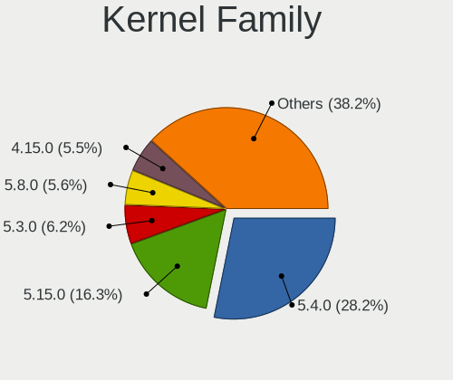
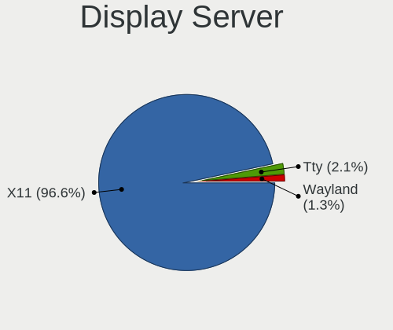
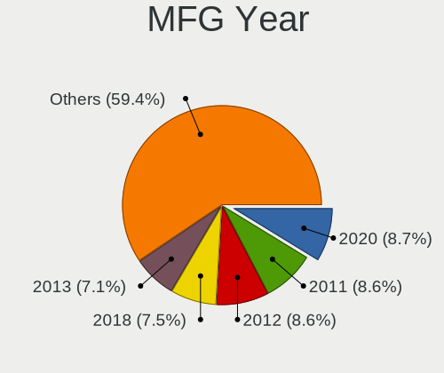
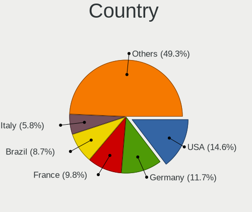
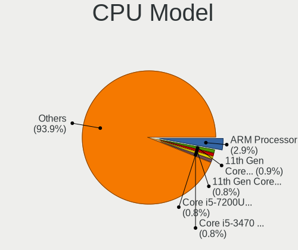
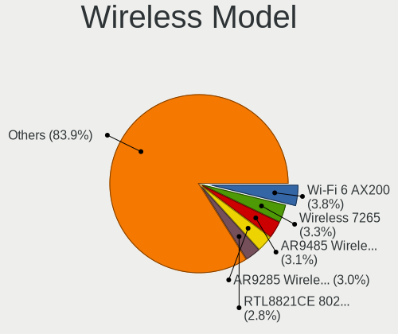

Ubuntu MATE - Tested Hardware & Statistics
------------------------------------------

A project to collect tested hardware configurations for Ubuntu MATE.

Anyone can contribute to this report by the [hw-probe](https://github.com/linuxhw/hw-probe) tool:

    sudo -E hw-probe -all -upload

Please contribute! Especially if your hardware is rare.

This is a report for all computer types. See also reports for [desktops](/Dist/Ubuntu_MATE/Desktop/README.md) and [notebooks](/Dist/Ubuntu_MATE/Notebook/README.md).

Contents
--------

* [ Test Cases ](#test-cases)

* [ System ](#system)
  - [ OS                       ](#os)
  - [ OS Family                ](#os-family)
  - [ Kernel                   ](#kernel)
  - [ Kernel Family            ](#kernel-family)
  - [ Kernel Major Ver.        ](#kernel-major-ver)
  - [ Arch                     ](#arch)
  - [ DE                       ](#de)
  - [ Display Server           ](#display-server)
  - [ Display Manager          ](#display-manager)
  - [ OS Lang                  ](#os-lang)
  - [ Boot Mode                ](#boot-mode)
  - [ Filesystem               ](#filesystem)
  - [ Part. scheme             ](#part-scheme)
  - [ Dual Boot with Linux/BSD ](#dual-boot-with-linuxbsd)
  - [ Dual Boot (Win)          ](#dual-boot-win)

* [ Board ](#board)
  - [ Vendor                   ](#vendor)
  - [ Model                    ](#model)
  - [ Model Family             ](#model-family)
  - [ MFG Year                 ](#mfg-year)
  - [ Form Factor              ](#form-factor)
  - [ Secure Boot              ](#secure-boot)
  - [ Coreboot                 ](#coreboot)
  - [ RAM Size                 ](#ram-size)
  - [ RAM Used                 ](#ram-used)
  - [ Total Drives             ](#total-drives)
  - [ Has CD-ROM               ](#has-cd-rom)
  - [ Has Ethernet             ](#has-ethernet)
  - [ Has WiFi                 ](#has-wifi)
  - [ Has Bluetooth            ](#has-bluetooth)

* [ Location ](#location)
  - [ Country                  ](#country)
  - [ City                     ](#city)

* [ Drives ](#drives)
  - [ Drive Vendor             ](#drive-vendor)
  - [ Drive Model              ](#drive-model)
  - [ HDD Vendor               ](#hdd-vendor)
  - [ SSD Vendor               ](#ssd-vendor)
  - [ Drive Kind               ](#drive-kind)
  - [ Drive Connector          ](#drive-connector)
  - [ Drive Size               ](#drive-size)
  - [ Space Total              ](#space-total)
  - [ Space Used               ](#space-used)
  - [ Malfunc. Drives          ](#malfunc-drives)
  - [ Malfunc. Drive Vendor    ](#malfunc-drive-vendor)
  - [ Malfunc. HDD Vendor      ](#malfunc-hdd-vendor)
  - [ Malfunc. Drive Kind      ](#malfunc-drive-kind)
  - [ Failed Drives            ](#failed-drives)
  - [ Failed Drive Vendor      ](#failed-drive-vendor)
  - [ Drive Status             ](#drive-status)

* [ Storage controller ](#storage-controller)
  - [ Storage Vendor           ](#storage-vendor)
  - [ Storage Model            ](#storage-model)
  - [ Storage Kind             ](#storage-kind)

* [ Processor ](#processor)
  - [ CPU Vendor               ](#cpu-vendor)
  - [ CPU Model                ](#cpu-model)
  - [ CPU Model Family         ](#cpu-model-family)
  - [ CPU Cores                ](#cpu-cores)
  - [ CPU Sockets              ](#cpu-sockets)
  - [ CPU Threads              ](#cpu-threads)
  - [ CPU Op-Modes             ](#cpu-op-modes)
  - [ CPU Microcode            ](#cpu-microcode)
  - [ CPU Microarch            ](#cpu-microarch)

* [ Graphics ](#graphics)
  - [ GPU Vendor               ](#gpu-vendor)
  - [ GPU Model                ](#gpu-model)
  - [ GPU Combo                ](#gpu-combo)
  - [ GPU Driver               ](#gpu-driver)
  - [ GPU Memory               ](#gpu-memory)

* [ Monitor ](#monitor)
  - [ Monitor Vendor           ](#monitor-vendor)
  - [ Monitor Model            ](#monitor-model)
  - [ Monitor Resolution       ](#monitor-resolution)
  - [ Monitor Diagonal         ](#monitor-diagonal)
  - [ Monitor Width            ](#monitor-width)
  - [ Aspect Ratio             ](#aspect-ratio)
  - [ Monitor Area             ](#monitor-area)
  - [ Pixel Density            ](#pixel-density)
  - [ Multiple Monitors        ](#multiple-monitors)

* [ Network ](#network)
  - [ Net Controller Vendor    ](#net-controller-vendor)
  - [ Net Controller Model     ](#net-controller-model)
  - [ Wireless Vendor          ](#wireless-vendor)
  - [ Wireless Model           ](#wireless-model)
  - [ Ethernet Vendor          ](#ethernet-vendor)
  - [ Ethernet Model           ](#ethernet-model)
  - [ Net Controller Kind      ](#net-controller-kind)
  - [ Used Controller          ](#used-controller)
  - [ NICs                     ](#nics)
  - [ IPv6                     ](#ipv6)

* [ Bluetooth ](#bluetooth)
  - [ Bluetooth Vendor         ](#bluetooth-vendor)
  - [ Bluetooth Model          ](#bluetooth-model)

* [ Sound ](#sound)
  - [ Sound Vendor             ](#sound-vendor)
  - [ Sound Model              ](#sound-model)

* [ Memory ](#memory)
  - [ Memory Vendor            ](#memory-vendor)
  - [ Memory Model             ](#memory-model)
  - [ Memory Kind              ](#memory-kind)
  - [ Memory Form Factor       ](#memory-form-factor)
  - [ Memory Size              ](#memory-size)
  - [ Memory Speed             ](#memory-speed)

* [ Printers & scanners ](#printers--scanners)
  - [ Printer Vendor           ](#printer-vendor)
  - [ Printer Model            ](#printer-model)
  - [ Scanner Vendor           ](#scanner-vendor)
  - [ Scanner Model            ](#scanner-model)

* [ Camera ](#camera)
  - [ Camera Vendor            ](#camera-vendor)
  - [ Camera Model             ](#camera-model)

* [ Security ](#security)
  - [ Fingerprint Vendor       ](#fingerprint-vendor)
  - [ Fingerprint Model        ](#fingerprint-model)
  - [ Chipcard Vendor          ](#chipcard-vendor)
  - [ Chipcard Model           ](#chipcard-model)

* [ Unsupported ](#unsupported)
  - [ Unsupported Devices      ](#unsupported-devices)
  - [ Unsupported Device Types ](#unsupported-device-types)

Test Cases
----------

Total: 2600

| Vendor        | Model                       | Form-Factor | Probe                                                      | Date         |
|---------------|-----------------------------|-------------|------------------------------------------------------------|--------------|
| Notebook      | NJx0MU                      | Notebook    | [ee086eec1f](https://linux-hardware.org/?probe=ee086eec1f) | May 09, 2024 |
| Lenovo        | ThinkBook 16 G6 IRL 21KH    | Notebook    | [58b9bbc4d6](https://linux-hardware.org/?probe=58b9bbc4d6) | May 08, 2024 |
| BESSTAR Te... | GB1B                        | Mini pc     | [14c3adea64](https://linux-hardware.org/?probe=14c3adea64) | May 08, 2024 |
| Intel         | STCK1A32WFC H67490-302      | Notebook    | [51c75f3848](https://linux-hardware.org/?probe=51c75f3848) | May 08, 2024 |
| MSI           | MS-B120                     | Mini pc     | [29451ebbbb](https://linux-hardware.org/?probe=29451ebbbb) | May 08, 2024 |
| ASUSTek       | X550LN                      | Notebook    | [b139a58ea9](https://linux-hardware.org/?probe=b139a58ea9) | May 07, 2024 |
| eMachines     | WMCP61M                     | Desktop     | [54b1a18c59](https://linux-hardware.org/?probe=54b1a18c59) | May 06, 2024 |
| Gigabyte      | B75M-D3V                    | Desktop     | [52037a51a0](https://linux-hardware.org/?probe=52037a51a0) | May 06, 2024 |
| Intel         | NUC6CAYB J23203-403         | Mini pc     | [1820a973e3](https://linux-hardware.org/?probe=1820a973e3) | May 05, 2024 |
| Lenovo        | ThinkPad X240 20ALA08VRT    | Notebook    | [b894f49df3](https://linux-hardware.org/?probe=b894f49df3) | May 05, 2024 |
| Lenovo        | ThinkPad L512 2597W1R       | Notebook    | [d7cb3b5ddd](https://linux-hardware.org/?probe=d7cb3b5ddd) | May 05, 2024 |
| ASUSTek       | E5402WHA                    | All in one  | [899d2f931f](https://linux-hardware.org/?probe=899d2f931f) | May 04, 2024 |
| ASUSTek       | G75VW                       | Notebook    | [151ab0d8e9](https://linux-hardware.org/?probe=151ab0d8e9) | May 01, 2024 |
| HP            | ENVY m7 Notebook            | Notebook    | [4403370d84](https://linux-hardware.org/?probe=4403370d84) | Apr 28, 2024 |
| Dell          | Latitude 5420               | Notebook    | [1fa9f586bb](https://linux-hardware.org/?probe=1fa9f586bb) | Apr 27, 2024 |
| Dell          | Latitude 5420               | Notebook    | [5c878504f5](https://linux-hardware.org/?probe=5c878504f5) | Apr 27, 2024 |
| ASUSTek       | VivoBook 12_ASUS Laptop ... | Notebook    | [1680c3ad15](https://linux-hardware.org/?probe=1680c3ad15) | Apr 27, 2024 |
| MSI           | MS-B120                     | Mini pc     | [8c52f15119](https://linux-hardware.org/?probe=8c52f15119) | Apr 23, 2024 |
| Morshow       | v1.0                        | Mini pc     | [cc244a6fc6](https://linux-hardware.org/?probe=cc244a6fc6) | Apr 22, 2024 |
| Lenovo        | ThinkPad W520 4284HP9       | Notebook    | [3fa1ba6009](https://linux-hardware.org/?probe=3fa1ba6009) | Apr 22, 2024 |
| Morshow       | v1.0                        | Mini pc     | [e4198c0587](https://linux-hardware.org/?probe=e4198c0587) | Apr 22, 2024 |
| Lenovo        | G70-70 80HW                 | Notebook    | [73f307b60b](https://linux-hardware.org/?probe=73f307b60b) | Apr 20, 2024 |
| ASRock        | B650E Taichi                | Desktop     | [cdd2468f64](https://linux-hardware.org/?probe=cdd2468f64) | Apr 20, 2024 |
| AMI           | Unknown                     | Notebook    | [8330483e6e](https://linux-hardware.org/?probe=8330483e6e) | Apr 20, 2024 |
| Toshiba       | STI 001387                  | Desktop     | [240e193806](https://linux-hardware.org/?probe=240e193806) | Apr 20, 2024 |
| Gigabyte      | H97M-D3H                    | Desktop     | [15a0f07250](https://linux-hardware.org/?probe=15a0f07250) | Apr 20, 2024 |
| HP            | ProBook 470 G1              | Notebook    | [a400b6efad](https://linux-hardware.org/?probe=a400b6efad) | Apr 17, 2024 |
| Lenovo        | ThinkPad L470 20J4002FMX    | Notebook    | [d7337f7684](https://linux-hardware.org/?probe=d7337f7684) | Apr 17, 2024 |
| Dell          | Latitude 5410               | Notebook    | [700b37dcf0](https://linux-hardware.org/?probe=700b37dcf0) | Apr 16, 2024 |
| MSI           | GF75 Thin 10SC              | Notebook    | [7ab70feffe](https://linux-hardware.org/?probe=7ab70feffe) | Apr 16, 2024 |
| HP            | 8643 SMVB                   | Desktop     | [de6f248fc2](https://linux-hardware.org/?probe=de6f248fc2) | Apr 14, 2024 |
| HP            | Pavilion 13 x2 PC           | Notebook    | [684e30a2e3](https://linux-hardware.org/?probe=684e30a2e3) | Apr 13, 2024 |
| HP            | Pavilion 13 x2 PC           | Notebook    | [60d693276a](https://linux-hardware.org/?probe=60d693276a) | Apr 13, 2024 |
| ASRock        | J4105B-ITX                  | Desktop     | [ecb84ecf2a](https://linux-hardware.org/?probe=ecb84ecf2a) | Apr 12, 2024 |
| Lenovo        | ThinkPad T14 Gen 1 20S1S... | Notebook    | [b6a43ddde6](https://linux-hardware.org/?probe=b6a43ddde6) | Apr 11, 2024 |
| HP            | EliteBook 640 14 inch G9... | Notebook    | [20fe73c7f9](https://linux-hardware.org/?probe=20fe73c7f9) | Apr 11, 2024 |
| ASUSTek       | H97M-E                      | Desktop     | [431b3ef7f6](https://linux-hardware.org/?probe=431b3ef7f6) | Apr 11, 2024 |
| ASUSTek       | M4A78-E                     | Desktop     | [206d758570](https://linux-hardware.org/?probe=206d758570) | Apr 10, 2024 |
| Raspberry ... | Raspberry Pi 4 Model B R... | Soc         | [23e552156c](https://linux-hardware.org/?probe=23e552156c) | Apr 09, 2024 |
| MSI           | PRO B760-P WIFI DDR4        | Desktop     | [313d012a75](https://linux-hardware.org/?probe=313d012a75) | Apr 09, 2024 |
| HP            | EliteBook 2760p             | Notebook    | [37781c3e84](https://linux-hardware.org/?probe=37781c3e84) | Apr 07, 2024 |
| Notebook      | NJx0MU                      | Notebook    | [e8546100eb](https://linux-hardware.org/?probe=e8546100eb) | Apr 07, 2024 |
| Lenovo        | IdeaPad L340-15API 81LW     | Notebook    | [a130a64c11](https://linux-hardware.org/?probe=a130a64c11) | Apr 07, 2024 |
| Unknown       | Unknown                     | Desktop     | [ac2a7ce77d](https://linux-hardware.org/?probe=ac2a7ce77d) | Apr 06, 2024 |
| Unknown       | Unknown                     | Desktop     | [1ada20ef48](https://linux-hardware.org/?probe=1ada20ef48) | Apr 06, 2024 |
| AMI           | Unknown                     | Notebook    | [e52668ee27](https://linux-hardware.org/?probe=e52668ee27) | Apr 05, 2024 |
| Acer          | Aspire ES1-311              | Notebook    | [9a68d90ab7](https://linux-hardware.org/?probe=9a68d90ab7) | Apr 05, 2024 |
| Dell          | Latitude 7400 2-in-1        | Convertible | [64c55b79df](https://linux-hardware.org/?probe=64c55b79df) | Apr 04, 2024 |
| Notebook      | NJx0MU                      | Notebook    | [4f2bc03aca](https://linux-hardware.org/?probe=4f2bc03aca) | Apr 04, 2024 |
| ASRock        | B650M-H/M.2+                | Desktop     | [38f4136e38](https://linux-hardware.org/?probe=38f4136e38) | Apr 03, 2024 |
| Intel         | NUC7JYB M37316-600          | Mini pc     | [a7a78cd117](https://linux-hardware.org/?probe=a7a78cd117) | Apr 02, 2024 |
| Dell          | 032W55 A03                  | Desktop     | [5943c24943](https://linux-hardware.org/?probe=5943c24943) | Apr 01, 2024 |
| HP            | Pavilion Sleekbook 15       | Notebook    | [20959b9997](https://linux-hardware.org/?probe=20959b9997) | Apr 01, 2024 |
| HP            | Pavilion Sleekbook 15       | Notebook    | [42117baa72](https://linux-hardware.org/?probe=42117baa72) | Apr 01, 2024 |
| ASUSTek       | G75VW                       | Notebook    | [cff197ffbf](https://linux-hardware.org/?probe=cff197ffbf) | Mar 30, 2024 |
| Lenovo        | IdeaPad Slim 3 14IAN8 82... | Notebook    | [3709076728](https://linux-hardware.org/?probe=3709076728) | Mar 30, 2024 |
| Dell          | 02YRK5 A02                  | Desktop     | [4c860be642](https://linux-hardware.org/?probe=4c860be642) | Mar 29, 2024 |
| Toshiba       | Satellite C70D-A            | Notebook    | [8489c1e38c](https://linux-hardware.org/?probe=8489c1e38c) | Mar 28, 2024 |
| Dell          | Latitude 3410               | Notebook    | [3aee33bb58](https://linux-hardware.org/?probe=3aee33bb58) | Mar 27, 2024 |
| Monster       | ABRA A5 V17.4               | Notebook    | [153af2c8d9](https://linux-hardware.org/?probe=153af2c8d9) | Mar 23, 2024 |
| Intel         | NUC7JYB M37316-600          | Mini pc     | [61d0ee2736](https://linux-hardware.org/?probe=61d0ee2736) | Mar 22, 2024 |
| Gigabyte      | H87-HD3                     | Desktop     | [39e7b8c321](https://linux-hardware.org/?probe=39e7b8c321) | Mar 22, 2024 |
| Lenovo        | ThinkPad T490s 20NX006HM... | Notebook    | [52e2e29f44](https://linux-hardware.org/?probe=52e2e29f44) | Mar 22, 2024 |
| Toshiba       | PORTEGE R500                | Notebook    | [33c598fc6e](https://linux-hardware.org/?probe=33c598fc6e) | Mar 21, 2024 |
| HP            | EliteBook 820 G3            | Notebook    | [5d5d06eab9](https://linux-hardware.org/?probe=5d5d06eab9) | Mar 20, 2024 |
| Acer          | Aspire XC-886 V:2.0         | Desktop     | [624e1874e9](https://linux-hardware.org/?probe=624e1874e9) | Mar 20, 2024 |
| Gigabyte      | B550 GAMING X V2            | Desktop     | [fc818b5a1b](https://linux-hardware.org/?probe=fc818b5a1b) | Mar 18, 2024 |
| Lenovo        | ThinkStation S30 0606AD5    | Desktop     | [8a703c6f02](https://linux-hardware.org/?probe=8a703c6f02) | Mar 17, 2024 |
| Lenovo        | Z710 20250                  | Notebook    | [60c82a772a](https://linux-hardware.org/?probe=60c82a772a) | Mar 17, 2024 |
| ASUSTek       | ROG STRIX X670E-A GAMING... | Desktop     | [e2617d5a43](https://linux-hardware.org/?probe=e2617d5a43) | Mar 17, 2024 |
| Apple         | MacBookPro7,1               | Notebook    | [5f37f98222](https://linux-hardware.org/?probe=5f37f98222) | Mar 16, 2024 |
| Lenovo        | IdeaPad 5 Pro 16ACH6 82L... | Notebook    | [78ad2387d5](https://linux-hardware.org/?probe=78ad2387d5) | Mar 15, 2024 |
| ASUSTek       | PRIME B760-PLUS             | Desktop     | [bb52ad6052](https://linux-hardware.org/?probe=bb52ad6052) | Mar 15, 2024 |
| Lenovo        | IdeaPad 5 Pro 16ACH6 82L... | Notebook    | [0fbeb0332d](https://linux-hardware.org/?probe=0fbeb0332d) | Mar 14, 2024 |
| Raspberry ... | Raspberry Pi 4 Model B R... | Soc         | [668f06dbdf](https://linux-hardware.org/?probe=668f06dbdf) | Mar 14, 2024 |
| Lenovo        | IdeaPad 5 Pro 16ACH6 82L... | Notebook    | [ad2e487982](https://linux-hardware.org/?probe=ad2e487982) | Mar 12, 2024 |
| Sony          | SVE1712T1EB                 | Notebook    | [a01a793d3b](https://linux-hardware.org/?probe=a01a793d3b) | Mar 12, 2024 |
| Sony          | SVE1712T1EB                 | Notebook    | [2bc7cadf31](https://linux-hardware.org/?probe=2bc7cadf31) | Mar 12, 2024 |
| ASUSTek       | ROG STRIX X670E-A GAMING... | Desktop     | [daec1c4210](https://linux-hardware.org/?probe=daec1c4210) | Mar 11, 2024 |
| ASUSTek       | UX31E                       | Notebook    | [94fc346288](https://linux-hardware.org/?probe=94fc346288) | Mar 10, 2024 |
| ASUSTek       | G75VW                       | Notebook    | [c22c7f9510](https://linux-hardware.org/?probe=c22c7f9510) | Mar 10, 2024 |
| MSI           | MS-B120                     | Mini pc     | [8d182b3c8c](https://linux-hardware.org/?probe=8d182b3c8c) | Mar 09, 2024 |
| Dell          | Latitude 3410               | Notebook    | [5ea9fa7a7c](https://linux-hardware.org/?probe=5ea9fa7a7c) | Mar 07, 2024 |
| MSI           | MS-B120                     | Mini pc     | [18c75fd8f9](https://linux-hardware.org/?probe=18c75fd8f9) | Mar 05, 2024 |
| MSI           | Katana GF66 12UC            | Notebook    | [13e9499bcc](https://linux-hardware.org/?probe=13e9499bcc) | Mar 05, 2024 |
| MSI           | Katana GF66 12UC            | Notebook    | [27e54c1325](https://linux-hardware.org/?probe=27e54c1325) | Mar 05, 2024 |
| ASUSTek       | PRIME B450M-A II            | Desktop     | [e053d06a2d](https://linux-hardware.org/?probe=e053d06a2d) | Mar 04, 2024 |
| Dell          | Inspiron 1520               | Notebook    | [6cffe59389](https://linux-hardware.org/?probe=6cffe59389) | Mar 02, 2024 |
| HP            | Notebook                    | Notebook    | [9b7a8a0478](https://linux-hardware.org/?probe=9b7a8a0478) | Feb 29, 2024 |
| Lenovo        | ThinkBook 15-IIL 20SM       | Notebook    | [aeee54cee7](https://linux-hardware.org/?probe=aeee54cee7) | Feb 27, 2024 |
| Dell          | Precision 5550              | Notebook    | [59677e206f](https://linux-hardware.org/?probe=59677e206f) | Feb 27, 2024 |
| ASUSTek       | M4N68T-M-V2                 | Desktop     | [51dde30452](https://linux-hardware.org/?probe=51dde30452) | Feb 25, 2024 |
| ASUSTek       | M4N68T-M-V2                 | Desktop     | [05c2196fd2](https://linux-hardware.org/?probe=05c2196fd2) | Feb 25, 2024 |
| ASRock        | A320M-HDV R4.0              | Desktop     | [69ef5f3bb0](https://linux-hardware.org/?probe=69ef5f3bb0) | Feb 24, 2024 |
| Positivo B... | VJFE59F11X-B0411H           | Notebook    | [f193f8bd36](https://linux-hardware.org/?probe=f193f8bd36) | Feb 23, 2024 |
| ASUSTek       | TUF Gaming B550M-PLUS       | Desktop     | [d4ac4dafa1](https://linux-hardware.org/?probe=d4ac4dafa1) | Feb 23, 2024 |
| Biostar       | B450MHP                     | Desktop     | [5c5906ef27](https://linux-hardware.org/?probe=5c5906ef27) | Feb 21, 2024 |
| Notebook      | NJx0MU                      | Notebook    | [645bf6be84](https://linux-hardware.org/?probe=645bf6be84) | Feb 20, 2024 |
| Dell          | Latitude 5590               | Notebook    | [e25be34559](https://linux-hardware.org/?probe=e25be34559) | Feb 19, 2024 |
| Notebook      | NJx0MU                      | Notebook    | [3c40fa1a9f](https://linux-hardware.org/?probe=3c40fa1a9f) | Feb 19, 2024 |
| Dell          | Latitude E5550              | Notebook    | [8f96e62eaf](https://linux-hardware.org/?probe=8f96e62eaf) | Feb 18, 2024 |
| Biostar       | B450MHP                     | Desktop     | [81eca30554](https://linux-hardware.org/?probe=81eca30554) | Feb 18, 2024 |
| Dell          | Latitude 7400 2-in-1        | Convertible | [8bb363d9be](https://linux-hardware.org/?probe=8bb363d9be) | Feb 18, 2024 |
| Dell          | OptiPlex 980                | Desktop     | [9554536e5f](https://linux-hardware.org/?probe=9554536e5f) | Feb 18, 2024 |
| Biostar       | B450MHP                     | Desktop     | [1c50343bc4](https://linux-hardware.org/?probe=1c50343bc4) | Feb 17, 2024 |
| ASUSTek       | G75VW                       | Notebook    | [ff0a6068a5](https://linux-hardware.org/?probe=ff0a6068a5) | Feb 17, 2024 |
| ASUSTek       | G75VW                       | Notebook    | [5ad9c09f49](https://linux-hardware.org/?probe=5ad9c09f49) | Feb 16, 2024 |
| ASUSTek       | PRIME B450M-A II            | Desktop     | [1a90ac1ac4](https://linux-hardware.org/?probe=1a90ac1ac4) | Feb 15, 2024 |
| HP            | Pavilion Gaming Laptop 1... | Notebook    | [b4a782dfca](https://linux-hardware.org/?probe=b4a782dfca) | Feb 15, 2024 |
| Acer          | Extensa 215-22              | Notebook    | [a7faa9b520](https://linux-hardware.org/?probe=a7faa9b520) | Feb 14, 2024 |
| MSI           | MS-B120                     | Mini pc     | [ea5bf7fa17](https://linux-hardware.org/?probe=ea5bf7fa17) | Feb 11, 2024 |
| Dell          | Inspiron 1520               | Notebook    | [953b2c870f](https://linux-hardware.org/?probe=953b2c870f) | Feb 11, 2024 |
| Toshiba       | Satellite C55-B             | Notebook    | [f9989aa45a](https://linux-hardware.org/?probe=f9989aa45a) | Feb 09, 2024 |
| Dell          | Precision 7520              | Notebook    | [3ba06d2c0d](https://linux-hardware.org/?probe=3ba06d2c0d) | Feb 08, 2024 |
| Lenovo        | ThinkPad T460s 20FAS1NF0... | Notebook    | [1d5c5c6bdc](https://linux-hardware.org/?probe=1d5c5c6bdc) | Feb 07, 2024 |
| Lenovo        | ThinkCentre A58 75227MG     | Desktop     | [bf324db579](https://linux-hardware.org/?probe=bf324db579) | Feb 07, 2024 |
| MSI           | PRO H510M-B                 | Desktop     | [1d9804ffcc](https://linux-hardware.org/?probe=1d9804ffcc) | Feb 03, 2024 |
| HP            | Pavilion m6                 | Notebook    | [f12679a936](https://linux-hardware.org/?probe=f12679a936) | Feb 03, 2024 |
| Notebook      | NJx0MU                      | Notebook    | [dbe298a22e](https://linux-hardware.org/?probe=dbe298a22e) | Feb 03, 2024 |
| Notebook      | NJx0MU                      | Notebook    | [6259b53b1c](https://linux-hardware.org/?probe=6259b53b1c) | Feb 02, 2024 |
| Notebook      | NJx0MU                      | Notebook    | [7def8ee544](https://linux-hardware.org/?probe=7def8ee544) | Feb 01, 2024 |
| Lenovo        | ThinkPad X270 W10DG 20K5... | Notebook    | [c62ec1a167](https://linux-hardware.org/?probe=c62ec1a167) | Jan 31, 2024 |
| Notebook      | NJx0MU                      | Notebook    | [6f8f587ec5](https://linux-hardware.org/?probe=6f8f587ec5) | Jan 30, 2024 |
| MSI           | MPG B550 GAMING PLUS        | Desktop     | [091fe8d216](https://linux-hardware.org/?probe=091fe8d216) | Jan 29, 2024 |
| Lenovo        | IdeaPad 3 15ADA05 81W1      | Notebook    | [1069da15da](https://linux-hardware.org/?probe=1069da15da) | Jan 28, 2024 |
| MSI           | MPG B550 GAMING PLUS        | Desktop     | [7a5a8be027](https://linux-hardware.org/?probe=7a5a8be027) | Jan 25, 2024 |
| HP            | Pavilion Gaming Laptop 1... | Notebook    | [6122c021d6](https://linux-hardware.org/?probe=6122c021d6) | Jan 25, 2024 |
| Positivo      | POS-EIBTPDC                 | Desktop     | [120ebd1d10](https://linux-hardware.org/?probe=120ebd1d10) | Jan 24, 2024 |
| Gigabyte      | GA-MA770T-UD3               | Desktop     | [434a85ff04](https://linux-hardware.org/?probe=434a85ff04) | Jan 21, 2024 |
| HP            | Pavilion Gaming Laptop 1... | Notebook    | [3dff9ac8f3](https://linux-hardware.org/?probe=3dff9ac8f3) | Jan 21, 2024 |
| Apple         | MacBookPro14,1              | Notebook    | [bdf8f178f4](https://linux-hardware.org/?probe=bdf8f178f4) | Jan 18, 2024 |
| Dell          | Latitude E5550              | Notebook    | [2887bb49af](https://linux-hardware.org/?probe=2887bb49af) | Jan 17, 2024 |
| System76      | Lemur Ultra                 | Notebook    | [31f8a83abf](https://linux-hardware.org/?probe=31f8a83abf) | Jan 17, 2024 |
| Dell          | 0GDJXY A00                  | All in one  | [3ea400d76d](https://linux-hardware.org/?probe=3ea400d76d) | Jan 17, 2024 |
| HP            | ProBook 450 G6              | Notebook    | [6d71f55994](https://linux-hardware.org/?probe=6d71f55994) | Jan 17, 2024 |
| Dell          | Latitude E5550              | Notebook    | [0755281d4f](https://linux-hardware.org/?probe=0755281d4f) | Jan 16, 2024 |
| Gigabyte      | Z370N WIFI-CF               | Desktop     | [01eeec96ca](https://linux-hardware.org/?probe=01eeec96ca) | Jan 16, 2024 |
| ASRock        | X570 Steel Legend           | Desktop     | [192feda06a](https://linux-hardware.org/?probe=192feda06a) | Jan 16, 2024 |
| Gigabyte      | A520I AC                    | Desktop     | [1279f6d244](https://linux-hardware.org/?probe=1279f6d244) | Jan 13, 2024 |
| Intel         | NUC11PABi7 K90104-305       | Mini pc     | [8a6e291933](https://linux-hardware.org/?probe=8a6e291933) | Jan 11, 2024 |
| Dell          | Vostro 7620                 | Notebook    | [433547fc16](https://linux-hardware.org/?probe=433547fc16) | Jan 11, 2024 |
| Juniper Sy... | Mesa Pro                    | Tablet      | [9c632df9a1](https://linux-hardware.org/?probe=9c632df9a1) | Jan 10, 2024 |
| ASRock        | N68-VS3 UCC                 | Desktop     | [f46fcb5ee9](https://linux-hardware.org/?probe=f46fcb5ee9) | Jan 10, 2024 |
| Dell          | 032W55 A03                  | Desktop     | [97e3c61a8b](https://linux-hardware.org/?probe=97e3c61a8b) | Jan 07, 2024 |
| MSI           | B550M PRO-VDH WIFI          | Desktop     | [3f33c9082a](https://linux-hardware.org/?probe=3f33c9082a) | Jan 03, 2024 |
| Lenovo        | ThinkCentre M55e 9645W2C    | Desktop     | [7f8c8e496a](https://linux-hardware.org/?probe=7f8c8e496a) | Jan 02, 2024 |
| ASUSTek       | ROG STRIX B450-F GAMING     | Desktop     | [91413e5760](https://linux-hardware.org/?probe=91413e5760) | Jan 02, 2024 |
| Notebook      | NJx0MU                      | Notebook    | [c038b7f7e4](https://linux-hardware.org/?probe=c038b7f7e4) | Jan 02, 2024 |
| Notebook      | NJx0MU                      | Notebook    | [cdb97873fa](https://linux-hardware.org/?probe=cdb97873fa) | Jan 01, 2024 |
| Notebook      | NJx0MU                      | Notebook    | [f9d4fa4d55](https://linux-hardware.org/?probe=f9d4fa4d55) | Jan 01, 2024 |
| Packard Be... | EasyNote TE11HC             | Notebook    | [8dab3905db](https://linux-hardware.org/?probe=8dab3905db) | Jan 01, 2024 |
| Gigabyte      | H470M K                     | Desktop     | [90b6ff9ff3](https://linux-hardware.org/?probe=90b6ff9ff3) | Jan 01, 2024 |
| HP            | Laptop 17-cn3xxx            | Notebook    | [3a84122c5a](https://linux-hardware.org/?probe=3a84122c5a) | Dec 30, 2023 |
| Notebook      | NJx0MU                      | Notebook    | [c7f2d68d77](https://linux-hardware.org/?probe=c7f2d68d77) | Dec 30, 2023 |
| ASUSTek       | G75VW                       | Notebook    | [763233abcb](https://linux-hardware.org/?probe=763233abcb) | Dec 30, 2023 |
| HP            | ProBook 440 G7              | Notebook    | [10d9fd3230](https://linux-hardware.org/?probe=10d9fd3230) | Dec 30, 2023 |
| HP            | Pavilion Power Laptop 15... | Notebook    | [5bd82e2331](https://linux-hardware.org/?probe=5bd82e2331) | Dec 28, 2023 |
| Raspberry ... | Raspberry Pi 2 Model B R... | Soc         | [f4820a078b](https://linux-hardware.org/?probe=f4820a078b) | Dec 26, 2023 |
| Raspberry ... | Raspberry Pi 2 Model B R... | Soc         | [d25c8e8312](https://linux-hardware.org/?probe=d25c8e8312) | Dec 26, 2023 |
| Medion        | S6445 MD61281               | Notebook    | [b7db1404b6](https://linux-hardware.org/?probe=b7db1404b6) | Dec 26, 2023 |
| Notebook      | NJx0MU                      | Notebook    | [87cef435db](https://linux-hardware.org/?probe=87cef435db) | Dec 24, 2023 |
| Clevo         | W760/M770CU                 | Notebook    | [c64bdf2349](https://linux-hardware.org/?probe=c64bdf2349) | Dec 24, 2023 |
| Notebook      | NJx0MU                      | Notebook    | [b57fdd9854](https://linux-hardware.org/?probe=b57fdd9854) | Dec 24, 2023 |
| GPU Compan... | GWTN116-3                   | Notebook    | [89366f9a48](https://linux-hardware.org/?probe=89366f9a48) | Dec 23, 2023 |
| GPD           | G1621-02                    | Notebook    | [eaf78f9da1](https://linux-hardware.org/?probe=eaf78f9da1) | Dec 22, 2023 |
| MSI           | GF65 Thin 10SDR             | Notebook    | [73408e34a6](https://linux-hardware.org/?probe=73408e34a6) | Dec 21, 2023 |
| HP            | 350 G1                      | Notebook    | [c219133bce](https://linux-hardware.org/?probe=c219133bce) | Dec 20, 2023 |
| RuggedPC      | RuggedPadY22                | Tablet      | [80f7f9c98a](https://linux-hardware.org/?probe=80f7f9c98a) | Dec 20, 2023 |
| Clevo         | W760/M770CU                 | Notebook    | [fdde778b3c](https://linux-hardware.org/?probe=fdde778b3c) | Dec 19, 2023 |
| ASUSTek       | PRIME B760-PLUS             | Desktop     | [f3149a6f22](https://linux-hardware.org/?probe=f3149a6f22) | Dec 19, 2023 |
| Dell          | XPS 15 9560                 | Notebook    | [bb58136a7c](https://linux-hardware.org/?probe=bb58136a7c) | Dec 18, 2023 |
| RuggedPC      | RuggedPadY22                | Tablet      | [da34d3936d](https://linux-hardware.org/?probe=da34d3936d) | Dec 18, 2023 |
| Notebook      | NJx0MU                      | Notebook    | [1446130ae9](https://linux-hardware.org/?probe=1446130ae9) | Dec 17, 2023 |
| Notebook      | NJx0MU                      | Notebook    | [80281cb193](https://linux-hardware.org/?probe=80281cb193) | Dec 17, 2023 |
| ASUSTek       | PRIME B760-PLUS             | Desktop     | [b7a7aa8d5d](https://linux-hardware.org/?probe=b7a7aa8d5d) | Dec 17, 2023 |
| ASUSTek       | ASUSLaptop_Q540VJ           | Notebook    | [88312d177f](https://linux-hardware.org/?probe=88312d177f) | Dec 16, 2023 |
| HP            | ProBook 650 G1              | Notebook    | [f58535cbfe](https://linux-hardware.org/?probe=f58535cbfe) | Dec 14, 2023 |
| Lenovo        | G50-45 80E3                 | Notebook    | [4b88dcf6b3](https://linux-hardware.org/?probe=4b88dcf6b3) | Dec 13, 2023 |
| Lenovo        | G50-45 80E3                 | Notebook    | [1a63f79d28](https://linux-hardware.org/?probe=1a63f79d28) | Dec 13, 2023 |
| RuggedPC      | RuggedPadY22                | Tablet      | [cb9765df38](https://linux-hardware.org/?probe=cb9765df38) | Dec 12, 2023 |
| ASUSTek       | P553UA                      | Notebook    | [9a0bb65e3f](https://linux-hardware.org/?probe=9a0bb65e3f) | Dec 12, 2023 |
| HP            | 82DC 1100                   | All in one  | [96f4033f37](https://linux-hardware.org/?probe=96f4033f37) | Dec 12, 2023 |
| Gigabyte      | X670 AORUS ELITE AX         | Desktop     | [991503ccf4](https://linux-hardware.org/?probe=991503ccf4) | Dec 10, 2023 |
| HP            | ProLiant MicroServer        | Desktop     | [5451582602](https://linux-hardware.org/?probe=5451582602) | Dec 08, 2023 |
| MSI           | MS-B120                     | Mini pc     | [51a1cc9143](https://linux-hardware.org/?probe=51a1cc9143) | Dec 07, 2023 |
| MSI           | MS-B120                     | Mini pc     | [9c55ae59fe](https://linux-hardware.org/?probe=9c55ae59fe) | Dec 07, 2023 |
| Gigabyte      | X670 AORUS ELITE AX         | Desktop     | [18a5ca0a40](https://linux-hardware.org/?probe=18a5ca0a40) | Dec 07, 2023 |
| ASUSTek       | VivoBook_ASUSLaptop X415... | Notebook    | [1b3b476186](https://linux-hardware.org/?probe=1b3b476186) | Dec 06, 2023 |
| ASUSTek       | VivoBook_ASUSLaptop X415... | Notebook    | [58547d36b7](https://linux-hardware.org/?probe=58547d36b7) | Dec 06, 2023 |
| Gigabyte      | G41MT-S2                    | Desktop     | [06a0da716b](https://linux-hardware.org/?probe=06a0da716b) | Dec 05, 2023 |
| Microsoft     | Surface Laptop Go 2         | Tablet      | [3c6a041703](https://linux-hardware.org/?probe=3c6a041703) | Dec 05, 2023 |
| MSI           | H81M-P33                    | Desktop     | [3c745928bb](https://linux-hardware.org/?probe=3c745928bb) | Dec 02, 2023 |
| ASUSTek       | X550LN                      | Notebook    | [5f4856fdab](https://linux-hardware.org/?probe=5f4856fdab) | Dec 01, 2023 |
| HP            | ProBook 440 G7              | Notebook    | [bb8295e3fa](https://linux-hardware.org/?probe=bb8295e3fa) | Nov 30, 2023 |
| HP            | ProBook 440 G7              | Notebook    | [0d3ea0a6dc](https://linux-hardware.org/?probe=0d3ea0a6dc) | Nov 30, 2023 |
| Acer          | AOD260                      | Notebook    | [20594f9a03](https://linux-hardware.org/?probe=20594f9a03) | Nov 29, 2023 |
| Acer          | AOD260                      | Notebook    | [de50f2993e](https://linux-hardware.org/?probe=de50f2993e) | Nov 29, 2023 |
| Gigabyte      | B550 GAMING X V2            | Desktop     | [4c55de5adb](https://linux-hardware.org/?probe=4c55de5adb) | Nov 28, 2023 |
| Gigabyte      | Z590 UD AC                  | Desktop     | [416fbc3923](https://linux-hardware.org/?probe=416fbc3923) | Nov 28, 2023 |
| HP            | ProBook 440 G2              | Notebook    | [608d264af2](https://linux-hardware.org/?probe=608d264af2) | Nov 27, 2023 |
| HP            | ProBook 440 G2              | Notebook    | [2ecc0c852a](https://linux-hardware.org/?probe=2ecc0c852a) | Nov 27, 2023 |
| ASUSTek       | PRIME Z490-P                | Desktop     | [47d33f722e](https://linux-hardware.org/?probe=47d33f722e) | Nov 25, 2023 |
| ASUSTek       | M5A97 LE R2.0               | Desktop     | [5ead75f7bc](https://linux-hardware.org/?probe=5ead75f7bc) | Nov 25, 2023 |
| HP            | EliteBook 860 16 inch G1... | Notebook    | [5d2574b6cf](https://linux-hardware.org/?probe=5d2574b6cf) | Nov 24, 2023 |
| Gigabyte      | Z590 UD AC                  | Desktop     | [5ae0c22a32](https://linux-hardware.org/?probe=5ae0c22a32) | Nov 24, 2023 |
| Lenovo        | ThinkPad X1 Yoga 3rd 20L... | Convertible | [59444faae7](https://linux-hardware.org/?probe=59444faae7) | Nov 24, 2023 |
| HP            | Spectre x360 Convertible... | Convertible | [7caae1b1a0](https://linux-hardware.org/?probe=7caae1b1a0) | Nov 24, 2023 |
| ASRock        | 970 Extreme3 R2.0           | Desktop     | [502e296060](https://linux-hardware.org/?probe=502e296060) | Nov 23, 2023 |
| Lenovo        | Legion 7 16ITHg6 82K6       | Notebook    | [5c0820855b](https://linux-hardware.org/?probe=5c0820855b) | Nov 23, 2023 |
| Lenovo        | IdeaPad Y460                | Notebook    | [265198a4bc](https://linux-hardware.org/?probe=265198a4bc) | Nov 23, 2023 |
| Lenovo        | Legion 7 16ITHg6 82K6       | Notebook    | [a4cda5b12d](https://linux-hardware.org/?probe=a4cda5b12d) | Nov 22, 2023 |
| Notebook      | NJx0MU                      | Notebook    | [96d6ec7f1f](https://linux-hardware.org/?probe=96d6ec7f1f) | Nov 20, 2023 |
| Notebook      | NJx0MU                      | Notebook    | [c0a0353d6f](https://linux-hardware.org/?probe=c0a0353d6f) | Nov 20, 2023 |
| HP            | Elite x2 1012 G2            | Tablet      | [acfd3b6493](https://linux-hardware.org/?probe=acfd3b6493) | Nov 19, 2023 |
| HP            | ProBook 440 G2              | Notebook    | [6a9af286f8](https://linux-hardware.org/?probe=6a9af286f8) | Nov 19, 2023 |
| Dell          | Precision 7760              | Notebook    | [daaf99c63e](https://linux-hardware.org/?probe=daaf99c63e) | Nov 17, 2023 |
| Dell          | Precision 7760              | Notebook    | [50404f0f12](https://linux-hardware.org/?probe=50404f0f12) | Nov 17, 2023 |
| ASRock        | X99 Extreme4                | Desktop     | [dfb480c40a](https://linux-hardware.org/?probe=dfb480c40a) | Nov 17, 2023 |
| Apple         | Mac-63001698E7A34814 iMa... | All in one  | [9443883eaf](https://linux-hardware.org/?probe=9443883eaf) | Nov 16, 2023 |
| BANGHO        | 1025                        | Notebook    | [d1d51fc17a](https://linux-hardware.org/?probe=d1d51fc17a) | Nov 15, 2023 |
| ASUSTek       | P8P67-M PRO                 | Desktop     | [9d1c329ebb](https://linux-hardware.org/?probe=9d1c329ebb) | Nov 14, 2023 |
| Dell          | Precision M4800             | Notebook    | [9a63057a12](https://linux-hardware.org/?probe=9a63057a12) | Nov 13, 2023 |
| BANGHO        | 1025                        | Notebook    | [97b39ed05d](https://linux-hardware.org/?probe=97b39ed05d) | Nov 13, 2023 |
| Acer          | Aspire 5050                 | Notebook    | [92930dd0d4](https://linux-hardware.org/?probe=92930dd0d4) | Nov 13, 2023 |
| HP            | Pavilion Gaming Laptop 1... | Notebook    | [9dd24e5aaa](https://linux-hardware.org/?probe=9dd24e5aaa) | Nov 12, 2023 |
| Lenovo        | IdeaPadFlex 4-1470 80SA     | Notebook    | [a206fa30d7](https://linux-hardware.org/?probe=a206fa30d7) | Nov 11, 2023 |
| Intel         | NUC7JYB M37316-600          | Mini pc     | [cb1e3547f7](https://linux-hardware.org/?probe=cb1e3547f7) | Nov 10, 2023 |
| Dell          | 0TKD84 A02                  | Server      | [accebd9648](https://linux-hardware.org/?probe=accebd9648) | Nov 10, 2023 |
| Dell          | 0VRCY5 A12                  | Server      | [1bf5a3e96c](https://linux-hardware.org/?probe=1bf5a3e96c) | Nov 08, 2023 |
| MSI           | GL62 6QF                    | Notebook    | [ac1f389364](https://linux-hardware.org/?probe=ac1f389364) | Nov 08, 2023 |
| Dell          | 032W55 A03                  | Desktop     | [8d3db7f790](https://linux-hardware.org/?probe=8d3db7f790) | Nov 07, 2023 |
| Notebook      | NJx0MU                      | Notebook    | [70cdbefd00](https://linux-hardware.org/?probe=70cdbefd00) | Nov 07, 2023 |
| Lenovo        | T530-28ICB                  | Desktop     | [ba883f99a0](https://linux-hardware.org/?probe=ba883f99a0) | Nov 06, 2023 |
| Notebook      | NJx0MU                      | Notebook    | [24a052bf0c](https://linux-hardware.org/?probe=24a052bf0c) | Nov 06, 2023 |
| ASUSTek       | VivoBook_ASUSLaptop X712... | Notebook    | [254a87d641](https://linux-hardware.org/?probe=254a87d641) | Nov 05, 2023 |
| Lenovo        | IdeaPad S145-15IWL 81S9     | Notebook    | [f0b35f0acb](https://linux-hardware.org/?probe=f0b35f0acb) | Nov 05, 2023 |
| Lenovo        | IdeaPad S145-15IWL 81S9     | Notebook    | [7060a82ed0](https://linux-hardware.org/?probe=7060a82ed0) | Nov 05, 2023 |
| Lenovo        | V15 G2 ALC 82KD             | Notebook    | [fc01ceb47b](https://linux-hardware.org/?probe=fc01ceb47b) | Nov 05, 2023 |
| Lenovo        | ThinkPad T14 Gen 2a 20XK... | Notebook    | [594257aca2](https://linux-hardware.org/?probe=594257aca2) | Nov 03, 2023 |
| Dell          | 09WH54 A01                  | Desktop     | [4eae8e67db](https://linux-hardware.org/?probe=4eae8e67db) | Nov 03, 2023 |
| ASUSTek       | M5A78L-M LX                 | Desktop     | [602a2268e2](https://linux-hardware.org/?probe=602a2268e2) | Nov 02, 2023 |
| Lenovo        | ThinkPad P53 20QN000FIX     | Notebook    | [40de43c266](https://linux-hardware.org/?probe=40de43c266) | Nov 02, 2023 |
| Google        | Galtic                      | Notebook    | [8945661ada](https://linux-hardware.org/?probe=8945661ada) | Nov 02, 2023 |
| ASUSTek       | ROG STRIX Z690-E GAMING ... | Desktop     | [d2d21dcf50](https://linux-hardware.org/?probe=d2d21dcf50) | Nov 01, 2023 |
| MSI           | Creator 15 A11UE            | Notebook    | [e8b0c2a2b5](https://linux-hardware.org/?probe=e8b0c2a2b5) | Oct 31, 2023 |
| Gigabyte      | B550M DS3H                  | Desktop     | [6ee7bce3de](https://linux-hardware.org/?probe=6ee7bce3de) | Oct 31, 2023 |
| Acer          | Aspire A515-45              | Notebook    | [b367027f2a](https://linux-hardware.org/?probe=b367027f2a) | Oct 30, 2023 |
| Panasonic     | CF-53SJCZYLM                | Notebook    | [94941374a2](https://linux-hardware.org/?probe=94941374a2) | Oct 30, 2023 |
| Dell          | Precision 7760              | Notebook    | [eaba0c73b0](https://linux-hardware.org/?probe=eaba0c73b0) | Oct 29, 2023 |
| ASUSTek       | G75VW                       | Notebook    | [e3bde6ede0](https://linux-hardware.org/?probe=e3bde6ede0) | Oct 28, 2023 |
| VIT           | P1400                       | Notebook    | [235c6e8c49](https://linux-hardware.org/?probe=235c6e8c49) | Oct 28, 2023 |
| HP            | ProBook 650 G1              | Notebook    | [698c3abcba](https://linux-hardware.org/?probe=698c3abcba) | Oct 27, 2023 |
| Dell          | Latitude 7430               | Notebook    | [e9cfada6a4](https://linux-hardware.org/?probe=e9cfada6a4) | Oct 26, 2023 |
| MSI           | A320M PRO-M2 V2             | Desktop     | [9854f25018](https://linux-hardware.org/?probe=9854f25018) | Oct 26, 2023 |
| Acer          | Aspire 5050                 | Notebook    | [2129ab3e24](https://linux-hardware.org/?probe=2129ab3e24) | Oct 26, 2023 |
| Acer          | Aspire ES1-311              | Notebook    | [b98bc11e71](https://linux-hardware.org/?probe=b98bc11e71) | Oct 25, 2023 |
| ASRock        | Z370 Killer SLI             | Desktop     | [b01d80e583](https://linux-hardware.org/?probe=b01d80e583) | Oct 24, 2023 |
| Gigabyte      | G5 KC                       | Notebook    | [32743a624c](https://linux-hardware.org/?probe=32743a624c) | Oct 24, 2023 |
| Gigabyte      | G5 KC                       | Notebook    | [23d64978d9](https://linux-hardware.org/?probe=23d64978d9) | Oct 24, 2023 |
| Positivo      | C4128G-15                   | Notebook    | [8d9aa2f206](https://linux-hardware.org/?probe=8d9aa2f206) | Oct 23, 2023 |
| Notebook      | NJx0MU                      | Notebook    | [961c369ea4](https://linux-hardware.org/?probe=961c369ea4) | Oct 21, 2023 |
| Notebook      | NJx0MU                      | Notebook    | [f19c18154b](https://linux-hardware.org/?probe=f19c18154b) | Oct 21, 2023 |
| ASUSTek       | B85M-G                      | Desktop     | [2682d3f618](https://linux-hardware.org/?probe=2682d3f618) | Oct 21, 2023 |
| ASUSTek       | B85M-G                      | Desktop     | [8765923ff6](https://linux-hardware.org/?probe=8765923ff6) | Oct 21, 2023 |
| Acer          | Aspire E3-112M              | Notebook    | [11d6580d3e](https://linux-hardware.org/?probe=11d6580d3e) | Oct 18, 2023 |
| Lenovo        | V15 G2 ALC 82KD             | Notebook    | [bc4cc061a2](https://linux-hardware.org/?probe=bc4cc061a2) | Oct 18, 2023 |
| HP            | 3646h                       | Desktop     | [6a679937c4](https://linux-hardware.org/?probe=6a679937c4) | Oct 18, 2023 |
| Hardkernel    | ODROID-C4                   | Soc         | [3a322cbde3](https://linux-hardware.org/?probe=3a322cbde3) | Oct 17, 2023 |
| Lenovo        | IdeaPad Y700-15ISK 80NV     | Notebook    | [f16973062f](https://linux-hardware.org/?probe=f16973062f) | Oct 15, 2023 |
| Packard Be... | EasyNote ENTG81BA           | Notebook    | [f25cb1517e](https://linux-hardware.org/?probe=f25cb1517e) | Oct 12, 2023 |
| Clevo         | W240HU/W250HUQ              | Notebook    | [deb84129fb](https://linux-hardware.org/?probe=deb84129fb) | Oct 10, 2023 |
| ASUSTek       | K50ID                       | Notebook    | [2763bfac4e](https://linux-hardware.org/?probe=2763bfac4e) | Oct 07, 2023 |
| Lenovo        | ThinkPad A275 20KCS09T1G    | Notebook    | [1e797cb20f](https://linux-hardware.org/?probe=1e797cb20f) | Oct 07, 2023 |
| Infinix       | INBOOK X2                   | Notebook    | [5d39adb330](https://linux-hardware.org/?probe=5d39adb330) | Oct 05, 2023 |
| Lenovo        | IdeaPad 3 15ADA05 81W1      | Notebook    | [2a4f34aeb4](https://linux-hardware.org/?probe=2a4f34aeb4) | Oct 05, 2023 |
| Google        | Galtic                      | Notebook    | [e838b462a7](https://linux-hardware.org/?probe=e838b462a7) | Oct 04, 2023 |
| Google        | Galtic                      | Notebook    | [cae091837b](https://linux-hardware.org/?probe=cae091837b) | Oct 03, 2023 |
| ASRock        | J4105-ITX                   | Desktop     | [f4d4b23c31](https://linux-hardware.org/?probe=f4d4b23c31) | Oct 02, 2023 |
| Lenovo        | 3140 SDK0J40700 WIN 3258... | Desktop     | [b9b34bef50](https://linux-hardware.org/?probe=b9b34bef50) | Oct 02, 2023 |
| GPD           | G1621-02                    | Notebook    | [10ca9df59f](https://linux-hardware.org/?probe=10ca9df59f) | Oct 01, 2023 |
| Notebook      | NJx0MU                      | Notebook    | [f510af1acf](https://linux-hardware.org/?probe=f510af1acf) | Oct 01, 2023 |
| Notebook      | NJx0MU                      | Notebook    | [7b44ef8cd1](https://linux-hardware.org/?probe=7b44ef8cd1) | Oct 01, 2023 |
| HP            | ProBook 440 G4              | Notebook    | [8db3bb5b34](https://linux-hardware.org/?probe=8db3bb5b34) | Oct 01, 2023 |
| Notebook      | NJx0MU                      | Notebook    | [a1f20bb140](https://linux-hardware.org/?probe=a1f20bb140) | Sep 30, 2023 |
| Notebook      | NJx0MU                      | Notebook    | [1449844643](https://linux-hardware.org/?probe=1449844643) | Sep 30, 2023 |
| Intel         | NUC7JYB M37316-600          | Mini pc     | [8487059659](https://linux-hardware.org/?probe=8487059659) | Sep 30, 2023 |
| 3Logic Gro... | DMB-H510-MCA01              | Desktop     | [b952cdd71d](https://linux-hardware.org/?probe=b952cdd71d) | Sep 29, 2023 |
| ASUSTek       | X550LN                      | Notebook    | [390c16a341](https://linux-hardware.org/?probe=390c16a341) | Sep 26, 2023 |
| HP            | 8643 SMVB                   | Desktop     | [64f1cd854d](https://linux-hardware.org/?probe=64f1cd854d) | Sep 26, 2023 |
| Foxconn       | 2ABF                        | Desktop     | [2be1547618](https://linux-hardware.org/?probe=2be1547618) | Sep 26, 2023 |
| Notebook      | NJx0MU                      | Notebook    | [89d81885ff](https://linux-hardware.org/?probe=89d81885ff) | Sep 26, 2023 |
| Lenovo        | ThinkPad X270 W10DG 20K5... | Notebook    | [1deb55b03b](https://linux-hardware.org/?probe=1deb55b03b) | Sep 25, 2023 |
| ASUSTek       | M5A78L-M LX                 | Desktop     | [450edd6547](https://linux-hardware.org/?probe=450edd6547) | Sep 24, 2023 |
| Notebook      | NJx0MU                      | Notebook    | [84bba5e5a7](https://linux-hardware.org/?probe=84bba5e5a7) | Sep 24, 2023 |
| Lenovo        | IdeaPadFlex 5 14ABR8 82X... | Convertible | [5fba7d78c6](https://linux-hardware.org/?probe=5fba7d78c6) | Sep 23, 2023 |
| Dell          | Latitude E5470              | Notebook    | [f6e9a7233c](https://linux-hardware.org/?probe=f6e9a7233c) | Sep 23, 2023 |
| HP            | OMEN by Laptop 15-dc1xxx    | Notebook    | [d00cc6b535](https://linux-hardware.org/?probe=d00cc6b535) | Sep 21, 2023 |
| HP            | OMEN by Laptop 15-dc1xxx    | Notebook    | [89cce2b6cb](https://linux-hardware.org/?probe=89cce2b6cb) | Sep 21, 2023 |
| Lenovo        | ThinkPad X200 74595FG       | Notebook    | [c5cda29091](https://linux-hardware.org/?probe=c5cda29091) | Sep 21, 2023 |
| Notebook      | NV4XMB,ME,MZ                | Notebook    | [43e04cf99c](https://linux-hardware.org/?probe=43e04cf99c) | Sep 20, 2023 |
| ASRock        | A320M-HD                    | Desktop     | [00ce48a639](https://linux-hardware.org/?probe=00ce48a639) | Sep 19, 2023 |
| Acer          | Aspire ES1-531              | Notebook    | [50023a1d3a](https://linux-hardware.org/?probe=50023a1d3a) | Sep 18, 2023 |
| ASUSTek       | N73SM                       | Notebook    | [d4ce8f336d](https://linux-hardware.org/?probe=d4ce8f336d) | Sep 17, 2023 |
| Unknown       | X79M2-Q                     | Desktop     | [670ca9e147](https://linux-hardware.org/?probe=670ca9e147) | Sep 17, 2023 |
| ASUSTek       | PRIME B450M-A II            | Desktop     | [adff9fb2a8](https://linux-hardware.org/?probe=adff9fb2a8) | Sep 14, 2023 |
| ASUSTek       | P8Z77-V LX                  | Desktop     | [103e7031fe](https://linux-hardware.org/?probe=103e7031fe) | Sep 14, 2023 |
| Intel         | DH67CL AAG10212-210         | Desktop     | [21932b1004](https://linux-hardware.org/?probe=21932b1004) | Sep 14, 2023 |
| ASUSTek       | P8P67-M PRO                 | Desktop     | [799a135aca](https://linux-hardware.org/?probe=799a135aca) | Sep 14, 2023 |
| ASUSTek       | P8Z77-V LX                  | Desktop     | [7cea54ec70](https://linux-hardware.org/?probe=7cea54ec70) | Sep 13, 2023 |
| Lenovo        | ThinkPad T490s 20NYS5820... | Notebook    | [22a0210f8f](https://linux-hardware.org/?probe=22a0210f8f) | Sep 13, 2023 |
| Lenovo        | ThinkPad T490s 20NYS5820... | Notebook    | [4c56913d07](https://linux-hardware.org/?probe=4c56913d07) | Sep 13, 2023 |
| HP            | OMEN by Laptop 17-ck0xxx    | Notebook    | [09c2d451ab](https://linux-hardware.org/?probe=09c2d451ab) | Sep 11, 2023 |
| Lenovo        | ThinkPad X270 W10DG 20K5... | Notebook    | [820eeccddf](https://linux-hardware.org/?probe=820eeccddf) | Sep 10, 2023 |
| Intel         | NUC7JYB M37316-600          | Mini pc     | [03b8175690](https://linux-hardware.org/?probe=03b8175690) | Sep 10, 2023 |
| MSI           | B450M GAMING PLUS           | Desktop     | [5bf280924d](https://linux-hardware.org/?probe=5bf280924d) | Sep 09, 2023 |
| ASUSTek       | G75VW                       | Notebook    | [98ba75a25b](https://linux-hardware.org/?probe=98ba75a25b) | Sep 09, 2023 |
| Gigabyte      | GA-MA770T-UD3               | Desktop     | [7e478d179a](https://linux-hardware.org/?probe=7e478d179a) | Sep 09, 2023 |
| Unknown       | Unknown                     | Notebook    | [bd4b5d82ed](https://linux-hardware.org/?probe=bd4b5d82ed) | Sep 09, 2023 |
| ASUSTek       | P8P67-M PRO                 | Desktop     | [6ec67cd2f1](https://linux-hardware.org/?probe=6ec67cd2f1) | Sep 08, 2023 |
| Lenovo        | Legion Pro 5 16ARX8 82WM    | Notebook    | [55b8608662](https://linux-hardware.org/?probe=55b8608662) | Sep 08, 2023 |
| Notebook      | NJx0MU                      | Notebook    | [4e54155977](https://linux-hardware.org/?probe=4e54155977) | Sep 07, 2023 |
| Notebook      | NJx0MU                      | Notebook    | [db4ba96400](https://linux-hardware.org/?probe=db4ba96400) | Sep 07, 2023 |
| MSI           | B550M PRO-VDH WIFI          | Desktop     | [51202f2fd7](https://linux-hardware.org/?probe=51202f2fd7) | Sep 06, 2023 |
| Notebook      | NJx0MU                      | Notebook    | [c02fef3ca2](https://linux-hardware.org/?probe=c02fef3ca2) | Sep 05, 2023 |
| ASUSTek       | P5GC-MX                     | Desktop     | [7d13cd846d](https://linux-hardware.org/?probe=7d13cd846d) | Sep 04, 2023 |
| Notebook      | NJx0MU                      | Notebook    | [1c048ac799](https://linux-hardware.org/?probe=1c048ac799) | Sep 04, 2023 |
| Lenovo        | IdeaPad 1 15IGL7 82V7       | Notebook    | [2da95fb8e8](https://linux-hardware.org/?probe=2da95fb8e8) | Sep 03, 2023 |
| HP            | Pavilion Gaming Laptop 1... | Notebook    | [858212c01d](https://linux-hardware.org/?probe=858212c01d) | Sep 03, 2023 |
| Hardkernel    | ODROID-M1                   | Soc         | [1901f4aad9](https://linux-hardware.org/?probe=1901f4aad9) | Sep 02, 2023 |
| ASUSTek       | H61M-K                      | Desktop     | [0e82099e8f](https://linux-hardware.org/?probe=0e82099e8f) | Sep 01, 2023 |
| MSI           | Z97-G43                     | Desktop     | [74492b4424](https://linux-hardware.org/?probe=74492b4424) | Aug 30, 2023 |
| Intel         | NUC7JYB M37316-600          | Mini pc     | [6f5a767b7e](https://linux-hardware.org/?probe=6f5a767b7e) | Aug 29, 2023 |
| Bluechip C... | TRAVELline TL14W4           | Notebook    | [7959987246](https://linux-hardware.org/?probe=7959987246) | Aug 28, 2023 |
| Dell          | Inspiron 3593               | Notebook    | [1562efcaf2](https://linux-hardware.org/?probe=1562efcaf2) | Aug 27, 2023 |
| ASRock        | A320M-HD                    | Desktop     | [dcb65a221f](https://linux-hardware.org/?probe=dcb65a221f) | Aug 27, 2023 |
| Intel         | NUC7JYB M37316-600          | Mini pc     | [6736188e61](https://linux-hardware.org/?probe=6736188e61) | Aug 26, 2023 |
| Acer          | Aspire ES1-311              | Notebook    | [f0a3b05a99](https://linux-hardware.org/?probe=f0a3b05a99) | Aug 25, 2023 |
| Kiano         | Elegance 14.2               | Notebook    | [71ba491330](https://linux-hardware.org/?probe=71ba491330) | Aug 24, 2023 |
| Lenovo        | V145-15AST 81MT             | Notebook    | [36e12540f3](https://linux-hardware.org/?probe=36e12540f3) | Aug 23, 2023 |
| Dell          | OptiPlex 5050               | Desktop     | [045411a33d](https://linux-hardware.org/?probe=045411a33d) | Aug 21, 2023 |
| ASUSTek       | TUF Gaming B650M-PLUS WI... | Desktop     | [f280fd203e](https://linux-hardware.org/?probe=f280fd203e) | Aug 21, 2023 |
| ASRock        | B450M Pro4                  | Desktop     | [cdbe8c2f04](https://linux-hardware.org/?probe=cdbe8c2f04) | Aug 21, 2023 |
| Dell          | OptiPlex 5050               | Desktop     | [e2c9cecddd](https://linux-hardware.org/?probe=e2c9cecddd) | Aug 18, 2023 |
| Unknown       | Unknown                     | Convertible | [24b989fc80](https://linux-hardware.org/?probe=24b989fc80) | Aug 16, 2023 |
| Unknown       | V00                         | Mini pc     | [cfd52d26cd](https://linux-hardware.org/?probe=cfd52d26cd) | Aug 16, 2023 |
| ASUSTek       | X550LN                      | Notebook    | [810d33b380](https://linux-hardware.org/?probe=810d33b380) | Aug 16, 2023 |
| HP            | 829D                        | Desktop     | [448bb23145](https://linux-hardware.org/?probe=448bb23145) | Aug 15, 2023 |
| Gigabyte      | B85M-D3H                    | Desktop     | [6602bb3d0a](https://linux-hardware.org/?probe=6602bb3d0a) | Aug 13, 2023 |
| Gigabyte      | B85M-D3H                    | Desktop     | [5a809fe1c3](https://linux-hardware.org/?probe=5a809fe1c3) | Aug 13, 2023 |
| Lenovo        | IdeaPad L340-15IRH Gamin... | Notebook    | [06316c3471](https://linux-hardware.org/?probe=06316c3471) | Aug 13, 2023 |
| Notebook      | NJx0MU                      | Notebook    | [b97fcb7117](https://linux-hardware.org/?probe=b97fcb7117) | Aug 12, 2023 |
| Dell          | Latitude E7250              | Notebook    | [7418a0dc06](https://linux-hardware.org/?probe=7418a0dc06) | Aug 12, 2023 |
| Notebook      | NJx0MU                      | Notebook    | [6f230d02c1](https://linux-hardware.org/?probe=6f230d02c1) | Aug 12, 2023 |
| Notebook      | NJx0MU                      | Notebook    | [ea4ae0e0f3](https://linux-hardware.org/?probe=ea4ae0e0f3) | Aug 11, 2023 |
| Notebook      | NJx0MU                      | Notebook    | [2db90ee24e](https://linux-hardware.org/?probe=2db90ee24e) | Aug 11, 2023 |
| Biostar       | A10N-8800E                  | Desktop     | [5ccf8e7d00](https://linux-hardware.org/?probe=5ccf8e7d00) | Aug 11, 2023 |
| Unknown       | Unknown                     | Desktop     | [78f477986b](https://linux-hardware.org/?probe=78f477986b) | Aug 10, 2023 |
| MACHINIST     | E5 MR9A PRO MAX V1.1        | Desktop     | [0c4903c4d2](https://linux-hardware.org/?probe=0c4903c4d2) | Aug 10, 2023 |
| Hardkernel    | ODROID-N2Plus               | Soc         | [e76c695348](https://linux-hardware.org/?probe=e76c695348) | Aug 09, 2023 |
| HONOR         | BOHK-WAX9X                  | Notebook    | [8a6ead436f](https://linux-hardware.org/?probe=8a6ead436f) | Aug 08, 2023 |
| Acer          | Swift SF514-52T             | Notebook    | [6b6773eeef](https://linux-hardware.org/?probe=6b6773eeef) | Aug 04, 2023 |
| Lenovo        | ThinkPad T420 4236MBG       | Notebook    | [aaaa17358f](https://linux-hardware.org/?probe=aaaa17358f) | Aug 04, 2023 |
| Notebook      | NJx0MU                      | Notebook    | [8b6b5ff142](https://linux-hardware.org/?probe=8b6b5ff142) | Aug 04, 2023 |
| ASUSTek       | G75VW                       | Notebook    | [f420f3e1e6](https://linux-hardware.org/?probe=f420f3e1e6) | Aug 04, 2023 |
| Acer          | Extensa 5630                | Notebook    | [8b3c2a89a1](https://linux-hardware.org/?probe=8b3c2a89a1) | Aug 04, 2023 |
| Acer          | Extensa 5630                | Notebook    | [ba6669a5e7](https://linux-hardware.org/?probe=ba6669a5e7) | Aug 04, 2023 |
| Notebook      | NJx0MU                      | Notebook    | [bd88b4e8fa](https://linux-hardware.org/?probe=bd88b4e8fa) | Aug 04, 2023 |
| Intel         | NUC7JYB M37316-600          | Mini pc     | [a06a335d70](https://linux-hardware.org/?probe=a06a335d70) | Aug 01, 2023 |
| Dell          | Precision 7520              | Notebook    | [b5addbb003](https://linux-hardware.org/?probe=b5addbb003) | Aug 01, 2023 |
| ASUSTek       | P6X58D-E                    | Desktop     | [84a5ec2d0b](https://linux-hardware.org/?probe=84a5ec2d0b) | Aug 01, 2023 |
| HP            | 250 G7 Notebook PC          | Notebook    | [cefd14313d](https://linux-hardware.org/?probe=cefd14313d) | Jul 30, 2023 |
| HP            | 829A                        | Mini pc     | [5bd4fdc8d1](https://linux-hardware.org/?probe=5bd4fdc8d1) | Jul 28, 2023 |
| Gigabyte      | B85M-D3H                    | Desktop     | [32e3874db3](https://linux-hardware.org/?probe=32e3874db3) | Jul 28, 2023 |
| Hardkernel    | Odroid XU4                  | Soc         | [b42a0455f7](https://linux-hardware.org/?probe=b42a0455f7) | Jul 26, 2023 |
| Fujitsu       | LIFEBOOK A512               | Notebook    | [8e05eceeef](https://linux-hardware.org/?probe=8e05eceeef) | Jul 26, 2023 |
| Fujitsu       | LIFEBOOK A512               | Notebook    | [5457b19b2b](https://linux-hardware.org/?probe=5457b19b2b) | Jul 26, 2023 |
| Lenovo        | 3740 NOK                    | Desktop     | [9e156dd92f](https://linux-hardware.org/?probe=9e156dd92f) | Jul 26, 2023 |
| Notebook      | NJx0MU                      | Notebook    | [f720b1a032](https://linux-hardware.org/?probe=f720b1a032) | Jul 26, 2023 |
| Apple         | Mac-63001698E7A34814 iMa... | All in one  | [33c7ff96a8](https://linux-hardware.org/?probe=33c7ff96a8) | Jul 25, 2023 |
| Dell          | Studio 1537                 | Notebook    | [803a98f7e6](https://linux-hardware.org/?probe=803a98f7e6) | Jul 25, 2023 |
| Notebook      | NJx0MU                      | Notebook    | [c675a3feab](https://linux-hardware.org/?probe=c675a3feab) | Jul 25, 2023 |
| Gigabyte      | B85M-D3H                    | Desktop     | [67daf82d15](https://linux-hardware.org/?probe=67daf82d15) | Jul 24, 2023 |
| Dell          | Precision 7520              | Notebook    | [66922483cf](https://linux-hardware.org/?probe=66922483cf) | Jul 24, 2023 |
| Gigabyte      | B550 GAMING X V2            | Desktop     | [0a3cc7970c](https://linux-hardware.org/?probe=0a3cc7970c) | Jul 23, 2023 |
| Acer          | Aspire ES1-311              | Notebook    | [52541ec1ed](https://linux-hardware.org/?probe=52541ec1ed) | Jul 23, 2023 |
| ASUSTek       | PRIME Z590-P                | Desktop     | [02903e0210](https://linux-hardware.org/?probe=02903e0210) | Jul 22, 2023 |
| Apple         | MacBookAir7,1               | Notebook    | [e82f5072df](https://linux-hardware.org/?probe=e82f5072df) | Jul 20, 2023 |
| Intel         | NUC7JYB M37316-600          | Mini pc     | [b1a5c8b10d](https://linux-hardware.org/?probe=b1a5c8b10d) | Jul 20, 2023 |
| Lenovo        | V15 G2 ALC 82KD             | Notebook    | [a448a20876](https://linux-hardware.org/?probe=a448a20876) | Jul 17, 2023 |
| MSI           | GF63 Thin 11UC              | Notebook    | [9e330138e8](https://linux-hardware.org/?probe=9e330138e8) | Jul 17, 2023 |
| Gigabyte      | G41MT-S2                    | Desktop     | [d625267663](https://linux-hardware.org/?probe=d625267663) | Jul 17, 2023 |
| Intel         | NUC7JYB M37316-600          | Mini pc     | [e707b1595f](https://linux-hardware.org/?probe=e707b1595f) | Jul 17, 2023 |
| Lenovo        | ThinkPad X1 Carbon 2nd 2... | Notebook    | [9e037f08e1](https://linux-hardware.org/?probe=9e037f08e1) | Jul 15, 2023 |
| Lenovo        | ThinkPad X1 Carbon 2nd 2... | Notebook    | [b592c5b551](https://linux-hardware.org/?probe=b592c5b551) | Jul 15, 2023 |
| HP            | 250 G8 Notebook PC          | Notebook    | [60809c13e6](https://linux-hardware.org/?probe=60809c13e6) | Jul 15, 2023 |
| HP            | Pavilion Laptop 14-dv0xx... | Notebook    | [d5079cefe1](https://linux-hardware.org/?probe=d5079cefe1) | Jul 13, 2023 |
| ASUSTek       | G75VW                       | Notebook    | [cfc5e42de6](https://linux-hardware.org/?probe=cfc5e42de6) | Jul 11, 2023 |
| HP            | Pavilion Gaming Laptop 1... | Notebook    | [96fea5a002](https://linux-hardware.org/?probe=96fea5a002) | Jul 10, 2023 |
| Apple         | MacBookPro10,1              | Notebook    | [43ec3cf70b](https://linux-hardware.org/?probe=43ec3cf70b) | Jul 09, 2023 |
| Notebook      | NJx0MU                      | Notebook    | [cc7487e50f](https://linux-hardware.org/?probe=cc7487e50f) | Jul 09, 2023 |
| Gigabyte      | B85M-D3H                    | Desktop     | [1e85aec604](https://linux-hardware.org/?probe=1e85aec604) | Jul 09, 2023 |
| Notebook      | NJx0MU                      | Notebook    | [502c216e98](https://linux-hardware.org/?probe=502c216e98) | Jul 08, 2023 |
| Gigabyte      | B85M-D3H                    | Desktop     | [f73623381d](https://linux-hardware.org/?probe=f73623381d) | Jul 08, 2023 |
| Apple         | MacBookPro10,1              | Notebook    | [ef7acb569d](https://linux-hardware.org/?probe=ef7acb569d) | Jul 08, 2023 |
| Gigabyte      | B85M-D3H                    | Desktop     | [d37d74ba93](https://linux-hardware.org/?probe=d37d74ba93) | Jul 07, 2023 |
| Google        | Guado                       | Desktop     | [8bd38f802a](https://linux-hardware.org/?probe=8bd38f802a) | Jul 06, 2023 |
| ASRock        | Z370 Killer SLI             | Desktop     | [b7a676e2fc](https://linux-hardware.org/?probe=b7a676e2fc) | Jul 05, 2023 |
| Dell          | Latitude 7420               | Notebook    | [44c51e8365](https://linux-hardware.org/?probe=44c51e8365) | Jul 05, 2023 |
| Dell          | Latitude 7420               | Notebook    | [9eae2c6ad4](https://linux-hardware.org/?probe=9eae2c6ad4) | Jul 05, 2023 |
| HP            | 339A                        | Desktop     | [8d051ead1c](https://linux-hardware.org/?probe=8d051ead1c) | Jul 05, 2023 |
| ASRock        | Z370 Killer SLI             | Desktop     | [e7c0ca1bfc](https://linux-hardware.org/?probe=e7c0ca1bfc) | Jul 05, 2023 |
| AZW           | Z85                         | Notebook    | [ca44d0b498](https://linux-hardware.org/?probe=ca44d0b498) | Jul 05, 2023 |
| HP            | 350 G1                      | Notebook    | [d965c2785d](https://linux-hardware.org/?probe=d965c2785d) | Jul 04, 2023 |
| HP            | 350 G1                      | Notebook    | [bb742c9ffb](https://linux-hardware.org/?probe=bb742c9ffb) | Jul 04, 2023 |
| Acer          | Aspire ES1-311              | Notebook    | [50b65edbc0](https://linux-hardware.org/?probe=50b65edbc0) | Jul 04, 2023 |
| Unknown       | Unknown                     | Desktop     | [23956fd693](https://linux-hardware.org/?probe=23956fd693) | Jul 04, 2023 |
| Notebook      | NJx0MU                      | Notebook    | [700348835b](https://linux-hardware.org/?probe=700348835b) | Jul 04, 2023 |
| Dell          | G5 5590                     | Notebook    | [c956c1fd2e](https://linux-hardware.org/?probe=c956c1fd2e) | Jul 03, 2023 |
| Acer          | Aspire ES1-311              | Notebook    | [066d1a2fa8](https://linux-hardware.org/?probe=066d1a2fa8) | Jul 03, 2023 |
| Notebook      | NJx0MU                      | Notebook    | [63a0b07325](https://linux-hardware.org/?probe=63a0b07325) | Jul 02, 2023 |
| Gigabyte      | B85M-D3H                    | Desktop     | [ce2d3b5375](https://linux-hardware.org/?probe=ce2d3b5375) | Jul 02, 2023 |
| Gigabyte      | B85M-D3H                    | Desktop     | [0bb17f7e1b](https://linux-hardware.org/?probe=0bb17f7e1b) | Jul 01, 2023 |
| ASUSTek       | PRIME Z590-P                | Desktop     | [fb7e164f62](https://linux-hardware.org/?probe=fb7e164f62) | Jul 01, 2023 |
| ASUSTek       | PRIME Z590-P                | Desktop     | [2774be84e6](https://linux-hardware.org/?probe=2774be84e6) | Jul 01, 2023 |
| Notebook      | NJx0MU                      | Notebook    | [6896f4aafb](https://linux-hardware.org/?probe=6896f4aafb) | Jul 01, 2023 |
| Toshiba       | Satellite Pro L650          | Notebook    | [d8da913f23](https://linux-hardware.org/?probe=d8da913f23) | Jul 01, 2023 |
| Gigabyte      | B85M-D3H                    | Desktop     | [99b07ae636](https://linux-hardware.org/?probe=99b07ae636) | Jun 30, 2023 |
| Gigabyte      | H81M-S2PH                   | Desktop     | [69b69e2a09](https://linux-hardware.org/?probe=69b69e2a09) | Jun 30, 2023 |
| Gigabyte      | B85M-D3H                    | Desktop     | [498eb9b539](https://linux-hardware.org/?probe=498eb9b539) | Jun 30, 2023 |
| Notebook      | NJx0MU                      | Notebook    | [136060092c](https://linux-hardware.org/?probe=136060092c) | Jun 30, 2023 |
| Dell          | Studio 1558                 | Notebook    | [66e76ea87d](https://linux-hardware.org/?probe=66e76ea87d) | Jun 29, 2023 |
| Acer          | TravelMate P648-G2-M        | Notebook    | [1bb728e7dd](https://linux-hardware.org/?probe=1bb728e7dd) | Jun 29, 2023 |
| Acer          | TravelMate P648-G2-M        | Notebook    | [d1ade76136](https://linux-hardware.org/?probe=d1ade76136) | Jun 29, 2023 |
| Lenovo        | ThinkPad T580 20LAS0DL00    | Notebook    | [5d27a44710](https://linux-hardware.org/?probe=5d27a44710) | Jun 28, 2023 |
| HP            | Pavilion 17                 | Notebook    | [01c3ae7698](https://linux-hardware.org/?probe=01c3ae7698) | Jun 28, 2023 |
| MSI           | MS-B0A1                     | Desktop     | [cc161cc65b](https://linux-hardware.org/?probe=cc161cc65b) | Jun 28, 2023 |
| Notebook      | NJx0MU                      | Notebook    | [235e541e2d](https://linux-hardware.org/?probe=235e541e2d) | Jun 28, 2023 |
| Acer          | Extensa 2519                | Notebook    | [1a8a4ee11e](https://linux-hardware.org/?probe=1a8a4ee11e) | Jun 27, 2023 |
| Intel         | NUC7JYB M37316-600          | Mini pc     | [566e7a4396](https://linux-hardware.org/?probe=566e7a4396) | Jun 26, 2023 |
| ASUSTek       | H110M-K                     | Desktop     | [8a0a603eef](https://linux-hardware.org/?probe=8a0a603eef) | Jun 26, 2023 |
| Notebook      | NJx0MU                      | Notebook    | [47a0ae93f4](https://linux-hardware.org/?probe=47a0ae93f4) | Jun 25, 2023 |
| MSI           | A320M-A PRO                 | Desktop     | [2eeb463035](https://linux-hardware.org/?probe=2eeb463035) | Jun 25, 2023 |
| MSI           | A320M-A PRO                 | Desktop     | [ef129b5a6c](https://linux-hardware.org/?probe=ef129b5a6c) | Jun 25, 2023 |
| Intel         | NUC7JYB M37316-600          | Mini pc     | [3c8a1b23bb](https://linux-hardware.org/?probe=3c8a1b23bb) | Jun 24, 2023 |
| Lenovo        | V145-15AST 81MT             | Notebook    | [1fe939429c](https://linux-hardware.org/?probe=1fe939429c) | Jun 24, 2023 |
| ASUSTek       | H61M-K                      | Desktop     | [ddc5e387cb](https://linux-hardware.org/?probe=ddc5e387cb) | Jun 24, 2023 |
| ASUSTek       | P7P55 LX                    | Desktop     | [e700828afa](https://linux-hardware.org/?probe=e700828afa) | Jun 23, 2023 |
| ASUSTek       | P7P55 LX                    | Desktop     | [cd9b9aae75](https://linux-hardware.org/?probe=cd9b9aae75) | Jun 23, 2023 |
| Lenovo        | ThinkPad X270 W10DG 20K5... | Notebook    | [6c3a0a7fe0](https://linux-hardware.org/?probe=6c3a0a7fe0) | Jun 23, 2023 |
| HP            | EliteBook 840 G6            | Notebook    | [784d676a8d](https://linux-hardware.org/?probe=784d676a8d) | Jun 21, 2023 |
| Lenovo        | IdeaPad S410p 20296         | Notebook    | [6a6cfb05d6](https://linux-hardware.org/?probe=6a6cfb05d6) | Jun 20, 2023 |
| Gigabyte      | B85M-D3H                    | Desktop     | [033c027010](https://linux-hardware.org/?probe=033c027010) | Jun 18, 2023 |
| ASUSTek       | K53SD                       | Notebook    | [ac006b8cb7](https://linux-hardware.org/?probe=ac006b8cb7) | Jun 18, 2023 |
| Gigabyte      | B85M-D3H                    | Desktop     | [fe0d892e82](https://linux-hardware.org/?probe=fe0d892e82) | Jun 16, 2023 |
| Acer          | Aspire ES1-311              | Notebook    | [b0361fedbc](https://linux-hardware.org/?probe=b0361fedbc) | Jun 16, 2023 |
| Acer          | Aspire ES1-311              | Notebook    | [a0e0ea6aa1](https://linux-hardware.org/?probe=a0e0ea6aa1) | Jun 15, 2023 |
| HP            | Pavilion Gaming Laptop 1... | Notebook    | [e68730cae4](https://linux-hardware.org/?probe=e68730cae4) | Jun 13, 2023 |
| HP            | 625 (WT144EA#ABD)           | Notebook    | [352eaf6ce7](https://linux-hardware.org/?probe=352eaf6ce7) | Jun 11, 2023 |
| HP            | 8643 SMVB                   | Desktop     | [db301ecd59](https://linux-hardware.org/?probe=db301ecd59) | Jun 11, 2023 |
| Gigabyte      | X570 AORUS ULTRA            | Desktop     | [bc315fc56f](https://linux-hardware.org/?probe=bc315fc56f) | Jun 11, 2023 |
| HP            | 625 (WT144EA#ABD)           | Notebook    | [673ab1f0a9](https://linux-hardware.org/?probe=673ab1f0a9) | Jun 11, 2023 |
| Notebook      | NJx0MU                      | Notebook    | [c610b3b9fe](https://linux-hardware.org/?probe=c610b3b9fe) | Jun 10, 2023 |
| Notebook      | NJx0MU                      | Notebook    | [88d3849db5](https://linux-hardware.org/?probe=88d3849db5) | Jun 10, 2023 |
| Dell          | Vostro 3460                 | Notebook    | [e8ed8e8b1e](https://linux-hardware.org/?probe=e8ed8e8b1e) | Jun 09, 2023 |
| AZW           | EQ                          | Desktop     | [98e574abed](https://linux-hardware.org/?probe=98e574abed) | Jun 07, 2023 |
| Gigabyte      | B85M-D3H                    | Desktop     | [befd126f43](https://linux-hardware.org/?probe=befd126f43) | Jun 07, 2023 |
| Gigabyte      | B85M-D3H                    | Desktop     | [e146923f12](https://linux-hardware.org/?probe=e146923f12) | Jun 07, 2023 |
| Notebook      | NJx0MU                      | Notebook    | [0f91c977f0](https://linux-hardware.org/?probe=0f91c977f0) | Jun 06, 2023 |
| HP            | 1998                        | Desktop     | [c6183bd564](https://linux-hardware.org/?probe=c6183bd564) | Jun 05, 2023 |
| Notebook      | NJx0MU                      | Notebook    | [ce1569ee48](https://linux-hardware.org/?probe=ce1569ee48) | Jun 05, 2023 |
| Dell          | Latitude E5540              | Notebook    | [d2bde0e098](https://linux-hardware.org/?probe=d2bde0e098) | Jun 04, 2023 |
| Dell          | Latitude E5540              | Notebook    | [f9483c219e](https://linux-hardware.org/?probe=f9483c219e) | Jun 04, 2023 |
| Gigabyte      | B85M-D3H                    | Desktop     | [0bd595e07a](https://linux-hardware.org/?probe=0bd595e07a) | Jun 04, 2023 |
| Acer          | Aspire TC-705               | Desktop     | [8aa3bc4947](https://linux-hardware.org/?probe=8aa3bc4947) | Jun 03, 2023 |
| Gigabyte      | B85M-D3H                    | Desktop     | [908f094e9d](https://linux-hardware.org/?probe=908f094e9d) | Jun 02, 2023 |
| MSI           | H97 GAMING 3                | Desktop     | [f9c0a669c5](https://linux-hardware.org/?probe=f9c0a669c5) | Jun 02, 2023 |
| ASUSTek       | H61M-K                      | Desktop     | [c6ee1e5e32](https://linux-hardware.org/?probe=c6ee1e5e32) | Jun 02, 2023 |
| Notebook      | NJx0MU                      | Notebook    | [46f5148174](https://linux-hardware.org/?probe=46f5148174) | Jun 01, 2023 |
| Notebook      | NJx0MU                      | Notebook    | [dab4e98680](https://linux-hardware.org/?probe=dab4e98680) | May 31, 2023 |
| HP            | EliteBook 845 G8 Noteboo... | Notebook    | [643710864a](https://linux-hardware.org/?probe=643710864a) | May 30, 2023 |
| Lenovo        | Legion 5 Pro 16ACH6H 82J... | Notebook    | [bb05a8a89b](https://linux-hardware.org/?probe=bb05a8a89b) | May 30, 2023 |
| Notebook      | NJx0MU                      | Notebook    | [c0ec67e3b1](https://linux-hardware.org/?probe=c0ec67e3b1) | May 30, 2023 |
| Notebook      | NJx0MU                      | Notebook    | [f46b9b1b6a](https://linux-hardware.org/?probe=f46b9b1b6a) | May 29, 2023 |
| ASUSTek       | G75VW                       | Notebook    | [32fee60a54](https://linux-hardware.org/?probe=32fee60a54) | May 28, 2023 |
| ASUSTek       | G75VW                       | Notebook    | [ec91d28c95](https://linux-hardware.org/?probe=ec91d28c95) | May 28, 2023 |
| Unknown       | HX90                        | Desktop     | [d38fff55af](https://linux-hardware.org/?probe=d38fff55af) | May 28, 2023 |
| MSI           | MS-B0A1                     | Desktop     | [f4411b6232](https://linux-hardware.org/?probe=f4411b6232) | May 27, 2023 |
| MSI           | MS-B0A1                     | Desktop     | [aa99fb811d](https://linux-hardware.org/?probe=aa99fb811d) | May 26, 2023 |
| Sony          | SVF13N2J2ES                 | Notebook    | [978ae98d6e](https://linux-hardware.org/?probe=978ae98d6e) | May 24, 2023 |
| Sony          | SVF13N2J2ES                 | Notebook    | [01e2285654](https://linux-hardware.org/?probe=01e2285654) | May 24, 2023 |
| Avell High... | A72 HYB                     | Notebook    | [c6f131b8b1](https://linux-hardware.org/?probe=c6f131b8b1) | May 24, 2023 |
| Avell High... | A72 HYB                     | Notebook    | [d54fb61d87](https://linux-hardware.org/?probe=d54fb61d87) | May 24, 2023 |
| Dell          | Latitude E6510              | Notebook    | [731befae67](https://linux-hardware.org/?probe=731befae67) | May 23, 2023 |
| Notebook      | NJx0MU                      | Notebook    | [1ff1bde0f0](https://linux-hardware.org/?probe=1ff1bde0f0) | May 23, 2023 |
| Intel         | NUC7JYB M37316-600          | Mini pc     | [df04cb5fb1](https://linux-hardware.org/?probe=df04cb5fb1) | May 22, 2023 |
| Notebook      | NJx0MU                      | Notebook    | [98473b6b1e](https://linux-hardware.org/?probe=98473b6b1e) | May 22, 2023 |
| Intel         | NUC7JYB M37316-600          | Mini pc     | [15d9163f08](https://linux-hardware.org/?probe=15d9163f08) | May 20, 2023 |
| Intel         | NUC7JYB M37316-600          | Mini pc     | [7a2e636353](https://linux-hardware.org/?probe=7a2e636353) | May 18, 2023 |
| HP            | Compaq Presario CQ60        | Notebook    | [5b51a121e2](https://linux-hardware.org/?probe=5b51a121e2) | May 18, 2023 |
| Unknown       | NF-CK804                    | Desktop     | [754a676bd7](https://linux-hardware.org/?probe=754a676bd7) | May 17, 2023 |
| HP            | Pavilion dv6                | Notebook    | [1b931dc36f](https://linux-hardware.org/?probe=1b931dc36f) | May 17, 2023 |
| Dell          | Latitude E7270              | Notebook    | [c3b39e55f4](https://linux-hardware.org/?probe=c3b39e55f4) | May 17, 2023 |
| Notebook      | NJx0MU                      | Notebook    | [7feff56d1d](https://linux-hardware.org/?probe=7feff56d1d) | May 15, 2023 |
| ASUSTek       | ROG STRIX B550-E GAMING     | Desktop     | [aa0e7978c5](https://linux-hardware.org/?probe=aa0e7978c5) | May 14, 2023 |
| ASUSTek       | ROG STRIX B550-E GAMING     | Desktop     | [34efd36999](https://linux-hardware.org/?probe=34efd36999) | May 14, 2023 |
| Notebook      | NJx0MU                      | Notebook    | [41c5120619](https://linux-hardware.org/?probe=41c5120619) | May 14, 2023 |
| Notebook      | NJx0MU                      | Notebook    | [b14b7c3725](https://linux-hardware.org/?probe=b14b7c3725) | May 13, 2023 |
| Notebook      | NJx0MU                      | Notebook    | [9759b380bb](https://linux-hardware.org/?probe=9759b380bb) | May 13, 2023 |
| Gigabyte      | B85M-D3H                    | Desktop     | [67122d7cd6](https://linux-hardware.org/?probe=67122d7cd6) | May 12, 2023 |
| Gigabyte      | B85M-D3H                    | Desktop     | [9c8ffba5f4](https://linux-hardware.org/?probe=9c8ffba5f4) | May 12, 2023 |
| Intel         | NUC7JYB M37316-600          | Mini pc     | [e661dd9daf](https://linux-hardware.org/?probe=e661dd9daf) | May 11, 2023 |
| Notebook      | NJx0MU                      | Notebook    | [af88b26379](https://linux-hardware.org/?probe=af88b26379) | May 09, 2023 |
| MSI           | MS-B120                     | Mini pc     | [4c3e0a0ac6](https://linux-hardware.org/?probe=4c3e0a0ac6) | May 08, 2023 |
| Notebook      | NJx0MU                      | Notebook    | [9e877e8df9](https://linux-hardware.org/?probe=9e877e8df9) | May 08, 2023 |
| MSI           | Katana GF66 11UE            | Notebook    | [e69f8169fc](https://linux-hardware.org/?probe=e69f8169fc) | May 07, 2023 |
| MSI           | MS-B120                     | Mini pc     | [836697d300](https://linux-hardware.org/?probe=836697d300) | May 07, 2023 |
| HP            | Pavilion Gaming Laptop 1... | Notebook    | [a95a3bd3a3](https://linux-hardware.org/?probe=a95a3bd3a3) | May 07, 2023 |
| Gigabyte      | B85M-D3H                    | Desktop     | [11a41c975d](https://linux-hardware.org/?probe=11a41c975d) | May 07, 2023 |
| Dell          | Vostro 14-3468              | Notebook    | [0a096de0e1](https://linux-hardware.org/?probe=0a096de0e1) | May 06, 2023 |
| ASUSTek       | PRIME B350-PLUS             | Desktop     | [b6ec076cc6](https://linux-hardware.org/?probe=b6ec076cc6) | May 05, 2023 |
| Acer          | Aspire X1430                | Desktop     | [4bdb74f57e](https://linux-hardware.org/?probe=4bdb74f57e) | May 04, 2023 |
| Acer          | Aspire one                  | Notebook    | [90d59ac61a](https://linux-hardware.org/?probe=90d59ac61a) | May 04, 2023 |
| Acer          | Aspire one                  | Notebook    | [aeabc8c63c](https://linux-hardware.org/?probe=aeabc8c63c) | May 03, 2023 |
| Gigabyte      | GA-78LMT-S2P                | Desktop     | [456582ed94](https://linux-hardware.org/?probe=456582ed94) | May 03, 2023 |
| Gigabyte      | B85M-D3H                    | Desktop     | [f9c27ab898](https://linux-hardware.org/?probe=f9c27ab898) | May 02, 2023 |
| Notebook      | NJx0MU                      | Notebook    | [b7ff999133](https://linux-hardware.org/?probe=b7ff999133) | May 02, 2023 |
| Notebook      | NJx0MU                      | Notebook    | [c56afa707e](https://linux-hardware.org/?probe=c56afa707e) | May 01, 2023 |
| Notebook      | NJx0MU                      | Notebook    | [99a39f6696](https://linux-hardware.org/?probe=99a39f6696) | May 01, 2023 |
| Notebook      | NJx0MU                      | Notebook    | [66a3f8bc3a](https://linux-hardware.org/?probe=66a3f8bc3a) | May 01, 2023 |
| Notebook      | NJx0MU                      | Notebook    | [193fb3ba91](https://linux-hardware.org/?probe=193fb3ba91) | Apr 30, 2023 |
| MSI           | MS-B120                     | Mini pc     | [8019bfa6d4](https://linux-hardware.org/?probe=8019bfa6d4) | Apr 30, 2023 |
| MSI           | MS-B120                     | Mini pc     | [4f10159e93](https://linux-hardware.org/?probe=4f10159e93) | Apr 30, 2023 |
| Notebook      | NJx0MU                      | Notebook    | [5fd8f6db6e](https://linux-hardware.org/?probe=5fd8f6db6e) | Apr 30, 2023 |
| Gigabyte      | B85M-D3H                    | Desktop     | [2fe28d7f43](https://linux-hardware.org/?probe=2fe28d7f43) | Apr 29, 2023 |
| ASUSTek       | M5A78L-M PLUS/USB3          | Desktop     | [ef3f4d1ac1](https://linux-hardware.org/?probe=ef3f4d1ac1) | Apr 29, 2023 |
| Gigabyte      | B85M-D3H                    | Desktop     | [c0c226bf8c](https://linux-hardware.org/?probe=c0c226bf8c) | Apr 28, 2023 |
| ASRock        | H170A-X1                    | Desktop     | [a89448e417](https://linux-hardware.org/?probe=a89448e417) | Apr 28, 2023 |
| Notebook      | NJx0MU                      | Notebook    | [2306f31aa2](https://linux-hardware.org/?probe=2306f31aa2) | Apr 27, 2023 |
| ASUSTek       | G75VW                       | Notebook    | [ff439c208a](https://linux-hardware.org/?probe=ff439c208a) | Apr 26, 2023 |
| Notebook      | NJx0MU                      | Notebook    | [a660a768ce](https://linux-hardware.org/?probe=a660a768ce) | Apr 26, 2023 |
| Gigabyte      | P55-UD3                     | Desktop     | [cb8885f205](https://linux-hardware.org/?probe=cb8885f205) | Apr 25, 2023 |
| Gigabyte      | P55-UD3                     | Desktop     | [cacc141f4f](https://linux-hardware.org/?probe=cacc141f4f) | Apr 25, 2023 |
| Acer          | Aspire ES1-311              | Notebook    | [4fcb9881b2](https://linux-hardware.org/?probe=4fcb9881b2) | Apr 25, 2023 |
| Lenovo        | ThinkPad L14 Gen 3 21C6S... | Notebook    | [554f32b909](https://linux-hardware.org/?probe=554f32b909) | Apr 25, 2023 |
| ASUSTek       | G75VW                       | Notebook    | [21c872ac1c](https://linux-hardware.org/?probe=21c872ac1c) | Apr 24, 2023 |
| Gigabyte      | B85M-D3H                    | Desktop     | [88a6d9040e](https://linux-hardware.org/?probe=88a6d9040e) | Apr 23, 2023 |
| ASUSTek       | Z170-P                      | Desktop     | [b003b5c775](https://linux-hardware.org/?probe=b003b5c775) | Apr 22, 2023 |
| ASUSTek       | M5A97 R2.0                  | Desktop     | [90e0cff0ad](https://linux-hardware.org/?probe=90e0cff0ad) | Apr 22, 2023 |
| HP            | ENVY x360 2-in-1 Laptop ... | Convertible | [77b462630d](https://linux-hardware.org/?probe=77b462630d) | Apr 18, 2023 |
| HP            | Laptop 15-ef2xxx            | Notebook    | [83f752ffd8](https://linux-hardware.org/?probe=83f752ffd8) | Apr 17, 2023 |
| Lenovo        | IdeaPad Gaming 3 15IAH7 ... | Notebook    | [f0353d1327](https://linux-hardware.org/?probe=f0353d1327) | Apr 16, 2023 |
| MSI           | G41M-P26                    | Desktop     | [80c102169c](https://linux-hardware.org/?probe=80c102169c) | Apr 16, 2023 |
| ASUSTek       | G75VW                       | Notebook    | [a51c500b65](https://linux-hardware.org/?probe=a51c500b65) | Apr 15, 2023 |
| AMI           | Intel                       | Desktop     | [b7a63bbfc7](https://linux-hardware.org/?probe=b7a63bbfc7) | Apr 15, 2023 |
| AMI           | Intel                       | Desktop     | [ec0a5e657e](https://linux-hardware.org/?probe=ec0a5e657e) | Apr 14, 2023 |
| Gigabyte      | B85M-D3H                    | Desktop     | [7041b36ac5](https://linux-hardware.org/?probe=7041b36ac5) | Apr 14, 2023 |
| Lenovo        | ThinkStation D20 4158GK1    | Desktop     | [44d9536051](https://linux-hardware.org/?probe=44d9536051) | Apr 14, 2023 |
| ASUSTek       | PRIME X399-A                | Desktop     | [b821e02641](https://linux-hardware.org/?probe=b821e02641) | Apr 13, 2023 |
| ASUSTek       | ROG STRIX X399-E GAMING     | Desktop     | [ecefe27269](https://linux-hardware.org/?probe=ecefe27269) | Apr 13, 2023 |
| HP            | 1494                        | Desktop     | [9c5dc1a221](https://linux-hardware.org/?probe=9c5dc1a221) | Apr 13, 2023 |
| Google        | Chell                       | Notebook    | [64cecf4575](https://linux-hardware.org/?probe=64cecf4575) | Apr 12, 2023 |
| MSI           | G41M-P26                    | Desktop     | [5b6831f7fc](https://linux-hardware.org/?probe=5b6831f7fc) | Apr 12, 2023 |
| Notebook      | NJx0MU                      | Notebook    | [2bb9767ca7](https://linux-hardware.org/?probe=2bb9767ca7) | Apr 10, 2023 |
| Notebook      | NJx0MU                      | Notebook    | [681be67c93](https://linux-hardware.org/?probe=681be67c93) | Apr 09, 2023 |
| Gigabyte      | B85M-D3H                    | Desktop     | [87be7a6dc0](https://linux-hardware.org/?probe=87be7a6dc0) | Apr 09, 2023 |
| Dell          | 0J3C2F A00                  | Desktop     | [e2c3600e8b](https://linux-hardware.org/?probe=e2c3600e8b) | Apr 07, 2023 |
| HUAWEI        | NDZ-WXX9                    | Notebook    | [707d59612f](https://linux-hardware.org/?probe=707d59612f) | Apr 05, 2023 |
| HUAWEI        | NDZ-WXX9                    | Notebook    | [058290755b](https://linux-hardware.org/?probe=058290755b) | Apr 05, 2023 |
| Intel         | NUC7JYB M37316-600          | Mini pc     | [68322a0698](https://linux-hardware.org/?probe=68322a0698) | Apr 04, 2023 |
| RCA           | W101AS23T2                  | Tablet      | [21e469a8a9](https://linux-hardware.org/?probe=21e469a8a9) | Apr 03, 2023 |
| ASUSTek       | M5A97 R2.0                  | Desktop     | [248ef68079](https://linux-hardware.org/?probe=248ef68079) | Apr 03, 2023 |
| Intel         | NUC7JYB M37316-600          | Mini pc     | [08074927ff](https://linux-hardware.org/?probe=08074927ff) | Apr 03, 2023 |
| ASUSTek       | U6Sg                        | Notebook    | [c97f807bb0](https://linux-hardware.org/?probe=c97f807bb0) | Apr 01, 2023 |
| Gigabyte      | B85M-D3H                    | Desktop     | [77187502c9](https://linux-hardware.org/?probe=77187502c9) | Apr 01, 2023 |
| Notebook      | NJx0MU                      | Notebook    | [207edc0a25](https://linux-hardware.org/?probe=207edc0a25) | Apr 01, 2023 |
| Notebook      | NJx0MU                      | Notebook    | [14751f18b3](https://linux-hardware.org/?probe=14751f18b3) | Apr 01, 2023 |
| Dell          | Latitude E6320              | Notebook    | [a6a0d01947](https://linux-hardware.org/?probe=a6a0d01947) | Mar 31, 2023 |
| Apple         | Mac-942B5BF58194151B        | All in one  | [53a11e07e8](https://linux-hardware.org/?probe=53a11e07e8) | Mar 31, 2023 |
| Acer          | Aspire XC-1760              | Desktop     | [68e6aec940](https://linux-hardware.org/?probe=68e6aec940) | Mar 30, 2023 |
| MSI           | MS-AA5E 0A                  | All in one  | [36d66ad0a2](https://linux-hardware.org/?probe=36d66ad0a2) | Mar 29, 2023 |
| Gigabyte      | B85M-D3H                    | Desktop     | [a074e581b0](https://linux-hardware.org/?probe=a074e581b0) | Mar 28, 2023 |
| Samsung       | 905S3G/906S3G/915S3G/930... | Notebook    | [832b434c38](https://linux-hardware.org/?probe=832b434c38) | Mar 28, 2023 |
| Samsung       | 905S3G/906S3G/915S3G/930... | Notebook    | [7e283bfa25](https://linux-hardware.org/?probe=7e283bfa25) | Mar 28, 2023 |
| ASUSTek       | M5A97 R2.0                  | Desktop     | [d56f48b9d1](https://linux-hardware.org/?probe=d56f48b9d1) | Mar 27, 2023 |
| Notebook      | NJx0MU                      | Notebook    | [bd4eec08fb](https://linux-hardware.org/?probe=bd4eec08fb) | Mar 27, 2023 |
| HUAWEI        | BOHB-WAX9                   | Notebook    | [4cc097dbcf](https://linux-hardware.org/?probe=4cc097dbcf) | Mar 26, 2023 |
| Shenzhen M... | HX90G                       | Desktop     | [fb3f1be00d](https://linux-hardware.org/?probe=fb3f1be00d) | Mar 26, 2023 |
| Notebook      | NJx0MU                      | Notebook    | [5a95cd6ad5](https://linux-hardware.org/?probe=5a95cd6ad5) | Mar 26, 2023 |
| ASUSTek       | G75VW                       | Notebook    | [6f9300474f](https://linux-hardware.org/?probe=6f9300474f) | Mar 26, 2023 |
| Gigabyte      | B85M-D3H                    | Desktop     | [890cd39d63](https://linux-hardware.org/?probe=890cd39d63) | Mar 26, 2023 |
| HP            | Pavilion x360 Convertibl... | Convertible | [50387b06e7](https://linux-hardware.org/?probe=50387b06e7) | Mar 26, 2023 |
| HP            | Pavilion x360 Convertibl... | Convertible | [2a9ae9d859](https://linux-hardware.org/?probe=2a9ae9d859) | Mar 26, 2023 |
| Apple         | MacBookAir4,1               | Notebook    | [6b09e87ee2](https://linux-hardware.org/?probe=6b09e87ee2) | Mar 24, 2023 |
| ASUSTek       | X550LN                      | Notebook    | [182b5af958](https://linux-hardware.org/?probe=182b5af958) | Mar 22, 2023 |
| ASUSTek       | X550LN                      | Notebook    | [e46c856c11](https://linux-hardware.org/?probe=e46c856c11) | Mar 22, 2023 |
| ASUSTek       | H61M-K                      | Desktop     | [dcae89c3e5](https://linux-hardware.org/?probe=dcae89c3e5) | Mar 21, 2023 |
| ASUSTek       | H61M-K                      | Desktop     | [9ff80f0344](https://linux-hardware.org/?probe=9ff80f0344) | Mar 21, 2023 |
| CCE           | NM70-I                      | Desktop     | [3e99b6e12d](https://linux-hardware.org/?probe=3e99b6e12d) | Mar 21, 2023 |
| ASUSTek       | M5A78L LE                   | Desktop     | [e18778e282](https://linux-hardware.org/?probe=e18778e282) | Mar 20, 2023 |
| Packard Be... | EasyNote TE11HC             | Notebook    | [ce6f515364](https://linux-hardware.org/?probe=ce6f515364) | Mar 19, 2023 |
| Lenovo        | Bantry CRB 31900058 STD     | Desktop     | [bbe02b925a](https://linux-hardware.org/?probe=bbe02b925a) | Mar 19, 2023 |
| Lenovo        | Bantry CRB 31900058 STD     | Desktop     | [d376f92f8d](https://linux-hardware.org/?probe=d376f92f8d) | Mar 19, 2023 |
| Gigabyte      | B85M-D3H                    | Desktop     | [605bc3d5b0](https://linux-hardware.org/?probe=605bc3d5b0) | Mar 19, 2023 |
| Acer          | Aspire 5570Z                | Notebook    | [a5ba989714](https://linux-hardware.org/?probe=a5ba989714) | Mar 19, 2023 |
| Notebook      | NJx0MU                      | Notebook    | [cd8f53a887](https://linux-hardware.org/?probe=cd8f53a887) | Mar 19, 2023 |
| Packard Be... | EasyNote TE11HC             | Notebook    | [0bb94771bc](https://linux-hardware.org/?probe=0bb94771bc) | Mar 18, 2023 |
| Notebook      | NJx0MU                      | Notebook    | [45a412e241](https://linux-hardware.org/?probe=45a412e241) | Mar 18, 2023 |
| Gigabyte      | B85M-D3H                    | Desktop     | [4cee2dc95e](https://linux-hardware.org/?probe=4cee2dc95e) | Mar 18, 2023 |
| MSI           | PRO B660M-A WIFI DDR4       | Desktop     | [7298c4b04b](https://linux-hardware.org/?probe=7298c4b04b) | Mar 17, 2023 |
| MSI           | PRO B660M-A WIFI DDR4       | Desktop     | [794bc239ab](https://linux-hardware.org/?probe=794bc239ab) | Mar 17, 2023 |
| ASUSTek       | X550LN                      | Notebook    | [105acd2203](https://linux-hardware.org/?probe=105acd2203) | Mar 16, 2023 |
| Acer          | Aspire 5570Z                | Notebook    | [74cf43f3e2](https://linux-hardware.org/?probe=74cf43f3e2) | Mar 16, 2023 |
| Acer          | Aspire 5570Z                | Notebook    | [afe4b0baa5](https://linux-hardware.org/?probe=afe4b0baa5) | Mar 16, 2023 |
| ASUSTek       | M5A97 R2.0                  | Desktop     | [526e33e980](https://linux-hardware.org/?probe=526e33e980) | Mar 15, 2023 |
| ASRock        | A320M-HDV R4.0              | Desktop     | [8d2ca6cedc](https://linux-hardware.org/?probe=8d2ca6cedc) | Mar 14, 2023 |
| ASUSTek       | M5A97 R2.0                  | Desktop     | [2f69480899](https://linux-hardware.org/?probe=2f69480899) | Mar 14, 2023 |
| ASUSTek       | K93SV                       | Notebook    | [aa66f39ad6](https://linux-hardware.org/?probe=aa66f39ad6) | Mar 13, 2023 |
| Dell          | Inspiron 5748               | Notebook    | [ef020a54d0](https://linux-hardware.org/?probe=ef020a54d0) | Mar 12, 2023 |
| HP            | 339A                        | Desktop     | [fa78907d67](https://linux-hardware.org/?probe=fa78907d67) | Mar 12, 2023 |
| Packard Be... | EasyNote TE11HC             | Notebook    | [4a54741fec](https://linux-hardware.org/?probe=4a54741fec) | Mar 12, 2023 |
| Gigabyte      | B85M-D3H                    | Desktop     | [f9dfd84f86](https://linux-hardware.org/?probe=f9dfd84f86) | Mar 12, 2023 |
| ASUSTek       | ASUS TUF Gaming A15 FA50... | Notebook    | [406d19d44f](https://linux-hardware.org/?probe=406d19d44f) | Mar 12, 2023 |
| Notebook      | NJx0MU                      | Notebook    | [d5426d5f1e](https://linux-hardware.org/?probe=d5426d5f1e) | Mar 11, 2023 |
| Notebook      | NJx0MU                      | Notebook    | [729d9395f0](https://linux-hardware.org/?probe=729d9395f0) | Mar 11, 2023 |
| Gigabyte      | B85M-D3H                    | Desktop     | [ee115bdfb8](https://linux-hardware.org/?probe=ee115bdfb8) | Mar 11, 2023 |
| HP            | Laptop 15s-eq0xxx           | Notebook    | [7a7e8bc855](https://linux-hardware.org/?probe=7a7e8bc855) | Mar 09, 2023 |
| HP            | Presario CQ61               | Notebook    | [0eab7ae44e](https://linux-hardware.org/?probe=0eab7ae44e) | Mar 09, 2023 |
| MSI           | X370 SLI PLUS               | Desktop     | [d2ac8dd020](https://linux-hardware.org/?probe=d2ac8dd020) | Mar 07, 2023 |
| Gigabyte      | B85M-D3H                    | Desktop     | [adce83e80e](https://linux-hardware.org/?probe=adce83e80e) | Mar 07, 2023 |
| HP            | Stream Laptop 11-ah1XX      | Notebook    | [61e3840465](https://linux-hardware.org/?probe=61e3840465) | Mar 07, 2023 |
| Notebook      | NJx0MU                      | Notebook    | [cb7ac03a2a](https://linux-hardware.org/?probe=cb7ac03a2a) | Mar 07, 2023 |
| Gigabyte      | B85M-D3H                    | Desktop     | [9178ffc6f9](https://linux-hardware.org/?probe=9178ffc6f9) | Mar 05, 2023 |
| Notebook      | NJx0MU                      | Notebook    | [48cf9d748f](https://linux-hardware.org/?probe=48cf9d748f) | Mar 05, 2023 |
| MSI           | X570-A PRO                  | Desktop     | [7d1b3a73f9](https://linux-hardware.org/?probe=7d1b3a73f9) | Mar 05, 2023 |
| AZW           | SER V01                     | Mini pc     | [3a34571e3d](https://linux-hardware.org/?probe=3a34571e3d) | Mar 05, 2023 |
| Gigabyte      | B85M-D3H                    | Desktop     | [9f5aaa2900](https://linux-hardware.org/?probe=9f5aaa2900) | Mar 04, 2023 |
| Notebook      | NJx0MU                      | Notebook    | [05934ca860](https://linux-hardware.org/?probe=05934ca860) | Mar 04, 2023 |
| Acer          | Aspire ES1-523              | Notebook    | [bd1f7da7bc](https://linux-hardware.org/?probe=bd1f7da7bc) | Mar 03, 2023 |
| Notebook      | NJx0MU                      | Notebook    | [be909f0882](https://linux-hardware.org/?probe=be909f0882) | Mar 03, 2023 |
| Intel         | NUC12EDBi7 M27908-302       | Mini pc     | [bb51e864a7](https://linux-hardware.org/?probe=bb51e864a7) | Mar 03, 2023 |
| Gigabyte      | X570S AERO G                | Desktop     | [7e85150e30](https://linux-hardware.org/?probe=7e85150e30) | Mar 03, 2023 |
| ASUSTek       | M5A78L-M LX                 | Desktop     | [0cd2798326](https://linux-hardware.org/?probe=0cd2798326) | Mar 03, 2023 |
| Raspberry ... | Raspberry Pi                | Soc         | [dbc8fc4b0d](https://linux-hardware.org/?probe=dbc8fc4b0d) | Mar 03, 2023 |
| Notebook      | NJx0MU                      | Notebook    | [884979d592](https://linux-hardware.org/?probe=884979d592) | Mar 01, 2023 |
| Gigabyte      | B85M-D3H                    | Desktop     | [b6128fb3e9](https://linux-hardware.org/?probe=b6128fb3e9) | Feb 28, 2023 |
| Notebook      | NJx0MU                      | Notebook    | [fd4d00d935](https://linux-hardware.org/?probe=fd4d00d935) | Feb 28, 2023 |
| MSI           | A320M-A PRO MAX             | Desktop     | [64cf10c762](https://linux-hardware.org/?probe=64cf10c762) | Feb 26, 2023 |
| Packard Be... | EasyNote TE11HC             | Notebook    | [fb3c4afbaa](https://linux-hardware.org/?probe=fb3c4afbaa) | Feb 26, 2023 |
| Sony          | VGN-Z21WRN_B                | Notebook    | [c1b765e164](https://linux-hardware.org/?probe=c1b765e164) | Feb 26, 2023 |
| Gigabyte      | B85M-D3H                    | Desktop     | [b1a38edcc2](https://linux-hardware.org/?probe=b1a38edcc2) | Feb 25, 2023 |
| Notebook      | NJx0MU                      | Notebook    | [ec82e38ab0](https://linux-hardware.org/?probe=ec82e38ab0) | Feb 25, 2023 |
| ASUSTek       | X550LN                      | Notebook    | [6ebe283b1c](https://linux-hardware.org/?probe=6ebe283b1c) | Feb 25, 2023 |
| MSI           | A320M-A PRO MAX             | Desktop     | [24b1205b0c](https://linux-hardware.org/?probe=24b1205b0c) | Feb 24, 2023 |
| HP            | Pavilion dv6000 (GF657EA... | Notebook    | [fe52d35d1a](https://linux-hardware.org/?probe=fe52d35d1a) | Feb 24, 2023 |
| Dell          | 0GDJXY A00                  | All in one  | [ea8027e95b](https://linux-hardware.org/?probe=ea8027e95b) | Feb 24, 2023 |
| Notebook      | NJx0MU                      | Notebook    | [2cc3513ca3](https://linux-hardware.org/?probe=2cc3513ca3) | Feb 24, 2023 |
| ASUSTek       | P5K                         | Desktop     | [1769888b2b](https://linux-hardware.org/?probe=1769888b2b) | Feb 23, 2023 |
| ASUSTek       | P5QL-E                      | Desktop     | [52c9ec67bf](https://linux-hardware.org/?probe=52c9ec67bf) | Feb 23, 2023 |
| ASUSTek       | G75VW                       | Notebook    | [de328ac1ad](https://linux-hardware.org/?probe=de328ac1ad) | Feb 22, 2023 |
| HP            | 85A2                        | All in one  | [c9f6d95fb2](https://linux-hardware.org/?probe=c9f6d95fb2) | Feb 21, 2023 |
| Raspberry ... | Raspberry Pi                | Soc         | [e1a9b1b0fa](https://linux-hardware.org/?probe=e1a9b1b0fa) | Feb 21, 2023 |
| HP            | Laptop 15s-fq5xxx           | Notebook    | [fa50111733](https://linux-hardware.org/?probe=fa50111733) | Feb 20, 2023 |
| Notebook      | NJx0MU                      | Notebook    | [76d6c3ad48](https://linux-hardware.org/?probe=76d6c3ad48) | Feb 19, 2023 |
| Dell          | Inspiron 14-3452            | Notebook    | [e08dcd6c59](https://linux-hardware.org/?probe=e08dcd6c59) | Feb 19, 2023 |
| Intel         | NUC7JYB M37316-600          | Mini pc     | [2b56edae65](https://linux-hardware.org/?probe=2b56edae65) | Feb 19, 2023 |
| Intel         | NUC7JYB M37316-600          | Mini pc     | [dde311dcb2](https://linux-hardware.org/?probe=dde311dcb2) | Feb 19, 2023 |
| ASRock        | Z690 Pro RS                 | Desktop     | [68dcf39492](https://linux-hardware.org/?probe=68dcf39492) | Feb 18, 2023 |
| Dell          | Inspiron 14-3452            | Notebook    | [e2cc024607](https://linux-hardware.org/?probe=e2cc024607) | Feb 18, 2023 |
| Sony          | VPCEB2Z1E                   | Notebook    | [5c172121ab](https://linux-hardware.org/?probe=5c172121ab) | Feb 17, 2023 |
| ASUSTek       | TUF B450-PLUS GAMING        | Desktop     | [1029c7f3bb](https://linux-hardware.org/?probe=1029c7f3bb) | Feb 17, 2023 |
| Intel         | NUC8BEB J72692-306          | Mini pc     | [741b7c300c](https://linux-hardware.org/?probe=741b7c300c) | Feb 17, 2023 |
| SLIMBOOK      | TITAN                       | Notebook    | [4638729e72](https://linux-hardware.org/?probe=4638729e72) | Feb 17, 2023 |
| Notebook      | NJx0MU                      | Notebook    | [90fb04bc05](https://linux-hardware.org/?probe=90fb04bc05) | Feb 17, 2023 |
| Apple         | Mac-942B59F58194171B iMa... | All in one  | [ebca46331e](https://linux-hardware.org/?probe=ebca46331e) | Feb 16, 2023 |
| Apple         | Mac-942B59F58194171B iMa... | All in one  | [f3d6e20575](https://linux-hardware.org/?probe=f3d6e20575) | Feb 16, 2023 |
| ASUSTek       | PRIME B360M-C               | Desktop     | [d380600b31](https://linux-hardware.org/?probe=d380600b31) | Feb 15, 2023 |
| Lenovo        | ThinkPad SL 2746AHG         | Notebook    | [c141867fa3](https://linux-hardware.org/?probe=c141867fa3) | Feb 15, 2023 |
| Lenovo        | ThinkPad X1 Carbon 7th 2... | Notebook    | [7cdc5a7d89](https://linux-hardware.org/?probe=7cdc5a7d89) | Feb 15, 2023 |
| Lenovo        | ThinkPad T470 20HES13701    | Notebook    | [9c839fa75b](https://linux-hardware.org/?probe=9c839fa75b) | Feb 14, 2023 |
| Unknown       | Unknown                     | Desktop     | [f41fcff6ff](https://linux-hardware.org/?probe=f41fcff6ff) | Feb 13, 2023 |
| Notebook      | NJx0MU                      | Notebook    | [9565a9f43b](https://linux-hardware.org/?probe=9565a9f43b) | Feb 11, 2023 |
| Gigabyte      | B85M-D3H                    | Desktop     | [ba06eb3e9c](https://linux-hardware.org/?probe=ba06eb3e9c) | Feb 11, 2023 |
| Notebook      | NJx0MU                      | Notebook    | [8a16d2e4bb](https://linux-hardware.org/?probe=8a16d2e4bb) | Feb 11, 2023 |
| ASUSTek       | Pro WS X570-ACE             | Desktop     | [127e027611](https://linux-hardware.org/?probe=127e027611) | Feb 10, 2023 |
| Lenovo        | 3741 SDK0T76463 WIN 3422... | Desktop     | [14bde69d96](https://linux-hardware.org/?probe=14bde69d96) | Feb 10, 2023 |
| MSI           | MS-B120                     | Mini pc     | [1d365cbddd](https://linux-hardware.org/?probe=1d365cbddd) | Feb 10, 2023 |
| ASUSTek       | X541UAK                     | Notebook    | [fb254cca56](https://linux-hardware.org/?probe=fb254cca56) | Feb 10, 2023 |
| Lenovo        | ThinkPad T470 20HES13701    | Notebook    | [fef1f72c3a](https://linux-hardware.org/?probe=fef1f72c3a) | Feb 09, 2023 |
| Acer          | Aspire ES1-523              | Notebook    | [647f120e0b](https://linux-hardware.org/?probe=647f120e0b) | Feb 08, 2023 |
| Notebook      | NJx0MU                      | Notebook    | [0f01d55766](https://linux-hardware.org/?probe=0f01d55766) | Feb 08, 2023 |
| HP            | 240 G3                      | Notebook    | [e3a0318824](https://linux-hardware.org/?probe=e3a0318824) | Feb 07, 2023 |
| Notebook      | NJx0MU                      | Notebook    | [ac340725d3](https://linux-hardware.org/?probe=ac340725d3) | Feb 07, 2023 |
| HP            | Presario CQ56               | Notebook    | [3c6de43677](https://linux-hardware.org/?probe=3c6de43677) | Feb 05, 2023 |
| BESSTAR Te... | CB9                         | Mini pc     | [23fe29b164](https://linux-hardware.org/?probe=23fe29b164) | Feb 05, 2023 |
| Sony          | VPCEH1E1E                   | Notebook    | [76589a7570](https://linux-hardware.org/?probe=76589a7570) | Feb 05, 2023 |
| Notebook      | NJx0MU                      | Notebook    | [a55eba93cc](https://linux-hardware.org/?probe=a55eba93cc) | Feb 04, 2023 |
| Dell          | Precision 7550              | Notebook    | [392db977df](https://linux-hardware.org/?probe=392db977df) | Feb 03, 2023 |
| Notebook      | NJx0MU                      | Notebook    | [1a189b08ea](https://linux-hardware.org/?probe=1a189b08ea) | Feb 03, 2023 |
| Notebook      | NJx0MU                      | Notebook    | [a174385328](https://linux-hardware.org/?probe=a174385328) | Feb 02, 2023 |
| Gigabyte      | GA-MA770T-UD3               | Desktop     | [4644d239d7](https://linux-hardware.org/?probe=4644d239d7) | Feb 01, 2023 |
| Notebook      | NJx0MU                      | Notebook    | [c402e9c063](https://linux-hardware.org/?probe=c402e9c063) | Feb 01, 2023 |
| Notebook      | NJx0MU                      | Notebook    | [eb152c7d4e](https://linux-hardware.org/?probe=eb152c7d4e) | Feb 01, 2023 |
| Notebook      | NJx0MU                      | Notebook    | [58d5bdaa2d](https://linux-hardware.org/?probe=58d5bdaa2d) | Jan 31, 2023 |
| Acer          | Swift SF514-52T             | Notebook    | [6f95748149](https://linux-hardware.org/?probe=6f95748149) | Jan 30, 2023 |
| Notebook      | NJx0MU                      | Notebook    | [10cdf2558f](https://linux-hardware.org/?probe=10cdf2558f) | Jan 29, 2023 |
| Notebook      | NJx0MU                      | Notebook    | [09bbe80125](https://linux-hardware.org/?probe=09bbe80125) | Jan 29, 2023 |
| ASUSTek       | K93SV                       | Notebook    | [3b4dd13d9f](https://linux-hardware.org/?probe=3b4dd13d9f) | Jan 29, 2023 |
| ASUSTek       | TUF Gaming FX505DT_FX505... | Notebook    | [4333734c92](https://linux-hardware.org/?probe=4333734c92) | Jan 29, 2023 |
| ASUSTek       | CROSSHAIR VI HERO           | Desktop     | [190a780b8a](https://linux-hardware.org/?probe=190a780b8a) | Jan 29, 2023 |
| Lenovo        | IdeaPad 3 15ALC6 82KU       | Notebook    | [a4ded61661](https://linux-hardware.org/?probe=a4ded61661) | Jan 27, 2023 |
| Notebook      | P17SM-A                     | Notebook    | [609a89ca14](https://linux-hardware.org/?probe=609a89ca14) | Jan 27, 2023 |
| Notebook      | P17SM-A                     | Notebook    | [6ed204eca5](https://linux-hardware.org/?probe=6ed204eca5) | Jan 26, 2023 |
| Notebook      | NJx0MU                      | Notebook    | [26e692f7de](https://linux-hardware.org/?probe=26e692f7de) | Jan 26, 2023 |
| Lenovo        | ThinkPad X270 W10DG 20K5... | Notebook    | [a3a0a3a505](https://linux-hardware.org/?probe=a3a0a3a505) | Jan 25, 2023 |
| Notebook      | NJx0MU                      | Notebook    | [7c19df8c01](https://linux-hardware.org/?probe=7c19df8c01) | Jan 25, 2023 |
| Notebook      | NJx0MU                      | Notebook    | [54d0592fb2](https://linux-hardware.org/?probe=54d0592fb2) | Jan 24, 2023 |
| Notebook      | NJx0MU                      | Notebook    | [206e04bc7d](https://linux-hardware.org/?probe=206e04bc7d) | Jan 23, 2023 |
| Hardkernel    | ODROID-N2Plus               | Soc         | [eb2e4b24cc](https://linux-hardware.org/?probe=eb2e4b24cc) | Jan 23, 2023 |
| HP            | Pavilion x360 Convertibl... | Convertible | [3a542dd368](https://linux-hardware.org/?probe=3a542dd368) | Jan 22, 2023 |
| Notebook      | NJx0MU                      | Notebook    | [9e9dcb9883](https://linux-hardware.org/?probe=9e9dcb9883) | Jan 22, 2023 |
| Notebook      | NJx0MU                      | Notebook    | [fdca7d69cd](https://linux-hardware.org/?probe=fdca7d69cd) | Jan 22, 2023 |
| Raspberry ... | Raspberry Pi 400 Rev 1.1    | Soc         | [9536b9eedc](https://linux-hardware.org/?probe=9536b9eedc) | Jan 22, 2023 |
| Google        | Relm                        | Notebook    | [44fb1d9db1](https://linux-hardware.org/?probe=44fb1d9db1) | Jan 21, 2023 |
| Raspberry ... | Raspberry Pi 400 Rev 1.1    | Soc         | [571389ffa0](https://linux-hardware.org/?probe=571389ffa0) | Jan 21, 2023 |
| Notebook      | NJx0MU                      | Notebook    | [edee5aee7a](https://linux-hardware.org/?probe=edee5aee7a) | Jan 21, 2023 |
| ASUSTek       | PRIME B450-PLUS             | Desktop     | [e3525b1f86](https://linux-hardware.org/?probe=e3525b1f86) | Jan 21, 2023 |
| Gigabyte      | Z590 UD AC                  | Desktop     | [91dea34a76](https://linux-hardware.org/?probe=91dea34a76) | Jan 20, 2023 |
| Dell          | 0KJCC5 A00                  | Desktop     | [08502cda27](https://linux-hardware.org/?probe=08502cda27) | Jan 20, 2023 |
| Notebook      | NJx0MU                      | Notebook    | [c7ab1c1990](https://linux-hardware.org/?probe=c7ab1c1990) | Jan 20, 2023 |
| HP            | 1495                        | Desktop     | [3f6b7a9b73](https://linux-hardware.org/?probe=3f6b7a9b73) | Jan 19, 2023 |
| Gigabyte      | B550 GAMING X V2            | Desktop     | [4f24524e7d](https://linux-hardware.org/?probe=4f24524e7d) | Jan 19, 2023 |
| Raspberry ... | Raspberry Pi 400 Rev 1.1    | Soc         | [e652633643](https://linux-hardware.org/?probe=e652633643) | Jan 18, 2023 |
| ASUSTek       | ASUS TUF Gaming F15 FX50... | Notebook    | [5a1bee99ee](https://linux-hardware.org/?probe=5a1bee99ee) | Jan 18, 2023 |
| Notebook      | NJx0MU                      | Notebook    | [98f8255c15](https://linux-hardware.org/?probe=98f8255c15) | Jan 18, 2023 |
| Raspberry ... | Raspberry Pi 400 Rev 1.1    | Soc         | [c2b8de2fdf](https://linux-hardware.org/?probe=c2b8de2fdf) | Jan 17, 2023 |
| Dell          | Latitude 5410               | Notebook    | [c97379d747](https://linux-hardware.org/?probe=c97379d747) | Jan 17, 2023 |
| Notebook      | NJx0MU                      | Notebook    | [e76a4c32dc](https://linux-hardware.org/?probe=e76a4c32dc) | Jan 17, 2023 |
| Gigabyte      | H510M H                     | Desktop     | [e8cc3131fc](https://linux-hardware.org/?probe=e8cc3131fc) | Jan 15, 2023 |
| Gigabyte      | X570S AERO G                | Desktop     | [d30e9b41ef](https://linux-hardware.org/?probe=d30e9b41ef) | Jan 15, 2023 |
| Gigabyte      | X570S AERO G                | Desktop     | [a265db8e50](https://linux-hardware.org/?probe=a265db8e50) | Jan 15, 2023 |
| HP            | 805A                        | Desktop     | [5fdeec8d8a](https://linux-hardware.org/?probe=5fdeec8d8a) | Jan 14, 2023 |
| Lenovo        | ThinkPad T15 Gen 1 20S6S... | Notebook    | [b4629bd83f](https://linux-hardware.org/?probe=b4629bd83f) | Jan 14, 2023 |
| Lenovo        | G500 20236                  | Notebook    | [d92542c9e8](https://linux-hardware.org/?probe=d92542c9e8) | Jan 14, 2023 |
| Gigabyte      | EP45-UD3P                   | Desktop     | [aa53c5066d](https://linux-hardware.org/?probe=aa53c5066d) | Jan 14, 2023 |
| Notebook      | NJx0MU                      | Notebook    | [cdd815de42](https://linux-hardware.org/?probe=cdd815de42) | Jan 14, 2023 |
| ASUSTek       | X550LN                      | Notebook    | [d412367e44](https://linux-hardware.org/?probe=d412367e44) | Jan 13, 2023 |
| ASUSTek       | X550LN                      | Notebook    | [196ba30ef7](https://linux-hardware.org/?probe=196ba30ef7) | Jan 13, 2023 |
| Notebook      | NJx0MU                      | Notebook    | [ff52c2505f](https://linux-hardware.org/?probe=ff52c2505f) | Jan 13, 2023 |
| HP            | 15                          | Notebook    | [b06a589496](https://linux-hardware.org/?probe=b06a589496) | Jan 12, 2023 |
| ASUSTek       | ROG STRIX Z370-G GAMING     | Desktop     | [d92a983612](https://linux-hardware.org/?probe=d92a983612) | Jan 12, 2023 |
| Gigabyte      | B85M-D3H                    | Desktop     | [e83827b548](https://linux-hardware.org/?probe=e83827b548) | Jan 11, 2023 |
| Gigabyte      | B85M-D3H                    | Desktop     | [0e81ffb471](https://linux-hardware.org/?probe=0e81ffb471) | Jan 11, 2023 |
| Raspberry ... | Raspberry Pi 3 Model B R... | Soc         | [88ffbf550c](https://linux-hardware.org/?probe=88ffbf550c) | Jan 11, 2023 |
| Acer          | AO756                       | Notebook    | [e0332e892a](https://linux-hardware.org/?probe=e0332e892a) | Jan 11, 2023 |
| HP            | EliteBook 855 G7 Noteboo... | Notebook    | [e14b3158f3](https://linux-hardware.org/?probe=e14b3158f3) | Jan 10, 2023 |
| Raspberry ... | Raspberry Pi                | Soc         | [433ba8749a](https://linux-hardware.org/?probe=433ba8749a) | Jan 10, 2023 |
| Notebook      | NJx0MU                      | Notebook    | [03505c402c](https://linux-hardware.org/?probe=03505c402c) | Jan 08, 2023 |
| Notebook      | NJx0MU                      | Notebook    | [7ee7875a97](https://linux-hardware.org/?probe=7ee7875a97) | Jan 08, 2023 |
| Lenovo        | ThinkPad R61 8918DEG        | Notebook    | [1ad8a2f766](https://linux-hardware.org/?probe=1ad8a2f766) | Jan 08, 2023 |
| Gigabyte      | X570S AERO G                | Desktop     | [75def9e004](https://linux-hardware.org/?probe=75def9e004) | Jan 07, 2023 |
| HP            | Pavilion Laptop 15-cs0xx... | Notebook    | [b30f449318](https://linux-hardware.org/?probe=b30f449318) | Jan 07, 2023 |
| Notebook      | NJx0MU                      | Notebook    | [efd4eaee02](https://linux-hardware.org/?probe=efd4eaee02) | Jan 07, 2023 |
| Gigabyte      | X570S AERO G                | Desktop     | [c5a401b596](https://linux-hardware.org/?probe=c5a401b596) | Jan 07, 2023 |
| Dell          | Inspiron 5520               | Notebook    | [9b4925d88d](https://linux-hardware.org/?probe=9b4925d88d) | Jan 07, 2023 |
| Notebook      | NJx0MU                      | Notebook    | [8b7d2f1a46](https://linux-hardware.org/?probe=8b7d2f1a46) | Jan 07, 2023 |
| HP            | ProLiant MicroServer        | Desktop     | [4bdffcda7f](https://linux-hardware.org/?probe=4bdffcda7f) | Jan 07, 2023 |
| HP            | Pavilion Gaming Laptop 1... | Notebook    | [a8fb72e94a](https://linux-hardware.org/?probe=a8fb72e94a) | Jan 06, 2023 |
| Notebook      | NJx0MU                      | Notebook    | [05c69304bb](https://linux-hardware.org/?probe=05c69304bb) | Jan 06, 2023 |
| ASUSTek       | VivoBook_ASUSLaptop M150... | Notebook    | [2cb5d2f306](https://linux-hardware.org/?probe=2cb5d2f306) | Jan 05, 2023 |
| Notebook      | NJx0MU                      | Notebook    | [fc365670d0](https://linux-hardware.org/?probe=fc365670d0) | Jan 05, 2023 |
| Dell          | Precision 7520              | Notebook    | [10c791a9f5](https://linux-hardware.org/?probe=10c791a9f5) | Jan 05, 2023 |
| Acer          | Aspire 5530                 | Notebook    | [8c12909b0a](https://linux-hardware.org/?probe=8c12909b0a) | Jan 04, 2023 |
| Dell          | G5 5590                     | Notebook    | [c0bba3f9fd](https://linux-hardware.org/?probe=c0bba3f9fd) | Jan 04, 2023 |
| Dell          | G5 5590                     | Notebook    | [cb89cf0f00](https://linux-hardware.org/?probe=cb89cf0f00) | Jan 04, 2023 |
| MSI           | B550M PRO-VDH WIFI          | Desktop     | [73de62ce79](https://linux-hardware.org/?probe=73de62ce79) | Jan 03, 2023 |
| HP            | ProLiant ML350p Gen8        | Desktop     | [8a7807ff8c](https://linux-hardware.org/?probe=8a7807ff8c) | Jan 03, 2023 |
| HP            | ProLiant ML350p Gen8        | Desktop     | [1b66a8a1a8](https://linux-hardware.org/?probe=1b66a8a1a8) | Jan 02, 2023 |
| Lenovo        | G500 20236                  | Notebook    | [501b47c258](https://linux-hardware.org/?probe=501b47c258) | Jan 02, 2023 |
| MSI           | B550M PRO-VDH WIFI          | Desktop     | [03ca911bb7](https://linux-hardware.org/?probe=03ca911bb7) | Jan 01, 2023 |
| Notebook      | NJx0MU                      | Notebook    | [0eb54f1078](https://linux-hardware.org/?probe=0eb54f1078) | Jan 01, 2023 |
| Apple         | Mac-F2238BAE iMac11,3       | All in one  | [13c0ee7f2d](https://linux-hardware.org/?probe=13c0ee7f2d) | Jan 01, 2023 |
| Notebook      | NJx0MU                      | Notebook    | [43923d1e98](https://linux-hardware.org/?probe=43923d1e98) | Jan 01, 2023 |
| Lenovo        | ThinkPad R61 8918DEG        | Notebook    | [48c688033a](https://linux-hardware.org/?probe=48c688033a) | Dec 30, 2022 |
| Notebook      | NJx0MU                      | Notebook    | [8540c1c554](https://linux-hardware.org/?probe=8540c1c554) | Dec 30, 2022 |
| Lenovo        | ThinkPad R61 8918DEG        | Notebook    | [82cbc15539](https://linux-hardware.org/?probe=82cbc15539) | Dec 30, 2022 |
| Notebook      | NJx0MU                      | Notebook    | [b4c615f28c](https://linux-hardware.org/?probe=b4c615f28c) | Dec 30, 2022 |
| Apple         | Mac-F2238BAE iMac11,3       | All in one  | [a323cc954e](https://linux-hardware.org/?probe=a323cc954e) | Dec 30, 2022 |
| Raspberry ... | Raspberry Pi                | Soc         | [531e60d101](https://linux-hardware.org/?probe=531e60d101) | Dec 30, 2022 |
| ASUSTek       | M5A78L-M LX                 | Desktop     | [b0f7933824](https://linux-hardware.org/?probe=b0f7933824) | Dec 29, 2022 |
| ASUSTek       | TUF Gaming FX705GM_FX705... | Notebook    | [c286883155](https://linux-hardware.org/?probe=c286883155) | Dec 29, 2022 |
| ASUSTek       | H110M-K                     | Desktop     | [4dab06b05f](https://linux-hardware.org/?probe=4dab06b05f) | Dec 29, 2022 |
| Notebook      | NJx0MU                      | Notebook    | [4a26556b6b](https://linux-hardware.org/?probe=4a26556b6b) | Dec 29, 2022 |
| HP            | Stream Laptop 14-cb1xxx     | Notebook    | [7ac222385a](https://linux-hardware.org/?probe=7ac222385a) | Dec 28, 2022 |
| HP            | Stream Laptop 14-cb1xxx     | Notebook    | [faf2c0e5d7](https://linux-hardware.org/?probe=faf2c0e5d7) | Dec 28, 2022 |
| HP            | ZBook 17 G5                 | Notebook    | [870deddfbe](https://linux-hardware.org/?probe=870deddfbe) | Dec 27, 2022 |
| Gigabyte      | B85M-D3H                    | Desktop     | [4283e3bb1e](https://linux-hardware.org/?probe=4283e3bb1e) | Dec 27, 2022 |
| Notebook      | NJx0MU                      | Notebook    | [db1c25cde3](https://linux-hardware.org/?probe=db1c25cde3) | Dec 27, 2022 |
| Lenovo        | IdeaPad 330-15AST 81D6      | Notebook    | [0a5cad12c2](https://linux-hardware.org/?probe=0a5cad12c2) | Dec 26, 2022 |
| Notebook      | NJx0MU                      | Notebook    | [037841f71c](https://linux-hardware.org/?probe=037841f71c) | Dec 25, 2022 |
| ASUSTek       | X550LN                      | Notebook    | [207f82e19c](https://linux-hardware.org/?probe=207f82e19c) | Dec 25, 2022 |
| ASUSTek       | TUF Gaming FX505DT_FX505... | Notebook    | [f113c7d475](https://linux-hardware.org/?probe=f113c7d475) | Dec 25, 2022 |
| Notebook      | NJx0MU                      | Notebook    | [cc49bb2ef6](https://linux-hardware.org/?probe=cc49bb2ef6) | Dec 25, 2022 |
| Notebook      | NJx0MU                      | Notebook    | [838eb1f6fa](https://linux-hardware.org/?probe=838eb1f6fa) | Dec 24, 2022 |
| Notebook      | NJx0MU                      | Notebook    | [2995a5ea20](https://linux-hardware.org/?probe=2995a5ea20) | Dec 24, 2022 |
| Acer          | TravelMate 7730             | Notebook    | [8d166266b9](https://linux-hardware.org/?probe=8d166266b9) | Dec 23, 2022 |
| Toshiba       | Satellite C50D-C            | Notebook    | [5f2debe594](https://linux-hardware.org/?probe=5f2debe594) | Dec 23, 2022 |
| Lenovo        | IdeaPad 3 15IIL05 81WE      | Notebook    | [a4447312cc](https://linux-hardware.org/?probe=a4447312cc) | Dec 23, 2022 |
| Dell          | Latitude E5430 non-vPro     | Notebook    | [cc88046606](https://linux-hardware.org/?probe=cc88046606) | Dec 22, 2022 |
| HP            | Compaq Presario CQ61        | Notebook    | [a85b255853](https://linux-hardware.org/?probe=a85b255853) | Dec 22, 2022 |
| Dell          | 0J1C3P A00                  | Desktop     | [b65b20a073](https://linux-hardware.org/?probe=b65b20a073) | Dec 22, 2022 |
| Notebook      | NJx0MU                      | Notebook    | [c1d47a051f](https://linux-hardware.org/?probe=c1d47a051f) | Dec 22, 2022 |
| Notebook      | NJx0MU                      | Notebook    | [0410be2105](https://linux-hardware.org/?probe=0410be2105) | Dec 22, 2022 |
| Notebook      | NJx0MU                      | Notebook    | [d1dc69cc49](https://linux-hardware.org/?probe=d1dc69cc49) | Dec 22, 2022 |
| ASUSTek       | P8Z77-V PRO                 | Desktop     | [2ad8b45619](https://linux-hardware.org/?probe=2ad8b45619) | Dec 21, 2022 |
| ASUSTek       | P8Z77-V PRO                 | Desktop     | [0e53e0be48](https://linux-hardware.org/?probe=0e53e0be48) | Dec 21, 2022 |
| Notebook      | NJx0MU                      | Notebook    | [ae1cc3b6c0](https://linux-hardware.org/?probe=ae1cc3b6c0) | Dec 21, 2022 |
| Lenovo        | IdeaPad C340-14IML 81TK     | Convertible | [c3835ed07f](https://linux-hardware.org/?probe=c3835ed07f) | Dec 20, 2022 |
| Notebook      | NJx0MU                      | Notebook    | [2f3edb2954](https://linux-hardware.org/?probe=2f3edb2954) | Dec 20, 2022 |
| Notebook      | NJx0MU                      | Notebook    | [5542739f1e](https://linux-hardware.org/?probe=5542739f1e) | Dec 20, 2022 |
| Notebook      | NJx0MU                      | Notebook    | [0d03f7978b](https://linux-hardware.org/?probe=0d03f7978b) | Dec 20, 2022 |
| Acer          | TravelMate 7730             | Notebook    | [8078925015](https://linux-hardware.org/?probe=8078925015) | Dec 20, 2022 |
| ASRock        | B550M-ITX/ac                | Desktop     | [21a91196b1](https://linux-hardware.org/?probe=21a91196b1) | Dec 19, 2022 |
| MSI           | Summit E16Flip A12UCT       | Notebook    | [af260af715](https://linux-hardware.org/?probe=af260af715) | Dec 19, 2022 |
| Lenovo        | ThinkPad T430 2347G5U       | Notebook    | [ac787dc7dc](https://linux-hardware.org/?probe=ac787dc7dc) | Dec 17, 2022 |
| ASUSTek       | PRIME Z590-P WIFI           | Desktop     | [34ac0b3211](https://linux-hardware.org/?probe=34ac0b3211) | Dec 17, 2022 |
| Lenovo        | ThinkPad T430 2347G5U       | Notebook    | [e47e7c18c9](https://linux-hardware.org/?probe=e47e7c18c9) | Dec 17, 2022 |
| Notebook      | NJx0MU                      | Notebook    | [e3ac894e13](https://linux-hardware.org/?probe=e3ac894e13) | Dec 17, 2022 |
| Notebook      | NJx0MU                      | Notebook    | [987d96714a](https://linux-hardware.org/?probe=987d96714a) | Dec 17, 2022 |
| ASUSTek       | ROG STRIX Z690-A GAMING ... | Desktop     | [ac15fdcc8b](https://linux-hardware.org/?probe=ac15fdcc8b) | Dec 16, 2022 |
| HP            | 2215                        | Desktop     | [78151a5e1b](https://linux-hardware.org/?probe=78151a5e1b) | Dec 16, 2022 |
| ASUSTek       | X550LN                      | Notebook    | [d09c34a000](https://linux-hardware.org/?probe=d09c34a000) | Dec 16, 2022 |
| Notebook      | NJx0MU                      | Notebook    | [7f2f68d436](https://linux-hardware.org/?probe=7f2f68d436) | Dec 16, 2022 |
| Lenovo        | ThinkPad T430 2344BZU       | Notebook    | [a69be3386b](https://linux-hardware.org/?probe=a69be3386b) | Dec 16, 2022 |
| HUAWEI        | KPL-W0X                     | Notebook    | [8caca0975b](https://linux-hardware.org/?probe=8caca0975b) | Dec 15, 2022 |
| Notebook      | NJx0MU                      | Notebook    | [2c5167b360](https://linux-hardware.org/?probe=2c5167b360) | Dec 14, 2022 |
| Notebook      | NJx0MU                      | Notebook    | [ca7464eb3f](https://linux-hardware.org/?probe=ca7464eb3f) | Dec 14, 2022 |
| HP            | 14                          | Notebook    | [4794938b36](https://linux-hardware.org/?probe=4794938b36) | Dec 14, 2022 |
| Gigabyte      | F2A68HM-DS2                 | Desktop     | [976923f807](https://linux-hardware.org/?probe=976923f807) | Dec 12, 2022 |
| Dell          | 0P67HD A00                  | Desktop     | [67f13377be](https://linux-hardware.org/?probe=67f13377be) | Dec 12, 2022 |
| Biostar       | A320MH                      | Desktop     | [31cc96d1d3](https://linux-hardware.org/?probe=31cc96d1d3) | Dec 11, 2022 |
| MSI           | H81M-E34                    | Desktop     | [a9cc317647](https://linux-hardware.org/?probe=a9cc317647) | Dec 11, 2022 |
| HP            | 255 G7 Notebook PC          | Notebook    | [b7a944c773](https://linux-hardware.org/?probe=b7a944c773) | Dec 11, 2022 |
| ASUSTek       | T100TA                      | Notebook    | [efd7016171](https://linux-hardware.org/?probe=efd7016171) | Dec 11, 2022 |
| Gigabyte      | X570S AERO G                | Desktop     | [118d4ebca0](https://linux-hardware.org/?probe=118d4ebca0) | Dec 11, 2022 |
| MSI           | X570-A PRO                  | Desktop     | [c57f5be505](https://linux-hardware.org/?probe=c57f5be505) | Dec 10, 2022 |
| Acer          | Aspire E1-572               | Notebook    | [7a6c67f095](https://linux-hardware.org/?probe=7a6c67f095) | Dec 09, 2022 |
| Notebook      | NJx0MU                      | Notebook    | [345eb47090](https://linux-hardware.org/?probe=345eb47090) | Dec 09, 2022 |
| Gigabyte      | AB350M-Gaming 3-CF          | Desktop     | [7ae8aecc25](https://linux-hardware.org/?probe=7ae8aecc25) | Dec 08, 2022 |
| ASRock        | B550M-ITX/ac                | Desktop     | [1d97601be2](https://linux-hardware.org/?probe=1d97601be2) | Dec 08, 2022 |
| ASRock        | B550M-ITX/ac                | Desktop     | [4943e0aa12](https://linux-hardware.org/?probe=4943e0aa12) | Dec 08, 2022 |
| Notebook      | NJx0MU                      | Notebook    | [bb704e1b90](https://linux-hardware.org/?probe=bb704e1b90) | Dec 08, 2022 |
| ASUSTek       | P7P55 LX                    | Desktop     | [be0753651f](https://linux-hardware.org/?probe=be0753651f) | Dec 07, 2022 |
| Lenovo        | IdeaPad S145-14IIL 81W6     | Notebook    | [c458ba13c3](https://linux-hardware.org/?probe=c458ba13c3) | Dec 05, 2022 |
| Lenovo        | IdeaPad S145-14IIL 81W6     | Notebook    | [bd9f0dc967](https://linux-hardware.org/?probe=bd9f0dc967) | Dec 05, 2022 |
| HP            | EliteBook 840 G5            | Notebook    | [3caa213ecf](https://linux-hardware.org/?probe=3caa213ecf) | Dec 04, 2022 |
| IP3 Tech      | GB3B                        | Mini pc     | [c41ea027f7](https://linux-hardware.org/?probe=c41ea027f7) | Dec 04, 2022 |
| MSI           | A320M-A PRO                 | Desktop     | [1b37803020](https://linux-hardware.org/?probe=1b37803020) | Dec 04, 2022 |
| Intel         | H61                         | Desktop     | [4050e46b94](https://linux-hardware.org/?probe=4050e46b94) | Dec 03, 2022 |
| HP            | 14                          | Notebook    | [868daee488](https://linux-hardware.org/?probe=868daee488) | Dec 03, 2022 |
| Notebook      | NJx0MU                      | Notebook    | [bd06d3a448](https://linux-hardware.org/?probe=bd06d3a448) | Dec 03, 2022 |
| HP            | Pavilion Gaming Laptop 1... | Notebook    | [e61b6313fa](https://linux-hardware.org/?probe=e61b6313fa) | Dec 02, 2022 |
| Unknown       | Unknown                     | Notebook    | [9964cb6fe2](https://linux-hardware.org/?probe=9964cb6fe2) | Nov 30, 2022 |
| HP            | ProBook 450 G6              | Notebook    | [c9e94d483e](https://linux-hardware.org/?probe=c9e94d483e) | Nov 30, 2022 |
| Notebook      | NJx0MU                      | Notebook    | [d53007b0b3](https://linux-hardware.org/?probe=d53007b0b3) | Nov 30, 2022 |
| Acer          | TravelMate P614-51T-G2      | Notebook    | [37e14fc1c1](https://linux-hardware.org/?probe=37e14fc1c1) | Nov 30, 2022 |
| ASUSTek       | X555LAB                     | Notebook    | [d62cc93587](https://linux-hardware.org/?probe=d62cc93587) | Nov 28, 2022 |
| ASUSTek       | X555LAB                     | Notebook    | [8d8fc0d4d4](https://linux-hardware.org/?probe=8d8fc0d4d4) | Nov 28, 2022 |
| Acer          | Aspire A515-45              | Notebook    | [4cec4d0e04](https://linux-hardware.org/?probe=4cec4d0e04) | Nov 27, 2022 |
| Getac         | S410                        | Notebook    | [3df44aa3af](https://linux-hardware.org/?probe=3df44aa3af) | Nov 26, 2022 |
| HP            | 3397                        | Desktop     | [0605f9214a](https://linux-hardware.org/?probe=0605f9214a) | Nov 25, 2022 |
| Notebook      | NJx0MU                      | Notebook    | [05d0bf9d8d](https://linux-hardware.org/?probe=05d0bf9d8d) | Nov 25, 2022 |
| HP            | Pavilion Laptop 15-eh1xx... | Notebook    | [9e22e08aa1](https://linux-hardware.org/?probe=9e22e08aa1) | Nov 25, 2022 |
| HP            | ProBook 640 G8 Notebook ... | Notebook    | [ce586530e4](https://linux-hardware.org/?probe=ce586530e4) | Nov 24, 2022 |
| ASUSTek       | ASUS TUF Gaming A17 FA70... | Notebook    | [cf30d2df93](https://linux-hardware.org/?probe=cf30d2df93) | Nov 24, 2022 |
| Notebook      | NJx0MU                      | Notebook    | [bc690a128e](https://linux-hardware.org/?probe=bc690a128e) | Nov 23, 2022 |
| Dell          | Studio 1558                 | Notebook    | [ef9a6b217c](https://linux-hardware.org/?probe=ef9a6b217c) | Nov 22, 2022 |
| Dell          | Vostro 3501                 | Notebook    | [ea7c3c0cc4](https://linux-hardware.org/?probe=ea7c3c0cc4) | Nov 22, 2022 |
| Gigabyte      | GA-MA770T-UD3               | Desktop     | [29b92290e8](https://linux-hardware.org/?probe=29b92290e8) | Nov 22, 2022 |
| ASRock        | Z590M-ITX/ax                | Desktop     | [f01dec11e4](https://linux-hardware.org/?probe=f01dec11e4) | Nov 21, 2022 |
| ASRock        | 990FX Extreme3              | Desktop     | [84b8daa5c4](https://linux-hardware.org/?probe=84b8daa5c4) | Nov 20, 2022 |
| Lenovo        | Yoga 520-14IKB 80X8         | Convertible | [39a6819014](https://linux-hardware.org/?probe=39a6819014) | Nov 19, 2022 |
| Toshiba       | Satellite P50-B-10Z         | Notebook    | [c5413ac393](https://linux-hardware.org/?probe=c5413ac393) | Nov 19, 2022 |
| Acer          | Swift SF114-34              | Notebook    | [96d82e20c4](https://linux-hardware.org/?probe=96d82e20c4) | Nov 19, 2022 |
| Acer          | Swift SF114-34              | Notebook    | [f5fd517d69](https://linux-hardware.org/?probe=f5fd517d69) | Nov 19, 2022 |
| Lenovo        | IdeaPad 130-15AST 81H5      | Notebook    | [d4b8ffffe1](https://linux-hardware.org/?probe=d4b8ffffe1) | Nov 19, 2022 |
| Dell          | Vostro 3501                 | Notebook    | [39ecfb673f](https://linux-hardware.org/?probe=39ecfb673f) | Nov 19, 2022 |
| NEC Comput... | PC-VK27MCZDM                | Notebook    | [fce4afe996](https://linux-hardware.org/?probe=fce4afe996) | Nov 19, 2022 |
| Lenovo        | Yoga 520-14IKB 80X8         | Convertible | [a09398bb26](https://linux-hardware.org/?probe=a09398bb26) | Nov 18, 2022 |
| Notebook      | NJx0MU                      | Notebook    | [f2e60e58dc](https://linux-hardware.org/?probe=f2e60e58dc) | Nov 17, 2022 |
| Chuwi         | X312B                       | Notebook    | [b0c9263212](https://linux-hardware.org/?probe=b0c9263212) | Nov 17, 2022 |
| Notebook      | NJx0MU                      | Notebook    | [fe43edb930](https://linux-hardware.org/?probe=fe43edb930) | Nov 16, 2022 |
| Chuwi         | X312B                       | Notebook    | [7583d01bd8](https://linux-hardware.org/?probe=7583d01bd8) | Nov 15, 2022 |
| HP            | 1998                        | Desktop     | [f9746a4ae0](https://linux-hardware.org/?probe=f9746a4ae0) | Nov 15, 2022 |
| MSI           | Z97I GAMING AC              | Desktop     | [b0a5c0251f](https://linux-hardware.org/?probe=b0a5c0251f) | Nov 15, 2022 |
| HP            | EliteBook 8540w             | Notebook    | [4da059da1b](https://linux-hardware.org/?probe=4da059da1b) | Nov 14, 2022 |
| Dell          | Latitude D630               | Notebook    | [3a15603bd6](https://linux-hardware.org/?probe=3a15603bd6) | Nov 13, 2022 |
| Dell          | Latitude D630               | Notebook    | [3e964fdd59](https://linux-hardware.org/?probe=3e964fdd59) | Nov 12, 2022 |
| ASUSTek       | K93SV                       | Notebook    | [8511ee86ad](https://linux-hardware.org/?probe=8511ee86ad) | Nov 12, 2022 |
| Notebook      | NJx0MU                      | Notebook    | [2dc75b76f4](https://linux-hardware.org/?probe=2dc75b76f4) | Nov 12, 2022 |
| Sony          | VGN-CR120E                  | Notebook    | [99def76c59](https://linux-hardware.org/?probe=99def76c59) | Nov 12, 2022 |
| Intel         | H61                         | Desktop     | [7d93f12ac4](https://linux-hardware.org/?probe=7d93f12ac4) | Nov 11, 2022 |
| Gigabyte      | H110M-S2V-CF                | Desktop     | [1117e533c3](https://linux-hardware.org/?probe=1117e533c3) | Nov 11, 2022 |
| Notebook      | NJx0MU                      | Notebook    | [01a339fb27](https://linux-hardware.org/?probe=01a339fb27) | Nov 11, 2022 |
| Microsoft     | Surface 2                   | Tablet      | [0cab1d9501](https://linux-hardware.org/?probe=0cab1d9501) | Nov 10, 2022 |
| Lenovo        | IdeaPad S410p 20296         | Notebook    | [77f7b2ff84](https://linux-hardware.org/?probe=77f7b2ff84) | Nov 10, 2022 |
| Gigabyte      | GA-MA770T-UD3               | Desktop     | [6e773a6bf0](https://linux-hardware.org/?probe=6e773a6bf0) | Nov 09, 2022 |
| HP            | EliteBook 855 G7 Noteboo... | Notebook    | [5264f28363](https://linux-hardware.org/?probe=5264f28363) | Nov 07, 2022 |
| Lenovo        | ThinkPad T420 4238LY7       | Notebook    | [c5cf611a37](https://linux-hardware.org/?probe=c5cf611a37) | Nov 07, 2022 |
| Lenovo        | G50-45 80E3                 | Notebook    | [7818a033c6](https://linux-hardware.org/?probe=7818a033c6) | Nov 06, 2022 |
| Dell          | Studio 1558                 | Notebook    | [8b5cb100a8](https://linux-hardware.org/?probe=8b5cb100a8) | Nov 05, 2022 |
| HP            | Laptop 15s-eq1xxx           | Notebook    | [b59f9dcf48](https://linux-hardware.org/?probe=b59f9dcf48) | Nov 05, 2022 |
| HP            | Pavilion g6                 | Notebook    | [5ad3928a6d](https://linux-hardware.org/?probe=5ad3928a6d) | Nov 05, 2022 |
| Notebook      | NJx0MU                      | Notebook    | [e56aa65a39](https://linux-hardware.org/?probe=e56aa65a39) | Nov 05, 2022 |
| HP            | Laptop 15s-eq1xxx           | Notebook    | [8fdaec6b5a](https://linux-hardware.org/?probe=8fdaec6b5a) | Nov 04, 2022 |
| ASUSTek       | P8Z77-V                     | Desktop     | [65c0f5965b](https://linux-hardware.org/?probe=65c0f5965b) | Nov 04, 2022 |
| ASUSTek       | H61M-K                      | Desktop     | [4b580ecb2b](https://linux-hardware.org/?probe=4b580ecb2b) | Nov 03, 2022 |
| ASUSTek       | H61M-K                      | Desktop     | [c47ee488a5](https://linux-hardware.org/?probe=c47ee488a5) | Nov 03, 2022 |
| HP            | EliteBook 840 G5            | Notebook    | [34c050ed44](https://linux-hardware.org/?probe=34c050ed44) | Nov 03, 2022 |
| HP            | EliteBook 855 G7 Noteboo... | Notebook    | [ada830a489](https://linux-hardware.org/?probe=ada830a489) | Nov 03, 2022 |
| HP            | Laptop 15s-eq1xxx           | Notebook    | [4f5b04e8d9](https://linux-hardware.org/?probe=4f5b04e8d9) | Nov 03, 2022 |
| Notebook      | NJx0MU                      | Notebook    | [5c0b61dfb6](https://linux-hardware.org/?probe=5c0b61dfb6) | Nov 03, 2022 |
| HP            | 15 Notebook PC              | Notebook    | [d17e8e8e36](https://linux-hardware.org/?probe=d17e8e8e36) | Nov 03, 2022 |
| Notebook      | NJx0MU                      | Notebook    | [342c7609c9](https://linux-hardware.org/?probe=342c7609c9) | Nov 02, 2022 |
| Notebook      | NJx0MU                      | Notebook    | [5b45883fef](https://linux-hardware.org/?probe=5b45883fef) | Nov 02, 2022 |
| MSI           | B75A-IE35                   | Desktop     | [57b74e4ca2](https://linux-hardware.org/?probe=57b74e4ca2) | Nov 01, 2022 |
| Notebook      | NJx0MU                      | Notebook    | [6b2b490208](https://linux-hardware.org/?probe=6b2b490208) | Nov 01, 2022 |
| HP            | Compaq Presario CQ71        | Notebook    | [ea057ea9b9](https://linux-hardware.org/?probe=ea057ea9b9) | Oct 31, 2022 |
| Intel         | NUC11PABi7 K90104-305       | Mini pc     | [e4af6d51f3](https://linux-hardware.org/?probe=e4af6d51f3) | Oct 31, 2022 |
| Notebook      | NJx0MU                      | Notebook    | [1b626eed02](https://linux-hardware.org/?probe=1b626eed02) | Oct 31, 2022 |
| Gigabyte      | X570S AERO G                | Desktop     | [600587e66a](https://linux-hardware.org/?probe=600587e66a) | Oct 31, 2022 |
| Notebook      | NJx0MU                      | Notebook    | [1b03bb8445](https://linux-hardware.org/?probe=1b03bb8445) | Oct 30, 2022 |
| Notebook      | NJx0MU                      | Notebook    | [f27aa95917](https://linux-hardware.org/?probe=f27aa95917) | Oct 29, 2022 |
| Dell          | Inspiron MM061              | Notebook    | [e1709bf653](https://linux-hardware.org/?probe=e1709bf653) | Oct 28, 2022 |
| Dell          | Inspiron MM061              | Notebook    | [05cffb09e0](https://linux-hardware.org/?probe=05cffb09e0) | Oct 28, 2022 |
| Samsung       | 760XBE                      | Notebook    | [436b83d360](https://linux-hardware.org/?probe=436b83d360) | Oct 27, 2022 |
| Samsung       | 760XBE                      | Notebook    | [6787286004](https://linux-hardware.org/?probe=6787286004) | Oct 27, 2022 |
| Dell          | Precision 7760              | Notebook    | [b8fce270db](https://linux-hardware.org/?probe=b8fce270db) | Oct 27, 2022 |
| Notebook      | NJx0MU                      | Notebook    | [2474ff9baf](https://linux-hardware.org/?probe=2474ff9baf) | Oct 27, 2022 |
| Toshiba       | Satellite C50D-A-133        | Notebook    | [c1ba737ccc](https://linux-hardware.org/?probe=c1ba737ccc) | Oct 25, 2022 |
| Apple         | MacBookAir6,1               | Notebook    | [4785b7f6f6](https://linux-hardware.org/?probe=4785b7f6f6) | Oct 25, 2022 |
| Lenovo        | ThinkPad X1 Carbon Gen 8... | Notebook    | [85510879a5](https://linux-hardware.org/?probe=85510879a5) | Oct 24, 2022 |
| ASUSTek       | TUF Gaming B560M-PLUS       | Desktop     | [91bf754e64](https://linux-hardware.org/?probe=91bf754e64) | Oct 24, 2022 |
| ASUSTek       | T100TA                      | Notebook    | [0ceb92e552](https://linux-hardware.org/?probe=0ceb92e552) | Oct 21, 2022 |
| ASUSTek       | Leonite2                    | Desktop     | [7640c7a49f](https://linux-hardware.org/?probe=7640c7a49f) | Oct 20, 2022 |
| ASRock        | Z77 Extreme4                | Desktop     | [7d12ed56e5](https://linux-hardware.org/?probe=7d12ed56e5) | Oct 19, 2022 |
| HP            | ENVY Sleekbook 6            | Notebook    | [a197375e26](https://linux-hardware.org/?probe=a197375e26) | Oct 19, 2022 |
| Gigabyte      | B450M DS3H-CF               | Desktop     | [6e45f7ecd7](https://linux-hardware.org/?probe=6e45f7ecd7) | Oct 15, 2022 |
| ASUSTek       | Z170 PRO GAMING/AURA        | Desktop     | [d1a5c91196](https://linux-hardware.org/?probe=d1a5c91196) | Oct 14, 2022 |
| ASUSTek       | Z170 PRO GAMING/AURA        | Desktop     | [b69b373cc1](https://linux-hardware.org/?probe=b69b373cc1) | Oct 14, 2022 |
| ASUSTek       | ROG STRIX Z590-E GAMING ... | Desktop     | [175ebd8462](https://linux-hardware.org/?probe=175ebd8462) | Oct 14, 2022 |
| Lenovo        | B51-30 80LK                 | Notebook    | [13e68d4364](https://linux-hardware.org/?probe=13e68d4364) | Oct 12, 2022 |
| Lenovo        | B51-30 80LK                 | Notebook    | [1444f8cc5b](https://linux-hardware.org/?probe=1444f8cc5b) | Oct 12, 2022 |
| Acer          | Aspire 7750G                | Notebook    | [e0c71d09bb](https://linux-hardware.org/?probe=e0c71d09bb) | Oct 11, 2022 |
| MSI           | H310M PRO-VDH PLUS          | Desktop     | [1ba5f65f98](https://linux-hardware.org/?probe=1ba5f65f98) | Oct 10, 2022 |
| MSI           | H310M PRO-VDH PLUS          | Desktop     | [41dd35ae5f](https://linux-hardware.org/?probe=41dd35ae5f) | Oct 10, 2022 |
| Chuwi         | GemiBook Pro                | Notebook    | [02170aab85](https://linux-hardware.org/?probe=02170aab85) | Oct 09, 2022 |
| ASUSTek       | M5A78L LE                   | Desktop     | [69023fe30e](https://linux-hardware.org/?probe=69023fe30e) | Oct 09, 2022 |
| Lenovo        | T530-28ICB                  | Desktop     | [b87998cf32](https://linux-hardware.org/?probe=b87998cf32) | Oct 09, 2022 |
| Dell          | 0DPRF9 A00                  | All in one  | [3d0b820b58](https://linux-hardware.org/?probe=3d0b820b58) | Oct 08, 2022 |
| Chuwi         | GemiBook Pro                | Notebook    | [1a165faedb](https://linux-hardware.org/?probe=1a165faedb) | Oct 08, 2022 |
| HP            | ENVY x360                   | Convertible | [b299af0bca](https://linux-hardware.org/?probe=b299af0bca) | Oct 08, 2022 |
| HP            | EliteBook 840 G3            | Notebook    | [2643af430d](https://linux-hardware.org/?probe=2643af430d) | Oct 08, 2022 |
| MSI           | B550-A PRO                  | Desktop     | [be6a0fda35](https://linux-hardware.org/?probe=be6a0fda35) | Oct 08, 2022 |
| Lenovo        | IdeaPad 3 15ALC6 82KU       | Notebook    | [bc1f7e7d02](https://linux-hardware.org/?probe=bc1f7e7d02) | Oct 06, 2022 |
| Lenovo        | T530-28ICB                  | Desktop     | [175a71260e](https://linux-hardware.org/?probe=175a71260e) | Oct 06, 2022 |
| ASUSTek       | PRIME B450-PLUS             | Desktop     | [85eb59fc6d](https://linux-hardware.org/?probe=85eb59fc6d) | Oct 05, 2022 |
| Lenovo        | ThinkPad T460p 20FW002CP... | Notebook    | [b7cd76d0b6](https://linux-hardware.org/?probe=b7cd76d0b6) | Oct 05, 2022 |
| ASUSTek       | UX32VD                      | Notebook    | [0bea9d8673](https://linux-hardware.org/?probe=0bea9d8673) | Oct 05, 2022 |
| Lenovo        | ThinkPad X230 2325Y5L       | Notebook    | [7c5c62cc90](https://linux-hardware.org/?probe=7c5c62cc90) | Oct 03, 2022 |
| Dell          | Latitude 7300               | Notebook    | [d9acb6ec9c](https://linux-hardware.org/?probe=d9acb6ec9c) | Oct 03, 2022 |
| Sony          | VGN-SZ3XP_C                 | Notebook    | [6e9671dd1a](https://linux-hardware.org/?probe=6e9671dd1a) | Oct 02, 2022 |
| Acer          | Aspire 7750G                | Notebook    | [ccf9b69093](https://linux-hardware.org/?probe=ccf9b69093) | Oct 02, 2022 |
| Acer          | Aspire 7750G                | Notebook    | [7b89b5d0cf](https://linux-hardware.org/?probe=7b89b5d0cf) | Oct 02, 2022 |
| HP            | ZBook 14 G2                 | Notebook    | [ac14cbda52](https://linux-hardware.org/?probe=ac14cbda52) | Oct 02, 2022 |
| ASUSTek       | ProArt X670E-CREATOR WIF... | Desktop     | [92e65a376a](https://linux-hardware.org/?probe=92e65a376a) | Oct 02, 2022 |
| Lenovo        | SHARKBAY SDK0E50510 PRO     | Desktop     | [cb5d0d1945](https://linux-hardware.org/?probe=cb5d0d1945) | Oct 01, 2022 |
| Lenovo        | SHARKBAY SDK0E50510 PRO     | Desktop     | [3af0c5cc5f](https://linux-hardware.org/?probe=3af0c5cc5f) | Oct 01, 2022 |
| ASUSTek       | PRIME B450-PLUS             | Desktop     | [db15c7b708](https://linux-hardware.org/?probe=db15c7b708) | Oct 01, 2022 |
| ASUSTek       | K30AD_M31AD_M51AD_M32AD     | Desktop     | [608c715bab](https://linux-hardware.org/?probe=608c715bab) | Sep 26, 2022 |
| Intel         | H81U                        | Notebook    | [9e4458528b](https://linux-hardware.org/?probe=9e4458528b) | Sep 25, 2022 |
| HP            | 15                          | Notebook    | [bd8fc32d19](https://linux-hardware.org/?probe=bd8fc32d19) | Sep 24, 2022 |
| ASUSTek       | H61M-K                      | Desktop     | [682eb02d48](https://linux-hardware.org/?probe=682eb02d48) | Sep 22, 2022 |
| Dell          | Precision 7760              | Notebook    | [f6600a1244](https://linux-hardware.org/?probe=f6600a1244) | Sep 22, 2022 |
| Intel         | Kabylake Platform           | Notebook    | [8b1c5eb5bf](https://linux-hardware.org/?probe=8b1c5eb5bf) | Sep 21, 2022 |
| MSI           | H81M-P33                    | Desktop     | [108817dc0f](https://linux-hardware.org/?probe=108817dc0f) | Sep 21, 2022 |
| ASRock        | HM55-HT                     | Desktop     | [64fff8f065](https://linux-hardware.org/?probe=64fff8f065) | Sep 20, 2022 |
| Intel         | NUC8i7HNB J68197-502        | Mini pc     | [1573d65d2d](https://linux-hardware.org/?probe=1573d65d2d) | Sep 18, 2022 |
| MSI           | 870-G45                     | Desktop     | [74af87b0c5](https://linux-hardware.org/?probe=74af87b0c5) | Sep 17, 2022 |
| ASUSTek       | ROG STRIX Z690-A GAMING ... | Desktop     | [081d4b1d50](https://linux-hardware.org/?probe=081d4b1d50) | Sep 16, 2022 |
| ASUSTek       | M2A74-AM                    | Desktop     | [25c30e4e54](https://linux-hardware.org/?probe=25c30e4e54) | Sep 14, 2022 |
| ASUSTek       | M2A74-AM                    | Desktop     | [24e6ffe552](https://linux-hardware.org/?probe=24e6ffe552) | Sep 14, 2022 |
| Dell          | Precision 7520              | Notebook    | [b83fea6b96](https://linux-hardware.org/?probe=b83fea6b96) | Sep 14, 2022 |
| ASUSTek       | P7P55 LX                    | Desktop     | [cc28ed218f](https://linux-hardware.org/?probe=cc28ed218f) | Sep 13, 2022 |
| Gigabyte      | Z590 UD AC                  | Desktop     | [8774a8312b](https://linux-hardware.org/?probe=8774a8312b) | Sep 13, 2022 |
| Acer          | Aspire 5050                 | Notebook    | [1961d1c468](https://linux-hardware.org/?probe=1961d1c468) | Sep 13, 2022 |
| Raspberry ... | Raspberry Pi                | Soc         | [a86e9d966b](https://linux-hardware.org/?probe=a86e9d966b) | Sep 12, 2022 |
| ASUSTek       | VivoBook_ASUSLaptop X712... | Notebook    | [64b8914cb2](https://linux-hardware.org/?probe=64b8914cb2) | Sep 12, 2022 |
| LG Electro... | 17Z990-R.AAS8U1             | Notebook    | [2df5aeabed](https://linux-hardware.org/?probe=2df5aeabed) | Sep 08, 2022 |
| ASRock        | J5040-ITX                   | Desktop     | [e36022370b](https://linux-hardware.org/?probe=e36022370b) | Sep 08, 2022 |
| Rockchip      | Unknown                     | Soc         | [37447111b3](https://linux-hardware.org/?probe=37447111b3) | Sep 07, 2022 |
| Acer          | Aspire X3950                | Desktop     | [22d1319220](https://linux-hardware.org/?probe=22d1319220) | Sep 06, 2022 |

...

See full list of test cases in the file [Test_Cases.md](</Dist/Ubuntu_MATE/All/Test_Cases.md>).

System
------

OS
--

Installed operating systems

| Name              | Computers | Percent |
|-------------------|-----------|---------|
| Ubuntu MATE 20.04 | 658       | 39.78%  |
| Ubuntu MATE 22.04 | 384       | 23.22%  |
| Ubuntu MATE 18.04 | 270       | 16.32%  |
| Ubuntu MATE 20.10 | 54        | 3.26%   |
| Ubuntu MATE 19.10 | 48        | 2.9%    |
| Ubuntu MATE 21.10 | 45        | 2.72%   |
| Ubuntu MATE 21.04 | 42        | 2.54%   |
| Ubuntu MATE 23.10 | 41        | 2.48%   |
| Ubuntu MATE 22.10 | 39        | 2.36%   |
| Ubuntu MATE 23.04 | 33        | 2%      |
| Ubuntu MATE 16.04 | 23        | 1.39%   |
| Ubuntu MATE 24.04 | 5         | 0.3%    |
| Ubuntu MATE       | 4         | 0.24%   |
| Ubuntu MATE 19.04 | 2         | 0.12%   |
| Ubuntu MATE 18.10 | 2         | 0.12%   |
| Ubuntu MATE 17.04 | 2         | 0.12%   |
| Ubuntu MATE 16.10 | 1         | 0.06%   |
| Ubuntu MATE 15.04 | 1         | 0.06%   |

OS Family
---------

OS without a version

| Name        | Computers | Percent |
|-------------|-----------|---------|
| Ubuntu MATE | 1581      | 100%    |

Kernel
------

Version of the Linux kernel

| Version            | Computers | Percent |
|--------------------|-----------|---------|
| 5.4.0-42-generic   | 56        | 2.97%   |
| 5.4.0-48-generic   | 44        | 2.33%   |
| 5.4.0-52-generic   | 35        | 1.85%   |
| 5.4.0-47-generic   | 31        | 1.64%   |
| 5.15.0-56-generic  | 31        | 1.64%   |
| 5.4.0-65-generic   | 23        | 1.22%   |
| 5.4.0-58-generic   | 19        | 1.01%   |
| 5.4.0-40-generic   | 18        | 0.95%   |
| 5.15.0-47-generic  | 18        | 0.95%   |
| 6.2.0-26-generic   | 17        | 0.9%    |
| 4.15.0-163-generic | 17        | 0.9%    |
| 5.8.0-48-generic   | 16        | 0.85%   |
| 5.4.0-45-generic   | 16        | 0.85%   |
| 5.3.0-46-generic   | 16        | 0.85%   |
| 5.3.0-40-generic   | 16        | 0.85%   |
| 5.15.0-48-generic  | 15        | 0.79%   |
| 5.15.0-46-generic  | 14        | 0.74%   |
| 5.4.0-94-generic   | 13        | 0.69%   |
| 5.3.0-42-generic   | 13        | 0.69%   |
| 5.15.0-60-generic  | 13        | 0.69%   |
| 5.15.0-58-generic  | 13        | 0.69%   |
| 5.11.0-40-generic  | 13        | 0.69%   |
| 6.2.0-32-generic   | 12        | 0.64%   |
| 5.8.0-50-generic   | 12        | 0.64%   |
| 5.4.0-81-generic   | 12        | 0.64%   |
| 5.4.0-56-generic   | 12        | 0.64%   |
| 5.15.0-67-generic  | 12        | 0.64%   |
| 5.15.0-52-generic  | 12        | 0.64%   |
| 5.15.0-43-generic  | 12        | 0.64%   |
| 6.5.0-14-generic   | 11        | 0.58%   |
| 6.2.0-36-generic   | 11        | 0.58%   |
| 5.4.0-26-generic   | 11        | 0.58%   |
| 5.15.0-40-generic  | 11        | 0.58%   |
| 5.15.0-25-generic  | 11        | 0.58%   |
| 5.13.0-30-generic  | 11        | 0.58%   |
| 5.4.0-89-generic   | 10        | 0.53%   |
| 5.4.0-74-generic   | 10        | 0.53%   |
| 5.4.0-66-generic   | 10        | 0.53%   |
| 5.4.0-31-generic   | 10        | 0.53%   |
| 5.4.0-29-generic   | 10        | 0.53%   |

Kernel Family
-------------

Linux kernel without a distro release

| Version | Computers | Percent |
|---------|-----------|---------|
| 5.4.0   | 524       | 30.57%  |
| 5.15.0  | 289       | 16.86%  |
| 5.3.0   | 118       | 6.88%   |
| 5.8.0   | 106       | 6.18%   |
| 4.15.0  | 103       | 6.01%   |
| 5.11.0  | 97        | 5.66%   |
| 5.13.0  | 89        | 5.19%   |
| 6.2.0   | 85        | 4.96%   |
| 5.19.0  | 77        | 4.49%   |
| 6.5.0   | 68        | 3.97%   |
| 5.0.0   | 15        | 0.88%   |
| 4.4.0   | 10        | 0.58%   |
| 5.14.0  | 8         | 0.47%   |
| 6.8.0   | 5         | 0.29%   |
| 6.4.0   | 4         | 0.23%   |
| 5.17.0  | 4         | 0.23%   |
| 5.10.27 | 4         | 0.23%   |
| 4.9.277 | 4         | 0.23%   |
| 4.18.0  | 4         | 0.23%   |
| 6.5.7   | 3         | 0.18%   |
| 6.4.3   | 3         | 0.18%   |
| 6.3.0   | 3         | 0.18%   |
| 5.18.0  | 3         | 0.18%   |
| 4.9.337 | 3         | 0.18%   |
| 4.10.0  | 3         | 0.18%   |
| 6.7.3   | 2         | 0.12%   |
| 6.6.1   | 2         | 0.12%   |
| 6.3.7   | 2         | 0.12%   |
| 6.3.4   | 2         | 0.12%   |
| 6.3.1   | 2         | 0.12%   |
| 6.2.11  | 2         | 0.12%   |
| 6.1.12  | 2         | 0.12%   |
| 6.1.0   | 2         | 0.12%   |
| 5.4.2   | 2         | 0.12%   |
| 5.10.5  | 2         | 0.12%   |
| 5.10.0  | 2         | 0.12%   |
| 4.4.154 | 2         | 0.12%   |
| 6.8.7   | 1         | 0.06%   |
| 6.8.4   | 1         | 0.06%   |
| 6.8.1   | 1         | 0.06%   |

Kernel Major Ver.
-----------------

Linux kernel major version

| Version | Computers | Percent |
|---------|-----------|---------|
| 5.4     | 528       | 31.04%  |
| 5.15    | 294       | 17.28%  |
| 5.3     | 118       | 6.94%   |
| 5.8     | 108       | 6.35%   |
| 4.15    | 103       | 6.06%   |
| 5.11    | 97        | 5.7%    |
| 5.13    | 89        | 5.23%   |
| 6.2     | 88        | 5.17%   |
| 5.19    | 77        | 4.53%   |
| 6.5     | 71        | 4.17%   |
| 5.0     | 15        | 0.88%   |
| 4.4     | 13        | 0.76%   |
| 6.4     | 8         | 0.47%   |
| 5.14    | 8         | 0.47%   |
| 5.10    | 8         | 0.47%   |
| 4.9     | 8         | 0.47%   |
| 6.8     | 7         | 0.41%   |
| 6.6     | 6         | 0.35%   |
| 6.3     | 6         | 0.35%   |
| 6.1     | 6         | 0.35%   |
| 5.17    | 5         | 0.29%   |
| 6.7     | 4         | 0.24%   |
| 4.18    | 4         | 0.24%   |
| 4.14    | 4         | 0.24%   |
| 6.0     | 3         | 0.18%   |
| 5.9     | 3         | 0.18%   |
| 5.18    | 3         | 0.18%   |
| 4.10    | 3         | 0.18%   |
| 5.7     | 2         | 0.12%   |
| 5.6     | 2         | 0.12%   |
| 5.5     | 2         | 0.12%   |
| 5.12    | 2         | 0.12%   |
| 5.16    | 1         | 0.06%   |
| 4.8     | 1         | 0.06%   |
| 4.13    | 1         | 0.06%   |
| 3.19    | 1         | 0.06%   |
| 3.16    | 1         | 0.06%   |
| 3.14    | 1         | 0.06%   |

Arch
----

OS architecture (x86_64, i586, etc.)

| Name    | Computers | Percent |
|---------|-----------|---------|
| x86_64  | 1440      | 91.08%  |
| i686    | 78        | 4.93%   |
| aarch64 | 50        | 3.16%   |
| armv7l  | 12        | 0.76%   |
| ppc     | 1         | 0.06%   |

DE
--

Desktop Environment

| Name       | Computers | Percent |
|------------|-----------|---------|
| MATE       | 1549      | 97.91%  |
| Cinnamon   | 8         | 0.51%   |
| X-Cinnamon | 7         | 0.44%   |
| KDE5       | 6         | 0.38%   |
| GNOME      | 6         | 0.38%   |
| Trinity    | 2         | 0.13%   |
| Budgie     | 2         | 0.13%   |
| XFCE       | 1         | 0.06%   |
| i3         | 1         | 0.06%   |

Display Server
--------------

X11 or Wayland

| Name    | Computers | Percent |
|---------|-----------|---------|
| X11     | 1532      | 96.72%  |
| Tty     | 32        | 2.02%   |
| Wayland | 20        | 1.26%   |

Display Manager
---------------

SDDM, LightDM, etc.

| Name    | Computers | Percent |
|---------|-----------|---------|
| LightDM | 744       | 45.45%  |
| Unknown | 482       | 29.44%  |
| TDM     | 309       | 18.88%  |
| GDM3    | 49        | 2.99%   |
| GDM     | 38        | 2.32%   |
| SDDM    | 6         | 0.37%   |
| LXDM    | 6         | 0.37%   |
| SLiM    | 3         | 0.18%   |

OS Lang
-------

Language

| Lang    | Computers | Percent |
|---------|-----------|---------|
| en_US   | 542       | 33.98%  |
| de_DE   | 149       | 9.34%   |
| fr_FR   | 147       | 9.22%   |
| pt_BR   | 122       | 7.65%   |
| it_IT   | 77        | 4.83%   |
| en_GB   | 76        | 4.76%   |
| ru_RU   | 50        | 3.13%   |
| es_ES   | 49        | 3.07%   |
| Unknown | 37        | 2.32%   |
| el_GR   | 36        | 2.26%   |
| en_CA   | 33        | 2.07%   |
| C       | 32        | 2.01%   |
| en_AU   | 26        | 1.63%   |
| pl_PL   | 18        | 1.13%   |
| es_AR   | 17        | 1.07%   |
| en_IN   | 13        | 0.82%   |
| sv_SE   | 11        | 0.69%   |
| hu_HU   | 11        | 0.69%   |
| nl_NL   | 10        | 0.63%   |
| fi_FI   | 9         | 0.56%   |
| de_CH   | 8         | 0.5%    |
| cs_CZ   | 8         | 0.5%    |
| es_PE   | 7         | 0.44%   |
| ru_UA   | 6         | 0.38%   |
| es_VE   | 6         | 0.38%   |
| es_MX   | 6         | 0.38%   |
| es_CL   | 6         | 0.38%   |
| zh_TW   | 5         | 0.31%   |
| ja_JP   | 5         | 0.31%   |
| en_IL   | 5         | 0.31%   |
| pt_PT   | 4         | 0.25%   |
| nl_BE   | 4         | 0.25%   |
| fr_CA   | 4         | 0.25%   |
| en_PH   | 4         | 0.25%   |
| de_AT   | 4         | 0.25%   |
| hr_HR   | 3         | 0.19%   |
| es_GT   | 3         | 0.19%   |
| en_NZ   | 3         | 0.19%   |
| da_DK   | 3         | 0.19%   |
| ca_ES   | 3         | 0.19%   |

Boot Mode
---------

EFI or BIOS

| Mode | Computers | Percent |
|------|-----------|---------|
| BIOS | 872       | 54.09%  |
| EFI  | 740       | 45.91%  |

Filesystem
----------

Type of filesystem

| Type    | Computers | Percent |
|---------|-----------|---------|
| Ext4    | 1399      | 87.17%  |
| Tmpfs   | 71        | 4.42%   |
| Overlay | 60        | 3.74%   |
| Btrfs   | 28        | 1.74%   |
| Zfs     | 18        | 1.12%   |
| Xfs     | 9         | 0.56%   |
| Unknown | 9         | 0.56%   |
| Ext3    | 4         | 0.25%   |
| Jfs     | 2         | 0.12%   |
| Ext2    | 2         | 0.12%   |
| Aufs    | 2         | 0.12%   |
| ExX4    | 1         | 0.06%   |

Part. scheme
------------

Scheme of partitioning

| Type    | Computers | Percent |
|---------|-----------|---------|
| GPT     | 721       | 44.56%  |
| Unknown | 589       | 36.4%   |
| MBR     | 308       | 19.04%  |

Dual Boot with Linux/BSD
------------------------

Hosting more than one Linux/BSD

| Dual boot | Computers | Percent |
|-----------|-----------|---------|
| No        | 1374      | 85.77%  |
| Yes       | 228       | 14.23%  |

Dual Boot (Win)
---------------

Hosting Linux and Windows

| Dual boot | Computers | Percent |
|-----------|-----------|---------|
| No        | 1061      | 66.15%  |
| Yes       | 543       | 33.85%  |

Board
-----

Vendor
------

Motherboard manufacturer

| Name                    | Computers | Percent |
|-------------------------|-----------|---------|
| Hewlett-Packard         | 261       | 16.51%  |
| ASUSTek Computer        | 233       | 14.74%  |
| Dell                    | 207       | 13.09%  |
| Lenovo                  | 200       | 12.65%  |
| MSI                     | 85        | 5.38%   |
| Gigabyte Technology     | 85        | 5.38%   |
| Acer                    | 70        | 4.43%   |
| ASRock                  | 48        | 3.04%   |
| Raspberry Pi Foundation | 42        | 2.66%   |
| Intel                   | 39        | 2.47%   |
| Toshiba                 | 29        | 1.83%   |
| Unknown                 | 23        | 1.45%   |
| Apple                   | 22        | 1.39%   |
| Sony                    | 17        | 1.08%   |
| Samsung Electronics     | 14        | 0.89%   |
| Hardkernel              | 14        | 0.89%   |
| Fujitsu                 | 12        | 0.76%   |
| Medion                  | 10        | 0.63%   |
| Notebook                | 8         | 0.51%   |
| Supermicro              | 6         | 0.38%   |
| Positivo                | 6         | 0.38%   |
| Packard Bell            | 6         | 0.38%   |
| Biostar                 | 6         | 0.38%   |
| AZW                     | 6         | 0.38%   |
| Pegatron                | 5         | 0.32%   |
| Google                  | 5         | 0.32%   |
| Clevo                   | 5         | 0.32%   |
| HUAWEI                  | 4         | 0.25%   |
| Fujitsu Siemens         | 4         | 0.25%   |
| ECS                     | 4         | 0.25%   |
| AMI                     | 4         | 0.25%   |
| TUXEDO                  | 3         | 0.19%   |
| TrekStor                | 3         | 0.19%   |
| System76                | 3         | 0.19%   |
| Semp Toshiba            | 3         | 0.19%   |
| Quanta                  | 3         | 0.19%   |
| LG Electronics          | 3         | 0.19%   |
| GPD                     | 3         | 0.19%   |
| Foxconn                 | 3         | 0.19%   |
| eMachines               | 3         | 0.19%   |

Model
-----

Motherboard model

| Name                               | Computers | Percent |
|------------------------------------|-----------|---------|
| Unknown                            | 35        | 2.21%   |
| RPi Raspberry Pi 4 Model B Rev 1.4 | 12        | 0.76%   |
| ASUS All Series                    | 12        | 0.76%   |
| HP Compaq Elite 8300 SFF           | 10        | 0.63%   |
| RPi Raspberry Pi                   | 9         | 0.57%   |
| RPi Raspberry Pi 4 Model B Rev 1.2 | 8         | 0.51%   |
| HP ProDesk 600 G1 SFF              | 8         | 0.51%   |
| HP Compaq 6005 Pro SFF PC          | 8         | 0.51%   |
| RPi Raspberry Pi 4 Model B Rev 1.1 | 7         | 0.44%   |
| Hardkernel ODROID-N2Plus           | 7         | 0.44%   |
| HP Pavilion g6                     | 6         | 0.38%   |
| Dell Latitude E6410                | 6         | 0.38%   |
| MSI MS-7817                        | 5         | 0.32%   |
| HP Pavilion dv7                    | 5         | 0.32%   |
| HP Notebook                        | 5         | 0.32%   |
| Dell OptiPlex 3010                 | 5         | 0.32%   |
| Dell Latitude E6420                | 5         | 0.32%   |
| ASUS M5A97 R2.0                    | 5         | 0.32%   |
| Lenovo IdeaPad 3 15IIL05 81WE      | 4         | 0.25%   |
| HP Compaq 8000 Elite SFF PC        | 4         | 0.25%   |
| HP Compaq 6200 Pro SFF PC          | 4         | 0.25%   |
| Dell Precision M4800               | 4         | 0.25%   |
| Dell OptiPlex GX520                | 4         | 0.25%   |
| Dell OptiPlex 755                  | 4         | 0.25%   |
| Dell OptiPlex 390                  | 4         | 0.25%   |
| Dell OptiPlex 360                  | 4         | 0.25%   |
| ASRock B450M Pro4                  | 4         | 0.25%   |
| TrekStor Surfbook A13B             | 3         | 0.19%   |
| RPi Raspberry Pi 3 Model B Rev 1.2 | 3         | 0.19%   |
| MSI MS-7C56                        | 3         | 0.19%   |
| HP ProLiant MicroServer            | 3         | 0.19%   |
| HP Pavilion 17                     | 3         | 0.19%   |
| HP 15                              | 3         | 0.19%   |
| Hardkernel ODROID-C4               | 3         | 0.19%   |
| Hardkernel Odroid XU4              | 3         | 0.19%   |
| Gigabyte B450M DS3H                | 3         | 0.19%   |
| Dell Precision 7520                | 3         | 0.19%   |
| Dell OptiPlex GX620                | 3         | 0.19%   |
| Dell OptiPlex 790                  | 3         | 0.19%   |
| Dell OptiPlex 330                  | 3         | 0.19%   |

Model Family
------------

Motherboard model prefix

| Name                     | Computers | Percent |
|--------------------------|-----------|---------|
| Lenovo ThinkPad          | 89        | 5.63%   |
| Dell Latitude            | 56        | 3.54%   |
| Dell OptiPlex            | 52        | 3.29%   |
| Acer Aspire              | 49        | 3.1%    |
| HP Compaq                | 48        | 3.04%   |
| HP Pavilion              | 47        | 2.97%   |
| RPi Raspberry            | 42        | 2.66%   |
| Lenovo IdeaPad           | 39        | 2.47%   |
| Unknown                  | 35        | 2.21%   |
| Dell Precision           | 31        | 1.96%   |
| HP EliteBook             | 30        | 1.9%    |
| Dell Inspiron            | 28        | 1.77%   |
| ASUS PRIME               | 28        | 1.77%   |
| Toshiba Satellite        | 26        | 1.64%   |
| Lenovo ThinkCentre       | 19        | 1.2%    |
| HP ProBook               | 18        | 1.14%   |
| ASUS ROG                 | 18        | 1.14%   |
| Dell Vostro              | 12        | 0.76%   |
| ASUS All                 | 12        | 0.76%   |
| HP ProDesk               | 11        | 0.7%    |
| HP Laptop                | 11        | 0.7%    |
| Dell XPS                 | 11        | 0.7%    |
| ASUS VivoBook            | 11        | 0.7%    |
| Fujitsu LIFEBOOK         | 10        | 0.63%   |
| Lenovo ThinkBook         | 8         | 0.51%   |
| HP 250                   | 8         | 0.51%   |
| ASUS TUF                 | 8         | 0.51%   |
| HP ZBook                 | 7         | 0.44%   |
| HP ENVY                  | 7         | 0.44%   |
| HP EliteDesk             | 7         | 0.44%   |
| Hardkernel ODROID-N2Plus | 7         | 0.44%   |
| ASUS M5A97               | 7         | 0.44%   |
| ASUS M5A78L-M            | 7         | 0.44%   |
| Lenovo Legion            | 6         | 0.38%   |
| Lenovo IdeaPadFlex       | 6         | 0.38%   |
| HP ProLiant              | 6         | 0.38%   |
| Acer TravelMate          | 6         | 0.38%   |
| Packard Bell EasyNote    | 5         | 0.32%   |
| MSI MS-7817              | 5         | 0.32%   |
| HP Stream                | 5         | 0.32%   |

MFG Year
--------

Motherboard manufacture year

| Year    | Computers | Percent |
|---------|-----------|---------|
| 2011    | 143       | 9.04%   |
| 2012    | 137       | 8.67%   |
| 2020    | 132       | 8.35%   |
| 2018    | 127       | 8.03%   |
| 2013    | 111       | 7.02%   |
| 2019    | 107       | 6.77%   |
| 2021    | 100       | 6.33%   |
| 2014    | 90        | 5.69%   |
| 2010    | 85        | 5.38%   |
| 2017    | 81        | 5.12%   |
| 2008    | 76        | 4.81%   |
| 2009    | 74        | 4.68%   |
| 2015    | 73        | 4.62%   |
| 2016    | 64        | 4.05%   |
| Unknown | 46        | 2.91%   |
| 2007    | 40        | 2.53%   |
| 2022    | 38        | 2.4%    |
| 2006    | 27        | 1.71%   |
| 2023    | 16        | 1.01%   |
| 2005    | 12        | 0.76%   |
| 2004    | 1         | 0.06%   |
| 2003    | 1         | 0.06%   |

Form Factor
-----------

Physical design of the computer

| Name           | Computers | Percent |
|----------------|-----------|---------|
| Notebook       | 797       | 50.41%  |
| Desktop        | 617       | 39.03%  |
| System on chip | 60        | 3.8%    |
| Mini pc        | 33        | 2.09%   |
| Convertible    | 24        | 1.52%   |
| All in one     | 20        | 1.27%   |
| Server         | 17        | 1.08%   |
| Tablet         | 13        | 0.82%   |

Secure Boot
-----------

Enabled or disabled

| State    | Computers | Percent |
|----------|-----------|---------|
| Disabled | 1475      | 92.83%  |
| Enabled  | 114       | 7.17%   |

Coreboot
--------

Have coreboot on board

| Used | Computers | Percent |
|------|-----------|---------|
| No   | 1575      | 99.62%  |
| Yes  | 6         | 0.38%   |

RAM Size
--------

Total RAM memory

| Size in GB      | Computers | Percent |
|-----------------|-----------|---------|
| 3.01-4.0        | 387       | 24.13%  |
| 4.01-8.0        | 343       | 21.38%  |
| 16.01-24.0      | 251       | 15.65%  |
| 8.01-16.0       | 247       | 15.4%   |
| 32.01-64.0      | 137       | 8.54%   |
| 1.01-2.0        | 84        | 5.24%   |
| 64.01-256.0     | 70        | 4.36%   |
| 2.01-3.0        | 34        | 2.12%   |
| 24.01-32.0      | 27        | 1.68%   |
| 0.51-1.0        | 22        | 1.37%   |
| More than 256.0 | 1         | 0.06%   |
| 0.01-0.5        | 1         | 0.06%   |

RAM Used
--------

Used RAM memory

| Used GB    | Computers | Percent |
|------------|-----------|---------|
| 1.01-2.0   | 598       | 34.91%  |
| 2.01-3.0   | 392       | 22.88%  |
| 4.01-8.0   | 218       | 12.73%  |
| 0.51-1.0   | 203       | 11.85%  |
| 3.01-4.0   | 199       | 11.62%  |
| 8.01-16.0  | 59        | 3.44%   |
| 0.01-0.5   | 21        | 1.23%   |
| 24.01-32.0 | 10        | 0.58%   |
| 16.01-24.0 | 7         | 0.41%   |
| 32.01-64.0 | 6         | 0.35%   |

Total Drives
------------

Number of drives on board

| Drives | Computers | Percent |
|--------|-----------|---------|
| 1      | 983       | 60.64%  |
| 2      | 399       | 24.61%  |
| 3      | 121       | 7.46%   |
| 4      | 57        | 3.52%   |
| 5      | 19        | 1.17%   |
| 6      | 12        | 0.74%   |
| 0      | 12        | 0.74%   |
| 7      | 6         | 0.37%   |
| 10     | 3         | 0.19%   |
| 8      | 3         | 0.19%   |
| 11     | 2         | 0.12%   |
| 9      | 2         | 0.12%   |
| 20     | 1         | 0.06%   |
| 12     | 1         | 0.06%   |

Has CD-ROM
----------

Has CD-ROM on board

| Presented | Computers | Percent |
|-----------|-----------|---------|
| No        | 869       | 54.62%  |
| Yes       | 722       | 45.38%  |

Has Ethernet
------------

Has Ethernet on board

| Presented | Computers | Percent |
|-----------|-----------|---------|
| Yes       | 1375      | 86.81%  |
| No        | 209       | 13.19%  |

Has WiFi
--------

Has WiFi module

| Presented | Computers | Percent |
|-----------|-----------|---------|
| Yes       | 1107      | 69.45%  |
| No        | 487       | 30.55%  |

Has Bluetooth
-------------

Has Bluetooth module

| Presented | Computers | Percent |
|-----------|-----------|---------|
| Yes       | 834       | 52.32%  |
| No        | 760       | 47.68%  |

Location
--------

Country
-------

Geographic location (country)

| Country     | Computers | Percent |
|-------------|-----------|---------|
| USA         | 223       | 14.03%  |
| Germany     | 180       | 11.32%  |
| France      | 156       | 9.81%   |
| Brazil      | 147       | 9.25%   |
| Italy       | 93        | 5.85%   |
| Russia      | 77        | 4.84%   |
| UK          | 73        | 4.59%   |
| Spain       | 66        | 4.15%   |
| Greece      | 45        | 2.83%   |
| Canada      | 36        | 2.26%   |
| Australia   | 28        | 1.76%   |
| Poland      | 24        | 1.51%   |
| Argentina   | 24        | 1.51%   |
| Netherlands | 21        | 1.32%   |
| Switzerland | 19        | 1.19%   |
| Hungary     | 19        | 1.19%   |
| India       | 18        | 1.13%   |
| Belgium     | 18        | 1.13%   |
| Finland     | 17        | 1.07%   |
| Ukraine     | 16        | 1.01%   |
| Sweden      | 16        | 1.01%   |
| Austria     | 16        | 1.01%   |
| Mexico      | 15        | 0.94%   |
| Turkey      | 14        | 0.88%   |
| Czechia     | 14        | 0.88%   |
| Portugal    | 11        | 0.69%   |
| Indonesia   | 11        | 0.69%   |
| Romania     | 10        | 0.63%   |
| Norway      | 9         | 0.57%   |
| Denmark     | 9         | 0.57%   |
| Chile       | 9         | 0.57%   |
| Peru        | 8         | 0.5%    |
| Venezuela   | 7         | 0.44%   |
| Thailand    | 7         | 0.44%   |
| Taiwan      | 7         | 0.44%   |
| Japan       | 7         | 0.44%   |
| Israel      | 7         | 0.44%   |
| Estonia     | 6         | 0.38%   |
| Croatia     | 6         | 0.38%   |
| Ireland     | 5         | 0.31%   |

City
----

Geographic location (city)

| City              | Computers | Percent |
|-------------------|-----------|---------|
| Sao Paulo         | 77        | 4.57%   |
| Moscow            | 30        | 1.78%   |
| Paris             | 29        | 1.72%   |
| Berlin            | 24        | 1.42%   |
| Thessaloniki      | 19        | 1.13%   |
| Athens            | 17        | 1.01%   |
| Rome              | 15        | 0.89%   |
| St Petersburg     | 9         | 0.53%   |
| Los Angeles       | 9         | 0.53%   |
| Vienna            | 8         | 0.47%   |
| Manchester        | 8         | 0.47%   |
| Madrid            | 8         | 0.47%   |
| Hamburg           | 8         | 0.47%   |
| Budapest          | 8         | 0.47%   |
| Rio de Janeiro    | 7         | 0.42%   |
| Melbourne         | 7         | 0.42%   |
| Mannheim          | 7         | 0.42%   |
| Helsinki          | 7         | 0.42%   |
| Barcelona         | 7         | 0.42%   |
| Zurich            | 6         | 0.36%   |
| Warsaw            | 6         | 0.36%   |
| Sundbyberg        | 6         | 0.36%   |
| Kyiv              | 6         | 0.36%   |
| Frankfurt am Main | 6         | 0.36%   |
| Brisbane          | 6         | 0.36%   |
| Amsterdam         | 6         | 0.36%   |
| Rochester         | 5         | 0.3%    |
| Perth             | 5         | 0.3%    |
| Munich            | 5         | 0.3%    |
| Montpellier       | 5         | 0.3%    |
| Milan             | 5         | 0.3%    |
| Lisbon            | 5         | 0.3%    |
| Cologne           | 5         | 0.3%    |
| Bengaluru         | 5         | 0.3%    |
| Wittingen         | 4         | 0.24%   |
| Vancouver         | 4         | 0.24%   |
| Toronto           | 4         | 0.24%   |
| Sydney            | 4         | 0.24%   |
| Stuttgart         | 4         | 0.24%   |
| Southampton       | 4         | 0.24%   |

Drives
------

Drive Vendor
------------

Hard drive vendors

| Vendor                    | Computers | Drives | Percent |
|---------------------------|-----------|--------|---------|
| WDC                       | 353       | 525    | 15.55%  |
| Seagate                   | 352       | 556    | 15.51%  |
| Samsung Electronics       | 347       | 581    | 15.29%  |
| Unknown                   | 140       | 188    | 6.17%   |
| Toshiba                   | 140       | 216    | 6.17%   |
| Kingston                  | 129       | 169    | 5.68%   |
| SanDisk                   | 103       | 124    | 4.54%   |
| Crucial                   | 90        | 124    | 3.96%   |
| Hitachi                   | 81        | 98     | 3.57%   |
| SK hynix                  | 51        | 62     | 2.25%   |
| Intel                     | 47        | 62     | 2.07%   |
| A-DATA Technology         | 31        | 34     | 1.37%   |
| HGST                      | 24        | 32     | 1.06%   |
| China                     | 24        | 29     | 1.06%   |
| Phison                    | 17        | 18     | 0.75%   |
| PNY                       | 16        | 17     | 0.7%    |
| Micron Technology         | 16        | 18     | 0.7%    |
| KIOXIA                    | 16        | 17     | 0.7%    |
| Fujitsu                   | 16        | 18     | 0.7%    |
| SPCC                      | 12        | 21     | 0.53%   |
| Patriot                   | 11        | 13     | 0.48%   |
| Transcend                 | 10        | 19     | 0.44%   |
| Silicon Motion            | 10        | 11     | 0.44%   |
| Intenso                   | 10        | 13     | 0.44%   |
| Unknown                   | 10        | 11     | 0.44%   |
| Hewlett-Packard           | 8         | 12     | 0.35%   |
| Corsair                   | 8         | 9      | 0.35%   |
| Maxtor                    | 7         | 13     | 0.31%   |
| LITEON                    | 7         | 8      | 0.31%   |
| JMicron Technology        | 7         | 10     | 0.31%   |
| Apple                     | 7         | 7      | 0.31%   |
| Apacer                    | 7         | 8      | 0.31%   |
| Netac                     | 6         | 6      | 0.26%   |
| LITEONIT                  | 6         | 7      | 0.26%   |
| KingSpec                  | 6         | 8      | 0.26%   |
| Phison Electronics        | 5         | 5      | 0.22%   |
| OCZ                       | 5         | 5      | 0.22%   |
| Micron/Crucial Technology | 5         | 10     | 0.22%   |
| Verbatim                  | 4         | 13     | 0.18%   |
| SABRENT                   | 4         | 4      | 0.18%   |

Drive Model
-----------

Hard drive models

| Model                                              | Computers | Percent |
|----------------------------------------------------|-----------|---------|
| Unknown MMC Card  32GB                             | 31        | 1.23%   |
| Seagate ST500DM002-1BD142 500GB                    | 28        | 1.11%   |
| Unknown MMC Card  64GB                             | 24        | 0.95%   |
| Kingston SA400S37120G 120GB SSD                    | 23        | 0.91%   |
| Kingston SA400S37240G 240GB SSD                    | 21        | 0.83%   |
| Samsung SSD 860 EVO 500GB                          | 20        | 0.79%   |
| WDC WD10EZEX-08WN4A0 1TB                           | 16        | 0.64%   |
| Toshiba MQ01ABF050 500GB                           | 14        | 0.56%   |
| Seagate ST1000LM035-1RK172 1TB                     | 14        | 0.56%   |
| Seagate ST1000DM003-1ER162 1TB                     | 14        | 0.56%   |
| Kingston SA400S37480G 480GB SSD                    | 14        | 0.56%   |
| Kingston SV300S37A120G 120GB SSD                   | 13        | 0.52%   |
| Toshiba DT01ACA050 500GB                           | 12        | 0.48%   |
| Seagate ST2000DM008-2FR102 2TB                     | 12        | 0.48%   |
| Seagate ST2000DM001-1ER164 2TB                     | 12        | 0.48%   |
| Unknown MMC Card  16GB                             | 11        | 0.44%   |
| Unknown MMC Card  128GB                            | 11        | 0.44%   |
| Samsung SSD 850 EVO 250GB                          | 11        | 0.44%   |
| Toshiba DT01ACA100 1TB                             | 10        | 0.4%    |
| Seagate ST500LT012-1DG142 500GB                    | 10        | 0.4%    |
| Seagate ST3500418AS 500GB                          | 10        | 0.4%    |
| Seagate ST1000DM010-2EP102 1TB                     | 10        | 0.4%    |
| Unknown                                            | 10        | 0.4%    |
| WDC WD20EZRZ-00Z5HB0 2TB                           | 9         | 0.36%   |
| Toshiba MQ01ABD100 1TB                             | 9         | 0.36%   |
| Seagate ST9500325AS 500GB                          | 9         | 0.36%   |
| Seagate ST500LM012 HN-M500MBB 500GB                | 9         | 0.36%   |
| Seagate ST1000DM003-1CH162 1TB                     | 9         | 0.36%   |
| Samsung SSD 980 1TB                                | 9         | 0.36%   |
| Samsung SSD 850 EVO 500GB                          | 9         | 0.36%   |
| Samsung NVMe SSD Controller SM981/PM981/PM983 1TB  | 9         | 0.36%   |
| Crucial CT500MX500SSD1 500GB                       | 9         | 0.36%   |
| Crucial CT1000BX500SSD1 1TB                        | 9         | 0.36%   |
| Seagate Expansion 2TB                              | 8         | 0.32%   |
| Samsung SSD 980 PRO 1TB                            | 8         | 0.32%   |
| Samsung SSD 970 EVO Plus 1TB                       | 8         | 0.32%   |
| Samsung NVMe SSD Controller PM9A1/PM9A3/980PRO 1TB | 8         | 0.32%   |
| WDC WD5000AAKX-083CA1 500GB                        | 7         | 0.28%   |
| WDC WD5000AAKX-003CA0 500GB                        | 7         | 0.28%   |
| WDC WD10EZEX-00BN5A0 1TB                           | 7         | 0.28%   |

HDD Vendor
----------

Hard disk drive vendors

| Vendor              | Computers | Drives | Percent |
|---------------------|-----------|--------|---------|
| Seagate             | 351       | 552    | 36.3%   |
| WDC                 | 294       | 439    | 30.4%   |
| Toshiba             | 112       | 173    | 11.58%  |
| Hitachi             | 81        | 98     | 8.38%   |
| Samsung Electronics | 46        | 60     | 4.76%   |
| HGST                | 24        | 32     | 2.48%   |
| Fujitsu             | 16        | 18     | 1.65%   |
| Unknown             | 8         | 11     | 0.83%   |
| Maxtor              | 6         | 10     | 0.62%   |
| Hewlett-Packard     | 5         | 9      | 0.52%   |
| SABRENT             | 4         | 4      | 0.41%   |
| JMicron Technology  | 4         | 5      | 0.41%   |
| SAGE                | 2         | 2      | 0.21%   |
| IBM/Hitachi         | 2         | 2      | 0.21%   |
| ASMT109x            | 2         | 3      | 0.21%   |
| ASMT                | 2         | 4      | 0.21%   |
| TO Exter            | 1         | 1      | 0.1%    |
| MaxDigital          | 1         | 1      | 0.1%    |
| LaCie               | 1         | 1      | 0.1%    |
| KESU                | 1         | 3      | 0.1%    |
| Inateck             | 1         | 1      | 0.1%    |
| DAS                 | 1         | 6      | 0.1%    |
| ASMedia             | 1         | 1      | 0.1%    |
| Apricorn            | 1         | 1      | 0.1%    |

SSD Vendor
----------

Solid state drive vendors

| Vendor              | Computers | Drives | Percent |
|---------------------|-----------|--------|---------|
| Samsung Electronics | 184       | 295    | 24.93%  |
| Kingston            | 109       | 140    | 14.77%  |
| Crucial             | 78        | 112    | 10.57%  |
| SanDisk             | 75        | 91     | 10.16%  |
| WDC                 | 41        | 53     | 5.56%   |
| Intel               | 24        | 33     | 3.25%   |
| A-DATA Technology   | 24        | 26     | 3.25%   |
| China               | 23        | 28     | 3.12%   |
| PNY                 | 15        | 16     | 2.03%   |
| Toshiba             | 11        | 13     | 1.49%   |
| Transcend           | 10        | 19     | 1.36%   |
| SPCC                | 9         | 17     | 1.22%   |
| SK hynix            | 9         | 12     | 1.22%   |
| Patriot             | 8         | 10     | 1.08%   |
| Intenso             | 8         | 11     | 1.08%   |
| Apacer              | 7         | 8      | 0.95%   |
| LITEONIT            | 6         | 7      | 0.81%   |
| LITEON              | 6         | 7      | 0.81%   |
| KingSpec            | 6         | 8      | 0.81%   |
| OCZ                 | 5         | 5      | 0.68%   |
| Netac               | 5         | 5      | 0.68%   |
| Micron Technology   | 5         | 7      | 0.68%   |
| Verbatim            | 4         | 13     | 0.54%   |
| Team                | 3         | 3      | 0.41%   |
| Plextor             | 3         | 3      | 0.41%   |
| LDLC                | 3         | 3      | 0.41%   |
| KingFast            | 3         | 3      | 0.41%   |
| Argon               | 3         | 4      | 0.41%   |
| Apple               | 3         | 3      | 0.41%   |
| Vaseky              | 2         | 2      | 0.27%   |
| Seagate             | 2         | 2      | 0.27%   |
| FORESEE             | 2         | 2      | 0.27%   |
| Corsair             | 2         | 2      | 0.27%   |
| BAITITON            | 2         | 2      | 0.27%   |
| ASMT                | 2         | 2      | 0.27%   |
| AMD                 | 2         | 2      | 0.27%   |
| Unknown             | 2         | 2      | 0.27%   |
| WDC WDS2            | 1         | 1      | 0.14%   |
| USB3.0              | 1         | 1      | 0.14%   |
| Unknown             | 1         | 2      | 0.14%   |

Drive Kind
----------

HDD or SSD

| Kind    | Computers | Drives | Percent |
|---------|-----------|--------|---------|
| HDD     | 823       | 1437   | 40.48%  |
| SSD     | 646       | 1007   | 31.78%  |
| NVMe    | 400       | 579    | 19.68%  |
| MMC     | 127       | 168    | 6.25%   |
| Unknown | 37        | 53     | 1.82%   |

Drive Connector
---------------

SATA, SAS, NVMe, etc.

| Type | Computers | Drives | Percent |
|------|-----------|--------|---------|
| SATA | 1212      | 2350   | 65.83%  |
| NVMe | 399       | 574    | 21.67%  |
| MMC  | 127       | 168    | 6.9%    |
| SAS  | 103       | 152    | 5.59%   |

Drive Size
----------

Size of hard drive

| Size in TB | Computers | Drives | Percent |
|------------|-----------|--------|---------|
| 0.01-0.5   | 929       | 1411   | 59.51%  |
| 0.51-1.0   | 393       | 602    | 25.18%  |
| 1.01-2.0   | 138       | 221    | 8.84%   |
| 3.01-4.0   | 46        | 65     | 2.95%   |
| 4.01-10.0  | 30        | 97     | 1.92%   |
| 2.01-3.0   | 21        | 37     | 1.35%   |
| 10.01-20.0 | 4         | 11     | 0.26%   |

Space Total
-----------

Amount of disk space available on the file system

| Size in GB     | Computers | Percent |
|----------------|-----------|---------|
| 101-250        | 418       | 25.32%  |
| 251-500        | 393       | 23.8%   |
| 501-1000       | 251       | 15.2%   |
| 1001-2000      | 141       | 8.54%   |
| 51-100         | 118       | 7.15%   |
| More than 3000 | 104       | 6.3%    |
| 21-50          | 72        | 4.36%   |
| 1-20           | 69        | 4.18%   |
| 2001-3000      | 54        | 3.27%   |
| Unknown        | 31        | 1.88%   |

Space Used
----------

Amount of used disk space

| Used GB        | Computers | Percent |
|----------------|-----------|---------|
| 1-20           | 530       | 31.31%  |
| 21-50          | 279       | 16.48%  |
| 101-250        | 247       | 14.59%  |
| 51-100         | 205       | 12.11%  |
| 251-500        | 148       | 8.74%   |
| 501-1000       | 106       | 6.26%   |
| 1001-2000      | 69        | 4.08%   |
| More than 3000 | 46        | 2.72%   |
| 2001-3000      | 32        | 1.89%   |
| Unknown        | 31        | 1.83%   |

Malfunc. Drives
---------------

Drive models with a malfunction

| Model                                 | Computers | Drives | Percent |
|---------------------------------------|-----------|--------|---------|
| Seagate ST500DM002-1BD142 500GB       | 9         | 9      | 4.69%   |
| Seagate ST320LT007-9ZV142 320GB       | 5         | 5      | 2.6%    |
| WDC WD5000AAKX-083CA1 500GB           | 4         | 4      | 2.08%   |
| Seagate ST3500418AS 500GB             | 4         | 4      | 2.08%   |
| Seagate ST500LT012-1DG142 500GB       | 3         | 3      | 1.56%   |
| WDC WD5000AAKX-003CA0 500GB           | 2         | 2      | 1.04%   |
| WDC WD3200BEVT-60ZCT1 320GB           | 2         | 2      | 1.04%   |
| WDC WD2500AAKX-753CA1 250GB           | 2         | 2      | 1.04%   |
| WDC WD10EADS-00L5B1 1TB               | 2         | 4      | 1.04%   |
| Unknown MM0500EANCR 500GB             | 2         | 5      | 1.04%   |
| Toshiba MK7559GSXP 752GB              | 2         | 2      | 1.04%   |
| Seagate ST9500420AS 500GB             | 2         | 2      | 1.04%   |
| Seagate ST9500325AS 500GB             | 2         | 2      | 1.04%   |
| Seagate ST9320325AS 320GB             | 2         | 2      | 1.04%   |
| Seagate ST500LT012-9WS142 500GB       | 2         | 2      | 1.04%   |
| Seagate ST2000DM001-9YN164 2TB        | 2         | 3      | 1.04%   |
| Seagate ST1000LM049-2GH172 1TB        | 2         | 2      | 1.04%   |
| Seagate ST1000DM003-1CH162 1TB        | 2         | 2      | 1.04%   |
| Samsung Electronics SSD 870 EVO 500GB | 2         | 2      | 1.04%   |
| Samsung Electronics SSD 870 EVO 1TB   | 2         | 2      | 1.04%   |
| Samsung Electronics HD502HJ 500GB     | 2         | 2      | 1.04%   |
| Hitachi HTS547575A9E384 752GB         | 2         | 2      | 1.04%   |
| Hitachi HTS545050B9A300 500GB         | 2         | 2      | 1.04%   |
| Hitachi HTS542516K9SA00 160GB         | 2         | 2      | 1.04%   |
| WDC WDS240G2G0A-00JH30 240GB SSD      | 1         | 1      | 0.52%   |
| WDC WD7500BPVX-60JC3T0 752GB          | 1         | 2      | 0.52%   |
| WDC WD7500BPVX-22JC3T0 752GB          | 1         | 1      | 0.52%   |
| WDC WD7500BPVT-75HXZT1 752GB          | 1         | 1      | 0.52%   |
| WDC WD7500BPVT-22A1YT0 752GB          | 1         | 1      | 0.52%   |
| WDC WD7500BPKT-75PK4T0 752GB          | 1         | 1      | 0.52%   |
| WDC WD5000LPVX-22V0TT0 500GB          | 1         | 1      | 0.52%   |
| WDC WD5000BPKT-75PK4T0 500GB          | 1         | 2      | 0.52%   |
| WDC WD5000AAKX-22ERMA0 500GB          | 1         | 2      | 0.52%   |
| WDC WD5000AAKS-00V1A0 500GB           | 1         | 2      | 0.52%   |
| WDC WD5000AADS-00S9B0 500GB           | 1         | 1      | 0.52%   |
| WDC WD40EFAX-68JH4N0 4TB              | 1         | 2      | 0.52%   |
| WDC WD40 EFRX-68N32N0 4TB             | 1         | 1      | 0.52%   |
| WDC WD3200BEKT-60V5T1 320GB           | 1         | 1      | 0.52%   |
| WDC WD3200AAJS-40VWA1 320GB           | 1         | 1      | 0.52%   |
| WDC WD30EFRX-68EUZN0 3TB              | 1         | 1      | 0.52%   |

Malfunc. Drive Vendor
---------------------

Vendors of faulty drives

| Vendor              | Computers | Drives | Percent |
|---------------------|-----------|--------|---------|
| Seagate             | 58        | 62     | 30.69%  |
| WDC                 | 46        | 57     | 24.34%  |
| Samsung Electronics | 18        | 22     | 9.52%   |
| Toshiba             | 13        | 13     | 6.88%   |
| Hitachi             | 12        | 12     | 6.35%   |
| Kingston            | 5         | 6      | 2.65%   |
| Intel               | 5         | 6      | 2.65%   |
| OCZ                 | 3         | 3      | 1.59%   |
| Crucial             | 3         | 3      | 1.59%   |
| Unknown             | 2         | 5      | 1.06%   |
| SK hynix            | 2         | 5      | 1.06%   |
| SanDisk             | 2         | 2      | 1.06%   |
| Maxtor              | 2         | 2      | 1.06%   |
| HGST                | 2         | 3      | 1.06%   |
| Fujitsu             | 2         | 2      | 1.06%   |
| China               | 2         | 2      | 1.06%   |
| A-DATA Technology   | 2         | 4      | 1.06%   |
| Vaseky              | 1         | 1      | 0.53%   |
| NGFF                | 1         | 1      | 0.53%   |
| Netac               | 1         | 1      | 0.53%   |
| LITEON              | 1         | 1      | 0.53%   |
| LDLC                | 1         | 1      | 0.53%   |
| IBM/Hitachi         | 1         | 1      | 0.53%   |
| Eluktro             | 1         | 1      | 0.53%   |
| DAS                 | 1         | 3      | 0.53%   |
| ASMT                | 1         | 2      | 0.53%   |
| Apricorn            | 1         | 1      | 0.53%   |

Malfunc. HDD Vendor
-------------------

Vendors of faulty HDD drives

| Vendor              | Computers | Drives | Percent |
|---------------------|-----------|--------|---------|
| Seagate             | 58        | 62     | 39.73%  |
| WDC                 | 43        | 54     | 29.45%  |
| Toshiba             | 13        | 13     | 8.9%    |
| Hitachi             | 12        | 12     | 8.22%   |
| Samsung Electronics | 8         | 9      | 5.48%   |
| Unknown             | 2         | 5      | 1.37%   |
| Maxtor              | 2         | 2      | 1.37%   |
| HGST                | 2         | 3      | 1.37%   |
| Fujitsu             | 2         | 2      | 1.37%   |
| IBM/Hitachi         | 1         | 1      | 0.68%   |
| DAS                 | 1         | 3      | 0.68%   |
| ASMT                | 1         | 2      | 0.68%   |
| Apricorn            | 1         | 1      | 0.68%   |

Malfunc. Drive Kind
-------------------

Kinds of faulty drives

| Kind | Computers | Drives | Percent |
|------|-----------|--------|---------|
| HDD  | 140       | 169    | 76.5%   |
| SSD  | 35        | 37     | 19.13%  |
| NVMe | 8         | 16     | 4.37%   |

Failed Drives
-------------

Failed drive models

Zero info for selected period =(

Failed Drive Vendor
-------------------

Failed drive vendors

Zero info for selected period =(

Drive Status
------------

Number of failed and malfunc. drives

| Status   | Computers | Drives | Percent |
|----------|-----------|--------|---------|
| Detected | 789       | 1620   | 45.09%  |
| Works    | 782       | 1402   | 44.69%  |
| Malfunc  | 179       | 222    | 10.23%  |

Storage controller
------------------

Storage Vendor
--------------

Storage controller vendors

| Vendor                           | Computers | Percent |
|----------------------------------|-----------|---------|
| Intel                            | 1040      | 55.88%  |
| AMD                              | 289       | 15.53%  |
| Samsung Electronics              | 141       | 7.58%   |
| Sandisk                          | 54        | 2.9%    |
| SK hynix                         | 39        | 2.1%    |
| Phison Electronics               | 32        | 1.72%   |
| Nvidia                           | 31        | 1.67%   |
| ASMedia Technology               | 28        | 1.5%    |
| Kingston Technology Company      | 25        | 1.34%   |
| Marvell Technology Group         | 22        | 1.18%   |
| Toshiba America Info Systems     | 21        | 1.13%   |
| Silicon Motion                   | 17        | 0.91%   |
| JMicron Technology               | 16        | 0.86%   |
| Micron/Crucial Technology        | 14        | 0.75%   |
| KIOXIA                           | 14        | 0.75%   |
| Micron Technology                | 13        | 0.7%    |
| ADATA Technology                 | 11        | 0.59%   |
| Silicon Integrated Systems [SiS] | 8         | 0.43%   |
| VIA Technologies                 | 6         | 0.32%   |
| LSI Logic / Symbios Logic        | 5         | 0.27%   |
| Union Memory (Shenzhen)          | 4         | 0.21%   |
| Realtek Semiconductor            | 4         | 0.21%   |
| MAXIO Technology (Hangzhou)      | 4         | 0.21%   |
| Solid State Storage Technology   | 3         | 0.16%   |
| Shenzhen Longsys Electronics     | 3         | 0.16%   |
| Hewlett-Packard                  | 3         | 0.16%   |
| Broadcom / LSI                   | 2         | 0.11%   |
| Solidigm                         | 1         | 0.05%   |
| Silicon Image                    | 1         | 0.05%   |
| Lite-On Technology               | 1         | 0.05%   |
| Lite-On IT Corp. / Plextor       | 1         | 0.05%   |
| Lenovo                           | 1         | 0.05%   |
| Integrated Technology Express    | 1         | 0.05%   |
| Biwin Storage Technology         | 1         | 0.05%   |
| Apple                            | 1         | 0.05%   |
| Apacer Technology                | 1         | 0.05%   |
| Adaptec                          | 1         | 0.05%   |
| 3ware                            | 1         | 0.05%   |
| Unknown                          | 1         | 0.05%   |

Storage Model
-------------

Storage controller models

| Model                                                                                   | Computers | Percent |
|-----------------------------------------------------------------------------------------|-----------|---------|
| AMD FCH SATA Controller [AHCI mode]                                                     | 168       | 7.67%   |
| Intel 8 Series/C220 Series Chipset Family 6-port SATA Controller 1 [AHCI mode]          | 79        | 3.61%   |
| Intel 7 Series Chipset Family 6-port SATA Controller [AHCI mode]                        | 74        | 3.38%   |
| Samsung NVMe SSD Controller SM981/PM981/PM983                                           | 58        | 2.65%   |
| Intel 6 Series/C200 Series Chipset Family 6 port Mobile SATA AHCI Controller            | 57        | 2.6%    |
| Intel Sunrise Point-LP SATA Controller [AHCI mode]                                      | 53        | 2.42%   |
| Intel NM10/ICH7 Family SATA Controller [IDE mode]                                       | 51        | 2.33%   |
| AMD SB7x0/SB8x0/SB9x0 SATA Controller [AHCI mode]                                       | 49        | 2.24%   |
| Intel 82801G (ICH7 Family) IDE Controller                                               | 45        | 2.06%   |
| AMD SB7x0/SB8x0/SB9x0 IDE Controller                                                    | 43        | 1.96%   |
| Intel 82801 Mobile SATA Controller [RAID mode]                                          | 41        | 1.87%   |
| Intel 6 Series/C200 Series Chipset Family 6 port Desktop SATA AHCI Controller           | 39        | 1.78%   |
| Samsung NVMe SSD Controller 980 (DRAM-less)                                             | 38        | 1.74%   |
| Intel 8 Series SATA Controller 1 [AHCI mode]                                            | 32        | 1.46%   |
| AMD 400 Series Chipset SATA Controller                                                  | 31        | 1.42%   |
| Intel Q170/Q150/B150/H170/H110/Z170/CM236 Chipset SATA Controller [AHCI Mode]           | 30        | 1.37%   |
| Intel 7 Series/C210 Series Chipset Family 6-port SATA Controller [AHCI mode]            | 30        | 1.37%   |
| Samsung NVMe SSD Controller PM9A1/PM9A3/980PRO                                          | 29        | 1.32%   |
| Intel Celeron/Pentium Silver Processor SATA Controller                                  | 29        | 1.32%   |
| AMD SB7x0/SB8x0/SB9x0 SATA Controller [IDE mode]                                        | 29        | 1.32%   |
| Intel 82801IBM/IEM (ICH9M/ICH9M-E) 4 port SATA Controller [AHCI mode]                   | 26        | 1.19%   |
| ASMedia ASM1061/ASM1062 Serial ATA Controller                                           | 25        | 1.14%   |
| Intel Atom Processor E3800 Series SATA AHCI Controller                                  | 24        | 1.1%    |
| Intel Wildcat Point-LP SATA Controller [AHCI Mode]                                      | 23        | 1.05%   |
| Intel Volume Management Device NVMe RAID Controller                                     | 22        | 1.01%   |
| Intel SATA Controller [RAID mode]                                                       | 22        | 1.01%   |
| Intel 5 Series/3400 Series Chipset 4 port SATA AHCI Controller                          | 22        | 1.01%   |
| Intel Comet Lake SATA AHCI Controller                                                   | 21        | 0.96%   |
| Intel 200 Series PCH SATA controller [AHCI mode]                                        | 21        | 0.96%   |
| Intel Cannon Lake PCH SATA AHCI Controller                                              | 20        | 0.91%   |
| Intel Cannon Lake Mobile PCH SATA AHCI Controller                                       | 20        | 0.91%   |
| Samsung NVMe SSD Controller SM961/PM961/SM963                                           | 19        | 0.87%   |
| AMD 500 Series Chipset SATA Controller                                                  | 19        | 0.87%   |
| Intel 5 Series/3400 Series Chipset 6 port SATA AHCI Controller                          | 18        | 0.82%   |
| Nvidia MCP61 SATA Controller                                                            | 17        | 0.78%   |
| Intel HM170/QM170 Chipset SATA Controller [AHCI Mode]                                   | 17        | 0.78%   |
| Intel 82801HM/HEM (ICH8M/ICH8M-E) IDE Controller                                        | 17        | 0.78%   |
| Intel Cannon Point-LP SATA Controller [AHCI Mode]                                       | 16        | 0.73%   |
| Intel 6 Series/C200 Series Chipset Family Desktop SATA Controller (IDE mode, ports 4-5) | 16        | 0.73%   |
| Intel 6 Series/C200 Series Chipset Family Desktop SATA Controller (IDE mode, ports 0-3) | 16        | 0.73%   |

Storage Kind
------------

Kind of storage controller (IDE, SATA, NVMe, SAS, ...)

| Kind | Computers | Percent |
|------|-----------|---------|
| SATA | 1110      | 58.58%  |
| NVMe | 397       | 20.95%  |
| IDE  | 274       | 14.46%  |
| RAID | 106       | 5.59%   |
| SAS  | 6         | 0.32%   |
| SCSI | 2         | 0.11%   |

Processor
---------

CPU Vendor
----------

Processor vendors

| Vendor       | Computers | Percent |
|--------------|-----------|---------|
| Intel        | 1173      | 74.19%  |
| AMD          | 344       | 21.76%  |
| ARM          | 62        | 3.92%   |
| PowerBook5,6 | 1         | 0.06%   |
| CentaurHauls | 1         | 0.06%   |

CPU Model
---------

Processor models

| Model                                         | Computers | Percent |
|-----------------------------------------------|-----------|---------|
| ARM Processor                                 | 50        | 3.16%   |
| Intel 11th Gen Core i7-1165G7 @ 2.80GHz       | 14        | 0.88%   |
| Intel Core i5-3470 CPU @ 3.20GHz              | 13        | 0.82%   |
| Intel Core i7-8565U CPU @ 1.80GHz             | 11        | 0.7%    |
| Intel Core i5-8265U CPU @ 1.60GHz             | 11        | 0.7%    |
| Intel 11th Gen Core i5-1135G7 @ 2.40GHz       | 11        | 0.7%    |
| Intel Core i7-8550U CPU @ 1.80GHz             | 10        | 0.63%   |
| Intel Core i5-7200U CPU @ 2.50GHz             | 10        | 0.63%   |
| Intel Core i5-6200U CPU @ 2.30GHz             | 10        | 0.63%   |
| AMD Ryzen 5 3500U with Radeon Vega Mobile Gfx | 10        | 0.63%   |
| Intel Core i7-7700HQ CPU @ 2.80GHz            | 9         | 0.57%   |
| Intel Core i5-1035G1 CPU @ 1.00GHz            | 9         | 0.57%   |
| Intel Atom x5-Z8350 CPU @ 1.44GHz             | 9         | 0.57%   |
| Intel Core i7-9750H CPU @ 2.60GHz             | 8         | 0.51%   |
| Intel Core i7-10510U CPU @ 1.80GHz            | 8         | 0.51%   |
| Intel Core i5-4210U CPU @ 1.70GHz             | 8         | 0.51%   |
| Intel Core i5-2410M CPU @ 2.30GHz             | 8         | 0.51%   |
| Intel Core i5-2400 CPU @ 3.10GHz              | 8         | 0.51%   |
| Intel Core i5-10210U CPU @ 1.60GHz            | 8         | 0.51%   |
| AMD Ryzen 5 3600 6-Core Processor             | 8         | 0.51%   |
| AMD Ryzen 3 2200G with Radeon Vega Graphics   | 8         | 0.51%   |
| Intel Core i7-8750H CPU @ 2.20GHz             | 7         | 0.44%   |
| Intel Core i7-4790 CPU @ 3.60GHz              | 7         | 0.44%   |
| Intel Core i7-2670QM CPU @ 2.20GHz            | 7         | 0.44%   |
| Intel Core i5-8250U CPU @ 1.60GHz             | 7         | 0.44%   |
| Intel Core i5-5200U CPU @ 2.20GHz             | 7         | 0.44%   |
| Intel Core i5-3230M CPU @ 2.60GHz             | 7         | 0.44%   |
| Intel Core i5-2540M CPU @ 2.60GHz             | 7         | 0.44%   |
| Intel Celeron N4000 CPU @ 1.10GHz             | 7         | 0.44%   |
| AMD Ryzen 9 5900HX with Radeon Graphics       | 7         | 0.44%   |
| AMD Phenom II X4 B97 Processor                | 7         | 0.44%   |
| AMD FX-6300 Six-Core Processor                | 7         | 0.44%   |
| Intel Pentium CPU N3540 @ 2.16GHz             | 6         | 0.38%   |
| Intel Pentium 4 CPU 3.00GHz                   | 6         | 0.38%   |
| Intel Core i7-8665U CPU @ 1.90GHz             | 6         | 0.38%   |
| Intel Core i7-3630QM CPU @ 2.40GHz            | 6         | 0.38%   |
| Intel Core i5-6300U CPU @ 2.40GHz             | 6         | 0.38%   |
| Intel Core i5-2520M CPU @ 2.50GHz             | 6         | 0.38%   |
| Intel Core i3-3220 CPU @ 3.30GHz              | 6         | 0.38%   |
| Intel Core 2 Quad CPU Q6600 @ 2.40GHz         | 6         | 0.38%   |

CPU Model Family
----------------

Processor model prefix

| Model                   | Computers | Percent |
|-------------------------|-----------|---------|
| Intel Core i5           | 317       | 20.05%  |
| Intel Core i7           | 241       | 15.24%  |
| Other                   | 142       | 8.98%   |
| Intel Core i3           | 114       | 7.21%   |
| Intel Celeron           | 99        | 6.26%   |
| Intel Core 2 Duo        | 73        | 4.62%   |
| AMD Ryzen 5             | 70        | 4.43%   |
| Intel Pentium           | 53        | 3.35%   |
| AMD Ryzen 7             | 41        | 2.59%   |
| Intel Xeon              | 40        | 2.53%   |
| Intel Atom              | 36        | 2.28%   |
| AMD FX                  | 26        | 1.64%   |
| Intel Pentium Dual-Core | 24        | 1.52%   |
| Intel Core 2 Quad       | 19        | 1.2%    |
| AMD Ryzen 9             | 19        | 1.2%    |
| AMD Athlon II X2        | 18        | 1.14%   |
| AMD Ryzen 3             | 17        | 1.08%   |
| AMD A6                  | 14        | 0.89%   |
| AMD Phenom II X4        | 13        | 0.82%   |
| Intel Genuine           | 12        | 0.76%   |
| AMD A8                  | 11        | 0.7%    |
| AMD A4                  | 11        | 0.7%    |
| Intel Pentium 4         | 10        | 0.63%   |
| Intel Core i9           | 8         | 0.51%   |
| Intel Core 2            | 8         | 0.51%   |
| ARM BCM                 | 8         | 0.51%   |
| AMD Athlon              | 8         | 0.51%   |
| Intel Pentium Silver    | 7         | 0.44%   |
| Intel Pentium D         | 7         | 0.44%   |
| Intel Pentium Dual      | 6         | 0.38%   |
| AMD Turion 64 X2 Mobile | 6         | 0.38%   |
| AMD Ryzen 7 PRO         | 6         | 0.38%   |
| AMD E                   | 6         | 0.38%   |
| AMD A10                 | 6         | 0.38%   |
| AMD Ryzen Threadripper  | 5         | 0.32%   |
| AMD Athlon II X4        | 5         | 0.32%   |
| AMD Athlon 64 X2        | 5         | 0.32%   |
| AMD Phenom II X6        | 4         | 0.25%   |
| AMD E2                  | 4         | 0.25%   |
| AMD E1                  | 4         | 0.25%   |

CPU Cores
---------

Number of processor cores

| Number  | Computers | Percent |
|---------|-----------|---------|
| 2       | 654       | 41.26%  |
| 4       | 587       | 37.03%  |
| 6       | 132       | 8.33%   |
| 8       | 82        | 5.17%   |
| 1       | 49        | 3.09%   |
| 12      | 21        | 1.32%   |
| 16      | 15        | 0.95%   |
| 3       | 13        | 0.82%   |
| 10      | 12        | 0.76%   |
| 14      | 6         | 0.38%   |
| Unknown | 5         | 0.32%   |
| 24      | 4         | 0.25%   |
| 32      | 2         | 0.13%   |
| 20      | 2         | 0.13%   |
| 5       | 1         | 0.06%   |

CPU Sockets
-----------

Number of sockets

| Number  | Computers | Percent |
|---------|-----------|---------|
| 1       | 1546      | 97.72%  |
| 2       | 30        | 1.9%    |
| Unknown | 4         | 0.25%   |
| 4       | 2         | 0.13%   |

CPU Threads
-----------

Threads per core (Hyper-Threading)

| Number  | Computers | Percent |
|---------|-----------|---------|
| 2       | 893       | 56.38%  |
| 1       | 686       | 43.31%  |
| Unknown | 5         | 0.32%   |

CPU Op-Modes
------------

CPU Operation Modes (32-bit, 64-bit)

| Op mode        | Computers | Percent |
|----------------|-----------|---------|
| 32-bit, 64-bit | 1513      | 95.64%  |
| Unknown        | 39        | 2.47%   |
| 32-bit         | 27        | 1.71%   |
| 64-bit         | 3         | 0.19%   |

CPU Microcode
-------------

Microcode number

| Number     | Computers | Percent |
|------------|-----------|---------|
| Unknown    | 482       | 29.46%  |
| 0x306a9    | 92        | 5.62%   |
| 0x206a7    | 91        | 5.56%   |
| 0x306c3    | 75        | 4.58%   |
| 0x1067a    | 60        | 3.67%   |
| 0x806ec    | 31        | 1.89%   |
| 0x806c1    | 27        | 1.65%   |
| 0x6fd      | 26        | 1.59%   |
| 0x010000c8 | 26        | 1.59%   |
| 0x506e3    | 25        | 1.53%   |
| 0x40651    | 25        | 1.53%   |
| 0x906ea    | 24        | 1.47%   |
| 0x906e9    | 24        | 1.47%   |
| 0x806ea    | 24        | 1.47%   |
| 0x20655    | 21        | 1.28%   |
| 0x406c4    | 20        | 1.22%   |
| 0x30678    | 20        | 1.22%   |
| 0x806e9    | 19        | 1.16%   |
| 0x406e3    | 18        | 1.1%    |
| 0x306d4    | 18        | 1.1%    |
| 0x08108109 | 17        | 1.04%   |
| 0x0a50000c | 16        | 0.98%   |
| 0x10676    | 15        | 0.92%   |
| 0x706e5    | 14        | 0.86%   |
| 0x06000852 | 14        | 0.86%   |
| 0x706a1    | 13        | 0.79%   |
| 0x08701021 | 13        | 0.79%   |
| 0x106e5    | 11        | 0.67%   |
| 0x0800820d | 11        | 0.67%   |
| 0xa0671    | 10        | 0.61%   |
| 0x6fb      | 10        | 0.61%   |
| 0x20652    | 10        | 0.61%   |
| 0x08600106 | 10        | 0.61%   |
| 0x06001119 | 10        | 0.61%   |
| 0x906ed    | 9         | 0.55%   |
| 0x106ca    | 9         | 0.55%   |
| 0x05000119 | 9         | 0.55%   |
| 0x806d1    | 8         | 0.49%   |
| 0x706a8    | 8         | 0.49%   |
| 0x07030105 | 8         | 0.49%   |

CPU Microarch
-------------

Microarchitecture

| Name             | Computers | Percent |
|------------------|-----------|---------|
| KabyLake         | 193       | 12.17%  |
| Haswell          | 136       | 8.58%   |
| SandyBridge      | 130       | 8.2%    |
| IvyBridge        | 118       | 7.44%   |
| Unknown          | 101       | 6.37%   |
| Penryn           | 93        | 5.86%   |
| Skylake          | 65        | 4.1%    |
| Silvermont       | 60        | 3.78%   |
| K10              | 55        | 3.47%   |
| Core             | 54        | 3.4%    |
| Zen 2            | 47        | 2.96%   |
| Westmere         | 44        | 2.77%   |
| Zen+             | 42        | 2.65%   |
| Zen 3            | 37        | 2.33%   |
| Icelake          | 36        | 2.27%   |
| Piledriver       | 35        | 2.21%   |
| TigerLake        | 33        | 2.08%   |
| Goldmont plus    | 32        | 2.02%   |
| Zen              | 30        | 1.89%   |
| CometLake        | 29        | 1.83%   |
| Broadwell        | 29        | 1.83%   |
| K8 Hammer        | 21        | 1.32%   |
| Nehalem          | 20        | 1.26%   |
| NetBurst         | 19        | 1.2%    |
| Bonnell          | 19        | 1.2%    |
| Excavator        | 18        | 1.13%   |
| P6               | 14        | 0.88%   |
| Alderlake Hybrid | 14        | 0.88%   |
| Bobcat           | 11        | 0.69%   |
| Puma             | 10        | 0.63%   |
| Goldmont         | 9         | 0.57%   |
| Jaguar           | 8         | 0.5%    |
| Bulldozer        | 6         | 0.38%   |
| Tremont          | 5         | 0.32%   |
| K8 & K10 hybrid  | 5         | 0.32%   |
| Steamroller      | 4         | 0.25%   |
| K10 Llano        | 2         | 0.13%   |
| Gracemont        | 2         | 0.13%   |

Graphics
--------

GPU Vendor
----------

Vendors of graphics cards

| Vendor                           | Computers | Percent |
|----------------------------------|-----------|---------|
| Intel                            | 909       | 51.79%  |
| Nvidia                           | 426       | 24.27%  |
| AMD                              | 396       | 22.56%  |
| Matrox Electronics Systems       | 9         | 0.51%   |
| Silicon Integrated Systems [SiS] | 6         | 0.34%   |
| ASPEED Technology                | 6         | 0.34%   |
| VIA Technologies                 | 3         | 0.17%   |

GPU Model
---------

Graphics card models

| Model                                                                                    | Computers | Percent |
|------------------------------------------------------------------------------------------|-----------|---------|
| Intel 2nd Generation Core Processor Family Integrated Graphics Controller                | 86        | 4.76%   |
| Intel 3rd Gen Core processor Graphics Controller                                         | 67        | 3.71%   |
| Intel Xeon E3-1200 v3/4th Gen Core Processor Integrated Graphics Controller              | 45        | 2.49%   |
| Intel Haswell-ULT Integrated Graphics Controller                                         | 33        | 1.83%   |
| Intel WhiskeyLake-U GT2 [UHD Graphics 620]                                               | 32        | 1.77%   |
| Intel Atom/Celeron/Pentium Processor x5-E8000/J3xxx/N3xxx Integrated Graphics Controller | 31        | 1.71%   |
| Intel TigerLake-LP GT2 [Iris Xe Graphics]                                                | 30        | 1.66%   |
| Intel Atom Processor Z36xxx/Z37xxx Series Graphics & Display                             | 29        | 1.6%    |
| AMD Picasso/Raven 2 [Radeon Vega Series / Radeon Vega Mobile Series]                     | 29        | 1.6%    |
| Intel Xeon E3-1200 v2/3rd Gen Core processor Graphics Controller                         | 27        | 1.49%   |
| Intel Mobile 4 Series Chipset Integrated Graphics Controller                             | 26        | 1.44%   |
| Intel GeminiLake [UHD Graphics 600]                                                      | 26        | 1.44%   |
| Intel Core Processor Integrated Graphics Controller                                      | 26        | 1.44%   |
| Intel UHD Graphics 620                                                                   | 25        | 1.38%   |
| Intel 4 Series Chipset Integrated Graphics Controller                                    | 25        | 1.38%   |
| Intel Skylake GT2 [HD Graphics 520]                                                      | 24        | 1.33%   |
| AMD Cezanne [Radeon Vega Series / Radeon Vega Mobile Series]                             | 24        | 1.33%   |
| Intel HD Graphics 5500                                                                   | 23        | 1.27%   |
| Intel HD Graphics 530                                                                    | 21        | 1.16%   |
| Intel CometLake-U GT2 [UHD Graphics]                                                     | 21        | 1.16%   |
| Intel 4th Gen Core Processor Integrated Graphics Controller                              | 21        | 1.16%   |
| Intel CoffeeLake-H GT2 [UHD Graphics 630]                                                | 20        | 1.11%   |
| Intel HD Graphics 630                                                                    | 18        | 1%      |
| AMD Renoir [Radeon RX Vega 6 (Ryzen 4000/5000 Mobile Series)]                            | 18        | 1%      |
| AMD Raven Ridge [Radeon Vega Series / Radeon Vega Mobile Series]                         | 18        | 1%      |
| AMD Ellesmere [Radeon RX 470/480/570/570X/580/580X/590]                                  | 18        | 1%      |
| Nvidia GT218 [GeForce 210]                                                               | 17        | 0.94%   |
| Intel HD Graphics 620                                                                    | 17        | 0.94%   |
| Intel CoffeeLake-S GT2 [UHD Graphics 630]                                                | 17        | 0.94%   |
| Nvidia GP108 [GeForce GT 1030]                                                           | 16        | 0.88%   |
| Nvidia GK208B [GeForce GT 710]                                                           | 15        | 0.83%   |
| Intel Mobile GM965/GL960 Integrated Graphics Controller (secondary)                      | 14        | 0.77%   |
| Intel Mobile GM965/GL960 Integrated Graphics Controller (primary)                        | 14        | 0.77%   |
| Intel Iris Plus Graphics G1 (Ice Lake)                                                   | 14        | 0.77%   |
| Nvidia TU117M [GeForce GTX 1650 Mobile / Max-Q]                                          | 13        | 0.72%   |
| Nvidia GA106M [GeForce RTX 3060 Mobile / Max-Q]                                          | 13        | 0.72%   |
| Intel 82945G/GZ Integrated Graphics Controller                                           | 13        | 0.72%   |
| Intel 82G33/G31 Express Integrated Graphics Controller                                   | 12        | 0.66%   |
| AMD Stoney [Radeon R2/R3/R4/R5 Graphics]                                                 | 12        | 0.66%   |
| Intel Mobile 945GM/GMS/GME, 943/940GML Express Integrated Graphics Controller            | 11        | 0.61%   |

GPU Combo
---------

Combinations of graphics cards

| Name                     | Computers | Percent |
|--------------------------|-----------|---------|
| 1 x Intel                | 703       | 44.38%  |
| 1 x AMD                  | 317       | 20.01%  |
| 1 x Nvidia               | 252       | 15.91%  |
| Intel + Nvidia           | 149       | 9.41%   |
| Other                    | 63        | 3.98%   |
| Intel + AMD              | 39        | 2.46%   |
| 2 x AMD                  | 18        | 1.14%   |
| AMD + Nvidia             | 16        | 1.01%   |
| 1 x SiS                  | 6         | 0.38%   |
| 1 x Matrox               | 6         | 0.38%   |
| 1 x VIA                  | 3         | 0.19%   |
| Nvidia + Matrox          | 3         | 0.19%   |
| 1 x ASPEED               | 3         | 0.19%   |
| 2 x Nvidia               | 2         | 0.13%   |
| AMD + ASPEED             | 2         | 0.13%   |
| Nvidia + ASPEED          | 1         | 0.06%   |
| Intel + AMD + 1 x Nvidia | 1         | 0.06%   |

GPU Driver
----------

Free vs proprietary

| Driver      | Computers | Percent |
|-------------|-----------|---------|
| Free        | 1208      | 75.74%  |
| Proprietary | 272       | 17.05%  |
| Unknown     | 115       | 7.21%   |

GPU Memory
----------

Total video memory

| Size in GB | Computers | Percent |
|------------|-----------|---------|
| Unknown    | 942       | 58.29%  |
| 1.01-2.0   | 195       | 12.07%  |
| 0.01-0.5   | 186       | 11.51%  |
| 0.51-1.0   | 123       | 7.61%   |
| 3.01-4.0   | 90        | 5.57%   |
| 7.01-8.0   | 41        | 2.54%   |
| 5.01-6.0   | 21        | 1.3%    |
| 2.01-3.0   | 9         | 0.56%   |
| 16.01-24.0 | 4         | 0.25%   |
| 8.01-16.0  | 4         | 0.25%   |
| 4.01-5.0   | 1         | 0.06%   |

Monitor
-------

Monitor Vendor
--------------

Monitor vendors

| Vendor                  | Computers | Percent |
|-------------------------|-----------|---------|
| Samsung Electronics     | 239       | 14.37%  |
| AU Optronics            | 170       | 10.22%  |
| Dell                    | 144       | 8.66%   |
| LG Display              | 138       | 8.3%    |
| Chimei Innolux          | 115       | 6.92%   |
| BOE                     | 113       | 6.79%   |
| Goldstar                | 93        | 5.59%   |
| Hewlett-Packard         | 71        | 4.27%   |
| Philips                 | 53        | 3.19%   |
| Acer                    | 53        | 3.19%   |
| Ancor Communications    | 34        | 2.04%   |
| BenQ                    | 33        | 1.98%   |
| AOC                     | 33        | 1.98%   |
| Chi Mei Optoelectronics | 26        | 1.56%   |
| Iiyama                  | 22        | 1.32%   |
| Apple                   | 22        | 1.32%   |
| Sharp                   | 21        | 1.26%   |
| Lenovo                  | 21        | 1.26%   |
| ViewSonic               | 19        | 1.14%   |
| PANDA                   | 15        | 0.9%    |
| Sony                    | 14        | 0.84%   |
| Unknown                 | 13        | 0.78%   |
| ASUSTek Computer        | 11        | 0.66%   |
| LG Philips              | 10        | 0.6%    |
| LG Electronics          | 10        | 0.6%    |
| NEC Computers           | 8         | 0.48%   |
| HannStar                | 8         | 0.48%   |
| Eizo                    | 8         | 0.48%   |
| InfoVision              | 7         | 0.42%   |
| Fujitsu Siemens         | 7         | 0.42%   |
| Vizio                   | 6         | 0.36%   |
| Packard Bell            | 5         | 0.3%    |
| CSO                     | 5         | 0.3%    |
| Toshiba                 | 4         | 0.24%   |
| Sceptre Tech            | 4         | 0.24%   |
| Panasonic               | 4         | 0.24%   |
| Medion                  | 4         | 0.24%   |
| Gateway                 | 4         | 0.24%   |
| Belinea                 | 4         | 0.24%   |
| RTK                     | 3         | 0.18%   |

Monitor Model
-------------

Monitor models

| Model                                                                    | Computers | Percent |
|--------------------------------------------------------------------------|-----------|---------|
| Dell 1708FP DEL4023 1280x1024 338x270mm 17.0-inch                        | 31        | 1.8%    |
| Samsung Electronics LCD Monitor SEC5441 1366x768 344x194mm 15.5-inch     | 11        | 0.64%   |
| AU Optronics LCD Monitor AUO21ED 1920x1080 344x193mm 15.5-inch           | 10        | 0.58%   |
| Chi Mei Optoelectronics LCD Monitor CMO15A7 1366x768 344x193mm 15.5-inch | 7         | 0.41%   |
| AU Optronics LCD Monitor AUO22EC 1366x768 344x193mm 15.5-inch            | 7         | 0.41%   |
| Goldstar IPS FULLHD GSM5AB8 1920x1080 480x270mm 21.7-inch                | 6         | 0.35%   |
| Dell U2412M DELA07A 1920x1200 518x324mm 24.1-inch                        | 6         | 0.35%   |
| BOE LCD Monitor BOE0812 1920x1080 344x194mm 15.5-inch                    | 6         | 0.35%   |
| LG Display LCD Monitor LGD0456 1366x768 344x194mm 15.5-inch              | 5         | 0.29%   |
| LG Display LCD Monitor LGD0385 1366x768 309x174mm 14.0-inch              | 5         | 0.29%   |
| Chimei Innolux LCD Monitor CMN15F5 1920x1080 344x193mm 15.5-inch         | 5         | 0.29%   |
| BenQ G610HDA BNQ7819 1366x768 344x193mm 15.5-inch                        | 5         | 0.29%   |
| AU Optronics LCD Monitor AUO109E 1600x900 382x214mm 17.2-inch            | 5         | 0.29%   |
| AOC Q3279WG5B AOC3279 2560x1440 725x428mm 33.1-inch                      | 5         | 0.29%   |
| ViewSonic VA703-4SERIES VSC6A1E 1280x1024 340x270mm 17.1-inch            | 4         | 0.23%   |
| Samsung Electronics SyncMaster SAM01E1 1280x1024 376x301mm 19.0-inch     | 4         | 0.23%   |
| Philips PHL 223V5 PHLC0CF 1920x1080 477x268mm 21.5-inch                  | 4         | 0.23%   |
| LG Display LCD Monitor LGD05E5 1920x1080 344x194mm 15.5-inch             | 4         | 0.23%   |
| LG Display LCD Monitor LGD04A7 1920x1080 344x194mm 15.5-inch             | 4         | 0.23%   |
| LG Display LCD Monitor LGD02F2 1366x768 344x194mm 15.5-inch              | 4         | 0.23%   |
| Chimei Innolux LCD Monitor CMN15DB 1366x768 344x193mm 15.5-inch          | 4         | 0.23%   |
| Chimei Innolux LCD Monitor CMN15C4 1920x1080 344x193mm 15.5-inch         | 4         | 0.23%   |
| Chimei Innolux LCD Monitor CMN14D6 1366x768 309x173mm 13.9-inch          | 4         | 0.23%   |
| Chimei Innolux LCD Monitor CMN14D4 1920x1080 309x173mm 13.9-inch         | 4         | 0.23%   |
| Chimei Innolux LCD Monitor CMN14B1 1920x1080 308x173mm 13.9-inch         | 4         | 0.23%   |
| BOE LCD Monitor BOE0687 1920x1080 344x193mm 15.5-inch                    | 4         | 0.23%   |
| AU Optronics LCD Monitor AUO23ED 1920x1080 344x194mm 15.5-inch           | 4         | 0.23%   |
| Sony LCD Monitor SNY05FA 1366x768 340x190mm 15.3-inch                    | 3         | 0.17%   |
| Samsung Electronics U28E590 SAM0C4D 3840x2160 607x345mm 27.5-inch        | 3         | 0.17%   |
| Samsung Electronics S24F350 SAM0D20 1920x1080 521x293mm 23.5-inch        | 3         | 0.17%   |
| Samsung Electronics S23B550 SAM0919 1920x1080 510x287mm 23.0-inch        | 3         | 0.17%   |
| Samsung Electronics LCD Monitor SEC5541 1366x768 344x193mm 15.5-inch     | 3         | 0.17%   |
| Samsung Electronics LCD Monitor SEC3245 1366x768 344x194mm 15.5-inch     | 3         | 0.17%   |
| Samsung Electronics C32F391 SAM0D34 1920x1080 698x393mm 31.5-inch        | 3         | 0.17%   |
| Philips PHL 273V7 PHLC156 1920x1080 598x336mm 27.0-inch                  | 3         | 0.17%   |
| LG Display LCD Monitor LGD02EC 1366x768 293x165mm 13.2-inch              | 3         | 0.17%   |
| LG Display LCD Monitor LGD02DC 1366x768 344x194mm 15.5-inch              | 3         | 0.17%   |
| Lenovo LCD Monitor LEN40B0 1366x768 344x193mm 15.5-inch                  | 3         | 0.17%   |
| Iiyama PL2773H IVM660A 1920x1080 598x336mm 27.0-inch                     | 3         | 0.17%   |
| Hewlett-Packard L1740 HWP2648 1280x1024 337x270mm 17.0-inch              | 3         | 0.17%   |

Monitor Resolution
------------------

Monitor screen resolution

| Resolution         | Computers | Percent |
|--------------------|-----------|---------|
| 1920x1080 (FHD)    | 623       | 39.11%  |
| 1366x768 (WXGA)    | 302       | 18.96%  |
| 1280x1024 (SXGA)   | 125       | 7.85%   |
| 3840x2160 (4K)     | 77        | 4.83%   |
| 1600x900 (HD+)     | 76        | 4.77%   |
| 2560x1440 (QHD)    | 62        | 3.89%   |
| 1680x1050 (WSXGA+) | 45        | 2.82%   |
| 1920x1200 (WUXGA)  | 44        | 2.76%   |
| 1440x900 (WXGA+)   | 42        | 2.64%   |
| 1280x800 (WXGA)    | 40        | 2.51%   |
| 1360x768           | 24        | 1.51%   |
| Unknown            | 22        | 1.38%   |
| 1024x600           | 13        | 0.82%   |
| 3440x1440          | 12        | 0.75%   |
| 2560x1600          | 10        | 0.63%   |
| 3840x1080          | 9         | 0.56%   |
| 1600x1200          | 9         | 0.56%   |
| 2560x1080          | 5         | 0.31%   |
| 1024x768 (XGA)     | 5         | 0.31%   |
| 2880x1800          | 4         | 0.25%   |
| 1280x720 (HD)      | 4         | 0.25%   |
| 3840x2400          | 3         | 0.19%   |
| 2736x1824          | 3         | 0.19%   |
| 2160x1440          | 3         | 0.19%   |
| 1920x540           | 3         | 0.19%   |
| 3840x1200          | 2         | 0.13%   |
| 3200x1800 (QHD+)   | 2         | 0.13%   |
| 2880x1620          | 2         | 0.13%   |
| 1920x1280          | 2         | 0.13%   |
| 1400x1050          | 2         | 0.13%   |
| 6400x1080          | 1         | 0.06%   |
| 5840x1440          | 1         | 0.06%   |
| 5760x2160          | 1         | 0.06%   |
| 5360x1440          | 1         | 0.06%   |
| 5040x1050          | 1         | 0.06%   |
| 4480x1440          | 1         | 0.06%   |
| 4240x1440          | 1         | 0.06%   |
| 3840x1600          | 1         | 0.06%   |
| 3520x1200          | 1         | 0.06%   |
| 3200x1080          | 1         | 0.06%   |

Monitor Diagonal
----------------

Diagonal size in inches

| Inches  | Computers | Percent |
|---------|-----------|---------|
| 15      | 358       | 21.64%  |
| 17      | 162       | 9.79%   |
| 14      | 122       | 7.38%   |
| 24      | 112       | 6.77%   |
| 13      | 112       | 6.77%   |
| 27      | 104       | 6.29%   |
| 21      | 104       | 6.29%   |
| Unknown | 94        | 5.68%   |
| 23      | 92        | 5.56%   |
| 19      | 60        | 3.63%   |
| 18      | 41        | 2.48%   |
| 31      | 36        | 2.18%   |
| 12      | 34        | 2.06%   |
| 22      | 31        | 1.87%   |
| 20      | 24        | 1.45%   |
| 11      | 24        | 1.45%   |
| 10      | 18        | 1.09%   |
| 34      | 17        | 1.03%   |
| 84      | 11        | 0.67%   |
| 40      | 11        | 0.67%   |
| 32      | 11        | 0.67%   |
| 16      | 11        | 0.67%   |
| 72      | 10        | 0.6%    |
| 46      | 7         | 0.42%   |
| 25      | 7         | 0.42%   |
| 54      | 6         | 0.36%   |
| 33      | 6         | 0.36%   |
| 52      | 4         | 0.24%   |
| 42      | 4         | 0.24%   |
| 36      | 4         | 0.24%   |
| 26      | 4         | 0.24%   |
| 38      | 2         | 0.12%   |
| 74      | 1         | 0.06%   |
| 65      | 1         | 0.06%   |
| 63      | 1         | 0.06%   |
| 57      | 1         | 0.06%   |
| 49      | 1         | 0.06%   |
| 48      | 1         | 0.06%   |
| 41      | 1         | 0.06%   |
| 37      | 1         | 0.06%   |

Monitor Width
-------------

Physical width

| Width in mm | Computers | Percent |
|-------------|-----------|---------|
| 301-350     | 616       | 37.77%  |
| 501-600     | 288       | 17.66%  |
| 401-500     | 220       | 13.49%  |
| 351-400     | 134       | 8.22%   |
| 201-300     | 127       | 7.79%   |
| Unknown     | 94        | 5.76%   |
| 601-700     | 50        | 3.07%   |
| 701-800     | 38        | 2.33%   |
| 1501-2000   | 22        | 1.35%   |
| 1001-1500   | 22        | 1.35%   |
| 801-900     | 14        | 0.86%   |
| 901-1000    | 5         | 0.31%   |
| 101-200     | 1         | 0.06%   |

Aspect Ratio
------------

Proportional relationship between the width and the height

| Ratio   | Computers | Percent |
|---------|-----------|---------|
| 16/9    | 1079      | 71.5%   |
| 16/10   | 182       | 12.06%  |
| 5/4     | 114       | 7.55%   |
| Unknown | 76        | 5.04%   |
| 21/9    | 18        | 1.19%   |
| 4/3     | 17        | 1.13%   |
| 3/2     | 16        | 1.06%   |
| 6/5     | 4         | 0.27%   |
| 32/9    | 1         | 0.07%   |
| 1.96    | 1         | 0.07%   |
| 0.62    | 1         | 0.07%   |

Monitor Area
------------

Area in inch

| Area in inch | Computers | Percent |
|----------------|-----------|---------|
| 101-110        | 348       | 21.27%  |
| 201-250        | 259       | 15.83%  |
| 81-90          | 188       | 11.49%  |
| 141-150        | 114       | 6.97%   |
| 151-200        | 111       | 6.78%   |
| 301-350        | 105       | 6.42%   |
| Unknown        | 94        | 5.75%   |
| 351-500        | 70        | 4.28%   |
| 121-130        | 68        | 4.16%   |
| 251-300        | 54        | 3.3%    |
| 71-80          | 44        | 2.69%   |
| More than 1000 | 36        | 2.2%    |
| 61-70          | 33        | 2.02%   |
| 501-1000       | 31        | 1.89%   |
| 51-60          | 24        | 1.47%   |
| 41-50          | 18        | 1.1%    |
| 131-140        | 15        | 0.92%   |
| 111-120        | 15        | 0.92%   |
| 91-100         | 8         | 0.49%   |
| 1-40           | 1         | 0.06%   |

Pixel Density
-------------

Pixels per inch

| Density       | Computers | Percent |
|---------------|-----------|---------|
| 51-100        | 601       | 37.66%  |
| 101-120       | 411       | 25.75%  |
| 121-160       | 354       | 22.18%  |
| Unknown       | 94        | 5.89%   |
| 161-240       | 68        | 4.26%   |
| 1-50          | 46        | 2.88%   |
| More than 240 | 22        | 1.38%   |

Multiple Monitors
-----------------

Total monitors connected

| Total | Computers | Percent |
|-------|-----------|---------|
| 1     | 1259      | 78.79%  |
| 2     | 237       | 14.83%  |
| 0     | 77        | 4.82%   |
| 3     | 24        | 1.5%    |
| 4     | 1         | 0.06%   |

Network
-------

Net Controller Vendor
---------------------

Controller vendors

| Vendor                            | Computers | Percent |
|-----------------------------------|-----------|---------|
| Realtek Semiconductor             | 823       | 35.8%   |
| Intel                             | 718       | 31.23%  |
| Qualcomm Atheros                  | 246       | 10.7%   |
| Broadcom                          | 145       | 6.31%   |
| Broadcom Limited                  | 43        | 1.87%   |
| Ralink Technology                 | 28        | 1.22%   |
| Ralink                            | 28        | 1.22%   |
| Marvell Technology Group          | 28        | 1.22%   |
| Nvidia                            | 25        | 1.09%   |
| TP-Link                           | 23        | 1%      |
| MediaTek                          | 17        | 0.74%   |
| ASIX Electronics                  | 16        | 0.7%    |
| Sierra Wireless                   | 11        | 0.48%   |
| Qualcomm Atheros Communications   | 10        | 0.43%   |
| Microchip Technology              | 9         | 0.39%   |
| NetGear                           | 8         | 0.35%   |
| Aquantia                          | 8         | 0.35%   |
| Silicon Integrated Systems [SiS]  | 7         | 0.3%    |
| ASUSTek Computer                  | 7         | 0.3%    |
| Xiaomi                            | 6         | 0.26%   |
| D-Link                            | 6         | 0.26%   |
| Attansic Technology               | 6         | 0.26%   |
| Ericsson Business Mobile Networks | 5         | 0.22%   |
| DisplayLink                       | 5         | 0.22%   |
| Dell                              | 5         | 0.22%   |
| VIA Technologies                  | 4         | 0.17%   |
| Samsung Electronics               | 4         | 0.17%   |
| JMicron Technology                | 4         | 0.17%   |
| Huawei Technologies               | 4         | 0.17%   |
| Hewlett-Packard                   | 4         | 0.17%   |
| Edimax Technology                 | 4         | 0.17%   |
| D-Link System                     | 4         | 0.17%   |
| STMicroelectronics                | 2         | 0.09%   |
| QLogic                            | 2         | 0.09%   |
| Microsoft                         | 2         | 0.09%   |
| Linksys                           | 2         | 0.09%   |
| Lenovo                            | 2         | 0.09%   |
| FIBOCOM                           | 2         | 0.09%   |
| Belkin Components                 | 2         | 0.09%   |
| ZyDAS                             | 1         | 0.04%   |

Net Controller Model
--------------------

Controller models

| Model                                                                  | Computers | Percent |
|------------------------------------------------------------------------|-----------|---------|
| Realtek RTL8111/8168/8211/8411 PCI Express Gigabit Ethernet Controller | 547       | 20.17%  |
| Realtek RTL810xE PCI Express Fast Ethernet controller                  | 107       | 3.95%   |
| Intel 82579LM Gigabit Network Connection (Lewisville)                  | 75        | 2.77%   |
| Intel Wi-Fi 6 AX200                                                    | 46        | 1.7%    |
| Qualcomm Atheros AR9485 Wireless Network Adapter                       | 38        | 1.4%    |
| Qualcomm Atheros AR9285 Wireless Network Adapter (PCI-Express)         | 38        | 1.4%    |
| Intel Wireless 7265                                                    | 38        | 1.4%    |
| Realtek RTL8153 Gigabit Ethernet Adapter                               | 37        | 1.36%   |
| Realtek RTL8821CE 802.11ac PCIe Wireless Network Adapter               | 34        | 1.25%   |
| Intel Wireless 8265 / 8275                                             | 34        | 1.25%   |
| Intel Ethernet Connection I217-LM                                      | 33        | 1.22%   |
| Intel Wireless 7260                                                    | 32        | 1.18%   |
| Realtek RTL8125 2.5GbE Controller                                      | 31        | 1.14%   |
| Qualcomm Atheros QCA9377 802.11ac Wireless Network Adapter             | 30        | 1.11%   |
| Intel Centrino Advanced-N 6205 [Taylor Peak]                           | 30        | 1.11%   |
| Qualcomm Atheros QCA9565 / AR9565 Wireless Network Adapter             | 29        | 1.07%   |
| Intel Wi-Fi 6 AX201                                                    | 26        | 0.96%   |
| Broadcom BCM4313 802.11bgn Wireless Network Adapter                    | 26        | 0.96%   |
| Intel Wireless 3165                                                    | 25        | 0.92%   |
| Intel Ethernet Controller I225-V                                       | 24        | 0.88%   |
| Intel Cannon Point-LP CNVi [Wireless-AC]                               | 23        | 0.85%   |
| Realtek RTL8723BE PCIe Wireless Network Adapter                        | 22        | 0.81%   |
| Intel I211 Gigabit Network Connection                                  | 22        | 0.81%   |
| Intel Comet Lake PCH-LP CNVi WiFi                                      | 22        | 0.81%   |
| Intel Wireless 8260                                                    | 20        | 0.74%   |
| Realtek RTL8822CE 802.11ac PCIe Wireless Network Adapter               | 19        | 0.7%    |
| Intel Ethernet Connection (2) I219-V                                   | 18        | 0.66%   |
| Realtek RTL8188EUS 802.11n Wireless Network Adapter                    | 17        | 0.63%   |
| Realtek 802.11ac NIC                                                   | 17        | 0.63%   |
| Nvidia MCP61 Ethernet                                                  | 16        | 0.59%   |
| Intel Wi-Fi 6E(802.11ax) AX210/AX1675* 2x2 [Typhoon Peak]              | 16        | 0.59%   |
| Intel Cannon Lake PCH CNVi WiFi                                        | 15        | 0.55%   |
| Qualcomm Atheros AR8151 v2.0 Gigabit Ethernet                          | 14        | 0.52%   |
| Intel Dual Band Wireless-AC 3168NGW [Stone Peak]                       | 14        | 0.52%   |
| ASIX AX88179 Gigabit Ethernet                                          | 14        | 0.52%   |
| Realtek RTL8822BE 802.11a/b/g/n/ac WiFi adapter                        | 13        | 0.48%   |
| Qualcomm Atheros QCA6174 802.11ac Wireless Network Adapter             | 13        | 0.48%   |
| Intel Centrino Advanced-N 6235                                         | 13        | 0.48%   |
| Intel 82574L Gigabit Network Connection                                | 13        | 0.48%   |
| Broadcom NetXtreme BCM5761 Gigabit Ethernet PCIe                       | 13        | 0.48%   |

Wireless Vendor
---------------

Wireless vendors

| Vendor                          | Computers | Percent |
|---------------------------------|-----------|---------|
| Intel                           | 513       | 43.36%  |
| Realtek Semiconductor           | 212       | 17.92%  |
| Qualcomm Atheros                | 193       | 16.31%  |
| Broadcom                        | 75        | 6.34%   |
| Ralink Technology               | 28        | 2.37%   |
| Ralink                          | 28        | 2.37%   |
| Broadcom Limited                | 27        | 2.28%   |
| TP-Link                         | 23        | 1.94%   |
| MediaTek                        | 16        | 1.35%   |
| Sierra Wireless                 | 11        | 0.93%   |
| Qualcomm Atheros Communications | 10        | 0.85%   |
| NetGear                         | 8         | 0.68%   |
| ASUSTek Computer                | 7         | 0.59%   |
| Edimax Technology               | 4         | 0.34%   |
| Dell                            | 4         | 0.34%   |
| D-Link                          | 4         | 0.34%   |
| Microsoft                       | 2         | 0.17%   |
| Linksys                         | 2         | 0.17%   |
| FIBOCOM                         | 2         | 0.17%   |
| Belkin Components               | 2         | 0.17%   |
| ZyDAS                           | 1         | 0.08%   |
| Xiaomi                          | 1         | 0.08%   |
| U.S. Robotics                   | 1         | 0.08%   |
| Tenda                           | 1         | 0.08%   |
| Sitecom Europe                  | 1         | 0.08%   |
| Quectel Wireless Solutions      | 1         | 0.08%   |
| Qualcomm                        | 1         | 0.08%   |
| IMC Networks                    | 1         | 0.08%   |
| Hewlett-Packard                 | 1         | 0.08%   |
| Gemtek                          | 1         | 0.08%   |
| D-Link System                   | 1         | 0.08%   |
| AVM                             | 1         | 0.08%   |

Wireless Model
--------------

Wireless models

| Model                                                                   | Computers | Percent |
|-------------------------------------------------------------------------|-----------|---------|
| Intel Wi-Fi 6 AX200                                                     | 46        | 3.87%   |
| Qualcomm Atheros AR9485 Wireless Network Adapter                        | 38        | 3.2%    |
| Qualcomm Atheros AR9285 Wireless Network Adapter (PCI-Express)          | 38        | 3.2%    |
| Intel Wireless 7265                                                     | 38        | 3.2%    |
| Realtek RTL8821CE 802.11ac PCIe Wireless Network Adapter                | 34        | 2.86%   |
| Intel Wireless 8265 / 8275                                              | 34        | 2.86%   |
| Intel Wireless 7260                                                     | 32        | 2.69%   |
| Qualcomm Atheros QCA9377 802.11ac Wireless Network Adapter              | 30        | 2.53%   |
| Intel Centrino Advanced-N 6205 [Taylor Peak]                            | 30        | 2.53%   |
| Qualcomm Atheros QCA9565 / AR9565 Wireless Network Adapter              | 29        | 2.44%   |
| Intel Wi-Fi 6 AX201                                                     | 26        | 2.19%   |
| Broadcom BCM4313 802.11bgn Wireless Network Adapter                     | 26        | 2.19%   |
| Intel Wireless 3165                                                     | 25        | 2.1%    |
| Intel Cannon Point-LP CNVi [Wireless-AC]                                | 23        | 1.94%   |
| Realtek RTL8723BE PCIe Wireless Network Adapter                         | 22        | 1.85%   |
| Intel Comet Lake PCH-LP CNVi WiFi                                       | 22        | 1.85%   |
| Intel Wireless 8260                                                     | 20        | 1.68%   |
| Realtek RTL8822CE 802.11ac PCIe Wireless Network Adapter                | 19        | 1.6%    |
| Realtek RTL8188EUS 802.11n Wireless Network Adapter                     | 17        | 1.43%   |
| Realtek 802.11ac NIC                                                    | 17        | 1.43%   |
| Intel Wi-Fi 6E(802.11ax) AX210/AX1675* 2x2 [Typhoon Peak]               | 16        | 1.35%   |
| Intel Cannon Lake PCH CNVi WiFi                                         | 15        | 1.26%   |
| Intel Dual Band Wireless-AC 3168NGW [Stone Peak]                        | 14        | 1.18%   |
| Realtek RTL8822BE 802.11a/b/g/n/ac WiFi adapter                         | 13        | 1.09%   |
| Qualcomm Atheros QCA6174 802.11ac Wireless Network Adapter              | 13        | 1.09%   |
| Intel Centrino Advanced-N 6235                                          | 13        | 1.09%   |
| Realtek RTL8188CE 802.11b/g/n WiFi Adapter                              | 12        | 1.01%   |
| Qualcomm Atheros AR242x / AR542x Wireless Network Adapter (PCI-Express) | 12        | 1.01%   |
| Intel Tiger Lake PCH CNVi WiFi                                          | 12        | 1.01%   |
| Intel Gemini Lake PCH CNVi WiFi                                         | 12        | 1.01%   |
| Intel Comet Lake PCH CNVi WiFi                                          | 12        | 1.01%   |
| Broadcom BCM43142 802.11b/g/n                                           | 12        | 1.01%   |
| Intel Ice Lake-LP PCH CNVi WiFi                                         | 11        | 0.93%   |
| Ralink MT7601U Wireless Adapter                                         | 10        | 0.84%   |
| Ralink RT3290 Wireless 802.11n 1T/1R PCIe                               | 10        | 0.84%   |
| Qualcomm Atheros AR928X Wireless Network Adapter (PCI-Express)          | 9         | 0.76%   |
| Intel Wireless 3160                                                     | 9         | 0.76%   |
| Intel PRO/Wireless 4965 AG or AGN [Kedron] Network Connection           | 9         | 0.76%   |
| Intel Centrino Ultimate-N 6300                                          | 9         | 0.76%   |
| Qualcomm Atheros AR9271 802.11n                                         | 8         | 0.67%   |

Ethernet Vendor
---------------

Ethernet vendors

| Vendor                           | Computers | Percent |
|----------------------------------|-----------|---------|
| Realtek Semiconductor            | 729       | 50.31%  |
| Intel                            | 404       | 27.88%  |
| Broadcom                         | 80        | 5.52%   |
| Qualcomm Atheros                 | 78        | 5.38%   |
| Marvell Technology Group         | 28        | 1.93%   |
| Nvidia                           | 25        | 1.73%   |
| Broadcom Limited                 | 17        | 1.17%   |
| ASIX Electronics                 | 16        | 1.1%    |
| Microchip Technology             | 9         | 0.62%   |
| Aquantia                         | 8         | 0.55%   |
| Silicon Integrated Systems [SiS] | 6         | 0.41%   |
| Attansic Technology              | 6         | 0.41%   |
| Xiaomi                           | 5         | 0.35%   |
| DisplayLink                      | 5         | 0.35%   |
| VIA Technologies                 | 4         | 0.28%   |
| Samsung Electronics              | 4         | 0.28%   |
| JMicron Technology               | 4         | 0.28%   |
| Huawei Technologies              | 3         | 0.21%   |
| D-Link System                    | 3         | 0.21%   |
| QLogic                           | 2         | 0.14%   |
| Lenovo                           | 2         | 0.14%   |
| D-Link                           | 2         | 0.14%   |
| ZTE WCDMA Technologies MSM       | 1         | 0.07%   |
| NetXen Incorporated              | 1         | 0.07%   |
| Netchip Technology               | 1         | 0.07%   |
| Motorola PCS                     | 1         | 0.07%   |
| Mellanox Technologies            | 1         | 0.07%   |
| MediaTek                         | 1         | 0.07%   |
| Hewlett-Packard                  | 1         | 0.07%   |
| Emulex                           | 1         | 0.07%   |
| Apple                            | 1         | 0.07%   |

Ethernet Model
--------------

Ethernet models

| Model                                                                  | Computers | Percent |
|------------------------------------------------------------------------|-----------|---------|
| Realtek RTL8111/8168/8211/8411 PCI Express Gigabit Ethernet Controller | 547       | 36.54%  |
| Realtek RTL810xE PCI Express Fast Ethernet controller                  | 107       | 7.15%   |
| Intel 82579LM Gigabit Network Connection (Lewisville)                  | 75        | 5.01%   |
| Realtek RTL8153 Gigabit Ethernet Adapter                               | 37        | 2.47%   |
| Intel Ethernet Connection I217-LM                                      | 33        | 2.2%    |
| Realtek RTL8125 2.5GbE Controller                                      | 31        | 2.07%   |
| Intel Ethernet Controller I225-V                                       | 24        | 1.6%    |
| Intel I211 Gigabit Network Connection                                  | 22        | 1.47%   |
| Intel Ethernet Connection (2) I219-V                                   | 18        | 1.2%    |
| Nvidia MCP61 Ethernet                                                  | 16        | 1.07%   |
| Qualcomm Atheros AR8151 v2.0 Gigabit Ethernet                          | 14        | 0.94%   |
| ASIX AX88179 Gigabit Ethernet                                          | 14        | 0.94%   |
| Intel 82574L Gigabit Network Connection                                | 13        | 0.87%   |
| Broadcom NetXtreme BCM5761 Gigabit Ethernet PCIe                       | 13        | 0.87%   |
| Intel Ethernet Connection (7) I219-V                                   | 12        | 0.8%    |
| Intel 82579V Gigabit Network Connection                                | 12        | 0.8%    |
| Intel Ethernet Connection I217-V                                       | 11        | 0.73%   |
| Intel Ethernet Connection (3) I218-LM                                  | 11        | 0.73%   |
| Intel Ethernet Connection (2) I219-LM                                  | 11        | 0.73%   |
| Intel 82577LM Gigabit Network Connection                               | 10        | 0.67%   |
| Intel 82567LM-3 Gigabit Network Connection                             | 10        | 0.67%   |
| Intel I210 Gigabit Network Connection                                  | 9         | 0.6%    |
| Intel Ethernet Connection I218-LM                                      | 9         | 0.6%    |
| Intel Ethernet Connection (6) I219-V                                   | 9         | 0.6%    |
| Realtek RTL8152 Fast Ethernet Adapter                                  | 8         | 0.53%   |
| Qualcomm Atheros AR8132 Fast Ethernet                                  | 8         | 0.53%   |
| Microchip SMSC9512/9514 Fast Ethernet Adapter                          | 8         | 0.53%   |
| Intel Ethernet Connection I219-V                                       | 8         | 0.53%   |
| Intel Ethernet Connection I219-LM                                      | 8         | 0.53%   |
| Realtek RTL-8100/8101L/8139 PCI Fast Ethernet Adapter                  | 7         | 0.47%   |
| Qualcomm Atheros AR8162 Fast Ethernet                                  | 7         | 0.47%   |
| Intel Ethernet Connection (6) I219-LM                                  | 7         | 0.47%   |
| Intel Ethernet Connection (4) I219-V                                   | 7         | 0.47%   |
| Intel Ethernet Connection (4) I219-LM                                  | 7         | 0.47%   |
| Broadcom NetXtreme BCM5751 Gigabit Ethernet PCI Express                | 7         | 0.47%   |
| Broadcom NetLink BCM5784M Gigabit Ethernet PCIe                        | 7         | 0.47%   |
| Qualcomm Atheros Killer E220x Gigabit Ethernet Controller              | 6         | 0.4%    |
| Qualcomm Atheros AR8161 Gigabit Ethernet                               | 6         | 0.4%    |
| Qualcomm Atheros AR8121/AR8113/AR8114 Gigabit or Fast Ethernet         | 6         | 0.4%    |
| Intel Ethernet Connection (7) I219-LM                                  | 6         | 0.4%    |

Net Controller Kind
-------------------

Ethernet, WiFi or modem

| Kind     | Computers | Percent |
|----------|-----------|---------|
| Ethernet | 1372      | 54.75%  |
| WiFi     | 1109      | 44.25%  |
| Modem    | 23        | 0.92%   |
| Unknown  | 2         | 0.08%   |

Used Controller
---------------

Currently used network controller

| Kind     | Computers | Percent |
|----------|-----------|---------|
| WiFi     | 849       | 52.8%   |
| Ethernet | 759       | 47.2%   |

NICs
----

Total network controllers on board

| Total | Computers | Percent |
|-------|-----------|---------|
| 2     | 832       | 52.29%  |
| 1     | 636       | 39.97%  |
| 0     | 80        | 5.03%   |
| 3     | 26        | 1.63%   |
| 4     | 9         | 0.57%   |
| 6     | 5         | 0.31%   |
| 5     | 2         | 0.13%   |
| 14    | 1         | 0.06%   |

IPv6
----

IPv6 vs IPv4

| Used    | Computers | Percent |
|---------|-----------|---------|
| No      | 1311      | 81.89%  |
| Yes     | 289       | 18.05%  |
| Unknown | 1         | 0.06%   |

Bluetooth
---------

Bluetooth Vendor
----------------

Controller vendors

| Vendor                          | Computers | Percent |
|---------------------------------|-----------|---------|
| Intel                           | 412       | 48.53%  |
| Realtek Semiconductor           | 84        | 9.89%   |
| Broadcom                        | 62        | 7.3%    |
| Qualcomm Atheros Communications | 61        | 7.18%   |
| Cambridge Silicon Radio         | 49        | 5.77%   |
| IMC Networks                    | 30        | 3.53%   |
| Lite-On Technology              | 23        | 2.71%   |
| Dell                            | 22        | 2.59%   |
| Foxconn / Hon Hai               | 21        | 2.47%   |
| Apple                           | 20        | 2.36%   |
| ASUSTek Computer                | 12        | 1.41%   |
| Hewlett-Packard                 | 11        | 1.3%    |
| Ralink                          | 10        | 1.18%   |
| Toshiba                         | 7         | 0.82%   |
| MediaTek                        | 6         | 0.71%   |
| Foxconn International           | 3         | 0.35%   |
| Belkin Components               | 3         | 0.35%   |
| TP-Link                         | 2         | 0.24%   |
| Ralink Technology               | 2         | 0.24%   |
| Integrated System Solution      | 2         | 0.24%   |
| Alps Electric                   | 2         | 0.24%   |
| TRENDnet                        | 1         | 0.12%   |
| Smart Modular Technologies      | 1         | 0.12%   |
| Qcom                            | 1         | 0.12%   |
| Conwise Technology              | 1         | 0.12%   |
| Chicony Electronics             | 1         | 0.12%   |

Bluetooth Model
---------------

Controller models

| Model                                               | Computers | Percent |
|-----------------------------------------------------|-----------|---------|
| Intel Bluetooth wireless interface                  | 106       | 12.49%  |
| Intel AX201 Bluetooth                               | 76        | 8.95%   |
| Intel Bluetooth 9460/9560 Jefferson Peak (JfP)      | 72        | 8.48%   |
| Realtek Bluetooth Radio                             | 51        | 6.01%   |
| Cambridge Silicon Radio Bluetooth Dongle (HCI mode) | 49        | 5.77%   |
| Intel Bluetooth Device                              | 47        | 5.54%   |
| Intel AX200 Bluetooth                               | 45        | 5.3%    |
| Qualcomm Atheros  Bluetooth Device                  | 19        | 2.24%   |
| Realtek  Bluetooth 4.2 Adapter                      | 18        | 2.12%   |
| Intel Centrino Bluetooth Wireless Transceiver       | 17        | 2%      |
| Intel AX210 Bluetooth                               | 15        | 1.77%   |
| Qualcomm Atheros AR3012 Bluetooth 4.0               | 14        | 1.65%   |
| Intel Wireless-AC 3168 Bluetooth                    | 14        | 1.65%   |
| Dell DW375 Bluetooth Module                         | 14        | 1.65%   |
| Qualcomm Atheros AR3011 Bluetooth                   | 13        | 1.53%   |
| IMC Networks Bluetooth Device                       | 13        | 1.53%   |
| Ralink RT3290 Bluetooth                             | 10        | 1.18%   |
| Lite-On Atheros AR3012 Bluetooth                    | 9         | 1.06%   |
| Broadcom BCM20702 Bluetooth 4.0 [ThinkPad]          | 9         | 1.06%   |
| IMC Networks Bluetooth Radio                        | 8         | 0.94%   |
| Realtek RTL8723B Bluetooth                          | 7         | 0.82%   |
| Intel Wireless-AC 9260 Bluetooth Adapter            | 7         | 0.82%   |
| Intel AX211 Bluetooth                               | 7         | 0.82%   |
| Foxconn / Hon Hai Bluetooth Device                  | 7         | 0.82%   |
| Broadcom BCM20702A0 Bluetooth 4.0                   | 7         | 0.82%   |
| Broadcom BCM2070 Bluetooth 2.1 + EDR                | 7         | 0.82%   |
| Qualcomm Atheros QCA61x4 Bluetooth 4.0              | 6         | 0.71%   |
| MediaTek Wireless_Device                            | 6         | 0.71%   |
| Lite-On Bluetooth Device                            | 6         | 0.71%   |
| Intel Centrino Advanced-N 6230 Bluetooth adapter    | 6         | 0.71%   |
| HP Bluetooth 2.0 Interface [Broadcom BCM2045]       | 6         | 0.71%   |
| Apple Bluetooth HCI                                 | 6         | 0.71%   |
| Realtek 802.11ac WLAN Adapter                       | 5         | 0.59%   |
| Qualcomm Atheros Bluetooth USB Host Controller      | 5         | 0.59%   |
| Lite-On Qualcomm Atheros QCA9377 Bluetooth          | 5         | 0.59%   |
| Broadcom HP Portable SoftSailing                    | 5         | 0.59%   |
| Broadcom BCM2045B (BDC-2.1)                         | 5         | 0.59%   |
| Apple Bluetooth USB Host Controller                 | 5         | 0.59%   |
| Apple Bluetooth Host Controller                     | 5         | 0.59%   |
| IMC Networks Wireless_Device                        | 4         | 0.47%   |

Sound
-----

Sound Vendor
------------

Sound card vendors

| Vendor                                       | Computers | Percent |
|----------------------------------------------|-----------|---------|
| Intel                                        | 1119      | 54.4%   |
| AMD                                          | 402       | 19.54%  |
| Nvidia                                       | 339       | 16.48%  |
| C-Media Electronics                          | 37        | 1.8%    |
| Logitech                                     | 13        | 0.63%   |
| Realtek Semiconductor                        | 9         | 0.44%   |
| Creative Labs                                | 9         | 0.44%   |
| Silicon Integrated Systems [SiS]             | 8         | 0.39%   |
| JMTek                                        | 8         | 0.39%   |
| GN Netcom                                    | 8         | 0.39%   |
| ASUSTek Computer                             | 8         | 0.39%   |
| Generalplus Technology                       | 7         | 0.34%   |
| Kingston Technology                          | 6         | 0.29%   |
| VIA Technologies                             | 5         | 0.24%   |
| Hewlett-Packard                              | 5         | 0.24%   |
| Corsair                                      | 5         | 0.24%   |
| Plantronics                                  | 4         | 0.19%   |
| Lenovo                                       | 4         | 0.19%   |
| Focusrite-Novation                           | 4         | 0.19%   |
| Texas Instruments                            | 3         | 0.15%   |
| Tenx Technology                              | 3         | 0.15%   |
| Razer USA                                    | 3         | 0.15%   |
| Creative Technology                          | 3         | 0.15%   |
| Cambridge Silicon Radio                      | 3         | 0.15%   |
| Zoran Co. Personal Media Division (Nogatech) | 2         | 0.1%    |
| Thesycon Systemsoftware & Consulting         | 2         | 0.1%    |
| Sony                                         | 2         | 0.1%    |
| Meizu                                        | 2         | 0.1%    |
| Ensoniq                                      | 2         | 0.1%    |
| DSEA A/S                                     | 2         | 0.1%    |
| Dell                                         | 2         | 0.1%    |
| D&M Holdings (Denon/Marantz)                 | 2         | 0.1%    |
| Conexant Systems                             | 2         | 0.1%    |
| BR25                                         | 2         | 0.1%    |
| BEHRINGER International                      | 2         | 0.1%    |
| Alesis                                       | 2         | 0.1%    |
| XMOS                                         | 1         | 0.05%   |
| TX                                           | 1         | 0.05%   |
| TerraTec Electronic                          | 1         | 0.05%   |
| SteelSeries ApS                              | 1         | 0.05%   |

Sound Model
-----------

Sound card models

| Model                                                                                             | Computers | Percent |
|---------------------------------------------------------------------------------------------------|-----------|---------|
| Intel 7 Series/C216 Chipset Family High Definition Audio Controller                               | 118       | 4.85%   |
| Intel 6 Series/C200 Series Chipset Family High Definition Audio Controller                        | 117       | 4.81%   |
| AMD Family 17h/19h HD Audio Controller                                                            | 111       | 4.56%   |
| Intel 8 Series/C220 Series Chipset High Definition Audio Controller                               | 84        | 3.45%   |
| AMD SBx00 Azalia (Intel HDA)                                                                      | 84        | 3.45%   |
| Intel Sunrise Point-LP HD Audio                                                                   | 78        | 3.21%   |
| Intel NM10/ICH7 Family High Definition Audio Controller                                           | 75        | 3.08%   |
| Intel Xeon E3-1200 v3/4th Gen Core Processor HD Audio Controller                                  | 72        | 2.96%   |
| Intel 5 Series/3400 Series Chipset High Definition Audio                                          | 52        | 2.14%   |
| AMD Renoir Radeon High Definition Audio Controller                                                | 50        | 2.06%   |
| AMD Raven/Raven2/Fenghuang HDMI/DP Audio Controller                                               | 46        | 1.89%   |
| Intel 82801I (ICH9 Family) HD Audio Controller                                                    | 44        | 1.81%   |
| Intel Cannon Lake PCH cAVS                                                                        | 43        | 1.77%   |
| AMD FCH Azalia Controller                                                                         | 41        | 1.69%   |
| Intel Cannon Point-LP High Definition Audio Controller                                            | 36        | 1.48%   |
| Intel 100 Series/C230 Series Chipset Family HD Audio Controller                                   | 35        | 1.44%   |
| Intel Haswell-ULT HD Audio Controller                                                             | 34        | 1.4%    |
| Intel 8 Series HD Audio Controller                                                                | 34        | 1.4%    |
| Intel Tiger Lake-LP Smart Sound Technology Audio Controller                                       | 33        | 1.36%   |
| AMD Starship/Matisse HD Audio Controller                                                          | 33        | 1.36%   |
| Intel Celeron/Pentium Silver Processor High Definition Audio                                      | 32        | 1.32%   |
| Nvidia GK208 HDMI/DP Audio Controller                                                             | 29        | 1.19%   |
| Intel Wildcat Point-LP High Definition Audio Controller                                           | 27        | 1.11%   |
| Intel Broadwell-U Audio Controller                                                                | 27        | 1.11%   |
| Nvidia GF108 High Definition Audio Controller                                                     | 26        | 1.07%   |
| Intel Atom Processor Z36xxx/Z37xxx Series High Definition Audio Controller                        | 25        | 1.03%   |
| Intel 200 Series PCH HD Audio                                                                     | 24        | 0.99%   |
| AMD Kabini HDMI/DP Audio                                                                          | 24        | 0.99%   |
| Nvidia High Definition Audio Controller                                                           | 23        | 0.95%   |
| Intel Tiger Lake-H HD Audio Controller                                                            | 23        | 0.95%   |
| Intel Comet Lake PCH-LP cAVS                                                                      | 23        | 0.95%   |
| Intel 82801H (ICH8 Family) HD Audio Controller                                                    | 23        | 0.95%   |
| AMD Family 17h (Models 00h-0fh) HD Audio Controller                                               | 22        | 0.9%    |
| Nvidia TU107 GeForce GTX 1650 High Definition Audio Controller                                    | 21        | 0.86%   |
| Nvidia GP107GL High Definition Audio Controller                                                   | 21        | 0.86%   |
| AMD Oland/Hainan/Cape Verde/Pitcairn HDMI Audio [Radeon HD 7000 Series]                           | 20        | 0.82%   |
| Nvidia GK107 HDMI Audio Controller                                                                | 19        | 0.78%   |
| Intel Atom/Celeron/Pentium Processor x5-E8000/J3xxx/N3xxx Series High Definition Audio Controller | 19        | 0.78%   |
| Nvidia GM107 High Definition Audio Controller [GeForce 940MX]                                     | 18        | 0.74%   |
| Intel Comet Lake PCH cAVS                                                                         | 18        | 0.74%   |

Memory
------

Memory Vendor
-------------

Memory module vendors

| Vendor                                           | Computers | Percent |
|--------------------------------------------------|-----------|---------|
| Samsung Electronics                              | 223       | 19.08%  |
| SK hynix                                         | 187       | 16%     |
| Kingston                                         | 153       | 13.09%  |
| Unknown                                          | 136       | 11.63%  |
| Micron Technology                                | 105       | 8.98%   |
| Crucial                                          | 83        | 7.1%    |
| Corsair                                          | 66        | 5.65%   |
| G.Skill                                          | 39        | 3.34%   |
| Ramaxel Technology                               | 26        | 2.22%   |
| Nanya Technology                                 | 22        | 1.88%   |
| Unknown (ABCD)                                   | 18        | 1.54%   |
| Elpida                                           | 17        | 1.45%   |
| A-DATA Technology                                | 16        | 1.37%   |
| Smart                                            | 11        | 0.94%   |
| Team                                             | 9         | 0.77%   |
| Unknown                                          | 9         | 0.77%   |
| Teikon                                           | 5         | 0.43%   |
| Patriot                                          | 5         | 0.43%   |
| GOODRAM                                          | 4         | 0.34%   |
| Transcend                                        | 3         | 0.26%   |
| Qimonda                                          | 3         | 0.26%   |
| HBS                                              | 3         | 0.26%   |
| Silicon Power                                    | 2         | 0.17%   |
| Netlist                                          | 2         | 0.17%   |
| Atermiter                                        | 2         | 0.17%   |
| Unknown (9B0D)                                   | 1         | 0.09%   |
| Unknown (0x7FFF)                                 | 1         | 0.09%   |
| Unknown (0x4D342037305435363633515A332D43463720) | 1         | 0.09%   |
| Unknown (0x36345431323830323045444C322E35433220) | 1         | 0.09%   |
| Unknown (0x0E9D)                                 | 1         | 0.09%   |
| Unknown (0x0C26)                                 | 1         | 0.09%   |
| Unknown (00FFFFFFFFFFFFFF)                       | 1         | 0.09%   |
| Unifosa                                          | 1         | 0.09%   |
| Toshiba                                          | 1         | 0.09%   |
| Timetec                                          | 1         | 0.09%   |
| Smart Brazil                                     | 1         | 0.09%   |
| Neo Forza                                        | 1         | 0.09%   |
| Kreton                                           | 1         | 0.09%   |
| Hewlett-Packard                                  | 1         | 0.09%   |
| Goldenmars                                       | 1         | 0.09%   |

Memory Model
------------

Memory module models

| Model                                                            | Computers | Percent |
|------------------------------------------------------------------|-----------|---------|
| Samsung RAM M471B5173QH0-YK0 4GB SODIMM DDR3 1600MT/s            | 14        | 1.12%   |
| Samsung RAM M471A5244CB0-CTD 4GB SODIMM DDR4 3266MT/s            | 13        | 1.04%   |
| Unknown (ABCD) RAM 123456789012345678 2GB SODIMM LPDDR4 2400MT/s | 11        | 0.88%   |
| SK hynix RAM HMT451S6BFR8A-PB 4GB SODIMM DDR3 1600MT/s           | 11        | 0.88%   |
| Unknown                                                          | 9         | 0.72%   |
| SK hynix RAM HMT351S6CFR8C-PB 4GB SODIMM DDR3 1600MT/s           | 8         | 0.64%   |
| Samsung RAM M471B5273DH0-CH9 4GB SODIMM DDR3 1334MT/s            | 8         | 0.64%   |
| Unknown (ABCD) RAM 123456789012345678 4GB DIMM DDR4 2400MT/s     | 7         | 0.56%   |
| Samsung RAM M471A1K43CB1-CRC 8GB SODIMM DDR4 2667MT/s            | 7         | 0.56%   |
| Unknown RAM Module 4096MB DIMM 1333MT/s                          | 6         | 0.48%   |
| SK hynix RAM HMT41GS6BFR8A-PB 8GB SODIMM DDR3 1600MT/s           | 6         | 0.48%   |
| Samsung RAM M471B5173EB0-YK0 4GB SODIMM DDR3 1600MT/s            | 6         | 0.48%   |
| Samsung RAM M471B5173DB0-YK0 4GB SODIMM DDR3 1600MT/s            | 6         | 0.48%   |
| Samsung RAM M471A1K43DB1-CTD 8GB SODIMM DDR4 2667MT/s            | 6         | 0.48%   |
| Micron RAM 16KTF1G64HZ-1G6E1 8GB SODIMM DDR3 1600MT/s            | 6         | 0.48%   |
| Kingston RAM Module 4096MB DIMM DDR3 1333MT/s                    | 6         | 0.48%   |
| Unknown RAM Module 2GB SODIMM DDR2 667MT/s                       | 5         | 0.4%    |
| SK hynix RAM HMT351S6CFR8C-H9 4GB SODIMM DDR3 1333MT/s           | 5         | 0.4%    |
| SK hynix RAM HMA81GS6DJR8N-XN 8192MB SODIMM DDR4 3200MT/s        | 5         | 0.4%    |
| SK hynix RAM HMA81GS6CJR8N-VK 8GB SODIMM DDR4 2667MT/s           | 5         | 0.4%    |
| Samsung RAM M471B5773DH0-CH9 2GB SODIMM DDR3 1600MT/s            | 5         | 0.4%    |
| Samsung RAM M471B5273CH0-CH9 4GB SODIMM DDR3 1334MT/s            | 5         | 0.4%    |
| Samsung RAM M471B1G73DB0-YK0 8GB SODIMM DDR3 1600MT/s            | 5         | 0.4%    |
| Samsung RAM M471A5244CB0-CWE 4GB SODIMM DDR4 3200MT/s            | 5         | 0.4%    |
| Samsung RAM M471A5244CB0-CRC 4GB SODIMM DDR4 2667MT/s            | 5         | 0.4%    |
| Micron RAM 4ATF1G64HZ-3G2E1 8GB SODIMM DDR4 3200MT/s             | 5         | 0.4%    |
| Unknown RAM Module 2048MB DIMM DDR2 800MT/s                      | 4         | 0.32%   |
| Unknown RAM Module 2048MB DIMM DDR 533MT/s                       | 4         | 0.32%   |
| Team RAM TEAMGROUP-UD4-3200 8GB DIMM DDR4 3800MT/s               | 4         | 0.32%   |
| SK hynix RAM HMT451S6AFR8A-PB 4096MB SODIMM DDR3 1600MT/s        | 4         | 0.32%   |
| SK hynix RAM HMT351S6EFR8A-PB 4GB SODIMM DDR3 1600MT/s           | 4         | 0.32%   |
| SK hynix RAM HMA851S6DJR6N-XN 4GB SODIMM DDR4 3200MT/s           | 4         | 0.32%   |
| Samsung RAM M471A5244CB0-CTD 4GB Row Of Chips DDR4 2667MT/s      | 4         | 0.32%   |
| Samsung RAM M471A1K43DB1-CWE 8GB SODIMM DDR4 3200MT/s            | 4         | 0.32%   |
| Samsung RAM M471A1K43BB1-CRC 8192MB SODIMM DDR4 2667MT/s         | 4         | 0.32%   |
| Samsung RAM M471A1G44AB0-CWE 8GB Row Of Chips DDR4 3200MT/s      | 4         | 0.32%   |
| Micron RAM 8KTF51264HZ-1G6E1 4GB SODIMM DDR3 1600MT/s            | 4         | 0.32%   |
| Kingston RAM Module 2048MB DIMM DDR2 667MT/s                     | 4         | 0.32%   |
| Kingston RAM KHX1600C9D3/4GX 4GB DIMM DDR3 1600MT/s              | 4         | 0.32%   |
| Kingston RAM KHX1600C10D3/8G 8GB DIMM DDR3 1648MT/s              | 4         | 0.32%   |

Memory Kind
-----------

Memory module kinds

| Kind    | Computers | Percent |
|---------|-----------|---------|
| DDR4    | 401       | 39.39%  |
| DDR3    | 385       | 37.82%  |
| DDR2    | 68        | 6.68%   |
| SDRAM   | 39        | 3.83%   |
| LPDDR4  | 36        | 3.54%   |
| Unknown | 31        | 3.05%   |
| LPDDR3  | 21        | 2.06%   |
| DDR     | 17        | 1.67%   |
| DDR5    | 15        | 1.47%   |
| DRAM    | 3         | 0.29%   |
| LPDDR5  | 2         | 0.2%    |

Memory Form Factor
------------------

Physical design of the memory module

| Name         | Computers | Percent |
|--------------|-----------|---------|
| SODIMM       | 559       | 55.29%  |
| DIMM         | 387       | 38.28%  |
| Row Of Chips | 54        | 5.34%   |
| Chip         | 6         | 0.59%   |
| Unknown      | 4         | 0.4%    |
| RIMM         | 1         | 0.1%    |

Memory Size
-----------

Memory module size

| Size   | Computers | Percent |
|--------|-----------|---------|
| 8192   | 356       | 32.1%   |
| 4096   | 323       | 29.13%  |
| 2048   | 172       | 15.51%  |
| 16384  | 171       | 15.42%  |
| 32768  | 42        | 3.79%   |
| 1024   | 37        | 3.34%   |
| 512    | 4         | 0.36%   |
| 131072 | 1         | 0.09%   |
| 1536   | 1         | 0.09%   |
| 256    | 1         | 0.09%   |
| 32     | 1         | 0.09%   |

Memory Speed
------------

Memory module speed

| Speed   | Computers | Percent |
|---------|-----------|---------|
| 1600    | 242       | 22.12%  |
| 3200    | 149       | 13.62%  |
| 2667    | 121       | 11.06%  |
| 1333    | 96        | 8.78%   |
| 2400    | 81        | 7.4%    |
| 2133    | 46        | 4.2%    |
| 1334    | 37        | 3.38%   |
| 800     | 34        | 3.11%   |
| 667     | 34        | 3.11%   |
| Unknown | 29        | 2.65%   |
| 3600    | 19        | 1.74%   |
| 1066    | 17        | 1.55%   |
| 3266    | 15        | 1.37%   |
| 1867    | 13        | 1.19%   |
| 1067    | 13        | 1.19%   |
| 4199    | 11        | 1.01%   |
| 533     | 10        | 0.91%   |
| 2048    | 9         | 0.82%   |
| 4267    | 8         | 0.73%   |
| 3800    | 8         | 0.73%   |
| 2933    | 7         | 0.64%   |
| 6400    | 6         | 0.55%   |
| 3733    | 6         | 0.55%   |
| 3000    | 6         | 0.55%   |
| 4800    | 5         | 0.46%   |
| 1866    | 5         | 0.46%   |
| 1800    | 5         | 0.46%   |
| 3400    | 4         | 0.37%   |
| 2800    | 4         | 0.37%   |
| 975     | 4         | 0.37%   |
| 49926   | 3         | 0.27%   |
| 5600    | 3         | 0.27%   |
| 4000    | 3         | 0.27%   |
| 3466    | 3         | 0.27%   |
| 2666    | 3         | 0.27%   |
| 400     | 3         | 0.27%   |
| 266     | 3         | 0.27%   |
| 8400    | 2         | 0.18%   |
| 3866    | 2         | 0.18%   |
| 3534    | 2         | 0.18%   |

Printers & scanners
-------------------

Printer Vendor
--------------

Printer device vendors

| Vendor                 | Computers | Percent |
|------------------------|-----------|---------|
| Hewlett-Packard        | 17        | 28.81%  |
| Brother Industries     | 10        | 16.95%  |
| Samsung Electronics    | 7         | 11.86%  |
| Canon                  | 7         | 11.86%  |
| Seiko Epson            | 6         | 10.17%  |
| Dymo-CoStar            | 4         | 6.78%   |
| QinHeng Electronics    | 2         | 3.39%   |
| STMicroelectronics     | 1         | 1.69%   |
| Prolific Technology    | 1         | 1.69%   |
| Panasonic (Matsushita) | 1         | 1.69%   |
| Lexmark International  | 1         | 1.69%   |
| Graphtec America       | 1         | 1.69%   |
| BIXOLON                | 1         | 1.69%   |

Printer Model
-------------

Printer device models

| Model                                                     | Computers | Percent |
|-----------------------------------------------------------|-----------|---------|
| Brother Printer                                           | 4         | 6.67%   |
| Seiko Epson Printer                                       | 3         | 5%      |
| Samsung SCX-4200 series                                   | 2         | 3.33%   |
| Samsung M2020 Series                                      | 2         | 3.33%   |
| QinHeng CH340S                                            | 2         | 3.33%   |
| HP LaserJet Professional P1102w                           | 2         | 3.33%   |
| HP LaserJet Professional P 1102w                          | 2         | 3.33%   |
| HP Deskjet F4500 series                                   | 2         | 3.33%   |
| HP DeskJet 2700 series                                    | 2         | 3.33%   |
| Dymo-CoStar LabelWriter 450                               | 2         | 3.33%   |
| STMicroelectronics LED badge -- mini LED display -- 11x44 | 1         | 1.67%   |
| Seiko Epson XP-4100 Series                                | 1         | 1.67%   |
| Seiko Epson WF-2010 Series                                | 1         | 1.67%   |
| Seiko Epson L312 Series                                   | 1         | 1.67%   |
| Samsung M2070 Series                                      | 1         | 1.67%   |
| Samsung CLX-8380 Series                                   | 1         | 1.67%   |
| Samsung CLX-4190 Series                                   | 1         | 1.67%   |
| Prolific PL2305 Parallel Port                             | 1         | 1.67%   |
| Panasonic (Matsushita) KX-MB2130RU                        | 1         | 1.67%   |
| Lexmark International InkJet Color Printer                | 1         | 1.67%   |
| HP Officejet 4500 G510a-f                                 | 1         | 1.67%   |
| HP LaserJet 1022                                          | 1         | 1.67%   |
| HP LaserJet 1020                                          | 1         | 1.67%   |
| HP DeskJet F300 series                                    | 1         | 1.67%   |
| HP DeskJet 845c                                           | 1         | 1.67%   |
| HP Deskjet 3050 J610 series                               | 1         | 1.67%   |
| HP DeskJet 2600 series                                    | 1         | 1.67%   |
| HP DeskJet 2130 series                                    | 1         | 1.67%   |
| HP color LaserJet 4650                                    | 1         | 1.67%   |
| Graphtec America Graphtec Printer                         | 1         | 1.67%   |
| Dymo-CoStar LabelWriter 310                               | 1         | 1.67%   |
| Dymo-CoStar DYMO LabelWriter 320                          | 1         | 1.67%   |
| Canon PIXMA MG2500 Series                                 | 1         | 1.67%   |
| Canon Pixma iP4500 Printer                                | 1         | 1.67%   |
| Canon MF3010                                              | 1         | 1.67%   |
| Canon MF230 Series UFRII LT                               | 1         | 1.67%   |
| Canon LiDE 400                                            | 1         | 1.67%   |
| Canon LBP7010C/7018C                                      | 1         | 1.67%   |
| Canon LaserShot LBP-1120 Printer                          | 1         | 1.67%   |
| Brother MFC-L2710DN series                                | 1         | 1.67%   |

Scanner Vendor
--------------

Scanner device vendors

| Vendor                                         | Computers | Percent |
|------------------------------------------------|-----------|---------|
| Canon                                          | 7         | 43.75%  |
| Seiko Epson                                    | 5         | 31.25%  |
| Hewlett-Packard                                | 2         | 12.5%   |
| Siemens Information and Communication Products | 1         | 6.25%   |
| Acer Peripherals (now BenQ)                    | 1         | 6.25%   |

Scanner Model
-------------

Scanner device models

| Model                                                                           | Computers | Percent |
|---------------------------------------------------------------------------------|-----------|---------|
| Canon CanoScan LiDE 110                                                         | 2         | 12.5%   |
| Siemens Information and Communication Products ID-Mouse with Fingerprint Reader | 1         | 6.25%   |
| Seiko Epson GT-X900 [Perfection V700/V750 Photo]                                | 1         | 6.25%   |
| Seiko Epson GT-F650 [GT-S600/Perfection V10/V100]                               | 1         | 6.25%   |
| Seiko Epson GT-8400UF [Perfection 1670/1670 PHOTO]                              | 1         | 6.25%   |
| Seiko Epson GT-7600UF [Perfection 1200U/1200U Photo]                            | 1         | 6.25%   |
| Seiko Epson ES-D400 [GT-S80]                                                    | 1         | 6.25%   |
| HP ScanJet G4010                                                                | 1         | 6.25%   |
| HP ScanJet 4370                                                                 | 1         | 6.25%   |
| Canon CanoScan N1240U/LiDE 30                                                   | 1         | 6.25%   |
| Canon CanoScan LiDE 90                                                          | 1         | 6.25%   |
| Canon CanoScan LIDE 25                                                          | 1         | 6.25%   |
| Canon CanoScan LiDE 210                                                         | 1         | 6.25%   |
| Canon CanoScan LiDE 120                                                         | 1         | 6.25%   |
| Acer Peripherals (now BenQ) S2W 3300U/4300U                                     | 1         | 6.25%   |

Camera
------

Camera Vendor
-------------

Camera device vendors

| Vendor                                 | Computers | Percent |
|----------------------------------------|-----------|---------|
| Chicony Electronics                    | 212       | 24.42%  |
| Microdia                               | 72        | 8.29%   |
| IMC Networks                           | 59        | 6.8%    |
| Realtek Semiconductor                  | 53        | 6.11%   |
| Logitech                               | 52        | 5.99%   |
| Bison Electronics                      | 45        | 5.18%   |
| Sunplus Innovation Technology          | 41        | 4.72%   |
| Cheng Uei Precision Industry (Foxlink) | 39        | 4.49%   |
| Quanta                                 | 34        | 3.92%   |
| Acer                                   | 28        | 3.23%   |
| Suyin                                  | 25        | 2.88%   |
| Syntek                                 | 23        | 2.65%   |
| Apple                                  | 21        | 2.42%   |
| Ricoh                                  | 17        | 1.96%   |
| Lite-On Technology                     | 16        | 1.84%   |
| Silicon Motion                         | 13        | 1.5%    |
| Luxvisions Innotech Limited            | 11        | 1.27%   |
| Alcor Micro                            | 10        | 1.15%   |
| Samsung Electronics                    | 8         | 0.92%   |
| Z-Star Microelectronics                | 7         | 0.81%   |
| Lenovo                                 | 6         | 0.69%   |
| Importek                               | 6         | 0.69%   |
| Generalplus Technology                 | 5         | 0.58%   |
| Microsoft                              | 4         | 0.46%   |
| KYE Systems (Mouse Systems)            | 4         | 0.46%   |
| ARC International                      | 4         | 0.46%   |
| Primax Electronics                     | 3         | 0.35%   |
| Creative Technology                    | 3         | 0.35%   |
| ALi                                    | 3         | 0.35%   |
| Unknown                                | 2         | 0.23%   |
| Sunplus Technology                     | 2         | 0.23%   |
| Sunplus IT                             | 2         | 0.23%   |
| Sonix Technology                       | 2         | 0.23%   |
| Ruision                                | 2         | 0.23%   |
| Razer USA                              | 2         | 0.23%   |
| LG Electronics                         | 2         | 0.23%   |
| Intel                                  | 2         | 0.23%   |
| DigiTech                               | 2         | 0.23%   |
| Cubeternet                             | 2         | 0.23%   |
| Aveo Technology                        | 2         | 0.23%   |

Camera Model
------------

Camera device models

| Model                                                   | Computers | Percent |
|---------------------------------------------------------|-----------|---------|
| Chicony Integrated Camera                               | 36        | 4.12%   |
| IMC Networks USB2.0 HD UVC WebCam                       | 19        | 2.18%   |
| Realtek Integrated_Webcam_HD                            | 18        | 2.06%   |
| Bison Integrated Camera                                 | 17        | 1.95%   |
| Microdia Integrated_Webcam_HD                           | 16        | 1.83%   |
| Syntek Integrated Camera                                | 14        | 1.6%    |
| IMC Networks Integrated Camera                          | 14        | 1.6%    |
| Sunplus Integrated_Webcam_HD                            | 13        | 1.49%   |
| Chicony HD WebCam                                       | 13        | 1.49%   |
| Logitech Webcam C270                                    | 12        | 1.37%   |
| Chicony USB2.0 Camera                                   | 12        | 1.37%   |
| Chicony HP HD Camera                                    | 12        | 1.37%   |
| Realtek USB Camera                                      | 10        | 1.15%   |
| Chicony USB2.0 VGA UVC WebCam                           | 10        | 1.15%   |
| Acer Integrated Camera                                  | 10        | 1.15%   |
| Samsung Galaxy series, misc. (MTP mode)                 | 8         | 0.92%   |
| Microdia Webcam Vitade AF                               | 8         | 0.92%   |
| Microdia Integrated Webcam                              | 8         | 0.92%   |
| Logitech HD Pro Webcam C920                             | 8         | 0.92%   |
| Quanta HD User Facing                                   | 7         | 0.8%    |
| Microdia Laptop_Integrated_Webcam_HD                    | 7         | 0.8%    |
| Lite-On Integrated Camera                               | 7         | 0.8%    |
| Chicony USB 2.0 Camera                                  | 7         | 0.8%    |
| Apple iPhone 5/5C/5S/6/SE/7/8/X                         | 7         | 0.8%    |
| Ricoh HD Webcam                                         | 6         | 0.69%   |
| Chicony VGA Webcam                                      | 6         | 0.69%   |
| Chicony HP Webcam                                       | 6         | 0.69%   |
| Cheng Uei Precision Industry (Foxlink) HP Webcam        | 6         | 0.69%   |
| Cheng Uei Precision Industry (Foxlink) HP Truevision HD | 6         | 0.69%   |
| Bison BisonCam, NB Pro                                  | 6         | 0.69%   |
| Suyin HP TrueVision HD Integrated Webcam                | 5         | 0.57%   |
| Microdia USB 2.0 Camera                                 | 5         | 0.57%   |
| Chicony TOSHIBA Web Camera - HD                         | 5         | 0.57%   |
| Chicony Integrated IR Camera                            | 5         | 0.57%   |
| Chicony HP Wide Vision HD Camera                        | 5         | 0.57%   |
| Chicony HP Truevision HD                                | 5         | 0.57%   |
| Chicony HP HD Webcam                                    | 5         | 0.57%   |
| Chicony FJ Camera                                       | 5         | 0.57%   |
| Apple FaceTime HD Camera (Built-in)                     | 5         | 0.57%   |
| Apple Built-in iSight                                   | 5         | 0.57%   |

Security
--------

Fingerprint Vendor
------------------

Fingerprint sensor vendors

| Vendor                     | Computers | Percent |
|----------------------------|-----------|---------|
| Validity Sensors           | 63        | 42.57%  |
| Synaptics                  | 32        | 21.62%  |
| Shenzhen Goodix Technology | 17        | 11.49%  |
| Upek                       | 11        | 7.43%   |
| Elan Microelectronics      | 9         | 6.08%   |
| AuthenTec                  | 7         | 4.73%   |
| LighTuning Technology      | 4         | 2.7%    |
| STMicroelectronics         | 3         | 2.03%   |
| Samsung Electronics        | 1         | 0.68%   |
| Focal-systems.Corp         | 1         | 0.68%   |

Fingerprint Model
-----------------

Fingerprint sensor models

| Model                                                                      | Computers | Percent |
|----------------------------------------------------------------------------|-----------|---------|
| Validity Sensors VFS495 Fingerprint Reader                                 | 11        | 7.43%   |
| Synaptics Prometheus MIS Touch Fingerprint Reader                          | 10        | 6.76%   |
| Validity Sensors VFS5011 Fingerprint Reader                                | 9         | 6.08%   |
| Validity Sensors VFS 5011 fingerprint sensor                               | 9         | 6.08%   |
| Upek Biometric Touchchip/Touchstrip Fingerprint Sensor                     | 9         | 6.08%   |
| Shenzhen Goodix  Fingerprint Device                                        | 8         | 5.41%   |
| Validity Sensors VFS491                                                    | 5         | 3.38%   |
| Validity Sensors VFS471 Fingerprint Reader                                 | 5         | 3.38%   |
| Shenzhen Goodix Fingerprint Reader                                         | 5         | 3.38%   |
| Elan ELAN:ARM-M4                                                           | 5         | 3.38%   |
| Validity Sensors Synaptics WBDI                                            | 4         | 2.7%    |
| Validity Sensors Swipe Fingerprint Sensor                                  | 4         | 2.7%    |
| Synaptics Fingerprint reader [HP G6]                                       | 4         | 2.7%    |
| Shenzhen Goodix FingerPrint                                                | 4         | 2.7%    |
| Elan ELAN:Fingerprint                                                      | 4         | 2.7%    |
| Validity Sensors VFS7500 Touch Fingerprint Sensor                          | 3         | 2.03%   |
| Validity Sensors Fingerprint scanner                                       | 3         | 2.03%   |
| Synaptics Metallica MIS Touch Fingerprint Reader                           | 3         | 2.03%   |
| STMicroelectronics Fingerprint Reader                                      | 3         | 2.03%   |
| AuthenTec AES2501 Fingerprint Sensor                                       | 3         | 2.03%   |
| AuthenTec AES1600                                                          | 3         | 2.03%   |
| Validity Sensors VFS301 Fingerprint Reader                                 | 2         | 1.35%   |
| Validity Sensors VFS101 Fingerprint Reader                                 | 2         | 1.35%   |
| Validity Sensors Synaptics VFS7552 Touch Fingerprint Sensor with PurePrint | 2         | 1.35%   |
| Validity Sensors Synaptics VFS7552 Touch Fingerprint Sensor                | 2         | 1.35%   |
| Upek TCS5B Fingerprint sensor                                              | 2         | 1.35%   |
| Synaptics WBDI                                                             | 2         | 1.35%   |
| Synaptics UWP WBDI                                                         | 2         | 1.35%   |
| Synaptics  WBDI                                                            | 2         | 1.35%   |
| Synaptics  FS7604 Touch Fingerprint Sensor with PurePrint                  | 2         | 1.35%   |
| Synaptics FS7604 Touch Fingerprint Sensor with PurePrint                   | 2         | 1.35%   |
| LighTuning ES603 Swipe Fingerprint Sensor                                  | 2         | 1.35%   |
| Validity Sensors VFS451 Fingerprint Reader                                 | 1         | 0.68%   |
| Validity Sensors VFS Fingerprint sensor                                    | 1         | 0.68%   |
| Synaptics WBDI Fingerprint Reader USB 102                                  | 1         | 0.68%   |
| Synaptics WBDI Device                                                      | 1         | 0.68%   |
| Synaptics UWP WBDI Device                                                  | 1         | 0.68%   |
| Synaptics Metallica MOH Touch Fingerprint Reader                           | 1         | 0.68%   |
| Samsung Fingerprint Device                                                 | 1         | 0.68%   |
| LighTuning Fingerprint Reader                                              | 1         | 0.68%   |

Chipcard Vendor
---------------

Chipcard module vendors

| Vendor                | Computers | Percent |
|-----------------------|-----------|---------|
| Broadcom              | 49        | 51.58%  |
| Alcor Micro           | 23        | 24.21%  |
| Upek                  | 4         | 4.21%   |
| O2 Micro              | 4         | 4.21%   |
| SCM Microsystems      | 3         | 3.16%   |
| Lenovo                | 3         | 3.16%   |
| Advanced Card Systems | 3         | 3.16%   |
| Gemalto (was Gemplus) | 2         | 2.11%   |
| Realtek Semiconductor | 1         | 1.05%   |
| OmniKey               | 1         | 1.05%   |
| Kobil Systems         | 1         | 1.05%   |
| Chicony Electronics   | 1         | 1.05%   |

Chipcard Model
--------------

Chipcard module models

| Model                                                                        | Computers | Percent |
|------------------------------------------------------------------------------|-----------|---------|
| Alcor Micro AU9540 Smartcard Reader                                          | 23        | 24.21%  |
| Broadcom BCM5880 Secure Applications Processor                               | 16        | 16.84%  |
| Broadcom BCM5880 Secure Applications Processor with fingerprint swipe sensor | 15        | 15.79%  |
| Broadcom 58200                                                               | 12        | 12.63%  |
| Broadcom 5880                                                                | 6         | 6.32%   |
| Upek TouchChip Fingerprint Coprocessor (WBF advanced mode)                   | 4         | 4.21%   |
| O2 Micro OZ776 CCID Smartcard Reader                                         | 4         | 4.21%   |
| Lenovo Integrated Smart Card Reader                                          | 3         | 3.16%   |
| Gemalto (was Gemplus) GemPC Key SmartCard Reader                             | 2         | 2.11%   |
| Advanced Card Systems ACR38 SmartCard Reader                                 | 2         | 2.11%   |
| SCM Microsystems SCR3500 A Contact Reader                                    | 1         | 1.05%   |
| SCM Microsystems SCR331-LC1 / SCR3310 SmartCard Reader                       | 1         | 1.05%   |
| SCM Microsystems Identiv SmartOS Reader                                      | 1         | 1.05%   |
| Realtek Semiconductor Smart Card Reader Interface                            | 1         | 1.05%   |
| OmniKey CardMan 1021                                                         | 1         | 1.05%   |
| Kobil Systems Smart Token                                                    | 1         | 1.05%   |
| Chicony Electronics HP Skylab USB Smartcard Keyboard                         | 1         | 1.05%   |
| Advanced Card Systems ACR122U                                                | 1         | 1.05%   |

Unsupported
-----------

Unsupported Devices
-------------------

Total unsupported devices on board

| Total | Computers | Percent |
|-------|-----------|---------|
| 0     | 1164      | 72.61%  |
| 1     | 353       | 22.02%  |
| 2     | 68        | 4.24%   |
| 3     | 13        | 0.81%   |
| 8     | 2         | 0.12%   |
| 4     | 2         | 0.12%   |
| 5     | 1         | 0.06%   |

Unsupported Device Types
------------------------

Types of unsupported devices

| Type                     | Computers | Percent |
|--------------------------|-----------|---------|
| Fingerprint reader       | 147       | 27.48%  |
| Graphics card            | 124       | 23.18%  |
| Chipcard                 | 86        | 16.07%  |
| Net/wireless             | 44        | 8.22%   |
| Communication controller | 19        | 3.55%   |
| Camera                   | 19        | 3.55%   |
| Bluetooth                | 17        | 3.18%   |
| Multimedia controller    | 15        | 2.8%    |
| Storage                  | 11        | 2.06%   |
| Unassigned class         | 10        | 1.87%   |
| Sound                    | 10        | 1.87%   |
| Modem                    | 7         | 1.31%   |
| Network                  | 6         | 1.12%   |
| Card reader              | 6         | 1.12%   |
| Flash memory             | 5         | 0.93%   |
| Net/ethernet             | 4         | 0.75%   |
| Firewire controller      | 2         | 0.37%   |
| Tv card                  | 1         | 0.19%   |
| Storage/ata              | 1         | 0.19%   |
| Dvb card                 | 1         | 0.19%   |

