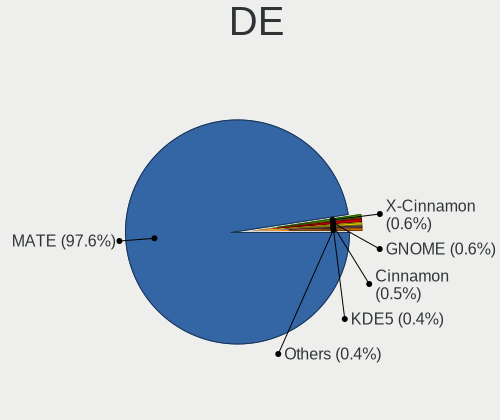
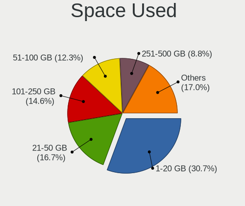
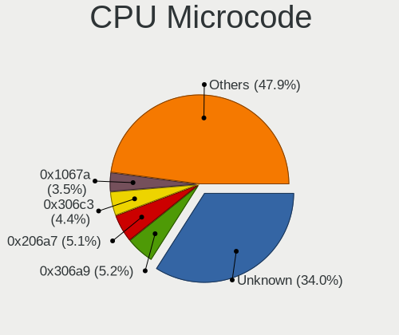
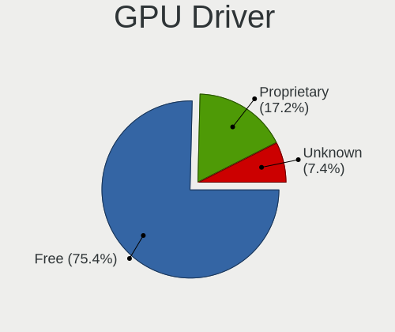
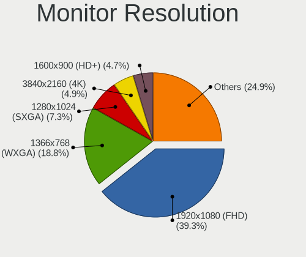

Ubuntu MATE - Tested Hardware & Statistics
------------------------------------------

A project to collect tested hardware configurations for Ubuntu MATE.

Anyone can contribute to this report by the [hw-probe](https://github.com/linuxhw/hw-probe) tool:

    sudo -E hw-probe -all -upload

Please contribute! Especially if your hardware is rare.

This is a report for all computer types. See also reports for [desktops](/Dist/Ubuntu_MATE/Desktop/README.md) and [notebooks](/Dist/Ubuntu_MATE/Notebook/README.md).

Contents
--------

* [ Test Cases ](#test-cases)

* [ System ](#system)
  - [ OS                       ](#os)
  - [ OS Family                ](#os-family)
  - [ Kernel                   ](#kernel)
  - [ Kernel Family            ](#kernel-family)
  - [ Kernel Major Ver.        ](#kernel-major-ver)
  - [ Arch                     ](#arch)
  - [ DE                       ](#de)
  - [ Display Server           ](#display-server)
  - [ Display Manager          ](#display-manager)
  - [ OS Lang                  ](#os-lang)
  - [ Boot Mode                ](#boot-mode)
  - [ Filesystem               ](#filesystem)
  - [ Part. scheme             ](#part-scheme)
  - [ Dual Boot with Linux/BSD ](#dual-boot-with-linuxbsd)
  - [ Dual Boot (Win)          ](#dual-boot-win)

* [ Board ](#board)
  - [ Vendor                   ](#vendor)
  - [ Model                    ](#model)
  - [ Model Family             ](#model-family)
  - [ MFG Year                 ](#mfg-year)
  - [ Form Factor              ](#form-factor)
  - [ Secure Boot              ](#secure-boot)
  - [ Coreboot                 ](#coreboot)
  - [ RAM Size                 ](#ram-size)
  - [ RAM Used                 ](#ram-used)
  - [ Total Drives             ](#total-drives)
  - [ Has CD-ROM               ](#has-cd-rom)
  - [ Has Ethernet             ](#has-ethernet)
  - [ Has WiFi                 ](#has-wifi)
  - [ Has Bluetooth            ](#has-bluetooth)

* [ Location ](#location)
  - [ Country                  ](#country)
  - [ City                     ](#city)

* [ Drives ](#drives)
  - [ Drive Vendor             ](#drive-vendor)
  - [ Drive Model              ](#drive-model)
  - [ HDD Vendor               ](#hdd-vendor)
  - [ SSD Vendor               ](#ssd-vendor)
  - [ Drive Kind               ](#drive-kind)
  - [ Drive Connector          ](#drive-connector)
  - [ Drive Size               ](#drive-size)
  - [ Space Total              ](#space-total)
  - [ Space Used               ](#space-used)
  - [ Malfunc. Drives          ](#malfunc-drives)
  - [ Malfunc. Drive Vendor    ](#malfunc-drive-vendor)
  - [ Malfunc. HDD Vendor      ](#malfunc-hdd-vendor)
  - [ Malfunc. Drive Kind      ](#malfunc-drive-kind)
  - [ Failed Drives            ](#failed-drives)
  - [ Failed Drive Vendor      ](#failed-drive-vendor)
  - [ Drive Status             ](#drive-status)

* [ Storage controller ](#storage-controller)
  - [ Storage Vendor           ](#storage-vendor)
  - [ Storage Model            ](#storage-model)
  - [ Storage Kind             ](#storage-kind)

* [ Processor ](#processor)
  - [ CPU Vendor               ](#cpu-vendor)
  - [ CPU Model                ](#cpu-model)
  - [ CPU Model Family         ](#cpu-model-family)
  - [ CPU Cores                ](#cpu-cores)
  - [ CPU Sockets              ](#cpu-sockets)
  - [ CPU Threads              ](#cpu-threads)
  - [ CPU Op-Modes             ](#cpu-op-modes)
  - [ CPU Microcode            ](#cpu-microcode)
  - [ CPU Microarch            ](#cpu-microarch)

* [ Graphics ](#graphics)
  - [ GPU Vendor               ](#gpu-vendor)
  - [ GPU Model                ](#gpu-model)
  - [ GPU Combo                ](#gpu-combo)
  - [ GPU Driver               ](#gpu-driver)
  - [ GPU Memory               ](#gpu-memory)

* [ Monitor ](#monitor)
  - [ Monitor Vendor           ](#monitor-vendor)
  - [ Monitor Model            ](#monitor-model)
  - [ Monitor Resolution       ](#monitor-resolution)
  - [ Monitor Diagonal         ](#monitor-diagonal)
  - [ Monitor Width            ](#monitor-width)
  - [ Aspect Ratio             ](#aspect-ratio)
  - [ Monitor Area             ](#monitor-area)
  - [ Pixel Density            ](#pixel-density)
  - [ Multiple Monitors        ](#multiple-monitors)

* [ Network ](#network)
  - [ Net Controller Vendor    ](#net-controller-vendor)
  - [ Net Controller Model     ](#net-controller-model)
  - [ Wireless Vendor          ](#wireless-vendor)
  - [ Wireless Model           ](#wireless-model)
  - [ Ethernet Vendor          ](#ethernet-vendor)
  - [ Ethernet Model           ](#ethernet-model)
  - [ Net Controller Kind      ](#net-controller-kind)
  - [ Used Controller          ](#used-controller)
  - [ NICs                     ](#nics)
  - [ IPv6                     ](#ipv6)

* [ Bluetooth ](#bluetooth)
  - [ Bluetooth Vendor         ](#bluetooth-vendor)
  - [ Bluetooth Model          ](#bluetooth-model)

* [ Sound ](#sound)
  - [ Sound Vendor             ](#sound-vendor)
  - [ Sound Model              ](#sound-model)

* [ Memory ](#memory)
  - [ Memory Vendor            ](#memory-vendor)
  - [ Memory Model             ](#memory-model)
  - [ Memory Kind              ](#memory-kind)
  - [ Memory Form Factor       ](#memory-form-factor)
  - [ Memory Size              ](#memory-size)
  - [ Memory Speed             ](#memory-speed)

* [ Printers & scanners ](#printers--scanners)
  - [ Printer Vendor           ](#printer-vendor)
  - [ Printer Model            ](#printer-model)
  - [ Scanner Vendor           ](#scanner-vendor)
  - [ Scanner Model            ](#scanner-model)

* [ Camera ](#camera)
  - [ Camera Vendor            ](#camera-vendor)
  - [ Camera Model             ](#camera-model)

* [ Security ](#security)
  - [ Fingerprint Vendor       ](#fingerprint-vendor)
  - [ Fingerprint Model        ](#fingerprint-model)
  - [ Chipcard Vendor          ](#chipcard-vendor)
  - [ Chipcard Model           ](#chipcard-model)

* [ Unsupported ](#unsupported)
  - [ Unsupported Devices      ](#unsupported-devices)
  - [ Unsupported Device Types ](#unsupported-device-types)

Test Cases
----------

Total: 1654

| Vendor        | Model                       | Form-Factor | Probe                                                      | Date         |
|---------------|-----------------------------|-------------|------------------------------------------------------------|--------------|
| Lenovo        | SHARKBAY SDK0E50510 PRO     | Desktop     | [cb5d0d1945](https://linux-hardware.org/?probe=cb5d0d1945) | Oct 01, 2022 |
| Lenovo        | SHARKBAY SDK0E50510 PRO     | Desktop     | [3af0c5cc5f](https://linux-hardware.org/?probe=3af0c5cc5f) | Oct 01, 2022 |
| ASUSTek       | PRIME B450-PLUS             | Desktop     | [db15c7b708](https://linux-hardware.org/?probe=db15c7b708) | Oct 01, 2022 |
| Notebook      | NJx0MU                      | Notebook    | [5df0554ade](https://linux-hardware.org/?probe=5df0554ade) | Oct 01, 2022 |
| Notebook      | NJx0MU                      | Notebook    | [9eba2a1ed4](https://linux-hardware.org/?probe=9eba2a1ed4) | Oct 01, 2022 |
| Notebook      | NJx0MU                      | Notebook    | [91c0e46209](https://linux-hardware.org/?probe=91c0e46209) | Sep 28, 2022 |
| ASUSTek       | K30AD_M31AD_M51AD_M32AD     | Desktop     | [608c715bab](https://linux-hardware.org/?probe=608c715bab) | Sep 26, 2022 |
| Intel         | H81U                        | Notebook    | [9e4458528b](https://linux-hardware.org/?probe=9e4458528b) | Sep 25, 2022 |
| Notebook      | NJx0MU                      | Notebook    | [09411a9eb9](https://linux-hardware.org/?probe=09411a9eb9) | Sep 25, 2022 |
| Notebook      | NJx0MU                      | Notebook    | [25b9bc1637](https://linux-hardware.org/?probe=25b9bc1637) | Sep 24, 2022 |
| HP            | 15                          | Notebook    | [bd8fc32d19](https://linux-hardware.org/?probe=bd8fc32d19) | Sep 24, 2022 |
| Notebook      | NJx0MU                      | Notebook    | [0cfbd1e652](https://linux-hardware.org/?probe=0cfbd1e652) | Sep 24, 2022 |
| ASUSTek       | H61M-K                      | Desktop     | [682eb02d48](https://linux-hardware.org/?probe=682eb02d48) | Sep 22, 2022 |
| Dell          | Precision 7760              | Notebook    | [f6600a1244](https://linux-hardware.org/?probe=f6600a1244) | Sep 22, 2022 |
| Intel         | Kabylake Platform           | Notebook    | [8b1c5eb5bf](https://linux-hardware.org/?probe=8b1c5eb5bf) | Sep 21, 2022 |
| MSI           | H81M-P33                    | Desktop     | [108817dc0f](https://linux-hardware.org/?probe=108817dc0f) | Sep 21, 2022 |
| ASRock        | HM55-HT                     | Desktop     | [64fff8f065](https://linux-hardware.org/?probe=64fff8f065) | Sep 20, 2022 |
| Notebook      | NJx0MU                      | Notebook    | [c89ed0e55a](https://linux-hardware.org/?probe=c89ed0e55a) | Sep 20, 2022 |
| Notebook      | NJx0MU                      | Notebook    | [0a1fb0cc40](https://linux-hardware.org/?probe=0a1fb0cc40) | Sep 20, 2022 |
| Notebook      | NJx0MU                      | Notebook    | [47d871031b](https://linux-hardware.org/?probe=47d871031b) | Sep 19, 2022 |
| Intel         | NUC8i7HNB J68197-502        | Mini pc     | [1573d65d2d](https://linux-hardware.org/?probe=1573d65d2d) | Sep 18, 2022 |
| Notebook      | NJx0MU                      | Notebook    | [f27d1aacb6](https://linux-hardware.org/?probe=f27d1aacb6) | Sep 18, 2022 |
| Notebook      | NJx0MU                      | Notebook    | [2f9a798b3b](https://linux-hardware.org/?probe=2f9a798b3b) | Sep 18, 2022 |
| MSI           | 870-G45                     | Desktop     | [74af87b0c5](https://linux-hardware.org/?probe=74af87b0c5) | Sep 17, 2022 |
| ASUSTek       | ROG STRIX Z690-A GAMING ... | Desktop     | [081d4b1d50](https://linux-hardware.org/?probe=081d4b1d50) | Sep 16, 2022 |
| Notebook      | NJx0MU                      | Notebook    | [43264d7e6e](https://linux-hardware.org/?probe=43264d7e6e) | Sep 15, 2022 |
| ASUSTek       | M2A74-AM                    | Desktop     | [25c30e4e54](https://linux-hardware.org/?probe=25c30e4e54) | Sep 14, 2022 |
| ASUSTek       | M2A74-AM                    | Desktop     | [24e6ffe552](https://linux-hardware.org/?probe=24e6ffe552) | Sep 14, 2022 |
| Intel         | Kabylake Platform           | Notebook    | [9889cc50de](https://linux-hardware.org/?probe=9889cc50de) | Sep 14, 2022 |
| Dell          | Precision 7520              | Notebook    | [b83fea6b96](https://linux-hardware.org/?probe=b83fea6b96) | Sep 14, 2022 |
| ASUSTek       | P7P55 LX                    | Desktop     | [cc28ed218f](https://linux-hardware.org/?probe=cc28ed218f) | Sep 13, 2022 |
| Gigabyte      | Z590 UD AC                  | Desktop     | [8774a8312b](https://linux-hardware.org/?probe=8774a8312b) | Sep 13, 2022 |
| Acer          | Aspire 5050                 | Notebook    | [1961d1c468](https://linux-hardware.org/?probe=1961d1c468) | Sep 13, 2022 |
| Notebook      | NJx0MU                      | Notebook    | [a72ef6cb0b](https://linux-hardware.org/?probe=a72ef6cb0b) | Sep 13, 2022 |
| Raspberry ... | Raspberry Pi 4 Model B R... | Soc         | [a86e9d966b](https://linux-hardware.org/?probe=a86e9d966b) | Sep 12, 2022 |
| ASUSTek       | VivoBook_ASUSLaptop X712... | Notebook    | [64b8914cb2](https://linux-hardware.org/?probe=64b8914cb2) | Sep 12, 2022 |
| Notebook      | NJx0MU                      | Notebook    | [8c6f7ca8a0](https://linux-hardware.org/?probe=8c6f7ca8a0) | Sep 10, 2022 |
| LG Electro... | 17Z990-R.AAS8U1             | Notebook    | [2df5aeabed](https://linux-hardware.org/?probe=2df5aeabed) | Sep 08, 2022 |
| ASRock        | J5040-ITX                   | Desktop     | [e36022370b](https://linux-hardware.org/?probe=e36022370b) | Sep 08, 2022 |
| Rockchip      | Unknown                     | Soc         | [37447111b3](https://linux-hardware.org/?probe=37447111b3) | Sep 07, 2022 |
| Acer          | Aspire X3950                | Desktop     | [22d1319220](https://linux-hardware.org/?probe=22d1319220) | Sep 06, 2022 |
| Notebook      | NJx0MU                      | Notebook    | [4ac227c8fe](https://linux-hardware.org/?probe=4ac227c8fe) | Sep 06, 2022 |
| ASUSTek       | P5GZ-MX                     | Desktop     | [883739db23](https://linux-hardware.org/?probe=883739db23) | Sep 05, 2022 |
| ASRock        | B450 Gaming-ITX/ac          | Desktop     | [f16d383b65](https://linux-hardware.org/?probe=f16d383b65) | Sep 05, 2022 |
| Dell          | Precision 7760              | Notebook    | [e920197599](https://linux-hardware.org/?probe=e920197599) | Sep 05, 2022 |
| Notebook      | NJx0MU                      | Notebook    | [928ba60e7e](https://linux-hardware.org/?probe=928ba60e7e) | Sep 05, 2022 |
| HP            | Pavilion 15                 | Notebook    | [194bb33f3d](https://linux-hardware.org/?probe=194bb33f3d) | Sep 04, 2022 |
| HP            | 2ADC                        | Desktop     | [d9e5d2b511](https://linux-hardware.org/?probe=d9e5d2b511) | Sep 04, 2022 |
| Dell          | Inspiron 7720               | Notebook    | [0749c352d0](https://linux-hardware.org/?probe=0749c352d0) | Sep 03, 2022 |
| HP            | 18E4                        | Desktop     | [c58c0043cb](https://linux-hardware.org/?probe=c58c0043cb) | Sep 03, 2022 |
| HP            | 3397                        | Desktop     | [5cd2349a9c](https://linux-hardware.org/?probe=5cd2349a9c) | Sep 02, 2022 |
| ASUSTek       | T100TA                      | Notebook    | [fb4d9c8521](https://linux-hardware.org/?probe=fb4d9c8521) | Sep 02, 2022 |
| Notebook      | NJx0MU                      | Notebook    | [fd02bdd474](https://linux-hardware.org/?probe=fd02bdd474) | Sep 02, 2022 |
| Lenovo        | IdeaPad S410p 20296         | Notebook    | [dac943f23a](https://linux-hardware.org/?probe=dac943f23a) | Sep 01, 2022 |
| Dell          | Latitude 5285               | Tablet      | [4e75bec854](https://linux-hardware.org/?probe=4e75bec854) | Sep 01, 2022 |
| HP            | Notebook                    | Notebook    | [573d359faf](https://linux-hardware.org/?probe=573d359faf) | Aug 31, 2022 |
| HP            | 15 Notebook PC              | Notebook    | [1109650747](https://linux-hardware.org/?probe=1109650747) | Aug 31, 2022 |
| Notebook      | NJx0MU                      | Notebook    | [169efa4465](https://linux-hardware.org/?probe=169efa4465) | Aug 31, 2022 |
| Notebook      | NJx0MU                      | Notebook    | [81d8e17fed](https://linux-hardware.org/?probe=81d8e17fed) | Aug 31, 2022 |
| Lenovo        | 3111 SDK0J40697 WIN 3305... | Desktop     | [2be9b66ba1](https://linux-hardware.org/?probe=2be9b66ba1) | Aug 30, 2022 |
| Notebook      | NJx0MU                      | Notebook    | [5103a6fa3d](https://linux-hardware.org/?probe=5103a6fa3d) | Aug 30, 2022 |
| Intel         | NUC7i5BNB J31144-311        | Mini pc     | [2d66cac294](https://linux-hardware.org/?probe=2d66cac294) | Aug 28, 2022 |
| Notebook      | NJx0MU                      | Notebook    | [d9d556aea3](https://linux-hardware.org/?probe=d9d556aea3) | Aug 26, 2022 |
| Notebook      | NJx0MU                      | Notebook    | [90476bcf5e](https://linux-hardware.org/?probe=90476bcf5e) | Aug 25, 2022 |
| HP            | Pavilion dv5                | Notebook    | [dd2f0b859b](https://linux-hardware.org/?probe=dd2f0b859b) | Aug 24, 2022 |
| LincPlus      | LINNCPLUS P1                | Notebook    | [516427e0e9](https://linux-hardware.org/?probe=516427e0e9) | Aug 23, 2022 |
| Lenovo        | IdeaPad Gaming 3 15ARH05... | Notebook    | [5028378988](https://linux-hardware.org/?probe=5028378988) | Aug 23, 2022 |
| Notebook      | NJx0MU                      | Notebook    | [7a86bdf14e](https://linux-hardware.org/?probe=7a86bdf14e) | Aug 22, 2022 |
| AZW           | GK55                        | Desktop     | [0ae52e1fdf](https://linux-hardware.org/?probe=0ae52e1fdf) | Aug 21, 2022 |
| Dell          | Latitude 7420               | Notebook    | [d599ef65fd](https://linux-hardware.org/?probe=d599ef65fd) | Aug 20, 2022 |
| ASUSTek       | M4A78-E                     | Desktop     | [76028e78e9](https://linux-hardware.org/?probe=76028e78e9) | Aug 19, 2022 |
| Lenovo        | IdeaPad 3 15IIL05 81WE      | Notebook    | [4efd818377](https://linux-hardware.org/?probe=4efd818377) | Aug 19, 2022 |
| ASUSTek       | M5A88-V EVO                 | Desktop     | [e8b519c4de](https://linux-hardware.org/?probe=e8b519c4de) | Aug 18, 2022 |
| ASUSTek       | UX32A                       | Notebook    | [99bb55bc78](https://linux-hardware.org/?probe=99bb55bc78) | Aug 17, 2022 |
| Gigabyte      | B85M-D3PH                   | Desktop     | [a5ed221478](https://linux-hardware.org/?probe=a5ed221478) | Aug 17, 2022 |
| MSI           | H170M PRO-VDH               | Desktop     | [4d7aa09763](https://linux-hardware.org/?probe=4d7aa09763) | Aug 16, 2022 |
| HP            | EliteBook 745 G5            | Notebook    | [7e8d33a07f](https://linux-hardware.org/?probe=7e8d33a07f) | Aug 16, 2022 |
| Dell          | 08NPPY A00                  | Desktop     | [1b78691cac](https://linux-hardware.org/?probe=1b78691cac) | Aug 14, 2022 |
| Dell          | 08NPPY A00                  | Desktop     | [b41823f392](https://linux-hardware.org/?probe=b41823f392) | Aug 14, 2022 |
| Lenovo        | ThinkBook 14 G2 ITL 20VD    | Notebook    | [644fbe551a](https://linux-hardware.org/?probe=644fbe551a) | Aug 13, 2022 |
| Dell          | Latitude E7470              | Notebook    | [61d0b104e9](https://linux-hardware.org/?probe=61d0b104e9) | Aug 13, 2022 |
| MSI           | MS-77311                    | Desktop     | [86b4d71bc0](https://linux-hardware.org/?probe=86b4d71bc0) | Aug 11, 2022 |
| Raspberry ... | Raspberry Pi 4 Model B R... | Soc         | [84091d13ef](https://linux-hardware.org/?probe=84091d13ef) | Aug 11, 2022 |
| HP            | 15 Notebook PC              | Notebook    | [46aa83aeb4](https://linux-hardware.org/?probe=46aa83aeb4) | Aug 07, 2022 |
| HP            | ProBook 455 G7              | Notebook    | [c563966e9c](https://linux-hardware.org/?probe=c563966e9c) | Aug 06, 2022 |
| Dell          | 03NVJ6 A00                  | Desktop     | [9655bf78d0](https://linux-hardware.org/?probe=9655bf78d0) | Aug 05, 2022 |
| HONOR         | BOHK-WAX9X                  | Notebook    | [3d426cb1de](https://linux-hardware.org/?probe=3d426cb1de) | Aug 04, 2022 |
| Google        | Swanky                      | Notebook    | [f54bdd7887](https://linux-hardware.org/?probe=f54bdd7887) | Aug 04, 2022 |
| Hardkernel    | ODROID-N2Plus               | Soc         | [40099f2516](https://linux-hardware.org/?probe=40099f2516) | Aug 03, 2022 |
| HP            | 8433 11                     | Desktop     | [cd790281b5](https://linux-hardware.org/?probe=cd790281b5) | Aug 02, 2022 |
| Google        | Swanky                      | Notebook    | [daac706167](https://linux-hardware.org/?probe=daac706167) | Aug 02, 2022 |
| HP            | Pavilion g6                 | Notebook    | [b48c146eff](https://linux-hardware.org/?probe=b48c146eff) | Aug 01, 2022 |
| Raspberry ... | Raspberry Pi 4 Model B R... | Soc         | [b44bebcab6](https://linux-hardware.org/?probe=b44bebcab6) | Aug 01, 2022 |
| Dell          | 0KWVT8 A03                  | Desktop     | [cdca6713e9](https://linux-hardware.org/?probe=cdca6713e9) | Jul 31, 2022 |
| Dell          | 0KWVT8 A03                  | Desktop     | [1444843fcd](https://linux-hardware.org/?probe=1444843fcd) | Jul 31, 2022 |
| ASUSTek       | M5A97 R2.0                  | Desktop     | [3aa2ff8224](https://linux-hardware.org/?probe=3aa2ff8224) | Jul 29, 2022 |
| ASUSTek       | B85M-G                      | Desktop     | [5d5fd15071](https://linux-hardware.org/?probe=5d5fd15071) | Jul 28, 2022 |
| Lenovo        | Legion R9000P2021H 82JQ     | Notebook    | [4f2ba69c49](https://linux-hardware.org/?probe=4f2ba69c49) | Jul 27, 2022 |
| ASUSTek       | M5A97 R2.0                  | Desktop     | [19572ca302](https://linux-hardware.org/?probe=19572ca302) | Jul 27, 2022 |
| Acer          | Aspire 5050                 | Notebook    | [59d8bb1e10](https://linux-hardware.org/?probe=59d8bb1e10) | Jul 26, 2022 |
| Acer          | Aspire 5050                 | Notebook    | [a8bcc56e78](https://linux-hardware.org/?probe=a8bcc56e78) | Jul 26, 2022 |
| ASUSTek       | M5A97 R2.0                  | Desktop     | [5795e098d2](https://linux-hardware.org/?probe=5795e098d2) | Jul 26, 2022 |
| ONDA          | H110-MINI V3.00 Ver:3.00    | Desktop     | [62b2a7897b](https://linux-hardware.org/?probe=62b2a7897b) | Jul 24, 2022 |
| MSI           | 2AE0                        | Desktop     | [5c0034d313](https://linux-hardware.org/?probe=5c0034d313) | Jul 22, 2022 |
| MSI           | 2AE0                        | Desktop     | [df441346da](https://linux-hardware.org/?probe=df441346da) | Jul 22, 2022 |
| Dell          | Latitude E4200              | Notebook    | [6cc0415a8a](https://linux-hardware.org/?probe=6cc0415a8a) | Jul 21, 2022 |
| Dell          | Inspiron MM061              | Notebook    | [2360c35ac1](https://linux-hardware.org/?probe=2360c35ac1) | Jul 20, 2022 |
| Dell          | Inspiron MM061              | Notebook    | [5cb9487776](https://linux-hardware.org/?probe=5cb9487776) | Jul 20, 2022 |
| HP            | EliteBook 8570p             | Notebook    | [f4f889fb4e](https://linux-hardware.org/?probe=f4f889fb4e) | Jul 20, 2022 |
| BESSTAR Te... | CB9                         | Mini pc     | [faa42224f0](https://linux-hardware.org/?probe=faa42224f0) | Jul 18, 2022 |
| Medion        | MS-7797                     | Desktop     | [caf13d5392](https://linux-hardware.org/?probe=caf13d5392) | Jul 14, 2022 |
| Lenovo        | 3111 SDK0J40697 WIN 3305... | Mini pc     | [3e74ebae5a](https://linux-hardware.org/?probe=3e74ebae5a) | Jul 14, 2022 |
| Compaq        | Presario CQ-23              | Notebook    | [589a41e629](https://linux-hardware.org/?probe=589a41e629) | Jul 14, 2022 |
| Sony          | VPCEB1S1E                   | Notebook    | [d35015a369](https://linux-hardware.org/?probe=d35015a369) | Jul 12, 2022 |
| Dell          | Latitude XT                 | Notebook    | [9d9deeace5](https://linux-hardware.org/?probe=9d9deeace5) | Jul 10, 2022 |
| Dell          | Latitude XT                 | Notebook    | [b0a096fb7d](https://linux-hardware.org/?probe=b0a096fb7d) | Jul 10, 2022 |
| ASRock        | B450M Pro4                  | Desktop     | [0cdcc2c0e0](https://linux-hardware.org/?probe=0cdcc2c0e0) | Jul 10, 2022 |
| MicroByte     | ezbook                      | Notebook    | [0f08faf963](https://linux-hardware.org/?probe=0f08faf963) | Jul 08, 2022 |
| Dell          | 0GM819                      | Desktop     | [3d18cc2632](https://linux-hardware.org/?probe=3d18cc2632) | Jul 08, 2022 |
| Dell          | Latitude 7320 Detachable    | Tablet      | [5f1b339a57](https://linux-hardware.org/?probe=5f1b339a57) | Jul 07, 2022 |
| HONOR         | BOHK-WAX9X                  | Notebook    | [4070d60511](https://linux-hardware.org/?probe=4070d60511) | Jul 05, 2022 |
| Gigabyte      | Z87-HD3                     | Desktop     | [95e6ec0822](https://linux-hardware.org/?probe=95e6ec0822) | Jul 05, 2022 |
| Lenovo        | 3190 SDK0J40697 WIN 3305... | Mini pc     | [cce90ecbf2](https://linux-hardware.org/?probe=cce90ecbf2) | Jul 04, 2022 |
| HP            | 3646h                       | Desktop     | [9e0737f23f](https://linux-hardware.org/?probe=9e0737f23f) | Jul 04, 2022 |
| Apple         | Mac-F2238BAE iMac11,3       | All in one  | [e0c6593aee](https://linux-hardware.org/?probe=e0c6593aee) | Jul 04, 2022 |
| Dell          | 0M6C7G A00                  | Desktop     | [5eee0db64f](https://linux-hardware.org/?probe=5eee0db64f) | Jul 03, 2022 |
| Gigabyte      | Z87-HD3                     | Desktop     | [28429fdd32](https://linux-hardware.org/?probe=28429fdd32) | Jul 02, 2022 |
| HP            | 8169                        | Desktop     | [18c6ea7678](https://linux-hardware.org/?probe=18c6ea7678) | Jul 01, 2022 |
| HP            | 8169                        | Desktop     | [c479baadc1](https://linux-hardware.org/?probe=c479baadc1) | Jul 01, 2022 |
| HP            | 2B0D A01                    | All in one  | [43b3fd0fd4](https://linux-hardware.org/?probe=43b3fd0fd4) | Jul 01, 2022 |
| Lenovo        | ThinkPad E15 Gen 2 20TDC... | Notebook    | [87eecce08e](https://linux-hardware.org/?probe=87eecce08e) | Jun 30, 2022 |
| MicroByte     | ezbook                      | Notebook    | [91b1fc169b](https://linux-hardware.org/?probe=91b1fc169b) | Jun 28, 2022 |
| Dell          | XPS 17 9710                 | Notebook    | [6e16eed17c](https://linux-hardware.org/?probe=6e16eed17c) | Jun 26, 2022 |
| Dell          | XPS 17 9710                 | Notebook    | [f37581d70e](https://linux-hardware.org/?probe=f37581d70e) | Jun 26, 2022 |
| ASUSTek       | S550CM                      | Notebook    | [c7262ada04](https://linux-hardware.org/?probe=c7262ada04) | Jun 25, 2022 |
| HUAWEI        | KLVD-WXX9                   | Notebook    | [a8c98b76b4](https://linux-hardware.org/?probe=a8c98b76b4) | Jun 24, 2022 |
| Lenovo        | ThinkPad E15 Gen 2 20TDS... | Notebook    | [10de805cb0](https://linux-hardware.org/?probe=10de805cb0) | Jun 24, 2022 |
| MSI           | H81M-E33                    | Desktop     | [0685f37e2c](https://linux-hardware.org/?probe=0685f37e2c) | Jun 22, 2022 |
| Raspberry ... | Raspberry Pi 4 Model B R... | Soc         | [72831de308](https://linux-hardware.org/?probe=72831de308) | Jun 21, 2022 |
| ASUSTek       | H61M-K                      | Desktop     | [0112d58d4e](https://linux-hardware.org/?probe=0112d58d4e) | Jun 18, 2022 |
| ASUSTek       | TUF Gaming B550M-PLUS       | Desktop     | [e048d9df09](https://linux-hardware.org/?probe=e048d9df09) | Jun 17, 2022 |
| Google        | Kled                        | Notebook    | [5f47e6d3e3](https://linux-hardware.org/?probe=5f47e6d3e3) | Jun 16, 2022 |
| Google        | Kled                        | Notebook    | [6a566134c4](https://linux-hardware.org/?probe=6a566134c4) | Jun 16, 2022 |
| MSI           | 3664h                       | Desktop     | [5fbb22c653](https://linux-hardware.org/?probe=5fbb22c653) | Jun 15, 2022 |
| Lenovo        | ThinkPad E15 Gen 2 20TDS... | Notebook    | [f7abc9fae0](https://linux-hardware.org/?probe=f7abc9fae0) | Jun 14, 2022 |
| Acer          | Aspire X3950                | Desktop     | [81797815d2](https://linux-hardware.org/?probe=81797815d2) | Jun 13, 2022 |
| Unknown       | Unknown                     | Desktop     | [c62add2d70](https://linux-hardware.org/?probe=c62add2d70) | Jun 13, 2022 |
| Hardkernel    | ODROID-N2Plus               | Soc         | [94abe2c8af](https://linux-hardware.org/?probe=94abe2c8af) | Jun 13, 2022 |
| Raspberry ... | Raspberry Pi 4 Model B R... | Soc         | [efc9e12c05](https://linux-hardware.org/?probe=efc9e12c05) | Jun 12, 2022 |
| ASRock        | B450M Pro4                  | Desktop     | [3de31234b3](https://linux-hardware.org/?probe=3de31234b3) | Jun 12, 2022 |
| Dell          | 0HV8FN A01                  | Desktop     | [33d201cb1d](https://linux-hardware.org/?probe=33d201cb1d) | Jun 10, 2022 |
| Lenovo        | V15 G2 ITL 82KB             | Notebook    | [e956f6b0b8](https://linux-hardware.org/?probe=e956f6b0b8) | Jun 09, 2022 |
| HONOR         | BOHK-WAX9X                  | Notebook    | [30b6c5f641](https://linux-hardware.org/?probe=30b6c5f641) | Jun 09, 2022 |
| HP            | EliteBook 8560p             | Notebook    | [9bfdb902ce](https://linux-hardware.org/?probe=9bfdb902ce) | Jun 08, 2022 |
| HP            | 3397                        | Desktop     | [55bcbdbc1f](https://linux-hardware.org/?probe=55bcbdbc1f) | Jun 07, 2022 |
| Gigabyte      | B360M AORUS Gaming 3-CF     | Desktop     | [5407d4a1f6](https://linux-hardware.org/?probe=5407d4a1f6) | Jun 07, 2022 |
| Intel         | Kabylake Platform           | Notebook    | [074fd90c6a](https://linux-hardware.org/?probe=074fd90c6a) | Jun 06, 2022 |
| Gigabyte      | GA-990FXA-UD5               | Desktop     | [d9e8d3957e](https://linux-hardware.org/?probe=d9e8d3957e) | Jun 06, 2022 |
| TrekStor      | Surfbook A13B               | Notebook    | [a42b3de31a](https://linux-hardware.org/?probe=a42b3de31a) | Jun 05, 2022 |
| ASUSTek       | PRIME X570-P                | Desktop     | [3b4483236d](https://linux-hardware.org/?probe=3b4483236d) | Jun 05, 2022 |
| Dell          | 00V62H A01                  | Desktop     | [20544feb00](https://linux-hardware.org/?probe=20544feb00) | Jun 03, 2022 |
| Dell          | XPS 13 9360                 | Notebook    | [73746e5672](https://linux-hardware.org/?probe=73746e5672) | Jun 03, 2022 |
| Dell          | Precision M6500             | Notebook    | [1b68d2ca74](https://linux-hardware.org/?probe=1b68d2ca74) | Jun 01, 2022 |
| Fujitsu       | LIFEBOOK E5511              | Notebook    | [32317d8883](https://linux-hardware.org/?probe=32317d8883) | May 30, 2022 |
| HP            | Stream Laptop 11-ak1xxx     | Notebook    | [2d2044b499](https://linux-hardware.org/?probe=2d2044b499) | May 30, 2022 |
| HONOR         | BOHK-WAX9X                  | Notebook    | [7941caaa08](https://linux-hardware.org/?probe=7941caaa08) | May 29, 2022 |
| HP            | Pavilion Power Laptop 15... | Notebook    | [4813c4e0b4](https://linux-hardware.org/?probe=4813c4e0b4) | May 28, 2022 |
| Gigabyte      | 970A-DS3P                   | Desktop     | [8e0addf4d3](https://linux-hardware.org/?probe=8e0addf4d3) | May 24, 2022 |
| INP           | i1000BTS                    | Desktop     | [95da2ada33](https://linux-hardware.org/?probe=95da2ada33) | May 24, 2022 |
| Apple         | MacBook5,1                  | Notebook    | [74e6dbe9af](https://linux-hardware.org/?probe=74e6dbe9af) | May 23, 2022 |
| Apple         | MacBook5,1                  | Notebook    | [a53d746d08](https://linux-hardware.org/?probe=a53d746d08) | May 23, 2022 |
| HP            | ProBook 650 G1              | Notebook    | [d3f5e5aa45](https://linux-hardware.org/?probe=d3f5e5aa45) | May 22, 2022 |
| Dell          | Latitude E6410              | Notebook    | [739ffac681](https://linux-hardware.org/?probe=739ffac681) | May 21, 2022 |
| ASUSTek       | P5G41T-M LX2/BR             | Desktop     | [9044b2e4e2](https://linux-hardware.org/?probe=9044b2e4e2) | May 18, 2022 |
| Medion        | Akoya E6415                 | Notebook    | [32545030d4](https://linux-hardware.org/?probe=32545030d4) | May 16, 2022 |
| Avell High... | A70 MOB                     | Notebook    | [c8900ed973](https://linux-hardware.org/?probe=c8900ed973) | May 15, 2022 |
| Avell High... | A62 LIV                     | Notebook    | [8b912c2c4f](https://linux-hardware.org/?probe=8b912c2c4f) | May 15, 2022 |
| ASUSTek       | VivoBook_ASUSLaptop X509... | Notebook    | [5107890ffd](https://linux-hardware.org/?probe=5107890ffd) | May 15, 2022 |
| Sony          | VPCEA36FG                   | Notebook    | [0161a27629](https://linux-hardware.org/?probe=0161a27629) | May 13, 2022 |
| HONOR         | BOHK-WAX9X                  | Notebook    | [e6c4aaa3d8](https://linux-hardware.org/?probe=e6c4aaa3d8) | May 12, 2022 |
| ASUSTek       | ProArt Z490-CREATOR 10G     | Desktop     | [4d68e6fd8d](https://linux-hardware.org/?probe=4d68e6fd8d) | May 12, 2022 |
| HP            | 3031h                       | Desktop     | [4a57ff5761](https://linux-hardware.org/?probe=4a57ff5761) | May 10, 2022 |
| Unknown       | HX90                        | Desktop     | [3a7e2628b0](https://linux-hardware.org/?probe=3a7e2628b0) | May 09, 2022 |
| Lenovo        | ThinkBook 16p Gen 2 20YM    | Notebook    | [e99cdba363](https://linux-hardware.org/?probe=e99cdba363) | May 07, 2022 |
| HP            | EliteBook 840 G5            | Notebook    | [a53b09a7f3](https://linux-hardware.org/?probe=a53b09a7f3) | May 07, 2022 |
| HYPERPC       | PLAY                        | Notebook    | [408e86d04f](https://linux-hardware.org/?probe=408e86d04f) | May 06, 2022 |
| MSI           | B450 TOMAHAWK MAX           | Desktop     | [246c63d834](https://linux-hardware.org/?probe=246c63d834) | May 06, 2022 |
| HP            | Laptop 17-by3xxx            | Notebook    | [86c82d9ca0](https://linux-hardware.org/?probe=86c82d9ca0) | May 03, 2022 |
| HP            | Laptop 17-by3xxx            | Notebook    | [a55c5c5c9f](https://linux-hardware.org/?probe=a55c5c5c9f) | May 03, 2022 |
| Apple         | MacBookPro6,2               | Notebook    | [ebaaf4a69b](https://linux-hardware.org/?probe=ebaaf4a69b) | May 01, 2022 |
| Toshiba       | Satellite C660              | Notebook    | [f4403056c8](https://linux-hardware.org/?probe=f4403056c8) | Apr 30, 2022 |
| HP            | 8433 11                     | Desktop     | [a5b829538b](https://linux-hardware.org/?probe=a5b829538b) | Apr 29, 2022 |
| TYAN Compu... | S7012                       | Server      | [018f293210](https://linux-hardware.org/?probe=018f293210) | Apr 28, 2022 |
| Lenovo        | G700 20251                  | Notebook    | [4dd8fa1d2f](https://linux-hardware.org/?probe=4dd8fa1d2f) | Apr 27, 2022 |
| Lenovo        | G700 20251                  | Notebook    | [fc283a78af](https://linux-hardware.org/?probe=fc283a78af) | Apr 26, 2022 |
| Lenovo        | G700 20251                  | Notebook    | [bbb54a4f60](https://linux-hardware.org/?probe=bbb54a4f60) | Apr 26, 2022 |
| Apple         | MacBookPro9,1               | Notebook    | [35b3b3ae30](https://linux-hardware.org/?probe=35b3b3ae30) | Apr 26, 2022 |
| ASUSTek       | A55BM-E                     | Desktop     | [b2b220b65d](https://linux-hardware.org/?probe=b2b220b65d) | Apr 25, 2022 |
| ASUSTek       | P5KPL-AM SE                 | Desktop     | [d3d995a41b](https://linux-hardware.org/?probe=d3d995a41b) | Apr 24, 2022 |
| Apple         | MacBookPro9,1               | Notebook    | [faf447a067](https://linux-hardware.org/?probe=faf447a067) | Apr 24, 2022 |
| Dell          | Precision 3561              | Notebook    | [26fa0f202c](https://linux-hardware.org/?probe=26fa0f202c) | Apr 20, 2022 |
| ASRock        | Z87M Extreme4               | Desktop     | [83ffe21604](https://linux-hardware.org/?probe=83ffe21604) | Apr 18, 2022 |
| Dell          | 0X9M3X A05                  | Desktop     | [f049c88dfe](https://linux-hardware.org/?probe=f049c88dfe) | Apr 18, 2022 |
| Clevo         | W54xEU                      | Notebook    | [cb4036a7dc](https://linux-hardware.org/?probe=cb4036a7dc) | Apr 18, 2022 |
| Lenovo        | IdeaPad 3 15IML05 81WR      | Notebook    | [81dced5e0a](https://linux-hardware.org/?probe=81dced5e0a) | Apr 16, 2022 |
| Gigabyte      | X99P-SLI-CF                 | Desktop     | [19055b80bc](https://linux-hardware.org/?probe=19055b80bc) | Apr 16, 2022 |
| ASUSTek       | Z97-K                       | Desktop     | [4852dde595](https://linux-hardware.org/?probe=4852dde595) | Apr 15, 2022 |
| Dell          | Latitude E5530 non-vPro     | Notebook    | [2f865445ce](https://linux-hardware.org/?probe=2f865445ce) | Apr 14, 2022 |
| Dell          | Latitude E5530 non-vPro     | Notebook    | [d32ffb065a](https://linux-hardware.org/?probe=d32ffb065a) | Apr 14, 2022 |
| Clevo         | W54xEU                      | Notebook    | [0a8ddf1dff](https://linux-hardware.org/?probe=0a8ddf1dff) | Apr 14, 2022 |
| Dell          | XPS 15 9500                 | Notebook    | [d873b2d218](https://linux-hardware.org/?probe=d873b2d218) | Apr 14, 2022 |
| Unknown       | Unknown                     | Desktop     | [d7811dbd43](https://linux-hardware.org/?probe=d7811dbd43) | Apr 14, 2022 |
| Lenovo        | ThinkPad X1 Carbon 7th 2... | Notebook    | [52d05bca1d](https://linux-hardware.org/?probe=52d05bca1d) | Apr 13, 2022 |
| Dell          | XPS 13 9380                 | Notebook    | [0897999e8d](https://linux-hardware.org/?probe=0897999e8d) | Apr 13, 2022 |
| MSI           | MAG B550M MORTAR            | Desktop     | [7a9f6e1de7](https://linux-hardware.org/?probe=7a9f6e1de7) | Apr 13, 2022 |
| TUXEDO        | Pulse 14 Gen1               | Notebook    | [68e6736cd2](https://linux-hardware.org/?probe=68e6736cd2) | Apr 13, 2022 |
| Samsung       | R505                        | Notebook    | [9ff46a8ca6](https://linux-hardware.org/?probe=9ff46a8ca6) | Apr 13, 2022 |
| Dell          | Latitude E5400              | Notebook    | [0ac76c891f](https://linux-hardware.org/?probe=0ac76c891f) | Apr 11, 2022 |
| Dell          | 03NVJ6 A00                  | Desktop     | [c640615939](https://linux-hardware.org/?probe=c640615939) | Apr 10, 2022 |
| Raspberry ... | Raspberry Pi                | Soc         | [a54c91912a](https://linux-hardware.org/?probe=a54c91912a) | Apr 09, 2022 |
| Lenovo        | IdeaPadFlex 6-14IKB 81EM    | Convertible | [5e31d89c28](https://linux-hardware.org/?probe=5e31d89c28) | Apr 09, 2022 |
| ASUSTek       | M5A78L-M PLUS/USB3          | Desktop     | [3c17fb0db4](https://linux-hardware.org/?probe=3c17fb0db4) | Apr 07, 2022 |
| Gigabyte      | H470M DS3H                  | Desktop     | [bbfc43c637](https://linux-hardware.org/?probe=bbfc43c637) | Apr 05, 2022 |
| IPASON        | MaxBook P1                  | Notebook    | [d66d062f54](https://linux-hardware.org/?probe=d66d062f54) | Apr 05, 2022 |
| ASRock        | N68C-GS FX                  | Desktop     | [5f45322780](https://linux-hardware.org/?probe=5f45322780) | Apr 04, 2022 |
| Dell          | 06X1TJ A00                  | Desktop     | [42cf748563](https://linux-hardware.org/?probe=42cf748563) | Apr 03, 2022 |
| Lenovo        | G700 20251                  | Notebook    | [790d42fec8](https://linux-hardware.org/?probe=790d42fec8) | Mar 30, 2022 |
| Lenovo        | G700 20251                  | Notebook    | [d8166d09e9](https://linux-hardware.org/?probe=d8166d09e9) | Mar 30, 2022 |
| HP            | Pavilion dv7                | Notebook    | [112a1842a0](https://linux-hardware.org/?probe=112a1842a0) | Mar 30, 2022 |
| ASUSTek       | A88X-GAMER                  | Desktop     | [8340e366fc](https://linux-hardware.org/?probe=8340e366fc) | Mar 28, 2022 |
| Toshiba       | Satellite L755D             | Notebook    | [d99ccc2771](https://linux-hardware.org/?probe=d99ccc2771) | Mar 28, 2022 |
| Samsung       | R530/R730/R540              | Notebook    | [186f96a5a1](https://linux-hardware.org/?probe=186f96a5a1) | Mar 27, 2022 |
| Acer          | Aspire 3000                 | Notebook    | [8f647a08f9](https://linux-hardware.org/?probe=8f647a08f9) | Mar 26, 2022 |
| Hardkernel    | ODROID-N2Plus               | Soc         | [3a8a0e2c0c](https://linux-hardware.org/?probe=3a8a0e2c0c) | Mar 26, 2022 |
| Dell          | 05KX61 A00                  | Server      | [77d570f7ae](https://linux-hardware.org/?probe=77d570f7ae) | Mar 25, 2022 |
| Dell          | Studio 1558                 | Notebook    | [7004b83ddf](https://linux-hardware.org/?probe=7004b83ddf) | Mar 23, 2022 |
| Dell          | Vostro 3350                 | Notebook    | [721a0ea932](https://linux-hardware.org/?probe=721a0ea932) | Mar 21, 2022 |
| HP            | 802E                        | Desktop     | [b15f756d65](https://linux-hardware.org/?probe=b15f756d65) | Mar 21, 2022 |
| ASUSTek       | X541UV                      | Notebook    | [a23f80c36b](https://linux-hardware.org/?probe=a23f80c36b) | Mar 19, 2022 |
| HP            | 3397                        | Desktop     | [fe1ae429b1](https://linux-hardware.org/?probe=fe1ae429b1) | Mar 18, 2022 |
| ASUSTek       | PRIME H410M-A               | Desktop     | [9352c21f95](https://linux-hardware.org/?probe=9352c21f95) | Mar 17, 2022 |
| HP            | Pavilion dv7                | Notebook    | [0eb8ef5cd3](https://linux-hardware.org/?probe=0eb8ef5cd3) | Mar 16, 2022 |
| ASUSTek       | ROG STRIX B350-F GAMING     | Desktop     | [220c4f69b0](https://linux-hardware.org/?probe=220c4f69b0) | Mar 15, 2022 |
| ASUSTek       | A55BM-E                     | Desktop     | [7bbbcc53c1](https://linux-hardware.org/?probe=7bbbcc53c1) | Mar 14, 2022 |
| Dell          | OptiPlex 980                | Desktop     | [14cf2b23f7](https://linux-hardware.org/?probe=14cf2b23f7) | Mar 14, 2022 |
| Dell          | Vostro 3401                 | Notebook    | [225095b10b](https://linux-hardware.org/?probe=225095b10b) | Mar 12, 2022 |
| ASUSTek       | M4A79XTD EVO                | Desktop     | [d59f0b152c](https://linux-hardware.org/?probe=d59f0b152c) | Mar 10, 2022 |
| Toshiba       | Satellite P755              | Notebook    | [ceb8d030e2](https://linux-hardware.org/?probe=ceb8d030e2) | Mar 10, 2022 |
| ASUSTek       | 1011PX                      | Notebook    | [776d052837](https://linux-hardware.org/?probe=776d052837) | Mar 09, 2022 |
| Packard Be... | EasyNote MH35               | Notebook    | [66bff1bcfd](https://linux-hardware.org/?probe=66bff1bcfd) | Mar 08, 2022 |
| Gigabyte      | Z68XP-UD3                   | Desktop     | [6382c70064](https://linux-hardware.org/?probe=6382c70064) | Mar 07, 2022 |
| Hardkernel    | Odroid XU4                  | Soc         | [8e3573295d](https://linux-hardware.org/?probe=8e3573295d) | Mar 07, 2022 |
| Hardkernel    | Odroid XU4                  | Soc         | [d57f5c8ce3](https://linux-hardware.org/?probe=d57f5c8ce3) | Mar 07, 2022 |
| Medion        | MS-7797                     | Desktop     | [88982d8ccb](https://linux-hardware.org/?probe=88982d8ccb) | Mar 05, 2022 |
| ASUSTek       | Zenbook UP5401EA_UP5401E... | Convertible | [f23d0b2728](https://linux-hardware.org/?probe=f23d0b2728) | Mar 05, 2022 |
| ASRock        | B450M Pro4                  | Desktop     | [b18f6804d6](https://linux-hardware.org/?probe=b18f6804d6) | Mar 02, 2022 |
| ECS           | A785GM-AD3                  | Desktop     | [43c3e7c4a0](https://linux-hardware.org/?probe=43c3e7c4a0) | Mar 02, 2022 |
| Lenovo        | U310                        | Notebook    | [856a65502e](https://linux-hardware.org/?probe=856a65502e) | Feb 28, 2022 |
| ASUSTek       | UX305FA                     | Notebook    | [6618b00369](https://linux-hardware.org/?probe=6618b00369) | Feb 28, 2022 |
| Intel         | H55                         | Desktop     | [2f52a73f85](https://linux-hardware.org/?probe=2f52a73f85) | Feb 27, 2022 |
| HP            | Elite x2 1012 G2            | Tablet      | [beeb081772](https://linux-hardware.org/?probe=beeb081772) | Feb 27, 2022 |
| Fujitsu       | LIFEBOOK S752               | Notebook    | [abb12adccc](https://linux-hardware.org/?probe=abb12adccc) | Feb 26, 2022 |
| Pegatron      | Narra6                      | Desktop     | [ad9a06f14d](https://linux-hardware.org/?probe=ad9a06f14d) | Feb 25, 2022 |
| Acer          | Aspire E1-571G              | Notebook    | [de462f47a3](https://linux-hardware.org/?probe=de462f47a3) | Feb 24, 2022 |
| Acer          | Aspire E1-571G              | Notebook    | [ac593e3a3a](https://linux-hardware.org/?probe=ac593e3a3a) | Feb 24, 2022 |
| ASUSTek       | PRIME B450M-A II            | Desktop     | [09aca1c435](https://linux-hardware.org/?probe=09aca1c435) | Feb 22, 2022 |
| ASUSTek       | PRIME B450M-A II            | Desktop     | [35c00d5889](https://linux-hardware.org/?probe=35c00d5889) | Feb 22, 2022 |
| ASUSTek       | PRIME B450M-A II            | Desktop     | [265235f4f4](https://linux-hardware.org/?probe=265235f4f4) | Feb 21, 2022 |
| ECS           | G41T-M7                     | Desktop     | [c4aca5bc12](https://linux-hardware.org/?probe=c4aca5bc12) | Feb 20, 2022 |
| Lenovo        | ThinkPad T460p 20FW000VU... | Notebook    | [9cbb915f78](https://linux-hardware.org/?probe=9cbb915f78) | Feb 18, 2022 |
| HP            | ProBook x360 435 G7         | Convertible | [0747de6777](https://linux-hardware.org/?probe=0747de6777) | Feb 18, 2022 |
| ASUSTek       | X553MA                      | Notebook    | [94ebaa5d9b](https://linux-hardware.org/?probe=94ebaa5d9b) | Feb 15, 2022 |
| ECS           | A785GM-AD3                  | Desktop     | [b6459dbb39](https://linux-hardware.org/?probe=b6459dbb39) | Feb 12, 2022 |
| MSI           | MAG Z390 TOMAHAWK           | Desktop     | [e58751112a](https://linux-hardware.org/?probe=e58751112a) | Feb 11, 2022 |
| Notebook      | NK50S5_SZ                   | Notebook    | [c5a3485d32](https://linux-hardware.org/?probe=c5a3485d32) | Feb 11, 2022 |
| ASUSTek       | PRIME B250M-K               | Desktop     | [6f66651cd1](https://linux-hardware.org/?probe=6f66651cd1) | Feb 10, 2022 |
| ASUSTek       | P5W DH Deluxe               | Desktop     | [7c3fa0c43b](https://linux-hardware.org/?probe=7c3fa0c43b) | Feb 08, 2022 |
| HP            | Pavilion 17                 | Notebook    | [3d6c666b77](https://linux-hardware.org/?probe=3d6c666b77) | Feb 08, 2022 |
| Gigabyte      | GA-990XA-UD3                | Desktop     | [6bb9884c12](https://linux-hardware.org/?probe=6bb9884c12) | Feb 08, 2022 |
| Gigabyte      | F2A88XM-D3HP                | Desktop     | [c6783b6b8b](https://linux-hardware.org/?probe=c6783b6b8b) | Feb 07, 2022 |
| Gigabyte      | GA-990XA-UD3                | Desktop     | [74ebb0645d](https://linux-hardware.org/?probe=74ebb0645d) | Feb 06, 2022 |
| HP            | Notebook                    | Notebook    | [69071da574](https://linux-hardware.org/?probe=69071da574) | Feb 06, 2022 |
| Acer          | Aspire 7735                 | Notebook    | [38d97cd9da](https://linux-hardware.org/?probe=38d97cd9da) | Feb 06, 2022 |
| Lenovo        | ThinkBook 14s Yoga ITL 2... | Convertible | [451c540217](https://linux-hardware.org/?probe=451c540217) | Feb 05, 2022 |
| ASUSTek       | H61M-K                      | Desktop     | [0e2c677ddc](https://linux-hardware.org/?probe=0e2c677ddc) | Feb 03, 2022 |
| Dell          | XPS 15 9570                 | Notebook    | [d1f8ff2cb8](https://linux-hardware.org/?probe=d1f8ff2cb8) | Feb 02, 2022 |
| Lenovo        | ThinkCentre M58 7373W43     | Desktop     | [4dc312f4f3](https://linux-hardware.org/?probe=4dc312f4f3) | Feb 02, 2022 |
| Lenovo        | SDK0E50510 WIN              | Desktop     | [f317005b0a](https://linux-hardware.org/?probe=f317005b0a) | Feb 02, 2022 |
| Lenovo        | NOK                         | Desktop     | [8905840b45](https://linux-hardware.org/?probe=8905840b45) | Feb 02, 2022 |
| Lenovo        | ThinkPad SL500 27463ZG      | Notebook    | [b746a25ff1](https://linux-hardware.org/?probe=b746a25ff1) | Jan 28, 2022 |
| HP            | 8434 11                     | Desktop     | [76a7851e7f](https://linux-hardware.org/?probe=76a7851e7f) | Jan 28, 2022 |
| Dell          | Latitude 3410               | Notebook    | [8f2181125e](https://linux-hardware.org/?probe=8f2181125e) | Jan 27, 2022 |
| ASUSTek       | M5A99X EVO R2.0             | Desktop     | [fab2b2828e](https://linux-hardware.org/?probe=fab2b2828e) | Jan 26, 2022 |
| ASRock        | Z77 Pro4                    | Desktop     | [8062682731](https://linux-hardware.org/?probe=8062682731) | Jan 25, 2022 |
| IP3 Tech      | GB3B                        | Mini pc     | [47e447f5da](https://linux-hardware.org/?probe=47e447f5da) | Jan 25, 2022 |
| Sony          | VPCF13Z1R                   | Notebook    | [7aff0d5c29](https://linux-hardware.org/?probe=7aff0d5c29) | Jan 25, 2022 |
| Fujitsu       | LIFEBOOK U748               | Notebook    | [cad36b0eba](https://linux-hardware.org/?probe=cad36b0eba) | Jan 24, 2022 |
| Gigabyte      | H410M H V3                  | Desktop     | [f6b7e2e2e6](https://linux-hardware.org/?probe=f6b7e2e2e6) | Jan 24, 2022 |
| ASUSTek       | P5KPL-AM SE                 | Desktop     | [868c5fe3a4](https://linux-hardware.org/?probe=868c5fe3a4) | Jan 24, 2022 |
| Lenovo        | 1052 SDK0J40697 WIN 3305... | Desktop     | [a4b48a8427](https://linux-hardware.org/?probe=a4b48a8427) | Jan 23, 2022 |
| Lenovo        | 1052 SDK0J40697 WIN 3305... | Desktop     | [622bf721f3](https://linux-hardware.org/?probe=622bf721f3) | Jan 23, 2022 |
| Hardkernel    | ODROID-N2Plus               | Soc         | [55067d6afe](https://linux-hardware.org/?probe=55067d6afe) | Jan 21, 2022 |
| ASUSTek       | ROG Zephyrus G14 GA401QM... | Notebook    | [37730388fd](https://linux-hardware.org/?probe=37730388fd) | Jan 21, 2022 |
| ASRock        | G41C-VS                     | Desktop     | [4dbb4b7fad](https://linux-hardware.org/?probe=4dbb4b7fad) | Jan 21, 2022 |
| Albatron      | PM73V                       | Desktop     | [7bd3956f1f](https://linux-hardware.org/?probe=7bd3956f1f) | Jan 21, 2022 |
| ASUSTek       | H81M-K                      | Desktop     | [e5d70436b2](https://linux-hardware.org/?probe=e5d70436b2) | Jan 21, 2022 |
| HP            | 8455                        | Desktop     | [fbf272366c](https://linux-hardware.org/?probe=fbf272366c) | Jan 20, 2022 |
| ASUSTek       | ROG Zephyrus G14 GA401QM... | Notebook    | [512b021ab8](https://linux-hardware.org/?probe=512b021ab8) | Jan 19, 2022 |
| Lenovo        | V155-15API 81V5             | Notebook    | [09e824f68b](https://linux-hardware.org/?probe=09e824f68b) | Jan 19, 2022 |
| ASUSTek       | P5LD2                       | Desktop     | [00ec990ce2](https://linux-hardware.org/?probe=00ec990ce2) | Jan 19, 2022 |
| Dell          | 0KP561                      | Desktop     | [1b772786e5](https://linux-hardware.org/?probe=1b772786e5) | Jan 19, 2022 |
| Dell          | 0FH884                      | Desktop     | [5ffacf9f99](https://linux-hardware.org/?probe=5ffacf9f99) | Jan 19, 2022 |
| Dell          | 0UG982                      | Desktop     | [c85c923e97](https://linux-hardware.org/?probe=c85c923e97) | Jan 19, 2022 |
| Dell          | 0X7841                      | Desktop     | [40600195c8](https://linux-hardware.org/?probe=40600195c8) | Jan 19, 2022 |
| Lenovo        | SDK0E50510 WIN              | Desktop     | [597677191c](https://linux-hardware.org/?probe=597677191c) | Jan 19, 2022 |
| Dell          | 0UG982                      | Desktop     | [686f3558d2](https://linux-hardware.org/?probe=686f3558d2) | Jan 19, 2022 |
| Dell          | 0FH884                      | Desktop     | [f6e9bda3a9](https://linux-hardware.org/?probe=f6e9bda3a9) | Jan 19, 2022 |
| HP            | 18E7                        | Desktop     | [b68364ed90](https://linux-hardware.org/?probe=b68364ed90) | Jan 19, 2022 |
| Dell          | 0HY9JP A02                  | Desktop     | [8314cd9ba6](https://linux-hardware.org/?probe=8314cd9ba6) | Jan 19, 2022 |
| Dell          | 0UG982                      | Desktop     | [38c30e280b](https://linux-hardware.org/?probe=38c30e280b) | Jan 19, 2022 |
| Gigabyte      | H81M-S2PV                   | Desktop     | [f2d5dba7ff](https://linux-hardware.org/?probe=f2d5dba7ff) | Jan 19, 2022 |
| Dell          | 0FH884                      | Desktop     | [083697081f](https://linux-hardware.org/?probe=083697081f) | Jan 19, 2022 |
| HP            | 18E7                        | Desktop     | [9fedcb7ff7](https://linux-hardware.org/?probe=9fedcb7ff7) | Jan 18, 2022 |
| HP            | 18E7                        | Desktop     | [48871270a2](https://linux-hardware.org/?probe=48871270a2) | Jan 18, 2022 |
| HP            | 18E7                        | Desktop     | [ca38c856e1](https://linux-hardware.org/?probe=ca38c856e1) | Jan 18, 2022 |
| HP            | 18E7                        | Desktop     | [a4df88b38f](https://linux-hardware.org/?probe=a4df88b38f) | Jan 18, 2022 |
| HP            | 18E7                        | Desktop     | [a745b9add0](https://linux-hardware.org/?probe=a745b9add0) | Jan 18, 2022 |
| HP            | 18E7                        | Desktop     | [b69abe6fd4](https://linux-hardware.org/?probe=b69abe6fd4) | Jan 18, 2022 |
| Lenovo        | SDK0E50510 WIN              | Desktop     | [9753f9164a](https://linux-hardware.org/?probe=9753f9164a) | Jan 18, 2022 |
| Lenovo        | ThinkCentre M58 7373W43     | Desktop     | [2d7a6e6cb6](https://linux-hardware.org/?probe=2d7a6e6cb6) | Jan 18, 2022 |
| Lenovo        | SDK0E50510 WIN              | Desktop     | [51484889f9](https://linux-hardware.org/?probe=51484889f9) | Jan 18, 2022 |
| Lenovo        | SDK0E50510 WIN              | Desktop     | [4ca462c89a](https://linux-hardware.org/?probe=4ca462c89a) | Jan 18, 2022 |
| Dell          | 0HY9JP A02                  | Desktop     | [c4c9f4b0a9](https://linux-hardware.org/?probe=c4c9f4b0a9) | Jan 18, 2022 |
| HP            | 8434 11                     | Desktop     | [4a128d2bb2](https://linux-hardware.org/?probe=4a128d2bb2) | Jan 18, 2022 |
| HP            | 18E7                        | Desktop     | [97d4bc7367](https://linux-hardware.org/?probe=97d4bc7367) | Jan 18, 2022 |
| Lenovo        | NOK                         | Desktop     | [7ae2819a6f](https://linux-hardware.org/?probe=7ae2819a6f) | Jan 18, 2022 |
| HP            | 18E7                        | Desktop     | [e86d0cc284](https://linux-hardware.org/?probe=e86d0cc284) | Jan 18, 2022 |
| Lenovo        | SDK0E50510 WIN              | Desktop     | [022f56a960](https://linux-hardware.org/?probe=022f56a960) | Jan 18, 2022 |
| HP            | 18E7                        | Desktop     | [0d2a09f683](https://linux-hardware.org/?probe=0d2a09f683) | Jan 18, 2022 |
| HP            | 8455                        | Desktop     | [639182896b](https://linux-hardware.org/?probe=639182896b) | Jan 18, 2022 |
| ASRock        | B450M Pro4                  | Desktop     | [556d0fb884](https://linux-hardware.org/?probe=556d0fb884) | Jan 18, 2022 |
| Apple         | Mac-F22C86C8                | Mini pc     | [c3d19d1297](https://linux-hardware.org/?probe=c3d19d1297) | Jan 18, 2022 |
| ASUSTek       | X553MA                      | Notebook    | [a748bb8955](https://linux-hardware.org/?probe=a748bb8955) | Jan 18, 2022 |
| ASUSTek       | X553MA                      | Notebook    | [08613587e8](https://linux-hardware.org/?probe=08613587e8) | Jan 18, 2022 |
| ASUSTek       | X553MA                      | Notebook    | [f5b0fd8e22](https://linux-hardware.org/?probe=f5b0fd8e22) | Jan 18, 2022 |
| ASUSTek       | H81M-C                      | Desktop     | [f4bb742149](https://linux-hardware.org/?probe=f4bb742149) | Jan 17, 2022 |
| ASUSTek       | P5LD2                       | Desktop     | [b972c7929f](https://linux-hardware.org/?probe=b972c7929f) | Jan 17, 2022 |
| ASUSTek       | PRIME H310M-D R2.0          | Desktop     | [9a6c2f82f1](https://linux-hardware.org/?probe=9a6c2f82f1) | Jan 17, 2022 |
| Dell          | 0UG982                      | Desktop     | [684478b2fb](https://linux-hardware.org/?probe=684478b2fb) | Jan 17, 2022 |
| Gigabyte      | H410M H V3                  | Desktop     | [13b01fb40a](https://linux-hardware.org/?probe=13b01fb40a) | Jan 17, 2022 |
| ASUSTek       | PRIME H310M-D R2.0          | Desktop     | [385f76b996](https://linux-hardware.org/?probe=385f76b996) | Jan 17, 2022 |
| Quanta        | TW8/SW8/DW8 TBD             | Notebook    | [8b2f4ffccd](https://linux-hardware.org/?probe=8b2f4ffccd) | Jan 16, 2022 |
| Dell          | XPS 12 9Q23                 | Notebook    | [3c8e26636b](https://linux-hardware.org/?probe=3c8e26636b) | Jan 15, 2022 |
| ASUSTek       | ROG STRIX B550-I GAMING     | Desktop     | [6438d5a5af](https://linux-hardware.org/?probe=6438d5a5af) | Jan 15, 2022 |
| ASUSTek       | H81M-C                      | Desktop     | [f21bf32c9a](https://linux-hardware.org/?probe=f21bf32c9a) | Jan 15, 2022 |
| Apple         | Mac-F22C86C8                | Mini pc     | [89d70da207](https://linux-hardware.org/?probe=89d70da207) | Jan 15, 2022 |
| HP            | Pavilion Gaming Laptop 1... | Notebook    | [ae80854830](https://linux-hardware.org/?probe=ae80854830) | Jan 15, 2022 |
| ZOTAC         | NM10                        | Desktop     | [d758728651](https://linux-hardware.org/?probe=d758728651) | Jan 14, 2022 |
| ASUSTek       | H81M-K                      | Desktop     | [f1858e63f4](https://linux-hardware.org/?probe=f1858e63f4) | Jan 14, 2022 |
| Raspberry ... | Raspberry Pi                | Soc         | [9d2fa7ede7](https://linux-hardware.org/?probe=9d2fa7ede7) | Jan 13, 2022 |
| ASUSTek       | PRIME X470-PRO              | Desktop     | [c450cd4a79](https://linux-hardware.org/?probe=c450cd4a79) | Jan 13, 2022 |
| Raspberry ... | Raspberry Pi                | Soc         | [2fbac2ebd5](https://linux-hardware.org/?probe=2fbac2ebd5) | Jan 12, 2022 |
| HPE           | ML10Gen9                    | Server      | [03f2d30df2](https://linux-hardware.org/?probe=03f2d30df2) | Jan 11, 2022 |
| Dell          | Latitude E5400              | Notebook    | [4f72d3dae0](https://linux-hardware.org/?probe=4f72d3dae0) | Jan 09, 2022 |
| HP            | 3397                        | Desktop     | [38a4d731fe](https://linux-hardware.org/?probe=38a4d731fe) | Jan 08, 2022 |
| ASUSTek       | X541SA                      | Notebook    | [4103077e59](https://linux-hardware.org/?probe=4103077e59) | Jan 08, 2022 |
| Gigabyte      | B450M S2H                   | Desktop     | [858d718984](https://linux-hardware.org/?probe=858d718984) | Jan 07, 2022 |
| Raspberry ... | Raspberry Pi                | Soc         | [faef08af10](https://linux-hardware.org/?probe=faef08af10) | Jan 06, 2022 |
| Fujitsu       | LIFEBOOK E746               | Notebook    | [55ac013e1e](https://linux-hardware.org/?probe=55ac013e1e) | Jan 06, 2022 |
| Dell          | 032W55 A03                  | Desktop     | [f3838abaaf](https://linux-hardware.org/?probe=f3838abaaf) | Jan 04, 2022 |
| HP            | ProLiant DL120 G7           | Server      | [70c39995ec](https://linux-hardware.org/?probe=70c39995ec) | Jan 03, 2022 |
| Fujitsu       | LIFEBOOK U748               | Notebook    | [9eb9340d47](https://linux-hardware.org/?probe=9eb9340d47) | Jan 02, 2022 |
| Lenovo        | Flex 2-14 20404             | Notebook    | [1ddb6e11fb](https://linux-hardware.org/?probe=1ddb6e11fb) | Jan 01, 2022 |
| ASRock        | 870iCafe R2.0               | Desktop     | [f67cc91b2e](https://linux-hardware.org/?probe=f67cc91b2e) | Dec 31, 2021 |
| Raspberry ... | Raspberry Pi 4 Model B R... | Soc         | [5a25a3ab14](https://linux-hardware.org/?probe=5a25a3ab14) | Dec 31, 2021 |
| Gigabyte      | MZ71-CE0-00 01000100        | Server      | [6d2ee30f72](https://linux-hardware.org/?probe=6d2ee30f72) | Dec 31, 2021 |
| MSI           | H81M-P33                    | Desktop     | [e637f730e7](https://linux-hardware.org/?probe=e637f730e7) | Dec 31, 2021 |
| MSI           | H81M-P33                    | Desktop     | [4c225dc457](https://linux-hardware.org/?probe=4c225dc457) | Dec 30, 2021 |
| Acer          | Aspire A515-43              | Notebook    | [82163f143b](https://linux-hardware.org/?probe=82163f143b) | Dec 29, 2021 |
| Gigabyte      | H67MA-UD2H-B3               | Desktop     | [e32af6a3de](https://linux-hardware.org/?probe=e32af6a3de) | Dec 26, 2021 |
| Lenovo        | ThinkPad X131e 33722VU      | Notebook    | [c8dc197420](https://linux-hardware.org/?probe=c8dc197420) | Dec 26, 2021 |
| MSI           | 760GM-P23                   | Desktop     | [62abb9d0ef](https://linux-hardware.org/?probe=62abb9d0ef) | Dec 25, 2021 |
| Lenovo        | U310                        | Notebook    | [fa57a69141](https://linux-hardware.org/?probe=fa57a69141) | Dec 24, 2021 |
| ASRock        | 970 Extreme4                | Desktop     | [1fbef2b76c](https://linux-hardware.org/?probe=1fbef2b76c) | Dec 23, 2021 |
| HP            | Pavilion dv4                | Notebook    | [7152c2fcd9](https://linux-hardware.org/?probe=7152c2fcd9) | Dec 22, 2021 |
| Lenovo        | G580 2189                   | Notebook    | [843f8c04fe](https://linux-hardware.org/?probe=843f8c04fe) | Dec 21, 2021 |
| ASUSTek       | PRIME B360M-K               | Desktop     | [8df64a7f80](https://linux-hardware.org/?probe=8df64a7f80) | Dec 21, 2021 |
| ASUSTek       | H61M-K                      | Desktop     | [8f53f4e97c](https://linux-hardware.org/?probe=8f53f4e97c) | Dec 19, 2021 |
| AZW           | GK mini                     | Mini pc     | [bb4770d627](https://linux-hardware.org/?probe=bb4770d627) | Dec 17, 2021 |
| HP            | ENVY Notebook               | Notebook    | [69b60fabe0](https://linux-hardware.org/?probe=69b60fabe0) | Dec 15, 2021 |
| Acer          | Aspire ES1-523              | Notebook    | [66a8186276](https://linux-hardware.org/?probe=66a8186276) | Dec 15, 2021 |
| Quanta        | TW8/SW8/DW8 TBD             | Notebook    | [43f645de28](https://linux-hardware.org/?probe=43f645de28) | Dec 11, 2021 |
| Hardkernel    | ODROID-C4                   | Soc         | [3bd9548bab](https://linux-hardware.org/?probe=3bd9548bab) | Dec 10, 2021 |
| Unknown       | Unknown                     | Notebook    | [d07ab607e1](https://linux-hardware.org/?probe=d07ab607e1) | Dec 08, 2021 |
| ASUSTek       | X751BP                      | Notebook    | [e1acc83725](https://linux-hardware.org/?probe=e1acc83725) | Dec 06, 2021 |
| MSI           | H61M-S20                    | Desktop     | [7e1fdb578c](https://linux-hardware.org/?probe=7e1fdb578c) | Dec 02, 2021 |
| HP            | EliteBook Folio 9480m       | Notebook    | [2cd39490da](https://linux-hardware.org/?probe=2cd39490da) | Dec 02, 2021 |
| ASUSTek       | H81M-A                      | Desktop     | [50acb69e6e](https://linux-hardware.org/?probe=50acb69e6e) | Dec 02, 2021 |
| Apple         | MacBookPro9,1               | Notebook    | [4f46a6c92a](https://linux-hardware.org/?probe=4f46a6c92a) | Dec 02, 2021 |
| Apple         | MacBookPro9,1               | Notebook    | [1521941a87](https://linux-hardware.org/?probe=1521941a87) | Dec 02, 2021 |
| Dell          | Latitude E6400              | Notebook    | [170f397883](https://linux-hardware.org/?probe=170f397883) | Dec 02, 2021 |
| Raspberry ... | Raspberry Pi 4 Model B R... | Soc         | [d0d26ec246](https://linux-hardware.org/?probe=d0d26ec246) | Dec 01, 2021 |
| HP            | EliteBook Folio 9480m       | Notebook    | [3b06bfa748](https://linux-hardware.org/?probe=3b06bfa748) | Dec 01, 2021 |
| Fujitsu       | LIFEBOOK AH531/GFO          | Notebook    | [5f2264a472](https://linux-hardware.org/?probe=5f2264a472) | Nov 30, 2021 |
| TUXEDO        | InfinityBook Pro 14 Gen6    | Notebook    | [40a204e5f1](https://linux-hardware.org/?probe=40a204e5f1) | Nov 30, 2021 |
| HP            | 3646h                       | Desktop     | [e7069f8a3b](https://linux-hardware.org/?probe=e7069f8a3b) | Nov 29, 2021 |
| HP            | 3646h                       | Desktop     | [a46d638004](https://linux-hardware.org/?probe=a46d638004) | Nov 29, 2021 |
| ASUSTek       | PRIME X570-P                | Desktop     | [6b7ec76b64](https://linux-hardware.org/?probe=6b7ec76b64) | Nov 28, 2021 |
| ASRock        | Z68 Extreme3 Gen3           | Desktop     | [9b13286f92](https://linux-hardware.org/?probe=9b13286f92) | Nov 28, 2021 |
| MSI           | H81M-P33                    | Desktop     | [3d2583b1f1](https://linux-hardware.org/?probe=3d2583b1f1) | Nov 26, 2021 |
| Polaroid      | MP1464PR001                 | Notebook    | [6475eec282](https://linux-hardware.org/?probe=6475eec282) | Nov 25, 2021 |
| Polaroid      | MP1464PR001                 | Notebook    | [244042f0d1](https://linux-hardware.org/?probe=244042f0d1) | Nov 25, 2021 |
| Dell          | 0T656F A01                  | Desktop     | [06f4633f1b](https://linux-hardware.org/?probe=06f4633f1b) | Nov 24, 2021 |
| HP            | EliteBook Folio 9480m       | Notebook    | [8b5c3b008f](https://linux-hardware.org/?probe=8b5c3b008f) | Nov 24, 2021 |
| HP            | EliteBook Folio 9480m       | Notebook    | [bf8ac4dc12](https://linux-hardware.org/?probe=bf8ac4dc12) | Nov 24, 2021 |
| Lenovo        | G580 20157                  | Notebook    | [bb170a308c](https://linux-hardware.org/?probe=bb170a308c) | Nov 24, 2021 |
| HPE           | ML10Gen9                    | Server      | [141f8709dd](https://linux-hardware.org/?probe=141f8709dd) | Nov 23, 2021 |
| ASUSTek       | PRIME B550-PLUS             | Desktop     | [4368bd67ac](https://linux-hardware.org/?probe=4368bd67ac) | Nov 23, 2021 |
| ASUSTek       | PRIME B550-PLUS             | Desktop     | [686454975b](https://linux-hardware.org/?probe=686454975b) | Nov 23, 2021 |
| Dell          | Precision 5560              | Notebook    | [aa3dbdc6bb](https://linux-hardware.org/?probe=aa3dbdc6bb) | Nov 22, 2021 |
| ASUSTek       | AT3IONT-I                   | Desktop     | [b8f5329824](https://linux-hardware.org/?probe=b8f5329824) | Nov 22, 2021 |
| Dell          | 0M017G A00                  | Desktop     | [da444f9b8f](https://linux-hardware.org/?probe=da444f9b8f) | Nov 22, 2021 |
| ASUSTek       | M52AD_M12AD_A_F_K31AD       | Desktop     | [a13103a9ad](https://linux-hardware.org/?probe=a13103a9ad) | Nov 20, 2021 |
| Acer          | TravelMate 5720             | Notebook    | [77b5cad080](https://linux-hardware.org/?probe=77b5cad080) | Nov 18, 2021 |
| HP            | ZBook Fury 17.3 inch G8 ... | Notebook    | [63f392ea8b](https://linux-hardware.org/?probe=63f392ea8b) | Nov 18, 2021 |
| ASUSTek       | ROG Maximus XIII HERO       | Desktop     | [36ac197007](https://linux-hardware.org/?probe=36ac197007) | Nov 17, 2021 |
| Dell          | 0G261D A00                  | Desktop     | [1bb376a60b](https://linux-hardware.org/?probe=1bb376a60b) | Nov 17, 2021 |
| Lenovo        | ThinkPad T440p 20AWS0Q30... | Notebook    | [3ddad52d21](https://linux-hardware.org/?probe=3ddad52d21) | Nov 16, 2021 |
| ASUSTek       | ROG Strix G513QM_G513QM     | Notebook    | [162531d482](https://linux-hardware.org/?probe=162531d482) | Nov 16, 2021 |
| Fujitsu       | D3633-S1 S26361-D3633-S1    | Desktop     | [8a6de2970d](https://linux-hardware.org/?probe=8a6de2970d) | Nov 15, 2021 |
| Dell          | Vostro 5568                 | Notebook    | [403ef45f63](https://linux-hardware.org/?probe=403ef45f63) | Nov 15, 2021 |
| ASRock        | B450M Pro4                  | Desktop     | [2cdd151d75](https://linux-hardware.org/?probe=2cdd151d75) | Nov 14, 2021 |
| Lenovo        | ThinkPad Yoga 260 20FES2... | Notebook    | [e881f41269](https://linux-hardware.org/?probe=e881f41269) | Nov 14, 2021 |
| Dell          | Latitude E6410              | Notebook    | [1a31fa8433](https://linux-hardware.org/?probe=1a31fa8433) | Nov 13, 2021 |
| AMI           | Unknown                     | Notebook    | [d1cd5b09e1](https://linux-hardware.org/?probe=d1cd5b09e1) | Nov 12, 2021 |
| Toshiba       | Satellite C665              | Notebook    | [a136cdd51d](https://linux-hardware.org/?probe=a136cdd51d) | Nov 11, 2021 |
| Dell          | 03NVJ6 A00                  | Desktop     | [61bfe5dfa7](https://linux-hardware.org/?probe=61bfe5dfa7) | Nov 11, 2021 |
| Fujitsu       | D3633-S1 S26361-D3633-S1    | Desktop     | [1971073b86](https://linux-hardware.org/?probe=1971073b86) | Nov 10, 2021 |
| HP            | ZBook 15                    | Notebook    | [835fb0e921](https://linux-hardware.org/?probe=835fb0e921) | Nov 10, 2021 |
| ASUSTek       | M4A78-E                     | Desktop     | [dd8a96b615](https://linux-hardware.org/?probe=dd8a96b615) | Nov 09, 2021 |
| ASUSTek       | M4A78-E                     | Desktop     | [89aff3881c](https://linux-hardware.org/?probe=89aff3881c) | Nov 09, 2021 |
| ASUSTek       | A55BM-E                     | Desktop     | [fd25737c58](https://linux-hardware.org/?probe=fd25737c58) | Nov 09, 2021 |
| Intel         | NUC5i5RYB H40999-504        | Mini pc     | [c0b1971c18](https://linux-hardware.org/?probe=c0b1971c18) | Nov 09, 2021 |
| Lenovo        | ThinkBook 16p Gen 2 20YM    | Notebook    | [c8b67f9143](https://linux-hardware.org/?probe=c8b67f9143) | Nov 08, 2021 |
| Rockchip      | Unknown                     | Soc         | [de559ac6d9](https://linux-hardware.org/?probe=de559ac6d9) | Nov 08, 2021 |
| ASUSTek       | M5A97 LE R2.0               | Desktop     | [e21897758d](https://linux-hardware.org/?probe=e21897758d) | Nov 07, 2021 |
| Gigabyte      | Z97X-UD3H-CF                | Desktop     | [914d585adc](https://linux-hardware.org/?probe=914d585adc) | Nov 07, 2021 |
| GPD           | P2 MAX                      | Notebook    | [9adb3fd2eb](https://linux-hardware.org/?probe=9adb3fd2eb) | Nov 02, 2021 |
| AZW           | SEi                         | Notebook    | [6d9a86e769](https://linux-hardware.org/?probe=6d9a86e769) | Nov 02, 2021 |
| Gigabyte      | H97M-D3H                    | Desktop     | [05e3caa05c](https://linux-hardware.org/?probe=05e3caa05c) | Nov 02, 2021 |
| MSI           | GE76 Raider 11UG            | Notebook    | [cbbe604f22](https://linux-hardware.org/?probe=cbbe604f22) | Nov 01, 2021 |
| ASRock        | B450M Pro4                  | Desktop     | [60ffb9d428](https://linux-hardware.org/?probe=60ffb9d428) | Oct 31, 2021 |
| Acer          | Aspire 7750G                | Notebook    | [7eaeae034c](https://linux-hardware.org/?probe=7eaeae034c) | Oct 29, 2021 |
| Hardkernel    | ODROID-N2Plus               | Soc         | [6e1fbe4dde](https://linux-hardware.org/?probe=6e1fbe4dde) | Oct 27, 2021 |
| ASUSTek       | VivoBook 12_ASUS Laptop ... | Notebook    | [10e9f4b604](https://linux-hardware.org/?probe=10e9f4b604) | Oct 27, 2021 |
| Dell          | Precision 7520              | Notebook    | [83df635945](https://linux-hardware.org/?probe=83df635945) | Oct 26, 2021 |
| ASRock        | Z68 Extreme3 Gen3           | Desktop     | [4946a6a02c](https://linux-hardware.org/?probe=4946a6a02c) | Oct 26, 2021 |
| ASRock        | Z68 Extreme3 Gen3           | Desktop     | [0ad429cea5](https://linux-hardware.org/?probe=0ad429cea5) | Oct 26, 2021 |
| HP            | Pavilion Notebook           | Notebook    | [cd2454732b](https://linux-hardware.org/?probe=cd2454732b) | Oct 25, 2021 |
| HP            | G70                         | Notebook    | [68fb8430c2](https://linux-hardware.org/?probe=68fb8430c2) | Oct 24, 2021 |
| HP            | G70                         | Notebook    | [3e2c50a321](https://linux-hardware.org/?probe=3e2c50a321) | Oct 24, 2021 |
| ASUSTek       | PN50-E1                     | Mini pc     | [4ba408d68c](https://linux-hardware.org/?probe=4ba408d68c) | Oct 23, 2021 |
| ASUSTek       | M5A78L LE                   | Desktop     | [adf114d66e](https://linux-hardware.org/?probe=adf114d66e) | Oct 23, 2021 |
| Lenovo        | ThinkPad E15 Gen 2 20TES... | Notebook    | [e82ee9096e](https://linux-hardware.org/?probe=e82ee9096e) | Oct 23, 2021 |
| ASUSTek       | N53SM                       | Notebook    | [3e15c8708a](https://linux-hardware.org/?probe=3e15c8708a) | Oct 23, 2021 |
| Rockchip      | Unknown                     | Soc         | [e7c44d5f41](https://linux-hardware.org/?probe=e7c44d5f41) | Oct 22, 2021 |
| ASUSTek       | PRIME H310M-K R2.0          | Desktop     | [09e3d5da46](https://linux-hardware.org/?probe=09e3d5da46) | Oct 21, 2021 |
| MSI           | MAG B550 TOMAHAWK           | Desktop     | [27b0a66ceb](https://linux-hardware.org/?probe=27b0a66ceb) | Oct 20, 2021 |
| Lenovo        | ThinkPad L512 2598A59       | Notebook    | [0bc832bd49](https://linux-hardware.org/?probe=0bc832bd49) | Oct 19, 2021 |
| Notebook      | P17SM-A                     | Notebook    | [34a5253469](https://linux-hardware.org/?probe=34a5253469) | Oct 16, 2021 |
| Lenovo        | B570e HuronRiver Platfor... | Notebook    | [2bc2b5c1d6](https://linux-hardware.org/?probe=2bc2b5c1d6) | Oct 15, 2021 |
| Notebook      | P17SM-A                     | Notebook    | [b4660289b3](https://linux-hardware.org/?probe=b4660289b3) | Oct 15, 2021 |
| Lenovo        | ThinkPad T440p 20AWS0Q30... | Notebook    | [36f407c3aa](https://linux-hardware.org/?probe=36f407c3aa) | Oct 15, 2021 |
| Lenovo        | ThinkPad T440p 20AWS0Q30... | Notebook    | [1b3b80e104](https://linux-hardware.org/?probe=1b3b80e104) | Oct 15, 2021 |
| Wortmann      | TERRA_MOBILE_1749           | Notebook    | [8917a2fc6b](https://linux-hardware.org/?probe=8917a2fc6b) | Oct 15, 2021 |
| Dell          | Latitude E6440              | Notebook    | [383edb4c99](https://linux-hardware.org/?probe=383edb4c99) | Oct 15, 2021 |
| HP            | Pavilion Gaming Laptop 1... | Notebook    | [6c0867e544](https://linux-hardware.org/?probe=6c0867e544) | Oct 15, 2021 |
| HP            | Pavilion Laptop 15-eg0xx... | Notebook    | [3dfc4362d9](https://linux-hardware.org/?probe=3dfc4362d9) | Oct 14, 2021 |
| Lenovo        | IdeaPad 330-17IKB 81DM      | Notebook    | [b566b7f862](https://linux-hardware.org/?probe=b566b7f862) | Oct 13, 2021 |
| Samsung       | 305E4A/305E5A/305E7A        | Notebook    | [a8e5248d3d](https://linux-hardware.org/?probe=a8e5248d3d) | Oct 13, 2021 |
| ASUSTek       | ROG Maximus XIII HERO       | Desktop     | [4505c960f2](https://linux-hardware.org/?probe=4505c960f2) | Oct 13, 2021 |
| ASUSTek       | U36SD                       | Notebook    | [c426070626](https://linux-hardware.org/?probe=c426070626) | Oct 12, 2021 |
| Lenovo        | IdeaPad 3 15IIL05 81WE      | Notebook    | [26453872b1](https://linux-hardware.org/?probe=26453872b1) | Oct 12, 2021 |
| ASUSTek       | N43SL                       | Notebook    | [c5adc8860e](https://linux-hardware.org/?probe=c5adc8860e) | Oct 09, 2021 |
| Lenovo        | IdeaPad 3 15IIL05 81WE      | Notebook    | [044c6efa0d](https://linux-hardware.org/?probe=044c6efa0d) | Oct 08, 2021 |
| Gigabyte      | B450M S2H                   | Desktop     | [fe1c549ed6](https://linux-hardware.org/?probe=fe1c549ed6) | Oct 05, 2021 |
| Lenovo        | Z51-70 80K6                 | Notebook    | [219e5cd0d5](https://linux-hardware.org/?probe=219e5cd0d5) | Oct 04, 2021 |
| Dell          | 08NPPY A00                  | Desktop     | [f0ff9a911e](https://linux-hardware.org/?probe=f0ff9a911e) | Oct 03, 2021 |
| Dell          | Latitude E6440              | Notebook    | [a8884539e7](https://linux-hardware.org/?probe=a8884539e7) | Oct 02, 2021 |
| HP            | EliteBook 840 G7 Noteboo... | Notebook    | [b535b99341](https://linux-hardware.org/?probe=b535b99341) | Sep 29, 2021 |
| HP            | EliteBook 840 G7 Noteboo... | Notebook    | [f04c751d60](https://linux-hardware.org/?probe=f04c751d60) | Sep 29, 2021 |
| HP            | ProBook 455 G7              | Notebook    | [491cab82de](https://linux-hardware.org/?probe=491cab82de) | Sep 29, 2021 |
| HP            | ProBook 455 G7              | Notebook    | [04ff8f3c32](https://linux-hardware.org/?probe=04ff8f3c32) | Sep 29, 2021 |
| Gigabyte      | Z97-HD3                     | Desktop     | [5f6c245dc5](https://linux-hardware.org/?probe=5f6c245dc5) | Sep 28, 2021 |
| MSI           | H61M-P23                    | Desktop     | [3a07878154](https://linux-hardware.org/?probe=3a07878154) | Sep 28, 2021 |
| Dell          | Vostro 3350                 | Notebook    | [384af306e6](https://linux-hardware.org/?probe=384af306e6) | Sep 27, 2021 |
| Dell          | 03NVJ6 A00                  | Desktop     | [5422d3bf1d](https://linux-hardware.org/?probe=5422d3bf1d) | Sep 27, 2021 |
| Intel         | DG31PR AAD97573-206         | Desktop     | [060da3d3ab](https://linux-hardware.org/?probe=060da3d3ab) | Sep 26, 2021 |
| HP            | Laptop 15-db0xxx            | Notebook    | [ed937ed1cd](https://linux-hardware.org/?probe=ed937ed1cd) | Sep 26, 2021 |
| Lenovo        | IdeaPad 3 15IIL05 81WE      | Notebook    | [2e1581c3b3](https://linux-hardware.org/?probe=2e1581c3b3) | Sep 24, 2021 |
| Entroware     | Aether                      | Notebook    | [c65a69857f](https://linux-hardware.org/?probe=c65a69857f) | Sep 22, 2021 |
| HP            | 8265                        | Desktop     | [f840aed42d](https://linux-hardware.org/?probe=f840aed42d) | Sep 21, 2021 |
| ASUSTek       | PRIME B450M-A               | Desktop     | [f93c2362ff](https://linux-hardware.org/?probe=f93c2362ff) | Sep 21, 2021 |
| ASUSTek       | TUF Gaming B550M-PLUS       | Desktop     | [a5211dc1bb](https://linux-hardware.org/?probe=a5211dc1bb) | Sep 21, 2021 |
| Acer          | Aspire A515-43              | Notebook    | [523fe48a54](https://linux-hardware.org/?probe=523fe48a54) | Sep 19, 2021 |
| Gigabyte      | B450M S2H                   | Desktop     | [13298e0f6b](https://linux-hardware.org/?probe=13298e0f6b) | Sep 19, 2021 |
| HP            | 3397                        | Desktop     | [13d358c48e](https://linux-hardware.org/?probe=13d358c48e) | Sep 18, 2021 |
| HP            | x2 Detachable 10-p0XX       | Tablet      | [3c40bbda61](https://linux-hardware.org/?probe=3c40bbda61) | Sep 18, 2021 |
| HP            | 1497                        | Desktop     | [311efc294a](https://linux-hardware.org/?probe=311efc294a) | Sep 16, 2021 |
| ASRock        | H110M-STX                   | Desktop     | [6bb90d3b07](https://linux-hardware.org/?probe=6bb90d3b07) | Sep 16, 2021 |
| Medion        | MS-7797                     | Desktop     | [f2f5579dc5](https://linux-hardware.org/?probe=f2f5579dc5) | Sep 15, 2021 |
| Medion        | MS-7797                     | Desktop     | [6ca6bee736](https://linux-hardware.org/?probe=6ca6bee736) | Sep 15, 2021 |
| Lenovo        | ThinkPad T440p 20AN006DU... | Notebook    | [6e8ca97f4b](https://linux-hardware.org/?probe=6e8ca97f4b) | Sep 14, 2021 |
| Lenovo        | ThinkPad T440p 20AN006DU... | Notebook    | [e0b0d2d509](https://linux-hardware.org/?probe=e0b0d2d509) | Sep 13, 2021 |
| Teclast       | F15S                        | Notebook    | [b6fcd1a34d](https://linux-hardware.org/?probe=b6fcd1a34d) | Sep 13, 2021 |
| Teclast       | F15S                        | Notebook    | [93d4fafebd](https://linux-hardware.org/?probe=93d4fafebd) | Sep 13, 2021 |
| Lenovo        | ThinkPad T420 42361P0       | Notebook    | [24f3d09047](https://linux-hardware.org/?probe=24f3d09047) | Sep 13, 2021 |
| Unknown       | Unknown                     | Notebook    | [6670bba1d8](https://linux-hardware.org/?probe=6670bba1d8) | Sep 13, 2021 |
| Dell          | Vostro 3350                 | Notebook    | [0fdc4bc08a](https://linux-hardware.org/?probe=0fdc4bc08a) | Sep 13, 2021 |
| Dell          | Latitude E7450              | Notebook    | [012bae3aa2](https://linux-hardware.org/?probe=012bae3aa2) | Sep 11, 2021 |
| ASUSTek       | Z550MA                      | Notebook    | [4786139b6b](https://linux-hardware.org/?probe=4786139b6b) | Sep 11, 2021 |
| Digibras      | NH4CU53                     | Notebook    | [5f2f500f7a](https://linux-hardware.org/?probe=5f2f500f7a) | Sep 10, 2021 |
| Lenovo        | IdeaPadFlex 5 14ARE05 81... | Convertible | [1172b42b6b](https://linux-hardware.org/?probe=1172b42b6b) | Sep 10, 2021 |
| Intel         | DH67CL AAG10212-204         | Desktop     | [e9d68ab5e4](https://linux-hardware.org/?probe=e9d68ab5e4) | Sep 09, 2021 |
| Lenovo        | ThinkBook 14s Yoga ITL 2... | Convertible | [14109edfc9](https://linux-hardware.org/?probe=14109edfc9) | Sep 07, 2021 |
| Lenovo        | ThinkBook 14s Yoga ITL 2... | Convertible | [cb82d03efe](https://linux-hardware.org/?probe=cb82d03efe) | Sep 07, 2021 |
| Lenovo        | ThinkPad T470 20JNS3M500    | Notebook    | [d05cb87743](https://linux-hardware.org/?probe=d05cb87743) | Sep 07, 2021 |
| Lenovo        | ThinkPad P50 20EN0006MS     | Notebook    | [812085deb0](https://linux-hardware.org/?probe=812085deb0) | Sep 07, 2021 |
| Acer          | Spin SP111-33               | Convertible | [2a5ddf7be8](https://linux-hardware.org/?probe=2a5ddf7be8) | Sep 05, 2021 |
| HP            | 3396                        | Desktop     | [147c8ed96c](https://linux-hardware.org/?probe=147c8ed96c) | Sep 04, 2021 |
| Lenovo        | ThinkPad T440p 20AN006DU... | Notebook    | [54c321b6bd](https://linux-hardware.org/?probe=54c321b6bd) | Sep 04, 2021 |
| Lenovo        | ThinkPad T440p 20AN006DU... | Notebook    | [812cc9220c](https://linux-hardware.org/?probe=812cc9220c) | Sep 01, 2021 |
| MSI           | CR70 2M/CX70 2OC/CX70 2O... | Notebook    | [5ee9ab86d7](https://linux-hardware.org/?probe=5ee9ab86d7) | Aug 31, 2021 |
| MSI           | Z370 PC PRO                 | Desktop     | [c594736488](https://linux-hardware.org/?probe=c594736488) | Aug 30, 2021 |
| ASRock        | B75M-DGS R2.0               | Desktop     | [16250b0c12](https://linux-hardware.org/?probe=16250b0c12) | Aug 29, 2021 |
| MSI           | B550M PRO-VDH WIFI          | Desktop     | [41e440c2e5](https://linux-hardware.org/?probe=41e440c2e5) | Aug 29, 2021 |
| MSI           | B550M PRO-VDH WIFI          | Desktop     | [e086d2eb61](https://linux-hardware.org/?probe=e086d2eb61) | Aug 29, 2021 |
| MSI           | 2A9C                        | Desktop     | [57601d98f3](https://linux-hardware.org/?probe=57601d98f3) | Aug 28, 2021 |
| Notebook      | NK50S5_SZ                   | Notebook    | [6cba599e57](https://linux-hardware.org/?probe=6cba599e57) | Aug 27, 2021 |
| Apple         | Mac-F4228EC8 DVT            | All in one  | [c375ab72c5](https://linux-hardware.org/?probe=c375ab72c5) | Aug 25, 2021 |
| Apple         | Mac-F4228EC8 DVT            | All in one  | [d3e14ad15a](https://linux-hardware.org/?probe=d3e14ad15a) | Aug 25, 2021 |
| MSI           | MPG Z390 GAMING PRO CARB... | Desktop     | [413934fef3](https://linux-hardware.org/?probe=413934fef3) | Aug 23, 2021 |
| MSI           | B450M PRO-M2 MAX            | Desktop     | [b28b036f78](https://linux-hardware.org/?probe=b28b036f78) | Aug 22, 2021 |
| Raspberry ... | Raspberry Pi 4 Model B R... | Soc         | [1a1189f529](https://linux-hardware.org/?probe=1a1189f529) | Aug 21, 2021 |
| Raspberry ... | Raspberry Pi 4 Model B R... | Soc         | [19cfd7b8f5](https://linux-hardware.org/?probe=19cfd7b8f5) | Aug 21, 2021 |
| Packard Be... | EasyNote SL65               | Notebook    | [934368dd02](https://linux-hardware.org/?probe=934368dd02) | Aug 20, 2021 |
| GPD           | MicroPC                     | Notebook    | [7fa0c4e3c4](https://linux-hardware.org/?probe=7fa0c4e3c4) | Aug 20, 2021 |
| Lenovo        | ThinkPad T420 4180PA9       | Notebook    | [17b9828f96](https://linux-hardware.org/?probe=17b9828f96) | Aug 19, 2021 |
| ASUSTek       | X556UAK                     | Notebook    | [70e369f2ba](https://linux-hardware.org/?probe=70e369f2ba) | Aug 19, 2021 |
| ASUSTek       | VivoBook_ASUSLaptop X421... | Notebook    | [635d8e55e7](https://linux-hardware.org/?probe=635d8e55e7) | Aug 17, 2021 |
| HP            | ProBook 445 G7              | Notebook    | [e42e169a72](https://linux-hardware.org/?probe=e42e169a72) | Aug 15, 2021 |
| Acer          | Extensa 5630                | Notebook    | [f32dfbfe2a](https://linux-hardware.org/?probe=f32dfbfe2a) | Aug 15, 2021 |
| ASRock        | M3A785GMH/128M              | Desktop     | [4ace1ea1ac](https://linux-hardware.org/?probe=4ace1ea1ac) | Aug 15, 2021 |
| HP            | Notebook                    | Notebook    | [be1a21a391](https://linux-hardware.org/?probe=be1a21a391) | Aug 14, 2021 |
| Chuwi         | GemiBook Pro                | Notebook    | [0ffe99b73b](https://linux-hardware.org/?probe=0ffe99b73b) | Aug 14, 2021 |
| MSI           | X79A-GD45                   | Desktop     | [c5b78e1a01](https://linux-hardware.org/?probe=c5b78e1a01) | Aug 13, 2021 |
| Lenovo        | ThinkPad E15 Gen 2 20TD0... | Notebook    | [cfe37f86a3](https://linux-hardware.org/?probe=cfe37f86a3) | Aug 12, 2021 |
| Gigabyte      | B550M DS3H                  | Desktop     | [6776a424d5](https://linux-hardware.org/?probe=6776a424d5) | Aug 11, 2021 |
| Dell          | 05GD68 A00                  | Desktop     | [bbfbd42562](https://linux-hardware.org/?probe=bbfbd42562) | Aug 07, 2021 |
| ASUSTek       | X556UAK                     | Notebook    | [399d9ceec5](https://linux-hardware.org/?probe=399d9ceec5) | Aug 06, 2021 |
| Intel         | AMI                         | Notebook    | [c11ff5c3a9](https://linux-hardware.org/?probe=c11ff5c3a9) | Aug 06, 2021 |
| Intel         | AMI                         | Notebook    | [bfe9befd10](https://linux-hardware.org/?probe=bfe9befd10) | Aug 05, 2021 |
| Notebook      | N24_25GU                    | Notebook    | [2e67e53ad7](https://linux-hardware.org/?probe=2e67e53ad7) | Aug 05, 2021 |
| MSI           | MPG Z390 GAMING PRO CARB... | Desktop     | [c861e28d21](https://linux-hardware.org/?probe=c861e28d21) | Aug 05, 2021 |
| ASRock        | Q1900M                      | Desktop     | [700f4a0ca1](https://linux-hardware.org/?probe=700f4a0ca1) | Aug 02, 2021 |
| Dell          | 08NPPY A00                  | Desktop     | [e706b18dd8](https://linux-hardware.org/?probe=e706b18dd8) | Aug 01, 2021 |
| Lenovo        | ThinkPad T430s 2356CTO      | Notebook    | [f3d9dd3c21](https://linux-hardware.org/?probe=f3d9dd3c21) | Jul 31, 2021 |
| Dell          | Vostro 1520                 | Notebook    | [af01145277](https://linux-hardware.org/?probe=af01145277) | Jul 28, 2021 |
| Clevo         | M720R                       | Notebook    | [a52f0f2d7c](https://linux-hardware.org/?probe=a52f0f2d7c) | Jul 27, 2021 |
| ASUSTek       | TUF Gaming B550-PLUS        | Desktop     | [20fd03515f](https://linux-hardware.org/?probe=20fd03515f) | Jul 27, 2021 |
| Acer          | Aspire E1-571               | Notebook    | [561ec14e6b](https://linux-hardware.org/?probe=561ec14e6b) | Jul 25, 2021 |
| Acer          | Aspire E1-571               | Notebook    | [068e66bfae](https://linux-hardware.org/?probe=068e66bfae) | Jul 25, 2021 |
| HP            | Laptop 15z-ef1xxx           | Notebook    | [d72c30940e](https://linux-hardware.org/?probe=d72c30940e) | Jul 25, 2021 |
| Samsung       | 350V5C/351V5C/3540VC/344... | Notebook    | [49be4c6d59](https://linux-hardware.org/?probe=49be4c6d59) | Jul 23, 2021 |
| ASUSTek       | M2N68-AM Plus               | Desktop     | [6863bea30a](https://linux-hardware.org/?probe=6863bea30a) | Jul 23, 2021 |
| Gigabyte      | B360M AORUS Gaming 3-CF     | Desktop     | [e8e43c77ca](https://linux-hardware.org/?probe=e8e43c77ca) | Jul 23, 2021 |
| Gigabyte      | Z390 GAMING X-CF            | Desktop     | [6dcb19e468](https://linux-hardware.org/?probe=6dcb19e468) | Jul 23, 2021 |
| ASUSTek       | P8H67-M LE                  | Desktop     | [db7104ee10](https://linux-hardware.org/?probe=db7104ee10) | Jul 23, 2021 |
| ASUSTek       | M5A97 R2.0                  | Desktop     | [647fe69592](https://linux-hardware.org/?probe=647fe69592) | Jul 22, 2021 |
| Toshiba       | Satellite C660              | Notebook    | [d80d4d487b](https://linux-hardware.org/?probe=d80d4d487b) | Jul 22, 2021 |
| HP            | ProBook 450 G3              | Notebook    | [8b355a2630](https://linux-hardware.org/?probe=8b355a2630) | Jul 20, 2021 |
| Lenovo        | Legion Y530-15ICH 81FV      | Notebook    | [1cd948b8e0](https://linux-hardware.org/?probe=1cd948b8e0) | Jul 19, 2021 |
| System76      | Galago Pro                  | Notebook    | [c74e5f1cf9](https://linux-hardware.org/?probe=c74e5f1cf9) | Jul 17, 2021 |
| MSI           | H61M-E33                    | Desktop     | [0d1a9284a9](https://linux-hardware.org/?probe=0d1a9284a9) | Jul 17, 2021 |
| Lenovo        | IdeaPad Gaming 3 15ARH05... | Notebook    | [14ce128e1a](https://linux-hardware.org/?probe=14ce128e1a) | Jul 16, 2021 |
| Lenovo        | IdeaPad Gaming 3 15ARH05... | Notebook    | [f656b6c149](https://linux-hardware.org/?probe=f656b6c149) | Jul 16, 2021 |
| Dell          | Studio 1558                 | Notebook    | [d1fad8f698](https://linux-hardware.org/?probe=d1fad8f698) | Jul 16, 2021 |
| Lenovo        | ThinkPad W520 4284HP9       | Notebook    | [9f00795579](https://linux-hardware.org/?probe=9f00795579) | Jul 15, 2021 |
| Gigabyte      | B360 AORUS GAMING 3 WIFI... | Desktop     | [6001052e23](https://linux-hardware.org/?probe=6001052e23) | Jul 15, 2021 |
| Toshiba       | Satellite C850-BMK          | Notebook    | [d92515e12e](https://linux-hardware.org/?probe=d92515e12e) | Jul 14, 2021 |
| HP            | Pavilion 17                 | Notebook    | [628e42055f](https://linux-hardware.org/?probe=628e42055f) | Jul 12, 2021 |
| Lenovo        | Tilapia CRB                 | Desktop     | [da1f0d65ec](https://linux-hardware.org/?probe=da1f0d65ec) | Jul 12, 2021 |
| Raspberry ... | Raspberry Pi 3 Model B R... | Soc         | [d49086311b](https://linux-hardware.org/?probe=d49086311b) | Jul 12, 2021 |
| Fujitsu       | LIFEBOOK E5511              | Notebook    | [4c13b21a8c](https://linux-hardware.org/?probe=4c13b21a8c) | Jul 10, 2021 |
| Unknown       | TB-4000                     | Desktop     | [fb3e1984b0](https://linux-hardware.org/?probe=fb3e1984b0) | Jul 10, 2021 |
| HP            | Laptop 15s-eq1xxx           | Notebook    | [89a5013659](https://linux-hardware.org/?probe=89a5013659) | Jul 09, 2021 |
| MSI           | MPG Z390 GAMING PLUS        | Desktop     | [ae14beb6fd](https://linux-hardware.org/?probe=ae14beb6fd) | Jul 09, 2021 |
| ASUSTek       | ROG STRIX Z490-E GAMING     | Desktop     | [7adcf7dc7c](https://linux-hardware.org/?probe=7adcf7dc7c) | Jul 09, 2021 |
| Dell          | 05GD68 A00                  | Desktop     | [ebd157141b](https://linux-hardware.org/?probe=ebd157141b) | Jul 08, 2021 |
| Gigabyte      | H81M-S1                     | Desktop     | [4b2c3ea073](https://linux-hardware.org/?probe=4b2c3ea073) | Jul 07, 2021 |
| HP            | Pavilion Gaming Laptop 1... | Notebook    | [cce6c3a767](https://linux-hardware.org/?probe=cce6c3a767) | Jul 06, 2021 |
| HP            | Laptop 15-db0xxx            | Notebook    | [b6c1f36f1f](https://linux-hardware.org/?probe=b6c1f36f1f) | Jul 04, 2021 |
| ASUSTek       | Z170-AR                     | Desktop     | [37343856a5](https://linux-hardware.org/?probe=37343856a5) | Jul 02, 2021 |
| Lenovo        | ThinkPad E15 20RES31K00     | Notebook    | [6d359d339e](https://linux-hardware.org/?probe=6d359d339e) | Jul 02, 2021 |
| Dell          | 05GD68 A00                  | Desktop     | [9bb3c8dbe9](https://linux-hardware.org/?probe=9bb3c8dbe9) | Jul 02, 2021 |
| Dell          | Inspiron 3505               | Notebook    | [820725cbbd](https://linux-hardware.org/?probe=820725cbbd) | Jun 30, 2021 |
| Dell          | Inspiron 15 7000 Gaming     | Notebook    | [90235ac63a](https://linux-hardware.org/?probe=90235ac63a) | Jun 30, 2021 |
| Notebook      | P17SM-A                     | Notebook    | [dcf91492a2](https://linux-hardware.org/?probe=dcf91492a2) | Jun 29, 2021 |
| ASUSTek       | WS-C621E-SAGE Series        | Server      | [55bdc0f976](https://linux-hardware.org/?probe=55bdc0f976) | Jun 28, 2021 |
| ASUSTek       | PRIME H310M-K R2.0          | Desktop     | [d90a6deaeb](https://linux-hardware.org/?probe=d90a6deaeb) | Jun 27, 2021 |
| ASUSTek       | PRIME H310M-K R2.0          | Desktop     | [0e6ca5f944](https://linux-hardware.org/?probe=0e6ca5f944) | Jun 27, 2021 |
| HP            | Pavilion g6                 | Notebook    | [3cfb1f50dc](https://linux-hardware.org/?probe=3cfb1f50dc) | Jun 26, 2021 |
| Raspberry ... | Raspberry Pi 4 Model B R... | Soc         | [772a91651b](https://linux-hardware.org/?probe=772a91651b) | Jun 26, 2021 |
| HP            | EliteBook 2560p             | Notebook    | [4b13ffc6ce](https://linux-hardware.org/?probe=4b13ffc6ce) | Jun 26, 2021 |
| HP            | EliteBook 2170p             | Notebook    | [212819389c](https://linux-hardware.org/?probe=212819389c) | Jun 25, 2021 |
| HP            | EliteBook 2560p             | Notebook    | [4fdc27b018](https://linux-hardware.org/?probe=4fdc27b018) | Jun 25, 2021 |
| HP            | Pavilion dv7                | Notebook    | [590ba6b3a3](https://linux-hardware.org/?probe=590ba6b3a3) | Jun 23, 2021 |
| ASUSTek       | M5A97 LE R2.0               | Desktop     | [7fba4b1b78](https://linux-hardware.org/?probe=7fba4b1b78) | Jun 23, 2021 |
| Acer          | V7-710                      | Notebook    | [fe9a84f137](https://linux-hardware.org/?probe=fe9a84f137) | Jun 23, 2021 |
| Dell          | Latitude E6400              | Notebook    | [547126dd82](https://linux-hardware.org/?probe=547126dd82) | Jun 20, 2021 |
| HP            | 1495                        | Desktop     | [03ab704550](https://linux-hardware.org/?probe=03ab704550) | Jun 20, 2021 |
| ASRock        | B450M Pro4                  | Desktop     | [c71b41c7a8](https://linux-hardware.org/?probe=c71b41c7a8) | Jun 20, 2021 |
| ASRock        | B450M Pro4                  | Desktop     | [f39e5005bd](https://linux-hardware.org/?probe=f39e5005bd) | Jun 20, 2021 |
| HP            | ProBook 430 G6              | Notebook    | [7bf43ae0d0](https://linux-hardware.org/?probe=7bf43ae0d0) | Jun 19, 2021 |
| HP            | ProBook 430 G6              | Notebook    | [9a4e288f49](https://linux-hardware.org/?probe=9a4e288f49) | Jun 19, 2021 |
| HP            | Spectre x360 Convertible... | Convertible | [d41809b4c9](https://linux-hardware.org/?probe=d41809b4c9) | Jun 19, 2021 |
| Hardkernel    | ODROID-C4                   | Soc         | [b10313d89f](https://linux-hardware.org/?probe=b10313d89f) | Jun 17, 2021 |
| Lenovo        | IdeaPad 110-15AST 80TR      | Notebook    | [32538ae4b8](https://linux-hardware.org/?probe=32538ae4b8) | Jun 17, 2021 |
| Lenovo        | IdeaPad 110-15AST 80TR      | Notebook    | [882855d037](https://linux-hardware.org/?probe=882855d037) | Jun 17, 2021 |
| eMachines     | EL1352                      | Desktop     | [f175ae71f2](https://linux-hardware.org/?probe=f175ae71f2) | Jun 16, 2021 |
| Gigabyte      | B450 AORUS PRO WIFI-CF      | Desktop     | [8bb06ce851](https://linux-hardware.org/?probe=8bb06ce851) | Jun 16, 2021 |
| MSI           | MAG X570 TOMAHAWK WIFI      | Desktop     | [0616fdb086](https://linux-hardware.org/?probe=0616fdb086) | Jun 14, 2021 |
| ASUSTek       | M5A97 LE R2.0               | Desktop     | [3d47d96665](https://linux-hardware.org/?probe=3d47d96665) | Jun 12, 2021 |
| ASUSTek       | PRIME B450M-A               | Desktop     | [c9bea47caa](https://linux-hardware.org/?probe=c9bea47caa) | Jun 12, 2021 |
| ASUSTek       | PRIME B450M-A               | Desktop     | [c9c757474a](https://linux-hardware.org/?probe=c9c757474a) | Jun 12, 2021 |
| Dell          | Latitude D520               | Notebook    | [5f08e309ae](https://linux-hardware.org/?probe=5f08e309ae) | Jun 11, 2021 |
| Dell          | Latitude E6510              | Notebook    | [ee7157e97d](https://linux-hardware.org/?probe=ee7157e97d) | Jun 11, 2021 |
| Acer          | Aspire 7730G                | Notebook    | [4d314b5039](https://linux-hardware.org/?probe=4d314b5039) | Jun 10, 2021 |
| ASRock        | ALiveXFire-eSATA2           | Desktop     | [17af721bae](https://linux-hardware.org/?probe=17af721bae) | Jun 10, 2021 |
| Raspberry ... | Raspberry Pi 4 Model B R... | Soc         | [23dc47130c](https://linux-hardware.org/?probe=23dc47130c) | Jun 10, 2021 |
| Gigabyte      | Z97-HD3                     | Desktop     | [1ab4ff25ab](https://linux-hardware.org/?probe=1ab4ff25ab) | Jun 10, 2021 |
| HP            | Pavilion 17                 | Notebook    | [b234c99d47](https://linux-hardware.org/?probe=b234c99d47) | Jun 08, 2021 |
| Intel         | NUC8BEB J72688-304          | Mini pc     | [95708a9a82](https://linux-hardware.org/?probe=95708a9a82) | Jun 07, 2021 |
| HP            | Pavilion x360 Convertibl... | Convertible | [865f37b773](https://linux-hardware.org/?probe=865f37b773) | Jun 06, 2021 |
| Raspberry ... | Raspberry Pi 4 Model B R... | Soc         | [b5aa561890](https://linux-hardware.org/?probe=b5aa561890) | Jun 05, 2021 |
| ASUSTek       | K73SJ                       | Notebook    | [cb0f042995](https://linux-hardware.org/?probe=cb0f042995) | Jun 04, 2021 |
| Dell          | Latitude 7420               | Notebook    | [f417016cf6](https://linux-hardware.org/?probe=f417016cf6) | Jun 04, 2021 |
| HP            | ProBook 450 G6              | Notebook    | [af16143ad8](https://linux-hardware.org/?probe=af16143ad8) | Jun 03, 2021 |
| HP            | Pavilion Laptop 15-cs3xx... | Notebook    | [59df1ed0f5](https://linux-hardware.org/?probe=59df1ed0f5) | Jun 03, 2021 |
| ASUSTek       | P8B75-M                     | Desktop     | [d732611ebb](https://linux-hardware.org/?probe=d732611ebb) | Jun 02, 2021 |
| Gigabyte      | GA-870A-UD3                 | Desktop     | [3f2f789273](https://linux-hardware.org/?probe=3f2f789273) | Jun 01, 2021 |
| HP            | Pavilion g6                 | Notebook    | [0245da9040](https://linux-hardware.org/?probe=0245da9040) | May 31, 2021 |
| Lenovo        | 3102 NOK                    | Desktop     | [3d1a8cffc3](https://linux-hardware.org/?probe=3d1a8cffc3) | May 31, 2021 |
| Dell          | 0KRC95 A00                  | Desktop     | [913ea68973](https://linux-hardware.org/?probe=913ea68973) | May 31, 2021 |
| Raspberry ... | Raspberry Pi 4 Model B R... | Soc         | [23a20d91ef](https://linux-hardware.org/?probe=23a20d91ef) | May 31, 2021 |
| Dell          | 0PC5F7 A02                  | Desktop     | [86611a5efe](https://linux-hardware.org/?probe=86611a5efe) | May 31, 2021 |
| Inventec      | Z CLASS A02                 | Desktop     | [7fc4815cbd](https://linux-hardware.org/?probe=7fc4815cbd) | May 29, 2021 |
| ASUSTek       | GL12CX                      | Desktop     | [d95dd524bc](https://linux-hardware.org/?probe=d95dd524bc) | May 28, 2021 |
| Gigabyte      | TRX40 AORUS PRO WIFI        | Desktop     | [cf31dd498a](https://linux-hardware.org/?probe=cf31dd498a) | May 26, 2021 |
| Toshiba       | Satellite A200              | Notebook    | [8e44c9edaf](https://linux-hardware.org/?probe=8e44c9edaf) | May 26, 2021 |
| Toshiba       | Satellite A200              | Notebook    | [3a2f765228](https://linux-hardware.org/?probe=3a2f765228) | May 26, 2021 |
| HP            | Pavilion                    | Notebook    | [1fa0cb66b1](https://linux-hardware.org/?probe=1fa0cb66b1) | May 26, 2021 |
| HP            | 635                         | Notebook    | [acff9705ee](https://linux-hardware.org/?probe=acff9705ee) | May 26, 2021 |
| Dell          | G7 7500                     | Notebook    | [65cb46fe46](https://linux-hardware.org/?probe=65cb46fe46) | May 25, 2021 |
| HP            | 635                         | Notebook    | [b96dfdc2fa](https://linux-hardware.org/?probe=b96dfdc2fa) | May 24, 2021 |
| Dell          | Precision M4800             | Notebook    | [a85ce8a041](https://linux-hardware.org/?probe=a85ce8a041) | May 24, 2021 |
| Gigabyte      | B450 AORUS M                | Desktop     | [a9539e0359](https://linux-hardware.org/?probe=a9539e0359) | May 24, 2021 |
| Raspberry ... | Raspberry Pi 4 Model B R... | Soc         | [74e472db93](https://linux-hardware.org/?probe=74e472db93) | May 23, 2021 |
| Lenovo        | ThinkPad X230 23253Z5       | Notebook    | [0af5f89b23](https://linux-hardware.org/?probe=0af5f89b23) | May 22, 2021 |
| Unknown       | Unknown                     | Notebook    | [e9dc8181d8](https://linux-hardware.org/?probe=e9dc8181d8) | May 20, 2021 |
| Toshiba       | Satellite C675              | Notebook    | [5225757c73](https://linux-hardware.org/?probe=5225757c73) | May 19, 2021 |
| Wistron       | ProLiant ML110 G6           | Desktop     | [d328ce9f69](https://linux-hardware.org/?probe=d328ce9f69) | May 18, 2021 |
| Dell          | 02YYK5 A01                  | Desktop     | [6b9dbebe2f](https://linux-hardware.org/?probe=6b9dbebe2f) | May 18, 2021 |
| Acer          | C-AXC-605                   | Desktop     | [7f9d35f468](https://linux-hardware.org/?probe=7f9d35f468) | May 18, 2021 |
| HP            | ProLiant DL360 G7           | Server      | [c56840df98](https://linux-hardware.org/?probe=c56840df98) | May 17, 2021 |
| ASUSTek       | CROSSHAIR VI HERO           | Desktop     | [f1592b156b](https://linux-hardware.org/?probe=f1592b156b) | May 16, 2021 |
| ASUSTek       | PRIME B450-PLUS             | Desktop     | [dec38c20c6](https://linux-hardware.org/?probe=dec38c20c6) | May 15, 2021 |
| HP            | Pavilion Laptop 15-cs3xx... | Notebook    | [96c336b648](https://linux-hardware.org/?probe=96c336b648) | May 15, 2021 |
| Lenovo        | ThinkPad E520 11433KG       | Notebook    | [336659ac3a](https://linux-hardware.org/?probe=336659ac3a) | May 15, 2021 |
| Wortmann      | TERRA_MOBILE_1749           | Notebook    | [47e02d3203](https://linux-hardware.org/?probe=47e02d3203) | May 14, 2021 |
| Toshiba       | Satellite Pro C660          | Notebook    | [d4ed145cfd](https://linux-hardware.org/?probe=d4ed145cfd) | May 14, 2021 |
| Lenovo        | IdeaPad S145-15API 81UT     | Notebook    | [ea47dfa580](https://linux-hardware.org/?probe=ea47dfa580) | May 13, 2021 |
| ASUSTek       | PRIME B450-PLUS             | Desktop     | [bbefe7273f](https://linux-hardware.org/?probe=bbefe7273f) | May 13, 2021 |
| Notebook      | P17SM-A                     | Notebook    | [e39d859a43](https://linux-hardware.org/?probe=e39d859a43) | May 12, 2021 |
| LG Electro... | S460-G.BG31P1               | Notebook    | [6b07e6e09b](https://linux-hardware.org/?probe=6b07e6e09b) | May 12, 2021 |
| Notebook      | P17SM-A                     | Notebook    | [2a8297469f](https://linux-hardware.org/?probe=2a8297469f) | May 11, 2021 |
| ASUSTek       | PRIME B550-PLUS             | Desktop     | [33a95ff348](https://linux-hardware.org/?probe=33a95ff348) | May 10, 2021 |
| Dell          | Precision M4500             | Notebook    | [407d9c0748](https://linux-hardware.org/?probe=407d9c0748) | May 10, 2021 |
| ASUSTek       | PRIME B550-PLUS             | Desktop     | [40a8a145e6](https://linux-hardware.org/?probe=40a8a145e6) | May 10, 2021 |
| Dell          | G7 7588                     | Notebook    | [8ae4bf0bf2](https://linux-hardware.org/?probe=8ae4bf0bf2) | May 10, 2021 |
| Samsung       | R540/R580/R780/SA41/E452... | Notebook    | [d0fb43caf0](https://linux-hardware.org/?probe=d0fb43caf0) | May 08, 2021 |
| HP            | Pavilion 17                 | Notebook    | [32ea31fd5f](https://linux-hardware.org/?probe=32ea31fd5f) | May 07, 2021 |
| Cube          | i18-L                       | Notebook    | [77cd23575f](https://linux-hardware.org/?probe=77cd23575f) | May 07, 2021 |
| ASUSTek       | UN45H                       | Desktop     | [714a70d40a](https://linux-hardware.org/?probe=714a70d40a) | May 07, 2021 |
| Dell          | 06D7TR A00                  | Desktop     | [9db6c930c1](https://linux-hardware.org/?probe=9db6c930c1) | May 06, 2021 |
| ASUSTek       | UN45H                       | Desktop     | [efc8ac4c79](https://linux-hardware.org/?probe=efc8ac4c79) | May 06, 2021 |
| HP            | Pavilion                    | Notebook    | [e874b8bf1c](https://linux-hardware.org/?probe=e874b8bf1c) | May 04, 2021 |
| ASUSTek       | VivoBook_ASUSLaptop X412... | Notebook    | [90d1b76313](https://linux-hardware.org/?probe=90d1b76313) | May 04, 2021 |
| ASUSTek       | M2N68-AM Plus               | Desktop     | [4af6233f97](https://linux-hardware.org/?probe=4af6233f97) | May 03, 2021 |
| HP            | EliteBook 840 G5            | Notebook    | [1eea89f8bb](https://linux-hardware.org/?probe=1eea89f8bb) | May 03, 2021 |
| MSI           | B550M PRO-VDH WIFI          | Desktop     | [9ff1a95290](https://linux-hardware.org/?probe=9ff1a95290) | May 01, 2021 |
| Lenovo        | ThinkPad X201 Tablet 309... | Notebook    | [66c2a37fb9](https://linux-hardware.org/?probe=66c2a37fb9) | May 01, 2021 |
| Lenovo        | ThinkPad X201 Tablet 309... | Notebook    | [30c34c8c01](https://linux-hardware.org/?probe=30c34c8c01) | May 01, 2021 |
| HP            | Pavilion 17                 | Notebook    | [7bb6b560e5](https://linux-hardware.org/?probe=7bb6b560e5) | Apr 29, 2021 |
| Gigabyte      | B150-HD3-CF                 | Desktop     | [e91c8823fa](https://linux-hardware.org/?probe=e91c8823fa) | Apr 28, 2021 |
| Intel         | S5520HC E26045-407          | Server      | [61dfd26e01](https://linux-hardware.org/?probe=61dfd26e01) | Apr 24, 2021 |
| GPD           | MicroPC                     | Notebook    | [1169a84e36](https://linux-hardware.org/?probe=1169a84e36) | Apr 24, 2021 |
| Intel         | S5520HC E26045-407          | Server      | [28bf977c65](https://linux-hardware.org/?probe=28bf977c65) | Apr 24, 2021 |
| ONE-NETBOO... | A1                          | Notebook    | [86c38b0aca](https://linux-hardware.org/?probe=86c38b0aca) | Apr 23, 2021 |
| Pegatron      | Benicia                     | Desktop     | [517b7af416](https://linux-hardware.org/?probe=517b7af416) | Apr 22, 2021 |
| HP            | Pavilion 17                 | Notebook    | [b5353a5537](https://linux-hardware.org/?probe=b5353a5537) | Apr 22, 2021 |
| Samsung       | 300E4A/300E5A/300E7A/343... | Notebook    | [3835eff7c6](https://linux-hardware.org/?probe=3835eff7c6) | Apr 21, 2021 |
| HP            | Pavilion 17                 | Notebook    | [eb45979ba4](https://linux-hardware.org/?probe=eb45979ba4) | Apr 19, 2021 |
| Dell          | Vostro 1014                 | Notebook    | [84a1787483](https://linux-hardware.org/?probe=84a1787483) | Apr 18, 2021 |
| ASUSTek       | M52AD_M12AD_A_F_K31AD       | Desktop     | [289a9d70d9](https://linux-hardware.org/?probe=289a9d70d9) | Apr 17, 2021 |
| Fujitsu Si... | D2840-A1 S26361-D2840-A1    | Desktop     | [d5310b7f74](https://linux-hardware.org/?probe=d5310b7f74) | Apr 15, 2021 |
| Packard Be... | EasyNote SB87               | Notebook    | [342ca9babb](https://linux-hardware.org/?probe=342ca9babb) | Apr 15, 2021 |
| MSI           | Z97 GAMING 5                | Desktop     | [21501b34c2](https://linux-hardware.org/?probe=21501b34c2) | Apr 15, 2021 |
| Dell          | Inspiron 3480               | Notebook    | [75f43079fb](https://linux-hardware.org/?probe=75f43079fb) | Apr 13, 2021 |
| Dell          | Inspiron 3480               | Notebook    | [dce5f8220a](https://linux-hardware.org/?probe=dce5f8220a) | Apr 13, 2021 |
| ASUSTek       | ZenBook UX431DA_UM431DA     | Notebook    | [fb0db0afbd](https://linux-hardware.org/?probe=fb0db0afbd) | Apr 13, 2021 |
| ASUSTek       | ZenBook UX431DA_UM431DA     | Notebook    | [236be7c7e7](https://linux-hardware.org/?probe=236be7c7e7) | Apr 12, 2021 |
| HP            | ProBook 450 G3              | Notebook    | [37502c4abe](https://linux-hardware.org/?probe=37502c4abe) | Apr 12, 2021 |
| Unknown       | NF-MCP61                    | Desktop     | [265d75e8f5](https://linux-hardware.org/?probe=265d75e8f5) | Apr 12, 2021 |
| HP            | ProBook 450 G3              | Notebook    | [416997431c](https://linux-hardware.org/?probe=416997431c) | Apr 11, 2021 |
| Dell          | Latitude E6410              | Notebook    | [9fc394df40](https://linux-hardware.org/?probe=9fc394df40) | Apr 10, 2021 |
| HP            | Stream Laptop 14-cb0XX      | Notebook    | [a0e1e8da67](https://linux-hardware.org/?probe=a0e1e8da67) | Apr 10, 2021 |
| Lenovo        | ThinkPad E15 Gen 2 20TD0... | Notebook    | [33f5b55ba6](https://linux-hardware.org/?probe=33f5b55ba6) | Apr 09, 2021 |
| HP            | Pavilion dv6                | Notebook    | [bf634bb665](https://linux-hardware.org/?probe=bf634bb665) | Apr 09, 2021 |
| ASUSTek       | M5A78L-M/USB3               | Desktop     | [c2aed97877](https://linux-hardware.org/?probe=c2aed97877) | Apr 08, 2021 |
| HP            | 15                          | Notebook    | [acc9ccddfa](https://linux-hardware.org/?probe=acc9ccddfa) | Apr 08, 2021 |
| MSI           | Z97 GAMING 5                | Desktop     | [946c22503a](https://linux-hardware.org/?probe=946c22503a) | Apr 07, 2021 |
| HP            | ProBook 4530s               | Notebook    | [91397a0024](https://linux-hardware.org/?probe=91397a0024) | Apr 07, 2021 |
| HP            | ProBook 4530s               | Notebook    | [12a7784eb4](https://linux-hardware.org/?probe=12a7784eb4) | Apr 06, 2021 |
| Raspberry ... | Raspberry Pi 4 Model B R... | Soc         | [1d9693a3dc](https://linux-hardware.org/?probe=1d9693a3dc) | Apr 05, 2021 |
| Gigabyte      | B450M H                     | Desktop     | [d1a51a8680](https://linux-hardware.org/?probe=d1a51a8680) | Apr 04, 2021 |
| Dell          | 0F6X5P A00                  | Desktop     | [16218d28da](https://linux-hardware.org/?probe=16218d28da) | Apr 04, 2021 |
| Dell          | Precision 5550              | Notebook    | [fb83e2c0e0](https://linux-hardware.org/?probe=fb83e2c0e0) | Apr 04, 2021 |
| Dell          | Precision 5550              | Notebook    | [bf3982f88a](https://linux-hardware.org/?probe=bf3982f88a) | Apr 04, 2021 |
| Dell          | Latitude E6410              | Notebook    | [297aaeb4ac](https://linux-hardware.org/?probe=297aaeb4ac) | Apr 03, 2021 |
| Intel         | NUC8BEB J72693-308          | Mini pc     | [4a94a9d35a](https://linux-hardware.org/?probe=4a94a9d35a) | Apr 02, 2021 |
| Gigabyte      | P31-S3G                     | Desktop     | [8600b9ee23](https://linux-hardware.org/?probe=8600b9ee23) | Apr 02, 2021 |
| ASUSTek       | M5A78L/USB3                 | Desktop     | [9afaeda84f](https://linux-hardware.org/?probe=9afaeda84f) | Apr 01, 2021 |
| ASUSTek       | ROG STRIX B450-F GAMING     | Desktop     | [db1ca65bed](https://linux-hardware.org/?probe=db1ca65bed) | Apr 01, 2021 |
| Unknown       | Unknown                     | All in one  | [a8185511a2](https://linux-hardware.org/?probe=a8185511a2) | Apr 01, 2021 |
| Lenovo        | ThinkPad T480 20L5CTO1WW    | Notebook    | [fa8acecaa2](https://linux-hardware.org/?probe=fa8acecaa2) | Apr 01, 2021 |
| Pegatron      | Benicia                     | Desktop     | [4e2a1c50d1](https://linux-hardware.org/?probe=4e2a1c50d1) | Apr 01, 2021 |
| HP            | 1632                        | Desktop     | [c6df0e432e](https://linux-hardware.org/?probe=c6df0e432e) | Mar 31, 2021 |
| HP            | 3397                        | Desktop     | [e5812883ce](https://linux-hardware.org/?probe=e5812883ce) | Mar 31, 2021 |
| Dell          | Latitude E7250              | Notebook    | [d88e8eb416](https://linux-hardware.org/?probe=d88e8eb416) | Mar 31, 2021 |
| ASUSTek       | M5A97 R2.0                  | Desktop     | [1509fc7671](https://linux-hardware.org/?probe=1509fc7671) | Mar 31, 2021 |
| Lenovo        | Legion Y530-15ICH 81FV      | Notebook    | [2d68f9ad7f](https://linux-hardware.org/?probe=2d68f9ad7f) | Mar 31, 2021 |
| Dell          | Latitude 7310               | Notebook    | [9f4c2f64a5](https://linux-hardware.org/?probe=9f4c2f64a5) | Mar 30, 2021 |
| HP            | 1632                        | Desktop     | [50fc7fcff6](https://linux-hardware.org/?probe=50fc7fcff6) | Mar 30, 2021 |
| Digibras      | NH4CU53                     | Notebook    | [2140003dfe](https://linux-hardware.org/?probe=2140003dfe) | Mar 28, 2021 |
| Dell          | Latitude E7250              | Notebook    | [d1716d96f2](https://linux-hardware.org/?probe=d1716d96f2) | Mar 28, 2021 |
| HP            | Pavilion Laptop 15-eh0xx... | Notebook    | [dc5e67af5a](https://linux-hardware.org/?probe=dc5e67af5a) | Mar 27, 2021 |
| Digibras      | NH4CU53                     | Notebook    | [da93e6d427](https://linux-hardware.org/?probe=da93e6d427) | Mar 27, 2021 |
| Metabox       | X170SM                      | Notebook    | [eb5af1bbd3](https://linux-hardware.org/?probe=eb5af1bbd3) | Mar 26, 2021 |
| Metabox       | X170SM                      | Notebook    | [544b6cd3d5](https://linux-hardware.org/?probe=544b6cd3d5) | Mar 26, 2021 |
| ASRock        | H310M-STX                   | Desktop     | [419277b830](https://linux-hardware.org/?probe=419277b830) | Mar 26, 2021 |
| Acer          | Aspire 4740                 | Notebook    | [3551944dd9](https://linux-hardware.org/?probe=3551944dd9) | Mar 25, 2021 |
| Supermicro    | X10SRM-TFA                  | Server      | [3fc4f3458f](https://linux-hardware.org/?probe=3fc4f3458f) | Mar 24, 2021 |
| Samsung       | 760XBE                      | Notebook    | [3cacabef7b](https://linux-hardware.org/?probe=3cacabef7b) | Mar 23, 2021 |
| Lenovo        | IdeaPad 110-17IKB 80VK      | Notebook    | [92bcacad15](https://linux-hardware.org/?probe=92bcacad15) | Mar 22, 2021 |
| Lenovo        | SHARKBAY NOK                | Desktop     | [e9b0291347](https://linux-hardware.org/?probe=e9b0291347) | Mar 21, 2021 |
| Dell          | Latitude E6540              | Notebook    | [fe1f341842](https://linux-hardware.org/?probe=fe1f341842) | Mar 21, 2021 |
| Samsung       | 760XBE                      | Notebook    | [26e28d0645](https://linux-hardware.org/?probe=26e28d0645) | Mar 21, 2021 |
| Raspberry ... | Raspberry Pi 4 Model B R... | Soc         | [ba76425a1a](https://linux-hardware.org/?probe=ba76425a1a) | Mar 20, 2021 |
| HP            | 1497                        | Desktop     | [d35a7eef80](https://linux-hardware.org/?probe=d35a7eef80) | Mar 19, 2021 |
| Intel         | DH61WW AAG23116-203         | Desktop     | [e4faf817fd](https://linux-hardware.org/?probe=e4faf817fd) | Mar 19, 2021 |
| ASUSTek       | K50IE                       | Notebook    | [cc01498ee9](https://linux-hardware.org/?probe=cc01498ee9) | Mar 18, 2021 |
| MSI           | MAG B550M MORTAR            | Desktop     | [9210657e45](https://linux-hardware.org/?probe=9210657e45) | Mar 17, 2021 |
| ASRock        | 960GM-S3 FX                 | Desktop     | [5784a74c50](https://linux-hardware.org/?probe=5784a74c50) | Mar 17, 2021 |
| MSI           | GF63 Thin 9SCSR             | Notebook    | [f58ddcc3f4](https://linux-hardware.org/?probe=f58ddcc3f4) | Mar 17, 2021 |
| Acer          | Aspire A515-56              | Notebook    | [1919b6a57f](https://linux-hardware.org/?probe=1919b6a57f) | Mar 17, 2021 |
| ASUSTek       | B85M-G                      | Desktop     | [a100c1ee1d](https://linux-hardware.org/?probe=a100c1ee1d) | Mar 15, 2021 |
| Dell          | 03NVJ6 A00                  | Desktop     | [2b8f8e4cec](https://linux-hardware.org/?probe=2b8f8e4cec) | Mar 14, 2021 |
| Sony          | VPCEB1S1E                   | Notebook    | [51c687be6f](https://linux-hardware.org/?probe=51c687be6f) | Mar 12, 2021 |
| Sony          | VPCEB1S1E                   | Notebook    | [528d0ef3a5](https://linux-hardware.org/?probe=528d0ef3a5) | Mar 12, 2021 |
| HP            | Pavilion 17                 | Notebook    | [c74bd609b2](https://linux-hardware.org/?probe=c74bd609b2) | Mar 10, 2021 |
| H61M          | 5123660003                  | Desktop     | [4aec213a10](https://linux-hardware.org/?probe=4aec213a10) | Mar 09, 2021 |
| Gigabyte      | Z77-D3H                     | Desktop     | [2af8335e88](https://linux-hardware.org/?probe=2af8335e88) | Mar 09, 2021 |
| H61M          | 5123660003                  | Desktop     | [7a6ac13ee4](https://linux-hardware.org/?probe=7a6ac13ee4) | Mar 09, 2021 |
| MSI           | B85M-P33                    | Desktop     | [e7d2bb8e63](https://linux-hardware.org/?probe=e7d2bb8e63) | Mar 08, 2021 |
| ASRock        | EP2C602-4L/D16              | Desktop     | [957f68f2b7](https://linux-hardware.org/?probe=957f68f2b7) | Mar 08, 2021 |
| ASRock        | EP2C602-4L/D16              | Desktop     | [839bc4873c](https://linux-hardware.org/?probe=839bc4873c) | Mar 08, 2021 |
| Sony          | VGN-FZ4000E                 | Notebook    | [fabf3e783d](https://linux-hardware.org/?probe=fabf3e783d) | Mar 07, 2021 |
| MSI           | G41M-S01                    | Desktop     | [e375637dd3](https://linux-hardware.org/?probe=e375637dd3) | Mar 07, 2021 |
| MSI           | Z370-A PRO                  | Desktop     | [b5cf5849a1](https://linux-hardware.org/?probe=b5cf5849a1) | Mar 06, 2021 |
| Acer          | Aspire GX-785               | Desktop     | [f9bff3e5ad](https://linux-hardware.org/?probe=f9bff3e5ad) | Mar 06, 2021 |
| ASUSTek       | Z450LA                      | Notebook    | [7bd4f23045](https://linux-hardware.org/?probe=7bd4f23045) | Mar 05, 2021 |
| HP            | Pavilion g7                 | Notebook    | [cc361e0dbf](https://linux-hardware.org/?probe=cc361e0dbf) | Mar 04, 2021 |
| HP            | 2B2C                        | Desktop     | [20c11c9bbc](https://linux-hardware.org/?probe=20c11c9bbc) | Mar 04, 2021 |
| Medion        | B460H6-EM                   | Desktop     | [2ab61e6080](https://linux-hardware.org/?probe=2ab61e6080) | Mar 03, 2021 |
| Lenovo        | ThinkPad E14 Gen 2 20TA0... | Notebook    | [efdf3f9098](https://linux-hardware.org/?probe=efdf3f9098) | Mar 02, 2021 |
| Toshiba       | Satellite L350D             | Notebook    | [0286dc8c95](https://linux-hardware.org/?probe=0286dc8c95) | Mar 02, 2021 |
| ASUSTek       | CM6330_CM6630_CM6730_CM6... | Desktop     | [7c1ac98fc7](https://linux-hardware.org/?probe=7c1ac98fc7) | Mar 02, 2021 |
| Dell          | 0MWYPT A01                  | Desktop     | [f418cb6b18](https://linux-hardware.org/?probe=f418cb6b18) | Mar 01, 2021 |
| Lenovo        | ThinkCentre M90 5485WFL     | Desktop     | [47fadb4fa4](https://linux-hardware.org/?probe=47fadb4fa4) | Feb 27, 2021 |
| HP            | Pavilion g7                 | Notebook    | [41d55a3dd7](https://linux-hardware.org/?probe=41d55a3dd7) | Feb 26, 2021 |
| HP            | ProLiant MicroServer        | Desktop     | [eb757aee01](https://linux-hardware.org/?probe=eb757aee01) | Feb 26, 2021 |
| Lenovo        | ThinkPad W530 24491E8       | Notebook    | [fcf9d9a8d2](https://linux-hardware.org/?probe=fcf9d9a8d2) | Feb 25, 2021 |
| Entroware     | Aether                      | Notebook    | [9e308b1fda](https://linux-hardware.org/?probe=9e308b1fda) | Feb 24, 2021 |
| Apple         | Mac-F226BEC8 PVT            | All in one  | [53ada57eb3](https://linux-hardware.org/?probe=53ada57eb3) | Feb 23, 2021 |
| Dell          | Precision M4800             | Notebook    | [45c92f0ad1](https://linux-hardware.org/?probe=45c92f0ad1) | Feb 22, 2021 |
| Intel         | DG31PR AAD97573-306         | Desktop     | [e6e8f6870c](https://linux-hardware.org/?probe=e6e8f6870c) | Feb 22, 2021 |
| HP            | HDX 16                      | Notebook    | [214dc69b28](https://linux-hardware.org/?probe=214dc69b28) | Feb 22, 2021 |
| Unknown       | XH61X000.100                | Desktop     | [029de8905d](https://linux-hardware.org/?probe=029de8905d) | Feb 17, 2021 |
| Apple         | Mac-F226BEC8 PVT            | All in one  | [64fa49b9d3](https://linux-hardware.org/?probe=64fa49b9d3) | Feb 17, 2021 |
| HP            | Pavilion 17                 | Notebook    | [46033bbdfd](https://linux-hardware.org/?probe=46033bbdfd) | Feb 17, 2021 |
| Lenovo        | IdeaPad 320-15AST 80XV      | Notebook    | [5bd6c548d2](https://linux-hardware.org/?probe=5bd6c548d2) | Feb 15, 2021 |
| JINGSHA       | Unknown                     | Desktop     | [01ab676e78](https://linux-hardware.org/?probe=01ab676e78) | Feb 15, 2021 |
| Dell          | 08WKV3 A00                  | Desktop     | [5f126b3966](https://linux-hardware.org/?probe=5f126b3966) | Feb 15, 2021 |
| Positivo      | N8X0EK1                     | Notebook    | [c6ac8d6eca](https://linux-hardware.org/?probe=c6ac8d6eca) | Feb 15, 2021 |
| HP            | Unknown                     | Notebook    | [46be5bd9f4](https://linux-hardware.org/?probe=46be5bd9f4) | Feb 12, 2021 |
| Dell          | 03NVJ6 A00                  | Desktop     | [87f43dfecd](https://linux-hardware.org/?probe=87f43dfecd) | Feb 12, 2021 |
| Dell          | Latitude E6500              | Notebook    | [75d199bcfd](https://linux-hardware.org/?probe=75d199bcfd) | Feb 12, 2021 |
| Dell          | Latitude E6500              | Notebook    | [200b4ad049](https://linux-hardware.org/?probe=200b4ad049) | Feb 11, 2021 |
| Dell          | Studio 1747                 | Notebook    | [4ca3a3577f](https://linux-hardware.org/?probe=4ca3a3577f) | Feb 11, 2021 |
| MSI           | B85M GAMING                 | Desktop     | [bd107eb4ae](https://linux-hardware.org/?probe=bd107eb4ae) | Feb 10, 2021 |
| Gigabyte      | MZBAYAB-00                  | Desktop     | [fa48450d71](https://linux-hardware.org/?probe=fa48450d71) | Feb 09, 2021 |
| MSI           | GE60 2OC\2OD\2OE            | Notebook    | [952ca96633](https://linux-hardware.org/?probe=952ca96633) | Feb 09, 2021 |
| Notebook      | W310CZ/CZ-T                 | Notebook    | [2b60fc9e91](https://linux-hardware.org/?probe=2b60fc9e91) | Feb 09, 2021 |
| ASUSTek       | P8P67 PRO                   | Desktop     | [bbff698cb8](https://linux-hardware.org/?probe=bbff698cb8) | Feb 09, 2021 |
| Lenovo        | U310                        | Notebook    | [8e7c82ea87](https://linux-hardware.org/?probe=8e7c82ea87) | Feb 08, 2021 |
| HP            | Unknown                     | Notebook    | [34a482168b](https://linux-hardware.org/?probe=34a482168b) | Feb 08, 2021 |
| HP            | ProLiant MicroServer        | Desktop     | [394af8312b](https://linux-hardware.org/?probe=394af8312b) | Feb 07, 2021 |
| HP            | ProLiant MicroServer        | Desktop     | [0e61287ad7](https://linux-hardware.org/?probe=0e61287ad7) | Feb 07, 2021 |
| Raspberry ... | Raspberry Pi 3 Model B R... | Soc         | [ad3df90a2e](https://linux-hardware.org/?probe=ad3df90a2e) | Feb 06, 2021 |
| Dell          | Latitude E7250              | Notebook    | [2679c5b467](https://linux-hardware.org/?probe=2679c5b467) | Feb 05, 2021 |
| Gigabyte      | Z97X-Gaming 5               | Desktop     | [b99d5ec5ca](https://linux-hardware.org/?probe=b99d5ec5ca) | Feb 04, 2021 |
| Raspberry ... | Raspberry Pi 3 Model B R... | Soc         | [2d0dd3b08e](https://linux-hardware.org/?probe=2d0dd3b08e) | Feb 04, 2021 |
| Gateway       | DX4885                      | Desktop     | [48628b0b95](https://linux-hardware.org/?probe=48628b0b95) | Feb 03, 2021 |
| Gigabyte      | H61M-D2H-USB3               | Desktop     | [e39393dcdb](https://linux-hardware.org/?probe=e39393dcdb) | Feb 02, 2021 |
| Sony          | VGN-FE41M                   | Notebook    | [c51a776cc5](https://linux-hardware.org/?probe=c51a776cc5) | Feb 02, 2021 |
| Dell          | Latitude E7250              | Notebook    | [1a682cd31e](https://linux-hardware.org/?probe=1a682cd31e) | Feb 02, 2021 |
| Intel         | H61M-S1                     | Desktop     | [38a03ee5be](https://linux-hardware.org/?probe=38a03ee5be) | Jan 31, 2021 |
| MSI           | H310M PRO-M2 PLUS           | Desktop     | [bbab610ec1](https://linux-hardware.org/?probe=bbab610ec1) | Jan 31, 2021 |
| eMachines     | EZ1600                      | All in one  | [ca89c2f311](https://linux-hardware.org/?probe=ca89c2f311) | Jan 31, 2021 |
| Acer          | Aspire ES1-521              | Notebook    | [73b3295031](https://linux-hardware.org/?probe=73b3295031) | Jan 29, 2021 |
| Dell          | Studio 1558                 | Notebook    | [db4ff98658](https://linux-hardware.org/?probe=db4ff98658) | Jan 29, 2021 |
| Dell          | G7 7588                     | Notebook    | [ae6d47978a](https://linux-hardware.org/?probe=ae6d47978a) | Jan 28, 2021 |
| ASUSTek       | H97M-PLUS                   | Desktop     | [5d87cbd136](https://linux-hardware.org/?probe=5d87cbd136) | Jan 28, 2021 |
| Unknown       | Unknown                     | Soc         | [94630b8af9](https://linux-hardware.org/?probe=94630b8af9) | Jan 27, 2021 |
| Foxconn       | CALI                        | Desktop     | [6ced30e397](https://linux-hardware.org/?probe=6ced30e397) | Jan 27, 2021 |
| Unknown       | Unknown                     | Soc         | [a552c57de7](https://linux-hardware.org/?probe=a552c57de7) | Jan 27, 2021 |
| Gigabyte      | X570 AORUS ELITE            | Desktop     | [20d082d72c](https://linux-hardware.org/?probe=20d082d72c) | Jan 26, 2021 |
| HP            | 17E2                        | Mini pc     | [c8feae1e08](https://linux-hardware.org/?probe=c8feae1e08) | Jan 25, 2021 |
| ASUSTek       | LITHIUM                     | Desktop     | [e2c8ad85fb](https://linux-hardware.org/?probe=e2c8ad85fb) | Jan 24, 2021 |
| ASUSTek       | LITHIUM                     | Desktop     | [3f3f25d596](https://linux-hardware.org/?probe=3f3f25d596) | Jan 24, 2021 |
| MSI           | B550M PRO-VDH WIFI          | Desktop     | [4695d8c639](https://linux-hardware.org/?probe=4695d8c639) | Jan 24, 2021 |
| HP            | 17E2                        | Mini pc     | [c48dd93187](https://linux-hardware.org/?probe=c48dd93187) | Jan 23, 2021 |
| ASUSTek       | P5N-D                       | Desktop     | [cac7f8ae52](https://linux-hardware.org/?probe=cac7f8ae52) | Jan 23, 2021 |
| ASUSTek       | P5N-D                       | Desktop     | [b637c75d21](https://linux-hardware.org/?probe=b637c75d21) | Jan 23, 2021 |
| Acer          | Spin SP111-33               | Convertible | [0a09d00b74](https://linux-hardware.org/?probe=0a09d00b74) | Jan 23, 2021 |
| Raspberry ... | Raspberry Pi                | Soc         | [1d0000672d](https://linux-hardware.org/?probe=1d0000672d) | Jan 23, 2021 |
| Raspberry ... | Raspberry Pi                | Soc         | [ed77771fca](https://linux-hardware.org/?probe=ed77771fca) | Jan 21, 2021 |
| Intel         | DG41RQ AAE54511-203         | Desktop     | [fc928f4e01](https://linux-hardware.org/?probe=fc928f4e01) | Jan 20, 2021 |
| IBM           | 813311S                     | Desktop     | [c65634928d](https://linux-hardware.org/?probe=c65634928d) | Jan 20, 2021 |
| IBM           | 813311S                     | Desktop     | [9dc5e1fd39](https://linux-hardware.org/?probe=9dc5e1fd39) | Jan 19, 2021 |
| ASUSTek       | TUF Gaming B550M-PLUS       | Desktop     | [4d2fb6eb87](https://linux-hardware.org/?probe=4d2fb6eb87) | Jan 19, 2021 |
| Raspberry ... | Raspberry Pi                | Soc         | [7d1dbfbb2e](https://linux-hardware.org/?probe=7d1dbfbb2e) | Jan 18, 2021 |
| Lenovo        | ThinkPad W520 4284HP9       | Notebook    | [4cae7dc78d](https://linux-hardware.org/?probe=4cae7dc78d) | Jan 18, 2021 |
| Lenovo        | IdeaPad Z585 20152          | Notebook    | [b340b7b3aa](https://linux-hardware.org/?probe=b340b7b3aa) | Jan 17, 2021 |
| HP            | 250 G5 Notebook PC          | Notebook    | [f2e3b573f5](https://linux-hardware.org/?probe=f2e3b573f5) | Jan 16, 2021 |
| Lenovo        | G580 20150                  | Notebook    | [cdc7ca6b9f](https://linux-hardware.org/?probe=cdc7ca6b9f) | Jan 15, 2021 |
| Lenovo        | ThinkPad E490 20N9001SBR    | Notebook    | [e8b3cf2cbd](https://linux-hardware.org/?probe=e8b3cf2cbd) | Jan 14, 2021 |
| Lenovo        | ThinkPad E490 20N9001SBR    | Notebook    | [8117aff9b0](https://linux-hardware.org/?probe=8117aff9b0) | Jan 14, 2021 |
| Medion        | X682X                       | Notebook    | [bf7dbceaa3](https://linux-hardware.org/?probe=bf7dbceaa3) | Jan 13, 2021 |
| Dell          | 0200DY A03                  | Desktop     | [5e5ca98e54](https://linux-hardware.org/?probe=5e5ca98e54) | Jan 13, 2021 |
| ASUSTek       | P8Z68-V PRO                 | Desktop     | [86c7eb6c5b](https://linux-hardware.org/?probe=86c7eb6c5b) | Jan 11, 2021 |
| ASUSTek       | PRIME B250-PRO              | Desktop     | [474542bd76](https://linux-hardware.org/?probe=474542bd76) | Jan 10, 2021 |
| Raspberry ... | Raspberry Pi 4 Model B R... | Soc         | [7faa994c80](https://linux-hardware.org/?probe=7faa994c80) | Jan 10, 2021 |
| ASUSTek       | P7P55 LX                    | Desktop     | [d13d4667c3](https://linux-hardware.org/?probe=d13d4667c3) | Jan 09, 2021 |
| ASRock        | B75 Pro3-M                  | Desktop     | [e514f058fe](https://linux-hardware.org/?probe=e514f058fe) | Jan 08, 2021 |
| HP            | G7000                       | Notebook    | [fe00d6ee90](https://linux-hardware.org/?probe=fe00d6ee90) | Jan 08, 2021 |
| Intel         | NUC10i7FNB K61360-303       | Mini pc     | [7b2ec8b1a2](https://linux-hardware.org/?probe=7b2ec8b1a2) | Jan 08, 2021 |
| Dell          | XPS 13 9370                 | Notebook    | [1b3b03be98](https://linux-hardware.org/?probe=1b3b03be98) | Jan 07, 2021 |
| Gigabyte      | B450 AORUS PRO WIFI-CF      | Desktop     | [fb8fa788e3](https://linux-hardware.org/?probe=fb8fa788e3) | Jan 07, 2021 |
| Dell          | OptiPlex 580                | Desktop     | [28f7852e30](https://linux-hardware.org/?probe=28f7852e30) | Jan 06, 2021 |
| HP            | 255 G7 Notebook PC          | Notebook    | [4f385a65db](https://linux-hardware.org/?probe=4f385a65db) | Jan 03, 2021 |
| Samsung       | SR58P                       | Notebook    | [efbf027f96](https://linux-hardware.org/?probe=efbf027f96) | Jan 03, 2021 |
| MSI           | H87-G43                     | Desktop     | [8b1363882c](https://linux-hardware.org/?probe=8b1363882c) | Jan 03, 2021 |
| ASUSTek       | M5A99X EVO                  | Desktop     | [236270122d](https://linux-hardware.org/?probe=236270122d) | Jan 03, 2021 |
| HP            | Pavilion Laptop 15-cw1xx... | Notebook    | [e253bc608d](https://linux-hardware.org/?probe=e253bc608d) | Jan 03, 2021 |
| Lenovo        | ThinkPad X1 Extreme 2nd ... | Notebook    | [1483935c23](https://linux-hardware.org/?probe=1483935c23) | Jan 02, 2021 |
| Fujitsu       | LIFEBOOK N532               | Notebook    | [500590cde7](https://linux-hardware.org/?probe=500590cde7) | Jan 02, 2021 |
| Raspberry ... | Raspberry Pi 400 Rev 1.0    | Soc         | [179eb9d0ad](https://linux-hardware.org/?probe=179eb9d0ad) | Jan 02, 2021 |
| Acer          | Aspire E1-532P              | Notebook    | [a1f1287741](https://linux-hardware.org/?probe=a1f1287741) | Jan 02, 2021 |
| ASUSTek       | NARRA2                      | Desktop     | [8668a91426](https://linux-hardware.org/?probe=8668a91426) | Jan 01, 2021 |
| MSI           | B450M MORTAR TITANIUM       | Desktop     | [581e2dc97d](https://linux-hardware.org/?probe=581e2dc97d) | Jan 01, 2021 |
| Lenovo        | ThinkPad X1 Carbon 3rd 2... | Notebook    | [30041ef295](https://linux-hardware.org/?probe=30041ef295) | Jan 01, 2021 |
| HP            | Pavilion dv5                | Notebook    | [09608c77d8](https://linux-hardware.org/?probe=09608c77d8) | Dec 31, 2020 |
| ASUSTek       | Z170-A                      | Desktop     | [3c77355a19](https://linux-hardware.org/?probe=3c77355a19) | Dec 31, 2020 |
| Wortmann      | Mobile 1745                 | Notebook    | [17db63ebf8](https://linux-hardware.org/?probe=17db63ebf8) | Dec 30, 2020 |
| Lenovo        | ThinkPad E560 20EV000UUK    | Notebook    | [c38d67b61b](https://linux-hardware.org/?probe=c38d67b61b) | Dec 30, 2020 |
| ASUSTek       | UX430UAR                    | Notebook    | [8ba49d83a9](https://linux-hardware.org/?probe=8ba49d83a9) | Dec 29, 2020 |
| HP            | 158A                        | Desktop     | [6709abbada](https://linux-hardware.org/?probe=6709abbada) | Dec 29, 2020 |
| HP            | x2 Detachable 10-p0XX       | Tablet      | [708c6c3ab6](https://linux-hardware.org/?probe=708c6c3ab6) | Dec 28, 2020 |
| HP            | Notebook                    | Notebook    | [cf3a2917d1](https://linux-hardware.org/?probe=cf3a2917d1) | Dec 28, 2020 |
| Lenovo        | ThinkPad X250 20CLA32VLM    | Notebook    | [cfa92bb7f3](https://linux-hardware.org/?probe=cfa92bb7f3) | Dec 28, 2020 |
| Raspberry ... | Raspberry Pi 4 Model B R... | Soc         | [e50d894b93](https://linux-hardware.org/?probe=e50d894b93) | Dec 28, 2020 |
| ASUSTek       | X302LA                      | Notebook    | [f5dde37fb9](https://linux-hardware.org/?probe=f5dde37fb9) | Dec 26, 2020 |
| Gigabyte      | Z97-HD3                     | Desktop     | [417a2cbe50](https://linux-hardware.org/?probe=417a2cbe50) | Dec 26, 2020 |
| MSI           | 2AE0                        | Desktop     | [57d0f5bc7e](https://linux-hardware.org/?probe=57d0f5bc7e) | Dec 25, 2020 |
| ASUSTek       | X302LA                      | Notebook    | [a35e9f4b28](https://linux-hardware.org/?probe=a35e9f4b28) | Dec 25, 2020 |
| Intel         | NUC10i7FNB K61360-303       | Mini pc     | [8d897ef7a8](https://linux-hardware.org/?probe=8d897ef7a8) | Dec 24, 2020 |
| MSI           | GS73 Stealth 8RD            | Notebook    | [b1feda0218](https://linux-hardware.org/?probe=b1feda0218) | Dec 24, 2020 |
| Hannspree     | SN10E100                    | Notebook    | [68af65ef96](https://linux-hardware.org/?probe=68af65ef96) | Dec 24, 2020 |
| Raspberry ... | Raspberry Pi 4 Model B R... | Soc         | [4f91502ee1](https://linux-hardware.org/?probe=4f91502ee1) | Dec 24, 2020 |
| ASUSTek       | P50IJ                       | Notebook    | [198588084c](https://linux-hardware.org/?probe=198588084c) | Dec 21, 2020 |
| Dell          | Inspiron 5379               | Notebook    | [908bfee94d](https://linux-hardware.org/?probe=908bfee94d) | Dec 20, 2020 |
| Star Labs     | LabTop                      | Notebook    | [b8c8467e92](https://linux-hardware.org/?probe=b8c8467e92) | Dec 20, 2020 |
| MSI           | 2A9C                        | Desktop     | [63d54bffba](https://linux-hardware.org/?probe=63d54bffba) | Dec 20, 2020 |
| MSI           | 2A9C                        | Desktop     | [e1816a5176](https://linux-hardware.org/?probe=e1816a5176) | Dec 20, 2020 |
| Dell          | OptiPlex 580                | Desktop     | [db31d45e0e](https://linux-hardware.org/?probe=db31d45e0e) | Dec 18, 2020 |
| ASUSTek       | M5A78L-M/USB3               | Desktop     | [46e2c41ee6](https://linux-hardware.org/?probe=46e2c41ee6) | Dec 17, 2020 |
| Intel         | DG31PR AAD97573-206         | Desktop     | [b58cd271b0](https://linux-hardware.org/?probe=b58cd271b0) | Dec 16, 2020 |
| ASUSTek       | M5A78L-M/USB3               | Desktop     | [9ad04d0568](https://linux-hardware.org/?probe=9ad04d0568) | Dec 16, 2020 |
| ASUSTek       | M5A78L LE                   | Desktop     | [4e7620198d](https://linux-hardware.org/?probe=4e7620198d) | Dec 15, 2020 |
| ASUSTek       | M5A78L-M/USB3               | Desktop     | [e9fb6116b3](https://linux-hardware.org/?probe=e9fb6116b3) | Dec 14, 2020 |
| ASUSTek       | M5A78L LE                   | Desktop     | [0a6542f4b3](https://linux-hardware.org/?probe=0a6542f4b3) | Dec 12, 2020 |
| HP            | 82A2                        | Desktop     | [8b443d9da5](https://linux-hardware.org/?probe=8b443d9da5) | Dec 12, 2020 |
| HP            | 82A2                        | Desktop     | [58faddeba3](https://linux-hardware.org/?probe=58faddeba3) | Dec 12, 2020 |
| Dell          | XPS 13 9310                 | Notebook    | [f36fe4dd36](https://linux-hardware.org/?probe=f36fe4dd36) | Dec 12, 2020 |
| Dell          | Latitude E6500              | Notebook    | [c12a3f1830](https://linux-hardware.org/?probe=c12a3f1830) | Dec 11, 2020 |
| Gigabyte      | 945GCM-S2C                  | Desktop     | [e1d03e259e](https://linux-hardware.org/?probe=e1d03e259e) | Dec 09, 2020 |
| Dell          | 0F1262                      | Desktop     | [90378abac3](https://linux-hardware.org/?probe=90378abac3) | Dec 08, 2020 |
| Dell          | 0F1262                      | Desktop     | [63e64577e4](https://linux-hardware.org/?probe=63e64577e4) | Dec 08, 2020 |
| Toshiba       | Satellite Pro L500          | Notebook    | [d01d9e0d34](https://linux-hardware.org/?probe=d01d9e0d34) | Dec 08, 2020 |
| Lenovo        | ThinkPad X220 429035U       | Notebook    | [94851319ac](https://linux-hardware.org/?probe=94851319ac) | Dec 08, 2020 |
| Dell          | Inspiron 3520               | Notebook    | [be6f5d9f85](https://linux-hardware.org/?probe=be6f5d9f85) | Dec 07, 2020 |
| Acer          | Nitro AN515-54              | Notebook    | [b8cc3d9c2e](https://linux-hardware.org/?probe=b8cc3d9c2e) | Dec 07, 2020 |
| Gigabyte      | EP45T-EXTREME               | Desktop     | [9320edd724](https://linux-hardware.org/?probe=9320edd724) | Dec 07, 2020 |
| Dell          | Latitude D630               | Notebook    | [475177f3da](https://linux-hardware.org/?probe=475177f3da) | Dec 07, 2020 |
| Notebook      | W54_W94_W955TU,-T,-C        | Notebook    | [5862508036](https://linux-hardware.org/?probe=5862508036) | Dec 06, 2020 |
| Gigabyte      | 945GCM-S2C                  | Desktop     | [eba95d11b5](https://linux-hardware.org/?probe=eba95d11b5) | Dec 04, 2020 |
| Lenovo        | IdeaPad 3 14ADA05 81W0      | Notebook    | [d4c5036cd3](https://linux-hardware.org/?probe=d4c5036cd3) | Dec 04, 2020 |
| Foxconn       | 2A8C                        | Desktop     | [f0c3c358a0](https://linux-hardware.org/?probe=f0c3c358a0) | Dec 03, 2020 |
| HP            | Pavilion 17                 | Notebook    | [2f04deaf4e](https://linux-hardware.org/?probe=2f04deaf4e) | Dec 03, 2020 |
| Lenovo        | IdeaPad Slim 1-14AST-05 ... | Notebook    | [ee0aa7b52f](https://linux-hardware.org/?probe=ee0aa7b52f) | Dec 02, 2020 |
| Dell          | 0GM819                      | Desktop     | [2555a4411a](https://linux-hardware.org/?probe=2555a4411a) | Nov 30, 2020 |
| Dell          | Precision 7710              | Notebook    | [f017e7a0d2](https://linux-hardware.org/?probe=f017e7a0d2) | Nov 30, 2020 |
| ASUSTek       | S550CM                      | Notebook    | [3a186d2a85](https://linux-hardware.org/?probe=3a186d2a85) | Nov 30, 2020 |
| Positivo      | C14RV01                     | Notebook    | [a5d087470e](https://linux-hardware.org/?probe=a5d087470e) | Nov 29, 2020 |
| Acer          | Aspire E5-523               | Notebook    | [cfd9403111](https://linux-hardware.org/?probe=cfd9403111) | Nov 29, 2020 |
| Lenovo        | ThinkPad X1 Carbon 3rd 2... | Notebook    | [7249400d79](https://linux-hardware.org/?probe=7249400d79) | Nov 29, 2020 |
| Dell          | Latitude E6400              | Notebook    | [a39e2e7fa3](https://linux-hardware.org/?probe=a39e2e7fa3) | Nov 27, 2020 |
| ASUSTek       | M5A78L-M/USB3               | Desktop     | [283f77cd86](https://linux-hardware.org/?probe=283f77cd86) | Nov 25, 2020 |
| Gigabyte      | B450M S2H                   | Desktop     | [2fca776404](https://linux-hardware.org/?probe=2fca776404) | Nov 24, 2020 |
| Fujitsu Si... | ESPRIMO Mobile V5515        | Notebook    | [19118ea389](https://linux-hardware.org/?probe=19118ea389) | Nov 21, 2020 |
| Fujitsu Si... | ESPRIMO Mobile V5515        | Notebook    | [0429ace281](https://linux-hardware.org/?probe=0429ace281) | Nov 21, 2020 |
| ASUSTek       | M52AD_M12AD_A_F_K31AD       | Desktop     | [49224bd7f8](https://linux-hardware.org/?probe=49224bd7f8) | Nov 21, 2020 |
| EAGLE EYE ... | BayTrail-D Rev.00           | Desktop     | [4976c9dd08](https://linux-hardware.org/?probe=4976c9dd08) | Nov 21, 2020 |
| ASUSTek       | VivoBook_ASUSLaptop X512... | Notebook    | [833a22d4ee](https://linux-hardware.org/?probe=833a22d4ee) | Nov 20, 2020 |
| Dell          | G5 5590                     | Notebook    | [007ad64378](https://linux-hardware.org/?probe=007ad64378) | Nov 20, 2020 |
| Dell          | Latitude E5420              | Notebook    | [dd15ed0da0](https://linux-hardware.org/?probe=dd15ed0da0) | Nov 19, 2020 |
| MSI           | GE75 Raider 10SGS           | Notebook    | [025deb9bbe](https://linux-hardware.org/?probe=025deb9bbe) | Nov 19, 2020 |
| Dell          | G5 5590                     | Notebook    | [e82ed4c1d0](https://linux-hardware.org/?probe=e82ed4c1d0) | Nov 19, 2020 |
| HP            | EliteBook 830 G6            | Notebook    | [c47a2f5f86](https://linux-hardware.org/?probe=c47a2f5f86) | Nov 18, 2020 |
| Supermicro    | H8DG6/H8DGi                 | Server      | [8e9e87a717](https://linux-hardware.org/?probe=8e9e87a717) | Nov 18, 2020 |
| ASUSTek       | WS C246M PRO Series         | Desktop     | [502bd89093](https://linux-hardware.org/?probe=502bd89093) | Nov 18, 2020 |
| Supermicro    | H8DM8-2                     | Desktop     | [51d5cdb6e0](https://linux-hardware.org/?probe=51d5cdb6e0) | Nov 18, 2020 |
| TYAN Compu... | S8230                       | Desktop     | [c761d2a512](https://linux-hardware.org/?probe=c761d2a512) | Nov 18, 2020 |
| Supermicro    | H8DI3+                      | Desktop     | [cdbfbfdd91](https://linux-hardware.org/?probe=cdbfbfdd91) | Nov 18, 2020 |
| Supermicro    | H8DI3+                      | Desktop     | [c163123358](https://linux-hardware.org/?probe=c163123358) | Nov 17, 2020 |
| Pine Micro... | Pine64 Pinebook Pro         | Notebook    | [08c8440950](https://linux-hardware.org/?probe=08c8440950) | Nov 17, 2020 |
| ASUSTek       | WS C246M PRO Series         | Desktop     | [dc20d9cf64](https://linux-hardware.org/?probe=dc20d9cf64) | Nov 17, 2020 |
| Lenovo        | ThinkPad T440 20B7S2E401    | Notebook    | [968f302807](https://linux-hardware.org/?probe=968f302807) | Nov 17, 2020 |
| Lenovo        | ThinkPad T440 20B7S2E401    | Notebook    | [2a9231cde8](https://linux-hardware.org/?probe=2a9231cde8) | Nov 17, 2020 |
| Lenovo        | Legion Y540-15IRH-PG0 81... | Notebook    | [b8e7eedfed](https://linux-hardware.org/?probe=b8e7eedfed) | Nov 17, 2020 |
| ASUSTek       | Benicia                     | Desktop     | [a7eba86b12](https://linux-hardware.org/?probe=a7eba86b12) | Nov 17, 2020 |
| Dell          | Latitude E6420              | Notebook    | [3452613a4c](https://linux-hardware.org/?probe=3452613a4c) | Nov 16, 2020 |
| Raspberry ... | Raspberry Pi 4 Model B R... | Soc         | [1633bade6f](https://linux-hardware.org/?probe=1633bade6f) | Nov 16, 2020 |
| Dell          | 0WG864                      | Desktop     | [1c2384097b](https://linux-hardware.org/?probe=1c2384097b) | Nov 15, 2020 |
| Lenovo        | ThinkPad T490 20N20031US    | Notebook    | [647de7adc7](https://linux-hardware.org/?probe=647de7adc7) | Nov 14, 2020 |
| ASUSTek       | Benicia                     | Desktop     | [38670b2463](https://linux-hardware.org/?probe=38670b2463) | Nov 11, 2020 |
| HP            | 1790                        | Desktop     | [02138cec8b](https://linux-hardware.org/?probe=02138cec8b) | Nov 08, 2020 |
| HP            | 1905                        | Desktop     | [6f20f6aa7d](https://linux-hardware.org/?probe=6f20f6aa7d) | Nov 08, 2020 |
| Intel         | SLIMBOOK                    | Desktop     | [2250e4a10f](https://linux-hardware.org/?probe=2250e4a10f) | Nov 07, 2020 |
| Lenovo        | Yoga 3 Pro-1370 80HE        | Notebook    | [d7abac1c02](https://linux-hardware.org/?probe=d7abac1c02) | Nov 07, 2020 |
| HP            | 3397                        | Desktop     | [17188b10a3](https://linux-hardware.org/?probe=17188b10a3) | Nov 06, 2020 |
| Lenovo        | ThinkCentre M90 5485WFL     | Desktop     | [e57019aa03](https://linux-hardware.org/?probe=e57019aa03) | Nov 06, 2020 |
| HP            | EliteBook Folio 9470m       | Notebook    | [659c1c8745](https://linux-hardware.org/?probe=659c1c8745) | Nov 06, 2020 |
| Hampoo        | C3W6_AP108_4GB Reserved     | Notebook    | [41774e6905](https://linux-hardware.org/?probe=41774e6905) | Nov 06, 2020 |
| HP            | EliteBook 8560w             | Notebook    | [8393d44a56](https://linux-hardware.org/?probe=8393d44a56) | Nov 06, 2020 |
| HP            | EliteBook Folio 9470m       | Notebook    | [248ce84271](https://linux-hardware.org/?probe=248ce84271) | Nov 05, 2020 |
| ASUSTek       | Z170M-PLUS                  | Desktop     | [436e8c5ead](https://linux-hardware.org/?probe=436e8c5ead) | Nov 05, 2020 |
| ASUSTek       | Z170M-PLUS                  | Desktop     | [4a14036d89](https://linux-hardware.org/?probe=4a14036d89) | Nov 05, 2020 |
| Raspberry ... | Raspberry Pi                | Soc         | [c30e84eeae](https://linux-hardware.org/?probe=c30e84eeae) | Nov 04, 2020 |
| Dell          | Latitude E6420              | Notebook    | [6cdd815251](https://linux-hardware.org/?probe=6cdd815251) | Nov 04, 2020 |
| Dell          | Latitude E6420              | Notebook    | [10d44f2853](https://linux-hardware.org/?probe=10d44f2853) | Nov 04, 2020 |
| HP            | Pavilion g6                 | Notebook    | [582220fb2f](https://linux-hardware.org/?probe=582220fb2f) | Nov 04, 2020 |
| Unknown       | Unknown                     | Desktop     | [49351fb74d](https://linux-hardware.org/?probe=49351fb74d) | Nov 03, 2020 |
| Acer          | Aspire A314-32              | Notebook    | [686d0b8c4f](https://linux-hardware.org/?probe=686d0b8c4f) | Nov 03, 2020 |
| ASUSTek       | PRIME X570-P                | Desktop     | [7cc067fb03](https://linux-hardware.org/?probe=7cc067fb03) | Nov 03, 2020 |
| Dell          | Latitude E6430              | Notebook    | [39ba29b6a3](https://linux-hardware.org/?probe=39ba29b6a3) | Nov 02, 2020 |
| ASUSTek       | PRIME X570-P                | Desktop     | [2a45f74eda](https://linux-hardware.org/?probe=2a45f74eda) | Nov 02, 2020 |
| Raspberry ... | Raspberry Pi 4 Model B R... | Soc         | [4f36ffb293](https://linux-hardware.org/?probe=4f36ffb293) | Nov 01, 2020 |
| Supermicro    | X10SAE                      | Server      | [ef95821afc](https://linux-hardware.org/?probe=ef95821afc) | Nov 01, 2020 |

...

See full list of test cases in the file [Test_Cases.md](</Dist/Ubuntu_MATE/All/Test_Cases.md>).

System
------

OS
--

Installed operating systems

| Name              | Computers | Percent |
|-------------------|-----------|---------|
| Ubuntu MATE 20.04 | 593       | 51.3%   |
| Ubuntu MATE 18.04 | 253       | 21.89%  |
| Ubuntu MATE 22.04 | 87        | 7.53%   |
| Ubuntu MATE 20.10 | 53        | 4.58%   |
| Ubuntu MATE 19.10 | 48        | 4.15%   |
| Ubuntu MATE 21.10 | 45        | 3.89%   |
| Ubuntu MATE 21.04 | 42        | 3.63%   |
| Ubuntu MATE 16.04 | 19        | 1.64%   |
| Ubuntu MATE       | 6         | 0.52%   |
| Ubuntu MATE 22.10 | 2         | 0.17%   |
| Ubuntu MATE 19.04 | 2         | 0.17%   |
| Ubuntu MATE 18.10 | 2         | 0.17%   |
| Ubuntu MATE 17.04 | 2         | 0.17%   |
| Ubuntu MATE 16.10 | 1         | 0.09%   |
| Ubuntu MATE 15.04 | 1         | 0.09%   |

OS Family
---------

OS without a version

| Name        | Computers | Percent |
|-------------|-----------|---------|
| Ubuntu MATE | 1117      | 100%    |

Kernel
------

Version of the Linux kernel

| Version            | Computers | Percent |
|--------------------|-----------|---------|
| 5.4.0-42-generic   | 56        | 4.38%   |
| 5.4.0-48-generic   | 44        | 3.44%   |
| 5.4.0-52-generic   | 35        | 2.73%   |
| 5.4.0-47-generic   | 31        | 2.42%   |
| 5.4.0-65-generic   | 23        | 1.8%    |
| 5.4.0-58-generic   | 19        | 1.48%   |
| 5.4.0-40-generic   | 18        | 1.41%   |
| 5.15.0-47-generic  | 18        | 1.41%   |
| 4.15.0-163-generic | 17        | 1.33%   |
| 5.4.0-45-generic   | 16        | 1.25%   |
| 5.3.0-46-generic   | 16        | 1.25%   |
| 5.3.0-40-generic   | 16        | 1.25%   |
| 5.8.0-48-generic   | 15        | 1.17%   |
| 5.15.0-46-generic  | 14        | 1.09%   |
| 5.4.0-94-generic   | 13        | 1.02%   |
| 5.3.0-42-generic   | 13        | 1.02%   |
| 5.11.0-40-generic  | 13        | 1.02%   |
| 5.8.0-50-generic   | 12        | 0.94%   |
| 5.4.0-81-generic   | 12        | 0.94%   |
| 5.4.0-56-generic   | 12        | 0.94%   |
| 5.15.0-40-generic  | 12        | 0.94%   |
| 5.4.0-26-generic   | 11        | 0.86%   |
| 5.4.0-89-generic   | 10        | 0.78%   |
| 5.4.0-74-generic   | 10        | 0.78%   |
| 5.4.0-66-generic   | 10        | 0.78%   |
| 5.4.0-31-generic   | 10        | 0.78%   |
| 5.4.0-29-generic   | 10        | 0.78%   |
| 5.3.0-51-generic   | 10        | 0.78%   |
| 5.3.0-28-generic   | 10        | 0.78%   |
| 5.13.0-39-generic  | 10        | 0.78%   |
| 5.13.0-30-generic  | 10        | 0.78%   |
| 5.8.0-59-generic   | 9         | 0.7%    |
| 5.4.0-80-generic   | 9         | 0.7%    |
| 5.4.0-70-generic   | 9         | 0.7%    |
| 5.4.0-54-generic   | 9         | 0.7%    |
| 5.3.0-45-generic   | 9         | 0.7%    |
| 5.13.0-28-generic  | 9         | 0.7%    |
| 5.11.0-37-generic  | 9         | 0.7%    |
| 5.8.0-43-generic   | 8         | 0.63%   |
| 5.4.0-73-generic   | 8         | 0.63%   |

Kernel Family
-------------

Linux kernel without a distro release

| Version | Computers | Percent |
|---------|-----------|---------|
| 5.4.0   | 492       | 41.87%  |
| 5.3.0   | 118       | 10.04%  |
| 5.8.0   | 105       | 8.94%   |
| 4.15.0  | 98        | 8.34%   |
| 5.11.0  | 95        | 8.09%   |
| 5.15.0  | 94        | 8%      |
| 5.13.0  | 87        | 7.4%    |
| 5.0.0   | 15        | 1.28%   |
| 4.4.0   | 7         | 0.6%    |
| 5.14.0  | 4         | 0.34%   |
| 5.10.27 | 4         | 0.34%   |
| 4.9.277 | 4         | 0.34%   |
| 4.18.0  | 4         | 0.34%   |
| 5.18.0  | 3         | 0.26%   |
| 4.10.0  | 3         | 0.26%   |
| 5.4.2   | 2         | 0.17%   |
| 5.17.0  | 2         | 0.17%   |
| 5.10.5  | 2         | 0.17%   |
| 5.10.0  | 2         | 0.17%   |
| 4.4.154 | 2         | 0.17%   |
| 5.9.3   | 1         | 0.09%   |
| 5.9.1   | 1         | 0.09%   |
| 5.9.0   | 1         | 0.09%   |
| 5.8.17  | 1         | 0.09%   |
| 5.8.16  | 1         | 0.09%   |
| 5.7.6   | 1         | 0.09%   |
| 5.7.0   | 1         | 0.09%   |
| 5.6.7   | 1         | 0.09%   |
| 5.6.5   | 1         | 0.09%   |
| 5.5.5   | 1         | 0.09%   |
| 5.5.11  | 1         | 0.09%   |
| 5.4.167 | 1         | 0.09%   |
| 5.17.1  | 1         | 0.09%   |
| 5.16.0  | 1         | 0.09%   |
| 5.15.6  | 1         | 0.09%   |
| 5.15.34 | 1         | 0.09%   |
| 5.15.29 | 1         | 0.09%   |
| 5.15.27 | 1         | 0.09%   |
| 5.15.12 | 1         | 0.09%   |
| 5.12.3  | 1         | 0.09%   |

Kernel Major Ver.
-----------------

Linux kernel major version

| Version | Computers | Percent |
|---------|-----------|---------|
| 5.4     | 495       | 42.16%  |
| 5.3     | 118       | 10.05%  |
| 5.8     | 107       | 9.11%   |
| 5.15    | 99        | 8.43%   |
| 4.15    | 98        | 8.35%   |
| 5.11    | 95        | 8.09%   |
| 5.13    | 87        | 7.41%   |
| 5.0     | 15        | 1.28%   |
| 4.4     | 10        | 0.85%   |
| 5.10    | 8         | 0.68%   |
| 4.9     | 5         | 0.43%   |
| 5.14    | 4         | 0.34%   |
| 4.18    | 4         | 0.34%   |
| 5.9     | 3         | 0.26%   |
| 5.18    | 3         | 0.26%   |
| 5.17    | 3         | 0.26%   |
| 4.14    | 3         | 0.26%   |
| 4.10    | 3         | 0.26%   |
| 5.7     | 2         | 0.17%   |
| 5.6     | 2         | 0.17%   |
| 5.5     | 2         | 0.17%   |
| 5.12    | 2         | 0.17%   |
| 5.16    | 1         | 0.09%   |
| 4.8     | 1         | 0.09%   |
| 4.13    | 1         | 0.09%   |
| 3.19    | 1         | 0.09%   |
| 3.16    | 1         | 0.09%   |
| 3.14    | 1         | 0.09%   |

Arch
----

OS architecture (x86_64, i586, etc.)

| Name    | Computers | Percent |
|---------|-----------|---------|
| x86_64  | 997       | 89.26%  |
| i686    | 69        | 6.18%   |
| aarch64 | 43        | 3.85%   |
| armv7l  | 8         | 0.72%   |

DE
--

Desktop Environment

| Name       | Computers | Percent |
|------------|-----------|---------|
| MATE       | 1093      | 97.85%  |
| Cinnamon   | 6         | 0.54%   |
| X-Cinnamon | 5         | 0.45%   |
| KDE5       | 5         | 0.45%   |
| GNOME      | 4         | 0.36%   |
| Trinity    | 2         | 0.18%   |
| i3         | 1         | 0.09%   |
| Budgie     | 1         | 0.09%   |

Display Server
--------------

X11 or Wayland

| Name    | Computers | Percent |
|---------|-----------|---------|
| X11     | 1089      | 97.32%  |
| Tty     | 19        | 1.7%    |
| Wayland | 11        | 0.98%   |

Display Manager
---------------

SDDM, LightDM, etc.

| Name    | Computers | Percent |
|---------|-----------|---------|
| Unknown | 443       | 38.22%  |
| LightDM | 346       | 29.85%  |
| TDM     | 309       | 26.66%  |
| GDM     | 35        | 3.02%   |
| GDM3    | 19        | 1.64%   |
| SDDM    | 4         | 0.35%   |
| SLiM    | 3         | 0.26%   |

OS Lang
-------

Language

| Lang    | Computers | Percent |
|---------|-----------|---------|
| en_US   | 374       | 33.19%  |
| pt_BR   | 110       | 9.76%   |
| de_DE   | 95        | 8.43%   |
| fr_FR   | 89        | 7.9%    |
| en_GB   | 58        | 5.15%   |
| it_IT   | 46        | 4.08%   |
| es_ES   | 35        | 3.11%   |
| Unknown | 35        | 3.11%   |
| el_GR   | 33        | 2.93%   |
| ru_RU   | 31        | 2.75%   |
| en_CA   | 25        | 2.22%   |
| C       | 23        | 2.04%   |
| en_AU   | 20        | 1.77%   |
| es_AR   | 15        | 1.33%   |
| pl_PL   | 12        | 1.06%   |
| en_IN   | 9         | 0.8%    |
| nl_NL   | 8         | 0.71%   |
| hu_HU   | 7         | 0.62%   |
| es_PE   | 7         | 0.62%   |
| de_CH   | 7         | 0.62%   |
| ru_UA   | 6         | 0.53%   |
| cs_CZ   | 6         | 0.53%   |
| sv_SE   | 5         | 0.44%   |
| fi_FI   | 4         | 0.35%   |
| es_VE   | 4         | 0.35%   |
| es_CL   | 4         | 0.35%   |
| en_PH   | 4         | 0.35%   |
| nl_BE   | 3         | 0.27%   |
| fr_CA   | 3         | 0.27%   |
| es_MX   | 3         | 0.27%   |
| en_IL   | 3         | 0.27%   |
| de_AT   | 3         | 0.27%   |
| zh_TW   | 2         | 0.18%   |
| zh_CN   | 2         | 0.18%   |
| pt_PT   | 2         | 0.18%   |
| hr_HR   | 2         | 0.18%   |
| fr_BE   | 2         | 0.18%   |
| es_GT   | 2         | 0.18%   |
| en_ZA   | 2         | 0.18%   |
| en_NZ   | 2         | 0.18%   |

Boot Mode
---------

EFI or BIOS

| Mode | Computers | Percent |
|------|-----------|---------|
| BIOS | 645       | 56.83%  |
| EFI  | 490       | 43.17%  |

Filesystem
----------

Type of filesystem

| Type    | Computers | Percent |
|---------|-----------|---------|
| Ext4    | 1021      | 91%     |
| Overlay | 45        | 4.01%   |
| Btrfs   | 17        | 1.52%   |
| Zfs     | 15        | 1.34%   |
| Unknown | 9         | 0.8%    |
| Xfs     | 6         | 0.53%   |
| Ext3    | 3         | 0.27%   |
| Jfs     | 2         | 0.18%   |
| Aufs    | 2         | 0.18%   |
| ExX4    | 1         | 0.09%   |
| Ext2    | 1         | 0.09%   |

Part. scheme
------------

Scheme of partitioning

| Type    | Computers | Percent |
|---------|-----------|---------|
| Unknown | 541       | 47.71%  |
| GPT     | 364       | 32.1%   |
| MBR     | 229       | 20.19%  |

Dual Boot with Linux/BSD
------------------------

Hosting more than one Linux/BSD

| Dual boot | Computers | Percent |
|-----------|-----------|---------|
| No        | 978       | 86.63%  |
| Yes       | 151       | 13.37%  |

Dual Boot (Win)
---------------

Hosting Linux and Windows

| Dual boot | Computers | Percent |
|-----------|-----------|---------|
| No        | 767       | 67.7%   |
| Yes       | 366       | 32.3%   |

Board
-----

Vendor
------

Motherboard manufacturer

| Name                    | Computers | Percent |
|-------------------------|-----------|---------|
| Hewlett-Packard         | 182       | 16.29%  |
| ASUSTek Computer        | 171       | 15.31%  |
| Dell                    | 161       | 14.41%  |
| Lenovo                  | 129       | 11.55%  |
| Gigabyte Technology     | 59        | 5.28%   |
| MSI                     | 54        | 4.83%   |
| Acer                    | 45        | 4.03%   |
| Raspberry Pi Foundation | 37        | 3.31%   |
| Intel                   | 30        | 2.69%   |
| ASRock                  | 30        | 2.69%   |
| Toshiba                 | 22        | 1.97%   |
| Unknown                 | 14        | 1.25%   |
| Samsung Electronics     | 12        | 1.07%   |
| Apple                   | 12        | 1.07%   |
| Sony                    | 11        | 0.98%   |
| Fujitsu                 | 11        | 0.98%   |
| Medion                  | 9         | 0.81%   |
| Hardkernel              | 9         | 0.81%   |
| Notebook                | 7         | 0.63%   |
| Supermicro              | 6         | 0.54%   |
| Pegatron                | 5         | 0.45%   |
| Packard Bell            | 5         | 0.45%   |
| Positivo                | 4         | 0.36%   |
| Fujitsu Siemens         | 4         | 0.36%   |
| ECS                     | 4         | 0.36%   |
| TUXEDO                  | 3         | 0.27%   |
| TrekStor                | 3         | 0.27%   |
| Quanta                  | 3         | 0.27%   |
| LG Electronics          | 3         | 0.27%   |
| eMachines               | 3         | 0.27%   |
| Clevo                   | 3         | 0.27%   |
| Biostar                 | 3         | 0.27%   |
| AZW                     | 3         | 0.27%   |
| Wortmann AG             | 2         | 0.18%   |
| TYAN Computer           | 2         | 0.18%   |
| System76                | 2         | 0.18%   |
| Semp Toshiba            | 2         | 0.18%   |
| Rockchip                | 2         | 0.18%   |
| MicroByte               | 2         | 0.18%   |
| IBM                     | 2         | 0.18%   |

Model
-----

Motherboard model

| Name                                | Computers | Percent |
|-------------------------------------|-----------|---------|
| Unknown                             | 24        | 2.15%   |
| RPi Raspberry Pi 4 Model B Rev 1.4  | 11        | 0.98%   |
| ASUS All Series                     | 10        | 0.9%    |
| HP Compaq Elite 8300 SFF            | 9         | 0.81%   |
| RPi Raspberry Pi 4 Model B Rev 1.2  | 8         | 0.72%   |
| HP ProDesk 600 G1 SFF               | 8         | 0.72%   |
| HP Compaq 6005 Pro SFF PC           | 8         | 0.72%   |
| RPi Raspberry Pi 4 Model B Rev 1.1  | 7         | 0.63%   |
| RPi Raspberry Pi                    | 7         | 0.63%   |
| HP Pavilion g6                      | 6         | 0.54%   |
| Dell Latitude E6410                 | 6         | 0.54%   |
| HP Pavilion dv7                     | 5         | 0.45%   |
| Hardkernel ODROID-N2Plus            | 5         | 0.45%   |
| Dell OptiPlex 3010                  | 5         | 0.45%   |
| Dell Latitude E6420                 | 5         | 0.45%   |
| HP Notebook                         | 4         | 0.36%   |
| HP Compaq 6200 Pro SFF PC           | 4         | 0.36%   |
| Dell OptiPlex GX520                 | 4         | 0.36%   |
| Dell OptiPlex 755                   | 4         | 0.36%   |
| Dell OptiPlex 390                   | 4         | 0.36%   |
| Dell OptiPlex 360                   | 4         | 0.36%   |
| ASUS M5A97 R2.0                     | 4         | 0.36%   |
| ASRock B450M Pro4                   | 4         | 0.36%   |
| TrekStor Surfbook A13B              | 3         | 0.27%   |
| RPi Raspberry Pi 3 Model B Rev 1.2  | 3         | 0.27%   |
| MSI MS-7817                         | 3         | 0.27%   |
| Lenovo IdeaPad 3 15IIL05 81WE       | 3         | 0.27%   |
| HP Compaq 8000 Elite SFF PC         | 3         | 0.27%   |
| Dell Precision M4800                | 3         | 0.27%   |
| Dell OptiPlex GX620                 | 3         | 0.27%   |
| Dell OptiPlex 330                   | 3         | 0.27%   |
| Dell Latitude E6500                 | 3         | 0.27%   |
| ASUS M5A78L-M/USB3                  | 3         | 0.27%   |
| Toshiba Satellite C660              | 2         | 0.18%   |
| Toshiba Satellite A200              | 2         | 0.18%   |
| Supermicro H8DG6/H8DGi              | 2         | 0.18%   |
| Samsung 350V5C/351V5C/3540VC/3440VC | 2         | 0.18%   |
| MSI MS-7C94                         | 2         | 0.18%   |
| MSI MS-7C02                         | 2         | 0.18%   |
| MSI MS-7B49                         | 2         | 0.18%   |

Model Family
------------

Motherboard model prefix

| Name                     | Computers | Percent |
|--------------------------|-----------|---------|
| Lenovo ThinkPad          | 58        | 5.19%   |
| Dell OptiPlex            | 49        | 4.39%   |
| HP Compaq                | 39        | 3.49%   |
| Dell Latitude            | 39        | 3.49%   |
| RPi Raspberry            | 37        | 3.31%   |
| HP Pavilion              | 34        | 3.04%   |
| Acer Aspire              | 33        | 2.95%   |
| Unknown                  | 24        | 2.15%   |
| Lenovo IdeaPad           | 23        | 2.06%   |
| Dell Precision           | 23        | 2.06%   |
| HP EliteBook             | 21        | 1.88%   |
| Toshiba Satellite        | 20        | 1.79%   |
| Dell Inspiron            | 19        | 1.7%    |
| ASUS PRIME               | 18        | 1.61%   |
| Lenovo ThinkCentre       | 17        | 1.52%   |
| ASUS ROG                 | 12        | 1.07%   |
| HP ProBook               | 11        | 0.98%   |
| HP ProDesk               | 10        | 0.9%    |
| Dell XPS                 | 10        | 0.9%    |
| ASUS All                 | 10        | 0.9%    |
| Fujitsu LIFEBOOK         | 9         | 0.81%   |
| Dell Vostro              | 8         | 0.72%   |
| ASUS VivoBook            | 7         | 0.63%   |
| Lenovo ThinkBook         | 6         | 0.54%   |
| HP Laptop                | 6         | 0.54%   |
| HP 250                   | 6         | 0.54%   |
| ASUS M5A97               | 6         | 0.54%   |
| HP ZBook                 | 5         | 0.45%   |
| Hardkernel ODROID-N2Plus | 5         | 0.45%   |
| ASUS M5A78L-M            | 5         | 0.45%   |
| Packard Bell EasyNote    | 4         | 0.36%   |
| Lenovo IdeaPadFlex       | 4         | 0.36%   |
| HP ProLiant              | 4         | 0.36%   |
| HP Notebook              | 4         | 0.36%   |
| Dell Studio              | 4         | 0.36%   |
| ASUS TUF                 | 4         | 0.36%   |
| ASRock B450M             | 4         | 0.36%   |
| TrekStor Surfbook        | 3         | 0.27%   |
| MSI MS-7817              | 3         | 0.27%   |
| Lenovo Legion            | 3         | 0.27%   |

MFG Year
--------

Motherboard manufacture year

| Year    | Computers | Percent |
|---------|-----------|---------|
| 2011    | 116       | 10.38%  |
| 2012    | 100       | 8.95%   |
| 2020    | 96        | 8.59%   |
| 2018    | 91        | 8.15%   |
| 2013    | 89        | 7.97%   |
| 2010    | 71        | 6.36%   |
| 2019    | 67        | 6%      |
| 2008    | 64        | 5.73%   |
| 2014    | 62        | 5.55%   |
| 2009    | 60        | 5.37%   |
| 2017    | 54        | 4.83%   |
| 2015    | 53        | 4.74%   |
| 2021    | 46        | 4.12%   |
| 2016    | 43        | 3.85%   |
| Unknown | 34        | 3.04%   |
| 2007    | 33        | 2.95%   |
| 2006    | 21        | 1.88%   |
| 2005    | 12        | 1.07%   |
| 2022    | 3         | 0.27%   |
| 2004    | 1         | 0.09%   |
| 2003    | 1         | 0.09%   |

Form Factor
-----------

Physical design of the computer

| Name           | Computers | Percent |
|----------------|-----------|---------|
| Notebook       | 548       | 49.06%  |
| Desktop        | 452       | 40.47%  |
| System on chip | 50        | 4.48%   |
| Mini pc        | 20        | 1.79%   |
| Server         | 15        | 1.34%   |
| Convertible    | 13        | 1.16%   |
| All in one     | 11        | 0.98%   |
| Tablet         | 8         | 0.72%   |

Secure Boot
-----------

Enabled or disabled

| State    | Computers | Percent |
|----------|-----------|---------|
| Disabled | 1048      | 93.4%   |
| Enabled  | 74        | 6.6%    |

Coreboot
--------

Have coreboot on board

| Used | Computers | Percent |
|------|-----------|---------|
| No   | 1114      | 99.73%  |
| Yes  | 3         | 0.27%   |

RAM Size
--------

Total RAM memory

| Size in GB      | Computers | Percent |
|-----------------|-----------|---------|
| 3.01-4.0        | 305       | 27.04%  |
| 4.01-8.0        | 223       | 19.77%  |
| 8.01-16.0       | 176       | 15.6%   |
| 16.01-24.0      | 165       | 14.63%  |
| 32.01-64.0      | 85        | 7.54%   |
| 1.01-2.0        | 67        | 5.94%   |
| 64.01-256.0     | 44        | 3.9%    |
| 2.01-3.0        | 29        | 2.57%   |
| 0.51-1.0        | 19        | 1.68%   |
| 24.01-32.0      | 13        | 1.15%   |
| More than 256.0 | 1         | 0.09%   |
| 0.01-0.5        | 1         | 0.09%   |

RAM Used
--------

Used RAM memory

| Used GB    | Computers | Percent |
|------------|-----------|---------|
| 1.01-2.0   | 426       | 35.47%  |
| 2.01-3.0   | 260       | 21.65%  |
| 0.51-1.0   | 182       | 15.15%  |
| 4.01-8.0   | 135       | 11.24%  |
| 3.01-4.0   | 133       | 11.07%  |
| 8.01-16.0  | 31        | 2.58%   |
| 0.01-0.5   | 20        | 1.67%   |
| 24.01-32.0 | 5         | 0.42%   |
| 16.01-24.0 | 5         | 0.42%   |
| 32.01-64.0 | 4         | 0.33%   |

Total Drives
------------

Number of drives on board

| Drives | Computers | Percent |
|--------|-----------|---------|
| 1      | 700       | 61.14%  |
| 2      | 283       | 24.72%  |
| 3      | 82        | 7.16%   |
| 4      | 35        | 3.06%   |
| 5      | 14        | 1.22%   |
| 6      | 9         | 0.79%   |
| 0      | 8         | 0.7%    |
| 7      | 5         | 0.44%   |
| 10     | 3         | 0.26%   |
| 11     | 2         | 0.17%   |
| 8      | 2         | 0.17%   |
| 12     | 1         | 0.09%   |
| 9      | 1         | 0.09%   |

Has CD-ROM
----------

Has CD-ROM on board

| Presented | Computers | Percent |
|-----------|-----------|---------|
| No        | 576       | 51.15%  |
| Yes       | 550       | 48.85%  |

Has Ethernet
------------

Has Ethernet on board

| Presented | Computers | Percent |
|-----------|-----------|---------|
| Yes       | 981       | 87.75%  |
| No        | 137       | 12.25%  |

Has WiFi
--------

Has WiFi module

| Presented | Computers | Percent |
|-----------|-----------|---------|
| Yes       | 755       | 67.11%  |
| No        | 370       | 32.89%  |

Has Bluetooth
-------------

Has Bluetooth module

| Presented | Computers | Percent |
|-----------|-----------|---------|
| No        | 582       | 51.73%  |
| Yes       | 543       | 48.27%  |

Location
--------

Country
-------

Geographic location (country)

| Country     | Computers | Percent |
|-------------|-----------|---------|
| USA         | 154       | 13.73%  |
| Brazil      | 128       | 11.41%  |
| Germany     | 123       | 10.96%  |
| France      | 98        | 8.73%   |
| Italy       | 59        | 5.26%   |
| UK          | 58        | 5.17%   |
| Russia      | 55        | 4.9%    |
| Spain       | 48        | 4.28%   |
| Greece      | 38        | 3.39%   |
| Canada      | 28        | 2.5%    |
| Australia   | 21        | 1.87%   |
| Netherlands | 19        | 1.69%   |
| Argentina   | 19        | 1.69%   |
| Ukraine     | 15        | 1.34%   |
| Switzerland | 15        | 1.34%   |
| Poland      | 13        | 1.16%   |
| India       | 13        | 1.16%   |
| Belgium     | 12        | 1.07%   |
| Czechia     | 11        | 0.98%   |
| Austria     | 11        | 0.98%   |
| Finland     | 10        | 0.89%   |
| Sweden      | 9         | 0.8%    |
| Romania     | 9         | 0.8%    |
| Hungary     | 9         | 0.8%    |
| Turkey      | 8         | 0.71%   |
| Mexico      | 8         | 0.71%   |
| Peru        | 7         | 0.62%   |
| Portugal    | 6         | 0.53%   |
| Norway      | 6         | 0.53%   |
| Indonesia   | 6         | 0.53%   |
| Chile       | 6         | 0.53%   |
| Venezuela   | 5         | 0.45%   |
| Thailand    | 5         | 0.45%   |
| Taiwan      | 5         | 0.45%   |
| Denmark     | 5         | 0.45%   |
| Croatia     | 5         | 0.45%   |
| Philippines | 4         | 0.36%   |
| Japan       | 3         | 0.27%   |
| Israel      | 3         | 0.27%   |
| Estonia     | 3         | 0.27%   |

City
----

Geographic location (city)

| City           | Computers | Percent |
|----------------|-----------|---------|
| Sao Paulo      | 73        | 6.22%   |
| Paris          | 23        | 1.96%   |
| Thessaloniki   | 19        | 1.62%   |
| Moscow         | 19        | 1.62%   |
| Berlin         | 16        | 1.36%   |
| Athens         | 16        | 1.36%   |
| St Petersburg  | 8         | 0.68%   |
| Rome           | 8         | 0.68%   |
| Melbourne      | 7         | 0.6%    |
| Manchester     | 6         | 0.51%   |
| Kyiv           | 6         | 0.51%   |
| Hamburg        | 6         | 0.51%   |
| Amsterdam      | 6         | 0.51%   |
| Zurich         | 5         | 0.43%   |
| Vienna         | 5         | 0.43%   |
| Rio de Janeiro | 5         | 0.43%   |
| Madrid         | 5         | 0.43%   |
| Los Angeles    | 5         | 0.43%   |
| Helsinki       | 5         | 0.43%   |
| Budapest       | 5         | 0.43%   |
| Barcelona      | 5         | 0.43%   |
| Southampton    | 4         | 0.34%   |
| Perth          | 4         | 0.34%   |
| Munich         | 4         | 0.34%   |
| Milan          | 4         | 0.34%   |
| Essen          | 4         | 0.34%   |
| Ely            | 4         | 0.34%   |
| Bucharest      | 4         | 0.34%   |
| Bengaluru      | 4         | 0.34%   |
| Windsor        | 3         | 0.26%   |
| Vancouver      | 3         | 0.26%   |
| Toronto        | 3         | 0.26%   |
| Sydney         | 3         | 0.26%   |
| Stuttgart      | 3         | 0.26%   |
| Sneek          | 3         | 0.26%   |
| Seville        | 3         | 0.26%   |
| Saint-Cloud    | 3         | 0.26%   |
| Porto Alegre   | 3         | 0.26%   |
| Oktyabr'skiy   | 3         | 0.26%   |
| Montpellier    | 3         | 0.26%   |

Drives
------

Drive Vendor
------------

Hard drive vendors

| Vendor                    | Computers | Drives | Percent |
|---------------------------|-----------|--------|---------|
| Seagate                   | 269       | 421    | 17.08%  |
| WDC                       | 262       | 384    | 16.63%  |
| Samsung Electronics       | 226       | 320    | 14.35%  |
| Toshiba                   | 107       | 143    | 6.79%   |
| Unknown                   | 106       | 139    | 6.73%   |
| Kingston                  | 89        | 108    | 5.65%   |
| Hitachi                   | 69        | 82     | 4.38%   |
| SanDisk                   | 64        | 79     | 4.06%   |
| Crucial                   | 56        | 77     | 3.56%   |
| Intel                     | 34        | 42     | 2.16%   |
| SK hynix                  | 32        | 39     | 2.03%   |
| A-DATA Technology         | 21        | 21     | 1.33%   |
| China                     | 17        | 21     | 1.08%   |
| HGST                      | 14        | 18     | 0.89%   |
| Fujitsu                   | 14        | 15     | 0.89%   |
| Phison                    | 13        | 14     | 0.83%   |
| PNY                       | 11        | 12     | 0.7%    |
| Micron Technology         | 9         | 10     | 0.57%   |
| KIOXIA                    | 8         | 9      | 0.51%   |
| Silicon Motion            | 7         | 8      | 0.44%   |
| Patriot                   | 7         | 9      | 0.44%   |
| Maxtor                    | 7         | 12     | 0.44%   |
| JMicron Technology        | 7         | 10     | 0.44%   |
| Intenso                   | 7         | 10     | 0.44%   |
| Transcend                 | 5         | 8      | 0.32%   |
| SPCC                      | 5         | 8      | 0.32%   |
| LITEON                    | 5         | 6      | 0.32%   |
| Apacer                    | 5         | 6      | 0.32%   |
| Micron/Crucial Technology | 4         | 8      | 0.25%   |
| KingSpec                  | 4         | 5      | 0.25%   |
| SABRENT                   | 3         | 3      | 0.19%   |
| OCZ                       | 3         | 3      | 0.19%   |
| Netac                     | 3         | 3      | 0.19%   |
| LITEONIT                  | 3         | 4      | 0.19%   |
| LaCie                     | 3         | 3      | 0.19%   |
| Hewlett-Packard           | 3         | 3      | 0.19%   |
| Corsair                   | 3         | 4      | 0.19%   |
| Vaseky                    | 2         | 2      | 0.13%   |
| Team                      | 2         | 2      | 0.13%   |
| Plextor                   | 2         | 2      | 0.13%   |

Drive Model
-----------

Hard drive models

| Model                               | Computers | Percent |
|-------------------------------------|-----------|---------|
| Unknown MMC Card  32GB              | 27        | 1.56%   |
| Seagate ST500DM002-1BD142 500GB     | 23        | 1.33%   |
| Unknown MMC Card  64GB              | 20        | 1.15%   |
| Kingston SA400S37120G 120GB SSD     | 17        | 0.98%   |
| Samsung SSD 860 EVO 500GB           | 13        | 0.75%   |
| Kingston SA400S37240G 240GB SSD     | 13        | 0.75%   |
| WDC WD10EZEX-08WN4A0 1TB            | 12        | 0.69%   |
| Seagate ST2000DM001-1ER164 2TB      | 11        | 0.63%   |
| Seagate ST1000LM035-1RK172 1TB      | 11        | 0.63%   |
| Toshiba MQ01ABF050 500GB            | 10        | 0.58%   |
| Seagate ST3500418AS 500GB           | 10        | 0.58%   |
| Kingston SV300S37A120G 120GB SSD    | 10        | 0.58%   |
| Unknown MMC Card  16GB              | 9         | 0.52%   |
| Unknown MMC Card  128GB             | 9         | 0.52%   |
| Toshiba DT01ACA050 500GB            | 9         | 0.52%   |
| Kingston SA400S37480G 480GB SSD     | 9         | 0.52%   |
| WDC WD20EZRZ-00Z5HB0 2TB            | 8         | 0.46%   |
| Toshiba DT01ACA100 1TB              | 8         | 0.46%   |
| Seagate ST2000DM008-2FR102 2TB      | 8         | 0.46%   |
| Seagate ST1000DM010-2EP102 1TB      | 8         | 0.46%   |
| WDC WD5000AAKX-003CA0 500GB         | 7         | 0.4%    |
| Toshiba MQ01ABD100 1TB              | 7         | 0.4%    |
| Toshiba DT01ACA200 2TB              | 7         | 0.4%    |
| Seagate ST500LT012-9WS142 500GB     | 7         | 0.4%    |
| Seagate ST500LM012 HN-M500MBB 500GB | 7         | 0.4%    |
| Seagate ST320LT007-9ZV142 320GB     | 7         | 0.4%    |
| Seagate ST1000LM024 HN-M101MBB 1TB  | 7         | 0.4%    |
| Seagate ST1000DM003-1ER162 1TB      | 7         | 0.4%    |
| Seagate ST1000DM003-1CH162 1TB      | 7         | 0.4%    |
| SanDisk SDSSDA240G 240GB            | 7         | 0.4%    |
| Samsung NVMe SSD Drive 500GB        | 7         | 0.4%    |
| WDC WD5000AAKX-083CA1 500GB         | 6         | 0.35%   |
| WDC WD10EZEX-00BN5A0 1TB            | 6         | 0.35%   |
| Toshiba MQ04ABF100 1TB              | 6         | 0.35%   |
| Seagate ST9500325AS 500GB           | 6         | 0.35%   |
| Seagate ST500LT012-1DG142 500GB     | 6         | 0.35%   |
| Seagate ST4000DM004-2CV104 4TB      | 6         | 0.35%   |
| Seagate ST1000LM049-2GH172 1TB      | 6         | 0.35%   |
| Seagate Expansion 1TB               | 6         | 0.35%   |
| Samsung SSD 970 EVO Plus 1TB        | 6         | 0.35%   |

HDD Vendor
----------

Hard disk drive vendors

| Vendor              | Computers | Drives | Percent |
|---------------------|-----------|--------|---------|
| Seagate             | 268       | 417    | 36.36%  |
| WDC                 | 218       | 317    | 29.58%  |
| Toshiba             | 88        | 120    | 11.94%  |
| Hitachi             | 69        | 82     | 9.36%   |
| Samsung Electronics | 40        | 48     | 5.43%   |
| HGST                | 14        | 18     | 1.9%    |
| Fujitsu             | 14        | 15     | 1.9%    |
| Unknown             | 7         | 10     | 0.95%   |
| Maxtor              | 6         | 10     | 0.81%   |
| IBM/Hitachi         | 2         | 2      | 0.27%   |
| ASMT109x            | 2         | 3      | 0.27%   |
| USB3.0              | 1         | 1      | 0.14%   |
| LaCie               | 1         | 1      | 0.14%   |
| KESU                | 1         | 3      | 0.14%   |
| JMicron Technology  | 1         | 1      | 0.14%   |
| Inateck             | 1         | 1      | 0.14%   |
| Hewlett-Packard     | 1         | 1      | 0.14%   |
| DAS                 | 1         | 6      | 0.14%   |
| ASMT                | 1         | 2      | 0.14%   |
| Apricorn            | 1         | 1      | 0.14%   |

SSD Vendor
----------

Solid state drive vendors

| Vendor              | Computers | Drives | Percent |
|---------------------|-----------|--------|---------|
| Samsung Electronics | 121       | 166    | 24.2%   |
| Kingston            | 78        | 91     | 15.6%   |
| SanDisk             | 53        | 64     | 10.6%   |
| Crucial             | 53        | 74     | 10.6%   |
| WDC                 | 32        | 43     | 6.4%    |
| Intel               | 20        | 27     | 4%      |
| A-DATA Technology   | 19        | 19     | 3.8%    |
| China               | 16        | 20     | 3.2%    |
| PNY                 | 11        | 12     | 2.2%    |
| Toshiba             | 8         | 10     | 1.6%    |
| SK hynix            | 6         | 8      | 1.2%    |
| Intenso             | 6         | 9      | 1.2%    |
| Transcend           | 5         | 8      | 1%      |
| Patriot             | 5         | 7      | 1%      |
| Apacer              | 5         | 6      | 1%      |
| SPCC                | 4         | 6      | 0.8%    |
| Micron Technology   | 4         | 5      | 0.8%    |
| LITEON              | 4         | 5      | 0.8%    |
| KingSpec            | 4         | 5      | 0.8%    |
| OCZ                 | 3         | 3      | 0.6%    |
| LITEONIT            | 3         | 4      | 0.6%    |
| Vaseky              | 2         | 2      | 0.4%    |
| Team                | 2         | 2      | 0.4%    |
| Seagate             | 2         | 2      | 0.4%    |
| Plextor             | 2         | 2      | 0.4%    |
| Netac               | 2         | 2      | 0.4%    |
| FORESEE             | 2         | 2      | 0.4%    |
| BAITITON            | 2         | 2      | 0.4%    |
| Argon               | 2         | 3      | 0.4%    |
| Verbatim            | 1         | 1      | 0.2%    |
| Unknown             | 1         | 2      | 0.2%    |
| TO Exter            | 1         | 1      | 0.2%    |
| Super Talent        | 1         | 1      | 0.2%    |
| SMI                 | 1         | 1      | 0.2%    |
| Smart               | 1         | 1      | 0.2%    |
| RZX                 | 1         | 1      | 0.2%    |
| NGFF                | 1         | 1      | 0.2%    |
| Mushkin             | 1         | 1      | 0.2%    |
| Maxtor              | 1         | 2      | 0.2%    |
| Lexar               | 1         | 1      | 0.2%    |

Drive Kind
----------

HDD or SSD

| Kind    | Computers | Drives | Percent |
|---------|-----------|--------|---------|
| HDD     | 629       | 1059   | 44.23%  |
| SSD     | 446       | 636    | 31.36%  |
| NVMe    | 227       | 301    | 15.96%  |
| MMC     | 95        | 124    | 6.68%   |
| Unknown | 25        | 29     | 1.76%   |

Drive Connector
---------------

SATA, SAS, NVMe, etc.

| Type | Computers | Drives | Percent |
|------|-----------|--------|---------|
| SATA | 899       | 1636   | 70.12%  |
| NVMe | 223       | 294    | 17.39%  |
| MMC  | 95        | 124    | 7.41%   |
| SAS  | 65        | 95     | 5.07%   |

Drive Size
----------

Size of hard drive

| Size in TB | Computers | Drives | Percent |
|------------|-----------|--------|---------|
| 0.01-0.5   | 704       | 1004   | 61.75%  |
| 0.51-1.0   | 278       | 419    | 24.39%  |
| 1.01-2.0   | 94        | 156    | 8.25%   |
| 3.01-4.0   | 30        | 43     | 2.63%   |
| 4.01-10.0  | 18        | 40     | 1.58%   |
| 2.01-3.0   | 14        | 24     | 1.23%   |
| 10.01-20.0 | 2         | 9      | 0.18%   |

Space Total
-----------

Amount of disk space available on the file system

| Size in GB     | Computers | Percent |
|----------------|-----------|---------|
| 101-250        | 292       | 25.24%  |
| 251-500        | 289       | 24.98%  |
| 501-1000       | 168       | 14.52%  |
| 1001-2000      | 97        | 8.38%   |
| 51-100         | 82        | 7.09%   |
| More than 3000 | 63        | 5.45%   |
| 21-50          | 53        | 4.58%   |
| 1-20           | 49        | 4.24%   |
| 2001-3000      | 36        | 3.11%   |
| Unknown        | 28        | 2.42%   |

Space Used
----------

Amount of used disk space

| Used GB        | Computers | Percent |
|----------------|-----------|---------|
| 1-20           | 402       | 33.72%  |
| 21-50          | 185       | 15.52%  |
| 101-250        | 166       | 13.93%  |
| 51-100         | 141       | 11.83%  |
| 251-500        | 108       | 9.06%   |
| 501-1000       | 70        | 5.87%   |
| 1001-2000      | 47        | 3.94%   |
| Unknown        | 28        | 2.35%   |
| More than 3000 | 24        | 2.01%   |
| 2001-3000      | 21        | 1.76%   |

Malfunc. Drives
---------------

Drive models with a malfunction

| Model                             | Computers | Drives | Percent |
|-----------------------------------|-----------|--------|---------|
| Seagate ST500DM002-1BD142 500GB   | 8         | 8      | 5.71%   |
| Seagate ST320LT007-9ZV142 320GB   | 5         | 5      | 3.57%   |
| WDC WD5000AAKX-083CA1 500GB       | 4         | 4      | 2.86%   |
| Seagate ST3500418AS 500GB         | 4         | 4      | 2.86%   |
| WDC WD5000AAKX-003CA0 500GB       | 2         | 2      | 1.43%   |
| WDC WD2500AAKX-753CA1 250GB       | 2         | 2      | 1.43%   |
| WDC WD10EADS-00L5B1 1TB           | 2         | 4      | 1.43%   |
| Unknown MM0500EANCR 500GB         | 2         | 5      | 1.43%   |
| Toshiba MK7559GSXP 752GB          | 2         | 2      | 1.43%   |
| Seagate ST9320325AS 320GB         | 2         | 2      | 1.43%   |
| Seagate ST500LT012-9WS142 500GB   | 2         | 2      | 1.43%   |
| Seagate ST2000DM001-9YN164 2TB    | 2         | 3      | 1.43%   |
| Seagate ST1000LM049-2GH172 1TB    | 2         | 2      | 1.43%   |
| Seagate ST1000DM003-1CH162 1TB    | 2         | 2      | 1.43%   |
| Samsung Electronics HD502HJ 500GB | 2         | 2      | 1.43%   |
| Hitachi HTS547575A9E384 752GB     | 2         | 2      | 1.43%   |
| Hitachi HTS545050B9A300 500GB     | 2         | 2      | 1.43%   |
| Hitachi HTS542516K9SA00 160GB     | 2         | 2      | 1.43%   |
| WDC WDS240G2G0A-00JH30 240GB SSD  | 1         | 1      | 0.71%   |
| WDC WD7500BPVT-75HXZT1 752GB      | 1         | 1      | 0.71%   |
| WDC WD7500BPVT-22A1YT0 752GB      | 1         | 1      | 0.71%   |
| WDC WD7500BPKT-75PK4T0 752GB      | 1         | 1      | 0.71%   |
| WDC WD5000LPVX-22V0TT0 500GB      | 1         | 1      | 0.71%   |
| WDC WD5000BPKT-75PK4T0 500GB      | 1         | 2      | 0.71%   |
| WDC WD5000AAKS-00V1A0 500GB       | 1         | 1      | 0.71%   |
| WDC WD40EFAX-68JH4N0 4TB          | 1         | 2      | 0.71%   |
| WDC WD3200BEVT-60ZCT1 320GB       | 1         | 1      | 0.71%   |
| WDC WD3200AAJS-40VWA1 320GB       | 1         | 1      | 0.71%   |
| WDC WD30EFRX-68EUZN0 3TB          | 1         | 1      | 0.71%   |
| WDC WD2500YS-01SHB1 256GB         | 1         | 1      | 0.71%   |
| WDC WD2500AAKX-75U6AA0 250GB      | 1         | 1      | 0.71%   |
| WDC WD2500AAJS-75M0A0 250GB       | 1         | 1      | 0.71%   |
| WDC WD20EZRZ-00Z5HB0 2TB          | 1         | 1      | 0.71%   |
| WDC WD1600AAJS-75M0A0 160GB       | 1         | 2      | 0.71%   |
| WDC WD15EARS-00Z5B1 1TB           | 1         | 1      | 0.71%   |
| WDC WD15EADS-00P8B0 1TB           | 1         | 1      | 0.71%   |
| WDC WD1200JD-00HBB0 120GB         | 1         | 1      | 0.71%   |
| WDC WD10JPCX-24UE4T0 1TB          | 1         | 1      | 0.71%   |
| WDC WD10EZEX-00BN5A0 1TB          | 1         | 1      | 0.71%   |
| WDC WD10EFRX-68PJCN0 1TB          | 1         | 1      | 0.71%   |

Malfunc. Drive Vendor
---------------------

Vendors of faulty drives

| Vendor              | Computers | Drives | Percent |
|---------------------|-----------|--------|---------|
| Seagate             | 47        | 50     | 34.31%  |
| WDC                 | 32        | 39     | 23.36%  |
| Samsung Electronics | 12        | 16     | 8.76%   |
| Hitachi             | 10        | 10     | 7.3%    |
| Toshiba             | 8         | 8      | 5.84%   |
| Intel               | 3         | 3      | 2.19%   |
| Unknown             | 2         | 5      | 1.46%   |
| SanDisk             | 2         | 2      | 1.46%   |
| Maxtor              | 2         | 2      | 1.46%   |
| Fujitsu             | 2         | 2      | 1.46%   |
| Crucial             | 2         | 2      | 1.46%   |
| China               | 2         | 2      | 1.46%   |
| A-DATA Technology   | 2         | 2      | 1.46%   |
| Vaseky              | 1         | 1      | 0.73%   |
| SK hynix            | 1         | 4      | 0.73%   |
| OCZ                 | 1         | 1      | 0.73%   |
| NGFF                | 1         | 1      | 0.73%   |
| Kingston            | 1         | 1      | 0.73%   |
| IBM/Hitachi         | 1         | 1      | 0.73%   |
| HGST                | 1         | 2      | 0.73%   |
| Eluktro             | 1         | 1      | 0.73%   |
| DAS                 | 1         | 3      | 0.73%   |
| ASMT                | 1         | 2      | 0.73%   |
| Apricorn            | 1         | 1      | 0.73%   |

Malfunc. HDD Vendor
-------------------

Vendors of faulty HDD drives

| Vendor              | Computers | Drives | Percent |
|---------------------|-----------|--------|---------|
| Seagate             | 47        | 50     | 41.23%  |
| WDC                 | 31        | 38     | 27.19%  |
| Hitachi             | 10        | 10     | 8.77%   |
| Toshiba             | 8         | 8      | 7.02%   |
| Samsung Electronics | 7         | 8      | 6.14%   |
| Unknown             | 2         | 5      | 1.75%   |
| Maxtor              | 2         | 2      | 1.75%   |
| Fujitsu             | 2         | 2      | 1.75%   |
| IBM/Hitachi         | 1         | 1      | 0.88%   |
| HGST                | 1         | 2      | 0.88%   |
| DAS                 | 1         | 3      | 0.88%   |
| ASMT                | 1         | 2      | 0.88%   |
| Apricorn            | 1         | 1      | 0.88%   |

Malfunc. Drive Kind
-------------------

Kinds of faulty drives

| Kind | Computers | Drives | Percent |
|------|-----------|--------|---------|
| HDD  | 108       | 132    | 82.44%  |
| SSD  | 20        | 20     | 15.27%  |
| NVMe | 3         | 9      | 2.29%   |

Failed Drives
-------------

Failed drive models

Zero info for selected period =(

Failed Drive Vendor
-------------------

Failed drive vendors

Zero info for selected period =(

Drive Status
------------

Number of failed and malfunc. drives

| Status   | Computers | Drives | Percent |
|----------|-----------|--------|---------|
| Detected | 588       | 1150   | 48.2%   |
| Works    | 504       | 838    | 41.31%  |
| Malfunc  | 128       | 161    | 10.49%  |

Storage controller
------------------

Storage Vendor
--------------

Storage controller vendors

| Vendor                           | Computers | Percent |
|----------------------------------|-----------|---------|
| Intel                            | 756       | 59.57%  |
| AMD                              | 194       | 15.29%  |
| Samsung Electronics              | 77        | 6.07%   |
| SanDisk                          | 29        | 2.29%   |
| Nvidia                           | 25        | 1.97%   |
| SK hynix                         | 24        | 1.89%   |
| Phison Electronics               | 20        | 1.58%   |
| ASMedia Technology               | 19        | 1.5%    |
| Marvell Technology Group         | 18        | 1.42%   |
| Kingston Technology Company      | 14        | 1.1%    |
| Toshiba America Info Systems     | 13        | 1.02%   |
| Silicon Motion                   | 13        | 1.02%   |
| JMicron Technology               | 10        | 0.79%   |
| Silicon Integrated Systems [SiS] | 8         | 0.63%   |
| Micron/Crucial Technology        | 7         | 0.55%   |
| KIOXIA                           | 7         | 0.55%   |
| VIA Technologies                 | 6         | 0.47%   |
| Micron Technology                | 5         | 0.39%   |
| LSI Logic / Symbios Logic        | 4         | 0.32%   |
| ADATA Technology                 | 4         | 0.32%   |
| Solid State Storage Technology   | 3         | 0.24%   |
| Union Memory (Shenzhen)          | 2         | 0.16%   |
| Hewlett-Packard                  | 2         | 0.16%   |
| Silicon Image                    | 1         | 0.08%   |
| Realtek Semiconductor            | 1         | 0.08%   |
| Lite-On Technology               | 1         | 0.08%   |
| Lite-On IT Corp. / Plextor       | 1         | 0.08%   |
| Lenovo                           | 1         | 0.08%   |
| Integrated Technology Express    | 1         | 0.08%   |
| Broadcom / LSI                   | 1         | 0.08%   |
| Adaptec                          | 1         | 0.08%   |
| 3ware                            | 1         | 0.08%   |

Storage Model
-------------

Storage controller models

| Model                                                                                   | Computers | Percent |
|-----------------------------------------------------------------------------------------|-----------|---------|
| AMD FCH SATA Controller [AHCI mode]                                                     | 102       | 6.7%    |
| Intel 8 Series/C220 Series Chipset Family 6-port SATA Controller 1 [AHCI mode]          | 63        | 4.14%   |
| Intel 7 Series Chipset Family 6-port SATA Controller [AHCI mode]                        | 57        | 3.75%   |
| Intel 6 Series/C200 Series Chipset Family 6 port Mobile SATA AHCI Controller            | 47        | 3.09%   |
| Intel NM10/ICH7 Family SATA Controller [IDE mode]                                       | 45        | 2.96%   |
| AMD SB7x0/SB8x0/SB9x0 SATA Controller [AHCI mode]                                       | 43        | 2.83%   |
| Samsung NVMe SSD Controller SM981/PM981/PM983                                           | 40        | 2.63%   |
| Intel 82801G (ICH7 Family) IDE Controller                                               | 40        | 2.63%   |
| Intel Sunrise Point-LP SATA Controller [AHCI mode]                                      | 36        | 2.37%   |
| Intel 82801 Mobile SATA Controller [RAID mode]                                          | 35        | 2.3%    |
| AMD SB7x0/SB8x0/SB9x0 IDE Controller                                                    | 34        | 2.23%   |
| Intel 6 Series/C200 Series Chipset Family 6 port Desktop SATA AHCI Controller           | 30        | 1.97%   |
| AMD SB7x0/SB8x0/SB9x0 SATA Controller [IDE mode]                                        | 23        | 1.51%   |
| Intel Q170/Q150/B150/H170/H110/Z170/CM236 Chipset SATA Controller [AHCI Mode]           | 22        | 1.45%   |
| Intel 7 Series/C210 Series Chipset Family 6-port SATA Controller [AHCI mode]            | 22        | 1.45%   |
| AMD 400 Series Chipset SATA Controller                                                  | 22        | 1.45%   |
| Intel Wildcat Point-LP SATA Controller [AHCI Mode]                                      | 21        | 1.38%   |
| Intel 82801IBM/IEM (ICH9M/ICH9M-E) 4 port SATA Controller [AHCI mode]                   | 20        | 1.31%   |
| Intel 8 Series SATA Controller 1 [AHCI mode]                                            | 19        | 1.25%   |
| Intel 5 Series/3400 Series Chipset 4 port SATA AHCI Controller                          | 18        | 1.18%   |
| Intel Atom Processor E3800 Series SATA AHCI Controller                                  | 17        | 1.12%   |
| Samsung NVMe SSD Controller 980                                                         | 16        | 1.05%   |
| Intel Celeron/Pentium Silver Processor SATA Controller                                  | 16        | 1.05%   |
| ASMedia ASM1062 Serial ATA Controller                                                   | 16        | 1.05%   |
| Nvidia MCP61 SATA Controller                                                            | 15        | 0.99%   |
| Intel Cannon Lake Mobile PCH SATA AHCI Controller                                       | 15        | 0.99%   |
| Intel 6 Series/C200 Series Chipset Family Desktop SATA Controller (IDE mode, ports 4-5) | 15        | 0.99%   |
| Intel 6 Series/C200 Series Chipset Family Desktop SATA Controller (IDE mode, ports 0-3) | 15        | 0.99%   |
| Intel 200 Series PCH SATA controller [AHCI mode]                                        | 15        | 0.99%   |
| Intel SATA Controller [RAID mode]                                                       | 14        | 0.92%   |
| Intel Cannon Lake PCH SATA AHCI Controller                                              | 14        | 0.92%   |
| Intel 82801HM/HEM (ICH8M/ICH8M-E) IDE Controller                                        | 14        | 0.92%   |
| Intel 5 Series/3400 Series Chipset 6 port SATA AHCI Controller                          | 13        | 0.85%   |
| Samsung NVMe SSD Controller PM9A1/PM9A3/980PRO                                          | 12        | 0.79%   |
| Intel Volume Management Device NVMe RAID Controller                                     | 12        | 0.79%   |
| Intel NM10/ICH7 Family SATA Controller [AHCI mode]                                      | 12        | 0.79%   |
| Intel HM170/QM170 Chipset SATA Controller [AHCI Mode]                                   | 12        | 0.79%   |
| Intel Comet Lake SATA AHCI Controller                                                   | 12        | 0.79%   |
| Intel 82801HM/HEM (ICH8M/ICH8M-E) SATA Controller [AHCI mode]                           | 12        | 0.79%   |
| Samsung NVMe SSD Controller SM961/PM961/SM963                                           | 11        | 0.72%   |

Storage Kind
------------

Kind of storage controller (IDE, SATA, NVMe, SAS, ...)

| Kind | Computers | Percent |
|------|-----------|---------|
| SATA | 778       | 59.39%  |
| IDE  | 229       | 17.48%  |
| NVMe | 221       | 16.87%  |
| RAID | 74        | 5.65%   |
| SAS  | 6         | 0.46%   |
| SCSI | 2         | 0.15%   |

Processor
---------

CPU Vendor
----------

Processor vendors

| Vendor       | Computers | Percent |
|--------------|-----------|---------|
| Intel        | 838       | 75.02%  |
| AMD          | 227       | 20.32%  |
| ARM          | 51        | 4.57%   |
| CentaurHauls | 1         | 0.09%   |

CPU Model
---------

Processor models

| Model                                       | Computers | Percent |
|---------------------------------------------|-----------|---------|
| ARM Processor                               | 43        | 3.85%   |
| Intel Core i5-3470 CPU @ 3.20GHz            | 10        | 0.9%    |
| Intel 11th Gen Core i7-1165G7 @ 2.80GHz     | 10        | 0.9%    |
| Intel Core i7-8550U CPU @ 1.80GHz           | 9         | 0.81%   |
| Intel Core i7-8565U CPU @ 1.80GHz           | 8         | 0.72%   |
| Intel 11th Gen Core i5-1135G7 @ 2.40GHz     | 8         | 0.72%   |
| Intel Core i7-7700HQ CPU @ 2.80GHz          | 7         | 0.63%   |
| Intel Core i5-8265U CPU @ 1.60GHz           | 7         | 0.63%   |
| Intel Core i5-6200U CPU @ 2.30GHz           | 7         | 0.63%   |
| Intel Core i5-2410M CPU @ 2.30GHz           | 7         | 0.63%   |
| Intel Atom x5-Z8350 CPU @ 1.44GHz           | 7         | 0.63%   |
| AMD Phenom II X4 B97 Processor              | 7         | 0.63%   |
| Intel Pentium 4 CPU 3.00GHz                 | 6         | 0.54%   |
| Intel Core i7-4790 CPU @ 3.60GHz            | 6         | 0.54%   |
| Intel Core i5-8250U CPU @ 1.60GHz           | 6         | 0.54%   |
| Intel Core i5-7200U CPU @ 2.50GHz           | 6         | 0.54%   |
| Intel Core i5-5200U CPU @ 2.20GHz           | 6         | 0.54%   |
| Intel Core i5-3230M CPU @ 2.60GHz           | 6         | 0.54%   |
| Intel Core i5-1035G1 CPU @ 1.00GHz          | 6         | 0.54%   |
| Intel Core 2 Quad CPU Q6600 @ 2.40GHz       | 6         | 0.54%   |
| Intel Celeron CPU G1840 @ 2.80GHz           | 6         | 0.54%   |
| AMD Ryzen 5 3600 6-Core Processor           | 6         | 0.54%   |
| AMD Ryzen 5 2400G with Radeon Vega Graphics | 6         | 0.54%   |
| Intel Pentium Dual-Core CPU T4500 @ 2.30GHz | 5         | 0.45%   |
| Intel Pentium D CPU 2.80GHz                 | 5         | 0.45%   |
| Intel Pentium CPU N3540 @ 2.16GHz           | 5         | 0.45%   |
| Intel Pentium CPU G3240 @ 3.10GHz           | 5         | 0.45%   |
| Intel Core i7-9750H CPU @ 2.60GHz           | 5         | 0.45%   |
| Intel Core i7-8750H CPU @ 2.20GHz           | 5         | 0.45%   |
| Intel Core i7-3630QM CPU @ 2.40GHz          | 5         | 0.45%   |
| Intel Core i7-2670QM CPU @ 2.20GHz          | 5         | 0.45%   |
| Intel Core i7-2630QM CPU @ 2.00GHz          | 5         | 0.45%   |
| Intel Core i5-4210U CPU @ 1.70GHz           | 5         | 0.45%   |
| Intel Core i5-2540M CPU @ 2.60GHz           | 5         | 0.45%   |
| Intel Core i5-2500K CPU @ 3.30GHz           | 5         | 0.45%   |
| Intel Core i5-2500 CPU @ 3.30GHz            | 5         | 0.45%   |
| Intel Core i5-2450M CPU @ 2.50GHz           | 5         | 0.45%   |
| Intel Core i5-2430M CPU @ 2.40GHz           | 5         | 0.45%   |
| Intel Core i3-3220 CPU @ 3.30GHz            | 5         | 0.45%   |
| Intel Core i3-3110M CPU @ 2.40GHz           | 5         | 0.45%   |

CPU Model Family
----------------

Processor model prefix

| Model                          | Computers | Percent |
|--------------------------------|-----------|---------|
| Intel Core i5                  | 217       | 19.43%  |
| Intel Core i7                  | 172       | 15.4%   |
| Intel Core i3                  | 92        | 8.24%   |
| Other                          | 85        | 7.61%   |
| Intel Celeron                  | 62        | 5.55%   |
| Intel Core 2 Duo               | 57        | 5.1%    |
| Intel Pentium                  | 40        | 3.58%   |
| AMD Ryzen 5                    | 38        | 3.4%    |
| Intel Xeon                     | 31        | 2.78%   |
| Intel Atom                     | 29        | 2.6%    |
| AMD Ryzen 7                    | 22        | 1.97%   |
| AMD FX                         | 21        | 1.88%   |
| Intel Pentium Dual-Core        | 18        | 1.61%   |
| Intel Core 2 Quad              | 18        | 1.61%   |
| AMD Athlon II X2               | 15        | 1.34%   |
| AMD Phenom II X4               | 13        | 1.16%   |
| Intel Pentium 4                | 10        | 0.9%    |
| AMD Ryzen 9                    | 10        | 0.9%    |
| Intel Genuine                  | 9         | 0.81%   |
| AMD Ryzen 3                    | 9         | 0.81%   |
| AMD A6                         | 9         | 0.81%   |
| Intel Core i9                  | 8         | 0.72%   |
| Intel Core 2                   | 8         | 0.72%   |
| AMD A4                         | 8         | 0.72%   |
| AMD Athlon                     | 7         | 0.63%   |
| AMD A8                         | 7         | 0.63%   |
| Intel Pentium Dual             | 6         | 0.54%   |
| Intel Pentium D                | 6         | 0.54%   |
| ARM BCM                        | 6         | 0.54%   |
| AMD E                          | 5         | 0.45%   |
| AMD Athlon 64 X2               | 5         | 0.45%   |
| Intel Pentium Silver           | 4         | 0.36%   |
| AMD Turion 64 X2 Mobile        | 4         | 0.36%   |
| AMD Ryzen 7 PRO                | 4         | 0.36%   |
| AMD Athlon II X4               | 4         | 0.36%   |
| AMD A10                        | 4         | 0.36%   |
| Intel Core m3                  | 3         | 0.27%   |
| Intel Core Duo                 | 3         | 0.27%   |
| AMD Turion X2 Dual-Core Mobile | 3         | 0.27%   |
| AMD Ryzen Threadripper         | 3         | 0.27%   |

CPU Cores
---------

Number of processor cores

| Number  | Computers | Percent |
|---------|-----------|---------|
| 2       | 488       | 43.57%  |
| 4       | 432       | 38.57%  |
| 6       | 70        | 6.25%   |
| 8       | 48        | 4.29%   |
| 1       | 41        | 3.66%   |
| 16      | 10        | 0.89%   |
| 12      | 9         | 0.8%    |
| 3       | 9         | 0.8%    |
| 10      | 6         | 0.54%   |
| 24      | 3         | 0.27%   |
| 32      | 2         | 0.18%   |
| Unknown | 2         | 0.18%   |

CPU Sockets
-----------

Number of sockets

| Number  | Computers | Percent |
|---------|-----------|---------|
| 1       | 1091      | 97.58%  |
| 2       | 24        | 2.15%   |
| 4       | 2         | 0.18%   |
| Unknown | 1         | 0.09%   |

CPU Threads
-----------

Threads per core (Hyper-Threading)

| Number  | Computers | Percent |
|---------|-----------|---------|
| 2       | 600       | 53.57%  |
| 1       | 518       | 46.25%  |
| Unknown | 2         | 0.18%   |

CPU Op-Modes
------------

CPU Operation Modes (32-bit, 64-bit)

| Op mode        | Computers | Percent |
|----------------|-----------|---------|
| 32-bit, 64-bit | 1057      | 94.54%  |
| Unknown        | 35        | 3.13%   |
| 32-bit         | 23        | 2.06%   |
| 64-bit         | 3         | 0.27%   |

CPU Microcode
-------------

Microcode number

| Number     | Computers | Percent |
|------------|-----------|---------|
| Unknown    | 235       | 20.45%  |
| 0x306a9    | 80        | 6.96%   |
| 0x206a7    | 78        | 6.79%   |
| 0x306c3    | 67        | 5.83%   |
| 0x1067a    | 51        | 4.44%   |
| 0x906e9    | 23        | 2%      |
| 0x806ec    | 22        | 1.91%   |
| 0x6fd      | 21        | 1.83%   |
| 0x010000c8 | 21        | 1.83%   |
| 0x806c1    | 20        | 1.74%   |
| 0x20655    | 20        | 1.74%   |
| 0x806ea    | 19        | 1.65%   |
| 0x906ea    | 18        | 1.57%   |
| 0x506e3    | 18        | 1.57%   |
| 0x306d4    | 18        | 1.57%   |
| 0x40651    | 17        | 1.48%   |
| 0x806e9    | 16        | 1.39%   |
| 0x30678    | 16        | 1.39%   |
| 0x406c4    | 15        | 1.31%   |
| 0x10676    | 14        | 1.22%   |
| 0x06000852 | 12        | 1.04%   |
| 0x706e5    | 11        | 0.96%   |
| 0x706a1    | 10        | 0.87%   |
| 0x08701021 | 10        | 0.87%   |
| 0x6fb      | 9         | 0.78%   |
| 0x406e3    | 9         | 0.78%   |
| 0x20652    | 9         | 0.78%   |
| 0x106e5    | 9         | 0.78%   |
| 0x06001119 | 9         | 0.78%   |
| 0x906ed    | 8         | 0.7%    |
| 0x106ca    | 8         | 0.7%    |
| 0x08600106 | 8         | 0.7%    |
| 0x08108109 | 8         | 0.7%    |
| 0xf41      | 7         | 0.61%   |
| 0x806d1    | 7         | 0.61%   |
| 0x08108102 | 7         | 0.61%   |
| 0x08101016 | 7         | 0.61%   |
| 0x05000119 | 7         | 0.61%   |
| 0x6f6      | 6         | 0.52%   |
| 0x0a50000c | 6         | 0.52%   |

CPU Microarch
-------------

Microarchitecture

| Name             | Computers | Percent |
|------------------|-----------|---------|
| KabyLake         | 134       | 12%     |
| SandyBridge      | 101       | 9.04%   |
| Haswell          | 101       | 9.04%   |
| IvyBridge        | 92        | 8.24%   |
| Penryn           | 77        | 6.89%   |
| Unknown          | 54        | 4.83%   |
| K10              | 45        | 4.03%   |
| Core             | 45        | 4.03%   |
| Silvermont       | 41        | 3.67%   |
| Zen 2            | 36        | 3.22%   |
| Westmere         | 36        | 3.22%   |
| Skylake          | 36        | 3.22%   |
| Piledriver       | 28        | 2.51%   |
| Zen+             | 23        | 2.06%   |
| Zen              | 22        | 1.97%   |
| TigerLake        | 22        | 1.97%   |
| Icelake          | 22        | 1.97%   |
| Broadwell        | 22        | 1.97%   |
| NetBurst         | 18        | 1.61%   |
| K8 Hammer        | 18        | 1.61%   |
| CometLake        | 18        | 1.61%   |
| Nehalem          | 17        | 1.52%   |
| Goldmont plus    | 17        | 1.52%   |
| Bonnell          | 17        | 1.52%   |
| Zen 3            | 12        | 1.07%   |
| P6               | 12        | 1.07%   |
| Excavator        | 11        | 0.98%   |
| Bobcat           | 9         | 0.81%   |
| Puma             | 7         | 0.63%   |
| Goldmont         | 7         | 0.63%   |
| Bulldozer        | 5         | 0.45%   |
| K8 & K10 hybrid  | 4         | 0.36%   |
| Jaguar           | 3         | 0.27%   |
| Steamroller      | 2         | 0.18%   |
| K10 Llano        | 2         | 0.18%   |
| Alderlake Hybrid | 1         | 0.09%   |

Graphics
--------

GPU Vendor
----------

Vendors of graphics cards

| Vendor                           | Computers | Percent |
|----------------------------------|-----------|---------|
| Intel                            | 638       | 52%     |
| Nvidia                           | 302       | 24.61%  |
| AMD                              | 267       | 21.76%  |
| Silicon Integrated Systems [SiS] | 6         | 0.49%   |
| Matrox Electronics Systems       | 6         | 0.49%   |
| ASPEED Technology                | 5         | 0.41%   |
| VIA Technologies                 | 3         | 0.24%   |

GPU Model
---------

Graphics card models

| Model                                                                                    | Computers | Percent |
|------------------------------------------------------------------------------------------|-----------|---------|
| Intel 2nd Generation Core Processor Family Integrated Graphics Controller                | 68        | 5.37%   |
| Intel 3rd Gen Core processor Graphics Controller                                         | 53        | 4.19%   |
| Intel Xeon E3-1200 v3/4th Gen Core Processor Integrated Graphics Controller              | 39        | 3.08%   |
| Intel Xeon E3-1200 v2/3rd Gen Core processor Graphics Controller                         | 23        | 1.82%   |
| Intel Core Processor Integrated Graphics Controller                                      | 23        | 1.82%   |
| Intel 4 Series Chipset Integrated Graphics Controller                                    | 22        | 1.74%   |
| Intel WhiskeyLake-U GT2 [UHD Graphics 620]                                               | 21        | 1.66%   |
| Intel Atom Processor Z36xxx/Z37xxx Series Graphics & Display                             | 21        | 1.66%   |
| Intel TigerLake-LP GT2 [Iris Xe Graphics]                                                | 20        | 1.58%   |
| Intel Atom/Celeron/Pentium Processor x5-E8000/J3xxx/N3xxx Integrated Graphics Controller | 20        | 1.58%   |
| Intel UHD Graphics 620                                                                   | 19        | 1.5%    |
| Intel Mobile 4 Series Chipset Integrated Graphics Controller                             | 19        | 1.5%    |
| Intel HD Graphics 5500                                                                   | 19        | 1.5%    |
| Intel Haswell-ULT Integrated Graphics Controller                                         | 19        | 1.5%    |
| Intel CoffeeLake-H GT2 [UHD Graphics 630]                                                | 16        | 1.26%   |
| AMD Picasso/Raven 2 [Radeon Vega Series / Radeon Vega Mobile Series]                     | 16        | 1.26%   |
| Intel HD Graphics 630                                                                    | 15        | 1.18%   |
| Intel 4th Gen Core Processor Integrated Graphics Controller                              | 15        | 1.18%   |
| AMD Raven Ridge [Radeon Vega Series / Radeon Vega Mobile Series]                         | 15        | 1.18%   |
| Nvidia GT218 [GeForce 210]                                                               | 14        | 1.11%   |
| AMD Renoir                                                                               | 14        | 1.11%   |
| Intel GeminiLake [UHD Graphics 600]                                                      | 13        | 1.03%   |
| Nvidia GP108 [GeForce GT 1030]                                                           | 12        | 0.95%   |
| Intel Skylake GT2 [HD Graphics 520]                                                      | 12        | 0.95%   |
| Intel HD Graphics 530                                                                    | 12        | 0.95%   |
| Intel Mobile GM965/GL960 Integrated Graphics Controller (secondary)                      | 11        | 0.87%   |
| Intel Mobile GM965/GL960 Integrated Graphics Controller (primary)                        | 11        | 0.87%   |
| Intel 82G33/G31 Express Integrated Graphics Controller                                   | 11        | 0.87%   |
| Intel 82945G/GZ Integrated Graphics Controller                                           | 11        | 0.87%   |
| AMD RS880 [Radeon HD 4200]                                                               | 11        | 0.87%   |
| AMD Ellesmere [Radeon RX 470/480/570/570X/580/580X/590]                                  | 11        | 0.87%   |
| Intel HD Graphics 620                                                                    | 10        | 0.79%   |
| Intel CometLake-U GT2 [UHD Graphics]                                                     | 10        | 0.79%   |
| AMD Cedar [Radeon HD 5000/6000/7350/8350 Series]                                         | 10        | 0.79%   |
| Intel Mobile 945GM/GMS, 943/940GML Express Integrated Graphics Controller                | 9         | 0.71%   |
| Intel Iris Plus Graphics G1 (Ice Lake)                                                   | 9         | 0.71%   |
| Intel CoffeeLake-S GT2 [UHD Graphics 630]                                                | 9         | 0.71%   |
| Intel Atom Processor D4xx/D5xx/N4xx/N5xx Integrated Graphics Controller                  | 9         | 0.71%   |
| AMD Stoney [Radeon R2/R3/R4/R5 Graphics]                                                 | 9         | 0.71%   |
| AMD Cezanne                                                                              | 9         | 0.71%   |

GPU Combo
---------

Combinations of graphics cards

| Name                     | Computers | Percent |
|--------------------------|-----------|---------|
| 1 x Intel                | 496       | 44.29%  |
| 1 x AMD                  | 212       | 18.93%  |
| 1 x Nvidia               | 186       | 16.61%  |
| Intel + Nvidia           | 102       | 9.11%   |
| Other                    | 52        | 4.64%   |
| Intel + AMD              | 29        | 2.59%   |
| 2 x AMD                  | 13        | 1.16%   |
| AMD + Nvidia             | 7         | 0.63%   |
| 1 x SiS                  | 6         | 0.54%   |
| 1 x VIA                  | 3         | 0.27%   |
| Nvidia + Matrox          | 3         | 0.27%   |
| 1 x Matrox               | 3         | 0.27%   |
| 2 x Nvidia               | 2         | 0.18%   |
| 1 x ASPEED               | 2         | 0.18%   |
| AMD + ASPEED             | 2         | 0.18%   |
| Nvidia + ASPEED          | 1         | 0.09%   |
| Intel + AMD + 1 x Nvidia | 1         | 0.09%   |

GPU Driver
----------

Free vs proprietary

| Driver      | Computers | Percent |
|-------------|-----------|---------|
| Free        | 852       | 75.6%   |
| Proprietary | 188       | 16.68%  |
| Unknown     | 87        | 7.72%   |

GPU Memory
----------

Total video memory

| Size in GB | Computers | Percent |
|------------|-----------|---------|
| Unknown    | 632       | 55.63%  |
| 1.01-2.0   | 151       | 13.29%  |
| 0.01-0.5   | 140       | 12.32%  |
| 0.51-1.0   | 98        | 8.63%   |
| 3.01-4.0   | 64        | 5.63%   |
| 7.01-8.0   | 28        | 2.46%   |
| 5.01-6.0   | 12        | 1.06%   |
| 2.01-3.0   | 6         | 0.53%   |
| 16.01-24.0 | 2         | 0.18%   |
| 8.01-16.0  | 2         | 0.18%   |
| 4.01-5.0   | 1         | 0.09%   |

Monitor
-------

Monitor Vendor
--------------

Monitor vendors

| Vendor                  | Computers | Percent |
|-------------------------|-----------|---------|
| Samsung Electronics     | 183       | 15.71%  |
| AU Optronics            | 117       | 10.04%  |
| Dell                    | 111       | 9.53%   |
| LG Display              | 94        | 8.07%   |
| Chimei Innolux          | 76        | 6.52%   |
| Goldstar                | 67        | 5.75%   |
| BOE                     | 61        | 5.24%   |
| Hewlett-Packard         | 53        | 4.55%   |
| Acer                    | 41        | 3.52%   |
| Philips                 | 33        | 2.83%   |
| AOC                     | 25        | 2.15%   |
| BenQ                    | 24        | 2.06%   |
| Chi Mei Optoelectronics | 22        | 1.89%   |
| Ancor Communications    | 22        | 1.89%   |
| Sharp                   | 15        | 1.29%   |
| Lenovo                  | 14        | 1.2%    |
| ViewSonic               | 12        | 1.03%   |
| Unknown                 | 12        | 1.03%   |
| PANDA                   | 10        | 0.86%   |
| Iiyama                  | 10        | 0.86%   |
| Apple                   | 10        | 0.86%   |
| Sony                    | 9         | 0.77%   |
| LG Electronics          | 9         | 0.77%   |
| LG Philips              | 7         | 0.6%    |
| HannStar                | 7         | 0.6%    |
| Eizo                    | 7         | 0.6%    |
| ASUSTek Computer        | 7         | 0.6%    |
| Vizio                   | 6         | 0.52%   |
| NEC Computers           | 6         | 0.52%   |
| InfoVision              | 5         | 0.43%   |
| Fujitsu Siemens         | 5         | 0.43%   |
| Toshiba                 | 4         | 0.34%   |
| Packard Bell            | 4         | 0.34%   |
| Gateway                 | 4         | 0.34%   |
| Belinea                 | 4         | 0.34%   |
| RTK                     | 3         | 0.26%   |
| Medion                  | 3         | 0.26%   |
| Insignia                | 3         | 0.26%   |
| InnoLux Display         | 3         | 0.26%   |
| Hitachi                 | 3         | 0.26%   |

Monitor Model
-------------

Monitor models

| Model                                                                    | Computers | Percent |
|--------------------------------------------------------------------------|-----------|---------|
| Dell 1708FP DEL4023 1280x1024 338x270mm 17.0-inch                        | 31        | 2.56%   |
| Samsung Electronics LCD Monitor SEC5441 1366x768 353x198mm 15.9-inch     | 11        | 0.91%   |
| AU Optronics LCD Monitor AUO21ED 1920x1080 344x193mm 15.5-inch           | 8         | 0.66%   |
| Chi Mei Optoelectronics LCD Monitor CMO15A7 1366x768 344x193mm 15.5-inch | 6         | 0.5%    |
| BenQ G610HDA BNQ7819 1366x768 344x194mm 15.5-inch                        | 5         | 0.41%   |
| ViewSonic VA703-4Series VSC6A1E 1280x1024 341x274mm 17.2-inch            | 4         | 0.33%   |
| LG Display LCD Monitor LGD04A7 1920x1080 344x194mm 15.5-inch             | 4         | 0.33%   |
| LG Display LCD Monitor LGD0385 1366x768 309x174mm 14.0-inch              | 4         | 0.33%   |
| Goldstar IPS FULLHD GSM5AB8 1920x1080 480x270mm 21.7-inch                | 4         | 0.33%   |
| Dell U2412M DELA07A 1920x1200 518x324mm 24.1-inch                        | 4         | 0.33%   |
| Chimei Innolux LCD Monitor CMN15DB 1366x768 344x193mm 15.5-inch          | 4         | 0.33%   |
| Chimei Innolux LCD Monitor CMN15C4 1920x1080 344x193mm 15.5-inch         | 4         | 0.33%   |
| AU Optronics LCD Monitor AUO22EC 1366x768 344x193mm 15.5-inch            | 4         | 0.33%   |
| Samsung Electronics S24F350 SAM0D20 1920x1080 521x293mm 23.5-inch        | 3         | 0.25%   |
| Samsung Electronics LCD Monitor SEC5541 1366x768 340x190mm 15.3-inch     | 3         | 0.25%   |
| Samsung Electronics LCD Monitor SEC3245 1366x768 344x194mm 15.5-inch     | 3         | 0.25%   |
| LG Display LCD Monitor LGD0456 1366x768 344x194mm 15.5-inch              | 3         | 0.25%   |
| LG Display LCD Monitor LGD02F2 1366x768 344x194mm 15.5-inch              | 3         | 0.25%   |
| Hewlett-Packard L1740 HWP2648 1280x1024 338x270mm 17.0-inch              | 3         | 0.25%   |
| Goldstar W1943 GSM4BAD 1360x768 406x229mm 18.4-inch                      | 3         | 0.25%   |
| Goldstar ULTRAWIDE GSM59F1 2560x1080 673x284mm 28.8-inch                 | 3         | 0.25%   |
| Goldstar Ultra HD GSM5B09 3840x2160 600x340mm 27.2-inch                  | 3         | 0.25%   |
| Goldstar IPS FULLHD GSM5AB6 1920x1080 480x270mm 21.7-inch                | 3         | 0.25%   |
| Dell E1916H DELF064 1366x768 410x230mm 18.5-inch                         | 3         | 0.25%   |
| Dell 1708FP DEL4024 1280x1024 338x270mm 17.0-inch                        | 3         | 0.25%   |
| Chimei Innolux LCD Monitor CMN1747 1920x1080 381x214mm 17.2-inch         | 3         | 0.25%   |
| Chimei Innolux LCD Monitor CMN15F5 1920x1080 344x193mm 15.5-inch         | 3         | 0.25%   |
| Chimei Innolux LCD Monitor CMN14D4 1920x1080 309x173mm 13.9-inch         | 3         | 0.25%   |
| Chi Mei Optoelectronics LCD Monitor CMO1592 1366x768 344x193mm 15.5-inch | 3         | 0.25%   |
| BOE LCD Monitor BOE0812 1920x1080 344x194mm 15.5-inch                    | 3         | 0.25%   |
| BOE LCD Monitor BOE0687 1920x1080 344x193mm 15.5-inch                    | 3         | 0.25%   |
| AU Optronics LCD Monitor AUO71EC 1366x768 344x193mm 15.5-inch            | 3         | 0.25%   |
| AU Optronics LCD Monitor AUO38ED 1920x1080 344x193mm 15.5-inch           | 3         | 0.25%   |
| AU Optronics LCD Monitor AUO313E 1600x900 309x174mm 14.0-inch            | 3         | 0.25%   |
| AU Optronics LCD Monitor AUO193C 1366x768 309x173mm 13.9-inch            | 3         | 0.25%   |
| AU Optronics LCD Monitor AUO11ED 1920x1080 344x193mm 15.5-inch           | 3         | 0.25%   |
| AU Optronics LCD Monitor AUO109E 1600x900 382x214mm 17.2-inch            | 3         | 0.25%   |
| AOC Q3279WG5B AOC3279 2560x1440 725x428mm 33.1-inch                      | 3         | 0.25%   |
| Vizio VO320E VIZ0035 1280x720 700x390mm 31.5-inch                        | 2         | 0.17%   |
| Vestel Elektronik 24W_LCD_TV VES3700 1920x1080 706x398mm 31.9-inch       | 2         | 0.17%   |

Monitor Resolution
------------------

Monitor screen resolution

| Resolution         | Computers | Percent |
|--------------------|-----------|---------|
| 1920x1080 (FHD)    | 413       | 36.74%  |
| 1366x768 (WXGA)    | 217       | 19.31%  |
| 1280x1024 (SXGA)   | 110       | 9.79%   |
| 1600x900 (HD+)     | 54        | 4.8%    |
| 3840x2160 (4K)     | 49        | 4.36%   |
| 1680x1050 (WSXGA+) | 39        | 3.47%   |
| 1440x900 (WXGA+)   | 38        | 3.38%   |
| 2560x1440 (QHD)    | 31        | 2.76%   |
| 1280x800 (WXGA)    | 31        | 2.76%   |
| 1920x1200 (WUXGA)  | 29        | 2.58%   |
| 1360x768           | 22        | 1.96%   |
| Unknown            | 16        | 1.42%   |
| 1024x600           | 11        | 0.98%   |
| 1600x1200          | 9         | 0.8%    |
| 3440x1440          | 8         | 0.71%   |
| 3840x1080          | 7         | 0.62%   |
| 2560x1600          | 4         | 0.36%   |
| 1024x768 (XGA)     | 4         | 0.36%   |
| 2560x1080          | 3         | 0.27%   |
| 1280x720 (HD)      | 3         | 0.27%   |
| 3200x1800 (QHD+)   | 2         | 0.18%   |
| 2880x1800          | 2         | 0.18%   |
| 2160x1440          | 2         | 0.18%   |
| 1920x540           | 2         | 0.18%   |
| 1920x1280          | 2         | 0.18%   |
| 1400x1050          | 2         | 0.18%   |
| 6400x1080          | 1         | 0.09%   |
| 5840x1440          | 1         | 0.09%   |
| 5760x2160          | 1         | 0.09%   |
| 5040x1050          | 1         | 0.09%   |
| 4240x1440          | 1         | 0.09%   |
| 3840x2400          | 1         | 0.09%   |
| 3840x1200          | 1         | 0.09%   |
| 3200x1080          | 1         | 0.09%   |
| 3000x1920          | 1         | 0.09%   |
| 2880x900           | 1         | 0.09%   |
| 2736x1824          | 1         | 0.09%   |
| 2640x1024          | 1         | 0.09%   |
| 1680x945           | 1         | 0.09%   |
| 1152x864           | 1         | 0.09%   |

Monitor Diagonal
----------------

Diagonal size in inches

| Inches  | Computers | Percent |
|---------|-----------|---------|
| 15      | 248       | 21.38%  |
| 17      | 136       | 11.72%  |
| 13      | 78        | 6.72%   |
| 14      | 77        | 6.64%   |
| Unknown | 73        | 6.29%   |
| 21      | 72        | 6.21%   |
| 24      | 70        | 6.03%   |
| 23      | 70        | 6.03%   |
| 27      | 56        | 4.83%   |
| 19      | 48        | 4.14%   |
| 18      | 37        | 3.19%   |
| 31      | 26        | 2.24%   |
| 22      | 26        | 2.24%   |
| 20      | 20        | 1.72%   |
| 12      | 20        | 1.72%   |
| 11      | 16        | 1.38%   |
| 10      | 15        | 1.29%   |
| 34      | 10        | 0.86%   |
| 84      | 8         | 0.69%   |
| 72      | 8         | 0.69%   |
| 40      | 7         | 0.6%    |
| 46      | 5         | 0.43%   |
| 32      | 5         | 0.43%   |
| 33      | 4         | 0.34%   |
| 52      | 3         | 0.26%   |
| 42      | 3         | 0.26%   |
| 16      | 3         | 0.26%   |
| 36      | 2         | 0.17%   |
| 25      | 2         | 0.17%   |
| 63      | 1         | 0.09%   |
| 57      | 1         | 0.09%   |
| 54      | 1         | 0.09%   |
| 49      | 1         | 0.09%   |
| 48      | 1         | 0.09%   |
| 47      | 1         | 0.09%   |
| 41      | 1         | 0.09%   |
| 37      | 1         | 0.09%   |
| 29      | 1         | 0.09%   |
| 28      | 1         | 0.09%   |
| 26      | 1         | 0.09%   |

Monitor Width
-------------

Physical width

| Width in mm | Computers | Percent |
|-------------|-----------|---------|
| 301-350     | 426       | 37.24%  |
| 501-600     | 180       | 15.73%  |
| 401-500     | 171       | 14.95%  |
| 351-400     | 105       | 9.18%   |
| 201-300     | 90        | 7.87%   |
| Unknown     | 73        | 6.38%   |
| 601-700     | 35        | 3.06%   |
| 701-800     | 21        | 1.84%   |
| 1501-2000   | 16        | 1.4%    |
| 1001-1500   | 14        | 1.22%   |
| 801-900     | 8         | 0.7%    |
| 901-1000    | 4         | 0.35%   |
| 101-200     | 1         | 0.09%   |

Aspect Ratio
------------

Proportional relationship between the width and the height

| Ratio   | Computers | Percent |
|---------|-----------|---------|
| 16/9    | 734       | 68.03%  |
| 16/10   | 138       | 12.79%  |
| 5/4     | 98        | 9.08%   |
| Unknown | 63        | 5.84%   |
| 4/3     | 17        | 1.58%   |
| 3/2     | 12        | 1.11%   |
| 21/9    | 10        | 0.93%   |
| 6/5     | 4         | 0.37%   |
| 32/9    | 1         | 0.09%   |
| 1.96    | 1         | 0.09%   |
| 0.62    | 1         | 0.09%   |

Monitor Area
------------

Area in inch

| Area in inch | Computers | Percent |
|----------------|-----------|---------|
| 101-110        | 243       | 21.15%  |
| 201-250        | 182       | 15.84%  |
| 81-90          | 118       | 10.27%  |
| 141-150        | 106       | 9.23%   |
| 151-200        | 90        | 7.83%   |
| Unknown        | 73        | 6.35%   |
| 301-350        | 56        | 4.87%   |
| 121-130        | 49        | 4.26%   |
| 351-500        | 46        | 4%      |
| 71-80          | 34        | 2.96%   |
| 251-300        | 33        | 2.87%   |
| More than 1000 | 23        | 2%      |
| 501-1000       | 21        | 1.83%   |
| 61-70          | 20        | 1.74%   |
| 51-60          | 16        | 1.39%   |
| 41-50          | 15        | 1.31%   |
| 131-140        | 13        | 1.13%   |
| 111-120        | 5         | 0.44%   |
| 91-100         | 5         | 0.44%   |
| 1-40           | 1         | 0.09%   |

Pixel Density
-------------

Pixels per inch

| Density       | Computers | Percent |
|---------------|-----------|---------|
| 51-100        | 449       | 40.09%  |
| 101-120       | 287       | 25.63%  |
| 121-160       | 222       | 19.82%  |
| Unknown       | 73        | 6.52%   |
| 161-240       | 41        | 3.66%   |
| 1-50          | 33        | 2.95%   |
| More than 240 | 15        | 1.34%   |

Multiple Monitors
-----------------

Total monitors connected

| Total | Computers | Percent |
|-------|-----------|---------|
| 1     | 902       | 80.11%  |
| 2     | 152       | 13.5%   |
| 0     | 55        | 4.88%   |
| 3     | 17        | 1.51%   |

Network
-------

Net Controller Vendor
---------------------

Controller vendors

| Vendor                            | Computers | Percent |
|-----------------------------------|-----------|---------|
| Realtek Semiconductor             | 561       | 34.93%  |
| Intel                             | 490       | 30.51%  |
| Qualcomm Atheros                  | 182       | 11.33%  |
| Broadcom                          | 103       | 6.41%   |
| Broadcom Limited                  | 35        | 2.18%   |
| Marvell Technology Group          | 24        | 1.49%   |
| Ralink                            | 22        | 1.37%   |
| Ralink Technology                 | 21        | 1.31%   |
| Nvidia                            | 21        | 1.31%   |
| TP-Link                           | 17        | 1.06%   |
| Qualcomm Atheros Communications   | 9         | 0.56%   |
| ASIX Electronics                  | 8         | 0.5%    |
| Silicon Integrated Systems [SiS]  | 7         | 0.44%   |
| Sierra Wireless                   | 7         | 0.44%   |
| Microchip Technology              | 7         | 0.44%   |
| D-Link                            | 6         | 0.37%   |
| Attansic Technology               | 6         | 0.37%   |
| ASUSTek Computer                  | 6         | 0.37%   |
| Xiaomi                            | 5         | 0.31%   |
| NetGear                           | 5         | 0.31%   |
| MediaTek                          | 5         | 0.31%   |
| Aquantia                          | 5         | 0.31%   |
| VIA Technologies                  | 4         | 0.25%   |
| Huawei Technologies               | 4         | 0.25%   |
| Ericsson Business Mobile Networks | 4         | 0.25%   |
| Edimax Technology                 | 4         | 0.25%   |
| Hewlett-Packard                   | 3         | 0.19%   |
| D-Link System                     | 3         | 0.19%   |
| Samsung Electronics               | 2         | 0.12%   |
| QLogic                            | 2         | 0.12%   |
| Microsoft                         | 2         | 0.12%   |
| Linksys                           | 2         | 0.12%   |
| JMicron Technology                | 2         | 0.12%   |
| Dell                              | 2         | 0.12%   |
| ZyDAS                             | 1         | 0.06%   |
| U.S. Robotics                     | 1         | 0.06%   |
| U-Blox                            | 1         | 0.06%   |
| Tenda                             | 1         | 0.06%   |
| Sitecom Europe                    | 1         | 0.06%   |
| Raspberry Pi                      | 1         | 0.06%   |

Net Controller Model
--------------------

Controller models

| Model                                                                   | Computers | Percent |
|-------------------------------------------------------------------------|-----------|---------|
| Realtek RTL8111/8168/8411 PCI Express Gigabit Ethernet Controller       | 380       | 20.18%  |
| Realtek RTL810xE PCI Express Fast Ethernet controller                   | 82        | 4.35%   |
| Intel 82579LM Gigabit Network Connection (Lewisville)                   | 60        | 3.19%   |
| Qualcomm Atheros AR9285 Wireless Network Adapter (PCI-Express)          | 31        | 1.65%   |
| Intel Wi-Fi 6 AX200                                                     | 30        | 1.59%   |
| Intel Ethernet Connection I217-LM                                       | 28        | 1.49%   |
| Qualcomm Atheros AR9485 Wireless Network Adapter                        | 26        | 1.38%   |
| Realtek RTL8153 Gigabit Ethernet Adapter                                | 25        | 1.33%   |
| Intel Wireless 7265                                                     | 25        | 1.33%   |
| Intel Centrino Advanced-N 6205 [Taylor Peak]                            | 25        | 1.33%   |
| Intel Wireless 8265 / 8275                                              | 23        | 1.22%   |
| Intel Wireless 7260                                                     | 23        | 1.22%   |
| Qualcomm Atheros QCA9377 802.11ac Wireless Network Adapter              | 22        | 1.17%   |
| Intel Wireless 3165                                                     | 22        | 1.17%   |
| Broadcom BCM4313 802.11bgn Wireless Network Adapter                     | 19        | 1.01%   |
| Intel Wi-Fi 6 AX201                                                     | 18        | 0.96%   |
| Realtek RTL8821CE 802.11ac PCIe Wireless Network Adapter                | 17        | 0.9%    |
| Realtek RTL8723BE PCIe Wireless Network Adapter                         | 15        | 0.8%    |
| Intel I211 Gigabit Network Connection                                   | 15        | 0.8%    |
| Realtek RTL8125 2.5GbE Controller                                       | 14        | 0.74%   |
| Qualcomm Atheros QCA9565 / AR9565 Wireless Network Adapter              | 14        | 0.74%   |
| Nvidia MCP61 Ethernet                                                   | 14        | 0.74%   |
| Intel Cannon Point-LP CNVi [Wireless-AC]                                | 14        | 0.74%   |
| Realtek 802.11ac NIC                                                    | 13        | 0.69%   |
| Intel Ethernet Connection (2) I219-V                                    | 13        | 0.69%   |
| Qualcomm Atheros AR8151 v2.0 Gigabit Ethernet                           | 12        | 0.64%   |
| Intel Ethernet Connection I217-V                                        | 12        | 0.64%   |
| Intel 82574L Gigabit Network Connection                                 | 12        | 0.64%   |
| Broadcom NetXtreme BCM5761 Gigabit Ethernet PCIe                        | 12        | 0.64%   |
| Realtek RTL8822CE 802.11ac PCIe Wireless Network Adapter                | 11        | 0.58%   |
| Intel Comet Lake PCH-LP CNVi WiFi                                       | 11        | 0.58%   |
| Intel Cannon Lake PCH CNVi WiFi                                         | 11        | 0.58%   |
| Realtek RTL8188EUS 802.11n Wireless Network Adapter                     | 10        | 0.53%   |
| Realtek RTL8188CE 802.11b/g/n WiFi Adapter                              | 10        | 0.53%   |
| Qualcomm Atheros QCA6174 802.11ac Wireless Network Adapter              | 10        | 0.53%   |
| Intel Ethernet Connection (7) I219-V                                    | 10        | 0.53%   |
| Intel Centrino Advanced-N 6235                                          | 10        | 0.53%   |
| Qualcomm Atheros AR242x / AR542x Wireless Network Adapter (PCI-Express) | 9         | 0.48%   |
| Intel Wireless 8260                                                     | 9         | 0.48%   |
| Intel Ethernet Controller I225-V                                        | 9         | 0.48%   |

Wireless Vendor
---------------

Wireless vendors

| Vendor                          | Computers | Percent |
|---------------------------------|-----------|---------|
| Intel                           | 330       | 41.1%   |
| Qualcomm Atheros                | 142       | 17.68%  |
| Realtek Semiconductor           | 140       | 17.43%  |
| Broadcom                        | 52        | 6.48%   |
| Ralink                          | 22        | 2.74%   |
| Broadcom Limited                | 22        | 2.74%   |
| Ralink Technology               | 21        | 2.62%   |
| TP-Link                         | 17        | 2.12%   |
| Qualcomm Atheros Communications | 9         | 1.12%   |
| Sierra Wireless                 | 7         | 0.87%   |
| ASUSTek Computer                | 6         | 0.75%   |
| NetGear                         | 5         | 0.62%   |
| MediaTek                        | 4         | 0.5%    |
| Edimax Technology               | 4         | 0.5%    |
| D-Link                          | 4         | 0.5%    |
| Microsoft                       | 2         | 0.25%   |
| Linksys                         | 2         | 0.25%   |
| Dell                            | 2         | 0.25%   |
| ZyDAS                           | 1         | 0.12%   |
| Xiaomi                          | 1         | 0.12%   |
| U.S. Robotics                   | 1         | 0.12%   |
| Tenda                           | 1         | 0.12%   |
| Sitecom Europe                  | 1         | 0.12%   |
| Qualcomm                        | 1         | 0.12%   |
| IMC Networks                    | 1         | 0.12%   |
| Hewlett-Packard                 | 1         | 0.12%   |
| Gemtek                          | 1         | 0.12%   |
| FIBOCOM                         | 1         | 0.12%   |
| Belkin Components               | 1         | 0.12%   |
| AVM                             | 1         | 0.12%   |

Wireless Model
--------------

Wireless models

| Model                                                                   | Computers | Percent |
|-------------------------------------------------------------------------|-----------|---------|
| Qualcomm Atheros AR9285 Wireless Network Adapter (PCI-Express)          | 31        | 3.85%   |
| Intel Wi-Fi 6 AX200                                                     | 30        | 3.73%   |
| Qualcomm Atheros AR9485 Wireless Network Adapter                        | 26        | 3.23%   |
| Intel Wireless 7265                                                     | 25        | 3.11%   |
| Intel Centrino Advanced-N 6205 [Taylor Peak]                            | 25        | 3.11%   |
| Intel Wireless 8265 / 8275                                              | 23        | 2.86%   |
| Intel Wireless 7260                                                     | 23        | 2.86%   |
| Qualcomm Atheros QCA9377 802.11ac Wireless Network Adapter              | 22        | 2.73%   |
| Intel Wireless 3165                                                     | 22        | 2.73%   |
| Broadcom BCM4313 802.11bgn Wireless Network Adapter                     | 19        | 2.36%   |
| Intel Wi-Fi 6 AX201                                                     | 18        | 2.24%   |
| Realtek RTL8821CE 802.11ac PCIe Wireless Network Adapter                | 17        | 2.11%   |
| Realtek RTL8723BE PCIe Wireless Network Adapter                         | 15        | 1.86%   |
| Qualcomm Atheros QCA9565 / AR9565 Wireless Network Adapter              | 14        | 1.74%   |
| Intel Cannon Point-LP CNVi [Wireless-AC]                                | 14        | 1.74%   |
| Realtek 802.11ac NIC                                                    | 13        | 1.61%   |
| Realtek RTL8822CE 802.11ac PCIe Wireless Network Adapter                | 11        | 1.37%   |
| Intel Comet Lake PCH-LP CNVi WiFi                                       | 11        | 1.37%   |
| Intel Cannon Lake PCH CNVi WiFi                                         | 11        | 1.37%   |
| Realtek RTL8188EUS 802.11n Wireless Network Adapter                     | 10        | 1.24%   |
| Realtek RTL8188CE 802.11b/g/n WiFi Adapter                              | 10        | 1.24%   |
| Qualcomm Atheros QCA6174 802.11ac Wireless Network Adapter              | 10        | 1.24%   |
| Intel Centrino Advanced-N 6235                                          | 10        | 1.24%   |
| Qualcomm Atheros AR242x / AR542x Wireless Network Adapter (PCI-Express) | 9         | 1.12%   |
| Intel Wireless 8260                                                     | 9         | 1.12%   |
| Realtek RTL8822BE 802.11a/b/g/n/ac WiFi adapter                         | 8         | 0.99%   |
| Qualcomm Atheros AR928X Wireless Network Adapter (PCI-Express)          | 8         | 0.99%   |
| Intel PRO/Wireless 3945ABG [Golan] Network Connection                   | 8         | 0.99%   |
| Intel Dual Band Wireless-AC 3168NGW [Stone Peak]                        | 8         | 0.99%   |
| Intel Centrino Ultimate-N 6300                                          | 8         | 0.99%   |
| Realtek RTL8188EE Wireless Network Adapter                              | 7         | 0.87%   |
| Ralink MT7601U Wireless Adapter                                         | 7         | 0.87%   |
| Qualcomm Atheros AR9271 802.11n                                         | 7         | 0.87%   |
| Qualcomm Atheros AR9462 Wireless Network Adapter                        | 7         | 0.87%   |
| Intel Wireless 3160                                                     | 7         | 0.87%   |
| Intel Tiger Lake PCH CNVi WiFi                                          | 7         | 0.87%   |
| Intel Ice Lake-LP PCH CNVi WiFi                                         | 7         | 0.87%   |
| Intel Comet Lake PCH CNVi WiFi                                          | 7         | 0.87%   |
| Intel Centrino Wireless-N 1000 [Condor Peak]                            | 7         | 0.87%   |
| Broadcom BCM43142 802.11b/g/n                                           | 7         | 0.87%   |

Ethernet Vendor
---------------

Ethernet vendors

| Vendor                           | Computers | Percent |
|----------------------------------|-----------|---------|
| Realtek Semiconductor            | 503       | 49.12%  |
| Intel                            | 287       | 28.03%  |
| Qualcomm Atheros                 | 60        | 5.86%   |
| Broadcom                         | 56        | 5.47%   |
| Marvell Technology Group         | 24        | 2.34%   |
| Nvidia                           | 21        | 2.05%   |
| Broadcom Limited                 | 14        | 1.37%   |
| ASIX Electronics                 | 8         | 0.78%   |
| Microchip Technology             | 7         | 0.68%   |
| Silicon Integrated Systems [SiS] | 6         | 0.59%   |
| Attansic Technology              | 6         | 0.59%   |
| Aquantia                         | 5         | 0.49%   |
| Xiaomi                           | 4         | 0.39%   |
| VIA Technologies                 | 4         | 0.39%   |
| Huawei Technologies              | 3         | 0.29%   |
| D-Link System                    | 3         | 0.29%   |
| Samsung Electronics              | 2         | 0.2%    |
| QLogic                           | 2         | 0.2%    |
| JMicron Technology               | 2         | 0.2%    |
| D-Link                           | 2         | 0.2%    |
| Netchip Technology               | 1         | 0.1%    |
| Mellanox Technologies            | 1         | 0.1%    |
| MediaTek                         | 1         | 0.1%    |
| Lenovo                           | 1         | 0.1%    |
| DisplayLink                      | 1         | 0.1%    |

Ethernet Model
--------------

Ethernet models

| Model                                                             | Computers | Percent |
|-------------------------------------------------------------------|-----------|---------|
| Realtek RTL8111/8168/8411 PCI Express Gigabit Ethernet Controller | 380       | 35.95%  |
| Realtek RTL810xE PCI Express Fast Ethernet controller             | 82        | 7.76%   |
| Intel 82579LM Gigabit Network Connection (Lewisville)             | 60        | 5.68%   |
| Intel Ethernet Connection I217-LM                                 | 28        | 2.65%   |
| Realtek RTL8153 Gigabit Ethernet Adapter                          | 25        | 2.37%   |
| Intel I211 Gigabit Network Connection                             | 15        | 1.42%   |
| Realtek RTL8125 2.5GbE Controller                                 | 14        | 1.32%   |
| Nvidia MCP61 Ethernet                                             | 14        | 1.32%   |
| Intel Ethernet Connection (2) I219-V                              | 13        | 1.23%   |
| Qualcomm Atheros AR8151 v2.0 Gigabit Ethernet                     | 12        | 1.14%   |
| Intel Ethernet Connection I217-V                                  | 12        | 1.14%   |
| Intel 82574L Gigabit Network Connection                           | 12        | 1.14%   |
| Broadcom NetXtreme BCM5761 Gigabit Ethernet PCIe                  | 12        | 1.14%   |
| Intel Ethernet Connection (7) I219-V                              | 10        | 0.95%   |
| Intel Ethernet Controller I225-V                                  | 9         | 0.85%   |
| Intel 82579V Gigabit Network Connection                           | 9         | 0.85%   |
| Intel 82567LM-3 Gigabit Network Connection                        | 9         | 0.85%   |
| Intel Ethernet Connection (3) I218-LM                             | 8         | 0.76%   |
| Intel Ethernet Connection (2) I219-LM                             | 8         | 0.76%   |
| Intel 82577LM Gigabit Network Connection                          | 8         | 0.76%   |
| Microchip SMSC9512/9514 Fast Ethernet Adapter                     | 7         | 0.66%   |
| Intel I210 Gigabit Network Connection                             | 7         | 0.66%   |
| Broadcom NetXtreme BCM5751 Gigabit Ethernet PCI Express           | 7         | 0.66%   |
| Qualcomm Atheros AR8162 Fast Ethernet                             | 6         | 0.57%   |
| Intel Ethernet Connection I218-LM                                 | 6         | 0.57%   |
| Intel Ethernet Connection (6) I219-V                              | 6         | 0.57%   |
| Broadcom NetLink BCM5784M Gigabit Ethernet PCIe                   | 6         | 0.57%   |
| Attansic AR8152 v2.0 Fast Ethernet                                | 6         | 0.57%   |
| ASIX AX88179 Gigabit Ethernet                                     | 6         | 0.57%   |
| Realtek RTL-8100/8101L/8139 PCI Fast Ethernet Adapter             | 5         | 0.47%   |
| Qualcomm Atheros Killer E2500 Gigabit Ethernet Controller         | 5         | 0.47%   |
| Qualcomm Atheros Killer E2400 Gigabit Ethernet Controller         | 5         | 0.47%   |
| Qualcomm Atheros Killer E220x Gigabit Ethernet Controller         | 5         | 0.47%   |
| Qualcomm Atheros AR8132 Fast Ethernet                             | 5         | 0.47%   |
| Qualcomm Atheros AR8121/AR8113/AR8114 Gigabit or Fast Ethernet    | 5         | 0.47%   |
| Marvell Group 88E8053 PCI-E Gigabit Ethernet Controller           | 5         | 0.47%   |
| Intel Ethernet Connection I219-V                                  | 5         | 0.47%   |
| Intel Ethernet Connection (4) I219-V                              | 5         | 0.47%   |
| Intel 82578DM Gigabit Network Connection                          | 5         | 0.47%   |
| Aquantia AQC107 NBase-T/IEEE 802.3bz Ethernet Controller [AQtion] | 5         | 0.47%   |

Net Controller Kind
-------------------

Ethernet, WiFi or modem

| Kind     | Computers | Percent |
|----------|-----------|---------|
| Ethernet | 978       | 55.85%  |
| WiFi     | 754       | 43.06%  |
| Modem    | 17        | 0.97%   |
| Unknown  | 2         | 0.11%   |

Used Controller
---------------

Currently used network controller

| Kind     | Computers | Percent |
|----------|-----------|---------|
| WiFi     | 587       | 52.09%  |
| Ethernet | 540       | 47.91%  |

NICs
----

Total network controllers on board

| Total | Computers | Percent |
|-------|-----------|---------|
| 2     | 570       | 50.71%  |
| 1     | 464       | 41.28%  |
| 0     | 62        | 5.52%   |
| 3     | 18        | 1.6%    |
| 4     | 6         | 0.53%   |
| 6     | 2         | 0.18%   |
| 14    | 1         | 0.09%   |
| 5     | 1         | 0.09%   |

IPv6
----

IPv6 vs IPv4

| Used    | Computers | Percent |
|---------|-----------|---------|
| No      | 983       | 87.22%  |
| Yes     | 143       | 12.69%  |
| Unknown | 1         | 0.09%   |

Bluetooth
---------

Bluetooth Vendor
----------------

Controller vendors

| Vendor                          | Computers | Percent |
|---------------------------------|-----------|---------|
| Intel                           | 252       | 45.57%  |
| Realtek Semiconductor           | 49        | 8.86%   |
| Broadcom                        | 46        | 8.32%   |
| Qualcomm Atheros Communications | 44        | 7.96%   |
| Cambridge Silicon Radio         | 39        | 7.05%   |
| IMC Networks                    | 21        | 3.8%    |
| Dell                            | 19        | 3.44%   |
| Lite-On Technology              | 16        | 2.89%   |
| Foxconn / Hon Hai               | 13        | 2.35%   |
| Apple                           | 12        | 2.17%   |
| Hewlett-Packard                 | 9         | 1.63%   |
| ASUSTek Computer                | 8         | 1.45%   |
| Ralink                          | 6         | 1.08%   |
| Toshiba                         | 3         | 0.54%   |
| Ralink Technology               | 2         | 0.36%   |
| Integrated System Solution      | 2         | 0.36%   |
| Foxconn International           | 2         | 0.36%   |
| Belkin Components               | 2         | 0.36%   |
| Alps Electric                   | 2         | 0.36%   |
| Unknown                         | 1         | 0.18%   |
| TRENDnet                        | 1         | 0.18%   |
| Qcom                            | 1         | 0.18%   |
| MediaTek                        | 1         | 0.18%   |
| Conwise Technology              | 1         | 0.18%   |
| Chicony Electronics             | 1         | 0.18%   |

Bluetooth Model
---------------

Controller models

| Model                                                 | Computers | Percent |
|-------------------------------------------------------|-----------|---------|
| Intel Bluetooth wireless interface                    | 106       | 19.17%  |
| Intel Bluetooth 9460/9560 Jefferson Peak (JfP)        | 42        | 7.59%   |
| Intel AX201 Bluetooth                                 | 41        | 7.41%   |
| Cambridge Silicon Radio Bluetooth Dongle (HCI mode)   | 39        | 7.05%   |
| Realtek Bluetooth Radio                               | 29        | 5.24%   |
| Intel AX200 Bluetooth                                 | 29        | 5.24%   |
| Realtek  Bluetooth 4.2 Adapter                        | 15        | 2.71%   |
| Qualcomm Atheros  Bluetooth Device                    | 12        | 2.17%   |
| Intel Centrino Bluetooth Wireless Transceiver         | 12        | 2.17%   |
| Dell DW375 Bluetooth Module                           | 12        | 2.17%   |
| Qualcomm Atheros AR3012 Bluetooth 4.0                 | 11        | 1.99%   |
| Qualcomm Atheros AR3011 Bluetooth                     | 11        | 1.99%   |
| IMC Networks Bluetooth Device                         | 11        | 1.99%   |
| Intel Wireless-AC 3168 Bluetooth                      | 8         | 1.45%   |
| Ralink RT3290 Bluetooth                               | 6         | 1.08%   |
| Lite-On Bluetooth Device                              | 6         | 1.08%   |
| HP Bluetooth 2.0 Interface [Broadcom BCM2045]         | 6         | 1.08%   |
| Foxconn / Hon Hai Bluetooth Device                    | 6         | 1.08%   |
| Broadcom BCM20702A0 Bluetooth 4.0                     | 6         | 1.08%   |
| Broadcom BCM20702 Bluetooth 4.0 [ThinkPad]            | 6         | 1.08%   |
| Broadcom BCM2070 Bluetooth 2.1 + EDR                  | 6         | 1.08%   |
| Intel Wireless-AC 9260 Bluetooth Adapter              | 5         | 0.9%    |
| Intel Centrino Advanced-N 6230 Bluetooth adapter      | 5         | 0.9%    |
| IMC Networks Bluetooth Radio                          | 5         | 0.9%    |
| Broadcom HP Portable SoftSailing                      | 5         | 0.9%    |
| Apple Bluetooth HCI                                   | 5         | 0.9%    |
| Realtek RTL8723B Bluetooth                            | 4         | 0.72%   |
| Qualcomm Atheros QCA61x4 Bluetooth 4.0                | 4         | 0.72%   |
| Qualcomm Atheros Bluetooth USB Host Controller        | 4         | 0.72%   |
| Lite-On Qualcomm Atheros QCA9377 Bluetooth            | 4         | 0.72%   |
| Intel AX210 Bluetooth                                 | 4         | 0.72%   |
| Broadcom BCM2045B (BDC-2.1)                           | 4         | 0.72%   |
| Lite-On Atheros AR3012 Bluetooth                      | 3         | 0.54%   |
| Broadcom BCM92046DG-CL1ROM Bluetooth 2.1 Adapter      | 3         | 0.54%   |
| ASUS Broadcom BCM20702A0 Bluetooth                    | 3         | 0.54%   |
| Apple Bluetooth USB Host Controller                   | 3         | 0.54%   |
| Apple Bluetooth Host Controller                       | 3         | 0.54%   |
| Lite-On Broadcom BCM43142A0 Bluetooth Device          | 2         | 0.36%   |
| Integrated System Solution KY-BT100 Bluetooth Adapter | 2         | 0.36%   |
| IMC Networks Wireless_Device                          | 2         | 0.36%   |

Sound
-----

Sound Vendor
------------

Sound card vendors

| Vendor                                         | Computers | Percent |
|------------------------------------------------|-----------|---------|
| Intel                                          | 796       | 55.16%  |
| AMD                                            | 267       | 18.5%   |
| Nvidia                                         | 245       | 16.98%  |
| C-Media Electronics                            | 27        | 1.87%   |
| Logitech                                       | 9         | 0.62%   |
| Creative Labs                                  | 9         | 0.62%   |
| Silicon Integrated Systems [SiS]               | 8         | 0.55%   |
| Realtek Semiconductor                          | 7         | 0.49%   |
| JMTek                                          | 6         | 0.42%   |
| GN Netcom                                      | 5         | 0.35%   |
| Generalplus Technology                         | 5         | 0.35%   |
| Corsair                                        | 5         | 0.35%   |
| VIA Technologies                               | 4         | 0.28%   |
| ASUSTek Computer                               | 4         | 0.28%   |
| Razer USA                                      | 3         | 0.21%   |
| Plantronics                                    | 3         | 0.21%   |
| Kingston Technology                            | 3         | 0.21%   |
| Hewlett-Packard                                | 3         | 0.21%   |
| Tenx Technology                                | 2         | 0.14%   |
| Sony                                           | 2         | 0.14%   |
| Meizu                                          | 2         | 0.14%   |
| Lenovo                                         | 2         | 0.14%   |
| Dell                                           | 2         | 0.14%   |
| D&M Holdings (Denon/Marantz)                   | 2         | 0.14%   |
| Creative Technology                            | 2         | 0.14%   |
| Conexant Systems                               | 2         | 0.14%   |
| BR25                                           | 2         | 0.14%   |
| BEHRINGER International                        | 2         | 0.14%   |
| XMOS                                           | 1         | 0.07%   |
| Thesycon Systemsoftware & Consulting           | 1         | 0.07%   |
| Texas Instruments                              | 1         | 0.07%   |
| SmartAction                                    | 1         | 0.07%   |
| Siemens Information and Communication Products | 1         | 0.07%   |
| No brand                                       | 1         | 0.07%   |
| Micro Star International                       | 1         | 0.07%   |
| Giga-Byte Technology                           | 1         | 0.07%   |
| Focusrite-Novation                             | 1         | 0.07%   |
| FiiO Electronics Technology                    | 1         | 0.07%   |
| Ensoniq                                        | 1         | 0.07%   |
| Elite Silicon                                  | 1         | 0.07%   |

Sound Model
-----------

Sound card models

| Model                                                                      | Computers | Percent |
|----------------------------------------------------------------------------|-----------|---------|
| Intel 6 Series/C200 Series Chipset Family High Definition Audio Controller | 95        | 5.63%   |
| Intel 7 Series/C216 Chipset Family High Definition Audio Controller        | 89        | 5.28%   |
| AMD SBx00 Azalia (Intel HDA)                                               | 72        | 4.27%   |
| Intel 8 Series/C220 Series Chipset High Definition Audio Controller        | 67        | 3.97%   |
| Intel NM10/ICH7 Family High Definition Audio Controller                    | 63        | 3.73%   |
| AMD Family 17h/19h HD Audio Controller                                     | 56        | 3.32%   |
| Intel Xeon E3-1200 v3/4th Gen Core Processor HD Audio Controller           | 55        | 3.26%   |
| Intel Sunrise Point-LP HD Audio                                            | 49        | 2.9%    |
| Intel 5 Series/3400 Series Chipset High Definition Audio                   | 43        | 2.55%   |
| Intel 82801I (ICH9 Family) HD Audio Controller                             | 34        | 2.02%   |
| Intel Cannon Lake PCH cAVS                                                 | 31        | 1.84%   |
| AMD Raven/Raven2/Fenghuang HDMI/DP Audio Controller                        | 31        | 1.84%   |
| AMD FCH Azalia Controller                                                  | 26        | 1.54%   |
| Intel Cannon Point-LP High Definition Audio Controller                     | 24        | 1.42%   |
| AMD Starship/Matisse HD Audio Controller                                   | 24        | 1.42%   |
| Intel 100 Series/C230 Series Chipset Family HD Audio Controller            | 23        | 1.36%   |
| Nvidia GF108 High Definition Audio Controller                              | 22        | 1.3%    |
| Intel Wildcat Point-LP High Definition Audio Controller                    | 22        | 1.3%    |
| Intel Tiger Lake-LP Smart Sound Technology Audio Controller                | 22        | 1.3%    |
| Intel Broadwell-U Audio Controller                                         | 22        | 1.3%    |
| Nvidia High Definition Audio Controller                                    | 20        | 1.19%   |
| Nvidia GK208 HDMI/DP Audio Controller                                      | 20        | 1.19%   |
| Intel Haswell-ULT HD Audio Controller                                      | 20        | 1.19%   |
| Intel 8 Series HD Audio Controller                                         | 20        | 1.19%   |
| Intel 82801H (ICH8 Family) HD Audio Controller                             | 19        | 1.13%   |
| AMD Renoir Radeon High Definition Audio Controller                         | 19        | 1.13%   |
| Intel Atom Processor Z36xxx/Z37xxx Series High Definition Audio Controller | 18        | 1.07%   |
| AMD Oland/Hainan/Cape Verde/Pitcairn HDMI Audio [Radeon HD 7000 Series]    | 18        | 1.07%   |
| Nvidia GK107 HDMI Audio Controller                                         | 17        | 1.01%   |
| Intel Celeron/Pentium Silver Processor High Definition Audio               | 17        | 1.01%   |
| Intel 200 Series PCH HD Audio                                              | 17        | 1.01%   |
| Nvidia GP107GL High Definition Audio Controller                            | 16        | 0.95%   |
| Nvidia MCP61 High Definition Audio                                         | 15        | 0.89%   |
| AMD Cedar HDMI Audio [Radeon HD 5400/6300/7300 Series]                     | 14        | 0.83%   |
| Nvidia TU107 GeForce GTX 1650 High Definition Audio Controller             | 13        | 0.77%   |
| Nvidia GP108 High Definition Audio Controller                              | 12        | 0.71%   |
| Nvidia GM107 High Definition Audio Controller [GeForce 940MX]              | 12        | 0.71%   |
| Intel Tiger Lake-H HD Audio Controller                                     | 12        | 0.71%   |
| Intel Comet Lake PCH-LP cAVS                                               | 12        | 0.71%   |
| Intel CM238 HD Audio Controller                                            | 12        | 0.71%   |

Memory
------

Memory Vendor
-------------

Memory module vendors

| Vendor                                           | Computers | Percent |
|--------------------------------------------------|-----------|---------|
| Samsung Electronics                              | 144       | 18.73%  |
| SK hynix                                         | 121       | 15.73%  |
| Kingston                                         | 110       | 14.3%   |
| Unknown                                          | 105       | 13.65%  |
| Micron Technology                                | 64        | 8.32%   |
| Crucial                                          | 47        | 6.11%   |
| Corsair                                          | 36        | 4.68%   |
| G.Skill                                          | 24        | 3.12%   |
| Ramaxel Technology                               | 16        | 2.08%   |
| Nanya Technology                                 | 16        | 2.08%   |
| Elpida                                           | 14        | 1.82%   |
| Unknown (ABCD)                                   | 10        | 1.3%    |
| Smart                                            | 10        | 1.3%    |
| A-DATA Technology                                | 7         | 0.91%   |
| Team                                             | 6         | 0.78%   |
| Patriot                                          | 5         | 0.65%   |
| Teikon                                           | 4         | 0.52%   |
| Qimonda                                          | 3         | 0.39%   |
| HBS                                              | 3         | 0.39%   |
| Silicon Power                                    | 2         | 0.26%   |
| Netlist                                          | 2         | 0.26%   |
| Goodram                                          | 2         | 0.26%   |
| Unknown                                          | 2         | 0.26%   |
| Unknown (0x4D342037305435363633515A332D43463720) | 1         | 0.13%   |
| Unknown (0x36345431323830323045444C322E35433220) | 1         | 0.13%   |
| Unknown (0x0C26)                                 | 1         | 0.13%   |
| Unknown (00FFFFFFFFFFFFFF)                       | 1         | 0.13%   |
| Unifosa                                          | 1         | 0.13%   |
| Transcend                                        | 1         | 0.13%   |
| Toshiba                                          | 1         | 0.13%   |
| Neo Forza                                        | 1         | 0.13%   |
| Kreton                                           | 1         | 0.13%   |
| Goldenmars                                       | 1         | 0.13%   |
| Golden Empire                                    | 1         | 0.13%   |
| GeIL                                             | 1         | 0.13%   |
| Eluktro                                          | 1         | 0.13%   |
| Atermiter                                        | 1         | 0.13%   |
| ASint Technology                                 | 1         | 0.13%   |
| Apacer                                           | 1         | 0.13%   |

Memory Model
------------

Memory module models

| Model                                                            | Computers | Percent |
|------------------------------------------------------------------|-----------|---------|
| Samsung RAM M471A5244CB0-CTD 4GB SODIMM DDR4 3266MT/s            | 10        | 1.21%   |
| Unknown (ABCD) RAM 123456789012345678 1GB SODIMM LPDDR4 2400MT/s | 7         | 0.85%   |
| SK hynix RAM HMT351S6CFR8C-PB 4GB SODIMM DDR3 1600MT/s           | 6         | 0.73%   |
| SK hynix RAM HMA81GS6DJR8N-XN 8GB SODIMM DDR4 3200MT/s           | 6         | 0.73%   |
| Samsung RAM M471B5173QH0-YK0 4GB SODIMM DDR3 1600MT/s            | 6         | 0.73%   |
| Micron RAM 16KTF1G64HZ-1G6E1 8GB SODIMM DDR3 1600MT/s            | 6         | 0.73%   |
| Unknown RAM Module 4096MB DIMM 1333MT/s                          | 5         | 0.61%   |
| SK hynix RAM HMT451S6BFR8A-PB 4096MB SODIMM DDR3 1600MT/s        | 5         | 0.61%   |
| Samsung RAM M471B5773DH0-CH9 2GB SODIMM DDR3 1600MT/s            | 5         | 0.61%   |
| Samsung RAM M471B5273CH0-CH9 4GB SODIMM DDR3 1334MT/s            | 5         | 0.61%   |
| Kingston RAM Module 4096MB DIMM DDR3 1333MT/s                    | 5         | 0.61%   |
| Unknown RAM Module 2048MB DIMM DDR2 800MT/s                      | 4         | 0.48%   |
| Unknown RAM Module 2048MB DIMM DDR 533MT/s                       | 4         | 0.48%   |
| SK hynix RAM HMT41GS6BFR8A-PB 8GB SODIMM DDR3 1600MT/s           | 4         | 0.48%   |
| SK hynix RAM HMT351S6CFR8C-H9 4096MB SODIMM DDR3 1333MT/s        | 4         | 0.48%   |
| Samsung RAM M471B5273DH0-CH9 4GB SODIMM DDR3 1334MT/s            | 4         | 0.48%   |
| Samsung RAM M471B5173DB0-YK0 4GB SODIMM DDR3 1600MT/s            | 4         | 0.48%   |
| Samsung RAM M471A5244CB0-CTD 4GB Row Of Chips DDR4 2667MT/s      | 4         | 0.48%   |
| Samsung RAM M471A1K43DB1-CTD 8GB SODIMM DDR4 2667MT/s            | 4         | 0.48%   |
| Samsung RAM M471A1K43CB1-CRC 8GB SODIMM DDR4 2667MT/s            | 4         | 0.48%   |
| Kingston RAM Module 2048MB DIMM DDR2 667MT/s                     | 4         | 0.48%   |
| Kingston RAM KHX1600C9D3/4GX 4GB DIMM DDR3 2400MT/s              | 4         | 0.48%   |
| Kingston RAM 99U5471-054.A00LF 8GB DIMM DDR3 1600MT/s            | 4         | 0.48%   |
| Unknown RAM Module 4096MB SODIMM DDR3                            | 3         | 0.36%   |
| Unknown RAM Module 4096MB DIMM DDR3 1333MT/s                     | 3         | 0.36%   |
| Unknown RAM Module 2048MB DIMM 1333MT/s                          | 3         | 0.36%   |
| Unknown RAM Module 1024MB DIMM SDRAM                             | 3         | 0.36%   |
| Unknown (ABCD) RAM 123456789012345678 2048MB DIMM DDR3 2133MT/s  | 3         | 0.36%   |
| Team RAM TEAMGROUP-UD4-3200 8GB DIMM DDR4 3200MT/s               | 3         | 0.36%   |
| SK hynix RAM HYMP125U64CP8-S6 2GB DIMM DDR2 49926MT/s            | 3         | 0.36%   |
| SK hynix RAM HMT451S6BFR8A-PB 4GB SODIMM DDR3 1600MT/s           | 3         | 0.36%   |
| SK hynix RAM HMT451S6AFR8A-PB 4GB SODIMM DDR3 1600MT/s           | 3         | 0.36%   |
| SK hynix RAM HMT351S6EFR8A-PB 4GB SODIMM DDR3 1600MT/s           | 3         | 0.36%   |
| SK hynix RAM HMA851S6DJR6N-XN 4GB SODIMM DDR4 3200MT/s           | 3         | 0.36%   |
| SK hynix RAM HMA81GS6CJR8N-VK 8192MB SODIMM DDR4 2667MT/s        | 3         | 0.36%   |
| Samsung RAM M471B5673FH0-CH9 2GB SODIMM DDR3 1334MT/s            | 3         | 0.36%   |
| Samsung RAM M471B5173EB0-YK0 4GB SODIMM DDR3 1600MT/s            | 3         | 0.36%   |
| Samsung RAM M471B1G73QH0-YK0 8192MB SODIMM DDR3 1600MT/s         | 3         | 0.36%   |
| Samsung RAM M471A5244CB0-CWE 4GB SODIMM DDR4 3200MT/s            | 3         | 0.36%   |
| Samsung RAM M471A5244CB0-CRC 4GB SODIMM DDR4 2667MT/s            | 3         | 0.36%   |

Memory Kind
-----------

Memory module kinds

| Kind    | Computers | Percent |
|---------|-----------|---------|
| DDR3    | 279       | 41.89%  |
| DDR4    | 236       | 35.44%  |
| DDR2    | 51        | 7.66%   |
| SDRAM   | 25        | 3.75%   |
| Unknown | 23        | 3.45%   |
| LPDDR4  | 20        | 3%      |
| DDR     | 16        | 2.4%    |
| LPDDR3  | 13        | 1.95%   |
| DRAM    | 3         | 0.45%   |

Memory Form Factor
------------------

Physical design of the memory module

| Name         | Computers | Percent |
|--------------|-----------|---------|
| SODIMM       | 362       | 54.52%  |
| DIMM         | 265       | 39.91%  |
| Row Of Chips | 34        | 5.12%   |
| Chip         | 3         | 0.45%   |

Memory Size
-----------

Memory module size

| Size  | Computers | Percent |
|-------|-----------|---------|
| 4096  | 236       | 32.69%  |
| 8192  | 209       | 28.95%  |
| 2048  | 127       | 17.59%  |
| 16384 | 91        | 12.6%   |
| 1024  | 28        | 3.88%   |
| 32768 | 23        | 3.19%   |
| 512   | 5         | 0.69%   |
| 1536  | 1         | 0.14%   |
| 256   | 1         | 0.14%   |
| 32    | 1         | 0.14%   |

Memory Speed
------------

Memory module speed

| Speed   | Computers | Percent |
|---------|-----------|---------|
| 1600    | 165       | 23.14%  |
| 3200    | 82        | 11.5%   |
| 2667    | 80        | 11.22%  |
| 1333    | 76        | 10.66%  |
| 2400    | 56        | 7.85%   |
| 1334    | 28        | 3.93%   |
| 800     | 27        | 3.79%   |
| 2133    | 26        | 3.65%   |
| 667     | 26        | 3.65%   |
| Unknown | 23        | 3.23%   |
| 1066    | 14        | 1.96%   |
| 1067    | 12        | 1.68%   |
| 3266    | 10        | 1.4%    |
| 533     | 10        | 1.4%    |
| 1867    | 8         | 1.12%   |
| 4267    | 5         | 0.7%    |
| 4199    | 5         | 0.7%    |
| 3600    | 5         | 0.7%    |
| 3400    | 5         | 0.7%    |
| 2933    | 5         | 0.7%    |
| 2048    | 5         | 0.7%    |
| 3000    | 4         | 0.56%   |
| 2666    | 4         | 0.56%   |
| 49926   | 3         | 0.42%   |
| 3466    | 3         | 0.42%   |
| 400     | 3         | 0.42%   |
| 266     | 3         | 0.42%   |
| 8400    | 2         | 0.28%   |
| 3733    | 2         | 0.28%   |
| 1866    | 2         | 0.28%   |
| 1400    | 2         | 0.28%   |
| 975     | 2         | 0.28%   |
| 3866    | 1         | 0.14%   |
| 3500    | 1         | 0.14%   |
| 3333    | 1         | 0.14%   |
| 3100    | 1         | 0.14%   |
| 2800    | 1         | 0.14%   |
| 2473    | 1         | 0.14%   |
| 2187    | 1         | 0.14%   |
| 2000    | 1         | 0.14%   |

Printers & scanners
-------------------

Printer Vendor
--------------

Printer device vendors

| Vendor                 | Computers | Percent |
|------------------------|-----------|---------|
| Hewlett-Packard        | 15        | 30.61%  |
| Brother Industries     | 7         | 14.29%  |
| Samsung Electronics    | 6         | 12.24%  |
| Seiko Epson            | 5         | 10.2%   |
| Canon                  | 5         | 10.2%   |
| Dymo-CoStar            | 4         | 8.16%   |
| QinHeng Electronics    | 2         | 4.08%   |
| Prolific Technology    | 1         | 2.04%   |
| Panasonic (Matsushita) | 1         | 2.04%   |
| Lexmark International  | 1         | 2.04%   |
| Graphtec America       | 1         | 2.04%   |
| BIXOLON                | 1         | 2.04%   |

Printer Model
-------------

Printer device models

| Model                                      | Computers | Percent |
|--------------------------------------------|-----------|---------|
| Brother Printer                            | 3         | 6%      |
| Seiko Epson Printer                        | 2         | 4%      |
| Samsung SCX-4200 series                    | 2         | 4%      |
| Samsung M2020 Series                       | 2         | 4%      |
| QinHeng CH340S                             | 2         | 4%      |
| HP LaserJet Professional P 1102w           | 2         | 4%      |
| HP Deskjet F4500 series                    | 2         | 4%      |
| Dymo-CoStar LabelWriter 450                | 2         | 4%      |
| Seiko Epson XP-4100 Series                 | 1         | 2%      |
| Seiko Epson WF-2010 Series                 | 1         | 2%      |
| Seiko Epson L312 Series                    | 1         | 2%      |
| Samsung CLX-8380 Series                    | 1         | 2%      |
| Samsung CLX-4190 Series                    | 1         | 2%      |
| Prolific PL2305 Parallel Port              | 1         | 2%      |
| Panasonic (Matsushita) KX-MB2130RU         | 1         | 2%      |
| Lexmark International InkJet Color Printer | 1         | 2%      |
| HP Officejet 4500 G510a-f                  | 1         | 2%      |
| HP LaserJet Professional P1102w            | 1         | 2%      |
| HP LaserJet 1022                           | 1         | 2%      |
| HP LaserJet 1020                           | 1         | 2%      |
| HP DeskJet F300 series                     | 1         | 2%      |
| HP DeskJet 845c                            | 1         | 2%      |
| HP Deskjet 3050 J610 series                | 1         | 2%      |
| HP DeskJet 2700 series                     | 1         | 2%      |
| HP DeskJet 2620 All-in-One Printer         | 1         | 2%      |
| HP DeskJet 2130 series                     | 1         | 2%      |
| HP color LaserJet 4650                     | 1         | 2%      |
| Graphtec America Graphtec Printer          | 1         | 2%      |
| Dymo-CoStar LabelWriter 310                | 1         | 2%      |
| Dymo-CoStar DYMO LabelWriter 320           | 1         | 2%      |
| Canon PIXMA MG2500 Series                  | 1         | 2%      |
| Canon Pixma iP4500 Printer                 | 1         | 2%      |
| Canon LiDE 400                             | 1         | 2%      |
| Canon LBP7010C/7018C                       | 1         | 2%      |
| Canon LaserShot LBP-1120 Printer           | 1         | 2%      |
| Brother MFC-L2710DN series                 | 1         | 2%      |
| Brother HL-3170CDW series                  | 1         | 2%      |
| Brother HL-1440 Laser Printer              | 1         | 2%      |
| Brother DCP-L2540DW                        | 1         | 2%      |
| Brother DCP-7055 scanner/printer           | 1         | 2%      |

Scanner Vendor
--------------

Scanner device vendors

| Vendor                      | Computers | Percent |
|-----------------------------|-----------|---------|
| Canon                       | 4         | 44.44%  |
| Seiko Epson                 | 3         | 33.33%  |
| Hewlett-Packard             | 1         | 11.11%  |
| Acer Peripherals (now BenQ) | 1         | 11.11%  |

Scanner Model
-------------

Scanner device models

| Model                                             | Computers | Percent |
|---------------------------------------------------|-----------|---------|
| Seiko Epson GT-X900 [Perfection V700/V750 Photo]  | 1         | 11.11%  |
| Seiko Epson GT-F650 [GT-S600/Perfection V10/V100] | 1         | 11.11%  |
| Seiko Epson ES-D400 [GT-S80]                      | 1         | 11.11%  |
| HP ScanJet 4370                                   | 1         | 11.11%  |
| Canon CanoScan N1240U/LiDE 30                     | 1         | 11.11%  |
| Canon CanoScan LIDE 25                            | 1         | 11.11%  |
| Canon CanoScan LiDE 210                           | 1         | 11.11%  |
| Canon CanoScan LiDE 110                           | 1         | 11.11%  |
| Acer Peripherals (now BenQ) S2W 3300U/4300U       | 1         | 11.11%  |

Camera
------

Camera Vendor
-------------

Camera device vendors

| Vendor                                 | Computers | Percent |
|----------------------------------------|-----------|---------|
| Chicony Electronics                    | 149       | 25.51%  |
| Acer                                   | 51        | 8.73%   |
| Microdia                               | 48        | 8.22%   |
| Logitech                               | 39        | 6.68%   |
| IMC Networks                           | 37        | 6.34%   |
| Realtek Semiconductor                  | 33        | 5.65%   |
| Sunplus Innovation Technology          | 29        | 4.97%   |
| Cheng Uei Precision Industry (Foxlink) | 26        | 4.45%   |
| Quanta                                 | 19        | 3.25%   |
| Suyin                                  | 16        | 2.74%   |
| Ricoh                                  | 15        | 2.57%   |
| Apple                                  | 14        | 2.4%    |
| Syntek                                 | 13        | 2.23%   |
| Silicon Motion                         | 10        | 1.71%   |
| Lite-On Technology                     | 10        | 1.71%   |
| Luxvisions Innotech Limited            | 7         | 1.2%    |
| Alcor Micro                            | 6         | 1.03%   |
| Samsung Electronics                    | 5         | 0.86%   |
| Importek                               | 5         | 0.86%   |
| Z-Star Microelectronics                | 4         | 0.68%   |
| Microsoft                              | 4         | 0.68%   |
| Lenovo                                 | 4         | 0.68%   |
| ARC International                      | 4         | 0.68%   |
| Primax Electronics                     | 3         | 0.51%   |
| KYE Systems (Mouse Systems)            | 3         | 0.51%   |
| Generalplus Technology                 | 3         | 0.51%   |
| Creative Technology                    | 3         | 0.51%   |
| ALi                                    | 3         | 0.51%   |
| Sunplus Technology                     | 2         | 0.34%   |
| Ruision                                | 2         | 0.34%   |
| DigiTech                               | 2         | 0.34%   |
| Cubeternet                             | 2         | 0.34%   |
| Aveo Technology                        | 2         | 0.34%   |
| Y Media                                | 1         | 0.17%   |
| Unknown                                | 1         | 0.17%   |
| U0AS01A-0                              | 1         | 0.17%   |
| Novatel Wireless                       | 1         | 0.17%   |
| Nokia Mobile Phones                    | 1         | 0.17%   |
| MacroSilicon                           | 1         | 0.17%   |
| Jieli Technology                       | 1         | 0.17%   |

Camera Model
------------

Camera device models

| Model                                                   | Computers | Percent |
|---------------------------------------------------------|-----------|---------|
| Chicony Integrated Camera                               | 25        | 4.25%   |
| Acer Integrated Camera                                  | 14        | 2.38%   |
| Chicony HD Webcam                                       | 12        | 2.04%   |
| IMC Networks USB2.0 HD UVC WebCam                       | 11        | 1.87%   |
| Sunplus Integrated_Webcam_HD                            | 10        | 1.7%    |
| Realtek Integrated_Webcam_HD                            | 10        | 1.7%    |
| Microdia Integrated_Webcam_HD                           | 10        | 1.7%    |
| Logitech Webcam C270                                    | 9         | 1.53%   |
| Chicony USB2.0 VGA UVC WebCam                           | 9         | 1.53%   |
| Chicony USB2.0 Camera                                   | 9         | 1.53%   |
| IMC Networks Integrated Camera                          | 7         | 1.19%   |
| Chicony USB 2.0 Camera                                  | 7         | 1.19%   |
| Apple iPhone5/5C/5S/6                                   | 7         | 1.19%   |
| Acer BisonCam, NB Pro                                   | 7         | 1.19%   |
| Syntek Integrated Camera                                | 6         | 1.02%   |
| Ricoh HD Webcam                                         | 6         | 1.02%   |
| Microdia Laptop_Integrated_Webcam_HD                    | 6         | 1.02%   |
| Logitech HD Pro Webcam C920                             | 6         | 1.02%   |
| Acer Lenovo Integrated Webcam                           | 6         | 1.02%   |
| Samsung Galaxy A5 (MTP)                                 | 5         | 0.85%   |
| Realtek USB Camera                                      | 5         | 0.85%   |
| Quanta HD User Facing                                   | 5         | 0.85%   |
| Microdia Integrated Webcam                              | 5         | 0.85%   |
| Cheng Uei Precision Industry (Foxlink) HP Webcam        | 5         | 0.85%   |
| Cheng Uei Precision Industry (Foxlink) HP TrueVision HD | 5         | 0.85%   |
| Acer Lenovo EasyCamera                                  | 5         | 0.85%   |
| Suyin HP TrueVision HD Integrated Webcam                | 4         | 0.68%   |
| Sunplus Laptop_Integrated_Webcam_FHD                    | 4         | 0.68%   |
| Microdia Webcam Vitade AF                               | 4         | 0.68%   |
| Chicony VGA Webcam                                      | 4         | 0.68%   |
| Chicony Integrated Camera (1280x720@30)                 | 4         | 0.68%   |
| Chicony HP Webcam                                       | 4         | 0.68%   |
| Chicony HP Truevision HD                                | 4         | 0.68%   |
| Chicony FJ Camera                                       | 4         | 0.68%   |
| ARC International Camera                                | 4         | 0.68%   |
| Apple Built-in iSight                                   | 4         | 0.68%   |
| Sunplus HP HD Webcam [Fixed]                            | 3         | 0.51%   |
| Sunplus HD WebCam                                       | 3         | 0.51%   |
| Silicon Motion WebCam SC-13HDL11939N                    | 3         | 0.51%   |
| Realtek USB2.0 HD UVC WebCam                            | 3         | 0.51%   |

Security
--------

Fingerprint Vendor
------------------

Fingerprint sensor vendors

| Vendor                     | Computers | Percent |
|----------------------------|-----------|---------|
| Validity Sensors           | 43        | 43.43%  |
| Synaptics                  | 20        | 20.2%   |
| Shenzhen Goodix Technology | 14        | 14.14%  |
| Upek                       | 6         | 6.06%   |
| Elan Microelectronics      | 5         | 5.05%   |
| AuthenTec                  | 5         | 5.05%   |
| STMicroelectronics         | 3         | 3.03%   |
| LighTuning Technology      | 2         | 2.02%   |
| Focal-systems.Corp         | 1         | 1.01%   |

Fingerprint Model
-----------------

Fingerprint sensor models

| Model                                                       | Computers | Percent |
|-------------------------------------------------------------|-----------|---------|
| Validity Sensors VFS495 Fingerprint Reader                  | 7         | 7.07%   |
| Validity Sensors VFS 5011 fingerprint sensor                | 7         | 7.07%   |
| Shenzhen Goodix  FingerPrint Device                         | 7         | 7.07%   |
| Validity Sensors VFS5011 Fingerprint Reader                 | 6         | 6.06%   |
| Synaptics Prometheus MIS Touch Fingerprint Reader           | 6         | 6.06%   |
| Validity Sensors VFS491                                     | 5         | 5.05%   |
| Validity Sensors VFS471 Fingerprint Reader                  | 5         | 5.05%   |
| Upek Biometric Touchchip/Touchstrip Fingerprint Sensor      | 5         | 5.05%   |
| Unknown                                                     | 5         | 5.05%   |
| Shenzhen Goodix Fingerprint Reader                          | 4         | 4.04%   |
| Elan ELAN:Fingerprint                                       | 4         | 4.04%   |
| Validity Sensors Swipe Fingerprint Sensor                   | 3         | 3.03%   |
| Synaptics  VFS7552 Touch Fingerprint Sensor with PurePrint  | 3         | 3.03%   |
| STMicroelectronics Fingerprint Reader                       | 3         | 3.03%   |
| Shenzhen Goodix FingerPrint                                 | 3         | 3.03%   |
| AuthenTec AES2501 Fingerprint Sensor                        | 3         | 3.03%   |
| Validity Sensors VFS7500 Touch Fingerprint Sensor           | 2         | 2.02%   |
| Validity Sensors VFS301 Fingerprint Reader                  | 2         | 2.02%   |
| Validity Sensors VFS101 Fingerprint Reader                  | 2         | 2.02%   |
| Validity Sensors Fingerprint scanner                        | 2         | 2.02%   |
| Synaptics Metallica MIS Touch Fingerprint Reader            | 2         | 2.02%   |
| Validity Sensors Synaptics WBDI                             | 1         | 1.01%   |
| Validity Sensors Synaptics VFS7552 Touch Fingerprint Sensor | 1         | 1.01%   |
| Upek TCS5B Fingerprint sensor                               | 1         | 1.01%   |
| Synaptics WBDI Device                                       | 1         | 1.01%   |
| Synaptics  WBDI                                             | 1         | 1.01%   |
| Synaptics  FS7604 Touch Fingerprint Sensor with PurePrint   | 1         | 1.01%   |
| Synaptics Metallica MOH Touch Fingerprint Reader            | 1         | 1.01%   |
| LighTuning Fingerprint Reader                               | 1         | 1.01%   |
| LighTuning ES603 Swipe Fingerprint Sensor                   | 1         | 1.01%   |
| Focal-systems.Corp FT9201Fingerprint.                       | 1         | 1.01%   |
| Elan ELAN:ARM-M4                                            | 1         | 1.01%   |
| AuthenTec AES2810                                           | 1         | 1.01%   |
| AuthenTec AES1600                                           | 1         | 1.01%   |

Chipcard Vendor
---------------

Chipcard module vendors

| Vendor                | Computers | Percent |
|-----------------------|-----------|---------|
| Broadcom              | 35        | 52.24%  |
| Alcor Micro           | 13        | 19.4%   |
| Upek                  | 3         | 4.48%   |
| O2 Micro              | 3         | 4.48%   |
| Lenovo                | 3         | 4.48%   |
| Advanced Card Systems | 3         | 4.48%   |
| SCM Microsystems      | 2         | 2.99%   |
| Gemalto (was Gemplus) | 2         | 2.99%   |
| Realtek Semiconductor | 1         | 1.49%   |
| Kobil Systems         | 1         | 1.49%   |
| Chicony Electronics   | 1         | 1.49%   |

Chipcard Model
--------------

Chipcard module models

| Model                                                                        | Computers | Percent |
|------------------------------------------------------------------------------|-----------|---------|
| Broadcom BCM5880 Secure Applications Processor                               | 14        | 20.9%   |
| Alcor Micro AU9540 Smartcard Reader                                          | 13        | 19.4%   |
| Broadcom BCM5880 Secure Applications Processor with fingerprint swipe sensor | 12        | 17.91%  |
| Broadcom 58200                                                               | 6         | 8.96%   |
| Upek TouchChip Fingerprint Coprocessor (WBF advanced mode)                   | 3         | 4.48%   |
| O2 Micro OZ776 CCID Smartcard Reader                                         | 3         | 4.48%   |
| Lenovo Integrated Smart Card Reader                                          | 3         | 4.48%   |
| Broadcom 5880                                                                | 3         | 4.48%   |
| Gemalto (was Gemplus) GemPC Key SmartCard Reader                             | 2         | 2.99%   |
| Advanced Card Systems ACR38 SmartCard Reader                                 | 2         | 2.99%   |
| SCM Microsystems SCR3500 A Contact Reader                                    | 1         | 1.49%   |
| SCM Microsystems SCR331-LC1 / SCR3310 SmartCard Reader                       | 1         | 1.49%   |
| Realtek Semiconductor Smart Card Reader Interface                            | 1         | 1.49%   |
| Kobil Systems Smart Token                                                    | 1         | 1.49%   |
| Chicony Electronics HP Skylab USB Smartcard Keyboard                         | 1         | 1.49%   |
| Advanced Card Systems ACR122U                                                | 1         | 1.49%   |

Unsupported
-----------

Unsupported Devices
-------------------

Total unsupported devices on board

| Total | Computers | Percent |
|-------|-----------|---------|
| 0     | 844       | 74.69%  |
| 1     | 230       | 20.35%  |
| 2     | 45        | 3.98%   |
| 3     | 7         | 0.62%   |
| 8     | 2         | 0.18%   |
| 5     | 1         | 0.09%   |
| 4     | 1         | 0.09%   |

Unsupported Device Types
------------------------

Types of unsupported devices

| Type                     | Computers | Percent |
|--------------------------|-----------|---------|
| Fingerprint reader       | 100       | 28.49%  |
| Graphics card            | 76        | 21.65%  |
| Chipcard                 | 61        | 17.38%  |
| Net/wireless             | 26        | 7.41%   |
| Communication controller | 13        | 3.7%    |
| Camera                   | 12        | 3.42%   |
| Storage                  | 11        | 3.13%   |
| Bluetooth                | 11        | 3.13%   |
| Multimedia controller    | 9         | 2.56%   |
| Modem                    | 6         | 1.71%   |
| Unassigned class         | 5         | 1.42%   |
| Sound                    | 5         | 1.42%   |
| Network                  | 4         | 1.14%   |
| Flash memory             | 4         | 1.14%   |
| Card reader              | 3         | 0.85%   |
| Net/ethernet             | 2         | 0.57%   |
| Tv card                  | 1         | 0.28%   |
| Storage/ata              | 1         | 0.28%   |
| Firewire controller      | 1         | 0.28%   |

