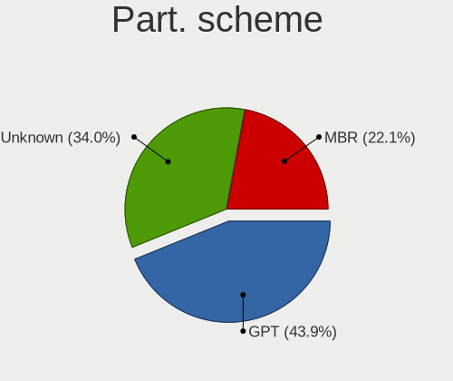
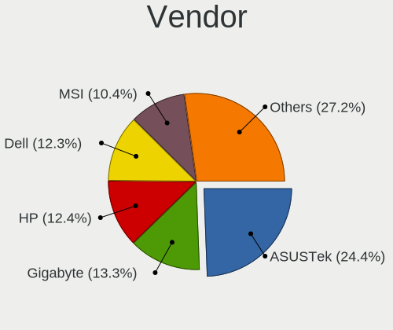
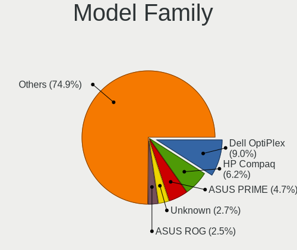
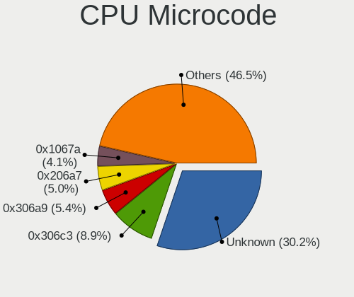
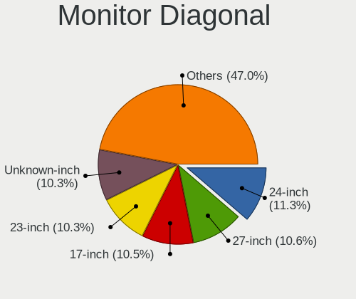
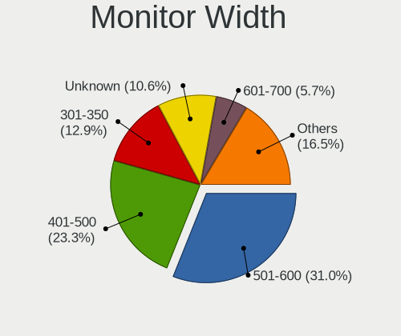
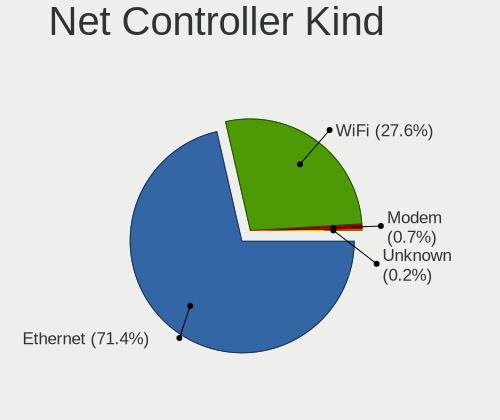
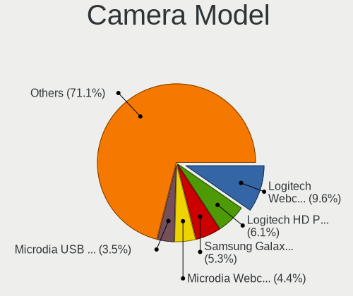
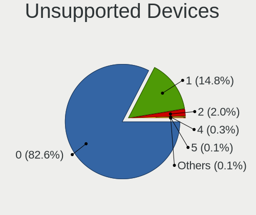

Ubuntu MATE - Tested Hardware & Statistics (Desktops)
-----------------------------------------------------

A project to collect tested hardware configurations for Ubuntu MATE.

Anyone can contribute to this report by the [hw-probe](https://github.com/linuxhw/hw-probe) tool:

    sudo -E hw-probe -all -upload

Please contribute! Especially if your hardware is rare.

Contents
--------

* [ Test Cases ](#test-cases)

* [ System ](#system)
  - [ OS                       ](#os)
  - [ OS Family                ](#os-family)
  - [ Kernel                   ](#kernel)
  - [ Kernel Family            ](#kernel-family)
  - [ Kernel Major Ver.        ](#kernel-major-ver)
  - [ Arch                     ](#arch)
  - [ DE                       ](#de)
  - [ Display Server           ](#display-server)
  - [ Display Manager          ](#display-manager)
  - [ OS Lang                  ](#os-lang)
  - [ Boot Mode                ](#boot-mode)
  - [ Filesystem               ](#filesystem)
  - [ Part. scheme             ](#part-scheme)
  - [ Dual Boot with Linux/BSD ](#dual-boot-with-linuxbsd)
  - [ Dual Boot (Win)          ](#dual-boot-win)

* [ Board ](#board)
  - [ Vendor                   ](#vendor)
  - [ Model                    ](#model)
  - [ Model Family             ](#model-family)
  - [ MFG Year                 ](#mfg-year)
  - [ Form Factor              ](#form-factor)
  - [ Secure Boot              ](#secure-boot)
  - [ Coreboot                 ](#coreboot)
  - [ RAM Size                 ](#ram-size)
  - [ RAM Used                 ](#ram-used)
  - [ Total Drives             ](#total-drives)
  - [ Has CD-ROM               ](#has-cd-rom)
  - [ Has Ethernet             ](#has-ethernet)
  - [ Has WiFi                 ](#has-wifi)
  - [ Has Bluetooth            ](#has-bluetooth)

* [ Location ](#location)
  - [ Country                  ](#country)
  - [ City                     ](#city)

* [ Drives ](#drives)
  - [ Drive Vendor             ](#drive-vendor)
  - [ Drive Model              ](#drive-model)
  - [ HDD Vendor               ](#hdd-vendor)
  - [ SSD Vendor               ](#ssd-vendor)
  - [ Drive Kind               ](#drive-kind)
  - [ Drive Connector          ](#drive-connector)
  - [ Drive Size               ](#drive-size)
  - [ Space Total              ](#space-total)
  - [ Space Used               ](#space-used)
  - [ Malfunc. Drives          ](#malfunc-drives)
  - [ Malfunc. Drive Vendor    ](#malfunc-drive-vendor)
  - [ Malfunc. HDD Vendor      ](#malfunc-hdd-vendor)
  - [ Malfunc. Drive Kind      ](#malfunc-drive-kind)
  - [ Failed Drives            ](#failed-drives)
  - [ Failed Drive Vendor      ](#failed-drive-vendor)
  - [ Drive Status             ](#drive-status)

* [ Storage controller ](#storage-controller)
  - [ Storage Vendor           ](#storage-vendor)
  - [ Storage Model            ](#storage-model)
  - [ Storage Kind             ](#storage-kind)

* [ Processor ](#processor)
  - [ CPU Vendor               ](#cpu-vendor)
  - [ CPU Model                ](#cpu-model)
  - [ CPU Model Family         ](#cpu-model-family)
  - [ CPU Cores                ](#cpu-cores)
  - [ CPU Sockets              ](#cpu-sockets)
  - [ CPU Threads              ](#cpu-threads)
  - [ CPU Op-Modes             ](#cpu-op-modes)
  - [ CPU Microcode            ](#cpu-microcode)
  - [ CPU Microarch            ](#cpu-microarch)

* [ Graphics ](#graphics)
  - [ GPU Vendor               ](#gpu-vendor)
  - [ GPU Model                ](#gpu-model)
  - [ GPU Combo                ](#gpu-combo)
  - [ GPU Driver               ](#gpu-driver)
  - [ GPU Memory               ](#gpu-memory)

* [ Monitor ](#monitor)
  - [ Monitor Vendor           ](#monitor-vendor)
  - [ Monitor Model            ](#monitor-model)
  - [ Monitor Resolution       ](#monitor-resolution)
  - [ Monitor Diagonal         ](#monitor-diagonal)
  - [ Monitor Width            ](#monitor-width)
  - [ Aspect Ratio             ](#aspect-ratio)
  - [ Monitor Area             ](#monitor-area)
  - [ Pixel Density            ](#pixel-density)
  - [ Multiple Monitors        ](#multiple-monitors)

* [ Network ](#network)
  - [ Net Controller Vendor    ](#net-controller-vendor)
  - [ Net Controller Model     ](#net-controller-model)
  - [ Wireless Vendor          ](#wireless-vendor)
  - [ Wireless Model           ](#wireless-model)
  - [ Ethernet Vendor          ](#ethernet-vendor)
  - [ Ethernet Model           ](#ethernet-model)
  - [ Net Controller Kind      ](#net-controller-kind)
  - [ Used Controller          ](#used-controller)
  - [ NICs                     ](#nics)
  - [ IPv6                     ](#ipv6)

* [ Bluetooth ](#bluetooth)
  - [ Bluetooth Vendor         ](#bluetooth-vendor)
  - [ Bluetooth Model          ](#bluetooth-model)

* [ Sound ](#sound)
  - [ Sound Vendor             ](#sound-vendor)
  - [ Sound Model              ](#sound-model)

* [ Memory ](#memory)
  - [ Memory Vendor            ](#memory-vendor)
  - [ Memory Model             ](#memory-model)
  - [ Memory Kind              ](#memory-kind)
  - [ Memory Form Factor       ](#memory-form-factor)
  - [ Memory Size              ](#memory-size)
  - [ Memory Speed             ](#memory-speed)

* [ Printers & scanners ](#printers--scanners)
  - [ Printer Vendor           ](#printer-vendor)
  - [ Printer Model            ](#printer-model)
  - [ Scanner Vendor           ](#scanner-vendor)
  - [ Scanner Model            ](#scanner-model)

* [ Camera ](#camera)
  - [ Camera Vendor            ](#camera-vendor)
  - [ Camera Model             ](#camera-model)

* [ Security ](#security)
  - [ Fingerprint Vendor       ](#fingerprint-vendor)
  - [ Fingerprint Model        ](#fingerprint-model)
  - [ Chipcard Vendor          ](#chipcard-vendor)
  - [ Chipcard Model           ](#chipcard-model)

* [ Unsupported ](#unsupported)
  - [ Unsupported Devices      ](#unsupported-devices)
  - [ Unsupported Device Types ](#unsupported-device-types)

Test Cases
----------

Total: 725

| Vendor        | Model                       | Probe                                                      | Date         |
|---------------|-----------------------------|------------------------------------------------------------|--------------|
| ASUSTek       | M5A78L-M LX                 | [b0f7933824](https://linux-hardware.org/?probe=b0f7933824) | Dec 29, 2022 |
| ASUSTek       | H110M-K                     | [4dab06b05f](https://linux-hardware.org/?probe=4dab06b05f) | Dec 29, 2022 |
| Gigabyte      | B85M-D3H                    | [4283e3bb1e](https://linux-hardware.org/?probe=4283e3bb1e) | Dec 27, 2022 |
| Dell          | 0J1C3P A00                  | [b65b20a073](https://linux-hardware.org/?probe=b65b20a073) | Dec 22, 2022 |
| ASUSTek       | P8Z77-V PRO                 | [2ad8b45619](https://linux-hardware.org/?probe=2ad8b45619) | Dec 21, 2022 |
| ASUSTek       | P8Z77-V PRO                 | [0e53e0be48](https://linux-hardware.org/?probe=0e53e0be48) | Dec 21, 2022 |
| ASRock        | B550M-ITX/ac                | [21a91196b1](https://linux-hardware.org/?probe=21a91196b1) | Dec 19, 2022 |
| ASUSTek       | PRIME Z590-P WIFI           | [34ac0b3211](https://linux-hardware.org/?probe=34ac0b3211) | Dec 17, 2022 |
| ASUSTek       | ROG STRIX Z690-A GAMING ... | [ac15fdcc8b](https://linux-hardware.org/?probe=ac15fdcc8b) | Dec 16, 2022 |
| HP            | 2215                        | [78151a5e1b](https://linux-hardware.org/?probe=78151a5e1b) | Dec 16, 2022 |
| Gigabyte      | F2A68HM-DS2                 | [976923f807](https://linux-hardware.org/?probe=976923f807) | Dec 12, 2022 |
| Dell          | 0P67HD A00                  | [67f13377be](https://linux-hardware.org/?probe=67f13377be) | Dec 12, 2022 |
| Biostar       | A320MH                      | [31cc96d1d3](https://linux-hardware.org/?probe=31cc96d1d3) | Dec 11, 2022 |
| MSI           | H81M-E34                    | [a9cc317647](https://linux-hardware.org/?probe=a9cc317647) | Dec 11, 2022 |
| Gigabyte      | X570S AERO G                | [118d4ebca0](https://linux-hardware.org/?probe=118d4ebca0) | Dec 11, 2022 |
| MSI           | X570-A PRO                  | [c57f5be505](https://linux-hardware.org/?probe=c57f5be505) | Dec 10, 2022 |
| Gigabyte      | AB350M-Gaming 3-CF          | [7ae8aecc25](https://linux-hardware.org/?probe=7ae8aecc25) | Dec 08, 2022 |
| ASRock        | B550M-ITX/ac                | [1d97601be2](https://linux-hardware.org/?probe=1d97601be2) | Dec 08, 2022 |
| ASRock        | B550M-ITX/ac                | [4943e0aa12](https://linux-hardware.org/?probe=4943e0aa12) | Dec 08, 2022 |
| ASUSTek       | P7P55 LX                    | [be0753651f](https://linux-hardware.org/?probe=be0753651f) | Dec 07, 2022 |
| MSI           | A320M-A PRO                 | [1b37803020](https://linux-hardware.org/?probe=1b37803020) | Dec 04, 2022 |
| Intel         | H61                         | [4050e46b94](https://linux-hardware.org/?probe=4050e46b94) | Dec 03, 2022 |
| HP            | 3397                        | [0605f9214a](https://linux-hardware.org/?probe=0605f9214a) | Nov 25, 2022 |
| Gigabyte      | GA-MA770T-UD3               | [29b92290e8](https://linux-hardware.org/?probe=29b92290e8) | Nov 22, 2022 |
| ASRock        | Z590M-ITX/ax                | [f01dec11e4](https://linux-hardware.org/?probe=f01dec11e4) | Nov 21, 2022 |
| ASRock        | 990FX Extreme3              | [84b8daa5c4](https://linux-hardware.org/?probe=84b8daa5c4) | Nov 20, 2022 |
| HP            | 1998                        | [f9746a4ae0](https://linux-hardware.org/?probe=f9746a4ae0) | Nov 15, 2022 |
| MSI           | Z97I GAMING AC              | [b0a5c0251f](https://linux-hardware.org/?probe=b0a5c0251f) | Nov 15, 2022 |
| Intel         | H61                         | [7d93f12ac4](https://linux-hardware.org/?probe=7d93f12ac4) | Nov 11, 2022 |
| Gigabyte      | H110M-S2V-CF                | [1117e533c3](https://linux-hardware.org/?probe=1117e533c3) | Nov 11, 2022 |
| Gigabyte      | GA-MA770T-UD3               | [6e773a6bf0](https://linux-hardware.org/?probe=6e773a6bf0) | Nov 09, 2022 |
| ASUSTek       | P8Z77-V                     | [65c0f5965b](https://linux-hardware.org/?probe=65c0f5965b) | Nov 04, 2022 |
| ASUSTek       | H61M-K                      | [4b580ecb2b](https://linux-hardware.org/?probe=4b580ecb2b) | Nov 03, 2022 |
| ASUSTek       | H61M-K                      | [c47ee488a5](https://linux-hardware.org/?probe=c47ee488a5) | Nov 03, 2022 |
| MSI           | B75A-IE35                   | [57b74e4ca2](https://linux-hardware.org/?probe=57b74e4ca2) | Nov 01, 2022 |
| Gigabyte      | X570S AERO G                | [600587e66a](https://linux-hardware.org/?probe=600587e66a) | Oct 31, 2022 |
| ASUSTek       | TUF Gaming B560M-PLUS       | [91bf754e64](https://linux-hardware.org/?probe=91bf754e64) | Oct 24, 2022 |
| ASUSTek       | Leonite2                    | [7640c7a49f](https://linux-hardware.org/?probe=7640c7a49f) | Oct 20, 2022 |
| ASRock        | Z77 Extreme4                | [7d12ed56e5](https://linux-hardware.org/?probe=7d12ed56e5) | Oct 19, 2022 |
| Gigabyte      | B450M DS3H-CF               | [6e45f7ecd7](https://linux-hardware.org/?probe=6e45f7ecd7) | Oct 15, 2022 |
| ASUSTek       | Z170 PRO GAMING/AURA        | [d1a5c91196](https://linux-hardware.org/?probe=d1a5c91196) | Oct 14, 2022 |
| ASUSTek       | Z170 PRO GAMING/AURA        | [b69b373cc1](https://linux-hardware.org/?probe=b69b373cc1) | Oct 14, 2022 |
| ASUSTek       | ROG STRIX Z590-E GAMING ... | [175ebd8462](https://linux-hardware.org/?probe=175ebd8462) | Oct 14, 2022 |
| MSI           | H310M PRO-VDH PLUS          | [1ba5f65f98](https://linux-hardware.org/?probe=1ba5f65f98) | Oct 10, 2022 |
| MSI           | H310M PRO-VDH PLUS          | [41dd35ae5f](https://linux-hardware.org/?probe=41dd35ae5f) | Oct 10, 2022 |
| ASUSTek       | M5A78L LE                   | [69023fe30e](https://linux-hardware.org/?probe=69023fe30e) | Oct 09, 2022 |
| Lenovo        | T530-28ICB                  | [b87998cf32](https://linux-hardware.org/?probe=b87998cf32) | Oct 09, 2022 |
| MSI           | B550-A PRO                  | [be6a0fda35](https://linux-hardware.org/?probe=be6a0fda35) | Oct 08, 2022 |
| Lenovo        | T530-28ICB                  | [175a71260e](https://linux-hardware.org/?probe=175a71260e) | Oct 06, 2022 |
| ASUSTek       | PRIME B450-PLUS             | [85eb59fc6d](https://linux-hardware.org/?probe=85eb59fc6d) | Oct 05, 2022 |
| ASUSTek       | ProArt X670E-CREATOR WIF... | [92e65a376a](https://linux-hardware.org/?probe=92e65a376a) | Oct 02, 2022 |
| Lenovo        | SHARKBAY SDK0E50510 PRO     | [cb5d0d1945](https://linux-hardware.org/?probe=cb5d0d1945) | Oct 01, 2022 |
| Lenovo        | SHARKBAY SDK0E50510 PRO     | [3af0c5cc5f](https://linux-hardware.org/?probe=3af0c5cc5f) | Oct 01, 2022 |
| ASUSTek       | PRIME B450-PLUS             | [db15c7b708](https://linux-hardware.org/?probe=db15c7b708) | Oct 01, 2022 |
| ASUSTek       | K30AD_M31AD_M51AD_M32AD     | [608c715bab](https://linux-hardware.org/?probe=608c715bab) | Sep 26, 2022 |
| ASUSTek       | H61M-K                      | [682eb02d48](https://linux-hardware.org/?probe=682eb02d48) | Sep 22, 2022 |
| MSI           | H81M-P33                    | [108817dc0f](https://linux-hardware.org/?probe=108817dc0f) | Sep 21, 2022 |
| ASRock        | HM55-HT                     | [64fff8f065](https://linux-hardware.org/?probe=64fff8f065) | Sep 20, 2022 |
| MSI           | 870-G45                     | [74af87b0c5](https://linux-hardware.org/?probe=74af87b0c5) | Sep 17, 2022 |
| ASUSTek       | ROG STRIX Z690-A GAMING ... | [081d4b1d50](https://linux-hardware.org/?probe=081d4b1d50) | Sep 16, 2022 |
| ASUSTek       | M2A74-AM                    | [25c30e4e54](https://linux-hardware.org/?probe=25c30e4e54) | Sep 14, 2022 |
| ASUSTek       | M2A74-AM                    | [24e6ffe552](https://linux-hardware.org/?probe=24e6ffe552) | Sep 14, 2022 |
| ASUSTek       | P7P55 LX                    | [cc28ed218f](https://linux-hardware.org/?probe=cc28ed218f) | Sep 13, 2022 |
| Gigabyte      | Z590 UD AC                  | [8774a8312b](https://linux-hardware.org/?probe=8774a8312b) | Sep 13, 2022 |
| ASRock        | J5040-ITX                   | [e36022370b](https://linux-hardware.org/?probe=e36022370b) | Sep 08, 2022 |
| Acer          | Aspire X3950                | [22d1319220](https://linux-hardware.org/?probe=22d1319220) | Sep 06, 2022 |
| ASUSTek       | P5GZ-MX                     | [883739db23](https://linux-hardware.org/?probe=883739db23) | Sep 05, 2022 |
| ASRock        | B450 Gaming-ITX/ac          | [f16d383b65](https://linux-hardware.org/?probe=f16d383b65) | Sep 05, 2022 |
| HP            | 2ADC                        | [d9e5d2b511](https://linux-hardware.org/?probe=d9e5d2b511) | Sep 04, 2022 |
| HP            | 18E4                        | [c58c0043cb](https://linux-hardware.org/?probe=c58c0043cb) | Sep 03, 2022 |
| HP            | 3397                        | [5cd2349a9c](https://linux-hardware.org/?probe=5cd2349a9c) | Sep 02, 2022 |
| Lenovo        | 3111 SDK0J40697 WIN 3305... | [2be9b66ba1](https://linux-hardware.org/?probe=2be9b66ba1) | Aug 30, 2022 |
| AZW           | GK55                        | [0ae52e1fdf](https://linux-hardware.org/?probe=0ae52e1fdf) | Aug 21, 2022 |
| ASUSTek       | M4A78-E                     | [76028e78e9](https://linux-hardware.org/?probe=76028e78e9) | Aug 19, 2022 |
| ASUSTek       | M5A88-V EVO                 | [e8b519c4de](https://linux-hardware.org/?probe=e8b519c4de) | Aug 18, 2022 |
| Gigabyte      | B85M-D3PH                   | [a5ed221478](https://linux-hardware.org/?probe=a5ed221478) | Aug 17, 2022 |
| MSI           | H170M PRO-VDH               | [4d7aa09763](https://linux-hardware.org/?probe=4d7aa09763) | Aug 16, 2022 |
| Dell          | 08NPPY A00                  | [1b78691cac](https://linux-hardware.org/?probe=1b78691cac) | Aug 14, 2022 |
| Dell          | 08NPPY A00                  | [b41823f392](https://linux-hardware.org/?probe=b41823f392) | Aug 14, 2022 |
| MSI           | MS-77311                    | [86b4d71bc0](https://linux-hardware.org/?probe=86b4d71bc0) | Aug 11, 2022 |
| Dell          | 03NVJ6 A00                  | [9655bf78d0](https://linux-hardware.org/?probe=9655bf78d0) | Aug 05, 2022 |
| HP            | 8433 11                     | [cd790281b5](https://linux-hardware.org/?probe=cd790281b5) | Aug 02, 2022 |
| Dell          | 0KWVT8 A03                  | [cdca6713e9](https://linux-hardware.org/?probe=cdca6713e9) | Jul 31, 2022 |
| Dell          | 0KWVT8 A03                  | [1444843fcd](https://linux-hardware.org/?probe=1444843fcd) | Jul 31, 2022 |
| ASUSTek       | M5A97 R2.0                  | [3aa2ff8224](https://linux-hardware.org/?probe=3aa2ff8224) | Jul 29, 2022 |
| ASUSTek       | B85M-G                      | [5d5fd15071](https://linux-hardware.org/?probe=5d5fd15071) | Jul 28, 2022 |
| ASUSTek       | M5A97 R2.0                  | [19572ca302](https://linux-hardware.org/?probe=19572ca302) | Jul 27, 2022 |
| ASUSTek       | M5A97 R2.0                  | [5795e098d2](https://linux-hardware.org/?probe=5795e098d2) | Jul 26, 2022 |
| ONDA          | H110-MINI V3.00 Ver:3.00    | [62b2a7897b](https://linux-hardware.org/?probe=62b2a7897b) | Jul 24, 2022 |
| MSI           | 2AE0                        | [5c0034d313](https://linux-hardware.org/?probe=5c0034d313) | Jul 22, 2022 |
| MSI           | 2AE0                        | [df441346da](https://linux-hardware.org/?probe=df441346da) | Jul 22, 2022 |
| Medion        | MS-7797                     | [caf13d5392](https://linux-hardware.org/?probe=caf13d5392) | Jul 14, 2022 |
| ASRock        | B450M Pro4                  | [0cdcc2c0e0](https://linux-hardware.org/?probe=0cdcc2c0e0) | Jul 10, 2022 |
| Dell          | 0GM819                      | [3d18cc2632](https://linux-hardware.org/?probe=3d18cc2632) | Jul 08, 2022 |
| Gigabyte      | Z87-HD3                     | [95e6ec0822](https://linux-hardware.org/?probe=95e6ec0822) | Jul 05, 2022 |
| HP            | 3646h                       | [9e0737f23f](https://linux-hardware.org/?probe=9e0737f23f) | Jul 04, 2022 |
| Dell          | 0M6C7G A00                  | [5eee0db64f](https://linux-hardware.org/?probe=5eee0db64f) | Jul 03, 2022 |
| Gigabyte      | Z87-HD3                     | [28429fdd32](https://linux-hardware.org/?probe=28429fdd32) | Jul 02, 2022 |
| HP            | 8169                        | [18c6ea7678](https://linux-hardware.org/?probe=18c6ea7678) | Jul 01, 2022 |
| HP            | 8169                        | [c479baadc1](https://linux-hardware.org/?probe=c479baadc1) | Jul 01, 2022 |
| MSI           | H81M-E33                    | [0685f37e2c](https://linux-hardware.org/?probe=0685f37e2c) | Jun 22, 2022 |
| ASUSTek       | H61M-K                      | [0112d58d4e](https://linux-hardware.org/?probe=0112d58d4e) | Jun 18, 2022 |
| ASUSTek       | TUF Gaming B550M-PLUS       | [e048d9df09](https://linux-hardware.org/?probe=e048d9df09) | Jun 17, 2022 |
| MSI           | 3664h                       | [5fbb22c653](https://linux-hardware.org/?probe=5fbb22c653) | Jun 15, 2022 |
| Acer          | Aspire X3950                | [81797815d2](https://linux-hardware.org/?probe=81797815d2) | Jun 13, 2022 |
| Unknown       | Unknown                     | [c62add2d70](https://linux-hardware.org/?probe=c62add2d70) | Jun 13, 2022 |
| ASRock        | B450M Pro4                  | [3de31234b3](https://linux-hardware.org/?probe=3de31234b3) | Jun 12, 2022 |
| Dell          | 0HV8FN A01                  | [33d201cb1d](https://linux-hardware.org/?probe=33d201cb1d) | Jun 10, 2022 |
| HP            | 3397                        | [55bcbdbc1f](https://linux-hardware.org/?probe=55bcbdbc1f) | Jun 07, 2022 |
| Gigabyte      | B360M AORUS Gaming 3-CF     | [5407d4a1f6](https://linux-hardware.org/?probe=5407d4a1f6) | Jun 07, 2022 |
| Gigabyte      | GA-990FXA-UD5               | [d9e8d3957e](https://linux-hardware.org/?probe=d9e8d3957e) | Jun 06, 2022 |
| ASUSTek       | PRIME X570-P                | [3b4483236d](https://linux-hardware.org/?probe=3b4483236d) | Jun 05, 2022 |
| Dell          | 00V62H A01                  | [20544feb00](https://linux-hardware.org/?probe=20544feb00) | Jun 03, 2022 |
| Gigabyte      | 970A-DS3P                   | [8e0addf4d3](https://linux-hardware.org/?probe=8e0addf4d3) | May 24, 2022 |
| INP           | i1000BTS                    | [95da2ada33](https://linux-hardware.org/?probe=95da2ada33) | May 24, 2022 |
| ASUSTek       | P5G41T-M LX2/BR             | [9044b2e4e2](https://linux-hardware.org/?probe=9044b2e4e2) | May 18, 2022 |
| ASUSTek       | ProArt Z490-CREATOR 10G     | [4d68e6fd8d](https://linux-hardware.org/?probe=4d68e6fd8d) | May 12, 2022 |
| HP            | 3031h                       | [4a57ff5761](https://linux-hardware.org/?probe=4a57ff5761) | May 10, 2022 |
| Unknown       | HX90                        | [3a7e2628b0](https://linux-hardware.org/?probe=3a7e2628b0) | May 09, 2022 |
| MSI           | B450 TOMAHAWK MAX           | [246c63d834](https://linux-hardware.org/?probe=246c63d834) | May 06, 2022 |
| HP            | 8433 11                     | [a5b829538b](https://linux-hardware.org/?probe=a5b829538b) | Apr 29, 2022 |
| ASUSTek       | A55BM-E                     | [b2b220b65d](https://linux-hardware.org/?probe=b2b220b65d) | Apr 25, 2022 |
| ASUSTek       | P5KPL-AM SE                 | [d3d995a41b](https://linux-hardware.org/?probe=d3d995a41b) | Apr 24, 2022 |
| ASRock        | Z87M Extreme4               | [83ffe21604](https://linux-hardware.org/?probe=83ffe21604) | Apr 18, 2022 |
| Dell          | 0X9M3X A05                  | [f049c88dfe](https://linux-hardware.org/?probe=f049c88dfe) | Apr 18, 2022 |
| Gigabyte      | X99P-SLI-CF                 | [19055b80bc](https://linux-hardware.org/?probe=19055b80bc) | Apr 16, 2022 |
| ASUSTek       | Z97-K                       | [4852dde595](https://linux-hardware.org/?probe=4852dde595) | Apr 15, 2022 |
| Unknown       | Unknown                     | [d7811dbd43](https://linux-hardware.org/?probe=d7811dbd43) | Apr 14, 2022 |
| MSI           | MAG B550M MORTAR            | [7a9f6e1de7](https://linux-hardware.org/?probe=7a9f6e1de7) | Apr 13, 2022 |
| Dell          | 03NVJ6 A00                  | [c640615939](https://linux-hardware.org/?probe=c640615939) | Apr 10, 2022 |
| ASUSTek       | M5A78L-M PLUS/USB3          | [3c17fb0db4](https://linux-hardware.org/?probe=3c17fb0db4) | Apr 07, 2022 |
| Gigabyte      | H470M DS3H                  | [bbfc43c637](https://linux-hardware.org/?probe=bbfc43c637) | Apr 05, 2022 |
| ASRock        | N68C-GS FX                  | [5f45322780](https://linux-hardware.org/?probe=5f45322780) | Apr 04, 2022 |
| Dell          | 06X1TJ A00                  | [42cf748563](https://linux-hardware.org/?probe=42cf748563) | Apr 03, 2022 |
| ASUSTek       | A88X-GAMER                  | [8340e366fc](https://linux-hardware.org/?probe=8340e366fc) | Mar 28, 2022 |
| HP            | 802E                        | [b15f756d65](https://linux-hardware.org/?probe=b15f756d65) | Mar 21, 2022 |
| HP            | 3397                        | [fe1ae429b1](https://linux-hardware.org/?probe=fe1ae429b1) | Mar 18, 2022 |
| ASUSTek       | PRIME H410M-A               | [9352c21f95](https://linux-hardware.org/?probe=9352c21f95) | Mar 17, 2022 |
| ASUSTek       | ROG STRIX B350-F GAMING     | [220c4f69b0](https://linux-hardware.org/?probe=220c4f69b0) | Mar 15, 2022 |
| ASUSTek       | A55BM-E                     | [7bbbcc53c1](https://linux-hardware.org/?probe=7bbbcc53c1) | Mar 14, 2022 |
| Dell          | OptiPlex 980                | [14cf2b23f7](https://linux-hardware.org/?probe=14cf2b23f7) | Mar 14, 2022 |
| ASUSTek       | M4A79XTD EVO                | [d59f0b152c](https://linux-hardware.org/?probe=d59f0b152c) | Mar 10, 2022 |
| Gigabyte      | Z68XP-UD3                   | [6382c70064](https://linux-hardware.org/?probe=6382c70064) | Mar 07, 2022 |
| Medion        | MS-7797                     | [88982d8ccb](https://linux-hardware.org/?probe=88982d8ccb) | Mar 05, 2022 |
| ASRock        | B450M Pro4                  | [b18f6804d6](https://linux-hardware.org/?probe=b18f6804d6) | Mar 02, 2022 |
| ECS           | A785GM-AD3                  | [43c3e7c4a0](https://linux-hardware.org/?probe=43c3e7c4a0) | Mar 02, 2022 |
| Intel         | H55                         | [2f52a73f85](https://linux-hardware.org/?probe=2f52a73f85) | Feb 27, 2022 |
| Pegatron      | Narra6                      | [ad9a06f14d](https://linux-hardware.org/?probe=ad9a06f14d) | Feb 25, 2022 |
| ASUSTek       | PRIME B450M-A II            | [09aca1c435](https://linux-hardware.org/?probe=09aca1c435) | Feb 22, 2022 |
| ASUSTek       | PRIME B450M-A II            | [35c00d5889](https://linux-hardware.org/?probe=35c00d5889) | Feb 22, 2022 |
| ASUSTek       | PRIME B450M-A II            | [265235f4f4](https://linux-hardware.org/?probe=265235f4f4) | Feb 21, 2022 |
| ECS           | G41T-M7                     | [c4aca5bc12](https://linux-hardware.org/?probe=c4aca5bc12) | Feb 20, 2022 |
| ECS           | A785GM-AD3                  | [b6459dbb39](https://linux-hardware.org/?probe=b6459dbb39) | Feb 12, 2022 |
| MSI           | MAG Z390 TOMAHAWK           | [e58751112a](https://linux-hardware.org/?probe=e58751112a) | Feb 11, 2022 |
| ASUSTek       | PRIME B250M-K               | [6f66651cd1](https://linux-hardware.org/?probe=6f66651cd1) | Feb 10, 2022 |
| ASUSTek       | P5W DH Deluxe               | [7c3fa0c43b](https://linux-hardware.org/?probe=7c3fa0c43b) | Feb 08, 2022 |
| Gigabyte      | GA-990XA-UD3                | [6bb9884c12](https://linux-hardware.org/?probe=6bb9884c12) | Feb 08, 2022 |
| Gigabyte      | F2A88XM-D3HP                | [c6783b6b8b](https://linux-hardware.org/?probe=c6783b6b8b) | Feb 07, 2022 |
| Gigabyte      | GA-990XA-UD3                | [74ebb0645d](https://linux-hardware.org/?probe=74ebb0645d) | Feb 06, 2022 |
| ASUSTek       | H61M-K                      | [0e2c677ddc](https://linux-hardware.org/?probe=0e2c677ddc) | Feb 03, 2022 |
| Lenovo        | ThinkCentre M58 7373W43     | [4dc312f4f3](https://linux-hardware.org/?probe=4dc312f4f3) | Feb 02, 2022 |
| Lenovo        | SDK0E50510 WIN              | [f317005b0a](https://linux-hardware.org/?probe=f317005b0a) | Feb 02, 2022 |
| Lenovo        | NOK                         | [8905840b45](https://linux-hardware.org/?probe=8905840b45) | Feb 02, 2022 |
| HP            | 8434 11                     | [76a7851e7f](https://linux-hardware.org/?probe=76a7851e7f) | Jan 28, 2022 |
| ASUSTek       | M5A99X EVO R2.0             | [fab2b2828e](https://linux-hardware.org/?probe=fab2b2828e) | Jan 26, 2022 |
| ASRock        | Z77 Pro4                    | [8062682731](https://linux-hardware.org/?probe=8062682731) | Jan 25, 2022 |
| Gigabyte      | H410M H V3                  | [f6b7e2e2e6](https://linux-hardware.org/?probe=f6b7e2e2e6) | Jan 24, 2022 |
| ASUSTek       | P5KPL-AM SE                 | [868c5fe3a4](https://linux-hardware.org/?probe=868c5fe3a4) | Jan 24, 2022 |
| Lenovo        | 1052 SDK0J40697 WIN 3305... | [a4b48a8427](https://linux-hardware.org/?probe=a4b48a8427) | Jan 23, 2022 |
| Lenovo        | 1052 SDK0J40697 WIN 3305... | [622bf721f3](https://linux-hardware.org/?probe=622bf721f3) | Jan 23, 2022 |
| ASRock        | G41C-VS                     | [4dbb4b7fad](https://linux-hardware.org/?probe=4dbb4b7fad) | Jan 21, 2022 |
| Albatron      | PM73V                       | [7bd3956f1f](https://linux-hardware.org/?probe=7bd3956f1f) | Jan 21, 2022 |
| ASUSTek       | H81M-K                      | [e5d70436b2](https://linux-hardware.org/?probe=e5d70436b2) | Jan 21, 2022 |
| HP            | 8455                        | [fbf272366c](https://linux-hardware.org/?probe=fbf272366c) | Jan 20, 2022 |
| ASUSTek       | P5LD2                       | [00ec990ce2](https://linux-hardware.org/?probe=00ec990ce2) | Jan 19, 2022 |
| Dell          | 0KP561                      | [1b772786e5](https://linux-hardware.org/?probe=1b772786e5) | Jan 19, 2022 |
| Dell          | 0FH884                      | [5ffacf9f99](https://linux-hardware.org/?probe=5ffacf9f99) | Jan 19, 2022 |
| Dell          | 0UG982                      | [c85c923e97](https://linux-hardware.org/?probe=c85c923e97) | Jan 19, 2022 |
| Dell          | 0X7841                      | [40600195c8](https://linux-hardware.org/?probe=40600195c8) | Jan 19, 2022 |
| Lenovo        | SDK0E50510 WIN              | [597677191c](https://linux-hardware.org/?probe=597677191c) | Jan 19, 2022 |
| Dell          | 0UG982                      | [686f3558d2](https://linux-hardware.org/?probe=686f3558d2) | Jan 19, 2022 |
| Dell          | 0FH884                      | [f6e9bda3a9](https://linux-hardware.org/?probe=f6e9bda3a9) | Jan 19, 2022 |
| HP            | 18E7                        | [b68364ed90](https://linux-hardware.org/?probe=b68364ed90) | Jan 19, 2022 |
| Dell          | 0HY9JP A02                  | [8314cd9ba6](https://linux-hardware.org/?probe=8314cd9ba6) | Jan 19, 2022 |
| Dell          | 0UG982                      | [38c30e280b](https://linux-hardware.org/?probe=38c30e280b) | Jan 19, 2022 |
| Gigabyte      | H81M-S2PV                   | [f2d5dba7ff](https://linux-hardware.org/?probe=f2d5dba7ff) | Jan 19, 2022 |
| Dell          | 0FH884                      | [083697081f](https://linux-hardware.org/?probe=083697081f) | Jan 19, 2022 |
| HP            | 18E7                        | [9fedcb7ff7](https://linux-hardware.org/?probe=9fedcb7ff7) | Jan 18, 2022 |
| HP            | 18E7                        | [48871270a2](https://linux-hardware.org/?probe=48871270a2) | Jan 18, 2022 |
| HP            | 18E7                        | [ca38c856e1](https://linux-hardware.org/?probe=ca38c856e1) | Jan 18, 2022 |
| HP            | 18E7                        | [a4df88b38f](https://linux-hardware.org/?probe=a4df88b38f) | Jan 18, 2022 |
| HP            | 18E7                        | [a745b9add0](https://linux-hardware.org/?probe=a745b9add0) | Jan 18, 2022 |
| HP            | 18E7                        | [b69abe6fd4](https://linux-hardware.org/?probe=b69abe6fd4) | Jan 18, 2022 |
| Lenovo        | SDK0E50510 WIN              | [9753f9164a](https://linux-hardware.org/?probe=9753f9164a) | Jan 18, 2022 |
| Lenovo        | ThinkCentre M58 7373W43     | [2d7a6e6cb6](https://linux-hardware.org/?probe=2d7a6e6cb6) | Jan 18, 2022 |
| Lenovo        | SDK0E50510 WIN              | [51484889f9](https://linux-hardware.org/?probe=51484889f9) | Jan 18, 2022 |
| Lenovo        | SDK0E50510 WIN              | [4ca462c89a](https://linux-hardware.org/?probe=4ca462c89a) | Jan 18, 2022 |
| Dell          | 0HY9JP A02                  | [c4c9f4b0a9](https://linux-hardware.org/?probe=c4c9f4b0a9) | Jan 18, 2022 |
| HP            | 8434 11                     | [4a128d2bb2](https://linux-hardware.org/?probe=4a128d2bb2) | Jan 18, 2022 |
| HP            | 18E7                        | [97d4bc7367](https://linux-hardware.org/?probe=97d4bc7367) | Jan 18, 2022 |
| Lenovo        | NOK                         | [7ae2819a6f](https://linux-hardware.org/?probe=7ae2819a6f) | Jan 18, 2022 |
| HP            | 18E7                        | [e86d0cc284](https://linux-hardware.org/?probe=e86d0cc284) | Jan 18, 2022 |
| Lenovo        | SDK0E50510 WIN              | [022f56a960](https://linux-hardware.org/?probe=022f56a960) | Jan 18, 2022 |
| HP            | 18E7                        | [0d2a09f683](https://linux-hardware.org/?probe=0d2a09f683) | Jan 18, 2022 |
| HP            | 8455                        | [639182896b](https://linux-hardware.org/?probe=639182896b) | Jan 18, 2022 |
| ASRock        | B450M Pro4                  | [556d0fb884](https://linux-hardware.org/?probe=556d0fb884) | Jan 18, 2022 |
| ASUSTek       | H81M-C                      | [f4bb742149](https://linux-hardware.org/?probe=f4bb742149) | Jan 17, 2022 |
| ASUSTek       | P5LD2                       | [b972c7929f](https://linux-hardware.org/?probe=b972c7929f) | Jan 17, 2022 |
| ASUSTek       | PRIME H310M-D R2.0          | [9a6c2f82f1](https://linux-hardware.org/?probe=9a6c2f82f1) | Jan 17, 2022 |
| Dell          | 0UG982                      | [684478b2fb](https://linux-hardware.org/?probe=684478b2fb) | Jan 17, 2022 |
| Gigabyte      | H410M H V3                  | [13b01fb40a](https://linux-hardware.org/?probe=13b01fb40a) | Jan 17, 2022 |
| ASUSTek       | PRIME H310M-D R2.0          | [385f76b996](https://linux-hardware.org/?probe=385f76b996) | Jan 17, 2022 |
| ASUSTek       | ROG STRIX B550-I GAMING     | [6438d5a5af](https://linux-hardware.org/?probe=6438d5a5af) | Jan 15, 2022 |
| ASUSTek       | H81M-C                      | [f21bf32c9a](https://linux-hardware.org/?probe=f21bf32c9a) | Jan 15, 2022 |
| ZOTAC         | NM10                        | [d758728651](https://linux-hardware.org/?probe=d758728651) | Jan 14, 2022 |
| ASUSTek       | H81M-K                      | [f1858e63f4](https://linux-hardware.org/?probe=f1858e63f4) | Jan 14, 2022 |
| ASUSTek       | PRIME X470-PRO              | [c450cd4a79](https://linux-hardware.org/?probe=c450cd4a79) | Jan 13, 2022 |
| HP            | 3397                        | [38a4d731fe](https://linux-hardware.org/?probe=38a4d731fe) | Jan 08, 2022 |
| Gigabyte      | B450M S2H                   | [858d718984](https://linux-hardware.org/?probe=858d718984) | Jan 07, 2022 |
| Dell          | 032W55 A03                  | [f3838abaaf](https://linux-hardware.org/?probe=f3838abaaf) | Jan 04, 2022 |
| ASRock        | 870iCafe R2.0               | [f67cc91b2e](https://linux-hardware.org/?probe=f67cc91b2e) | Dec 31, 2021 |
| MSI           | H81M-P33                    | [e637f730e7](https://linux-hardware.org/?probe=e637f730e7) | Dec 31, 2021 |
| MSI           | H81M-P33                    | [4c225dc457](https://linux-hardware.org/?probe=4c225dc457) | Dec 30, 2021 |
| Gigabyte      | H67MA-UD2H-B3               | [e32af6a3de](https://linux-hardware.org/?probe=e32af6a3de) | Dec 26, 2021 |
| MSI           | 760GM-P23                   | [62abb9d0ef](https://linux-hardware.org/?probe=62abb9d0ef) | Dec 25, 2021 |
| ASRock        | 970 Extreme4                | [1fbef2b76c](https://linux-hardware.org/?probe=1fbef2b76c) | Dec 23, 2021 |
| ASUSTek       | PRIME B360M-K               | [8df64a7f80](https://linux-hardware.org/?probe=8df64a7f80) | Dec 21, 2021 |
| ASUSTek       | H61M-K                      | [8f53f4e97c](https://linux-hardware.org/?probe=8f53f4e97c) | Dec 19, 2021 |
| MSI           | H61M-S20                    | [7e1fdb578c](https://linux-hardware.org/?probe=7e1fdb578c) | Dec 02, 2021 |
| ASUSTek       | H81M-A                      | [50acb69e6e](https://linux-hardware.org/?probe=50acb69e6e) | Dec 02, 2021 |
| HP            | 3646h                       | [e7069f8a3b](https://linux-hardware.org/?probe=e7069f8a3b) | Nov 29, 2021 |
| HP            | 3646h                       | [a46d638004](https://linux-hardware.org/?probe=a46d638004) | Nov 29, 2021 |
| ASUSTek       | PRIME X570-P                | [6b7ec76b64](https://linux-hardware.org/?probe=6b7ec76b64) | Nov 28, 2021 |
| ASRock        | Z68 Extreme3 Gen3           | [9b13286f92](https://linux-hardware.org/?probe=9b13286f92) | Nov 28, 2021 |
| MSI           | H81M-P33                    | [3d2583b1f1](https://linux-hardware.org/?probe=3d2583b1f1) | Nov 26, 2021 |
| Dell          | 0T656F A01                  | [06f4633f1b](https://linux-hardware.org/?probe=06f4633f1b) | Nov 24, 2021 |
| ASUSTek       | PRIME B550-PLUS             | [4368bd67ac](https://linux-hardware.org/?probe=4368bd67ac) | Nov 23, 2021 |
| ASUSTek       | PRIME B550-PLUS             | [686454975b](https://linux-hardware.org/?probe=686454975b) | Nov 23, 2021 |
| ASUSTek       | AT3IONT-I                   | [b8f5329824](https://linux-hardware.org/?probe=b8f5329824) | Nov 22, 2021 |
| Dell          | 0M017G A00                  | [da444f9b8f](https://linux-hardware.org/?probe=da444f9b8f) | Nov 22, 2021 |
| ASUSTek       | M52AD_M12AD_A_F_K31AD       | [a13103a9ad](https://linux-hardware.org/?probe=a13103a9ad) | Nov 20, 2021 |
| ASUSTek       | ROG Maximus XIII HERO       | [36ac197007](https://linux-hardware.org/?probe=36ac197007) | Nov 17, 2021 |
| Dell          | 0G261D A00                  | [1bb376a60b](https://linux-hardware.org/?probe=1bb376a60b) | Nov 17, 2021 |
| Fujitsu       | D3633-S1 S26361-D3633-S1    | [8a6de2970d](https://linux-hardware.org/?probe=8a6de2970d) | Nov 15, 2021 |
| ASRock        | B450M Pro4                  | [2cdd151d75](https://linux-hardware.org/?probe=2cdd151d75) | Nov 14, 2021 |
| Dell          | 03NVJ6 A00                  | [61bfe5dfa7](https://linux-hardware.org/?probe=61bfe5dfa7) | Nov 11, 2021 |
| Fujitsu       | D3633-S1 S26361-D3633-S1    | [1971073b86](https://linux-hardware.org/?probe=1971073b86) | Nov 10, 2021 |
| ASUSTek       | M4A78-E                     | [dd8a96b615](https://linux-hardware.org/?probe=dd8a96b615) | Nov 09, 2021 |
| ASUSTek       | M4A78-E                     | [89aff3881c](https://linux-hardware.org/?probe=89aff3881c) | Nov 09, 2021 |
| ASUSTek       | A55BM-E                     | [fd25737c58](https://linux-hardware.org/?probe=fd25737c58) | Nov 09, 2021 |
| ASUSTek       | M5A97 LE R2.0               | [e21897758d](https://linux-hardware.org/?probe=e21897758d) | Nov 07, 2021 |
| Gigabyte      | Z97X-UD3H-CF                | [914d585adc](https://linux-hardware.org/?probe=914d585adc) | Nov 07, 2021 |
| Gigabyte      | H97M-D3H                    | [05e3caa05c](https://linux-hardware.org/?probe=05e3caa05c) | Nov 02, 2021 |
| ASRock        | B450M Pro4                  | [60ffb9d428](https://linux-hardware.org/?probe=60ffb9d428) | Oct 31, 2021 |
| ASRock        | Z68 Extreme3 Gen3           | [4946a6a02c](https://linux-hardware.org/?probe=4946a6a02c) | Oct 26, 2021 |
| ASRock        | Z68 Extreme3 Gen3           | [0ad429cea5](https://linux-hardware.org/?probe=0ad429cea5) | Oct 26, 2021 |
| ASUSTek       | M5A78L LE                   | [adf114d66e](https://linux-hardware.org/?probe=adf114d66e) | Oct 23, 2021 |
| ASUSTek       | PRIME H310M-K R2.0          | [09e3d5da46](https://linux-hardware.org/?probe=09e3d5da46) | Oct 21, 2021 |
| MSI           | MAG B550 TOMAHAWK           | [27b0a66ceb](https://linux-hardware.org/?probe=27b0a66ceb) | Oct 20, 2021 |
| ASUSTek       | ROG Maximus XIII HERO       | [4505c960f2](https://linux-hardware.org/?probe=4505c960f2) | Oct 13, 2021 |
| Gigabyte      | B450M S2H                   | [fe1c549ed6](https://linux-hardware.org/?probe=fe1c549ed6) | Oct 05, 2021 |
| Dell          | 08NPPY A00                  | [f0ff9a911e](https://linux-hardware.org/?probe=f0ff9a911e) | Oct 03, 2021 |
| Gigabyte      | Z97-HD3                     | [5f6c245dc5](https://linux-hardware.org/?probe=5f6c245dc5) | Sep 28, 2021 |
| MSI           | H61M-P23                    | [3a07878154](https://linux-hardware.org/?probe=3a07878154) | Sep 28, 2021 |
| Dell          | 03NVJ6 A00                  | [5422d3bf1d](https://linux-hardware.org/?probe=5422d3bf1d) | Sep 27, 2021 |
| Intel         | DG31PR AAD97573-206         | [060da3d3ab](https://linux-hardware.org/?probe=060da3d3ab) | Sep 26, 2021 |
| HP            | 8265                        | [f840aed42d](https://linux-hardware.org/?probe=f840aed42d) | Sep 21, 2021 |
| ASUSTek       | PRIME B450M-A               | [f93c2362ff](https://linux-hardware.org/?probe=f93c2362ff) | Sep 21, 2021 |
| ASUSTek       | TUF Gaming B550M-PLUS       | [a5211dc1bb](https://linux-hardware.org/?probe=a5211dc1bb) | Sep 21, 2021 |
| Gigabyte      | B450M S2H                   | [13298e0f6b](https://linux-hardware.org/?probe=13298e0f6b) | Sep 19, 2021 |
| HP            | 3397                        | [13d358c48e](https://linux-hardware.org/?probe=13d358c48e) | Sep 18, 2021 |
| HP            | 1497                        | [311efc294a](https://linux-hardware.org/?probe=311efc294a) | Sep 16, 2021 |
| ASRock        | H110M-STX                   | [6bb90d3b07](https://linux-hardware.org/?probe=6bb90d3b07) | Sep 16, 2021 |
| Medion        | MS-7797                     | [f2f5579dc5](https://linux-hardware.org/?probe=f2f5579dc5) | Sep 15, 2021 |
| Medion        | MS-7797                     | [6ca6bee736](https://linux-hardware.org/?probe=6ca6bee736) | Sep 15, 2021 |
| Intel         | DH67CL AAG10212-204         | [e9d68ab5e4](https://linux-hardware.org/?probe=e9d68ab5e4) | Sep 09, 2021 |
| HP            | 3396                        | [147c8ed96c](https://linux-hardware.org/?probe=147c8ed96c) | Sep 04, 2021 |
| MSI           | Z370 PC PRO                 | [c594736488](https://linux-hardware.org/?probe=c594736488) | Aug 30, 2021 |
| ASRock        | B75M-DGS R2.0               | [16250b0c12](https://linux-hardware.org/?probe=16250b0c12) | Aug 29, 2021 |
| MSI           | B550M PRO-VDH WIFI          | [41e440c2e5](https://linux-hardware.org/?probe=41e440c2e5) | Aug 29, 2021 |
| MSI           | B550M PRO-VDH WIFI          | [e086d2eb61](https://linux-hardware.org/?probe=e086d2eb61) | Aug 29, 2021 |
| MSI           | 2A9C                        | [57601d98f3](https://linux-hardware.org/?probe=57601d98f3) | Aug 28, 2021 |
| MSI           | MPG Z390 GAMING PRO CARB... | [413934fef3](https://linux-hardware.org/?probe=413934fef3) | Aug 23, 2021 |
| MSI           | B450M PRO-M2 MAX            | [b28b036f78](https://linux-hardware.org/?probe=b28b036f78) | Aug 22, 2021 |
| ASRock        | M3A785GMH/128M              | [4ace1ea1ac](https://linux-hardware.org/?probe=4ace1ea1ac) | Aug 15, 2021 |
| MSI           | X79A-GD45                   | [c5b78e1a01](https://linux-hardware.org/?probe=c5b78e1a01) | Aug 13, 2021 |
| Gigabyte      | B550M DS3H                  | [6776a424d5](https://linux-hardware.org/?probe=6776a424d5) | Aug 11, 2021 |
| Dell          | 05GD68 A00                  | [bbfbd42562](https://linux-hardware.org/?probe=bbfbd42562) | Aug 07, 2021 |
| MSI           | MPG Z390 GAMING PRO CARB... | [c861e28d21](https://linux-hardware.org/?probe=c861e28d21) | Aug 05, 2021 |
| ASRock        | Q1900M                      | [700f4a0ca1](https://linux-hardware.org/?probe=700f4a0ca1) | Aug 02, 2021 |
| Dell          | 08NPPY A00                  | [e706b18dd8](https://linux-hardware.org/?probe=e706b18dd8) | Aug 01, 2021 |
| ASUSTek       | TUF Gaming B550-PLUS        | [20fd03515f](https://linux-hardware.org/?probe=20fd03515f) | Jul 27, 2021 |
| ASUSTek       | M2N68-AM Plus               | [6863bea30a](https://linux-hardware.org/?probe=6863bea30a) | Jul 23, 2021 |
| Gigabyte      | B360M AORUS Gaming 3-CF     | [e8e43c77ca](https://linux-hardware.org/?probe=e8e43c77ca) | Jul 23, 2021 |
| Gigabyte      | Z390 GAMING X-CF            | [6dcb19e468](https://linux-hardware.org/?probe=6dcb19e468) | Jul 23, 2021 |
| ASUSTek       | P8H67-M LE                  | [db7104ee10](https://linux-hardware.org/?probe=db7104ee10) | Jul 23, 2021 |
| ASUSTek       | M5A97 R2.0                  | [647fe69592](https://linux-hardware.org/?probe=647fe69592) | Jul 22, 2021 |
| MSI           | H61M-E33                    | [0d1a9284a9](https://linux-hardware.org/?probe=0d1a9284a9) | Jul 17, 2021 |
| Gigabyte      | B360 AORUS GAMING 3 WIFI... | [6001052e23](https://linux-hardware.org/?probe=6001052e23) | Jul 15, 2021 |
| Lenovo        | Tilapia CRB                 | [da1f0d65ec](https://linux-hardware.org/?probe=da1f0d65ec) | Jul 12, 2021 |
| Unknown       | TB-4000                     | [fb3e1984b0](https://linux-hardware.org/?probe=fb3e1984b0) | Jul 10, 2021 |
| MSI           | MPG Z390 GAMING PLUS        | [ae14beb6fd](https://linux-hardware.org/?probe=ae14beb6fd) | Jul 09, 2021 |
| ASUSTek       | ROG STRIX Z490-E GAMING     | [7adcf7dc7c](https://linux-hardware.org/?probe=7adcf7dc7c) | Jul 09, 2021 |
| Dell          | 05GD68 A00                  | [ebd157141b](https://linux-hardware.org/?probe=ebd157141b) | Jul 08, 2021 |
| Gigabyte      | H81M-S1                     | [4b2c3ea073](https://linux-hardware.org/?probe=4b2c3ea073) | Jul 07, 2021 |
| ASUSTek       | Z170-AR                     | [37343856a5](https://linux-hardware.org/?probe=37343856a5) | Jul 02, 2021 |
| Dell          | 05GD68 A00                  | [9bb3c8dbe9](https://linux-hardware.org/?probe=9bb3c8dbe9) | Jul 02, 2021 |
| ASUSTek       | PRIME H310M-K R2.0          | [d90a6deaeb](https://linux-hardware.org/?probe=d90a6deaeb) | Jun 27, 2021 |
| ASUSTek       | PRIME H310M-K R2.0          | [0e6ca5f944](https://linux-hardware.org/?probe=0e6ca5f944) | Jun 27, 2021 |
| ASUSTek       | M5A97 LE R2.0               | [7fba4b1b78](https://linux-hardware.org/?probe=7fba4b1b78) | Jun 23, 2021 |
| HP            | 1495                        | [03ab704550](https://linux-hardware.org/?probe=03ab704550) | Jun 20, 2021 |
| ASRock        | B450M Pro4                  | [c71b41c7a8](https://linux-hardware.org/?probe=c71b41c7a8) | Jun 20, 2021 |
| ASRock        | B450M Pro4                  | [f39e5005bd](https://linux-hardware.org/?probe=f39e5005bd) | Jun 20, 2021 |
| eMachines     | EL1352                      | [f175ae71f2](https://linux-hardware.org/?probe=f175ae71f2) | Jun 16, 2021 |
| Gigabyte      | B450 AORUS PRO WIFI-CF      | [8bb06ce851](https://linux-hardware.org/?probe=8bb06ce851) | Jun 16, 2021 |
| MSI           | MAG X570 TOMAHAWK WIFI      | [0616fdb086](https://linux-hardware.org/?probe=0616fdb086) | Jun 14, 2021 |
| ASUSTek       | M5A97 LE R2.0               | [3d47d96665](https://linux-hardware.org/?probe=3d47d96665) | Jun 12, 2021 |
| ASUSTek       | PRIME B450M-A               | [c9bea47caa](https://linux-hardware.org/?probe=c9bea47caa) | Jun 12, 2021 |
| ASUSTek       | PRIME B450M-A               | [c9c757474a](https://linux-hardware.org/?probe=c9c757474a) | Jun 12, 2021 |
| ASRock        | ALiveXFire-eSATA2           | [17af721bae](https://linux-hardware.org/?probe=17af721bae) | Jun 10, 2021 |
| Gigabyte      | Z97-HD3                     | [1ab4ff25ab](https://linux-hardware.org/?probe=1ab4ff25ab) | Jun 10, 2021 |
| ASUSTek       | P8B75-M                     | [d732611ebb](https://linux-hardware.org/?probe=d732611ebb) | Jun 02, 2021 |
| Gigabyte      | GA-870A-UD3                 | [3f2f789273](https://linux-hardware.org/?probe=3f2f789273) | Jun 01, 2021 |
| Lenovo        | 3102 NOK                    | [3d1a8cffc3](https://linux-hardware.org/?probe=3d1a8cffc3) | May 31, 2021 |
| Dell          | 0KRC95 A00                  | [913ea68973](https://linux-hardware.org/?probe=913ea68973) | May 31, 2021 |
| Dell          | 0PC5F7 A02                  | [86611a5efe](https://linux-hardware.org/?probe=86611a5efe) | May 31, 2021 |
| Inventec      | Z CLASS A02                 | [7fc4815cbd](https://linux-hardware.org/?probe=7fc4815cbd) | May 29, 2021 |
| ASUSTek       | GL12CX                      | [d95dd524bc](https://linux-hardware.org/?probe=d95dd524bc) | May 28, 2021 |
| Gigabyte      | TRX40 AORUS PRO WIFI        | [cf31dd498a](https://linux-hardware.org/?probe=cf31dd498a) | May 26, 2021 |
| Gigabyte      | B450 AORUS M                | [a9539e0359](https://linux-hardware.org/?probe=a9539e0359) | May 24, 2021 |
| Wistron       | ProLiant ML110 G6           | [d328ce9f69](https://linux-hardware.org/?probe=d328ce9f69) | May 18, 2021 |
| Dell          | 02YYK5 A01                  | [6b9dbebe2f](https://linux-hardware.org/?probe=6b9dbebe2f) | May 18, 2021 |
| Acer          | C-AXC-605                   | [7f9d35f468](https://linux-hardware.org/?probe=7f9d35f468) | May 18, 2021 |
| ASUSTek       | CROSSHAIR VI HERO           | [f1592b156b](https://linux-hardware.org/?probe=f1592b156b) | May 16, 2021 |
| ASUSTek       | PRIME B450-PLUS             | [dec38c20c6](https://linux-hardware.org/?probe=dec38c20c6) | May 15, 2021 |
| ASUSTek       | PRIME B450-PLUS             | [bbefe7273f](https://linux-hardware.org/?probe=bbefe7273f) | May 13, 2021 |
| ASUSTek       | PRIME B550-PLUS             | [33a95ff348](https://linux-hardware.org/?probe=33a95ff348) | May 10, 2021 |
| ASUSTek       | PRIME B550-PLUS             | [40a8a145e6](https://linux-hardware.org/?probe=40a8a145e6) | May 10, 2021 |
| ASUSTek       | UN45H                       | [714a70d40a](https://linux-hardware.org/?probe=714a70d40a) | May 07, 2021 |
| Dell          | 06D7TR A00                  | [9db6c930c1](https://linux-hardware.org/?probe=9db6c930c1) | May 06, 2021 |
| ASUSTek       | UN45H                       | [efc8ac4c79](https://linux-hardware.org/?probe=efc8ac4c79) | May 06, 2021 |
| ASUSTek       | M2N68-AM Plus               | [4af6233f97](https://linux-hardware.org/?probe=4af6233f97) | May 03, 2021 |
| MSI           | B550M PRO-VDH WIFI          | [9ff1a95290](https://linux-hardware.org/?probe=9ff1a95290) | May 01, 2021 |
| Gigabyte      | B150-HD3-CF                 | [e91c8823fa](https://linux-hardware.org/?probe=e91c8823fa) | Apr 28, 2021 |
| Pegatron      | Benicia                     | [517b7af416](https://linux-hardware.org/?probe=517b7af416) | Apr 22, 2021 |
| ASUSTek       | M52AD_M12AD_A_F_K31AD       | [289a9d70d9](https://linux-hardware.org/?probe=289a9d70d9) | Apr 17, 2021 |
| Fujitsu Si... | D2840-A1 S26361-D2840-A1    | [d5310b7f74](https://linux-hardware.org/?probe=d5310b7f74) | Apr 15, 2021 |
| MSI           | Z97 GAMING 5                | [21501b34c2](https://linux-hardware.org/?probe=21501b34c2) | Apr 15, 2021 |
| Unknown       | NF-MCP61                    | [265d75e8f5](https://linux-hardware.org/?probe=265d75e8f5) | Apr 12, 2021 |
| ASUSTek       | M5A78L-M/USB3               | [c2aed97877](https://linux-hardware.org/?probe=c2aed97877) | Apr 08, 2021 |
| MSI           | Z97 GAMING 5                | [946c22503a](https://linux-hardware.org/?probe=946c22503a) | Apr 07, 2021 |
| Gigabyte      | B450M H                     | [d1a51a8680](https://linux-hardware.org/?probe=d1a51a8680) | Apr 04, 2021 |
| Dell          | 0F6X5P A00                  | [16218d28da](https://linux-hardware.org/?probe=16218d28da) | Apr 04, 2021 |
| Gigabyte      | P31-S3G                     | [8600b9ee23](https://linux-hardware.org/?probe=8600b9ee23) | Apr 02, 2021 |
| ASUSTek       | M5A78L/USB3                 | [9afaeda84f](https://linux-hardware.org/?probe=9afaeda84f) | Apr 01, 2021 |
| ASUSTek       | ROG STRIX B450-F GAMING     | [db1ca65bed](https://linux-hardware.org/?probe=db1ca65bed) | Apr 01, 2021 |
| Pegatron      | Benicia                     | [4e2a1c50d1](https://linux-hardware.org/?probe=4e2a1c50d1) | Apr 01, 2021 |
| HP            | 1632                        | [c6df0e432e](https://linux-hardware.org/?probe=c6df0e432e) | Mar 31, 2021 |
| HP            | 3397                        | [e5812883ce](https://linux-hardware.org/?probe=e5812883ce) | Mar 31, 2021 |
| ASUSTek       | M5A97 R2.0                  | [1509fc7671](https://linux-hardware.org/?probe=1509fc7671) | Mar 31, 2021 |
| HP            | 1632                        | [50fc7fcff6](https://linux-hardware.org/?probe=50fc7fcff6) | Mar 30, 2021 |
| ASRock        | H310M-STX                   | [419277b830](https://linux-hardware.org/?probe=419277b830) | Mar 26, 2021 |
| Lenovo        | SHARKBAY NOK                | [e9b0291347](https://linux-hardware.org/?probe=e9b0291347) | Mar 21, 2021 |
| HP            | 1497                        | [d35a7eef80](https://linux-hardware.org/?probe=d35a7eef80) | Mar 19, 2021 |
| Intel         | DH61WW AAG23116-203         | [e4faf817fd](https://linux-hardware.org/?probe=e4faf817fd) | Mar 19, 2021 |
| MSI           | MAG B550M MORTAR            | [9210657e45](https://linux-hardware.org/?probe=9210657e45) | Mar 17, 2021 |
| ASRock        | 960GM-S3 FX                 | [5784a74c50](https://linux-hardware.org/?probe=5784a74c50) | Mar 17, 2021 |
| ASUSTek       | B85M-G                      | [a100c1ee1d](https://linux-hardware.org/?probe=a100c1ee1d) | Mar 15, 2021 |
| Dell          | 03NVJ6 A00                  | [2b8f8e4cec](https://linux-hardware.org/?probe=2b8f8e4cec) | Mar 14, 2021 |
| H61M          | 5123660003                  | [4aec213a10](https://linux-hardware.org/?probe=4aec213a10) | Mar 09, 2021 |
| Gigabyte      | Z77-D3H                     | [2af8335e88](https://linux-hardware.org/?probe=2af8335e88) | Mar 09, 2021 |
| H61M          | 5123660003                  | [7a6ac13ee4](https://linux-hardware.org/?probe=7a6ac13ee4) | Mar 09, 2021 |
| MSI           | B85M-P33                    | [e7d2bb8e63](https://linux-hardware.org/?probe=e7d2bb8e63) | Mar 08, 2021 |
| ASRock        | EP2C602-4L/D16              | [957f68f2b7](https://linux-hardware.org/?probe=957f68f2b7) | Mar 08, 2021 |
| ASRock        | EP2C602-4L/D16              | [839bc4873c](https://linux-hardware.org/?probe=839bc4873c) | Mar 08, 2021 |
| MSI           | G41M-S01                    | [e375637dd3](https://linux-hardware.org/?probe=e375637dd3) | Mar 07, 2021 |
| MSI           | Z370-A PRO                  | [b5cf5849a1](https://linux-hardware.org/?probe=b5cf5849a1) | Mar 06, 2021 |
| Acer          | Aspire GX-785               | [f9bff3e5ad](https://linux-hardware.org/?probe=f9bff3e5ad) | Mar 06, 2021 |
| HP            | 2B2C                        | [20c11c9bbc](https://linux-hardware.org/?probe=20c11c9bbc) | Mar 04, 2021 |
| Medion        | B460H6-EM                   | [2ab61e6080](https://linux-hardware.org/?probe=2ab61e6080) | Mar 03, 2021 |
| ASUSTek       | CM6330_CM6630_CM6730_CM6... | [7c1ac98fc7](https://linux-hardware.org/?probe=7c1ac98fc7) | Mar 02, 2021 |
| Dell          | 0MWYPT A01                  | [f418cb6b18](https://linux-hardware.org/?probe=f418cb6b18) | Mar 01, 2021 |
| Lenovo        | ThinkCentre M90 5485WFL     | [47fadb4fa4](https://linux-hardware.org/?probe=47fadb4fa4) | Feb 27, 2021 |
| HP            | ProLiant MicroServer        | [eb757aee01](https://linux-hardware.org/?probe=eb757aee01) | Feb 26, 2021 |
| Intel         | DG31PR AAD97573-306         | [e6e8f6870c](https://linux-hardware.org/?probe=e6e8f6870c) | Feb 22, 2021 |
| Unknown       | XH61X000.100                | [029de8905d](https://linux-hardware.org/?probe=029de8905d) | Feb 17, 2021 |
| JINGSHA       | Unknown                     | [01ab676e78](https://linux-hardware.org/?probe=01ab676e78) | Feb 15, 2021 |
| Dell          | 08WKV3 A00                  | [5f126b3966](https://linux-hardware.org/?probe=5f126b3966) | Feb 15, 2021 |
| Dell          | 03NVJ6 A00                  | [87f43dfecd](https://linux-hardware.org/?probe=87f43dfecd) | Feb 12, 2021 |
| MSI           | B85M GAMING                 | [bd107eb4ae](https://linux-hardware.org/?probe=bd107eb4ae) | Feb 10, 2021 |
| Gigabyte      | MZBAYAB-00                  | [fa48450d71](https://linux-hardware.org/?probe=fa48450d71) | Feb 09, 2021 |
| ASUSTek       | P8P67 PRO                   | [bbff698cb8](https://linux-hardware.org/?probe=bbff698cb8) | Feb 09, 2021 |
| HP            | ProLiant MicroServer        | [394af8312b](https://linux-hardware.org/?probe=394af8312b) | Feb 07, 2021 |
| HP            | ProLiant MicroServer        | [0e61287ad7](https://linux-hardware.org/?probe=0e61287ad7) | Feb 07, 2021 |
| Gigabyte      | Z97X-Gaming 5               | [b99d5ec5ca](https://linux-hardware.org/?probe=b99d5ec5ca) | Feb 04, 2021 |
| Gateway       | DX4885                      | [48628b0b95](https://linux-hardware.org/?probe=48628b0b95) | Feb 03, 2021 |
| Gigabyte      | H61M-D2H-USB3               | [e39393dcdb](https://linux-hardware.org/?probe=e39393dcdb) | Feb 02, 2021 |
| Intel         | H61M-S1                     | [38a03ee5be](https://linux-hardware.org/?probe=38a03ee5be) | Jan 31, 2021 |
| MSI           | H310M PRO-M2 PLUS           | [bbab610ec1](https://linux-hardware.org/?probe=bbab610ec1) | Jan 31, 2021 |
| ASUSTek       | H97M-PLUS                   | [5d87cbd136](https://linux-hardware.org/?probe=5d87cbd136) | Jan 28, 2021 |
| Foxconn       | CALI                        | [6ced30e397](https://linux-hardware.org/?probe=6ced30e397) | Jan 27, 2021 |
| Gigabyte      | X570 AORUS ELITE            | [20d082d72c](https://linux-hardware.org/?probe=20d082d72c) | Jan 26, 2021 |
| ASUSTek       | LITHIUM                     | [e2c8ad85fb](https://linux-hardware.org/?probe=e2c8ad85fb) | Jan 24, 2021 |
| ASUSTek       | LITHIUM                     | [3f3f25d596](https://linux-hardware.org/?probe=3f3f25d596) | Jan 24, 2021 |
| MSI           | B550M PRO-VDH WIFI          | [4695d8c639](https://linux-hardware.org/?probe=4695d8c639) | Jan 24, 2021 |
| ASUSTek       | P5N-D                       | [cac7f8ae52](https://linux-hardware.org/?probe=cac7f8ae52) | Jan 23, 2021 |
| ASUSTek       | P5N-D                       | [b637c75d21](https://linux-hardware.org/?probe=b637c75d21) | Jan 23, 2021 |
| Intel         | DG41RQ AAE54511-203         | [fc928f4e01](https://linux-hardware.org/?probe=fc928f4e01) | Jan 20, 2021 |
| IBM           | 813311S                     | [c65634928d](https://linux-hardware.org/?probe=c65634928d) | Jan 20, 2021 |
| IBM           | 813311S                     | [9dc5e1fd39](https://linux-hardware.org/?probe=9dc5e1fd39) | Jan 19, 2021 |
| ASUSTek       | TUF Gaming B550M-PLUS       | [4d2fb6eb87](https://linux-hardware.org/?probe=4d2fb6eb87) | Jan 19, 2021 |
| Dell          | 0200DY A03                  | [5e5ca98e54](https://linux-hardware.org/?probe=5e5ca98e54) | Jan 13, 2021 |
| ASUSTek       | P8Z68-V PRO                 | [86c7eb6c5b](https://linux-hardware.org/?probe=86c7eb6c5b) | Jan 11, 2021 |
| ASUSTek       | PRIME B250-PRO              | [474542bd76](https://linux-hardware.org/?probe=474542bd76) | Jan 10, 2021 |
| ASUSTek       | P7P55 LX                    | [d13d4667c3](https://linux-hardware.org/?probe=d13d4667c3) | Jan 09, 2021 |
| ASRock        | B75 Pro3-M                  | [e514f058fe](https://linux-hardware.org/?probe=e514f058fe) | Jan 08, 2021 |
| Gigabyte      | B450 AORUS PRO WIFI-CF      | [fb8fa788e3](https://linux-hardware.org/?probe=fb8fa788e3) | Jan 07, 2021 |
| Dell          | OptiPlex 580                | [28f7852e30](https://linux-hardware.org/?probe=28f7852e30) | Jan 06, 2021 |
| MSI           | H87-G43                     | [8b1363882c](https://linux-hardware.org/?probe=8b1363882c) | Jan 03, 2021 |
| ASUSTek       | M5A99X EVO                  | [236270122d](https://linux-hardware.org/?probe=236270122d) | Jan 03, 2021 |
| ASUSTek       | NARRA2                      | [8668a91426](https://linux-hardware.org/?probe=8668a91426) | Jan 01, 2021 |
| MSI           | B450M MORTAR TITANIUM       | [581e2dc97d](https://linux-hardware.org/?probe=581e2dc97d) | Jan 01, 2021 |
| ASUSTek       | Z170-A                      | [3c77355a19](https://linux-hardware.org/?probe=3c77355a19) | Dec 31, 2020 |
| HP            | 158A                        | [6709abbada](https://linux-hardware.org/?probe=6709abbada) | Dec 29, 2020 |
| Gigabyte      | Z97-HD3                     | [417a2cbe50](https://linux-hardware.org/?probe=417a2cbe50) | Dec 26, 2020 |
| MSI           | 2AE0                        | [57d0f5bc7e](https://linux-hardware.org/?probe=57d0f5bc7e) | Dec 25, 2020 |
| MSI           | 2A9C                        | [63d54bffba](https://linux-hardware.org/?probe=63d54bffba) | Dec 20, 2020 |
| MSI           | 2A9C                        | [e1816a5176](https://linux-hardware.org/?probe=e1816a5176) | Dec 20, 2020 |
| Dell          | OptiPlex 580                | [db31d45e0e](https://linux-hardware.org/?probe=db31d45e0e) | Dec 18, 2020 |
| ASUSTek       | M5A78L-M/USB3               | [46e2c41ee6](https://linux-hardware.org/?probe=46e2c41ee6) | Dec 17, 2020 |
| Intel         | DG31PR AAD97573-206         | [b58cd271b0](https://linux-hardware.org/?probe=b58cd271b0) | Dec 16, 2020 |
| ASUSTek       | M5A78L-M/USB3               | [9ad04d0568](https://linux-hardware.org/?probe=9ad04d0568) | Dec 16, 2020 |
| ASUSTek       | M5A78L LE                   | [4e7620198d](https://linux-hardware.org/?probe=4e7620198d) | Dec 15, 2020 |
| ASUSTek       | M5A78L-M/USB3               | [e9fb6116b3](https://linux-hardware.org/?probe=e9fb6116b3) | Dec 14, 2020 |
| ASUSTek       | M5A78L LE                   | [0a6542f4b3](https://linux-hardware.org/?probe=0a6542f4b3) | Dec 12, 2020 |
| HP            | 82A2                        | [8b443d9da5](https://linux-hardware.org/?probe=8b443d9da5) | Dec 12, 2020 |
| HP            | 82A2                        | [58faddeba3](https://linux-hardware.org/?probe=58faddeba3) | Dec 12, 2020 |
| Gigabyte      | 945GCM-S2C                  | [e1d03e259e](https://linux-hardware.org/?probe=e1d03e259e) | Dec 09, 2020 |
| Dell          | 0F1262                      | [90378abac3](https://linux-hardware.org/?probe=90378abac3) | Dec 08, 2020 |
| Dell          | 0F1262                      | [63e64577e4](https://linux-hardware.org/?probe=63e64577e4) | Dec 08, 2020 |
| Gigabyte      | EP45T-EXTREME               | [9320edd724](https://linux-hardware.org/?probe=9320edd724) | Dec 07, 2020 |
| Gigabyte      | 945GCM-S2C                  | [eba95d11b5](https://linux-hardware.org/?probe=eba95d11b5) | Dec 04, 2020 |
| Foxconn       | 2A8C                        | [f0c3c358a0](https://linux-hardware.org/?probe=f0c3c358a0) | Dec 03, 2020 |
| Dell          | 0GM819                      | [2555a4411a](https://linux-hardware.org/?probe=2555a4411a) | Nov 30, 2020 |
| ASUSTek       | M5A78L-M/USB3               | [283f77cd86](https://linux-hardware.org/?probe=283f77cd86) | Nov 25, 2020 |
| Gigabyte      | B450M S2H                   | [2fca776404](https://linux-hardware.org/?probe=2fca776404) | Nov 24, 2020 |
| ASUSTek       | M52AD_M12AD_A_F_K31AD       | [49224bd7f8](https://linux-hardware.org/?probe=49224bd7f8) | Nov 21, 2020 |
| EAGLE EYE ... | BayTrail-D Rev.00           | [4976c9dd08](https://linux-hardware.org/?probe=4976c9dd08) | Nov 21, 2020 |
| ASUSTek       | WS C246M PRO Series         | [502bd89093](https://linux-hardware.org/?probe=502bd89093) | Nov 18, 2020 |
| Supermicro    | H8DM8-2                     | [51d5cdb6e0](https://linux-hardware.org/?probe=51d5cdb6e0) | Nov 18, 2020 |
| TYAN Compu... | S8230                       | [c761d2a512](https://linux-hardware.org/?probe=c761d2a512) | Nov 18, 2020 |
| Supermicro    | H8DI3+                      | [cdbfbfdd91](https://linux-hardware.org/?probe=cdbfbfdd91) | Nov 18, 2020 |
| Supermicro    | H8DI3+                      | [c163123358](https://linux-hardware.org/?probe=c163123358) | Nov 17, 2020 |
| ASUSTek       | WS C246M PRO Series         | [dc20d9cf64](https://linux-hardware.org/?probe=dc20d9cf64) | Nov 17, 2020 |
| ASUSTek       | Benicia                     | [a7eba86b12](https://linux-hardware.org/?probe=a7eba86b12) | Nov 17, 2020 |
| Dell          | 0WG864                      | [1c2384097b](https://linux-hardware.org/?probe=1c2384097b) | Nov 15, 2020 |
| ASUSTek       | Benicia                     | [38670b2463](https://linux-hardware.org/?probe=38670b2463) | Nov 11, 2020 |
| HP            | 1790                        | [02138cec8b](https://linux-hardware.org/?probe=02138cec8b) | Nov 08, 2020 |
| HP            | 1905                        | [6f20f6aa7d](https://linux-hardware.org/?probe=6f20f6aa7d) | Nov 08, 2020 |
| Intel         | SLIMBOOK                    | [2250e4a10f](https://linux-hardware.org/?probe=2250e4a10f) | Nov 07, 2020 |
| HP            | 3397                        | [17188b10a3](https://linux-hardware.org/?probe=17188b10a3) | Nov 06, 2020 |
| Lenovo        | ThinkCentre M90 5485WFL     | [e57019aa03](https://linux-hardware.org/?probe=e57019aa03) | Nov 06, 2020 |
| ASUSTek       | Z170M-PLUS                  | [436e8c5ead](https://linux-hardware.org/?probe=436e8c5ead) | Nov 05, 2020 |
| ASUSTek       | Z170M-PLUS                  | [4a14036d89](https://linux-hardware.org/?probe=4a14036d89) | Nov 05, 2020 |
| Unknown       | Unknown                     | [49351fb74d](https://linux-hardware.org/?probe=49351fb74d) | Nov 03, 2020 |
| ASUSTek       | PRIME X570-P                | [7cc067fb03](https://linux-hardware.org/?probe=7cc067fb03) | Nov 03, 2020 |
| ASUSTek       | PRIME X570-P                | [2a45f74eda](https://linux-hardware.org/?probe=2a45f74eda) | Nov 02, 2020 |
| Pegatron      | NARRA3                      | [0ed9f03fcd](https://linux-hardware.org/?probe=0ed9f03fcd) | Nov 01, 2020 |
| Pegatron      | NARRA3                      | [2fbfcbd44d](https://linux-hardware.org/?probe=2fbfcbd44d) | Oct 31, 2020 |
| Lenovo        | ThinkCentre M58p 6234DJ1    | [69bc4fbb1b](https://linux-hardware.org/?probe=69bc4fbb1b) | Oct 30, 2020 |
| HP            | 1493                        | [34134cab7f](https://linux-hardware.org/?probe=34134cab7f) | Oct 30, 2020 |
| HP            | 1493                        | [dd1964d532](https://linux-hardware.org/?probe=dd1964d532) | Oct 30, 2020 |
| HP            | 1497                        | [1d068e5c77](https://linux-hardware.org/?probe=1d068e5c77) | Oct 28, 2020 |
| HP            | 3047h                       | [4f58775069](https://linux-hardware.org/?probe=4f58775069) | Oct 28, 2020 |
| ASUSTek       | P5K                         | [db5fa55daa](https://linux-hardware.org/?probe=db5fa55daa) | Oct 27, 2020 |
| ASUSTek       | ROG STRIX X570-F GAMING     | [a13afb5c54](https://linux-hardware.org/?probe=a13afb5c54) | Oct 27, 2020 |
| Gigabyte      | X470 AORUS GAMING 7 WIFI... | [dd929b231e](https://linux-hardware.org/?probe=dd929b231e) | Oct 26, 2020 |
| ASRock        | G31M-GS                     | [0a9aa8dcd2](https://linux-hardware.org/?probe=0a9aa8dcd2) | Oct 26, 2020 |
| Gigabyte      | F2A78M-HD2                  | [3919d06624](https://linux-hardware.org/?probe=3919d06624) | Oct 25, 2020 |
| Biostar       | A320MH                      | [8c1edce824](https://linux-hardware.org/?probe=8c1edce824) | Oct 24, 2020 |
| Dell          | 0V6XGW A00                  | [1518ff90f9](https://linux-hardware.org/?probe=1518ff90f9) | Oct 24, 2020 |
| Gigabyte      | H110M-H DDR3-CF             | [ab60c752a9](https://linux-hardware.org/?probe=ab60c752a9) | Oct 23, 2020 |
| HP            | 3047h                       | [ecba048272](https://linux-hardware.org/?probe=ecba048272) | Oct 21, 2020 |
| ASUSTek       | M5A99FX PRO R2.0            | [658b7105e1](https://linux-hardware.org/?probe=658b7105e1) | Oct 21, 2020 |
| HP            | 3047h                       | [4c9083177a](https://linux-hardware.org/?probe=4c9083177a) | Oct 21, 2020 |
| HP            | 3047h                       | [67e7807767](https://linux-hardware.org/?probe=67e7807767) | Oct 21, 2020 |
| HP            | 3047h                       | [4dd1cde645](https://linux-hardware.org/?probe=4dd1cde645) | Oct 20, 2020 |
| HP            | 3047h                       | [d84da1ea3e](https://linux-hardware.org/?probe=d84da1ea3e) | Oct 20, 2020 |
| HP            | 3047h                       | [134da552c2](https://linux-hardware.org/?probe=134da552c2) | Oct 20, 2020 |
| HP            | 304Ah                       | [3163a2892d](https://linux-hardware.org/?probe=3163a2892d) | Oct 19, 2020 |
| HP            | 3397                        | [8bdef2c49c](https://linux-hardware.org/?probe=8bdef2c49c) | Oct 19, 2020 |
| ASUSTek       | ROG STRIX X570-F GAMING     | [e5aa6a33a6](https://linux-hardware.org/?probe=e5aa6a33a6) | Oct 18, 2020 |
| ASUSTek       | P5V800-MX                   | [a88e3e04a8](https://linux-hardware.org/?probe=a88e3e04a8) | Oct 17, 2020 |
| Dell          | 08NPPY A00                  | [1e62d6029b](https://linux-hardware.org/?probe=1e62d6029b) | Oct 17, 2020 |
| ASUSTek       | P5V800-MX                   | [1820121750](https://linux-hardware.org/?probe=1820121750) | Oct 17, 2020 |
| HP            | 3397                        | [5a6fac5a0f](https://linux-hardware.org/?probe=5a6fac5a0f) | Oct 16, 2020 |
| MSI           | B550M PRO-VDH WIFI          | [2c4fc7773a](https://linux-hardware.org/?probe=2c4fc7773a) | Oct 14, 2020 |
| Dell          | 042P49 A01                  | [44c14427a0](https://linux-hardware.org/?probe=44c14427a0) | Oct 13, 2020 |
| MSI           | A320M-A PRO                 | [88c1fe1b25](https://linux-hardware.org/?probe=88c1fe1b25) | Oct 13, 2020 |
| ASRock        | B450 Gaming-ITX/ac          | [097db248db](https://linux-hardware.org/?probe=097db248db) | Oct 12, 2020 |
| ASUSTek       | K30AM-J_A_F_K31AM-J         | [8de90e5004](https://linux-hardware.org/?probe=8de90e5004) | Oct 12, 2020 |
| ASRock        | B450 Gaming-ITX/ac          | [41141f049e](https://linux-hardware.org/?probe=41141f049e) | Oct 11, 2020 |
| Gigabyte      | A320M-H-CF                  | [2c0322f113](https://linux-hardware.org/?probe=2c0322f113) | Oct 10, 2020 |
| Dell          | 0FR6WH A01                  | [2776ae6a1a](https://linux-hardware.org/?probe=2776ae6a1a) | Oct 09, 2020 |
| Dell          | 0T656F A01                  | [f44db9c73a](https://linux-hardware.org/?probe=f44db9c73a) | Oct 09, 2020 |
| Pegatron      | 2A84h                       | [a8d97c37b7](https://linux-hardware.org/?probe=a8d97c37b7) | Oct 08, 2020 |
| Dell          | 0HN7XN A00                  | [885b19f22a](https://linux-hardware.org/?probe=885b19f22a) | Oct 08, 2020 |
| HP            | 3646h                       | [d5dd5824e3](https://linux-hardware.org/?probe=d5dd5824e3) | Oct 07, 2020 |
| Intel         | DH77DF AAG40293-300         | [3757081542](https://linux-hardware.org/?probe=3757081542) | Oct 07, 2020 |
| Dell          | 0M5DCD A00                  | [1f6fe3684d](https://linux-hardware.org/?probe=1f6fe3684d) | Oct 07, 2020 |
| Dell          | 0M5DCD A00                  | [8872b79e71](https://linux-hardware.org/?probe=8872b79e71) | Oct 07, 2020 |
| Dell          | 0TVR1F A01                  | [3de8c4e65d](https://linux-hardware.org/?probe=3de8c4e65d) | Oct 06, 2020 |
| Dell          | 0TVR1F A01                  | [ae1a5155a6](https://linux-hardware.org/?probe=ae1a5155a6) | Oct 05, 2020 |
| Gigabyte      | B460M DS3H                  | [c607051cd6](https://linux-hardware.org/?probe=c607051cd6) | Oct 04, 2020 |
| Gigabyte      | B460M DS3H                  | [a96b9c0e32](https://linux-hardware.org/?probe=a96b9c0e32) | Oct 04, 2020 |
| Acer          | Predator G5910              | [1366ed3c65](https://linux-hardware.org/?probe=1366ed3c65) | Oct 03, 2020 |
| ASRock        | 970 Pro3 R2.0               | [98400991aa](https://linux-hardware.org/?probe=98400991aa) | Oct 02, 2020 |
| ASUSTek       | M5A99FX PRO R2.0            | [16d07f52d6](https://linux-hardware.org/?probe=16d07f52d6) | Sep 29, 2020 |
| HP            | 3047h                       | [8276b976a7](https://linux-hardware.org/?probe=8276b976a7) | Sep 28, 2020 |
| TEKNOSERVI... | TTL-TEKNOSLIM               | [e2bab86cc6](https://linux-hardware.org/?probe=e2bab86cc6) | Sep 28, 2020 |
| HP            | 1497                        | [3c6ed08ddd](https://linux-hardware.org/?probe=3c6ed08ddd) | Sep 25, 2020 |
| Gigabyte      | H81M-H                      | [21991336a9](https://linux-hardware.org/?probe=21991336a9) | Sep 25, 2020 |
| Dell          | 09M8Y8 A01                  | [7086c0ba36](https://linux-hardware.org/?probe=7086c0ba36) | Sep 25, 2020 |
| Intel         | DQ965GF AAD41676-601        | [67488208ca](https://linux-hardware.org/?probe=67488208ca) | Sep 23, 2020 |
| Intel         | DQ965GF AAD41676-601        | [d76b69027e](https://linux-hardware.org/?probe=d76b69027e) | Sep 23, 2020 |
| Intel         | DG43GT AAE62768-301         | [028847b86e](https://linux-hardware.org/?probe=028847b86e) | Sep 21, 2020 |
| Dell          | 0WX729                      | [f2cc61a6f1](https://linux-hardware.org/?probe=f2cc61a6f1) | Sep 17, 2020 |
| Dell          | 0WX729                      | [4fdbabe245](https://linux-hardware.org/?probe=4fdbabe245) | Sep 17, 2020 |
| Intel         | B75                         | [0bbd4974f9](https://linux-hardware.org/?probe=0bbd4974f9) | Sep 17, 2020 |
| Dell          | 0D441T A01                  | [a5c5a78a7c](https://linux-hardware.org/?probe=a5c5a78a7c) | Sep 16, 2020 |
| Dell          | 0TW904                      | [20994a3808](https://linux-hardware.org/?probe=20994a3808) | Sep 15, 2020 |
| Dell          | 0T656F A01                  | [a004d9a942](https://linux-hardware.org/?probe=a004d9a942) | Sep 14, 2020 |
| HP            | 18E7                        | [18852c6be3](https://linux-hardware.org/?probe=18852c6be3) | Sep 11, 2020 |
| ASUSTek       | P8H61-M LX3 R2.0            | [0bba6eaf71](https://linux-hardware.org/?probe=0bba6eaf71) | Sep 11, 2020 |
| Dell          | 0T656F A01                  | [6b43e65d15](https://linux-hardware.org/?probe=6b43e65d15) | Sep 10, 2020 |
| Dell          | 0TVR1F A01                  | [22aaefa03b](https://linux-hardware.org/?probe=22aaefa03b) | Sep 10, 2020 |
| Dell          | 042P49 A01                  | [282331caa5](https://linux-hardware.org/?probe=282331caa5) | Sep 10, 2020 |
| Dell          | 0M5DCD A00                  | [bfc77d64c6](https://linux-hardware.org/?probe=bfc77d64c6) | Sep 09, 2020 |
| Dell          | 0M5DCD A00                  | [d269751a9e](https://linux-hardware.org/?probe=d269751a9e) | Sep 09, 2020 |
| Dell          | 0N820C A02                  | [a43f37d51e](https://linux-hardware.org/?probe=a43f37d51e) | Sep 08, 2020 |
| Dell          | 0M5DCD A00                  | [c39d1b0af6](https://linux-hardware.org/?probe=c39d1b0af6) | Sep 05, 2020 |
| MSI           | Creator TRX40               | [48149893d7](https://linux-hardware.org/?probe=48149893d7) | Sep 04, 2020 |
| HP            | 3397                        | [e9da9cd17f](https://linux-hardware.org/?probe=e9da9cd17f) | Sep 03, 2020 |
| HP            | 339A                        | [5f29fd9231](https://linux-hardware.org/?probe=5f29fd9231) | Sep 03, 2020 |
| HP            | 3397                        | [a8ea68de6d](https://linux-hardware.org/?probe=a8ea68de6d) | Sep 03, 2020 |
| MSI           | MEG X570 UNIFY              | [7e2dae216d](https://linux-hardware.org/?probe=7e2dae216d) | Sep 03, 2020 |
| Dell          | 03K80F A00                  | [a3452cb614](https://linux-hardware.org/?probe=a3452cb614) | Sep 02, 2020 |
| Dell          | 0HY9JP A00                  | [e797b1bf14](https://linux-hardware.org/?probe=e797b1bf14) | Sep 02, 2020 |
| Gigabyte      | X570 AORUS MASTER           | [2b44d73e4b](https://linux-hardware.org/?probe=2b44d73e4b) | Sep 02, 2020 |
| HP            | 1497                        | [edf6c3ecfa](https://linux-hardware.org/?probe=edf6c3ecfa) | Sep 01, 2020 |
| Gigabyte      | H81M-H                      | [461e0244f4](https://linux-hardware.org/?probe=461e0244f4) | Aug 31, 2020 |
| Gigabyte      | X58A-UD3R                   | [b26cdf0225](https://linux-hardware.org/?probe=b26cdf0225) | Aug 29, 2020 |
| ASUSTek       | PRIME Z270-P                | [b39122c844](https://linux-hardware.org/?probe=b39122c844) | Aug 25, 2020 |
| ASUSTek       | PRIME X399-A                | [8d0d4f27be](https://linux-hardware.org/?probe=8d0d4f27be) | Aug 22, 2020 |
| Toshiba       | STI 010432                  | [7d6c45eed4](https://linux-hardware.org/?probe=7d6c45eed4) | Aug 20, 2020 |
| ASUSTek       | P5K                         | [f61b9d7c51](https://linux-hardware.org/?probe=f61b9d7c51) | Aug 20, 2020 |
| Intel         | Unknown                     | [0792f8e763](https://linux-hardware.org/?probe=0792f8e763) | Aug 20, 2020 |
| HP            | 0A64h                       | [09736ec014](https://linux-hardware.org/?probe=09736ec014) | Aug 20, 2020 |
| ASRock        | 990FX Extreme4              | [9d89158c0c](https://linux-hardware.org/?probe=9d89158c0c) | Aug 19, 2020 |
| ASUSTek       | PRIME Z270-P                | [f3ea863c21](https://linux-hardware.org/?probe=f3ea863c21) | Aug 19, 2020 |
| Toshiba       | STI 010432                  | [844d21cfba](https://linux-hardware.org/?probe=844d21cfba) | Aug 16, 2020 |
| Toshiba       | STI 010432                  | [d568758fb5](https://linux-hardware.org/?probe=d568758fb5) | Aug 16, 2020 |
| Toshiba       | STI 010432                  | [93e07b3103](https://linux-hardware.org/?probe=93e07b3103) | Aug 16, 2020 |
| ASRock        | B450M Pro4                  | [27573f027c](https://linux-hardware.org/?probe=27573f027c) | Aug 12, 2020 |
| Intel         | Unknown                     | [aca06096b6](https://linux-hardware.org/?probe=aca06096b6) | Aug 12, 2020 |
| ASUSTek       | ROG STRIX X570-F GAMING     | [1c6f36de59](https://linux-hardware.org/?probe=1c6f36de59) | Aug 10, 2020 |
| ASUSTek       | M4N68T-M LE                 | [0142ff156e](https://linux-hardware.org/?probe=0142ff156e) | Aug 07, 2020 |
| Gigabyte      | H97N-WIFI                   | [608ff52425](https://linux-hardware.org/?probe=608ff52425) | Aug 06, 2020 |
| Gigabyte      | Z77P-D3                     | [ce15c17648](https://linux-hardware.org/?probe=ce15c17648) | Aug 05, 2020 |
| ASUSTek       | P9X79 DELUXE                | [bd1790913e](https://linux-hardware.org/?probe=bd1790913e) | Aug 03, 2020 |
| ASUSTek       | P8H61-M LX3 R2.0            | [716ca191bf](https://linux-hardware.org/?probe=716ca191bf) | Jul 29, 2020 |
| ASUSTek       | M5A97 EVO R2.0              | [8936a7017a](https://linux-hardware.org/?probe=8936a7017a) | Jul 28, 2020 |
| ASUSTek       | P9X79 DELUXE                | [3ee7d0dc49](https://linux-hardware.org/?probe=3ee7d0dc49) | Jul 28, 2020 |
| Gigabyte      | M68MT-S2P                   | [e9661e7816](https://linux-hardware.org/?probe=e9661e7816) | Jul 27, 2020 |
| Intel         | DH87RL AAG74240-402         | [dfb8a55f7f](https://linux-hardware.org/?probe=dfb8a55f7f) | Jul 27, 2020 |
| ASUSTek       | M2N68-AM Plus               | [3ff385285a](https://linux-hardware.org/?probe=3ff385285a) | Jul 26, 2020 |
| Biostar       | G31-M7 TE                   | [6affb516f1](https://linux-hardware.org/?probe=6affb516f1) | Jul 24, 2020 |
| ASUSTek       | AM1M-A                      | [8a3873a0c3](https://linux-hardware.org/?probe=8a3873a0c3) | Jul 24, 2020 |
| ASUSTek       | P8H61-M LX3 R2.0            | [3e594f7ff4](https://linux-hardware.org/?probe=3e594f7ff4) | Jul 24, 2020 |
| Dell          | 0200DY A03                  | [9dbcace7db](https://linux-hardware.org/?probe=9dbcace7db) | Jul 21, 2020 |
| ASUSTek       | ROG STRIX X570-F GAMING     | [292d396a46](https://linux-hardware.org/?probe=292d396a46) | Jul 21, 2020 |
| Unknown       | Unknown                     | [d8653c0683](https://linux-hardware.org/?probe=d8653c0683) | Jul 19, 2020 |
| Unknown       | Unknown                     | [8244df34e4](https://linux-hardware.org/?probe=8244df34e4) | Jul 19, 2020 |
| Gigabyte      | GA-78LMT-USB3               | [c3a79140eb](https://linux-hardware.org/?probe=c3a79140eb) | Jul 18, 2020 |
| HP            | 1905                        | [213860b4ef](https://linux-hardware.org/?probe=213860b4ef) | Jul 17, 2020 |
| Gigabyte      | B450 AORUS ELITE            | [68e6b713ca](https://linux-hardware.org/?probe=68e6b713ca) | Jul 14, 2020 |
| ASUSTek       | P5QPL-AM                    | [bd28d2c132](https://linux-hardware.org/?probe=bd28d2c132) | Jul 13, 2020 |
| HP            | 8434 11                     | [377d6d5aa4](https://linux-hardware.org/?probe=377d6d5aa4) | Jul 10, 2020 |
| Lenovo        | ThinkCentre A70 7844P8U     | [30edd53934](https://linux-hardware.org/?probe=30edd53934) | Jul 09, 2020 |
| Gigabyte      | Z170X-Gaming 7              | [994e71e658](https://linux-hardware.org/?probe=994e71e658) | Jul 03, 2020 |
| MSI           | A78M-E35                    | [baf6228acf](https://linux-hardware.org/?probe=baf6228acf) | Jul 02, 2020 |
| Gigabyte      | B450M DS3H-CF               | [f7afeb0f26](https://linux-hardware.org/?probe=f7afeb0f26) | Jul 01, 2020 |
| ASUSTek       | ROG STRIX X570-F GAMING     | [c1d0ef500e](https://linux-hardware.org/?probe=c1d0ef500e) | Jun 29, 2020 |
| ASUSTek       | ROG STRIX X570-F GAMING     | [6a9b477b88](https://linux-hardware.org/?probe=6a9b477b88) | Jun 29, 2020 |
| HP            | 09E8h                       | [d9b1f1bf60](https://linux-hardware.org/?probe=d9b1f1bf60) | Jun 28, 2020 |
| HP            | 09E8h                       | [14e6514858](https://linux-hardware.org/?probe=14e6514858) | Jun 20, 2020 |
| HP            | ProLiant MicroServer        | [1f2d306b05](https://linux-hardware.org/?probe=1f2d306b05) | Jun 20, 2020 |
| ASRock        | B85M Pro4                   | [d427080ed1](https://linux-hardware.org/?probe=d427080ed1) | Jun 17, 2020 |
| IBM           | 9210KGT                     | [28e9762210](https://linux-hardware.org/?probe=28e9762210) | Jun 16, 2020 |
| Gigabyte      | Z170X-Gaming 7              | [02f2a001e1](https://linux-hardware.org/?probe=02f2a001e1) | Jun 11, 2020 |
| ASRock        | H110M-STX                   | [3c35aef096](https://linux-hardware.org/?probe=3c35aef096) | Jun 10, 2020 |
| Dell          | 0478VN A00                  | [f02bda5144](https://linux-hardware.org/?probe=f02bda5144) | Jun 09, 2020 |
| Gigabyte      | B450M DS3H-CF               | [8dbad33afb](https://linux-hardware.org/?probe=8dbad33afb) | Jun 05, 2020 |
| ASRock        | A320M-HDV R4.0              | [3da3ba498c](https://linux-hardware.org/?probe=3da3ba498c) | Jun 03, 2020 |
| ASUSTek       | P5QPL-AM                    | [140b5cec40](https://linux-hardware.org/?probe=140b5cec40) | May 31, 2020 |
| ASUSTek       | P5QPL-AM                    | [9c5c59ed91](https://linux-hardware.org/?probe=9c5c59ed91) | May 30, 2020 |
| MSI           | B450 TOMAHAWK               | [a1efaa98b1](https://linux-hardware.org/?probe=a1efaa98b1) | May 29, 2020 |
| MSI           | B450 TOMAHAWK               | [34dd0b6941](https://linux-hardware.org/?probe=34dd0b6941) | May 29, 2020 |
| Gigabyte      | F2A78M-HD2                  | [6bdc484d30](https://linux-hardware.org/?probe=6bdc484d30) | May 25, 2020 |
| HP            | 1905                        | [2cfc73cc46](https://linux-hardware.org/?probe=2cfc73cc46) | May 20, 2020 |
| IBM           | 9210KGT                     | [784c83d7d6](https://linux-hardware.org/?probe=784c83d7d6) | May 19, 2020 |
| ASUSTek       | PRIME B450M-K               | [8fd77159e9](https://linux-hardware.org/?probe=8fd77159e9) | May 19, 2020 |
| Dell          | 0WF810                      | [24f1a1287d](https://linux-hardware.org/?probe=24f1a1287d) | May 17, 2020 |
| Gigabyte      | X470 AORUS GAMING 7 WIFI... | [c568b3270d](https://linux-hardware.org/?probe=c568b3270d) | May 17, 2020 |
| Dell          | 0WF810                      | [6ae0e21069](https://linux-hardware.org/?probe=6ae0e21069) | May 17, 2020 |
| Dell          | 0WF810                      | [e6f27fd467](https://linux-hardware.org/?probe=e6f27fd467) | May 17, 2020 |
| ASUSTek       | M5A78L-M PLUS/USB3          | [4806bd297f](https://linux-hardware.org/?probe=4806bd297f) | May 16, 2020 |
| eMachines     | EMCP61M                     | [df9fb640bc](https://linux-hardware.org/?probe=df9fb640bc) | May 16, 2020 |
| ASRock        | A320M-HDV R4.0              | [b56e1d0e1a](https://linux-hardware.org/?probe=b56e1d0e1a) | May 13, 2020 |
| ASUSTek       | PRIME B350-PLUS             | [f69adb8baa](https://linux-hardware.org/?probe=f69adb8baa) | May 12, 2020 |
| Lenovo        | SDK0E50510 WIN 262507961... | [0400e155ee](https://linux-hardware.org/?probe=0400e155ee) | May 10, 2020 |
| Fujitsu Si... | MS-7293VP                   | [a812ea5b0e](https://linux-hardware.org/?probe=a812ea5b0e) | May 10, 2020 |
| Gigabyte      | GA-970A-UD3                 | [567162aae3](https://linux-hardware.org/?probe=567162aae3) | May 09, 2020 |
| ASUSTek       | PRIME B360M-A               | [a60475afb0](https://linux-hardware.org/?probe=a60475afb0) | May 07, 2020 |
| Gigabyte      | G41M-ES2L                   | [6d0c0ba23f](https://linux-hardware.org/?probe=6d0c0ba23f) | May 06, 2020 |
| ASUSTek       | TUF Gaming X570-PLUS        | [9a72c58dee](https://linux-hardware.org/?probe=9a72c58dee) | May 04, 2020 |
| Gigabyte      | GA-A75-D3H                  | [88dd0cfbcb](https://linux-hardware.org/?probe=88dd0cfbcb) | May 02, 2020 |
| Gigabyte      | GA-A75-D3H                  | [530009d42a](https://linux-hardware.org/?probe=530009d42a) | May 02, 2020 |
| ASUSTek       | PRIME B360M-A               | [8266071d4d](https://linux-hardware.org/?probe=8266071d4d) | May 01, 2020 |
| ASUSTek       | PRIME B360M-A               | [125f63ea26](https://linux-hardware.org/?probe=125f63ea26) | May 01, 2020 |
| Biostar       | TA770E3                     | [18e745a21f](https://linux-hardware.org/?probe=18e745a21f) | Apr 28, 2020 |
| Fujitsu       | D3348-B1 S26361-D3348-B1    | [d92e25593d](https://linux-hardware.org/?probe=d92e25593d) | Apr 28, 2020 |
| Intel         | D946GZIS AAD45436-306       | [483b574b1a](https://linux-hardware.org/?probe=483b574b1a) | Apr 25, 2020 |
| MSI           | H81I                        | [1a376610c9](https://linux-hardware.org/?probe=1a376610c9) | Apr 23, 2020 |
| Dell          | 06D7TR A00                  | [aa971cfd4b](https://linux-hardware.org/?probe=aa971cfd4b) | Apr 22, 2020 |
| Dell          | 06D7TR A00                  | [f983529eec](https://linux-hardware.org/?probe=f983529eec) | Apr 22, 2020 |
| ASUSTek       | M5A78L-M/USB3               | [ba2c3155d7](https://linux-hardware.org/?probe=ba2c3155d7) | Apr 22, 2020 |
| ASUSTek       | M5A78L LE                   | [1562c544a6](https://linux-hardware.org/?probe=1562c544a6) | Apr 14, 2020 |
| MSI           | AMETHYST-M                  | [d42d07bebb](https://linux-hardware.org/?probe=d42d07bebb) | Apr 13, 2020 |
| HP            | 18E7                        | [706a61d51a](https://linux-hardware.org/?probe=706a61d51a) | Apr 13, 2020 |
| MSI           | AMETHYST-M                  | [7c3997226d](https://linux-hardware.org/?probe=7c3997226d) | Apr 12, 2020 |
| Acer          | FRS690L                     | [36566fc3d6](https://linux-hardware.org/?probe=36566fc3d6) | Apr 11, 2020 |
| Dell          | 0RF945                      | [33dfbd4c46](https://linux-hardware.org/?probe=33dfbd4c46) | Apr 10, 2020 |
| Medion        | MS-7621                     | [52ea662142](https://linux-hardware.org/?probe=52ea662142) | Apr 10, 2020 |
| Unknown       | SKYBAY                      | [377dc747eb](https://linux-hardware.org/?probe=377dc747eb) | Apr 10, 2020 |
| ASUSTek       | ROG STRIX Z370-H GAMING     | [f3e1f82f8a](https://linux-hardware.org/?probe=f3e1f82f8a) | Apr 10, 2020 |
| Packard Be... | IMEDIA S1300                | [4176927e40](https://linux-hardware.org/?probe=4176927e40) | Apr 08, 2020 |
| Dell          | 0RF945                      | [a6656c777c](https://linux-hardware.org/?probe=a6656c777c) | Apr 05, 2020 |
| ASRock        | N68C-S UCC                  | [d9fcbbba59](https://linux-hardware.org/?probe=d9fcbbba59) | Apr 05, 2020 |
| ASRock        | N68C-S UCC                  | [6d06e1fb7d](https://linux-hardware.org/?probe=6d06e1fb7d) | Apr 05, 2020 |
| Unknown       | Unknown                     | [1dbf41b4db](https://linux-hardware.org/?probe=1dbf41b4db) | Apr 04, 2020 |
| ASUSTek       | K30BF_M32BF                 | [8bf252d3c7](https://linux-hardware.org/?probe=8bf252d3c7) | Mar 26, 2020 |
| Acer          | Aspire MC605 v1.0           | [1b4feb99d6](https://linux-hardware.org/?probe=1b4feb99d6) | Mar 24, 2020 |
| ASUSTek       | H81M-A                      | [4007d120f4](https://linux-hardware.org/?probe=4007d120f4) | Mar 23, 2020 |
| HP            | 09E8h                       | [57904c47e1](https://linux-hardware.org/?probe=57904c47e1) | Mar 21, 2020 |
| HP            | 09E8h                       | [4c44586ba9](https://linux-hardware.org/?probe=4c44586ba9) | Mar 21, 2020 |
| ASUSTek       | P5E-VM HDMI                 | [b4d14a98ef](https://linux-hardware.org/?probe=b4d14a98ef) | Mar 20, 2020 |
| Pegatron      | Benicia                     | [548ea6b794](https://linux-hardware.org/?probe=548ea6b794) | Mar 17, 2020 |
| Pegatron      | Benicia                     | [88b4ab2118](https://linux-hardware.org/?probe=88b4ab2118) | Mar 17, 2020 |
| ASUSTek       | M5A97 R2.0                  | [4cf01c5deb](https://linux-hardware.org/?probe=4cf01c5deb) | Mar 17, 2020 |
| MSI           | X370 GAMING PLUS            | [745dce9c6b](https://linux-hardware.org/?probe=745dce9c6b) | Mar 16, 2020 |
| Dell          | 0XPDFK A01                  | [9434f7214c](https://linux-hardware.org/?probe=9434f7214c) | Mar 16, 2020 |
| MSI           | X370 GAMING PLUS            | [78c1606697](https://linux-hardware.org/?probe=78c1606697) | Mar 09, 2020 |
| ASUSTek       | Z87-EXPERT                  | [bf50ba13d5](https://linux-hardware.org/?probe=bf50ba13d5) | Mar 09, 2020 |
| MSI           | Z97-G43                     | [15f3bc409b](https://linux-hardware.org/?probe=15f3bc409b) | Mar 03, 2020 |
| ASUSTek       | P9X79 WS                    | [513772febc](https://linux-hardware.org/?probe=513772febc) | Mar 01, 2020 |
| ASUSTek       | P5KPL-AM EPU                | [9238d52f18](https://linux-hardware.org/?probe=9238d52f18) | Feb 29, 2020 |
| ASUSTek       | M5A97 R2.0                  | [bbd59f253f](https://linux-hardware.org/?probe=bbd59f253f) | Feb 28, 2020 |
| ASUSTek       | P5E-VM HDMI                 | [df58761358](https://linux-hardware.org/?probe=df58761358) | Feb 26, 2020 |
| Gigabyte      | M68MT-S2                    | [dd8e2753eb](https://linux-hardware.org/?probe=dd8e2753eb) | Feb 22, 2020 |
| Fujitsu Si... | D2804-A1 S26361-D2804-A1    | [107b2c10b1](https://linux-hardware.org/?probe=107b2c10b1) | Feb 21, 2020 |
| Intel         | DQ67SW AAG12527-306         | [67fddf0810](https://linux-hardware.org/?probe=67fddf0810) | Feb 19, 2020 |
| Intel         | CM8V5CB8N K53774-201        | [4ba8cd9ca2](https://linux-hardware.org/?probe=4ba8cd9ca2) | Feb 16, 2020 |
| Intel         | CM8V5CB8N K53774-201        | [19086b2ac2](https://linux-hardware.org/?probe=19086b2ac2) | Feb 16, 2020 |
| ASUSTek       | P5E-VM HDMI                 | [2d0a423903](https://linux-hardware.org/?probe=2d0a423903) | Feb 11, 2020 |
| Dell          | 0FH884                      | [688c76e3c5](https://linux-hardware.org/?probe=688c76e3c5) | Feb 10, 2020 |
| Dell          | 0FH884                      | [04f5c96f13](https://linux-hardware.org/?probe=04f5c96f13) | Feb 10, 2020 |
| ASRock        | N68C-S UCC                  | [04206a5e8b](https://linux-hardware.org/?probe=04206a5e8b) | Feb 10, 2020 |
| ASRock        | N68C-S UCC                  | [40300eadfc](https://linux-hardware.org/?probe=40300eadfc) | Feb 10, 2020 |
| ASUSTek       | M5A78L-M PLUS/USB3          | [644e6d88e4](https://linux-hardware.org/?probe=644e6d88e4) | Feb 09, 2020 |
| ASUSTek       | P5E-VM HDMI                 | [b7799e0013](https://linux-hardware.org/?probe=b7799e0013) | Feb 07, 2020 |
| MSI           | Z97-G43                     | [fa6f308dc8](https://linux-hardware.org/?probe=fa6f308dc8) | Feb 06, 2020 |
| Lenovo        | ThinkServer TS140           | [33fc6022df](https://linux-hardware.org/?probe=33fc6022df) | Feb 06, 2020 |
| Gigabyte      | B450 AORUS ELITE            | [a84be71f79](https://linux-hardware.org/?probe=a84be71f79) | Feb 05, 2020 |
| ECS           | A55F2-M3                    | [b9b38e5c20](https://linux-hardware.org/?probe=b9b38e5c20) | Feb 05, 2020 |
| ASUSTek       | P5QL PRO                    | [08fe8386b9](https://linux-hardware.org/?probe=08fe8386b9) | Feb 01, 2020 |
| ASUSTek       | P8Z68-V                     | [c75136db54](https://linux-hardware.org/?probe=c75136db54) | Jan 25, 2020 |
| HP            | 304Bh                       | [21e955c9a9](https://linux-hardware.org/?probe=21e955c9a9) | Jan 22, 2020 |
| HP            | 304Bh                       | [46e2695de3](https://linux-hardware.org/?probe=46e2695de3) | Jan 22, 2020 |
| HP            | 304Bh                       | [6ecb0e897f](https://linux-hardware.org/?probe=6ecb0e897f) | Jan 22, 2020 |
| Medion        | MS-7707                     | [3feacd8f08](https://linux-hardware.org/?probe=3feacd8f08) | Jan 19, 2020 |
| Medion        | MS-7707                     | [5d5096c9a8](https://linux-hardware.org/?probe=5d5096c9a8) | Jan 18, 2020 |
| MSI           | Z97-G43                     | [bcfef709a8](https://linux-hardware.org/?probe=bcfef709a8) | Jan 18, 2020 |
| Dell          | 06FW8P A02                  | [c537ea693f](https://linux-hardware.org/?probe=c537ea693f) | Dec 31, 2019 |
| ASRock        | G41C-GS                     | [401c11ccd1](https://linux-hardware.org/?probe=401c11ccd1) | Dec 24, 2019 |
| HP            | 3047h                       | [70e4f247fc](https://linux-hardware.org/?probe=70e4f247fc) | Dec 22, 2019 |
| Unknown       | SKYBAY                      | [c96c722a74](https://linux-hardware.org/?probe=c96c722a74) | Dec 22, 2019 |
| ASUSTek       | M2N-MX SE Plus              | [f3b22a675a](https://linux-hardware.org/?probe=f3b22a675a) | Dec 20, 2019 |
| Dell          | 0D6H9T A00                  | [2bc1b7d26e](https://linux-hardware.org/?probe=2bc1b7d26e) | Dec 19, 2019 |
| Gigabyte      | Z77P-D3                     | [3de82df337](https://linux-hardware.org/?probe=3de82df337) | Dec 17, 2019 |
| ASUSTek       | P8B75-M                     | [c3fe050e13](https://linux-hardware.org/?probe=c3fe050e13) | Dec 17, 2019 |
| ASUSTek       | LEUCITE3                    | [a95d4ac608](https://linux-hardware.org/?probe=a95d4ac608) | Dec 12, 2019 |
| ASUSTek       | LEUCITE3                    | [fdc2e78512](https://linux-hardware.org/?probe=fdc2e78512) | Dec 12, 2019 |
| MSI           | Z370 PC PRO                 | [b711749144](https://linux-hardware.org/?probe=b711749144) | Dec 07, 2019 |
| Gigabyte      | EG41MF-US2H                 | [ef2092e08e](https://linux-hardware.org/?probe=ef2092e08e) | Dec 06, 2019 |
| Dell          | 0RY206                      | [84263bb67f](https://linux-hardware.org/?probe=84263bb67f) | Dec 04, 2019 |
| HP            | 3047h                       | [41f1677a48](https://linux-hardware.org/?probe=41f1677a48) | Dec 03, 2019 |
| ASUSTek       | PRIME B250M-C               | [30009478a9](https://linux-hardware.org/?probe=30009478a9) | Dec 03, 2019 |
| Gigabyte      | H61MA-D3V                   | [e017e03ada](https://linux-hardware.org/?probe=e017e03ada) | Dec 02, 2019 |
| ASUSTek       | P5B-Deluxe                  | [c6c301411f](https://linux-hardware.org/?probe=c6c301411f) | Nov 14, 2019 |
| Gigabyte      | AB350M-Gaming 3-CF          | [c34d42ef7d](https://linux-hardware.org/?probe=c34d42ef7d) | Apr 26, 2019 |
| ASUSTek       | B75M-A                      | [8716e14da6](https://linux-hardware.org/?probe=8716e14da6) | Apr 26, 2019 |
| ASUSTek       | B75M-A                      | [1315e96719](https://linux-hardware.org/?probe=1315e96719) | Apr 26, 2019 |
| ASUSTek       | B75M-A                      | [52b1ac6f0d](https://linux-hardware.org/?probe=52b1ac6f0d) | Apr 26, 2019 |
| Gigabyte      | AB350M-Gaming 3-CF          | [566f39f59b](https://linux-hardware.org/?probe=566f39f59b) | Feb 22, 2019 |
| Gigabyte      | AB350M-Gaming 3-CF          | [14febb13aa](https://linux-hardware.org/?probe=14febb13aa) | Feb 20, 2019 |
| Gigabyte      | EX58-UD5                    | [004b195269](https://linux-hardware.org/?probe=004b195269) | Dec 05, 2018 |
| ASUSTek       | P5QL PRO                    | [4efe3892fd](https://linux-hardware.org/?probe=4efe3892fd) | Nov 28, 2018 |
| ASUSTek       | H110M-K                     | [411849da99](https://linux-hardware.org/?probe=411849da99) | Nov 07, 2018 |
| Gigabyte      | B75-D3V                     | [6fd3268a04](https://linux-hardware.org/?probe=6fd3268a04) | Oct 21, 2018 |
| Gigabyte      | B75-D3V                     | [67dd897a65](https://linux-hardware.org/?probe=67dd897a65) | Oct 21, 2018 |
| ASUSTek       | B150M-A/M.2                 | [b3176380ec](https://linux-hardware.org/?probe=b3176380ec) | Oct 01, 2018 |
| HP            | 2AF8                        | [cf7972f23a](https://linux-hardware.org/?probe=cf7972f23a) | Sep 29, 2018 |
| Medion        | H110H4-EM                   | [d10fed4b9f](https://linux-hardware.org/?probe=d10fed4b9f) | Jun 23, 2018 |
| Gigabyte      | GA-MA770-UD3                | [27fe9dbbfb](https://linux-hardware.org/?probe=27fe9dbbfb) | Sep 09, 2017 |

...

See full list of test cases in the file [Test_Cases.md](</Dist/Ubuntu_MATE/Desktop/Test_Cases.md>).

System
------

OS
--

Installed operating systems

| Name              | Desktops | Percent |
|-------------------|----------|---------|
| Ubuntu MATE 20.04 | 252      | 49.51%  |
| Ubuntu MATE 18.04 | 109      | 21.41%  |
| Ubuntu MATE 22.04 | 58       | 11.39%  |
| Ubuntu MATE 21.10 | 18       | 3.54%   |
| Ubuntu MATE 21.04 | 18       | 3.54%   |
| Ubuntu MATE 20.10 | 18       | 3.54%   |
| Ubuntu MATE 19.10 | 17       | 3.34%   |
| Ubuntu MATE 16.04 | 7        | 1.38%   |
| Ubuntu MATE 22.10 | 6        | 1.18%   |
| Ubuntu MATE 18.10 | 2        | 0.39%   |
| Ubuntu MATE 19.04 | 1        | 0.2%    |
| Ubuntu MATE 17.04 | 1        | 0.2%    |
| Ubuntu MATE 15.04 | 1        | 0.2%    |
| Ubuntu MATE       | 1        | 0.2%    |

OS Family
---------

OS without a version

| Name        | Desktops | Percent |
|-------------|----------|---------|
| Ubuntu MATE | 487      | 100%    |

Kernel
------

Version of the Linux kernel

| Version            | Desktops | Percent |
|--------------------|----------|---------|
| 5.4.0-48-generic   | 30       | 5.33%   |
| 5.4.0-52-generic   | 16       | 2.84%   |
| 5.4.0-42-generic   | 16       | 2.84%   |
| 4.15.0-163-generic | 15       | 2.66%   |
| 5.4.0-47-generic   | 13       | 2.31%   |
| 5.4.0-94-generic   | 12       | 2.13%   |
| 5.4.0-65-generic   | 11       | 1.95%   |
| 5.15.0-56-generic  | 11       | 1.95%   |
| 5.15.0-47-generic  | 11       | 1.95%   |
| 5.4.0-45-generic   | 10       | 1.78%   |
| 5.3.0-46-generic   | 9        | 1.6%    |
| 5.4.0-40-generic   | 8        | 1.42%   |
| 5.4.0-66-generic   | 7        | 1.24%   |
| 5.4.0-80-generic   | 6        | 1.07%   |
| 5.4.0-67-generic   | 6        | 1.07%   |
| 5.3.0-40-generic   | 6        | 1.07%   |
| 5.15.0-48-generic  | 6        | 1.07%   |
| 5.11.0-40-generic  | 6        | 1.07%   |
| 5.8.0-48-generic   | 5        | 0.89%   |
| 5.4.0-58-generic   | 5        | 0.89%   |
| 5.4.0-56-generic   | 5        | 0.89%   |
| 5.4.0-29-generic   | 5        | 0.89%   |
| 5.15.0-50-generic  | 5        | 0.89%   |
| 5.8.0-55-generic   | 4        | 0.71%   |
| 5.4.0-89-generic   | 4        | 0.71%   |
| 5.4.0-81-generic   | 4        | 0.71%   |
| 5.4.0-74-generic   | 4        | 0.71%   |
| 5.4.0-70-generic   | 4        | 0.71%   |
| 5.4.0-62-generic   | 4        | 0.71%   |
| 5.4.0-33-generic   | 4        | 0.71%   |
| 5.4.0-107-generic  | 4        | 0.71%   |
| 5.15.0-52-generic  | 4        | 0.71%   |
| 5.15.0-46-generic  | 4        | 0.71%   |
| 5.13.0-39-generic  | 4        | 0.71%   |
| 5.13.0-30-generic  | 4        | 0.71%   |
| 5.11.0-25-generic  | 4        | 0.71%   |
| 4.15.0-88-generic  | 4        | 0.71%   |
| 4.15.0-76-generic  | 4        | 0.71%   |
| 5.8.0-59-generic   | 3        | 0.53%   |
| 5.8.0-50-generic   | 3        | 0.53%   |

Kernel Family
-------------

Linux kernel without a distro release

| Version | Desktops | Percent |
|---------|----------|---------|
| 5.4.0   | 220      | 42.64%  |
| 5.15.0  | 61       | 11.82%  |
| 4.15.0  | 60       | 11.63%  |
| 5.3.0   | 39       | 7.56%   |
| 5.11.0  | 37       | 7.17%   |
| 5.8.0   | 35       | 6.78%   |
| 5.13.0  | 34       | 6.59%   |
| 5.19.0  | 6        | 1.16%   |
| 5.0.0   | 5        | 0.97%   |
| 5.14.0  | 2        | 0.39%   |
| 5.10.5  | 2        | 0.39%   |
| 5.10.0  | 2        | 0.39%   |
| 4.18.0  | 2        | 0.39%   |
| 5.9.1   | 1        | 0.19%   |
| 5.7.6   | 1        | 0.19%   |
| 5.7.0   | 1        | 0.19%   |
| 5.5.5   | 1        | 0.19%   |
| 5.4.2   | 1        | 0.19%   |
| 5.18.0  | 1        | 0.19%   |
| 5.16.0  | 1        | 0.19%   |
| 5.10.1  | 1        | 0.19%   |
| 4.4.0   | 1        | 0.19%   |
| 4.10.0  | 1        | 0.19%   |
| 3.19.0  | 1        | 0.19%   |

Kernel Major Ver.
-----------------

Linux kernel major version

| Version | Desktops | Percent |
|---------|----------|---------|
| 5.4     | 221      | 42.91%  |
| 5.15    | 61       | 11.84%  |
| 4.15    | 60       | 11.65%  |
| 5.3     | 39       | 7.57%   |
| 5.11    | 37       | 7.18%   |
| 5.8     | 35       | 6.8%    |
| 5.13    | 34       | 6.6%    |
| 5.19    | 6        | 1.17%   |
| 5.0     | 5        | 0.97%   |
| 5.10    | 4        | 0.78%   |
| 5.7     | 2        | 0.39%   |
| 5.14    | 2        | 0.39%   |
| 4.18    | 2        | 0.39%   |
| 5.9     | 1        | 0.19%   |
| 5.5     | 1        | 0.19%   |
| 5.18    | 1        | 0.19%   |
| 5.16    | 1        | 0.19%   |
| 4.4     | 1        | 0.19%   |
| 4.10    | 1        | 0.19%   |
| 3.19    | 1        | 0.19%   |

Arch
----

OS architecture (x86_64, i586, etc.)

| Name   | Desktops | Percent |
|--------|----------|---------|
| x86_64 | 462      | 94.87%  |
| i686   | 25       | 5.13%   |

DE
--

Desktop Environment

| Name       | Desktops | Percent |
|------------|----------|---------|
| MATE       | 476      | 97.74%  |
| X-Cinnamon | 3        | 0.62%   |
| Trinity    | 2        | 0.41%   |
| GNOME      | 2        | 0.41%   |
| Budgie     | 2        | 0.41%   |
| KDE5       | 1        | 0.21%   |
| Cinnamon   | 1        | 0.21%   |

Display Server
--------------

X11 or Wayland

| Name    | Desktops | Percent |
|---------|----------|---------|
| X11     | 469      | 96.11%  |
| Tty     | 13       | 2.66%   |
| Wayland | 6        | 1.23%   |

Display Manager
---------------

SDDM, LightDM, etc.

| Name    | Desktops | Percent |
|---------|----------|---------|
| LightDM | 173      | 33.86%  |
| Unknown | 169      | 33.07%  |
| TDM     | 139      | 27.2%   |
| GDM     | 17       | 3.33%   |
| GDM3    | 10       | 1.96%   |
| SLiM    | 2        | 0.39%   |
| SDDM    | 1        | 0.2%    |

OS Lang
-------

Language

| Lang    | Desktops | Percent |
|---------|----------|---------|
| en_US   | 138      | 28.11%  |
| pt_BR   | 66       | 13.44%  |
| fr_FR   | 41       | 8.35%   |
| de_DE   | 33       | 6.72%   |
| el_GR   | 31       | 6.31%   |
| en_GB   | 20       | 4.07%   |
| it_IT   | 18       | 3.67%   |
| es_ES   | 16       | 3.26%   |
| en_CA   | 16       | 3.26%   |
| ru_RU   | 14       | 2.85%   |
| Unknown | 13       | 2.65%   |
| en_AU   | 12       | 2.44%   |
| es_AR   | 11       | 2.24%   |
| hu_HU   | 7        | 1.43%   |
| pl_PL   | 5        | 1.02%   |
| nl_NL   | 5        | 1.02%   |
| es_PE   | 5        | 1.02%   |
| C       | 5        | 1.02%   |
| fi_FI   | 3        | 0.61%   |
| de_CH   | 3        | 0.61%   |
| de_AT   | 3        | 0.61%   |
| sv_SE   | 2        | 0.41%   |
| hr_HR   | 2        | 0.41%   |
| es_CL   | 2        | 0.41%   |
| en_IN   | 2        | 0.41%   |
| en_IL   | 2        | 0.41%   |
| cs_CZ   | 2        | 0.41%   |
| zh_TW   | 1        | 0.2%    |
| tr_TR   | 1        | 0.2%    |
| pt_PT   | 1        | 0.2%    |
| nl_BE   | 1        | 0.2%    |
| ja_JP   | 1        | 0.2%    |
| eu_ES   | 1        | 0.2%    |
| es_VE   | 1        | 0.2%    |
| es_MX   | 1        | 0.2%    |
| es_GT   | 1        | 0.2%    |
| en_ZA   | 1        | 0.2%    |
| en_SG   | 1        | 0.2%    |
| en_PH   | 1        | 0.2%    |
| da_DK   | 1        | 0.2%    |

Boot Mode
---------

EFI or BIOS

| Mode | Desktops | Percent |
|------|----------|---------|
| BIOS | 333      | 66.87%  |
| EFI  | 165      | 33.13%  |

Filesystem
----------

Type of filesystem

| Type    | Desktops | Percent |
|---------|----------|---------|
| Ext4    | 445      | 91.19%  |
| Overlay | 25       | 5.12%   |
| Zfs     | 5        | 1.02%   |
| Xfs     | 4        | 0.82%   |
| Btrfs   | 4        | 0.82%   |
| Unknown | 2        | 0.41%   |
| ExX4    | 1        | 0.2%    |
| Ext2    | 1        | 0.2%    |
| Aufs    | 1        | 0.2%    |

Part. scheme
------------

Scheme of partitioning

| Type    | Desktops | Percent |
|---------|----------|---------|
| Unknown | 218      | 43.51%  |
| GPT     | 166      | 33.13%  |
| MBR     | 117      | 23.35%  |

Dual Boot with Linux/BSD
------------------------

Hosting more than one Linux/BSD

| Dual boot | Desktops | Percent |
|-----------|----------|---------|
| No        | 397      | 80.86%  |
| Yes       | 94       | 19.14%  |

Dual Boot (Win)
---------------

Hosting Linux and Windows

| Dual boot | Desktops | Percent |
|-----------|----------|---------|
| No        | 308      | 62.22%  |
| Yes       | 187      | 37.78%  |

Board
-----

Vendor
------

Motherboard manufacturer

| Name                | Desktops | Percent |
|---------------------|----------|---------|
| ASUSTek Computer    | 123      | 25.26%  |
| Gigabyte Technology | 65       | 13.35%  |
| Dell                | 65       | 13.35%  |
| Hewlett-Packard     | 63       | 12.94%  |
| MSI                 | 49       | 10.06%  |
| ASRock              | 34       | 6.98%   |
| Intel               | 17       | 3.49%   |
| Lenovo              | 16       | 3.29%   |
| Unknown             | 8        | 1.64%   |
| Pegatron            | 5        | 1.03%   |
| Medion              | 5        | 1.03%   |
| Acer                | 5        | 1.03%   |
| Biostar             | 4        | 0.82%   |
| Fujitsu Siemens     | 3        | 0.62%   |
| ECS                 | 3        | 0.62%   |
| Supermicro          | 2        | 0.41%   |
| IBM                 | 2        | 0.41%   |
| Fujitsu             | 2        | 0.41%   |
| Foxconn             | 2        | 0.41%   |
| ZOTAC               | 1        | 0.21%   |
| TYAN Computer       | 1        | 0.21%   |
| TEKNOSERVICE        | 1        | 0.21%   |
| Semp Toshiba        | 1        | 0.21%   |
| Packard Bell        | 1        | 0.21%   |
| ONDA                | 1        | 0.21%   |
| JINGSHA             | 1        | 0.21%   |
| INP                 | 1        | 0.21%   |
| H61M                | 1        | 0.21%   |
| Gateway             | 1        | 0.21%   |
| eMachines           | 1        | 0.21%   |
| EAGLE EYE NETWORKS  | 1        | 0.21%   |
| AZW                 | 1        | 0.21%   |
| Albatron            | 1        | 0.21%   |

Model
-----

Motherboard model

| Name                              | Desktops | Percent |
|-----------------------------------|----------|---------|
| HP Compaq Elite 8300 SFF          | 10       | 2.05%   |
| ASUS All Series                   | 10       | 2.05%   |
| Unknown                           | 10       | 2.05%   |
| HP ProDesk 600 G1 SFF             | 8        | 1.64%   |
| HP Compaq 6005 Pro SFF PC         | 8        | 1.64%   |
| Dell OptiPlex 3010                | 5        | 1.03%   |
| MSI MS-7817                       | 4        | 0.82%   |
| HP Compaq 6200 Pro SFF PC         | 4        | 0.82%   |
| Dell OptiPlex GX520               | 4        | 0.82%   |
| Dell OptiPlex 755                 | 4        | 0.82%   |
| Dell OptiPlex 390                 | 4        | 0.82%   |
| Dell OptiPlex 360                 | 4        | 0.82%   |
| ASUS M5A97 R2.0                   | 4        | 0.82%   |
| ASRock B450M Pro4                 | 4        | 0.82%   |
| HP Compaq 8000 Elite SFF PC       | 3        | 0.62%   |
| Gigabyte B450M DS3H               | 3        | 0.62%   |
| Dell OptiPlex GX620               | 3        | 0.62%   |
| Dell OptiPlex 330                 | 3        | 0.62%   |
| ASUS M5A78L-M/USB3                | 3        | 0.62%   |
| MSI MS-7C94                       | 2        | 0.41%   |
| MSI MS-7C51                       | 2        | 0.41%   |
| MSI MS-7C02                       | 2        | 0.41%   |
| MSI MS-7B49                       | 2        | 0.41%   |
| MSI MS-7816                       | 2        | 0.41%   |
| MSI MS-7680                       | 2        | 0.41%   |
| Lenovo ThinkCentre E73 10AW008MMX | 2        | 0.41%   |
| HP ProLiant MicroServer           | 2        | 0.41%   |
| HP Compaq 4000 Pro SFF PC         | 2        | 0.41%   |
| Gigabyte Z97-HD3                  | 2        | 0.41%   |
| Gigabyte AB350M-Gaming 3          | 2        | 0.41%   |
| Dell OptiPlex 980                 | 2        | 0.41%   |
| Dell OptiPlex 9020                | 2        | 0.41%   |
| Dell OptiPlex 790                 | 2        | 0.41%   |
| Dell OptiPlex 780                 | 2        | 0.41%   |
| Dell OptiPlex 7020                | 2        | 0.41%   |
| Dell OptiPlex 380                 | 2        | 0.41%   |
| Dell OptiPlex 3050                | 2        | 0.41%   |
| Biostar A320MH                    | 2        | 0.41%   |
| ASUS TUF Gaming B550M-PLUS        | 2        | 0.41%   |
| ASUS ROG Maximus XIII HERO        | 2        | 0.41%   |

Model Family
------------

Motherboard model prefix

| Name                    | Desktops | Percent |
|-------------------------|----------|---------|
| Dell OptiPlex           | 49       | 10.06%  |
| HP Compaq               | 36       | 7.39%   |
| ASUS PRIME              | 19       | 3.9%    |
| Lenovo ThinkCentre      | 13       | 2.67%   |
| ASUS ROG                | 11       | 2.26%   |
| HP ProDesk              | 10       | 2.05%   |
| ASUS All                | 10       | 2.05%   |
| Unknown                 | 10       | 2.05%   |
| Dell Precision          | 9        | 1.85%   |
| ASUS M5A97              | 6        | 1.23%   |
| ASUS M5A78L-M           | 6        | 1.23%   |
| MSI MS-7817             | 4        | 0.82%   |
| HP EliteDesk            | 4        | 0.82%   |
| Gigabyte B450M          | 4        | 0.82%   |
| ASUS TUF                | 4        | 0.82%   |
| ASRock B450M            | 4        | 0.82%   |
| Acer Aspire             | 4        | 0.82%   |
| Gigabyte B450           | 3        | 0.62%   |
| MSI MS-7C94             | 2        | 0.41%   |
| MSI MS-7C51             | 2        | 0.41%   |
| MSI MS-7C02             | 2        | 0.41%   |
| MSI MS-7B49             | 2        | 0.41%   |
| MSI MS-7816             | 2        | 0.41%   |
| MSI MS-7680             | 2        | 0.41%   |
| Intel DG31PR            | 2        | 0.41%   |
| HP ProLiant             | 2        | 0.41%   |
| Gigabyte Z97-HD3        | 2        | 0.41%   |
| Gigabyte X570           | 2        | 0.41%   |
| Gigabyte AB350M-Gaming  | 2        | 0.41%   |
| Fujitsu Siemens ESPRIMO | 2        | 0.41%   |
| Dell Inspiron           | 2        | 0.41%   |
| Biostar A320MH          | 2        | 0.41%   |
| ASUS ProArt             | 2        | 0.41%   |
| ASUS P9X79              | 2        | 0.41%   |
| ASUS P8Z77-V            | 2        | 0.41%   |
| ASUS P8Z68-V            | 2        | 0.41%   |
| ASUS P8H61-M            | 2        | 0.41%   |
| ASUS P8B75-M            | 2        | 0.41%   |
| ASUS P7P55              | 2        | 0.41%   |
| ASUS P5KPL-AM           | 2        | 0.41%   |

MFG Year
--------

Motherboard manufacture year

| Year | Desktops | Percent |
|------|----------|---------|
| 2011 | 55       | 11.29%  |
| 2012 | 49       | 10.06%  |
| 2013 | 47       | 9.65%   |
| 2018 | 46       | 9.45%   |
| 2009 | 46       | 9.45%   |
| 2014 | 35       | 7.19%   |
| 2020 | 29       | 5.95%   |
| 2008 | 26       | 5.34%   |
| 2010 | 25       | 5.13%   |
| 2017 | 21       | 4.31%   |
| 2019 | 19       | 3.9%    |
| 2015 | 17       | 3.49%   |
| 2007 | 16       | 3.29%   |
| 2021 | 15       | 3.08%   |
| 2016 | 15       | 3.08%   |
| 2006 | 14       | 2.87%   |
| 2005 | 10       | 2.05%   |
| 2022 | 1        | 0.21%   |
| 2004 | 1        | 0.21%   |

Form Factor
-----------

Physical design of the computer

| Name    | Desktops | Percent |
|---------|----------|---------|
| Desktop | 487      | 100%    |

Secure Boot
-----------

Enabled or disabled

| State    | Desktops | Percent |
|----------|----------|---------|
| Disabled | 475      | 97.54%  |
| Enabled  | 12       | 2.46%   |

Coreboot
--------

Have coreboot on board

| Used | Desktops | Percent |
|------|----------|---------|
| No   | 487      | 100%    |

RAM Size
--------

Total RAM memory

| Size in GB      | Desktops | Percent |
|-----------------|----------|---------|
| 3.01-4.0        | 129      | 26.27%  |
| 8.01-16.0       | 94       | 19.14%  |
| 16.01-24.0      | 82       | 16.7%   |
| 4.01-8.0        | 62       | 12.63%  |
| 32.01-64.0      | 53       | 10.79%  |
| 64.01-256.0     | 26       | 5.3%    |
| 1.01-2.0        | 17       | 3.46%   |
| 2.01-3.0        | 15       | 3.05%   |
| 24.01-32.0      | 11       | 2.24%   |
| More than 256.0 | 1        | 0.2%    |
| 0.51-1.0        | 1        | 0.2%    |

RAM Used
--------

Used RAM memory

| Used GB    | Desktops | Percent |
|------------|----------|---------|
| 1.01-2.0   | 177      | 33.4%   |
| 2.01-3.0   | 103      | 19.43%  |
| 0.51-1.0   | 97       | 18.3%   |
| 4.01-8.0   | 60       | 11.32%  |
| 3.01-4.0   | 53       | 10%     |
| 8.01-16.0  | 21       | 3.96%   |
| 0.01-0.5   | 8        | 1.51%   |
| 16.01-24.0 | 5        | 0.94%   |
| 24.01-32.0 | 4        | 0.75%   |
| 32.01-64.0 | 2        | 0.38%   |

Total Drives
------------

Number of drives on board

| Drives | Desktops | Percent |
|--------|----------|---------|
| 1      | 225      | 45.27%  |
| 2      | 132      | 26.56%  |
| 3      | 68       | 13.68%  |
| 4      | 36       | 7.24%   |
| 5      | 12       | 2.41%   |
| 6      | 9        | 1.81%   |
| 7      | 5        | 1.01%   |
| 10     | 3        | 0.6%    |
| 11     | 2        | 0.4%    |
| 8      | 2        | 0.4%    |
| 0      | 2        | 0.4%    |
| 12     | 1        | 0.2%    |

Has CD-ROM
----------

Has CD-ROM on board

| Presented | Desktops | Percent |
|-----------|----------|---------|
| Yes       | 300      | 60.73%  |
| No        | 194      | 39.27%  |

Has Ethernet
------------

Has Ethernet on board

| Presented | Desktops | Percent |
|-----------|----------|---------|
| Yes       | 484      | 99.38%  |
| No        | 3        | 0.62%   |

Has WiFi
--------

Has WiFi module

| Presented | Desktops | Percent |
|-----------|----------|---------|
| No        | 321      | 64.98%  |
| Yes       | 173      | 35.02%  |

Has Bluetooth
-------------

Has Bluetooth module

| Presented | Desktops | Percent |
|-----------|----------|---------|
| No        | 388      | 79.18%  |
| Yes       | 102      | 20.82%  |

Location
--------

Country
-------

Geographic location (country)

| Country      | Desktops | Percent |
|--------------|----------|---------|
| Brazil       | 69       | 14.17%  |
| USA          | 64       | 13.14%  |
| Germany      | 44       | 9.03%   |
| France       | 43       | 8.83%   |
| Greece       | 33       | 6.78%   |
| Russia       | 27       | 5.54%   |
| Italy        | 22       | 4.52%   |
| Spain        | 21       | 4.31%   |
| UK           | 19       | 3.9%    |
| Canada       | 15       | 3.08%   |
| Argentina    | 14       | 2.87%   |
| Australia    | 13       | 2.67%   |
| Hungary      | 10       | 2.05%   |
| Poland       | 7        | 1.44%   |
| Netherlands  | 6        | 1.23%   |
| Finland      | 6        | 1.23%   |
| Austria      | 6        | 1.23%   |
| Ukraine      | 5        | 1.03%   |
| Peru         | 5        | 1.03%   |
| Czechia      | 5        | 1.03%   |
| Belgium      | 5        | 1.03%   |
| Switzerland  | 3        | 0.62%   |
| Portugal     | 3        | 0.62%   |
| Mexico       | 3        | 0.62%   |
| Croatia      | 3        | 0.62%   |
| Taiwan       | 2        | 0.41%   |
| Sweden       | 2        | 0.41%   |
| Romania      | 2        | 0.41%   |
| Japan        | 2        | 0.41%   |
| Israel       | 2        | 0.41%   |
| India        | 2        | 0.41%   |
| Denmark      | 2        | 0.41%   |
| Cyprus       | 2        | 0.41%   |
| Chile        | 2        | 0.41%   |
| Bulgaria     | 2        | 0.41%   |
| Venezuela    | 1        | 0.21%   |
| Turkey       | 1        | 0.21%   |
| Thailand     | 1        | 0.21%   |
| South Africa | 1        | 0.21%   |
| Slovenia     | 1        | 0.21%   |

City
----

Geographic location (city)

| City                  | Desktops | Percent |
|-----------------------|----------|---------|
| Sao Paulo             | 50       | 9.75%   |
| Thessaloniki          | 17       | 3.31%   |
| Athens                | 12       | 2.34%   |
| Paris                 | 9        | 1.75%   |
| Moscow                | 7        | 1.36%   |
| Melbourne             | 6        | 1.17%   |
| Berlin                | 6        | 1.17%   |
| St Petersburg         | 5        | 0.97%   |
| Budapest              | 5        | 0.97%   |
| Cleveland             | 4        | 0.78%   |
| Oktyabr'skiy          | 3        | 0.58%   |
| Manchester            | 3        | 0.58%   |
| Madrid                | 3        | 0.58%   |
| Helsinki              | 3        | 0.58%   |
| Hamburg               | 3        | 0.58%   |
| Florence              | 3        | 0.58%   |
| Capriate San Gervasio | 3        | 0.58%   |
| Zagreb                | 2        | 0.39%   |
| Yekaterinburg         | 2        | 0.39%   |
| Woking                | 2        | 0.39%   |
| Windsor               | 2        | 0.39%   |
| Vienna                | 2        | 0.39%   |
| Toronto               | 2        | 0.39%   |
| Sneek                 | 2        | 0.39%   |
| Rome                  | 2        | 0.39%   |
| Portet-sur-Garonne    | 2        | 0.39%   |
| Perth                 | 2        | 0.39%   |
| Montpellier           | 2        | 0.39%   |
| Milan                 | 2        | 0.39%   |
| Limassol              | 2        | 0.39%   |
| Lima                  | 2        | 0.39%   |
| Lansdale              | 2        | 0.39%   |
| Kirchheim unter Teck  | 2        | 0.39%   |
| Karlsruhe             | 2        | 0.39%   |
| Kansas City           | 2        | 0.39%   |
| Foz do Iguau        | 2        | 0.39%   |
| Buenos Aires          | 2        | 0.39%   |
| Biysk                 | 2        | 0.39%   |
| Bilbao                | 2        | 0.39%   |
| Bar-le-Duc            | 2        | 0.39%   |

Drives
------

Drive Vendor
------------

Hard drive vendors

| Vendor                    | Desktops | Drives | Percent |
|---------------------------|----------|--------|---------|
| WDC                       | 180      | 294    | 22.11%  |
| Seagate                   | 174      | 291    | 21.38%  |
| Samsung Electronics       | 120      | 195    | 14.74%  |
| Kingston                  | 48       | 61     | 5.9%    |
| Toshiba                   | 44       | 67     | 5.41%   |
| SanDisk                   | 34       | 40     | 4.18%   |
| Hitachi                   | 30       | 36     | 3.69%   |
| Crucial                   | 30       | 40     | 3.69%   |
| Intel                     | 19       | 23     | 2.33%   |
| Unknown                   | 12       | 19     | 1.47%   |
| A-DATA Technology         | 12       | 12     | 1.47%   |
| Maxtor                    | 7        | 12     | 0.86%   |
| HGST                      | 7        | 11     | 0.86%   |
| Phison                    | 6        | 7      | 0.74%   |
| China                     | 6        | 9      | 0.74%   |
| PNY                       | 5        | 6      | 0.61%   |
| Patriot                   | 5        | 7      | 0.61%   |
| SPCC                      | 4        | 6      | 0.49%   |
| Silicon Motion            | 4        | 5      | 0.49%   |
| SK hynix                  | 3        | 3      | 0.37%   |
| LITEONIT                  | 3        | 3      | 0.37%   |
| JMicron Technology        | 3        | 4      | 0.37%   |
| Intenso                   | 3        | 5      | 0.37%   |
| Corsair                   | 3        | 3      | 0.37%   |
| OCZ                       | 2        | 2      | 0.25%   |
| Micron/Crucial Technology | 2        | 5      | 0.25%   |
| LDLC                      | 2        | 2      | 0.25%   |
| KIOXIA-EXCERIA            | 2        | 2      | 0.25%   |
| Hewlett-Packard           | 2        | 2      | 0.25%   |
| Fujitsu                   | 2        | 2      | 0.25%   |
| BAITITON                  | 2        | 2      | 0.25%   |
| Apacer                    | 2        | 2      | 0.25%   |
| Unknown                   | 2        | 2      | 0.25%   |
| USB3.0                    | 1        | 1      | 0.12%   |
| Transcend                 | 1        | 1      | 0.12%   |
| TO Exter                  | 1        | 1      | 0.12%   |
| Team                      | 1        | 1      | 0.12%   |
| TCSUNBOW                  | 1        | 1      | 0.12%   |
| STM                       | 1        | 1      | 0.12%   |
| SMI                       | 1        | 1      | 0.12%   |

Drive Model
-----------

Hard drive models

| Model                            | Desktops | Percent |
|----------------------------------|----------|---------|
| Seagate ST500DM002-1BD142 500GB  | 22       | 2.3%    |
| WDC WD10EZEX-08WN4A0 1TB         | 14       | 1.46%   |
| Seagate ST2000DM001-1ER164 2TB   | 11       | 1.15%   |
| Kingston SA400S37120G 120GB SSD  | 11       | 1.15%   |
| WDC WD20EZRZ-00Z5HB0 2TB         | 9        | 0.94%   |
| Toshiba DT01ACA100 1TB           | 9        | 0.94%   |
| Toshiba DT01ACA050 500GB         | 9        | 0.94%   |
| Seagate ST3500418AS 500GB        | 9        | 0.94%   |
| Seagate ST2000DM008-2FR102 2TB   | 9        | 0.94%   |
| Samsung SSD 860 EVO 500GB        | 9        | 0.94%   |
| Seagate ST1000DM010-2EP102 1TB   | 8        | 0.84%   |
| Seagate ST1000DM003-1ER162 1TB   | 8        | 0.84%   |
| WDC WD5000AAKX-003CA0 500GB      | 7        | 0.73%   |
| Toshiba DT01ACA200 2TB           | 7        | 0.73%   |
| Seagate ST1000DM003-1CH162 1TB   | 7        | 0.73%   |
| WDC WD5000AAKX-083CA1 500GB      | 6        | 0.63%   |
| WDC WD10EZEX-00BN5A0 1TB         | 6        | 0.63%   |
| Samsung HD322HJ 320GB            | 6        | 0.63%   |
| Kingston SV300S37A120G 120GB SSD | 6        | 0.63%   |
| WDC WD30EFRX-68EUZN0 3TB         | 5        | 0.52%   |
| WDC WD2500AAKX-753CA1 250GB      | 5        | 0.52%   |
| Seagate ST4000DM004-2CV104 4TB   | 5        | 0.52%   |
| Seagate ST2000DM001-9YN164 2TB   | 5        | 0.52%   |
| Seagate Expansion 4TB            | 5        | 0.52%   |
| SanDisk SSD PLUS 480GB           | 5        | 0.52%   |
| SanDisk SDSSDA240G 240GB         | 5        | 0.52%   |
| Samsung SSD 850 EVO 250GB        | 5        | 0.52%   |
| Samsung NVMe SSD Drive 500GB     | 5        | 0.52%   |
| Intel SSDSA2BW120G3H 120GB       | 5        | 0.52%   |
| WDC WD20EARX-00PASB0 2TB         | 4        | 0.42%   |
| WDC WD10EZEX-00WN4A0 1TB         | 4        | 0.42%   |
| Unknown SD/MMC/MS PRO 64GB       | 4        | 0.42%   |
| Toshiba HDWD130 3TB              | 4        | 0.42%   |
| Seagate ST3500630AS 500GB        | 4        | 0.42%   |
| SanDisk SDSSDA120G 120GB         | 4        | 0.42%   |
| Samsung SSD 980 PRO 1TB          | 4        | 0.42%   |
| Samsung HD502HJ 500GB            | 4        | 0.42%   |
| Samsung HD103SJ 1TB              | 4        | 0.42%   |
| Kingston SA400S37240G 240GB SSD  | 4        | 0.42%   |
| Hitachi HDP725050GLA360 500GB    | 4        | 0.42%   |

HDD Vendor
----------

Hard disk drive vendors

| Vendor              | Desktops | Drives | Percent |
|---------------------|----------|--------|---------|
| Seagate             | 173      | 289    | 36.58%  |
| WDC                 | 165      | 259    | 34.88%  |
| Toshiba             | 42       | 65     | 8.88%   |
| Samsung Electronics | 36       | 46     | 7.61%   |
| Hitachi             | 30       | 36     | 6.34%   |
| HGST                | 7        | 11     | 1.48%   |
| Unknown             | 6        | 9      | 1.27%   |
| Maxtor              | 6        | 10     | 1.27%   |
| Fujitsu             | 2        | 2      | 0.42%   |
| USB3.0              | 1        | 1      | 0.21%   |
| KESU                | 1        | 3      | 0.21%   |
| JMicron Technology  | 1        | 1      | 0.21%   |
| DAS                 | 1        | 6      | 0.21%   |
| ASMT109x            | 1        | 2      | 0.21%   |
| ASMT                | 1        | 2      | 0.21%   |

SSD Vendor
----------

Solid state drive vendors

| Vendor              | Desktops | Drives | Percent |
|---------------------|----------|--------|---------|
| Samsung Electronics | 60       | 92     | 22.73%  |
| Kingston            | 40       | 48     | 15.15%  |
| SanDisk             | 32       | 37     | 12.12%  |
| Crucial             | 29       | 39     | 10.98%  |
| WDC                 | 22       | 32     | 8.33%   |
| Intel               | 15       | 19     | 5.68%   |
| A-DATA Technology   | 11       | 11     | 4.17%   |
| China               | 6        | 9      | 2.27%   |
| PNY                 | 5        | 6      | 1.89%   |
| Patriot             | 4        | 6      | 1.52%   |
| SPCC                | 3        | 4      | 1.14%   |
| LITEONIT            | 3        | 3      | 1.14%   |
| OCZ                 | 2        | 2      | 0.76%   |
| Intenso             | 2        | 4      | 0.76%   |
| BAITITON            | 2        | 2      | 0.76%   |
| Apacer              | 2        | 2      | 0.76%   |
| Unknown             | 1        | 2      | 0.38%   |
| Transcend           | 1        | 1      | 0.38%   |
| Toshiba             | 1        | 1      | 0.38%   |
| TO Exter            | 1        | 1      | 0.38%   |
| Team                | 1        | 1      | 0.38%   |
| SMI                 | 1        | 1      | 0.38%   |
| Seagate             | 1        | 1      | 0.38%   |
| RZX                 | 1        | 1      | 0.38%   |
| Plextor             | 1        | 1      | 0.38%   |
| NGFF                | 1        | 1      | 0.38%   |
| Mushkin             | 1        | 1      | 0.38%   |
| Micron Technology   | 1        | 1      | 0.38%   |
| Maxtor              | 1        | 2      | 0.38%   |
| LITEON              | 1        | 1      | 0.38%   |
| Lexar               | 1        | 1      | 0.38%   |
| Leven               | 1        | 1      | 0.38%   |
| LDLC                | 1        | 1      | 0.38%   |
| KIOXIA-EXCERIA      | 1        | 1      | 0.38%   |
| KingSpec            | 1        | 1      | 0.38%   |
| JMicron Technology  | 1        | 2      | 0.38%   |
| GOODRAM             | 1        | 1      | 0.38%   |
| Emtec               | 1        | 1      | 0.38%   |
| Corsair             | 1        | 1      | 0.38%   |
| AMD                 | 1        | 1      | 0.38%   |

Drive Kind
----------

HDD or SSD

| Kind    | Desktops | Drives | Percent |
|---------|----------|--------|---------|
| HDD     | 375      | 742    | 54.11%  |
| SSD     | 225      | 346    | 32.47%  |
| NVMe    | 77       | 120    | 11.11%  |
| Unknown | 14       | 16     | 2.02%   |
| MMC     | 2        | 2      | 0.29%   |

Drive Connector
---------------

SATA, SAS, NVMe, etc.

| Type | Desktops | Drives | Percent |
|------|----------|--------|---------|
| SATA | 458      | 1043   | 79.79%  |
| NVMe | 77       | 119    | 13.41%  |
| SAS  | 37       | 62     | 6.45%   |
| MMC  | 2        | 2      | 0.35%   |

Drive Size
----------

Size of hard drive

| Size in TB | Desktops | Drives | Percent |
|------------|----------|--------|---------|
| 0.01-0.5   | 358      | 587    | 53.59%  |
| 0.51-1.0   | 165      | 261    | 24.7%   |
| 1.01-2.0   | 76       | 120    | 11.38%  |
| 3.01-4.0   | 31       | 43     | 4.64%   |
| 4.01-10.0  | 23       | 49     | 3.44%   |
| 2.01-3.0   | 14       | 27     | 2.1%    |
| 10.01-20.0 | 1        | 1      | 0.15%   |

Space Total
-----------

Amount of disk space available on the file system

| Size in GB     | Desktops | Percent |
|----------------|----------|---------|
| 251-500        | 119      | 23.52%  |
| 101-250        | 98       | 19.37%  |
| 501-1000       | 82       | 16.21%  |
| 1001-2000      | 60       | 11.86%  |
| More than 3000 | 53       | 10.47%  |
| 2001-3000      | 28       | 5.53%   |
| Unknown        | 26       | 5.14%   |
| 51-100         | 17       | 3.36%   |
| 21-50          | 13       | 2.57%   |
| 1-20           | 10       | 1.98%   |

Space Used
----------

Amount of used disk space

| Used GB        | Desktops | Percent |
|----------------|----------|---------|
| 1-20           | 139      | 26.63%  |
| 21-50          | 70       | 13.41%  |
| 101-250        | 66       | 12.64%  |
| 251-500        | 56       | 10.73%  |
| 51-100         | 50       | 9.58%   |
| 1001-2000      | 37       | 7.09%   |
| 501-1000       | 37       | 7.09%   |
| Unknown        | 26       | 4.98%   |
| More than 3000 | 21       | 4.02%   |
| 2001-3000      | 20       | 3.83%   |

Malfunc. Drives
---------------

Drive models with a malfunction

| Model                             | Desktops | Drives | Percent |
|-----------------------------------|----------|--------|---------|
| Seagate ST500DM002-1BD142 500GB   | 8        | 8      | 9.64%   |
| WDC WD5000AAKX-083CA1 500GB       | 4        | 4      | 4.82%   |
| Seagate ST3500418AS 500GB         | 4        | 4      | 4.82%   |
| WDC WD5000AAKX-003CA0 500GB       | 2        | 2      | 2.41%   |
| WDC WD2500AAKX-753CA1 250GB       | 2        | 2      | 2.41%   |
| Unknown MM0500EANCR 500GB         | 2        | 5      | 2.41%   |
| Seagate ST2000DM001-9YN164 2TB    | 2        | 3      | 2.41%   |
| Seagate ST1000DM003-1CH162 1TB    | 2        | 2      | 2.41%   |
| Samsung Electronics HD502HJ 500GB | 2        | 2      | 2.41%   |
| WDC WDS240G2G0A-00JH30 240GB SSD  | 1        | 1      | 1.2%    |
| WDC WD5000AAKS-00V1A0 500GB       | 1        | 1      | 1.2%    |
| WDC WD5000AADS-00S9B0 500GB       | 1        | 1      | 1.2%    |
| WDC WD40EFAX-68JH4N0 4TB          | 1        | 2      | 1.2%    |
| WDC WD30EFRX-68EUZN0 3TB          | 1        | 1      | 1.2%    |
| WDC WD2500YS-01SHB1 256GB         | 1        | 1      | 1.2%    |
| WDC WD2500AAKX-75U6AA0 250GB      | 1        | 1      | 1.2%    |
| WDC WD2500AAJS-75M0A0 249GB       | 1        | 1      | 1.2%    |
| WDC WD20EZRZ-00Z5HB0 2TB          | 1        | 1      | 1.2%    |
| WDC WD1600AAJS-75M0A0 160GB       | 1        | 2      | 1.2%    |
| WDC WD15EARS-00Z5B1 1TB           | 1        | 1      | 1.2%    |
| WDC WD15EADS-00P8B0 1TB           | 1        | 1      | 1.2%    |
| WDC WD1200JD-00HBB0 120GB         | 1        | 1      | 1.2%    |
| WDC WD10EZEX-00BN5A0 1TB          | 1        | 1      | 1.2%    |
| WDC WD10EFRX-68PJCN0 1TB          | 1        | 1      | 1.2%    |
| WDC WD10EARS-00MVWB0 1TB          | 1        | 1      | 1.2%    |
| WDC WD10EADS-00L5B1 1TB           | 1        | 2      | 1.2%    |
| Toshiba MK5055GSX 500GB           | 1        | 1      | 1.2%    |
| Toshiba DT01ACA100 1TB            | 1        | 1      | 1.2%    |
| Seagate ST9500530NS 500GB         | 1        | 1      | 1.2%    |
| Seagate ST9320325AS 320GB         | 1        | 1      | 1.2%    |
| Seagate ST4000DM004-2CV104 4TB    | 1        | 1      | 1.2%    |
| Seagate ST3750525AS 752GB         | 1        | 1      | 1.2%    |
| Seagate ST3500320AS 500GB         | 1        | 1      | 1.2%    |
| Seagate ST3402111AS 40GB          | 1        | 1      | 1.2%    |
| Seagate ST3360320AS 360GB         | 1        | 2      | 1.2%    |
| Seagate ST3320620AS 320GB         | 1        | 1      | 1.2%    |
| Seagate ST3320418AS 320GB         | 1        | 1      | 1.2%    |
| Seagate ST3250318AS 250GB         | 1        | 1      | 1.2%    |
| Seagate ST3250310AS 250GB         | 1        | 1      | 1.2%    |
| Seagate ST32000644NS 2TB          | 1        | 1      | 1.2%    |

Malfunc. Drive Vendor
---------------------

Vendors of faulty drives

| Vendor              | Desktops | Drives | Percent |
|---------------------|----------|--------|---------|
| Seagate             | 31       | 34     | 38.75%  |
| WDC                 | 23       | 28     | 28.75%  |
| Samsung Electronics | 7        | 7      | 8.75%   |
| Hitachi             | 3        | 3      | 3.75%   |
| Unknown             | 2        | 5      | 2.5%    |
| Toshiba             | 2        | 2      | 2.5%    |
| Maxtor              | 2        | 2      | 2.5%    |
| Crucial             | 2        | 2      | 2.5%    |
| SanDisk             | 1        | 1      | 1.25%   |
| NGFF                | 1        | 1      | 1.25%   |
| Kingston            | 1        | 1      | 1.25%   |
| Intel               | 1        | 1      | 1.25%   |
| HGST                | 1        | 2      | 1.25%   |
| DAS                 | 1        | 3      | 1.25%   |
| China               | 1        | 1      | 1.25%   |
| ASMT                | 1        | 2      | 1.25%   |

Malfunc. HDD Vendor
-------------------

Vendors of faulty HDD drives

| Vendor              | Desktops | Drives | Percent |
|---------------------|----------|--------|---------|
| Seagate             | 31       | 34     | 44.29%  |
| WDC                 | 22       | 27     | 31.43%  |
| Samsung Electronics | 5        | 5      | 7.14%   |
| Hitachi             | 3        | 3      | 4.29%   |
| Unknown             | 2        | 5      | 2.86%   |
| Toshiba             | 2        | 2      | 2.86%   |
| Maxtor              | 2        | 2      | 2.86%   |
| HGST                | 1        | 2      | 1.43%   |
| DAS                 | 1        | 3      | 1.43%   |
| ASMT                | 1        | 2      | 1.43%   |

Malfunc. Drive Kind
-------------------

Kinds of faulty drives

| Kind | Desktops | Drives | Percent |
|------|----------|--------|---------|
| HDD  | 64       | 85     | 86.49%  |
| SSD  | 9        | 9      | 12.16%  |
| NVMe | 1        | 1      | 1.35%   |

Failed Drives
-------------

Failed drive models

Zero info for selected period =(

Failed Drive Vendor
-------------------

Failed drive vendors

Zero info for selected period =(

Drive Status
------------

Number of failed and malfunc. drives

| Status   | Desktops | Drives | Percent |
|----------|----------|--------|---------|
| Works    | 244      | 516    | 44.28%  |
| Detected | 236      | 615    | 42.83%  |
| Malfunc  | 71       | 95     | 12.89%  |

Storage controller
------------------

Storage Vendor
--------------

Storage controller vendors

| Vendor                        | Desktops | Percent |
|-------------------------------|----------|---------|
| Intel                         | 324      | 52.17%  |
| AMD                           | 137      | 22.06%  |
| Samsung Electronics           | 34       | 5.48%   |
| Nvidia                        | 21       | 3.38%   |
| ASMedia Technology            | 21       | 3.38%   |
| Marvell Technology Group      | 17       | 2.74%   |
| Phison Electronics            | 11       | 1.77%   |
| Kingston Technology Company   | 11       | 1.77%   |
| JMicron Technology            | 9        | 1.45%   |
| Silicon Motion                | 8        | 1.29%   |
| VIA Technologies              | 4        | 0.64%   |
| SanDisk                       | 4        | 0.64%   |
| SK hynix                      | 3        | 0.48%   |
| Micron/Crucial Technology     | 3        | 0.48%   |
| Toshiba America Info Systems  | 2        | 0.32%   |
| LSI Logic / Symbios Logic     | 2        | 0.32%   |
| ADATA Technology              | 2        | 0.32%   |
| Silicon Image                 | 1        | 0.16%   |
| Lite-On IT Corp. / Plextor    | 1        | 0.16%   |
| KIOXIA                        | 1        | 0.16%   |
| Integrated Technology Express | 1        | 0.16%   |
| Hewlett-Packard               | 1        | 0.16%   |
| Broadcom / LSI                | 1        | 0.16%   |
| Adaptec                       | 1        | 0.16%   |
| 3ware                         | 1        | 0.16%   |

Storage Model
-------------

Storage controller models

| Model                                                                                   | Desktops | Percent |
|-----------------------------------------------------------------------------------------|----------|---------|
| AMD FCH SATA Controller [AHCI mode]                                                     | 61       | 7.46%   |
| Intel 8 Series/C220 Series Chipset Family 6-port SATA Controller 1 [AHCI mode]          | 47       | 5.75%   |
| Intel NM10/ICH7 Family SATA Controller [IDE mode]                                       | 43       | 5.26%   |
| Intel 82801G (ICH7 Family) IDE Controller                                               | 37       | 4.52%   |
| AMD SB7x0/SB8x0/SB9x0 SATA Controller [AHCI mode]                                       | 33       | 4.03%   |
| AMD SB7x0/SB8x0/SB9x0 IDE Controller                                                    | 32       | 3.91%   |
| Intel 6 Series/C200 Series Chipset Family 6 port Desktop SATA AHCI Controller           | 28       | 3.42%   |
| Intel 7 Series/C210 Series Chipset Family 6-port SATA Controller [AHCI mode]            | 26       | 3.18%   |
| AMD 400 Series Chipset SATA Controller                                                  | 22       | 2.69%   |
| AMD SB7x0/SB8x0/SB9x0 SATA Controller [IDE mode]                                        | 21       | 2.57%   |
| ASMedia ASM1062 Serial ATA Controller                                                   | 19       | 2.32%   |
| Samsung NVMe SSD Controller SM981/PM981/PM983                                           | 18       | 2.2%    |
| Intel Q170/Q150/B150/H170/H110/Z170/CM236 Chipset SATA Controller [AHCI Mode]           | 17       | 2.08%   |
| Nvidia MCP61 SATA Controller                                                            | 15       | 1.83%   |
| Intel Cannon Lake PCH SATA AHCI Controller                                              | 15       | 1.83%   |
| Intel 6 Series/C200 Series Chipset Family Desktop SATA Controller (IDE mode, ports 4-5) | 15       | 1.83%   |
| Intel 6 Series/C200 Series Chipset Family Desktop SATA Controller (IDE mode, ports 0-3) | 15       | 1.83%   |
| Intel 200 Series PCH SATA controller [AHCI mode]                                        | 15       | 1.83%   |
| Intel SATA Controller [RAID mode]                                                       | 14       | 1.71%   |
| AMD 500 Series Chipset SATA Controller                                                  | 12       | 1.47%   |
| Intel 9 Series Chipset Family SATA Controller [AHCI Mode]                               | 10       | 1.22%   |
| Samsung NVMe SSD Controller PM9A1/PM9A3/980PRO                                          | 9        | 1.1%    |
| Nvidia MCP61 IDE                                                                        | 9        | 1.1%    |
| Intel 4 Series Chipset PT IDER Controller                                               | 9        | 1.1%    |
| Intel 500 Series Chipset Family SATA AHCI Controller                                    | 8        | 0.98%   |
| Intel 5 Series/3400 Series Chipset 6 port SATA AHCI Controller                          | 8        | 0.98%   |
| AMD 300 Series Chipset SATA Controller                                                  | 8        | 0.98%   |
| Intel 82801JD/DO (ICH10 Family) SATA AHCI Controller                                    | 7        | 0.86%   |
| Intel C600/X79 series chipset 6-Port SATA AHCI Controller                               | 6        | 0.73%   |
| Intel 82801IR/IO/IH (ICH9R/DO/DH) 6 port SATA Controller [AHCI mode]                    | 6        | 0.73%   |
| AMD FCH SATA Controller D                                                               | 6        | 0.73%   |
| Silicon Motion SM2263EN/SM2263XT SSD Controller                                         | 5        | 0.61%   |
| Samsung NVMe SSD Controller SM961/PM961/SM963                                           | 5        | 0.61%   |
| Samsung NVMe SSD Controller 980                                                         | 5        | 0.61%   |
| Phison E12 NVMe Controller                                                              | 5        | 0.61%   |
| JMicron JMB363 SATA/IDE Controller                                                      | 5        | 0.61%   |
| Intel Comet Lake SATA AHCI Controller                                                   | 5        | 0.61%   |
| Intel 82801JI (ICH10 Family) 4 port SATA IDE Controller #1                              | 5        | 0.61%   |
| Intel 82801JI (ICH10 Family) 2 port SATA IDE Controller #2                              | 5        | 0.61%   |
| Intel 7 Series/C210 Series Chipset Family 4-port SATA Controller [IDE mode]             | 5        | 0.61%   |

Storage Kind
------------

Kind of storage controller (IDE, SATA, NVMe, SAS, ...)

| Kind | Desktops | Percent |
|------|----------|---------|
| SATA | 360      | 56.6%   |
| IDE  | 165      | 25.94%  |
| NVMe | 77       | 12.11%  |
| RAID | 28       | 4.4%    |
| SAS  | 4        | 0.63%   |
| SCSI | 2        | 0.31%   |

Processor
---------

CPU Vendor
----------

Processor vendors

| Vendor | Desktops | Percent |
|--------|----------|---------|
| Intel  | 333      | 68.38%  |
| AMD    | 154      | 31.62%  |

CPU Model
---------

Processor models

| Model                                       | Desktops | Percent |
|---------------------------------------------|----------|---------|
| Intel Core i5-3470 CPU @ 3.20GHz            | 10       | 2.05%   |
| AMD Phenom II X4 B97 Processor              | 7        | 1.44%   |
| Intel Pentium 4 CPU 3.00GHz                 | 6        | 1.23%   |
| Intel Core i7-4790 CPU @ 3.60GHz            | 6        | 1.23%   |
| Intel Core 2 Quad CPU Q6600 @ 2.40GHz       | 6        | 1.23%   |
| Intel Celeron CPU G1840 @ 2.80GHz           | 6        | 1.23%   |
| AMD Ryzen 5 3600 6-Core Processor           | 6        | 1.23%   |
| AMD Ryzen 5 2400G with Radeon Vega Graphics | 6        | 1.23%   |
| AMD Ryzen 3 2200G with Radeon Vega Graphics | 6        | 1.23%   |
| Intel Pentium D CPU 2.80GHz                 | 5        | 1.03%   |
| Intel Pentium CPU G3240 @ 3.10GHz           | 5        | 1.03%   |
| Intel Core i7-4790K CPU @ 4.00GHz           | 5        | 1.03%   |
| Intel Core i7-3770K CPU @ 3.50GHz           | 5        | 1.03%   |
| Intel Core i5-2500K CPU @ 3.30GHz           | 5        | 1.03%   |
| Intel Core i5-2500 CPU @ 3.30GHz            | 5        | 1.03%   |
| Intel Core i3-3220 CPU @ 3.30GHz            | 5        | 1.03%   |
| Intel Core i3-2100 CPU @ 3.10GHz            | 5        | 1.03%   |
| Intel Core 2 Duo CPU E7400 @ 2.80GHz        | 5        | 1.03%   |
| AMD FX-8350 Eight-Core Processor            | 5        | 1.03%   |
| AMD FX-6300 Six-Core Processor              | 5        | 1.03%   |
| Intel Core i5-4590 CPU @ 3.30GHz            | 4        | 0.82%   |
| Intel Core i5-3570 CPU @ 3.40GHz            | 4        | 0.82%   |
| Intel Core i3-4130 CPU @ 3.40GHz            | 4        | 0.82%   |
| Intel Core 2 Duo CPU E8400 @ 3.00GHz        | 4        | 0.82%   |
| Intel Core 2 CPU 6300 @ 1.86GHz             | 4        | 0.82%   |
| AMD Ryzen 9 3950X 16-Core Processor         | 4        | 0.82%   |
| AMD Ryzen 7 5800X 8-Core Processor          | 4        | 0.82%   |
| AMD Athlon II X2 250 Processor              | 4        | 0.82%   |
| AMD Athlon II X2 245 Processor              | 4        | 0.82%   |
| Intel Xeon CPU E5-2670 0 @ 2.60GHz          | 3        | 0.62%   |
| Intel Core i7-6700K CPU @ 4.00GHz           | 3        | 0.62%   |
| Intel Core i7-3930K CPU @ 3.20GHz           | 3        | 0.62%   |
| Intel Core i5-9400F CPU @ 2.90GHz           | 3        | 0.62%   |
| Intel Core i5-8400 CPU @ 2.80GHz            | 3        | 0.62%   |
| Intel Core i5-6600K CPU @ 3.50GHz           | 3        | 0.62%   |
| Intel Core i5-6400 CPU @ 2.70GHz            | 3        | 0.62%   |
| Intel Core i5-4670K CPU @ 3.40GHz           | 3        | 0.62%   |
| Intel Core i5-4460 CPU @ 3.20GHz            | 3        | 0.62%   |
| Intel Core i5-2400 CPU @ 3.10GHz            | 3        | 0.62%   |
| Intel Core i3-4150 CPU @ 3.50GHz            | 3        | 0.62%   |

CPU Model Family
----------------

Processor model prefix

| Model                   | Desktops | Percent |
|-------------------------|----------|---------|
| Intel Core i5           | 89       | 18.28%  |
| Intel Core i7           | 47       | 9.65%   |
| Intel Core i3           | 43       | 8.83%   |
| AMD Ryzen 5             | 27       | 5.54%   |
| Intel Core 2 Duo        | 25       | 5.13%   |
| AMD FX                  | 21       | 4.31%   |
| Intel Xeon              | 19       | 3.9%    |
| Intel Pentium           | 19       | 3.9%    |
| Intel Celeron           | 19       | 3.9%    |
| Intel Core 2 Quad       | 18       | 3.7%    |
| AMD Athlon II X2        | 17       | 3.49%   |
| AMD Ryzen 7             | 14       | 2.87%   |
| Other                   | 13       | 2.67%   |
| AMD Phenom II X4        | 13       | 2.67%   |
| Intel Pentium Dual-Core | 11       | 2.26%   |
| Intel Pentium 4         | 10       | 2.05%   |
| AMD Ryzen 3             | 9        | 1.85%   |
| AMD Ryzen 9             | 8        | 1.64%   |
| Intel Pentium D         | 6        | 1.23%   |
| AMD Athlon II X4        | 5        | 1.03%   |
| AMD Athlon 64 X2        | 5        | 1.03%   |
| AMD A8                  | 5        | 1.03%   |
| Intel Core 2            | 4        | 0.82%   |
| Intel Atom              | 4        | 0.82%   |
| Intel Pentium Dual      | 3        | 0.62%   |
| Intel Core i9           | 3        | 0.62%   |
| AMD Ryzen Threadripper  | 3        | 0.62%   |
| AMD Phenom II X6        | 3        | 0.62%   |
| AMD Athlon              | 3        | 0.62%   |
| AMD A6                  | 3        | 0.62%   |
| AMD A4                  | 3        | 0.62%   |
| AMD Turion II Neo       | 2        | 0.41%   |
| AMD Six-Core Opteron    | 2        | 0.41%   |
| Intel Pentium Silver    | 1        | 0.21%   |
| Intel Pentium Gold      | 1        | 0.21%   |
| AMD Ryzen 5 PRO         | 1        | 0.21%   |
| AMD Ryzen 3 PRO         | 1        | 0.21%   |
| AMD Phenom II X2        | 1        | 0.21%   |
| AMD Phenom              | 1        | 0.21%   |
| AMD Opteron             | 1        | 0.21%   |

CPU Cores
---------

Number of processor cores

| Number  | Desktops | Percent |
|---------|----------|---------|
| 4       | 196      | 40.25%  |
| 2       | 162      | 33.26%  |
| 6       | 49       | 10.06%  |
| 8       | 26       | 5.34%   |
| 1       | 22       | 4.52%   |
| 16      | 11       | 2.26%   |
| 3       | 8        | 1.64%   |
| 12      | 6        | 1.23%   |
| 10      | 3        | 0.62%   |
| 24      | 2        | 0.41%   |
| 32      | 1        | 0.21%   |
| Unknown | 1        | 0.21%   |

CPU Sockets
-----------

Number of sockets

| Number | Desktops | Percent |
|--------|----------|---------|
| 1      | 478      | 98.15%  |
| 2      | 9        | 1.85%   |

CPU Threads
-----------

Threads per core (Hyper-Threading)

| Number  | Desktops | Percent |
|---------|----------|---------|
| 1       | 271      | 55.53%  |
| 2       | 216      | 44.26%  |
| Unknown | 1        | 0.2%    |

CPU Op-Modes
------------

CPU Operation Modes (32-bit, 64-bit)

| Op mode        | Desktops | Percent |
|----------------|----------|---------|
| 32-bit, 64-bit | 484      | 99.38%  |
| 32-bit         | 3        | 0.62%   |

CPU Microcode
-------------

Microcode number

| Number     | Desktops | Percent |
|------------|----------|---------|
| Unknown    | 95       | 18.89%  |
| 0x306c3    | 55       | 10.93%  |
| 0x306a9    | 35       | 6.96%   |
| 0x206a7    | 30       | 5.96%   |
| 0x1067a    | 25       | 4.97%   |
| 0x010000c8 | 23       | 4.57%   |
| 0x506e3    | 14       | 2.78%   |
| 0x06000852 | 12       | 2.39%   |
| 0x906ea    | 10       | 1.99%   |
| 0x906e9    | 10       | 1.99%   |
| 0x6fd      | 10       | 1.99%   |
| 0x08701021 | 10       | 1.99%   |
| 0x06001119 | 9        | 1.79%   |
| 0xa0671    | 8        | 1.59%   |
| 0x6fb      | 8        | 1.59%   |
| 0xf41      | 7        | 1.39%   |
| 0x10676    | 7        | 1.39%   |
| 0x0800820d | 6        | 1.19%   |
| 0xa0653    | 5        | 0.99%   |
| 0x20655    | 5        | 0.99%   |
| 0x08701013 | 5        | 0.99%   |
| 0x0810100b | 5        | 0.99%   |
| 0x010000db | 5        | 0.99%   |
| 0xf47      | 4        | 0.8%    |
| 0x906ed    | 4        | 0.8%    |
| 0x906eb    | 4        | 0.8%    |
| 0x6f6      | 4        | 0.8%    |
| 0x30678    | 4        | 0.8%    |
| 0x206d7    | 4        | 0.8%    |
| 0x106e5    | 4        | 0.8%    |
| 0x10677    | 4        | 0.8%    |
| 0x0a50000c | 4        | 0.8%    |
| 0x08108109 | 4        | 0.8%    |
| 0x306f2    | 3        | 0.6%    |
| 0x106c2    | 3        | 0.6%    |
| 0x106a5    | 3        | 0.6%    |
| 0x08101016 | 3        | 0.6%    |
| 0x08001138 | 3        | 0.6%    |
| 0xf64      | 2        | 0.4%    |
| 0x6f7      | 2        | 0.4%    |

CPU Microarch
-------------

Microarchitecture

| Name             | Desktops | Percent |
|------------------|----------|---------|
| Haswell          | 64       | 13.11%  |
| K10              | 46       | 9.43%   |
| SandyBridge      | 42       | 8.61%   |
| Penryn           | 42       | 8.61%   |
| IvyBridge        | 39       | 7.99%   |
| KabyLake         | 38       | 7.79%   |
| Piledriver       | 27       | 5.53%   |
| Core             | 25       | 5.12%   |
| Zen 2            | 21       | 4.3%    |
| Zen              | 18       | 3.69%   |
| NetBurst         | 18       | 3.69%   |
| Skylake          | 17       | 3.48%   |
| Zen+             | 13       | 2.66%   |
| Zen 3            | 11       | 2.25%   |
| CometLake        | 9        | 1.84%   |
| Westmere         | 8        | 1.64%   |
| Nehalem          | 8        | 1.64%   |
| K8 Hammer        | 8        | 1.64%   |
| Icelake          | 6        | 1.23%   |
| Unknown          | 6        | 1.23%   |
| Silvermont       | 5        | 1.02%   |
| Bulldozer        | 4        | 0.82%   |
| Bonnell          | 4        | 0.82%   |
| Steamroller      | 2        | 0.41%   |
| Goldmont plus    | 2        | 0.41%   |
| Jaguar           | 1        | 0.2%    |
| Goldmont         | 1        | 0.2%    |
| Excavator        | 1        | 0.2%    |
| Bobcat           | 1        | 0.2%    |
| Alderlake Hybrid | 1        | 0.2%    |

Graphics
--------

GPU Vendor
----------

Vendors of graphics cards

| Vendor                     | Desktops | Percent |
|----------------------------|----------|---------|
| Intel                      | 197      | 37.74%  |
| Nvidia                     | 171      | 32.76%  |
| AMD                        | 150      | 28.74%  |
| ASPEED Technology          | 2        | 0.38%   |
| VIA Technologies           | 1        | 0.19%   |
| Matrox Electronics Systems | 1        | 0.19%   |

GPU Model
---------

Graphics card models

| Model                                                                       | Desktops | Percent |
|-----------------------------------------------------------------------------|----------|---------|
| Intel Xeon E3-1200 v3/4th Gen Core Processor Integrated Graphics Controller | 39       | 7.3%    |
| Intel Xeon E3-1200 v2/3rd Gen Core processor Graphics Controller            | 23       | 4.31%   |
| Intel 4 Series Chipset Integrated Graphics Controller                       | 21       | 3.93%   |
| Intel 2nd Generation Core Processor Family Integrated Graphics Controller   | 19       | 3.56%   |
| Nvidia GT218 [GeForce 210]                                                  | 14       | 2.62%   |
| Nvidia GP108 [GeForce GT 1030]                                              | 13       | 2.43%   |
| Intel 82945G/GZ Integrated Graphics Controller                              | 12       | 2.25%   |
| AMD Ellesmere [Radeon RX 470/480/570/570X/580/580X/590]                     | 12       | 2.25%   |
| Intel 82G33/G31 Express Integrated Graphics Controller                      | 11       | 2.06%   |
| AMD RS880 [Radeon HD 4200]                                                  | 11       | 2.06%   |
| Intel CoffeeLake-S GT2 [UHD Graphics 630]                                   | 10       | 1.87%   |
| AMD Raven Ridge [Radeon Vega Series / Radeon Vega Mobile Series]            | 10       | 1.87%   |
| AMD Cedar [Radeon HD 5000/6000/7350/8350 Series]                            | 9        | 1.69%   |
| Nvidia GK208B [GeForce GT 730]                                              | 8        | 1.5%    |
| Nvidia GK208B [GeForce GT 710]                                              | 8        | 1.5%    |
| Intel HD Graphics 530                                                       | 7        | 1.31%   |
| AMD RS780L [Radeon 3000]                                                    | 7        | 1.31%   |
| AMD Caicos [Radeon HD 6450/7450/8450 / R5 230 OEM]                          | 7        | 1.31%   |
| Nvidia GP107 [GeForce GTX 1050 Ti]                                          | 6        | 1.12%   |
| Nvidia GM107 [GeForce GTX 750 Ti]                                           | 6        | 1.12%   |
| Intel CometLake-S GT2 [UHD Graphics 630]                                    | 6        | 1.12%   |
| Intel 4th Generation Core Processor Family Integrated Graphics Controller   | 6        | 1.12%   |
| AMD Cezanne [Radeon Vega Series / Radeon Vega Mobile Series]                | 6        | 1.12%   |
| Nvidia TU117 [GeForce GTX 1650]                                             | 5        | 0.94%   |
| Nvidia GP107 [GeForce GTX 1050]                                             | 5        | 0.94%   |
| Intel HD Graphics 630                                                       | 5        | 0.94%   |
| AMD Picasso/Raven 2 [Radeon Vega Series / Radeon Vega Mobile Series]        | 5        | 0.94%   |
| Nvidia GP104 [GeForce GTX 1080]                                             | 4        | 0.75%   |
| Nvidia GF108 [GeForce GT 630]                                               | 4        | 0.75%   |
| Intel RocketLake-S GT1 [UHD Graphics 750]                                   | 4        | 0.75%   |
| Intel Core Processor Integrated Graphics Controller                         | 4        | 0.75%   |
| Intel Atom Processor Z36xxx/Z37xxx Series Graphics & Display                | 4        | 0.75%   |
| Nvidia GP106 [GeForce GTX 1060 6GB]                                         | 3        | 0.56%   |
| Nvidia GP104 [GeForce GTX 1070]                                             | 3        | 0.56%   |
| Nvidia GM204 [GeForce GTX 970]                                              | 3        | 0.56%   |
| Nvidia GK107 [GeForce GTX 650]                                              | 3        | 0.56%   |
| Nvidia GK104 [GeForce GTX 680]                                              | 3        | 0.56%   |
| Nvidia C61 [GeForce 7025 / nForce 630a]                                     | 3        | 0.56%   |
| Intel IvyBridge GT2 [HD Graphics 4000]                                      | 3        | 0.56%   |
| Intel 82Q35 Express Integrated Graphics Controller                          | 3        | 0.56%   |

GPU Combo
---------

Combinations of graphics cards

| Name                     | Desktops | Percent |
|--------------------------|----------|---------|
| 1 x Intel                | 172      | 35.1%   |
| 1 x Nvidia               | 154      | 31.43%  |
| 1 x AMD                  | 138      | 28.16%  |
| Intel + Nvidia           | 10       | 2.04%   |
| 2 x AMD                  | 5        | 1.02%   |
| 2 x Nvidia               | 2        | 0.41%   |
| Intel + AMD              | 2        | 0.41%   |
| 1 x ASPEED               | 2        | 0.41%   |
| AMD + Nvidia             | 2        | 0.41%   |
| 1 x VIA                  | 1        | 0.2%    |
| Nvidia + Matrox          | 1        | 0.2%    |
| Intel + AMD + 1 x Nvidia | 1        | 0.2%    |

GPU Driver
----------

Free vs proprietary

| Driver      | Desktops | Percent |
|-------------|----------|---------|
| Free        | 366      | 74.39%  |
| Proprietary | 111      | 22.56%  |
| Unknown     | 15       | 3.05%   |

GPU Memory
----------

Total video memory

| Size in GB | Desktops | Percent |
|------------|----------|---------|
| Unknown    | 202      | 40.48%  |
| 1.01-2.0   | 88       | 17.64%  |
| 0.01-0.5   | 74       | 14.83%  |
| 0.51-1.0   | 60       | 12.02%  |
| 3.01-4.0   | 37       | 7.41%   |
| 7.01-8.0   | 23       | 4.61%   |
| 5.01-6.0   | 7        | 1.4%    |
| 2.01-3.0   | 4        | 0.8%    |
| 8.01-16.0  | 2        | 0.4%    |
| 4.01-5.0   | 1        | 0.2%    |
| 16.01-24.0 | 1        | 0.2%    |

Monitor
-------

Monitor Vendor
--------------

Monitor vendors

| Vendor               | Desktops | Percent |
|----------------------|----------|---------|
| Dell                 | 90       | 17.48%  |
| Samsung Electronics  | 85       | 16.5%   |
| Goldstar             | 58       | 11.26%  |
| Hewlett-Packard      | 39       | 7.57%   |
| Acer                 | 37       | 7.18%   |
| Philips              | 27       | 5.24%   |
| BenQ                 | 21       | 4.08%   |
| Ancor Communications | 21       | 4.08%   |
| AOC                  | 18       | 3.5%    |
| ViewSonic            | 11       | 2.14%   |
| Unknown              | 10       | 1.94%   |
| LG Electronics       | 8        | 1.55%   |
| Iiyama               | 8        | 1.55%   |
| ASUSTek Computer     | 6        | 1.17%   |
| NEC Computers        | 5        | 0.97%   |
| Lenovo               | 5        | 0.97%   |
| Gateway              | 4        | 0.78%   |
| Eizo                 | 4        | 0.78%   |
| Toshiba              | 3        | 0.58%   |
| Sony                 | 3        | 0.58%   |
| Packard Bell         | 3        | 0.58%   |
| HannStar             | 3        | 0.58%   |
| Fujitsu Siemens      | 3        | 0.58%   |
| Belinea              | 3        | 0.58%   |
| Vizio                | 2        | 0.39%   |
| Vestel Elektronik    | 2        | 0.39%   |
| RTK                  | 2        | 0.39%   |
| Medion               | 2        | 0.39%   |
| Insignia             | 2        | 0.39%   |
| Hitachi              | 2        | 0.39%   |
| FUS                  | 2        | 0.39%   |
| Element              | 2        | 0.39%   |
| Daewoo               | 2        | 0.39%   |
| Westinghouse         | 1        | 0.19%   |
| VMO                  | 1        | 0.19%   |
| VIZ                  | 1        | 0.19%   |
| Targa                | 1        | 0.19%   |
| STD                  | 1        | 0.19%   |
| SII                  | 1        | 0.19%   |
| Seiki                | 1        | 0.19%   |

Monitor Model
-------------

Monitor models

| Model                                                                | Desktops | Percent |
|----------------------------------------------------------------------|----------|---------|
| Dell 1708FP DEL4023 1280x1024 338x270mm 17.0-inch                    | 31       | 5.65%   |
| BenQ G610HDA BNQ7819 1366x768 344x194mm 15.5-inch                    | 5        | 0.91%   |
| ViewSonic VA703-4SERIES VSC6A1E 1280x1024 338x270mm 17.0-inch        | 4        | 0.73%   |
| Hewlett-Packard L1740 HWP2648 1280x1024 338x270mm 17.0-inch          | 3        | 0.55%   |
| Goldstar IPS FULLHD GSM5AB6 1920x1080 480x270mm 21.7-inch            | 3        | 0.55%   |
| Dell E1916H DELF064 1366x768 410x230mm 18.5-inch                     | 3        | 0.55%   |
| Dell 1708FP DEL4024 1280x1024 338x270mm 17.0-inch                    | 3        | 0.55%   |
| Vestel Elektronik 40UHD_LCD_TV VES3700 3840x2160 890x500mm 40.2-inch | 2        | 0.36%   |
| Unknown LCD Monitor SAMSUNG 3840x2160                                | 2        | 0.36%   |
| Samsung Electronics U32R59x SAM0F94 3840x2160 697x392mm 31.5-inch    | 2        | 0.36%   |
| Samsung Electronics U28E590 SAM0C4D 3840x2160 607x345mm 27.5-inch    | 2        | 0.36%   |
| Samsung Electronics SyncMaster SAM0272 1280x1024 338x270mm 17.0-inch | 2        | 0.36%   |
| Samsung Electronics SyncMaster SAM01E1 1280x1024 376x301mm 19.0-inch | 2        | 0.36%   |
| Samsung Electronics S24F350 SAM0D20 1920x1080 520x290mm 23.4-inch    | 2        | 0.36%   |
| Samsung Electronics LCD Monitor SAM03BC 1920x1080                    | 2        | 0.36%   |
| Samsung Electronics LCD Monitor C32F391 1920x1080                    | 2        | 0.36%   |
| Samsung Electronics C24F390 SAM0D2D 1920x1080 521x293mm 23.5-inch    | 2        | 0.36%   |
| RTK LCD Monitor RTK1D1A 1920x1080 1020x570mm 46.0-inch               | 2        | 0.36%   |
| Philips PHL 273V5 PHLC0D2 1920x1080 598x336mm 27.0-inch              | 2        | 0.36%   |
| Philips PHL 272B8Q PHL0918 2560x1440 597x336mm 27.0-inch             | 2        | 0.36%   |
| LG Electronics LCD Monitor 2D HD LG TV 1366x768                      | 2        | 0.36%   |
| Hewlett-Packard vs17 HWP2647 1280x1024 330x270mm 16.8-inch           | 2        | 0.36%   |
| Hewlett-Packard L2035 HWP2612 1600x1200 408x306mm 20.1-inch          | 2        | 0.36%   |
| Hewlett-Packard L1908w HWP26F0 1440x900 410x256mm 19.0-inch          | 2        | 0.36%   |
| Goldstar W2253 GSM56DB 1920x1080 474x296mm 22.0-inch                 | 2        | 0.36%   |
| Goldstar W1943 GSM4BAD 1360x768 406x229mm 18.4-inch                  | 2        | 0.36%   |
| Goldstar W1942 GSM4B6F 1440x900 408x255mm 18.9-inch                  | 2        | 0.36%   |
| Goldstar Ultra HD GSM5B09 3840x2160 600x340mm 27.2-inch              | 2        | 0.36%   |
| Goldstar L1953T GSM4B45 1280x1024 338x270mm 17.0-inch                | 2        | 0.36%   |
| Goldstar IPS FULLHD GSM5AB8 1920x1080 480x270mm 21.7-inch            | 2        | 0.36%   |
| Goldstar FULL HD GSM5B55 1920x1080 480x270mm 21.7-inch               | 2        | 0.36%   |
| Goldstar E2340 GSM57A6 1920x1080 510x290mm 23.1-inch                 | 2        | 0.36%   |
| Goldstar E2240 GSM57A3 1920x1080 480x270mm 21.7-inch                 | 2        | 0.36%   |
| Goldstar 23LC1R GSM5617 1360x768 930x523mm 42.0-inch                 | 2        | 0.36%   |
| Dell U2417H DEL40E7 1920x1080 527x296mm 23.8-inch                    | 2        | 0.36%   |
| Dell U2412M DELA07A 1920x1200 518x324mm 24.1-inch                    | 2        | 0.36%   |
| Dell SE2717H/HX DELD0A1 1920x1080 600x340mm 27.2-inch                | 2        | 0.36%   |
| Dell P2417H DELA0DB 1920x1080 527x296mm 23.8-inch                    | 2        | 0.36%   |
| Dell E1709W DELD022 1440x900 370x230mm 17.2-inch                     | 2        | 0.36%   |
| BenQ EW3270U BNQ7950 3840x2160 698x393mm 31.5-inch                   | 2        | 0.36%   |

Monitor Resolution
------------------

Monitor screen resolution

| Resolution         | Desktops | Percent |
|--------------------|----------|---------|
| 1920x1080 (FHD)    | 182      | 36.25%  |
| 1280x1024 (SXGA)   | 100      | 19.92%  |
| 3840x2160 (4K)     | 36       | 7.17%   |
| 1366x768 (WXGA)    | 30       | 5.98%   |
| 1680x1050 (WSXGA+) | 25       | 4.98%   |
| 1440x900 (WXGA+)   | 20       | 3.98%   |
| 2560x1440 (QHD)    | 18       | 3.59%   |
| 1360x768           | 17       | 3.39%   |
| 1920x1200 (WUXGA)  | 15       | 2.99%   |
| Unknown            | 14       | 2.79%   |
| 1600x900 (HD+)     | 10       | 1.99%   |
| 1600x1200          | 7        | 1.39%   |
| 3840x1080          | 5        | 1%      |
| 3440x1440          | 4        | 0.8%    |
| 1024x768 (XGA)     | 3        | 0.6%    |
| 2560x1080          | 2        | 0.4%    |
| 1280x720 (HD)      | 2        | 0.4%    |
| 6400x1080          | 1        | 0.2%    |
| 5840x1440          | 1        | 0.2%    |
| 5760x2160          | 1        | 0.2%    |
| 5040x1050          | 1        | 0.2%    |
| 4240x1440          | 1        | 0.2%    |
| 3840x1200          | 1        | 0.2%    |
| 3200x1080          | 1        | 0.2%    |
| 3000x1920          | 1        | 0.2%    |
| 2880x900           | 1        | 0.2%    |
| 2640x1024          | 1        | 0.2%    |
| 2560x1600          | 1        | 0.2%    |
| 1152x864           | 1        | 0.2%    |

Monitor Diagonal
----------------

Diagonal size in inches

| Inches  | Desktops | Percent |
|---------|----------|---------|
| 17      | 70       | 13.7%   |
| 23      | 57       | 11.15%  |
| 21      | 53       | 10.37%  |
| Unknown | 53       | 10.37%  |
| 24      | 50       | 9.78%   |
| 27      | 44       | 8.61%   |
| 19      | 41       | 8.02%   |
| 18      | 26       | 5.09%   |
| 31      | 23       | 4.5%    |
| 22      | 20       | 3.91%   |
| 15      | 14       | 2.74%   |
| 20      | 13       | 2.54%   |
| 84      | 7        | 1.37%   |
| 72      | 6        | 1.17%   |
| 34      | 5        | 0.98%   |
| 32      | 5        | 0.98%   |
| 40      | 4        | 0.78%   |
| 42      | 3        | 0.59%   |
| 46      | 2        | 0.39%   |
| 33      | 2        | 0.39%   |
| 25      | 2        | 0.39%   |
| 14      | 2        | 0.39%   |
| 74      | 1        | 0.2%    |
| 63      | 1        | 0.2%    |
| 57      | 1        | 0.2%    |
| 54      | 1        | 0.2%    |
| 47      | 1        | 0.2%    |
| 41      | 1        | 0.2%    |
| 36      | 1        | 0.2%    |
| 26      | 1        | 0.2%    |
| 16      | 1        | 0.2%    |

Monitor Width
-------------

Physical width

| Width in mm | Desktops | Percent |
|-------------|----------|---------|
| 501-600     | 138      | 27.66%  |
| 401-500     | 124      | 24.85%  |
| 301-350     | 81       | 16.23%  |
| Unknown     | 53       | 10.62%  |
| 351-400     | 32       | 6.41%   |
| 601-700     | 29       | 5.81%   |
| 1501-2000   | 14       | 2.81%   |
| 701-800     | 13       | 2.61%   |
| 1001-1500   | 6        | 1.2%    |
| 801-900     | 4        | 0.8%    |
| 901-1000    | 4        | 0.8%    |
| 201-300     | 1        | 0.2%    |

Aspect Ratio
------------

Proportional relationship between the width and the height

| Ratio   | Desktops | Percent |
|---------|----------|---------|
| 16/9    | 257      | 53.54%  |
| 5/4     | 88       | 18.33%  |
| 16/10   | 62       | 12.92%  |
| Unknown | 49       | 10.21%  |
| 4/3     | 12       | 2.5%    |
| 21/9    | 5        | 1.04%   |
| 6/5     | 4        | 0.83%   |
| 3/2     | 3        | 0.63%   |

Monitor Area
------------

Area in inch

| Area in inch | Desktops | Percent |
|----------------|----------|---------|
| 201-250        | 140      | 27.94%  |
| 141-150        | 89       | 17.76%  |
| 151-200        | 69       | 13.77%  |
| Unknown        | 53       | 10.58%  |
| 301-350        | 44       | 8.78%   |
| 351-500        | 34       | 6.79%   |
| 251-300        | 23       | 4.59%   |
| More than 1000 | 17       | 3.39%   |
| 101-110        | 12       | 2.4%    |
| 501-1000       | 12       | 2.4%    |
| 131-140        | 3        | 0.6%    |
| 111-120        | 3        | 0.6%    |
| 81-90          | 1        | 0.2%    |
| 121-130        | 1        | 0.2%    |

Pixel Density
-------------

Pixels per inch

| Density | Desktops | Percent |
|---------|----------|---------|
| 51-100  | 319      | 66.32%  |
| 101-120 | 71       | 14.76%  |
| Unknown | 53       | 11.02%  |
| 1-50    | 19       | 3.95%   |
| 121-160 | 14       | 2.91%   |
| 161-240 | 5        | 1.04%   |

Multiple Monitors
-----------------

Total monitors connected

| Total | Desktops | Percent |
|-------|----------|---------|
| 1     | 396      | 80.82%  |
| 2     | 69       | 14.08%  |
| 0     | 19       | 3.88%   |
| 3     | 6        | 1.22%   |

Network
-------

Net Controller Vendor
---------------------

Controller vendors

| Vendor                          | Desktops | Percent |
|---------------------------------|----------|---------|
| Realtek Semiconductor           | 270      | 41.03%  |
| Intel                           | 183      | 27.81%  |
| Qualcomm Atheros                | 38       | 5.78%   |
| Broadcom                        | 38       | 5.78%   |
| Nvidia                          | 18       | 2.74%   |
| Ralink Technology               | 16       | 2.43%   |
| TP-Link                         | 12       | 1.82%   |
| Ralink                          | 11       | 1.67%   |
| Broadcom Limited                | 7        | 1.06%   |
| Qualcomm Atheros Communications | 6        | 0.91%   |
| Marvell Technology Group        | 6        | 0.91%   |
| ASUSTek Computer                | 5        | 0.76%   |
| Aquantia                        | 5        | 0.76%   |
| NetGear                         | 4        | 0.61%   |
| Huawei Technologies             | 4        | 0.61%   |
| D-Link                          | 4        | 0.61%   |
| ASIX Electronics                | 4        | 0.61%   |
| Xiaomi                          | 3        | 0.46%   |
| MediaTek                        | 3        | 0.46%   |
| Edimax Technology               | 3        | 0.46%   |
| D-Link System                   | 3        | 0.46%   |
| VIA Technologies                | 2        | 0.3%    |
| Samsung Electronics             | 2        | 0.3%    |
| Linksys                         | 2        | 0.3%    |
| ZyDAS                           | 1        | 0.15%   |
| Sitecom Europe                  | 1        | 0.15%   |
| QLogic                          | 1        | 0.15%   |
| Microsoft                       | 1        | 0.15%   |
| Mellanox Technologies           | 1        | 0.15%   |
| IMC Networks                    | 1        | 0.15%   |
| Gemtek                          | 1        | 0.15%   |
| Belkin Components               | 1        | 0.15%   |
| Arduino SA                      | 1        | 0.15%   |

Net Controller Model
--------------------

Controller models

| Model                                                             | Desktops | Percent |
|-------------------------------------------------------------------|----------|---------|
| Realtek RTL8111/8168/8411 PCI Express Gigabit Ethernet Controller | 219      | 30.04%  |
| Intel 82579LM Gigabit Network Connection (Lewisville)             | 28       | 3.84%   |
| Intel Ethernet Connection I217-LM                                 | 17       | 2.33%   |
| Intel I211 Gigabit Network Connection                             | 15       | 2.06%   |
| Nvidia MCP61 Ethernet                                             | 14       | 1.92%   |
| Realtek RTL8125 2.5GbE Controller                                 | 13       | 1.78%   |
| Realtek RTL810xE PCI Express Fast Ethernet controller             | 13       | 1.78%   |
| Intel Ethernet Connection (2) I219-V                              | 13       | 1.78%   |
| Intel Wi-Fi 6 AX200                                               | 11       | 1.51%   |
| Intel Ethernet Controller I225-V                                  | 11       | 1.51%   |
| Intel 82579V Gigabit Network Connection                           | 11       | 1.51%   |
| Broadcom NetXtreme BCM5761 Gigabit Ethernet PCIe                  | 11       | 1.51%   |
| Intel Ethernet Connection I217-V                                  | 10       | 1.37%   |
| Intel Ethernet Connection (7) I219-V                              | 9        | 1.23%   |
| Intel 82567LM-3 Gigabit Network Connection                        | 9        | 1.23%   |
| Realtek RTL8188EUS 802.11n Wireless Network Adapter               | 8        | 1.1%    |
| Intel 82574L Gigabit Network Connection                           | 8        | 1.1%    |
| Broadcom NetXtreme BCM5751 Gigabit Ethernet PCI Express           | 7        | 0.96%   |
| Ralink MT7601U Wireless Adapter                                   | 6        | 0.82%   |
| Qualcomm Atheros AR9271 802.11n                                   | 6        | 0.82%   |
| Qualcomm Atheros AR9485 Wireless Network Adapter                  | 4        | 0.55%   |
| Qualcomm Atheros AR8151 v2.0 Gigabit Ethernet                     | 4        | 0.55%   |
| Qualcomm Atheros AR8121/AR8113/AR8114 Gigabit or Fast Ethernet    | 4        | 0.55%   |
| Intel Wireless 7265                                               | 4        | 0.55%   |
| Intel Wi-Fi 6 AX210/AX211/AX411 160MHz                            | 4        | 0.55%   |
| Intel Dual Band Wireless-AC 3168NGW [Stone Peak]                  | 4        | 0.55%   |
| Intel 82578DM Gigabit Network Connection                          | 4        | 0.55%   |
| Broadcom NetLink BCM5784M Gigabit Ethernet PCIe                   | 4        | 0.55%   |
| ASIX AX88179 Gigabit Ethernet                                     | 4        | 0.55%   |
| Aquantia AQC107 NBase-T/IEEE 802.3bz Ethernet Controller [AQtion] | 4        | 0.55%   |
| Realtek RTL88x2bu [AC1200 Techkey]                                | 3        | 0.41%   |
| Realtek RTL8821AE 802.11ac PCIe Wireless Network Adapter          | 3        | 0.41%   |
| Realtek RTL8192EE PCIe Wireless Network Adapter                   | 3        | 0.41%   |
| Realtek RTL8188FTV 802.11b/g/n 1T1R 2.4G WLAN Adapter             | 3        | 0.41%   |
| Realtek RTL8169 PCI Gigabit Ethernet Controller                   | 3        | 0.41%   |
| Realtek RTL-8100/8101L/8139 PCI Fast Ethernet Adapter             | 3        | 0.41%   |
| Realtek 802.11ac NIC                                              | 3        | 0.41%   |
| Ralink RT5370 Wireless Adapter                                    | 3        | 0.41%   |
| Ralink RT2870/RT3070 Wireless Adapter                             | 3        | 0.41%   |
| Qualcomm Atheros Killer E220x Gigabit Ethernet Controller         | 3        | 0.41%   |

Wireless Vendor
---------------

Wireless vendors

| Vendor                          | Desktops | Percent |
|---------------------------------|----------|---------|
| Realtek Semiconductor           | 45       | 24.86%  |
| Intel                           | 40       | 22.1%   |
| Qualcomm Atheros                | 20       | 11.05%  |
| Ralink Technology               | 16       | 8.84%   |
| TP-Link                         | 12       | 6.63%   |
| Ralink                          | 11       | 6.08%   |
| Qualcomm Atheros Communications | 6        | 3.31%   |
| ASUSTek Computer                | 5        | 2.76%   |
| NetGear                         | 4        | 2.21%   |
| Broadcom                        | 4        | 2.21%   |
| MediaTek                        | 3        | 1.66%   |
| Edimax Technology               | 3        | 1.66%   |
| D-Link                          | 3        | 1.66%   |
| Linksys                         | 2        | 1.1%    |
| ZyDAS                           | 1        | 0.55%   |
| Xiaomi                          | 1        | 0.55%   |
| Sitecom Europe                  | 1        | 0.55%   |
| Microsoft                       | 1        | 0.55%   |
| IMC Networks                    | 1        | 0.55%   |
| Gemtek                          | 1        | 0.55%   |
| Belkin Components               | 1        | 0.55%   |

Wireless Model
--------------

Wireless models

| Model                                                              | Desktops | Percent |
|--------------------------------------------------------------------|----------|---------|
| Intel Wi-Fi 6 AX200                                                | 11       | 6.01%   |
| Realtek RTL8188EUS 802.11n Wireless Network Adapter                | 8        | 4.37%   |
| Ralink MT7601U Wireless Adapter                                    | 6        | 3.28%   |
| Qualcomm Atheros AR9271 802.11n                                    | 6        | 3.28%   |
| Qualcomm Atheros AR9485 Wireless Network Adapter                   | 4        | 2.19%   |
| Intel Wireless 7265                                                | 4        | 2.19%   |
| Intel Wi-Fi 6 AX210/AX211/AX411 160MHz                             | 4        | 2.19%   |
| Intel Dual Band Wireless-AC 3168NGW [Stone Peak]                   | 4        | 2.19%   |
| Realtek RTL88x2bu [AC1200 Techkey]                                 | 3        | 1.64%   |
| Realtek RTL8821AE 802.11ac PCIe Wireless Network Adapter           | 3        | 1.64%   |
| Realtek RTL8192EE PCIe Wireless Network Adapter                    | 3        | 1.64%   |
| Realtek RTL8188FTV 802.11b/g/n 1T1R 2.4G WLAN Adapter              | 3        | 1.64%   |
| Realtek 802.11ac NIC                                               | 3        | 1.64%   |
| Ralink RT5370 Wireless Adapter                                     | 3        | 1.64%   |
| Ralink RT2870/RT3070 Wireless Adapter                              | 3        | 1.64%   |
| Intel Wireless 7260                                                | 3        | 1.64%   |
| TP-Link TL-WN823N v2/v3 [Realtek RTL8192EU]                        | 2        | 1.09%   |
| TP-Link 802.11n NIC                                                | 2        | 1.09%   |
| Realtek RTL8812AE 802.11ac PCIe Wireless Network Adapter           | 2        | 1.09%   |
| Realtek RTL8192CU 802.11n WLAN Adapter                             | 2        | 1.09%   |
| Realtek RTL8192CE PCIe Wireless Network Adapter                    | 2        | 1.09%   |
| Realtek RTL8188CUS 802.11n WLAN Adapter                            | 2        | 1.09%   |
| Realtek RTL8188CE 802.11b/g/n WiFi Adapter                         | 2        | 1.09%   |
| Realtek RTL8187 Wireless Adapter                                   | 2        | 1.09%   |
| Ralink RT2501/RT2573 Wireless Adapter                              | 2        | 1.09%   |
| Ralink RT3060 Wireless 802.11n 1T/1R                               | 2        | 1.09%   |
| Ralink RT2790 Wireless 802.11n 1T/2R PCIe                          | 2        | 1.09%   |
| Ralink RT2561/RT61 rev B 802.11g                                   | 2        | 1.09%   |
| Qualcomm Atheros AR9462 Wireless Network Adapter                   | 2        | 1.09%   |
| Qualcomm Atheros AR928X Wireless Network Adapter (PCI-Express)     | 2        | 1.09%   |
| Qualcomm Atheros AR9287 Wireless Network Adapter (PCI-Express)     | 2        | 1.09%   |
| Qualcomm Atheros AR9227 Wireless Network Adapter                   | 2        | 1.09%   |
| Qualcomm Atheros AR5212/5213/2414 Wireless Network Adapter         | 2        | 1.09%   |
| Intel Wireless-AC 9260                                             | 2        | 1.09%   |
| Intel Wireless 3165                                                | 2        | 1.09%   |
| Intel Tiger Lake PCH CNVi WiFi                                     | 2        | 1.09%   |
| Intel Comet Lake PCH CNVi WiFi                                     | 2        | 1.09%   |
| Intel Cannon Lake PCH CNVi WiFi                                    | 2        | 1.09%   |
| Edimax EW-7612UAn V2 802.11n Wireless Adapter [Realtek RTL8192CU]  | 2        | 1.09%   |
| ASUS USB-N13 802.11n Network Adapter (rev. B1) [Realtek RTL8192CU] | 2        | 1.09%   |

Ethernet Vendor
---------------

Ethernet vendors

| Vendor                   | Desktops | Percent |
|--------------------------|----------|---------|
| Realtek Semiconductor    | 250      | 48.17%  |
| Intel                    | 161      | 31.02%  |
| Broadcom                 | 34       | 6.55%   |
| Qualcomm Atheros         | 19       | 3.66%   |
| Nvidia                   | 18       | 3.47%   |
| Broadcom Limited         | 7        | 1.35%   |
| Marvell Technology Group | 6        | 1.16%   |
| Aquantia                 | 5        | 0.96%   |
| ASIX Electronics         | 4        | 0.77%   |
| Huawei Technologies      | 3        | 0.58%   |
| D-Link System            | 3        | 0.58%   |
| Xiaomi                   | 2        | 0.39%   |
| VIA Technologies         | 2        | 0.39%   |
| Samsung Electronics      | 2        | 0.39%   |
| QLogic                   | 1        | 0.19%   |
| Mellanox Technologies    | 1        | 0.19%   |
| D-Link                   | 1        | 0.19%   |

Ethernet Model
--------------

Ethernet models

| Model                                                             | Desktops | Percent |
|-------------------------------------------------------------------|----------|---------|
| Realtek RTL8111/8168/8411 PCI Express Gigabit Ethernet Controller | 219      | 40.41%  |
| Intel 82579LM Gigabit Network Connection (Lewisville)             | 28       | 5.17%   |
| Intel Ethernet Connection I217-LM                                 | 17       | 3.14%   |
| Intel I211 Gigabit Network Connection                             | 15       | 2.77%   |
| Nvidia MCP61 Ethernet                                             | 14       | 2.58%   |
| Realtek RTL8125 2.5GbE Controller                                 | 13       | 2.4%    |
| Realtek RTL810xE PCI Express Fast Ethernet controller             | 13       | 2.4%    |
| Intel Ethernet Connection (2) I219-V                              | 13       | 2.4%    |
| Intel Ethernet Controller I225-V                                  | 11       | 2.03%   |
| Intel 82579V Gigabit Network Connection                           | 11       | 2.03%   |
| Broadcom NetXtreme BCM5761 Gigabit Ethernet PCIe                  | 11       | 2.03%   |
| Intel Ethernet Connection I217-V                                  | 10       | 1.85%   |
| Intel Ethernet Connection (7) I219-V                              | 9        | 1.66%   |
| Intel 82567LM-3 Gigabit Network Connection                        | 9        | 1.66%   |
| Intel 82574L Gigabit Network Connection                           | 8        | 1.48%   |
| Broadcom NetXtreme BCM5751 Gigabit Ethernet PCI Express           | 7        | 1.29%   |
| Qualcomm Atheros AR8151 v2.0 Gigabit Ethernet                     | 4        | 0.74%   |
| Qualcomm Atheros AR8121/AR8113/AR8114 Gigabit or Fast Ethernet    | 4        | 0.74%   |
| Intel 82578DM Gigabit Network Connection                          | 4        | 0.74%   |
| Broadcom NetLink BCM5784M Gigabit Ethernet PCIe                   | 4        | 0.74%   |
| ASIX AX88179 Gigabit Ethernet                                     | 4        | 0.74%   |
| Aquantia AQC107 NBase-T/IEEE 802.3bz Ethernet Controller [AQtion] | 4        | 0.74%   |
| Realtek RTL8169 PCI Gigabit Ethernet Controller                   | 3        | 0.55%   |
| Realtek RTL-8100/8101L/8139 PCI Fast Ethernet Adapter             | 3        | 0.55%   |
| Qualcomm Atheros Killer E220x Gigabit Ethernet Controller         | 3        | 0.55%   |
| Intel NM10/ICH7 Family LAN Controller                             | 3        | 0.55%   |
| Intel I350 Gigabit Network Connection                             | 3        | 0.55%   |
| Intel I210 Gigabit Network Connection                             | 3        | 0.55%   |
| Intel Ethernet Connection (7) I219-LM                             | 3        | 0.55%   |
| Intel Ethernet Connection (2) I219-LM                             | 3        | 0.55%   |
| Broadcom NetLink BCM57781 Gigabit Ethernet PCIe                   | 3        | 0.55%   |
| Broadcom NetLink BCM57780 Gigabit Ethernet PCIe                   | 3        | 0.55%   |
| Broadcom Limited NetLink BCM5787 Gigabit Ethernet PCI Express     | 3        | 0.55%   |
| VIA VT6102/VT6103 [Rhine-II]                                      | 2        | 0.37%   |
| Realtek RTL8153 Gigabit Ethernet Adapter                          | 2        | 0.37%   |
| Realtek RTL8152 Fast Ethernet Adapter                             | 2        | 0.37%   |
| Qualcomm Atheros AR8161 Gigabit Ethernet                          | 2        | 0.37%   |
| Qualcomm Atheros AR8132 Fast Ethernet                             | 2        | 0.37%   |
| Marvell Group 88E8053 PCI-E Gigabit Ethernet Controller           | 2        | 0.37%   |
| Marvell Group 88E8001 Gigabit Ethernet Controller                 | 2        | 0.37%   |

Net Controller Kind
-------------------

Ethernet, WiFi or modem

| Kind     | Desktops | Percent |
|----------|----------|---------|
| Ethernet | 483      | 73.29%  |
| WiFi     | 172      | 26.1%   |
| Modem    | 2        | 0.3%    |
| Unknown  | 2        | 0.3%    |

Used Controller
---------------

Currently used network controller

| Kind     | Desktops | Percent |
|----------|----------|---------|
| Ethernet | 392      | 79.51%  |
| WiFi     | 101      | 20.49%  |

NICs
----

Total network controllers on board

| Total | Desktops | Percent |
|-------|----------|---------|
| 1     | 357      | 72.56%  |
| 2     | 112      | 22.76%  |
| 3     | 13       | 2.64%   |
| 4     | 4        | 0.81%   |
| 0     | 3        | 0.61%   |
| 14    | 1        | 0.2%    |
| 6     | 1        | 0.2%    |
| 5     | 1        | 0.2%    |

IPv6
----

IPv6 vs IPv4

| Used | Desktops | Percent |
|------|----------|---------|
| No   | 441      | 89.45%  |
| Yes  | 52       | 10.55%  |

Bluetooth
---------

Bluetooth Vendor
----------------

Controller vendors

| Vendor                          | Desktops | Percent |
|---------------------------------|----------|---------|
| Intel                           | 36       | 34.29%  |
| Cambridge Silicon Radio         | 31       | 29.52%  |
| Broadcom                        | 13       | 12.38%  |
| Realtek Semiconductor           | 6        | 5.71%   |
| ASUSTek Computer                | 5        | 4.76%   |
| Qualcomm Atheros Communications | 3        | 2.86%   |
| IMC Networks                    | 3        | 2.86%   |
| Belkin Components               | 2        | 1.9%    |
| TRENDnet                        | 1        | 0.95%   |
| Ralink                          | 1        | 0.95%   |
| MediaTek                        | 1        | 0.95%   |
| Lite-On Technology              | 1        | 0.95%   |
| Integrated System Solution      | 1        | 0.95%   |
| Foxconn / Hon Hai               | 1        | 0.95%   |

Bluetooth Model
---------------

Controller models

| Model                                                  | Desktops | Percent |
|--------------------------------------------------------|----------|---------|
| Cambridge Silicon Radio Bluetooth Dongle (HCI mode)    | 31       | 29.52%  |
| Intel AX200 Bluetooth                                  | 11       | 10.48%  |
| Intel Bluetooth wireless interface                     | 9        | 8.57%   |
| Broadcom BCM20702A0 Bluetooth 4.0                      | 7        | 6.67%   |
| Intel Wireless-AC 3168 Bluetooth                       | 4        | 3.81%   |
| Intel Bluetooth 9460/9560 Jefferson Peak (JfP)         | 4        | 3.81%   |
| Intel AX201 Bluetooth                                  | 4        | 3.81%   |
| Realtek Bluetooth Radio                                | 3        | 2.86%   |
| Intel AX210 Bluetooth                                  | 3        | 2.86%   |
| Realtek  Bluetooth 4.2 Adapter                         | 2        | 1.9%    |
| Qualcomm Atheros AR3011 Bluetooth                      | 2        | 1.9%    |
| IMC Networks Bluetooth Radio                           | 2        | 1.9%    |
| Broadcom Bluetooth 3.0 Device                          | 2        | 1.9%    |
| Broadcom BCM92046DG-CL1ROM Bluetooth 2.1 Adapter       | 2        | 1.9%    |
| ASUS Broadcom BCM20702A0 Bluetooth                     | 2        | 1.9%    |
| ASUS Bluetooth Device                                  | 2        | 1.9%    |
| TRENDnet TBW-108UB USB Adapter                         | 1        | 0.95%   |
| Realtek RTL8723B Bluetooth                             | 1        | 0.95%   |
| Ralink RT3290 Bluetooth                                | 1        | 0.95%   |
| Qualcomm Atheros AR3011 Bluetooth (no firmware)        | 1        | 0.95%   |
| MediaTek Wireless_Device                               | 1        | 0.95%   |
| Lite-On Bluetooth Device                               | 1        | 0.95%   |
| Intel Wireless-AC 9260 Bluetooth Adapter               | 1        | 0.95%   |
| Integrated System Solution KY-BT100 Bluetooth Adapter  | 1        | 0.95%   |
| IMC Networks Asus Integrated Bluetooth module [AR3011] | 1        | 0.95%   |
| Foxconn / Hon Hai Wireless_Device                      | 1        | 0.95%   |
| Broadcom BCM43142 Bluetooth 4.0                        | 1        | 0.95%   |
| Broadcom BCM2045 Bluetooth                             | 1        | 0.95%   |
| Belkin Components F8T065BF Mini Bluetooth 4.0 Adapter  | 1        | 0.95%   |
| Belkin Components F8T013 Bluetooth Adapter             | 1        | 0.95%   |
| ASUS Bluetooth Radio                                   | 1        | 0.95%   |

Sound
-----

Sound Vendor
------------

Sound card vendors

| Vendor                               | Desktops | Percent |
|--------------------------------------|----------|---------|
| Intel                                | 323      | 42.17%  |
| AMD                                  | 181      | 23.63%  |
| Nvidia                               | 168      | 21.93%  |
| C-Media Electronics                  | 19       | 2.48%   |
| Creative Labs                        | 9        | 1.17%   |
| Logitech                             | 5        | 0.65%   |
| JMTek                                | 5        | 0.65%   |
| ASUSTek Computer                     | 5        | 0.65%   |
| GN Netcom                            | 4        | 0.52%   |
| Generalplus Technology               | 4        | 0.52%   |
| Corsair                              | 4        | 0.52%   |
| Razer USA                            | 3        | 0.39%   |
| Kingston Technology                  | 3        | 0.39%   |
| Creative Technology                  | 3        | 0.39%   |
| VIA Technologies                     | 2        | 0.26%   |
| Tenx Technology                      | 2        | 0.26%   |
| Plantronics                          | 2        | 0.26%   |
| Hewlett-Packard                      | 2        | 0.26%   |
| Focusrite-Novation                   | 2        | 0.26%   |
| Cambridge Silicon Radio              | 2        | 0.26%   |
| BR25                                 | 2        | 0.26%   |
| Alesis                               | 2        | 0.26%   |
| XMOS                                 | 1        | 0.13%   |
| Thesycon Systemsoftware & Consulting | 1        | 0.13%   |
| Sony                                 | 1        | 0.13%   |
| Realtek Semiconductor                | 1        | 0.13%   |
| ONN                                  | 1        | 0.13%   |
| Micro Star International             | 1        | 0.13%   |
| Medeli Electronics                   | 1        | 0.13%   |
| Giga-Byte Technology                 | 1        | 0.13%   |
| Ensoniq                              | 1        | 0.13%   |
| Dell                                 | 1        | 0.13%   |
| D&M Holdings (Denon/Marantz)         | 1        | 0.13%   |
| Blue Microphones                     | 1        | 0.13%   |
| BEHRINGER International              | 1        | 0.13%   |
| Anlya.cn                             | 1        | 0.13%   |

Sound Model
-----------

Sound card models

| Model                                                                             | Desktops | Percent |
|-----------------------------------------------------------------------------------|----------|---------|
| AMD SBx00 Azalia (Intel HDA)                                                      | 55       | 6.16%   |
| Intel 8 Series/C220 Series Chipset High Definition Audio Controller               | 50       | 5.6%    |
| Intel Xeon E3-1200 v3/4th Gen Core Processor HD Audio Controller                  | 43       | 4.82%   |
| Intel 6 Series/C200 Series Chipset Family High Definition Audio Controller        | 43       | 4.82%   |
| Intel NM10/ICH7 Family High Definition Audio Controller                           | 39       | 4.37%   |
| Intel 7 Series/C216 Chipset Family High Definition Audio Controller               | 31       | 3.47%   |
| AMD Family 17h/19h HD Audio Controller                                            | 26       | 2.91%   |
| AMD Starship/Matisse HD Audio Controller                                          | 25       | 2.8%    |
| Intel 100 Series/C230 Series Chipset Family HD Audio Controller                   | 18       | 2.02%   |
| Nvidia GK208 HDMI/DP Audio Controller                                             | 17       | 1.9%    |
| Intel 200 Series PCH HD Audio                                                     | 17       | 1.9%    |
| Nvidia High Definition Audio Controller                                           | 16       | 1.79%   |
| Nvidia MCP61 High Definition Audio                                                | 15       | 1.68%   |
| Intel Cannon Lake PCH cAVS                                                        | 15       | 1.68%   |
| AMD Raven/Raven2/Fenghuang HDMI/DP Audio Controller                               | 15       | 1.68%   |
| AMD Oland/Hainan/Cape Verde/Pitcairn HDMI Audio [Radeon HD 7000 Series]           | 15       | 1.68%   |
| Nvidia GP108 High Definition Audio Controller                                     | 13       | 1.46%   |
| AMD FCH Azalia Controller                                                         | 13       | 1.46%   |
| AMD Family 17h (Models 00h-0fh) HD Audio Controller                               | 13       | 1.46%   |
| Nvidia GP107GL High Definition Audio Controller                                   | 12       | 1.34%   |
| Intel 82801JD/DO (ICH10 Family) HD Audio Controller                               | 12       | 1.34%   |
| Intel 5 Series/3400 Series Chipset High Definition Audio                          | 12       | 1.34%   |
| AMD Ellesmere HDMI Audio [Radeon RX 470/480 / 570/580/590]                        | 12       | 1.34%   |
| Nvidia GM107 High Definition Audio Controller [GeForce 940MX]                     | 11       | 1.23%   |
| Nvidia GK107 HDMI Audio Controller                                                | 11       | 1.23%   |
| AMD Caicos HDMI Audio [Radeon HD 6450 / 7450/8450/8490 OEM / R5 230/235/235X OEM] | 11       | 1.23%   |
| Intel 82801JI (ICH10 Family) HD Audio Controller                                  | 10       | 1.12%   |
| Nvidia GP104 High Definition Audio Controller                                     | 9        | 1.01%   |
| Intel 9 Series Chipset Family HD Audio Controller                                 | 9        | 1.01%   |
| AMD Cedar HDMI Audio [Radeon HD 5400/6300/7300 Series]                            | 9        | 1.01%   |
| Intel Tiger Lake-H HD Audio Controller                                            | 8        | 0.9%    |
| Intel 82801I (ICH9 Family) HD Audio Controller                                    | 8        | 0.9%    |
| Nvidia GK104 HDMI Audio Controller                                                | 7        | 0.78%   |
| Nvidia GF108 High Definition Audio Controller                                     | 7        | 0.78%   |
| Intel 82801G (ICH7 Family) AC'97 Audio Controller                                 | 7        | 0.78%   |
| AMD Renoir Radeon High Definition Audio Controller                                | 7        | 0.78%   |
| Nvidia TU107 GeForce GTX 1650 High Definition Audio Controller                    | 6        | 0.67%   |
| Nvidia GF106 High Definition Audio Controller                                     | 6        | 0.67%   |
| Intel C600/X79 series chipset High Definition Audio Controller                    | 6        | 0.67%   |
| Nvidia TU116 High Definition Audio Controller                                     | 5        | 0.56%   |

Memory
------

Memory Vendor
-------------

Memory module vendors

| Vendor                     | Desktops | Percent |
|----------------------------|----------|---------|
| Unknown                    | 67       | 19.82%  |
| Kingston                   | 65       | 19.23%  |
| Corsair                    | 38       | 11.24%  |
| SK hynix                   | 31       | 9.17%   |
| Samsung Electronics        | 29       | 8.58%   |
| Crucial                    | 29       | 8.58%   |
| G.Skill                    | 22       | 6.51%   |
| Micron Technology          | 7        | 2.07%   |
| Nanya Technology           | 6        | 1.78%   |
| Team                       | 5        | 1.48%   |
| Elpida                     | 5        | 1.48%   |
| Smart                      | 4        | 1.18%   |
| Teikon                     | 3        | 0.89%   |
| Patriot                    | 3        | 0.89%   |
| HBS                        | 3        | 0.89%   |
| Unknown                    | 3        | 0.89%   |
| Silicon Power              | 2        | 0.59%   |
| Ramaxel Technology         | 2        | 0.59%   |
| Qimonda                    | 2        | 0.59%   |
| A-DATA Technology          | 2        | 0.59%   |
| Unknown (ABCD)             | 1        | 0.3%    |
| Unknown (00FFFFFFFFFFFFFF) | 1        | 0.3%    |
| Unifosa                    | 1        | 0.3%    |
| Transcend                  | 1        | 0.3%    |
| Timetec                    | 1        | 0.3%    |
| Kreton                     | 1        | 0.3%    |
| Goldenmars                 | 1        | 0.3%    |
| Golden Empire              | 1        | 0.3%    |
| GeIL                       | 1        | 0.3%    |
| Atermiter                  | 1        | 0.3%    |

Memory Model
------------

Memory module models

| Model                                                     | Desktops | Percent |
|-----------------------------------------------------------|----------|---------|
| Unknown RAM Module 4096MB DIMM 1333MT/s                   | 5        | 1.39%   |
| Kingston RAM Module 4096MB DIMM DDR3 1333MT/s             | 5        | 1.39%   |
| Unknown RAM Module 2048MB DIMM DDR2 800MT/s               | 4        | 1.11%   |
| Unknown RAM Module 2048MB DIMM DDR 533MT/s                | 4        | 1.11%   |
| Kingston RAM Module 2048MB DIMM DDR2 667MT/s              | 4        | 1.11%   |
| Kingston RAM KHX1600C9D3/4GX 4GB DIMM DDR3 2400MT/s       | 4        | 1.11%   |
| Kingston RAM 99U5471-054.A00LF 8GB DIMM DDR3 1600MT/s     | 4        | 1.11%   |
| Unknown RAM Module 4096MB DIMM DDR3 1333MT/s              | 3        | 0.84%   |
| Unknown RAM Module 2048MB DIMM 1333MT/s                   | 3        | 0.84%   |
| Unknown RAM Module 1024MB DIMM SDRAM                      | 3        | 0.84%   |
| Team RAM TEAMGROUP-UD4-3200 16GB DIMM DDR4 3800MT/s       | 3        | 0.84%   |
| SK hynix RAM HYMP125U64CP8-S6 2GB DIMM DDR2 49926MT/s     | 3        | 0.84%   |
| Unknown                                                   | 3        | 0.84%   |
| Unknown RAM Module 8192MB DIMM 1333MT/s                   | 2        | 0.56%   |
| Unknown RAM Module 4096MB DIMM 667MT/s                    | 2        | 0.56%   |
| Unknown RAM Module 4096MB DIMM 1600MT/s                   | 2        | 0.56%   |
| Unknown RAM Module 2048MB DIMM SDRAM                      | 2        | 0.56%   |
| Unknown RAM Module 2048MB DIMM DDR3 1067MT/s              | 2        | 0.56%   |
| Unknown RAM Module 2048MB DIMM DDR2 667MT/s               | 2        | 0.56%   |
| Unknown RAM Module 2048MB DIMM DDR 800MT/s                | 2        | 0.56%   |
| Unknown RAM Module 2048MB DIMM 400MT/s                    | 2        | 0.56%   |
| Unknown RAM Module 1024MB DIMM DDR 533MT/s                | 2        | 0.56%   |
| SK hynix RAM HYMP112U64CP8-S6 1GB DIMM DDR2 800MT/s       | 2        | 0.56%   |
| SK hynix RAM HMT451U6BFR8C-PB 4GB DIMM DDR3 1600MT/s      | 2        | 0.56%   |
| SK hynix RAM HMA81GU6DJR8N-XN 8GB DIMM DDR4 3200MT/s      | 2        | 0.56%   |
| Qimonda RAM 64T128020EU2.5B2 1GB DIMM DDR2 800MT/s        | 2        | 0.56%   |
| Kingston RAM KHX2666C16/8G 8GB DIMM DDR4 3466MT/s         | 2        | 0.56%   |
| Kingston RAM KHX1600C10D3/8G 8192MB DIMM DDR3 1600MT/s    | 2        | 0.56%   |
| Kingston RAM 99U5584-005.A00LF 4GB DIMM DDR3 1600MT/s     | 2        | 0.56%   |
| Kingston RAM 99U5471-020.A00LF 4GB DIMM DDR3 1600MT/s     | 2        | 0.56%   |
| Kingston RAM 2G-UDIMM 2048MB DIMM DDR 800MT/s             | 2        | 0.56%   |
| G.Skill RAM F4-3200C16-16GVK 16GB DIMM DDR4 3600MT/s      | 2        | 0.56%   |
| G.Skill RAM F4-3200C16-16GIS 16GB DIMM DDR4 3600MT/s      | 2        | 0.56%   |
| Elpida RAM EBJ41EF8BCFA-DJ-F 4GB DIMM DDR3 1333MT/s       | 2        | 0.56%   |
| Crucial RAM CT8G4DFS824A.C8FDD1 8GB DIMM DDR4 3200MT/s    | 2        | 0.56%   |
| Crucial RAM BLT8G3D1608DT1TX0. 8192MB DIMM DDR3 1600MT/s  | 2        | 0.56%   |
| Corsair RAM CMZ8GX3M2A1600C9 4GB DIMM DDR3 1600MT/s       | 2        | 0.56%   |
| Corsair RAM CMK8GX4M1D3000C16 8GB DIMM DDR4 3200MT/s      | 2        | 0.56%   |
| Corsair RAM CMK32GX4M2E3200C16 16384MB DIMM DDR4 3200MT/s | 2        | 0.56%   |
| Corsair RAM CMK32GX4M2B3200C16 16GB DIMM DDR4 3400MT/s    | 2        | 0.56%   |

Memory Kind
-----------

Memory module kinds

| Kind    | Desktops | Percent |
|---------|----------|---------|
| DDR3    | 115      | 38.59%  |
| DDR4    | 97       | 32.55%  |
| DDR2    | 31       | 10.4%   |
| Unknown | 21       | 7.05%   |
| SDRAM   | 19       | 6.38%   |
| DDR     | 10       | 3.36%   |
| DDR5    | 2        | 0.67%   |
| LPDDR4  | 1        | 0.34%   |
| LPDDR3  | 1        | 0.34%   |
| DRAM    | 1        | 0.34%   |

Memory Form Factor
------------------

Physical design of the memory module

| Name         | Desktops | Percent |
|--------------|----------|---------|
| DIMM         | 278      | 96.19%  |
| SODIMM       | 10       | 3.46%   |
| Row Of Chips | 1        | 0.35%   |

Memory Size
-----------

Memory module size

| Size  | Desktops | Percent |
|-------|----------|---------|
| 8192  | 89       | 27.99%  |
| 4096  | 87       | 27.36%  |
| 2048  | 64       | 20.13%  |
| 16384 | 47       | 14.78%  |
| 1024  | 15       | 4.72%   |
| 32768 | 14       | 4.4%    |
| 512   | 1        | 0.31%   |
| 32    | 1        | 0.31%   |

Memory Speed
------------

Memory module speed

| Speed   | Desktops | Percent |
|---------|----------|---------|
| 1600    | 59       | 18.79%  |
| 1333    | 55       | 17.52%  |
| 3200    | 26       | 8.28%   |
| 2400    | 24       | 7.64%   |
| 800     | 22       | 7.01%   |
| 667     | 15       | 4.78%   |
| 2667    | 11       | 3.5%    |
| 3600    | 8        | 2.55%   |
| 2133    | 8        | 2.55%   |
| Unknown | 8        | 2.55%   |
| 533     | 7        | 2.23%   |
| 3400    | 6        | 1.91%   |
| 1867    | 6        | 1.91%   |
| 3000    | 4        | 1.27%   |
| 2933    | 4        | 1.27%   |
| 49926   | 3        | 0.96%   |
| 3800    | 3        | 0.96%   |
| 3466    | 3        | 0.96%   |
| 2800    | 3        | 0.96%   |
| 2666    | 3        | 0.96%   |
| 2048    | 3        | 0.96%   |
| 1067    | 3        | 0.96%   |
| 400     | 3        | 0.96%   |
| 266     | 3        | 0.96%   |
| 3866    | 2        | 0.64%   |
| 3733    | 2        | 0.64%   |
| 3100    | 2        | 0.64%   |
| 1866    | 2        | 0.64%   |
| 1648    | 2        | 0.64%   |
| 1066    | 2        | 0.64%   |
| 6000    | 1        | 0.32%   |
| 4800    | 1        | 0.32%   |
| 4000    | 1        | 0.32%   |
| 3500    | 1        | 0.32%   |
| 3333    | 1        | 0.32%   |
| 2473    | 1        | 0.32%   |
| 2187    | 1        | 0.32%   |
| 2000    | 1        | 0.32%   |
| 1800    | 1        | 0.32%   |
| 1450    | 1        | 0.32%   |

Printers & scanners
-------------------

Printer Vendor
--------------

Printer device vendors

| Vendor                 | Desktops | Percent |
|------------------------|----------|---------|
| Hewlett-Packard        | 11       | 28.21%  |
| Brother Industries     | 7        | 17.95%  |
| Seiko Epson            | 5        | 12.82%  |
| Samsung Electronics    | 5        | 12.82%  |
| Canon                  | 4        | 10.26%  |
| QinHeng Electronics    | 1        | 2.56%   |
| Prolific Technology    | 1        | 2.56%   |
| Panasonic (Matsushita) | 1        | 2.56%   |
| Lexmark International  | 1        | 2.56%   |
| Graphtec America       | 1        | 2.56%   |
| Dymo-CoStar            | 1        | 2.56%   |
| BIXOLON                | 1        | 2.56%   |

Printer Model
-------------

Printer device models

| Model                                      | Desktops | Percent |
|--------------------------------------------|----------|---------|
| Brother Printer                            | 3        | 7.5%    |
| Seiko Epson Printer                        | 2        | 5%      |
| Samsung SCX-4200 series                    | 2        | 5%      |
| Samsung M2020 Series                       | 2        | 5%      |
| HP LaserJet Professional P 1102w           | 2        | 5%      |
| Seiko Epson XP-4100 Series                 | 1        | 2.5%    |
| Seiko Epson WF-2010 Series                 | 1        | 2.5%    |
| Seiko Epson L312 Series                    | 1        | 2.5%    |
| Samsung CLX-4190 Series                    | 1        | 2.5%    |
| QinHeng CH340S                             | 1        | 2.5%    |
| Prolific PL2305 Parallel Port              | 1        | 2.5%    |
| Panasonic (Matsushita) KX-MB2130RU         | 1        | 2.5%    |
| Lexmark International InkJet Color Printer | 1        | 2.5%    |
| HP Officejet 4500 G510a-f                  | 1        | 2.5%    |
| HP LaserJet 1022                           | 1        | 2.5%    |
| HP LaserJet 1020                           | 1        | 2.5%    |
| HP Deskjet F4500 series                    | 1        | 2.5%    |
| HP DeskJet F300 series                     | 1        | 2.5%    |
| HP Deskjet 3050 J610 series                | 1        | 2.5%    |
| HP DeskJet 2700 series                     | 1        | 2.5%    |
| HP DeskJet 2130 series                     | 1        | 2.5%    |
| HP color LaserJet 4650                     | 1        | 2.5%    |
| Graphtec America Graphtec Printer          | 1        | 2.5%    |
| Dymo-CoStar DYMO LabelWriter 320           | 1        | 2.5%    |
| Canon Pixma iP4500 Printer                 | 1        | 2.5%    |
| Canon LiDE 400                             | 1        | 2.5%    |
| Canon LBP7010C/7018C                       | 1        | 2.5%    |
| Canon LaserShot LBP-1120 Printer           | 1        | 2.5%    |
| Brother MFC-L2710DN series                 | 1        | 2.5%    |
| Brother HL-3170CDW series                  | 1        | 2.5%    |
| Brother HL-3140CW series                   | 1        | 2.5%    |
| Brother HL-1440 Laser Printer              | 1        | 2.5%    |
| Brother DCP-L2540DW                        | 1        | 2.5%    |
| BIXOLON Printer                            | 1        | 2.5%    |

Scanner Vendor
--------------

Scanner device vendors

| Vendor                      | Desktops | Percent |
|-----------------------------|----------|---------|
| Canon                       | 6        | 60%     |
| Hewlett-Packard             | 2        | 20%     |
| Seiko Epson                 | 1        | 10%     |
| Acer Peripherals (now BenQ) | 1        | 10%     |

Scanner Model
-------------

Scanner device models

| Model                                                | Desktops | Percent |
|------------------------------------------------------|----------|---------|
| Canon CanoScan LiDE 110                              | 2        | 20%     |
| Seiko Epson GT-7600UF [Perfection 1200U/1200U Photo] | 1        | 10%     |
| HP ScanJet G4010                                     | 1        | 10%     |
| HP ScanJet 4370                                      | 1        | 10%     |
| Canon CanoScan N1240U/LiDE 30                        | 1        | 10%     |
| Canon CanoScan LIDE 25                               | 1        | 10%     |
| Canon CanoScan LiDE 210                              | 1        | 10%     |
| Canon CanoScan LiDE 120                              | 1        | 10%     |
| Acer Peripherals (now BenQ) S2W 3300U/4300U          | 1        | 10%     |

Camera
------

Camera Vendor
-------------

Camera device vendors

| Vendor                        | Desktops | Percent |
|-------------------------------|----------|---------|
| Logitech                      | 29       | 38.16%  |
| Microdia                      | 9        | 11.84%  |
| Z-Star Microelectronics       | 3        | 3.95%   |
| Samsung Electronics           | 3        | 3.95%   |
| Microsoft                     | 3        | 3.95%   |
| Creative Technology           | 3        | 3.95%   |
| Apple                         | 3        | 3.95%   |
| Realtek Semiconductor         | 2        | 2.63%   |
| KYE Systems (Mouse Systems)   | 2        | 2.63%   |
| IMC Networks                  | 2        | 2.63%   |
| Generalplus Technology        | 2        | 2.63%   |
| Chicony Electronics           | 2        | 2.63%   |
| ARC International             | 2        | 2.63%   |
| Unknown                       | 1        | 1.32%   |
| Sunplus Innovation Technology | 1        | 1.32%   |
| Razer USA                     | 1        | 1.32%   |
| Novatel Wireless              | 1        | 1.32%   |
| Jieli Technology              | 1        | 1.32%   |
| GEMBIRD                       | 1        | 1.32%   |
| eMPIA Technology              | 1        | 1.32%   |
| Cubeternet                    | 1        | 1.32%   |
| Canon                         | 1        | 1.32%   |
| Aveo Technology               | 1        | 1.32%   |
| Alcor Micro                   | 1        | 1.32%   |

Camera Model
------------

Camera device models

| Model                                        | Desktops | Percent |
|----------------------------------------------|----------|---------|
| Logitech Webcam C270                         | 9        | 11.54%  |
| Microdia USB 2.0 Camera                      | 4        | 5.13%   |
| Logitech HD Pro Webcam C920                  | 4        | 5.13%   |
| Samsung Galaxy A5 (MTP)                      | 3        | 3.85%   |
| Logitech Webcam C170                         | 3        | 3.85%   |
| Apple iPhone5/5C/5S/6                        | 3        | 3.85%   |
| Microdia Webcam Vitade AF                    | 2        | 2.56%   |
| Logitech Webcam C925e                        | 2        | 2.56%   |
| ARC International Camera                     | 2        | 2.56%   |
| Z-Star Venus USB2.0 Camera                   | 1        | 1.28%   |
| Z-Star Sirius USB2.0 Camera                  | 1        | 1.28%   |
| Z-Star HP 3-MegaPixel Webcam GX607AA         | 1        | 1.28%   |
| Sunplus SPCA2650 AV Camera                   | 1        | 1.28%   |
| Realtek HP 1.0MP High Definition Webcam      | 1        | 1.28%   |
| Realtek Full HD webcam                       | 1        | 1.28%   |
| Razer USA Gaming Webcam [Kiyo]               | 1        | 1.28%   |
| Novatel Wireless Merlin U740 (non-Vodafone)  | 1        | 1.28%   |
| Microsoft LifeCam VX-500 [1357]              | 1        | 1.28%   |
| Microsoft LifeCam VX-2000                    | 1        | 1.28%   |
| Microsoft LifeCam HD-3000                    | 1        | 1.28%   |
| Microdia Integrated Camera                   | 1        | 1.28%   |
| Microdia Defender G-Lens 2577 HD720p Camera  | 1        | 1.28%   |
| Microdia Camera                              | 1        | 1.28%   |
| Logitech Webcam C930e                        | 1        | 1.28%   |
| Logitech Webcam C310                         | 1        | 1.28%   |
| Logitech Webcam C250                         | 1        | 1.28%   |
| Logitech QuickCam Pro for Notebooks          | 1        | 1.28%   |
| Logitech QuickCam Pro 9000                   | 1        | 1.28%   |
| Logitech QuickCam E 3500                     | 1        | 1.28%   |
| Logitech QuickCam Deluxe for Notebooks       | 1        | 1.28%   |
| Logitech Logi 4K Pro                         | 1        | 1.28%   |
| Logitech HD Webcam C525                      | 1        | 1.28%   |
| Logitech HD Webcam C510                      | 1        | 1.28%   |
| Logitech C922 Pro Stream Webcam              | 1        | 1.28%   |
| Logitech BRIO Ultra HD Webcam                | 1        | 1.28%   |
| KYE Systems (Mouse Systems) iLook 320        | 1        | 1.28%   |
| KYE Systems (Mouse Systems) Genius iSlim 330 | 1        | 1.28%   |
| KYE Systems (Mouse Systems) FaceCam 311      | 1        | 1.28%   |
| Jieli USB PHY 2.0                            | 1        | 1.28%   |
| IMC Networks XHC Camera                      | 1        | 1.28%   |

Security
--------

Fingerprint Vendor
------------------

Fingerprint sensor vendors

Zero info for selected period =(

Fingerprint Model
-----------------

Fingerprint sensor models

Zero info for selected period =(

Chipcard Vendor
---------------

Chipcard module vendors

| Vendor                | Desktops | Percent |
|-----------------------|----------|---------|
| Realtek Semiconductor | 1        | 16.67%  |
| Kobil Systems         | 1        | 16.67%  |
| Gemalto (was Gemplus) | 1        | 16.67%  |
| Chicony Electronics   | 1        | 16.67%  |
| Alcor Micro           | 1        | 16.67%  |
| Advanced Card Systems | 1        | 16.67%  |

Chipcard Model
--------------

Chipcard module models

| Model                                                | Desktops | Percent |
|------------------------------------------------------|----------|---------|
| Realtek Semiconductor Smart Card Reader Interface    | 1        | 16.67%  |
| Kobil Systems Smart Token                            | 1        | 16.67%  |
| Gemalto (was Gemplus) GemPC Key SmartCard Reader     | 1        | 16.67%  |
| Chicony Electronics HP Skylab USB Smartcard Keyboard | 1        | 16.67%  |
| Alcor Micro AU9540 Smartcard Reader                  | 1        | 16.67%  |
| Advanced Card Systems ACR122U                        | 1        | 16.67%  |

Unsupported
-----------

Unsupported Devices
-------------------

Total unsupported devices on board

| Total | Desktops | Percent |
|-------|----------|---------|
| 0     | 429      | 87.02%  |
| 1     | 54       | 10.95%  |
| 2     | 8        | 1.62%   |
| 5     | 1        | 0.2%    |
| 3     | 1        | 0.2%    |

Unsupported Device Types
------------------------

Types of unsupported devices

| Type                     | Desktops | Percent |
|--------------------------|----------|---------|
| Graphics card            | 25       | 35.71%  |
| Net/wireless             | 13       | 18.57%  |
| Communication controller | 8        | 11.43%  |
| Multimedia controller    | 4        | 5.71%   |
| Chipcard                 | 4        | 5.71%   |
| Unassigned class         | 3        | 4.29%   |
| Network                  | 3        | 4.29%   |
| Sound                    | 2        | 2.86%   |
| Card reader              | 2        | 2.86%   |
| Bluetooth                | 2        | 2.86%   |
| Tv card                  | 1        | 1.43%   |
| Storage/ata              | 1        | 1.43%   |
| Modem                    | 1        | 1.43%   |
| Camera                   | 1        | 1.43%   |

