Ubuntu MATE - Tested Hardware & Statistics (Notebooks)
------------------------------------------------------

A project to collect tested hardware configurations for Ubuntu MATE.

Anyone can contribute to this report by the [hw-probe](https://github.com/linuxhw/hw-probe) tool:

    sudo -E hw-probe -all -upload

Please contribute! Especially if your hardware is rare.

Contents
--------

* [ Test Cases ](#test-cases)

* [ System ](#system)
  - [ OS                       ](#os)
  - [ OS Family                ](#os-family)
  - [ Kernel                   ](#kernel)
  - [ Kernel Family            ](#kernel-family)
  - [ Kernel Major Ver.        ](#kernel-major-ver)
  - [ Arch                     ](#arch)
  - [ DE                       ](#de)
  - [ Display Server           ](#display-server)
  - [ Display Manager          ](#display-manager)
  - [ OS Lang                  ](#os-lang)
  - [ Boot Mode                ](#boot-mode)
  - [ Filesystem               ](#filesystem)
  - [ Part. scheme             ](#part-scheme)
  - [ Dual Boot with Linux/BSD ](#dual-boot-with-linuxbsd)
  - [ Dual Boot (Win)          ](#dual-boot-win)

* [ Board ](#board)
  - [ Vendor                   ](#vendor)
  - [ Model                    ](#model)
  - [ Model Family             ](#model-family)
  - [ MFG Year                 ](#mfg-year)
  - [ Form Factor              ](#form-factor)
  - [ Secure Boot              ](#secure-boot)
  - [ Coreboot                 ](#coreboot)
  - [ RAM Size                 ](#ram-size)
  - [ RAM Used                 ](#ram-used)
  - [ Total Drives             ](#total-drives)
  - [ Has CD-ROM               ](#has-cd-rom)
  - [ Has Ethernet             ](#has-ethernet)
  - [ Has WiFi                 ](#has-wifi)
  - [ Has Bluetooth            ](#has-bluetooth)

* [ Location ](#location)
  - [ Country                  ](#country)
  - [ City                     ](#city)

* [ Drives ](#drives)
  - [ Drive Vendor             ](#drive-vendor)
  - [ Drive Model              ](#drive-model)
  - [ HDD Vendor               ](#hdd-vendor)
  - [ SSD Vendor               ](#ssd-vendor)
  - [ Drive Kind               ](#drive-kind)
  - [ Drive Connector          ](#drive-connector)
  - [ Drive Size               ](#drive-size)
  - [ Space Total              ](#space-total)
  - [ Space Used               ](#space-used)
  - [ Malfunc. Drives          ](#malfunc-drives)
  - [ Malfunc. Drive Vendor    ](#malfunc-drive-vendor)
  - [ Malfunc. HDD Vendor      ](#malfunc-hdd-vendor)
  - [ Malfunc. Drive Kind      ](#malfunc-drive-kind)
  - [ Failed Drives            ](#failed-drives)
  - [ Failed Drive Vendor      ](#failed-drive-vendor)
  - [ Drive Status             ](#drive-status)

* [ Storage controller ](#storage-controller)
  - [ Storage Vendor           ](#storage-vendor)
  - [ Storage Model            ](#storage-model)
  - [ Storage Kind             ](#storage-kind)

* [ Processor ](#processor)
  - [ CPU Vendor               ](#cpu-vendor)
  - [ CPU Model                ](#cpu-model)
  - [ CPU Model Family         ](#cpu-model-family)
  - [ CPU Cores                ](#cpu-cores)
  - [ CPU Sockets              ](#cpu-sockets)
  - [ CPU Threads              ](#cpu-threads)
  - [ CPU Op-Modes             ](#cpu-op-modes)
  - [ CPU Microcode            ](#cpu-microcode)
  - [ CPU Microarch            ](#cpu-microarch)

* [ Graphics ](#graphics)
  - [ GPU Vendor               ](#gpu-vendor)
  - [ GPU Model                ](#gpu-model)
  - [ GPU Combo                ](#gpu-combo)
  - [ GPU Driver               ](#gpu-driver)
  - [ GPU Memory               ](#gpu-memory)

* [ Monitor ](#monitor)
  - [ Monitor Vendor           ](#monitor-vendor)
  - [ Monitor Model            ](#monitor-model)
  - [ Monitor Resolution       ](#monitor-resolution)
  - [ Monitor Diagonal         ](#monitor-diagonal)
  - [ Monitor Width            ](#monitor-width)
  - [ Aspect Ratio             ](#aspect-ratio)
  - [ Monitor Area             ](#monitor-area)
  - [ Pixel Density            ](#pixel-density)
  - [ Multiple Monitors        ](#multiple-monitors)

* [ Network ](#network)
  - [ Net Controller Vendor    ](#net-controller-vendor)
  - [ Net Controller Model     ](#net-controller-model)
  - [ Wireless Vendor          ](#wireless-vendor)
  - [ Wireless Model           ](#wireless-model)
  - [ Ethernet Vendor          ](#ethernet-vendor)
  - [ Ethernet Model           ](#ethernet-model)
  - [ Net Controller Kind      ](#net-controller-kind)
  - [ Used Controller          ](#used-controller)
  - [ NICs                     ](#nics)
  - [ IPv6                     ](#ipv6)

* [ Bluetooth ](#bluetooth)
  - [ Bluetooth Vendor         ](#bluetooth-vendor)
  - [ Bluetooth Model          ](#bluetooth-model)

* [ Sound ](#sound)
  - [ Sound Vendor             ](#sound-vendor)
  - [ Sound Model              ](#sound-model)

* [ Memory ](#memory)
  - [ Memory Vendor            ](#memory-vendor)
  - [ Memory Model             ](#memory-model)
  - [ Memory Kind              ](#memory-kind)
  - [ Memory Form Factor       ](#memory-form-factor)
  - [ Memory Size              ](#memory-size)
  - [ Memory Speed             ](#memory-speed)

* [ Printers & scanners ](#printers--scanners)
  - [ Printer Vendor           ](#printer-vendor)
  - [ Printer Model            ](#printer-model)
  - [ Scanner Vendor           ](#scanner-vendor)
  - [ Scanner Model            ](#scanner-model)

* [ Camera ](#camera)
  - [ Camera Vendor            ](#camera-vendor)
  - [ Camera Model             ](#camera-model)

* [ Security ](#security)
  - [ Fingerprint Vendor       ](#fingerprint-vendor)
  - [ Fingerprint Model        ](#fingerprint-model)
  - [ Chipcard Vendor          ](#chipcard-vendor)
  - [ Chipcard Model           ](#chipcard-model)

* [ Unsupported ](#unsupported)
  - [ Unsupported Devices      ](#unsupported-devices)
  - [ Unsupported Device Types ](#unsupported-device-types)

Test Cases
----------

Total: 1724

| Vendor        | Model                       | Probe                                                      | Date         |
|---------------|-----------------------------|------------------------------------------------------------|--------------|
| Notebook      | NJx0MU                      | [518e12c3e9](https://linux-hardware.org/?probe=518e12c3e9) | Jan 03, 2026 |
| Notebook      | NJx0MU                      | [37c951e36e](https://linux-hardware.org/?probe=37c951e36e) | Jan 02, 2026 |
| Notebook      | NJx0MU                      | [d046c32fd7](https://linux-hardware.org/?probe=d046c32fd7) | Dec 31, 2025 |
| HP            | 350 G1                      | [b5560a9d30](https://linux-hardware.org/?probe=b5560a9d30) | Dec 29, 2025 |
| Framework     | Laptop 16 (AMD Ryzen 704... | [5129f79e54](https://linux-hardware.org/?probe=5129f79e54) | Dec 29, 2025 |
| Acer          | Aspire A515-57G             | [0f8d86dcb8](https://linux-hardware.org/?probe=0f8d86dcb8) | Dec 27, 2025 |
| Toshiba       | Satellite P755              | [2d532f5177](https://linux-hardware.org/?probe=2d532f5177) | Dec 27, 2025 |
| Unknown       | Unknown                     | [d2e0d6b442](https://linux-hardware.org/?probe=d2e0d6b442) | Dec 24, 2025 |
| ASUSTek       | G53SX                       | [dd6c3b82ef](https://linux-hardware.org/?probe=dd6c3b82ef) | Dec 21, 2025 |
| GPU Compan... | GWNR71517                   | [2af225eec9](https://linux-hardware.org/?probe=2af225eec9) | Dec 20, 2025 |
| Avell High... | A72 HYB                     | [4991202ec8](https://linux-hardware.org/?probe=4991202ec8) | Dec 16, 2025 |
| Avell High... | A72 HYB                     | [f6b91a8e3c](https://linux-hardware.org/?probe=f6b91a8e3c) | Dec 14, 2025 |
| ASUSTek       | K56CA                       | [2f2ee8e317](https://linux-hardware.org/?probe=2f2ee8e317) | Dec 10, 2025 |
| ASUSTek       | G75VW                       | [f4c2d53286](https://linux-hardware.org/?probe=f4c2d53286) | Dec 09, 2025 |
| ASUSTek       | G75VW                       | [90779328cf](https://linux-hardware.org/?probe=90779328cf) | Dec 08, 2025 |
| ASUSTek       | G53SX                       | [2e780a44f8](https://linux-hardware.org/?probe=2e780a44f8) | Dec 05, 2025 |
| Unknown       | Unknown                     | [ee12208a62](https://linux-hardware.org/?probe=ee12208a62) | Nov 30, 2025 |
| Notebook      | NJx0MU                      | [dec7e38f82](https://linux-hardware.org/?probe=dec7e38f82) | Nov 29, 2025 |
| Dell          | Latitude E5540              | [f6c018e24b](https://linux-hardware.org/?probe=f6c018e24b) | Nov 29, 2025 |
| Notebook      | NJx0MU                      | [e626dd69dc](https://linux-hardware.org/?probe=e626dd69dc) | Nov 29, 2025 |
| Dell          | Latitude E5540              | [5d616bcf7e](https://linux-hardware.org/?probe=5d616bcf7e) | Nov 28, 2025 |
| Dell          | Latitude E5540              | [a646884c9f](https://linux-hardware.org/?probe=a646884c9f) | Nov 28, 2025 |
| Dell          | Latitude E5540              | [8e7bd4a66c](https://linux-hardware.org/?probe=8e7bd4a66c) | Nov 28, 2025 |
| HP            | Presario CQ56               | [94e76113ec](https://linux-hardware.org/?probe=94e76113ec) | Nov 27, 2025 |
| Lenovo        | ThinkPad T14 Gen 5 21MDS... | [3af914e4cf](https://linux-hardware.org/?probe=3af914e4cf) | Nov 26, 2025 |
| HP            | EliteBook 8540w             | [097dfd1895](https://linux-hardware.org/?probe=097dfd1895) | Nov 23, 2025 |
| Acer          | Aspire V3-772               | [cba352e504](https://linux-hardware.org/?probe=cba352e504) | Nov 23, 2025 |
| ASUSTek       | X550LN                      | [dfad240177](https://linux-hardware.org/?probe=dfad240177) | Nov 21, 2025 |
| Acer          | Aspire A717-71G             | [54453e2354](https://linux-hardware.org/?probe=54453e2354) | Nov 19, 2025 |
| Unknown       | AX17                        | [c0dc8eb3c3](https://linux-hardware.org/?probe=c0dc8eb3c3) | Nov 18, 2025 |
| ASUSTek       | K56CA                       | [a422e24533](https://linux-hardware.org/?probe=a422e24533) | Nov 16, 2025 |
| Lenovo        | ThinkPad X240 20AMS5AN10    | [d1fbda801f](https://linux-hardware.org/?probe=d1fbda801f) | Nov 15, 2025 |
| ASUSTek       | G75VW                       | [9ad15eb771](https://linux-hardware.org/?probe=9ad15eb771) | Nov 14, 2025 |
| Apple         | MacBookPro5,5               | [0e1531c0fa](https://linux-hardware.org/?probe=0e1531c0fa) | Nov 12, 2025 |
| Lenovo        | ThinkPad P14s Gen 6 AMD ... | [7318c166f2](https://linux-hardware.org/?probe=7318c166f2) | Nov 12, 2025 |
| ASUSTek       | G75VW                       | [3f4a2ab487](https://linux-hardware.org/?probe=3f4a2ab487) | Nov 11, 2025 |
| Jumper        | EZbook                      | [8d9d401c4e](https://linux-hardware.org/?probe=8d9d401c4e) | Nov 10, 2025 |
| Apple         | MacBookPro5,5               | [8e61cbafab](https://linux-hardware.org/?probe=8e61cbafab) | Nov 07, 2025 |
| HP            | Unknown                     | [4f80d79c33](https://linux-hardware.org/?probe=4f80d79c33) | Nov 04, 2025 |
| Dell          | Latitude XT2                | [d66c7139c7](https://linux-hardware.org/?probe=d66c7139c7) | Nov 04, 2025 |
| Notebook      | NJx0MU                      | [185eeb0de5](https://linux-hardware.org/?probe=185eeb0de5) | Nov 03, 2025 |
| Notebook      | NJx0MU                      | [2854b13d1e](https://linux-hardware.org/?probe=2854b13d1e) | Nov 03, 2025 |
| Dell          | Latitude 7370               | [809855f763](https://linux-hardware.org/?probe=809855f763) | Nov 03, 2025 |
| ASUSTek       | G75VW                       | [ef1425ebb9](https://linux-hardware.org/?probe=ef1425ebb9) | Nov 02, 2025 |
| HP            | Unknown                     | [58f5dfa9c7](https://linux-hardware.org/?probe=58f5dfa9c7) | Nov 01, 2025 |
| HP            | Unknown                     | [5e58373373](https://linux-hardware.org/?probe=5e58373373) | Oct 30, 2025 |
| Samsung       | 530U3BI/530U4BI/530U4BH     | [b9baa94ec4](https://linux-hardware.org/?probe=b9baa94ec4) | Oct 30, 2025 |
| HP            | Pavilion Notebook           | [36e092c0a7](https://linux-hardware.org/?probe=36e092c0a7) | Oct 22, 2025 |
| HP            | Pavilion Notebook           | [23e525d7ec](https://linux-hardware.org/?probe=23e525d7ec) | Oct 22, 2025 |
| Lenovo        | Y520-15IKBN 80WK            | [83c871f441](https://linux-hardware.org/?probe=83c871f441) | Oct 20, 2025 |
| Framework     | Laptop (12th Gen Intel C... | [7e641232ff](https://linux-hardware.org/?probe=7e641232ff) | Oct 19, 2025 |
| ASUSTek       | G75VW                       | [d4788572ed](https://linux-hardware.org/?probe=d4788572ed) | Oct 19, 2025 |
| Acer          | Nitro AN515-55              | [f9d1fda8ed](https://linux-hardware.org/?probe=f9d1fda8ed) | Oct 18, 2025 |
| Notebook      | NJx0MU                      | [ff4271e356](https://linux-hardware.org/?probe=ff4271e356) | Oct 12, 2025 |
| Notebook      | NJx0MU                      | [9651553719](https://linux-hardware.org/?probe=9651553719) | Oct 12, 2025 |
| ASUSTek       | X751SA                      | [b14de4ff2e](https://linux-hardware.org/?probe=b14de4ff2e) | Oct 06, 2025 |
| MSI           | GP65 Leopard 10SFK          | [86cb53b0e9](https://linux-hardware.org/?probe=86cb53b0e9) | Oct 06, 2025 |
| Lenovo        | ThinkPad E16 Gen 2 21M50... | [914ed6021b](https://linux-hardware.org/?probe=914ed6021b) | Oct 03, 2025 |
| Lenovo        | G500 20236                  | [ea86a4e11b](https://linux-hardware.org/?probe=ea86a4e11b) | Oct 02, 2025 |
| ASUSTek       | G75VW                       | [dea215d503](https://linux-hardware.org/?probe=dea215d503) | Sep 30, 2025 |
| Notebook      | NJx0MU                      | [5de82098d5](https://linux-hardware.org/?probe=5de82098d5) | Sep 26, 2025 |
| ASUSTek       | UX32VD                      | [56ec858317](https://linux-hardware.org/?probe=56ec858317) | Sep 24, 2025 |
| ASUSTek       | X751SA                      | [e11cedc115](https://linux-hardware.org/?probe=e11cedc115) | Sep 21, 2025 |
| ASUSTek       | X751SA                      | [1179fa7775](https://linux-hardware.org/?probe=1179fa7775) | Sep 18, 2025 |
| Lenovo        | IdeaPad 5 15ITL05 82FG      | [0ec3997c9e](https://linux-hardware.org/?probe=0ec3997c9e) | Sep 16, 2025 |
| Dell          | Vostro 3460                 | [43f4e1909b](https://linux-hardware.org/?probe=43f4e1909b) | Sep 13, 2025 |
| Acer          | Swift SF514-52T             | [c4f0e22ebc](https://linux-hardware.org/?probe=c4f0e22ebc) | Sep 11, 2025 |
| Lenovo        | 100w Gen 3 82J0             | [8949ed1313](https://linux-hardware.org/?probe=8949ed1313) | Sep 07, 2025 |
| Notebook      | NJx0MU                      | [8a0af4d9af](https://linux-hardware.org/?probe=8a0af4d9af) | Sep 06, 2025 |
| Notebook      | NJx0MU                      | [8164a0fcf6](https://linux-hardware.org/?probe=8164a0fcf6) | Sep 06, 2025 |
| LincPlus      | LINNCPLUS P1                | [63d2601c91](https://linux-hardware.org/?probe=63d2601c91) | Sep 01, 2025 |
| ASUSTek       | G75VW                       | [c7346bbd4c](https://linux-hardware.org/?probe=c7346bbd4c) | Aug 31, 2025 |
| Acer          | Aspire A114-33              | [6b4e699967](https://linux-hardware.org/?probe=6b4e699967) | Aug 23, 2025 |
| System76      | Pangolin                    | [8de53dbb47](https://linux-hardware.org/?probe=8de53dbb47) | Aug 23, 2025 |
| Samsung       | 530U3BI/530U4BI/530U4BH     | [a3ef06130a](https://linux-hardware.org/?probe=a3ef06130a) | Aug 22, 2025 |
| Samsung       | 530U3BI/530U4BI/530U4BH     | [a9b1707913](https://linux-hardware.org/?probe=a9b1707913) | Aug 22, 2025 |
| HP            | 240 G8 Notebook PC          | [83ff4d021c](https://linux-hardware.org/?probe=83ff4d021c) | Aug 22, 2025 |
| Dell          | Latitude 7370               | [97f1e22319](https://linux-hardware.org/?probe=97f1e22319) | Aug 20, 2025 |
| Acer          | Aspire ES1-311              | [68b82b740f](https://linux-hardware.org/?probe=68b82b740f) | Aug 19, 2025 |
| ASUSTek       | G75VW                       | [1d3600ff4d](https://linux-hardware.org/?probe=1d3600ff4d) | Aug 18, 2025 |
| HP            | EliteBook 830 G6            | [299e8b16f7](https://linux-hardware.org/?probe=299e8b16f7) | Aug 17, 2025 |
| HP            | EliteBook 830 G6            | [d4f154a368](https://linux-hardware.org/?probe=d4f154a368) | Aug 17, 2025 |
| Apple         | MacBookPro4,1               | [10be96756c](https://linux-hardware.org/?probe=10be96756c) | Aug 13, 2025 |
| Apple         | MacBookPro4,1               | [de63a63ae4](https://linux-hardware.org/?probe=de63a63ae4) | Aug 13, 2025 |
| ASUSTek       | ROG Strix G733PY_G733PY_... | [d95da2c3eb](https://linux-hardware.org/?probe=d95da2c3eb) | Aug 12, 2025 |
| Lenovo        | IdeaPad 320-17IKB 80XM      | [e1157766a2](https://linux-hardware.org/?probe=e1157766a2) | Jul 26, 2025 |
| Dell          | Inspiron 15 3520            | [2e178e6c58](https://linux-hardware.org/?probe=2e178e6c58) | Jul 23, 2025 |
| Acer          | Aspire ES1-311              | [a0cf63ce05](https://linux-hardware.org/?probe=a0cf63ce05) | Jul 18, 2025 |
| Notebook      | NJx0MU                      | [44564e9f2a](https://linux-hardware.org/?probe=44564e9f2a) | Jul 15, 2025 |
| Framework     | Laptop 16 (AMD Ryzen 704... | [b474191ce2](https://linux-hardware.org/?probe=b474191ce2) | Jul 15, 2025 |
| Notebook      | NJx0MU                      | [b636ae6ebc](https://linux-hardware.org/?probe=b636ae6ebc) | Jul 14, 2025 |
| HP            | Laptop 15-dy0xxx            | [1092c5ceb7](https://linux-hardware.org/?probe=1092c5ceb7) | Jul 14, 2025 |
| Notebook      | NJx0MU                      | [0093e9e1c6](https://linux-hardware.org/?probe=0093e9e1c6) | Jul 13, 2025 |
| ASUSTek       | G75VW                       | [5c3ad5cb18](https://linux-hardware.org/?probe=5c3ad5cb18) | Jul 13, 2025 |
| Lenovo        | IdeaPad S145-15AST 81N3     | [3cc9186fa8](https://linux-hardware.org/?probe=3cc9186fa8) | Jul 12, 2025 |
| ASUSTek       | ProArt P16 H7606WI_H7606... | [63aed28924](https://linux-hardware.org/?probe=63aed28924) | Jul 08, 2025 |
| ASUSTek       | ProArt P16 H7606WI_H7606... | [ab4fc0c021](https://linux-hardware.org/?probe=ab4fc0c021) | Jul 08, 2025 |
| Acer          | Aspire ES1-311              | [bab0181e8a](https://linux-hardware.org/?probe=bab0181e8a) | Jul 04, 2025 |
| Dell          | Vostro 3580                 | [66f739859d](https://linux-hardware.org/?probe=66f739859d) | Jul 01, 2025 |
| Framework     | Laptop 16 (AMD Ryzen 704... | [9b44d9b966](https://linux-hardware.org/?probe=9b44d9b966) | Jun 28, 2025 |
| HP            | Pavillion 15 Laptop PC-e... | [9fb48b57b8](https://linux-hardware.org/?probe=9fb48b57b8) | Jun 27, 2025 |
| HP            | Pavilion g6                 | [328790c061](https://linux-hardware.org/?probe=328790c061) | Jun 25, 2025 |
| HP            | Pavilion g6                 | [6aa01ab287](https://linux-hardware.org/?probe=6aa01ab287) | Jun 24, 2025 |
| ASUSTek       | X550LN                      | [962e0adddc](https://linux-hardware.org/?probe=962e0adddc) | Jun 21, 2025 |
| ASUSTek       | X550LN                      | [00d9eb320b](https://linux-hardware.org/?probe=00d9eb320b) | Jun 21, 2025 |
| Lenovo        | IdeaPad Gaming 3 15ARH05... | [6e43418262](https://linux-hardware.org/?probe=6e43418262) | Jun 19, 2025 |
| MSI           | Pulse 16 AI C1VFKG          | [bd0d3ad6fe](https://linux-hardware.org/?probe=bd0d3ad6fe) | Jun 18, 2025 |
| HP            | 240 G8 Notebook PC          | [3761ac5837](https://linux-hardware.org/?probe=3761ac5837) | Jun 16, 2025 |
| Lenovo        | ThinkBook 15 G2 ITL 20VE    | [8bef5ab75c](https://linux-hardware.org/?probe=8bef5ab75c) | Jun 15, 2025 |
| HP            | Pavilion Gaming Laptop 1... | [db4e38f21a](https://linux-hardware.org/?probe=db4e38f21a) | Jun 11, 2025 |
| ASUSTek       | G75VW                       | [dd3fca7c27](https://linux-hardware.org/?probe=dd3fca7c27) | Jun 09, 2025 |
| HP            | Pavilion dv6000 (RQ363EA... | [fc0d4f0b19](https://linux-hardware.org/?probe=fc0d4f0b19) | Jun 04, 2025 |
| Notebook      | NJx0MU                      | [fb66c89f6c](https://linux-hardware.org/?probe=fb66c89f6c) | Jun 01, 2025 |
| ASUSTek       | G75VW                       | [b7508dcd4c](https://linux-hardware.org/?probe=b7508dcd4c) | Jun 01, 2025 |
| HP            | Pavilion g7                 | [c64cbdccff](https://linux-hardware.org/?probe=c64cbdccff) | Jun 01, 2025 |
| Notebook      | NJx0MU                      | [426d41cb68](https://linux-hardware.org/?probe=426d41cb68) | May 31, 2025 |
| HP            | EliteBook 850 G6            | [2f0fd20ed5](https://linux-hardware.org/?probe=2f0fd20ed5) | May 31, 2025 |
| HP            | EliteBook 850 G6            | [4bc436ca7a](https://linux-hardware.org/?probe=4bc436ca7a) | May 31, 2025 |
| Dell          | Inspiron 5551               | [418818f15f](https://linux-hardware.org/?probe=418818f15f) | May 30, 2025 |
| ASUSTek       | G75VW                       | [b779840a58](https://linux-hardware.org/?probe=b779840a58) | May 30, 2025 |
| Acer          | Aspire ES1-311              | [fb6bcba1ff](https://linux-hardware.org/?probe=fb6bcba1ff) | May 30, 2025 |
| Lenovo        | IdeaPad 310 80tu            | [68f9e2c0c6](https://linux-hardware.org/?probe=68f9e2c0c6) | May 28, 2025 |
| PC Special... | Lafite Pro V 14M            | [da41d430c7](https://linux-hardware.org/?probe=da41d430c7) | May 27, 2025 |
| Dell          | Precision M4800             | [751231c40d](https://linux-hardware.org/?probe=751231c40d) | May 27, 2025 |
| Dell          | Precision M4800             | [4a74abdcb3](https://linux-hardware.org/?probe=4a74abdcb3) | May 27, 2025 |
| Toshiba       | NB305                       | [a13b17c106](https://linux-hardware.org/?probe=a13b17c106) | May 26, 2025 |
| Unknown       | Unknown                     | [5189d37805](https://linux-hardware.org/?probe=5189d37805) | May 18, 2025 |
| HP            | ProBook 455 G8 Notebook ... | [1f3abaae0d](https://linux-hardware.org/?probe=1f3abaae0d) | May 17, 2025 |
| Fujitsu Si... | AMILO PRO V2035             | [4c55e272b6](https://linux-hardware.org/?probe=4c55e272b6) | May 09, 2025 |
| Notebook      | NJx0MU                      | [4097b61e85](https://linux-hardware.org/?probe=4097b61e85) | May 03, 2025 |
| Notebook      | NJx0MU                      | [6bd8b18248](https://linux-hardware.org/?probe=6bd8b18248) | May 02, 2025 |
| Notebook      | NJx0MU                      | [b3c7d005e1](https://linux-hardware.org/?probe=b3c7d005e1) | Apr 29, 2025 |
| Notebook      | NJx0MU                      | [4751d8b691](https://linux-hardware.org/?probe=4751d8b691) | Apr 29, 2025 |
| HP            | Unknown                     | [a09d935302](https://linux-hardware.org/?probe=a09d935302) | Apr 28, 2025 |
| Fujitsu       | LIFEBOOK S752               | [18d7206c5a](https://linux-hardware.org/?probe=18d7206c5a) | Apr 27, 2025 |
| HP            | Pavilion Aero Laptop 13-... | [ca69b477da](https://linux-hardware.org/?probe=ca69b477da) | Apr 27, 2025 |
| Lenovo        | ThinkPad T430 2349H86       | [7498ed4258](https://linux-hardware.org/?probe=7498ed4258) | Apr 25, 2025 |
| HP            | ProBook 450 G7              | [e766d8fb29](https://linux-hardware.org/?probe=e766d8fb29) | Apr 22, 2025 |
| MSI           | MS-1656                     | [de9f5812e4](https://linux-hardware.org/?probe=de9f5812e4) | Apr 20, 2025 |
| HUAWEI        | KLVL-WXX9                   | [db318ace22](https://linux-hardware.org/?probe=db318ace22) | Apr 16, 2025 |
| Dell          | Inspiron 16 7610            | [bc0b04ebf0](https://linux-hardware.org/?probe=bc0b04ebf0) | Apr 15, 2025 |
| ASUSTek       | VivoBook_ASUSLaptop K650... | [8f136f907b](https://linux-hardware.org/?probe=8f136f907b) | Apr 12, 2025 |
| ASUSTek       | VivoBook_ASUSLaptop K650... | [6f7a27ad6e](https://linux-hardware.org/?probe=6f7a27ad6e) | Apr 12, 2025 |
| Acer          | Aspire A315-41G             | [6eda7175e8](https://linux-hardware.org/?probe=6eda7175e8) | Apr 05, 2025 |
| Acer          | Aspire E5-571G              | [ebf741fba3](https://linux-hardware.org/?probe=ebf741fba3) | Apr 03, 2025 |
| Notebook      | NJx0MU                      | [2e8b63681a](https://linux-hardware.org/?probe=2e8b63681a) | Mar 30, 2025 |
| Notebook      | NJx0MU                      | [5b1947d1af](https://linux-hardware.org/?probe=5b1947d1af) | Mar 30, 2025 |
| ASUSTek       | VivoBook_ASUSLaptop X515... | [69761f372b](https://linux-hardware.org/?probe=69761f372b) | Mar 29, 2025 |
| Lenovo        | LOQ 15IRX9 83DV             | [f5ba7ef7a3](https://linux-hardware.org/?probe=f5ba7ef7a3) | Mar 25, 2025 |
| Lenovo        | ThinkPad L520 5015W49       | [c2db4be7a9](https://linux-hardware.org/?probe=c2db4be7a9) | Mar 23, 2025 |
| Dell          | Latitude E6540              | [9c423804b7](https://linux-hardware.org/?probe=9c423804b7) | Mar 23, 2025 |
| Dell          | Latitude E6540              | [00841b8b11](https://linux-hardware.org/?probe=00841b8b11) | Mar 21, 2025 |
| Avell High... | A72 HYB                     | [fe8c38e616](https://linux-hardware.org/?probe=fe8c38e616) | Mar 16, 2025 |
| Notebook      | NJx0MU                      | [781e41fb0b](https://linux-hardware.org/?probe=781e41fb0b) | Mar 15, 2025 |
| Notebook      | NJx0MU                      | [c1f85ac960](https://linux-hardware.org/?probe=c1f85ac960) | Mar 15, 2025 |
| Dell          | Precision M6800             | [050a71f771](https://linux-hardware.org/?probe=050a71f771) | Mar 13, 2025 |
| Dell          | Latitude 5320               | [7c7d6cef4e](https://linux-hardware.org/?probe=7c7d6cef4e) | Mar 10, 2025 |
| Acer          | Aspire E5-551G              | [ef20fd7424](https://linux-hardware.org/?probe=ef20fd7424) | Mar 08, 2025 |
| HP            | Laptop 14-dq0xxx            | [00d9e57553](https://linux-hardware.org/?probe=00d9e57553) | Mar 04, 2025 |
| ASUSTek       | G75VW                       | [83f68aef8a](https://linux-hardware.org/?probe=83f68aef8a) | Mar 03, 2025 |
| Toshiba       | Satellite P50-B-10V         | [06c44c7b74](https://linux-hardware.org/?probe=06c44c7b74) | Mar 03, 2025 |
| Dell          | Inspiron N5010              | [a2d52dafaa](https://linux-hardware.org/?probe=a2d52dafaa) | Mar 02, 2025 |
| Lenovo        | ThinkPad P1 Gen 3 20TH00... | [50cb965e43](https://linux-hardware.org/?probe=50cb965e43) | Feb 27, 2025 |
| HP            | 470 G7 Notebook PC          | [3f6a27f9d2](https://linux-hardware.org/?probe=3f6a27f9d2) | Feb 26, 2025 |
| MSI           | MS-9A73                     | [6a0e74c7f1](https://linux-hardware.org/?probe=6a0e74c7f1) | Feb 25, 2025 |
| MSI           | MS-9A73                     | [5eb302b0e9](https://linux-hardware.org/?probe=5eb302b0e9) | Feb 25, 2025 |
| Lenovo        | B450 1S168003694001K        | [3a899614a8](https://linux-hardware.org/?probe=3a899614a8) | Feb 25, 2025 |
| Megaware      | Mega netbook IP-M10.6F.2... | [d9665e2fc5](https://linux-hardware.org/?probe=d9665e2fc5) | Feb 25, 2025 |
| Dell          | Inspiron N5010              | [096f912ecd](https://linux-hardware.org/?probe=096f912ecd) | Feb 25, 2025 |
| Fujitsu Si... | LIFEBOOK E4010              | [7e6ba99688](https://linux-hardware.org/?probe=7e6ba99688) | Feb 17, 2025 |
| Lenovo        | ThinkPad R60 9456HTG        | [ed257ec079](https://linux-hardware.org/?probe=ed257ec079) | Feb 16, 2025 |
| Dell          | Latitude D830               | [7f8f3005c1](https://linux-hardware.org/?probe=7f8f3005c1) | Feb 16, 2025 |
| Acer          | Aspire 6930G                | [1598e1c543](https://linux-hardware.org/?probe=1598e1c543) | Feb 16, 2025 |
| Acer          | Aspire ES1-311              | [2caac88a59](https://linux-hardware.org/?probe=2caac88a59) | Feb 15, 2025 |
| Dell          | Inspiron 1545               | [5127589d66](https://linux-hardware.org/?probe=5127589d66) | Feb 14, 2025 |
| ASUSTek       | X550LN                      | [83bd92b78c](https://linux-hardware.org/?probe=83bd92b78c) | Feb 11, 2025 |
| Dell          | Inspiron N5050              | [a639e2742f](https://linux-hardware.org/?probe=a639e2742f) | Feb 08, 2025 |
| Dell          | Inspiron 3531               | [6fe6e86881](https://linux-hardware.org/?probe=6fe6e86881) | Feb 07, 2025 |
| Apple         | MacBookPro12,1              | [5ac102a58b](https://linux-hardware.org/?probe=5ac102a58b) | Feb 06, 2025 |
| Apple         | MacBookPro12,1              | [ac2e2fb88a](https://linux-hardware.org/?probe=ac2e2fb88a) | Feb 06, 2025 |
| Acer          | Aspire ES1-512              | [2ef5a52438](https://linux-hardware.org/?probe=2ef5a52438) | Feb 06, 2025 |
| Acer          | Extensa 2540                | [0699d82563](https://linux-hardware.org/?probe=0699d82563) | Feb 05, 2025 |
| Acer          | Aspire ES1-512              | [6b7b7570d3](https://linux-hardware.org/?probe=6b7b7570d3) | Feb 02, 2025 |
| Acer          | Aspire ES1-311              | [b6a23c8847](https://linux-hardware.org/?probe=b6a23c8847) | Feb 02, 2025 |
| Apple         | MacBookPro12,1              | [3b338aea71](https://linux-hardware.org/?probe=3b338aea71) | Jan 29, 2025 |
| Toshiba       | Satellite Pro C70-B         | [e4abc8f1d2](https://linux-hardware.org/?probe=e4abc8f1d2) | Jan 27, 2025 |
| ASUSTek       | G75VW                       | [5c5556d044](https://linux-hardware.org/?probe=5c5556d044) | Jan 26, 2025 |
| TUXEDO        | InfinityBook Pro Gen8 (M... | [3fd6e5505d](https://linux-hardware.org/?probe=3fd6e5505d) | Jan 26, 2025 |
| Notebook      | NJx0MU                      | [0cb5559a46](https://linux-hardware.org/?probe=0cb5559a46) | Jan 25, 2025 |
| Dell          | Inspiron 5566               | [2d9f8cb1e0](https://linux-hardware.org/?probe=2d9f8cb1e0) | Jan 25, 2025 |
| Notebook      | NJx0MU                      | [5193f69283](https://linux-hardware.org/?probe=5193f69283) | Jan 25, 2025 |
| Lenovo        | ThinkPad P50 20EQS4QL11     | [15202f09f5](https://linux-hardware.org/?probe=15202f09f5) | Jan 22, 2025 |
| Lenovo        | ThinkPad P50 20EQS4QL11     | [6192db5fd1](https://linux-hardware.org/?probe=6192db5fd1) | Jan 22, 2025 |
| Lenovo        | ThinkPad P15s Gen 1 20T4... | [f3cefdb7cb](https://linux-hardware.org/?probe=f3cefdb7cb) | Jan 21, 2025 |
| ASUSTek       | G75VW                       | [58dca63f00](https://linux-hardware.org/?probe=58dca63f00) | Jan 21, 2025 |
| Dell          | Latitude E5570              | [a8094198c6](https://linux-hardware.org/?probe=a8094198c6) | Jan 20, 2025 |
| HP            | Notebook                    | [960b74f3ae](https://linux-hardware.org/?probe=960b74f3ae) | Jan 19, 2025 |
| Acer          | Aspire ES1-311              | [8bb96e76a4](https://linux-hardware.org/?probe=8bb96e76a4) | Jan 19, 2025 |
| ASUSTek       | G75VW                       | [3cdbd2fd32](https://linux-hardware.org/?probe=3cdbd2fd32) | Jan 15, 2025 |
| Acer          | Aspire ES1-311              | [736210755f](https://linux-hardware.org/?probe=736210755f) | Jan 14, 2025 |
| Acer          | Aspire AG14-21P             | [7608caebb4](https://linux-hardware.org/?probe=7608caebb4) | Jan 13, 2025 |
| Acer          | Aspire AG14-21P             | [902eb14e8e](https://linux-hardware.org/?probe=902eb14e8e) | Jan 13, 2025 |
| ASUSTek       | UX21E                       | [3e5088cd0d](https://linux-hardware.org/?probe=3e5088cd0d) | Jan 13, 2025 |
| Acer          | Nitro AN16-42               | [a414245f9b](https://linux-hardware.org/?probe=a414245f9b) | Jan 12, 2025 |
| Acer          | Aspire ES1-520              | [4c75b8f8ac](https://linux-hardware.org/?probe=4c75b8f8ac) | Jan 10, 2025 |
| Acer          | Aspire ES1-512              | [87e69aef4a](https://linux-hardware.org/?probe=87e69aef4a) | Jan 07, 2025 |
| Notebook      | NJx0MU                      | [6d0b2a7169](https://linux-hardware.org/?probe=6d0b2a7169) | Jan 07, 2025 |
| Notebook      | NJx0MU                      | [1a436745ab](https://linux-hardware.org/?probe=1a436745ab) | Jan 06, 2025 |
| Notebook      | NJx0MU                      | [67d6f124c9](https://linux-hardware.org/?probe=67d6f124c9) | Jan 06, 2025 |
| HP            | Pavilion g6                 | [909d7c69b5](https://linux-hardware.org/?probe=909d7c69b5) | Jan 05, 2025 |
| HP            | Pavilion g6                 | [ef9ad1fe50](https://linux-hardware.org/?probe=ef9ad1fe50) | Jan 05, 2025 |
| Dell          | Inspiron 5567               | [786e67f683](https://linux-hardware.org/?probe=786e67f683) | Jan 02, 2025 |
| HP            | ProBook 440 G8 Notebook ... | [9829e4ea09](https://linux-hardware.org/?probe=9829e4ea09) | Jan 01, 2025 |
| Lenovo        | IdeaPad U510 4941           | [78a774dc27](https://linux-hardware.org/?probe=78a774dc27) | Jan 01, 2025 |
| ASUSTek       | ASUS TUF Gaming A15 FA50... | [65d462ae1d](https://linux-hardware.org/?probe=65d462ae1d) | Dec 30, 2024 |
| HP            | Pavilion dv4                | [e09129add9](https://linux-hardware.org/?probe=e09129add9) | Dec 30, 2024 |
| Dell          | Inspiron 5567               | [8aea47fff9](https://linux-hardware.org/?probe=8aea47fff9) | Dec 29, 2024 |
| Dell          | Latitude 3410               | [d884cebf94](https://linux-hardware.org/?probe=d884cebf94) | Dec 27, 2024 |
| MSI           | Stealth GS66 12UHS          | [4634dcf259](https://linux-hardware.org/?probe=4634dcf259) | Dec 25, 2024 |
| ASUSTek       | ASUS TUF Gaming A15 FA50... | [362b9364dd](https://linux-hardware.org/?probe=362b9364dd) | Dec 24, 2024 |
| Notebook      | NJx0MU                      | [0f16f634ba](https://linux-hardware.org/?probe=0f16f634ba) | Dec 22, 2024 |
| Acer          | Aspire ES1-512              | [2dd67e963d](https://linux-hardware.org/?probe=2dd67e963d) | Dec 19, 2024 |
| Lenovo        | ThinkPad T430 23498F0       | [4b2306ff9f](https://linux-hardware.org/?probe=4b2306ff9f) | Dec 19, 2024 |
| HP            | EliteBook 8440p             | [d711c652eb](https://linux-hardware.org/?probe=d711c652eb) | Dec 19, 2024 |
| Lenovo        | ThinkPad                    | [3c0105bc7f](https://linux-hardware.org/?probe=3c0105bc7f) | Dec 16, 2024 |
| Toshiba       | Satellite C50D-A-133        | [c5dba8548d](https://linux-hardware.org/?probe=c5dba8548d) | Dec 14, 2024 |
| Acer          | Aspire ES1-512              | [28c96de064](https://linux-hardware.org/?probe=28c96de064) | Dec 12, 2024 |
| Lenovo        | ThinkPad P1 Gen 3 20TH00... | [88623ffcc4](https://linux-hardware.org/?probe=88623ffcc4) | Dec 10, 2024 |
| Apple         | MacBookPro8,1               | [13635a905e](https://linux-hardware.org/?probe=13635a905e) | Dec 06, 2024 |
| Apple         | MacBookPro8,1               | [645f715c2f](https://linux-hardware.org/?probe=645f715c2f) | Dec 06, 2024 |
| Dell          | Latitude E6410              | [9e58a81f87](https://linux-hardware.org/?probe=9e58a81f87) | Dec 02, 2024 |
| Acer          | Aspire 5920G                | [3ac75edf3a](https://linux-hardware.org/?probe=3ac75edf3a) | Nov 30, 2024 |
| ASUSTek       | G75VW                       | [4dd4121257](https://linux-hardware.org/?probe=4dd4121257) | Nov 28, 2024 |
| ASUSTek       | G75VW                       | [b17bd0994c](https://linux-hardware.org/?probe=b17bd0994c) | Nov 28, 2024 |
| Samsung       | R530/R730                   | [8d57e47bb7](https://linux-hardware.org/?probe=8d57e47bb7) | Nov 25, 2024 |
| Samsung       | R530/R730                   | [924a6a8572](https://linux-hardware.org/?probe=924a6a8572) | Nov 25, 2024 |
| Notebook      | NJx0MU                      | [20e57b7eca](https://linux-hardware.org/?probe=20e57b7eca) | Nov 24, 2024 |
| Notebook      | NJx0MU                      | [76c5e79d46](https://linux-hardware.org/?probe=76c5e79d46) | Nov 23, 2024 |
| Lenovo        | ThinkPad E14 Gen 6 21M30... | [70f739c61f](https://linux-hardware.org/?probe=70f739c61f) | Nov 20, 2024 |
| HP            | Pavilion Gaming Laptop 1... | [c995846597](https://linux-hardware.org/?probe=c995846597) | Nov 19, 2024 |
| Acer          | Aspire ES1-311              | [eec78bb1ce](https://linux-hardware.org/?probe=eec78bb1ce) | Nov 13, 2024 |
| Dell          | Latitude 7370               | [ea82f5f399](https://linux-hardware.org/?probe=ea82f5f399) | Nov 13, 2024 |
| Acer          | Aspire 5050                 | [eac5cc26a2](https://linux-hardware.org/?probe=eac5cc26a2) | Nov 10, 2024 |
| System76      | Darter Pro                  | [757d9cd509](https://linux-hardware.org/?probe=757d9cd509) | Nov 09, 2024 |
| Lenovo        | ThinkPad L560 20F2S2GW00    | [3c7901a5c1](https://linux-hardware.org/?probe=3c7901a5c1) | Nov 06, 2024 |
| Lenovo        | ThinkPad L560 20F2S2GW00    | [811c3c90ef](https://linux-hardware.org/?probe=811c3c90ef) | Nov 06, 2024 |
| Lenovo        | Yoga Slim 7 ProX 14IAH7 ... | [90b574e0b2](https://linux-hardware.org/?probe=90b574e0b2) | Nov 04, 2024 |
| Sony          | VPCS13V9E                   | [5f8c9da2ec](https://linux-hardware.org/?probe=5f8c9da2ec) | Nov 03, 2024 |
| Sony          | VPCS13V9E                   | [5f8592eebb](https://linux-hardware.org/?probe=5f8592eebb) | Nov 03, 2024 |
| HP            | ProBook 450 G1              | [1534dbb5c0](https://linux-hardware.org/?probe=1534dbb5c0) | Nov 02, 2024 |
| Dell          | Latitude 7370               | [b5426b24e2](https://linux-hardware.org/?probe=b5426b24e2) | Nov 02, 2024 |
| ASUSTek       | K52F                        | [dd3d46e1f9](https://linux-hardware.org/?probe=dd3d46e1f9) | Oct 31, 2024 |
| ASUSTek       | K52F                        | [74d8af6252](https://linux-hardware.org/?probe=74d8af6252) | Oct 31, 2024 |
| Lenovo        | ThinkPad T510 4349BD8       | [2e8c236061](https://linux-hardware.org/?probe=2e8c236061) | Oct 30, 2024 |
| ASUSTek       | G75VW                       | [e106b29eab](https://linux-hardware.org/?probe=e106b29eab) | Oct 24, 2024 |
| HP            | Notebook                    | [00a772808d](https://linux-hardware.org/?probe=00a772808d) | Oct 23, 2024 |
| ASUSTek       | G75VW                       | [16c95d4388](https://linux-hardware.org/?probe=16c95d4388) | Oct 22, 2024 |
| Dell          | XPS 13 9310                 | [b8119f542b](https://linux-hardware.org/?probe=b8119f542b) | Oct 18, 2024 |
| Dell          | XPS 13 9310                 | [92736b8de6](https://linux-hardware.org/?probe=92736b8de6) | Oct 18, 2024 |
| Lenovo        | ThinkPad T470s W10DG 20J... | [0bdda39e37](https://linux-hardware.org/?probe=0bdda39e37) | Oct 16, 2024 |
| HP            | Pavilion dv8                | [21df937346](https://linux-hardware.org/?probe=21df937346) | Oct 14, 2024 |
| Notebook      | NJx0MU                      | [78a5ceba6e](https://linux-hardware.org/?probe=78a5ceba6e) | Oct 12, 2024 |
| Acer          | Aspire ES1-311              | [ad611bc852](https://linux-hardware.org/?probe=ad611bc852) | Oct 12, 2024 |
| Lenovo        | ThinkPad T440p 20AWS4N90... | [367e64b3ed](https://linux-hardware.org/?probe=367e64b3ed) | Oct 12, 2024 |
| Notebook      | NJx0MU                      | [4a7041c67c](https://linux-hardware.org/?probe=4a7041c67c) | Oct 11, 2024 |
| HP            | ENVY Laptop 16-h0xxx        | [0e5cca17fe](https://linux-hardware.org/?probe=0e5cca17fe) | Oct 10, 2024 |
| Lenovo        | B51-80 80LM                 | [aa39bd173c](https://linux-hardware.org/?probe=aa39bd173c) | Oct 09, 2024 |
| Dell          | XPS L322X                   | [ebe83a8923](https://linux-hardware.org/?probe=ebe83a8923) | Oct 07, 2024 |
| ASUSTek       | G75VW                       | [6be09afc6e](https://linux-hardware.org/?probe=6be09afc6e) | Oct 05, 2024 |
| ASUSTek       | X550LN                      | [61239b6939](https://linux-hardware.org/?probe=61239b6939) | Oct 03, 2024 |
| ASUSTek       | X550LN                      | [aa1afeaff4](https://linux-hardware.org/?probe=aa1afeaff4) | Oct 03, 2024 |
| Dell          | Latitude D830               | [f34a4dda6a](https://linux-hardware.org/?probe=f34a4dda6a) | Oct 01, 2024 |
| Dell          | Latitude E7440              | [e214523782](https://linux-hardware.org/?probe=e214523782) | Oct 01, 2024 |
| Acer          | Aspire ES1-311              | [ef3968a3cc](https://linux-hardware.org/?probe=ef3968a3cc) | Sep 30, 2024 |
| Acer          | Aspire ES1-311              | [e4398bf85e](https://linux-hardware.org/?probe=e4398bf85e) | Sep 30, 2024 |
| ASUSTek       | G75VW                       | [6629e094c4](https://linux-hardware.org/?probe=6629e094c4) | Sep 28, 2024 |
| ASUSTek       | UX305FA                     | [cab58b19a5](https://linux-hardware.org/?probe=cab58b19a5) | Sep 27, 2024 |
| ASUSTek       | ROG Strix G513IM_G513IM     | [4422a8ed1b](https://linux-hardware.org/?probe=4422a8ed1b) | Sep 26, 2024 |
| Acer          | Aspire 8735                 | [1e9253098c](https://linux-hardware.org/?probe=1e9253098c) | Sep 24, 2024 |
| MouseCompu... | W110ER                      | [8ec07c61c5](https://linux-hardware.org/?probe=8ec07c61c5) | Sep 22, 2024 |
| HP            | ProBook 640 G8 Notebook ... | [baed1e9059](https://linux-hardware.org/?probe=baed1e9059) | Sep 17, 2024 |
| Lenovo        | ThinkPad T550 20CJS1XB00    | [9146d15a3b](https://linux-hardware.org/?probe=9146d15a3b) | Sep 16, 2024 |
| Gateway       | NV55C                       | [151ce02b0c](https://linux-hardware.org/?probe=151ce02b0c) | Sep 16, 2024 |
| Gateway       | NV55C                       | [f7170c1236](https://linux-hardware.org/?probe=f7170c1236) | Sep 16, 2024 |
| HP            | ProBook 640 G8 Notebook ... | [0ecccff1eb](https://linux-hardware.org/?probe=0ecccff1eb) | Sep 16, 2024 |
| HP            | ProBook 4710s               | [e6ca3a8cfc](https://linux-hardware.org/?probe=e6ca3a8cfc) | Sep 13, 2024 |
| Lenovo        | ThinkPad E490 20N8005AAD    | [4e5ac9e97e](https://linux-hardware.org/?probe=4e5ac9e97e) | Sep 13, 2024 |
| Lenovo        | B50-70 20384                | [1f0591024e](https://linux-hardware.org/?probe=1f0591024e) | Sep 12, 2024 |
| Lenovo        | ThinkPad P53 20QQS2Q500     | [f59c986142](https://linux-hardware.org/?probe=f59c986142) | Sep 08, 2024 |
| Lenovo        | ThinkPad P53 20QQS2Q500     | [036064fb7d](https://linux-hardware.org/?probe=036064fb7d) | Sep 08, 2024 |
| Notebook      | NJx0MU                      | [759b1d1403](https://linux-hardware.org/?probe=759b1d1403) | Sep 07, 2024 |
| Notebook      | NJx0MU                      | [7582b12cfa](https://linux-hardware.org/?probe=7582b12cfa) | Sep 07, 2024 |
| ASUSTek       | X550LN                      | [ce640045ef](https://linux-hardware.org/?probe=ce640045ef) | Sep 03, 2024 |
| Lenovo        | LOQ 15IAX9 83GS             | [4c3b6cd503](https://linux-hardware.org/?probe=4c3b6cd503) | Aug 30, 2024 |
| Dell          | Precision M4800             | [a4be7a565a](https://linux-hardware.org/?probe=a4be7a565a) | Aug 29, 2024 |
| Dell          | Precision M4800             | [825bca67dc](https://linux-hardware.org/?probe=825bca67dc) | Aug 29, 2024 |
| HP            | Pavilion Aero Laptop 13-... | [8c4be8ba0d](https://linux-hardware.org/?probe=8c4be8ba0d) | Aug 27, 2024 |
| ASUSTek       | K52F                        | [7a928c36ce](https://linux-hardware.org/?probe=7a928c36ce) | Aug 26, 2024 |
| Dell          | Latitude 7410               | [a7eb8d9d58](https://linux-hardware.org/?probe=a7eb8d9d58) | Aug 26, 2024 |
| Fujitsu       | LIFEBOOK E751               | [5cd382e3a4](https://linux-hardware.org/?probe=5cd382e3a4) | Aug 25, 2024 |
| Dell          | Latitude 3420               | [f13d050d62](https://linux-hardware.org/?probe=f13d050d62) | Aug 21, 2024 |
| HP            | 470 17 inch G10 Notebook... | [1b5b2201b3](https://linux-hardware.org/?probe=1b5b2201b3) | Aug 18, 2024 |
| HP            | 470 17 inch G10 Notebook... | [f96763850e](https://linux-hardware.org/?probe=f96763850e) | Aug 18, 2024 |
| Notebook      | NJx0MU                      | [4fd40665fe](https://linux-hardware.org/?probe=4fd40665fe) | Aug 15, 2024 |
| Notebook      | NJx0MU                      | [752565b32e](https://linux-hardware.org/?probe=752565b32e) | Aug 15, 2024 |
| Notebook      | NJx0MU                      | [72a76100c0](https://linux-hardware.org/?probe=72a76100c0) | Aug 14, 2024 |
| ASUSTek       | G75VW                       | [b69646717f](https://linux-hardware.org/?probe=b69646717f) | Aug 07, 2024 |
| Acer          | Aspire ES1-311              | [1130f68b30](https://linux-hardware.org/?probe=1130f68b30) | Aug 04, 2024 |
| Acer          | Aspire ES1-311              | [3cd7fba406](https://linux-hardware.org/?probe=3cd7fba406) | Aug 02, 2024 |
| HP            | EliteBook 8570p             | [18231f879f](https://linux-hardware.org/?probe=18231f879f) | Jul 31, 2024 |
| Dell          | XPS L322X                   | [8b14979f7c](https://linux-hardware.org/?probe=8b14979f7c) | Jul 30, 2024 |
| Dell          | XPS L322X                   | [bf4c97865c](https://linux-hardware.org/?probe=bf4c97865c) | Jul 30, 2024 |
| Lenovo        | ThinkPad L512 2597W1R       | [30c12bace2](https://linux-hardware.org/?probe=30c12bace2) | Jul 30, 2024 |
| Fujitsu       | LIFEBOOK U748               | [8b17202e4d](https://linux-hardware.org/?probe=8b17202e4d) | Jul 29, 2024 |
| Dell          | Precision M4800             | [50f7d3e735](https://linux-hardware.org/?probe=50f7d3e735) | Jul 28, 2024 |
| ASUSTek       | G75VW                       | [34e2d2c812](https://linux-hardware.org/?probe=34e2d2c812) | Jul 27, 2024 |
| Unknown       | Unknown                     | [7bf0973685](https://linux-hardware.org/?probe=7bf0973685) | Jul 24, 2024 |
| HP            | Presario CQ62               | [51d98b56a6](https://linux-hardware.org/?probe=51d98b56a6) | Jul 23, 2024 |
| Lenovo        | U310                        | [bc65662bc6](https://linux-hardware.org/?probe=bc65662bc6) | Jul 20, 2024 |
| Lenovo        | ThinkPad E16 Gen 2 21M50... | [4ede9f000b](https://linux-hardware.org/?probe=4ede9f000b) | Jul 17, 2024 |
| System76      | Pangolin                    | [2f97d7a936](https://linux-hardware.org/?probe=2f97d7a936) | Jul 16, 2024 |
| Dell          | Latitude E6400              | [6902c998ab](https://linux-hardware.org/?probe=6902c998ab) | Jul 16, 2024 |
| HP            | EliteBook 820 G1            | [fd49810070](https://linux-hardware.org/?probe=fd49810070) | Jul 14, 2024 |
| Medion        | P8610                       | [a39e7058a3](https://linux-hardware.org/?probe=a39e7058a3) | Jul 09, 2024 |
| HP            | EliteBook 840 G8 Noteboo... | [8bc58488a8](https://linux-hardware.org/?probe=8bc58488a8) | Jul 09, 2024 |
| Dell          | Inspiron 5566               | [8ccf248b6a](https://linux-hardware.org/?probe=8ccf248b6a) | Jul 07, 2024 |
| Notebook      | NJx0MU                      | [a9ffcc9574](https://linux-hardware.org/?probe=a9ffcc9574) | Jul 07, 2024 |
| Notebook      | NJx0MU                      | [d332637cfe](https://linux-hardware.org/?probe=d332637cfe) | Jul 07, 2024 |
| ASUSTek       | G75VW                       | [bca863a045](https://linux-hardware.org/?probe=bca863a045) | Jul 05, 2024 |
| Acer          | AOD270                      | [ed5489a7bb](https://linux-hardware.org/?probe=ed5489a7bb) | Jul 04, 2024 |
| HP            | Pavilion Gaming Laptop 1... | [164247c308](https://linux-hardware.org/?probe=164247c308) | Jul 04, 2024 |
| Dell          | Studio 1558                 | [42102615c5](https://linux-hardware.org/?probe=42102615c5) | Jun 23, 2024 |
| HP            | Pavilion dv4                | [4d8fa0dcd3](https://linux-hardware.org/?probe=4d8fa0dcd3) | Jun 23, 2024 |
| HP            | Laptop 17-cp2xxx            | [d73f02434e](https://linux-hardware.org/?probe=d73f02434e) | Jun 21, 2024 |
| HP            | Compaq 6715s (GS561AV)      | [858c238b03](https://linux-hardware.org/?probe=858c238b03) | Jun 19, 2024 |
| Dell          | Latitude 5531               | [372b0ebce1](https://linux-hardware.org/?probe=372b0ebce1) | Jun 18, 2024 |
| Dell          | XPS L322X                   | [1af333c86d](https://linux-hardware.org/?probe=1af333c86d) | Jun 18, 2024 |
| Dell          | XPS L322X                   | [34bcf0a790](https://linux-hardware.org/?probe=34bcf0a790) | Jun 18, 2024 |
| Lenovo        | ThinkPad E490 20N80029GE    | [9ef0735764](https://linux-hardware.org/?probe=9ef0735764) | Jun 17, 2024 |
| Lenovo        | IdeaPad 110-15IBR 80T7      | [a448de0f44](https://linux-hardware.org/?probe=a448de0f44) | Jun 15, 2024 |
| HP            | EliteBook 745 G4            | [c317306129](https://linux-hardware.org/?probe=c317306129) | Jun 13, 2024 |
| Dell          | XPS 15 9560                 | [35684afb98](https://linux-hardware.org/?probe=35684afb98) | May 28, 2024 |
| HP            | 355 G2                      | [3a458e83e5](https://linux-hardware.org/?probe=3a458e83e5) | May 26, 2024 |
| HP            | 355 G2                      | [8b28adff93](https://linux-hardware.org/?probe=8b28adff93) | May 26, 2024 |
| Dell          | XPS 15 9560                 | [134bad9ba1](https://linux-hardware.org/?probe=134bad9ba1) | May 25, 2024 |
| Acer          | Aspire A515-54              | [fbfb9ee390](https://linux-hardware.org/?probe=fbfb9ee390) | May 24, 2024 |
| Acer          | Aspire 5742G                | [9bc61751b1](https://linux-hardware.org/?probe=9bc61751b1) | May 24, 2024 |
| HP            | OMEN by Laptop 17-cb1xxx    | [5618803794](https://linux-hardware.org/?probe=5618803794) | May 21, 2024 |
| Compumax C... | ONIX-CEL-0001               | [36eb3289fa](https://linux-hardware.org/?probe=36eb3289fa) | May 17, 2024 |
| Compumax C... | ONIX-CEL-0001               | [a667660a0c](https://linux-hardware.org/?probe=a667660a0c) | May 17, 2024 |
| Compumax C... | ONIX-CEL-0001               | [146a53575b](https://linux-hardware.org/?probe=146a53575b) | May 17, 2024 |
| ASUSTek       | VivoBook_ASUSLaptop X512... | [1d905f7200](https://linux-hardware.org/?probe=1d905f7200) | May 15, 2024 |
| ASUSTek       | A6Rp                        | [6cf464d3ec](https://linux-hardware.org/?probe=6cf464d3ec) | May 12, 2024 |
| Acer          | Extensa 2540                | [f76fc7e870](https://linux-hardware.org/?probe=f76fc7e870) | May 11, 2024 |
| Notebook      | NJx0MU                      | [2d829398cc](https://linux-hardware.org/?probe=2d829398cc) | May 11, 2024 |
| Notebook      | NJx0MU                      | [ee086eec1f](https://linux-hardware.org/?probe=ee086eec1f) | May 09, 2024 |
| Lenovo        | ThinkBook 16 G6 IRL 21KH    | [58b9bbc4d6](https://linux-hardware.org/?probe=58b9bbc4d6) | May 08, 2024 |
| Intel         | STCK1A32WFC H67490-302      | [51c75f3848](https://linux-hardware.org/?probe=51c75f3848) | May 08, 2024 |
| ASUSTek       | X550LN                      | [b139a58ea9](https://linux-hardware.org/?probe=b139a58ea9) | May 07, 2024 |
| Lenovo        | ThinkPad X240 20ALA08VRT    | [b894f49df3](https://linux-hardware.org/?probe=b894f49df3) | May 05, 2024 |
| Lenovo        | ThinkPad L512 2597W1R       | [d7cb3b5ddd](https://linux-hardware.org/?probe=d7cb3b5ddd) | May 05, 2024 |
| ASUSTek       | G75VW                       | [151ab0d8e9](https://linux-hardware.org/?probe=151ab0d8e9) | May 01, 2024 |
| HP            | ENVY m7 Notebook            | [4403370d84](https://linux-hardware.org/?probe=4403370d84) | Apr 28, 2024 |
| Dell          | Latitude 5420               | [1fa9f586bb](https://linux-hardware.org/?probe=1fa9f586bb) | Apr 27, 2024 |
| Dell          | Latitude 5420               | [5c878504f5](https://linux-hardware.org/?probe=5c878504f5) | Apr 27, 2024 |
| ASUSTek       | VivoBook 12_ASUS Laptop ... | [1680c3ad15](https://linux-hardware.org/?probe=1680c3ad15) | Apr 27, 2024 |
| Lenovo        | ThinkPad W520 4284HP9       | [3fa1ba6009](https://linux-hardware.org/?probe=3fa1ba6009) | Apr 22, 2024 |
| Lenovo        | G70-70 80HW                 | [73f307b60b](https://linux-hardware.org/?probe=73f307b60b) | Apr 20, 2024 |
| AMI           | Unknown                     | [8330483e6e](https://linux-hardware.org/?probe=8330483e6e) | Apr 20, 2024 |
| HP            | ProBook 470 G1              | [a400b6efad](https://linux-hardware.org/?probe=a400b6efad) | Apr 17, 2024 |
| Lenovo        | ThinkPad L470 20J4002FMX    | [d7337f7684](https://linux-hardware.org/?probe=d7337f7684) | Apr 17, 2024 |
| Dell          | Latitude 5410               | [700b37dcf0](https://linux-hardware.org/?probe=700b37dcf0) | Apr 16, 2024 |
| MSI           | GF75 Thin 10SC              | [7ab70feffe](https://linux-hardware.org/?probe=7ab70feffe) | Apr 16, 2024 |
| HP            | Pavilion 13 x2 PC           | [684e30a2e3](https://linux-hardware.org/?probe=684e30a2e3) | Apr 13, 2024 |
| HP            | Pavilion 13 x2 PC           | [60d693276a](https://linux-hardware.org/?probe=60d693276a) | Apr 13, 2024 |
| Lenovo        | ThinkPad T14 Gen 1 20S1S... | [b6a43ddde6](https://linux-hardware.org/?probe=b6a43ddde6) | Apr 11, 2024 |
| HP            | EliteBook 640 14 inch G9... | [20fe73c7f9](https://linux-hardware.org/?probe=20fe73c7f9) | Apr 11, 2024 |
| HP            | EliteBook 2760p             | [37781c3e84](https://linux-hardware.org/?probe=37781c3e84) | Apr 07, 2024 |
| Notebook      | NJx0MU                      | [e8546100eb](https://linux-hardware.org/?probe=e8546100eb) | Apr 07, 2024 |
| Lenovo        | IdeaPad L340-15API 81LW     | [a130a64c11](https://linux-hardware.org/?probe=a130a64c11) | Apr 07, 2024 |
| AMI           | Unknown                     | [e52668ee27](https://linux-hardware.org/?probe=e52668ee27) | Apr 05, 2024 |
| Acer          | Aspire ES1-311              | [9a68d90ab7](https://linux-hardware.org/?probe=9a68d90ab7) | Apr 05, 2024 |
| Notebook      | NJx0MU                      | [4f2bc03aca](https://linux-hardware.org/?probe=4f2bc03aca) | Apr 04, 2024 |
| HP            | Pavilion Sleekbook 15       | [20959b9997](https://linux-hardware.org/?probe=20959b9997) | Apr 01, 2024 |
| HP            | Pavilion Sleekbook 15       | [42117baa72](https://linux-hardware.org/?probe=42117baa72) | Apr 01, 2024 |
| ASUSTek       | G75VW                       | [cff197ffbf](https://linux-hardware.org/?probe=cff197ffbf) | Mar 30, 2024 |
| Lenovo        | IdeaPad Slim 3 14IAN8 82... | [3709076728](https://linux-hardware.org/?probe=3709076728) | Mar 30, 2024 |
| Toshiba       | Satellite C70D-A            | [8489c1e38c](https://linux-hardware.org/?probe=8489c1e38c) | Mar 28, 2024 |
| Dell          | Latitude 3410               | [3aee33bb58](https://linux-hardware.org/?probe=3aee33bb58) | Mar 27, 2024 |
| Monster       | ABRA A5 V17.4               | [153af2c8d9](https://linux-hardware.org/?probe=153af2c8d9) | Mar 23, 2024 |
| Lenovo        | ThinkPad T490s 20NX006HM... | [52e2e29f44](https://linux-hardware.org/?probe=52e2e29f44) | Mar 22, 2024 |
| Toshiba       | PORTEGE R500                | [33c598fc6e](https://linux-hardware.org/?probe=33c598fc6e) | Mar 21, 2024 |
| HP            | EliteBook 820 G3            | [5d5d06eab9](https://linux-hardware.org/?probe=5d5d06eab9) | Mar 20, 2024 |
| Lenovo        | Z710 20250                  | [60c82a772a](https://linux-hardware.org/?probe=60c82a772a) | Mar 17, 2024 |
| Apple         | MacBookPro7,1               | [5f37f98222](https://linux-hardware.org/?probe=5f37f98222) | Mar 16, 2024 |
| Lenovo        | IdeaPad 5 Pro 16ACH6 82L... | [78ad2387d5](https://linux-hardware.org/?probe=78ad2387d5) | Mar 15, 2024 |
| Lenovo        | IdeaPad 5 Pro 16ACH6 82L... | [0fbeb0332d](https://linux-hardware.org/?probe=0fbeb0332d) | Mar 14, 2024 |
| Lenovo        | IdeaPad 5 Pro 16ACH6 82L... | [ad2e487982](https://linux-hardware.org/?probe=ad2e487982) | Mar 12, 2024 |
| Sony          | SVE1712T1EB                 | [a01a793d3b](https://linux-hardware.org/?probe=a01a793d3b) | Mar 12, 2024 |
| Sony          | SVE1712T1EB                 | [2bc7cadf31](https://linux-hardware.org/?probe=2bc7cadf31) | Mar 12, 2024 |
| ASUSTek       | UX31E                       | [94fc346288](https://linux-hardware.org/?probe=94fc346288) | Mar 10, 2024 |
| ASUSTek       | G75VW                       | [c22c7f9510](https://linux-hardware.org/?probe=c22c7f9510) | Mar 10, 2024 |
| Dell          | Latitude 3410               | [5ea9fa7a7c](https://linux-hardware.org/?probe=5ea9fa7a7c) | Mar 07, 2024 |
| MSI           | Katana GF66 12UC            | [13e9499bcc](https://linux-hardware.org/?probe=13e9499bcc) | Mar 05, 2024 |
| MSI           | Katana GF66 12UC            | [27e54c1325](https://linux-hardware.org/?probe=27e54c1325) | Mar 05, 2024 |
| Dell          | Inspiron 1520               | [6cffe59389](https://linux-hardware.org/?probe=6cffe59389) | Mar 02, 2024 |
| HP            | Notebook                    | [9b7a8a0478](https://linux-hardware.org/?probe=9b7a8a0478) | Feb 29, 2024 |
| Lenovo        | ThinkBook 15-IIL 20SM       | [aeee54cee7](https://linux-hardware.org/?probe=aeee54cee7) | Feb 27, 2024 |
| Dell          | Precision 5550              | [59677e206f](https://linux-hardware.org/?probe=59677e206f) | Feb 27, 2024 |
| Positivo B... | VJFE59F11X-B0411H           | [f193f8bd36](https://linux-hardware.org/?probe=f193f8bd36) | Feb 23, 2024 |
| Notebook      | NJx0MU                      | [645bf6be84](https://linux-hardware.org/?probe=645bf6be84) | Feb 20, 2024 |
| Dell          | Latitude 5590               | [e25be34559](https://linux-hardware.org/?probe=e25be34559) | Feb 19, 2024 |
| Notebook      | NJx0MU                      | [3c40fa1a9f](https://linux-hardware.org/?probe=3c40fa1a9f) | Feb 19, 2024 |
| Dell          | Latitude E5550              | [8f96e62eaf](https://linux-hardware.org/?probe=8f96e62eaf) | Feb 18, 2024 |
| ASUSTek       | G75VW                       | [ff0a6068a5](https://linux-hardware.org/?probe=ff0a6068a5) | Feb 17, 2024 |
| ASUSTek       | G75VW                       | [5ad9c09f49](https://linux-hardware.org/?probe=5ad9c09f49) | Feb 16, 2024 |
| HP            | Pavilion Gaming Laptop 1... | [b4a782dfca](https://linux-hardware.org/?probe=b4a782dfca) | Feb 15, 2024 |
| Acer          | Extensa 215-22              | [a7faa9b520](https://linux-hardware.org/?probe=a7faa9b520) | Feb 14, 2024 |
| Dell          | Inspiron 1520               | [953b2c870f](https://linux-hardware.org/?probe=953b2c870f) | Feb 11, 2024 |
| Toshiba       | Satellite C55-B             | [f9989aa45a](https://linux-hardware.org/?probe=f9989aa45a) | Feb 09, 2024 |
| Dell          | Precision 7520              | [3ba06d2c0d](https://linux-hardware.org/?probe=3ba06d2c0d) | Feb 08, 2024 |
| Lenovo        | ThinkPad T460s 20FAS1NF0... | [1d5c5c6bdc](https://linux-hardware.org/?probe=1d5c5c6bdc) | Feb 07, 2024 |
| HP            | Pavilion m6                 | [f12679a936](https://linux-hardware.org/?probe=f12679a936) | Feb 03, 2024 |
| Notebook      | NJx0MU                      | [dbe298a22e](https://linux-hardware.org/?probe=dbe298a22e) | Feb 03, 2024 |
| Notebook      | NJx0MU                      | [6259b53b1c](https://linux-hardware.org/?probe=6259b53b1c) | Feb 02, 2024 |
| Notebook      | NJx0MU                      | [7def8ee544](https://linux-hardware.org/?probe=7def8ee544) | Feb 01, 2024 |
| Lenovo        | ThinkPad X270 W10DG 20K5... | [c62ec1a167](https://linux-hardware.org/?probe=c62ec1a167) | Jan 31, 2024 |
| Notebook      | NJx0MU                      | [6f8f587ec5](https://linux-hardware.org/?probe=6f8f587ec5) | Jan 30, 2024 |
| Lenovo        | IdeaPad 3 15ADA05 81W1      | [1069da15da](https://linux-hardware.org/?probe=1069da15da) | Jan 28, 2024 |
| HP            | Pavilion Gaming Laptop 1... | [6122c021d6](https://linux-hardware.org/?probe=6122c021d6) | Jan 25, 2024 |
| HP            | Pavilion Gaming Laptop 1... | [3dff9ac8f3](https://linux-hardware.org/?probe=3dff9ac8f3) | Jan 21, 2024 |
| Apple         | MacBookPro14,1              | [bdf8f178f4](https://linux-hardware.org/?probe=bdf8f178f4) | Jan 18, 2024 |
| Dell          | Latitude E5550              | [2887bb49af](https://linux-hardware.org/?probe=2887bb49af) | Jan 17, 2024 |
| System76      | Lemur Ultra                 | [31f8a83abf](https://linux-hardware.org/?probe=31f8a83abf) | Jan 17, 2024 |
| HP            | ProBook 450 G6              | [6d71f55994](https://linux-hardware.org/?probe=6d71f55994) | Jan 17, 2024 |
| Dell          | Latitude E5550              | [0755281d4f](https://linux-hardware.org/?probe=0755281d4f) | Jan 16, 2024 |
| Dell          | Vostro 7620                 | [433547fc16](https://linux-hardware.org/?probe=433547fc16) | Jan 11, 2024 |
| Notebook      | NJx0MU                      | [c038b7f7e4](https://linux-hardware.org/?probe=c038b7f7e4) | Jan 02, 2024 |
| Notebook      | NJx0MU                      | [cdb97873fa](https://linux-hardware.org/?probe=cdb97873fa) | Jan 01, 2024 |
| Notebook      | NJx0MU                      | [f9d4fa4d55](https://linux-hardware.org/?probe=f9d4fa4d55) | Jan 01, 2024 |
| Packard Be... | EasyNote TE11HC             | [8dab3905db](https://linux-hardware.org/?probe=8dab3905db) | Jan 01, 2024 |
| HP            | Laptop 17-cn3xxx            | [3a84122c5a](https://linux-hardware.org/?probe=3a84122c5a) | Dec 30, 2023 |
| Notebook      | NJx0MU                      | [c7f2d68d77](https://linux-hardware.org/?probe=c7f2d68d77) | Dec 30, 2023 |
| ASUSTek       | G75VW                       | [763233abcb](https://linux-hardware.org/?probe=763233abcb) | Dec 30, 2023 |
| HP            | ProBook 440 G7              | [10d9fd3230](https://linux-hardware.org/?probe=10d9fd3230) | Dec 30, 2023 |
| HP            | Pavilion Power Laptop 15... | [5bd82e2331](https://linux-hardware.org/?probe=5bd82e2331) | Dec 28, 2023 |
| Medion        | S6445 MD61281               | [b7db1404b6](https://linux-hardware.org/?probe=b7db1404b6) | Dec 26, 2023 |
| Notebook      | NJx0MU                      | [87cef435db](https://linux-hardware.org/?probe=87cef435db) | Dec 24, 2023 |
| Clevo         | W760/M770CU                 | [c64bdf2349](https://linux-hardware.org/?probe=c64bdf2349) | Dec 24, 2023 |
| Notebook      | NJx0MU                      | [b57fdd9854](https://linux-hardware.org/?probe=b57fdd9854) | Dec 24, 2023 |
| GPU Compan... | GWTN116-3                   | [89366f9a48](https://linux-hardware.org/?probe=89366f9a48) | Dec 23, 2023 |
| GPD           | G1621-02                    | [eaf78f9da1](https://linux-hardware.org/?probe=eaf78f9da1) | Dec 22, 2023 |
| MSI           | GF65 Thin 10SDR             | [73408e34a6](https://linux-hardware.org/?probe=73408e34a6) | Dec 21, 2023 |
| HP            | 350 G1                      | [c219133bce](https://linux-hardware.org/?probe=c219133bce) | Dec 20, 2023 |
| Clevo         | W760/M770CU                 | [fdde778b3c](https://linux-hardware.org/?probe=fdde778b3c) | Dec 19, 2023 |
| Dell          | XPS 15 9560                 | [bb58136a7c](https://linux-hardware.org/?probe=bb58136a7c) | Dec 18, 2023 |
| Notebook      | NJx0MU                      | [1446130ae9](https://linux-hardware.org/?probe=1446130ae9) | Dec 17, 2023 |
| Notebook      | NJx0MU                      | [80281cb193](https://linux-hardware.org/?probe=80281cb193) | Dec 17, 2023 |
| ASUSTek       | ASUSLaptop_Q540VJ           | [88312d177f](https://linux-hardware.org/?probe=88312d177f) | Dec 16, 2023 |
| HP            | ProBook 650 G1              | [f58535cbfe](https://linux-hardware.org/?probe=f58535cbfe) | Dec 14, 2023 |
| Lenovo        | G50-45 80E3                 | [4b88dcf6b3](https://linux-hardware.org/?probe=4b88dcf6b3) | Dec 13, 2023 |
| Lenovo        | G50-45 80E3                 | [1a63f79d28](https://linux-hardware.org/?probe=1a63f79d28) | Dec 13, 2023 |
| ASUSTek       | P553UA                      | [9a0bb65e3f](https://linux-hardware.org/?probe=9a0bb65e3f) | Dec 12, 2023 |
| ASUSTek       | VivoBook_ASUSLaptop X415... | [1b3b476186](https://linux-hardware.org/?probe=1b3b476186) | Dec 06, 2023 |
| ASUSTek       | VivoBook_ASUSLaptop X415... | [58547d36b7](https://linux-hardware.org/?probe=58547d36b7) | Dec 06, 2023 |
| ASUSTek       | X550LN                      | [5f4856fdab](https://linux-hardware.org/?probe=5f4856fdab) | Dec 01, 2023 |
| HP            | ProBook 440 G7              | [bb8295e3fa](https://linux-hardware.org/?probe=bb8295e3fa) | Nov 30, 2023 |
| HP            | ProBook 440 G7              | [0d3ea0a6dc](https://linux-hardware.org/?probe=0d3ea0a6dc) | Nov 30, 2023 |
| Acer          | AOD260                      | [20594f9a03](https://linux-hardware.org/?probe=20594f9a03) | Nov 29, 2023 |
| Acer          | AOD260                      | [de50f2993e](https://linux-hardware.org/?probe=de50f2993e) | Nov 29, 2023 |
| HP            | ProBook 440 G2              | [608d264af2](https://linux-hardware.org/?probe=608d264af2) | Nov 27, 2023 |
| HP            | ProBook 440 G2              | [2ecc0c852a](https://linux-hardware.org/?probe=2ecc0c852a) | Nov 27, 2023 |
| HP            | EliteBook 860 16 inch G1... | [5d2574b6cf](https://linux-hardware.org/?probe=5d2574b6cf) | Nov 24, 2023 |
| Lenovo        | Legion 7 16ITHg6 82K6       | [5c0820855b](https://linux-hardware.org/?probe=5c0820855b) | Nov 23, 2023 |
| Lenovo        | IdeaPad Y460                | [265198a4bc](https://linux-hardware.org/?probe=265198a4bc) | Nov 23, 2023 |
| Lenovo        | Legion 7 16ITHg6 82K6       | [a4cda5b12d](https://linux-hardware.org/?probe=a4cda5b12d) | Nov 22, 2023 |
| Notebook      | NJx0MU                      | [96d6ec7f1f](https://linux-hardware.org/?probe=96d6ec7f1f) | Nov 20, 2023 |
| Notebook      | NJx0MU                      | [c0a0353d6f](https://linux-hardware.org/?probe=c0a0353d6f) | Nov 20, 2023 |
| HP            | ProBook 440 G2              | [6a9af286f8](https://linux-hardware.org/?probe=6a9af286f8) | Nov 19, 2023 |
| Dell          | Precision 7760              | [daaf99c63e](https://linux-hardware.org/?probe=daaf99c63e) | Nov 17, 2023 |
| Dell          | Precision 7760              | [50404f0f12](https://linux-hardware.org/?probe=50404f0f12) | Nov 17, 2023 |
| BANGHO        | 1025                        | [d1d51fc17a](https://linux-hardware.org/?probe=d1d51fc17a) | Nov 15, 2023 |
| Dell          | Precision M4800             | [9a63057a12](https://linux-hardware.org/?probe=9a63057a12) | Nov 13, 2023 |
| BANGHO        | 1025                        | [97b39ed05d](https://linux-hardware.org/?probe=97b39ed05d) | Nov 13, 2023 |
| Acer          | Aspire 5050                 | [92930dd0d4](https://linux-hardware.org/?probe=92930dd0d4) | Nov 13, 2023 |
| HP            | Pavilion Gaming Laptop 1... | [9dd24e5aaa](https://linux-hardware.org/?probe=9dd24e5aaa) | Nov 12, 2023 |
| Lenovo        | IdeaPadFlex 4-1470 80SA     | [a206fa30d7](https://linux-hardware.org/?probe=a206fa30d7) | Nov 11, 2023 |
| MSI           | GL62 6QF                    | [ac1f389364](https://linux-hardware.org/?probe=ac1f389364) | Nov 08, 2023 |
| Notebook      | NJx0MU                      | [70cdbefd00](https://linux-hardware.org/?probe=70cdbefd00) | Nov 07, 2023 |
| Notebook      | NJx0MU                      | [24a052bf0c](https://linux-hardware.org/?probe=24a052bf0c) | Nov 06, 2023 |
| ASUSTek       | VivoBook_ASUSLaptop X712... | [254a87d641](https://linux-hardware.org/?probe=254a87d641) | Nov 05, 2023 |
| Lenovo        | IdeaPad S145-15IWL 81S9     | [f0b35f0acb](https://linux-hardware.org/?probe=f0b35f0acb) | Nov 05, 2023 |
| Lenovo        | IdeaPad S145-15IWL 81S9     | [7060a82ed0](https://linux-hardware.org/?probe=7060a82ed0) | Nov 05, 2023 |
| Lenovo        | V15 G2 ALC 82KD             | [fc01ceb47b](https://linux-hardware.org/?probe=fc01ceb47b) | Nov 05, 2023 |
| Lenovo        | ThinkPad T14 Gen 2a 20XK... | [594257aca2](https://linux-hardware.org/?probe=594257aca2) | Nov 03, 2023 |
| Lenovo        | ThinkPad P53 20QN000FIX     | [40de43c266](https://linux-hardware.org/?probe=40de43c266) | Nov 02, 2023 |
| Google        | Galtic                      | [8945661ada](https://linux-hardware.org/?probe=8945661ada) | Nov 02, 2023 |
| MSI           | Creator 15 A11UE            | [e8b0c2a2b5](https://linux-hardware.org/?probe=e8b0c2a2b5) | Oct 31, 2023 |
| Acer          | Aspire A515-45              | [b367027f2a](https://linux-hardware.org/?probe=b367027f2a) | Oct 30, 2023 |
| Panasonic     | CF-53SJCZYLM                | [94941374a2](https://linux-hardware.org/?probe=94941374a2) | Oct 30, 2023 |
| Dell          | Precision 7760              | [eaba0c73b0](https://linux-hardware.org/?probe=eaba0c73b0) | Oct 29, 2023 |
| ASUSTek       | G75VW                       | [e3bde6ede0](https://linux-hardware.org/?probe=e3bde6ede0) | Oct 28, 2023 |
| VIT           | P1400                       | [235c6e8c49](https://linux-hardware.org/?probe=235c6e8c49) | Oct 28, 2023 |
| HP            | ProBook 650 G1              | [698c3abcba](https://linux-hardware.org/?probe=698c3abcba) | Oct 27, 2023 |
| Dell          | Latitude 7430               | [e9cfada6a4](https://linux-hardware.org/?probe=e9cfada6a4) | Oct 26, 2023 |
| Acer          | Aspire 5050                 | [2129ab3e24](https://linux-hardware.org/?probe=2129ab3e24) | Oct 26, 2023 |
| Acer          | Aspire ES1-311              | [b98bc11e71](https://linux-hardware.org/?probe=b98bc11e71) | Oct 25, 2023 |
| Gigabyte      | G5 KC                       | [32743a624c](https://linux-hardware.org/?probe=32743a624c) | Oct 24, 2023 |
| Gigabyte      | G5 KC                       | [23d64978d9](https://linux-hardware.org/?probe=23d64978d9) | Oct 24, 2023 |
| Positivo      | C4128G-15                   | [8d9aa2f206](https://linux-hardware.org/?probe=8d9aa2f206) | Oct 23, 2023 |
| Notebook      | NJx0MU                      | [961c369ea4](https://linux-hardware.org/?probe=961c369ea4) | Oct 21, 2023 |
| Notebook      | NJx0MU                      | [f19c18154b](https://linux-hardware.org/?probe=f19c18154b) | Oct 21, 2023 |
| Acer          | Aspire E3-112M              | [11d6580d3e](https://linux-hardware.org/?probe=11d6580d3e) | Oct 18, 2023 |
| Lenovo        | V15 G2 ALC 82KD             | [bc4cc061a2](https://linux-hardware.org/?probe=bc4cc061a2) | Oct 18, 2023 |
| Lenovo        | IdeaPad Y700-15ISK 80NV     | [f16973062f](https://linux-hardware.org/?probe=f16973062f) | Oct 15, 2023 |
| Packard Be... | EasyNote ENTG81BA           | [f25cb1517e](https://linux-hardware.org/?probe=f25cb1517e) | Oct 12, 2023 |
| Clevo         | W240HU/W250HUQ              | [deb84129fb](https://linux-hardware.org/?probe=deb84129fb) | Oct 10, 2023 |
| ASUSTek       | K50ID                       | [2763bfac4e](https://linux-hardware.org/?probe=2763bfac4e) | Oct 07, 2023 |
| Lenovo        | ThinkPad A275 20KCS09T1G    | [1e797cb20f](https://linux-hardware.org/?probe=1e797cb20f) | Oct 07, 2023 |
| Infinix       | INBOOK X2                   | [5d39adb330](https://linux-hardware.org/?probe=5d39adb330) | Oct 05, 2023 |
| Lenovo        | IdeaPad 3 15ADA05 81W1      | [2a4f34aeb4](https://linux-hardware.org/?probe=2a4f34aeb4) | Oct 05, 2023 |
| Google        | Galtic                      | [e838b462a7](https://linux-hardware.org/?probe=e838b462a7) | Oct 04, 2023 |
| Google        | Galtic                      | [cae091837b](https://linux-hardware.org/?probe=cae091837b) | Oct 03, 2023 |
| GPD           | G1621-02                    | [10ca9df59f](https://linux-hardware.org/?probe=10ca9df59f) | Oct 01, 2023 |
| Notebook      | NJx0MU                      | [f510af1acf](https://linux-hardware.org/?probe=f510af1acf) | Oct 01, 2023 |
| Notebook      | NJx0MU                      | [7b44ef8cd1](https://linux-hardware.org/?probe=7b44ef8cd1) | Oct 01, 2023 |
| HP            | ProBook 440 G4              | [8db3bb5b34](https://linux-hardware.org/?probe=8db3bb5b34) | Oct 01, 2023 |
| Notebook      | NJx0MU                      | [a1f20bb140](https://linux-hardware.org/?probe=a1f20bb140) | Sep 30, 2023 |
| Notebook      | NJx0MU                      | [1449844643](https://linux-hardware.org/?probe=1449844643) | Sep 30, 2023 |
| ASUSTek       | X550LN                      | [390c16a341](https://linux-hardware.org/?probe=390c16a341) | Sep 26, 2023 |
| Notebook      | NJx0MU                      | [89d81885ff](https://linux-hardware.org/?probe=89d81885ff) | Sep 26, 2023 |
| Lenovo        | ThinkPad X270 W10DG 20K5... | [1deb55b03b](https://linux-hardware.org/?probe=1deb55b03b) | Sep 25, 2023 |
| Notebook      | NJx0MU                      | [84bba5e5a7](https://linux-hardware.org/?probe=84bba5e5a7) | Sep 24, 2023 |
| Dell          | Latitude E5470              | [f6e9a7233c](https://linux-hardware.org/?probe=f6e9a7233c) | Sep 23, 2023 |
| HP            | OMEN by Laptop 15-dc1xxx    | [d00cc6b535](https://linux-hardware.org/?probe=d00cc6b535) | Sep 21, 2023 |
| HP            | OMEN by Laptop 15-dc1xxx    | [89cce2b6cb](https://linux-hardware.org/?probe=89cce2b6cb) | Sep 21, 2023 |
| Lenovo        | ThinkPad X200 74595FG       | [c5cda29091](https://linux-hardware.org/?probe=c5cda29091) | Sep 21, 2023 |
| Notebook      | NV4XMB,ME,MZ                | [43e04cf99c](https://linux-hardware.org/?probe=43e04cf99c) | Sep 20, 2023 |
| Acer          | Aspire ES1-531              | [50023a1d3a](https://linux-hardware.org/?probe=50023a1d3a) | Sep 18, 2023 |
| ASUSTek       | N73SM                       | [d4ce8f336d](https://linux-hardware.org/?probe=d4ce8f336d) | Sep 17, 2023 |
| Lenovo        | ThinkPad T490s 20NYS5820... | [22a0210f8f](https://linux-hardware.org/?probe=22a0210f8f) | Sep 13, 2023 |
| Lenovo        | ThinkPad T490s 20NYS5820... | [4c56913d07](https://linux-hardware.org/?probe=4c56913d07) | Sep 13, 2023 |
| HP            | OMEN by Laptop 17-ck0xxx    | [09c2d451ab](https://linux-hardware.org/?probe=09c2d451ab) | Sep 11, 2023 |
| Lenovo        | ThinkPad X270 W10DG 20K5... | [820eeccddf](https://linux-hardware.org/?probe=820eeccddf) | Sep 10, 2023 |
| ASUSTek       | G75VW                       | [98ba75a25b](https://linux-hardware.org/?probe=98ba75a25b) | Sep 09, 2023 |
| Unknown       | Unknown                     | [bd4b5d82ed](https://linux-hardware.org/?probe=bd4b5d82ed) | Sep 09, 2023 |
| Lenovo        | Legion Pro 5 16ARX8 82WM    | [55b8608662](https://linux-hardware.org/?probe=55b8608662) | Sep 08, 2023 |
| Notebook      | NJx0MU                      | [4e54155977](https://linux-hardware.org/?probe=4e54155977) | Sep 07, 2023 |
| Notebook      | NJx0MU                      | [db4ba96400](https://linux-hardware.org/?probe=db4ba96400) | Sep 07, 2023 |
| Notebook      | NJx0MU                      | [c02fef3ca2](https://linux-hardware.org/?probe=c02fef3ca2) | Sep 05, 2023 |
| Notebook      | NJx0MU                      | [1c048ac799](https://linux-hardware.org/?probe=1c048ac799) | Sep 04, 2023 |
| Lenovo        | IdeaPad 1 15IGL7 82V7       | [2da95fb8e8](https://linux-hardware.org/?probe=2da95fb8e8) | Sep 03, 2023 |
| HP            | Pavilion Gaming Laptop 1... | [858212c01d](https://linux-hardware.org/?probe=858212c01d) | Sep 03, 2023 |
| Bluechip C... | TRAVELline TL14W4           | [7959987246](https://linux-hardware.org/?probe=7959987246) | Aug 28, 2023 |
| Dell          | Inspiron 3593               | [1562efcaf2](https://linux-hardware.org/?probe=1562efcaf2) | Aug 27, 2023 |
| Acer          | Aspire ES1-311              | [f0a3b05a99](https://linux-hardware.org/?probe=f0a3b05a99) | Aug 25, 2023 |
| Kiano         | Elegance 14.2               | [71ba491330](https://linux-hardware.org/?probe=71ba491330) | Aug 24, 2023 |
| Lenovo        | V145-15AST 81MT             | [36e12540f3](https://linux-hardware.org/?probe=36e12540f3) | Aug 23, 2023 |
| ASUSTek       | X550LN                      | [810d33b380](https://linux-hardware.org/?probe=810d33b380) | Aug 16, 2023 |
| Lenovo        | IdeaPad L340-15IRH Gamin... | [06316c3471](https://linux-hardware.org/?probe=06316c3471) | Aug 13, 2023 |
| Notebook      | NJx0MU                      | [b97fcb7117](https://linux-hardware.org/?probe=b97fcb7117) | Aug 12, 2023 |
| Dell          | Latitude E7250              | [7418a0dc06](https://linux-hardware.org/?probe=7418a0dc06) | Aug 12, 2023 |
| Notebook      | NJx0MU                      | [6f230d02c1](https://linux-hardware.org/?probe=6f230d02c1) | Aug 12, 2023 |
| Notebook      | NJx0MU                      | [ea4ae0e0f3](https://linux-hardware.org/?probe=ea4ae0e0f3) | Aug 11, 2023 |
| Notebook      | NJx0MU                      | [2db90ee24e](https://linux-hardware.org/?probe=2db90ee24e) | Aug 11, 2023 |
| HONOR         | BOHK-WAX9X                  | [8a6ead436f](https://linux-hardware.org/?probe=8a6ead436f) | Aug 08, 2023 |
| Acer          | Swift SF514-52T             | [6b6773eeef](https://linux-hardware.org/?probe=6b6773eeef) | Aug 04, 2023 |
| Lenovo        | ThinkPad T420 4236MBG       | [aaaa17358f](https://linux-hardware.org/?probe=aaaa17358f) | Aug 04, 2023 |
| Notebook      | NJx0MU                      | [8b6b5ff142](https://linux-hardware.org/?probe=8b6b5ff142) | Aug 04, 2023 |
| ASUSTek       | G75VW                       | [f420f3e1e6](https://linux-hardware.org/?probe=f420f3e1e6) | Aug 04, 2023 |
| Acer          | Extensa 5630                | [8b3c2a89a1](https://linux-hardware.org/?probe=8b3c2a89a1) | Aug 04, 2023 |
| Acer          | Extensa 5630                | [ba6669a5e7](https://linux-hardware.org/?probe=ba6669a5e7) | Aug 04, 2023 |
| Notebook      | NJx0MU                      | [bd88b4e8fa](https://linux-hardware.org/?probe=bd88b4e8fa) | Aug 04, 2023 |
| Dell          | Precision 7520              | [b5addbb003](https://linux-hardware.org/?probe=b5addbb003) | Aug 01, 2023 |
| HP            | 250 G7 Notebook PC          | [cefd14313d](https://linux-hardware.org/?probe=cefd14313d) | Jul 30, 2023 |
| Fujitsu       | LIFEBOOK A512               | [8e05eceeef](https://linux-hardware.org/?probe=8e05eceeef) | Jul 26, 2023 |
| Fujitsu       | LIFEBOOK A512               | [5457b19b2b](https://linux-hardware.org/?probe=5457b19b2b) | Jul 26, 2023 |
| Notebook      | NJx0MU                      | [f720b1a032](https://linux-hardware.org/?probe=f720b1a032) | Jul 26, 2023 |
| Dell          | Studio 1537                 | [803a98f7e6](https://linux-hardware.org/?probe=803a98f7e6) | Jul 25, 2023 |
| Notebook      | NJx0MU                      | [c675a3feab](https://linux-hardware.org/?probe=c675a3feab) | Jul 25, 2023 |
| Dell          | Precision 7520              | [66922483cf](https://linux-hardware.org/?probe=66922483cf) | Jul 24, 2023 |
| Acer          | Aspire ES1-311              | [52541ec1ed](https://linux-hardware.org/?probe=52541ec1ed) | Jul 23, 2023 |
| Apple         | MacBookAir7,1               | [e82f5072df](https://linux-hardware.org/?probe=e82f5072df) | Jul 20, 2023 |
| Lenovo        | V15 G2 ALC 82KD             | [a448a20876](https://linux-hardware.org/?probe=a448a20876) | Jul 17, 2023 |
| MSI           | GF63 Thin 11UC              | [9e330138e8](https://linux-hardware.org/?probe=9e330138e8) | Jul 17, 2023 |
| Lenovo        | ThinkPad X1 Carbon 2nd 2... | [9e037f08e1](https://linux-hardware.org/?probe=9e037f08e1) | Jul 15, 2023 |
| Lenovo        | ThinkPad X1 Carbon 2nd 2... | [b592c5b551](https://linux-hardware.org/?probe=b592c5b551) | Jul 15, 2023 |
| HP            | 250 G8 Notebook PC          | [60809c13e6](https://linux-hardware.org/?probe=60809c13e6) | Jul 15, 2023 |
| HP            | Pavilion Laptop 14-dv0xx... | [d5079cefe1](https://linux-hardware.org/?probe=d5079cefe1) | Jul 13, 2023 |
| ASUSTek       | G75VW                       | [cfc5e42de6](https://linux-hardware.org/?probe=cfc5e42de6) | Jul 11, 2023 |
| HP            | Pavilion Gaming Laptop 1... | [96fea5a002](https://linux-hardware.org/?probe=96fea5a002) | Jul 10, 2023 |
| Apple         | MacBookPro10,1              | [43ec3cf70b](https://linux-hardware.org/?probe=43ec3cf70b) | Jul 09, 2023 |
| Notebook      | NJx0MU                      | [cc7487e50f](https://linux-hardware.org/?probe=cc7487e50f) | Jul 09, 2023 |
| Notebook      | NJx0MU                      | [502c216e98](https://linux-hardware.org/?probe=502c216e98) | Jul 08, 2023 |
| Apple         | MacBookPro10,1              | [ef7acb569d](https://linux-hardware.org/?probe=ef7acb569d) | Jul 08, 2023 |
| Dell          | Latitude 7420               | [44c51e8365](https://linux-hardware.org/?probe=44c51e8365) | Jul 05, 2023 |
| Dell          | Latitude 7420               | [9eae2c6ad4](https://linux-hardware.org/?probe=9eae2c6ad4) | Jul 05, 2023 |
| AZW           | Z85                         | [ca44d0b498](https://linux-hardware.org/?probe=ca44d0b498) | Jul 05, 2023 |
| HP            | 350 G1                      | [d965c2785d](https://linux-hardware.org/?probe=d965c2785d) | Jul 04, 2023 |
| HP            | 350 G1                      | [bb742c9ffb](https://linux-hardware.org/?probe=bb742c9ffb) | Jul 04, 2023 |
| Acer          | Aspire ES1-311              | [50b65edbc0](https://linux-hardware.org/?probe=50b65edbc0) | Jul 04, 2023 |
| Notebook      | NJx0MU                      | [700348835b](https://linux-hardware.org/?probe=700348835b) | Jul 04, 2023 |
| Dell          | G5 5590                     | [c956c1fd2e](https://linux-hardware.org/?probe=c956c1fd2e) | Jul 03, 2023 |
| Acer          | Aspire ES1-311              | [066d1a2fa8](https://linux-hardware.org/?probe=066d1a2fa8) | Jul 03, 2023 |
| Notebook      | NJx0MU                      | [63a0b07325](https://linux-hardware.org/?probe=63a0b07325) | Jul 02, 2023 |
| Notebook      | NJx0MU                      | [6896f4aafb](https://linux-hardware.org/?probe=6896f4aafb) | Jul 01, 2023 |
| Toshiba       | Satellite Pro L650          | [d8da913f23](https://linux-hardware.org/?probe=d8da913f23) | Jul 01, 2023 |
| Notebook      | NJx0MU                      | [136060092c](https://linux-hardware.org/?probe=136060092c) | Jun 30, 2023 |
| Dell          | Studio 1558                 | [66e76ea87d](https://linux-hardware.org/?probe=66e76ea87d) | Jun 29, 2023 |
| Acer          | TravelMate P648-G2-M        | [1bb728e7dd](https://linux-hardware.org/?probe=1bb728e7dd) | Jun 29, 2023 |
| Acer          | TravelMate P648-G2-M        | [d1ade76136](https://linux-hardware.org/?probe=d1ade76136) | Jun 29, 2023 |
| Lenovo        | ThinkPad T580 20LAS0DL00    | [5d27a44710](https://linux-hardware.org/?probe=5d27a44710) | Jun 28, 2023 |
| HP            | Pavilion 17                 | [01c3ae7698](https://linux-hardware.org/?probe=01c3ae7698) | Jun 28, 2023 |
| Notebook      | NJx0MU                      | [235e541e2d](https://linux-hardware.org/?probe=235e541e2d) | Jun 28, 2023 |
| Acer          | Extensa 2519                | [1a8a4ee11e](https://linux-hardware.org/?probe=1a8a4ee11e) | Jun 27, 2023 |
| Notebook      | NJx0MU                      | [47a0ae93f4](https://linux-hardware.org/?probe=47a0ae93f4) | Jun 25, 2023 |
| Lenovo        | V145-15AST 81MT             | [1fe939429c](https://linux-hardware.org/?probe=1fe939429c) | Jun 24, 2023 |
| Lenovo        | ThinkPad X270 W10DG 20K5... | [6c3a0a7fe0](https://linux-hardware.org/?probe=6c3a0a7fe0) | Jun 23, 2023 |
| HP            | EliteBook 840 G6            | [784d676a8d](https://linux-hardware.org/?probe=784d676a8d) | Jun 21, 2023 |
| Lenovo        | IdeaPad S410p 20296         | [6a6cfb05d6](https://linux-hardware.org/?probe=6a6cfb05d6) | Jun 20, 2023 |
| ASUSTek       | K53SD                       | [ac006b8cb7](https://linux-hardware.org/?probe=ac006b8cb7) | Jun 18, 2023 |
| Acer          | Aspire ES1-311              | [b0361fedbc](https://linux-hardware.org/?probe=b0361fedbc) | Jun 16, 2023 |
| Acer          | Aspire ES1-311              | [a0e0ea6aa1](https://linux-hardware.org/?probe=a0e0ea6aa1) | Jun 15, 2023 |
| HP            | Pavilion Gaming Laptop 1... | [e68730cae4](https://linux-hardware.org/?probe=e68730cae4) | Jun 13, 2023 |
| HP            | 625 (WT144EA#ABD)           | [352eaf6ce7](https://linux-hardware.org/?probe=352eaf6ce7) | Jun 11, 2023 |
| HP            | 625 (WT144EA#ABD)           | [673ab1f0a9](https://linux-hardware.org/?probe=673ab1f0a9) | Jun 11, 2023 |
| Notebook      | NJx0MU                      | [c610b3b9fe](https://linux-hardware.org/?probe=c610b3b9fe) | Jun 10, 2023 |
| Notebook      | NJx0MU                      | [88d3849db5](https://linux-hardware.org/?probe=88d3849db5) | Jun 10, 2023 |
| Dell          | Vostro 3460                 | [e8ed8e8b1e](https://linux-hardware.org/?probe=e8ed8e8b1e) | Jun 09, 2023 |
| Notebook      | NJx0MU                      | [0f91c977f0](https://linux-hardware.org/?probe=0f91c977f0) | Jun 06, 2023 |
| Notebook      | NJx0MU                      | [ce1569ee48](https://linux-hardware.org/?probe=ce1569ee48) | Jun 05, 2023 |
| Dell          | Latitude E5540              | [d2bde0e098](https://linux-hardware.org/?probe=d2bde0e098) | Jun 04, 2023 |
| Dell          | Latitude E5540              | [f9483c219e](https://linux-hardware.org/?probe=f9483c219e) | Jun 04, 2023 |
| Notebook      | NJx0MU                      | [46f5148174](https://linux-hardware.org/?probe=46f5148174) | Jun 01, 2023 |
| Notebook      | NJx0MU                      | [dab4e98680](https://linux-hardware.org/?probe=dab4e98680) | May 31, 2023 |
| HP            | EliteBook 845 G8 Noteboo... | [643710864a](https://linux-hardware.org/?probe=643710864a) | May 30, 2023 |
| Lenovo        | Legion 5 Pro 16ACH6H 82J... | [bb05a8a89b](https://linux-hardware.org/?probe=bb05a8a89b) | May 30, 2023 |
| Notebook      | NJx0MU                      | [c0ec67e3b1](https://linux-hardware.org/?probe=c0ec67e3b1) | May 30, 2023 |
| Notebook      | NJx0MU                      | [f46b9b1b6a](https://linux-hardware.org/?probe=f46b9b1b6a) | May 29, 2023 |
| ASUSTek       | G75VW                       | [32fee60a54](https://linux-hardware.org/?probe=32fee60a54) | May 28, 2023 |
| ASUSTek       | G75VW                       | [ec91d28c95](https://linux-hardware.org/?probe=ec91d28c95) | May 28, 2023 |
| Sony          | SVF13N2J2ES                 | [978ae98d6e](https://linux-hardware.org/?probe=978ae98d6e) | May 24, 2023 |
| Sony          | SVF13N2J2ES                 | [01e2285654](https://linux-hardware.org/?probe=01e2285654) | May 24, 2023 |
| Avell High... | A72 HYB                     | [c6f131b8b1](https://linux-hardware.org/?probe=c6f131b8b1) | May 24, 2023 |
| Avell High... | A72 HYB                     | [d54fb61d87](https://linux-hardware.org/?probe=d54fb61d87) | May 24, 2023 |
| Dell          | Latitude E6510              | [731befae67](https://linux-hardware.org/?probe=731befae67) | May 23, 2023 |
| Notebook      | NJx0MU                      | [1ff1bde0f0](https://linux-hardware.org/?probe=1ff1bde0f0) | May 23, 2023 |
| Notebook      | NJx0MU                      | [98473b6b1e](https://linux-hardware.org/?probe=98473b6b1e) | May 22, 2023 |
| HP            | Compaq Presario CQ60        | [5b51a121e2](https://linux-hardware.org/?probe=5b51a121e2) | May 18, 2023 |
| HP            | Pavilion dv6                | [1b931dc36f](https://linux-hardware.org/?probe=1b931dc36f) | May 17, 2023 |
| Dell          | Latitude E7270              | [c3b39e55f4](https://linux-hardware.org/?probe=c3b39e55f4) | May 17, 2023 |
| Notebook      | NJx0MU                      | [7feff56d1d](https://linux-hardware.org/?probe=7feff56d1d) | May 15, 2023 |
| Notebook      | NJx0MU                      | [41c5120619](https://linux-hardware.org/?probe=41c5120619) | May 14, 2023 |
| Notebook      | NJx0MU                      | [b14b7c3725](https://linux-hardware.org/?probe=b14b7c3725) | May 13, 2023 |
| Notebook      | NJx0MU                      | [9759b380bb](https://linux-hardware.org/?probe=9759b380bb) | May 13, 2023 |
| Notebook      | NJx0MU                      | [af88b26379](https://linux-hardware.org/?probe=af88b26379) | May 09, 2023 |
| Notebook      | NJx0MU                      | [9e877e8df9](https://linux-hardware.org/?probe=9e877e8df9) | May 08, 2023 |
| MSI           | Katana GF66 11UE            | [e69f8169fc](https://linux-hardware.org/?probe=e69f8169fc) | May 07, 2023 |
| HP            | Pavilion Gaming Laptop 1... | [a95a3bd3a3](https://linux-hardware.org/?probe=a95a3bd3a3) | May 07, 2023 |
| Dell          | Vostro 14-3468              | [0a096de0e1](https://linux-hardware.org/?probe=0a096de0e1) | May 06, 2023 |
| Acer          | Aspire one                  | [90d59ac61a](https://linux-hardware.org/?probe=90d59ac61a) | May 04, 2023 |
| Acer          | Aspire one                  | [aeabc8c63c](https://linux-hardware.org/?probe=aeabc8c63c) | May 03, 2023 |
| Notebook      | NJx0MU                      | [b7ff999133](https://linux-hardware.org/?probe=b7ff999133) | May 02, 2023 |
| Notebook      | NJx0MU                      | [c56afa707e](https://linux-hardware.org/?probe=c56afa707e) | May 01, 2023 |
| Notebook      | NJx0MU                      | [99a39f6696](https://linux-hardware.org/?probe=99a39f6696) | May 01, 2023 |
| Notebook      | NJx0MU                      | [66a3f8bc3a](https://linux-hardware.org/?probe=66a3f8bc3a) | May 01, 2023 |
| Notebook      | NJx0MU                      | [193fb3ba91](https://linux-hardware.org/?probe=193fb3ba91) | Apr 30, 2023 |
| Notebook      | NJx0MU                      | [5fd8f6db6e](https://linux-hardware.org/?probe=5fd8f6db6e) | Apr 30, 2023 |
| Notebook      | NJx0MU                      | [2306f31aa2](https://linux-hardware.org/?probe=2306f31aa2) | Apr 27, 2023 |
| ASUSTek       | G75VW                       | [ff439c208a](https://linux-hardware.org/?probe=ff439c208a) | Apr 26, 2023 |
| Notebook      | NJx0MU                      | [a660a768ce](https://linux-hardware.org/?probe=a660a768ce) | Apr 26, 2023 |
| Acer          | Aspire ES1-311              | [4fcb9881b2](https://linux-hardware.org/?probe=4fcb9881b2) | Apr 25, 2023 |
| Lenovo        | ThinkPad L14 Gen 3 21C6S... | [554f32b909](https://linux-hardware.org/?probe=554f32b909) | Apr 25, 2023 |
| ASUSTek       | G75VW                       | [21c872ac1c](https://linux-hardware.org/?probe=21c872ac1c) | Apr 24, 2023 |
| HP            | Laptop 15-ef2xxx            | [83f752ffd8](https://linux-hardware.org/?probe=83f752ffd8) | Apr 17, 2023 |
| Lenovo        | IdeaPad Gaming 3 15IAH7 ... | [f0353d1327](https://linux-hardware.org/?probe=f0353d1327) | Apr 16, 2023 |
| ASUSTek       | G75VW                       | [a51c500b65](https://linux-hardware.org/?probe=a51c500b65) | Apr 15, 2023 |
| Google        | Chell                       | [64cecf4575](https://linux-hardware.org/?probe=64cecf4575) | Apr 12, 2023 |
| Notebook      | NJx0MU                      | [2bb9767ca7](https://linux-hardware.org/?probe=2bb9767ca7) | Apr 10, 2023 |
| Notebook      | NJx0MU                      | [681be67c93](https://linux-hardware.org/?probe=681be67c93) | Apr 09, 2023 |
| HUAWEI        | NDZ-WXX9                    | [707d59612f](https://linux-hardware.org/?probe=707d59612f) | Apr 05, 2023 |
| HUAWEI        | NDZ-WXX9                    | [058290755b](https://linux-hardware.org/?probe=058290755b) | Apr 05, 2023 |
| ASUSTek       | U6Sg                        | [c97f807bb0](https://linux-hardware.org/?probe=c97f807bb0) | Apr 01, 2023 |
| Notebook      | NJx0MU                      | [207edc0a25](https://linux-hardware.org/?probe=207edc0a25) | Apr 01, 2023 |
| Notebook      | NJx0MU                      | [14751f18b3](https://linux-hardware.org/?probe=14751f18b3) | Apr 01, 2023 |
| Dell          | Latitude E6320              | [a6a0d01947](https://linux-hardware.org/?probe=a6a0d01947) | Mar 31, 2023 |
| Samsung       | 905S3G/906S3G/915S3G/930... | [832b434c38](https://linux-hardware.org/?probe=832b434c38) | Mar 28, 2023 |
| Samsung       | 905S3G/906S3G/915S3G/930... | [7e283bfa25](https://linux-hardware.org/?probe=7e283bfa25) | Mar 28, 2023 |
| Notebook      | NJx0MU                      | [bd4eec08fb](https://linux-hardware.org/?probe=bd4eec08fb) | Mar 27, 2023 |
| HUAWEI        | BOHB-WAX9                   | [4cc097dbcf](https://linux-hardware.org/?probe=4cc097dbcf) | Mar 26, 2023 |
| Notebook      | NJx0MU                      | [5a95cd6ad5](https://linux-hardware.org/?probe=5a95cd6ad5) | Mar 26, 2023 |
| ASUSTek       | G75VW                       | [6f9300474f](https://linux-hardware.org/?probe=6f9300474f) | Mar 26, 2023 |
| Apple         | MacBookAir4,1               | [6b09e87ee2](https://linux-hardware.org/?probe=6b09e87ee2) | Mar 24, 2023 |
| ASUSTek       | X550LN                      | [182b5af958](https://linux-hardware.org/?probe=182b5af958) | Mar 22, 2023 |
| ASUSTek       | X550LN                      | [e46c856c11](https://linux-hardware.org/?probe=e46c856c11) | Mar 22, 2023 |
| Packard Be... | EasyNote TE11HC             | [ce6f515364](https://linux-hardware.org/?probe=ce6f515364) | Mar 19, 2023 |
| Acer          | Aspire 5570Z                | [a5ba989714](https://linux-hardware.org/?probe=a5ba989714) | Mar 19, 2023 |
| Notebook      | NJx0MU                      | [cd8f53a887](https://linux-hardware.org/?probe=cd8f53a887) | Mar 19, 2023 |
| Packard Be... | EasyNote TE11HC             | [0bb94771bc](https://linux-hardware.org/?probe=0bb94771bc) | Mar 18, 2023 |
| Notebook      | NJx0MU                      | [45a412e241](https://linux-hardware.org/?probe=45a412e241) | Mar 18, 2023 |
| ASUSTek       | X550LN                      | [105acd2203](https://linux-hardware.org/?probe=105acd2203) | Mar 16, 2023 |
| Acer          | Aspire 5570Z                | [74cf43f3e2](https://linux-hardware.org/?probe=74cf43f3e2) | Mar 16, 2023 |
| Acer          | Aspire 5570Z                | [afe4b0baa5](https://linux-hardware.org/?probe=afe4b0baa5) | Mar 16, 2023 |
| ASUSTek       | K93SV                       | [aa66f39ad6](https://linux-hardware.org/?probe=aa66f39ad6) | Mar 13, 2023 |
| Dell          | Inspiron 5748               | [ef020a54d0](https://linux-hardware.org/?probe=ef020a54d0) | Mar 12, 2023 |
| Packard Be... | EasyNote TE11HC             | [4a54741fec](https://linux-hardware.org/?probe=4a54741fec) | Mar 12, 2023 |
| ASUSTek       | ASUS TUF Gaming A15 FA50... | [406d19d44f](https://linux-hardware.org/?probe=406d19d44f) | Mar 12, 2023 |
| Notebook      | NJx0MU                      | [d5426d5f1e](https://linux-hardware.org/?probe=d5426d5f1e) | Mar 11, 2023 |
| Notebook      | NJx0MU                      | [729d9395f0](https://linux-hardware.org/?probe=729d9395f0) | Mar 11, 2023 |
| HP            | Laptop 15s-eq0xxx           | [7a7e8bc855](https://linux-hardware.org/?probe=7a7e8bc855) | Mar 09, 2023 |
| HP            | Presario CQ61               | [0eab7ae44e](https://linux-hardware.org/?probe=0eab7ae44e) | Mar 09, 2023 |
| HP            | Stream Laptop 11-ah1XX      | [61e3840465](https://linux-hardware.org/?probe=61e3840465) | Mar 07, 2023 |
| Notebook      | NJx0MU                      | [cb7ac03a2a](https://linux-hardware.org/?probe=cb7ac03a2a) | Mar 07, 2023 |
| Notebook      | NJx0MU                      | [48cf9d748f](https://linux-hardware.org/?probe=48cf9d748f) | Mar 05, 2023 |
| Notebook      | NJx0MU                      | [05934ca860](https://linux-hardware.org/?probe=05934ca860) | Mar 04, 2023 |
| Acer          | Aspire ES1-523              | [bd1f7da7bc](https://linux-hardware.org/?probe=bd1f7da7bc) | Mar 03, 2023 |
| Notebook      | NJx0MU                      | [be909f0882](https://linux-hardware.org/?probe=be909f0882) | Mar 03, 2023 |
| Notebook      | NJx0MU                      | [884979d592](https://linux-hardware.org/?probe=884979d592) | Mar 01, 2023 |
| Notebook      | NJx0MU                      | [fd4d00d935](https://linux-hardware.org/?probe=fd4d00d935) | Feb 28, 2023 |
| Packard Be... | EasyNote TE11HC             | [fb3c4afbaa](https://linux-hardware.org/?probe=fb3c4afbaa) | Feb 26, 2023 |
| Sony          | VGN-Z21WRN_B                | [c1b765e164](https://linux-hardware.org/?probe=c1b765e164) | Feb 26, 2023 |
| Notebook      | NJx0MU                      | [ec82e38ab0](https://linux-hardware.org/?probe=ec82e38ab0) | Feb 25, 2023 |
| ASUSTek       | X550LN                      | [6ebe283b1c](https://linux-hardware.org/?probe=6ebe283b1c) | Feb 25, 2023 |
| HP            | Pavilion dv6000 (GF657EA... | [fe52d35d1a](https://linux-hardware.org/?probe=fe52d35d1a) | Feb 24, 2023 |
| Notebook      | NJx0MU                      | [2cc3513ca3](https://linux-hardware.org/?probe=2cc3513ca3) | Feb 24, 2023 |
| ASUSTek       | G75VW                       | [de328ac1ad](https://linux-hardware.org/?probe=de328ac1ad) | Feb 22, 2023 |
| HP            | Laptop 15s-fq5xxx           | [fa50111733](https://linux-hardware.org/?probe=fa50111733) | Feb 20, 2023 |
| Notebook      | NJx0MU                      | [76d6c3ad48](https://linux-hardware.org/?probe=76d6c3ad48) | Feb 19, 2023 |
| Dell          | Inspiron 14-3452            | [e08dcd6c59](https://linux-hardware.org/?probe=e08dcd6c59) | Feb 19, 2023 |
| Dell          | Inspiron 14-3452            | [e2cc024607](https://linux-hardware.org/?probe=e2cc024607) | Feb 18, 2023 |
| Sony          | VPCEB2Z1E                   | [5c172121ab](https://linux-hardware.org/?probe=5c172121ab) | Feb 17, 2023 |
| SLIMBOOK      | TITAN                       | [4638729e72](https://linux-hardware.org/?probe=4638729e72) | Feb 17, 2023 |
| Notebook      | NJx0MU                      | [90fb04bc05](https://linux-hardware.org/?probe=90fb04bc05) | Feb 17, 2023 |
| Lenovo        | ThinkPad SL 2746AHG         | [c141867fa3](https://linux-hardware.org/?probe=c141867fa3) | Feb 15, 2023 |
| Lenovo        | ThinkPad X1 Carbon 7th 2... | [7cdc5a7d89](https://linux-hardware.org/?probe=7cdc5a7d89) | Feb 15, 2023 |
| Lenovo        | ThinkPad T470 20HES13701    | [9c839fa75b](https://linux-hardware.org/?probe=9c839fa75b) | Feb 14, 2023 |
| Notebook      | NJx0MU                      | [9565a9f43b](https://linux-hardware.org/?probe=9565a9f43b) | Feb 11, 2023 |
| Notebook      | NJx0MU                      | [8a16d2e4bb](https://linux-hardware.org/?probe=8a16d2e4bb) | Feb 11, 2023 |
| ASUSTek       | X541UAK                     | [fb254cca56](https://linux-hardware.org/?probe=fb254cca56) | Feb 10, 2023 |
| Lenovo        | ThinkPad T470 20HES13701    | [fef1f72c3a](https://linux-hardware.org/?probe=fef1f72c3a) | Feb 09, 2023 |
| Acer          | Aspire ES1-523              | [647f120e0b](https://linux-hardware.org/?probe=647f120e0b) | Feb 08, 2023 |
| Notebook      | NJx0MU                      | [0f01d55766](https://linux-hardware.org/?probe=0f01d55766) | Feb 08, 2023 |
| HP            | 240 G3                      | [e3a0318824](https://linux-hardware.org/?probe=e3a0318824) | Feb 07, 2023 |
| Notebook      | NJx0MU                      | [ac340725d3](https://linux-hardware.org/?probe=ac340725d3) | Feb 07, 2023 |
| HP            | Presario CQ56               | [3c6de43677](https://linux-hardware.org/?probe=3c6de43677) | Feb 05, 2023 |
| Sony          | VPCEH1E1E                   | [76589a7570](https://linux-hardware.org/?probe=76589a7570) | Feb 05, 2023 |
| Notebook      | NJx0MU                      | [a55eba93cc](https://linux-hardware.org/?probe=a55eba93cc) | Feb 04, 2023 |
| Dell          | Precision 7550              | [392db977df](https://linux-hardware.org/?probe=392db977df) | Feb 03, 2023 |
| Notebook      | NJx0MU                      | [1a189b08ea](https://linux-hardware.org/?probe=1a189b08ea) | Feb 03, 2023 |
| Notebook      | NJx0MU                      | [a174385328](https://linux-hardware.org/?probe=a174385328) | Feb 02, 2023 |
| Notebook      | NJx0MU                      | [c402e9c063](https://linux-hardware.org/?probe=c402e9c063) | Feb 01, 2023 |
| Notebook      | NJx0MU                      | [eb152c7d4e](https://linux-hardware.org/?probe=eb152c7d4e) | Feb 01, 2023 |
| Notebook      | NJx0MU                      | [58d5bdaa2d](https://linux-hardware.org/?probe=58d5bdaa2d) | Jan 31, 2023 |
| Acer          | Swift SF514-52T             | [6f95748149](https://linux-hardware.org/?probe=6f95748149) | Jan 30, 2023 |
| Notebook      | NJx0MU                      | [10cdf2558f](https://linux-hardware.org/?probe=10cdf2558f) | Jan 29, 2023 |
| Notebook      | NJx0MU                      | [09bbe80125](https://linux-hardware.org/?probe=09bbe80125) | Jan 29, 2023 |
| ASUSTek       | K93SV                       | [3b4dd13d9f](https://linux-hardware.org/?probe=3b4dd13d9f) | Jan 29, 2023 |
| ASUSTek       | TUF Gaming FX505DT_FX505... | [4333734c92](https://linux-hardware.org/?probe=4333734c92) | Jan 29, 2023 |
| Lenovo        | IdeaPad 3 15ALC6 82KU       | [a4ded61661](https://linux-hardware.org/?probe=a4ded61661) | Jan 27, 2023 |
| Notebook      | P17SM-A                     | [609a89ca14](https://linux-hardware.org/?probe=609a89ca14) | Jan 27, 2023 |
| Notebook      | P17SM-A                     | [6ed204eca5](https://linux-hardware.org/?probe=6ed204eca5) | Jan 26, 2023 |
| Notebook      | NJx0MU                      | [26e692f7de](https://linux-hardware.org/?probe=26e692f7de) | Jan 26, 2023 |
| Lenovo        | ThinkPad X270 W10DG 20K5... | [a3a0a3a505](https://linux-hardware.org/?probe=a3a0a3a505) | Jan 25, 2023 |
| Notebook      | NJx0MU                      | [7c19df8c01](https://linux-hardware.org/?probe=7c19df8c01) | Jan 25, 2023 |
| Notebook      | NJx0MU                      | [54d0592fb2](https://linux-hardware.org/?probe=54d0592fb2) | Jan 24, 2023 |
| Notebook      | NJx0MU                      | [206e04bc7d](https://linux-hardware.org/?probe=206e04bc7d) | Jan 23, 2023 |
| Notebook      | NJx0MU                      | [9e9dcb9883](https://linux-hardware.org/?probe=9e9dcb9883) | Jan 22, 2023 |
| Notebook      | NJx0MU                      | [fdca7d69cd](https://linux-hardware.org/?probe=fdca7d69cd) | Jan 22, 2023 |
| Google        | Relm                        | [44fb1d9db1](https://linux-hardware.org/?probe=44fb1d9db1) | Jan 21, 2023 |
| Notebook      | NJx0MU                      | [edee5aee7a](https://linux-hardware.org/?probe=edee5aee7a) | Jan 21, 2023 |
| Notebook      | NJx0MU                      | [c7ab1c1990](https://linux-hardware.org/?probe=c7ab1c1990) | Jan 20, 2023 |
| ASUSTek       | ASUS TUF Gaming F15 FX50... | [5a1bee99ee](https://linux-hardware.org/?probe=5a1bee99ee) | Jan 18, 2023 |
| Notebook      | NJx0MU                      | [98f8255c15](https://linux-hardware.org/?probe=98f8255c15) | Jan 18, 2023 |
| Dell          | Latitude 5410               | [c97379d747](https://linux-hardware.org/?probe=c97379d747) | Jan 17, 2023 |
| Notebook      | NJx0MU                      | [e76a4c32dc](https://linux-hardware.org/?probe=e76a4c32dc) | Jan 17, 2023 |
| Lenovo        | ThinkPad T15 Gen 1 20S6S... | [b4629bd83f](https://linux-hardware.org/?probe=b4629bd83f) | Jan 14, 2023 |
| Lenovo        | G500 20236                  | [d92542c9e8](https://linux-hardware.org/?probe=d92542c9e8) | Jan 14, 2023 |
| Notebook      | NJx0MU                      | [cdd815de42](https://linux-hardware.org/?probe=cdd815de42) | Jan 14, 2023 |
| ASUSTek       | X550LN                      | [d412367e44](https://linux-hardware.org/?probe=d412367e44) | Jan 13, 2023 |
| ASUSTek       | X550LN                      | [196ba30ef7](https://linux-hardware.org/?probe=196ba30ef7) | Jan 13, 2023 |
| Notebook      | NJx0MU                      | [ff52c2505f](https://linux-hardware.org/?probe=ff52c2505f) | Jan 13, 2023 |
| HP            | 15                          | [b06a589496](https://linux-hardware.org/?probe=b06a589496) | Jan 12, 2023 |
| Acer          | AO756                       | [e0332e892a](https://linux-hardware.org/?probe=e0332e892a) | Jan 11, 2023 |
| HP            | EliteBook 855 G7 Noteboo... | [e14b3158f3](https://linux-hardware.org/?probe=e14b3158f3) | Jan 10, 2023 |
| Notebook      | NJx0MU                      | [03505c402c](https://linux-hardware.org/?probe=03505c402c) | Jan 08, 2023 |
| Notebook      | NJx0MU                      | [7ee7875a97](https://linux-hardware.org/?probe=7ee7875a97) | Jan 08, 2023 |
| Lenovo        | ThinkPad R61 8918DEG        | [1ad8a2f766](https://linux-hardware.org/?probe=1ad8a2f766) | Jan 08, 2023 |
| HP            | Pavilion Laptop 15-cs0xx... | [b30f449318](https://linux-hardware.org/?probe=b30f449318) | Jan 07, 2023 |
| Notebook      | NJx0MU                      | [efd4eaee02](https://linux-hardware.org/?probe=efd4eaee02) | Jan 07, 2023 |
| Dell          | Inspiron 5520               | [9b4925d88d](https://linux-hardware.org/?probe=9b4925d88d) | Jan 07, 2023 |
| Notebook      | NJx0MU                      | [8b7d2f1a46](https://linux-hardware.org/?probe=8b7d2f1a46) | Jan 07, 2023 |
| HP            | Pavilion Gaming Laptop 1... | [a8fb72e94a](https://linux-hardware.org/?probe=a8fb72e94a) | Jan 06, 2023 |
| Notebook      | NJx0MU                      | [05c69304bb](https://linux-hardware.org/?probe=05c69304bb) | Jan 06, 2023 |
| ASUSTek       | VivoBook_ASUSLaptop M150... | [2cb5d2f306](https://linux-hardware.org/?probe=2cb5d2f306) | Jan 05, 2023 |
| Notebook      | NJx0MU                      | [fc365670d0](https://linux-hardware.org/?probe=fc365670d0) | Jan 05, 2023 |
| Dell          | Precision 7520              | [10c791a9f5](https://linux-hardware.org/?probe=10c791a9f5) | Jan 05, 2023 |
| Acer          | Aspire 5530                 | [8c12909b0a](https://linux-hardware.org/?probe=8c12909b0a) | Jan 04, 2023 |
| Dell          | G5 5590                     | [c0bba3f9fd](https://linux-hardware.org/?probe=c0bba3f9fd) | Jan 04, 2023 |
| Dell          | G5 5590                     | [cb89cf0f00](https://linux-hardware.org/?probe=cb89cf0f00) | Jan 04, 2023 |
| Lenovo        | G500 20236                  | [501b47c258](https://linux-hardware.org/?probe=501b47c258) | Jan 02, 2023 |
| Notebook      | NJx0MU                      | [0eb54f1078](https://linux-hardware.org/?probe=0eb54f1078) | Jan 01, 2023 |
| Notebook      | NJx0MU                      | [43923d1e98](https://linux-hardware.org/?probe=43923d1e98) | Jan 01, 2023 |
| Lenovo        | ThinkPad R61 8918DEG        | [48c688033a](https://linux-hardware.org/?probe=48c688033a) | Dec 30, 2022 |
| Notebook      | NJx0MU                      | [8540c1c554](https://linux-hardware.org/?probe=8540c1c554) | Dec 30, 2022 |
| Lenovo        | ThinkPad R61 8918DEG        | [82cbc15539](https://linux-hardware.org/?probe=82cbc15539) | Dec 30, 2022 |
| Notebook      | NJx0MU                      | [b4c615f28c](https://linux-hardware.org/?probe=b4c615f28c) | Dec 30, 2022 |
| ASUSTek       | TUF Gaming FX705GM_FX705... | [c286883155](https://linux-hardware.org/?probe=c286883155) | Dec 29, 2022 |
| Notebook      | NJx0MU                      | [4a26556b6b](https://linux-hardware.org/?probe=4a26556b6b) | Dec 29, 2022 |
| HP            | Stream Laptop 14-cb1xxx     | [7ac222385a](https://linux-hardware.org/?probe=7ac222385a) | Dec 28, 2022 |
| HP            | Stream Laptop 14-cb1xxx     | [faf2c0e5d7](https://linux-hardware.org/?probe=faf2c0e5d7) | Dec 28, 2022 |
| HP            | ZBook 17 G5                 | [870deddfbe](https://linux-hardware.org/?probe=870deddfbe) | Dec 27, 2022 |
| Notebook      | NJx0MU                      | [db1c25cde3](https://linux-hardware.org/?probe=db1c25cde3) | Dec 27, 2022 |
| Lenovo        | IdeaPad 330-15AST 81D6      | [0a5cad12c2](https://linux-hardware.org/?probe=0a5cad12c2) | Dec 26, 2022 |
| Notebook      | NJx0MU                      | [037841f71c](https://linux-hardware.org/?probe=037841f71c) | Dec 25, 2022 |
| ASUSTek       | X550LN                      | [207f82e19c](https://linux-hardware.org/?probe=207f82e19c) | Dec 25, 2022 |
| ASUSTek       | TUF Gaming FX505DT_FX505... | [f113c7d475](https://linux-hardware.org/?probe=f113c7d475) | Dec 25, 2022 |
| Notebook      | NJx0MU                      | [cc49bb2ef6](https://linux-hardware.org/?probe=cc49bb2ef6) | Dec 25, 2022 |
| Notebook      | NJx0MU                      | [838eb1f6fa](https://linux-hardware.org/?probe=838eb1f6fa) | Dec 24, 2022 |
| Notebook      | NJx0MU                      | [2995a5ea20](https://linux-hardware.org/?probe=2995a5ea20) | Dec 24, 2022 |
| Acer          | TravelMate 7730             | [8d166266b9](https://linux-hardware.org/?probe=8d166266b9) | Dec 23, 2022 |
| Toshiba       | Satellite C50D-C            | [5f2debe594](https://linux-hardware.org/?probe=5f2debe594) | Dec 23, 2022 |
| Lenovo        | IdeaPad 3 15IIL05 81WE      | [a4447312cc](https://linux-hardware.org/?probe=a4447312cc) | Dec 23, 2022 |
| Dell          | Latitude E5430 non-vPro     | [cc88046606](https://linux-hardware.org/?probe=cc88046606) | Dec 22, 2022 |
| HP            | Compaq Presario CQ61        | [a85b255853](https://linux-hardware.org/?probe=a85b255853) | Dec 22, 2022 |
| Notebook      | NJx0MU                      | [c1d47a051f](https://linux-hardware.org/?probe=c1d47a051f) | Dec 22, 2022 |
| Notebook      | NJx0MU                      | [0410be2105](https://linux-hardware.org/?probe=0410be2105) | Dec 22, 2022 |
| Notebook      | NJx0MU                      | [d1dc69cc49](https://linux-hardware.org/?probe=d1dc69cc49) | Dec 22, 2022 |
| Notebook      | NJx0MU                      | [ae1cc3b6c0](https://linux-hardware.org/?probe=ae1cc3b6c0) | Dec 21, 2022 |
| Notebook      | NJx0MU                      | [2f3edb2954](https://linux-hardware.org/?probe=2f3edb2954) | Dec 20, 2022 |
| Notebook      | NJx0MU                      | [5542739f1e](https://linux-hardware.org/?probe=5542739f1e) | Dec 20, 2022 |
| Notebook      | NJx0MU                      | [0d03f7978b](https://linux-hardware.org/?probe=0d03f7978b) | Dec 20, 2022 |
| Acer          | TravelMate 7730             | [8078925015](https://linux-hardware.org/?probe=8078925015) | Dec 20, 2022 |
| MSI           | Summit E16Flip A12UCT       | [af260af715](https://linux-hardware.org/?probe=af260af715) | Dec 19, 2022 |
| Lenovo        | ThinkPad T430 2347G5U       | [ac787dc7dc](https://linux-hardware.org/?probe=ac787dc7dc) | Dec 17, 2022 |
| Lenovo        | ThinkPad T430 2347G5U       | [e47e7c18c9](https://linux-hardware.org/?probe=e47e7c18c9) | Dec 17, 2022 |
| Notebook      | NJx0MU                      | [e3ac894e13](https://linux-hardware.org/?probe=e3ac894e13) | Dec 17, 2022 |
| Notebook      | NJx0MU                      | [987d96714a](https://linux-hardware.org/?probe=987d96714a) | Dec 17, 2022 |
| ASUSTek       | X550LN                      | [d09c34a000](https://linux-hardware.org/?probe=d09c34a000) | Dec 16, 2022 |
| Notebook      | NJx0MU                      | [7f2f68d436](https://linux-hardware.org/?probe=7f2f68d436) | Dec 16, 2022 |
| Lenovo        | ThinkPad T430 2344BZU       | [a69be3386b](https://linux-hardware.org/?probe=a69be3386b) | Dec 16, 2022 |
| HUAWEI        | KPL-W0X                     | [8caca0975b](https://linux-hardware.org/?probe=8caca0975b) | Dec 15, 2022 |
| Notebook      | NJx0MU                      | [2c5167b360](https://linux-hardware.org/?probe=2c5167b360) | Dec 14, 2022 |
| Notebook      | NJx0MU                      | [ca7464eb3f](https://linux-hardware.org/?probe=ca7464eb3f) | Dec 14, 2022 |
| HP            | 14                          | [4794938b36](https://linux-hardware.org/?probe=4794938b36) | Dec 14, 2022 |
| HP            | 255 G7 Notebook PC          | [b7a944c773](https://linux-hardware.org/?probe=b7a944c773) | Dec 11, 2022 |
| ASUSTek       | T100TA                      | [efd7016171](https://linux-hardware.org/?probe=efd7016171) | Dec 11, 2022 |
| Acer          | Aspire E1-572               | [7a6c67f095](https://linux-hardware.org/?probe=7a6c67f095) | Dec 09, 2022 |
| Notebook      | NJx0MU                      | [345eb47090](https://linux-hardware.org/?probe=345eb47090) | Dec 09, 2022 |
| Notebook      | NJx0MU                      | [bb704e1b90](https://linux-hardware.org/?probe=bb704e1b90) | Dec 08, 2022 |
| Lenovo        | IdeaPad S145-14IIL 81W6     | [c458ba13c3](https://linux-hardware.org/?probe=c458ba13c3) | Dec 05, 2022 |
| Lenovo        | IdeaPad S145-14IIL 81W6     | [bd9f0dc967](https://linux-hardware.org/?probe=bd9f0dc967) | Dec 05, 2022 |
| HP            | EliteBook 840 G5            | [3caa213ecf](https://linux-hardware.org/?probe=3caa213ecf) | Dec 04, 2022 |
| HP            | 14                          | [868daee488](https://linux-hardware.org/?probe=868daee488) | Dec 03, 2022 |
| Notebook      | NJx0MU                      | [bd06d3a448](https://linux-hardware.org/?probe=bd06d3a448) | Dec 03, 2022 |
| HP            | Pavilion Gaming Laptop 1... | [e61b6313fa](https://linux-hardware.org/?probe=e61b6313fa) | Dec 02, 2022 |
| Unknown       | Unknown                     | [9964cb6fe2](https://linux-hardware.org/?probe=9964cb6fe2) | Nov 30, 2022 |
| HP            | ProBook 450 G6              | [c9e94d483e](https://linux-hardware.org/?probe=c9e94d483e) | Nov 30, 2022 |
| Notebook      | NJx0MU                      | [d53007b0b3](https://linux-hardware.org/?probe=d53007b0b3) | Nov 30, 2022 |
| Acer          | TravelMate P614-51T-G2      | [37e14fc1c1](https://linux-hardware.org/?probe=37e14fc1c1) | Nov 30, 2022 |
| ASUSTek       | X555LAB                     | [d62cc93587](https://linux-hardware.org/?probe=d62cc93587) | Nov 28, 2022 |
| ASUSTek       | X555LAB                     | [8d8fc0d4d4](https://linux-hardware.org/?probe=8d8fc0d4d4) | Nov 28, 2022 |
| Acer          | Aspire A515-45              | [4cec4d0e04](https://linux-hardware.org/?probe=4cec4d0e04) | Nov 27, 2022 |
| Getac         | S410                        | [3df44aa3af](https://linux-hardware.org/?probe=3df44aa3af) | Nov 26, 2022 |
| Notebook      | NJx0MU                      | [05d0bf9d8d](https://linux-hardware.org/?probe=05d0bf9d8d) | Nov 25, 2022 |
| HP            | Pavilion Laptop 15-eh1xx... | [9e22e08aa1](https://linux-hardware.org/?probe=9e22e08aa1) | Nov 25, 2022 |
| HP            | ProBook 640 G8 Notebook ... | [ce586530e4](https://linux-hardware.org/?probe=ce586530e4) | Nov 24, 2022 |
| ASUSTek       | ASUS TUF Gaming A17 FA70... | [cf30d2df93](https://linux-hardware.org/?probe=cf30d2df93) | Nov 24, 2022 |
| Notebook      | NJx0MU                      | [bc690a128e](https://linux-hardware.org/?probe=bc690a128e) | Nov 23, 2022 |
| Dell          | Studio 1558                 | [ef9a6b217c](https://linux-hardware.org/?probe=ef9a6b217c) | Nov 22, 2022 |
| Dell          | Vostro 3501                 | [ea7c3c0cc4](https://linux-hardware.org/?probe=ea7c3c0cc4) | Nov 22, 2022 |
| Toshiba       | Satellite P50-B-10Z         | [c5413ac393](https://linux-hardware.org/?probe=c5413ac393) | Nov 19, 2022 |
| Acer          | Swift SF114-34              | [96d82e20c4](https://linux-hardware.org/?probe=96d82e20c4) | Nov 19, 2022 |
| Acer          | Swift SF114-34              | [f5fd517d69](https://linux-hardware.org/?probe=f5fd517d69) | Nov 19, 2022 |
| Lenovo        | IdeaPad 130-15AST 81H5      | [d4b8ffffe1](https://linux-hardware.org/?probe=d4b8ffffe1) | Nov 19, 2022 |
| Dell          | Vostro 3501                 | [39ecfb673f](https://linux-hardware.org/?probe=39ecfb673f) | Nov 19, 2022 |
| NEC Comput... | PC-VK27MCZDM                | [fce4afe996](https://linux-hardware.org/?probe=fce4afe996) | Nov 19, 2022 |
| Notebook      | NJx0MU                      | [f2e60e58dc](https://linux-hardware.org/?probe=f2e60e58dc) | Nov 17, 2022 |
| Chuwi         | X312B                       | [b0c9263212](https://linux-hardware.org/?probe=b0c9263212) | Nov 17, 2022 |
| Notebook      | NJx0MU                      | [fe43edb930](https://linux-hardware.org/?probe=fe43edb930) | Nov 16, 2022 |
| Chuwi         | X312B                       | [7583d01bd8](https://linux-hardware.org/?probe=7583d01bd8) | Nov 15, 2022 |
| HP            | EliteBook 8540w             | [4da059da1b](https://linux-hardware.org/?probe=4da059da1b) | Nov 14, 2022 |
| Dell          | Latitude D630               | [3a15603bd6](https://linux-hardware.org/?probe=3a15603bd6) | Nov 13, 2022 |
| Dell          | Latitude D630               | [3e964fdd59](https://linux-hardware.org/?probe=3e964fdd59) | Nov 12, 2022 |
| ASUSTek       | K93SV                       | [8511ee86ad](https://linux-hardware.org/?probe=8511ee86ad) | Nov 12, 2022 |
| Notebook      | NJx0MU                      | [2dc75b76f4](https://linux-hardware.org/?probe=2dc75b76f4) | Nov 12, 2022 |
| Sony          | VGN-CR120E                  | [99def76c59](https://linux-hardware.org/?probe=99def76c59) | Nov 12, 2022 |
| Notebook      | NJx0MU                      | [01a339fb27](https://linux-hardware.org/?probe=01a339fb27) | Nov 11, 2022 |
| Lenovo        | IdeaPad S410p 20296         | [77f7b2ff84](https://linux-hardware.org/?probe=77f7b2ff84) | Nov 10, 2022 |
| HP            | EliteBook 855 G7 Noteboo... | [5264f28363](https://linux-hardware.org/?probe=5264f28363) | Nov 07, 2022 |
| Lenovo        | ThinkPad T420 4238LY7       | [c5cf611a37](https://linux-hardware.org/?probe=c5cf611a37) | Nov 07, 2022 |
| Lenovo        | G50-45 80E3                 | [7818a033c6](https://linux-hardware.org/?probe=7818a033c6) | Nov 06, 2022 |
| Dell          | Studio 1558                 | [8b5cb100a8](https://linux-hardware.org/?probe=8b5cb100a8) | Nov 05, 2022 |
| HP            | Laptop 15s-eq1xxx           | [b59f9dcf48](https://linux-hardware.org/?probe=b59f9dcf48) | Nov 05, 2022 |
| HP            | Pavilion g6                 | [5ad3928a6d](https://linux-hardware.org/?probe=5ad3928a6d) | Nov 05, 2022 |
| Notebook      | NJx0MU                      | [e56aa65a39](https://linux-hardware.org/?probe=e56aa65a39) | Nov 05, 2022 |
| HP            | Laptop 15s-eq1xxx           | [8fdaec6b5a](https://linux-hardware.org/?probe=8fdaec6b5a) | Nov 04, 2022 |
| HP            | EliteBook 840 G5            | [34c050ed44](https://linux-hardware.org/?probe=34c050ed44) | Nov 03, 2022 |
| HP            | EliteBook 855 G7 Noteboo... | [ada830a489](https://linux-hardware.org/?probe=ada830a489) | Nov 03, 2022 |
| HP            | Laptop 15s-eq1xxx           | [4f5b04e8d9](https://linux-hardware.org/?probe=4f5b04e8d9) | Nov 03, 2022 |
| Notebook      | NJx0MU                      | [5c0b61dfb6](https://linux-hardware.org/?probe=5c0b61dfb6) | Nov 03, 2022 |
| HP            | 15 Notebook PC              | [d17e8e8e36](https://linux-hardware.org/?probe=d17e8e8e36) | Nov 03, 2022 |
| Notebook      | NJx0MU                      | [342c7609c9](https://linux-hardware.org/?probe=342c7609c9) | Nov 02, 2022 |
| Notebook      | NJx0MU                      | [5b45883fef](https://linux-hardware.org/?probe=5b45883fef) | Nov 02, 2022 |
| Notebook      | NJx0MU                      | [6b2b490208](https://linux-hardware.org/?probe=6b2b490208) | Nov 01, 2022 |
| HP            | Compaq Presario CQ71        | [ea057ea9b9](https://linux-hardware.org/?probe=ea057ea9b9) | Oct 31, 2022 |
| Notebook      | NJx0MU                      | [1b626eed02](https://linux-hardware.org/?probe=1b626eed02) | Oct 31, 2022 |
| Notebook      | NJx0MU                      | [1b03bb8445](https://linux-hardware.org/?probe=1b03bb8445) | Oct 30, 2022 |
| Notebook      | NJx0MU                      | [f27aa95917](https://linux-hardware.org/?probe=f27aa95917) | Oct 29, 2022 |
| Dell          | Inspiron MM061              | [e1709bf653](https://linux-hardware.org/?probe=e1709bf653) | Oct 28, 2022 |
| Dell          | Inspiron MM061              | [05cffb09e0](https://linux-hardware.org/?probe=05cffb09e0) | Oct 28, 2022 |
| Samsung       | 760XBE                      | [436b83d360](https://linux-hardware.org/?probe=436b83d360) | Oct 27, 2022 |
| Samsung       | 760XBE                      | [6787286004](https://linux-hardware.org/?probe=6787286004) | Oct 27, 2022 |
| Dell          | Precision 7760              | [b8fce270db](https://linux-hardware.org/?probe=b8fce270db) | Oct 27, 2022 |
| Notebook      | NJx0MU                      | [2474ff9baf](https://linux-hardware.org/?probe=2474ff9baf) | Oct 27, 2022 |
| Toshiba       | Satellite C50D-A-133        | [c1ba737ccc](https://linux-hardware.org/?probe=c1ba737ccc) | Oct 25, 2022 |
| Apple         | MacBookAir6,1               | [4785b7f6f6](https://linux-hardware.org/?probe=4785b7f6f6) | Oct 25, 2022 |
| Lenovo        | ThinkPad X1 Carbon Gen 8... | [85510879a5](https://linux-hardware.org/?probe=85510879a5) | Oct 24, 2022 |
| ASUSTek       | T100TA                      | [0ceb92e552](https://linux-hardware.org/?probe=0ceb92e552) | Oct 21, 2022 |
| HP            | ENVY Sleekbook 6            | [a197375e26](https://linux-hardware.org/?probe=a197375e26) | Oct 19, 2022 |
| Lenovo        | B51-30 80LK                 | [13e68d4364](https://linux-hardware.org/?probe=13e68d4364) | Oct 12, 2022 |
| Lenovo        | B51-30 80LK                 | [1444f8cc5b](https://linux-hardware.org/?probe=1444f8cc5b) | Oct 12, 2022 |
| Acer          | Aspire 7750G                | [e0c71d09bb](https://linux-hardware.org/?probe=e0c71d09bb) | Oct 11, 2022 |
| Chuwi         | GemiBook Pro                | [02170aab85](https://linux-hardware.org/?probe=02170aab85) | Oct 09, 2022 |
| Chuwi         | GemiBook Pro                | [1a165faedb](https://linux-hardware.org/?probe=1a165faedb) | Oct 08, 2022 |
| HP            | EliteBook 840 G3            | [2643af430d](https://linux-hardware.org/?probe=2643af430d) | Oct 08, 2022 |
| Lenovo        | IdeaPad 3 15ALC6 82KU       | [bc1f7e7d02](https://linux-hardware.org/?probe=bc1f7e7d02) | Oct 06, 2022 |
| Lenovo        | ThinkPad T460p 20FW002CP... | [b7cd76d0b6](https://linux-hardware.org/?probe=b7cd76d0b6) | Oct 05, 2022 |
| ASUSTek       | UX32VD                      | [0bea9d8673](https://linux-hardware.org/?probe=0bea9d8673) | Oct 05, 2022 |
| Lenovo        | ThinkPad X230 2325Y5L       | [7c5c62cc90](https://linux-hardware.org/?probe=7c5c62cc90) | Oct 03, 2022 |
| Dell          | Latitude 7300               | [d9acb6ec9c](https://linux-hardware.org/?probe=d9acb6ec9c) | Oct 03, 2022 |
| Sony          | VGN-SZ3XP_C                 | [6e9671dd1a](https://linux-hardware.org/?probe=6e9671dd1a) | Oct 02, 2022 |
| Acer          | Aspire 7750G                | [ccf9b69093](https://linux-hardware.org/?probe=ccf9b69093) | Oct 02, 2022 |
| Acer          | Aspire 7750G                | [7b89b5d0cf](https://linux-hardware.org/?probe=7b89b5d0cf) | Oct 02, 2022 |
| HP            | ZBook 14 G2                 | [ac14cbda52](https://linux-hardware.org/?probe=ac14cbda52) | Oct 02, 2022 |
| Intel         | H81U                        | [9e4458528b](https://linux-hardware.org/?probe=9e4458528b) | Sep 25, 2022 |
| HP            | 15                          | [bd8fc32d19](https://linux-hardware.org/?probe=bd8fc32d19) | Sep 24, 2022 |
| Dell          | Precision 7760              | [f6600a1244](https://linux-hardware.org/?probe=f6600a1244) | Sep 22, 2022 |
| Intel         | Kabylake Platform           | [8b1c5eb5bf](https://linux-hardware.org/?probe=8b1c5eb5bf) | Sep 21, 2022 |
| Dell          | Precision 7520              | [b83fea6b96](https://linux-hardware.org/?probe=b83fea6b96) | Sep 14, 2022 |
| Acer          | Aspire 5050                 | [1961d1c468](https://linux-hardware.org/?probe=1961d1c468) | Sep 13, 2022 |
| ASUSTek       | VivoBook_ASUSLaptop X712... | [64b8914cb2](https://linux-hardware.org/?probe=64b8914cb2) | Sep 12, 2022 |
| LG Electro... | 17Z990-R.AAS8U1             | [2df5aeabed](https://linux-hardware.org/?probe=2df5aeabed) | Sep 08, 2022 |
| Dell          | Precision 7760              | [e920197599](https://linux-hardware.org/?probe=e920197599) | Sep 05, 2022 |
| HP            | Pavilion 15                 | [194bb33f3d](https://linux-hardware.org/?probe=194bb33f3d) | Sep 04, 2022 |
| Dell          | Inspiron 7720               | [0749c352d0](https://linux-hardware.org/?probe=0749c352d0) | Sep 03, 2022 |
| ASUSTek       | T100TA                      | [fb4d9c8521](https://linux-hardware.org/?probe=fb4d9c8521) | Sep 02, 2022 |
| Lenovo        | IdeaPad S410p 20296         | [dac943f23a](https://linux-hardware.org/?probe=dac943f23a) | Sep 01, 2022 |
| HP            | Notebook                    | [573d359faf](https://linux-hardware.org/?probe=573d359faf) | Aug 31, 2022 |
| HP            | 15 Notebook PC              | [1109650747](https://linux-hardware.org/?probe=1109650747) | Aug 31, 2022 |
| HP            | Pavilion dv5                | [dd2f0b859b](https://linux-hardware.org/?probe=dd2f0b859b) | Aug 24, 2022 |
| LincPlus      | LINNCPLUS P1                | [516427e0e9](https://linux-hardware.org/?probe=516427e0e9) | Aug 23, 2022 |
| Lenovo        | IdeaPad Gaming 3 15ARH05... | [5028378988](https://linux-hardware.org/?probe=5028378988) | Aug 23, 2022 |
| Notebook      | NJx0MU                      | [7a86bdf14e](https://linux-hardware.org/?probe=7a86bdf14e) | Aug 22, 2022 |
| Dell          | Latitude 7420               | [d599ef65fd](https://linux-hardware.org/?probe=d599ef65fd) | Aug 20, 2022 |
| Lenovo        | IdeaPad 3 15IIL05 81WE      | [4efd818377](https://linux-hardware.org/?probe=4efd818377) | Aug 19, 2022 |
| ASUSTek       | UX32A                       | [99bb55bc78](https://linux-hardware.org/?probe=99bb55bc78) | Aug 17, 2022 |
| HP            | EliteBook 745 G5            | [7e8d33a07f](https://linux-hardware.org/?probe=7e8d33a07f) | Aug 16, 2022 |
| Lenovo        | ThinkBook 14 G2 ITL 20VD    | [644fbe551a](https://linux-hardware.org/?probe=644fbe551a) | Aug 13, 2022 |
| Dell          | Latitude E7470              | [61d0b104e9](https://linux-hardware.org/?probe=61d0b104e9) | Aug 13, 2022 |
| HP            | 15 Notebook PC              | [46aa83aeb4](https://linux-hardware.org/?probe=46aa83aeb4) | Aug 07, 2022 |
| HP            | ProBook 455 G7              | [c563966e9c](https://linux-hardware.org/?probe=c563966e9c) | Aug 06, 2022 |
| HONOR         | BOHK-WAX9X                  | [3d426cb1de](https://linux-hardware.org/?probe=3d426cb1de) | Aug 04, 2022 |
| Google        | Swanky                      | [f54bdd7887](https://linux-hardware.org/?probe=f54bdd7887) | Aug 04, 2022 |
| Google        | Swanky                      | [daac706167](https://linux-hardware.org/?probe=daac706167) | Aug 02, 2022 |
| HP            | Pavilion g6                 | [b48c146eff](https://linux-hardware.org/?probe=b48c146eff) | Aug 01, 2022 |
| Lenovo        | Legion R9000P2021H 82JQ     | [4f2ba69c49](https://linux-hardware.org/?probe=4f2ba69c49) | Jul 27, 2022 |
| Acer          | Aspire 5050                 | [59d8bb1e10](https://linux-hardware.org/?probe=59d8bb1e10) | Jul 26, 2022 |
| Acer          | Aspire 5050                 | [a8bcc56e78](https://linux-hardware.org/?probe=a8bcc56e78) | Jul 26, 2022 |
| Dell          | Latitude E4200              | [6cc0415a8a](https://linux-hardware.org/?probe=6cc0415a8a) | Jul 21, 2022 |
| Dell          | Inspiron MM061              | [2360c35ac1](https://linux-hardware.org/?probe=2360c35ac1) | Jul 20, 2022 |
| Dell          | Inspiron MM061              | [5cb9487776](https://linux-hardware.org/?probe=5cb9487776) | Jul 20, 2022 |
| HP            | EliteBook 8570p             | [f4f889fb4e](https://linux-hardware.org/?probe=f4f889fb4e) | Jul 20, 2022 |
| Compaq        | Presario CQ-23              | [589a41e629](https://linux-hardware.org/?probe=589a41e629) | Jul 14, 2022 |
| Sony          | VPCEB1S1E                   | [d35015a369](https://linux-hardware.org/?probe=d35015a369) | Jul 12, 2022 |
| Dell          | Latitude XT                 | [9d9deeace5](https://linux-hardware.org/?probe=9d9deeace5) | Jul 10, 2022 |
| Dell          | Latitude XT                 | [b0a096fb7d](https://linux-hardware.org/?probe=b0a096fb7d) | Jul 10, 2022 |
| MicroByte     | ezbook                      | [0f08faf963](https://linux-hardware.org/?probe=0f08faf963) | Jul 08, 2022 |
| Lenovo        | ThinkPad E15 Gen 2 20TDC... | [87eecce08e](https://linux-hardware.org/?probe=87eecce08e) | Jun 30, 2022 |
| MicroByte     | ezbook                      | [91b1fc169b](https://linux-hardware.org/?probe=91b1fc169b) | Jun 28, 2022 |
| Dell          | XPS 17 9710                 | [6e16eed17c](https://linux-hardware.org/?probe=6e16eed17c) | Jun 26, 2022 |
| Dell          | XPS 17 9710                 | [f37581d70e](https://linux-hardware.org/?probe=f37581d70e) | Jun 26, 2022 |
| ASUSTek       | S550CM                      | [c7262ada04](https://linux-hardware.org/?probe=c7262ada04) | Jun 25, 2022 |
| HUAWEI        | KLVD-WXX9                   | [a8c98b76b4](https://linux-hardware.org/?probe=a8c98b76b4) | Jun 24, 2022 |
| Lenovo        | ThinkPad E15 Gen 2 20TDS... | [10de805cb0](https://linux-hardware.org/?probe=10de805cb0) | Jun 24, 2022 |
| Google        | Kled                        | [5f47e6d3e3](https://linux-hardware.org/?probe=5f47e6d3e3) | Jun 16, 2022 |
| Google        | Kled                        | [6a566134c4](https://linux-hardware.org/?probe=6a566134c4) | Jun 16, 2022 |
| Lenovo        | ThinkPad E15 Gen 2 20TDS... | [f7abc9fae0](https://linux-hardware.org/?probe=f7abc9fae0) | Jun 14, 2022 |
| Lenovo        | V15 G2 ITL 82KB             | [e956f6b0b8](https://linux-hardware.org/?probe=e956f6b0b8) | Jun 09, 2022 |
| HP            | EliteBook 8560p             | [9bfdb902ce](https://linux-hardware.org/?probe=9bfdb902ce) | Jun 08, 2022 |
| Intel         | Kabylake Platform           | [074fd90c6a](https://linux-hardware.org/?probe=074fd90c6a) | Jun 06, 2022 |
| TrekStor      | Surfbook A13B               | [a42b3de31a](https://linux-hardware.org/?probe=a42b3de31a) | Jun 05, 2022 |
| Dell          | XPS 13 9360                 | [73746e5672](https://linux-hardware.org/?probe=73746e5672) | Jun 03, 2022 |
| Dell          | Precision M6500             | [1b68d2ca74](https://linux-hardware.org/?probe=1b68d2ca74) | Jun 01, 2022 |
| Fujitsu       | LIFEBOOK E5511              | [32317d8883](https://linux-hardware.org/?probe=32317d8883) | May 30, 2022 |
| HP            | Stream Laptop 11-ak1xxx     | [2d2044b499](https://linux-hardware.org/?probe=2d2044b499) | May 30, 2022 |
| HP            | Pavilion Power Laptop 15... | [4813c4e0b4](https://linux-hardware.org/?probe=4813c4e0b4) | May 28, 2022 |
| Apple         | MacBook5,1                  | [74e6dbe9af](https://linux-hardware.org/?probe=74e6dbe9af) | May 23, 2022 |
| Apple         | MacBook5,1                  | [a53d746d08](https://linux-hardware.org/?probe=a53d746d08) | May 23, 2022 |
| HP            | ProBook 650 G1              | [d3f5e5aa45](https://linux-hardware.org/?probe=d3f5e5aa45) | May 22, 2022 |
| Dell          | Latitude E6410              | [739ffac681](https://linux-hardware.org/?probe=739ffac681) | May 21, 2022 |
| Medion        | Akoya E6415                 | [32545030d4](https://linux-hardware.org/?probe=32545030d4) | May 16, 2022 |

...

See full list of test cases in the file [Test_Cases.md](</Dist/Ubuntu_MATE/Notebook/Test_Cases.md>).

System
------

OS
--

Installed operating systems

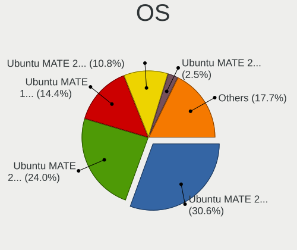

| Name              | Notebooks | Percent |
|-------------------|-----------|---------|
| Ubuntu MATE 20.04 | 317       | 30.57%  |
| Ubuntu MATE 22.04 | 249       | 24.01%  |
| Ubuntu MATE 18.04 | 149       | 14.37%  |
| Ubuntu MATE 24.04 | 112       | 10.8%   |
| Ubuntu MATE 20.10 | 26        | 2.51%   |
| Ubuntu MATE 19.10 | 25        | 2.41%   |
| Ubuntu MATE 23.10 | 24        | 2.31%   |
| Ubuntu MATE 22.10 | 23        | 2.22%   |
| Ubuntu MATE 21.04 | 22        | 2.12%   |
| Ubuntu MATE 23.04 | 21        | 2.03%   |
| Ubuntu MATE 21.10 | 21        | 2.03%   |
| Ubuntu MATE 16.04 | 13        | 1.25%   |
| Ubuntu MATE 25.04 | 12        | 1.16%   |
| Ubuntu MATE 24.10 | 10        | 0.96%   |
| Ubuntu MATE 25.10 | 8         | 0.77%   |
| Ubuntu MATE       | 2         | 0.19%   |
| Ubuntu MATE 26.04 | 1         | 0.1%    |
| Ubuntu MATE 19.04 | 1         | 0.1%    |
| Ubuntu MATE 16.10 | 1         | 0.1%    |

OS Family
---------

OS without a version

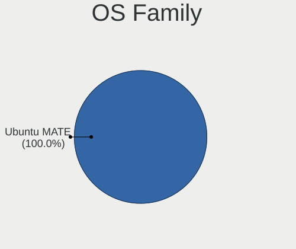

| Name        | Notebooks | Percent |
|-------------|-----------|---------|
| Ubuntu MATE | 980       | 100%    |

Kernel
------

Version of the Linux kernel

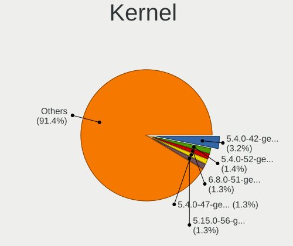

| Version           | Notebooks | Percent |
|-------------------|-----------|---------|
| 5.4.0-42-generic  | 38        | 3.16%   |
| 5.4.0-52-generic  | 17        | 1.41%   |
| 6.8.0-51-generic  | 16        | 1.33%   |
| 5.4.0-47-generic  | 16        | 1.33%   |
| 5.15.0-56-generic | 16        | 1.33%   |
| 5.4.0-58-generic  | 13        | 1.08%   |
| 5.4.0-48-generic  | 12        | 1%      |
| 5.4.0-65-generic  | 11        | 0.92%   |
| 5.4.0-40-generic  | 10        | 0.83%   |
| 5.3.0-42-generic  | 10        | 0.83%   |
| 5.15.0-58-generic | 10        | 0.83%   |
| 6.8.0-45-generic  | 9         | 0.75%   |
| 6.2.0-26-generic  | 9         | 0.75%   |
| 5.8.0-50-generic  | 9         | 0.75%   |
| 5.3.0-40-generic  | 9         | 0.75%   |
| 5.15.0-46-generic | 9         | 0.75%   |
| 5.15.0-43-generic | 9         | 0.75%   |
| 6.8.0-40-generic  | 8         | 0.67%   |
| 6.5.0-35-generic  | 8         | 0.67%   |
| 6.5.0-26-generic  | 8         | 0.67%   |
| 6.2.0-36-generic  | 8         | 0.67%   |
| 5.8.0-48-generic  | 8         | 0.67%   |
| 5.4.0-54-generic  | 8         | 0.67%   |
| 5.4.0-31-generic  | 8         | 0.67%   |
| 5.4.0-26-generic  | 8         | 0.67%   |
| 5.15.0-52-generic | 8         | 0.67%   |
| 5.11.0-37-generic | 8         | 0.67%   |
| 6.8.0-48-generic  | 7         | 0.58%   |
| 6.2.0-34-generic  | 7         | 0.58%   |
| 6.11.0-26-generic | 7         | 0.58%   |
| 5.4.0-56-generic  | 7         | 0.58%   |
| 5.3.0-28-generic  | 7         | 0.58%   |
| 5.15.0-53-generic | 7         | 0.58%   |
| 5.15.0-25-generic | 7         | 0.58%   |
| 5.11.0-40-generic | 7         | 0.58%   |
| 6.8.0-50-generic  | 6         | 0.5%    |
| 6.5.0-14-generic  | 6         | 0.5%    |
| 6.2.0-32-generic  | 6         | 0.5%    |
| 6.14.0-28-generic | 6         | 0.5%    |
| 5.8.0-43-generic  | 6         | 0.5%    |

Kernel Family
-------------

Linux kernel without a distro release

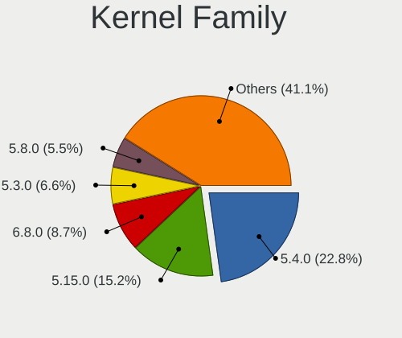

| Version | Notebooks | Percent |
|---------|-----------|---------|
| 5.4.0   | 248       | 22.82%  |
| 5.15.0  | 165       | 15.18%  |
| 6.8.0   | 95        | 8.74%   |
| 5.3.0   | 72        | 6.62%   |
| 5.8.0   | 60        | 5.52%   |
| 6.5.0   | 59        | 5.43%   |
| 6.2.0   | 54        | 4.97%   |
| 5.11.0  | 54        | 4.97%   |
| 5.19.0  | 45        | 4.14%   |
| 5.13.0  | 44        | 4.05%   |
| 4.15.0  | 41        | 3.77%   |
| 6.14.0  | 31        | 2.85%   |
| 6.11.0  | 24        | 2.21%   |
| 5.0.0   | 9         | 0.83%   |
| 4.4.0   | 8         | 0.74%   |
| 6.17.0  | 7         | 0.64%   |
| 5.14.0  | 5         | 0.46%   |
| 6.5.7   | 2         | 0.18%   |
| 6.4.3   | 2         | 0.18%   |
| 6.3.0   | 2         | 0.18%   |
| 6.12.3  | 2         | 0.18%   |
| 6.10.2  | 2         | 0.18%   |
| 5.17.0  | 2         | 0.18%   |
| 4.18.0  | 2         | 0.18%   |
| 6.9.3   | 1         | 0.09%   |
| 6.8.4   | 1         | 0.09%   |
| 6.7.9   | 1         | 0.09%   |
| 6.7.3   | 1         | 0.09%   |
| 6.7.2   | 1         | 0.09%   |
| 6.7.10  | 1         | 0.09%   |
| 6.7.0   | 1         | 0.09%   |
| 6.6.8   | 1         | 0.09%   |
| 6.6.6   | 1         | 0.09%   |
| 6.6.1   | 1         | 0.09%   |
| 6.5.9   | 1         | 0.09%   |
| 6.4.6   | 1         | 0.09%   |
| 6.4.12  | 1         | 0.09%   |
| 6.4.0   | 1         | 0.09%   |
| 6.3.7   | 1         | 0.09%   |
| 6.3.4   | 1         | 0.09%   |

Kernel Major Ver.
-----------------

Linux kernel major version

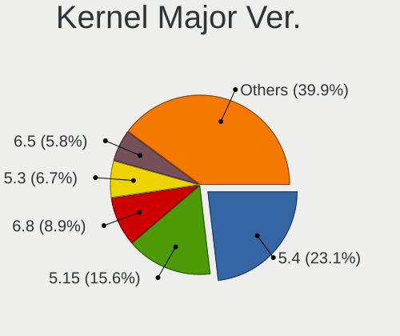

| Version | Notebooks | Percent |
|---------|-----------|---------|
| 5.4     | 249       | 23.14%  |
| 5.15    | 168       | 15.61%  |
| 6.8     | 96        | 8.92%   |
| 5.3     | 72        | 6.69%   |
| 6.5     | 62        | 5.76%   |
| 5.8     | 62        | 5.76%   |
| 6.2     | 55        | 5.11%   |
| 5.11    | 54        | 5.02%   |
| 5.19    | 45        | 4.18%   |
| 5.13    | 44        | 4.09%   |
| 4.15    | 41        | 3.81%   |
| 6.14    | 32        | 2.97%   |
| 6.11    | 24        | 2.23%   |
| 5.0     | 9         | 0.84%   |
| 4.4     | 8         | 0.74%   |
| 6.17    | 7         | 0.65%   |
| 5.14    | 5         | 0.46%   |
| 6.4     | 4         | 0.37%   |
| 6.7     | 3         | 0.28%   |
| 6.6     | 3         | 0.28%   |
| 6.3     | 3         | 0.28%   |
| 6.15    | 3         | 0.28%   |
| 6.10    | 3         | 0.28%   |
| 6.0     | 3         | 0.28%   |
| 5.17    | 3         | 0.28%   |
| 6.16    | 2         | 0.19%   |
| 6.12    | 2         | 0.19%   |
| 5.12    | 2         | 0.19%   |
| 4.18    | 2         | 0.19%   |
| 6.9     | 1         | 0.09%   |
| 6.18    | 1         | 0.09%   |
| 6.13    | 1         | 0.09%   |
| 6.1     | 1         | 0.09%   |
| 5.9     | 1         | 0.09%   |
| 5.6     | 1         | 0.09%   |
| 5.18    | 1         | 0.09%   |
| 4.8     | 1         | 0.09%   |
| 4.13    | 1         | 0.09%   |
| 4.10    | 1         | 0.09%   |

Arch
----

OS architecture (x86_64, i586, etc.)

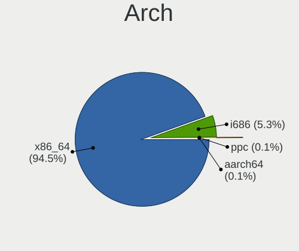

| Name    | Notebooks | Percent |
|---------|-----------|---------|
| x86_64  | 926       | 94.49%  |
| i686    | 52        | 5.31%   |
| ppc     | 1         | 0.1%    |
| aarch64 | 1         | 0.1%    |

DE
--

Desktop Environment

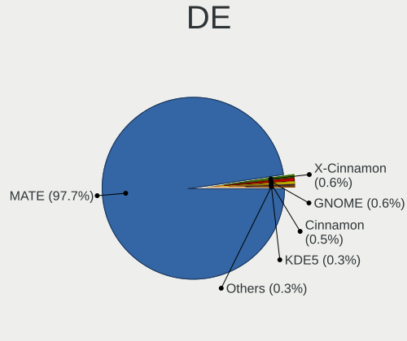

| Name       | Notebooks | Percent |
|------------|-----------|---------|
| MATE       | 958       | 97.66%  |
| X-Cinnamon | 6         | 0.61%   |
| GNOME      | 6         | 0.61%   |
| Cinnamon   | 5         | 0.51%   |
| KDE5       | 3         | 0.31%   |
| XFCE       | 2         | 0.2%    |
| i3         | 1         | 0.1%    |

Display Server
--------------

X11 or Wayland

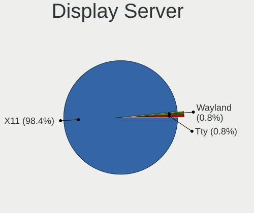

| Name    | Notebooks | Percent |
|---------|-----------|---------|
| X11     | 964       | 98.37%  |
| Wayland | 8         | 0.82%   |
| Tty     | 8         | 0.82%   |

Display Manager
---------------

SDDM, LightDM, etc.

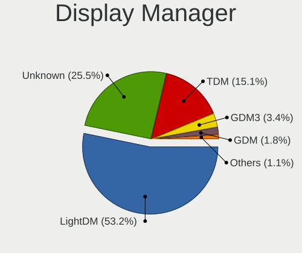

| Name    | Notebooks | Percent |
|---------|-----------|---------|
| LightDM | 537       | 53.22%  |
| Unknown | 257       | 25.47%  |
| TDM     | 152       | 15.06%  |
| GDM3    | 34        | 3.37%   |
| GDM     | 18        | 1.78%   |
| SDDM    | 8         | 0.79%   |
| LXDM    | 3         | 0.3%    |

OS Lang
-------

Language

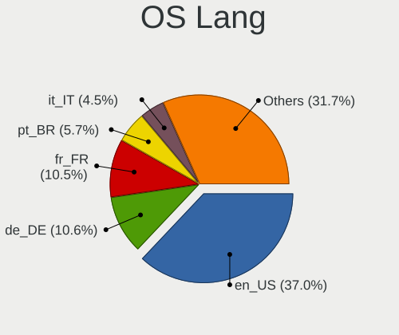

| Lang    | Notebooks | Percent |
|---------|-----------|---------|
| en_US   | 366       | 37.04%  |
| de_DE   | 105       | 10.63%  |
| fr_FR   | 104       | 10.53%  |
| pt_BR   | 56        | 5.67%   |
| it_IT   | 44        | 4.45%   |
| en_GB   | 44        | 4.45%   |
| ru_RU   | 36        | 3.64%   |
| es_ES   | 34        | 3.44%   |
| Unknown | 19        | 1.92%   |
| C       | 16        | 1.62%   |
| pl_PL   | 13        | 1.32%   |
| en_CA   | 11        | 1.11%   |
| en_AU   | 10        | 1.01%   |
| hu_HU   | 8         | 0.81%   |
| en_IN   | 8         | 0.81%   |
| sv_SE   | 7         | 0.71%   |
| fi_FI   | 7         | 0.71%   |
| ru_UA   | 6         | 0.61%   |
| es_MX   | 6         | 0.61%   |
| cs_CZ   | 6         | 0.61%   |
| nl_NL   | 5         | 0.51%   |
| es_AR   | 5         | 0.51%   |
| ja_JP   | 4         | 0.4%    |
| es_CL   | 4         | 0.4%    |
| de_CH   | 4         | 0.4%    |
| zh_TW   | 3         | 0.3%    |
| nl_BE   | 3         | 0.3%    |
| fr_BE   | 3         | 0.3%    |
| en_PH   | 3         | 0.3%    |
| en_NZ   | 3         | 0.3%    |
| en_IL   | 3         | 0.3%    |
| zh_CN   | 2         | 0.2%    |
| tr_TR   | 2         | 0.2%    |
| sk_SK   | 2         | 0.2%    |
| pt_PT   | 2         | 0.2%    |
| fr_CH   | 2         | 0.2%    |
| fr_CA   | 2         | 0.2%    |
| et_EE   | 2         | 0.2%    |
| es_VE   | 2         | 0.2%    |
| es_PE   | 2         | 0.2%    |

Boot Mode
---------

EFI or BIOS

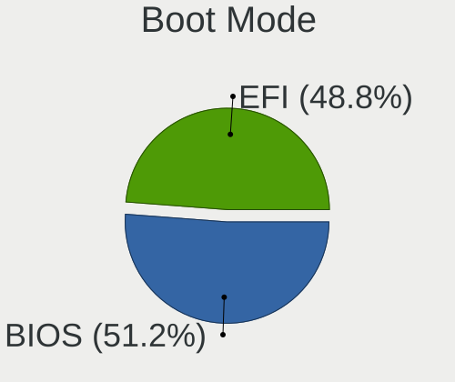

| Mode | Notebooks | Percent |
|------|-----------|---------|
| BIOS | 510       | 51.2%   |
| EFI  | 486       | 48.8%   |

Filesystem
----------

Type of filesystem

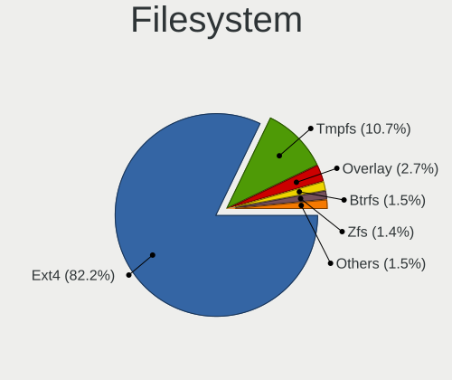

| Type    | Notebooks | Percent |
|---------|-----------|---------|
| Ext4    | 820       | 82.16%  |
| Tmpfs   | 107       | 10.72%  |
| Overlay | 27        | 2.71%   |
| Btrfs   | 15        | 1.5%    |
| Zfs     | 14        | 1.4%    |
| Xfs     | 5         | 0.5%    |
| Unknown | 5         | 0.5%    |
| Ext3    | 4         | 0.4%    |
| Jfs     | 1         | 0.1%    |

Part. scheme
------------

Scheme of partitioning

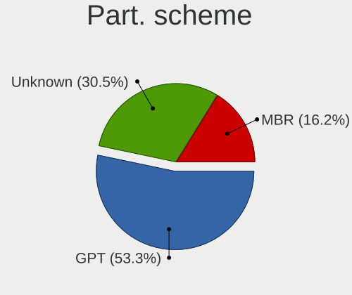

| Type    | Notebooks | Percent |
|---------|-----------|---------|
| GPT     | 533       | 53.3%   |
| Unknown | 305       | 30.5%   |
| MBR     | 162       | 16.2%   |

Dual Boot with Linux/BSD
------------------------

Hosting more than one Linux/BSD

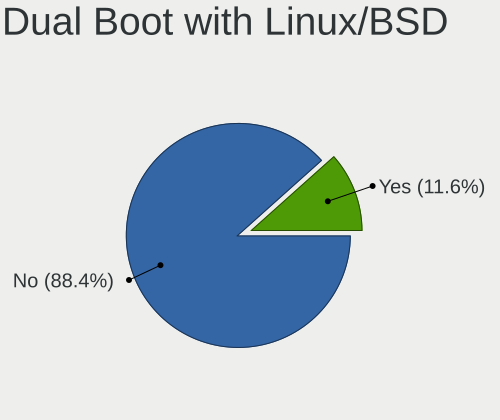

| Dual boot | Notebooks | Percent |
|-----------|-----------|---------|
| No        | 883       | 88.39%  |
| Yes       | 116       | 11.61%  |

Dual Boot (Win)
---------------

Hosting Linux and Windows

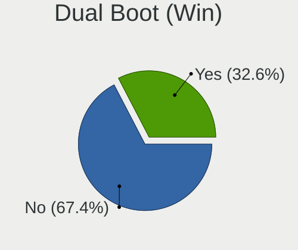

| Dual boot | Notebooks | Percent |
|-----------|-----------|---------|
| No        | 669       | 67.37%  |
| Yes       | 324       | 32.63%  |

Board
-----

Vendor
------

Motherboard manufacturer

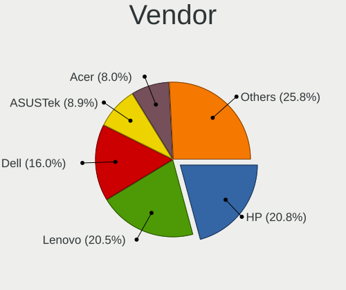

| Name                   | Notebooks | Percent |
|------------------------|-----------|---------|
| Hewlett-Packard        | 204       | 20.82%  |
| Lenovo                 | 201       | 20.51%  |
| Dell                   | 157       | 16.02%  |
| ASUSTek Computer       | 87        | 8.88%   |
| Acer                   | 78        | 7.96%   |
| Toshiba                | 34        | 3.47%   |
| MSI                    | 24        | 2.45%   |
| Sony                   | 18        | 1.84%   |
| Samsung Electronics    | 16        | 1.63%   |
| Apple                  | 16        | 1.63%   |
| Fujitsu                | 12        | 1.22%   |
| Notebook               | 8         | 0.82%   |
| Unknown                | 6         | 0.61%   |
| System76               | 5         | 0.51%   |
| Positivo               | 5         | 0.51%   |
| Packard Bell           | 5         | 0.51%   |
| Medion                 | 5         | 0.51%   |
| HUAWEI                 | 5         | 0.51%   |
| Google                 | 5         | 0.51%   |
| Clevo                  | 5         | 0.51%   |
| TUXEDO                 | 4         | 0.41%   |
| Intel                  | 4         | 0.41%   |
| TrekStor               | 3         | 0.31%   |
| Quanta                 | 3         | 0.31%   |
| GPD                    | 3         | 0.31%   |
| Fujitsu Siemens        | 3         | 0.31%   |
| Chuwi                  | 3         | 0.31%   |
| Avell High Performance | 3         | 0.31%   |
| AMI                    | 3         | 0.31%   |
| Wortmann AG            | 2         | 0.2%    |
| NEC Computers          | 2         | 0.2%    |
| MicroByte              | 2         | 0.2%    |
| LG Electronics         | 2         | 0.2%    |
| GPU Company            | 2         | 0.2%    |
| Framework              | 2         | 0.2%    |
| Digibras               | 2         | 0.2%    |
| AZW                    | 2         | 0.2%    |
| VIT                    | 1         | 0.1%    |
| TPVAOC                 | 1         | 0.1%    |
| Timi                   | 1         | 0.1%    |

Model
-----

Motherboard model

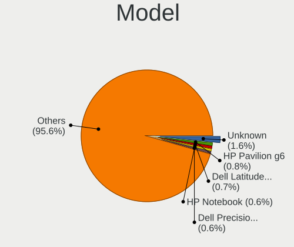

| Name                                 | Notebooks | Percent |
|--------------------------------------|-----------|---------|
| Unknown                              | 16        | 1.63%   |
| HP Pavilion g6                       | 8         | 0.82%   |
| Dell Latitude E6410                  | 7         | 0.71%   |
| HP Notebook                          | 6         | 0.61%   |
| Dell Precision M4800                 | 6         | 0.61%   |
| HP Pavilion dv7                      | 5         | 0.51%   |
| Dell Latitude E6420                  | 5         | 0.51%   |
| Lenovo IdeaPad 3 15IIL05 81WE        | 4         | 0.41%   |
| Dell Latitude E5540                  | 4         | 0.41%   |
| TrekStor Surfbook A13B               | 3         | 0.31%   |
| Lenovo IdeaPad Gaming 3 15ARH05 82EY | 3         | 0.31%   |
| Lenovo G500 20236                    | 3         | 0.31%   |
| HP ProBook 640 G8 Notebook PC        | 3         | 0.31%   |
| HP Pavilion dv4                      | 3         | 0.31%   |
| HP Pavilion 17                       | 3         | 0.31%   |
| HP 15                                | 3         | 0.31%   |
| Dell Precision 7520                  | 3         | 0.31%   |
| Dell Latitude E7250                  | 3         | 0.31%   |
| Dell Latitude E6500                  | 3         | 0.31%   |
| Dell Latitude 7420                   | 3         | 0.31%   |
| Acer Aspire ES1-523                  | 3         | 0.31%   |
| Toshiba Satellite P755               | 2         | 0.2%    |
| Toshiba Satellite C660               | 2         | 0.2%    |
| Toshiba Satellite C50D-A-133         | 2         | 0.2%    |
| Toshiba Satellite A200               | 2         | 0.2%    |
| Toshiba PORTEGE R500                 | 2         | 0.2%    |
| Sony VGN-CR120E                      | 2         | 0.2%    |
| Samsung 350V5C/351V5C/3540VC/3440VC  | 2         | 0.2%    |
| MicroByte ezbook                     | 2         | 0.2%    |
| Lenovo ThinkPad T430 2349H86         | 2         | 0.2%    |
| Lenovo ThinkBook 16p Gen 2 20YM      | 2         | 0.2%    |
| Lenovo IdeaPad Y460                  | 2         | 0.2%    |
| Lenovo IdeaPad 5 Pro 16ACH6 82L5     | 2         | 0.2%    |
| HP ProBook 650 G1                    | 2         | 0.2%    |
| HP ProBook 450 G6                    | 2         | 0.2%    |
| HP Presario CQ56                     | 2         | 0.2%    |
| HP Pavilion Power Laptop 15-cb0xx    | 2         | 0.2%    |
| HP Pavilion Notebook                 | 2         | 0.2%    |
| HP Pavilion g7                       | 2         | 0.2%    |
| HP Pavilion dv6                      | 2         | 0.2%    |

Model Family
------------

Motherboard model prefix

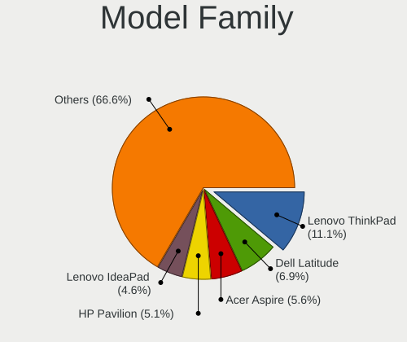

| Name                  | Notebooks | Percent |
|-----------------------|-----------|---------|
| Lenovo ThinkPad       | 109       | 11.12%  |
| Dell Latitude         | 68        | 6.94%   |
| Acer Aspire           | 55        | 5.61%   |
| HP Pavilion           | 50        | 5.1%    |
| Lenovo IdeaPad        | 45        | 4.59%   |
| HP EliteBook          | 38        | 3.88%   |
| Dell Inspiron         | 31        | 3.16%   |
| Toshiba Satellite     | 30        | 3.06%   |
| HP ProBook            | 24        | 2.45%   |
| Dell Precision        | 23        | 2.35%   |
| Unknown               | 16        | 1.63%   |
| HP Laptop             | 14        | 1.43%   |
| ASUS VivoBook         | 14        | 1.43%   |
| Dell Vostro           | 13        | 1.33%   |
| Fujitsu LIFEBOOK      | 12        | 1.22%   |
| Dell XPS              | 12        | 1.22%   |
| HP Compaq             | 8         | 0.82%   |
| HP 250                | 8         | 0.82%   |
| Lenovo ThinkBook      | 7         | 0.71%   |
| HP ZBook              | 7         | 0.71%   |
| Lenovo Legion         | 6         | 0.61%   |
| HP Notebook           | 6         | 0.61%   |
| HP ENVY               | 6         | 0.61%   |
| Acer TravelMate       | 6         | 0.61%   |
| Packard Bell EasyNote | 5         | 0.51%   |
| HP Stream             | 5         | 0.51%   |
| Acer Nitro            | 5         | 0.51%   |
| HP Presario           | 4         | 0.41%   |
| HP 15                 | 4         | 0.41%   |
| Dell Studio           | 4         | 0.41%   |
| ASUS ROG              | 4         | 0.41%   |
| ASUS ASUS             | 4         | 0.41%   |
| Acer Extensa          | 4         | 0.41%   |
| TrekStor Surfbook     | 3         | 0.31%   |
| Lenovo G580           | 3         | 0.31%   |
| Lenovo G500           | 3         | 0.31%   |
| HP OMEN               | 3         | 0.31%   |
| HP 255                | 3         | 0.31%   |
| ASUS TUF              | 3         | 0.31%   |
| TUXEDO InfinityBook   | 2         | 0.2%    |

MFG Year
--------

Motherboard manufacture year

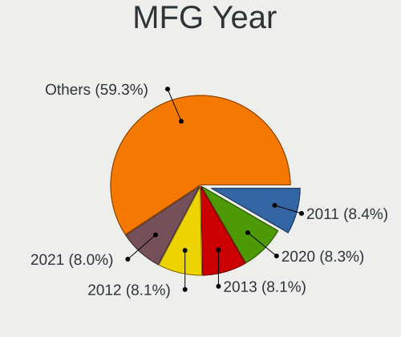

| Year    | Notebooks | Percent |
|---------|-----------|---------|
| 2011    | 82        | 8.37%   |
| 2020    | 81        | 8.27%   |
| 2013    | 79        | 8.06%   |
| 2012    | 79        | 8.06%   |
| 2021    | 78        | 7.96%   |
| 2019    | 76        | 7.76%   |
| 2010    | 58        | 5.92%   |
| 2018    | 57        | 5.82%   |
| 2015    | 55        | 5.61%   |
| 2014    | 53        | 5.41%   |
| 2016    | 52        | 5.31%   |
| 2017    | 50        | 5.1%    |
| 2008    | 50        | 5.1%    |
| 2009    | 34        | 3.47%   |
| 2007    | 27        | 2.76%   |
| 2022    | 22        | 2.24%   |
| 2024    | 14        | 1.43%   |
| 2023    | 12        | 1.22%   |
| 2006    | 11        | 1.12%   |
| 2005    | 4         | 0.41%   |
| Unknown | 3         | 0.31%   |
| 2025    | 2         | 0.2%    |
| 2003    | 1         | 0.1%    |

Form Factor
-----------

Physical design of the computer

| Name     | Notebooks | Percent |
|----------|-----------|---------|
| Notebook | 980       | 100%    |

Secure Boot
-----------

Enabled or disabled

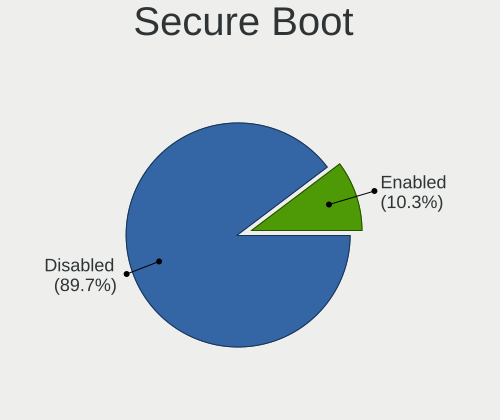

| State    | Notebooks | Percent |
|----------|-----------|---------|
| Disabled | 893       | 90.48%  |
| Enabled  | 94        | 9.52%   |

Coreboot
--------

Have coreboot on board

| Used | Notebooks | Percent |
|------|-----------|---------|
| No   | 973       | 99.29%  |
| Yes  | 7         | 0.71%   |

RAM Size
--------

Total RAM memory

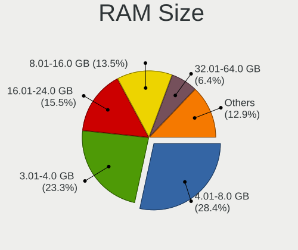

| Size in GB  | Notebooks | Percent |
|-------------|-----------|---------|
| 4.01-8.0    | 282       | 28.4%   |
| 3.01-4.0    | 231       | 23.26%  |
| 16.01-24.0  | 154       | 15.51%  |
| 8.01-16.0   | 134       | 13.49%  |
| 32.01-64.0  | 64        | 6.45%   |
| 1.01-2.0    | 53        | 5.34%   |
| 2.01-3.0    | 21        | 2.11%   |
| 64.01-256.0 | 21        | 2.11%   |
| 24.01-32.0  | 20        | 2.01%   |
| 0.51-1.0    | 12        | 1.21%   |
| 0.01-0.5    | 1         | 0.1%    |

RAM Used
--------

Used RAM memory

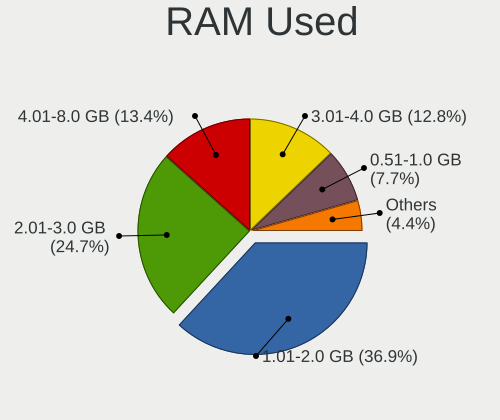

| Used GB    | Notebooks | Percent |
|------------|-----------|---------|
| 1.01-2.0   | 391       | 36.89%  |
| 2.01-3.0   | 262       | 24.72%  |
| 4.01-8.0   | 142       | 13.4%   |
| 3.01-4.0   | 136       | 12.83%  |
| 0.51-1.0   | 82        | 7.74%   |
| 8.01-16.0  | 34        | 3.21%   |
| 0.01-0.5   | 8         | 0.75%   |
| 32.01-64.0 | 2         | 0.19%   |
| 24.01-32.0 | 2         | 0.19%   |
| 16.01-24.0 | 1         | 0.09%   |

Total Drives
------------

Number of drives on board

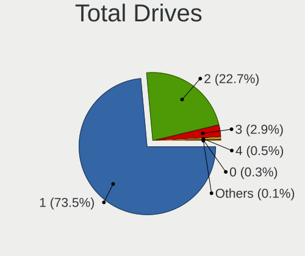

| Drives | Notebooks | Percent |
|--------|-----------|---------|
| 1      | 742       | 73.54%  |
| 2      | 229       | 22.7%   |
| 3      | 29        | 2.87%   |
| 4      | 5         | 0.5%    |
| 0      | 3         | 0.3%    |
| 5      | 1         | 0.1%    |

Has CD-ROM
----------

Has CD-ROM on board

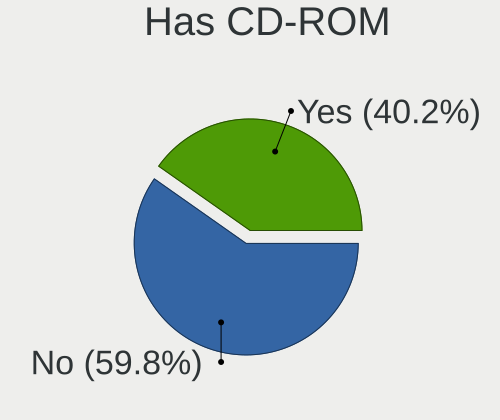

| Presented | Notebooks | Percent |
|-----------|-----------|---------|
| No        | 588       | 59.76%  |
| Yes       | 396       | 40.24%  |

Has Ethernet
------------

Has Ethernet on board

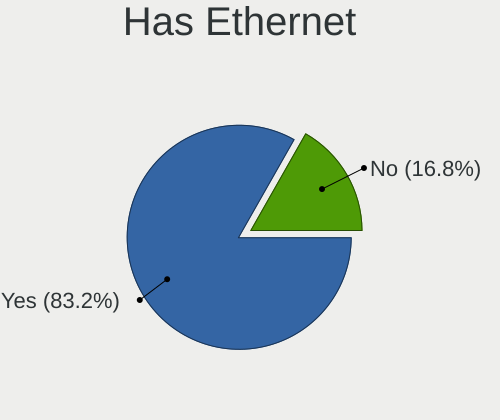

| Presented | Notebooks | Percent |
|-----------|-----------|---------|
| Yes       | 818       | 83.21%  |
| No        | 165       | 16.79%  |

Has WiFi
--------

Has WiFi module

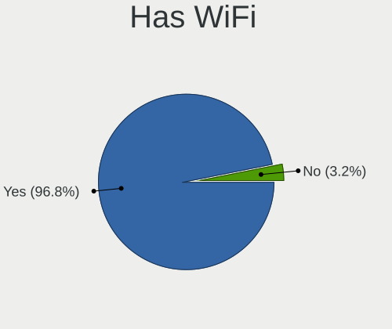

| Presented | Notebooks | Percent |
|-----------|-----------|---------|
| Yes       | 953       | 96.85%  |
| No        | 31        | 3.15%   |

Has Bluetooth
-------------

Has Bluetooth module

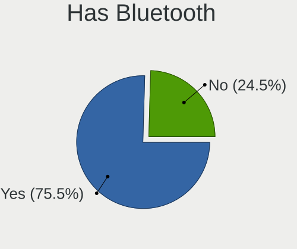

| Presented | Notebooks | Percent |
|-----------|-----------|---------|
| Yes       | 750       | 75.45%  |
| No        | 244       | 24.55%  |

Location
--------

Country
-------

Geographic location (country)

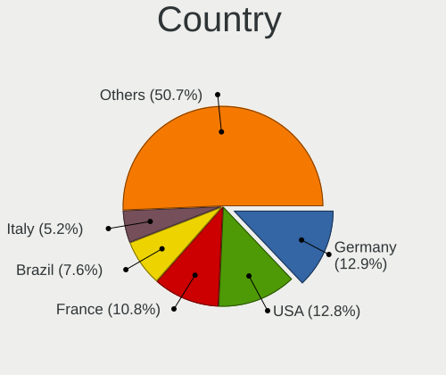

| Country     | Notebooks | Percent |
|-------------|-----------|---------|
| Germany     | 128       | 12.92%  |
| USA         | 127       | 12.82%  |
| France      | 107       | 10.8%   |
| Brazil      | 75        | 7.57%   |
| Italy       | 52        | 5.25%   |
| Spain       | 45        | 4.54%   |
| Russia      | 43        | 4.34%   |
| UK          | 41        | 4.14%   |
| Poland      | 17        | 1.72%   |
| Canada      | 17        | 1.72%   |
| India       | 16        | 1.61%   |
| Turkey      | 15        | 1.51%   |
| Switzerland | 14        | 1.41%   |
| Netherlands | 14        | 1.41%   |
| Indonesia   | 14        | 1.41%   |
| Finland     | 13        | 1.31%   |
| Belgium     | 13        | 1.31%   |
| Mexico      | 11        | 1.11%   |
| Australia   | 11        | 1.11%   |
| Ukraine     | 10        | 1.01%   |
| Sweden      | 10        | 1.01%   |
| Hungary     | 10        | 1.01%   |
| Romania     | 9         | 0.91%   |
| Greece      | 9         | 0.91%   |
| Norway      | 8         | 0.81%   |
| Czechia     | 8         | 0.81%   |
| Chile       | 8         | 0.81%   |
| Austria     | 8         | 0.81%   |
| Argentina   | 8         | 0.81%   |
| Portugal    | 7         | 0.71%   |
| Estonia     | 7         | 0.71%   |
| Thailand    | 6         | 0.61%   |
| Taiwan      | 5         | 0.5%    |
| Serbia      | 4         | 0.4%    |
| Philippines | 4         | 0.4%    |
| Peru        | 4         | 0.4%    |
| Japan       | 4         | 0.4%    |
| Israel      | 4         | 0.4%    |
| Ireland     | 4         | 0.4%    |
| Denmark     | 4         | 0.4%    |

City
----

Geographic location (city)

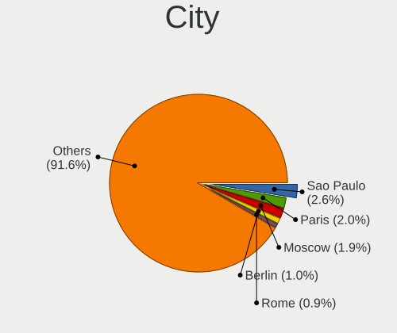

| City              | Notebooks | Percent |
|-------------------|-----------|---------|
| Sao Paulo         | 27        | 2.57%   |
| Paris             | 21        | 2%      |
| Moscow            | 20        | 1.9%    |
| Berlin            | 11        | 1.05%   |
| Rome              | 9         | 0.86%   |
| Warsaw            | 8         | 0.76%   |
| Frankfurt am Main | 8         | 0.76%   |
| Hamburg           | 7         | 0.67%   |
| Vienna            | 6         | 0.57%   |
| Rio de Janeiro    | 6         | 0.57%   |
| Bengaluru         | 6         | 0.57%   |
| Barcelona         | 6         | 0.57%   |
| Mannheim          | 5         | 0.48%   |
| Lisbon            | 5         | 0.48%   |
| Kyiv              | 5         | 0.48%   |
| Essen             | 5         | 0.48%   |
| Bucharest         | 5         | 0.48%   |
| Ankara            | 5         | 0.48%   |
| Wittingen         | 4         | 0.38%   |
| St Petersburg     | 4         | 0.38%   |
| Munich            | 4         | 0.38%   |
| Manchester        | 4         | 0.38%   |
| Madrid            | 4         | 0.38%   |
| Los Angeles       | 4         | 0.38%   |
| Helsinki          | 4         | 0.38%   |
| Győr             | 4         | 0.38%   |
| Genoa             | 4         | 0.38%   |
| Cologne           | 4         | 0.38%   |
| Brooklyn          | 4         | 0.38%   |
| Brisbane          | 4         | 0.38%   |
| Athens            | 4         | 0.38%   |
| Amsterdam         | 4         | 0.38%   |
| Zwingenberg       | 3         | 0.29%   |
| Zurich            | 3         | 0.29%   |
| Yogyakarta        | 3         | 0.29%   |
| Toulouse          | 3         | 0.29%   |
| Tallinn           | 3         | 0.29%   |
| Sundbyberg        | 3         | 0.29%   |
| Seville           | 3         | 0.29%   |
| Santiago          | 3         | 0.29%   |

Drives
------

Drive Vendor
------------

Hard drive vendors

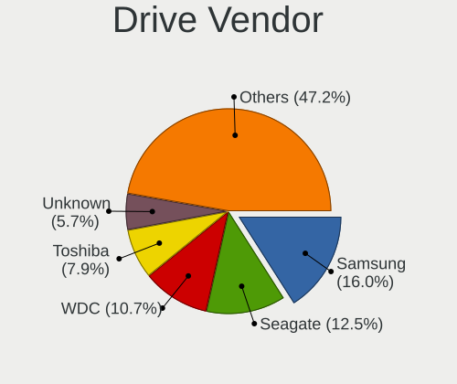

| Vendor                      | Notebooks | Drives | Percent |
|-----------------------------|-----------|--------|---------|
| Samsung Electronics         | 196       | 323    | 15.96%  |
| Seagate                     | 154       | 187    | 12.54%  |
| WDC                         | 131       | 149    | 10.67%  |
| Toshiba                     | 97        | 133    | 7.9%    |
| Unknown                     | 70        | 86     | 5.7%    |
| SanDisk                     | 66        | 83     | 5.37%   |
| Kingston                    | 65        | 80     | 5.29%   |
| Crucial                     | 53        | 73     | 4.32%   |
| SK hynix                    | 49        | 63     | 3.99%   |
| Hitachi                     | 44        | 51     | 3.58%   |
| Intel                       | 26        | 36     | 2.12%   |
| A-DATA Technology           | 24        | 29     | 1.95%   |
| Micron Technology           | 18        | 20     | 1.47%   |
| KIOXIA                      | 18        | 19     | 1.47%   |
| HGST                        | 18        | 20     | 1.47%   |
| China                       | 14        | 16     | 1.14%   |
| Fujitsu                     | 13        | 17     | 1.06%   |
| SPCC                        | 11        | 16     | 0.9%    |
| Phison                      | 9         | 11     | 0.73%   |
| PNY                         | 8         | 8      | 0.65%   |
| Intenso                     | 7         | 9      | 0.57%   |
| Apple                       | 7         | 7      | 0.57%   |
| LITEON                      | 6         | 6      | 0.49%   |
| Verbatim                    | 5         | 31     | 0.41%   |
| Patriot                     | 5         | 5      | 0.41%   |
| Netac                       | 5         | 5      | 0.41%   |
| Unknown                     | 5         | 5      | 0.41%   |
| Transcend                   | 4         | 7      | 0.33%   |
| Silicon Motion              | 4         | 4      | 0.33%   |
| OCZ                         | 4         | 4      | 0.33%   |
| LITEONIT                    | 4         | 5      | 0.33%   |
| KingSpec                    | 4         | 7      | 0.33%   |
| JMicron Technology          | 4         | 4      | 0.33%   |
| Micron/Crucial Technology   | 3         | 4      | 0.24%   |
| Lexar                       | 3         | 11     | 0.24%   |
| Kingston Technology Company | 3         | 3      | 0.24%   |
| FORESEE                     | 3         | 3      | 0.24%   |
| Vaseky                      | 2         | 2      | 0.16%   |
| UMIS                        | 2         | 3      | 0.16%   |
| SAGE                        | 2         | 3      | 0.16%   |

Drive Model
-----------

Hard drive models

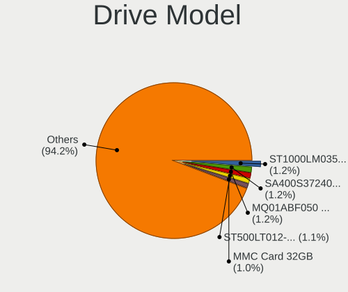

| Model                                              | Notebooks | Percent |
|----------------------------------------------------|-----------|---------|
| Seagate ST1000LM035-1RK172 1TB                     | 16        | 1.25%   |
| Kingston SA400S37240G 240GB SSD                    | 16        | 1.25%   |
| Toshiba MQ01ABF050 500GB                           | 15        | 1.17%   |
| Seagate ST500LT012-1DG142 500GB                    | 14        | 1.09%   |
| Unknown MMC Card  32GB                             | 13        | 1.01%   |
| Unknown MMC Card  64GB                             | 12        | 0.94%   |
| Toshiba MQ01ABD100 1TB                             | 11        | 0.86%   |
| Samsung SSD 860 EVO 500GB                          | 9         | 0.7%    |
| Kingston SA400S37120G 120GB SSD                    | 9         | 0.7%    |
| Toshiba MQ04ABF100 1TB                             | 8         | 0.62%   |
| Seagate ST500LM012 HN-M500MBB 500GB                | 8         | 0.62%   |
| Crucial CT500MX500SSD1 500GB                       | 8         | 0.62%   |
| Seagate ST9500325AS 500GB                          | 7         | 0.55%   |
| Seagate ST500LT012-9WS142 500GB                    | 7         | 0.55%   |
| Seagate ST320LT007-9ZV142 320GB                    | 7         | 0.55%   |
| Samsung NVMe SSD Controller PM9A1/PM9A3/980PRO 1TB | 7         | 0.55%   |
| Seagate ST1000LM024 HN-M101MBB 1TB                 | 6         | 0.47%   |
| SanDisk NVMe SSD Drive 512GB                       | 6         | 0.47%   |
| SanDisk NVMe SSD Drive 1TB                         | 6         | 0.47%   |
| Kingston SV300S37A120G 120GB SSD                   | 6         | 0.47%   |
| Kingston SA400S37480G 480GB SSD                    | 6         | 0.47%   |
| Hitachi HTS545050B9A300 500GB                      | 6         | 0.47%   |
| WDC WD10JPVX-22JC3T0 1TB                           | 5         | 0.39%   |
| SK hynix BC511 HFM256GDJTNI-82A0A 256GB            | 5         | 0.39%   |
| Seagate ST9500420AS 500GB                          | 5         | 0.39%   |
| Seagate ST2000LM015-2E8174 2TB                     | 5         | 0.39%   |
| Seagate ST1000LM049-2GH172 1TB                     | 5         | 0.39%   |
| Seagate ST1000LM014-1EJ164 1TB                     | 5         | 0.39%   |
| SanDisk SSD i100 24GB                              | 5         | 0.39%   |
| Samsung SSD 850 EVO 500GB                          | 5         | 0.39%   |
| Samsung MZVLQ512HBLU-00BH1 512GB                   | 5         | 0.39%   |
| HGST HTS721010A9E630 1TB                           | 5         | 0.39%   |
| Crucial CT240BX500SSD1 240GB                       | 5         | 0.39%   |
| Crucial CT1000BX500SSD1 1TB                        | 5         | 0.39%   |
| China SSD 120GB                                    | 5         | 0.39%   |
| Unknown                                            | 5         | 0.39%   |
| WDC WD5000LPVX-22V0TT0 500GB                       | 4         | 0.31%   |
| WDC WD10SPZX-21Z10T0 1TB                           | 4         | 0.31%   |
| WDC PC SN730 SDBQNTY-512G-1001 512GB               | 4         | 0.31%   |
| Verbatim Vi550 S3 1024GB                           | 4         | 0.31%   |

HDD Vendor
----------

Hard disk drive vendors

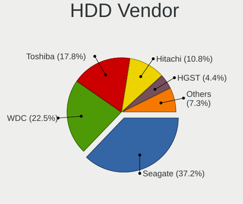

| Vendor              | Notebooks | Drives | Percent |
|---------------------|-----------|--------|---------|
| Seagate             | 152       | 181    | 37.16%  |
| WDC                 | 92        | 102    | 22.49%  |
| Toshiba             | 73        | 89     | 17.85%  |
| Hitachi             | 44        | 51     | 10.76%  |
| HGST                | 18        | 20     | 4.4%    |
| Fujitsu             | 13        | 17     | 3.18%   |
| Samsung Electronics | 4         | 4      | 0.98%   |
| Unknown             | 3         | 3      | 0.73%   |
| JMicron Technology  | 3         | 3      | 0.73%   |
| SAGE                | 2         | 3      | 0.49%   |
| IBM/Hitachi         | 2         | 2      | 0.49%   |
| LaCie               | 1         | 1      | 0.24%   |
| Apricorn            | 1         | 1      | 0.24%   |
| Unknown             | 1         | 1      | 0.24%   |

SSD Vendor
----------

Solid state drive vendors

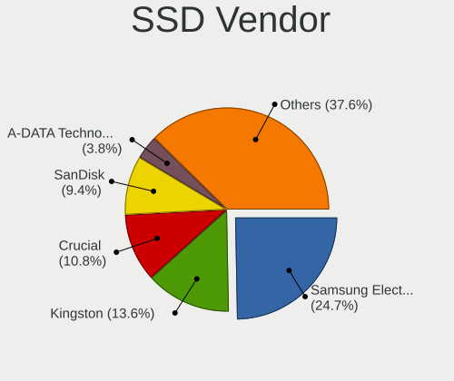

| Vendor              | Notebooks | Drives | Percent |
|---------------------|-----------|--------|---------|
| Samsung Electronics | 105       | 168    | 24.71%  |
| Kingston            | 58        | 72     | 13.65%  |
| Crucial             | 46        | 66     | 10.82%  |
| SanDisk             | 40        | 51     | 9.41%   |
| A-DATA Technology   | 16        | 19     | 3.76%   |
| WDC                 | 15        | 20     | 3.53%   |
| China               | 13        | 15     | 3.06%   |
| SPCC                | 10        | 15     | 2.35%   |
| Intel               | 10        | 16     | 2.35%   |
| Toshiba             | 9         | 11     | 2.12%   |
| SK hynix            | 8         | 11     | 1.88%   |
| PNY                 | 8         | 8      | 1.88%   |
| Intenso             | 6         | 7      | 1.41%   |
| Verbatim            | 5         | 31     | 1.18%   |
| Netac               | 5         | 5      | 1.18%   |
| Micron Technology   | 5         | 7      | 1.18%   |
| Apple               | 5         | 5      | 1.18%   |
| Transcend           | 4         | 7      | 0.94%   |
| OCZ                 | 4         | 4      | 0.94%   |
| LITEONIT            | 4         | 5      | 0.94%   |
| LITEON              | 4         | 4      | 0.94%   |
| KingSpec            | 4         | 7      | 0.94%   |
| Patriot             | 3         | 3      | 0.71%   |
| Vaseky              | 2         | 2      | 0.47%   |
| SABRENT             | 2         | 2      | 0.47%   |
| Plextor             | 2         | 2      | 0.47%   |
| HS-SSD-E100         | 2         | 2      | 0.47%   |
| FORESEE             | 2         | 2      | 0.47%   |
| Apacer              | 2         | 3      | 0.47%   |
| Wibtek              | 1         | 1      | 0.24%   |
| WDC WDS2            | 1         | 1      | 0.24%   |
| T-FORCE             | 1         | 1      | 0.24%   |
| Super Talent        | 1         | 1      | 0.24%   |
| Smartbuy            | 1         | 1      | 0.24%   |
| Smart               | 1         | 1      | 0.24%   |
| Seagate             | 1         | 1      | 0.24%   |
| Ramos Technology    | 1         | 1      | 0.24%   |
| Phison              | 1         | 1      | 0.24%   |
| Lexar               | 1         | 1      | 0.24%   |
| Kston               | 1         | 1      | 0.24%   |

Drive Kind
----------

HDD or SSD

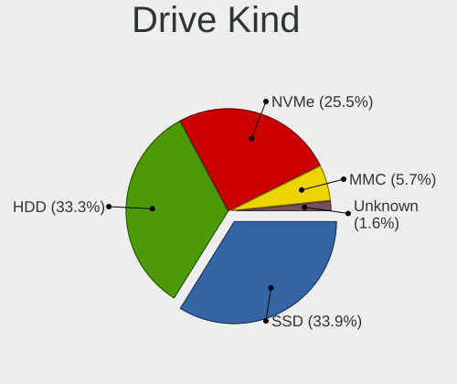

| Kind    | Notebooks | Drives | Percent |
|---------|-----------|--------|---------|
| SSD     | 392       | 597    | 33.85%  |
| HDD     | 386       | 478    | 33.33%  |
| NVMe    | 295       | 433    | 25.47%  |
| MMC     | 66        | 87     | 5.7%    |
| Unknown | 19        | 20     | 1.64%   |

Drive Connector
---------------

SATA, SAS, NVMe, etc.

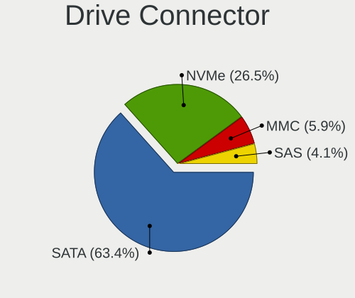

| Type | Notebooks | Drives | Percent |
|------|-----------|--------|---------|
| SATA | 705       | 1043   | 63.4%   |
| NVMe | 295       | 429    | 26.53%  |
| MMC  | 66        | 87     | 5.94%   |
| SAS  | 46        | 56     | 4.14%   |

Drive Size
----------

Size of hard drive

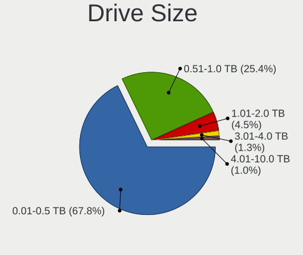

| Size in TB | Notebooks | Drives | Percent |
|------------|-----------|--------|---------|
| 0.01-0.5   | 531       | 704    | 67.82%  |
| 0.51-1.0   | 199       | 255    | 25.42%  |
| 1.01-2.0   | 35        | 81     | 4.47%   |
| 3.01-4.0   | 10        | 12     | 1.28%   |
| 4.01-10.0  | 8         | 23     | 1.02%   |

Space Total
-----------

Amount of disk space available on the file system

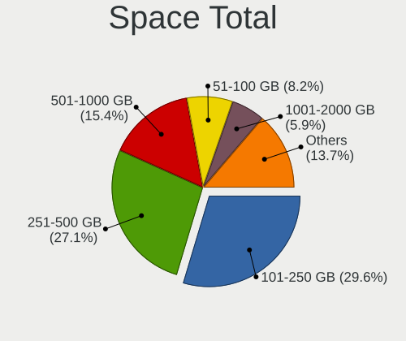

| Size in GB     | Notebooks | Percent |
|----------------|-----------|---------|
| 101-250        | 304       | 29.63%  |
| 251-500        | 278       | 27.1%   |
| 501-1000       | 158       | 15.4%   |
| 51-100         | 84        | 8.19%   |
| 1001-2000      | 61        | 5.95%   |
| 1-20           | 51        | 4.97%   |
| 21-50          | 37        | 3.61%   |
| More than 3000 | 29        | 2.83%   |
| 2001-3000      | 21        | 2.05%   |
| Unknown        | 3         | 0.29%   |

Space Used
----------

Amount of used disk space

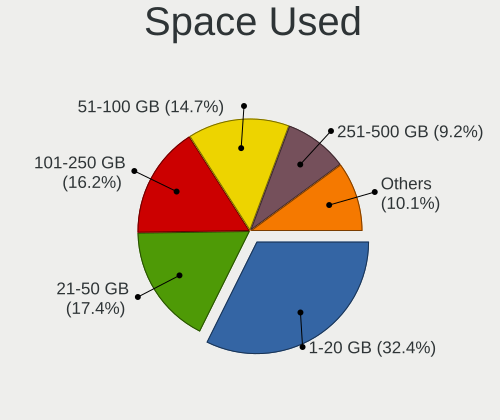

| Used GB        | Notebooks | Percent |
|----------------|-----------|---------|
| 1-20           | 340       | 32.35%  |
| 21-50          | 183       | 17.41%  |
| 101-250        | 170       | 16.18%  |
| 51-100         | 155       | 14.75%  |
| 251-500        | 97        | 9.23%   |
| 501-1000       | 59        | 5.61%   |
| 1001-2000      | 22        | 2.09%   |
| More than 3000 | 12        | 1.14%   |
| 2001-3000      | 10        | 0.95%   |
| Unknown        | 3         | 0.29%   |

Malfunc. Drives
---------------

Drive models with a malfunction

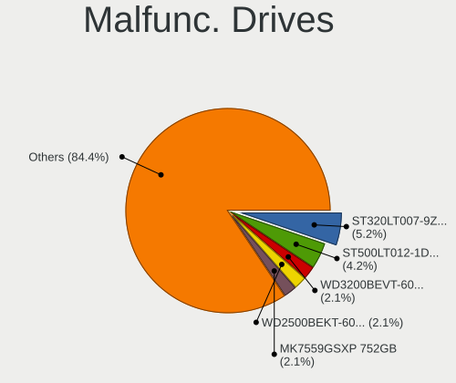

| Model                                   | Notebooks | Drives | Percent |
|-----------------------------------------|-----------|--------|---------|
| Seagate ST320LT007-9ZV142 320GB         | 5         | 5      | 5.21%   |
| Seagate ST500LT012-1DG142 500GB         | 4         | 4      | 4.17%   |
| WDC WD3200BEVT-60ZCT1 320GB             | 2         | 2      | 2.08%   |
| WDC WD2500BEKT-60A25T1 250GB            | 2         | 2      | 2.08%   |
| Toshiba MK7559GSXP 752GB                | 2         | 2      | 2.08%   |
| Seagate ST9500420AS 500GB               | 2         | 2      | 2.08%   |
| Seagate ST500LT012-9WS142 500GB         | 2         | 2      | 2.08%   |
| Seagate ST1000LM049-2GH172 1TB          | 2         | 2      | 2.08%   |
| Hitachi HTS547575A9E384 752GB           | 2         | 2      | 2.08%   |
| Hitachi HTS545050B9A300 500GB           | 2         | 2      | 2.08%   |
| Hitachi HTS542516K9SA00 160GB           | 2         | 2      | 2.08%   |
| WDC WD7500BPVX-60JC3T0 752GB            | 1         | 2      | 1.04%   |
| WDC WD7500BPVX-22JC3T0 752GB            | 1         | 1      | 1.04%   |
| WDC WD7500BPVT-75HXZT1 752GB            | 1         | 1      | 1.04%   |
| WDC WD7500BPVT-22A1YT0 752GB            | 1         | 1      | 1.04%   |
| WDC WD7500BPKT-75PK4T0 752GB            | 1         | 1      | 1.04%   |
| WDC WD5000LPVX-22V0TT0 500GB            | 1         | 1      | 1.04%   |
| WDC WD5000BPKT-75PK4T0 500GB            | 1         | 2      | 1.04%   |
| WDC WD40 EFRX-68N32N0 4TB               | 1         | 1      | 1.04%   |
| WDC WD3200BEKT-60V5T1 320GB             | 1         | 1      | 1.04%   |
| WDC WD10JPVX-60JC3T0 1TB                | 1         | 1      | 1.04%   |
| WDC WD10JPCX-24UE4T0 1TB                | 1         | 1      | 1.04%   |
| Vaseky V820/1TB                         | 1         | 1      | 1.04%   |
| Toshiba MQ01ACF050 500GB                | 1         | 1      | 1.04%   |
| Toshiba MQ01ACF032 320GB                | 1         | 1      | 1.04%   |
| Toshiba MQ01ABD100 1TB                  | 1         | 1      | 1.04%   |
| Toshiba MQ01ABD075 752GB                | 1         | 1      | 1.04%   |
| Toshiba MQ01ABD050 500GB                | 1         | 1      | 1.04%   |
| Toshiba MK5065GSX 500GB                 | 1         | 1      | 1.04%   |
| Toshiba MK3263GSXN 320GB                | 1         | 1      | 1.04%   |
| Toshiba MK3261GSYN 320GB                | 1         | 1      | 1.04%   |
| Toshiba MK2565GSXN 250GB                | 1         | 1      | 1.04%   |
| Toshiba MK2555GSX 250GB                 | 1         | 1      | 1.04%   |
| Team TM8FP4004T 4TB                     | 1         | 1      | 1.04%   |
| SK hynix BC711 HFM512GD3JX013N 512GB    | 1         | 1      | 1.04%   |
| SK hynix BC501 HFM256GDJTNG-8310A 256GB | 1         | 4      | 1.04%   |
| Seagate ST98823AS 80GB                  | 1         | 1      | 1.04%   |
| Seagate ST9500325AS 500GB               | 1         | 1      | 1.04%   |
| Seagate ST9320325AS 320GB               | 1         | 1      | 1.04%   |
| Seagate ST9250410AS 250GB               | 1         | 1      | 1.04%   |

Malfunc. Drive Vendor
---------------------

Vendors of faulty drives

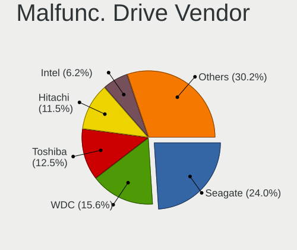

| Vendor              | Notebooks | Drives | Percent |
|---------------------|-----------|--------|---------|
| Seagate             | 23        | 23     | 23.96%  |
| WDC                 | 15        | 17     | 15.63%  |
| Toshiba             | 12        | 12     | 12.5%   |
| Hitachi             | 11        | 11     | 11.46%  |
| Intel               | 6         | 7      | 6.25%   |
| Samsung Electronics | 5         | 8      | 5.21%   |
| OCZ                 | 3         | 3      | 3.13%   |
| SK hynix            | 2         | 5      | 2.08%   |
| SanDisk             | 2         | 2      | 2.08%   |
| Kingston            | 2         | 3      | 2.08%   |
| HGST                | 2         | 2      | 2.08%   |
| A-DATA Technology   | 2         | 4      | 2.08%   |
| Vaseky              | 1         | 1      | 1.04%   |
| Team                | 1         | 1      | 1.04%   |
| Netac               | 1         | 1      | 1.04%   |
| LITEON              | 1         | 1      | 1.04%   |
| Intenso             | 1         | 1      | 1.04%   |
| IBM/Hitachi         | 1         | 1      | 1.04%   |
| Fujitsu             | 1         | 1      | 1.04%   |
| Eluktro             | 1         | 1      | 1.04%   |
| Crucial             | 1         | 1      | 1.04%   |
| China               | 1         | 1      | 1.04%   |
| Apricorn            | 1         | 1      | 1.04%   |

Malfunc. HDD Vendor
-------------------

Vendors of faulty HDD drives

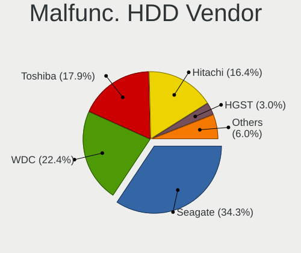

| Vendor              | Notebooks | Drives | Percent |
|---------------------|-----------|--------|---------|
| Seagate             | 23        | 23     | 34.33%  |
| WDC                 | 15        | 17     | 22.39%  |
| Toshiba             | 12        | 12     | 17.91%  |
| Hitachi             | 11        | 11     | 16.42%  |
| HGST                | 2         | 2      | 2.99%   |
| Samsung Electronics | 1         | 1      | 1.49%   |
| IBM/Hitachi         | 1         | 1      | 1.49%   |
| Fujitsu             | 1         | 1      | 1.49%   |
| Apricorn            | 1         | 1      | 1.49%   |

Malfunc. Drive Kind
-------------------

Kinds of faulty drives

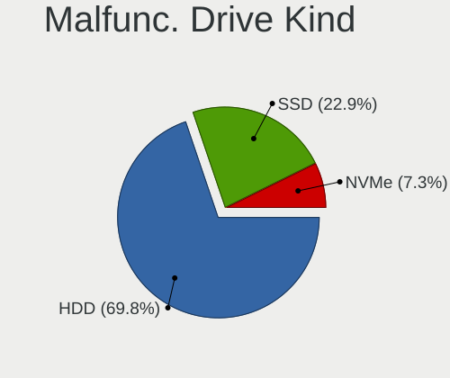

| Kind | Notebooks | Drives | Percent |
|------|-----------|--------|---------|
| HDD  | 67        | 69     | 69.79%  |
| SSD  | 22        | 24     | 22.92%  |
| NVMe | 7         | 15     | 7.29%   |

Failed Drives
-------------

Failed drive models

| Model                    | Notebooks | Drives | Percent |
|--------------------------|-----------|--------|---------|
| Toshiba MK6476GSXN 640GB | 1         | 1      | 100%    |

Failed Drive Vendor
-------------------

Failed drive vendors

| Vendor  | Notebooks | Drives | Percent |
|---------|-----------|--------|---------|
| Toshiba | 1         | 1      | 100%    |

Drive Status
------------

Number of failed and malfunc. drives

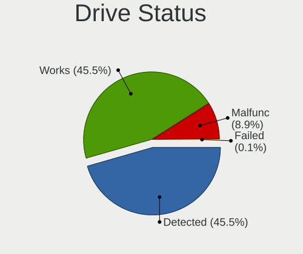

| Status   | Notebooks | Drives | Percent |
|----------|-----------|--------|---------|
| Detected | 486       | 833    | 45.55%  |
| Works    | 485       | 673    | 45.45%  |
| Malfunc  | 95        | 108    | 8.9%    |
| Failed   | 1         | 1      | 0.09%   |

Storage controller
------------------

Storage Vendor
--------------

Storage controller vendors

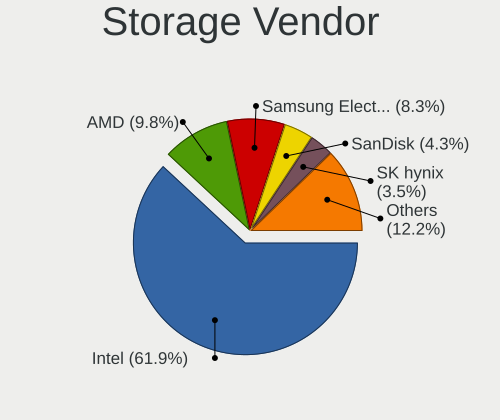

| Vendor                           | Notebooks | Percent |
|----------------------------------|-----------|---------|
| Intel                            | 698       | 61.93%  |
| AMD                              | 110       | 9.76%   |
| Samsung Electronics              | 94        | 8.34%   |
| SanDisk                          | 48        | 4.26%   |
| SK hynix                         | 39        | 3.46%   |
| Toshiba America Info Systems     | 17        | 1.51%   |
| KIOXIA                           | 17        | 1.51%   |
| Micron Technology                | 14        | 1.24%   |
| Phison Electronics               | 12        | 1.06%   |
| ADATA Technology                 | 11        | 0.98%   |
| Kingston Technology Company      | 10        | 0.89%   |
| Micron/Crucial Technology        | 9         | 0.8%    |
| Silicon Integrated Systems [SiS] | 8         | 0.71%   |
| Nvidia                           | 7         | 0.62%   |
| Silicon Motion                   | 5         | 0.44%   |
| VIA Technologies                 | 3         | 0.27%   |
| Solidigm                         | 3         | 0.27%   |
| Shenzhen Longsys Electronics     | 3         | 0.27%   |
| Realtek Semiconductor            | 3         | 0.27%   |
| MAXIO Technology (Hangzhou)      | 3         | 0.27%   |
| Union Memory (Shenzhen)          | 2         | 0.18%   |
| Solid State Storage Technology   | 2         | 0.18%   |
| Lite-On Technology               | 2         | 0.18%   |
| Seagate Technology               | 1         | 0.09%   |
| Marvell Technology Group         | 1         | 0.09%   |
| Lenovo                           | 1         | 0.09%   |
| JMicron Technology               | 1         | 0.09%   |
| Biwin Storage Technology         | 1         | 0.09%   |
| Apple                            | 1         | 0.09%   |
| Unknown                          | 1         | 0.09%   |

Storage Model
-------------

Storage controller models

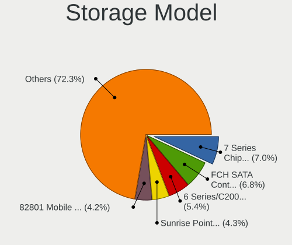

| Model                                                                            | Notebooks | Percent |
|----------------------------------------------------------------------------------|-----------|---------|
| Intel 7 Series Chipset Family 6-port SATA Controller [AHCI mode]                 | 85        | 7.01%   |
| AMD FCH SATA Controller [AHCI mode]                                              | 83        | 6.85%   |
| Intel 6 Series/C200 Series Chipset Family 6 port Mobile SATA AHCI Controller     | 65        | 5.36%   |
| Intel Sunrise Point-LP SATA Controller [AHCI mode]                               | 52        | 4.29%   |
| Intel 82801 Mobile SATA Controller [RAID mode]                                   | 51        | 4.21%   |
| Intel 8 Series SATA Controller 1 [AHCI mode]                                     | 35        | 2.89%   |
| Samsung NVMe SSD Controller 980 (DRAM-less)                                      | 34        | 2.81%   |
| Intel 82801IBM/IEM (ICH9M/ICH9M-E) 4 port SATA Controller [AHCI mode]            | 33        | 2.72%   |
| Samsung NVMe SSD Controller SM981/PM981/PM983                                    | 30        | 2.48%   |
| Intel 8 Series/C220 Series Chipset Family 6-port SATA Controller 1 [AHCI mode]   | 29        | 2.39%   |
| Intel Wildcat Point-LP SATA Controller [AHCI Mode]                               | 28        | 2.31%   |
| Intel 5 Series/3400 Series Chipset 4 port SATA AHCI Controller                   | 25        | 2.06%   |
| Intel Volume Management Device NVMe RAID Controller                              | 24        | 1.98%   |
| Intel Atom Processor E3800 Series SATA AHCI Controller                           | 22        | 1.82%   |
| Intel Cannon Lake Mobile PCH SATA AHCI Controller                                | 21        | 1.73%   |
| Intel 82801HM/HEM (ICH8M/ICH8M-E) IDE Controller                                 | 20        | 1.65%   |
| Intel HM170/QM170 Chipset SATA Controller [AHCI Mode]                            | 19        | 1.57%   |
| Intel Celeron/Pentium Silver Processor SATA Controller                           | 17        | 1.4%    |
| Intel Cannon Point-LP SATA Controller [AHCI Mode]                                | 16        | 1.32%   |
| Samsung NVMe SSD Controller PM9A1/PM9A3/980PRO                                   | 15        | 1.24%   |
| Intel 82801HM/HEM (ICH8M/ICH8M-E) SATA Controller [AHCI mode]                    | 15        | 1.24%   |
| Intel NM10/ICH7 Family SATA Controller [AHCI mode]                               | 14        | 1.16%   |
| Intel 5 Series/3400 Series Chipset 6 port SATA AHCI Controller                   | 14        | 1.16%   |
| Intel Comet Lake SATA AHCI Controller                                            | 13        | 1.07%   |
| AMD SB7x0/SB8x0/SB9x0 SATA Controller [AHCI mode]                                | 13        | 1.07%   |
| SK hynix BC511 NVMe SSD                                                          | 12        | 0.99%   |
| Intel Atom/Celeron/Pentium Processor x5-E8000/J3xxx/N3xxx Series SATA Controller | 12        | 0.99%   |
| SanDisk Extreme Pro / WD Black SN750 / PC SN730 / Red SN700 NVMe SSD             | 11        | 0.91%   |
| Samsung NVMe SSD Controller SM961/PM961/SM963                                    | 11        | 0.91%   |
| KIOXIA NVMe SSD Controller BG4 (DRAM-less)                                       | 11        | 0.91%   |
| Intel Ice Lake-LP SATA Controller [AHCI mode]                                    | 10        | 0.83%   |
| Intel 82801GBM/GHM (ICH7-M Family) SATA Controller [IDE mode]                    | 10        | 0.83%   |
| SK hynix Gold P31/BC711/PC711 NVMe Solid State Drive                             | 9         | 0.74%   |
| Intel Q170/Q150/B150/H170/H110/Z170/CM236 Chipset SATA Controller [AHCI Mode]    | 9         | 0.74%   |
| Silicon Integrated Systems [SiS] 5513 IDE Controller                             | 8         | 0.66%   |
| SanDisk WD Blue SN500 / PC SN520 x2 M.2 2280 NVMe SSD                            | 8         | 0.66%   |
| Intel Tiger Lake-LP SATA Controller                                              | 8         | 0.66%   |
| Intel SSD 660P Series                                                            | 8         | 0.66%   |
| Intel Celeron N3350/Pentium N4200/Atom E3900 Series SATA AHCI Controller         | 8         | 0.66%   |
| Intel 82801HM/HEM (ICH8M/ICH8M-E) SATA Controller [IDE mode]                     | 8         | 0.66%   |

Storage Kind
------------

Kind of storage controller (IDE, SATA, NVMe, SAS, ...)

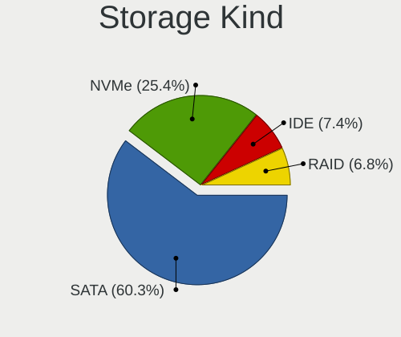

| Kind | Notebooks | Percent |
|------|-----------|---------|
| SATA | 697       | 60.35%  |
| NVMe | 293       | 25.37%  |
| IDE  | 86        | 7.45%   |
| RAID | 79        | 6.84%   |

Processor
---------

CPU Vendor
----------

Processor vendors

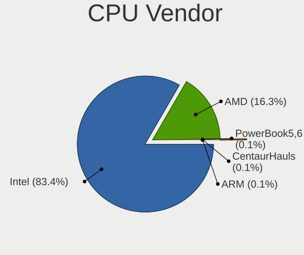

| Vendor       | Notebooks | Percent |
|--------------|-----------|---------|
| Intel        | 817       | 83.37%  |
| AMD          | 160       | 16.33%  |
| PowerBook5,6 | 1         | 0.1%    |
| CentaurHauls | 1         | 0.1%    |
| ARM          | 1         | 0.1%    |

CPU Model
---------

Processor models

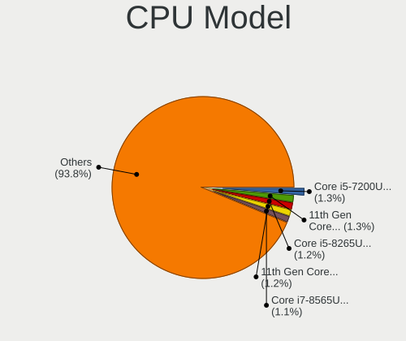

| Model                                         | Notebooks | Percent |
|-----------------------------------------------|-----------|---------|
| Intel Core i5-7200U CPU @ 2.50GHz             | 13        | 1.33%   |
| Intel 11th Gen Core i5-1135G7 @ 2.40GHz       | 13        | 1.33%   |
| Intel Core i5-8265U CPU @ 1.60GHz             | 12        | 1.22%   |
| Intel 11th Gen Core i7-1165G7 @ 2.80GHz       | 12        | 1.22%   |
| Intel Core i7-8565U CPU @ 1.80GHz             | 11        | 1.12%   |
| Intel Core i5-6200U CPU @ 2.30GHz             | 11        | 1.12%   |
| AMD Ryzen 5 3500U with Radeon Vega Mobile Gfx | 10        | 1.02%   |
| Intel Core i7-8550U CPU @ 1.80GHz             | 9         | 0.92%   |
| Intel Core i7-7700HQ CPU @ 2.80GHz            | 9         | 0.92%   |
| Intel Core i5-5200U CPU @ 2.20GHz             | 9         | 0.92%   |
| Intel Core i5-4300U CPU @ 1.90GHz             | 9         | 0.92%   |
| Intel Core i5-4210U CPU @ 1.70GHz             | 9         | 0.92%   |
| Intel Core i5-1035G1 CPU @ 1.00GHz            | 9         | 0.92%   |
| Intel Core i7-9750H CPU @ 2.60GHz             | 8         | 0.82%   |
| Intel Core i7-10510U CPU @ 1.80GHz            | 8         | 0.82%   |
| Intel Core i5-6300U CPU @ 2.40GHz             | 8         | 0.82%   |
| Intel Core i5-2410M CPU @ 2.30GHz             | 8         | 0.82%   |
| Intel Pentium CPU N3540 @ 2.16GHz             | 7         | 0.71%   |
| Intel Core i7-8750H CPU @ 2.20GHz             | 7         | 0.71%   |
| Intel Core i7-3630QM CPU @ 2.40GHz            | 7         | 0.71%   |
| Intel Core i7-2670QM CPU @ 2.20GHz            | 7         | 0.71%   |
| Intel Core i5-3230M CPU @ 2.60GHz             | 7         | 0.71%   |
| Intel Core i5-2540M CPU @ 2.60GHz             | 7         | 0.71%   |
| Intel Core i5-10210U CPU @ 1.60GHz            | 7         | 0.71%   |
| Intel Core i7-5600U CPU @ 2.60GHz             | 6         | 0.61%   |
| Intel Core i7-2630QM CPU @ 2.00GHz            | 6         | 0.61%   |
| Intel Core i5-8250U CPU @ 1.60GHz             | 6         | 0.61%   |
| Intel Core i5-3320M CPU @ 2.60GHz             | 6         | 0.61%   |
| Intel Core i5-3210M CPU @ 2.50GHz             | 6         | 0.61%   |
| Intel Core i5-2520M CPU @ 2.50GHz             | 6         | 0.61%   |
| Intel Core i5-2450M CPU @ 2.50GHz             | 6         | 0.61%   |
| Intel Core i3-2310M CPU @ 2.10GHz             | 6         | 0.61%   |
| Intel Core i3-10110U CPU @ 2.10GHz            | 6         | 0.61%   |
| Intel Celeron N4000 CPU @ 1.10GHz             | 6         | 0.61%   |
| Intel Celeron CPU N2840 @ 2.16GHz             | 6         | 0.61%   |
| Intel 11th Gen Core i7-1185G7 @ 3.00GHz       | 6         | 0.61%   |
| Intel Core i7-10750H CPU @ 2.60GHz            | 5         | 0.51%   |
| Intel Core i5-2430M CPU @ 2.40GHz             | 5         | 0.51%   |
| Intel Core i5 CPU M 560 @ 2.67GHz             | 5         | 0.51%   |
| Intel Core i5 CPU M 520 @ 2.40GHz             | 5         | 0.51%   |

CPU Model Family
----------------

Processor model prefix

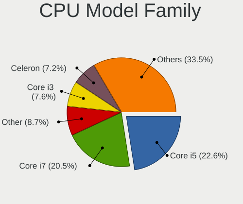

| Model                          | Notebooks | Percent |
|--------------------------------|-----------|---------|
| Intel Core i5                  | 221       | 22.55%  |
| Intel Core i7                  | 201       | 20.51%  |
| Other                          | 85        | 8.67%   |
| Intel Core i3                  | 74        | 7.55%   |
| Intel Celeron                  | 71        | 7.24%   |
| Intel Core 2 Duo               | 53        | 5.41%   |
| Intel Pentium                  | 32        | 3.27%   |
| AMD Ryzen 5                    | 32        | 3.27%   |
| Intel Atom                     | 27        | 2.76%   |
| AMD Ryzen 7                    | 24        | 2.45%   |
| AMD A6                         | 12        | 1.22%   |
| Intel Pentium Dual-Core        | 11        | 1.12%   |
| Intel Genuine                  | 11        | 1.12%   |
| AMD A4                         | 8         | 0.82%   |
| AMD Turion 64 X2 Mobile        | 7         | 0.71%   |
| AMD Ryzen 9                    | 7         | 0.71%   |
| Intel Pentium Silver           | 6         | 0.61%   |
| Intel Core i9                  | 6         | 0.61%   |
| AMD Ryzen 3                    | 6         | 0.61%   |
| AMD E1                         | 6         | 0.61%   |
| AMD A8                         | 6         | 0.61%   |
| AMD A10                        | 5         | 0.51%   |
| Intel Core 2                   | 4         | 0.41%   |
| AMD Ryzen 7 PRO                | 4         | 0.41%   |
| AMD E2                         | 4         | 0.41%   |
| AMD E                          | 4         | 0.41%   |
| AMD Athlon                     | 4         | 0.41%   |
| Intel Xeon                     | 3         | 0.31%   |
| Intel Pentium M                | 3         | 0.31%   |
| Intel Pentium Dual             | 3         | 0.31%   |
| Intel Core m3                  | 3         | 0.31%   |
| Intel Core M                   | 3         | 0.31%   |
| Intel Core Duo                 | 3         | 0.31%   |
| Intel Celeron Dual-Core        | 3         | 0.31%   |
| AMD Turion X2 Dual-Core Mobile | 3         | 0.31%   |
| AMD Ryzen 5 PRO                | 3         | 0.31%   |
| AMD Mobile Sempron             | 3         | 0.31%   |
| AMD Ryzen 3 PRO                | 2         | 0.2%    |
| AMD C-60                       | 2         | 0.2%    |
| AMD Athlon X2                  | 2         | 0.2%    |

CPU Cores
---------

Number of processor cores

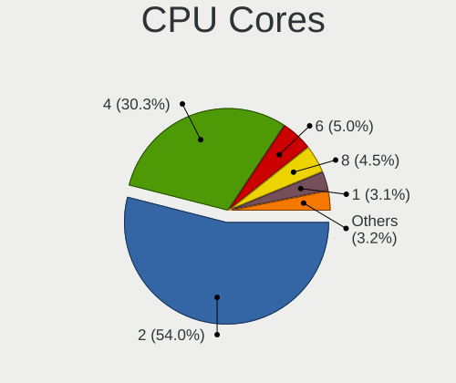

| Number | Notebooks | Percent |
|--------|-----------|---------|
| 2      | 530       | 53.97%  |
| 4      | 298       | 30.35%  |
| 6      | 49        | 4.99%   |
| 8      | 44        | 4.48%   |
| 1      | 30        | 3.05%   |
| 14     | 12        | 1.22%   |
| 10     | 9         | 0.92%   |
| 12     | 7         | 0.71%   |
| 16     | 2         | 0.2%    |
| 3      | 1         | 0.1%    |

CPU Sockets
-----------

Number of sockets

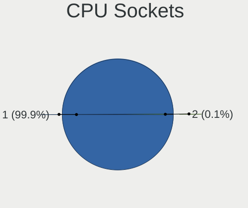

| Number | Notebooks | Percent |
|--------|-----------|---------|
| 1      | 979       | 99.9%   |
| 2      | 1         | 0.1%    |

CPU Threads
-----------

Threads per core (Hyper-Threading)

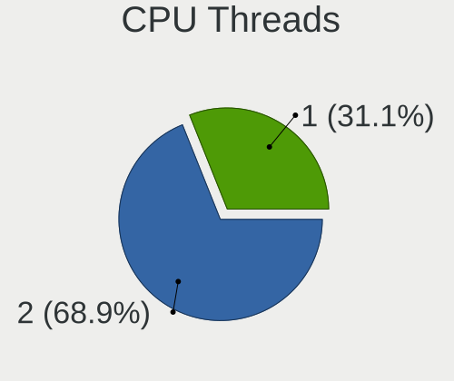

| Number | Notebooks | Percent |
|--------|-----------|---------|
| 2      | 677       | 68.94%  |
| 1      | 305       | 31.06%  |

CPU Op-Modes
------------

CPU Operation Modes (32-bit, 64-bit)

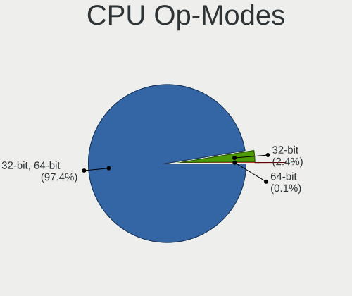

| Op mode        | Notebooks | Percent |
|----------------|-----------|---------|
| 32-bit, 64-bit | 955       | 97.45%  |
| 32-bit         | 24        | 2.45%   |
| 64-bit         | 1         | 0.1%    |

CPU Microcode
-------------

Microcode number

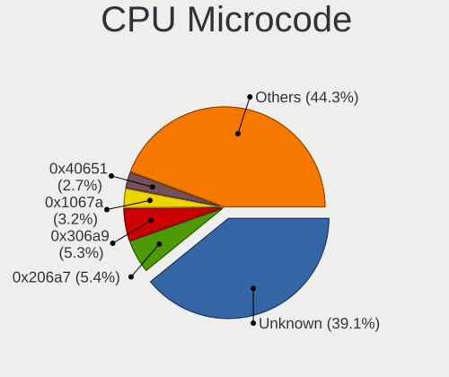

| Number     | Notebooks | Percent |
|------------|-----------|---------|
| Unknown    | 396       | 39.13%  |
| 0x206a7    | 55        | 5.43%   |
| 0x306a9    | 54        | 5.34%   |
| 0x1067a    | 32        | 3.16%   |
| 0x40651    | 27        | 2.67%   |
| 0x806ec    | 25        | 2.47%   |
| 0x806c1    | 24        | 2.37%   |
| 0x806ea    | 20        | 1.98%   |
| 0x406e3    | 19        | 1.88%   |
| 0x806e9    | 16        | 1.58%   |
| 0x6fd      | 16        | 1.58%   |
| 0x306d4    | 16        | 1.58%   |
| 0x30678    | 15        | 1.48%   |
| 0x20655    | 15        | 1.48%   |
| 0x706e5    | 14        | 1.38%   |
| 0x306c3    | 14        | 1.38%   |
| 0x406c4    | 13        | 1.28%   |
| 0x906ea    | 11        | 1.09%   |
| 0x906e9    | 11        | 1.09%   |
| 0x20652    | 11        | 1.09%   |
| 0x106ca    | 11        | 1.09%   |
| 0x08108109 | 10        | 0.99%   |
| 0x0a50000c | 9         | 0.89%   |
| 0x806d1    | 8         | 0.79%   |
| 0x706a1    | 8         | 0.79%   |
| 0x07030105 | 8         | 0.79%   |
| 0x506e3    | 7         | 0.69%   |
| 0x10676    | 7         | 0.69%   |
| 0x08108102 | 7         | 0.69%   |
| 0x0700010f | 7         | 0.69%   |
| 0x6ec      | 6         | 0.59%   |
| 0x906a3    | 5         | 0.49%   |
| 0x806eb    | 5         | 0.49%   |
| 0x6e8      | 5         | 0.49%   |
| 0x506c9    | 5         | 0.49%   |
| 0x406c3    | 5         | 0.49%   |
| 0x30661    | 5         | 0.49%   |
| 0x08600106 | 5         | 0.49%   |
| 0x06006705 | 5         | 0.49%   |
| 0x05000119 | 5         | 0.49%   |

CPU Microarch
-------------

Microarchitecture

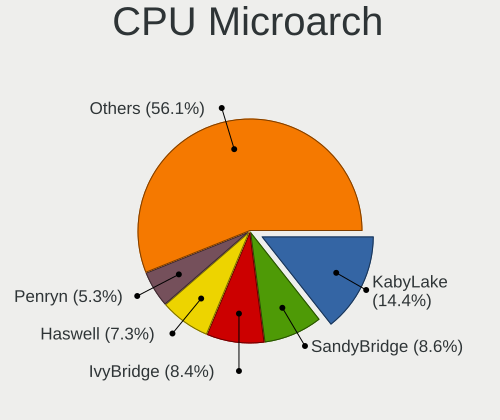

| Name              | Notebooks | Percent |
|-------------------|-----------|---------|
| KabyLake          | 141       | 14.37%  |
| SandyBridge       | 84        | 8.56%   |
| IvyBridge         | 82        | 8.36%   |
| Haswell           | 72        | 7.34%   |
| Penryn            | 52        | 5.3%    |
| Silvermont        | 50        | 5.1%    |
| Skylake           | 45        | 4.59%   |
| Westmere          | 40        | 4.08%   |
| Unknown           | 36        | 3.67%   |
| TigerLake         | 34        | 3.47%   |
| Broadwell         | 34        | 3.47%   |
| Core              | 31        | 3.16%   |
| Icelake           | 30        | 3.06%   |
| Zen+              | 22        | 2.24%   |
| Goldmont plus     | 21        | 2.14%   |
| Alderlake Hybrid  | 20        | 2.04%   |
| Zen 2             | 17        | 1.73%   |
| CometLake         | 17        | 1.73%   |
| Bonnell           | 17        | 1.73%   |
| Zen 3             | 16        | 1.63%   |
| Excavator         | 16        | 1.63%   |
| P6                | 15        | 1.53%   |
| K8 Hammer         | 13        | 1.33%   |
| Puma              | 11        | 1.12%   |
| Jaguar            | 9         | 0.92%   |
| Zen               | 8         | 0.82%   |
| Nehalem           | 8         | 0.82%   |
| Goldmont          | 8         | 0.82%   |
| Bobcat            | 8         | 0.82%   |
| Piledriver        | 6         | 0.61%   |
| K8 & K10 hybrid   | 5         | 0.51%   |
| Tremont           | 4         | 0.41%   |
| K10               | 4         | 0.41%   |
| K10 Llano         | 2         | 0.2%    |
| Steamroller       | 1         | 0.1%    |
| Meteorlake Hybrid | 1         | 0.1%    |
| Gracemont         | 1         | 0.1%    |

Graphics
--------

GPU Vendor
----------

Vendors of graphics cards

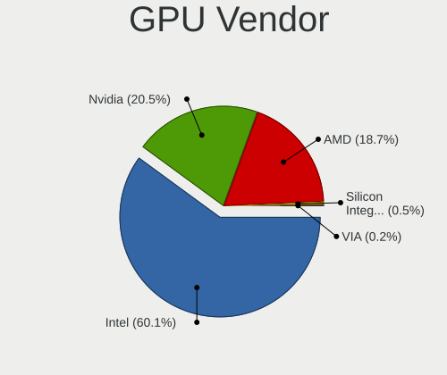

| Vendor                           | Notebooks | Percent |
|----------------------------------|-----------|---------|
| Intel                            | 725       | 60.07%  |
| Nvidia                           | 247       | 20.46%  |
| AMD                              | 226       | 18.72%  |
| Silicon Integrated Systems [SiS] | 6         | 0.5%    |
| VIA Technologies                 | 3         | 0.25%   |

GPU Model
---------

Graphics card models

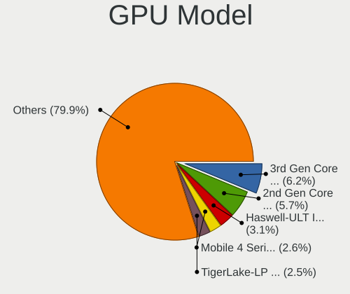

| Model                                                                                    | Notebooks | Percent |
|------------------------------------------------------------------------------------------|-----------|---------|
| Intel 3rd Gen Core processor Graphics Controller                                         | 78        | 6.24%   |
| Intel 2nd Generation Core Processor Family Integrated Graphics Controller                | 71        | 5.68%   |
| Intel Haswell-ULT Integrated Graphics Controller                                         | 39        | 3.12%   |
| Intel Mobile 4 Series Chipset Integrated Graphics Controller                             | 32        | 2.56%   |
| Intel TigerLake-LP GT2 [Iris Xe Graphics]                                                | 31        | 2.48%   |
| Intel WhiskeyLake-U GT2 [UHD Graphics 620]                                               | 30        | 2.4%    |
| Intel 4th Gen Core Processor Integrated Graphics Controller                              | 30        | 2.4%    |
| Intel Skylake-U GT2 [HD Graphics 520]                                                    | 28        | 2.24%   |
| Intel Broadwell-U GT2 [HD Graphics 5500]                                                 | 28        | 2.24%   |
| Intel Atom Processor Z36xxx/Z37xxx Series Graphics & Display                             | 26        | 2.08%   |
| Intel CometLake-U GT2 [UHD Graphics]                                                     | 25        | 2%      |
| Intel Atom/Celeron/Pentium Processor x5-E8000/J3xxx/N3xxx Integrated Graphics Controller | 24        | 1.92%   |
| Intel Core Processor Integrated Graphics Controller                                      | 23        | 1.84%   |
| AMD Picasso/Raven 2 [Radeon Vega Series / Radeon Vega Mobile Series]                     | 23        | 1.84%   |
| Intel Kaby Lake-R GT2 [UHD Graphics 620]                                                 | 21        | 1.68%   |
| Intel CoffeeLake-H GT2 [UHD Graphics 630]                                                | 20        | 1.6%    |
| Intel Kaby Lake-U GT2 [HD Graphics 620]                                                  | 17        | 1.36%   |
| Intel GeminiLake [UHD Graphics 600]                                                      | 17        | 1.36%   |
| Nvidia GA106M [GeForce RTX 3060 Mobile / Max-Q]                                          | 16        | 1.28%   |
| Intel Mobile GM965/GL960 Integrated Graphics Controller (secondary)                      | 16        | 1.28%   |
| Intel Mobile GM965/GL960 Integrated Graphics Controller (primary)                        | 16        | 1.28%   |
| AMD Renoir [Radeon Vega Series / Radeon Vega Mobile Series]                              | 16        | 1.28%   |
| Nvidia TU117M [GeForce GTX 1650 Mobile / Max-Q]                                          | 14        | 1.12%   |
| Intel Iris Plus Graphics G1 (Ice Lake)                                                   | 14        | 1.12%   |
| Nvidia GF117M [GeForce 610M/710M/810M/820M / GT 620M/625M/630M/720M]                     | 13        | 1.04%   |
| Intel Kaby Lake-H GT2 [HD Graphics 630]                                                  | 13        | 1.04%   |
| AMD Stoney [Radeon R2/R3/R4/R5 Graphics]                                                 | 13        | 1.04%   |
| Intel CometLake-H GT2 [UHD Graphics]                                                     | 12        | 0.96%   |
| AMD Cezanne [Radeon Vega Series / Radeon Vega Mobile Series]                             | 12        | 0.96%   |
| Intel TigerLake-H GT1 [UHD Graphics]                                                     | 11        | 0.88%   |
| Intel Skylake-H GT2 [HD Graphics 530]                                                    | 11        | 0.88%   |
| Intel Mobile 945GM/GMS/GME, 943/940GML Express Integrated Graphics Controller            | 11        | 0.88%   |
| Intel Atom Processor D4xx/D5xx/N4xx/N5xx Integrated Graphics Controller                  | 11        | 0.88%   |
| Intel Alder Lake-P GT2 [Iris Xe Graphics]                                                | 11        | 0.88%   |
| Intel Mobile 945GM/GMS, 943/940GML Express Integrated Graphics Controller                | 10        | 0.8%    |
| Nvidia GP107M [GeForce GTX 1050 Mobile]                                                  | 9         | 0.72%   |
| AMD Thames [Radeon HD 7500M/7600M Series]                                                | 9         | 0.72%   |
| AMD Topaz XT [Radeon R7 M260/M265 / M340/M360 / M440/M445 / 530/535 / 620/625 Mobile]    | 8         | 0.64%   |
| AMD Seymour [Radeon HD 6400M/7400M Series]                                               | 8         | 0.64%   |
| Nvidia GP107M [GeForce GTX 1050 Ti Mobile]                                               | 7         | 0.56%   |

GPU Combo
---------

Combinations of graphics cards

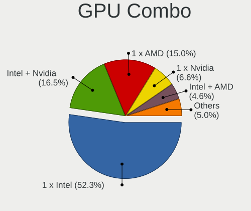

| Name           | Notebooks | Percent |
|----------------|-----------|---------|
| 1 x Intel      | 513       | 52.29%  |
| Intel + Nvidia | 162       | 16.51%  |
| 1 x AMD        | 147       | 14.98%  |
| 1 x Nvidia     | 65        | 6.63%   |
| Intel + AMD    | 45        | 4.59%   |
| AMD + Nvidia   | 19        | 1.94%   |
| 2 x AMD        | 14        | 1.43%   |
| 1 x SiS        | 6         | 0.61%   |
| Other          | 3         | 0.31%   |
| 2 x Intel      | 3         | 0.31%   |
| 1 x VIA        | 3         | 0.31%   |
| 2 x Nvidia     | 1         | 0.1%    |

GPU Driver
----------

Free vs proprietary

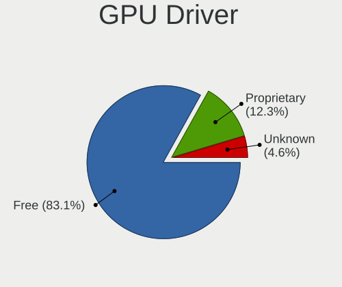

| Driver      | Notebooks | Percent |
|-------------|-----------|---------|
| Free        | 824       | 83.06%  |
| Proprietary | 122       | 12.3%   |
| Unknown     | 46        | 4.64%   |

GPU Memory
----------

Total video memory

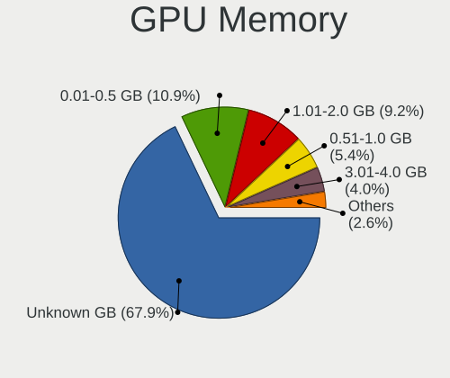

| Size in GB | Notebooks | Percent |
|------------|-----------|---------|
| Unknown    | 679       | 67.9%   |
| 0.01-0.5   | 109       | 10.9%   |
| 1.01-2.0   | 92        | 9.2%    |
| 0.51-1.0   | 54        | 5.4%    |
| 3.01-4.0   | 40        | 4%      |
| 7.01-8.0   | 10        | 1%      |
| 5.01-6.0   | 10        | 1%      |
| 2.01-3.0   | 4         | 0.4%    |
| 8.01-16.0  | 2         | 0.2%    |

Monitor
-------

Monitor Vendor
--------------

Monitor vendors

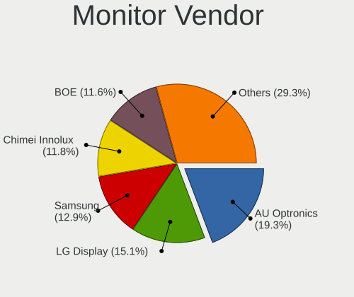

| Vendor                  | Notebooks | Percent |
|-------------------------|-----------|---------|
| AU Optronics            | 210       | 19.27%  |
| LG Display              | 165       | 15.14%  |
| Samsung Electronics     | 141       | 12.94%  |
| Chimei Innolux          | 129       | 11.83%  |
| BOE                     | 126       | 11.56%  |
| Dell                    | 30        | 2.75%   |
| Chi Mei Optoelectronics | 29        | 2.66%   |
| Sharp                   | 20        | 1.83%   |
| Apple                   | 19        | 1.74%   |
| Hewlett-Packard         | 18        | 1.65%   |
| PANDA                   | 17        | 1.56%   |
| Lenovo                  | 17        | 1.56%   |
| Goldstar                | 17        | 1.56%   |
| LG Philips              | 13        | 1.19%   |
| Sony                    | 8         | 0.73%   |
| Philips                 | 8         | 0.73%   |
| InfoVision              | 8         | 0.73%   |
| AOC                     | 8         | 0.73%   |
| BenQ                    | 7         | 0.64%   |
| Ancor Communications    | 7         | 0.64%   |
| ViewSonic               | 6         | 0.55%   |
| CSO                     | 6         | 0.55%   |
| Unknown                 | 5         | 0.46%   |
| HannStar                | 5         | 0.46%   |
| CPT                     | 5         | 0.46%   |
| Acer                    | 5         | 0.46%   |
| Iiyama                  | 4         | 0.37%   |
| CSW                     | 4         | 0.37%   |
| ASUSTek Computer        | 4         | 0.37%   |
| MSI                     | 3         | 0.28%   |
| LGD                     | 3         | 0.28%   |
| InnoLux Display         | 3         | 0.28%   |
| Eizo                    | 3         | 0.28%   |
| Vestel Elektronik       | 2         | 0.18%   |
| Seiko/Epson             | 2         | 0.18%   |
| Quanta Display          | 2         | 0.18%   |
| Panasonic               | 2         | 0.18%   |
| Medion                  | 2         | 0.18%   |
| HKC                     | 2         | 0.18%   |
| CS_                     | 2         | 0.18%   |

Monitor Model
-------------

Monitor models

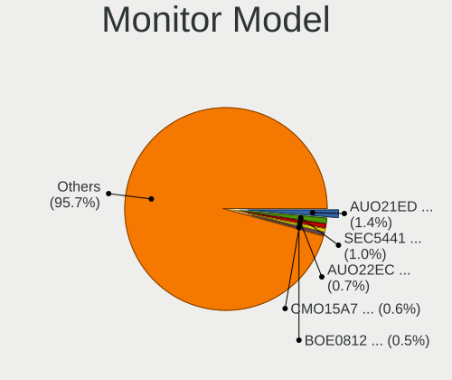

| Model                                                                     | Notebooks | Percent |
|---------------------------------------------------------------------------|-----------|---------|
| AU Optronics LCD Monitor AUO21ED 1920x1080 344x193mm 15.5-inch            | 15        | 1.36%   |
| Samsung Electronics LCD Monitor SEC5441 1280x800 331x207mm 15.4-inch      | 11        | 1%      |
| AU Optronics LCD Monitor AUO22EC 1366x768 344x193mm 15.5-inch             | 8         | 0.72%   |
| Chi Mei Optoelectronics LCD Monitor CMO15A7 1366x768 344x193mm 15.5-inch  | 7         | 0.63%   |
| BOE LCD Monitor BOE0812 1920x1080 344x194mm 15.5-inch                     | 6         | 0.54%   |
| LG Display LCD Monitor LGD05E5 1920x1080 344x194mm 15.5-inch              | 5         | 0.45%   |
| LG Display LCD Monitor LGD0456 1366x768 344x194mm 15.5-inch               | 5         | 0.45%   |
| LG Display LCD Monitor LGD0385 1366x768 309x174mm 14.0-inch               | 5         | 0.45%   |
| LG Display LCD Monitor LGD02DC 1366x768 344x194mm 15.5-inch               | 5         | 0.45%   |
| Chimei Innolux LCD Monitor CMN15F5 1920x1080 344x193mm 15.5-inch          | 5         | 0.45%   |
| Chimei Innolux LCD Monitor CMN15DB 1366x768 344x193mm 15.5-inch           | 5         | 0.45%   |
| Chimei Innolux LCD Monitor CMN14D6 1366x768 309x173mm 13.9-inch           | 5         | 0.45%   |
| AU Optronics LCD Monitor AUO109E 1600x900 382x214mm 17.2-inch             | 5         | 0.45%   |
| LG Display LCD Monitor LGD04A7 1920x1080 344x194mm 15.5-inch              | 4         | 0.36%   |
| LG Display LCD Monitor LGD02F2 1366x768 344x194mm 15.5-inch               | 4         | 0.36%   |
| Chimei Innolux LCD Monitor CMN15C9 1366x768 344x193mm 15.5-inch           | 4         | 0.36%   |
| Chimei Innolux LCD Monitor CMN15C4 1920x1080 344x193mm 15.5-inch          | 4         | 0.36%   |
| Chimei Innolux LCD Monitor CMN14B1 1920x1080 308x173mm 13.9-inch          | 4         | 0.36%   |
| BOE LCD Monitor BOE0687 1920x1080 344x193mm 15.5-inch                     | 4         | 0.36%   |
| BOE LCD Monitor BOE0672 1366x768 344x194mm 15.5-inch                      | 4         | 0.36%   |
| AU Optronics LCD Monitor AUO213E 1600x900 309x174mm 14.0-inch             | 4         | 0.36%   |
| AU Optronics LCD Monitor AUO119E 1600x900 382x214mm 17.2-inch             | 4         | 0.36%   |
| AU Optronics LCD Monitor AUO106C 1366x768 276x155mm 12.5-inch             | 4         | 0.36%   |
| Sony Nvidia Defaul t Flat Panel SNY05FA 1366x768 309x174mm 14.0-inch      | 3         | 0.27%   |
| Samsung Electronics LCD Monitor SEC5541 1366x768 344x193mm 15.5-inch      | 3         | 0.27%   |
| Samsung Electronics LCD Monitor SEC3245 1366x768 340x190mm 15.3-inch      | 3         | 0.27%   |
| Samsung Electronics LCD Monitor SDC4347 1366x768 344x193mm 15.5-inch      | 3         | 0.27%   |
| LG Display LCD Monitor LGD0724 1920x1080 309x174mm 14.0-inch              | 3         | 0.27%   |
| LG Display LCD Monitor LGD046F 1920x1080 344x194mm 15.5-inch              | 3         | 0.27%   |
| LG Display LCD Monitor LGD033E 1366x768 309x174mm 14.0-inch               | 3         | 0.27%   |
| LG Display LCD Monitor LGD02EC 1366x768 293x165mm 13.2-inch               | 3         | 0.27%   |
| LG Display LCD Monitor LGD0259 1920x1080 345x194mm 15.6-inch              | 3         | 0.27%   |
| Lenovo LCD Monitor LEN40B0 1366x768 344x194mm 15.5-inch                   | 3         | 0.27%   |
| Dell U2412M DELA07A 1920x1200 518x324mm 24.1-inch                         | 3         | 0.27%   |
| Chimei Innolux LCD Monitor CMN1747 1920x1080 381x214mm 17.2-inch          | 3         | 0.27%   |
| Chimei Innolux LCD Monitor CMN1735 1920x1080 381x214mm 17.2-inch          | 3         | 0.27%   |
| Chimei Innolux LCD Monitor CMN15E7 1920x1080 344x193mm 15.5-inch          | 3         | 0.27%   |
| Chimei Innolux LCD Monitor CMN14D4 1920x1080 309x173mm 13.9-inch          | 3         | 0.27%   |
| Chimei Innolux LCD Monitor CMN1490 1366x768 309x174mm 14.0-inch           | 3         | 0.27%   |
| Chi Mei Optoelectronics LCD Monitor CMO1720 1920x1080 382x215mm 17.3-inch | 3         | 0.27%   |

Monitor Resolution
------------------

Monitor screen resolution

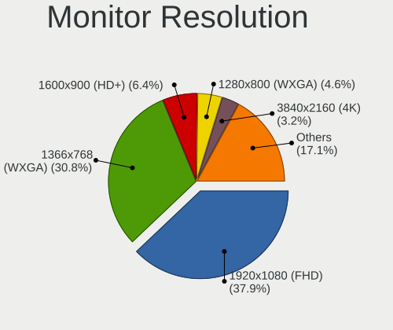

| Resolution         | Notebooks | Percent |
|--------------------|-----------|---------|
| 1920x1080 (FHD)    | 391       | 37.92%  |
| 1366x768 (WXGA)    | 318       | 30.84%  |
| 1600x900 (HD+)     | 66        | 6.4%    |
| 1280x800 (WXGA)    | 47        | 4.56%   |
| 3840x2160 (4K)     | 33        | 3.2%    |
| 1920x1200 (WUXGA)  | 29        | 2.81%   |
| 2560x1440 (QHD)    | 23        | 2.23%   |
| 1440x900 (WXGA+)   | 20        | 1.94%   |
| 2560x1600          | 15        | 1.45%   |
| 1024x600           | 15        | 1.45%   |
| 1680x1050 (WSXGA+) | 14        | 1.36%   |
| 3840x2400          | 6         | 0.58%   |
| 1360x768           | 6         | 0.58%   |
| 1280x1024 (SXGA)   | 5         | 0.48%   |
| 3440x1440          | 4         | 0.39%   |
| 3200x1800 (QHD+)   | 4         | 0.39%   |
| 2880x1800          | 4         | 0.39%   |
| 2160x1440          | 4         | 0.39%   |
| 2880x1620          | 3         | 0.29%   |
| 2560x1080          | 3         | 0.29%   |
| Unknown            | 3         | 0.29%   |
| 2288x1287          | 2         | 0.19%   |
| 1920x540           | 2         | 0.19%   |
| 1680x945           | 2         | 0.19%   |
| 1400x1050          | 2         | 0.19%   |
| 1024x768 (XGA)     | 2         | 0.19%   |
| 3840x1080          | 1         | 0.1%    |
| 3072x1920          | 1         | 0.1%    |
| 2304x800           | 1         | 0.1%    |
| 2256x1504          | 1         | 0.1%    |
| 1600x1200          | 1         | 0.1%    |
| 1280x960           | 1         | 0.1%    |
| 1280x854           | 1         | 0.1%    |
| 1280x720 (HD)      | 1         | 0.1%    |

Monitor Diagonal
----------------

Diagonal size in inches

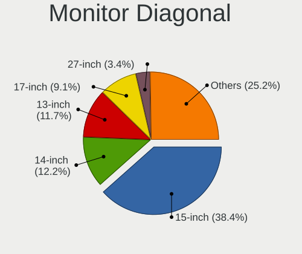

| Inches  | Notebooks | Percent |
|---------|-----------|---------|
| 15      | 419       | 38.44%  |
| 14      | 133       | 12.2%   |
| 13      | 127       | 11.65%  |
| 17      | 99        | 9.08%   |
| 27      | 37        | 3.39%   |
| 24      | 35        | 3.21%   |
| 12      | 33        | 3.03%   |
| 11      | 26        | 2.39%   |
| 23      | 22        | 2.02%   |
| 21      | 22        | 2.02%   |
| Unknown | 22        | 2.02%   |
| 16      | 20        | 1.83%   |
| 10      | 18        | 1.65%   |
| 31      | 13        | 1.19%   |
| 18      | 13        | 1.19%   |
| 34      | 7         | 0.64%   |
| 40      | 6         | 0.55%   |
| 22      | 6         | 0.55%   |
| 84      | 5         | 0.46%   |
| 19      | 4         | 0.37%   |
| 54      | 3         | 0.28%   |
| 20      | 3         | 0.28%   |
| 142     | 2         | 0.18%   |
| 72      | 2         | 0.18%   |
| 52      | 2         | 0.18%   |
| 33      | 2         | 0.18%   |
| 65      | 1         | 0.09%   |
| 63      | 1         | 0.09%   |
| 49      | 1         | 0.09%   |
| 46      | 1         | 0.09%   |
| 42      | 1         | 0.09%   |
| 32      | 1         | 0.09%   |
| 29      | 1         | 0.09%   |
| 25      | 1         | 0.09%   |
| 8       | 1         | 0.09%   |

Monitor Width
-------------

Physical width

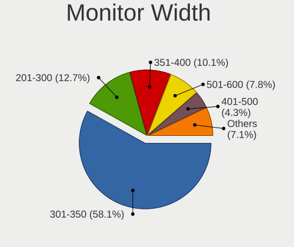

| Width in mm    | Notebooks | Percent |
|----------------|-----------|---------|
| 301-350        | 628       | 58.09%  |
| 201-300        | 137       | 12.67%  |
| 351-400        | 109       | 10.08%  |
| 501-600        | 84        | 7.77%   |
| 401-500        | 46        | 4.26%   |
| Unknown        | 22        | 2.04%   |
| 601-700        | 19        | 1.76%   |
| 701-800        | 10        | 0.93%   |
| 1001-1500      | 9         | 0.83%   |
| 1501-2000      | 7         | 0.65%   |
| 801-900        | 6         | 0.56%   |
| More than 2000 | 2         | 0.19%   |
| 101-200        | 1         | 0.09%   |
| 901-1000       | 1         | 0.09%   |

Aspect Ratio
------------

Proportional relationship between the width and the height

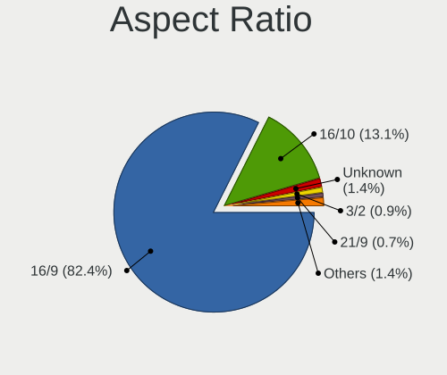

| Ratio   | Notebooks | Percent |
|---------|-----------|---------|
| 16/9    | 801       | 82.41%  |
| 16/10   | 127       | 13.07%  |
| Unknown | 14        | 1.44%   |
| 3/2     | 9         | 0.93%   |
| 21/9    | 7         | 0.72%   |
| 5/4     | 6         | 0.62%   |
| 4/3     | 4         | 0.41%   |
| 1.00    | 2         | 0.21%   |
| 32/9    | 1         | 0.1%    |
| 0.62    | 1         | 0.1%    |

Monitor Area
------------

Area in inch²

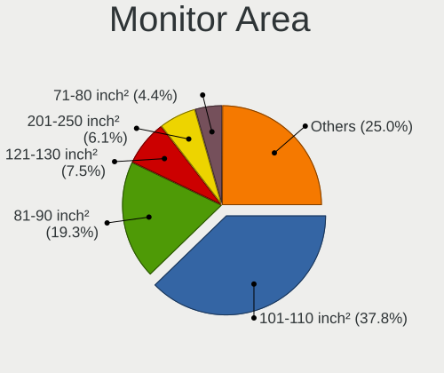

| Area in inch² | Notebooks | Percent |
|----------------|-----------|---------|
| 101-110        | 410       | 37.75%  |
| 81-90          | 210       | 19.34%  |
| 121-130        | 81        | 7.46%   |
| 201-250        | 66        | 6.08%   |
| 71-80          | 48        | 4.42%   |
| 301-350        | 37        | 3.41%   |
| 61-70          | 33        | 3.04%   |
| 51-60          | 26        | 2.39%   |
| 351-500        | 23        | 2.12%   |
| 111-120        | 22        | 2.03%   |
| Unknown        | 22        | 2.03%   |
| 41-50          | 18        | 1.66%   |
| More than 1000 | 17        | 1.57%   |
| 141-150        | 17        | 1.57%   |
| 251-300        | 16        | 1.47%   |
| 131-140        | 14        | 1.29%   |
| 151-200        | 9         | 0.83%   |
| 501-1000       | 8         | 0.74%   |
| 91-100         | 8         | 0.74%   |
| 1-40           | 1         | 0.09%   |

Pixel Density
-------------

Pixels per inch

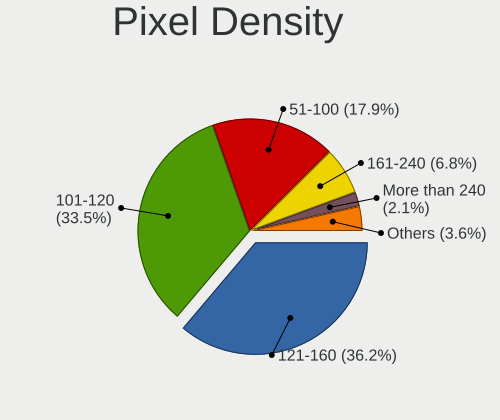

| Density       | Notebooks | Percent |
|---------------|-----------|---------|
| 121-160       | 386       | 36.18%  |
| 101-120       | 357       | 33.46%  |
| 51-100        | 191       | 17.9%   |
| 161-240       | 73        | 6.84%   |
| More than 240 | 22        | 2.06%   |
| Unknown       | 22        | 2.06%   |
| 1-50          | 16        | 1.5%    |

Multiple Monitors
-----------------

Total monitors connected

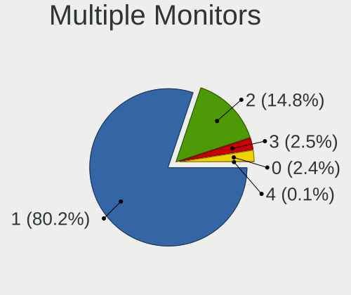

| Total | Notebooks | Percent |
|-------|-----------|---------|
| 1     | 796       | 80.16%  |
| 2     | 147       | 14.8%   |
| 3     | 25        | 2.52%   |
| 0     | 24        | 2.42%   |
| 4     | 1         | 0.1%    |

Network
-------

Net Controller Vendor
---------------------

Controller vendors

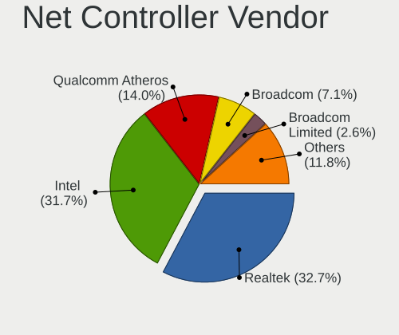

| Vendor                            | Notebooks | Percent |
|-----------------------------------|-----------|---------|
| Realtek Semiconductor             | 516       | 32.74%  |
| Intel                             | 500       | 31.73%  |
| Qualcomm Atheros                  | 221       | 14.02%  |
| Broadcom                          | 112       | 7.11%   |
| Broadcom Limited                  | 41        | 2.6%    |
| Marvell Technology Group          | 20        | 1.27%   |
| MediaTek                          | 19        | 1.21%   |
| Ralink                            | 16        | 1.02%   |
| TP-Link                           | 14        | 0.89%   |
| ASIX Electronics                  | 12        | 0.76%   |
| Sierra Wireless                   | 11        | 0.7%    |
| Ralink Technology                 | 11        | 0.7%    |
| Silicon Integrated Systems [SiS]  | 7         | 0.44%   |
| Ericsson Business Mobile Networks | 7         | 0.44%   |
| Attansic Technology               | 6         | 0.38%   |
| JMicron Technology                | 5         | 0.32%   |
| Hewlett-Packard                   | 5         | 0.32%   |
| Dell                              | 5         | 0.32%   |
| Nvidia                            | 4         | 0.25%   |
| DisplayLink                       | 4         | 0.25%   |
| VIA Technologies                  | 3         | 0.19%   |
| Samsung Electronics               | 3         | 0.19%   |
| Qualcomm Atheros Communications   | 3         | 0.19%   |
| Lenovo                            | 3         | 0.19%   |
| Xiaomi                            | 2         | 0.13%   |
| Shenzhen Goodix Technology        | 2         | 0.13%   |
| Qualcomm                          | 2         | 0.13%   |
| Fibocom                           | 2         | 0.13%   |
| D-Link                            | 2         | 0.13%   |
| ASUSTek Computer                  | 2         | 0.13%   |
| U.S. Robotics                     | 1         | 0.06%   |
| U-Blox                            | 1         | 0.06%   |
| Tenda                             | 1         | 0.06%   |
| STMicroelectronics                | 1         | 0.06%   |
| Quectel Wireless Solutions        | 1         | 0.06%   |
| Primax Electronics                | 1         | 0.06%   |
| NetGear                           | 1         | 0.06%   |
| Motorcomm Microelectronics.       | 1         | 0.06%   |
| Microsoft                         | 1         | 0.06%   |
| Microchip Technology              | 1         | 0.06%   |

Net Controller Model
--------------------

Controller models

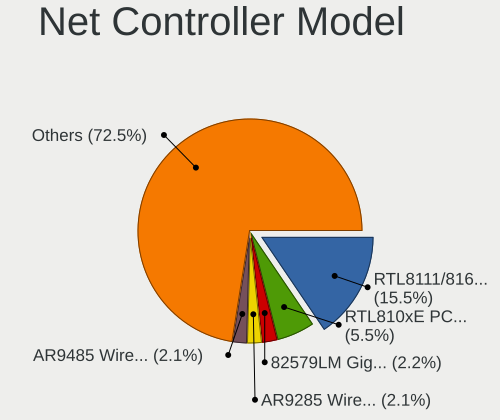

| Model                                                                  | Notebooks | Percent |
|------------------------------------------------------------------------|-----------|---------|
| Realtek RTL8111/8168/8211/8411 PCI Express Gigabit Ethernet Controller | 298       | 15.53%  |
| Realtek RTL810xE PCI Express Fast Ethernet controller                  | 106       | 5.52%   |
| Intel 82579LM Gigabit Network Connection (Lewisville)                  | 43        | 2.24%   |
| Qualcomm Atheros AR9285 Wireless Network Adapter (PCI-Express)         | 41        | 2.14%   |
| Qualcomm Atheros AR9485 Wireless Network Adapter                       | 40        | 2.08%   |
| Realtek RTL8153 Gigabit Ethernet Adapter                               | 35        | 1.82%   |
| Realtek RTL8821CE 802.11ac PCIe Wireless Network Adapter               | 34        | 1.77%   |
| Intel Wireless 7260                                                    | 34        | 1.77%   |
| Intel Centrino Advanced-N 6205 [Taylor Peak]                           | 33        | 1.72%   |
| Qualcomm Atheros QCA9565 / AR9565 Wireless Network Adapter             | 32        | 1.67%   |
| Intel Wireless 7265                                                    | 31        | 1.62%   |
| Intel Wi-Fi 6 AX200                                                    | 31        | 1.62%   |
| Qualcomm Atheros QCA9377 802.11ac Wireless Network Adapter             | 30        | 1.56%   |
| Broadcom BCM4313 802.11bgn Wireless Network Adapter                    | 29        | 1.51%   |
| Intel Wi-Fi 6 AX201                                                    | 28        | 1.46%   |
| Intel Wireless 8265 / 8275                                             | 26        | 1.35%   |
| Intel Wireless 8260                                                    | 25        | 1.3%    |
| Intel Comet Lake PCH-LP CNVi WiFi                                      | 25        | 1.3%    |
| Realtek RTL8822CE 802.11ac PCIe Wireless Network Adapter               | 23        | 1.2%    |
| Intel Wireless 3165                                                    | 21        | 1.09%   |
| Realtek RTL8723BE PCIe Wireless Network Adapter                        | 20        | 1.04%   |
| Intel Ethernet Connection I217-LM                                      | 18        | 0.94%   |
| Intel Cannon Point-LP CNVi [Wireless-AC]                               | 18        | 0.94%   |
| Qualcomm Atheros QCA6174 802.11ac Wireless Network Adapter             | 15        | 0.78%   |
| Broadcom BCM43142 802.11b/g/n                                          | 15        | 0.78%   |
| Intel Ethernet Connection I218-LM                                      | 14        | 0.73%   |
| Intel Centrino Ultimate-N 6300                                         | 14        | 0.73%   |
| Intel Centrino Advanced-N 6235                                         | 14        | 0.73%   |
| Intel 82577LM Gigabit Network Connection                               | 14        | 0.73%   |
| Intel Comet Lake PCH CNVi WiFi                                         | 13        | 0.68%   |
| Intel WiFi Link 5100                                                   | 12        | 0.63%   |
| Intel Ethernet Connection (3) I218-LM                                  | 12        | 0.63%   |
| Intel Cannon Lake PCH CNVi WiFi                                        | 12        | 0.63%   |
| Intel Alder Lake-P PCH CNVi WiFi                                       | 12        | 0.63%   |
| Qualcomm Atheros AR8151 v2.0 Gigabit Ethernet                          | 11        | 0.57%   |
| Intel Wireless 3160                                                    | 11        | 0.57%   |
| Intel PRO/Wireless 3945ABG [Golan] Network Connection                  | 11        | 0.57%   |
| Intel Ice Lake-LP PCH CNVi WiFi                                        | 11        | 0.57%   |
| Intel Ethernet Connection I219-LM                                      | 11        | 0.57%   |
| Realtek RTL8188CE 802.11b/g/n WiFi Adapter                             | 10        | 0.52%   |

Wireless Vendor
---------------

Wireless vendors

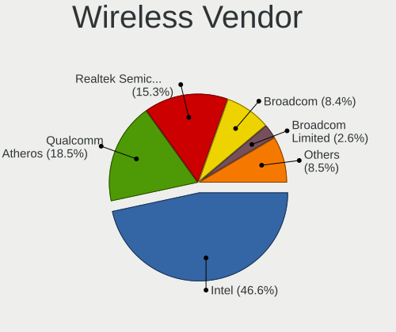

| Vendor                          | Notebooks | Percent |
|---------------------------------|-----------|---------|
| Intel                           | 477       | 46.63%  |
| Qualcomm Atheros                | 189       | 18.48%  |
| Realtek Semiconductor           | 157       | 15.35%  |
| Broadcom                        | 86        | 8.41%   |
| Broadcom Limited                | 27        | 2.64%   |
| Ralink                          | 16        | 1.56%   |
| MediaTek                        | 15        | 1.47%   |
| TP-Link                         | 13        | 1.27%   |
| Sierra Wireless                 | 11        | 1.08%   |
| Ralink Technology               | 11        | 1.08%   |
| Dell                            | 4         | 0.39%   |
| Qualcomm Atheros Communications | 3         | 0.29%   |
| Qualcomm                        | 2         | 0.2%    |
| Fibocom                         | 2         | 0.2%    |
| ASUSTek Computer                | 2         | 0.2%    |
| U.S. Robotics                   | 1         | 0.1%    |
| Tenda                           | 1         | 0.1%    |
| Quectel Wireless Solutions      | 1         | 0.1%    |
| NetGear                         | 1         | 0.1%    |
| Hewlett-Packard                 | 1         | 0.1%    |
| D-Link System                   | 1         | 0.1%    |
| D-Link                          | 1         | 0.1%    |
| Belkin Components               | 1         | 0.1%    |

Wireless Model
--------------

Wireless models

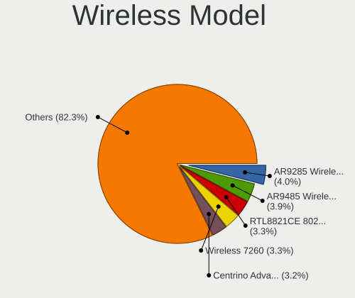

| Model                                                                   | Notebooks | Percent |
|-------------------------------------------------------------------------|-----------|---------|
| Qualcomm Atheros AR9285 Wireless Network Adapter (PCI-Express)          | 41        | 3.99%   |
| Qualcomm Atheros AR9485 Wireless Network Adapter                        | 40        | 3.89%   |
| Realtek RTL8821CE 802.11ac PCIe Wireless Network Adapter                | 34        | 3.31%   |
| Intel Wireless 7260                                                     | 34        | 3.31%   |
| Intel Centrino Advanced-N 6205 [Taylor Peak]                            | 33        | 3.21%   |
| Qualcomm Atheros QCA9565 / AR9565 Wireless Network Adapter              | 32        | 3.11%   |
| Intel Wireless 7265                                                     | 31        | 3.02%   |
| Intel Wi-Fi 6 AX200                                                     | 31        | 3.02%   |
| Qualcomm Atheros QCA9377 802.11ac Wireless Network Adapter              | 30        | 2.92%   |
| Broadcom BCM4313 802.11bgn Wireless Network Adapter                     | 29        | 2.82%   |
| Intel Wi-Fi 6 AX201                                                     | 28        | 2.72%   |
| Intel Wireless 8265 / 8275                                              | 26        | 2.53%   |
| Intel Wireless 8260                                                     | 25        | 2.43%   |
| Intel Comet Lake PCH-LP CNVi WiFi                                       | 25        | 2.43%   |
| Realtek RTL8822CE 802.11ac PCIe Wireless Network Adapter                | 23        | 2.24%   |
| Intel Wireless 3165                                                     | 21        | 2.04%   |
| Realtek RTL8723BE PCIe Wireless Network Adapter                         | 20        | 1.95%   |
| Intel Cannon Point-LP CNVi [Wireless-AC]                                | 18        | 1.75%   |
| Qualcomm Atheros QCA6174 802.11ac Wireless Network Adapter              | 15        | 1.46%   |
| Broadcom BCM43142 802.11b/g/n                                           | 15        | 1.46%   |
| Intel Centrino Ultimate-N 6300                                          | 14        | 1.36%   |
| Intel Centrino Advanced-N 6235                                          | 14        | 1.36%   |
| Intel Comet Lake PCH CNVi WiFi                                          | 13        | 1.26%   |
| Intel WiFi Link 5100                                                    | 12        | 1.17%   |
| Intel Cannon Lake PCH CNVi WiFi                                         | 12        | 1.17%   |
| Intel Wireless 3160                                                     | 11        | 1.07%   |
| Intel PRO/Wireless 3945ABG [Golan] Network Connection                   | 11        | 1.07%   |
| Intel Ice Lake-LP PCH CNVi WiFi                                         | 11        | 1.07%   |
| Realtek RTL8188CE 802.11b/g/n WiFi Adapter                              | 10        | 0.97%   |
| Qualcomm Atheros AR242x / AR542x Wireless Network Adapter (PCI-Express) | 10        | 0.97%   |
| Intel Tiger Lake PCH CNVi WiFi                                          | 10        | 0.97%   |
| Ralink RT3290 Wireless 802.11n 1T/1R PCIe                               | 9         | 0.88%   |
| Intel PRO/Wireless 4965 AG or AGN [Kedron] Network Connection           | 9         | 0.88%   |
| Intel Centrino Advanced-N 6200                                          | 9         | 0.88%   |
| Broadcom Limited BCM4312 802.11b/g LP-PHY                               | 9         | 0.88%   |
| Realtek RTL8822BE 802.11a/b/g/n/ac WiFi adapter                         | 8         | 0.78%   |
| Realtek RTL8188EUS 802.11n Wireless Network Adapter                     | 8         | 0.78%   |
| Realtek 802.11ac NIC                                                    | 8         | 0.78%   |
| Intel Centrino Wireless-N 1000 [Condor Peak]                            | 8         | 0.78%   |
| Intel Alder Lake-P PCH CNVi WiFi                                        | 8         | 0.78%   |

Ethernet Vendor
---------------

Ethernet vendors

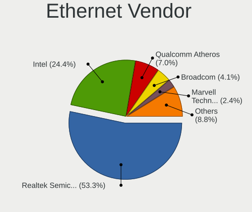

| Vendor                           | Notebooks | Percent |
|----------------------------------|-----------|---------|
| Realtek Semiconductor            | 452       | 53.3%   |
| Intel                            | 207       | 24.41%  |
| Qualcomm Atheros                 | 59        | 6.96%   |
| Broadcom                         | 35        | 4.13%   |
| Marvell Technology Group         | 20        | 2.36%   |
| Broadcom Limited                 | 15        | 1.77%   |
| ASIX Electronics                 | 12        | 1.42%   |
| Silicon Integrated Systems [SiS] | 6         | 0.71%   |
| Attansic Technology              | 6         | 0.71%   |
| JMicron Technology               | 5         | 0.59%   |
| Nvidia                           | 4         | 0.47%   |
| MediaTek                         | 4         | 0.47%   |
| DisplayLink                      | 4         | 0.47%   |
| VIA Technologies                 | 3         | 0.35%   |
| Samsung Electronics              | 3         | 0.35%   |
| Lenovo                           | 3         | 0.35%   |
| Xiaomi                           | 2         | 0.24%   |
| TP-Link                          | 1         | 0.12%   |
| Motorcomm Microelectronics.      | 1         | 0.12%   |
| Microsoft                        | 1         | 0.12%   |
| Microchip Technology             | 1         | 0.12%   |
| ICS Advent                       | 1         | 0.12%   |
| Hewlett-Packard                  | 1         | 0.12%   |
| D-Link                           | 1         | 0.12%   |
| Apple                            | 1         | 0.12%   |

Ethernet Model
--------------

Ethernet models

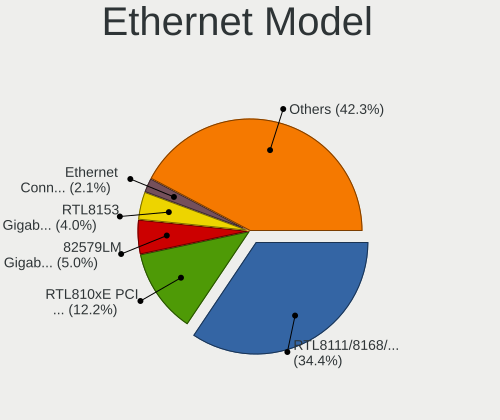

| Model                                                                  | Notebooks | Percent |
|------------------------------------------------------------------------|-----------|---------|
| Realtek RTL8111/8168/8211/8411 PCI Express Gigabit Ethernet Controller | 298       | 34.41%  |
| Realtek RTL810xE PCI Express Fast Ethernet controller                  | 106       | 12.24%  |
| Intel 82579LM Gigabit Network Connection (Lewisville)                  | 43        | 4.97%   |
| Realtek RTL8153 Gigabit Ethernet Adapter                               | 35        | 4.04%   |
| Intel Ethernet Connection I217-LM                                      | 18        | 2.08%   |
| Intel Ethernet Connection I218-LM                                      | 14        | 1.62%   |
| Intel 82577LM Gigabit Network Connection                               | 14        | 1.62%   |
| Intel Ethernet Connection (3) I218-LM                                  | 12        | 1.39%   |
| Qualcomm Atheros AR8151 v2.0 Gigabit Ethernet                          | 11        | 1.27%   |
| Intel Ethernet Connection I219-LM                                      | 11        | 1.27%   |
| ASIX AX88179 Gigabit Ethernet                                          | 9         | 1.04%   |
| Intel Ethernet Connection I219-V                                       | 8         | 0.92%   |
| Intel 82567LM Gigabit Network Connection                               | 8         | 0.92%   |
| Realtek RTL8125 2.5GbE Controller                                      | 7         | 0.81%   |
| Qualcomm Atheros AR8162 Fast Ethernet                                  | 7         | 0.81%   |
| Intel Ethernet Connection (6) I219-V                                   | 7         | 0.81%   |
| Realtek RTL8152 Fast Ethernet Adapter                                  | 6         | 0.69%   |
| Qualcomm Atheros QCA8172 Fast Ethernet                                 | 6         | 0.69%   |
| Qualcomm Atheros AR8132 Fast Ethernet                                  | 6         | 0.69%   |
| Marvell Group 88E8040 PCI-E Fast Ethernet Controller                   | 6         | 0.69%   |
| Intel Ethernet Connection (6) I219-LM                                  | 6         | 0.69%   |
| Intel Ethernet Connection (4) I219-V                                   | 6         | 0.69%   |
| Intel Ethernet Connection (4) I219-LM                                  | 6         | 0.69%   |
| Intel Ethernet Connection (2) I219-LM                                  | 6         | 0.69%   |
| Attansic AR8152 v2.0 Fast Ethernet                                     | 6         | 0.69%   |
| Realtek Killer E3000 2.5GbE Controller                                 | 5         | 0.58%   |
| Qualcomm Atheros Killer E2500 Gigabit Ethernet Controller              | 5         | 0.58%   |
| Intel Ethernet Connection (10) I219-V                                  | 5         | 0.58%   |
| Broadcom NetLink BCM57785 Gigabit Ethernet PCIe                        | 5         | 0.58%   |
| Silicon Integrated Systems [SiS] 191 Gigabit Ethernet Adapter          | 4         | 0.46%   |
| Realtek RTL-8100/8101L/8139 PCI Fast Ethernet Adapter                  | 4         | 0.46%   |
| Qualcomm Atheros QCA8171 Gigabit Ethernet                              | 4         | 0.46%   |
| Qualcomm Atheros Killer E2400 Gigabit Ethernet Controller              | 4         | 0.46%   |
| Qualcomm Atheros AR8161 Gigabit Ethernet                               | 4         | 0.46%   |
| Qualcomm Atheros AR8131 Gigabit Ethernet                               | 4         | 0.46%   |
| JMicron JMC250 PCI Express Gigabit Ethernet Controller                 | 4         | 0.46%   |
| Intel Ethernet Connection (5) I219-LM                                  | 4         | 0.46%   |
| Intel Ethernet Connection (13) I219-V                                  | 4         | 0.46%   |
| Intel Alder Lake-P PCH CNVi WiFi                                       | 4         | 0.46%   |
| Broadcom NetXtreme BCM5764M Gigabit Ethernet PCIe                      | 4         | 0.46%   |

Net Controller Kind
-------------------

Ethernet, WiFi or modem

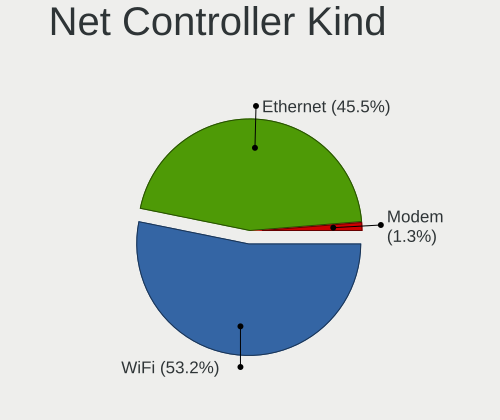

| Kind     | Notebooks | Percent |
|----------|-----------|---------|
| WiFi     | 954       | 53.18%  |
| Ethernet | 817       | 45.54%  |
| Modem    | 23        | 1.28%   |

Used Controller
---------------

Currently used network controller

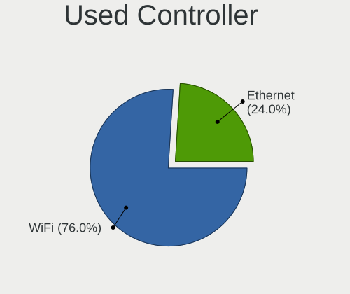

| Kind     | Notebooks | Percent |
|----------|-----------|---------|
| WiFi     | 804       | 75.99%  |
| Ethernet | 254       | 24.01%  |

NICs
----

Total network controllers on board

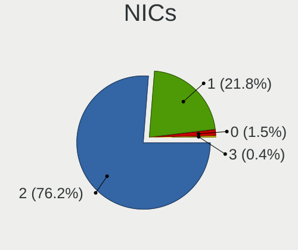

| Total | Notebooks | Percent |
|-------|-----------|---------|
| 2     | 751       | 76.24%  |
| 1     | 215       | 21.83%  |
| 0     | 15        | 1.52%   |
| 3     | 4         | 0.41%   |

IPv6
----

IPv6 vs IPv4

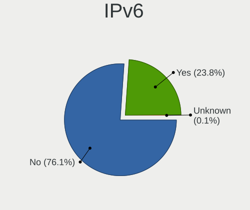

| Used    | Notebooks | Percent |
|---------|-----------|---------|
| No      | 758       | 76.1%   |
| Yes     | 237       | 23.8%   |
| Unknown | 1         | 0.1%    |

Bluetooth
---------

Bluetooth Vendor
----------------

Controller vendors

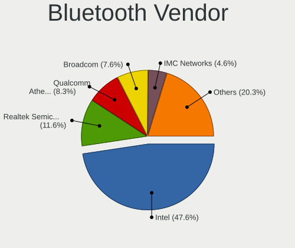

| Vendor                          | Notebooks | Percent |
|---------------------------------|-----------|---------|
| Intel                           | 362       | 47.63%  |
| Realtek Semiconductor           | 88        | 11.58%  |
| Qualcomm Atheros Communications | 63        | 8.29%   |
| Broadcom                        | 58        | 7.63%   |
| IMC Networks                    | 35        | 4.61%   |
| Lite-On Technology              | 25        | 3.29%   |
| Foxconn / Hon Hai               | 24        | 3.16%   |
| Dell                            | 24        | 3.16%   |
| Apple                           | 15        | 1.97%   |
| Hewlett-Packard                 | 14        | 1.84%   |
| Cambridge Silicon Radio         | 13        | 1.71%   |
| Toshiba                         | 9         | 1.18%   |
| Ralink                          | 9         | 1.18%   |
| MediaTek                        | 4         | 0.53%   |
| ASUSTek Computer                | 4         | 0.53%   |
| Foxconn International           | 3         | 0.39%   |
| Ralink Technology               | 2         | 0.26%   |
| Alps Electric                   | 2         | 0.26%   |
| USI                             | 1         | 0.13%   |
| TP-Link                         | 1         | 0.13%   |
| Realtek                         | 1         | 0.13%   |
| Qcom                            | 1         | 0.13%   |
| Chicony Electronics             | 1         | 0.13%   |
| Unknown                         | 1         | 0.13%   |

Bluetooth Model
---------------

Controller models

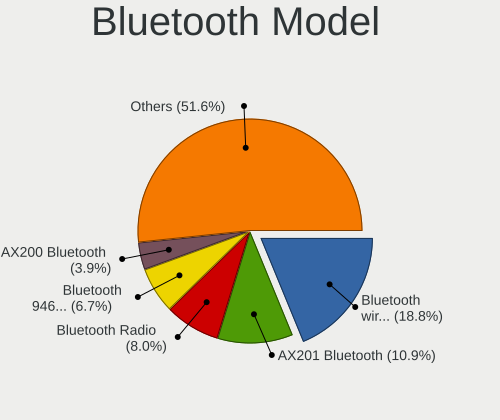

| Model                                                                               | Notebooks | Percent |
|-------------------------------------------------------------------------------------|-----------|---------|
| Intel Bluetooth wireless interface                                                  | 143       | 18.79%  |
| Intel AX201 Bluetooth                                                               | 83        | 10.91%  |
| Realtek Bluetooth Radio                                                             | 61        | 8.02%   |
| Intel Bluetooth 9460/9560 Jefferson Peak (JfP)                                      | 51        | 6.7%    |
| Intel AX200 Bluetooth                                                               | 30        | 3.94%   |
| Qualcomm Atheros  Bluetooth Device                                                  | 21        | 2.76%   |
| Realtek  Bluetooth 4.2 Adapter                                                      | 19        | 2.5%    |
| Intel Centrino Bluetooth Wireless Transceiver                                       | 19        | 2.5%    |
| Qualcomm Atheros AR3012 Bluetooth 4.0                                               | 16        | 2.1%    |
| Dell DW375 Bluetooth Module                                                         | 14        | 1.84%   |
| Cambridge Silicon Radio Bluetooth Dongle (HCI mode)                                 | 13        | 1.71%   |
| Qualcomm Atheros AR3011 Bluetooth                                                   | 12        | 1.58%   |
| IMC Networks Bluetooth Device                                                       | 12        | 1.58%   |
| Lite-On Atheros AR3012 Bluetooth                                                    | 10        | 1.31%   |
| Intel Bluetooth Device                                                              | 10        | 1.31%   |
| Broadcom BCM20702 Bluetooth 4.0 [ThinkPad]                                          | 10        | 1.31%   |
| Ralink RT3290 Bluetooth                                                             | 9         | 1.18%   |
| IMC Networks Wireless_Device                                                        | 9         | 1.18%   |
| Intel Centrino Advanced-N 6230 Bluetooth adapter                                    | 8         | 1.05%   |
| Foxconn / Hon Hai Bluetooth Device                                                  | 8         | 1.05%   |
| Broadcom BCM2045B (BDC-2.1)                                                         | 8         | 1.05%   |
| Apple Bluetooth Host Controller                                                     | 8         | 1.05%   |
| Qualcomm Atheros QCA61x4 Bluetooth 4.0                                              | 7         | 0.92%   |
| Intel Wireless-AC 3168 Bluetooth                                                    | 7         | 0.92%   |
| Intel AX210 Bluetooth                                                               | 7         | 0.92%   |
| IMC Networks Bluetooth Radio                                                        | 7         | 0.92%   |
| HP Bluetooth 2.0 Interface [Broadcom BCM2045]                                       | 7         | 0.92%   |
| Broadcom BCM2070 Bluetooth 2.1 + EDR                                                | 7         | 0.92%   |
| Lite-On Qualcomm Atheros QCA9377 Bluetooth                                          | 6         | 0.79%   |
| Lite-On Bluetooth Device                                                            | 6         | 0.79%   |
| HP Broadcom 2070 Bluetooth Combo                                                    | 6         | 0.79%   |
| Broadcom HP Portable SoftSailing                                                    | 6         | 0.79%   |
| Qualcomm Atheros Bluetooth USB Host Controller                                      | 5         | 0.66%   |
| Intel Wireless-AC 9260 Bluetooth Adapter                                            | 5         | 0.66%   |
| Realtek RTL8723B Bluetooth                                                          | 4         | 0.53%   |
| IMC Networks Atheros AR3012 Bluetooth 4.0 Adapter                                   | 4         | 0.53%   |
| Foxconn / Hon Hai Foxconn T77H114 BCM2070 [Single-Chip Bluetooth 2.1 + EDR Adapter] | 4         | 0.53%   |
| Dell Wireless 365 Bluetooth                                                         | 4         | 0.53%   |
| Broadcom HP Portable Valentine                                                      | 4         | 0.53%   |
| Broadcom BCM43142A0 Bluetooth 4.0                                                   | 4         | 0.53%   |

Sound
-----

Sound Vendor
------------

Sound card vendors

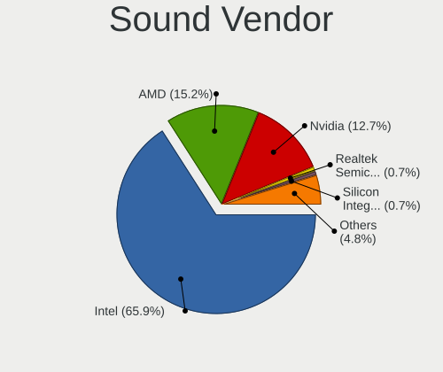

| Vendor                                         | Notebooks | Percent |
|------------------------------------------------|-----------|---------|
| Intel                                          | 795       | 65.92%  |
| AMD                                            | 183       | 15.17%  |
| Nvidia                                         | 153       | 12.69%  |
| Realtek Semiconductor                          | 9         | 0.75%   |
| Silicon Integrated Systems [SiS]               | 8         | 0.66%   |
| C-Media Electronics                            | 8         | 0.66%   |
| Lenovo                                         | 6         | 0.5%    |
| GN Netcom                                      | 4         | 0.33%   |
| VIA Technologies                               | 3         | 0.25%   |
| Plantronics                                    | 3         | 0.25%   |
| JMTek                                          | 3         | 0.25%   |
| Hewlett-Packard                                | 3         | 0.25%   |
| Generalplus Technology                         | 3         | 0.25%   |
| Meizu                                          | 2         | 0.17%   |
| Logitech                                       | 2         | 0.17%   |
| Kingston Technology                            | 2         | 0.17%   |
| Conexant Systems                               | 2         | 0.17%   |
| ASUSTek Computer                               | 2         | 0.17%   |
| Valve Software                                 | 1         | 0.08%   |
| THI Headphone                                  | 1         | 0.08%   |
| Sony                                           | 1         | 0.08%   |
| SmartAction                                    | 1         | 0.08%   |
| Siemens Information and Communication Products | 1         | 0.08%   |
| Project DAC DS                                 | 1         | 0.08%   |
| No brand                                       | 1         | 0.08%   |
| Jieli Technology                               | 1         | 0.08%   |
| FiiO Electronics Technology                    | 1         | 0.08%   |
| Elite Silicon                                  | 1         | 0.08%   |
| DSEA A/S                                       | 1         | 0.08%   |
| Corsair                                        | 1         | 0.08%   |
| CMX Systems                                    | 1         | 0.08%   |
| BEHRINGER International                        | 1         | 0.08%   |
| Astro Gaming                                   | 1         | 0.08%   |

Sound Model
-----------

Sound card models

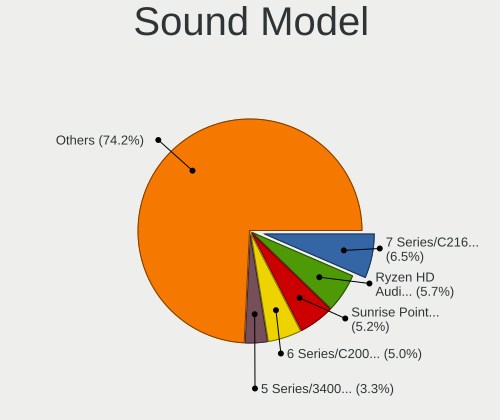

| Model                                                                                             | Notebooks | Percent |
|---------------------------------------------------------------------------------------------------|-----------|---------|
| Intel 7 Series/C216 Chipset Family High Definition Audio Controller                               | 94        | 6.49%   |
| AMD Ryzen HD Audio Controller                                                                     | 83        | 5.73%   |
| Intel Sunrise Point-LP HD Audio                                                                   | 76        | 5.25%   |
| Intel 6 Series/C200 Series Chipset Family High Definition Audio Controller                        | 72        | 4.97%   |
| Intel 5 Series/3400 Series Chipset High Definition Audio                                          | 48        | 3.31%   |
| Intel 82801I (ICH9 Family) HD Audio Controller                                                    | 45        | 3.11%   |
| Intel Haswell-ULT HD Audio Controller                                                             | 40        | 2.76%   |
| Intel 8 Series HD Audio Controller                                                                | 40        | 2.76%   |
| Intel Wildcat Point-LP High Definition Audio Controller                                           | 34        | 2.35%   |
| Intel Tiger Lake-LP Smart Sound Technology Audio Controller                                       | 34        | 2.35%   |
| Intel Broadwell-U Audio Controller                                                                | 34        | 2.35%   |
| Intel Cannon Point-LP High Definition Audio Controller                                            | 32        | 2.21%   |
| Intel 8 Series/C220 Series Chipset High Definition Audio Controller                               | 32        | 2.21%   |
| AMD Renoir/Cezanne HDMI/DP Audio Controller                                                       | 32        | 2.21%   |
| Intel NM10/ICH7 Family High Definition Audio Controller                                           | 31        | 2.14%   |
| AMD FCH Azalia Controller                                                                         | 31        | 2.14%   |
| Intel Xeon E3-1200 v3/4th Gen Core Processor HD Audio Controller                                  | 30        | 2.07%   |
| AMD Raven/Raven2/Fenghuang HDMI/DP Audio Controller                                               | 29        | 2%      |
| Intel Comet Lake PCH-LP cAVS                                                                      | 26        | 1.8%    |
| Intel Cannon Lake PCH cAVS                                                                        | 24        | 1.66%   |
| AMD SBx00 Azalia (Intel HDA)                                                                      | 24        | 1.66%   |
| Intel Atom Processor Z36xxx/Z37xxx Series High Definition Audio Controller                        | 23        | 1.59%   |
| AMD Kabini HDMI/DP Audio                                                                          | 23        | 1.59%   |
| Intel 82801H (ICH8 Family) HD Audio Controller                                                    | 22        | 1.52%   |
| Intel Celeron/Pentium Silver Processor High Definition Audio                                      | 21        | 1.45%   |
| Nvidia TU107 GeForce GTX 1650 High Definition Audio Controller                                    | 18        | 1.24%   |
| Intel Ice Lake-LP Smart Sound Technology Audio Controller                                         | 18        | 1.24%   |
| Intel Atom/Celeron/Pentium Processor x5-E8000/J3xxx/N3xxx Series High Definition Audio Controller | 18        | 1.24%   |
| Nvidia GF108 High Definition Audio Controller                                                     | 16        | 1.1%    |
| Nvidia GA106 High Definition Audio Controller                                                     | 16        | 1.1%    |
| Intel CM238 HD Audio Controller                                                                   | 16        | 1.1%    |
| AMD Family 15h (Models 60h-6fh) Audio Controller                                                  | 16        | 1.1%    |
| Intel Comet Lake PCH cAVS                                                                         | 15        | 1.04%   |
| Intel Alder Lake PCH-P High Definition Audio Controller                                           | 15        | 1.04%   |
| Intel Tiger Lake-H HD Audio Controller                                                            | 14        | 0.97%   |
| Intel 100 Series/C230 Series Chipset Family HD Audio Controller                                   | 13        | 0.9%    |
| AMD High Definition Audio Controller                                                              | 13        | 0.9%    |
| AMD Radeon High Definition Audio Controller                                                       | 12        | 0.83%   |
| Nvidia High Definition Audio Controller                                                           | 11        | 0.76%   |
| Nvidia GA104 High Definition Audio Controller                                                     | 9         | 0.62%   |

Memory
------

Memory Vendor
-------------

Memory module vendors

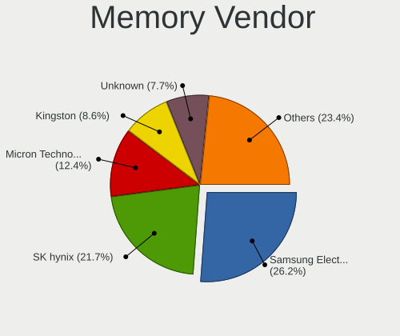

| Vendor                                           | Notebooks | Percent |
|--------------------------------------------------|-----------|---------|
| Samsung Electronics                              | 207       | 26.17%  |
| SK hynix                                         | 172       | 21.74%  |
| Micron Technology                                | 98        | 12.39%  |
| Kingston                                         | 68        | 8.6%    |
| Unknown                                          | 61        | 7.71%   |
| Crucial                                          | 47        | 5.94%   |
| Ramaxel Technology                               | 26        | 3.29%   |
| Nanya Technology                                 | 16        | 2.02%   |
| Elpida                                           | 15        | 1.9%    |
| A-DATA Technology                                | 15        | 1.9%    |
| Unknown (ABCD)                                   | 13        | 1.64%   |
| Corsair                                          | 11        | 1.39%   |
| Smart                                            | 8         | 1.01%   |
| G.Skill                                          | 4         | 0.51%   |
| Unknown                                          | 4         | 0.51%   |
| Teikon                                           | 3         | 0.38%   |
| Patriot                                          | 3         | 0.38%   |
| Netlist                                          | 2         | 0.25%   |
| Neo Forza                                        | 2         | 0.25%   |
| GOODRAM                                          | 2         | 0.25%   |
| Unknown (940A)                                   | 1         | 0.13%   |
| Unknown (0x7F61000000000000)                     | 1         | 0.13%   |
| Unknown (0x4D342037305435363633515A332D43463720) | 1         | 0.13%   |
| Unknown (0x36345431323830323045444C322E35433220) | 1         | 0.13%   |
| Unknown (0x0E75)                                 | 1         | 0.13%   |
| Unknown (0x0C26)                                 | 1         | 0.13%   |
| Transcend                                        | 1         | 0.13%   |
| Toshiba                                          | 1         | 0.13%   |
| Team                                             | 1         | 0.13%   |
| Smart Brazil                                     | 1         | 0.13%   |
| Qimonda                                          | 1         | 0.13%   |
| Eluktro                                          | 1         | 0.13%   |
| ASint Technology                                 | 1         | 0.13%   |
| Apacer                                           | 1         | 0.13%   |

Memory Model
------------

Memory module models

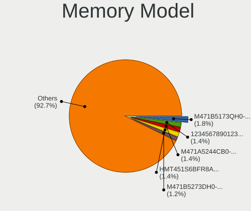

| Model                                                            | Notebooks | Percent |
|------------------------------------------------------------------|-----------|---------|
| Samsung RAM M471B5173QH0-YK0 4GB SODIMM DDR3 1600MT/s            | 15        | 1.78%   |
| Unknown (ABCD) RAM 123456789012345678 2GB SODIMM LPDDR4 2400MT/s | 12        | 1.43%   |
| SK hynix RAM HMT451S6BFR8A-PB 4GB SODIMM DDR3 1600MT/s           | 12        | 1.43%   |
| Samsung RAM M471A5244CB0-CTD 4GB SODIMM DDR4 3266MT/s            | 12        | 1.43%   |
| Samsung RAM M471B5273DH0-CH9 4GB SODIMM DDR3 1600MT/s            | 10        | 1.19%   |
| SK hynix RAM HMA81GS6DJR8N-XN 8GB SODIMM DDR4 3200MT/s           | 9         | 1.07%   |
| Samsung RAM M471B5173EB0-YK0 4GB SODIMM DDR3 1600MT/s            | 9         | 1.07%   |
| SK hynix RAM HMT351S6CFR8C-PB 4GB SODIMM DDR3 1600MT/s           | 8         | 0.95%   |
| Samsung RAM M471B5173DB0-YK0 4GB SODIMM DDR3 1600MT/s            | 8         | 0.95%   |
| Unknown RAM Module 2GB SODIMM DDR2 667MT/s                       | 7         | 0.83%   |
| Samsung RAM M471B5273CH0-CH9 4GB SODIMM DDR3 1334MT/s            | 7         | 0.83%   |
| Samsung RAM M471B1G73DB0-YK0 8GB SODIMM DDR3 1600MT/s            | 7         | 0.83%   |
| Samsung RAM M471A1K43CB1-CRC 8GB SODIMM DDR4 8400MT/s            | 7         | 0.83%   |
| SK hynix RAM HMT451S6AFR8A-PB 4GB SODIMM DDR3 1600MT/s           | 6         | 0.71%   |
| SK hynix RAM HMT41GS6BFR8A-PB 8GB SODIMM DDR3 2667MT/s           | 6         | 0.71%   |
| SK hynix RAM HMA851S6DJR6N-XN 4GB SODIMM DDR4 3200MT/s           | 6         | 0.71%   |
| Samsung RAM M471A1K43DB1-CTD 8GB SODIMM DDR4 2667MT/s            | 6         | 0.71%   |
| Micron RAM 4ATF1G64HZ-3G2E1 8GB SODIMM DDR4 3200MT/s             | 6         | 0.71%   |
| SK hynix RAM HMT351S6EFR8A-PB 4GB SODIMM DDR3 1600MT/s           | 5         | 0.59%   |
| SK hynix RAM HMT351S6CFR8C-H9 4GB SODIMM DDR3 1333MT/s           | 5         | 0.59%   |
| Samsung RAM M471B5773DH0-CH9 2GB SODIMM DDR3 1600MT/s            | 5         | 0.59%   |
| Samsung RAM M471B1G73EB0-YK0 8192MB SODIMM DDR3 1600MT/s         | 5         | 0.59%   |
| Samsung RAM M471A5244CB0-CRC 4GB SODIMM DDR4 2667MT/s            | 5         | 0.59%   |
| Micron RAM 16KTF1G64HZ-1G6E1 8GB SODIMM DDR3 1600MT/s            | 5         | 0.59%   |
| Unknown RAM Module 1GB SODIMM DDR2 667MT/s                       | 4         | 0.48%   |
| SK hynix RAM HMT41GS6AFR8A-PB 8GiB SODIMM DDR3 2667MT/s          | 4         | 0.48%   |
| SK hynix RAM HMT325S6CFR8C-PB 2GB SODIMM DDR3 1600MT/s           | 4         | 0.48%   |
| Samsung RAM M471B5673EH1-CF8 2GB SODIMM 4199MT/s                 | 4         | 0.48%   |
| Samsung RAM M471A5244CB0-CWE 4GB SODIMM DDR4 3200MT/s            | 4         | 0.48%   |
| Samsung RAM M471A5244CB0-CTD 4GB Row Of Chips DDR4 2667MT/s      | 4         | 0.48%   |
| Samsung RAM M471A1K43DB1-CWE 8GB SODIMM DDR4 3200MT/s            | 4         | 0.48%   |
| Samsung RAM M471A1K43BB1-CRC 8GB SODIMM DDR4 2667MT/s            | 4         | 0.48%   |
| Micron RAM 8KTF51264HZ-1G6N1 4GB SODIMM DDR3 1600MT/s            | 4         | 0.48%   |
| Crucial RAM CT51264BF160B.C16F 4GB SODIMM DDR3 4199MT/s          | 4         | 0.48%   |
| Unknown                                                          | 4         | 0.48%   |
| Unknown RAM Module 4GB SODIMM DDR3                               | 3         | 0.36%   |
| Unknown RAM Module 4096MB SODIMM DDR3                            | 3         | 0.36%   |
| Unknown RAM Module 2GB SODIMM DDR3                               | 3         | 0.36%   |
| Unknown RAM Module 2GB SODIMM DDR2                               | 3         | 0.36%   |
| SK hynix RAM Module 8GB SODIMM DDR4 2400MT/s                     | 3         | 0.36%   |

Memory Kind
-----------

Memory module kinds

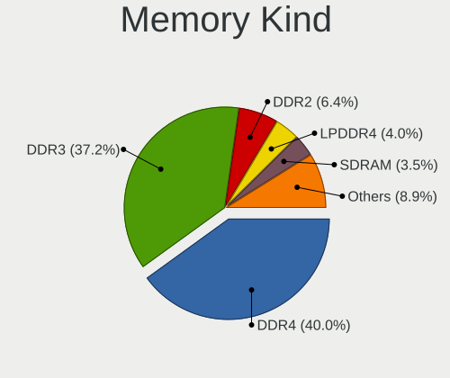

| Kind    | Notebooks | Percent |
|---------|-----------|---------|
| DDR4    | 271       | 40.03%  |
| DDR3    | 252       | 37.22%  |
| DDR2    | 43        | 6.35%   |
| LPDDR4  | 27        | 3.99%   |
| SDRAM   | 24        | 3.55%   |
| DDR5    | 24        | 3.55%   |
| LPDDR3  | 18        | 2.66%   |
| DDR     | 7         | 1.03%   |
| LPDDR5  | 6         | 0.89%   |
| Unknown | 3         | 0.44%   |
| DRAM    | 2         | 0.3%    |

Memory Form Factor
------------------

Physical design of the memory module

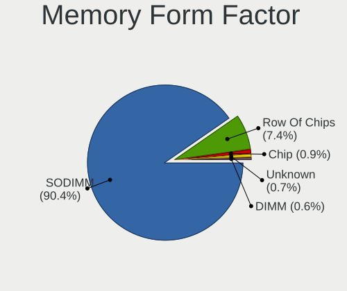

| Name         | Notebooks | Percent |
|--------------|-----------|---------|
| SODIMM       | 609       | 90.36%  |
| Row Of Chips | 50        | 7.42%   |
| Chip         | 6         | 0.89%   |
| Unknown      | 5         | 0.74%   |
| DIMM         | 4         | 0.59%   |

Memory Size
-----------

Memory module size

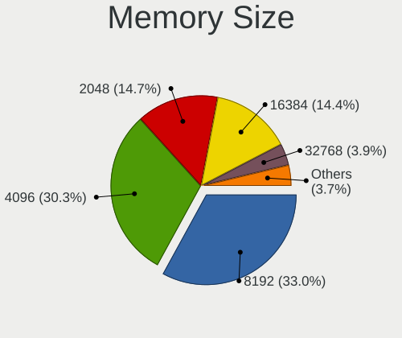

| Size  | Notebooks | Percent |
|-------|-----------|---------|
| 8192  | 247       | 32.98%  |
| 4096  | 227       | 30.31%  |
| 2048  | 110       | 14.69%  |
| 16384 | 108       | 14.42%  |
| 32768 | 29        | 3.87%   |
| 1024  | 21        | 2.8%    |
| 512   | 3         | 0.4%    |
| 49152 | 1         | 0.13%   |
| 12288 | 1         | 0.13%   |
| 1536  | 1         | 0.13%   |
| 256   | 1         | 0.13%   |

Memory Speed
------------

Memory module speed

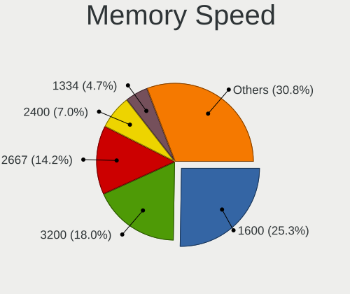

| Speed   | Notebooks | Percent |
|---------|-----------|---------|
| 1600    | 187       | 25.27%  |
| 3200    | 133       | 17.97%  |
| 2667    | 105       | 14.19%  |
| 2400    | 52        | 7.03%   |
| 1334    | 35        | 4.73%   |
| 2133    | 30        | 4.05%   |
| Unknown | 23        | 3.11%   |
| 667     | 22        | 2.97%   |
| 1333    | 21        | 2.84%   |
| 4199    | 16        | 2.16%   |
| 5600    | 13        | 1.76%   |
| 3266    | 12        | 1.62%   |
| 800     | 12        | 1.62%   |
| 4800    | 11        | 1.49%   |
| 1066    | 11        | 1.49%   |
| 8400    | 9         | 1.22%   |
| 1067    | 9         | 1.22%   |
| 2048    | 7         | 0.95%   |
| 4267    | 6         | 0.81%   |
| 1867    | 5         | 0.68%   |
| 975     | 5         | 0.68%   |
| 6400    | 4         | 0.54%   |
| 2933    | 3         | 0.41%   |
| 533     | 3         | 0.41%   |
| 7500    | 1         | 0.14%   |
| 5500    | 1         | 0.14%   |
| 4266    | 1         | 0.14%   |
| 3733    | 1         | 0.14%   |
| 1639    | 1         | 0.14%   |
| 133     | 1         | 0.14%   |

Printers & scanners
-------------------

Printer Vendor
--------------

Printer device vendors

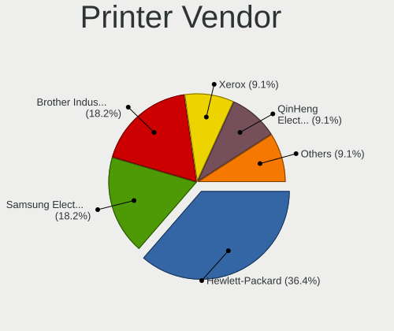

| Vendor              | Notebooks | Percent |
|---------------------|-----------|---------|
| Hewlett-Packard     | 4         | 36.36%  |
| Samsung Electronics | 2         | 18.18%  |
| Brother Industries  | 2         | 18.18%  |
| Xerox               | 1         | 9.09%   |
| QinHeng Electronics | 1         | 9.09%   |
| Canon               | 1         | 9.09%   |

Printer Model
-------------

Printer device models

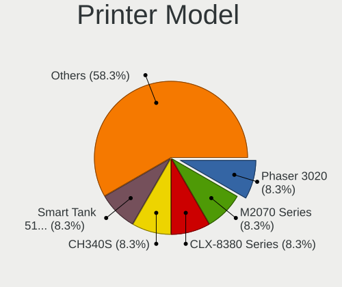

| Model                            | Notebooks | Percent |
|----------------------------------|-----------|---------|
| Xerox Phaser 3020                | 1         | 8.33%   |
| Samsung M2070 Series             | 1         | 8.33%   |
| Samsung CLX-8380 Series          | 1         | 8.33%   |
| QinHeng CH340S                   | 1         | 8.33%   |
| HP Smart Tank 510 series         | 1         | 8.33%   |
| HP ENVY Photo 7800 series        | 1         | 8.33%   |
| HP Deskjet F4500 series          | 1         | 8.33%   |
| HP DeskJet 845c                  | 1         | 8.33%   |
| HP DeskJet 2600 series           | 1         | 8.33%   |
| Canon PIXMA MG2500 Series        | 1         | 8.33%   |
| Brother MFC-7340                 | 1         | 8.33%   |
| Brother DCP-7055 scanner/printer | 1         | 8.33%   |

Scanner Vendor
--------------

Scanner device vendors

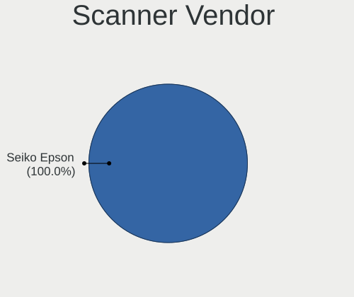

| Vendor                                         | Notebooks | Percent |
|------------------------------------------------|-----------|---------|
| Seiko Epson                                    | 2         | 50%     |
| Siemens Information and Communication Products | 1         | 25%     |
| Canon                                          | 1         | 25%     |

Scanner Model
-------------

Scanner device models

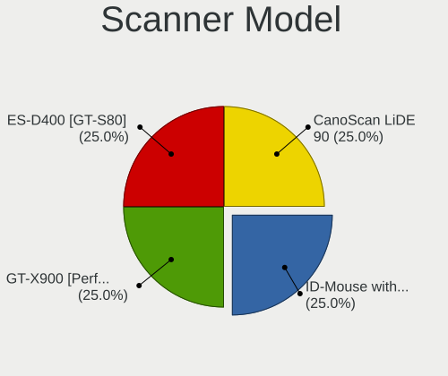

| Model                                                                           | Notebooks | Percent |
|---------------------------------------------------------------------------------|-----------|---------|
| Siemens Information and Communication Products ID-Mouse with Fingerprint Reader | 1         | 25%     |
| Seiko Epson GT-X900 [Perfection V700/V750 Photo]                                | 1         | 25%     |
| Seiko Epson ES-D400 [GT-S80]                                                    | 1         | 25%     |
| Canon CanoScan LiDE 90                                                          | 1         | 25%     |

Camera
------

Camera Vendor
-------------

Camera device vendors

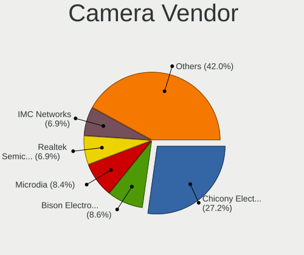

| Vendor                                 | Notebooks | Percent |
|----------------------------------------|-----------|---------|
| Chicony Electronics                    | 237       | 27.21%  |
| Bison Electronics                      | 75        | 8.61%   |
| Microdia                               | 73        | 8.38%   |
| Realtek Semiconductor                  | 60        | 6.89%   |
| IMC Networks                           | 60        | 6.89%   |
| Sunplus Innovation Technology          | 47        | 5.4%    |
| Cheng Uei Precision Industry (Foxlink) | 42        | 4.82%   |
| Quanta                                 | 39        | 4.48%   |
| Suyin                                  | 33        | 3.79%   |
| Syntek                                 | 24        | 2.76%   |
| Ricoh                                  | 19        | 2.18%   |
| Luxvisions Innotech Limited            | 19        | 2.18%   |
| Lite-On Technology                     | 16        | 1.84%   |
| Apple                                  | 15        | 1.72%   |
| Silicon Motion                         | 14        | 1.61%   |
| Logitech                               | 13        | 1.49%   |
| Alcor Micro                            | 11        | 1.26%   |
| Acer                                   | 8         | 0.92%   |
| Importek                               | 7         | 0.8%    |
| Lenovo                                 | 6         | 0.69%   |
| Sonix Technology                       | 4         | 0.46%   |
| SunplusIT                              | 3         | 0.34%   |
| Samsung Electronics                    | 3         | 0.34%   |
| Primax Electronics                     | 3         | 0.34%   |
| DigiTech                               | 3         | 0.34%   |
| ALi                                    | 3         | 0.34%   |
| Z-Star Microelectronics                | 2         | 0.23%   |
| Y Media                                | 2         | 0.23%   |
| Ruision                                | 2         | 0.23%   |
| LG Electronics                         | 2         | 0.23%   |
| Intel                                  | 2         | 0.23%   |
| icSpring                               | 2         | 0.23%   |
| Generalplus Technology                 | 2         | 0.23%   |
| Cubeternet                             | 2         | 0.23%   |
| ARC International                      | 2         | 0.23%   |
| Valve Software                         | 1         | 0.11%   |
| Sunplus Technology                     | 1         | 0.11%   |
| Shinetech                              | 1         | 0.11%   |
| Shenzhen Kingcome Optoelectronic       | 1         | 0.11%   |
| Razer USA                              | 1         | 0.11%   |

Camera Model
------------

Camera device models

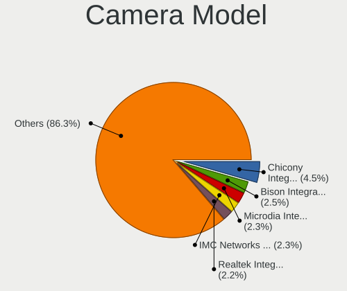

| Model                                                   | Notebooks | Percent |
|---------------------------------------------------------|-----------|---------|
| Chicony Integrated Camera                               | 39        | 4.47%   |
| Bison Integrated Camera                                 | 22        | 2.52%   |
| Microdia Integrated_Webcam_HD                           | 20        | 2.29%   |
| IMC Networks USB2.0 HD UVC WebCam                       | 20        | 2.29%   |
| Realtek Integrated_Webcam_HD                            | 19        | 2.18%   |
| Chicony HD Webcam                                       | 17        | 1.95%   |
| Microdia Integrated Webcam                              | 14        | 1.6%    |
| IMC Networks Integrated Camera                          | 14        | 1.6%    |
| Chicony HP HD Camera                                    | 14        | 1.6%    |
| Syntek Integrated Camera                                | 13        | 1.49%   |
| Sunplus Integrated_Webcam_HD                            | 13        | 1.49%   |
| Chicony USB2.0 VGA UVC WebCam                           | 11        | 1.26%   |
| Quanta HD User Facing                                   | 9         | 1.03%   |
| Lite-On Integrated Camera                               | 8         | 0.92%   |
| Chicony VGA WebCam                                      | 8         | 0.92%   |
| Chicony TOSHIBA Web Camera - HD                         | 8         | 0.92%   |
| Bison Lenovo Integrated Webcam                          | 8         | 0.92%   |
| Realtek USB Camera                                      | 7         | 0.8%    |
| Microdia Laptop_Integrated_Webcam_HD                    | 7         | 0.8%    |
| Chicony USB 2.0 Camera                                  | 7         | 0.8%    |
| Chicony HP Wide Vision HD Camera                        | 7         | 0.8%    |
| Chicony HP HD Webcam                                    | 7         | 0.8%    |
| Bison Lenovo EasyCamera                                 | 7         | 0.8%    |
| Ricoh HD Webcam                                         | 6         | 0.69%   |
| Luxvisions Innotech Limited Integrated Camera           | 6         | 0.69%   |
| Chicony USB2.0 Camera                                   | 6         | 0.69%   |
| Chicony HP Webcam                                       | 6         | 0.69%   |
| Chicony HP TrueVision HD Camera                         | 6         | 0.69%   |
| Chicony HP Truevision HD                                | 6         | 0.69%   |
| Chicony Chicony USB2.0 Camera                           | 6         | 0.69%   |
| Cheng Uei Precision Industry (Foxlink) HP Webcam        | 6         | 0.69%   |
| Cheng Uei Precision Industry (Foxlink) HP Truevision HD | 6         | 0.69%   |
| Bison BisonCam, NB Pro                                  | 6         | 0.69%   |
| Suyin HP TrueVision HD Integrated Webcam                | 5         | 0.57%   |
| Suyin Acer/HP Integrated Webcam [CN0314]                | 5         | 0.57%   |
| Quanta HP HD Camera                                     | 5         | 0.57%   |
| Luxvisions Innotech Limited HP TrueVision HD Camera     | 5         | 0.57%   |
| Chicony WebCam                                          | 5         | 0.57%   |
| Chicony Integrated IR Camera                            | 5         | 0.57%   |
| Chicony Integrated Camera (1280x720@30)                 | 5         | 0.57%   |

Security
--------

Fingerprint Vendor
------------------

Fingerprint sensor vendors

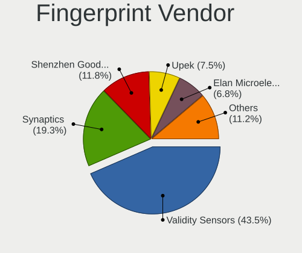

| Vendor                     | Notebooks | Percent |
|----------------------------|-----------|---------|
| Validity Sensors           | 70        | 43.48%  |
| Synaptics                  | 31        | 19.25%  |
| Shenzhen Goodix Technology | 19        | 11.8%   |
| Upek                       | 12        | 7.45%   |
| Elan Microelectronics      | 11        | 6.83%   |
| AuthenTec                  | 7         | 4.35%   |
| STMicroelectronics         | 4         | 2.48%   |
| LighTuning Technology      | 4         | 2.48%   |
| Focal-systems.Corp         | 2         | 1.24%   |
| Samsung Electronics        | 1         | 0.62%   |

Fingerprint Model
-----------------

Fingerprint sensor models

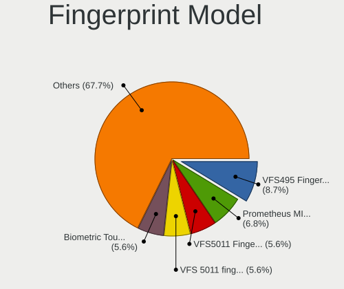

| Model                                                                      | Notebooks | Percent |
|----------------------------------------------------------------------------|-----------|---------|
| Validity Sensors VFS495 Fingerprint Reader                                 | 14        | 8.7%    |
| Synaptics Prometheus MIS Touch Fingerprint Reader                          | 11        | 6.83%   |
| Validity Sensors VFS5011 Fingerprint Reader                                | 9         | 5.59%   |
| Validity Sensors VFS 5011 fingerprint sensor                               | 9         | 5.59%   |
| Upek Biometric Touchchip/Touchstrip Fingerprint Sensor                     | 9         | 5.59%   |
| Shenzhen Goodix  FingerPrint Device                                        | 9         | 5.59%   |
| Elan ELAN:ARM-M4                                                           | 6         | 3.73%   |
| Validity Sensors VFS491                                                    | 5         | 3.11%   |
| Validity Sensors VFS471 Fingerprint Reader                                 | 5         | 3.11%   |
| Validity Sensors Synaptics WBDI                                            | 5         | 3.11%   |
| Validity Sensors Swipe Fingerprint Sensor                                  | 5         | 3.11%   |
| Shenzhen Goodix Fingerprint Reader                                         | 5         | 3.11%   |
| Shenzhen Goodix FingerPrint                                                | 5         | 3.11%   |
| Elan ELAN:Fingerprint                                                      | 5         | 3.11%   |
| Validity Sensors VFS7500 Touch Fingerprint Sensor                          | 4         | 2.48%   |
| Synaptics Fingerprint reader [HP G6]                                       | 4         | 2.48%   |
| STMicroelectronics Fingerprint Reader                                      | 4         | 2.48%   |
| Validity Sensors VFS451 Fingerprint Reader                                 | 3         | 1.86%   |
| Validity Sensors VFS301 Fingerprint Reader                                 | 3         | 1.86%   |
| Validity Sensors Fingerprint scanner                                       | 3         | 1.86%   |
| Upek TCS5B Fingerprint sensor                                              | 3         | 1.86%   |
| Synaptics Metallica MOH Touch Fingerprint Reader                           | 3         | 1.86%   |
| Synaptics Metallica MIS Touch Fingerprint Reader                           | 3         | 1.86%   |
| AuthenTec AES2501 Fingerprint Sensor                                       | 3         | 1.86%   |
| AuthenTec AES1600                                                          | 3         | 1.86%   |
| Validity Sensors VFS101 Fingerprint Reader                                 | 2         | 1.24%   |
| Validity Sensors Synaptics VFS7552 Touch Fingerprint Sensor with PurePrint | 2         | 1.24%   |
| Synaptics UWP WBDI Device                                                  | 2         | 1.24%   |
| Synaptics  FS7604 Touch Fingerprint Sensor with PurePrint                  | 2         | 1.24%   |
| Synaptics FS7604 Touch Fingerprint Sensor with PurePrint                   | 2         | 1.24%   |
| LighTuning ES603 Swipe Fingerprint Sensor                                  | 2         | 1.24%   |
| Focal-systems.Corp FT9201Fingerprint.                                      | 2         | 1.24%   |
| Validity Sensors VFS Fingerprint sensor                                    | 1         | 0.62%   |
| Synaptics WBDI Fingerprint Reader USB 086                                  | 1         | 0.62%   |
| Synaptics WBDI Device                                                      | 1         | 0.62%   |
| Synaptics UWP WBDI                                                         | 1         | 0.62%   |
| Samsung Fingerprint Device                                                 | 1         | 0.62%   |
| LighTuning Fingerprint Reader                                              | 1         | 0.62%   |
| LighTuning EgisTec Touch Fingerprint Sensor                                | 1         | 0.62%   |
| AuthenTec AES2810                                                          | 1         | 0.62%   |

Chipcard Vendor
---------------

Chipcard module vendors

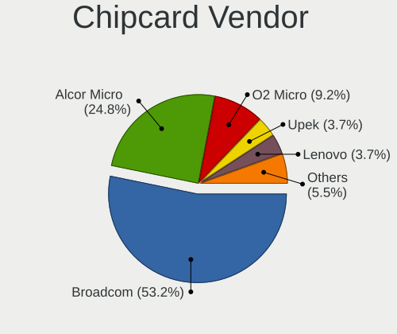

| Vendor                | Notebooks | Percent |
|-----------------------|-----------|---------|
| Broadcom              | 58        | 53.21%  |
| Alcor Micro           | 27        | 24.77%  |
| O2 Micro              | 10        | 9.17%   |
| Upek                  | 4         | 3.67%   |
| Lenovo                | 4         | 3.67%   |
| SCM Microsystems      | 2         | 1.83%   |
| Advanced Card Systems | 2         | 1.83%   |
| OmniKey               | 1         | 0.92%   |
| Gemalto (was Gemplus) | 1         | 0.92%   |

Chipcard Model
--------------

Chipcard module models

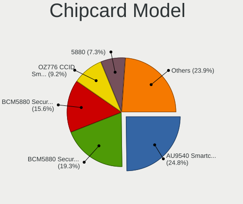

| Model                                                                        | Notebooks | Percent |
|------------------------------------------------------------------------------|-----------|---------|
| Alcor Micro AU9540 Smartcard Reader                                          | 27        | 24.77%  |
| Broadcom BCM5880 Secure Applications Processor                               | 21        | 19.27%  |
| Broadcom BCM5880 Secure Applications Processor with fingerprint swipe sensor | 17        | 15.6%   |
| O2 Micro OZ776 CCID Smartcard Reader                                         | 10        | 9.17%   |
| Broadcom 5880                                                                | 8         | 7.34%   |
| Broadcom BCM58200 ControlVault 3 (FingerPrint sensor + Contacted SmartCard)  | 6         | 5.5%    |
| Broadcom 58200                                                               | 6         | 5.5%    |
| Upek TouchChip Fingerprint Coprocessor (WBF advanced mode)                   | 4         | 3.67%   |
| Lenovo Integrated Smart Card Reader                                          | 4         | 3.67%   |
| Advanced Card Systems ACR38 SmartCard Reader                                 | 2         | 1.83%   |
| SCM Microsystems SCR3500 A Contact Reader                                    | 1         | 0.92%   |
| SCM Microsystems SCR331-LC1 / SCR3310 SmartCard Reader                       | 1         | 0.92%   |
| OmniKey CardMan Smart@Link                                                   | 1         | 0.92%   |
| Gemalto (was Gemplus) GemPC Key SmartCard Reader                             | 1         | 0.92%   |

Unsupported
-----------

Unsupported Devices
-------------------

Total unsupported devices on board

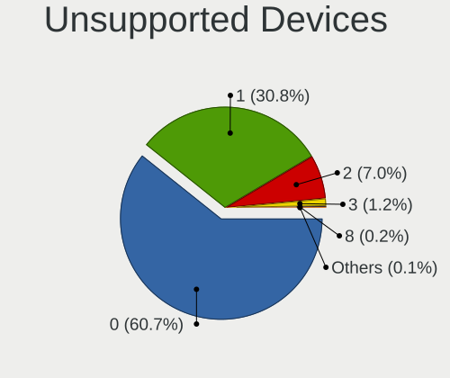

| Total | Notebooks | Percent |
|-------|-----------|---------|
| 0     | 606       | 60.72%  |
| 1     | 307       | 30.76%  |
| 2     | 70        | 7.01%   |
| 3     | 12        | 1.2%    |
| 8     | 2         | 0.2%    |
| 4     | 1         | 0.1%    |

Unsupported Device Types
------------------------

Types of unsupported devices

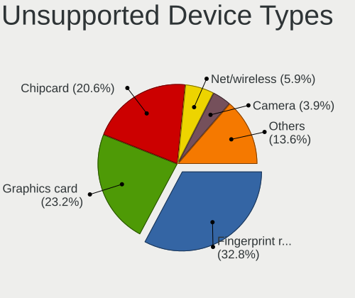

| Type                     | Notebooks | Percent |
|--------------------------|-----------|---------|
| Fingerprint reader       | 161       | 32.79%  |
| Graphics card            | 114       | 23.22%  |
| Chipcard                 | 101       | 20.57%  |
| Net/wireless             | 29        | 5.91%   |
| Camera                   | 19        | 3.87%   |
| Bluetooth                | 16        | 3.26%   |
| Storage                  | 11        | 2.24%   |
| Multimedia controller    | 8         | 1.63%   |
| Modem                    | 5         | 1.02%   |
| Flash memory             | 5         | 1.02%   |
| Card reader              | 5         | 1.02%   |
| Sound                    | 4         | 0.81%   |
| Net/ethernet             | 4         | 0.81%   |
| Communication controller | 4         | 0.81%   |
| Network                  | 2         | 0.41%   |
| Firewire controller      | 2         | 0.41%   |
| Dvb card                 | 1         | 0.2%    |

