Ubuntu MATE - Tested Hardware & Statistics (Notebooks)
------------------------------------------------------

A project to collect tested hardware configurations for Ubuntu MATE.

Anyone can contribute to this report by the [hw-probe](https://github.com/linuxhw/hw-probe) tool:

    sudo -E hw-probe -all -upload

Please contribute! Especially if your hardware is rare.

Contents
--------

* [ Test Cases ](#test-cases)

* [ System ](#system)
  - [ OS                       ](#os)
  - [ OS Family                ](#os-family)
  - [ Kernel                   ](#kernel)
  - [ Kernel Family            ](#kernel-family)
  - [ Kernel Major Ver.        ](#kernel-major-ver)
  - [ Arch                     ](#arch)
  - [ DE                       ](#de)
  - [ Display Server           ](#display-server)
  - [ Display Manager          ](#display-manager)
  - [ OS Lang                  ](#os-lang)
  - [ Boot Mode                ](#boot-mode)
  - [ Filesystem               ](#filesystem)
  - [ Part. scheme             ](#part-scheme)
  - [ Dual Boot with Linux/BSD ](#dual-boot-with-linuxbsd)
  - [ Dual Boot (Win)          ](#dual-boot-win)

* [ Board ](#board)
  - [ Vendor                   ](#vendor)
  - [ Model                    ](#model)
  - [ Model Family             ](#model-family)
  - [ MFG Year                 ](#mfg-year)
  - [ Form Factor              ](#form-factor)
  - [ Secure Boot              ](#secure-boot)
  - [ Coreboot                 ](#coreboot)
  - [ RAM Size                 ](#ram-size)
  - [ RAM Used                 ](#ram-used)
  - [ Total Drives             ](#total-drives)
  - [ Has CD-ROM               ](#has-cd-rom)
  - [ Has Ethernet             ](#has-ethernet)
  - [ Has WiFi                 ](#has-wifi)
  - [ Has Bluetooth            ](#has-bluetooth)

* [ Location ](#location)
  - [ Country                  ](#country)
  - [ City                     ](#city)

* [ Drives ](#drives)
  - [ Drive Vendor             ](#drive-vendor)
  - [ Drive Model              ](#drive-model)
  - [ HDD Vendor               ](#hdd-vendor)
  - [ SSD Vendor               ](#ssd-vendor)
  - [ Drive Kind               ](#drive-kind)
  - [ Drive Connector          ](#drive-connector)
  - [ Drive Size               ](#drive-size)
  - [ Space Total              ](#space-total)
  - [ Space Used               ](#space-used)
  - [ Malfunc. Drives          ](#malfunc-drives)
  - [ Malfunc. Drive Vendor    ](#malfunc-drive-vendor)
  - [ Malfunc. HDD Vendor      ](#malfunc-hdd-vendor)
  - [ Malfunc. Drive Kind      ](#malfunc-drive-kind)
  - [ Failed Drives            ](#failed-drives)
  - [ Failed Drive Vendor      ](#failed-drive-vendor)
  - [ Drive Status             ](#drive-status)

* [ Storage controller ](#storage-controller)
  - [ Storage Vendor           ](#storage-vendor)
  - [ Storage Model            ](#storage-model)
  - [ Storage Kind             ](#storage-kind)

* [ Processor ](#processor)
  - [ CPU Vendor               ](#cpu-vendor)
  - [ CPU Model                ](#cpu-model)
  - [ CPU Model Family         ](#cpu-model-family)
  - [ CPU Cores                ](#cpu-cores)
  - [ CPU Sockets              ](#cpu-sockets)
  - [ CPU Threads              ](#cpu-threads)
  - [ CPU Op-Modes             ](#cpu-op-modes)
  - [ CPU Microcode            ](#cpu-microcode)
  - [ CPU Microarch            ](#cpu-microarch)

* [ Graphics ](#graphics)
  - [ GPU Vendor               ](#gpu-vendor)
  - [ GPU Model                ](#gpu-model)
  - [ GPU Combo                ](#gpu-combo)
  - [ GPU Driver               ](#gpu-driver)
  - [ GPU Memory               ](#gpu-memory)

* [ Monitor ](#monitor)
  - [ Monitor Vendor           ](#monitor-vendor)
  - [ Monitor Model            ](#monitor-model)
  - [ Monitor Resolution       ](#monitor-resolution)
  - [ Monitor Diagonal         ](#monitor-diagonal)
  - [ Monitor Width            ](#monitor-width)
  - [ Aspect Ratio             ](#aspect-ratio)
  - [ Monitor Area             ](#monitor-area)
  - [ Pixel Density            ](#pixel-density)
  - [ Multiple Monitors        ](#multiple-monitors)

* [ Network ](#network)
  - [ Net Controller Vendor    ](#net-controller-vendor)
  - [ Net Controller Model     ](#net-controller-model)
  - [ Wireless Vendor          ](#wireless-vendor)
  - [ Wireless Model           ](#wireless-model)
  - [ Ethernet Vendor          ](#ethernet-vendor)
  - [ Ethernet Model           ](#ethernet-model)
  - [ Net Controller Kind      ](#net-controller-kind)
  - [ Used Controller          ](#used-controller)
  - [ NICs                     ](#nics)
  - [ IPv6                     ](#ipv6)

* [ Bluetooth ](#bluetooth)
  - [ Bluetooth Vendor         ](#bluetooth-vendor)
  - [ Bluetooth Model          ](#bluetooth-model)

* [ Sound ](#sound)
  - [ Sound Vendor             ](#sound-vendor)
  - [ Sound Model              ](#sound-model)

* [ Memory ](#memory)
  - [ Memory Vendor            ](#memory-vendor)
  - [ Memory Model             ](#memory-model)
  - [ Memory Kind              ](#memory-kind)
  - [ Memory Form Factor       ](#memory-form-factor)
  - [ Memory Size              ](#memory-size)
  - [ Memory Speed             ](#memory-speed)

* [ Printers & scanners ](#printers--scanners)
  - [ Printer Vendor           ](#printer-vendor)
  - [ Printer Model            ](#printer-model)
  - [ Scanner Vendor           ](#scanner-vendor)
  - [ Scanner Model            ](#scanner-model)

* [ Camera ](#camera)
  - [ Camera Vendor            ](#camera-vendor)
  - [ Camera Model             ](#camera-model)

* [ Security ](#security)
  - [ Fingerprint Vendor       ](#fingerprint-vendor)
  - [ Fingerprint Model        ](#fingerprint-model)
  - [ Chipcard Vendor          ](#chipcard-vendor)
  - [ Chipcard Model           ](#chipcard-model)

* [ Unsupported ](#unsupported)
  - [ Unsupported Devices      ](#unsupported-devices)
  - [ Unsupported Device Types ](#unsupported-device-types)

Test Cases
----------

Total: 787

| Vendor        | Model                       | Probe                                                      | Date         |
|---------------|-----------------------------|------------------------------------------------------------|--------------|
| Lenovo        | IdeaPad S410p 20296         | [dac943f23a](https://linux-hardware.org/?probe=dac943f23a) | Sep 01, 2022 |
| HP            | Notebook                    | [573d359faf](https://linux-hardware.org/?probe=573d359faf) | Aug 31, 2022 |
| HP            | 15 Notebook PC              | [1109650747](https://linux-hardware.org/?probe=1109650747) | Aug 31, 2022 |
| Notebook      | NJx0MU                      | [169efa4465](https://linux-hardware.org/?probe=169efa4465) | Aug 31, 2022 |
| Notebook      | NJx0MU                      | [81d8e17fed](https://linux-hardware.org/?probe=81d8e17fed) | Aug 31, 2022 |
| Notebook      | NJx0MU                      | [5103a6fa3d](https://linux-hardware.org/?probe=5103a6fa3d) | Aug 30, 2022 |
| Notebook      | NJx0MU                      | [d9d556aea3](https://linux-hardware.org/?probe=d9d556aea3) | Aug 26, 2022 |
| Notebook      | NJx0MU                      | [90476bcf5e](https://linux-hardware.org/?probe=90476bcf5e) | Aug 25, 2022 |
| HP            | Pavilion dv5                | [dd2f0b859b](https://linux-hardware.org/?probe=dd2f0b859b) | Aug 24, 2022 |
| LincPlus      | LINNCPLUS P1                | [516427e0e9](https://linux-hardware.org/?probe=516427e0e9) | Aug 23, 2022 |
| Lenovo        | IdeaPad Gaming 3 15ARH05... | [5028378988](https://linux-hardware.org/?probe=5028378988) | Aug 23, 2022 |
| Notebook      | NJx0MU                      | [7a86bdf14e](https://linux-hardware.org/?probe=7a86bdf14e) | Aug 22, 2022 |
| Dell          | Latitude 7420               | [d599ef65fd](https://linux-hardware.org/?probe=d599ef65fd) | Aug 20, 2022 |
| Lenovo        | IdeaPad 3 15IIL05 81WE      | [4efd818377](https://linux-hardware.org/?probe=4efd818377) | Aug 19, 2022 |
| ASUSTek       | UX32A                       | [99bb55bc78](https://linux-hardware.org/?probe=99bb55bc78) | Aug 17, 2022 |
| HP            | EliteBook 745 G5            | [7e8d33a07f](https://linux-hardware.org/?probe=7e8d33a07f) | Aug 16, 2022 |
| Lenovo        | ThinkBook 14 G2 ITL 20VD    | [644fbe551a](https://linux-hardware.org/?probe=644fbe551a) | Aug 13, 2022 |
| Dell          | Latitude E7470              | [61d0b104e9](https://linux-hardware.org/?probe=61d0b104e9) | Aug 13, 2022 |
| HP            | 15 Notebook PC              | [46aa83aeb4](https://linux-hardware.org/?probe=46aa83aeb4) | Aug 07, 2022 |
| HP            | ProBook 455 G7              | [c563966e9c](https://linux-hardware.org/?probe=c563966e9c) | Aug 06, 2022 |
| HONOR         | BOHK-WAX9X                  | [3d426cb1de](https://linux-hardware.org/?probe=3d426cb1de) | Aug 04, 2022 |
| Google        | Swanky                      | [f54bdd7887](https://linux-hardware.org/?probe=f54bdd7887) | Aug 04, 2022 |
| Google        | Swanky                      | [daac706167](https://linux-hardware.org/?probe=daac706167) | Aug 02, 2022 |
| HP            | Pavilion g6                 | [b48c146eff](https://linux-hardware.org/?probe=b48c146eff) | Aug 01, 2022 |
| Lenovo        | Legion R9000P2021H 82JQ     | [4f2ba69c49](https://linux-hardware.org/?probe=4f2ba69c49) | Jul 27, 2022 |
| Acer          | Aspire 5050                 | [59d8bb1e10](https://linux-hardware.org/?probe=59d8bb1e10) | Jul 26, 2022 |
| Acer          | Aspire 5050                 | [a8bcc56e78](https://linux-hardware.org/?probe=a8bcc56e78) | Jul 26, 2022 |
| Dell          | Latitude E4200              | [6cc0415a8a](https://linux-hardware.org/?probe=6cc0415a8a) | Jul 21, 2022 |
| Dell          | Inspiron MM061              | [2360c35ac1](https://linux-hardware.org/?probe=2360c35ac1) | Jul 20, 2022 |
| Dell          | Inspiron MM061              | [5cb9487776](https://linux-hardware.org/?probe=5cb9487776) | Jul 20, 2022 |
| HP            | EliteBook 8570p             | [f4f889fb4e](https://linux-hardware.org/?probe=f4f889fb4e) | Jul 20, 2022 |
| Compaq        | Presario CQ-23              | [589a41e629](https://linux-hardware.org/?probe=589a41e629) | Jul 14, 2022 |
| Sony          | VPCEB1S1E                   | [d35015a369](https://linux-hardware.org/?probe=d35015a369) | Jul 12, 2022 |
| Dell          | Latitude XT                 | [9d9deeace5](https://linux-hardware.org/?probe=9d9deeace5) | Jul 10, 2022 |
| Dell          | Latitude XT                 | [b0a096fb7d](https://linux-hardware.org/?probe=b0a096fb7d) | Jul 10, 2022 |
| MicroByte     | ezbook                      | [0f08faf963](https://linux-hardware.org/?probe=0f08faf963) | Jul 08, 2022 |
| HONOR         | BOHK-WAX9X                  | [4070d60511](https://linux-hardware.org/?probe=4070d60511) | Jul 05, 2022 |
| Lenovo        | ThinkPad E15 Gen 2 20TDC... | [87eecce08e](https://linux-hardware.org/?probe=87eecce08e) | Jun 30, 2022 |
| MicroByte     | ezbook                      | [91b1fc169b](https://linux-hardware.org/?probe=91b1fc169b) | Jun 28, 2022 |
| Dell          | XPS 17 9710                 | [6e16eed17c](https://linux-hardware.org/?probe=6e16eed17c) | Jun 26, 2022 |
| Dell          | XPS 17 9710                 | [f37581d70e](https://linux-hardware.org/?probe=f37581d70e) | Jun 26, 2022 |
| ASUSTek       | S550CM                      | [c7262ada04](https://linux-hardware.org/?probe=c7262ada04) | Jun 25, 2022 |
| HUAWEI        | KLVD-WXX9                   | [a8c98b76b4](https://linux-hardware.org/?probe=a8c98b76b4) | Jun 24, 2022 |
| Lenovo        | ThinkPad E15 Gen 2 20TDS... | [10de805cb0](https://linux-hardware.org/?probe=10de805cb0) | Jun 24, 2022 |
| Google        | Kled                        | [5f47e6d3e3](https://linux-hardware.org/?probe=5f47e6d3e3) | Jun 16, 2022 |
| Google        | Kled                        | [6a566134c4](https://linux-hardware.org/?probe=6a566134c4) | Jun 16, 2022 |
| Lenovo        | ThinkPad E15 Gen 2 20TDS... | [f7abc9fae0](https://linux-hardware.org/?probe=f7abc9fae0) | Jun 14, 2022 |
| Lenovo        | V15 G2 ITL 82KB             | [e956f6b0b8](https://linux-hardware.org/?probe=e956f6b0b8) | Jun 09, 2022 |
| HONOR         | BOHK-WAX9X                  | [30b6c5f641](https://linux-hardware.org/?probe=30b6c5f641) | Jun 09, 2022 |
| HP            | EliteBook 8560p             | [9bfdb902ce](https://linux-hardware.org/?probe=9bfdb902ce) | Jun 08, 2022 |
| Intel         | Kabylake Platform           | [074fd90c6a](https://linux-hardware.org/?probe=074fd90c6a) | Jun 06, 2022 |
| TrekStor      | Surfbook A13B               | [a42b3de31a](https://linux-hardware.org/?probe=a42b3de31a) | Jun 05, 2022 |
| Dell          | XPS 13 9360                 | [73746e5672](https://linux-hardware.org/?probe=73746e5672) | Jun 03, 2022 |
| Dell          | Precision M6500             | [1b68d2ca74](https://linux-hardware.org/?probe=1b68d2ca74) | Jun 01, 2022 |
| Fujitsu       | LIFEBOOK E5511              | [32317d8883](https://linux-hardware.org/?probe=32317d8883) | May 30, 2022 |
| HP            | Stream Laptop 11-ak1xxx     | [2d2044b499](https://linux-hardware.org/?probe=2d2044b499) | May 30, 2022 |
| HONOR         | BOHK-WAX9X                  | [7941caaa08](https://linux-hardware.org/?probe=7941caaa08) | May 29, 2022 |
| HP            | Pavilion Power Laptop 15... | [4813c4e0b4](https://linux-hardware.org/?probe=4813c4e0b4) | May 28, 2022 |
| Apple         | MacBook5,1                  | [74e6dbe9af](https://linux-hardware.org/?probe=74e6dbe9af) | May 23, 2022 |
| Apple         | MacBook5,1                  | [a53d746d08](https://linux-hardware.org/?probe=a53d746d08) | May 23, 2022 |
| HP            | ProBook 650 G1              | [d3f5e5aa45](https://linux-hardware.org/?probe=d3f5e5aa45) | May 22, 2022 |
| Dell          | Latitude E6410              | [739ffac681](https://linux-hardware.org/?probe=739ffac681) | May 21, 2022 |
| Medion        | Akoya E6415                 | [32545030d4](https://linux-hardware.org/?probe=32545030d4) | May 16, 2022 |
| Avell High... | A70 MOB                     | [c8900ed973](https://linux-hardware.org/?probe=c8900ed973) | May 15, 2022 |
| Avell High... | A62 LIV                     | [8b912c2c4f](https://linux-hardware.org/?probe=8b912c2c4f) | May 15, 2022 |
| ASUSTek       | VivoBook_ASUSLaptop X509... | [5107890ffd](https://linux-hardware.org/?probe=5107890ffd) | May 15, 2022 |
| Sony          | VPCEA36FG                   | [0161a27629](https://linux-hardware.org/?probe=0161a27629) | May 13, 2022 |
| HONOR         | BOHK-WAX9X                  | [e6c4aaa3d8](https://linux-hardware.org/?probe=e6c4aaa3d8) | May 12, 2022 |
| Lenovo        | ThinkBook 16p Gen 2 20YM    | [e99cdba363](https://linux-hardware.org/?probe=e99cdba363) | May 07, 2022 |
| HP            | EliteBook 840 G5            | [a53b09a7f3](https://linux-hardware.org/?probe=a53b09a7f3) | May 07, 2022 |
| HYPERPC       | PLAY                        | [408e86d04f](https://linux-hardware.org/?probe=408e86d04f) | May 06, 2022 |
| HP            | Laptop 17-by3xxx            | [86c82d9ca0](https://linux-hardware.org/?probe=86c82d9ca0) | May 03, 2022 |
| HP            | Laptop 17-by3xxx            | [a55c5c5c9f](https://linux-hardware.org/?probe=a55c5c5c9f) | May 03, 2022 |
| Apple         | MacBookPro6,2               | [ebaaf4a69b](https://linux-hardware.org/?probe=ebaaf4a69b) | May 01, 2022 |
| Toshiba       | Satellite C660              | [f4403056c8](https://linux-hardware.org/?probe=f4403056c8) | Apr 30, 2022 |
| Lenovo        | G700 20251                  | [4dd8fa1d2f](https://linux-hardware.org/?probe=4dd8fa1d2f) | Apr 27, 2022 |
| Lenovo        | G700 20251                  | [fc283a78af](https://linux-hardware.org/?probe=fc283a78af) | Apr 26, 2022 |
| Lenovo        | G700 20251                  | [bbb54a4f60](https://linux-hardware.org/?probe=bbb54a4f60) | Apr 26, 2022 |
| Apple         | MacBookPro9,1               | [35b3b3ae30](https://linux-hardware.org/?probe=35b3b3ae30) | Apr 26, 2022 |
| Apple         | MacBookPro9,1               | [faf447a067](https://linux-hardware.org/?probe=faf447a067) | Apr 24, 2022 |
| Dell          | Precision 3561              | [26fa0f202c](https://linux-hardware.org/?probe=26fa0f202c) | Apr 20, 2022 |
| Clevo         | W54xEU                      | [cb4036a7dc](https://linux-hardware.org/?probe=cb4036a7dc) | Apr 18, 2022 |
| Lenovo        | IdeaPad 3 15IML05 81WR      | [81dced5e0a](https://linux-hardware.org/?probe=81dced5e0a) | Apr 16, 2022 |
| Dell          | Latitude E5530 non-vPro     | [2f865445ce](https://linux-hardware.org/?probe=2f865445ce) | Apr 14, 2022 |
| Dell          | Latitude E5530 non-vPro     | [d32ffb065a](https://linux-hardware.org/?probe=d32ffb065a) | Apr 14, 2022 |
| Clevo         | W54xEU                      | [0a8ddf1dff](https://linux-hardware.org/?probe=0a8ddf1dff) | Apr 14, 2022 |
| Dell          | XPS 15 9500                 | [d873b2d218](https://linux-hardware.org/?probe=d873b2d218) | Apr 14, 2022 |
| Lenovo        | ThinkPad X1 Carbon 7th 2... | [52d05bca1d](https://linux-hardware.org/?probe=52d05bca1d) | Apr 13, 2022 |
| Dell          | XPS 13 9380                 | [0897999e8d](https://linux-hardware.org/?probe=0897999e8d) | Apr 13, 2022 |
| TUXEDO        | Pulse 14 Gen1               | [68e6736cd2](https://linux-hardware.org/?probe=68e6736cd2) | Apr 13, 2022 |
| Samsung       | R505                        | [9ff46a8ca6](https://linux-hardware.org/?probe=9ff46a8ca6) | Apr 13, 2022 |
| Dell          | Latitude E5400              | [0ac76c891f](https://linux-hardware.org/?probe=0ac76c891f) | Apr 11, 2022 |
| IPASON        | MaxBook P1                  | [d66d062f54](https://linux-hardware.org/?probe=d66d062f54) | Apr 05, 2022 |
| Lenovo        | G700 20251                  | [790d42fec8](https://linux-hardware.org/?probe=790d42fec8) | Mar 30, 2022 |
| Lenovo        | G700 20251                  | [d8166d09e9](https://linux-hardware.org/?probe=d8166d09e9) | Mar 30, 2022 |
| HP            | Pavilion dv7                | [112a1842a0](https://linux-hardware.org/?probe=112a1842a0) | Mar 30, 2022 |
| Toshiba       | Satellite L755D             | [d99ccc2771](https://linux-hardware.org/?probe=d99ccc2771) | Mar 28, 2022 |
| Samsung       | R530/R730/R540              | [186f96a5a1](https://linux-hardware.org/?probe=186f96a5a1) | Mar 27, 2022 |
| Acer          | Aspire 3000                 | [8f647a08f9](https://linux-hardware.org/?probe=8f647a08f9) | Mar 26, 2022 |
| Dell          | Studio 1558                 | [7004b83ddf](https://linux-hardware.org/?probe=7004b83ddf) | Mar 23, 2022 |
| Dell          | Vostro 3350                 | [721a0ea932](https://linux-hardware.org/?probe=721a0ea932) | Mar 21, 2022 |
| ASUSTek       | X541UV                      | [a23f80c36b](https://linux-hardware.org/?probe=a23f80c36b) | Mar 19, 2022 |
| HP            | Pavilion dv7                | [0eb8ef5cd3](https://linux-hardware.org/?probe=0eb8ef5cd3) | Mar 16, 2022 |
| Dell          | Vostro 3401                 | [225095b10b](https://linux-hardware.org/?probe=225095b10b) | Mar 12, 2022 |
| Toshiba       | Satellite P755              | [ceb8d030e2](https://linux-hardware.org/?probe=ceb8d030e2) | Mar 10, 2022 |
| ASUSTek       | 1011PX                      | [776d052837](https://linux-hardware.org/?probe=776d052837) | Mar 09, 2022 |
| Packard Be... | EasyNote MH35               | [66bff1bcfd](https://linux-hardware.org/?probe=66bff1bcfd) | Mar 08, 2022 |
| Lenovo        | U310                        | [856a65502e](https://linux-hardware.org/?probe=856a65502e) | Feb 28, 2022 |
| ASUSTek       | UX305FA                     | [6618b00369](https://linux-hardware.org/?probe=6618b00369) | Feb 28, 2022 |
| Fujitsu       | LIFEBOOK S752               | [abb12adccc](https://linux-hardware.org/?probe=abb12adccc) | Feb 26, 2022 |
| Acer          | Aspire E1-571G              | [de462f47a3](https://linux-hardware.org/?probe=de462f47a3) | Feb 24, 2022 |
| Acer          | Aspire E1-571G              | [ac593e3a3a](https://linux-hardware.org/?probe=ac593e3a3a) | Feb 24, 2022 |
| Lenovo        | ThinkPad T460p 20FW000VU... | [9cbb915f78](https://linux-hardware.org/?probe=9cbb915f78) | Feb 18, 2022 |
| ASUSTek       | X553MA                      | [94ebaa5d9b](https://linux-hardware.org/?probe=94ebaa5d9b) | Feb 15, 2022 |
| Notebook      | NK50S5_SZ                   | [c5a3485d32](https://linux-hardware.org/?probe=c5a3485d32) | Feb 11, 2022 |
| HP            | Pavilion 17                 | [3d6c666b77](https://linux-hardware.org/?probe=3d6c666b77) | Feb 08, 2022 |
| HP            | Notebook                    | [69071da574](https://linux-hardware.org/?probe=69071da574) | Feb 06, 2022 |
| Acer          | Aspire 7735                 | [38d97cd9da](https://linux-hardware.org/?probe=38d97cd9da) | Feb 06, 2022 |
| Dell          | XPS 15 9570                 | [d1f8ff2cb8](https://linux-hardware.org/?probe=d1f8ff2cb8) | Feb 02, 2022 |
| Lenovo        | ThinkPad SL500 27463ZG      | [b746a25ff1](https://linux-hardware.org/?probe=b746a25ff1) | Jan 28, 2022 |
| Dell          | Latitude 3410               | [8f2181125e](https://linux-hardware.org/?probe=8f2181125e) | Jan 27, 2022 |
| Sony          | VPCF13Z1R                   | [7aff0d5c29](https://linux-hardware.org/?probe=7aff0d5c29) | Jan 25, 2022 |
| Fujitsu       | LIFEBOOK U748               | [cad36b0eba](https://linux-hardware.org/?probe=cad36b0eba) | Jan 24, 2022 |
| ASUSTek       | ROG Zephyrus G14 GA401QM... | [37730388fd](https://linux-hardware.org/?probe=37730388fd) | Jan 21, 2022 |
| ASUSTek       | ROG Zephyrus G14 GA401QM... | [512b021ab8](https://linux-hardware.org/?probe=512b021ab8) | Jan 19, 2022 |
| Lenovo        | V155-15API 81V5             | [09e824f68b](https://linux-hardware.org/?probe=09e824f68b) | Jan 19, 2022 |
| ASUSTek       | X553MA                      | [a748bb8955](https://linux-hardware.org/?probe=a748bb8955) | Jan 18, 2022 |
| ASUSTek       | X553MA                      | [08613587e8](https://linux-hardware.org/?probe=08613587e8) | Jan 18, 2022 |
| ASUSTek       | X553MA                      | [f5b0fd8e22](https://linux-hardware.org/?probe=f5b0fd8e22) | Jan 18, 2022 |
| Quanta        | TW8/SW8/DW8 TBD             | [8b2f4ffccd](https://linux-hardware.org/?probe=8b2f4ffccd) | Jan 16, 2022 |
| Dell          | XPS 12 9Q23                 | [3c8e26636b](https://linux-hardware.org/?probe=3c8e26636b) | Jan 15, 2022 |
| HP            | Pavilion Gaming Laptop 1... | [ae80854830](https://linux-hardware.org/?probe=ae80854830) | Jan 15, 2022 |
| Dell          | Latitude E5400              | [4f72d3dae0](https://linux-hardware.org/?probe=4f72d3dae0) | Jan 09, 2022 |
| ASUSTek       | X541SA                      | [4103077e59](https://linux-hardware.org/?probe=4103077e59) | Jan 08, 2022 |
| Fujitsu       | LIFEBOOK E746               | [55ac013e1e](https://linux-hardware.org/?probe=55ac013e1e) | Jan 06, 2022 |
| Fujitsu       | LIFEBOOK U748               | [9eb9340d47](https://linux-hardware.org/?probe=9eb9340d47) | Jan 02, 2022 |
| Lenovo        | Flex 2-14 20404             | [1ddb6e11fb](https://linux-hardware.org/?probe=1ddb6e11fb) | Jan 01, 2022 |
| Acer          | Aspire A515-43              | [82163f143b](https://linux-hardware.org/?probe=82163f143b) | Dec 29, 2021 |
| Lenovo        | ThinkPad X131e 33722VU      | [c8dc197420](https://linux-hardware.org/?probe=c8dc197420) | Dec 26, 2021 |
| Lenovo        | U310                        | [fa57a69141](https://linux-hardware.org/?probe=fa57a69141) | Dec 24, 2021 |
| HP            | Pavilion dv4                | [7152c2fcd9](https://linux-hardware.org/?probe=7152c2fcd9) | Dec 22, 2021 |
| Lenovo        | G580 2189                   | [843f8c04fe](https://linux-hardware.org/?probe=843f8c04fe) | Dec 21, 2021 |
| HP            | ENVY Notebook               | [69b60fabe0](https://linux-hardware.org/?probe=69b60fabe0) | Dec 15, 2021 |
| Acer          | Aspire ES1-523              | [66a8186276](https://linux-hardware.org/?probe=66a8186276) | Dec 15, 2021 |
| Quanta        | TW8/SW8/DW8 TBD             | [43f645de28](https://linux-hardware.org/?probe=43f645de28) | Dec 11, 2021 |
| Unknown       | Unknown                     | [d07ab607e1](https://linux-hardware.org/?probe=d07ab607e1) | Dec 08, 2021 |
| ASUSTek       | X751BP                      | [e1acc83725](https://linux-hardware.org/?probe=e1acc83725) | Dec 06, 2021 |
| HP            | EliteBook Folio 9480m       | [2cd39490da](https://linux-hardware.org/?probe=2cd39490da) | Dec 02, 2021 |
| Apple         | MacBookPro9,1               | [4f46a6c92a](https://linux-hardware.org/?probe=4f46a6c92a) | Dec 02, 2021 |
| Apple         | MacBookPro9,1               | [1521941a87](https://linux-hardware.org/?probe=1521941a87) | Dec 02, 2021 |
| Dell          | Latitude E6400              | [170f397883](https://linux-hardware.org/?probe=170f397883) | Dec 02, 2021 |
| HP            | EliteBook Folio 9480m       | [3b06bfa748](https://linux-hardware.org/?probe=3b06bfa748) | Dec 01, 2021 |
| Fujitsu       | LIFEBOOK AH531/GFO          | [5f2264a472](https://linux-hardware.org/?probe=5f2264a472) | Nov 30, 2021 |
| TUXEDO        | InfinityBook Pro 14 Gen6    | [40a204e5f1](https://linux-hardware.org/?probe=40a204e5f1) | Nov 30, 2021 |
| Polaroid      | MP1464PR001                 | [6475eec282](https://linux-hardware.org/?probe=6475eec282) | Nov 25, 2021 |
| Polaroid      | MP1464PR001                 | [244042f0d1](https://linux-hardware.org/?probe=244042f0d1) | Nov 25, 2021 |
| HP            | EliteBook Folio 9480m       | [8b5c3b008f](https://linux-hardware.org/?probe=8b5c3b008f) | Nov 24, 2021 |
| HP            | EliteBook Folio 9480m       | [bf8ac4dc12](https://linux-hardware.org/?probe=bf8ac4dc12) | Nov 24, 2021 |
| Lenovo        | G580 20157                  | [bb170a308c](https://linux-hardware.org/?probe=bb170a308c) | Nov 24, 2021 |
| Dell          | Precision 5560              | [aa3dbdc6bb](https://linux-hardware.org/?probe=aa3dbdc6bb) | Nov 22, 2021 |
| Acer          | TravelMate 5720             | [77b5cad080](https://linux-hardware.org/?probe=77b5cad080) | Nov 18, 2021 |
| HP            | ZBook Fury 17.3 inch G8 ... | [63f392ea8b](https://linux-hardware.org/?probe=63f392ea8b) | Nov 18, 2021 |
| Lenovo        | ThinkPad T440p 20AWS0Q30... | [3ddad52d21](https://linux-hardware.org/?probe=3ddad52d21) | Nov 16, 2021 |
| ASUSTek       | ROG Strix G513QM_G513QM     | [162531d482](https://linux-hardware.org/?probe=162531d482) | Nov 16, 2021 |
| Dell          | Vostro 5568                 | [403ef45f63](https://linux-hardware.org/?probe=403ef45f63) | Nov 15, 2021 |
| Lenovo        | ThinkPad Yoga 260 20FES2... | [e881f41269](https://linux-hardware.org/?probe=e881f41269) | Nov 14, 2021 |
| Dell          | Latitude E6410              | [1a31fa8433](https://linux-hardware.org/?probe=1a31fa8433) | Nov 13, 2021 |
| AMI           | Unknown                     | [d1cd5b09e1](https://linux-hardware.org/?probe=d1cd5b09e1) | Nov 12, 2021 |
| Toshiba       | Satellite C665              | [a136cdd51d](https://linux-hardware.org/?probe=a136cdd51d) | Nov 11, 2021 |
| HP            | ZBook 15                    | [835fb0e921](https://linux-hardware.org/?probe=835fb0e921) | Nov 10, 2021 |
| Lenovo        | ThinkBook 16p Gen 2 20YM    | [c8b67f9143](https://linux-hardware.org/?probe=c8b67f9143) | Nov 08, 2021 |
| GPD           | P2 MAX                      | [9adb3fd2eb](https://linux-hardware.org/?probe=9adb3fd2eb) | Nov 02, 2021 |
| AZW           | SEi                         | [6d9a86e769](https://linux-hardware.org/?probe=6d9a86e769) | Nov 02, 2021 |
| MSI           | GE76 Raider 11UG            | [cbbe604f22](https://linux-hardware.org/?probe=cbbe604f22) | Nov 01, 2021 |
| Acer          | Aspire 7750G                | [7eaeae034c](https://linux-hardware.org/?probe=7eaeae034c) | Oct 29, 2021 |
| ASUSTek       | VivoBook 12_ASUS Laptop ... | [10e9f4b604](https://linux-hardware.org/?probe=10e9f4b604) | Oct 27, 2021 |
| Dell          | Precision 7520              | [83df635945](https://linux-hardware.org/?probe=83df635945) | Oct 26, 2021 |
| HP            | Pavilion Notebook           | [cd2454732b](https://linux-hardware.org/?probe=cd2454732b) | Oct 25, 2021 |
| HP            | G70                         | [68fb8430c2](https://linux-hardware.org/?probe=68fb8430c2) | Oct 24, 2021 |
| HP            | G70                         | [3e2c50a321](https://linux-hardware.org/?probe=3e2c50a321) | Oct 24, 2021 |
| Lenovo        | ThinkPad E15 Gen 2 20TES... | [e82ee9096e](https://linux-hardware.org/?probe=e82ee9096e) | Oct 23, 2021 |
| ASUSTek       | N53SM                       | [3e15c8708a](https://linux-hardware.org/?probe=3e15c8708a) | Oct 23, 2021 |
| Lenovo        | ThinkPad L512 2598A59       | [0bc832bd49](https://linux-hardware.org/?probe=0bc832bd49) | Oct 19, 2021 |
| Notebook      | P17SM-A                     | [34a5253469](https://linux-hardware.org/?probe=34a5253469) | Oct 16, 2021 |
| Lenovo        | B570e HuronRiver Platfor... | [2bc2b5c1d6](https://linux-hardware.org/?probe=2bc2b5c1d6) | Oct 15, 2021 |
| Notebook      | P17SM-A                     | [b4660289b3](https://linux-hardware.org/?probe=b4660289b3) | Oct 15, 2021 |
| Lenovo        | ThinkPad T440p 20AWS0Q30... | [36f407c3aa](https://linux-hardware.org/?probe=36f407c3aa) | Oct 15, 2021 |
| Lenovo        | ThinkPad T440p 20AWS0Q30... | [1b3b80e104](https://linux-hardware.org/?probe=1b3b80e104) | Oct 15, 2021 |
| Wortmann      | TERRA_MOBILE_1749           | [8917a2fc6b](https://linux-hardware.org/?probe=8917a2fc6b) | Oct 15, 2021 |
| Dell          | Latitude E6440              | [383edb4c99](https://linux-hardware.org/?probe=383edb4c99) | Oct 15, 2021 |
| HP            | Pavilion Gaming Laptop 1... | [6c0867e544](https://linux-hardware.org/?probe=6c0867e544) | Oct 15, 2021 |
| HP            | Pavilion Laptop 15-eg0xx... | [3dfc4362d9](https://linux-hardware.org/?probe=3dfc4362d9) | Oct 14, 2021 |
| Lenovo        | IdeaPad 330-17IKB 81DM      | [b566b7f862](https://linux-hardware.org/?probe=b566b7f862) | Oct 13, 2021 |
| Samsung       | 305E4A/305E5A/305E7A        | [a8e5248d3d](https://linux-hardware.org/?probe=a8e5248d3d) | Oct 13, 2021 |
| ASUSTek       | U36SD                       | [c426070626](https://linux-hardware.org/?probe=c426070626) | Oct 12, 2021 |
| Lenovo        | IdeaPad 3 15IIL05 81WE      | [26453872b1](https://linux-hardware.org/?probe=26453872b1) | Oct 12, 2021 |
| ASUSTek       | N43SL                       | [c5adc8860e](https://linux-hardware.org/?probe=c5adc8860e) | Oct 09, 2021 |
| Lenovo        | IdeaPad 3 15IIL05 81WE      | [044c6efa0d](https://linux-hardware.org/?probe=044c6efa0d) | Oct 08, 2021 |
| Lenovo        | Z51-70 80K6                 | [219e5cd0d5](https://linux-hardware.org/?probe=219e5cd0d5) | Oct 04, 2021 |
| Dell          | Latitude E6440              | [a8884539e7](https://linux-hardware.org/?probe=a8884539e7) | Oct 02, 2021 |
| HP            | EliteBook 840 G7 Noteboo... | [b535b99341](https://linux-hardware.org/?probe=b535b99341) | Sep 29, 2021 |
| HP            | EliteBook 840 G7 Noteboo... | [f04c751d60](https://linux-hardware.org/?probe=f04c751d60) | Sep 29, 2021 |
| HP            | ProBook 455 G7              | [491cab82de](https://linux-hardware.org/?probe=491cab82de) | Sep 29, 2021 |
| HP            | ProBook 455 G7              | [04ff8f3c32](https://linux-hardware.org/?probe=04ff8f3c32) | Sep 29, 2021 |
| Dell          | Vostro 3350                 | [384af306e6](https://linux-hardware.org/?probe=384af306e6) | Sep 27, 2021 |
| HP            | Laptop 15-db0xxx            | [ed937ed1cd](https://linux-hardware.org/?probe=ed937ed1cd) | Sep 26, 2021 |
| Lenovo        | IdeaPad 3 15IIL05 81WE      | [2e1581c3b3](https://linux-hardware.org/?probe=2e1581c3b3) | Sep 24, 2021 |
| Entroware     | Aether                      | [c65a69857f](https://linux-hardware.org/?probe=c65a69857f) | Sep 22, 2021 |
| Acer          | Aspire A515-43              | [523fe48a54](https://linux-hardware.org/?probe=523fe48a54) | Sep 19, 2021 |
| Lenovo        | ThinkPad T440p 20AN006DU... | [6e8ca97f4b](https://linux-hardware.org/?probe=6e8ca97f4b) | Sep 14, 2021 |
| Lenovo        | ThinkPad T440p 20AN006DU... | [e0b0d2d509](https://linux-hardware.org/?probe=e0b0d2d509) | Sep 13, 2021 |
| Teclast       | F15S                        | [b6fcd1a34d](https://linux-hardware.org/?probe=b6fcd1a34d) | Sep 13, 2021 |
| Teclast       | F15S                        | [93d4fafebd](https://linux-hardware.org/?probe=93d4fafebd) | Sep 13, 2021 |
| Lenovo        | ThinkPad T420 42361P0       | [24f3d09047](https://linux-hardware.org/?probe=24f3d09047) | Sep 13, 2021 |
| Unknown       | Unknown                     | [6670bba1d8](https://linux-hardware.org/?probe=6670bba1d8) | Sep 13, 2021 |
| Dell          | Vostro 3350                 | [0fdc4bc08a](https://linux-hardware.org/?probe=0fdc4bc08a) | Sep 13, 2021 |
| Dell          | Latitude E7450              | [012bae3aa2](https://linux-hardware.org/?probe=012bae3aa2) | Sep 11, 2021 |
| ASUSTek       | Z550MA                      | [4786139b6b](https://linux-hardware.org/?probe=4786139b6b) | Sep 11, 2021 |
| Digibras      | NH4CU53                     | [5f2f500f7a](https://linux-hardware.org/?probe=5f2f500f7a) | Sep 10, 2021 |
| Lenovo        | ThinkPad T470 20JNS3M500    | [d05cb87743](https://linux-hardware.org/?probe=d05cb87743) | Sep 07, 2021 |
| Lenovo        | ThinkPad P50 20EN0006MS     | [812085deb0](https://linux-hardware.org/?probe=812085deb0) | Sep 07, 2021 |
| Lenovo        | ThinkPad T440p 20AN006DU... | [54c321b6bd](https://linux-hardware.org/?probe=54c321b6bd) | Sep 04, 2021 |
| Lenovo        | ThinkPad T440p 20AN006DU... | [812cc9220c](https://linux-hardware.org/?probe=812cc9220c) | Sep 01, 2021 |
| MSI           | CR70 2M/CX70 2OC/CX70 2O... | [5ee9ab86d7](https://linux-hardware.org/?probe=5ee9ab86d7) | Aug 31, 2021 |
| Notebook      | NK50S5_SZ                   | [6cba599e57](https://linux-hardware.org/?probe=6cba599e57) | Aug 27, 2021 |
| Packard Be... | EasyNote SL65               | [934368dd02](https://linux-hardware.org/?probe=934368dd02) | Aug 20, 2021 |
| GPD           | MicroPC                     | [7fa0c4e3c4](https://linux-hardware.org/?probe=7fa0c4e3c4) | Aug 20, 2021 |
| Lenovo        | ThinkPad T420 4180PA9       | [17b9828f96](https://linux-hardware.org/?probe=17b9828f96) | Aug 19, 2021 |
| ASUSTek       | X556UAK                     | [70e369f2ba](https://linux-hardware.org/?probe=70e369f2ba) | Aug 19, 2021 |
| ASUSTek       | VivoBook_ASUSLaptop X421... | [635d8e55e7](https://linux-hardware.org/?probe=635d8e55e7) | Aug 17, 2021 |
| HP            | ProBook 445 G7              | [e42e169a72](https://linux-hardware.org/?probe=e42e169a72) | Aug 15, 2021 |
| Acer          | Extensa 5630                | [f32dfbfe2a](https://linux-hardware.org/?probe=f32dfbfe2a) | Aug 15, 2021 |
| HP            | Notebook                    | [be1a21a391](https://linux-hardware.org/?probe=be1a21a391) | Aug 14, 2021 |
| Chuwi         | GemiBook Pro                | [0ffe99b73b](https://linux-hardware.org/?probe=0ffe99b73b) | Aug 14, 2021 |
| Lenovo        | ThinkPad E15 Gen 2 20TD0... | [cfe37f86a3](https://linux-hardware.org/?probe=cfe37f86a3) | Aug 12, 2021 |
| ASUSTek       | X556UAK                     | [399d9ceec5](https://linux-hardware.org/?probe=399d9ceec5) | Aug 06, 2021 |
| Intel         | AMI                         | [c11ff5c3a9](https://linux-hardware.org/?probe=c11ff5c3a9) | Aug 06, 2021 |
| Intel         | AMI                         | [bfe9befd10](https://linux-hardware.org/?probe=bfe9befd10) | Aug 05, 2021 |
| Notebook      | N24_25GU                    | [2e67e53ad7](https://linux-hardware.org/?probe=2e67e53ad7) | Aug 05, 2021 |
| Lenovo        | ThinkPad T430s 2356CTO      | [f3d9dd3c21](https://linux-hardware.org/?probe=f3d9dd3c21) | Jul 31, 2021 |
| Dell          | Vostro 1520                 | [af01145277](https://linux-hardware.org/?probe=af01145277) | Jul 28, 2021 |
| Clevo         | M720R                       | [a52f0f2d7c](https://linux-hardware.org/?probe=a52f0f2d7c) | Jul 27, 2021 |
| Acer          | Aspire E1-571               | [561ec14e6b](https://linux-hardware.org/?probe=561ec14e6b) | Jul 25, 2021 |
| Acer          | Aspire E1-571               | [068e66bfae](https://linux-hardware.org/?probe=068e66bfae) | Jul 25, 2021 |
| HP            | Laptop 15z-ef1xxx           | [d72c30940e](https://linux-hardware.org/?probe=d72c30940e) | Jul 25, 2021 |
| Samsung       | 350V5C/351V5C/3540VC/344... | [49be4c6d59](https://linux-hardware.org/?probe=49be4c6d59) | Jul 23, 2021 |
| Toshiba       | Satellite C660              | [d80d4d487b](https://linux-hardware.org/?probe=d80d4d487b) | Jul 22, 2021 |
| HP            | ProBook 450 G3              | [8b355a2630](https://linux-hardware.org/?probe=8b355a2630) | Jul 20, 2021 |
| Lenovo        | Legion Y530-15ICH 81FV      | [1cd948b8e0](https://linux-hardware.org/?probe=1cd948b8e0) | Jul 19, 2021 |
| System76      | Galago Pro                  | [c74e5f1cf9](https://linux-hardware.org/?probe=c74e5f1cf9) | Jul 17, 2021 |
| Lenovo        | IdeaPad Gaming 3 15ARH05... | [14ce128e1a](https://linux-hardware.org/?probe=14ce128e1a) | Jul 16, 2021 |
| Lenovo        | IdeaPad Gaming 3 15ARH05... | [f656b6c149](https://linux-hardware.org/?probe=f656b6c149) | Jul 16, 2021 |
| Dell          | Studio 1558                 | [d1fad8f698](https://linux-hardware.org/?probe=d1fad8f698) | Jul 16, 2021 |
| Lenovo        | ThinkPad W520 4284HP9       | [9f00795579](https://linux-hardware.org/?probe=9f00795579) | Jul 15, 2021 |
| Toshiba       | Satellite C850-BMK          | [d92515e12e](https://linux-hardware.org/?probe=d92515e12e) | Jul 14, 2021 |
| HP            | Pavilion 17                 | [628e42055f](https://linux-hardware.org/?probe=628e42055f) | Jul 12, 2021 |
| Fujitsu       | LIFEBOOK E5511              | [4c13b21a8c](https://linux-hardware.org/?probe=4c13b21a8c) | Jul 10, 2021 |
| HP            | Laptop 15s-eq1xxx           | [89a5013659](https://linux-hardware.org/?probe=89a5013659) | Jul 09, 2021 |
| HP            | Pavilion Gaming Laptop 1... | [cce6c3a767](https://linux-hardware.org/?probe=cce6c3a767) | Jul 06, 2021 |
| HP            | Laptop 15-db0xxx            | [b6c1f36f1f](https://linux-hardware.org/?probe=b6c1f36f1f) | Jul 04, 2021 |
| Lenovo        | ThinkPad E15 20RES31K00     | [6d359d339e](https://linux-hardware.org/?probe=6d359d339e) | Jul 02, 2021 |
| Dell          | Inspiron 3505               | [820725cbbd](https://linux-hardware.org/?probe=820725cbbd) | Jun 30, 2021 |
| Dell          | Inspiron 15 7000 Gaming     | [90235ac63a](https://linux-hardware.org/?probe=90235ac63a) | Jun 30, 2021 |
| Notebook      | P17SM-A                     | [dcf91492a2](https://linux-hardware.org/?probe=dcf91492a2) | Jun 29, 2021 |
| HP            | Pavilion g6                 | [3cfb1f50dc](https://linux-hardware.org/?probe=3cfb1f50dc) | Jun 26, 2021 |
| HP            | EliteBook 2560p             | [4b13ffc6ce](https://linux-hardware.org/?probe=4b13ffc6ce) | Jun 26, 2021 |
| HP            | EliteBook 2170p             | [212819389c](https://linux-hardware.org/?probe=212819389c) | Jun 25, 2021 |
| HP            | EliteBook 2560p             | [4fdc27b018](https://linux-hardware.org/?probe=4fdc27b018) | Jun 25, 2021 |
| HP            | Pavilion dv7                | [590ba6b3a3](https://linux-hardware.org/?probe=590ba6b3a3) | Jun 23, 2021 |
| Acer          | V7-710                      | [fe9a84f137](https://linux-hardware.org/?probe=fe9a84f137) | Jun 23, 2021 |
| Dell          | Latitude E6400              | [547126dd82](https://linux-hardware.org/?probe=547126dd82) | Jun 20, 2021 |
| HP            | ProBook 430 G6              | [7bf43ae0d0](https://linux-hardware.org/?probe=7bf43ae0d0) | Jun 19, 2021 |
| HP            | ProBook 430 G6              | [9a4e288f49](https://linux-hardware.org/?probe=9a4e288f49) | Jun 19, 2021 |
| Lenovo        | IdeaPad 110-15AST 80TR      | [32538ae4b8](https://linux-hardware.org/?probe=32538ae4b8) | Jun 17, 2021 |
| Lenovo        | IdeaPad 110-15AST 80TR      | [882855d037](https://linux-hardware.org/?probe=882855d037) | Jun 17, 2021 |
| Dell          | Latitude D520               | [5f08e309ae](https://linux-hardware.org/?probe=5f08e309ae) | Jun 11, 2021 |
| Dell          | Latitude E6510              | [ee7157e97d](https://linux-hardware.org/?probe=ee7157e97d) | Jun 11, 2021 |
| Acer          | Aspire 7730G                | [4d314b5039](https://linux-hardware.org/?probe=4d314b5039) | Jun 10, 2021 |
| HP            | Pavilion 17                 | [b234c99d47](https://linux-hardware.org/?probe=b234c99d47) | Jun 08, 2021 |
| ASUSTek       | K73SJ                       | [cb0f042995](https://linux-hardware.org/?probe=cb0f042995) | Jun 04, 2021 |
| Dell          | Latitude 7420               | [f417016cf6](https://linux-hardware.org/?probe=f417016cf6) | Jun 04, 2021 |
| HP            | ProBook 450 G6              | [af16143ad8](https://linux-hardware.org/?probe=af16143ad8) | Jun 03, 2021 |
| HP            | Pavilion Laptop 15-cs3xx... | [59df1ed0f5](https://linux-hardware.org/?probe=59df1ed0f5) | Jun 03, 2021 |
| HP            | Pavilion g6                 | [0245da9040](https://linux-hardware.org/?probe=0245da9040) | May 31, 2021 |
| Toshiba       | Satellite A200              | [8e44c9edaf](https://linux-hardware.org/?probe=8e44c9edaf) | May 26, 2021 |
| Toshiba       | Satellite A200              | [3a2f765228](https://linux-hardware.org/?probe=3a2f765228) | May 26, 2021 |
| HP            | Pavilion                    | [1fa0cb66b1](https://linux-hardware.org/?probe=1fa0cb66b1) | May 26, 2021 |
| HP            | 635                         | [acff9705ee](https://linux-hardware.org/?probe=acff9705ee) | May 26, 2021 |
| Dell          | G7 7500                     | [65cb46fe46](https://linux-hardware.org/?probe=65cb46fe46) | May 25, 2021 |
| HP            | 635                         | [b96dfdc2fa](https://linux-hardware.org/?probe=b96dfdc2fa) | May 24, 2021 |
| Dell          | Precision M4800             | [a85ce8a041](https://linux-hardware.org/?probe=a85ce8a041) | May 24, 2021 |
| Lenovo        | ThinkPad X230 23253Z5       | [0af5f89b23](https://linux-hardware.org/?probe=0af5f89b23) | May 22, 2021 |
| Unknown       | Unknown                     | [e9dc8181d8](https://linux-hardware.org/?probe=e9dc8181d8) | May 20, 2021 |
| Toshiba       | Satellite C675              | [5225757c73](https://linux-hardware.org/?probe=5225757c73) | May 19, 2021 |
| HP            | Pavilion Laptop 15-cs3xx... | [96c336b648](https://linux-hardware.org/?probe=96c336b648) | May 15, 2021 |
| Lenovo        | ThinkPad E520 11433KG       | [336659ac3a](https://linux-hardware.org/?probe=336659ac3a) | May 15, 2021 |
| Wortmann      | TERRA_MOBILE_1749           | [47e02d3203](https://linux-hardware.org/?probe=47e02d3203) | May 14, 2021 |
| Toshiba       | Satellite Pro C660          | [d4ed145cfd](https://linux-hardware.org/?probe=d4ed145cfd) | May 14, 2021 |
| Lenovo        | IdeaPad S145-15API 81UT     | [ea47dfa580](https://linux-hardware.org/?probe=ea47dfa580) | May 13, 2021 |
| Notebook      | P17SM-A                     | [e39d859a43](https://linux-hardware.org/?probe=e39d859a43) | May 12, 2021 |
| LG Electro... | S460-G.BG31P1               | [6b07e6e09b](https://linux-hardware.org/?probe=6b07e6e09b) | May 12, 2021 |
| Notebook      | P17SM-A                     | [2a8297469f](https://linux-hardware.org/?probe=2a8297469f) | May 11, 2021 |
| Dell          | Precision M4500             | [407d9c0748](https://linux-hardware.org/?probe=407d9c0748) | May 10, 2021 |
| Dell          | G7 7588                     | [8ae4bf0bf2](https://linux-hardware.org/?probe=8ae4bf0bf2) | May 10, 2021 |
| Samsung       | R540/R580/R780/SA41/E452... | [d0fb43caf0](https://linux-hardware.org/?probe=d0fb43caf0) | May 08, 2021 |
| HP            | Pavilion 17                 | [32ea31fd5f](https://linux-hardware.org/?probe=32ea31fd5f) | May 07, 2021 |
| Cube          | i18-L                       | [77cd23575f](https://linux-hardware.org/?probe=77cd23575f) | May 07, 2021 |
| HP            | Pavilion                    | [e874b8bf1c](https://linux-hardware.org/?probe=e874b8bf1c) | May 04, 2021 |
| ASUSTek       | VivoBook_ASUSLaptop X412... | [90d1b76313](https://linux-hardware.org/?probe=90d1b76313) | May 04, 2021 |
| HP            | EliteBook 840 G5            | [1eea89f8bb](https://linux-hardware.org/?probe=1eea89f8bb) | May 03, 2021 |
| Lenovo        | ThinkPad X201 Tablet 309... | [66c2a37fb9](https://linux-hardware.org/?probe=66c2a37fb9) | May 01, 2021 |
| Lenovo        | ThinkPad X201 Tablet 309... | [30c34c8c01](https://linux-hardware.org/?probe=30c34c8c01) | May 01, 2021 |
| HP            | Pavilion 17                 | [7bb6b560e5](https://linux-hardware.org/?probe=7bb6b560e5) | Apr 29, 2021 |
| GPD           | MicroPC                     | [1169a84e36](https://linux-hardware.org/?probe=1169a84e36) | Apr 24, 2021 |
| ONE-NETBOO... | A1                          | [86c38b0aca](https://linux-hardware.org/?probe=86c38b0aca) | Apr 23, 2021 |
| HP            | Pavilion 17                 | [b5353a5537](https://linux-hardware.org/?probe=b5353a5537) | Apr 22, 2021 |
| Samsung       | 300E4A/300E5A/300E7A/343... | [3835eff7c6](https://linux-hardware.org/?probe=3835eff7c6) | Apr 21, 2021 |
| HP            | Pavilion 17                 | [eb45979ba4](https://linux-hardware.org/?probe=eb45979ba4) | Apr 19, 2021 |
| Dell          | Vostro 1014                 | [84a1787483](https://linux-hardware.org/?probe=84a1787483) | Apr 18, 2021 |
| Packard Be... | EasyNote SB87               | [342ca9babb](https://linux-hardware.org/?probe=342ca9babb) | Apr 15, 2021 |
| Dell          | Inspiron 3480               | [75f43079fb](https://linux-hardware.org/?probe=75f43079fb) | Apr 13, 2021 |
| Dell          | Inspiron 3480               | [dce5f8220a](https://linux-hardware.org/?probe=dce5f8220a) | Apr 13, 2021 |
| ASUSTek       | ZenBook UX431DA_UM431DA     | [fb0db0afbd](https://linux-hardware.org/?probe=fb0db0afbd) | Apr 13, 2021 |
| ASUSTek       | ZenBook UX431DA_UM431DA     | [236be7c7e7](https://linux-hardware.org/?probe=236be7c7e7) | Apr 12, 2021 |
| HP            | ProBook 450 G3              | [37502c4abe](https://linux-hardware.org/?probe=37502c4abe) | Apr 12, 2021 |
| HP            | ProBook 450 G3              | [416997431c](https://linux-hardware.org/?probe=416997431c) | Apr 11, 2021 |
| Dell          | Latitude E6410              | [9fc394df40](https://linux-hardware.org/?probe=9fc394df40) | Apr 10, 2021 |
| HP            | Stream Laptop 14-cb0XX      | [a0e1e8da67](https://linux-hardware.org/?probe=a0e1e8da67) | Apr 10, 2021 |
| Lenovo        | ThinkPad E15 Gen 2 20TD0... | [33f5b55ba6](https://linux-hardware.org/?probe=33f5b55ba6) | Apr 09, 2021 |
| HP            | Pavilion dv6                | [bf634bb665](https://linux-hardware.org/?probe=bf634bb665) | Apr 09, 2021 |
| HP            | 15                          | [acc9ccddfa](https://linux-hardware.org/?probe=acc9ccddfa) | Apr 08, 2021 |
| HP            | ProBook 4530s               | [91397a0024](https://linux-hardware.org/?probe=91397a0024) | Apr 07, 2021 |
| HP            | ProBook 4530s               | [12a7784eb4](https://linux-hardware.org/?probe=12a7784eb4) | Apr 06, 2021 |
| Dell          | Precision 5550              | [fb83e2c0e0](https://linux-hardware.org/?probe=fb83e2c0e0) | Apr 04, 2021 |
| Dell          | Precision 5550              | [bf3982f88a](https://linux-hardware.org/?probe=bf3982f88a) | Apr 04, 2021 |
| Dell          | Latitude E6410              | [297aaeb4ac](https://linux-hardware.org/?probe=297aaeb4ac) | Apr 03, 2021 |
| Lenovo        | ThinkPad T480 20L5CTO1WW    | [fa8acecaa2](https://linux-hardware.org/?probe=fa8acecaa2) | Apr 01, 2021 |
| Dell          | Latitude E7250              | [d88e8eb416](https://linux-hardware.org/?probe=d88e8eb416) | Mar 31, 2021 |
| Lenovo        | Legion Y530-15ICH 81FV      | [2d68f9ad7f](https://linux-hardware.org/?probe=2d68f9ad7f) | Mar 31, 2021 |
| Dell          | Latitude 7310               | [9f4c2f64a5](https://linux-hardware.org/?probe=9f4c2f64a5) | Mar 30, 2021 |
| Digibras      | NH4CU53                     | [2140003dfe](https://linux-hardware.org/?probe=2140003dfe) | Mar 28, 2021 |
| Dell          | Latitude E7250              | [d1716d96f2](https://linux-hardware.org/?probe=d1716d96f2) | Mar 28, 2021 |
| HP            | Pavilion Laptop 15-eh0xx... | [dc5e67af5a](https://linux-hardware.org/?probe=dc5e67af5a) | Mar 27, 2021 |
| Digibras      | NH4CU53                     | [da93e6d427](https://linux-hardware.org/?probe=da93e6d427) | Mar 27, 2021 |
| Metabox       | X170SM                      | [eb5af1bbd3](https://linux-hardware.org/?probe=eb5af1bbd3) | Mar 26, 2021 |
| Metabox       | X170SM                      | [544b6cd3d5](https://linux-hardware.org/?probe=544b6cd3d5) | Mar 26, 2021 |
| Acer          | Aspire 4740                 | [3551944dd9](https://linux-hardware.org/?probe=3551944dd9) | Mar 25, 2021 |
| Samsung       | 760XBE                      | [3cacabef7b](https://linux-hardware.org/?probe=3cacabef7b) | Mar 23, 2021 |
| Lenovo        | IdeaPad 110-17IKB 80VK      | [92bcacad15](https://linux-hardware.org/?probe=92bcacad15) | Mar 22, 2021 |
| Dell          | Latitude E6540              | [fe1f341842](https://linux-hardware.org/?probe=fe1f341842) | Mar 21, 2021 |
| Samsung       | 760XBE                      | [26e28d0645](https://linux-hardware.org/?probe=26e28d0645) | Mar 21, 2021 |
| ASUSTek       | K50IE                       | [cc01498ee9](https://linux-hardware.org/?probe=cc01498ee9) | Mar 18, 2021 |
| MSI           | GF63 Thin 9SCSR             | [f58ddcc3f4](https://linux-hardware.org/?probe=f58ddcc3f4) | Mar 17, 2021 |
| Acer          | Aspire A515-56              | [1919b6a57f](https://linux-hardware.org/?probe=1919b6a57f) | Mar 17, 2021 |
| Sony          | VPCEB1S1E                   | [51c687be6f](https://linux-hardware.org/?probe=51c687be6f) | Mar 12, 2021 |
| Sony          | VPCEB1S1E                   | [528d0ef3a5](https://linux-hardware.org/?probe=528d0ef3a5) | Mar 12, 2021 |
| HP            | Pavilion 17                 | [c74bd609b2](https://linux-hardware.org/?probe=c74bd609b2) | Mar 10, 2021 |
| Sony          | VGN-FZ4000E                 | [fabf3e783d](https://linux-hardware.org/?probe=fabf3e783d) | Mar 07, 2021 |
| ASUSTek       | Z450LA                      | [7bd4f23045](https://linux-hardware.org/?probe=7bd4f23045) | Mar 05, 2021 |
| HP            | Pavilion g7                 | [cc361e0dbf](https://linux-hardware.org/?probe=cc361e0dbf) | Mar 04, 2021 |
| Lenovo        | ThinkPad E14 Gen 2 20TA0... | [efdf3f9098](https://linux-hardware.org/?probe=efdf3f9098) | Mar 02, 2021 |
| Toshiba       | Satellite L350D             | [0286dc8c95](https://linux-hardware.org/?probe=0286dc8c95) | Mar 02, 2021 |
| HP            | Pavilion g7                 | [41d55a3dd7](https://linux-hardware.org/?probe=41d55a3dd7) | Feb 26, 2021 |
| Lenovo        | ThinkPad W530 24491E8       | [fcf9d9a8d2](https://linux-hardware.org/?probe=fcf9d9a8d2) | Feb 25, 2021 |
| Entroware     | Aether                      | [9e308b1fda](https://linux-hardware.org/?probe=9e308b1fda) | Feb 24, 2021 |
| Dell          | Precision M4800             | [45c92f0ad1](https://linux-hardware.org/?probe=45c92f0ad1) | Feb 22, 2021 |
| HP            | HDX 16                      | [214dc69b28](https://linux-hardware.org/?probe=214dc69b28) | Feb 22, 2021 |
| HP            | Pavilion 17                 | [46033bbdfd](https://linux-hardware.org/?probe=46033bbdfd) | Feb 17, 2021 |
| Lenovo        | IdeaPad 320-15AST 80XV      | [5bd6c548d2](https://linux-hardware.org/?probe=5bd6c548d2) | Feb 15, 2021 |
| Positivo      | N8X0EK1                     | [c6ac8d6eca](https://linux-hardware.org/?probe=c6ac8d6eca) | Feb 15, 2021 |
| HP            | Unknown                     | [46be5bd9f4](https://linux-hardware.org/?probe=46be5bd9f4) | Feb 12, 2021 |
| Dell          | Latitude E6500              | [75d199bcfd](https://linux-hardware.org/?probe=75d199bcfd) | Feb 12, 2021 |
| Dell          | Latitude E6500              | [200b4ad049](https://linux-hardware.org/?probe=200b4ad049) | Feb 11, 2021 |
| Dell          | Studio 1747                 | [4ca3a3577f](https://linux-hardware.org/?probe=4ca3a3577f) | Feb 11, 2021 |
| MSI           | GE60 2OC\2OD\2OE            | [952ca96633](https://linux-hardware.org/?probe=952ca96633) | Feb 09, 2021 |
| Notebook      | W310CZ/CZ-T                 | [2b60fc9e91](https://linux-hardware.org/?probe=2b60fc9e91) | Feb 09, 2021 |
| Lenovo        | U310                        | [8e7c82ea87](https://linux-hardware.org/?probe=8e7c82ea87) | Feb 08, 2021 |
| HP            | Unknown                     | [34a482168b](https://linux-hardware.org/?probe=34a482168b) | Feb 08, 2021 |
| Dell          | Latitude E7250              | [2679c5b467](https://linux-hardware.org/?probe=2679c5b467) | Feb 05, 2021 |
| Sony          | VGN-FE41M                   | [c51a776cc5](https://linux-hardware.org/?probe=c51a776cc5) | Feb 02, 2021 |
| Dell          | Latitude E7250              | [1a682cd31e](https://linux-hardware.org/?probe=1a682cd31e) | Feb 02, 2021 |
| Acer          | Aspire ES1-521              | [73b3295031](https://linux-hardware.org/?probe=73b3295031) | Jan 29, 2021 |
| Dell          | Studio 1558                 | [db4ff98658](https://linux-hardware.org/?probe=db4ff98658) | Jan 29, 2021 |
| Dell          | G7 7588                     | [ae6d47978a](https://linux-hardware.org/?probe=ae6d47978a) | Jan 28, 2021 |
| Lenovo        | ThinkPad W520 4284HP9       | [4cae7dc78d](https://linux-hardware.org/?probe=4cae7dc78d) | Jan 18, 2021 |
| Lenovo        | IdeaPad Z585 20152          | [b340b7b3aa](https://linux-hardware.org/?probe=b340b7b3aa) | Jan 17, 2021 |
| HP            | 250 G5 Notebook PC          | [f2e3b573f5](https://linux-hardware.org/?probe=f2e3b573f5) | Jan 16, 2021 |
| Lenovo        | G580 20150                  | [cdc7ca6b9f](https://linux-hardware.org/?probe=cdc7ca6b9f) | Jan 15, 2021 |
| Lenovo        | ThinkPad E490 20N9001SBR    | [e8b3cf2cbd](https://linux-hardware.org/?probe=e8b3cf2cbd) | Jan 14, 2021 |
| Lenovo        | ThinkPad E490 20N9001SBR    | [8117aff9b0](https://linux-hardware.org/?probe=8117aff9b0) | Jan 14, 2021 |
| Medion        | X682X                       | [bf7dbceaa3](https://linux-hardware.org/?probe=bf7dbceaa3) | Jan 13, 2021 |
| HP            | G7000                       | [fe00d6ee90](https://linux-hardware.org/?probe=fe00d6ee90) | Jan 08, 2021 |
| Dell          | XPS 13 9370                 | [1b3b03be98](https://linux-hardware.org/?probe=1b3b03be98) | Jan 07, 2021 |
| HP            | 255 G7 Notebook PC          | [4f385a65db](https://linux-hardware.org/?probe=4f385a65db) | Jan 03, 2021 |
| Samsung       | SR58P                       | [efbf027f96](https://linux-hardware.org/?probe=efbf027f96) | Jan 03, 2021 |
| HP            | Pavilion Laptop 15-cw1xx... | [e253bc608d](https://linux-hardware.org/?probe=e253bc608d) | Jan 03, 2021 |
| Lenovo        | ThinkPad X1 Extreme 2nd ... | [1483935c23](https://linux-hardware.org/?probe=1483935c23) | Jan 02, 2021 |
| Fujitsu       | LIFEBOOK N532               | [500590cde7](https://linux-hardware.org/?probe=500590cde7) | Jan 02, 2021 |
| Acer          | Aspire E1-532P              | [a1f1287741](https://linux-hardware.org/?probe=a1f1287741) | Jan 02, 2021 |
| Lenovo        | ThinkPad X1 Carbon 3rd 2... | [30041ef295](https://linux-hardware.org/?probe=30041ef295) | Jan 01, 2021 |
| HP            | Pavilion dv5                | [09608c77d8](https://linux-hardware.org/?probe=09608c77d8) | Dec 31, 2020 |
| Wortmann      | Mobile 1745                 | [17db63ebf8](https://linux-hardware.org/?probe=17db63ebf8) | Dec 30, 2020 |
| Lenovo        | ThinkPad E560 20EV000UUK    | [c38d67b61b](https://linux-hardware.org/?probe=c38d67b61b) | Dec 30, 2020 |
| ASUSTek       | UX430UAR                    | [8ba49d83a9](https://linux-hardware.org/?probe=8ba49d83a9) | Dec 29, 2020 |
| HP            | Notebook                    | [cf3a2917d1](https://linux-hardware.org/?probe=cf3a2917d1) | Dec 28, 2020 |
| Lenovo        | ThinkPad X250 20CLA32VLM    | [cfa92bb7f3](https://linux-hardware.org/?probe=cfa92bb7f3) | Dec 28, 2020 |
| ASUSTek       | X302LA                      | [f5dde37fb9](https://linux-hardware.org/?probe=f5dde37fb9) | Dec 26, 2020 |
| ASUSTek       | X302LA                      | [a35e9f4b28](https://linux-hardware.org/?probe=a35e9f4b28) | Dec 25, 2020 |
| MSI           | GS73 Stealth 8RD            | [b1feda0218](https://linux-hardware.org/?probe=b1feda0218) | Dec 24, 2020 |
| Hannspree     | SN10E100                    | [68af65ef96](https://linux-hardware.org/?probe=68af65ef96) | Dec 24, 2020 |
| ASUSTek       | P50IJ                       | [198588084c](https://linux-hardware.org/?probe=198588084c) | Dec 21, 2020 |
| Dell          | Inspiron 5379               | [908bfee94d](https://linux-hardware.org/?probe=908bfee94d) | Dec 20, 2020 |
| Star Labs     | LabTop                      | [b8c8467e92](https://linux-hardware.org/?probe=b8c8467e92) | Dec 20, 2020 |
| Dell          | XPS 13 9310                 | [f36fe4dd36](https://linux-hardware.org/?probe=f36fe4dd36) | Dec 12, 2020 |
| Dell          | Latitude E6500              | [c12a3f1830](https://linux-hardware.org/?probe=c12a3f1830) | Dec 11, 2020 |
| Toshiba       | Satellite Pro L500          | [d01d9e0d34](https://linux-hardware.org/?probe=d01d9e0d34) | Dec 08, 2020 |
| Lenovo        | ThinkPad X220 429035U       | [94851319ac](https://linux-hardware.org/?probe=94851319ac) | Dec 08, 2020 |
| Dell          | Inspiron 3520               | [be6f5d9f85](https://linux-hardware.org/?probe=be6f5d9f85) | Dec 07, 2020 |
| Acer          | Nitro AN515-54              | [b8cc3d9c2e](https://linux-hardware.org/?probe=b8cc3d9c2e) | Dec 07, 2020 |
| Dell          | Latitude D630               | [475177f3da](https://linux-hardware.org/?probe=475177f3da) | Dec 07, 2020 |
| Notebook      | W54_W94_W955TU,-T,-C        | [5862508036](https://linux-hardware.org/?probe=5862508036) | Dec 06, 2020 |
| Lenovo        | IdeaPad 3 14ADA05 81W0      | [d4c5036cd3](https://linux-hardware.org/?probe=d4c5036cd3) | Dec 04, 2020 |
| HP            | Pavilion 17                 | [2f04deaf4e](https://linux-hardware.org/?probe=2f04deaf4e) | Dec 03, 2020 |
| Lenovo        | IdeaPad Slim 1-14AST-05 ... | [ee0aa7b52f](https://linux-hardware.org/?probe=ee0aa7b52f) | Dec 02, 2020 |
| Dell          | Precision 7710              | [f017e7a0d2](https://linux-hardware.org/?probe=f017e7a0d2) | Nov 30, 2020 |
| ASUSTek       | S550CM                      | [3a186d2a85](https://linux-hardware.org/?probe=3a186d2a85) | Nov 30, 2020 |
| Positivo      | C14RV01                     | [a5d087470e](https://linux-hardware.org/?probe=a5d087470e) | Nov 29, 2020 |
| Acer          | Aspire E5-523               | [cfd9403111](https://linux-hardware.org/?probe=cfd9403111) | Nov 29, 2020 |
| Lenovo        | ThinkPad X1 Carbon 3rd 2... | [7249400d79](https://linux-hardware.org/?probe=7249400d79) | Nov 29, 2020 |
| Dell          | Latitude E6400              | [a39e2e7fa3](https://linux-hardware.org/?probe=a39e2e7fa3) | Nov 27, 2020 |
| Fujitsu Si... | ESPRIMO Mobile V5515        | [19118ea389](https://linux-hardware.org/?probe=19118ea389) | Nov 21, 2020 |
| Fujitsu Si... | ESPRIMO Mobile V5515        | [0429ace281](https://linux-hardware.org/?probe=0429ace281) | Nov 21, 2020 |
| ASUSTek       | VivoBook_ASUSLaptop X512... | [833a22d4ee](https://linux-hardware.org/?probe=833a22d4ee) | Nov 20, 2020 |
| Dell          | G5 5590                     | [007ad64378](https://linux-hardware.org/?probe=007ad64378) | Nov 20, 2020 |
| Dell          | Latitude E5420              | [dd15ed0da0](https://linux-hardware.org/?probe=dd15ed0da0) | Nov 19, 2020 |
| MSI           | GE75 Raider 10SGS           | [025deb9bbe](https://linux-hardware.org/?probe=025deb9bbe) | Nov 19, 2020 |
| Dell          | G5 5590                     | [e82ed4c1d0](https://linux-hardware.org/?probe=e82ed4c1d0) | Nov 19, 2020 |
| HP            | EliteBook 830 G6            | [c47a2f5f86](https://linux-hardware.org/?probe=c47a2f5f86) | Nov 18, 2020 |
| Pine Micro... | Pine64 Pinebook Pro         | [08c8440950](https://linux-hardware.org/?probe=08c8440950) | Nov 17, 2020 |
| Lenovo        | ThinkPad T440 20B7S2E401    | [968f302807](https://linux-hardware.org/?probe=968f302807) | Nov 17, 2020 |
| Lenovo        | ThinkPad T440 20B7S2E401    | [2a9231cde8](https://linux-hardware.org/?probe=2a9231cde8) | Nov 17, 2020 |
| Lenovo        | Legion Y540-15IRH-PG0 81... | [b8e7eedfed](https://linux-hardware.org/?probe=b8e7eedfed) | Nov 17, 2020 |
| Dell          | Latitude E6420              | [3452613a4c](https://linux-hardware.org/?probe=3452613a4c) | Nov 16, 2020 |
| Lenovo        | ThinkPad T490 20N20031US    | [647de7adc7](https://linux-hardware.org/?probe=647de7adc7) | Nov 14, 2020 |
| Lenovo        | Yoga 3 Pro-1370 80HE        | [d7abac1c02](https://linux-hardware.org/?probe=d7abac1c02) | Nov 07, 2020 |
| HP            | EliteBook Folio 9470m       | [659c1c8745](https://linux-hardware.org/?probe=659c1c8745) | Nov 06, 2020 |
| Hampoo        | C3W6_AP108_4GB Reserved     | [41774e6905](https://linux-hardware.org/?probe=41774e6905) | Nov 06, 2020 |
| HP            | EliteBook 8560w             | [8393d44a56](https://linux-hardware.org/?probe=8393d44a56) | Nov 06, 2020 |
| HP            | EliteBook Folio 9470m       | [248ce84271](https://linux-hardware.org/?probe=248ce84271) | Nov 05, 2020 |
| Dell          | Latitude E6420              | [6cdd815251](https://linux-hardware.org/?probe=6cdd815251) | Nov 04, 2020 |
| Dell          | Latitude E6420              | [10d44f2853](https://linux-hardware.org/?probe=10d44f2853) | Nov 04, 2020 |
| HP            | Pavilion g6                 | [582220fb2f](https://linux-hardware.org/?probe=582220fb2f) | Nov 04, 2020 |
| Acer          | Aspire A314-32              | [686d0b8c4f](https://linux-hardware.org/?probe=686d0b8c4f) | Nov 03, 2020 |
| Dell          | Latitude E6430              | [39ba29b6a3](https://linux-hardware.org/?probe=39ba29b6a3) | Nov 02, 2020 |
| Notebook      | W54_W94_W955TU,-T,-C        | [d9a9dae79a](https://linux-hardware.org/?probe=d9a9dae79a) | Oct 31, 2020 |
| Lenovo        | ThinkPad E520 1143B5G       | [146fc730d7](https://linux-hardware.org/?probe=146fc730d7) | Oct 29, 2020 |
| MSI           | GE72 7RE                    | [f75b251f96](https://linux-hardware.org/?probe=f75b251f96) | Oct 29, 2020 |
| MSI           | GE72 7RE                    | [1a787f6e31](https://linux-hardware.org/?probe=1a787f6e31) | Oct 28, 2020 |
| Acer          | Aspire 5715Z                | [a2fca6b9da](https://linux-hardware.org/?probe=a2fca6b9da) | Oct 26, 2020 |
| Lenovo        | V570 HuronRiver Platform    | [62082c183e](https://linux-hardware.org/?probe=62082c183e) | Oct 26, 2020 |
| ASUSTek       | X751LK                      | [0dad6a22c5](https://linux-hardware.org/?probe=0dad6a22c5) | Oct 26, 2020 |
| HP            | Pavilion dv7                | [59e2fce913](https://linux-hardware.org/?probe=59e2fce913) | Oct 26, 2020 |
| Dell          | Precision M4800             | [2f91204b5e](https://linux-hardware.org/?probe=2f91204b5e) | Oct 26, 2020 |
| HP            | 255 G7 Notebook PC          | [fd598f0888](https://linux-hardware.org/?probe=fd598f0888) | Oct 25, 2020 |
| Dell          | Latitude E6410              | [1344691841](https://linux-hardware.org/?probe=1344691841) | Oct 21, 2020 |
| Dell          | G3 3590                     | [3e9d16279b](https://linux-hardware.org/?probe=3e9d16279b) | Oct 21, 2020 |
| Lenovo        | ThinkPad E560 20EV0013MS    | [6a0824824b](https://linux-hardware.org/?probe=6a0824824b) | Oct 20, 2020 |
| Dell          | Latitude E6430              | [67b44ea2b4](https://linux-hardware.org/?probe=67b44ea2b4) | Oct 20, 2020 |
| HP            | Compaq 6730s                | [b8d5fd5eea](https://linux-hardware.org/?probe=b8d5fd5eea) | Oct 19, 2020 |
| HP            | Notebook                    | [669e2e8ce6](https://linux-hardware.org/?probe=669e2e8ce6) | Oct 19, 2020 |
| Lenovo        | G50-80 80R0                 | [51ec4152a2](https://linux-hardware.org/?probe=51ec4152a2) | Oct 19, 2020 |
| ASUSTek       | Strix GL504GS               | [8ad3c543dd](https://linux-hardware.org/?probe=8ad3c543dd) | Oct 17, 2020 |
| ASUSTek       | VivoBook_ASUSLaptop X512... | [c45c0eb7e4](https://linux-hardware.org/?probe=c45c0eb7e4) | Oct 16, 2020 |
| HP            | ProBook 4430s               | [c816b204bf](https://linux-hardware.org/?probe=c816b204bf) | Oct 15, 2020 |
| Clevo         | M550SE/M660SE VT6363A       | [01a8ac7cd9](https://linux-hardware.org/?probe=01a8ac7cd9) | Oct 14, 2020 |
| Lenovo        | ThinkPad X270 20HN0013MX    | [3dbb81e06d](https://linux-hardware.org/?probe=3dbb81e06d) | Oct 14, 2020 |
| Dell          | Latitude E6420              | [1e2a1974f2](https://linux-hardware.org/?probe=1e2a1974f2) | Oct 08, 2020 |
| Lenovo        | IdeaPad S530-13IWL 81J7     | [01948526e2](https://linux-hardware.org/?probe=01948526e2) | Oct 08, 2020 |
| Acer          | Aspire 5715Z                | [e112fe04f3](https://linux-hardware.org/?probe=e112fe04f3) | Oct 08, 2020 |
| Medion        | E15302                      | [957a41b1b5](https://linux-hardware.org/?probe=957a41b1b5) | Oct 07, 2020 |
| HP            | Mini 110-4100               | [12696ba8b9](https://linux-hardware.org/?probe=12696ba8b9) | Oct 07, 2020 |
| Toshiba       | Satellite A135              | [5a5199528f](https://linux-hardware.org/?probe=5a5199528f) | Oct 05, 2020 |
| Toshiba       | Satellite A100              | [93f3a15a9e](https://linux-hardware.org/?probe=93f3a15a9e) | Oct 04, 2020 |
| Lenovo        | ThinkPad X1 Carbon 6th 2... | [28bab55cdf](https://linux-hardware.org/?probe=28bab55cdf) | Oct 02, 2020 |
| Lenovo        | ThinkPad X230 2325W5W       | [e2a36190d7](https://linux-hardware.org/?probe=e2a36190d7) | Oct 02, 2020 |
| Acer          | Aspire A314-32              | [a51d2f268d](https://linux-hardware.org/?probe=a51d2f268d) | Oct 02, 2020 |
| ASUSTek       | X202E                       | [12592ec3e9](https://linux-hardware.org/?probe=12592ec3e9) | Oct 01, 2020 |
| Lenovo        | IdeaPad S205 Brazos         | [ea76cd71d1](https://linux-hardware.org/?probe=ea76cd71d1) | Sep 30, 2020 |
| Lenovo        | IdeaPad S205 Brazos         | [74a119b0d1](https://linux-hardware.org/?probe=74a119b0d1) | Sep 30, 2020 |
| System76      | Serval WS                   | [7add8e6511](https://linux-hardware.org/?probe=7add8e6511) | Sep 25, 2020 |
| Lenovo        | ThinkPad L13 20R3CTO1WW     | [7cf2dda814](https://linux-hardware.org/?probe=7cf2dda814) | Sep 25, 2020 |
| Dell          | Precision M6700             | [1b20609aaa](https://linux-hardware.org/?probe=1b20609aaa) | Sep 25, 2020 |
| HP            | ProBook 440 G5              | [3140b90a75](https://linux-hardware.org/?probe=3140b90a75) | Sep 24, 2020 |
| Sony          | VGN-CR120E                  | [3e989ff916](https://linux-hardware.org/?probe=3e989ff916) | Sep 24, 2020 |
| Lenovo        | ThinkPad Helix 37022B9      | [180e8e870b](https://linux-hardware.org/?probe=180e8e870b) | Sep 20, 2020 |
| Apple         | MacBook4,1                  | [91c2f7bfb9](https://linux-hardware.org/?probe=91c2f7bfb9) | Sep 20, 2020 |
| Medion        | S6417 MD99649               | [ee4e46e9d9](https://linux-hardware.org/?probe=ee4e46e9d9) | Sep 19, 2020 |
| Dell          | Latitude E6410              | [6fa6138bb4](https://linux-hardware.org/?probe=6fa6138bb4) | Sep 18, 2020 |
| Dell          | Latitude E6410              | [8a3b88673f](https://linux-hardware.org/?probe=8a3b88673f) | Sep 17, 2020 |
| ASUSTek       | X202E                       | [e9e1d090a6](https://linux-hardware.org/?probe=e9e1d090a6) | Sep 17, 2020 |
| HP            | ElitePad 1000 G2            | [fd9904b122](https://linux-hardware.org/?probe=fd9904b122) | Sep 17, 2020 |
| Lenovo        | ThinkPad L430 24681R3       | [a96ad52bc9](https://linux-hardware.org/?probe=a96ad52bc9) | Sep 16, 2020 |
| Dell          | Latitude E6410              | [8930b7e16f](https://linux-hardware.org/?probe=8930b7e16f) | Sep 16, 2020 |
| HP            | EliteBook 8470p             | [299b899172](https://linux-hardware.org/?probe=299b899172) | Sep 16, 2020 |
| HP            | EliteBook 8470p             | [b45cb0028d](https://linux-hardware.org/?probe=b45cb0028d) | Sep 16, 2020 |
| HP            | Compaq 8710w (GC124EA#AK... | [dc5006e254](https://linux-hardware.org/?probe=dc5006e254) | Sep 15, 2020 |
| Apple         | MacBook4,1                  | [092f9a6491](https://linux-hardware.org/?probe=092f9a6491) | Sep 15, 2020 |
| HP            | G42                         | [9cb42d6f5f](https://linux-hardware.org/?probe=9cb42d6f5f) | Sep 15, 2020 |
| HP            | G42                         | [72d647e1b9](https://linux-hardware.org/?probe=72d647e1b9) | Sep 15, 2020 |
| NEC Comput... | Versa Premium               | [2ee7fa4da9](https://linux-hardware.org/?probe=2ee7fa4da9) | Sep 14, 2020 |
| HP            | Compaq nc6220 (PY732ES#A... | [eeb54854f8](https://linux-hardware.org/?probe=eeb54854f8) | Sep 12, 2020 |
| HP            | Compaq nc6220 (PY732ES#A... | [a8d6bb1865](https://linux-hardware.org/?probe=a8d6bb1865) | Sep 12, 2020 |
| Lenovo        | ThinkPad T495 20NJCTO1WW    | [956bfaaad9](https://linux-hardware.org/?probe=956bfaaad9) | Sep 11, 2020 |
| MSI           | GE73VR 7RF                  | [c236ff381b](https://linux-hardware.org/?probe=c236ff381b) | Sep 10, 2020 |
| MSI           | GE73VR 7RF                  | [f2bcc57dae](https://linux-hardware.org/?probe=f2bcc57dae) | Sep 10, 2020 |
| HP            | Unknown                     | [a446c81ca9](https://linux-hardware.org/?probe=a446c81ca9) | Sep 10, 2020 |
| HP            | Compaq 6715s (GR656EA#AB... | [c654e5d5b6](https://linux-hardware.org/?probe=c654e5d5b6) | Sep 10, 2020 |
| Acer          | Aspire A315-42G             | [ab24b14a42](https://linux-hardware.org/?probe=ab24b14a42) | Sep 09, 2020 |
| Acer          | AO532h                      | [c735bd82ba](https://linux-hardware.org/?probe=c735bd82ba) | Sep 08, 2020 |
| Acer          | AO532h                      | [9472d3a1c6](https://linux-hardware.org/?probe=9472d3a1c6) | Sep 08, 2020 |
| Samsung       | 530U4E/540U4E               | [31a023d519](https://linux-hardware.org/?probe=31a023d519) | Sep 06, 2020 |
| Samsung       | 530U4E/540U4E               | [d94a252a6f](https://linux-hardware.org/?probe=d94a252a6f) | Sep 06, 2020 |
| Dell          | Latitude E6420              | [e3bc793dc3](https://linux-hardware.org/?probe=e3bc793dc3) | Sep 03, 2020 |
| Dell          | Latitude E6420              | [676828b4d4](https://linux-hardware.org/?probe=676828b4d4) | Sep 03, 2020 |
| Dell          | Latitude E6420              | [6057658605](https://linux-hardware.org/?probe=6057658605) | Sep 01, 2020 |
| Dell          | Latitude E6420              | [9b1f1928c7](https://linux-hardware.org/?probe=9b1f1928c7) | Sep 01, 2020 |
| ASUSTek       | X401A1                      | [fe99f61b46](https://linux-hardware.org/?probe=fe99f61b46) | Aug 31, 2020 |
| ASUSTek       | X401A1                      | [3780ed8b61](https://linux-hardware.org/?probe=3780ed8b61) | Aug 31, 2020 |
| Positivo      | Mobile                      | [2249764f28](https://linux-hardware.org/?probe=2249764f28) | Aug 30, 2020 |
| HP            | Laptop 15-bw0xx             | [cae373d70b](https://linux-hardware.org/?probe=cae373d70b) | Aug 30, 2020 |
| HP            | Laptop 15-bw0xx             | [c77cf6f3fa](https://linux-hardware.org/?probe=c77cf6f3fa) | Aug 30, 2020 |
| Toshiba       | Satellite M500              | [42449081bb](https://linux-hardware.org/?probe=42449081bb) | Aug 29, 2020 |
| Acer          | AOHAPPY                     | [faa38ff55a](https://linux-hardware.org/?probe=faa38ff55a) | Aug 29, 2020 |
| Dell          | Precision 7540              | [093cb64961](https://linux-hardware.org/?probe=093cb64961) | Aug 28, 2020 |
| Acer          | AOHAPPY                     | [3f5f5a942d](https://linux-hardware.org/?probe=3f5f5a942d) | Aug 23, 2020 |
| HP            | Laptop 14-dq1xxx            | [218b728642](https://linux-hardware.org/?probe=218b728642) | Aug 22, 2020 |
| HP            | 250 G4 Notebook PC          | [97eeff2c12](https://linux-hardware.org/?probe=97eeff2c12) | Aug 22, 2020 |
| Lenovo        | ThinkPad W530 24478K0       | [74fda860f1](https://linux-hardware.org/?probe=74fda860f1) | Aug 17, 2020 |
| HP            | ZBook 14u G6                | [ad30c07ac3](https://linux-hardware.org/?probe=ad30c07ac3) | Aug 17, 2020 |
| Toshiba       | IS 1414                     | [dc9617d1c1](https://linux-hardware.org/?probe=dc9617d1c1) | Aug 17, 2020 |
| MSI           | GP72MVR 7RFX                | [39da2f58b5](https://linux-hardware.org/?probe=39da2f58b5) | Aug 16, 2020 |
| Toshiba       | Satellite L655              | [86a1281caa](https://linux-hardware.org/?probe=86a1281caa) | Aug 16, 2020 |
| Dell          | Inspiron 7559               | [021ed0aac6](https://linux-hardware.org/?probe=021ed0aac6) | Aug 16, 2020 |
| Lenovo        | IdeaPad Slim 1-14AST-05 ... | [0e5e076914](https://linux-hardware.org/?probe=0e5e076914) | Aug 15, 2020 |
| GPD           | MicroPC                     | [bb39ae1b31](https://linux-hardware.org/?probe=bb39ae1b31) | Aug 15, 2020 |
| Sony          | VPCEH1S1E                   | [10c3c1d9d0](https://linux-hardware.org/?probe=10c3c1d9d0) | Aug 13, 2020 |
| HP            | Stream Notebook             | [14b9b28cc6](https://linux-hardware.org/?probe=14b9b28cc6) | Aug 13, 2020 |
| HP            | Stream Notebook             | [3e5ba72fbb](https://linux-hardware.org/?probe=3e5ba72fbb) | Aug 13, 2020 |
| Lenovo        | IdeaPad 330-15ARR 81D2      | [3e086d75b0](https://linux-hardware.org/?probe=3e086d75b0) | Aug 12, 2020 |
| Lenovo        | IdeaPad 330-15ARR 81D2      | [ab576b0cd8](https://linux-hardware.org/?probe=ab576b0cd8) | Aug 12, 2020 |
| ASUSTek       | X71SL                       | [f2da7fe3f0](https://linux-hardware.org/?probe=f2da7fe3f0) | Aug 12, 2020 |
| HP            | ZBook 14u G6                | [10911e8e46](https://linux-hardware.org/?probe=10911e8e46) | Aug 11, 2020 |
| ASUSTek       | TUF Gaming FA506II_FA506... | [4657a3e758](https://linux-hardware.org/?probe=4657a3e758) | Aug 11, 2020 |
| ASUSTek       | X551MA                      | [f0d47bee93](https://linux-hardware.org/?probe=f0d47bee93) | Aug 11, 2020 |
| Dell          | Studio 1558                 | [96fc1659ad](https://linux-hardware.org/?probe=96fc1659ad) | Aug 06, 2020 |
| TPVAOC        | AA183M                      | [a43f54d1c1](https://linux-hardware.org/?probe=a43f54d1c1) | Aug 06, 2020 |
| TPVAOC        | AA183M                      | [984b29aa0d](https://linux-hardware.org/?probe=984b29aa0d) | Aug 06, 2020 |
| HP            | Pavilion dm1                | [ccb974921b](https://linux-hardware.org/?probe=ccb974921b) | Aug 05, 2020 |
| Toshiba       | Satellite A135              | [876a8beffa](https://linux-hardware.org/?probe=876a8beffa) | Aug 05, 2020 |
| ASUSTek       | X71SL                       | [7bfd99a9bd](https://linux-hardware.org/?probe=7bfd99a9bd) | Aug 05, 2020 |
| Dell          | System XPS L702X            | [86885b0835](https://linux-hardware.org/?probe=86885b0835) | Aug 04, 2020 |
| Fujitsu       | LIFEBOOK N532               | [672b47f6ec](https://linux-hardware.org/?probe=672b47f6ec) | Aug 04, 2020 |
| ASUSTek       | TUF Gaming FA506II_FA506... | [806b0f6ffc](https://linux-hardware.org/?probe=806b0f6ffc) | Aug 04, 2020 |
| ASUSTek       | TUF Gaming FA506II_FA506... | [03dcb81800](https://linux-hardware.org/?probe=03dcb81800) | Aug 04, 2020 |
| MSI           | GV62 8RD                    | [0b6cd63268](https://linux-hardware.org/?probe=0b6cd63268) | Aug 04, 2020 |
| Dell          | Inspiron 1525               | [ca71666e04](https://linux-hardware.org/?probe=ca71666e04) | Aug 03, 2020 |
| Fujitsu       | LIFEBOOK N532               | [9d39f956c5](https://linux-hardware.org/?probe=9d39f956c5) | Aug 03, 2020 |
| Dell          | Inspiron 3421               | [09aac7d871](https://linux-hardware.org/?probe=09aac7d871) | Aug 01, 2020 |
| Dell          | Precision M4800             | [defc3ac914](https://linux-hardware.org/?probe=defc3ac914) | Aug 01, 2020 |
| Samsung       | 350V5C/351V5C/3540VC/344... | [cde144782b](https://linux-hardware.org/?probe=cde144782b) | Jul 30, 2020 |
| Samsung       | 270E5G/270E5U               | [384f0ca64b](https://linux-hardware.org/?probe=384f0ca64b) | Jul 28, 2020 |
| Samsung       | 530U3C/530U4C/532U3C        | [a52cd7499e](https://linux-hardware.org/?probe=a52cd7499e) | Jul 28, 2020 |
| Lenovo        | Flex 2-14D 20376            | [efd445830e](https://linux-hardware.org/?probe=efd445830e) | Jul 27, 2020 |
| Quanta        | TWS                         | [3bc8fdae33](https://linux-hardware.org/?probe=3bc8fdae33) | Jul 27, 2020 |
| Dell          | Inspiron 7520               | [a1ea369f96](https://linux-hardware.org/?probe=a1ea369f96) | Jul 27, 2020 |
| Dell          | Inspiron 3421               | [12424c5a76](https://linux-hardware.org/?probe=12424c5a76) | Jul 25, 2020 |
| Sony          | SVE1511V1EW                 | [52da6c5e47](https://linux-hardware.org/?probe=52da6c5e47) | Jul 24, 2020 |
| HP            | Pavilion g4                 | [a10cfaa6e2](https://linux-hardware.org/?probe=a10cfaa6e2) | Jul 24, 2020 |
| Lenovo        | ThinkPad X300 64771TG       | [55c6de96ef](https://linux-hardware.org/?probe=55c6de96ef) | Jul 24, 2020 |
| HP            | EliteBook 2570p             | [baa26535f9](https://linux-hardware.org/?probe=baa26535f9) | Jul 23, 2020 |
| ASUSTek       | 1015BXO                     | [6521645132](https://linux-hardware.org/?probe=6521645132) | Jul 21, 2020 |
| Acer          | Aspire ES1-523              | [030cf77080](https://linux-hardware.org/?probe=030cf77080) | Jul 20, 2020 |
| Dell          | Vostro 3560                 | [c83b65951c](https://linux-hardware.org/?probe=c83b65951c) | Jul 20, 2020 |
| HP            | ZBook 17 G2                 | [61d82db95d](https://linux-hardware.org/?probe=61d82db95d) | Jul 20, 2020 |
| ASUSTek       | ZenBook UX431DA_UM431DA     | [8e5e5de5c3](https://linux-hardware.org/?probe=8e5e5de5c3) | Jul 20, 2020 |
| Dell          | Inspiron 5570               | [dd83257459](https://linux-hardware.org/?probe=dd83257459) | Jul 20, 2020 |
| Acer          | Aspire ES1-523              | [4d9339959a](https://linux-hardware.org/?probe=4d9339959a) | Jul 20, 2020 |
| HP            | 250 G5 Notebook PC          | [9577cafcf7](https://linux-hardware.org/?probe=9577cafcf7) | Jul 19, 2020 |
| Lenovo        | ThinkPad T490 20N3CTO1WW    | [b6f9682f0b](https://linux-hardware.org/?probe=b6f9682f0b) | Jul 15, 2020 |
| ASUSTek       | X555LJ                      | [5657a6a512](https://linux-hardware.org/?probe=5657a6a512) | Jul 14, 2020 |
| Dell          | G7 7588                     | [8c4a8875bd](https://linux-hardware.org/?probe=8c4a8875bd) | Jul 14, 2020 |
| Dell          | Inspiron 5567               | [9cf2e63283](https://linux-hardware.org/?probe=9cf2e63283) | Jul 14, 2020 |
| Acer          | Aspire E1-522               | [7ff40fb055](https://linux-hardware.org/?probe=7ff40fb055) | Jul 13, 2020 |
| Dell          | G7 7588                     | [aee8398552](https://linux-hardware.org/?probe=aee8398552) | Jul 12, 2020 |
| Lenovo        | Flex 2-14D 20376            | [5d6e43e05a](https://linux-hardware.org/?probe=5d6e43e05a) | Jul 12, 2020 |
| Dell          | G7 7588                     | [3424a96642](https://linux-hardware.org/?probe=3424a96642) | Jul 11, 2020 |
| Sony          | VPCF1290X                   | [f7c7a3ca92](https://linux-hardware.org/?probe=f7c7a3ca92) | Jul 08, 2020 |
| Lenovo        | ThinkPad T440p 20AWS0Y80... | [f4dd6bbdec](https://linux-hardware.org/?probe=f4dd6bbdec) | Jul 06, 2020 |
| Lenovo        | IdeaPad 100-15IBY 80MJ      | [9738f4a503](https://linux-hardware.org/?probe=9738f4a503) | Jul 06, 2020 |
| Lenovo        | ThinkPad 11e 20D9CTO1WW     | [11c17aa062](https://linux-hardware.org/?probe=11c17aa062) | Jul 05, 2020 |
| Acer          | Aspire 7750G                | [f6a31e475d](https://linux-hardware.org/?probe=f6a31e475d) | Jul 05, 2020 |
| HP            | 250 G4                      | [ca40ef5473](https://linux-hardware.org/?probe=ca40ef5473) | Jul 02, 2020 |
| HP            | Pavilion g6                 | [0175164903](https://linux-hardware.org/?probe=0175164903) | Jul 01, 2020 |
| Lenovo        | ThinkPad T440 20B7S0F100    | [561adcd20d](https://linux-hardware.org/?probe=561adcd20d) | Jun 30, 2020 |
| Positivo      | CHT14B                      | [61243d867b](https://linux-hardware.org/?probe=61243d867b) | Jun 29, 2020 |
| Positivo      | CHT14B                      | [880351a699](https://linux-hardware.org/?probe=880351a699) | Jun 29, 2020 |
| HP            | Pavilion g6                 | [efc97f097b](https://linux-hardware.org/?probe=efc97f097b) | Jun 28, 2020 |
| Lenovo        | ThinkPad T440p 20AWS0Y80... | [944b66e3ba](https://linux-hardware.org/?probe=944b66e3ba) | Jun 28, 2020 |
| Lenovo        | ThinkPad T440p 20AWS0Y80... | [3f58959650](https://linux-hardware.org/?probe=3f58959650) | Jun 24, 2020 |
| Lenovo        | ThinkPad T520 4243RS6       | [881175c7ec](https://linux-hardware.org/?probe=881175c7ec) | Jun 23, 2020 |
| HP            | ProBook 450 G5              | [143bbac73c](https://linux-hardware.org/?probe=143bbac73c) | Jun 23, 2020 |
| Lenovo        | ThinkPad T440p 20AWS0Y80... | [c5a7e2708f](https://linux-hardware.org/?probe=c5a7e2708f) | Jun 22, 2020 |
| ASUSTek       | 1015CX                      | [bca2250456](https://linux-hardware.org/?probe=bca2250456) | Jun 18, 2020 |
| Lenovo        | ThinkPad X240 qqqq          | [04328e30ac](https://linux-hardware.org/?probe=04328e30ac) | Jun 15, 2020 |
| Sony          | VPCF1290X                   | [55652dadf6](https://linux-hardware.org/?probe=55652dadf6) | Jun 15, 2020 |
| ASUSTek       | 1015CX                      | [03528cfeaa](https://linux-hardware.org/?probe=03528cfeaa) | Jun 13, 2020 |
| ASUSTek       | 1015CX                      | [ad3136a30e](https://linux-hardware.org/?probe=ad3136a30e) | Jun 13, 2020 |
| Lenovo        | ThinkPad T430 2349H86       | [5ef2ab445e](https://linux-hardware.org/?probe=5ef2ab445e) | Jun 13, 2020 |
| Lenovo        | ThinkPad L430 24681R3       | [5467542c77](https://linux-hardware.org/?probe=5467542c77) | Jun 12, 2020 |
| HP            | Pavilion g6                 | [78f5ccb141](https://linux-hardware.org/?probe=78f5ccb141) | Jun 11, 2020 |
| HP            | EliteBook 2570p             | [280e2933d6](https://linux-hardware.org/?probe=280e2933d6) | Jun 11, 2020 |
| HP            | EliteBook 8760w             | [9e4b33b5fb](https://linux-hardware.org/?probe=9e4b33b5fb) | Jun 07, 2020 |
| Acer          | Nitro AN515-54              | [4c810c7859](https://linux-hardware.org/?probe=4c810c7859) | Jun 06, 2020 |
| Lenovo        | IdeaPad 330S-14IKB 81F4     | [35995e9a53](https://linux-hardware.org/?probe=35995e9a53) | Jun 06, 2020 |
| ASUSTek       | X541SA                      | [508fc56922](https://linux-hardware.org/?probe=508fc56922) | Jun 06, 2020 |
| Lenovo        | IdeaPad 330S-14IKB 81F4     | [d6bcbe862e](https://linux-hardware.org/?probe=d6bcbe862e) | Jun 05, 2020 |
| ASUSTek       | 1011PX                      | [2db55f1fde](https://linux-hardware.org/?probe=2db55f1fde) | Jun 05, 2020 |
| ASUSTek       | 1011PX                      | [d27bc5f60a](https://linux-hardware.org/?probe=d27bc5f60a) | Jun 05, 2020 |
| HP            | EliteBook 8760w             | [053e492988](https://linux-hardware.org/?probe=053e492988) | Jun 04, 2020 |
| HP            | 250 G4                      | [23b40bc110](https://linux-hardware.org/?probe=23b40bc110) | Jun 04, 2020 |
| HP            | 250 G7 Notebook PC          | [56c24dddd4](https://linux-hardware.org/?probe=56c24dddd4) | May 31, 2020 |
| Lenovo        | ThinkPad X230 2325CL7       | [f6c4ee0c49](https://linux-hardware.org/?probe=f6c4ee0c49) | May 30, 2020 |
| Packard Be... | EasyNote ME69BMP            | [7023dc94da](https://linux-hardware.org/?probe=7023dc94da) | May 28, 2020 |
| Dell          | Precision M6800             | [fac8dbf769](https://linux-hardware.org/?probe=fac8dbf769) | May 28, 2020 |
| Packard Be... | EasyNote ME69BMP            | [17cb4d2a9a](https://linux-hardware.org/?probe=17cb4d2a9a) | May 28, 2020 |
| Dell          | Precision M4800             | [4f404379b5](https://linux-hardware.org/?probe=4f404379b5) | May 27, 2020 |
| Lenovo        | ThinkPad T440 20B7S0F100    | [4a1413e289](https://linux-hardware.org/?probe=4a1413e289) | May 26, 2020 |
| Lenovo        | ThinkPad T480s 20L7001HM... | [8c6c9a5faa](https://linux-hardware.org/?probe=8c6c9a5faa) | May 25, 2020 |
| Dell          | Studio 1558                 | [19baf8204a](https://linux-hardware.org/?probe=19baf8204a) | May 25, 2020 |
| Toshiba       | Satellite M500              | [89bc529650](https://linux-hardware.org/?probe=89bc529650) | May 23, 2020 |
| ASUSTek       | A6Km                        | [f68c00b849](https://linux-hardware.org/?probe=f68c00b849) | May 23, 2020 |
| Sony          | VPCF1290X                   | [6d41a82565](https://linux-hardware.org/?probe=6d41a82565) | May 22, 2020 |
| Sony          | VPCF1290X                   | [e260c25549](https://linux-hardware.org/?probe=e260c25549) | May 20, 2020 |
| Toshiba       | Satellite M115              | [4375f8c26e](https://linux-hardware.org/?probe=4375f8c26e) | May 20, 2020 |
| ASUSTek       | X541SA                      | [af59d45f16](https://linux-hardware.org/?probe=af59d45f16) | May 19, 2020 |
| Dell          | Latitude E6400              | [5575a3dc87](https://linux-hardware.org/?probe=5575a3dc87) | May 17, 2020 |
| eMachines     | eME728                      | [2ef41ed601](https://linux-hardware.org/?probe=2ef41ed601) | May 17, 2020 |
| Dell          | Latitude E6400              | [4ad76f6e55](https://linux-hardware.org/?probe=4ad76f6e55) | May 16, 2020 |
| Dell          | Latitude E6400              | [9c8f7c7f2c](https://linux-hardware.org/?probe=9c8f7c7f2c) | May 16, 2020 |
| Dell          | Latitude E6400              | [0e2b5d699e](https://linux-hardware.org/?probe=0e2b5d699e) | May 16, 2020 |
| HP            | 250 G1                      | [bc48855d22](https://linux-hardware.org/?probe=bc48855d22) | May 16, 2020 |
| ASUSTek       | A6R                         | [5336380e70](https://linux-hardware.org/?probe=5336380e70) | May 16, 2020 |
| ASUSTek       | A6R                         | [b8bb81dd95](https://linux-hardware.org/?probe=b8bb81dd95) | May 16, 2020 |
| ASUSTek       | A6R                         | [6253744b9d](https://linux-hardware.org/?probe=6253744b9d) | May 16, 2020 |
| Toshiba       | PORTEGE R500                | [c71d2cbb71](https://linux-hardware.org/?probe=c71d2cbb71) | May 13, 2020 |
| Lenovo        | ThinkPad X240 20AMS08816    | [5581eee295](https://linux-hardware.org/?probe=5581eee295) | May 10, 2020 |
| Dell          | System XPS L502X            | [f095fb06d8](https://linux-hardware.org/?probe=f095fb06d8) | May 09, 2020 |
| Acer          | Aspire V3-771               | [cff5591c0d](https://linux-hardware.org/?probe=cff5591c0d) | May 09, 2020 |
| Toshiba       | Satellite L655              | [457a9f9299](https://linux-hardware.org/?probe=457a9f9299) | May 08, 2020 |
| Dell          | Latitude E5540              | [32f0868b2f](https://linux-hardware.org/?probe=32f0868b2f) | May 04, 2020 |
| Toshiba       | Satellite A200              | [676473fe43](https://linux-hardware.org/?probe=676473fe43) | May 04, 2020 |
| HP            | EliteBook 840 G2            | [e1602a8c0e](https://linux-hardware.org/?probe=e1602a8c0e) | May 04, 2020 |
| Samsung       | 550P5C/550P7C               | [4262f676d3](https://linux-hardware.org/?probe=4262f676d3) | May 04, 2020 |
| HP            | 255 G7 Notebook PC          | [015ef81b51](https://linux-hardware.org/?probe=015ef81b51) | May 02, 2020 |
| ASUSTek       | G73Sw                       | [d4abec1a93](https://linux-hardware.org/?probe=d4abec1a93) | May 02, 2020 |
| HP            | 250 G5 Notebook PC          | [f986b480ad](https://linux-hardware.org/?probe=f986b480ad) | May 01, 2020 |
| Toshiba       | Satellite L655              | [3973e23d56](https://linux-hardware.org/?probe=3973e23d56) | May 01, 2020 |
| Dell          | Inspiron 3576               | [4dc9474ba1](https://linux-hardware.org/?probe=4dc9474ba1) | Apr 29, 2020 |
| Clevo         | M720R                       | [4f4a5860a1](https://linux-hardware.org/?probe=4f4a5860a1) | Apr 24, 2020 |
| Sony          | VPCS12X9E                   | [3631a4d89d](https://linux-hardware.org/?probe=3631a4d89d) | Apr 24, 2020 |
| EUROCOM       | Sky X4E2G                   | [0e3f208b3c](https://linux-hardware.org/?probe=0e3f208b3c) | Apr 22, 2020 |
| Lenovo        | ThinkPad Helix 37022B9      | [3ad0dfd21f](https://linux-hardware.org/?probe=3ad0dfd21f) | Apr 21, 2020 |
| HP            | Pavilion dm1                | [11b25e60cb](https://linux-hardware.org/?probe=11b25e60cb) | Apr 21, 2020 |
| ASUSTek       | K93SV                       | [8faa290ce8](https://linux-hardware.org/?probe=8faa290ce8) | Apr 20, 2020 |
| Fujitsu       | LIFEBOOK A514               | [af6eaab269](https://linux-hardware.org/?probe=af6eaab269) | Apr 20, 2020 |
| ASUSTek       | K50C                        | [5ee28e5ccc](https://linux-hardware.org/?probe=5ee28e5ccc) | Apr 19, 2020 |
| ASUSTek       | K50C                        | [a726950b70](https://linux-hardware.org/?probe=a726950b70) | Apr 19, 2020 |
| Lenovo        | ThinkPad T460s 20F9003WM... | [1b1c89732c](https://linux-hardware.org/?probe=1b1c89732c) | Apr 19, 2020 |
| Acer          | Aspire V3-771               | [25f71cbbef](https://linux-hardware.org/?probe=25f71cbbef) | Apr 18, 2020 |
| HP            | ENVY Laptop 17-ce1xxx       | [e8068af7ce](https://linux-hardware.org/?probe=e8068af7ce) | Apr 16, 2020 |
| HP            | EliteBook 755 G5            | [db0ea12ab8](https://linux-hardware.org/?probe=db0ea12ab8) | Apr 16, 2020 |
| Dell          | Vostro 5370                 | [85fd1c41fa](https://linux-hardware.org/?probe=85fd1c41fa) | Apr 15, 2020 |
| Toshiba       | Satellite C70D-B            | [8c82f89cbd](https://linux-hardware.org/?probe=8c82f89cbd) | Apr 14, 2020 |
| Lenovo        | G505 20240                  | [93a89841fd](https://linux-hardware.org/?probe=93a89841fd) | Apr 12, 2020 |
| HP            | ENVY Laptop 17-ce1xxx       | [407cefd33a](https://linux-hardware.org/?probe=407cefd33a) | Apr 12, 2020 |
| ASUSTek       | X751SA                      | [ffa413a7f5](https://linux-hardware.org/?probe=ffa413a7f5) | Apr 11, 2020 |
| Acer          | Aspire E5-573               | [98d193256b](https://linux-hardware.org/?probe=98d193256b) | Apr 10, 2020 |
| Thomson       | NEO14A-4BK64                | [46f8b508df](https://linux-hardware.org/?probe=46f8b508df) | Apr 09, 2020 |
| HP            | Pavilion 17                 | [fdd7fcc88c](https://linux-hardware.org/?probe=fdd7fcc88c) | Apr 09, 2020 |
| HP            | Unknown                     | [80d7bce9f1](https://linux-hardware.org/?probe=80d7bce9f1) | Apr 09, 2020 |
| Quanta        | TWH                         | [427f74a0fd](https://linux-hardware.org/?probe=427f74a0fd) | Apr 08, 2020 |
| TrekStor      | Surfbook A13B               | [cba50e935a](https://linux-hardware.org/?probe=cba50e935a) | Apr 07, 2020 |
| Apple         | MacBookPro8,1               | [1ac68a726e](https://linux-hardware.org/?probe=1ac68a726e) | Apr 06, 2020 |
| Acer          | Aspire V3-771               | [d5ebb6d1d9](https://linux-hardware.org/?probe=d5ebb6d1d9) | Apr 05, 2020 |
| Toshiba       | NB505                       | [934ebfe06b](https://linux-hardware.org/?probe=934ebfe06b) | Apr 05, 2020 |
| Lenovo        | ThinkPad T450 20BUS1KJ1N    | [e038b6f633](https://linux-hardware.org/?probe=e038b6f633) | Apr 05, 2020 |
| Lenovo        | ThinkPad T450 20BUS1KJ1N    | [6935beaa00](https://linux-hardware.org/?probe=6935beaa00) | Apr 05, 2020 |
| Dell          | XPS 13 9360                 | [9d7415c55e](https://linux-hardware.org/?probe=9d7415c55e) | Apr 04, 2020 |
| BESSTAR Te... | T3 MRD                      | [a5635ffb15](https://linux-hardware.org/?probe=a5635ffb15) | Apr 01, 2020 |
| Fujitsu       | LIFEBOOK AH531              | [9c2eef7d10](https://linux-hardware.org/?probe=9c2eef7d10) | Mar 31, 2020 |
| Dell          | Latitude E6410              | [940c6c76c0](https://linux-hardware.org/?probe=940c6c76c0) | Mar 29, 2020 |
| HP            | 255 G6 Notebook PC          | [083126fc1e](https://linux-hardware.org/?probe=083126fc1e) | Mar 28, 2020 |
| HP            | 255 G6 Notebook PC          | [6a3346f37e](https://linux-hardware.org/?probe=6a3346f37e) | Mar 28, 2020 |
| Toshiba       | Satellite C55-A             | [ee887df152](https://linux-hardware.org/?probe=ee887df152) | Mar 26, 2020 |
| HP            | HDX 16                      | [1477d3f366](https://linux-hardware.org/?probe=1477d3f366) | Mar 26, 2020 |
| Lenovo        | ThinkPad P51 20HHCTO1WW     | [54f36d8b69](https://linux-hardware.org/?probe=54f36d8b69) | Mar 26, 2020 |
| Lenovo        | IdeaPad S145-15IIL 81W8     | [154b970640](https://linux-hardware.org/?probe=154b970640) | Mar 25, 2020 |
| Acer          | Aspire A515-52              | [2e77260658](https://linux-hardware.org/?probe=2e77260658) | Mar 25, 2020 |
| HP            | HDX 16                      | [f26cfe6fa1](https://linux-hardware.org/?probe=f26cfe6fa1) | Mar 24, 2020 |
| ARCELIK       | GNB 1150 B1 N2 V1.0         | [632afea697](https://linux-hardware.org/?probe=632afea697) | Mar 23, 2020 |
| Acer          | Aspire ES1-512              | [a2c7011157](https://linux-hardware.org/?probe=a2c7011157) | Mar 23, 2020 |
| HP            | Mini 110-3500               | [9d36830186](https://linux-hardware.org/?probe=9d36830186) | Mar 23, 2020 |
| ASUSTek       | R11CX                       | [680a4502f2](https://linux-hardware.org/?probe=680a4502f2) | Mar 19, 2020 |
| ASUSTek       | R11CX                       | [36a803af0b](https://linux-hardware.org/?probe=36a803af0b) | Mar 19, 2020 |
| Acer          | Lugano M                    | [2cee600c99](https://linux-hardware.org/?probe=2cee600c99) | Mar 19, 2020 |
| Acer          | Lugano M                    | [e0d7d209a9](https://linux-hardware.org/?probe=e0d7d209a9) | Mar 19, 2020 |
| Acer          | Aspire 4332                 | [1ffe28f950](https://linux-hardware.org/?probe=1ffe28f950) | Mar 19, 2020 |
| Acer          | Aspire 4332                 | [4ef79a9f26](https://linux-hardware.org/?probe=4ef79a9f26) | Mar 19, 2020 |
| Lenovo        | G50-70 20351                | [bb73a70e51](https://linux-hardware.org/?probe=bb73a70e51) | Mar 16, 2020 |
| Notebook      | N2x0WU                      | [e4b2f86e5b](https://linux-hardware.org/?probe=e4b2f86e5b) | Mar 14, 2020 |
| TrekStor      | Surfbook A13B               | [73a9d973bd](https://linux-hardware.org/?probe=73a9d973bd) | Mar 10, 2020 |
| HP            | 250 G1                      | [7a7e2dfcee](https://linux-hardware.org/?probe=7a7e2dfcee) | Mar 10, 2020 |
| ASUSTek       | Strix GL504GS               | [e7b1102cc3](https://linux-hardware.org/?probe=e7b1102cc3) | Mar 01, 2020 |
| Acer          | Aspire one 1-431            | [83a3eeaf25](https://linux-hardware.org/?probe=83a3eeaf25) | Feb 28, 2020 |
| Timi          | TM1604                      | [1f8de2b55c](https://linux-hardware.org/?probe=1f8de2b55c) | Feb 27, 2020 |
| Toshiba       | Satellite L350              | [a10e6db465](https://linux-hardware.org/?probe=a10e6db465) | Feb 26, 2020 |
| Lenovo        | ThinkBook 13s-IML 20RR      | [ad9b0ebdf6](https://linux-hardware.org/?probe=ad9b0ebdf6) | Feb 25, 2020 |
| Lenovo        | ThinkBook 13s-IML 20RR      | [9ffca879a6](https://linux-hardware.org/?probe=9ffca879a6) | Feb 22, 2020 |
| TrekStor      | Surfbook A13B               | [a115d906d1](https://linux-hardware.org/?probe=a115d906d1) | Feb 21, 2020 |
| ASUSTek       | X101CH                      | [b07b5697b1](https://linux-hardware.org/?probe=b07b5697b1) | Feb 18, 2020 |
| Sony          | VPCEL3S1E                   | [a9e404c45b](https://linux-hardware.org/?probe=a9e404c45b) | Feb 17, 2020 |
| Sony          | VPCEL3S1E                   | [c2beb0388e](https://linux-hardware.org/?probe=c2beb0388e) | Feb 17, 2020 |
| Lenovo        | IdeaPad S100c 20194         | [d1a4bff183](https://linux-hardware.org/?probe=d1a4bff183) | Feb 15, 2020 |
| ASUSTek       | S550CM                      | [243f1352f1](https://linux-hardware.org/?probe=243f1352f1) | Feb 13, 2020 |
| Dell          | Precision 5510              | [bab9a0d0c8](https://linux-hardware.org/?probe=bab9a0d0c8) | Feb 11, 2020 |
| Dell          | Precision 5510              | [4c17778c81](https://linux-hardware.org/?probe=4c17778c81) | Feb 05, 2020 |
| HP            | EliteBook 840 G2            | [22d45681c5](https://linux-hardware.org/?probe=22d45681c5) | Feb 03, 2020 |
| Dell          | Latitude E6520              | [8b52e94f25](https://linux-hardware.org/?probe=8b52e94f25) | Feb 01, 2020 |
| Dell          | Latitude E6520              | [11bf75c240](https://linux-hardware.org/?probe=11bf75c240) | Feb 01, 2020 |
| Lenovo        | IdeaPad Y460                | [ece975c659](https://linux-hardware.org/?probe=ece975c659) | Feb 01, 2020 |
| Lenovo        | IdeaPad Y460                | [1a614a42a8](https://linux-hardware.org/?probe=1a614a42a8) | Jan 30, 2020 |
| HP            | Laptop 15-db0xxx            | [ff69352a6e](https://linux-hardware.org/?probe=ff69352a6e) | Jan 25, 2020 |
| Dell          | Vostro 14-5459              | [826f9b1f68](https://linux-hardware.org/?probe=826f9b1f68) | Jan 11, 2020 |
| TUXEDO        | Unknown                     | [4eef3e4aa5](https://linux-hardware.org/?probe=4eef3e4aa5) | Jan 10, 2020 |
| MSI           | GS65 Stealth 9SF            | [9f88cc48ff](https://linux-hardware.org/?probe=9f88cc48ff) | Jan 09, 2020 |
| HP            | EliteBook 820 G3            | [1b307a97b6](https://linux-hardware.org/?probe=1b307a97b6) | Jan 07, 2020 |
| Acer          | Aspire V3-574G              | [471f9aa9b0](https://linux-hardware.org/?probe=471f9aa9b0) | Jan 02, 2020 |
| Lenovo        | IdeaPadFlex 14 20308        | [d659c7da10](https://linux-hardware.org/?probe=d659c7da10) | Dec 31, 2019 |
| Dell          | Latitude 5400               | [02483447bb](https://linux-hardware.org/?probe=02483447bb) | Dec 31, 2019 |
| Lenovo        | ThinkPad T61 7661BF3        | [3e00eba0be](https://linux-hardware.org/?probe=3e00eba0be) | Dec 26, 2019 |
| ASUSTek       | TUF Gaming FX505DV_FX505... | [efc1ac12c7](https://linux-hardware.org/?probe=efc1ac12c7) | Dec 21, 2019 |
| ASUSTek       | UL30A                       | [b7f84b8da0](https://linux-hardware.org/?probe=b7f84b8da0) | Dec 20, 2019 |
| Lenovo        | ThinkPad E565 20EYA007KD    | [c1c9dd614a](https://linux-hardware.org/?probe=c1c9dd614a) | Dec 17, 2019 |
| ASUSTek       | K93SV                       | [2512ed1f69](https://linux-hardware.org/?probe=2512ed1f69) | Dec 16, 2019 |
| HP            | G62                         | [af73595612](https://linux-hardware.org/?probe=af73595612) | Dec 12, 2019 |
| HP            | 2133                        | [99478a8c67](https://linux-hardware.org/?probe=99478a8c67) | Dec 11, 2019 |
| HP            | Pavilion 17                 | [86639b5a92](https://linux-hardware.org/?probe=86639b5a92) | Dec 10, 2019 |
| Lenovo        | ThinkPad T61 7661BF3        | [514c92a80a](https://linux-hardware.org/?probe=514c92a80a) | Dec 09, 2019 |
| HP            | G62                         | [f25def42f4](https://linux-hardware.org/?probe=f25def42f4) | Dec 07, 2019 |
| HP            | G62                         | [7dfa81ce3b](https://linux-hardware.org/?probe=7dfa81ce3b) | Dec 01, 2019 |
| EUROCOM       | Sky X4E2G                   | [e09781da91](https://linux-hardware.org/?probe=e09781da91) | Dec 01, 2019 |
| Lenovo        | Legion Y740-15IRHg 81UH     | [00acf9644c](https://linux-hardware.org/?probe=00acf9644c) | Nov 27, 2019 |
| HP            | Laptop 15-db0xxx            | [e759e2cbde](https://linux-hardware.org/?probe=e759e2cbde) | Nov 27, 2019 |
| HP            | Laptop 15-db0xxx            | [c09c9e58c7](https://linux-hardware.org/?probe=c09c9e58c7) | Nov 27, 2019 |
| Dell          | Inspiron 1545               | [ac96625684](https://linux-hardware.org/?probe=ac96625684) | Nov 24, 2019 |
| HP            | 2133                        | [03de86c6e2](https://linux-hardware.org/?probe=03de86c6e2) | Nov 22, 2019 |
| HP            | Pavilion dv7                | [0c8d7641b2](https://linux-hardware.org/?probe=0c8d7641b2) | Nov 21, 2019 |
| ASUSTek       | GL753VD                     | [ba0396ff60](https://linux-hardware.org/?probe=ba0396ff60) | Nov 15, 2019 |
| ASUSTek       | GL553VD                     | [b1e21f6338](https://linux-hardware.org/?probe=b1e21f6338) | Nov 15, 2019 |
| HP            | Laptop 15-db0xxx            | [650415ada9](https://linux-hardware.org/?probe=650415ada9) | Nov 14, 2019 |
| ASUSTek       | K93SV                       | [1b7cf89903](https://linux-hardware.org/?probe=1b7cf89903) | Nov 14, 2019 |
| ASUSTek       | K93SV                       | [b049ed4601](https://linux-hardware.org/?probe=b049ed4601) | Nov 11, 2019 |
| MSI           | GP72 6QF                    | [98dc37dc79](https://linux-hardware.org/?probe=98dc37dc79) | Oct 21, 2019 |
| Acer          | Aspire 7738                 | [8a09011e2b](https://linux-hardware.org/?probe=8a09011e2b) | Oct 12, 2019 |
| Dell          | Latitude E6520              | [c1977c8c10](https://linux-hardware.org/?probe=c1977c8c10) | Sep 10, 2019 |
| HP            | ZBook Studio G3             | [3240076aa6](https://linux-hardware.org/?probe=3240076aa6) | Jul 23, 2019 |
| HP            | ENVY 15                     | [fbc2f0a547](https://linux-hardware.org/?probe=fbc2f0a547) | Jun 06, 2019 |
| Acer          | Aspire V3-571G              | [35070edeb2](https://linux-hardware.org/?probe=35070edeb2) | Oct 21, 2018 |
| Acer          | Aspire V3-571G              | [f6192425ba](https://linux-hardware.org/?probe=f6192425ba) | Oct 18, 2018 |
| Acer          | Aspire V3-571G              | [bdec8b5dd9](https://linux-hardware.org/?probe=bdec8b5dd9) | Oct 18, 2018 |
| Lenovo        | ThinkPad P50s 20FL000EGE    | [d2b988b0c4](https://linux-hardware.org/?probe=d2b988b0c4) | Sep 27, 2018 |
| HP            | Pavilion 15                 | [80d612b4c7](https://linux-hardware.org/?probe=80d612b4c7) | Aug 11, 2018 |
| HP            | Pavilion 15                 | [e6bc939345](https://linux-hardware.org/?probe=e6bc939345) | Aug 11, 2018 |
| Seco          | UDOO x86                    | [5278a91530](https://linux-hardware.org/?probe=5278a91530) | Jun 21, 2018 |
| Acer          | TravelMate B113             | [d86dbc4294](https://linux-hardware.org/?probe=d86dbc4294) | Feb 19, 2018 |
| Acer          | Nitro AN515-51              | [51ac6d49f9](https://linux-hardware.org/?probe=51ac6d49f9) | Dec 28, 2017 |
| Acer          | TravelMate P277-MG          | [303cee3407](https://linux-hardware.org/?probe=303cee3407) | Feb 23, 2017 |

System
------

OS
--

Installed operating systems

| Name              | Notebooks | Percent |
|-------------------|-----------|---------|
| Ubuntu MATE 20.04 | 277       | 50%     |
| Ubuntu MATE 18.04 | 134       | 24.19%  |
| Ubuntu MATE 22.04 | 33        | 5.96%   |
| Ubuntu MATE 20.10 | 26        | 4.69%   |
| Ubuntu MATE 19.10 | 25        | 4.51%   |
| Ubuntu MATE 21.04 | 22        | 3.97%   |
| Ubuntu MATE 21.10 | 21        | 3.79%   |
| Ubuntu MATE 16.04 | 10        | 1.81%   |
| Ubuntu MATE       | 3         | 0.54%   |
| Ubuntu MATE 22.10 | 1         | 0.18%   |
| Ubuntu MATE 19.04 | 1         | 0.18%   |
| Ubuntu MATE 16.10 | 1         | 0.18%   |

OS Family
---------

OS without a version

| Name        | Notebooks | Percent |
|-------------|-----------|---------|
| Ubuntu MATE | 540       | 100%    |

Kernel
------

Version of the Linux kernel

| Version           | Notebooks | Percent |
|-------------------|-----------|---------|
| 5.4.0-42-generic  | 38        | 6.22%   |
| 5.4.0-52-generic  | 17        | 2.78%   |
| 5.4.0-47-generic  | 16        | 2.62%   |
| 5.4.0-58-generic  | 13        | 2.13%   |
| 5.4.0-48-generic  | 12        | 1.96%   |
| 5.4.0-65-generic  | 11        | 1.8%    |
| 5.4.0-40-generic  | 10        | 1.64%   |
| 5.3.0-42-generic  | 10        | 1.64%   |
| 5.8.0-50-generic  | 9         | 1.47%   |
| 5.3.0-40-generic  | 9         | 1.47%   |
| 5.8.0-48-generic  | 8         | 1.31%   |
| 5.4.0-54-generic  | 8         | 1.31%   |
| 5.4.0-31-generic  | 8         | 1.31%   |
| 5.11.0-37-generic | 8         | 1.31%   |
| 5.4.0-56-generic  | 7         | 1.15%   |
| 5.4.0-26-generic  | 7         | 1.15%   |
| 5.3.0-28-generic  | 7         | 1.15%   |
| 5.11.0-40-generic | 7         | 1.15%   |
| 5.8.0-43-generic  | 6         | 0.98%   |
| 5.4.0-81-generic  | 6         | 0.98%   |
| 5.4.0-45-generic  | 6         | 0.98%   |
| 5.3.0-51-generic  | 6         | 0.98%   |
| 5.3.0-46-generic  | 6         | 0.98%   |
| 5.3.0-45-generic  | 6         | 0.98%   |
| 5.15.0-46-generic | 6         | 0.98%   |
| 5.15.0-40-generic | 6         | 0.98%   |
| 5.13.0-39-generic | 6         | 0.98%   |
| 5.8.0-59-generic  | 5         | 0.82%   |
| 5.4.0-74-generic  | 5         | 0.82%   |
| 5.4.0-73-generic  | 5         | 0.82%   |
| 5.4.0-51-generic  | 5         | 0.82%   |
| 5.4.0-37-generic  | 5         | 0.82%   |
| 5.4.0-29-generic  | 5         | 0.82%   |
| 5.3.0-62-generic  | 5         | 0.82%   |
| 5.15.0-41-generic | 5         | 0.82%   |
| 5.15.0-25-generic | 5         | 0.82%   |
| 5.13.0-41-generic | 5         | 0.82%   |
| 5.13.0-28-generic | 5         | 0.82%   |
| 5.11.0-41-generic | 5         | 0.82%   |
| 5.11.0-38-generic | 5         | 0.82%   |
| 5.8.0-53-generic  | 4         | 0.65%   |
| 5.8.0-38-generic  | 4         | 0.65%   |
| 5.4.0-91-generic  | 4         | 0.65%   |
| 5.4.0-90-generic  | 4         | 0.65%   |
| 5.4.0-89-generic  | 4         | 0.65%   |
| 5.4.0-70-generic  | 4         | 0.65%   |
| 5.3.0-29-generic  | 4         | 0.65%   |
| 5.15.0-43-generic | 4         | 0.65%   |
| 5.13.0-30-generic | 4         | 0.65%   |
| 5.13.0-20-generic | 4         | 0.65%   |
| 5.11.0-22-generic | 4         | 0.65%   |
| 5.11.0-16-generic | 4         | 0.65%   |
| 5.8.0-33-generic  | 3         | 0.49%   |
| 5.8.0-29-generic  | 3         | 0.49%   |
| 5.4.0-80-generic  | 3         | 0.49%   |
| 5.4.0-77-generic  | 3         | 0.49%   |
| 5.4.0-72-generic  | 3         | 0.49%   |
| 5.4.0-39-generic  | 3         | 0.49%   |
| 5.4.0-33-generic  | 3         | 0.49%   |
| 5.4.0-28-generic  | 3         | 0.49%   |

Kernel Family
-------------

Linux kernel without a distro release

| Version | Notebooks | Percent |
|---------|-----------|---------|
| 5.4.0   | 230       | 40.71%  |
| 5.3.0   | 72        | 12.74%  |
| 5.8.0   | 59        | 10.44%  |
| 5.11.0  | 52        | 9.2%    |
| 5.13.0  | 43        | 7.61%   |
| 5.15.0  | 37        | 6.55%   |
| 4.15.0  | 36        | 6.37%   |
| 5.0.0   | 9         | 1.59%   |
| 4.4.0   | 6         | 1.06%   |
| 5.14.0  | 3         | 0.53%   |
| 4.18.0  | 2         | 0.35%   |
| 5.9.3   | 1         | 0.18%   |
| 5.8.17  | 1         | 0.18%   |
| 5.8.16  | 1         | 0.18%   |
| 5.6.5   | 1         | 0.18%   |
| 5.4.2   | 1         | 0.18%   |
| 5.18.0  | 1         | 0.18%   |
| 5.17.1  | 1         | 0.18%   |
| 5.17.0  | 1         | 0.18%   |
| 5.15.6  | 1         | 0.18%   |
| 5.15.34 | 1         | 0.18%   |
| 5.15.27 | 1         | 0.18%   |
| 5.12.3  | 1         | 0.18%   |
| 5.12.14 | 1         | 0.18%   |
| 4.8.0   | 1         | 0.18%   |
| 4.13.0  | 1         | 0.18%   |
| 4.10.0  | 1         | 0.18%   |

Kernel Major Ver.
-----------------

Linux kernel major version

| Version | Notebooks | Percent |
|---------|-----------|---------|
| 5.4     | 231       | 40.88%  |
| 5.3     | 72        | 12.74%  |
| 5.8     | 61        | 10.8%   |
| 5.11    | 52        | 9.2%    |
| 5.13    | 43        | 7.61%   |
| 5.15    | 40        | 7.08%   |
| 4.15    | 36        | 6.37%   |
| 5.0     | 9         | 1.59%   |
| 4.4     | 6         | 1.06%   |
| 5.14    | 3         | 0.53%   |
| 5.17    | 2         | 0.35%   |
| 5.12    | 2         | 0.35%   |
| 4.18    | 2         | 0.35%   |
| 5.9     | 1         | 0.18%   |
| 5.6     | 1         | 0.18%   |
| 5.18    | 1         | 0.18%   |
| 4.8     | 1         | 0.18%   |
| 4.13    | 1         | 0.18%   |
| 4.10    | 1         | 0.18%   |

Arch
----

OS architecture (x86_64, i586, etc.)

| Name    | Notebooks | Percent |
|---------|-----------|---------|
| x86_64  | 498       | 92.22%  |
| i686    | 41        | 7.59%   |
| aarch64 | 1         | 0.19%   |

DE
--

Desktop Environment

| Name       | Notebooks | Percent |
|------------|-----------|---------|
| MATE       | 530       | 98.15%  |
| Cinnamon   | 3         | 0.56%   |
| X-Cinnamon | 2         | 0.37%   |
| KDE5       | 2         | 0.37%   |
| GNOME      | 2         | 0.37%   |
| i3         | 1         | 0.19%   |

Display Server
--------------

X11 or Wayland

| Name    | Notebooks | Percent |
|---------|-----------|---------|
| X11     | 533       | 98.7%   |
| Tty     | 4         | 0.74%   |
| Wayland | 3         | 0.56%   |

Display Manager
---------------

SDDM, LightDM, etc.

| Name    | Notebooks | Percent |
|---------|-----------|---------|
| Unknown | 224       | 40.14%  |
| LightDM | 157       | 28.14%  |
| TDM     | 152       | 27.24%  |
| GDM     | 17        | 3.05%   |
| GDM3    | 6         | 1.08%   |
| SDDM    | 2         | 0.36%   |

OS Lang
-------

Language

| Lang    | Notebooks | Percent |
|---------|-----------|---------|
| en_US   | 200       | 36.7%   |
| fr_FR   | 47        | 8.62%   |
| de_DE   | 45        | 8.26%   |
| pt_BR   | 44        | 8.07%   |
| en_GB   | 29        | 5.32%   |
| it_IT   | 27        | 4.95%   |
| Unknown | 19        | 3.49%   |
| ru_RU   | 18        | 3.3%    |
| es_ES   | 18        | 3.3%    |
| pl_PL   | 7         | 1.28%   |
| C       | 7         | 1.28%   |
| ru_UA   | 6         | 1.1%    |
| en_AU   | 6         | 1.1%    |
| en_IN   | 5         | 0.92%   |
| en_CA   | 5         | 0.92%   |
| es_AR   | 4         | 0.73%   |
| sv_SE   | 3         | 0.55%   |
| nl_NL   | 3         | 0.55%   |
| en_PH   | 3         | 0.55%   |
| de_CH   | 3         | 0.55%   |
| cs_CZ   | 3         | 0.55%   |
| zh_CN   | 2         | 0.37%   |
| nl_BE   | 2         | 0.37%   |
| fr_CA   | 2         | 0.37%   |
| fr_BE   | 2         | 0.37%   |
| fi_FI   | 2         | 0.37%   |
| es_PE   | 2         | 0.37%   |
| es_MX   | 2         | 0.37%   |
| es_CL   | 2         | 0.37%   |
| en_NZ   | 2         | 0.37%   |
| en_IL   | 2         | 0.37%   |
| ca_ES   | 2         | 0.37%   |
| zh_TW   | 1         | 0.18%   |
| uk_UA   | 1         | 0.18%   |
| sk_SK   | 1         | 0.18%   |
| ro_RO   | 1         | 0.18%   |
| pt_PT   | 1         | 0.18%   |
| nb_NO   | 1         | 0.18%   |
| hu_HU   | 1         | 0.18%   |
| fr_CH   | 1         | 0.18%   |
| fa_IR   | 1         | 0.18%   |
| et_EE   | 1         | 0.18%   |
| es_VE   | 1         | 0.18%   |
| es_UY   | 1         | 0.18%   |
| es_PR   | 1         | 0.18%   |
| es_GT   | 1         | 0.18%   |
| es_EC   | 1         | 0.18%   |
| en_IE   | 1         | 0.18%   |
| el_GR   | 1         | 0.18%   |
| de_LU   | 1         | 0.18%   |
| de_AT   | 1         | 0.18%   |
| da_DK   | 1         | 0.18%   |
| bg_BG   | 1         | 0.18%   |

Boot Mode
---------

EFI or BIOS

| Mode | Notebooks | Percent |
|------|-----------|---------|
| BIOS | 287       | 52.56%  |
| EFI  | 259       | 47.44%  |

Filesystem
----------

Type of filesystem

| Type    | Notebooks | Percent |
|---------|-----------|---------|
| Ext4    | 498       | 91.54%  |
| Overlay | 15        | 2.76%   |
| Zfs     | 11        | 2.02%   |
| Btrfs   | 9         | 1.65%   |
| Unknown | 5         | 0.92%   |
| Xfs     | 3         | 0.55%   |
| Ext3    | 3         | 0.55%   |

Part. scheme
------------

Scheme of partitioning

| Type    | Notebooks | Percent |
|---------|-----------|---------|
| Unknown | 261       | 47.8%   |
| GPT     | 187       | 34.25%  |
| MBR     | 98        | 17.95%  |

Dual Boot with Linux/BSD
------------------------

Hosting more than one Linux/BSD

| Dual boot | Notebooks | Percent |
|-----------|-----------|---------|
| No        | 485       | 88.5%   |
| Yes       | 63        | 11.5%   |

Dual Boot (Win)
---------------

Hosting Linux and Windows

| Dual boot | Notebooks | Percent |
|-----------|-----------|---------|
| No        | 379       | 69.41%  |
| Yes       | 167       | 30.59%  |

Board
-----

Vendor
------

Motherboard manufacturer

| Name                   | Notebooks | Percent |
|------------------------|-----------|---------|
| Hewlett-Packard        | 109       | 20.19%  |
| Lenovo                 | 103       | 19.07%  |
| Dell                   | 90        | 16.67%  |
| ASUSTek Computer       | 51        | 9.44%   |
| Acer                   | 38        | 7.04%   |
| Toshiba                | 22        | 4.07%   |
| Samsung Electronics    | 12        | 2.22%   |
| MSI                    | 12        | 2.22%   |
| Sony                   | 11        | 2.04%   |
| Fujitsu                | 9         | 1.67%   |
| Notebook               | 7         | 1.3%    |
| Apple                  | 5         | 0.93%   |
| Positivo               | 4         | 0.74%   |
| Packard Bell           | 4         | 0.74%   |
| TUXEDO                 | 3         | 0.56%   |
| TrekStor               | 3         | 0.56%   |
| Quanta                 | 3         | 0.56%   |
| Medion                 | 3         | 0.56%   |
| Clevo                  | 3         | 0.56%   |
| Unknown                | 3         | 0.56%   |
| Wortmann AG            | 2         | 0.37%   |
| System76               | 2         | 0.37%   |
| MicroByte              | 2         | 0.37%   |
| Intel                  | 2         | 0.37%   |
| GPD                    | 2         | 0.37%   |
| Google                 | 2         | 0.37%   |
| Digibras               | 2         | 0.37%   |
| Avell High Performance | 2         | 0.37%   |
| TPVAOC                 | 1         | 0.19%   |
| Timi                   | 1         | 0.19%   |
| Teclast                | 1         | 0.19%   |
| Star Labs              | 1         | 0.19%   |
| Semp Toshiba           | 1         | 0.19%   |
| Seco                   | 1         | 0.19%   |
| Polaroid               | 1         | 0.19%   |
| Pine Microsystems      | 1         | 0.19%   |
| ONE-NETBOOK TECHNOLOGY | 1         | 0.19%   |
| NEC Computers          | 1         | 0.19%   |
| Metabox                | 1         | 0.19%   |
| LincPlus               | 1         | 0.19%   |
| LG Electronics         | 1         | 0.19%   |
| IPASON                 | 1         | 0.19%   |
| HYPERPC                | 1         | 0.19%   |
| HUAWEI                 | 1         | 0.19%   |
| HONOR                  | 1         | 0.19%   |
| Hannspree              | 1         | 0.19%   |
| Hampoo                 | 1         | 0.19%   |
| Fujitsu Siemens        | 1         | 0.19%   |
| EUROCOM                | 1         | 0.19%   |
| Entroware              | 1         | 0.19%   |
| eMachines              | 1         | 0.19%   |
| Cube                   | 1         | 0.19%   |
| Compaq                 | 1         | 0.19%   |
| Chuwi                  | 1         | 0.19%   |
| AZW                    | 1         | 0.19%   |
| ARCELIK                | 1         | 0.19%   |
| AMI                    | 1         | 0.19%   |

Model
-----

Motherboard model

| Name                                 | Notebooks | Percent |
|--------------------------------------|-----------|---------|
| Unknown                              | 9         | 1.67%   |
| HP Pavilion g6                       | 6         | 1.11%   |
| Dell Latitude E6410                  | 6         | 1.11%   |
| HP Pavilion dv7                      | 5         | 0.93%   |
| Dell Latitude E6420                  | 5         | 0.93%   |
| HP Notebook                          | 4         | 0.74%   |
| TrekStor Surfbook A13B               | 3         | 0.56%   |
| Lenovo IdeaPad 3 15IIL05 81WE        | 3         | 0.56%   |
| Dell Precision M4800                 | 3         | 0.56%   |
| Dell Latitude E6500                  | 3         | 0.56%   |
| Toshiba Satellite C660               | 2         | 0.37%   |
| Toshiba Satellite A200               | 2         | 0.37%   |
| Samsung 350V5C/351V5C/3540VC/3440VC  | 2         | 0.37%   |
| MicroByte ezbook                     | 2         | 0.37%   |
| Lenovo ThinkBook 16p Gen 2 20YM      | 2         | 0.37%   |
| Lenovo IdeaPad Gaming 3 15ARH05 82EY | 2         | 0.37%   |
| HP Pavilion dv5                      | 2         | 0.37%   |
| HP Pavilion dm1                      | 2         | 0.37%   |
| HP Pavilion 17                       | 2         | 0.37%   |
| HP EliteBook 8470p                   | 2         | 0.37%   |
| HP EliteBook 840 G5                  | 2         | 0.37%   |
| HP EliteBook 840 G2                  | 2         | 0.37%   |
| HP EliteBook 2570p                   | 2         | 0.37%   |
| HP 250 G1                            | 2         | 0.37%   |
| Fujitsu LIFEBOOK E5511               | 2         | 0.37%   |
| Digibras NH4CU53                     | 2         | 0.37%   |
| Dell XPS 13 9360                     | 2         | 0.37%   |
| Dell Vostro 3350                     | 2         | 0.37%   |
| Dell Studio 1558                     | 2         | 0.37%   |
| Dell Latitude E7250                  | 2         | 0.37%   |
| Dell Latitude E6520                  | 2         | 0.37%   |
| Dell Latitude E6430                  | 2         | 0.37%   |
| Dell Latitude 7420                   | 2         | 0.37%   |
| Dell Inspiron 3421                   | 2         | 0.37%   |
| ASUS ZenBook UX431DA_UM431DA         | 2         | 0.37%   |
| ASUS X553MA                          | 2         | 0.37%   |
| ASUS X541SA                          | 2         | 0.37%   |
| ASUS 1011PX                          | 2         | 0.37%   |
| Acer Nitro AN515-54                  | 2         | 0.37%   |
| Acer Aspire ES1-523                  | 2         | 0.37%   |
| Acer Aspire 7750G                    | 2         | 0.37%   |
| Acer Aspire 3000                     | 2         | 0.37%   |
| Wortmann AG TERRA_MOBILE_1749        | 1         | 0.19%   |
| Wortmann AG Mobile 1745              | 1         | 0.19%   |
| TUXEDO Pulse 14 Gen1                 | 1         | 0.19%   |
| TUXEDO InfinityBook Pro 14 Gen6      | 1         | 0.19%   |
| TPVAOC AA183M                        | 1         | 0.19%   |
| Toshiba Satellite Pro L500           | 1         | 0.19%   |
| Toshiba Satellite Pro C660           | 1         | 0.19%   |
| Toshiba Satellite P755               | 1         | 0.19%   |
| Toshiba Satellite M500               | 1         | 0.19%   |
| Toshiba Satellite M115               | 1         | 0.19%   |
| Toshiba Satellite L755D              | 1         | 0.19%   |
| Toshiba Satellite L655               | 1         | 0.19%   |
| Toshiba Satellite L350D              | 1         | 0.19%   |
| Toshiba Satellite L350               | 1         | 0.19%   |
| Toshiba Satellite C850-BMK           | 1         | 0.19%   |
| Toshiba Satellite C70D-B             | 1         | 0.19%   |
| Toshiba Satellite C675               | 1         | 0.19%   |
| Toshiba Satellite C665               | 1         | 0.19%   |

Model Family
------------

Motherboard model prefix

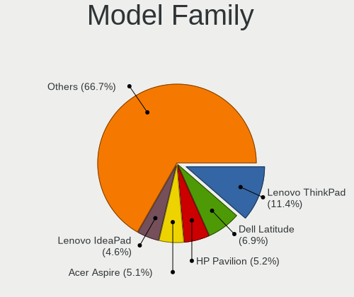

| Name                  | Notebooks | Percent |
|-----------------------|-----------|---------|
| Lenovo ThinkPad       | 57        | 10.56%  |
| Dell Latitude         | 37        | 6.85%   |
| HP Pavilion           | 30        | 5.56%   |
| Acer Aspire           | 28        | 5.19%   |
| Lenovo IdeaPad        | 23        | 4.26%   |
| HP EliteBook          | 21        | 3.89%   |
| Toshiba Satellite     | 20        | 3.7%    |
| Dell Inspiron         | 15        | 2.78%   |
| Dell Precision        | 14        | 2.59%   |
| HP ProBook            | 10        | 1.85%   |
| Fujitsu LIFEBOOK      | 9         | 1.67%   |
| Dell XPS              | 9         | 1.67%   |
| Unknown               | 9         | 1.67%   |
| Dell Vostro           | 7         | 1.3%    |
| HP Laptop             | 6         | 1.11%   |
| HP 250                | 6         | 1.11%   |
| ASUS VivoBook         | 6         | 1.11%   |
| HP ZBook              | 5         | 0.93%   |
| Packard Bell EasyNote | 4         | 0.74%   |
| Lenovo ThinkBook      | 4         | 0.74%   |
| HP Notebook           | 4         | 0.74%   |
| HP Compaq             | 4         | 0.74%   |
| TrekStor Surfbook     | 3         | 0.56%   |
| Lenovo Legion         | 3         | 0.56%   |
| Lenovo G580           | 3         | 0.56%   |
| HP Stream             | 3         | 0.56%   |
| HP ENVY               | 3         | 0.56%   |
| Dell Studio           | 3         | 0.56%   |
| Acer TravelMate       | 3         | 0.56%   |
| Acer Nitro            | 3         | 0.56%   |
| Samsung 350V5C        | 2         | 0.37%   |
| MicroByte ezbook      | 2         | 0.37%   |
| Lenovo Flex           | 2         | 0.37%   |
| HP Mini               | 2         | 0.37%   |
| HP 255                | 2         | 0.37%   |
| HP 15                 | 2         | 0.37%   |
| Digibras NH4CU53      | 2         | 0.37%   |
| Dell System           | 2         | 0.37%   |
| ASUS ZenBook          | 2         | 0.37%   |
| ASUS X553MA           | 2         | 0.37%   |
| ASUS X541SA           | 2         | 0.37%   |
| ASUS ROG              | 2         | 0.37%   |
| ASUS 1011PX           | 2         | 0.37%   |
| Wortmann AG TERRA     | 1         | 0.19%   |
| Wortmann AG Mobile    | 1         | 0.19%   |
| TUXEDO Pulse          | 1         | 0.19%   |
| TUXEDO InfinityBook   | 1         | 0.19%   |
| TPVAOC AA183M         | 1         | 0.19%   |
| Toshiba PORTEGE       | 1         | 0.19%   |
| Toshiba NB505         | 1         | 0.19%   |
| Timi TM1604           | 1         | 0.19%   |
| Teclast F15S          | 1         | 0.19%   |
| System76 Serval       | 1         | 0.19%   |
| System76 Galago       | 1         | 0.19%   |
| Star Labs LabTop      | 1         | 0.19%   |
| Sony VPCS12X9E        | 1         | 0.19%   |
| Sony VPCF13Z1R        | 1         | 0.19%   |
| Sony VPCF1290X        | 1         | 0.19%   |
| Sony VPCEL3S1E        | 1         | 0.19%   |
| Sony VPCEH1S1E        | 1         | 0.19%   |

MFG Year
--------

Motherboard manufacture year

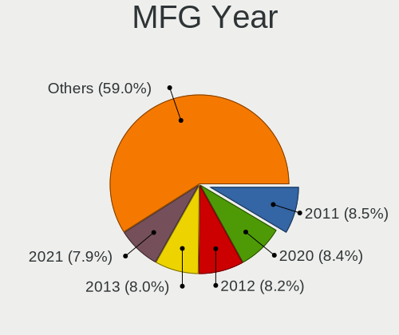

| Year    | Notebooks | Percent |
|---------|-----------|---------|
| 2011    | 63        | 11.67%  |
| 2012    | 51        | 9.44%   |
| 2020    | 46        | 8.52%   |
| 2019    | 44        | 8.15%   |
| 2013    | 41        | 7.59%   |
| 2010    | 39        | 7.22%   |
| 2018    | 38        | 7.04%   |
| 2008    | 35        | 6.48%   |
| 2015    | 30        | 5.56%   |
| 2017    | 28        | 5.19%   |
| 2014    | 28        | 5.19%   |
| 2021    | 27        | 5%      |
| 2016    | 27        | 5%      |
| 2009    | 16        | 2.96%   |
| 2007    | 15        | 2.78%   |
| 2006    | 7         | 1.3%    |
| 2005    | 2         | 0.37%   |
| 2022    | 1         | 0.19%   |
| 2003    | 1         | 0.19%   |
| Unknown | 1         | 0.19%   |

Form Factor
-----------

Physical design of the computer

| Name     | Notebooks | Percent |
|----------|-----------|---------|
| Notebook | 540       | 100%    |

Secure Boot
-----------

Enabled or disabled

| State    | Notebooks | Percent |
|----------|-----------|---------|
| Disabled | 488       | 89.71%  |
| Enabled  | 56        | 10.29%  |

Coreboot
--------

Have coreboot on board

| Used | Notebooks | Percent |
|------|-----------|---------|
| No   | 537       | 99.44%  |
| Yes  | 3         | 0.56%   |

RAM Size
--------

Total RAM memory

| Size in GB  | Notebooks | Percent |
|-------------|-----------|---------|
| 3.01-4.0    | 143       | 26.19%  |
| 4.01-8.0    | 139       | 25.46%  |
| 16.01-24.0  | 78        | 14.29%  |
| 8.01-16.0   | 76        | 13.92%  |
| 1.01-2.0    | 39        | 7.14%   |
| 32.01-64.0  | 33        | 6.04%   |
| 2.01-3.0    | 12        | 2.2%    |
| 64.01-256.0 | 12        | 2.2%    |
| 0.51-1.0    | 9         | 1.65%   |
| 24.01-32.0  | 4         | 0.73%   |
| 0.01-0.5    | 1         | 0.18%   |

RAM Used
--------

Used RAM memory

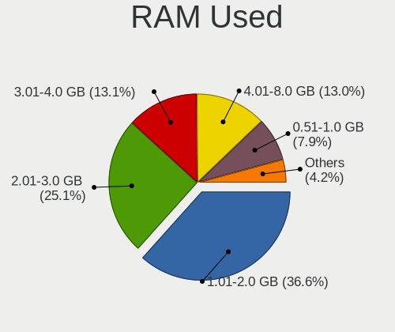

| Used GB    | Notebooks | Percent |
|------------|-----------|---------|
| 1.01-2.0   | 218       | 37.85%  |
| 2.01-3.0   | 135       | 23.44%  |
| 3.01-4.0   | 70        | 12.15%  |
| 4.01-8.0   | 68        | 11.81%  |
| 0.51-1.0   | 61        | 10.59%  |
| 8.01-16.0  | 15        | 2.6%    |
| 0.01-0.5   | 7         | 1.22%   |
| 32.01-64.0 | 1         | 0.17%   |
| 24.01-32.0 | 1         | 0.17%   |

Total Drives
------------

Number of drives on board

| Drives | Notebooks | Percent |
|--------|-----------|---------|
| 1      | 398       | 71.84%  |
| 2      | 137       | 24.73%  |
| 3      | 13        | 2.35%   |
| 4      | 3         | 0.54%   |
| 0      | 2         | 0.36%   |
| 5      | 1         | 0.18%   |

Has CD-ROM
----------

Has CD-ROM on board

| Presented | Notebooks | Percent |
|-----------|-----------|---------|
| No        | 290       | 53.6%   |
| Yes       | 251       | 46.4%   |

Has Ethernet
------------

Has Ethernet on board

| Presented | Notebooks | Percent |
|-----------|-----------|---------|
| Yes       | 464       | 85.93%  |
| No        | 76        | 14.07%  |

Has WiFi
--------

Has WiFi module

| Presented | Notebooks | Percent |
|-----------|-----------|---------|
| Yes       | 529       | 97.6%   |
| No        | 13        | 2.4%    |

Has Bluetooth
-------------

Has Bluetooth module

| Presented | Notebooks | Percent |
|-----------|-----------|---------|
| Yes       | 397       | 72.98%  |
| No        | 147       | 27.02%  |

Location
--------

Country
-------

Geographic location (country)

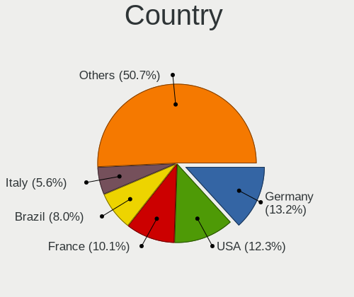

| Country     | Notebooks | Percent |
|-------------|-----------|---------|
| USA         | 69        | 12.71%  |
| Germany     | 64        | 11.79%  |
| Brazil      | 57        | 10.5%   |
| France      | 50        | 9.21%   |
| Italy       | 33        | 6.08%   |
| UK          | 28        | 5.16%   |
| Spain       | 26        | 4.79%   |
| Russia      | 26        | 4.79%   |
| Netherlands | 11        | 2.03%   |
| Ukraine     | 9         | 1.66%   |
| India       | 9         | 1.66%   |
| Turkey      | 8         | 1.47%   |
| Switzerland | 8         | 1.47%   |
| Canada      | 8         | 1.47%   |
| Romania     | 7         | 1.29%   |
| Belgium     | 7         | 1.29%   |
| Poland      | 6         | 1.1%    |
| Sweden      | 5         | 0.92%   |
| Indonesia   | 5         | 0.92%   |
| Greece      | 5         | 0.92%   |
| Finland     | 5         | 0.92%   |
| Czechia     | 5         | 0.92%   |
| Australia   | 5         | 0.92%   |
| Argentina   | 5         | 0.92%   |
| Thailand    | 4         | 0.74%   |
| Portugal    | 4         | 0.74%   |
| Norway      | 4         | 0.74%   |
| Mexico      | 4         | 0.74%   |
| Chile       | 4         | 0.74%   |
| Philippines | 3         | 0.55%   |
| Denmark     | 3         | 0.55%   |
| China       | 3         | 0.55%   |
| Austria     | 3         | 0.55%   |
| Vietnam     | 2         | 0.37%   |
| Venezuela   | 2         | 0.37%   |
| Taiwan      | 2         | 0.37%   |
| South Korea | 2         | 0.37%   |
| Slovakia    | 2         | 0.37%   |
| Peru        | 2         | 0.37%   |
| New Zealand | 2         | 0.37%   |
| Luxembourg  | 2         | 0.37%   |
| Kenya       | 2         | 0.37%   |
| Ireland     | 2         | 0.37%   |
| Estonia     | 2         | 0.37%   |
| Ecuador     | 2         | 0.37%   |
| Croatia     | 2         | 0.37%   |
| Belarus     | 2         | 0.37%   |
| Uruguay     | 1         | 0.18%   |
| Sudan       | 1         | 0.18%   |
| Sri Lanka   | 1         | 0.18%   |
| Serbia      | 1         | 0.18%   |
| Runion    | 1         | 0.18%   |
| Puerto Rico | 1         | 0.18%   |
| Paraguay    | 1         | 0.18%   |
| Morocco     | 1         | 0.18%   |
| Montenegro  | 1         | 0.18%   |
| Malaysia    | 1         | 0.18%   |
| Lithuania   | 1         | 0.18%   |
| Ivory Coast | 1         | 0.18%   |
| Israel      | 1         | 0.18%   |

City
----

Geographic location (city)

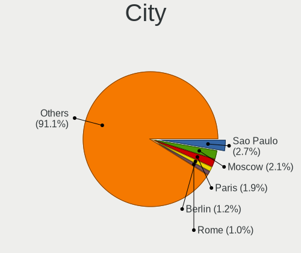

| City              | Notebooks | Percent |
|-------------------|-----------|---------|
| Sao Paulo         | 21        | 3.72%   |
| Paris             | 12        | 2.12%   |
| Moscow            | 10        | 1.77%   |
| Berlin            | 7         | 1.24%   |
| Rome              | 5         | 0.88%   |
| Rio de Janeiro    | 5         | 0.88%   |
| Kyiv              | 5         | 0.88%   |
| St Petersburg     | 4         | 0.71%   |
| Essen             | 4         | 0.71%   |
| Bucharest         | 4         | 0.71%   |
| Bengaluru         | 4         | 0.71%   |
| Barcelona         | 4         | 0.71%   |
| Amsterdam         | 4         | 0.71%   |
| Vienna            | 3         | 0.53%   |
| Seville           | 3         | 0.53%   |
| Porto Alegre      | 3         | 0.53%   |
| Munich            | 3         | 0.53%   |
| Marseille         | 3         | 0.53%   |
| Madrid            | 3         | 0.53%   |
| Hamburg           | 3         | 0.53%   |
| Genoa             | 3         | 0.53%   |
| Ely               | 3         | 0.53%   |
| Darmstadt         | 3         | 0.53%   |
| Cologne           | 3         | 0.53%   |
| Athens            | 3         | 0.53%   |
| Zurich            | 2         | 0.35%   |
| Xining            | 2         | 0.35%   |
| Thessaloniki      | 2         | 0.35%   |
| Sint-Truiden      | 2         | 0.35%   |
| Seoul             | 2         | 0.35%   |
| Santiago          | 2         | 0.35%   |
| Samara            | 2         | 0.35%   |
| Saint-Cloud       | 2         | 0.35%   |
| Raleigh           | 2         | 0.35%   |
| Philadelphia      | 2         | 0.35%   |
| Oslo              | 2         | 0.35%   |
| Nonthaburi        | 2         | 0.35%   |
| Nairobi           | 2         | 0.35%   |
| Milan             | 2         | 0.35%   |
| Mannheim          | 2         | 0.35%   |
| Manchester        | 2         | 0.35%   |
| Luxembourg        | 2         | 0.35%   |
| Lubbeek           | 2         | 0.35%   |
| Los Angeles       | 2         | 0.35%   |
| Lisbon            | 2         | 0.35%   |
| Landskrona        | 2         | 0.35%   |
| Lancaster         | 2         | 0.35%   |
| Huissen           | 2         | 0.35%   |
| Ho Chi Minh City  | 2         | 0.35%   |
| Helsinki          | 2         | 0.35%   |
| Hamrangefjarden   | 2         | 0.35%   |
| Goinia          | 2         | 0.35%   |
| Gigean            | 2         | 0.35%   |
| Frankfurt am Main | 2         | 0.35%   |
| Evansville        | 2         | 0.35%   |
| Durham            | 2         | 0.35%   |
| Dresden           | 2         | 0.35%   |
| Draper            | 2         | 0.35%   |
| Clichy-sous-Bois  | 2         | 0.35%   |
| Chicago           | 2         | 0.35%   |

Drives
------

Drive Vendor
------------

Hard drive vendors

| Vendor                    | Notebooks | Drives | Percent |
|---------------------------|-----------|--------|---------|
| Samsung Electronics       | 103       | 130    | 15.42%  |
| Seagate                   | 96        | 121    | 14.37%  |
| WDC                       | 79        | 90     | 11.83%  |
| Toshiba                   | 63        | 77     | 9.43%   |
| Kingston                  | 41        | 47     | 6.14%   |
| Unknown                   | 37        | 45     | 5.54%   |
| Hitachi                   | 35        | 39     | 5.24%   |
| SanDisk                   | 29        | 39     | 4.34%   |
| Crucial                   | 28        | 42     | 4.19%   |
| SK hynix                  | 25        | 32     | 3.74%   |
| Intel                     | 13        | 17     | 1.95%   |
| Fujitsu                   | 11        | 12     | 1.65%   |
| A-DATA Technology         | 10        | 10     | 1.5%    |
| HGST                      | 9         | 11     | 1.35%   |
| China                     | 9         | 10     | 1.35%   |
| Micron Technology         | 8         | 9      | 1.2%    |
| Phison                    | 7         | 7      | 1.05%   |
| KIOXIA                    | 7         | 8      | 1.05%   |
| PNY                       | 6         | 6      | 0.9%    |
| Intenso                   | 4         | 4      | 0.6%    |
| Transcend                 | 3         | 6      | 0.45%   |
| SPCC                      | 3         | 5      | 0.45%   |
| Silicon Motion            | 3         | 3      | 0.45%   |
| Vaseky                    | 2         | 2      | 0.3%    |
| Patriot                   | 2         | 2      | 0.3%    |
| LITEON                    | 2         | 2      | 0.3%    |
| KingSpec                  | 2         | 2      | 0.3%    |
| IBM/Hitachi               | 2         | 2      | 0.3%    |
| FORESEE                   | 2         | 2      | 0.3%    |
| Faspeed                   | 2         | 2      | 0.3%    |
| Apacer                    | 2         | 3      | 0.3%    |
| XPG                       | 1         | 1      | 0.15%   |
| Verbatim                  | 1         | 1      | 0.15%   |
| USB2.0                    | 1         | 1      | 0.15%   |
| Super Talent              | 1         | 1      | 0.15%   |
| Solid State Storage       | 1         | 1      | 0.15%   |
| Smart                     | 1         | 1      | 0.15%   |
| Realtek Semiconductor     | 1         | 1      | 0.15%   |
| Plextor                   | 1         | 1      | 0.15%   |
| OCZ                       | 1         | 1      | 0.15%   |
| Netac                     | 1         | 1      | 0.15%   |
| Micron/Crucial Technology | 1         | 1      | 0.15%   |
| LITEONIT                  | 1         | 2      | 0.15%   |
| Lenovo                    | 1         | 1      | 0.15%   |
| LaCie                     | 1         | 1      | 0.15%   |
| JMicron Technology        | 1         | 1      | 0.15%   |
| Hjwdz                     | 1         | 1      | 0.15%   |
| Eluktro                   | 1         | 1      | 0.15%   |
| Drevo                     | 1         | 1      | 0.15%   |
| Dogfish                   | 1         | 1      | 0.15%   |
| Corsair                   | 1         | 2      | 0.15%   |
| BlueRay                   | 1         | 1      | 0.15%   |
| Apricorn                  | 1         | 1      | 0.15%   |
| Unknown                   | 1         | 1      | 0.15%   |

Drive Model
-----------

Hard drive models

| Model                                | Notebooks | Percent |
|--------------------------------------|-----------|---------|
| Toshiba MQ01ABF050 500GB             | 10        | 1.45%   |
| Seagate ST1000LM035-1RK172 1TB       | 10        | 1.45%   |
| Kingston SA400S37240G 240GB SSD      | 10        | 1.45%   |
| Unknown MMC Card  32GB               | 9         | 1.3%    |
| Kingston SA400S37120G 120GB SSD      | 8         | 1.16%   |
| Seagate ST500LT012-9WS142 500GB      | 7         | 1.01%   |
| Seagate ST320LT007-9ZV142 320GB      | 7         | 1.01%   |
| Toshiba MQ01ABD100 1TB               | 6         | 0.87%   |
| Seagate ST9500325AS 500GB            | 6         | 0.87%   |
| Seagate ST500LT012-1DG142 500GB      | 6         | 0.87%   |
| Seagate ST500LM012 HN-M500MBB 500GB  | 6         | 0.87%   |
| Samsung SSD 860 EVO 500GB            | 6         | 0.87%   |
| Hitachi HTS545050B9A300 500GB        | 6         | 0.87%   |
| Unknown MMC Card  64GB               | 5         | 0.72%   |
| Toshiba MQ04ABF100 1TB               | 5         | 0.72%   |
| Seagate ST1000LM049-2GH172 1TB       | 5         | 0.72%   |
| Seagate ST1000LM024 HN-M101MBB 1TB   | 5         | 0.72%   |
| Kingston SA400S37480G 480GB SSD      | 5         | 0.72%   |
| WDC WD10JPVX-22JC3T0 1TB             | 4         | 0.58%   |
| Seagate ST2000LM007-1R8174 2TB       | 4         | 0.58%   |
| Samsung SSD 850 EVO 500GB            | 4         | 0.58%   |
| Kingston SV300S37A120G 120GB SSD     | 4         | 0.58%   |
| Hitachi HTS547575A9E384 752GB        | 4         | 0.58%   |
| HGST HTS721010A9E630 1TB             | 4         | 0.58%   |
| Crucial CT250BX100SSD1 250GB         | 4         | 0.58%   |
| Crucial CT240BX500SSD1 240GB         | 4         | 0.58%   |
| China SSD 120GB                      | 4         | 0.58%   |
| WDC WD5000LPVX-22V0TT0 500GB         | 3         | 0.43%   |
| WDC WD3200BPVT-80JJ5T0 320GB         | 3         | 0.43%   |
| WDC WD10SPZX-21Z10T0 1TB             | 3         | 0.43%   |
| Unknown MMC Card  16GB               | 3         | 0.43%   |
| Unknown MMC Card  128GB              | 3         | 0.43%   |
| Toshiba MQ01ACF032 320GB             | 3         | 0.43%   |
| Toshiba MQ01ABD050 500GB             | 3         | 0.43%   |
| SK hynix NVMe SSD Drive 256GB        | 3         | 0.43%   |
| Seagate ST9500420AS 500GB            | 3         | 0.43%   |
| Seagate ST9250410AS 250GB            | 3         | 0.43%   |
| Seagate ST2000LM015-2E8174 2TB       | 3         | 0.43%   |
| Seagate ST2000LM003 HN-M201RAD 2TB   | 3         | 0.43%   |
| Seagate ST1000LM014-1EJ164 1TB       | 3         | 0.43%   |
| SanDisk SSD i100 24GB                | 3         | 0.43%   |
| SanDisk NVMe SSD Drive 512GB         | 3         | 0.43%   |
| Samsung SSD 860 PRO 512GB            | 3         | 0.43%   |
| PNY CS900 240GB SSD                  | 3         | 0.43%   |
| Intel SSDPEKNW512G8 512GB            | 3         | 0.43%   |
| Hitachi HTS547564A9E384 640GB        | 3         | 0.43%   |
| Hitachi HTS545050A7E380 500GB        | 3         | 0.43%   |
| Hitachi HTS543232A7A384 320GB        | 3         | 0.43%   |
| Crucial CT750MX300SSD1 752GB         | 3         | 0.43%   |
| Crucial CT500MX500SSD1 500GB         | 3         | 0.43%   |
| WDC WDS500G2B0A-00SM50 500GB SSD     | 2         | 0.29%   |
| WDC WDS240G2G0A-00JH30 240GB SSD     | 2         | 0.29%   |
| WDC WD5000BPKT-75PK4T0 500GB         | 2         | 0.29%   |
| WDC WD5000BEVT-22ZAT0 500GB          | 2         | 0.29%   |
| WDC WD10SPZX-08Z10 1TB               | 2         | 0.29%   |
| WDC PC SN730 SDBQNTY-512G-1001 512GB | 2         | 0.29%   |
| WDC PC SN730 SDBPNTY-1T00-1101 1TB   | 2         | 0.29%   |
| WDC PC SN720 SDAQNTW-512G-1001 512GB | 2         | 0.29%   |
| WDC PC SN520 SDAPNUW-256G-1202 256GB | 2         | 0.29%   |
| Unknown SLD64G  64GB                 | 2         | 0.29%   |

HDD Vendor
----------

Hard disk drive vendors

| Vendor              | Notebooks | Drives | Percent |
|---------------------|-----------|--------|---------|
| Seagate             | 96        | 119    | 37.07%  |
| WDC                 | 53        | 60     | 20.46%  |
| Toshiba             | 47        | 58     | 18.15%  |
| Hitachi             | 35        | 39     | 13.51%  |
| Fujitsu             | 11        | 12     | 4.25%   |
| HGST                | 9         | 11     | 3.47%   |
| Samsung Electronics | 4         | 4      | 1.54%   |
| IBM/Hitachi         | 2         | 2      | 0.77%   |
| Unknown             | 1         | 1      | 0.39%   |
| Apricorn            | 1         | 1      | 0.39%   |

SSD Vendor
----------

Solid state drive vendors

| Vendor              | Notebooks | Drives | Percent |
|---------------------|-----------|--------|---------|
| Samsung Electronics | 63        | 79     | 26.81%  |
| Kingston            | 38        | 44     | 16.17%  |
| Crucial             | 26        | 40     | 11.06%  |
| SanDisk             | 21        | 27     | 8.94%   |
| WDC                 | 10        | 11     | 4.26%   |
| A-DATA Technology   | 9         | 9      | 3.83%   |
| China               | 8         | 9      | 3.4%    |
| Toshiba             | 7         | 8      | 2.98%   |
| SK hynix            | 6         | 8      | 2.55%   |
| PNY                 | 6         | 6      | 2.55%   |
| Intel               | 5         | 8      | 2.13%   |
| Intenso             | 4         | 4      | 1.7%    |
| Transcend           | 3         | 6      | 1.28%   |
| SPCC                | 3         | 5      | 1.28%   |
| Micron Technology   | 3         | 4      | 1.28%   |
| Vaseky              | 2         | 2      | 0.85%   |
| KingSpec            | 2         | 2      | 0.85%   |
| FORESEE             | 2         | 2      | 0.85%   |
| Apacer              | 2         | 3      | 0.85%   |
| Verbatim            | 1         | 1      | 0.43%   |
| Super Talent        | 1         | 1      | 0.43%   |
| Smart               | 1         | 1      | 0.43%   |
| Seagate             | 1         | 1      | 0.43%   |
| Plextor             | 1         | 1      | 0.43%   |
| Patriot             | 1         | 1      | 0.43%   |
| OCZ                 | 1         | 1      | 0.43%   |
| Netac               | 1         | 1      | 0.43%   |
| LITEONIT            | 1         | 2      | 0.43%   |
| LITEON              | 1         | 1      | 0.43%   |
| JMicron Technology  | 1         | 1      | 0.43%   |
| Eluktro             | 1         | 1      | 0.43%   |
| Drevo               | 1         | 1      | 0.43%   |
| Dogfish             | 1         | 1      | 0.43%   |
| BlueRay             | 1         | 1      | 0.43%   |

Drive Kind
----------

HDD or SSD

| Kind    | Notebooks | Drives | Percent |
|---------|-----------|--------|---------|
| HDD     | 249       | 307    | 38.97%  |
| SSD     | 219       | 293    | 34.27%  |
| NVMe    | 128       | 160    | 20.03%  |
| MMC     | 36        | 45     | 5.63%   |
| Unknown | 7         | 7      | 1.1%    |

Drive Connector
---------------

SATA, SAS, NVMe, etc.

| Type | Notebooks | Drives | Percent |
|------|-----------|--------|---------|
| SATA | 428       | 592    | 70.74%  |
| NVMe | 128       | 160    | 21.16%  |
| MMC  | 36        | 45     | 5.95%   |
| SAS  | 13        | 15     | 2.15%   |

Drive Size
----------

Size of hard drive

| Size in TB | Notebooks | Drives | Percent |
|------------|-----------|--------|---------|
| 0.01-0.5   | 333       | 414    | 71.31%  |
| 0.51-1.0   | 110       | 149    | 23.55%  |
| 1.01-2.0   | 19        | 30     | 4.07%   |
| 4.01-10.0  | 3         | 4      | 0.64%   |
| 3.01-4.0   | 2         | 3      | 0.43%   |

Space Total
-----------

Amount of disk space available on the file system

| Size in GB     | Notebooks | Percent |
|----------------|-----------|---------|
| 101-250        | 171       | 30.81%  |
| 251-500        | 151       | 27.21%  |
| 501-1000       | 78        | 14.05%  |
| 51-100         | 47        | 8.47%   |
| 1001-2000      | 35        | 6.31%   |
| 1-20           | 32        | 5.77%   |
| 21-50          | 22        | 3.96%   |
| More than 3000 | 9         | 1.62%   |
| 2001-3000      | 9         | 1.62%   |
| Unknown        | 1         | 0.18%   |

Space Used
----------

Amount of used disk space

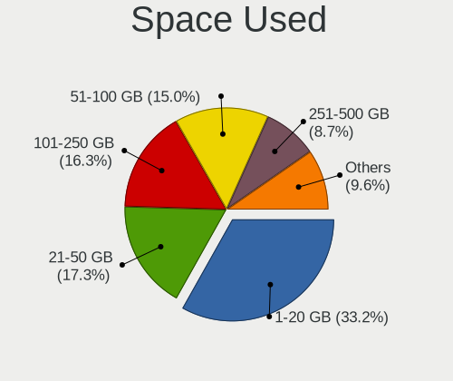

| Used GB        | Notebooks | Percent |
|----------------|-----------|---------|
| 1-20           | 210       | 36.71%  |
| 21-50          | 93        | 16.26%  |
| 101-250        | 88        | 15.38%  |
| 51-100         | 85        | 14.86%  |
| 251-500        | 49        | 8.57%   |
| 501-1000       | 32        | 5.59%   |
| 1001-2000      | 8         | 1.4%    |
| More than 3000 | 3         | 0.52%   |
| 2001-3000      | 3         | 0.52%   |
| Unknown        | 1         | 0.17%   |

Malfunc. Drives
---------------

Drive models with a malfunction

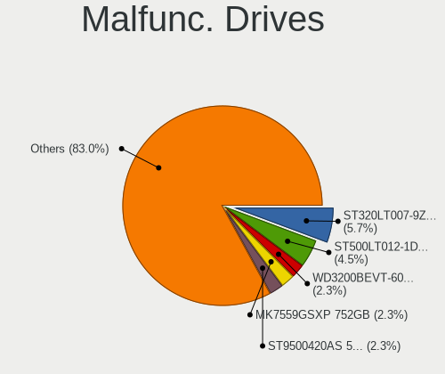

| Model                                            | Notebooks | Drives | Percent |
|--------------------------------------------------|-----------|--------|---------|
| Seagate ST320LT007-9ZV142 320GB                  | 5         | 5      | 9.62%   |
| Toshiba MK7559GSXP 752GB                         | 2         | 2      | 3.85%   |
| Seagate ST500LT012-9WS142 500GB                  | 2         | 2      | 3.85%   |
| Seagate ST1000LM049-2GH172 1TB                   | 2         | 2      | 3.85%   |
| Hitachi HTS547575A9E384 752GB                    | 2         | 2      | 3.85%   |
| Hitachi HTS545050B9A300 500GB                    | 2         | 2      | 3.85%   |
| Hitachi HTS542516K9SA00 160GB                    | 2         | 2      | 3.85%   |
| WDC WD7500BPVT-75HXZT1 752GB                     | 1         | 1      | 1.92%   |
| WDC WD7500BPVT-22A1YT0 752GB                     | 1         | 1      | 1.92%   |
| WDC WD7500BPKT-75PK4T0 752GB                     | 1         | 1      | 1.92%   |
| WDC WD5000LPVX-22V0TT0 500GB                     | 1         | 1      | 1.92%   |
| WDC WD5000BPKT-75PK4T0 500GB                     | 1         | 2      | 1.92%   |
| WDC WD3200BEVT-60ZCT1 320GB                      | 1         | 1      | 1.92%   |
| WDC WD10JPCX-24UE4T0 1TB                         | 1         | 1      | 1.92%   |
| Vaseky V820/1TB 1024GB                           | 1         | 1      | 1.92%   |
| Toshiba MQ01ABD050 500GB                         | 1         | 1      | 1.92%   |
| Toshiba MK5065GSX 500GB                          | 1         | 1      | 1.92%   |
| Toshiba MK2565GSXN 250GB                         | 1         | 1      | 1.92%   |
| Toshiba MK2555GSX 250GB                          | 1         | 1      | 1.92%   |
| SK hynix BC501 HFM256GDJTNG-8310A 256GB          | 1         | 4      | 1.92%   |
| Seagate ST98823AS 80GB                           | 1         | 1      | 1.92%   |
| Seagate ST9500420AS 500GB                        | 1         | 1      | 1.92%   |
| Seagate ST9500325AS 500GB                        | 1         | 1      | 1.92%   |
| Seagate ST9320325AS 320GB                        | 1         | 1      | 1.92%   |
| Seagate ST9250410AS 250GB                        | 1         | 1      | 1.92%   |
| Seagate ST9160821AS 160GB                        | 1         | 1      | 1.92%   |
| Seagate ST320LT012-9WS14C 320GB                  | 1         | 1      | 1.92%   |
| SanDisk SD7SN3Q256G1002 256GB SSD                | 1         | 1      | 1.92%   |
| Samsung Electronics SSD 960 PRO 2TB              | 1         | 4      | 1.92%   |
| Samsung Electronics MZNLH128HBHQ-000H1 128GB SSD | 1         | 1      | 1.92%   |
| Samsung Electronics HM160HI 160GB                | 1         | 1      | 1.92%   |
| OCZ VERTEX450 128GB SSD                          | 1         | 1      | 1.92%   |
| Intel SSDSC2KF256H6L 256GB                       | 1         | 1      | 1.92%   |
| Intel SSDSA2M160G2GN 160GB                       | 1         | 1      | 1.92%   |
| IBM/Hitachi IC25N060ATMR04-0 64GB                | 1         | 1      | 1.92%   |
| Hitachi HTS722016K9A300 160GB                    | 1         | 1      | 1.92%   |
| Fujitsu MHZ2320BH G1 320GB                       | 1         | 1      | 1.92%   |
| Eluktro TRO-SSD7-500GB-PRO                       | 1         | 1      | 1.92%   |
| China SSD 120GB                                  | 1         | 1      | 1.92%   |
| Apricorn SATAWire 6G                             | 1         | 1      | 1.92%   |
| A-DATA Technology SU650 120GB SSD                | 1         | 1      | 1.92%   |
| A-DATA Technology SP900 64GB SSD                 | 1         | 1      | 1.92%   |

Malfunc. Drive Vendor
---------------------

Vendors of faulty drives

| Vendor              | Notebooks | Drives | Percent |
|---------------------|-----------|--------|---------|
| Seagate             | 16        | 16     | 30.77%  |
| WDC                 | 7         | 8      | 13.46%  |
| Hitachi             | 7         | 7      | 13.46%  |
| Toshiba             | 6         | 6      | 11.54%  |
| Samsung Electronics | 3         | 6      | 5.77%   |
| Intel               | 2         | 2      | 3.85%   |
| A-DATA Technology   | 2         | 2      | 3.85%   |
| Vaseky              | 1         | 1      | 1.92%   |
| SK hynix            | 1         | 4      | 1.92%   |
| SanDisk             | 1         | 1      | 1.92%   |
| OCZ                 | 1         | 1      | 1.92%   |
| IBM/Hitachi         | 1         | 1      | 1.92%   |
| Fujitsu             | 1         | 1      | 1.92%   |
| Eluktro             | 1         | 1      | 1.92%   |
| China               | 1         | 1      | 1.92%   |
| Apricorn            | 1         | 1      | 1.92%   |

Malfunc. HDD Vendor
-------------------

Vendors of faulty HDD drives

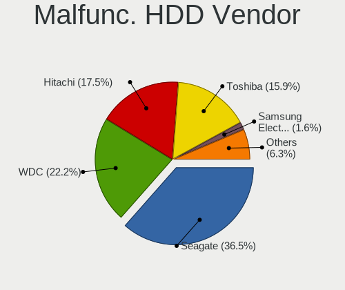

| Vendor              | Notebooks | Drives | Percent |
|---------------------|-----------|--------|---------|
| Seagate             | 16        | 16     | 40%     |
| WDC                 | 7         | 8      | 17.5%   |
| Hitachi             | 7         | 7      | 17.5%   |
| Toshiba             | 6         | 6      | 15%     |
| Samsung Electronics | 1         | 1      | 2.5%    |
| IBM/Hitachi         | 1         | 1      | 2.5%    |
| Fujitsu             | 1         | 1      | 2.5%    |
| Apricorn            | 1         | 1      | 2.5%    |

Malfunc. Drive Kind
-------------------

Kinds of faulty drives

| Kind | Notebooks | Drives | Percent |
|------|-----------|--------|---------|
| HDD  | 40        | 41     | 76.92%  |
| SSD  | 10        | 10     | 19.23%  |
| NVMe | 2         | 8      | 3.85%   |

Failed Drives
-------------

Failed drive models

Zero info for selected period =(

Failed Drive Vendor
-------------------

Failed drive vendors

Zero info for selected period =(

Drive Status
------------

Number of failed and malfunc. drives

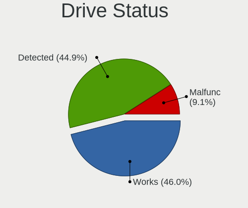

| Status   | Notebooks | Drives | Percent |
|----------|-----------|--------|---------|
| Detected | 282       | 429    | 48.37%  |
| Works    | 249       | 324    | 42.71%  |
| Malfunc  | 52        | 59     | 8.92%   |

Storage controller
------------------

Storage Vendor
--------------

Storage controller vendors

| Vendor                           | Notebooks | Percent |
|----------------------------------|-----------|---------|
| Intel                            | 402       | 66.23%  |
| AMD                              | 66        | 10.87%  |
| Samsung Electronics              | 39        | 6.43%   |
| SanDisk                          | 23        | 3.79%   |
| SK hynix                         | 18        | 2.97%   |
| Toshiba America Info Systems     | 10        | 1.65%   |
| Silicon Integrated Systems [SiS] | 8         | 1.32%   |
| Phison Electronics               | 8         | 1.32%   |
| KIOXIA                           | 6         | 0.99%   |
| Micron Technology                | 5         | 0.82%   |
| Silicon Motion                   | 4         | 0.66%   |
| Micron/Crucial Technology        | 3         | 0.49%   |
| Kingston Technology Company      | 3         | 0.49%   |
| VIA Technologies                 | 2         | 0.33%   |
| Solid State Storage Technology   | 2         | 0.33%   |
| Nvidia                           | 2         | 0.33%   |
| ADATA Technology                 | 2         | 0.33%   |
| Realtek Semiconductor            | 1         | 0.16%   |
| Lite-On Technology               | 1         | 0.16%   |
| Lenovo                           | 1         | 0.16%   |
| JMicron Technology               | 1         | 0.16%   |

Storage Model
-------------

Storage controller models

| Model                                                                            | Notebooks | Percent |
|----------------------------------------------------------------------------------|-----------|---------|
| Intel 7 Series Chipset Family 6-port SATA Controller [AHCI mode]                 | 56        | 8.45%   |
| Intel 6 Series/C200 Series Chipset Family 6 port Mobile SATA AHCI Controller     | 47        | 7.09%   |
| AMD FCH SATA Controller [AHCI mode]                                              | 45        | 6.79%   |
| Intel 82801 Mobile SATA Controller [RAID mode]                                   | 32        | 4.83%   |
| Intel Sunrise Point-LP SATA Controller [AHCI mode]                               | 30        | 4.52%   |
| Intel 82801IBM/IEM (ICH9M/ICH9M-E) 4 port SATA Controller [AHCI mode]            | 20        | 3.02%   |
| Intel Wildcat Point-LP SATA Controller [AHCI Mode]                               | 19        | 2.87%   |
| Samsung NVMe SSD Controller SM981/PM981/PM983                                    | 18        | 2.71%   |
| Intel 5 Series/3400 Series Chipset 4 port SATA AHCI Controller                   | 17        | 2.56%   |
| Intel 8 Series/C220 Series Chipset Family 6-port SATA Controller 1 [AHCI mode]   | 16        | 2.41%   |
| Intel 8 Series SATA Controller 1 [AHCI mode]                                     | 16        | 2.41%   |
| Intel Cannon Lake Mobile PCH SATA AHCI Controller                                | 15        | 2.26%   |
| Intel Atom Processor E3800 Series SATA AHCI Controller                           | 13        | 1.96%   |
| Intel 82801HM/HEM (ICH8M/ICH8M-E) IDE Controller                                 | 13        | 1.96%   |
| Samsung NVMe SSD Controller 980                                                  | 12        | 1.81%   |
| Intel HM170/QM170 Chipset SATA Controller [AHCI Mode]                            | 12        | 1.81%   |
| Intel 82801HM/HEM (ICH8M/ICH8M-E) SATA Controller [AHCI mode]                    | 11        | 1.66%   |
| Intel NM10/ICH7 Family SATA Controller [AHCI mode]                               | 10        | 1.51%   |
| AMD SB7x0/SB8x0/SB9x0 SATA Controller [AHCI mode]                                | 9         | 1.36%   |
| Silicon Integrated Systems [SiS] 5513 IDE Controller                             | 8         | 1.21%   |
| Intel Celeron/Pentium Silver Processor SATA Controller                           | 8         | 1.21%   |
| Intel Cannon Point-LP SATA Controller [AHCI Mode]                                | 8         | 1.21%   |
| Intel 82801GBM/GHM (ICH7-M Family) SATA Controller [IDE mode]                    | 8         | 1.21%   |
| SanDisk WD Black SN750 / PC SN730 NVMe SSD                                       | 7         | 1.06%   |
| Intel Volume Management Device NVMe RAID Controller                              | 7         | 1.06%   |
| Intel SSD 660P Series                                                            | 7         | 1.06%   |
| AMD SB600 IDE                                                                    | 7         | 1.06%   |
| SK hynix BC511                                                                   | 6         | 0.9%    |
| Samsung NVMe SSD Controller SM961/PM961/SM963                                    | 6         | 0.9%    |
| Intel Q170/Q150/B150/H170/H110/Z170/CM236 Chipset SATA Controller [AHCI Mode]    | 6         | 0.9%    |
| Intel Celeron N3350/Pentium N4200/Atom E3900 Series SATA AHCI Controller         | 6         | 0.9%    |
| Intel Atom/Celeron/Pentium Processor x5-E8000/J3xxx/N3xxx Series SATA Controller | 6         | 0.9%    |
| AMD SB600 Non-Raid-5 SATA                                                        | 6         | 0.9%    |
| SK hynix BC501 NVMe Solid State Drive                                            | 5         | 0.75%   |
| Silicon Integrated Systems [SiS] SATA Controller / IDE mode                      | 5         | 0.75%   |
| SanDisk WD Blue SN500 / PC SN520 NVMe SSD                                        | 5         | 0.75%   |
| Micron Non-Volatile memory controller                                            | 5         | 0.75%   |
| KIOXIA NVMe SSD Controller BG4                                                   | 5         | 0.75%   |
| Intel Ice Lake-LP SATA Controller [AHCI mode]                                    | 5         | 0.75%   |
| Intel Comet Lake SATA AHCI Controller                                            | 5         | 0.75%   |
| Intel 7 Series Chipset Family 4-port SATA Controller [IDE mode]                  | 5         | 0.75%   |
| Intel 7 Series Chipset Family 2-port SATA Controller [IDE mode]                  | 5         | 0.75%   |
| Toshiba America Info Systems XG6 NVMe SSD Controller                             | 4         | 0.6%    |
| SK hynix Gold P31 SSD                                                            | 4         | 0.6%    |
| SanDisk WD Blue SN550 NVMe SSD                                                   | 4         | 0.6%    |
| SanDisk WD Black 2018/SN750 / PC SN720 NVMe SSD                                  | 4         | 0.6%    |
| Phison E12 NVMe Controller                                                       | 4         | 0.6%    |
| Intel Tiger Lake-LP SATA Controller                                              | 4         | 0.6%    |
| Intel 82801HM/HEM (ICH8M/ICH8M-E) SATA Controller [IDE mode]                     | 4         | 0.6%    |
| Intel 5 Series/3400 Series Chipset 6 port SATA AHCI Controller                   | 4         | 0.6%    |
| AMD SB7x0/SB8x0/SB9x0 IDE Controller                                             | 4         | 0.6%    |
| Silicon Motion SM2263EN/SM2263XT SSD Controller                                  | 3         | 0.45%   |
| SanDisk PC SN520 NVMe SSD                                                        | 3         | 0.45%   |
| Samsung NVMe SSD Controller PM9A1/PM9A3/980PRO                                   | 3         | 0.45%   |
| Phison PS5013 E13 NVMe Controller                                                | 3         | 0.45%   |
| Intel 82801IBM/IEM (ICH9M/ICH9M-E) 2 port SATA Controller [IDE mode]             | 3         | 0.45%   |
| Intel 500 Series Chipset Family SATA AHCI Controller                             | 3         | 0.45%   |
| Intel 400 Series Chipset Family SATA AHCI Controller                             | 3         | 0.45%   |
| AMD SB7x0/SB8x0/SB9x0 SATA Controller [IDE mode]                                 | 3         | 0.45%   |
| Toshiba America Info Systems Toshiba America Info Non-Volatile memory controller | 2         | 0.3%    |

Storage Kind
------------

Kind of storage controller (IDE, SATA, NVMe, SAS, ...)

| Kind | Notebooks | Percent |
|------|-----------|---------|
| SATA | 406       | 64.24%  |
| NVMe | 126       | 19.94%  |
| IDE  | 61        | 9.65%   |
| RAID | 39        | 6.17%   |

Processor
---------

CPU Vendor
----------

Processor vendors

| Vendor       | Notebooks | Percent |
|--------------|-----------|---------|
| Intel        | 460       | 85.19%  |
| AMD          | 78        | 14.44%  |
| CentaurHauls | 1         | 0.19%   |
| ARM          | 1         | 0.19%   |

CPU Model
---------

Processor models

| Model                                         | Notebooks | Percent |
|-----------------------------------------------|-----------|---------|
| Intel Core i7-8550U CPU @ 1.80GHz             | 8         | 1.48%   |
| Intel 11th Gen Core i7-1165G7 @ 2.80GHz       | 8         | 1.48%   |
| Intel Core i7-7700HQ CPU @ 2.80GHz            | 7         | 1.3%    |
| Intel Core i5-8265U CPU @ 1.60GHz             | 7         | 1.3%    |
| Intel Core i5-6200U CPU @ 2.30GHz             | 7         | 1.3%    |
| Intel Core i5-2410M CPU @ 2.30GHz             | 7         | 1.3%    |
| Intel 11th Gen Core i5-1135G7 @ 2.40GHz       | 7         | 1.3%    |
| Intel Core i7-8565U CPU @ 1.80GHz             | 6         | 1.11%   |
| Intel Core i5-5200U CPU @ 2.20GHz             | 6         | 1.11%   |
| Intel Core i5-3230M CPU @ 2.60GHz             | 6         | 1.11%   |
| Intel Pentium CPU N3540 @ 2.16GHz             | 5         | 0.93%   |
| Intel Core i7-8750H CPU @ 2.20GHz             | 5         | 0.93%   |
| Intel Core i7-2670QM CPU @ 2.20GHz            | 5         | 0.93%   |
| Intel Core i7-2630QM CPU @ 2.00GHz            | 5         | 0.93%   |
| Intel Core i5-8250U CPU @ 1.60GHz             | 5         | 0.93%   |
| Intel Core i5-2540M CPU @ 2.60GHz             | 5         | 0.93%   |
| Intel Core i5-2450M CPU @ 2.50GHz             | 5         | 0.93%   |
| Intel Core i5-2430M CPU @ 2.40GHz             | 5         | 0.93%   |
| Intel Core i3-3110M CPU @ 2.40GHz             | 5         | 0.93%   |
| AMD Ryzen 5 3500U with Radeon Vega Mobile Gfx | 5         | 0.93%   |
| Intel Pentium Dual-Core CPU T4500 @ 2.30GHz   | 4         | 0.74%   |
| Intel Core i7-9750H CPU @ 2.60GHz             | 4         | 0.74%   |
| Intel Core i7-5600U CPU @ 2.60GHz             | 4         | 0.74%   |
| Intel Core i7-3630QM CPU @ 2.40GHz            | 4         | 0.74%   |
| Intel Core i5-7200U CPU @ 2.50GHz             | 4         | 0.74%   |
| Intel Core i5-4300U CPU @ 1.90GHz             | 4         | 0.74%   |
| Intel Core i5-4210U CPU @ 1.70GHz             | 4         | 0.74%   |
| Intel Core i5-2520M CPU @ 2.50GHz             | 4         | 0.74%   |
| Intel Core i5-1035G1 CPU @ 1.00GHz            | 4         | 0.74%   |
| Intel Core i3-2330M CPU @ 2.20GHz             | 4         | 0.74%   |
| Intel Celeron CPU N3050 @ 1.60GHz             | 4         | 0.74%   |
| Intel Atom CPU N2600 @ 1.60GHz                | 4         | 0.74%   |
| Intel Pentium CPU N3710 @ 1.60GHz             | 3         | 0.56%   |
| Intel Core i7-7500U CPU @ 2.70GHz             | 3         | 0.56%   |
| Intel Core i7-3667U CPU @ 2.00GHz             | 3         | 0.56%   |
| Intel Core i7-2640M CPU @ 2.80GHz             | 3         | 0.56%   |
| Intel Core i7-10510U CPU @ 1.80GHz            | 3         | 0.56%   |
| Intel Core i5-9300H CPU @ 2.40GHz             | 3         | 0.56%   |
| Intel Core i5-8300H CPU @ 2.30GHz             | 3         | 0.56%   |
| Intel Core i5-5300U CPU @ 2.30GHz             | 3         | 0.56%   |
| Intel Core i5-3337U CPU @ 1.80GHz             | 3         | 0.56%   |
| Intel Core i5-3320M CPU @ 2.60GHz             | 3         | 0.56%   |
| Intel Core i5-10210U CPU @ 1.60GHz            | 3         | 0.56%   |
| Intel Core i5 CPU M 560 @ 2.67GHz             | 3         | 0.56%   |
| Intel Core i5 CPU M 430 @ 2.27GHz             | 3         | 0.56%   |
| Intel Core i3-5005U CPU @ 2.00GHz             | 3         | 0.56%   |
| Intel Core i3-2370M CPU @ 2.40GHz             | 3         | 0.56%   |
| Intel Core i3-2310M CPU @ 2.10GHz             | 3         | 0.56%   |
| Intel Core i3-1005G1 CPU @ 1.20GHz            | 3         | 0.56%   |
| Intel Core i3 CPU M 380 @ 2.53GHz             | 3         | 0.56%   |
| Intel Core i3 CPU M 350 @ 2.27GHz             | 3         | 0.56%   |
| Intel Core Duo CPU T2450 @ 2.00GHz            | 3         | 0.56%   |
| Intel Core 2 Duo CPU P8700 @ 2.53GHz          | 3         | 0.56%   |
| Intel Core 2 Duo CPU P8600 @ 2.40GHz          | 3         | 0.56%   |
| Intel Celeron N4000 CPU @ 1.10GHz             | 3         | 0.56%   |
| Intel Celeron CPU N2840 @ 2.16GHz             | 3         | 0.56%   |
| Intel Celeron CPU N2830 @ 2.16GHz             | 3         | 0.56%   |
| Intel Celeron CPU 1037U @ 1.80GHz             | 3         | 0.56%   |
| Intel Atom CPU N570 @ 1.66GHz                 | 3         | 0.56%   |
| AMD Ryzen 9 5900HX with Radeon Graphics       | 3         | 0.56%   |

CPU Model Family
----------------

Processor model prefix

| Model                          | Notebooks | Percent |
|--------------------------------|-----------|---------|
| Intel Core i7                  | 121       | 22.41%  |
| Intel Core i5                  | 121       | 22.41%  |
| Intel Core i3                  | 47        | 8.7%    |
| Intel Celeron                  | 38        | 7.04%   |
| Intel Core 2 Duo               | 30        | 5.56%   |
| Other                          | 29        | 5.37%   |
| Intel Pentium                  | 20        | 3.7%    |
| Intel Atom                     | 17        | 3.15%   |
| AMD Ryzen 5                    | 11        | 2.04%   |
| AMD Ryzen 7                    | 10        | 1.85%   |
| Intel Genuine                  | 8         | 1.48%   |
| Intel Pentium Dual-Core        | 6         | 1.11%   |
| AMD A6                         | 6         | 1.11%   |
| AMD A4                         | 6         | 1.11%   |
| Intel Core i9                  | 5         | 0.93%   |
| AMD Turion 64 X2 Mobile        | 4         | 0.74%   |
| AMD E                          | 4         | 0.74%   |
| AMD Athlon                     | 4         | 0.74%   |
| Intel Pentium Dual             | 3         | 0.56%   |
| Intel Core m3                  | 3         | 0.56%   |
| Intel Core Duo                 | 3         | 0.56%   |
| AMD Turion X2 Dual-Core Mobile | 3         | 0.56%   |
| AMD Ryzen 9                    | 3         | 0.56%   |
| AMD Mobile Sempron             | 3         | 0.56%   |
| AMD A8                         | 3         | 0.56%   |
| AMD A10                        | 3         | 0.56%   |
| Intel Xeon                     | 2         | 0.37%   |
| Intel Pentium Silver           | 2         | 0.37%   |
| Intel Pentium M                | 2         | 0.37%   |
| Intel Core M                   | 2         | 0.37%   |
| Intel Core 2                   | 2         | 0.37%   |
| Intel Celeron Dual-Core        | 2         | 0.37%   |
| AMD Ryzen 7 PRO                | 2         | 0.37%   |
| AMD Ryzen 3                    | 2         | 0.37%   |
| AMD E2                         | 2         | 0.37%   |
| AMD E1                         | 2         | 0.37%   |
| AMD C-60                       | 2         | 0.37%   |
| Intel Core 2 Extreme           | 1         | 0.19%   |
| CentaurHauls VIA C7            | 1         | 0.19%   |
| AMD Turion Neo X2              | 1         | 0.19%   |
| AMD Turion 64 Mobile           | 1         | 0.19%   |
| AMD Ryzen 5 PRO                | 1         | 0.19%   |
| AMD Phenom II                  | 1         | 0.19%   |
| AMD Athlon X2                  | 1         | 0.19%   |

CPU Cores
---------

Number of processor cores

| Number | Notebooks | Percent |
|--------|-----------|---------|
| 2      | 310       | 57.3%   |
| 4      | 171       | 31.61%  |
| 8      | 19        | 3.51%   |
| 6      | 19        | 3.51%   |
| 1      | 19        | 3.51%   |
| 10     | 2         | 0.37%   |
| 3      | 1         | 0.18%   |

CPU Sockets
-----------

Number of sockets

| Number | Notebooks | Percent |
|--------|-----------|---------|
| 1      | 539       | 99.81%  |
| 2      | 1         | 0.19%   |

CPU Threads
-----------

Threads per core (Hyper-Threading)

| Number | Notebooks | Percent |
|--------|-----------|---------|
| 2      | 362       | 67.04%  |
| 1      | 178       | 32.96%  |

CPU Op-Modes
------------

CPU Operation Modes (32-bit, 64-bit)

| Op mode        | Notebooks | Percent |
|----------------|-----------|---------|
| 32-bit, 64-bit | 521       | 96.48%  |
| 32-bit         | 18        | 3.33%   |
| 64-bit         | 1         | 0.19%   |

CPU Microcode
-------------

Microcode number

| Number     | Notebooks | Percent |
|------------|-----------|---------|
| Unknown    | 89        | 16.01%  |
| 0x206a7    | 50        | 8.99%   |
| 0x306a9    | 46        | 8.27%   |
| 0x1067a    | 23        | 4.14%   |
| 0x806ec    | 18        | 3.24%   |
| 0x806ea    | 17        | 3.06%   |
| 0x806c1    | 16        | 2.88%   |
| 0x306d4    | 16        | 2.88%   |
| 0x40651    | 15        | 2.7%    |
| 0x20655    | 14        | 2.52%   |
| 0x806e9    | 13        | 2.34%   |
| 0x306c3    | 13        | 2.34%   |
| 0x6fd      | 11        | 1.98%   |
| 0x30678    | 11        | 1.98%   |
| 0x906ea    | 10        | 1.8%    |
| 0x906e9    | 10        | 1.8%    |
| 0x706e5    | 9         | 1.62%   |
| 0x406e3    | 9         | 1.62%   |
| 0x406c4    | 9         | 1.62%   |
| 0x20652    | 9         | 1.62%   |
| 0x106ca    | 8         | 1.44%   |
| 0x706a1    | 7         | 1.26%   |
| 0x08108102 | 7         | 1.26%   |
| 0x806d1    | 6         | 1.08%   |
| 0x506e3    | 6         | 1.08%   |
| 0x10676    | 6         | 1.08%   |
| 0x08108109 | 6         | 1.08%   |
| 0x07030105 | 6         | 1.08%   |
| 0x6ec      | 5         | 0.9%    |
| 0x06006705 | 5         | 0.9%    |
| 0x05000119 | 5         | 0.9%    |
| 0xa0652    | 4         | 0.72%   |
| 0x906ed    | 4         | 0.72%   |
| 0x6e8      | 4         | 0.72%   |
| 0x506c9    | 4         | 0.72%   |
| 0x406c3    | 4         | 0.72%   |
| 0x30661    | 4         | 0.72%   |
| 0x106e5    | 4         | 0.72%   |
| 0x08600106 | 4         | 0.72%   |
| 0x08101016 | 4         | 0.72%   |
| 0x806eb    | 3         | 0.54%   |
| 0x10661    | 3         | 0.54%   |
| 0x0a50000c | 3         | 0.54%   |
| 0x06006704 | 3         | 0.54%   |
| 0x02000032 | 3         | 0.54%   |
| 0x706a8    | 2         | 0.36%   |
| 0x6fa      | 2         | 0.36%   |
| 0x30673    | 2         | 0.36%   |
| 0x0700010f | 2         | 0.36%   |
| 0x05000029 | 2         | 0.36%   |
| 0xa0660    | 1         | 0.18%   |
| 0xa0655    | 1         | 0.18%   |
| 0x6fb      | 1         | 0.18%   |
| 0x6f2      | 1         | 0.18%   |
| 0x6d8      | 1         | 0.18%   |
| 0x695      | 1         | 0.18%   |
| 0x506ca    | 1         | 0.18%   |
| 0x0a50000b | 1         | 0.18%   |
| 0x08701013 | 1         | 0.18%   |
| 0x08600104 | 1         | 0.18%   |

CPU Microarch
-------------

Microarchitecture

| Name            | Notebooks | Percent |
|-----------------|-----------|---------|
| KabyLake        | 84        | 15.56%  |
| SandyBridge     | 60        | 11.11%  |
| IvyBridge       | 54        | 10%     |
| Haswell         | 34        | 6.3%    |
| Penryn          | 31        | 5.74%   |
| Silvermont      | 28        | 5.19%   |
| Westmere        | 25        | 4.63%   |
| Skylake         | 20        | 3.7%    |
| Broadwell       | 20        | 3.7%    |
| Core            | 19        | 3.52%   |
| TigerLake       | 18        | 3.33%   |
| Icelake         | 16        | 2.96%   |
| Zen+            | 13        | 2.41%   |
| Bonnell         | 12        | 2.22%   |
| P6              | 11        | 2.04%   |
| K8 Hammer       | 10        | 1.85%   |
| Excavator       | 10        | 1.85%   |
| Zen 2           | 9         | 1.67%   |
| Goldmont plus   | 9         | 1.67%   |
| CometLake       | 8         | 1.48%   |
| Puma            | 7         | 1.3%    |
| Bobcat          | 7         | 1.3%    |
| Goldmont        | 6         | 1.11%   |
| Zen 3           | 5         | 0.93%   |
| Zen             | 5         | 0.93%   |
| Nehalem         | 5         | 0.93%   |
| K8 & K10 hybrid | 4         | 0.74%   |
| Piledriver      | 3         | 0.56%   |
| K10 Llano       | 2         | 0.37%   |
| Jaguar          | 2         | 0.37%   |
| Unknown         | 2         | 0.37%   |
| K10             | 1         | 0.19%   |

Graphics
--------

GPU Vendor
----------

Vendors of graphics cards

| Vendor                           | Notebooks | Percent |
|----------------------------------|-----------|---------|
| Intel                            | 406       | 61.05%  |
| Nvidia                           | 133       | 20%     |
| AMD                              | 118       | 17.74%  |
| Silicon Integrated Systems [SiS] | 6         | 0.9%    |
| VIA Technologies                 | 2         | 0.3%    |

GPU Model
---------

Graphics card models

| Model                                                                                      | Notebooks | Percent |
|--------------------------------------------------------------------------------------------|-----------|---------|
| Intel 3rd Gen Core processor Graphics Controller                                           | 53        | 7.67%   |
| Intel 2nd Generation Core Processor Family Integrated Graphics Controller                  | 49        | 7.09%   |
| Intel Mobile 4 Series Chipset Integrated Graphics Controller                               | 19        | 2.75%   |
| Intel HD Graphics 5500                                                                     | 18        | 2.6%    |
| Intel Core Processor Integrated Graphics Controller                                        | 18        | 2.6%    |
| Intel WhiskeyLake-U GT2 [UHD Graphics 620]                                                 | 17        | 2.46%   |
| Intel UHD Graphics 620                                                                     | 17        | 2.46%   |
| Intel TigerLake-LP GT2 [Iris Xe Graphics]                                                  | 17        | 2.46%   |
| Intel Haswell-ULT Integrated Graphics Controller                                           | 17        | 2.46%   |
| Intel CoffeeLake-H GT2 [UHD Graphics 630]                                                  | 15        | 2.17%   |
| Intel Atom Processor Z36xxx/Z37xxx Series Graphics & Display                               | 15        | 2.17%   |
| Intel 4th Gen Core Processor Integrated Graphics Controller                                | 15        | 2.17%   |
| Intel Atom/Celeron/Pentium Processor x5-E8000/J3xxx/N3xxx Integrated Graphics Controller   | 13        | 1.88%   |
| AMD Picasso/Raven 2 [Radeon Vega Series / Radeon Vega Mobile Series]                       | 13        | 1.88%   |
| Intel Skylake GT2 [HD Graphics 520]                                                        | 12        | 1.74%   |
| Intel Mobile GM965/GL960 Integrated Graphics Controller (secondary)                        | 11        | 1.59%   |
| Intel Mobile GM965/GL960 Integrated Graphics Controller (primary)                          | 11        | 1.59%   |
| Intel HD Graphics 630                                                                      | 9         | 1.3%    |
| Intel CometLake-U GT2 [UHD Graphics]                                                       | 9         | 1.3%    |
| AMD Stoney [Radeon R2/R3/R4/R5 Graphics]                                                   | 9         | 1.3%    |
| Intel Atom Processor D4xx/D5xx/N4xx/N5xx Integrated Graphics Controller                    | 8         | 1.16%   |
| AMD Renoir                                                                                 | 8         | 1.16%   |
| Intel Mobile 945GM/GMS/GME, 943/940GML Express Integrated Graphics Controller              | 7         | 1.01%   |
| Intel Mobile 945GM/GMS, 943/940GML Express Integrated Graphics Controller                  | 7         | 1.01%   |
| Intel Iris Plus Graphics G1 (Ice Lake)                                                     | 7         | 1.01%   |
| Intel HD Graphics 620                                                                      | 7         | 1.01%   |
| Intel GeminiLake [UHD Graphics 600]                                                        | 7         | 1.01%   |
| AMD Seymour [Radeon HD 6400M/7400M Series]                                                 | 7         | 1.01%   |
| Nvidia GP107M [GeForce GTX 1050 Ti Mobile]                                                 | 6         | 0.87%   |
| Nvidia GP107M [GeForce GTX 1050 Mobile]                                                    | 6         | 0.87%   |
| Nvidia GF117M [GeForce 610M/710M/810M/820M / GT 620M/625M/630M/720M]                       | 6         | 0.87%   |
| Nvidia GA106M [GeForce RTX 3060 Mobile / Max-Q]                                            | 6         | 0.87%   |
| AMD Thames [Radeon HD 7500M/7600M Series]                                                  | 6         | 0.87%   |
| Intel TigerLake-H GT1 [UHD Graphics]                                                       | 5         | 0.72%   |
| Intel HD Graphics 530                                                                      | 5         | 0.72%   |
| Intel HD Graphics 500                                                                      | 5         | 0.72%   |
| Intel CometLake-H GT2 [UHD Graphics]                                                       | 5         | 0.72%   |
| AMD Sun XT [Radeon HD 8670A/8670M/8690M / R5 M330 / M430 / Radeon 520 Mobile]              | 5         | 0.72%   |
| AMD RS690M [Radeon Xpress 1200/1250/1270]                                                  | 5         | 0.72%   |
| AMD Raven Ridge [Radeon Vega Series / Radeon Vega Mobile Series]                           | 5         | 0.72%   |
| AMD Cezanne                                                                                | 5         | 0.72%   |
| Silicon Integrated Systems [SiS] 771/671 PCIE VGA Display Adapter                          | 4         | 0.58%   |
| Nvidia TU117M [GeForce GTX 1650 Ti Mobile]                                                 | 4         | 0.58%   |
| Nvidia TU117M [GeForce GTX 1650 Mobile / Max-Q]                                            | 4         | 0.58%   |
| Nvidia GF108M [GeForce GT 540M]                                                            | 4         | 0.58%   |
| Intel Atom Processor D2xxx/N2xxx Integrated Graphics Controller                            | 4         | 0.58%   |
| AMD Mullins [Radeon R4/R5 Graphics]                                                        | 4         | 0.58%   |
| Nvidia GP108M [GeForce MX250]                                                              | 3         | 0.43%   |
| Nvidia GF119M [NVS 4200M]                                                                  | 3         | 0.43%   |
| AMD Topaz XT [Radeon R7 M260/M265 / M340/M360 / M440/M445 / 530/535 / 620/625 Mobile]      | 3         | 0.43%   |
| AMD RV620/M82 [Mobility Radeon HD 3450/3470]                                               | 3         | 0.43%   |
| VIA Technologies CN896/VN896/P4M900 [Chrome 9 HC]                                          | 2         | 0.29%   |
| Silicon Integrated Systems [SiS] 661/741/760 PCI/AGP or 662/761Gx PCIE VGA Display Adapter | 2         | 0.29%   |
| Nvidia TU117M                                                                              | 2         | 0.29%   |
| Nvidia TU117GLM [T1200 Laptop GPU]                                                         | 2         | 0.29%   |
| Nvidia GT218M [NVS 3100M]                                                                  | 2         | 0.29%   |
| Nvidia GT216M [GeForce GT 330M]                                                            | 2         | 0.29%   |
| Nvidia GP106M [GeForce GTX 1060 Mobile]                                                    | 2         | 0.29%   |
| Nvidia GP104M [GeForce GTX 1070 Mobile]                                                    | 2         | 0.29%   |
| Nvidia GM108M [GeForce 940M]                                                               | 2         | 0.29%   |

GPU Combo
---------

Combinations of graphics cards

| Name           | Notebooks | Percent |
|----------------|-----------|---------|
| 1 x Intel      | 287       | 53.15%  |
| Intel + Nvidia | 91        | 16.85%  |
| 1 x AMD        | 75        | 13.89%  |
| 1 x Nvidia     | 35        | 6.48%   |
| Intel + AMD    | 27        | 5%      |
| 2 x AMD        | 8         | 1.48%   |
| AMD + Nvidia   | 7         | 1.3%    |
| 1 x SiS        | 6         | 1.11%   |
| Other          | 2         | 0.37%   |
| 1 x VIA        | 2         | 0.37%   |

GPU Driver
----------

Free vs proprietary

| Driver      | Notebooks | Percent |
|-------------|-----------|---------|
| Free        | 447       | 82.02%  |
| Proprietary | 77        | 14.13%  |
| Unknown     | 21        | 3.85%   |

GPU Memory
----------

Total video memory

| Size in GB | Notebooks | Percent |
|------------|-----------|---------|
| Unknown    | 344       | 63%     |
| 1.01-2.0   | 65        | 11.9%   |
| 0.01-0.5   | 60        | 10.99%  |
| 0.51-1.0   | 36        | 6.59%   |
| 3.01-4.0   | 26        | 4.76%   |
| 7.01-8.0   | 6         | 1.1%    |
| 5.01-6.0   | 6         | 1.1%    |
| 2.01-3.0   | 3         | 0.55%   |

Monitor
-------

Monitor Vendor
--------------

Monitor vendors

| Vendor                  | Notebooks | Percent |
|-------------------------|-----------|---------|
| AU Optronics            | 112       | 19.08%  |
| LG Display              | 90        | 15.33%  |
| Samsung Electronics     | 87        | 14.82%  |
| Chimei Innolux          | 69        | 11.75%  |
| BOE                     | 56        | 9.54%   |
| Chi Mei Optoelectronics | 22        | 3.75%   |
| Dell                    | 17        | 2.9%    |
| Sharp                   | 14        | 2.39%   |
| PANDA                   | 10        | 1.7%    |
| Hewlett-Packard         | 10        | 1.7%    |
| Goldstar                | 8         | 1.36%   |
| LG Philips              | 7         | 1.19%   |
| Lenovo                  | 7         | 1.19%   |
| Apple                   | 7         | 1.19%   |
| AOC                     | 7         | 1.19%   |
| Sony                    | 6         | 1.02%   |
| InfoVision              | 5         | 0.85%   |
| HannStar                | 4         | 0.68%   |
| Acer                    | 4         | 0.68%   |
| ViewSonic               | 3         | 0.51%   |
| Philips                 | 3         | 0.51%   |
| InnoLux Display         | 3         | 0.51%   |
| Unknown                 | 2         | 0.34%   |
| Seiko/Epson             | 2         | 0.34%   |
| LGD                     | 2         | 0.34%   |
| Iiyama                  | 2         | 0.34%   |
| Eizo                    | 2         | 0.34%   |
| CSO                     | 2         | 0.34%   |
| CPT                     | 2         | 0.34%   |
| BenQ                    | 2         | 0.34%   |
| ASUSTek Computer        | 2         | 0.34%   |
| Ancor Communications    | 2         | 0.34%   |
| ___                     | 1         | 0.17%   |
| Vizio                   | 1         | 0.17%   |
| Toshiba                 | 1         | 0.17%   |
| SKY                     | 1         | 0.17%   |
| Sceptre Tech            | 1         | 0.17%   |
| Quanta Display          | 1         | 0.17%   |
| Panasonic               | 1         | 0.17%   |
| Optoma                  | 1         | 0.17%   |
| Nvidia                  | 1         | 0.17%   |
| NEC Computers           | 1         | 0.17%   |
| MS_ Nvidia              | 1         | 0.17%   |
| Medion                  | 1         | 0.17%   |
| HKC                     | 1         | 0.17%   |
| Fujitsu Siemens         | 1         | 0.17%   |
| Element                 | 1         | 0.17%   |
| CS_                     | 1         | 0.17%   |

Monitor Model
-------------

Monitor models

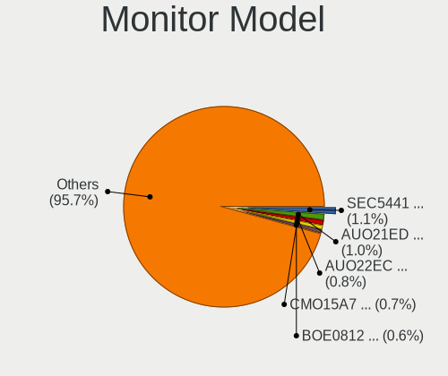

| Model                                                                     | Notebooks | Percent |
|---------------------------------------------------------------------------|-----------|---------|
| Samsung Electronics LCD Monitor SEC5441 1366x768 344x194mm 15.5-inch      | 11        | 1.84%   |
| AU Optronics LCD Monitor AUO21ED 1920x1080 344x193mm 15.5-inch            | 8         | 1.34%   |
| Chi Mei Optoelectronics LCD Monitor CMO15A7 1366x768 344x193mm 15.5-inch  | 6         | 1.01%   |
| LG Display LCD Monitor LGD04A7 1920x1080 344x194mm 15.5-inch              | 4         | 0.67%   |
| LG Display LCD Monitor LGD0385 1366x768 309x174mm 14.0-inch               | 4         | 0.67%   |
| Chimei Innolux LCD Monitor CMN15DB 1366x768 344x193mm 15.5-inch           | 4         | 0.67%   |
| Chimei Innolux LCD Monitor CMN15C4 1920x1080 344x193mm 15.5-inch          | 4         | 0.67%   |
| AU Optronics LCD Monitor AUO22EC 1366x768 344x193mm 15.5-inch             | 4         | 0.67%   |
| Samsung Electronics LCD Monitor SEC5541 1366x768 344x193mm 15.5-inch      | 3         | 0.5%    |
| Samsung Electronics LCD Monitor SEC3245 1366x768 344x194mm 15.5-inch      | 3         | 0.5%    |
| LG Display LCD Monitor LGD0456 1366x768 344x194mm 15.5-inch               | 3         | 0.5%    |
| LG Display LCD Monitor LGD02F2 1366x768 344x194mm 15.5-inch               | 3         | 0.5%    |
| Chimei Innolux LCD Monitor CMN1747 1920x1080 381x214mm 17.2-inch          | 3         | 0.5%    |
| Chimei Innolux LCD Monitor CMN15F5 1920x1080 344x193mm 15.5-inch          | 3         | 0.5%    |
| Chi Mei Optoelectronics LCD Monitor CMO1592 1366x768 350x190mm 15.7-inch  | 3         | 0.5%    |
| BOE LCD Monitor BOE0812 1920x1080 344x194mm 15.5-inch                     | 3         | 0.5%    |
| BOE LCD Monitor BOE0687 1920x1080 344x193mm 15.5-inch                     | 3         | 0.5%    |
| AU Optronics LCD Monitor AUO71EC 1366x768 344x193mm 15.5-inch             | 3         | 0.5%    |
| AU Optronics LCD Monitor AUO38ED 1920x1080 344x193mm 15.5-inch            | 3         | 0.5%    |
| AU Optronics LCD Monitor AUO313E 1600x900 309x174mm 14.0-inch             | 3         | 0.5%    |
| AU Optronics LCD Monitor AUO193C 1366x768 309x173mm 13.9-inch             | 3         | 0.5%    |
| AU Optronics LCD Monitor AUO11ED 1920x1080 344x193mm 15.5-inch            | 3         | 0.5%    |
| AU Optronics LCD Monitor AUO109E 1600x900 382x214mm 17.2-inch             | 3         | 0.5%    |
| Sony LCD Monitor SNY05FA 1366x768 340x190mm 15.3-inch                     | 2         | 0.34%   |
| Sony LCD Monitor MS_0025 1920x1080 340x190mm 15.3-inch                    | 2         | 0.34%   |
| Sharp LCD Monitor SHP14D1 1920x1200 336x210mm 15.6-inch                   | 2         | 0.34%   |
| Samsung Electronics LCD Monitor SEC5641 1366x768 344x193mm 15.5-inch      | 2         | 0.34%   |
| Samsung Electronics LCD Monitor SEC5448 1920x1080 344x194mm 15.5-inch     | 2         | 0.34%   |
| Samsung Electronics LCD Monitor SEC4249 1366x768 309x174mm 14.0-inch      | 2         | 0.34%   |
| Samsung Electronics LCD Monitor SEC3953 1366x768 256x144mm 11.6-inch      | 2         | 0.34%   |
| Samsung Electronics LCD Monitor SEC3846 1680x1050 331x207mm 15.4-inch     | 2         | 0.34%   |
| Samsung Electronics LCD Monitor SEC3633 1280x800 331x207mm 15.4-inch      | 2         | 0.34%   |
| Samsung Electronics LCD Monitor SEC3130 1024x600 220x130mm 10.1-inch      | 2         | 0.34%   |
| Samsung Electronics LCD Monitor SEC3052 1024x600 223x125mm 10.1-inch      | 2         | 0.34%   |
| PANDA LCD Monitor NCP0035 1920x1080 309x174mm 14.0-inch                   | 2         | 0.34%   |
| LGD LCD Monitor 1920x1080                                                 | 2         | 0.34%   |
| LG Philips LCD Monitor LPL3B01 1280x800 331x207mm 15.4-inch               | 2         | 0.34%   |
| LG Display LCD Monitor LGD05E5 1920x1080 344x194mm 15.5-inch              | 2         | 0.34%   |
| LG Display LCD Monitor LGD0493 1366x768 344x194mm 15.5-inch               | 2         | 0.34%   |
| LG Display LCD Monitor LGD046D 1920x1080 309x174mm 14.0-inch              | 2         | 0.34%   |
| LG Display LCD Monitor LGD02EC 1366x768 293x165mm 13.2-inch               | 2         | 0.34%   |
| LG Display LCD Monitor LGD02DC 1366x768 344x194mm 15.5-inch               | 2         | 0.34%   |
| LG Display LCD Monitor LGD02D8 1366x768 277x156mm 12.5-inch               | 2         | 0.34%   |
| LG Display LCD Monitor LGD0259 1920x1080 345x194mm 15.6-inch              | 2         | 0.34%   |
| InfoVision LCD Monitor IVO0533 1366x768 293x164mm 13.2-inch               | 2         | 0.34%   |
| InfoVision LCD Monitor IVO03F4 1024x600 223x125mm 10.1-inch               | 2         | 0.34%   |
| HannStar LCD Monitor HSD03E9 1024x600 220x129mm 10.0-inch                 | 2         | 0.34%   |
| Dell U2412M DELA07A 1920x1200 518x324mm 24.1-inch                         | 2         | 0.34%   |
| Chimei Innolux LCD Monitor CMN1735 1920x1080 382x215mm 17.3-inch          | 2         | 0.34%   |
| Chimei Innolux LCD Monitor CMN15E7 1920x1080 344x193mm 15.5-inch          | 2         | 0.34%   |
| Chimei Innolux LCD Monitor CMN15E6 1366x768 344x193mm 15.5-inch           | 2         | 0.34%   |
| Chimei Innolux LCD Monitor CMN15BF 1366x768 344x193mm 15.5-inch           | 2         | 0.34%   |
| Chimei Innolux LCD Monitor CMN14D6 1366x768 309x173mm 13.9-inch           | 2         | 0.34%   |
| Chimei Innolux LCD Monitor CMN14D4 1920x1080 309x173mm 13.9-inch          | 2         | 0.34%   |
| Chimei Innolux LCD Monitor CMN14B1 1920x1080 308x173mm 13.9-inch          | 2         | 0.34%   |
| Chimei Innolux LCD Monitor CMN1471 1366x768 309x174mm 14.0-inch           | 2         | 0.34%   |
| Chi Mei Optoelectronics LCD Monitor CMO1720 1920x1080 382x215mm 17.3-inch | 2         | 0.34%   |
| Chi Mei Optoelectronics LCD Monitor CMO1719 1600x900 382x215mm 17.3-inch  | 2         | 0.34%   |
| Chi Mei Optoelectronics LCD Monitor CMO15A3 1366x768 344x193mm 15.5-inch  | 2         | 0.34%   |
| BOE LCD Monitor BOE0974 2560x1440 344x194mm 15.5-inch                     | 2         | 0.34%   |

Monitor Resolution
------------------

Monitor screen resolution

| Resolution         | Notebooks | Percent |
|--------------------|-----------|---------|
| 1920x1080 (FHD)    | 199       | 35.54%  |
| 1366x768 (WXGA)    | 185       | 33.04%  |
| 1600x900 (HD+)     | 41        | 7.32%   |
| 1280x800 (WXGA)    | 29        | 5.18%   |
| 1440x900 (WXGA+)   | 16        | 2.86%   |
| 2560x1440 (QHD)    | 14        | 2.5%    |
| 1920x1200 (WUXGA)  | 13        | 2.32%   |
| 1680x1050 (WSXGA+) | 12        | 2.14%   |
| 3840x2160 (4K)     | 11        | 1.96%   |
| 1024x600           | 11        | 1.96%   |
| 1360x768           | 5         | 0.89%   |
| 1280x1024 (SXGA)   | 5         | 0.89%   |
| 2560x1600          | 3         | 0.54%   |
| 3440x1440          | 2         | 0.36%   |
| 3200x1800 (QHD+)   | 2         | 0.36%   |
| 2160x1440          | 2         | 0.36%   |
| 1400x1050          | 2         | 0.36%   |
| 3840x2400          | 1         | 0.18%   |
| 3840x1080          | 1         | 0.18%   |
| 2880x1800          | 1         | 0.18%   |
| 1920x540           | 1         | 0.18%   |
| 1680x945           | 1         | 0.18%   |
| 1600x1200          | 1         | 0.18%   |
| 1024x768 (XGA)     | 1         | 0.18%   |
| Unknown            | 1         | 0.18%   |

Monitor Diagonal
----------------

Diagonal size in inches

| Inches  | Notebooks | Percent |
|---------|-----------|---------|
| 15      | 232       | 39.59%  |
| 13      | 72        | 12.29%  |
| 14      | 70        | 11.95%  |
| 17      | 59        | 10.07%  |
| 12      | 18        | 3.07%   |
| 24      | 15        | 2.56%   |
| 11      | 14        | 2.39%   |
| 27      | 13        | 2.22%   |
| 10      | 13        | 2.22%   |
| Unknown | 13        | 2.22%   |
| 23      | 12        | 2.05%   |
| 21      | 11        | 1.88%   |
| 18      | 11        | 1.88%   |
| 22      | 6         | 1.02%   |
| 31      | 4         | 0.68%   |
| 19      | 4         | 0.68%   |
| 40      | 3         | 0.51%   |
| 20      | 3         | 0.51%   |
| 72      | 2         | 0.34%   |
| 34      | 2         | 0.34%   |
| 33      | 2         | 0.34%   |
| 16      | 2         | 0.34%   |
| 49      | 1         | 0.17%   |
| 46      | 1         | 0.17%   |
| 29      | 1         | 0.17%   |
| 25      | 1         | 0.17%   |
| 8       | 1         | 0.17%   |

Monitor Width
-------------

Physical width

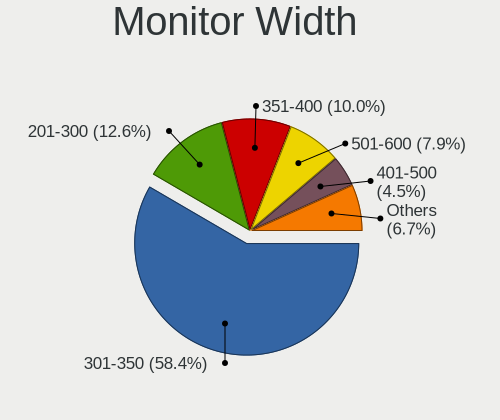

| Width in mm | Notebooks | Percent |
|-------------|-----------|---------|
| 301-350     | 332       | 56.95%  |
| 201-300     | 80        | 13.72%  |
| 351-400     | 67        | 11.49%  |
| 501-600     | 38        | 6.52%   |
| 401-500     | 34        | 5.83%   |
| Unknown     | 13        | 2.23%   |
| 601-700     | 7         | 1.2%    |
| 701-800     | 4         | 0.69%   |
| 801-900     | 3         | 0.51%   |
| 1501-2000   | 2         | 0.34%   |
| 1001-1500   | 2         | 0.34%   |
| 101-200     | 1         | 0.17%   |

Aspect Ratio
------------

Proportional relationship between the width and the height

| Ratio   | Notebooks | Percent |
|---------|-----------|---------|
| 16/9    | 442       | 82.16%  |
| 16/10   | 69        | 12.83%  |
| Unknown | 9         | 1.67%   |
| 5/4     | 5         | 0.93%   |
| 3/2     | 5         | 0.93%   |
| 4/3     | 4         | 0.74%   |
| 21/9    | 2         | 0.37%   |
| 32/9    | 1         | 0.19%   |
| 0.62    | 1         | 0.19%   |

Monitor Area
------------

Area in inch

| Area in inch | Notebooks | Percent |
|----------------|-----------|---------|
| 101-110        | 229       | 39.08%  |
| 81-90          | 109       | 18.6%   |
| 121-130        | 44        | 7.51%   |
| 201-250        | 34        | 5.8%    |
| 71-80          | 31        | 5.29%   |
| 61-70          | 18        | 3.07%   |
| 51-60          | 14        | 2.39%   |
| 141-150        | 14        | 2.39%   |
| 41-50          | 13        | 2.22%   |
| 301-350        | 13        | 2.22%   |
| Unknown        | 13        | 2.22%   |
| 251-300        | 10        | 1.71%   |
| 151-200        | 10        | 1.71%   |
| 131-140        | 10        | 1.71%   |
| 351-500        | 9         | 1.54%   |
| 91-100         | 5         | 0.85%   |
| 501-1000       | 4         | 0.68%   |
| More than 1000 | 3         | 0.51%   |
| 111-120        | 2         | 0.34%   |
| 1-40           | 1         | 0.17%   |

Pixel Density
-------------

Pixels per inch

| Density       | Notebooks | Percent |
|---------------|-----------|---------|
| 101-120       | 204       | 35.36%  |
| 121-160       | 198       | 34.32%  |
| 51-100        | 112       | 19.41%  |
| 161-240       | 32        | 5.55%   |
| Unknown       | 13        | 2.25%   |
| More than 240 | 12        | 2.08%   |
| 1-50          | 6         | 1.04%   |

Multiple Monitors
-----------------

Total monitors connected

| Total | Notebooks | Percent |
|-------|-----------|---------|
| 1     | 441       | 81.07%  |
| 2     | 78        | 14.34%  |
| 0     | 15        | 2.76%   |
| 3     | 10        | 1.84%   |

Network
-------

Net Controller Vendor
---------------------

Controller vendors

| Vendor                            | Notebooks | Percent |
|-----------------------------------|-----------|---------|
| Realtek Semiconductor             | 279       | 32.07%  |
| Intel                             | 276       | 31.72%  |
| Qualcomm Atheros                  | 136       | 15.63%  |
| Broadcom                          | 61        | 7.01%   |
| Broadcom Limited                  | 25        | 2.87%   |
| Marvell Technology Group          | 14        | 1.61%   |
| Ralink                            | 10        | 1.15%   |
| Silicon Integrated Systems [SiS]  | 7         | 0.8%    |
| Sierra Wireless                   | 7         | 0.8%    |
| Ralink Technology                 | 6         | 0.69%   |
| Attansic Technology               | 6         | 0.69%   |
| TP-Link                           | 5         | 0.57%   |
| Ericsson Business Mobile Networks | 4         | 0.46%   |
| Hewlett-Packard                   | 3         | 0.34%   |
| ASIX Electronics                  | 3         | 0.34%   |
| Xiaomi                            | 2         | 0.23%   |
| VIA Technologies                  | 2         | 0.23%   |
| Qualcomm Atheros Communications   | 2         | 0.23%   |
| MediaTek                          | 2         | 0.23%   |
| JMicron Technology                | 2         | 0.23%   |
| Dell                              | 2         | 0.23%   |
| D-Link                            | 2         | 0.23%   |
| U.S. Robotics                     | 1         | 0.11%   |
| U-Blox                            | 1         | 0.11%   |
| Samsung Electronics               | 1         | 0.11%   |
| Realtek                           | 1         | 0.11%   |
| Qualcomm                          | 1         | 0.11%   |
| Primax Electronics                | 1         | 0.11%   |
| Nvidia                            | 1         | 0.11%   |
| NetGear                           | 1         | 0.11%   |
| Lenovo                            | 1         | 0.11%   |
| Fibocom                           | 1         | 0.11%   |
| dog hunter                        | 1         | 0.11%   |
| DisplayLink                       | 1         | 0.11%   |
| Conexant Systems                  | 1         | 0.11%   |
| Belkin Components                 | 1         | 0.11%   |

Net Controller Model
--------------------

Controller models

| Model                                                                   | Notebooks | Percent |
|-------------------------------------------------------------------------|-----------|---------|
| Realtek RTL8111/8168/8411 PCI Express Gigabit Ethernet Controller       | 165       | 15.61%  |
| Realtek RTL810xE PCI Express Fast Ethernet controller                   | 68        | 6.43%   |
| Intel 82579LM Gigabit Network Connection (Lewisville)                   | 32        | 3.03%   |
| Qualcomm Atheros AR9285 Wireless Network Adapter (PCI-Express)          | 30        | 2.84%   |
| Intel Centrino Advanced-N 6205 [Taylor Peak]                            | 25        | 2.37%   |
| Qualcomm Atheros AR9485 Wireless Network Adapter                        | 22        | 2.08%   |
| Intel Wireless 7260                                                     | 20        | 1.89%   |
| Qualcomm Atheros QCA9377 802.11ac Wireless Network Adapter              | 19        | 1.8%    |
| Intel Wireless 7265                                                     | 19        | 1.8%    |
| Broadcom BCM4313 802.11bgn Wireless Network Adapter                     | 19        | 1.8%    |
| Intel Wi-Fi 6 AX200                                                     | 18        | 1.7%    |
| Intel Wireless 8265 / 8275                                              | 17        | 1.61%   |
| Intel Wireless 3165                                                     | 17        | 1.61%   |
| Realtek RTL8821CE 802.11ac PCIe Wireless Network Adapter                | 15        | 1.42%   |
| Realtek RTL8153 Gigabit Ethernet Adapter                                | 15        | 1.42%   |
| Intel Wi-Fi 6 AX201                                                     | 15        | 1.42%   |
| Realtek RTL8723BE PCIe Wireless Network Adapter                         | 13        | 1.23%   |
| Qualcomm Atheros QCA9565 / AR9565 Wireless Network Adapter              | 13        | 1.23%   |
| Intel Ethernet Connection I217-LM                                       | 11        | 1.04%   |
| Qualcomm Atheros QCA6174 802.11ac Wireless Network Adapter              | 10        | 0.95%   |
| Intel Comet Lake PCH-LP CNVi WiFi                                       | 10        | 0.95%   |
| Intel Centrino Advanced-N 6235                                          | 10        | 0.95%   |
| Intel Wireless 8260                                                     | 9         | 0.85%   |
| Intel Cannon Lake PCH CNVi WiFi                                         | 9         | 0.85%   |
| Realtek RTL8822CE 802.11ac PCIe Wireless Network Adapter                | 8         | 0.76%   |
| Realtek RTL8188CE 802.11b/g/n WiFi Adapter                              | 8         | 0.76%   |
| Qualcomm Atheros AR8151 v2.0 Gigabit Ethernet                           | 8         | 0.76%   |
| Intel PRO/Wireless 3945ABG [Golan] Network Connection                   | 8         | 0.76%   |
| Intel Ethernet Connection (3) I218-LM                                   | 8         | 0.76%   |
| Intel Centrino Ultimate-N 6300                                          | 8         | 0.76%   |
| Intel Cannon Point-LP CNVi [Wireless-AC]                                | 8         | 0.76%   |
| Intel 82577LM Gigabit Network Connection                                | 8         | 0.76%   |
| Intel Centrino Wireless-N 1000 [Condor Peak]                            | 7         | 0.66%   |
| Realtek RTL8822BE 802.11a/b/g/n/ac WiFi adapter                         | 6         | 0.57%   |
| Realtek RTL8188EE Wireless Network Adapter                              | 6         | 0.57%   |
| Qualcomm Atheros AR8162 Fast Ethernet                                   | 6         | 0.57%   |
| Qualcomm Atheros AR242x / AR542x Wireless Network Adapter (PCI-Express) | 6         | 0.57%   |
| Intel Tiger Lake PCH CNVi WiFi                                          | 6         | 0.57%   |
| Intel PRO/Wireless 4965 AG or AGN [Kedron] Network Connection           | 6         | 0.57%   |
| Intel Ice Lake-LP PCH CNVi WiFi                                         | 6         | 0.57%   |
| Intel Ethernet Connection I218-LM                                       | 6         | 0.57%   |
| Intel Centrino Advanced-N 6200                                          | 6         | 0.57%   |
| Broadcom Limited BCM4312 802.11b/g LP-PHY                               | 6         | 0.57%   |
| Broadcom BCM43142 802.11b/g/n                                           | 6         | 0.57%   |
| Attansic AR8152 v2.0 Fast Ethernet                                      | 6         | 0.57%   |
| Qualcomm Atheros Killer E2500 Gigabit Ethernet Controller               | 5         | 0.47%   |
| Qualcomm Atheros AR9462 Wireless Network Adapter                        | 5         | 0.47%   |
| Qualcomm Atheros AR928X Wireless Network Adapter (PCI-Express)          | 5         | 0.47%   |
| Intel Wireless 3160                                                     | 5         | 0.47%   |
| Intel WiFi Link 5100                                                    | 5         | 0.47%   |
| Intel Ethernet Connection I219-V                                        | 5         | 0.47%   |
| Intel Comet Lake PCH CNVi WiFi                                          | 5         | 0.47%   |
| Silicon Integrated Systems [SiS] 191 Gigabit Ethernet Adapter           | 4         | 0.38%   |
| Realtek RTL8187B Wireless 802.11g 54Mbps Network Adapter                | 4         | 0.38%   |
| Ralink RT3290 Wireless 802.11n 1T/1R PCIe                               | 4         | 0.38%   |
| Qualcomm Atheros Killer E2400 Gigabit Ethernet Controller               | 4         | 0.38%   |
| Marvell Group 88E8040 PCI-E Fast Ethernet Controller                    | 4         | 0.38%   |
| Intel Ethernet Connection (6) I219-V                                    | 4         | 0.38%   |
| Intel Ethernet Connection (4) I219-V                                    | 4         | 0.38%   |
| Intel Dual Band Wireless-AC 3168NGW [Stone Peak]                        | 4         | 0.38%   |

Wireless Vendor
---------------

Wireless vendors

| Vendor                          | Notebooks | Percent |
|---------------------------------|-----------|---------|
| Intel                           | 265       | 47.07%  |
| Qualcomm Atheros                | 114       | 20.25%  |
| Realtek Semiconductor           | 80        | 14.21%  |
| Broadcom                        | 46        | 8.17%   |
| Broadcom Limited                | 19        | 3.37%   |
| Ralink                          | 10        | 1.78%   |
| Ralink Technology               | 6         | 1.07%   |
| TP-Link                         | 5         | 0.89%   |
| Sierra Wireless                 | 5         | 0.89%   |
| Qualcomm Atheros Communications | 2         | 0.36%   |
| Dell                            | 2         | 0.36%   |
| U.S. Robotics                   | 1         | 0.18%   |
| Realtek                         | 1         | 0.18%   |
| Qualcomm                        | 1         | 0.18%   |
| NetGear                         | 1         | 0.18%   |
| MediaTek                        | 1         | 0.18%   |
| Hewlett-Packard                 | 1         | 0.18%   |
| Fibocom                         | 1         | 0.18%   |
| D-Link                          | 1         | 0.18%   |
| Belkin Components               | 1         | 0.18%   |

Wireless Model
--------------

Wireless models

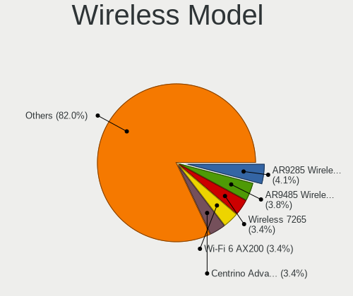

| Model                                                                   | Notebooks | Percent |
|-------------------------------------------------------------------------|-----------|---------|
| Qualcomm Atheros AR9285 Wireless Network Adapter (PCI-Express)          | 30        | 5.32%   |
| Intel Centrino Advanced-N 6205 [Taylor Peak]                            | 25        | 4.43%   |
| Qualcomm Atheros AR9485 Wireless Network Adapter                        | 22        | 3.9%    |
| Intel Wireless 7260                                                     | 20        | 3.55%   |
| Qualcomm Atheros QCA9377 802.11ac Wireless Network Adapter              | 19        | 3.37%   |
| Intel Wireless 7265                                                     | 19        | 3.37%   |
| Broadcom BCM4313 802.11bgn Wireless Network Adapter                     | 19        | 3.37%   |
| Intel Wi-Fi 6 AX200                                                     | 18        | 3.19%   |
| Intel Wireless 8265 / 8275                                              | 17        | 3.01%   |
| Intel Wireless 3165                                                     | 17        | 3.01%   |
| Realtek RTL8821CE 802.11ac PCIe Wireless Network Adapter                | 15        | 2.66%   |
| Intel Wi-Fi 6 AX201                                                     | 15        | 2.66%   |
| Realtek RTL8723BE PCIe Wireless Network Adapter                         | 13        | 2.3%    |
| Qualcomm Atheros QCA9565 / AR9565 Wireless Network Adapter              | 13        | 2.3%    |
| Qualcomm Atheros QCA6174 802.11ac Wireless Network Adapter              | 10        | 1.77%   |
| Intel Comet Lake PCH-LP CNVi WiFi                                       | 10        | 1.77%   |
| Intel Centrino Advanced-N 6235                                          | 10        | 1.77%   |
| Intel Wireless 8260                                                     | 9         | 1.6%    |
| Intel Cannon Lake PCH CNVi WiFi                                         | 9         | 1.6%    |
| Realtek RTL8822CE 802.11ac PCIe Wireless Network Adapter                | 8         | 1.42%   |
| Realtek RTL8188CE 802.11b/g/n WiFi Adapter                              | 8         | 1.42%   |
| Intel PRO/Wireless 3945ABG [Golan] Network Connection                   | 8         | 1.42%   |
| Intel Centrino Ultimate-N 6300                                          | 8         | 1.42%   |
| Intel Cannon Point-LP CNVi [Wireless-AC]                                | 8         | 1.42%   |
| Intel Centrino Wireless-N 1000 [Condor Peak]                            | 7         | 1.24%   |
| Realtek RTL8822BE 802.11a/b/g/n/ac WiFi adapter                         | 6         | 1.06%   |
| Realtek RTL8188EE Wireless Network Adapter                              | 6         | 1.06%   |
| Qualcomm Atheros AR242x / AR542x Wireless Network Adapter (PCI-Express) | 6         | 1.06%   |
| Intel Tiger Lake PCH CNVi WiFi                                          | 6         | 1.06%   |
| Intel PRO/Wireless 4965 AG or AGN [Kedron] Network Connection           | 6         | 1.06%   |
| Intel Ice Lake-LP PCH CNVi WiFi                                         | 6         | 1.06%   |
| Intel Centrino Advanced-N 6200                                          | 6         | 1.06%   |
| Broadcom Limited BCM4312 802.11b/g LP-PHY                               | 6         | 1.06%   |
| Broadcom BCM43142 802.11b/g/n                                           | 6         | 1.06%   |
| Qualcomm Atheros AR9462 Wireless Network Adapter                        | 5         | 0.89%   |
| Qualcomm Atheros AR928X Wireless Network Adapter (PCI-Express)          | 5         | 0.89%   |
| Intel Wireless 3160                                                     | 5         | 0.89%   |
| Intel WiFi Link 5100                                                    | 5         | 0.89%   |
| Intel Comet Lake PCH CNVi WiFi                                          | 5         | 0.89%   |
| Realtek RTL8187B Wireless 802.11g 54Mbps Network Adapter                | 4         | 0.71%   |
| Ralink RT3290 Wireless 802.11n 1T/1R PCIe                               | 4         | 0.71%   |
| Intel Dual Band Wireless-AC 3168NGW [Stone Peak]                        | 4         | 0.71%   |
| Intel Dual Band Wireless-AC 3165 Plus Bluetooth                         | 4         | 0.71%   |
| Intel Centrino Wireless-N 1030 [Rainbow Peak]                           | 4         | 0.71%   |
| Broadcom BCM4311 802.11a/b/g                                            | 4         | 0.71%   |
| TP-Link TL-WN823N v2/v3 [Realtek RTL8192EU]                             | 3         | 0.53%   |
| Realtek RTL8723AE PCIe Wireless Network Adapter                         | 3         | 0.53%   |
| Realtek RTL8191SEvB Wireless LAN Controller                             | 3         | 0.53%   |
| Realtek RTL8188EUS 802.11n Wireless Network Adapter                     | 3         | 0.53%   |
| Qualcomm Atheros AR9287 Wireless Network Adapter (PCI-Express)          | 3         | 0.53%   |
| Intel Wireless-AC 9260                                                  | 3         | 0.53%   |
| Intel PRO/Wireless 5100 AGN [Shiloh] Network Connection                 | 3         | 0.53%   |
| Intel Gemini Lake PCH CNVi WiFi                                         | 3         | 0.53%   |
| Broadcom Limited BCM4352 802.11ac Wireless Network Adapter              | 3         | 0.53%   |
| Sierra Wireless EM7305 Modem                                            | 2         | 0.35%   |
| Realtek RTL8812AU 802.11a/b/g/n/ac 2T2R DB WLAN Adapter                 | 2         | 0.35%   |
| Realtek RTL8187B Wireless Adapter                                       | 2         | 0.35%   |
| Realtek RTL8187 Wireless Adapter                                        | 2         | 0.35%   |
| Realtek 802.11ac NIC                                                    | 2         | 0.35%   |
| Ralink RT5370 Wireless Adapter                                          | 2         | 0.35%   |

Ethernet Vendor
---------------

Ethernet vendors

| Vendor                           | Notebooks | Percent |
|----------------------------------|-----------|---------|
| Realtek Semiconductor            | 252       | 53.39%  |
| Intel                            | 109       | 23.09%  |
| Qualcomm Atheros                 | 41        | 8.69%   |
| Broadcom                         | 20        | 4.24%   |
| Marvell Technology Group         | 14        | 2.97%   |
| Broadcom Limited                 | 7         | 1.48%   |
| Silicon Integrated Systems [SiS] | 6         | 1.27%   |
| Attansic Technology              | 6         | 1.27%   |
| ASIX Electronics                 | 3         | 0.64%   |
| Xiaomi                           | 2         | 0.42%   |
| VIA Technologies                 | 2         | 0.42%   |
| Sierra Wireless                  | 2         | 0.42%   |
| JMicron Technology               | 2         | 0.42%   |
| Samsung Electronics              | 1         | 0.21%   |
| Nvidia                           | 1         | 0.21%   |
| MediaTek                         | 1         | 0.21%   |
| Lenovo                           | 1         | 0.21%   |
| DisplayLink                      | 1         | 0.21%   |
| D-Link                           | 1         | 0.21%   |

Ethernet Model
--------------

Ethernet models

| Model                                                                          | Notebooks | Percent |
|--------------------------------------------------------------------------------|-----------|---------|
| Realtek RTL8111/8168/8411 PCI Express Gigabit Ethernet Controller              | 165       | 34.59%  |
| Realtek RTL810xE PCI Express Fast Ethernet controller                          | 68        | 14.26%  |
| Intel 82579LM Gigabit Network Connection (Lewisville)                          | 32        | 6.71%   |
| Realtek RTL8153 Gigabit Ethernet Adapter                                       | 15        | 3.14%   |
| Intel Ethernet Connection I217-LM                                              | 11        | 2.31%   |
| Qualcomm Atheros AR8151 v2.0 Gigabit Ethernet                                  | 8         | 1.68%   |
| Intel Ethernet Connection (3) I218-LM                                          | 8         | 1.68%   |
| Intel 82577LM Gigabit Network Connection                                       | 8         | 1.68%   |
| Qualcomm Atheros AR8162 Fast Ethernet                                          | 6         | 1.26%   |
| Intel Ethernet Connection I218-LM                                              | 6         | 1.26%   |
| Attansic AR8152 v2.0 Fast Ethernet                                             | 6         | 1.26%   |
| Qualcomm Atheros Killer E2500 Gigabit Ethernet Controller                      | 5         | 1.05%   |
| Intel Ethernet Connection I219-V                                               | 5         | 1.05%   |
| Silicon Integrated Systems [SiS] 191 Gigabit Ethernet Adapter                  | 4         | 0.84%   |
| Qualcomm Atheros Killer E2400 Gigabit Ethernet Controller                      | 4         | 0.84%   |
| Marvell Group 88E8040 PCI-E Fast Ethernet Controller                           | 4         | 0.84%   |
| Intel Ethernet Connection (6) I219-V                                           | 4         | 0.84%   |
| Intel Ethernet Connection (4) I219-V                                           | 4         | 0.84%   |
| Intel 82567LM Gigabit Network Connection                                       | 4         | 0.84%   |
| Realtek RTL8125 2.5GbE Controller                                              | 3         | 0.63%   |
| Qualcomm Atheros AR8132 Fast Ethernet                                          | 3         | 0.63%   |
| Qualcomm Atheros AR8131 Gigabit Ethernet                                       | 3         | 0.63%   |
| Marvell Group 88E8057 PCI-E Gigabit Ethernet Controller                        | 3         | 0.63%   |
| Intel Ethernet Connection (4) I219-LM                                          | 3         | 0.63%   |
| Intel Ethernet Connection (2) I219-LM                                          | 3         | 0.63%   |
| Intel 82566MM Gigabit Network Connection                                       | 3         | 0.63%   |
| Broadcom NetLink BCM57785 Gigabit Ethernet PCIe                                | 3         | 0.63%   |
| Silicon Integrated Systems [SiS] SiS900 PCI Fast Ethernet                      | 2         | 0.42%   |
| Sierra Wireless EM7345 4G LTE                                                  | 2         | 0.42%   |
| Realtek RTL-8100/8101L/8139 PCI Fast Ethernet Adapter                          | 2         | 0.42%   |
| Realtek Killer E3000 2.5GbE Controller                                         | 2         | 0.42%   |
| Qualcomm Atheros QCA8172 Fast Ethernet                                         | 2         | 0.42%   |
| Qualcomm Atheros QCA8171 Gigabit Ethernet                                      | 2         | 0.42%   |
| Qualcomm Atheros Killer E220x Gigabit Ethernet Controller                      | 2         | 0.42%   |
| Qualcomm Atheros AR8161 Gigabit Ethernet                                       | 2         | 0.42%   |
| Qualcomm Atheros AR8152 v1.1 Fast Ethernet                                     | 2         | 0.42%   |
| Marvell Group Yukon Optima 88E8059 [PCIe Gigabit Ethernet Controller with AVB] | 2         | 0.42%   |
| Marvell Group 88E8039 PCI-E Fast Ethernet Controller                           | 2         | 0.42%   |
| Intel PRO/100 VE Network Connection                                            | 2         | 0.42%   |
| Intel Ethernet Connection I219-LM                                              | 2         | 0.42%   |
| Intel Ethernet Connection (6) I219-LM                                          | 2         | 0.42%   |
| Intel Ethernet Connection (5) I219-LM                                          | 2         | 0.42%   |
| Intel Ethernet Connection (14) I219-LM                                         | 2         | 0.42%   |
| Intel Ethernet Connection (13) I219-LM                                         | 2         | 0.42%   |
| Broadcom NetXtreme BCM57765 Gigabit Ethernet PCIe                              | 2         | 0.42%   |
| Broadcom NetXtreme BCM5764M Gigabit Ethernet PCIe                              | 2         | 0.42%   |
| Broadcom NetLink BCM5784M Gigabit Ethernet PCIe                                | 2         | 0.42%   |
| Broadcom Limited NetLink BCM57780 Gigabit Ethernet PCIe                        | 2         | 0.42%   |
| Broadcom BCM4401-B0 100Base-TX                                                 | 2         | 0.42%   |
| Xiaomi Mi/Redmi series (RNDIS)                                                 | 1         | 0.21%   |
| Xiaomi Mi/Redmi series (RNDIS + ADB)                                           | 1         | 0.21%   |
| VIA VT6105/VT6106S [Rhine-III]                                                 | 1         | 0.21%   |
| VIA VT6102/VT6103 [Rhine-II]                                                   | 1         | 0.21%   |
| Samsung Galaxy series, misc. (tethering mode)                                  | 1         | 0.21%   |
| Realtek RTL8169 PCI Gigabit Ethernet Controller                                | 1         | 0.21%   |
| Realtek RTL8152 Fast Ethernet Adapter                                          | 1         | 0.21%   |
| Qualcomm Atheros AR8152 v2.0 Fast Ethernet                                     | 1         | 0.21%   |
| Qualcomm Atheros AR8121/AR8113/AR8114 Gigabit or Fast Ethernet                 | 1         | 0.21%   |
| Nvidia MCP79 Ethernet                                                          | 1         | 0.21%   |
| MediaTek moto e6s                                                              | 1         | 0.21%   |

Net Controller Kind
-------------------

Ethernet, WiFi or modem

| Kind     | Notebooks | Percent |
|----------|-----------|---------|
| WiFi     | 529       | 52.64%  |
| Ethernet | 462       | 45.97%  |
| Modem    | 14        | 1.39%   |

Used Controller
---------------

Currently used network controller

| Kind     | Notebooks | Percent |
|----------|-----------|---------|
| WiFi     | 443       | 76.51%  |
| Ethernet | 136       | 23.49%  |

NICs
----

Total network controllers on board

| Total | Notebooks | Percent |
|-------|-----------|---------|
| 2     | 429       | 79.15%  |
| 1     | 105       | 19.37%  |
| 0     | 6         | 1.11%   |
| 3     | 2         | 0.37%   |

IPv6
----

IPv6 vs IPv4

| Used    | Notebooks | Percent |
|---------|-----------|---------|
| No      | 470       | 86.4%   |
| Yes     | 73        | 13.42%  |
| Unknown | 1         | 0.18%   |

Bluetooth
---------

Bluetooth Vendor
----------------

Controller vendors

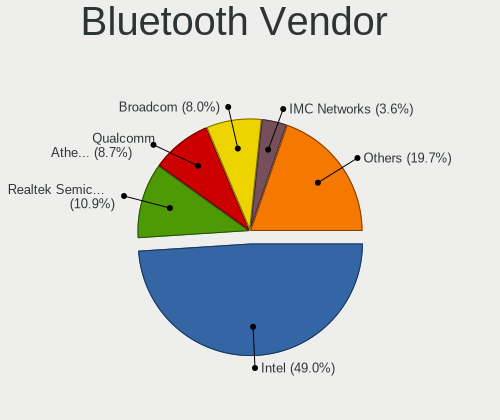

| Vendor                          | Notebooks | Percent |
|---------------------------------|-----------|---------|
| Intel                           | 190       | 47.03%  |
| Qualcomm Atheros Communications | 40        | 9.9%    |
| Realtek Semiconductor           | 39        | 9.65%   |
| Broadcom                        | 32        | 7.92%   |
| Dell                            | 19        | 4.7%    |
| Lite-On Technology              | 15        | 3.71%   |
| IMC Networks                    | 14        | 3.47%   |
| Foxconn / Hon Hai               | 13        | 3.22%   |
| Cambridge Silicon Radio         | 10        | 2.48%   |
| Hewlett-Packard                 | 9         | 2.23%   |
| Apple                           | 5         | 1.24%   |
| Ralink                          | 4         | 0.99%   |
| Toshiba                         | 3         | 0.74%   |
| ASUSTek Computer                | 3         | 0.74%   |
| Ralink Technology               | 2         | 0.5%    |
| Foxconn International           | 2         | 0.5%    |
| Alps Electric                   | 2         | 0.5%    |
| Qcom                            | 1         | 0.25%   |
| Chicony Electronics             | 1         | 0.25%   |

Bluetooth Model
---------------

Controller models

| Model                                                                               | Notebooks | Percent |
|-------------------------------------------------------------------------------------|-----------|---------|
| Intel Bluetooth wireless interface                                                  | 85        | 21.04%  |
| Intel AX201 Bluetooth                                                               | 33        | 8.17%   |
| Intel Bluetooth 9460/9560 Jefferson Peak (JfP)                                      | 30        | 7.43%   |
| Realtek Bluetooth Radio                                                             | 23        | 5.69%   |
| Intel AX200 Bluetooth                                                               | 17        | 4.21%   |
| Realtek  Bluetooth 4.2 Adapter                                                      | 13        | 3.22%   |
| Dell DW375 Bluetooth Module                                                         | 12        | 2.97%   |
| Qualcomm Atheros  Bluetooth Device                                                  | 11        | 2.72%   |
| Qualcomm Atheros AR3012 Bluetooth 4.0                                               | 11        | 2.72%   |
| Intel Centrino Bluetooth Wireless Transceiver                                       | 11        | 2.72%   |
| Cambridge Silicon Radio Bluetooth Dongle (HCI mode)                                 | 10        | 2.48%   |
| Qualcomm Atheros AR3011 Bluetooth                                                   | 9         | 2.23%   |
| IMC Networks Bluetooth Device                                                       | 9         | 2.23%   |
| HP Bluetooth 2.0 Interface [Broadcom BCM2045]                                       | 6         | 1.49%   |
| Foxconn / Hon Hai Bluetooth Device                                                  | 6         | 1.49%   |
| Broadcom BCM20702 Bluetooth 4.0 [ThinkPad]                                          | 6         | 1.49%   |
| Broadcom BCM2070 Bluetooth 2.1 + EDR                                                | 6         | 1.49%   |
| Lite-On Bluetooth Device                                                            | 5         | 1.24%   |
| Intel Centrino Advanced-N 6230 Bluetooth adapter                                    | 5         | 1.24%   |
| Broadcom HP Portable SoftSailing                                                    | 5         | 1.24%   |
| Ralink RT3290 Bluetooth                                                             | 4         | 0.99%   |
| Qualcomm Atheros QCA61x4 Bluetooth 4.0                                              | 4         | 0.99%   |
| Qualcomm Atheros Bluetooth USB Host Controller                                      | 4         | 0.99%   |
| Lite-On Qualcomm Atheros QCA9377 Bluetooth                                          | 4         | 0.99%   |
| Intel Wireless-AC 3168 Bluetooth                                                    | 4         | 0.99%   |
| Broadcom BCM2045B (BDC-2.1)                                                         | 4         | 0.99%   |
| Lite-On Atheros AR3012 Bluetooth                                                    | 3         | 0.74%   |
| Intel Wireless-AC 9260 Bluetooth Adapter                                            | 3         | 0.74%   |
| Apple Bluetooth Host Controller                                                     | 3         | 0.74%   |
| Realtek RTL8723B Bluetooth                                                          | 2         | 0.5%    |
| Lite-On Broadcom BCM43142A0 Bluetooth Device                                        | 2         | 0.5%    |
| Intel AX210 Bluetooth                                                               | 2         | 0.5%    |
| IMC Networks Bluetooth Radio                                                        | 2         | 0.5%    |
| IMC Networks BCM20702A0                                                             | 2         | 0.5%    |
| HP Broadcom 2070 Bluetooth Combo                                                    | 2         | 0.5%    |
| Foxconn International BCM43142A0 Bluetooth module                                   | 2         | 0.5%    |
| Foxconn / Hon Hai Foxconn T77H114 BCM2070 [Single-Chip Bluetooth 2.1 + EDR Adapter] | 2         | 0.5%    |
| Foxconn / Hon Hai BCM20702A0                                                        | 2         | 0.5%    |
| Dell Wireless 365 Bluetooth                                                         | 2         | 0.5%    |
| Dell Broadcom BCM20702A0 Bluetooth                                                  | 2         | 0.5%    |
| Broadcom HP Portable Valentine                                                      | 2         | 0.5%    |
| Broadcom BCM43142A0 Bluetooth 4.0                                                   | 2         | 0.5%    |
| Broadcom BCM2045B (BDC-2) [Bluetooth Controller]                                    | 2         | 0.5%    |
| Toshiba RT Bluetooth Radio                                                          | 1         | 0.25%   |
| Toshiba Integrated Bluetooth HCI                                                    | 1         | 0.25%   |
| Toshiba BCM43142A0                                                                  | 1         | 0.25%   |
| Realtek RTL8821A Bluetooth                                                          | 1         | 0.25%   |
| Ralink Motorola BC4 Bluetooth 3.0+HS Adapter                                        | 1         | 0.25%   |
| Ralink CSR BS8510                                                                   | 1         | 0.25%   |
| Qualcomm Atheros Bluetooth                                                          | 1         | 0.25%   |
| Qcom Broadcom Bluetooth USB                                                         | 1         | 0.25%   |
| Lite-On Atheros Bluetooth                                                           | 1         | 0.25%   |
| IMC Networks Wireless_Device                                                        | 1         | 0.25%   |
| HP Bluetooth 1.2 Interface [Broadcom BCM2035]                                       | 1         | 0.25%   |
| Foxconn / Hon Hai Broadcom Bluetooth 2.1 Device                                     | 1         | 0.25%   |
| Foxconn / Hon Hai Bluetooth USB Host Controller                                     | 1         | 0.25%   |
| Foxconn / Hon Hai BCM2045A0                                                         | 1         | 0.25%   |
| Dell Wireless 370 Bluetooth Mini-card                                               | 1         | 0.25%   |
| Dell Wireless 360 Bluetooth                                                         | 1         | 0.25%   |
| Dell BCM20702A0 Bluetooth Module                                                    | 1         | 0.25%   |

Sound
-----

Sound Vendor
------------

Sound card vendors

| Vendor                                         | Notebooks | Percent |
|------------------------------------------------|-----------|---------|
| Intel                                          | 447       | 67.42%  |
| AMD                                            | 93        | 14.03%  |
| Nvidia                                         | 79        | 11.92%  |
| Silicon Integrated Systems [SiS]               | 8         | 1.21%   |
| C-Media Electronics                            | 6         | 0.9%    |
| Realtek Semiconductor                          | 5         | 0.75%   |
| VIA Technologies                               | 2         | 0.3%    |
| Meizu                                          | 2         | 0.3%    |
| Lenovo                                         | 2         | 0.3%    |
| GN Netcom                                      | 2         | 0.3%    |
| Generalplus Technology                         | 2         | 0.3%    |
| Conexant Systems                               | 2         | 0.3%    |
| Sony                                           | 1         | 0.15%   |
| SmartAction                                    | 1         | 0.15%   |
| Siemens Information and Communication Products | 1         | 0.15%   |
| Plantronics                                    | 1         | 0.15%   |
| No brand                                       | 1         | 0.15%   |
| Logitech                                       | 1         | 0.15%   |
| Kingston Technology                            | 1         | 0.15%   |
| JMTek                                          | 1         | 0.15%   |
| Hewlett-Packard                                | 1         | 0.15%   |
| FiiO Electronics Technology                    | 1         | 0.15%   |
| Elite Silicon                                  | 1         | 0.15%   |
| Corsair                                        | 1         | 0.15%   |
| BEHRINGER International                        | 1         | 0.15%   |

Sound Model
-----------

Sound card models

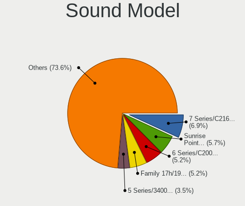

| Model                                                                                             | Notebooks | Percent |
|---------------------------------------------------------------------------------------------------|-----------|---------|
| Intel 7 Series/C216 Chipset Family High Definition Audio Controller                               | 62        | 7.95%   |
| Intel 6 Series/C200 Series Chipset Family High Definition Audio Controller                        | 52        | 6.67%   |
| Intel Sunrise Point-LP HD Audio                                                                   | 42        | 5.38%   |
| AMD Family 17h/19h HD Audio Controller                                                            | 31        | 3.97%   |
| Intel 5 Series/3400 Series Chipset High Definition Audio                                          | 30        | 3.85%   |
| Intel 82801I (ICH9 Family) HD Audio Controller                                                    | 26        | 3.33%   |
| Intel NM10/ICH7 Family High Definition Audio Controller                                           | 21        | 2.69%   |
| Intel Wildcat Point-LP High Definition Audio Controller                                           | 20        | 2.56%   |
| Intel Broadwell-U Audio Controller                                                                | 20        | 2.56%   |
| AMD SBx00 Azalia (Intel HDA)                                                                      | 19        | 2.44%   |
| Intel Tiger Lake-LP Smart Sound Technology Audio Controller                                       | 18        | 2.31%   |
| Intel Cannon Point-LP High Definition Audio Controller                                            | 18        | 2.31%   |
| AMD Raven/Raven2/Fenghuang HDMI/DP Audio Controller                                               | 18        | 2.31%   |
| Intel Haswell-ULT HD Audio Controller                                                             | 17        | 2.18%   |
| Intel Cannon Lake PCH cAVS                                                                        | 17        | 2.18%   |
| Intel 8 Series/C220 Series Chipset High Definition Audio Controller                               | 17        | 2.18%   |
| Intel 8 Series HD Audio Controller                                                                | 17        | 2.18%   |
| Nvidia GF108 High Definition Audio Controller                                                     | 15        | 1.92%   |
| Intel Xeon E3-1200 v3/4th Gen Core Processor HD Audio Controller                                  | 15        | 1.92%   |
| AMD FCH Azalia Controller                                                                         | 15        | 1.92%   |
| Intel Atom Processor Z36xxx/Z37xxx Series High Definition Audio Controller                        | 14        | 1.79%   |
| Intel 82801H (ICH8 Family) HD Audio Controller                                                    | 14        | 1.79%   |
| Intel Comet Lake PCH-LP cAVS                                                                      | 10        | 1.28%   |
| Intel CM238 HD Audio Controller                                                                   | 10        | 1.28%   |
| Intel Atom/Celeron/Pentium Processor x5-E8000/J3xxx/N3xxx Series High Definition Audio Controller | 10        | 1.28%   |
| AMD Kabini HDMI/DP Audio                                                                          | 10        | 1.28%   |
| AMD Family 15h (Models 60h-6fh) Audio Controller                                                  | 10        | 1.28%   |
| Intel Ice Lake-LP Smart Sound Technology Audio Controller                                         | 9         | 1.15%   |
| Intel Celeron/Pentium Silver Processor High Definition Audio                                      | 9         | 1.15%   |
| AMD Renoir Radeon High Definition Audio Controller                                                | 9         | 1.15%   |
| AMD High Definition Audio Controller                                                              | 9         | 1.15%   |
| Nvidia TU107 GeForce GTX 1650 High Definition Audio Controller                                    | 8         | 1.03%   |
| Intel 100 Series/C230 Series Chipset Family HD Audio Controller                                   | 8         | 1.03%   |
| Intel Tiger Lake-H HD Audio Controller                                                            | 7         | 0.9%    |
| AMD Wrestler HDMI Audio                                                                           | 7         | 0.9%    |
| Nvidia GP107GL High Definition Audio Controller                                                   | 6         | 0.77%   |
| Nvidia GA106 High Definition Audio Controller                                                     | 6         | 0.77%   |
| Intel Comet Lake PCH cAVS                                                                         | 6         | 0.77%   |
| Intel Celeron N3350/Pentium N4200/Atom E3900 Series Audio Cluster                                 | 6         | 0.77%   |
| Silicon Integrated Systems [SiS] Azalia Audio Controller                                          | 5         | 0.64%   |
| Realtek Semiconductor USB Audio                                                                   | 5         | 0.64%   |
| Nvidia GK107 HDMI Audio Controller                                                                | 5         | 0.64%   |
| Nvidia High Definition Audio Controller                                                           | 4         | 0.51%   |
| Nvidia GT216 HDMI Audio Controller                                                                | 4         | 0.51%   |
| Nvidia GF119 HDMI Audio Controller                                                                | 4         | 0.51%   |
| AMD RV620 HDMI Audio [Radeon HD 3450/3470/3550/3570]                                              | 4         | 0.51%   |
| AMD Cedar HDMI Audio [Radeon HD 5400/6300/7300 Series]                                            | 4         | 0.51%   |
| Silicon Integrated Systems [SiS] SiS7012 AC'97 Sound Controller                                   | 3         | 0.38%   |
| Nvidia GK208 HDMI/DP Audio Controller                                                             | 3         | 0.38%   |
| Nvidia GK104 HDMI Audio Controller                                                                | 3         | 0.38%   |
| Nvidia GA104 High Definition Audio Controller                                                     | 3         | 0.38%   |
| AMD Turks HDMI Audio [Radeon HD 6500/6600 / 6700M Series]                                         | 3         | 0.38%   |
| AMD Trinity HDMI Audio Controller                                                                 | 3         | 0.38%   |
| AMD RV710/730 HDMI Audio [Radeon HD 4000 series]                                                  | 3         | 0.38%   |
| VIA Technologies VX900/VT8xxx High Definition Audio Controller                                    | 2         | 0.26%   |
| Nvidia TU106 High Definition Audio Controller                                                     | 2         | 0.26%   |
| Nvidia TU104 HD Audio Controller                                                                  | 2         | 0.26%   |
| Nvidia MCP79 High Definition Audio                                                                | 2         | 0.26%   |
| Nvidia GP106 High Definition Audio Controller                                                     | 2         | 0.26%   |
| Nvidia GP104 High Definition Audio Controller                                                     | 2         | 0.26%   |

Memory
------

Memory Vendor
-------------

Memory module vendors

| Vendor                                           | Notebooks | Percent |
|--------------------------------------------------|-----------|---------|
| Samsung Electronics                              | 101       | 24.75%  |
| SK hynix                                         | 82        | 20.1%   |
| Micron Technology                                | 52        | 12.75%  |
| Kingston                                         | 41        | 10.05%  |
| Unknown                                          | 34        | 8.33%   |
| Crucial                                          | 23        | 5.64%   |
| Ramaxel Technology                               | 13        | 3.19%   |
| Nanya Technology                                 | 11        | 2.7%    |
| Elpida                                           | 9         | 2.21%   |
| Unknown (ABCD)                                   | 7         | 1.72%   |
| Smart                                            | 5         | 1.23%   |
| Corsair                                          | 5         | 1.23%   |
| A-DATA Technology                                | 5         | 1.23%   |
| Teikon                                           | 2         | 0.49%   |
| Patriot                                          | 2         | 0.49%   |
| Netlist                                          | 2         | 0.49%   |
| Goodram                                          | 2         | 0.49%   |
| G.Skill                                          | 2         | 0.49%   |
| Unknown (0x4D342037305435363633515A332D43463720) | 1         | 0.25%   |
| Unknown (0x36345431323830323045444C322E35433220) | 1         | 0.25%   |
| Unknown (0x0C26)                                 | 1         | 0.25%   |
| Toshiba                                          | 1         | 0.25%   |
| Team                                             | 1         | 0.25%   |
| Qimonda                                          | 1         | 0.25%   |
| Neo Forza                                        | 1         | 0.25%   |
| Eluktro                                          | 1         | 0.25%   |
| ASint Technology                                 | 1         | 0.25%   |
| Apacer                                           | 1         | 0.25%   |

Memory Model
------------

Memory module models

| Model                                                               | Notebooks | Percent |
|---------------------------------------------------------------------|-----------|---------|
| Samsung RAM M471A5244CB0-CTD 4096MB SODIMM DDR4 3266MT/s            | 10        | 2.29%   |
| Unknown (ABCD) RAM 123456789012345678 2048MB SODIMM LPDDR4 2400MT/s | 7         | 1.6%    |
| SK hynix RAM HMT451S6BFR8A-PB 4GB SODIMM DDR3 1600MT/s              | 7         | 1.6%    |
| SK hynix RAM HMT351S6CFR8C-PB 4GB SODIMM DDR3 1600MT/s              | 6         | 1.37%   |
| Samsung RAM M471B5173QH0-YK0 4GB SODIMM DDR3 1600MT/s               | 6         | 1.37%   |
| Samsung RAM M471B5773DH0-CH9 2048MB SODIMM DDR3 1600MT/s            | 5         | 1.14%   |
| Samsung RAM M471B5273CH0-CH9 4096MB SODIMM DDR3 1334MT/s            | 5         | 1.14%   |
| Micron RAM 16KTF1G64HZ-1G6E1 8GB SODIMM DDR3 1600MT/s               | 5         | 1.14%   |
| SK hynix RAM HMT351S6CFR8C-H9 4GB SODIMM DDR3 1333MT/s              | 4         | 0.92%   |
| SK hynix RAM HMA81GS6DJR8N-XN 8GB SODIMM DDR4 3200MT/s              | 4         | 0.92%   |
| Samsung RAM M471B5273DH0-CH9 4096MB SODIMM DDR3 1334MT/s            | 4         | 0.92%   |
| Samsung RAM M471A5244CB0-CTD 4096MB Row Of Chips DDR4 2667MT/s      | 4         | 0.92%   |
| Samsung RAM M471A1K43DB1-CTD 8GB SODIMM DDR4 2667MT/s               | 4         | 0.92%   |
| Unknown RAM Module 4096MB SODIMM DDR3                               | 3         | 0.69%   |
| SK hynix RAM HMT451S6AFR8A-PB 4096MB SODIMM DDR3 1600MT/s           | 3         | 0.69%   |
| SK hynix RAM HMT41GS6BFR8A-PB 8GB SODIMM DDR3 1600MT/s              | 3         | 0.69%   |
| SK hynix RAM HMT351S6EFR8A-PB 4GB SODIMM DDR3 1600MT/s              | 3         | 0.69%   |
| SK hynix RAM HMA851S6DJR6N-XN 4GB SODIMM DDR4 3200MT/s              | 3         | 0.69%   |
| Samsung RAM M471B5673FH0-CH9 2GB SODIMM DDR3 1334MT/s               | 3         | 0.69%   |
| Samsung RAM M471B5173EB0-YK0 4GB SODIMM DDR3 1600MT/s               | 3         | 0.69%   |
| Samsung RAM M471B5173DB0-YK0 4096MB SODIMM DDR3 1600MT/s            | 3         | 0.69%   |
| Samsung RAM M471B1G73QH0-YK0 8GB SODIMM DDR3 1600MT/s               | 3         | 0.69%   |
| Samsung RAM M471A5244CB0-CRC 4GB SODIMM DDR4 2667MT/s               | 3         | 0.69%   |
| Samsung RAM M471A1K43CB1-CRC 8GB SODIMM DDR4 2667MT/s               | 3         | 0.69%   |
| Samsung RAM M471A1K43BB1-CRC 8GB SODIMM DDR4 2667MT/s               | 3         | 0.69%   |
| Ramaxel RAM RMT3160ED58E9W1600 4GB SODIMM DDR3 1600MT/s             | 3         | 0.69%   |
| Micron RAM MT52L1G32D4PG-093 8GB Row Of Chips LPDDR3 2133MT/s       | 3         | 0.69%   |
| Crucial RAM CT51264BF160B.C16F 4GB SODIMM DDR3 1600MT/s             | 3         | 0.69%   |
| Unknown RAM Module 512MB SODIMM DDR                                 | 2         | 0.46%   |
| Unknown RAM Module 4096MB SODIMM DDR3 1333MT/s                      | 2         | 0.46%   |
| Unknown RAM Module 2048MB SODIMM DRAM                               | 2         | 0.46%   |
| Unknown RAM Module 2048MB SODIMM DDR3                               | 2         | 0.46%   |
| Smart RAM SH564128FH8NZPHSCG 4GB SODIMM DDR3 1334MT/s               | 2         | 0.46%   |
| SK hynix RAM Module 2048MB SODIMM DDR3 1066MT/s                     | 2         | 0.46%   |
| SK hynix RAM Module 16384MB SODIMM DDR4 2133MT/s                    | 2         | 0.46%   |
| SK hynix RAM HMT451S6DFR8A-PB 4GB SODIMM DDR3 1600MT/s              | 2         | 0.46%   |
| SK hynix RAM HMT41GS6AFR8A-PB 8GB SODIMM DDR3 1600MT/s              | 2         | 0.46%   |
| SK hynix RAM HMT325S6CFR8C-PB 2GB SODIMM DDR3 1600MT/s              | 2         | 0.46%   |
| SK hynix RAM HMAA2GS6CJR8N-XN 16GB SODIMM DDR4 3200MT/s             | 2         | 0.46%   |
| SK hynix RAM HMA851S6AFR6N-UH 4GB SODIMM DDR4 2667MT/s              | 2         | 0.46%   |
| SK hynix RAM HMA81GS6CJR8N-XN 8GB SODIMM DDR4 3200MT/s              | 2         | 0.46%   |
| SK hynix RAM HMA81GS6CJR8N-VK 8GB SODIMM DDR4 2667MT/s              | 2         | 0.46%   |
| Samsung RAM M471B5773CHS-CF8 2GB SODIMM DDR3 1067MT/s               | 2         | 0.46%   |
| Samsung RAM M471B5673EH1-CF8 2048MB SODIMM DDR3 4199MT/s            | 2         | 0.46%   |
| Samsung RAM M471B5273EB0-CK0 4GB SODIMM DDR3 4199MT/s               | 2         | 0.46%   |
| Samsung RAM M471B5273CH0-CK0 4GB SODIMM DDR3 1600MT/s               | 2         | 0.46%   |
| Samsung RAM M471B1G73EB0-YK0 8GB SODIMM DDR3 1600MT/s               | 2         | 0.46%   |
| Samsung RAM M471A5244CB0-CWE 4GB SODIMM DDR4 3200MT/s               | 2         | 0.46%   |
| Samsung RAM M471A5244BB0-CRC 4GB SODIMM DDR4 2667MT/s               | 2         | 0.46%   |
| Samsung RAM M471A2K43CB1-CTD 16GB SODIMM DDR4 8400MT/s              | 2         | 0.46%   |
| Samsung RAM M471A2G43AB2-CWE 16384MB SODIMM DDR4 3200MT/s           | 2         | 0.46%   |
| Samsung RAM M471A1K43DB1-CWE 8GB SODIMM DDR4 3200MT/s               | 2         | 0.46%   |
| Samsung RAM M471A1K43BB0-CPB 8GB SODIMM DDR4 2133MT/s               | 2         | 0.46%   |
| Samsung RAM M471A1G44AB0-CWE 8GB SODIMM DDR4 3200MT/s               | 2         | 0.46%   |
| Nanya RAM NT4GC64B8HG0NS-CG 4GB SODIMM DDR3 1334MT/s                | 2         | 0.46%   |
| Micron RAM 8KTF51264HZ-1G6N1 4GB SODIMM DDR3 1600MT/s               | 2         | 0.46%   |
| Micron RAM 8ATF2G64HZ-3G2E1 16GB SODIMM DDR4 3200MT/s               | 2         | 0.46%   |
| Micron RAM 8ATF1G64HZ-3G2J1 8GB SODIMM DDR4 3200MT/s                | 2         | 0.46%   |
| Micron RAM 8ATF1G64HZ-2G3B1 8GB SODIMM DDR4 2400MT/s                | 2         | 0.46%   |
| Micron RAM 4ATF51264HZ-3G2J1 4GB Row Of Chips DDR4 3200MT/s         | 2         | 0.46%   |

Memory Kind
-----------

Memory module kinds

| Kind    | Notebooks | Percent |
|---------|-----------|---------|
| DDR3    | 154       | 44.38%  |
| DDR4    | 133       | 38.33%  |
| DDR2    | 19        | 5.48%   |
| LPDDR4  | 14        | 4.03%   |
| LPDDR3  | 11        | 3.17%   |
| SDRAM   | 7         | 2.02%   |
| DDR     | 5         | 1.44%   |
| DRAM    | 2         | 0.58%   |
| Unknown | 2         | 0.58%   |

Memory Form Factor
------------------

Physical design of the memory module

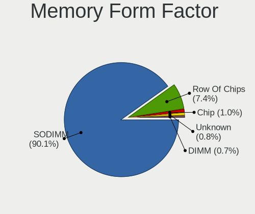

| Name         | Notebooks | Percent |
|--------------|-----------|---------|
| SODIMM       | 321       | 91.45%  |
| Row Of Chips | 26        | 7.41%   |
| Chip         | 3         | 0.85%   |
| DIMM         | 1         | 0.28%   |

Memory Size
-----------

Memory module size

| Size  | Notebooks | Percent |
|-------|-----------|---------|
| 4096  | 146       | 38.32%  |
| 8192  | 111       | 29.13%  |
| 2048  | 58        | 15.22%  |
| 16384 | 41        | 10.76%  |
| 32768 | 10        | 2.62%   |
| 1024  | 10        | 2.62%   |
| 512   | 3         | 0.79%   |
| 1536  | 1         | 0.26%   |
| 256   | 1         | 0.26%   |

Memory Speed
------------

Memory module speed

| Speed   | Notebooks | Percent |
|---------|-----------|---------|
| 1600    | 104       | 27.73%  |
| 2667    | 59        | 15.73%  |
| 3200    | 48        | 12.8%   |
| 2400    | 29        | 7.73%   |
| 1334    | 28        | 7.47%   |
| 2133    | 17        | 4.53%   |
| 1333    | 16        | 4.27%   |
| Unknown | 15        | 4%      |
| 3266    | 10        | 2.67%   |
| 667     | 10        | 2.67%   |
| 1066    | 8         | 2.13%   |
| 1067    | 7         | 1.87%   |
| 4199    | 5         | 1.33%   |
| 800     | 5         | 1.33%   |
| 4267    | 3         | 0.8%    |
| 533     | 3         | 0.8%    |
| 8400    | 2         | 0.53%   |
| 2048    | 2         | 0.53%   |
| 975     | 2         | 0.53%   |
| 2933    | 1         | 0.27%   |
| 1867    | 1         | 0.27%   |

Printers & scanners
-------------------

Printer Vendor
--------------

Printer device vendors

| Vendor              | Notebooks | Percent |
|---------------------|-----------|---------|
| Hewlett-Packard     | 3         | 42.86%  |
| Samsung Electronics | 1         | 14.29%  |
| QinHeng Electronics | 1         | 14.29%  |
| Canon               | 1         | 14.29%  |
| Brother Industries  | 1         | 14.29%  |

Printer Model
-------------

Printer device models

| Model                              | Notebooks | Percent |
|------------------------------------|-----------|---------|
| Samsung CLX-8380 Series            | 1         | 14.29%  |
| QinHeng CH340S                     | 1         | 14.29%  |
| HP Deskjet F4500 series            | 1         | 14.29%  |
| HP DeskJet 845c                    | 1         | 14.29%  |
| HP DeskJet 2620 All-in-One Printer | 1         | 14.29%  |
| Canon PIXMA MG2500 Series          | 1         | 14.29%  |
| Brother DCP-7055 scanner/printer   | 1         | 14.29%  |

Scanner Vendor
--------------

Scanner device vendors

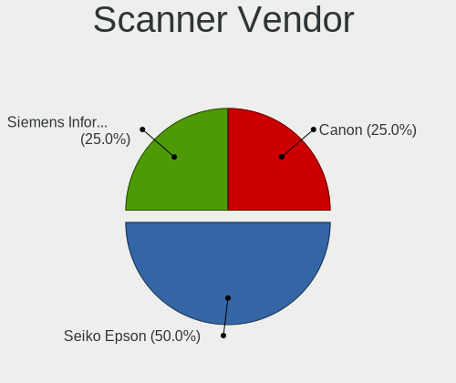

| Vendor      | Notebooks | Percent |
|-------------|-----------|---------|
| Seiko Epson | 2         | 100%    |

Scanner Model
-------------

Scanner device models

| Model                                            | Notebooks | Percent |
|--------------------------------------------------|-----------|---------|
| Seiko Epson GT-X900 [Perfection V700/V750 Photo] | 1         | 50%     |
| Seiko Epson ES-D400 [GT-S80]                     | 1         | 50%     |

Camera
------

Camera Vendor
-------------

Camera device vendors

| Vendor                                 | Notebooks | Percent |
|----------------------------------------|-----------|---------|
| Chicony Electronics                    | 140       | 29.17%  |
| Acer                                   | 48        | 10%     |
| Microdia                               | 39        | 8.13%   |
| IMC Networks                           | 31        | 6.46%   |
| Realtek Semiconductor                  | 28        | 5.83%   |
| Sunplus Innovation Technology          | 27        | 5.63%   |
| Cheng Uei Precision Industry (Foxlink) | 21        | 4.38%   |
| Quanta                                 | 18        | 3.75%   |
| Suyin                                  | 16        | 3.33%   |
| Ricoh                                  | 15        | 3.13%   |
| Syntek                                 | 11        | 2.29%   |
| Silicon Motion                         | 10        | 2.08%   |
| Logitech                               | 10        | 2.08%   |
| Lite-On Technology                     | 10        | 2.08%   |
| Apple                                  | 9         | 1.88%   |
| Luxvisions Innotech Limited            | 7         | 1.46%   |
| Alcor Micro                            | 6         | 1.25%   |
| Importek                               | 5         | 1.04%   |
| Lenovo                                 | 4         | 0.83%   |
| Samsung Electronics                    | 3         | 0.63%   |
| Primax Electronics                     | 3         | 0.63%   |
| ALi                                    | 3         | 0.63%   |
| Ruision                                | 2         | 0.42%   |
| DigiTech                               | 2         | 0.42%   |
| ARC International                      | 2         | 0.42%   |
| Z-Star Microelectronics                | 1         | 0.21%   |
| Y Media                                | 1         | 0.21%   |
| Vimicro                                | 1         | 0.21%   |
| U0AS01A-0                              | 1         | 0.21%   |
| Sunplus Technology                     | 1         | 0.21%   |
| Microsoft                              | 1         | 0.21%   |
| Hisense                                | 1         | 0.21%   |
| Generalplus Technology                 | 1         | 0.21%   |
| Cubeternet                             | 1         | 0.21%   |
| Aveo Technology                        | 1         | 0.21%   |

Camera Model
------------

Camera device models

| Model                                                   | Notebooks | Percent |
|---------------------------------------------------------|-----------|---------|
| Chicony Integrated Camera                               | 24        | 4.98%   |
| Acer Integrated Camera                                  | 13        | 2.7%    |
| Chicony HD Webcam                                       | 12        | 2.49%   |
| Microdia Integrated_Webcam_HD                           | 10        | 2.07%   |
| Sunplus Integrated_Webcam_HD                            | 9         | 1.87%   |
| Realtek Integrated_Webcam_HD                            | 9         | 1.87%   |
| IMC Networks USB2.0 HD UVC WebCam                       | 9         | 1.87%   |
| Chicony USB2.0 VGA UVC WebCam                           | 9         | 1.87%   |
| Chicony USB2.0 Camera                                   | 9         | 1.87%   |
| Chicony USB 2.0 Camera                                  | 7         | 1.45%   |
| Acer BisonCam, NB Pro                                   | 7         | 1.45%   |
| Ricoh HD Webcam                                         | 6         | 1.24%   |
| Microdia Laptop_Integrated_Webcam_HD                    | 6         | 1.24%   |
| Realtek USB Camera                                      | 5         | 1.04%   |
| Quanta HD User Facing                                   | 5         | 1.04%   |
| Microdia Integrated Webcam                              | 5         | 1.04%   |
| IMC Networks Integrated Camera                          | 5         | 1.04%   |
| Acer Lenovo Integrated Webcam                           | 5         | 1.04%   |
| Acer Lenovo EasyCamera                                  | 5         | 1.04%   |
| Syntek Integrated Camera                                | 4         | 0.83%   |
| Suyin HP TrueVision HD Integrated Webcam                | 4         | 0.83%   |
| Sunplus Laptop_Integrated_Webcam_FHD                    | 4         | 0.83%   |
| IMC Networks USB 2.0 UVC VGA WebCam                     | 4         | 0.83%   |
| Chicony Integrated Camera (1280x720@30)                 | 4         | 0.83%   |
| Chicony HP Webcam                                       | 4         | 0.83%   |
| Chicony HP Truevision HD                                | 4         | 0.83%   |
| Chicony FJ Camera                                       | 4         | 0.83%   |
| Cheng Uei Precision Industry (Foxlink) HP Webcam        | 4         | 0.83%   |
| Apple iPhone 5/5C/5S/6/SE                               | 4         | 0.83%   |
| Sunplus HP HD Webcam [Fixed]                            | 3         | 0.62%   |
| Sunplus HD WebCam                                       | 3         | 0.62%   |
| Silicon Motion WebCam SC-13HDL11939N                    | 3         | 0.62%   |
| Samsung Galaxy series, misc. (MTP mode)                 | 3         | 0.62%   |
| Realtek USB2.0 HD UVC WebCam                            | 3         | 0.62%   |
| Realtek USB2.0 camera                                   | 3         | 0.62%   |
| Realtek Lenovo EasyCamera                               | 3         | 0.62%   |
| Quanta HP HD Camera                                     | 3         | 0.62%   |
| Primax HP HD Webcam [Fixed]                             | 3         | 0.62%   |
| Lite-On Integrated Camera                               | 3         | 0.62%   |
| Lite-On HP HD Camera                                    | 3         | 0.62%   |
| IMC Networks UVC VGA Webcam                             | 3         | 0.62%   |
| IMC Networks Integrated Webcam                          | 3         | 0.62%   |
| Chicony Webcam                                          | 3         | 0.62%   |
| Chicony VGA Webcam                                      | 3         | 0.62%   |
| Chicony Lenovo Integrated Camera (0.3MP)                | 3         | 0.62%   |
| Chicony HP Wide Vision HD Camera                        | 3         | 0.62%   |
| Chicony HP HD Webcam                                    | 3         | 0.62%   |
| Chicony CNF9055 Toshiba Webcam                          | 3         | 0.62%   |
| Cheng Uei Precision Industry (Foxlink) HP TrueVision HD | 3         | 0.62%   |
| Alcor Micro USB 2.0 Camera                              | 3         | 0.62%   |
| Syntek Lenovo EasyCamera                                | 2         | 0.41%   |
| Syntek EasyCamera                                       | 2         | 0.41%   |
| Suyin USB 2.0 Camera                                    | 2         | 0.41%   |
| Suyin Sony Visual Communication Camera                  | 2         | 0.41%   |
| Suyin Acer/HP Integrated Webcam [CN0314]                | 2         | 0.41%   |
| Sunplus Integrated_Webcam_FHD                           | 2         | 0.41%   |
| Silicon Motion WebCam SCB-1100N                         | 2         | 0.41%   |
| Silicon Motion 300k Pixel Camera                        | 2         | 0.41%   |
| Ruision UVC Camera                                      | 2         | 0.41%   |
| Ricoh Sony Visual Communication Camera                  | 2         | 0.41%   |

Security
--------

Fingerprint Vendor
------------------

Fingerprint sensor vendors

| Vendor                     | Notebooks | Percent |
|----------------------------|-----------|---------|
| Validity Sensors           | 42        | 45.65%  |
| Synaptics                  | 16        | 17.39%  |
| Shenzhen Goodix Technology | 12        | 13.04%  |
| Upek                       | 6         | 6.52%   |
| Elan Microelectronics      | 5         | 5.43%   |
| AuthenTec                  | 5         | 5.43%   |
| STMicroelectronics         | 3         | 3.26%   |
| LighTuning Technology      | 2         | 2.17%   |
| Focal-systems.Corp         | 1         | 1.09%   |

Fingerprint Model
-----------------

Fingerprint sensor models

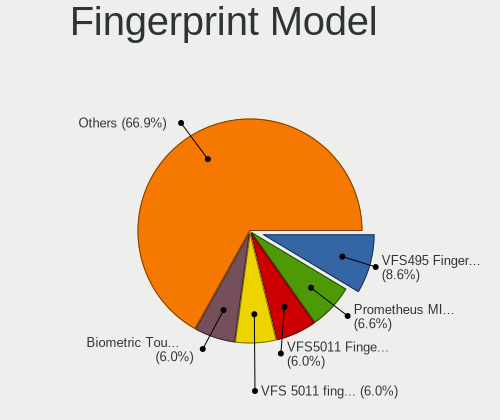

| Model                                                      | Notebooks | Percent |
|------------------------------------------------------------|-----------|---------|
| Validity Sensors VFS495 Fingerprint Reader                 | 7         | 7.61%   |
| Validity Sensors VFS 5011 fingerprint sensor               | 7         | 7.61%   |
| Validity Sensors VFS5011 Fingerprint Reader                | 6         | 6.52%   |
| Shenzhen Goodix  FingerPrint Device                        | 6         | 6.52%   |
| Validity Sensors VFS491                                    | 5         | 5.43%   |
| Validity Sensors VFS471 Fingerprint Reader                 | 5         | 5.43%   |
| Upek Biometric Touchchip/Touchstrip Fingerprint Sensor     | 5         | 5.43%   |
| Synaptics Prometheus MIS Touch Fingerprint Reader          | 5         | 5.43%   |
| Elan ELAN:Fingerprint                                      | 4         | 4.35%   |
| Validity Sensors Swipe Fingerprint Sensor                  | 3         | 3.26%   |
| Synaptics  VFS7552 Touch Fingerprint Sensor with PurePrint | 3         | 3.26%   |
| STMicroelectronics Fingerprint Reader                      | 3         | 3.26%   |
| Shenzhen Goodix Fingerprint Reader                         | 3         | 3.26%   |
| Shenzhen Goodix FingerPrint                                | 3         | 3.26%   |
| AuthenTec AES2501 Fingerprint Sensor                       | 3         | 3.26%   |
| Unknown                                                    | 3         | 3.26%   |
| Validity Sensors VFS7500 Touch Fingerprint Sensor          | 2         | 2.17%   |
| Validity Sensors VFS301 Fingerprint Reader                 | 2         | 2.17%   |
| Validity Sensors VFS101 Fingerprint Reader                 | 2         | 2.17%   |
| Validity Sensors Fingerprint scanner                       | 2         | 2.17%   |
| Synaptics Metallica MIS Touch Fingerprint Reader           | 2         | 2.17%   |
| Validity Sensors Synaptics WBDI                            | 1         | 1.09%   |
| Upek TCS5B Fingerprint sensor                              | 1         | 1.09%   |
| Synaptics WBDI Device                                      | 1         | 1.09%   |
| Synaptics  FS7604 Touch Fingerprint Sensor with PurePrint  | 1         | 1.09%   |
| Synaptics Metallica MOH Touch Fingerprint Reader           | 1         | 1.09%   |
| LighTuning Fingerprint Reader                              | 1         | 1.09%   |
| LighTuning ES603 Swipe Fingerprint Sensor                  | 1         | 1.09%   |
| Focal-systems.Corp FT9201Fingerprint.                      | 1         | 1.09%   |
| Elan ELAN:ARM-M4                                           | 1         | 1.09%   |
| AuthenTec AES2810                                          | 1         | 1.09%   |
| AuthenTec AES1600                                          | 1         | 1.09%   |

Chipcard Vendor
---------------

Chipcard module vendors

| Vendor                | Notebooks | Percent |
|-----------------------|-----------|---------|
| Broadcom              | 32        | 56.14%  |
| Alcor Micro           | 11        | 19.3%   |
| Upek                  | 3         | 5.26%   |
| O2 Micro              | 3         | 5.26%   |
| Lenovo                | 3         | 5.26%   |
| SCM Microsystems      | 2         | 3.51%   |
| Advanced Card Systems | 2         | 3.51%   |
| Gemalto (was Gemplus) | 1         | 1.75%   |

Chipcard Model
--------------

Chipcard module models

| Model                                                                        | Notebooks | Percent |
|------------------------------------------------------------------------------|-----------|---------|
| Broadcom BCM5880 Secure Applications Processor                               | 14        | 24.56%  |
| Broadcom BCM5880 Secure Applications Processor with fingerprint swipe sensor | 12        | 21.05%  |
| Alcor Micro AU9540 Smartcard Reader                                          | 11        | 19.3%   |
| Broadcom 58200                                                               | 4         | 7.02%   |
| Upek TouchChip Fingerprint Coprocessor (WBF advanced mode)                   | 3         | 5.26%   |
| O2 Micro OZ776 CCID Smartcard Reader                                         | 3         | 5.26%   |
| Lenovo Integrated Smart Card Reader                                          | 3         | 5.26%   |
| Broadcom 5880                                                                | 2         | 3.51%   |
| Advanced Card Systems ACR38 SmartCard Reader                                 | 2         | 3.51%   |
| SCM Microsystems SCR3500 A Contact Reader                                    | 1         | 1.75%   |
| SCM Microsystems SCR331-LC1 / SCR3310 SmartCard Reader                       | 1         | 1.75%   |
| Gemalto (was Gemplus) GemPC Key SmartCard Reader                             | 1         | 1.75%   |

Unsupported
-----------

Unsupported Devices
-------------------

Total unsupported devices on board

| Total | Notebooks | Percent |
|-------|-----------|---------|
| 0     | 344       | 62.89%  |
| 1     | 159       | 29.07%  |
| 2     | 35        | 6.4%    |
| 3     | 7         | 1.28%   |
| 8     | 2         | 0.37%   |

Unsupported Device Types
------------------------

Types of unsupported devices

| Type                     | Notebooks | Percent |
|--------------------------|-----------|---------|
| Fingerprint reader       | 92        | 35.52%  |
| Chipcard                 | 53        | 20.46%  |
| Graphics card            | 48        | 18.53%  |
| Net/wireless             | 12        | 4.63%   |
| Storage                  | 11        | 4.25%   |
| Camera                   | 11        | 4.25%   |
| Bluetooth                | 8         | 3.09%   |
| Modem                    | 5         | 1.93%   |
| Multimedia controller    | 4         | 1.54%   |
| Flash memory             | 4         | 1.54%   |
| Sound                    | 3         | 1.16%   |
| Communication controller | 3         | 1.16%   |
| Net/ethernet             | 2         | 0.77%   |
| Network                  | 1         | 0.39%   |
| Firewire controller      | 1         | 0.39%   |
| Card reader              | 1         | 0.39%   |

