Ubuntu MATE - Tested Hardware & Statistics (Notebooks)
------------------------------------------------------

A project to collect tested hardware configurations for Ubuntu MATE.

Anyone can contribute to this report by the [hw-probe](https://github.com/linuxhw/hw-probe) tool:

    sudo -E hw-probe -all -upload

Please contribute! Especially if your hardware is rare.

Contents
--------

* [ Test Cases ](#test-cases)

* [ System ](#system)
  - [ OS                       ](#os)
  - [ OS Family                ](#os-family)
  - [ Kernel                   ](#kernel)
  - [ Kernel Family            ](#kernel-family)
  - [ Kernel Major Ver.        ](#kernel-major-ver)
  - [ Arch                     ](#arch)
  - [ DE                       ](#de)
  - [ Display Server           ](#display-server)
  - [ Display Manager          ](#display-manager)
  - [ OS Lang                  ](#os-lang)
  - [ Boot Mode                ](#boot-mode)
  - [ Filesystem               ](#filesystem)
  - [ Part. scheme             ](#part-scheme)
  - [ Dual Boot with Linux/BSD ](#dual-boot-with-linuxbsd)
  - [ Dual Boot (Win)          ](#dual-boot-win)

* [ Board ](#board)
  - [ Vendor                   ](#vendor)
  - [ Model                    ](#model)
  - [ Model Family             ](#model-family)
  - [ MFG Year                 ](#mfg-year)
  - [ Form Factor              ](#form-factor)
  - [ Secure Boot              ](#secure-boot)
  - [ Coreboot                 ](#coreboot)
  - [ RAM Size                 ](#ram-size)
  - [ RAM Used                 ](#ram-used)
  - [ Total Drives             ](#total-drives)
  - [ Has CD-ROM               ](#has-cd-rom)
  - [ Has Ethernet             ](#has-ethernet)
  - [ Has WiFi                 ](#has-wifi)
  - [ Has Bluetooth            ](#has-bluetooth)

* [ Location ](#location)
  - [ Country                  ](#country)
  - [ City                     ](#city)

* [ Drives ](#drives)
  - [ Drive Vendor             ](#drive-vendor)
  - [ Drive Model              ](#drive-model)
  - [ HDD Vendor               ](#hdd-vendor)
  - [ SSD Vendor               ](#ssd-vendor)
  - [ Drive Kind               ](#drive-kind)
  - [ Drive Connector          ](#drive-connector)
  - [ Drive Size               ](#drive-size)
  - [ Space Total              ](#space-total)
  - [ Space Used               ](#space-used)
  - [ Malfunc. Drives          ](#malfunc-drives)
  - [ Malfunc. Drive Vendor    ](#malfunc-drive-vendor)
  - [ Malfunc. HDD Vendor      ](#malfunc-hdd-vendor)
  - [ Malfunc. Drive Kind      ](#malfunc-drive-kind)
  - [ Failed Drives            ](#failed-drives)
  - [ Failed Drive Vendor      ](#failed-drive-vendor)
  - [ Drive Status             ](#drive-status)

* [ Storage controller ](#storage-controller)
  - [ Storage Vendor           ](#storage-vendor)
  - [ Storage Model            ](#storage-model)
  - [ Storage Kind             ](#storage-kind)

* [ Processor ](#processor)
  - [ CPU Vendor               ](#cpu-vendor)
  - [ CPU Model                ](#cpu-model)
  - [ CPU Model Family         ](#cpu-model-family)
  - [ CPU Cores                ](#cpu-cores)
  - [ CPU Sockets              ](#cpu-sockets)
  - [ CPU Threads              ](#cpu-threads)
  - [ CPU Op-Modes             ](#cpu-op-modes)
  - [ CPU Microcode            ](#cpu-microcode)
  - [ CPU Microarch            ](#cpu-microarch)

* [ Graphics ](#graphics)
  - [ GPU Vendor               ](#gpu-vendor)
  - [ GPU Model                ](#gpu-model)
  - [ GPU Combo                ](#gpu-combo)
  - [ GPU Driver               ](#gpu-driver)
  - [ GPU Memory               ](#gpu-memory)

* [ Monitor ](#monitor)
  - [ Monitor Vendor           ](#monitor-vendor)
  - [ Monitor Model            ](#monitor-model)
  - [ Monitor Resolution       ](#monitor-resolution)
  - [ Monitor Diagonal         ](#monitor-diagonal)
  - [ Monitor Width            ](#monitor-width)
  - [ Aspect Ratio             ](#aspect-ratio)
  - [ Monitor Area             ](#monitor-area)
  - [ Pixel Density            ](#pixel-density)
  - [ Multiple Monitors        ](#multiple-monitors)

* [ Network ](#network)
  - [ Net Controller Vendor    ](#net-controller-vendor)
  - [ Net Controller Model     ](#net-controller-model)
  - [ Wireless Vendor          ](#wireless-vendor)
  - [ Wireless Model           ](#wireless-model)
  - [ Ethernet Vendor          ](#ethernet-vendor)
  - [ Ethernet Model           ](#ethernet-model)
  - [ Net Controller Kind      ](#net-controller-kind)
  - [ Used Controller          ](#used-controller)
  - [ NICs                     ](#nics)
  - [ IPv6                     ](#ipv6)

* [ Bluetooth ](#bluetooth)
  - [ Bluetooth Vendor         ](#bluetooth-vendor)
  - [ Bluetooth Model          ](#bluetooth-model)

* [ Sound ](#sound)
  - [ Sound Vendor             ](#sound-vendor)
  - [ Sound Model              ](#sound-model)

* [ Memory ](#memory)
  - [ Memory Vendor            ](#memory-vendor)
  - [ Memory Model             ](#memory-model)
  - [ Memory Kind              ](#memory-kind)
  - [ Memory Form Factor       ](#memory-form-factor)
  - [ Memory Size              ](#memory-size)
  - [ Memory Speed             ](#memory-speed)

* [ Printers & scanners ](#printers--scanners)
  - [ Printer Vendor           ](#printer-vendor)
  - [ Printer Model            ](#printer-model)
  - [ Scanner Vendor           ](#scanner-vendor)
  - [ Scanner Model            ](#scanner-model)

* [ Camera ](#camera)
  - [ Camera Vendor            ](#camera-vendor)
  - [ Camera Model             ](#camera-model)

* [ Security ](#security)
  - [ Fingerprint Vendor       ](#fingerprint-vendor)
  - [ Fingerprint Model        ](#fingerprint-model)
  - [ Chipcard Vendor          ](#chipcard-vendor)
  - [ Chipcard Model           ](#chipcard-model)

* [ Unsupported ](#unsupported)
  - [ Unsupported Devices      ](#unsupported-devices)
  - [ Unsupported Device Types ](#unsupported-device-types)

Test Cases
----------

Total: 1199

| Vendor        | Model                       | Probe                                                      | Date         |
|---------------|-----------------------------|------------------------------------------------------------|--------------|
| Notebook      | NJx0MU                      | [7b44ef8cd1](https://linux-hardware.org/?probe=7b44ef8cd1) | Oct 01, 2023 |
| HP            | ProBook 440 G4              | [8db3bb5b34](https://linux-hardware.org/?probe=8db3bb5b34) | Oct 01, 2023 |
| Notebook      | NJx0MU                      | [a1f20bb140](https://linux-hardware.org/?probe=a1f20bb140) | Sep 30, 2023 |
| Notebook      | NJx0MU                      | [1449844643](https://linux-hardware.org/?probe=1449844643) | Sep 30, 2023 |
| ASUSTek       | X550LN                      | [390c16a341](https://linux-hardware.org/?probe=390c16a341) | Sep 26, 2023 |
| Notebook      | NJx0MU                      | [89d81885ff](https://linux-hardware.org/?probe=89d81885ff) | Sep 26, 2023 |
| Lenovo        | ThinkPad X270 W10DG 20K5... | [1deb55b03b](https://linux-hardware.org/?probe=1deb55b03b) | Sep 25, 2023 |
| Notebook      | NJx0MU                      | [84bba5e5a7](https://linux-hardware.org/?probe=84bba5e5a7) | Sep 24, 2023 |
| Dell          | Latitude E5470              | [f6e9a7233c](https://linux-hardware.org/?probe=f6e9a7233c) | Sep 23, 2023 |
| HP            | OMEN by Laptop 15-dc1xxx    | [d00cc6b535](https://linux-hardware.org/?probe=d00cc6b535) | Sep 21, 2023 |
| HP            | OMEN by Laptop 15-dc1xxx    | [89cce2b6cb](https://linux-hardware.org/?probe=89cce2b6cb) | Sep 21, 2023 |
| Lenovo        | ThinkPad X200 74595FG       | [c5cda29091](https://linux-hardware.org/?probe=c5cda29091) | Sep 21, 2023 |
| Notebook      | NV4XMB,ME,MZ                | [43e04cf99c](https://linux-hardware.org/?probe=43e04cf99c) | Sep 20, 2023 |
| Acer          | Aspire ES1-531              | [50023a1d3a](https://linux-hardware.org/?probe=50023a1d3a) | Sep 18, 2023 |
| ASUSTek       | N73SM                       | [d4ce8f336d](https://linux-hardware.org/?probe=d4ce8f336d) | Sep 17, 2023 |
| Lenovo        | ThinkPad T490s 20NYS5820... | [22a0210f8f](https://linux-hardware.org/?probe=22a0210f8f) | Sep 13, 2023 |
| Lenovo        | ThinkPad T490s 20NYS5820... | [4c56913d07](https://linux-hardware.org/?probe=4c56913d07) | Sep 13, 2023 |
| HP            | OMEN by Laptop 17-ck0xxx    | [09c2d451ab](https://linux-hardware.org/?probe=09c2d451ab) | Sep 11, 2023 |
| Lenovo        | ThinkPad X270 W10DG 20K5... | [820eeccddf](https://linux-hardware.org/?probe=820eeccddf) | Sep 10, 2023 |
| ASUSTek       | G75VW                       | [98ba75a25b](https://linux-hardware.org/?probe=98ba75a25b) | Sep 09, 2023 |
| Unknown       | Unknown                     | [bd4b5d82ed](https://linux-hardware.org/?probe=bd4b5d82ed) | Sep 09, 2023 |
| Lenovo        | Legion Pro 5 16ARX8 82WM    | [55b8608662](https://linux-hardware.org/?probe=55b8608662) | Sep 08, 2023 |
| Notebook      | NJx0MU                      | [4e54155977](https://linux-hardware.org/?probe=4e54155977) | Sep 07, 2023 |
| Notebook      | NJx0MU                      | [db4ba96400](https://linux-hardware.org/?probe=db4ba96400) | Sep 07, 2023 |
| Notebook      | NJx0MU                      | [c02fef3ca2](https://linux-hardware.org/?probe=c02fef3ca2) | Sep 05, 2023 |
| Notebook      | NJx0MU                      | [1c048ac799](https://linux-hardware.org/?probe=1c048ac799) | Sep 04, 2023 |
| Lenovo        | IdeaPad 1 15IGL7 82V7       | [2da95fb8e8](https://linux-hardware.org/?probe=2da95fb8e8) | Sep 03, 2023 |
| HP            | Pavilion Gaming Laptop 1... | [858212c01d](https://linux-hardware.org/?probe=858212c01d) | Sep 03, 2023 |
| Bluechip C... | TRAVELline TL14W4           | [7959987246](https://linux-hardware.org/?probe=7959987246) | Aug 28, 2023 |
| Dell          | Inspiron 3593               | [1562efcaf2](https://linux-hardware.org/?probe=1562efcaf2) | Aug 27, 2023 |
| Acer          | Aspire ES1-311              | [f0a3b05a99](https://linux-hardware.org/?probe=f0a3b05a99) | Aug 25, 2023 |
| Kiano         | Elegance 14.2               | [71ba491330](https://linux-hardware.org/?probe=71ba491330) | Aug 24, 2023 |
| Lenovo        | V145-15AST 81MT             | [36e12540f3](https://linux-hardware.org/?probe=36e12540f3) | Aug 23, 2023 |
| ASUSTek       | X550LN                      | [810d33b380](https://linux-hardware.org/?probe=810d33b380) | Aug 16, 2023 |
| Lenovo        | IdeaPad L340-15IRH Gamin... | [06316c3471](https://linux-hardware.org/?probe=06316c3471) | Aug 13, 2023 |
| Notebook      | NJx0MU                      | [b97fcb7117](https://linux-hardware.org/?probe=b97fcb7117) | Aug 12, 2023 |
| Dell          | Latitude E7250              | [7418a0dc06](https://linux-hardware.org/?probe=7418a0dc06) | Aug 12, 2023 |
| Notebook      | NJx0MU                      | [6f230d02c1](https://linux-hardware.org/?probe=6f230d02c1) | Aug 12, 2023 |
| Notebook      | NJx0MU                      | [ea4ae0e0f3](https://linux-hardware.org/?probe=ea4ae0e0f3) | Aug 11, 2023 |
| Notebook      | NJx0MU                      | [2db90ee24e](https://linux-hardware.org/?probe=2db90ee24e) | Aug 11, 2023 |
| HONOR         | BOHK-WAX9X                  | [8a6ead436f](https://linux-hardware.org/?probe=8a6ead436f) | Aug 08, 2023 |
| Acer          | Swift SF514-52T             | [6b6773eeef](https://linux-hardware.org/?probe=6b6773eeef) | Aug 04, 2023 |
| Lenovo        | ThinkPad T420 4236MBG       | [aaaa17358f](https://linux-hardware.org/?probe=aaaa17358f) | Aug 04, 2023 |
| Notebook      | NJx0MU                      | [8b6b5ff142](https://linux-hardware.org/?probe=8b6b5ff142) | Aug 04, 2023 |
| ASUSTek       | G75VW                       | [f420f3e1e6](https://linux-hardware.org/?probe=f420f3e1e6) | Aug 04, 2023 |
| Acer          | Extensa 5630                | [8b3c2a89a1](https://linux-hardware.org/?probe=8b3c2a89a1) | Aug 04, 2023 |
| Acer          | Extensa 5630                | [ba6669a5e7](https://linux-hardware.org/?probe=ba6669a5e7) | Aug 04, 2023 |
| Notebook      | NJx0MU                      | [bd88b4e8fa](https://linux-hardware.org/?probe=bd88b4e8fa) | Aug 04, 2023 |
| Dell          | Precision 7520              | [b5addbb003](https://linux-hardware.org/?probe=b5addbb003) | Aug 01, 2023 |
| HP            | 250 G7 Notebook PC          | [cefd14313d](https://linux-hardware.org/?probe=cefd14313d) | Jul 30, 2023 |
| Fujitsu       | LIFEBOOK A512               | [8e05eceeef](https://linux-hardware.org/?probe=8e05eceeef) | Jul 26, 2023 |
| Fujitsu       | LIFEBOOK A512               | [5457b19b2b](https://linux-hardware.org/?probe=5457b19b2b) | Jul 26, 2023 |
| Notebook      | NJx0MU                      | [f720b1a032](https://linux-hardware.org/?probe=f720b1a032) | Jul 26, 2023 |
| Dell          | Studio 1537                 | [803a98f7e6](https://linux-hardware.org/?probe=803a98f7e6) | Jul 25, 2023 |
| Notebook      | NJx0MU                      | [c675a3feab](https://linux-hardware.org/?probe=c675a3feab) | Jul 25, 2023 |
| Dell          | Precision 7520              | [66922483cf](https://linux-hardware.org/?probe=66922483cf) | Jul 24, 2023 |
| Acer          | Aspire ES1-311              | [52541ec1ed](https://linux-hardware.org/?probe=52541ec1ed) | Jul 23, 2023 |
| Apple         | MacBookAir7,1               | [e82f5072df](https://linux-hardware.org/?probe=e82f5072df) | Jul 20, 2023 |
| Lenovo        | V15 G2 ALC 82KD             | [a448a20876](https://linux-hardware.org/?probe=a448a20876) | Jul 17, 2023 |
| MSI           | GF63 Thin 11UC              | [9e330138e8](https://linux-hardware.org/?probe=9e330138e8) | Jul 17, 2023 |
| Lenovo        | ThinkPad X1 Carbon 2nd 2... | [9e037f08e1](https://linux-hardware.org/?probe=9e037f08e1) | Jul 15, 2023 |
| Lenovo        | ThinkPad X1 Carbon 2nd 2... | [b592c5b551](https://linux-hardware.org/?probe=b592c5b551) | Jul 15, 2023 |
| HP            | 250 G8 Notebook PC          | [60809c13e6](https://linux-hardware.org/?probe=60809c13e6) | Jul 15, 2023 |
| HP            | Pavilion Laptop 14-dv0xx... | [d5079cefe1](https://linux-hardware.org/?probe=d5079cefe1) | Jul 13, 2023 |
| ASUSTek       | G75VW                       | [cfc5e42de6](https://linux-hardware.org/?probe=cfc5e42de6) | Jul 11, 2023 |
| HP            | Pavilion Gaming Laptop 1... | [96fea5a002](https://linux-hardware.org/?probe=96fea5a002) | Jul 10, 2023 |
| Apple         | MacBookPro10,1              | [43ec3cf70b](https://linux-hardware.org/?probe=43ec3cf70b) | Jul 09, 2023 |
| Notebook      | NJx0MU                      | [cc7487e50f](https://linux-hardware.org/?probe=cc7487e50f) | Jul 09, 2023 |
| Notebook      | NJx0MU                      | [502c216e98](https://linux-hardware.org/?probe=502c216e98) | Jul 08, 2023 |
| Apple         | MacBookPro10,1              | [ef7acb569d](https://linux-hardware.org/?probe=ef7acb569d) | Jul 08, 2023 |
| Dell          | Latitude 7420               | [44c51e8365](https://linux-hardware.org/?probe=44c51e8365) | Jul 05, 2023 |
| Dell          | Latitude 7420               | [9eae2c6ad4](https://linux-hardware.org/?probe=9eae2c6ad4) | Jul 05, 2023 |
| AZW           | Z85                         | [ca44d0b498](https://linux-hardware.org/?probe=ca44d0b498) | Jul 05, 2023 |
| HP            | 350 G1                      | [d965c2785d](https://linux-hardware.org/?probe=d965c2785d) | Jul 04, 2023 |
| HP            | 350 G1                      | [bb742c9ffb](https://linux-hardware.org/?probe=bb742c9ffb) | Jul 04, 2023 |
| Acer          | Aspire ES1-311              | [50b65edbc0](https://linux-hardware.org/?probe=50b65edbc0) | Jul 04, 2023 |
| Notebook      | NJx0MU                      | [700348835b](https://linux-hardware.org/?probe=700348835b) | Jul 04, 2023 |
| Dell          | G5 5590                     | [c956c1fd2e](https://linux-hardware.org/?probe=c956c1fd2e) | Jul 03, 2023 |
| Acer          | Aspire ES1-311              | [066d1a2fa8](https://linux-hardware.org/?probe=066d1a2fa8) | Jul 03, 2023 |
| Notebook      | NJx0MU                      | [63a0b07325](https://linux-hardware.org/?probe=63a0b07325) | Jul 02, 2023 |
| Notebook      | NJx0MU                      | [6896f4aafb](https://linux-hardware.org/?probe=6896f4aafb) | Jul 01, 2023 |
| Toshiba       | Satellite Pro L650          | [d8da913f23](https://linux-hardware.org/?probe=d8da913f23) | Jul 01, 2023 |
| Notebook      | NJx0MU                      | [136060092c](https://linux-hardware.org/?probe=136060092c) | Jun 30, 2023 |
| Dell          | Studio 1558                 | [66e76ea87d](https://linux-hardware.org/?probe=66e76ea87d) | Jun 29, 2023 |
| Acer          | TravelMate P648-G2-M        | [1bb728e7dd](https://linux-hardware.org/?probe=1bb728e7dd) | Jun 29, 2023 |
| Acer          | TravelMate P648-G2-M        | [d1ade76136](https://linux-hardware.org/?probe=d1ade76136) | Jun 29, 2023 |
| Lenovo        | ThinkPad T580 20LAS0DL00    | [5d27a44710](https://linux-hardware.org/?probe=5d27a44710) | Jun 28, 2023 |
| HP            | Pavilion 17                 | [01c3ae7698](https://linux-hardware.org/?probe=01c3ae7698) | Jun 28, 2023 |
| Notebook      | NJx0MU                      | [235e541e2d](https://linux-hardware.org/?probe=235e541e2d) | Jun 28, 2023 |
| Acer          | Extensa 2519                | [1a8a4ee11e](https://linux-hardware.org/?probe=1a8a4ee11e) | Jun 27, 2023 |
| Notebook      | NJx0MU                      | [47a0ae93f4](https://linux-hardware.org/?probe=47a0ae93f4) | Jun 25, 2023 |
| Lenovo        | V145-15AST 81MT             | [1fe939429c](https://linux-hardware.org/?probe=1fe939429c) | Jun 24, 2023 |
| Lenovo        | ThinkPad X270 W10DG 20K5... | [6c3a0a7fe0](https://linux-hardware.org/?probe=6c3a0a7fe0) | Jun 23, 2023 |
| HP            | EliteBook 840 G6            | [784d676a8d](https://linux-hardware.org/?probe=784d676a8d) | Jun 21, 2023 |
| Lenovo        | IdeaPad S410p 20296         | [6a6cfb05d6](https://linux-hardware.org/?probe=6a6cfb05d6) | Jun 20, 2023 |
| ASUSTek       | K53SD                       | [ac006b8cb7](https://linux-hardware.org/?probe=ac006b8cb7) | Jun 18, 2023 |
| Acer          | Aspire ES1-311              | [b0361fedbc](https://linux-hardware.org/?probe=b0361fedbc) | Jun 16, 2023 |
| Acer          | Aspire ES1-311              | [a0e0ea6aa1](https://linux-hardware.org/?probe=a0e0ea6aa1) | Jun 15, 2023 |
| HP            | Pavilion Gaming Laptop 1... | [e68730cae4](https://linux-hardware.org/?probe=e68730cae4) | Jun 13, 2023 |
| HP            | 625 (WT144EA#ABD)           | [352eaf6ce7](https://linux-hardware.org/?probe=352eaf6ce7) | Jun 11, 2023 |
| HP            | 625 (WT144EA#ABD)           | [673ab1f0a9](https://linux-hardware.org/?probe=673ab1f0a9) | Jun 11, 2023 |
| Notebook      | NJx0MU                      | [c610b3b9fe](https://linux-hardware.org/?probe=c610b3b9fe) | Jun 10, 2023 |
| Notebook      | NJx0MU                      | [88d3849db5](https://linux-hardware.org/?probe=88d3849db5) | Jun 10, 2023 |
| Dell          | Vostro 3460                 | [e8ed8e8b1e](https://linux-hardware.org/?probe=e8ed8e8b1e) | Jun 09, 2023 |
| Notebook      | NJx0MU                      | [0f91c977f0](https://linux-hardware.org/?probe=0f91c977f0) | Jun 06, 2023 |
| Notebook      | NJx0MU                      | [ce1569ee48](https://linux-hardware.org/?probe=ce1569ee48) | Jun 05, 2023 |
| Dell          | Latitude E5540              | [d2bde0e098](https://linux-hardware.org/?probe=d2bde0e098) | Jun 04, 2023 |
| Dell          | Latitude E5540              | [f9483c219e](https://linux-hardware.org/?probe=f9483c219e) | Jun 04, 2023 |
| Notebook      | NJx0MU                      | [46f5148174](https://linux-hardware.org/?probe=46f5148174) | Jun 01, 2023 |
| Notebook      | NJx0MU                      | [dab4e98680](https://linux-hardware.org/?probe=dab4e98680) | May 31, 2023 |
| HP            | EliteBook 845 G8 Noteboo... | [643710864a](https://linux-hardware.org/?probe=643710864a) | May 30, 2023 |
| Lenovo        | Legion 5 Pro 16ACH6H 82J... | [bb05a8a89b](https://linux-hardware.org/?probe=bb05a8a89b) | May 30, 2023 |
| Notebook      | NJx0MU                      | [c0ec67e3b1](https://linux-hardware.org/?probe=c0ec67e3b1) | May 30, 2023 |
| Notebook      | NJx0MU                      | [f46b9b1b6a](https://linux-hardware.org/?probe=f46b9b1b6a) | May 29, 2023 |
| ASUSTek       | G75VW                       | [32fee60a54](https://linux-hardware.org/?probe=32fee60a54) | May 28, 2023 |
| ASUSTek       | G75VW                       | [ec91d28c95](https://linux-hardware.org/?probe=ec91d28c95) | May 28, 2023 |
| Sony          | SVF13N2J2ES                 | [978ae98d6e](https://linux-hardware.org/?probe=978ae98d6e) | May 24, 2023 |
| Sony          | SVF13N2J2ES                 | [01e2285654](https://linux-hardware.org/?probe=01e2285654) | May 24, 2023 |
| Avell High... | A72 HYB                     | [c6f131b8b1](https://linux-hardware.org/?probe=c6f131b8b1) | May 24, 2023 |
| Avell High... | A72 HYB                     | [d54fb61d87](https://linux-hardware.org/?probe=d54fb61d87) | May 24, 2023 |
| Dell          | Latitude E6510              | [731befae67](https://linux-hardware.org/?probe=731befae67) | May 23, 2023 |
| Notebook      | NJx0MU                      | [1ff1bde0f0](https://linux-hardware.org/?probe=1ff1bde0f0) | May 23, 2023 |
| Notebook      | NJx0MU                      | [98473b6b1e](https://linux-hardware.org/?probe=98473b6b1e) | May 22, 2023 |
| HP            | Compaq Presario CQ60        | [5b51a121e2](https://linux-hardware.org/?probe=5b51a121e2) | May 18, 2023 |
| HP            | Pavilion dv6                | [1b931dc36f](https://linux-hardware.org/?probe=1b931dc36f) | May 17, 2023 |
| Dell          | Latitude E7270              | [c3b39e55f4](https://linux-hardware.org/?probe=c3b39e55f4) | May 17, 2023 |
| Notebook      | NJx0MU                      | [7feff56d1d](https://linux-hardware.org/?probe=7feff56d1d) | May 15, 2023 |
| Notebook      | NJx0MU                      | [41c5120619](https://linux-hardware.org/?probe=41c5120619) | May 14, 2023 |
| Notebook      | NJx0MU                      | [b14b7c3725](https://linux-hardware.org/?probe=b14b7c3725) | May 13, 2023 |
| Notebook      | NJx0MU                      | [9759b380bb](https://linux-hardware.org/?probe=9759b380bb) | May 13, 2023 |
| Notebook      | NJx0MU                      | [af88b26379](https://linux-hardware.org/?probe=af88b26379) | May 09, 2023 |
| Notebook      | NJx0MU                      | [9e877e8df9](https://linux-hardware.org/?probe=9e877e8df9) | May 08, 2023 |
| MSI           | Katana GF66 11UE            | [e69f8169fc](https://linux-hardware.org/?probe=e69f8169fc) | May 07, 2023 |
| HP            | Pavilion Gaming Laptop 1... | [a95a3bd3a3](https://linux-hardware.org/?probe=a95a3bd3a3) | May 07, 2023 |
| Dell          | Vostro 14-3468              | [0a096de0e1](https://linux-hardware.org/?probe=0a096de0e1) | May 06, 2023 |
| Acer          | Aspire one                  | [90d59ac61a](https://linux-hardware.org/?probe=90d59ac61a) | May 04, 2023 |
| Acer          | Aspire one                  | [aeabc8c63c](https://linux-hardware.org/?probe=aeabc8c63c) | May 03, 2023 |
| Notebook      | NJx0MU                      | [b7ff999133](https://linux-hardware.org/?probe=b7ff999133) | May 02, 2023 |
| Notebook      | NJx0MU                      | [c56afa707e](https://linux-hardware.org/?probe=c56afa707e) | May 01, 2023 |
| Notebook      | NJx0MU                      | [99a39f6696](https://linux-hardware.org/?probe=99a39f6696) | May 01, 2023 |
| Notebook      | NJx0MU                      | [66a3f8bc3a](https://linux-hardware.org/?probe=66a3f8bc3a) | May 01, 2023 |
| Notebook      | NJx0MU                      | [193fb3ba91](https://linux-hardware.org/?probe=193fb3ba91) | Apr 30, 2023 |
| Notebook      | NJx0MU                      | [5fd8f6db6e](https://linux-hardware.org/?probe=5fd8f6db6e) | Apr 30, 2023 |
| Notebook      | NJx0MU                      | [2306f31aa2](https://linux-hardware.org/?probe=2306f31aa2) | Apr 27, 2023 |
| ASUSTek       | G75VW                       | [ff439c208a](https://linux-hardware.org/?probe=ff439c208a) | Apr 26, 2023 |
| Notebook      | NJx0MU                      | [a660a768ce](https://linux-hardware.org/?probe=a660a768ce) | Apr 26, 2023 |
| Acer          | Aspire ES1-311              | [4fcb9881b2](https://linux-hardware.org/?probe=4fcb9881b2) | Apr 25, 2023 |
| Lenovo        | ThinkPad L14 Gen 3 21C6S... | [554f32b909](https://linux-hardware.org/?probe=554f32b909) | Apr 25, 2023 |
| ASUSTek       | G75VW                       | [21c872ac1c](https://linux-hardware.org/?probe=21c872ac1c) | Apr 24, 2023 |
| HP            | Laptop 15-ef2xxx            | [83f752ffd8](https://linux-hardware.org/?probe=83f752ffd8) | Apr 17, 2023 |
| Lenovo        | IdeaPad Gaming 3 15IAH7 ... | [f0353d1327](https://linux-hardware.org/?probe=f0353d1327) | Apr 16, 2023 |
| ASUSTek       | G75VW                       | [a51c500b65](https://linux-hardware.org/?probe=a51c500b65) | Apr 15, 2023 |
| Google        | Chell                       | [64cecf4575](https://linux-hardware.org/?probe=64cecf4575) | Apr 12, 2023 |
| Notebook      | NJx0MU                      | [2bb9767ca7](https://linux-hardware.org/?probe=2bb9767ca7) | Apr 10, 2023 |
| Notebook      | NJx0MU                      | [681be67c93](https://linux-hardware.org/?probe=681be67c93) | Apr 09, 2023 |
| HUAWEI        | NDZ-WXX9                    | [707d59612f](https://linux-hardware.org/?probe=707d59612f) | Apr 05, 2023 |
| HUAWEI        | NDZ-WXX9                    | [058290755b](https://linux-hardware.org/?probe=058290755b) | Apr 05, 2023 |
| ASUSTek       | U6Sg                        | [c97f807bb0](https://linux-hardware.org/?probe=c97f807bb0) | Apr 01, 2023 |
| Notebook      | NJx0MU                      | [207edc0a25](https://linux-hardware.org/?probe=207edc0a25) | Apr 01, 2023 |
| Notebook      | NJx0MU                      | [14751f18b3](https://linux-hardware.org/?probe=14751f18b3) | Apr 01, 2023 |
| Dell          | Latitude E6320              | [a6a0d01947](https://linux-hardware.org/?probe=a6a0d01947) | Mar 31, 2023 |
| Samsung       | 905S3G/906S3G/915S3G/930... | [832b434c38](https://linux-hardware.org/?probe=832b434c38) | Mar 28, 2023 |
| Samsung       | 905S3G/906S3G/915S3G/930... | [7e283bfa25](https://linux-hardware.org/?probe=7e283bfa25) | Mar 28, 2023 |
| Notebook      | NJx0MU                      | [bd4eec08fb](https://linux-hardware.org/?probe=bd4eec08fb) | Mar 27, 2023 |
| HUAWEI        | BOHB-WAX9                   | [4cc097dbcf](https://linux-hardware.org/?probe=4cc097dbcf) | Mar 26, 2023 |
| Notebook      | NJx0MU                      | [5a95cd6ad5](https://linux-hardware.org/?probe=5a95cd6ad5) | Mar 26, 2023 |
| ASUSTek       | G75VW                       | [6f9300474f](https://linux-hardware.org/?probe=6f9300474f) | Mar 26, 2023 |
| Apple         | MacBookAir4,1               | [6b09e87ee2](https://linux-hardware.org/?probe=6b09e87ee2) | Mar 24, 2023 |
| ASUSTek       | X550LN                      | [182b5af958](https://linux-hardware.org/?probe=182b5af958) | Mar 22, 2023 |
| ASUSTek       | X550LN                      | [e46c856c11](https://linux-hardware.org/?probe=e46c856c11) | Mar 22, 2023 |
| Packard Be... | EasyNote TE11HC             | [ce6f515364](https://linux-hardware.org/?probe=ce6f515364) | Mar 19, 2023 |
| Acer          | Aspire 5570Z                | [a5ba989714](https://linux-hardware.org/?probe=a5ba989714) | Mar 19, 2023 |
| Notebook      | NJx0MU                      | [cd8f53a887](https://linux-hardware.org/?probe=cd8f53a887) | Mar 19, 2023 |
| Packard Be... | EasyNote TE11HC             | [0bb94771bc](https://linux-hardware.org/?probe=0bb94771bc) | Mar 18, 2023 |
| Notebook      | NJx0MU                      | [45a412e241](https://linux-hardware.org/?probe=45a412e241) | Mar 18, 2023 |
| ASUSTek       | X550LN                      | [105acd2203](https://linux-hardware.org/?probe=105acd2203) | Mar 16, 2023 |
| Acer          | Aspire 5570Z                | [74cf43f3e2](https://linux-hardware.org/?probe=74cf43f3e2) | Mar 16, 2023 |
| Acer          | Aspire 5570Z                | [afe4b0baa5](https://linux-hardware.org/?probe=afe4b0baa5) | Mar 16, 2023 |
| ASUSTek       | K93SV                       | [aa66f39ad6](https://linux-hardware.org/?probe=aa66f39ad6) | Mar 13, 2023 |
| Dell          | Inspiron 5748               | [ef020a54d0](https://linux-hardware.org/?probe=ef020a54d0) | Mar 12, 2023 |
| Packard Be... | EasyNote TE11HC             | [4a54741fec](https://linux-hardware.org/?probe=4a54741fec) | Mar 12, 2023 |
| ASUSTek       | ASUS TUF Gaming A15 FA50... | [406d19d44f](https://linux-hardware.org/?probe=406d19d44f) | Mar 12, 2023 |
| Notebook      | NJx0MU                      | [d5426d5f1e](https://linux-hardware.org/?probe=d5426d5f1e) | Mar 11, 2023 |
| Notebook      | NJx0MU                      | [729d9395f0](https://linux-hardware.org/?probe=729d9395f0) | Mar 11, 2023 |
| HP            | Laptop 15s-eq0xxx           | [7a7e8bc855](https://linux-hardware.org/?probe=7a7e8bc855) | Mar 09, 2023 |
| HP            | Presario CQ61               | [0eab7ae44e](https://linux-hardware.org/?probe=0eab7ae44e) | Mar 09, 2023 |
| HP            | Stream Laptop 11-ah1XX      | [61e3840465](https://linux-hardware.org/?probe=61e3840465) | Mar 07, 2023 |
| Notebook      | NJx0MU                      | [cb7ac03a2a](https://linux-hardware.org/?probe=cb7ac03a2a) | Mar 07, 2023 |
| Notebook      | NJx0MU                      | [48cf9d748f](https://linux-hardware.org/?probe=48cf9d748f) | Mar 05, 2023 |
| Notebook      | NJx0MU                      | [05934ca860](https://linux-hardware.org/?probe=05934ca860) | Mar 04, 2023 |
| Acer          | Aspire ES1-523              | [bd1f7da7bc](https://linux-hardware.org/?probe=bd1f7da7bc) | Mar 03, 2023 |
| Notebook      | NJx0MU                      | [be909f0882](https://linux-hardware.org/?probe=be909f0882) | Mar 03, 2023 |
| Notebook      | NJx0MU                      | [884979d592](https://linux-hardware.org/?probe=884979d592) | Mar 01, 2023 |
| Notebook      | NJx0MU                      | [fd4d00d935](https://linux-hardware.org/?probe=fd4d00d935) | Feb 28, 2023 |
| Packard Be... | EasyNote TE11HC             | [fb3c4afbaa](https://linux-hardware.org/?probe=fb3c4afbaa) | Feb 26, 2023 |
| Sony          | VGN-Z21WRN_B                | [c1b765e164](https://linux-hardware.org/?probe=c1b765e164) | Feb 26, 2023 |
| Notebook      | NJx0MU                      | [ec82e38ab0](https://linux-hardware.org/?probe=ec82e38ab0) | Feb 25, 2023 |
| ASUSTek       | X550LN                      | [6ebe283b1c](https://linux-hardware.org/?probe=6ebe283b1c) | Feb 25, 2023 |
| HP            | Pavilion dv6000 (GF657EA... | [fe52d35d1a](https://linux-hardware.org/?probe=fe52d35d1a) | Feb 24, 2023 |
| Notebook      | NJx0MU                      | [2cc3513ca3](https://linux-hardware.org/?probe=2cc3513ca3) | Feb 24, 2023 |
| ASUSTek       | G75VW                       | [de328ac1ad](https://linux-hardware.org/?probe=de328ac1ad) | Feb 22, 2023 |
| HP            | Laptop 15s-fq5xxx           | [fa50111733](https://linux-hardware.org/?probe=fa50111733) | Feb 20, 2023 |
| Notebook      | NJx0MU                      | [76d6c3ad48](https://linux-hardware.org/?probe=76d6c3ad48) | Feb 19, 2023 |
| Dell          | Inspiron 14-3452            | [e08dcd6c59](https://linux-hardware.org/?probe=e08dcd6c59) | Feb 19, 2023 |
| Dell          | Inspiron 14-3452            | [e2cc024607](https://linux-hardware.org/?probe=e2cc024607) | Feb 18, 2023 |
| Sony          | VPCEB2Z1E                   | [5c172121ab](https://linux-hardware.org/?probe=5c172121ab) | Feb 17, 2023 |
| SLIMBOOK      | TITAN                       | [4638729e72](https://linux-hardware.org/?probe=4638729e72) | Feb 17, 2023 |
| Notebook      | NJx0MU                      | [90fb04bc05](https://linux-hardware.org/?probe=90fb04bc05) | Feb 17, 2023 |
| Lenovo        | ThinkPad SL 2746AHG         | [c141867fa3](https://linux-hardware.org/?probe=c141867fa3) | Feb 15, 2023 |
| Lenovo        | ThinkPad X1 Carbon 7th 2... | [7cdc5a7d89](https://linux-hardware.org/?probe=7cdc5a7d89) | Feb 15, 2023 |
| Lenovo        | ThinkPad T470 20HES13701    | [9c839fa75b](https://linux-hardware.org/?probe=9c839fa75b) | Feb 14, 2023 |
| Notebook      | NJx0MU                      | [9565a9f43b](https://linux-hardware.org/?probe=9565a9f43b) | Feb 11, 2023 |
| Notebook      | NJx0MU                      | [8a16d2e4bb](https://linux-hardware.org/?probe=8a16d2e4bb) | Feb 11, 2023 |
| ASUSTek       | X541UAK                     | [fb254cca56](https://linux-hardware.org/?probe=fb254cca56) | Feb 10, 2023 |
| Lenovo        | ThinkPad T470 20HES13701    | [fef1f72c3a](https://linux-hardware.org/?probe=fef1f72c3a) | Feb 09, 2023 |
| Acer          | Aspire ES1-523              | [647f120e0b](https://linux-hardware.org/?probe=647f120e0b) | Feb 08, 2023 |
| Notebook      | NJx0MU                      | [0f01d55766](https://linux-hardware.org/?probe=0f01d55766) | Feb 08, 2023 |
| HP            | 240 G3                      | [e3a0318824](https://linux-hardware.org/?probe=e3a0318824) | Feb 07, 2023 |
| Notebook      | NJx0MU                      | [ac340725d3](https://linux-hardware.org/?probe=ac340725d3) | Feb 07, 2023 |
| HP            | Presario CQ56               | [3c6de43677](https://linux-hardware.org/?probe=3c6de43677) | Feb 05, 2023 |
| Sony          | VPCEH1E1E                   | [76589a7570](https://linux-hardware.org/?probe=76589a7570) | Feb 05, 2023 |
| Notebook      | NJx0MU                      | [a55eba93cc](https://linux-hardware.org/?probe=a55eba93cc) | Feb 04, 2023 |
| Dell          | Precision 7550              | [392db977df](https://linux-hardware.org/?probe=392db977df) | Feb 03, 2023 |
| Notebook      | NJx0MU                      | [1a189b08ea](https://linux-hardware.org/?probe=1a189b08ea) | Feb 03, 2023 |
| Notebook      | NJx0MU                      | [a174385328](https://linux-hardware.org/?probe=a174385328) | Feb 02, 2023 |
| Notebook      | NJx0MU                      | [c402e9c063](https://linux-hardware.org/?probe=c402e9c063) | Feb 01, 2023 |
| Notebook      | NJx0MU                      | [eb152c7d4e](https://linux-hardware.org/?probe=eb152c7d4e) | Feb 01, 2023 |
| Notebook      | NJx0MU                      | [58d5bdaa2d](https://linux-hardware.org/?probe=58d5bdaa2d) | Jan 31, 2023 |
| Acer          | Swift SF514-52T             | [6f95748149](https://linux-hardware.org/?probe=6f95748149) | Jan 30, 2023 |
| Notebook      | NJx0MU                      | [10cdf2558f](https://linux-hardware.org/?probe=10cdf2558f) | Jan 29, 2023 |
| Notebook      | NJx0MU                      | [09bbe80125](https://linux-hardware.org/?probe=09bbe80125) | Jan 29, 2023 |
| ASUSTek       | K93SV                       | [3b4dd13d9f](https://linux-hardware.org/?probe=3b4dd13d9f) | Jan 29, 2023 |
| ASUSTek       | TUF Gaming FX505DT_FX505... | [4333734c92](https://linux-hardware.org/?probe=4333734c92) | Jan 29, 2023 |
| Lenovo        | IdeaPad 3 15ALC6 82KU       | [a4ded61661](https://linux-hardware.org/?probe=a4ded61661) | Jan 27, 2023 |
| Notebook      | P17SM-A                     | [609a89ca14](https://linux-hardware.org/?probe=609a89ca14) | Jan 27, 2023 |
| Notebook      | P17SM-A                     | [6ed204eca5](https://linux-hardware.org/?probe=6ed204eca5) | Jan 26, 2023 |
| Notebook      | NJx0MU                      | [26e692f7de](https://linux-hardware.org/?probe=26e692f7de) | Jan 26, 2023 |
| Lenovo        | ThinkPad X270 W10DG 20K5... | [a3a0a3a505](https://linux-hardware.org/?probe=a3a0a3a505) | Jan 25, 2023 |
| Notebook      | NJx0MU                      | [7c19df8c01](https://linux-hardware.org/?probe=7c19df8c01) | Jan 25, 2023 |
| Notebook      | NJx0MU                      | [54d0592fb2](https://linux-hardware.org/?probe=54d0592fb2) | Jan 24, 2023 |
| Notebook      | NJx0MU                      | [206e04bc7d](https://linux-hardware.org/?probe=206e04bc7d) | Jan 23, 2023 |
| Notebook      | NJx0MU                      | [9e9dcb9883](https://linux-hardware.org/?probe=9e9dcb9883) | Jan 22, 2023 |
| Notebook      | NJx0MU                      | [fdca7d69cd](https://linux-hardware.org/?probe=fdca7d69cd) | Jan 22, 2023 |
| Google        | Relm                        | [44fb1d9db1](https://linux-hardware.org/?probe=44fb1d9db1) | Jan 21, 2023 |
| Notebook      | NJx0MU                      | [edee5aee7a](https://linux-hardware.org/?probe=edee5aee7a) | Jan 21, 2023 |
| Notebook      | NJx0MU                      | [c7ab1c1990](https://linux-hardware.org/?probe=c7ab1c1990) | Jan 20, 2023 |
| ASUSTek       | ASUS TUF Gaming F15 FX50... | [5a1bee99ee](https://linux-hardware.org/?probe=5a1bee99ee) | Jan 18, 2023 |
| Notebook      | NJx0MU                      | [98f8255c15](https://linux-hardware.org/?probe=98f8255c15) | Jan 18, 2023 |
| Dell          | Latitude 5410               | [c97379d747](https://linux-hardware.org/?probe=c97379d747) | Jan 17, 2023 |
| Notebook      | NJx0MU                      | [e76a4c32dc](https://linux-hardware.org/?probe=e76a4c32dc) | Jan 17, 2023 |
| Lenovo        | ThinkPad T15 Gen 1 20S6S... | [b4629bd83f](https://linux-hardware.org/?probe=b4629bd83f) | Jan 14, 2023 |
| Lenovo        | G500 20236                  | [d92542c9e8](https://linux-hardware.org/?probe=d92542c9e8) | Jan 14, 2023 |
| Notebook      | NJx0MU                      | [cdd815de42](https://linux-hardware.org/?probe=cdd815de42) | Jan 14, 2023 |
| ASUSTek       | X550LN                      | [d412367e44](https://linux-hardware.org/?probe=d412367e44) | Jan 13, 2023 |
| ASUSTek       | X550LN                      | [196ba30ef7](https://linux-hardware.org/?probe=196ba30ef7) | Jan 13, 2023 |
| Notebook      | NJx0MU                      | [ff52c2505f](https://linux-hardware.org/?probe=ff52c2505f) | Jan 13, 2023 |
| HP            | 15                          | [b06a589496](https://linux-hardware.org/?probe=b06a589496) | Jan 12, 2023 |
| Acer          | AO756                       | [e0332e892a](https://linux-hardware.org/?probe=e0332e892a) | Jan 11, 2023 |
| HP            | EliteBook 855 G7 Noteboo... | [e14b3158f3](https://linux-hardware.org/?probe=e14b3158f3) | Jan 10, 2023 |
| Notebook      | NJx0MU                      | [03505c402c](https://linux-hardware.org/?probe=03505c402c) | Jan 08, 2023 |
| Notebook      | NJx0MU                      | [7ee7875a97](https://linux-hardware.org/?probe=7ee7875a97) | Jan 08, 2023 |
| Lenovo        | ThinkPad R61 8918DEG        | [1ad8a2f766](https://linux-hardware.org/?probe=1ad8a2f766) | Jan 08, 2023 |
| HP            | Pavilion Laptop 15-cs0xx... | [b30f449318](https://linux-hardware.org/?probe=b30f449318) | Jan 07, 2023 |
| Notebook      | NJx0MU                      | [efd4eaee02](https://linux-hardware.org/?probe=efd4eaee02) | Jan 07, 2023 |
| Dell          | Inspiron 5520               | [9b4925d88d](https://linux-hardware.org/?probe=9b4925d88d) | Jan 07, 2023 |
| Notebook      | NJx0MU                      | [8b7d2f1a46](https://linux-hardware.org/?probe=8b7d2f1a46) | Jan 07, 2023 |
| HP            | Pavilion Gaming Laptop 1... | [a8fb72e94a](https://linux-hardware.org/?probe=a8fb72e94a) | Jan 06, 2023 |
| Notebook      | NJx0MU                      | [05c69304bb](https://linux-hardware.org/?probe=05c69304bb) | Jan 06, 2023 |
| ASUSTek       | VivoBook_ASUSLaptop M150... | [2cb5d2f306](https://linux-hardware.org/?probe=2cb5d2f306) | Jan 05, 2023 |
| Notebook      | NJx0MU                      | [fc365670d0](https://linux-hardware.org/?probe=fc365670d0) | Jan 05, 2023 |
| Dell          | Precision 7520              | [10c791a9f5](https://linux-hardware.org/?probe=10c791a9f5) | Jan 05, 2023 |
| Acer          | Aspire 5530                 | [8c12909b0a](https://linux-hardware.org/?probe=8c12909b0a) | Jan 04, 2023 |
| Dell          | G5 5590                     | [c0bba3f9fd](https://linux-hardware.org/?probe=c0bba3f9fd) | Jan 04, 2023 |
| Dell          | G5 5590                     | [cb89cf0f00](https://linux-hardware.org/?probe=cb89cf0f00) | Jan 04, 2023 |
| Lenovo        | G500 20236                  | [501b47c258](https://linux-hardware.org/?probe=501b47c258) | Jan 02, 2023 |
| Notebook      | NJx0MU                      | [0eb54f1078](https://linux-hardware.org/?probe=0eb54f1078) | Jan 01, 2023 |
| Notebook      | NJx0MU                      | [43923d1e98](https://linux-hardware.org/?probe=43923d1e98) | Jan 01, 2023 |
| Lenovo        | ThinkPad R61 8918DEG        | [48c688033a](https://linux-hardware.org/?probe=48c688033a) | Dec 30, 2022 |
| Notebook      | NJx0MU                      | [8540c1c554](https://linux-hardware.org/?probe=8540c1c554) | Dec 30, 2022 |
| Lenovo        | ThinkPad R61 8918DEG        | [82cbc15539](https://linux-hardware.org/?probe=82cbc15539) | Dec 30, 2022 |
| Notebook      | NJx0MU                      | [b4c615f28c](https://linux-hardware.org/?probe=b4c615f28c) | Dec 30, 2022 |
| ASUSTek       | TUF Gaming FX705GM_FX705... | [c286883155](https://linux-hardware.org/?probe=c286883155) | Dec 29, 2022 |
| Notebook      | NJx0MU                      | [4a26556b6b](https://linux-hardware.org/?probe=4a26556b6b) | Dec 29, 2022 |
| HP            | Stream Laptop 14-cb1xxx     | [7ac222385a](https://linux-hardware.org/?probe=7ac222385a) | Dec 28, 2022 |
| HP            | Stream Laptop 14-cb1xxx     | [faf2c0e5d7](https://linux-hardware.org/?probe=faf2c0e5d7) | Dec 28, 2022 |
| HP            | ZBook 17 G5                 | [870deddfbe](https://linux-hardware.org/?probe=870deddfbe) | Dec 27, 2022 |
| Notebook      | NJx0MU                      | [db1c25cde3](https://linux-hardware.org/?probe=db1c25cde3) | Dec 27, 2022 |
| Lenovo        | IdeaPad 330-15AST 81D6      | [0a5cad12c2](https://linux-hardware.org/?probe=0a5cad12c2) | Dec 26, 2022 |
| Notebook      | NJx0MU                      | [037841f71c](https://linux-hardware.org/?probe=037841f71c) | Dec 25, 2022 |
| ASUSTek       | X550LN                      | [207f82e19c](https://linux-hardware.org/?probe=207f82e19c) | Dec 25, 2022 |
| ASUSTek       | TUF Gaming FX505DT_FX505... | [f113c7d475](https://linux-hardware.org/?probe=f113c7d475) | Dec 25, 2022 |
| Notebook      | NJx0MU                      | [cc49bb2ef6](https://linux-hardware.org/?probe=cc49bb2ef6) | Dec 25, 2022 |
| Notebook      | NJx0MU                      | [838eb1f6fa](https://linux-hardware.org/?probe=838eb1f6fa) | Dec 24, 2022 |
| Notebook      | NJx0MU                      | [2995a5ea20](https://linux-hardware.org/?probe=2995a5ea20) | Dec 24, 2022 |
| Acer          | TravelMate 7730             | [8d166266b9](https://linux-hardware.org/?probe=8d166266b9) | Dec 23, 2022 |
| Toshiba       | Satellite C50D-C            | [5f2debe594](https://linux-hardware.org/?probe=5f2debe594) | Dec 23, 2022 |
| Lenovo        | IdeaPad 3 15IIL05 81WE      | [a4447312cc](https://linux-hardware.org/?probe=a4447312cc) | Dec 23, 2022 |
| Dell          | Latitude E5430 non-vPro     | [cc88046606](https://linux-hardware.org/?probe=cc88046606) | Dec 22, 2022 |
| HP            | Compaq Presario CQ61        | [a85b255853](https://linux-hardware.org/?probe=a85b255853) | Dec 22, 2022 |
| Notebook      | NJx0MU                      | [c1d47a051f](https://linux-hardware.org/?probe=c1d47a051f) | Dec 22, 2022 |
| Notebook      | NJx0MU                      | [0410be2105](https://linux-hardware.org/?probe=0410be2105) | Dec 22, 2022 |
| Notebook      | NJx0MU                      | [d1dc69cc49](https://linux-hardware.org/?probe=d1dc69cc49) | Dec 22, 2022 |
| Notebook      | NJx0MU                      | [ae1cc3b6c0](https://linux-hardware.org/?probe=ae1cc3b6c0) | Dec 21, 2022 |
| Notebook      | NJx0MU                      | [2f3edb2954](https://linux-hardware.org/?probe=2f3edb2954) | Dec 20, 2022 |
| Notebook      | NJx0MU                      | [5542739f1e](https://linux-hardware.org/?probe=5542739f1e) | Dec 20, 2022 |
| Notebook      | NJx0MU                      | [0d03f7978b](https://linux-hardware.org/?probe=0d03f7978b) | Dec 20, 2022 |
| Acer          | TravelMate 7730             | [8078925015](https://linux-hardware.org/?probe=8078925015) | Dec 20, 2022 |
| MSI           | Summit E16Flip A12UCT       | [af260af715](https://linux-hardware.org/?probe=af260af715) | Dec 19, 2022 |
| Lenovo        | ThinkPad T430 2347G5U       | [ac787dc7dc](https://linux-hardware.org/?probe=ac787dc7dc) | Dec 17, 2022 |
| Lenovo        | ThinkPad T430 2347G5U       | [e47e7c18c9](https://linux-hardware.org/?probe=e47e7c18c9) | Dec 17, 2022 |
| Notebook      | NJx0MU                      | [e3ac894e13](https://linux-hardware.org/?probe=e3ac894e13) | Dec 17, 2022 |
| Notebook      | NJx0MU                      | [987d96714a](https://linux-hardware.org/?probe=987d96714a) | Dec 17, 2022 |
| ASUSTek       | X550LN                      | [d09c34a000](https://linux-hardware.org/?probe=d09c34a000) | Dec 16, 2022 |
| Notebook      | NJx0MU                      | [7f2f68d436](https://linux-hardware.org/?probe=7f2f68d436) | Dec 16, 2022 |
| Lenovo        | ThinkPad T430 2344BZU       | [a69be3386b](https://linux-hardware.org/?probe=a69be3386b) | Dec 16, 2022 |
| HUAWEI        | KPL-W0X                     | [8caca0975b](https://linux-hardware.org/?probe=8caca0975b) | Dec 15, 2022 |
| Notebook      | NJx0MU                      | [2c5167b360](https://linux-hardware.org/?probe=2c5167b360) | Dec 14, 2022 |
| Notebook      | NJx0MU                      | [ca7464eb3f](https://linux-hardware.org/?probe=ca7464eb3f) | Dec 14, 2022 |
| HP            | 14                          | [4794938b36](https://linux-hardware.org/?probe=4794938b36) | Dec 14, 2022 |
| HP            | 255 G7 Notebook PC          | [b7a944c773](https://linux-hardware.org/?probe=b7a944c773) | Dec 11, 2022 |
| ASUSTek       | T100TA                      | [efd7016171](https://linux-hardware.org/?probe=efd7016171) | Dec 11, 2022 |
| Acer          | Aspire E1-572               | [7a6c67f095](https://linux-hardware.org/?probe=7a6c67f095) | Dec 09, 2022 |
| Notebook      | NJx0MU                      | [345eb47090](https://linux-hardware.org/?probe=345eb47090) | Dec 09, 2022 |
| Notebook      | NJx0MU                      | [bb704e1b90](https://linux-hardware.org/?probe=bb704e1b90) | Dec 08, 2022 |
| Lenovo        | IdeaPad S145-14IIL 81W6     | [c458ba13c3](https://linux-hardware.org/?probe=c458ba13c3) | Dec 05, 2022 |
| Lenovo        | IdeaPad S145-14IIL 81W6     | [bd9f0dc967](https://linux-hardware.org/?probe=bd9f0dc967) | Dec 05, 2022 |
| HP            | EliteBook 840 G5            | [3caa213ecf](https://linux-hardware.org/?probe=3caa213ecf) | Dec 04, 2022 |
| HP            | 14                          | [868daee488](https://linux-hardware.org/?probe=868daee488) | Dec 03, 2022 |
| Notebook      | NJx0MU                      | [bd06d3a448](https://linux-hardware.org/?probe=bd06d3a448) | Dec 03, 2022 |
| HP            | Pavilion Gaming Laptop 1... | [e61b6313fa](https://linux-hardware.org/?probe=e61b6313fa) | Dec 02, 2022 |
| Unknown       | Unknown                     | [9964cb6fe2](https://linux-hardware.org/?probe=9964cb6fe2) | Nov 30, 2022 |
| HP            | ProBook 450 G6              | [c9e94d483e](https://linux-hardware.org/?probe=c9e94d483e) | Nov 30, 2022 |
| Notebook      | NJx0MU                      | [d53007b0b3](https://linux-hardware.org/?probe=d53007b0b3) | Nov 30, 2022 |
| Acer          | TravelMate P614-51T-G2      | [37e14fc1c1](https://linux-hardware.org/?probe=37e14fc1c1) | Nov 30, 2022 |
| ASUSTek       | X555LAB                     | [d62cc93587](https://linux-hardware.org/?probe=d62cc93587) | Nov 28, 2022 |
| ASUSTek       | X555LAB                     | [8d8fc0d4d4](https://linux-hardware.org/?probe=8d8fc0d4d4) | Nov 28, 2022 |
| Acer          | Aspire A515-45              | [4cec4d0e04](https://linux-hardware.org/?probe=4cec4d0e04) | Nov 27, 2022 |
| Getac         | S410                        | [3df44aa3af](https://linux-hardware.org/?probe=3df44aa3af) | Nov 26, 2022 |
| Notebook      | NJx0MU                      | [05d0bf9d8d](https://linux-hardware.org/?probe=05d0bf9d8d) | Nov 25, 2022 |
| HP            | Pavilion Laptop 15-eh1xx... | [9e22e08aa1](https://linux-hardware.org/?probe=9e22e08aa1) | Nov 25, 2022 |
| HP            | ProBook 640 G8 Notebook ... | [ce586530e4](https://linux-hardware.org/?probe=ce586530e4) | Nov 24, 2022 |
| ASUSTek       | ASUS TUF Gaming A17 FA70... | [cf30d2df93](https://linux-hardware.org/?probe=cf30d2df93) | Nov 24, 2022 |
| Notebook      | NJx0MU                      | [bc690a128e](https://linux-hardware.org/?probe=bc690a128e) | Nov 23, 2022 |
| Dell          | Studio 1558                 | [ef9a6b217c](https://linux-hardware.org/?probe=ef9a6b217c) | Nov 22, 2022 |
| Dell          | Vostro 3501                 | [ea7c3c0cc4](https://linux-hardware.org/?probe=ea7c3c0cc4) | Nov 22, 2022 |
| Toshiba       | Satellite P50-B-10Z         | [c5413ac393](https://linux-hardware.org/?probe=c5413ac393) | Nov 19, 2022 |
| Acer          | Swift SF114-34              | [96d82e20c4](https://linux-hardware.org/?probe=96d82e20c4) | Nov 19, 2022 |
| Acer          | Swift SF114-34              | [f5fd517d69](https://linux-hardware.org/?probe=f5fd517d69) | Nov 19, 2022 |
| Lenovo        | IdeaPad 130-15AST 81H5      | [d4b8ffffe1](https://linux-hardware.org/?probe=d4b8ffffe1) | Nov 19, 2022 |
| Dell          | Vostro 3501                 | [39ecfb673f](https://linux-hardware.org/?probe=39ecfb673f) | Nov 19, 2022 |
| NEC Comput... | PC-VK27MCZDM                | [fce4afe996](https://linux-hardware.org/?probe=fce4afe996) | Nov 19, 2022 |
| Notebook      | NJx0MU                      | [f2e60e58dc](https://linux-hardware.org/?probe=f2e60e58dc) | Nov 17, 2022 |
| Chuwi         | X312B                       | [b0c9263212](https://linux-hardware.org/?probe=b0c9263212) | Nov 17, 2022 |
| Notebook      | NJx0MU                      | [fe43edb930](https://linux-hardware.org/?probe=fe43edb930) | Nov 16, 2022 |
| Chuwi         | X312B                       | [7583d01bd8](https://linux-hardware.org/?probe=7583d01bd8) | Nov 15, 2022 |
| HP            | EliteBook 8540w             | [4da059da1b](https://linux-hardware.org/?probe=4da059da1b) | Nov 14, 2022 |
| Dell          | Latitude D630               | [3a15603bd6](https://linux-hardware.org/?probe=3a15603bd6) | Nov 13, 2022 |
| Dell          | Latitude D630               | [3e964fdd59](https://linux-hardware.org/?probe=3e964fdd59) | Nov 12, 2022 |
| ASUSTek       | K93SV                       | [8511ee86ad](https://linux-hardware.org/?probe=8511ee86ad) | Nov 12, 2022 |
| Notebook      | NJx0MU                      | [2dc75b76f4](https://linux-hardware.org/?probe=2dc75b76f4) | Nov 12, 2022 |
| Sony          | VGN-CR120E                  | [99def76c59](https://linux-hardware.org/?probe=99def76c59) | Nov 12, 2022 |
| Notebook      | NJx0MU                      | [01a339fb27](https://linux-hardware.org/?probe=01a339fb27) | Nov 11, 2022 |
| Lenovo        | IdeaPad S410p 20296         | [77f7b2ff84](https://linux-hardware.org/?probe=77f7b2ff84) | Nov 10, 2022 |
| HP            | EliteBook 855 G7 Noteboo... | [5264f28363](https://linux-hardware.org/?probe=5264f28363) | Nov 07, 2022 |
| Lenovo        | ThinkPad T420 4238LY7       | [c5cf611a37](https://linux-hardware.org/?probe=c5cf611a37) | Nov 07, 2022 |
| Lenovo        | G50-45 80E3                 | [7818a033c6](https://linux-hardware.org/?probe=7818a033c6) | Nov 06, 2022 |
| Dell          | Studio 1558                 | [8b5cb100a8](https://linux-hardware.org/?probe=8b5cb100a8) | Nov 05, 2022 |
| HP            | Laptop 15s-eq1xxx           | [b59f9dcf48](https://linux-hardware.org/?probe=b59f9dcf48) | Nov 05, 2022 |
| HP            | Pavilion g6                 | [5ad3928a6d](https://linux-hardware.org/?probe=5ad3928a6d) | Nov 05, 2022 |
| Notebook      | NJx0MU                      | [e56aa65a39](https://linux-hardware.org/?probe=e56aa65a39) | Nov 05, 2022 |
| HP            | Laptop 15s-eq1xxx           | [8fdaec6b5a](https://linux-hardware.org/?probe=8fdaec6b5a) | Nov 04, 2022 |
| HP            | EliteBook 840 G5            | [34c050ed44](https://linux-hardware.org/?probe=34c050ed44) | Nov 03, 2022 |
| HP            | EliteBook 855 G7 Noteboo... | [ada830a489](https://linux-hardware.org/?probe=ada830a489) | Nov 03, 2022 |
| HP            | Laptop 15s-eq1xxx           | [4f5b04e8d9](https://linux-hardware.org/?probe=4f5b04e8d9) | Nov 03, 2022 |
| Notebook      | NJx0MU                      | [5c0b61dfb6](https://linux-hardware.org/?probe=5c0b61dfb6) | Nov 03, 2022 |
| HP            | 15 Notebook PC              | [d17e8e8e36](https://linux-hardware.org/?probe=d17e8e8e36) | Nov 03, 2022 |
| Notebook      | NJx0MU                      | [342c7609c9](https://linux-hardware.org/?probe=342c7609c9) | Nov 02, 2022 |
| Notebook      | NJx0MU                      | [5b45883fef](https://linux-hardware.org/?probe=5b45883fef) | Nov 02, 2022 |
| Notebook      | NJx0MU                      | [6b2b490208](https://linux-hardware.org/?probe=6b2b490208) | Nov 01, 2022 |
| HP            | Compaq Presario CQ71        | [ea057ea9b9](https://linux-hardware.org/?probe=ea057ea9b9) | Oct 31, 2022 |
| Notebook      | NJx0MU                      | [1b626eed02](https://linux-hardware.org/?probe=1b626eed02) | Oct 31, 2022 |
| Notebook      | NJx0MU                      | [1b03bb8445](https://linux-hardware.org/?probe=1b03bb8445) | Oct 30, 2022 |
| Notebook      | NJx0MU                      | [f27aa95917](https://linux-hardware.org/?probe=f27aa95917) | Oct 29, 2022 |
| Dell          | Inspiron MM061              | [e1709bf653](https://linux-hardware.org/?probe=e1709bf653) | Oct 28, 2022 |
| Dell          | Inspiron MM061              | [05cffb09e0](https://linux-hardware.org/?probe=05cffb09e0) | Oct 28, 2022 |
| Samsung       | 760XBE                      | [436b83d360](https://linux-hardware.org/?probe=436b83d360) | Oct 27, 2022 |
| Samsung       | 760XBE                      | [6787286004](https://linux-hardware.org/?probe=6787286004) | Oct 27, 2022 |
| Dell          | Precision 7760              | [b8fce270db](https://linux-hardware.org/?probe=b8fce270db) | Oct 27, 2022 |
| Notebook      | NJx0MU                      | [2474ff9baf](https://linux-hardware.org/?probe=2474ff9baf) | Oct 27, 2022 |
| Toshiba       | Satellite C50D-A-133        | [c1ba737ccc](https://linux-hardware.org/?probe=c1ba737ccc) | Oct 25, 2022 |
| Apple         | MacBookAir6,1               | [4785b7f6f6](https://linux-hardware.org/?probe=4785b7f6f6) | Oct 25, 2022 |
| Lenovo        | ThinkPad X1 Carbon Gen 8... | [85510879a5](https://linux-hardware.org/?probe=85510879a5) | Oct 24, 2022 |
| ASUSTek       | T100TA                      | [0ceb92e552](https://linux-hardware.org/?probe=0ceb92e552) | Oct 21, 2022 |
| HP            | ENVY Sleekbook 6            | [a197375e26](https://linux-hardware.org/?probe=a197375e26) | Oct 19, 2022 |
| Lenovo        | B51-30 80LK                 | [13e68d4364](https://linux-hardware.org/?probe=13e68d4364) | Oct 12, 2022 |
| Lenovo        | B51-30 80LK                 | [1444f8cc5b](https://linux-hardware.org/?probe=1444f8cc5b) | Oct 12, 2022 |
| Acer          | Aspire 7750G                | [e0c71d09bb](https://linux-hardware.org/?probe=e0c71d09bb) | Oct 11, 2022 |
| Chuwi         | GemiBook Pro                | [02170aab85](https://linux-hardware.org/?probe=02170aab85) | Oct 09, 2022 |
| Chuwi         | GemiBook Pro                | [1a165faedb](https://linux-hardware.org/?probe=1a165faedb) | Oct 08, 2022 |
| HP            | EliteBook 840 G3            | [2643af430d](https://linux-hardware.org/?probe=2643af430d) | Oct 08, 2022 |
| Lenovo        | IdeaPad 3 15ALC6 82KU       | [bc1f7e7d02](https://linux-hardware.org/?probe=bc1f7e7d02) | Oct 06, 2022 |
| Lenovo        | ThinkPad T460p 20FW002CP... | [b7cd76d0b6](https://linux-hardware.org/?probe=b7cd76d0b6) | Oct 05, 2022 |
| ASUSTek       | UX32VD                      | [0bea9d8673](https://linux-hardware.org/?probe=0bea9d8673) | Oct 05, 2022 |
| Lenovo        | ThinkPad X230 2325Y5L       | [7c5c62cc90](https://linux-hardware.org/?probe=7c5c62cc90) | Oct 03, 2022 |
| Dell          | Latitude 7300               | [d9acb6ec9c](https://linux-hardware.org/?probe=d9acb6ec9c) | Oct 03, 2022 |
| Sony          | VGN-SZ3XP_C                 | [6e9671dd1a](https://linux-hardware.org/?probe=6e9671dd1a) | Oct 02, 2022 |
| Acer          | Aspire 7750G                | [ccf9b69093](https://linux-hardware.org/?probe=ccf9b69093) | Oct 02, 2022 |
| Acer          | Aspire 7750G                | [7b89b5d0cf](https://linux-hardware.org/?probe=7b89b5d0cf) | Oct 02, 2022 |
| HP            | ZBook 14 G2                 | [ac14cbda52](https://linux-hardware.org/?probe=ac14cbda52) | Oct 02, 2022 |
| Intel         | H81U                        | [9e4458528b](https://linux-hardware.org/?probe=9e4458528b) | Sep 25, 2022 |
| HP            | 15                          | [bd8fc32d19](https://linux-hardware.org/?probe=bd8fc32d19) | Sep 24, 2022 |
| Dell          | Precision 7760              | [f6600a1244](https://linux-hardware.org/?probe=f6600a1244) | Sep 22, 2022 |
| Intel         | Kabylake Platform           | [8b1c5eb5bf](https://linux-hardware.org/?probe=8b1c5eb5bf) | Sep 21, 2022 |
| Dell          | Precision 7520              | [b83fea6b96](https://linux-hardware.org/?probe=b83fea6b96) | Sep 14, 2022 |
| Acer          | Aspire 5050                 | [1961d1c468](https://linux-hardware.org/?probe=1961d1c468) | Sep 13, 2022 |
| ASUSTek       | VivoBook_ASUSLaptop X712... | [64b8914cb2](https://linux-hardware.org/?probe=64b8914cb2) | Sep 12, 2022 |
| LG Electro... | 17Z990-R.AAS8U1             | [2df5aeabed](https://linux-hardware.org/?probe=2df5aeabed) | Sep 08, 2022 |
| Dell          | Precision 7760              | [e920197599](https://linux-hardware.org/?probe=e920197599) | Sep 05, 2022 |
| HP            | Pavilion 15                 | [194bb33f3d](https://linux-hardware.org/?probe=194bb33f3d) | Sep 04, 2022 |
| Dell          | Inspiron 7720               | [0749c352d0](https://linux-hardware.org/?probe=0749c352d0) | Sep 03, 2022 |
| ASUSTek       | T100TA                      | [fb4d9c8521](https://linux-hardware.org/?probe=fb4d9c8521) | Sep 02, 2022 |
| Lenovo        | IdeaPad S410p 20296         | [dac943f23a](https://linux-hardware.org/?probe=dac943f23a) | Sep 01, 2022 |
| HP            | Notebook                    | [573d359faf](https://linux-hardware.org/?probe=573d359faf) | Aug 31, 2022 |
| HP            | 15 Notebook PC              | [1109650747](https://linux-hardware.org/?probe=1109650747) | Aug 31, 2022 |
| HP            | Pavilion dv5                | [dd2f0b859b](https://linux-hardware.org/?probe=dd2f0b859b) | Aug 24, 2022 |
| LincPlus      | LINNCPLUS P1                | [516427e0e9](https://linux-hardware.org/?probe=516427e0e9) | Aug 23, 2022 |
| Lenovo        | IdeaPad Gaming 3 15ARH05... | [5028378988](https://linux-hardware.org/?probe=5028378988) | Aug 23, 2022 |
| Notebook      | NJx0MU                      | [7a86bdf14e](https://linux-hardware.org/?probe=7a86bdf14e) | Aug 22, 2022 |
| Dell          | Latitude 7420               | [d599ef65fd](https://linux-hardware.org/?probe=d599ef65fd) | Aug 20, 2022 |
| Lenovo        | IdeaPad 3 15IIL05 81WE      | [4efd818377](https://linux-hardware.org/?probe=4efd818377) | Aug 19, 2022 |
| ASUSTek       | UX32A                       | [99bb55bc78](https://linux-hardware.org/?probe=99bb55bc78) | Aug 17, 2022 |
| HP            | EliteBook 745 G5            | [7e8d33a07f](https://linux-hardware.org/?probe=7e8d33a07f) | Aug 16, 2022 |
| Lenovo        | ThinkBook 14 G2 ITL 20VD    | [644fbe551a](https://linux-hardware.org/?probe=644fbe551a) | Aug 13, 2022 |
| Dell          | Latitude E7470              | [61d0b104e9](https://linux-hardware.org/?probe=61d0b104e9) | Aug 13, 2022 |
| HP            | 15 Notebook PC              | [46aa83aeb4](https://linux-hardware.org/?probe=46aa83aeb4) | Aug 07, 2022 |
| HP            | ProBook 455 G7              | [c563966e9c](https://linux-hardware.org/?probe=c563966e9c) | Aug 06, 2022 |
| HONOR         | BOHK-WAX9X                  | [3d426cb1de](https://linux-hardware.org/?probe=3d426cb1de) | Aug 04, 2022 |
| Google        | Swanky                      | [f54bdd7887](https://linux-hardware.org/?probe=f54bdd7887) | Aug 04, 2022 |
| Google        | Swanky                      | [daac706167](https://linux-hardware.org/?probe=daac706167) | Aug 02, 2022 |
| HP            | Pavilion g6                 | [b48c146eff](https://linux-hardware.org/?probe=b48c146eff) | Aug 01, 2022 |
| Lenovo        | Legion R9000P2021H 82JQ     | [4f2ba69c49](https://linux-hardware.org/?probe=4f2ba69c49) | Jul 27, 2022 |
| Acer          | Aspire 5050                 | [59d8bb1e10](https://linux-hardware.org/?probe=59d8bb1e10) | Jul 26, 2022 |
| Acer          | Aspire 5050                 | [a8bcc56e78](https://linux-hardware.org/?probe=a8bcc56e78) | Jul 26, 2022 |
| Dell          | Latitude E4200              | [6cc0415a8a](https://linux-hardware.org/?probe=6cc0415a8a) | Jul 21, 2022 |
| Dell          | Inspiron MM061              | [2360c35ac1](https://linux-hardware.org/?probe=2360c35ac1) | Jul 20, 2022 |
| Dell          | Inspiron MM061              | [5cb9487776](https://linux-hardware.org/?probe=5cb9487776) | Jul 20, 2022 |
| HP            | EliteBook 8570p             | [f4f889fb4e](https://linux-hardware.org/?probe=f4f889fb4e) | Jul 20, 2022 |
| Compaq        | Presario CQ-23              | [589a41e629](https://linux-hardware.org/?probe=589a41e629) | Jul 14, 2022 |
| Sony          | VPCEB1S1E                   | [d35015a369](https://linux-hardware.org/?probe=d35015a369) | Jul 12, 2022 |
| Dell          | Latitude XT                 | [9d9deeace5](https://linux-hardware.org/?probe=9d9deeace5) | Jul 10, 2022 |
| Dell          | Latitude XT                 | [b0a096fb7d](https://linux-hardware.org/?probe=b0a096fb7d) | Jul 10, 2022 |
| MicroByte     | ezbook                      | [0f08faf963](https://linux-hardware.org/?probe=0f08faf963) | Jul 08, 2022 |
| Lenovo        | ThinkPad E15 Gen 2 20TDC... | [87eecce08e](https://linux-hardware.org/?probe=87eecce08e) | Jun 30, 2022 |
| MicroByte     | ezbook                      | [91b1fc169b](https://linux-hardware.org/?probe=91b1fc169b) | Jun 28, 2022 |
| Dell          | XPS 17 9710                 | [6e16eed17c](https://linux-hardware.org/?probe=6e16eed17c) | Jun 26, 2022 |
| Dell          | XPS 17 9710                 | [f37581d70e](https://linux-hardware.org/?probe=f37581d70e) | Jun 26, 2022 |
| ASUSTek       | S550CM                      | [c7262ada04](https://linux-hardware.org/?probe=c7262ada04) | Jun 25, 2022 |
| HUAWEI        | KLVD-WXX9                   | [a8c98b76b4](https://linux-hardware.org/?probe=a8c98b76b4) | Jun 24, 2022 |
| Lenovo        | ThinkPad E15 Gen 2 20TDS... | [10de805cb0](https://linux-hardware.org/?probe=10de805cb0) | Jun 24, 2022 |
| Google        | Kled                        | [5f47e6d3e3](https://linux-hardware.org/?probe=5f47e6d3e3) | Jun 16, 2022 |
| Google        | Kled                        | [6a566134c4](https://linux-hardware.org/?probe=6a566134c4) | Jun 16, 2022 |
| Lenovo        | ThinkPad E15 Gen 2 20TDS... | [f7abc9fae0](https://linux-hardware.org/?probe=f7abc9fae0) | Jun 14, 2022 |
| Lenovo        | V15 G2 ITL 82KB             | [e956f6b0b8](https://linux-hardware.org/?probe=e956f6b0b8) | Jun 09, 2022 |
| HP            | EliteBook 8560p             | [9bfdb902ce](https://linux-hardware.org/?probe=9bfdb902ce) | Jun 08, 2022 |
| Intel         | Kabylake Platform           | [074fd90c6a](https://linux-hardware.org/?probe=074fd90c6a) | Jun 06, 2022 |
| TrekStor      | Surfbook A13B               | [a42b3de31a](https://linux-hardware.org/?probe=a42b3de31a) | Jun 05, 2022 |
| Dell          | XPS 13 9360                 | [73746e5672](https://linux-hardware.org/?probe=73746e5672) | Jun 03, 2022 |
| Dell          | Precision M6500             | [1b68d2ca74](https://linux-hardware.org/?probe=1b68d2ca74) | Jun 01, 2022 |
| Fujitsu       | LIFEBOOK E5511              | [32317d8883](https://linux-hardware.org/?probe=32317d8883) | May 30, 2022 |
| HP            | Stream Laptop 11-ak1xxx     | [2d2044b499](https://linux-hardware.org/?probe=2d2044b499) | May 30, 2022 |
| HP            | Pavilion Power Laptop 15... | [4813c4e0b4](https://linux-hardware.org/?probe=4813c4e0b4) | May 28, 2022 |
| Apple         | MacBook5,1                  | [74e6dbe9af](https://linux-hardware.org/?probe=74e6dbe9af) | May 23, 2022 |
| Apple         | MacBook5,1                  | [a53d746d08](https://linux-hardware.org/?probe=a53d746d08) | May 23, 2022 |
| HP            | ProBook 650 G1              | [d3f5e5aa45](https://linux-hardware.org/?probe=d3f5e5aa45) | May 22, 2022 |
| Dell          | Latitude E6410              | [739ffac681](https://linux-hardware.org/?probe=739ffac681) | May 21, 2022 |
| Medion        | Akoya E6415                 | [32545030d4](https://linux-hardware.org/?probe=32545030d4) | May 16, 2022 |
| Avell High... | A70 MOB                     | [c8900ed973](https://linux-hardware.org/?probe=c8900ed973) | May 15, 2022 |
| Avell High... | A62 LIV                     | [8b912c2c4f](https://linux-hardware.org/?probe=8b912c2c4f) | May 15, 2022 |
| ASUSTek       | VivoBook_ASUSLaptop X509... | [5107890ffd](https://linux-hardware.org/?probe=5107890ffd) | May 15, 2022 |
| Sony          | VPCEA36FG                   | [0161a27629](https://linux-hardware.org/?probe=0161a27629) | May 13, 2022 |
| HONOR         | BOHK-WAX9X                  | [e6c4aaa3d8](https://linux-hardware.org/?probe=e6c4aaa3d8) | May 12, 2022 |
| Lenovo        | ThinkBook 16p Gen 2 20YM    | [e99cdba363](https://linux-hardware.org/?probe=e99cdba363) | May 07, 2022 |
| HP            | EliteBook 840 G5            | [a53b09a7f3](https://linux-hardware.org/?probe=a53b09a7f3) | May 07, 2022 |
| HYPERPC       | PLAY                        | [408e86d04f](https://linux-hardware.org/?probe=408e86d04f) | May 06, 2022 |
| HP            | Laptop 17-by3xxx            | [86c82d9ca0](https://linux-hardware.org/?probe=86c82d9ca0) | May 03, 2022 |
| HP            | Laptop 17-by3xxx            | [a55c5c5c9f](https://linux-hardware.org/?probe=a55c5c5c9f) | May 03, 2022 |
| Apple         | MacBookPro6,2               | [ebaaf4a69b](https://linux-hardware.org/?probe=ebaaf4a69b) | May 01, 2022 |
| Toshiba       | Satellite C660              | [f4403056c8](https://linux-hardware.org/?probe=f4403056c8) | Apr 30, 2022 |
| Lenovo        | G700 20251                  | [4dd8fa1d2f](https://linux-hardware.org/?probe=4dd8fa1d2f) | Apr 27, 2022 |
| Lenovo        | G700 20251                  | [fc283a78af](https://linux-hardware.org/?probe=fc283a78af) | Apr 26, 2022 |
| Lenovo        | G700 20251                  | [bbb54a4f60](https://linux-hardware.org/?probe=bbb54a4f60) | Apr 26, 2022 |
| Apple         | MacBookPro9,1               | [35b3b3ae30](https://linux-hardware.org/?probe=35b3b3ae30) | Apr 26, 2022 |
| Apple         | MacBookPro9,1               | [faf447a067](https://linux-hardware.org/?probe=faf447a067) | Apr 24, 2022 |
| Dell          | Precision 3561              | [26fa0f202c](https://linux-hardware.org/?probe=26fa0f202c) | Apr 20, 2022 |
| Clevo         | W54xEU                      | [cb4036a7dc](https://linux-hardware.org/?probe=cb4036a7dc) | Apr 18, 2022 |
| Lenovo        | IdeaPad 3 15IML05 81WR      | [81dced5e0a](https://linux-hardware.org/?probe=81dced5e0a) | Apr 16, 2022 |
| Dell          | Latitude E5530 non-vPro     | [2f865445ce](https://linux-hardware.org/?probe=2f865445ce) | Apr 14, 2022 |
| Dell          | Latitude E5530 non-vPro     | [d32ffb065a](https://linux-hardware.org/?probe=d32ffb065a) | Apr 14, 2022 |
| Clevo         | W54xEU                      | [0a8ddf1dff](https://linux-hardware.org/?probe=0a8ddf1dff) | Apr 14, 2022 |
| Dell          | XPS 15 9500                 | [d873b2d218](https://linux-hardware.org/?probe=d873b2d218) | Apr 14, 2022 |
| Lenovo        | ThinkPad X1 Carbon 7th 2... | [52d05bca1d](https://linux-hardware.org/?probe=52d05bca1d) | Apr 13, 2022 |
| Dell          | XPS 13 9380                 | [0897999e8d](https://linux-hardware.org/?probe=0897999e8d) | Apr 13, 2022 |
| TUXEDO        | Pulse 14 Gen1               | [68e6736cd2](https://linux-hardware.org/?probe=68e6736cd2) | Apr 13, 2022 |
| Samsung       | R505                        | [9ff46a8ca6](https://linux-hardware.org/?probe=9ff46a8ca6) | Apr 13, 2022 |
| Dell          | Latitude E5400              | [0ac76c891f](https://linux-hardware.org/?probe=0ac76c891f) | Apr 11, 2022 |
| IPASON        | MaxBook P1                  | [d66d062f54](https://linux-hardware.org/?probe=d66d062f54) | Apr 05, 2022 |
| Lenovo        | G700 20251                  | [790d42fec8](https://linux-hardware.org/?probe=790d42fec8) | Mar 30, 2022 |
| Lenovo        | G700 20251                  | [d8166d09e9](https://linux-hardware.org/?probe=d8166d09e9) | Mar 30, 2022 |
| HP            | Pavilion dv7                | [112a1842a0](https://linux-hardware.org/?probe=112a1842a0) | Mar 30, 2022 |
| Toshiba       | Satellite L755D             | [d99ccc2771](https://linux-hardware.org/?probe=d99ccc2771) | Mar 28, 2022 |
| Samsung       | R530/R730/R540              | [186f96a5a1](https://linux-hardware.org/?probe=186f96a5a1) | Mar 27, 2022 |
| Acer          | Aspire 3000                 | [8f647a08f9](https://linux-hardware.org/?probe=8f647a08f9) | Mar 26, 2022 |
| Dell          | Studio 1558                 | [7004b83ddf](https://linux-hardware.org/?probe=7004b83ddf) | Mar 23, 2022 |
| Dell          | Vostro 3350                 | [721a0ea932](https://linux-hardware.org/?probe=721a0ea932) | Mar 21, 2022 |
| ASUSTek       | X541UV                      | [a23f80c36b](https://linux-hardware.org/?probe=a23f80c36b) | Mar 19, 2022 |
| HP            | Pavilion dv7                | [0eb8ef5cd3](https://linux-hardware.org/?probe=0eb8ef5cd3) | Mar 16, 2022 |
| Dell          | Vostro 3401                 | [225095b10b](https://linux-hardware.org/?probe=225095b10b) | Mar 12, 2022 |
| Toshiba       | Satellite P755              | [ceb8d030e2](https://linux-hardware.org/?probe=ceb8d030e2) | Mar 10, 2022 |
| ASUSTek       | 1011PX                      | [776d052837](https://linux-hardware.org/?probe=776d052837) | Mar 09, 2022 |
| Packard Be... | EasyNote MH35               | [66bff1bcfd](https://linux-hardware.org/?probe=66bff1bcfd) | Mar 08, 2022 |
| Lenovo        | U310                        | [856a65502e](https://linux-hardware.org/?probe=856a65502e) | Feb 28, 2022 |
| ASUSTek       | UX305FA                     | [6618b00369](https://linux-hardware.org/?probe=6618b00369) | Feb 28, 2022 |
| Fujitsu       | LIFEBOOK S752               | [abb12adccc](https://linux-hardware.org/?probe=abb12adccc) | Feb 26, 2022 |
| Acer          | Aspire E1-571G              | [de462f47a3](https://linux-hardware.org/?probe=de462f47a3) | Feb 24, 2022 |
| Acer          | Aspire E1-571G              | [ac593e3a3a](https://linux-hardware.org/?probe=ac593e3a3a) | Feb 24, 2022 |
| Lenovo        | ThinkPad T460p 20FW000VU... | [9cbb915f78](https://linux-hardware.org/?probe=9cbb915f78) | Feb 18, 2022 |
| ASUSTek       | X553MA                      | [94ebaa5d9b](https://linux-hardware.org/?probe=94ebaa5d9b) | Feb 15, 2022 |
| Notebook      | NK50S5_SZ                   | [c5a3485d32](https://linux-hardware.org/?probe=c5a3485d32) | Feb 11, 2022 |
| HP            | Pavilion 17                 | [3d6c666b77](https://linux-hardware.org/?probe=3d6c666b77) | Feb 08, 2022 |
| HP            | Notebook                    | [69071da574](https://linux-hardware.org/?probe=69071da574) | Feb 06, 2022 |
| Acer          | Aspire 7735                 | [38d97cd9da](https://linux-hardware.org/?probe=38d97cd9da) | Feb 06, 2022 |
| Dell          | XPS 15 9570                 | [d1f8ff2cb8](https://linux-hardware.org/?probe=d1f8ff2cb8) | Feb 02, 2022 |
| Lenovo        | ThinkPad SL500 27463ZG      | [b746a25ff1](https://linux-hardware.org/?probe=b746a25ff1) | Jan 28, 2022 |
| Dell          | Latitude 3410               | [8f2181125e](https://linux-hardware.org/?probe=8f2181125e) | Jan 27, 2022 |
| Sony          | VPCF13Z1R                   | [7aff0d5c29](https://linux-hardware.org/?probe=7aff0d5c29) | Jan 25, 2022 |
| Fujitsu       | LIFEBOOK U748               | [cad36b0eba](https://linux-hardware.org/?probe=cad36b0eba) | Jan 24, 2022 |
| ASUSTek       | ROG Zephyrus G14 GA401QM... | [37730388fd](https://linux-hardware.org/?probe=37730388fd) | Jan 21, 2022 |
| ASUSTek       | ROG Zephyrus G14 GA401QM... | [512b021ab8](https://linux-hardware.org/?probe=512b021ab8) | Jan 19, 2022 |
| Lenovo        | V155-15API 81V5             | [09e824f68b](https://linux-hardware.org/?probe=09e824f68b) | Jan 19, 2022 |
| ASUSTek       | X553MA                      | [a748bb8955](https://linux-hardware.org/?probe=a748bb8955) | Jan 18, 2022 |
| ASUSTek       | X553MA                      | [08613587e8](https://linux-hardware.org/?probe=08613587e8) | Jan 18, 2022 |
| ASUSTek       | X553MA                      | [f5b0fd8e22](https://linux-hardware.org/?probe=f5b0fd8e22) | Jan 18, 2022 |
| Quanta        | TW8/SW8/DW8 TBD             | [8b2f4ffccd](https://linux-hardware.org/?probe=8b2f4ffccd) | Jan 16, 2022 |
| Dell          | XPS 12 9Q23                 | [3c8e26636b](https://linux-hardware.org/?probe=3c8e26636b) | Jan 15, 2022 |
| HP            | Pavilion Gaming Laptop 1... | [ae80854830](https://linux-hardware.org/?probe=ae80854830) | Jan 15, 2022 |
| Dell          | Latitude E5400              | [4f72d3dae0](https://linux-hardware.org/?probe=4f72d3dae0) | Jan 09, 2022 |
| ASUSTek       | X541SA                      | [4103077e59](https://linux-hardware.org/?probe=4103077e59) | Jan 08, 2022 |
| Fujitsu       | LIFEBOOK E746               | [55ac013e1e](https://linux-hardware.org/?probe=55ac013e1e) | Jan 06, 2022 |
| Fujitsu       | LIFEBOOK U748               | [9eb9340d47](https://linux-hardware.org/?probe=9eb9340d47) | Jan 02, 2022 |
| Lenovo        | Flex 2-14 20404             | [1ddb6e11fb](https://linux-hardware.org/?probe=1ddb6e11fb) | Jan 01, 2022 |
| Acer          | Aspire A515-43              | [82163f143b](https://linux-hardware.org/?probe=82163f143b) | Dec 29, 2021 |
| Lenovo        | ThinkPad X131e 33722VU      | [c8dc197420](https://linux-hardware.org/?probe=c8dc197420) | Dec 26, 2021 |
| Lenovo        | U310                        | [fa57a69141](https://linux-hardware.org/?probe=fa57a69141) | Dec 24, 2021 |
| HP            | Pavilion dv4                | [7152c2fcd9](https://linux-hardware.org/?probe=7152c2fcd9) | Dec 22, 2021 |
| Lenovo        | G580 2189                   | [843f8c04fe](https://linux-hardware.org/?probe=843f8c04fe) | Dec 21, 2021 |
| HP            | ENVY Notebook               | [69b60fabe0](https://linux-hardware.org/?probe=69b60fabe0) | Dec 15, 2021 |
| Acer          | Aspire ES1-523              | [66a8186276](https://linux-hardware.org/?probe=66a8186276) | Dec 15, 2021 |
| Quanta        | TW8/SW8/DW8 TBD             | [43f645de28](https://linux-hardware.org/?probe=43f645de28) | Dec 11, 2021 |
| Unknown       | Unknown                     | [d07ab607e1](https://linux-hardware.org/?probe=d07ab607e1) | Dec 08, 2021 |
| ASUSTek       | X751BP                      | [e1acc83725](https://linux-hardware.org/?probe=e1acc83725) | Dec 06, 2021 |
| HP            | EliteBook Folio 9480m       | [2cd39490da](https://linux-hardware.org/?probe=2cd39490da) | Dec 02, 2021 |
| Apple         | MacBookPro9,1               | [4f46a6c92a](https://linux-hardware.org/?probe=4f46a6c92a) | Dec 02, 2021 |
| Apple         | MacBookPro9,1               | [1521941a87](https://linux-hardware.org/?probe=1521941a87) | Dec 02, 2021 |
| Dell          | Latitude E6400              | [170f397883](https://linux-hardware.org/?probe=170f397883) | Dec 02, 2021 |
| HP            | EliteBook Folio 9480m       | [3b06bfa748](https://linux-hardware.org/?probe=3b06bfa748) | Dec 01, 2021 |
| Fujitsu       | LIFEBOOK AH531/GFO          | [5f2264a472](https://linux-hardware.org/?probe=5f2264a472) | Nov 30, 2021 |
| TUXEDO        | InfinityBook Pro 14 Gen6    | [40a204e5f1](https://linux-hardware.org/?probe=40a204e5f1) | Nov 30, 2021 |
| Polaroid      | MP1464PR001                 | [6475eec282](https://linux-hardware.org/?probe=6475eec282) | Nov 25, 2021 |
| Polaroid      | MP1464PR001                 | [244042f0d1](https://linux-hardware.org/?probe=244042f0d1) | Nov 25, 2021 |
| HP            | EliteBook Folio 9480m       | [8b5c3b008f](https://linux-hardware.org/?probe=8b5c3b008f) | Nov 24, 2021 |
| HP            | EliteBook Folio 9480m       | [bf8ac4dc12](https://linux-hardware.org/?probe=bf8ac4dc12) | Nov 24, 2021 |
| Lenovo        | G580 20157                  | [bb170a308c](https://linux-hardware.org/?probe=bb170a308c) | Nov 24, 2021 |
| Dell          | Precision 5560              | [aa3dbdc6bb](https://linux-hardware.org/?probe=aa3dbdc6bb) | Nov 22, 2021 |
| Acer          | TravelMate 5720             | [77b5cad080](https://linux-hardware.org/?probe=77b5cad080) | Nov 18, 2021 |
| HP            | ZBook Fury 17.3 inch G8 ... | [63f392ea8b](https://linux-hardware.org/?probe=63f392ea8b) | Nov 18, 2021 |
| Lenovo        | ThinkPad T440p 20AWS0Q30... | [3ddad52d21](https://linux-hardware.org/?probe=3ddad52d21) | Nov 16, 2021 |
| ASUSTek       | ROG Strix G513QM_G513QM     | [162531d482](https://linux-hardware.org/?probe=162531d482) | Nov 16, 2021 |
| Dell          | Vostro 5568                 | [403ef45f63](https://linux-hardware.org/?probe=403ef45f63) | Nov 15, 2021 |
| Lenovo        | ThinkPad Yoga 260 20FES2... | [e881f41269](https://linux-hardware.org/?probe=e881f41269) | Nov 14, 2021 |
| Dell          | Latitude E6410              | [1a31fa8433](https://linux-hardware.org/?probe=1a31fa8433) | Nov 13, 2021 |
| AMI           | Unknown                     | [d1cd5b09e1](https://linux-hardware.org/?probe=d1cd5b09e1) | Nov 12, 2021 |
| Toshiba       | Satellite C665              | [a136cdd51d](https://linux-hardware.org/?probe=a136cdd51d) | Nov 11, 2021 |
| HP            | ZBook 15                    | [835fb0e921](https://linux-hardware.org/?probe=835fb0e921) | Nov 10, 2021 |
| Lenovo        | ThinkBook 16p Gen 2 20YM    | [c8b67f9143](https://linux-hardware.org/?probe=c8b67f9143) | Nov 08, 2021 |
| GPD           | P2 MAX                      | [9adb3fd2eb](https://linux-hardware.org/?probe=9adb3fd2eb) | Nov 02, 2021 |
| AZW           | SEi                         | [6d9a86e769](https://linux-hardware.org/?probe=6d9a86e769) | Nov 02, 2021 |
| MSI           | GE76 Raider 11UG            | [cbbe604f22](https://linux-hardware.org/?probe=cbbe604f22) | Nov 01, 2021 |
| Acer          | Aspire 7750G                | [7eaeae034c](https://linux-hardware.org/?probe=7eaeae034c) | Oct 29, 2021 |
| ASUSTek       | VivoBook 12_ASUS Laptop ... | [10e9f4b604](https://linux-hardware.org/?probe=10e9f4b604) | Oct 27, 2021 |
| Dell          | Precision 7520              | [83df635945](https://linux-hardware.org/?probe=83df635945) | Oct 26, 2021 |
| HP            | Pavilion Notebook           | [cd2454732b](https://linux-hardware.org/?probe=cd2454732b) | Oct 25, 2021 |
| HP            | G70                         | [68fb8430c2](https://linux-hardware.org/?probe=68fb8430c2) | Oct 24, 2021 |
| HP            | G70                         | [3e2c50a321](https://linux-hardware.org/?probe=3e2c50a321) | Oct 24, 2021 |
| Lenovo        | ThinkPad E15 Gen 2 20TES... | [e82ee9096e](https://linux-hardware.org/?probe=e82ee9096e) | Oct 23, 2021 |
| ASUSTek       | N53SM                       | [3e15c8708a](https://linux-hardware.org/?probe=3e15c8708a) | Oct 23, 2021 |
| Lenovo        | ThinkPad L512 2598A59       | [0bc832bd49](https://linux-hardware.org/?probe=0bc832bd49) | Oct 19, 2021 |
| Notebook      | P17SM-A                     | [34a5253469](https://linux-hardware.org/?probe=34a5253469) | Oct 16, 2021 |
| Lenovo        | B570e HuronRiver Platfor... | [2bc2b5c1d6](https://linux-hardware.org/?probe=2bc2b5c1d6) | Oct 15, 2021 |
| Notebook      | P17SM-A                     | [b4660289b3](https://linux-hardware.org/?probe=b4660289b3) | Oct 15, 2021 |
| Lenovo        | ThinkPad T440p 20AWS0Q30... | [36f407c3aa](https://linux-hardware.org/?probe=36f407c3aa) | Oct 15, 2021 |
| Lenovo        | ThinkPad T440p 20AWS0Q30... | [1b3b80e104](https://linux-hardware.org/?probe=1b3b80e104) | Oct 15, 2021 |
| Wortmann      | TERRA_MOBILE_1749           | [8917a2fc6b](https://linux-hardware.org/?probe=8917a2fc6b) | Oct 15, 2021 |
| Dell          | Latitude E6440              | [383edb4c99](https://linux-hardware.org/?probe=383edb4c99) | Oct 15, 2021 |
| HP            | Pavilion Gaming Laptop 1... | [6c0867e544](https://linux-hardware.org/?probe=6c0867e544) | Oct 15, 2021 |
| HP            | Pavilion Laptop 15-eg0xx... | [3dfc4362d9](https://linux-hardware.org/?probe=3dfc4362d9) | Oct 14, 2021 |
| Lenovo        | IdeaPad 330-17IKB 81DM      | [b566b7f862](https://linux-hardware.org/?probe=b566b7f862) | Oct 13, 2021 |
| Samsung       | 305E4A/305E5A/305E7A        | [a8e5248d3d](https://linux-hardware.org/?probe=a8e5248d3d) | Oct 13, 2021 |
| ASUSTek       | U36SD                       | [c426070626](https://linux-hardware.org/?probe=c426070626) | Oct 12, 2021 |
| Lenovo        | IdeaPad 3 15IIL05 81WE      | [26453872b1](https://linux-hardware.org/?probe=26453872b1) | Oct 12, 2021 |
| ASUSTek       | N43SL                       | [c5adc8860e](https://linux-hardware.org/?probe=c5adc8860e) | Oct 09, 2021 |
| Lenovo        | IdeaPad 3 15IIL05 81WE      | [044c6efa0d](https://linux-hardware.org/?probe=044c6efa0d) | Oct 08, 2021 |
| Lenovo        | Z51-70 80K6                 | [219e5cd0d5](https://linux-hardware.org/?probe=219e5cd0d5) | Oct 04, 2021 |
| Dell          | Latitude E6440              | [a8884539e7](https://linux-hardware.org/?probe=a8884539e7) | Oct 02, 2021 |
| HP            | EliteBook 840 G7 Noteboo... | [b535b99341](https://linux-hardware.org/?probe=b535b99341) | Sep 29, 2021 |
| HP            | EliteBook 840 G7 Noteboo... | [f04c751d60](https://linux-hardware.org/?probe=f04c751d60) | Sep 29, 2021 |
| HP            | ProBook 455 G7              | [491cab82de](https://linux-hardware.org/?probe=491cab82de) | Sep 29, 2021 |
| HP            | ProBook 455 G7              | [04ff8f3c32](https://linux-hardware.org/?probe=04ff8f3c32) | Sep 29, 2021 |
| Dell          | Vostro 3350                 | [384af306e6](https://linux-hardware.org/?probe=384af306e6) | Sep 27, 2021 |
| HP            | Laptop 15-db0xxx            | [ed937ed1cd](https://linux-hardware.org/?probe=ed937ed1cd) | Sep 26, 2021 |
| Lenovo        | IdeaPad 3 15IIL05 81WE      | [2e1581c3b3](https://linux-hardware.org/?probe=2e1581c3b3) | Sep 24, 2021 |
| Entroware     | Aether                      | [c65a69857f](https://linux-hardware.org/?probe=c65a69857f) | Sep 22, 2021 |
| Acer          | Aspire A515-43              | [523fe48a54](https://linux-hardware.org/?probe=523fe48a54) | Sep 19, 2021 |
| Lenovo        | ThinkPad T440p 20AN006DU... | [6e8ca97f4b](https://linux-hardware.org/?probe=6e8ca97f4b) | Sep 14, 2021 |
| Lenovo        | ThinkPad T440p 20AN006DU... | [e0b0d2d509](https://linux-hardware.org/?probe=e0b0d2d509) | Sep 13, 2021 |
| Teclast       | F15S                        | [b6fcd1a34d](https://linux-hardware.org/?probe=b6fcd1a34d) | Sep 13, 2021 |
| Teclast       | F15S                        | [93d4fafebd](https://linux-hardware.org/?probe=93d4fafebd) | Sep 13, 2021 |
| Lenovo        | ThinkPad T420 42361P0       | [24f3d09047](https://linux-hardware.org/?probe=24f3d09047) | Sep 13, 2021 |
| Unknown       | Unknown                     | [6670bba1d8](https://linux-hardware.org/?probe=6670bba1d8) | Sep 13, 2021 |
| Dell          | Vostro 3350                 | [0fdc4bc08a](https://linux-hardware.org/?probe=0fdc4bc08a) | Sep 13, 2021 |
| Dell          | Latitude E7450              | [012bae3aa2](https://linux-hardware.org/?probe=012bae3aa2) | Sep 11, 2021 |
| ASUSTek       | Z550MA                      | [4786139b6b](https://linux-hardware.org/?probe=4786139b6b) | Sep 11, 2021 |
| Digibras      | NH4CU53                     | [5f2f500f7a](https://linux-hardware.org/?probe=5f2f500f7a) | Sep 10, 2021 |
| Lenovo        | ThinkPad T470 20JNS3M500    | [d05cb87743](https://linux-hardware.org/?probe=d05cb87743) | Sep 07, 2021 |
| Lenovo        | ThinkPad P50 20EN0006MS     | [812085deb0](https://linux-hardware.org/?probe=812085deb0) | Sep 07, 2021 |
| Lenovo        | ThinkPad T440p 20AN006DU... | [54c321b6bd](https://linux-hardware.org/?probe=54c321b6bd) | Sep 04, 2021 |
| Lenovo        | ThinkPad T440p 20AN006DU... | [812cc9220c](https://linux-hardware.org/?probe=812cc9220c) | Sep 01, 2021 |
| MSI           | CR70 2M/CX70 2OC/CX70 2O... | [5ee9ab86d7](https://linux-hardware.org/?probe=5ee9ab86d7) | Aug 31, 2021 |
| Notebook      | NK50S5_SZ                   | [6cba599e57](https://linux-hardware.org/?probe=6cba599e57) | Aug 27, 2021 |
| Packard Be... | EasyNote SL65               | [934368dd02](https://linux-hardware.org/?probe=934368dd02) | Aug 20, 2021 |
| GPD           | MicroPC                     | [7fa0c4e3c4](https://linux-hardware.org/?probe=7fa0c4e3c4) | Aug 20, 2021 |
| Lenovo        | ThinkPad T420 4180PA9       | [17b9828f96](https://linux-hardware.org/?probe=17b9828f96) | Aug 19, 2021 |
| ASUSTek       | X556UAK                     | [70e369f2ba](https://linux-hardware.org/?probe=70e369f2ba) | Aug 19, 2021 |
| ASUSTek       | VivoBook_ASUSLaptop X421... | [635d8e55e7](https://linux-hardware.org/?probe=635d8e55e7) | Aug 17, 2021 |
| HP            | ProBook 445 G7              | [e42e169a72](https://linux-hardware.org/?probe=e42e169a72) | Aug 15, 2021 |
| Acer          | Extensa 5630                | [f32dfbfe2a](https://linux-hardware.org/?probe=f32dfbfe2a) | Aug 15, 2021 |
| HP            | Notebook                    | [be1a21a391](https://linux-hardware.org/?probe=be1a21a391) | Aug 14, 2021 |
| Chuwi         | GemiBook Pro                | [0ffe99b73b](https://linux-hardware.org/?probe=0ffe99b73b) | Aug 14, 2021 |
| Lenovo        | ThinkPad E15 Gen 2 20TD0... | [cfe37f86a3](https://linux-hardware.org/?probe=cfe37f86a3) | Aug 12, 2021 |
| ASUSTek       | X556UAK                     | [399d9ceec5](https://linux-hardware.org/?probe=399d9ceec5) | Aug 06, 2021 |
| Intel         | AMI                         | [c11ff5c3a9](https://linux-hardware.org/?probe=c11ff5c3a9) | Aug 06, 2021 |
| Intel         | AMI                         | [bfe9befd10](https://linux-hardware.org/?probe=bfe9befd10) | Aug 05, 2021 |
| Notebook      | N24_25GU                    | [2e67e53ad7](https://linux-hardware.org/?probe=2e67e53ad7) | Aug 05, 2021 |
| Lenovo        | ThinkPad T430s 2356CTO      | [f3d9dd3c21](https://linux-hardware.org/?probe=f3d9dd3c21) | Jul 31, 2021 |
| Dell          | Vostro 1520                 | [af01145277](https://linux-hardware.org/?probe=af01145277) | Jul 28, 2021 |
| Clevo         | M720R                       | [a52f0f2d7c](https://linux-hardware.org/?probe=a52f0f2d7c) | Jul 27, 2021 |
| Acer          | Aspire E1-571               | [561ec14e6b](https://linux-hardware.org/?probe=561ec14e6b) | Jul 25, 2021 |
| Acer          | Aspire E1-571               | [068e66bfae](https://linux-hardware.org/?probe=068e66bfae) | Jul 25, 2021 |
| HP            | Laptop 15z-ef1xxx           | [d72c30940e](https://linux-hardware.org/?probe=d72c30940e) | Jul 25, 2021 |
| Samsung       | 350V5C/351V5C/3540VC/344... | [49be4c6d59](https://linux-hardware.org/?probe=49be4c6d59) | Jul 23, 2021 |
| Toshiba       | Satellite C660              | [d80d4d487b](https://linux-hardware.org/?probe=d80d4d487b) | Jul 22, 2021 |
| HP            | ProBook 450 G3              | [8b355a2630](https://linux-hardware.org/?probe=8b355a2630) | Jul 20, 2021 |
| Lenovo        | Legion Y530-15ICH 81FV      | [1cd948b8e0](https://linux-hardware.org/?probe=1cd948b8e0) | Jul 19, 2021 |
| System76      | Galago Pro                  | [c74e5f1cf9](https://linux-hardware.org/?probe=c74e5f1cf9) | Jul 17, 2021 |
| Lenovo        | IdeaPad Gaming 3 15ARH05... | [14ce128e1a](https://linux-hardware.org/?probe=14ce128e1a) | Jul 16, 2021 |
| Lenovo        | IdeaPad Gaming 3 15ARH05... | [f656b6c149](https://linux-hardware.org/?probe=f656b6c149) | Jul 16, 2021 |
| Dell          | Studio 1558                 | [d1fad8f698](https://linux-hardware.org/?probe=d1fad8f698) | Jul 16, 2021 |
| Lenovo        | ThinkPad W520 4284HP9       | [9f00795579](https://linux-hardware.org/?probe=9f00795579) | Jul 15, 2021 |
| Toshiba       | Satellite C850-BMK          | [d92515e12e](https://linux-hardware.org/?probe=d92515e12e) | Jul 14, 2021 |
| HP            | Pavilion 17                 | [628e42055f](https://linux-hardware.org/?probe=628e42055f) | Jul 12, 2021 |
| Fujitsu       | LIFEBOOK E5511              | [4c13b21a8c](https://linux-hardware.org/?probe=4c13b21a8c) | Jul 10, 2021 |
| HP            | Laptop 15s-eq1xxx           | [89a5013659](https://linux-hardware.org/?probe=89a5013659) | Jul 09, 2021 |
| HP            | Pavilion Gaming Laptop 1... | [cce6c3a767](https://linux-hardware.org/?probe=cce6c3a767) | Jul 06, 2021 |
| HP            | Laptop 15-db0xxx            | [b6c1f36f1f](https://linux-hardware.org/?probe=b6c1f36f1f) | Jul 04, 2021 |
| Lenovo        | ThinkPad E15 20RES31K00     | [6d359d339e](https://linux-hardware.org/?probe=6d359d339e) | Jul 02, 2021 |
| Dell          | Inspiron 3505               | [820725cbbd](https://linux-hardware.org/?probe=820725cbbd) | Jun 30, 2021 |
| Dell          | Inspiron 15 7000 Gaming     | [90235ac63a](https://linux-hardware.org/?probe=90235ac63a) | Jun 30, 2021 |
| Notebook      | P17SM-A                     | [dcf91492a2](https://linux-hardware.org/?probe=dcf91492a2) | Jun 29, 2021 |
| HP            | Pavilion g6                 | [3cfb1f50dc](https://linux-hardware.org/?probe=3cfb1f50dc) | Jun 26, 2021 |
| HP            | EliteBook 2560p             | [4b13ffc6ce](https://linux-hardware.org/?probe=4b13ffc6ce) | Jun 26, 2021 |
| HP            | EliteBook 2170p             | [212819389c](https://linux-hardware.org/?probe=212819389c) | Jun 25, 2021 |
| HP            | EliteBook 2560p             | [4fdc27b018](https://linux-hardware.org/?probe=4fdc27b018) | Jun 25, 2021 |
| HP            | Pavilion dv7                | [590ba6b3a3](https://linux-hardware.org/?probe=590ba6b3a3) | Jun 23, 2021 |
| Acer          | V7-710                      | [fe9a84f137](https://linux-hardware.org/?probe=fe9a84f137) | Jun 23, 2021 |
| Dell          | Latitude E6400              | [547126dd82](https://linux-hardware.org/?probe=547126dd82) | Jun 20, 2021 |
| HP            | ProBook 430 G6              | [7bf43ae0d0](https://linux-hardware.org/?probe=7bf43ae0d0) | Jun 19, 2021 |
| HP            | ProBook 430 G6              | [9a4e288f49](https://linux-hardware.org/?probe=9a4e288f49) | Jun 19, 2021 |
| Lenovo        | IdeaPad 110-15AST 80TR      | [32538ae4b8](https://linux-hardware.org/?probe=32538ae4b8) | Jun 17, 2021 |
| Lenovo        | IdeaPad 110-15AST 80TR      | [882855d037](https://linux-hardware.org/?probe=882855d037) | Jun 17, 2021 |
| Dell          | Latitude D520               | [5f08e309ae](https://linux-hardware.org/?probe=5f08e309ae) | Jun 11, 2021 |
| Dell          | Latitude E6510              | [ee7157e97d](https://linux-hardware.org/?probe=ee7157e97d) | Jun 11, 2021 |
| Acer          | Aspire 7730G                | [4d314b5039](https://linux-hardware.org/?probe=4d314b5039) | Jun 10, 2021 |
| HP            | Pavilion 17                 | [b234c99d47](https://linux-hardware.org/?probe=b234c99d47) | Jun 08, 2021 |
| ASUSTek       | K73SJ                       | [cb0f042995](https://linux-hardware.org/?probe=cb0f042995) | Jun 04, 2021 |
| Dell          | Latitude 7420               | [f417016cf6](https://linux-hardware.org/?probe=f417016cf6) | Jun 04, 2021 |
| HP            | ProBook 450 G6              | [af16143ad8](https://linux-hardware.org/?probe=af16143ad8) | Jun 03, 2021 |
| HP            | Pavilion Laptop 15-cs3xx... | [59df1ed0f5](https://linux-hardware.org/?probe=59df1ed0f5) | Jun 03, 2021 |
| HP            | Pavilion g6                 | [0245da9040](https://linux-hardware.org/?probe=0245da9040) | May 31, 2021 |
| Toshiba       | Satellite A200              | [8e44c9edaf](https://linux-hardware.org/?probe=8e44c9edaf) | May 26, 2021 |
| Toshiba       | Satellite A200              | [3a2f765228](https://linux-hardware.org/?probe=3a2f765228) | May 26, 2021 |
| HP            | Pavilion                    | [1fa0cb66b1](https://linux-hardware.org/?probe=1fa0cb66b1) | May 26, 2021 |
| HP            | 635                         | [acff9705ee](https://linux-hardware.org/?probe=acff9705ee) | May 26, 2021 |
| Dell          | G7 7500                     | [65cb46fe46](https://linux-hardware.org/?probe=65cb46fe46) | May 25, 2021 |
| HP            | 635                         | [b96dfdc2fa](https://linux-hardware.org/?probe=b96dfdc2fa) | May 24, 2021 |
| Dell          | Precision M4800             | [a85ce8a041](https://linux-hardware.org/?probe=a85ce8a041) | May 24, 2021 |
| Lenovo        | ThinkPad X230 23253Z5       | [0af5f89b23](https://linux-hardware.org/?probe=0af5f89b23) | May 22, 2021 |
| Unknown       | Unknown                     | [e9dc8181d8](https://linux-hardware.org/?probe=e9dc8181d8) | May 20, 2021 |
| Toshiba       | Satellite C675              | [5225757c73](https://linux-hardware.org/?probe=5225757c73) | May 19, 2021 |
| HP            | Pavilion Laptop 15-cs3xx... | [96c336b648](https://linux-hardware.org/?probe=96c336b648) | May 15, 2021 |
| Lenovo        | ThinkPad E520 11433KG       | [336659ac3a](https://linux-hardware.org/?probe=336659ac3a) | May 15, 2021 |
| Wortmann      | TERRA_MOBILE_1749           | [47e02d3203](https://linux-hardware.org/?probe=47e02d3203) | May 14, 2021 |
| Toshiba       | Satellite Pro C660          | [d4ed145cfd](https://linux-hardware.org/?probe=d4ed145cfd) | May 14, 2021 |
| Lenovo        | IdeaPad S145-15API 81UT     | [ea47dfa580](https://linux-hardware.org/?probe=ea47dfa580) | May 13, 2021 |
| Notebook      | P17SM-A                     | [e39d859a43](https://linux-hardware.org/?probe=e39d859a43) | May 12, 2021 |
| LG Electro... | S460-G.BG31P1               | [6b07e6e09b](https://linux-hardware.org/?probe=6b07e6e09b) | May 12, 2021 |
| Notebook      | P17SM-A                     | [2a8297469f](https://linux-hardware.org/?probe=2a8297469f) | May 11, 2021 |
| Dell          | Precision M4500             | [407d9c0748](https://linux-hardware.org/?probe=407d9c0748) | May 10, 2021 |
| Dell          | G7 7588                     | [8ae4bf0bf2](https://linux-hardware.org/?probe=8ae4bf0bf2) | May 10, 2021 |
| Samsung       | R540/R580/R780/SA41/E452... | [d0fb43caf0](https://linux-hardware.org/?probe=d0fb43caf0) | May 08, 2021 |
| HP            | Pavilion 17                 | [32ea31fd5f](https://linux-hardware.org/?probe=32ea31fd5f) | May 07, 2021 |
| Cube          | i18-L                       | [77cd23575f](https://linux-hardware.org/?probe=77cd23575f) | May 07, 2021 |
| HP            | Pavilion                    | [e874b8bf1c](https://linux-hardware.org/?probe=e874b8bf1c) | May 04, 2021 |
| ASUSTek       | VivoBook_ASUSLaptop X412... | [90d1b76313](https://linux-hardware.org/?probe=90d1b76313) | May 04, 2021 |
| HP            | EliteBook 840 G5            | [1eea89f8bb](https://linux-hardware.org/?probe=1eea89f8bb) | May 03, 2021 |
| Lenovo        | ThinkPad X201 Tablet 309... | [66c2a37fb9](https://linux-hardware.org/?probe=66c2a37fb9) | May 01, 2021 |
| Lenovo        | ThinkPad X201 Tablet 309... | [30c34c8c01](https://linux-hardware.org/?probe=30c34c8c01) | May 01, 2021 |
| HP            | Pavilion 17                 | [7bb6b560e5](https://linux-hardware.org/?probe=7bb6b560e5) | Apr 29, 2021 |
| GPD           | MicroPC                     | [1169a84e36](https://linux-hardware.org/?probe=1169a84e36) | Apr 24, 2021 |
| ONE-NETBOO... | A1                          | [86c38b0aca](https://linux-hardware.org/?probe=86c38b0aca) | Apr 23, 2021 |
| HP            | Pavilion 17                 | [b5353a5537](https://linux-hardware.org/?probe=b5353a5537) | Apr 22, 2021 |
| Samsung       | 300E4A/300E5A/300E7A/343... | [3835eff7c6](https://linux-hardware.org/?probe=3835eff7c6) | Apr 21, 2021 |
| HP            | Pavilion 17                 | [eb45979ba4](https://linux-hardware.org/?probe=eb45979ba4) | Apr 19, 2021 |
| Dell          | Vostro 1014                 | [84a1787483](https://linux-hardware.org/?probe=84a1787483) | Apr 18, 2021 |
| Packard Be... | EasyNote SB87               | [342ca9babb](https://linux-hardware.org/?probe=342ca9babb) | Apr 15, 2021 |
| Dell          | Inspiron 3480               | [75f43079fb](https://linux-hardware.org/?probe=75f43079fb) | Apr 13, 2021 |
| Dell          | Inspiron 3480               | [dce5f8220a](https://linux-hardware.org/?probe=dce5f8220a) | Apr 13, 2021 |
| ASUSTek       | ZenBook UX431DA_UM431DA     | [fb0db0afbd](https://linux-hardware.org/?probe=fb0db0afbd) | Apr 13, 2021 |
| ASUSTek       | ZenBook UX431DA_UM431DA     | [236be7c7e7](https://linux-hardware.org/?probe=236be7c7e7) | Apr 12, 2021 |
| HP            | ProBook 450 G3              | [37502c4abe](https://linux-hardware.org/?probe=37502c4abe) | Apr 12, 2021 |
| HP            | ProBook 450 G3              | [416997431c](https://linux-hardware.org/?probe=416997431c) | Apr 11, 2021 |
| Dell          | Latitude E6410              | [9fc394df40](https://linux-hardware.org/?probe=9fc394df40) | Apr 10, 2021 |
| HP            | Stream Laptop 14-cb0XX      | [a0e1e8da67](https://linux-hardware.org/?probe=a0e1e8da67) | Apr 10, 2021 |
| Lenovo        | ThinkPad E15 Gen 2 20TD0... | [33f5b55ba6](https://linux-hardware.org/?probe=33f5b55ba6) | Apr 09, 2021 |
| HP            | Pavilion dv6                | [bf634bb665](https://linux-hardware.org/?probe=bf634bb665) | Apr 09, 2021 |
| HP            | 15                          | [acc9ccddfa](https://linux-hardware.org/?probe=acc9ccddfa) | Apr 08, 2021 |
| HP            | ProBook 4530s               | [91397a0024](https://linux-hardware.org/?probe=91397a0024) | Apr 07, 2021 |
| HP            | ProBook 4530s               | [12a7784eb4](https://linux-hardware.org/?probe=12a7784eb4) | Apr 06, 2021 |
| Dell          | Precision 5550              | [fb83e2c0e0](https://linux-hardware.org/?probe=fb83e2c0e0) | Apr 04, 2021 |
| Dell          | Precision 5550              | [bf3982f88a](https://linux-hardware.org/?probe=bf3982f88a) | Apr 04, 2021 |
| Dell          | Latitude E6410              | [297aaeb4ac](https://linux-hardware.org/?probe=297aaeb4ac) | Apr 03, 2021 |
| Lenovo        | ThinkPad T480 20L5CTO1WW    | [fa8acecaa2](https://linux-hardware.org/?probe=fa8acecaa2) | Apr 01, 2021 |
| Dell          | Latitude E7250              | [d88e8eb416](https://linux-hardware.org/?probe=d88e8eb416) | Mar 31, 2021 |
| Lenovo        | Legion Y530-15ICH 81FV      | [2d68f9ad7f](https://linux-hardware.org/?probe=2d68f9ad7f) | Mar 31, 2021 |
| Dell          | Latitude 7310               | [9f4c2f64a5](https://linux-hardware.org/?probe=9f4c2f64a5) | Mar 30, 2021 |
| Digibras      | NH4CU53                     | [2140003dfe](https://linux-hardware.org/?probe=2140003dfe) | Mar 28, 2021 |
| Dell          | Latitude E7250              | [d1716d96f2](https://linux-hardware.org/?probe=d1716d96f2) | Mar 28, 2021 |
| HP            | Pavilion Laptop 15-eh0xx... | [dc5e67af5a](https://linux-hardware.org/?probe=dc5e67af5a) | Mar 27, 2021 |
| Digibras      | NH4CU53                     | [da93e6d427](https://linux-hardware.org/?probe=da93e6d427) | Mar 27, 2021 |
| Metabox       | X170SM                      | [eb5af1bbd3](https://linux-hardware.org/?probe=eb5af1bbd3) | Mar 26, 2021 |
| Metabox       | X170SM                      | [544b6cd3d5](https://linux-hardware.org/?probe=544b6cd3d5) | Mar 26, 2021 |
| Acer          | Aspire 4740                 | [3551944dd9](https://linux-hardware.org/?probe=3551944dd9) | Mar 25, 2021 |
| Samsung       | 760XBE                      | [3cacabef7b](https://linux-hardware.org/?probe=3cacabef7b) | Mar 23, 2021 |
| Lenovo        | IdeaPad 110-17IKB 80VK      | [92bcacad15](https://linux-hardware.org/?probe=92bcacad15) | Mar 22, 2021 |
| Dell          | Latitude E6540              | [fe1f341842](https://linux-hardware.org/?probe=fe1f341842) | Mar 21, 2021 |
| Samsung       | 760XBE                      | [26e28d0645](https://linux-hardware.org/?probe=26e28d0645) | Mar 21, 2021 |
| ASUSTek       | K50IE                       | [cc01498ee9](https://linux-hardware.org/?probe=cc01498ee9) | Mar 18, 2021 |
| MSI           | GF63 Thin 9SCSR             | [f58ddcc3f4](https://linux-hardware.org/?probe=f58ddcc3f4) | Mar 17, 2021 |
| Acer          | Aspire A515-56              | [1919b6a57f](https://linux-hardware.org/?probe=1919b6a57f) | Mar 17, 2021 |
| Sony          | VPCEB1S1E                   | [528d0ef3a5](https://linux-hardware.org/?probe=528d0ef3a5) | Mar 12, 2021 |
| HP            | Pavilion 17                 | [c74bd609b2](https://linux-hardware.org/?probe=c74bd609b2) | Mar 10, 2021 |
| Sony          | VGN-FZ4000E                 | [fabf3e783d](https://linux-hardware.org/?probe=fabf3e783d) | Mar 07, 2021 |
| ASUSTek       | Z450LA                      | [7bd4f23045](https://linux-hardware.org/?probe=7bd4f23045) | Mar 05, 2021 |
| HP            | Pavilion g7                 | [cc361e0dbf](https://linux-hardware.org/?probe=cc361e0dbf) | Mar 04, 2021 |
| Lenovo        | ThinkPad E14 Gen 2 20TA0... | [efdf3f9098](https://linux-hardware.org/?probe=efdf3f9098) | Mar 02, 2021 |
| Toshiba       | Satellite L350D             | [0286dc8c95](https://linux-hardware.org/?probe=0286dc8c95) | Mar 02, 2021 |
| HP            | Pavilion g7                 | [41d55a3dd7](https://linux-hardware.org/?probe=41d55a3dd7) | Feb 26, 2021 |
| Lenovo        | ThinkPad W530 24491E8       | [fcf9d9a8d2](https://linux-hardware.org/?probe=fcf9d9a8d2) | Feb 25, 2021 |
| Entroware     | Aether                      | [9e308b1fda](https://linux-hardware.org/?probe=9e308b1fda) | Feb 24, 2021 |
| Dell          | Precision M4800             | [45c92f0ad1](https://linux-hardware.org/?probe=45c92f0ad1) | Feb 22, 2021 |
| HP            | HDX 16                      | [214dc69b28](https://linux-hardware.org/?probe=214dc69b28) | Feb 22, 2021 |
| HP            | Pavilion 17                 | [46033bbdfd](https://linux-hardware.org/?probe=46033bbdfd) | Feb 17, 2021 |
| Lenovo        | IdeaPad 320-15AST 80XV      | [5bd6c548d2](https://linux-hardware.org/?probe=5bd6c548d2) | Feb 15, 2021 |
| Positivo      | N8X0EK1                     | [c6ac8d6eca](https://linux-hardware.org/?probe=c6ac8d6eca) | Feb 15, 2021 |
| HP            | Unknown                     | [46be5bd9f4](https://linux-hardware.org/?probe=46be5bd9f4) | Feb 12, 2021 |
| Dell          | Latitude E6500              | [75d199bcfd](https://linux-hardware.org/?probe=75d199bcfd) | Feb 12, 2021 |
| Dell          | Latitude E6500              | [200b4ad049](https://linux-hardware.org/?probe=200b4ad049) | Feb 11, 2021 |
| Dell          | Studio 1747                 | [4ca3a3577f](https://linux-hardware.org/?probe=4ca3a3577f) | Feb 11, 2021 |
| MSI           | GE60 2OC\2OD\2OE            | [952ca96633](https://linux-hardware.org/?probe=952ca96633) | Feb 09, 2021 |
| Notebook      | W310CZ/CZ-T                 | [2b60fc9e91](https://linux-hardware.org/?probe=2b60fc9e91) | Feb 09, 2021 |
| Lenovo        | U310                        | [8e7c82ea87](https://linux-hardware.org/?probe=8e7c82ea87) | Feb 08, 2021 |
| HP            | Unknown                     | [34a482168b](https://linux-hardware.org/?probe=34a482168b) | Feb 08, 2021 |
| Dell          | Latitude E7250              | [2679c5b467](https://linux-hardware.org/?probe=2679c5b467) | Feb 05, 2021 |
| Sony          | VGN-FE41M                   | [c51a776cc5](https://linux-hardware.org/?probe=c51a776cc5) | Feb 02, 2021 |
| Dell          | Latitude E7250              | [1a682cd31e](https://linux-hardware.org/?probe=1a682cd31e) | Feb 02, 2021 |
| Acer          | Aspire ES1-521              | [73b3295031](https://linux-hardware.org/?probe=73b3295031) | Jan 29, 2021 |
| Dell          | Studio 1558                 | [db4ff98658](https://linux-hardware.org/?probe=db4ff98658) | Jan 29, 2021 |
| Dell          | G7 7588                     | [ae6d47978a](https://linux-hardware.org/?probe=ae6d47978a) | Jan 28, 2021 |
| Lenovo        | ThinkPad W520 4284HP9       | [4cae7dc78d](https://linux-hardware.org/?probe=4cae7dc78d) | Jan 18, 2021 |
| Lenovo        | IdeaPad Z585 20152          | [b340b7b3aa](https://linux-hardware.org/?probe=b340b7b3aa) | Jan 17, 2021 |
| HP            | 250 G5 Notebook PC          | [f2e3b573f5](https://linux-hardware.org/?probe=f2e3b573f5) | Jan 16, 2021 |
| Lenovo        | G580 20150                  | [cdc7ca6b9f](https://linux-hardware.org/?probe=cdc7ca6b9f) | Jan 15, 2021 |
| Lenovo        | ThinkPad E490 20N9001SBR    | [e8b3cf2cbd](https://linux-hardware.org/?probe=e8b3cf2cbd) | Jan 14, 2021 |
| Lenovo        | ThinkPad E490 20N9001SBR    | [8117aff9b0](https://linux-hardware.org/?probe=8117aff9b0) | Jan 14, 2021 |
| Medion        | X682X                       | [bf7dbceaa3](https://linux-hardware.org/?probe=bf7dbceaa3) | Jan 13, 2021 |
| HP            | G7000                       | [fe00d6ee90](https://linux-hardware.org/?probe=fe00d6ee90) | Jan 08, 2021 |
| Dell          | XPS 13 9370                 | [1b3b03be98](https://linux-hardware.org/?probe=1b3b03be98) | Jan 07, 2021 |
| HP            | 255 G7 Notebook PC          | [4f385a65db](https://linux-hardware.org/?probe=4f385a65db) | Jan 03, 2021 |
| Samsung       | SR58P                       | [efbf027f96](https://linux-hardware.org/?probe=efbf027f96) | Jan 03, 2021 |
| HP            | Pavilion Laptop 15-cw1xx... | [e253bc608d](https://linux-hardware.org/?probe=e253bc608d) | Jan 03, 2021 |
| Lenovo        | ThinkPad X1 Extreme 2nd ... | [1483935c23](https://linux-hardware.org/?probe=1483935c23) | Jan 02, 2021 |
| Fujitsu       | LIFEBOOK N532               | [500590cde7](https://linux-hardware.org/?probe=500590cde7) | Jan 02, 2021 |
| Acer          | Aspire E1-532P              | [a1f1287741](https://linux-hardware.org/?probe=a1f1287741) | Jan 02, 2021 |
| Lenovo        | ThinkPad X1 Carbon 3rd 2... | [30041ef295](https://linux-hardware.org/?probe=30041ef295) | Jan 01, 2021 |
| HP            | Pavilion dv5                | [09608c77d8](https://linux-hardware.org/?probe=09608c77d8) | Dec 31, 2020 |
| Wortmann      | Mobile 1745                 | [17db63ebf8](https://linux-hardware.org/?probe=17db63ebf8) | Dec 30, 2020 |
| Lenovo        | ThinkPad E560 20EV000UUK    | [c38d67b61b](https://linux-hardware.org/?probe=c38d67b61b) | Dec 30, 2020 |
| ASUSTek       | UX430UAR                    | [8ba49d83a9](https://linux-hardware.org/?probe=8ba49d83a9) | Dec 29, 2020 |
| HP            | Notebook                    | [cf3a2917d1](https://linux-hardware.org/?probe=cf3a2917d1) | Dec 28, 2020 |
| Lenovo        | ThinkPad X250 20CLA32VLM    | [cfa92bb7f3](https://linux-hardware.org/?probe=cfa92bb7f3) | Dec 28, 2020 |
| ASUSTek       | X302LA                      | [f5dde37fb9](https://linux-hardware.org/?probe=f5dde37fb9) | Dec 26, 2020 |
| ASUSTek       | X302LA                      | [a35e9f4b28](https://linux-hardware.org/?probe=a35e9f4b28) | Dec 25, 2020 |
| MSI           | GS73 Stealth 8RD            | [b1feda0218](https://linux-hardware.org/?probe=b1feda0218) | Dec 24, 2020 |
| Hannspree     | SN10E100                    | [68af65ef96](https://linux-hardware.org/?probe=68af65ef96) | Dec 24, 2020 |
| ASUSTek       | P50IJ                       | [198588084c](https://linux-hardware.org/?probe=198588084c) | Dec 21, 2020 |
| Dell          | Inspiron 5379               | [908bfee94d](https://linux-hardware.org/?probe=908bfee94d) | Dec 20, 2020 |
| Star Labs     | LabTop                      | [b8c8467e92](https://linux-hardware.org/?probe=b8c8467e92) | Dec 20, 2020 |
| Dell          | XPS 13 9310                 | [f36fe4dd36](https://linux-hardware.org/?probe=f36fe4dd36) | Dec 12, 2020 |
| Dell          | Latitude E6500              | [c12a3f1830](https://linux-hardware.org/?probe=c12a3f1830) | Dec 11, 2020 |
| Toshiba       | Satellite Pro L500          | [d01d9e0d34](https://linux-hardware.org/?probe=d01d9e0d34) | Dec 08, 2020 |
| Lenovo        | ThinkPad X220 429035U       | [94851319ac](https://linux-hardware.org/?probe=94851319ac) | Dec 08, 2020 |
| Dell          | Inspiron 3520               | [be6f5d9f85](https://linux-hardware.org/?probe=be6f5d9f85) | Dec 07, 2020 |
| Acer          | Nitro AN515-54              | [b8cc3d9c2e](https://linux-hardware.org/?probe=b8cc3d9c2e) | Dec 07, 2020 |
| Dell          | Latitude D630               | [475177f3da](https://linux-hardware.org/?probe=475177f3da) | Dec 07, 2020 |
| Notebook      | W54_W94_W955TU,-T,-C        | [5862508036](https://linux-hardware.org/?probe=5862508036) | Dec 06, 2020 |
| Lenovo        | IdeaPad 3 14ADA05 81W0      | [d4c5036cd3](https://linux-hardware.org/?probe=d4c5036cd3) | Dec 04, 2020 |
| HP            | Pavilion 17                 | [2f04deaf4e](https://linux-hardware.org/?probe=2f04deaf4e) | Dec 03, 2020 |
| Lenovo        | IdeaPad Slim 1-14AST-05 ... | [ee0aa7b52f](https://linux-hardware.org/?probe=ee0aa7b52f) | Dec 02, 2020 |
| Dell          | Precision 7710              | [f017e7a0d2](https://linux-hardware.org/?probe=f017e7a0d2) | Nov 30, 2020 |
| ASUSTek       | S550CM                      | [3a186d2a85](https://linux-hardware.org/?probe=3a186d2a85) | Nov 30, 2020 |
| Positivo      | C14RV01                     | [a5d087470e](https://linux-hardware.org/?probe=a5d087470e) | Nov 29, 2020 |
| Acer          | Aspire E5-523               | [cfd9403111](https://linux-hardware.org/?probe=cfd9403111) | Nov 29, 2020 |
| Lenovo        | ThinkPad X1 Carbon 3rd 2... | [7249400d79](https://linux-hardware.org/?probe=7249400d79) | Nov 29, 2020 |
| Dell          | Latitude E6400              | [a39e2e7fa3](https://linux-hardware.org/?probe=a39e2e7fa3) | Nov 27, 2020 |
| Fujitsu Si... | ESPRIMO Mobile V5515        | [19118ea389](https://linux-hardware.org/?probe=19118ea389) | Nov 21, 2020 |
| Fujitsu Si... | ESPRIMO Mobile V5515        | [0429ace281](https://linux-hardware.org/?probe=0429ace281) | Nov 21, 2020 |
| ASUSTek       | VivoBook_ASUSLaptop X512... | [833a22d4ee](https://linux-hardware.org/?probe=833a22d4ee) | Nov 20, 2020 |
| Dell          | G5 5590                     | [007ad64378](https://linux-hardware.org/?probe=007ad64378) | Nov 20, 2020 |
| Dell          | Latitude E5420              | [dd15ed0da0](https://linux-hardware.org/?probe=dd15ed0da0) | Nov 19, 2020 |
| MSI           | GE75 Raider 10SGS           | [025deb9bbe](https://linux-hardware.org/?probe=025deb9bbe) | Nov 19, 2020 |
| Dell          | G5 5590                     | [e82ed4c1d0](https://linux-hardware.org/?probe=e82ed4c1d0) | Nov 19, 2020 |
| HP            | EliteBook 830 G6            | [c47a2f5f86](https://linux-hardware.org/?probe=c47a2f5f86) | Nov 18, 2020 |
| Pine Micro... | Pine64 Pinebook Pro         | [08c8440950](https://linux-hardware.org/?probe=08c8440950) | Nov 17, 2020 |
| Lenovo        | ThinkPad T440 20B7S2E401    | [968f302807](https://linux-hardware.org/?probe=968f302807) | Nov 17, 2020 |
| Lenovo        | ThinkPad T440 20B7S2E401    | [2a9231cde8](https://linux-hardware.org/?probe=2a9231cde8) | Nov 17, 2020 |
| Lenovo        | Legion Y540-15IRH-PG0 81... | [b8e7eedfed](https://linux-hardware.org/?probe=b8e7eedfed) | Nov 17, 2020 |
| Dell          | Latitude E6420              | [3452613a4c](https://linux-hardware.org/?probe=3452613a4c) | Nov 16, 2020 |
| Lenovo        | ThinkPad T490 20N20031US    | [647de7adc7](https://linux-hardware.org/?probe=647de7adc7) | Nov 14, 2020 |
| Lenovo        | Yoga 3 Pro-1370 80HE        | [d7abac1c02](https://linux-hardware.org/?probe=d7abac1c02) | Nov 07, 2020 |
| HP            | EliteBook Folio 9470m       | [659c1c8745](https://linux-hardware.org/?probe=659c1c8745) | Nov 06, 2020 |
| Hampoo        | C3W6_AP108_4GB Reserved     | [41774e6905](https://linux-hardware.org/?probe=41774e6905) | Nov 06, 2020 |
| HP            | EliteBook 8560w             | [8393d44a56](https://linux-hardware.org/?probe=8393d44a56) | Nov 06, 2020 |
| HP            | EliteBook Folio 9470m       | [248ce84271](https://linux-hardware.org/?probe=248ce84271) | Nov 05, 2020 |
| Dell          | Latitude E6420              | [6cdd815251](https://linux-hardware.org/?probe=6cdd815251) | Nov 04, 2020 |
| Dell          | Latitude E6420              | [10d44f2853](https://linux-hardware.org/?probe=10d44f2853) | Nov 04, 2020 |
| HP            | Pavilion g6                 | [582220fb2f](https://linux-hardware.org/?probe=582220fb2f) | Nov 04, 2020 |
| Acer          | Aspire A314-32              | [686d0b8c4f](https://linux-hardware.org/?probe=686d0b8c4f) | Nov 03, 2020 |
| Dell          | Latitude E6430              | [39ba29b6a3](https://linux-hardware.org/?probe=39ba29b6a3) | Nov 02, 2020 |
| Notebook      | W54_W94_W955TU,-T,-C        | [d9a9dae79a](https://linux-hardware.org/?probe=d9a9dae79a) | Oct 31, 2020 |
| Lenovo        | ThinkPad E520 1143B5G       | [146fc730d7](https://linux-hardware.org/?probe=146fc730d7) | Oct 29, 2020 |
| MSI           | GE72 7RE                    | [f75b251f96](https://linux-hardware.org/?probe=f75b251f96) | Oct 29, 2020 |
| MSI           | GE72 7RE                    | [1a787f6e31](https://linux-hardware.org/?probe=1a787f6e31) | Oct 28, 2020 |
| Acer          | Aspire 5715Z                | [a2fca6b9da](https://linux-hardware.org/?probe=a2fca6b9da) | Oct 26, 2020 |
| Lenovo        | V570 HuronRiver Platform    | [62082c183e](https://linux-hardware.org/?probe=62082c183e) | Oct 26, 2020 |
| ASUSTek       | X751LK                      | [0dad6a22c5](https://linux-hardware.org/?probe=0dad6a22c5) | Oct 26, 2020 |
| HP            | Pavilion dv7                | [59e2fce913](https://linux-hardware.org/?probe=59e2fce913) | Oct 26, 2020 |
| Dell          | Precision M4800             | [2f91204b5e](https://linux-hardware.org/?probe=2f91204b5e) | Oct 26, 2020 |
| HP            | 255 G7 Notebook PC          | [fd598f0888](https://linux-hardware.org/?probe=fd598f0888) | Oct 25, 2020 |
| Dell          | Latitude E6410              | [1344691841](https://linux-hardware.org/?probe=1344691841) | Oct 21, 2020 |
| Dell          | G3 3590                     | [3e9d16279b](https://linux-hardware.org/?probe=3e9d16279b) | Oct 21, 2020 |
| Lenovo        | ThinkPad E560 20EV0013MS    | [6a0824824b](https://linux-hardware.org/?probe=6a0824824b) | Oct 20, 2020 |
| Dell          | Latitude E6430              | [67b44ea2b4](https://linux-hardware.org/?probe=67b44ea2b4) | Oct 20, 2020 |
| HP            | Compaq 6730s                | [b8d5fd5eea](https://linux-hardware.org/?probe=b8d5fd5eea) | Oct 19, 2020 |
| HP            | Notebook                    | [669e2e8ce6](https://linux-hardware.org/?probe=669e2e8ce6) | Oct 19, 2020 |
| Lenovo        | G50-80 80R0                 | [51ec4152a2](https://linux-hardware.org/?probe=51ec4152a2) | Oct 19, 2020 |
| ASUSTek       | Strix GL504GS               | [8ad3c543dd](https://linux-hardware.org/?probe=8ad3c543dd) | Oct 17, 2020 |
| ASUSTek       | VivoBook_ASUSLaptop X512... | [c45c0eb7e4](https://linux-hardware.org/?probe=c45c0eb7e4) | Oct 16, 2020 |
| HP            | ProBook 4430s               | [c816b204bf](https://linux-hardware.org/?probe=c816b204bf) | Oct 15, 2020 |
| Clevo         | M550SE/M660SE VT6363A       | [01a8ac7cd9](https://linux-hardware.org/?probe=01a8ac7cd9) | Oct 14, 2020 |
| Lenovo        | ThinkPad X270 20HN0013MX    | [3dbb81e06d](https://linux-hardware.org/?probe=3dbb81e06d) | Oct 14, 2020 |
| Dell          | Latitude E6420              | [1e2a1974f2](https://linux-hardware.org/?probe=1e2a1974f2) | Oct 08, 2020 |
| Lenovo        | IdeaPad S530-13IWL 81J7     | [01948526e2](https://linux-hardware.org/?probe=01948526e2) | Oct 08, 2020 |
| Acer          | Aspire 5715Z                | [e112fe04f3](https://linux-hardware.org/?probe=e112fe04f3) | Oct 08, 2020 |
| Medion        | E15302                      | [957a41b1b5](https://linux-hardware.org/?probe=957a41b1b5) | Oct 07, 2020 |
| HP            | Mini 110-4100               | [12696ba8b9](https://linux-hardware.org/?probe=12696ba8b9) | Oct 07, 2020 |
| Toshiba       | Satellite A135              | [5a5199528f](https://linux-hardware.org/?probe=5a5199528f) | Oct 05, 2020 |
| Toshiba       | Satellite A100              | [93f3a15a9e](https://linux-hardware.org/?probe=93f3a15a9e) | Oct 04, 2020 |
| Lenovo        | ThinkPad X1 Carbon 6th 2... | [28bab55cdf](https://linux-hardware.org/?probe=28bab55cdf) | Oct 02, 2020 |
| Lenovo        | ThinkPad X230 2325W5W       | [e2a36190d7](https://linux-hardware.org/?probe=e2a36190d7) | Oct 02, 2020 |
| Acer          | Aspire A314-32              | [a51d2f268d](https://linux-hardware.org/?probe=a51d2f268d) | Oct 02, 2020 |
| ASUSTek       | X202E                       | [12592ec3e9](https://linux-hardware.org/?probe=12592ec3e9) | Oct 01, 2020 |
| Lenovo        | IdeaPad S205 Brazos         | [ea76cd71d1](https://linux-hardware.org/?probe=ea76cd71d1) | Sep 30, 2020 |
| Lenovo        | IdeaPad S205 Brazos         | [74a119b0d1](https://linux-hardware.org/?probe=74a119b0d1) | Sep 30, 2020 |
| System76      | Serval WS                   | [7add8e6511](https://linux-hardware.org/?probe=7add8e6511) | Sep 25, 2020 |
| Lenovo        | ThinkPad L13 20R3CTO1WW     | [7cf2dda814](https://linux-hardware.org/?probe=7cf2dda814) | Sep 25, 2020 |
| Dell          | Precision M6700             | [1b20609aaa](https://linux-hardware.org/?probe=1b20609aaa) | Sep 25, 2020 |
| HP            | ProBook 440 G5              | [3140b90a75](https://linux-hardware.org/?probe=3140b90a75) | Sep 24, 2020 |
| Sony          | VGN-CR120E                  | [3e989ff916](https://linux-hardware.org/?probe=3e989ff916) | Sep 24, 2020 |
| Lenovo        | ThinkPad Helix 37022B9      | [180e8e870b](https://linux-hardware.org/?probe=180e8e870b) | Sep 20, 2020 |
| Apple         | MacBook4,1                  | [91c2f7bfb9](https://linux-hardware.org/?probe=91c2f7bfb9) | Sep 20, 2020 |
| Medion        | S6417 MD99649               | [ee4e46e9d9](https://linux-hardware.org/?probe=ee4e46e9d9) | Sep 19, 2020 |
| Dell          | Latitude E6410              | [6fa6138bb4](https://linux-hardware.org/?probe=6fa6138bb4) | Sep 18, 2020 |
| Dell          | Latitude E6410              | [8a3b88673f](https://linux-hardware.org/?probe=8a3b88673f) | Sep 17, 2020 |
| ASUSTek       | X202E                       | [e9e1d090a6](https://linux-hardware.org/?probe=e9e1d090a6) | Sep 17, 2020 |
| HP            | ElitePad 1000 G2            | [fd9904b122](https://linux-hardware.org/?probe=fd9904b122) | Sep 17, 2020 |
| Lenovo        | ThinkPad L430 24681R3       | [a96ad52bc9](https://linux-hardware.org/?probe=a96ad52bc9) | Sep 16, 2020 |
| Dell          | Latitude E6410              | [8930b7e16f](https://linux-hardware.org/?probe=8930b7e16f) | Sep 16, 2020 |
| HP            | EliteBook 8470p             | [299b899172](https://linux-hardware.org/?probe=299b899172) | Sep 16, 2020 |
| HP            | EliteBook 8470p             | [b45cb0028d](https://linux-hardware.org/?probe=b45cb0028d) | Sep 16, 2020 |
| HP            | Compaq 8710w (GC124EA#AK... | [dc5006e254](https://linux-hardware.org/?probe=dc5006e254) | Sep 15, 2020 |
| Apple         | MacBook4,1                  | [092f9a6491](https://linux-hardware.org/?probe=092f9a6491) | Sep 15, 2020 |
| HP            | G42                         | [9cb42d6f5f](https://linux-hardware.org/?probe=9cb42d6f5f) | Sep 15, 2020 |
| HP            | G42                         | [72d647e1b9](https://linux-hardware.org/?probe=72d647e1b9) | Sep 15, 2020 |
| NEC Comput... | Versa Premium               | [2ee7fa4da9](https://linux-hardware.org/?probe=2ee7fa4da9) | Sep 14, 2020 |
| HP            | Compaq nc6220 (PY732ES#A... | [eeb54854f8](https://linux-hardware.org/?probe=eeb54854f8) | Sep 12, 2020 |
| HP            | Compaq nc6220 (PY732ES#A... | [a8d6bb1865](https://linux-hardware.org/?probe=a8d6bb1865) | Sep 12, 2020 |
| Lenovo        | ThinkPad T495 20NJCTO1WW    | [956bfaaad9](https://linux-hardware.org/?probe=956bfaaad9) | Sep 11, 2020 |
| MSI           | GE73VR 7RF                  | [c236ff381b](https://linux-hardware.org/?probe=c236ff381b) | Sep 10, 2020 |
| MSI           | GE73VR 7RF                  | [f2bcc57dae](https://linux-hardware.org/?probe=f2bcc57dae) | Sep 10, 2020 |
| HP            | Unknown                     | [a446c81ca9](https://linux-hardware.org/?probe=a446c81ca9) | Sep 10, 2020 |
| HP            | Compaq 6715s (GR656EA#AB... | [c654e5d5b6](https://linux-hardware.org/?probe=c654e5d5b6) | Sep 10, 2020 |
| Acer          | Aspire A315-42G             | [ab24b14a42](https://linux-hardware.org/?probe=ab24b14a42) | Sep 09, 2020 |
| Acer          | AO532h                      | [c735bd82ba](https://linux-hardware.org/?probe=c735bd82ba) | Sep 08, 2020 |
| Acer          | AO532h                      | [9472d3a1c6](https://linux-hardware.org/?probe=9472d3a1c6) | Sep 08, 2020 |
| Samsung       | 530U4E/540U4E               | [31a023d519](https://linux-hardware.org/?probe=31a023d519) | Sep 06, 2020 |
| Samsung       | 530U4E/540U4E               | [d94a252a6f](https://linux-hardware.org/?probe=d94a252a6f) | Sep 06, 2020 |
| Dell          | Latitude E6420              | [e3bc793dc3](https://linux-hardware.org/?probe=e3bc793dc3) | Sep 03, 2020 |
| Dell          | Latitude E6420              | [676828b4d4](https://linux-hardware.org/?probe=676828b4d4) | Sep 03, 2020 |
| Dell          | Latitude E6420              | [6057658605](https://linux-hardware.org/?probe=6057658605) | Sep 01, 2020 |
| Dell          | Latitude E6420              | [9b1f1928c7](https://linux-hardware.org/?probe=9b1f1928c7) | Sep 01, 2020 |
| ASUSTek       | X401A1                      | [fe99f61b46](https://linux-hardware.org/?probe=fe99f61b46) | Aug 31, 2020 |
| ASUSTek       | X401A1                      | [3780ed8b61](https://linux-hardware.org/?probe=3780ed8b61) | Aug 31, 2020 |
| Positivo      | Mobile                      | [2249764f28](https://linux-hardware.org/?probe=2249764f28) | Aug 30, 2020 |
| HP            | Laptop 15-bw0xx             | [cae373d70b](https://linux-hardware.org/?probe=cae373d70b) | Aug 30, 2020 |
| HP            | Laptop 15-bw0xx             | [c77cf6f3fa](https://linux-hardware.org/?probe=c77cf6f3fa) | Aug 30, 2020 |
| Toshiba       | Satellite M500              | [42449081bb](https://linux-hardware.org/?probe=42449081bb) | Aug 29, 2020 |
| Acer          | AOHAPPY                     | [faa38ff55a](https://linux-hardware.org/?probe=faa38ff55a) | Aug 29, 2020 |
| Dell          | Precision 7540              | [093cb64961](https://linux-hardware.org/?probe=093cb64961) | Aug 28, 2020 |
| Acer          | AOHAPPY                     | [3f5f5a942d](https://linux-hardware.org/?probe=3f5f5a942d) | Aug 23, 2020 |
| HP            | Laptop 14-dq1xxx            | [218b728642](https://linux-hardware.org/?probe=218b728642) | Aug 22, 2020 |
| HP            | 250 G4 Notebook PC          | [97eeff2c12](https://linux-hardware.org/?probe=97eeff2c12) | Aug 22, 2020 |
| Lenovo        | ThinkPad W530 24478K0       | [74fda860f1](https://linux-hardware.org/?probe=74fda860f1) | Aug 17, 2020 |
| HP            | ZBook 14u G6                | [ad30c07ac3](https://linux-hardware.org/?probe=ad30c07ac3) | Aug 17, 2020 |
| Toshiba       | IS 1414                     | [dc9617d1c1](https://linux-hardware.org/?probe=dc9617d1c1) | Aug 17, 2020 |
| MSI           | GP72MVR 7RFX                | [39da2f58b5](https://linux-hardware.org/?probe=39da2f58b5) | Aug 16, 2020 |
| Toshiba       | Satellite L655              | [86a1281caa](https://linux-hardware.org/?probe=86a1281caa) | Aug 16, 2020 |
| Dell          | Inspiron 7559               | [021ed0aac6](https://linux-hardware.org/?probe=021ed0aac6) | Aug 16, 2020 |
| Lenovo        | IdeaPad Slim 1-14AST-05 ... | [0e5e076914](https://linux-hardware.org/?probe=0e5e076914) | Aug 15, 2020 |
| GPD           | MicroPC                     | [bb39ae1b31](https://linux-hardware.org/?probe=bb39ae1b31) | Aug 15, 2020 |
| Sony          | VPCEH1S1E                   | [10c3c1d9d0](https://linux-hardware.org/?probe=10c3c1d9d0) | Aug 13, 2020 |
| HP            | Stream Notebook             | [14b9b28cc6](https://linux-hardware.org/?probe=14b9b28cc6) | Aug 13, 2020 |
| HP            | Stream Notebook             | [3e5ba72fbb](https://linux-hardware.org/?probe=3e5ba72fbb) | Aug 13, 2020 |
| Lenovo        | IdeaPad 330-15ARR 81D2      | [3e086d75b0](https://linux-hardware.org/?probe=3e086d75b0) | Aug 12, 2020 |
| Lenovo        | IdeaPad 330-15ARR 81D2      | [ab576b0cd8](https://linux-hardware.org/?probe=ab576b0cd8) | Aug 12, 2020 |
| ASUSTek       | X71SL                       | [f2da7fe3f0](https://linux-hardware.org/?probe=f2da7fe3f0) | Aug 12, 2020 |
| HP            | ZBook 14u G6                | [10911e8e46](https://linux-hardware.org/?probe=10911e8e46) | Aug 11, 2020 |
| ASUSTek       | TUF Gaming FA506II_FA506... | [4657a3e758](https://linux-hardware.org/?probe=4657a3e758) | Aug 11, 2020 |
| ASUSTek       | X551MA                      | [f0d47bee93](https://linux-hardware.org/?probe=f0d47bee93) | Aug 11, 2020 |
| Dell          | Studio 1558                 | [96fc1659ad](https://linux-hardware.org/?probe=96fc1659ad) | Aug 06, 2020 |
| TPVAOC        | AA183M                      | [a43f54d1c1](https://linux-hardware.org/?probe=a43f54d1c1) | Aug 06, 2020 |
| TPVAOC        | AA183M                      | [984b29aa0d](https://linux-hardware.org/?probe=984b29aa0d) | Aug 06, 2020 |
| HP            | Pavilion dm1                | [ccb974921b](https://linux-hardware.org/?probe=ccb974921b) | Aug 05, 2020 |
| Toshiba       | Satellite A135              | [876a8beffa](https://linux-hardware.org/?probe=876a8beffa) | Aug 05, 2020 |
| ASUSTek       | X71SL                       | [7bfd99a9bd](https://linux-hardware.org/?probe=7bfd99a9bd) | Aug 05, 2020 |
| Dell          | System XPS L702X            | [86885b0835](https://linux-hardware.org/?probe=86885b0835) | Aug 04, 2020 |
| Fujitsu       | LIFEBOOK N532               | [672b47f6ec](https://linux-hardware.org/?probe=672b47f6ec) | Aug 04, 2020 |
| ASUSTek       | TUF Gaming FA506II_FA506... | [806b0f6ffc](https://linux-hardware.org/?probe=806b0f6ffc) | Aug 04, 2020 |
| ASUSTek       | TUF Gaming FA506II_FA506... | [03dcb81800](https://linux-hardware.org/?probe=03dcb81800) | Aug 04, 2020 |
| MSI           | GV62 8RD                    | [0b6cd63268](https://linux-hardware.org/?probe=0b6cd63268) | Aug 04, 2020 |
| Dell          | Inspiron 1525               | [ca71666e04](https://linux-hardware.org/?probe=ca71666e04) | Aug 03, 2020 |
| Fujitsu       | LIFEBOOK N532               | [9d39f956c5](https://linux-hardware.org/?probe=9d39f956c5) | Aug 03, 2020 |
| Dell          | Inspiron 3421               | [09aac7d871](https://linux-hardware.org/?probe=09aac7d871) | Aug 01, 2020 |
| Dell          | Precision M4800             | [defc3ac914](https://linux-hardware.org/?probe=defc3ac914) | Aug 01, 2020 |
| Samsung       | 350V5C/351V5C/3540VC/344... | [cde144782b](https://linux-hardware.org/?probe=cde144782b) | Jul 30, 2020 |
| Samsung       | 270E5G/270E5U               | [384f0ca64b](https://linux-hardware.org/?probe=384f0ca64b) | Jul 28, 2020 |
| Samsung       | 530U3C/530U4C/532U3C        | [a52cd7499e](https://linux-hardware.org/?probe=a52cd7499e) | Jul 28, 2020 |
| Lenovo        | Flex 2-14D 20376            | [efd445830e](https://linux-hardware.org/?probe=efd445830e) | Jul 27, 2020 |
| Quanta        | TWS                         | [3bc8fdae33](https://linux-hardware.org/?probe=3bc8fdae33) | Jul 27, 2020 |
| Dell          | Inspiron 7520               | [a1ea369f96](https://linux-hardware.org/?probe=a1ea369f96) | Jul 27, 2020 |
| Dell          | Inspiron 3421               | [12424c5a76](https://linux-hardware.org/?probe=12424c5a76) | Jul 25, 2020 |
| Sony          | SVE1511V1EW                 | [52da6c5e47](https://linux-hardware.org/?probe=52da6c5e47) | Jul 24, 2020 |
| HP            | Pavilion g4                 | [a10cfaa6e2](https://linux-hardware.org/?probe=a10cfaa6e2) | Jul 24, 2020 |
| Lenovo        | ThinkPad X300 64771TG       | [55c6de96ef](https://linux-hardware.org/?probe=55c6de96ef) | Jul 24, 2020 |
| HP            | EliteBook 2570p             | [baa26535f9](https://linux-hardware.org/?probe=baa26535f9) | Jul 23, 2020 |
| ASUSTek       | 1015BXO                     | [6521645132](https://linux-hardware.org/?probe=6521645132) | Jul 21, 2020 |
| Acer          | Aspire ES1-523              | [030cf77080](https://linux-hardware.org/?probe=030cf77080) | Jul 20, 2020 |
| Dell          | Vostro 3560                 | [c83b65951c](https://linux-hardware.org/?probe=c83b65951c) | Jul 20, 2020 |
| HP            | ZBook 17 G2                 | [61d82db95d](https://linux-hardware.org/?probe=61d82db95d) | Jul 20, 2020 |
| ASUSTek       | ZenBook UX431DA_UM431DA     | [8e5e5de5c3](https://linux-hardware.org/?probe=8e5e5de5c3) | Jul 20, 2020 |
| Dell          | Inspiron 5570               | [dd83257459](https://linux-hardware.org/?probe=dd83257459) | Jul 20, 2020 |
| Acer          | Aspire ES1-523              | [4d9339959a](https://linux-hardware.org/?probe=4d9339959a) | Jul 20, 2020 |
| HP            | 250 G5 Notebook PC          | [9577cafcf7](https://linux-hardware.org/?probe=9577cafcf7) | Jul 19, 2020 |
| Lenovo        | ThinkPad T490 20N3CTO1WW    | [b6f9682f0b](https://linux-hardware.org/?probe=b6f9682f0b) | Jul 15, 2020 |

...

See full list of test cases in the file [Test_Cases.md](</Dist/Ubuntu_MATE/Notebook/Test_Cases.md>).

System
------

OS
--

Installed operating systems

| Name              | Notebooks | Percent |
|-------------------|-----------|---------|
| Ubuntu MATE 20.04 | 303       | 41.22%  |
| Ubuntu MATE 22.04 | 141       | 19.18%  |
| Ubuntu MATE 18.04 | 140       | 19.05%  |
| Ubuntu MATE 20.10 | 26        | 3.54%   |
| Ubuntu MATE 19.10 | 25        | 3.4%    |
| Ubuntu MATE 22.10 | 23        | 3.13%   |
| Ubuntu MATE 21.04 | 22        | 2.99%   |
| Ubuntu MATE 21.10 | 21        | 2.86%   |
| Ubuntu MATE 23.04 | 16        | 2.18%   |
| Ubuntu MATE 16.04 | 11        | 1.5%    |
| Ubuntu MATE       | 3         | 0.41%   |
| Ubuntu MATE 23.10 | 2         | 0.27%   |
| Ubuntu MATE 19.04 | 1         | 0.14%   |
| Ubuntu MATE 16.10 | 1         | 0.14%   |

OS Family
---------

OS without a version

| Name        | Notebooks | Percent |
|-------------|-----------|---------|
| Ubuntu MATE | 706       | 100%    |

Kernel
------

Version of the Linux kernel

| Version           | Notebooks | Percent |
|-------------------|-----------|---------|
| 5.4.0-42-generic  | 38        | 4.6%    |
| 5.4.0-52-generic  | 17        | 2.06%   |
| 5.4.0-47-generic  | 16        | 1.94%   |
| 5.15.0-56-generic | 16        | 1.94%   |
| 5.4.0-58-generic  | 13        | 1.57%   |
| 5.4.0-48-generic  | 12        | 1.45%   |
| 5.4.0-65-generic  | 11        | 1.33%   |
| 5.4.0-40-generic  | 10        | 1.21%   |
| 5.3.0-42-generic  | 10        | 1.21%   |
| 5.15.0-58-generic | 10        | 1.21%   |
| 5.8.0-50-generic  | 9         | 1.09%   |
| 5.3.0-40-generic  | 9         | 1.09%   |
| 5.15.0-43-generic | 9         | 1.09%   |
| 5.8.0-48-generic  | 8         | 0.97%   |
| 5.4.0-54-generic  | 8         | 0.97%   |
| 5.4.0-31-generic  | 8         | 0.97%   |
| 5.4.0-26-generic  | 8         | 0.97%   |
| 5.15.0-52-generic | 8         | 0.97%   |
| 5.15.0-46-generic | 8         | 0.97%   |
| 5.11.0-37-generic | 8         | 0.97%   |
| 5.4.0-56-generic  | 7         | 0.85%   |
| 5.3.0-28-generic  | 7         | 0.85%   |
| 5.15.0-53-generic | 7         | 0.85%   |
| 5.15.0-48-generic | 7         | 0.85%   |
| 5.15.0-25-generic | 7         | 0.85%   |
| 5.11.0-40-generic | 7         | 0.85%   |
| 6.2.0-26-generic  | 6         | 0.73%   |
| 5.8.0-43-generic  | 6         | 0.73%   |
| 5.4.0-81-generic  | 6         | 0.73%   |
| 5.4.0-45-generic  | 6         | 0.73%   |
| 5.3.0-51-generic  | 6         | 0.73%   |
| 5.3.0-46-generic  | 6         | 0.73%   |
| 5.3.0-45-generic  | 6         | 0.73%   |
| 5.19.0-46-generic | 6         | 0.73%   |
| 5.15.0-60-generic | 6         | 0.73%   |
| 5.15.0-47-generic | 6         | 0.73%   |
| 5.15.0-41-generic | 6         | 0.73%   |
| 5.13.0-39-generic | 6         | 0.73%   |
| 5.11.0-38-generic | 6         | 0.73%   |
| 5.8.0-59-generic  | 5         | 0.61%   |

Kernel Family
-------------

Linux kernel without a distro release

| Version | Notebooks | Percent |
|---------|-----------|---------|
| 5.4.0   | 242       | 31.93%  |
| 5.15.0  | 128       | 16.89%  |
| 5.3.0   | 72        | 9.5%    |
| 5.8.0   | 59        | 7.78%   |
| 5.11.0  | 54        | 7.12%   |
| 5.19.0  | 45        | 5.94%   |
| 5.13.0  | 44        | 5.8%    |
| 4.15.0  | 37        | 4.88%   |
| 6.2.0   | 23        | 3.03%   |
| 5.0.0   | 9         | 1.19%   |
| 4.4.0   | 7         | 0.92%   |
| 5.14.0  | 5         | 0.66%   |
| 6.3.0   | 2         | 0.26%   |
| 5.17.0  | 2         | 0.26%   |
| 4.18.0  | 2         | 0.26%   |
| 6.4.6   | 1         | 0.13%   |
| 6.4.3   | 1         | 0.13%   |
| 6.4.12  | 1         | 0.13%   |
| 6.4.0   | 1         | 0.13%   |
| 6.3.7   | 1         | 0.13%   |
| 6.3.4   | 1         | 0.13%   |
| 6.2.8   | 1         | 0.13%   |
| 6.2.3   | 1         | 0.13%   |
| 6.2.11  | 1         | 0.13%   |
| 6.1.8   | 1         | 0.13%   |
| 6.0.8   | 1         | 0.13%   |
| 6.0.0   | 1         | 0.13%   |
| 5.9.3   | 1         | 0.13%   |
| 5.8.17  | 1         | 0.13%   |
| 5.8.16  | 1         | 0.13%   |
| 5.6.5   | 1         | 0.13%   |
| 5.4.2   | 1         | 0.13%   |
| 5.18.0  | 1         | 0.13%   |
| 5.17.1  | 1         | 0.13%   |
| 5.15.6  | 1         | 0.13%   |
| 5.15.34 | 1         | 0.13%   |
| 5.15.27 | 1         | 0.13%   |
| 5.12.3  | 1         | 0.13%   |
| 5.12.14 | 1         | 0.13%   |
| 4.8.0   | 1         | 0.13%   |

Kernel Major Ver.
-----------------

Linux kernel major version

| Version | Notebooks | Percent |
|---------|-----------|---------|
| 5.4     | 243       | 32.23%  |
| 5.15    | 131       | 17.37%  |
| 5.3     | 72        | 9.55%   |
| 5.8     | 61        | 8.09%   |
| 5.11    | 54        | 7.16%   |
| 5.19    | 45        | 5.97%   |
| 5.13    | 44        | 5.84%   |
| 4.15    | 37        | 4.91%   |
| 6.2     | 24        | 3.18%   |
| 5.0     | 9         | 1.19%   |
| 4.4     | 7         | 0.93%   |
| 5.14    | 5         | 0.66%   |
| 6.4     | 3         | 0.4%    |
| 6.3     | 3         | 0.4%    |
| 5.17    | 3         | 0.4%    |
| 6.0     | 2         | 0.27%   |
| 5.12    | 2         | 0.27%   |
| 4.18    | 2         | 0.27%   |
| 6.1     | 1         | 0.13%   |
| 5.9     | 1         | 0.13%   |
| 5.6     | 1         | 0.13%   |
| 5.18    | 1         | 0.13%   |
| 4.8     | 1         | 0.13%   |
| 4.13    | 1         | 0.13%   |
| 4.10    | 1         | 0.13%   |

Arch
----

OS architecture (x86_64, i586, etc.)

| Name    | Notebooks | Percent |
|---------|-----------|---------|
| x86_64  | 659       | 93.34%  |
| i686    | 45        | 6.37%   |
| ppc     | 1         | 0.14%   |
| aarch64 | 1         | 0.14%   |

DE
--

Desktop Environment

| Name       | Notebooks | Percent |
|------------|-----------|---------|
| MATE       | 693       | 98.02%  |
| Cinnamon   | 4         | 0.57%   |
| KDE5       | 3         | 0.42%   |
| GNOME      | 3         | 0.42%   |
| X-Cinnamon | 2         | 0.28%   |
| XFCE       | 1         | 0.14%   |
| i3         | 1         | 0.14%   |

Display Server
--------------

X11 or Wayland

| Name    | Notebooks | Percent |
|---------|-----------|---------|
| X11     | 695       | 98.44%  |
| Wayland | 6         | 0.85%   |
| Tty     | 5         | 0.71%   |

Display Manager
---------------

SDDM, LightDM, etc.

| Name    | Notebooks | Percent |
|---------|-----------|---------|
| LightDM | 301       | 41.29%  |
| Unknown | 235       | 32.24%  |
| TDM     | 152       | 20.85%  |
| GDM     | 18        | 2.47%   |
| GDM3    | 16        | 2.19%   |
| SDDM    | 4         | 0.55%   |
| LXDM    | 3         | 0.41%   |

OS Lang
-------

Language

| Lang    | Notebooks | Percent |
|---------|-----------|---------|
| en_US   | 258       | 36.13%  |
| fr_FR   | 69        | 9.66%   |
| de_DE   | 67        | 9.38%   |
| pt_BR   | 47        | 6.58%   |
| en_GB   | 38        | 5.32%   |
| it_IT   | 35        | 4.9%    |
| ru_RU   | 26        | 3.64%   |
| es_ES   | 24        | 3.36%   |
| Unknown | 19        | 2.66%   |
| C       | 11        | 1.54%   |
| pl_PL   | 10        | 1.4%    |
| en_AU   | 9         | 1.26%   |
| en_CA   | 8         | 1.12%   |
| sv_SE   | 6         | 0.84%   |
| ru_UA   | 6         | 0.84%   |
| fi_FI   | 5         | 0.7%    |
| en_IN   | 5         | 0.7%    |
| es_MX   | 4         | 0.56%   |
| es_AR   | 4         | 0.56%   |
| de_CH   | 4         | 0.56%   |
| cs_CZ   | 4         | 0.56%   |
| nl_NL   | 3         | 0.42%   |
| hu_HU   | 3         | 0.42%   |
| es_CL   | 3         | 0.42%   |
| en_PH   | 3         | 0.42%   |
| en_NZ   | 3         | 0.42%   |
| en_IL   | 3         | 0.42%   |
| zh_TW   | 2         | 0.28%   |
| zh_CN   | 2         | 0.28%   |
| pt_PT   | 2         | 0.28%   |
| nl_BE   | 2         | 0.28%   |
| fr_CA   | 2         | 0.28%   |
| fr_BE   | 2         | 0.28%   |
| es_PE   | 2         | 0.28%   |
| en_IE   | 2         | 0.28%   |
| el_GR   | 2         | 0.28%   |
| ca_ES   | 2         | 0.28%   |
| uk_UA   | 1         | 0.14%   |
| sk_SK   | 1         | 0.14%   |
| ro_RO   | 1         | 0.14%   |

Boot Mode
---------

EFI or BIOS

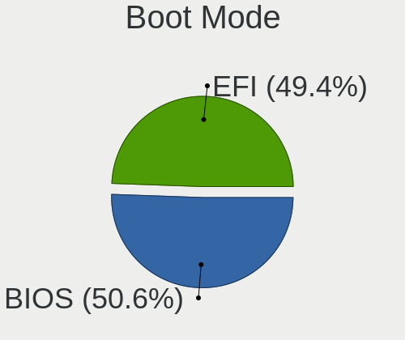

| Mode | Notebooks | Percent |
|------|-----------|---------|
| BIOS | 368       | 51.4%   |
| EFI  | 348       | 48.6%   |

Filesystem
----------

Type of filesystem

| Type    | Notebooks | Percent |
|---------|-----------|---------|
| Ext4    | 636       | 88.95%  |
| Overlay | 24        | 3.36%   |
| Tmpfs   | 18        | 2.52%   |
| Zfs     | 12        | 1.68%   |
| Btrfs   | 12        | 1.68%   |
| Unknown | 5         | 0.7%    |
| Xfs     | 4         | 0.56%   |
| Ext3    | 3         | 0.42%   |
| Jfs     | 1         | 0.14%   |

Part. scheme
------------

Scheme of partitioning

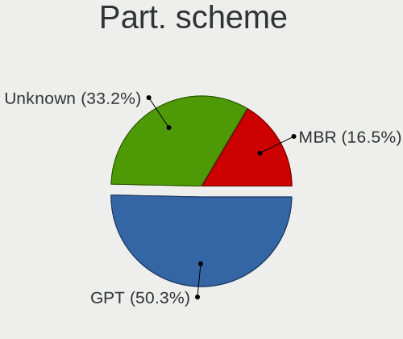

| Type    | Notebooks | Percent |
|---------|-----------|---------|
| GPT     | 321       | 44.52%  |
| Unknown | 277       | 38.42%  |
| MBR     | 123       | 17.06%  |

Dual Boot with Linux/BSD
------------------------

Hosting more than one Linux/BSD

| Dual boot | Notebooks | Percent |
|-----------|-----------|---------|
| No        | 638       | 88.73%  |
| Yes       | 81        | 11.27%  |

Dual Boot (Win)
---------------

Hosting Linux and Windows

| Dual boot | Notebooks | Percent |
|-----------|-----------|---------|
| No        | 484       | 67.5%   |
| Yes       | 233       | 32.5%   |

Board
-----

Vendor
------

Motherboard manufacturer

| Name                   | Notebooks | Percent |
|------------------------|-----------|---------|
| Hewlett-Packard        | 148       | 20.96%  |
| Lenovo                 | 137       | 19.41%  |
| Dell                   | 115       | 16.29%  |
| ASUSTek Computer       | 66        | 9.35%   |
| Acer                   | 54        | 7.65%   |
| Toshiba                | 26        | 3.68%   |
| Sony                   | 16        | 2.27%   |
| Samsung Electronics    | 14        | 1.98%   |
| MSI                    | 14        | 1.98%   |
| Fujitsu                | 10        | 1.42%   |
| Apple                  | 9         | 1.27%   |
| Notebook               | 8         | 1.13%   |
| Packard Bell           | 5         | 0.71%   |
| Positivo               | 4         | 0.57%   |
| HUAWEI                 | 4         | 0.57%   |
| Google                 | 4         | 0.57%   |
| Unknown                | 4         | 0.57%   |
| TUXEDO                 | 3         | 0.42%   |
| TrekStor               | 3         | 0.42%   |
| Quanta                 | 3         | 0.42%   |
| Medion                 | 3         | 0.42%   |
| Intel                  | 3         | 0.42%   |
| Clevo                  | 3         | 0.42%   |
| Chuwi                  | 3         | 0.42%   |
| Avell High Performance | 3         | 0.42%   |
| Wortmann AG            | 2         | 0.28%   |
| System76               | 2         | 0.28%   |
| NEC Computers          | 2         | 0.28%   |
| MicroByte              | 2         | 0.28%   |
| LG Electronics         | 2         | 0.28%   |
| GPD                    | 2         | 0.28%   |
| Digibras               | 2         | 0.28%   |
| AZW                    | 2         | 0.28%   |
| TPVAOC                 | 1         | 0.14%   |
| Timi                   | 1         | 0.14%   |
| Teclast                | 1         | 0.14%   |
| Star Labs              | 1         | 0.14%   |
| SLIMBOOK               | 1         | 0.14%   |
| Semp Toshiba           | 1         | 0.14%   |
| Seco                   | 1         | 0.14%   |

Model
-----

Motherboard model

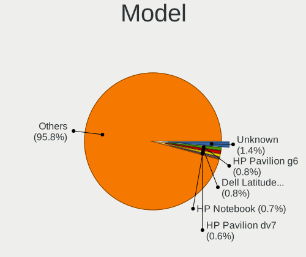

| Name                                 | Notebooks | Percent |
|--------------------------------------|-----------|---------|
| Unknown                              | 10        | 1.42%   |
| HP Pavilion g6                       | 6         | 0.85%   |
| Dell Latitude E6410                  | 6         | 0.85%   |
| HP Pavilion dv7                      | 5         | 0.71%   |
| Dell Latitude E6420                  | 5         | 0.71%   |
| Lenovo IdeaPad 3 15IIL05 81WE        | 4         | 0.57%   |
| HP Notebook                          | 4         | 0.57%   |
| TrekStor Surfbook A13B               | 3         | 0.42%   |
| HP Pavilion 17                       | 3         | 0.42%   |
| HP 15                                | 3         | 0.42%   |
| Dell Precision M4800                 | 3         | 0.42%   |
| Dell Precision 7520                  | 3         | 0.42%   |
| Dell Latitude E7250                  | 3         | 0.42%   |
| Dell Latitude E6500                  | 3         | 0.42%   |
| Dell Latitude 7420                   | 3         | 0.42%   |
| Acer Aspire ES1-523                  | 3         | 0.42%   |
| Toshiba Satellite C660               | 2         | 0.28%   |
| Toshiba Satellite A200               | 2         | 0.28%   |
| Sony VGN-CR120E                      | 2         | 0.28%   |
| Samsung 350V5C/351V5C/3540VC/3440VC  | 2         | 0.28%   |
| MicroByte ezbook                     | 2         | 0.28%   |
| Lenovo ThinkBook 16p Gen 2 20YM      | 2         | 0.28%   |
| Lenovo IdeaPad Gaming 3 15ARH05 82EY | 2         | 0.28%   |
| Lenovo G500 20236                    | 2         | 0.28%   |
| HP ProBook 450 G6                    | 2         | 0.28%   |
| HP Pavilion dv6                      | 2         | 0.28%   |
| HP Pavilion dv5                      | 2         | 0.28%   |
| HP Pavilion dm1                      | 2         | 0.28%   |
| HP Laptop 15s-eq1xxx                 | 2         | 0.28%   |
| HP EliteBook 8470p                   | 2         | 0.28%   |
| HP EliteBook 840 G5                  | 2         | 0.28%   |
| HP EliteBook 840 G2                  | 2         | 0.28%   |
| HP EliteBook 2570p                   | 2         | 0.28%   |
| HP 255 G7 Notebook PC                | 2         | 0.28%   |
| HP 250 G7 Notebook PC                | 2         | 0.28%   |
| HP 250 G1                            | 2         | 0.28%   |
| Fujitsu LIFEBOOK E5511               | 2         | 0.28%   |
| Digibras NH4CU53                     | 2         | 0.28%   |
| Dell XPS 13 9360                     | 2         | 0.28%   |
| Dell Vostro 3350                     | 2         | 0.28%   |

Model Family
------------

Motherboard model prefix

| Name                  | Notebooks | Percent |
|-----------------------|-----------|---------|
| Lenovo ThinkPad       | 77        | 10.91%  |
| Dell Latitude         | 47        | 6.66%   |
| Acer Aspire           | 37        | 5.24%   |
| HP Pavilion           | 36        | 5.1%    |
| Lenovo IdeaPad        | 30        | 4.25%   |
| HP EliteBook          | 26        | 3.68%   |
| Toshiba Satellite     | 24        | 3.4%    |
| Dell Inspiron         | 21        | 2.97%   |
| Dell Precision        | 18        | 2.55%   |
| HP ProBook            | 13        | 1.84%   |
| HP Laptop             | 10        | 1.42%   |
| Fujitsu LIFEBOOK      | 10        | 1.42%   |
| Dell Vostro           | 10        | 1.42%   |
| Unknown               | 10        | 1.42%   |
| Dell XPS              | 9         | 1.27%   |
| HP 250                | 8         | 1.13%   |
| ASUS VivoBook         | 8         | 1.13%   |
| HP ZBook              | 7         | 0.99%   |
| HP Compaq             | 7         | 0.99%   |
| Acer TravelMate       | 6         | 0.85%   |
| Packard Bell EasyNote | 5         | 0.71%   |
| Lenovo Legion         | 5         | 0.71%   |
| HP Stream             | 5         | 0.71%   |
| Lenovo ThinkBook      | 4         | 0.57%   |
| HP Notebook           | 4         | 0.57%   |
| HP ENVY               | 4         | 0.57%   |
| HP 15                 | 4         | 0.57%   |
| Dell Studio           | 4         | 0.57%   |
| TrekStor Surfbook     | 3         | 0.42%   |
| Lenovo G580           | 3         | 0.42%   |
| HP 255                | 3         | 0.42%   |
| ASUS TUF              | 3         | 0.42%   |
| ASUS ASUS             | 3         | 0.42%   |
| Acer Nitro            | 3         | 0.42%   |
| Sony VGN-CR120E       | 2         | 0.28%   |
| Samsung 350V5C        | 2         | 0.28%   |
| MicroByte ezbook      | 2         | 0.28%   |
| Lenovo V15            | 2         | 0.28%   |
| Lenovo G500           | 2         | 0.28%   |
| Lenovo Flex           | 2         | 0.28%   |

MFG Year
--------

Motherboard manufacture year

| Year    | Notebooks | Percent |
|---------|-----------|---------|
| 2011    | 69        | 9.77%   |
| 2012    | 66        | 9.35%   |
| 2019    | 59        | 8.36%   |
| 2020    | 57        | 8.07%   |
| 2013    | 52        | 7.37%   |
| 2018    | 51        | 7.22%   |
| 2021    | 47        | 6.66%   |
| 2010    | 45        | 6.37%   |
| 2008    | 43        | 6.09%   |
| 2014    | 41        | 5.81%   |
| 2017    | 38        | 5.38%   |
| 2015    | 38        | 5.38%   |
| 2016    | 34        | 4.82%   |
| 2009    | 20        | 2.83%   |
| 2007    | 19        | 2.69%   |
| 2022    | 12        | 1.7%    |
| 2006    | 8         | 1.13%   |
| 2023    | 2         | 0.28%   |
| 2005    | 2         | 0.28%   |
| Unknown | 2         | 0.28%   |
| 2003    | 1         | 0.14%   |

Form Factor
-----------

Physical design of the computer

| Name     | Notebooks | Percent |
|----------|-----------|---------|
| Notebook | 706       | 100%    |

Secure Boot
-----------

Enabled or disabled

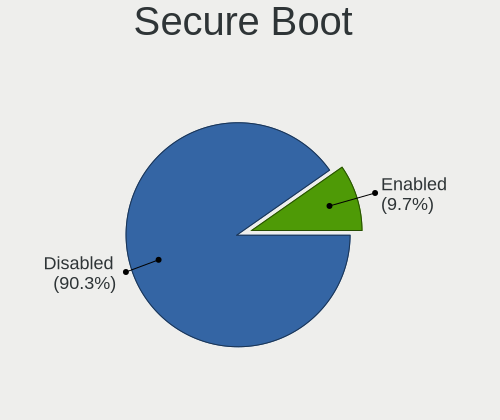

| State    | Notebooks | Percent |
|----------|-----------|---------|
| Disabled | 643       | 90.31%  |
| Enabled  | 69        | 9.69%   |

Coreboot
--------

Have coreboot on board

| Used | Notebooks | Percent |
|------|-----------|---------|
| No   | 701       | 99.29%  |
| Yes  | 5         | 0.71%   |

RAM Size
--------

Total RAM memory

| Size in GB  | Notebooks | Percent |
|-------------|-----------|---------|
| 4.01-8.0    | 190       | 26.57%  |
| 3.01-4.0    | 185       | 25.87%  |
| 16.01-24.0  | 105       | 14.69%  |
| 8.01-16.0   | 98        | 13.71%  |
| 1.01-2.0    | 43        | 6.01%   |
| 32.01-64.0  | 42        | 5.87%   |
| 64.01-256.0 | 16        | 2.24%   |
| 2.01-3.0    | 15        | 2.1%    |
| 0.51-1.0    | 11        | 1.54%   |
| 24.01-32.0  | 9         | 1.26%   |
| 0.01-0.5    | 1         | 0.14%   |

RAM Used
--------

Used RAM memory

| Used GB    | Notebooks | Percent |
|------------|-----------|---------|
| 1.01-2.0   | 286       | 37.39%  |
| 2.01-3.0   | 183       | 23.92%  |
| 3.01-4.0   | 97        | 12.68%  |
| 4.01-8.0   | 90        | 11.76%  |
| 0.51-1.0   | 71        | 9.28%   |
| 8.01-16.0  | 26        | 3.4%    |
| 0.01-0.5   | 9         | 1.18%   |
| 24.01-32.0 | 2         | 0.26%   |
| 32.01-64.0 | 1         | 0.13%   |

Total Drives
------------

Number of drives on board

| Drives | Notebooks | Percent |
|--------|-----------|---------|
| 1      | 522       | 71.8%   |
| 2      | 177       | 24.35%  |
| 3      | 22        | 3.03%   |
| 4      | 3         | 0.41%   |
| 0      | 2         | 0.28%   |
| 5      | 1         | 0.14%   |

Has CD-ROM
----------

Has CD-ROM on board

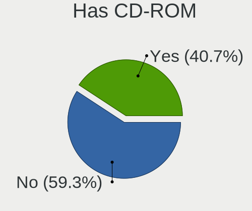

| Presented | Notebooks | Percent |
|-----------|-----------|---------|
| No        | 399       | 56.36%  |
| Yes       | 309       | 43.64%  |

Has Ethernet
------------

Has Ethernet on board

| Presented | Notebooks | Percent |
|-----------|-----------|---------|
| Yes       | 598       | 84.7%   |
| No        | 108       | 15.3%   |

Has WiFi
--------

Has WiFi module

| Presented | Notebooks | Percent |
|-----------|-----------|---------|
| Yes       | 691       | 97.6%   |
| No        | 17        | 2.4%    |

Has Bluetooth
-------------

Has Bluetooth module

| Presented | Notebooks | Percent |
|-----------|-----------|---------|
| Yes       | 539       | 75.6%   |
| No        | 174       | 24.4%   |

Location
--------

Country
-------

Geographic location (country)

| Country     | Notebooks | Percent |
|-------------|-----------|---------|
| USA         | 89        | 12.52%  |
| Germany     | 87        | 12.24%  |
| France      | 74        | 10.41%  |
| Brazil      | 63        | 8.86%   |
| Italy       | 40        | 5.63%   |
| UK          | 36        | 5.06%   |
| Spain       | 34        | 4.78%   |
| Russia      | 33        | 4.64%   |
| Poland      | 11        | 1.55%   |
| Netherlands | 11        | 1.55%   |
| Ukraine     | 10        | 1.41%   |
| Turkey      | 10        | 1.41%   |
| Switzerland | 10        | 1.41%   |
| India       | 10        | 1.41%   |
| Sweden      | 9         | 1.27%   |
| Finland     | 9         | 1.27%   |
| Canada      | 9         | 1.27%   |
| Belgium     | 9         | 1.27%   |
| Indonesia   | 8         | 1.13%   |
| Australia   | 8         | 1.13%   |
| Romania     | 7         | 0.98%   |
| Norway      | 7         | 0.98%   |
| Mexico      | 7         | 0.98%   |
| Greece      | 7         | 0.98%   |
| Czechia     | 7         | 0.98%   |
| Chile       | 6         | 0.84%   |
| Argentina   | 6         | 0.84%   |
| Thailand    | 5         | 0.7%    |
| Portugal    | 5         | 0.7%    |
| Hungary     | 5         | 0.7%    |
| Ireland     | 4         | 0.56%   |
| Taiwan      | 3         | 0.42%   |
| Serbia      | 3         | 0.42%   |
| Philippines | 3         | 0.42%   |
| Peru        | 3         | 0.42%   |
| New Zealand | 3         | 0.42%   |
| Israel      | 3         | 0.42%   |
| Estonia     | 3         | 0.42%   |
| Denmark     | 3         | 0.42%   |
| China       | 3         | 0.42%   |

City
----

Geographic location (city)

| City              | Notebooks | Percent |
|-------------------|-----------|---------|
| Sao Paulo         | 23        | 3.07%   |
| Paris             | 15        | 2%      |
| Moscow            | 14        | 1.87%   |
| Berlin            | 9         | 1.2%    |
| Rome              | 6         | 0.8%    |
| Barcelona         | 6         | 0.8%    |
| Rio de Janeiro    | 5         | 0.67%   |
| Mannheim          | 5         | 0.67%   |
| Kyiv              | 5         | 0.67%   |
| Warsaw            | 4         | 0.53%   |
| St Petersburg     | 4         | 0.53%   |
| Manchester        | 4         | 0.53%   |
| Madrid            | 4         | 0.53%   |
| Genoa             | 4         | 0.53%   |
| Frankfurt am Main | 4         | 0.53%   |
| Essen             | 4         | 0.53%   |
| Cologne           | 4         | 0.53%   |
| Bucharest         | 4         | 0.53%   |
| Bengaluru         | 4         | 0.53%   |
| Athens            | 4         | 0.53%   |
| Amsterdam         | 4         | 0.53%   |
| Zurich            | 3         | 0.4%    |
| Vienna            | 3         | 0.4%    |
| Sundbyberg        | 3         | 0.4%    |
| Seville           | 3         | 0.4%    |
| Porto Alegre      | 3         | 0.4%    |
| Munich            | 3         | 0.4%    |
| Marseille         | 3         | 0.4%    |
| Lisbon            | 3         | 0.4%    |
| Hamburg           | 3         | 0.4%    |
| Ely               | 3         | 0.4%    |
| Dublin            | 3         | 0.4%    |
| Darmstadt         | 3         | 0.4%    |
| Brisbane          | 3         | 0.4%    |
| Belgrade          | 3         | 0.4%    |
| Albuquerque       | 3         | 0.4%    |
| Xining            | 2         | 0.27%   |
| Wittingen         | 2         | 0.27%   |
| Valenciennes      | 2         | 0.27%   |
| Turin             | 2         | 0.27%   |

Drives
------

Drive Vendor
------------

Hard drive vendors

| Vendor                | Notebooks | Drives | Percent |
|-----------------------|-----------|--------|---------|
| Samsung Electronics   | 143       | 211    | 16.1%   |
| Seagate               | 113       | 139    | 12.73%  |
| WDC                   | 102       | 113    | 11.49%  |
| Toshiba               | 76        | 103    | 8.56%   |
| Kingston              | 54        | 65     | 6.08%   |
| Unknown               | 53        | 65     | 5.97%   |
| SanDisk               | 41        | 52     | 4.62%   |
| Hitachi               | 39        | 44     | 4.39%   |
| Crucial               | 36        | 54     | 4.05%   |
| SK hynix              | 35        | 45     | 3.94%   |
| Intel                 | 19        | 27     | 2.14%   |
| A-DATA Technology     | 16        | 18     | 1.8%    |
| Fujitsu               | 13        | 15     | 1.46%   |
| HGST                  | 12        | 14     | 1.35%   |
| China                 | 12        | 14     | 1.35%   |
| Micron Technology     | 11        | 12     | 1.24%   |
| KIOXIA                | 10        | 11     | 1.13%   |
| Phison                | 8         | 8      | 0.9%    |
| PNY                   | 6         | 6      | 0.68%   |
| SPCC                  | 4         | 9      | 0.45%   |
| Silicon Motion        | 4         | 4      | 0.45%   |
| KingSpec              | 4         | 5      | 0.45%   |
| Intenso               | 4         | 4      | 0.45%   |
| Apple                 | 4         | 4      | 0.45%   |
| Transcend             | 3         | 6      | 0.34%   |
| Patriot               | 3         | 3      | 0.34%   |
| LITEONIT              | 3         | 4      | 0.34%   |
| LITEON                | 3         | 3      | 0.34%   |
| Verbatim              | 2         | 7      | 0.23%   |
| Vaseky                | 2         | 2      | 0.23%   |
| UMIS                  | 2         | 3      | 0.23%   |
| SAGE                  | 2         | 2      | 0.23%   |
| Realtek Semiconductor | 2         | 3      | 0.23%   |
| Plextor               | 2         | 2      | 0.23%   |
| OCZ                   | 2         | 2      | 0.23%   |
| Netac                 | 2         | 2      | 0.23%   |
| LaCie                 | 2         | 2      | 0.23%   |
| JMicron Technology    | 2         | 2      | 0.23%   |
| IBM/Hitachi           | 2         | 2      | 0.23%   |
| FORESEE               | 2         | 2      | 0.23%   |

Drive Model
-----------

Hard drive models

| Model                                | Notebooks | Percent |
|--------------------------------------|-----------|---------|
| Kingston SA400S37240G 240GB SSD      | 15        | 1.62%   |
| Toshiba MQ01ABF050 500GB             | 13        | 1.4%    |
| Unknown MMC Card  32GB               | 12        | 1.29%   |
| Seagate ST1000LM035-1RK172 1TB       | 12        | 1.29%   |
| Seagate ST500LT012-1DG142 500GB      | 8         | 0.86%   |
| Samsung SSD 860 EVO 500GB            | 8         | 0.86%   |
| Kingston SA400S37120G 120GB SSD      | 8         | 0.86%   |
| Unknown MMC Card  64GB               | 7         | 0.76%   |
| Toshiba MQ01ABD100 1TB               | 7         | 0.76%   |
| Seagate ST500LT012-9WS142 500GB      | 7         | 0.76%   |
| Seagate ST320LT007-9ZV142 320GB      | 7         | 0.76%   |
| Toshiba MQ04ABF100 1TB               | 6         | 0.65%   |
| Seagate ST9500325AS 500GB            | 6         | 0.65%   |
| Seagate ST500LM012 HN-M500MBB 500GB  | 6         | 0.65%   |
| Kingston SA400S37480G 480GB SSD      | 6         | 0.65%   |
| Hitachi HTS545050B9A300 500GB        | 6         | 0.65%   |
| Seagate ST9500420AS 500GB            | 5         | 0.54%   |
| Seagate ST2000LM015-2E8174 2TB       | 5         | 0.54%   |
| Seagate ST1000LM049-2GH172 1TB       | 5         | 0.54%   |
| Seagate ST1000LM024 HN-M101MBB 1TB   | 5         | 0.54%   |
| Kingston SV300S37A120G 120GB SSD     | 5         | 0.54%   |
| China SSD 120GB                      | 5         | 0.54%   |
| WDC WD10SPZX-21Z10T0 1TB             | 4         | 0.43%   |
| WDC WD10JPVX-22JC3T0 1TB             | 4         | 0.43%   |
| Unknown MMC Card  16GB               | 4         | 0.43%   |
| Seagate ST2000LM007-1R8174 2TB       | 4         | 0.43%   |
| Seagate ST1000LM014-1EJ164 1TB       | 4         | 0.43%   |
| SanDisk SSD i100 24GB                | 4         | 0.43%   |
| Samsung SSD 850 EVO 500GB            | 4         | 0.43%   |
| Hitachi HTS547575A9E384 752GB        | 4         | 0.43%   |
| HGST HTS721010A9E630 1TB             | 4         | 0.43%   |
| Crucial CT500MX500SSD1 500GB         | 4         | 0.43%   |
| Crucial CT250BX100SSD1 250GB         | 4         | 0.43%   |
| Crucial CT240BX500SSD1 240GB         | 4         | 0.43%   |
| WDC WD5000LPVX-22V0TT0 500GB         | 3         | 0.32%   |
| WDC WD3200BPVT-80JJ5T0 320GB         | 3         | 0.32%   |
| WDC PC SN730 SDBQNTY-512G-1001 512GB | 3         | 0.32%   |
| Unknown SLD64G  64GB                 | 3         | 0.32%   |
| Unknown MMC Card  128GB              | 3         | 0.32%   |
| Toshiba MQ01ACF032 320GB             | 3         | 0.32%   |

HDD Vendor
----------

Hard disk drive vendors

| Vendor              | Notebooks | Drives | Percent |
|---------------------|-----------|--------|---------|
| Seagate             | 113       | 137    | 35.99%  |
| WDC                 | 68        | 75     | 21.66%  |
| Toshiba             | 57        | 72     | 18.15%  |
| Hitachi             | 39        | 44     | 12.42%  |
| Fujitsu             | 13        | 15     | 4.14%   |
| HGST                | 12        | 14     | 3.82%   |
| Samsung Electronics | 4         | 4      | 1.27%   |
| SAGE                | 2         | 2      | 0.64%   |
| IBM/Hitachi         | 2         | 2      | 0.64%   |
| Unknown             | 1         | 1      | 0.32%   |
| SABRENT             | 1         | 1      | 0.32%   |
| LaCie               | 1         | 1      | 0.32%   |
| Apricorn            | 1         | 1      | 0.32%   |

SSD Vendor
----------

Solid state drive vendors

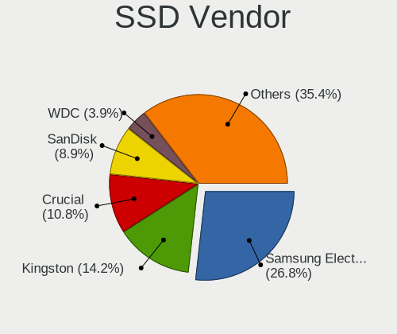

| Vendor              | Notebooks | Drives | Percent |
|---------------------|-----------|--------|---------|
| Samsung Electronics | 86        | 122    | 27.3%   |
| Kingston            | 48        | 58     | 15.24%  |
| Crucial             | 33        | 51     | 10.48%  |
| SanDisk             | 28        | 37     | 8.89%   |
| WDC                 | 13        | 14     | 4.13%   |
| A-DATA Technology   | 12        | 14     | 3.81%   |
| China               | 11        | 13     | 3.49%   |
| SK hynix            | 8         | 10     | 2.54%   |
| Toshiba             | 7         | 9      | 2.22%   |
| PNY                 | 6         | 6      | 1.9%    |
| Intel               | 6         | 11     | 1.9%    |
| KingSpec            | 4         | 5      | 1.27%   |
| Intenso             | 4         | 4      | 1.27%   |
| Transcend           | 3         | 6      | 0.95%   |
| SPCC                | 3         | 8      | 0.95%   |
| Micron Technology   | 3         | 4      | 0.95%   |
| LITEONIT            | 3         | 4      | 0.95%   |
| Apple               | 3         | 3      | 0.95%   |
| Verbatim            | 2         | 7      | 0.63%   |
| Vaseky              | 2         | 2      | 0.63%   |
| Plextor             | 2         | 2      | 0.63%   |
| Patriot             | 2         | 2      | 0.63%   |
| OCZ                 | 2         | 2      | 0.63%   |
| Netac               | 2         | 2      | 0.63%   |
| LITEON              | 2         | 2      | 0.63%   |
| JMicron Technology  | 2         | 2      | 0.63%   |
| FORESEE             | 2         | 2      | 0.63%   |
| Apacer              | 2         | 3      | 0.63%   |
| WDC WDS2            | 1         | 1      | 0.32%   |
| Super Talent        | 1         | 1      | 0.32%   |
| Smart               | 1         | 1      | 0.32%   |
| Seagate             | 1         | 1      | 0.32%   |
| Ramos Technology    | 1         | 1      | 0.32%   |
| Kston               | 1         | 1      | 0.32%   |
| HS-SSD-E100         | 1         | 1      | 0.32%   |
| GLOWAY              | 1         | 1      | 0.32%   |
| Eluktro             | 1         | 1      | 0.32%   |
| Drevo               | 1         | 1      | 0.32%   |
| Dogfish             | 1         | 1      | 0.32%   |
| Corsair             | 1         | 1      | 0.32%   |

Drive Kind
----------

HDD or SSD

| Kind    | Notebooks | Drives | Percent |
|---------|-----------|--------|---------|
| HDD     | 300       | 369    | 35.84%  |
| SSD     | 287       | 419    | 34.29%  |
| NVMe    | 190       | 260    | 22.7%   |
| MMC     | 50        | 66     | 5.97%   |
| Unknown | 10        | 10     | 1.19%   |

Drive Connector
---------------

SATA, SAS, NVMe, etc.

| Type | Notebooks | Drives | Percent |
|------|-----------|--------|---------|
| SATA | 535       | 766    | 66.63%  |
| NVMe | 190       | 260    | 23.66%  |
| MMC  | 50        | 66     | 6.23%   |
| SAS  | 28        | 32     | 3.49%   |

Drive Size
----------

Size of hard drive

| Size in TB | Notebooks | Drives | Percent |
|------------|-----------|--------|---------|
| 0.01-0.5   | 418       | 539    | 70.85%  |
| 0.51-1.0   | 139       | 188    | 23.56%  |
| 1.01-2.0   | 26        | 45     | 4.41%   |
| 4.01-10.0  | 4         | 11     | 0.68%   |
| 3.01-4.0   | 3         | 5      | 0.51%   |

Space Total
-----------

Amount of disk space available on the file system

| Size in GB     | Notebooks | Percent |
|----------------|-----------|---------|
| 101-250        | 229       | 31.24%  |
| 251-500        | 192       | 26.19%  |
| 501-1000       | 104       | 14.19%  |
| 51-100         | 61        | 8.32%   |
| 1001-2000      | 45        | 6.14%   |
| 1-20           | 43        | 5.87%   |
| 21-50          | 29        | 3.96%   |
| 2001-3000      | 15        | 2.05%   |
| More than 3000 | 14        | 1.91%   |
| Unknown        | 1         | 0.14%   |

Space Used
----------

Amount of used disk space

| Used GB        | Notebooks | Percent |
|----------------|-----------|---------|
| 1-20           | 265       | 35.19%  |
| 21-50          | 127       | 16.87%  |
| 101-250        | 119       | 15.8%   |
| 51-100         | 110       | 14.61%  |
| 251-500        | 63        | 8.37%   |
| 501-1000       | 42        | 5.58%   |
| 1001-2000      | 15        | 1.99%   |
| 2001-3000      | 6         | 0.8%    |
| More than 3000 | 5         | 0.66%   |
| Unknown        | 1         | 0.13%   |

Malfunc. Drives
---------------

Drive models with a malfunction

| Model                                        | Notebooks | Drives | Percent |
|----------------------------------------------|-----------|--------|---------|
| Seagate ST320LT007-9ZV142 320GB              | 5         | 5      | 6.76%   |
| WDC WD3200BEVT-60ZCT1 320GB                  | 2         | 2      | 2.7%    |
| Toshiba MK7559GSXP 752GB                     | 2         | 2      | 2.7%    |
| Seagate ST9500420AS 500GB                    | 2         | 2      | 2.7%    |
| Seagate ST500LT012-9WS142 500GB              | 2         | 2      | 2.7%    |
| Seagate ST500LT012-1DG142 500GB              | 2         | 2      | 2.7%    |
| Seagate ST1000LM049-2GH172 1TB               | 2         | 2      | 2.7%    |
| Hitachi HTS547575A9E384 752GB                | 2         | 2      | 2.7%    |
| Hitachi HTS545050B9A300 500GB                | 2         | 2      | 2.7%    |
| Hitachi HTS542516K9SA00 160GB                | 2         | 2      | 2.7%    |
| WDC WD7500BPVX-60JC3T0 752GB                 | 1         | 1      | 1.35%   |
| WDC WD7500BPVX-22JC3T0 752GB                 | 1         | 1      | 1.35%   |
| WDC WD7500BPVT-75HXZT1 752GB                 | 1         | 1      | 1.35%   |
| WDC WD7500BPVT-22A1YT0 752GB                 | 1         | 1      | 1.35%   |
| WDC WD7500BPKT-75PK4T0 752GB                 | 1         | 1      | 1.35%   |
| WDC WD5000LPVX-22V0TT0 500GB                 | 1         | 1      | 1.35%   |
| WDC WD5000BPKT-75PK4T0 500GB                 | 1         | 2      | 1.35%   |
| WDC WD3200BEKT-60V5T1 320GB                  | 1         | 1      | 1.35%   |
| WDC WD2500BEKT-60A25T1 250GB                 | 1         | 1      | 1.35%   |
| WDC WD10JPCX-24UE4T0 1TB                     | 1         | 1      | 1.35%   |
| Vaseky V820/1TB 1024GB                       | 1         | 1      | 1.35%   |
| Toshiba MQ01ABD050 500GB                     | 1         | 1      | 1.35%   |
| Toshiba MK5065GSX 500GB                      | 1         | 1      | 1.35%   |
| Toshiba MK3263GSXN 320GB                     | 1         | 1      | 1.35%   |
| Toshiba MK3261GSYN 320GB                     | 1         | 1      | 1.35%   |
| Toshiba MK2565GSXN 250GB                     | 1         | 1      | 1.35%   |
| Toshiba MK2555GSX 250GB                      | 1         | 1      | 1.35%   |
| SK hynix BC711 HFM512GD3JX013N 512GB         | 1         | 1      | 1.35%   |
| SK hynix BC501 HFM256GDJTNG-8310A 256GB      | 1         | 4      | 1.35%   |
| Seagate ST98823AS 80GB                       | 1         | 1      | 1.35%   |
| Seagate ST9500325AS 500GB                    | 1         | 1      | 1.35%   |
| Seagate ST9320325AS 320GB                    | 1         | 1      | 1.35%   |
| Seagate ST9250410AS 250GB                    | 1         | 1      | 1.35%   |
| Seagate ST9160821AS 160GB                    | 1         | 1      | 1.35%   |
| Seagate ST320LT012-9WS14C 320GB              | 1         | 1      | 1.35%   |
| Seagate ST1000LM035-1RK172 1TB               | 1         | 1      | 1.35%   |
| SanDisk SD7SN3Q256G1002 256GB SSD            | 1         | 1      | 1.35%   |
| Samsung Electronics SSD 960 PRO 2TB          | 1         | 4      | 1.35%   |
| Samsung Electronics SSD 870 EVO 1TB          | 1         | 1      | 1.35%   |
| Samsung Electronics MZVLQ512HBLU-00BH1 512GB | 1         | 1      | 1.35%   |

Malfunc. Drive Vendor
---------------------

Vendors of faulty drives

| Vendor              | Notebooks | Drives | Percent |
|---------------------|-----------|--------|---------|
| Seagate             | 20        | 20     | 27.03%  |
| WDC                 | 12        | 13     | 16.22%  |
| Hitachi             | 9         | 9      | 12.16%  |
| Toshiba             | 8         | 8      | 10.81%  |
| Samsung Electronics | 5         | 8      | 6.76%   |
| Intel               | 4         | 5      | 5.41%   |
| SK hynix            | 2         | 5      | 2.7%    |
| OCZ                 | 2         | 2      | 2.7%    |
| Kingston            | 2         | 3      | 2.7%    |
| A-DATA Technology   | 2         | 4      | 2.7%    |
| Vaseky              | 1         | 1      | 1.35%   |
| SanDisk             | 1         | 1      | 1.35%   |
| Netac               | 1         | 1      | 1.35%   |
| IBM/Hitachi         | 1         | 1      | 1.35%   |
| Fujitsu             | 1         | 1      | 1.35%   |
| Eluktro             | 1         | 1      | 1.35%   |
| China               | 1         | 1      | 1.35%   |
| Apricorn            | 1         | 1      | 1.35%   |

Malfunc. HDD Vendor
-------------------

Vendors of faulty HDD drives

| Vendor              | Notebooks | Drives | Percent |
|---------------------|-----------|--------|---------|
| Seagate             | 20        | 20     | 37.74%  |
| WDC                 | 12        | 13     | 22.64%  |
| Hitachi             | 9         | 9      | 16.98%  |
| Toshiba             | 8         | 8      | 15.09%  |
| Samsung Electronics | 1         | 1      | 1.89%   |
| IBM/Hitachi         | 1         | 1      | 1.89%   |
| Fujitsu             | 1         | 1      | 1.89%   |
| Apricorn            | 1         | 1      | 1.89%   |

Malfunc. Drive Kind
-------------------

Kinds of faulty drives

| Kind | Notebooks | Drives | Percent |
|------|-----------|--------|---------|
| HDD  | 53        | 54     | 71.62%  |
| SSD  | 15        | 17     | 20.27%  |
| NVMe | 6         | 14     | 8.11%   |

Failed Drives
-------------

Failed drive models

Zero info for selected period =(

Failed Drive Vendor
-------------------

Failed drive vendors

Zero info for selected period =(

Drive Status
------------

Number of failed and malfunc. drives

| Status   | Notebooks | Drives | Percent |
|----------|-----------|--------|---------|
| Detected | 353       | 574    | 45.9%   |
| Works    | 343       | 465    | 44.6%   |
| Malfunc  | 73        | 85     | 9.49%   |

Storage controller
------------------

Storage Vendor
--------------

Storage controller vendors

| Vendor                           | Notebooks | Percent |
|----------------------------------|-----------|---------|
| Intel                            | 510       | 63.91%  |
| AMD                              | 83        | 10.4%   |
| Samsung Electronics              | 57        | 7.14%   |
| SanDisk                          | 33        | 4.14%   |
| SK hynix                         | 25        | 3.13%   |
| Toshiba America Info Systems     | 14        | 1.75%   |
| Phison Electronics               | 11        | 1.38%   |
| KIOXIA                           | 9         | 1.13%   |
| Silicon Integrated Systems [SiS] | 8         | 1%      |
| Micron Technology                | 8         | 1%      |
| Kingston Technology Company      | 6         | 0.75%   |
| ADATA Technology                 | 6         | 0.75%   |
| Silicon Motion                   | 5         | 0.63%   |
| Micron/Crucial Technology        | 4         | 0.5%    |
| Nvidia                           | 3         | 0.38%   |
| VIA Technologies                 | 2         | 0.25%   |
| Union Memory (Shenzhen)          | 2         | 0.25%   |
| Solid State Storage Technology   | 2         | 0.25%   |
| Realtek Semiconductor            | 2         | 0.25%   |
| MAXIO Technology (Hangzhou)      | 2         | 0.25%   |
| Marvell Technology Group         | 1         | 0.13%   |
| Lite-On Technology               | 1         | 0.13%   |
| Lenovo                           | 1         | 0.13%   |
| JMicron Technology               | 1         | 0.13%   |
| Apple                            | 1         | 0.13%   |
| Unknown                          | 1         | 0.13%   |

Storage Model
-------------

Storage controller models

| Model                                                                            | Notebooks | Percent |
|----------------------------------------------------------------------------------|-----------|---------|
| Intel 7 Series Chipset Family 6-port SATA Controller [AHCI mode]                 | 70        | 8.11%   |
| AMD FCH SATA Controller [AHCI mode]                                              | 59        | 6.84%   |
| Intel 6 Series/C200 Series Chipset Family 6 port Mobile SATA AHCI Controller     | 53        | 6.14%   |
| Intel Sunrise Point-LP SATA Controller [AHCI mode]                               | 40        | 4.63%   |
| Intel 82801 Mobile SATA Controller [RAID mode]                                   | 37        | 4.29%   |
| Intel 8 Series SATA Controller 1 [AHCI mode]                                     | 27        | 3.13%   |
| Intel 82801IBM/IEM (ICH9M/ICH9M-E) 4 port SATA Controller [AHCI mode]            | 26        | 3.01%   |
| Samsung NVMe SSD Controller SM981/PM981/PM983                                    | 24        | 2.78%   |
| Samsung NVMe SSD Controller 980                                                  | 20        | 2.32%   |
| Intel Wildcat Point-LP SATA Controller [AHCI Mode]                               | 20        | 2.32%   |
| Intel Cannon Lake Mobile PCH SATA AHCI Controller                                | 19        | 2.2%    |
| Intel 5 Series/3400 Series Chipset 4 port SATA AHCI Controller                   | 19        | 2.2%    |
| Intel 8 Series/C220 Series Chipset Family 6-port SATA Controller 1 [AHCI mode]   | 18        | 2.09%   |
| Intel Atom Processor E3800 Series SATA AHCI Controller                           | 17        | 1.97%   |
| Intel 82801HM/HEM (ICH8M/ICH8M-E) IDE Controller                                 | 15        | 1.74%   |
| Intel Volume Management Device NVMe RAID Controller                              | 13        | 1.51%   |
| Intel HM170/QM170 Chipset SATA Controller [AHCI Mode]                            | 13        | 1.51%   |
| Intel 82801HM/HEM (ICH8M/ICH8M-E) SATA Controller [AHCI mode]                    | 13        | 1.51%   |
| AMD SB7x0/SB8x0/SB9x0 SATA Controller [AHCI mode]                                | 12        | 1.39%   |
| Intel Celeron/Pentium Silver Processor SATA Controller                           | 11        | 1.27%   |
| Intel Cannon Point-LP SATA Controller [AHCI Mode]                                | 11        | 1.27%   |
| SanDisk WD Black SN750 / PC SN730 NVMe SSD                                       | 10        | 1.16%   |
| Intel NM10/ICH7 Family SATA Controller [AHCI mode]                               | 10        | 1.16%   |
| Intel 82801GBM/GHM (ICH7-M Family) SATA Controller [IDE mode]                    | 10        | 1.16%   |
| Intel Ice Lake-LP SATA Controller [AHCI mode]                                    | 9         | 1.04%   |
| Intel Atom/Celeron/Pentium Processor x5-E8000/J3xxx/N3xxx Series SATA Controller | 9         | 1.04%   |
| SK hynix BC511 NVMe SSD                                                          | 8         | 0.93%   |
| Silicon Integrated Systems [SiS] 5513 IDE Controller                             | 8         | 0.93%   |
| Samsung NVMe SSD Controller SM961/PM961/SM963                                    | 8         | 0.93%   |
| Intel SSD 660P Series                                                            | 8         | 0.93%   |
| Intel Q170/Q150/B150/H170/H110/Z170/CM236 Chipset SATA Controller [AHCI Mode]    | 8         | 0.93%   |
| SanDisk WD Blue SN500 / PC SN520 NVMe SSD                                        | 7         | 0.81%   |
| KIOXIA NVMe SSD Controller BG4 (DRAM-less)                                       | 7         | 0.81%   |
| Intel Celeron N3350/Pentium N4200/Atom E3900 Series SATA AHCI Controller         | 7         | 0.81%   |
| AMD SB600 IDE                                                                    | 7         | 0.81%   |
| SK hynix Gold P31/BC711/PC711 NVMe Solid State Drive                             | 6         | 0.7%    |
| Samsung NVMe SSD Controller PM9A1/PM9A3/980PRO                                   | 6         | 0.7%    |
| Phison E12 NVMe Controller                                                       | 6         | 0.7%    |
| Intel Comet Lake SATA AHCI Controller                                            | 6         | 0.7%    |
| Intel 82801IBM/IEM (ICH9M/ICH9M-E) 2 port SATA Controller [IDE mode]             | 6         | 0.7%    |

Storage Kind
------------

Kind of storage controller (IDE, SATA, NVMe, SAS, ...)

| Kind | Notebooks | Percent |
|------|-----------|---------|
| SATA | 510       | 62.12%  |
| NVMe | 188       | 22.9%   |
| IDE  | 72        | 8.77%   |
| RAID | 51        | 6.21%   |

Processor
---------

CPU Vendor
----------

Processor vendors

| Vendor       | Notebooks | Percent |
|--------------|-----------|---------|
| Intel        | 594       | 84.14%  |
| AMD          | 109       | 15.44%  |
| PowerBook5,6 | 1         | 0.14%   |
| CentaurHauls | 1         | 0.14%   |
| ARM          | 1         | 0.14%   |

CPU Model
---------

Processor models

| Model                                         | Notebooks | Percent |
|-----------------------------------------------|-----------|---------|
| Intel Core i7-8565U CPU @ 1.80GHz             | 10        | 1.42%   |
| Intel 11th Gen Core i7-1165G7 @ 2.80GHz       | 10        | 1.42%   |
| Intel Core i7-8550U CPU @ 1.80GHz             | 9         | 1.27%   |
| Intel 11th Gen Core i5-1135G7 @ 2.40GHz       | 9         | 1.27%   |
| Intel Core i5-6200U CPU @ 2.30GHz             | 8         | 1.13%   |
| Intel Core i5-4210U CPU @ 1.70GHz             | 8         | 1.13%   |
| Intel Core i5-2410M CPU @ 2.30GHz             | 8         | 1.13%   |
| Intel Core i5-1035G1 CPU @ 1.00GHz            | 8         | 1.13%   |
| Intel Core i7-8750H CPU @ 2.20GHz             | 7         | 0.99%   |
| Intel Core i7-7700HQ CPU @ 2.80GHz            | 7         | 0.99%   |
| Intel Core i7-2670QM CPU @ 2.20GHz            | 7         | 0.99%   |
| Intel Core i5-8265U CPU @ 1.60GHz             | 7         | 0.99%   |
| Intel Core i5-7200U CPU @ 2.50GHz             | 7         | 0.99%   |
| Intel Core i5-3230M CPU @ 2.60GHz             | 7         | 0.99%   |
| Intel Pentium CPU N3540 @ 2.16GHz             | 6         | 0.85%   |
| Intel Core i7-9750H CPU @ 2.60GHz             | 6         | 0.85%   |
| Intel Core i7-3630QM CPU @ 2.40GHz            | 6         | 0.85%   |
| Intel Core i5-8250U CPU @ 1.60GHz             | 6         | 0.85%   |
| Intel Core i5-5200U CPU @ 2.20GHz             | 6         | 0.85%   |
| Intel Core i5-2540M CPU @ 2.60GHz             | 6         | 0.85%   |
| Intel Core i5-2520M CPU @ 2.50GHz             | 6         | 0.85%   |
| AMD Ryzen 5 3500U with Radeon Vega Mobile Gfx | 6         | 0.85%   |
| Intel Core i7-5600U CPU @ 2.60GHz             | 5         | 0.71%   |
| Intel Core i7-2630QM CPU @ 2.00GHz            | 5         | 0.71%   |
| Intel Core i7-10510U CPU @ 1.80GHz            | 5         | 0.71%   |
| Intel Core i5-6300U CPU @ 2.40GHz             | 5         | 0.71%   |
| Intel Core i5-4300U CPU @ 1.90GHz             | 5         | 0.71%   |
| Intel Core i5-3320M CPU @ 2.60GHz             | 5         | 0.71%   |
| Intel Core i5-2450M CPU @ 2.50GHz             | 5         | 0.71%   |
| Intel Core i5-2430M CPU @ 2.40GHz             | 5         | 0.71%   |
| Intel Core i5-10210U CPU @ 1.60GHz            | 5         | 0.71%   |
| Intel Core i3-3110M CPU @ 2.40GHz             | 5         | 0.71%   |
| Intel Celeron N4000 CPU @ 1.10GHz             | 5         | 0.71%   |
| Intel Celeron CPU N3050 @ 1.60GHz             | 5         | 0.71%   |
| Intel Celeron CPU N2840 @ 2.16GHz             | 5         | 0.71%   |
| Intel Pentium Dual-Core CPU T4500 @ 2.30GHz   | 4         | 0.57%   |
| Intel Core i7-8665U CPU @ 1.90GHz             | 4         | 0.57%   |
| Intel Core i7-7500U CPU @ 2.70GHz             | 4         | 0.57%   |
| Intel Core i5 CPU M 560 @ 2.67GHz             | 4         | 0.57%   |
| Intel Core i5 CPU M 430 @ 2.27GHz             | 4         | 0.57%   |

CPU Model Family
----------------

Processor model prefix

| Model                          | Notebooks | Percent |
|--------------------------------|-----------|---------|
| Intel Core i5                  | 163       | 23.09%  |
| Intel Core i7                  | 151       | 21.39%  |
| Intel Core i3                  | 55        | 7.79%   |
| Intel Celeron                  | 52        | 7.37%   |
| Other                          | 44        | 6.23%   |
| Intel Core 2 Duo               | 38        | 5.38%   |
| Intel Pentium                  | 26        | 3.68%   |
| Intel Atom                     | 20        | 2.83%   |
| AMD Ryzen 5                    | 17        | 2.41%   |
| AMD Ryzen 7                    | 16        | 2.27%   |
| Intel Genuine                  | 11        | 1.56%   |
| AMD A6                         | 9         | 1.27%   |
| Intel Pentium Dual-Core        | 8         | 1.13%   |
| AMD A4                         | 7         | 0.99%   |
| Intel Core i9                  | 5         | 0.71%   |
| AMD Turion 64 X2 Mobile        | 5         | 0.71%   |
| AMD Ryzen 3                    | 5         | 0.71%   |
| Intel Pentium Silver           | 4         | 0.57%   |
| AMD Ryzen 9                    | 4         | 0.57%   |
| AMD E1                         | 4         | 0.57%   |
| AMD E                          | 4         | 0.57%   |
| AMD Athlon                     | 4         | 0.57%   |
| Intel Xeon                     | 3         | 0.42%   |
| Intel Pentium Dual             | 3         | 0.42%   |
| Intel Core m3                  | 3         | 0.42%   |
| Intel Core Duo                 | 3         | 0.42%   |
| AMD Turion X2 Dual-Core Mobile | 3         | 0.42%   |
| AMD Ryzen 7 PRO                | 3         | 0.42%   |
| AMD Mobile Sempron             | 3         | 0.42%   |
| AMD E2                         | 3         | 0.42%   |
| AMD A8                         | 3         | 0.42%   |
| AMD A10                        | 3         | 0.42%   |
| Intel Pentium M                | 2         | 0.28%   |
| Intel Core M                   | 2         | 0.28%   |
| Intel Core 2                   | 2         | 0.28%   |
| Intel Celeron Dual-Core        | 2         | 0.28%   |
| AMD Ryzen 5 PRO                | 2         | 0.28%   |
| AMD C-60                       | 2         | 0.28%   |
| AMD Athlon X2                  | 2         | 0.28%   |
| Intel Core m5                  | 1         | 0.14%   |

CPU Cores
---------

Number of processor cores

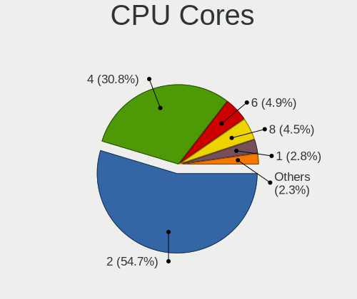

| Number | Notebooks | Percent |
|--------|-----------|---------|
| 2      | 396       | 55.93%  |
| 4      | 222       | 31.36%  |
| 6      | 31        | 4.38%   |
| 8      | 28        | 3.95%   |
| 1      | 23        | 3.25%   |
| 14     | 3         | 0.42%   |
| 10     | 3         | 0.42%   |
| 12     | 1         | 0.14%   |
| 3      | 1         | 0.14%   |

CPU Sockets
-----------

Number of sockets

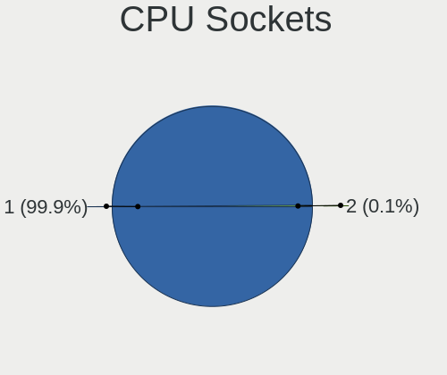

| Number | Notebooks | Percent |
|--------|-----------|---------|
| 1      | 705       | 99.86%  |
| 2      | 1         | 0.14%   |

CPU Threads
-----------

Threads per core (Hyper-Threading)

| Number | Notebooks | Percent |
|--------|-----------|---------|
| 2      | 475       | 67.19%  |
| 1      | 232       | 32.81%  |

CPU Op-Modes
------------

CPU Operation Modes (32-bit, 64-bit)

| Op mode        | Notebooks | Percent |
|----------------|-----------|---------|
| 32-bit, 64-bit | 683       | 96.74%  |
| 32-bit         | 22        | 3.12%   |
| 64-bit         | 1         | 0.14%   |

CPU Microcode
-------------

Microcode number

| Number     | Notebooks | Percent |
|------------|-----------|---------|
| Unknown    | 163       | 22.21%  |
| 0x206a7    | 55        | 7.49%   |
| 0x306a9    | 53        | 7.22%   |
| 0x1067a    | 27        | 3.68%   |
| 0x806ec    | 23        | 3.13%   |
| 0x40651    | 23        | 3.13%   |
| 0x806c1    | 20        | 2.72%   |
| 0x806ea    | 19        | 2.59%   |
| 0x406e3    | 17        | 2.32%   |
| 0x306d4    | 16        | 2.18%   |
| 0x806e9    | 15        | 2.04%   |
| 0x6fd      | 14        | 1.91%   |
| 0x306c3    | 14        | 1.91%   |
| 0x30678    | 14        | 1.91%   |
| 0x20655    | 14        | 1.91%   |
| 0x706e5    | 13        | 1.77%   |
| 0x406c4    | 12        | 1.63%   |
| 0x906ea    | 11        | 1.5%    |
| 0x906e9    | 11        | 1.5%    |
| 0x20652    | 9         | 1.23%   |
| 0x806d1    | 8         | 1.09%   |
| 0x706a1    | 8         | 1.09%   |
| 0x106ca    | 8         | 1.09%   |
| 0x10676    | 8         | 1.09%   |
| 0x08108109 | 8         | 1.09%   |
| 0x506e3    | 7         | 0.95%   |
| 0x0a50000c | 7         | 0.95%   |
| 0x08108102 | 7         | 0.95%   |
| 0x07030105 | 7         | 0.95%   |
| 0x6ec      | 6         | 0.82%   |
| 0x806eb    | 5         | 0.68%   |
| 0x6e8      | 5         | 0.68%   |
| 0x506c9    | 5         | 0.68%   |
| 0x406c3    | 5         | 0.68%   |
| 0x08600106 | 5         | 0.68%   |
| 0x0700010f | 5         | 0.68%   |
| 0x06006705 | 5         | 0.68%   |
| 0x05000119 | 5         | 0.68%   |
| 0xa0652    | 4         | 0.54%   |
| 0x906ed    | 4         | 0.54%   |

CPU Microarch
-------------

Microarchitecture

| Name             | Notebooks | Percent |
|------------------|-----------|---------|
| KabyLake         | 108       | 15.28%  |
| SandyBridge      | 70        | 9.9%    |
| IvyBridge        | 68        | 9.62%   |
| Haswell          | 48        | 6.79%   |
| Silvermont       | 39        | 5.52%   |
| Penryn           | 38        | 5.37%   |
| Skylake          | 31        | 4.38%   |
| Westmere         | 29        | 4.1%    |
| TigerLake        | 24        | 3.39%   |
| Core             | 24        | 3.39%   |
| IceLake          | 23        | 3.25%   |
| Broadwell        | 23        | 3.25%   |
| Zen+             | 16        | 2.26%   |
| Goldmont plus    | 14        | 1.98%   |
| P6               | 13        | 1.84%   |
| Excavator        | 13        | 1.84%   |
| Bonnell          | 13        | 1.84%   |
| Unknown          | 13        | 1.84%   |
| Zen 2            | 12        | 1.7%    |
| Zen 3            | 11        | 1.56%   |
| K8 Hammer        | 11        | 1.56%   |
| Puma             | 9         | 1.27%   |
| CometLake        | 9         | 1.27%   |
| Goldmont         | 7         | 0.99%   |
| Bobcat           | 7         | 0.99%   |
| Zen              | 6         | 0.85%   |
| Nehalem          | 5         | 0.71%   |
| K8 & K10 hybrid  | 5         | 0.71%   |
| Jaguar           | 5         | 0.71%   |
| Alderlake Hybrid | 5         | 0.71%   |
| Piledriver       | 3         | 0.42%   |
| K10              | 3         | 0.42%   |
| K10 Llano        | 2         | 0.28%   |

Graphics
--------

GPU Vendor
----------

Vendors of graphics cards

| Vendor                           | Notebooks | Percent |
|----------------------------------|-----------|---------|
| Intel                            | 528       | 61.11%  |
| Nvidia                           | 170       | 19.68%  |
| AMD                              | 158       | 18.29%  |
| Silicon Integrated Systems [SiS] | 6         | 0.69%   |
| VIA Technologies                 | 2         | 0.23%   |

GPU Model
---------

Graphics card models

| Model                                                                                    | Notebooks | Percent |
|------------------------------------------------------------------------------------------|-----------|---------|
| Intel 3rd Gen Core processor Graphics Controller                                         | 65        | 7.26%   |
| Intel 2nd Generation Core Processor Family Integrated Graphics Controller                | 58        | 6.48%   |
| Intel Haswell-ULT Integrated Graphics Controller                                         | 28        | 3.13%   |
| Intel Mobile 4 Series Chipset Integrated Graphics Controller                             | 26        | 2.91%   |
| Intel WhiskeyLake-U GT2 [UHD Graphics 620]                                               | 23        | 2.57%   |
| Intel TigerLake-LP GT2 [Iris Xe Graphics]                                                | 22        | 2.46%   |
| Intel UHD Graphics 620                                                                   | 20        | 2.23%   |
| Intel HD Graphics 5500                                                                   | 20        | 2.23%   |
| Intel Atom Processor Z36xxx/Z37xxx Series Graphics & Display                             | 20        | 2.23%   |
| Intel Skylake GT2 [HD Graphics 520]                                                      | 19        | 2.12%   |
| Intel Core Processor Integrated Graphics Controller                                      | 19        | 2.12%   |
| Intel CoffeeLake-H GT2 [UHD Graphics 630]                                                | 19        | 2.12%   |
| Intel Atom/Celeron/Pentium Processor x5-E8000/J3xxx/N3xxx Integrated Graphics Controller | 19        | 2.12%   |
| Intel 4th Gen Core Processor Integrated Graphics Controller                              | 17        | 1.9%    |
| AMD Picasso/Raven 2 [Radeon Vega Series / Radeon Vega Mobile Series]                     | 16        | 1.79%   |
| Intel CometLake-U GT2 [UHD Graphics]                                                     | 14        | 1.56%   |
| Intel Mobile GM965/GL960 Integrated Graphics Controller (secondary)                      | 13        | 1.45%   |
| Intel Mobile GM965/GL960 Integrated Graphics Controller (primary)                        | 13        | 1.45%   |
| Intel Iris Plus Graphics G1 (Ice Lake)                                                   | 12        | 1.34%   |
| AMD Stoney [Radeon R2/R3/R4/R5 Graphics]                                                 | 12        | 1.34%   |
| Intel HD Graphics 620                                                                    | 11        | 1.23%   |
| Intel GeminiLake [UHD Graphics 600]                                                      | 11        | 1.23%   |
| AMD Renoir                                                                               | 11        | 1.23%   |
| Nvidia GA106M [GeForce RTX 3060 Mobile / Max-Q]                                          | 10        | 1.12%   |
| Intel Mobile 945GM/GMS/GME, 943/940GML Express Integrated Graphics Controller            | 9         | 1.01%   |
| Intel HD Graphics 630                                                                    | 9         | 1.01%   |
| Intel TigerLake-H GT1 [UHD Graphics]                                                     | 8         | 0.89%   |
| Intel Mobile 945GM/GMS, 943/940GML Express Integrated Graphics Controller                | 8         | 0.89%   |
| Intel HD Graphics 530                                                                    | 8         | 0.89%   |
| Intel Atom Processor D4xx/D5xx/N4xx/N5xx Integrated Graphics Controller                  | 8         | 0.89%   |
| AMD Seymour [Radeon HD 6400M/7400M Series]                                               | 8         | 0.89%   |
| AMD Cezanne [Radeon Vega Series / Radeon Vega Mobile Series]                             | 8         | 0.89%   |
| Nvidia TU117M [GeForce GTX 1650 Mobile / Max-Q]                                          | 7         | 0.78%   |
| Nvidia GF117M [GeForce 610M/710M/810M/820M / GT 620M/625M/630M/720M]                     | 7         | 0.78%   |
| AMD Thames [Radeon HD 7500M/7600M Series]                                                | 7         | 0.78%   |
| Nvidia GP107M [GeForce GTX 1050 Ti Mobile]                                               | 6         | 0.67%   |
| Nvidia GP107M [GeForce GTX 1050 Mobile]                                                  | 6         | 0.67%   |
| Intel HD Graphics 500                                                                    | 6         | 0.67%   |
| AMD Raven Ridge [Radeon Vega Series / Radeon Vega Mobile Series]                         | 6         | 0.67%   |
| Nvidia GM108M [GeForce 840M]                                                             | 5         | 0.56%   |

GPU Combo
---------

Combinations of graphics cards

| Name           | Notebooks | Percent |
|----------------|-----------|---------|
| 1 x Intel      | 380       | 53.82%  |
| Intel + Nvidia | 113       | 16.01%  |
| 1 x AMD        | 103       | 14.59%  |
| 1 x Nvidia     | 46        | 6.52%   |
| Intel + AMD    | 34        | 4.82%   |
| AMD + Nvidia   | 11        | 1.56%   |
| 2 x AMD        | 9         | 1.27%   |
| 1 x SiS        | 6         | 0.85%   |
| Other          | 2         | 0.28%   |
| 1 x VIA        | 2         | 0.28%   |

GPU Driver
----------

Free vs proprietary

| Driver      | Notebooks | Percent |
|-------------|-----------|---------|
| Free        | 581       | 81.72%  |
| Proprietary | 101       | 14.21%  |
| Unknown     | 29        | 4.08%   |

GPU Memory
----------

Total video memory

| Size in GB | Notebooks | Percent |
|------------|-----------|---------|
| Unknown    | 477       | 66.34%  |
| 0.01-0.5   | 80        | 11.13%  |
| 1.01-2.0   | 72        | 10.01%  |
| 0.51-1.0   | 41        | 5.7%    |
| 3.01-4.0   | 30        | 4.17%   |
| 5.01-6.0   | 9         | 1.25%   |
| 7.01-8.0   | 7         | 0.97%   |
| 2.01-3.0   | 3         | 0.42%   |

Monitor
-------

Monitor Vendor
--------------

Monitor vendors

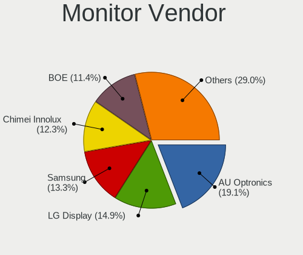

| Vendor                  | Notebooks | Percent |
|-------------------------|-----------|---------|
| AU Optronics            | 143       | 18.38%  |
| LG Display              | 121       | 15.55%  |
| Samsung Electronics     | 105       | 13.5%   |
| Chimei Innolux          | 95        | 12.21%  |
| BOE                     | 87        | 11.18%  |
| Dell                    | 25        | 3.21%   |
| Chi Mei Optoelectronics | 25        | 3.21%   |
| Sharp                   | 16        | 2.06%   |
| PANDA                   | 13        | 1.67%   |
| Hewlett-Packard         | 13        | 1.67%   |
| Apple                   | 12        | 1.54%   |
| Goldstar                | 10        | 1.29%   |
| LG Philips              | 9         | 1.16%   |
| Lenovo                  | 9         | 1.16%   |
| AOC                     | 8         | 1.03%   |
| Sony                    | 7         | 0.9%    |
| InfoVision              | 6         | 0.77%   |
| ViewSonic               | 5         | 0.64%   |
| Philips                 | 5         | 0.64%   |
| HannStar                | 5         | 0.64%   |
| Ancor Communications    | 5         | 0.64%   |
| Acer                    | 5         | 0.64%   |
| Iiyama                  | 4         | 0.51%   |
| BenQ                    | 4         | 0.51%   |
| Unknown                 | 3         | 0.39%   |
| LGD                     | 3         | 0.39%   |
| InnoLux Display         | 3         | 0.39%   |
| Eizo                    | 3         | 0.39%   |
| CSO                     | 3         | 0.39%   |
| Seiko/Epson             | 2         | 0.26%   |
| Quanta Display          | 2         | 0.26%   |
| Panasonic               | 2         | 0.26%   |
| CPT                     | 2         | 0.26%   |
| ASUSTek Computer        | 2         | 0.26%   |
| ___                     | 1         | 0.13%   |
| Vizio                   | 1         | 0.13%   |
| Toshiba                 | 1         | 0.13%   |
| SKY                     | 1         | 0.13%   |
| Sceptre Tech            | 1         | 0.13%   |
| Optoma                  | 1         | 0.13%   |

Monitor Model
-------------

Monitor models

| Model                                                                     | Notebooks | Percent |
|---------------------------------------------------------------------------|-----------|---------|
| Samsung Electronics LCD Monitor SEC5441 1366x768 344x194mm 15.5-inch      | 11        | 1.39%   |
| AU Optronics LCD Monitor AUO21ED 1920x1080 344x194mm 15.5-inch            | 8         | 1.01%   |
| Chi Mei Optoelectronics LCD Monitor CMO15A7 1366x768 344x193mm 15.5-inch  | 7         | 0.89%   |
| AU Optronics LCD Monitor AUO22EC 1366x768 344x193mm 15.5-inch             | 6         | 0.76%   |
| LG Display LCD Monitor LGD0456 1366x768 344x194mm 15.5-inch               | 5         | 0.63%   |
| LG Display LCD Monitor LGD04A7 1920x1080 344x194mm 15.5-inch              | 4         | 0.51%   |
| LG Display LCD Monitor LGD0385 1366x768 309x174mm 14.0-inch               | 4         | 0.51%   |
| LG Display LCD Monitor LGD02F2 1366x768 344x194mm 15.5-inch               | 4         | 0.51%   |
| Chimei Innolux LCD Monitor CMN15F5 1920x1080 344x193mm 15.5-inch          | 4         | 0.51%   |
| Chimei Innolux LCD Monitor CMN15DB 1366x768 344x193mm 15.5-inch           | 4         | 0.51%   |
| Chimei Innolux LCD Monitor CMN15C4 1920x1080 344x193mm 15.5-inch          | 4         | 0.51%   |
| BOE LCD Monitor BOE0812 1920x1080 344x194mm 15.5-inch                     | 4         | 0.51%   |
| BOE LCD Monitor BOE0687 1920x1080 344x193mm 15.5-inch                     | 4         | 0.51%   |
| AU Optronics LCD Monitor AUO109E 1600x900 382x214mm 17.2-inch             | 4         | 0.51%   |
| Sony LCD Monitor SNY05FA 1366x768 340x190mm 15.3-inch                     | 3         | 0.38%   |
| Samsung Electronics LCD Monitor SEC5541 1366x768 344x193mm 15.5-inch      | 3         | 0.38%   |
| Samsung Electronics LCD Monitor SEC3245 1280x800 331x207mm 15.4-inch      | 3         | 0.38%   |
| LG Display LCD Monitor LGD05E5 1920x1080 344x194mm 15.5-inch              | 3         | 0.38%   |
| LG Display LCD Monitor LGD02EC 1366x768 293x165mm 13.2-inch               | 3         | 0.38%   |
| LG Display LCD Monitor LGD02DC 1366x768 344x194mm 15.5-inch               | 3         | 0.38%   |
| Chimei Innolux LCD Monitor CMN1747 1920x1080 381x214mm 17.2-inch          | 3         | 0.38%   |
| Chimei Innolux LCD Monitor CMN14D6 1366x768 309x173mm 13.9-inch           | 3         | 0.38%   |
| Chimei Innolux LCD Monitor CMN14B1 1920x1080 308x173mm 13.9-inch          | 3         | 0.38%   |
| Chimei Innolux LCD Monitor CMN1490 1366x768 309x173mm 13.9-inch           | 3         | 0.38%   |
| Chi Mei Optoelectronics LCD Monitor CMO1720 1920x1080 380x210mm 17.1-inch | 3         | 0.38%   |
| Chi Mei Optoelectronics LCD Monitor CMO1592 1366x768 344x193mm 15.5-inch  | 3         | 0.38%   |
| BOE LCD Monitor BOE0974 2560x1440 344x194mm 15.5-inch                     | 3         | 0.38%   |
| BOE LCD Monitor BOE06A5 1366x768 344x194mm 15.5-inch                      | 3         | 0.38%   |
| BOE LCD Monitor BOE0672 1366x768 344x194mm 15.5-inch                      | 3         | 0.38%   |
| BOE LCD Monitor BOE05F4 1366x768 277x156mm 12.5-inch                      | 3         | 0.38%   |
| AU Optronics LCD Monitor AUO71EC 1366x768 344x193mm 15.5-inch             | 3         | 0.38%   |
| AU Optronics LCD Monitor AUO38ED 1920x1080 344x193mm 15.5-inch            | 3         | 0.38%   |
| AU Optronics LCD Monitor AUO313E 1600x900 309x174mm 14.0-inch             | 3         | 0.38%   |
| AU Optronics LCD Monitor AUO303E 1600x900 309x174mm 14.0-inch             | 3         | 0.38%   |
| AU Optronics LCD Monitor AUO2D3C 1366x768 309x173mm 13.9-inch             | 3         | 0.38%   |
| AU Optronics LCD Monitor AUO213E 1600x900 309x174mm 14.0-inch             | 3         | 0.38%   |
| AU Optronics LCD Monitor AUO193C 1366x768 309x173mm 13.9-inch             | 3         | 0.38%   |
| AU Optronics LCD Monitor AUO133D 1920x1080 309x173mm 13.9-inch            | 3         | 0.38%   |
| AU Optronics LCD Monitor AUO11ED 1920x1080 340x190mm 15.3-inch            | 3         | 0.38%   |
| Apple Color LCD APPA010 1366x768 256x144mm 11.6-inch                      | 3         | 0.38%   |

Monitor Resolution
------------------

Monitor screen resolution

| Resolution         | Notebooks | Percent |
|--------------------|-----------|---------|
| 1920x1080 (FHD)    | 267       | 36.33%  |
| 1366x768 (WXGA)    | 243       | 33.06%  |
| 1600x900 (HD+)     | 51        | 6.94%   |
| 1280x800 (WXGA)    | 34        | 4.63%   |
| 2560x1440 (QHD)    | 22        | 2.99%   |
| 3840x2160 (4K)     | 20        | 2.72%   |
| 1440x900 (WXGA+)   | 19        | 2.59%   |
| 1920x1200 (WUXGA)  | 15        | 2.04%   |
| 1680x1050 (WSXGA+) | 13        | 1.77%   |
| 1024x600           | 12        | 1.63%   |
| 2560x1600          | 6         | 0.82%   |
| 1360x768           | 6         | 0.82%   |
| 1280x1024 (SXGA)   | 5         | 0.68%   |
| 3440x1440          | 3         | 0.41%   |
| 2160x1440          | 3         | 0.41%   |
| 3840x2400          | 2         | 0.27%   |
| 3200x1800 (QHD+)   | 2         | 0.27%   |
| 2880x1800          | 2         | 0.27%   |
| 1400x1050          | 2         | 0.27%   |
| 3840x1080          | 1         | 0.14%   |
| 2880x1620          | 1         | 0.14%   |
| 1920x540           | 1         | 0.14%   |
| 1680x945           | 1         | 0.14%   |
| 1600x1200          | 1         | 0.14%   |
| 1280x854           | 1         | 0.14%   |
| 1024x768 (XGA)     | 1         | 0.14%   |
| Unknown            | 1         | 0.14%   |

Monitor Diagonal
----------------

Diagonal size in inches

| Inches  | Notebooks | Percent |
|---------|-----------|---------|
| 15      | 303       | 39%     |
| 14      | 99        | 12.74%  |
| 13      | 91        | 11.71%  |
| 17      | 74        | 9.52%   |
| 27      | 27        | 3.47%   |
| 12      | 25        | 3.22%   |
| 24      | 23        | 2.96%   |
| 11      | 20        | 2.57%   |
| Unknown | 17        | 2.19%   |
| 23      | 16        | 2.06%   |
| 10      | 14        | 1.8%    |
| 21      | 13        | 1.67%   |
| 18      | 10        | 1.29%   |
| 31      | 6         | 0.77%   |
| 22      | 6         | 0.77%   |
| 40      | 4         | 0.51%   |
| 19      | 4         | 0.51%   |
| 16      | 4         | 0.51%   |
| 34      | 3         | 0.39%   |
| 20      | 3         | 0.39%   |
| 84      | 2         | 0.26%   |
| 72      | 2         | 0.26%   |
| 54      | 2         | 0.26%   |
| 33      | 2         | 0.26%   |
| 65      | 1         | 0.13%   |
| 52      | 1         | 0.13%   |
| 49      | 1         | 0.13%   |
| 46      | 1         | 0.13%   |
| 29      | 1         | 0.13%   |
| 25      | 1         | 0.13%   |
| 8       | 1         | 0.13%   |

Monitor Width
-------------

Physical width

| Width in mm | Notebooks | Percent |
|-------------|-----------|---------|
| 301-350     | 445       | 57.72%  |
| 201-300     | 101       | 13.1%   |
| 351-400     | 82        | 10.64%  |
| 501-600     | 61        | 7.91%   |
| 401-500     | 35        | 4.54%   |
| Unknown     | 17        | 2.2%    |
| 601-700     | 10        | 1.3%    |
| 1001-1500   | 6         | 0.78%   |
| 701-800     | 5         | 0.65%   |
| 801-900     | 4         | 0.52%   |
| 1501-2000   | 4         | 0.52%   |
| 101-200     | 1         | 0.13%   |

Aspect Ratio
------------

Proportional relationship between the width and the height

| Ratio   | Notebooks | Percent |
|---------|-----------|---------|
| 16/9    | 581       | 83.48%  |
| 16/10   | 82        | 11.78%  |
| Unknown | 12        | 1.72%   |
| 3/2     | 7         | 1.01%   |
| 5/4     | 5         | 0.72%   |
| 4/3     | 4         | 0.57%   |
| 21/9    | 3         | 0.43%   |
| 32/9    | 1         | 0.14%   |
| 0.62    | 1         | 0.14%   |

Monitor Area
------------

Area in inch

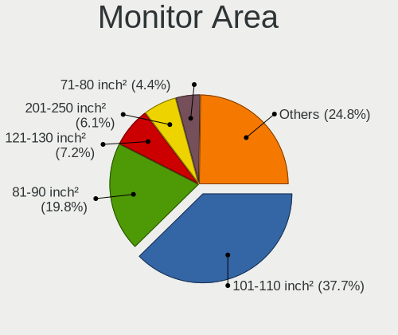

| Area in inch | Notebooks | Percent |
|----------------|-----------|---------|
| 101-110        | 296       | 38.19%  |
| 81-90          | 151       | 19.48%  |
| 121-130        | 58        | 7.48%   |
| 201-250        | 45        | 5.81%   |
| 71-80          | 37        | 4.77%   |
| 301-350        | 27        | 3.48%   |
| 61-70          | 25        | 3.23%   |
| 51-60          | 20        | 2.58%   |
| Unknown        | 17        | 2.19%   |
| 41-50          | 14        | 1.81%   |
| 141-150        | 13        | 1.68%   |
| 251-300        | 12        | 1.55%   |
| 351-500        | 11        | 1.42%   |
| 131-140        | 11        | 1.42%   |
| 151-200        | 10        | 1.29%   |
| More than 1000 | 9         | 1.16%   |
| 91-100         | 7         | 0.9%    |
| 111-120        | 6         | 0.77%   |
| 501-1000       | 5         | 0.65%   |
| 1-40           | 1         | 0.13%   |

Pixel Density
-------------

Pixels per inch

| Density       | Notebooks | Percent |
|---------------|-----------|---------|
| 121-160       | 272       | 35.74%  |
| 101-120       | 260       | 34.17%  |
| 51-100        | 140       | 18.4%   |
| 161-240       | 48        | 6.31%   |
| Unknown       | 17        | 2.23%   |
| More than 240 | 14        | 1.84%   |
| 1-50          | 10        | 1.31%   |

Multiple Monitors
-----------------

Total monitors connected

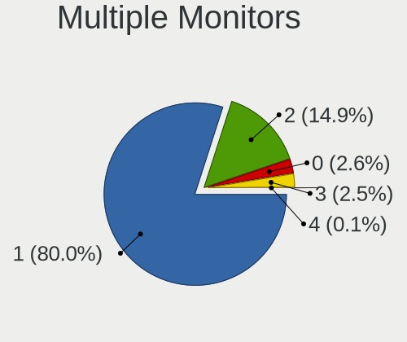

| Total | Notebooks | Percent |
|-------|-----------|---------|
| 1     | 570       | 79.83%  |
| 2     | 106       | 14.85%  |
| 0     | 21        | 2.94%   |
| 3     | 16        | 2.24%   |
| 4     | 1         | 0.14%   |

Network
-------

Net Controller Vendor
---------------------

Controller vendors

| Vendor                            | Notebooks | Percent |
|-----------------------------------|-----------|---------|
| Realtek Semiconductor             | 368       | 32.45%  |
| Intel                             | 365       | 32.19%  |
| Qualcomm Atheros                  | 167       | 14.73%  |
| Broadcom                          | 80        | 7.05%   |
| Broadcom Limited                  | 30        | 2.65%   |
| Marvell Technology Group          | 16        | 1.41%   |
| Ralink                            | 15        | 1.32%   |
| Sierra Wireless                   | 9         | 0.79%   |
| Ralink Technology                 | 9         | 0.79%   |
| Silicon Integrated Systems [SiS]  | 7         | 0.62%   |
| TP-Link                           | 6         | 0.53%   |
| Attansic Technology               | 6         | 0.53%   |
| Ericsson Business Mobile Networks | 5         | 0.44%   |
| ASIX Electronics                  | 5         | 0.44%   |
| MediaTek                          | 4         | 0.35%   |
| Dell                              | 4         | 0.35%   |
| Hewlett-Packard                   | 3         | 0.26%   |
| DisplayLink                       | 3         | 0.26%   |
| Xiaomi                            | 2         | 0.18%   |
| VIA Technologies                  | 2         | 0.18%   |
| Samsung Electronics               | 2         | 0.18%   |
| Qualcomm Atheros Communications   | 2         | 0.18%   |
| Nvidia                            | 2         | 0.18%   |
| Lenovo                            | 2         | 0.18%   |
| JMicron Technology                | 2         | 0.18%   |
| Fibocom                           | 2         | 0.18%   |
| D-Link                            | 2         | 0.18%   |
| U.S. Robotics                     | 1         | 0.09%   |
| U-Blox                            | 1         | 0.09%   |
| Tenda                             | 1         | 0.09%   |
| Quectel Wireless Solutions        | 1         | 0.09%   |
| Qualcomm                          | 1         | 0.09%   |
| Primax Electronics                | 1         | 0.09%   |
| NetGear                           | 1         | 0.09%   |
| Microchip Technology              | 1         | 0.09%   |
| dog hunter                        | 1         | 0.09%   |
| D-Link System                     | 1         | 0.09%   |
| Conexant Systems                  | 1         | 0.09%   |
| Belkin Components                 | 1         | 0.09%   |
| ASUSTek Computer                  | 1         | 0.09%   |

Net Controller Model
--------------------

Controller models

| Model                                                                   | Notebooks | Percent |
|-------------------------------------------------------------------------|-----------|---------|
| Realtek RTL8111/8168/8411 PCI Express Gigabit Ethernet Controller       | 210       | 15.17%  |
| Realtek RTL810xE PCI Express Fast Ethernet controller                   | 88        | 6.36%   |
| Intel 82579LM Gigabit Network Connection (Lewisville)                   | 38        | 2.75%   |
| Qualcomm Atheros AR9285 Wireless Network Adapter (PCI-Express)          | 35        | 2.53%   |
| Intel Centrino Advanced-N 6205 [Taylor Peak]                            | 29        | 2.1%    |
| Qualcomm Atheros AR9485 Wireless Network Adapter                        | 27        | 1.95%   |
| Intel Wi-Fi 6 AX200                                                     | 27        | 1.95%   |
| Intel Wireless 7265                                                     | 26        | 1.88%   |
| Realtek RTL8821CE 802.11ac PCIe Wireless Network Adapter                | 25        | 1.81%   |
| Intel Wireless 7260                                                     | 25        | 1.81%   |
| Realtek RTL8153 Gigabit Ethernet Adapter                                | 23        | 1.66%   |
| Qualcomm Atheros QCA9377 802.11ac Wireless Network Adapter              | 23        | 1.66%   |
| Broadcom BCM4313 802.11bgn Wireless Network Adapter                     | 23        | 1.66%   |
| Intel Wireless 8265 / 8275                                              | 22        | 1.59%   |
| Qualcomm Atheros QCA9565 / AR9565 Wireless Network Adapter              | 21        | 1.52%   |
| Intel Wi-Fi 6 AX201                                                     | 19        | 1.37%   |
| Intel Wireless 3165                                                     | 18        | 1.3%    |
| Realtek RTL8822CE 802.11ac PCIe Wireless Network Adapter                | 16        | 1.16%   |
| Realtek RTL8723BE PCIe Wireless Network Adapter                         | 16        | 1.16%   |
| Intel Wireless 8260                                                     | 16        | 1.16%   |
| Intel Comet Lake PCH-LP CNVi WiFi                                       | 15        | 1.08%   |
| Intel Cannon Point-LP CNVi [Wireless-AC]                                | 13        | 0.94%   |
| Intel Cannon Lake PCH CNVi WiFi                                         | 12        | 0.87%   |
| Qualcomm Atheros QCA6174 802.11ac Wireless Network Adapter              | 11        | 0.79%   |
| Intel Ethernet Connection I217-LM                                       | 11        | 0.79%   |
| Intel Centrino Advanced-N 6235                                          | 11        | 0.79%   |
| Qualcomm Atheros AR8151 v2.0 Gigabit Ethernet                           | 10        | 0.72%   |
| Intel Ethernet Connection (3) I218-LM                                   | 10        | 0.72%   |
| Intel 82577LM Gigabit Network Connection                                | 10        | 0.72%   |
| Broadcom BCM43142 802.11b/g/n                                           | 10        | 0.72%   |
| Qualcomm Atheros AR242x / AR542x Wireless Network Adapter (PCI-Express) | 9         | 0.65%   |
| Intel Centrino Ultimate-N 6300                                          | 9         | 0.65%   |
| Realtek RTL8188CE 802.11b/g/n WiFi Adapter                              | 8         | 0.58%   |
| Ralink RT3290 Wireless 802.11n 1T/1R PCIe                               | 8         | 0.58%   |
| Intel Wireless 3160                                                     | 8         | 0.58%   |
| Intel WiFi Link 5100                                                    | 8         | 0.58%   |
| Intel PRO/Wireless 4965 AG or AGN [Kedron] Network Connection           | 8         | 0.58%   |
| Intel PRO/Wireless 3945ABG [Golan] Network Connection                   | 8         | 0.58%   |
| Intel Ice Lake-LP PCH CNVi WiFi                                         | 8         | 0.58%   |
| Intel Ethernet Connection I218-LM                                       | 8         | 0.58%   |

Wireless Vendor
---------------

Wireless vendors

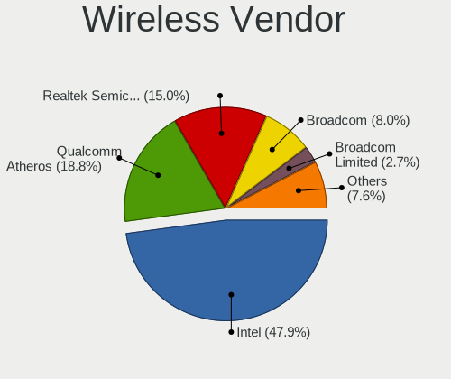

| Vendor                          | Notebooks | Percent |
|---------------------------------|-----------|---------|
| Intel                           | 352       | 47.31%  |
| Qualcomm Atheros                | 140       | 18.82%  |
| Realtek Semiconductor           | 112       | 15.05%  |
| Broadcom                        | 58        | 7.8%    |
| Broadcom Limited                | 23        | 3.09%   |
| Ralink                          | 15        | 2.02%   |
| Sierra Wireless                 | 9         | 1.21%   |
| Ralink Technology               | 9         | 1.21%   |
| TP-Link                         | 6         | 0.81%   |
| MediaTek                        | 3         | 0.4%    |
| Dell                            | 3         | 0.4%    |
| Qualcomm Atheros Communications | 2         | 0.27%   |
| Fibocom                         | 2         | 0.27%   |
| U.S. Robotics                   | 1         | 0.13%   |
| Tenda                           | 1         | 0.13%   |
| Quectel Wireless Solutions      | 1         | 0.13%   |
| Qualcomm                        | 1         | 0.13%   |
| NetGear                         | 1         | 0.13%   |
| Hewlett-Packard                 | 1         | 0.13%   |
| D-Link System                   | 1         | 0.13%   |
| D-Link                          | 1         | 0.13%   |
| Belkin Components               | 1         | 0.13%   |
| ASUSTek Computer                | 1         | 0.13%   |

Wireless Model
--------------

Wireless models

| Model                                                                   | Notebooks | Percent |
|-------------------------------------------------------------------------|-----------|---------|
| Qualcomm Atheros AR9285 Wireless Network Adapter (PCI-Express)          | 35        | 4.69%   |
| Intel Centrino Advanced-N 6205 [Taylor Peak]                            | 29        | 3.89%   |
| Qualcomm Atheros AR9485 Wireless Network Adapter                        | 27        | 3.62%   |
| Intel Wi-Fi 6 AX200                                                     | 27        | 3.62%   |
| Intel Wireless 7265                                                     | 26        | 3.49%   |
| Realtek RTL8821CE 802.11ac PCIe Wireless Network Adapter                | 25        | 3.35%   |
| Intel Wireless 7260                                                     | 25        | 3.35%   |
| Qualcomm Atheros QCA9377 802.11ac Wireless Network Adapter              | 23        | 3.08%   |
| Broadcom BCM4313 802.11bgn Wireless Network Adapter                     | 23        | 3.08%   |
| Intel Wireless 8265 / 8275                                              | 22        | 2.95%   |
| Qualcomm Atheros QCA9565 / AR9565 Wireless Network Adapter              | 21        | 2.82%   |
| Intel Wi-Fi 6 AX201                                                     | 19        | 2.55%   |
| Intel Wireless 3165                                                     | 18        | 2.41%   |
| Realtek RTL8822CE 802.11ac PCIe Wireless Network Adapter                | 16        | 2.14%   |
| Realtek RTL8723BE PCIe Wireless Network Adapter                         | 16        | 2.14%   |
| Intel Wireless 8260                                                     | 16        | 2.14%   |
| Intel Comet Lake PCH-LP CNVi WiFi                                       | 15        | 2.01%   |
| Intel Cannon Point-LP CNVi [Wireless-AC]                                | 13        | 1.74%   |
| Intel Cannon Lake PCH CNVi WiFi                                         | 12        | 1.61%   |
| Qualcomm Atheros QCA6174 802.11ac Wireless Network Adapter              | 11        | 1.47%   |
| Intel Centrino Advanced-N 6235                                          | 11        | 1.47%   |
| Broadcom BCM43142 802.11b/g/n                                           | 10        | 1.34%   |
| Qualcomm Atheros AR242x / AR542x Wireless Network Adapter (PCI-Express) | 9         | 1.21%   |
| Intel Centrino Ultimate-N 6300                                          | 9         | 1.21%   |
| Realtek RTL8188CE 802.11b/g/n WiFi Adapter                              | 8         | 1.07%   |
| Ralink RT3290 Wireless 802.11n 1T/1R PCIe                               | 8         | 1.07%   |
| Intel Wireless 3160                                                     | 8         | 1.07%   |
| Intel WiFi Link 5100                                                    | 8         | 1.07%   |
| Intel PRO/Wireless 4965 AG or AGN [Kedron] Network Connection           | 8         | 1.07%   |
| Intel PRO/Wireless 3945ABG [Golan] Network Connection                   | 8         | 1.07%   |
| Intel Ice Lake-LP PCH CNVi WiFi                                         | 8         | 1.07%   |
| Intel Centrino Wireless-N 1000 [Condor Peak]                            | 8         | 1.07%   |
| Realtek RTL8822BE 802.11a/b/g/n/ac WiFi adapter                         | 7         | 0.94%   |
| Intel Tiger Lake PCH CNVi WiFi                                          | 7         | 0.94%   |
| Broadcom Limited BCM4312 802.11b/g LP-PHY                               | 7         | 0.94%   |
| Realtek RTL8188EE Wireless Network Adapter                              | 6         | 0.8%    |
| Realtek 802.11ac NIC                                                    | 6         | 0.8%    |
| Intel Comet Lake PCH CNVi WiFi                                          | 6         | 0.8%    |
| Intel Centrino Advanced-N 6200                                          | 6         | 0.8%    |
| Qualcomm Atheros AR9462 Wireless Network Adapter                        | 5         | 0.67%   |

Ethernet Vendor
---------------

Ethernet vendors

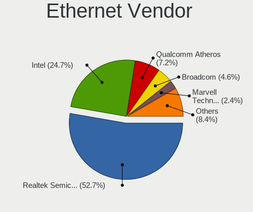

| Vendor                           | Notebooks | Percent |
|----------------------------------|-----------|---------|
| Realtek Semiconductor            | 325       | 53.1%   |
| Intel                            | 150       | 24.51%  |
| Qualcomm Atheros                 | 49        | 8.01%   |
| Broadcom                         | 28        | 4.58%   |
| Marvell Technology Group         | 16        | 2.61%   |
| Broadcom Limited                 | 8         | 1.31%   |
| Silicon Integrated Systems [SiS] | 6         | 0.98%   |
| Attansic Technology              | 6         | 0.98%   |
| ASIX Electronics                 | 5         | 0.82%   |
| DisplayLink                      | 3         | 0.49%   |
| Xiaomi                           | 2         | 0.33%   |
| VIA Technologies                 | 2         | 0.33%   |
| Samsung Electronics              | 2         | 0.33%   |
| Nvidia                           | 2         | 0.33%   |
| Lenovo                           | 2         | 0.33%   |
| JMicron Technology               | 2         | 0.33%   |
| Microchip Technology             | 1         | 0.16%   |
| MediaTek                         | 1         | 0.16%   |
| D-Link                           | 1         | 0.16%   |
| Apple                            | 1         | 0.16%   |

Ethernet Model
--------------

Ethernet models

| Model                                                                          | Notebooks | Percent |
|--------------------------------------------------------------------------------|-----------|---------|
| Realtek RTL8111/8168/8411 PCI Express Gigabit Ethernet Controller              | 210       | 33.87%  |
| Realtek RTL810xE PCI Express Fast Ethernet controller                          | 88        | 14.19%  |
| Intel 82579LM Gigabit Network Connection (Lewisville)                          | 38        | 6.13%   |
| Realtek RTL8153 Gigabit Ethernet Adapter                                       | 23        | 3.71%   |
| Intel Ethernet Connection I217-LM                                              | 11        | 1.77%   |
| Qualcomm Atheros AR8151 v2.0 Gigabit Ethernet                                  | 10        | 1.61%   |
| Intel Ethernet Connection (3) I218-LM                                          | 10        | 1.61%   |
| Intel 82577LM Gigabit Network Connection                                       | 10        | 1.61%   |
| Intel Ethernet Connection I218-LM                                              | 8         | 1.29%   |
| Intel Ethernet Connection I219-LM                                              | 7         | 1.13%   |
| Qualcomm Atheros AR8162 Fast Ethernet                                          | 6         | 0.97%   |
| Intel Ethernet Connection I219-V                                               | 6         | 0.97%   |
| Intel 82567LM Gigabit Network Connection                                       | 6         | 0.97%   |
| Attansic AR8152 v2.0 Fast Ethernet                                             | 6         | 0.97%   |
| Realtek RTL8125 2.5GbE Controller                                              | 5         | 0.81%   |
| Qualcomm Atheros QCA8172 Fast Ethernet                                         | 5         | 0.81%   |
| Qualcomm Atheros Killer E2500 Gigabit Ethernet Controller                      | 5         | 0.81%   |
| Intel Ethernet Connection (6) I219-V                                           | 5         | 0.81%   |
| Intel Ethernet Connection (6) I219-LM                                          | 5         | 0.81%   |
| Intel Ethernet Connection (4) I219-V                                           | 5         | 0.81%   |
| Intel Ethernet Connection (4) I219-LM                                          | 5         | 0.81%   |
| Intel Ethernet Connection (2) I219-LM                                          | 5         | 0.81%   |
| Broadcom NetLink BCM57785 Gigabit Ethernet PCIe                                | 5         | 0.81%   |
| Silicon Integrated Systems [SiS] 191 Gigabit Ethernet Adapter                  | 4         | 0.65%   |
| Qualcomm Atheros Killer E2400 Gigabit Ethernet Controller                      | 4         | 0.65%   |
| Qualcomm Atheros AR8132 Fast Ethernet                                          | 4         | 0.65%   |
| Marvell Group 88E8040 PCI-E Fast Ethernet Controller                           | 4         | 0.65%   |
| Intel Ethernet Connection (5) I219-LM                                          | 4         | 0.65%   |
| Intel Ethernet Connection (10) I219-V                                          | 4         | 0.65%   |
| Qualcomm Atheros AR8161 Gigabit Ethernet                                       | 3         | 0.48%   |
| Qualcomm Atheros AR8152 v1.1 Fast Ethernet                                     | 3         | 0.48%   |
| Qualcomm Atheros AR8131 Gigabit Ethernet                                       | 3         | 0.48%   |
| Marvell Group Yukon Optima 88E8059 [PCIe Gigabit Ethernet Controller with AVB] | 3         | 0.48%   |
| Marvell Group 88E8057 PCI-E Gigabit Ethernet Controller                        | 3         | 0.48%   |
| Intel Ethernet Connection (14) I219-LM                                         | 3         | 0.48%   |
| Intel 82566MM Gigabit Network Connection                                       | 3         | 0.48%   |
| Broadcom NetXtreme BCM57786 Gigabit Ethernet PCIe                              | 3         | 0.48%   |
| Broadcom NetXtreme BCM5764M Gigabit Ethernet PCIe                              | 3         | 0.48%   |
| Broadcom NetLink BCM5784M Gigabit Ethernet PCIe                                | 3         | 0.48%   |
| Broadcom BCM4401-B0 100Base-TX                                                 | 3         | 0.48%   |

Net Controller Kind
-------------------

Ethernet, WiFi or modem

| Kind     | Notebooks | Percent |
|----------|-----------|---------|
| WiFi     | 691       | 53.03%  |
| Ethernet | 596       | 45.74%  |
| Modem    | 16        | 1.23%   |

Used Controller
---------------

Currently used network controller

| Kind     | Notebooks | Percent |
|----------|-----------|---------|
| WiFi     | 583       | 76.61%  |
| Ethernet | 178       | 23.39%  |

NICs
----

Total network controllers on board

| Total | Notebooks | Percent |
|-------|-----------|---------|
| 2     | 554       | 78.14%  |
| 1     | 143       | 20.17%  |
| 0     | 9         | 1.27%   |
| 3     | 3         | 0.42%   |

IPv6
----

IPv6 vs IPv4

| Used    | Notebooks | Percent |
|---------|-----------|---------|
| No      | 581       | 81.49%  |
| Yes     | 131       | 18.37%  |
| Unknown | 1         | 0.14%   |

Bluetooth
---------

Bluetooth Vendor
----------------

Controller vendors

| Vendor                          | Notebooks | Percent |
|---------------------------------|-----------|---------|
| Intel                           | 261       | 47.63%  |
| Realtek Semiconductor           | 57        | 10.4%   |
| Qualcomm Atheros Communications | 48        | 8.76%   |
| Broadcom                        | 46        | 8.39%   |
| Dell                            | 22        | 4.01%   |
| Lite-On Technology              | 21        | 3.83%   |
| IMC Networks                    | 19        | 3.47%   |
| Foxconn / Hon Hai               | 15        | 2.74%   |
| Cambridge Silicon Radio         | 13        | 2.37%   |
| Hewlett-Packard                 | 10        | 1.82%   |
| Apple                           | 10        | 1.82%   |
| Ralink                          | 8         | 1.46%   |
| Toshiba                         | 5         | 0.91%   |
| ASUSTek Computer                | 4         | 0.73%   |
| Foxconn International           | 3         | 0.55%   |
| Ralink Technology               | 2         | 0.36%   |
| Alps Electric                   | 2         | 0.36%   |
| Qcom                            | 1         | 0.18%   |
| Chicony Electronics             | 1         | 0.18%   |

Bluetooth Model
---------------

Controller models

| Model                                                                               | Notebooks | Percent |
|-------------------------------------------------------------------------------------|-----------|---------|
| Intel Bluetooth wireless interface                                                  | 111       | 20.26%  |
| Intel AX201 Bluetooth                                                               | 47        | 8.58%   |
| Intel Bluetooth 9460/9560 Jefferson Peak (JfP)                                      | 42        | 7.66%   |
| Realtek Bluetooth Radio                                                             | 37        | 6.75%   |
| Intel AX200 Bluetooth                                                               | 26        | 4.74%   |
| Realtek  Bluetooth 4.2 Adapter                                                      | 17        | 3.1%    |
| Intel Centrino Bluetooth Wireless Transceiver                                       | 16        | 2.92%   |
| Qualcomm Atheros  Bluetooth Device                                                  | 14        | 2.55%   |
| Dell DW375 Bluetooth Module                                                         | 14        | 2.55%   |
| Cambridge Silicon Radio Bluetooth Dongle (HCI mode)                                 | 13        | 2.37%   |
| Qualcomm Atheros AR3012 Bluetooth 4.0                                               | 12        | 2.19%   |
| Qualcomm Atheros AR3011 Bluetooth                                                   | 11        | 2.01%   |
| IMC Networks Bluetooth Device                                                       | 10        | 1.82%   |
| Broadcom BCM20702 Bluetooth 4.0 [ThinkPad]                                          | 9         | 1.64%   |
| Ralink RT3290 Bluetooth                                                             | 8         | 1.46%   |
| Lite-On Atheros AR3012 Bluetooth                                                    | 8         | 1.46%   |
| Broadcom BCM2070 Bluetooth 2.1 + EDR                                                | 7         | 1.28%   |
| Intel Centrino Advanced-N 6230 Bluetooth adapter                                    | 6         | 1.09%   |
| HP Bluetooth 2.0 Interface [Broadcom BCM2045]                                       | 6         | 1.09%   |
| Foxconn / Hon Hai Bluetooth Device                                                  | 6         | 1.09%   |
| Qualcomm Atheros QCA61x4 Bluetooth 4.0                                              | 5         | 0.91%   |
| Qualcomm Atheros Bluetooth USB Host Controller                                      | 5         | 0.91%   |
| Lite-On Qualcomm Atheros QCA9377 Bluetooth                                          | 5         | 0.91%   |
| Lite-On Bluetooth Device                                                            | 5         | 0.91%   |
| Intel Wireless-AC 3168 Bluetooth                                                    | 5         | 0.91%   |
| IMC Networks Bluetooth Radio                                                        | 5         | 0.91%   |
| Broadcom HP Portable SoftSailing                                                    | 5         | 0.91%   |
| Broadcom BCM2045B (BDC-2.1)                                                         | 5         | 0.91%   |
| Intel AX210 Bluetooth                                                               | 4         | 0.73%   |
| Apple Bluetooth Host Controller                                                     | 4         | 0.73%   |
| Intel Wireless-AC 9260 Bluetooth Adapter                                            | 3         | 0.55%   |
| HP Broadcom 2070 Bluetooth Combo                                                    | 3         | 0.55%   |
| Foxconn International BCM43142A0 Bluetooth module                                   | 3         | 0.55%   |
| Foxconn / Hon Hai Foxconn T77H114 BCM2070 [Single-Chip Bluetooth 2.1 + EDR Adapter] | 3         | 0.55%   |
| Broadcom BCM43142A0 Bluetooth Device                                                | 3         | 0.55%   |
| Broadcom BCM2045B (BDC-2.1) [Bluetooth Controller]                                  | 3         | 0.55%   |
| Broadcom BCM2045B (BDC-2) [Bluetooth Controller]                                    | 3         | 0.55%   |
| Apple Bluetooth USB Host Controller                                                 | 3         | 0.55%   |
| Realtek RTL8723B Bluetooth                                                          | 2         | 0.36%   |
| Lite-On Broadcom BCM43142A0 Bluetooth Device                                        | 2         | 0.36%   |

Sound
-----

Sound Vendor
------------

Sound card vendors

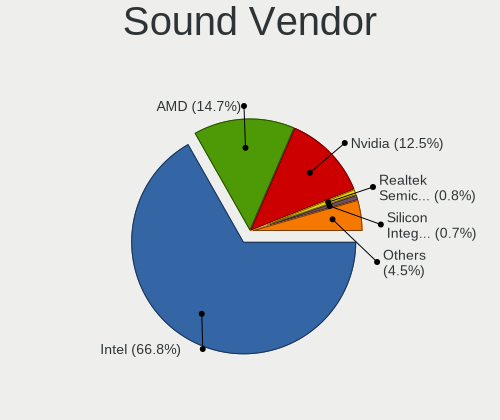

| Vendor                                         | Notebooks | Percent |
|------------------------------------------------|-----------|---------|
| Intel                                          | 579       | 66.86%  |
| AMD                                            | 126       | 14.55%  |
| Nvidia                                         | 106       | 12.24%  |
| Silicon Integrated Systems [SiS]               | 8         | 0.92%   |
| Realtek Semiconductor                          | 7         | 0.81%   |
| C-Media Electronics                            | 6         | 0.69%   |
| Lenovo                                         | 4         | 0.46%   |
| Hewlett-Packard                                | 3         | 0.35%   |
| GN Netcom                                      | 3         | 0.35%   |
| VIA Technologies                               | 2         | 0.23%   |
| Plantronics                                    | 2         | 0.23%   |
| Meizu                                          | 2         | 0.23%   |
| JMTek                                          | 2         | 0.23%   |
| Generalplus Technology                         | 2         | 0.23%   |
| Conexant Systems                               | 2         | 0.23%   |
| Sony                                           | 1         | 0.12%   |
| SmartAction                                    | 1         | 0.12%   |
| Siemens Information and Communication Products | 1         | 0.12%   |
| No brand                                       | 1         | 0.12%   |
| Logitech                                       | 1         | 0.12%   |
| Kingston Technology                            | 1         | 0.12%   |
| FiiO Electronics Technology                    | 1         | 0.12%   |
| Elite Silicon                                  | 1         | 0.12%   |
| DSEA A/S                                       | 1         | 0.12%   |
| Corsair                                        | 1         | 0.12%   |
| BEHRINGER International                        | 1         | 0.12%   |
| ASUSTek Computer                               | 1         | 0.12%   |

Sound Model
-----------

Sound card models

| Model                                                                                             | Notebooks | Percent |
|---------------------------------------------------------------------------------------------------|-----------|---------|
| Intel 7 Series/C216 Chipset Family High Definition Audio Controller                               | 78        | 7.59%   |
| Intel 6 Series/C200 Series Chipset Family High Definition Audio Controller                        | 60        | 5.84%   |
| Intel Sunrise Point-LP HD Audio                                                                   | 57        | 5.55%   |
| AMD Family 17h/19h HD Audio Controller                                                            | 50        | 4.87%   |
| Intel 82801I (ICH9 Family) HD Audio Controller                                                    | 35        | 3.41%   |
| Intel 5 Series/3400 Series Chipset High Definition Audio                                          | 34        | 3.31%   |
| Intel Haswell-ULT HD Audio Controller                                                             | 29        | 2.82%   |
| Intel 8 Series HD Audio Controller                                                                | 29        | 2.82%   |
| Intel Tiger Lake-LP Smart Sound Technology Audio Controller                                       | 24        | 2.34%   |
| Intel NM10/ICH7 Family High Definition Audio Controller                                           | 24        | 2.34%   |
| Intel Cannon Point-LP High Definition Audio Controller                                            | 24        | 2.34%   |
| Intel Wildcat Point-LP High Definition Audio Controller                                           | 23        | 2.24%   |
| Intel Broadwell-U Audio Controller                                                                | 23        | 2.24%   |
| Intel Cannon Lake PCH cAVS                                                                        | 22        | 2.14%   |
| AMD SBx00 Azalia (Intel HDA)                                                                      | 22        | 2.14%   |
| AMD Renoir Radeon High Definition Audio Controller                                                | 21        | 2.04%   |
| AMD Raven/Raven2/Fenghuang HDMI/DP Audio Controller                                               | 21        | 2.04%   |
| AMD FCH Azalia Controller                                                                         | 20        | 1.95%   |
| Intel 8 Series/C220 Series Chipset High Definition Audio Controller                               | 19        | 1.85%   |
| Intel Atom Processor Z36xxx/Z37xxx Series High Definition Audio Controller                        | 18        | 1.75%   |
| Intel Xeon E3-1200 v3/4th Gen Core Processor HD Audio Controller                                  | 17        | 1.66%   |
| Intel 82801H (ICH8 Family) HD Audio Controller                                                    | 17        | 1.66%   |
| Nvidia GF108 High Definition Audio Controller                                                     | 16        | 1.56%   |
| Intel Comet Lake PCH-LP cAVS                                                                      | 15        | 1.46%   |
| Intel Atom/Celeron/Pentium Processor x5-E8000/J3xxx/N3xxx Series High Definition Audio Controller | 15        | 1.46%   |
| AMD Kabini HDMI/DP Audio                                                                          | 15        | 1.46%   |
| Intel Ice Lake-LP Smart Sound Technology Audio Controller                                         | 14        | 1.36%   |
| Intel Celeron/Pentium Silver Processor High Definition Audio                                      | 14        | 1.36%   |
| Nvidia TU107 GeForce GTX 1650 High Definition Audio Controller                                    | 13        | 1.27%   |
| AMD Family 15h (Models 60h-6fh) Audio Controller                                                  | 13        | 1.27%   |
| Intel CM238 HD Audio Controller                                                                   | 12        | 1.17%   |
| AMD High Definition Audio Controller                                                              | 12        | 1.17%   |
| Nvidia GA106 High Definition Audio Controller                                                     | 10        | 0.97%   |
| Intel Tiger Lake-H HD Audio Controller                                                            | 10        | 0.97%   |
| Intel 100 Series/C230 Series Chipset Family HD Audio Controller                                   | 10        | 0.97%   |
| Nvidia GA104 High Definition Audio Controller                                                     | 8         | 0.78%   |
| Realtek Semiconductor USB Audio                                                                   | 7         | 0.68%   |
| Nvidia GK107 HDMI Audio Controller                                                                | 7         | 0.68%   |
| Intel Comet Lake PCH cAVS                                                                         | 7         | 0.68%   |
| Intel Celeron N3350/Pentium N4200/Atom E3900 Series Audio Cluster                                 | 7         | 0.68%   |

Memory
------

Memory Vendor
-------------

Memory module vendors

| Vendor                                           | Notebooks | Percent |
|--------------------------------------------------|-----------|---------|
| Samsung Electronics                              | 145       | 26.03%  |
| SK hynix                                         | 116       | 20.83%  |
| Micron Technology                                | 73        | 13.11%  |
| Kingston                                         | 51        | 9.16%   |
| Unknown                                          | 46        | 8.26%   |
| Crucial                                          | 29        | 5.21%   |
| Ramaxel Technology                               | 19        | 3.41%   |
| Nanya Technology                                 | 15        | 2.69%   |
| Unknown (ABCD)                                   | 10        | 1.8%    |
| Elpida                                           | 10        | 1.8%    |
| A-DATA Technology                                | 9         | 1.62%   |
| Smart                                            | 6         | 1.08%   |
| Corsair                                          | 6         | 1.08%   |
| G.Skill                                          | 3         | 0.54%   |
| Teikon                                           | 2         | 0.36%   |
| Patriot                                          | 2         | 0.36%   |
| Netlist                                          | 2         | 0.36%   |
| Goodram                                          | 2         | 0.36%   |
| Unknown (0x4D342037305435363633515A332D43463720) | 1         | 0.18%   |
| Unknown (0x36345431323830323045444C322E35433220) | 1         | 0.18%   |
| Unknown (0x0C26)                                 | 1         | 0.18%   |
| Transcend                                        | 1         | 0.18%   |
| Toshiba                                          | 1         | 0.18%   |
| Team                                             | 1         | 0.18%   |
| Qimonda                                          | 1         | 0.18%   |
| Neo Forza                                        | 1         | 0.18%   |
| Eluktro                                          | 1         | 0.18%   |
| ASint Technology                                 | 1         | 0.18%   |
| Apacer                                           | 1         | 0.18%   |

Memory Model
------------

Memory module models

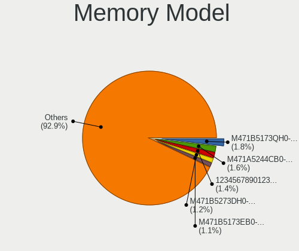

| Model                                                            | Notebooks | Percent |
|------------------------------------------------------------------|-----------|---------|
| Samsung RAM M471B5173QH0-YK0 4GB SODIMM DDR3 1600MT/s            | 11        | 1.84%   |
| Samsung RAM M471A5244CB0-CTD 4GB SODIMM DDR4 3266MT/s            | 10        | 1.68%   |
| Unknown (ABCD) RAM 123456789012345678 1GB SODIMM LPDDR4 2400MT/s | 9         | 1.51%   |
| SK hynix RAM HMT451S6BFR8A-PB 4GB SODIMM DDR3 1600MT/s           | 8         | 1.34%   |
| SK hynix RAM HMT351S6CFR8C-PB 4GB SODIMM DDR3 1600MT/s           | 7         | 1.17%   |
| Samsung RAM M471B5273DH0-CH9 4GB SODIMM DDR3 1334MT/s            | 7         | 1.17%   |
| Samsung RAM M471B5173EB0-YK0 4GB SODIMM DDR3 1600MT/s            | 6         | 1.01%   |
| Samsung RAM M471B5173DB0-YK0 4GB SODIMM DDR3 1600MT/s            | 6         | 1.01%   |
| Unknown RAM Module 2GB SODIMM DDR2 667MT/s                       | 5         | 0.84%   |
| SK hynix RAM HMT451S6AFR8A-PB 4GB SODIMM DDR3 1600MT/s           | 5         | 0.84%   |
| SK hynix RAM HMT41GS6BFR8A-PB 8GB SODIMM DDR3 1600MT/s           | 5         | 0.84%   |
| SK hynix RAM HMT351S6CFR8C-H9 4GB SODIMM DDR3 1333MT/s           | 5         | 0.84%   |
| Samsung RAM M471B5773DH0-CH9 2048MB SODIMM DDR3 1600MT/s         | 5         | 0.84%   |
| Samsung RAM M471B5273CH0-CH9 4GB SODIMM DDR3 1334MT/s            | 5         | 0.84%   |
| Samsung RAM M471A1K43DB1-CTD 8GB SODIMM DDR4 2667MT/s            | 5         | 0.84%   |
| Micron RAM 16KTF1G64HZ-1G6E1 8GB SODIMM DDR3 1600MT/s            | 5         | 0.84%   |
| SK hynix RAM HMT351S6EFR8A-PB 4GB SODIMM DDR3 1600MT/s           | 4         | 0.67%   |
| SK hynix RAM HMA851S6DJR6N-XN 4GB SODIMM DDR4 3200MT/s           | 4         | 0.67%   |
| Samsung RAM M471B1G73DB0-YK0 8GB SODIMM DDR3 1600MT/s            | 4         | 0.67%   |
| Samsung RAM M471A5244CB0-CWE 4GB SODIMM DDR4 3200MT/s            | 4         | 0.67%   |
| Samsung RAM M471A5244CB0-CTD 4GB Row Of Chips DDR4 2667MT/s      | 4         | 0.67%   |
| Samsung RAM M471A5244CB0-CRC 4GB SODIMM DDR4 2667MT/s            | 4         | 0.67%   |
| Samsung RAM M471A1K43CB1-CRC 8GB SODIMM DDR4 2667MT/s            | 4         | 0.67%   |
| Samsung RAM M471A1K43BB1-CRC 8GB SODIMM DDR4 2667MT/s            | 4         | 0.67%   |
| Micron RAM 4ATF1G64HZ-3G2E1 8GB SODIMM DDR4 3200MT/s             | 4         | 0.67%   |
| Unknown RAM Module 4096MB SODIMM DDR3                            | 3         | 0.5%    |
| Unknown RAM Module 1GB SODIMM DDR2 667MT/s                       | 3         | 0.5%    |
| SK hynix RAM HMT325S6CFR8C-PB 2GB SODIMM DDR3 1600MT/s           | 3         | 0.5%    |
| SK hynix RAM HMA81GS6DJR8N-XN 8GB SODIMM DDR4 3200MT/s           | 3         | 0.5%    |
| SK hynix RAM HMA81GS6DJR8N-XN 8192MB SODIMM DDR4 3200MT/s        | 3         | 0.5%    |
| SK hynix RAM HMA81GS6CJR8N-VK 8GB SODIMM DDR4 2667MT/s           | 3         | 0.5%    |
| Samsung RAM M471B5773CHS-CH9 2GB SODIMM DDR3 4199MT/s            | 3         | 0.5%    |
| Samsung RAM M471B5673FH0-CH9 2GB SODIMM DDR3 1334MT/s            | 3         | 0.5%    |
| Samsung RAM M471B1G73QH0-YK0 8GB SODIMM DDR3 1867MT/s            | 3         | 0.5%    |
| Samsung RAM M471B1G73EB0-YK0 8GB SODIMM DDR3 1600MT/s            | 3         | 0.5%    |
| Samsung RAM M471A1K43DB1-CWE 8GB SODIMM DDR4 3200MT/s            | 3         | 0.5%    |
| Samsung RAM M471A1K43BB0-CPB 8GB SODIMM DDR4 2133MT/s            | 3         | 0.5%    |
| Samsung RAM M471A1G44AB0-CWE 8GB SODIMM DDR4 3200MT/s            | 3         | 0.5%    |
| Ramaxel RAM RMT3160ED58E9W1600 4GB SODIMM DDR3 1600MT/s          | 3         | 0.5%    |
| Micron RAM MT52L1G32D4PG-093 8GB Row Of Chips LPDDR3 2133MT/s    | 3         | 0.5%    |

Memory Kind
-----------

Memory module kinds

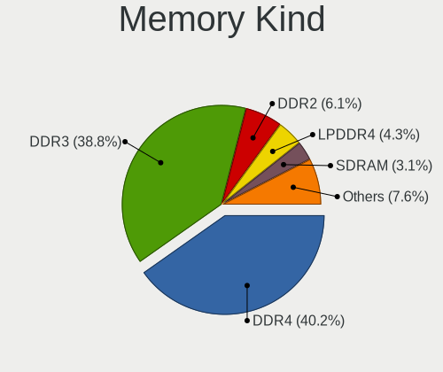

| Kind    | Notebooks | Percent |
|---------|-----------|---------|
| DDR3    | 199       | 41.81%  |
| DDR4    | 184       | 38.66%  |
| DDR2    | 29        | 6.09%   |
| LPDDR4  | 19        | 3.99%   |
| LPDDR3  | 16        | 3.36%   |
| SDRAM   | 15        | 3.15%   |
| DDR     | 5         | 1.05%   |
| DDR5    | 3         | 0.63%   |
| Unknown | 3         | 0.63%   |
| DRAM    | 2         | 0.42%   |
| LPDDR5  | 1         | 0.21%   |

Memory Form Factor
------------------

Physical design of the memory module

| Name         | Notebooks | Percent |
|--------------|-----------|---------|
| SODIMM       | 431       | 90.36%  |
| Row Of Chips | 37        | 7.76%   |
| Chip         | 5         | 1.05%   |
| DIMM         | 2         | 0.42%   |
| Unknown      | 2         | 0.42%   |

Memory Size
-----------

Memory module size

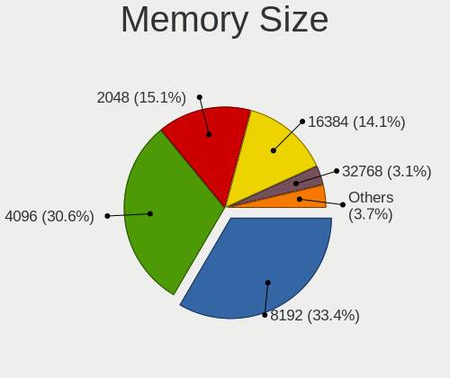

| Size  | Notebooks | Percent |
|-------|-----------|---------|
| 4096  | 174       | 33.02%  |
| 8192  | 173       | 32.83%  |
| 2048  | 82        | 15.56%  |
| 16384 | 63        | 11.95%  |
| 1024  | 16        | 3.04%   |
| 32768 | 14        | 2.66%   |
| 512   | 3         | 0.57%   |
| 1536  | 1         | 0.19%   |
| 256   | 1         | 0.19%   |

Memory Speed
------------

Memory module speed

| Speed   | Notebooks | Percent |
|---------|-----------|---------|
| 1600    | 142       | 27.63%  |
| 3200    | 81        | 15.76%  |
| 2667    | 72        | 14.01%  |
| 2400    | 37        | 7.2%    |
| 1334    | 36        | 7%      |
| 2133    | 24        | 4.67%   |
| Unknown | 19        | 3.7%    |
| 1333    | 18        | 3.5%    |
| 667     | 14        | 2.72%   |
| 3266    | 10        | 1.95%   |
| 1066    | 10        | 1.95%   |
| 4199    | 9         | 1.75%   |
| 1067    | 7         | 1.36%   |
| 800     | 7         | 1.36%   |
| 2048    | 6         | 1.17%   |
| 4267    | 4         | 0.78%   |
| 975     | 4         | 0.78%   |
| 1867    | 3         | 0.58%   |
| 533     | 3         | 0.58%   |
| 8400    | 2         | 0.39%   |
| 4800    | 2         | 0.39%   |
| 2933    | 2         | 0.39%   |
| 6400    | 1         | 0.19%   |
| 5600    | 1         | 0.19%   |

Printers & scanners
-------------------

Printer Vendor
--------------

Printer device vendors

| Vendor              | Notebooks | Percent |
|---------------------|-----------|---------|
| Hewlett-Packard     | 3         | 37.5%   |
| Samsung Electronics | 2         | 25%     |
| QinHeng Electronics | 1         | 12.5%   |
| Canon               | 1         | 12.5%   |
| Brother Industries  | 1         | 12.5%   |

Printer Model
-------------

Printer device models

| Model                            | Notebooks | Percent |
|----------------------------------|-----------|---------|
| Samsung M2070 Series             | 1         | 12.5%   |
| Samsung CLX-8380 Series          | 1         | 12.5%   |
| QinHeng CH340S                   | 1         | 12.5%   |
| HP Deskjet F4500 series          | 1         | 12.5%   |
| HP DeskJet 845c                  | 1         | 12.5%   |
| HP DeskJet 2600 series           | 1         | 12.5%   |
| Canon PIXMA MG2500 Series        | 1         | 12.5%   |
| Brother DCP-7055 scanner/printer | 1         | 12.5%   |

Scanner Vendor
--------------

Scanner device vendors

| Vendor                                         | Notebooks | Percent |
|------------------------------------------------|-----------|---------|
| Seiko Epson                                    | 2         | 50%     |
| Siemens Information and Communication Products | 1         | 25%     |
| Canon                                          | 1         | 25%     |

Scanner Model
-------------

Scanner device models

| Model                                                                           | Notebooks | Percent |
|---------------------------------------------------------------------------------|-----------|---------|
| Siemens Information and Communication Products ID-Mouse with Fingerprint Reader | 1         | 25%     |
| Seiko Epson GT-X900 [Perfection V700/V750 Photo]                                | 1         | 25%     |
| Seiko Epson ES-D400 [GT-S80]                                                    | 1         | 25%     |
| Canon CanoScan LiDE 90                                                          | 1         | 25%     |

Camera
------

Camera Vendor
-------------

Camera device vendors

| Vendor                                 | Notebooks | Percent |
|----------------------------------------|-----------|---------|
| Chicony Electronics                    | 179       | 28.28%  |
| Microdia                               | 52        | 8.21%   |
| Realtek Semiconductor                  | 45        | 7.11%   |
| IMC Networks                           | 45        | 7.11%   |
| Bison Electronics                      | 36        | 5.69%   |
| Sunplus Innovation Technology          | 34        | 5.37%   |
| Cheng Uei Precision Industry (Foxlink) | 30        | 4.74%   |
| Quanta                                 | 28        | 4.42%   |
| Acer                                   | 22        | 3.48%   |
| Suyin                                  | 21        | 3.32%   |
| Ricoh                                  | 17        | 2.69%   |
| Syntek                                 | 16        | 2.53%   |
| Silicon Motion                         | 13        | 2.05%   |
| Lite-On Technology                     | 13        | 2.05%   |
| Logitech                               | 11        | 1.74%   |
| Apple                                  | 11        | 1.74%   |
| Luxvisions Innotech Limited            | 10        | 1.58%   |
| Alcor Micro                            | 7         | 1.11%   |
| Importek                               | 6         | 0.95%   |
| Lenovo                                 | 5         | 0.79%   |
| Samsung Electronics                    | 3         | 0.47%   |
| ALi                                    | 3         | 0.47%   |
| Ruision                                | 2         | 0.32%   |
| Primax Electronics                     | 2         | 0.32%   |
| LG Electronics                         | 2         | 0.32%   |
| DigiTech                               | 2         | 0.32%   |
| ARC International                      | 2         | 0.32%   |
| Z-Star Microelectronics                | 1         | 0.16%   |
| Y Media                                | 1         | 0.16%   |
| SunplusIT                              | 1         | 0.16%   |
| Sunplus Technology                     | 1         | 0.16%   |
| Sonix Technology                       | 1         | 0.16%   |
| Shenzhen Kingcome Optoelectronic       | 1         | 0.16%   |
| Razer USA                              | 1         | 0.16%   |
| Microsoft                              | 1         | 0.16%   |
| Hisense                                | 1         | 0.16%   |
| Google                                 | 1         | 0.16%   |
| Generalplus Technology                 | 1         | 0.16%   |
| Denron                                 | 1         | 0.16%   |
| Cubeternet                             | 1         | 0.16%   |

Camera Model
------------

Camera device models

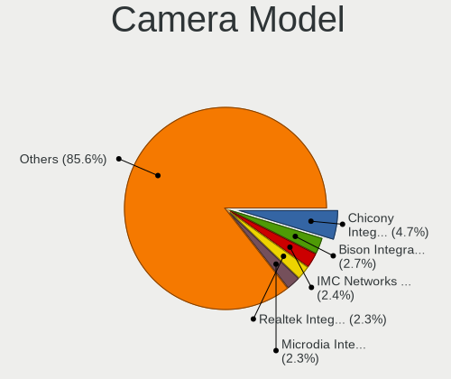

| Model                                               | Notebooks | Percent |
|-----------------------------------------------------|-----------|---------|
| Chicony Integrated Camera                           | 32        | 5.04%   |
| Realtek Integrated_Webcam_HD                        | 15        | 2.36%   |
| IMC Networks USB2.0 HD UVC WebCam                   | 15        | 2.36%   |
| Microdia Integrated_Webcam_HD                       | 13        | 2.05%   |
| Sunplus Integrated_Webcam_HD                        | 11        | 1.73%   |
| Chicony HD WebCam                                   | 11        | 1.73%   |
| Acer Integrated Camera                              | 11        | 1.73%   |
| Chicony USB2.0 Camera                               | 10        | 1.57%   |
| IMC Networks Integrated Camera                      | 9         | 1.42%   |
| Chicony USB2.0 VGA UVC WebCam                       | 9         | 1.42%   |
| Chicony HP HD Camera                                | 9         | 1.42%   |
| Bison Integrated Camera                             | 8         | 1.26%   |
| Syntek Integrated Camera                            | 7         | 1.1%    |
| Microdia Integrated Webcam                          | 7         | 1.1%    |
| Chicony USB 2.0 Camera                              | 7         | 1.1%    |
| Ricoh HD Webcam                                     | 6         | 0.94%   |
| Realtek USB Camera                                  | 6         | 0.94%   |
| Quanta HD User Facing                               | 6         | 0.94%   |
| Microdia Laptop_Integrated_Webcam_HD                | 6         | 0.94%   |
| Chicony HP Webcam                                   | 6         | 0.94%   |
| Cheng Uei Precision Industry (Foxlink) HP Webcam    | 6         | 0.94%   |
| Suyin HP TrueVision HD Integrated Webcam            | 5         | 0.79%   |
| Lite-On Integrated Camera                           | 5         | 0.79%   |
| Chicony Integrated IR Camera                        | 5         | 0.79%   |
| Chicony FJ Camera                                   | 5         | 0.79%   |
| Cheng Uei Precision Industry (Foxlink) Webcam       | 5         | 0.79%   |
| Bison Lenovo Integrated Webcam                      | 5         | 0.79%   |
| Bison BisonCam, NB Pro                              | 5         | 0.79%   |
| Syntek Lenovo EasyCamera                            | 4         | 0.63%   |
| Suyin Acer/HP Integrated Webcam [CN0314]            | 4         | 0.63%   |
| Sunplus Laptop_Integrated_Webcam_FHD                | 4         | 0.63%   |
| Sunplus HD WebCam                                   | 4         | 0.63%   |
| Quanta HP HD Camera                                 | 4         | 0.63%   |
| Luxvisions Innotech Limited HP TrueVision HD Camera | 4         | 0.63%   |
| IMC Networks UVC VGA Webcam                         | 4         | 0.63%   |
| Chicony Webcam                                      | 4         | 0.63%   |
| Chicony VGA Webcam                                  | 4         | 0.63%   |
| Chicony Integrated Camera (1280x720@30)             | 4         | 0.63%   |
| Chicony HP Wide Vision HD Camera                    | 4         | 0.63%   |
| Chicony HP Truevision HD camera                     | 4         | 0.63%   |

Security
--------

Fingerprint Vendor
------------------

Fingerprint sensor vendors

| Vendor                     | Notebooks | Percent |
|----------------------------|-----------|---------|
| Validity Sensors           | 55        | 44%     |
| Synaptics                  | 23        | 18.4%   |
| Shenzhen Goodix Technology | 14        | 11.2%   |
| Upek                       | 10        | 8%      |
| Elan Microelectronics      | 8         | 6.4%    |
| AuthenTec                  | 6         | 4.8%    |
| LighTuning Technology      | 4         | 3.2%    |
| STMicroelectronics         | 3         | 2.4%    |
| Samsung Electronics        | 1         | 0.8%    |
| Focal-systems.Corp         | 1         | 0.8%    |

Fingerprint Model
-----------------

Fingerprint sensor models

| Model                                                                      | Notebooks | Percent |
|----------------------------------------------------------------------------|-----------|---------|
| Validity Sensors VFS495 Fingerprint Reader                                 | 9         | 7.2%    |
| Upek Biometric Touchchip/Touchstrip Fingerprint Sensor                     | 9         | 7.2%    |
| Validity Sensors VFS5011 Fingerprint Reader                                | 8         | 6.4%    |
| Validity Sensors VFS 5011 fingerprint sensor                               | 8         | 6.4%    |
| Synaptics Prometheus MIS Touch Fingerprint Reader                          | 8         | 6.4%    |
| Shenzhen Goodix  Fingerprint Device                                        | 7         | 5.6%    |
| Validity Sensors VFS491                                                    | 5         | 4%      |
| Validity Sensors VFS471 Fingerprint Reader                                 | 5         | 4%      |
| Validity Sensors Swipe Fingerprint Sensor                                  | 4         | 3.2%    |
| Synaptics Fingerprint reader [HP G6]                                       | 4         | 3.2%    |
| Shenzhen Goodix Fingerprint Reader                                         | 4         | 3.2%    |
| Elan ELAN:Fingerprint                                                      | 4         | 3.2%    |
| Elan ELAN:ARM-M4                                                           | 4         | 3.2%    |
| Validity Sensors VFS7500 Touch Fingerprint Sensor                          | 3         | 2.4%    |
| Validity Sensors Synaptics WBDI                                            | 3         | 2.4%    |
| Validity Sensors Fingerprint scanner                                       | 3         | 2.4%    |
| Synaptics Metallica MIS Touch Fingerprint Reader                           | 3         | 2.4%    |
| STMicroelectronics Fingerprint Reader                                      | 3         | 2.4%    |
| Shenzhen Goodix FingerPrint                                                | 3         | 2.4%    |
| AuthenTec AES2501 Fingerprint Sensor                                       | 3         | 2.4%    |
| Validity Sensors VFS301 Fingerprint Reader                                 | 2         | 1.6%    |
| Validity Sensors VFS101 Fingerprint Reader                                 | 2         | 1.6%    |
| Validity Sensors Synaptics VFS7552 Touch Fingerprint Sensor with PurePrint | 2         | 1.6%    |
| Synaptics  FS7604 Touch Fingerprint Sensor with PurePrint                  | 2         | 1.6%    |
| LighTuning ES603 Swipe Fingerprint Sensor                                  | 2         | 1.6%    |
| AuthenTec AES1600                                                          | 2         | 1.6%    |
| Validity Sensors VFS451 Fingerprint Reader                                 | 1         | 0.8%    |
| Upek TCS5B Fingerprint sensor                                              | 1         | 0.8%    |
| Synaptics WBDI Device                                                      | 1         | 0.8%    |
| Synaptics UWP WBDI Device                                                  | 1         | 0.8%    |
| Synaptics UWP WBDI                                                         | 1         | 0.8%    |
| Synaptics Metallica MOH Touch Fingerprint Reader                           | 1         | 0.8%    |
| Synaptics FS7604 Touch Fingerprint Sensor with PurePrint                   | 1         | 0.8%    |
| Samsung Fingerprint Device                                                 | 1         | 0.8%    |
| LighTuning Fingerprint Reader                                              | 1         | 0.8%    |
| LighTuning EgisTec Touch Fingerprint Sensor                                | 1         | 0.8%    |
| Focal-systems.Corp FT9201Fingerprint.                                      | 1         | 0.8%    |
| AuthenTec AES2810                                                          | 1         | 0.8%    |
| Unknown                                                                    | 1         | 0.8%    |

Chipcard Vendor
---------------

Chipcard module vendors

| Vendor                | Notebooks | Percent |
|-----------------------|-----------|---------|
| Broadcom              | 42        | 56%     |
| Alcor Micro           | 17        | 22.67%  |
| Upek                  | 4         | 5.33%   |
| O2 Micro              | 4         | 5.33%   |
| Lenovo                | 3         | 4%      |
| SCM Microsystems      | 2         | 2.67%   |
| Advanced Card Systems | 2         | 2.67%   |
| Gemalto (was Gemplus) | 1         | 1.33%   |

Chipcard Model
--------------

Chipcard module models

| Model                                                                        | Notebooks | Percent |
|------------------------------------------------------------------------------|-----------|---------|
| Alcor Micro AU9540 Smartcard Reader                                          | 17        | 22.67%  |
| Broadcom BCM5880 Secure Applications Processor                               | 15        | 20%     |
| Broadcom BCM5880 Secure Applications Processor with fingerprint swipe sensor | 14        | 18.67%  |
| Broadcom 58200                                                               | 8         | 10.67%  |
| Broadcom 5880                                                                | 5         | 6.67%   |
| Upek TouchChip Fingerprint Coprocessor (WBF advanced mode)                   | 4         | 5.33%   |
| O2 Micro OZ776 CCID Smartcard Reader                                         | 4         | 5.33%   |
| Lenovo Integrated Smart Card Reader                                          | 3         | 4%      |
| Advanced Card Systems ACR38 SmartCard Reader                                 | 2         | 2.67%   |
| SCM Microsystems SCR3500 A Contact Reader                                    | 1         | 1.33%   |
| SCM Microsystems SCR331-LC1 / SCR3310 SmartCard Reader                       | 1         | 1.33%   |
| Gemalto (was Gemplus) GemPC Key SmartCard Reader                             | 1         | 1.33%   |

Unsupported
-----------

Unsupported Devices
-------------------

Total unsupported devices on board

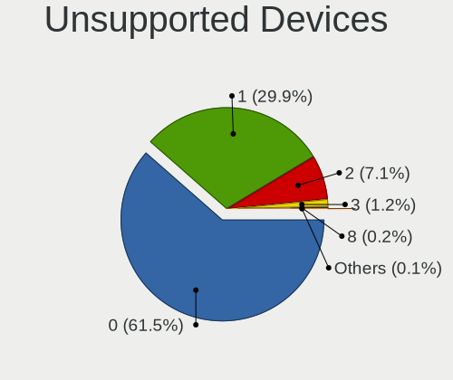

| Total | Notebooks | Percent |
|-------|-----------|---------|
| 0     | 433       | 60.39%  |
| 1     | 217       | 30.26%  |
| 2     | 54        | 7.53%   |
| 3     | 10        | 1.39%   |
| 8     | 2         | 0.28%   |
| 4     | 1         | 0.14%   |

Unsupported Device Types
------------------------

Types of unsupported devices

| Type                     | Notebooks | Percent |
|--------------------------|-----------|---------|
| Fingerprint reader       | 125       | 33.97%  |
| Graphics card            | 78        | 21.2%   |
| Chipcard                 | 71        | 19.29%  |
| Net/wireless             | 21        | 5.71%   |
| Camera                   | 16        | 4.35%   |
| Bluetooth                | 14        | 3.8%    |
| Storage                  | 11        | 2.99%   |
| Multimedia controller    | 6         | 1.63%   |
| Modem                    | 5         | 1.36%   |
| Sound                    | 4         | 1.09%   |
| Flash memory             | 4         | 1.09%   |
| Communication controller | 4         | 1.09%   |
| Net/ethernet             | 3         | 0.82%   |
| Card reader              | 3         | 0.82%   |
| Network                  | 1         | 0.27%   |
| Firewire controller      | 1         | 0.27%   |
| Dvb card                 | 1         | 0.27%   |

