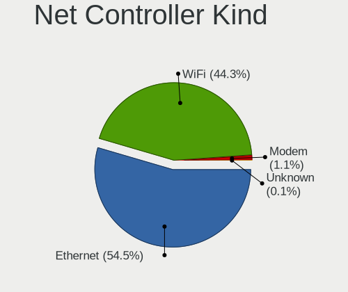
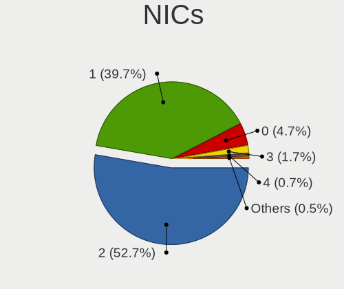
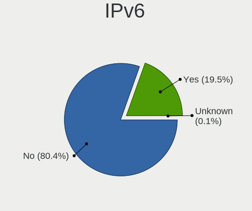
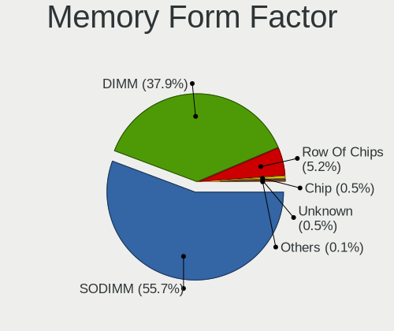
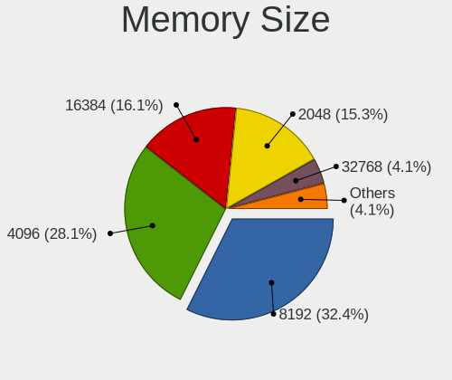
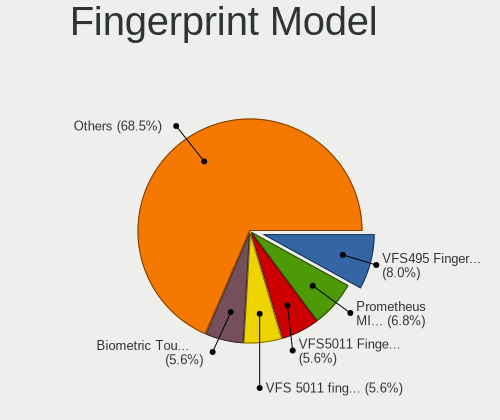

Ubuntu MATE - Tested Hardware & Statistics
------------------------------------------

A project to collect tested hardware configurations for Ubuntu MATE.

Anyone can contribute to this report by the [hw-probe](https://github.com/linuxhw/hw-probe) tool:

    sudo -E hw-probe -all -upload

Please contribute! Especially if your hardware is rare.

This is a report for all computer types. See also reports for [desktops](/Dist/Ubuntu_MATE/Desktop/README.md) and [notebooks](/Dist/Ubuntu_MATE/Notebook/README.md).

Full-feature report is available here: https://linux-hardware.org/?view=trends

Contents
--------

* [ Test Cases ](#test-cases)

* [ System ](#system)
  - [ OS                       ](#os)
  - [ OS Family                ](#os-family)
  - [ Kernel                   ](#kernel)
  - [ Kernel Family            ](#kernel-family)
  - [ Kernel Major Ver.        ](#kernel-major-ver)
  - [ Arch                     ](#arch)
  - [ DE                       ](#de)
  - [ Display Server           ](#display-server)
  - [ Display Manager          ](#display-manager)
  - [ OS Lang                  ](#os-lang)
  - [ Boot Mode                ](#boot-mode)
  - [ Filesystem               ](#filesystem)
  - [ Part. scheme             ](#part-scheme)
  - [ Dual Boot with Linux/BSD ](#dual-boot-with-linuxbsd)
  - [ Dual Boot (Win)          ](#dual-boot-win)

* [ Board ](#board)
  - [ Vendor                   ](#vendor)
  - [ Model                    ](#model)
  - [ Model Family             ](#model-family)
  - [ MFG Year                 ](#mfg-year)
  - [ Form Factor              ](#form-factor)
  - [ Secure Boot              ](#secure-boot)
  - [ Coreboot                 ](#coreboot)
  - [ RAM Size                 ](#ram-size)
  - [ RAM Used                 ](#ram-used)
  - [ Total Drives             ](#total-drives)
  - [ Has CD-ROM               ](#has-cd-rom)
  - [ Has Ethernet             ](#has-ethernet)
  - [ Has WiFi                 ](#has-wifi)
  - [ Has Bluetooth            ](#has-bluetooth)

* [ Location ](#location)
  - [ Country                  ](#country)
  - [ City                     ](#city)

* [ Drives ](#drives)
  - [ Drive Vendor             ](#drive-vendor)
  - [ Drive Model              ](#drive-model)
  - [ HDD Vendor               ](#hdd-vendor)
  - [ SSD Vendor               ](#ssd-vendor)
  - [ Drive Kind               ](#drive-kind)
  - [ Drive Connector          ](#drive-connector)
  - [ Drive Size               ](#drive-size)
  - [ Space Total              ](#space-total)
  - [ Space Used               ](#space-used)
  - [ Malfunc. Drives          ](#malfunc-drives)
  - [ Malfunc. Drive Vendor    ](#malfunc-drive-vendor)
  - [ Malfunc. HDD Vendor      ](#malfunc-hdd-vendor)
  - [ Malfunc. Drive Kind      ](#malfunc-drive-kind)
  - [ Failed Drives            ](#failed-drives)
  - [ Failed Drive Vendor      ](#failed-drive-vendor)
  - [ Drive Status             ](#drive-status)

* [ Storage controller ](#storage-controller)
  - [ Storage Vendor           ](#storage-vendor)
  - [ Storage Model            ](#storage-model)
  - [ Storage Kind             ](#storage-kind)

* [ Processor ](#processor)
  - [ CPU Vendor               ](#cpu-vendor)
  - [ CPU Model                ](#cpu-model)
  - [ CPU Model Family         ](#cpu-model-family)
  - [ CPU Cores                ](#cpu-cores)
  - [ CPU Sockets              ](#cpu-sockets)
  - [ CPU Threads              ](#cpu-threads)
  - [ CPU Op-Modes             ](#cpu-op-modes)
  - [ CPU Microcode            ](#cpu-microcode)
  - [ CPU Microarch            ](#cpu-microarch)

* [ Graphics ](#graphics)
  - [ GPU Vendor               ](#gpu-vendor)
  - [ GPU Model                ](#gpu-model)
  - [ GPU Combo                ](#gpu-combo)
  - [ GPU Driver               ](#gpu-driver)
  - [ GPU Memory               ](#gpu-memory)

* [ Monitor ](#monitor)
  - [ Monitor Vendor           ](#monitor-vendor)
  - [ Monitor Model            ](#monitor-model)
  - [ Monitor Resolution       ](#monitor-resolution)
  - [ Monitor Diagonal         ](#monitor-diagonal)
  - [ Monitor Width            ](#monitor-width)
  - [ Aspect Ratio             ](#aspect-ratio)
  - [ Monitor Area             ](#monitor-area)
  - [ Pixel Density            ](#pixel-density)
  - [ Multiple Monitors        ](#multiple-monitors)

* [ Network ](#network)
  - [ Net Controller Vendor    ](#net-controller-vendor)
  - [ Net Controller Model     ](#net-controller-model)
  - [ Wireless Vendor          ](#wireless-vendor)
  - [ Wireless Model           ](#wireless-model)
  - [ Ethernet Vendor          ](#ethernet-vendor)
  - [ Ethernet Model           ](#ethernet-model)
  - [ Net Controller Kind      ](#net-controller-kind)
  - [ Used Controller          ](#used-controller)
  - [ NICs                     ](#nics)
  - [ IPv6                     ](#ipv6)

* [ Bluetooth ](#bluetooth)
  - [ Bluetooth Vendor         ](#bluetooth-vendor)
  - [ Bluetooth Model          ](#bluetooth-model)

* [ Sound ](#sound)
  - [ Sound Vendor             ](#sound-vendor)
  - [ Sound Model              ](#sound-model)

* [ Memory ](#memory)
  - [ Memory Vendor            ](#memory-vendor)
  - [ Memory Model             ](#memory-model)
  - [ Memory Kind              ](#memory-kind)
  - [ Memory Form Factor       ](#memory-form-factor)
  - [ Memory Size              ](#memory-size)
  - [ Memory Speed             ](#memory-speed)

* [ Printers & scanners ](#printers--scanners)
  - [ Printer Vendor           ](#printer-vendor)
  - [ Printer Model            ](#printer-model)
  - [ Scanner Vendor           ](#scanner-vendor)
  - [ Scanner Model            ](#scanner-model)

* [ Camera ](#camera)
  - [ Camera Vendor            ](#camera-vendor)
  - [ Camera Model             ](#camera-model)

* [ Security ](#security)
  - [ Fingerprint Vendor       ](#fingerprint-vendor)
  - [ Fingerprint Model        ](#fingerprint-model)
  - [ Chipcard Vendor          ](#chipcard-vendor)
  - [ Chipcard Model           ](#chipcard-model)

* [ Unsupported ](#unsupported)
  - [ Unsupported Devices      ](#unsupported-devices)
  - [ Unsupported Device Types ](#unsupported-device-types)

Test Cases
----------

Total: 1544

| Vendor        | Model                       | Form-Factor | Probe                                                      | Date         |
|---------------|-----------------------------|-------------|------------------------------------------------------------|--------------|
| Lenovo        | IdeaPad 3 15IML05 81WR      | Notebook    | [81dced5e0a](https://linux-hardware.org/?probe=81dced5e0a) | Apr 16, 2022 |
| Gigabyte      | X99P-SLI-CF                 | Desktop     | [19055b80bc](https://linux-hardware.org/?probe=19055b80bc) | Apr 16, 2022 |
| ASUSTek       | Z97-K                       | Desktop     | [4852dde595](https://linux-hardware.org/?probe=4852dde595) | Apr 15, 2022 |
| Dell          | Latitude E5530 non-vPro     | Notebook    | [2f865445ce](https://linux-hardware.org/?probe=2f865445ce) | Apr 14, 2022 |
| Dell          | Latitude E5530 non-vPro     | Notebook    | [d32ffb065a](https://linux-hardware.org/?probe=d32ffb065a) | Apr 14, 2022 |
| Clevo         | W54xEU                      | Notebook    | [7b1c6d8b2e](https://linux-hardware.org/?probe=7b1c6d8b2e) | Apr 14, 2022 |
| Clevo         | W54xEU                      | Notebook    | [0a8ddf1dff](https://linux-hardware.org/?probe=0a8ddf1dff) | Apr 14, 2022 |
| Dell          | XPS 15 9500                 | Notebook    | [d873b2d218](https://linux-hardware.org/?probe=d873b2d218) | Apr 14, 2022 |
| Unknown       | Unknown                     | Desktop     | [d7811dbd43](https://linux-hardware.org/?probe=d7811dbd43) | Apr 14, 2022 |
| Lenovo        | ThinkPad X1 Carbon 7th 2... | Notebook    | [52d05bca1d](https://linux-hardware.org/?probe=52d05bca1d) | Apr 13, 2022 |
| Dell          | XPS 13 9380                 | Notebook    | [0897999e8d](https://linux-hardware.org/?probe=0897999e8d) | Apr 13, 2022 |
| MSI           | MAG B550M MORTAR            | Desktop     | [7a9f6e1de7](https://linux-hardware.org/?probe=7a9f6e1de7) | Apr 13, 2022 |
| TUXEDO        | Pulse 14 Gen1               | Notebook    | [68e6736cd2](https://linux-hardware.org/?probe=68e6736cd2) | Apr 13, 2022 |
| Samsung       | R505                        | Notebook    | [9ff46a8ca6](https://linux-hardware.org/?probe=9ff46a8ca6) | Apr 13, 2022 |
| Dell          | Latitude E5400              | Notebook    | [0ac76c891f](https://linux-hardware.org/?probe=0ac76c891f) | Apr 11, 2022 |
| Dell          | 03NVJ6 A00                  | Desktop     | [c640615939](https://linux-hardware.org/?probe=c640615939) | Apr 10, 2022 |
| Raspberry ... | Raspberry Pi                | Soc         | [a54c91912a](https://linux-hardware.org/?probe=a54c91912a) | Apr 09, 2022 |
| Lenovo        | IdeaPadFlex 6-14IKB 81EM    | Convertible | [5e31d89c28](https://linux-hardware.org/?probe=5e31d89c28) | Apr 09, 2022 |
| ASUSTek       | M5A78L-M PLUS/USB3          | Desktop     | [3c17fb0db4](https://linux-hardware.org/?probe=3c17fb0db4) | Apr 07, 2022 |
| Gigabyte      | H470M DS3H                  | Desktop     | [bbfc43c637](https://linux-hardware.org/?probe=bbfc43c637) | Apr 05, 2022 |
| IPASON        | MaxBook P1                  | Notebook    | [d66d062f54](https://linux-hardware.org/?probe=d66d062f54) | Apr 05, 2022 |
| ASRock        | N68C-GS FX                  | Desktop     | [5f45322780](https://linux-hardware.org/?probe=5f45322780) | Apr 04, 2022 |
| Dell          | 06X1TJ A00                  | Desktop     | [42cf748563](https://linux-hardware.org/?probe=42cf748563) | Apr 03, 2022 |
| Lenovo        | G700 20251                  | Notebook    | [790d42fec8](https://linux-hardware.org/?probe=790d42fec8) | Mar 30, 2022 |
| Lenovo        | G700 20251                  | Notebook    | [d8166d09e9](https://linux-hardware.org/?probe=d8166d09e9) | Mar 30, 2022 |
| HP            | Pavilion dv7                | Notebook    | [112a1842a0](https://linux-hardware.org/?probe=112a1842a0) | Mar 30, 2022 |
| ASUSTek       | A88X-GAMER                  | Desktop     | [8340e366fc](https://linux-hardware.org/?probe=8340e366fc) | Mar 28, 2022 |
| Toshiba       | Satellite L755D             | Notebook    | [d99ccc2771](https://linux-hardware.org/?probe=d99ccc2771) | Mar 28, 2022 |
| Samsung       | R530/R730/R540              | Notebook    | [186f96a5a1](https://linux-hardware.org/?probe=186f96a5a1) | Mar 27, 2022 |
| Acer          | Aspire 3000                 | Notebook    | [8f647a08f9](https://linux-hardware.org/?probe=8f647a08f9) | Mar 26, 2022 |
| Hardkernel    | ODROID-N2Plus               | Soc         | [3a8a0e2c0c](https://linux-hardware.org/?probe=3a8a0e2c0c) | Mar 26, 2022 |
| Dell          | 05KX61 A00                  | Server      | [77d570f7ae](https://linux-hardware.org/?probe=77d570f7ae) | Mar 25, 2022 |
| Dell          | Studio 1558                 | Notebook    | [7004b83ddf](https://linux-hardware.org/?probe=7004b83ddf) | Mar 23, 2022 |
| Dell          | Vostro 3350                 | Notebook    | [721a0ea932](https://linux-hardware.org/?probe=721a0ea932) | Mar 21, 2022 |
| HP            | 802E                        | Desktop     | [b15f756d65](https://linux-hardware.org/?probe=b15f756d65) | Mar 21, 2022 |
| ASUSTek       | X541UV                      | Notebook    | [a23f80c36b](https://linux-hardware.org/?probe=a23f80c36b) | Mar 19, 2022 |
| HP            | 3397                        | Desktop     | [fe1ae429b1](https://linux-hardware.org/?probe=fe1ae429b1) | Mar 18, 2022 |
| ASUSTek       | PRIME H410M-A               | Desktop     | [9352c21f95](https://linux-hardware.org/?probe=9352c21f95) | Mar 17, 2022 |
| HP            | Pavilion dv7                | Notebook    | [0eb8ef5cd3](https://linux-hardware.org/?probe=0eb8ef5cd3) | Mar 16, 2022 |
| ASUSTek       | ROG STRIX B350-F GAMING     | Desktop     | [220c4f69b0](https://linux-hardware.org/?probe=220c4f69b0) | Mar 15, 2022 |
| ASUSTek       | A55BM-E                     | Desktop     | [7bbbcc53c1](https://linux-hardware.org/?probe=7bbbcc53c1) | Mar 14, 2022 |
| Dell          | OptiPlex 980                | Desktop     | [14cf2b23f7](https://linux-hardware.org/?probe=14cf2b23f7) | Mar 14, 2022 |
| Dell          | Vostro 3401                 | Notebook    | [225095b10b](https://linux-hardware.org/?probe=225095b10b) | Mar 12, 2022 |
| ASUSTek       | M4A79XTD EVO                | Desktop     | [d59f0b152c](https://linux-hardware.org/?probe=d59f0b152c) | Mar 10, 2022 |
| Toshiba       | Satellite P755              | Notebook    | [ceb8d030e2](https://linux-hardware.org/?probe=ceb8d030e2) | Mar 10, 2022 |
| ASUSTek       | 1011PX                      | Notebook    | [776d052837](https://linux-hardware.org/?probe=776d052837) | Mar 09, 2022 |
| Packard Be... | EasyNote MH35               | Notebook    | [66bff1bcfd](https://linux-hardware.org/?probe=66bff1bcfd) | Mar 08, 2022 |
| Gigabyte      | Z68XP-UD3                   | Desktop     | [6382c70064](https://linux-hardware.org/?probe=6382c70064) | Mar 07, 2022 |
| Hardkernel    | Odroid XU4                  | Soc         | [8e3573295d](https://linux-hardware.org/?probe=8e3573295d) | Mar 07, 2022 |
| Hardkernel    | Odroid XU4                  | Soc         | [d57f5c8ce3](https://linux-hardware.org/?probe=d57f5c8ce3) | Mar 07, 2022 |
| Medion        | MS-7797                     | Desktop     | [88982d8ccb](https://linux-hardware.org/?probe=88982d8ccb) | Mar 05, 2022 |
| ASUSTek       | Zenbook UP5401EA_UP5401E... | Convertible | [f23d0b2728](https://linux-hardware.org/?probe=f23d0b2728) | Mar 05, 2022 |
| ASRock        | B450M Pro4                  | Desktop     | [b18f6804d6](https://linux-hardware.org/?probe=b18f6804d6) | Mar 02, 2022 |
| ECS           | A785GM-AD3                  | Desktop     | [43c3e7c4a0](https://linux-hardware.org/?probe=43c3e7c4a0) | Mar 02, 2022 |
| Lenovo        | U310                        | Notebook    | [856a65502e](https://linux-hardware.org/?probe=856a65502e) | Feb 28, 2022 |
| ASUSTek       | UX305FA                     | Notebook    | [6618b00369](https://linux-hardware.org/?probe=6618b00369) | Feb 28, 2022 |
| Intel         | H55                         | Desktop     | [2f52a73f85](https://linux-hardware.org/?probe=2f52a73f85) | Feb 27, 2022 |
| HP            | Elite x2 1012 G2            | Tablet      | [beeb081772](https://linux-hardware.org/?probe=beeb081772) | Feb 27, 2022 |
| Fujitsu       | LIFEBOOK S752               | Notebook    | [abb12adccc](https://linux-hardware.org/?probe=abb12adccc) | Feb 26, 2022 |
| Pegatron      | Narra6                      | Desktop     | [ad9a06f14d](https://linux-hardware.org/?probe=ad9a06f14d) | Feb 25, 2022 |
| Acer          | Aspire E1-571G              | Notebook    | [de462f47a3](https://linux-hardware.org/?probe=de462f47a3) | Feb 24, 2022 |
| Acer          | Aspire E1-571G              | Notebook    | [ac593e3a3a](https://linux-hardware.org/?probe=ac593e3a3a) | Feb 24, 2022 |
| ASUSTek       | PRIME B450M-A II            | Desktop     | [09aca1c435](https://linux-hardware.org/?probe=09aca1c435) | Feb 22, 2022 |
| ASUSTek       | PRIME B450M-A II            | Desktop     | [35c00d5889](https://linux-hardware.org/?probe=35c00d5889) | Feb 22, 2022 |
| ASUSTek       | PRIME B450M-A II            | Desktop     | [265235f4f4](https://linux-hardware.org/?probe=265235f4f4) | Feb 21, 2022 |
| ECS           | G41T-M7                     | Desktop     | [c4aca5bc12](https://linux-hardware.org/?probe=c4aca5bc12) | Feb 20, 2022 |
| Lenovo        | ThinkPad T460p 20FW000VU... | Notebook    | [9cbb915f78](https://linux-hardware.org/?probe=9cbb915f78) | Feb 18, 2022 |
| HP            | ProBook x360 435 G7         | Convertible | [0747de6777](https://linux-hardware.org/?probe=0747de6777) | Feb 18, 2022 |
| ASUSTek       | X553MA                      | Notebook    | [94ebaa5d9b](https://linux-hardware.org/?probe=94ebaa5d9b) | Feb 15, 2022 |
| ECS           | A785GM-AD3                  | Desktop     | [b6459dbb39](https://linux-hardware.org/?probe=b6459dbb39) | Feb 12, 2022 |
| MSI           | MAG Z390 TOMAHAWK           | Desktop     | [e58751112a](https://linux-hardware.org/?probe=e58751112a) | Feb 11, 2022 |
| Notebook      | NK50S5_SZ                   | Notebook    | [c5a3485d32](https://linux-hardware.org/?probe=c5a3485d32) | Feb 11, 2022 |
| ASUSTek       | PRIME B250M-K               | Desktop     | [6f66651cd1](https://linux-hardware.org/?probe=6f66651cd1) | Feb 10, 2022 |
| ASUSTek       | P5W DH Deluxe               | Desktop     | [7c3fa0c43b](https://linux-hardware.org/?probe=7c3fa0c43b) | Feb 08, 2022 |
| HP            | Pavilion 17                 | Notebook    | [3d6c666b77](https://linux-hardware.org/?probe=3d6c666b77) | Feb 08, 2022 |
| Gigabyte      | GA-990XA-UD3                | Desktop     | [6bb9884c12](https://linux-hardware.org/?probe=6bb9884c12) | Feb 08, 2022 |
| Gigabyte      | F2A88XM-D3HP                | Desktop     | [c6783b6b8b](https://linux-hardware.org/?probe=c6783b6b8b) | Feb 07, 2022 |
| Gigabyte      | GA-990XA-UD3                | Desktop     | [74ebb0645d](https://linux-hardware.org/?probe=74ebb0645d) | Feb 06, 2022 |
| HP            | Notebook                    | Notebook    | [69071da574](https://linux-hardware.org/?probe=69071da574) | Feb 06, 2022 |
| Acer          | Aspire 7735                 | Notebook    | [38d97cd9da](https://linux-hardware.org/?probe=38d97cd9da) | Feb 06, 2022 |
| Lenovo        | ThinkBook 14s Yoga ITL 2... | Convertible | [451c540217](https://linux-hardware.org/?probe=451c540217) | Feb 05, 2022 |
| ASUSTek       | H61M-K                      | Desktop     | [0e2c677ddc](https://linux-hardware.org/?probe=0e2c677ddc) | Feb 03, 2022 |
| Dell          | XPS 15 9570                 | Notebook    | [d1f8ff2cb8](https://linux-hardware.org/?probe=d1f8ff2cb8) | Feb 02, 2022 |
| Lenovo        | ThinkCentre M58 7373W43     | Desktop     | [4dc312f4f3](https://linux-hardware.org/?probe=4dc312f4f3) | Feb 02, 2022 |
| Lenovo        | ThinkCentre M58 7373W43     | Desktop     | [d70247596b](https://linux-hardware.org/?probe=d70247596b) | Feb 02, 2022 |
| Lenovo        | SDK0E50510 WIN              | Desktop     | [f317005b0a](https://linux-hardware.org/?probe=f317005b0a) | Feb 02, 2022 |
| Lenovo        | NOK                         | Desktop     | [8905840b45](https://linux-hardware.org/?probe=8905840b45) | Feb 02, 2022 |
| Lenovo        | ThinkPad SL500 27463ZG      | Notebook    | [b746a25ff1](https://linux-hardware.org/?probe=b746a25ff1) | Jan 28, 2022 |
| HP            | 8434 11                     | Desktop     | [76a7851e7f](https://linux-hardware.org/?probe=76a7851e7f) | Jan 28, 2022 |
| Dell          | Latitude 3410               | Notebook    | [8f2181125e](https://linux-hardware.org/?probe=8f2181125e) | Jan 27, 2022 |
| ASUSTek       | M5A99X EVO R2.0             | Desktop     | [fab2b2828e](https://linux-hardware.org/?probe=fab2b2828e) | Jan 26, 2022 |
| ASRock        | Z77 Pro4                    | Desktop     | [8062682731](https://linux-hardware.org/?probe=8062682731) | Jan 25, 2022 |
| IP3 Tech      | GB3B                        | Mini pc     | [47e447f5da](https://linux-hardware.org/?probe=47e447f5da) | Jan 25, 2022 |
| Sony          | VPCF13Z1R                   | Notebook    | [7aff0d5c29](https://linux-hardware.org/?probe=7aff0d5c29) | Jan 25, 2022 |
| Fujitsu       | LIFEBOOK U748               | Notebook    | [cad36b0eba](https://linux-hardware.org/?probe=cad36b0eba) | Jan 24, 2022 |
| Gigabyte      | H410M H V3                  | Desktop     | [f6b7e2e2e6](https://linux-hardware.org/?probe=f6b7e2e2e6) | Jan 24, 2022 |
| ASUSTek       | P5KPL-AM SE                 | Desktop     | [868c5fe3a4](https://linux-hardware.org/?probe=868c5fe3a4) | Jan 24, 2022 |
| Lenovo        | 1052 SDK0J40697 WIN 3305... | Desktop     | [a4b48a8427](https://linux-hardware.org/?probe=a4b48a8427) | Jan 23, 2022 |
| Lenovo        | 1052 SDK0J40697 WIN 3305... | Desktop     | [622bf721f3](https://linux-hardware.org/?probe=622bf721f3) | Jan 23, 2022 |
| Hardkernel    | ODROID-N2Plus               | Soc         | [55067d6afe](https://linux-hardware.org/?probe=55067d6afe) | Jan 21, 2022 |
| ASUSTek       | ROG Zephyrus G14 GA401QM... | Notebook    | [37730388fd](https://linux-hardware.org/?probe=37730388fd) | Jan 21, 2022 |
| ASRock        | G41C-VS                     | Desktop     | [4dbb4b7fad](https://linux-hardware.org/?probe=4dbb4b7fad) | Jan 21, 2022 |
| Albatron      | PM73V                       | Desktop     | [7bd3956f1f](https://linux-hardware.org/?probe=7bd3956f1f) | Jan 21, 2022 |
| ASUSTek       | H81M-K                      | Desktop     | [e5d70436b2](https://linux-hardware.org/?probe=e5d70436b2) | Jan 21, 2022 |
| HP            | 8434 11                     | Desktop     | [6bb20c8d64](https://linux-hardware.org/?probe=6bb20c8d64) | Jan 20, 2022 |
| HP            | 8455                        | Desktop     | [fbf272366c](https://linux-hardware.org/?probe=fbf272366c) | Jan 20, 2022 |
| ASUSTek       | ROG Zephyrus G14 GA401QM... | Notebook    | [512b021ab8](https://linux-hardware.org/?probe=512b021ab8) | Jan 19, 2022 |
| Lenovo        | V155-15API 81V5             | Notebook    | [09e824f68b](https://linux-hardware.org/?probe=09e824f68b) | Jan 19, 2022 |
| ASUSTek       | P5LD2                       | Desktop     | [00ec990ce2](https://linux-hardware.org/?probe=00ec990ce2) | Jan 19, 2022 |
| Dell          | 0KP561                      | Desktop     | [1b772786e5](https://linux-hardware.org/?probe=1b772786e5) | Jan 19, 2022 |
| Dell          | 0FH884                      | Desktop     | [5ffacf9f99](https://linux-hardware.org/?probe=5ffacf9f99) | Jan 19, 2022 |
| Dell          | 0UG982                      | Desktop     | [c85c923e97](https://linux-hardware.org/?probe=c85c923e97) | Jan 19, 2022 |
| Dell          | 0X7841                      | Desktop     | [40600195c8](https://linux-hardware.org/?probe=40600195c8) | Jan 19, 2022 |
| Lenovo        | NOK                         | Desktop     | [111a1caac8](https://linux-hardware.org/?probe=111a1caac8) | Jan 19, 2022 |
| Lenovo        | SDK0E50510 WIN              | Desktop     | [597677191c](https://linux-hardware.org/?probe=597677191c) | Jan 19, 2022 |
| Dell          | 0UG982                      | Desktop     | [686f3558d2](https://linux-hardware.org/?probe=686f3558d2) | Jan 19, 2022 |
| Lenovo        | ThinkCentre M58 7373W43     | Desktop     | [ebef716d33](https://linux-hardware.org/?probe=ebef716d33) | Jan 19, 2022 |
| Dell          | 0FH884                      | Desktop     | [f6e9bda3a9](https://linux-hardware.org/?probe=f6e9bda3a9) | Jan 19, 2022 |
| HP            | 18E7                        | Desktop     | [b68364ed90](https://linux-hardware.org/?probe=b68364ed90) | Jan 19, 2022 |
| Dell          | 0HY9JP A02                  | Desktop     | [8314cd9ba6](https://linux-hardware.org/?probe=8314cd9ba6) | Jan 19, 2022 |
| Dell          | 0UG982                      | Desktop     | [38c30e280b](https://linux-hardware.org/?probe=38c30e280b) | Jan 19, 2022 |
| Gigabyte      | H81M-S2PV                   | Desktop     | [f2d5dba7ff](https://linux-hardware.org/?probe=f2d5dba7ff) | Jan 19, 2022 |
| Dell          | 0FH884                      | Desktop     | [083697081f](https://linux-hardware.org/?probe=083697081f) | Jan 19, 2022 |
| Dell          | 0UG982                      | Desktop     | [597dfb85b7](https://linux-hardware.org/?probe=597dfb85b7) | Jan 19, 2022 |
| HP            | 18E7                        | Desktop     | [9fedcb7ff7](https://linux-hardware.org/?probe=9fedcb7ff7) | Jan 18, 2022 |
| HP            | 18E7                        | Desktop     | [48871270a2](https://linux-hardware.org/?probe=48871270a2) | Jan 18, 2022 |
| HP            | 18E7                        | Desktop     | [ca38c856e1](https://linux-hardware.org/?probe=ca38c856e1) | Jan 18, 2022 |
| HP            | 18E7                        | Desktop     | [a4df88b38f](https://linux-hardware.org/?probe=a4df88b38f) | Jan 18, 2022 |
| HP            | 18E7                        | Desktop     | [a745b9add0](https://linux-hardware.org/?probe=a745b9add0) | Jan 18, 2022 |
| HP            | 18E7                        | Desktop     | [b69abe6fd4](https://linux-hardware.org/?probe=b69abe6fd4) | Jan 18, 2022 |
| Lenovo        | SDK0E50510 WIN              | Desktop     | [9753f9164a](https://linux-hardware.org/?probe=9753f9164a) | Jan 18, 2022 |
| Lenovo        | ThinkCentre M58 7373W43     | Desktop     | [2d7a6e6cb6](https://linux-hardware.org/?probe=2d7a6e6cb6) | Jan 18, 2022 |
| Lenovo        | SDK0E50510 WIN              | Desktop     | [51484889f9](https://linux-hardware.org/?probe=51484889f9) | Jan 18, 2022 |
| Lenovo        | SDK0E50510 WIN              | Desktop     | [4ca462c89a](https://linux-hardware.org/?probe=4ca462c89a) | Jan 18, 2022 |
| Dell          | 0HY9JP A02                  | Desktop     | [c4c9f4b0a9](https://linux-hardware.org/?probe=c4c9f4b0a9) | Jan 18, 2022 |
| HP            | 8434 11                     | Desktop     | [4a128d2bb2](https://linux-hardware.org/?probe=4a128d2bb2) | Jan 18, 2022 |
| HP            | 18E7                        | Desktop     | [97d4bc7367](https://linux-hardware.org/?probe=97d4bc7367) | Jan 18, 2022 |
| Lenovo        | NOK                         | Desktop     | [7ae2819a6f](https://linux-hardware.org/?probe=7ae2819a6f) | Jan 18, 2022 |
| HP            | 18E7                        | Desktop     | [e86d0cc284](https://linux-hardware.org/?probe=e86d0cc284) | Jan 18, 2022 |
| Lenovo        | SDK0E50510 WIN              | Desktop     | [022f56a960](https://linux-hardware.org/?probe=022f56a960) | Jan 18, 2022 |
| HP            | 18E7                        | Desktop     | [0d2a09f683](https://linux-hardware.org/?probe=0d2a09f683) | Jan 18, 2022 |
| HP            | 8455                        | Desktop     | [639182896b](https://linux-hardware.org/?probe=639182896b) | Jan 18, 2022 |
| ASRock        | B450M Pro4                  | Desktop     | [556d0fb884](https://linux-hardware.org/?probe=556d0fb884) | Jan 18, 2022 |
| Apple         | Mac-F22C86C8                | Mini pc     | [c3d19d1297](https://linux-hardware.org/?probe=c3d19d1297) | Jan 18, 2022 |
| ASUSTek       | X553MA                      | Notebook    | [a748bb8955](https://linux-hardware.org/?probe=a748bb8955) | Jan 18, 2022 |
| ASUSTek       | X553MA                      | Notebook    | [08613587e8](https://linux-hardware.org/?probe=08613587e8) | Jan 18, 2022 |
| ASUSTek       | X553MA                      | Notebook    | [f5b0fd8e22](https://linux-hardware.org/?probe=f5b0fd8e22) | Jan 18, 2022 |
| ASUSTek       | H81M-C                      | Desktop     | [f4bb742149](https://linux-hardware.org/?probe=f4bb742149) | Jan 17, 2022 |
| ASUSTek       | P5LD2                       | Desktop     | [b972c7929f](https://linux-hardware.org/?probe=b972c7929f) | Jan 17, 2022 |
| ASUSTek       | PRIME H310M-D R2.0          | Desktop     | [9a6c2f82f1](https://linux-hardware.org/?probe=9a6c2f82f1) | Jan 17, 2022 |
| Dell          | 0UG982                      | Desktop     | [684478b2fb](https://linux-hardware.org/?probe=684478b2fb) | Jan 17, 2022 |
| ASUSTek       | PRIME H310M-D R2.0          | Desktop     | [a96f2def6d](https://linux-hardware.org/?probe=a96f2def6d) | Jan 17, 2022 |
| Gigabyte      | H410M H V3                  | Desktop     | [13b01fb40a](https://linux-hardware.org/?probe=13b01fb40a) | Jan 17, 2022 |
| ASUSTek       | PRIME H310M-D R2.0          | Desktop     | [385f76b996](https://linux-hardware.org/?probe=385f76b996) | Jan 17, 2022 |
| ASUSTek       | H81M-C                      | Desktop     | [51d8172f5b](https://linux-hardware.org/?probe=51d8172f5b) | Jan 16, 2022 |
| Quanta        | TW8/SW8/DW8 TBD             | Notebook    | [8b2f4ffccd](https://linux-hardware.org/?probe=8b2f4ffccd) | Jan 16, 2022 |
| Dell          | XPS 12 9Q23                 | Notebook    | [3c8e26636b](https://linux-hardware.org/?probe=3c8e26636b) | Jan 15, 2022 |
| ASUSTek       | ROG STRIX B550-I GAMING     | Desktop     | [6438d5a5af](https://linux-hardware.org/?probe=6438d5a5af) | Jan 15, 2022 |
| ASUSTek       | H81M-C                      | Desktop     | [f21bf32c9a](https://linux-hardware.org/?probe=f21bf32c9a) | Jan 15, 2022 |
| Apple         | Mac-F22C86C8                | Mini pc     | [89d70da207](https://linux-hardware.org/?probe=89d70da207) | Jan 15, 2022 |
| HP            | Pavilion Gaming Laptop 1... | Notebook    | [ae80854830](https://linux-hardware.org/?probe=ae80854830) | Jan 15, 2022 |
| ZOTAC         | NM10                        | Desktop     | [d758728651](https://linux-hardware.org/?probe=d758728651) | Jan 14, 2022 |
| ASUSTek       | H81M-K                      | Desktop     | [f1858e63f4](https://linux-hardware.org/?probe=f1858e63f4) | Jan 14, 2022 |
| Raspberry ... | Raspberry Pi                | Soc         | [9d2fa7ede7](https://linux-hardware.org/?probe=9d2fa7ede7) | Jan 13, 2022 |
| ASUSTek       | PRIME X470-PRO              | Desktop     | [c450cd4a79](https://linux-hardware.org/?probe=c450cd4a79) | Jan 13, 2022 |
| Raspberry ... | Raspberry Pi                | Soc         | [2fbac2ebd5](https://linux-hardware.org/?probe=2fbac2ebd5) | Jan 12, 2022 |
| HPE           | ML10Gen9                    | Server      | [03f2d30df2](https://linux-hardware.org/?probe=03f2d30df2) | Jan 11, 2022 |
| Dell          | Latitude E5400              | Notebook    | [4f72d3dae0](https://linux-hardware.org/?probe=4f72d3dae0) | Jan 09, 2022 |
| HP            | 3397                        | Desktop     | [38a4d731fe](https://linux-hardware.org/?probe=38a4d731fe) | Jan 08, 2022 |
| ASUSTek       | X541SA                      | Notebook    | [4103077e59](https://linux-hardware.org/?probe=4103077e59) | Jan 08, 2022 |
| Gigabyte      | B450M S2H                   | Desktop     | [858d718984](https://linux-hardware.org/?probe=858d718984) | Jan 07, 2022 |
| Raspberry ... | Raspberry Pi                | Soc         | [faef08af10](https://linux-hardware.org/?probe=faef08af10) | Jan 06, 2022 |
| Fujitsu       | LIFEBOOK E746               | Notebook    | [55ac013e1e](https://linux-hardware.org/?probe=55ac013e1e) | Jan 06, 2022 |
| Dell          | 032W55 A03                  | Desktop     | [f3838abaaf](https://linux-hardware.org/?probe=f3838abaaf) | Jan 04, 2022 |
| HP            | ProLiant DL120 G7           | Server      | [70c39995ec](https://linux-hardware.org/?probe=70c39995ec) | Jan 03, 2022 |
| Fujitsu       | LIFEBOOK U748               | Notebook    | [9eb9340d47](https://linux-hardware.org/?probe=9eb9340d47) | Jan 02, 2022 |
| Lenovo        | Flex 2-14 20404             | Notebook    | [1ddb6e11fb](https://linux-hardware.org/?probe=1ddb6e11fb) | Jan 01, 2022 |
| ASRock        | 870iCafe R2.0               | Desktop     | [f67cc91b2e](https://linux-hardware.org/?probe=f67cc91b2e) | Dec 31, 2021 |
| Raspberry ... | Raspberry Pi                | Soc         | [5a25a3ab14](https://linux-hardware.org/?probe=5a25a3ab14) | Dec 31, 2021 |
| Gigabyte      | MZ71-CE0-00 01000100        | Server      | [6d2ee30f72](https://linux-hardware.org/?probe=6d2ee30f72) | Dec 31, 2021 |
| MSI           | H81M-P33                    | Desktop     | [e637f730e7](https://linux-hardware.org/?probe=e637f730e7) | Dec 31, 2021 |
| MSI           | H81M-P33                    | Desktop     | [4c225dc457](https://linux-hardware.org/?probe=4c225dc457) | Dec 30, 2021 |
| Acer          | Aspire A515-43              | Notebook    | [82163f143b](https://linux-hardware.org/?probe=82163f143b) | Dec 29, 2021 |
| Gigabyte      | H67MA-UD2H-B3               | Desktop     | [e32af6a3de](https://linux-hardware.org/?probe=e32af6a3de) | Dec 26, 2021 |
| Lenovo        | ThinkPad X131e 33722VU      | Notebook    | [c8dc197420](https://linux-hardware.org/?probe=c8dc197420) | Dec 26, 2021 |
| MSI           | 760GM-P23                   | Desktop     | [62abb9d0ef](https://linux-hardware.org/?probe=62abb9d0ef) | Dec 25, 2021 |
| Lenovo        | U310                        | Notebook    | [fa57a69141](https://linux-hardware.org/?probe=fa57a69141) | Dec 24, 2021 |
| ASRock        | 970 Extreme4                | Desktop     | [1fbef2b76c](https://linux-hardware.org/?probe=1fbef2b76c) | Dec 23, 2021 |
| HP            | Pavilion dv4                | Notebook    | [7152c2fcd9](https://linux-hardware.org/?probe=7152c2fcd9) | Dec 22, 2021 |
| Lenovo        | G580 2189                   | Notebook    | [843f8c04fe](https://linux-hardware.org/?probe=843f8c04fe) | Dec 21, 2021 |
| ASUSTek       | PRIME B360M-K               | Desktop     | [8df64a7f80](https://linux-hardware.org/?probe=8df64a7f80) | Dec 21, 2021 |
| ASUSTek       | H61M-K                      | Desktop     | [8f53f4e97c](https://linux-hardware.org/?probe=8f53f4e97c) | Dec 19, 2021 |
| AZW           | GK mini                     | Mini pc     | [bb4770d627](https://linux-hardware.org/?probe=bb4770d627) | Dec 17, 2021 |
| HP            | ENVY Notebook               | Notebook    | [69b60fabe0](https://linux-hardware.org/?probe=69b60fabe0) | Dec 15, 2021 |
| Acer          | Aspire ES1-523              | Notebook    | [66a8186276](https://linux-hardware.org/?probe=66a8186276) | Dec 15, 2021 |
| Quanta        | TW8/SW8/DW8 TBD             | Notebook    | [6d50094df0](https://linux-hardware.org/?probe=6d50094df0) | Dec 11, 2021 |
| Quanta        | TW8/SW8/DW8 TBD             | Notebook    | [43f645de28](https://linux-hardware.org/?probe=43f645de28) | Dec 11, 2021 |
| Hardkernel    | ODROID-C4                   | Soc         | [3bd9548bab](https://linux-hardware.org/?probe=3bd9548bab) | Dec 10, 2021 |
| Unknown       | Unknown                     | Notebook    | [d07ab607e1](https://linux-hardware.org/?probe=d07ab607e1) | Dec 08, 2021 |
| ASUSTek       | X751BP                      | Notebook    | [e1acc83725](https://linux-hardware.org/?probe=e1acc83725) | Dec 06, 2021 |
| MSI           | H61M-S20                    | Desktop     | [7e1fdb578c](https://linux-hardware.org/?probe=7e1fdb578c) | Dec 02, 2021 |
| HP            | EliteBook Folio 9480m       | Notebook    | [2cd39490da](https://linux-hardware.org/?probe=2cd39490da) | Dec 02, 2021 |
| ASUSTek       | H81M-A                      | Desktop     | [50acb69e6e](https://linux-hardware.org/?probe=50acb69e6e) | Dec 02, 2021 |
| Apple         | MacBookPro9,1               | Notebook    | [4f46a6c92a](https://linux-hardware.org/?probe=4f46a6c92a) | Dec 02, 2021 |
| Apple         | MacBookPro9,1               | Notebook    | [1521941a87](https://linux-hardware.org/?probe=1521941a87) | Dec 02, 2021 |
| Dell          | Latitude E6400              | Notebook    | [170f397883](https://linux-hardware.org/?probe=170f397883) | Dec 02, 2021 |
| Raspberry ... | Raspberry Pi                | Soc         | [d0d26ec246](https://linux-hardware.org/?probe=d0d26ec246) | Dec 01, 2021 |
| HP            | EliteBook Folio 9480m       | Notebook    | [3b06bfa748](https://linux-hardware.org/?probe=3b06bfa748) | Dec 01, 2021 |
| Fujitsu       | LIFEBOOK AH531/GFO          | Notebook    | [5f2264a472](https://linux-hardware.org/?probe=5f2264a472) | Nov 30, 2021 |
| TUXEDO        | InfinityBook Pro 14 Gen6    | Notebook    | [40a204e5f1](https://linux-hardware.org/?probe=40a204e5f1) | Nov 30, 2021 |
| HP            | 3646h                       | Desktop     | [e7069f8a3b](https://linux-hardware.org/?probe=e7069f8a3b) | Nov 29, 2021 |
| HP            | 3646h                       | Desktop     | [a46d638004](https://linux-hardware.org/?probe=a46d638004) | Nov 29, 2021 |
| ASUSTek       | PRIME X570-P                | Desktop     | [6b7ec76b64](https://linux-hardware.org/?probe=6b7ec76b64) | Nov 28, 2021 |
| ASRock        | Z68 Extreme3 Gen3           | Desktop     | [9b13286f92](https://linux-hardware.org/?probe=9b13286f92) | Nov 28, 2021 |
| MSI           | H81M-P33                    | Desktop     | [3d2583b1f1](https://linux-hardware.org/?probe=3d2583b1f1) | Nov 26, 2021 |
| Polaroid      | MP1464PR001                 | Notebook    | [6475eec282](https://linux-hardware.org/?probe=6475eec282) | Nov 25, 2021 |
| Polaroid      | MP1464PR001                 | Notebook    | [244042f0d1](https://linux-hardware.org/?probe=244042f0d1) | Nov 25, 2021 |
| Dell          | 0T656F A01                  | Desktop     | [06f4633f1b](https://linux-hardware.org/?probe=06f4633f1b) | Nov 24, 2021 |
| HP            | EliteBook Folio 9480m       | Notebook    | [8b5c3b008f](https://linux-hardware.org/?probe=8b5c3b008f) | Nov 24, 2021 |
| HP            | EliteBook Folio 9480m       | Notebook    | [bf8ac4dc12](https://linux-hardware.org/?probe=bf8ac4dc12) | Nov 24, 2021 |
| Lenovo        | G580 20157                  | Notebook    | [bb170a308c](https://linux-hardware.org/?probe=bb170a308c) | Nov 24, 2021 |
| HPE           | ML10Gen9                    | Server      | [141f8709dd](https://linux-hardware.org/?probe=141f8709dd) | Nov 23, 2021 |
| ASUSTek       | PRIME B550-PLUS             | Desktop     | [4368bd67ac](https://linux-hardware.org/?probe=4368bd67ac) | Nov 23, 2021 |
| ASUSTek       | PRIME B550-PLUS             | Desktop     | [686454975b](https://linux-hardware.org/?probe=686454975b) | Nov 23, 2021 |
| Dell          | Precision 5560              | Notebook    | [aa3dbdc6bb](https://linux-hardware.org/?probe=aa3dbdc6bb) | Nov 22, 2021 |
| ASUSTek       | AT3IONT-I                   | Desktop     | [b8f5329824](https://linux-hardware.org/?probe=b8f5329824) | Nov 22, 2021 |
| Dell          | 0M017G A00                  | Desktop     | [da444f9b8f](https://linux-hardware.org/?probe=da444f9b8f) | Nov 22, 2021 |
| ASUSTek       | M52AD_M12AD_A_F_K31AD       | Desktop     | [a13103a9ad](https://linux-hardware.org/?probe=a13103a9ad) | Nov 20, 2021 |
| Acer          | TravelMate 5720             | Notebook    | [77b5cad080](https://linux-hardware.org/?probe=77b5cad080) | Nov 18, 2021 |
| HP            | ZBook Fury 17.3 inch G8 ... | Notebook    | [63f392ea8b](https://linux-hardware.org/?probe=63f392ea8b) | Nov 18, 2021 |
| ASUSTek       | ROG Maximus XIII HERO       | Desktop     | [36ac197007](https://linux-hardware.org/?probe=36ac197007) | Nov 17, 2021 |
| Dell          | 0G261D A00                  | Desktop     | [1bb376a60b](https://linux-hardware.org/?probe=1bb376a60b) | Nov 17, 2021 |
| Lenovo        | ThinkPad T440p 20AWS0Q30... | Notebook    | [3ddad52d21](https://linux-hardware.org/?probe=3ddad52d21) | Nov 16, 2021 |
| ASUSTek       | ROG Strix G513QM_G513QM     | Notebook    | [162531d482](https://linux-hardware.org/?probe=162531d482) | Nov 16, 2021 |
| Fujitsu       | D3633-S1 S26361-D3633-S1    | Desktop     | [8a6de2970d](https://linux-hardware.org/?probe=8a6de2970d) | Nov 15, 2021 |
| Dell          | Vostro 5568                 | Notebook    | [403ef45f63](https://linux-hardware.org/?probe=403ef45f63) | Nov 15, 2021 |
| ASRock        | B450M Pro4                  | Desktop     | [2cdd151d75](https://linux-hardware.org/?probe=2cdd151d75) | Nov 14, 2021 |
| Lenovo        | ThinkPad Yoga 260 20FES2... | Notebook    | [e881f41269](https://linux-hardware.org/?probe=e881f41269) | Nov 14, 2021 |
| Dell          | Latitude E6410              | Notebook    | [1a31fa8433](https://linux-hardware.org/?probe=1a31fa8433) | Nov 13, 2021 |
| AMI           | Unknown                     | Notebook    | [d1cd5b09e1](https://linux-hardware.org/?probe=d1cd5b09e1) | Nov 12, 2021 |
| Toshiba       | Satellite C665              | Notebook    | [a136cdd51d](https://linux-hardware.org/?probe=a136cdd51d) | Nov 11, 2021 |
| Dell          | 03NVJ6 A00                  | Desktop     | [61bfe5dfa7](https://linux-hardware.org/?probe=61bfe5dfa7) | Nov 11, 2021 |
| Fujitsu       | D3633-S1 S26361-D3633-S1    | Desktop     | [1971073b86](https://linux-hardware.org/?probe=1971073b86) | Nov 10, 2021 |
| HP            | ZBook 15                    | Notebook    | [835fb0e921](https://linux-hardware.org/?probe=835fb0e921) | Nov 10, 2021 |
| ASUSTek       | M4A78-E                     | Desktop     | [dd8a96b615](https://linux-hardware.org/?probe=dd8a96b615) | Nov 09, 2021 |
| ASUSTek       | M4A78-E                     | Desktop     | [89aff3881c](https://linux-hardware.org/?probe=89aff3881c) | Nov 09, 2021 |
| ASUSTek       | A55BM-E                     | Desktop     | [fd25737c58](https://linux-hardware.org/?probe=fd25737c58) | Nov 09, 2021 |
| Intel         | NUC5i5RYB H40999-504        | Mini pc     | [c0b1971c18](https://linux-hardware.org/?probe=c0b1971c18) | Nov 09, 2021 |
| Lenovo        | ThinkBook 16p Gen 2 20YM    | Notebook    | [c8b67f9143](https://linux-hardware.org/?probe=c8b67f9143) | Nov 08, 2021 |
| Rockchip      | Unknown                     | Soc         | [de559ac6d9](https://linux-hardware.org/?probe=de559ac6d9) | Nov 08, 2021 |
| ASRock        | B450M Pro4                  | Desktop     | [4138b9cffa](https://linux-hardware.org/?probe=4138b9cffa) | Nov 08, 2021 |
| ASUSTek       | M5A97 LE R2.0               | Desktop     | [e21897758d](https://linux-hardware.org/?probe=e21897758d) | Nov 07, 2021 |
| Gigabyte      | Z97X-UD3H-CF                | Desktop     | [914d585adc](https://linux-hardware.org/?probe=914d585adc) | Nov 07, 2021 |
| GPD           | P2 MAX                      | Notebook    | [9adb3fd2eb](https://linux-hardware.org/?probe=9adb3fd2eb) | Nov 02, 2021 |
| AZW           | SEi                         | Notebook    | [6d9a86e769](https://linux-hardware.org/?probe=6d9a86e769) | Nov 02, 2021 |
| Gigabyte      | H97M-D3H                    | Desktop     | [05e3caa05c](https://linux-hardware.org/?probe=05e3caa05c) | Nov 02, 2021 |
| MSI           | GE76 Raider 11UG            | Notebook    | [cbbe604f22](https://linux-hardware.org/?probe=cbbe604f22) | Nov 01, 2021 |
| ASRock        | B450M Pro4                  | Desktop     | [60ffb9d428](https://linux-hardware.org/?probe=60ffb9d428) | Oct 31, 2021 |
| Acer          | Aspire 7750G                | Notebook    | [7eaeae034c](https://linux-hardware.org/?probe=7eaeae034c) | Oct 29, 2021 |
| Hardkernel    | ODROID-N2Plus               | Soc         | [6e1fbe4dde](https://linux-hardware.org/?probe=6e1fbe4dde) | Oct 27, 2021 |
| ASUSTek       | VivoBook 12_ASUS Laptop ... | Notebook    | [10e9f4b604](https://linux-hardware.org/?probe=10e9f4b604) | Oct 27, 2021 |
| Dell          | Precision 7520              | Notebook    | [83df635945](https://linux-hardware.org/?probe=83df635945) | Oct 26, 2021 |
| ASRock        | Z68 Extreme3 Gen3           | Desktop     | [4946a6a02c](https://linux-hardware.org/?probe=4946a6a02c) | Oct 26, 2021 |
| ASRock        | Z68 Extreme3 Gen3           | Desktop     | [0ad429cea5](https://linux-hardware.org/?probe=0ad429cea5) | Oct 26, 2021 |
| HP            | Pavilion Notebook           | Notebook    | [cd2454732b](https://linux-hardware.org/?probe=cd2454732b) | Oct 25, 2021 |
| HP            | G70                         | Notebook    | [68fb8430c2](https://linux-hardware.org/?probe=68fb8430c2) | Oct 24, 2021 |
| HP            | G70                         | Notebook    | [3e2c50a321](https://linux-hardware.org/?probe=3e2c50a321) | Oct 24, 2021 |
| ASUSTek       | PN50-E1                     | Mini pc     | [4ba408d68c](https://linux-hardware.org/?probe=4ba408d68c) | Oct 23, 2021 |
| ASUSTek       | M5A78L LE                   | Desktop     | [adf114d66e](https://linux-hardware.org/?probe=adf114d66e) | Oct 23, 2021 |
| Lenovo        | ThinkPad E15 Gen 2 20TES... | Notebook    | [e82ee9096e](https://linux-hardware.org/?probe=e82ee9096e) | Oct 23, 2021 |
| ASUSTek       | N53SM                       | Notebook    | [3e15c8708a](https://linux-hardware.org/?probe=3e15c8708a) | Oct 23, 2021 |
| Rockchip      | Unknown                     | Soc         | [e7c44d5f41](https://linux-hardware.org/?probe=e7c44d5f41) | Oct 22, 2021 |
| ASUSTek       | PRIME H310M-K R2.0          | Desktop     | [09e3d5da46](https://linux-hardware.org/?probe=09e3d5da46) | Oct 21, 2021 |
| MSI           | MAG B550 TOMAHAWK           | Desktop     | [27b0a66ceb](https://linux-hardware.org/?probe=27b0a66ceb) | Oct 20, 2021 |
| Lenovo        | ThinkPad L512 2598A59       | Notebook    | [0bc832bd49](https://linux-hardware.org/?probe=0bc832bd49) | Oct 19, 2021 |
| Notebook      | P17SM-A                     | Notebook    | [34a5253469](https://linux-hardware.org/?probe=34a5253469) | Oct 16, 2021 |
| Lenovo        | B570e HuronRiver Platfor... | Notebook    | [2bc2b5c1d6](https://linux-hardware.org/?probe=2bc2b5c1d6) | Oct 15, 2021 |
| Notebook      | P17SM-A                     | Notebook    | [b4660289b3](https://linux-hardware.org/?probe=b4660289b3) | Oct 15, 2021 |
| Lenovo        | ThinkPad T440p 20AWS0Q30... | Notebook    | [36f407c3aa](https://linux-hardware.org/?probe=36f407c3aa) | Oct 15, 2021 |
| Lenovo        | ThinkPad T440p 20AWS0Q30... | Notebook    | [1b3b80e104](https://linux-hardware.org/?probe=1b3b80e104) | Oct 15, 2021 |
| Wortmann      | TERRA_MOBILE_1749           | Notebook    | [8917a2fc6b](https://linux-hardware.org/?probe=8917a2fc6b) | Oct 15, 2021 |
| Dell          | Latitude E6440              | Notebook    | [383edb4c99](https://linux-hardware.org/?probe=383edb4c99) | Oct 15, 2021 |
| HP            | Pavilion Gaming Laptop 1... | Notebook    | [6c0867e544](https://linux-hardware.org/?probe=6c0867e544) | Oct 15, 2021 |
| HP            | Pavilion Laptop 15-eg0xx... | Notebook    | [3dfc4362d9](https://linux-hardware.org/?probe=3dfc4362d9) | Oct 14, 2021 |
| Lenovo        | IdeaPad 330-17IKB 81DM      | Notebook    | [b566b7f862](https://linux-hardware.org/?probe=b566b7f862) | Oct 13, 2021 |
| Samsung       | 305E4A/305E5A/305E7A        | Notebook    | [a8e5248d3d](https://linux-hardware.org/?probe=a8e5248d3d) | Oct 13, 2021 |
| ASUSTek       | ROG Maximus XIII HERO       | Desktop     | [4505c960f2](https://linux-hardware.org/?probe=4505c960f2) | Oct 13, 2021 |
| ASUSTek       | U36SD                       | Notebook    | [c426070626](https://linux-hardware.org/?probe=c426070626) | Oct 12, 2021 |
| Lenovo        | IdeaPad 3 15IIL05 81WE      | Notebook    | [26453872b1](https://linux-hardware.org/?probe=26453872b1) | Oct 12, 2021 |
| ASUSTek       | N43SL                       | Notebook    | [c5adc8860e](https://linux-hardware.org/?probe=c5adc8860e) | Oct 09, 2021 |
| Lenovo        | IdeaPad 3 15IIL05 81WE      | Notebook    | [044c6efa0d](https://linux-hardware.org/?probe=044c6efa0d) | Oct 08, 2021 |
| Gigabyte      | B450M S2H                   | Desktop     | [fe1c549ed6](https://linux-hardware.org/?probe=fe1c549ed6) | Oct 05, 2021 |
| Lenovo        | Z51-70 80K6                 | Notebook    | [219e5cd0d5](https://linux-hardware.org/?probe=219e5cd0d5) | Oct 04, 2021 |
| Dell          | 08NPPY A00                  | Desktop     | [f0ff9a911e](https://linux-hardware.org/?probe=f0ff9a911e) | Oct 03, 2021 |
| Dell          | Latitude E6440              | Notebook    | [a8884539e7](https://linux-hardware.org/?probe=a8884539e7) | Oct 02, 2021 |
| HP            | EliteBook 840 G7 Noteboo... | Notebook    | [b535b99341](https://linux-hardware.org/?probe=b535b99341) | Sep 29, 2021 |
| HP            | EliteBook 840 G7 Noteboo... | Notebook    | [f04c751d60](https://linux-hardware.org/?probe=f04c751d60) | Sep 29, 2021 |
| HP            | ProBook 455 G7              | Notebook    | [491cab82de](https://linux-hardware.org/?probe=491cab82de) | Sep 29, 2021 |
| HP            | ProBook 455 G7              | Notebook    | [04ff8f3c32](https://linux-hardware.org/?probe=04ff8f3c32) | Sep 29, 2021 |
| Gigabyte      | Z97-HD3                     | Desktop     | [5f6c245dc5](https://linux-hardware.org/?probe=5f6c245dc5) | Sep 28, 2021 |
| MSI           | H61M-P23                    | Desktop     | [3a07878154](https://linux-hardware.org/?probe=3a07878154) | Sep 28, 2021 |
| Gigabyte      | Z97-HD3                     | Desktop     | [6a2e918e37](https://linux-hardware.org/?probe=6a2e918e37) | Sep 28, 2021 |
| Dell          | Vostro 3350                 | Notebook    | [384af306e6](https://linux-hardware.org/?probe=384af306e6) | Sep 27, 2021 |
| Dell          | 03NVJ6 A00                  | Desktop     | [5422d3bf1d](https://linux-hardware.org/?probe=5422d3bf1d) | Sep 27, 2021 |
| Intel         | DG31PR AAD97573-206         | Desktop     | [060da3d3ab](https://linux-hardware.org/?probe=060da3d3ab) | Sep 26, 2021 |
| HP            | Laptop 15-db0xxx            | Notebook    | [ed937ed1cd](https://linux-hardware.org/?probe=ed937ed1cd) | Sep 26, 2021 |
| Lenovo        | IdeaPad 3 15IIL05 81WE      | Notebook    | [2e1581c3b3](https://linux-hardware.org/?probe=2e1581c3b3) | Sep 24, 2021 |
| Entroware     | Aether                      | Notebook    | [c65a69857f](https://linux-hardware.org/?probe=c65a69857f) | Sep 22, 2021 |
| HP            | 8265                        | Desktop     | [f840aed42d](https://linux-hardware.org/?probe=f840aed42d) | Sep 21, 2021 |
| ASUSTek       | PRIME B450M-A               | Desktop     | [f93c2362ff](https://linux-hardware.org/?probe=f93c2362ff) | Sep 21, 2021 |
| ASUSTek       | TUF GAMING B550M-PLUS       | Desktop     | [a5211dc1bb](https://linux-hardware.org/?probe=a5211dc1bb) | Sep 21, 2021 |
| Acer          | Aspire A515-43              | Notebook    | [523fe48a54](https://linux-hardware.org/?probe=523fe48a54) | Sep 19, 2021 |
| Gigabyte      | B450M S2H                   | Desktop     | [13298e0f6b](https://linux-hardware.org/?probe=13298e0f6b) | Sep 19, 2021 |
| HP            | 3397                        | Desktop     | [13d358c48e](https://linux-hardware.org/?probe=13d358c48e) | Sep 18, 2021 |
| HP            | x2 Detachable 10-p0XX       | Tablet      | [3c40bbda61](https://linux-hardware.org/?probe=3c40bbda61) | Sep 18, 2021 |
| HP            | x2 Detachable 10-p0XX       | Tablet      | [7983bf0ab7](https://linux-hardware.org/?probe=7983bf0ab7) | Sep 18, 2021 |
| HP            | 1497                        | Desktop     | [311efc294a](https://linux-hardware.org/?probe=311efc294a) | Sep 16, 2021 |
| Gigabyte      | B450M S2H                   | Desktop     | [022e2ca406](https://linux-hardware.org/?probe=022e2ca406) | Sep 16, 2021 |
| ASRock        | H110M-STX                   | Desktop     | [6bb90d3b07](https://linux-hardware.org/?probe=6bb90d3b07) | Sep 16, 2021 |
| Medion        | MS-7797                     | Desktop     | [f2f5579dc5](https://linux-hardware.org/?probe=f2f5579dc5) | Sep 15, 2021 |
| Medion        | MS-7797                     | Desktop     | [6ca6bee736](https://linux-hardware.org/?probe=6ca6bee736) | Sep 15, 2021 |
| Lenovo        | ThinkPad T440p 20AN006DU... | Notebook    | [6e8ca97f4b](https://linux-hardware.org/?probe=6e8ca97f4b) | Sep 14, 2021 |
| Lenovo        | ThinkPad T440p 20AN006DU... | Notebook    | [e0b0d2d509](https://linux-hardware.org/?probe=e0b0d2d509) | Sep 13, 2021 |
| Teclast       | F15S                        | Notebook    | [b6fcd1a34d](https://linux-hardware.org/?probe=b6fcd1a34d) | Sep 13, 2021 |
| Teclast       | F15S                        | Notebook    | [93d4fafebd](https://linux-hardware.org/?probe=93d4fafebd) | Sep 13, 2021 |
| Lenovo        | ThinkPad T420 42361P0       | Notebook    | [24f3d09047](https://linux-hardware.org/?probe=24f3d09047) | Sep 13, 2021 |
| Unknown       | Unknown                     | Notebook    | [6670bba1d8](https://linux-hardware.org/?probe=6670bba1d8) | Sep 13, 2021 |
| Dell          | Vostro 3350                 | Notebook    | [0fdc4bc08a](https://linux-hardware.org/?probe=0fdc4bc08a) | Sep 13, 2021 |
| Dell          | Latitude E7450              | Notebook    | [012bae3aa2](https://linux-hardware.org/?probe=012bae3aa2) | Sep 11, 2021 |
| ASUSTek       | Z550MA                      | Notebook    | [4786139b6b](https://linux-hardware.org/?probe=4786139b6b) | Sep 11, 2021 |
| Digibras      | NH4CU53                     | Notebook    | [5f2f500f7a](https://linux-hardware.org/?probe=5f2f500f7a) | Sep 10, 2021 |
| Lenovo        | IdeaPad Flex 5 14ARE05 8... | Convertible | [1172b42b6b](https://linux-hardware.org/?probe=1172b42b6b) | Sep 10, 2021 |
| Intel         | DH67CL AAG10212-204         | Desktop     | [e9d68ab5e4](https://linux-hardware.org/?probe=e9d68ab5e4) | Sep 09, 2021 |
| Lenovo        | ThinkBook 14s Yoga ITL 2... | Convertible | [14109edfc9](https://linux-hardware.org/?probe=14109edfc9) | Sep 07, 2021 |
| Lenovo        | ThinkBook 14s Yoga ITL 2... | Convertible | [cb82d03efe](https://linux-hardware.org/?probe=cb82d03efe) | Sep 07, 2021 |
| Lenovo        | ThinkPad T470 20JNS3M500    | Notebook    | [d05cb87743](https://linux-hardware.org/?probe=d05cb87743) | Sep 07, 2021 |
| Lenovo        | ThinkPad P50 20EN0006MS     | Notebook    | [812085deb0](https://linux-hardware.org/?probe=812085deb0) | Sep 07, 2021 |
| Acer          | Spin SP111-33               | Convertible | [2a5ddf7be8](https://linux-hardware.org/?probe=2a5ddf7be8) | Sep 05, 2021 |
| HP            | 3396                        | Desktop     | [147c8ed96c](https://linux-hardware.org/?probe=147c8ed96c) | Sep 04, 2021 |
| Lenovo        | ThinkPad T440p 20AN006DU... | Notebook    | [54c321b6bd](https://linux-hardware.org/?probe=54c321b6bd) | Sep 04, 2021 |
| Lenovo        | ThinkPad T440p 20AN006DU... | Notebook    | [812cc9220c](https://linux-hardware.org/?probe=812cc9220c) | Sep 01, 2021 |
| MSI           | CR70 2M/CX70 2OC/CX70 2O... | Notebook    | [5ee9ab86d7](https://linux-hardware.org/?probe=5ee9ab86d7) | Aug 31, 2021 |
| ASRock        | H110M-STX                   | Desktop     | [a0b807eb42](https://linux-hardware.org/?probe=a0b807eb42) | Aug 30, 2021 |
| MSI           | Z370 PC PRO                 | Desktop     | [c594736488](https://linux-hardware.org/?probe=c594736488) | Aug 30, 2021 |
| ASRock        | B75M-DGS R2.0               | Desktop     | [16250b0c12](https://linux-hardware.org/?probe=16250b0c12) | Aug 29, 2021 |
| MSI           | B550M PRO-VDH WIFI          | Desktop     | [41e440c2e5](https://linux-hardware.org/?probe=41e440c2e5) | Aug 29, 2021 |
| MSI           | B550M PRO-VDH WIFI          | Desktop     | [e086d2eb61](https://linux-hardware.org/?probe=e086d2eb61) | Aug 29, 2021 |
| MSI           | 2A9C                        | Desktop     | [57601d98f3](https://linux-hardware.org/?probe=57601d98f3) | Aug 28, 2021 |
| MSI           | 2A9C                        | Desktop     | [2fb08ccc03](https://linux-hardware.org/?probe=2fb08ccc03) | Aug 28, 2021 |
| Notebook      | NK50S5_SZ                   | Notebook    | [6cba599e57](https://linux-hardware.org/?probe=6cba599e57) | Aug 27, 2021 |
| Apple         | Mac-F4228EC8 DVT            | All in one  | [c375ab72c5](https://linux-hardware.org/?probe=c375ab72c5) | Aug 25, 2021 |
| Apple         | Mac-F4228EC8 DVT            | All in one  | [d3e14ad15a](https://linux-hardware.org/?probe=d3e14ad15a) | Aug 25, 2021 |
| MSI           | MPG Z390 GAMING PRO CARB... | Desktop     | [413934fef3](https://linux-hardware.org/?probe=413934fef3) | Aug 23, 2021 |
| MSI           | B450M PRO-M2 MAX            | Desktop     | [b28b036f78](https://linux-hardware.org/?probe=b28b036f78) | Aug 22, 2021 |
| Raspberry ... | Raspberry Pi 4 Model B R... | Soc         | [1a1189f529](https://linux-hardware.org/?probe=1a1189f529) | Aug 21, 2021 |
| Raspberry ... | Raspberry Pi 4 Model B R... | Soc         | [19cfd7b8f5](https://linux-hardware.org/?probe=19cfd7b8f5) | Aug 21, 2021 |
| Packard Be... | EasyNote SL65               | Notebook    | [934368dd02](https://linux-hardware.org/?probe=934368dd02) | Aug 20, 2021 |
| GPD           | MicroPC                     | Notebook    | [7fa0c4e3c4](https://linux-hardware.org/?probe=7fa0c4e3c4) | Aug 20, 2021 |
| Lenovo        | ThinkPad T420 4180PA9       | Notebook    | [17b9828f96](https://linux-hardware.org/?probe=17b9828f96) | Aug 19, 2021 |
| ASUSTek       | X556UAK                     | Notebook    | [70e369f2ba](https://linux-hardware.org/?probe=70e369f2ba) | Aug 19, 2021 |
| ASUSTek       | VivoBook_ASUSLaptop X421... | Notebook    | [635d8e55e7](https://linux-hardware.org/?probe=635d8e55e7) | Aug 17, 2021 |
| HP            | ProBook 445 G7              | Notebook    | [e42e169a72](https://linux-hardware.org/?probe=e42e169a72) | Aug 15, 2021 |
| Acer          | Extensa 5630                | Notebook    | [f32dfbfe2a](https://linux-hardware.org/?probe=f32dfbfe2a) | Aug 15, 2021 |
| ASRock        | M3A785GMH/128M              | Desktop     | [4ace1ea1ac](https://linux-hardware.org/?probe=4ace1ea1ac) | Aug 15, 2021 |
| HP            | Notebook                    | Notebook    | [be1a21a391](https://linux-hardware.org/?probe=be1a21a391) | Aug 14, 2021 |
| Chuwi         | GemiBook Pro                | Notebook    | [0ffe99b73b](https://linux-hardware.org/?probe=0ffe99b73b) | Aug 14, 2021 |
| MSI           | X79A-GD45                   | Desktop     | [c5b78e1a01](https://linux-hardware.org/?probe=c5b78e1a01) | Aug 13, 2021 |
| Lenovo        | ThinkPad E15 Gen 2 20TD0... | Notebook    | [cfe37f86a3](https://linux-hardware.org/?probe=cfe37f86a3) | Aug 12, 2021 |
| Gigabyte      | B550M DS3H                  | Desktop     | [6776a424d5](https://linux-hardware.org/?probe=6776a424d5) | Aug 11, 2021 |
| Dell          | 05GD68 A00                  | Desktop     | [bbfbd42562](https://linux-hardware.org/?probe=bbfbd42562) | Aug 07, 2021 |
| Dell          | Latitude E6410              | Notebook    | [976f7c253c](https://linux-hardware.org/?probe=976f7c253c) | Aug 07, 2021 |
| ASUSTek       | X556UAK                     | Notebook    | [399d9ceec5](https://linux-hardware.org/?probe=399d9ceec5) | Aug 06, 2021 |
| Intel         | AMI                         | Notebook    | [c11ff5c3a9](https://linux-hardware.org/?probe=c11ff5c3a9) | Aug 06, 2021 |
| Intel         | AMI                         | Notebook    | [bfe9befd10](https://linux-hardware.org/?probe=bfe9befd10) | Aug 05, 2021 |
| Notebook      | N24_25GU                    | Notebook    | [2e67e53ad7](https://linux-hardware.org/?probe=2e67e53ad7) | Aug 05, 2021 |
| MSI           | MPG Z390 GAMING PRO CARB... | Desktop     | [c861e28d21](https://linux-hardware.org/?probe=c861e28d21) | Aug 05, 2021 |
| ASRock        | Q1900M                      | Desktop     | [700f4a0ca1](https://linux-hardware.org/?probe=700f4a0ca1) | Aug 02, 2021 |
| Dell          | 08NPPY A00                  | Desktop     | [fe0cf5b120](https://linux-hardware.org/?probe=fe0cf5b120) | Aug 01, 2021 |
| Dell          | 08NPPY A00                  | Desktop     | [e706b18dd8](https://linux-hardware.org/?probe=e706b18dd8) | Aug 01, 2021 |
| Lenovo        | ThinkPad T430s 2356CTO      | Notebook    | [f3d9dd3c21](https://linux-hardware.org/?probe=f3d9dd3c21) | Jul 31, 2021 |
| Dell          | Vostro 1520                 | Notebook    | [af01145277](https://linux-hardware.org/?probe=af01145277) | Jul 28, 2021 |
| Clevo         | M720R                       | Notebook    | [a52f0f2d7c](https://linux-hardware.org/?probe=a52f0f2d7c) | Jul 27, 2021 |
| ASUSTek       | TUF GAMING B550-PLUS        | Desktop     | [20fd03515f](https://linux-hardware.org/?probe=20fd03515f) | Jul 27, 2021 |
| Acer          | Aspire E1-571               | Notebook    | [561ec14e6b](https://linux-hardware.org/?probe=561ec14e6b) | Jul 25, 2021 |
| Acer          | Aspire E1-571               | Notebook    | [068e66bfae](https://linux-hardware.org/?probe=068e66bfae) | Jul 25, 2021 |
| HP            | Laptop 15z-ef1xxx           | Notebook    | [d72c30940e](https://linux-hardware.org/?probe=d72c30940e) | Jul 25, 2021 |
| Samsung       | 350V5C/351V5C/3540VC/344... | Notebook    | [49be4c6d59](https://linux-hardware.org/?probe=49be4c6d59) | Jul 23, 2021 |
| ASUSTek       | M2N68-AM Plus               | Desktop     | [6863bea30a](https://linux-hardware.org/?probe=6863bea30a) | Jul 23, 2021 |
| Gigabyte      | B360M AORUS Gaming 3-CF     | Desktop     | [e8e43c77ca](https://linux-hardware.org/?probe=e8e43c77ca) | Jul 23, 2021 |
| Gigabyte      | Z390 GAMING X-CF            | Desktop     | [6dcb19e468](https://linux-hardware.org/?probe=6dcb19e468) | Jul 23, 2021 |
| ASUSTek       | P8H67-M LE                  | Desktop     | [db7104ee10](https://linux-hardware.org/?probe=db7104ee10) | Jul 23, 2021 |
| ASUSTek       | M5A97 R2.0                  | Desktop     | [647fe69592](https://linux-hardware.org/?probe=647fe69592) | Jul 22, 2021 |
| Toshiba       | Satellite C660              | Notebook    | [d80d4d487b](https://linux-hardware.org/?probe=d80d4d487b) | Jul 22, 2021 |
| HP            | ProBook 450 G3              | Notebook    | [8b355a2630](https://linux-hardware.org/?probe=8b355a2630) | Jul 20, 2021 |
| Lenovo        | Legion Y530-15ICH 81FV      | Notebook    | [1cd948b8e0](https://linux-hardware.org/?probe=1cd948b8e0) | Jul 19, 2021 |
| System76      | Galago Pro                  | Notebook    | [c74e5f1cf9](https://linux-hardware.org/?probe=c74e5f1cf9) | Jul 17, 2021 |
| MSI           | H61M-E33                    | Desktop     | [0d1a9284a9](https://linux-hardware.org/?probe=0d1a9284a9) | Jul 17, 2021 |
| ASUSTek       | M5A97 LE R2.0               | Desktop     | [011a83c682](https://linux-hardware.org/?probe=011a83c682) | Jul 17, 2021 |
| Lenovo        | IdeaPad Gaming 3 15ARH05... | Notebook    | [14ce128e1a](https://linux-hardware.org/?probe=14ce128e1a) | Jul 16, 2021 |
| Lenovo        | IdeaPad Gaming 3 15ARH05... | Notebook    | [f656b6c149](https://linux-hardware.org/?probe=f656b6c149) | Jul 16, 2021 |
| Dell          | Studio 1558                 | Notebook    | [d1fad8f698](https://linux-hardware.org/?probe=d1fad8f698) | Jul 16, 2021 |
| Lenovo        | ThinkPad W520 4284HP9       | Notebook    | [9f00795579](https://linux-hardware.org/?probe=9f00795579) | Jul 15, 2021 |
| Gigabyte      | B360 AORUS GAMING 3 WIFI... | Desktop     | [6001052e23](https://linux-hardware.org/?probe=6001052e23) | Jul 15, 2021 |
| Toshiba       | Satellite C850-BMK          | Notebook    | [d92515e12e](https://linux-hardware.org/?probe=d92515e12e) | Jul 14, 2021 |
| HP            | Pavilion 17                 | Notebook    | [628e42055f](https://linux-hardware.org/?probe=628e42055f) | Jul 12, 2021 |
| Lenovo        | Tilapia CRB                 | Desktop     | [da1f0d65ec](https://linux-hardware.org/?probe=da1f0d65ec) | Jul 12, 2021 |
| Raspberry ... | Raspberry Pi 3 Model B R... | Soc         | [d49086311b](https://linux-hardware.org/?probe=d49086311b) | Jul 12, 2021 |
| FUJITSU CL... | LIFEBOOK E5511              | Notebook    | [4c13b21a8c](https://linux-hardware.org/?probe=4c13b21a8c) | Jul 10, 2021 |
| Unknown       | TB-4000                     | Desktop     | [fb3e1984b0](https://linux-hardware.org/?probe=fb3e1984b0) | Jul 10, 2021 |
| HP            | Laptop 15s-eq1xxx           | Notebook    | [89a5013659](https://linux-hardware.org/?probe=89a5013659) | Jul 09, 2021 |
| MSI           | MPG Z390 GAMING PLUS        | Desktop     | [ae14beb6fd](https://linux-hardware.org/?probe=ae14beb6fd) | Jul 09, 2021 |
| ASUSTek       | ROG STRIX Z490-E GAMING     | Desktop     | [7adcf7dc7c](https://linux-hardware.org/?probe=7adcf7dc7c) | Jul 09, 2021 |
| Dell          | 05GD68 A00                  | Desktop     | [ebd157141b](https://linux-hardware.org/?probe=ebd157141b) | Jul 08, 2021 |
| Gigabyte      | H81M-S1                     | Desktop     | [4b2c3ea073](https://linux-hardware.org/?probe=4b2c3ea073) | Jul 07, 2021 |
| HP            | Pavilion Gaming Laptop 1... | Notebook    | [cce6c3a767](https://linux-hardware.org/?probe=cce6c3a767) | Jul 06, 2021 |
| HP            | Laptop 15-db0xxx            | Notebook    | [b6c1f36f1f](https://linux-hardware.org/?probe=b6c1f36f1f) | Jul 04, 2021 |
| ASUSTek       | Z170-AR                     | Desktop     | [37343856a5](https://linux-hardware.org/?probe=37343856a5) | Jul 02, 2021 |
| Lenovo        | ThinkPad E15 20RES31K00     | Notebook    | [6d359d339e](https://linux-hardware.org/?probe=6d359d339e) | Jul 02, 2021 |
| Dell          | 05GD68 A00                  | Desktop     | [9bb3c8dbe9](https://linux-hardware.org/?probe=9bb3c8dbe9) | Jul 02, 2021 |
| Dell          | Inspiron 3505               | Notebook    | [820725cbbd](https://linux-hardware.org/?probe=820725cbbd) | Jun 30, 2021 |
| Dell          | Inspiron 15 7000 Gaming     | Notebook    | [90235ac63a](https://linux-hardware.org/?probe=90235ac63a) | Jun 30, 2021 |
| Notebook      | P17SM-A                     | Notebook    | [dcf91492a2](https://linux-hardware.org/?probe=dcf91492a2) | Jun 29, 2021 |
| ASUSTek       | WS-C621E-SAGE Series        | Server      | [55bdc0f976](https://linux-hardware.org/?probe=55bdc0f976) | Jun 28, 2021 |
| ASUSTek       | PRIME H310M-K R2.0          | Desktop     | [d90a6deaeb](https://linux-hardware.org/?probe=d90a6deaeb) | Jun 27, 2021 |
| ASUSTek       | PRIME H310M-K R2.0          | Desktop     | [0e6ca5f944](https://linux-hardware.org/?probe=0e6ca5f944) | Jun 27, 2021 |
| HP            | Pavilion g6                 | Notebook    | [3cfb1f50dc](https://linux-hardware.org/?probe=3cfb1f50dc) | Jun 26, 2021 |
| Raspberry ... | Raspberry Pi 4 Model B R... | Soc         | [772a91651b](https://linux-hardware.org/?probe=772a91651b) | Jun 26, 2021 |
| HP            | EliteBook 2560p             | Notebook    | [4b13ffc6ce](https://linux-hardware.org/?probe=4b13ffc6ce) | Jun 26, 2021 |
| HP            | EliteBook 2170p             | Notebook    | [212819389c](https://linux-hardware.org/?probe=212819389c) | Jun 25, 2021 |
| HP            | EliteBook 2560p             | Notebook    | [4fdc27b018](https://linux-hardware.org/?probe=4fdc27b018) | Jun 25, 2021 |
| HP            | Pavilion dv7                | Notebook    | [590ba6b3a3](https://linux-hardware.org/?probe=590ba6b3a3) | Jun 23, 2021 |
| ASUSTek       | M5A97 LE R2.0               | Desktop     | [7fba4b1b78](https://linux-hardware.org/?probe=7fba4b1b78) | Jun 23, 2021 |
| Acer          | V7-710                      | Notebook    | [fe9a84f137](https://linux-hardware.org/?probe=fe9a84f137) | Jun 23, 2021 |
| Dell          | Latitude E6400              | Notebook    | [547126dd82](https://linux-hardware.org/?probe=547126dd82) | Jun 20, 2021 |
| HP            | 1495                        | Desktop     | [03ab704550](https://linux-hardware.org/?probe=03ab704550) | Jun 20, 2021 |
| ASRock        | B450M Pro4                  | Desktop     | [c71b41c7a8](https://linux-hardware.org/?probe=c71b41c7a8) | Jun 20, 2021 |
| ASRock        | B450M Pro4                  | Desktop     | [f39e5005bd](https://linux-hardware.org/?probe=f39e5005bd) | Jun 20, 2021 |
| HP            | ProBook 430 G6              | Notebook    | [7bf43ae0d0](https://linux-hardware.org/?probe=7bf43ae0d0) | Jun 19, 2021 |
| HP            | ProBook 430 G6              | Notebook    | [9a4e288f49](https://linux-hardware.org/?probe=9a4e288f49) | Jun 19, 2021 |
| HP            | Spectre x360 Convertible... | Convertible | [d41809b4c9](https://linux-hardware.org/?probe=d41809b4c9) | Jun 19, 2021 |
| Hardkernel    | ODROID-C4                   | Soc         | [b10313d89f](https://linux-hardware.org/?probe=b10313d89f) | Jun 17, 2021 |
| Lenovo        | IdeaPad 110-15AST 80TR      | Notebook    | [32538ae4b8](https://linux-hardware.org/?probe=32538ae4b8) | Jun 17, 2021 |
| Lenovo        | IdeaPad 110-15AST 80TR      | Notebook    | [882855d037](https://linux-hardware.org/?probe=882855d037) | Jun 17, 2021 |
| eMachines     | EL1352                      | Desktop     | [f175ae71f2](https://linux-hardware.org/?probe=f175ae71f2) | Jun 16, 2021 |
| Gigabyte      | B450 AORUS PRO WIFI-CF      | Desktop     | [8bb06ce851](https://linux-hardware.org/?probe=8bb06ce851) | Jun 16, 2021 |
| MSI           | MAG X570 TOMAHAWK WIFI      | Desktop     | [0616fdb086](https://linux-hardware.org/?probe=0616fdb086) | Jun 14, 2021 |
| ASUSTek       | M5A97 LE R2.0               | Desktop     | [3d47d96665](https://linux-hardware.org/?probe=3d47d96665) | Jun 12, 2021 |
| ASUSTek       | PRIME B450M-A               | Desktop     | [c9bea47caa](https://linux-hardware.org/?probe=c9bea47caa) | Jun 12, 2021 |
| ASUSTek       | PRIME B450M-A               | Desktop     | [c9c757474a](https://linux-hardware.org/?probe=c9c757474a) | Jun 12, 2021 |
| Dell          | Latitude D520               | Notebook    | [5f08e309ae](https://linux-hardware.org/?probe=5f08e309ae) | Jun 11, 2021 |
| Dell          | Latitude E6510              | Notebook    | [ee7157e97d](https://linux-hardware.org/?probe=ee7157e97d) | Jun 11, 2021 |
| Acer          | Aspire 7730G                | Notebook    | [4d314b5039](https://linux-hardware.org/?probe=4d314b5039) | Jun 10, 2021 |
| ASRock        | ALiveXFire-eSATA2           | Desktop     | [17af721bae](https://linux-hardware.org/?probe=17af721bae) | Jun 10, 2021 |
| Raspberry ... | Raspberry Pi                | Soc         | [23dc47130c](https://linux-hardware.org/?probe=23dc47130c) | Jun 10, 2021 |
| Gigabyte      | Z97-HD3                     | Desktop     | [1ab4ff25ab](https://linux-hardware.org/?probe=1ab4ff25ab) | Jun 10, 2021 |
| HP            | Pavilion 17                 | Notebook    | [b234c99d47](https://linux-hardware.org/?probe=b234c99d47) | Jun 08, 2021 |
| Intel         | NUC8BEB J72688-304          | Mini pc     | [95708a9a82](https://linux-hardware.org/?probe=95708a9a82) | Jun 07, 2021 |
| HP            | Pavilion x360 Convertibl... | Convertible | [865f37b773](https://linux-hardware.org/?probe=865f37b773) | Jun 06, 2021 |
| Raspberry ... | Raspberry Pi                | Soc         | [b5aa561890](https://linux-hardware.org/?probe=b5aa561890) | Jun 05, 2021 |
| ASUSTek       | K73SJ                       | Notebook    | [cb0f042995](https://linux-hardware.org/?probe=cb0f042995) | Jun 04, 2021 |
| Dell          | Latitude 7420               | Notebook    | [f417016cf6](https://linux-hardware.org/?probe=f417016cf6) | Jun 04, 2021 |
| HP            | ProBook 450 G6              | Notebook    | [af16143ad8](https://linux-hardware.org/?probe=af16143ad8) | Jun 03, 2021 |
| HP            | Pavilion Laptop 15-cs3xx... | Notebook    | [59df1ed0f5](https://linux-hardware.org/?probe=59df1ed0f5) | Jun 03, 2021 |
| ASUSTek       | P8B75-M                     | Desktop     | [d732611ebb](https://linux-hardware.org/?probe=d732611ebb) | Jun 02, 2021 |
| Gigabyte      | GA-870A-UD3                 | Desktop     | [3f2f789273](https://linux-hardware.org/?probe=3f2f789273) | Jun 01, 2021 |
| HP            | Pavilion g6                 | Notebook    | [0245da9040](https://linux-hardware.org/?probe=0245da9040) | May 31, 2021 |
| Lenovo        | 3102 NOK                    | Desktop     | [3d1a8cffc3](https://linux-hardware.org/?probe=3d1a8cffc3) | May 31, 2021 |
| Dell          | 0KRC95 A00                  | Desktop     | [913ea68973](https://linux-hardware.org/?probe=913ea68973) | May 31, 2021 |
| Raspberry ... | Raspberry Pi 4 Model B R... | Soc         | [23a20d91ef](https://linux-hardware.org/?probe=23a20d91ef) | May 31, 2021 |
| Dell          | 0PC5F7 A02                  | Desktop     | [86611a5efe](https://linux-hardware.org/?probe=86611a5efe) | May 31, 2021 |
| Inventec      | Z CLASS A02                 | Desktop     | [7fc4815cbd](https://linux-hardware.org/?probe=7fc4815cbd) | May 29, 2021 |
| ASUSTek       | GL12CX                      | Desktop     | [d95dd524bc](https://linux-hardware.org/?probe=d95dd524bc) | May 28, 2021 |
| Gigabyte      | TRX40 AORUS PRO WIFI        | Desktop     | [cf31dd498a](https://linux-hardware.org/?probe=cf31dd498a) | May 26, 2021 |
| Toshiba       | Satellite A200              | Notebook    | [8e44c9edaf](https://linux-hardware.org/?probe=8e44c9edaf) | May 26, 2021 |
| Toshiba       | Satellite A200              | Notebook    | [3a2f765228](https://linux-hardware.org/?probe=3a2f765228) | May 26, 2021 |
| HP            | Pavilion                    | Notebook    | [1fa0cb66b1](https://linux-hardware.org/?probe=1fa0cb66b1) | May 26, 2021 |
| HP            | 635                         | Notebook    | [acff9705ee](https://linux-hardware.org/?probe=acff9705ee) | May 26, 2021 |
| Dell          | G7 7500                     | Notebook    | [65cb46fe46](https://linux-hardware.org/?probe=65cb46fe46) | May 25, 2021 |
| HP            | 635                         | Notebook    | [b96dfdc2fa](https://linux-hardware.org/?probe=b96dfdc2fa) | May 24, 2021 |
| GPD           | MicroPC                     | Notebook    | [2b5550e67e](https://linux-hardware.org/?probe=2b5550e67e) | May 24, 2021 |
| Dell          | Precision M4800             | Notebook    | [a85ce8a041](https://linux-hardware.org/?probe=a85ce8a041) | May 24, 2021 |
| Dell          | Precision M4800             | Notebook    | [fd49c10a9f](https://linux-hardware.org/?probe=fd49c10a9f) | May 24, 2021 |
| Gigabyte      | B450 AORUS M                | Desktop     | [a9539e0359](https://linux-hardware.org/?probe=a9539e0359) | May 24, 2021 |
| Raspberry ... | Raspberry Pi 4 Model B R... | Soc         | [39b269a883](https://linux-hardware.org/?probe=39b269a883) | May 23, 2021 |
| Raspberry ... | Raspberry Pi 4 Model B R... | Soc         | [74e472db93](https://linux-hardware.org/?probe=74e472db93) | May 23, 2021 |
| Lenovo        | ThinkPad X230 23253Z5       | Notebook    | [0af5f89b23](https://linux-hardware.org/?probe=0af5f89b23) | May 22, 2021 |
| Unknown       | Unknown                     | Notebook    | [e9dc8181d8](https://linux-hardware.org/?probe=e9dc8181d8) | May 20, 2021 |
| Toshiba       | Satellite C675              | Notebook    | [5225757c73](https://linux-hardware.org/?probe=5225757c73) | May 19, 2021 |
| Wistron       | ProLiant ML110 G6           | Desktop     | [d328ce9f69](https://linux-hardware.org/?probe=d328ce9f69) | May 18, 2021 |
| Dell          | 02YYK5 A01                  | Desktop     | [6b9dbebe2f](https://linux-hardware.org/?probe=6b9dbebe2f) | May 18, 2021 |
| Acer          | Board                       | Desktop     | [7f9d35f468](https://linux-hardware.org/?probe=7f9d35f468) | May 18, 2021 |
| HP            | ProLiant DL360 G7           | Server      | [c56840df98](https://linux-hardware.org/?probe=c56840df98) | May 17, 2021 |
| ASUSTek       | CROSSHAIR VI HERO           | Desktop     | [f1592b156b](https://linux-hardware.org/?probe=f1592b156b) | May 16, 2021 |
| ASUSTek       | PRIME B450-PLUS             | Desktop     | [dec38c20c6](https://linux-hardware.org/?probe=dec38c20c6) | May 15, 2021 |
| HP            | Pavilion Laptop 15-cs3xx... | Notebook    | [96c336b648](https://linux-hardware.org/?probe=96c336b648) | May 15, 2021 |
| Lenovo        | ThinkPad E520 11433KG       | Notebook    | [336659ac3a](https://linux-hardware.org/?probe=336659ac3a) | May 15, 2021 |
| Wortmann      | TERRA_MOBILE_1749           | Notebook    | [47e02d3203](https://linux-hardware.org/?probe=47e02d3203) | May 14, 2021 |
| Toshiba       | Satellite Pro C660          | Notebook    | [d4ed145cfd](https://linux-hardware.org/?probe=d4ed145cfd) | May 14, 2021 |
| Lenovo        | IdeaPad S145-15API 81UT     | Notebook    | [ea47dfa580](https://linux-hardware.org/?probe=ea47dfa580) | May 13, 2021 |
| ASUSTek       | PRIME B450-PLUS             | Desktop     | [bbefe7273f](https://linux-hardware.org/?probe=bbefe7273f) | May 13, 2021 |
| Notebook      | P17SM-A                     | Notebook    | [e39d859a43](https://linux-hardware.org/?probe=e39d859a43) | May 12, 2021 |
| LG Electro... | S460-G.BG31P1               | Notebook    | [6b07e6e09b](https://linux-hardware.org/?probe=6b07e6e09b) | May 12, 2021 |
| Notebook      | P17SM-A                     | Notebook    | [2a8297469f](https://linux-hardware.org/?probe=2a8297469f) | May 11, 2021 |
| ASUSTek       | PRIME B550-PLUS             | Desktop     | [33a95ff348](https://linux-hardware.org/?probe=33a95ff348) | May 10, 2021 |
| Dell          | Precision M4500             | Notebook    | [407d9c0748](https://linux-hardware.org/?probe=407d9c0748) | May 10, 2021 |
| ASUSTek       | PRIME B550-PLUS             | Desktop     | [40a8a145e6](https://linux-hardware.org/?probe=40a8a145e6) | May 10, 2021 |
| Dell          | G7 7588                     | Notebook    | [8ae4bf0bf2](https://linux-hardware.org/?probe=8ae4bf0bf2) | May 10, 2021 |
| Samsung       | R540/R580/R780/SA41/E452... | Notebook    | [d0fb43caf0](https://linux-hardware.org/?probe=d0fb43caf0) | May 08, 2021 |
| HP            | Pavilion                    | Notebook    | [ade11f7a65](https://linux-hardware.org/?probe=ade11f7a65) | May 08, 2021 |
| HP            | Pavilion 17                 | Notebook    | [32ea31fd5f](https://linux-hardware.org/?probe=32ea31fd5f) | May 07, 2021 |
| Cube          | i18-L                       | Notebook    | [77cd23575f](https://linux-hardware.org/?probe=77cd23575f) | May 07, 2021 |
| ASUSTek       | M2N68-AM Plus               | Desktop     | [7761ccf4be](https://linux-hardware.org/?probe=7761ccf4be) | May 07, 2021 |
| ASUSTek       | UN45H                       | Desktop     | [714a70d40a](https://linux-hardware.org/?probe=714a70d40a) | May 07, 2021 |
| Dell          | 06D7TR A00                  | Desktop     | [9db6c930c1](https://linux-hardware.org/?probe=9db6c930c1) | May 06, 2021 |
| ASUSTek       | UN45H                       | Desktop     | [efc8ac4c79](https://linux-hardware.org/?probe=efc8ac4c79) | May 06, 2021 |
| HP            | Pavilion                    | Notebook    | [e874b8bf1c](https://linux-hardware.org/?probe=e874b8bf1c) | May 04, 2021 |
| ASUSTek       | VivoBook_ASUSLaptop X412... | Notebook    | [90d1b76313](https://linux-hardware.org/?probe=90d1b76313) | May 04, 2021 |
| ASUSTek       | M2N68-AM Plus               | Desktop     | [4af6233f97](https://linux-hardware.org/?probe=4af6233f97) | May 03, 2021 |
| HP            | EliteBook 840 G5            | Notebook    | [1eea89f8bb](https://linux-hardware.org/?probe=1eea89f8bb) | May 03, 2021 |
| MSI           | B550M PRO-VDH WIFI          | Desktop     | [9ff1a95290](https://linux-hardware.org/?probe=9ff1a95290) | May 01, 2021 |
| Lenovo        | ThinkPad X201 Tablet 309... | Notebook    | [66c2a37fb9](https://linux-hardware.org/?probe=66c2a37fb9) | May 01, 2021 |
| Lenovo        | ThinkPad X201 Tablet 309... | Notebook    | [30c34c8c01](https://linux-hardware.org/?probe=30c34c8c01) | May 01, 2021 |
| HP            | Pavilion 17                 | Notebook    | [7bb6b560e5](https://linux-hardware.org/?probe=7bb6b560e5) | Apr 29, 2021 |
| Gigabyte      | B150-HD3-CF                 | Desktop     | [e91c8823fa](https://linux-hardware.org/?probe=e91c8823fa) | Apr 28, 2021 |
| Dell          | G7 7588                     | Notebook    | [1393a855bb](https://linux-hardware.org/?probe=1393a855bb) | Apr 25, 2021 |
| Intel         | S5520HC E26045-407          | Server      | [61dfd26e01](https://linux-hardware.org/?probe=61dfd26e01) | Apr 24, 2021 |
| GPD           | MicroPC                     | Notebook    | [1169a84e36](https://linux-hardware.org/?probe=1169a84e36) | Apr 24, 2021 |
| Intel         | S5520HC E26045-407          | Server      | [28bf977c65](https://linux-hardware.org/?probe=28bf977c65) | Apr 24, 2021 |
| ONE-NETBOO... | A1                          | Notebook    | [86c38b0aca](https://linux-hardware.org/?probe=86c38b0aca) | Apr 23, 2021 |
| Pegatron      | Benicia                     | Desktop     | [517b7af416](https://linux-hardware.org/?probe=517b7af416) | Apr 22, 2021 |
| HP            | Pavilion 17                 | Notebook    | [b5353a5537](https://linux-hardware.org/?probe=b5353a5537) | Apr 22, 2021 |
| Samsung       | 300E4A/300E5A/300E7A/343... | Notebook    | [3835eff7c6](https://linux-hardware.org/?probe=3835eff7c6) | Apr 21, 2021 |
| HP            | Pavilion 17                 | Notebook    | [eb45979ba4](https://linux-hardware.org/?probe=eb45979ba4) | Apr 19, 2021 |
| Dell          | Vostro 1014                 | Notebook    | [84a1787483](https://linux-hardware.org/?probe=84a1787483) | Apr 18, 2021 |
| ASUSTek       | M52AD_M12AD_A_F_K31AD       | Desktop     | [289a9d70d9](https://linux-hardware.org/?probe=289a9d70d9) | Apr 17, 2021 |
| Fujitsu Si... | D2840-A1 S26361-D2840-A1    | Desktop     | [d5310b7f74](https://linux-hardware.org/?probe=d5310b7f74) | Apr 15, 2021 |
| Packard Be... | EasyNote SB87               | Notebook    | [342ca9babb](https://linux-hardware.org/?probe=342ca9babb) | Apr 15, 2021 |
| MSI           | Z97 GAMING 5                | Desktop     | [21501b34c2](https://linux-hardware.org/?probe=21501b34c2) | Apr 15, 2021 |
| Dell          | Inspiron 3480               | Notebook    | [75f43079fb](https://linux-hardware.org/?probe=75f43079fb) | Apr 13, 2021 |
| Dell          | Inspiron 3480               | Notebook    | [dce5f8220a](https://linux-hardware.org/?probe=dce5f8220a) | Apr 13, 2021 |
| ASUSTek       | ZenBook UX431DA_UM431DA     | Notebook    | [fb0db0afbd](https://linux-hardware.org/?probe=fb0db0afbd) | Apr 13, 2021 |
| ASUSTek       | ZenBook UX431DA_UM431DA     | Notebook    | [236be7c7e7](https://linux-hardware.org/?probe=236be7c7e7) | Apr 12, 2021 |
| HP            | ProBook 450 G3              | Notebook    | [37502c4abe](https://linux-hardware.org/?probe=37502c4abe) | Apr 12, 2021 |
| Unknown       | NF-MCP61                    | Desktop     | [265d75e8f5](https://linux-hardware.org/?probe=265d75e8f5) | Apr 12, 2021 |
| HP            | ProBook 450 G3              | Notebook    | [416997431c](https://linux-hardware.org/?probe=416997431c) | Apr 11, 2021 |
| Dell          | Latitude E6410              | Notebook    | [9fc394df40](https://linux-hardware.org/?probe=9fc394df40) | Apr 10, 2021 |
| HP            | Stream Laptop 14-cb0XX      | Notebook    | [a0e1e8da67](https://linux-hardware.org/?probe=a0e1e8da67) | Apr 10, 2021 |
| Pegatron      | Benicia                     | Desktop     | [eee4525e5f](https://linux-hardware.org/?probe=eee4525e5f) | Apr 10, 2021 |
| Lenovo        | ThinkPad E15 Gen 2 20TD0... | Notebook    | [33f5b55ba6](https://linux-hardware.org/?probe=33f5b55ba6) | Apr 09, 2021 |
| HP            | Pavilion dv6                | Notebook    | [bf634bb665](https://linux-hardware.org/?probe=bf634bb665) | Apr 09, 2021 |
| ASUSTek       | M5A78L-M/USB3               | Desktop     | [c2aed97877](https://linux-hardware.org/?probe=c2aed97877) | Apr 08, 2021 |
| HP            | 15                          | Notebook    | [acc9ccddfa](https://linux-hardware.org/?probe=acc9ccddfa) | Apr 08, 2021 |
| MSI           | Z97 GAMING 5                | Desktop     | [946c22503a](https://linux-hardware.org/?probe=946c22503a) | Apr 07, 2021 |
| HP            | ProBook 4530s               | Notebook    | [91397a0024](https://linux-hardware.org/?probe=91397a0024) | Apr 07, 2021 |
| HP            | ProBook 4530s               | Notebook    | [12a7784eb4](https://linux-hardware.org/?probe=12a7784eb4) | Apr 06, 2021 |
| Raspberry ... | Raspberry Pi                | Soc         | [1d9693a3dc](https://linux-hardware.org/?probe=1d9693a3dc) | Apr 05, 2021 |
| Gigabyte      | B450M H                     | Desktop     | [d1a51a8680](https://linux-hardware.org/?probe=d1a51a8680) | Apr 04, 2021 |
| Dell          | 0F6X5P A00                  | Desktop     | [16218d28da](https://linux-hardware.org/?probe=16218d28da) | Apr 04, 2021 |
| Dell          | Precision 5550              | Notebook    | [fb83e2c0e0](https://linux-hardware.org/?probe=fb83e2c0e0) | Apr 04, 2021 |
| Dell          | Precision 5550              | Notebook    | [bf3982f88a](https://linux-hardware.org/?probe=bf3982f88a) | Apr 04, 2021 |
| Dell          | Latitude E6410              | Notebook    | [297aaeb4ac](https://linux-hardware.org/?probe=297aaeb4ac) | Apr 03, 2021 |
| Intel         | NUC8BEB J72693-308          | Mini pc     | [4a94a9d35a](https://linux-hardware.org/?probe=4a94a9d35a) | Apr 02, 2021 |
| Gigabyte      | P31-S3G                     | Desktop     | [8600b9ee23](https://linux-hardware.org/?probe=8600b9ee23) | Apr 02, 2021 |
| ASUSTek       | M5A78L/USB3                 | Desktop     | [9afaeda84f](https://linux-hardware.org/?probe=9afaeda84f) | Apr 01, 2021 |
| ASUSTek       | ROG STRIX B450-F GAMING     | Desktop     | [db1ca65bed](https://linux-hardware.org/?probe=db1ca65bed) | Apr 01, 2021 |
| Unknown       | Unknown                     | All in one  | [a8185511a2](https://linux-hardware.org/?probe=a8185511a2) | Apr 01, 2021 |
| Lenovo        | ThinkPad T480 20L5CTO1WW    | Notebook    | [fa8acecaa2](https://linux-hardware.org/?probe=fa8acecaa2) | Apr 01, 2021 |
| Pegatron      | Benicia                     | Desktop     | [9b259bef44](https://linux-hardware.org/?probe=9b259bef44) | Apr 01, 2021 |
| Pegatron      | Benicia                     | Desktop     | [4e2a1c50d1](https://linux-hardware.org/?probe=4e2a1c50d1) | Apr 01, 2021 |
| HP            | 1632                        | Desktop     | [c6df0e432e](https://linux-hardware.org/?probe=c6df0e432e) | Mar 31, 2021 |
| HP            | 3397                        | Desktop     | [e5812883ce](https://linux-hardware.org/?probe=e5812883ce) | Mar 31, 2021 |
| Dell          | Latitude E7250              | Notebook    | [d88e8eb416](https://linux-hardware.org/?probe=d88e8eb416) | Mar 31, 2021 |
| ASUSTek       | M5A97 R2.0                  | Desktop     | [1509fc7671](https://linux-hardware.org/?probe=1509fc7671) | Mar 31, 2021 |
| Lenovo        | Legion Y530-15ICH 81FV      | Notebook    | [2d68f9ad7f](https://linux-hardware.org/?probe=2d68f9ad7f) | Mar 31, 2021 |
| Dell          | Latitude 7310               | Notebook    | [9f4c2f64a5](https://linux-hardware.org/?probe=9f4c2f64a5) | Mar 30, 2021 |
| HP            | 1632                        | Desktop     | [50fc7fcff6](https://linux-hardware.org/?probe=50fc7fcff6) | Mar 30, 2021 |
| Digibras      | NH4CU53                     | Notebook    | [2140003dfe](https://linux-hardware.org/?probe=2140003dfe) | Mar 28, 2021 |
| Digibras      | NH4CU53                     | Notebook    | [f0cd6ca6b4](https://linux-hardware.org/?probe=f0cd6ca6b4) | Mar 28, 2021 |
| Dell          | Latitude E7250              | Notebook    | [d1716d96f2](https://linux-hardware.org/?probe=d1716d96f2) | Mar 28, 2021 |
| HP            | Pavilion Laptop 15-eh0xx... | Notebook    | [dc5e67af5a](https://linux-hardware.org/?probe=dc5e67af5a) | Mar 27, 2021 |
| Digibras      | NH4CU53                     | Notebook    | [9c97295bbf](https://linux-hardware.org/?probe=9c97295bbf) | Mar 27, 2021 |
| Digibras      | NH4CU53                     | Notebook    | [da93e6d427](https://linux-hardware.org/?probe=da93e6d427) | Mar 27, 2021 |
| Metabox       | X170SM                      | Notebook    | [eb5af1bbd3](https://linux-hardware.org/?probe=eb5af1bbd3) | Mar 26, 2021 |
| Metabox       | X170SM                      | Notebook    | [544b6cd3d5](https://linux-hardware.org/?probe=544b6cd3d5) | Mar 26, 2021 |
| ASRock        | H310M-STX                   | Desktop     | [419277b830](https://linux-hardware.org/?probe=419277b830) | Mar 26, 2021 |
| Acer          | Aspire 4740                 | Notebook    | [3551944dd9](https://linux-hardware.org/?probe=3551944dd9) | Mar 25, 2021 |
| Supermicro    | X10SRM-TFA                  | Server      | [3fc4f3458f](https://linux-hardware.org/?probe=3fc4f3458f) | Mar 24, 2021 |
| ASUSTek       | M5A78L-M PLUS/USB3          | Desktop     | [f3ac6366a6](https://linux-hardware.org/?probe=f3ac6366a6) | Mar 24, 2021 |
| Samsung       | 760XBE                      | Notebook    | [3cacabef7b](https://linux-hardware.org/?probe=3cacabef7b) | Mar 23, 2021 |
| ASUSTek       | M5A78L-M PLUS/USB3          | Desktop     | [4d7e0c9e41](https://linux-hardware.org/?probe=4d7e0c9e41) | Mar 23, 2021 |
| Lenovo        | IdeaPad 110-17IKB 80VK      | Notebook    | [92bcacad15](https://linux-hardware.org/?probe=92bcacad15) | Mar 22, 2021 |
| Lenovo        | SHARKBAY NOK                | Desktop     | [e9b0291347](https://linux-hardware.org/?probe=e9b0291347) | Mar 21, 2021 |
| Dell          | Latitude E6540              | Notebook    | [fe1f341842](https://linux-hardware.org/?probe=fe1f341842) | Mar 21, 2021 |
| Samsung       | 760XBE                      | Notebook    | [26e28d0645](https://linux-hardware.org/?probe=26e28d0645) | Mar 21, 2021 |
| Raspberry ... | Raspberry Pi                | Soc         | [ba76425a1a](https://linux-hardware.org/?probe=ba76425a1a) | Mar 20, 2021 |
| HP            | 1497                        | Desktop     | [d35a7eef80](https://linux-hardware.org/?probe=d35a7eef80) | Mar 19, 2021 |
| Intel         | DH61WW AAG23116-203         | Desktop     | [e4faf817fd](https://linux-hardware.org/?probe=e4faf817fd) | Mar 19, 2021 |
| ASUSTek       | K50IE                       | Notebook    | [cc01498ee9](https://linux-hardware.org/?probe=cc01498ee9) | Mar 18, 2021 |
| MSI           | MAG B550M MORTAR            | Desktop     | [9210657e45](https://linux-hardware.org/?probe=9210657e45) | Mar 17, 2021 |
| ASRock        | 960GM-S3 FX                 | Desktop     | [5784a74c50](https://linux-hardware.org/?probe=5784a74c50) | Mar 17, 2021 |
| MSI           | GF63 Thin 9SCSR             | Notebook    | [f58ddcc3f4](https://linux-hardware.org/?probe=f58ddcc3f4) | Mar 17, 2021 |
| Acer          | Aspire A515-56              | Notebook    | [1919b6a57f](https://linux-hardware.org/?probe=1919b6a57f) | Mar 17, 2021 |
| ASUSTek       | B85M-G                      | Desktop     | [a100c1ee1d](https://linux-hardware.org/?probe=a100c1ee1d) | Mar 15, 2021 |
| Dell          | 03NVJ6 A00                  | Desktop     | [2b8f8e4cec](https://linux-hardware.org/?probe=2b8f8e4cec) | Mar 14, 2021 |
| Sony          | VPCEB1S1E                   | Notebook    | [51c687be6f](https://linux-hardware.org/?probe=51c687be6f) | Mar 12, 2021 |
| Sony          | VPCEB1S1E                   | Notebook    | [528d0ef3a5](https://linux-hardware.org/?probe=528d0ef3a5) | Mar 12, 2021 |
| HP            | Pavilion 17                 | Notebook    | [c74bd609b2](https://linux-hardware.org/?probe=c74bd609b2) | Mar 10, 2021 |
| H61M          | 5123660003                  | Desktop     | [4aec213a10](https://linux-hardware.org/?probe=4aec213a10) | Mar 09, 2021 |
| Gigabyte      | Z77-D3H                     | Desktop     | [2af8335e88](https://linux-hardware.org/?probe=2af8335e88) | Mar 09, 2021 |
| H61M          | 5123660003                  | Desktop     | [7a6ac13ee4](https://linux-hardware.org/?probe=7a6ac13ee4) | Mar 09, 2021 |
| MSI           | B85M-P33                    | Desktop     | [e7d2bb8e63](https://linux-hardware.org/?probe=e7d2bb8e63) | Mar 08, 2021 |
| ASRock        | EP2C602-4L/D16              | Desktop     | [957f68f2b7](https://linux-hardware.org/?probe=957f68f2b7) | Mar 08, 2021 |
| ASRock        | EP2C602-4L/D16              | Desktop     | [839bc4873c](https://linux-hardware.org/?probe=839bc4873c) | Mar 08, 2021 |
| Sony          | VGN-FZ4000E                 | Notebook    | [fabf3e783d](https://linux-hardware.org/?probe=fabf3e783d) | Mar 07, 2021 |
| MSI           | G41M-S01                    | Desktop     | [e375637dd3](https://linux-hardware.org/?probe=e375637dd3) | Mar 07, 2021 |
| MSI           | Z370-A PRO                  | Desktop     | [b5cf5849a1](https://linux-hardware.org/?probe=b5cf5849a1) | Mar 06, 2021 |
| Acer          | Aspire GX-785               | Desktop     | [f9bff3e5ad](https://linux-hardware.org/?probe=f9bff3e5ad) | Mar 06, 2021 |
| ASUSTek       | Z450LA                      | Notebook    | [7bd4f23045](https://linux-hardware.org/?probe=7bd4f23045) | Mar 05, 2021 |
| HP            | Pavilion g7                 | Notebook    | [cc361e0dbf](https://linux-hardware.org/?probe=cc361e0dbf) | Mar 04, 2021 |
| HP            | 2B2C                        | Desktop     | [20c11c9bbc](https://linux-hardware.org/?probe=20c11c9bbc) | Mar 04, 2021 |
| ASUSTek       | M52AD_M12AD_A_F_K31AD       | Desktop     | [e4437002b3](https://linux-hardware.org/?probe=e4437002b3) | Mar 04, 2021 |
| Medion        | B460H6-EM                   | Desktop     | [2ab61e6080](https://linux-hardware.org/?probe=2ab61e6080) | Mar 03, 2021 |
| Lenovo        | ThinkPad E14 Gen 2 20TA0... | Notebook    | [efdf3f9098](https://linux-hardware.org/?probe=efdf3f9098) | Mar 02, 2021 |
| Toshiba       | Satellite L350D             | Notebook    | [0286dc8c95](https://linux-hardware.org/?probe=0286dc8c95) | Mar 02, 2021 |
| ASUSTek       | CM6330_CM6630_CM6730_CM6... | Desktop     | [7c1ac98fc7](https://linux-hardware.org/?probe=7c1ac98fc7) | Mar 02, 2021 |
| Dell          | 0MWYPT A01                  | Desktop     | [f418cb6b18](https://linux-hardware.org/?probe=f418cb6b18) | Mar 01, 2021 |
| Lenovo        | Board                       | Desktop     | [47fadb4fa4](https://linux-hardware.org/?probe=47fadb4fa4) | Feb 27, 2021 |
| HP            | Pavilion g7                 | Notebook    | [6d79297a65](https://linux-hardware.org/?probe=6d79297a65) | Feb 26, 2021 |
| Lenovo        | Board                       | Desktop     | [0a73258a20](https://linux-hardware.org/?probe=0a73258a20) | Feb 26, 2021 |
| HP            | Pavilion g7                 | Notebook    | [41d55a3dd7](https://linux-hardware.org/?probe=41d55a3dd7) | Feb 26, 2021 |
| HP            | ProLiant MicroServer        | Desktop     | [eb757aee01](https://linux-hardware.org/?probe=eb757aee01) | Feb 26, 2021 |
| Lenovo        | ThinkPad W530 24491E8       | Notebook    | [fcf9d9a8d2](https://linux-hardware.org/?probe=fcf9d9a8d2) | Feb 25, 2021 |
| Entroware     | Aether                      | Notebook    | [9e308b1fda](https://linux-hardware.org/?probe=9e308b1fda) | Feb 24, 2021 |
| Apple         | Mac-F226BEC8 PVT            | All in one  | [53ada57eb3](https://linux-hardware.org/?probe=53ada57eb3) | Feb 23, 2021 |
| Dell          | Precision M4800             | Notebook    | [45c92f0ad1](https://linux-hardware.org/?probe=45c92f0ad1) | Feb 22, 2021 |
| Intel         | DG31PR AAD97573-306         | Desktop     | [e6e8f6870c](https://linux-hardware.org/?probe=e6e8f6870c) | Feb 22, 2021 |
| HP            | HDX 16                      | Notebook    | [214dc69b28](https://linux-hardware.org/?probe=214dc69b28) | Feb 22, 2021 |
| Dell          | 03NVJ6 A00                  | Desktop     | [f1349be70a](https://linux-hardware.org/?probe=f1349be70a) | Feb 19, 2021 |
| Unknown       | XH61X000.100                | Desktop     | [029de8905d](https://linux-hardware.org/?probe=029de8905d) | Feb 17, 2021 |
| Apple         | Mac-F226BEC8 PVT            | All in one  | [64fa49b9d3](https://linux-hardware.org/?probe=64fa49b9d3) | Feb 17, 2021 |
| HP            | Pavilion 17                 | Notebook    | [46033bbdfd](https://linux-hardware.org/?probe=46033bbdfd) | Feb 17, 2021 |
| Lenovo        | IdeaPad 320-15AST 80XV      | Notebook    | [5bd6c548d2](https://linux-hardware.org/?probe=5bd6c548d2) | Feb 15, 2021 |
| JINGSHA       | Board                       | Desktop     | [01ab676e78](https://linux-hardware.org/?probe=01ab676e78) | Feb 15, 2021 |
| Dell          | 08WKV3 A00                  | Desktop     | [5f126b3966](https://linux-hardware.org/?probe=5f126b3966) | Feb 15, 2021 |
| Positivo      | N8X0EK1                     | Notebook    | [c6ac8d6eca](https://linux-hardware.org/?probe=c6ac8d6eca) | Feb 15, 2021 |
| HP            | Unknown                     | Notebook    | [46be5bd9f4](https://linux-hardware.org/?probe=46be5bd9f4) | Feb 12, 2021 |
| Dell          | 03NVJ6 A00                  | Desktop     | [87f43dfecd](https://linux-hardware.org/?probe=87f43dfecd) | Feb 12, 2021 |
| Dell          | Latitude E6500              | Notebook    | [75d199bcfd](https://linux-hardware.org/?probe=75d199bcfd) | Feb 12, 2021 |
| Dell          | Latitude E6500              | Notebook    | [200b4ad049](https://linux-hardware.org/?probe=200b4ad049) | Feb 11, 2021 |
| Dell          | Studio 1747                 | Notebook    | [4ca3a3577f](https://linux-hardware.org/?probe=4ca3a3577f) | Feb 11, 2021 |
| MSI           | B85M GAMING                 | Desktop     | [bd107eb4ae](https://linux-hardware.org/?probe=bd107eb4ae) | Feb 10, 2021 |
| Gigabyte      | MZBAYAB-00                  | Desktop     | [fa48450d71](https://linux-hardware.org/?probe=fa48450d71) | Feb 09, 2021 |
| MSI           | GE60 2OC\2OD\2OE            | Notebook    | [952ca96633](https://linux-hardware.org/?probe=952ca96633) | Feb 09, 2021 |
| Notebook      | W310CZ/CZ-T                 | Notebook    | [2b60fc9e91](https://linux-hardware.org/?probe=2b60fc9e91) | Feb 09, 2021 |
| ASUSTek       | P8P67 PRO                   | Desktop     | [bbff698cb8](https://linux-hardware.org/?probe=bbff698cb8) | Feb 09, 2021 |
| Lenovo        | U310                        | Notebook    | [8e7c82ea87](https://linux-hardware.org/?probe=8e7c82ea87) | Feb 08, 2021 |
| HP            | Unknown                     | Notebook    | [34a482168b](https://linux-hardware.org/?probe=34a482168b) | Feb 08, 2021 |
| HP            | ProLiant MicroServer        | Desktop     | [394af8312b](https://linux-hardware.org/?probe=394af8312b) | Feb 07, 2021 |
| HP            | ProLiant MicroServer        | Desktop     | [0e61287ad7](https://linux-hardware.org/?probe=0e61287ad7) | Feb 07, 2021 |
| Raspberry ... | Raspberry Pi 3 Model B R... | Soc         | [ad3df90a2e](https://linux-hardware.org/?probe=ad3df90a2e) | Feb 06, 2021 |
| Dell          | Latitude E7250              | Notebook    | [2679c5b467](https://linux-hardware.org/?probe=2679c5b467) | Feb 05, 2021 |
| Gigabyte      | Z97X-Gaming 5               | Desktop     | [b99d5ec5ca](https://linux-hardware.org/?probe=b99d5ec5ca) | Feb 04, 2021 |
| Raspberry ... | Raspberry Pi 3 Model B R... | Soc         | [2d0dd3b08e](https://linux-hardware.org/?probe=2d0dd3b08e) | Feb 04, 2021 |
| Gateway       | DX4885                      | Desktop     | [48628b0b95](https://linux-hardware.org/?probe=48628b0b95) | Feb 03, 2021 |
| Gigabyte      | H61M-D2H-USB3               | Desktop     | [e39393dcdb](https://linux-hardware.org/?probe=e39393dcdb) | Feb 02, 2021 |
| Sony          | VGN-FE41M                   | Notebook    | [c51a776cc5](https://linux-hardware.org/?probe=c51a776cc5) | Feb 02, 2021 |
| Dell          | Latitude E7250              | Notebook    | [1a682cd31e](https://linux-hardware.org/?probe=1a682cd31e) | Feb 02, 2021 |
| Intel         | H61M-S1                     | Desktop     | [38a03ee5be](https://linux-hardware.org/?probe=38a03ee5be) | Jan 31, 2021 |
| MSI           | H310M PRO-M2 PLUS           | Desktop     | [bbab610ec1](https://linux-hardware.org/?probe=bbab610ec1) | Jan 31, 2021 |
| eMachines     | EZ1600                      | All in one  | [ca89c2f311](https://linux-hardware.org/?probe=ca89c2f311) | Jan 31, 2021 |
| Acer          | Aspire ES1-521              | Notebook    | [73b3295031](https://linux-hardware.org/?probe=73b3295031) | Jan 29, 2021 |
| Dell          | Studio 1558                 | Notebook    | [db4ff98658](https://linux-hardware.org/?probe=db4ff98658) | Jan 29, 2021 |
| Dell          | G7 7588                     | Notebook    | [ae6d47978a](https://linux-hardware.org/?probe=ae6d47978a) | Jan 28, 2021 |
| ASUSTek       | H97M-PLUS                   | Desktop     | [5d87cbd136](https://linux-hardware.org/?probe=5d87cbd136) | Jan 28, 2021 |
| Dell          | G7 7588                     | Notebook    | [1006977f89](https://linux-hardware.org/?probe=1006977f89) | Jan 28, 2021 |
| Unknown       | Unknown                     | Notebook    | [94630b8af9](https://linux-hardware.org/?probe=94630b8af9) | Jan 27, 2021 |
| Foxconn       | CALI                        | Desktop     | [6ced30e397](https://linux-hardware.org/?probe=6ced30e397) | Jan 27, 2021 |
| Unknown       | Unknown                     | Notebook    | [a552c57de7](https://linux-hardware.org/?probe=a552c57de7) | Jan 27, 2021 |
| Gigabyte      | X570 AORUS ELITE            | Desktop     | [20d082d72c](https://linux-hardware.org/?probe=20d082d72c) | Jan 26, 2021 |
| HP            | 17E2                        | Mini pc     | [c8feae1e08](https://linux-hardware.org/?probe=c8feae1e08) | Jan 25, 2021 |
| ASUSTek       | LITHIUM                     | Desktop     | [e2c8ad85fb](https://linux-hardware.org/?probe=e2c8ad85fb) | Jan 24, 2021 |
| ASUSTek       | LITHIUM                     | Desktop     | [3f3f25d596](https://linux-hardware.org/?probe=3f3f25d596) | Jan 24, 2021 |
| MSI           | B550M PRO-VDH WIFI          | Desktop     | [4695d8c639](https://linux-hardware.org/?probe=4695d8c639) | Jan 24, 2021 |
| HP            | 17E2                        | Mini pc     | [c48dd93187](https://linux-hardware.org/?probe=c48dd93187) | Jan 23, 2021 |
| ASUSTek       | P5N-D                       | Desktop     | [cac7f8ae52](https://linux-hardware.org/?probe=cac7f8ae52) | Jan 23, 2021 |
| ASUSTek       | P5N-D                       | Desktop     | [b637c75d21](https://linux-hardware.org/?probe=b637c75d21) | Jan 23, 2021 |
| Acer          | Spin SP111-33               | Convertible | [0a09d00b74](https://linux-hardware.org/?probe=0a09d00b74) | Jan 23, 2021 |
| Raspberry ... | Raspberry Pi                | Soc         | [1d0000672d](https://linux-hardware.org/?probe=1d0000672d) | Jan 23, 2021 |
| Raspberry ... | Raspberry Pi                | Soc         | [ed77771fca](https://linux-hardware.org/?probe=ed77771fca) | Jan 21, 2021 |
| Intel         | DG41RQ AAE54511-203         | Desktop     | [fc928f4e01](https://linux-hardware.org/?probe=fc928f4e01) | Jan 20, 2021 |
| IBM           | 813311S                     | Desktop     | [c65634928d](https://linux-hardware.org/?probe=c65634928d) | Jan 20, 2021 |
| IBM           | 813311S                     | Desktop     | [9dc5e1fd39](https://linux-hardware.org/?probe=9dc5e1fd39) | Jan 19, 2021 |
| ASUSTek       | TUF GAMING B550M-PLUS       | Desktop     | [4d2fb6eb87](https://linux-hardware.org/?probe=4d2fb6eb87) | Jan 19, 2021 |
| Raspberry ... | Raspberry Pi                | Soc         | [7d1dbfbb2e](https://linux-hardware.org/?probe=7d1dbfbb2e) | Jan 18, 2021 |
| Lenovo        | ThinkPad W520 4284HP9       | Notebook    | [4cae7dc78d](https://linux-hardware.org/?probe=4cae7dc78d) | Jan 18, 2021 |
| Lenovo        | IdeaPad Z585 20152          | Notebook    | [b340b7b3aa](https://linux-hardware.org/?probe=b340b7b3aa) | Jan 17, 2021 |
| HP            | 250 G5 Notebook PC          | Notebook    | [f2e3b573f5](https://linux-hardware.org/?probe=f2e3b573f5) | Jan 16, 2021 |
| Lenovo        | G580 20150                  | Notebook    | [cdc7ca6b9f](https://linux-hardware.org/?probe=cdc7ca6b9f) | Jan 15, 2021 |
| Lenovo        | ThinkPad E490 20N9001SBR    | Notebook    | [e8b3cf2cbd](https://linux-hardware.org/?probe=e8b3cf2cbd) | Jan 14, 2021 |
| Lenovo        | ThinkPad E490 20N9001SBR    | Notebook    | [8117aff9b0](https://linux-hardware.org/?probe=8117aff9b0) | Jan 14, 2021 |
| Medion        | X682X                       | Notebook    | [bf7dbceaa3](https://linux-hardware.org/?probe=bf7dbceaa3) | Jan 13, 2021 |
| Dell          | 0200DY A03                  | Desktop     | [5e5ca98e54](https://linux-hardware.org/?probe=5e5ca98e54) | Jan 13, 2021 |
| ASUSTek       | P8Z68-V PRO                 | Desktop     | [86c7eb6c5b](https://linux-hardware.org/?probe=86c7eb6c5b) | Jan 11, 2021 |
| ASUSTek       | PRIME B250-PRO              | Desktop     | [474542bd76](https://linux-hardware.org/?probe=474542bd76) | Jan 10, 2021 |
| Raspberry ... | Raspberry Pi 4 Model B R... | Soc         | [7faa994c80](https://linux-hardware.org/?probe=7faa994c80) | Jan 10, 2021 |
| ASUSTek       | P7P55 LX                    | Desktop     | [d13d4667c3](https://linux-hardware.org/?probe=d13d4667c3) | Jan 09, 2021 |
| ASRock        | B75 Pro3-M                  | Desktop     | [e514f058fe](https://linux-hardware.org/?probe=e514f058fe) | Jan 08, 2021 |
| HP            | G7000                       | Notebook    | [fe00d6ee90](https://linux-hardware.org/?probe=fe00d6ee90) | Jan 08, 2021 |
| Intel         | NUC10i7FNB K61360-303       | Mini pc     | [7b2ec8b1a2](https://linux-hardware.org/?probe=7b2ec8b1a2) | Jan 08, 2021 |
| Dell          | XPS 13 9370                 | Notebook    | [1b3b03be98](https://linux-hardware.org/?probe=1b3b03be98) | Jan 07, 2021 |
| Gigabyte      | B450 AORUS PRO WIFI-CF      | Desktop     | [fb8fa788e3](https://linux-hardware.org/?probe=fb8fa788e3) | Jan 07, 2021 |
| Dell          | Board                       | Desktop     | [28f7852e30](https://linux-hardware.org/?probe=28f7852e30) | Jan 06, 2021 |
| Dell          | Board                       | Desktop     | [2441565de2](https://linux-hardware.org/?probe=2441565de2) | Jan 04, 2021 |
| HP            | 255 G7 Notebook PC          | Notebook    | [4f385a65db](https://linux-hardware.org/?probe=4f385a65db) | Jan 03, 2021 |
| Samsung       | SR58P                       | Notebook    | [efbf027f96](https://linux-hardware.org/?probe=efbf027f96) | Jan 03, 2021 |
| MSI           | H87-G43                     | Desktop     | [8b1363882c](https://linux-hardware.org/?probe=8b1363882c) | Jan 03, 2021 |
| ASUSTek       | M5A99X EVO                  | Desktop     | [236270122d](https://linux-hardware.org/?probe=236270122d) | Jan 03, 2021 |
| HP            | Pavilion Laptop 15-cw1xx... | Notebook    | [e253bc608d](https://linux-hardware.org/?probe=e253bc608d) | Jan 03, 2021 |
| Lenovo        | ThinkPad X1 Extreme 2nd ... | Notebook    | [1483935c23](https://linux-hardware.org/?probe=1483935c23) | Jan 02, 2021 |
| Fujitsu       | LIFEBOOK N532               | Notebook    | [500590cde7](https://linux-hardware.org/?probe=500590cde7) | Jan 02, 2021 |
| Raspberry ... | Raspberry Pi 400 Rev 1.0    | Soc         | [179eb9d0ad](https://linux-hardware.org/?probe=179eb9d0ad) | Jan 02, 2021 |
| Acer          | Aspire E1-532P              | Notebook    | [a1f1287741](https://linux-hardware.org/?probe=a1f1287741) | Jan 02, 2021 |
| ASUSTek       | NARRA2                      | Desktop     | [8668a91426](https://linux-hardware.org/?probe=8668a91426) | Jan 01, 2021 |
| MSI           | B450M MORTAR TITANIUM       | Desktop     | [581e2dc97d](https://linux-hardware.org/?probe=581e2dc97d) | Jan 01, 2021 |
| Lenovo        | ThinkPad X1 Carbon 3rd 2... | Notebook    | [30041ef295](https://linux-hardware.org/?probe=30041ef295) | Jan 01, 2021 |
| HP            | Pavilion dv5                | Notebook    | [09608c77d8](https://linux-hardware.org/?probe=09608c77d8) | Dec 31, 2020 |
| ASUSTek       | Z170-A                      | Desktop     | [3c77355a19](https://linux-hardware.org/?probe=3c77355a19) | Dec 31, 2020 |
| Wortmann      | MOBILE 1745                 | Notebook    | [17db63ebf8](https://linux-hardware.org/?probe=17db63ebf8) | Dec 30, 2020 |
| Lenovo        | ThinkPad E560 20EV000UUK    | Notebook    | [c38d67b61b](https://linux-hardware.org/?probe=c38d67b61b) | Dec 30, 2020 |
| ASUSTek       | UX430UAR                    | Notebook    | [8ba49d83a9](https://linux-hardware.org/?probe=8ba49d83a9) | Dec 29, 2020 |
| HP            | 158A                        | Desktop     | [6709abbada](https://linux-hardware.org/?probe=6709abbada) | Dec 29, 2020 |
| HP            | x2 Detachable 10-p0XX       | Tablet      | [708c6c3ab6](https://linux-hardware.org/?probe=708c6c3ab6) | Dec 28, 2020 |
| HP            | Notebook                    | Notebook    | [cf3a2917d1](https://linux-hardware.org/?probe=cf3a2917d1) | Dec 28, 2020 |
| Lenovo        | ThinkPad X250 20CLA32VLM    | Notebook    | [cfa92bb7f3](https://linux-hardware.org/?probe=cfa92bb7f3) | Dec 28, 2020 |
| Raspberry ... | Raspberry Pi                | Soc         | [e50d894b93](https://linux-hardware.org/?probe=e50d894b93) | Dec 28, 2020 |
| ASUSTek       | X302LA                      | Notebook    | [f5dde37fb9](https://linux-hardware.org/?probe=f5dde37fb9) | Dec 26, 2020 |
| Gigabyte      | Z97-HD3                     | Desktop     | [417a2cbe50](https://linux-hardware.org/?probe=417a2cbe50) | Dec 26, 2020 |
| MSI           | 2AE0                        | Desktop     | [57d0f5bc7e](https://linux-hardware.org/?probe=57d0f5bc7e) | Dec 25, 2020 |
| ASUSTek       | X302LA                      | Notebook    | [a35e9f4b28](https://linux-hardware.org/?probe=a35e9f4b28) | Dec 25, 2020 |
| Intel         | NUC10i7FNB K61360-303       | Mini pc     | [8d897ef7a8](https://linux-hardware.org/?probe=8d897ef7a8) | Dec 24, 2020 |
| MSI           | GS73 Stealth 8RD            | Notebook    | [b1feda0218](https://linux-hardware.org/?probe=b1feda0218) | Dec 24, 2020 |
| Hannspree     | SN10E100                    | Notebook    | [68af65ef96](https://linux-hardware.org/?probe=68af65ef96) | Dec 24, 2020 |
| Raspberry ... | Raspberry Pi 4 Model B R... | Soc         | [4f91502ee1](https://linux-hardware.org/?probe=4f91502ee1) | Dec 24, 2020 |
| ASUSTek       | P50IJ                       | Notebook    | [198588084c](https://linux-hardware.org/?probe=198588084c) | Dec 21, 2020 |
| Dell          | Inspiron 5379               | Notebook    | [908bfee94d](https://linux-hardware.org/?probe=908bfee94d) | Dec 20, 2020 |
| Star Labs     | LabTop                      | Notebook    | [b8c8467e92](https://linux-hardware.org/?probe=b8c8467e92) | Dec 20, 2020 |
| MSI           | 2A9C                        | Desktop     | [63d54bffba](https://linux-hardware.org/?probe=63d54bffba) | Dec 20, 2020 |
| MSI           | 2A9C                        | Desktop     | [e1816a5176](https://linux-hardware.org/?probe=e1816a5176) | Dec 20, 2020 |
| Dell          | Board                       | Desktop     | [db31d45e0e](https://linux-hardware.org/?probe=db31d45e0e) | Dec 18, 2020 |
| ASUSTek       | M5A78L-M/USB3               | Desktop     | [46e2c41ee6](https://linux-hardware.org/?probe=46e2c41ee6) | Dec 17, 2020 |
| Intel         | DG31PR AAD97573-206         | Desktop     | [b58cd271b0](https://linux-hardware.org/?probe=b58cd271b0) | Dec 16, 2020 |
| ASUSTek       | M5A78L-M/USB3               | Desktop     | [9ad04d0568](https://linux-hardware.org/?probe=9ad04d0568) | Dec 16, 2020 |
| ASUSTek       | M5A78L LE                   | Desktop     | [4e7620198d](https://linux-hardware.org/?probe=4e7620198d) | Dec 15, 2020 |
| ASUSTek       | M5A78L-M/USB3               | Desktop     | [e9fb6116b3](https://linux-hardware.org/?probe=e9fb6116b3) | Dec 14, 2020 |
| ASUSTek       | M5A78L LE                   | Desktop     | [0a6542f4b3](https://linux-hardware.org/?probe=0a6542f4b3) | Dec 12, 2020 |
| HP            | 82A2                        | Desktop     | [8b443d9da5](https://linux-hardware.org/?probe=8b443d9da5) | Dec 12, 2020 |
| HP            | 82A2                        | Desktop     | [58faddeba3](https://linux-hardware.org/?probe=58faddeba3) | Dec 12, 2020 |
| Dell          | XPS 13 9310                 | Notebook    | [f36fe4dd36](https://linux-hardware.org/?probe=f36fe4dd36) | Dec 12, 2020 |
| Dell          | Latitude E6500              | Notebook    | [c12a3f1830](https://linux-hardware.org/?probe=c12a3f1830) | Dec 11, 2020 |
| Gigabyte      | 945GCM-S2C                  | Desktop     | [e1d03e259e](https://linux-hardware.org/?probe=e1d03e259e) | Dec 09, 2020 |
| Dell          | 0F1262                      | Desktop     | [90378abac3](https://linux-hardware.org/?probe=90378abac3) | Dec 08, 2020 |
| Dell          | 0F1262                      | Desktop     | [63e64577e4](https://linux-hardware.org/?probe=63e64577e4) | Dec 08, 2020 |
| Toshiba       | Satellite Pro L500          | Notebook    | [d01d9e0d34](https://linux-hardware.org/?probe=d01d9e0d34) | Dec 08, 2020 |
| Lenovo        | ThinkPad X220 429035U       | Notebook    | [94851319ac](https://linux-hardware.org/?probe=94851319ac) | Dec 08, 2020 |
| Dell          | Inspiron 3520               | Notebook    | [be6f5d9f85](https://linux-hardware.org/?probe=be6f5d9f85) | Dec 07, 2020 |
| Acer          | Nitro AN515-54              | Notebook    | [b8cc3d9c2e](https://linux-hardware.org/?probe=b8cc3d9c2e) | Dec 07, 2020 |
| Gigabyte      | EP45T-EXTREME               | Desktop     | [9320edd724](https://linux-hardware.org/?probe=9320edd724) | Dec 07, 2020 |
| Dell          | Latitude D630               | Notebook    | [475177f3da](https://linux-hardware.org/?probe=475177f3da) | Dec 07, 2020 |
| Notebook      | W54_W94_W955TU,-T,-C        | Notebook    | [5862508036](https://linux-hardware.org/?probe=5862508036) | Dec 06, 2020 |
| Gigabyte      | 945GCM-S2C                  | Desktop     | [eba95d11b5](https://linux-hardware.org/?probe=eba95d11b5) | Dec 04, 2020 |
| Lenovo        | IdeaPad 3 14ADA05 81W0      | Notebook    | [d4c5036cd3](https://linux-hardware.org/?probe=d4c5036cd3) | Dec 04, 2020 |
| Foxconn       | 2A8C                        | Desktop     | [f0c3c358a0](https://linux-hardware.org/?probe=f0c3c358a0) | Dec 03, 2020 |
| HP            | Pavilion 17                 | Notebook    | [2f04deaf4e](https://linux-hardware.org/?probe=2f04deaf4e) | Dec 03, 2020 |
| Lenovo        | IdeaPad Slim 1-14AST-05 ... | Notebook    | [ee0aa7b52f](https://linux-hardware.org/?probe=ee0aa7b52f) | Dec 02, 2020 |
| Dell          | 0GM819                      | Desktop     | [2555a4411a](https://linux-hardware.org/?probe=2555a4411a) | Nov 30, 2020 |
| Dell          | Precision 7710              | Notebook    | [f017e7a0d2](https://linux-hardware.org/?probe=f017e7a0d2) | Nov 30, 2020 |
| ASUSTek       | S550CM                      | Notebook    | [3a186d2a85](https://linux-hardware.org/?probe=3a186d2a85) | Nov 30, 2020 |
| Positivo      | C14RV01                     | Notebook    | [a5d087470e](https://linux-hardware.org/?probe=a5d087470e) | Nov 29, 2020 |
| Acer          | Aspire E5-523               | Notebook    | [cfd9403111](https://linux-hardware.org/?probe=cfd9403111) | Nov 29, 2020 |
| Lenovo        | ThinkPad X1 Carbon 3rd 2... | Notebook    | [7249400d79](https://linux-hardware.org/?probe=7249400d79) | Nov 29, 2020 |
| Dell          | Latitude E6400              | Notebook    | [a39e2e7fa3](https://linux-hardware.org/?probe=a39e2e7fa3) | Nov 27, 2020 |
| ASUSTek       | M5A78L-M/USB3               | Desktop     | [283f77cd86](https://linux-hardware.org/?probe=283f77cd86) | Nov 25, 2020 |
| Gigabyte      | B450M S2H                   | Desktop     | [2fca776404](https://linux-hardware.org/?probe=2fca776404) | Nov 24, 2020 |
| ASUSTek       | M52AD_M12AD_A_F_K31AD       | Desktop     | [94f75b4e92](https://linux-hardware.org/?probe=94f75b4e92) | Nov 22, 2020 |
| Fujitsu Si... | ESPRIMO Mobile V5515        | Notebook    | [19118ea389](https://linux-hardware.org/?probe=19118ea389) | Nov 21, 2020 |
| Fujitsu Si... | ESPRIMO Mobile V5515        | Notebook    | [0429ace281](https://linux-hardware.org/?probe=0429ace281) | Nov 21, 2020 |
| ASUSTek       | M52AD_M12AD_A_F_K31AD       | Desktop     | [49224bd7f8](https://linux-hardware.org/?probe=49224bd7f8) | Nov 21, 2020 |
| EAGLE EYE ... | BayTrail-D Rev.00           | Desktop     | [4976c9dd08](https://linux-hardware.org/?probe=4976c9dd08) | Nov 21, 2020 |
| ASUSTek       | VivoBook_ASUSLaptop X512... | Notebook    | [833a22d4ee](https://linux-hardware.org/?probe=833a22d4ee) | Nov 20, 2020 |
| Dell          | G5 5590                     | Notebook    | [007ad64378](https://linux-hardware.org/?probe=007ad64378) | Nov 20, 2020 |
| Dell          | Latitude E5420              | Notebook    | [dd15ed0da0](https://linux-hardware.org/?probe=dd15ed0da0) | Nov 19, 2020 |
| MSI           | GE75 Raider 10SGS           | Notebook    | [025deb9bbe](https://linux-hardware.org/?probe=025deb9bbe) | Nov 19, 2020 |
| Dell          | G5 5590                     | Notebook    | [e82ed4c1d0](https://linux-hardware.org/?probe=e82ed4c1d0) | Nov 19, 2020 |
| HP            | EliteBook 830 G6            | Notebook    | [c47a2f5f86](https://linux-hardware.org/?probe=c47a2f5f86) | Nov 18, 2020 |
| Supermicro    | H8DG6/H8DGi                 | Server      | [8e9e87a717](https://linux-hardware.org/?probe=8e9e87a717) | Nov 18, 2020 |
| ASUSTek       | WS C246M PRO Series         | Desktop     | [502bd89093](https://linux-hardware.org/?probe=502bd89093) | Nov 18, 2020 |
| Supermicro    | H8DM8-2                     | Desktop     | [51d5cdb6e0](https://linux-hardware.org/?probe=51d5cdb6e0) | Nov 18, 2020 |
| TYAN Compu... | S8230                       | Desktop     | [c761d2a512](https://linux-hardware.org/?probe=c761d2a512) | Nov 18, 2020 |
| Supermicro    | H8DI3+                      | Desktop     | [cdbfbfdd91](https://linux-hardware.org/?probe=cdbfbfdd91) | Nov 18, 2020 |
| Supermicro    | H8DI3+                      | Desktop     | [c163123358](https://linux-hardware.org/?probe=c163123358) | Nov 17, 2020 |
| Pine Micro... | Pine64 Pinebook Pro         | Notebook    | [08c8440950](https://linux-hardware.org/?probe=08c8440950) | Nov 17, 2020 |
| ASUSTek       | WS C246M PRO Series         | Desktop     | [dc20d9cf64](https://linux-hardware.org/?probe=dc20d9cf64) | Nov 17, 2020 |
| Lenovo        | ThinkPad T440 20B7S2E401    | Notebook    | [968f302807](https://linux-hardware.org/?probe=968f302807) | Nov 17, 2020 |
| Lenovo        | ThinkPad T440 20B7S2E401    | Notebook    | [2a9231cde8](https://linux-hardware.org/?probe=2a9231cde8) | Nov 17, 2020 |
| Lenovo        | Legion Y540-15IRH-PG0 81... | Notebook    | [b8e7eedfed](https://linux-hardware.org/?probe=b8e7eedfed) | Nov 17, 2020 |
| ASUSTek       | Benicia                     | Desktop     | [a7eba86b12](https://linux-hardware.org/?probe=a7eba86b12) | Nov 17, 2020 |
| Dell          | Latitude E6420              | Notebook    | [3452613a4c](https://linux-hardware.org/?probe=3452613a4c) | Nov 16, 2020 |
| Raspberry ... | Raspberry Pi 4 Model B R... | Soc         | [1633bade6f](https://linux-hardware.org/?probe=1633bade6f) | Nov 16, 2020 |
| Medion        | B360H4-EM V1.0              | Desktop     | [1915ad5c58](https://linux-hardware.org/?probe=1915ad5c58) | Nov 15, 2020 |
| Dell          | 0WG864                      | Desktop     | [1c2384097b](https://linux-hardware.org/?probe=1c2384097b) | Nov 15, 2020 |
| Lenovo        | ThinkPad T490 20N20031US    | Notebook    | [647de7adc7](https://linux-hardware.org/?probe=647de7adc7) | Nov 14, 2020 |
| HP            | 255 G7 Notebook PC          | Notebook    | [153a36bfa0](https://linux-hardware.org/?probe=153a36bfa0) | Nov 14, 2020 |
| ASUSTek       | Benicia                     | Desktop     | [38670b2463](https://linux-hardware.org/?probe=38670b2463) | Nov 11, 2020 |
| HP            | 1790                        | Desktop     | [02138cec8b](https://linux-hardware.org/?probe=02138cec8b) | Nov 08, 2020 |
| HP            | 1905                        | Desktop     | [6f20f6aa7d](https://linux-hardware.org/?probe=6f20f6aa7d) | Nov 08, 2020 |
| Intel         | SLIMBOOK                    | Desktop     | [2250e4a10f](https://linux-hardware.org/?probe=2250e4a10f) | Nov 07, 2020 |
| Lenovo        | Yoga 3 Pro-1370 80HE        | Notebook    | [d7abac1c02](https://linux-hardware.org/?probe=d7abac1c02) | Nov 07, 2020 |
| HP            | 3397                        | Desktop     | [17188b10a3](https://linux-hardware.org/?probe=17188b10a3) | Nov 06, 2020 |
| Lenovo        | Board                       | Desktop     | [e57019aa03](https://linux-hardware.org/?probe=e57019aa03) | Nov 06, 2020 |
| HP            | EliteBook Folio 9470m       | Notebook    | [659c1c8745](https://linux-hardware.org/?probe=659c1c8745) | Nov 06, 2020 |
| Hampoo        | C3W6_AP108_4GB Reserved     | Notebook    | [41774e6905](https://linux-hardware.org/?probe=41774e6905) | Nov 06, 2020 |
| HP            | EliteBook 8560w             | Notebook    | [8393d44a56](https://linux-hardware.org/?probe=8393d44a56) | Nov 06, 2020 |
| HP            | EliteBook Folio 9470m       | Notebook    | [248ce84271](https://linux-hardware.org/?probe=248ce84271) | Nov 05, 2020 |
| ASUSTek       | Z170M-PLUS                  | Desktop     | [436e8c5ead](https://linux-hardware.org/?probe=436e8c5ead) | Nov 05, 2020 |
| ASUSTek       | Z170M-PLUS                  | Desktop     | [4a14036d89](https://linux-hardware.org/?probe=4a14036d89) | Nov 05, 2020 |
| Unknown       | Unknown                     | Soc         | [c30e84eeae](https://linux-hardware.org/?probe=c30e84eeae) | Nov 04, 2020 |
| Dell          | Latitude E6420              | Notebook    | [6cdd815251](https://linux-hardware.org/?probe=6cdd815251) | Nov 04, 2020 |
| Dell          | Latitude E6420              | Notebook    | [10d44f2853](https://linux-hardware.org/?probe=10d44f2853) | Nov 04, 2020 |
| HP            | Pavilion g6                 | Notebook    | [582220fb2f](https://linux-hardware.org/?probe=582220fb2f) | Nov 04, 2020 |
| Unknown       | Unknown                     | Desktop     | [49351fb74d](https://linux-hardware.org/?probe=49351fb74d) | Nov 03, 2020 |
| Acer          | Aspire A314-32              | Notebook    | [686d0b8c4f](https://linux-hardware.org/?probe=686d0b8c4f) | Nov 03, 2020 |
| ASUSTek       | PRIME X570-P                | Desktop     | [7cc067fb03](https://linux-hardware.org/?probe=7cc067fb03) | Nov 03, 2020 |
| Dell          | Latitude E6430              | Notebook    | [39ba29b6a3](https://linux-hardware.org/?probe=39ba29b6a3) | Nov 02, 2020 |
| ASUSTek       | PRIME X570-P                | Desktop     | [2a45f74eda](https://linux-hardware.org/?probe=2a45f74eda) | Nov 02, 2020 |
| Raspberry ... | Raspberry Pi                | Soc         | [4f36ffb293](https://linux-hardware.org/?probe=4f36ffb293) | Nov 01, 2020 |
| Supermicro    | X10SAE                      | Server      | [ef95821afc](https://linux-hardware.org/?probe=ef95821afc) | Nov 01, 2020 |
| Pegatron      | NARRA3                      | Desktop     | [0ed9f03fcd](https://linux-hardware.org/?probe=0ed9f03fcd) | Nov 01, 2020 |
| Pegatron      | NARRA3                      | Desktop     | [2fbfcbd44d](https://linux-hardware.org/?probe=2fbfcbd44d) | Oct 31, 2020 |
| Notebook      | W54_W94_W955TU,-T,-C        | Notebook    | [d9a9dae79a](https://linux-hardware.org/?probe=d9a9dae79a) | Oct 31, 2020 |
| Unknown       | Unknown                     | Soc         | [1194b41aeb](https://linux-hardware.org/?probe=1194b41aeb) | Oct 31, 2020 |
| Unknown       | Unknown                     | Soc         | [d48278c2fc](https://linux-hardware.org/?probe=d48278c2fc) | Oct 31, 2020 |
| Intel         | S1200BTL E98681-352         | Server      | [57162ca72c](https://linux-hardware.org/?probe=57162ca72c) | Oct 30, 2020 |
| Lenovo        | Board                       | Desktop     | [69bc4fbb1b](https://linux-hardware.org/?probe=69bc4fbb1b) | Oct 30, 2020 |
| HP            | 1493                        | Desktop     | [34134cab7f](https://linux-hardware.org/?probe=34134cab7f) | Oct 30, 2020 |
| HP            | 1493                        | Desktop     | [dd1964d532](https://linux-hardware.org/?probe=dd1964d532) | Oct 30, 2020 |
| Lenovo        | ThinkPad E520 1143B5G       | Notebook    | [146fc730d7](https://linux-hardware.org/?probe=146fc730d7) | Oct 29, 2020 |
| MSI           | GE72 7RE                    | Notebook    | [f75b251f96](https://linux-hardware.org/?probe=f75b251f96) | Oct 29, 2020 |
| HP            | 1497                        | Desktop     | [1d068e5c77](https://linux-hardware.org/?probe=1d068e5c77) | Oct 28, 2020 |
| HP            | 3047h                       | Desktop     | [4f58775069](https://linux-hardware.org/?probe=4f58775069) | Oct 28, 2020 |
| MSI           | GE72 7RE                    | Notebook    | [1a787f6e31](https://linux-hardware.org/?probe=1a787f6e31) | Oct 28, 2020 |
| ASUSTek       | P5K                         | Desktop     | [db5fa55daa](https://linux-hardware.org/?probe=db5fa55daa) | Oct 27, 2020 |
| ASUSTek       | ROG STRIX X570-F GAMING     | Desktop     | [a13afb5c54](https://linux-hardware.org/?probe=a13afb5c54) | Oct 27, 2020 |
| Acer          | Aspire 5715Z                | Notebook    | [a2fca6b9da](https://linux-hardware.org/?probe=a2fca6b9da) | Oct 26, 2020 |
| Lenovo        | V570 HuronRiver Platform    | Notebook    | [62082c183e](https://linux-hardware.org/?probe=62082c183e) | Oct 26, 2020 |
| ASUSTek       | X751LK                      | Notebook    | [0dad6a22c5](https://linux-hardware.org/?probe=0dad6a22c5) | Oct 26, 2020 |
| HP            | Pavilion dv7                | Notebook    | [59e2fce913](https://linux-hardware.org/?probe=59e2fce913) | Oct 26, 2020 |
| Dell          | Precision M4800             | Notebook    | [2f91204b5e](https://linux-hardware.org/?probe=2f91204b5e) | Oct 26, 2020 |
| Gigabyte      | X470 AORUS GAMING 7 WIFI... | Desktop     | [dd929b231e](https://linux-hardware.org/?probe=dd929b231e) | Oct 26, 2020 |
| ASRock        | G31M-GS                     | Desktop     | [0a9aa8dcd2](https://linux-hardware.org/?probe=0a9aa8dcd2) | Oct 26, 2020 |
| HP            | 255 G7 Notebook PC          | Notebook    | [fd598f0888](https://linux-hardware.org/?probe=fd598f0888) | Oct 25, 2020 |
| Gigabyte      | F2A78M-HD2                  | Desktop     | [3919d06624](https://linux-hardware.org/?probe=3919d06624) | Oct 25, 2020 |
| HP            | 255 G7 Notebook PC          | Notebook    | [07f3bdda40](https://linux-hardware.org/?probe=07f3bdda40) | Oct 25, 2020 |
| Biostar       | A320MH                      | Desktop     | [8c1edce824](https://linux-hardware.org/?probe=8c1edce824) | Oct 24, 2020 |
| Dell          | 0V6XGW A00                  | Desktop     | [1518ff90f9](https://linux-hardware.org/?probe=1518ff90f9) | Oct 24, 2020 |
| Gigabyte      | H110M-H DDR3-CF             | Desktop     | [ab60c752a9](https://linux-hardware.org/?probe=ab60c752a9) | Oct 23, 2020 |
| HP            | 3047h                       | Desktop     | [ecba048272](https://linux-hardware.org/?probe=ecba048272) | Oct 21, 2020 |
| ASUSTek       | M5A99FX PRO R2.0            | Desktop     | [658b7105e1](https://linux-hardware.org/?probe=658b7105e1) | Oct 21, 2020 |
| Dell          | Latitude E6410              | Notebook    | [1344691841](https://linux-hardware.org/?probe=1344691841) | Oct 21, 2020 |
| Dell          | G3 3590                     | Notebook    | [3e9d16279b](https://linux-hardware.org/?probe=3e9d16279b) | Oct 21, 2020 |
| HP            | 3047h                       | Desktop     | [4c9083177a](https://linux-hardware.org/?probe=4c9083177a) | Oct 21, 2020 |
| HP            | 3047h                       | Desktop     | [67e7807767](https://linux-hardware.org/?probe=67e7807767) | Oct 21, 2020 |
| Lenovo        | ThinkPad E560 20EV0013MS    | Notebook    | [6a0824824b](https://linux-hardware.org/?probe=6a0824824b) | Oct 20, 2020 |
| HP            | 3047h                       | Desktop     | [4dd1cde645](https://linux-hardware.org/?probe=4dd1cde645) | Oct 20, 2020 |
| Dell          | Latitude E6430              | Notebook    | [67b44ea2b4](https://linux-hardware.org/?probe=67b44ea2b4) | Oct 20, 2020 |
| HP            | 3047h                       | Desktop     | [d84da1ea3e](https://linux-hardware.org/?probe=d84da1ea3e) | Oct 20, 2020 |
| HP            | 3047h                       | Desktop     | [134da552c2](https://linux-hardware.org/?probe=134da552c2) | Oct 20, 2020 |
| Fujitsu       | LIFEBOOK N532               | Notebook    | [165eb9dca4](https://linux-hardware.org/?probe=165eb9dca4) | Oct 20, 2020 |
| HP            | 304Ah                       | Desktop     | [3163a2892d](https://linux-hardware.org/?probe=3163a2892d) | Oct 19, 2020 |
| HP            | 3397                        | Desktop     | [8bdef2c49c](https://linux-hardware.org/?probe=8bdef2c49c) | Oct 19, 2020 |
| HP            | Compaq 6730s                | Notebook    | [b8d5fd5eea](https://linux-hardware.org/?probe=b8d5fd5eea) | Oct 19, 2020 |
| HP            | Notebook                    | Notebook    | [669e2e8ce6](https://linux-hardware.org/?probe=669e2e8ce6) | Oct 19, 2020 |
| Lenovo        | G50-80 80R0                 | Notebook    | [51ec4152a2](https://linux-hardware.org/?probe=51ec4152a2) | Oct 19, 2020 |
| ASUSTek       | ROG STRIX X570-F GAMING     | Desktop     | [e5aa6a33a6](https://linux-hardware.org/?probe=e5aa6a33a6) | Oct 18, 2020 |
| ASUSTek       | Strix GL504GS               | Notebook    | [8ad3c543dd](https://linux-hardware.org/?probe=8ad3c543dd) | Oct 17, 2020 |
| ASUSTek       | P5V800-MX                   | Desktop     | [a88e3e04a8](https://linux-hardware.org/?probe=a88e3e04a8) | Oct 17, 2020 |
| Dell          | 08NPPY A00                  | Desktop     | [1e62d6029b](https://linux-hardware.org/?probe=1e62d6029b) | Oct 17, 2020 |
| ASUSTek       | P5V800-MX                   | Desktop     | [1820121750](https://linux-hardware.org/?probe=1820121750) | Oct 17, 2020 |
| HP            | 3397                        | Desktop     | [5a6fac5a0f](https://linux-hardware.org/?probe=5a6fac5a0f) | Oct 16, 2020 |
| ASUSTek       | VivoBook_ASUSLaptop X512... | Notebook    | [c45c0eb7e4](https://linux-hardware.org/?probe=c45c0eb7e4) | Oct 16, 2020 |
| Raspberry ... | Raspberry Pi 3 Model B R... | Soc         | [39549a09e2](https://linux-hardware.org/?probe=39549a09e2) | Oct 16, 2020 |
| HP            | ProBook 4430s               | Notebook    | [c816b204bf](https://linux-hardware.org/?probe=c816b204bf) | Oct 15, 2020 |
| Clevo         | M660SE                      | Notebook    | [01a8ac7cd9](https://linux-hardware.org/?probe=01a8ac7cd9) | Oct 14, 2020 |
| MSI           | B550M PRO-VDH WIFI          | Desktop     | [2c4fc7773a](https://linux-hardware.org/?probe=2c4fc7773a) | Oct 14, 2020 |
| Lenovo        | ThinkPad X270 20HN0013MX    | Notebook    | [3dbb81e06d](https://linux-hardware.org/?probe=3dbb81e06d) | Oct 14, 2020 |
| Dell          | 042P49 A01                  | Desktop     | [44c14427a0](https://linux-hardware.org/?probe=44c14427a0) | Oct 13, 2020 |
| MSI           | A320M-A PRO                 | Desktop     | [88c1fe1b25](https://linux-hardware.org/?probe=88c1fe1b25) | Oct 13, 2020 |
| Lenovo        | IdeaPad Flex 5 14ARE05 8... | Convertible | [d386e709dc](https://linux-hardware.org/?probe=d386e709dc) | Oct 12, 2020 |
| Raspberry ... | Raspberry Pi 4 Model B R... | Soc         | [a489f1cb59](https://linux-hardware.org/?probe=a489f1cb59) | Oct 12, 2020 |
| ASRock        | B450 Gaming-ITX/ac          | Desktop     | [097db248db](https://linux-hardware.org/?probe=097db248db) | Oct 12, 2020 |
| Unknown       | Unknown                     | Soc         | [72e115769d](https://linux-hardware.org/?probe=72e115769d) | Oct 12, 2020 |
| ASUSTek       | K30AM-J_A_F_K31AM-J         | Desktop     | [8de90e5004](https://linux-hardware.org/?probe=8de90e5004) | Oct 12, 2020 |
| ASRock        | B450 Gaming-ITX/ac          | Desktop     | [41141f049e](https://linux-hardware.org/?probe=41141f049e) | Oct 11, 2020 |
| Gigabyte      | A320M-H-CF                  | Desktop     | [2c0322f113](https://linux-hardware.org/?probe=2c0322f113) | Oct 10, 2020 |
| Dell          | 0FR6WH A01                  | Desktop     | [2776ae6a1a](https://linux-hardware.org/?probe=2776ae6a1a) | Oct 09, 2020 |
| Dell          | 0T656F A01                  | Desktop     | [f44db9c73a](https://linux-hardware.org/?probe=f44db9c73a) | Oct 09, 2020 |
| Pegatron      | 2A84h                       | Desktop     | [a8d97c37b7](https://linux-hardware.org/?probe=a8d97c37b7) | Oct 08, 2020 |
| Dell          | 0HN7XN A00                  | Desktop     | [885b19f22a](https://linux-hardware.org/?probe=885b19f22a) | Oct 08, 2020 |
| Dell          | Latitude E6420              | Notebook    | [1e2a1974f2](https://linux-hardware.org/?probe=1e2a1974f2) | Oct 08, 2020 |
| Lenovo        | IdeaPad S530-13IWL 81J7     | Notebook    | [01948526e2](https://linux-hardware.org/?probe=01948526e2) | Oct 08, 2020 |
| Acer          | Aspire 5715Z                | Notebook    | [e112fe04f3](https://linux-hardware.org/?probe=e112fe04f3) | Oct 08, 2020 |
| HP            | 3646h                       | Desktop     | [d5dd5824e3](https://linux-hardware.org/?probe=d5dd5824e3) | Oct 07, 2020 |
| Intel         | DH77DF AAG40293-300         | Desktop     | [3757081542](https://linux-hardware.org/?probe=3757081542) | Oct 07, 2020 |
| Dell          | 0M5DCD A00                  | Desktop     | [1f6fe3684d](https://linux-hardware.org/?probe=1f6fe3684d) | Oct 07, 2020 |
| Dell          | 0M5DCD A00                  | Desktop     | [8872b79e71](https://linux-hardware.org/?probe=8872b79e71) | Oct 07, 2020 |
| Medion        | E15302                      | Notebook    | [957a41b1b5](https://linux-hardware.org/?probe=957a41b1b5) | Oct 07, 2020 |
| HP            | Mini 110-4100               | Notebook    | [12696ba8b9](https://linux-hardware.org/?probe=12696ba8b9) | Oct 07, 2020 |
| Raspberry ... | Raspberry Pi 4 Model B R... | Soc         | [2866055b35](https://linux-hardware.org/?probe=2866055b35) | Oct 07, 2020 |
| Raspberry ... | Raspberry Pi 4 Model B R... | Soc         | [e91b4e0378](https://linux-hardware.org/?probe=e91b4e0378) | Oct 07, 2020 |
| Dell          | 0TVR1F A01                  | Desktop     | [3de8c4e65d](https://linux-hardware.org/?probe=3de8c4e65d) | Oct 06, 2020 |
| Dell          | 0TVR1F A01                  | Desktop     | [ae1a5155a6](https://linux-hardware.org/?probe=ae1a5155a6) | Oct 05, 2020 |
| Toshiba       | Satellite A135              | Notebook    | [5a5199528f](https://linux-hardware.org/?probe=5a5199528f) | Oct 05, 2020 |
| Toshiba       | Satellite A100              | Notebook    | [93f3a15a9e](https://linux-hardware.org/?probe=93f3a15a9e) | Oct 04, 2020 |
| Gigabyte      | B460M DS3H                  | Desktop     | [c607051cd6](https://linux-hardware.org/?probe=c607051cd6) | Oct 04, 2020 |
| Gigabyte      | B460M DS3H                  | Desktop     | [a96b9c0e32](https://linux-hardware.org/?probe=a96b9c0e32) | Oct 04, 2020 |
| Acer          | Predator G5910              | Desktop     | [1366ed3c65](https://linux-hardware.org/?probe=1366ed3c65) | Oct 03, 2020 |
| ASRock        | 970 Pro3 R2.0               | Desktop     | [98400991aa](https://linux-hardware.org/?probe=98400991aa) | Oct 02, 2020 |
| Lenovo        | ThinkPad X1 Carbon 6th 2... | Notebook    | [28bab55cdf](https://linux-hardware.org/?probe=28bab55cdf) | Oct 02, 2020 |
| Lenovo        | ThinkPad X230 2325W5W       | Notebook    | [e2a36190d7](https://linux-hardware.org/?probe=e2a36190d7) | Oct 02, 2020 |
| Acer          | Aspire A314-32              | Notebook    | [a51d2f268d](https://linux-hardware.org/?probe=a51d2f268d) | Oct 02, 2020 |
| ASUSTek       | X202E                       | Notebook    | [12592ec3e9](https://linux-hardware.org/?probe=12592ec3e9) | Oct 01, 2020 |
| Lenovo        | IdeaPad S205 Brazos         | Notebook    | [ea76cd71d1](https://linux-hardware.org/?probe=ea76cd71d1) | Sep 30, 2020 |
| Lenovo        | IdeaPad S205 Brazos         | Notebook    | [74a119b0d1](https://linux-hardware.org/?probe=74a119b0d1) | Sep 30, 2020 |
| Raspberry ... | Raspberry Pi 4 Model B R... | Soc         | [e8349f9863](https://linux-hardware.org/?probe=e8349f9863) | Sep 29, 2020 |
| ECS           | H61H2-TI                    | All in one  | [0c56264b92](https://linux-hardware.org/?probe=0c56264b92) | Sep 29, 2020 |
| ECS           | H61H2-TI                    | All in one  | [657916e714](https://linux-hardware.org/?probe=657916e714) | Sep 29, 2020 |
| Raspberry ... | Raspberry Pi 4 Model B R... | Soc         | [65476de549](https://linux-hardware.org/?probe=65476de549) | Sep 29, 2020 |
| Raspberry ... | Raspberry Pi 4 Model B R... | Soc         | [f3137e99a6](https://linux-hardware.org/?probe=f3137e99a6) | Sep 29, 2020 |
| ASUSTek       | M5A99FX PRO R2.0            | Desktop     | [16d07f52d6](https://linux-hardware.org/?probe=16d07f52d6) | Sep 29, 2020 |
| HP            | 3047h                       | Desktop     | [8276b976a7](https://linux-hardware.org/?probe=8276b976a7) | Sep 28, 2020 |
| TEKNOSERVI... | TTL-TEKNOSLIM               | Desktop     | [e2bab86cc6](https://linux-hardware.org/?probe=e2bab86cc6) | Sep 28, 2020 |
| Medion        | E2228T MD61250              | Convertible | [bcd49135b7](https://linux-hardware.org/?probe=bcd49135b7) | Sep 26, 2020 |
| Raspberry ... | Raspberry Pi 4 Model B R... | Soc         | [7bab2d2c6c](https://linux-hardware.org/?probe=7bab2d2c6c) | Sep 26, 2020 |
| HP            | 1497                        | Desktop     | [3c6ed08ddd](https://linux-hardware.org/?probe=3c6ed08ddd) | Sep 25, 2020 |
| Gigabyte      | H81M-H                      | Desktop     | [21991336a9](https://linux-hardware.org/?probe=21991336a9) | Sep 25, 2020 |
| Dell          | 09M8Y8 A01                  | Desktop     | [7086c0ba36](https://linux-hardware.org/?probe=7086c0ba36) | Sep 25, 2020 |
| System76      | Serval WS                   | Notebook    | [7add8e6511](https://linux-hardware.org/?probe=7add8e6511) | Sep 25, 2020 |
| Lenovo        | ThinkPad L13 20R3CTO1WW     | Notebook    | [7cf2dda814](https://linux-hardware.org/?probe=7cf2dda814) | Sep 25, 2020 |
| Dell          | Precision M6700             | Notebook    | [1b20609aaa](https://linux-hardware.org/?probe=1b20609aaa) | Sep 25, 2020 |
| HP            | ProBook 440 G5              | Notebook    | [3140b90a75](https://linux-hardware.org/?probe=3140b90a75) | Sep 24, 2020 |
| Raspberry ... | Raspberry Pi 4 Model B R... | Soc         | [4150c870a5](https://linux-hardware.org/?probe=4150c870a5) | Sep 24, 2020 |
| Raspberry ... | Raspberry Pi                | Soc         | [7b9403ff54](https://linux-hardware.org/?probe=7b9403ff54) | Sep 24, 2020 |
| Sony          | VGN-CR120E                  | Notebook    | [3e989ff916](https://linux-hardware.org/?probe=3e989ff916) | Sep 24, 2020 |
| Apple         | Mac-F4208EAA PVT            | Mini pc     | [ac61b9b105](https://linux-hardware.org/?probe=ac61b9b105) | Sep 23, 2020 |
| Intel         | DQ965GF AAD41676-601        | Desktop     | [67488208ca](https://linux-hardware.org/?probe=67488208ca) | Sep 23, 2020 |
| Intel         | DQ965GF AAD41676-601        | Desktop     | [d76b69027e](https://linux-hardware.org/?probe=d76b69027e) | Sep 23, 2020 |
| Supermicro    | H8DG6/H8DGi                 | Server      | [e89416f9bb](https://linux-hardware.org/?probe=e89416f9bb) | Sep 22, 2020 |
| Raspberry ... | Raspberry Pi                | Soc         | [6ff89bce9c](https://linux-hardware.org/?probe=6ff89bce9c) | Sep 21, 2020 |
| Raspberry ... | Raspberry Pi                | Soc         | [1a53b5a24b](https://linux-hardware.org/?probe=1a53b5a24b) | Sep 21, 2020 |
| Intel         | DG43GT AAE62768-301         | Desktop     | [028847b86e](https://linux-hardware.org/?probe=028847b86e) | Sep 21, 2020 |
| Lenovo        | ThinkPad Helix 37022B9      | Notebook    | [180e8e870b](https://linux-hardware.org/?probe=180e8e870b) | Sep 20, 2020 |
| Apple         | MacBook4,1                  | Notebook    | [91c2f7bfb9](https://linux-hardware.org/?probe=91c2f7bfb9) | Sep 20, 2020 |
| Medion        | S6417 MD99649               | Notebook    | [ee4e46e9d9](https://linux-hardware.org/?probe=ee4e46e9d9) | Sep 19, 2020 |
| Apple         | Mac-F4208EC8 PVT            | Mini pc     | [3dcc9035f3](https://linux-hardware.org/?probe=3dcc9035f3) | Sep 18, 2020 |
| Dell          | Latitude E6410              | Notebook    | [6fa6138bb4](https://linux-hardware.org/?probe=6fa6138bb4) | Sep 18, 2020 |
| Dell          | 0WX729                      | Desktop     | [f2cc61a6f1](https://linux-hardware.org/?probe=f2cc61a6f1) | Sep 17, 2020 |
| Dell          | Latitude E6410              | Notebook    | [8a3b88673f](https://linux-hardware.org/?probe=8a3b88673f) | Sep 17, 2020 |
| Dell          | 0WX729                      | Desktop     | [4fdbabe245](https://linux-hardware.org/?probe=4fdbabe245) | Sep 17, 2020 |
| Lenovo        | ThinkPad X1 Yoga 4th 20Q... | Convertible | [d026d40366](https://linux-hardware.org/?probe=d026d40366) | Sep 17, 2020 |
| ASUSTek       | X202E                       | Notebook    | [e9e1d090a6](https://linux-hardware.org/?probe=e9e1d090a6) | Sep 17, 2020 |
| Intel         | B75                         | Desktop     | [0bbd4974f9](https://linux-hardware.org/?probe=0bbd4974f9) | Sep 17, 2020 |
| HP            | ElitePad 1000 G2            | Notebook    | [fd9904b122](https://linux-hardware.org/?probe=fd9904b122) | Sep 17, 2020 |
| Lenovo        | ThinkPad L430 24681R3       | Notebook    | [a96ad52bc9](https://linux-hardware.org/?probe=a96ad52bc9) | Sep 16, 2020 |
| Dell          | Latitude E6410              | Notebook    | [8930b7e16f](https://linux-hardware.org/?probe=8930b7e16f) | Sep 16, 2020 |
| HP            | EliteBook 8470p             | Notebook    | [299b899172](https://linux-hardware.org/?probe=299b899172) | Sep 16, 2020 |
| HP            | EliteBook 8470p             | Notebook    | [b45cb0028d](https://linux-hardware.org/?probe=b45cb0028d) | Sep 16, 2020 |
| Dell          | 0D441T A01                  | Desktop     | [a5c5a78a7c](https://linux-hardware.org/?probe=a5c5a78a7c) | Sep 16, 2020 |
| HP            | Compaq 8710w (GC124EA#AK... | Notebook    | [dc5006e254](https://linux-hardware.org/?probe=dc5006e254) | Sep 15, 2020 |
| Dell          | 0TW904                      | Desktop     | [20994a3808](https://linux-hardware.org/?probe=20994a3808) | Sep 15, 2020 |
| Apple         | MacBook4,1                  | Notebook    | [092f9a6491](https://linux-hardware.org/?probe=092f9a6491) | Sep 15, 2020 |
| HP            | G42                         | Notebook    | [9cb42d6f5f](https://linux-hardware.org/?probe=9cb42d6f5f) | Sep 15, 2020 |
| HP            | G42                         | Notebook    | [72d647e1b9](https://linux-hardware.org/?probe=72d647e1b9) | Sep 15, 2020 |
| Dell          | 0T656F A01                  | Desktop     | [a004d9a942](https://linux-hardware.org/?probe=a004d9a942) | Sep 14, 2020 |
| NEC Comput... | Versa Premium               | Notebook    | [2ee7fa4da9](https://linux-hardware.org/?probe=2ee7fa4da9) | Sep 14, 2020 |
| Raspberry ... | Raspberry Pi 4 Model B R... | Soc         | [740ac03586](https://linux-hardware.org/?probe=740ac03586) | Sep 14, 2020 |
| Raspberry ... | Raspberry Pi 4 Model B R... | Soc         | [f64d2d6e24](https://linux-hardware.org/?probe=f64d2d6e24) | Sep 13, 2020 |
| Lenovo        | Board                       | All in one  | [5b700a768d](https://linux-hardware.org/?probe=5b700a768d) | Sep 12, 2020 |
| HP            | Compaq nc6220 (PY732ES#A... | Notebook    | [eeb54854f8](https://linux-hardware.org/?probe=eeb54854f8) | Sep 12, 2020 |
| HP            | Compaq nc6220 (PY732ES#A... | Notebook    | [a8d6bb1865](https://linux-hardware.org/?probe=a8d6bb1865) | Sep 12, 2020 |
| HP            | 18E7                        | Desktop     | [18852c6be3](https://linux-hardware.org/?probe=18852c6be3) | Sep 11, 2020 |
| ASUSTek       | P8H61-M LX3 R2.0            | Desktop     | [0bba6eaf71](https://linux-hardware.org/?probe=0bba6eaf71) | Sep 11, 2020 |
| Lenovo        | ThinkPad T495 20NJCTO1WW    | Notebook    | [956bfaaad9](https://linux-hardware.org/?probe=956bfaaad9) | Sep 11, 2020 |
| Dell          | 0T656F A01                  | Desktop     | [6b43e65d15](https://linux-hardware.org/?probe=6b43e65d15) | Sep 10, 2020 |
| Dell          | 0TVR1F A01                  | Desktop     | [22aaefa03b](https://linux-hardware.org/?probe=22aaefa03b) | Sep 10, 2020 |
| MSI           | GE73VR 7RF                  | Notebook    | [c236ff381b](https://linux-hardware.org/?probe=c236ff381b) | Sep 10, 2020 |
| MSI           | GE73VR 7RF                  | Notebook    | [f2bcc57dae](https://linux-hardware.org/?probe=f2bcc57dae) | Sep 10, 2020 |
| Dell          | 042P49 A01                  | Desktop     | [282331caa5](https://linux-hardware.org/?probe=282331caa5) | Sep 10, 2020 |
| HP            | Unknown                     | Notebook    | [a446c81ca9](https://linux-hardware.org/?probe=a446c81ca9) | Sep 10, 2020 |
| HP            | Compaq 6715s (GR656EA#AB... | Notebook    | [c654e5d5b6](https://linux-hardware.org/?probe=c654e5d5b6) | Sep 10, 2020 |
| Dell          | 0M5DCD A00                  | Desktop     | [bfc77d64c6](https://linux-hardware.org/?probe=bfc77d64c6) | Sep 09, 2020 |
| Dell          | 0M5DCD A00                  | Desktop     | [d269751a9e](https://linux-hardware.org/?probe=d269751a9e) | Sep 09, 2020 |
| Acer          | Aspire A315-42G             | Notebook    | [ab24b14a42](https://linux-hardware.org/?probe=ab24b14a42) | Sep 09, 2020 |
| Dell          | 0PV3YR A05                  | Server      | [0e92eb8c77](https://linux-hardware.org/?probe=0e92eb8c77) | Sep 09, 2020 |
| Dell          | 0N820C A02                  | Desktop     | [a43f37d51e](https://linux-hardware.org/?probe=a43f37d51e) | Sep 08, 2020 |
| Gigabyte      | H81M-H                      | Desktop     | [3ae339618d](https://linux-hardware.org/?probe=3ae339618d) | Sep 08, 2020 |
| Gigabyte      | H81M-H                      | Desktop     | [d2f477c7f5](https://linux-hardware.org/?probe=d2f477c7f5) | Sep 08, 2020 |
| Acer          | AO532h                      | Notebook    | [c735bd82ba](https://linux-hardware.org/?probe=c735bd82ba) | Sep 08, 2020 |
| Acer          | AO532h                      | Notebook    | [9472d3a1c6](https://linux-hardware.org/?probe=9472d3a1c6) | Sep 08, 2020 |
| ASUSTek       | P5K                         | Desktop     | [d65fdfd514](https://linux-hardware.org/?probe=d65fdfd514) | Sep 07, 2020 |
| Samsung       | 530U4E/540U4E               | Notebook    | [31a023d519](https://linux-hardware.org/?probe=31a023d519) | Sep 06, 2020 |
| Samsung       | 530U4E/540U4E               | Notebook    | [d94a252a6f](https://linux-hardware.org/?probe=d94a252a6f) | Sep 06, 2020 |
| Dell          | 0M5DCD A00                  | Desktop     | [c39d1b0af6](https://linux-hardware.org/?probe=c39d1b0af6) | Sep 05, 2020 |
| MSI           | Creator TRX40               | Desktop     | [48149893d7](https://linux-hardware.org/?probe=48149893d7) | Sep 04, 2020 |
| HP            | 3397                        | Desktop     | [e9da9cd17f](https://linux-hardware.org/?probe=e9da9cd17f) | Sep 03, 2020 |
| HP            | 339A                        | Desktop     | [5f29fd9231](https://linux-hardware.org/?probe=5f29fd9231) | Sep 03, 2020 |
| Dell          | Latitude E6420              | Notebook    | [e3bc793dc3](https://linux-hardware.org/?probe=e3bc793dc3) | Sep 03, 2020 |
| HP            | 3397                        | Desktop     | [a8ea68de6d](https://linux-hardware.org/?probe=a8ea68de6d) | Sep 03, 2020 |
| Dell          | Latitude E6420              | Notebook    | [676828b4d4](https://linux-hardware.org/?probe=676828b4d4) | Sep 03, 2020 |
| MSI           | MEG X570 UNIFY              | Desktop     | [7e2dae216d](https://linux-hardware.org/?probe=7e2dae216d) | Sep 03, 2020 |
| Dell          | 03K80F A00                  | Desktop     | [a3452cb614](https://linux-hardware.org/?probe=a3452cb614) | Sep 02, 2020 |
| Dell          | 0HY9JP A00                  | Desktop     | [e797b1bf14](https://linux-hardware.org/?probe=e797b1bf14) | Sep 02, 2020 |
| Gigabyte      | X570 AORUS MASTER           | Desktop     | [2b44d73e4b](https://linux-hardware.org/?probe=2b44d73e4b) | Sep 02, 2020 |
| HP            | 1497                        | Desktop     | [edf6c3ecfa](https://linux-hardware.org/?probe=edf6c3ecfa) | Sep 01, 2020 |
| Dell          | Latitude E6420              | Notebook    | [6057658605](https://linux-hardware.org/?probe=6057658605) | Sep 01, 2020 |
| Dell          | Latitude E6420              | Notebook    | [9b1f1928c7](https://linux-hardware.org/?probe=9b1f1928c7) | Sep 01, 2020 |
| Gigabyte      | H81M-H                      | Desktop     | [b5600f5c06](https://linux-hardware.org/?probe=b5600f5c06) | Aug 31, 2020 |
| Gigabyte      | H81M-H                      | Desktop     | [461e0244f4](https://linux-hardware.org/?probe=461e0244f4) | Aug 31, 2020 |
| ASUSTek       | X401A1                      | Notebook    | [fe99f61b46](https://linux-hardware.org/?probe=fe99f61b46) | Aug 31, 2020 |
| ASUSTek       | X401A1                      | Notebook    | [3780ed8b61](https://linux-hardware.org/?probe=3780ed8b61) | Aug 31, 2020 |
| Positivo      | Mobile                      | Notebook    | [2249764f28](https://linux-hardware.org/?probe=2249764f28) | Aug 30, 2020 |
| HP            | Laptop 15-bw0xx             | Notebook    | [cae373d70b](https://linux-hardware.org/?probe=cae373d70b) | Aug 30, 2020 |
| HP            | Laptop 15-bw0xx             | Notebook    | [c77cf6f3fa](https://linux-hardware.org/?probe=c77cf6f3fa) | Aug 30, 2020 |
| Toshiba       | Satellite M500              | Notebook    | [42449081bb](https://linux-hardware.org/?probe=42449081bb) | Aug 29, 2020 |
| Gigabyte      | X58A-UD3R                   | Desktop     | [b26cdf0225](https://linux-hardware.org/?probe=b26cdf0225) | Aug 29, 2020 |
| Acer          | AOHAPPY                     | Notebook    | [faa38ff55a](https://linux-hardware.org/?probe=faa38ff55a) | Aug 29, 2020 |
| Dell          | Precision 7540              | Notebook    | [093cb64961](https://linux-hardware.org/?probe=093cb64961) | Aug 28, 2020 |
| Lenovo        | ThinkPad Helix 37022B9      | Notebook    | [5c309fab5b](https://linux-hardware.org/?probe=5c309fab5b) | Aug 28, 2020 |
| Lenovo        | ThinkPad Helix 37022B9      | Notebook    | [961629ce0b](https://linux-hardware.org/?probe=961629ce0b) | Aug 28, 2020 |
| Raspberry ... | Raspberry Pi 4 Model B R... | Soc         | [dbb2bb4c60](https://linux-hardware.org/?probe=dbb2bb4c60) | Aug 28, 2020 |
| ASUSTek       | PRIME Z270-P                | Desktop     | [b39122c844](https://linux-hardware.org/?probe=b39122c844) | Aug 25, 2020 |
| Acer          | AOHAPPY                     | Notebook    | [3f5f5a942d](https://linux-hardware.org/?probe=3f5f5a942d) | Aug 23, 2020 |
| HP            | Laptop 14-dq1xxx            | Notebook    | [218b728642](https://linux-hardware.org/?probe=218b728642) | Aug 22, 2020 |
| ASUSTek       | PRIME X399-A                | Desktop     | [8d0d4f27be](https://linux-hardware.org/?probe=8d0d4f27be) | Aug 22, 2020 |
| HP            | 250 G4 Notebook PC          | Notebook    | [97eeff2c12](https://linux-hardware.org/?probe=97eeff2c12) | Aug 22, 2020 |
| Toshiba       | STI 010432                  | Desktop     | [7d6c45eed4](https://linux-hardware.org/?probe=7d6c45eed4) | Aug 20, 2020 |
| Toshiba       | STI 010432                  | Desktop     | [da8ae751c9](https://linux-hardware.org/?probe=da8ae751c9) | Aug 20, 2020 |
| ASUSTek       | PRIME Z270-P                | Desktop     | [b5c4317a43](https://linux-hardware.org/?probe=b5c4317a43) | Aug 20, 2020 |
| ASUSTek       | P5K                         | Desktop     | [f61b9d7c51](https://linux-hardware.org/?probe=f61b9d7c51) | Aug 20, 2020 |
| Intel         | Board                       | Desktop     | [0792f8e763](https://linux-hardware.org/?probe=0792f8e763) | Aug 20, 2020 |
| HP            | 0A64h                       | Desktop     | [09736ec014](https://linux-hardware.org/?probe=09736ec014) | Aug 20, 2020 |
| ASRock        | 990FX Extreme4              | Desktop     | [9d89158c0c](https://linux-hardware.org/?probe=9d89158c0c) | Aug 19, 2020 |
| ASUSTek       | PRIME Z270-P                | Desktop     | [f3ea863c21](https://linux-hardware.org/?probe=f3ea863c21) | Aug 19, 2020 |
| Lenovo        | ThinkPad W530 24478K0       | Notebook    | [74fda860f1](https://linux-hardware.org/?probe=74fda860f1) | Aug 17, 2020 |
| HP            | ZBook 14u G6                | Notebook    | [ad30c07ac3](https://linux-hardware.org/?probe=ad30c07ac3) | Aug 17, 2020 |
| HP            | ZBook 14u G6                | Notebook    | [5ffb6aaedb](https://linux-hardware.org/?probe=5ffb6aaedb) | Aug 17, 2020 |
| Raspberry ... | Raspberry Pi 4 Model B R... | Soc         | [83214468ce](https://linux-hardware.org/?probe=83214468ce) | Aug 17, 2020 |
| Toshiba       | IS 1414                     | Notebook    | [dc9617d1c1](https://linux-hardware.org/?probe=dc9617d1c1) | Aug 17, 2020 |
| MSI           | GP72MVR 7RFX                | Notebook    | [39da2f58b5](https://linux-hardware.org/?probe=39da2f58b5) | Aug 16, 2020 |
| Toshiba       | STI 010432                  | Desktop     | [844d21cfba](https://linux-hardware.org/?probe=844d21cfba) | Aug 16, 2020 |
| Toshiba       | STI 010432                  | Desktop     | [d568758fb5](https://linux-hardware.org/?probe=d568758fb5) | Aug 16, 2020 |
| Toshiba       | STI 010432                  | Desktop     | [93e07b3103](https://linux-hardware.org/?probe=93e07b3103) | Aug 16, 2020 |
| Toshiba       | Satellite L655              | Notebook    | [86a1281caa](https://linux-hardware.org/?probe=86a1281caa) | Aug 16, 2020 |
| Dell          | Inspiron 7559               | Notebook    | [021ed0aac6](https://linux-hardware.org/?probe=021ed0aac6) | Aug 16, 2020 |
| Lenovo        | IdeaPad Slim 1-14AST-05 ... | Notebook    | [0e5e076914](https://linux-hardware.org/?probe=0e5e076914) | Aug 15, 2020 |
| GPD           | MicroPC                     | Notebook    | [bb39ae1b31](https://linux-hardware.org/?probe=bb39ae1b31) | Aug 15, 2020 |
| Sony          | VPCEH1S1E                   | Notebook    | [10c3c1d9d0](https://linux-hardware.org/?probe=10c3c1d9d0) | Aug 13, 2020 |
| HP            | Stream Notebook             | Notebook    | [14b9b28cc6](https://linux-hardware.org/?probe=14b9b28cc6) | Aug 13, 2020 |
| HP            | Stream Notebook             | Notebook    | [3e5ba72fbb](https://linux-hardware.org/?probe=3e5ba72fbb) | Aug 13, 2020 |
| Lenovo        | IdeaPad 330-15ARR 81D2      | Notebook    | [3e086d75b0](https://linux-hardware.org/?probe=3e086d75b0) | Aug 12, 2020 |
| Lenovo        | IdeaPad 330-15ARR 81D2      | Notebook    | [ab576b0cd8](https://linux-hardware.org/?probe=ab576b0cd8) | Aug 12, 2020 |
| ASUSTek       | X71SL                       | Notebook    | [f2da7fe3f0](https://linux-hardware.org/?probe=f2da7fe3f0) | Aug 12, 2020 |
| ASRock        | B450M Pro4                  | Desktop     | [27573f027c](https://linux-hardware.org/?probe=27573f027c) | Aug 12, 2020 |
| Intel         | Board                       | Desktop     | [501444c3d4](https://linux-hardware.org/?probe=501444c3d4) | Aug 12, 2020 |
| Intel         | Board                       | Desktop     | [aca06096b6](https://linux-hardware.org/?probe=aca06096b6) | Aug 12, 2020 |
| HP            | ZBook 14u G6                | Notebook    | [10911e8e46](https://linux-hardware.org/?probe=10911e8e46) | Aug 11, 2020 |
| ASUSTek       | TUF Gaming FA506II_FA506... | Notebook    | [4657a3e758](https://linux-hardware.org/?probe=4657a3e758) | Aug 11, 2020 |
| ASUSTek       | X551MA                      | Notebook    | [f0d47bee93](https://linux-hardware.org/?probe=f0d47bee93) | Aug 11, 2020 |
| ASUSTek       | ROG STRIX X570-F GAMING     | Desktop     | [1c6f36de59](https://linux-hardware.org/?probe=1c6f36de59) | Aug 10, 2020 |
| ASUSTek       | M4N68T-M LE                 | Desktop     | [0142ff156e](https://linux-hardware.org/?probe=0142ff156e) | Aug 07, 2020 |
| Dell          | Studio 1558                 | Notebook    | [96fc1659ad](https://linux-hardware.org/?probe=96fc1659ad) | Aug 06, 2020 |
| TPVAOC        | AA183M                      | Notebook    | [a43f54d1c1](https://linux-hardware.org/?probe=a43f54d1c1) | Aug 06, 2020 |
| TPVAOC        | AA183M                      | Notebook    | [984b29aa0d](https://linux-hardware.org/?probe=984b29aa0d) | Aug 06, 2020 |
| Gigabyte      | H97N-WIFI                   | Desktop     | [608ff52425](https://linux-hardware.org/?probe=608ff52425) | Aug 06, 2020 |
| HP            | Pavilion x2 Detachable      | Tablet      | [93bb4b7ef5](https://linux-hardware.org/?probe=93bb4b7ef5) | Aug 06, 2020 |
| HP            | Pavilion dm1                | Notebook    | [ccb974921b](https://linux-hardware.org/?probe=ccb974921b) | Aug 05, 2020 |
| Toshiba       | Satellite A135              | Notebook    | [876a8beffa](https://linux-hardware.org/?probe=876a8beffa) | Aug 05, 2020 |
| Gigabyte      | Z77P-D3                     | Desktop     | [ce15c17648](https://linux-hardware.org/?probe=ce15c17648) | Aug 05, 2020 |
| ASUSTek       | X71SL                       | Notebook    | [7bfd99a9bd](https://linux-hardware.org/?probe=7bfd99a9bd) | Aug 05, 2020 |
| Dell          | XPS L702X                   | Notebook    | [86885b0835](https://linux-hardware.org/?probe=86885b0835) | Aug 04, 2020 |
| Fujitsu       | LIFEBOOK N532               | Notebook    | [672b47f6ec](https://linux-hardware.org/?probe=672b47f6ec) | Aug 04, 2020 |
| ASUSTek       | TUF Gaming FA506II_FA506... | Notebook    | [806b0f6ffc](https://linux-hardware.org/?probe=806b0f6ffc) | Aug 04, 2020 |
| ASUSTek       | TUF Gaming FA506II_FA506... | Notebook    | [03dcb81800](https://linux-hardware.org/?probe=03dcb81800) | Aug 04, 2020 |
| MSI           | GV62 8RD                    | Notebook    | [0b6cd63268](https://linux-hardware.org/?probe=0b6cd63268) | Aug 04, 2020 |
| Dell          | Inspiron 1525               | Notebook    | [ca71666e04](https://linux-hardware.org/?probe=ca71666e04) | Aug 03, 2020 |
| Fujitsu       | LIFEBOOK N532               | Notebook    | [9d39f956c5](https://linux-hardware.org/?probe=9d39f956c5) | Aug 03, 2020 |
| ASUSTek       | P9X79 DELUXE                | Desktop     | [bd1790913e](https://linux-hardware.org/?probe=bd1790913e) | Aug 03, 2020 |
| Dell          | Inspiron 3421               | Notebook    | [09aac7d871](https://linux-hardware.org/?probe=09aac7d871) | Aug 01, 2020 |
| Dell          | Precision M4800             | Notebook    | [defc3ac914](https://linux-hardware.org/?probe=defc3ac914) | Aug 01, 2020 |
| Samsung       | 350V5C/351V5C/3540VC/344... | Notebook    | [cde144782b](https://linux-hardware.org/?probe=cde144782b) | Jul 30, 2020 |
| ASUSTek       | P8H61-M LX3 R2.0            | Desktop     | [716ca191bf](https://linux-hardware.org/?probe=716ca191bf) | Jul 29, 2020 |
| ASUSTek       | M5A97 EVO R2.0              | Desktop     | [8936a7017a](https://linux-hardware.org/?probe=8936a7017a) | Jul 28, 2020 |
| Samsung       | 270E5G/270E5U               | Notebook    | [384f0ca64b](https://linux-hardware.org/?probe=384f0ca64b) | Jul 28, 2020 |
| Samsung       | 530U3C/530U4C/532U3C        | Notebook    | [a52cd7499e](https://linux-hardware.org/?probe=a52cd7499e) | Jul 28, 2020 |
| ASUSTek       | P9X79 DELUXE                | Desktop     | [3ee7d0dc49](https://linux-hardware.org/?probe=3ee7d0dc49) | Jul 28, 2020 |
| Lenovo        | Flex 2-14D 20376            | Notebook    | [efd445830e](https://linux-hardware.org/?probe=efd445830e) | Jul 27, 2020 |
| Quanta        | TWS                         | Notebook    | [3bc8fdae33](https://linux-hardware.org/?probe=3bc8fdae33) | Jul 27, 2020 |
| Dell          | Inspiron 7520               | Notebook    | [a1ea369f96](https://linux-hardware.org/?probe=a1ea369f96) | Jul 27, 2020 |
| Gigabyte      | M68MT-S2P                   | Desktop     | [e9661e7816](https://linux-hardware.org/?probe=e9661e7816) | Jul 27, 2020 |
| Intel         | DH87RL AAG74240-402         | Desktop     | [dfb8a55f7f](https://linux-hardware.org/?probe=dfb8a55f7f) | Jul 27, 2020 |
| ASUSTek       | M2N68-AM Plus               | Desktop     | [3ff385285a](https://linux-hardware.org/?probe=3ff385285a) | Jul 26, 2020 |
| LG Electro... | 22V280 FAB1                 | All in one  | [e0adda0192](https://linux-hardware.org/?probe=e0adda0192) | Jul 26, 2020 |
| Dell          | Inspiron 3421               | Notebook    | [12424c5a76](https://linux-hardware.org/?probe=12424c5a76) | Jul 25, 2020 |
| Sony          | SVE1511V1EW                 | Notebook    | [52da6c5e47](https://linux-hardware.org/?probe=52da6c5e47) | Jul 24, 2020 |
| HP            | Pavilion g4                 | Notebook    | [a10cfaa6e2](https://linux-hardware.org/?probe=a10cfaa6e2) | Jul 24, 2020 |
| Biostar       | G31-M7 TE                   | Desktop     | [6affb516f1](https://linux-hardware.org/?probe=6affb516f1) | Jul 24, 2020 |
| Lenovo        | ThinkPad X300 64771TG       | Notebook    | [55c6de96ef](https://linux-hardware.org/?probe=55c6de96ef) | Jul 24, 2020 |
| ASUSTek       | AM1M-A                      | Desktop     | [8a3873a0c3](https://linux-hardware.org/?probe=8a3873a0c3) | Jul 24, 2020 |
| ASUSTek       | P8H61-M LX3 R2.0            | Desktop     | [3e594f7ff4](https://linux-hardware.org/?probe=3e594f7ff4) | Jul 24, 2020 |
| HP            | EliteBook 2570p             | Notebook    | [baa26535f9](https://linux-hardware.org/?probe=baa26535f9) | Jul 23, 2020 |
| ASUSTek       | 1015BXO                     | Notebook    | [6521645132](https://linux-hardware.org/?probe=6521645132) | Jul 21, 2020 |
| Dell          | 0200DY A03                  | Desktop     | [9dbcace7db](https://linux-hardware.org/?probe=9dbcace7db) | Jul 21, 2020 |
| ASUSTek       | ROG STRIX X570-F GAMING     | Desktop     | [292d396a46](https://linux-hardware.org/?probe=292d396a46) | Jul 21, 2020 |
| Acer          | Aspire ES1-523              | Notebook    | [030cf77080](https://linux-hardware.org/?probe=030cf77080) | Jul 20, 2020 |
| Dell          | Vostro 3560                 | Notebook    | [c83b65951c](https://linux-hardware.org/?probe=c83b65951c) | Jul 20, 2020 |
| HP            | ZBook 17 G2                 | Notebook    | [61d82db95d](https://linux-hardware.org/?probe=61d82db95d) | Jul 20, 2020 |
| ASUSTek       | ZenBook UX431DA_UM431DA     | Notebook    | [8e5e5de5c3](https://linux-hardware.org/?probe=8e5e5de5c3) | Jul 20, 2020 |
| Dell          | Inspiron 5570               | Notebook    | [dd83257459](https://linux-hardware.org/?probe=dd83257459) | Jul 20, 2020 |
| Acer          | Aspire ES1-523              | Notebook    | [4d9339959a](https://linux-hardware.org/?probe=4d9339959a) | Jul 20, 2020 |
| Unknown       | Unknown                     | Desktop     | [d8653c0683](https://linux-hardware.org/?probe=d8653c0683) | Jul 19, 2020 |
| Unknown       | Unknown                     | Desktop     | [8244df34e4](https://linux-hardware.org/?probe=8244df34e4) | Jul 19, 2020 |
| HP            | 250 G5 Notebook PC          | Notebook    | [9577cafcf7](https://linux-hardware.org/?probe=9577cafcf7) | Jul 19, 2020 |
| Gigabyte      | GA-78LMT-USB3               | Desktop     | [c3a79140eb](https://linux-hardware.org/?probe=c3a79140eb) | Jul 18, 2020 |
| HP            | 1905                        | Desktop     | [213860b4ef](https://linux-hardware.org/?probe=213860b4ef) | Jul 17, 2020 |
| Lenovo        | ThinkPad T490 20N3CTO1WW    | Notebook    | [b6f9682f0b](https://linux-hardware.org/?probe=b6f9682f0b) | Jul 15, 2020 |
| ASUSTek       | X555LJ                      | Notebook    | [5657a6a512](https://linux-hardware.org/?probe=5657a6a512) | Jul 14, 2020 |
| Gigabyte      | B450 AORUS ELITE            | Desktop     | [68e6b713ca](https://linux-hardware.org/?probe=68e6b713ca) | Jul 14, 2020 |
| Dell          | G7 7588                     | Notebook    | [8c4a8875bd](https://linux-hardware.org/?probe=8c4a8875bd) | Jul 14, 2020 |
| Dell          | Inspiron 5567               | Notebook    | [9cf2e63283](https://linux-hardware.org/?probe=9cf2e63283) | Jul 14, 2020 |
| Acer          | Aspire E1-522               | Notebook    | [7ff40fb055](https://linux-hardware.org/?probe=7ff40fb055) | Jul 13, 2020 |
| ASUSTek       | P5QPL-AM                    | Desktop     | [bd28d2c132](https://linux-hardware.org/?probe=bd28d2c132) | Jul 13, 2020 |
| Intel         | NUC7JYB J67969-403          | Mini pc     | [eba8df9bea](https://linux-hardware.org/?probe=eba8df9bea) | Jul 12, 2020 |
| Dell          | G7 7588                     | Notebook    | [aee8398552](https://linux-hardware.org/?probe=aee8398552) | Jul 12, 2020 |
| Lenovo        | Flex 2-14D 20376            | Notebook    | [5d6e43e05a](https://linux-hardware.org/?probe=5d6e43e05a) | Jul 12, 2020 |
| Dell          | G7 7588                     | Notebook    | [3424a96642](https://linux-hardware.org/?probe=3424a96642) | Jul 11, 2020 |
| HP            | 8434 11                     | Desktop     | [377d6d5aa4](https://linux-hardware.org/?probe=377d6d5aa4) | Jul 10, 2020 |
| Lenovo        | Board                       | Desktop     | [30edd53934](https://linux-hardware.org/?probe=30edd53934) | Jul 09, 2020 |
| Sony          | VPCF1290X                   | Notebook    | [f7c7a3ca92](https://linux-hardware.org/?probe=f7c7a3ca92) | Jul 08, 2020 |
| HP            | 1905                        | Desktop     | [c53b0206e5](https://linux-hardware.org/?probe=c53b0206e5) | Jul 08, 2020 |
| Raspberry ... | Raspberry Pi 4 Model B R... | Soc         | [096c493c42](https://linux-hardware.org/?probe=096c493c42) | Jul 06, 2020 |
| Lenovo        | ThinkPad T440p 20AWS0Y80... | Notebook    | [f4dd6bbdec](https://linux-hardware.org/?probe=f4dd6bbdec) | Jul 06, 2020 |
| Lenovo        | IdeaPad 100-15IBY 80MJ      | Notebook    | [9738f4a503](https://linux-hardware.org/?probe=9738f4a503) | Jul 06, 2020 |
| Lenovo        | ThinkPad 11e 20D9CTO1WW     | Notebook    | [11c17aa062](https://linux-hardware.org/?probe=11c17aa062) | Jul 05, 2020 |
| Acer          | Aspire 7750G                | Notebook    | [f6a31e475d](https://linux-hardware.org/?probe=f6a31e475d) | Jul 05, 2020 |
| Intel         | NUC7JYB J67969-403          | Mini pc     | [7e6be23ee7](https://linux-hardware.org/?probe=7e6be23ee7) | Jul 04, 2020 |
| Unknown       | Raspberry Pi                | Soc         | [8bcdced5b3](https://linux-hardware.org/?probe=8bcdced5b3) | Jul 04, 2020 |
| Gigabyte      | Z170X-Gaming 7              | Desktop     | [994e71e658](https://linux-hardware.org/?probe=994e71e658) | Jul 03, 2020 |
| HP            | 250 G4                      | Notebook    | [ca40ef5473](https://linux-hardware.org/?probe=ca40ef5473) | Jul 02, 2020 |
| MSI           | A78M-E35                    | Desktop     | [baf6228acf](https://linux-hardware.org/?probe=baf6228acf) | Jul 02, 2020 |
| Gigabyte      | B450M DS3H-CF               | Desktop     | [f7afeb0f26](https://linux-hardware.org/?probe=f7afeb0f26) | Jul 01, 2020 |
| HP            | Pavilion g6                 | Notebook    | [0175164903](https://linux-hardware.org/?probe=0175164903) | Jul 01, 2020 |
| Unknown       | Unknown                     | Soc         | [537289447f](https://linux-hardware.org/?probe=537289447f) | Jul 01, 2020 |
| Lenovo        | ThinkPad T440 20B7S0F100    | Notebook    | [561adcd20d](https://linux-hardware.org/?probe=561adcd20d) | Jun 30, 2020 |
| Positivo      | CHT14B                      | Notebook    | [61243d867b](https://linux-hardware.org/?probe=61243d867b) | Jun 29, 2020 |
| Positivo      | CHT14B                      | Notebook    | [880351a699](https://linux-hardware.org/?probe=880351a699) | Jun 29, 2020 |
| ASUSTek       | ROG STRIX X570-F GAMING     | Desktop     | [c1d0ef500e](https://linux-hardware.org/?probe=c1d0ef500e) | Jun 29, 2020 |
| ASUSTek       | ROG STRIX X570-F GAMING     | Desktop     | [6a9b477b88](https://linux-hardware.org/?probe=6a9b477b88) | Jun 29, 2020 |
| Raspberry ... | Raspberry Pi 4 Model B R... | Soc         | [cd4ada5990](https://linux-hardware.org/?probe=cd4ada5990) | Jun 28, 2020 |
| HP            | 09E8h                       | Desktop     | [d9b1f1bf60](https://linux-hardware.org/?probe=d9b1f1bf60) | Jun 28, 2020 |
| HP            | Pavilion g6                 | Notebook    | [efc97f097b](https://linux-hardware.org/?probe=efc97f097b) | Jun 28, 2020 |
| Lenovo        | ThinkPad T440p 20AWS0Y80... | Notebook    | [944b66e3ba](https://linux-hardware.org/?probe=944b66e3ba) | Jun 28, 2020 |
| Lenovo        | ThinkPad T440p 20AWS0Y80... | Notebook    | [3f58959650](https://linux-hardware.org/?probe=3f58959650) | Jun 24, 2020 |
| Lenovo        | ThinkPad T520 4243RS6       | Notebook    | [881175c7ec](https://linux-hardware.org/?probe=881175c7ec) | Jun 23, 2020 |
| HP            | ProBook 450 G5              | Notebook    | [143bbac73c](https://linux-hardware.org/?probe=143bbac73c) | Jun 23, 2020 |
| Lenovo        | ThinkPad T440p 20AWS0Y80... | Notebook    | [c5a7e2708f](https://linux-hardware.org/?probe=c5a7e2708f) | Jun 22, 2020 |
| HP            | 09E8h                       | Desktop     | [14e6514858](https://linux-hardware.org/?probe=14e6514858) | Jun 20, 2020 |
| HP            | ProLiant MicroServer        | Desktop     | [1f2d306b05](https://linux-hardware.org/?probe=1f2d306b05) | Jun 20, 2020 |
| ASUSTek       | 1015CX                      | Notebook    | [bca2250456](https://linux-hardware.org/?probe=bca2250456) | Jun 18, 2020 |
| ASRock        | B85M Pro4                   | Desktop     | [d427080ed1](https://linux-hardware.org/?probe=d427080ed1) | Jun 17, 2020 |
| IBM           | Board                       | Desktop     | [28e9762210](https://linux-hardware.org/?probe=28e9762210) | Jun 16, 2020 |
| Raspberry ... | Raspberry Pi 4 Model B R... | Soc         | [e2290a03a3](https://linux-hardware.org/?probe=e2290a03a3) | Jun 16, 2020 |
| Lenovo        | ThinkPad X240 qqqq          | Notebook    | [04328e30ac](https://linux-hardware.org/?probe=04328e30ac) | Jun 15, 2020 |
| Sony          | VPCF1290X                   | Notebook    | [55652dadf6](https://linux-hardware.org/?probe=55652dadf6) | Jun 15, 2020 |
| Dell          | 0JTHY5 A00                  | All in one  | [5da41dbee9](https://linux-hardware.org/?probe=5da41dbee9) | Jun 15, 2020 |
| ASUSTek       | 1015CX                      | Notebook    | [03528cfeaa](https://linux-hardware.org/?probe=03528cfeaa) | Jun 13, 2020 |
| ASUSTek       | 1015CX                      | Notebook    | [ad3136a30e](https://linux-hardware.org/?probe=ad3136a30e) | Jun 13, 2020 |
| Raspberry ... | Raspberry Pi 4 Model B R... | Soc         | [8fce25fa5d](https://linux-hardware.org/?probe=8fce25fa5d) | Jun 13, 2020 |
| Lenovo        | ThinkPad T430 2349H86       | Notebook    | [5ef2ab445e](https://linux-hardware.org/?probe=5ef2ab445e) | Jun 13, 2020 |
| Lenovo        | ThinkPad L430 24681R3       | Notebook    | [5467542c77](https://linux-hardware.org/?probe=5467542c77) | Jun 12, 2020 |
| HP            | Pavilion g6                 | Notebook    | [78f5ccb141](https://linux-hardware.org/?probe=78f5ccb141) | Jun 11, 2020 |
| Gigabyte      | Z170X-Gaming 7              | Desktop     | [02f2a001e1](https://linux-hardware.org/?probe=02f2a001e1) | Jun 11, 2020 |
| ASUSTek       | P5QPL-AM                    | Desktop     | [994e3df746](https://linux-hardware.org/?probe=994e3df746) | Jun 11, 2020 |
| HP            | EliteBook 2570p             | Notebook    | [280e2933d6](https://linux-hardware.org/?probe=280e2933d6) | Jun 11, 2020 |
| ASRock        | H110M-STX                   | Desktop     | [3c35aef096](https://linux-hardware.org/?probe=3c35aef096) | Jun 10, 2020 |
| Dell          | 0478VN A00                  | Desktop     | [f02bda5144](https://linux-hardware.org/?probe=f02bda5144) | Jun 09, 2020 |
| HP            | x2 Detachable 10-p0XX       | Tablet      | [61fe34704e](https://linux-hardware.org/?probe=61fe34704e) | Jun 08, 2020 |
| HP            | EliteBook 8760w             | Notebook    | [9e4b33b5fb](https://linux-hardware.org/?probe=9e4b33b5fb) | Jun 07, 2020 |
| Acer          | Nitro AN515-54              | Notebook    | [4c810c7859](https://linux-hardware.org/?probe=4c810c7859) | Jun 06, 2020 |
| Lenovo        | IdeaPad 330S-14IKB 81F4     | Notebook    | [35995e9a53](https://linux-hardware.org/?probe=35995e9a53) | Jun 06, 2020 |
| ASUSTek       | X541SA                      | Notebook    | [508fc56922](https://linux-hardware.org/?probe=508fc56922) | Jun 06, 2020 |
| Lenovo        | IdeaPad 330S-14IKB 81F4     | Notebook    | [d6bcbe862e](https://linux-hardware.org/?probe=d6bcbe862e) | Jun 05, 2020 |
| Lenovo        | MIIX 310-10ICR 80SG         | Tablet      | [6834600254](https://linux-hardware.org/?probe=6834600254) | Jun 05, 2020 |
| Gigabyte      | B450M DS3H-CF               | Desktop     | [8dbad33afb](https://linux-hardware.org/?probe=8dbad33afb) | Jun 05, 2020 |
| Raspberry ... | Raspberry Pi 4 Model B R... | Soc         | [8177bd99b7](https://linux-hardware.org/?probe=8177bd99b7) | Jun 05, 2020 |
| Raspberry ... | Raspberry Pi 4 Model B R... | Soc         | [eaa709fe2e](https://linux-hardware.org/?probe=eaa709fe2e) | Jun 05, 2020 |
| ASUSTek       | 1011PX                      | Notebook    | [2db55f1fde](https://linux-hardware.org/?probe=2db55f1fde) | Jun 05, 2020 |
| ASUSTek       | 1011PX                      | Notebook    | [d27bc5f60a](https://linux-hardware.org/?probe=d27bc5f60a) | Jun 05, 2020 |
| HP            | EliteBook 8760w             | Notebook    | [053e492988](https://linux-hardware.org/?probe=053e492988) | Jun 04, 2020 |
| HP            | 250 G4                      | Notebook    | [23b40bc110](https://linux-hardware.org/?probe=23b40bc110) | Jun 04, 2020 |
| Toshiba       | Satellite M500              | Notebook    | [96d989965c](https://linux-hardware.org/?probe=96d989965c) | Jun 04, 2020 |
| ASRock        | A320M-HDV R4.0              | Desktop     | [3da3ba498c](https://linux-hardware.org/?probe=3da3ba498c) | Jun 03, 2020 |
| HP            | 250 G7 Notebook PC          | Notebook    | [56c24dddd4](https://linux-hardware.org/?probe=56c24dddd4) | May 31, 2020 |
| ASUSTek       | P5QPL-AM                    | Desktop     | [140b5cec40](https://linux-hardware.org/?probe=140b5cec40) | May 31, 2020 |
| ASUSTek       | P5QPL-AM                    | Desktop     | [9c5c59ed91](https://linux-hardware.org/?probe=9c5c59ed91) | May 30, 2020 |
| Lenovo        | ThinkPad X230 2325CL7       | Notebook    | [f6c4ee0c49](https://linux-hardware.org/?probe=f6c4ee0c49) | May 30, 2020 |
| MSI           | B450 TOMAHAWK               | Desktop     | [a1efaa98b1](https://linux-hardware.org/?probe=a1efaa98b1) | May 29, 2020 |
| MSI           | B450 TOMAHAWK               | Desktop     | [34dd0b6941](https://linux-hardware.org/?probe=34dd0b6941) | May 29, 2020 |
| Packard Be... | EasyNote ME69BMP            | Notebook    | [7023dc94da](https://linux-hardware.org/?probe=7023dc94da) | May 28, 2020 |
| Dell          | Precision M6800             | Notebook    | [fac8dbf769](https://linux-hardware.org/?probe=fac8dbf769) | May 28, 2020 |
| Packard Be... | EasyNote ME69BMP            | Notebook    | [17cb4d2a9a](https://linux-hardware.org/?probe=17cb4d2a9a) | May 28, 2020 |
| Dell          | Precision M4800             | Notebook    | [4f404379b5](https://linux-hardware.org/?probe=4f404379b5) | May 27, 2020 |
| Lenovo        | ThinkPad T440 20B7S0F100    | Notebook    | [4a1413e289](https://linux-hardware.org/?probe=4a1413e289) | May 26, 2020 |
| Lenovo        | ThinkPad T480s 20L7001HM... | Notebook    | [8c6c9a5faa](https://linux-hardware.org/?probe=8c6c9a5faa) | May 25, 2020 |
| Dell          | Studio 1558                 | Notebook    | [19baf8204a](https://linux-hardware.org/?probe=19baf8204a) | May 25, 2020 |
| Gigabyte      | F2A78M-HD2                  | Desktop     | [6bdc484d30](https://linux-hardware.org/?probe=6bdc484d30) | May 25, 2020 |
| Toshiba       | Satellite M500              | Notebook    | [89bc529650](https://linux-hardware.org/?probe=89bc529650) | May 23, 2020 |
| Lenovo        | ThinkPad X1 Yoga 4th 20Q... | Convertible | [af063f022b](https://linux-hardware.org/?probe=af063f022b) | May 23, 2020 |
| ASUSTek       | A6Km                        | Notebook    | [f68c00b849](https://linux-hardware.org/?probe=f68c00b849) | May 23, 2020 |
| Sony          | VPCF1290X                   | Notebook    | [6d41a82565](https://linux-hardware.org/?probe=6d41a82565) | May 22, 2020 |
| Sony          | VPCF1290X                   | Notebook    | [e260c25549](https://linux-hardware.org/?probe=e260c25549) | May 20, 2020 |
| Toshiba       | Satellite M115              | Notebook    | [4375f8c26e](https://linux-hardware.org/?probe=4375f8c26e) | May 20, 2020 |
| HP            | 1905                        | Desktop     | [2cfc73cc46](https://linux-hardware.org/?probe=2cfc73cc46) | May 20, 2020 |
| IBM           | Board                       | Desktop     | [784c83d7d6](https://linux-hardware.org/?probe=784c83d7d6) | May 19, 2020 |
| ASUSTek       | PRIME B450M-K               | Desktop     | [8fd77159e9](https://linux-hardware.org/?probe=8fd77159e9) | May 19, 2020 |
| ASUSTek       | X541SA                      | Notebook    | [af59d45f16](https://linux-hardware.org/?probe=af59d45f16) | May 19, 2020 |
| Dell          | 0WF810                      | Desktop     | [24f1a1287d](https://linux-hardware.org/?probe=24f1a1287d) | May 17, 2020 |
| Gigabyte      | X470 AORUS GAMING 7 WIFI... | Desktop     | [c568b3270d](https://linux-hardware.org/?probe=c568b3270d) | May 17, 2020 |
| Dell          | 0WF810                      | Desktop     | [6ae0e21069](https://linux-hardware.org/?probe=6ae0e21069) | May 17, 2020 |
| Dell          | 0WF810                      | Desktop     | [e6f27fd467](https://linux-hardware.org/?probe=e6f27fd467) | May 17, 2020 |
| Raspberry ... | Raspberry Pi 4 Model B R... | Soc         | [7610ec6c42](https://linux-hardware.org/?probe=7610ec6c42) | May 17, 2020 |
| Dell          | Latitude E6400              | Notebook    | [5575a3dc87](https://linux-hardware.org/?probe=5575a3dc87) | May 17, 2020 |
| eMachines     | eME728                      | Notebook    | [2ef41ed601](https://linux-hardware.org/?probe=2ef41ed601) | May 17, 2020 |
| Dell          | Latitude E6400              | Notebook    | [4ad76f6e55](https://linux-hardware.org/?probe=4ad76f6e55) | May 16, 2020 |
| Dell          | Latitude E6400              | Notebook    | [7402a2d316](https://linux-hardware.org/?probe=7402a2d316) | May 16, 2020 |
| Dell          | Latitude E6400              | Notebook    | [9c8f7c7f2c](https://linux-hardware.org/?probe=9c8f7c7f2c) | May 16, 2020 |
| Dell          | Latitude E6400              | Notebook    | [491ea13111](https://linux-hardware.org/?probe=491ea13111) | May 16, 2020 |
| ASUSTek       | M5A78L-M PLUS/USB3          | Desktop     | [4806bd297f](https://linux-hardware.org/?probe=4806bd297f) | May 16, 2020 |
| Dell          | Latitude E6400              | Notebook    | [0e2b5d699e](https://linux-hardware.org/?probe=0e2b5d699e) | May 16, 2020 |
| eMachines     | EMCP61M                     | Desktop     | [df9fb640bc](https://linux-hardware.org/?probe=df9fb640bc) | May 16, 2020 |
| HP            | 250 G1                      | Notebook    | [bc48855d22](https://linux-hardware.org/?probe=bc48855d22) | May 16, 2020 |
| ASUSTek       | A6R                         | Notebook    | [5336380e70](https://linux-hardware.org/?probe=5336380e70) | May 16, 2020 |
| ASUSTek       | A6R                         | Notebook    | [b8bb81dd95](https://linux-hardware.org/?probe=b8bb81dd95) | May 16, 2020 |
| ASUSTek       | A6R                         | Notebook    | [364f7ae63c](https://linux-hardware.org/?probe=364f7ae63c) | May 16, 2020 |
| ASUSTek       | A6R                         | Notebook    | [6253744b9d](https://linux-hardware.org/?probe=6253744b9d) | May 16, 2020 |
| Raspberry ... | Raspberry Pi 4 Model B R... | Soc         | [d777dde1e9](https://linux-hardware.org/?probe=d777dde1e9) | May 15, 2020 |
| Toshiba       | PORTEGE R500                | Notebook    | [c71d2cbb71](https://linux-hardware.org/?probe=c71d2cbb71) | May 13, 2020 |
| ASRock        | A320M-HDV R4.0              | Desktop     | [b56e1d0e1a](https://linux-hardware.org/?probe=b56e1d0e1a) | May 13, 2020 |
| ASUSTek       | PRIME B350-PLUS             | Desktop     | [f69adb8baa](https://linux-hardware.org/?probe=f69adb8baa) | May 12, 2020 |
| Intel         | S5500BC E25124-407          | Server      | [b55d1daea5](https://linux-hardware.org/?probe=b55d1daea5) | May 11, 2020 |
| Lenovo        | SDK0E50510 WIN 262507961... | Desktop     | [0400e155ee](https://linux-hardware.org/?probe=0400e155ee) | May 10, 2020 |
| Lenovo        | ThinkPad X240 20AMS08816    | Notebook    | [5581eee295](https://linux-hardware.org/?probe=5581eee295) | May 10, 2020 |
| Fujitsu Si... | MS-7293VP                   | Desktop     | [a812ea5b0e](https://linux-hardware.org/?probe=a812ea5b0e) | May 10, 2020 |
| Dell          | XPS L502X                   | Notebook    | [f095fb06d8](https://linux-hardware.org/?probe=f095fb06d8) | May 09, 2020 |
| Gigabyte      | GA-970A-UD3                 | Desktop     | [567162aae3](https://linux-hardware.org/?probe=567162aae3) | May 09, 2020 |
| Acer          | Aspire V3-771               | Notebook    | [cff5591c0d](https://linux-hardware.org/?probe=cff5591c0d) | May 09, 2020 |
| Toshiba       | Satellite L655              | Notebook    | [457a9f9299](https://linux-hardware.org/?probe=457a9f9299) | May 08, 2020 |
| ASUSTek       | PRIME B360M-A               | Desktop     | [a60475afb0](https://linux-hardware.org/?probe=a60475afb0) | May 07, 2020 |
| HP            | 250 G5 Notebook PC          | Notebook    | [33e1791dd6](https://linux-hardware.org/?probe=33e1791dd6) | May 06, 2020 |
| Gigabyte      | G41M-ES2L                   | Desktop     | [6d0c0ba23f](https://linux-hardware.org/?probe=6d0c0ba23f) | May 06, 2020 |
| Raspberry ... | Raspberry Pi 4 Model B R... | Soc         | [1d17b00751](https://linux-hardware.org/?probe=1d17b00751) | May 05, 2020 |
| Dell          | Latitude E5540              | Notebook    | [32f0868b2f](https://linux-hardware.org/?probe=32f0868b2f) | May 04, 2020 |
| ASUSTek       | TUF GAMING X570-PLUS        | Desktop     | [9a72c58dee](https://linux-hardware.org/?probe=9a72c58dee) | May 04, 2020 |
| HP            | Pavilion x360 Convertibl... | Convertible | [a3765f096d](https://linux-hardware.org/?probe=a3765f096d) | May 04, 2020 |
| Toshiba       | Satellite A200              | Notebook    | [676473fe43](https://linux-hardware.org/?probe=676473fe43) | May 04, 2020 |
| HP            | EliteBook 840 G2            | Notebook    | [e1602a8c0e](https://linux-hardware.org/?probe=e1602a8c0e) | May 04, 2020 |
| HP            | Pavilion x360 Convertibl... | Convertible | [c5b6d15b98](https://linux-hardware.org/?probe=c5b6d15b98) | May 04, 2020 |
| Samsung       | 550P5C/550P7C               | Notebook    | [4262f676d3](https://linux-hardware.org/?probe=4262f676d3) | May 04, 2020 |
| Gigabyte      | GA-A75-D3H                  | Desktop     | [88dd0cfbcb](https://linux-hardware.org/?probe=88dd0cfbcb) | May 02, 2020 |
| Gigabyte      | GA-A75-D3H                  | Desktop     | [530009d42a](https://linux-hardware.org/?probe=530009d42a) | May 02, 2020 |
| HP            | 255 G7 Notebook PC          | Notebook    | [015ef81b51](https://linux-hardware.org/?probe=015ef81b51) | May 02, 2020 |
| ASUSTek       | G73Sw                       | Notebook    | [d4abec1a93](https://linux-hardware.org/?probe=d4abec1a93) | May 02, 2020 |
| HP            | 250 G5 Notebook PC          | Notebook    | [f986b480ad](https://linux-hardware.org/?probe=f986b480ad) | May 01, 2020 |
| Toshiba       | Satellite L655              | Notebook    | [3973e23d56](https://linux-hardware.org/?probe=3973e23d56) | May 01, 2020 |
| ASUSTek       | PRIME B360M-A               | Desktop     | [8266071d4d](https://linux-hardware.org/?probe=8266071d4d) | May 01, 2020 |
| ASUSTek       | PRIME B360M-A               | Desktop     | [125f63ea26](https://linux-hardware.org/?probe=125f63ea26) | May 01, 2020 |
| Dell          | Inspiron 3576               | Notebook    | [4dc9474ba1](https://linux-hardware.org/?probe=4dc9474ba1) | Apr 29, 2020 |
| Biostar       | TA770E3                     | Desktop     | [18e745a21f](https://linux-hardware.org/?probe=18e745a21f) | Apr 28, 2020 |
| Fujitsu       | D3348-B1 S26361-D3348-B1    | Desktop     | [d92e25593d](https://linux-hardware.org/?probe=d92e25593d) | Apr 28, 2020 |
| Intel         | D946GZIS AAD45436-306       | Desktop     | [483b574b1a](https://linux-hardware.org/?probe=483b574b1a) | Apr 25, 2020 |
| ASUSTek       | T101HA                      | Tablet      | [cbb04bb139](https://linux-hardware.org/?probe=cbb04bb139) | Apr 25, 2020 |
| Clevo         | M720R                       | Notebook    | [4f4a5860a1](https://linux-hardware.org/?probe=4f4a5860a1) | Apr 24, 2020 |
| Sony          | VPCS12X9E                   | Notebook    | [3631a4d89d](https://linux-hardware.org/?probe=3631a4d89d) | Apr 24, 2020 |
| MSI           | H81I                        | Desktop     | [1a376610c9](https://linux-hardware.org/?probe=1a376610c9) | Apr 23, 2020 |
| Dell          | 06D7TR A00                  | Desktop     | [aa971cfd4b](https://linux-hardware.org/?probe=aa971cfd4b) | Apr 22, 2020 |
| Dell          | 06D7TR A00                  | Desktop     | [f983529eec](https://linux-hardware.org/?probe=f983529eec) | Apr 22, 2020 |
| EUROCOM       | Sky X4E2G                   | Notebook    | [0e3f208b3c](https://linux-hardware.org/?probe=0e3f208b3c) | Apr 22, 2020 |
| ASUSTek       | M5A78L-M/USB3               | Desktop     | [ba2c3155d7](https://linux-hardware.org/?probe=ba2c3155d7) | Apr 22, 2020 |
| Lenovo        | ThinkPad Helix 37022B9      | Notebook    | [3ad0dfd21f](https://linux-hardware.org/?probe=3ad0dfd21f) | Apr 21, 2020 |
| HP            | Pavilion dm1                | Notebook    | [11b25e60cb](https://linux-hardware.org/?probe=11b25e60cb) | Apr 21, 2020 |
| ASUSTek       | T101HA                      | Tablet      | [ccc26d4cd3](https://linux-hardware.org/?probe=ccc26d4cd3) | Apr 20, 2020 |
| ASUSTek       | K93SV                       | Notebook    | [8faa290ce8](https://linux-hardware.org/?probe=8faa290ce8) | Apr 20, 2020 |
| ASUSTek       | K93SV                       | Notebook    | [a1ca15a373](https://linux-hardware.org/?probe=a1ca15a373) | Apr 20, 2020 |
| Fujitsu       | LIFEBOOK A514               | Notebook    | [af6eaab269](https://linux-hardware.org/?probe=af6eaab269) | Apr 20, 2020 |
| ASUSTek       | K50C                        | Notebook    | [5ee28e5ccc](https://linux-hardware.org/?probe=5ee28e5ccc) | Apr 19, 2020 |
| ASUSTek       | K50C                        | Notebook    | [a726950b70](https://linux-hardware.org/?probe=a726950b70) | Apr 19, 2020 |
| Lenovo        | ThinkPad T460s 20F9003WM... | Notebook    | [1b1c89732c](https://linux-hardware.org/?probe=1b1c89732c) | Apr 19, 2020 |
| Acer          | Aspire V3-771               | Notebook    | [25f71cbbef](https://linux-hardware.org/?probe=25f71cbbef) | Apr 18, 2020 |
| HP            | ENVY Laptop 17-ce1xxx       | Notebook    | [e8068af7ce](https://linux-hardware.org/?probe=e8068af7ce) | Apr 16, 2020 |
| HP            | EliteBook 755 G5            | Notebook    | [db0ea12ab8](https://linux-hardware.org/?probe=db0ea12ab8) | Apr 16, 2020 |
| HP            | ENVY Laptop 17-ce1xxx       | Notebook    | [495df3af5a](https://linux-hardware.org/?probe=495df3af5a) | Apr 16, 2020 |
| HP            | ENVY Laptop 17-ce1xxx       | Notebook    | [391bf953f4](https://linux-hardware.org/?probe=391bf953f4) | Apr 16, 2020 |
| Dell          | Vostro 5370                 | Notebook    | [85fd1c41fa](https://linux-hardware.org/?probe=85fd1c41fa) | Apr 15, 2020 |
| Toshiba       | Satellite C70D-B            | Notebook    | [8c82f89cbd](https://linux-hardware.org/?probe=8c82f89cbd) | Apr 14, 2020 |
| ASUSTek       | M5A78L LE                   | Desktop     | [1562c544a6](https://linux-hardware.org/?probe=1562c544a6) | Apr 14, 2020 |
| ASUSTek       | T101HA                      | Tablet      | [9b6660e48d](https://linux-hardware.org/?probe=9b6660e48d) | Apr 13, 2020 |
| MSI           | AMETHYST-M                  | Desktop     | [d42d07bebb](https://linux-hardware.org/?probe=d42d07bebb) | Apr 13, 2020 |
| ASUSTek       | T101HA                      | Tablet      | [368b60e20f](https://linux-hardware.org/?probe=368b60e20f) | Apr 13, 2020 |
| HP            | 18E7                        | Desktop     | [706a61d51a](https://linux-hardware.org/?probe=706a61d51a) | Apr 13, 2020 |
| Lenovo        | G505 20240                  | Notebook    | [93a89841fd](https://linux-hardware.org/?probe=93a89841fd) | Apr 12, 2020 |
| ASUSTek       | T101HA                      | Tablet      | [9bc8062711](https://linux-hardware.org/?probe=9bc8062711) | Apr 12, 2020 |
| ASUSTek       | T101HA                      | Tablet      | [de58b77e1e](https://linux-hardware.org/?probe=de58b77e1e) | Apr 12, 2020 |
| HP            | ENVY Laptop 17-ce1xxx       | Notebook    | [45bfd9ab4c](https://linux-hardware.org/?probe=45bfd9ab4c) | Apr 12, 2020 |
| HP            | ENVY Laptop 17-ce1xxx       | Notebook    | [407cefd33a](https://linux-hardware.org/?probe=407cefd33a) | Apr 12, 2020 |
| MSI           | AMETHYST-M                  | Desktop     | [7c3997226d](https://linux-hardware.org/?probe=7c3997226d) | Apr 12, 2020 |
| Acer          | FRS690L                     | Desktop     | [36566fc3d6](https://linux-hardware.org/?probe=36566fc3d6) | Apr 11, 2020 |
| ASUSTek       | X751SA                      | Notebook    | [ffa413a7f5](https://linux-hardware.org/?probe=ffa413a7f5) | Apr 11, 2020 |
| Dell          | 0RF945                      | Desktop     | [33dfbd4c46](https://linux-hardware.org/?probe=33dfbd4c46) | Apr 10, 2020 |
| Medion        | MS-7621                     | Desktop     | [52ea662142](https://linux-hardware.org/?probe=52ea662142) | Apr 10, 2020 |
| Unknown       | SKYBAY                      | Desktop     | [377dc747eb](https://linux-hardware.org/?probe=377dc747eb) | Apr 10, 2020 |
| ASUSTek       | ROG STRIX Z370-H GAMING     | Desktop     | [f3e1f82f8a](https://linux-hardware.org/?probe=f3e1f82f8a) | Apr 10, 2020 |
| Acer          | Aspire E5-573               | Notebook    | [98d193256b](https://linux-hardware.org/?probe=98d193256b) | Apr 10, 2020 |
| Thomson       | NEO14A-4BK64                | Notebook    | [46f8b508df](https://linux-hardware.org/?probe=46f8b508df) | Apr 09, 2020 |
| HP            | Pavilion 17                 | Notebook    | [fdd7fcc88c](https://linux-hardware.org/?probe=fdd7fcc88c) | Apr 09, 2020 |
| HP            | Unknown                     | Notebook    | [80d7bce9f1](https://linux-hardware.org/?probe=80d7bce9f1) | Apr 09, 2020 |
| Quanta        | TWH                         | Notebook    | [427f74a0fd](https://linux-hardware.org/?probe=427f74a0fd) | Apr 08, 2020 |
| Packard Be... | imedia S1300                | Desktop     | [4176927e40](https://linux-hardware.org/?probe=4176927e40) | Apr 08, 2020 |
| TrekStor      | Surfbook A13B               | Notebook    | [cba50e935a](https://linux-hardware.org/?probe=cba50e935a) | Apr 07, 2020 |
| Apple         | MacBookPro8,1               | Notebook    | [1ac68a726e](https://linux-hardware.org/?probe=1ac68a726e) | Apr 06, 2020 |
| Dell          | 0RF945                      | Desktop     | [a6656c777c](https://linux-hardware.org/?probe=a6656c777c) | Apr 05, 2020 |
| Acer          | Aspire V3-771               | Notebook    | [d5ebb6d1d9](https://linux-hardware.org/?probe=d5ebb6d1d9) | Apr 05, 2020 |
| ASRock        | N68C-S UCC                  | Desktop     | [d9fcbbba59](https://linux-hardware.org/?probe=d9fcbbba59) | Apr 05, 2020 |
| ASRock        | N68C-S UCC                  | Desktop     | [eca43c4678](https://linux-hardware.org/?probe=eca43c4678) | Apr 05, 2020 |
| ASRock        | N68C-S UCC                  | Desktop     | [6f107accce](https://linux-hardware.org/?probe=6f107accce) | Apr 05, 2020 |
| ASRock        | N68C-S UCC                  | Desktop     | [a570845e0e](https://linux-hardware.org/?probe=a570845e0e) | Apr 05, 2020 |
| Toshiba       | NB505                       | Notebook    | [934ebfe06b](https://linux-hardware.org/?probe=934ebfe06b) | Apr 05, 2020 |
| ASRock        | N68C-S UCC                  | Desktop     | [6d06e1fb7d](https://linux-hardware.org/?probe=6d06e1fb7d) | Apr 05, 2020 |
| Lenovo        | ThinkPad T450 20BUS1KJ1N    | Notebook    | [e038b6f633](https://linux-hardware.org/?probe=e038b6f633) | Apr 05, 2020 |
| Lenovo        | ThinkPad T450 20BUS1KJ1N    | Notebook    | [6935beaa00](https://linux-hardware.org/?probe=6935beaa00) | Apr 05, 2020 |
| Raspberry ... | Raspberry Pi 4 Model B R... | Soc         | [9ee304d554](https://linux-hardware.org/?probe=9ee304d554) | Apr 04, 2020 |
| Raspberry ... | Raspberry Pi 4 Model B R... | Soc         | [5852a72733](https://linux-hardware.org/?probe=5852a72733) | Apr 04, 2020 |
| Dell          | XPS 13 9360                 | Notebook    | [9d7415c55e](https://linux-hardware.org/?probe=9d7415c55e) | Apr 04, 2020 |
| Unknown       | Unknown                     | Desktop     | [1dbf41b4db](https://linux-hardware.org/?probe=1dbf41b4db) | Apr 04, 2020 |
| BESSTAR Te... | T3 MRD                      | Notebook    | [a5635ffb15](https://linux-hardware.org/?probe=a5635ffb15) | Apr 01, 2020 |
| Fujitsu       | LIFEBOOK AH531              | Notebook    | [9c2eef7d10](https://linux-hardware.org/?probe=9c2eef7d10) | Mar 31, 2020 |
| Dell          | Latitude E6410              | Notebook    | [940c6c76c0](https://linux-hardware.org/?probe=940c6c76c0) | Mar 29, 2020 |
| HP            | 255 G6 Notebook PC          | Notebook    | [083126fc1e](https://linux-hardware.org/?probe=083126fc1e) | Mar 28, 2020 |
| HP            | 255 G6 Notebook PC          | Notebook    | [6a3346f37e](https://linux-hardware.org/?probe=6a3346f37e) | Mar 28, 2020 |
| ASUSTek       | K30BF_M32BF                 | Desktop     | [8bf252d3c7](https://linux-hardware.org/?probe=8bf252d3c7) | Mar 26, 2020 |
| Toshiba       | Satellite C55-A             | Notebook    | [ee887df152](https://linux-hardware.org/?probe=ee887df152) | Mar 26, 2020 |
| HP            | HDX 16                      | Notebook    | [1477d3f366](https://linux-hardware.org/?probe=1477d3f366) | Mar 26, 2020 |
| Lenovo        | ThinkPad P51 20HHCTO1WW     | Notebook    | [54f36d8b69](https://linux-hardware.org/?probe=54f36d8b69) | Mar 26, 2020 |
| Lenovo        | IdeaPad S145-15IIL 81W8     | Notebook    | [154b970640](https://linux-hardware.org/?probe=154b970640) | Mar 25, 2020 |
| Acer          | Aspire A515-52              | Notebook    | [2e77260658](https://linux-hardware.org/?probe=2e77260658) | Mar 25, 2020 |
| HP            | HDX 16                      | Notebook    | [f26cfe6fa1](https://linux-hardware.org/?probe=f26cfe6fa1) | Mar 24, 2020 |
| Acer          | Aspire MC605 v1.0           | Desktop     | [1b4feb99d6](https://linux-hardware.org/?probe=1b4feb99d6) | Mar 24, 2020 |
| ARCELIK       | GNB 1150 B1 N2 V1.0         | Notebook    | [632afea697](https://linux-hardware.org/?probe=632afea697) | Mar 23, 2020 |
| Acer          | Aspire ES1-512              | Notebook    | [a2c7011157](https://linux-hardware.org/?probe=a2c7011157) | Mar 23, 2020 |
| HP            | Mini 110-3500               | Notebook    | [9d36830186](https://linux-hardware.org/?probe=9d36830186) | Mar 23, 2020 |
| ASUSTek       | H81M-A                      | Desktop     | [4007d120f4](https://linux-hardware.org/?probe=4007d120f4) | Mar 23, 2020 |
| HP            | 09E8h                       | Desktop     | [57904c47e1](https://linux-hardware.org/?probe=57904c47e1) | Mar 21, 2020 |
| HP            | 09E8h                       | Desktop     | [4c44586ba9](https://linux-hardware.org/?probe=4c44586ba9) | Mar 21, 2020 |
| ASUSTek       | P5E-VM HDMI                 | Desktop     | [b4d14a98ef](https://linux-hardware.org/?probe=b4d14a98ef) | Mar 20, 2020 |
| ASUSTek       | R11CX                       | Notebook    | [680a4502f2](https://linux-hardware.org/?probe=680a4502f2) | Mar 19, 2020 |
| ASUSTek       | R11CX                       | Notebook    | [36a803af0b](https://linux-hardware.org/?probe=36a803af0b) | Mar 19, 2020 |
| Acer          | Aspire 3000                 | Notebook    | [2cee600c99](https://linux-hardware.org/?probe=2cee600c99) | Mar 19, 2020 |
| Acer          | Aspire 3000                 | Notebook    | [e0d7d209a9](https://linux-hardware.org/?probe=e0d7d209a9) | Mar 19, 2020 |
| Acer          | Aspire 4332                 | Notebook    | [1ffe28f950](https://linux-hardware.org/?probe=1ffe28f950) | Mar 19, 2020 |
| Acer          | Aspire 4332                 | Notebook    | [4ef79a9f26](https://linux-hardware.org/?probe=4ef79a9f26) | Mar 19, 2020 |
| Pegatron      | Benicia                     | Desktop     | [548ea6b794](https://linux-hardware.org/?probe=548ea6b794) | Mar 17, 2020 |
| Pegatron      | Benicia                     | Desktop     | [88b4ab2118](https://linux-hardware.org/?probe=88b4ab2118) | Mar 17, 2020 |
| ASUSTek       | M5A97 R2.0                  | Desktop     | [4cf01c5deb](https://linux-hardware.org/?probe=4cf01c5deb) | Mar 17, 2020 |
| Lenovo        | G50-70 20351                | Notebook    | [bb73a70e51](https://linux-hardware.org/?probe=bb73a70e51) | Mar 16, 2020 |
| MSI           | X370 GAMING PLUS            | Desktop     | [745dce9c6b](https://linux-hardware.org/?probe=745dce9c6b) | Mar 16, 2020 |
| Dell          | 0XPDFK A01                  | Desktop     | [9434f7214c](https://linux-hardware.org/?probe=9434f7214c) | Mar 16, 2020 |
| Notebook      | N2x0WU                      | Notebook    | [e4b2f86e5b](https://linux-hardware.org/?probe=e4b2f86e5b) | Mar 14, 2020 |
| ASUSTek       | K93SV                       | Notebook    | [50730ff19d](https://linux-hardware.org/?probe=50730ff19d) | Mar 13, 2020 |
| MSI           | X370 GAMING PLUS            | Desktop     | [e14efa2501](https://linux-hardware.org/?probe=e14efa2501) | Mar 10, 2020 |
| TrekStor      | Surfbook A13B               | Notebook    | [73a9d973bd](https://linux-hardware.org/?probe=73a9d973bd) | Mar 10, 2020 |
| HP            | 250 G1                      | Notebook    | [7a7e2dfcee](https://linux-hardware.org/?probe=7a7e2dfcee) | Mar 10, 2020 |
| MSI           | X370 GAMING PLUS            | Desktop     | [78c1606697](https://linux-hardware.org/?probe=78c1606697) | Mar 09, 2020 |
| ASUSTek       | Z87-EXPERT                  | Desktop     | [bf50ba13d5](https://linux-hardware.org/?probe=bf50ba13d5) | Mar 09, 2020 |
| Apple         | Mac-F226BEC8 PVT            | All in one  | [bdc6cb8775](https://linux-hardware.org/?probe=bdc6cb8775) | Mar 05, 2020 |
| Apple         | Mac-F226BEC8 PVT            | All in one  | [7ee478d4be](https://linux-hardware.org/?probe=7ee478d4be) | Mar 04, 2020 |
| Acer          | Aspire Z3730                | All in one  | [24d42a520e](https://linux-hardware.org/?probe=24d42a520e) | Mar 03, 2020 |
| MSI           | Z97-G43                     | Desktop     | [15f3bc409b](https://linux-hardware.org/?probe=15f3bc409b) | Mar 03, 2020 |
| ASUSTek       | P9X79 WS                    | Desktop     | [513772febc](https://linux-hardware.org/?probe=513772febc) | Mar 01, 2020 |
| ASUSTek       | Strix GL504GS               | Notebook    | [e7b1102cc3](https://linux-hardware.org/?probe=e7b1102cc3) | Mar 01, 2020 |
| ASUSTek       | P5KPL-AM EPU                | Desktop     | [9238d52f18](https://linux-hardware.org/?probe=9238d52f18) | Feb 29, 2020 |
| ASUSTek       | M5A97 R2.0                  | Desktop     | [bbd59f253f](https://linux-hardware.org/?probe=bbd59f253f) | Feb 28, 2020 |
| Acer          | Aspire one 1-431            | Notebook    | [83a3eeaf25](https://linux-hardware.org/?probe=83a3eeaf25) | Feb 28, 2020 |
| Timi          | TM1604                      | Notebook    | [1f8de2b55c](https://linux-hardware.org/?probe=1f8de2b55c) | Feb 27, 2020 |
| Toshiba       | Satellite L350              | Notebook    | [a10e6db465](https://linux-hardware.org/?probe=a10e6db465) | Feb 26, 2020 |
| ASUSTek       | P5E-VM HDMI                 | Desktop     | [df58761358](https://linux-hardware.org/?probe=df58761358) | Feb 26, 2020 |
| Lenovo        | ThinkBook 13s-IML 20RR      | Notebook    | [ad9b0ebdf6](https://linux-hardware.org/?probe=ad9b0ebdf6) | Feb 25, 2020 |
| Gigabyte      | M68MT-S2                    | Desktop     | [dd8e2753eb](https://linux-hardware.org/?probe=dd8e2753eb) | Feb 22, 2020 |
| Lenovo        | ThinkBook 13s-IML 20RR      | Notebook    | [9ffca879a6](https://linux-hardware.org/?probe=9ffca879a6) | Feb 22, 2020 |
| TrekStor      | Surfbook A13B               | Notebook    | [a115d906d1](https://linux-hardware.org/?probe=a115d906d1) | Feb 21, 2020 |
| Fujitsu Si... | D2804-A1 S26361-D2804-A1    | Desktop     | [107b2c10b1](https://linux-hardware.org/?probe=107b2c10b1) | Feb 21, 2020 |
| Intel         | DQ67SW AAG12527-306         | Desktop     | [67fddf0810](https://linux-hardware.org/?probe=67fddf0810) | Feb 19, 2020 |
| ASUSTek       | X101CH                      | Notebook    | [b07b5697b1](https://linux-hardware.org/?probe=b07b5697b1) | Feb 18, 2020 |
| Sony          | VPCEL3S1E                   | Notebook    | [a9e404c45b](https://linux-hardware.org/?probe=a9e404c45b) | Feb 17, 2020 |
| Sony          | VPCEL3S1E                   | Notebook    | [c2beb0388e](https://linux-hardware.org/?probe=c2beb0388e) | Feb 17, 2020 |
| Intel         | CM8V5CB8N K53774-201        | Desktop     | [4ba8cd9ca2](https://linux-hardware.org/?probe=4ba8cd9ca2) | Feb 16, 2020 |
| Intel         | CM8V5CB8N K53774-201        | Desktop     | [19086b2ac2](https://linux-hardware.org/?probe=19086b2ac2) | Feb 16, 2020 |
| Lenovo        | IdeaPad S100c 20194         | Notebook    | [d1a4bff183](https://linux-hardware.org/?probe=d1a4bff183) | Feb 15, 2020 |
| ASUSTek       | S550CM                      | Notebook    | [243f1352f1](https://linux-hardware.org/?probe=243f1352f1) | Feb 13, 2020 |
| ASUSTek       | P5E-VM HDMI                 | Desktop     | [2d0a423903](https://linux-hardware.org/?probe=2d0a423903) | Feb 11, 2020 |
| Dell          | Precision 5510              | Notebook    | [bab9a0d0c8](https://linux-hardware.org/?probe=bab9a0d0c8) | Feb 11, 2020 |
| Dell          | 0FH884                      | Desktop     | [688c76e3c5](https://linux-hardware.org/?probe=688c76e3c5) | Feb 10, 2020 |
| Dell          | 0FH884                      | Desktop     | [04f5c96f13](https://linux-hardware.org/?probe=04f5c96f13) | Feb 10, 2020 |
| ASRock        | N68C-S UCC                  | Desktop     | [04206a5e8b](https://linux-hardware.org/?probe=04206a5e8b) | Feb 10, 2020 |
| ASRock        | N68C-S UCC                  | Desktop     | [40300eadfc](https://linux-hardware.org/?probe=40300eadfc) | Feb 10, 2020 |
| ASUSTek       | M5A78L-M PLUS/USB3          | Desktop     | [644e6d88e4](https://linux-hardware.org/?probe=644e6d88e4) | Feb 09, 2020 |
| ASUSTek       | P5E-VM HDMI                 | Desktop     | [b7799e0013](https://linux-hardware.org/?probe=b7799e0013) | Feb 07, 2020 |
| MSI           | Z97-G43                     | Desktop     | [fa6f308dc8](https://linux-hardware.org/?probe=fa6f308dc8) | Feb 06, 2020 |
| Lenovo        | ThinkServer TS140           | Desktop     | [33fc6022df](https://linux-hardware.org/?probe=33fc6022df) | Feb 06, 2020 |
| Intel         | S5500BC E25124-407          | Server      | [7fe40b0222](https://linux-hardware.org/?probe=7fe40b0222) | Feb 06, 2020 |
| Gigabyte      | B450 AORUS ELITE            | Desktop     | [a84be71f79](https://linux-hardware.org/?probe=a84be71f79) | Feb 05, 2020 |
| Dell          | Precision 5510              | Notebook    | [4c17778c81](https://linux-hardware.org/?probe=4c17778c81) | Feb 05, 2020 |
| ECS           | A55F2-M3                    | Desktop     | [b9b38e5c20](https://linux-hardware.org/?probe=b9b38e5c20) | Feb 05, 2020 |
| HP            | EliteBook 840 G2            | Notebook    | [22d45681c5](https://linux-hardware.org/?probe=22d45681c5) | Feb 03, 2020 |
| Dell          | Latitude E6520              | Notebook    | [8b52e94f25](https://linux-hardware.org/?probe=8b52e94f25) | Feb 01, 2020 |
| Dell          | Latitude E6520              | Notebook    | [3b51e13261](https://linux-hardware.org/?probe=3b51e13261) | Feb 01, 2020 |
| ASUSTek       | P5QL PRO                    | Desktop     | [08fe8386b9](https://linux-hardware.org/?probe=08fe8386b9) | Feb 01, 2020 |
| Dell          | Latitude E6520              | Notebook    | [11bf75c240](https://linux-hardware.org/?probe=11bf75c240) | Feb 01, 2020 |
| Lenovo        | IdeaPad Y460                | Notebook    | [ece975c659](https://linux-hardware.org/?probe=ece975c659) | Feb 01, 2020 |
| Intel         | S5500BC E25124-407          | Server      | [3e6bc93a39](https://linux-hardware.org/?probe=3e6bc93a39) | Jan 31, 2020 |
| Lenovo        | IdeaPad Y460                | Notebook    | [1a614a42a8](https://linux-hardware.org/?probe=1a614a42a8) | Jan 30, 2020 |
| HP            | Laptop 15-db0xxx            | Notebook    | [ff69352a6e](https://linux-hardware.org/?probe=ff69352a6e) | Jan 25, 2020 |
| ASUSTek       | P8Z68-V                     | Desktop     | [c75136db54](https://linux-hardware.org/?probe=c75136db54) | Jan 25, 2020 |
| HP            | 304Bh                       | Desktop     | [21e955c9a9](https://linux-hardware.org/?probe=21e955c9a9) | Jan 22, 2020 |
| HP            | 304Bh                       | Desktop     | [46e2695de3](https://linux-hardware.org/?probe=46e2695de3) | Jan 22, 2020 |
| HP            | 304Bh                       | Desktop     | [6ecb0e897f](https://linux-hardware.org/?probe=6ecb0e897f) | Jan 22, 2020 |
| Medion        | MS-7707                     | Desktop     | [3feacd8f08](https://linux-hardware.org/?probe=3feacd8f08) | Jan 19, 2020 |
| Medion        | MS-7707                     | Desktop     | [5d5096c9a8](https://linux-hardware.org/?probe=5d5096c9a8) | Jan 18, 2020 |
| MSI           | Z97-G43                     | Desktop     | [bcfef709a8](https://linux-hardware.org/?probe=bcfef709a8) | Jan 18, 2020 |
| Dell          | Vostro 14-5459              | Notebook    | [826f9b1f68](https://linux-hardware.org/?probe=826f9b1f68) | Jan 11, 2020 |
| Hardkernel    | Odroid XU4                  | Soc         | [2a46d4c86b](https://linux-hardware.org/?probe=2a46d4c86b) | Jan 10, 2020 |
| TUXEDO        | Unknown                     | Notebook    | [4eef3e4aa5](https://linux-hardware.org/?probe=4eef3e4aa5) | Jan 10, 2020 |
| MSI           | GS65 Stealth 9SF            | Notebook    | [9f88cc48ff](https://linux-hardware.org/?probe=9f88cc48ff) | Jan 09, 2020 |
| HP            | EliteBook 820 G3            | Notebook    | [1b307a97b6](https://linux-hardware.org/?probe=1b307a97b6) | Jan 07, 2020 |
| Acer          | Aspire V3-574G              | Notebook    | [471f9aa9b0](https://linux-hardware.org/?probe=471f9aa9b0) | Jan 02, 2020 |
| Dell          | 06FW8P A02                  | Desktop     | [c537ea693f](https://linux-hardware.org/?probe=c537ea693f) | Dec 31, 2019 |
| Lenovo        | IdeaPad Flex 14 20308       | Notebook    | [d659c7da10](https://linux-hardware.org/?probe=d659c7da10) | Dec 31, 2019 |
| Dell          | Latitude 5400               | Notebook    | [02483447bb](https://linux-hardware.org/?probe=02483447bb) | Dec 31, 2019 |
| ASUSTek       | PN40                        | Mini pc     | [7e1f8dc67a](https://linux-hardware.org/?probe=7e1f8dc67a) | Dec 28, 2019 |
| Lenovo        | ThinkPad T61 7661BF3        | Notebook    | [3e00eba0be](https://linux-hardware.org/?probe=3e00eba0be) | Dec 26, 2019 |
| ASRock        | G41C-GS                     | Desktop     | [401c11ccd1](https://linux-hardware.org/?probe=401c11ccd1) | Dec 24, 2019 |
| HP            | 3047h                       | Desktop     | [70e4f247fc](https://linux-hardware.org/?probe=70e4f247fc) | Dec 22, 2019 |
| Unknown       | SKYBAY                      | Desktop     | [c96c722a74](https://linux-hardware.org/?probe=c96c722a74) | Dec 22, 2019 |
| ASUSTek       | TUF Gaming FX505DV_FX505... | Notebook    | [efc1ac12c7](https://linux-hardware.org/?probe=efc1ac12c7) | Dec 21, 2019 |
| ASUSTek       | M2N-MX SE Plus              | Desktop     | [f3b22a675a](https://linux-hardware.org/?probe=f3b22a675a) | Dec 20, 2019 |
| ASUSTek       | UL30A                       | Notebook    | [b7f84b8da0](https://linux-hardware.org/?probe=b7f84b8da0) | Dec 20, 2019 |
| Dell          | 0D6H9T A00                  | Desktop     | [2bc1b7d26e](https://linux-hardware.org/?probe=2bc1b7d26e) | Dec 19, 2019 |
| Gigabyte      | Z77P-D3                     | Desktop     | [3de82df337](https://linux-hardware.org/?probe=3de82df337) | Dec 17, 2019 |
| ASUSTek       | P8B75-M                     | Desktop     | [c3fe050e13](https://linux-hardware.org/?probe=c3fe050e13) | Dec 17, 2019 |
| Lenovo        | ThinkPad E565 20EYA007KD    | Notebook    | [c1c9dd614a](https://linux-hardware.org/?probe=c1c9dd614a) | Dec 17, 2019 |
| ASUSTek       | K93SV                       | Notebook    | [2512ed1f69](https://linux-hardware.org/?probe=2512ed1f69) | Dec 16, 2019 |
| Raspberry ... | Raspberry Pi 4 Model B R... | Soc         | [eab71250d2](https://linux-hardware.org/?probe=eab71250d2) | Dec 14, 2019 |
| ASUSTek       | LEUCITE3                    | Desktop     | [a95d4ac608](https://linux-hardware.org/?probe=a95d4ac608) | Dec 12, 2019 |
| ASUSTek       | LEUCITE3                    | Desktop     | [47e91009e5](https://linux-hardware.org/?probe=47e91009e5) | Dec 12, 2019 |
| ASUSTek       | LEUCITE3                    | Desktop     | [fe314e9b90](https://linux-hardware.org/?probe=fe314e9b90) | Dec 12, 2019 |
| ASUSTek       | LEUCITE3                    | Desktop     | [6eae565cae](https://linux-hardware.org/?probe=6eae565cae) | Dec 12, 2019 |
| ASUSTek       | LEUCITE3                    | Desktop     | [fdc2e78512](https://linux-hardware.org/?probe=fdc2e78512) | Dec 12, 2019 |
| HP            | G62                         | Notebook    | [af73595612](https://linux-hardware.org/?probe=af73595612) | Dec 12, 2019 |
| HP            | 2133                        | Notebook    | [99478a8c67](https://linux-hardware.org/?probe=99478a8c67) | Dec 11, 2019 |
| HP            | Pavilion 17                 | Notebook    | [86639b5a92](https://linux-hardware.org/?probe=86639b5a92) | Dec 10, 2019 |
| Lenovo        | ThinkPad T61 7661BF3        | Notebook    | [514c92a80a](https://linux-hardware.org/?probe=514c92a80a) | Dec 09, 2019 |
| MSI           | Z370 PC PRO                 | Desktop     | [b711749144](https://linux-hardware.org/?probe=b711749144) | Dec 07, 2019 |
| HP            | G62                         | Notebook    | [f25def42f4](https://linux-hardware.org/?probe=f25def42f4) | Dec 07, 2019 |
| Gigabyte      | EG41MF-US2H                 | Desktop     | [ef2092e08e](https://linux-hardware.org/?probe=ef2092e08e) | Dec 06, 2019 |
| Dell          | 0RY206                      | Desktop     | [84263bb67f](https://linux-hardware.org/?probe=84263bb67f) | Dec 04, 2019 |
| HP            | 3047h                       | Desktop     | [41f1677a48](https://linux-hardware.org/?probe=41f1677a48) | Dec 03, 2019 |
| ASUSTek       | PRIME B250M-C               | Desktop     | [30009478a9](https://linux-hardware.org/?probe=30009478a9) | Dec 03, 2019 |
| Gigabyte      | H61MA-D3V                   | Desktop     | [e017e03ada](https://linux-hardware.org/?probe=e017e03ada) | Dec 02, 2019 |
| HP            | G62                         | Notebook    | [7dfa81ce3b](https://linux-hardware.org/?probe=7dfa81ce3b) | Dec 01, 2019 |
| EUROCOM       | Sky X4E2G                   | Notebook    | [e09781da91](https://linux-hardware.org/?probe=e09781da91) | Dec 01, 2019 |
| ASUSTek       | PN40                        | Mini pc     | [fe95b7e800](https://linux-hardware.org/?probe=fe95b7e800) | Nov 30, 2019 |
| Lenovo        | Legion Y740-15IRHg 81UH     | Notebook    | [00acf9644c](https://linux-hardware.org/?probe=00acf9644c) | Nov 27, 2019 |
| HP            | Laptop 15-db0xxx            | Notebook    | [e759e2cbde](https://linux-hardware.org/?probe=e759e2cbde) | Nov 27, 2019 |
| HP            | Laptop 15-db0xxx            | Notebook    | [c09c9e58c7](https://linux-hardware.org/?probe=c09c9e58c7) | Nov 27, 2019 |
| HP            | Laptop 15-db0xxx            | Notebook    | [9d98181e17](https://linux-hardware.org/?probe=9d98181e17) | Nov 24, 2019 |
| HP            | Laptop 15-db0xxx            | Notebook    | [5fe044ede7](https://linux-hardware.org/?probe=5fe044ede7) | Nov 24, 2019 |
| Dell          | Inspiron 1545               | Notebook    | [ac96625684](https://linux-hardware.org/?probe=ac96625684) | Nov 24, 2019 |
| HP            | 2133                        | Notebook    | [74fb4a248e](https://linux-hardware.org/?probe=74fb4a248e) | Nov 23, 2019 |
| HP            | 2133                        | Notebook    | [f31b08c736](https://linux-hardware.org/?probe=f31b08c736) | Nov 22, 2019 |
| HP            | 2133                        | Notebook    | [03de86c6e2](https://linux-hardware.org/?probe=03de86c6e2) | Nov 22, 2019 |
| HP            | Pavilion dv7                | Notebook    | [0c8d7641b2](https://linux-hardware.org/?probe=0c8d7641b2) | Nov 21, 2019 |
| ASUSTek       | GL753VD                     | Notebook    | [ba0396ff60](https://linux-hardware.org/?probe=ba0396ff60) | Nov 15, 2019 |
| ASUSTek       | GL553VD                     | Notebook    | [b1e21f6338](https://linux-hardware.org/?probe=b1e21f6338) | Nov 15, 2019 |
| HP            | Laptop 15-db0xxx            | Notebook    | [650415ada9](https://linux-hardware.org/?probe=650415ada9) | Nov 14, 2019 |
| ASUSTek       | K93SV                       | Notebook    | [1b7cf89903](https://linux-hardware.org/?probe=1b7cf89903) | Nov 14, 2019 |
| ASUSTek       | P5B-Deluxe                  | Desktop     | [c6c301411f](https://linux-hardware.org/?probe=c6c301411f) | Nov 14, 2019 |
| ASUSTek       | K93SV                       | Notebook    | [b049ed4601](https://linux-hardware.org/?probe=b049ed4601) | Nov 11, 2019 |
| MSI           | GP72 6QF                    | Notebook    | [98dc37dc79](https://linux-hardware.org/?probe=98dc37dc79) | Oct 21, 2019 |
| Acer          | Aspire 7738                 | Notebook    | [8a09011e2b](https://linux-hardware.org/?probe=8a09011e2b) | Oct 12, 2019 |
| Dell          | Latitude E6520              | Notebook    | [c1977c8c10](https://linux-hardware.org/?probe=c1977c8c10) | Sep 10, 2019 |
| HP            | ZBook Studio G3             | Notebook    | [3240076aa6](https://linux-hardware.org/?probe=3240076aa6) | Jul 23, 2019 |
| HP            | ENVY 15                     | Notebook    | [fbc2f0a547](https://linux-hardware.org/?probe=fbc2f0a547) | Jun 06, 2019 |
| Gigabyte      | AB350M-Gaming 3-CF          | Desktop     | [c34d42ef7d](https://linux-hardware.org/?probe=c34d42ef7d) | Apr 26, 2019 |
| ASUSTek       | B75M-A                      | Desktop     | [8716e14da6](https://linux-hardware.org/?probe=8716e14da6) | Apr 26, 2019 |
| ASUSTek       | B75M-A                      | Desktop     | [2d5421e731](https://linux-hardware.org/?probe=2d5421e731) | Apr 26, 2019 |
| ASUSTek       | B75M-A                      | Desktop     | [1315e96719](https://linux-hardware.org/?probe=1315e96719) | Apr 26, 2019 |
| ASUSTek       | B75M-A                      | Desktop     | [e119ccfc52](https://linux-hardware.org/?probe=e119ccfc52) | Apr 26, 2019 |
| ASUSTek       | B75M-A                      | Desktop     | [52b1ac6f0d](https://linux-hardware.org/?probe=52b1ac6f0d) | Apr 26, 2019 |
| Gigabyte      | AB350M-Gaming 3-CF          | Desktop     | [4dc79e706c](https://linux-hardware.org/?probe=4dc79e706c) | Mar 01, 2019 |
| Gigabyte      | AB350M-Gaming 3-CF          | Desktop     | [3f3fa0acda](https://linux-hardware.org/?probe=3f3fa0acda) | Mar 01, 2019 |
| Gigabyte      | AB350M-Gaming 3-CF          | Desktop     | [2c0ab2c3d4](https://linux-hardware.org/?probe=2c0ab2c3d4) | Feb 28, 2019 |
| Gigabyte      | AB350M-Gaming 3-CF          | Desktop     | [423419be03](https://linux-hardware.org/?probe=423419be03) | Feb 28, 2019 |
| Gigabyte      | AB350M-Gaming 3-CF          | Desktop     | [566f39f59b](https://linux-hardware.org/?probe=566f39f59b) | Feb 22, 2019 |
| Gigabyte      | AB350M-Gaming 3-CF          | Desktop     | [14febb13aa](https://linux-hardware.org/?probe=14febb13aa) | Feb 20, 2019 |
| Gigabyte      | EX58-UD5                    | Desktop     | [004b195269](https://linux-hardware.org/?probe=004b195269) | Dec 05, 2018 |
| ASUSTek       | P5QL PRO                    | Desktop     | [4efe3892fd](https://linux-hardware.org/?probe=4efe3892fd) | Nov 28, 2018 |
| Advent        | Roma                        | Notebook    | [36d20501b0](https://linux-hardware.org/?probe=36d20501b0) | Nov 16, 2018 |
| Advent        | Roma                        | Notebook    | [d7e4c674fb](https://linux-hardware.org/?probe=d7e4c674fb) | Nov 13, 2018 |
| ASUSTek       | H110M-K                     | Desktop     | [411849da99](https://linux-hardware.org/?probe=411849da99) | Nov 07, 2018 |
| Acer          | Aspire V3-571G              | Notebook    | [35070edeb2](https://linux-hardware.org/?probe=35070edeb2) | Oct 21, 2018 |
| Gigabyte      | B75-D3V                     | Desktop     | [6fd3268a04](https://linux-hardware.org/?probe=6fd3268a04) | Oct 21, 2018 |
| Gigabyte      | B75-D3V                     | Desktop     | [67dd897a65](https://linux-hardware.org/?probe=67dd897a65) | Oct 21, 2018 |
| Acer          | Aspire V3-571G              | Notebook    | [f6192425ba](https://linux-hardware.org/?probe=f6192425ba) | Oct 18, 2018 |
| Acer          | Aspire V3-571G              | Notebook    | [bdec8b5dd9](https://linux-hardware.org/?probe=bdec8b5dd9) | Oct 18, 2018 |
| ASUSTek       | B150M-A/M.2                 | Desktop     | [b3176380ec](https://linux-hardware.org/?probe=b3176380ec) | Oct 01, 2018 |
| HP            | 2AF8                        | Desktop     | [cf7972f23a](https://linux-hardware.org/?probe=cf7972f23a) | Sep 29, 2018 |
| Lenovo        | ThinkPad P50s 20FL000EGE    | Notebook    | [d2b988b0c4](https://linux-hardware.org/?probe=d2b988b0c4) | Sep 27, 2018 |
| HP            | Pavilion 15                 | Notebook    | [80d612b4c7](https://linux-hardware.org/?probe=80d612b4c7) | Aug 11, 2018 |
| HP            | Pavilion 15                 | Notebook    | [8a9510ebf5](https://linux-hardware.org/?probe=8a9510ebf5) | Aug 11, 2018 |
| HP            | Pavilion 15                 | Notebook    | [112596a781](https://linux-hardware.org/?probe=112596a781) | Aug 11, 2018 |
| HP            | Pavilion 15                 | Notebook    | [e6bc939345](https://linux-hardware.org/?probe=e6bc939345) | Aug 11, 2018 |
| Medion        | H110H4-EM                   | Desktop     | [d10fed4b9f](https://linux-hardware.org/?probe=d10fed4b9f) | Jun 23, 2018 |
| SECO          | UDOO x86                    | Notebook    | [5278a91530](https://linux-hardware.org/?probe=5278a91530) | Jun 21, 2018 |
| Acer          | TravelMate B113             | Notebook    | [d86dbc4294](https://linux-hardware.org/?probe=d86dbc4294) | Feb 19, 2018 |
| Acer          | Nitro AN515-51              | Notebook    | [51ac6d49f9](https://linux-hardware.org/?probe=51ac6d49f9) | Dec 28, 2017 |
| Gigabyte      | GA-MA770-UD3                | Desktop     | [27fe9dbbfb](https://linux-hardware.org/?probe=27fe9dbbfb) | Sep 09, 2017 |
| Intel         | NUC5i3RYB H41000-502        | Mini pc     | [fceba80ca7](https://linux-hardware.org/?probe=fceba80ca7) | May 01, 2017 |
| Acer          | TravelMate P277-MG          | Notebook    | [303cee3407](https://linux-hardware.org/?probe=303cee3407) | Feb 23, 2017 |
| Raspberry ... | Raspberry Pi 3 Model B R... | Soc         | [7a64b606b6](https://linux-hardware.org/?probe=7a64b606b6) | Dec 20, 2016 |

System
------

OS
--

Installed operating systems

| Name              | Computers | Percent |
|-------------------|-----------|---------|
| Ubuntu MATE 20.04 | 551       | 53.7%   |
| Ubuntu MATE 18.04 | 248       | 24.17%  |
| Ubuntu MATE 20.10 | 52        | 5.07%   |
| Ubuntu MATE 19.10 | 49        | 4.78%   |
| Ubuntu MATE 21.10 | 43        | 4.19%   |
| Ubuntu MATE 21.04 | 42        | 4.09%   |
| Ubuntu MATE 16.04 | 20        | 1.95%   |
| Ubuntu MATE 22.04 | 7         | 0.68%   |
| Ubuntu MATE       | 6         | 0.58%   |
| Ubuntu MATE 19.04 | 2         | 0.19%   |
| Ubuntu MATE 18.10 | 2         | 0.19%   |
| Ubuntu MATE 17.04 | 2         | 0.19%   |
| Ubuntu MATE 16.10 | 1         | 0.1%    |
| Ubuntu MATE 15.04 | 1         | 0.1%    |

OS Family
---------

OS without a version

| Name        | Computers | Percent |
|-------------|-----------|---------|
| Ubuntu MATE | 1000      | 100%    |

Kernel
------

Version of the Linux kernel

| Version            | Computers | Percent |
|--------------------|-----------|---------|
| 5.4.0-42-generic   | 57        | 4.97%   |
| 5.4.0-48-generic   | 43        | 3.75%   |
| 5.4.0-52-generic   | 35        | 3.05%   |
| 5.4.0-47-generic   | 32        | 2.79%   |
| 5.4.0-65-generic   | 23        | 2.01%   |
| 5.4.0-58-generic   | 19        | 1.66%   |
| 5.4.0-40-generic   | 18        | 1.57%   |
| 4.15.0-163-generic | 17        | 1.48%   |
| 5.4.0-45-generic   | 16        | 1.4%    |
| 5.3.0-46-generic   | 16        | 1.4%    |
| 5.3.0-40-generic   | 16        | 1.4%    |
| 5.8.0-48-generic   | 15        | 1.31%   |
| 5.4.0-94-generic   | 13        | 1.13%   |
| 5.4.0-81-generic   | 13        | 1.13%   |
| 5.3.0-42-generic   | 13        | 1.13%   |
| 5.11.0-40-generic  | 13        | 1.13%   |
| 5.8.0-50-generic   | 12        | 1.05%   |
| 5.4.0-56-generic   | 12        | 1.05%   |
| 5.4.0-66-generic   | 11        | 0.96%   |
| 5.4.0-26-generic   | 11        | 0.96%   |
| 5.4.0-89-generic   | 10        | 0.87%   |
| 5.4.0-74-generic   | 10        | 0.87%   |
| 5.4.0-54-generic   | 10        | 0.87%   |
| 5.4.0-31-generic   | 10        | 0.87%   |
| 5.4.0-29-generic   | 10        | 0.87%   |
| 5.3.0-51-generic   | 10        | 0.87%   |
| 5.3.0-28-generic   | 10        | 0.87%   |
| 5.13.0-30-generic  | 10        | 0.87%   |
| 5.8.0-59-generic   | 9         | 0.79%   |
| 5.4.0-80-generic   | 9         | 0.79%   |
| 5.4.0-70-generic   | 9         | 0.79%   |
| 5.4.0-67-generic   | 9         | 0.79%   |
| 5.3.0-45-generic   | 9         | 0.79%   |
| 5.13.0-28-generic  | 9         | 0.79%   |
| 5.11.0-37-generic  | 9         | 0.79%   |
| 5.8.0-43-generic   | 8         | 0.7%    |
| 5.4.0-73-generic   | 8         | 0.7%    |
| 5.4.0-51-generic   | 8         | 0.7%    |
| 5.4.0-37-generic   | 8         | 0.7%    |
| 5.3.0-29-generic   | 8         | 0.7%    |
| 5.4.0-90-generic   | 7         | 0.61%   |
| 5.4.0-72-generic   | 7         | 0.61%   |
| 5.4.0-62-generic   | 7         | 0.61%   |
| 5.4.0-33-generic   | 7         | 0.61%   |
| 5.3.0-62-generic   | 7         | 0.61%   |
| 5.13.0-39-generic  | 7         | 0.61%   |
| 5.11.0-43-generic  | 7         | 0.61%   |
| 5.11.0-41-generic  | 7         | 0.61%   |
| 5.11.0-25-generic  | 7         | 0.61%   |
| 5.11.0-16-generic  | 7         | 0.61%   |
| 4.15.0-91-generic  | 7         | 0.61%   |
| 5.8.0-53-generic   | 6         | 0.52%   |
| 5.4.0-77-generic   | 6         | 0.52%   |
| 5.4.0-1019-raspi   | 6         | 0.52%   |
| 5.3.0-53-generic   | 6         | 0.52%   |
| 5.3.0-24-generic   | 6         | 0.52%   |
| 5.11.0-38-generic  | 6         | 0.52%   |
| 5.11.0-18-generic  | 6         | 0.52%   |
| 4.15.0-88-generic  | 6         | 0.52%   |
| 4.15.0-72-generic  | 6         | 0.52%   |

Kernel Family
-------------

Linux kernel without a distro release

| Version  | Computers | Percent |
|----------|-----------|---------|
| 5.4.0    | 484       | 46.36%  |
| 5.3.0    | 118       | 11.3%   |
| 5.8.0    | 104       | 9.96%   |
| 5.11.0   | 95        | 9.1%    |
| 4.15.0   | 95        | 9.1%    |
| 5.13.0   | 64        | 6.13%   |
| 5.0.0    | 15        | 1.44%   |
| 4.4.0    | 7         | 0.67%   |
| 5.15.0   | 5         | 0.48%   |
| 5.10.27  | 4         | 0.38%   |
| 4.18.0   | 4         | 0.38%   |
| 4.10.0   | 4         | 0.38%   |
| 4.9.277  | 3         | 0.29%   |
| 5.4.2    | 2         | 0.19%   |
| 5.14.0   | 2         | 0.19%   |
| 5.10.0   | 2         | 0.19%   |
| 5.9.3    | 1         | 0.1%    |
| 5.9.1    | 1         | 0.1%    |
| 5.9.0    | 1         | 0.1%    |
| 5.8.17   | 1         | 0.1%    |
| 5.8.16   | 1         | 0.1%    |
| 5.7.6    | 1         | 0.1%    |
| 5.7.0    | 1         | 0.1%    |
| 5.6.7    | 1         | 0.1%    |
| 5.6.4    | 1         | 0.1%    |
| 5.5.8    | 1         | 0.1%    |
| 5.5.5    | 1         | 0.1%    |
| 5.5.11   | 1         | 0.1%    |
| 5.4.167  | 1         | 0.1%    |
| 5.17.1   | 1         | 0.1%    |
| 5.17.0   | 1         | 0.1%    |
| 5.16.0   | 1         | 0.1%    |
| 5.15.6   | 1         | 0.1%    |
| 5.15.34  | 1         | 0.1%    |
| 5.15.29  | 1         | 0.1%    |
| 5.15.12  | 1         | 0.1%    |
| 5.12.3   | 1         | 0.1%    |
| 5.12.14  | 1         | 0.1%    |
| 5.10.5   | 1         | 0.1%    |
| 5.10.4   | 1         | 0.1%    |
| 5.10.1   | 1         | 0.1%    |
| 4.9.230  | 1         | 0.1%    |
| 4.8.0    | 1         | 0.1%    |
| 4.4.37   | 1         | 0.1%    |
| 4.4.154  | 1         | 0.1%    |
| 4.14.89  | 1         | 0.1%    |
| 4.14.58  | 1         | 0.1%    |
| 4.14.157 | 1         | 0.1%    |
| 4.13.0   | 1         | 0.1%    |
| 3.19.0   | 1         | 0.1%    |
| 3.16.85  | 1         | 0.1%    |
| 3.14.79  | 1         | 0.1%    |

Kernel Major Ver.
-----------------

Linux kernel major version

| Version | Computers | Percent |
|---------|-----------|---------|
| 5.4     | 487       | 46.69%  |
| 5.3     | 118       | 11.31%  |
| 5.8     | 106       | 10.16%  |
| 5.11    | 95        | 9.11%   |
| 4.15    | 95        | 9.11%   |
| 5.13    | 64        | 6.14%   |
| 5.0     | 15        | 1.44%   |
| 5.15    | 9         | 0.86%   |
| 4.4     | 9         | 0.86%   |
| 5.10    | 8         | 0.77%   |
| 4.9     | 4         | 0.38%   |
| 4.18    | 4         | 0.38%   |
| 4.10    | 4         | 0.38%   |
| 5.9     | 3         | 0.29%   |
| 5.5     | 3         | 0.29%   |
| 4.14    | 3         | 0.29%   |
| 5.7     | 2         | 0.19%   |
| 5.6     | 2         | 0.19%   |
| 5.17    | 2         | 0.19%   |
| 5.14    | 2         | 0.19%   |
| 5.12    | 2         | 0.19%   |
| 5.16    | 1         | 0.1%    |
| 4.8     | 1         | 0.1%    |
| 4.13    | 1         | 0.1%    |
| 3.19    | 1         | 0.1%    |
| 3.16    | 1         | 0.1%    |
| 3.14    | 1         | 0.1%    |

Arch
----

OS architecture (x86_64, i586, etc.)

| Name    | Computers | Percent |
|---------|-----------|---------|
| x86_64  | 883       | 88.3%   |
| i686    | 69        | 6.9%    |
| aarch64 | 40        | 4%      |
| armv7l  | 8         | 0.8%    |

DE
--

Desktop Environment

| Name       | Computers | Percent |
|------------|-----------|---------|
| MATE       | 981       | 98.1%   |
| Cinnamon   | 6         | 0.6%    |
| X-Cinnamon | 4         | 0.4%    |
| KDE5       | 3         | 0.3%    |
| GNOME      | 3         | 0.3%    |
| Trinity    | 2         | 0.2%    |
| i3         | 1         | 0.1%    |

Display Server
--------------

X11 or Wayland

| Name    | Computers | Percent |
|---------|-----------|---------|
| X11     | 974       | 97.21%  |
| Tty     | 19        | 1.9%    |
| Wayland | 9         | 0.9%    |

Display Manager
---------------

SDDM, LightDM, etc.

| Name    | Computers | Percent |
|---------|-----------|---------|
| Unknown | 433       | 41.76%  |
| TDM     | 309       | 29.8%   |
| LightDM | 248       | 23.92%  |
| GDM     | 32        | 3.09%   |
| GDM3    | 9         | 0.87%   |
| SLiM    | 3         | 0.29%   |
| SDDM    | 3         | 0.29%   |

OS Lang
-------

Language

| Lang    | Computers | Percent |
|---------|-----------|---------|
| en_US   | 325       | 32.24%  |
| pt_BR   | 106       | 10.52%  |
| de_DE   | 82        | 8.13%   |
| fr_FR   | 75        | 7.44%   |
| en_GB   | 56        | 5.56%   |
| it_IT   | 39        | 3.87%   |
| Unknown | 35        | 3.47%   |
| es_ES   | 32        | 3.17%   |
| el_GR   | 32        | 3.17%   |
| ru_RU   | 27        | 2.68%   |
| en_CA   | 20        | 1.98%   |
| C       | 20        | 1.98%   |
| es_AR   | 13        | 1.29%   |
| en_AU   | 13        | 1.29%   |
| pl_PL   | 12        | 1.19%   |
| nl_NL   | 9         | 0.89%   |
| hu_HU   | 7         | 0.69%   |
| en_IN   | 7         | 0.69%   |
| ru_UA   | 6         | 0.6%    |
| es_PE   | 6         | 0.6%    |
| de_CH   | 6         | 0.6%    |
| cs_CZ   | 6         | 0.6%    |
| sv_SE   | 5         | 0.5%    |
| fi_FI   | 4         | 0.4%    |
| es_VE   | 4         | 0.4%    |
| es_CL   | 4         | 0.4%    |
| en_PH   | 4         | 0.4%    |
| fr_CA   | 3         | 0.3%    |
| es_MX   | 3         | 0.3%    |
| de_AT   | 3         | 0.3%    |
| zh_TW   | 2         | 0.2%    |
| zh_CN   | 2         | 0.2%    |
| pt_PT   | 2         | 0.2%    |
| nl_BE   | 2         | 0.2%    |
| hr_HR   | 2         | 0.2%    |
| fr_BE   | 2         | 0.2%    |
| es_GT   | 2         | 0.2%    |
| en_ZA   | 2         | 0.2%    |
| en_NZ   | 2         | 0.2%    |
| en_IL   | 2         | 0.2%    |
| da_DK   | 2         | 0.2%    |
| ca_ES   | 2         | 0.2%    |
| uk_UA   | 1         | 0.1%    |
| sk_SK   | 1         | 0.1%    |
| ro_RO   | 1         | 0.1%    |
| nb_NO   | 1         | 0.1%    |
| lv_LV   | 1         | 0.1%    |
| ja_JP   | 1         | 0.1%    |
| he_IL   | 1         | 0.1%    |
| fr_CH   | 1         | 0.1%    |
| fa_IR   | 1         | 0.1%    |
| eu_ES   | 1         | 0.1%    |
| et_EE   | 1         | 0.1%    |
| es_UY   | 1         | 0.1%    |
| es_PR   | 1         | 0.1%    |
| es_PA   | 1         | 0.1%    |
| es_EC   | 1         | 0.1%    |
| en_SG   | 1         | 0.1%    |
| en_IE   | 1         | 0.1%    |
| en_HK   | 1         | 0.1%    |

Boot Mode
---------

EFI or BIOS

| Mode | Computers | Percent |
|------|-----------|---------|
| BIOS | 587       | 58%     |
| EFI  | 425       | 42%     |

Filesystem
----------

Type of filesystem

| Type    | Computers | Percent |
|---------|-----------|---------|
| Ext4    | 910       | 90.73%  |
| Overlay | 43        | 4.29%   |
| Btrfs   | 15        | 1.5%    |
| Zfs     | 12        | 1.2%    |
| Unknown | 9         | 0.9%    |
| Xfs     | 6         | 0.6%    |
| Ext3    | 3         | 0.3%    |
| Aufs    | 2         | 0.2%    |
| Jfs     | 1         | 0.1%    |
| ExX4    | 1         | 0.1%    |
| Ext2    | 1         | 0.1%    |

Part. scheme
------------

Scheme of partitioning

| Type    | Computers | Percent |
|---------|-----------|---------|
| Unknown | 503       | 49.56%  |
| GPT     | 301       | 29.66%  |
| MBR     | 211       | 20.79%  |

Dual Boot with Linux/BSD
------------------------

Hosting more than one Linux/BSD

| Dual boot | Computers | Percent |
|-----------|-----------|---------|
| No        | 883       | 87.34%  |
| Yes       | 128       | 12.66%  |

Dual Boot (Win)
---------------

Hosting Linux and Windows

| Dual boot | Computers | Percent |
|-----------|-----------|---------|
| No        | 689       | 68.02%  |
| Yes       | 324       | 31.98%  |

Board
-----

Vendor
------

Motherboard manufacturer

| Name                    | Computers | Percent |
|-------------------------|-----------|---------|
| Hewlett-Packard         | 161       | 16.1%   |
| ASUSTek Computer        | 156       | 15.6%   |
| Dell                    | 141       | 14.1%   |
| Lenovo                  | 118       | 11.8%   |
| Gigabyte Technology     | 54        | 5.4%    |
| MSI                     | 47        | 4.7%    |
| Acer                    | 43        | 4.3%    |
| Raspberry Pi Foundation | 35        | 3.5%    |
| Intel                   | 26        | 2.6%    |
| ASRock                  | 26        | 2.6%    |
| Toshiba                 | 21        | 2.1%    |
| Unknown                 | 14        | 1.4%    |
| Samsung Electronics     | 12        | 1.2%    |
| Sony                    | 10        | 1%      |
| Medion                  | 9         | 0.9%    |
| Fujitsu                 | 9         | 0.9%    |
| Apple                   | 9         | 0.9%    |
| Hardkernel              | 7         | 0.7%    |
| Supermicro              | 6         | 0.6%    |
| Notebook                | 6         | 0.6%    |
| Pegatron                | 5         | 0.5%    |
| Packard Bell            | 5         | 0.5%    |
| Positivo                | 4         | 0.4%    |
| Fujitsu Siemens         | 4         | 0.4%    |
| ECS                     | 4         | 0.4%    |
| TUXEDO                  | 3         | 0.3%    |
| Quanta                  | 3         | 0.3%    |
| eMachines               | 3         | 0.3%    |
| Clevo                   | 3         | 0.3%    |
| Biostar                 | 3         | 0.3%    |
| Wortmann AG             | 2         | 0.2%    |
| TrekStor                | 2         | 0.2%    |
| System76                | 2         | 0.2%    |
| Semp Toshiba            | 2         | 0.2%    |
| LG Electronics          | 2         | 0.2%    |
| IBM                     | 2         | 0.2%    |
| GPD                     | 2         | 0.2%    |
| Foxconn                 | 2         | 0.2%    |
| Digibras                | 2         | 0.2%    |
| AZW                     | 2         | 0.2%    |
| ZOTAC                   | 1         | 0.1%    |
| TYAN Computer           | 1         | 0.1%    |
| TPVAOC                  | 1         | 0.1%    |
| Timi                    | 1         | 0.1%    |
| Thomson                 | 1         | 0.1%    |
| TEKNOSERVICE            | 1         | 0.1%    |
| Teclast                 | 1         | 0.1%    |
| Star Labs               | 1         | 0.1%    |
| SECO                    | 1         | 0.1%    |
| Rockchip                | 1         | 0.1%    |
| Polaroid                | 1         | 0.1%    |
| Pine Microsystems       | 1         | 0.1%    |
| ONE-NETBOOK TECHNOLOGY  | 1         | 0.1%    |
| NEC Computers           | 1         | 0.1%    |
| Metabox                 | 1         | 0.1%    |
| JINGSHA                 | 1         | 0.1%    |
| IPASON                  | 1         | 0.1%    |
| IP3 Tech                | 1         | 0.1%    |
| HPE                     | 1         | 0.1%    |
| Hannspree               | 1         | 0.1%    |

Model
-----

Motherboard model

| Name                                | Computers | Percent |
|-------------------------------------|-----------|---------|
| Unknown                             | 21        | 2.1%    |
| RPi Raspberry Pi                    | 13        | 1.3%    |
| ASUS All Series                     | 9         | 0.9%    |
| HP ProDesk 600 G1 SFF               | 8         | 0.8%    |
| HP Compaq Elite 8300 SFF            | 8         | 0.8%    |
| HP Compaq 6005 Pro SFF PC           | 8         | 0.8%    |
| RPi Raspberry Pi 4 Model B Rev 1.1  | 7         | 0.7%    |
| RPi Raspberry Pi 4 Model B Rev 1.4  | 6         | 0.6%    |
| RPi Raspberry Pi 4 Model B Rev 1.2  | 5         | 0.5%    |
| HP Pavilion g6                      | 5         | 0.5%    |
| HP Pavilion dv7                     | 5         | 0.5%    |
| Dell OptiPlex 3010                  | 5         | 0.5%    |
| Dell Latitude E6420                 | 5         | 0.5%    |
| Dell Latitude E6410                 | 5         | 0.5%    |
| HP Compaq 6200 Pro SFF PC           | 4         | 0.4%    |
| Dell OptiPlex GX520                 | 4         | 0.4%    |
| Dell OptiPlex 390                   | 4         | 0.4%    |
| Dell OptiPlex 360                   | 4         | 0.4%    |
| RPi Raspberry Pi 3 Model B Rev 1.2  | 3         | 0.3%    |
| HP Notebook                         | 3         | 0.3%    |
| Hardkernel ODROID-N2Plus            | 3         | 0.3%    |
| Dell Precision M4800                | 3         | 0.3%    |
| Dell OptiPlex GX620                 | 3         | 0.3%    |
| Dell OptiPlex 755                   | 3         | 0.3%    |
| Dell OptiPlex 330                   | 3         | 0.3%    |
| Dell Latitude E6500                 | 3         | 0.3%    |
| ASUS M5A97 R2.0                     | 3         | 0.3%    |
| ASUS M5A78L-M/USB3                  | 3         | 0.3%    |
| ASRock B450M Pro4                   | 3         | 0.3%    |
| TrekStor Surfbook A13B              | 2         | 0.2%    |
| Toshiba Satellite A200              | 2         | 0.2%    |
| Supermicro H8DG6/H8DGi              | 2         | 0.2%    |
| Samsung 350V5C/351V5C/3540VC/3440VC | 2         | 0.2%    |
| MSI MS-7C94                         | 2         | 0.2%    |
| MSI MS-7B49                         | 2         | 0.2%    |
| MSI MS-7817                         | 2         | 0.2%    |
| MSI MS-7816                         | 2         | 0.2%    |
| MSI MS-7680                         | 2         | 0.2%    |
| Lenovo ThinkCentre E73 10AW008MMX   | 2         | 0.2%    |
| Lenovo ThinkBook 14s Yoga ITL 20WE  | 2         | 0.2%    |
| Lenovo IdeaPad Slim 1-14AST-05 81VS | 2         | 0.2%    |
| Lenovo IdeaPad Flex 5 14ARE05 81X2  | 2         | 0.2%    |
| Lenovo IdeaPad 3 15IIL05 81WE       | 2         | 0.2%    |
| HP x2 Detachable 10-p0XX            | 2         | 0.2%    |
| HP ProLiant MicroServer             | 2         | 0.2%    |
| HP Pavilion dm1                     | 2         | 0.2%    |
| HP Pavilion 17                      | 2         | 0.2%    |
| HP EliteBook 8470p                  | 2         | 0.2%    |
| HP EliteBook 840 G2                 | 2         | 0.2%    |
| HP EliteBook 2570p                  | 2         | 0.2%    |
| HP Compaq 8000 Elite SFF PC         | 2         | 0.2%    |
| HP Compaq 4000 Pro SFF PC           | 2         | 0.2%    |
| HP 250 G1                           | 2         | 0.2%    |
| Hardkernel ODROID-C4                | 2         | 0.2%    |
| Hardkernel Odroid XU4               | 2         | 0.2%    |
| Gigabyte Z97-HD3                    | 2         | 0.2%    |
| Gigabyte B450M DS3H                 | 2         | 0.2%    |
| Digibras NH4CU53                    | 2         | 0.2%    |
| Dell Vostro 3350                    | 2         | 0.2%    |
| Dell Studio 1558                    | 2         | 0.2%    |

Model Family
------------

Motherboard model prefix

| Name                     | Computers | Percent |
|--------------------------|-----------|---------|
| Lenovo ThinkPad          | 56        | 5.6%    |
| Dell OptiPlex            | 46        | 4.6%    |
| HP Compaq                | 36        | 3.6%    |
| RPi Raspberry            | 35        | 3.5%    |
| Dell Latitude            | 33        | 3.3%    |
| Acer Aspire              | 31        | 3.1%    |
| HP Pavilion              | 30        | 3%      |
| Lenovo IdeaPad           | 24        | 2.4%    |
| Unknown                  | 21        | 2.1%    |
| Toshiba Satellite        | 19        | 1.9%    |
| Dell Precision           | 18        | 1.8%    |
| ASUS PRIME               | 18        | 1.8%    |
| HP EliteBook             | 17        | 1.7%    |
| Dell Inspiron            | 17        | 1.7%    |
| Lenovo ThinkCentre       | 13        | 1.3%    |
| ASUS ROG                 | 11        | 1.1%    |
| HP ProBook               | 10        | 1%      |
| HP ProDesk               | 9         | 0.9%    |
| Dell XPS                 | 9         | 0.9%    |
| ASUS All                 | 9         | 0.9%    |
| Dell Vostro              | 8         | 0.8%    |
| Fujitsu LIFEBOOK         | 7         | 0.7%    |
| HP 250                   | 6         | 0.6%    |
| HP ZBook                 | 5         | 0.5%    |
| HP Laptop                | 5         | 0.5%    |
| ASUS VivoBook            | 5         | 0.5%    |
| ASUS M5A97               | 5         | 0.5%    |
| ASUS M5A78L-M            | 5         | 0.5%    |
| Packard Bell EasyNote    | 4         | 0.4%    |
| Lenovo ThinkBook         | 4         | 0.4%    |
| HP ProLiant              | 4         | 0.4%    |
| Dell Studio              | 4         | 0.4%    |
| Lenovo Legion            | 3         | 0.3%    |
| Lenovo G580              | 3         | 0.3%    |
| HP Notebook              | 3         | 0.3%    |
| HP ENVY                  | 3         | 0.3%    |
| Hardkernel ODROID-N2Plus | 3         | 0.3%    |
| Gigabyte B450M           | 3         | 0.3%    |
| Gigabyte B450            | 3         | 0.3%    |
| Fujitsu Siemens ESPRIMO  | 3         | 0.3%    |
| ASUS ZenBook             | 3         | 0.3%    |
| ASUS TUF                 | 3         | 0.3%    |
| ASRock B450M             | 3         | 0.3%    |
| Acer TravelMate          | 3         | 0.3%    |
| Acer Nitro               | 3         | 0.3%    |
| TrekStor Surfbook        | 2         | 0.2%    |
| Supermicro H8DG6         | 2         | 0.2%    |
| Samsung 350V5C           | 2         | 0.2%    |
| MSI MS-7C94              | 2         | 0.2%    |
| MSI MS-7B49              | 2         | 0.2%    |
| MSI MS-7817              | 2         | 0.2%    |
| MSI MS-7816              | 2         | 0.2%    |
| MSI MS-7680              | 2         | 0.2%    |
| Lenovo Flex              | 2         | 0.2%    |
| Intel DG31PR             | 2         | 0.2%    |
| HP x2                    | 2         | 0.2%    |
| HP Stream                | 2         | 0.2%    |
| HP Mini                  | 2         | 0.2%    |
| HP 255                   | 2         | 0.2%    |
| Hardkernel ODROID-C4     | 2         | 0.2%    |

MFG Year
--------

Motherboard manufacture year

| Year    | Computers | Percent |
|---------|-----------|---------|
| 2011    | 112       | 11.2%   |
| 2012    | 93        | 9.3%    |
| 2018    | 83        | 8.3%    |
| 2013    | 76        | 7.6%    |
| 2020    | 74        | 7.4%    |
| 2019    | 64        | 6.4%    |
| 2008    | 60        | 6%      |
| 2010    | 59        | 5.9%    |
| 2014    | 55        | 5.5%    |
| 2009    | 55        | 5.5%    |
| 2015    | 54        | 5.4%    |
| 2017    | 49        | 4.9%    |
| 2016    | 40        | 4%      |
| Unknown | 38        | 3.8%    |
| 2007    | 33        | 3.3%    |
| 2021    | 24        | 2.4%    |
| 2006    | 17        | 1.7%    |
| 2005    | 12        | 1.2%    |
| 2004    | 1         | 0.1%    |
| 2003    | 1         | 0.1%    |

Form Factor
-----------

Physical design of the computer

| Name           | Computers | Percent |
|----------------|-----------|---------|
| Notebook       | 492       | 49.2%   |
| Desktop        | 405       | 40.5%   |
| System on chip | 46        | 4.6%    |
| Mini pc        | 15        | 1.5%    |
| Server         | 14        | 1.4%    |
| Convertible    | 13        | 1.3%    |
| All in one     | 9         | 0.9%    |
| Tablet         | 6         | 0.6%    |

Secure Boot
-----------

Enabled or disabled

| State    | Computers | Percent |
|----------|-----------|---------|
| Disabled | 940       | 93.72%  |
| Enabled  | 63        | 6.28%   |

Coreboot
--------

Have coreboot on board

| Used | Computers | Percent |
|------|-----------|---------|
| No   | 999       | 99.9%   |
| Yes  | 1         | 0.1%    |

RAM Size
--------

Total RAM memory

| Size in GB      | Computers | Percent |
|-----------------|-----------|---------|
| 3.01-4.0        | 282       | 27.95%  |
| 4.01-8.0        | 200       | 19.82%  |
| 8.01-16.0       | 152       | 15.06%  |
| 16.01-24.0      | 146       | 14.47%  |
| 32.01-64.0      | 67        | 6.64%   |
| 1.01-2.0        | 64        | 6.34%   |
| 64.01-256.0     | 39        | 3.87%   |
| 2.01-3.0        | 28        | 2.78%   |
| 0.51-1.0        | 19        | 1.88%   |
| 24.01-32.0      | 10        | 0.99%   |
| More than 256.0 | 1         | 0.1%    |
| 0.01-0.5        | 1         | 0.1%    |

RAM Used
--------

Used RAM memory

| Used GB    | Computers | Percent |
|------------|-----------|---------|
| 1.01-2.0   | 396       | 36.8%   |
| 2.01-3.0   | 230       | 21.38%  |
| 0.51-1.0   | 176       | 16.36%  |
| 3.01-4.0   | 108       | 10.04%  |
| 4.01-8.0   | 107       | 9.94%   |
| 8.01-16.0  | 27        | 2.51%   |
| 0.01-0.5   | 20        | 1.86%   |
| 24.01-32.0 | 5         | 0.46%   |
| 32.01-64.0 | 4         | 0.37%   |
| 16.01-24.0 | 3         | 0.28%   |

Total Drives
------------

Number of drives on board

| Drives | Computers | Percent |
|--------|-----------|---------|
| 1      | 631       | 61.56%  |
| 2      | 258       | 25.17%  |
| 3      | 68        | 6.63%   |
| 4      | 29        | 2.83%   |
| 5      | 10        | 0.98%   |
| 0      | 8         | 0.78%   |
| 6      | 7         | 0.68%   |
| 7      | 5         | 0.49%   |
| 10     | 3         | 0.29%   |
| 11     | 2         | 0.2%    |
| 8      | 2         | 0.2%    |
| 12     | 1         | 0.1%    |
| 9      | 1         | 0.1%    |

Has CD-ROM
----------

Has CD-ROM on board

| Presented | Computers | Percent |
|-----------|-----------|---------|
| Yes       | 512       | 50.74%  |
| No        | 497       | 49.26%  |

Has Ethernet
------------

Has Ethernet on board

| Presented | Computers | Percent |
|-----------|-----------|---------|
| Yes       | 884       | 88.31%  |
| No        | 117       | 11.69%  |

Has WiFi
--------

Has WiFi module

| Presented | Computers | Percent |
|-----------|-----------|---------|
| Yes       | 662       | 65.74%  |
| No        | 345       | 34.26%  |

Has Bluetooth
-------------

Has Bluetooth module

| Presented | Computers | Percent |
|-----------|-----------|---------|
| No        | 534       | 53.08%  |
| Yes       | 472       | 46.92%  |

Location
--------

Country
-------

Geographic location (country)

| Country      | Computers | Percent |
|--------------|-----------|---------|
| USA          | 135       | 13.43%  |
| Brazil       | 121       | 12.04%  |
| Germany      | 107       | 10.65%  |
| France       | 86        | 8.56%   |
| UK           | 56        | 5.57%   |
| Russia       | 50        | 4.98%   |
| Italy        | 50        | 4.98%   |
| Spain        | 43        | 4.28%   |
| Greece       | 37        | 3.68%   |
| Canada       | 22        | 2.19%   |
| Netherlands  | 18        | 1.79%   |
| Argentina    | 17        | 1.69%   |
| Ukraine      | 14        | 1.39%   |
| Switzerland  | 14        | 1.39%   |
| Australia    | 14        | 1.39%   |
| Poland       | 13        | 1.29%   |
| Czechia      | 11        | 1.09%   |
| Belgium      | 11        | 1.09%   |
| India        | 10        | 1%      |
| Hungary      | 9         | 0.9%    |
| Finland      | 9         | 0.9%    |
| Austria      | 9         | 0.9%    |
| Sweden       | 8         | 0.8%    |
| Mexico       | 8         | 0.8%    |
| Turkey       | 7         | 0.7%    |
| Romania      | 7         | 0.7%    |
| Peru         | 6         | 0.6%    |
| Norway       | 6         | 0.6%    |
| Chile        | 6         | 0.6%    |
| Venezuela    | 5         | 0.5%    |
| Thailand     | 5         | 0.5%    |
| Taiwan       | 5         | 0.5%    |
| Portugal     | 5         | 0.5%    |
| Croatia      | 5         | 0.5%    |
| Philippines  | 4         | 0.4%    |
| Indonesia    | 4         | 0.4%    |
| Japan        | 3         | 0.3%    |
| Israel       | 3         | 0.3%    |
| Denmark      | 3         | 0.3%    |
| China        | 3         | 0.3%    |
| Belarus      | 3         | 0.3%    |
| Vietnam      | 2         | 0.2%    |
| South Korea  | 2         | 0.2%    |
| South Africa | 2         | 0.2%    |
| Slovakia     | 2         | 0.2%    |
| New Zealand  | 2         | 0.2%    |
| Luxembourg   | 2         | 0.2%    |
| Latvia       | 2         | 0.2%    |
| Kenya        | 2         | 0.2%    |
| Ireland      | 2         | 0.2%    |
| Hong Kong    | 2         | 0.2%    |
| Guatemala    | 2         | 0.2%    |
| Estonia      | 2         | 0.2%    |
| Ecuador      | 2         | 0.2%    |
| Cyprus       | 2         | 0.2%    |
| Bulgaria     | 2         | 0.2%    |
| Uruguay      | 1         | 0.1%    |
| UAE          | 1         | 0.1%    |
| Sudan        | 1         | 0.1%    |
| Sri Lanka    | 1         | 0.1%    |

City
----

Geographic location (city)

| City                       | Computers | Percent |
|----------------------------|-----------|---------|
| Sao Paulo                  | 35        | 3.35%   |
| Jundia                 | 24        | 2.3%    |
| Thessaloniki               | 20        | 1.92%   |
| Paris                      | 17        | 1.63%   |
| Moscow                     | 15        | 1.44%   |
| Berlin                     | 15        | 1.44%   |
| Rome                       | 11        | 1.05%   |
| Old Faliron                | 11        | 1.05%   |
| Itatiba                    | 10        | 0.96%   |
| St Petersburg              | 9         | 0.86%   |
| Madrid                     | 8         | 0.77%   |
| Manchester                 | 7         | 0.67%   |
| Vienna                     | 6         | 0.57%   |
| Barcelona                  | 6         | 0.57%   |
| Zurich                     | 5         | 0.48%   |
| Rio de Janeiro             | 5         | 0.48%   |
| Milan                      | 5         | 0.48%   |
| Kyiv                       | 5         | 0.48%   |
| Munich                     | 4         | 0.38%   |
| London                     | 4         | 0.38%   |
| Lima                       | 4         | 0.38%   |
| Le Kremlin-Bicetre         | 4         | 0.38%   |
| Hamburg                    | 4         | 0.38%   |
| Ely                        | 4         | 0.38%   |
| East Longmeadow            | 4         | 0.38%   |
| Budapest                   | 4         | 0.38%   |
| Athens                     | 4         | 0.38%   |
| Amsterdam                  | 4         | 0.38%   |
| Zagreb                     | 3         | 0.29%   |
| Toronto                    | 3         | 0.29%   |
| Tel Aviv                   | 3         | 0.29%   |
| Sydney                     | 3         | 0.29%   |
| Stuttgart                  | 3         | 0.29%   |
| Perth                      | 3         | 0.29%   |
| Oktyabr'skiy               | 3         | 0.29%   |
| Melbourne                  | 3         | 0.29%   |
| Los Angeles                | 3         | 0.29%   |
| Lisbon                     | 3         | 0.29%   |
| Karlsruhe                  | 3         | 0.29%   |
| Helsinki                   | 3         | 0.29%   |
| Foz do Iguau           | 3         | 0.29%   |
| Florence                   | 3         | 0.29%   |
| Essen                      | 3         | 0.29%   |
| Cologne                    | 3         | 0.29%   |
| Chicago                    | 3         | 0.29%   |
| Bucharest                  | 3         | 0.29%   |
| Bengaluru                  | 3         | 0.29%   |
| Yekaterinburg              | 2         | 0.19%   |
| Xining                     | 2         | 0.19%   |
| Wocawek          | 2         | 0.19%   |
| Windsor                    | 2         | 0.19%   |
| Vigo                       | 2         | 0.19%   |
| Turin                      | 2         | 0.19%   |
| Trieste                    | 2         | 0.19%   |
| Toulouse                   | 2         | 0.19%   |
| The Hague                  | 2         | 0.19%   |
| Terlizzi                   | 2         | 0.19%   |
| Tainan City                | 2         | 0.19%   |
| So Jos dos Pinhais | 2         | 0.19%   |
| Srednyaya Akhtuba          | 2         | 0.19%   |

Drives
------

Drive Vendor
------------

Hard drive vendors

| Vendor                    | Computers | Drives | Percent |
|---------------------------|-----------|--------|---------|
| Seagate                   | 246       | 386    | 17.69%  |
| WDC                       | 240       | 342    | 17.25%  |
| Samsung Electronics       | 198       | 284    | 14.23%  |
| Toshiba                   | 98        | 134    | 7.05%   |
| Unknown                   | 95        | 126    | 6.83%   |
| Kingston                  | 78        | 97     | 5.61%   |
| Hitachi                   | 65        | 76     | 4.67%   |
| SanDisk                   | 55        | 64     | 3.95%   |
| Crucial                   | 47        | 68     | 3.38%   |
| Intel                     | 32        | 40     | 2.3%    |
| SK Hynix                  | 25        | 32     | 1.8%    |
| A-DATA Technology         | 17        | 17     | 1.22%   |
| HGST                      | 14        | 18     | 1.01%   |
| China                     | 14        | 18     | 1.01%   |
| Fujitsu                   | 13        | 14     | 0.93%   |
| PNY                       | 11        | 12     | 0.79%   |
| Phison                    | 8         | 8      | 0.58%   |
| Micron Technology         | 8         | 9      | 0.58%   |
| Silicon Motion            | 7         | 8      | 0.5%    |
| Patriot                   | 7         | 9      | 0.5%    |
| MAXTOR                    | 6         | 14     | 0.43%   |
| KIOXIA                    | 6         | 6      | 0.43%   |
| JMicron                   | 6         | 8      | 0.43%   |
| Intenso                   | 6         | 9      | 0.43%   |
| Apacer                    | 5         | 6      | 0.36%   |
| SPCC                      | 4         | 7      | 0.29%   |
| Micron/Crucial Technology | 4         | 8      | 0.29%   |
| Transcend                 | 3         | 7      | 0.22%   |
| SABRENT                   | 3         | 3      | 0.22%   |
| OCZ                       | 3         | 3      | 0.22%   |
| LITEONIT                  | 3         | 4      | 0.22%   |
| Hewlett-Packard           | 3         | 3      | 0.22%   |
| Corsair                   | 3         | 4      | 0.22%   |
| Vaseky                    | 2         | 2      | 0.14%   |
| Team                      | 2         | 2      | 0.14%   |
| PLEXTOR                   | 2         | 2      | 0.14%   |
| Netac                     | 2         | 2      | 0.14%   |
| LITEON                    | 2         | 3      | 0.14%   |
| LDLC                      | 2         | 2      | 0.14%   |
| LaCie                     | 2         | 2      | 0.14%   |
| Inateck                   | 2         | 2      | 0.14%   |
| IBM/Hitachi               | 2         | 2      | 0.14%   |
| FORESEE                   | 2         | 2      | 0.14%   |
| ASMT109x                  | 2         | 3      | 0.14%   |
| Argon                     | 2         | 3      | 0.14%   |
| Verbatim                  | 1         | 1      | 0.07%   |
| USB3.0                    | 1         | 1      | 0.07%   |
| USB2.0                    | 1         | 1      | 0.07%   |
| Union Memory              | 1         | 1      | 0.07%   |
| UMIS                      | 1         | 1      | 0.07%   |
| TO Exter                  | 1         | 1      | 0.07%   |
| TCSUNBOW                  | 1         | 1      | 0.07%   |
| Super Talent              | 1         | 1      | 0.07%   |
| STM                       | 1         | 1      | 0.07%   |
| Solid State Storage       | 1         | 1      | 0.07%   |
| SMI                       | 1         | 1      | 0.07%   |
| SMART                     | 1         | 1      | 0.07%   |
| Realtek Semiconductor     | 1         | 1      | 0.07%   |
| Mushkin                   | 1         | 1      | 0.07%   |
| MEDIATEK                  | 1         | 1      | 0.07%   |

Drive Model
-----------

Hard drive models

| Model                               | Computers | Percent |
|-------------------------------------|-----------|---------|
| Unknown MMC Card  32GB              | 27        | 1.77%   |
| Unknown MMC Card  64GB              | 20        | 1.31%   |
| Seagate ST500DM002-1BD142 500GB     | 20        | 1.31%   |
| Kingston SA400S37120G 120GB SSD     | 17        | 1.12%   |
| Samsung SSD 860 EVO 500GB           | 13        | 0.85%   |
| WDC WD10EZEX-08WN4A0 1TB            | 11        | 0.72%   |
| Seagate ST1000LM035-1RK172 1TB      | 11        | 0.72%   |
| Kingston SA400S37240G 240GB SSD     | 11        | 0.72%   |
| Seagate ST3500418AS 500GB           | 10        | 0.66%   |
| Unknown MMC Card  16GB              | 9         | 0.59%   |
| Toshiba MQ01ABF050 500GB            | 9         | 0.59%   |
| Toshiba DT01ACA100 1TB              | 9         | 0.59%   |
| Toshiba DT01ACA050 500GB            | 9         | 0.59%   |
| Kingston SV300S37A120G 120GB SSD    | 9         | 0.59%   |
| Unknown MMC Card  128GB             | 8         | 0.53%   |
| Seagate ST2000DM001-1ER164 2TB      | 8         | 0.53%   |
| Seagate ST1000DM010-2EP102 1TB      | 8         | 0.53%   |
| WDC WD5000AAKX-003CA0 500GB         | 7         | 0.46%   |
| Toshiba MQ01ABD100 1TB              | 7         | 0.46%   |
| Seagate ST500LT012-9WS142 500GB     | 7         | 0.46%   |
| Seagate ST500LM012 HN-M500MBB 500GB | 7         | 0.46%   |
| Seagate ST320LT007-9ZV142 320GB     | 7         | 0.46%   |
| Seagate ST2000DM008-2FR102 2TB      | 7         | 0.46%   |
| Seagate ST1000LM024 HN-M101MBB 1TB  | 7         | 0.46%   |
| Samsung NVMe SSD Drive 500GB        | 7         | 0.46%   |
| WDC WD5000AAKX-083CA1 500GB         | 6         | 0.39%   |
| WDC WD20EZRZ-00Z5HB0 2TB            | 6         | 0.39%   |
| WDC WD10EZEX-00BN5A0 1TB            | 6         | 0.39%   |
| Unknown SD/MMC/MS PRO 394GB         | 6         | 0.39%   |
| Seagate ST500LT012-1DG142 500GB     | 6         | 0.39%   |
| Seagate ST1000LM049-2GH172 1TB      | 6         | 0.39%   |
| Seagate ST1000DM003-1CH162 1TB      | 6         | 0.39%   |
| Seagate Expansion 1TB               | 6         | 0.39%   |
| SanDisk SDSSDA240G 240GB            | 6         | 0.39%   |
| Samsung SSD 850 EVO 500GB           | 6         | 0.39%   |
| Kingston SV300S37A240G 240GB SSD    | 6         | 0.39%   |
| Kingston SA400S37480G 480GB SSD     | 6         | 0.39%   |
| Hitachi HTS545050B9A300 500GB       | 6         | 0.39%   |
| Crucial CT500MX500SSD1 500GB        | 6         | 0.39%   |
| WDC WDS240G2G0A-00JH30 240GB SSD    | 5         | 0.33%   |
| Toshiba MQ04ABF100 1TB              | 5         | 0.33%   |
| Toshiba DT01ACA200 2TB              | 5         | 0.33%   |
| Seagate ST9500325AS 500GB           | 5         | 0.33%   |
| Seagate ST4000DM004-2CV104 4TB      | 5         | 0.33%   |
| Seagate ST2000DM001-9YN164 2TB      | 5         | 0.33%   |
| Samsung SSD 970 EVO Plus 500GB      | 5         | 0.33%   |
| Samsung SSD 970 EVO Plus 1TB        | 5         | 0.33%   |
| Samsung SSD 850 EVO 250GB           | 5         | 0.33%   |
| Samsung SSD 840 EVO 250GB           | 5         | 0.33%   |
| Samsung HD322HJ 320GB               | 5         | 0.33%   |
| Intel SSDSA2BW120G3H 120GB          | 5         | 0.33%   |
| WDC WDS500G2B0A-00SM50 500GB SSD    | 4         | 0.26%   |
| WDC WD2500AAKX-753CA1 250GB         | 4         | 0.26%   |
| WDC WD20EARX-00PASB0 2TB            | 4         | 0.26%   |
| WDC WD10JPVX-22JC3T0 1TB            | 4         | 0.26%   |
| WDC WD10EZEX-00WN4A0 1TB            | 4         | 0.26%   |
| Toshiba MQ01ACF032 320GB            | 4         | 0.26%   |
| Toshiba MQ01ABD050 500GB            | 4         | 0.26%   |
| Seagate ST3500630AS 500GB           | 4         | 0.26%   |
| Seagate ST2000LM007-1R8174 2TB      | 4         | 0.26%   |

HDD Vendor
----------

Hard disk drive vendors

| Vendor              | Computers | Drives | Percent |
|---------------------|-----------|--------|---------|
| Seagate             | 245       | 382    | 35.98%  |
| WDC                 | 200       | 284    | 29.37%  |
| Toshiba             | 82        | 114    | 12.04%  |
| Hitachi             | 65        | 76     | 9.54%   |
| Samsung Electronics | 37        | 43     | 5.43%   |
| HGST                | 14        | 18     | 2.06%   |
| Fujitsu             | 13        | 14     | 1.91%   |
| Unknown             | 8         | 11     | 1.17%   |
| MAXTOR              | 5         | 11     | 0.73%   |
| SABRENT             | 3         | 3      | 0.44%   |
| IBM/Hitachi         | 2         | 2      | 0.29%   |
| ASMT109x            | 2         | 3      | 0.29%   |
| KESU                | 1         | 2      | 0.15%   |
| JMicron             | 1         | 1      | 0.15%   |
| Inateck             | 1         | 1      | 0.15%   |
| Hewlett-Packard     | 1         | 1      | 0.15%   |
| Apricorn            | 1         | 1      | 0.15%   |

SSD Vendor
----------

Solid state drive vendors

| Vendor              | Computers | Drives | Percent |
|---------------------|-----------|--------|---------|
| Samsung Electronics | 108       | 153    | 24.71%  |
| Kingston            | 69        | 83     | 15.79%  |
| SanDisk             | 45        | 53     | 10.3%   |
| Crucial             | 44        | 65     | 10.07%  |
| WDC                 | 29        | 38     | 6.64%   |
| Intel               | 20        | 27     | 4.58%   |
| A-DATA Technology   | 17        | 17     | 3.89%   |
| China               | 13        | 17     | 2.97%   |
| PNY                 | 11        | 12     | 2.52%   |
| Toshiba             | 7         | 9      | 1.6%    |
| SK Hynix            | 6         | 9      | 1.37%   |
| Patriot             | 5         | 7      | 1.14%   |
| Intenso             | 5         | 8      | 1.14%   |
| Apacer              | 5         | 6      | 1.14%   |
| Transcend           | 3         | 7      | 0.69%   |
| SPCC                | 3         | 6      | 0.69%   |
| OCZ                 | 3         | 3      | 0.69%   |
| Micron Technology   | 3         | 4      | 0.69%   |
| LITEONIT            | 3         | 4      | 0.69%   |
| Vaseky              | 2         | 2      | 0.46%   |
| Team                | 2         | 2      | 0.46%   |
| Seagate             | 2         | 2      | 0.46%   |
| PLEXTOR             | 2         | 2      | 0.46%   |
| Netac               | 2         | 2      | 0.46%   |
| LITEON              | 2         | 3      | 0.46%   |
| JMicron             | 2         | 2      | 0.46%   |
| FORESEE             | 2         | 2      | 0.46%   |
| Argon               | 2         | 3      | 0.46%   |
| Verbatim            | 1         | 1      | 0.23%   |
| USB3.0              | 1         | 1      | 0.23%   |
| Unknown             | 1         | 2      | 0.23%   |
| TO Exter            | 1         | 1      | 0.23%   |
| Super Talent        | 1         | 1      | 0.23%   |
| SMI                 | 1         | 1      | 0.23%   |
| SMART               | 1         | 1      | 0.23%   |
| Mushkin             | 1         | 1      | 0.23%   |
| MAXTOR              | 1         | 3      | 0.23%   |
| Lexar               | 1         | 1      | 0.23%   |
| Leven               | 1         | 1      | 0.23%   |
| LDLC                | 1         | 1      | 0.23%   |
| KingSpec            | 1         | 1      | 0.23%   |
| Eluktro             | 1         | 1      | 0.23%   |
| DREVO               | 1         | 1      | 0.23%   |
| BLUERAY             | 1         | 1      | 0.23%   |
| BAITITON            | 1         | 1      | 0.23%   |
| ASMT                | 1         | 2      | 0.23%   |
| AMD                 | 1         | 1      | 0.23%   |
| ADATA SP            | 1         | 1      | 0.23%   |

Drive Kind
----------

HDD or SSD

| Kind    | Computers | Drives | Percent |
|---------|-----------|--------|---------|
| HDD     | 586       | 967    | 46.43%  |
| SSD     | 391       | 572    | 30.98%  |
| NVMe    | 181       | 236    | 14.34%  |
| MMC     | 83        | 109    | 6.58%   |
| Unknown | 21        | 25     | 1.66%   |

Drive Connector
---------------

SATA, SAS, NVMe, etc.

| Type | Computers | Drives | Percent |
|------|-----------|--------|---------|
| SATA | 821       | 1494   | 72.14%  |
| NVMe | 181       | 236    | 15.91%  |
| MMC  | 83        | 109    | 7.29%   |
| SAS  | 53        | 70     | 4.66%   |

Drive Size
----------

Size of hard drive

| Size in TB | Computers | Drives | Percent |
|------------|-----------|--------|---------|
| 0.01-0.5   | 642       | 908    | 62.63%  |
| 0.51-1.0   | 255       | 398    | 24.88%  |
| 1.01-2.0   | 74        | 130    | 7.22%   |
| 3.01-4.0   | 22        | 33     | 2.15%   |
| 4.01-10.0  | 18        | 40     | 1.76%   |
| 2.01-3.0   | 12        | 21     | 1.17%   |
| 10.01-20.0 | 2         | 9      | 0.2%    |

Space Total
-----------

Amount of disk space available on the file system

| Size in GB     | Computers | Percent |
|----------------|-----------|---------|
| 251-500        | 262       | 25.39%  |
| 101-250        | 261       | 25.29%  |
| 501-1000       | 151       | 14.63%  |
| 1001-2000      | 84        | 8.14%   |
| 51-100         | 74        | 7.17%   |
| More than 3000 | 50        | 4.84%   |
| 21-50          | 48        | 4.65%   |
| 1-20           | 44        | 4.26%   |
| 2001-3000      | 31        | 3%      |
| Unknown        | 27        | 2.62%   |

Space Used
----------

Amount of used disk space

| Used GB        | Computers | Percent |
|----------------|-----------|---------|
| 1-20           | 369       | 34.68%  |
| 21-50          | 172       | 16.17%  |
| 101-250        | 141       | 13.25%  |
| 51-100         | 122       | 11.47%  |
| 251-500        | 101       | 9.49%   |
| 501-1000       | 60        | 5.64%   |
| 1001-2000      | 37        | 3.48%   |
| Unknown        | 27        | 2.54%   |
| More than 3000 | 18        | 1.69%   |
| 2001-3000      | 17        | 1.6%    |

Malfunc. Drives
---------------

Drive models with a malfunction

| Model                                   | Computers | Drives | Percent |
|-----------------------------------------|-----------|--------|---------|
| Seagate ST500DM002-1BD142 500GB         | 6         | 6      | 4.65%   |
| Seagate ST320LT007-9ZV142 320GB         | 5         | 5      | 3.88%   |
| WDC WD5000AAKX-083CA1 500GB             | 4         | 4      | 3.1%    |
| Seagate ST3500418AS 500GB               | 4         | 4      | 3.1%    |
| Hitachi HTS542516K9SA00 160GB           | 3         | 3      | 2.33%   |
| WDC WD5000AAKX-003CA0 500GB             | 2         | 2      | 1.55%   |
| WDC WD2500AAKX-753CA1 250GB             | 2         | 2      | 1.55%   |
| WDC WD10EADS-00L5B1 1TB                 | 2         | 4      | 1.55%   |
| Unknown MM0500EANCR 500GB               | 2         | 5      | 1.55%   |
| Toshiba MK7559GSXP 752GB                | 2         | 2      | 1.55%   |
| Seagate ST9320325AS 320GB               | 2         | 2      | 1.55%   |
| Seagate ST500LT012-9WS142 500GB         | 2         | 2      | 1.55%   |
| Seagate ST2000DM001-9YN164 2TB          | 2         | 3      | 1.55%   |
| Seagate ST1000LM049-2GH172 1TB          | 2         | 2      | 1.55%   |
| Seagate ST1000DM003-1CH162 1TB          | 2         | 2      | 1.55%   |
| Samsung Electronics HD502HJ 500GB       | 2         | 2      | 1.55%   |
| Hitachi HTS547575A9E384 752GB           | 2         | 2      | 1.55%   |
| Hitachi HTS545050B9A300 500GB           | 2         | 2      | 1.55%   |
| WDC WDS240G2G0A-00JH30 240GB SSD        | 1         | 1      | 0.78%   |
| WDC WD7500BPVT-75HXZT1 752GB            | 1         | 1      | 0.78%   |
| WDC WD7500BPVT-22A1YT0 752GB            | 1         | 1      | 0.78%   |
| WDC WD7500BPKT-75PK4T0 752GB            | 1         | 1      | 0.78%   |
| WDC WD5000LPVX-22V0TT0 500GB            | 1         | 1      | 0.78%   |
| WDC WD5000BPKT-75PK4T0 500GB            | 1         | 2      | 0.78%   |
| WDC WD40EFAX-68JH4N0 4TB                | 1         | 1      | 0.78%   |
| WDC WD3200BEVT-60ZCT1 320GB             | 1         | 1      | 0.78%   |
| WDC WD3200AAJS-40VWA1 320GB             | 1         | 1      | 0.78%   |
| WDC WD30EFRX-68EUZN0 3TB                | 1         | 1      | 0.78%   |
| WDC WD2500YS-01SHB1 256GB               | 1         | 1      | 0.78%   |
| WDC WD2500AAKX-75U6AA0 250GB            | 1         | 1      | 0.78%   |
| WDC WD2500AAJS-75M0A0 250GB             | 1         | 1      | 0.78%   |
| WDC WD20EZRZ-00Z5HB0 2TB                | 1         | 1      | 0.78%   |
| WDC WD1600AAJS-75M0A0 160GB             | 1         | 2      | 0.78%   |
| WDC WD15EARS-00Z5B1 1TB                 | 1         | 1      | 0.78%   |
| WDC WD15EADS-00P8B0 1TB                 | 1         | 1      | 0.78%   |
| WDC WD1200JD-00HBB0 120GB               | 1         | 1      | 0.78%   |
| WDC WD10JPCX-24UE4T0 1TB                | 1         | 1      | 0.78%   |
| WDC WD10EZEX-00BN5A0 1TB                | 1         | 1      | 0.78%   |
| WDC WD10EFRX-68PJCN0 1TB                | 1         | 1      | 0.78%   |
| WDC WD10EARS-00MVWB0 1TB                | 1         | 1      | 0.78%   |
| Vaseky V820/1TB SSD                     | 1         | 1      | 0.78%   |
| Toshiba MQ01ABD050 500GB                | 1         | 1      | 0.78%   |
| Toshiba MK5065GSX 500GB                 | 1         | 1      | 0.78%   |
| Toshiba MK5055GSX 500GB                 | 1         | 1      | 0.78%   |
| Toshiba MK2555GSX 250GB                 | 1         | 1      | 0.78%   |
| Toshiba DT01ACA100 1TB                  | 1         | 1      | 0.78%   |
| SK Hynix BC501 HFM256GDJTNG-8310A 256GB | 1         | 4      | 0.78%   |
| Seagate ST98823AS 80GB                  | 1         | 1      | 0.78%   |
| Seagate ST9500530NS 500GB               | 1         | 1      | 0.78%   |
| Seagate ST9500420AS 500GB               | 1         | 1      | 0.78%   |
| Seagate ST9500325AS 500GB               | 1         | 1      | 0.78%   |
| Seagate ST9250410AS 250GB               | 1         | 1      | 0.78%   |
| Seagate ST9160821AS 160GB               | 1         | 1      | 0.78%   |
| Seagate ST4000DM004-2CV104 4TB          | 1         | 1      | 0.78%   |
| Seagate ST3750525AS 752GB               | 1         | 1      | 0.78%   |
| Seagate ST3500320AS 500GB               | 1         | 1      | 0.78%   |
| Seagate ST3402111AS 40GB                | 1         | 1      | 0.78%   |
| Seagate ST3360320AS 360GB               | 1         | 2      | 0.78%   |
| Seagate ST3320620AS 320GB               | 1         | 1      | 0.78%   |
| Seagate ST3320418AS 320GB               | 1         | 1      | 0.78%   |

Malfunc. Drive Vendor
---------------------

Vendors of faulty drives

| Vendor              | Computers | Drives | Percent |
|---------------------|-----------|--------|---------|
| Seagate             | 43        | 46     | 33.86%  |
| WDC                 | 31        | 36     | 24.41%  |
| Samsung Electronics | 12        | 16     | 9.45%   |
| Hitachi             | 10        | 10     | 7.87%   |
| Toshiba             | 7         | 7      | 5.51%   |
| Intel               | 3         | 3      | 2.36%   |
| Unknown             | 2         | 5      | 1.57%   |
| SanDisk             | 2         | 2      | 1.57%   |
| MAXTOR              | 2         | 2      | 1.57%   |
| Fujitsu             | 2         | 2      | 1.57%   |
| Crucial             | 2         | 2      | 1.57%   |
| Vaseky              | 1         | 1      | 0.79%   |
| SK Hynix            | 1         | 4      | 0.79%   |
| OCZ                 | 1         | 1      | 0.79%   |
| Kingston            | 1         | 1      | 0.79%   |
| IBM/Hitachi         | 1         | 1      | 0.79%   |
| HGST                | 1         | 2      | 0.79%   |
| Eluktro             | 1         | 1      | 0.79%   |
| China               | 1         | 1      | 0.79%   |
| ASMT                | 1         | 2      | 0.79%   |
| Apricorn            | 1         | 1      | 0.79%   |
| A-DATA Technology   | 1         | 1      | 0.79%   |

Malfunc. HDD Vendor
-------------------

Vendors of faulty HDD drives

| Vendor              | Computers | Drives | Percent |
|---------------------|-----------|--------|---------|
| Seagate             | 43        | 46     | 40.57%  |
| WDC                 | 30        | 35     | 28.3%   |
| Hitachi             | 10        | 10     | 9.43%   |
| Toshiba             | 7         | 7      | 6.6%    |
| Samsung Electronics | 7         | 8      | 6.6%    |
| Unknown             | 2         | 5      | 1.89%   |
| MAXTOR              | 2         | 2      | 1.89%   |
| Fujitsu             | 2         | 2      | 1.89%   |
| IBM/Hitachi         | 1         | 1      | 0.94%   |
| HGST                | 1         | 2      | 0.94%   |
| Apricorn            | 1         | 1      | 0.94%   |

Malfunc. Drive Kind
-------------------

Kinds of faulty drives

| Kind | Computers | Drives | Percent |
|------|-----------|--------|---------|
| HDD  | 102       | 119    | 83.61%  |
| SSD  | 17        | 19     | 13.93%  |
| NVMe | 3         | 9      | 2.46%   |

Failed Drives
-------------

Failed drive models

Zero info for selected period =(

Failed Drive Vendor
-------------------

Failed drive vendors

Zero info for selected period =(

Drive Status
------------

Number of failed and malfunc. drives

| Status   | Computers | Drives | Percent |
|----------|-----------|--------|---------|
| Detected | 536       | 1051   | 49.36%  |
| Works    | 431       | 711    | 39.69%  |
| Malfunc  | 119       | 147    | 10.96%  |

Storage controller
------------------

Storage Vendor
--------------

Storage controller vendors

| Vendor                           | Computers | Percent |
|----------------------------------|-----------|---------|
| Intel                            | 673       | 60.2%   |
| AMD                              | 176       | 15.74%  |
| Samsung Electronics              | 64        | 5.72%   |
| Sandisk                          | 25        | 2.24%   |
| Nvidia                           | 24        | 2.15%   |
| SK Hynix                         | 18        | 1.61%   |
| Marvell Technology Group         | 17        | 1.52%   |
| ASMedia Technology               | 16        | 1.43%   |
| Phison Electronics               | 14        | 1.25%   |
| Toshiba America Info Systems     | 11        | 0.98%   |
| Silicon Motion                   | 11        | 0.98%   |
| Kingston Technology Company      | 11        | 0.98%   |
| JMicron Technology               | 10        | 0.89%   |
| Silicon Integrated Systems [SiS] | 8         | 0.72%   |
| Micron/Crucial Technology        | 7         | 0.63%   |
| VIA Technologies                 | 5         | 0.45%   |
| Micron Technology                | 5         | 0.45%   |
| KIOXIA                           | 5         | 0.45%   |
| LSI Logic / Symbios Logic        | 4         | 0.36%   |
| Union Memory (Shenzhen)          | 3         | 0.27%   |
| Solid State Storage Technology   | 2         | 0.18%   |
| Hewlett-Packard                  | 2         | 0.18%   |
| Silicon Image                    | 1         | 0.09%   |
| Realtek Semiconductor            | 1         | 0.09%   |
| Lite-On IT Corp. / Plextor       | 1         | 0.09%   |
| Integrated Technology Express    | 1         | 0.09%   |
| Broadcom / LSI                   | 1         | 0.09%   |
| ADATA Technology                 | 1         | 0.09%   |
| Adaptec                          | 1         | 0.09%   |

Storage Model
-------------

Storage controller models

| Model                                                                                   | Computers | Percent |
|-----------------------------------------------------------------------------------------|-----------|---------|
| AMD FCH SATA Controller [AHCI mode]                                                     | 94        | 6.98%   |
| Intel 8 Series/C220 Series Chipset Family 6-port SATA Controller 1 [AHCI mode]          | 53        | 3.93%   |
| Intel 7 Series Chipset Family 6-port SATA Controller [AHCI mode]                        | 53        | 3.93%   |
| Intel 6 Series/C200 Series Chipset Family 6 port Mobile SATA AHCI Controller            | 47        | 3.49%   |
| Intel NM10/ICH7 Family SATA Controller [IDE mode]                                       | 43        | 3.19%   |
| Intel 82801G (ICH7 Family) IDE Controller                                               | 38        | 2.82%   |
| AMD SB7x0/SB8x0/SB9x0 SATA Controller [AHCI mode]                                       | 38        | 2.82%   |
| Samsung NVMe SSD Controller SM981/PM981/PM983                                           | 37        | 2.75%   |
| Intel Sunrise Point-LP SATA Controller [AHCI mode]                                      | 33        | 2.45%   |
| Intel 82801 Mobile SATA Controller [RAID mode]                                          | 29        | 2.15%   |
| Intel 6 Series/C200 Series Chipset Family 6 port Desktop SATA AHCI Controller           | 29        | 2.15%   |
| AMD SB7x0/SB8x0/SB9x0 IDE Controller                                                    | 29        | 2.15%   |
| Intel 7 Series/C210 Series Chipset Family 6-port SATA Controller [AHCI mode]            | 21        | 1.56%   |
| AMD SB7x0/SB8x0/SB9x0 SATA Controller [IDE mode]                                        | 21        | 1.56%   |
| Intel Wildcat Point-LP SATA Controller [AHCI Mode]                                      | 20        | 1.48%   |
| Intel 82801IBM/IEM (ICH9M/ICH9M-E) 4 port SATA Controller [AHCI mode]                   | 20        | 1.48%   |
| AMD 400 Series Chipset SATA Controller                                                  | 20        | 1.48%   |
| Intel Q170/Q150/B150/H170/H110/Z170/CM236 Chipset SATA Controller [AHCI Mode]           | 18        | 1.34%   |
| Intel 8 Series SATA Controller 1 [AHCI mode]                                            | 16        | 1.19%   |
| Nvidia MCP61 SATA Controller                                                            | 15        | 1.11%   |
| Intel Cannon Lake Mobile PCH SATA AHCI Controller                                       | 15        | 1.11%   |
| Intel Atom Processor E3800 Series SATA AHCI Controller                                  | 15        | 1.11%   |
| Intel 6 Series/C200 Series Chipset Family Desktop SATA Controller (IDE mode, ports 4-5) | 15        | 1.11%   |
| Intel 6 Series/C200 Series Chipset Family Desktop SATA Controller (IDE mode, ports 0-3) | 15        | 1.11%   |
| Intel Cannon Lake PCH SATA AHCI Controller                                              | 14        | 1.04%   |
| Intel 82801HM/HEM (ICH8M/ICH8M-E) IDE Controller                                        | 14        | 1.04%   |
| Intel 5 Series/3400 Series Chipset 4 port SATA AHCI Controller                          | 14        | 1.04%   |
| Intel Celeron/Pentium Silver Processor SATA Controller                                  | 13        | 0.97%   |
| Intel 200 Series PCH SATA controller [AHCI mode]                                        | 13        | 0.97%   |
| ASMedia ASM1062 Serial ATA Controller                                                   | 13        | 0.97%   |
| Intel NM10/ICH7 Family SATA Controller [AHCI mode]                                      | 12        | 0.89%   |
| Intel 82801HM/HEM (ICH8M/ICH8M-E) SATA Controller [AHCI mode]                           | 12        | 0.89%   |
| Intel SATA Controller [RAID mode]                                                       | 11        | 0.82%   |
| Intel HM170/QM170 Chipset SATA Controller [AHCI Mode]                                   | 11        | 0.82%   |
| Intel 5 Series/3400 Series Chipset 6 port SATA AHCI Controller                          | 11        | 0.82%   |
| Samsung NVMe SSD Controller SM961/PM961/SM963                                           | 10        | 0.74%   |
| Intel Cannon Point-LP SATA Controller [AHCI Mode]                                       | 10        | 0.74%   |
| Intel 82801GBM/GHM (ICH7-M Family) SATA Controller [IDE mode]                           | 10        | 0.74%   |
| Samsung NVMe SSD Controller PM9A1/PM9A3/980PRO                                          | 9         | 0.67%   |
| Samsung NVMe SSD Controller 980                                                         | 9         | 0.67%   |
| Nvidia MCP61 IDE                                                                        | 9         | 0.67%   |
| Intel 9 Series Chipset Family SATA Controller [AHCI Mode]                               | 9         | 0.67%   |
| AMD SB600 Non-Raid-5 SATA                                                               | 9         | 0.67%   |
| AMD SB600 IDE                                                                           | 9         | 0.67%   |
| AMD 500 Series Chipset SATA Controller                                                  | 9         | 0.67%   |
| Silicon Integrated Systems [SiS] 5513 IDE Controller                                    | 8         | 0.59%   |
| Phison E12 NVMe Controller                                                              | 8         | 0.59%   |
| Intel Atom/Celeron/Pentium Processor x5-E8000/J3xxx/N3xxx Series SATA Controller        | 8         | 0.59%   |
| Silicon Motion SM2263EN/SM2263XT SSD Controller                                         | 7         | 0.52%   |
| Intel Volume Management Device NVMe RAID Controller                                     | 7         | 0.52%   |
| Intel Comet Lake SATA AHCI Controller                                                   | 7         | 0.52%   |
| Intel 82801JD/DO (ICH10 Family) SATA AHCI Controller                                    | 7         | 0.52%   |
| Intel 4 Series Chipset PT IDER Controller                                               | 7         | 0.52%   |
| SK Hynix BC501 NVMe Solid State Drive                                                   | 6         | 0.45%   |
| Sandisk WD Blue SN550 NVMe SSD                                                          | 6         | 0.45%   |
| Sandisk WD Black SN750 / PC SN730 NVMe SSD                                              | 6         | 0.45%   |
| Sandisk WD Black 2018/SN750 / PC SN720 NVMe SSD                                         | 6         | 0.45%   |
| Intel SSD 660P Series                                                                   | 6         | 0.45%   |
| Intel C600/X79 series chipset 6-Port SATA AHCI Controller                               | 6         | 0.45%   |
| AMD 300 Series Chipset SATA Controller                                                  | 6         | 0.45%   |

Storage Kind
------------

Kind of storage controller (IDE, SATA, NVMe, SAS, ...)

| Kind | Computers | Percent |
|------|-----------|---------|
| SATA | 697       | 60.35%  |
| IDE  | 211       | 18.27%  |
| NVMe | 180       | 15.58%  |
| RAID | 59        | 5.11%   |
| SAS  | 6         | 0.52%   |
| SCSI | 2         | 0.17%   |

Processor
---------

CPU Vendor
----------

Processor vendors

| Vendor       | Computers | Percent |
|--------------|-----------|---------|
| Intel        | 744       | 74.4%   |
| AMD          | 207       | 20.7%   |
| ARM          | 48        | 4.8%    |
| CentaurHauls | 1         | 0.1%    |

CPU Model
---------

Processor models

| Model                                         | Computers | Percent |
|-----------------------------------------------|-----------|---------|
| ARM Processor                                 | 40        | 4%      |
| Intel Core i7-8550U CPU @ 1.80GHz             | 9         | 0.9%    |
| Intel Core i5-3470 CPU @ 3.20GHz              | 9         | 0.9%    |
| Intel Atom x5-Z8350 CPU @ 1.44GHz             | 8         | 0.8%    |
| Intel Core i7-8565U CPU @ 1.80GHz             | 7         | 0.7%    |
| Intel Core i5-8265U CPU @ 1.60GHz             | 7         | 0.7%    |
| Intel Core i5-6200U CPU @ 2.30GHz             | 7         | 0.7%    |
| Intel Core i5-2410M CPU @ 2.30GHz             | 7         | 0.7%    |
| AMD Phenom II X4 B97 Processor                | 7         | 0.7%    |
| Intel Pentium 4 CPU 3.00GHz                   | 6         | 0.6%    |
| Intel Core i7-7700HQ CPU @ 2.80GHz            | 6         | 0.6%    |
| Intel Core i5-7200U CPU @ 2.50GHz             | 6         | 0.6%    |
| Intel Core i5-3230M CPU @ 2.60GHz             | 6         | 0.6%    |
| Intel Core 2 Quad CPU Q6600 @ 2.40GHz         | 6         | 0.6%    |
| Intel Celeron CPU G1840 @ 2.80GHz             | 6         | 0.6%    |
| Intel 11th Gen Core i7-1165G7 @ 2.80GHz       | 6         | 0.6%    |
| Intel 11th Gen Core i5-1135G7 @ 2.40GHz       | 6         | 0.6%    |
| Intel Pentium D CPU 2.80GHz                   | 5         | 0.5%    |
| Intel Core i7-8750H CPU @ 2.20GHz             | 5         | 0.5%    |
| Intel Core i7-2670QM CPU @ 2.20GHz            | 5         | 0.5%    |
| Intel Core i7-2630QM CPU @ 2.00GHz            | 5         | 0.5%    |
| Intel Core i5-8250U CPU @ 1.60GHz             | 5         | 0.5%    |
| Intel Core i5-5200U CPU @ 2.20GHz             | 5         | 0.5%    |
| Intel Core i5-2500K CPU @ 3.30GHz             | 5         | 0.5%    |
| Intel Core i5-2500 CPU @ 3.30GHz              | 5         | 0.5%    |
| Intel Core i5-2450M CPU @ 2.50GHz             | 5         | 0.5%    |
| Intel Core i5-2430M CPU @ 2.40GHz             | 5         | 0.5%    |
| Intel Core i3-3220 CPU @ 3.30GHz              | 5         | 0.5%    |
| Intel Core i3-3110M CPU @ 2.40GHz             | 5         | 0.5%    |
| Intel Core i3-2100 CPU @ 3.10GHz              | 5         | 0.5%    |
| Intel Core 2 Duo CPU E7400 @ 2.80GHz          | 5         | 0.5%    |
| ARM BCM2835 Processor                         | 5         | 0.5%    |
| AMD Ryzen 5 3600 6-Core Processor             | 5         | 0.5%    |
| AMD Ryzen 5 3500U with Radeon Vega Mobile Gfx | 5         | 0.5%    |
| AMD Ryzen 3 2200G with Radeon Vega Graphics   | 5         | 0.5%    |
| AMD FX-8350 Eight-Core Processor              | 5         | 0.5%    |
| Intel Pentium Dual-Core CPU T4500 @ 2.30GHz   | 4         | 0.4%    |
| Intel Pentium CPU N3540 @ 2.16GHz             | 4         | 0.4%    |
| Intel Pentium CPU G3240 @ 3.10GHz             | 4         | 0.4%    |
| Intel Core i7-9750H CPU @ 2.60GHz             | 4         | 0.4%    |
| Intel Core i7-5600U CPU @ 2.60GHz             | 4         | 0.4%    |
| Intel Core i7-4790K CPU @ 4.00GHz             | 4         | 0.4%    |
| Intel Core i7-3630QM CPU @ 2.40GHz            | 4         | 0.4%    |
| Intel Core i5-4590 CPU @ 3.30GHz              | 4         | 0.4%    |
| Intel Core i5-4300U CPU @ 1.90GHz             | 4         | 0.4%    |
| Intel Core i5-4210U CPU @ 1.70GHz             | 4         | 0.4%    |
| Intel Core i5-3570 CPU @ 3.40GHz              | 4         | 0.4%    |
| Intel Core i5-2540M CPU @ 2.60GHz             | 4         | 0.4%    |
| Intel Core i5-2520M CPU @ 2.50GHz             | 4         | 0.4%    |
| Intel Core i5-1035G1 CPU @ 1.00GHz            | 4         | 0.4%    |
| Intel Core i3-4130 CPU @ 3.40GHz              | 4         | 0.4%    |
| Intel Core i3-2330M CPU @ 2.20GHz             | 4         | 0.4%    |
| Intel Core 2 Duo CPU P8700 @ 2.53GHz          | 4         | 0.4%    |
| Intel Core 2 CPU 6300 @ 1.86GHz               | 4         | 0.4%    |
| Intel Celeron N4000 CPU @ 1.10GHz             | 4         | 0.4%    |
| Intel Celeron CPU N3050 @ 1.60GHz             | 4         | 0.4%    |
| Intel Atom CPU N2600 @ 1.60GHz                | 4         | 0.4%    |
| AMD Ryzen 9 3950X 16-Core Processor           | 4         | 0.4%    |
| AMD Ryzen 7 3700X 8-Core Processor            | 4         | 0.4%    |
| AMD Ryzen 5 4500U with Radeon Graphics        | 4         | 0.4%    |

CPU Model Family
----------------

Processor model prefix

| Model                          | Computers | Percent |
|--------------------------------|-----------|---------|
| Intel Core i5                  | 195       | 19.5%   |
| Intel Core i7                  | 150       | 15%     |
| Intel Core i3                  | 85        | 8.5%    |
| Other                          | 66        | 6.6%    |
| Intel Celeron                  | 55        | 5.5%    |
| Intel Core 2 Duo               | 53        | 5.3%    |
| Intel Pentium                  | 35        | 3.5%    |
| AMD Ryzen 5                    | 33        | 3.3%    |
| Intel Xeon                     | 29        | 2.9%    |
| Intel Atom                     | 28        | 2.8%    |
| AMD Ryzen 7                    | 21        | 2.1%    |
| AMD FX                         | 18        | 1.8%    |
| Intel Pentium Dual-Core        | 16        | 1.6%    |
| Intel Core 2 Quad              | 16        | 1.6%    |
| AMD Athlon II X2               | 15        | 1.5%    |
| AMD Phenom II X4               | 13        | 1.3%    |
| Intel Pentium 4                | 9         | 0.9%    |
| AMD Ryzen 3                    | 9         | 0.9%    |
| Intel Genuine                  | 8         | 0.8%    |
| Intel Core i9                  | 8         | 0.8%    |
| Intel Core 2                   | 8         | 0.8%    |
| AMD Ryzen 9                    | 8         | 0.8%    |
| AMD A6                         | 8         | 0.8%    |
| AMD Athlon                     | 7         | 0.7%    |
| AMD A4                         | 7         | 0.7%    |
| Intel Pentium Dual             | 6         | 0.6%    |
| Intel Pentium D                | 6         | 0.6%    |
| ARM BCM                        | 6         | 0.6%    |
| AMD A8                         | 6         | 0.6%    |
| AMD Athlon 64 X2               | 5         | 0.5%    |
| AMD Turion 64 X2 Mobile        | 4         | 0.4%    |
| AMD E                          | 4         | 0.4%    |
| AMD A10                        | 4         | 0.4%    |
| Intel Pentium Silver           | 3         | 0.3%    |
| Intel Core m3                  | 3         | 0.3%    |
| Intel Core Duo                 | 3         | 0.3%    |
| AMD Turion X2 Dual-Core Mobile | 3         | 0.3%    |
| AMD Ryzen Threadripper         | 3         | 0.3%    |
| AMD Opteron                    | 3         | 0.3%    |
| AMD Mobile Sempron             | 3         | 0.3%    |
| Intel Pentium M                | 2         | 0.2%    |
| Intel Core M                   | 2         | 0.2%    |
| Intel Celeron Dual-Core        | 2         | 0.2%    |
| AMD Turion II Neo              | 2         | 0.2%    |
| AMD Six-Core Opteron           | 2         | 0.2%    |
| AMD Ryzen 7 PRO                | 2         | 0.2%    |
| AMD Phenom II X6               | 2         | 0.2%    |
| AMD E2                         | 2         | 0.2%    |
| AMD E1                         | 2         | 0.2%    |
| AMD C-60                       | 2         | 0.2%    |
| AMD Athlon II X4               | 2         | 0.2%    |
| Intel Xeon Silver              | 1         | 0.1%    |
| Intel Pentium Gold             | 1         | 0.1%    |
| Intel Core 2 Extreme           | 1         | 0.1%    |
| CentaurHauls VIA C7            | 1         | 0.1%    |
| ARM ODROID                     | 1         | 0.1%    |
| AMD Turion Neo X2              | 1         | 0.1%    |
| AMD Ryzen 5 PRO                | 1         | 0.1%    |
| AMD Ryzen 3 PRO                | 1         | 0.1%    |
| AMD Phenom II X2               | 1         | 0.1%    |

CPU Cores
---------

Number of processor cores

| Number  | Computers | Percent |
|---------|-----------|---------|
| 2       | 447       | 44.66%  |
| 4       | 380       | 37.96%  |
| 6       | 62        | 6.19%   |
| 1       | 38        | 3.8%    |
| 8       | 37        | 3.7%    |
| 16      | 10        | 1%      |
| 3       | 8         | 0.8%    |
| 12      | 7         | 0.7%    |
| 10      | 6         | 0.6%    |
| 24      | 3         | 0.3%    |
| 32      | 2         | 0.2%    |
| Unknown | 1         | 0.1%    |

CPU Sockets
-----------

Number of sockets

| Number | Computers | Percent |
|--------|-----------|---------|
| 1      | 977       | 97.7%   |
| 2      | 21        | 2.1%    |
| 4      | 2         | 0.2%    |

CPU Threads
-----------

Threads per core (Hyper-Threading)

| Number  | Computers | Percent |
|---------|-----------|---------|
| 2       | 520       | 51.95%  |
| 1       | 480       | 47.95%  |
| Unknown | 1         | 0.1%    |

CPU Op-Modes
------------

CPU Operation Modes (32-bit, 64-bit)

| Op mode        | Computers | Percent |
|----------------|-----------|---------|
| 32-bit, 64-bit | 942       | 94.11%  |
| Unknown        | 34        | 3.4%    |
| 32-bit         | 22        | 2.2%    |
| 64-bit         | 3         | 0.3%    |

CPU Microcode
-------------

Microcode number

| Number     | Computers | Percent |
|------------|-----------|---------|
| Unknown    | 192       | 18.73%  |
| 0x306a9    | 77        | 7.51%   |
| 0x206a7    | 76        | 7.41%   |
| 0x306c3    | 58        | 5.66%   |
| 0x1067a    | 48        | 4.68%   |
| 0x806ec    | 20        | 1.95%   |
| 0x6fd      | 20        | 1.95%   |
| 0x010000c8 | 20        | 1.95%   |
| 0x906ea    | 19        | 1.85%   |
| 0x906e9    | 18        | 1.76%   |
| 0x806ea    | 18        | 1.76%   |
| 0x506e3    | 17        | 1.66%   |
| 0x306d4    | 17        | 1.66%   |
| 0x406c4    | 15        | 1.46%   |
| 0x40651    | 15        | 1.46%   |
| 0x30678    | 15        | 1.46%   |
| 0x20655    | 15        | 1.46%   |
| 0x806e9    | 14        | 1.37%   |
| 0x10676    | 14        | 1.37%   |
| 0x806c1    | 12        | 1.17%   |
| 0x706a1    | 10        | 0.98%   |
| 0x08701021 | 10        | 0.98%   |
| 0x06000852 | 10        | 0.98%   |
| 0x6fb      | 9         | 0.88%   |
| 0x406e3    | 9         | 0.88%   |
| 0x20652    | 9         | 0.88%   |
| 0x706e5    | 8         | 0.78%   |
| 0x106e5    | 8         | 0.78%   |
| 0x106ca    | 8         | 0.78%   |
| 0x08600106 | 8         | 0.78%   |
| 0x06001119 | 8         | 0.78%   |
| 0xf41      | 7         | 0.68%   |
| 0x906ed    | 7         | 0.68%   |
| 0x08108109 | 7         | 0.68%   |
| 0x08108102 | 7         | 0.68%   |
| 0x6f6      | 6         | 0.59%   |
| 0x08701013 | 6         | 0.59%   |
| 0x08101016 | 6         | 0.59%   |
| 0x06006705 | 6         | 0.59%   |
| 0x05000119 | 6         | 0.59%   |
| 0xa0653    | 5         | 0.49%   |
| 0x6ec      | 5         | 0.49%   |
| 0x406c3    | 5         | 0.49%   |
| 0x106a5    | 5         | 0.49%   |
| 0x0810100b | 5         | 0.49%   |
| 0x0800820d | 5         | 0.49%   |
| 0x07030105 | 5         | 0.49%   |
| 0x010000db | 5         | 0.49%   |
| 0xf47      | 4         | 0.39%   |
| 0x906eb    | 4         | 0.39%   |
| 0x706a8    | 4         | 0.39%   |
| 0x6e8      | 4         | 0.39%   |
| 0x306f2    | 4         | 0.39%   |
| 0x30661    | 4         | 0.39%   |
| 0x206d7    | 4         | 0.39%   |
| 0x106c2    | 4         | 0.39%   |
| 0xa0671    | 3         | 0.29%   |
| 0xa0652    | 3         | 0.29%   |
| 0x806eb    | 3         | 0.29%   |
| 0x806d1    | 3         | 0.29%   |

CPU Microarch
-------------

Microarchitecture

| Name            | Computers | Percent |
|-----------------|-----------|---------|
| KabyLake        | 120       | 12%     |
| SandyBridge     | 99        | 9.9%    |
| IvyBridge       | 86        | 8.6%    |
| Haswell         | 86        | 8.6%    |
| Penryn          | 70        | 7%      |
| Unknown         | 50        | 5%      |
| Core            | 44        | 4.4%    |
| K10             | 42        | 4.2%    |
| Silvermont      | 37        | 3.7%    |
| Skylake         | 34        | 3.4%    |
| Zen 2           | 33        | 3.3%    |
| Westmere        | 28        | 2.8%    |
| Piledriver      | 24        | 2.4%    |
| Zen+            | 22        | 2.2%    |
| Broadwell       | 21        | 2.1%    |
| Zen             | 19        | 1.9%    |
| NetBurst        | 17        | 1.7%    |
| K8 Hammer       | 17        | 1.7%    |
| Bonnell         | 17        | 1.7%    |
| Nehalem         | 15        | 1.5%    |
| CometLake       | 15        | 1.5%    |
| Goldmont plus   | 14        | 1.4%    |
| TigerLake       | 13        | 1.3%    |
| IceLake         | 13        | 1.3%    |
| P6              | 11        | 1.1%    |
| Excavator       | 11        | 1.1%    |
| Zen 3           | 9         | 0.9%    |
| Bobcat          | 8         | 0.8%    |
| Puma            | 6         | 0.6%    |
| Bulldozer       | 5         | 0.5%    |
| K8 & K10 hybrid | 4         | 0.4%    |
| Jaguar          | 3         | 0.3%    |
| Goldmont        | 3         | 0.3%    |
| Steamroller     | 2         | 0.2%    |
| K10 Llano       | 2         | 0.2%    |

Graphics
--------

GPU Vendor
----------

Vendors of graphics cards

| Vendor                           | Computers | Percent |
|----------------------------------|-----------|---------|
| Intel                            | 565       | 51.46%  |
| Nvidia                           | 278       | 25.32%  |
| AMD                              | 236       | 21.49%  |
| Silicon Integrated Systems [SiS] | 6         | 0.55%   |
| Matrox Electronics Systems       | 6         | 0.55%   |
| ASPEED Technology                | 4         | 0.36%   |
| VIA Technologies                 | 3         | 0.27%   |

GPU Model
---------

Graphics card models

| Model                                                                                    | Computers | Percent |
|------------------------------------------------------------------------------------------|-----------|---------|
| Intel 2nd Generation Core Processor Family Integrated Graphics Controller                | 66        | 5.8%    |
| Intel 3rd Gen Core processor Graphics Controller                                         | 51        | 4.49%   |
| Intel Xeon E3-1200 v3/4th Gen Core Processor Integrated Graphics Controller              | 32        | 2.81%   |
| Intel Xeon E3-1200 v2/3rd Gen Core processor Graphics Controller                         | 21        | 1.85%   |
| Intel WhiskeyLake-U GT2 [UHD Graphics 620]                                               | 20        | 1.76%   |
| Intel Atom/Celeron/Pentium Processor x5-E8000/J3xxx/N3xxx Integrated Graphics Controller | 20        | 1.76%   |
| Intel 4 Series Chipset Integrated Graphics Controller                                    | 20        | 1.76%   |
| Intel Core Processor Integrated Graphics Controller                                      | 19        | 1.67%   |
| Intel UHD Graphics 620                                                                   | 18        | 1.58%   |
| Intel Mobile 4 Series Chipset Integrated Graphics Controller                             | 18        | 1.58%   |
| Intel HD Graphics 5500                                                                   | 18        | 1.58%   |
| Intel Haswell-ULT Integrated Graphics Controller                                         | 17        | 1.5%    |
| Intel Atom Processor Z36xxx/Z37xxx Series Graphics & Display                             | 17        | 1.5%    |
| Intel CoffeeLake-H GT2 [UHD Graphics 630]                                                | 15        | 1.32%   |
| AMD Picasso/Raven 2 [Radeon Vega Series / Radeon Vega Mobile Series]                     | 15        | 1.32%   |
| Nvidia GT218 [GeForce 210]                                                               | 14        | 1.23%   |
| Intel 4th Gen Core Processor Integrated Graphics Controller                              | 14        | 1.23%   |
| Intel TigerLake-LP GT2 [Iris Xe Graphics]                                                | 13        | 1.14%   |
| Intel Skylake GT2 [HD Graphics 520]                                                      | 12        | 1.06%   |
| Intel HD Graphics 630                                                                    | 12        | 1.06%   |
| AMD Renoir                                                                               | 12        | 1.06%   |
| AMD Raven Ridge [Radeon Vega Series / Radeon Vega Mobile Series]                         | 12        | 1.06%   |
| Nvidia GP108 [GeForce GT 1030]                                                           | 11        | 0.97%   |
| Intel Mobile GM965/GL960 Integrated Graphics Controller (secondary)                      | 11        | 0.97%   |
| Intel Mobile GM965/GL960 Integrated Graphics Controller (primary)                        | 11        | 0.97%   |
| Intel GeminiLake [UHD Graphics 600]                                                      | 11        | 0.97%   |
| Intel 82G33/G31 Express Integrated Graphics Controller                                   | 11        | 0.97%   |
| AMD RS880 [Radeon HD 4200]                                                               | 11        | 0.97%   |
| Intel HD Graphics 530                                                                    | 10        | 0.88%   |
| Intel 82945G/GZ Integrated Graphics Controller                                           | 10        | 0.88%   |
| AMD Ellesmere [Radeon RX 470/480/570/570X/580/580X/590]                                  | 10        | 0.88%   |
| Intel Mobile 945GM/GMS, 943/940GML Express Integrated Graphics Controller                | 9         | 0.79%   |
| Intel CoffeeLake-S GT2 [UHD Graphics 630]                                                | 9         | 0.79%   |
| Intel Atom Processor D4xx/D5xx/N4xx/N5xx Integrated Graphics Controller                  | 9         | 0.79%   |
| AMD Stoney [Radeon R2/R3/R4/R5 Graphics]                                                 | 9         | 0.79%   |
| Nvidia GK208B [GeForce GT 710]                                                           | 8         | 0.7%    |
| Intel Mobile 945GM/GMS/GME, 943/940GML Express Integrated Graphics Controller            | 8         | 0.7%    |
| Intel HD Graphics 620                                                                    | 8         | 0.7%    |
| Intel CometLake-U GT2 [UHD Graphics]                                                     | 8         | 0.7%    |
| AMD Cedar [Radeon HD 5000/6000/7350/8350 Series]                                         | 8         | 0.7%    |
| AMD Seymour [Radeon HD 6400M/7400M Series]                                               | 7         | 0.62%   |
| Nvidia GP107M [GeForce GTX 1050 Ti Mobile]                                               | 6         | 0.53%   |
| Nvidia GP107 [GeForce GTX 1050 Ti]                                                       | 6         | 0.53%   |
| Nvidia GM107 [GeForce GTX 750 Ti]                                                        | 6         | 0.53%   |
| Nvidia GK208B [GeForce GT 730]                                                           | 6         | 0.53%   |
| Intel Iris Plus Graphics G1 (Ice Lake)                                                   | 6         | 0.53%   |
| Intel CometLake-S GT2 [UHD Graphics 630]                                                 | 6         | 0.53%   |
| AMD RS780L [Radeon 3000]                                                                 | 6         | 0.53%   |
| AMD Cezanne                                                                              | 6         | 0.53%   |
| AMD Caicos [Radeon HD 6450/7450/8450 / R5 230 OEM]                                       | 6         | 0.53%   |
| Nvidia GP107M [GeForce GTX 1050 Mobile]                                                  | 5         | 0.44%   |
| Nvidia GF117M [GeForce 610M/710M/810M/820M / GT 620M/625M/630M/720M]                     | 5         | 0.44%   |
| Matrox Electronics Systems MGA G200eW WPCM450                                            | 5         | 0.44%   |
| Intel 4th Generation Core Processor Family Integrated Graphics Controller                | 5         | 0.44%   |
| AMD Thames [Radeon HD 7500M/7600M Series]                                                | 5         | 0.44%   |
| AMD Sun XT [Radeon HD 8670A/8670M/8690M / R5 M330 / M430 / Radeon 520 Mobile]            | 5         | 0.44%   |
| AMD RS690M [Radeon Xpress 1200/1250/1270]                                                | 5         | 0.44%   |
| Silicon Integrated Systems [SiS] 771/671 PCIE VGA Display Adapter                        | 4         | 0.35%   |
| Nvidia TU117M [GeForce GTX 1650 Mobile / Max-Q]                                          | 4         | 0.35%   |
| Nvidia TU117 [GeForce GTX 1650]                                                          | 4         | 0.35%   |

GPU Combo
---------

Combinations of graphics cards

| Name                     | Computers | Percent |
|--------------------------|-----------|---------|
| 1 x Intel                | 436       | 43.47%  |
| 1 x AMD                  | 187       | 18.64%  |
| 1 x Nvidia               | 172       | 17.15%  |
| Intel + Nvidia           | 93        | 9.27%   |
| Other                    | 49        | 4.89%   |
| Intel + AMD              | 26        | 2.59%   |
| 2 x AMD                  | 13        | 1.3%    |
| 1 x SiS                  | 6         | 0.6%    |
| AMD + Nvidia             | 5         | 0.5%    |
| 1 x VIA                  | 3         | 0.3%    |
| Nvidia + Matrox          | 3         | 0.3%    |
| 1 x Matrox               | 3         | 0.3%    |
| 2 x Nvidia               | 2         | 0.2%    |
| 1 x ASPEED               | 2         | 0.2%    |
| Nvidia + ASPEED          | 1         | 0.1%    |
| Intel + AMD + 1 x Nvidia | 1         | 0.1%    |
| AMD + ASPEED             | 1         | 0.1%    |

GPU Driver
----------

Free vs proprietary

| Driver      | Computers | Percent |
|-------------|-----------|---------|
| Free        | 752       | 74.38%  |
| Proprietary | 174       | 17.21%  |
| Unknown     | 85        | 8.41%   |

GPU Memory
----------

Total video memory

| Size in GB | Computers | Percent |
|------------|-----------|---------|
| Unknown    | 547       | 54%     |
| 1.01-2.0   | 144       | 14.22%  |
| 0.01-0.5   | 128       | 12.64%  |
| 0.51-1.0   | 88        | 8.69%   |
| 3.01-4.0   | 61        | 6.02%   |
| 7.01-8.0   | 27        | 2.67%   |
| 5.01-6.0   | 9         | 0.89%   |
| 2.01-3.0   | 6         | 0.59%   |
| 4.01-5.0   | 1         | 0.1%    |
| 16.01-24.0 | 1         | 0.1%    |
| 8.01-16.0  | 1         | 0.1%    |

Monitor
-------

Monitor Vendor
--------------

Monitor vendors

| Vendor                  | Computers | Percent |
|-------------------------|-----------|---------|
| Samsung Electronics     | 161       | 15.56%  |
| AU Optronics            | 114       | 11.01%  |
| Dell                    | 106       | 10.24%  |
| LG Display              | 85        | 8.21%   |
| Chimei Innolux          | 66        | 6.38%   |
| Goldstar                | 60        | 5.8%    |
| Hewlett-Packard         | 48        | 4.64%   |
| BOE                     | 47        | 4.54%   |
| Acer                    | 37        | 3.57%   |
| Philips                 | 28        | 2.71%   |
| Chi Mei Optoelectronics | 20        | 1.93%   |
| BenQ                    | 20        | 1.93%   |
| AOC                     | 20        | 1.93%   |
| Ancor Communications    | 19        | 1.84%   |
| Lenovo                  | 13        | 1.26%   |
| Unknown                 | 12        | 1.16%   |
| Sharp                   | 12        | 1.16%   |
| ViewSonic               | 11        | 1.06%   |
| Sony                    | 8         | 0.77%   |
| PANDA                   | 8         | 0.77%   |
| LG Electronics          | 8         | 0.77%   |
| LG Philips              | 7         | 0.68%   |
| Iiyama                  | 7         | 0.68%   |
| HannStar                | 7         | 0.68%   |
| Apple                   | 7         | 0.68%   |
| Eizo                    | 6         | 0.58%   |
| ASUSTek Computer        | 6         | 0.58%   |
| Vizio                   | 5         | 0.48%   |
| NEC Computers           | 5         | 0.48%   |
| Fujitsu Siemens         | 5         | 0.48%   |
| InfoVision              | 4         | 0.39%   |
| Belinea                 | 4         | 0.39%   |
| Toshiba                 | 3         | 0.29%   |
| RTK                     | 3         | 0.29%   |
| InnoLux Display         | 3         | 0.29%   |
| Gateway                 | 3         | 0.29%   |
| Element                 | 3         | 0.29%   |
| Vestel Elektronik       | 2         | 0.19%   |
| Seiko/Epson             | 2         | 0.19%   |
| Packard Bell            | 2         | 0.19%   |
| ONKYO                   | 2         | 0.19%   |
| Medion                  | 2         | 0.19%   |
| LGD                     | 2         | 0.19%   |
| Insignia                | 2         | 0.19%   |
| Hitachi                 | 2         | 0.19%   |
| FUS                     | 2         | 0.19%   |
| Daewoo                  | 2         | 0.19%   |
| CSO                     | 2         | 0.19%   |
| CPT                     | 2         | 0.19%   |
| ___                     | 1         | 0.1%    |
| VIZ                     | 1         | 0.1%    |
| Unknown (CEA)           | 1         | 0.1%    |
| Unknown (ADA)           | 1         | 0.1%    |
| Targa Visionary         | 1         | 0.1%    |
| Targa                   | 1         | 0.1%    |
| SKY                     | 1         | 0.1%    |
| SII                     | 1         | 0.1%    |
| Seiki                   | 1         | 0.1%    |
| Sceptre Tech            | 1         | 0.1%    |
| Sceptre                 | 1         | 0.1%    |

Monitor Model
-------------

Monitor models

| Model                                                                    | Computers | Percent |
|--------------------------------------------------------------------------|-----------|---------|
| Dell 1708FP DEL4023 1280x1024 338x270mm 17.0-inch                        | 31        | 2.88%   |
| Samsung Electronics LCD Monitor SEC5441 1366x768 293x165mm 13.2-inch     | 10        | 0.93%   |
| AU Optronics LCD Monitor AUO21ED 1920x1080 344x194mm 15.5-inch           | 8         | 0.74%   |
| Chi Mei Optoelectronics LCD Monitor CMO15A7 1366x768 344x193mm 15.5-inch | 6         | 0.56%   |
| BenQ G610HDA BNQ7819 1366x768 344x194mm 15.5-inch                        | 5         | 0.46%   |
| AU Optronics LCD Monitor AUO22EC 1366x768 344x193mm 15.5-inch            | 5         | 0.46%   |
| ViewSonic VA703-4Series VSC6A1E 1280x1024 341x274mm 17.2-inch            | 4         | 0.37%   |
| LG Display LCD Monitor LGD0385 1366x768 309x174mm 14.0-inch              | 4         | 0.37%   |
| Goldstar LCD Monitor GSM5AB8 1920x1080 480x270mm 21.7-inch               | 4         | 0.37%   |
| Dell U2412M DELA07A 1920x1200 518x324mm 24.1-inch                        | 4         | 0.37%   |
| Chimei Innolux LCD Monitor CMN15DB 1366x768 344x193mm 15.5-inch          | 4         | 0.37%   |
| Chimei Innolux LCD Monitor CMN15C4 1920x1080 344x193mm 15.5-inch         | 4         | 0.37%   |
| Samsung Electronics S24F350 SAM0D20 1920x1080 521x293mm 23.5-inch        | 3         | 0.28%   |
| Samsung Electronics LCD Monitor SEC3245 1280x800 331x207mm 15.4-inch     | 3         | 0.28%   |
| LG Display LCD Monitor LGD04A7 1920x1080 344x194mm 15.5-inch             | 3         | 0.28%   |
| LG Display LCD Monitor LGD0456 1366x768 344x194mm 15.5-inch              | 3         | 0.28%   |
| LG Display LCD Monitor LGD02F2 1366x768 344x194mm 15.5-inch              | 3         | 0.28%   |
| Hewlett-Packard L1740 HWP2648 1280x1024 338x270mm 17.0-inch              | 3         | 0.28%   |
| Goldstar W1943 GSM4BAD 1360x768 406x229mm 18.4-inch                      | 3         | 0.28%   |
| Goldstar ULTRAWIDE GSM59F1 2560x1080 798x334mm 34.1-inch                 | 3         | 0.28%   |
| Goldstar Ultra HD GSM5B09 3840x2160 600x340mm 27.2-inch                  | 3         | 0.28%   |
| Dell E1916H DELF064 1366x768 410x230mm 18.5-inch                         | 3         | 0.28%   |
| Dell 1708FP DEL4024 1280x1024 338x270mm 17.0-inch                        | 3         | 0.28%   |
| Chimei Innolux LCD Monitor CMN1747 1920x1080 381x214mm 17.2-inch         | 3         | 0.28%   |
| Chimei Innolux LCD Monitor CMN15F5 1920x1080 344x193mm 15.5-inch         | 3         | 0.28%   |
| Chi Mei Optoelectronics LCD Monitor CMO1592 1366x768 344x193mm 15.5-inch | 3         | 0.28%   |
| BOE LCD Monitor BOE0812 1920x1080 344x194mm 15.5-inch                    | 3         | 0.28%   |
| AU Optronics LCD Monitor AUO71EC 1366x768 344x193mm 15.5-inch            | 3         | 0.28%   |
| AU Optronics LCD Monitor AUO38ED 1920x1080 344x193mm 15.5-inch           | 3         | 0.28%   |
| AU Optronics LCD Monitor AUO313E 1600x900 309x174mm 14.0-inch            | 3         | 0.28%   |
| AU Optronics LCD Monitor AUO193C 1366x768 309x173mm 13.9-inch            | 3         | 0.28%   |
| AU Optronics LCD Monitor AUO11ED 1920x1080 344x193mm 15.5-inch           | 3         | 0.28%   |
| AU Optronics LCD Monitor AUO109E 1600x900 380x210mm 17.1-inch            | 3         | 0.28%   |
| AOC Q3279WG5B AOC3279 2560x1440 725x428mm 33.1-inch                      | 3         | 0.28%   |
| Vizio VO320E VIZ0035 1366x768 700x390mm 31.5-inch                        | 2         | 0.19%   |
| Vestel Elektronik 32W_LCD_TV VES3700 1920x1080 710x400mm 32.1-inch       | 2         | 0.19%   |
| Unknown LCD Monitor SAMSUNG 3840x2160                                    | 2         | 0.19%   |
| Unknown LCD Monitor SAMSUNG                                              | 2         | 0.19%   |
| Sony Nvidia Defaul t Flat Panel MS_0025 1920x1080 360x200mm 16.2-inch    | 2         | 0.19%   |
| Sharp LCD Monitor SHP14D1 1920x1200 336x210mm 15.6-inch                  | 2         | 0.19%   |
| Samsung Electronics SyncMaster SAM0272 1280x1024 340x270mm 17.1-inch     | 2         | 0.19%   |
| Samsung Electronics SyncMaster SAM01E1 1280x1024 376x301mm 19.0-inch     | 2         | 0.19%   |
| Samsung Electronics LCD Monitor SEC5641 1366x768 344x193mm 15.5-inch     | 2         | 0.19%   |
| Samsung Electronics LCD Monitor SEC5541 1366x768 344x193mm 15.5-inch     | 2         | 0.19%   |
| Samsung Electronics LCD Monitor SEC5448 1920x1080 353x198mm 15.9-inch    | 2         | 0.19%   |
| Samsung Electronics LCD Monitor SEC4249 1366x768 309x174mm 14.0-inch     | 2         | 0.19%   |
| Samsung Electronics LCD Monitor SEC3953 1366x768 256x144mm 11.6-inch     | 2         | 0.19%   |
| Samsung Electronics LCD Monitor SEC3846 1680x1050 331x207mm 15.4-inch    | 2         | 0.19%   |
| Samsung Electronics LCD Monitor SEC3633 1280x800 331x207mm 15.4-inch     | 2         | 0.19%   |
| Samsung Electronics LCD Monitor SEC3130 1024x600 223x125mm 10.1-inch     | 2         | 0.19%   |
| Samsung Electronics LCD Monitor SEC3052 1366x768 256x144mm 11.6-inch     | 2         | 0.19%   |
| Samsung Electronics LCD Monitor SAM07D0 1920x1080 700x390mm 31.5-inch    | 2         | 0.19%   |
| Samsung Electronics LCD Monitor SAM03BC 1920x1080                        | 2         | 0.19%   |
| Samsung Electronics LCD Monitor C32F391 1920x1080                        | 2         | 0.19%   |
| Samsung Electronics C24F390 SAM0D2D 1920x1080 520x290mm 23.4-inch        | 2         | 0.19%   |
| RTK LCD Monitor RTK1D1A 1920x1080 1020x570mm 46.0-inch                   | 2         | 0.19%   |
| Philips PHL 273V5 PHLC0D2 1920x1080 600x340mm 27.2-inch                  | 2         | 0.19%   |
| Philips PHL 246E9Q PHLC17C 1920x1080 527x296mm 23.8-inch                 | 2         | 0.19%   |
| PANDA LCD Monitor NCP0035 1920x1080 309x174mm 14.0-inch                  | 2         | 0.19%   |
| LGD LCD Monitor 1920x1080                                                | 2         | 0.19%   |

Monitor Resolution
------------------

Monitor screen resolution

| Resolution         | Computers | Percent |
|--------------------|-----------|---------|
| 1920x1080 (FHD)    | 356       | 35.56%  |
| 1366x768 (WXGA)    | 201       | 20.08%  |
| 1280x1024 (SXGA)   | 109       | 10.89%  |
| 1600x900 (HD+)     | 52        | 5.19%   |
| 3840x2160 (4K)     | 42        | 4.2%    |
| 1680x1050 (WSXGA+) | 33        | 3.3%    |
| 1440x900 (WXGA+)   | 33        | 3.3%    |
| 1280x800 (WXGA)    | 27        | 2.7%    |
| 2560x1440 (QHD)    | 24        | 2.4%    |
| 1920x1200 (WUXGA)  | 24        | 2.4%    |
| 1360x768           | 21        | 2.1%    |
| Unknown            | 16        | 1.6%    |
| 1024x600           | 11        | 1.1%    |
| 1600x1200          | 8         | 0.8%    |
| 3840x1080          | 7         | 0.7%    |
| 3440x1440          | 5         | 0.5%    |
| 1024x768 (XGA)     | 4         | 0.4%    |
| 2560x1080          | 3         | 0.3%    |
| 3200x1800 (QHD+)   | 2         | 0.2%    |
| 2880x1800          | 2         | 0.2%    |
| 2560x1600          | 2         | 0.2%    |
| 1920x540           | 2         | 0.2%    |
| 1400x1050          | 2         | 0.2%    |
| 6400x1080          | 1         | 0.1%    |
| 5840x1440          | 1         | 0.1%    |
| 5760x2160          | 1         | 0.1%    |
| 5040x1050          | 1         | 0.1%    |
| 4240x1440          | 1         | 0.1%    |
| 3840x1200          | 1         | 0.1%    |
| 3200x1080          | 1         | 0.1%    |
| 3000x1920          | 1         | 0.1%    |
| 2880x900           | 1         | 0.1%    |
| 2736x1824          | 1         | 0.1%    |
| 2640x1024          | 1         | 0.1%    |
| 2160x1440          | 1         | 0.1%    |
| 1680x945           | 1         | 0.1%    |
| 1280x720 (HD)      | 1         | 0.1%    |
| 1152x864           | 1         | 0.1%    |

Monitor Diagonal
----------------

Diagonal size in inches

| Inches  | Computers | Percent |
|---------|-----------|---------|
| 15      | 221       | 21.52%  |
| 17      | 126       | 12.27%  |
| 14      | 71        | 6.91%   |
| Unknown | 71        | 6.91%   |
| 13      | 69        | 6.72%   |
| 21      | 61        | 5.94%   |
| 23      | 56        | 5.45%   |
| 24      | 55        | 5.36%   |
| 27      | 44        | 4.28%   |
| 19      | 44        | 4.28%   |
| 18      | 35        | 3.41%   |
| 22      | 23        | 2.24%   |
| 31      | 20        | 1.95%   |
| 20      | 20        | 1.95%   |
| 12      | 17        | 1.66%   |
| 10      | 16        | 1.56%   |
| 11      | 15        | 1.46%   |
| 84      | 7         | 0.68%   |
| 72      | 7         | 0.68%   |
| 40      | 7         | 0.68%   |
| 34      | 7         | 0.68%   |
| 32      | 6         | 0.58%   |
| 46      | 4         | 0.39%   |
| 33      | 4         | 0.39%   |
| 52      | 3         | 0.29%   |
| 42      | 3         | 0.29%   |
| 36      | 2         | 0.19%   |
| 16      | 2         | 0.19%   |
| 57      | 1         | 0.1%    |
| 54      | 1         | 0.1%    |
| 49      | 1         | 0.1%    |
| 48      | 1         | 0.1%    |
| 47      | 1         | 0.1%    |
| 41      | 1         | 0.1%    |
| 37      | 1         | 0.1%    |
| 29      | 1         | 0.1%    |
| 26      | 1         | 0.1%    |
| 25      | 1         | 0.1%    |
| 8       | 1         | 0.1%    |

Monitor Width
-------------

Physical width

| Width in mm | Computers | Percent |
|-------------|-----------|---------|
| 301-350     | 390       | 38.46%  |
| 401-500     | 151       | 14.89%  |
| 501-600     | 143       | 14.1%   |
| 351-400     | 96        | 9.47%   |
| 201-300     | 79        | 7.79%   |
| Unknown     | 71        | 7%      |
| 601-700     | 26        | 2.56%   |
| 701-800     | 19        | 1.87%   |
| 1501-2000   | 14        | 1.38%   |
| 1001-1500   | 12        | 1.18%   |
| 801-900     | 8         | 0.79%   |
| 901-1000    | 4         | 0.39%   |
| 101-200     | 1         | 0.1%    |

Aspect Ratio
------------

Proportional relationship between the width and the height

| Ratio   | Computers | Percent |
|---------|-----------|---------|
| 16/9    | 645       | 67.4%   |
| 16/10   | 115       | 12.02%  |
| 5/4     | 96        | 10.03%  |
| Unknown | 62        | 6.48%   |
| 4/3     | 16        | 1.67%   |
| 3/2     | 9         | 0.94%   |
| 21/9    | 7         | 0.73%   |
| 6/5     | 4         | 0.42%   |
| 32/9    | 1         | 0.1%    |
| 1.96    | 1         | 0.1%    |
| 0.62    | 1         | 0.1%    |

Monitor Area
------------

Area in inch

| Area in inch | Computers | Percent |
|----------------|-----------|---------|
| 101-110        | 217       | 21.32%  |
| 201-250        | 151       | 14.83%  |
| 81-90          | 110       | 10.81%  |
| 141-150        | 102       | 10.02%  |
| 151-200        | 82        | 8.06%   |
| Unknown        | 71        | 6.97%   |
| 301-350        | 44        | 4.32%   |
| 121-130        | 42        | 4.13%   |
| 351-500        | 37        | 3.63%   |
| 71-80          | 27        | 2.65%   |
| 251-300        | 26        | 2.55%   |
| More than 1000 | 20        | 1.96%   |
| 501-1000       | 20        | 1.96%   |
| 61-70          | 17        | 1.67%   |
| 41-50          | 16        | 1.57%   |
| 51-60          | 15        | 1.47%   |
| 131-140        | 12        | 1.18%   |
| 111-120        | 4         | 0.39%   |
| 91-100         | 4         | 0.39%   |
| 1-40           | 1         | 0.1%    |

Pixel Density
-------------

Pixels per inch

| Density       | Computers | Percent |
|---------------|-----------|---------|
| 51-100        | 400       | 40.12%  |
| 101-120       | 255       | 25.58%  |
| 121-160       | 196       | 19.66%  |
| Unknown       | 71        | 7.12%   |
| 161-240       | 31        | 3.11%   |
| 1-50          | 30        | 3.01%   |
| More than 240 | 14        | 1.4%    |

Multiple Monitors
-----------------

Total monitors connected

| Total | Computers | Percent |
|-------|-----------|---------|
| 1     | 806       | 80.12%  |
| 2     | 131       | 13.02%  |
| 0     | 53        | 5.27%   |
| 3     | 16        | 1.59%   |

Network
-------

Net Controller Vendor
---------------------

Controller vendors

| Vendor                            | Computers | Percent |
|-----------------------------------|-----------|---------|
| Realtek Semiconductor             | 495       | 34.57%  |
| Intel                             | 428       | 29.89%  |
| Qualcomm Atheros                  | 173       | 12.08%  |
| Broadcom                          | 94        | 6.56%   |
| Broadcom Limited                  | 33        | 2.3%    |
| Marvell Technology Group          | 22        | 1.54%   |
| Ralink Technology                 | 20        | 1.4%    |
| Nvidia                            | 20        | 1.4%    |
| Ralink                            | 18        | 1.26%   |
| TP-Link                           | 13        | 0.91%   |
| Qualcomm Atheros Communications   | 8         | 0.56%   |
| Silicon Integrated Systems [SiS]  | 7         | 0.49%   |
| Sierra Wireless                   | 7         | 0.49%   |
| Microchip Technology              | 7         | 0.49%   |
| Attansic Technology               | 6         | 0.42%   |
| D-Link                            | 5         | 0.35%   |
| ASUSTek Computer                  | 5         | 0.35%   |
| ASIX Electronics                  | 5         | 0.35%   |
| VIA Technologies                  | 4         | 0.28%   |
| NetGear                           | 4         | 0.28%   |
| MediaTek                          | 4         | 0.28%   |
| Ericsson Business Mobile Networks | 4         | 0.28%   |
| Edimax Technology                 | 4         | 0.28%   |
| Aquantia                          | 4         | 0.28%   |
| Xiaomi                            | 3         | 0.21%   |
| Huawei Technologies               | 3         | 0.21%   |
| Hewlett-Packard                   | 3         | 0.21%   |
| D-Link System                     | 3         | 0.21%   |
| Samsung Electronics               | 2         | 0.14%   |
| QLogic                            | 2         | 0.14%   |
| Microsoft                         | 2         | 0.14%   |
| Linksys                           | 2         | 0.14%   |
| JMicron Technology                | 2         | 0.14%   |
| Dell                              | 2         | 0.14%   |
| ZyDAS                             | 1         | 0.07%   |
| U.S. Robotics                     | 1         | 0.07%   |
| U-Blox                            | 1         | 0.07%   |
| Tenda                             | 1         | 0.07%   |
| Sitecom Europe                    | 1         | 0.07%   |
| Qualcomm                          | 1         | 0.07%   |
| Primax Electronics                | 1         | 0.07%   |
| Netchip Technology                | 1         | 0.07%   |
| Mellanox Technologies             | 1         | 0.07%   |
| Lenovo                            | 1         | 0.07%   |
| IMC Networks                      | 1         | 0.07%   |
| Gemtek                            | 1         | 0.07%   |
| Fibocom                           | 1         | 0.07%   |
| dog hunter                        | 1         | 0.07%   |
| DisplayLink                       | 1         | 0.07%   |
| Conexant Systems                  | 1         | 0.07%   |
| Belkin Components                 | 1         | 0.07%   |
| Arduino SA                        | 1         | 0.07%   |

Net Controller Model
--------------------

Controller models

| Model                                                                   | Computers | Percent |
|-------------------------------------------------------------------------|-----------|---------|
| Realtek RTL8111/8168/8411 PCI Express Gigabit Ethernet Controller       | 341       | 20.42%  |
| Realtek RTL810xE PCI Express Fast Ethernet controller                   | 76        | 4.55%   |
| Intel 82579LM Gigabit Network Connection (Lewisville)                   | 56        | 3.35%   |
| Qualcomm Atheros AR9285 Wireless Network Adapter (PCI-Express)          | 30        | 1.8%    |
| Intel Wi-Fi 6 AX200                                                     | 27        | 1.62%   |
| Intel Ethernet Connection I217-LM                                       | 26        | 1.56%   |
| Qualcomm Atheros AR9485 Wireless Network Adapter                        | 24        | 1.44%   |
| Intel Wireless 7265                                                     | 23        | 1.38%   |
| Intel Centrino Advanced-N 6205 [Taylor Peak]                            | 23        | 1.38%   |
| Qualcomm Atheros QCA9377 802.11ac Wireless Network Adapter              | 22        | 1.32%   |
| Realtek RTL8153 Gigabit Ethernet Adapter                                | 21        | 1.26%   |
| Intel Wireless 7260                                                     | 21        | 1.26%   |
| Intel Wireless 3165                                                     | 19        | 1.14%   |
| Broadcom BCM4313 802.11bgn Wireless Network Adapter                     | 18        | 1.08%   |
| Intel Wireless 8265 / 8275                                              | 17        | 1.02%   |
| Intel I211 Gigabit Network Connection                                   | 15        | 0.9%    |
| Qualcomm Atheros QCA9565 / AR9565 Wireless Network Adapter              | 14        | 0.84%   |
| Nvidia MCP61 Ethernet                                                   | 14        | 0.84%   |
| Realtek RTL8723BE PCIe Wireless Network Adapter                         | 13        | 0.78%   |
| Intel Cannon Point-LP CNVi [Wireless-AC]                                | 13        | 0.78%   |
| Realtek RTL8821CE 802.11ac PCIe Wireless Network Adapter                | 12        | 0.72%   |
| Qualcomm Atheros AR8151 v2.0 Gigabit Ethernet                           | 12        | 0.72%   |
| Intel Cannon Lake PCH CNVi WiFi                                         | 12        | 0.72%   |
| Broadcom NetXtreme BCM5761 Gigabit Ethernet PCIe                        | 12        | 0.72%   |
| Intel Wi-Fi 6 AX201                                                     | 11        | 0.66%   |
| Intel Ethernet Connection (2) I219-V                                    | 11        | 0.66%   |
| Intel 82574L Gigabit Network Connection                                 | 11        | 0.66%   |
| Realtek RTL8188CE 802.11b/g/n WiFi Adapter                              | 10        | 0.6%    |
| Realtek RTL8125 2.5GbE Controller                                       | 10        | 0.6%    |
| Intel Ethernet Connection (7) I219-V                                    | 10        | 0.6%    |
| Intel Comet Lake PCH-LP CNVi WiFi                                       | 10        | 0.6%    |
| Realtek RTL8188EUS 802.11n Wireless Network Adapter                     | 9         | 0.54%   |
| Qualcomm Atheros QCA6174 802.11ac Wireless Network Adapter              | 9         | 0.54%   |
| Intel Wireless 8260                                                     | 9         | 0.54%   |
| Intel Centrino Advanced-N 6235                                          | 9         | 0.54%   |
| Intel 82579V Gigabit Network Connection                                 | 9         | 0.54%   |
| Qualcomm Atheros AR242x / AR542x Wireless Network Adapter (PCI-Express) | 8         | 0.48%   |
| Intel Ethernet Connection I217-V                                        | 8         | 0.48%   |
| Intel Ethernet Connection (3) I218-LM                                   | 8         | 0.48%   |
| Intel Dual Band Wireless-AC 3168NGW [Stone Peak]                        | 8         | 0.48%   |
| Intel Centrino Ultimate-N 6300                                          | 8         | 0.48%   |
| Realtek RTL8822BE 802.11a/b/g/n/ac WiFi adapter                         | 7         | 0.42%   |
| Qualcomm Atheros AR9462 Wireless Network Adapter                        | 7         | 0.42%   |
| Qualcomm Atheros AR928X Wireless Network Adapter (PCI-Express)          | 7         | 0.42%   |
| Microchip SMSC9512/9514 Fast Ethernet Adapter                           | 7         | 0.42%   |
| Intel PRO/Wireless 3945ABG [Golan] Network Connection                   | 7         | 0.42%   |
| Intel 82577LM Gigabit Network Connection                                | 7         | 0.42%   |
| Intel 82567LM-3 Gigabit Network Connection                              | 7         | 0.42%   |
| Broadcom NetXtreme BCM5751 Gigabit Ethernet PCI Express                 | 7         | 0.42%   |
| Realtek RTL8822CE 802.11ac PCIe Wireless Network Adapter                | 6         | 0.36%   |
| Realtek 802.11ac NIC                                                    | 6         | 0.36%   |
| Ralink MT7601U Wireless Adapter                                         | 6         | 0.36%   |
| Qualcomm Atheros AR9271 802.11n                                         | 6         | 0.36%   |
| Qualcomm Atheros AR8162 Fast Ethernet                                   | 6         | 0.36%   |
| Intel Wireless-AC 9260                                                  | 6         | 0.36%   |
| Intel PRO/Wireless 4965 AG or AGN [Kedron] Network Connection           | 6         | 0.36%   |
| Intel Ice Lake-LP PCH CNVi WiFi                                         | 6         | 0.36%   |
| Intel Gemini Lake PCH CNVi WiFi                                         | 6         | 0.36%   |
| Intel Ethernet Connection I218-LM                                       | 6         | 0.36%   |
| Intel Ethernet Connection (6) I219-V                                    | 6         | 0.36%   |

Wireless Vendor
---------------

Wireless vendors

| Vendor                          | Computers | Percent |
|---------------------------------|-----------|---------|
| Intel                           | 284       | 40.28%  |
| Qualcomm Atheros                | 135       | 19.15%  |
| Realtek Semiconductor           | 116       | 16.45%  |
| Broadcom                        | 47        | 6.67%   |
| Ralink Technology               | 20        | 2.84%   |
| Broadcom Limited                | 20        | 2.84%   |
| Ralink                          | 18        | 2.55%   |
| TP-Link                         | 13        | 1.84%   |
| Qualcomm Atheros Communications | 8         | 1.13%   |
| Sierra Wireless                 | 7         | 0.99%   |
| ASUSTek Computer                | 5         | 0.71%   |
| NetGear                         | 4         | 0.57%   |
| Edimax Technology               | 4         | 0.57%   |
| D-Link                          | 4         | 0.57%   |
| MediaTek                        | 3         | 0.43%   |
| Microsoft                       | 2         | 0.28%   |
| Linksys                         | 2         | 0.28%   |
| Dell                            | 2         | 0.28%   |
| ZyDAS                           | 1         | 0.14%   |
| Xiaomi                          | 1         | 0.14%   |
| U.S. Robotics                   | 1         | 0.14%   |
| Tenda                           | 1         | 0.14%   |
| Sitecom Europe                  | 1         | 0.14%   |
| Qualcomm                        | 1         | 0.14%   |
| IMC Networks                    | 1         | 0.14%   |
| Hewlett-Packard                 | 1         | 0.14%   |
| Gemtek                          | 1         | 0.14%   |
| Fibocom                         | 1         | 0.14%   |
| Belkin Components               | 1         | 0.14%   |

Wireless Model
--------------

Wireless models

| Model                                                                   | Computers | Percent |
|-------------------------------------------------------------------------|-----------|---------|
| Qualcomm Atheros AR9285 Wireless Network Adapter (PCI-Express)          | 30        | 4.24%   |
| Intel Wi-Fi 6 AX200                                                     | 27        | 3.82%   |
| Qualcomm Atheros AR9485 Wireless Network Adapter                        | 24        | 3.39%   |
| Intel Wireless 7265                                                     | 23        | 3.25%   |
| Intel Centrino Advanced-N 6205 [Taylor Peak]                            | 23        | 3.25%   |
| Qualcomm Atheros QCA9377 802.11ac Wireless Network Adapter              | 22        | 3.11%   |
| Intel Wireless 7260                                                     | 21        | 2.97%   |
| Intel Wireless 3165                                                     | 19        | 2.69%   |
| Broadcom BCM4313 802.11bgn Wireless Network Adapter                     | 18        | 2.55%   |
| Intel Wireless 8265 / 8275                                              | 17        | 2.4%    |
| Qualcomm Atheros QCA9565 / AR9565 Wireless Network Adapter              | 14        | 1.98%   |
| Realtek RTL8723BE PCIe Wireless Network Adapter                         | 13        | 1.84%   |
| Intel Cannon Point-LP CNVi [Wireless-AC]                                | 13        | 1.84%   |
| Realtek RTL8821CE 802.11ac PCIe Wireless Network Adapter                | 12        | 1.7%    |
| Intel Cannon Lake PCH CNVi WiFi                                         | 12        | 1.7%    |
| Intel Wi-Fi 6 AX201                                                     | 11        | 1.56%   |
| Realtek RTL8188CE 802.11b/g/n WiFi Adapter                              | 10        | 1.41%   |
| Intel Comet Lake PCH-LP CNVi WiFi                                       | 10        | 1.41%   |
| Realtek RTL8188EUS 802.11n Wireless Network Adapter                     | 9         | 1.27%   |
| Qualcomm Atheros QCA6174 802.11ac Wireless Network Adapter              | 9         | 1.27%   |
| Intel Wireless 8260                                                     | 9         | 1.27%   |
| Intel Centrino Advanced-N 6235                                          | 9         | 1.27%   |
| Qualcomm Atheros AR242x / AR542x Wireless Network Adapter (PCI-Express) | 8         | 1.13%   |
| Intel Dual Band Wireless-AC 3168NGW [Stone Peak]                        | 8         | 1.13%   |
| Intel Centrino Ultimate-N 6300                                          | 8         | 1.13%   |
| Realtek RTL8822BE 802.11a/b/g/n/ac WiFi adapter                         | 7         | 0.99%   |
| Qualcomm Atheros AR9462 Wireless Network Adapter                        | 7         | 0.99%   |
| Qualcomm Atheros AR928X Wireless Network Adapter (PCI-Express)          | 7         | 0.99%   |
| Intel PRO/Wireless 3945ABG [Golan] Network Connection                   | 7         | 0.99%   |
| Realtek RTL8822CE 802.11ac PCIe Wireless Network Adapter                | 6         | 0.85%   |
| Realtek 802.11ac NIC                                                    | 6         | 0.85%   |
| Ralink MT7601U Wireless Adapter                                         | 6         | 0.85%   |
| Qualcomm Atheros AR9271 802.11n                                         | 6         | 0.85%   |
| Intel Wireless-AC 9260                                                  | 6         | 0.85%   |
| Intel PRO/Wireless 4965 AG or AGN [Kedron] Network Connection           | 6         | 0.85%   |
| Intel Ice Lake-LP PCH CNVi WiFi                                         | 6         | 0.85%   |
| Intel Gemini Lake PCH CNVi WiFi                                         | 6         | 0.85%   |
| Intel Centrino Wireless-N 1000 [Condor Peak]                            | 6         | 0.85%   |
| Broadcom BCM43142 802.11b/g/n                                           | 6         | 0.85%   |
| TP-Link TL-WN823N v2/v3 [Realtek RTL8192EU]                             | 5         | 0.71%   |
| Realtek RTL8811AU 802.11a/b/g/n/ac WLAN Adapter                         | 5         | 0.71%   |
| Realtek RTL8188EE Wireless Network Adapter                              | 5         | 0.71%   |
| Realtek RTL8187B Wireless 802.11g 54Mbps Network Adapter                | 5         | 0.71%   |
| Realtek RTL8187 Wireless Adapter                                        | 5         | 0.71%   |
| Ralink RT5370 Wireless Adapter                                          | 5         | 0.71%   |
| Intel Comet Lake PCH CNVi WiFi                                          | 5         | 0.71%   |
| Intel Centrino Advanced-N 6200                                          | 5         | 0.71%   |
| Broadcom Limited BCM4312 802.11b/g LP-PHY                               | 5         | 0.71%   |
| Realtek RTL8191SEvB Wireless LAN Controller                             | 4         | 0.57%   |
| Ralink RT2870/RT3070 Wireless Adapter                                   | 4         | 0.57%   |
| Qualcomm Atheros AR9287 Wireless Network Adapter (PCI-Express)          | 4         | 0.57%   |
| Intel Wireless 3160                                                     | 4         | 0.57%   |
| Intel WiFi Link 5100                                                    | 4         | 0.57%   |
| Intel Dual Band Wireless-AC 3165 Plus Bluetooth                         | 4         | 0.57%   |
| Intel Centrino Wireless-N 1030 [Rainbow Peak]                           | 4         | 0.57%   |
| Broadcom BCM4311 802.11a/b/g                                            | 4         | 0.57%   |
| Realtek RTL88x2bu [AC1200 Techkey]                                      | 3         | 0.42%   |
| Realtek RTL8821AE 802.11ac PCIe Wireless Network Adapter                | 3         | 0.42%   |
| Realtek RTL8723AE PCIe Wireless Network Adapter                         | 3         | 0.42%   |
| Realtek RTL8192EE PCIe Wireless Network Adapter                         | 3         | 0.42%   |

Ethernet Vendor
---------------

Ethernet vendors

| Vendor                           | Computers | Percent |
|----------------------------------|-----------|---------|
| Realtek Semiconductor            | 449       | 48.91%  |
| Intel                            | 254       | 27.67%  |
| Qualcomm Atheros                 | 57        | 6.21%   |
| Broadcom                         | 51        | 5.56%   |
| Marvell Technology Group         | 22        | 2.4%    |
| Nvidia                           | 20        | 2.18%   |
| Broadcom Limited                 | 14        | 1.53%   |
| Microchip Technology             | 7         | 0.76%   |
| Silicon Integrated Systems [SiS] | 6         | 0.65%   |
| Attansic Technology              | 6         | 0.65%   |
| ASIX Electronics                 | 5         | 0.54%   |
| VIA Technologies                 | 4         | 0.44%   |
| Aquantia                         | 4         | 0.44%   |
| D-Link System                    | 3         | 0.33%   |
| Xiaomi                           | 2         | 0.22%   |
| Samsung Electronics              | 2         | 0.22%   |
| QLogic                           | 2         | 0.22%   |
| JMicron Technology               | 2         | 0.22%   |
| Huawei Technologies              | 2         | 0.22%   |
| Netchip Technology               | 1         | 0.11%   |
| Mellanox Technologies            | 1         | 0.11%   |
| MediaTek                         | 1         | 0.11%   |
| Lenovo                           | 1         | 0.11%   |
| DisplayLink                      | 1         | 0.11%   |
| D-Link                           | 1         | 0.11%   |

Ethernet Model
--------------

Ethernet models

| Model                                                             | Computers | Percent |
|-------------------------------------------------------------------|-----------|---------|
| Realtek RTL8111/8168/8411 PCI Express Gigabit Ethernet Controller | 341       | 36.16%  |
| Realtek RTL810xE PCI Express Fast Ethernet controller             | 76        | 8.06%   |
| Intel 82579LM Gigabit Network Connection (Lewisville)             | 56        | 5.94%   |
| Intel Ethernet Connection I217-LM                                 | 26        | 2.76%   |
| Realtek RTL8153 Gigabit Ethernet Adapter                          | 21        | 2.23%   |
| Intel I211 Gigabit Network Connection                             | 15        | 1.59%   |
| Nvidia MCP61 Ethernet                                             | 14        | 1.48%   |
| Qualcomm Atheros AR8151 v2.0 Gigabit Ethernet                     | 12        | 1.27%   |
| Broadcom NetXtreme BCM5761 Gigabit Ethernet PCIe                  | 12        | 1.27%   |
| Intel Ethernet Connection (2) I219-V                              | 11        | 1.17%   |
| Intel 82574L Gigabit Network Connection                           | 11        | 1.17%   |
| Realtek RTL8125 2.5GbE Controller                                 | 10        | 1.06%   |
| Intel Ethernet Connection (7) I219-V                              | 10        | 1.06%   |
| Intel 82579V Gigabit Network Connection                           | 9         | 0.95%   |
| Intel Ethernet Connection I217-V                                  | 8         | 0.85%   |
| Intel Ethernet Connection (3) I218-LM                             | 8         | 0.85%   |
| Microchip SMSC9512/9514 Fast Ethernet Adapter                     | 7         | 0.74%   |
| Intel 82577LM Gigabit Network Connection                          | 7         | 0.74%   |
| Intel 82567LM-3 Gigabit Network Connection                        | 7         | 0.74%   |
| Broadcom NetXtreme BCM5751 Gigabit Ethernet PCI Express           | 7         | 0.74%   |
| Qualcomm Atheros AR8162 Fast Ethernet                             | 6         | 0.64%   |
| Intel Ethernet Connection I218-LM                                 | 6         | 0.64%   |
| Intel Ethernet Connection (6) I219-V                              | 6         | 0.64%   |
| Intel Ethernet Connection (2) I219-LM                             | 6         | 0.64%   |
| Broadcom NetLink BCM5784M Gigabit Ethernet PCIe                   | 6         | 0.64%   |
| Attansic AR8152 v2.0 Fast Ethernet                                | 6         | 0.64%   |
| Qualcomm Atheros Killer E2500 Gigabit Ethernet Controller         | 5         | 0.53%   |
| Qualcomm Atheros Killer E2400 Gigabit Ethernet Controller         | 5         | 0.53%   |
| Qualcomm Atheros Killer E220x Gigabit Ethernet Controller         | 5         | 0.53%   |
| Qualcomm Atheros AR8132 Fast Ethernet                             | 5         | 0.53%   |
| Qualcomm Atheros AR8121/AR8113/AR8114 Gigabit or Fast Ethernet    | 5         | 0.53%   |
| Marvell Group 88E8053 PCI-E Gigabit Ethernet Controller           | 5         | 0.53%   |
| Intel I210 Gigabit Network Connection                             | 5         | 0.53%   |
| Intel Ethernet Controller I225-V                                  | 5         | 0.53%   |
| Intel Ethernet Connection I219-V                                  | 5         | 0.53%   |
| Intel 82578DM Gigabit Network Connection                          | 5         | 0.53%   |
| Silicon Integrated Systems [SiS] 191 Gigabit Ethernet Adapter     | 4         | 0.42%   |
| Realtek RTL8169 PCI Gigabit Ethernet Controller                   | 4         | 0.42%   |
| Marvell Group 88E8057 PCI-E Gigabit Ethernet Controller           | 4         | 0.42%   |
| Marvell Group 88E8040 PCI-E Fast Ethernet Controller              | 4         | 0.42%   |
| Intel Ethernet Connection (7) I219-LM                             | 4         | 0.42%   |
| Intel Ethernet Connection (6) I219-LM                             | 4         | 0.42%   |
| Aquantia AQC107 NBase-T/IEEE 802.3bz Ethernet Controller [AQtion] | 4         | 0.42%   |
| VIA VT6102/VT6103 [Rhine-II]                                      | 3         | 0.32%   |
| Realtek RTL-8100/8101L/8139 PCI Fast Ethernet Adapter             | 3         | 0.32%   |
| Qualcomm Atheros AR8161 Gigabit Ethernet                          | 3         | 0.32%   |
| Qualcomm Atheros AR8131 Gigabit Ethernet                          | 3         | 0.32%   |
| Nvidia MCP79 Ethernet                                             | 3         | 0.32%   |
| Intel PRO/100 VE Network Connection                               | 3         | 0.32%   |
| Intel Ethernet Connection (4) I219-V                              | 3         | 0.32%   |
| Intel Ethernet Connection (4) I219-LM                             | 3         | 0.32%   |
| Intel 82576 Gigabit Network Connection                            | 3         | 0.32%   |
| Intel 82567V-2 Gigabit Network Connection                         | 3         | 0.32%   |
| Intel 82567LM Gigabit Network Connection                          | 3         | 0.32%   |
| Intel 82566MM Gigabit Network Connection                          | 3         | 0.32%   |
| Broadcom NetLink BCM57785 Gigabit Ethernet PCIe                   | 3         | 0.32%   |
| Broadcom Limited NetLink BCM5787 Gigabit Ethernet PCI Express     | 3         | 0.32%   |
| ASIX AX88179 Gigabit Ethernet                                     | 3         | 0.32%   |
| Xiaomi Mi/Redmi series (RNDIS)                                    | 2         | 0.21%   |
| Silicon Integrated Systems [SiS] SiS900 PCI Fast Ethernet         | 2         | 0.21%   |

Net Controller Kind
-------------------

Ethernet, WiFi or modem

| Kind     | Computers | Percent |
|----------|-----------|---------|
| Ethernet | 881       | 56.47%  |
| WiFi     | 661       | 42.37%  |
| Modem    | 16        | 1.03%   |
| Unknown  | 2         | 0.13%   |

Used Controller
---------------

Currently used network controller

| Kind     | Computers | Percent |
|----------|-----------|---------|
| Ethernet | 609       | 51.7%   |
| WiFi     | 567       | 48.13%  |
| Modem    | 2         | 0.17%   |

NICs
----

Total network controllers on board

| Total | Computers | Percent |
|-------|-----------|---------|
| 2     | 511       | 50.8%   |
| 1     | 413       | 41.05%  |
| 0     | 59        | 5.86%   |
| 3     | 15        | 1.49%   |
| 4     | 5         | 0.5%    |
| 6     | 2         | 0.2%    |
| 5     | 1         | 0.1%    |

IPv6
----

IPv6 vs IPv4

| Used    | Computers | Percent |
|---------|-----------|---------|
| No      | 905       | 89.78%  |
| Yes     | 102       | 10.12%  |
| Unknown | 1         | 0.1%    |

Bluetooth
---------

Bluetooth Vendor
----------------

Controller vendors

| Vendor                          | Computers | Percent |
|---------------------------------|-----------|---------|
| Intel                           | 215       | 44.7%   |
| Qualcomm Atheros Communications | 43        | 8.94%   |
| Broadcom                        | 42        | 8.73%   |
| Cambridge Silicon Radio         | 38        | 7.9%    |
| Realtek Semiconductor           | 37        | 7.69%   |
| IMC Networks                    | 18        | 3.74%   |
| Dell                            | 17        | 3.53%   |
| Lite-On Technology              | 16        | 3.33%   |
| Foxconn / Hon Hai               | 12        | 2.49%   |
| Hewlett-Packard                 | 8         | 1.66%   |
| ASUSTek Computer                | 8         | 1.66%   |
| Apple                           | 8         | 1.66%   |
| Toshiba                         | 3         | 0.62%   |
| Ralink                          | 3         | 0.62%   |
| Ralink Technology               | 2         | 0.42%   |
| Foxconn International           | 2         | 0.42%   |
| Alps Electric                   | 2         | 0.42%   |
| Unknown                         | 1         | 0.21%   |
| TRENDnet                        | 1         | 0.21%   |
| Qcom                            | 1         | 0.21%   |
| Integrated System Solution      | 1         | 0.21%   |
| Conwise Technology              | 1         | 0.21%   |
| Chicony Electronics             | 1         | 0.21%   |
| Belkin Components               | 1         | 0.21%   |

Bluetooth Model
---------------

Controller models

| Model                                               | Computers | Percent |
|-----------------------------------------------------|-----------|---------|
| Intel Bluetooth wireless interface                  | 93        | 19.33%  |
| Intel Bluetooth 9460/9560 Jefferson Peak (JfP)      | 40        | 8.32%   |
| Cambridge Silicon Radio Bluetooth Dongle (HCI mode) | 38        | 7.9%    |
| Intel Bluetooth Device                              | 26        | 5.41%   |
| Intel AX200 Bluetooth                               | 26        | 5.41%   |
| Realtek Bluetooth Radio                             | 19        | 3.95%   |
| Realtek  Bluetooth 4.2 Adapter                      | 13        | 2.7%    |
| Qualcomm Atheros  Bluetooth Device                  | 13        | 2.7%    |
| Qualcomm Atheros AR3011 Bluetooth                   | 11        | 2.29%   |
| Dell DW375 Bluetooth Module                         | 11        | 2.29%   |
| Qualcomm Atheros AR3012 Bluetooth 4.0               | 10        | 2.08%   |
| Intel Centrino Bluetooth Wireless Transceiver       | 10        | 2.08%   |
| IMC Networks Bluetooth Device                       | 10        | 2.08%   |
| Intel Wireless-AC 3168 Bluetooth                    | 8         | 1.66%   |
| Lite-On Bluetooth Device                            | 6         | 1.25%   |
| HP Bluetooth 2.0 Interface [Broadcom BCM2045]       | 6         | 1.25%   |
| Foxconn / Hon Hai Bluetooth Device                  | 6         | 1.25%   |
| Broadcom BCM20702A0 Bluetooth 4.0                   | 6         | 1.25%   |
| Broadcom BCM20702 Bluetooth 4.0 [ThinkPad]          | 6         | 1.25%   |
| Broadcom BCM2070 Bluetooth 2.1 + EDR                | 6         | 1.25%   |
| Qualcomm Atheros Bluetooth USB Host Controller      | 5         | 1.04%   |
| Intel Wireless-AC 9260 Bluetooth Adapter            | 5         | 1.04%   |
| Intel Centrino Advanced-N 6230 Bluetooth adapter    | 5         | 1.04%   |
| Apple Bluetooth HCI                                 | 5         | 1.04%   |
| Lite-On Qualcomm Atheros QCA9377 Bluetooth          | 4         | 0.83%   |
| Broadcom HP Portable SoftSailing                    | 4         | 0.83%   |
| Broadcom BCM2045B (BDC-2.1)                         | 4         | 0.83%   |
| Realtek RTL8723B Bluetooth                          | 3         | 0.62%   |
| Ralink RT3290 Bluetooth                             | 3         | 0.62%   |
| Qualcomm Atheros QCA61x4 Bluetooth 4.0              | 3         | 0.62%   |
| Lite-On Atheros AR3012 Bluetooth                    | 3         | 0.62%   |
| IMC Networks Bluetooth Radio                        | 3         | 0.62%   |
| ASUS Broadcom BCM20702A0 Bluetooth                  | 3         | 0.62%   |
| Lite-On Broadcom BCM43142A0 Bluetooth Device        | 2         | 0.42%   |
| Intel AX210 Bluetooth                               | 2         | 0.42%   |
| IMC Networks Wireless_Device                        | 2         | 0.42%   |
| IMC Networks BCM20702A0                             | 2         | 0.42%   |
| Foxconn International BCM43142A0 Bluetooth module   | 2         | 0.42%   |
| Foxconn / Hon Hai BCM20702A0                        | 2         | 0.42%   |
| Dell Wireless 365 Bluetooth                         | 2         | 0.42%   |
| Dell Broadcom BCM20702A0 Bluetooth                  | 2         | 0.42%   |
| Broadcom HP Portable Valentine                      | 2         | 0.42%   |
| Broadcom Bluetooth 3.0 Device                       | 2         | 0.42%   |
| Broadcom BCM92046DG-CL1ROM Bluetooth 2.1 Adapter    | 2         | 0.42%   |
| Broadcom BCM43142A0 Bluetooth 4.0                   | 2         | 0.42%   |
| Broadcom BCM2045B (BDC-2) [Bluetooth Controller]    | 2         | 0.42%   |
| Broadcom BCM2045 Bluetooth                          | 2         | 0.42%   |
| Apple Bluetooth USB Host Controller                 | 2         | 0.42%   |
| Unknown Bluetooth Device                            | 1         | 0.21%   |
| TRENDnet TBW-108UB USB Adapter                      | 1         | 0.21%   |
| Toshiba RT Bluetooth Radio                          | 1         | 0.21%   |
| Toshiba Integrated Bluetooth HCI                    | 1         | 0.21%   |
| Toshiba BCM43142A0                                  | 1         | 0.21%   |
| Realtek RTL8822BE Bluetooth 4.2 Adapter             | 1         | 0.21%   |
| Realtek RTL8821A Bluetooth                          | 1         | 0.21%   |
| Ralink Motorola BC4 Bluetooth 3.0+HS Adapter        | 1         | 0.21%   |
| Ralink CSR BS8510                                   | 1         | 0.21%   |
| Qualcomm Atheros AR3011 Bluetooth (no firmware)     | 1         | 0.21%   |
| Qcom Broadcom Bluetooth USB                         | 1         | 0.21%   |
| Lite-On Atheros Bluetooth                           | 1         | 0.21%   |

Sound
-----

Sound Vendor
------------

Sound card vendors

| Vendor                                         | Computers | Percent |
|------------------------------------------------|-----------|---------|
| Intel                                          | 706       | 55.11%  |
| AMD                                            | 236       | 18.42%  |
| Nvidia                                         | 223       | 17.41%  |
| C-Media Electronics                            | 22        | 1.72%   |
| Creative Labs                                  | 9         | 0.7%    |
| Silicon Integrated Systems [SiS]               | 8         | 0.62%   |
| Logitech                                       | 6         | 0.47%   |
| JMTek                                          | 6         | 0.47%   |
| Realtek Semiconductor                          | 5         | 0.39%   |
| VIA Technologies                               | 4         | 0.31%   |
| GN Netcom                                      | 4         | 0.31%   |
| Corsair                                        | 4         | 0.31%   |
| Razer USA                                      | 3         | 0.23%   |
| Plantronics                                    | 3         | 0.23%   |
| Kingston Technology                            | 3         | 0.23%   |
| Hewlett-Packard                                | 3         | 0.23%   |
| Generalplus Technology                         | 3         | 0.23%   |
| ASUSTek Computer                               | 3         | 0.23%   |
| Tenx Technology                                | 2         | 0.16%   |
| Sony                                           | 2         | 0.16%   |
| Lenovo                                         | 2         | 0.16%   |
| D&M Holdings (Denon/Marantz)                   | 2         | 0.16%   |
| Creative Technology                            | 2         | 0.16%   |
| Conexant Systems                               | 2         | 0.16%   |
| BEHRINGER International                        | 2         | 0.16%   |
| XMOS                                           | 1         | 0.08%   |
| Thesycon Systemsoftware & Consulting           | 1         | 0.08%   |
| Texas Instruments                              | 1         | 0.08%   |
| SmartAction                                    | 1         | 0.08%   |
| Siemens Information and Communication Products | 1         | 0.08%   |
| No brand                                       | 1         | 0.08%   |
| Micro Star International                       | 1         | 0.08%   |
| Meizu                                          | 1         | 0.08%   |
| Giga-Byte Technology                           | 1         | 0.08%   |
| Focusrite-Novation                             | 1         | 0.08%   |
| FiiO Electronics Technology                    | 1         | 0.08%   |
| Ensoniq                                        | 1         | 0.08%   |
| Elite Silicon                                  | 1         | 0.08%   |
| Dell                                           | 1         | 0.08%   |
| Blue Microphones                               | 1         | 0.08%   |
| Alesis                                         | 1         | 0.08%   |

Sound Model
-----------

Sound card models

| Model                                                                                             | Computers | Percent |
|---------------------------------------------------------------------------------------------------|-----------|---------|
| Intel 6 Series/C200 Series Chipset Family High Definition Audio Controller                        | 93        | 6.2%    |
| Intel 7 Series/C216 Chipset Family High Definition Audio Controller                               | 83        | 5.54%   |
| AMD SBx00 Azalia (Intel HDA)                                                                      | 64        | 4.27%   |
| Intel NM10/ICH7 Family High Definition Audio Controller                                           | 60        | 4%      |
| Intel 8 Series/C220 Series Chipset High Definition Audio Controller                               | 55        | 3.67%   |
| Intel Xeon E3-1200 v3/4th Gen Core Processor HD Audio Controller                                  | 48        | 3.2%    |
| AMD Family 17h/19h HD Audio Controller                                                            | 47        | 3.14%   |
| Intel Sunrise Point-LP HD Audio                                                                   | 44        | 2.94%   |
| Intel 5 Series/3400 Series Chipset High Definition Audio                                          | 34        | 2.27%   |
| Intel 82801I (ICH9 Family) HD Audio Controller                                                    | 33        | 2.2%    |
| Intel Cannon Lake PCH cAVS                                                                        | 31        | 2.07%   |
| AMD Raven/Raven2/Fenghuang HDMI/DP Audio Controller                                               | 27        | 1.8%    |
| AMD FCH Azalia Controller                                                                         | 24        | 1.6%    |
| Intel Cannon Point-LP High Definition Audio Controller                                            | 23        | 1.53%   |
| AMD Starship/Matisse HD Audio Controller                                                          | 23        | 1.53%   |
| Nvidia GF108 High Definition Audio Controller                                                     | 21        | 1.4%    |
| Intel Wildcat Point-LP High Definition Audio Controller                                           | 21        | 1.4%    |
| Intel Broadwell-U Audio Controller                                                                | 21        | 1.4%    |
| Nvidia High Definition Audio Controller                                                           | 20        | 1.33%   |
| Intel 100 Series/C230 Series Chipset Family HD Audio Controller                                   | 20        | 1.33%   |
| Intel 82801H (ICH8 Family) HD Audio Controller                                                    | 19        | 1.27%   |
| Nvidia GK208 HDMI/DP Audio Controller                                                             | 18        | 1.2%    |
| Intel Haswell-ULT HD Audio Controller                                                             | 17        | 1.13%   |
| Intel 8 Series HD Audio Controller                                                                | 17        | 1.13%   |
| Nvidia GK107 HDMI Audio Controller                                                                | 16        | 1.07%   |
| AMD Renoir Radeon High Definition Audio Controller                                                | 16        | 1.07%   |
| Nvidia MCP61 High Definition Audio                                                                | 15        | 1%      |
| Nvidia GP107GL High Definition Audio Controller                                                   | 15        | 1%      |
| Intel Atom Processor Z36xxx/Z37xxx Series High Definition Audio Controller                        | 15        | 1%      |
| Intel 200 Series PCH HD Audio                                                                     | 15        | 1%      |
| AMD Oland/Hainan/Cape Verde/Pitcairn HDMI Audio [Radeon HD 7000 Series]                           | 15        | 1%      |
| Intel Celeron/Pentium Silver Processor High Definition Audio                                      | 14        | 0.93%   |
| Intel Tiger Lake-LP Smart Sound Technology Audio Controller                                       | 13        | 0.87%   |
| AMD Cedar HDMI Audio [Radeon HD 5400/6300/7300 Series]                                            | 13        | 0.87%   |
| AMD Family 17h (Models 00h-0fh) HD Audio Controller                                               | 12        | 0.8%    |
| AMD Caicos HDMI Audio [Radeon HD 6450 / 7450/8450/8490 OEM / R5 230/235/235X OEM]                 | 12        | 0.8%    |
| Nvidia TU107 GeForce GTX 1650 High Definition Audio Controller                                    | 11        | 0.73%   |
| Nvidia GP108 High Definition Audio Controller                                                     | 11        | 0.73%   |
| Nvidia GP104 High Definition Audio Controller                                                     | 11        | 0.73%   |
| Nvidia GM107 High Definition Audio Controller [GeForce 940MX]                                     | 11        | 0.73%   |
| Intel Atom/Celeron/Pentium Processor x5-E8000/J3xxx/N3xxx Series High Definition Audio Controller | 11        | 0.73%   |
| AMD Kabini HDMI/DP Audio                                                                          | 11        | 0.73%   |
| AMD Family 15h (Models 60h-6fh) Audio Controller                                                  | 11        | 0.73%   |
| Intel Comet Lake PCH-LP cAVS                                                                      | 10        | 0.67%   |
| Intel 82801JI (ICH10 Family) HD Audio Controller                                                  | 10        | 0.67%   |
| Intel 82801JD/DO (ICH10 Family) HD Audio Controller                                               | 10        | 0.67%   |
| AMD Ellesmere HDMI Audio [Radeon RX 470/480 / 570/580/590]                                        | 10        | 0.67%   |
| Nvidia GK104 HDMI Audio Controller                                                                | 9         | 0.6%    |
| Intel CM238 HD Audio Controller                                                                   | 9         | 0.6%    |
| Intel 9 Series Chipset Family HD Audio Controller                                                 | 9         | 0.6%    |
| AMD High Definition Audio Controller                                                              | 9         | 0.6%    |
| Nvidia GF119 HDMI Audio Controller                                                                | 8         | 0.53%   |
| Nvidia GF106 High Definition Audio Controller                                                     | 8         | 0.53%   |
| Intel Ice Lake-LP Smart Sound Technology Audio Controller                                         | 8         | 0.53%   |
| AMD Wrestler HDMI Audio                                                                           | 8         | 0.53%   |
| Intel Comet Lake PCH cAVS                                                                         | 7         | 0.47%   |
| Intel 82801G (ICH7 Family) AC'97 Audio Controller                                                 | 7         | 0.47%   |
| Nvidia TU104 HD Audio Controller                                                                  | 6         | 0.4%    |
| Nvidia MCP79 High Definition Audio                                                                | 6         | 0.4%    |
| Nvidia GP106 High Definition Audio Controller                                                     | 6         | 0.4%    |

Memory
------

Memory Vendor
-------------

Memory module vendors

| Vendor                                           | Computers | Percent |
|--------------------------------------------------|-----------|---------|
| Samsung Electronics                              | 129       | 19.58%  |
| SK Hynix                                         | 99        | 15.02%  |
| Kingston                                         | 93        | 14.11%  |
| Unknown                                          | 91        | 13.81%  |
| Micron Technology                                | 55        | 8.35%   |
| Crucial                                          | 40        | 6.07%   |
| Corsair                                          | 31        | 4.7%    |
| G.Skill                                          | 21        | 3.19%   |
| Ramaxel Technology                               | 14        | 2.12%   |
| Nanya Technology                                 | 13        | 1.97%   |
| Elpida                                           | 13        | 1.97%   |
| Smart                                            | 10        | 1.52%   |
| Team                                             | 6         | 0.91%   |
| A-DATA Technology                                | 6         | 0.91%   |
| Unknown (ABCD)                                   | 5         | 0.76%   |
| Patriot                                          | 5         | 0.76%   |
| Teikon                                           | 4         | 0.61%   |
| Qimonda                                          | 3         | 0.46%   |
| Silicon Power                                    | 2         | 0.3%    |
| HBS                                              | 2         | 0.3%    |
| GOODRAM                                          | 2         | 0.3%    |
| Unknown (0x4D342037305435363633515A332D43463720) | 1         | 0.15%   |
| Unknown (0x36345431323830323045444C322E35433220) | 1         | 0.15%   |
| Unknown (00FFFFFFFFFFFFFF)                       | 1         | 0.15%   |
| Transcend                                        | 1         | 0.15%   |
| Netlist                                          | 1         | 0.15%   |
| Neo Forza                                        | 1         | 0.15%   |
| Kreton                                           | 1         | 0.15%   |
| Goldenmars                                       | 1         | 0.15%   |
| Golden Empire                                    | 1         | 0.15%   |
| GeIL                                             | 1         | 0.15%   |
| Eluktro                                          | 1         | 0.15%   |
| atermiter                                        | 1         | 0.15%   |
| ASint Technology                                 | 1         | 0.15%   |
| Apacer                                           | 1         | 0.15%   |
| Unknown                                          | 1         | 0.15%   |

Memory Model
------------

Memory module models

| Model                                                               | Computers | Percent |
|---------------------------------------------------------------------|-----------|---------|
| Samsung RAM M471A5244CB0-CTD 4GB SODIMM DDR4 3266MT/s               | 10        | 1.42%   |
| Micron RAM 16KTF1G64HZ-1G6E1 8192MB SODIMM DDR3 1600MT/s            | 6         | 0.85%   |
| Unknown RAM Module 4096MB DIMM 1333MT/s                             | 5         | 0.71%   |
| SK Hynix RAM HMT451S6BFR8A-PB 4GB SODIMM DDR3 1600MT/s              | 5         | 0.71%   |
| SK Hynix RAM HMT351S6CFR8C-PB 4GB SODIMM DDR3 1600MT/s              | 5         | 0.71%   |
| Samsung RAM M471B5773DH0-CH9 2GB SODIMM DDR3 1600MT/s               | 5         | 0.71%   |
| Samsung RAM M471B5273CH0-CH9 4GB SODIMM DDR3 1334MT/s               | 5         | 0.71%   |
| Samsung RAM M471B5173QH0-YK0 4096MB SODIMM DDR3 1600MT/s            | 5         | 0.71%   |
| Kingston RAM Module 4096MB DIMM DDR3 1333MT/s                       | 5         | 0.71%   |
| Unknown RAM Module 2048MB DIMM DDR2 800MT/s                         | 4         | 0.57%   |
| Unknown RAM Module 2048MB DIMM DDR 533MT/s                          | 4         | 0.57%   |
| SK Hynix RAM HMT351S6CFR8C-H9 4GB SODIMM DDR3 1333MT/s              | 4         | 0.57%   |
| SK Hynix RAM HMA81GS6DJR8N-XN 8GB SODIMM DDR4 3200MT/s              | 4         | 0.57%   |
| Samsung RAM M471B5273DH0-CH9 4GB SODIMM DDR3 1334MT/s               | 4         | 0.57%   |
| Samsung RAM M471A1K43DB1-CTD 8GB SODIMM DDR4 2667MT/s               | 4         | 0.57%   |
| Kingston RAM Module 2048MB DIMM DDR2 667MT/s                        | 4         | 0.57%   |
| Unknown RAM Module 4096MB SODIMM DDR3                               | 3         | 0.43%   |
| Unknown RAM Module 4096MB DIMM DDR3 1333MT/s                        | 3         | 0.43%   |
| Unknown RAM Module 1024MB DIMM SDRAM                                | 3         | 0.43%   |
| Unknown (ABCD) RAM 123456789012345678 2048MB SODIMM LPDDR4 2400MT/s | 3         | 0.43%   |
| Team RAM TEAMGROUP-UD4-3200 16GB DIMM DDR4 3200MT/s                 | 3         | 0.43%   |
| SK Hynix RAM HMT451S6AFR8A-PB 4GB SODIMM DDR3 1600MT/s              | 3         | 0.43%   |
| SK Hynix RAM HMT41GS6BFR8A-PB 8GB SODIMM DDR3 1600MT/s              | 3         | 0.43%   |
| SK Hynix RAM HMT351S6EFR8A-PB 4096MB SODIMM DDR3 1600MT/s           | 3         | 0.43%   |
| SK Hynix RAM HMA851S6DJR6N-XN 4GB SODIMM DDR4 3200MT/s              | 3         | 0.43%   |
| SK Hynix RAM HMA81GS6CJR8N-VK 8GB SODIMM DDR4 2667MT/s              | 3         | 0.43%   |
| Samsung RAM M471B5673FH0-CH9 2GB SODIMM DDR3 1334MT/s               | 3         | 0.43%   |
| Samsung RAM M471B5173EB0-YK0 4GB SODIMM DDR3 1600MT/s               | 3         | 0.43%   |
| Samsung RAM M471B5173DB0-YK0 4GB SODIMM DDR3 1600MT/s               | 3         | 0.43%   |
| Samsung RAM M471B1G73QH0-YK0 8GB SODIMM DDR3 1600MT/s               | 3         | 0.43%   |
| Samsung RAM M471A5244CB0-CTD 4GB Row Of Chips DDR4 2667MT/s         | 3         | 0.43%   |
| Samsung RAM M471A5244CB0-CRC 4GB SODIMM DDR4 2667MT/s               | 3         | 0.43%   |
| Samsung RAM M471A1K43CB1-CRC 8GB SODIMM DDR4 2667MT/s               | 3         | 0.43%   |
| Samsung RAM M471A1K43BB1-CRC 8GB SODIMM DDR4 2667MT/s               | 3         | 0.43%   |
| Samsung RAM M471A1G44AB0-CWE 8GB Row Of Chips DDR4 3200MT/s         | 3         | 0.43%   |
| Ramaxel RAM RMT3160ED58E9W1600 4GB SODIMM DDR3 1600MT/s             | 3         | 0.43%   |
| Kingston RAM KHX1600C9S3L/8G 8192MB SODIMM DDR3 1600MT/s            | 3         | 0.43%   |
| Kingston RAM KHX1600C9D3/4GX 4096MB DIMM DDR3 2400MT/s              | 3         | 0.43%   |
| Kingston RAM 99U5471-054.A00LF 8GB DIMM DDR3 1600MT/s               | 3         | 0.43%   |
| Crucial RAM CT51264BF160B.C16F 4GB SODIMM DDR3 1600MT/s             | 3         | 0.43%   |
| Unknown RAM Module 8192MB DIMM DDR3 1333MT/s                        | 2         | 0.28%   |
| Unknown RAM Module 512MB SODIMM DDR                                 | 2         | 0.28%   |
| Unknown RAM Module 4096MB SODIMM DDR3 1333MT/s                      | 2         | 0.28%   |
| Unknown RAM Module 4096MB DIMM 667MT/s                              | 2         | 0.28%   |
| Unknown RAM Module 2048MB SODIMM DRAM                               | 2         | 0.28%   |
| Unknown RAM Module 2048MB SODIMM DDR3                               | 2         | 0.28%   |
| Unknown RAM Module 2048MB DIMM SDRAM                                | 2         | 0.28%   |
| Unknown RAM Module 2048MB DIMM DDR3 1067MT/s                        | 2         | 0.28%   |
| Unknown RAM Module 2048MB DIMM DDR2 667MT/s                         | 2         | 0.28%   |
| Unknown RAM Module 2048MB DIMM DDR 800MT/s                          | 2         | 0.28%   |
| Unknown RAM Module 2048MB DIMM 400MT/s                              | 2         | 0.28%   |
| Unknown RAM Module 2048MB DIMM 1333MT/s                             | 2         | 0.28%   |
| Unknown RAM Module 1024MB DIMM DDR 533MT/s                          | 2         | 0.28%   |
| Unknown (ABCD) RAM 123456789012345678 2GB DIMM LPDDR4 2400MT/s      | 2         | 0.28%   |
| Smart RAM SH564128FH8NZPHSCG 4096MB SODIMM DDR3 1334MT/s            | 2         | 0.28%   |
| SK Hynix RAM Module 2048MB SODIMM DDR3 1066MT/s                     | 2         | 0.28%   |
| SK Hynix RAM Module 16384MB SODIMM DDR4 2133MT/s                    | 2         | 0.28%   |
| SK Hynix RAM HYMP125U64CP8-S6 2GB DIMM DDR2 49926MT/s               | 2         | 0.28%   |
| SK Hynix RAM HMT451U6BFR8C-PB 4096MB DIMM DDR3 1600MT/s             | 2         | 0.28%   |
| SK Hynix RAM HMT41GS6AFR8A-PB 8GB SODIMM DDR3 1600MT/s              | 2         | 0.28%   |

Memory Kind
-----------

Memory module kinds

| Kind    | Computers | Percent |
|---------|-----------|---------|
| DDR3    | 249       | 43.3%   |
| DDR4    | 196       | 34.09%  |
| DDR2    | 45        | 7.83%   |
| SDRAM   | 22        | 3.83%   |
| Unknown | 20        | 3.48%   |
| DDR     | 15        | 2.61%   |
| LPDDR4  | 13        | 2.26%   |
| LPDDR3  | 12        | 2.09%   |
| DRAM    | 3         | 0.52%   |

Memory Form Factor
------------------

Physical design of the memory module

| Name         | Computers | Percent |
|--------------|-----------|---------|
| SODIMM       | 308       | 53.85%  |
| DIMM         | 236       | 41.26%  |
| Row Of Chips | 25        | 4.37%   |
| Chip         | 3         | 0.52%   |

Memory Size
-----------

Memory module size

| Size  | Computers | Percent |
|-------|-----------|---------|
| 4096  | 201       | 32.63%  |
| 8192  | 176       | 28.57%  |
| 2048  | 120       | 19.48%  |
| 16384 | 68        | 11.04%  |
| 1024  | 24        | 3.9%    |
| 32768 | 19        | 3.08%   |
| 512   | 5         | 0.81%   |
| 1536  | 1         | 0.16%   |
| 256   | 1         | 0.16%   |
| 32    | 1         | 0.16%   |

Memory Speed
------------

Memory module speed

| Speed   | Computers | Percent |
|---------|-----------|---------|
| 1600    | 143       | 23.29%  |
| 2667    | 71        | 11.56%  |
| 1333    | 69        | 11.24%  |
| 3200    | 63        | 10.26%  |
| 2400    | 43        | 7%      |
| 1334    | 28        | 4.56%   |
| 800     | 25        | 4.07%   |
| 667     | 25        | 4.07%   |
| 2133    | 22        | 3.58%   |
| Unknown | 20        | 3.26%   |
| 1067    | 11        | 1.79%   |
| 1066    | 11        | 1.79%   |
| 3266    | 10        | 1.63%   |
| 533     | 10        | 1.63%   |
| 1867    | 7         | 1.14%   |
| 4199    | 5         | 0.81%   |
| 2933    | 5         | 0.81%   |
| 2666    | 5         | 0.81%   |
| 3600    | 4         | 0.65%   |
| 2048    | 4         | 0.65%   |
| 4267    | 3         | 0.49%   |
| 3400    | 3         | 0.49%   |
| 400     | 3         | 0.49%   |
| 266     | 3         | 0.49%   |
| 49926   | 2         | 0.33%   |
| 3733    | 2         | 0.33%   |
| 3500    | 2         | 0.33%   |
| 1400    | 2         | 0.33%   |
| 975     | 2         | 0.33%   |
| 3866    | 1         | 0.16%   |
| 3466    | 1         | 0.16%   |
| 3333    | 1         | 0.16%   |
| 3100    | 1         | 0.16%   |
| 3000    | 1         | 0.16%   |
| 2800    | 1         | 0.16%   |
| 2473    | 1         | 0.16%   |
| 2187    | 1         | 0.16%   |
| 1866    | 1         | 0.16%   |
| 1648    | 1         | 0.16%   |
| 333     | 1         | 0.16%   |

Printers & scanners
-------------------

Printer Vendor
--------------

Printer device vendors

| Vendor                 | Computers | Percent |
|------------------------|-----------|---------|
| Hewlett-Packard        | 16        | 37.21%  |
| Samsung Electronics    | 5         | 11.63%  |
| Canon                  | 5         | 11.63%  |
| Brother Industries     | 5         | 11.63%  |
| Seiko Epson            | 4         | 9.3%    |
| QinHeng Electronics    | 2         | 4.65%   |
| Dymo-CoStar            | 2         | 4.65%   |
| Prolific Technology    | 1         | 2.33%   |
| Panasonic (Matsushita) | 1         | 2.33%   |
| Lexmark International  | 1         | 2.33%   |
| Bixolon                | 1         | 2.33%   |

Printer Model
-------------

Printer device models

| Model                                      | Computers | Percent |
|--------------------------------------------|-----------|---------|
| Seiko Epson Printer                        | 2         | 4.55%   |
| Samsung SCX-4200 series                    | 2         | 4.55%   |
| Samsung M2020 Series                       | 2         | 4.55%   |
| QinHeng CH340S                             | 2         | 4.55%   |
| HP LaserJet Professional P 1102w           | 2         | 4.55%   |
| HP Deskjet F4500 series                    | 2         | 4.55%   |
| Brother Printer                            | 2         | 4.55%   |
| Seiko Epson WF-2010 Series                 | 1         | 2.27%   |
| Seiko Epson L312 Series                    | 1         | 2.27%   |
| Samsung CLX-8380 Series                    | 1         | 2.27%   |
| Prolific PL2305 Parallel Port              | 1         | 2.27%   |
| Panasonic (Matsushita) KX-MB2130RU         | 1         | 2.27%   |
| Lexmark International InkJet Color Printer | 1         | 2.27%   |
| HP OfficeJet 6950                          | 1         | 2.27%   |
| HP Officejet 4500 G510a-f                  | 1         | 2.27%   |
| HP LaserJet Professional P1102w            | 1         | 2.27%   |
| HP LaserJet 1022                           | 1         | 2.27%   |
| HP LaserJet 1020                           | 1         | 2.27%   |
| HP DeskJet F300 series                     | 1         | 2.27%   |
| HP DeskJet 845c                            | 1         | 2.27%   |
| HP Deskjet 3050 J610 series                | 1         | 2.27%   |
| HP DeskJet 2700 series                     | 1         | 2.27%   |
| HP DeskJet 2620 All-in-One Printer         | 1         | 2.27%   |
| HP DeskJet 2130 series                     | 1         | 2.27%   |
| HP color LaserJet 4650                     | 1         | 2.27%   |
| Dymo-CoStar LabelWriter 450                | 1         | 2.27%   |
| Dymo-CoStar DYMO LabelWriter 320           | 1         | 2.27%   |
| Canon PIXMA MG2500 Series                  | 1         | 2.27%   |
| Canon Pixma iP4500 Printer                 | 1         | 2.27%   |
| Canon LiDE 400                             | 1         | 2.27%   |
| Canon LBP7010C/7018C                       | 1         | 2.27%   |
| Canon LaserShot LBP-1120 Printer           | 1         | 2.27%   |
| Brother HL-3170CDW series                  | 1         | 2.27%   |
| Brother HL-1440 Laser Printer              | 1         | 2.27%   |
| Brother DCP-L2540DW                        | 1         | 2.27%   |
| Brother DCP-7055 scanner/printer           | 1         | 2.27%   |
| Bixolon Printer                            | 1         | 2.27%   |

Scanner Vendor
--------------

Scanner device vendors

| Vendor                      | Computers | Percent |
|-----------------------------|-----------|---------|
| Canon                       | 4         | 44.44%  |
| Seiko Epson                 | 3         | 33.33%  |
| Hewlett-Packard             | 1         | 11.11%  |
| Acer Peripherals (now BenQ) | 1         | 11.11%  |

Scanner Model
-------------

Scanner device models

| Model                                             | Computers | Percent |
|---------------------------------------------------|-----------|---------|
| Seiko Epson GT-X900 [Perfection V700/V750 Photo]  | 1         | 11.11%  |
| Seiko Epson GT-F650 [GT-S600/Perfection V10/V100] | 1         | 11.11%  |
| Seiko Epson ES-D400 [GT-S80]                      | 1         | 11.11%  |
| HP ScanJet 4370                                   | 1         | 11.11%  |
| Canon CanoScan N1240U/LiDE 30                     | 1         | 11.11%  |
| Canon CanoScan LIDE 25                            | 1         | 11.11%  |
| Canon CanoScan LiDE 210                           | 1         | 11.11%  |
| Canon CanoScan LiDE 110                           | 1         | 11.11%  |
| Acer Peripherals (now BenQ) S2W 3300U/4300U       | 1         | 11.11%  |

Camera
------

Camera Vendor
-------------

Camera device vendors

| Vendor                                 | Computers | Percent |
|----------------------------------------|-----------|---------|
| Chicony Electronics                    | 130       | 24.95%  |
| Acer                                   | 50        | 9.6%    |
| Microdia                               | 41        | 7.87%   |
| IMC Networks                           | 35        | 6.72%   |
| Logitech                               | 34        | 6.53%   |
| Sunplus Innovation Technology          | 28        | 5.37%   |
| Realtek Semiconductor                  | 26        | 4.99%   |
| Cheng Uei Precision Industry (Foxlink) | 23        | 4.41%   |
| Suyin                                  | 15        | 2.88%   |
| Quanta                                 | 15        | 2.88%   |
| Ricoh                                  | 14        | 2.69%   |
| Syntek                                 | 10        | 1.92%   |
| Silicon Motion                         | 10        | 1.92%   |
| Lite-On Technology                     | 10        | 1.92%   |
| Apple                                  | 10        | 1.92%   |
| Samsung Electronics                    | 5         | 0.96%   |
| Alcor Micro                            | 5         | 0.96%   |
| Z-Star Microelectronics                | 4         | 0.77%   |
| Luxvisions Innotech Limited            | 4         | 0.77%   |
| Lenovo                                 | 4         | 0.77%   |
| Importek                               | 4         | 0.77%   |
| Primax Electronics                     | 3         | 0.58%   |
| Microsoft                              | 3         | 0.58%   |
| KYE Systems (Mouse Systems)            | 3         | 0.58%   |
| Creative Technology                    | 3         | 0.58%   |
| ARC International                      | 3         | 0.58%   |
| ALi                                    | 3         | 0.58%   |
| Sunplus Technology                     | 2         | 0.38%   |
| Ruision                                | 2         | 0.38%   |
| Generalplus Technology                 | 2         | 0.38%   |
| GEMBIRD                                | 2         | 0.38%   |
| DigiTech                               | 2         | 0.38%   |
| Cubeternet                             | 2         | 0.38%   |
| Aveo Technology                        | 2         | 0.38%   |
| Y Media                                | 1         | 0.19%   |
| Unknown                                | 1         | 0.19%   |
| U0AS01A-0                              | 1         | 0.19%   |
| Sweex                                  | 1         | 0.19%   |
| Novatel Wireless                       | 1         | 0.19%   |
| Nokia Mobile Phones                    | 1         | 0.19%   |
| MacroSilicon                           | 1         | 0.19%   |
| Jieli Technology                       | 1         | 0.19%   |
| Hisense                                | 1         | 0.19%   |
| eMPIA Technology                       | 1         | 0.19%   |
| DJKANA1BIELN56                         | 1         | 0.19%   |
| Canon                                  | 1         | 0.19%   |

Camera Model
------------

Camera device models

| Model                                                   | Computers | Percent |
|---------------------------------------------------------|-----------|---------|
| Chicony Integrated Camera                               | 23        | 4.38%   |
| Acer Integrated Camera                                  | 15        | 2.86%   |
| Sunplus Integrated_Webcam_HD                            | 10        | 1.9%    |
| IMC Networks USB2.0 HD UVC WebCam                       | 10        | 1.9%    |
| Chicony HD Webcam                                       | 10        | 1.9%    |
| Realtek Integrated_Webcam_HD                            | 9         | 1.71%   |
| Microdia Integrated_Webcam_HD                           | 9         | 1.71%   |
| Chicony USB2.0 VGA UVC WebCam                           | 8         | 1.52%   |
| Chicony USB2.0 Camera                                   | 8         | 1.52%   |
| Acer Lenovo EasyCamera                                  | 8         | 1.52%   |
| Microdia Laptop_Integrated_Webcam_HD                    | 7         | 1.33%   |
| Logitech Webcam C270                                    | 7         | 1.33%   |
| Acer BisonCam, NB Pro                                   | 7         | 1.33%   |
| Ricoh HD Webcam                                         | 6         | 1.14%   |
| Logitech HD Pro Webcam C920                             | 6         | 1.14%   |
| IMC Networks Integrated Camera                          | 6         | 1.14%   |
| Apple iPhone 5/5C/5S/6/SE                               | 6         | 1.14%   |
| Samsung Galaxy A5 (MTP)                                 | 5         | 0.95%   |
| Realtek USB Camera                                      | 5         | 0.95%   |
| Microdia Integrated Webcam                              | 5         | 0.95%   |
| Chicony USB 2.0 Camera                                  | 5         | 0.95%   |
| Syntek Integrated Camera                                | 4         | 0.76%   |
| Suyin HP TrueVision HD Integrated Webcam                | 4         | 0.76%   |
| Sunplus Laptop_Integrated_Webcam_FHD                    | 4         | 0.76%   |
| Quanta HD User Facing                                   | 4         | 0.76%   |
| IMC Networks USB 2.0 UVC VGA WebCam                     | 4         | 0.76%   |
| Chicony VGA Webcam                                      | 4         | 0.76%   |
| Chicony Integrated Camera (1280x720@30)                 | 4         | 0.76%   |
| Chicony HP Truevision HD                                | 4         | 0.76%   |
| Cheng Uei Precision Industry (Foxlink) HP Webcam        | 4         | 0.76%   |
| Cheng Uei Precision Industry (Foxlink) HP Truevision HD | 4         | 0.76%   |
| Sunplus HP HD Webcam [Fixed]                            | 3         | 0.57%   |
| Sunplus HD WebCam                                       | 3         | 0.57%   |
| Silicon Motion WebCam SC-13HDL11939N                    | 3         | 0.57%   |
| Realtek USB2.0 HD UVC WebCam                            | 3         | 0.57%   |
| Realtek Lenovo EasyCamera                               | 3         | 0.57%   |
| Quanta HP HD Camera                                     | 3         | 0.57%   |
| Primax HP HD Webcam [Fixed]                             | 3         | 0.57%   |
| Logitech Webcam C925e                                   | 3         | 0.57%   |
| Lite-On Integrated Camera                               | 3         | 0.57%   |
| Lite-On HP HD Camera                                    | 3         | 0.57%   |
| IMC Networks UVC VGA Webcam                             | 3         | 0.57%   |
| IMC Networks Integrated Webcam                          | 3         | 0.57%   |
| Chicony Webcam                                          | 3         | 0.57%   |
| Chicony Lenovo Integrated Camera (0.3MP)                | 3         | 0.57%   |
| Chicony HP Wide Vision HD Camera                        | 3         | 0.57%   |
| Chicony HP HD Webcam                                    | 3         | 0.57%   |
| Chicony FJ Camera                                       | 3         | 0.57%   |
| Cheng Uei Precision Industry (Foxlink) HP HD Camera     | 3         | 0.57%   |
| ARC International Camera                                | 3         | 0.57%   |
| Acer Lenovo Integrated Webcam                           | 3         | 0.57%   |
| Syntek EasyCamera                                       | 2         | 0.38%   |
| Suyin Sony Visual Communication Camera                  | 2         | 0.38%   |
| Suyin Acer/HP Integrated Webcam [CN0314]                | 2         | 0.38%   |
| Silicon Motion WebCam SCB-1100N                         | 2         | 0.38%   |
| Silicon Motion 300k Pixel Camera                        | 2         | 0.38%   |
| Ruision UVC Camera                                      | 2         | 0.38%   |
| Ricoh Sony Visual Communication Camera                  | 2         | 0.38%   |
| Ricoh Laptop_Integrated_Webcam_FHD                      | 2         | 0.38%   |
| Realtek Integrated Webcam                               | 2         | 0.38%   |

Security
--------

Fingerprint Vendor
------------------

Fingerprint sensor vendors

| Vendor                     | Computers | Percent |
|----------------------------|-----------|---------|
| Validity Sensors           | 42        | 45.65%  |
| Synaptics                  | 20        | 21.74%  |
| Shenzhen Goodix Technology | 9         | 9.78%   |
| Upek                       | 6         | 6.52%   |
| Elan Microelectronics      | 5         | 5.43%   |
| AuthenTec                  | 5         | 5.43%   |
| STMicroelectronics         | 2         | 2.17%   |
| LighTuning Technology      | 2         | 2.17%   |
| Focal-systems.Corp         | 1         | 1.09%   |

Fingerprint Model
-----------------

Fingerprint sensor models

| Model                                                       | Computers | Percent |
|-------------------------------------------------------------|-----------|---------|
| Validity Sensors VFS495 Fingerprint Reader                  | 7         | 7.61%   |
| Validity Sensors VFS 5011 fingerprint sensor                | 7         | 7.61%   |
| Validity Sensors VFS5011 Fingerprint Reader                 | 6         | 6.52%   |
| Synaptics Prometheus MIS Touch Fingerprint Reader           | 6         | 6.52%   |
| Validity Sensors VFS491                                     | 5         | 5.43%   |
| Upek Biometric Touchchip/Touchstrip Fingerprint Sensor      | 5         | 5.43%   |
| Unknown                                                     | 5         | 5.43%   |
| Validity Sensors VFS471 Fingerprint Reader                  | 4         | 4.35%   |
| Shenzhen Goodix Fingerprint Reader                          | 4         | 4.35%   |
| Elan ELAN:Fingerprint                                       | 4         | 4.35%   |
| Validity Sensors Swipe Fingerprint Sensor                   | 3         | 3.26%   |
| Synaptics  VFS7552 Touch Fingerprint Sensor with PurePrint  | 3         | 3.26%   |
| Shenzhen Goodix FingerPrint                                 | 3         | 3.26%   |
| AuthenTec AES2501 Fingerprint Sensor                        | 3         | 3.26%   |
| Validity Sensors VFS7500 Touch Fingerprint Sensor           | 2         | 2.17%   |
| Validity Sensors VFS301 Fingerprint Reader                  | 2         | 2.17%   |
| Validity Sensors VFS101 Fingerprint Reader                  | 2         | 2.17%   |
| Validity Sensors Fingerprint scanner                        | 2         | 2.17%   |
| Synaptics Metallica MIS Touch Fingerprint Reader            | 2         | 2.17%   |
| STMicroelectronics Fingerprint Reader                       | 2         | 2.17%   |
| Shenzhen Goodix  FingerPrint Device                         | 2         | 2.17%   |
| Validity Sensors Synaptics WBDI                             | 1         | 1.09%   |
| Validity Sensors Synaptics VFS7552 Touch Fingerprint Sensor | 1         | 1.09%   |
| Upek TCS5B Fingerprint sensor                               | 1         | 1.09%   |
| Synaptics WBDI Device                                       | 1         | 1.09%   |
| Synaptics  WBDI                                             | 1         | 1.09%   |
| Synaptics  FS7604 Touch Fingerprint Sensor with PurePrint   | 1         | 1.09%   |
| Synaptics Metallica MOH Touch Fingerprint Reader            | 1         | 1.09%   |
| LighTuning Fingerprint Reader                               | 1         | 1.09%   |
| LighTuning ES603 Swipe Fingerprint Sensor                   | 1         | 1.09%   |
| Focal-systems.Corp FT9201Fingerprint.                       | 1         | 1.09%   |
| Elan ELAN:ARM-M4                                            | 1         | 1.09%   |
| AuthenTec AES2810                                           | 1         | 1.09%   |
| AuthenTec AES1600                                           | 1         | 1.09%   |

Chipcard Vendor
---------------

Chipcard module vendors

| Vendor                | Computers | Percent |
|-----------------------|-----------|---------|
| Broadcom              | 28        | 49.12%  |
| Alcor Micro           | 12        | 21.05%  |
| Upek                  | 3         | 5.26%   |
| O2 Micro              | 3         | 5.26%   |
| Lenovo                | 3         | 5.26%   |
| Gemalto (was Gemplus) | 2         | 3.51%   |
| Advanced Card Systems | 2         | 3.51%   |
| SCM Microsystems      | 1         | 1.75%   |
| Realtek Semiconductor | 1         | 1.75%   |
| Kobil Systems         | 1         | 1.75%   |
| Chicony Electronics   | 1         | 1.75%   |

Chipcard Model
--------------

Chipcard module models

| Model                                                                        | Computers | Percent |
|------------------------------------------------------------------------------|-----------|---------|
| Broadcom BCM5880 Secure Applications Processor                               | 14        | 24.56%  |
| Alcor Micro AU9540 Smartcard Reader                                          | 12        | 21.05%  |
| Broadcom BCM5880 Secure Applications Processor with fingerprint swipe sensor | 9         | 15.79%  |
| Upek TouchChip Fingerprint Coprocessor (WBF advanced mode)                   | 3         | 5.26%   |
| O2 Micro OZ776 CCID Smartcard Reader                                         | 3         | 5.26%   |
| Lenovo Integrated Smart Card Reader                                          | 3         | 5.26%   |
| Broadcom 58200                                                               | 3         | 5.26%   |
| Gemalto (was Gemplus) GemPC Key SmartCard Reader                             | 2         | 3.51%   |
| Broadcom 5880                                                                | 2         | 3.51%   |
| SCM Microsystems SCR331-LC1 / SCR3310 SmartCard Reader                       | 1         | 1.75%   |
| Realtek Semiconductor Smart Card Reader Interface                            | 1         | 1.75%   |
| Kobil Systems Smart Token                                                    | 1         | 1.75%   |
| Chicony Electronics HP Skylab USB Smartcard Keyboard                         | 1         | 1.75%   |
| Advanced Card Systems ACR38 SmartCard Reader                                 | 1         | 1.75%   |
| Advanced Card Systems ACR122U                                                | 1         | 1.75%   |

Unsupported
-----------

Unsupported Devices
-------------------

Total unsupported devices on board

| Total | Computers | Percent |
|-------|-----------|---------|
| 0     | 763       | 75.4%   |
| 1     | 199       | 19.66%  |
| 2     | 40        | 3.95%   |
| 3     | 6         | 0.59%   |
| 8     | 2         | 0.2%    |
| 5     | 1         | 0.1%    |
| 4     | 1         | 0.1%    |

Unsupported Device Types
------------------------

Types of unsupported devices

| Type                     | Computers | Percent |
|--------------------------|-----------|---------|
| Fingerprint reader       | 93        | 30.19%  |
| Graphics card            | 68        | 22.08%  |
| Chipcard                 | 51        | 16.56%  |
| Net/wireless             | 20        | 6.49%   |
| Storage                  | 11        | 3.57%   |
| Communication controller | 11        | 3.57%   |
| Multimedia controller    | 9         | 2.92%   |
| Camera                   | 9         | 2.92%   |
| Bluetooth                | 7         | 2.27%   |
| Sound                    | 6         | 1.95%   |
| Modem                    | 6         | 1.95%   |
| Unassigned class         | 5         | 1.62%   |
| Flash memory             | 3         | 0.97%   |
| Network                  | 2         | 0.65%   |
| Net/ethernet             | 2         | 0.65%   |
| Card reader              | 2         | 0.65%   |
| Tv card                  | 1         | 0.32%   |
| Storage/ata              | 1         | 0.32%   |
| Firewire controller      | 1         | 0.32%   |

