Ubuntu MATE 20.04 - Tested Hardware & Statistics
------------------------------------------------

A project to collect tested hardware configurations for Ubuntu MATE 20.04.

Anyone can contribute to this report by the [hw-probe](https://github.com/linuxhw/hw-probe) tool:

    sudo -E hw-probe -all -upload

Please contribute! Especially if your hardware is rare.

This is a report for all computer types. See also reports for [desktops](/Dist/Ubuntu_MATE_20.04/Desktop/README.md) and [notebooks](/Dist/Ubuntu_MATE_20.04/Notebook/README.md).

Contents
--------

* [ Test Cases ](#test-cases)

* [ System ](#system)
  - [ Kernel                   ](#kernel)
  - [ Kernel Family            ](#kernel-family)
  - [ Kernel Major Ver.        ](#kernel-major-ver)
  - [ Arch                     ](#arch)
  - [ DE                       ](#de)
  - [ Display Server           ](#display-server)
  - [ Display Manager          ](#display-manager)
  - [ OS Lang                  ](#os-lang)
  - [ Boot Mode                ](#boot-mode)
  - [ Filesystem               ](#filesystem)
  - [ Part. scheme             ](#part-scheme)
  - [ Dual Boot with Linux/BSD ](#dual-boot-with-linuxbsd)
  - [ Dual Boot (Win)          ](#dual-boot-win)

* [ Board ](#board)
  - [ Vendor                   ](#vendor)
  - [ Model                    ](#model)
  - [ Model Family             ](#model-family)
  - [ MFG Year                 ](#mfg-year)
  - [ Form Factor              ](#form-factor)
  - [ Secure Boot              ](#secure-boot)
  - [ Coreboot                 ](#coreboot)
  - [ RAM Size                 ](#ram-size)
  - [ RAM Used                 ](#ram-used)
  - [ Total Drives             ](#total-drives)
  - [ Has CD-ROM               ](#has-cd-rom)
  - [ Has Ethernet             ](#has-ethernet)
  - [ Has WiFi                 ](#has-wifi)
  - [ Has Bluetooth            ](#has-bluetooth)

* [ Location ](#location)
  - [ Country                  ](#country)
  - [ City                     ](#city)

* [ Drives ](#drives)
  - [ Drive Vendor             ](#drive-vendor)
  - [ Drive Model              ](#drive-model)
  - [ HDD Vendor               ](#hdd-vendor)
  - [ SSD Vendor               ](#ssd-vendor)
  - [ Drive Kind               ](#drive-kind)
  - [ Drive Connector          ](#drive-connector)
  - [ Drive Size               ](#drive-size)
  - [ Space Total              ](#space-total)
  - [ Space Used               ](#space-used)
  - [ Malfunc. Drives          ](#malfunc-drives)
  - [ Malfunc. Drive Vendor    ](#malfunc-drive-vendor)
  - [ Malfunc. HDD Vendor      ](#malfunc-hdd-vendor)
  - [ Malfunc. Drive Kind      ](#malfunc-drive-kind)
  - [ Failed Drives            ](#failed-drives)
  - [ Failed Drive Vendor      ](#failed-drive-vendor)
  - [ Drive Status             ](#drive-status)

* [ Storage controller ](#storage-controller)
  - [ Storage Vendor           ](#storage-vendor)
  - [ Storage Model            ](#storage-model)
  - [ Storage Kind             ](#storage-kind)

* [ Processor ](#processor)
  - [ CPU Vendor               ](#cpu-vendor)
  - [ CPU Model                ](#cpu-model)
  - [ CPU Model Family         ](#cpu-model-family)
  - [ CPU Cores                ](#cpu-cores)
  - [ CPU Sockets              ](#cpu-sockets)
  - [ CPU Threads              ](#cpu-threads)
  - [ CPU Op-Modes             ](#cpu-op-modes)
  - [ CPU Microcode            ](#cpu-microcode)
  - [ CPU Microarch            ](#cpu-microarch)

* [ Graphics ](#graphics)
  - [ GPU Vendor               ](#gpu-vendor)
  - [ GPU Model                ](#gpu-model)
  - [ GPU Combo                ](#gpu-combo)
  - [ GPU Driver               ](#gpu-driver)
  - [ GPU Memory               ](#gpu-memory)

* [ Monitor ](#monitor)
  - [ Monitor Vendor           ](#monitor-vendor)
  - [ Monitor Model            ](#monitor-model)
  - [ Monitor Resolution       ](#monitor-resolution)
  - [ Monitor Diagonal         ](#monitor-diagonal)
  - [ Monitor Width            ](#monitor-width)
  - [ Aspect Ratio             ](#aspect-ratio)
  - [ Monitor Area             ](#monitor-area)
  - [ Pixel Density            ](#pixel-density)
  - [ Multiple Monitors        ](#multiple-monitors)

* [ Network ](#network)
  - [ Net Controller Vendor    ](#net-controller-vendor)
  - [ Net Controller Model     ](#net-controller-model)
  - [ Wireless Vendor          ](#wireless-vendor)
  - [ Wireless Model           ](#wireless-model)
  - [ Ethernet Vendor          ](#ethernet-vendor)
  - [ Ethernet Model           ](#ethernet-model)
  - [ Net Controller Kind      ](#net-controller-kind)
  - [ Used Controller          ](#used-controller)
  - [ NICs                     ](#nics)
  - [ IPv6                     ](#ipv6)

* [ Bluetooth ](#bluetooth)
  - [ Bluetooth Vendor         ](#bluetooth-vendor)
  - [ Bluetooth Model          ](#bluetooth-model)

* [ Sound ](#sound)
  - [ Sound Vendor             ](#sound-vendor)
  - [ Sound Model              ](#sound-model)

* [ Memory ](#memory)
  - [ Memory Vendor            ](#memory-vendor)
  - [ Memory Model             ](#memory-model)
  - [ Memory Kind              ](#memory-kind)
  - [ Memory Form Factor       ](#memory-form-factor)
  - [ Memory Size              ](#memory-size)
  - [ Memory Speed             ](#memory-speed)

* [ Printers & scanners ](#printers--scanners)
  - [ Printer Vendor           ](#printer-vendor)
  - [ Printer Model            ](#printer-model)
  - [ Scanner Vendor           ](#scanner-vendor)
  - [ Scanner Model            ](#scanner-model)

* [ Camera ](#camera)
  - [ Camera Vendor            ](#camera-vendor)
  - [ Camera Model             ](#camera-model)

* [ Security ](#security)
  - [ Fingerprint Vendor       ](#fingerprint-vendor)
  - [ Fingerprint Model        ](#fingerprint-model)
  - [ Chipcard Vendor          ](#chipcard-vendor)
  - [ Chipcard Model           ](#chipcard-model)

* [ Unsupported ](#unsupported)
  - [ Unsupported Devices      ](#unsupported-devices)
  - [ Unsupported Device Types ](#unsupported-device-types)

Test Cases
----------

Total: 788

| Vendor        | Model                       | Form-Factor | Probe                                                      | Date         |
|---------------|-----------------------------|-------------|------------------------------------------------------------|--------------|
| Toshiba       | Satellite C660              | Notebook    | [f4403056c8](https://linux-hardware.org/?probe=f4403056c8) | Apr 30, 2022 |
| ASUSTek       | A55BM-E                     | Desktop     | [b2b220b65d](https://linux-hardware.org/?probe=b2b220b65d) | Apr 25, 2022 |
| Dell          | Precision 3561              | Notebook    | [26fa0f202c](https://linux-hardware.org/?probe=26fa0f202c) | Apr 20, 2022 |
| ASRock        | Z87M Extreme4               | Desktop     | [83ffe21604](https://linux-hardware.org/?probe=83ffe21604) | Apr 18, 2022 |
| Clevo         | W54xEU                      | Notebook    | [cb4036a7dc](https://linux-hardware.org/?probe=cb4036a7dc) | Apr 18, 2022 |
| ASUSTek       | Z97-K                       | Desktop     | [4852dde595](https://linux-hardware.org/?probe=4852dde595) | Apr 15, 2022 |
| Dell          | Latitude E5530 non-vPro     | Notebook    | [2f865445ce](https://linux-hardware.org/?probe=2f865445ce) | Apr 14, 2022 |
| Dell          | Latitude E5530 non-vPro     | Notebook    | [d32ffb065a](https://linux-hardware.org/?probe=d32ffb065a) | Apr 14, 2022 |
| Clevo         | W54xEU                      | Notebook    | [7b1c6d8b2e](https://linux-hardware.org/?probe=7b1c6d8b2e) | Apr 14, 2022 |
| Clevo         | W54xEU                      | Notebook    | [0a8ddf1dff](https://linux-hardware.org/?probe=0a8ddf1dff) | Apr 14, 2022 |
| Dell          | XPS 15 9500                 | Notebook    | [d873b2d218](https://linux-hardware.org/?probe=d873b2d218) | Apr 14, 2022 |
| Dell          | XPS 13 9380                 | Notebook    | [0897999e8d](https://linux-hardware.org/?probe=0897999e8d) | Apr 13, 2022 |
| MSI           | MAG B550M MORTAR            | Desktop     | [7a9f6e1de7](https://linux-hardware.org/?probe=7a9f6e1de7) | Apr 13, 2022 |
| Samsung       | R505                        | Notebook    | [9ff46a8ca6](https://linux-hardware.org/?probe=9ff46a8ca6) | Apr 13, 2022 |
| Dell          | Latitude E5400              | Notebook    | [0ac76c891f](https://linux-hardware.org/?probe=0ac76c891f) | Apr 11, 2022 |
| Dell          | 03NVJ6 A00                  | Desktop     | [c640615939](https://linux-hardware.org/?probe=c640615939) | Apr 10, 2022 |
| ASUSTek       | M5A78L-M PLUS/USB3          | Desktop     | [3c17fb0db4](https://linux-hardware.org/?probe=3c17fb0db4) | Apr 07, 2022 |
| Gigabyte      | H470M DS3H                  | Desktop     | [bbfc43c637](https://linux-hardware.org/?probe=bbfc43c637) | Apr 05, 2022 |
| ASRock        | N68C-GS FX                  | Desktop     | [5f45322780](https://linux-hardware.org/?probe=5f45322780) | Apr 04, 2022 |
| Dell          | 06X1TJ A00                  | Desktop     | [42cf748563](https://linux-hardware.org/?probe=42cf748563) | Apr 03, 2022 |
| Lenovo        | G700 20251                  | Notebook    | [790d42fec8](https://linux-hardware.org/?probe=790d42fec8) | Mar 30, 2022 |
| Lenovo        | G700 20251                  | Notebook    | [d8166d09e9](https://linux-hardware.org/?probe=d8166d09e9) | Mar 30, 2022 |
| HP            | Pavilion dv7                | Notebook    | [112a1842a0](https://linux-hardware.org/?probe=112a1842a0) | Mar 30, 2022 |
| ASUSTek       | A88X-GAMER                  | Desktop     | [8340e366fc](https://linux-hardware.org/?probe=8340e366fc) | Mar 28, 2022 |
| Samsung       | R530/R730/R540              | Notebook    | [186f96a5a1](https://linux-hardware.org/?probe=186f96a5a1) | Mar 27, 2022 |
| Hardkernel    | ODROID-N2Plus               | Soc         | [3a8a0e2c0c](https://linux-hardware.org/?probe=3a8a0e2c0c) | Mar 26, 2022 |
| Dell          | 05KX61 A00                  | Server      | [77d570f7ae](https://linux-hardware.org/?probe=77d570f7ae) | Mar 25, 2022 |
| Dell          | Studio 1558                 | Notebook    | [7004b83ddf](https://linux-hardware.org/?probe=7004b83ddf) | Mar 23, 2022 |
| Dell          | Vostro 3350                 | Notebook    | [721a0ea932](https://linux-hardware.org/?probe=721a0ea932) | Mar 21, 2022 |
| ASUSTek       | X541UV                      | Notebook    | [a23f80c36b](https://linux-hardware.org/?probe=a23f80c36b) | Mar 19, 2022 |
| HP            | Pavilion dv7                | Notebook    | [0eb8ef5cd3](https://linux-hardware.org/?probe=0eb8ef5cd3) | Mar 16, 2022 |
| ASUSTek       | A55BM-E                     | Desktop     | [7bbbcc53c1](https://linux-hardware.org/?probe=7bbbcc53c1) | Mar 14, 2022 |
| Dell          | OptiPlex 980                | Desktop     | [14cf2b23f7](https://linux-hardware.org/?probe=14cf2b23f7) | Mar 14, 2022 |
| Dell          | Vostro 3401                 | Notebook    | [225095b10b](https://linux-hardware.org/?probe=225095b10b) | Mar 12, 2022 |
| ASUSTek       | M4A79XTD EVO                | Desktop     | [d59f0b152c](https://linux-hardware.org/?probe=d59f0b152c) | Mar 10, 2022 |
| Toshiba       | Satellite P755              | Notebook    | [ceb8d030e2](https://linux-hardware.org/?probe=ceb8d030e2) | Mar 10, 2022 |
| ASUSTek       | 1011PX                      | Notebook    | [776d052837](https://linux-hardware.org/?probe=776d052837) | Mar 09, 2022 |
| Gigabyte      | Z68XP-UD3                   | Desktop     | [6382c70064](https://linux-hardware.org/?probe=6382c70064) | Mar 07, 2022 |
| Hardkernel    | Odroid XU4                  | Soc         | [8e3573295d](https://linux-hardware.org/?probe=8e3573295d) | Mar 07, 2022 |
| Hardkernel    | Odroid XU4                  | Soc         | [d57f5c8ce3](https://linux-hardware.org/?probe=d57f5c8ce3) | Mar 07, 2022 |
| ASRock        | B450M Pro4                  | Desktop     | [b18f6804d6](https://linux-hardware.org/?probe=b18f6804d6) | Mar 02, 2022 |
| ECS           | A785GM-AD3                  | Desktop     | [43c3e7c4a0](https://linux-hardware.org/?probe=43c3e7c4a0) | Mar 02, 2022 |
| ASUSTek       | UX305FA                     | Notebook    | [6618b00369](https://linux-hardware.org/?probe=6618b00369) | Feb 28, 2022 |
| HP            | Elite x2 1012 G2            | Tablet      | [beeb081772](https://linux-hardware.org/?probe=beeb081772) | Feb 27, 2022 |
| Fujitsu       | LIFEBOOK S752               | Notebook    | [abb12adccc](https://linux-hardware.org/?probe=abb12adccc) | Feb 26, 2022 |
| Pegatron      | Narra6                      | Desktop     | [ad9a06f14d](https://linux-hardware.org/?probe=ad9a06f14d) | Feb 25, 2022 |
| Acer          | Aspire E1-571G              | Notebook    | [de462f47a3](https://linux-hardware.org/?probe=de462f47a3) | Feb 24, 2022 |
| Acer          | Aspire E1-571G              | Notebook    | [ac593e3a3a](https://linux-hardware.org/?probe=ac593e3a3a) | Feb 24, 2022 |
| ECS           | G41T-M7                     | Desktop     | [c4aca5bc12](https://linux-hardware.org/?probe=c4aca5bc12) | Feb 20, 2022 |
| Lenovo        | ThinkPad T460p 20FW000VU... | Notebook    | [9cbb915f78](https://linux-hardware.org/?probe=9cbb915f78) | Feb 18, 2022 |
| HP            | ProBook x360 435 G7         | Convertible | [0747de6777](https://linux-hardware.org/?probe=0747de6777) | Feb 18, 2022 |
| ASUSTek       | X553MA                      | Notebook    | [94ebaa5d9b](https://linux-hardware.org/?probe=94ebaa5d9b) | Feb 15, 2022 |
| ECS           | A785GM-AD3                  | Desktop     | [b6459dbb39](https://linux-hardware.org/?probe=b6459dbb39) | Feb 12, 2022 |
| MSI           | MAG Z390 TOMAHAWK           | Desktop     | [e58751112a](https://linux-hardware.org/?probe=e58751112a) | Feb 11, 2022 |
| Gigabyte      | F2A88XM-D3HP                | Desktop     | [c6783b6b8b](https://linux-hardware.org/?probe=c6783b6b8b) | Feb 07, 2022 |
| Acer          | Aspire 7735                 | Notebook    | [38d97cd9da](https://linux-hardware.org/?probe=38d97cd9da) | Feb 06, 2022 |
| Lenovo        | ThinkBook 14s Yoga ITL 2... | Convertible | [451c540217](https://linux-hardware.org/?probe=451c540217) | Feb 05, 2022 |
| ASUSTek       | H61M-K                      | Desktop     | [0e2c677ddc](https://linux-hardware.org/?probe=0e2c677ddc) | Feb 03, 2022 |
| Dell          | XPS 15 9570                 | Notebook    | [d1f8ff2cb8](https://linux-hardware.org/?probe=d1f8ff2cb8) | Feb 02, 2022 |
| Dell          | Latitude 3410               | Notebook    | [8f2181125e](https://linux-hardware.org/?probe=8f2181125e) | Jan 27, 2022 |
| ASUSTek       | M5A99X EVO R2.0             | Desktop     | [fab2b2828e](https://linux-hardware.org/?probe=fab2b2828e) | Jan 26, 2022 |
| ASRock        | Z77 Pro4                    | Desktop     | [8062682731](https://linux-hardware.org/?probe=8062682731) | Jan 25, 2022 |
| Gigabyte      | H410M H V3                  | Desktop     | [f6b7e2e2e6](https://linux-hardware.org/?probe=f6b7e2e2e6) | Jan 24, 2022 |
| Hardkernel    | ODROID-N2Plus               | Soc         | [55067d6afe](https://linux-hardware.org/?probe=55067d6afe) | Jan 21, 2022 |
| ASRock        | G41C-VS                     | Desktop     | [4dbb4b7fad](https://linux-hardware.org/?probe=4dbb4b7fad) | Jan 21, 2022 |
| Albatron      | PM73V                       | Desktop     | [7bd3956f1f](https://linux-hardware.org/?probe=7bd3956f1f) | Jan 21, 2022 |
| ASUSTek       | H81M-K                      | Desktop     | [e5d70436b2](https://linux-hardware.org/?probe=e5d70436b2) | Jan 21, 2022 |
| ASUSTek       | P5LD2                       | Desktop     | [00ec990ce2](https://linux-hardware.org/?probe=00ec990ce2) | Jan 19, 2022 |
| Dell          | 0KP561                      | Desktop     | [1b772786e5](https://linux-hardware.org/?probe=1b772786e5) | Jan 19, 2022 |
| Dell          | 0FH884                      | Desktop     | [5ffacf9f99](https://linux-hardware.org/?probe=5ffacf9f99) | Jan 19, 2022 |
| Dell          | 0UG982                      | Desktop     | [c85c923e97](https://linux-hardware.org/?probe=c85c923e97) | Jan 19, 2022 |
| Dell          | 0X7841                      | Desktop     | [40600195c8](https://linux-hardware.org/?probe=40600195c8) | Jan 19, 2022 |
| Dell          | 0UG982                      | Desktop     | [686f3558d2](https://linux-hardware.org/?probe=686f3558d2) | Jan 19, 2022 |
| Dell          | 0FH884                      | Desktop     | [f6e9bda3a9](https://linux-hardware.org/?probe=f6e9bda3a9) | Jan 19, 2022 |
| Dell          | 0UG982                      | Desktop     | [38c30e280b](https://linux-hardware.org/?probe=38c30e280b) | Jan 19, 2022 |
| Gigabyte      | H81M-S2PV                   | Desktop     | [f2d5dba7ff](https://linux-hardware.org/?probe=f2d5dba7ff) | Jan 19, 2022 |
| Dell          | 0FH884                      | Desktop     | [083697081f](https://linux-hardware.org/?probe=083697081f) | Jan 19, 2022 |
| Dell          | 0UG982                      | Desktop     | [597dfb85b7](https://linux-hardware.org/?probe=597dfb85b7) | Jan 19, 2022 |
| Apple         | Mac-F22C86C8                | Mini pc     | [c3d19d1297](https://linux-hardware.org/?probe=c3d19d1297) | Jan 18, 2022 |
| ASUSTek       | X553MA                      | Notebook    | [a748bb8955](https://linux-hardware.org/?probe=a748bb8955) | Jan 18, 2022 |
| ASUSTek       | X553MA                      | Notebook    | [08613587e8](https://linux-hardware.org/?probe=08613587e8) | Jan 18, 2022 |
| ASUSTek       | X553MA                      | Notebook    | [f5b0fd8e22](https://linux-hardware.org/?probe=f5b0fd8e22) | Jan 18, 2022 |
| ASUSTek       | H81M-C                      | Desktop     | [f4bb742149](https://linux-hardware.org/?probe=f4bb742149) | Jan 17, 2022 |
| ASUSTek       | P5LD2                       | Desktop     | [b972c7929f](https://linux-hardware.org/?probe=b972c7929f) | Jan 17, 2022 |
| ASUSTek       | PRIME H310M-D R2.0          | Desktop     | [9a6c2f82f1](https://linux-hardware.org/?probe=9a6c2f82f1) | Jan 17, 2022 |
| Dell          | 0UG982                      | Desktop     | [684478b2fb](https://linux-hardware.org/?probe=684478b2fb) | Jan 17, 2022 |
| ASUSTek       | PRIME H310M-D R2.0          | Desktop     | [a96f2def6d](https://linux-hardware.org/?probe=a96f2def6d) | Jan 17, 2022 |
| Gigabyte      | H410M H V3                  | Desktop     | [13b01fb40a](https://linux-hardware.org/?probe=13b01fb40a) | Jan 17, 2022 |
| ASUSTek       | PRIME H310M-D R2.0          | Desktop     | [385f76b996](https://linux-hardware.org/?probe=385f76b996) | Jan 17, 2022 |
| ASUSTek       | H81M-C                      | Desktop     | [51d8172f5b](https://linux-hardware.org/?probe=51d8172f5b) | Jan 16, 2022 |
| Dell          | XPS 12 9Q23                 | Notebook    | [3c8e26636b](https://linux-hardware.org/?probe=3c8e26636b) | Jan 15, 2022 |
| ASUSTek       | H81M-C                      | Desktop     | [f21bf32c9a](https://linux-hardware.org/?probe=f21bf32c9a) | Jan 15, 2022 |
| ASUSTek       | H81M-K                      | Desktop     | [f1858e63f4](https://linux-hardware.org/?probe=f1858e63f4) | Jan 14, 2022 |
| Raspberry ... | Raspberry Pi                | Soc         | [9d2fa7ede7](https://linux-hardware.org/?probe=9d2fa7ede7) | Jan 13, 2022 |
| ASUSTek       | PRIME X470-PRO              | Desktop     | [c450cd4a79](https://linux-hardware.org/?probe=c450cd4a79) | Jan 13, 2022 |
| Raspberry ... | Raspberry Pi                | Soc         | [2fbac2ebd5](https://linux-hardware.org/?probe=2fbac2ebd5) | Jan 12, 2022 |
| Dell          | Latitude E5400              | Notebook    | [4f72d3dae0](https://linux-hardware.org/?probe=4f72d3dae0) | Jan 09, 2022 |
| ASUSTek       | X541SA                      | Notebook    | [4103077e59](https://linux-hardware.org/?probe=4103077e59) | Jan 08, 2022 |
| Raspberry ... | Raspberry Pi                | Soc         | [faef08af10](https://linux-hardware.org/?probe=faef08af10) | Jan 06, 2022 |
| Dell          | 032W55 A03                  | Desktop     | [f3838abaaf](https://linux-hardware.org/?probe=f3838abaaf) | Jan 04, 2022 |
| HP            | ProLiant DL120 G7           | Server      | [70c39995ec](https://linux-hardware.org/?probe=70c39995ec) | Jan 03, 2022 |
| Lenovo        | Flex 2-14 20404             | Notebook    | [1ddb6e11fb](https://linux-hardware.org/?probe=1ddb6e11fb) | Jan 01, 2022 |
| Gigabyte      | MZ71-CE0-00 01000100        | Server      | [6d2ee30f72](https://linux-hardware.org/?probe=6d2ee30f72) | Dec 31, 2021 |
| Acer          | Aspire A515-43              | Notebook    | [82163f143b](https://linux-hardware.org/?probe=82163f143b) | Dec 29, 2021 |
| Lenovo        | ThinkPad X131e 33722VU      | Notebook    | [c8dc197420](https://linux-hardware.org/?probe=c8dc197420) | Dec 26, 2021 |
| ASRock        | 970 Extreme4                | Desktop     | [1fbef2b76c](https://linux-hardware.org/?probe=1fbef2b76c) | Dec 23, 2021 |
| Lenovo        | G580 2189                   | Notebook    | [843f8c04fe](https://linux-hardware.org/?probe=843f8c04fe) | Dec 21, 2021 |
| ASUSTek       | PRIME B360M-K               | Desktop     | [8df64a7f80](https://linux-hardware.org/?probe=8df64a7f80) | Dec 21, 2021 |
| AZW           | GK mini                     | Mini pc     | [bb4770d627](https://linux-hardware.org/?probe=bb4770d627) | Dec 17, 2021 |
| HP            | ENVY Notebook               | Notebook    | [69b60fabe0](https://linux-hardware.org/?probe=69b60fabe0) | Dec 15, 2021 |
| Acer          | Aspire ES1-523              | Notebook    | [66a8186276](https://linux-hardware.org/?probe=66a8186276) | Dec 15, 2021 |
| Hardkernel    | ODROID-C4                   | Soc         | [3bd9548bab](https://linux-hardware.org/?probe=3bd9548bab) | Dec 10, 2021 |
| Unknown       | Unknown                     | Notebook    | [d07ab607e1](https://linux-hardware.org/?probe=d07ab607e1) | Dec 08, 2021 |
| MSI           | H61M-S20                    | Desktop     | [7e1fdb578c](https://linux-hardware.org/?probe=7e1fdb578c) | Dec 02, 2021 |
| HP            | EliteBook Folio 9480m       | Notebook    | [2cd39490da](https://linux-hardware.org/?probe=2cd39490da) | Dec 02, 2021 |
| ASUSTek       | H81M-A                      | Desktop     | [50acb69e6e](https://linux-hardware.org/?probe=50acb69e6e) | Dec 02, 2021 |
| Apple         | MacBookPro9,1               | Notebook    | [4f46a6c92a](https://linux-hardware.org/?probe=4f46a6c92a) | Dec 02, 2021 |
| Apple         | MacBookPro9,1               | Notebook    | [1521941a87](https://linux-hardware.org/?probe=1521941a87) | Dec 02, 2021 |
| Dell          | Latitude E6400              | Notebook    | [170f397883](https://linux-hardware.org/?probe=170f397883) | Dec 02, 2021 |
| HP            | EliteBook Folio 9480m       | Notebook    | [3b06bfa748](https://linux-hardware.org/?probe=3b06bfa748) | Dec 01, 2021 |
| TUXEDO        | InfinityBook Pro 14 Gen6    | Notebook    | [40a204e5f1](https://linux-hardware.org/?probe=40a204e5f1) | Nov 30, 2021 |
| HP            | 3646h                       | Desktop     | [e7069f8a3b](https://linux-hardware.org/?probe=e7069f8a3b) | Nov 29, 2021 |
| HP            | 3646h                       | Desktop     | [a46d638004](https://linux-hardware.org/?probe=a46d638004) | Nov 29, 2021 |
| ASRock        | Z68 Extreme3 Gen3           | Desktop     | [9b13286f92](https://linux-hardware.org/?probe=9b13286f92) | Nov 28, 2021 |
| MSI           | H81M-P33                    | Desktop     | [3d2583b1f1](https://linux-hardware.org/?probe=3d2583b1f1) | Nov 26, 2021 |
| Polaroid      | MP1464PR001                 | Notebook    | [6475eec282](https://linux-hardware.org/?probe=6475eec282) | Nov 25, 2021 |
| Polaroid      | MP1464PR001                 | Notebook    | [244042f0d1](https://linux-hardware.org/?probe=244042f0d1) | Nov 25, 2021 |
| Dell          | 0T656F A01                  | Desktop     | [06f4633f1b](https://linux-hardware.org/?probe=06f4633f1b) | Nov 24, 2021 |
| HP            | EliteBook Folio 9480m       | Notebook    | [8b5c3b008f](https://linux-hardware.org/?probe=8b5c3b008f) | Nov 24, 2021 |
| HP            | EliteBook Folio 9480m       | Notebook    | [bf8ac4dc12](https://linux-hardware.org/?probe=bf8ac4dc12) | Nov 24, 2021 |
| Dell          | Precision 5560              | Notebook    | [aa3dbdc6bb](https://linux-hardware.org/?probe=aa3dbdc6bb) | Nov 22, 2021 |
| ASUSTek       | AT3IONT-I                   | Desktop     | [b8f5329824](https://linux-hardware.org/?probe=b8f5329824) | Nov 22, 2021 |
| Dell          | 0M017G A00                  | Desktop     | [da444f9b8f](https://linux-hardware.org/?probe=da444f9b8f) | Nov 22, 2021 |
| ASUSTek       | M52AD_M12AD_A_F_K31AD       | Desktop     | [a13103a9ad](https://linux-hardware.org/?probe=a13103a9ad) | Nov 20, 2021 |
| Acer          | TravelMate 5720             | Notebook    | [77b5cad080](https://linux-hardware.org/?probe=77b5cad080) | Nov 18, 2021 |
| HP            | ZBook Fury 17.3 inch G8 ... | Notebook    | [63f392ea8b](https://linux-hardware.org/?probe=63f392ea8b) | Nov 18, 2021 |
| Lenovo        | ThinkPad T440p 20AWS0Q30... | Notebook    | [3ddad52d21](https://linux-hardware.org/?probe=3ddad52d21) | Nov 16, 2021 |
| ASUSTek       | ROG Strix G513QM_G513QM     | Notebook    | [162531d482](https://linux-hardware.org/?probe=162531d482) | Nov 16, 2021 |
| Dell          | Vostro 5568                 | Notebook    | [403ef45f63](https://linux-hardware.org/?probe=403ef45f63) | Nov 15, 2021 |
| ASRock        | B450M Pro4                  | Desktop     | [2cdd151d75](https://linux-hardware.org/?probe=2cdd151d75) | Nov 14, 2021 |
| Lenovo        | ThinkPad Yoga 260 20FES2... | Notebook    | [e881f41269](https://linux-hardware.org/?probe=e881f41269) | Nov 14, 2021 |
| AMI           | Unknown                     | Notebook    | [d1cd5b09e1](https://linux-hardware.org/?probe=d1cd5b09e1) | Nov 12, 2021 |
| Toshiba       | Satellite C665              | Notebook    | [a136cdd51d](https://linux-hardware.org/?probe=a136cdd51d) | Nov 11, 2021 |
| Dell          | 03NVJ6 A00                  | Desktop     | [61bfe5dfa7](https://linux-hardware.org/?probe=61bfe5dfa7) | Nov 11, 2021 |
| HP            | ZBook 15                    | Notebook    | [835fb0e921](https://linux-hardware.org/?probe=835fb0e921) | Nov 10, 2021 |
| ASUSTek       | M4A78-E                     | Desktop     | [dd8a96b615](https://linux-hardware.org/?probe=dd8a96b615) | Nov 09, 2021 |
| ASUSTek       | M4A78-E                     | Desktop     | [89aff3881c](https://linux-hardware.org/?probe=89aff3881c) | Nov 09, 2021 |
| ASUSTek       | A55BM-E                     | Desktop     | [fd25737c58](https://linux-hardware.org/?probe=fd25737c58) | Nov 09, 2021 |
| Intel         | NUC5i5RYB H40999-504        | Mini pc     | [c0b1971c18](https://linux-hardware.org/?probe=c0b1971c18) | Nov 09, 2021 |
| Lenovo        | ThinkBook 16p Gen 2 20YM    | Notebook    | [c8b67f9143](https://linux-hardware.org/?probe=c8b67f9143) | Nov 08, 2021 |
| Rockchip      | Unknown                     | Soc         | [de559ac6d9](https://linux-hardware.org/?probe=de559ac6d9) | Nov 08, 2021 |
| ASRock        | B450M Pro4                  | Desktop     | [4138b9cffa](https://linux-hardware.org/?probe=4138b9cffa) | Nov 08, 2021 |
| ASUSTek       | M5A97 LE R2.0               | Desktop     | [e21897758d](https://linux-hardware.org/?probe=e21897758d) | Nov 07, 2021 |
| GPD           | P2 MAX                      | Notebook    | [9adb3fd2eb](https://linux-hardware.org/?probe=9adb3fd2eb) | Nov 02, 2021 |
| Gigabyte      | H97M-D3H                    | Desktop     | [05e3caa05c](https://linux-hardware.org/?probe=05e3caa05c) | Nov 02, 2021 |
| ASRock        | B450M Pro4                  | Desktop     | [60ffb9d428](https://linux-hardware.org/?probe=60ffb9d428) | Oct 31, 2021 |
| Hardkernel    | ODROID-N2Plus               | Soc         | [6e1fbe4dde](https://linux-hardware.org/?probe=6e1fbe4dde) | Oct 27, 2021 |
| ASUSTek       | VivoBook 12_ASUS Laptop ... | Notebook    | [10e9f4b604](https://linux-hardware.org/?probe=10e9f4b604) | Oct 27, 2021 |
| Dell          | Precision 7520              | Notebook    | [83df635945](https://linux-hardware.org/?probe=83df635945) | Oct 26, 2021 |
| ASRock        | Z68 Extreme3 Gen3           | Desktop     | [4946a6a02c](https://linux-hardware.org/?probe=4946a6a02c) | Oct 26, 2021 |
| ASRock        | Z68 Extreme3 Gen3           | Desktop     | [0ad429cea5](https://linux-hardware.org/?probe=0ad429cea5) | Oct 26, 2021 |
| HP            | Pavilion Notebook           | Notebook    | [cd2454732b](https://linux-hardware.org/?probe=cd2454732b) | Oct 25, 2021 |
| ASUSTek       | PN50-E1                     | Mini pc     | [4ba408d68c](https://linux-hardware.org/?probe=4ba408d68c) | Oct 23, 2021 |
| ASUSTek       | M5A78L LE                   | Desktop     | [adf114d66e](https://linux-hardware.org/?probe=adf114d66e) | Oct 23, 2021 |
| Rockchip      | Unknown                     | Soc         | [e7c44d5f41](https://linux-hardware.org/?probe=e7c44d5f41) | Oct 22, 2021 |
| ASUSTek       | PRIME H310M-K R2.0          | Desktop     | [09e3d5da46](https://linux-hardware.org/?probe=09e3d5da46) | Oct 21, 2021 |
| MSI           | MAG B550 TOMAHAWK           | Desktop     | [27b0a66ceb](https://linux-hardware.org/?probe=27b0a66ceb) | Oct 20, 2021 |
| Lenovo        | ThinkPad L512 2598A59       | Notebook    | [0bc832bd49](https://linux-hardware.org/?probe=0bc832bd49) | Oct 19, 2021 |
| Lenovo        | B570e HuronRiver Platfor... | Notebook    | [2bc2b5c1d6](https://linux-hardware.org/?probe=2bc2b5c1d6) | Oct 15, 2021 |
| Lenovo        | ThinkPad T440p 20AWS0Q30... | Notebook    | [36f407c3aa](https://linux-hardware.org/?probe=36f407c3aa) | Oct 15, 2021 |
| Lenovo        | ThinkPad T440p 20AWS0Q30... | Notebook    | [1b3b80e104](https://linux-hardware.org/?probe=1b3b80e104) | Oct 15, 2021 |
| Wortmann      | TERRA_MOBILE_1749           | Notebook    | [8917a2fc6b](https://linux-hardware.org/?probe=8917a2fc6b) | Oct 15, 2021 |
| HP            | Pavilion Laptop 15-eg0xx... | Notebook    | [3dfc4362d9](https://linux-hardware.org/?probe=3dfc4362d9) | Oct 14, 2021 |
| Lenovo        | IdeaPad 330-17IKB 81DM      | Notebook    | [b566b7f862](https://linux-hardware.org/?probe=b566b7f862) | Oct 13, 2021 |
| ASUSTek       | ROG Maximus XIII HERO       | Desktop     | [4505c960f2](https://linux-hardware.org/?probe=4505c960f2) | Oct 13, 2021 |
| ASUSTek       | U36SD                       | Notebook    | [c426070626](https://linux-hardware.org/?probe=c426070626) | Oct 12, 2021 |
| Lenovo        | IdeaPad 3 15IIL05 81WE      | Notebook    | [26453872b1](https://linux-hardware.org/?probe=26453872b1) | Oct 12, 2021 |
| ASUSTek       | N43SL                       | Notebook    | [c5adc8860e](https://linux-hardware.org/?probe=c5adc8860e) | Oct 09, 2021 |
| Lenovo        | Z51-70 80K6                 | Notebook    | [219e5cd0d5](https://linux-hardware.org/?probe=219e5cd0d5) | Oct 04, 2021 |
| Dell          | 08NPPY A00                  | Desktop     | [f0ff9a911e](https://linux-hardware.org/?probe=f0ff9a911e) | Oct 03, 2021 |
| HP            | ProBook 455 G7              | Notebook    | [491cab82de](https://linux-hardware.org/?probe=491cab82de) | Sep 29, 2021 |
| HP            | ProBook 455 G7              | Notebook    | [04ff8f3c32](https://linux-hardware.org/?probe=04ff8f3c32) | Sep 29, 2021 |
| Gigabyte      | Z97-HD3                     | Desktop     | [5f6c245dc5](https://linux-hardware.org/?probe=5f6c245dc5) | Sep 28, 2021 |
| MSI           | H61M-P23                    | Desktop     | [3a07878154](https://linux-hardware.org/?probe=3a07878154) | Sep 28, 2021 |
| Gigabyte      | Z97-HD3                     | Desktop     | [6a2e918e37](https://linux-hardware.org/?probe=6a2e918e37) | Sep 28, 2021 |
| Dell          | Vostro 3350                 | Notebook    | [384af306e6](https://linux-hardware.org/?probe=384af306e6) | Sep 27, 2021 |
| Dell          | 03NVJ6 A00                  | Desktop     | [5422d3bf1d](https://linux-hardware.org/?probe=5422d3bf1d) | Sep 27, 2021 |
| Intel         | DG31PR AAD97573-206         | Desktop     | [060da3d3ab](https://linux-hardware.org/?probe=060da3d3ab) | Sep 26, 2021 |
| HP            | 8265                        | Desktop     | [f840aed42d](https://linux-hardware.org/?probe=f840aed42d) | Sep 21, 2021 |
| ASUSTek       | PRIME B450M-A               | Desktop     | [f93c2362ff](https://linux-hardware.org/?probe=f93c2362ff) | Sep 21, 2021 |
| Acer          | Aspire A515-43              | Notebook    | [523fe48a54](https://linux-hardware.org/?probe=523fe48a54) | Sep 19, 2021 |
| HP            | 3397                        | Desktop     | [13d358c48e](https://linux-hardware.org/?probe=13d358c48e) | Sep 18, 2021 |
| HP            | x2 Detachable 10-p0XX       | Tablet      | [3c40bbda61](https://linux-hardware.org/?probe=3c40bbda61) | Sep 18, 2021 |
| HP            | x2 Detachable 10-p0XX       | Tablet      | [7983bf0ab7](https://linux-hardware.org/?probe=7983bf0ab7) | Sep 18, 2021 |
| ASRock        | H110M-STX                   | Desktop     | [6bb90d3b07](https://linux-hardware.org/?probe=6bb90d3b07) | Sep 16, 2021 |
| Teclast       | F15S                        | Notebook    | [b6fcd1a34d](https://linux-hardware.org/?probe=b6fcd1a34d) | Sep 13, 2021 |
| Teclast       | F15S                        | Notebook    | [93d4fafebd](https://linux-hardware.org/?probe=93d4fafebd) | Sep 13, 2021 |
| Dell          | Vostro 3350                 | Notebook    | [0fdc4bc08a](https://linux-hardware.org/?probe=0fdc4bc08a) | Sep 13, 2021 |
| Dell          | Latitude E7450              | Notebook    | [012bae3aa2](https://linux-hardware.org/?probe=012bae3aa2) | Sep 11, 2021 |
| ASUSTek       | Z550MA                      | Notebook    | [4786139b6b](https://linux-hardware.org/?probe=4786139b6b) | Sep 11, 2021 |
| Lenovo        | IdeaPad Flex 5 14ARE05 8... | Convertible | [1172b42b6b](https://linux-hardware.org/?probe=1172b42b6b) | Sep 10, 2021 |
| Lenovo        | ThinkBook 14s Yoga ITL 2... | Convertible | [14109edfc9](https://linux-hardware.org/?probe=14109edfc9) | Sep 07, 2021 |
| Lenovo        | ThinkBook 14s Yoga ITL 2... | Convertible | [cb82d03efe](https://linux-hardware.org/?probe=cb82d03efe) | Sep 07, 2021 |
| Lenovo        | ThinkPad P50 20EN0006MS     | Notebook    | [812085deb0](https://linux-hardware.org/?probe=812085deb0) | Sep 07, 2021 |
| Acer          | Spin SP111-33               | Convertible | [2a5ddf7be8](https://linux-hardware.org/?probe=2a5ddf7be8) | Sep 05, 2021 |
| HP            | 3396                        | Desktop     | [147c8ed96c](https://linux-hardware.org/?probe=147c8ed96c) | Sep 04, 2021 |
| MSI           | CR70 2M/CX70 2OC/CX70 2O... | Notebook    | [5ee9ab86d7](https://linux-hardware.org/?probe=5ee9ab86d7) | Aug 31, 2021 |
| ASRock        | H110M-STX                   | Desktop     | [a0b807eb42](https://linux-hardware.org/?probe=a0b807eb42) | Aug 30, 2021 |
| MSI           | Z370 PC PRO                 | Desktop     | [c594736488](https://linux-hardware.org/?probe=c594736488) | Aug 30, 2021 |
| ASRock        | B75M-DGS R2.0               | Desktop     | [16250b0c12](https://linux-hardware.org/?probe=16250b0c12) | Aug 29, 2021 |
| MSI           | B550M PRO-VDH WIFI          | Desktop     | [41e440c2e5](https://linux-hardware.org/?probe=41e440c2e5) | Aug 29, 2021 |
| MSI           | B550M PRO-VDH WIFI          | Desktop     | [e086d2eb61](https://linux-hardware.org/?probe=e086d2eb61) | Aug 29, 2021 |
| MSI           | MPG Z390 GAMING PRO CARB... | Desktop     | [413934fef3](https://linux-hardware.org/?probe=413934fef3) | Aug 23, 2021 |
| Packard Be... | EasyNote SL65               | Notebook    | [934368dd02](https://linux-hardware.org/?probe=934368dd02) | Aug 20, 2021 |
| Lenovo        | ThinkPad T420 4180PA9       | Notebook    | [17b9828f96](https://linux-hardware.org/?probe=17b9828f96) | Aug 19, 2021 |
| ASUSTek       | X556UAK                     | Notebook    | [70e369f2ba](https://linux-hardware.org/?probe=70e369f2ba) | Aug 19, 2021 |
| Acer          | Extensa 5630                | Notebook    | [f32dfbfe2a](https://linux-hardware.org/?probe=f32dfbfe2a) | Aug 15, 2021 |
| ASRock        | M3A785GMH/128M              | Desktop     | [4ace1ea1ac](https://linux-hardware.org/?probe=4ace1ea1ac) | Aug 15, 2021 |
| HP            | Notebook                    | Notebook    | [be1a21a391](https://linux-hardware.org/?probe=be1a21a391) | Aug 14, 2021 |
| Chuwi         | GemiBook Pro                | Notebook    | [0ffe99b73b](https://linux-hardware.org/?probe=0ffe99b73b) | Aug 14, 2021 |
| MSI           | X79A-GD45                   | Desktop     | [c5b78e1a01](https://linux-hardware.org/?probe=c5b78e1a01) | Aug 13, 2021 |
| Dell          | 05GD68 A00                  | Desktop     | [bbfbd42562](https://linux-hardware.org/?probe=bbfbd42562) | Aug 07, 2021 |
| ASUSTek       | X556UAK                     | Notebook    | [399d9ceec5](https://linux-hardware.org/?probe=399d9ceec5) | Aug 06, 2021 |
| Intel         | AMI                         | Notebook    | [c11ff5c3a9](https://linux-hardware.org/?probe=c11ff5c3a9) | Aug 06, 2021 |
| Intel         | AMI                         | Notebook    | [bfe9befd10](https://linux-hardware.org/?probe=bfe9befd10) | Aug 05, 2021 |
| MSI           | MPG Z390 GAMING PRO CARB... | Desktop     | [c861e28d21](https://linux-hardware.org/?probe=c861e28d21) | Aug 05, 2021 |
| ASRock        | Q1900M                      | Desktop     | [700f4a0ca1](https://linux-hardware.org/?probe=700f4a0ca1) | Aug 02, 2021 |
| Dell          | 08NPPY A00                  | Desktop     | [fe0cf5b120](https://linux-hardware.org/?probe=fe0cf5b120) | Aug 01, 2021 |
| Dell          | 08NPPY A00                  | Desktop     | [e706b18dd8](https://linux-hardware.org/?probe=e706b18dd8) | Aug 01, 2021 |
| Lenovo        | ThinkPad T430s 2356CTO      | Notebook    | [f3d9dd3c21](https://linux-hardware.org/?probe=f3d9dd3c21) | Jul 31, 2021 |
| ASUSTek       | TUF GAMING B550-PLUS        | Desktop     | [20fd03515f](https://linux-hardware.org/?probe=20fd03515f) | Jul 27, 2021 |
| Acer          | Aspire E1-571               | Notebook    | [561ec14e6b](https://linux-hardware.org/?probe=561ec14e6b) | Jul 25, 2021 |
| Acer          | Aspire E1-571               | Notebook    | [068e66bfae](https://linux-hardware.org/?probe=068e66bfae) | Jul 25, 2021 |
| Samsung       | 350V5C/351V5C/3540VC/344... | Notebook    | [49be4c6d59](https://linux-hardware.org/?probe=49be4c6d59) | Jul 23, 2021 |
| ASUSTek       | M2N68-AM Plus               | Desktop     | [6863bea30a](https://linux-hardware.org/?probe=6863bea30a) | Jul 23, 2021 |
| Gigabyte      | Z390 GAMING X-CF            | Desktop     | [6dcb19e468](https://linux-hardware.org/?probe=6dcb19e468) | Jul 23, 2021 |
| ASUSTek       | M5A97 R2.0                  | Desktop     | [647fe69592](https://linux-hardware.org/?probe=647fe69592) | Jul 22, 2021 |
| Toshiba       | Satellite C660              | Notebook    | [d80d4d487b](https://linux-hardware.org/?probe=d80d4d487b) | Jul 22, 2021 |
| Lenovo        | Legion Y530-15ICH 81FV      | Notebook    | [1cd948b8e0](https://linux-hardware.org/?probe=1cd948b8e0) | Jul 19, 2021 |
| MSI           | H61M-E33                    | Desktop     | [0d1a9284a9](https://linux-hardware.org/?probe=0d1a9284a9) | Jul 17, 2021 |
| ASUSTek       | M5A97 LE R2.0               | Desktop     | [011a83c682](https://linux-hardware.org/?probe=011a83c682) | Jul 17, 2021 |
| Dell          | Studio 1558                 | Notebook    | [d1fad8f698](https://linux-hardware.org/?probe=d1fad8f698) | Jul 16, 2021 |
| Lenovo        | ThinkPad W520 4284HP9       | Notebook    | [9f00795579](https://linux-hardware.org/?probe=9f00795579) | Jul 15, 2021 |
| Raspberry ... | Raspberry Pi 3 Model B R... | Soc         | [d49086311b](https://linux-hardware.org/?probe=d49086311b) | Jul 12, 2021 |
| Unknown       | TB-4000                     | Desktop     | [fb3e1984b0](https://linux-hardware.org/?probe=fb3e1984b0) | Jul 10, 2021 |
| HP            | Laptop 15s-eq1xxx           | Notebook    | [89a5013659](https://linux-hardware.org/?probe=89a5013659) | Jul 09, 2021 |
| MSI           | MPG Z390 GAMING PLUS        | Desktop     | [ae14beb6fd](https://linux-hardware.org/?probe=ae14beb6fd) | Jul 09, 2021 |
| Dell          | 05GD68 A00                  | Desktop     | [ebd157141b](https://linux-hardware.org/?probe=ebd157141b) | Jul 08, 2021 |
| Gigabyte      | H81M-S1                     | Desktop     | [4b2c3ea073](https://linux-hardware.org/?probe=4b2c3ea073) | Jul 07, 2021 |
| ASUSTek       | Z170-AR                     | Desktop     | [37343856a5](https://linux-hardware.org/?probe=37343856a5) | Jul 02, 2021 |
| Lenovo        | ThinkPad E15 20RES31K00     | Notebook    | [6d359d339e](https://linux-hardware.org/?probe=6d359d339e) | Jul 02, 2021 |
| Dell          | 05GD68 A00                  | Desktop     | [9bb3c8dbe9](https://linux-hardware.org/?probe=9bb3c8dbe9) | Jul 02, 2021 |
| Dell          | Inspiron 15 7000 Gaming     | Notebook    | [90235ac63a](https://linux-hardware.org/?probe=90235ac63a) | Jun 30, 2021 |
| ASUSTek       | WS-C621E-SAGE Series        | Server      | [55bdc0f976](https://linux-hardware.org/?probe=55bdc0f976) | Jun 28, 2021 |
| ASUSTek       | PRIME H310M-K R2.0          | Desktop     | [d90a6deaeb](https://linux-hardware.org/?probe=d90a6deaeb) | Jun 27, 2021 |
| ASUSTek       | PRIME H310M-K R2.0          | Desktop     | [0e6ca5f944](https://linux-hardware.org/?probe=0e6ca5f944) | Jun 27, 2021 |
| HP            | EliteBook 2170p             | Notebook    | [212819389c](https://linux-hardware.org/?probe=212819389c) | Jun 25, 2021 |
| HP            | Pavilion dv7                | Notebook    | [590ba6b3a3](https://linux-hardware.org/?probe=590ba6b3a3) | Jun 23, 2021 |
| ASUSTek       | M5A97 LE R2.0               | Desktop     | [7fba4b1b78](https://linux-hardware.org/?probe=7fba4b1b78) | Jun 23, 2021 |
| Dell          | Latitude E6400              | Notebook    | [547126dd82](https://linux-hardware.org/?probe=547126dd82) | Jun 20, 2021 |
| HP            | 1495                        | Desktop     | [03ab704550](https://linux-hardware.org/?probe=03ab704550) | Jun 20, 2021 |
| ASRock        | B450M Pro4                  | Desktop     | [c71b41c7a8](https://linux-hardware.org/?probe=c71b41c7a8) | Jun 20, 2021 |
| ASRock        | B450M Pro4                  | Desktop     | [f39e5005bd](https://linux-hardware.org/?probe=f39e5005bd) | Jun 20, 2021 |
| HP            | Spectre x360 Convertible... | Convertible | [d41809b4c9](https://linux-hardware.org/?probe=d41809b4c9) | Jun 19, 2021 |
| Hardkernel    | ODROID-C4                   | Soc         | [b10313d89f](https://linux-hardware.org/?probe=b10313d89f) | Jun 17, 2021 |
| eMachines     | EL1352                      | Desktop     | [f175ae71f2](https://linux-hardware.org/?probe=f175ae71f2) | Jun 16, 2021 |
| MSI           | MAG X570 TOMAHAWK WIFI      | Desktop     | [0616fdb086](https://linux-hardware.org/?probe=0616fdb086) | Jun 14, 2021 |
| ASUSTek       | M5A97 LE R2.0               | Desktop     | [3d47d96665](https://linux-hardware.org/?probe=3d47d96665) | Jun 12, 2021 |
| ASUSTek       | PRIME B450M-A               | Desktop     | [c9bea47caa](https://linux-hardware.org/?probe=c9bea47caa) | Jun 12, 2021 |
| ASUSTek       | PRIME B450M-A               | Desktop     | [c9c757474a](https://linux-hardware.org/?probe=c9c757474a) | Jun 12, 2021 |
| Dell          | Latitude E6510              | Notebook    | [ee7157e97d](https://linux-hardware.org/?probe=ee7157e97d) | Jun 11, 2021 |
| ASRock        | ALiveXFire-eSATA2           | Desktop     | [17af721bae](https://linux-hardware.org/?probe=17af721bae) | Jun 10, 2021 |
| Raspberry ... | Raspberry Pi                | Soc         | [23dc47130c](https://linux-hardware.org/?probe=23dc47130c) | Jun 10, 2021 |
| Gigabyte      | Z97-HD3                     | Desktop     | [1ab4ff25ab](https://linux-hardware.org/?probe=1ab4ff25ab) | Jun 10, 2021 |
| Raspberry ... | Raspberry Pi                | Soc         | [b5aa561890](https://linux-hardware.org/?probe=b5aa561890) | Jun 05, 2021 |
| ASUSTek       | K73SJ                       | Notebook    | [cb0f042995](https://linux-hardware.org/?probe=cb0f042995) | Jun 04, 2021 |
| Dell          | Latitude 7420               | Notebook    | [f417016cf6](https://linux-hardware.org/?probe=f417016cf6) | Jun 04, 2021 |
| HP            | Pavilion Laptop 15-cs3xx... | Notebook    | [59df1ed0f5](https://linux-hardware.org/?probe=59df1ed0f5) | Jun 03, 2021 |
| ASUSTek       | P8B75-M                     | Desktop     | [d732611ebb](https://linux-hardware.org/?probe=d732611ebb) | Jun 02, 2021 |
| Dell          | 0KRC95 A00                  | Desktop     | [913ea68973](https://linux-hardware.org/?probe=913ea68973) | May 31, 2021 |
| Inventec      | Z CLASS A02                 | Desktop     | [7fc4815cbd](https://linux-hardware.org/?probe=7fc4815cbd) | May 29, 2021 |
| HP            | Pavilion                    | Notebook    | [1fa0cb66b1](https://linux-hardware.org/?probe=1fa0cb66b1) | May 26, 2021 |
| Dell          | Precision M4800             | Notebook    | [a85ce8a041](https://linux-hardware.org/?probe=a85ce8a041) | May 24, 2021 |
| Dell          | Precision M4800             | Notebook    | [fd49c10a9f](https://linux-hardware.org/?probe=fd49c10a9f) | May 24, 2021 |
| Lenovo        | ThinkPad X230 23253Z5       | Notebook    | [0af5f89b23](https://linux-hardware.org/?probe=0af5f89b23) | May 22, 2021 |
| Unknown       | Unknown                     | Notebook    | [e9dc8181d8](https://linux-hardware.org/?probe=e9dc8181d8) | May 20, 2021 |
| Toshiba       | Satellite C675              | Notebook    | [5225757c73](https://linux-hardware.org/?probe=5225757c73) | May 19, 2021 |
| Dell          | 02YYK5 A01                  | Desktop     | [6b9dbebe2f](https://linux-hardware.org/?probe=6b9dbebe2f) | May 18, 2021 |
| Acer          | Board                       | Desktop     | [7f9d35f468](https://linux-hardware.org/?probe=7f9d35f468) | May 18, 2021 |
| HP            | ProLiant DL360 G7           | Server      | [c56840df98](https://linux-hardware.org/?probe=c56840df98) | May 17, 2021 |
| ASUSTek       | CROSSHAIR VI HERO           | Desktop     | [f1592b156b](https://linux-hardware.org/?probe=f1592b156b) | May 16, 2021 |
| HP            | Pavilion Laptop 15-cs3xx... | Notebook    | [96c336b648](https://linux-hardware.org/?probe=96c336b648) | May 15, 2021 |
| Lenovo        | ThinkPad E520 11433KG       | Notebook    | [336659ac3a](https://linux-hardware.org/?probe=336659ac3a) | May 15, 2021 |
| Wortmann      | TERRA_MOBILE_1749           | Notebook    | [47e02d3203](https://linux-hardware.org/?probe=47e02d3203) | May 14, 2021 |
| Toshiba       | Satellite Pro C660          | Notebook    | [d4ed145cfd](https://linux-hardware.org/?probe=d4ed145cfd) | May 14, 2021 |
| Dell          | G7 7588                     | Notebook    | [8ae4bf0bf2](https://linux-hardware.org/?probe=8ae4bf0bf2) | May 10, 2021 |
| HP            | Pavilion                    | Notebook    | [ade11f7a65](https://linux-hardware.org/?probe=ade11f7a65) | May 08, 2021 |
| Cube          | i18-L                       | Notebook    | [77cd23575f](https://linux-hardware.org/?probe=77cd23575f) | May 07, 2021 |
| ASUSTek       | M2N68-AM Plus               | Desktop     | [7761ccf4be](https://linux-hardware.org/?probe=7761ccf4be) | May 07, 2021 |
| HP            | Pavilion                    | Notebook    | [e874b8bf1c](https://linux-hardware.org/?probe=e874b8bf1c) | May 04, 2021 |
| ASUSTek       | VivoBook_ASUSLaptop X412... | Notebook    | [90d1b76313](https://linux-hardware.org/?probe=90d1b76313) | May 04, 2021 |
| ASUSTek       | M2N68-AM Plus               | Desktop     | [4af6233f97](https://linux-hardware.org/?probe=4af6233f97) | May 03, 2021 |
| MSI           | B550M PRO-VDH WIFI          | Desktop     | [9ff1a95290](https://linux-hardware.org/?probe=9ff1a95290) | May 01, 2021 |
| Lenovo        | ThinkPad X201 Tablet 309... | Notebook    | [66c2a37fb9](https://linux-hardware.org/?probe=66c2a37fb9) | May 01, 2021 |
| Lenovo        | ThinkPad X201 Tablet 309... | Notebook    | [30c34c8c01](https://linux-hardware.org/?probe=30c34c8c01) | May 01, 2021 |
| Dell          | G7 7588                     | Notebook    | [1393a855bb](https://linux-hardware.org/?probe=1393a855bb) | Apr 25, 2021 |
| Intel         | S5520HC E26045-407          | Server      | [61dfd26e01](https://linux-hardware.org/?probe=61dfd26e01) | Apr 24, 2021 |
| Intel         | S5520HC E26045-407          | Server      | [28bf977c65](https://linux-hardware.org/?probe=28bf977c65) | Apr 24, 2021 |
| ONE-NETBOO... | A1                          | Notebook    | [86c38b0aca](https://linux-hardware.org/?probe=86c38b0aca) | Apr 23, 2021 |
| Samsung       | 300E4A/300E5A/300E7A/343... | Notebook    | [3835eff7c6](https://linux-hardware.org/?probe=3835eff7c6) | Apr 21, 2021 |
| ASUSTek       | M52AD_M12AD_A_F_K31AD       | Desktop     | [289a9d70d9](https://linux-hardware.org/?probe=289a9d70d9) | Apr 17, 2021 |
| Fujitsu Si... | D2840-A1 S26361-D2840-A1    | Desktop     | [d5310b7f74](https://linux-hardware.org/?probe=d5310b7f74) | Apr 15, 2021 |
| Dell          | Inspiron 3480               | Notebook    | [75f43079fb](https://linux-hardware.org/?probe=75f43079fb) | Apr 13, 2021 |
| Dell          | Inspiron 3480               | Notebook    | [dce5f8220a](https://linux-hardware.org/?probe=dce5f8220a) | Apr 13, 2021 |
| ASUSTek       | ZenBook UX431DA_UM431DA     | Notebook    | [fb0db0afbd](https://linux-hardware.org/?probe=fb0db0afbd) | Apr 13, 2021 |
| ASUSTek       | ZenBook UX431DA_UM431DA     | Notebook    | [236be7c7e7](https://linux-hardware.org/?probe=236be7c7e7) | Apr 12, 2021 |
| HP            | Pavilion dv6                | Notebook    | [bf634bb665](https://linux-hardware.org/?probe=bf634bb665) | Apr 09, 2021 |
| ASUSTek       | M5A78L-M/USB3               | Desktop     | [c2aed97877](https://linux-hardware.org/?probe=c2aed97877) | Apr 08, 2021 |
| HP            | 15                          | Notebook    | [acc9ccddfa](https://linux-hardware.org/?probe=acc9ccddfa) | Apr 08, 2021 |
| MSI           | Z97 GAMING 5                | Desktop     | [946c22503a](https://linux-hardware.org/?probe=946c22503a) | Apr 07, 2021 |
| HP            | ProBook 4530s               | Notebook    | [12a7784eb4](https://linux-hardware.org/?probe=12a7784eb4) | Apr 06, 2021 |
| Raspberry ... | Raspberry Pi                | Soc         | [1d9693a3dc](https://linux-hardware.org/?probe=1d9693a3dc) | Apr 05, 2021 |
| Dell          | 0F6X5P A00                  | Desktop     | [16218d28da](https://linux-hardware.org/?probe=16218d28da) | Apr 04, 2021 |
| Lenovo        | ThinkPad T480 20L5CTO1WW    | Notebook    | [fa8acecaa2](https://linux-hardware.org/?probe=fa8acecaa2) | Apr 01, 2021 |
| HP            | 3397                        | Desktop     | [e5812883ce](https://linux-hardware.org/?probe=e5812883ce) | Mar 31, 2021 |
| Dell          | Latitude E7250              | Notebook    | [d88e8eb416](https://linux-hardware.org/?probe=d88e8eb416) | Mar 31, 2021 |
| Lenovo        | Legion Y530-15ICH 81FV      | Notebook    | [2d68f9ad7f](https://linux-hardware.org/?probe=2d68f9ad7f) | Mar 31, 2021 |
| Dell          | Latitude 7310               | Notebook    | [9f4c2f64a5](https://linux-hardware.org/?probe=9f4c2f64a5) | Mar 30, 2021 |
| Dell          | Latitude E7250              | Notebook    | [d1716d96f2](https://linux-hardware.org/?probe=d1716d96f2) | Mar 28, 2021 |
| HP            | Pavilion Laptop 15-eh0xx... | Notebook    | [dc5e67af5a](https://linux-hardware.org/?probe=dc5e67af5a) | Mar 27, 2021 |
| ASRock        | H310M-STX                   | Desktop     | [419277b830](https://linux-hardware.org/?probe=419277b830) | Mar 26, 2021 |
| Acer          | Aspire 4740                 | Notebook    | [3551944dd9](https://linux-hardware.org/?probe=3551944dd9) | Mar 25, 2021 |
| Supermicro    | X10SRM-TFA                  | Server      | [3fc4f3458f](https://linux-hardware.org/?probe=3fc4f3458f) | Mar 24, 2021 |
| ASUSTek       | M5A78L-M PLUS/USB3          | Desktop     | [f3ac6366a6](https://linux-hardware.org/?probe=f3ac6366a6) | Mar 24, 2021 |
| Samsung       | 760XBE                      | Notebook    | [3cacabef7b](https://linux-hardware.org/?probe=3cacabef7b) | Mar 23, 2021 |
| ASUSTek       | M5A78L-M PLUS/USB3          | Desktop     | [4d7e0c9e41](https://linux-hardware.org/?probe=4d7e0c9e41) | Mar 23, 2021 |
| Lenovo        | IdeaPad 110-17IKB 80VK      | Notebook    | [92bcacad15](https://linux-hardware.org/?probe=92bcacad15) | Mar 22, 2021 |
| Lenovo        | SHARKBAY NOK                | Desktop     | [e9b0291347](https://linux-hardware.org/?probe=e9b0291347) | Mar 21, 2021 |
| Samsung       | 760XBE                      | Notebook    | [26e28d0645](https://linux-hardware.org/?probe=26e28d0645) | Mar 21, 2021 |
| HP            | 1497                        | Desktop     | [d35a7eef80](https://linux-hardware.org/?probe=d35a7eef80) | Mar 19, 2021 |
| Intel         | DH61WW AAG23116-203         | Desktop     | [e4faf817fd](https://linux-hardware.org/?probe=e4faf817fd) | Mar 19, 2021 |
| ASUSTek       | K50IE                       | Notebook    | [cc01498ee9](https://linux-hardware.org/?probe=cc01498ee9) | Mar 18, 2021 |
| MSI           | MAG B550M MORTAR            | Desktop     | [9210657e45](https://linux-hardware.org/?probe=9210657e45) | Mar 17, 2021 |
| ASRock        | 960GM-S3 FX                 | Desktop     | [5784a74c50](https://linux-hardware.org/?probe=5784a74c50) | Mar 17, 2021 |
| MSI           | GF63 Thin 9SCSR             | Notebook    | [f58ddcc3f4](https://linux-hardware.org/?probe=f58ddcc3f4) | Mar 17, 2021 |
| Acer          | Aspire A515-56              | Notebook    | [1919b6a57f](https://linux-hardware.org/?probe=1919b6a57f) | Mar 17, 2021 |
| ASUSTek       | B85M-G                      | Desktop     | [a100c1ee1d](https://linux-hardware.org/?probe=a100c1ee1d) | Mar 15, 2021 |
| Dell          | 03NVJ6 A00                  | Desktop     | [2b8f8e4cec](https://linux-hardware.org/?probe=2b8f8e4cec) | Mar 14, 2021 |
| MSI           | B85M-P33                    | Desktop     | [e7d2bb8e63](https://linux-hardware.org/?probe=e7d2bb8e63) | Mar 08, 2021 |
| ASRock        | EP2C602-4L/D16              | Desktop     | [957f68f2b7](https://linux-hardware.org/?probe=957f68f2b7) | Mar 08, 2021 |
| ASRock        | EP2C602-4L/D16              | Desktop     | [839bc4873c](https://linux-hardware.org/?probe=839bc4873c) | Mar 08, 2021 |
| MSI           | Z370-A PRO                  | Desktop     | [b5cf5849a1](https://linux-hardware.org/?probe=b5cf5849a1) | Mar 06, 2021 |
| HP            | Pavilion g7                 | Notebook    | [cc361e0dbf](https://linux-hardware.org/?probe=cc361e0dbf) | Mar 04, 2021 |
| HP            | 2B2C                        | Desktop     | [20c11c9bbc](https://linux-hardware.org/?probe=20c11c9bbc) | Mar 04, 2021 |
| ASUSTek       | M52AD_M12AD_A_F_K31AD       | Desktop     | [e4437002b3](https://linux-hardware.org/?probe=e4437002b3) | Mar 04, 2021 |
| Medion        | B460H6-EM                   | Desktop     | [2ab61e6080](https://linux-hardware.org/?probe=2ab61e6080) | Mar 03, 2021 |
| Toshiba       | Satellite L350D             | Notebook    | [0286dc8c95](https://linux-hardware.org/?probe=0286dc8c95) | Mar 02, 2021 |
| HP            | Pavilion g7                 | Notebook    | [6d79297a65](https://linux-hardware.org/?probe=6d79297a65) | Feb 26, 2021 |
| HP            | Pavilion g7                 | Notebook    | [41d55a3dd7](https://linux-hardware.org/?probe=41d55a3dd7) | Feb 26, 2021 |
| Apple         | Mac-F226BEC8 PVT            | All in one  | [53ada57eb3](https://linux-hardware.org/?probe=53ada57eb3) | Feb 23, 2021 |
| Dell          | Precision M4800             | Notebook    | [45c92f0ad1](https://linux-hardware.org/?probe=45c92f0ad1) | Feb 22, 2021 |
| Dell          | 03NVJ6 A00                  | Desktop     | [f1349be70a](https://linux-hardware.org/?probe=f1349be70a) | Feb 19, 2021 |
| Unknown       | XH61X000.100                | Desktop     | [029de8905d](https://linux-hardware.org/?probe=029de8905d) | Feb 17, 2021 |
| Lenovo        | IdeaPad 320-15AST 80XV      | Notebook    | [5bd6c548d2](https://linux-hardware.org/?probe=5bd6c548d2) | Feb 15, 2021 |
| JINGSHA       | Board                       | Desktop     | [01ab676e78](https://linux-hardware.org/?probe=01ab676e78) | Feb 15, 2021 |
| Positivo      | N8X0EK1                     | Notebook    | [c6ac8d6eca](https://linux-hardware.org/?probe=c6ac8d6eca) | Feb 15, 2021 |
| Dell          | 03NVJ6 A00                  | Desktop     | [87f43dfecd](https://linux-hardware.org/?probe=87f43dfecd) | Feb 12, 2021 |
| Dell          | Latitude E6500              | Notebook    | [75d199bcfd](https://linux-hardware.org/?probe=75d199bcfd) | Feb 12, 2021 |
| Dell          | Studio 1747                 | Notebook    | [4ca3a3577f](https://linux-hardware.org/?probe=4ca3a3577f) | Feb 11, 2021 |
| MSI           | B85M GAMING                 | Desktop     | [bd107eb4ae](https://linux-hardware.org/?probe=bd107eb4ae) | Feb 10, 2021 |
| Gigabyte      | MZBAYAB-00                  | Desktop     | [fa48450d71](https://linux-hardware.org/?probe=fa48450d71) | Feb 09, 2021 |
| MSI           | GE60 2OC\2OD\2OE            | Notebook    | [952ca96633](https://linux-hardware.org/?probe=952ca96633) | Feb 09, 2021 |
| Notebook      | W310CZ/CZ-T                 | Notebook    | [2b60fc9e91](https://linux-hardware.org/?probe=2b60fc9e91) | Feb 09, 2021 |
| ASUSTek       | P8P67 PRO                   | Desktop     | [bbff698cb8](https://linux-hardware.org/?probe=bbff698cb8) | Feb 09, 2021 |
| HP            | ProLiant MicroServer        | Desktop     | [394af8312b](https://linux-hardware.org/?probe=394af8312b) | Feb 07, 2021 |
| HP            | ProLiant MicroServer        | Desktop     | [0e61287ad7](https://linux-hardware.org/?probe=0e61287ad7) | Feb 07, 2021 |
| Raspberry ... | Raspberry Pi 3 Model B R... | Soc         | [ad3df90a2e](https://linux-hardware.org/?probe=ad3df90a2e) | Feb 06, 2021 |
| Gateway       | DX4885                      | Desktop     | [48628b0b95](https://linux-hardware.org/?probe=48628b0b95) | Feb 03, 2021 |
| Gigabyte      | H61M-D2H-USB3               | Desktop     | [e39393dcdb](https://linux-hardware.org/?probe=e39393dcdb) | Feb 02, 2021 |
| Intel         | H61M-S1                     | Desktop     | [38a03ee5be](https://linux-hardware.org/?probe=38a03ee5be) | Jan 31, 2021 |
| Acer          | Aspire ES1-521              | Notebook    | [73b3295031](https://linux-hardware.org/?probe=73b3295031) | Jan 29, 2021 |
| Dell          | G7 7588                     | Notebook    | [ae6d47978a](https://linux-hardware.org/?probe=ae6d47978a) | Jan 28, 2021 |
| Dell          | G7 7588                     | Notebook    | [1006977f89](https://linux-hardware.org/?probe=1006977f89) | Jan 28, 2021 |
| Gigabyte      | X570 AORUS ELITE            | Desktop     | [20d082d72c](https://linux-hardware.org/?probe=20d082d72c) | Jan 26, 2021 |
| ASUSTek       | LITHIUM                     | Desktop     | [e2c8ad85fb](https://linux-hardware.org/?probe=e2c8ad85fb) | Jan 24, 2021 |
| ASUSTek       | LITHIUM                     | Desktop     | [3f3f25d596](https://linux-hardware.org/?probe=3f3f25d596) | Jan 24, 2021 |
| MSI           | B550M PRO-VDH WIFI          | Desktop     | [4695d8c639](https://linux-hardware.org/?probe=4695d8c639) | Jan 24, 2021 |
| ASUSTek       | P5N-D                       | Desktop     | [cac7f8ae52](https://linux-hardware.org/?probe=cac7f8ae52) | Jan 23, 2021 |
| ASUSTek       | P5N-D                       | Desktop     | [b637c75d21](https://linux-hardware.org/?probe=b637c75d21) | Jan 23, 2021 |
| Acer          | Spin SP111-33               | Convertible | [0a09d00b74](https://linux-hardware.org/?probe=0a09d00b74) | Jan 23, 2021 |
| ASUSTek       | TUF GAMING B550M-PLUS       | Desktop     | [4d2fb6eb87](https://linux-hardware.org/?probe=4d2fb6eb87) | Jan 19, 2021 |
| Lenovo        | ThinkPad W520 4284HP9       | Notebook    | [4cae7dc78d](https://linux-hardware.org/?probe=4cae7dc78d) | Jan 18, 2021 |
| HP            | 250 G5 Notebook PC          | Notebook    | [f2e3b573f5](https://linux-hardware.org/?probe=f2e3b573f5) | Jan 16, 2021 |
| Lenovo        | ThinkPad E490 20N9001SBR    | Notebook    | [e8b3cf2cbd](https://linux-hardware.org/?probe=e8b3cf2cbd) | Jan 14, 2021 |
| Lenovo        | ThinkPad E490 20N9001SBR    | Notebook    | [8117aff9b0](https://linux-hardware.org/?probe=8117aff9b0) | Jan 14, 2021 |
| Medion        | X682X                       | Notebook    | [bf7dbceaa3](https://linux-hardware.org/?probe=bf7dbceaa3) | Jan 13, 2021 |
| Dell          | 0200DY A03                  | Desktop     | [5e5ca98e54](https://linux-hardware.org/?probe=5e5ca98e54) | Jan 13, 2021 |
| ASUSTek       | P8Z68-V PRO                 | Desktop     | [86c7eb6c5b](https://linux-hardware.org/?probe=86c7eb6c5b) | Jan 11, 2021 |
| ASUSTek       | PRIME B250-PRO              | Desktop     | [474542bd76](https://linux-hardware.org/?probe=474542bd76) | Jan 10, 2021 |
| Raspberry ... | Raspberry Pi 4 Model B R... | Soc         | [7faa994c80](https://linux-hardware.org/?probe=7faa994c80) | Jan 10, 2021 |
| ASUSTek       | P7P55 LX                    | Desktop     | [d13d4667c3](https://linux-hardware.org/?probe=d13d4667c3) | Jan 09, 2021 |
| Intel         | NUC10i7FNB K61360-303       | Mini pc     | [7b2ec8b1a2](https://linux-hardware.org/?probe=7b2ec8b1a2) | Jan 08, 2021 |
| Dell          | XPS 13 9370                 | Notebook    | [1b3b03be98](https://linux-hardware.org/?probe=1b3b03be98) | Jan 07, 2021 |
| Gigabyte      | B450 AORUS PRO WIFI-CF      | Desktop     | [fb8fa788e3](https://linux-hardware.org/?probe=fb8fa788e3) | Jan 07, 2021 |
| HP            | 255 G7 Notebook PC          | Notebook    | [4f385a65db](https://linux-hardware.org/?probe=4f385a65db) | Jan 03, 2021 |
| Samsung       | SR58P                       | Notebook    | [efbf027f96](https://linux-hardware.org/?probe=efbf027f96) | Jan 03, 2021 |
| MSI           | H87-G43                     | Desktop     | [8b1363882c](https://linux-hardware.org/?probe=8b1363882c) | Jan 03, 2021 |
| HP            | Pavilion Laptop 15-cw1xx... | Notebook    | [e253bc608d](https://linux-hardware.org/?probe=e253bc608d) | Jan 03, 2021 |
| Lenovo        | ThinkPad X1 Extreme 2nd ... | Notebook    | [1483935c23](https://linux-hardware.org/?probe=1483935c23) | Jan 02, 2021 |
| Acer          | Aspire E1-532P              | Notebook    | [a1f1287741](https://linux-hardware.org/?probe=a1f1287741) | Jan 02, 2021 |
| Lenovo        | ThinkPad X1 Carbon 3rd 2... | Notebook    | [30041ef295](https://linux-hardware.org/?probe=30041ef295) | Jan 01, 2021 |
| Lenovo        | ThinkPad E560 20EV000UUK    | Notebook    | [c38d67b61b](https://linux-hardware.org/?probe=c38d67b61b) | Dec 30, 2020 |
| HP            | x2 Detachable 10-p0XX       | Tablet      | [708c6c3ab6](https://linux-hardware.org/?probe=708c6c3ab6) | Dec 28, 2020 |
| HP            | Notebook                    | Notebook    | [cf3a2917d1](https://linux-hardware.org/?probe=cf3a2917d1) | Dec 28, 2020 |
| Lenovo        | ThinkPad X250 20CLA32VLM    | Notebook    | [cfa92bb7f3](https://linux-hardware.org/?probe=cfa92bb7f3) | Dec 28, 2020 |
| Raspberry ... | Raspberry Pi                | Soc         | [e50d894b93](https://linux-hardware.org/?probe=e50d894b93) | Dec 28, 2020 |
| ASUSTek       | X302LA                      | Notebook    | [f5dde37fb9](https://linux-hardware.org/?probe=f5dde37fb9) | Dec 26, 2020 |
| Gigabyte      | Z97-HD3                     | Desktop     | [417a2cbe50](https://linux-hardware.org/?probe=417a2cbe50) | Dec 26, 2020 |
| ASUSTek       | X302LA                      | Notebook    | [a35e9f4b28](https://linux-hardware.org/?probe=a35e9f4b28) | Dec 25, 2020 |
| Intel         | NUC10i7FNB K61360-303       | Mini pc     | [8d897ef7a8](https://linux-hardware.org/?probe=8d897ef7a8) | Dec 24, 2020 |
| Star Labs     | LabTop                      | Notebook    | [b8c8467e92](https://linux-hardware.org/?probe=b8c8467e92) | Dec 20, 2020 |
| ASUSTek       | M5A78L-M/USB3               | Desktop     | [46e2c41ee6](https://linux-hardware.org/?probe=46e2c41ee6) | Dec 17, 2020 |
| ASUSTek       | M5A78L-M/USB3               | Desktop     | [9ad04d0568](https://linux-hardware.org/?probe=9ad04d0568) | Dec 16, 2020 |
| ASUSTek       | M5A78L LE                   | Desktop     | [4e7620198d](https://linux-hardware.org/?probe=4e7620198d) | Dec 15, 2020 |
| ASUSTek       | M5A78L-M/USB3               | Desktop     | [e9fb6116b3](https://linux-hardware.org/?probe=e9fb6116b3) | Dec 14, 2020 |
| ASUSTek       | M5A78L LE                   | Desktop     | [0a6542f4b3](https://linux-hardware.org/?probe=0a6542f4b3) | Dec 12, 2020 |
| HP            | 82A2                        | Desktop     | [8b443d9da5](https://linux-hardware.org/?probe=8b443d9da5) | Dec 12, 2020 |
| HP            | 82A2                        | Desktop     | [58faddeba3](https://linux-hardware.org/?probe=58faddeba3) | Dec 12, 2020 |
| Gigabyte      | 945GCM-S2C                  | Desktop     | [e1d03e259e](https://linux-hardware.org/?probe=e1d03e259e) | Dec 09, 2020 |
| Toshiba       | Satellite Pro L500          | Notebook    | [d01d9e0d34](https://linux-hardware.org/?probe=d01d9e0d34) | Dec 08, 2020 |
| Dell          | Inspiron 3520               | Notebook    | [be6f5d9f85](https://linux-hardware.org/?probe=be6f5d9f85) | Dec 07, 2020 |
| Gigabyte      | EP45T-EXTREME               | Desktop     | [9320edd724](https://linux-hardware.org/?probe=9320edd724) | Dec 07, 2020 |
| Dell          | Latitude D630               | Notebook    | [475177f3da](https://linux-hardware.org/?probe=475177f3da) | Dec 07, 2020 |
| Notebook      | W54_W94_W955TU,-T,-C        | Notebook    | [5862508036](https://linux-hardware.org/?probe=5862508036) | Dec 06, 2020 |
| Gigabyte      | 945GCM-S2C                  | Desktop     | [eba95d11b5](https://linux-hardware.org/?probe=eba95d11b5) | Dec 04, 2020 |
| HP            | Pavilion 17                 | Notebook    | [2f04deaf4e](https://linux-hardware.org/?probe=2f04deaf4e) | Dec 03, 2020 |
| Lenovo        | IdeaPad Slim 1-14AST-05 ... | Notebook    | [ee0aa7b52f](https://linux-hardware.org/?probe=ee0aa7b52f) | Dec 02, 2020 |
| Dell          | Precision 7710              | Notebook    | [f017e7a0d2](https://linux-hardware.org/?probe=f017e7a0d2) | Nov 30, 2020 |
| Acer          | Aspire E5-523               | Notebook    | [cfd9403111](https://linux-hardware.org/?probe=cfd9403111) | Nov 29, 2020 |
| Lenovo        | ThinkPad X1 Carbon 3rd 2... | Notebook    | [7249400d79](https://linux-hardware.org/?probe=7249400d79) | Nov 29, 2020 |
| Dell          | Latitude E6400              | Notebook    | [a39e2e7fa3](https://linux-hardware.org/?probe=a39e2e7fa3) | Nov 27, 2020 |
| ASUSTek       | M52AD_M12AD_A_F_K31AD       | Desktop     | [94f75b4e92](https://linux-hardware.org/?probe=94f75b4e92) | Nov 22, 2020 |
| ASUSTek       | M52AD_M12AD_A_F_K31AD       | Desktop     | [49224bd7f8](https://linux-hardware.org/?probe=49224bd7f8) | Nov 21, 2020 |
| ASUSTek       | VivoBook_ASUSLaptop X512... | Notebook    | [833a22d4ee](https://linux-hardware.org/?probe=833a22d4ee) | Nov 20, 2020 |
| HP            | EliteBook 830 G6            | Notebook    | [c47a2f5f86](https://linux-hardware.org/?probe=c47a2f5f86) | Nov 18, 2020 |
| ASUSTek       | WS C246M PRO Series         | Desktop     | [502bd89093](https://linux-hardware.org/?probe=502bd89093) | Nov 18, 2020 |
| Pine Micro... | Pine64 Pinebook Pro         | Notebook    | [08c8440950](https://linux-hardware.org/?probe=08c8440950) | Nov 17, 2020 |
| ASUSTek       | WS C246M PRO Series         | Desktop     | [dc20d9cf64](https://linux-hardware.org/?probe=dc20d9cf64) | Nov 17, 2020 |
| Lenovo        | ThinkPad T440 20B7S2E401    | Notebook    | [968f302807](https://linux-hardware.org/?probe=968f302807) | Nov 17, 2020 |
| Lenovo        | ThinkPad T440 20B7S2E401    | Notebook    | [2a9231cde8](https://linux-hardware.org/?probe=2a9231cde8) | Nov 17, 2020 |
| Lenovo        | Legion Y540-15IRH-PG0 81... | Notebook    | [b8e7eedfed](https://linux-hardware.org/?probe=b8e7eedfed) | Nov 17, 2020 |
| Dell          | Latitude E6420              | Notebook    | [3452613a4c](https://linux-hardware.org/?probe=3452613a4c) | Nov 16, 2020 |
| Medion        | B360H4-EM V1.0              | Desktop     | [1915ad5c58](https://linux-hardware.org/?probe=1915ad5c58) | Nov 15, 2020 |
| Dell          | 0WG864                      | Desktop     | [1c2384097b](https://linux-hardware.org/?probe=1c2384097b) | Nov 15, 2020 |
| HP            | 255 G7 Notebook PC          | Notebook    | [153a36bfa0](https://linux-hardware.org/?probe=153a36bfa0) | Nov 14, 2020 |
| HP            | 1790                        | Desktop     | [02138cec8b](https://linux-hardware.org/?probe=02138cec8b) | Nov 08, 2020 |
| HP            | 1905                        | Desktop     | [6f20f6aa7d](https://linux-hardware.org/?probe=6f20f6aa7d) | Nov 08, 2020 |
| Intel         | SLIMBOOK                    | Desktop     | [2250e4a10f](https://linux-hardware.org/?probe=2250e4a10f) | Nov 07, 2020 |
| Lenovo        | Yoga 3 Pro-1370 80HE        | Notebook    | [d7abac1c02](https://linux-hardware.org/?probe=d7abac1c02) | Nov 07, 2020 |
| HP            | 3397                        | Desktop     | [17188b10a3](https://linux-hardware.org/?probe=17188b10a3) | Nov 06, 2020 |
| HP            | EliteBook Folio 9470m       | Notebook    | [659c1c8745](https://linux-hardware.org/?probe=659c1c8745) | Nov 06, 2020 |
| HP            | EliteBook Folio 9470m       | Notebook    | [248ce84271](https://linux-hardware.org/?probe=248ce84271) | Nov 05, 2020 |
| Unknown       | Unknown                     | Soc         | [c30e84eeae](https://linux-hardware.org/?probe=c30e84eeae) | Nov 04, 2020 |
| Dell          | Latitude E6420              | Notebook    | [6cdd815251](https://linux-hardware.org/?probe=6cdd815251) | Nov 04, 2020 |
| Dell          | Latitude E6420              | Notebook    | [10d44f2853](https://linux-hardware.org/?probe=10d44f2853) | Nov 04, 2020 |
| Acer          | Aspire A314-32              | Notebook    | [686d0b8c4f](https://linux-hardware.org/?probe=686d0b8c4f) | Nov 03, 2020 |
| Dell          | Latitude E6430              | Notebook    | [39ba29b6a3](https://linux-hardware.org/?probe=39ba29b6a3) | Nov 02, 2020 |
| Raspberry ... | Raspberry Pi                | Soc         | [4f36ffb293](https://linux-hardware.org/?probe=4f36ffb293) | Nov 01, 2020 |
| Supermicro    | X10SAE                      | Server      | [ef95821afc](https://linux-hardware.org/?probe=ef95821afc) | Nov 01, 2020 |
| Pegatron      | NARRA3                      | Desktop     | [0ed9f03fcd](https://linux-hardware.org/?probe=0ed9f03fcd) | Nov 01, 2020 |
| Pegatron      | NARRA3                      | Desktop     | [2fbfcbd44d](https://linux-hardware.org/?probe=2fbfcbd44d) | Oct 31, 2020 |
| Notebook      | W54_W94_W955TU,-T,-C        | Notebook    | [d9a9dae79a](https://linux-hardware.org/?probe=d9a9dae79a) | Oct 31, 2020 |
| Unknown       | Unknown                     | Soc         | [1194b41aeb](https://linux-hardware.org/?probe=1194b41aeb) | Oct 31, 2020 |
| Unknown       | Unknown                     | Soc         | [d48278c2fc](https://linux-hardware.org/?probe=d48278c2fc) | Oct 31, 2020 |
| Lenovo        | Board                       | Desktop     | [69bc4fbb1b](https://linux-hardware.org/?probe=69bc4fbb1b) | Oct 30, 2020 |
| HP            | 1493                        | Desktop     | [34134cab7f](https://linux-hardware.org/?probe=34134cab7f) | Oct 30, 2020 |
| HP            | 1493                        | Desktop     | [dd1964d532](https://linux-hardware.org/?probe=dd1964d532) | Oct 30, 2020 |
| Lenovo        | ThinkPad E520 1143B5G       | Notebook    | [146fc730d7](https://linux-hardware.org/?probe=146fc730d7) | Oct 29, 2020 |
| MSI           | GE72 7RE                    | Notebook    | [f75b251f96](https://linux-hardware.org/?probe=f75b251f96) | Oct 29, 2020 |
| HP            | 1497                        | Desktop     | [1d068e5c77](https://linux-hardware.org/?probe=1d068e5c77) | Oct 28, 2020 |
| HP            | 3047h                       | Desktop     | [4f58775069](https://linux-hardware.org/?probe=4f58775069) | Oct 28, 2020 |
| ASUSTek       | ROG STRIX X570-F GAMING     | Desktop     | [a13afb5c54](https://linux-hardware.org/?probe=a13afb5c54) | Oct 27, 2020 |
| Acer          | Aspire 5715Z                | Notebook    | [a2fca6b9da](https://linux-hardware.org/?probe=a2fca6b9da) | Oct 26, 2020 |
| Lenovo        | V570 HuronRiver Platform    | Notebook    | [62082c183e](https://linux-hardware.org/?probe=62082c183e) | Oct 26, 2020 |
| ASUSTek       | X751LK                      | Notebook    | [0dad6a22c5](https://linux-hardware.org/?probe=0dad6a22c5) | Oct 26, 2020 |
| HP            | Pavilion dv7                | Notebook    | [59e2fce913](https://linux-hardware.org/?probe=59e2fce913) | Oct 26, 2020 |
| Dell          | Precision M4800             | Notebook    | [2f91204b5e](https://linux-hardware.org/?probe=2f91204b5e) | Oct 26, 2020 |
| Gigabyte      | X470 AORUS GAMING 7 WIFI... | Desktop     | [dd929b231e](https://linux-hardware.org/?probe=dd929b231e) | Oct 26, 2020 |
| ASRock        | G31M-GS                     | Desktop     | [0a9aa8dcd2](https://linux-hardware.org/?probe=0a9aa8dcd2) | Oct 26, 2020 |
| HP            | 255 G7 Notebook PC          | Notebook    | [fd598f0888](https://linux-hardware.org/?probe=fd598f0888) | Oct 25, 2020 |
| HP            | 255 G7 Notebook PC          | Notebook    | [07f3bdda40](https://linux-hardware.org/?probe=07f3bdda40) | Oct 25, 2020 |
| Biostar       | A320MH                      | Desktop     | [8c1edce824](https://linux-hardware.org/?probe=8c1edce824) | Oct 24, 2020 |
| Dell          | 0V6XGW A00                  | Desktop     | [1518ff90f9](https://linux-hardware.org/?probe=1518ff90f9) | Oct 24, 2020 |
| Gigabyte      | H110M-H DDR3-CF             | Desktop     | [ab60c752a9](https://linux-hardware.org/?probe=ab60c752a9) | Oct 23, 2020 |
| HP            | 3047h                       | Desktop     | [ecba048272](https://linux-hardware.org/?probe=ecba048272) | Oct 21, 2020 |
| ASUSTek       | M5A99FX PRO R2.0            | Desktop     | [658b7105e1](https://linux-hardware.org/?probe=658b7105e1) | Oct 21, 2020 |
| Dell          | G3 3590                     | Notebook    | [3e9d16279b](https://linux-hardware.org/?probe=3e9d16279b) | Oct 21, 2020 |
| HP            | 3047h                       | Desktop     | [4c9083177a](https://linux-hardware.org/?probe=4c9083177a) | Oct 21, 2020 |
| HP            | 3047h                       | Desktop     | [67e7807767](https://linux-hardware.org/?probe=67e7807767) | Oct 21, 2020 |
| Lenovo        | ThinkPad E560 20EV0013MS    | Notebook    | [6a0824824b](https://linux-hardware.org/?probe=6a0824824b) | Oct 20, 2020 |
| HP            | 3047h                       | Desktop     | [4dd1cde645](https://linux-hardware.org/?probe=4dd1cde645) | Oct 20, 2020 |
| Dell          | Latitude E6430              | Notebook    | [67b44ea2b4](https://linux-hardware.org/?probe=67b44ea2b4) | Oct 20, 2020 |
| HP            | 3047h                       | Desktop     | [d84da1ea3e](https://linux-hardware.org/?probe=d84da1ea3e) | Oct 20, 2020 |
| HP            | 3047h                       | Desktop     | [134da552c2](https://linux-hardware.org/?probe=134da552c2) | Oct 20, 2020 |
| HP            | 304Ah                       | Desktop     | [3163a2892d](https://linux-hardware.org/?probe=3163a2892d) | Oct 19, 2020 |
| HP            | 3397                        | Desktop     | [8bdef2c49c](https://linux-hardware.org/?probe=8bdef2c49c) | Oct 19, 2020 |
| HP            | Compaq 6730s                | Notebook    | [b8d5fd5eea](https://linux-hardware.org/?probe=b8d5fd5eea) | Oct 19, 2020 |
| HP            | Notebook                    | Notebook    | [669e2e8ce6](https://linux-hardware.org/?probe=669e2e8ce6) | Oct 19, 2020 |
| Lenovo        | G50-80 80R0                 | Notebook    | [51ec4152a2](https://linux-hardware.org/?probe=51ec4152a2) | Oct 19, 2020 |
| ASUSTek       | ROG STRIX X570-F GAMING     | Desktop     | [e5aa6a33a6](https://linux-hardware.org/?probe=e5aa6a33a6) | Oct 18, 2020 |
| HP            | 3397                        | Desktop     | [5a6fac5a0f](https://linux-hardware.org/?probe=5a6fac5a0f) | Oct 16, 2020 |
| ASUSTek       | VivoBook_ASUSLaptop X512... | Notebook    | [c45c0eb7e4](https://linux-hardware.org/?probe=c45c0eb7e4) | Oct 16, 2020 |
| HP            | ProBook 4430s               | Notebook    | [c816b204bf](https://linux-hardware.org/?probe=c816b204bf) | Oct 15, 2020 |
| MSI           | B550M PRO-VDH WIFI          | Desktop     | [2c4fc7773a](https://linux-hardware.org/?probe=2c4fc7773a) | Oct 14, 2020 |
| Lenovo        | ThinkPad X270 20HN0013MX    | Notebook    | [3dbb81e06d](https://linux-hardware.org/?probe=3dbb81e06d) | Oct 14, 2020 |
| Dell          | 042P49 A01                  | Desktop     | [44c14427a0](https://linux-hardware.org/?probe=44c14427a0) | Oct 13, 2020 |
| Lenovo        | IdeaPad Flex 5 14ARE05 8... | Convertible | [d386e709dc](https://linux-hardware.org/?probe=d386e709dc) | Oct 12, 2020 |
| Raspberry ... | Raspberry Pi 4 Model B R... | Soc         | [a489f1cb59](https://linux-hardware.org/?probe=a489f1cb59) | Oct 12, 2020 |
| ASRock        | B450 Gaming-ITX/ac          | Desktop     | [097db248db](https://linux-hardware.org/?probe=097db248db) | Oct 12, 2020 |
| Unknown       | Unknown                     | Soc         | [72e115769d](https://linux-hardware.org/?probe=72e115769d) | Oct 12, 2020 |
| ASRock        | B450 Gaming-ITX/ac          | Desktop     | [41141f049e](https://linux-hardware.org/?probe=41141f049e) | Oct 11, 2020 |
| Gigabyte      | A320M-H-CF                  | Desktop     | [2c0322f113](https://linux-hardware.org/?probe=2c0322f113) | Oct 10, 2020 |
| Dell          | 0FR6WH A01                  | Desktop     | [2776ae6a1a](https://linux-hardware.org/?probe=2776ae6a1a) | Oct 09, 2020 |
| Dell          | 0T656F A01                  | Desktop     | [f44db9c73a](https://linux-hardware.org/?probe=f44db9c73a) | Oct 09, 2020 |
| Pegatron      | 2A84h                       | Desktop     | [a8d97c37b7](https://linux-hardware.org/?probe=a8d97c37b7) | Oct 08, 2020 |
| Dell          | 0HN7XN A00                  | Desktop     | [885b19f22a](https://linux-hardware.org/?probe=885b19f22a) | Oct 08, 2020 |
| Dell          | Latitude E6420              | Notebook    | [1e2a1974f2](https://linux-hardware.org/?probe=1e2a1974f2) | Oct 08, 2020 |
| Lenovo        | IdeaPad S530-13IWL 81J7     | Notebook    | [01948526e2](https://linux-hardware.org/?probe=01948526e2) | Oct 08, 2020 |
| Acer          | Aspire 5715Z                | Notebook    | [e112fe04f3](https://linux-hardware.org/?probe=e112fe04f3) | Oct 08, 2020 |
| HP            | 3646h                       | Desktop     | [d5dd5824e3](https://linux-hardware.org/?probe=d5dd5824e3) | Oct 07, 2020 |
| Dell          | 0M5DCD A00                  | Desktop     | [1f6fe3684d](https://linux-hardware.org/?probe=1f6fe3684d) | Oct 07, 2020 |
| Dell          | 0M5DCD A00                  | Desktop     | [8872b79e71](https://linux-hardware.org/?probe=8872b79e71) | Oct 07, 2020 |
| Medion        | E15302                      | Notebook    | [957a41b1b5](https://linux-hardware.org/?probe=957a41b1b5) | Oct 07, 2020 |
| Raspberry ... | Raspberry Pi 4 Model B R... | Soc         | [2866055b35](https://linux-hardware.org/?probe=2866055b35) | Oct 07, 2020 |
| Raspberry ... | Raspberry Pi 4 Model B R... | Soc         | [e91b4e0378](https://linux-hardware.org/?probe=e91b4e0378) | Oct 07, 2020 |
| Dell          | 0TVR1F A01                  | Desktop     | [3de8c4e65d](https://linux-hardware.org/?probe=3de8c4e65d) | Oct 06, 2020 |
| Dell          | 0TVR1F A01                  | Desktop     | [ae1a5155a6](https://linux-hardware.org/?probe=ae1a5155a6) | Oct 05, 2020 |
| Gigabyte      | B460M DS3H                  | Desktop     | [c607051cd6](https://linux-hardware.org/?probe=c607051cd6) | Oct 04, 2020 |
| Gigabyte      | B460M DS3H                  | Desktop     | [a96b9c0e32](https://linux-hardware.org/?probe=a96b9c0e32) | Oct 04, 2020 |
| Lenovo        | ThinkPad X1 Carbon 6th 2... | Notebook    | [28bab55cdf](https://linux-hardware.org/?probe=28bab55cdf) | Oct 02, 2020 |
| Lenovo        | ThinkPad X230 2325W5W       | Notebook    | [e2a36190d7](https://linux-hardware.org/?probe=e2a36190d7) | Oct 02, 2020 |
| Acer          | Aspire A314-32              | Notebook    | [a51d2f268d](https://linux-hardware.org/?probe=a51d2f268d) | Oct 02, 2020 |
| Raspberry ... | Raspberry Pi 4 Model B R... | Soc         | [e8349f9863](https://linux-hardware.org/?probe=e8349f9863) | Sep 29, 2020 |
| Raspberry ... | Raspberry Pi 4 Model B R... | Soc         | [65476de549](https://linux-hardware.org/?probe=65476de549) | Sep 29, 2020 |
| Raspberry ... | Raspberry Pi 4 Model B R... | Soc         | [f3137e99a6](https://linux-hardware.org/?probe=f3137e99a6) | Sep 29, 2020 |
| ASUSTek       | M5A99FX PRO R2.0            | Desktop     | [16d07f52d6](https://linux-hardware.org/?probe=16d07f52d6) | Sep 29, 2020 |
| HP            | 3047h                       | Desktop     | [8276b976a7](https://linux-hardware.org/?probe=8276b976a7) | Sep 28, 2020 |
| Medion        | E2228T MD61250              | Convertible | [bcd49135b7](https://linux-hardware.org/?probe=bcd49135b7) | Sep 26, 2020 |
| Raspberry ... | Raspberry Pi 4 Model B R... | Soc         | [7bab2d2c6c](https://linux-hardware.org/?probe=7bab2d2c6c) | Sep 26, 2020 |
| HP            | 1497                        | Desktop     | [3c6ed08ddd](https://linux-hardware.org/?probe=3c6ed08ddd) | Sep 25, 2020 |
| Gigabyte      | H81M-H                      | Desktop     | [21991336a9](https://linux-hardware.org/?probe=21991336a9) | Sep 25, 2020 |
| Dell          | 09M8Y8 A01                  | Desktop     | [7086c0ba36](https://linux-hardware.org/?probe=7086c0ba36) | Sep 25, 2020 |
| System76      | Serval WS                   | Notebook    | [7add8e6511](https://linux-hardware.org/?probe=7add8e6511) | Sep 25, 2020 |
| Dell          | Precision M6700             | Notebook    | [1b20609aaa](https://linux-hardware.org/?probe=1b20609aaa) | Sep 25, 2020 |
| HP            | ProBook 440 G5              | Notebook    | [3140b90a75](https://linux-hardware.org/?probe=3140b90a75) | Sep 24, 2020 |
| Raspberry ... | Raspberry Pi 4 Model B R... | Soc         | [4150c870a5](https://linux-hardware.org/?probe=4150c870a5) | Sep 24, 2020 |
| Raspberry ... | Raspberry Pi                | Soc         | [7b9403ff54](https://linux-hardware.org/?probe=7b9403ff54) | Sep 24, 2020 |
| Apple         | Mac-F4208EAA PVT            | Mini pc     | [ac61b9b105](https://linux-hardware.org/?probe=ac61b9b105) | Sep 23, 2020 |
| Raspberry ... | Raspberry Pi                | Soc         | [6ff89bce9c](https://linux-hardware.org/?probe=6ff89bce9c) | Sep 21, 2020 |
| Raspberry ... | Raspberry Pi                | Soc         | [1a53b5a24b](https://linux-hardware.org/?probe=1a53b5a24b) | Sep 21, 2020 |
| Intel         | DG43GT AAE62768-301         | Desktop     | [028847b86e](https://linux-hardware.org/?probe=028847b86e) | Sep 21, 2020 |
| Apple         | MacBook4,1                  | Notebook    | [91c2f7bfb9](https://linux-hardware.org/?probe=91c2f7bfb9) | Sep 20, 2020 |
| Dell          | Latitude E6410              | Notebook    | [6fa6138bb4](https://linux-hardware.org/?probe=6fa6138bb4) | Sep 18, 2020 |
| Dell          | 0WX729                      | Desktop     | [f2cc61a6f1](https://linux-hardware.org/?probe=f2cc61a6f1) | Sep 17, 2020 |
| Dell          | Latitude E6410              | Notebook    | [8a3b88673f](https://linux-hardware.org/?probe=8a3b88673f) | Sep 17, 2020 |
| Dell          | 0WX729                      | Desktop     | [4fdbabe245](https://linux-hardware.org/?probe=4fdbabe245) | Sep 17, 2020 |
| Lenovo        | ThinkPad X1 Yoga 4th 20Q... | Convertible | [d026d40366](https://linux-hardware.org/?probe=d026d40366) | Sep 17, 2020 |
| Lenovo        | ThinkPad L430 24681R3       | Notebook    | [a96ad52bc9](https://linux-hardware.org/?probe=a96ad52bc9) | Sep 16, 2020 |
| Dell          | Latitude E6410              | Notebook    | [8930b7e16f](https://linux-hardware.org/?probe=8930b7e16f) | Sep 16, 2020 |
| HP            | EliteBook 8470p             | Notebook    | [299b899172](https://linux-hardware.org/?probe=299b899172) | Sep 16, 2020 |
| HP            | EliteBook 8470p             | Notebook    | [b45cb0028d](https://linux-hardware.org/?probe=b45cb0028d) | Sep 16, 2020 |
| Dell          | 0D441T A01                  | Desktop     | [a5c5a78a7c](https://linux-hardware.org/?probe=a5c5a78a7c) | Sep 16, 2020 |
| HP            | Compaq 8710w (GC124EA#AK... | Notebook    | [dc5006e254](https://linux-hardware.org/?probe=dc5006e254) | Sep 15, 2020 |
| Dell          | 0TW904                      | Desktop     | [20994a3808](https://linux-hardware.org/?probe=20994a3808) | Sep 15, 2020 |
| Apple         | MacBook4,1                  | Notebook    | [092f9a6491](https://linux-hardware.org/?probe=092f9a6491) | Sep 15, 2020 |
| HP            | G42                         | Notebook    | [9cb42d6f5f](https://linux-hardware.org/?probe=9cb42d6f5f) | Sep 15, 2020 |
| HP            | G42                         | Notebook    | [72d647e1b9](https://linux-hardware.org/?probe=72d647e1b9) | Sep 15, 2020 |
| Dell          | 0T656F A01                  | Desktop     | [a004d9a942](https://linux-hardware.org/?probe=a004d9a942) | Sep 14, 2020 |
| Raspberry ... | Raspberry Pi 4 Model B R... | Soc         | [740ac03586](https://linux-hardware.org/?probe=740ac03586) | Sep 14, 2020 |
| Raspberry ... | Raspberry Pi 4 Model B R... | Soc         | [f64d2d6e24](https://linux-hardware.org/?probe=f64d2d6e24) | Sep 13, 2020 |
| HP            | 18E7                        | Desktop     | [18852c6be3](https://linux-hardware.org/?probe=18852c6be3) | Sep 11, 2020 |
| ASUSTek       | P8H61-M LX3 R2.0            | Desktop     | [0bba6eaf71](https://linux-hardware.org/?probe=0bba6eaf71) | Sep 11, 2020 |
| Lenovo        | ThinkPad T495 20NJCTO1WW    | Notebook    | [956bfaaad9](https://linux-hardware.org/?probe=956bfaaad9) | Sep 11, 2020 |
| Dell          | 0T656F A01                  | Desktop     | [6b43e65d15](https://linux-hardware.org/?probe=6b43e65d15) | Sep 10, 2020 |
| Dell          | 0TVR1F A01                  | Desktop     | [22aaefa03b](https://linux-hardware.org/?probe=22aaefa03b) | Sep 10, 2020 |
| Dell          | 042P49 A01                  | Desktop     | [282331caa5](https://linux-hardware.org/?probe=282331caa5) | Sep 10, 2020 |
| Dell          | 0M5DCD A00                  | Desktop     | [bfc77d64c6](https://linux-hardware.org/?probe=bfc77d64c6) | Sep 09, 2020 |
| Dell          | 0M5DCD A00                  | Desktop     | [d269751a9e](https://linux-hardware.org/?probe=d269751a9e) | Sep 09, 2020 |
| Acer          | Aspire A315-42G             | Notebook    | [ab24b14a42](https://linux-hardware.org/?probe=ab24b14a42) | Sep 09, 2020 |
| Dell          | 0PV3YR A05                  | Server      | [0e92eb8c77](https://linux-hardware.org/?probe=0e92eb8c77) | Sep 09, 2020 |
| Dell          | 0N820C A02                  | Desktop     | [a43f37d51e](https://linux-hardware.org/?probe=a43f37d51e) | Sep 08, 2020 |
| Gigabyte      | H81M-H                      | Desktop     | [3ae339618d](https://linux-hardware.org/?probe=3ae339618d) | Sep 08, 2020 |
| Gigabyte      | H81M-H                      | Desktop     | [d2f477c7f5](https://linux-hardware.org/?probe=d2f477c7f5) | Sep 08, 2020 |
| Samsung       | 530U4E/540U4E               | Notebook    | [31a023d519](https://linux-hardware.org/?probe=31a023d519) | Sep 06, 2020 |
| Samsung       | 530U4E/540U4E               | Notebook    | [d94a252a6f](https://linux-hardware.org/?probe=d94a252a6f) | Sep 06, 2020 |
| Dell          | 0M5DCD A00                  | Desktop     | [c39d1b0af6](https://linux-hardware.org/?probe=c39d1b0af6) | Sep 05, 2020 |
| MSI           | Creator TRX40               | Desktop     | [48149893d7](https://linux-hardware.org/?probe=48149893d7) | Sep 04, 2020 |
| HP            | 3397                        | Desktop     | [e9da9cd17f](https://linux-hardware.org/?probe=e9da9cd17f) | Sep 03, 2020 |
| HP            | 339A                        | Desktop     | [5f29fd9231](https://linux-hardware.org/?probe=5f29fd9231) | Sep 03, 2020 |
| Dell          | Latitude E6420              | Notebook    | [e3bc793dc3](https://linux-hardware.org/?probe=e3bc793dc3) | Sep 03, 2020 |
| HP            | 3397                        | Desktop     | [a8ea68de6d](https://linux-hardware.org/?probe=a8ea68de6d) | Sep 03, 2020 |
| Dell          | Latitude E6420              | Notebook    | [676828b4d4](https://linux-hardware.org/?probe=676828b4d4) | Sep 03, 2020 |
| MSI           | MEG X570 UNIFY              | Desktop     | [7e2dae216d](https://linux-hardware.org/?probe=7e2dae216d) | Sep 03, 2020 |
| Dell          | 03K80F A00                  | Desktop     | [a3452cb614](https://linux-hardware.org/?probe=a3452cb614) | Sep 02, 2020 |
| Dell          | 0HY9JP A00                  | Desktop     | [e797b1bf14](https://linux-hardware.org/?probe=e797b1bf14) | Sep 02, 2020 |
| Gigabyte      | X570 AORUS MASTER           | Desktop     | [2b44d73e4b](https://linux-hardware.org/?probe=2b44d73e4b) | Sep 02, 2020 |
| HP            | 1497                        | Desktop     | [edf6c3ecfa](https://linux-hardware.org/?probe=edf6c3ecfa) | Sep 01, 2020 |
| Dell          | Latitude E6420              | Notebook    | [6057658605](https://linux-hardware.org/?probe=6057658605) | Sep 01, 2020 |
| Dell          | Latitude E6420              | Notebook    | [9b1f1928c7](https://linux-hardware.org/?probe=9b1f1928c7) | Sep 01, 2020 |
| Gigabyte      | H81M-H                      | Desktop     | [b5600f5c06](https://linux-hardware.org/?probe=b5600f5c06) | Aug 31, 2020 |
| Gigabyte      | H81M-H                      | Desktop     | [461e0244f4](https://linux-hardware.org/?probe=461e0244f4) | Aug 31, 2020 |
| Positivo      | Mobile                      | Notebook    | [2249764f28](https://linux-hardware.org/?probe=2249764f28) | Aug 30, 2020 |
| HP            | Laptop 15-bw0xx             | Notebook    | [cae373d70b](https://linux-hardware.org/?probe=cae373d70b) | Aug 30, 2020 |
| HP            | Laptop 15-bw0xx             | Notebook    | [c77cf6f3fa](https://linux-hardware.org/?probe=c77cf6f3fa) | Aug 30, 2020 |
| Toshiba       | Satellite M500              | Notebook    | [42449081bb](https://linux-hardware.org/?probe=42449081bb) | Aug 29, 2020 |
| Gigabyte      | X58A-UD3R                   | Desktop     | [b26cdf0225](https://linux-hardware.org/?probe=b26cdf0225) | Aug 29, 2020 |
| Raspberry ... | Raspberry Pi 4 Model B R... | Soc         | [dbb2bb4c60](https://linux-hardware.org/?probe=dbb2bb4c60) | Aug 28, 2020 |
| ASUSTek       | PRIME Z270-P                | Desktop     | [b39122c844](https://linux-hardware.org/?probe=b39122c844) | Aug 25, 2020 |
| ASUSTek       | PRIME X399-A                | Desktop     | [8d0d4f27be](https://linux-hardware.org/?probe=8d0d4f27be) | Aug 22, 2020 |
| HP            | 250 G4 Notebook PC          | Notebook    | [97eeff2c12](https://linux-hardware.org/?probe=97eeff2c12) | Aug 22, 2020 |
| Toshiba       | STI 010432                  | Desktop     | [7d6c45eed4](https://linux-hardware.org/?probe=7d6c45eed4) | Aug 20, 2020 |
| Toshiba       | STI 010432                  | Desktop     | [da8ae751c9](https://linux-hardware.org/?probe=da8ae751c9) | Aug 20, 2020 |
| ASUSTek       | PRIME Z270-P                | Desktop     | [b5c4317a43](https://linux-hardware.org/?probe=b5c4317a43) | Aug 20, 2020 |
| Intel         | Board                       | Desktop     | [0792f8e763](https://linux-hardware.org/?probe=0792f8e763) | Aug 20, 2020 |
| ASRock        | 990FX Extreme4              | Desktop     | [9d89158c0c](https://linux-hardware.org/?probe=9d89158c0c) | Aug 19, 2020 |
| ASUSTek       | PRIME Z270-P                | Desktop     | [f3ea863c21](https://linux-hardware.org/?probe=f3ea863c21) | Aug 19, 2020 |
| Lenovo        | ThinkPad W530 24478K0       | Notebook    | [74fda860f1](https://linux-hardware.org/?probe=74fda860f1) | Aug 17, 2020 |
| HP            | ZBook 14u G6                | Notebook    | [ad30c07ac3](https://linux-hardware.org/?probe=ad30c07ac3) | Aug 17, 2020 |
| HP            | ZBook 14u G6                | Notebook    | [5ffb6aaedb](https://linux-hardware.org/?probe=5ffb6aaedb) | Aug 17, 2020 |
| Raspberry ... | Raspberry Pi 4 Model B R... | Soc         | [83214468ce](https://linux-hardware.org/?probe=83214468ce) | Aug 17, 2020 |
| MSI           | GP72MVR 7RFX                | Notebook    | [39da2f58b5](https://linux-hardware.org/?probe=39da2f58b5) | Aug 16, 2020 |
| Toshiba       | STI 010432                  | Desktop     | [844d21cfba](https://linux-hardware.org/?probe=844d21cfba) | Aug 16, 2020 |
| Toshiba       | STI 010432                  | Desktop     | [d568758fb5](https://linux-hardware.org/?probe=d568758fb5) | Aug 16, 2020 |
| Toshiba       | STI 010432                  | Desktop     | [93e07b3103](https://linux-hardware.org/?probe=93e07b3103) | Aug 16, 2020 |
| Dell          | Inspiron 7559               | Notebook    | [021ed0aac6](https://linux-hardware.org/?probe=021ed0aac6) | Aug 16, 2020 |
| Lenovo        | IdeaPad Slim 1-14AST-05 ... | Notebook    | [0e5e076914](https://linux-hardware.org/?probe=0e5e076914) | Aug 15, 2020 |
| GPD           | MicroPC                     | Notebook    | [bb39ae1b31](https://linux-hardware.org/?probe=bb39ae1b31) | Aug 15, 2020 |
| Sony          | VPCEH1S1E                   | Notebook    | [10c3c1d9d0](https://linux-hardware.org/?probe=10c3c1d9d0) | Aug 13, 2020 |
| Lenovo        | IdeaPad 330-15ARR 81D2      | Notebook    | [3e086d75b0](https://linux-hardware.org/?probe=3e086d75b0) | Aug 12, 2020 |
| Lenovo        | IdeaPad 330-15ARR 81D2      | Notebook    | [ab576b0cd8](https://linux-hardware.org/?probe=ab576b0cd8) | Aug 12, 2020 |
| ASUSTek       | X71SL                       | Notebook    | [f2da7fe3f0](https://linux-hardware.org/?probe=f2da7fe3f0) | Aug 12, 2020 |
| ASRock        | B450M Pro4                  | Desktop     | [27573f027c](https://linux-hardware.org/?probe=27573f027c) | Aug 12, 2020 |
| Intel         | Board                       | Desktop     | [501444c3d4](https://linux-hardware.org/?probe=501444c3d4) | Aug 12, 2020 |
| Intel         | Board                       | Desktop     | [aca06096b6](https://linux-hardware.org/?probe=aca06096b6) | Aug 12, 2020 |
| HP            | ZBook 14u G6                | Notebook    | [10911e8e46](https://linux-hardware.org/?probe=10911e8e46) | Aug 11, 2020 |
| ASUSTek       | ROG STRIX X570-F GAMING     | Desktop     | [1c6f36de59](https://linux-hardware.org/?probe=1c6f36de59) | Aug 10, 2020 |
| Gigabyte      | H97N-WIFI                   | Desktop     | [608ff52425](https://linux-hardware.org/?probe=608ff52425) | Aug 06, 2020 |
| HP            | Pavilion x2 Detachable      | Tablet      | [93bb4b7ef5](https://linux-hardware.org/?probe=93bb4b7ef5) | Aug 06, 2020 |
| HP            | Pavilion dm1                | Notebook    | [ccb974921b](https://linux-hardware.org/?probe=ccb974921b) | Aug 05, 2020 |
| Gigabyte      | Z77P-D3                     | Desktop     | [ce15c17648](https://linux-hardware.org/?probe=ce15c17648) | Aug 05, 2020 |
| ASUSTek       | X71SL                       | Notebook    | [7bfd99a9bd](https://linux-hardware.org/?probe=7bfd99a9bd) | Aug 05, 2020 |
| Dell          | XPS L702X                   | Notebook    | [86885b0835](https://linux-hardware.org/?probe=86885b0835) | Aug 04, 2020 |
| MSI           | GV62 8RD                    | Notebook    | [0b6cd63268](https://linux-hardware.org/?probe=0b6cd63268) | Aug 04, 2020 |
| ASUSTek       | P9X79 DELUXE                | Desktop     | [bd1790913e](https://linux-hardware.org/?probe=bd1790913e) | Aug 03, 2020 |
| Dell          | Inspiron 3421               | Notebook    | [09aac7d871](https://linux-hardware.org/?probe=09aac7d871) | Aug 01, 2020 |
| Dell          | Precision M4800             | Notebook    | [defc3ac914](https://linux-hardware.org/?probe=defc3ac914) | Aug 01, 2020 |
| ASUSTek       | M5A97 EVO R2.0              | Desktop     | [8936a7017a](https://linux-hardware.org/?probe=8936a7017a) | Jul 28, 2020 |
| ASUSTek       | P9X79 DELUXE                | Desktop     | [3ee7d0dc49](https://linux-hardware.org/?probe=3ee7d0dc49) | Jul 28, 2020 |
| Lenovo        | Flex 2-14D 20376            | Notebook    | [efd445830e](https://linux-hardware.org/?probe=efd445830e) | Jul 27, 2020 |
| Dell          | Inspiron 7520               | Notebook    | [a1ea369f96](https://linux-hardware.org/?probe=a1ea369f96) | Jul 27, 2020 |
| Gigabyte      | M68MT-S2P                   | Desktop     | [e9661e7816](https://linux-hardware.org/?probe=e9661e7816) | Jul 27, 2020 |
| Intel         | DH87RL AAG74240-402         | Desktop     | [dfb8a55f7f](https://linux-hardware.org/?probe=dfb8a55f7f) | Jul 27, 2020 |
| ASUSTek       | M2N68-AM Plus               | Desktop     | [3ff385285a](https://linux-hardware.org/?probe=3ff385285a) | Jul 26, 2020 |
| Dell          | Inspiron 3421               | Notebook    | [12424c5a76](https://linux-hardware.org/?probe=12424c5a76) | Jul 25, 2020 |
| HP            | Pavilion g4                 | Notebook    | [a10cfaa6e2](https://linux-hardware.org/?probe=a10cfaa6e2) | Jul 24, 2020 |
| Biostar       | G31-M7 TE                   | Desktop     | [6affb516f1](https://linux-hardware.org/?probe=6affb516f1) | Jul 24, 2020 |
| ASUSTek       | AM1M-A                      | Desktop     | [8a3873a0c3](https://linux-hardware.org/?probe=8a3873a0c3) | Jul 24, 2020 |
| ASUSTek       | P8H61-M LX3 R2.0            | Desktop     | [3e594f7ff4](https://linux-hardware.org/?probe=3e594f7ff4) | Jul 24, 2020 |
| HP            | EliteBook 2570p             | Notebook    | [baa26535f9](https://linux-hardware.org/?probe=baa26535f9) | Jul 23, 2020 |
| Dell          | 0200DY A03                  | Desktop     | [9dbcace7db](https://linux-hardware.org/?probe=9dbcace7db) | Jul 21, 2020 |
| ASUSTek       | ROG STRIX X570-F GAMING     | Desktop     | [292d396a46](https://linux-hardware.org/?probe=292d396a46) | Jul 21, 2020 |
| Dell          | Vostro 3560                 | Notebook    | [c83b65951c](https://linux-hardware.org/?probe=c83b65951c) | Jul 20, 2020 |
| HP            | ZBook 17 G2                 | Notebook    | [61d82db95d](https://linux-hardware.org/?probe=61d82db95d) | Jul 20, 2020 |
| ASUSTek       | ZenBook UX431DA_UM431DA     | Notebook    | [8e5e5de5c3](https://linux-hardware.org/?probe=8e5e5de5c3) | Jul 20, 2020 |
| HP            | 250 G5 Notebook PC          | Notebook    | [9577cafcf7](https://linux-hardware.org/?probe=9577cafcf7) | Jul 19, 2020 |
| Gigabyte      | GA-78LMT-USB3               | Desktop     | [c3a79140eb](https://linux-hardware.org/?probe=c3a79140eb) | Jul 18, 2020 |
| Lenovo        | ThinkPad T490 20N3CTO1WW    | Notebook    | [b6f9682f0b](https://linux-hardware.org/?probe=b6f9682f0b) | Jul 15, 2020 |
| ASUSTek       | X555LJ                      | Notebook    | [5657a6a512](https://linux-hardware.org/?probe=5657a6a512) | Jul 14, 2020 |
| Gigabyte      | B450 AORUS ELITE            | Desktop     | [68e6b713ca](https://linux-hardware.org/?probe=68e6b713ca) | Jul 14, 2020 |
| Dell          | G7 7588                     | Notebook    | [8c4a8875bd](https://linux-hardware.org/?probe=8c4a8875bd) | Jul 14, 2020 |
| ASUSTek       | P5QPL-AM                    | Desktop     | [bd28d2c132](https://linux-hardware.org/?probe=bd28d2c132) | Jul 13, 2020 |
| Intel         | NUC7JYB J67969-403          | Mini pc     | [eba8df9bea](https://linux-hardware.org/?probe=eba8df9bea) | Jul 12, 2020 |
| Dell          | G7 7588                     | Notebook    | [aee8398552](https://linux-hardware.org/?probe=aee8398552) | Jul 12, 2020 |
| HP            | 8434 11                     | Desktop     | [377d6d5aa4](https://linux-hardware.org/?probe=377d6d5aa4) | Jul 10, 2020 |
| Lenovo        | Board                       | Desktop     | [30edd53934](https://linux-hardware.org/?probe=30edd53934) | Jul 09, 2020 |
| Sony          | VPCF1290X                   | Notebook    | [f7c7a3ca92](https://linux-hardware.org/?probe=f7c7a3ca92) | Jul 08, 2020 |
| Raspberry ... | Raspberry Pi 4 Model B R... | Soc         | [096c493c42](https://linux-hardware.org/?probe=096c493c42) | Jul 06, 2020 |
| Lenovo        | ThinkPad T440p 20AWS0Y80... | Notebook    | [f4dd6bbdec](https://linux-hardware.org/?probe=f4dd6bbdec) | Jul 06, 2020 |
| Lenovo        | ThinkPad 11e 20D9CTO1WW     | Notebook    | [11c17aa062](https://linux-hardware.org/?probe=11c17aa062) | Jul 05, 2020 |
| Acer          | Aspire 7750G                | Notebook    | [f6a31e475d](https://linux-hardware.org/?probe=f6a31e475d) | Jul 05, 2020 |
| Intel         | NUC7JYB J67969-403          | Mini pc     | [7e6be23ee7](https://linux-hardware.org/?probe=7e6be23ee7) | Jul 04, 2020 |
| Unknown       | Raspberry Pi                | Soc         | [8bcdced5b3](https://linux-hardware.org/?probe=8bcdced5b3) | Jul 04, 2020 |
| Gigabyte      | Z170X-Gaming 7              | Desktop     | [994e71e658](https://linux-hardware.org/?probe=994e71e658) | Jul 03, 2020 |
| HP            | 250 G4                      | Notebook    | [ca40ef5473](https://linux-hardware.org/?probe=ca40ef5473) | Jul 02, 2020 |
| MSI           | A78M-E35                    | Desktop     | [baf6228acf](https://linux-hardware.org/?probe=baf6228acf) | Jul 02, 2020 |
| Gigabyte      | B450M DS3H-CF               | Desktop     | [f7afeb0f26](https://linux-hardware.org/?probe=f7afeb0f26) | Jul 01, 2020 |
| HP            | Pavilion g6                 | Notebook    | [0175164903](https://linux-hardware.org/?probe=0175164903) | Jul 01, 2020 |
| Unknown       | Unknown                     | Soc         | [537289447f](https://linux-hardware.org/?probe=537289447f) | Jul 01, 2020 |
| Lenovo        | ThinkPad T440 20B7S0F100    | Notebook    | [561adcd20d](https://linux-hardware.org/?probe=561adcd20d) | Jun 30, 2020 |
| ASUSTek       | ROG STRIX X570-F GAMING     | Desktop     | [c1d0ef500e](https://linux-hardware.org/?probe=c1d0ef500e) | Jun 29, 2020 |
| ASUSTek       | ROG STRIX X570-F GAMING     | Desktop     | [6a9b477b88](https://linux-hardware.org/?probe=6a9b477b88) | Jun 29, 2020 |
| Raspberry ... | Raspberry Pi 4 Model B R... | Soc         | [cd4ada5990](https://linux-hardware.org/?probe=cd4ada5990) | Jun 28, 2020 |
| HP            | Pavilion g6                 | Notebook    | [efc97f097b](https://linux-hardware.org/?probe=efc97f097b) | Jun 28, 2020 |
| Lenovo        | ThinkPad T440p 20AWS0Y80... | Notebook    | [944b66e3ba](https://linux-hardware.org/?probe=944b66e3ba) | Jun 28, 2020 |
| Lenovo        | ThinkPad T440p 20AWS0Y80... | Notebook    | [3f58959650](https://linux-hardware.org/?probe=3f58959650) | Jun 24, 2020 |
| Lenovo        | ThinkPad T520 4243RS6       | Notebook    | [881175c7ec](https://linux-hardware.org/?probe=881175c7ec) | Jun 23, 2020 |
| HP            | ProBook 450 G5              | Notebook    | [143bbac73c](https://linux-hardware.org/?probe=143bbac73c) | Jun 23, 2020 |
| Lenovo        | ThinkPad T440p 20AWS0Y80... | Notebook    | [c5a7e2708f](https://linux-hardware.org/?probe=c5a7e2708f) | Jun 22, 2020 |
| HP            | ProLiant MicroServer        | Desktop     | [1f2d306b05](https://linux-hardware.org/?probe=1f2d306b05) | Jun 20, 2020 |
| IBM           | Board                       | Desktop     | [28e9762210](https://linux-hardware.org/?probe=28e9762210) | Jun 16, 2020 |
| Raspberry ... | Raspberry Pi 4 Model B R... | Soc         | [e2290a03a3](https://linux-hardware.org/?probe=e2290a03a3) | Jun 16, 2020 |
| Lenovo        | ThinkPad X240 qqqq          | Notebook    | [04328e30ac](https://linux-hardware.org/?probe=04328e30ac) | Jun 15, 2020 |
| Sony          | VPCF1290X                   | Notebook    | [55652dadf6](https://linux-hardware.org/?probe=55652dadf6) | Jun 15, 2020 |
| Dell          | 0JTHY5 A00                  | All in one  | [5da41dbee9](https://linux-hardware.org/?probe=5da41dbee9) | Jun 15, 2020 |
| Raspberry ... | Raspberry Pi 4 Model B R... | Soc         | [8fce25fa5d](https://linux-hardware.org/?probe=8fce25fa5d) | Jun 13, 2020 |
| Lenovo        | ThinkPad T430 2349H86       | Notebook    | [5ef2ab445e](https://linux-hardware.org/?probe=5ef2ab445e) | Jun 13, 2020 |
| Lenovo        | ThinkPad L430 24681R3       | Notebook    | [5467542c77](https://linux-hardware.org/?probe=5467542c77) | Jun 12, 2020 |
| HP            | Pavilion g6                 | Notebook    | [78f5ccb141](https://linux-hardware.org/?probe=78f5ccb141) | Jun 11, 2020 |
| Gigabyte      | Z170X-Gaming 7              | Desktop     | [02f2a001e1](https://linux-hardware.org/?probe=02f2a001e1) | Jun 11, 2020 |
| ASUSTek       | P5QPL-AM                    | Desktop     | [994e3df746](https://linux-hardware.org/?probe=994e3df746) | Jun 11, 2020 |
| ASRock        | H110M-STX                   | Desktop     | [3c35aef096](https://linux-hardware.org/?probe=3c35aef096) | Jun 10, 2020 |
| Dell          | 0478VN A00                  | Desktop     | [f02bda5144](https://linux-hardware.org/?probe=f02bda5144) | Jun 09, 2020 |
| HP            | x2 Detachable 10-p0XX       | Tablet      | [61fe34704e](https://linux-hardware.org/?probe=61fe34704e) | Jun 08, 2020 |
| Acer          | Nitro AN515-54              | Notebook    | [4c810c7859](https://linux-hardware.org/?probe=4c810c7859) | Jun 06, 2020 |
| Lenovo        | IdeaPad 330S-14IKB 81F4     | Notebook    | [35995e9a53](https://linux-hardware.org/?probe=35995e9a53) | Jun 06, 2020 |
| ASUSTek       | X541SA                      | Notebook    | [508fc56922](https://linux-hardware.org/?probe=508fc56922) | Jun 06, 2020 |
| Lenovo        | IdeaPad 330S-14IKB 81F4     | Notebook    | [d6bcbe862e](https://linux-hardware.org/?probe=d6bcbe862e) | Jun 05, 2020 |
| Gigabyte      | B450M DS3H-CF               | Desktop     | [8dbad33afb](https://linux-hardware.org/?probe=8dbad33afb) | Jun 05, 2020 |
| Raspberry ... | Raspberry Pi 4 Model B R... | Soc         | [8177bd99b7](https://linux-hardware.org/?probe=8177bd99b7) | Jun 05, 2020 |
| Toshiba       | Satellite M500              | Notebook    | [96d989965c](https://linux-hardware.org/?probe=96d989965c) | Jun 04, 2020 |
| ASRock        | A320M-HDV R4.0              | Desktop     | [3da3ba498c](https://linux-hardware.org/?probe=3da3ba498c) | Jun 03, 2020 |
| HP            | 250 G7 Notebook PC          | Notebook    | [56c24dddd4](https://linux-hardware.org/?probe=56c24dddd4) | May 31, 2020 |
| ASUSTek       | P5QPL-AM                    | Desktop     | [140b5cec40](https://linux-hardware.org/?probe=140b5cec40) | May 31, 2020 |
| ASUSTek       | P5QPL-AM                    | Desktop     | [9c5c59ed91](https://linux-hardware.org/?probe=9c5c59ed91) | May 30, 2020 |
| Packard Be... | EasyNote ME69BMP            | Notebook    | [7023dc94da](https://linux-hardware.org/?probe=7023dc94da) | May 28, 2020 |
| Dell          | Precision M6800             | Notebook    | [fac8dbf769](https://linux-hardware.org/?probe=fac8dbf769) | May 28, 2020 |
| Packard Be... | EasyNote ME69BMP            | Notebook    | [17cb4d2a9a](https://linux-hardware.org/?probe=17cb4d2a9a) | May 28, 2020 |
| Dell          | Precision M4800             | Notebook    | [4f404379b5](https://linux-hardware.org/?probe=4f404379b5) | May 27, 2020 |
| Lenovo        | ThinkPad T440 20B7S0F100    | Notebook    | [4a1413e289](https://linux-hardware.org/?probe=4a1413e289) | May 26, 2020 |
| Lenovo        | ThinkPad T480s 20L7001HM... | Notebook    | [8c6c9a5faa](https://linux-hardware.org/?probe=8c6c9a5faa) | May 25, 2020 |
| Toshiba       | Satellite M500              | Notebook    | [89bc529650](https://linux-hardware.org/?probe=89bc529650) | May 23, 2020 |
| Sony          | VPCF1290X                   | Notebook    | [6d41a82565](https://linux-hardware.org/?probe=6d41a82565) | May 22, 2020 |
| Sony          | VPCF1290X                   | Notebook    | [e260c25549](https://linux-hardware.org/?probe=e260c25549) | May 20, 2020 |
| IBM           | Board                       | Desktop     | [784c83d7d6](https://linux-hardware.org/?probe=784c83d7d6) | May 19, 2020 |
| ASUSTek       | PRIME B450M-K               | Desktop     | [8fd77159e9](https://linux-hardware.org/?probe=8fd77159e9) | May 19, 2020 |
| ASUSTek       | X541SA                      | Notebook    | [af59d45f16](https://linux-hardware.org/?probe=af59d45f16) | May 19, 2020 |
| Dell          | 0WF810                      | Desktop     | [24f1a1287d](https://linux-hardware.org/?probe=24f1a1287d) | May 17, 2020 |
| Dell          | 0WF810                      | Desktop     | [6ae0e21069](https://linux-hardware.org/?probe=6ae0e21069) | May 17, 2020 |
| Dell          | 0WF810                      | Desktop     | [e6f27fd467](https://linux-hardware.org/?probe=e6f27fd467) | May 17, 2020 |
| Raspberry ... | Raspberry Pi 4 Model B R... | Soc         | [7610ec6c42](https://linux-hardware.org/?probe=7610ec6c42) | May 17, 2020 |
| Dell          | Latitude E6400              | Notebook    | [5575a3dc87](https://linux-hardware.org/?probe=5575a3dc87) | May 17, 2020 |
| Dell          | Latitude E6400              | Notebook    | [4ad76f6e55](https://linux-hardware.org/?probe=4ad76f6e55) | May 16, 2020 |
| Dell          | Latitude E6400              | Notebook    | [7402a2d316](https://linux-hardware.org/?probe=7402a2d316) | May 16, 2020 |
| Dell          | Latitude E6400              | Notebook    | [9c8f7c7f2c](https://linux-hardware.org/?probe=9c8f7c7f2c) | May 16, 2020 |
| Dell          | Latitude E6400              | Notebook    | [491ea13111](https://linux-hardware.org/?probe=491ea13111) | May 16, 2020 |
| ASUSTek       | M5A78L-M PLUS/USB3          | Desktop     | [4806bd297f](https://linux-hardware.org/?probe=4806bd297f) | May 16, 2020 |
| Dell          | Latitude E6400              | Notebook    | [0e2b5d699e](https://linux-hardware.org/?probe=0e2b5d699e) | May 16, 2020 |
| HP            | 250 G1                      | Notebook    | [bc48855d22](https://linux-hardware.org/?probe=bc48855d22) | May 16, 2020 |
| Raspberry ... | Raspberry Pi 4 Model B R... | Soc         | [d777dde1e9](https://linux-hardware.org/?probe=d777dde1e9) | May 15, 2020 |
| ASRock        | A320M-HDV R4.0              | Desktop     | [b56e1d0e1a](https://linux-hardware.org/?probe=b56e1d0e1a) | May 13, 2020 |
| Lenovo        | SDK0E50510 WIN 262507961... | Desktop     | [0400e155ee](https://linux-hardware.org/?probe=0400e155ee) | May 10, 2020 |
| Lenovo        | ThinkPad X240 20AMS08816    | Notebook    | [5581eee295](https://linux-hardware.org/?probe=5581eee295) | May 10, 2020 |
| Dell          | XPS L502X                   | Notebook    | [f095fb06d8](https://linux-hardware.org/?probe=f095fb06d8) | May 09, 2020 |
| Gigabyte      | GA-970A-UD3                 | Desktop     | [567162aae3](https://linux-hardware.org/?probe=567162aae3) | May 09, 2020 |
| HP            | 250 G5 Notebook PC          | Notebook    | [33e1791dd6](https://linux-hardware.org/?probe=33e1791dd6) | May 06, 2020 |
| Raspberry ... | Raspberry Pi 4 Model B R... | Soc         | [1d17b00751](https://linux-hardware.org/?probe=1d17b00751) | May 05, 2020 |
| ASUSTek       | TUF GAMING X570-PLUS        | Desktop     | [9a72c58dee](https://linux-hardware.org/?probe=9a72c58dee) | May 04, 2020 |
| HP            | Pavilion x360 Convertibl... | Convertible | [a3765f096d](https://linux-hardware.org/?probe=a3765f096d) | May 04, 2020 |
| HP            | EliteBook 840 G2            | Notebook    | [e1602a8c0e](https://linux-hardware.org/?probe=e1602a8c0e) | May 04, 2020 |
| HP            | Pavilion x360 Convertibl... | Convertible | [c5b6d15b98](https://linux-hardware.org/?probe=c5b6d15b98) | May 04, 2020 |
| Samsung       | 550P5C/550P7C               | Notebook    | [4262f676d3](https://linux-hardware.org/?probe=4262f676d3) | May 04, 2020 |
| Gigabyte      | GA-A75-D3H                  | Desktop     | [88dd0cfbcb](https://linux-hardware.org/?probe=88dd0cfbcb) | May 02, 2020 |
| Gigabyte      | GA-A75-D3H                  | Desktop     | [530009d42a](https://linux-hardware.org/?probe=530009d42a) | May 02, 2020 |
| HP            | 255 G7 Notebook PC          | Notebook    | [015ef81b51](https://linux-hardware.org/?probe=015ef81b51) | May 02, 2020 |
| ASUSTek       | G73Sw                       | Notebook    | [d4abec1a93](https://linux-hardware.org/?probe=d4abec1a93) | May 02, 2020 |
| HP            | 250 G5 Notebook PC          | Notebook    | [f986b480ad](https://linux-hardware.org/?probe=f986b480ad) | May 01, 2020 |
| Dell          | Inspiron 3576               | Notebook    | [4dc9474ba1](https://linux-hardware.org/?probe=4dc9474ba1) | Apr 29, 2020 |
| Intel         | D946GZIS AAD45436-306       | Desktop     | [483b574b1a](https://linux-hardware.org/?probe=483b574b1a) | Apr 25, 2020 |
| Sony          | VPCS12X9E                   | Notebook    | [3631a4d89d](https://linux-hardware.org/?probe=3631a4d89d) | Apr 24, 2020 |
| ASUSTek       | M5A78L-M/USB3               | Desktop     | [ba2c3155d7](https://linux-hardware.org/?probe=ba2c3155d7) | Apr 22, 2020 |
| Lenovo        | ThinkPad T460s 20F9003WM... | Notebook    | [1b1c89732c](https://linux-hardware.org/?probe=1b1c89732c) | Apr 19, 2020 |
| HP            | EliteBook 755 G5            | Notebook    | [db0ea12ab8](https://linux-hardware.org/?probe=db0ea12ab8) | Apr 16, 2020 |
| Dell          | XPS 13 9360                 | Notebook    | [9d7415c55e](https://linux-hardware.org/?probe=9d7415c55e) | Apr 04, 2020 |
| Lenovo        | IdeaPad S145-15IIL 81W8     | Notebook    | [154b970640](https://linux-hardware.org/?probe=154b970640) | Mar 25, 2020 |
| ASUSTek       | P9X79 WS                    | Desktop     | [513772febc](https://linux-hardware.org/?probe=513772febc) | Mar 01, 2020 |
| Lenovo        | ThinkBook 13s-IML 20RR      | Notebook    | [ad9b0ebdf6](https://linux-hardware.org/?probe=ad9b0ebdf6) | Feb 25, 2020 |
| Acer          | Aspire V3-574G              | Notebook    | [471f9aa9b0](https://linux-hardware.org/?probe=471f9aa9b0) | Jan 02, 2020 |
| MSI           | GP72 6QF                    | Notebook    | [98dc37dc79](https://linux-hardware.org/?probe=98dc37dc79) | Oct 21, 2019 |

System
------

Kernel
------

Version of the Linux kernel

| Version           | Computers | Percent |
|-------------------|-----------|---------|
| 5.4.0-42-generic  | 40        | 6.4%    |
| 5.4.0-48-generic  | 38        | 6.08%   |
| 5.4.0-52-generic  | 31        | 4.96%   |
| 5.4.0-47-generic  | 23        | 3.68%   |
| 5.4.0-40-generic  | 18        | 2.88%   |
| 5.4.0-45-generic  | 16        | 2.56%   |
| 5.4.0-65-generic  | 15        | 2.4%    |
| 5.4.0-94-generic  | 13        | 2.08%   |
| 5.4.0-58-generic  | 13        | 2.08%   |
| 5.11.0-40-generic | 13        | 2.08%   |
| 5.4.0-89-generic  | 10        | 1.6%    |
| 5.4.0-66-generic  | 10        | 1.6%    |
| 5.4.0-56-generic  | 10        | 1.6%    |
| 5.4.0-31-generic  | 10        | 1.6%    |
| 5.4.0-29-generic  | 10        | 1.6%    |
| 5.4.0-26-generic  | 10        | 1.6%    |
| 5.8.0-59-generic  | 9         | 1.44%   |
| 5.8.0-50-generic  | 9         | 1.44%   |
| 5.4.0-81-generic  | 9         | 1.44%   |
| 5.4.0-74-generic  | 8         | 1.28%   |
| 5.4.0-67-generic  | 8         | 1.28%   |
| 5.4.0-37-generic  | 8         | 1.28%   |
| 5.8.0-48-generic  | 7         | 1.12%   |
| 5.4.0-80-generic  | 7         | 1.12%   |
| 5.4.0-54-generic  | 7         | 1.12%   |
| 5.4.0-33-generic  | 7         | 1.12%   |
| 5.13.0-30-generic | 7         | 1.12%   |
| 5.11.0-43-generic | 7         | 1.12%   |
| 5.8.0-53-generic  | 6         | 0.96%   |
| 5.8.0-43-generic  | 6         | 0.96%   |
| 5.4.0-90-generic  | 6         | 0.96%   |
| 5.4.0-73-generic  | 6         | 0.96%   |
| 5.4.0-72-generic  | 6         | 0.96%   |
| 5.4.0-51-generic  | 6         | 0.96%   |
| 5.4.0-1019-raspi  | 6         | 0.96%   |
| 5.13.0-39-generic | 6         | 0.96%   |
| 5.11.0-38-generic | 6         | 0.96%   |
| 5.11.0-37-generic | 6         | 0.96%   |
| 5.4.0-91-generic  | 5         | 0.8%    |
| 5.4.0-62-generic  | 5         | 0.8%    |
| 5.4.0-39-generic  | 5         | 0.8%    |
| 5.4.0-107-generic | 5         | 0.8%    |
| 5.8.0-55-generic  | 4         | 0.64%   |
| 5.4.0-88-generic  | 4         | 0.64%   |
| 5.4.0-77-generic  | 4         | 0.64%   |
| 5.4.0-70-generic  | 4         | 0.64%   |
| 5.4.0-59-generic  | 4         | 0.64%   |
| 5.4.0-34-generic  | 4         | 0.64%   |
| 5.4.0-28-generic  | 4         | 0.64%   |
| 5.4.0-1012-raspi  | 4         | 0.64%   |
| 5.13.0-35-generic | 4         | 0.64%   |
| 5.13.0-27-generic | 4         | 0.64%   |
| 5.11.0-41-generic | 4         | 0.64%   |
| 5.11.0-27-generic | 4         | 0.64%   |
| 5.10.27-v7+       | 4         | 0.64%   |
| 5.8.0-45-generic  | 3         | 0.48%   |
| 5.4.0-14-generic  | 3         | 0.48%   |
| 5.4.0-1015-raspi  | 3         | 0.48%   |
| 5.11.0-46-generic | 3         | 0.48%   |
| 5.11.0-25-generic | 3         | 0.48%   |

Kernel Family
-------------

Linux kernel without a distro release

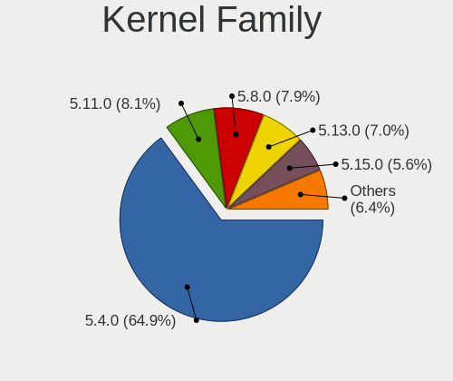

| Version | Computers | Percent |
|---------|-----------|---------|
| 5.4.0   | 399       | 71%     |
| 5.8.0   | 52        | 9.25%   |
| 5.11.0  | 51        | 9.07%   |
| 5.13.0  | 27        | 4.8%    |
| 5.10.27 | 4         | 0.71%   |
| 5.14.0  | 3         | 0.53%   |
| 4.9.277 | 3         | 0.53%   |
| 5.3.0   | 2         | 0.36%   |
| 5.10.0  | 2         | 0.36%   |
| 5.9.3   | 1         | 0.18%   |
| 5.9.0   | 1         | 0.18%   |
| 5.8.17  | 1         | 0.18%   |
| 5.7.6   | 1         | 0.18%   |
| 5.7.0   | 1         | 0.18%   |
| 5.6.7   | 1         | 0.18%   |
| 5.5.11  | 1         | 0.18%   |
| 5.4.167 | 1         | 0.18%   |
| 5.17.0  | 1         | 0.18%   |
| 5.16.0  | 1         | 0.18%   |
| 5.15.6  | 1         | 0.18%   |
| 5.15.34 | 1         | 0.18%   |
| 5.15.29 | 1         | 0.18%   |
| 5.15.12 | 1         | 0.18%   |
| 5.10.5  | 1         | 0.18%   |
| 4.9.230 | 1         | 0.18%   |
| 4.4.154 | 1         | 0.18%   |
| 4.14.89 | 1         | 0.18%   |
| 3.16.85 | 1         | 0.18%   |

Kernel Major Ver.
-----------------

Linux kernel major version

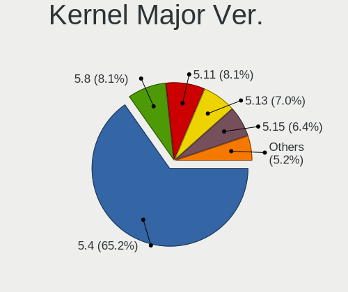

| Version | Computers | Percent |
|---------|-----------|---------|
| 5.4     | 400       | 71.17%  |
| 5.8     | 53        | 9.43%   |
| 5.11    | 51        | 9.07%   |
| 5.13    | 27        | 4.8%    |
| 5.10    | 7         | 1.25%   |
| 5.15    | 4         | 0.71%   |
| 4.9     | 4         | 0.71%   |
| 5.14    | 3         | 0.53%   |
| 5.9     | 2         | 0.36%   |
| 5.7     | 2         | 0.36%   |
| 5.3     | 2         | 0.36%   |
| 5.6     | 1         | 0.18%   |
| 5.5     | 1         | 0.18%   |
| 5.17    | 1         | 0.18%   |
| 5.16    | 1         | 0.18%   |
| 4.4     | 1         | 0.18%   |
| 4.14    | 1         | 0.18%   |
| 3.16    | 1         | 0.18%   |

Arch
----

OS architecture (x86_64, i586, etc.)

| Name    | Computers | Percent |
|---------|-----------|---------|
| x86_64  | 521       | 94.04%  |
| aarch64 | 28        | 5.05%   |
| armv7l  | 5         | 0.9%    |

DE
--

Desktop Environment

| Name       | Computers | Percent |
|------------|-----------|---------|
| MATE       | 542       | 97.83%  |
| Cinnamon   | 4         | 0.72%   |
| GNOME      | 3         | 0.54%   |
| X-Cinnamon | 2         | 0.36%   |
| Trinity    | 1         | 0.18%   |
| KDE5       | 1         | 0.18%   |
| i3         | 1         | 0.18%   |

Display Server
--------------

X11 or Wayland

| Name    | Computers | Percent |
|---------|-----------|---------|
| X11     | 535       | 96.4%   |
| Tty     | 15        | 2.7%    |
| Wayland | 5         | 0.9%    |

Display Manager
---------------

SDDM, LightDM, etc.

| Name    | Computers | Percent |
|---------|-----------|---------|
| TDM     | 213       | 37.37%  |
| Unknown | 167       | 29.3%   |
| LightDM | 156       | 27.37%  |
| GDM     | 24        | 4.21%   |
| GDM3    | 6         | 1.05%   |
| SLiM    | 2         | 0.35%   |
| SDDM    | 2         | 0.35%   |

OS Lang
-------

Language

| Lang    | Computers | Percent |
|---------|-----------|---------|
| en_US   | 173       | 31.12%  |
| pt_BR   | 82        | 14.75%  |
| fr_FR   | 45        | 8.09%   |
| de_DE   | 43        | 7.73%   |
| en_GB   | 31        | 5.58%   |
| ru_RU   | 16        | 2.88%   |
| it_IT   | 16        | 2.88%   |
| es_ES   | 16        | 2.88%   |
| el_GR   | 16        | 2.88%   |
| C       | 16        | 2.88%   |
| en_CA   | 12        | 2.16%   |
| es_AR   | 10        | 1.8%    |
| pl_PL   | 7         | 1.26%   |
| ru_UA   | 6         | 1.08%   |
| de_CH   | 6         | 1.08%   |
| nl_NL   | 5         | 0.9%    |
| en_AU   | 5         | 0.9%    |
| hu_HU   | 4         | 0.72%   |
| en_IN   | 4         | 0.72%   |
| cs_CZ   | 4         | 0.72%   |
| fi_FI   | 3         | 0.54%   |
| en_PH   | 3         | 0.54%   |
| sv_SE   | 2         | 0.36%   |
| hr_HR   | 2         | 0.36%   |
| fr_CA   | 2         | 0.36%   |
| da_DK   | 2         | 0.36%   |
| ca_ES   | 2         | 0.36%   |
| zh_TW   | 1         | 0.18%   |
| zh_CN   | 1         | 0.18%   |
| uk_UA   | 1         | 0.18%   |
| sk_SK   | 1         | 0.18%   |
| lv_LV   | 1         | 0.18%   |
| ja_JP   | 1         | 0.18%   |
| fr_CH   | 1         | 0.18%   |
| fr_BE   | 1         | 0.18%   |
| eu_ES   | 1         | 0.18%   |
| et_EE   | 1         | 0.18%   |
| es_UY   | 1         | 0.18%   |
| es_PR   | 1         | 0.18%   |
| es_PE   | 1         | 0.18%   |
| es_PA   | 1         | 0.18%   |
| es_MX   | 1         | 0.18%   |
| es_GT   | 1         | 0.18%   |
| es_CL   | 1         | 0.18%   |
| en_ZA   | 1         | 0.18%   |
| en_SG   | 1         | 0.18%   |
| en_NZ   | 1         | 0.18%   |
| en_IE   | 1         | 0.18%   |
| de_AT   | 1         | 0.18%   |
| Unknown | 1         | 0.18%   |

Boot Mode
---------

EFI or BIOS

| Mode | Computers | Percent |
|------|-----------|---------|
| BIOS | 291       | 52.15%  |
| EFI  | 267       | 47.85%  |

Filesystem
----------

Type of filesystem

| Type    | Computers | Percent |
|---------|-----------|---------|
| Ext4    | 514       | 92.45%  |
| Overlay | 23        | 4.14%   |
| Btrfs   | 7         | 1.26%   |
| Zfs     | 4         | 0.72%   |
| Xfs     | 4         | 0.72%   |
| Ext3    | 2         | 0.36%   |
| Jfs     | 1         | 0.18%   |
| ExX4    | 1         | 0.18%   |

Part. scheme
------------

Scheme of partitioning

| Type    | Computers | Percent |
|---------|-----------|---------|
| Unknown | 201       | 35.96%  |
| GPT     | 194       | 34.7%   |
| MBR     | 164       | 29.34%  |

Dual Boot with Linux/BSD
------------------------

Hosting more than one Linux/BSD

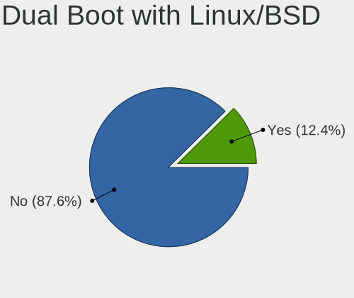

| Dual boot | Computers | Percent |
|-----------|-----------|---------|
| No        | 496       | 88.73%  |
| Yes       | 63        | 11.27%  |

Dual Boot (Win)
---------------

Hosting Linux and Windows

| Dual boot | Computers | Percent |
|-----------|-----------|---------|
| No        | 387       | 69.11%  |
| Yes       | 173       | 30.89%  |

Board
-----

Vendor
------

Motherboard manufacturer

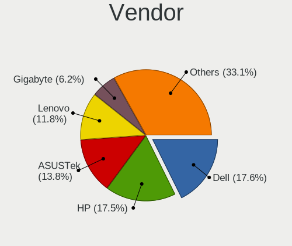

| Name                    | Computers | Percent |
|-------------------------|-----------|---------|
| Dell                    | 99        | 17.87%  |
| Hewlett-Packard         | 94        | 16.97%  |
| ASUSTek Computer        | 79        | 14.26%  |
| Lenovo                  | 69        | 12.45%  |
| Gigabyte Technology     | 32        | 5.78%   |
| MSI                     | 26        | 4.69%   |
| Raspberry Pi Foundation | 22        | 3.97%   |
| ASRock                  | 20        | 3.61%   |
| Acer                    | 20        | 3.61%   |
| Intel                   | 13        | 2.35%   |
| Toshiba                 | 9         | 1.62%   |
| Samsung Electronics     | 7         | 1.26%   |
| Unknown                 | 7         | 1.26%   |
| Hardkernel              | 6         | 1.08%   |
| Medion                  | 5         | 0.9%    |
| Apple                   | 5         | 0.9%    |
| Sony                    | 3         | 0.54%   |
| Pegatron                | 3         | 0.54%   |
| Supermicro              | 2         | 0.36%   |
| Positivo                | 2         | 0.36%   |
| Packard Bell            | 2         | 0.36%   |
| Notebook                | 2         | 0.36%   |
| GPD                     | 2         | 0.36%   |
| ECS                     | 2         | 0.36%   |
| Biostar                 | 2         | 0.36%   |
| Wortmann AG             | 1         | 0.18%   |
| TUXEDO                  | 1         | 0.18%   |
| Teclast                 | 1         | 0.18%   |
| System76                | 1         | 0.18%   |
| Star Labs               | 1         | 0.18%   |
| Semp Toshiba            | 1         | 0.18%   |
| Rockchip                | 1         | 0.18%   |
| Polaroid                | 1         | 0.18%   |
| Pine Microsystems       | 1         | 0.18%   |
| ONE-NETBOOK TECHNOLOGY  | 1         | 0.18%   |
| JINGSHA                 | 1         | 0.18%   |
| IBM                     | 1         | 0.18%   |
| Gateway                 | 1         | 0.18%   |
| Fujitsu Siemens         | 1         | 0.18%   |
| Fujitsu                 | 1         | 0.18%   |
| Cube                    | 1         | 0.18%   |
| Clevo                   | 1         | 0.18%   |
| Chuwi                   | 1         | 0.18%   |
| AZW                     | 1         | 0.18%   |
| AMI                     | 1         | 0.18%   |
| Albatron                | 1         | 0.18%   |

Model
-----

Motherboard model

| Name                                | Computers | Percent |
|-------------------------------------|-----------|---------|
| Unknown                             | 9         | 1.62%   |
| HP Compaq 6005 Pro SFF PC           | 8         | 1.44%   |
| RPi Raspberry Pi                    | 7         | 1.26%   |
| HP Compaq Elite 8300 SFF            | 7         | 1.26%   |
| RPi Raspberry Pi 4 Model B Rev 1.1  | 6         | 1.08%   |
| ASUS All Series                     | 6         | 1.08%   |
| RPi Raspberry Pi 4 Model B Rev 1.2  | 5         | 0.9%    |
| Dell OptiPlex 3010                  | 5         | 0.9%    |
| Dell Latitude E6420                 | 5         | 0.9%    |
| HP Pavilion dv7                     | 4         | 0.72%   |
| Dell OptiPlex GX520                 | 4         | 0.72%   |
| Dell OptiPlex 390                   | 4         | 0.72%   |
| Dell OptiPlex 360                   | 4         | 0.72%   |
| RPi Raspberry Pi 4 Model B Rev 1.4  | 3         | 0.54%   |
| HP Notebook                         | 3         | 0.54%   |
| HP Compaq 6200 Pro SFF PC           | 3         | 0.54%   |
| Hardkernel ODROID-N2Plus            | 3         | 0.54%   |
| Dell Precision M4800                | 3         | 0.54%   |
| Dell OptiPlex 330                   | 3         | 0.54%   |
| Dell Latitude E6410                 | 3         | 0.54%   |
| ASUS M5A78L-M/USB3                  | 3         | 0.54%   |
| ASRock B450M Pro4                   | 3         | 0.54%   |
| Toshiba Satellite C660              | 2         | 0.36%   |
| MSI MS-7C94                         | 2         | 0.36%   |
| MSI MS-7680                         | 2         | 0.36%   |
| Lenovo ThinkBook 14s Yoga ITL 20WE  | 2         | 0.36%   |
| Lenovo IdeaPad Slim 1-14AST-05 81VS | 2         | 0.36%   |
| Lenovo IdeaPad Flex 5 14ARE05 81X2  | 2         | 0.36%   |
| HP x2 Detachable 10-p0XX            | 2         | 0.36%   |
| HP Pavilion g6                      | 2         | 0.36%   |
| HP EliteBook 8470p                  | 2         | 0.36%   |
| HP Compaq 8000 Elite SFF PC         | 2         | 0.36%   |
| HP Compaq 4000 Pro SFF PC           | 2         | 0.36%   |
| Hardkernel ODROID-C4                | 2         | 0.36%   |
| Gigabyte Z97-HD3                    | 2         | 0.36%   |
| Gigabyte B450M DS3H                 | 2         | 0.36%   |
| Dell Vostro 3350                    | 2         | 0.36%   |
| Dell OptiPlex GX620                 | 2         | 0.36%   |
| Dell OptiPlex 980                   | 2         | 0.36%   |
| Dell OptiPlex 780                   | 2         | 0.36%   |
| Dell OptiPlex 755                   | 2         | 0.36%   |
| Dell OptiPlex 380                   | 2         | 0.36%   |
| Dell Latitude E6430                 | 2         | 0.36%   |
| Dell Inspiron 3421                  | 2         | 0.36%   |
| ASUS ZenBook UX431DA_UM431DA        | 2         | 0.36%   |
| ASUS X553MA                         | 2         | 0.36%   |
| ASUS X541SA                         | 2         | 0.36%   |
| ASUS P8H61-M LX3 R2.0               | 2         | 0.36%   |
| ASUS M2N68-AM Plus                  | 2         | 0.36%   |
| Wortmann AG TERRA_MOBILE_1749       | 1         | 0.18%   |
| TUXEDO InfinityBook Pro 14 Gen6     | 1         | 0.18%   |
| Toshiba Satellite Pro L500          | 1         | 0.18%   |
| Toshiba Satellite Pro C660          | 1         | 0.18%   |
| Toshiba Satellite P755              | 1         | 0.18%   |
| Toshiba Satellite M500              | 1         | 0.18%   |
| Toshiba Satellite L350D             | 1         | 0.18%   |
| Toshiba Satellite C675              | 1         | 0.18%   |
| Toshiba Satellite C665              | 1         | 0.18%   |
| Teclast F15S                        | 1         | 0.18%   |
| System76 Serval WS                  | 1         | 0.18%   |

Model Family
------------

Motherboard model prefix

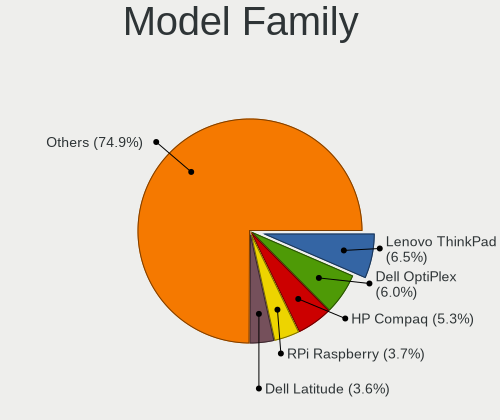

| Name                     | Computers | Percent |
|--------------------------|-----------|---------|
| Lenovo ThinkPad          | 38        | 6.86%   |
| Dell OptiPlex            | 36        | 6.5%    |
| HP Compaq                | 29        | 5.23%   |
| RPi Raspberry            | 22        | 3.97%   |
| Dell Latitude            | 20        | 3.61%   |
| HP Pavilion              | 19        | 3.43%   |
| Acer Aspire              | 15        | 2.71%   |
| Lenovo IdeaPad           | 12        | 2.17%   |
| Dell Precision           | 11        | 1.99%   |
| Dell Inspiron            | 10        | 1.81%   |
| Toshiba Satellite        | 9         | 1.62%   |
| HP EliteBook             | 9         | 1.62%   |
| Unknown                  | 9         | 1.62%   |
| Dell XPS                 | 8         | 1.44%   |
| ASUS PRIME               | 8         | 1.44%   |
| Dell Vostro              | 6         | 1.08%   |
| ASUS All                 | 6         | 1.08%   |
| HP ProBook               | 5         | 0.9%    |
| HP 250                   | 5         | 0.9%    |
| Lenovo ThinkCentre       | 4         | 0.72%   |
| Lenovo ThinkBook         | 4         | 0.72%   |
| HP ZBook                 | 4         | 0.72%   |
| ASUS VivoBook            | 4         | 0.72%   |
| ASUS M5A78L-M            | 4         | 0.72%   |
| HP ProLiant              | 3         | 0.54%   |
| HP Notebook              | 3         | 0.54%   |
| Hardkernel ODROID-N2Plus | 3         | 0.54%   |
| Dell Studio              | 3         | 0.54%   |
| ASUS ROG                 | 3         | 0.54%   |
| ASUS M5A97               | 3         | 0.54%   |
| ASRock B450M             | 3         | 0.54%   |
| Packard Bell EasyNote    | 2         | 0.36%   |
| MSI MS-7C94              | 2         | 0.36%   |
| MSI MS-7680              | 2         | 0.36%   |
| Lenovo Legion            | 2         | 0.36%   |
| Lenovo Flex              | 2         | 0.36%   |
| HP x2                    | 2         | 0.36%   |
| HP ProDesk               | 2         | 0.36%   |
| HP Laptop                | 2         | 0.36%   |
| Hardkernel ODROID-C4     | 2         | 0.36%   |
| Gigabyte Z97-HD3         | 2         | 0.36%   |
| Gigabyte X570            | 2         | 0.36%   |
| Gigabyte B450M           | 2         | 0.36%   |
| Gigabyte B450            | 2         | 0.36%   |
| Dell PowerEdge           | 2         | 0.36%   |
| ASUS ZenBook             | 2         | 0.36%   |
| ASUS X553MA              | 2         | 0.36%   |
| ASUS X541SA              | 2         | 0.36%   |
| ASUS TUF                 | 2         | 0.36%   |
| ASUS P9X79               | 2         | 0.36%   |
| ASUS P8H61-M             | 2         | 0.36%   |
| ASUS M2N68-AM            | 2         | 0.36%   |
| Wortmann AG TERRA        | 1         | 0.18%   |
| TUXEDO InfinityBook      | 1         | 0.18%   |
| Teclast F15S             | 1         | 0.18%   |
| System76 Serval          | 1         | 0.18%   |
| Supermicro X10SAE        | 1         | 0.18%   |
| Supermicro Super         | 1         | 0.18%   |
| Star Labs LabTop         | 1         | 0.18%   |
| Sony VPCS12X9E           | 1         | 0.18%   |

MFG Year
--------

Motherboard manufacture year

| Year    | Computers | Percent |
|---------|-----------|---------|
| 2011    | 68        | 12.27%  |
| 2012    | 54        | 9.75%   |
| 2018    | 52        | 9.39%   |
| 2020    | 44        | 7.94%   |
| 2019    | 39        | 7.04%   |
| 2013    | 39        | 7.04%   |
| 2008    | 33        | 5.96%   |
| 2015    | 32        | 5.78%   |
| 2014    | 32        | 5.78%   |
| 2009    | 30        | 5.42%   |
| 2010    | 29        | 5.23%   |
| Unknown | 27        | 4.87%   |
| 2016    | 23        | 4.15%   |
| 2017    | 19        | 3.43%   |
| 2021    | 13        | 2.35%   |
| 2007    | 9         | 1.62%   |
| 2005    | 6         | 1.08%   |
| 2006    | 5         | 0.9%    |

Form Factor
-----------

Physical design of the computer

| Name           | Computers | Percent |
|----------------|-----------|---------|
| Notebook       | 261       | 47.11%  |
| Desktop        | 229       | 41.34%  |
| System on chip | 32        | 5.78%   |
| Convertible    | 10        | 1.81%   |
| Server         | 9         | 1.62%   |
| Mini pc        | 7         | 1.26%   |
| Tablet         | 4         | 0.72%   |
| All in one     | 2         | 0.36%   |

Secure Boot
-----------

Enabled or disabled

| State    | Computers | Percent |
|----------|-----------|---------|
| Disabled | 516       | 92.97%  |
| Enabled  | 39        | 7.03%   |

Coreboot
--------

Have coreboot on board

| Used | Computers | Percent |
|------|-----------|---------|
| No   | 554       | 100%    |

RAM Size
--------

Total RAM memory

| Size in GB      | Computers | Percent |
|-----------------|-----------|---------|
| 3.01-4.0        | 173       | 30.95%  |
| 4.01-8.0        | 109       | 19.5%   |
| 8.01-16.0       | 86        | 15.38%  |
| 16.01-24.0      | 78        | 13.95%  |
| 32.01-64.0      | 43        | 7.69%   |
| 64.01-256.0     | 22        | 3.94%   |
| 1.01-2.0        | 21        | 3.76%   |
| 2.01-3.0        | 12        | 2.15%   |
| 24.01-32.0      | 8         | 1.43%   |
| 0.51-1.0        | 6         | 1.07%   |
| More than 256.0 | 1         | 0.18%   |

RAM Used
--------

Used RAM memory

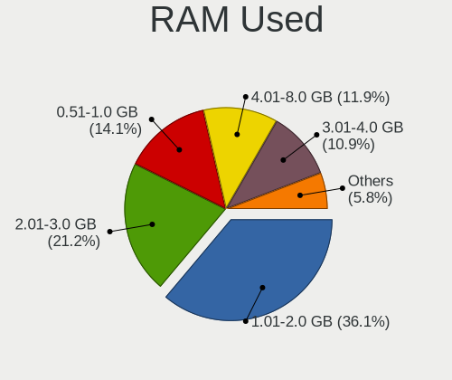

| Used GB    | Computers | Percent |
|------------|-----------|---------|
| 1.01-2.0   | 216       | 36.49%  |
| 2.01-3.0   | 127       | 21.45%  |
| 0.51-1.0   | 93        | 15.71%  |
| 3.01-4.0   | 63        | 10.64%  |
| 4.01-8.0   | 61        | 10.3%   |
| 8.01-16.0  | 13        | 2.2%    |
| 0.01-0.5   | 11        | 1.86%   |
| 24.01-32.0 | 4         | 0.68%   |
| 32.01-64.0 | 2         | 0.34%   |
| 16.01-24.0 | 2         | 0.34%   |

Total Drives
------------

Number of drives on board

| Drives | Computers | Percent |
|--------|-----------|---------|
| 1      | 364       | 64.2%   |
| 2      | 134       | 23.63%  |
| 3      | 36        | 6.35%   |
| 4      | 14        | 2.47%   |
| 5      | 5         | 0.88%   |
| 7      | 3         | 0.53%   |
| 0      | 3         | 0.53%   |
| 10     | 2         | 0.35%   |
| 8      | 2         | 0.35%   |
| 6      | 2         | 0.35%   |
| 11     | 1         | 0.18%   |
| 9      | 1         | 0.18%   |

Has CD-ROM
----------

Has CD-ROM on board

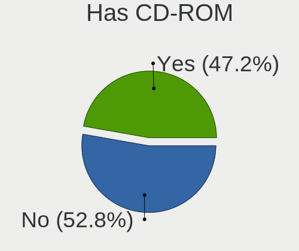

| Presented | Computers | Percent |
|-----------|-----------|---------|
| No        | 284       | 50.99%  |
| Yes       | 273       | 49.01%  |

Has Ethernet
------------

Has Ethernet on board

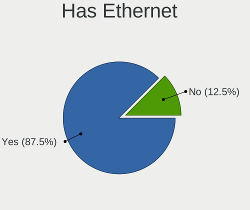

| Presented | Computers | Percent |
|-----------|-----------|---------|
| Yes       | 485       | 87.39%  |
| No        | 70        | 12.61%  |

Has WiFi
--------

Has WiFi module

| Presented | Computers | Percent |
|-----------|-----------|---------|
| Yes       | 358       | 64.04%  |
| No        | 201       | 35.96%  |

Has Bluetooth
-------------

Has Bluetooth module

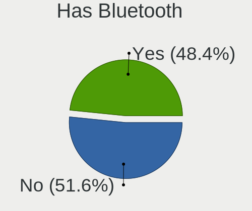

| Presented | Computers | Percent |
|-----------|-----------|---------|
| No        | 289       | 51.7%   |
| Yes       | 270       | 48.3%   |

Location
--------

Country
-------

Geographic location (country)

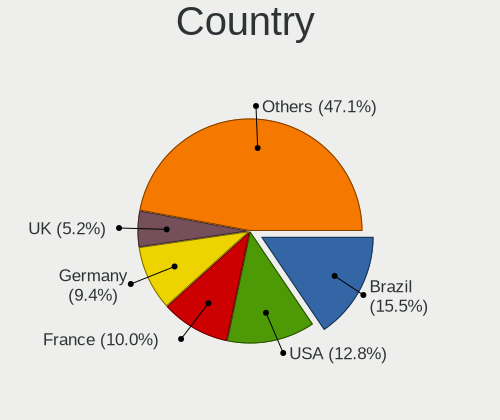

| Country      | Computers | Percent |
|--------------|-----------|---------|
| Brazil       | 93        | 16.7%   |
| USA          | 73        | 13.11%  |
| Germany      | 56        | 10.05%  |
| France       | 49        | 8.8%    |
| UK           | 32        | 5.75%   |
| Spain        | 22        | 3.95%   |
| Russia       | 21        | 3.77%   |
| Italy        | 21        | 3.77%   |
| Greece       | 20        | 3.59%   |
| Canada       | 14        | 2.51%   |
| Netherlands  | 13        | 2.33%   |
| Argentina    | 13        | 2.33%   |
| Ukraine      | 10        | 1.8%    |
| Switzerland  | 10        | 1.8%    |
| Poland       | 7         | 1.26%   |
| Czechia      | 7         | 1.26%   |
| Finland      | 6         | 1.08%   |
| Austria      | 5         | 0.9%    |
| Australia    | 5         | 0.9%    |
| Norway       | 4         | 0.72%   |
| Mexico       | 4         | 0.72%   |
| India        | 4         | 0.72%   |
| Hungary      | 4         | 0.72%   |
| Turkey       | 3         | 0.54%   |
| Taiwan       | 3         | 0.54%   |
| Sweden       | 3         | 0.54%   |
| Indonesia    | 3         | 0.54%   |
| Croatia      | 3         | 0.54%   |
| Chile        | 3         | 0.54%   |
| Vietnam      | 2         | 0.36%   |
| Thailand     | 2         | 0.36%   |
| Portugal     | 2         | 0.36%   |
| Philippines  | 2         | 0.36%   |
| Japan        | 2         | 0.36%   |
| Ireland      | 2         | 0.36%   |
| Estonia      | 2         | 0.36%   |
| Denmark      | 2         | 0.36%   |
| Bulgaria     | 2         | 0.36%   |
| Belgium      | 2         | 0.36%   |
| Belarus      | 2         | 0.36%   |
| Venezuela    | 1         | 0.18%   |
| Uruguay      | 1         | 0.18%   |
| UAE          | 1         | 0.18%   |
| South Africa | 1         | 0.18%   |
| Slovakia     | 1         | 0.18%   |
| Singapore    | 1         | 0.18%   |
| Saudi Arabia | 1         | 0.18%   |
| Runion   | 1         | 0.18%   |
| Romania      | 1         | 0.18%   |
| Puerto Rico  | 1         | 0.18%   |
| Peru         | 1         | 0.18%   |
| Panama       | 1         | 0.18%   |
| New Zealand  | 1         | 0.18%   |
| Morocco      | 1         | 0.18%   |
| Malaysia     | 1         | 0.18%   |
| Luxembourg   | 1         | 0.18%   |
| Latvia       | 1         | 0.18%   |
| Kenya        | 1         | 0.18%   |
| Ivory Coast  | 1         | 0.18%   |
| Hong Kong    | 1         | 0.18%   |

City
----

Geographic location (city)

| City                       | Computers | Percent |
|----------------------------|-----------|---------|
| Sao Paulo                  | 33        | 5.72%   |
| Jundia                 | 24        | 4.16%   |
| Old Faliron                | 11        | 1.91%   |
| Berlin                     | 10        | 1.73%   |
| Itatiba                    | 9         | 1.56%   |
| Paris                      | 7         | 1.21%   |
| Moscow                     | 7         | 1.21%   |
| Thessaloniki               | 5         | 0.87%   |
| Rome                       | 5         | 0.87%   |
| Manchester                 | 5         | 0.87%   |
| Kyiv                       | 4         | 0.69%   |
| Barcelona                  | 4         | 0.69%   |
| Zurich                     | 3         | 0.52%   |
| Zagreb                     | 3         | 0.52%   |
| Rio de Janeiro             | 3         | 0.52%   |
| Le Kremlin-Bicetre         | 3         | 0.52%   |
| Karlsruhe                  | 3         | 0.52%   |
| Hamburg                    | 3         | 0.52%   |
| East Longmeadow            | 3         | 0.52%   |
| Amsterdam                  | 3         | 0.52%   |
| Yekaterinburg              | 2         | 0.35%   |
| Wocawek          | 2         | 0.35%   |
| Windsor                    | 2         | 0.35%   |
| Vigo                       | 2         | 0.35%   |
| Vienna                     | 2         | 0.35%   |
| The Hague                  | 2         | 0.35%   |
| Terlizzi                   | 2         | 0.35%   |
| Tainan City                | 2         | 0.35%   |
| So Jos dos Pinhais | 2         | 0.35%   |
| Srednyaya Akhtuba          | 2         | 0.35%   |
| San Diego                  | 2         | 0.35%   |
| Rotterdam                  | 2         | 0.35%   |
| Prague                     | 2         | 0.35%   |
| Portland                   | 2         | 0.35%   |
| Oslo                       | 2         | 0.35%   |
| Offenbach                  | 2         | 0.35%   |
| Nottingham                 | 2         | 0.35%   |
| Norwich                    | 2         | 0.35%   |
| Montreal                   | 2         | 0.35%   |
| Milan                      | 2         | 0.35%   |
| Melbourne                  | 2         | 0.35%   |
| Marseille                  | 2         | 0.35%   |
| Madrid                     | 2         | 0.35%   |
| London                     | 2         | 0.35%   |
| Lodz                       | 2         | 0.35%   |
| Lisbon                     | 2         | 0.35%   |
| Kirchheim unter Teck       | 2         | 0.35%   |
| Ho Chi Minh City           | 2         | 0.35%   |
| Herriman                   | 2         | 0.35%   |
| Florence                   | 2         | 0.35%   |
| Evansville                 | 2         | 0.35%   |
| Essen                      | 2         | 0.35%   |
| Ely                        | 2         | 0.35%   |
| Durham                     | 2         | 0.35%   |
| Dublin                     | 2         | 0.35%   |
| Biysk                      | 2         | 0.35%   |
| Biddulph                   | 2         | 0.35%   |
| Bergschenhoek              | 2         | 0.35%   |
| Basel                      | 2         | 0.35%   |
| Bagnoles-de-l'Orne         | 2         | 0.35%   |

Drives
------

Drive Vendor
------------

Hard drive vendors

| Vendor                    | Computers | Drives | Percent |
|---------------------------|-----------|--------|---------|
| WDC                       | 143       | 200    | 18.97%  |
| Seagate                   | 131       | 187    | 17.37%  |
| Samsung Electronics       | 105       | 150    | 13.93%  |
| Unknown                   | 57        | 73     | 7.56%   |
| Toshiba                   | 48        | 67     | 6.37%   |
| Kingston                  | 48        | 62     | 6.37%   |
| SanDisk                   | 34        | 40     | 4.51%   |
| Hitachi                   | 29        | 34     | 3.85%   |
| Intel                     | 20        | 24     | 2.65%   |
| Crucial                   | 19        | 28     | 2.52%   |
| SK Hynix                  | 11        | 14     | 1.46%   |
| A-DATA Technology         | 11        | 11     | 1.46%   |
| HGST                      | 8         | 10     | 1.06%   |
| China                     | 8         | 9      | 1.06%   |
| Silicon Motion            | 6         | 7      | 0.8%    |
| PNY                       | 6         | 7      | 0.8%    |
| Patriot                   | 5         | 7      | 0.66%   |
| KIOXIA                    | 5         | 5      | 0.66%   |
| Micron Technology         | 4         | 5      | 0.53%   |
| Apacer                    | 4         | 5      | 0.53%   |
| Phison                    | 3         | 3      | 0.4%    |
| MAXTOR                    | 3         | 10     | 0.4%    |
| JMicron                   | 3         | 5      | 0.4%    |
| Intenso                   | 3         | 3      | 0.4%    |
| Fujitsu                   | 3         | 3      | 0.4%    |
| Transcend                 | 2         | 3      | 0.27%   |
| Micron/Crucial Technology | 2         | 4      | 0.27%   |
| Hewlett-Packard           | 2         | 2      | 0.27%   |
| Vaseky                    | 1         | 1      | 0.13%   |
| USB3.0                    | 1         | 1      | 0.13%   |
| Union Memory              | 1         | 1      | 0.13%   |
| UMIS                      | 1         | 1      | 0.13%   |
| TO Exter                  | 1         | 1      | 0.13%   |
| SPCC                      | 1         | 1      | 0.13%   |
| SMI                       | 1         | 1      | 0.13%   |
| SMART                     | 1         | 1      | 0.13%   |
| SABRENT                   | 1         | 1      | 0.13%   |
| Realtek Semiconductor     | 1         | 1      | 0.13%   |
| PLEXTOR                   | 1         | 1      | 0.13%   |
| OCZ                       | 1         | 1      | 0.13%   |
| Netac                     | 1         | 1      | 0.13%   |
| Mushkin                   | 1         | 1      | 0.13%   |
| Marlin                    | 1         | 1      | 0.13%   |
| LITEONIT                  | 1         | 2      | 0.13%   |
| Lexar                     | 1         | 1      | 0.13%   |
| Leven                     | 1         | 1      | 0.13%   |
| LDLC                      | 1         | 1      | 0.13%   |
| KIOXIA-EXCERIA            | 1         | 1      | 0.13%   |
| KingSpec                  | 1         | 1      | 0.13%   |
| Inateck                   | 1         | 1      | 0.13%   |
| Gigabyte Technology       | 1         | 1      | 0.13%   |
| FORESEE                   | 1         | 1      | 0.13%   |
| faspeed                   | 1         | 1      | 0.13%   |
| ASMT109x                  | 1         | 2      | 0.13%   |
| ASMT                      | 1         | 2      | 0.13%   |
| AMD                       | 1         | 1      | 0.13%   |
| AGI                       | 1         | 2      | 0.13%   |
| addlink                   | 1         | 2      | 0.13%   |
| ADATA SP                  | 1         | 1      | 0.13%   |

Drive Model
-----------

Hard drive models

| Model                               | Computers | Percent |
|-------------------------------------|-----------|---------|
| Unknown MMC Card  32GB              | 15        | 1.83%   |
| Seagate ST500DM002-1BD142 500GB     | 13        | 1.59%   |
| Unknown MMC Card  64GB              | 12        | 1.47%   |
| Kingston SA400S37120G 120GB SSD     | 12        | 1.47%   |
| Kingston SA400S37240G 240GB SSD     | 9         | 1.1%    |
| Unknown MMC Card  16GB              | 8         | 0.98%   |
| Samsung SSD 860 EVO 500GB           | 8         | 0.98%   |
| WDC WD5000AAKX-083CA1 500GB         | 6         | 0.73%   |
| WDC WD5000AAKX-003CA0 500GB         | 6         | 0.73%   |
| Toshiba MQ01ABF050 500GB            | 6         | 0.73%   |
| Seagate ST3500418AS 500GB           | 6         | 0.73%   |
| Seagate ST320LT007-9ZV142 320GB     | 6         | 0.73%   |
| Seagate ST1000LM035-1RK172 1TB      | 6         | 0.73%   |
| Toshiba DT01ACA100 1TB              | 5         | 0.61%   |
| Seagate ST2000DM008-2FR102 2TB      | 5         | 0.61%   |
| Seagate ST1000DM010-2EP102 1TB      | 5         | 0.61%   |
| Samsung HD322HJ 320GB               | 5         | 0.61%   |
| WDC WDS240G2G0A-00JH30 240GB SSD    | 4         | 0.49%   |
| WDC WD10JPVX-22JC3T0 1TB            | 4         | 0.49%   |
| WDC WD10EZEX-08WN4A0 1TB            | 4         | 0.49%   |
| Unknown MMC Card  128GB             | 4         | 0.49%   |
| Toshiba MQ04ABF100 1TB              | 4         | 0.49%   |
| Seagate ST1000LM024 HN-M101MBB 1TB  | 4         | 0.49%   |
| Kingston SA400S37480G 480GB SSD     | 4         | 0.49%   |
| Hitachi HTS545050B9A300 500GB       | 4         | 0.49%   |
| WDC WD2500AAKX-753CA1 250GB         | 3         | 0.37%   |
| WDC WD20EZRZ-00Z5HB0 2TB            | 3         | 0.37%   |
| WDC WD10SPZX-21Z10T0 1TB            | 3         | 0.37%   |
| WDC WD10EZEX-00BN5A0 1TB            | 3         | 0.37%   |
| Unknown SD/MMC/MS PRO 16GB          | 3         | 0.37%   |
| Unknown DA4064  64GB                | 3         | 0.37%   |
| Toshiba DT01ACA050 500GB            | 3         | 0.37%   |
| Seagate ST8000DM004-2CX188 8TB      | 3         | 0.37%   |
| Seagate ST500LT012-9WS142 500GB     | 3         | 0.37%   |
| Seagate ST500LT012-1DG142 500GB     | 3         | 0.37%   |
| Seagate ST500LM012 HN-M500MBB 500GB | 3         | 0.37%   |
| Seagate ST3500630AS 500GB           | 3         | 0.37%   |
| Seagate ST3320620AS 320GB           | 3         | 0.37%   |
| Seagate ST2000DM001-9YN164 2TB      | 3         | 0.37%   |
| Seagate ST2000DM001-1ER164 2TB      | 3         | 0.37%   |
| Seagate ST1000LM014-1EJ164 1TB      | 3         | 0.37%   |
| Seagate ST1000DM003-1CH162 1TB      | 3         | 0.37%   |
| Seagate Expansion+ 2TB              | 3         | 0.37%   |
| SanDisk SSD U100 16GB               | 3         | 0.37%   |
| SanDisk SSD PLUS 480GB              | 3         | 0.37%   |
| Sandisk NVMe SSD Drive 512GB        | 3         | 0.37%   |
| Samsung SSD 860 EVO 2TB             | 3         | 0.37%   |
| Samsung SSD 850 EVO 500GB           | 3         | 0.37%   |
| Samsung SP2504C 250GB               | 3         | 0.37%   |
| Samsung NVMe SSD Drive 500GB        | 3         | 0.37%   |
| Samsung HD502HJ 500GB               | 3         | 0.37%   |
| Kingston SV300S37A240G 240GB SSD    | 3         | 0.37%   |
| Kingston SV300S37A120G 120GB SSD    | 3         | 0.37%   |
| Intel SSDPEKNW512G8 512GB           | 3         | 0.37%   |
| Hitachi HTS547564A9E384 640GB       | 3         | 0.37%   |
| Crucial CT500MX500SSD1 500GB        | 3         | 0.37%   |
| A-DATA SU650 120GB SSD              | 3         | 0.37%   |
| WDC WDS500G2B0A-00SM50 500GB SSD    | 2         | 0.24%   |
| WDC WDS120G2G0A-00JH30 120GB SSD    | 2         | 0.24%   |
| WDC WDS100T2G0A-00JH30 1TB SSD      | 2         | 0.24%   |

HDD Vendor
----------

Hard disk drive vendors

| Vendor              | Computers | Drives | Percent |
|---------------------|-----------|--------|---------|
| Seagate             | 130       | 185    | 36.31%  |
| WDC                 | 117       | 163    | 32.68%  |
| Toshiba             | 40        | 59     | 11.17%  |
| Hitachi             | 29        | 34     | 8.1%    |
| Samsung Electronics | 23        | 26     | 6.42%   |
| HGST                | 8         | 10     | 2.23%   |
| Unknown             | 3         | 3      | 0.84%   |
| Fujitsu             | 3         | 3      | 0.84%   |
| MAXTOR              | 2         | 7      | 0.56%   |
| SABRENT             | 1         | 1      | 0.28%   |
| Hewlett-Packard     | 1         | 1      | 0.28%   |
| ASMT109x            | 1         | 2      | 0.28%   |

SSD Vendor
----------

Solid state drive vendors

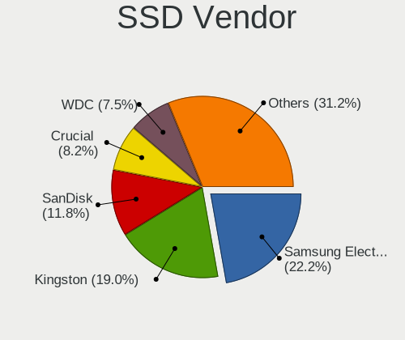

| Vendor              | Computers | Drives | Percent |
|---------------------|-----------|--------|---------|
| Samsung Electronics | 56        | 81     | 23.83%  |
| Kingston            | 43        | 52     | 18.3%   |
| SanDisk             | 26        | 31     | 11.06%  |
| WDC                 | 18        | 24     | 7.66%   |
| Crucial             | 17        | 26     | 7.23%   |
| A-DATA Technology   | 11        | 11     | 4.68%   |
| Intel               | 10        | 13     | 4.26%   |
| China               | 8         | 9      | 3.4%    |
| PNY                 | 6         | 7      | 2.55%   |
| Apacer              | 4         | 5      | 1.7%    |
| Toshiba             | 3         | 3      | 1.28%   |
| Patriot             | 3         | 5      | 1.28%   |
| Intenso             | 3         | 3      | 1.28%   |
| Transcend           | 2         | 3      | 0.85%   |
| Seagate             | 2         | 2      | 0.85%   |
| Micron Technology   | 2         | 3      | 0.85%   |
| Vaseky              | 1         | 1      | 0.43%   |
| USB3.0              | 1         | 1      | 0.43%   |
| TO Exter            | 1         | 1      | 0.43%   |
| SMI                 | 1         | 1      | 0.43%   |
| SMART               | 1         | 1      | 0.43%   |
| SK Hynix            | 1         | 4      | 0.43%   |
| PLEXTOR             | 1         | 1      | 0.43%   |
| OCZ                 | 1         | 1      | 0.43%   |
| Netac               | 1         | 1      | 0.43%   |
| Mushkin             | 1         | 1      | 0.43%   |
| MAXTOR              | 1         | 3      | 0.43%   |
| LITEONIT            | 1         | 2      | 0.43%   |
| Lexar               | 1         | 1      | 0.43%   |
| Leven               | 1         | 1      | 0.43%   |
| LDLC                | 1         | 1      | 0.43%   |
| KingSpec            | 1         | 1      | 0.43%   |
| JMicron             | 1         | 1      | 0.43%   |
| FORESEE             | 1         | 1      | 0.43%   |
| ASMT                | 1         | 2      | 0.43%   |
| AMD                 | 1         | 1      | 0.43%   |
| ADATA SP            | 1         | 1      | 0.43%   |

Drive Kind
----------

HDD or SSD

| Kind    | Computers | Drives | Percent |
|---------|-----------|--------|---------|
| HDD     | 311       | 494    | 45.6%   |
| SSD     | 206       | 306    | 30.21%  |
| NVMe    | 106       | 135    | 15.54%  |
| MMC     | 53        | 70     | 7.77%   |
| Unknown | 6         | 9      | 0.88%   |

Drive Connector
---------------

SATA, SAS, NVMe, etc.

| Type | Computers | Drives | Percent |
|------|-----------|--------|---------|
| SATA | 441       | 777    | 70.45%  |
| NVMe | 106       | 135    | 16.93%  |
| MMC  | 53        | 70     | 8.47%   |
| SAS  | 26        | 32     | 4.15%   |

Drive Size
----------

Size of hard drive

| Size in TB | Computers | Drives | Percent |
|------------|-----------|--------|---------|
| 0.01-0.5   | 342       | 486    | 62.07%  |
| 0.51-1.0   | 137       | 190    | 24.86%  |
| 1.01-2.0   | 42        | 61     | 7.62%   |
| 3.01-4.0   | 12        | 17     | 2.18%   |
| 4.01-10.0  | 10        | 25     | 1.81%   |
| 2.01-3.0   | 6         | 12     | 1.09%   |
| 10.01-20.0 | 2         | 9      | 0.36%   |

Space Total
-----------

Amount of disk space available on the file system

| Size in GB     | Computers | Percent |
|----------------|-----------|---------|
| 251-500        | 169       | 29.49%  |
| 101-250        | 124       | 21.64%  |
| 501-1000       | 80        | 13.96%  |
| 1001-2000      | 50        | 8.73%   |
| 51-100         | 35        | 6.11%   |
| More than 3000 | 32        | 5.58%   |
| 21-50          | 28        | 4.89%   |
| 1-20           | 28        | 4.89%   |
| 2001-3000      | 16        | 2.79%   |
| Unknown        | 11        | 1.92%   |

Space Used
----------

Amount of used disk space

| Used GB        | Computers | Percent |
|----------------|-----------|---------|
| 1-20           | 210       | 35.65%  |
| 21-50          | 94        | 15.96%  |
| 101-250        | 84        | 14.26%  |
| 51-100         | 71        | 12.05%  |
| 251-500        | 52        | 8.83%   |
| 501-1000       | 30        | 5.09%   |
| 1001-2000      | 18        | 3.06%   |
| 2001-3000      | 11        | 1.87%   |
| Unknown        | 11        | 1.87%   |
| More than 3000 | 8         | 1.36%   |

Malfunc. Drives
---------------

Drive models with a malfunction

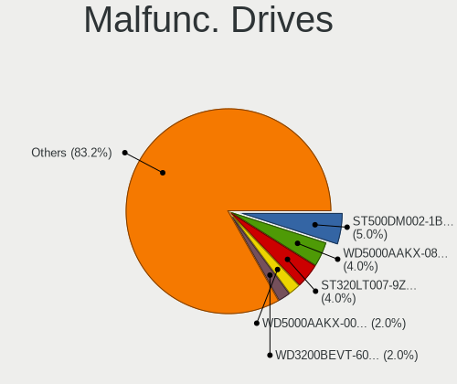

| Model                                    | Computers | Drives | Percent |
|------------------------------------------|-----------|--------|---------|
| Seagate ST500DM002-1BD142 500GB          | 5         | 5      | 5.56%   |
| WDC WD5000AAKX-083CA1 500GB              | 4         | 4      | 4.44%   |
| Seagate ST320LT007-9ZV142 320GB          | 4         | 4      | 4.44%   |
| WDC WD5000AAKX-003CA0 500GB              | 2         | 2      | 2.22%   |
| WDC WD2500AAKX-753CA1 250GB              | 2         | 2      | 2.22%   |
| Toshiba MK7559GSXP 752GB                 | 2         | 2      | 2.22%   |
| Seagate ST3500418AS 500GB                | 2         | 2      | 2.22%   |
| Samsung Electronics HD502HJ 500GB        | 2         | 2      | 2.22%   |
| WDC WD7500BPVT-75HXZT1 752GB             | 1         | 1      | 1.11%   |
| WDC WD7500BPKT-75PK4T0 752GB             | 1         | 1      | 1.11%   |
| WDC WD5000LPVX-22V0TT0 500GB             | 1         | 1      | 1.11%   |
| WDC WD5000BPKT-75PK4T0 500GB             | 1         | 2      | 1.11%   |
| WDC WD40EFAX-68JH4N0 4TB                 | 1         | 1      | 1.11%   |
| WDC WD3200BEVT-60ZCT1 320GB              | 1         | 1      | 1.11%   |
| WDC WD3200AAJS-40VWA1 320GB              | 1         | 1      | 1.11%   |
| WDC WD2500YS-01SHB1 256GB                | 1         | 1      | 1.11%   |
| WDC WD2500AAKX-75U6AA0 250GB             | 1         | 1      | 1.11%   |
| WDC WD2500AAJS-75M0A0 250GB              | 1         | 1      | 1.11%   |
| WDC WD20EZRZ-00Z5HB0 2TB                 | 1         | 1      | 1.11%   |
| WDC WD1600AAJS-75M0A0 160GB              | 1         | 2      | 1.11%   |
| WDC WD15EADS-00P8B0 1TB                  | 1         | 1      | 1.11%   |
| WDC WD1200JD-00HBB0 120GB                | 1         | 1      | 1.11%   |
| WDC WD10JPCX-24UE4T0 1TB                 | 1         | 1      | 1.11%   |
| WDC WD10EZEX-00BN5A0 1TB                 | 1         | 1      | 1.11%   |
| WDC WD10EFRX-68PJCN0 1TB                 | 1         | 1      | 1.11%   |
| WDC WD10EARS-00MVWB0 1TB                 | 1         | 1      | 1.11%   |
| Vaseky V820/1TB SSD                      | 1         | 1      | 1.11%   |
| Toshiba MQ01ABD050 500GB                 | 1         | 1      | 1.11%   |
| Toshiba MK5065GSX 500GB                  | 1         | 1      | 1.11%   |
| Toshiba MK5055GSX 500GB                  | 1         | 1      | 1.11%   |
| Toshiba MK2565GSXN 250GB                 | 1         | 1      | 1.11%   |
| Toshiba MK2555GSX 250GB                  | 1         | 1      | 1.11%   |
| Toshiba DT01ACA100 1TB                   | 1         | 1      | 1.11%   |
| Seagate ST9500420AS 500GB                | 1         | 1      | 1.11%   |
| Seagate ST9500325AS 500GB                | 1         | 1      | 1.11%   |
| Seagate ST9250410AS 250GB                | 1         | 1      | 1.11%   |
| Seagate ST9160821AS 160GB                | 1         | 1      | 1.11%   |
| Seagate ST500LT012-9WS142 500GB          | 1         | 1      | 1.11%   |
| Seagate ST4000DM004-2CV104 4TB           | 1         | 1      | 1.11%   |
| Seagate ST3750525AS 752GB                | 1         | 1      | 1.11%   |
| Seagate ST3500320AS 500GB                | 1         | 1      | 1.11%   |
| Seagate ST3402111AS 40GB                 | 1         | 1      | 1.11%   |
| Seagate ST3360320AS 360GB                | 1         | 2      | 1.11%   |
| Seagate ST3320620AS 320GB                | 1         | 1      | 1.11%   |
| Seagate ST3250318AS 250GB                | 1         | 1      | 1.11%   |
| Seagate ST3250310AS 250GB                | 1         | 1      | 1.11%   |
| Seagate ST320LT012-9WS14C 320GB          | 1         | 1      | 1.11%   |
| Seagate ST32000644NS 2TB                 | 1         | 1      | 1.11%   |
| Seagate ST31000333AS 1TB                 | 1         | 1      | 1.11%   |
| Seagate ST2000DM001-9YN164 2TB           | 1         | 2      | 1.11%   |
| Seagate ST1000DM003-1CH162 1TB           | 1         | 1      | 1.11%   |
| SanDisk SSD PLUS 480GB                   | 1         | 1      | 1.11%   |
| SanDisk SD7SN3Q256G1002 256GB SSD        | 1         | 1      | 1.11%   |
| Samsung Electronics SSD 870 EVO 500GB    | 1         | 1      | 1.11%   |
| Samsung Electronics SSD 840 Series 250GB | 1         | 1      | 1.11%   |
| Samsung Electronics SP2504C 250GB        | 1         | 1      | 1.11%   |
| Samsung Electronics M3 Portable 500GB    | 1         | 1      | 1.11%   |
| Samsung Electronics HM160HI 160GB        | 1         | 1      | 1.11%   |
| Samsung Electronics HE103SJ 1TB          | 1         | 2      | 1.11%   |
| OCZ VERTEX450 128GB SSD                  | 1         | 1      | 1.11%   |

Malfunc. Drive Vendor
---------------------

Vendors of faulty drives

| Vendor              | Computers | Drives | Percent |
|---------------------|-----------|--------|---------|
| Seagate             | 29        | 31     | 32.58%  |
| WDC                 | 25        | 28     | 28.09%  |
| Toshiba             | 8         | 8      | 8.99%   |
| Samsung Electronics | 8         | 9      | 8.99%   |
| Hitachi             | 5         | 5      | 5.62%   |
| SanDisk             | 2         | 2      | 2.25%   |
| Intel               | 2         | 2      | 2.25%   |
| Vaseky              | 1         | 1      | 1.12%   |
| OCZ                 | 1         | 1      | 1.12%   |
| MAXTOR              | 1         | 1      | 1.12%   |
| Kingston            | 1         | 1      | 1.12%   |
| HGST                | 1         | 2      | 1.12%   |
| Fujitsu             | 1         | 1      | 1.12%   |
| Crucial             | 1         | 1      | 1.12%   |
| China               | 1         | 1      | 1.12%   |
| ASMT                | 1         | 2      | 1.12%   |
| A-DATA Technology   | 1         | 1      | 1.12%   |

Malfunc. HDD Vendor
-------------------

Vendors of faulty HDD drives

| Vendor              | Computers | Drives | Percent |
|---------------------|-----------|--------|---------|
| Seagate             | 29        | 31     | 38.16%  |
| WDC                 | 25        | 28     | 32.89%  |
| Toshiba             | 8         | 8      | 10.53%  |
| Samsung Electronics | 6         | 7      | 7.89%   |
| Hitachi             | 5         | 5      | 6.58%   |
| MAXTOR              | 1         | 1      | 1.32%   |
| HGST                | 1         | 2      | 1.32%   |
| Fujitsu             | 1         | 1      | 1.32%   |

Malfunc. Drive Kind
-------------------

Kinds of faulty drives

| Kind | Computers | Drives | Percent |
|------|-----------|--------|---------|
| HDD  | 73        | 83     | 85.88%  |
| SSD  | 12        | 14     | 14.12%  |

Failed Drives
-------------

Failed drive models

Zero info for selected period =(

Failed Drive Vendor
-------------------

Failed drive vendors

Zero info for selected period =(

Drive Status
------------

Number of failed and malfunc. drives

| Status   | Computers | Drives | Percent |
|----------|-----------|--------|---------|
| Works    | 293       | 475    | 49%     |
| Detected | 222       | 442    | 37.12%  |
| Malfunc  | 83        | 97     | 13.88%  |

Storage controller
------------------

Storage Vendor
--------------

Storage controller vendors

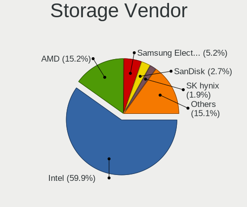

| Vendor                           | Computers | Percent |
|----------------------------------|-----------|---------|
| Intel                            | 373       | 60.55%  |
| AMD                              | 96        | 15.58%  |
| Samsung Electronics              | 30        | 4.87%   |
| Sandisk                          | 17        | 2.76%   |
| Nvidia                           | 11        | 1.79%   |
| Marvell Technology Group         | 11        | 1.79%   |
| ASMedia Technology               | 11        | 1.79%   |
| SK Hynix                         | 10        | 1.62%   |
| Silicon Motion                   | 9         | 1.46%   |
| Toshiba America Info Systems     | 7         | 1.14%   |
| Kingston Technology Company      | 7         | 1.14%   |
| Phison Electronics               | 6         | 0.97%   |
| KIOXIA                           | 5         | 0.81%   |
| Micron/Crucial Technology        | 4         | 0.65%   |
| Union Memory (Shenzhen)          | 3         | 0.49%   |
| LSI Logic / Symbios Logic        | 3         | 0.49%   |
| JMicron Technology               | 3         | 0.49%   |
| Silicon Integrated Systems [SiS] | 2         | 0.32%   |
| Micron Technology                | 2         | 0.32%   |
| Hewlett-Packard                  | 2         | 0.32%   |
| VIA Technologies                 | 1         | 0.16%   |
| Solid State Storage Technology   | 1         | 0.16%   |
| Realtek Semiconductor            | 1         | 0.16%   |
| Integrated Technology Express    | 1         | 0.16%   |

Storage Model
-------------

Storage controller models

| Model                                                                                   | Computers | Percent |
|-----------------------------------------------------------------------------------------|-----------|---------|
| AMD FCH SATA Controller [AHCI mode]                                                     | 54        | 7.32%   |
| Intel 8 Series/C220 Series Chipset Family 6-port SATA Controller 1 [AHCI mode]          | 33        | 4.47%   |
| Intel 6 Series/C200 Series Chipset Family 6 port Mobile SATA AHCI Controller            | 30        | 4.07%   |
| Intel 7 Series Chipset Family 6-port SATA Controller [AHCI mode]                        | 29        | 3.93%   |
| Intel NM10/ICH7 Family SATA Controller [IDE mode]                                       | 26        | 3.52%   |
| Intel 82801G (ICH7 Family) IDE Controller                                               | 24        | 3.25%   |
| Samsung NVMe SSD Controller SM981/PM981/PM983                                           | 20        | 2.71%   |
| Intel Sunrise Point-LP SATA Controller [AHCI mode]                                      | 18        | 2.44%   |
| Intel 6 Series/C200 Series Chipset Family 6 port Desktop SATA AHCI Controller           | 18        | 2.44%   |
| AMD SB7x0/SB8x0/SB9x0 SATA Controller [AHCI mode]                                       | 18        | 2.44%   |
| Intel 82801 Mobile SATA Controller [RAID mode]                                          | 17        | 2.3%    |
| AMD SB7x0/SB8x0/SB9x0 IDE Controller                                                    | 16        | 2.17%   |
| Intel Wildcat Point-LP SATA Controller [AHCI Mode]                                      | 15        | 2.03%   |
| Intel 7 Series/C210 Series Chipset Family 6-port SATA Controller [AHCI mode]            | 15        | 2.03%   |
| AMD SB7x0/SB8x0/SB9x0 SATA Controller [IDE mode]                                        | 14        | 1.9%    |
| Intel 6 Series/C200 Series Chipset Family Desktop SATA Controller (IDE mode, ports 4-5) | 12        | 1.63%   |
| Intel 6 Series/C200 Series Chipset Family Desktop SATA Controller (IDE mode, ports 0-3) | 12        | 1.63%   |
| AMD 400 Series Chipset SATA Controller                                                  | 12        | 1.63%   |
| Intel 8 Series SATA Controller 1 [AHCI mode]                                            | 10        | 1.36%   |
| ASMedia ASM1062 Serial ATA Controller                                                   | 9         | 1.22%   |
| Intel Cannon Lake PCH SATA AHCI Controller                                              | 8         | 1.08%   |
| Intel Cannon Lake Mobile PCH SATA AHCI Controller                                       | 8         | 1.08%   |
| Intel Atom Processor E3800 Series SATA AHCI Controller                                  | 8         | 1.08%   |
| Intel HM170/QM170 Chipset SATA Controller [AHCI Mode]                                   | 7         | 0.95%   |
| Intel 82801IBM/IEM (ICH9M/ICH9M-E) 4 port SATA Controller [AHCI mode]                   | 7         | 0.95%   |
| Intel 5 Series/3400 Series Chipset 6 port SATA AHCI Controller                          | 7         | 0.95%   |
| Intel 5 Series/3400 Series Chipset 4 port SATA AHCI Controller                          | 7         | 0.95%   |
| Intel 200 Series PCH SATA controller [AHCI mode]                                        | 7         | 0.95%   |
| Silicon Motion SM2263EN/SM2263XT SSD Controller                                         | 6         | 0.81%   |
| Sandisk WD Black 2018/SN750 / PC SN720 NVMe SSD                                         | 6         | 0.81%   |
| Nvidia MCP61 SATA Controller                                                            | 6         | 0.81%   |
| Intel Q170/Q150/B150/H170/H110/Z170/CM236 Chipset SATA Controller [AHCI Mode]           | 6         | 0.81%   |
| Intel Celeron/Pentium Silver Processor SATA Controller                                  | 6         | 0.81%   |
| Intel C600/X79 series chipset 6-Port SATA AHCI Controller                               | 6         | 0.81%   |
| Intel 82801JD/DO (ICH10 Family) SATA AHCI Controller                                    | 6         | 0.81%   |
| Intel 82801HM/HEM (ICH8M/ICH8M-E) IDE Controller                                        | 6         | 0.81%   |
| AMD 500 Series Chipset SATA Controller                                                  | 6         | 0.81%   |
| KIOXIA Non-Volatile memory controller                                                   | 5         | 0.68%   |
| Intel Volume Management Device NVMe RAID Controller                                     | 5         | 0.68%   |
| Intel SSD 660P Series                                                                   | 5         | 0.68%   |
| Intel Atom/Celeron/Pentium Processor x5-E8000/J3xxx/N3xxx Series SATA Controller        | 5         | 0.68%   |
| SK Hynix BC501 NVMe Solid State Drive                                                   | 4         | 0.54%   |
| Sandisk WD Black SN750 / PC SN730 NVMe SSD                                              | 4         | 0.54%   |
| Samsung NVMe SSD Controller 980                                                         | 4         | 0.54%   |
| Nvidia MCP61 IDE                                                                        | 4         | 0.54%   |
| Intel SATA Controller [RAID mode]                                                       | 4         | 0.54%   |
| Intel Comet Lake SATA AHCI Controller                                                   | 4         | 0.54%   |
| Intel 9 Series Chipset Family SATA Controller [AHCI Mode]                               | 4         | 0.54%   |
| Intel 82801HM/HEM (ICH8M/ICH8M-E) SATA Controller [AHCI mode]                           | 4         | 0.54%   |
| Intel 4 Series Chipset PT IDER Controller                                               | 4         | 0.54%   |
| Union Memory (Shenzhen) Non-Volatile memory controller                                  | 3         | 0.41%   |
| Toshiba America Info Systems XG6 NVMe SSD Controller                                    | 3         | 0.41%   |
| Toshiba America Info Systems Toshiba America Info Non-Volatile memory controller        | 3         | 0.41%   |
| SK Hynix BC511                                                                          | 3         | 0.41%   |
| Silicon Motion SM2262/SM2262EN SSD Controller                                           | 3         | 0.41%   |
| Sandisk WD Blue SN500 / PC SN520 NVMe SSD                                               | 3         | 0.41%   |
| Samsung NVMe SSD Controller PM9A1/PM9A3/980PRO                                          | 3         | 0.41%   |
| Phison E12 NVMe Controller                                                              | 3         | 0.41%   |
| Intel NM10/ICH7 Family SATA Controller [AHCI mode]                                      | 3         | 0.41%   |
| Intel Ice Lake-LP SATA Controller [AHCI mode]                                           | 3         | 0.41%   |

Storage Kind
------------

Kind of storage controller (IDE, SATA, NVMe, SAS, ...)

| Kind | Computers | Percent |
|------|-----------|---------|
| SATA | 390       | 61.71%  |
| NVMe | 105       | 16.61%  |
| IDE  | 101       | 15.98%  |
| RAID | 31        | 4.91%   |
| SAS  | 5         | 0.79%   |

Processor
---------

CPU Vendor
----------

Processor vendors

| Vendor | Computers | Percent |
|--------|-----------|---------|
| Intel  | 410       | 74.01%  |
| AMD    | 111       | 20.04%  |
| ARM    | 33        | 5.96%   |

CPU Model
---------

Processor models

| Model                                         | Computers | Percent |
|-----------------------------------------------|-----------|---------|
| ARM Processor                                 | 28        | 5.05%   |
| Intel Core i5-3470 CPU @ 3.20GHz              | 9         | 1.62%   |
| AMD Phenom II X4 B97 Processor                | 7         | 1.26%   |
| Intel Pentium 4 CPU 3.00GHz                   | 5         | 0.9%    |
| Intel Core i7-8565U CPU @ 1.80GHz             | 5         | 0.9%    |
| Intel Core i7-8550U CPU @ 1.80GHz             | 5         | 0.9%    |
| Intel Core i5-7200U CPU @ 2.50GHz             | 5         | 0.9%    |
| Intel Core i5-6200U CPU @ 2.30GHz             | 5         | 0.9%    |
| Intel Core i5-2430M CPU @ 2.40GHz             | 5         | 0.9%    |
| Intel Core i5-2410M CPU @ 2.30GHz             | 5         | 0.9%    |
| Intel Core i3-2100 CPU @ 3.10GHz              | 5         | 0.9%    |
| Intel Core 2 Quad CPU Q6600 @ 2.40GHz         | 5         | 0.9%    |
| Intel Pentium D CPU 2.80GHz                   | 4         | 0.72%   |
| Intel Core i7-2630QM CPU @ 2.00GHz            | 4         | 0.72%   |
| Intel Core i5-8265U CPU @ 1.60GHz             | 4         | 0.72%   |
| Intel Core i5-5200U CPU @ 2.20GHz             | 4         | 0.72%   |
| Intel Core i5-4300U CPU @ 1.90GHz             | 4         | 0.72%   |
| Intel Core i5-3230M CPU @ 2.60GHz             | 4         | 0.72%   |
| Intel Core i5-2500 CPU @ 3.30GHz              | 4         | 0.72%   |
| Intel Core 2 Duo CPU E7400 @ 2.80GHz          | 4         | 0.72%   |
| Intel Atom x5-Z8350 CPU @ 1.44GHz             | 4         | 0.72%   |
| Intel 11th Gen Core i7-1165G7 @ 2.80GHz       | 4         | 0.72%   |
| ARM BCM2835 Processor                         | 4         | 0.72%   |
| AMD Ryzen 7 3700X 8-Core Processor            | 4         | 0.72%   |
| AMD FX-8350 Eight-Core Processor              | 4         | 0.72%   |
| Intel Pentium CPU N3540 @ 2.16GHz             | 3         | 0.54%   |
| Intel Core i7-8750H CPU @ 2.20GHz             | 3         | 0.54%   |
| Intel Core i7-7700HQ CPU @ 2.80GHz            | 3         | 0.54%   |
| Intel Core i7-5600U CPU @ 2.60GHz             | 3         | 0.54%   |
| Intel Core i7-3930K CPU @ 3.20GHz             | 3         | 0.54%   |
| Intel Core i7-3770K CPU @ 3.50GHz             | 3         | 0.54%   |
| Intel Core i7-2640M CPU @ 2.80GHz             | 3         | 0.54%   |
| Intel Core i5-8400 CPU @ 2.80GHz              | 3         | 0.54%   |
| Intel Core i5-8300H CPU @ 2.30GHz             | 3         | 0.54%   |
| Intel Core i5-4460 CPU @ 3.20GHz              | 3         | 0.54%   |
| Intel Core i5-4210U CPU @ 1.70GHz             | 3         | 0.54%   |
| Intel Core i5-3570 CPU @ 3.40GHz              | 3         | 0.54%   |
| Intel Core i5-3337U CPU @ 1.80GHz             | 3         | 0.54%   |
| Intel Core i5-3320M CPU @ 2.60GHz             | 3         | 0.54%   |
| Intel Core i3-4150 CPU @ 3.50GHz              | 3         | 0.54%   |
| Intel Core i3-3220 CPU @ 3.30GHz              | 3         | 0.54%   |
| Intel Core i3-2330M CPU @ 2.20GHz             | 3         | 0.54%   |
| Intel Core i3-2310M CPU @ 2.10GHz             | 3         | 0.54%   |
| Intel Core 2 Duo CPU P8700 @ 2.53GHz          | 3         | 0.54%   |
| Intel Core 2 Duo CPU E8400 @ 3.00GHz          | 3         | 0.54%   |
| Intel Core 2 Duo CPU E7500 @ 2.93GHz          | 3         | 0.54%   |
| Intel Core 2 CPU 6300 @ 1.86GHz               | 3         | 0.54%   |
| AMD Ryzen 9 3950X 16-Core Processor           | 3         | 0.54%   |
| AMD Ryzen 7 2700X Eight-Core Processor        | 3         | 0.54%   |
| AMD Ryzen 5 4500U with Radeon Graphics        | 3         | 0.54%   |
| AMD Ryzen 5 3600 6-Core Processor             | 3         | 0.54%   |
| AMD Ryzen 5 3500U with Radeon Vega Mobile Gfx | 3         | 0.54%   |
| Intel Xeon CPU E5-2670 0 @ 2.60GHz            | 2         | 0.36%   |
| Intel Pentium Dual-Core CPU T4200 @ 2.00GHz   | 2         | 0.36%   |
| Intel Pentium CPU G620 @ 2.60GHz              | 2         | 0.36%   |
| Intel Core m3-8100Y CPU @ 1.10GHz             | 2         | 0.36%   |
| Intel Core i7-9750H CPU @ 2.60GHz             | 2         | 0.36%   |
| Intel Core i7-8665U CPU @ 1.90GHz             | 2         | 0.36%   |
| Intel Core i7-6700HQ CPU @ 2.60GHz            | 2         | 0.36%   |
| Intel Core i7-4910MQ CPU @ 2.90GHz            | 2         | 0.36%   |

CPU Model Family
----------------

Processor model prefix

| Model                          | Computers | Percent |
|--------------------------------|-----------|---------|
| Intel Core i5                  | 121       | 21.84%  |
| Intel Core i7                  | 93        | 16.79%  |
| Intel Core i3                  | 48        | 8.66%   |
| Other                          | 43        | 7.76%   |
| Intel Core 2 Duo               | 30        | 5.42%   |
| Intel Celeron                  | 21        | 3.79%   |
| Intel Pentium                  | 19        | 3.43%   |
| AMD Ryzen 5                    | 17        | 3.07%   |
| AMD Ryzen 7                    | 16        | 2.89%   |
| Intel Xeon                     | 15        | 2.71%   |
| AMD FX                         | 12        | 2.17%   |
| AMD Phenom II X4               | 11        | 1.99%   |
| Intel Core 2 Quad              | 9         | 1.62%   |
| Intel Atom                     | 8         | 1.44%   |
| Intel Pentium Dual-Core        | 7         | 1.26%   |
| AMD Ryzen 9                    | 7         | 1.26%   |
| AMD Athlon II X2               | 7         | 1.26%   |
| Intel Pentium 4                | 5         | 0.9%    |
| Intel Pentium D                | 4         | 0.72%   |
| Intel Core 2                   | 4         | 0.72%   |
| ARM BCM                        | 4         | 0.72%   |
| AMD Ryzen 3                    | 4         | 0.72%   |
| AMD A8                         | 4         | 0.72%   |
| AMD A6                         | 4         | 0.72%   |
| AMD A4                         | 4         | 0.72%   |
| Intel Pentium Dual             | 3         | 0.54%   |
| Intel Core m3                  | 3         | 0.54%   |
| AMD Athlon                     | 3         | 0.54%   |
| Intel Pentium Silver           | 2         | 0.36%   |
| Intel Core M                   | 2         | 0.36%   |
| Intel Core i9                  | 2         | 0.36%   |
| AMD Turion X2 Dual-Core Mobile | 2         | 0.36%   |
| AMD Ryzen Threadripper         | 2         | 0.36%   |
| AMD Ryzen 7 PRO                | 2         | 0.36%   |
| Intel Xeon Silver              | 1         | 0.18%   |
| Intel Genuine                  | 1         | 0.18%   |
| Intel Core 2 Extreme           | 1         | 0.18%   |
| Intel Celeron Dual-Core        | 1         | 0.18%   |
| AMD Turion II Neo              | 1         | 0.18%   |
| AMD Ryzen 5 PRO                | 1         | 0.18%   |
| AMD Ryzen 3 PRO                | 1         | 0.18%   |
| AMD Phenom II X6               | 1         | 0.18%   |
| AMD Phenom II                  | 1         | 0.18%   |
| AMD EPYC                       | 1         | 0.18%   |
| AMD E2                         | 1         | 0.18%   |
| AMD E                          | 1         | 0.18%   |
| AMD Athlon X2                  | 1         | 0.18%   |
| AMD Athlon II X4               | 1         | 0.18%   |
| AMD Athlon 64 X2               | 1         | 0.18%   |
| AMD A10                        | 1         | 0.18%   |

CPU Cores
---------

Number of processor cores

| Number | Computers | Percent |
|--------|-----------|---------|
| 2      | 235       | 42.34%  |
| 4      | 228       | 41.08%  |
| 6      | 40        | 7.21%   |
| 8      | 25        | 4.5%    |
| 1      | 9         | 1.62%   |
| 16     | 6         | 1.08%   |
| 12     | 4         | 0.72%   |
| 3      | 4         | 0.72%   |
| 24     | 2         | 0.36%   |
| 32     | 1         | 0.18%   |
| 10     | 1         | 0.18%   |

CPU Sockets
-----------

Number of sockets

| Number | Computers | Percent |
|--------|-----------|---------|
| 1      | 541       | 97.65%  |
| 2      | 12        | 2.17%   |
| 4      | 1         | 0.18%   |

CPU Threads
-----------

Threads per core (Hyper-Threading)

| Number | Computers | Percent |
|--------|-----------|---------|
| 2      | 313       | 56.4%   |
| 1      | 242       | 43.6%   |

CPU Op-Modes
------------

CPU Operation Modes (32-bit, 64-bit)

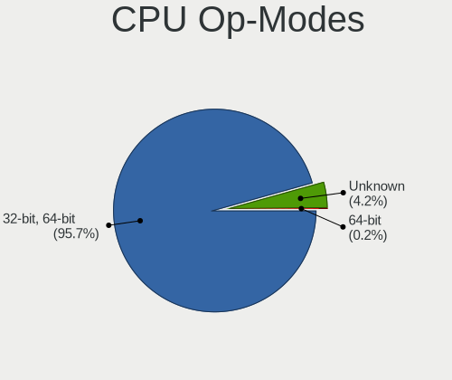

| Op mode        | Computers | Percent |
|----------------|-----------|---------|
| 32-bit, 64-bit | 529       | 95.32%  |
| Unknown        | 25        | 4.5%    |
| 64-bit         | 1         | 0.18%   |

CPU Microcode
-------------

Microcode number

| Number     | Computers | Percent |
|------------|-----------|---------|
| Unknown    | 83        | 14.85%  |
| 0x306a9    | 53        | 9.48%   |
| 0x206a7    | 50        | 8.94%   |
| 0x306c3    | 32        | 5.72%   |
| 0x1067a    | 27        | 4.83%   |
| 0x010000c8 | 14        | 2.5%    |
| 0x306d4    | 13        | 2.33%   |
| 0x906ea    | 11        | 1.97%   |
| 0x806ec    | 11        | 1.97%   |
| 0x806e9    | 11        | 1.97%   |
| 0x6fd      | 11        | 1.97%   |
| 0x40651    | 9         | 1.61%   |
| 0x08701021 | 9         | 1.61%   |
| 0x806ea    | 8         | 1.43%   |
| 0x406c4    | 8         | 1.43%   |
| 0x20655    | 8         | 1.43%   |
| 0x906e9    | 7         | 1.25%   |
| 0x6fb      | 7         | 1.25%   |
| 0x506e3    | 7         | 1.25%   |
| 0x30678    | 7         | 1.25%   |
| 0x08600106 | 7         | 1.25%   |
| 0x06000852 | 7         | 1.25%   |
| 0x806c1    | 6         | 1.07%   |
| 0x406e3    | 6         | 1.07%   |
| 0x20652    | 6         | 1.07%   |
| 0x106e5    | 6         | 1.07%   |
| 0x08108102 | 6         | 1.07%   |
| 0x706e5    | 5         | 0.89%   |
| 0x706a1    | 5         | 0.89%   |
| 0x10676    | 5         | 0.89%   |
| 0x08701013 | 5         | 0.89%   |
| 0x06006705 | 5         | 0.89%   |
| 0xf41      | 4         | 0.72%   |
| 0xa0653    | 4         | 0.72%   |
| 0x906ed    | 4         | 0.72%   |
| 0x6f6      | 4         | 0.72%   |
| 0x206d7    | 4         | 0.72%   |
| 0x0800820d | 4         | 0.72%   |
| 0xf47      | 3         | 0.54%   |
| 0x08108109 | 3         | 0.54%   |
| 0x08101016 | 3         | 0.54%   |
| 0x0810100b | 3         | 0.54%   |
| 0x06001119 | 3         | 0.54%   |
| 0x02000032 | 3         | 0.54%   |
| 0x010000db | 3         | 0.54%   |
| 0xa0660    | 2         | 0.36%   |
| 0x906eb    | 2         | 0.36%   |
| 0x806d1    | 2         | 0.36%   |
| 0x706a8    | 2         | 0.36%   |
| 0x6fa      | 2         | 0.36%   |
| 0x506c9    | 2         | 0.36%   |
| 0x406c3    | 2         | 0.36%   |
| 0x306f2    | 2         | 0.36%   |
| 0x30673    | 2         | 0.36%   |
| 0x106a5    | 2         | 0.36%   |
| 0x07030105 | 2         | 0.36%   |
| 0x0600063e | 2         | 0.36%   |
| 0xf62      | 1         | 0.18%   |
| 0xf43      | 1         | 0.18%   |
| 0xa0671    | 1         | 0.18%   |

CPU Microarch
-------------

Microarchitecture

| Name            | Computers | Percent |
|-----------------|-----------|---------|
| KabyLake        | 64        | 11.55%  |
| SandyBridge     | 62        | 11.19%  |
| IvyBridge       | 56        | 10.11%  |
| Haswell         | 49        | 8.84%   |
| Penryn          | 35        | 6.32%   |
| Unknown         | 33        | 5.96%   |
| Zen 2           | 24        | 4.33%   |
| Core            | 24        | 4.33%   |
| K10             | 23        | 4.15%   |
| Silvermont      | 19        | 3.43%   |
| Skylake         | 18        | 3.25%   |
| Broadwell       | 16        | 2.89%   |
| Westmere        | 15        | 2.71%   |
| Piledriver      | 14        | 2.53%   |
| Zen+            | 13        | 2.35%   |
| Zen             | 11        | 1.99%   |
| NetBurst        | 9         | 1.62%   |
| Nehalem         | 9         | 1.62%   |
| IceLake         | 9         | 1.62%   |
| CometLake       | 8         | 1.44%   |
| Goldmont plus   | 7         | 1.26%   |
| Excavator       | 7         | 1.26%   |
| TigerLake       | 6         | 1.08%   |
| Zen 3           | 5         | 0.9%    |
| Puma            | 4         | 0.72%   |
| K8 & K10 hybrid | 3         | 0.54%   |
| Goldmont        | 2         | 0.36%   |
| Bulldozer       | 2         | 0.36%   |
| Bonnell         | 2         | 0.36%   |
| Bobcat          | 2         | 0.36%   |
| Steamroller     | 1         | 0.18%   |
| K8 Hammer       | 1         | 0.18%   |
| Jaguar          | 1         | 0.18%   |

Graphics
--------

GPU Vendor
----------

Vendors of graphics cards

| Vendor                           | Computers | Percent |
|----------------------------------|-----------|---------|
| Intel                            | 321       | 53.06%  |
| Nvidia                           | 143       | 23.64%  |
| AMD                              | 134       | 22.15%  |
| Matrox Electronics Systems       | 3         | 0.5%    |
| ASPEED Technology                | 3         | 0.5%    |
| Silicon Integrated Systems [SiS] | 1         | 0.17%   |

GPU Model
---------

Graphics card models

| Model                                                                                    | Computers | Percent |
|------------------------------------------------------------------------------------------|-----------|---------|
| Intel 2nd Generation Core Processor Family Integrated Graphics Controller                | 44        | 7.13%   |
| Intel 3rd Gen Core processor Graphics Controller                                         | 30        | 4.86%   |
| Intel Xeon E3-1200 v2/3rd Gen Core processor Graphics Controller                         | 17        | 2.76%   |
| Intel Xeon E3-1200 v3/4th Gen Core Processor Integrated Graphics Controller              | 13        | 2.11%   |
| Intel HD Graphics 5500                                                                   | 13        | 2.11%   |
| Intel 4 Series Chipset Integrated Graphics Controller                                    | 13        | 2.11%   |
| Intel WhiskeyLake-U GT2 [UHD Graphics 620]                                               | 12        | 1.94%   |
| Intel Core Processor Integrated Graphics Controller                                      | 12        | 1.94%   |
| Intel Haswell-ULT Integrated Graphics Controller                                         | 10        | 1.62%   |
| Intel Atom/Celeron/Pentium Processor x5-E8000/J3xxx/N3xxx Integrated Graphics Controller | 10        | 1.62%   |
| AMD RS880 [Radeon HD 4200]                                                               | 10        | 1.62%   |
| AMD Picasso/Raven 2 [Radeon Vega Series / Radeon Vega Mobile Series]                     | 10        | 1.62%   |
| Intel UHD Graphics 620                                                                   | 9         | 1.46%   |
| Intel Mobile 4 Series Chipset Integrated Graphics Controller                             | 9         | 1.46%   |
| Intel CoffeeLake-H GT2 [UHD Graphics 630]                                                | 9         | 1.46%   |
| Intel Atom Processor Z36xxx/Z37xxx Series Graphics & Display                             | 9         | 1.46%   |
| Intel 4th Gen Core Processor Integrated Graphics Controller                              | 9         | 1.46%   |
| Intel 82G33/G31 Express Integrated Graphics Controller                                   | 8         | 1.3%    |
| Intel 82945G/GZ Integrated Graphics Controller                                           | 8         | 1.3%    |
| AMD Renoir                                                                               | 8         | 1.3%    |
| AMD Raven Ridge [Radeon Vega Series / Radeon Vega Mobile Series]                         | 8         | 1.3%    |
| Nvidia GT218 [GeForce 210]                                                               | 7         | 1.13%   |
| Intel Skylake GT2 [HD Graphics 520]                                                      | 7         | 1.13%   |
| Intel TigerLake-LP GT2 [Iris Xe Graphics]                                                | 6         | 0.97%   |
| Intel HD Graphics 620                                                                    | 6         | 0.97%   |
| Intel HD Graphics 530                                                                    | 6         | 0.97%   |
| Intel CoffeeLake-S GT2 [UHD Graphics 630]                                                | 6         | 0.97%   |
| AMD Stoney [Radeon R2/R3/R4/R5 Graphics]                                                 | 6         | 0.97%   |
| AMD Ellesmere [Radeon RX 470/480/570/570X/580/580X/590]                                  | 6         | 0.97%   |
| Nvidia GP107M [GeForce GTX 1050 Ti Mobile]                                               | 5         | 0.81%   |
| Intel HD Graphics 630                                                                    | 5         | 0.81%   |
| Intel GeminiLake [UHD Graphics 600]                                                      | 5         | 0.81%   |
| AMD Cedar [Radeon HD 5000/6000/7350/8350 Series]                                         | 5         | 0.81%   |
| Nvidia GP108 [GeForce GT 1030]                                                           | 4         | 0.65%   |
| Nvidia GK208B [GeForce GT 710]                                                           | 4         | 0.65%   |
| Intel Mobile GM965/GL960 Integrated Graphics Controller (secondary)                      | 4         | 0.65%   |
| Intel Mobile GM965/GL960 Integrated Graphics Controller (primary)                        | 4         | 0.65%   |
| Intel CometLake-S GT2 [UHD Graphics 630]                                                 | 4         | 0.65%   |
| Intel 4th Generation Core Processor Family Integrated Graphics Controller                | 4         | 0.65%   |
| AMD Seymour [Radeon HD 6400M/7400M Series]                                               | 4         | 0.65%   |
| AMD RS780L [Radeon 3000]                                                                 | 4         | 0.65%   |
| Nvidia TU117M [GeForce GTX 1650 Mobile / Max-Q]                                          | 3         | 0.49%   |
| Nvidia GP107 [GeForce GTX 1050 Ti]                                                       | 3         | 0.49%   |
| Nvidia GP104 [GeForce GTX 1070]                                                          | 3         | 0.49%   |
| Nvidia GM204 [GeForce GTX 970]                                                           | 3         | 0.49%   |
| Nvidia GM107 [GeForce GTX 750 Ti]                                                        | 3         | 0.49%   |
| Nvidia GF117M [GeForce 610M/710M/810M/820M / GT 620M/625M/630M/720M]                     | 3         | 0.49%   |
| Intel TigerLake-H GT1 [UHD Graphics]                                                     | 3         | 0.49%   |
| Intel Iris Plus Graphics G1 (Ice Lake)                                                   | 3         | 0.49%   |
| Intel CometLake-U GT2 [UHD Graphics]                                                     | 3         | 0.49%   |
| ASPEED Technology ASPEED Graphics Family                                                 | 3         | 0.49%   |
| AMD Thames [Radeon HD 7500M/7600M Series]                                                | 3         | 0.49%   |
| AMD Mullins [Radeon R4/R5 Graphics]                                                      | 3         | 0.49%   |
| AMD Lexa PRO [Radeon 540/540X/550/550X / RX 540X/550/550X]                               | 3         | 0.49%   |
| AMD Curacao PRO [Radeon R7 370 / R9 270/370 OEM]                                         | 3         | 0.49%   |
| AMD Cezanne                                                                              | 3         | 0.49%   |
| AMD Caicos [Radeon HD 6450/7450/8450 / R5 230 OEM]                                       | 3         | 0.49%   |
| Nvidia TU117M [GeForce GTX 1650 Ti Mobile]                                               | 2         | 0.32%   |
| Nvidia TU117GLM [T1200 Laptop GPU]                                                       | 2         | 0.32%   |
| Nvidia TU116 [GeForce GTX 1650 SUPER]                                                    | 2         | 0.32%   |

GPU Combo
---------

Combinations of graphics cards

| Name                     | Computers | Percent |
|--------------------------|-----------|---------|
| 1 x Intel                | 246       | 44.32%  |
| 1 x AMD                  | 109       | 19.64%  |
| 1 x Nvidia               | 82        | 14.77%  |
| Intel + Nvidia           | 55        | 9.91%   |
| Other                    | 33        | 5.95%   |
| Intel + AMD              | 14        | 2.52%   |
| 2 x AMD                  | 5         | 0.9%    |
| 1 x Matrox               | 3         | 0.54%   |
| AMD + Nvidia             | 2         | 0.36%   |
| 2 x Nvidia               | 1         | 0.18%   |
| 1 x SiS                  | 1         | 0.18%   |
| Nvidia + ASPEED          | 1         | 0.18%   |
| Intel + AMD + 1 x Nvidia | 1         | 0.18%   |
| 1 x ASPEED               | 1         | 0.18%   |
| AMD + ASPEED             | 1         | 0.18%   |

GPU Driver
----------

Free vs proprietary

| Driver      | Computers | Percent |
|-------------|-----------|---------|
| Free        | 419       | 74.96%  |
| Proprietary | 92        | 16.46%  |
| Unknown     | 48        | 8.59%   |

GPU Memory
----------

Total video memory

| Size in GB | Computers | Percent |
|------------|-----------|---------|
| Unknown    | 333       | 59.57%  |
| 0.01-0.5   | 64        | 11.45%  |
| 1.01-2.0   | 55        | 9.84%   |
| 0.51-1.0   | 49        | 8.77%   |
| 3.01-4.0   | 29        | 5.19%   |
| 7.01-8.0   | 18        | 3.22%   |
| 5.01-6.0   | 6         | 1.07%   |
| 2.01-3.0   | 4         | 0.72%   |
| 16.01-24.0 | 1         | 0.18%   |

Monitor
-------

Monitor Vendor
--------------

Monitor vendors

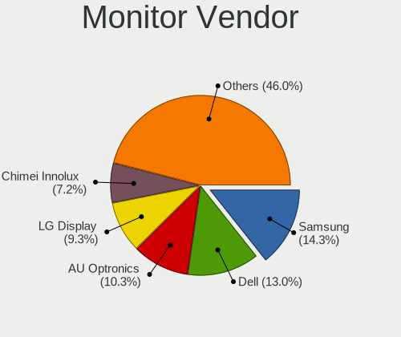

| Vendor                  | Computers | Percent |
|-------------------------|-----------|---------|
| Samsung Electronics     | 87        | 15.08%  |
| Dell                    | 79        | 13.69%  |
| AU Optronics            | 64        | 11.09%  |
| LG Display              | 49        | 8.49%   |
| Chimei Innolux          | 41        | 7.11%   |
| Goldstar                | 29        | 5.03%   |
| BOE                     | 25        | 4.33%   |
| Philips                 | 19        | 3.29%   |
| Hewlett-Packard         | 18        | 3.12%   |
| BenQ                    | 14        | 2.43%   |
| Acer                    | 13        | 2.25%   |
| Ancor Communications    | 12        | 2.08%   |
| Chi Mei Optoelectronics | 11        | 1.91%   |
| AOC                     | 10        | 1.73%   |
| Unknown                 | 8         | 1.39%   |
| ViewSonic               | 7         | 1.21%   |
| Lenovo                  | 7         | 1.21%   |
| PANDA                   | 6         | 1.04%   |
| Sharp                   | 5         | 0.87%   |
| Vizio                   | 4         | 0.69%   |
| LG Philips              | 4         | 0.69%   |
| Apple                   | 4         | 0.69%   |
| Sony                    | 3         | 0.52%   |
| NEC Computers           | 3         | 0.52%   |
| InnoLux Display         | 3         | 0.52%   |
| Iiyama                  | 3         | 0.52%   |
| HannStar                | 3         | 0.52%   |
| Belinea                 | 3         | 0.52%   |
| Vestel Elektronik       | 2         | 0.35%   |
| Toshiba                 | 2         | 0.35%   |
| Medion                  | 2         | 0.35%   |
| LG Electronics          | 2         | 0.35%   |
| Insignia                | 2         | 0.35%   |
| Gateway                 | 2         | 0.35%   |
| Fujitsu Siemens         | 2         | 0.35%   |
| CSO                     | 2         | 0.35%   |
| ___                     | 1         | 0.17%   |
| VIZ                     | 1         | 0.17%   |
| Targa                   | 1         | 0.17%   |
| Seiko/Epson             | 1         | 0.17%   |
| Seiki                   | 1         | 0.17%   |
| Sceptre Tech            | 1         | 0.17%   |
| Sceptre                 | 1         | 0.17%   |
| RTK                     | 1         | 0.17%   |
| ROW                     | 1         | 0.17%   |
| Packard Bell            | 1         | 0.17%   |
| Optoma                  | 1         | 0.17%   |
| Onkyo                   | 1         | 0.17%   |
| MS_ Nvidia              | 1         | 0.17%   |
| MStar                   | 1         | 0.17%   |
| MiTAC                   | 1         | 0.17%   |
| LGD                     | 1         | 0.17%   |
| ITE                     | 1         | 0.17%   |
| InfoVision              | 1         | 0.17%   |
| Hitachi                 | 1         | 0.17%   |
| GDH                     | 1         | 0.17%   |
| Element                 | 1         | 0.17%   |
| Eizo                    | 1         | 0.17%   |
| DENON                   | 1         | 0.17%   |
| Daewoo                  | 1         | 0.17%   |

Monitor Model
-------------

Monitor models

| Model                                                                    | Computers | Percent |
|--------------------------------------------------------------------------|-----------|---------|
| Dell 1708FP DEL4023 1280x1024 338x270mm 17.0-inch                        | 31        | 5.15%   |
| Samsung Electronics LCD Monitor SEC5441 1366x768 309x174mm 14.0-inch     | 6         | 1%      |
| AU Optronics LCD Monitor AUO21ED 1920x1080 344x194mm 15.5-inch           | 6         | 1%      |
| BenQ G610HDA BNQ7819 1366x768 344x194mm 15.5-inch                        | 5         | 0.83%   |
| ViewSonic VA703-4Series VSC6A1E 1280x1024 341x274mm 17.2-inch            | 4         | 0.66%   |
| Dell U2412M DELA07A 1920x1200 518x324mm 24.1-inch                        | 4         | 0.66%   |
| Samsung Electronics LCD Monitor SEC5541 1366x768 344x193mm 15.5-inch     | 3         | 0.5%    |
| Samsung Electronics LCD Monitor SEC3245 1366x768 344x194mm 15.5-inch     | 3         | 0.5%    |
| Goldstar LCD Monitor GSM5AB8 1920x1080 480x270mm 21.7-inch               | 3         | 0.5%    |
| Dell E1916H DELF064 1366x768 410x230mm 18.5-inch                         | 3         | 0.5%    |
| Dell 1708FP DEL4024 1280x1024 338x270mm 17.0-inch                        | 3         | 0.5%    |
| Chi Mei Optoelectronics LCD Monitor CMO15A7 1366x768 344x193mm 15.5-inch | 3         | 0.5%    |
| AU Optronics LCD Monitor AUO22EC 1366x768 344x193mm 15.5-inch            | 3         | 0.5%    |
| AU Optronics LCD Monitor AUO193C 1366x768 309x173mm 13.9-inch            | 3         | 0.5%    |
| Vizio VO320E VIZ0035 1366x768 700x390mm 31.5-inch                        | 2         | 0.33%   |
| Vestel Elektronik 40UHD_LCD_TV VES3700 3840x2160 890x500mm 40.2-inch     | 2         | 0.33%   |
| Samsung Electronics SyncMaster SAM0272 1280x1024 340x270mm 17.1-inch     | 2         | 0.33%   |
| Samsung Electronics LCD Monitor SEC3052 1366x768 256x144mm 11.6-inch     | 2         | 0.33%   |
| Samsung Electronics LCD Monitor SAM03BC 1920x1080                        | 2         | 0.33%   |
| Samsung Electronics C24F390 SAM0D2D 1920x1080 520x290mm 23.4-inch        | 2         | 0.33%   |
| Philips PHL 273V5 PHLC0D2 1920x1080 600x340mm 27.2-inch                  | 2         | 0.33%   |
| PANDA LCD Monitor NCP0035 1920x1080 309x174mm 14.0-inch                  | 2         | 0.33%   |
| LG Philips LCD Monitor LPL3B01 1280x800 331x207mm 15.4-inch              | 2         | 0.33%   |
| LG Display LCD Monitor LGD05E5 1920x1080 344x194mm 15.5-inch             | 2         | 0.33%   |
| LG Display LCD Monitor LGD02EC 1366x768 293x165mm 13.2-inch              | 2         | 0.33%   |
| Hewlett-Packard L1908w HWP26F0 1440x900 410x256mm 19.0-inch              | 2         | 0.33%   |
| Goldstar W2253 GSM56DB 1920x1080 474x296mm 22.0-inch                     | 2         | 0.33%   |
| Goldstar W1943 GSM4BAD 1360x768 410x230mm 18.5-inch                      | 2         | 0.33%   |
| Goldstar E2340 GSM57A6 1920x1080 510x290mm 23.1-inch                     | 2         | 0.33%   |
| Goldstar 23LC1R GSM5617 1360x768 930x523mm 42.0-inch                     | 2         | 0.33%   |
| Dell P2417H DELA0DC 1920x1080 527x296mm 23.8-inch                        | 2         | 0.33%   |
| Dell E1709W DELD022 1440x900 370x230mm 17.2-inch                         | 2         | 0.33%   |
| Dell 2007FP DELA021 1600x1200 367x275mm 18.1-inch                        | 2         | 0.33%   |
| Dell 2007FP DELA020 1600x1200 367x275mm 18.1-inch                        | 2         | 0.33%   |
| Chimei Innolux LCD Monitor CMN1735 1920x1080 382x215mm 17.3-inch         | 2         | 0.33%   |
| Chimei Innolux LCD Monitor CMN15F5 1920x1080 344x193mm 15.5-inch         | 2         | 0.33%   |
| Chimei Innolux LCD Monitor CMN15DB 1366x768 344x193mm 15.5-inch          | 2         | 0.33%   |
| Chimei Innolux LCD Monitor CMN15C4 1920x1080 344x193mm 15.5-inch         | 2         | 0.33%   |
| Chimei Innolux LCD Monitor CMN14D6 1366x768 309x173mm 13.9-inch          | 2         | 0.33%   |
| Chimei Innolux LCD Monitor CMN14B1 1920x1080 308x173mm 13.9-inch         | 2         | 0.33%   |
| Chimei Innolux LCD Monitor CMN1471 1366x768 309x174mm 14.0-inch          | 2         | 0.33%   |
| Chimei Innolux LCD Monitor CMN1406 1920x1080 309x173mm 13.9-inch         | 2         | 0.33%   |
| Chi Mei Optoelectronics LCD Monitor CMO1719 1600x900 382x215mm 17.3-inch | 2         | 0.33%   |
| Chi Mei Optoelectronics LCD Monitor CMO1592 1366x768 344x193mm 15.5-inch | 2         | 0.33%   |
| BOE LCD Monitor BOE08B5 1920x1080 309x174mm 14.0-inch                    | 2         | 0.33%   |
| BOE LCD Monitor BOE06A5 1366x768 344x194mm 15.5-inch                     | 2         | 0.33%   |
| BOE LCD Monitor BOE0687 1920x1080 344x193mm 15.5-inch                    | 2         | 0.33%   |
| AU Optronics LCD Monitor AUO71EC 1366x768 344x193mm 15.5-inch            | 2         | 0.33%   |
| AU Optronics LCD Monitor AUO63ED 1920x1080 344x193mm 15.5-inch           | 2         | 0.33%   |
| AU Optronics LCD Monitor AUO38ED 1920x1080 344x193mm 15.5-inch           | 2         | 0.33%   |
| AU Optronics LCD Monitor AUO313E 1600x900 309x174mm 14.0-inch            | 2         | 0.33%   |
| AU Optronics LCD Monitor AUO213E 1600x900 309x174mm 14.0-inch            | 2         | 0.33%   |
| AU Optronics LCD Monitor AUO18D4 1280x800 216x135mm 10.0-inch            | 2         | 0.33%   |
| AU Optronics LCD Monitor AUO109E 1600x900 380x210mm 17.1-inch            | 2         | 0.33%   |
| AOC Q3279WG5B AOC3279 2560x1440 725x428mm 33.1-inch                      | 2         | 0.33%   |
| Ancor Communications ASUS VW198 ACI19AA 1680x1050 450x300mm 21.3-inch    | 2         | 0.33%   |
| ___ LCDTV16 ___9000 1360x768                                             | 1         | 0.17%   |
| Vizio VA22LFHDTV10T VIZ0022 1920x1080 477x268mm 21.5-inch                | 1         | 0.17%   |
| Vizio D24f-G1 VIZ1027 1920x1080 527x296mm 23.8-inch                      | 1         | 0.17%   |
| VIZ LCD Monitor E322VL 1920x1080                                         | 1         | 0.17%   |

Monitor Resolution
------------------

Monitor screen resolution

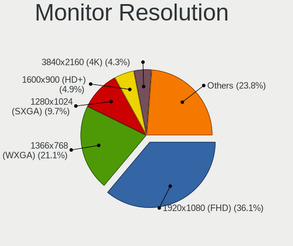

| Resolution         | Computers | Percent |
|--------------------|-----------|---------|
| 1920x1080 (FHD)    | 199       | 35.6%   |
| 1366x768 (WXGA)    | 117       | 20.93%  |
| 1280x1024 (SXGA)   | 62        | 11.09%  |
| 1600x900 (HD+)     | 31        | 5.55%   |
| 3840x2160 (4K)     | 27        | 4.83%   |
| 1440x900 (WXGA+)   | 20        | 3.58%   |
| 1680x1050 (WSXGA+) | 17        | 3.04%   |
| 2560x1440 (QHD)    | 14        | 2.5%    |
| 1360x768           | 14        | 2.5%    |
| 1280x800 (WXGA)    | 14        | 2.5%    |
| 1920x1200 (WUXGA)  | 10        | 1.79%   |
| Unknown            | 7         | 1.25%   |
| 1600x1200          | 4         | 0.72%   |
| 3440x1440          | 3         | 0.54%   |
| 3200x1800 (QHD+)   | 2         | 0.36%   |
| 2560x1600          | 2         | 0.36%   |
| 6400x1080          | 1         | 0.18%   |
| 5040x1050          | 1         | 0.18%   |
| 4240x1440          | 1         | 0.18%   |
| 3840x1200          | 1         | 0.18%   |
| 3840x1080          | 1         | 0.18%   |
| 3000x1920          | 1         | 0.18%   |
| 2880x1800          | 1         | 0.18%   |
| 2736x1824          | 1         | 0.18%   |
| 2640x1024          | 1         | 0.18%   |
| 2160x1440          | 1         | 0.18%   |
| 1920x540           | 1         | 0.18%   |
| 1680x945           | 1         | 0.18%   |
| 1400x1050          | 1         | 0.18%   |
| 1152x864           | 1         | 0.18%   |
| 1024x768 (XGA)     | 1         | 0.18%   |
| 1024x600           | 1         | 0.18%   |

Monitor Diagonal
----------------

Diagonal size in inches

| Inches  | Computers | Percent |
|---------|-----------|---------|
| 15      | 128       | 22.07%  |
| 17      | 83        | 14.31%  |
| 13      | 42        | 7.24%   |
| 14      | 39        | 6.72%   |
| Unknown | 38        | 6.55%   |
| 21      | 35        | 6.03%   |
| 24      | 31        | 5.34%   |
| 23      | 30        | 5.17%   |
| 27      | 23        | 3.97%   |
| 18      | 23        | 3.97%   |
| 19      | 16        | 2.76%   |
| 22      | 15        | 2.59%   |
| 12      | 12        | 2.07%   |
| 31      | 9         | 1.55%   |
| 11      | 8         | 1.38%   |
| 84      | 6         | 1.03%   |
| 72      | 6         | 1.03%   |
| 20      | 6         | 1.03%   |
| 10      | 5         | 0.86%   |
| 52      | 3         | 0.52%   |
| 40      | 3         | 0.52%   |
| 32      | 3         | 0.52%   |
| 46      | 2         | 0.34%   |
| 42      | 2         | 0.34%   |
| 36      | 2         | 0.34%   |
| 34      | 2         | 0.34%   |
| 33      | 2         | 0.34%   |
| 49      | 1         | 0.17%   |
| 48      | 1         | 0.17%   |
| 37      | 1         | 0.17%   |
| 29      | 1         | 0.17%   |
| 16      | 1         | 0.17%   |
| 8       | 1         | 0.17%   |

Monitor Width
-------------

Physical width

| Width in mm | Computers | Percent |
|-------------|-----------|---------|
| 301-350     | 238       | 41.61%  |
| 401-500     | 85        | 14.86%  |
| 501-600     | 77        | 13.46%  |
| 351-400     | 44        | 7.69%   |
| 201-300     | 43        | 7.52%   |
| Unknown     | 38        | 6.64%   |
| 601-700     | 12        | 2.1%    |
| 1501-2000   | 12        | 2.1%    |
| 701-800     | 9         | 1.57%   |
| 1001-1500   | 7         | 1.22%   |
| 801-900     | 4         | 0.7%    |
| 901-1000    | 2         | 0.35%   |
| 101-200     | 1         | 0.17%   |

Aspect Ratio
------------

Proportional relationship between the width and the height

| Ratio   | Computers | Percent |
|---------|-----------|---------|
| 16/9    | 369       | 68.72%  |
| 16/10   | 61        | 11.36%  |
| 5/4     | 54        | 10.06%  |
| Unknown | 30        | 5.59%   |
| 3/2     | 8         | 1.49%   |
| 4/3     | 7         | 1.3%    |
| 6/5     | 4         | 0.74%   |
| 21/9    | 2         | 0.37%   |
| 1.96    | 1         | 0.19%   |
| 0.62    | 1         | 0.19%   |

Monitor Area
------------

Area in inch

| Area in inch | Computers | Percent |
|----------------|-----------|---------|
| 101-110        | 124       | 21.57%  |
| 201-250        | 86        | 14.96%  |
| 141-150        | 71        | 12.35%  |
| 81-90          | 64        | 11.13%  |
| Unknown        | 38        | 6.61%   |
| 151-200        | 34        | 5.91%   |
| 301-350        | 23        | 4%      |
| 121-130        | 21        | 3.65%   |
| 71-80          | 17        | 2.96%   |
| More than 1000 | 16        | 2.78%   |
| 351-500        | 16        | 2.78%   |
| 251-300        | 13        | 2.26%   |
| 61-70          | 12        | 2.09%   |
| 501-1000       | 11        | 1.91%   |
| 131-140        | 10        | 1.74%   |
| 51-60          | 8         | 1.39%   |
| 41-50          | 5         | 0.87%   |
| 111-120        | 4         | 0.7%    |
| 1-40           | 1         | 0.17%   |
| 91-100         | 1         | 0.17%   |

Pixel Density
-------------

Pixels per inch

| Density       | Computers | Percent |
|---------------|-----------|---------|
| 51-100        | 217       | 38.68%  |
| 101-120       | 145       | 25.85%  |
| 121-160       | 112       | 19.96%  |
| Unknown       | 38        | 6.77%   |
| 161-240       | 22        | 3.92%   |
| 1-50          | 17        | 3.03%   |
| More than 240 | 10        | 1.78%   |

Multiple Monitors
-----------------

Total monitors connected

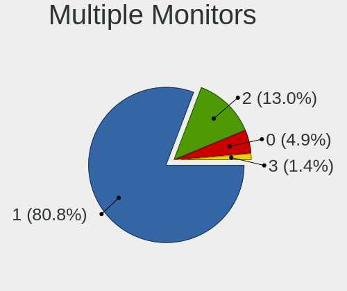

| Total | Computers | Percent |
|-------|-----------|---------|
| 1     | 455       | 81.4%   |
| 2     | 70        | 12.52%  |
| 0     | 26        | 4.65%   |
| 3     | 8         | 1.43%   |

Network
-------

Net Controller Vendor
---------------------

Controller vendors

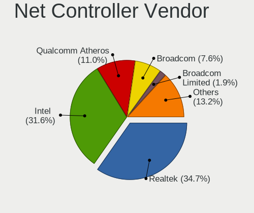

| Vendor                            | Computers | Percent |
|-----------------------------------|-----------|---------|
| Realtek Semiconductor             | 265       | 34.24%  |
| Intel                             | 244       | 31.52%  |
| Qualcomm Atheros                  | 88        | 11.37%  |
| Broadcom                          | 60        | 7.75%   |
| Broadcom Limited                  | 15        | 1.94%   |
| Ralink Technology                 | 11        | 1.42%   |
| Ralink                            | 10        | 1.29%   |
| Nvidia                            | 9         | 1.16%   |
| Marvell Technology Group          | 9         | 1.16%   |
| TP-Link                           | 6         | 0.78%   |
| Qualcomm Atheros Communications   | 5         | 0.65%   |
| Microchip Technology              | 5         | 0.65%   |
| Sierra Wireless                   | 4         | 0.52%   |
| Aquantia                          | 4         | 0.52%   |
| Xiaomi                            | 3         | 0.39%   |
| Edimax Technology                 | 3         | 0.39%   |
| ASUSTek Computer                  | 3         | 0.39%   |
| ASIX Electronics                  | 3         | 0.39%   |
| Silicon Integrated Systems [SiS]  | 2         | 0.26%   |
| Samsung Electronics               | 2         | 0.26%   |
| NetGear                           | 2         | 0.26%   |
| Linksys                           | 2         | 0.26%   |
| Ericsson Business Mobile Networks | 2         | 0.26%   |
| D-Link System                     | 2         | 0.26%   |
| ZyDAS                             | 1         | 0.13%   |
| Tenda                             | 1         | 0.13%   |
| Sitecom Europe                    | 1         | 0.13%   |
| Realtek                           | 1         | 0.13%   |
| Qualcomm                          | 1         | 0.13%   |
| QLogic                            | 1         | 0.13%   |
| Netchip Technology                | 1         | 0.13%   |
| Microsoft                         | 1         | 0.13%   |
| MediaTek                          | 1         | 0.13%   |
| Lenovo                            | 1         | 0.13%   |
| Huawei Technologies               | 1         | 0.13%   |
| Hewlett-Packard                   | 1         | 0.13%   |
| Fibocom                           | 1         | 0.13%   |
| Dell                              | 1         | 0.13%   |
| Attansic Technology               | 1         | 0.13%   |

Net Controller Model
--------------------

Controller models

| Model                                                             | Computers | Percent |
|-------------------------------------------------------------------|-----------|---------|
| Realtek RTL8111/8168/8411 PCI Express Gigabit Ethernet Controller | 188       | 20.84%  |
| Intel 82579LM Gigabit Network Connection (Lewisville)             | 41        | 4.55%   |
| Realtek RTL810xE PCI Express Fast Ethernet controller             | 38        | 4.21%   |
| Intel Wi-Fi 6 AX200                                               | 17        | 1.88%   |
| Realtek RTL8153 Gigabit Ethernet Adapter                          | 15        | 1.66%   |
| Intel Wireless 7265                                               | 15        | 1.66%   |
| Intel Wireless 7260                                               | 15        | 1.66%   |
| Intel Centrino Advanced-N 6205 [Taylor Peak]                      | 15        | 1.66%   |
| Qualcomm Atheros QCA9377 802.11ac Wireless Network Adapter        | 14        | 1.55%   |
| Qualcomm Atheros AR9285 Wireless Network Adapter (PCI-Express)    | 14        | 1.55%   |
| Intel Wireless 3165                                               | 13        | 1.44%   |
| Qualcomm Atheros AR9485 Wireless Network Adapter                  | 12        | 1.33%   |
| Intel Ethernet Connection I217-LM                                 | 12        | 1.33%   |
| Broadcom BCM4313 802.11bgn Wireless Network Adapter               | 12        | 1.33%   |
| Intel I211 Gigabit Network Connection                             | 11        | 1.22%   |
| Realtek RTL8125 2.5GbE Controller                                 | 10        | 1.11%   |
| Qualcomm Atheros QCA9565 / AR9565 Wireless Network Adapter        | 10        | 1.11%   |
| Intel Wireless 8265 / 8275                                        | 10        | 1.11%   |
| Realtek RTL8821CE 802.11ac PCIe Wireless Network Adapter          | 9         | 1%      |
| Broadcom NetXtreme BCM5761 Gigabit Ethernet PCIe                  | 9         | 1%      |
| Realtek RTL8723BE PCIe Wireless Network Adapter                   | 7         | 0.78%   |
| Qualcomm Atheros QCA6174 802.11ac Wireless Network Adapter        | 6         | 0.67%   |
| Qualcomm Atheros AR8151 v2.0 Gigabit Ethernet                     | 6         | 0.67%   |
| Nvidia MCP61 Ethernet                                             | 6         | 0.67%   |
| Intel Ethernet Connection I217-V                                  | 6         | 0.67%   |
| Intel Ethernet Connection (7) I219-V                              | 6         | 0.67%   |
| Intel Dual Band Wireless-AC 3168NGW [Stone Peak]                  | 6         | 0.67%   |
| Intel Centrino Wireless-N 1000 [Condor Peak]                      | 6         | 0.67%   |
| Intel Centrino Advanced-N 6235                                    | 6         | 0.67%   |
| Intel 82574L Gigabit Network Connection                           | 6         | 0.67%   |
| Broadcom NetXtreme BCM5751 Gigabit Ethernet PCI Express           | 6         | 0.67%   |
| Microchip SMSC9512/9514 Fast Ethernet Adapter                     | 5         | 0.55%   |
| Intel Wi-Fi 6 AX201                                               | 5         | 0.55%   |
| Intel Ethernet Connection I218-LM                                 | 5         | 0.55%   |
| Intel Ethernet Connection (3) I218-LM                             | 5         | 0.55%   |
| Intel Comet Lake PCH-LP CNVi WiFi                                 | 5         | 0.55%   |
| Intel Centrino Ultimate-N 6300                                    | 5         | 0.55%   |
| Intel Cannon Lake PCH CNVi WiFi                                   | 5         | 0.55%   |
| Intel 82579V Gigabit Network Connection                           | 5         | 0.55%   |
| Intel 82577LM Gigabit Network Connection                          | 5         | 0.55%   |
| Intel 82567LM-3 Gigabit Network Connection                        | 5         | 0.55%   |
| Broadcom NetLink BCM5784M Gigabit Ethernet PCIe                   | 5         | 0.55%   |
| Realtek RTL8822BE 802.11a/b/g/n/ac WiFi adapter                   | 4         | 0.44%   |
| Realtek RTL8811AU 802.11a/b/g/n/ac WLAN Adapter                   | 4         | 0.44%   |
| Realtek RTL8188EUS 802.11n Wireless Network Adapter               | 4         | 0.44%   |
| Ralink RT5370 Wireless Adapter                                    | 4         | 0.44%   |
| Ralink MT7601U Wireless Adapter                                   | 4         | 0.44%   |
| Qualcomm Atheros Killer E2400 Gigabit Ethernet Controller         | 4         | 0.44%   |
| Intel Wireless-AC 9260                                            | 4         | 0.44%   |
| Intel Ice Lake-LP PCH CNVi WiFi                                   | 4         | 0.44%   |
| Intel Gemini Lake PCH CNVi WiFi                                   | 4         | 0.44%   |
| Intel Ethernet Connection (2) I219-V                              | 4         | 0.44%   |
| Intel Dual Band Wireless-AC 3165 Plus Bluetooth                   | 4         | 0.44%   |
| Intel Cannon Point-LP CNVi [Wireless-AC]                          | 4         | 0.44%   |
| Broadcom Limited BCM4312 802.11b/g LP-PHY                         | 4         | 0.44%   |
| Aquantia AQC107 NBase-T/IEEE 802.3bz Ethernet Controller [AQtion] | 4         | 0.44%   |
| TP-Link TL-WN823N v2/v3 [Realtek RTL8192EU]                       | 3         | 0.33%   |
| Realtek RTL88x2bu [AC1200 Techkey]                                | 3         | 0.33%   |
| Realtek RTL8822CE 802.11ac PCIe Wireless Network Adapter          | 3         | 0.33%   |
| Qualcomm Atheros Killer E220x Gigabit Ethernet Controller         | 3         | 0.33%   |

Wireless Vendor
---------------

Wireless vendors

| Vendor                          | Computers | Percent |
|---------------------------------|-----------|---------|
| Intel                           | 164       | 42.93%  |
| Qualcomm Atheros                | 69        | 18.06%  |
| Realtek Semiconductor           | 57        | 14.92%  |
| Broadcom                        | 24        | 6.28%   |
| Ralink Technology               | 11        | 2.88%   |
| Broadcom Limited                | 11        | 2.88%   |
| Ralink                          | 10        | 2.62%   |
| TP-Link                         | 6         | 1.57%   |
| Qualcomm Atheros Communications | 5         | 1.31%   |
| Sierra Wireless                 | 4         | 1.05%   |
| Edimax Technology               | 3         | 0.79%   |
| ASUSTek Computer                | 3         | 0.79%   |
| NetGear                         | 2         | 0.52%   |
| Linksys                         | 2         | 0.52%   |
| ZyDAS                           | 1         | 0.26%   |
| Xiaomi                          | 1         | 0.26%   |
| Tenda                           | 1         | 0.26%   |
| Sitecom Europe                  | 1         | 0.26%   |
| Realtek                         | 1         | 0.26%   |
| Qualcomm                        | 1         | 0.26%   |
| Microsoft                       | 1         | 0.26%   |
| MediaTek                        | 1         | 0.26%   |
| Hewlett-Packard                 | 1         | 0.26%   |
| Fibocom                         | 1         | 0.26%   |
| Dell                            | 1         | 0.26%   |

Wireless Model
--------------

Wireless models

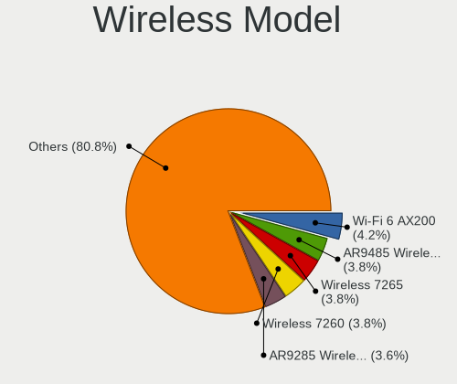

| Model                                                                                | Computers | Percent |
|--------------------------------------------------------------------------------------|-----------|---------|
| Intel Wi-Fi 6 AX200                                                                  | 17        | 4.45%   |
| Intel Wireless 7265                                                                  | 15        | 3.93%   |
| Intel Wireless 7260                                                                  | 15        | 3.93%   |
| Intel Centrino Advanced-N 6205 [Taylor Peak]                                         | 15        | 3.93%   |
| Qualcomm Atheros QCA9377 802.11ac Wireless Network Adapter                           | 14        | 3.66%   |
| Qualcomm Atheros AR9285 Wireless Network Adapter (PCI-Express)                       | 14        | 3.66%   |
| Intel Wireless 3165                                                                  | 13        | 3.4%    |
| Qualcomm Atheros AR9485 Wireless Network Adapter                                     | 12        | 3.14%   |
| Broadcom BCM4313 802.11bgn Wireless Network Adapter                                  | 12        | 3.14%   |
| Qualcomm Atheros QCA9565 / AR9565 Wireless Network Adapter                           | 10        | 2.62%   |
| Intel Wireless 8265 / 8275                                                           | 10        | 2.62%   |
| Realtek RTL8821CE 802.11ac PCIe Wireless Network Adapter                             | 9         | 2.36%   |
| Realtek RTL8723BE PCIe Wireless Network Adapter                                      | 7         | 1.83%   |
| Qualcomm Atheros QCA6174 802.11ac Wireless Network Adapter                           | 6         | 1.57%   |
| Intel Dual Band Wireless-AC 3168NGW [Stone Peak]                                     | 6         | 1.57%   |
| Intel Centrino Wireless-N 1000 [Condor Peak]                                         | 6         | 1.57%   |
| Intel Centrino Advanced-N 6235                                                       | 6         | 1.57%   |
| Intel Wi-Fi 6 AX201                                                                  | 5         | 1.31%   |
| Intel Comet Lake PCH-LP CNVi WiFi                                                    | 5         | 1.31%   |
| Intel Centrino Ultimate-N 6300                                                       | 5         | 1.31%   |
| Intel Cannon Lake PCH CNVi WiFi                                                      | 5         | 1.31%   |
| Realtek RTL8822BE 802.11a/b/g/n/ac WiFi adapter                                      | 4         | 1.05%   |
| Realtek RTL8811AU 802.11a/b/g/n/ac WLAN Adapter                                      | 4         | 1.05%   |
| Realtek RTL8188EUS 802.11n Wireless Network Adapter                                  | 4         | 1.05%   |
| Ralink RT5370 Wireless Adapter                                                       | 4         | 1.05%   |
| Ralink MT7601U Wireless Adapter                                                      | 4         | 1.05%   |
| Intel Wireless-AC 9260                                                               | 4         | 1.05%   |
| Intel Ice Lake-LP PCH CNVi WiFi                                                      | 4         | 1.05%   |
| Intel Gemini Lake PCH CNVi WiFi                                                      | 4         | 1.05%   |
| Intel Dual Band Wireless-AC 3165 Plus Bluetooth                                      | 4         | 1.05%   |
| Intel Cannon Point-LP CNVi [Wireless-AC]                                             | 4         | 1.05%   |
| Broadcom Limited BCM4312 802.11b/g LP-PHY                                            | 4         | 1.05%   |
| TP-Link TL-WN823N v2/v3 [Realtek RTL8192EU]                                          | 3         | 0.79%   |
| Realtek RTL88x2bu [AC1200 Techkey]                                                   | 3         | 0.79%   |
| Realtek RTL8822CE 802.11ac PCIe Wireless Network Adapter                             | 3         | 0.79%   |
| Qualcomm Atheros AR9271 802.11n                                                      | 3         | 0.79%   |
| Qualcomm Atheros AR9462 Wireless Network Adapter                                     | 3         | 0.79%   |
| Qualcomm Atheros AR928X Wireless Network Adapter (PCI-Express)                       | 3         | 0.79%   |
| Qualcomm Atheros AR242x / AR542x Wireless Network Adapter (PCI-Express)              | 3         | 0.79%   |
| Intel Wireless 8260                                                                  | 3         | 0.79%   |
| Intel WiFi Link 5100                                                                 | 3         | 0.79%   |
| Intel Tiger Lake PCH CNVi WiFi                                                       | 3         | 0.79%   |
| Intel Centrino Advanced-N 6200                                                       | 3         | 0.79%   |
| Broadcom Limited BCM4352 802.11ac Wireless Network Adapter                           | 3         | 0.79%   |
| Broadcom BCM43142 802.11b/g/n                                                        | 3         | 0.79%   |
| Sierra Wireless EM7345 4G LTE                                                        | 2         | 0.52%   |
| Realtek RTL8192EE PCIe Wireless Network Adapter                                      | 2         | 0.52%   |
| Realtek RTL8192CE PCIe Wireless Network Adapter                                      | 2         | 0.52%   |
| Realtek RTL8188EE Wireless Network Adapter                                           | 2         | 0.52%   |
| Realtek RTL8188CE 802.11b/g/n WiFi Adapter                                           | 2         | 0.52%   |
| Realtek RTL8187B Wireless 802.11g 54Mbps Network Adapter                             | 2         | 0.52%   |
| Realtek 802.11ac NIC                                                                 | 2         | 0.52%   |
| Ralink RT5572 Wireless Adapter                                                       | 2         | 0.52%   |
| Ralink RT5390 Wireless 802.11n 1T/1R PCIe                                            | 2         | 0.52%   |
| Ralink RT2561/RT61 rev B 802.11g                                                     | 2         | 0.52%   |
| Qualcomm Atheros TP-Link TL-WN821N v3 / TL-WN822N v2 802.11n [Atheros AR7010+AR9287] | 2         | 0.52%   |
| Intel PRO/Wireless 3945ABG [Golan] Network Connection                                | 2         | 0.52%   |
| Intel Centrino Wireless-N 1030 [Rainbow Peak]                                        | 2         | 0.52%   |
| Edimax 802.11n WLAN Adapter                                                          | 2         | 0.52%   |
| Broadcom Limited BCM43142 802.11b/g/n                                                | 2         | 0.52%   |

Ethernet Vendor
---------------

Ethernet vendors

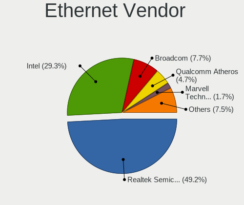

| Vendor                           | Computers | Percent |
|----------------------------------|-----------|---------|
| Realtek Semiconductor            | 248       | 49.11%  |
| Intel                            | 147       | 29.11%  |
| Broadcom                         | 38        | 7.52%   |
| Qualcomm Atheros                 | 24        | 4.75%   |
| Nvidia                           | 9         | 1.78%   |
| Marvell Technology Group         | 9         | 1.78%   |
| Microchip Technology             | 5         | 0.99%   |
| Broadcom Limited                 | 5         | 0.99%   |
| Aquantia                         | 4         | 0.79%   |
| ASIX Electronics                 | 3         | 0.59%   |
| Xiaomi                           | 2         | 0.4%    |
| Silicon Integrated Systems [SiS] | 2         | 0.4%    |
| Samsung Electronics              | 2         | 0.4%    |
| D-Link System                    | 2         | 0.4%    |
| QLogic                           | 1         | 0.2%    |
| Netchip Technology               | 1         | 0.2%    |
| Lenovo                           | 1         | 0.2%    |
| Huawei Technologies              | 1         | 0.2%    |
| Attansic Technology              | 1         | 0.2%    |

Ethernet Model
--------------

Ethernet models

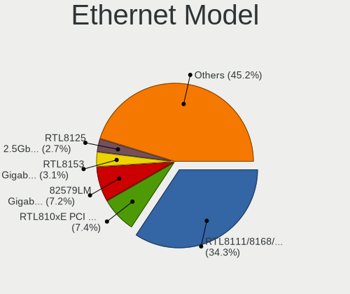

| Model                                                             | Computers | Percent |
|-------------------------------------------------------------------|-----------|---------|
| Realtek RTL8111/8168/8411 PCI Express Gigabit Ethernet Controller | 188       | 36.29%  |
| Intel 82579LM Gigabit Network Connection (Lewisville)             | 41        | 7.92%   |
| Realtek RTL810xE PCI Express Fast Ethernet controller             | 38        | 7.34%   |
| Realtek RTL8153 Gigabit Ethernet Adapter                          | 15        | 2.9%    |
| Intel Ethernet Connection I217-LM                                 | 12        | 2.32%   |
| Intel I211 Gigabit Network Connection                             | 11        | 2.12%   |
| Realtek RTL8125 2.5GbE Controller                                 | 10        | 1.93%   |
| Broadcom NetXtreme BCM5761 Gigabit Ethernet PCIe                  | 9         | 1.74%   |
| Qualcomm Atheros AR8151 v2.0 Gigabit Ethernet                     | 6         | 1.16%   |
| Nvidia MCP61 Ethernet                                             | 6         | 1.16%   |
| Intel Ethernet Connection I217-V                                  | 6         | 1.16%   |
| Intel Ethernet Connection (7) I219-V                              | 6         | 1.16%   |
| Intel 82574L Gigabit Network Connection                           | 6         | 1.16%   |
| Broadcom NetXtreme BCM5751 Gigabit Ethernet PCI Express           | 6         | 1.16%   |
| Microchip SMSC9512/9514 Fast Ethernet Adapter                     | 5         | 0.97%   |
| Intel Ethernet Connection I218-LM                                 | 5         | 0.97%   |
| Intel Ethernet Connection (3) I218-LM                             | 5         | 0.97%   |
| Intel 82579V Gigabit Network Connection                           | 5         | 0.97%   |
| Intel 82577LM Gigabit Network Connection                          | 5         | 0.97%   |
| Intel 82567LM-3 Gigabit Network Connection                        | 5         | 0.97%   |
| Broadcom NetLink BCM5784M Gigabit Ethernet PCIe                   | 5         | 0.97%   |
| Qualcomm Atheros Killer E2400 Gigabit Ethernet Controller         | 4         | 0.77%   |
| Intel Ethernet Connection (2) I219-V                              | 4         | 0.77%   |
| Aquantia AQC107 NBase-T/IEEE 802.3bz Ethernet Controller [AQtion] | 4         | 0.77%   |
| Qualcomm Atheros Killer E220x Gigabit Ethernet Controller         | 3         | 0.58%   |
| Intel I210 Gigabit Network Connection                             | 3         | 0.58%   |
| Intel Ethernet Connection I219-V                                  | 3         | 0.58%   |
| Intel Ethernet Connection (4) I219-V                              | 3         | 0.58%   |
| Intel 82578DM Gigabit Network Connection                          | 3         | 0.58%   |
| Broadcom Limited NetLink BCM5787 Gigabit Ethernet PCI Express     | 3         | 0.58%   |
| Xiaomi Mi/Redmi series (RNDIS)                                    | 2         | 0.39%   |
| Silicon Integrated Systems [SiS] 191 Gigabit Ethernet Adapter     | 2         | 0.39%   |
| Samsung Galaxy series, misc. (tethering mode)                     | 2         | 0.39%   |
| Realtek RTL8169 PCI Gigabit Ethernet Controller                   | 2         | 0.39%   |
| Qualcomm Atheros AR8162 Fast Ethernet                             | 2         | 0.39%   |
| Qualcomm Atheros AR8152 v2.0 Fast Ethernet                        | 2         | 0.39%   |
| Qualcomm Atheros AR8121/AR8113/AR8114 Gigabit or Fast Ethernet    | 2         | 0.39%   |
| Marvell Group 88E8058 PCI-E Gigabit Ethernet Controller           | 2         | 0.39%   |
| Marvell Group 88E8057 PCI-E Gigabit Ethernet Controller           | 2         | 0.39%   |
| Marvell Group 88E8053 PCI-E Gigabit Ethernet Controller           | 2         | 0.39%   |
| Intel Ethernet Connection (6) I219-V                              | 2         | 0.39%   |
| Intel Ethernet Connection (6) I219-LM                             | 2         | 0.39%   |
| Intel Ethernet Connection (2) I219-LM                             | 2         | 0.39%   |
| Intel Ethernet Connection (14) I219-LM                            | 2         | 0.39%   |
| Intel 82567V-4 Gigabit Network Connection                         | 2         | 0.39%   |
| Intel 82567V-2 Gigabit Network Connection                         | 2         | 0.39%   |
| D-Link System DGE-528T Gigabit Ethernet Adapter                   | 2         | 0.39%   |
| Broadcom NetXtreme II BCM5716 Gigabit Ethernet                    | 2         | 0.39%   |
| Broadcom NetXtreme II BCM5709 Gigabit Ethernet                    | 2         | 0.39%   |
| Broadcom NetLink BCM57785 Gigabit Ethernet PCIe                   | 2         | 0.39%   |
| Broadcom NetLink BCM57780 Gigabit Ethernet PCIe                   | 2         | 0.39%   |
| ASIX AX88179 Gigabit Ethernet                                     | 2         | 0.39%   |
| Realtek RTL-8100/8101L/8139 PCI Fast Ethernet Adapter             | 1         | 0.19%   |
| Qualcomm Atheros QCA8171 Gigabit Ethernet                         | 1         | 0.19%   |
| Qualcomm Atheros Killer E2500 Gigabit Ethernet Controller         | 1         | 0.19%   |
| Qualcomm Atheros AR8161 Gigabit Ethernet                          | 1         | 0.19%   |
| Qualcomm Atheros AR8132 Fast Ethernet                             | 1         | 0.19%   |
| Qualcomm Atheros AR8131 Gigabit Ethernet                          | 1         | 0.19%   |
| QLogic cLOM8214 1/10GbE Controller                                | 1         | 0.19%   |
| Nvidia MCP79 Ethernet                                             | 1         | 0.19%   |

Net Controller Kind
-------------------

Ethernet, WiFi or modem

| Kind     | Computers | Percent |
|----------|-----------|---------|
| Ethernet | 484       | 57.35%  |
| WiFi     | 358       | 42.42%  |
| Modem    | 2         | 0.24%   |

Used Controller
---------------

Currently used network controller

| Kind     | Computers | Percent |
|----------|-----------|---------|
| Ethernet | 356       | 52.9%   |
| WiFi     | 316       | 46.95%  |
| Modem    | 1         | 0.15%   |

NICs
----

Total network controllers on board

| Total | Computers | Percent |
|-------|-----------|---------|
| 2     | 271       | 48.65%  |
| 1     | 238       | 42.73%  |
| 0     | 36        | 6.46%   |
| 3     | 8         | 1.44%   |
| 4     | 3         | 0.54%   |
| 6     | 1         | 0.18%   |

IPv6
----

IPv6 vs IPv4

| Used | Computers | Percent |
|------|-----------|---------|
| No   | 494       | 88.53%  |
| Yes  | 64        | 11.47%  |

Bluetooth
---------

Bluetooth Vendor
----------------

Controller vendors

| Vendor                          | Computers | Percent |
|---------------------------------|-----------|---------|
| Intel                           | 126       | 45.82%  |
| Qualcomm Atheros Communications | 30        | 10.91%  |
| Broadcom                        | 25        | 9.09%   |
| Realtek Semiconductor           | 23        | 8.36%   |
| Cambridge Silicon Radio         | 21        | 7.64%   |
| IMC Networks                    | 11        | 4%      |
| Dell                            | 11        | 4%      |
| Lite-On Technology              | 10        | 3.64%   |
| Foxconn / Hon Hai               | 4         | 1.45%   |
| ASUSTek Computer                | 4         | 1.45%   |
| Apple                           | 4         | 1.45%   |
| Ralink Technology               | 2         | 0.73%   |
| Ralink                          | 1         | 0.36%   |
| Foxconn International           | 1         | 0.36%   |
| Conwise Technology              | 1         | 0.36%   |
| Belkin Components               | 1         | 0.36%   |

Bluetooth Model
---------------

Controller models

| Model                                                  | Computers | Percent |
|--------------------------------------------------------|-----------|---------|
| Intel Bluetooth wireless interface                     | 60        | 21.82%  |
| Cambridge Silicon Radio Bluetooth Dongle (HCI mode)    | 21        | 7.64%   |
| Intel Bluetooth 9460/9560 Jefferson Peak (JfP)         | 19        | 6.91%   |
| Intel AX200 Bluetooth                                  | 15        | 5.45%   |
| Realtek Bluetooth Radio                                | 12        | 4.36%   |
| Intel Bluetooth Device                                 | 12        | 4.36%   |
| Qualcomm Atheros  Bluetooth Device                     | 10        | 3.64%   |
| Realtek  Bluetooth 4.2 Adapter                         | 9         | 3.27%   |
| Qualcomm Atheros AR3011 Bluetooth                      | 9         | 3.27%   |
| Intel Centrino Bluetooth Wireless Transceiver          | 7         | 2.55%   |
| IMC Networks Bluetooth Device                          | 7         | 2.55%   |
| Qualcomm Atheros AR3012 Bluetooth 4.0                  | 6         | 2.18%   |
| Lite-On Bluetooth Device                               | 6         | 2.18%   |
| Intel Wireless-AC 3168 Bluetooth                       | 6         | 2.18%   |
| Dell DW375 Bluetooth Module                            | 6         | 2.18%   |
| Qualcomm Atheros Bluetooth USB Host Controller         | 4         | 1.45%   |
| Broadcom BCM20702A0 Bluetooth 4.0                      | 4         | 1.45%   |
| Broadcom BCM2070 Bluetooth 2.1 + EDR                   | 4         | 1.45%   |
| Intel Wireless-AC 9260 Bluetooth Adapter               | 3         | 1.09%   |
| Intel Centrino Advanced-N 6230 Bluetooth adapter       | 3         | 1.09%   |
| Foxconn / Hon Hai Bluetooth Device                     | 3         | 1.09%   |
| Broadcom HP Portable SoftSailing                       | 3         | 1.09%   |
| Broadcom BCM20702 Bluetooth 4.0 [ThinkPad]             | 3         | 1.09%   |
| Broadcom BCM2045B (BDC-2.1)                            | 3         | 1.09%   |
| Apple Bluetooth HCI                                    | 3         | 1.09%   |
| Realtek RTL8723B Bluetooth                             | 2         | 0.73%   |
| Lite-On Broadcom BCM43142A0 Bluetooth Device           | 2         | 0.73%   |
| Lite-On Atheros AR3012 Bluetooth                       | 2         | 0.73%   |
| IMC Networks Bluetooth Radio                           | 2         | 0.73%   |
| Dell Broadcom BCM20702A0 Bluetooth                     | 2         | 0.73%   |
| Broadcom BCM43142A0 Bluetooth 4.0                      | 2         | 0.73%   |
| Broadcom BCM2045 Bluetooth                             | 2         | 0.73%   |
| ASUS Broadcom BCM20702A0 Bluetooth                     | 2         | 0.73%   |
| Ralink Motorola BC4 Bluetooth 3.0+HS Adapter           | 1         | 0.36%   |
| Ralink CSR BS8510                                      | 1         | 0.36%   |
| Ralink RT3290 Bluetooth                                | 1         | 0.36%   |
| Qualcomm Atheros QCA61x4 Bluetooth 4.0                 | 1         | 0.36%   |
| Intel AX210 Bluetooth                                  | 1         | 0.36%   |
| IMC Networks BCM20702A0                                | 1         | 0.36%   |
| IMC Networks Asus Integrated Bluetooth module [AR3011] | 1         | 0.36%   |
| Foxconn International BCM43142A0 Bluetooth module      | 1         | 0.36%   |
| Foxconn / Hon Hai BCM20702A0                           | 1         | 0.36%   |
| Dell Wireless 370 Bluetooth Mini-card                  | 1         | 0.36%   |
| Dell Wireless 365 Bluetooth                            | 1         | 0.36%   |
| Dell BCM20702A0 Bluetooth Module                       | 1         | 0.36%   |
| Conwise CW6622                                         | 1         | 0.36%   |
| Broadcom HP Portable Valentine                         | 1         | 0.36%   |
| Broadcom Bluetooth 3.0 Device                          | 1         | 0.36%   |
| Broadcom BCM92046DG-CL1ROM Bluetooth 2.1 Adapter       | 1         | 0.36%   |
| Broadcom BCM20702A0                                    | 1         | 0.36%   |
| Belkin Components F8T065BF Mini Bluetooth 4.0 Adapter  | 1         | 0.36%   |
| ASUS BT-270 Bluetooth Adapter                          | 1         | 0.36%   |
| ASUS ASUS USB-BT500                                    | 1         | 0.36%   |
| Apple Bluetooth USB Host Controller                    | 1         | 0.36%   |

Sound
-----

Sound Vendor
------------

Sound card vendors

| Vendor                                         | Computers | Percent |
|------------------------------------------------|-----------|---------|
| Intel                                          | 391       | 56.18%  |
| AMD                                            | 134       | 19.25%  |
| Nvidia                                         | 115       | 16.52%  |
| C-Media Electronics                            | 11        | 1.58%   |
| Logitech                                       | 4         | 0.57%   |
| Realtek Semiconductor                          | 3         | 0.43%   |
| Kingston Technology                            | 3         | 0.43%   |
| Generalplus Technology                         | 3         | 0.43%   |
| Corsair                                        | 3         | 0.43%   |
| Silicon Integrated Systems [SiS]               | 2         | 0.29%   |
| Razer USA                                      | 2         | 0.29%   |
| Plantronics                                    | 2         | 0.29%   |
| Lenovo                                         | 2         | 0.29%   |
| JMTek                                          | 2         | 0.29%   |
| Creative Labs                                  | 2         | 0.29%   |
| XMOS                                           | 1         | 0.14%   |
| Thesycon Systemsoftware & Consulting           | 1         | 0.14%   |
| Sony                                           | 1         | 0.14%   |
| Siemens Information and Communication Products | 1         | 0.14%   |
| No brand                                       | 1         | 0.14%   |
| Micro Star International                       | 1         | 0.14%   |
| Meizu                                          | 1         | 0.14%   |
| Hewlett-Packard                                | 1         | 0.14%   |
| GN Netcom                                      | 1         | 0.14%   |
| Focusrite-Novation                             | 1         | 0.14%   |
| FiiO Electronics Technology                    | 1         | 0.14%   |
| Elite Silicon                                  | 1         | 0.14%   |
| Creative Technology                            | 1         | 0.14%   |
| Conexant Systems                               | 1         | 0.14%   |
| BEHRINGER International                        | 1         | 0.14%   |
| ASUSTek Computer                               | 1         | 0.14%   |
| Alesis                                         | 1         | 0.14%   |

Sound Model
-----------

Sound card models

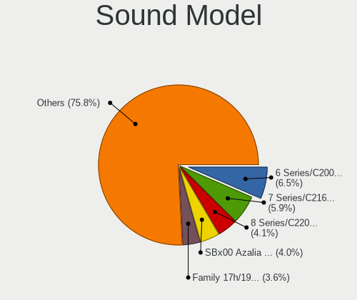

| Model                                                                                             | Computers | Percent |
|---------------------------------------------------------------------------------------------------|-----------|---------|
| Intel 6 Series/C200 Series Chipset Family High Definition Audio Controller                        | 62        | 7.53%   |
| Intel 7 Series/C216 Chipset Family High Definition Audio Controller                               | 49        | 5.95%   |
| AMD SBx00 Azalia (Intel HDA)                                                                      | 34        | 4.13%   |
| Intel 8 Series/C220 Series Chipset High Definition Audio Controller                               | 33        | 4.01%   |
| AMD Family 17h/19h HD Audio Controller                                                            | 29        | 3.52%   |
| Intel Sunrise Point-LP HD Audio                                                                   | 27        | 3.28%   |
| Intel Xeon E3-1200 v3/4th Gen Core Processor HD Audio Controller                                  | 24        | 2.92%   |
| Intel NM10/ICH7 Family High Definition Audio Controller                                           | 24        | 2.92%   |
| Intel 5 Series/3400 Series Chipset High Definition Audio                                          | 19        | 2.31%   |
| Intel Cannon Lake PCH cAVS                                                                        | 18        | 2.19%   |
| AMD Raven/Raven2/Fenghuang HDMI/DP Audio Controller                                               | 18        | 2.19%   |
| Intel Wildcat Point-LP High Definition Audio Controller                                           | 16        | 1.94%   |
| Intel Broadwell-U Audio Controller                                                                | 16        | 1.94%   |
| AMD Starship/Matisse HD Audio Controller                                                          | 16        | 1.94%   |
| Intel 82801I (ICH9 Family) HD Audio Controller                                                    | 13        | 1.58%   |
| Intel Cannon Point-LP High Definition Audio Controller                                            | 12        | 1.46%   |
| Nvidia High Definition Audio Controller                                                           | 11        | 1.34%   |
| AMD FCH Azalia Controller                                                                         | 11        | 1.34%   |
| Nvidia GF108 High Definition Audio Controller                                                     | 10        | 1.22%   |
| Intel Haswell-ULT HD Audio Controller                                                             | 10        | 1.22%   |
| Intel 8 Series HD Audio Controller                                                                | 10        | 1.22%   |
| AMD Renoir Radeon High Definition Audio Controller                                                | 10        | 1.22%   |
| AMD Oland/Hainan/Cape Verde/Pitcairn HDMI Audio [Radeon HD 7000 Series]                           | 10        | 1.22%   |
| Nvidia GP107GL High Definition Audio Controller                                                   | 9         | 1.09%   |
| Intel 100 Series/C230 Series Chipset Family HD Audio Controller                                   | 9         | 1.09%   |
| Nvidia GK208 HDMI/DP Audio Controller                                                             | 8         | 0.97%   |
| Intel Atom Processor Z36xxx/Z37xxx Series High Definition Audio Controller                        | 8         | 0.97%   |
| Intel 82801H (ICH8 Family) HD Audio Controller                                                    | 8         | 0.97%   |
| Intel 200 Series PCH HD Audio                                                                     | 8         | 0.97%   |
| AMD Caicos HDMI Audio [Radeon HD 6450 / 7450/8450/8490 OEM / R5 230/235/235X OEM]                 | 8         | 0.97%   |
| Nvidia GK107 HDMI Audio Controller                                                                | 7         | 0.85%   |
| Nvidia GK104 HDMI Audio Controller                                                                | 7         | 0.85%   |
| Intel Celeron/Pentium Silver Processor High Definition Audio                                      | 7         | 0.85%   |
| Intel 82801JD/DO (ICH10 Family) HD Audio Controller                                               | 7         | 0.85%   |
| AMD Family 15h (Models 60h-6fh) Audio Controller                                                  | 7         | 0.85%   |
| AMD Cedar HDMI Audio [Radeon HD 5400/6300/7300 Series]                                            | 7         | 0.85%   |
| Nvidia MCP61 High Definition Audio                                                                | 6         | 0.73%   |
| Nvidia GP104 High Definition Audio Controller                                                     | 6         | 0.73%   |
| Nvidia GF106 High Definition Audio Controller                                                     | 6         | 0.73%   |
| Intel Tiger Lake-LP Smart Sound Technology Audio Controller                                       | 6         | 0.73%   |
| Intel 82801G (ICH7 Family) AC'97 Audio Controller                                                 | 6         | 0.73%   |
| AMD Kabini HDMI/DP Audio                                                                          | 6         | 0.73%   |
| AMD High Definition Audio Controller                                                              | 6         | 0.73%   |
| AMD Family 17h (Models 00h-0fh) HD Audio Controller                                               | 6         | 0.73%   |
| AMD Ellesmere HDMI Audio [Radeon RX 470/480 / 570/580/590]                                        | 6         | 0.73%   |
| Intel Ice Lake-LP Smart Sound Technology Audio Controller                                         | 5         | 0.61%   |
| Intel Comet Lake PCH-LP cAVS                                                                      | 5         | 0.61%   |
| Intel C600/X79 series chipset High Definition Audio Controller                                    | 5         | 0.61%   |
| Intel Atom/Celeron/Pentium Processor x5-E8000/J3xxx/N3xxx Series High Definition Audio Controller | 5         | 0.61%   |
| Intel 82801JI (ICH10 Family) HD Audio Controller                                                  | 5         | 0.61%   |
| Nvidia TU107 GeForce GTX 1650 High Definition Audio Controller                                    | 4         | 0.49%   |
| Nvidia GP108 High Definition Audio Controller                                                     | 4         | 0.49%   |
| Nvidia GP106 High Definition Audio Controller                                                     | 4         | 0.49%   |
| Nvidia GF119 HDMI Audio Controller                                                                | 4         | 0.49%   |
| Intel Tiger Lake-H HD Audio Controller                                                            | 4         | 0.49%   |
| Intel CM238 HD Audio Controller                                                                   | 4         | 0.49%   |
| Intel 9 Series Chipset Family HD Audio Controller                                                 | 4         | 0.49%   |
| AMD RV710/730 HDMI Audio [Radeon HD 4000 series]                                                  | 4         | 0.49%   |
| AMD RV620 HDMI Audio [Radeon HD 3450/3470/3550/3570]                                              | 4         | 0.49%   |
| AMD RS780 HDMI Audio [Radeon 3000/3100 / HD 3200/3300]                                            | 4         | 0.49%   |

Memory
------

Memory Vendor
-------------

Memory module vendors

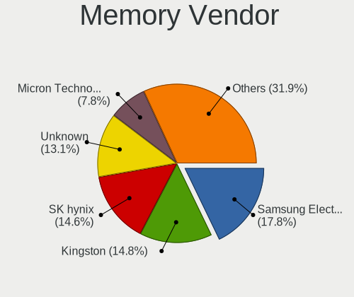

| Vendor                                           | Computers | Percent |
|--------------------------------------------------|-----------|---------|
| Samsung Electronics                              | 80        | 18.65%  |
| Kingston                                         | 64        | 14.92%  |
| SK Hynix                                         | 61        | 14.22%  |
| Unknown                                          | 58        | 13.52%  |
| Micron Technology                                | 34        | 7.93%   |
| Crucial                                          | 24        | 5.59%   |
| Corsair                                          | 17        | 3.96%   |
| G.Skill                                          | 14        | 3.26%   |
| Elpida                                           | 11        | 2.56%   |
| Smart                                            | 9         | 2.1%    |
| Ramaxel Technology                               | 9         | 2.1%    |
| Nanya Technology                                 | 8         | 1.86%   |
| Patriot                                          | 5         | 1.17%   |
| Teikon                                           | 4         | 0.93%   |
| Team                                             | 4         | 0.93%   |
| A-DATA Technology                                | 4         | 0.93%   |
| Unknown (ABCD)                                   | 3         | 0.7%    |
| Qimonda                                          | 2         | 0.47%   |
| HBS                                              | 2         | 0.47%   |
| GOODRAM                                          | 2         | 0.47%   |
| Unknown (0x4D342037305435363633515A332D43463720) | 1         | 0.23%   |
| Unknown (0x36345431323830323045444C322E35433220) | 1         | 0.23%   |
| Unknown (00FFFFFFFFFFFFFF)                       | 1         | 0.23%   |
| Transcend                                        | 1         | 0.23%   |
| Toshiba                                          | 1         | 0.23%   |
| Netlist                                          | 1         | 0.23%   |
| Kreton                                           | 1         | 0.23%   |
| Goldenmars                                       | 1         | 0.23%   |
| Golden Empire                                    | 1         | 0.23%   |
| GeIL                                             | 1         | 0.23%   |
| atermiter                                        | 1         | 0.23%   |
| ASint Technology                                 | 1         | 0.23%   |
| Apacer                                           | 1         | 0.23%   |
| Unknown                                          | 1         | 0.23%   |

Memory Model
------------

Memory module models

| Model                                                            | Computers | Percent |
|------------------------------------------------------------------|-----------|---------|
| Samsung RAM M471A5244CB0-CTD 4096MB SODIMM DDR4 3266MT/s         | 6         | 1.3%    |
| SK Hynix RAM HMT351S6CFR8C-PB 4GB SODIMM DDR3 1600MT/s           | 5         | 1.09%   |
| Micron RAM 16KTF1G64HZ-1G6E1 8GB SODIMM DDR3 1600MT/s            | 5         | 1.09%   |
| Kingston RAM Module 4096MB DIMM DDR3 1333MT/s                    | 5         | 1.09%   |
| Unknown RAM Module 2048MB DIMM DDR 533MT/s                       | 4         | 0.87%   |
| Samsung RAM M471B5773DH0-CH9 2GB SODIMM DDR3 1600MT/s            | 4         | 0.87%   |
| Unknown RAM Module 4096MB DIMM 1333MT/s                          | 3         | 0.65%   |
| SK Hynix RAM HMT451S6BFR8A-PB 4096MB SODIMM DDR3 1600MT/s        | 3         | 0.65%   |
| Samsung RAM M471B5273DH0-CH9 4096MB SODIMM DDR3 1334MT/s         | 3         | 0.65%   |
| Samsung RAM M471B5273CH0-CH9 4GB SODIMM DDR3 1334MT/s            | 3         | 0.65%   |
| Samsung RAM M471B1G73QH0-YK0 8GB SODIMM DDR3 1600MT/s            | 3         | 0.65%   |
| Samsung RAM M471A5244CB0-CRC 4GB SODIMM DDR4 2667MT/s            | 3         | 0.65%   |
| Samsung RAM M471A1G44AB0-CWE 8GB Row Of Chips DDR4 3200MT/s      | 3         | 0.65%   |
| Kingston RAM Module 2048MB DIMM DDR2 667MT/s                     | 3         | 0.65%   |
| Kingston RAM KHX1600C9D3/4GX 4GB DIMM DDR3 2400MT/s              | 3         | 0.65%   |
| Kingston RAM 99U5471-054.A00LF 8GB DIMM DDR3 1600MT/s            | 3         | 0.65%   |
| Crucial RAM CT51264BF160B.C16F 4GB SODIMM DDR3 1600MT/s          | 3         | 0.65%   |
| Unknown RAM Module 8192MB DIMM DDR3 1333MT/s                     | 2         | 0.43%   |
| Unknown RAM Module 4096MB SODIMM DDR3 1333MT/s                   | 2         | 0.43%   |
| Unknown RAM Module 4096MB SODIMM DDR3                            | 2         | 0.43%   |
| Unknown RAM Module 4096MB DIMM DDR3 1333MT/s                     | 2         | 0.43%   |
| Unknown RAM Module 2048MB SODIMM DRAM                            | 2         | 0.43%   |
| Unknown RAM Module 2048MB DIMM SDRAM                             | 2         | 0.43%   |
| Unknown RAM Module 2048MB DIMM DDR3 1067MT/s                     | 2         | 0.43%   |
| Unknown RAM Module 2048MB DIMM DDR2 800MT/s                      | 2         | 0.43%   |
| Unknown RAM Module 2048MB DIMM DDR2 667MT/s                      | 2         | 0.43%   |
| Unknown RAM Module 2048MB DIMM 1333MT/s                          | 2         | 0.43%   |
| Unknown RAM Module 1024MB DIMM SDRAM                             | 2         | 0.43%   |
| Unknown RAM Module 1024MB DIMM DDR 533MT/s                       | 2         | 0.43%   |
| Unknown (ABCD) RAM 123456789012345678 3GB SODIMM LPDDR4 2400MT/s | 2         | 0.43%   |
| Team RAM TEAMGROUP-UD4-3200 8GB DIMM DDR4 3200MT/s               | 2         | 0.43%   |
| Smart RAM SH564128FH8NZPHSCG 4GB SODIMM DDR3 1334MT/s            | 2         | 0.43%   |
| SK Hynix RAM HYMP125U64CP8-S6 2GB DIMM DDR2 49926MT/s            | 2         | 0.43%   |
| SK Hynix RAM HMT41GS6BFR8A-PB 8192MB SODIMM DDR3 1600MT/s        | 2         | 0.43%   |
| SK Hynix RAM HMT351S6EFR8A-PB 4GB SODIMM DDR3 1600MT/s           | 2         | 0.43%   |
| SK Hynix RAM HMT351S6CFR8C-H9 4GB SODIMM DDR3 1333MT/s           | 2         | 0.43%   |
| SK Hynix RAM HMAA2GS6CJR8N-XN 16GB SODIMM DDR4 3200MT/s          | 2         | 0.43%   |
| SK Hynix RAM HMA851S6DJR6N-XN 4GB SODIMM DDR4 3200MT/s           | 2         | 0.43%   |
| SK Hynix RAM HMA851S6AFR6N-UH 4096MB SODIMM DDR4 2667MT/s        | 2         | 0.43%   |
| SK Hynix RAM HMA81GS6DJR8N-XN 8GB SODIMM DDR4 3200MT/s           | 2         | 0.43%   |
| SK Hynix RAM HMA81GS6CJR8N-XN 8GB SODIMM DDR4 3200MT/s           | 2         | 0.43%   |
| Samsung RAM M471B5673FH0-CH9 2048MB SODIMM DDR3 1334MT/s         | 2         | 0.43%   |
| Samsung RAM M471B5673EH1-CF8 2048MB SODIMM DDR3 4199MT/s         | 2         | 0.43%   |
| Samsung RAM M471B5273EB0-CK0 4GB SODIMM DDR3 4199MT/s            | 2         | 0.43%   |
| Samsung RAM M471B5273CH0-CK0 4GB SODIMM DDR3 1600MT/s            | 2         | 0.43%   |
| Samsung RAM M471B5173QH0-YK0 4GB SODIMM DDR3 1600MT/s            | 2         | 0.43%   |
| Samsung RAM M471B5173DB0-YK0 4096MB SODIMM DDR3 1600MT/s         | 2         | 0.43%   |
| Samsung RAM M471A5244CB0-CTD 4GB Row Of Chips DDR4 2667MT/s      | 2         | 0.43%   |
| Samsung RAM M471A1K43DB1-CWE 8192MB SODIMM DDR4 3200MT/s         | 2         | 0.43%   |
| Samsung RAM M471A1K43DB1-CTD 8GB SODIMM DDR4 2667MT/s            | 2         | 0.43%   |
| Samsung RAM M471A1K43CB1-CRC 8GB SODIMM DDR4 2667MT/s            | 2         | 0.43%   |
| Samsung RAM M471A1K43BB1-CRC 8192MB SODIMM DDR4 2667MT/s         | 2         | 0.43%   |
| Ramaxel RAM RMT3160ED58E9W1600 4GB SODIMM DDR3 1600MT/s          | 2         | 0.43%   |
| Micron RAM MT52L1G32D4PG-093 8GB Row Of Chips LPDDR3 2133MT/s    | 2         | 0.43%   |
| Micron RAM 8KTF51264HZ-1G6N1 4GB SODIMM DDR3 1600MT/s            | 2         | 0.43%   |
| Micron RAM 4ATF51264HZ-2G6E1 4GB SODIMM DDR4 2667MT/s            | 2         | 0.43%   |
| Kingston RAM 99U5584-005.A00LF 4096MB DIMM DDR3 1600MT/s         | 2         | 0.43%   |
| Elpida RAM EBJ41EF8BCFA-DJ-F 4096MB DIMM DDR3 1333MT/s           | 2         | 0.43%   |
| Crucial RAM CT51264BF160BJ.M8F 4GB SODIMM DDR3 1600MT/s          | 2         | 0.43%   |
| Crucial RAM CT102464BF160B.M16 8GB SODIMM DDR3 1600MT/s          | 2         | 0.43%   |

Memory Kind
-----------

Memory module kinds

| Kind    | Computers | Percent |
|---------|-----------|---------|
| DDR3    | 175       | 47.04%  |
| DDR4    | 113       | 30.38%  |
| DDR2    | 27        | 7.26%   |
| SDRAM   | 14        | 3.76%   |
| Unknown | 12        | 3.23%   |
| DDR     | 10        | 2.69%   |
| LPDDR4  | 9         | 2.42%   |
| LPDDR3  | 9         | 2.42%   |
| DRAM    | 3         | 0.81%   |

Memory Form Factor
------------------

Physical design of the memory module

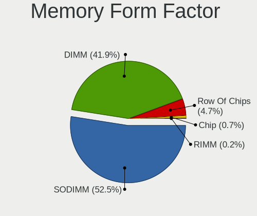

| Name         | Computers | Percent |
|--------------|-----------|---------|
| SODIMM       | 193       | 52.45%  |
| DIMM         | 155       | 42.12%  |
| Row Of Chips | 17        | 4.62%   |
| Chip         | 3         | 0.82%   |

Memory Size
-----------

Memory module size

| Size  | Computers | Percent |
|-------|-----------|---------|
| 4096  | 132       | 32.92%  |
| 8192  | 112       | 27.93%  |
| 2048  | 87        | 21.7%   |
| 16384 | 39        | 9.73%   |
| 1024  | 15        | 3.74%   |
| 32768 | 13        | 3.24%   |
| 512   | 2         | 0.5%    |
| 1536  | 1         | 0.25%   |

Memory Speed
------------

Memory module speed

| Speed   | Computers | Percent |
|---------|-----------|---------|
| 1600    | 97        | 24.31%  |
| 1333    | 50        | 12.53%  |
| 2667    | 48        | 12.03%  |
| 3200    | 36        | 9.02%   |
| 2400    | 24        | 6.02%   |
| 1334    | 22        | 5.51%   |
| 800     | 17        | 4.26%   |
| 667     | 16        | 4.01%   |
| 2133    | 12        | 3.01%   |
| Unknown | 10        | 2.51%   |
| 1067    | 8         | 2.01%   |
| 1066    | 8         | 2.01%   |
| 533     | 8         | 2.01%   |
| 3266    | 6         | 1.5%    |
| 4199    | 5         | 1.25%   |
| 2666    | 4         | 1%      |
| 1867    | 4         | 1%      |
| 49926   | 2         | 0.5%    |
| 3733    | 2         | 0.5%    |
| 3600    | 2         | 0.5%    |
| 3466    | 2         | 0.5%    |
| 3400    | 2         | 0.5%    |
| 400     | 2         | 0.5%    |
| 4267    | 1         | 0.25%   |
| 3866    | 1         | 0.25%   |
| 3500    | 1         | 0.25%   |
| 3100    | 1         | 0.25%   |
| 2933    | 1         | 0.25%   |
| 2800    | 1         | 0.25%   |
| 2473    | 1         | 0.25%   |
| 2048    | 1         | 0.25%   |
| 1866    | 1         | 0.25%   |
| 1400    | 1         | 0.25%   |
| 975     | 1         | 0.25%   |
| 266     | 1         | 0.25%   |

Printers & scanners
-------------------

Printer Vendor
--------------

Printer device vendors

| Vendor                 | Computers | Percent |
|------------------------|-----------|---------|
| Hewlett-Packard        | 9         | 33.33%  |
| Brother Industries     | 5         | 18.52%  |
| Seiko Epson            | 3         | 11.11%  |
| Canon                  | 3         | 11.11%  |
| Samsung Electronics    | 2         | 7.41%   |
| QinHeng Electronics    | 2         | 7.41%   |
| Panasonic (Matsushita) | 1         | 3.7%    |
| Lexmark International  | 1         | 3.7%    |
| Bixolon                | 1         | 3.7%    |

Printer Model
-------------

Printer device models

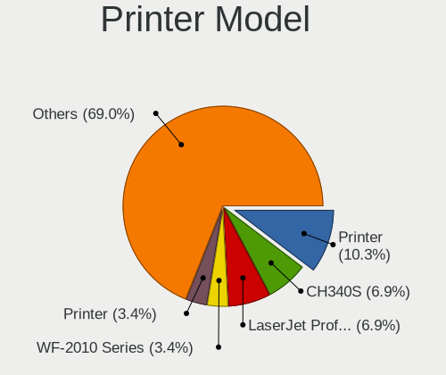

| Model                                      | Computers | Percent |
|--------------------------------------------|-----------|---------|
| QinHeng CH340S                             | 2         | 7.14%   |
| HP LaserJet Professional P 1102w           | 2         | 7.14%   |
| Brother Printer                            | 2         | 7.14%   |
| Seiko Epson WF-2010 Series                 | 1         | 3.57%   |
| Seiko Epson Printer                        | 1         | 3.57%   |
| Seiko Epson L312 Series                    | 1         | 3.57%   |
| Samsung M2020 Series                       | 1         | 3.57%   |
| Samsung CLX-4190 Series                    | 1         | 3.57%   |
| Panasonic (Matsushita) KX-MB2130RU         | 1         | 3.57%   |
| Lexmark International InkJet Color Printer | 1         | 3.57%   |
| HP OfficeJet 6950                          | 1         | 3.57%   |
| HP Officejet 4500 G510a-f                  | 1         | 3.57%   |
| HP LaserJet 1022                           | 1         | 3.57%   |
| HP LaserJet 1020                           | 1         | 3.57%   |
| HP Deskjet F4500 series                    | 1         | 3.57%   |
| HP Deskjet 3050 J610 series                | 1         | 3.57%   |
| HP DeskJet 2130 series                     | 1         | 3.57%   |
| Canon PIXMA MG2500 Series                  | 1         | 3.57%   |
| Canon Pixma iP4500 Printer                 | 1         | 3.57%   |
| Canon LBP7010C/7018C                       | 1         | 3.57%   |
| Brother HL-3170CDW series                  | 1         | 3.57%   |
| Brother HL-1440 Laser Printer              | 1         | 3.57%   |
| Brother DCP-L2540DW                        | 1         | 3.57%   |
| Brother DCP-7055 scanner/printer           | 1         | 3.57%   |
| Bixolon Printer                            | 1         | 3.57%   |

Scanner Vendor
--------------

Scanner device vendors

| Vendor      | Computers | Percent |
|-------------|-----------|---------|
| Seiko Epson | 3         | 60%     |
| Canon       | 2         | 40%     |

Scanner Model
-------------

Scanner device models

| Model                                             | Computers | Percent |
|---------------------------------------------------|-----------|---------|
| Seiko Epson GT-X900 [Perfection V700/V750 Photo]  | 1         | 20%     |
| Seiko Epson GT-F650 [GT-S600/Perfection V10/V100] | 1         | 20%     |
| Seiko Epson ES-D400 [GT-S80]                      | 1         | 20%     |
| Canon CanoScan LiDE 210                           | 1         | 20%     |
| Canon CanoScan LiDE 110                           | 1         | 20%     |

Camera
------

Camera Vendor
-------------

Camera device vendors

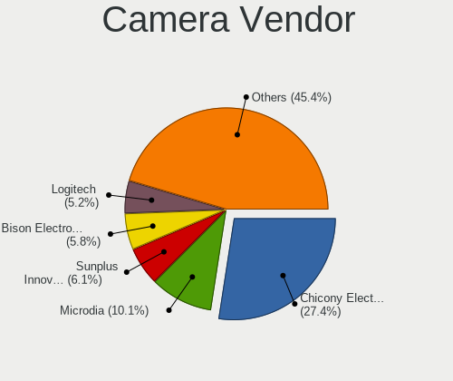

| Vendor                                 | Computers | Percent |
|----------------------------------------|-----------|---------|
| Chicony Electronics                    | 73        | 26.45%  |
| Microdia                               | 26        | 9.42%   |
| Acer                                   | 26        | 9.42%   |
| Sunplus Innovation Technology          | 19        | 6.88%   |
| IMC Networks                           | 17        | 6.16%   |
| Logitech                               | 15        | 5.43%   |
| Cheng Uei Precision Industry (Foxlink) | 12        | 4.35%   |
| Realtek Semiconductor                  | 11        | 3.99%   |
| Quanta                                 | 9         | 3.26%   |
| Ricoh                                  | 8         | 2.9%    |
| Suyin                                  | 7         | 2.54%   |
| Apple                                  | 7         | 2.54%   |
| Syntek                                 | 6         | 2.17%   |
| Silicon Motion                         | 6         | 2.17%   |
| Lite-On Technology                     | 5         | 1.81%   |
| Microsoft                              | 3         | 1.09%   |
| Z-Star Microelectronics                | 2         | 0.72%   |
| Luxvisions Innotech Limited            | 2         | 0.72%   |
| KYE Systems (Mouse Systems)            | 2         | 0.72%   |
| Creative Technology                    | 2         | 0.72%   |
| Aveo Technology                        | 2         | 0.72%   |
| Alcor Micro                            | 2         | 0.72%   |
| Y Media                                | 1         | 0.36%   |
| Sweex                                  | 1         | 0.36%   |
| Sunplus Technology                     | 1         | 0.36%   |
| Samsung Electronics                    | 1         | 0.36%   |
| Ruision                                | 1         | 0.36%   |
| Primax Electronics                     | 1         | 0.36%   |
| MacroSilicon                           | 1         | 0.36%   |
| Lenovo                                 | 1         | 0.36%   |
| Jieli Technology                       | 1         | 0.36%   |
| Importek                               | 1         | 0.36%   |
| Generalplus Technology                 | 1         | 0.36%   |
| DigiTech                               | 1         | 0.36%   |
| Cubeternet                             | 1         | 0.36%   |
| ARC International                      | 1         | 0.36%   |

Camera Model
------------

Camera device models

| Model                                                   | Computers | Percent |
|---------------------------------------------------------|-----------|---------|
| Chicony Integrated Camera                               | 17        | 6.12%   |
| Sunplus Integrated_Webcam_HD                            | 10        | 3.6%    |
| Microdia Integrated_Webcam_HD                           | 8         | 2.88%   |
| Acer Integrated Camera                                  | 8         | 2.88%   |
| Chicony USB2.0 VGA UVC WebCam                           | 7         | 2.52%   |
| Acer BisonCam, NB Pro                                   | 6         | 2.16%   |
| Microdia Laptop_Integrated_Webcam_HD                    | 5         | 1.8%    |
| Logitech Webcam C270                                    | 5         | 1.8%    |
| IMC Networks USB2.0 HD UVC WebCam                       | 5         | 1.8%    |
| Ricoh HD Webcam                                         | 4         | 1.44%   |
| Chicony HD WebCam                                       | 4         | 1.44%   |
| Apple iPhone 5/5C/5S/6/SE                               | 4         | 1.44%   |
| Syntek Integrated Camera                                | 3         | 1.08%   |
| Suyin HP TrueVision HD Integrated Webcam                | 3         | 1.08%   |
| Sunplus Laptop_Integrated_Webcam_FHD                    | 3         | 1.08%   |
| Realtek Integrated_Webcam_HD                            | 3         | 1.08%   |
| Quanta HD User Facing                                   | 3         | 1.08%   |
| Microdia Integrated Webcam                              | 3         | 1.08%   |
| Lite-On HP HD Camera                                    | 3         | 1.08%   |
| IMC Networks Integrated Camera                          | 3         | 1.08%   |
| Chicony Integrated Camera (1280x720@30)                 | 3         | 1.08%   |
| Chicony HP Wide Vision HD Camera                        | 3         | 1.08%   |
| Chicony HP HD Webcam                                    | 3         | 1.08%   |
| Chicony CNF9055 Toshiba Webcam                          | 3         | 1.08%   |
| Cheng Uei Precision Industry (Foxlink) HP Webcam        | 3         | 1.08%   |
| Cheng Uei Precision Industry (Foxlink) HP Truevision HD | 3         | 1.08%   |
| Acer Lenovo Integrated Webcam                           | 3         | 1.08%   |
| Acer Lenovo EasyCamera                                  | 3         | 1.08%   |
| Syntek EasyCamera                                       | 2         | 0.72%   |
| Suyin Acer/HP Integrated Webcam [CN0314]                | 2         | 0.72%   |
| Silicon Motion WebCam SC-13HDL11939N                    | 2         | 0.72%   |
| Silicon Motion 300k Pixel Camera                        | 2         | 0.72%   |
| Ricoh Sony Visual Communication Camera                  | 2         | 0.72%   |
| Ricoh Laptop_Integrated_Webcam_FHD                      | 2         | 0.72%   |
| Realtek USB Camera                                      | 2         | 0.72%   |
| Realtek Lenovo EasyCamera                               | 2         | 0.72%   |
| Quanta VGA WebCam                                       | 2         | 0.72%   |
| Quanta Laptop_Integrated_Webcam_2HDM                    | 2         | 0.72%   |
| Microsoft LifeCam HD-3000                               | 2         | 0.72%   |
| Microdia Laptop_Integrated_Webcam_2M                    | 2         | 0.72%   |
| Microdia Dell Integrated HD Webcam                      | 2         | 0.72%   |
| Logitech QuickCam Pro 9000                              | 2         | 0.72%   |
| IMC Networks XHC Camera                                 | 2         | 0.72%   |
| IMC Networks UVC VGA Webcam                             | 2         | 0.72%   |
| IMC Networks USB2.0 VGA UVC WebCam                      | 2         | 0.72%   |
| Chicony VGA Webcam                                      | 2         | 0.72%   |
| Chicony USB2.0 UVC WebCam                               | 2         | 0.72%   |
| Chicony Lenovo Integrated Camera (0.3MP)                | 2         | 0.72%   |
| Chicony HP Webcam-101                                   | 2         | 0.72%   |
| Chicony HP HD Webcam [Fixed]                            | 2         | 0.72%   |
| Chicony HD WebCam (Acer)                                | 2         | 0.72%   |
| Cheng Uei Precision Industry (Foxlink) Webcam           | 2         | 0.72%   |
| Aveo UVC camera (Bresser microscope)                    | 2         | 0.72%   |
| Z-Star Venus USB2.0 Camera                              | 1         | 0.36%   |
| Z-Star Vega USB 2.0 Camera                              | 1         | 0.36%   |
| Y Media USB Camera                                      | 1         | 0.36%   |
| Syntek USB Video Device                                 | 1         | 0.36%   |
| Sweex WC060 Series HD Webcam                            | 1         | 0.36%   |
| Suyin Sony Visual Communication Camera                  | 1         | 0.36%   |
| Suyin 1.3M HD WebCam                                    | 1         | 0.36%   |

Security
--------

Fingerprint Vendor
------------------

Fingerprint sensor vendors

| Vendor                     | Computers | Percent |
|----------------------------|-----------|---------|
| Validity Sensors           | 24        | 48.98%  |
| Synaptics                  | 12        | 24.49%  |
| Shenzhen Goodix Technology | 5         | 10.2%   |
| Upek                       | 3         | 6.12%   |
| Elan Microelectronics      | 3         | 6.12%   |
| Focal-systems.Corp         | 1         | 2.04%   |
| AuthenTec                  | 1         | 2.04%   |

Fingerprint Model
-----------------

Fingerprint sensor models

| Model                                                       | Computers | Percent |
|-------------------------------------------------------------|-----------|---------|
| Validity Sensors VFS5011 Fingerprint Reader                 | 4         | 8.16%   |
| Validity Sensors VFS491                                     | 4         | 8.16%   |
| Validity Sensors VFS 5011 fingerprint sensor                | 4         | 8.16%   |
| Synaptics Prometheus MIS Touch Fingerprint Reader           | 4         | 8.16%   |
| Validity Sensors VFS495 Fingerprint Reader                  | 3         | 6.12%   |
| Shenzhen Goodix Fingerprint Reader                          | 3         | 6.12%   |
| Unknown                                                     | 3         | 6.12%   |
| Validity Sensors VFS7500 Touch Fingerprint Sensor           | 2         | 4.08%   |
| Validity Sensors Fingerprint scanner                        | 2         | 4.08%   |
| Upek Biometric Touchchip/Touchstrip Fingerprint Sensor      | 2         | 4.08%   |
| Synaptics  VFS7552 Touch Fingerprint Sensor with PurePrint  | 2         | 4.08%   |
| Synaptics Metallica MIS Touch Fingerprint Reader            | 2         | 4.08%   |
| Elan ELAN:Fingerprint                                       | 2         | 4.08%   |
| Validity Sensors VFS471 Fingerprint Reader                  | 1         | 2.04%   |
| Validity Sensors VFS301 Fingerprint Reader                  | 1         | 2.04%   |
| Validity Sensors Synaptics WBDI                             | 1         | 2.04%   |
| Validity Sensors Synaptics VFS7552 Touch Fingerprint Sensor | 1         | 2.04%   |
| Validity Sensors Swipe Fingerprint Sensor                   | 1         | 2.04%   |
| Upek TCS5B Fingerprint sensor                               | 1         | 2.04%   |
| Synaptics Metallica MOH Touch Fingerprint Reader            | 1         | 2.04%   |
| Shenzhen Goodix  FingerPrint Device                         | 1         | 2.04%   |
| Shenzhen Goodix FingerPrint                                 | 1         | 2.04%   |
| Focal-systems.Corp FT9201Fingerprint.                       | 1         | 2.04%   |
| Elan ELAN:ARM-M4                                            | 1         | 2.04%   |
| AuthenTec AES2810                                           | 1         | 2.04%   |

Chipcard Vendor
---------------

Chipcard module vendors

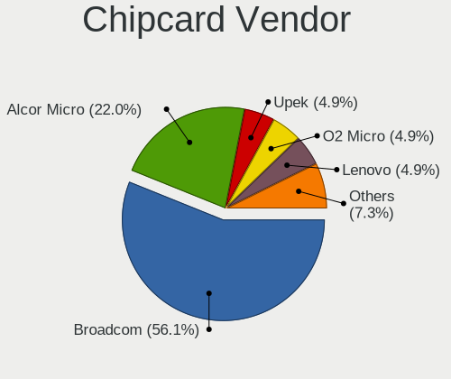

| Vendor                | Computers | Percent |
|-----------------------|-----------|---------|
| Broadcom              | 21        | 56.76%  |
| Alcor Micro           | 7         | 18.92%  |
| Upek                  | 2         | 5.41%   |
| O2 Micro              | 2         | 5.41%   |
| Lenovo                | 2         | 5.41%   |
| Gemalto (was Gemplus) | 1         | 2.7%    |
| Chicony Electronics   | 1         | 2.7%    |
| Advanced Card Systems | 1         | 2.7%    |

Chipcard Model
--------------

Chipcard module models

| Model                                                                        | Computers | Percent |
|------------------------------------------------------------------------------|-----------|---------|
| Broadcom BCM5880 Secure Applications Processor                               | 10        | 27.03%  |
| Broadcom BCM5880 Secure Applications Processor with fingerprint swipe sensor | 7         | 18.92%  |
| Alcor Micro AU9540 Smartcard Reader                                          | 7         | 18.92%  |
| Upek TouchChip Fingerprint Coprocessor (WBF advanced mode)                   | 2         | 5.41%   |
| O2 Micro OZ776 CCID Smartcard Reader                                         | 2         | 5.41%   |
| Lenovo Integrated Smart Card Reader                                          | 2         | 5.41%   |
| Broadcom 5880                                                                | 2         | 5.41%   |
| Broadcom 58200                                                               | 2         | 5.41%   |
| Gemalto (was Gemplus) GemPC Key SmartCard Reader                             | 1         | 2.7%    |
| Chicony Electronics HP Skylab USB Smartcard Keyboard                         | 1         | 2.7%    |
| Advanced Card Systems ACR38 SmartCard Reader                                 | 1         | 2.7%    |

Unsupported
-----------

Unsupported Devices
-------------------

Total unsupported devices on board

| Total | Computers | Percent |
|-------|-----------|---------|
| 0     | 431       | 76.83%  |
| 1     | 106       | 18.89%  |
| 2     | 20        | 3.57%   |
| 8     | 2         | 0.36%   |
| 4     | 1         | 0.18%   |
| 3     | 1         | 0.18%   |

Unsupported Device Types
------------------------

Types of unsupported devices

| Type                     | Computers | Percent |
|--------------------------|-----------|---------|
| Fingerprint reader       | 49        | 30.06%  |
| Chipcard                 | 34        | 20.86%  |
| Graphics card            | 33        | 20.25%  |
| Net/wireless             | 10        | 6.13%   |
| Storage                  | 8         | 4.91%   |
| Communication controller | 7         | 4.29%   |
| Multimedia controller    | 5         | 3.07%   |
| Unassigned class         | 3         | 1.84%   |
| Camera                   | 3         | 1.84%   |
| Bluetooth                | 3         | 1.84%   |
| Sound                    | 2         | 1.23%   |
| Network                  | 2         | 1.23%   |
| Tv card                  | 1         | 0.61%   |
| Storage/ata              | 1         | 0.61%   |
| Firewire controller      | 1         | 0.61%   |
| Card reader              | 1         | 0.61%   |

