Ubuntu MATE 20.04 - Tested Hardware & Statistics (Desktops)
-----------------------------------------------------------

A project to collect tested hardware configurations for Ubuntu MATE 20.04.

Anyone can contribute to this report by the [hw-probe](https://github.com/linuxhw/hw-probe) tool:

    sudo -E hw-probe -all -upload

Please contribute! Especially if your hardware is rare.

Contents
--------

* [ Test Cases ](#test-cases)

* [ System ](#system)
  - [ Kernel                   ](#kernel)
  - [ Kernel Family            ](#kernel-family)
  - [ Kernel Major Ver.        ](#kernel-major-ver)
  - [ Arch                     ](#arch)
  - [ DE                       ](#de)
  - [ Display Server           ](#display-server)
  - [ Display Manager          ](#display-manager)
  - [ OS Lang                  ](#os-lang)
  - [ Boot Mode                ](#boot-mode)
  - [ Filesystem               ](#filesystem)
  - [ Part. scheme             ](#part-scheme)
  - [ Dual Boot with Linux/BSD ](#dual-boot-with-linuxbsd)
  - [ Dual Boot (Win)          ](#dual-boot-win)

* [ Board ](#board)
  - [ Vendor                   ](#vendor)
  - [ Model                    ](#model)
  - [ Model Family             ](#model-family)
  - [ MFG Year                 ](#mfg-year)
  - [ Form Factor              ](#form-factor)
  - [ Secure Boot              ](#secure-boot)
  - [ Coreboot                 ](#coreboot)
  - [ RAM Size                 ](#ram-size)
  - [ RAM Used                 ](#ram-used)
  - [ Total Drives             ](#total-drives)
  - [ Has CD-ROM               ](#has-cd-rom)
  - [ Has Ethernet             ](#has-ethernet)
  - [ Has WiFi                 ](#has-wifi)
  - [ Has Bluetooth            ](#has-bluetooth)

* [ Location ](#location)
  - [ Country                  ](#country)
  - [ City                     ](#city)

* [ Drives ](#drives)
  - [ Drive Vendor             ](#drive-vendor)
  - [ Drive Model              ](#drive-model)
  - [ HDD Vendor               ](#hdd-vendor)
  - [ SSD Vendor               ](#ssd-vendor)
  - [ Drive Kind               ](#drive-kind)
  - [ Drive Connector          ](#drive-connector)
  - [ Drive Size               ](#drive-size)
  - [ Space Total              ](#space-total)
  - [ Space Used               ](#space-used)
  - [ Malfunc. Drives          ](#malfunc-drives)
  - [ Malfunc. Drive Vendor    ](#malfunc-drive-vendor)
  - [ Malfunc. HDD Vendor      ](#malfunc-hdd-vendor)
  - [ Malfunc. Drive Kind      ](#malfunc-drive-kind)
  - [ Failed Drives            ](#failed-drives)
  - [ Failed Drive Vendor      ](#failed-drive-vendor)
  - [ Drive Status             ](#drive-status)

* [ Storage controller ](#storage-controller)
  - [ Storage Vendor           ](#storage-vendor)
  - [ Storage Model            ](#storage-model)
  - [ Storage Kind             ](#storage-kind)

* [ Processor ](#processor)
  - [ CPU Vendor               ](#cpu-vendor)
  - [ CPU Model                ](#cpu-model)
  - [ CPU Model Family         ](#cpu-model-family)
  - [ CPU Cores                ](#cpu-cores)
  - [ CPU Sockets              ](#cpu-sockets)
  - [ CPU Threads              ](#cpu-threads)
  - [ CPU Op-Modes             ](#cpu-op-modes)
  - [ CPU Microcode            ](#cpu-microcode)
  - [ CPU Microarch            ](#cpu-microarch)

* [ Graphics ](#graphics)
  - [ GPU Vendor               ](#gpu-vendor)
  - [ GPU Model                ](#gpu-model)
  - [ GPU Combo                ](#gpu-combo)
  - [ GPU Driver               ](#gpu-driver)
  - [ GPU Memory               ](#gpu-memory)

* [ Monitor ](#monitor)
  - [ Monitor Vendor           ](#monitor-vendor)
  - [ Monitor Model            ](#monitor-model)
  - [ Monitor Resolution       ](#monitor-resolution)
  - [ Monitor Diagonal         ](#monitor-diagonal)
  - [ Monitor Width            ](#monitor-width)
  - [ Aspect Ratio             ](#aspect-ratio)
  - [ Monitor Area             ](#monitor-area)
  - [ Pixel Density            ](#pixel-density)
  - [ Multiple Monitors        ](#multiple-monitors)

* [ Network ](#network)
  - [ Net Controller Vendor    ](#net-controller-vendor)
  - [ Net Controller Model     ](#net-controller-model)
  - [ Wireless Vendor          ](#wireless-vendor)
  - [ Wireless Model           ](#wireless-model)
  - [ Ethernet Vendor          ](#ethernet-vendor)
  - [ Ethernet Model           ](#ethernet-model)
  - [ Net Controller Kind      ](#net-controller-kind)
  - [ Used Controller          ](#used-controller)
  - [ NICs                     ](#nics)
  - [ IPv6                     ](#ipv6)

* [ Bluetooth ](#bluetooth)
  - [ Bluetooth Vendor         ](#bluetooth-vendor)
  - [ Bluetooth Model          ](#bluetooth-model)

* [ Sound ](#sound)
  - [ Sound Vendor             ](#sound-vendor)
  - [ Sound Model              ](#sound-model)

* [ Memory ](#memory)
  - [ Memory Vendor            ](#memory-vendor)
  - [ Memory Model             ](#memory-model)
  - [ Memory Kind              ](#memory-kind)
  - [ Memory Form Factor       ](#memory-form-factor)
  - [ Memory Size              ](#memory-size)
  - [ Memory Speed             ](#memory-speed)

* [ Printers & scanners ](#printers--scanners)
  - [ Printer Vendor           ](#printer-vendor)
  - [ Printer Model            ](#printer-model)
  - [ Scanner Vendor           ](#scanner-vendor)
  - [ Scanner Model            ](#scanner-model)

* [ Camera ](#camera)
  - [ Camera Vendor            ](#camera-vendor)
  - [ Camera Model             ](#camera-model)

* [ Security ](#security)
  - [ Fingerprint Vendor       ](#fingerprint-vendor)
  - [ Fingerprint Model        ](#fingerprint-model)
  - [ Chipcard Vendor          ](#chipcard-vendor)
  - [ Chipcard Model           ](#chipcard-model)

* [ Unsupported ](#unsupported)
  - [ Unsupported Devices      ](#unsupported-devices)
  - [ Unsupported Device Types ](#unsupported-device-types)

Test Cases
----------

Total: 364

| Vendor        | Model                       | Probe                                                      | Date         |
|---------------|-----------------------------|------------------------------------------------------------|--------------|
| MSI           | B450M GAMING PLUS           | [5bf280924d](https://linux-hardware.org/?probe=5bf280924d) | Sep 09, 2023 |
| ASUSTek       | P6X58D-E                    | [84a5ec2d0b](https://linux-hardware.org/?probe=84a5ec2d0b) | Aug 01, 2023 |
| HP            | 339A                        | [8d051ead1c](https://linux-hardware.org/?probe=8d051ead1c) | Jul 05, 2023 |
| Gigabyte      | H81M-S2PH                   | [69b69e2a09](https://linux-hardware.org/?probe=69b69e2a09) | Jun 30, 2023 |
| MSI           | A320M-A PRO                 | [2eeb463035](https://linux-hardware.org/?probe=2eeb463035) | Jun 25, 2023 |
| MSI           | A320M-A PRO                 | [ef129b5a6c](https://linux-hardware.org/?probe=ef129b5a6c) | Jun 25, 2023 |
| Gigabyte      | GA-78LMT-S2P                | [456582ed94](https://linux-hardware.org/?probe=456582ed94) | May 03, 2023 |
| ASRock        | H170A-X1                    | [a89448e417](https://linux-hardware.org/?probe=a89448e417) | Apr 28, 2023 |
| ASUSTek       | ROG STRIX X399-E GAMING     | [ecefe27269](https://linux-hardware.org/?probe=ecefe27269) | Apr 13, 2023 |
| ASUSTek       | P5K                         | [1769888b2b](https://linux-hardware.org/?probe=1769888b2b) | Feb 23, 2023 |
| ASRock        | Z690 Pro RS                 | [68dcf39492](https://linux-hardware.org/?probe=68dcf39492) | Feb 18, 2023 |
| ASUSTek       | Pro WS X570-ACE             | [127e027611](https://linux-hardware.org/?probe=127e027611) | Feb 10, 2023 |
| Gigabyte      | Z590 UD AC                  | [91dea34a76](https://linux-hardware.org/?probe=91dea34a76) | Jan 20, 2023 |
| Dell          | 0KJCC5 A00                  | [08502cda27](https://linux-hardware.org/?probe=08502cda27) | Jan 20, 2023 |
| HP            | 805A                        | [5fdeec8d8a](https://linux-hardware.org/?probe=5fdeec8d8a) | Jan 14, 2023 |
| MSI           | B550M PRO-VDH WIFI          | [73de62ce79](https://linux-hardware.org/?probe=73de62ce79) | Jan 03, 2023 |
| MSI           | B550M PRO-VDH WIFI          | [03ca911bb7](https://linux-hardware.org/?probe=03ca911bb7) | Jan 01, 2023 |
| Dell          | 0P67HD A00                  | [67f13377be](https://linux-hardware.org/?probe=67f13377be) | Dec 12, 2022 |
| MSI           | H81M-E34                    | [a9cc317647](https://linux-hardware.org/?probe=a9cc317647) | Dec 11, 2022 |
| MSI           | A320M-A PRO                 | [1b37803020](https://linux-hardware.org/?probe=1b37803020) | Dec 04, 2022 |
| HP            | 3397                        | [0605f9214a](https://linux-hardware.org/?probe=0605f9214a) | Nov 25, 2022 |
| ASRock        | Z590M-ITX/ax                | [f01dec11e4](https://linux-hardware.org/?probe=f01dec11e4) | Nov 21, 2022 |
| Gigabyte      | H110M-S2V-CF                | [1117e533c3](https://linux-hardware.org/?probe=1117e533c3) | Nov 11, 2022 |
| ASUSTek       | Leonite2                    | [7640c7a49f](https://linux-hardware.org/?probe=7640c7a49f) | Oct 20, 2022 |
| Gigabyte      | Z590 UD AC                  | [8774a8312b](https://linux-hardware.org/?probe=8774a8312b) | Sep 13, 2022 |
| ASRock        | J5040-ITX                   | [e36022370b](https://linux-hardware.org/?probe=e36022370b) | Sep 08, 2022 |
| ASUSTek       | M4A78-E                     | [76028e78e9](https://linux-hardware.org/?probe=76028e78e9) | Aug 19, 2022 |
| ASUSTek       | M5A88-V EVO                 | [e8b519c4de](https://linux-hardware.org/?probe=e8b519c4de) | Aug 18, 2022 |
| Gigabyte      | B85M-D3PH                   | [a5ed221478](https://linux-hardware.org/?probe=a5ed221478) | Aug 17, 2022 |
| Dell          | 03NVJ6 A00                  | [9655bf78d0](https://linux-hardware.org/?probe=9655bf78d0) | Aug 05, 2022 |
| ASUSTek       | B85M-G                      | [5d5fd15071](https://linux-hardware.org/?probe=5d5fd15071) | Jul 28, 2022 |
| ONDA          | H110-MINI V3.00 Ver:3.00    | [62b2a7897b](https://linux-hardware.org/?probe=62b2a7897b) | Jul 24, 2022 |
| ASRock        | B450M Pro4                  | [0cdcc2c0e0](https://linux-hardware.org/?probe=0cdcc2c0e0) | Jul 10, 2022 |
| Dell          | 0M6C7G A00                  | [5eee0db64f](https://linux-hardware.org/?probe=5eee0db64f) | Jul 03, 2022 |
| ASUSTek       | TUF Gaming B550M-PLUS       | [e048d9df09](https://linux-hardware.org/?probe=e048d9df09) | Jun 17, 2022 |
| MSI           | 3664h                       | [5fbb22c653](https://linux-hardware.org/?probe=5fbb22c653) | Jun 15, 2022 |
| ASRock        | B450M Pro4                  | [3de31234b3](https://linux-hardware.org/?probe=3de31234b3) | Jun 12, 2022 |
| Dell          | 0HV8FN A01                  | [33d201cb1d](https://linux-hardware.org/?probe=33d201cb1d) | Jun 10, 2022 |
| Gigabyte      | GA-990FXA-UD5               | [d9e8d3957e](https://linux-hardware.org/?probe=d9e8d3957e) | Jun 06, 2022 |
| Dell          | 00V62H A01                  | [20544feb00](https://linux-hardware.org/?probe=20544feb00) | Jun 03, 2022 |
| Gigabyte      | 970A-DS3P                   | [8e0addf4d3](https://linux-hardware.org/?probe=8e0addf4d3) | May 24, 2022 |
| INP           | i1000BTS                    | [95da2ada33](https://linux-hardware.org/?probe=95da2ada33) | May 24, 2022 |
| ASUSTek       | ProArt Z490-CREATOR 10G     | [4d68e6fd8d](https://linux-hardware.org/?probe=4d68e6fd8d) | May 12, 2022 |
| HP            | 3031h                       | [4a57ff5761](https://linux-hardware.org/?probe=4a57ff5761) | May 10, 2022 |
| ASUSTek       | A55BM-E                     | [b2b220b65d](https://linux-hardware.org/?probe=b2b220b65d) | Apr 25, 2022 |
| ASRock        | Z87M Extreme4               | [83ffe21604](https://linux-hardware.org/?probe=83ffe21604) | Apr 18, 2022 |
| ASUSTek       | Z97-K                       | [4852dde595](https://linux-hardware.org/?probe=4852dde595) | Apr 15, 2022 |
| MSI           | MAG B550M MORTAR            | [7a9f6e1de7](https://linux-hardware.org/?probe=7a9f6e1de7) | Apr 13, 2022 |
| Dell          | 03NVJ6 A00                  | [c640615939](https://linux-hardware.org/?probe=c640615939) | Apr 10, 2022 |
| ASUSTek       | M5A78L-M PLUS/USB3          | [3c17fb0db4](https://linux-hardware.org/?probe=3c17fb0db4) | Apr 07, 2022 |
| Gigabyte      | H470M DS3H                  | [bbfc43c637](https://linux-hardware.org/?probe=bbfc43c637) | Apr 05, 2022 |
| ASRock        | N68C-GS FX                  | [5f45322780](https://linux-hardware.org/?probe=5f45322780) | Apr 04, 2022 |
| Dell          | 06X1TJ A00                  | [42cf748563](https://linux-hardware.org/?probe=42cf748563) | Apr 03, 2022 |
| ASUSTek       | A88X-GAMER                  | [8340e366fc](https://linux-hardware.org/?probe=8340e366fc) | Mar 28, 2022 |
| ASUSTek       | A55BM-E                     | [7bbbcc53c1](https://linux-hardware.org/?probe=7bbbcc53c1) | Mar 14, 2022 |
| Dell          | OptiPlex 980                | [14cf2b23f7](https://linux-hardware.org/?probe=14cf2b23f7) | Mar 14, 2022 |
| ASUSTek       | M4A79XTD EVO                | [d59f0b152c](https://linux-hardware.org/?probe=d59f0b152c) | Mar 10, 2022 |
| Gigabyte      | Z68XP-UD3                   | [6382c70064](https://linux-hardware.org/?probe=6382c70064) | Mar 07, 2022 |
| ASRock        | B450M Pro4                  | [b18f6804d6](https://linux-hardware.org/?probe=b18f6804d6) | Mar 02, 2022 |
| ECS           | A785GM-AD3                  | [43c3e7c4a0](https://linux-hardware.org/?probe=43c3e7c4a0) | Mar 02, 2022 |
| Pegatron      | Narra6                      | [ad9a06f14d](https://linux-hardware.org/?probe=ad9a06f14d) | Feb 25, 2022 |
| ECS           | G41T-M7                     | [c4aca5bc12](https://linux-hardware.org/?probe=c4aca5bc12) | Feb 20, 2022 |
| ECS           | A785GM-AD3                  | [b6459dbb39](https://linux-hardware.org/?probe=b6459dbb39) | Feb 12, 2022 |
| MSI           | MAG Z390 TOMAHAWK           | [e58751112a](https://linux-hardware.org/?probe=e58751112a) | Feb 11, 2022 |
| Gigabyte      | F2A88XM-D3HP                | [c6783b6b8b](https://linux-hardware.org/?probe=c6783b6b8b) | Feb 07, 2022 |
| ASUSTek       | H61M-K                      | [0e2c677ddc](https://linux-hardware.org/?probe=0e2c677ddc) | Feb 03, 2022 |
| ASUSTek       | M5A99X EVO R2.0             | [fab2b2828e](https://linux-hardware.org/?probe=fab2b2828e) | Jan 26, 2022 |
| ASRock        | Z77 Pro4                    | [8062682731](https://linux-hardware.org/?probe=8062682731) | Jan 25, 2022 |
| Gigabyte      | H410M H V3                  | [f6b7e2e2e6](https://linux-hardware.org/?probe=f6b7e2e2e6) | Jan 24, 2022 |
| ASRock        | G41C-VS                     | [4dbb4b7fad](https://linux-hardware.org/?probe=4dbb4b7fad) | Jan 21, 2022 |
| Albatron      | PM73V                       | [7bd3956f1f](https://linux-hardware.org/?probe=7bd3956f1f) | Jan 21, 2022 |
| ASUSTek       | H81M-K                      | [e5d70436b2](https://linux-hardware.org/?probe=e5d70436b2) | Jan 21, 2022 |
| ASUSTek       | P5LD2                       | [00ec990ce2](https://linux-hardware.org/?probe=00ec990ce2) | Jan 19, 2022 |
| Dell          | 0KP561                      | [1b772786e5](https://linux-hardware.org/?probe=1b772786e5) | Jan 19, 2022 |
| Dell          | 0FH884                      | [5ffacf9f99](https://linux-hardware.org/?probe=5ffacf9f99) | Jan 19, 2022 |
| Dell          | 0UG982                      | [c85c923e97](https://linux-hardware.org/?probe=c85c923e97) | Jan 19, 2022 |
| Dell          | 0X7841                      | [40600195c8](https://linux-hardware.org/?probe=40600195c8) | Jan 19, 2022 |
| Dell          | 0UG982                      | [686f3558d2](https://linux-hardware.org/?probe=686f3558d2) | Jan 19, 2022 |
| Dell          | 0FH884                      | [f6e9bda3a9](https://linux-hardware.org/?probe=f6e9bda3a9) | Jan 19, 2022 |
| Dell          | 0UG982                      | [38c30e280b](https://linux-hardware.org/?probe=38c30e280b) | Jan 19, 2022 |
| Gigabyte      | H81M-S2PV                   | [f2d5dba7ff](https://linux-hardware.org/?probe=f2d5dba7ff) | Jan 19, 2022 |
| Dell          | 0FH884                      | [083697081f](https://linux-hardware.org/?probe=083697081f) | Jan 19, 2022 |
| ASUSTek       | H81M-C                      | [f4bb742149](https://linux-hardware.org/?probe=f4bb742149) | Jan 17, 2022 |
| ASUSTek       | P5LD2                       | [b972c7929f](https://linux-hardware.org/?probe=b972c7929f) | Jan 17, 2022 |
| ASUSTek       | PRIME H310M-D R2.0          | [9a6c2f82f1](https://linux-hardware.org/?probe=9a6c2f82f1) | Jan 17, 2022 |
| Dell          | 0UG982                      | [684478b2fb](https://linux-hardware.org/?probe=684478b2fb) | Jan 17, 2022 |
| Gigabyte      | H410M H V3                  | [13b01fb40a](https://linux-hardware.org/?probe=13b01fb40a) | Jan 17, 2022 |
| ASUSTek       | PRIME H310M-D R2.0          | [385f76b996](https://linux-hardware.org/?probe=385f76b996) | Jan 17, 2022 |
| ASUSTek       | H81M-C                      | [f21bf32c9a](https://linux-hardware.org/?probe=f21bf32c9a) | Jan 15, 2022 |
| ASUSTek       | H81M-K                      | [f1858e63f4](https://linux-hardware.org/?probe=f1858e63f4) | Jan 14, 2022 |
| ASUSTek       | PRIME X470-PRO              | [c450cd4a79](https://linux-hardware.org/?probe=c450cd4a79) | Jan 13, 2022 |
| Dell          | 032W55 A03                  | [f3838abaaf](https://linux-hardware.org/?probe=f3838abaaf) | Jan 04, 2022 |
| ASRock        | 970 Extreme4                | [1fbef2b76c](https://linux-hardware.org/?probe=1fbef2b76c) | Dec 23, 2021 |
| ASUSTek       | PRIME B360M-K               | [8df64a7f80](https://linux-hardware.org/?probe=8df64a7f80) | Dec 21, 2021 |
| MSI           | H61M-S20                    | [7e1fdb578c](https://linux-hardware.org/?probe=7e1fdb578c) | Dec 02, 2021 |
| ASUSTek       | H81M-A                      | [50acb69e6e](https://linux-hardware.org/?probe=50acb69e6e) | Dec 02, 2021 |
| HP            | 3646h                       | [e7069f8a3b](https://linux-hardware.org/?probe=e7069f8a3b) | Nov 29, 2021 |
| HP            | 3646h                       | [a46d638004](https://linux-hardware.org/?probe=a46d638004) | Nov 29, 2021 |
| ASRock        | Z68 Extreme3 Gen3           | [9b13286f92](https://linux-hardware.org/?probe=9b13286f92) | Nov 28, 2021 |
| MSI           | H81M-P33                    | [3d2583b1f1](https://linux-hardware.org/?probe=3d2583b1f1) | Nov 26, 2021 |
| Dell          | 0T656F A01                  | [06f4633f1b](https://linux-hardware.org/?probe=06f4633f1b) | Nov 24, 2021 |
| ASUSTek       | AT3IONT-I                   | [b8f5329824](https://linux-hardware.org/?probe=b8f5329824) | Nov 22, 2021 |
| Dell          | 0M017G A00                  | [da444f9b8f](https://linux-hardware.org/?probe=da444f9b8f) | Nov 22, 2021 |
| ASUSTek       | M52AD_M12AD_A_F_K31AD       | [a13103a9ad](https://linux-hardware.org/?probe=a13103a9ad) | Nov 20, 2021 |
| ASRock        | B450M Pro4                  | [2cdd151d75](https://linux-hardware.org/?probe=2cdd151d75) | Nov 14, 2021 |
| Dell          | 03NVJ6 A00                  | [61bfe5dfa7](https://linux-hardware.org/?probe=61bfe5dfa7) | Nov 11, 2021 |
| ASUSTek       | M4A78-E                     | [dd8a96b615](https://linux-hardware.org/?probe=dd8a96b615) | Nov 09, 2021 |
| ASUSTek       | M4A78-E                     | [89aff3881c](https://linux-hardware.org/?probe=89aff3881c) | Nov 09, 2021 |
| ASUSTek       | A55BM-E                     | [fd25737c58](https://linux-hardware.org/?probe=fd25737c58) | Nov 09, 2021 |
| ASUSTek       | M5A97 LE R2.0               | [e21897758d](https://linux-hardware.org/?probe=e21897758d) | Nov 07, 2021 |
| Gigabyte      | H97M-D3H                    | [05e3caa05c](https://linux-hardware.org/?probe=05e3caa05c) | Nov 02, 2021 |
| ASRock        | B450M Pro4                  | [60ffb9d428](https://linux-hardware.org/?probe=60ffb9d428) | Oct 31, 2021 |
| ASRock        | Z68 Extreme3 Gen3           | [4946a6a02c](https://linux-hardware.org/?probe=4946a6a02c) | Oct 26, 2021 |
| ASRock        | Z68 Extreme3 Gen3           | [0ad429cea5](https://linux-hardware.org/?probe=0ad429cea5) | Oct 26, 2021 |
| ASUSTek       | M5A78L LE                   | [adf114d66e](https://linux-hardware.org/?probe=adf114d66e) | Oct 23, 2021 |
| ASUSTek       | PRIME H310M-K R2.0          | [09e3d5da46](https://linux-hardware.org/?probe=09e3d5da46) | Oct 21, 2021 |
| MSI           | MAG B550 TOMAHAWK           | [27b0a66ceb](https://linux-hardware.org/?probe=27b0a66ceb) | Oct 20, 2021 |
| ASUSTek       | ROG Maximus XIII HERO       | [4505c960f2](https://linux-hardware.org/?probe=4505c960f2) | Oct 13, 2021 |
| Dell          | 08NPPY A00                  | [f0ff9a911e](https://linux-hardware.org/?probe=f0ff9a911e) | Oct 03, 2021 |
| Gigabyte      | Z97-HD3                     | [5f6c245dc5](https://linux-hardware.org/?probe=5f6c245dc5) | Sep 28, 2021 |
| MSI           | H61M-P23                    | [3a07878154](https://linux-hardware.org/?probe=3a07878154) | Sep 28, 2021 |
| Dell          | 03NVJ6 A00                  | [5422d3bf1d](https://linux-hardware.org/?probe=5422d3bf1d) | Sep 27, 2021 |
| Intel         | DG31PR AAD97573-206         | [060da3d3ab](https://linux-hardware.org/?probe=060da3d3ab) | Sep 26, 2021 |
| HP            | 8265                        | [f840aed42d](https://linux-hardware.org/?probe=f840aed42d) | Sep 21, 2021 |
| ASUSTek       | PRIME B450M-A               | [f93c2362ff](https://linux-hardware.org/?probe=f93c2362ff) | Sep 21, 2021 |
| HP            | 3397                        | [13d358c48e](https://linux-hardware.org/?probe=13d358c48e) | Sep 18, 2021 |
| ASRock        | H110M-STX                   | [6bb90d3b07](https://linux-hardware.org/?probe=6bb90d3b07) | Sep 16, 2021 |
| HP            | 3396                        | [147c8ed96c](https://linux-hardware.org/?probe=147c8ed96c) | Sep 04, 2021 |
| MSI           | Z370 PC PRO                 | [c594736488](https://linux-hardware.org/?probe=c594736488) | Aug 30, 2021 |
| ASRock        | B75M-DGS R2.0               | [16250b0c12](https://linux-hardware.org/?probe=16250b0c12) | Aug 29, 2021 |
| MSI           | B550M PRO-VDH WIFI          | [41e440c2e5](https://linux-hardware.org/?probe=41e440c2e5) | Aug 29, 2021 |
| MSI           | B550M PRO-VDH WIFI          | [e086d2eb61](https://linux-hardware.org/?probe=e086d2eb61) | Aug 29, 2021 |
| MSI           | MPG Z390 GAMING PRO CARB... | [413934fef3](https://linux-hardware.org/?probe=413934fef3) | Aug 23, 2021 |
| ASRock        | M3A785GMH/128M              | [4ace1ea1ac](https://linux-hardware.org/?probe=4ace1ea1ac) | Aug 15, 2021 |
| MSI           | X79A-GD45                   | [c5b78e1a01](https://linux-hardware.org/?probe=c5b78e1a01) | Aug 13, 2021 |
| Dell          | 05GD68 A00                  | [bbfbd42562](https://linux-hardware.org/?probe=bbfbd42562) | Aug 07, 2021 |
| MSI           | MPG Z390 GAMING PRO CARB... | [c861e28d21](https://linux-hardware.org/?probe=c861e28d21) | Aug 05, 2021 |
| ASRock        | Q1900M                      | [700f4a0ca1](https://linux-hardware.org/?probe=700f4a0ca1) | Aug 02, 2021 |
| Dell          | 08NPPY A00                  | [e706b18dd8](https://linux-hardware.org/?probe=e706b18dd8) | Aug 01, 2021 |
| ASUSTek       | TUF Gaming B550-PLUS        | [20fd03515f](https://linux-hardware.org/?probe=20fd03515f) | Jul 27, 2021 |
| ASUSTek       | M2N68-AM Plus               | [6863bea30a](https://linux-hardware.org/?probe=6863bea30a) | Jul 23, 2021 |
| Gigabyte      | Z390 GAMING X-CF            | [6dcb19e468](https://linux-hardware.org/?probe=6dcb19e468) | Jul 23, 2021 |
| ASUSTek       | M5A97 R2.0                  | [647fe69592](https://linux-hardware.org/?probe=647fe69592) | Jul 22, 2021 |
| MSI           | H61M-E33                    | [0d1a9284a9](https://linux-hardware.org/?probe=0d1a9284a9) | Jul 17, 2021 |
| Unknown       | TB-4000                     | [fb3e1984b0](https://linux-hardware.org/?probe=fb3e1984b0) | Jul 10, 2021 |
| MSI           | MPG Z390 GAMING PLUS        | [ae14beb6fd](https://linux-hardware.org/?probe=ae14beb6fd) | Jul 09, 2021 |
| Dell          | 05GD68 A00                  | [ebd157141b](https://linux-hardware.org/?probe=ebd157141b) | Jul 08, 2021 |
| Gigabyte      | H81M-S1                     | [4b2c3ea073](https://linux-hardware.org/?probe=4b2c3ea073) | Jul 07, 2021 |
| ASUSTek       | Z170-AR                     | [37343856a5](https://linux-hardware.org/?probe=37343856a5) | Jul 02, 2021 |
| Dell          | 05GD68 A00                  | [9bb3c8dbe9](https://linux-hardware.org/?probe=9bb3c8dbe9) | Jul 02, 2021 |
| ASUSTek       | PRIME H310M-K R2.0          | [d90a6deaeb](https://linux-hardware.org/?probe=d90a6deaeb) | Jun 27, 2021 |
| ASUSTek       | PRIME H310M-K R2.0          | [0e6ca5f944](https://linux-hardware.org/?probe=0e6ca5f944) | Jun 27, 2021 |
| ASUSTek       | M5A97 LE R2.0               | [7fba4b1b78](https://linux-hardware.org/?probe=7fba4b1b78) | Jun 23, 2021 |
| HP            | 1495                        | [03ab704550](https://linux-hardware.org/?probe=03ab704550) | Jun 20, 2021 |
| ASRock        | B450M Pro4                  | [c71b41c7a8](https://linux-hardware.org/?probe=c71b41c7a8) | Jun 20, 2021 |
| ASRock        | B450M Pro4                  | [f39e5005bd](https://linux-hardware.org/?probe=f39e5005bd) | Jun 20, 2021 |
| eMachines     | EL1352                      | [f175ae71f2](https://linux-hardware.org/?probe=f175ae71f2) | Jun 16, 2021 |
| MSI           | MAG X570 TOMAHAWK WIFI      | [0616fdb086](https://linux-hardware.org/?probe=0616fdb086) | Jun 14, 2021 |
| ASUSTek       | M5A97 LE R2.0               | [3d47d96665](https://linux-hardware.org/?probe=3d47d96665) | Jun 12, 2021 |
| ASUSTek       | PRIME B450M-A               | [c9bea47caa](https://linux-hardware.org/?probe=c9bea47caa) | Jun 12, 2021 |
| ASUSTek       | PRIME B450M-A               | [c9c757474a](https://linux-hardware.org/?probe=c9c757474a) | Jun 12, 2021 |
| ASRock        | ALiveXFire-eSATA2           | [17af721bae](https://linux-hardware.org/?probe=17af721bae) | Jun 10, 2021 |
| Gigabyte      | Z97-HD3                     | [1ab4ff25ab](https://linux-hardware.org/?probe=1ab4ff25ab) | Jun 10, 2021 |
| ASUSTek       | P8B75-M                     | [d732611ebb](https://linux-hardware.org/?probe=d732611ebb) | Jun 02, 2021 |
| Dell          | 0KRC95 A00                  | [913ea68973](https://linux-hardware.org/?probe=913ea68973) | May 31, 2021 |
| Inventec      | Z CLASS A02                 | [7fc4815cbd](https://linux-hardware.org/?probe=7fc4815cbd) | May 29, 2021 |
| Dell          | 02YYK5 A01                  | [6b9dbebe2f](https://linux-hardware.org/?probe=6b9dbebe2f) | May 18, 2021 |
| Acer          | C-AXC-605                   | [7f9d35f468](https://linux-hardware.org/?probe=7f9d35f468) | May 18, 2021 |
| ASUSTek       | CROSSHAIR VI HERO           | [f1592b156b](https://linux-hardware.org/?probe=f1592b156b) | May 16, 2021 |
| ASUSTek       | M2N68-AM Plus               | [4af6233f97](https://linux-hardware.org/?probe=4af6233f97) | May 03, 2021 |
| MSI           | B550M PRO-VDH WIFI          | [9ff1a95290](https://linux-hardware.org/?probe=9ff1a95290) | May 01, 2021 |
| ASUSTek       | M52AD_M12AD_A_F_K31AD       | [289a9d70d9](https://linux-hardware.org/?probe=289a9d70d9) | Apr 17, 2021 |
| Fujitsu Si... | D2840-A1 S26361-D2840-A1    | [d5310b7f74](https://linux-hardware.org/?probe=d5310b7f74) | Apr 15, 2021 |
| ASUSTek       | M5A78L-M/USB3               | [c2aed97877](https://linux-hardware.org/?probe=c2aed97877) | Apr 08, 2021 |
| MSI           | Z97 GAMING 5                | [946c22503a](https://linux-hardware.org/?probe=946c22503a) | Apr 07, 2021 |
| Dell          | 0F6X5P A00                  | [16218d28da](https://linux-hardware.org/?probe=16218d28da) | Apr 04, 2021 |
| HP            | 3397                        | [e5812883ce](https://linux-hardware.org/?probe=e5812883ce) | Mar 31, 2021 |
| ASRock        | H310M-STX                   | [419277b830](https://linux-hardware.org/?probe=419277b830) | Mar 26, 2021 |
| Lenovo        | SHARKBAY NOK                | [e9b0291347](https://linux-hardware.org/?probe=e9b0291347) | Mar 21, 2021 |
| HP            | 1497                        | [d35a7eef80](https://linux-hardware.org/?probe=d35a7eef80) | Mar 19, 2021 |
| Intel         | DH61WW AAG23116-203         | [e4faf817fd](https://linux-hardware.org/?probe=e4faf817fd) | Mar 19, 2021 |
| MSI           | MAG B550M MORTAR            | [9210657e45](https://linux-hardware.org/?probe=9210657e45) | Mar 17, 2021 |
| ASRock        | 960GM-S3 FX                 | [5784a74c50](https://linux-hardware.org/?probe=5784a74c50) | Mar 17, 2021 |
| ASUSTek       | B85M-G                      | [a100c1ee1d](https://linux-hardware.org/?probe=a100c1ee1d) | Mar 15, 2021 |
| Dell          | 03NVJ6 A00                  | [2b8f8e4cec](https://linux-hardware.org/?probe=2b8f8e4cec) | Mar 14, 2021 |
| MSI           | B85M-P33                    | [e7d2bb8e63](https://linux-hardware.org/?probe=e7d2bb8e63) | Mar 08, 2021 |
| ASRock        | EP2C602-4L/D16              | [957f68f2b7](https://linux-hardware.org/?probe=957f68f2b7) | Mar 08, 2021 |
| ASRock        | EP2C602-4L/D16              | [839bc4873c](https://linux-hardware.org/?probe=839bc4873c) | Mar 08, 2021 |
| MSI           | Z370-A PRO                  | [b5cf5849a1](https://linux-hardware.org/?probe=b5cf5849a1) | Mar 06, 2021 |
| HP            | 2B2C                        | [20c11c9bbc](https://linux-hardware.org/?probe=20c11c9bbc) | Mar 04, 2021 |
| Medion        | B460H6-EM                   | [2ab61e6080](https://linux-hardware.org/?probe=2ab61e6080) | Mar 03, 2021 |
| Unknown       | XH61X000.100                | [029de8905d](https://linux-hardware.org/?probe=029de8905d) | Feb 17, 2021 |
| JINGSHA       | Unknown                     | [01ab676e78](https://linux-hardware.org/?probe=01ab676e78) | Feb 15, 2021 |
| Dell          | 03NVJ6 A00                  | [87f43dfecd](https://linux-hardware.org/?probe=87f43dfecd) | Feb 12, 2021 |
| MSI           | B85M GAMING                 | [bd107eb4ae](https://linux-hardware.org/?probe=bd107eb4ae) | Feb 10, 2021 |
| Gigabyte      | MZBAYAB-00                  | [fa48450d71](https://linux-hardware.org/?probe=fa48450d71) | Feb 09, 2021 |
| ASUSTek       | P8P67 PRO                   | [bbff698cb8](https://linux-hardware.org/?probe=bbff698cb8) | Feb 09, 2021 |
| HP            | ProLiant MicroServer        | [394af8312b](https://linux-hardware.org/?probe=394af8312b) | Feb 07, 2021 |
| HP            | ProLiant MicroServer        | [0e61287ad7](https://linux-hardware.org/?probe=0e61287ad7) | Feb 07, 2021 |
| Gateway       | DX4885                      | [48628b0b95](https://linux-hardware.org/?probe=48628b0b95) | Feb 03, 2021 |
| Gigabyte      | H61M-D2H-USB3               | [e39393dcdb](https://linux-hardware.org/?probe=e39393dcdb) | Feb 02, 2021 |
| Intel         | H61M-S1                     | [38a03ee5be](https://linux-hardware.org/?probe=38a03ee5be) | Jan 31, 2021 |
| Gigabyte      | X570 AORUS ELITE            | [20d082d72c](https://linux-hardware.org/?probe=20d082d72c) | Jan 26, 2021 |
| ASUSTek       | LITHIUM                     | [e2c8ad85fb](https://linux-hardware.org/?probe=e2c8ad85fb) | Jan 24, 2021 |
| ASUSTek       | LITHIUM                     | [3f3f25d596](https://linux-hardware.org/?probe=3f3f25d596) | Jan 24, 2021 |
| MSI           | B550M PRO-VDH WIFI          | [4695d8c639](https://linux-hardware.org/?probe=4695d8c639) | Jan 24, 2021 |
| ASUSTek       | P5N-D                       | [cac7f8ae52](https://linux-hardware.org/?probe=cac7f8ae52) | Jan 23, 2021 |
| ASUSTek       | P5N-D                       | [b637c75d21](https://linux-hardware.org/?probe=b637c75d21) | Jan 23, 2021 |
| ASUSTek       | TUF Gaming B550M-PLUS       | [4d2fb6eb87](https://linux-hardware.org/?probe=4d2fb6eb87) | Jan 19, 2021 |
| Dell          | 0200DY A03                  | [5e5ca98e54](https://linux-hardware.org/?probe=5e5ca98e54) | Jan 13, 2021 |
| ASUSTek       | P8Z68-V PRO                 | [86c7eb6c5b](https://linux-hardware.org/?probe=86c7eb6c5b) | Jan 11, 2021 |
| ASUSTek       | PRIME B250-PRO              | [474542bd76](https://linux-hardware.org/?probe=474542bd76) | Jan 10, 2021 |
| ASUSTek       | P7P55 LX                    | [d13d4667c3](https://linux-hardware.org/?probe=d13d4667c3) | Jan 09, 2021 |
| Gigabyte      | B450 AORUS PRO WIFI-CF      | [fb8fa788e3](https://linux-hardware.org/?probe=fb8fa788e3) | Jan 07, 2021 |
| MSI           | H87-G43                     | [8b1363882c](https://linux-hardware.org/?probe=8b1363882c) | Jan 03, 2021 |
| Gigabyte      | Z97-HD3                     | [417a2cbe50](https://linux-hardware.org/?probe=417a2cbe50) | Dec 26, 2020 |
| ASUSTek       | M5A78L-M/USB3               | [46e2c41ee6](https://linux-hardware.org/?probe=46e2c41ee6) | Dec 17, 2020 |
| ASUSTek       | M5A78L-M/USB3               | [9ad04d0568](https://linux-hardware.org/?probe=9ad04d0568) | Dec 16, 2020 |
| ASUSTek       | M5A78L LE                   | [4e7620198d](https://linux-hardware.org/?probe=4e7620198d) | Dec 15, 2020 |
| ASUSTek       | M5A78L-M/USB3               | [e9fb6116b3](https://linux-hardware.org/?probe=e9fb6116b3) | Dec 14, 2020 |
| ASUSTek       | M5A78L LE                   | [0a6542f4b3](https://linux-hardware.org/?probe=0a6542f4b3) | Dec 12, 2020 |
| HP            | 82A2                        | [8b443d9da5](https://linux-hardware.org/?probe=8b443d9da5) | Dec 12, 2020 |
| HP            | 82A2                        | [58faddeba3](https://linux-hardware.org/?probe=58faddeba3) | Dec 12, 2020 |
| Gigabyte      | 945GCM-S2C                  | [e1d03e259e](https://linux-hardware.org/?probe=e1d03e259e) | Dec 09, 2020 |
| Gigabyte      | EP45T-EXTREME               | [9320edd724](https://linux-hardware.org/?probe=9320edd724) | Dec 07, 2020 |
| Gigabyte      | 945GCM-S2C                  | [eba95d11b5](https://linux-hardware.org/?probe=eba95d11b5) | Dec 04, 2020 |
| ASUSTek       | M52AD_M12AD_A_F_K31AD       | [49224bd7f8](https://linux-hardware.org/?probe=49224bd7f8) | Nov 21, 2020 |
| ASUSTek       | WS C246M PRO Series         | [502bd89093](https://linux-hardware.org/?probe=502bd89093) | Nov 18, 2020 |
| ASUSTek       | WS C246M PRO Series         | [dc20d9cf64](https://linux-hardware.org/?probe=dc20d9cf64) | Nov 17, 2020 |
| Dell          | 0WG864                      | [1c2384097b](https://linux-hardware.org/?probe=1c2384097b) | Nov 15, 2020 |
| HP            | 1790                        | [02138cec8b](https://linux-hardware.org/?probe=02138cec8b) | Nov 08, 2020 |
| HP            | 1905                        | [6f20f6aa7d](https://linux-hardware.org/?probe=6f20f6aa7d) | Nov 08, 2020 |
| Intel         | SLIMBOOK                    | [2250e4a10f](https://linux-hardware.org/?probe=2250e4a10f) | Nov 07, 2020 |
| HP            | 3397                        | [17188b10a3](https://linux-hardware.org/?probe=17188b10a3) | Nov 06, 2020 |
| Pegatron      | NARRA3                      | [0ed9f03fcd](https://linux-hardware.org/?probe=0ed9f03fcd) | Nov 01, 2020 |
| Pegatron      | NARRA3                      | [2fbfcbd44d](https://linux-hardware.org/?probe=2fbfcbd44d) | Oct 31, 2020 |
| Lenovo        | ThinkCentre M58p 6234DJ1    | [69bc4fbb1b](https://linux-hardware.org/?probe=69bc4fbb1b) | Oct 30, 2020 |
| HP            | 1493                        | [34134cab7f](https://linux-hardware.org/?probe=34134cab7f) | Oct 30, 2020 |
| HP            | 1493                        | [dd1964d532](https://linux-hardware.org/?probe=dd1964d532) | Oct 30, 2020 |
| HP            | 1497                        | [1d068e5c77](https://linux-hardware.org/?probe=1d068e5c77) | Oct 28, 2020 |
| HP            | 3047h                       | [4f58775069](https://linux-hardware.org/?probe=4f58775069) | Oct 28, 2020 |
| ASUSTek       | ROG STRIX X570-F GAMING     | [a13afb5c54](https://linux-hardware.org/?probe=a13afb5c54) | Oct 27, 2020 |
| Gigabyte      | X470 AORUS GAMING 7 WIFI... | [dd929b231e](https://linux-hardware.org/?probe=dd929b231e) | Oct 26, 2020 |
| ASRock        | G31M-GS                     | [0a9aa8dcd2](https://linux-hardware.org/?probe=0a9aa8dcd2) | Oct 26, 2020 |
| Biostar       | A320MH                      | [8c1edce824](https://linux-hardware.org/?probe=8c1edce824) | Oct 24, 2020 |
| Dell          | 0V6XGW A00                  | [1518ff90f9](https://linux-hardware.org/?probe=1518ff90f9) | Oct 24, 2020 |
| Gigabyte      | H110M-H DDR3-CF             | [ab60c752a9](https://linux-hardware.org/?probe=ab60c752a9) | Oct 23, 2020 |
| HP            | 3047h                       | [ecba048272](https://linux-hardware.org/?probe=ecba048272) | Oct 21, 2020 |
| ASUSTek       | M5A99FX PRO R2.0            | [658b7105e1](https://linux-hardware.org/?probe=658b7105e1) | Oct 21, 2020 |
| HP            | 3047h                       | [4c9083177a](https://linux-hardware.org/?probe=4c9083177a) | Oct 21, 2020 |
| HP            | 3047h                       | [67e7807767](https://linux-hardware.org/?probe=67e7807767) | Oct 21, 2020 |
| HP            | 3047h                       | [4dd1cde645](https://linux-hardware.org/?probe=4dd1cde645) | Oct 20, 2020 |
| HP            | 3047h                       | [d84da1ea3e](https://linux-hardware.org/?probe=d84da1ea3e) | Oct 20, 2020 |
| HP            | 3047h                       | [134da552c2](https://linux-hardware.org/?probe=134da552c2) | Oct 20, 2020 |
| HP            | 304Ah                       | [3163a2892d](https://linux-hardware.org/?probe=3163a2892d) | Oct 19, 2020 |
| HP            | 3397                        | [8bdef2c49c](https://linux-hardware.org/?probe=8bdef2c49c) | Oct 19, 2020 |
| ASUSTek       | ROG STRIX X570-F GAMING     | [e5aa6a33a6](https://linux-hardware.org/?probe=e5aa6a33a6) | Oct 18, 2020 |
| HP            | 3397                        | [5a6fac5a0f](https://linux-hardware.org/?probe=5a6fac5a0f) | Oct 16, 2020 |
| MSI           | B550M PRO-VDH WIFI          | [2c4fc7773a](https://linux-hardware.org/?probe=2c4fc7773a) | Oct 14, 2020 |
| Dell          | 042P49 A01                  | [44c14427a0](https://linux-hardware.org/?probe=44c14427a0) | Oct 13, 2020 |
| ASRock        | B450 Gaming-ITX/ac          | [097db248db](https://linux-hardware.org/?probe=097db248db) | Oct 12, 2020 |
| ASRock        | B450 Gaming-ITX/ac          | [41141f049e](https://linux-hardware.org/?probe=41141f049e) | Oct 11, 2020 |
| Gigabyte      | A320M-H-CF                  | [2c0322f113](https://linux-hardware.org/?probe=2c0322f113) | Oct 10, 2020 |
| Dell          | 0FR6WH A01                  | [2776ae6a1a](https://linux-hardware.org/?probe=2776ae6a1a) | Oct 09, 2020 |
| Dell          | 0T656F A01                  | [f44db9c73a](https://linux-hardware.org/?probe=f44db9c73a) | Oct 09, 2020 |
| Pegatron      | 2A84h                       | [a8d97c37b7](https://linux-hardware.org/?probe=a8d97c37b7) | Oct 08, 2020 |
| Dell          | 0HN7XN A00                  | [885b19f22a](https://linux-hardware.org/?probe=885b19f22a) | Oct 08, 2020 |
| HP            | 3646h                       | [d5dd5824e3](https://linux-hardware.org/?probe=d5dd5824e3) | Oct 07, 2020 |
| Dell          | 0M5DCD A00                  | [1f6fe3684d](https://linux-hardware.org/?probe=1f6fe3684d) | Oct 07, 2020 |
| Dell          | 0M5DCD A00                  | [8872b79e71](https://linux-hardware.org/?probe=8872b79e71) | Oct 07, 2020 |
| Dell          | 0TVR1F A01                  | [3de8c4e65d](https://linux-hardware.org/?probe=3de8c4e65d) | Oct 06, 2020 |
| Dell          | 0TVR1F A01                  | [ae1a5155a6](https://linux-hardware.org/?probe=ae1a5155a6) | Oct 05, 2020 |
| Gigabyte      | B460M DS3H                  | [c607051cd6](https://linux-hardware.org/?probe=c607051cd6) | Oct 04, 2020 |
| Gigabyte      | B460M DS3H                  | [a96b9c0e32](https://linux-hardware.org/?probe=a96b9c0e32) | Oct 04, 2020 |
| ASUSTek       | M5A99FX PRO R2.0            | [16d07f52d6](https://linux-hardware.org/?probe=16d07f52d6) | Sep 29, 2020 |
| HP            | 3047h                       | [8276b976a7](https://linux-hardware.org/?probe=8276b976a7) | Sep 28, 2020 |
| HP            | 1497                        | [3c6ed08ddd](https://linux-hardware.org/?probe=3c6ed08ddd) | Sep 25, 2020 |
| Gigabyte      | H81M-H                      | [21991336a9](https://linux-hardware.org/?probe=21991336a9) | Sep 25, 2020 |
| Dell          | 09M8Y8 A01                  | [7086c0ba36](https://linux-hardware.org/?probe=7086c0ba36) | Sep 25, 2020 |
| Intel         | DG43GT AAE62768-301         | [028847b86e](https://linux-hardware.org/?probe=028847b86e) | Sep 21, 2020 |
| Dell          | 0WX729                      | [f2cc61a6f1](https://linux-hardware.org/?probe=f2cc61a6f1) | Sep 17, 2020 |
| Dell          | 0WX729                      | [4fdbabe245](https://linux-hardware.org/?probe=4fdbabe245) | Sep 17, 2020 |
| Dell          | 0D441T A01                  | [a5c5a78a7c](https://linux-hardware.org/?probe=a5c5a78a7c) | Sep 16, 2020 |
| Dell          | 0TW904                      | [20994a3808](https://linux-hardware.org/?probe=20994a3808) | Sep 15, 2020 |
| Dell          | 0T656F A01                  | [a004d9a942](https://linux-hardware.org/?probe=a004d9a942) | Sep 14, 2020 |
| HP            | 18E7                        | [18852c6be3](https://linux-hardware.org/?probe=18852c6be3) | Sep 11, 2020 |
| ASUSTek       | P8H61-M LX3 R2.0            | [0bba6eaf71](https://linux-hardware.org/?probe=0bba6eaf71) | Sep 11, 2020 |
| Dell          | 0T656F A01                  | [6b43e65d15](https://linux-hardware.org/?probe=6b43e65d15) | Sep 10, 2020 |
| Dell          | 0TVR1F A01                  | [22aaefa03b](https://linux-hardware.org/?probe=22aaefa03b) | Sep 10, 2020 |
| Dell          | 042P49 A01                  | [282331caa5](https://linux-hardware.org/?probe=282331caa5) | Sep 10, 2020 |
| Dell          | 0M5DCD A00                  | [bfc77d64c6](https://linux-hardware.org/?probe=bfc77d64c6) | Sep 09, 2020 |
| Dell          | 0M5DCD A00                  | [d269751a9e](https://linux-hardware.org/?probe=d269751a9e) | Sep 09, 2020 |
| Dell          | 0N820C A02                  | [a43f37d51e](https://linux-hardware.org/?probe=a43f37d51e) | Sep 08, 2020 |
| Dell          | 0M5DCD A00                  | [c39d1b0af6](https://linux-hardware.org/?probe=c39d1b0af6) | Sep 05, 2020 |
| MSI           | Creator TRX40               | [48149893d7](https://linux-hardware.org/?probe=48149893d7) | Sep 04, 2020 |
| HP            | 3397                        | [e9da9cd17f](https://linux-hardware.org/?probe=e9da9cd17f) | Sep 03, 2020 |
| HP            | 339A                        | [5f29fd9231](https://linux-hardware.org/?probe=5f29fd9231) | Sep 03, 2020 |
| HP            | 3397                        | [a8ea68de6d](https://linux-hardware.org/?probe=a8ea68de6d) | Sep 03, 2020 |
| MSI           | MEG X570 UNIFY              | [7e2dae216d](https://linux-hardware.org/?probe=7e2dae216d) | Sep 03, 2020 |
| Dell          | 03K80F A00                  | [a3452cb614](https://linux-hardware.org/?probe=a3452cb614) | Sep 02, 2020 |
| Dell          | 0HY9JP A00                  | [e797b1bf14](https://linux-hardware.org/?probe=e797b1bf14) | Sep 02, 2020 |
| Gigabyte      | X570 AORUS MASTER           | [2b44d73e4b](https://linux-hardware.org/?probe=2b44d73e4b) | Sep 02, 2020 |
| HP            | 1497                        | [edf6c3ecfa](https://linux-hardware.org/?probe=edf6c3ecfa) | Sep 01, 2020 |
| Gigabyte      | H81M-H                      | [461e0244f4](https://linux-hardware.org/?probe=461e0244f4) | Aug 31, 2020 |
| Gigabyte      | X58A-UD3R                   | [b26cdf0225](https://linux-hardware.org/?probe=b26cdf0225) | Aug 29, 2020 |
| ASUSTek       | PRIME Z270-P                | [b39122c844](https://linux-hardware.org/?probe=b39122c844) | Aug 25, 2020 |
| ASUSTek       | PRIME X399-A                | [8d0d4f27be](https://linux-hardware.org/?probe=8d0d4f27be) | Aug 22, 2020 |
| Toshiba       | STI 010432                  | [7d6c45eed4](https://linux-hardware.org/?probe=7d6c45eed4) | Aug 20, 2020 |
| Intel         | Unknown                     | [0792f8e763](https://linux-hardware.org/?probe=0792f8e763) | Aug 20, 2020 |
| ASRock        | 990FX Extreme4              | [9d89158c0c](https://linux-hardware.org/?probe=9d89158c0c) | Aug 19, 2020 |
| ASUSTek       | PRIME Z270-P                | [f3ea863c21](https://linux-hardware.org/?probe=f3ea863c21) | Aug 19, 2020 |
| Toshiba       | STI 010432                  | [844d21cfba](https://linux-hardware.org/?probe=844d21cfba) | Aug 16, 2020 |
| Toshiba       | STI 010432                  | [d568758fb5](https://linux-hardware.org/?probe=d568758fb5) | Aug 16, 2020 |
| Toshiba       | STI 010432                  | [93e07b3103](https://linux-hardware.org/?probe=93e07b3103) | Aug 16, 2020 |
| ASRock        | B450M Pro4                  | [27573f027c](https://linux-hardware.org/?probe=27573f027c) | Aug 12, 2020 |
| Intel         | Unknown                     | [aca06096b6](https://linux-hardware.org/?probe=aca06096b6) | Aug 12, 2020 |
| ASUSTek       | ROG STRIX X570-F GAMING     | [1c6f36de59](https://linux-hardware.org/?probe=1c6f36de59) | Aug 10, 2020 |
| Gigabyte      | H97N-WIFI                   | [608ff52425](https://linux-hardware.org/?probe=608ff52425) | Aug 06, 2020 |
| Gigabyte      | Z77P-D3                     | [ce15c17648](https://linux-hardware.org/?probe=ce15c17648) | Aug 05, 2020 |
| ASUSTek       | P9X79 DELUXE                | [bd1790913e](https://linux-hardware.org/?probe=bd1790913e) | Aug 03, 2020 |
| ASUSTek       | M5A97 EVO R2.0              | [8936a7017a](https://linux-hardware.org/?probe=8936a7017a) | Jul 28, 2020 |
| ASUSTek       | P9X79 DELUXE                | [3ee7d0dc49](https://linux-hardware.org/?probe=3ee7d0dc49) | Jul 28, 2020 |
| Gigabyte      | M68MT-S2P                   | [e9661e7816](https://linux-hardware.org/?probe=e9661e7816) | Jul 27, 2020 |
| Intel         | DH87RL AAG74240-402         | [dfb8a55f7f](https://linux-hardware.org/?probe=dfb8a55f7f) | Jul 27, 2020 |
| ASUSTek       | M2N68-AM Plus               | [3ff385285a](https://linux-hardware.org/?probe=3ff385285a) | Jul 26, 2020 |
| Biostar       | G31-M7 TE                   | [6affb516f1](https://linux-hardware.org/?probe=6affb516f1) | Jul 24, 2020 |
| ASUSTek       | AM1M-A                      | [8a3873a0c3](https://linux-hardware.org/?probe=8a3873a0c3) | Jul 24, 2020 |
| ASUSTek       | P8H61-M LX3 R2.0            | [3e594f7ff4](https://linux-hardware.org/?probe=3e594f7ff4) | Jul 24, 2020 |
| Dell          | 0200DY A03                  | [9dbcace7db](https://linux-hardware.org/?probe=9dbcace7db) | Jul 21, 2020 |
| ASUSTek       | ROG STRIX X570-F GAMING     | [292d396a46](https://linux-hardware.org/?probe=292d396a46) | Jul 21, 2020 |
| Gigabyte      | GA-78LMT-USB3               | [c3a79140eb](https://linux-hardware.org/?probe=c3a79140eb) | Jul 18, 2020 |
| Gigabyte      | B450 AORUS ELITE            | [68e6b713ca](https://linux-hardware.org/?probe=68e6b713ca) | Jul 14, 2020 |
| ASUSTek       | P5QPL-AM                    | [bd28d2c132](https://linux-hardware.org/?probe=bd28d2c132) | Jul 13, 2020 |
| HP            | 8434 11                     | [377d6d5aa4](https://linux-hardware.org/?probe=377d6d5aa4) | Jul 10, 2020 |
| Lenovo        | ThinkCentre A70 7844P8U     | [30edd53934](https://linux-hardware.org/?probe=30edd53934) | Jul 09, 2020 |
| Gigabyte      | Z170X-Gaming 7              | [994e71e658](https://linux-hardware.org/?probe=994e71e658) | Jul 03, 2020 |
| MSI           | A78M-E35                    | [baf6228acf](https://linux-hardware.org/?probe=baf6228acf) | Jul 02, 2020 |
| Gigabyte      | B450M DS3H-CF               | [f7afeb0f26](https://linux-hardware.org/?probe=f7afeb0f26) | Jul 01, 2020 |
| ASUSTek       | ROG STRIX X570-F GAMING     | [c1d0ef500e](https://linux-hardware.org/?probe=c1d0ef500e) | Jun 29, 2020 |
| ASUSTek       | ROG STRIX X570-F GAMING     | [6a9b477b88](https://linux-hardware.org/?probe=6a9b477b88) | Jun 29, 2020 |
| HP            | ProLiant MicroServer        | [1f2d306b05](https://linux-hardware.org/?probe=1f2d306b05) | Jun 20, 2020 |
| IBM           | 9210KGT                     | [28e9762210](https://linux-hardware.org/?probe=28e9762210) | Jun 16, 2020 |
| Gigabyte      | Z170X-Gaming 7              | [02f2a001e1](https://linux-hardware.org/?probe=02f2a001e1) | Jun 11, 2020 |
| ASRock        | H110M-STX                   | [3c35aef096](https://linux-hardware.org/?probe=3c35aef096) | Jun 10, 2020 |
| Dell          | 0478VN A00                  | [f02bda5144](https://linux-hardware.org/?probe=f02bda5144) | Jun 09, 2020 |
| Gigabyte      | B450M DS3H-CF               | [8dbad33afb](https://linux-hardware.org/?probe=8dbad33afb) | Jun 05, 2020 |
| ASRock        | A320M-HDV R4.0              | [3da3ba498c](https://linux-hardware.org/?probe=3da3ba498c) | Jun 03, 2020 |
| ASUSTek       | P5QPL-AM                    | [140b5cec40](https://linux-hardware.org/?probe=140b5cec40) | May 31, 2020 |
| ASUSTek       | P5QPL-AM                    | [9c5c59ed91](https://linux-hardware.org/?probe=9c5c59ed91) | May 30, 2020 |
| IBM           | 9210KGT                     | [784c83d7d6](https://linux-hardware.org/?probe=784c83d7d6) | May 19, 2020 |
| ASUSTek       | PRIME B450M-K               | [8fd77159e9](https://linux-hardware.org/?probe=8fd77159e9) | May 19, 2020 |
| Dell          | 0WF810                      | [24f1a1287d](https://linux-hardware.org/?probe=24f1a1287d) | May 17, 2020 |
| Dell          | 0WF810                      | [6ae0e21069](https://linux-hardware.org/?probe=6ae0e21069) | May 17, 2020 |
| Dell          | 0WF810                      | [e6f27fd467](https://linux-hardware.org/?probe=e6f27fd467) | May 17, 2020 |
| ASUSTek       | M5A78L-M PLUS/USB3          | [4806bd297f](https://linux-hardware.org/?probe=4806bd297f) | May 16, 2020 |
| ASRock        | A320M-HDV R4.0              | [b56e1d0e1a](https://linux-hardware.org/?probe=b56e1d0e1a) | May 13, 2020 |
| Lenovo        | SDK0E50510 WIN 262507961... | [0400e155ee](https://linux-hardware.org/?probe=0400e155ee) | May 10, 2020 |
| Gigabyte      | GA-970A-UD3                 | [567162aae3](https://linux-hardware.org/?probe=567162aae3) | May 09, 2020 |
| ASUSTek       | TUF Gaming X570-PLUS        | [9a72c58dee](https://linux-hardware.org/?probe=9a72c58dee) | May 04, 2020 |
| Gigabyte      | GA-A75-D3H                  | [88dd0cfbcb](https://linux-hardware.org/?probe=88dd0cfbcb) | May 02, 2020 |
| Gigabyte      | GA-A75-D3H                  | [530009d42a](https://linux-hardware.org/?probe=530009d42a) | May 02, 2020 |
| Intel         | D946GZIS AAD45436-306       | [483b574b1a](https://linux-hardware.org/?probe=483b574b1a) | Apr 25, 2020 |
| ASUSTek       | M5A78L-M/USB3               | [ba2c3155d7](https://linux-hardware.org/?probe=ba2c3155d7) | Apr 22, 2020 |
| ASUSTek       | P9X79 WS                    | [513772febc](https://linux-hardware.org/?probe=513772febc) | Mar 01, 2020 |

System
------

Kernel
------

Version of the Linux kernel

| Version           | Desktops | Percent |
|-------------------|----------|---------|
| 5.4.0-48-generic  | 29       | 9.73%   |
| 5.4.0-52-generic  | 13       | 4.36%   |
| 5.4.0-42-generic  | 13       | 4.36%   |
| 5.4.0-94-generic  | 12       | 4.03%   |
| 5.4.0-47-generic  | 12       | 4.03%   |
| 5.4.0-45-generic  | 10       | 3.36%   |
| 5.4.0-65-generic  | 8        | 2.68%   |
| 5.4.0-40-generic  | 8        | 2.68%   |
| 5.4.0-66-generic  | 6        | 2.01%   |
| 5.11.0-40-generic | 6        | 2.01%   |
| 5.4.0-80-generic  | 5        | 1.68%   |
| 5.4.0-67-generic  | 5        | 1.68%   |
| 5.4.0-29-generic  | 5        | 1.68%   |
| 5.8.0-55-generic  | 4        | 1.34%   |
| 5.4.0-89-generic  | 4        | 1.34%   |
| 5.4.0-74-generic  | 4        | 1.34%   |
| 5.4.0-56-generic  | 4        | 1.34%   |
| 5.4.0-33-generic  | 4        | 1.34%   |
| 5.4.0-107-generic | 4        | 1.34%   |
| 5.8.0-59-generic  | 3        | 1.01%   |
| 5.4.0-90-generic  | 3        | 1.01%   |
| 5.4.0-88-generic  | 3        | 1.01%   |
| 5.4.0-81-generic  | 3        | 1.01%   |
| 5.4.0-72-generic  | 3        | 1.01%   |
| 5.4.0-62-generic  | 3        | 1.01%   |
| 5.4.0-59-generic  | 3        | 1.01%   |
| 5.4.0-58-generic  | 3        | 1.01%   |
| 5.4.0-26-generic  | 3        | 1.01%   |
| 5.4.0-110-generic | 3        | 1.01%   |
| 5.13.0-44-generic | 3        | 1.01%   |
| 5.13.0-39-generic | 3        | 1.01%   |
| 5.13.0-35-generic | 3        | 1.01%   |
| 5.13.0-27-generic | 3        | 1.01%   |
| 5.11.0-43-generic | 3        | 1.01%   |
| 5.8.0-53-generic  | 2        | 0.67%   |
| 5.4.0-77-generic  | 2        | 0.67%   |
| 5.4.0-73-generic  | 2        | 0.67%   |
| 5.4.0-70-generic  | 2        | 0.67%   |
| 5.4.0-60-generic  | 2        | 0.67%   |
| 5.4.0-51-generic  | 2        | 0.67%   |

Kernel Family
-------------

Linux kernel without a distro release

| Version | Desktops | Percent |
|---------|----------|---------|
| 5.4.0   | 203      | 75.19%  |
| 5.11.0  | 18       | 6.67%   |
| 5.8.0   | 17       | 6.3%    |
| 5.13.0  | 15       | 5.56%   |
| 5.15.0  | 9        | 3.33%   |
| 5.10.0  | 2        | 0.74%   |
| 6.1.12  | 1        | 0.37%   |
| 5.7.6   | 1        | 0.37%   |
| 5.7.0   | 1        | 0.37%   |
| 5.16.0  | 1        | 0.37%   |
| 5.14.0  | 1        | 0.37%   |
| 5.10.5  | 1        | 0.37%   |

Kernel Major Ver.
-----------------

Linux kernel major version

| Version | Desktops | Percent |
|---------|----------|---------|
| 5.4     | 203      | 75.19%  |
| 5.11    | 18       | 6.67%   |
| 5.8     | 17       | 6.3%    |
| 5.13    | 15       | 5.56%   |
| 5.15    | 9        | 3.33%   |
| 5.10    | 3        | 1.11%   |
| 5.7     | 2        | 0.74%   |
| 6.1     | 1        | 0.37%   |
| 5.16    | 1        | 0.37%   |
| 5.14    | 1        | 0.37%   |

Arch
----

OS architecture (x86_64, i586, etc.)

| Name   | Desktops | Percent |
|--------|----------|---------|
| x86_64 | 265      | 100%    |

DE
--

Desktop Environment

| Name       | Desktops | Percent |
|------------|----------|---------|
| MATE       | 260      | 98.11%  |
| X-Cinnamon | 2        | 0.75%   |
| Trinity    | 1        | 0.38%   |
| GNOME      | 1        | 0.38%   |
| Budgie     | 1        | 0.38%   |

Display Server
--------------

X11 or Wayland

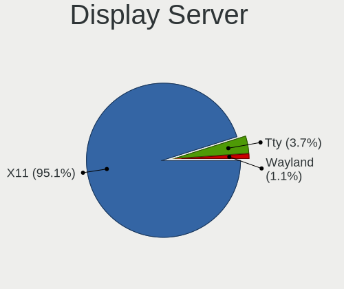

| Name    | Desktops | Percent |
|---------|----------|---------|
| X11     | 253      | 95.11%  |
| Tty     | 10       | 3.76%   |
| Wayland | 3        | 1.13%   |

Display Manager
---------------

SDDM, LightDM, etc.

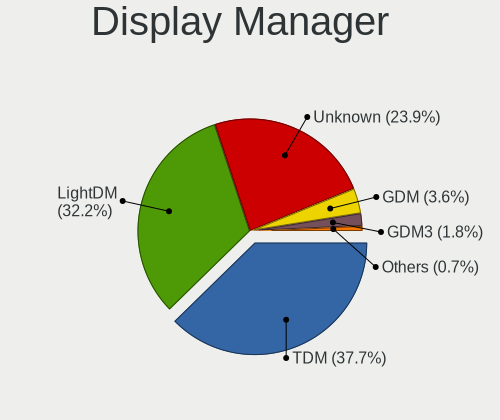

| Name    | Desktops | Percent |
|---------|----------|---------|
| TDM     | 104      | 37.82%  |
| LightDM | 88       | 32%     |
| Unknown | 66       | 24%     |
| GDM     | 10       | 3.64%   |
| GDM3    | 5        | 1.82%   |
| SLiM    | 1        | 0.36%   |
| SDDM    | 1        | 0.36%   |

OS Lang
-------

Language

| Lang  | Desktops | Percent |
|-------|----------|---------|
| en_US | 62       | 23.31%  |
| pt_BR | 56       | 21.05%  |
| fr_FR | 26       | 9.77%   |
| de_DE | 18       | 6.77%   |
| el_GR | 17       | 6.39%   |
| en_CA | 13       | 4.89%   |
| en_GB | 12       | 4.51%   |
| ru_RU | 10       | 3.76%   |
| es_ES | 8        | 3.01%   |
| es_AR | 7        | 2.63%   |
| it_IT | 6        | 2.26%   |
| en_AU | 4        | 1.5%    |
| pl_PL | 3        | 1.13%   |
| nl_NL | 2        | 0.75%   |
| hu_HU | 2        | 0.75%   |
| fi_FI | 2        | 0.75%   |
| en_IN | 2        | 0.75%   |
| de_CH | 2        | 0.75%   |
| cs_CZ | 2        | 0.75%   |
| C     | 2        | 0.75%   |
| sv_SE | 1        | 0.38%   |
| ja_JP | 1        | 0.38%   |
| hr_HR | 1        | 0.38%   |
| eu_ES | 1        | 0.38%   |
| es_GT | 1        | 0.38%   |
| es_CL | 1        | 0.38%   |
| en_SG | 1        | 0.38%   |
| de_AT | 1        | 0.38%   |
| da_DK | 1        | 0.38%   |
| ca_ES | 1        | 0.38%   |

Boot Mode
---------

EFI or BIOS

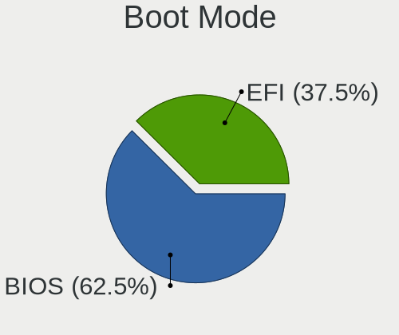

| Mode | Desktops | Percent |
|------|----------|---------|
| BIOS | 167      | 62.31%  |
| EFI  | 101      | 37.69%  |

Filesystem
----------

Type of filesystem

| Type    | Desktops | Percent |
|---------|----------|---------|
| Ext4    | 246      | 92.83%  |
| Overlay | 12       | 4.53%   |
| Zfs     | 3        | 1.13%   |
| Xfs     | 2        | 0.75%   |
| ExX4    | 1        | 0.38%   |
| Btrfs   | 1        | 0.38%   |

Part. scheme
------------

Scheme of partitioning

| Type    | Desktops | Percent |
|---------|----------|---------|
| MBR     | 97       | 36.06%  |
| GPT     | 94       | 34.94%  |
| Unknown | 78       | 29%     |

Dual Boot with Linux/BSD
------------------------

Hosting more than one Linux/BSD

| Dual boot | Desktops | Percent |
|-----------|----------|---------|
| No        | 228      | 85.71%  |
| Yes       | 38       | 14.29%  |

Dual Boot (Win)
---------------

Hosting Linux and Windows

| Dual boot | Desktops | Percent |
|-----------|----------|---------|
| No        | 180      | 67.16%  |
| Yes       | 88       | 32.84%  |

Board
-----

Vendor
------

Motherboard manufacturer

| Name                | Desktops | Percent |
|---------------------|----------|---------|
| ASUSTek Computer    | 61       | 23.02%  |
| Dell                | 47       | 17.74%  |
| Hewlett-Packard     | 39       | 14.72%  |
| Gigabyte Technology | 39       | 14.72%  |
| ASRock              | 25       | 9.43%   |
| MSI                 | 23       | 8.68%   |
| Intel               | 8        | 3.02%   |
| Lenovo              | 4        | 1.51%   |
| Pegatron            | 3        | 1.13%   |
| ECS                 | 2        | 0.75%   |
| Biostar             | 2        | 0.75%   |
| Unknown             | 2        | 0.75%   |
| Semp Toshiba        | 1        | 0.38%   |
| ONDA                | 1        | 0.38%   |
| Medion              | 1        | 0.38%   |
| JINGSHA             | 1        | 0.38%   |
| INP                 | 1        | 0.38%   |
| IBM                 | 1        | 0.38%   |
| Gateway             | 1        | 0.38%   |
| Fujitsu Siemens     | 1        | 0.38%   |
| Albatron            | 1        | 0.38%   |
| Acer                | 1        | 0.38%   |

Model
-----

Motherboard model

| Name                              | Desktops | Percent |
|-----------------------------------|----------|---------|
| HP Compaq Elite 8300 SFF          | 8        | 3.02%   |
| HP Compaq 6005 Pro SFF PC         | 8        | 3.02%   |
| ASUS All Series                   | 7        | 2.64%   |
| Dell OptiPlex 3010                | 5        | 1.89%   |
| Dell OptiPlex GX520               | 4        | 1.51%   |
| Dell OptiPlex 390                 | 4        | 1.51%   |
| Dell OptiPlex 360                 | 4        | 1.51%   |
| ASRock B450M Pro4                 | 4        | 1.51%   |
| Unknown                           | 4        | 1.51%   |
| HP Compaq 6200 Pro SFF PC         | 3        | 1.13%   |
| Dell OptiPlex 330                 | 3        | 1.13%   |
| ASUS M5A78L-M/USB3                | 3        | 1.13%   |
| MSI MS-7C94                       | 2        | 0.75%   |
| MSI MS-7817                       | 2        | 0.75%   |
| MSI MS-7680                       | 2        | 0.75%   |
| HP Compaq 8000 Elite SFF PC       | 2        | 0.75%   |
| HP Compaq 4000 Pro SFF PC         | 2        | 0.75%   |
| Gigabyte Z97-HD3                  | 2        | 0.75%   |
| Gigabyte Z590 UD AC               | 2        | 0.75%   |
| Gigabyte B450M DS3H               | 2        | 0.75%   |
| Dell OptiPlex GX620               | 2        | 0.75%   |
| Dell OptiPlex 980                 | 2        | 0.75%   |
| Dell OptiPlex 780                 | 2        | 0.75%   |
| Dell OptiPlex 755                 | 2        | 0.75%   |
| Dell OptiPlex 380                 | 2        | 0.75%   |
| ASUS TUF Gaming B550M-PLUS        | 2        | 0.75%   |
| ASUS P8H61-M LX3 R2.0             | 2        | 0.75%   |
| ASUS M2N68-AM Plus                | 2        | 0.75%   |
| Semp Toshiba STI                  | 1        | 0.38%   |
| Pegatron VG271AA-ABF s5206fr      | 1        | 0.38%   |
| Pegatron FR484AA-UUW m9464sc      | 1        | 0.38%   |
| Pegatron Compaq dx7500 SFF        | 1        | 0.38%   |
| ONDA H110-MINI V3.00              | 1        | 0.38%   |
| MSI Pro 3000 Small Form Factor PC | 1        | 0.38%   |
| MSI MS-7C95                       | 1        | 0.38%   |
| MSI MS-7C91                       | 1        | 0.38%   |
| MSI MS-7C84                       | 1        | 0.38%   |
| MSI MS-7C59                       | 1        | 0.38%   |
| MSI MS-7C51                       | 1        | 0.38%   |
| MSI MS-7C35                       | 1        | 0.38%   |

Model Family
------------

Motherboard model prefix

| Name                 | Desktops | Percent |
|----------------------|----------|---------|
| Dell OptiPlex        | 38       | 14.34%  |
| HP Compaq            | 30       | 11.32%  |
| ASUS PRIME           | 8        | 3.02%   |
| ASUS All             | 7        | 2.64%   |
| Lenovo ThinkCentre   | 4        | 1.51%   |
| Dell Precision       | 4        | 1.51%   |
| ASUS M5A78L-M        | 4        | 1.51%   |
| ASRock B450M         | 4        | 1.51%   |
| Unknown              | 4        | 1.51%   |
| ASUS TUF             | 3        | 1.13%   |
| ASUS ROG             | 3        | 1.13%   |
| ASUS M5A97           | 3        | 1.13%   |
| MSI MS-7C94          | 2        | 0.75%   |
| MSI MS-7817          | 2        | 0.75%   |
| MSI MS-7680          | 2        | 0.75%   |
| HP ProDesk           | 2        | 0.75%   |
| HP EliteDesk         | 2        | 0.75%   |
| Gigabyte Z97-HD3     | 2        | 0.75%   |
| Gigabyte Z590        | 2        | 0.75%   |
| Gigabyte X570        | 2        | 0.75%   |
| Gigabyte B450M       | 2        | 0.75%   |
| Gigabyte B450        | 2        | 0.75%   |
| ASUS P9X79           | 2        | 0.75%   |
| ASUS P8H61-M         | 2        | 0.75%   |
| ASUS M2N68-AM        | 2        | 0.75%   |
| Semp Toshiba STI     | 1        | 0.38%   |
| Pegatron VG271AA-ABF | 1        | 0.38%   |
| Pegatron FR484AA-UUW | 1        | 0.38%   |
| Pegatron Compaq      | 1        | 0.38%   |
| ONDA H110-MINI       | 1        | 0.38%   |
| MSI Pro              | 1        | 0.38%   |
| MSI MS-7C95          | 1        | 0.38%   |
| MSI MS-7C91          | 1        | 0.38%   |
| MSI MS-7C84          | 1        | 0.38%   |
| MSI MS-7C59          | 1        | 0.38%   |
| MSI MS-7C51          | 1        | 0.38%   |
| MSI MS-7C35          | 1        | 0.38%   |
| MSI MS-7B87          | 1        | 0.38%   |
| MSI MS-7B51          | 1        | 0.38%   |
| MSI MS-7B49          | 1        | 0.38%   |

MFG Year
--------

Motherboard manufacture year

| Year | Desktops | Percent |
|------|----------|---------|
| 2011 | 38       | 14.34%  |
| 2012 | 30       | 11.32%  |
| 2018 | 27       | 10.19%  |
| 2009 | 26       | 9.81%   |
| 2013 | 22       | 8.3%    |
| 2020 | 18       | 6.79%   |
| 2008 | 17       | 6.42%   |
| 2014 | 16       | 6.04%   |
| 2010 | 11       | 4.15%   |
| 2015 | 10       | 3.77%   |
| 2021 | 8        | 3.02%   |
| 2019 | 8        | 3.02%   |
| 2017 | 8        | 3.02%   |
| 2016 | 8        | 3.02%   |
| 2007 | 7        | 2.64%   |
| 2005 | 6        | 2.26%   |
| 2006 | 5        | 1.89%   |

Form Factor
-----------

Physical design of the computer

| Name    | Desktops | Percent |
|---------|----------|---------|
| Desktop | 265      | 100%    |

Secure Boot
-----------

Enabled or disabled

| State    | Desktops | Percent |
|----------|----------|---------|
| Disabled | 258      | 97.36%  |
| Enabled  | 7        | 2.64%   |

Coreboot
--------

Have coreboot on board

| Used | Desktops | Percent |
|------|----------|---------|
| No   | 265      | 100%    |

RAM Size
--------

Total RAM memory

| Size in GB      | Desktops | Percent |
|-----------------|----------|---------|
| 3.01-4.0        | 78       | 29.21%  |
| 8.01-16.0       | 45       | 16.85%  |
| 16.01-24.0      | 40       | 14.98%  |
| 4.01-8.0        | 33       | 12.36%  |
| 32.01-64.0      | 31       | 11.61%  |
| 64.01-256.0     | 17       | 6.37%   |
| 1.01-2.0        | 9        | 3.37%   |
| 24.01-32.0      | 7        | 2.62%   |
| 2.01-3.0        | 6        | 2.25%   |
| More than 256.0 | 1        | 0.37%   |

RAM Used
--------

Used RAM memory

| Used GB    | Desktops | Percent |
|------------|----------|---------|
| 1.01-2.0   | 89       | 31.56%  |
| 0.51-1.0   | 56       | 19.86%  |
| 2.01-3.0   | 50       | 17.73%  |
| 4.01-8.0   | 35       | 12.41%  |
| 3.01-4.0   | 27       | 9.57%   |
| 8.01-16.0  | 10       | 3.55%   |
| 0.01-0.5   | 7        | 2.48%   |
| 16.01-24.0 | 4        | 1.42%   |
| 24.01-32.0 | 3        | 1.06%   |
| 32.01-64.0 | 1        | 0.35%   |

Total Drives
------------

Number of drives on board

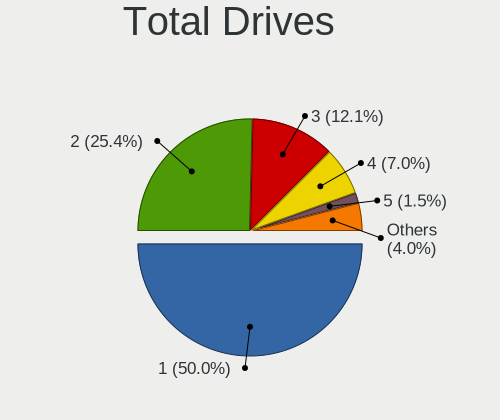

| Drives | Desktops | Percent |
|--------|----------|---------|
| 1      | 135      | 49.82%  |
| 2      | 69       | 25.46%  |
| 3      | 33       | 12.18%  |
| 4      | 19       | 7.01%   |
| 5      | 4        | 1.48%   |
| 7      | 3        | 1.11%   |
| 10     | 2        | 0.74%   |
| 8      | 2        | 0.74%   |
| 6      | 2        | 0.74%   |
| 11     | 1        | 0.37%   |
| 0      | 1        | 0.37%   |

Has CD-ROM
----------

Has CD-ROM on board

| Presented | Desktops | Percent |
|-----------|----------|---------|
| Yes       | 159      | 59.33%  |
| No        | 109      | 40.67%  |

Has Ethernet
------------

Has Ethernet on board

| Presented | Desktops | Percent |
|-----------|----------|---------|
| Yes       | 264      | 99.62%  |
| No        | 1        | 0.38%   |

Has WiFi
--------

Has WiFi module

| Presented | Desktops | Percent |
|-----------|----------|---------|
| No        | 181      | 67.29%  |
| Yes       | 88       | 32.71%  |

Has Bluetooth
-------------

Has Bluetooth module

| Presented | Desktops | Percent |
|-----------|----------|---------|
| No        | 211      | 79.03%  |
| Yes       | 56       | 20.97%  |

Location
--------

Country
-------

Geographic location (country)

| Country     | Desktops | Percent |
|-------------|----------|---------|
| Brazil      | 59       | 22.26%  |
| USA         | 29       | 10.94%  |
| France      | 25       | 9.43%   |
| Germany     | 23       | 8.68%   |
| Greece      | 18       | 6.79%   |
| UK          | 13       | 4.91%   |
| Spain       | 12       | 4.53%   |
| Canada      | 11       | 4.15%   |
| Russia      | 10       | 3.77%   |
| Argentina   | 9        | 3.4%    |
| Italy       | 7        | 2.64%   |
| Czechia     | 5        | 1.89%   |
| Poland      | 4        | 1.51%   |
| Netherlands | 4        | 1.51%   |
| Hungary     | 4        | 1.51%   |
| Finland     | 3        | 1.13%   |
| Australia   | 3        | 1.13%   |
| Switzerland | 2        | 0.75%   |
| Japan       | 2        | 0.75%   |
| India       | 2        | 0.75%   |
| Denmark     | 2        | 0.75%   |
| Bulgaria    | 2        | 0.75%   |
| Austria     | 2        | 0.75%   |
| Ukraine     | 1        | 0.38%   |
| Taiwan      | 1        | 0.38%   |
| Singapore   | 1        | 0.38%   |
| Romania     | 1        | 0.38%   |
| Mexico      | 1        | 0.38%   |
| Malaysia    | 1        | 0.38%   |
| Hong Kong   | 1        | 0.38%   |
| Guatemala   | 1        | 0.38%   |
| Estonia     | 1        | 0.38%   |
| Cyprus      | 1        | 0.38%   |
| Croatia     | 1        | 0.38%   |
| Chile       | 1        | 0.38%   |
| Belgium     | 1        | 0.38%   |
| Belarus     | 1        | 0.38%   |

City
----

Geographic location (city)

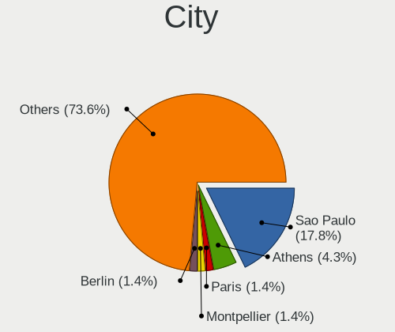

| City                 | Desktops | Percent |
|----------------------|----------|---------|
| Sao Paulo            | 49       | 17.88%  |
| Athens               | 12       | 4.38%   |
| Paris                | 4        | 1.46%   |
| Montpellier          | 4        | 1.46%   |
| Berlin               | 4        | 1.46%   |
| Thessaloniki         | 3        | 1.09%   |
| Melbourne            | 3        | 1.09%   |
| Hamburg              | 3        | 1.09%   |
| Yekaterinburg        | 2        | 0.73%   |
| Windsor              | 2        | 0.73%   |
| Sneek                | 2        | 0.73%   |
| Moscow               | 2        | 0.73%   |
| Manchester           | 2        | 0.73%   |
| Madrid               | 2        | 0.73%   |
| Kirchheim unter Teck | 2        | 0.73%   |
| Karlsruhe            | 2        | 0.73%   |
| Helsinki             | 2        | 0.73%   |
| Florence             | 2        | 0.73%   |
| Budapest             | 2        | 0.73%   |
| Biysk                | 2        | 0.73%   |
| Bar-le-Duc           | 2        | 0.73%   |
| Zumarraga            | 1        | 0.36%   |
| Zsaka                | 1        | 0.36%   |
| Zagreb               | 1        | 0.36%   |
| Yankton              | 1        | 0.36%   |
| Wocawek          | 1        | 0.36%   |
| Woodland Hills       | 1        | 0.36%   |
| Westbury             | 1        | 0.36%   |
| Warren               | 1        | 0.36%   |
| Vikyrovice           | 1        | 0.36%   |
| Vigo                 | 1        | 0.36%   |
| Vienna               | 1        | 0.36%   |
| Viamao               | 1        | 0.36%   |
| Veliko Tarnovo       | 1        | 0.36%   |
| Vannes               | 1        | 0.36%   |
| Valls                | 1        | 0.36%   |
| Ushiku               | 1        | 0.36%   |
| Tremembe             | 1        | 0.36%   |
| Torokszentmiklos     | 1        | 0.36%   |
| The Hague            | 1        | 0.36%   |

Drives
------

Drive Vendor
------------

Hard drive vendors

| Vendor                      | Desktops | Drives | Percent |
|-----------------------------|----------|--------|---------|
| WDC                         | 104      | 153    | 24.76%  |
| Seagate                     | 97       | 150    | 23.1%   |
| Samsung Electronics         | 61       | 97     | 14.52%  |
| Kingston                    | 29       | 39     | 6.9%    |
| Toshiba                     | 17       | 30     | 4.05%   |
| SanDisk                     | 16       | 20     | 3.81%   |
| Hitachi                     | 14       | 17     | 3.33%   |
| Crucial                     | 13       | 19     | 3.1%    |
| Intel                       | 10       | 12     | 2.38%   |
| A-DATA Technology           | 6        | 6      | 1.43%   |
| Silicon Motion              | 4        | 5      | 0.95%   |
| PNY                         | 3        | 4      | 0.71%   |
| Patriot                     | 3        | 5      | 0.71%   |
| Maxtor                      | 3        | 7      | 0.71%   |
| HGST                        | 3        | 5      | 0.71%   |
| Unknown                     | 2        | 2      | 0.48%   |
| SK hynix                    | 2        | 2      | 0.48%   |
| Intenso                     | 2        | 2      | 0.48%   |
| Apacer                      | 2        | 2      | 0.48%   |
| USB3.0                      | 1        | 1      | 0.24%   |
| Transcend                   | 1        | 1      | 0.24%   |
| TO Exter                    | 1        | 1      | 0.24%   |
| SPCC                        | 1        | 2      | 0.24%   |
| SMI                         | 1        | 1      | 0.24%   |
| Phison                      | 1        | 1      | 0.24%   |
| Mushkin                     | 1        | 1      | 0.24%   |
| Micron/Crucial Technology   | 1        | 2      | 0.24%   |
| Marlin                      | 1        | 1      | 0.24%   |
| LITEONIT                    | 1        | 1      | 0.24%   |
| LITEON                      | 1        | 1      | 0.24%   |
| Lexar                       | 1        | 1      | 0.24%   |
| Leven                       | 1        | 1      | 0.24%   |
| LDLC                        | 1        | 1      | 0.24%   |
| KIOXIA-EXCERIA              | 1        | 1      | 0.24%   |
| KIOXIA                      | 1        | 1      | 0.24%   |
| Kingston Technology Company | 1        | 1      | 0.24%   |
| JMicron Technology          | 1        | 2      | 0.24%   |
| Inateck                     | 1        | 1      | 0.24%   |
| Hewlett-Packard             | 1        | 1      | 0.24%   |
| Emtec                       | 1        | 1      | 0.24%   |

Drive Model
-----------

Hard drive models

| Model                            | Desktops | Percent |
|----------------------------------|----------|---------|
| Seagate ST500DM002-1BD142 500GB  | 14       | 2.89%   |
| WDC WD5000AAKX-083CA1 500GB      | 6        | 1.24%   |
| WDC WD5000AAKX-003CA0 500GB      | 6        | 1.24%   |
| Seagate ST3500418AS 500GB        | 6        | 1.24%   |
| Toshiba DT01ACA100 1TB           | 5        | 1.03%   |
| Seagate ST2000DM008-2FR102 2TB   | 5        | 1.03%   |
| Seagate ST1000DM010-2EP102 1TB   | 5        | 1.03%   |
| Seagate ST1000DM003-1CH162 1TB   | 5        | 1.03%   |
| Samsung SSD 860 EVO 500GB        | 5        | 1.03%   |
| Samsung HD322HJ 320GB            | 5        | 1.03%   |
| Kingston SV300S37A120G 120GB SSD | 5        | 1.03%   |
| Kingston SA400S37120G 120GB SSD  | 5        | 1.03%   |
| WDC WD10EZEX-08WN4A0 1TB         | 4        | 0.82%   |
| WDC WD10EZEX-00BN5A0 1TB         | 4        | 0.82%   |
| Toshiba DT01ACA050 500GB         | 4        | 0.82%   |
| Seagate ST2000DM001-1ER164 2TB   | 4        | 0.82%   |
| Kingston SA400S37240G 240GB SSD  | 4        | 0.82%   |
| WDC WD2500AAKX-753CA1 250GB      | 3        | 0.62%   |
| WDC WD20EZRZ-00Z5HB0 2TB         | 3        | 0.62%   |
| WDC WD10EZEX-08M2NA0 1TB         | 3        | 0.62%   |
| Seagate ST8000DM004-2CX188 8TB   | 3        | 0.62%   |
| Seagate ST3500630AS 500GB        | 3        | 0.62%   |
| Seagate ST3320620AS 320GB        | 3        | 0.62%   |
| Seagate ST2000DM001-9YN164 2TB   | 3        | 0.62%   |
| SanDisk SSD PLUS 480GB           | 3        | 0.62%   |
| Samsung SP2504C 250GB            | 3        | 0.62%   |
| Samsung NVMe SSD Drive 500GB     | 3        | 0.62%   |
| Samsung HD502HJ 500GB            | 3        | 0.62%   |
| Hitachi HDP725050GLA360 500GB    | 3        | 0.62%   |
| WDC WDS120G2G0A-00JH30 120GB SSD | 2        | 0.41%   |
| WDC WD5000AZLX-75K2TA0 500GB     | 2        | 0.41%   |
| WDC WD5000AAKX-08U6AA0 500GB     | 2        | 0.41%   |
| WDC WD40EFAX-68JH4N0 4TB         | 2        | 0.41%   |
| WDC WD3200AAKS-75L9A0 320GB      | 2        | 0.41%   |
| WDC WD20EZRZ-22Z5HB0 2TB         | 2        | 0.41%   |
| WDC WD20EARX-00PASB0 2TB         | 2        | 0.41%   |
| WDC WD10EARX-00N0YB0 1TB         | 2        | 0.41%   |
| Unknown SD/MMC/MS PRO 16GB       | 2        | 0.41%   |
| Toshiba HDWD110 1TB              | 2        | 0.41%   |
| Seagate ST3500413AS 500GB        | 2        | 0.41%   |

HDD Vendor
----------

Hard disk drive vendors

| Vendor              | Desktops | Drives | Percent |
|---------------------|----------|--------|---------|
| Seagate             | 96       | 149    | 38.4%   |
| WDC                 | 93       | 130    | 37.2%   |
| Samsung Electronics | 21       | 23     | 8.4%    |
| Toshiba             | 17       | 30     | 6.8%    |
| Hitachi             | 14       | 17     | 5.6%    |
| HGST                | 3        | 5      | 1.2%    |
| Unknown             | 2        | 2      | 0.8%    |
| Maxtor              | 2        | 5      | 0.8%    |
| USB3.0              | 1        | 1      | 0.4%    |
| ASMT109x            | 1        | 2      | 0.4%    |

SSD Vendor
----------

Solid state drive vendors

| Vendor              | Desktops | Drives | Percent |
|---------------------|----------|--------|---------|
| Samsung Electronics | 27       | 44     | 20.3%   |
| Kingston            | 26       | 31     | 19.55%  |
| SanDisk             | 16       | 19     | 12.03%  |
| WDC                 | 13       | 21     | 9.77%   |
| Crucial             | 13       | 19     | 9.77%   |
| Intel               | 6        | 8      | 4.51%   |
| A-DATA Technology   | 6        | 6      | 4.51%   |
| PNY                 | 3        | 4      | 2.26%   |
| Patriot             | 2        | 4      | 1.5%    |
| Intenso             | 2        | 2      | 1.5%    |
| Apacer              | 2        | 2      | 1.5%    |
| Transcend           | 1        | 1      | 0.75%   |
| TO Exter            | 1        | 1      | 0.75%   |
| SMI                 | 1        | 1      | 0.75%   |
| Seagate             | 1        | 1      | 0.75%   |
| Mushkin             | 1        | 1      | 0.75%   |
| Maxtor              | 1        | 2      | 0.75%   |
| LITEONIT            | 1        | 1      | 0.75%   |
| LITEON              | 1        | 1      | 0.75%   |
| Lexar               | 1        | 1      | 0.75%   |
| Leven               | 1        | 1      | 0.75%   |
| LDLC                | 1        | 1      | 0.75%   |
| Emtec               | 1        | 1      | 0.75%   |
| China               | 1        | 1      | 0.75%   |
| ASMT                | 1        | 2      | 0.75%   |
| AMD                 | 1        | 1      | 0.75%   |
| AGI                 | 1        | 2      | 0.75%   |
| ADATA SP            | 1        | 1      | 0.75%   |

Drive Kind
----------

HDD or SSD

| Kind    | Desktops | Drives | Percent |
|---------|----------|--------|---------|
| HDD     | 205      | 364    | 56.32%  |
| SSD     | 114      | 180    | 31.32%  |
| NVMe    | 41       | 65     | 11.26%  |
| Unknown | 3        | 3      | 0.82%   |
| MMC     | 1        | 1      | 0.27%   |

Drive Connector
---------------

SATA, SAS, NVMe, etc.

| Type | Desktops | Drives | Percent |
|------|----------|--------|---------|
| SATA | 248      | 526    | 81.05%  |
| NVMe | 41       | 63     | 13.4%   |
| SAS  | 16       | 23     | 5.23%   |
| MMC  | 1        | 1      | 0.33%   |

Drive Size
----------

Size of hard drive

| Size in TB | Desktops | Drives | Percent |
|------------|----------|--------|---------|
| 0.01-0.5   | 198      | 306    | 56.57%  |
| 0.51-1.0   | 77       | 116    | 22%     |
| 1.01-2.0   | 43       | 60     | 12.29%  |
| 3.01-4.0   | 13       | 20     | 3.71%   |
| 4.01-10.0  | 11       | 26     | 3.14%   |
| 2.01-3.0   | 7        | 15     | 2%      |
| 10.01-20.0 | 1        | 1      | 0.29%   |

Space Total
-----------

Amount of disk space available on the file system

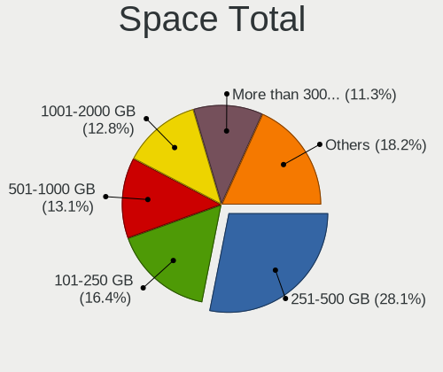

| Size in GB     | Desktops | Percent |
|----------------|----------|---------|
| 251-500        | 77       | 28.21%  |
| 101-250        | 44       | 16.12%  |
| 501-1000       | 36       | 13.19%  |
| 1001-2000      | 35       | 12.82%  |
| More than 3000 | 31       | 11.36%  |
| 2001-3000      | 18       | 6.59%   |
| Unknown        | 11       | 4.03%   |
| 1-20           | 8        | 2.93%   |
| 51-100         | 7        | 2.56%   |
| 21-50          | 6        | 2.2%    |

Space Used
----------

Amount of used disk space

| Used GB        | Desktops | Percent |
|----------------|----------|---------|
| 1-20           | 84       | 30%     |
| 101-250        | 38       | 13.57%  |
| 21-50          | 36       | 12.86%  |
| 251-500        | 26       | 9.29%   |
| 51-100         | 25       | 8.93%   |
| 1001-2000      | 21       | 7.5%    |
| 501-1000       | 18       | 6.43%   |
| 2001-3000      | 12       | 4.29%   |
| Unknown        | 11       | 3.93%   |
| More than 3000 | 9        | 3.21%   |

Malfunc. Drives
---------------

Drive models with a malfunction

| Model                                 | Desktops | Drives | Percent |
|---------------------------------------|----------|--------|---------|
| Seagate ST500DM002-1BD142 500GB       | 5        | 5      | 8.62%   |
| WDC WD5000AAKX-083CA1 500GB           | 4        | 4      | 6.9%    |
| WDC WD5000AAKX-003CA0 500GB           | 2        | 2      | 3.45%   |
| WDC WD2500AAKX-753CA1 250GB           | 2        | 2      | 3.45%   |
| Seagate ST3500418AS 500GB             | 2        | 2      | 3.45%   |
| Samsung Electronics HD502HJ 500GB     | 2        | 2      | 3.45%   |
| WDC WD5000AAKS-00V1A0 500GB           | 1        | 1      | 1.72%   |
| WDC WD40EFAX-68JH4N0 4TB              | 1        | 2      | 1.72%   |
| WDC WD2500YS-01SHB1 256GB             | 1        | 1      | 1.72%   |
| WDC WD2500AAKX-75U6AA0 250GB          | 1        | 1      | 1.72%   |
| WDC WD2500AAJS-75M0A0 249GB           | 1        | 1      | 1.72%   |
| WDC WD20EZRZ-00Z5HB0 2TB              | 1        | 1      | 1.72%   |
| WDC WD1600AAJS-75M0A0 160GB           | 1        | 2      | 1.72%   |
| WDC WD15EADS-00P8B0 1TB               | 1        | 1      | 1.72%   |
| WDC WD1200JD-00HBB0 120GB             | 1        | 1      | 1.72%   |
| WDC WD10EZEX-00BN5A0 1TB              | 1        | 1      | 1.72%   |
| WDC WD10EFRX-68PJCN0 1TB              | 1        | 1      | 1.72%   |
| WDC WD10EARS-00MVWB0 1TB              | 1        | 1      | 1.72%   |
| WDC WD Blue SA510 2.5 500GB           | 1        | 1      | 1.72%   |
| Toshiba MK5055GSX 500GB               | 1        | 1      | 1.72%   |
| Toshiba DT01ACA100 1TB                | 1        | 1      | 1.72%   |
| Toshiba DT01ACA050 500GB              | 1        | 1      | 1.72%   |
| Seagate ST4000DM004-2CV104 4TB        | 1        | 1      | 1.72%   |
| Seagate ST3750525AS 752GB             | 1        | 1      | 1.72%   |
| Seagate ST3500320AS 500GB             | 1        | 1      | 1.72%   |
| Seagate ST3402111AS 40GB              | 1        | 1      | 1.72%   |
| Seagate ST3360320AS 360GB             | 1        | 2      | 1.72%   |
| Seagate ST3320620AS 320GB             | 1        | 1      | 1.72%   |
| Seagate ST3250318AS 250GB             | 1        | 1      | 1.72%   |
| Seagate ST3250310AS 250GB             | 1        | 1      | 1.72%   |
| Seagate ST32000644NS 2TB              | 1        | 1      | 1.72%   |
| Seagate ST3160815AS 160GB             | 1        | 1      | 1.72%   |
| Seagate ST31000333AS 1TB              | 1        | 1      | 1.72%   |
| Seagate ST2000DM001-9YN164 2TB        | 1        | 2      | 1.72%   |
| Seagate ST1000DM003-1CH162 1TB        | 1        | 1      | 1.72%   |
| SanDisk SSD PLUS 480GB                | 1        | 1      | 1.72%   |
| Samsung Electronics SSD 870 EVO 500GB | 1        | 1      | 1.72%   |
| Samsung Electronics SP2504C 250GB     | 1        | 1      | 1.72%   |
| Samsung Electronics M3 Portable 1TB   | 1        | 1      | 1.72%   |
| Maxtor 6Y160M0 160GB                  | 1        | 1      | 1.72%   |

Malfunc. Drive Vendor
---------------------

Vendors of faulty drives

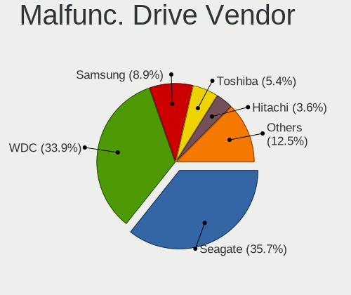

| Vendor              | Desktops | Drives | Percent |
|---------------------|----------|--------|---------|
| Seagate             | 20       | 22     | 35.71%  |
| WDC                 | 19       | 23     | 33.93%  |
| Samsung Electronics | 5        | 5      | 8.93%   |
| Toshiba             | 3        | 3      | 5.36%   |
| Hitachi             | 2        | 2      | 3.57%   |
| SanDisk             | 1        | 1      | 1.79%   |
| Maxtor              | 1        | 1      | 1.79%   |
| Kingston            | 1        | 1      | 1.79%   |
| Intel               | 1        | 1      | 1.79%   |
| HGST                | 1        | 2      | 1.79%   |
| Crucial             | 1        | 1      | 1.79%   |
| ASMT                | 1        | 2      | 1.79%   |

Malfunc. HDD Vendor
-------------------

Vendors of faulty HDD drives

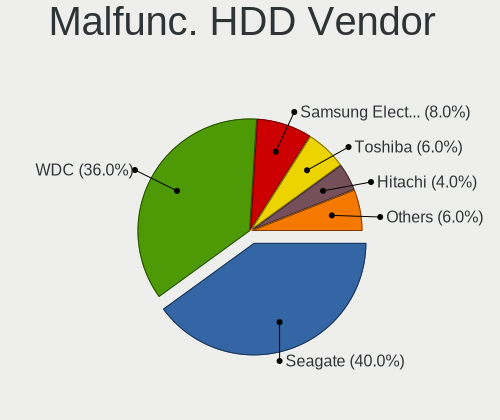

| Vendor              | Desktops | Drives | Percent |
|---------------------|----------|--------|---------|
| Seagate             | 20       | 22     | 40.82%  |
| WDC                 | 18       | 22     | 36.73%  |
| Samsung Electronics | 4        | 4      | 8.16%   |
| Toshiba             | 3        | 3      | 6.12%   |
| Hitachi             | 2        | 2      | 4.08%   |
| Maxtor              | 1        | 1      | 2.04%   |
| HGST                | 1        | 2      | 2.04%   |

Malfunc. Drive Kind
-------------------

Kinds of faulty drives

| Kind | Desktops | Drives | Percent |
|------|----------|--------|---------|
| HDD  | 46       | 56     | 88.46%  |
| SSD  | 6        | 8      | 11.54%  |

Failed Drives
-------------

Failed drive models

Zero info for selected period =(

Failed Drive Vendor
-------------------

Failed drive vendors

Zero info for selected period =(

Drive Status
------------

Number of failed and malfunc. drives

| Status   | Desktops | Drives | Percent |
|----------|----------|--------|---------|
| Works    | 161      | 328    | 54.03%  |
| Detected | 87       | 221    | 29.19%  |
| Malfunc  | 50       | 64     | 16.78%  |

Storage controller
------------------

Storage Vendor
--------------

Storage controller vendors

| Vendor                        | Desktops | Percent |
|-------------------------------|----------|---------|
| Intel                         | 181      | 53.87%  |
| AMD                           | 75       | 22.32%  |
| Samsung Electronics           | 17       | 5.06%   |
| Marvell Technology Group      | 13       | 3.87%   |
| ASMedia Technology            | 10       | 2.98%   |
| Nvidia                        | 9        | 2.68%   |
| Silicon Motion                | 6        | 1.79%   |
| Kingston Technology Company   | 5        | 1.49%   |
| JMicron Technology            | 4        | 1.19%   |
| Phison Electronics            | 3        | 0.89%   |
| VIA Technologies              | 2        | 0.6%    |
| SK hynix                      | 2        | 0.6%    |
| SanDisk                       | 2        | 0.6%    |
| Toshiba America Info Systems  | 1        | 0.3%    |
| Micron/Crucial Technology     | 1        | 0.3%    |
| LSI Logic / Symbios Logic     | 1        | 0.3%    |
| KIOXIA                        | 1        | 0.3%    |
| Integrated Technology Express | 1        | 0.3%    |
| Hewlett-Packard               | 1        | 0.3%    |
| 3ware                         | 1        | 0.3%    |

Storage Model
-------------

Storage controller models

| Model                                                                                   | Desktops | Percent |
|-----------------------------------------------------------------------------------------|----------|---------|
| AMD FCH SATA Controller [AHCI mode]                                                     | 34       | 7.69%   |
| Intel NM10/ICH7 Family SATA Controller [IDE mode]                                       | 26       | 5.88%   |
| Intel 8 Series/C220 Series Chipset Family 6-port SATA Controller 1 [AHCI mode]          | 25       | 5.66%   |
| Intel 82801G (ICH7 Family) IDE Controller                                               | 24       | 5.43%   |
| Intel 7 Series/C210 Series Chipset Family 6-port SATA Controller [AHCI mode]            | 17       | 3.85%   |
| Intel 6 Series/C200 Series Chipset Family 6 port Desktop SATA AHCI Controller           | 17       | 3.85%   |
| AMD SB7x0/SB8x0/SB9x0 SATA Controller [AHCI mode]                                       | 17       | 3.85%   |
| AMD SB7x0/SB8x0/SB9x0 IDE Controller                                                    | 17       | 3.85%   |
| AMD SB7x0/SB8x0/SB9x0 SATA Controller [IDE mode]                                        | 14       | 3.17%   |
| Samsung NVMe SSD Controller SM981/PM981/PM983                                           | 13       | 2.94%   |
| AMD 400 Series Chipset SATA Controller                                                  | 13       | 2.94%   |
| Intel 6 Series/C200 Series Chipset Family Desktop SATA Controller (IDE mode, ports 4-5) | 12       | 2.71%   |
| Intel 6 Series/C200 Series Chipset Family Desktop SATA Controller (IDE mode, ports 0-3) | 12       | 2.71%   |
| ASMedia ASM1062 Serial ATA Controller                                                   | 9        | 2.04%   |
| Intel Q170/Q150/B150/H170/H110/Z170/CM236 Chipset SATA Controller [AHCI Mode]           | 7        | 1.58%   |
| Intel Cannon Lake PCH SATA AHCI Controller                                              | 7        | 1.58%   |
| Intel 200 Series PCH SATA controller [AHCI mode]                                        | 7        | 1.58%   |
| AMD 500 Series Chipset SATA Controller                                                  | 7        | 1.58%   |
| Nvidia MCP61 SATA Controller                                                            | 6        | 1.36%   |
| Intel C600/X79 series chipset 6-Port SATA AHCI Controller                               | 6        | 1.36%   |
| Intel 82801JD/DO (ICH10 Family) SATA AHCI Controller                                    | 6        | 1.36%   |
| Intel SATA Controller [RAID mode]                                                       | 5        | 1.13%   |
| Intel 500 Series Chipset Family SATA AHCI Controller                                    | 5        | 1.13%   |
| Intel 4 Series Chipset PT IDER Controller                                               | 5        | 1.13%   |
| Silicon Motion SM2263EN/SM2263XT (DRAM-less) NVMe SSD Controllers                       | 4        | 0.9%    |
| Nvidia MCP61 IDE                                                                        | 4        | 0.9%    |
| Intel Comet Lake SATA AHCI Controller                                                   | 4        | 0.9%    |
| Intel 9 Series Chipset Family SATA Controller [AHCI Mode]                               | 4        | 0.9%    |
| Intel 5 Series/3400 Series Chipset 6 port SATA AHCI Controller                          | 4        | 0.9%    |
| AMD FCH SATA Controller D                                                               | 4        | 0.9%    |
| Intel 82801JI (ICH10 Family) SATA AHCI Controller                                       | 3        | 0.68%   |
| Intel 82801JI (ICH10 Family) 4 port SATA IDE Controller #1                              | 3        | 0.68%   |
| Intel 82801JI (ICH10 Family) 2 port SATA IDE Controller #2                              | 3        | 0.68%   |
| VIA VT6415 PATA IDE Host Controller                                                     | 2        | 0.45%   |
| Silicon Motion SM2262/SM2262EN SSD Controller                                           | 2        | 0.45%   |
| Samsung NVMe SSD Controller 980 (DRAM-less)                                             | 2        | 0.45%   |
| Phison E12 NVMe Controller                                                              | 2        | 0.45%   |
| Marvell Group 88SE9172 SATA III 6Gb/s RAID Controller                                   | 2        | 0.45%   |
| Marvell Group 88SE9172 SATA 6Gb/s Controller                                            | 2        | 0.45%   |
| Marvell Group 88SE9128 PCIe SATA 6 Gb/s RAID controller with HyperDuo                   | 2        | 0.45%   |

Storage Kind
------------

Kind of storage controller (IDE, SATA, NVMe, SAS, ...)

| Kind | Desktops | Percent |
|------|----------|---------|
| SATA | 202      | 58.72%  |
| IDE  | 89       | 25.87%  |
| NVMe | 39       | 11.34%  |
| RAID | 11       | 3.2%    |
| SAS  | 3        | 0.87%   |

Processor
---------

CPU Vendor
----------

Processor vendors

| Vendor | Desktops | Percent |
|--------|----------|---------|
| Intel  | 183      | 69.06%  |
| AMD    | 82       | 30.94%  |

CPU Model
---------

Processor models

| Model                                       | Desktops | Percent |
|---------------------------------------------|----------|---------|
| Intel Core i5-3470 CPU @ 3.20GHz            | 10       | 3.77%   |
| AMD Phenom II X4 B97 Processor              | 7        | 2.64%   |
| Intel Pentium 4 CPU 3.00GHz                 | 5        | 1.89%   |
| Intel Core i3-2100 CPU @ 3.10GHz            | 5        | 1.89%   |
| Intel Core 2 Quad CPU Q6600 @ 2.40GHz       | 5        | 1.89%   |
| Intel Pentium D CPU 2.80GHz                 | 4        | 1.51%   |
| Intel Core i5-2500 CPU @ 3.30GHz            | 4        | 1.51%   |
| Intel Core 2 Duo CPU E7400 @ 2.80GHz        | 4        | 1.51%   |
| AMD FX-8350 Eight-Core Processor            | 4        | 1.51%   |
| Intel Core i7-3930K CPU @ 3.20GHz           | 3        | 1.13%   |
| Intel Core i7-3770K CPU @ 3.50GHz           | 3        | 1.13%   |
| Intel Core i5-4460 CPU @ 3.20GHz            | 3        | 1.13%   |
| Intel Core i5-3570 CPU @ 3.40GHz            | 3        | 1.13%   |
| Intel Core i3-4170 CPU @ 3.70GHz            | 3        | 1.13%   |
| Intel Core i3-4150 CPU @ 3.50GHz            | 3        | 1.13%   |
| Intel Core i3-3220 CPU @ 3.30GHz            | 3        | 1.13%   |
| Intel Core 2 Duo CPU E8400 @ 3.00GHz        | 3        | 1.13%   |
| Intel Core 2 Duo CPU E7500 @ 2.93GHz        | 3        | 1.13%   |
| Intel Core 2 CPU 6300 @ 1.86GHz             | 3        | 1.13%   |
| AMD Ryzen 9 3950X 16-Core Processor         | 3        | 1.13%   |
| AMD Ryzen 9 3900X 12-Core Processor         | 3        | 1.13%   |
| AMD Ryzen 7 3700X 8-Core Processor          | 3        | 1.13%   |
| AMD Ryzen 7 2700X Eight-Core Processor      | 3        | 1.13%   |
| AMD Ryzen 5 3600 6-Core Processor           | 3        | 1.13%   |
| AMD Ryzen 5 2400G with Radeon Vega Graphics | 3        | 1.13%   |
| Intel Xeon CPU E5-2670 0 @ 2.60GHz          | 2        | 0.75%   |
| Intel Pentium CPU G620 @ 2.60GHz            | 2        | 0.75%   |
| Intel Core i7-4790S CPU @ 3.20GHz           | 2        | 0.75%   |
| Intel Core i7-4790K CPU @ 4.00GHz           | 2        | 0.75%   |
| Intel Core i7-4790 CPU @ 3.60GHz            | 2        | 0.75%   |
| Intel Core i5-9400 CPU @ 2.90GHz            | 2        | 0.75%   |
| Intel Core i5-8400 CPU @ 2.80GHz            | 2        | 0.75%   |
| Intel Core i5-6600K CPU @ 3.50GHz           | 2        | 0.75%   |
| Intel Core i5-4590 CPU @ 3.30GHz            | 2        | 0.75%   |
| Intel Core i5-10400 CPU @ 2.90GHz           | 2        | 0.75%   |
| Intel Core i3-4130 CPU @ 3.40GHz            | 2        | 0.75%   |
| Intel Core i3-2120 CPU @ 3.30GHz            | 2        | 0.75%   |
| Intel Core 2 Quad CPU Q9550 @ 2.83GHz       | 2        | 0.75%   |
| Intel Celeron CPU J1900 @ 1.99GHz           | 2        | 0.75%   |
| Intel Celeron CPU E1400 @ 2.00GHz           | 2        | 0.75%   |

CPU Model Family
----------------

Processor model prefix

| Model                   | Desktops | Percent |
|-------------------------|----------|---------|
| Intel Core i5           | 48       | 18.11%  |
| Intel Core i7           | 27       | 10.19%  |
| Intel Core i3           | 27       | 10.19%  |
| Intel Core 2 Duo        | 16       | 6.04%   |
| AMD FX                  | 14       | 5.28%   |
| AMD Ryzen 5             | 13       | 4.91%   |
| AMD Phenom II X4        | 11       | 4.15%   |
| Intel Xeon              | 10       | 3.77%   |
| Intel Core 2 Quad       | 10       | 3.77%   |
| Intel Pentium           | 9        | 3.4%    |
| AMD Ryzen 7             | 9        | 3.4%    |
| Other                   | 8        | 3.02%   |
| Intel Celeron           | 8        | 3.02%   |
| AMD Athlon II X2        | 7        | 2.64%   |
| AMD Ryzen 9             | 6        | 2.26%   |
| Intel Pentium Dual-Core | 5        | 1.89%   |
| Intel Pentium 4         | 5        | 1.89%   |
| Intel Pentium D         | 4        | 1.51%   |
| Intel Core 2            | 3        | 1.13%   |
| AMD Ryzen Threadripper  | 3        | 1.13%   |
| Intel Pentium Dual      | 2        | 0.75%   |
| AMD Ryzen 3             | 2        | 0.75%   |
| AMD Athlon II X4        | 2        | 0.75%   |
| AMD Athlon              | 2        | 0.75%   |
| AMD A8                  | 2        | 0.75%   |
| Intel Pentium Silver    | 1        | 0.38%   |
| Intel Core i9           | 1        | 0.38%   |
| Intel Atom              | 1        | 0.38%   |
| AMD Turion II Neo       | 1        | 0.38%   |
| AMD Sempron X2          | 1        | 0.38%   |
| AMD Ryzen 5 PRO         | 1        | 0.38%   |
| AMD Ryzen 3 PRO         | 1        | 0.38%   |
| AMD PRO A8              | 1        | 0.38%   |
| AMD Phenom II X6        | 1        | 0.38%   |
| AMD Athlon 64 X2        | 1        | 0.38%   |
| AMD A4                  | 1        | 0.38%   |
| AMD A10                 | 1        | 0.38%   |

CPU Cores
---------

Number of processor cores

| Number | Desktops | Percent |
|--------|----------|---------|
| 4      | 111      | 41.89%  |
| 2      | 87       | 32.83%  |
| 6      | 27       | 10.19%  |
| 8      | 16       | 6.04%   |
| 16     | 7        | 2.64%   |
| 1      | 7        | 2.64%   |
| 12     | 5        | 1.89%   |
| 3      | 3        | 1.13%   |
| 24     | 2        | 0.75%   |

CPU Sockets
-----------

Number of sockets

| Number | Desktops | Percent |
|--------|----------|---------|
| 1      | 261      | 98.49%  |
| 2      | 4        | 1.51%   |

CPU Threads
-----------

Threads per core (Hyper-Threading)

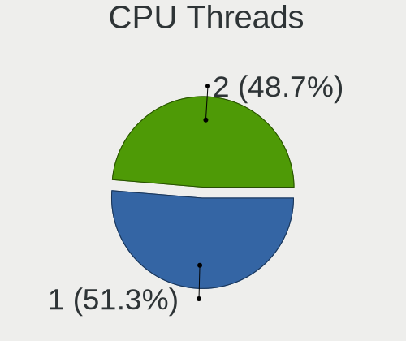

| Number | Desktops | Percent |
|--------|----------|---------|
| 1      | 137      | 51.5%   |
| 2      | 129      | 48.5%   |

CPU Op-Modes
------------

CPU Operation Modes (32-bit, 64-bit)

| Op mode        | Desktops | Percent |
|----------------|----------|---------|
| 32-bit, 64-bit | 265      | 100%    |

CPU Microcode
-------------

Microcode number

| Number     | Desktops | Percent |
|------------|----------|---------|
| 0x306c3    | 29       | 10.86%  |
| 0x306a9    | 25       | 9.36%   |
| Unknown    | 23       | 8.61%   |
| 0x206a7    | 19       | 7.12%   |
| 0x1067a    | 17       | 6.37%   |
| 0x010000c8 | 16       | 5.99%   |
| 0x08701021 | 9        | 3.37%   |
| 0x06000852 | 9        | 3.37%   |
| 0x6fb      | 7        | 2.62%   |
| 0x6fd      | 6        | 2.25%   |
| 0xa0671    | 5        | 1.87%   |
| 0x906ea    | 5        | 1.87%   |
| 0x906e9    | 5        | 1.87%   |
| 0x506e3    | 5        | 1.87%   |
| 0xf41      | 4        | 1.5%    |
| 0xa0653    | 4        | 1.5%    |
| 0x206d7    | 4        | 1.5%    |
| 0x106e5    | 4        | 1.5%    |
| 0x08701013 | 4        | 1.5%    |
| 0x0800820d | 4        | 1.5%    |
| 0xf47      | 3        | 1.12%   |
| 0x6f6      | 3        | 1.12%   |
| 0x0810100b | 3        | 1.12%   |
| 0x06001119 | 3        | 1.12%   |
| 0x010000db | 3        | 1.12%   |
| 0x906ed    | 2        | 0.75%   |
| 0x906eb    | 2        | 0.75%   |
| 0x306f2    | 2        | 0.75%   |
| 0x30678    | 2        | 0.75%   |
| 0x20655    | 2        | 0.75%   |
| 0x10677    | 2        | 0.75%   |
| 0x10676    | 2        | 0.75%   |
| 0x08108109 | 2        | 0.75%   |
| 0x08001137 | 2        | 0.75%   |
| 0x06003106 | 2        | 0.75%   |
| 0x0600063e | 2        | 0.75%   |
| 0xf62      | 1        | 0.37%   |
| 0xf43      | 1        | 0.37%   |
| 0xa0655    | 1        | 0.37%   |
| 0x906ec    | 1        | 0.37%   |

CPU Microarch
-------------

Microarchitecture

| Name             | Desktops | Percent |
|------------------|----------|---------|
| Haswell          | 32       | 12.08%  |
| IvyBridge        | 27       | 10.19%  |
| SandyBridge      | 26       | 9.81%   |
| K10              | 24       | 9.06%   |
| Penryn           | 23       | 8.68%   |
| KabyLake         | 17       | 6.42%   |
| Core             | 17       | 6.42%   |
| Zen 2            | 16       | 6.04%   |
| Piledriver       | 15       | 5.66%   |
| Zen              | 10       | 3.77%   |
| NetBurst         | 9        | 3.4%    |
| Zen+             | 7        | 2.64%   |
| CometLake        | 7        | 2.64%   |
| Skylake          | 6        | 2.26%   |
| Nehalem          | 5        | 1.89%   |
| Zen 3            | 3        | 1.13%   |
| Westmere         | 3        | 1.13%   |
| Icelake          | 3        | 1.13%   |
| Steamroller      | 2        | 0.75%   |
| Silvermont       | 2        | 0.75%   |
| Bulldozer        | 2        | 0.75%   |
| Unknown          | 2        | 0.75%   |
| K8 Hammer        | 1        | 0.38%   |
| Jaguar           | 1        | 0.38%   |
| Goldmont plus    | 1        | 0.38%   |
| Goldmont         | 1        | 0.38%   |
| Excavator        | 1        | 0.38%   |
| Bonnell          | 1        | 0.38%   |
| Alderlake Hybrid | 1        | 0.38%   |

Graphics
--------

GPU Vendor
----------

Vendors of graphics cards

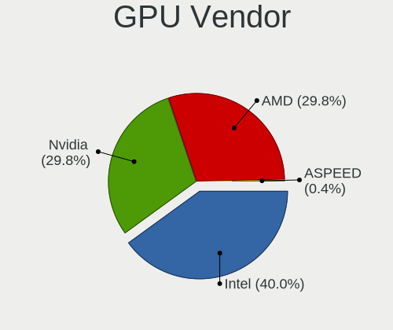

| Vendor            | Desktops | Percent |
|-------------------|----------|---------|
| Intel             | 113      | 39.93%  |
| AMD               | 85       | 30.04%  |
| Nvidia            | 84       | 29.68%  |
| ASPEED Technology | 1        | 0.35%   |

GPU Model
---------

Graphics card models

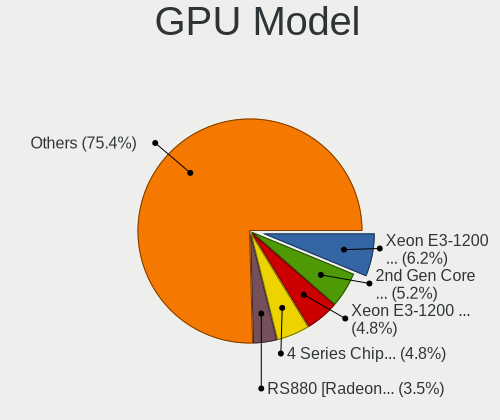

| Model                                                                       | Desktops | Percent |
|-----------------------------------------------------------------------------|----------|---------|
| Intel Xeon E3-1200 v2/3rd Gen Core processor Graphics Controller            | 18       | 6.27%   |
| Intel 2nd Generation Core Processor Family Integrated Graphics Controller   | 15       | 5.23%   |
| Intel Xeon E3-1200 v3/4th Gen Core Processor Integrated Graphics Controller | 14       | 4.88%   |
| Intel 4 Series Chipset Integrated Graphics Controller                       | 14       | 4.88%   |
| AMD RS880 [Radeon HD 4200]                                                  | 10       | 3.48%   |
| Intel 82945G/GZ Integrated Graphics Controller                              | 9        | 3.14%   |
| Intel 82G33/G31 Express Integrated Graphics Controller                      | 8        | 2.79%   |
| Nvidia GT218 [GeForce 210]                                                  | 7        | 2.44%   |
| AMD Ellesmere [Radeon RX 470/480/570/570X/580/580X/590]                     | 7        | 2.44%   |
| Intel CoffeeLake-S GT2 [UHD Graphics 630]                                   | 6        | 2.09%   |
| Intel 4th Generation Core Processor Family Integrated Graphics Controller   | 6        | 2.09%   |
| AMD Raven Ridge [Radeon Vega Series / Radeon Vega Mobile Series]            | 6        | 2.09%   |
| Nvidia GM107 [GeForce GTX 750 Ti]                                           | 5        | 1.74%   |
| Intel CometLake-S GT2 [UHD Graphics 630]                                    | 5        | 1.74%   |
| AMD Cedar [Radeon HD 5000/6000/7350/8350 Series]                            | 5        | 1.74%   |
| Nvidia GP108 [GeForce GT 1030]                                              | 4        | 1.39%   |
| Nvidia GK208B [GeForce GT 710]                                              | 4        | 1.39%   |
| AMD RS780L [Radeon 3000]                                                    | 4        | 1.39%   |
| AMD Picasso/Raven 2 [Radeon Vega Series / Radeon Vega Mobile Series]        | 4        | 1.39%   |
| Nvidia GP104 [GeForce GTX 1070]                                             | 3        | 1.05%   |
| Nvidia GM204 [GeForce GTX 970]                                              | 3        | 1.05%   |
| AMD Curacao PRO [Radeon R7 370 / R9 270/370 OEM]                            | 3        | 1.05%   |
| AMD Caicos [Radeon HD 6450/7450/8450 / R5 230 OEM]                          | 3        | 1.05%   |
| Nvidia TU116 [GeForce GTX 1650 SUPER]                                       | 2        | 0.7%    |
| Nvidia TU104 [GeForce RTX 2070 SUPER]                                       | 2        | 0.7%    |
| Nvidia GP107 [GeForce GTX 1050 Ti]                                          | 2        | 0.7%    |
| Nvidia GP106 [GeForce GTX 1060 6GB]                                         | 2        | 0.7%    |
| Nvidia GP104 [GeForce GTX 1080]                                             | 2        | 0.7%    |
| Nvidia GK208B [GeForce GT 730]                                              | 2        | 0.7%    |
| Nvidia GF116 [GeForce GTX 550 Ti]                                           | 2        | 0.7%    |
| Nvidia GF106 [GeForce GTS 450]                                              | 2        | 0.7%    |
| Nvidia GA104 [GeForce RTX 3060 Ti]                                          | 2        | 0.7%    |
| Nvidia GA102 [GeForce RTX 3090]                                             | 2        | 0.7%    |
| Intel HD Graphics 630                                                       | 2        | 0.7%    |
| Intel Core Processor Integrated Graphics Controller                         | 2        | 0.7%    |
| Intel Atom Processor Z36xxx/Z37xxx Series Graphics & Display                | 2        | 0.7%    |
| Intel 82Q35 Express Integrated Graphics Controller                          | 2        | 0.7%    |
| AMD RV730 PRO [Radeon HD 4650]                                              | 2        | 0.7%    |
| AMD RV710 [Radeon HD 4350/4550]                                             | 2        | 0.7%    |
| AMD Oland PRO [Radeon R7 240/340 / Radeon 520]                              | 2        | 0.7%    |

GPU Combo
---------

Combinations of graphics cards

| Name                     | Desktops | Percent |
|--------------------------|----------|---------|
| 1 x Intel                | 99       | 37.22%  |
| 1 x AMD                  | 81       | 30.45%  |
| 1 x Nvidia               | 75       | 28.2%   |
| Intel + Nvidia           | 6        | 2.26%   |
| 2 x Nvidia               | 1        | 0.38%   |
| 2 x AMD                  | 1        | 0.38%   |
| Intel + AMD + 1 x Nvidia | 1        | 0.38%   |
| Intel + AMD              | 1        | 0.38%   |
| 1 x ASPEED               | 1        | 0.38%   |

GPU Driver
----------

Free vs proprietary

| Driver      | Desktops | Percent |
|-------------|----------|---------|
| Free        | 203      | 76.03%  |
| Proprietary | 60       | 22.47%  |
| Unknown     | 4        | 1.5%    |

GPU Memory
----------

Total video memory

| Size in GB | Desktops | Percent |
|------------|----------|---------|
| Unknown    | 115      | 42.44%  |
| 0.01-0.5   | 39       | 14.39%  |
| 1.01-2.0   | 37       | 13.65%  |
| 0.51-1.0   | 35       | 12.92%  |
| 7.01-8.0   | 21       | 7.75%   |
| 3.01-4.0   | 16       | 5.9%    |
| 5.01-6.0   | 5        | 1.85%   |
| 16.01-24.0 | 2        | 0.74%   |
| 2.01-3.0   | 1        | 0.37%   |

Monitor
-------

Monitor Vendor
--------------

Monitor vendors

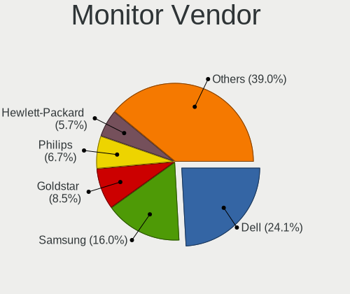

| Vendor               | Desktops | Percent |
|----------------------|----------|---------|
| Dell                 | 68       | 24.37%  |
| Samsung Electronics  | 44       | 15.77%  |
| Goldstar             | 24       | 8.6%    |
| Philips              | 19       | 6.81%   |
| Hewlett-Packard      | 16       | 5.73%   |
| BenQ                 | 14       | 5.02%   |
| Ancor Communications | 13       | 4.66%   |
| Acer                 | 11       | 3.94%   |
| AOC                  | 10       | 3.58%   |
| ViewSonic            | 8        | 2.87%   |
| Unknown              | 7        | 2.51%   |
| Iiyama               | 5        | 1.79%   |
| Lenovo               | 3        | 1.08%   |
| HannStar             | 3        | 1.08%   |
| Vestel Elektronik    | 2        | 0.72%   |
| Toshiba              | 2        | 0.72%   |
| NEC Computers        | 2        | 0.72%   |
| LG Electronics       | 2        | 0.72%   |
| Gateway              | 2        | 0.72%   |
| Belinea              | 2        | 0.72%   |
| Vizio                | 1        | 0.36%   |
| VIZ                  | 1        | 0.36%   |
| Targa                | 1        | 0.36%   |
| STD                  | 1        | 0.36%   |
| Sony                 | 1        | 0.36%   |
| Seiki                | 1        | 0.36%   |
| Sceptre Tech         | 1        | 0.36%   |
| Sceptre              | 1        | 0.36%   |
| RTK                  | 1        | 0.36%   |
| ROW                  | 1        | 0.36%   |
| Panasonic            | 1        | 0.36%   |
| Packard Bell         | 1        | 0.36%   |
| Medion               | 1        | 0.36%   |
| Insignia             | 1        | 0.36%   |
| Hitachi              | 1        | 0.36%   |
| Fujitsu Siemens      | 1        | 0.36%   |
| Element              | 1        | 0.36%   |
| Eizo                 | 1        | 0.36%   |
| DENON                | 1        | 0.36%   |
| Daewoo               | 1        | 0.36%   |

Monitor Model
-------------

Monitor models

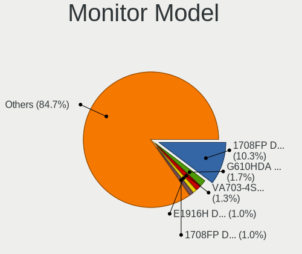

| Model                                                                | Desktops | Percent |
|----------------------------------------------------------------------|----------|---------|
| Dell 1708FP DEL4023 1280x1024 338x270mm 17.0-inch                    | 31       | 10.4%   |
| BenQ G610HDA BNQ7819 1366x768 344x193mm 15.5-inch                    | 5        | 1.68%   |
| ViewSonic VA703-4SERIES VSC6A1E 1280x1024 338x270mm 17.0-inch        | 4        | 1.34%   |
| Dell E1916H DELF064 1366x768 410x230mm 18.5-inch                     | 3        | 1.01%   |
| Dell 1708FP DEL4024 1280x1024 338x270mm 17.0-inch                    | 3        | 1.01%   |
| Vestel Elektronik 42 FHD_LCD-TV VES3700 1920x540                     | 2        | 0.67%   |
| Samsung Electronics SyncMaster SAM0272 1280x1024 338x270mm 17.0-inch | 2        | 0.67%   |
| Samsung Electronics LCD Monitor SAM03BC 1920x1080                    | 2        | 0.67%   |
| Samsung Electronics C24F390 SAM0D2D 1920x1080 521x293mm 23.5-inch    | 2        | 0.67%   |
| Philips PHL 273V5 PHLC0D2 1920x1080 598x336mm 27.0-inch              | 2        | 0.67%   |
| Iiyama PL2740HS IVM6662 1920x1080 598x336mm 27.0-inch                | 2        | 0.67%   |
| Hewlett-Packard L1908w HWP26F0 1440x900 410x256mm 19.0-inch          | 2        | 0.67%   |
| Goldstar W2253 GSM56DB 1920x1080 477x268mm 21.5-inch                 | 2        | 0.67%   |
| Goldstar W1943 GSM4BAD 1360x768 406x229mm 18.4-inch                  | 2        | 0.67%   |
| Goldstar E2340 GSM57A6 1920x1080 510x290mm 23.1-inch                 | 2        | 0.67%   |
| Goldstar 23LC1R GSM5617 1360x768 930x523mm 42.0-inch                 | 2        | 0.67%   |
| Dell U2412M DELA07A 1920x1200 518x324mm 24.1-inch                    | 2        | 0.67%   |
| Dell P2414H DELA09B 1920x1080 527x297mm 23.8-inch                    | 2        | 0.67%   |
| Dell E1709W DELD022 1440x900 370x230mm 17.2-inch                     | 2        | 0.67%   |
| AOC Q3279WG5B AOC3279 2560x1440 725x428mm 33.1-inch                  | 2        | 0.67%   |
| Vizio VA26LHDTV10T VIZ0035 1920x1080 640x360mm 28.9-inch             | 1        | 0.34%   |
| VIZ LCD Monitor E322VL 1920x1080                                     | 1        | 0.34%   |
| ViewSonic VX2439wm VSC3D24 1920x1080 520x290mm 23.4-inch             | 1        | 0.34%   |
| ViewSonic VX1935wm VSC2A1E 1440x900 408x255mm 18.9-inch              | 1        | 0.34%   |
| ViewSonic VE902m VSC491B 1280x1024 376x301mm 19.0-inch               | 1        | 0.34%   |
| ViewSonic VE710s VSCF518 1280x1024 338x270mm 17.0-inch               | 1        | 0.34%   |
| Unknown LCD Monitor Sony SDM-X82 1280x1024                           | 1        | 0.34%   |
| Unknown LCD Monitor SAMSUNG 3840x2160                                | 1        | 0.34%   |
| Unknown LCD Monitor SAMSUNG 1360x768                                 | 1        | 0.34%   |
| Unknown LCD Monitor PHILIPS FTV 1360x768                             | 1        | 0.34%   |
| Unknown LCD Monitor FormacTFT2010 1600x1200                          | 1        | 0.34%   |
| Unknown LCD Monitor ELE E4SW5017RKU                                  | 1        | 0.34%   |
| Unknown LCD Monitor CHHWJT 1920x1080                                 | 1        | 0.34%   |
| Toshiba TV TSB2017 3840x2160                                         | 1        | 0.34%   |
| Toshiba 24W_LCD_TV TSB3700 1920x1080 706x398mm 31.9-inch             | 1        | 0.34%   |
| Targa LCD Monitor LCDTV16                                            | 1        | 0.34%   |
| STD Monitor STD0001 1920x1080                                        | 1        | 0.34%   |
| Sony TV SNYEE01 1920x1080                                            | 1        | 0.34%   |
| Seiki SE55GY19 SEK1920 1920x1080                                     | 1        | 0.34%   |
| Sceptre Tech Sceptre X24WG SPT2401 1920x1080 518x324mm 24.1-inch     | 1        | 0.34%   |

Monitor Resolution
------------------

Monitor screen resolution

| Resolution         | Desktops | Percent |
|--------------------|----------|---------|
| 1920x1080 (FHD)    | 96       | 34.53%  |
| 1280x1024 (SXGA)   | 59       | 21.22%  |
| 3840x2160 (4K)     | 19       | 6.83%   |
| 1366x768 (WXGA)    | 18       | 6.47%   |
| 1440x900 (WXGA+)   | 13       | 4.68%   |
| 2560x1440 (QHD)    | 12       | 4.32%   |
| 1360x768           | 12       | 4.32%   |
| 1920x1200 (WUXGA)  | 10       | 3.6%    |
| 1680x1050 (WSXGA+) | 10       | 3.6%    |
| Unknown            | 9        | 3.24%   |
| 3440x1440          | 3        | 1.08%   |
| 1600x1200          | 3        | 1.08%   |
| 1600x900 (HD+)     | 2        | 0.72%   |
| 6400x1080          | 1        | 0.36%   |
| 5360x1440          | 1        | 0.36%   |
| 5040x1050          | 1        | 0.36%   |
| 4240x1440          | 1        | 0.36%   |
| 3840x1200          | 1        | 0.36%   |
| 3840x1080          | 1        | 0.36%   |
| 3520x1200          | 1        | 0.36%   |
| 3000x1920          | 1        | 0.36%   |
| 2640x1024          | 1        | 0.36%   |
| 1280x720 (HD)      | 1        | 0.36%   |
| 1152x864           | 1        | 0.36%   |
| 1024x768 (XGA)     | 1        | 0.36%   |

Monitor Diagonal
----------------

Diagonal size in inches

| Inches  | Desktops | Percent |
|---------|----------|---------|
| 17      | 52       | 18.64%  |
| 24      | 32       | 11.47%  |
| Unknown | 32       | 11.47%  |
| 21      | 25       | 8.96%   |
| 23      | 24       | 8.6%    |
| 27      | 21       | 7.53%   |
| 18      | 19       | 6.81%   |
| 19      | 13       | 4.66%   |
| 22      | 11       | 3.94%   |
| 15      | 11       | 3.94%   |
| 31      | 8        | 2.87%   |
| 84      | 6        | 2.15%   |
| 72      | 5        | 1.79%   |
| 40      | 3        | 1.08%   |
| 25      | 3        | 1.08%   |
| 20      | 3        | 1.08%   |
| 42      | 2        | 0.72%   |
| 36      | 2        | 0.72%   |
| 34      | 2        | 0.72%   |
| 33      | 2        | 0.72%   |
| 32      | 2        | 0.72%   |
| 46      | 1        | 0.36%   |

Monitor Width
-------------

Physical width

| Width in mm | Desktops | Percent |
|-------------|----------|---------|
| 501-600     | 74       | 27.21%  |
| 401-500     | 61       | 22.43%  |
| 301-350     | 60       | 22.06%  |
| Unknown     | 32       | 11.76%  |
| 1501-2000   | 11       | 4.04%   |
| 601-700     | 10       | 3.68%   |
| 351-400     | 10       | 3.68%   |
| 701-800     | 8        | 2.94%   |
| 801-900     | 3        | 1.1%    |
| 901-1000    | 2        | 0.74%   |
| 1001-1500   | 1        | 0.37%   |

Aspect Ratio
------------

Proportional relationship between the width and the height

| Ratio   | Desktops | Percent |
|---------|----------|---------|
| 16/9    | 133      | 50.57%  |
| 5/4     | 51       | 19.39%  |
| 16/10   | 36       | 13.69%  |
| Unknown | 29       | 11.03%  |
| 4/3     | 6        | 2.28%   |
| 6/5     | 4        | 1.52%   |
| 3/2     | 2        | 0.76%   |
| 21/9    | 2        | 0.76%   |

Monitor Area
------------

Area in inch

| Area in inch | Desktops | Percent |
|----------------|----------|---------|
| 201-250        | 70       | 25.55%  |
| 141-150        | 65       | 23.72%  |
| Unknown        | 32       | 11.68%  |
| 151-200        | 24       | 8.76%   |
| 301-350        | 21       | 7.66%   |
| 251-300        | 16       | 5.84%   |
| 351-500        | 13       | 4.74%   |
| More than 1000 | 11       | 4.01%   |
| 101-110        | 8        | 2.92%   |
| 501-1000       | 8        | 2.92%   |
| 131-140        | 3        | 1.09%   |
| 111-120        | 3        | 1.09%   |

Pixel Density
-------------

Pixels per inch

| Density | Desktops | Percent |
|---------|----------|---------|
| 51-100  | 173      | 65.53%  |
| 101-120 | 40       | 15.15%  |
| Unknown | 32       | 12.12%  |
| 1-50    | 10       | 3.79%   |
| 121-160 | 6        | 2.27%   |
| 161-240 | 3        | 1.14%   |

Multiple Monitors
-----------------

Total monitors connected

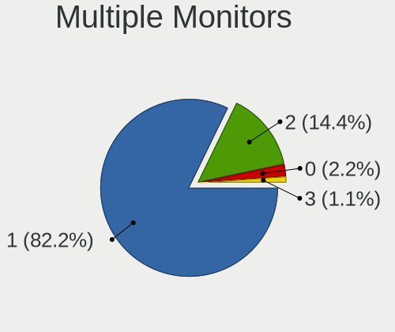

| Total | Desktops | Percent |
|-------|----------|---------|
| 1     | 222      | 82.84%  |
| 2     | 37       | 13.81%  |
| 0     | 6        | 2.24%   |
| 3     | 3        | 1.12%   |

Network
-------

Net Controller Vendor
---------------------

Controller vendors

| Vendor                          | Desktops | Percent |
|---------------------------------|----------|---------|
| Realtek Semiconductor           | 145      | 40.62%  |
| Intel                           | 103      | 28.85%  |
| Broadcom                        | 28       | 7.84%   |
| Qualcomm Atheros                | 15       | 4.2%    |
| Ralink Technology               | 9        | 2.52%   |
| Nvidia                          | 8        | 2.24%   |
| TP-Link                         | 7        | 1.96%   |
| Ralink                          | 5        | 1.4%    |
| Aquantia                        | 4        | 1.12%   |
| Xiaomi                          | 3        | 0.84%   |
| Edimax Technology               | 3        | 0.84%   |
| Broadcom Limited                | 3        | 0.84%   |
| ASUSTek Computer                | 3        | 0.84%   |
| ASIX Electronics                | 3        | 0.84%   |
| Samsung Electronics             | 2        | 0.56%   |
| Qualcomm Atheros Communications | 2        | 0.56%   |
| NetGear                         | 2        | 0.56%   |
| Marvell Technology Group        | 2        | 0.56%   |
| Linksys                         | 2        | 0.56%   |
| D-Link System                   | 2        | 0.56%   |
| ZyDAS                           | 1        | 0.28%   |
| STMicroelectronics              | 1        | 0.28%   |
| Sitecom Europe                  | 1        | 0.28%   |
| MediaTek                        | 1        | 0.28%   |
| Huawei Technologies             | 1        | 0.28%   |
| Belkin Components               | 1        | 0.28%   |

Net Controller Model
--------------------

Controller models

| Model                                                             | Desktops | Percent |
|-------------------------------------------------------------------|----------|---------|
| Realtek RTL8111/8168/8411 PCI Express Gigabit Ethernet Controller | 115      | 29.04%  |
| Intel 82579LM Gigabit Network Connection (Lewisville)             | 22       | 5.56%   |
| Realtek RTL8125 2.5GbE Controller                                 | 13       | 3.28%   |
| Intel I211 Gigabit Network Connection                             | 13       | 3.28%   |
| Intel Wi-Fi 6 AX200                                               | 8        | 2.02%   |
| Broadcom NetXtreme BCM5761 Gigabit Ethernet PCIe                  | 8        | 2.02%   |
| Realtek RTL810xE PCI Express Fast Ethernet controller             | 6        | 1.52%   |
| Nvidia MCP61 Ethernet                                             | 6        | 1.52%   |
| Intel Ethernet Connection I217-V                                  | 6        | 1.52%   |
| Intel 82574L Gigabit Network Connection                           | 6        | 1.52%   |
| Intel 82567LM-3 Gigabit Network Connection                        | 6        | 1.52%   |
| Broadcom NetXtreme BCM5751 Gigabit Ethernet PCI Express           | 6        | 1.52%   |
| Realtek RTL8188EUS 802.11n Wireless Network Adapter               | 5        | 1.26%   |
| Ralink MT7601U Wireless Adapter                                   | 5        | 1.26%   |
| Intel Ethernet Connection I217-LM                                 | 5        | 1.26%   |
| Intel Ethernet Connection (7) I219-V                              | 5        | 1.26%   |
| Intel Ethernet Connection (2) I219-V                              | 5        | 1.26%   |
| Intel 82579V Gigabit Network Connection                           | 5        | 1.26%   |
| Broadcom NetLink BCM5784M Gigabit Ethernet PCIe                   | 4        | 1.01%   |
| Aquantia AQC107 NBase-T/IEEE 802.3bz Ethernet Controller [AQtion] | 4        | 1.01%   |
| Realtek RTL88x2bu [AC1200 Techkey]                                | 3        | 0.76%   |
| Intel Wireless 7260                                               | 3        | 0.76%   |
| Intel Dual Band Wireless-AC 3168NGW [Stone Peak]                  | 3        | 0.76%   |
| Intel 82578DM Gigabit Network Connection                          | 3        | 0.76%   |
| Broadcom NetLink BCM57780 Gigabit Ethernet PCIe                   | 3        | 0.76%   |
| Broadcom Limited NetLink BCM5787 Gigabit Ethernet PCI Express     | 3        | 0.76%   |
| ASIX AX88179 Gigabit Ethernet                                     | 3        | 0.76%   |
| TP-Link TL-WN823N v2/v3 [Realtek RTL8192EU]                       | 2        | 0.51%   |
| Realtek RTL8192EE PCIe Wireless Network Adapter                   | 2        | 0.51%   |
| Realtek RTL8192CE PCIe Wireless Network Adapter                   | 2        | 0.51%   |
| Realtek RTL8169 PCI Gigabit Ethernet Controller                   | 2        | 0.51%   |
| Realtek RTL8153 Gigabit Ethernet Adapter                          | 2        | 0.51%   |
| Realtek RTL-8100/8101L/8139 PCI Fast Ethernet Adapter             | 2        | 0.51%   |
| Ralink RT5370 Wireless Adapter                                    | 2        | 0.51%   |
| Ralink RT2561/RT61 rev B 802.11g                                  | 2        | 0.51%   |
| Qualcomm Atheros AR9271 802.11n                                   | 2        | 0.51%   |
| Qualcomm Atheros AR8151 v2.0 Gigabit Ethernet                     | 2        | 0.51%   |
| Qualcomm Atheros AR8121/AR8113/AR8114 Gigabit or Fast Ethernet    | 2        | 0.51%   |
| Intel Wireless-AC 9260                                            | 2        | 0.51%   |
| Intel Wi-Fi 6 AX210/AX211/AX411 160MHz                            | 2        | 0.51%   |

Wireless Vendor
---------------

Wireless vendors

| Vendor                          | Desktops | Percent |
|---------------------------------|----------|---------|
| Realtek Semiconductor           | 24       | 26.09%  |
| Intel                           | 23       | 25%     |
| Ralink Technology               | 9        | 9.78%   |
| TP-Link                         | 7        | 7.61%   |
| Ralink                          | 5        | 5.43%   |
| Qualcomm Atheros                | 5        | 5.43%   |
| Edimax Technology               | 3        | 3.26%   |
| ASUSTek Computer                | 3        | 3.26%   |
| Qualcomm Atheros Communications | 2        | 2.17%   |
| NetGear                         | 2        | 2.17%   |
| Linksys                         | 2        | 2.17%   |
| Broadcom                        | 2        | 2.17%   |
| ZyDAS                           | 1        | 1.09%   |
| Xiaomi                          | 1        | 1.09%   |
| Sitecom Europe                  | 1        | 1.09%   |
| MediaTek                        | 1        | 1.09%   |
| Belkin Components               | 1        | 1.09%   |

Wireless Model
--------------

Wireless models

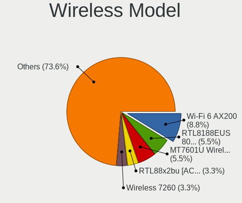

| Model                                                              | Desktops | Percent |
|--------------------------------------------------------------------|----------|---------|
| Intel Wi-Fi 6 AX200                                                | 8        | 8.7%    |
| Realtek RTL8188EUS 802.11n Wireless Network Adapter                | 5        | 5.43%   |
| Ralink MT7601U Wireless Adapter                                    | 5        | 5.43%   |
| Realtek RTL88x2bu [AC1200 Techkey]                                 | 3        | 3.26%   |
| Intel Wireless 7260                                                | 3        | 3.26%   |
| Intel Dual Band Wireless-AC 3168NGW [Stone Peak]                   | 3        | 3.26%   |
| TP-Link TL-WN823N v2/v3 [Realtek RTL8192EU]                        | 2        | 2.17%   |
| Realtek RTL8192EE PCIe Wireless Network Adapter                    | 2        | 2.17%   |
| Realtek RTL8192CE PCIe Wireless Network Adapter                    | 2        | 2.17%   |
| Ralink RT5370 Wireless Adapter                                     | 2        | 2.17%   |
| Ralink RT2561/RT61 rev B 802.11g                                   | 2        | 2.17%   |
| Qualcomm Atheros AR9271 802.11n                                    | 2        | 2.17%   |
| Intel Wireless-AC 9260                                             | 2        | 2.17%   |
| Intel Wi-Fi 6 AX210/AX211/AX411 160MHz                             | 2        | 2.17%   |
| Intel Tiger Lake PCH CNVi WiFi                                     | 2        | 2.17%   |
| Edimax 802.11n WLAN Adapter                                        | 2        | 2.17%   |
| ASUS USB-N13 802.11n Network Adapter (rev. B1) [Realtek RTL8192CU] | 2        | 2.17%   |
| ZyDAS ZD1211B 802.11g                                              | 1        | 1.09%   |
| Xiaomi MediaTek MT7601U [MI WiFi]                                  | 1        | 1.09%   |
| TP-Link TL-WN722N v2/v3 [Realtek RTL8188EUS]                       | 1        | 1.09%   |
| TP-Link RTL8812AU Archer T4U 802.11ac                              | 1        | 1.09%   |
| TP-Link Archer T4U v2 [Realtek RTL8812AU]                          | 1        | 1.09%   |
| TP-Link 802.11n NIC                                                | 1        | 1.09%   |
| TP-Link 802.11ac WLAN Adapter                                      | 1        | 1.09%   |
| Sitecom Europe 802.11n WLAN Adapter                                | 1        | 1.09%   |
| Realtek RTL8822BE 802.11a/b/g/n/ac WiFi adapter                    | 1        | 1.09%   |
| Realtek RTL8821CE 802.11ac PCIe Wireless Network Adapter           | 1        | 1.09%   |
| Realtek RTL8821AE 802.11ac PCIe Wireless Network Adapter           | 1        | 1.09%   |
| Realtek RTL8814AU 802.11a/b/g/n/ac Wireless Adapter                | 1        | 1.09%   |
| Realtek RTL8811AU 802.11a/b/g/n/ac WLAN Adapter                    | 1        | 1.09%   |
| Realtek RTL8192CU 802.11n WLAN Adapter                             | 1        | 1.09%   |
| Realtek RTL8188FTV 802.11b/g/n 1T1R 2.4G WLAN Adapter              | 1        | 1.09%   |
| Realtek RTL8188EE Wireless Network Adapter                         | 1        | 1.09%   |
| Realtek RTL8188CUS 802.11n WLAN Adapter                            | 1        | 1.09%   |
| Realtek RTL8188CE 802.11b/g/n WiFi Adapter                         | 1        | 1.09%   |
| Realtek RTL8187 Wireless Adapter                                   | 1        | 1.09%   |
| Realtek 802.11ac NIC                                               | 1        | 1.09%   |
| Ralink RT5572 Wireless Adapter                                     | 1        | 1.09%   |
| Ralink RT2870/RT3070 Wireless Adapter                              | 1        | 1.09%   |
| Ralink RT5360 Wireless 802.11n 1T/1R                               | 1        | 1.09%   |

Ethernet Vendor
---------------

Ethernet vendors

| Vendor                   | Desktops | Percent |
|--------------------------|----------|---------|
| Realtek Semiconductor    | 136      | 47.06%  |
| Intel                    | 90       | 31.14%  |
| Broadcom                 | 26       | 9%      |
| Qualcomm Atheros         | 10       | 3.46%   |
| Nvidia                   | 8        | 2.77%   |
| Aquantia                 | 4        | 1.38%   |
| Broadcom Limited         | 3        | 1.04%   |
| ASIX Electronics         | 3        | 1.04%   |
| Xiaomi                   | 2        | 0.69%   |
| Samsung Electronics      | 2        | 0.69%   |
| Marvell Technology Group | 2        | 0.69%   |
| D-Link System            | 2        | 0.69%   |
| Huawei Technologies      | 1        | 0.35%   |

Ethernet Model
--------------

Ethernet models

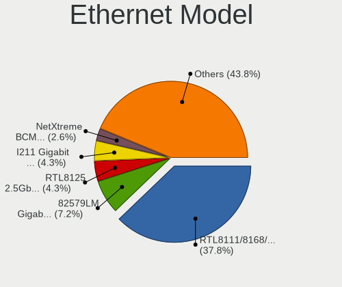

| Model                                                             | Desktops | Percent |
|-------------------------------------------------------------------|----------|---------|
| Realtek RTL8111/8168/8411 PCI Express Gigabit Ethernet Controller | 115      | 37.95%  |
| Intel 82579LM Gigabit Network Connection (Lewisville)             | 22       | 7.26%   |
| Realtek RTL8125 2.5GbE Controller                                 | 13       | 4.29%   |
| Intel I211 Gigabit Network Connection                             | 13       | 4.29%   |
| Broadcom NetXtreme BCM5761 Gigabit Ethernet PCIe                  | 8        | 2.64%   |
| Realtek RTL810xE PCI Express Fast Ethernet controller             | 6        | 1.98%   |
| Nvidia MCP61 Ethernet                                             | 6        | 1.98%   |
| Intel Ethernet Connection I217-V                                  | 6        | 1.98%   |
| Intel 82574L Gigabit Network Connection                           | 6        | 1.98%   |
| Intel 82567LM-3 Gigabit Network Connection                        | 6        | 1.98%   |
| Broadcom NetXtreme BCM5751 Gigabit Ethernet PCI Express           | 6        | 1.98%   |
| Intel Ethernet Connection I217-LM                                 | 5        | 1.65%   |
| Intel Ethernet Connection (7) I219-V                              | 5        | 1.65%   |
| Intel Ethernet Connection (2) I219-V                              | 5        | 1.65%   |
| Intel 82579V Gigabit Network Connection                           | 5        | 1.65%   |
| Broadcom NetLink BCM5784M Gigabit Ethernet PCIe                   | 4        | 1.32%   |
| Aquantia AQC107 NBase-T/IEEE 802.3bz Ethernet Controller [AQtion] | 4        | 1.32%   |
| Intel 82578DM Gigabit Network Connection                          | 3        | 0.99%   |
| Broadcom NetLink BCM57780 Gigabit Ethernet PCIe                   | 3        | 0.99%   |
| Broadcom Limited NetLink BCM5787 Gigabit Ethernet PCI Express     | 3        | 0.99%   |
| ASIX AX88179 Gigabit Ethernet                                     | 3        | 0.99%   |
| Realtek RTL8169 PCI Gigabit Ethernet Controller                   | 2        | 0.66%   |
| Realtek RTL8153 Gigabit Ethernet Adapter                          | 2        | 0.66%   |
| Realtek RTL-8100/8101L/8139 PCI Fast Ethernet Adapter             | 2        | 0.66%   |
| Qualcomm Atheros AR8151 v2.0 Gigabit Ethernet                     | 2        | 0.66%   |
| Qualcomm Atheros AR8121/AR8113/AR8114 Gigabit or Fast Ethernet    | 2        | 0.66%   |
| Intel NM10/ICH7 Family LAN Controller                             | 2        | 0.66%   |
| Intel I210 Gigabit Network Connection                             | 2        | 0.66%   |
| Intel Ethernet Controller I225-V                                  | 2        | 0.66%   |
| Intel 82567V-4 Gigabit Network Connection                         | 2        | 0.66%   |
| Intel 82567V-2 Gigabit Network Connection                         | 2        | 0.66%   |
| D-Link System DGE-528T Gigabit Ethernet Adapter                   | 2        | 0.66%   |
| Broadcom NetXtreme BCM5762 Gigabit Ethernet PCIe                  | 2        | 0.66%   |
| Xiaomi Mi/Redmi series (RNDIS)                                    | 1        | 0.33%   |
| Xiaomi Mi/Redmi series (RNDIS + ADB)                              | 1        | 0.33%   |
| Samsung GT-I9070 (network tethering, USB debugging enabled)       | 1        | 0.33%   |
| Samsung Galaxy series, misc. (tethering mode)                     | 1        | 0.33%   |
| Realtek Killer E2600 Gigabit Ethernet Controller                  | 1        | 0.33%   |
| Qualcomm Atheros Killer E2400 Gigabit Ethernet Controller         | 1        | 0.33%   |
| Qualcomm Atheros Killer E220x Gigabit Ethernet Controller         | 1        | 0.33%   |

Net Controller Kind
-------------------

Ethernet, WiFi or modem

| Kind     | Desktops | Percent |
|----------|----------|---------|
| Ethernet | 264      | 74.79%  |
| WiFi     | 88       | 24.93%  |
| Modem    | 1        | 0.28%   |

Used Controller
---------------

Currently used network controller

| Kind     | Desktops | Percent |
|----------|----------|---------|
| Ethernet | 213      | 78.6%   |
| WiFi     | 58       | 21.4%   |

NICs
----

Total network controllers on board

| Total | Desktops | Percent |
|-------|----------|---------|
| 1     | 200      | 74.91%  |
| 2     | 56       | 20.97%  |
| 3     | 7        | 2.62%   |
| 4     | 2        | 0.75%   |
| 14    | 1        | 0.37%   |
| 0     | 1        | 0.37%   |

IPv6
----

IPv6 vs IPv4

| Used | Desktops | Percent |
|------|----------|---------|
| No   | 242      | 90.3%   |
| Yes  | 26       | 9.7%    |

Bluetooth
---------

Bluetooth Vendor
----------------

Controller vendors

| Vendor                          | Desktops | Percent |
|---------------------------------|----------|---------|
| Intel                           | 20       | 34.48%  |
| Cambridge Silicon Radio         | 19       | 32.76%  |
| Broadcom                        | 7        | 12.07%  |
| Realtek Semiconductor           | 3        | 5.17%   |
| ASUSTek Computer                | 3        | 5.17%   |
| Qualcomm Atheros Communications | 2        | 3.45%   |
| IMC Networks                    | 2        | 3.45%   |
| Lite-On Technology              | 1        | 1.72%   |
| Belkin Components               | 1        | 1.72%   |

Bluetooth Model
---------------

Controller models

| Model                                                  | Desktops | Percent |
|--------------------------------------------------------|----------|---------|
| Cambridge Silicon Radio Bluetooth Dongle (HCI mode)    | 19       | 32.76%  |
| Intel AX200 Bluetooth                                  | 7        | 12.07%  |
| Intel Bluetooth wireless interface                     | 4        | 6.9%    |
| Broadcom BCM20702A0 Bluetooth 4.0                      | 4        | 6.9%    |
| Intel Wireless-AC 3168 Bluetooth                       | 3        | 5.17%   |
| Realtek Bluetooth Radio                                | 2        | 3.45%   |
| Qualcomm Atheros AR3011 Bluetooth                      | 2        | 3.45%   |
| Intel Bluetooth 9460/9560 Jefferson Peak (JfP)         | 2        | 3.45%   |
| Intel AX210 Bluetooth                                  | 2        | 3.45%   |
| Realtek  Bluetooth 4.2 Adapter                         | 1        | 1.72%   |
| Lite-On Bluetooth Device                               | 1        | 1.72%   |
| Intel Wireless-AC 9260 Bluetooth Adapter               | 1        | 1.72%   |
| Intel AX201 Bluetooth                                  | 1        | 1.72%   |
| IMC Networks Bluetooth Radio                           | 1        | 1.72%   |
| IMC Networks Asus Integrated Bluetooth module [AR3011] | 1        | 1.72%   |
| Broadcom Bluetooth 3.0 Device                          | 1        | 1.72%   |
| Broadcom BCM92046DG-CL1ROM Bluetooth 2.1 Adapter       | 1        | 1.72%   |
| Broadcom BCM2045 Bluetooth                             | 1        | 1.72%   |
| Belkin Components F8T065BF Mini Bluetooth 4.0 Adapter  | 1        | 1.72%   |
| ASUS Broadcom BCM20702A0 Bluetooth                     | 1        | 1.72%   |
| ASUS Bluetooth Radio                                   | 1        | 1.72%   |
| ASUS ASUS USB-BT500                                    | 1        | 1.72%   |

Sound
-----

Sound Vendor
------------

Sound card vendors

| Vendor                               | Desktops | Percent |
|--------------------------------------|----------|---------|
| Intel                                | 181      | 44.58%  |
| AMD                                  | 101      | 24.88%  |
| Nvidia                               | 83       | 20.44%  |
| C-Media Electronics                  | 10       | 2.46%   |
| Logitech                             | 5        | 1.23%   |
| Razer USA                            | 2        | 0.49%   |
| Kingston Technology                  | 2        | 0.49%   |
| JMTek                                | 2        | 0.49%   |
| Jieli Technology                     | 2        | 0.49%   |
| Generalplus Technology               | 2        | 0.49%   |
| Creative Labs                        | 2        | 0.49%   |
| Corsair                              | 2        | 0.49%   |
| XMOS                                 | 1        | 0.25%   |
| Thesycon Systemsoftware & Consulting | 1        | 0.25%   |
| Realtek Semiconductor                | 1        | 0.25%   |
| Plantronics                          | 1        | 0.25%   |
| Micro Star International             | 1        | 0.25%   |
| Hewlett-Packard                      | 1        | 0.25%   |
| GN Netcom                            | 1        | 0.25%   |
| Focusrite-Novation                   | 1        | 0.25%   |
| Creative Technology                  | 1        | 0.25%   |
| BEHRINGER International              | 1        | 0.25%   |
| ASUSTek Computer                     | 1        | 0.25%   |
| Alesis                               | 1        | 0.25%   |

Sound Model
-----------

Sound card models

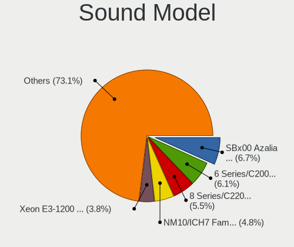

| Model                                                                             | Desktops | Percent |
|-----------------------------------------------------------------------------------|----------|---------|
| AMD SBx00 Azalia (Intel HDA)                                                      | 32       | 6.77%   |
| Intel 6 Series/C200 Series Chipset Family High Definition Audio Controller        | 29       | 6.13%   |
| Intel 8 Series/C220 Series Chipset High Definition Audio Controller               | 26       | 5.5%    |
| Intel NM10/ICH7 Family High Definition Audio Controller                           | 23       | 4.86%   |
| Intel Xeon E3-1200 v3/4th Gen Core Processor HD Audio Controller                  | 18       | 3.81%   |
| Intel 7 Series/C216 Chipset Family High Definition Audio Controller               | 18       | 3.81%   |
| AMD Starship/Matisse HD Audio Controller                                          | 15       | 3.17%   |
| AMD Family 17h/19h HD Audio Controller                                            | 12       | 2.54%   |
| AMD Oland/Hainan/Cape Verde/Pitcairn HDMI Audio [Radeon HD 7000 Series]           | 11       | 2.33%   |
| AMD Raven/Raven2/Fenghuang HDMI/DP Audio Controller                               | 10       | 2.11%   |
| Nvidia High Definition Audio Controller                                           | 8        | 1.69%   |
| Intel 82801JD/DO (ICH10 Family) HD Audio Controller                               | 8        | 1.69%   |
| Intel 200 Series PCH HD Audio                                                     | 8        | 1.69%   |
| Nvidia GK208 HDMI/DP Audio Controller                                             | 7        | 1.48%   |
| Intel Cannon Lake PCH cAVS                                                        | 7        | 1.48%   |
| Intel 82801JI (ICH10 Family) HD Audio Controller                                  | 7        | 1.48%   |
| Intel 100 Series/C230 Series Chipset Family HD Audio Controller                   | 7        | 1.48%   |
| AMD Family 17h (Models 00h-0fh) HD Audio Controller                               | 7        | 1.48%   |
| AMD Ellesmere HDMI Audio [Radeon RX 470/480 / 570/580/590]                        | 7        | 1.48%   |
| AMD Caicos HDMI Audio [Radeon HD 6450 / 7450/8450/8490 OEM / R5 230/235/235X OEM] | 7        | 1.48%   |
| Nvidia MCP61 High Definition Audio                                                | 6        | 1.27%   |
| Nvidia GP104 High Definition Audio Controller                                     | 6        | 1.27%   |
| Intel 82801G (ICH7 Family) AC'97 Audio Controller                                 | 6        | 1.27%   |
| Intel 5 Series/3400 Series Chipset High Definition Audio                          | 6        | 1.27%   |
| AMD FCH Azalia Controller                                                         | 6        | 1.27%   |
| Nvidia GM107 High Definition Audio Controller [GeForce 940MX]                     | 5        | 1.06%   |
| Nvidia GK104 HDMI Audio Controller                                                | 5        | 1.06%   |
| Intel C600/X79 series chipset High Definition Audio Controller                    | 5        | 1.06%   |
| AMD Cedar HDMI Audio [Radeon HD 5400/6300/7300 Series]                            | 5        | 1.06%   |
| Nvidia TU104 HD Audio Controller                                                  | 4        | 0.85%   |
| Nvidia GP108 High Definition Audio Controller                                     | 4        | 0.85%   |
| Nvidia GK107 HDMI Audio Controller                                                | 4        | 0.85%   |
| Nvidia GF106 High Definition Audio Controller                                     | 4        | 0.85%   |
| Intel Tiger Lake-H HD Audio Controller                                            | 4        | 0.85%   |
| Intel 9 Series Chipset Family HD Audio Controller                                 | 4        | 0.85%   |
| AMD RV710/730 HDMI Audio [Radeon HD 4000 series]                                  | 4        | 0.85%   |
| AMD RS780 HDMI Audio [Radeon 3000/3100 / HD 3200/3300]                            | 4        | 0.85%   |
| Nvidia TU116 High Definition Audio Controller                                     | 3        | 0.63%   |
| Nvidia TU106 High Definition Audio Controller                                     | 3        | 0.63%   |
| Nvidia GP107GL High Definition Audio Controller                                   | 3        | 0.63%   |

Memory
------

Memory Vendor
-------------

Memory module vendors

| Vendor                     | Desktops | Percent |
|----------------------------|----------|---------|
| Kingston                   | 47       | 21.66%  |
| Unknown                    | 45       | 20.74%  |
| Corsair                    | 24       | 11.06%  |
| SK hynix                   | 20       | 9.22%   |
| Samsung Electronics        | 14       | 6.45%   |
| G.Skill                    | 14       | 6.45%   |
| Crucial                    | 14       | 6.45%   |
| Smart                      | 4        | 1.84%   |
| Micron Technology          | 4        | 1.84%   |
| Elpida                     | 4        | 1.84%   |
| Team                       | 3        | 1.38%   |
| Patriot                    | 3        | 1.38%   |
| Nanya Technology           | 3        | 1.38%   |
| Teikon                     | 2        | 0.92%   |
| HBS                        | 2        | 0.92%   |
| Unknown                    | 2        | 0.92%   |
| Unknown (ABCD)             | 1        | 0.46%   |
| Unknown (9B0D)             | 1        | 0.46%   |
| Unknown (00FFFFFFFFFFFFFF) | 1        | 0.46%   |
| Transcend                  | 1        | 0.46%   |
| Ramaxel Technology         | 1        | 0.46%   |
| Qimonda                    | 1        | 0.46%   |
| Kreton                     | 1        | 0.46%   |
| Goldenmars                 | 1        | 0.46%   |
| Golden Empire              | 1        | 0.46%   |
| GeIL                       | 1        | 0.46%   |
| Atermiter                  | 1        | 0.46%   |
| A-DATA Technology          | 1        | 0.46%   |

Memory Model
------------

Memory module models

| Model                                                     | Desktops | Percent |
|-----------------------------------------------------------|----------|---------|
| Kingston RAM Module 4096MB DIMM DDR3 1333MT/s             | 6        | 2.61%   |
| Unknown RAM Module 4096MB DIMM 1333MT/s                   | 4        | 1.74%   |
| Unknown RAM Module 2048MB DIMM DDR 533MT/s                | 4        | 1.74%   |
| Unknown RAM Module 2048MB DIMM 1333MT/s                   | 3        | 1.3%    |
| SK hynix RAM HYMP125U64CP8-S6 2GB DIMM DDR2 49926MT/s     | 3        | 1.3%    |
| Kingston RAM Module 2048MB DIMM DDR2 667MT/s              | 3        | 1.3%    |
| Kingston RAM KHX1600C9D3/4GX 4GB DIMM DDR3 1600MT/s       | 3        | 1.3%    |
| Kingston RAM 99U5471-054.A00LF 8GB DIMM DDR3 1600MT/s     | 3        | 1.3%    |
| Corsair RAM CMK32GX4M2B3200C16 16GB DIMM DDR4 3400MT/s    | 3        | 1.3%    |
| Unknown RAM Module 4096MB DIMM DDR3 1333MT/s              | 2        | 0.87%   |
| Unknown RAM Module 2048MB DIMM SDRAM                      | 2        | 0.87%   |
| Unknown RAM Module 2048MB DIMM DDR3 1067MT/s              | 2        | 0.87%   |
| Unknown RAM Module 2048MB DIMM DDR2 800MT/s               | 2        | 0.87%   |
| Unknown RAM Module 2048MB DIMM DDR2 667MT/s               | 2        | 0.87%   |
| Unknown RAM Module 1024MB DIMM SDRAM                      | 2        | 0.87%   |
| Unknown RAM Module 1024MB DIMM DDR 533MT/s                | 2        | 0.87%   |
| Team RAM TEAMGROUP-UD4-3200 16GB DIMM DDR4 3800MT/s       | 2        | 0.87%   |
| Kingston RAM KHX1600C10D3/8G 8GB DIMM DDR3 1648MT/s       | 2        | 0.87%   |
| Kingston RAM 99U5584-005.A00LF 4GB DIMM DDR3 1600MT/s     | 2        | 0.87%   |
| Kingston RAM 2G-UDIMM 2GB DIMM DDR2 800MT/s               | 2        | 0.87%   |
| G.Skill RAM F4-3200C16-16GIS 16GB DIMM DDR4 3600MT/s      | 2        | 0.87%   |
| Elpida RAM EBJ41EF8BCFA-DJ-F 4GB DIMM DDR3 1333MT/s       | 2        | 0.87%   |
| Corsair RAM CMK8GX4M1D3000C16 8GB DIMM DDR4 3200MT/s      | 2        | 0.87%   |
| Corsair RAM CMK16GX4M2B3000C15 8GB DIMM DDR4 3533MT/s     | 2        | 0.87%   |
| Corsair RAM CM4X16GD3000C16K4D 16384MB DIMM DDR4 3000MT/s | 2        | 0.87%   |
| Unknown                                                   | 2        | 0.87%   |
| Unknown RAM Module 8192MB DIMM SDRAM                      | 1        | 0.43%   |
| Unknown RAM Module 8192MB DIMM DDR3 1333MT/s              | 1        | 0.43%   |
| Unknown RAM Module 8192MB DIMM 667MT/s                    | 1        | 0.43%   |
| Unknown RAM Module 8192MB DIMM 1333MT/s                   | 1        | 0.43%   |
| Unknown RAM Module 4GB DIMM 1600MT/s                      | 1        | 0.43%   |
| Unknown RAM Module 4096MB DIMM DDR3 667MT/s               | 1        | 0.43%   |
| Unknown RAM Module 4096MB DIMM DDR3 1600MT/s              | 1        | 0.43%   |
| Unknown RAM Module 4096MB DIMM 667MT/s                    | 1        | 0.43%   |
| Unknown RAM Module 4096MB DIMM 400MT/s                    | 1        | 0.43%   |
| Unknown RAM Module 4096MB DIMM 1600MT/s                   | 1        | 0.43%   |
| Unknown RAM Module 4096MB DIMM 1066MT/s                   | 1        | 0.43%   |
| Unknown RAM Module 2GB DIMM 1600MT/s                      | 1        | 0.43%   |
| Unknown RAM Module 2048MB DIMM DDR3 1333MT/s              | 1        | 0.43%   |
| Unknown RAM Module 2048MB DIMM DDR2 1067MT/s              | 1        | 0.43%   |

Memory Kind
-----------

Memory module kinds

| Kind    | Desktops | Percent |
|---------|----------|---------|
| DDR3    | 78       | 40.84%  |
| DDR4    | 54       | 28.27%  |
| DDR2    | 20       | 10.47%  |
| Unknown | 15       | 7.85%   |
| SDRAM   | 14       | 7.33%   |
| DDR     | 8        | 4.19%   |
| LPDDR4  | 1        | 0.52%   |
| DRAM    | 1        | 0.52%   |

Memory Form Factor
------------------

Physical design of the memory module

| Name   | Desktops | Percent |
|--------|----------|---------|
| DIMM   | 175      | 96.69%  |
| SODIMM | 5        | 2.76%   |
| RIMM   | 1        | 0.55%   |

Memory Size
-----------

Memory module size

| Size  | Desktops | Percent |
|-------|----------|---------|
| 8192  | 56       | 27.59%  |
| 4096  | 52       | 25.62%  |
| 2048  | 50       | 24.63%  |
| 16384 | 27       | 13.3%   |
| 1024  | 10       | 4.93%   |
| 32768 | 8        | 3.94%   |

Memory Speed
------------

Memory module speed

| Speed   | Desktops | Percent |
|---------|----------|---------|
| 1600    | 38       | 18.91%  |
| 1333    | 38       | 18.91%  |
| 3200    | 14       | 6.97%   |
| 800     | 14       | 6.97%   |
| 2400    | 13       | 6.47%   |
| 667     | 11       | 5.47%   |
| 2667    | 7        | 3.48%   |
| 533     | 7        | 3.48%   |
| 3400    | 4        | 1.99%   |
| 3000    | 4        | 1.99%   |
| Unknown | 4        | 1.99%   |
| 49926   | 3        | 1.49%   |
| 3600    | 3        | 1.49%   |
| 2133    | 3        | 1.49%   |
| 1867    | 3        | 1.49%   |
| 1866    | 3        | 1.49%   |
| 1067    | 3        | 1.49%   |
| 3866    | 2        | 1%      |
| 3800    | 2        | 1%      |
| 3733    | 2        | 1%      |
| 3533    | 2        | 1%      |
| 2933    | 2        | 1%      |
| 2800    | 2        | 1%      |
| 2666    | 2        | 1%      |
| 1066    | 2        | 1%      |
| 400     | 2        | 1%      |
| 3534    | 1        | 0.5%    |
| 3466    | 1        | 0.5%    |
| 3100    | 1        | 0.5%    |
| 2473    | 1        | 0.5%    |
| 2048    | 1        | 0.5%    |
| 2000    | 1        | 0.5%    |
| 1800    | 1        | 0.5%    |
| 1450    | 1        | 0.5%    |
| 1400    | 1        | 0.5%    |
| 1331    | 1        | 0.5%    |
| 266     | 1        | 0.5%    |

Printers & scanners
-------------------

Printer Vendor
--------------

Printer device vendors

| Vendor                 | Desktops | Percent |
|------------------------|----------|---------|
| Hewlett-Packard        | 8        | 32%     |
| Brother Industries     | 6        | 24%     |
| Seiko Epson            | 3        | 12%     |
| Samsung Electronics    | 2        | 8%      |
| Canon                  | 2        | 8%      |
| QinHeng Electronics    | 1        | 4%      |
| Panasonic (Matsushita) | 1        | 4%      |
| Lexmark International  | 1        | 4%      |
| BIXOLON                | 1        | 4%      |

Printer Model
-------------

Printer device models

| Model                                      | Desktops | Percent |
|--------------------------------------------|----------|---------|
| Brother Printer                            | 3        | 11.54%  |
| HP LaserJet Professional P 1102w           | 2        | 7.69%   |
| Seiko Epson WF-2010 Series                 | 1        | 3.85%   |
| Seiko Epson Printer                        | 1        | 3.85%   |
| Seiko Epson L310 Series                    | 1        | 3.85%   |
| Samsung M2020 Series                       | 1        | 3.85%   |
| Samsung CLX-4190 Series                    | 1        | 3.85%   |
| QinHeng CH340S                             | 1        | 3.85%   |
| Panasonic (Matsushita) KX-MB2130RU         | 1        | 3.85%   |
| Lexmark International InkJet Color Printer | 1        | 3.85%   |
| HP Officejet 4500 G510a-f                  | 1        | 3.85%   |
| HP LaserJet 1022                           | 1        | 3.85%   |
| HP LaserJet 1020                           | 1        | 3.85%   |
| HP Deskjet F4500 series                    | 1        | 3.85%   |
| HP Deskjet 3050 J610 series                | 1        | 3.85%   |
| HP DeskJet 2130 series                     | 1        | 3.85%   |
| Canon Pixma iP4500 Printer                 | 1        | 3.85%   |
| Canon LBP7010C/7018C                       | 1        | 3.85%   |
| Brother MFC-L2710DN series                 | 1        | 3.85%   |
| Brother HL-3170CDW series                  | 1        | 3.85%   |
| Brother HL-1440 Laser Printer              | 1        | 3.85%   |
| Brother DCP-L2540DW                        | 1        | 3.85%   |
| BIXOLON BIXOLON_SLP-T400                   | 1        | 3.85%   |

Scanner Vendor
--------------

Scanner device vendors

| Vendor | Desktops | Percent |
|--------|----------|---------|
| Canon  | 2        | 100%    |

Scanner Model
-------------

Scanner device models

| Model                   | Desktops | Percent |
|-------------------------|----------|---------|
| Canon CanoScan LiDE 210 | 1        | 50%     |
| Canon CanoScan LiDE 110 | 1        | 50%     |

Camera
------

Camera Vendor
-------------

Camera device vendors

| Vendor                        | Desktops | Percent |
|-------------------------------|----------|---------|
| Logitech                      | 13       | 41.94%  |
| Microdia                      | 3        | 9.68%   |
| Microsoft                     | 2        | 6.45%   |
| Creative Technology           | 2        | 6.45%   |
| Apple                         | 2        | 6.45%   |
| Z-Star Microelectronics       | 1        | 3.23%   |
| Sunplus Innovation Technology | 1        | 3.23%   |
| KYE Systems (Mouse Systems)   | 1        | 3.23%   |
| Jieli Technology              | 1        | 3.23%   |
| IMC Networks                  | 1        | 3.23%   |
| Chicony Electronics           | 1        | 3.23%   |
| Aveo Technology               | 1        | 3.23%   |
| ARC International             | 1        | 3.23%   |
| Alcor Micro                   | 1        | 3.23%   |

Camera Model
------------

Camera device models

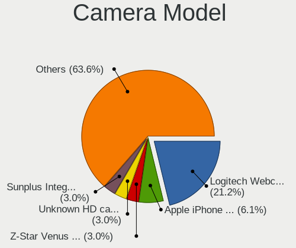

| Model                                        | Desktops | Percent |
|----------------------------------------------|----------|---------|
| Logitech Webcam C270                         | 7        | 21.88%  |
| Microdia USB 2.0 Camera                      | 2        | 6.25%   |
| Apple iPhone 5/5C/5S/6/SE/7/8/X              | 2        | 6.25%   |
| Z-Star Venus USB2.0 Camera                   | 1        | 3.13%   |
| Sunplus MTD Camera                           | 1        | 3.13%   |
| Microsoft LifeCam VX-2000                    | 1        | 3.13%   |
| Microsoft LifeCam HD-3000                    | 1        | 3.13%   |
| Microdia Integrated Camera                   | 1        | 3.13%   |
| Logitech Webcam C930e                        | 1        | 3.13%   |
| Logitech Webcam C170                         | 1        | 3.13%   |
| Logitech QuickCam Pro for Notebooks          | 1        | 3.13%   |
| Logitech QuickCam Pro 9000                   | 1        | 3.13%   |
| Logitech QuickCam Deluxe for Notebooks       | 1        | 3.13%   |
| Logitech HD Webcam C525                      | 1        | 3.13%   |
| Logitech HD Pro Webcam C920                  | 1        | 3.13%   |
| KYE Systems (Mouse Systems) Genius iSlim 330 | 1        | 3.13%   |
| Jieli USB PHY 2.0                            | 1        | 3.13%   |
| IMC Networks XHC Camera                      | 1        | 3.13%   |
| Creative Live! Cam Video IM Pro              | 1        | 3.13%   |
| Creative Live! Cam Chat HD [VF0700/VF0790]   | 1        | 3.13%   |
| Chicony Gateway Webcam                       | 1        | 3.13%   |
| Aveo UVC camera (Bresser microscope)         | 1        | 3.13%   |
| ARC International Camera                     | 1        | 3.13%   |
| Alcor Micro USB 2.0 Camera                   | 1        | 3.13%   |

Security
--------

Fingerprint Vendor
------------------

Fingerprint sensor vendors

Zero info for selected period =(

Fingerprint Model
-----------------

Fingerprint sensor models

Zero info for selected period =(

Chipcard Vendor
---------------

Chipcard module vendors

| Vendor              | Desktops | Percent |
|---------------------|----------|---------|
| Chicony Electronics | 1        | 100%    |

Chipcard Model
--------------

Chipcard module models

| Model                                                | Desktops | Percent |
|------------------------------------------------------|----------|---------|
| Chicony Electronics HP Skylab USB Smartcard Keyboard | 1        | 100%    |

Unsupported
-----------

Unsupported Devices
-------------------

Total unsupported devices on board

| Total | Desktops | Percent |
|-------|----------|---------|
| 0     | 234      | 87.97%  |
| 1     | 26       | 9.77%   |
| 2     | 5        | 1.88%   |
| 4     | 1        | 0.38%   |

Unsupported Device Types
------------------------

Types of unsupported devices

| Type                     | Desktops | Percent |
|--------------------------|----------|---------|
| Graphics card            | 13       | 35.14%  |
| Communication controller | 6        | 16.22%  |
| Net/wireless             | 4        | 10.81%  |
| Unassigned class         | 3        | 8.11%   |
| Network                  | 3        | 8.11%   |
| Sound                    | 2        | 5.41%   |
| Multimedia controller    | 2        | 5.41%   |
| Tv card                  | 1        | 2.7%    |
| Storage/ata              | 1        | 2.7%    |
| Net/ethernet             | 1        | 2.7%    |
| Firewire controller      | 1        | 2.7%    |

