Ubuntu MATE 20.04 - Tested Hardware & Statistics (Notebooks)
------------------------------------------------------------

A project to collect tested hardware configurations for Ubuntu MATE 20.04.

Anyone can contribute to this report by the [hw-probe](https://github.com/linuxhw/hw-probe) tool:

    sudo -E hw-probe -all -upload

Please submit a probe of your configuration if it's not presented on the page or is rare.

Full-feature report is available here: https://linux-hardware.org/?view=trends

Contents
--------

* [ Test Cases ](#test-cases)

* [ System ](#system)
  - [ Kernel                   ](#kernel)
  - [ Kernel Family            ](#kernel-family)
  - [ Kernel Major Ver.        ](#kernel-major-ver)
  - [ Arch                     ](#arch)
  - [ DE                       ](#de)
  - [ Display Server           ](#display-server)
  - [ Display Manager          ](#display-manager)
  - [ OS Lang                  ](#os-lang)
  - [ Boot Mode                ](#boot-mode)
  - [ Filesystem               ](#filesystem)
  - [ Part. scheme             ](#part-scheme)
  - [ Dual Boot with Linux/BSD ](#dual-boot-with-linuxbsd)
  - [ Dual Boot (Win)          ](#dual-boot-win)

* [ Board ](#board)
  - [ Vendor                   ](#vendor)
  - [ Model                    ](#model)
  - [ Model Family             ](#model-family)
  - [ MFG Year                 ](#mfg-year)
  - [ Form Factor              ](#form-factor)
  - [ Secure Boot              ](#secure-boot)
  - [ Coreboot                 ](#coreboot)
  - [ RAM Size                 ](#ram-size)
  - [ RAM Used                 ](#ram-used)
  - [ Total Drives             ](#total-drives)
  - [ Has CD-ROM               ](#has-cd-rom)
  - [ Has Ethernet             ](#has-ethernet)
  - [ Has WiFi                 ](#has-wifi)
  - [ Has Bluetooth            ](#has-bluetooth)

* [ Location ](#location)
  - [ Country                  ](#country)
  - [ City                     ](#city)

* [ Drives ](#drives)
  - [ Drive Vendor             ](#drive-vendor)
  - [ Drive Model              ](#drive-model)
  - [ HDD Vendor               ](#hdd-vendor)
  - [ SSD Vendor               ](#ssd-vendor)
  - [ Drive Kind               ](#drive-kind)
  - [ Drive Connector          ](#drive-connector)
  - [ Drive Size               ](#drive-size)
  - [ Space Total              ](#space-total)
  - [ Space Used               ](#space-used)
  - [ Malfunc. Drives          ](#malfunc-drives)
  - [ Malfunc. Drive Vendor    ](#malfunc-drive-vendor)
  - [ Malfunc. HDD Vendor      ](#malfunc-hdd-vendor)
  - [ Malfunc. Drive Kind      ](#malfunc-drive-kind)
  - [ Failed Drives            ](#failed-drives)
  - [ Failed Drive Vendor      ](#failed-drive-vendor)
  - [ Drive Status             ](#drive-status)

* [ Storage controller ](#storage-controller)
  - [ Storage Vendor           ](#storage-vendor)
  - [ Storage Model            ](#storage-model)
  - [ Storage Kind             ](#storage-kind)

* [ Processor ](#processor)
  - [ CPU Vendor               ](#cpu-vendor)
  - [ CPU Model                ](#cpu-model)
  - [ CPU Model Family         ](#cpu-model-family)
  - [ CPU Cores                ](#cpu-cores)
  - [ CPU Sockets              ](#cpu-sockets)
  - [ CPU Threads              ](#cpu-threads)
  - [ CPU Op-Modes             ](#cpu-op-modes)
  - [ CPU Microcode            ](#cpu-microcode)
  - [ CPU Microarch            ](#cpu-microarch)

* [ Graphics ](#graphics)
  - [ GPU Vendor               ](#gpu-vendor)
  - [ GPU Model                ](#gpu-model)
  - [ GPU Combo                ](#gpu-combo)
  - [ GPU Driver               ](#gpu-driver)
  - [ GPU Memory               ](#gpu-memory)

* [ Monitor ](#monitor)
  - [ Monitor Vendor           ](#monitor-vendor)
  - [ Monitor Model            ](#monitor-model)
  - [ Monitor Resolution       ](#monitor-resolution)
  - [ Monitor Diagonal         ](#monitor-diagonal)
  - [ Monitor Width            ](#monitor-width)
  - [ Aspect Ratio             ](#aspect-ratio)
  - [ Monitor Area             ](#monitor-area)
  - [ Pixel Density            ](#pixel-density)
  - [ Multiple Monitors        ](#multiple-monitors)

* [ Network ](#network)
  - [ Net Controller Vendor    ](#net-controller-vendor)
  - [ Net Controller Model     ](#net-controller-model)
  - [ Wireless Vendor          ](#wireless-vendor)
  - [ Wireless Model           ](#wireless-model)
  - [ Ethernet Vendor          ](#ethernet-vendor)
  - [ Ethernet Model           ](#ethernet-model)
  - [ Net Controller Kind      ](#net-controller-kind)
  - [ Used Controller          ](#used-controller)
  - [ NICs                     ](#nics)
  - [ IPv6                     ](#ipv6)

* [ Bluetooth ](#bluetooth)
  - [ Bluetooth Vendor         ](#bluetooth-vendor)
  - [ Bluetooth Model          ](#bluetooth-model)

* [ Sound ](#sound)
  - [ Sound Vendor             ](#sound-vendor)
  - [ Sound Model              ](#sound-model)

* [ Memory ](#memory)
  - [ Memory Vendor            ](#memory-vendor)
  - [ Memory Model             ](#memory-model)
  - [ Memory Kind              ](#memory-kind)
  - [ Memory Form Factor       ](#memory-form-factor)
  - [ Memory Size              ](#memory-size)
  - [ Memory Speed             ](#memory-speed)

* [ Printers & scanners ](#printers--scanners)
  - [ Printer Vendor           ](#printer-vendor)
  - [ Printer Model            ](#printer-model)
  - [ Scanner Vendor           ](#scanner-vendor)
  - [ Scanner Model            ](#scanner-model)

* [ Camera ](#camera)
  - [ Camera Vendor            ](#camera-vendor)
  - [ Camera Model             ](#camera-model)

* [ Security ](#security)
  - [ Fingerprint Vendor       ](#fingerprint-vendor)
  - [ Fingerprint Model        ](#fingerprint-model)
  - [ Chipcard Vendor          ](#chipcard-vendor)
  - [ Chipcard Model           ](#chipcard-model)

* [ Unsupported ](#unsupported)
  - [ Unsupported Devices      ](#unsupported-devices)
  - [ Unsupported Device Types ](#unsupported-device-types)

Test Cases
----------

| Vendor        | Model                       | Probe                                                      | Date         |
|---------------|-----------------------------|------------------------------------------------------------|--------------|
| Lenovo        | Flex 2-14 20404             | [1ddb6e11fb](https://linux-hardware.org/?probe=1ddb6e11fb) | Jan 01, 2022 |
| Acer          | Aspire A515-43              | [82163f143b](https://linux-hardware.org/?probe=82163f143b) | Dec 29, 2021 |
| Lenovo        | ThinkPad X131e 33722VU      | [c8dc197420](https://linux-hardware.org/?probe=c8dc197420) | Dec 26, 2021 |
| Lenovo        | G580 2189                   | [843f8c04fe](https://linux-hardware.org/?probe=843f8c04fe) | Dec 21, 2021 |
| HP            | ENVY Notebook               | [69b60fabe0](https://linux-hardware.org/?probe=69b60fabe0) | Dec 15, 2021 |
| Acer          | Aspire ES1-523              | [66a8186276](https://linux-hardware.org/?probe=66a8186276) | Dec 15, 2021 |
| Unknown       | Unknown                     | [d07ab607e1](https://linux-hardware.org/?probe=d07ab607e1) | Dec 08, 2021 |
| HP            | EliteBook Folio 9480m       | [2cd39490da](https://linux-hardware.org/?probe=2cd39490da) | Dec 02, 2021 |
| Apple         | MacBookPro9,1               | [4f46a6c92a](https://linux-hardware.org/?probe=4f46a6c92a) | Dec 02, 2021 |
| Apple         | MacBookPro9,1               | [1521941a87](https://linux-hardware.org/?probe=1521941a87) | Dec 02, 2021 |
| Dell          | Latitude E6400              | [170f397883](https://linux-hardware.org/?probe=170f397883) | Dec 02, 2021 |
| HP            | EliteBook Folio 9480m       | [3b06bfa748](https://linux-hardware.org/?probe=3b06bfa748) | Dec 01, 2021 |
| TUXEDO        | InfinityBook Pro 14 Gen6    | [40a204e5f1](https://linux-hardware.org/?probe=40a204e5f1) | Nov 30, 2021 |
| Polaroid      | MP1464PR001                 | [6475eec282](https://linux-hardware.org/?probe=6475eec282) | Nov 25, 2021 |
| Polaroid      | MP1464PR001                 | [244042f0d1](https://linux-hardware.org/?probe=244042f0d1) | Nov 25, 2021 |
| HP            | EliteBook Folio 9480m       | [8b5c3b008f](https://linux-hardware.org/?probe=8b5c3b008f) | Nov 24, 2021 |
| HP            | EliteBook Folio 9480m       | [bf8ac4dc12](https://linux-hardware.org/?probe=bf8ac4dc12) | Nov 24, 2021 |
| Dell          | Precision 5560              | [aa3dbdc6bb](https://linux-hardware.org/?probe=aa3dbdc6bb) | Nov 22, 2021 |
| Acer          | TravelMate 5720             | [77b5cad080](https://linux-hardware.org/?probe=77b5cad080) | Nov 18, 2021 |
| HP            | ZBook Fury 17.3 inch G8 ... | [63f392ea8b](https://linux-hardware.org/?probe=63f392ea8b) | Nov 18, 2021 |
| Lenovo        | ThinkPad T440p 20AWS0Q30... | [3ddad52d21](https://linux-hardware.org/?probe=3ddad52d21) | Nov 16, 2021 |
| ASUSTek       | ROG Strix G513QM_G513QM     | [162531d482](https://linux-hardware.org/?probe=162531d482) | Nov 16, 2021 |
| Dell          | Vostro 5568                 | [403ef45f63](https://linux-hardware.org/?probe=403ef45f63) | Nov 15, 2021 |
| Lenovo        | ThinkPad Yoga 260 20FES2... | [e881f41269](https://linux-hardware.org/?probe=e881f41269) | Nov 14, 2021 |
| AMI           | Unknown                     | [d1cd5b09e1](https://linux-hardware.org/?probe=d1cd5b09e1) | Nov 12, 2021 |
| Toshiba       | Satellite C665              | [a136cdd51d](https://linux-hardware.org/?probe=a136cdd51d) | Nov 11, 2021 |
| HP            | ZBook 15                    | [835fb0e921](https://linux-hardware.org/?probe=835fb0e921) | Nov 10, 2021 |
| Lenovo        | ThinkBook 16p Gen 2 20YM    | [c8b67f9143](https://linux-hardware.org/?probe=c8b67f9143) | Nov 08, 2021 |
| GPD           | P2 MAX                      | [9adb3fd2eb](https://linux-hardware.org/?probe=9adb3fd2eb) | Nov 02, 2021 |
| ASUSTek       | VivoBook 12_ASUS Laptop ... | [10e9f4b604](https://linux-hardware.org/?probe=10e9f4b604) | Oct 27, 2021 |
| Dell          | Precision 7520              | [83df635945](https://linux-hardware.org/?probe=83df635945) | Oct 26, 2021 |
| HP            | Pavilion Notebook           | [cd2454732b](https://linux-hardware.org/?probe=cd2454732b) | Oct 25, 2021 |
| Lenovo        | ThinkPad L512 2598A59       | [0bc832bd49](https://linux-hardware.org/?probe=0bc832bd49) | Oct 19, 2021 |
| Lenovo        | B570e HuronRiver Platfor... | [2bc2b5c1d6](https://linux-hardware.org/?probe=2bc2b5c1d6) | Oct 15, 2021 |
| Lenovo        | ThinkPad T440p 20AWS0Q30... | [36f407c3aa](https://linux-hardware.org/?probe=36f407c3aa) | Oct 15, 2021 |
| Lenovo        | ThinkPad T440p 20AWS0Q30... | [1b3b80e104](https://linux-hardware.org/?probe=1b3b80e104) | Oct 15, 2021 |
| Wortmann      | TERRA_MOBILE_1749           | [8917a2fc6b](https://linux-hardware.org/?probe=8917a2fc6b) | Oct 15, 2021 |
| HP            | Pavilion Laptop 15-eg0xx... | [3dfc4362d9](https://linux-hardware.org/?probe=3dfc4362d9) | Oct 14, 2021 |
| Lenovo        | IdeaPad 330-17IKB 81DM      | [b566b7f862](https://linux-hardware.org/?probe=b566b7f862) | Oct 13, 2021 |
| ASUSTek       | U36SD                       | [c426070626](https://linux-hardware.org/?probe=c426070626) | Oct 12, 2021 |
| Lenovo        | IdeaPad 3 15IIL05 81WE      | [26453872b1](https://linux-hardware.org/?probe=26453872b1) | Oct 12, 2021 |
| ASUSTek       | N43SL                       | [c5adc8860e](https://linux-hardware.org/?probe=c5adc8860e) | Oct 09, 2021 |
| Lenovo        | Z51-70 80K6                 | [219e5cd0d5](https://linux-hardware.org/?probe=219e5cd0d5) | Oct 04, 2021 |
| HP            | ProBook 455 G7              | [491cab82de](https://linux-hardware.org/?probe=491cab82de) | Sep 29, 2021 |
| HP            | ProBook 455 G7              | [04ff8f3c32](https://linux-hardware.org/?probe=04ff8f3c32) | Sep 29, 2021 |
| Dell          | Vostro 3350                 | [384af306e6](https://linux-hardware.org/?probe=384af306e6) | Sep 27, 2021 |
| Acer          | Aspire A515-43              | [523fe48a54](https://linux-hardware.org/?probe=523fe48a54) | Sep 19, 2021 |
| Teclast       | F15S                        | [b6fcd1a34d](https://linux-hardware.org/?probe=b6fcd1a34d) | Sep 13, 2021 |
| Teclast       | F15S                        | [93d4fafebd](https://linux-hardware.org/?probe=93d4fafebd) | Sep 13, 2021 |
| Dell          | Vostro 3350                 | [0fdc4bc08a](https://linux-hardware.org/?probe=0fdc4bc08a) | Sep 13, 2021 |
| Dell          | Latitude E7450              | [012bae3aa2](https://linux-hardware.org/?probe=012bae3aa2) | Sep 11, 2021 |
| ASUSTek       | Z550MA                      | [4786139b6b](https://linux-hardware.org/?probe=4786139b6b) | Sep 11, 2021 |
| Lenovo        | ThinkPad P50 20EN0006MS     | [812085deb0](https://linux-hardware.org/?probe=812085deb0) | Sep 07, 2021 |
| MSI           | CR70 2M/CX70 2OC/CX70 2O... | [5ee9ab86d7](https://linux-hardware.org/?probe=5ee9ab86d7) | Aug 31, 2021 |
| Packard Be... | EasyNote SL65               | [934368dd02](https://linux-hardware.org/?probe=934368dd02) | Aug 20, 2021 |
| Lenovo        | ThinkPad T420 4180PA9       | [17b9828f96](https://linux-hardware.org/?probe=17b9828f96) | Aug 19, 2021 |
| ASUSTek       | X556UAK                     | [70e369f2ba](https://linux-hardware.org/?probe=70e369f2ba) | Aug 19, 2021 |
| Acer          | Extensa 5630                | [f32dfbfe2a](https://linux-hardware.org/?probe=f32dfbfe2a) | Aug 15, 2021 |
| HP            | Notebook                    | [be1a21a391](https://linux-hardware.org/?probe=be1a21a391) | Aug 14, 2021 |
| Chuwi         | GemiBook Pro                | [0ffe99b73b](https://linux-hardware.org/?probe=0ffe99b73b) | Aug 14, 2021 |
| ASUSTek       | X556UAK                     | [399d9ceec5](https://linux-hardware.org/?probe=399d9ceec5) | Aug 06, 2021 |
| Intel         | AMI                         | [c11ff5c3a9](https://linux-hardware.org/?probe=c11ff5c3a9) | Aug 06, 2021 |
| Intel         | AMI                         | [bfe9befd10](https://linux-hardware.org/?probe=bfe9befd10) | Aug 05, 2021 |
| Lenovo        | ThinkPad T430s 2356CTO      | [f3d9dd3c21](https://linux-hardware.org/?probe=f3d9dd3c21) | Jul 31, 2021 |
| Acer          | Aspire E1-571               | [561ec14e6b](https://linux-hardware.org/?probe=561ec14e6b) | Jul 25, 2021 |
| Acer          | Aspire E1-571               | [068e66bfae](https://linux-hardware.org/?probe=068e66bfae) | Jul 25, 2021 |
| Samsung       | 350V5C/351V5C/3540VC/344... | [49be4c6d59](https://linux-hardware.org/?probe=49be4c6d59) | Jul 23, 2021 |
| Toshiba       | Satellite C660              | [d80d4d487b](https://linux-hardware.org/?probe=d80d4d487b) | Jul 22, 2021 |
| Lenovo        | Legion Y530-15ICH 81FV      | [1cd948b8e0](https://linux-hardware.org/?probe=1cd948b8e0) | Jul 19, 2021 |
| Dell          | Studio 1558                 | [d1fad8f698](https://linux-hardware.org/?probe=d1fad8f698) | Jul 16, 2021 |
| Lenovo        | ThinkPad W520 4284HP9       | [9f00795579](https://linux-hardware.org/?probe=9f00795579) | Jul 15, 2021 |
| HP            | Laptop 15s-eq1xxx           | [89a5013659](https://linux-hardware.org/?probe=89a5013659) | Jul 09, 2021 |
| Lenovo        | ThinkPad E15 20RES31K00     | [6d359d339e](https://linux-hardware.org/?probe=6d359d339e) | Jul 02, 2021 |
| Dell          | Inspiron 15 7000 Gaming     | [90235ac63a](https://linux-hardware.org/?probe=90235ac63a) | Jun 30, 2021 |
| HP            | EliteBook 2170p             | [212819389c](https://linux-hardware.org/?probe=212819389c) | Jun 25, 2021 |
| HP            | Pavilion dv7                | [590ba6b3a3](https://linux-hardware.org/?probe=590ba6b3a3) | Jun 23, 2021 |
| Dell          | Latitude E6400              | [547126dd82](https://linux-hardware.org/?probe=547126dd82) | Jun 20, 2021 |
| Dell          | Latitude E6510              | [ee7157e97d](https://linux-hardware.org/?probe=ee7157e97d) | Jun 11, 2021 |
| ASUSTek       | K73SJ                       | [cb0f042995](https://linux-hardware.org/?probe=cb0f042995) | Jun 04, 2021 |
| Dell          | Latitude 7420               | [f417016cf6](https://linux-hardware.org/?probe=f417016cf6) | Jun 04, 2021 |
| HP            | Pavilion Laptop 15-cs3xx... | [59df1ed0f5](https://linux-hardware.org/?probe=59df1ed0f5) | Jun 03, 2021 |
| HP            | Pavilion                    | [1fa0cb66b1](https://linux-hardware.org/?probe=1fa0cb66b1) | May 26, 2021 |
| Dell          | Precision M4800             | [a85ce8a041](https://linux-hardware.org/?probe=a85ce8a041) | May 24, 2021 |
| Dell          | Precision M4800             | [fd49c10a9f](https://linux-hardware.org/?probe=fd49c10a9f) | May 24, 2021 |
| Lenovo        | ThinkPad X230 23253Z5       | [0af5f89b23](https://linux-hardware.org/?probe=0af5f89b23) | May 22, 2021 |
| Unknown       | Unknown                     | [e9dc8181d8](https://linux-hardware.org/?probe=e9dc8181d8) | May 20, 2021 |
| Toshiba       | Satellite C675              | [5225757c73](https://linux-hardware.org/?probe=5225757c73) | May 19, 2021 |
| HP            | Pavilion Laptop 15-cs3xx... | [96c336b648](https://linux-hardware.org/?probe=96c336b648) | May 15, 2021 |
| Lenovo        | ThinkPad E520 11433KG       | [336659ac3a](https://linux-hardware.org/?probe=336659ac3a) | May 15, 2021 |
| Wortmann      | TERRA_MOBILE_1749           | [47e02d3203](https://linux-hardware.org/?probe=47e02d3203) | May 14, 2021 |
| Toshiba       | Satellite Pro C660          | [d4ed145cfd](https://linux-hardware.org/?probe=d4ed145cfd) | May 14, 2021 |
| Dell          | G7 7588                     | [8ae4bf0bf2](https://linux-hardware.org/?probe=8ae4bf0bf2) | May 10, 2021 |
| HP            | Pavilion                    | [ade11f7a65](https://linux-hardware.org/?probe=ade11f7a65) | May 08, 2021 |
| Cube          | i18-L                       | [77cd23575f](https://linux-hardware.org/?probe=77cd23575f) | May 07, 2021 |
| HP            | Pavilion                    | [e874b8bf1c](https://linux-hardware.org/?probe=e874b8bf1c) | May 04, 2021 |
| ASUSTek       | VivoBook_ASUSLaptop X412... | [90d1b76313](https://linux-hardware.org/?probe=90d1b76313) | May 04, 2021 |
| Lenovo        | ThinkPad X201 Tablet 309... | [66c2a37fb9](https://linux-hardware.org/?probe=66c2a37fb9) | May 01, 2021 |
| Lenovo        | ThinkPad X201 Tablet 309... | [30c34c8c01](https://linux-hardware.org/?probe=30c34c8c01) | May 01, 2021 |
| Dell          | G7 7588                     | [1393a855bb](https://linux-hardware.org/?probe=1393a855bb) | Apr 25, 2021 |
| ONE-NETBOO... | A1                          | [86c38b0aca](https://linux-hardware.org/?probe=86c38b0aca) | Apr 23, 2021 |
| Samsung       | 300E4A/300E5A/300E7A/343... | [3835eff7c6](https://linux-hardware.org/?probe=3835eff7c6) | Apr 21, 2021 |
| Dell          | Inspiron 3480               | [75f43079fb](https://linux-hardware.org/?probe=75f43079fb) | Apr 13, 2021 |
| Dell          | Inspiron 3480               | [dce5f8220a](https://linux-hardware.org/?probe=dce5f8220a) | Apr 13, 2021 |
| ASUSTek       | ZenBook UX431DA_UM431DA     | [fb0db0afbd](https://linux-hardware.org/?probe=fb0db0afbd) | Apr 13, 2021 |
| ASUSTek       | ZenBook UX431DA_UM431DA     | [236be7c7e7](https://linux-hardware.org/?probe=236be7c7e7) | Apr 12, 2021 |
| HP            | Pavilion dv6                | [bf634bb665](https://linux-hardware.org/?probe=bf634bb665) | Apr 09, 2021 |
| HP            | 15                          | [acc9ccddfa](https://linux-hardware.org/?probe=acc9ccddfa) | Apr 08, 2021 |
| HP            | ProBook 4530s               | [12a7784eb4](https://linux-hardware.org/?probe=12a7784eb4) | Apr 06, 2021 |
| Lenovo        | ThinkPad T480 20L5CTO1WW    | [fa8acecaa2](https://linux-hardware.org/?probe=fa8acecaa2) | Apr 01, 2021 |
| Dell          | Latitude E7250              | [d88e8eb416](https://linux-hardware.org/?probe=d88e8eb416) | Mar 31, 2021 |
| Lenovo        | Legion Y530-15ICH 81FV      | [2d68f9ad7f](https://linux-hardware.org/?probe=2d68f9ad7f) | Mar 31, 2021 |
| Dell          | Latitude 7310               | [9f4c2f64a5](https://linux-hardware.org/?probe=9f4c2f64a5) | Mar 30, 2021 |
| Dell          | Latitude E7250              | [d1716d96f2](https://linux-hardware.org/?probe=d1716d96f2) | Mar 28, 2021 |
| HP            | Pavilion Laptop 15-eh0xx... | [dc5e67af5a](https://linux-hardware.org/?probe=dc5e67af5a) | Mar 27, 2021 |
| Acer          | Aspire 4740                 | [3551944dd9](https://linux-hardware.org/?probe=3551944dd9) | Mar 25, 2021 |
| Samsung       | 760XBE                      | [3cacabef7b](https://linux-hardware.org/?probe=3cacabef7b) | Mar 23, 2021 |
| Lenovo        | IdeaPad 110-17IKB 80VK      | [92bcacad15](https://linux-hardware.org/?probe=92bcacad15) | Mar 22, 2021 |
| Samsung       | 760XBE                      | [26e28d0645](https://linux-hardware.org/?probe=26e28d0645) | Mar 21, 2021 |
| ASUSTek       | K50IE                       | [cc01498ee9](https://linux-hardware.org/?probe=cc01498ee9) | Mar 18, 2021 |
| MSI           | GF63 Thin 9SCSR             | [f58ddcc3f4](https://linux-hardware.org/?probe=f58ddcc3f4) | Mar 17, 2021 |
| Acer          | Aspire A515-56              | [1919b6a57f](https://linux-hardware.org/?probe=1919b6a57f) | Mar 17, 2021 |
| HP            | Pavilion g7                 | [cc361e0dbf](https://linux-hardware.org/?probe=cc361e0dbf) | Mar 04, 2021 |
| Toshiba       | Satellite L350D             | [0286dc8c95](https://linux-hardware.org/?probe=0286dc8c95) | Mar 02, 2021 |
| HP            | Pavilion g7                 | [6d79297a65](https://linux-hardware.org/?probe=6d79297a65) | Feb 26, 2021 |
| HP            | Pavilion g7                 | [41d55a3dd7](https://linux-hardware.org/?probe=41d55a3dd7) | Feb 26, 2021 |
| Dell          | Precision M4800             | [45c92f0ad1](https://linux-hardware.org/?probe=45c92f0ad1) | Feb 22, 2021 |
| Lenovo        | IdeaPad 320-15AST 80XV      | [5bd6c548d2](https://linux-hardware.org/?probe=5bd6c548d2) | Feb 15, 2021 |
| Positivo      | N8X0EK1                     | [c6ac8d6eca](https://linux-hardware.org/?probe=c6ac8d6eca) | Feb 15, 2021 |
| Dell          | Latitude E6500              | [75d199bcfd](https://linux-hardware.org/?probe=75d199bcfd) | Feb 12, 2021 |
| Dell          | Studio 1747                 | [4ca3a3577f](https://linux-hardware.org/?probe=4ca3a3577f) | Feb 11, 2021 |
| MSI           | GE60 2OC\2OD\2OE            | [952ca96633](https://linux-hardware.org/?probe=952ca96633) | Feb 09, 2021 |
| Notebook      | W310CZ/CZ-T                 | [2b60fc9e91](https://linux-hardware.org/?probe=2b60fc9e91) | Feb 09, 2021 |
| Acer          | Aspire ES1-521              | [73b3295031](https://linux-hardware.org/?probe=73b3295031) | Jan 29, 2021 |
| Dell          | G7 7588                     | [ae6d47978a](https://linux-hardware.org/?probe=ae6d47978a) | Jan 28, 2021 |
| Dell          | G7 7588                     | [1006977f89](https://linux-hardware.org/?probe=1006977f89) | Jan 28, 2021 |
| Lenovo        | ThinkPad W520 4284HP9       | [4cae7dc78d](https://linux-hardware.org/?probe=4cae7dc78d) | Jan 18, 2021 |
| HP            | 250 G5 Notebook PC          | [f2e3b573f5](https://linux-hardware.org/?probe=f2e3b573f5) | Jan 16, 2021 |
| Lenovo        | ThinkPad E490 20N9001SBR    | [e8b3cf2cbd](https://linux-hardware.org/?probe=e8b3cf2cbd) | Jan 14, 2021 |
| Lenovo        | ThinkPad E490 20N9001SBR    | [8117aff9b0](https://linux-hardware.org/?probe=8117aff9b0) | Jan 14, 2021 |
| Medion        | X682X                       | [bf7dbceaa3](https://linux-hardware.org/?probe=bf7dbceaa3) | Jan 13, 2021 |
| Dell          | XPS 13 9370                 | [1b3b03be98](https://linux-hardware.org/?probe=1b3b03be98) | Jan 07, 2021 |
| HP            | 255 G7 Notebook PC          | [4f385a65db](https://linux-hardware.org/?probe=4f385a65db) | Jan 03, 2021 |
| Samsung       | SR58P                       | [efbf027f96](https://linux-hardware.org/?probe=efbf027f96) | Jan 03, 2021 |
| HP            | Pavilion Laptop 15-cw1xx... | [e253bc608d](https://linux-hardware.org/?probe=e253bc608d) | Jan 03, 2021 |
| Lenovo        | ThinkPad X1 Extreme 2nd ... | [1483935c23](https://linux-hardware.org/?probe=1483935c23) | Jan 02, 2021 |
| Acer          | Aspire E1-532P              | [a1f1287741](https://linux-hardware.org/?probe=a1f1287741) | Jan 02, 2021 |
| Lenovo        | ThinkPad X1 Carbon 3rd 2... | [30041ef295](https://linux-hardware.org/?probe=30041ef295) | Jan 01, 2021 |
| Lenovo        | ThinkPad E560 20EV000UUK    | [c38d67b61b](https://linux-hardware.org/?probe=c38d67b61b) | Dec 30, 2020 |
| HP            | Notebook                    | [cf3a2917d1](https://linux-hardware.org/?probe=cf3a2917d1) | Dec 28, 2020 |
| Lenovo        | ThinkPad X250 20CLA32VLM    | [cfa92bb7f3](https://linux-hardware.org/?probe=cfa92bb7f3) | Dec 28, 2020 |
| ASUSTek       | X302LA                      | [f5dde37fb9](https://linux-hardware.org/?probe=f5dde37fb9) | Dec 26, 2020 |
| ASUSTek       | X302LA                      | [a35e9f4b28](https://linux-hardware.org/?probe=a35e9f4b28) | Dec 25, 2020 |
| Star Labs     | LabTop                      | [b8c8467e92](https://linux-hardware.org/?probe=b8c8467e92) | Dec 20, 2020 |
| Toshiba       | Satellite Pro L500          | [d01d9e0d34](https://linux-hardware.org/?probe=d01d9e0d34) | Dec 08, 2020 |
| Dell          | Inspiron 3520               | [be6f5d9f85](https://linux-hardware.org/?probe=be6f5d9f85) | Dec 07, 2020 |
| Dell          | Latitude D630               | [475177f3da](https://linux-hardware.org/?probe=475177f3da) | Dec 07, 2020 |
| Notebook      | W54_W94_W955TU,-T,-C        | [5862508036](https://linux-hardware.org/?probe=5862508036) | Dec 06, 2020 |
| HP            | Pavilion 17                 | [2f04deaf4e](https://linux-hardware.org/?probe=2f04deaf4e) | Dec 03, 2020 |
| Lenovo        | IdeaPad Slim 1-14AST-05 ... | [ee0aa7b52f](https://linux-hardware.org/?probe=ee0aa7b52f) | Dec 02, 2020 |
| Dell          | Precision 7710              | [f017e7a0d2](https://linux-hardware.org/?probe=f017e7a0d2) | Nov 30, 2020 |
| Acer          | Aspire E5-523               | [cfd9403111](https://linux-hardware.org/?probe=cfd9403111) | Nov 29, 2020 |
| Lenovo        | ThinkPad X1 Carbon 3rd 2... | [7249400d79](https://linux-hardware.org/?probe=7249400d79) | Nov 29, 2020 |
| Dell          | Latitude E6400              | [a39e2e7fa3](https://linux-hardware.org/?probe=a39e2e7fa3) | Nov 27, 2020 |
| ASUSTek       | VivoBook_ASUSLaptop X512... | [833a22d4ee](https://linux-hardware.org/?probe=833a22d4ee) | Nov 20, 2020 |
| HP            | EliteBook 830 G6            | [c47a2f5f86](https://linux-hardware.org/?probe=c47a2f5f86) | Nov 18, 2020 |
| Pine Micro... | Pine64 Pinebook Pro         | [08c8440950](https://linux-hardware.org/?probe=08c8440950) | Nov 17, 2020 |
| Lenovo        | ThinkPad T440 20B7S2E401    | [968f302807](https://linux-hardware.org/?probe=968f302807) | Nov 17, 2020 |
| Lenovo        | ThinkPad T440 20B7S2E401    | [2a9231cde8](https://linux-hardware.org/?probe=2a9231cde8) | Nov 17, 2020 |
| Lenovo        | Legion Y540-15IRH-PG0 81... | [b8e7eedfed](https://linux-hardware.org/?probe=b8e7eedfed) | Nov 17, 2020 |
| Dell          | Latitude E6420              | [3452613a4c](https://linux-hardware.org/?probe=3452613a4c) | Nov 16, 2020 |
| HP            | 255 G7 Notebook PC          | [153a36bfa0](https://linux-hardware.org/?probe=153a36bfa0) | Nov 14, 2020 |
| Lenovo        | Yoga 3 Pro-1370 80HE        | [d7abac1c02](https://linux-hardware.org/?probe=d7abac1c02) | Nov 07, 2020 |
| HP            | EliteBook Folio 9470m       | [659c1c8745](https://linux-hardware.org/?probe=659c1c8745) | Nov 06, 2020 |
| HP            | EliteBook Folio 9470m       | [248ce84271](https://linux-hardware.org/?probe=248ce84271) | Nov 05, 2020 |
| Dell          | Latitude E6420              | [6cdd815251](https://linux-hardware.org/?probe=6cdd815251) | Nov 04, 2020 |
| Dell          | Latitude E6420              | [10d44f2853](https://linux-hardware.org/?probe=10d44f2853) | Nov 04, 2020 |
| Acer          | Aspire A314-32              | [686d0b8c4f](https://linux-hardware.org/?probe=686d0b8c4f) | Nov 03, 2020 |
| Dell          | Latitude E6430              | [39ba29b6a3](https://linux-hardware.org/?probe=39ba29b6a3) | Nov 02, 2020 |
| Notebook      | W54_W94_W955TU,-T,-C        | [d9a9dae79a](https://linux-hardware.org/?probe=d9a9dae79a) | Oct 31, 2020 |
| Lenovo        | ThinkPad E520 1143B5G       | [146fc730d7](https://linux-hardware.org/?probe=146fc730d7) | Oct 29, 2020 |
| MSI           | GE72 7RE                    | [f75b251f96](https://linux-hardware.org/?probe=f75b251f96) | Oct 29, 2020 |
| Acer          | Aspire 5715Z                | [a2fca6b9da](https://linux-hardware.org/?probe=a2fca6b9da) | Oct 26, 2020 |
| Lenovo        | V570 HuronRiver Platform    | [62082c183e](https://linux-hardware.org/?probe=62082c183e) | Oct 26, 2020 |
| ASUSTek       | X751LK                      | [0dad6a22c5](https://linux-hardware.org/?probe=0dad6a22c5) | Oct 26, 2020 |
| HP            | Pavilion dv7                | [59e2fce913](https://linux-hardware.org/?probe=59e2fce913) | Oct 26, 2020 |
| Dell          | Precision M4800             | [2f91204b5e](https://linux-hardware.org/?probe=2f91204b5e) | Oct 26, 2020 |
| HP            | 255 G7 Notebook PC          | [fd598f0888](https://linux-hardware.org/?probe=fd598f0888) | Oct 25, 2020 |
| HP            | 255 G7 Notebook PC          | [07f3bdda40](https://linux-hardware.org/?probe=07f3bdda40) | Oct 25, 2020 |
| Dell          | G3 3590                     | [3e9d16279b](https://linux-hardware.org/?probe=3e9d16279b) | Oct 21, 2020 |
| Lenovo        | ThinkPad E560 20EV0013MS    | [6a0824824b](https://linux-hardware.org/?probe=6a0824824b) | Oct 20, 2020 |
| Dell          | Latitude E6430              | [67b44ea2b4](https://linux-hardware.org/?probe=67b44ea2b4) | Oct 20, 2020 |
| HP            | Compaq 6730s                | [b8d5fd5eea](https://linux-hardware.org/?probe=b8d5fd5eea) | Oct 19, 2020 |
| HP            | Notebook                    | [669e2e8ce6](https://linux-hardware.org/?probe=669e2e8ce6) | Oct 19, 2020 |
| Lenovo        | G50-80 80R0                 | [51ec4152a2](https://linux-hardware.org/?probe=51ec4152a2) | Oct 19, 2020 |
| ASUSTek       | VivoBook_ASUSLaptop X512... | [c45c0eb7e4](https://linux-hardware.org/?probe=c45c0eb7e4) | Oct 16, 2020 |
| HP            | ProBook 4430s               | [c816b204bf](https://linux-hardware.org/?probe=c816b204bf) | Oct 15, 2020 |
| Lenovo        | ThinkPad X270 20HN0013MX    | [3dbb81e06d](https://linux-hardware.org/?probe=3dbb81e06d) | Oct 14, 2020 |
| Dell          | Latitude E6420              | [1e2a1974f2](https://linux-hardware.org/?probe=1e2a1974f2) | Oct 08, 2020 |
| Lenovo        | IdeaPad S530-13IWL 81J7     | [01948526e2](https://linux-hardware.org/?probe=01948526e2) | Oct 08, 2020 |
| Acer          | Aspire 5715Z                | [e112fe04f3](https://linux-hardware.org/?probe=e112fe04f3) | Oct 08, 2020 |
| Medion        | E15302                      | [957a41b1b5](https://linux-hardware.org/?probe=957a41b1b5) | Oct 07, 2020 |
| Lenovo        | ThinkPad X1 Carbon 6th 2... | [28bab55cdf](https://linux-hardware.org/?probe=28bab55cdf) | Oct 02, 2020 |
| Lenovo        | ThinkPad X230 2325W5W       | [e2a36190d7](https://linux-hardware.org/?probe=e2a36190d7) | Oct 02, 2020 |
| Acer          | Aspire A314-32              | [a51d2f268d](https://linux-hardware.org/?probe=a51d2f268d) | Oct 02, 2020 |
| System76      | Serval WS                   | [7add8e6511](https://linux-hardware.org/?probe=7add8e6511) | Sep 25, 2020 |
| Dell          | Precision M6700             | [1b20609aaa](https://linux-hardware.org/?probe=1b20609aaa) | Sep 25, 2020 |
| HP            | ProBook 440 G5              | [3140b90a75](https://linux-hardware.org/?probe=3140b90a75) | Sep 24, 2020 |
| Apple         | MacBook4,1                  | [91c2f7bfb9](https://linux-hardware.org/?probe=91c2f7bfb9) | Sep 20, 2020 |
| Dell          | Latitude E6410              | [6fa6138bb4](https://linux-hardware.org/?probe=6fa6138bb4) | Sep 18, 2020 |
| Dell          | Latitude E6410              | [8a3b88673f](https://linux-hardware.org/?probe=8a3b88673f) | Sep 17, 2020 |
| Lenovo        | ThinkPad L430 24681R3       | [a96ad52bc9](https://linux-hardware.org/?probe=a96ad52bc9) | Sep 16, 2020 |
| Dell          | Latitude E6410              | [8930b7e16f](https://linux-hardware.org/?probe=8930b7e16f) | Sep 16, 2020 |
| HP            | EliteBook 8470p             | [299b899172](https://linux-hardware.org/?probe=299b899172) | Sep 16, 2020 |
| HP            | EliteBook 8470p             | [b45cb0028d](https://linux-hardware.org/?probe=b45cb0028d) | Sep 16, 2020 |
| HP            | Compaq 8710w (GC124EA#AK... | [dc5006e254](https://linux-hardware.org/?probe=dc5006e254) | Sep 15, 2020 |
| Apple         | MacBook4,1                  | [092f9a6491](https://linux-hardware.org/?probe=092f9a6491) | Sep 15, 2020 |
| HP            | G42                         | [9cb42d6f5f](https://linux-hardware.org/?probe=9cb42d6f5f) | Sep 15, 2020 |
| HP            | G42                         | [72d647e1b9](https://linux-hardware.org/?probe=72d647e1b9) | Sep 15, 2020 |
| Lenovo        | ThinkPad T495 20NJCTO1WW    | [956bfaaad9](https://linux-hardware.org/?probe=956bfaaad9) | Sep 11, 2020 |
| Acer          | Aspire A315-42G             | [ab24b14a42](https://linux-hardware.org/?probe=ab24b14a42) | Sep 09, 2020 |
| Samsung       | 530U4E/540U4E               | [31a023d519](https://linux-hardware.org/?probe=31a023d519) | Sep 06, 2020 |
| Samsung       | 530U4E/540U4E               | [d94a252a6f](https://linux-hardware.org/?probe=d94a252a6f) | Sep 06, 2020 |
| Dell          | Latitude E6420              | [e3bc793dc3](https://linux-hardware.org/?probe=e3bc793dc3) | Sep 03, 2020 |
| Dell          | Latitude E6420              | [676828b4d4](https://linux-hardware.org/?probe=676828b4d4) | Sep 03, 2020 |
| Dell          | Latitude E6420              | [6057658605](https://linux-hardware.org/?probe=6057658605) | Sep 01, 2020 |
| Dell          | Latitude E6420              | [9b1f1928c7](https://linux-hardware.org/?probe=9b1f1928c7) | Sep 01, 2020 |
| Positivo      | Mobile                      | [2249764f28](https://linux-hardware.org/?probe=2249764f28) | Aug 30, 2020 |
| HP            | Laptop 15-bw0xx             | [cae373d70b](https://linux-hardware.org/?probe=cae373d70b) | Aug 30, 2020 |
| HP            | Laptop 15-bw0xx             | [c77cf6f3fa](https://linux-hardware.org/?probe=c77cf6f3fa) | Aug 30, 2020 |
| Toshiba       | Satellite M500              | [42449081bb](https://linux-hardware.org/?probe=42449081bb) | Aug 29, 2020 |
| HP            | 250 G4 Notebook PC          | [97eeff2c12](https://linux-hardware.org/?probe=97eeff2c12) | Aug 22, 2020 |
| Lenovo        | ThinkPad W530 24478K0       | [74fda860f1](https://linux-hardware.org/?probe=74fda860f1) | Aug 17, 2020 |
| HP            | ZBook 14u G6                | [ad30c07ac3](https://linux-hardware.org/?probe=ad30c07ac3) | Aug 17, 2020 |
| HP            | ZBook 14u G6                | [5ffb6aaedb](https://linux-hardware.org/?probe=5ffb6aaedb) | Aug 17, 2020 |
| MSI           | GP72MVR 7RFX                | [39da2f58b5](https://linux-hardware.org/?probe=39da2f58b5) | Aug 16, 2020 |
| Dell          | Inspiron 7559               | [021ed0aac6](https://linux-hardware.org/?probe=021ed0aac6) | Aug 16, 2020 |
| Lenovo        | IdeaPad Slim 1-14AST-05 ... | [0e5e076914](https://linux-hardware.org/?probe=0e5e076914) | Aug 15, 2020 |
| GPD           | MicroPC                     | [bb39ae1b31](https://linux-hardware.org/?probe=bb39ae1b31) | Aug 15, 2020 |
| Sony          | VPCEH1S1E                   | [10c3c1d9d0](https://linux-hardware.org/?probe=10c3c1d9d0) | Aug 13, 2020 |
| Lenovo        | IdeaPad 330-15ARR 81D2      | [3e086d75b0](https://linux-hardware.org/?probe=3e086d75b0) | Aug 12, 2020 |
| Lenovo        | IdeaPad 330-15ARR 81D2      | [ab576b0cd8](https://linux-hardware.org/?probe=ab576b0cd8) | Aug 12, 2020 |
| ASUSTek       | X71SL                       | [f2da7fe3f0](https://linux-hardware.org/?probe=f2da7fe3f0) | Aug 12, 2020 |
| HP            | ZBook 14u G6                | [10911e8e46](https://linux-hardware.org/?probe=10911e8e46) | Aug 11, 2020 |
| HP            | Pavilion dm1                | [ccb974921b](https://linux-hardware.org/?probe=ccb974921b) | Aug 05, 2020 |
| ASUSTek       | X71SL                       | [7bfd99a9bd](https://linux-hardware.org/?probe=7bfd99a9bd) | Aug 05, 2020 |
| Dell          | XPS L702X                   | [86885b0835](https://linux-hardware.org/?probe=86885b0835) | Aug 04, 2020 |
| MSI           | GV62 8RD                    | [0b6cd63268](https://linux-hardware.org/?probe=0b6cd63268) | Aug 04, 2020 |
| Dell          | Inspiron 3421               | [09aac7d871](https://linux-hardware.org/?probe=09aac7d871) | Aug 01, 2020 |
| Dell          | Precision M4800             | [defc3ac914](https://linux-hardware.org/?probe=defc3ac914) | Aug 01, 2020 |
| Lenovo        | Flex 2-14D 20376            | [efd445830e](https://linux-hardware.org/?probe=efd445830e) | Jul 27, 2020 |
| Dell          | Inspiron 7520               | [a1ea369f96](https://linux-hardware.org/?probe=a1ea369f96) | Jul 27, 2020 |
| Dell          | Inspiron 3421               | [12424c5a76](https://linux-hardware.org/?probe=12424c5a76) | Jul 25, 2020 |
| HP            | Pavilion g4                 | [a10cfaa6e2](https://linux-hardware.org/?probe=a10cfaa6e2) | Jul 24, 2020 |
| HP            | EliteBook 2570p             | [baa26535f9](https://linux-hardware.org/?probe=baa26535f9) | Jul 23, 2020 |
| Dell          | Vostro 3560                 | [c83b65951c](https://linux-hardware.org/?probe=c83b65951c) | Jul 20, 2020 |
| HP            | ZBook 17 G2                 | [61d82db95d](https://linux-hardware.org/?probe=61d82db95d) | Jul 20, 2020 |
| ASUSTek       | ZenBook UX431DA_UM431DA     | [8e5e5de5c3](https://linux-hardware.org/?probe=8e5e5de5c3) | Jul 20, 2020 |
| HP            | 250 G5 Notebook PC          | [9577cafcf7](https://linux-hardware.org/?probe=9577cafcf7) | Jul 19, 2020 |
| Lenovo        | ThinkPad T490 20N3CTO1WW    | [b6f9682f0b](https://linux-hardware.org/?probe=b6f9682f0b) | Jul 15, 2020 |
| ASUSTek       | X555LJ                      | [5657a6a512](https://linux-hardware.org/?probe=5657a6a512) | Jul 14, 2020 |
| Dell          | G7 7588                     | [8c4a8875bd](https://linux-hardware.org/?probe=8c4a8875bd) | Jul 14, 2020 |
| Dell          | G7 7588                     | [aee8398552](https://linux-hardware.org/?probe=aee8398552) | Jul 12, 2020 |
| Sony          | VPCF1290X                   | [f7c7a3ca92](https://linux-hardware.org/?probe=f7c7a3ca92) | Jul 08, 2020 |
| Lenovo        | ThinkPad T440p 20AWS0Y80... | [f4dd6bbdec](https://linux-hardware.org/?probe=f4dd6bbdec) | Jul 06, 2020 |
| Lenovo        | ThinkPad 11e 20D9CTO1WW     | [11c17aa062](https://linux-hardware.org/?probe=11c17aa062) | Jul 05, 2020 |
| Acer          | Aspire 7750G                | [f6a31e475d](https://linux-hardware.org/?probe=f6a31e475d) | Jul 05, 2020 |
| HP            | 250 G4                      | [ca40ef5473](https://linux-hardware.org/?probe=ca40ef5473) | Jul 02, 2020 |
| HP            | Pavilion g6                 | [0175164903](https://linux-hardware.org/?probe=0175164903) | Jul 01, 2020 |
| Lenovo        | ThinkPad T440 20B7S0F100    | [561adcd20d](https://linux-hardware.org/?probe=561adcd20d) | Jun 30, 2020 |
| HP            | Pavilion g6                 | [efc97f097b](https://linux-hardware.org/?probe=efc97f097b) | Jun 28, 2020 |
| Lenovo        | ThinkPad T440p 20AWS0Y80... | [944b66e3ba](https://linux-hardware.org/?probe=944b66e3ba) | Jun 28, 2020 |
| Lenovo        | ThinkPad T440p 20AWS0Y80... | [3f58959650](https://linux-hardware.org/?probe=3f58959650) | Jun 24, 2020 |
| Lenovo        | ThinkPad T520 4243RS6       | [881175c7ec](https://linux-hardware.org/?probe=881175c7ec) | Jun 23, 2020 |
| HP            | ProBook 450 G5              | [143bbac73c](https://linux-hardware.org/?probe=143bbac73c) | Jun 23, 2020 |
| Lenovo        | ThinkPad T440p 20AWS0Y80... | [c5a7e2708f](https://linux-hardware.org/?probe=c5a7e2708f) | Jun 22, 2020 |
| Lenovo        | ThinkPad X240 qqqq          | [04328e30ac](https://linux-hardware.org/?probe=04328e30ac) | Jun 15, 2020 |
| Sony          | VPCF1290X                   | [55652dadf6](https://linux-hardware.org/?probe=55652dadf6) | Jun 15, 2020 |
| Lenovo        | ThinkPad T430 2349H86       | [5ef2ab445e](https://linux-hardware.org/?probe=5ef2ab445e) | Jun 13, 2020 |
| Lenovo        | ThinkPad L430 24681R3       | [5467542c77](https://linux-hardware.org/?probe=5467542c77) | Jun 12, 2020 |
| HP            | Pavilion g6                 | [78f5ccb141](https://linux-hardware.org/?probe=78f5ccb141) | Jun 11, 2020 |
| Acer          | Nitro AN515-54              | [4c810c7859](https://linux-hardware.org/?probe=4c810c7859) | Jun 06, 2020 |
| Lenovo        | IdeaPad 330S-14IKB 81F4     | [35995e9a53](https://linux-hardware.org/?probe=35995e9a53) | Jun 06, 2020 |
| ASUSTek       | X541SA                      | [508fc56922](https://linux-hardware.org/?probe=508fc56922) | Jun 06, 2020 |
| Lenovo        | IdeaPad 330S-14IKB 81F4     | [d6bcbe862e](https://linux-hardware.org/?probe=d6bcbe862e) | Jun 05, 2020 |
| Toshiba       | Satellite M500              | [96d989965c](https://linux-hardware.org/?probe=96d989965c) | Jun 04, 2020 |
| HP            | 250 G7 Notebook PC          | [56c24dddd4](https://linux-hardware.org/?probe=56c24dddd4) | May 31, 2020 |
| Packard Be... | EasyNote ME69BMP            | [7023dc94da](https://linux-hardware.org/?probe=7023dc94da) | May 28, 2020 |
| Dell          | Precision M6800             | [fac8dbf769](https://linux-hardware.org/?probe=fac8dbf769) | May 28, 2020 |
| Packard Be... | EasyNote ME69BMP            | [17cb4d2a9a](https://linux-hardware.org/?probe=17cb4d2a9a) | May 28, 2020 |
| Dell          | Precision M4800             | [4f404379b5](https://linux-hardware.org/?probe=4f404379b5) | May 27, 2020 |
| Lenovo        | ThinkPad T440 20B7S0F100    | [4a1413e289](https://linux-hardware.org/?probe=4a1413e289) | May 26, 2020 |
| Lenovo        | ThinkPad T480s 20L7001HM... | [8c6c9a5faa](https://linux-hardware.org/?probe=8c6c9a5faa) | May 25, 2020 |
| Toshiba       | Satellite M500              | [89bc529650](https://linux-hardware.org/?probe=89bc529650) | May 23, 2020 |
| Sony          | VPCF1290X                   | [6d41a82565](https://linux-hardware.org/?probe=6d41a82565) | May 22, 2020 |
| Sony          | VPCF1290X                   | [e260c25549](https://linux-hardware.org/?probe=e260c25549) | May 20, 2020 |
| ASUSTek       | X541SA                      | [af59d45f16](https://linux-hardware.org/?probe=af59d45f16) | May 19, 2020 |
| Dell          | Latitude E6400              | [5575a3dc87](https://linux-hardware.org/?probe=5575a3dc87) | May 17, 2020 |
| Dell          | Latitude E6400              | [4ad76f6e55](https://linux-hardware.org/?probe=4ad76f6e55) | May 16, 2020 |
| Dell          | Latitude E6400              | [7402a2d316](https://linux-hardware.org/?probe=7402a2d316) | May 16, 2020 |
| Dell          | Latitude E6400              | [9c8f7c7f2c](https://linux-hardware.org/?probe=9c8f7c7f2c) | May 16, 2020 |
| Dell          | Latitude E6400              | [491ea13111](https://linux-hardware.org/?probe=491ea13111) | May 16, 2020 |
| Dell          | Latitude E6400              | [0e2b5d699e](https://linux-hardware.org/?probe=0e2b5d699e) | May 16, 2020 |
| HP            | 250 G1                      | [bc48855d22](https://linux-hardware.org/?probe=bc48855d22) | May 16, 2020 |
| Lenovo        | ThinkPad X240 20AMS08816    | [5581eee295](https://linux-hardware.org/?probe=5581eee295) | May 10, 2020 |
| Dell          | XPS L502X                   | [f095fb06d8](https://linux-hardware.org/?probe=f095fb06d8) | May 09, 2020 |
| HP            | 250 G5 Notebook PC          | [33e1791dd6](https://linux-hardware.org/?probe=33e1791dd6) | May 06, 2020 |
| HP            | EliteBook 840 G2            | [e1602a8c0e](https://linux-hardware.org/?probe=e1602a8c0e) | May 04, 2020 |
| Samsung       | 550P5C/550P7C               | [4262f676d3](https://linux-hardware.org/?probe=4262f676d3) | May 04, 2020 |
| HP            | 255 G7 Notebook PC          | [015ef81b51](https://linux-hardware.org/?probe=015ef81b51) | May 02, 2020 |
| ASUSTek       | G73Sw                       | [d4abec1a93](https://linux-hardware.org/?probe=d4abec1a93) | May 02, 2020 |
| HP            | 250 G5 Notebook PC          | [f986b480ad](https://linux-hardware.org/?probe=f986b480ad) | May 01, 2020 |
| Dell          | Inspiron 3576               | [4dc9474ba1](https://linux-hardware.org/?probe=4dc9474ba1) | Apr 29, 2020 |
| Sony          | VPCS12X9E                   | [3631a4d89d](https://linux-hardware.org/?probe=3631a4d89d) | Apr 24, 2020 |
| Lenovo        | ThinkPad T460s 20F9003WM... | [1b1c89732c](https://linux-hardware.org/?probe=1b1c89732c) | Apr 19, 2020 |
| HP            | EliteBook 755 G5            | [db0ea12ab8](https://linux-hardware.org/?probe=db0ea12ab8) | Apr 16, 2020 |
| Dell          | XPS 13 9360                 | [9d7415c55e](https://linux-hardware.org/?probe=9d7415c55e) | Apr 04, 2020 |
| Lenovo        | IdeaPad S145-15IIL 81W8     | [154b970640](https://linux-hardware.org/?probe=154b970640) | Mar 25, 2020 |
| Lenovo        | ThinkBook 13s-IML 20RR      | [ad9b0ebdf6](https://linux-hardware.org/?probe=ad9b0ebdf6) | Feb 25, 2020 |
| Acer          | Aspire V3-574G              | [471f9aa9b0](https://linux-hardware.org/?probe=471f9aa9b0) | Jan 02, 2020 |
| MSI           | GP72 6QF                    | [98dc37dc79](https://linux-hardware.org/?probe=98dc37dc79) | Oct 21, 2019 |

System
------

Kernel
------

Version of the Linux kernel

| Version              | Notebooks | Percent |
|----------------------|-----------|---------|
| 5.4.0-42-generic     | 25        | 9.62%   |
| 5.4.0-52-generic     | 17        | 6.54%   |
| 5.4.0-47-generic     | 10        | 3.85%   |
| 5.4.0-40-generic     | 10        | 3.85%   |
| 5.4.0-58-generic     | 9         | 3.46%   |
| 5.8.0-50-generic     | 8         | 3.08%   |
| 5.4.0-48-generic     | 8         | 3.08%   |
| 5.4.0-31-generic     | 8         | 3.08%   |
| 5.4.0-65-generic     | 7         | 2.69%   |
| 5.4.0-54-generic     | 7         | 2.69%   |
| 5.11.0-40-generic    | 7         | 2.69%   |
| 5.4.0-56-generic     | 6         | 2.31%   |
| 5.4.0-45-generic     | 6         | 2.31%   |
| 5.4.0-26-generic     | 6         | 2.31%   |
| 5.8.0-59-generic     | 5         | 1.92%   |
| 5.8.0-48-generic     | 5         | 1.92%   |
| 5.8.0-43-generic     | 5         | 1.92%   |
| 5.4.0-81-generic     | 5         | 1.92%   |
| 5.4.0-37-generic     | 5         | 1.92%   |
| 5.4.0-29-generic     | 5         | 1.92%   |
| 5.11.0-38-generic    | 5         | 1.92%   |
| 5.11.0-37-generic    | 5         | 1.92%   |
| 5.8.0-53-generic     | 4         | 1.54%   |
| 5.4.0-89-generic     | 4         | 1.54%   |
| 5.4.0-51-generic     | 4         | 1.54%   |
| 5.4.0-74-generic     | 3         | 1.15%   |
| 5.4.0-73-generic     | 3         | 1.15%   |
| 5.4.0-39-generic     | 3         | 1.15%   |
| 5.4.0-33-generic     | 3         | 1.15%   |
| 5.4.0-28-generic     | 3         | 1.15%   |
| 5.11.0-43-generic    | 3         | 1.15%   |
| 5.8.0-63-generic     | 2         | 0.77%   |
| 5.8.0-45-generic     | 2         | 0.77%   |
| 5.8.0-38-generic     | 2         | 0.77%   |
| 5.4.0-91-generic     | 2         | 0.77%   |
| 5.4.0-90-generic     | 2         | 0.77%   |
| 5.4.0-80-generic     | 2         | 0.77%   |
| 5.4.0-72-generic     | 2         | 0.77%   |
| 5.4.0-70-generic     | 2         | 0.77%   |
| 5.4.0-67-generic     | 2         | 0.77%   |
| 5.4.0-66-generic     | 2         | 0.77%   |
| 5.4.0-34-generic     | 2         | 0.77%   |
| 5.4.0-14-generic     | 2         | 0.77%   |
| 5.11.0-41-generic    | 2         | 0.77%   |
| 5.9.3-050903-generic | 1         | 0.38%   |
| 5.8.17-rockchip64    | 1         | 0.38%   |
| 5.8.0-52-generic     | 1         | 0.38%   |
| 5.8.0-34-generic     | 1         | 0.38%   |
| 5.8.0-33-generic     | 1         | 0.38%   |
| 5.4.0-9-generic      | 1         | 0.38%   |
| 5.4.0-88-generic     | 1         | 0.38%   |
| 5.4.0-84-generic     | 1         | 0.38%   |
| 5.4.0-77-generic     | 1         | 0.38%   |
| 5.4.0-7642-generic   | 1         | 0.38%   |
| 5.4.0-64-generic     | 1         | 0.38%   |
| 5.4.0-62-generic     | 1         | 0.38%   |
| 5.4.0-59-generic     | 1         | 0.38%   |
| 5.4.0-58-lowlatency  | 1         | 0.38%   |
| 5.4.0-49-generic     | 1         | 0.38%   |
| 5.4.0-44-generic     | 1         | 0.38%   |

Kernel Family
-------------

Linux kernel without a distro release

| Version | Notebooks | Percent |
|---------|-----------|---------|
| 5.4.0   | 170       | 72.65%  |
| 5.8.0   | 33        | 14.1%   |
| 5.11.0  | 25        | 10.68%  |
| 5.3.0   | 2         | 0.85%   |
| 5.9.3   | 1         | 0.43%   |
| 5.8.17  | 1         | 0.43%   |
| 5.15.6  | 1         | 0.43%   |
| 5.13.0  | 1         | 0.43%   |

Kernel Major Ver.
-----------------

Linux kernel major version

| Version | Notebooks | Percent |
|---------|-----------|---------|
| 5.4     | 170       | 72.65%  |
| 5.8     | 34        | 14.53%  |
| 5.11    | 25        | 10.68%  |
| 5.3     | 2         | 0.85%   |
| 5.9     | 1         | 0.43%   |
| 5.15    | 1         | 0.43%   |
| 5.13    | 1         | 0.43%   |

Arch
----

OS architecture (x86_64, i586, etc.)

| Name    | Notebooks | Percent |
|---------|-----------|---------|
| x86_64  | 233       | 99.57%  |
| aarch64 | 1         | 0.43%   |

DE
--

Desktop Environment

| Name       | Notebooks | Percent |
|------------|-----------|---------|
| MATE       | 228       | 97.44%  |
| Cinnamon   | 2         | 0.85%   |
| X-Cinnamon | 1         | 0.43%   |
| KDE5       | 1         | 0.43%   |
| i3         | 1         | 0.43%   |
| GNOME      | 1         | 0.43%   |

Display Server
--------------

X11 or Wayland

| Name    | Notebooks | Percent |
|---------|-----------|---------|
| X11     | 228       | 97.44%  |
| Wayland | 3         | 1.28%   |
| Tty     | 3         | 1.28%   |

Display Manager
---------------

SDDM, LightDM, etc.

| Name    | Notebooks | Percent |
|---------|-----------|---------|
| TDM     | 98        | 40.83%  |
| Unknown | 71        | 29.58%  |
| LightDM | 54        | 22.5%   |
| GDM     | 14        | 5.83%   |
| GDM3    | 2         | 0.83%   |
| SDDM    | 1         | 0.42%   |

OS Lang
-------

Language

| Lang    | Notebooks | Percent |
|---------|-----------|---------|
| en_US   | 81        | 34.47%  |
| pt_BR   | 27        | 11.49%  |
| fr_FR   | 22        | 9.36%   |
| en_GB   | 16        | 6.81%   |
| de_DE   | 13        | 5.53%   |
| it_IT   | 10        | 4.26%   |
| es_ES   | 10        | 4.26%   |
| ru_RU   | 8         | 3.4%    |
| pl_PL   | 5         | 2.13%   |
| ru_UA   | 4         | 1.7%    |
| es_AR   | 4         | 1.7%    |
| C       | 4         | 1.7%    |
| en_PH   | 3         | 1.28%   |
| de_CH   | 3         | 1.28%   |
| nl_NL   | 2         | 0.85%   |
| en_IN   | 2         | 0.85%   |
| ca_ES   | 2         | 0.85%   |
| zh_TW   | 1         | 0.43%   |
| uk_UA   | 1         | 0.43%   |
| sv_SE   | 1         | 0.43%   |
| sk_SK   | 1         | 0.43%   |
| hu_HU   | 1         | 0.43%   |
| fr_CH   | 1         | 0.43%   |
| fr_CA   | 1         | 0.43%   |
| fr_BE   | 1         | 0.43%   |
| fi_FI   | 1         | 0.43%   |
| et_EE   | 1         | 0.43%   |
| es_UY   | 1         | 0.43%   |
| es_PE   | 1         | 0.43%   |
| es_MX   | 1         | 0.43%   |
| en_IE   | 1         | 0.43%   |
| en_CA   | 1         | 0.43%   |
| en_AU   | 1         | 0.43%   |
| da_DK   | 1         | 0.43%   |
| cs_CZ   | 1         | 0.43%   |
| Unknown | 1         | 0.43%   |

Boot Mode
---------

EFI or BIOS

| Mode | Notebooks | Percent |
|------|-----------|---------|
| EFI  | 121       | 51.71%  |
| BIOS | 113       | 48.29%  |

Filesystem
----------

Type of filesystem

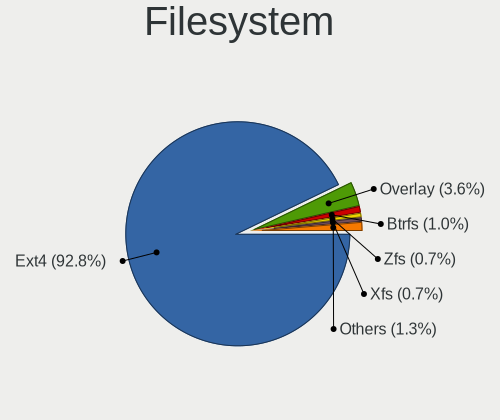

| Type    | Notebooks | Percent |
|---------|-----------|---------|
| Ext4    | 219       | 92.8%   |
| Overlay | 8         | 3.39%   |
| Btrfs   | 3         | 1.27%   |
| Zfs     | 2         | 0.85%   |
| Xfs     | 2         | 0.85%   |
| Ext3    | 2         | 0.85%   |

Part. scheme
------------

Scheme of partitioning

| Type    | Notebooks | Percent |
|---------|-----------|---------|
| GPT     | 89        | 37.71%  |
| Unknown | 82        | 34.75%  |
| MBR     | 65        | 27.54%  |

Dual Boot with Linux/BSD
------------------------

Hosting more than one Linux/BSD

| Dual boot | Notebooks | Percent |
|-----------|-----------|---------|
| No        | 211       | 88.66%  |
| Yes       | 27        | 11.34%  |

Dual Boot (Win)
---------------

Hosting Linux and Windows

| Dual boot | Notebooks | Percent |
|-----------|-----------|---------|
| No        | 163       | 69.36%  |
| Yes       | 72        | 30.64%  |

Board
-----

Vendor
------

Motherboard manufacturer

| Name                   | Notebooks | Percent |
|------------------------|-----------|---------|
| Lenovo                 | 58        | 24.79%  |
| Hewlett-Packard        | 48        | 20.51%  |
| Dell                   | 45        | 19.23%  |
| ASUSTek Computer       | 19        | 8.12%   |
| Acer                   | 16        | 6.84%   |
| Toshiba                | 7         | 2.99%   |
| MSI                    | 7         | 2.99%   |
| Samsung Electronics    | 5         | 2.14%   |
| Sony                   | 3         | 1.28%   |
| Positivo               | 2         | 0.85%   |
| Packard Bell           | 2         | 0.85%   |
| Notebook               | 2         | 0.85%   |
| Medion                 | 2         | 0.85%   |
| GPD                    | 2         | 0.85%   |
| Apple                  | 2         | 0.85%   |
| Unknown                | 2         | 0.85%   |
| Wortmann AG            | 1         | 0.43%   |
| TUXEDO                 | 1         | 0.43%   |
| Teclast                | 1         | 0.43%   |
| System76               | 1         | 0.43%   |
| Star Labs              | 1         | 0.43%   |
| Polaroid               | 1         | 0.43%   |
| Pine Microsystems      | 1         | 0.43%   |
| ONE-NETBOOK TECHNOLOGY | 1         | 0.43%   |
| Intel                  | 1         | 0.43%   |
| Cube                   | 1         | 0.43%   |
| Chuwi                  | 1         | 0.43%   |
| AMI                    | 1         | 0.43%   |

Model
-----

Motherboard model

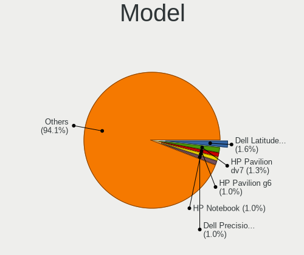

| Name                                       | Notebooks | Percent |
|--------------------------------------------|-----------|---------|
| Dell Latitude E6420                        | 5         | 2.14%   |
| HP Notebook                                | 3         | 1.28%   |
| Dell Precision M4800                       | 3         | 1.28%   |
| Dell Latitude E6410                        | 3         | 1.28%   |
| Unknown                                    | 3         | 1.28%   |
| Lenovo IdeaPad Slim 1-14AST-05 81VS        | 2         | 0.85%   |
| HP Pavilion g6                             | 2         | 0.85%   |
| HP Pavilion dv7                            | 2         | 0.85%   |
| HP EliteBook 8470p                         | 2         | 0.85%   |
| Dell Latitude E6430                        | 2         | 0.85%   |
| Dell Inspiron 3421                         | 2         | 0.85%   |
| ASUS ZenBook UX431DA_UM431DA               | 2         | 0.85%   |
| Wortmann AG TERRA_MOBILE_1749              | 1         | 0.43%   |
| TUXEDO InfinityBook Pro 14 Gen6            | 1         | 0.43%   |
| Toshiba Satellite Pro L500                 | 1         | 0.43%   |
| Toshiba Satellite Pro C660                 | 1         | 0.43%   |
| Toshiba Satellite M500                     | 1         | 0.43%   |
| Toshiba Satellite L350D                    | 1         | 0.43%   |
| Toshiba Satellite C675                     | 1         | 0.43%   |
| Toshiba Satellite C665                     | 1         | 0.43%   |
| Toshiba Satellite C660                     | 1         | 0.43%   |
| Teclast F15S                               | 1         | 0.43%   |
| System76 Serval WS                         | 1         | 0.43%   |
| Star Labs LabTop                           | 1         | 0.43%   |
| Sony VPCS12X9E                             | 1         | 0.43%   |
| Sony VPCF1290X                             | 1         | 0.43%   |
| Sony VPCEH1S1E                             | 1         | 0.43%   |
| Samsung SR58P                              | 1         | 0.43%   |
| Samsung 550P5C/550P7C                      | 1         | 0.43%   |
| Samsung 530U4E/540U4E                      | 1         | 0.43%   |
| Samsung 350V5C/351V5C/3540VC/3440VC        | 1         | 0.43%   |
| Samsung 300E4A/300E5A/300E7A/3430EA/3530EA | 1         | 0.43%   |
| Positivo N8X0EK1                           | 1         | 0.43%   |
| Positivo Mobile                            | 1         | 0.43%   |
| Polaroid MP1464PR001                       | 1         | 0.43%   |
| Pine Microsystems Pine64 Pinebook Pro      | 1         | 0.43%   |
| Packard Bell EasyNote SL65                 | 1         | 0.43%   |
| Packard Bell EasyNote ME69BMP              | 1         | 0.43%   |
| ONE-NETBOOK TECHNOLOGY A1                  | 1         | 0.43%   |
| Notebook W54_W94_W955TU,-T,-C              | 1         | 0.43%   |
| Notebook W310CZ/CZ-T                       | 1         | 0.43%   |
| MSI GV62 8RD                               | 1         | 0.43%   |
| MSI GP72MVR 7RFX                           | 1         | 0.43%   |
| MSI GP72 6QF                               | 1         | 0.43%   |
| MSI GF63 Thin 9SCSR                        | 1         | 0.43%   |
| MSI GE72 7RE                               | 1         | 0.43%   |
| MSI GE60 2OC\2OD\2OE                       | 1         | 0.43%   |
| MSI CR70 2M/CX70 2OC/CX70 2OD              | 1         | 0.43%   |
| Medion X682X                               | 1         | 0.43%   |
| Medion E15302                              | 1         | 0.43%   |
| Lenovo Z51-70 80K6                         | 1         | 0.43%   |
| Lenovo Yoga 3 Pro-1370 80HE                | 1         | 0.43%   |
| Lenovo V570 HuronRiver Platform            | 1         | 0.43%   |
| Lenovo ThinkPad Yoga 260 20FES25400        | 1         | 0.43%   |
| Lenovo ThinkPad X270 20HN0013MX            | 1         | 0.43%   |
| Lenovo ThinkPad X250 20CLA32VLM            | 1         | 0.43%   |
| Lenovo ThinkPad X240 qqqq                  | 1         | 0.43%   |
| Lenovo ThinkPad X240 20AMS08816            | 1         | 0.43%   |
| Lenovo ThinkPad X230 23253Z5               | 1         | 0.43%   |
| Lenovo ThinkPad X201 Tablet 3093BL3        | 1         | 0.43%   |

Model Family
------------

Motherboard model prefix

| Name                      | Notebooks | Percent |
|---------------------------|-----------|---------|
| Lenovo ThinkPad           | 36        | 15.38%  |
| Dell Latitude             | 18        | 7.69%   |
| HP Pavilion               | 15        | 6.41%   |
| Acer Aspire               | 13        | 5.56%   |
| Lenovo IdeaPad            | 10        | 4.27%   |
| HP EliteBook              | 9         | 3.85%   |
| Dell Precision            | 8         | 3.42%   |
| Dell Inspiron             | 8         | 3.42%   |
| Toshiba Satellite         | 7         | 2.99%   |
| HP 250                    | 5         | 2.14%   |
| HP ZBook                  | 4         | 1.71%   |
| HP ProBook                | 4         | 1.71%   |
| Dell XPS                  | 4         | 1.71%   |
| ASUS VivoBook             | 4         | 1.71%   |
| HP Notebook               | 3         | 1.28%   |
| Dell Vostro               | 3         | 1.28%   |
| Unknown                   | 3         | 1.28%   |
| Packard Bell EasyNote     | 2         | 0.85%   |
| Lenovo ThinkBook          | 2         | 0.85%   |
| Lenovo Legion             | 2         | 0.85%   |
| Lenovo Flex               | 2         | 0.85%   |
| HP Laptop                 | 2         | 0.85%   |
| HP Compaq                 | 2         | 0.85%   |
| Dell Studio               | 2         | 0.85%   |
| ASUS ZenBook              | 2         | 0.85%   |
| Wortmann AG TERRA         | 1         | 0.43%   |
| TUXEDO InfinityBook       | 1         | 0.43%   |
| Teclast F15S              | 1         | 0.43%   |
| System76 Serval           | 1         | 0.43%   |
| Star Labs LabTop          | 1         | 0.43%   |
| Sony VPCS12X9E            | 1         | 0.43%   |
| Sony VPCF1290X            | 1         | 0.43%   |
| Sony VPCEH1S1E            | 1         | 0.43%   |
| Samsung SR58P             | 1         | 0.43%   |
| Samsung 550P5C            | 1         | 0.43%   |
| Samsung 530U4E            | 1         | 0.43%   |
| Samsung 350V5C            | 1         | 0.43%   |
| Samsung 300E4A            | 1         | 0.43%   |
| Positivo N8X0EK1          | 1         | 0.43%   |
| Positivo Mobile           | 1         | 0.43%   |
| Polaroid MP1464PR001      | 1         | 0.43%   |
| Pine Microsystems Pine64  | 1         | 0.43%   |
| ONE-NETBOOK TECHNOLOGY A1 | 1         | 0.43%   |
| Notebook W54              | 1         | 0.43%   |
| Notebook W310CZ           | 1         | 0.43%   |
| MSI GV62                  | 1         | 0.43%   |
| MSI GP72MVR               | 1         | 0.43%   |
| MSI GP72                  | 1         | 0.43%   |
| MSI GF63                  | 1         | 0.43%   |
| MSI GE72                  | 1         | 0.43%   |
| MSI GE60                  | 1         | 0.43%   |
| MSI CR70                  | 1         | 0.43%   |
| Medion X682X              | 1         | 0.43%   |
| Medion E15302             | 1         | 0.43%   |
| Lenovo Z51-70             | 1         | 0.43%   |
| Lenovo Yoga               | 1         | 0.43%   |
| Lenovo V570               | 1         | 0.43%   |
| Lenovo G580               | 1         | 0.43%   |
| Lenovo G50-80             | 1         | 0.43%   |
| Lenovo B570e              | 1         | 0.43%   |

MFG Year
--------

Motherboard manufacture year

| Year    | Notebooks | Percent |
|---------|-----------|---------|
| 2020    | 35        | 14.96%  |
| 2018    | 28        | 11.97%  |
| 2011    | 26        | 11.11%  |
| 2019    | 25        | 10.68%  |
| 2013    | 20        | 8.55%   |
| 2015    | 15        | 6.41%   |
| 2016    | 14        | 5.98%   |
| 2014    | 14        | 5.98%   |
| 2021    | 13        | 5.56%   |
| 2012    | 13        | 5.56%   |
| 2017    | 9         | 3.85%   |
| 2008    | 8         | 3.42%   |
| 2010    | 7         | 2.99%   |
| 2009    | 6         | 2.56%   |
| Unknown | 1         | 0.43%   |

Form Factor
-----------

Physical design of the computer

| Name     | Notebooks | Percent |
|----------|-----------|---------|
| Notebook | 234       | 100%    |

Secure Boot
-----------

Enabled or disabled

| State    | Notebooks | Percent |
|----------|-----------|---------|
| Disabled | 210       | 89.36%  |
| Enabled  | 25        | 10.64%  |

Coreboot
--------

Have coreboot on board

| Used | Notebooks | Percent |
|------|-----------|---------|
| No   | 234       | 100%    |

RAM Size
--------

Total RAM memory

| Size in GB  | Notebooks | Percent |
|-------------|-----------|---------|
| 3.01-4.0    | 65        | 27.54%  |
| 4.01-8.0    | 63        | 26.69%  |
| 8.01-16.0   | 37        | 15.68%  |
| 16.01-24.0  | 36        | 15.25%  |
| 32.01-64.0  | 15        | 6.36%   |
| 2.01-3.0    | 6         | 2.54%   |
| 64.01-256.0 | 5         | 2.12%   |
| 1.01-2.0    | 5         | 2.12%   |
| 24.01-32.0  | 4         | 1.69%   |

RAM Used
--------

Used RAM memory

| Used GB    | Notebooks | Percent |
|------------|-----------|---------|
| 1.01-2.0   | 92        | 36.95%  |
| 2.01-3.0   | 68        | 27.31%  |
| 4.01-8.0   | 33        | 13.25%  |
| 3.01-4.0   | 30        | 12.05%  |
| 0.51-1.0   | 20        | 8.03%   |
| 8.01-16.0  | 5         | 2.01%   |
| 24.01-32.0 | 1         | 0.4%    |

Total Drives
------------

Number of drives on board

| Drives | Notebooks | Percent |
|--------|-----------|---------|
| 1      | 170       | 71.43%  |
| 2      | 58        | 24.37%  |
| 3      | 8         | 3.36%   |
| 4      | 1         | 0.42%   |
| 0      | 1         | 0.42%   |

Has CD-ROM
----------

Has CD-ROM on board

| Presented | Notebooks | Percent |
|-----------|-----------|---------|
| No        | 127       | 54.04%  |
| Yes       | 108       | 45.96%  |

Has Ethernet
------------

Has Ethernet on board

| Presented | Notebooks | Percent |
|-----------|-----------|---------|
| Yes       | 203       | 86.75%  |
| No        | 31        | 13.25%  |

Has WiFi
--------

Has WiFi module

| Presented | Notebooks | Percent |
|-----------|-----------|---------|
| Yes       | 229       | 97.45%  |
| No        | 6         | 2.55%   |

Has Bluetooth
-------------

Has Bluetooth module

| Presented | Notebooks | Percent |
|-----------|-----------|---------|
| Yes       | 181       | 76.69%  |
| No        | 55        | 23.31%  |

Location
--------

Country
-------

Geographic location (country)

| Country     | Notebooks | Percent |
|-------------|-----------|---------|
| Brazil      | 33        | 14.04%  |
| USA         | 25        | 10.64%  |
| France      | 25        | 10.64%  |
| Germany     | 21        | 8.94%   |
| UK          | 14        | 5.96%   |
| Spain       | 13        | 5.53%   |
| Italy       | 13        | 5.53%   |
| Russia      | 11        | 4.68%   |
| Ukraine     | 7         | 2.98%   |
| Switzerland | 6         | 2.55%   |
| Netherlands | 6         | 2.55%   |
| Argentina   | 5         | 2.13%   |
| Poland      | 4         | 1.7%    |
| Turkey      | 3         | 1.28%   |
| Norway      | 3         | 1.28%   |
| Indonesia   | 3         | 1.28%   |
| Finland     | 3         | 1.28%   |
| Canada      | 3         | 1.28%   |
| Vietnam     | 2         | 0.85%   |
| Thailand    | 2         | 0.85%   |
| Sweden      | 2         | 0.85%   |
| Philippines | 2         | 0.85%   |
| Mexico      | 2         | 0.85%   |
| Ireland     | 2         | 0.85%   |
| India       | 2         | 0.85%   |
| Greece      | 2         | 0.85%   |
| Chile       | 2         | 0.85%   |
| Uruguay     | 1         | 0.43%   |
| Taiwan      | 1         | 0.43%   |
| Slovakia    | 1         | 0.43%   |
| Runion    | 1         | 0.43%   |
| Portugal    | 1         | 0.43%   |
| Peru        | 1         | 0.43%   |
| Malaysia    | 1         | 0.43%   |
| Luxembourg  | 1         | 0.43%   |
| Kenya       | 1         | 0.43%   |
| Hungary     | 1         | 0.43%   |
| Estonia     | 1         | 0.43%   |
| Ecuador     | 1         | 0.43%   |
| Denmark     | 1         | 0.43%   |
| Czechia     | 1         | 0.43%   |
| Croatia     | 1         | 0.43%   |
| Belgium     | 1         | 0.43%   |
| Belarus     | 1         | 0.43%   |
| Austria     | 1         | 0.43%   |
| Australia   | 1         | 0.43%   |

City
----

Geographic location (city)

| City                   | Notebooks | Percent |
|------------------------|-----------|---------|
| So Paulo             | 8         | 3.32%   |
| Paris                  | 5         | 2.07%   |
| Itatiba                | 5         | 2.07%   |
| Rome                   | 3         | 1.24%   |
| Rio de Janeiro         | 3         | 1.24%   |
| Jundia               | 3         | 1.24%   |
| Barcelona              | 3         | 1.24%   |
| Srednyaya Akhtuba      | 2         | 0.83%   |
| Oslo                   | 2         | 0.83%   |
| Offenbach              | 2         | 0.83%   |
| Moscow                 | 2         | 0.83%   |
| Marseille              | 2         | 0.83%   |
| Manchester             | 2         | 0.83%   |
| Le Kremlin-Bicetre     | 2         | 0.83%   |
| Kyiv                   | 2         | 0.83%   |
| Ho Chi Minh City       | 2         | 0.83%   |
| Herriman               | 2         | 0.83%   |
| Essen                  | 2         | 0.83%   |
| Durham                 | 2         | 0.83%   |
| Dublin                 | 2         | 0.83%   |
| Berlin                 | 2         | 0.83%   |
| Basel                  | 2         | 0.83%   |
| Ankara                 | 2         | 0.83%   |
| Zapopan                | 1         | 0.41%   |
| Zagreb                 | 1         | 0.41%   |
| Willimantic            | 1         | 0.41%   |
| West Babylon           | 1         | 0.41%   |
| Wake Forest            | 1         | 0.41%   |
| Via del Mar          | 1         | 0.41%   |
| Vigo                   | 1         | 0.41%   |
| Vigneux-sur-Seine      | 1         | 0.41%   |
| Vienna                 | 1         | 0.41%   |
| Vedrin                 | 1         | 0.41%   |
| Valencia               | 1         | 0.41%   |
| Ulm                    | 1         | 0.41%   |
| Trondheim              | 1         | 0.41%   |
| Toulouse               | 1         | 0.41%   |
| Toronto                | 1         | 0.41%   |
| Thessaloniki           | 1         | 0.41%   |
| Thaire                 | 1         | 0.41%   |
| Terlizzi               | 1         | 0.41%   |
| Tampere                | 1         | 0.41%   |
| Tainan City            | 1         | 0.41%   |
| So Jos dos Pinhais | 1         | 0.41%   |
| So Jos dos Campos  | 1         | 0.41%   |
| Sydney                 | 1         | 0.41%   |
| Sutton Coldfield       | 1         | 0.41%   |
| Surabaya               | 1         | 0.41%   |
| Studen                 | 1         | 0.41%   |
| Soto del Real          | 1         | 0.41%   |
| Seville                | 1         | 0.41%   |
| Sevastopol             | 1         | 0.41%   |
| Schwanden              | 1         | 0.41%   |
| S??o Paulo             | 1         | 0.41%   |
| Santos                 | 1         | 0.41%   |
| Santarm              | 1         | 0.41%   |
| Salta                  | 1         | 0.41%   |
| Sainte-Adresse         | 1         | 0.41%   |
| Saco                   | 1         | 0.41%   |
| Sabadell               | 1         | 0.41%   |

Drives
------

Drive Vendor
------------

Hard drive vendors

| Vendor                | Notebooks | Drives | Percent |
|-----------------------|-----------|--------|---------|
| WDC                   | 42        | 49     | 14.24%  |
| Samsung Electronics   | 42        | 50     | 14.24%  |
| Seagate               | 41        | 44     | 13.9%   |
| Toshiba               | 28        | 34     | 9.49%   |
| Kingston              | 24        | 29     | 8.14%   |
| Unknown               | 17        | 20     | 5.76%   |
| Sandisk               | 16        | 21     | 5.42%   |
| SK Hynix              | 10        | 13     | 3.39%   |
| Hitachi               | 10        | 11     | 3.39%   |
| Crucial               | 10        | 15     | 3.39%   |
| Intel                 | 9         | 10     | 3.05%   |
| HGST                  | 5         | 5      | 1.69%   |
| China                 | 5         | 6      | 1.69%   |
| A-DATA Technology     | 4         | 4      | 1.36%   |
| PNY                   | 3         | 3      | 1.02%   |
| Micron Technology     | 3         | 4      | 1.02%   |
| KIOXIA                | 3         | 3      | 1.02%   |
| Transcend             | 2         | 3      | 0.68%   |
| Silicon Motion        | 2         | 2      | 0.68%   |
| Phison                | 2         | 2      | 0.68%   |
| Patriot               | 2         | 2      | 0.68%   |
| Intenso               | 2         | 2      | 0.68%   |
| Fujitsu               | 2         | 2      | 0.68%   |
| Vaseky                | 1         | 1      | 0.34%   |
| SMART                 | 1         | 1      | 0.34%   |
| Realtek Semiconductor | 1         | 1      | 0.34%   |
| PLEXTOR               | 1         | 1      | 0.34%   |
| OCZ                   | 1         | 1      | 0.34%   |
| Netac                 | 1         | 1      | 0.34%   |
| LITEONIT              | 1         | 2      | 0.34%   |
| KingSpec              | 1         | 1      | 0.34%   |
| FORESEE               | 1         | 1      | 0.34%   |
| faspeed               | 1         | 1      | 0.34%   |
| Apacer                | 1         | 1      | 0.34%   |

Drive Model
-----------

Hard drive models

| Model                                | Notebooks | Percent |
|--------------------------------------|-----------|---------|
| Kingston SA400S37120G 120GB SSD      | 7         | 2.32%   |
| Toshiba MQ01ABF050 500GB             | 6         | 1.99%   |
| Seagate ST320LT007-9ZV142 320GB      | 6         | 1.99%   |
| Kingston SA400S37240G 240GB SSD      | 6         | 1.99%   |
| Seagate ST1000LM035-1RK172 1TB       | 5         | 1.66%   |
| WDC WD10JPVX-22JC3T0 1TB             | 4         | 1.32%   |
| Toshiba MQ04ABF100 1TB               | 4         | 1.32%   |
| WDC WD10SPZX-21Z10T0 1TB             | 3         | 0.99%   |
| Unknown MMC Card  16GB               | 3         | 0.99%   |
| Seagate ST1000LM024 HN-M101MBB 1TB   | 3         | 0.99%   |
| Samsung SSD 860 EVO 500GB            | 3         | 0.99%   |
| Kingston SA400S37480G 480GB SSD      | 3         | 0.99%   |
| Intel SSDPEKNW512G8 512GB            | 3         | 0.99%   |
| Hitachi HTS545050B9A300 500GB        | 3         | 0.99%   |
| WDC WDS500G2B0A-00SM50 500GB SSD     | 2         | 0.66%   |
| WDC WDS240G2G0A-00JH30 240GB SSD     | 2         | 0.66%   |
| WDC WD5000BPKT-75PK4T0 500GB         | 2         | 0.66%   |
| WDC WD10SPZX-08Z10 1TB               | 2         | 0.66%   |
| WDC PC SN720 SDAQNTW-512G-1001 512GB | 2         | 0.66%   |
| Unknown DA4064  64GB                 | 2         | 0.66%   |
| Transcend TS512GMTS430S 512GB SSD    | 2         | 0.66%   |
| Toshiba MQ01ACF032 320GB             | 2         | 0.66%   |
| Toshiba MQ01ABD050 500GB             | 2         | 0.66%   |
| Toshiba MK7559GSXP 752GB             | 2         | 0.66%   |
| Seagate ST9500420AS 500GB            | 2         | 0.66%   |
| Seagate ST9250410AS 250GB            | 2         | 0.66%   |
| Seagate ST500LT012-9WS142 500GB      | 2         | 0.66%   |
| Seagate ST500LM012 HN-M500MBB 500GB  | 2         | 0.66%   |
| Seagate ST500LM000-SSHD-8GB          | 2         | 0.66%   |
| Seagate ST2000LM015-2E8174 2TB       | 2         | 0.66%   |
| SanDisk SD6SB2M-512G-1006 512GB SSD  | 2         | 0.66%   |
| Sandisk NVMe SSD Drive 512GB         | 2         | 0.66%   |
| SanDisk DF4064  64GB                 | 2         | 0.66%   |
| Samsung SSD 860 QVO 1TB              | 2         | 0.66%   |
| Samsung SSD 860 PRO 512GB            | 2         | 0.66%   |
| Samsung SSD 850 EVO 500GB            | 2         | 0.66%   |
| PNY CS900 240GB SSD                  | 2         | 0.66%   |
| Kingston SUV500MS120G 120GB SSD      | 2         | 0.66%   |
| Hitachi HTS547564A9E384 640GB        | 2         | 0.66%   |
| HGST HTS721010A9E630 1TB             | 2         | 0.66%   |
| Crucial CT250BX100SSD1 250GB         | 2         | 0.66%   |
| China SSD 120GB                      | 2         | 0.66%   |
| WDC WDS250G2X0C-00L350 250GB         | 1         | 0.33%   |
| WDC WDS200T3X0C-00SJG0 2TB           | 1         | 0.33%   |
| WDC WDS120G1G0A-00SS50 120GB SSD     | 1         | 0.33%   |
| WDC WDS100T2G0A-00JH30 1TB SSD       | 1         | 0.33%   |
| WDC WDS100T2B0C-00PXH0 1TB           | 1         | 0.33%   |
| WDC WD7500BPVX-60JC3T0 752GB         | 1         | 0.33%   |
| WDC WD7500BPVX-22JC3T0 752GB         | 1         | 0.33%   |
| WDC WD7500BPVT-75HXZT1 752GB         | 1         | 0.33%   |
| WDC WD7500BPKX-75HPJT0 752GB         | 1         | 0.33%   |
| WDC WD7500BPKT-75PK4T0 752GB         | 1         | 0.33%   |
| WDC WD5000LPVX-75V0TT0 500GB         | 1         | 0.33%   |
| WDC WD5000LPVX-22V0TT0 500GB         | 1         | 0.33%   |
| WDC WD5000LPLX-75ZNTT0 500GB         | 1         | 0.33%   |
| WDC WD5000LPCX-21VHAT0 500GB         | 1         | 0.33%   |
| WDC WD5000BEVT-22ZAT0 500GB          | 1         | 0.33%   |
| WDC WD3200LPVX-22V0TT0 320GB         | 1         | 0.33%   |
| WDC WD3200BEVT-60ZCT1 320GB          | 1         | 0.33%   |
| WDC WD3200BEVT-22ZCT0 320GB          | 1         | 0.33%   |

HDD Vendor
----------

Hard disk drive vendors

| Vendor              | Notebooks | Drives | Percent |
|---------------------|-----------|--------|---------|
| Seagate             | 41        | 43     | 36.94%  |
| WDC                 | 28        | 33     | 25.23%  |
| Toshiba             | 22        | 28     | 19.82%  |
| Hitachi             | 10        | 11     | 9.01%   |
| HGST                | 5         | 5      | 4.5%    |
| Samsung Electronics | 2         | 2      | 1.8%    |
| Fujitsu             | 2         | 2      | 1.8%    |
| Unknown             | 1         | 1      | 0.9%    |

SSD Vendor
----------

Solid state drive vendors

| Vendor              | Notebooks | Drives | Percent |
|---------------------|-----------|--------|---------|
| Samsung Electronics | 30        | 36     | 27.03%  |
| Kingston            | 22        | 27     | 19.82%  |
| SanDisk             | 10        | 14     | 9.01%   |
| Crucial             | 8         | 13     | 7.21%   |
| WDC                 | 6         | 6      | 5.41%   |
| China               | 5         | 6      | 4.5%    |
| A-DATA Technology   | 4         | 4      | 3.6%    |
| Toshiba             | 3         | 3      | 2.7%    |
| PNY                 | 3         | 3      | 2.7%    |
| Intel               | 3         | 3      | 2.7%    |
| Transcend           | 2         | 3      | 1.8%    |
| Intenso             | 2         | 2      | 1.8%    |
| Vaseky              | 1         | 1      | 0.9%    |
| SMART               | 1         | 1      | 0.9%    |
| SK Hynix            | 1         | 4      | 0.9%    |
| Seagate             | 1         | 1      | 0.9%    |
| PLEXTOR             | 1         | 1      | 0.9%    |
| Patriot             | 1         | 1      | 0.9%    |
| OCZ                 | 1         | 1      | 0.9%    |
| Netac               | 1         | 1      | 0.9%    |
| Micron Technology   | 1         | 2      | 0.9%    |
| LITEONIT            | 1         | 2      | 0.9%    |
| KingSpec            | 1         | 1      | 0.9%    |
| FORESEE             | 1         | 1      | 0.9%    |
| Apacer              | 1         | 1      | 0.9%    |

Drive Kind
----------

HDD or SSD

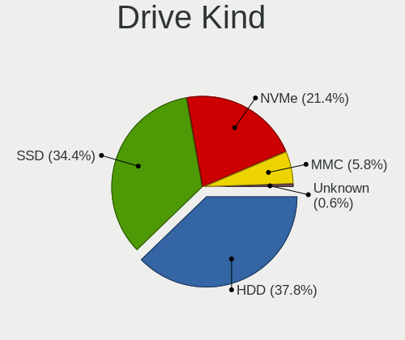

| Kind    | Notebooks | Drives | Percent |
|---------|-----------|--------|---------|
| HDD     | 107       | 125    | 38.49%  |
| SSD     | 100       | 138    | 35.97%  |
| NVMe    | 55        | 64     | 19.78%  |
| MMC     | 15        | 18     | 5.4%    |
| Unknown | 1         | 1      | 0.36%   |

Drive Connector
---------------

SATA, SAS, NVMe, etc.

| Type | Notebooks | Drives | Percent |
|------|-----------|--------|---------|
| SATA | 186       | 257    | 70.72%  |
| NVMe | 55        | 64     | 20.91%  |
| MMC  | 15        | 18     | 5.7%    |
| SAS  | 7         | 7      | 2.66%   |

Drive Size
----------

Size of hard drive

| Size in TB | Notebooks | Drives | Percent |
|------------|-----------|--------|---------|
| 0.01-0.5   | 139       | 181    | 66.51%  |
| 0.51-1.0   | 60        | 68     | 28.71%  |
| 1.01-2.0   | 8         | 12     | 3.83%   |
| 3.01-4.0   | 2         | 2      | 0.96%   |

Space Total
-----------

Amount of disk space available on the file system

| Size in GB     | Notebooks | Percent |
|----------------|-----------|---------|
| 251-500        | 73        | 30.42%  |
| 101-250        | 65        | 27.08%  |
| 501-1000       | 40        | 16.67%  |
| 1-20           | 15        | 6.25%   |
| 51-100         | 15        | 6.25%   |
| 1001-2000      | 12        | 5%      |
| 21-50          | 9         | 3.75%   |
| 2001-3000      | 6         | 2.5%    |
| More than 3000 | 5         | 2.08%   |

Space Used
----------

Amount of used disk space

| Used GB        | Notebooks | Percent |
|----------------|-----------|---------|
| 1-20           | 85        | 34.14%  |
| 21-50          | 42        | 16.87%  |
| 101-250        | 40        | 16.06%  |
| 51-100         | 40        | 16.06%  |
| 251-500        | 24        | 9.64%   |
| 501-1000       | 13        | 5.22%   |
| 1001-2000      | 3         | 1.2%    |
| More than 3000 | 1         | 0.4%    |
| 2001-3000      | 1         | 0.4%    |

Malfunc. Drives
---------------

Drive models with a malfunction

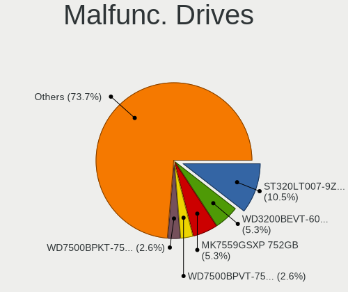

| Model                             | Notebooks | Drives | Percent |
|-----------------------------------|-----------|--------|---------|
| Seagate ST320LT007-9ZV142 320GB   | 4         | 4      | 14.29%  |
| Toshiba MK7559GSXP 752GB          | 2         | 2      | 7.14%   |
| WDC WD7500BPVT-75HXZT1 752GB      | 1         | 1      | 3.57%   |
| WDC WD7500BPKT-75PK4T0 752GB      | 1         | 1      | 3.57%   |
| WDC WD5000LPVX-22V0TT0 500GB      | 1         | 1      | 3.57%   |
| WDC WD5000BPKT-75PK4T0 500GB      | 1         | 2      | 3.57%   |
| WDC WD3200BEVT-60ZCT1 320GB       | 1         | 1      | 3.57%   |
| WDC WD10JPCX-24UE4T0 1TB          | 1         | 1      | 3.57%   |
| Vaseky V820/1TB SSD               | 1         | 1      | 3.57%   |
| Toshiba MQ01ABD050 500GB          | 1         | 1      | 3.57%   |
| Toshiba MK5065GSX 500GB           | 1         | 1      | 3.57%   |
| Seagate ST9500420AS 500GB         | 1         | 1      | 3.57%   |
| Seagate ST9500325AS 500GB         | 1         | 1      | 3.57%   |
| Seagate ST9250410AS 250GB         | 1         | 1      | 3.57%   |
| Seagate ST9160821AS 160GB         | 1         | 1      | 3.57%   |
| Seagate ST500LT012-9WS142 500GB   | 1         | 1      | 3.57%   |
| Samsung Electronics HM160HI 160GB | 1         | 1      | 3.57%   |
| OCZ VERTEX450 128GB SSD           | 1         | 1      | 3.57%   |
| Hitachi HTS722016K9A300 160GB     | 1         | 1      | 3.57%   |
| Hitachi HTS547575A9E384 752GB     | 1         | 1      | 3.57%   |
| Hitachi HTS545050B9A300 500GB     | 1         | 1      | 3.57%   |
| Fujitsu MHZ2320BH G1 320GB        | 1         | 1      | 3.57%   |
| China SSD 120GB                   | 1         | 1      | 3.57%   |
| A-DATA Technology SP900 64GB SSD  | 1         | 1      | 3.57%   |

Malfunc. Drive Vendor
---------------------

Vendors of faulty drives

| Vendor              | Notebooks | Drives | Percent |
|---------------------|-----------|--------|---------|
| Seagate             | 9         | 9      | 32.14%  |
| WDC                 | 6         | 7      | 21.43%  |
| Toshiba             | 4         | 4      | 14.29%  |
| Hitachi             | 3         | 3      | 10.71%  |
| Vaseky              | 1         | 1      | 3.57%   |
| Samsung Electronics | 1         | 1      | 3.57%   |
| OCZ                 | 1         | 1      | 3.57%   |
| Fujitsu             | 1         | 1      | 3.57%   |
| China               | 1         | 1      | 3.57%   |
| A-DATA Technology   | 1         | 1      | 3.57%   |

Malfunc. HDD Vendor
-------------------

Vendors of faulty HDD drives

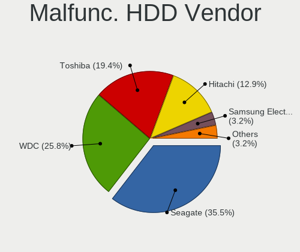

| Vendor              | Notebooks | Drives | Percent |
|---------------------|-----------|--------|---------|
| Seagate             | 9         | 9      | 37.5%   |
| WDC                 | 6         | 7      | 25%     |
| Toshiba             | 4         | 4      | 16.67%  |
| Hitachi             | 3         | 3      | 12.5%   |
| Samsung Electronics | 1         | 1      | 4.17%   |
| Fujitsu             | 1         | 1      | 4.17%   |

Malfunc. Drive Kind
-------------------

Kinds of faulty drives

| Kind | Notebooks | Drives | Percent |
|------|-----------|--------|---------|
| HDD  | 24        | 25     | 85.71%  |
| SSD  | 4         | 4      | 14.29%  |

Failed Drives
-------------

Failed drive models

Zero info for selected period =(

Failed Drive Vendor
-------------------

Failed drive vendors

Zero info for selected period =(

Drive Status
------------

Number of failed and malfunc. drives

| Status   | Notebooks | Drives | Percent |
|----------|-----------|--------|---------|
| Works    | 128       | 172    | 51.61%  |
| Detected | 92        | 145    | 37.1%   |
| Malfunc  | 28        | 29     | 11.29%  |

Storage controller
------------------

Storage Vendor
--------------

Storage controller vendors

| Vendor                           | Notebooks | Percent |
|----------------------------------|-----------|---------|
| Intel                            | 175       | 67.31%  |
| AMD                              | 28        | 10.77%  |
| Sandisk                          | 13        | 5%      |
| Samsung Electronics              | 11        | 4.23%   |
| SK Hynix                         | 9         | 3.46%   |
| Toshiba America Info Systems     | 4         | 1.54%   |
| Silicon Motion                   | 3         | 1.15%   |
| KIOXIA                           | 3         | 1.15%   |
| Silicon Integrated Systems [SiS] | 2         | 0.77%   |
| Phison Electronics               | 2         | 0.77%   |
| Micron/Crucial Technology        | 2         | 0.77%   |
| Micron Technology                | 2         | 0.77%   |
| Kingston Technology Company      | 2         | 0.77%   |
| Union Memory (Shenzhen)          | 1         | 0.38%   |
| Solid State Storage Technology   | 1         | 0.38%   |
| Realtek Semiconductor            | 1         | 0.38%   |
| Nvidia                           | 1         | 0.38%   |

Storage Model
-------------

Storage controller models

| Model                                                                            | Notebooks | Percent |
|----------------------------------------------------------------------------------|-----------|---------|
| Intel 6 Series/C200 Series Chipset Family 6 port Mobile SATA AHCI Controller     | 26        | 9.15%   |
| Intel 7 Series Chipset Family 6-port SATA Controller [AHCI mode]                 | 24        | 8.45%   |
| AMD FCH SATA Controller [AHCI mode]                                              | 23        | 8.1%    |
| Intel 82801 Mobile SATA Controller [RAID mode]                                   | 17        | 5.99%   |
| Intel Sunrise Point-LP SATA Controller [AHCI mode]                               | 15        | 5.28%   |
| Intel Wildcat Point-LP SATA Controller [AHCI Mode]                               | 13        | 4.58%   |
| Intel 8 Series/C220 Series Chipset Family 6-port SATA Controller 1 [AHCI mode]   | 11        | 3.87%   |
| Intel 8 Series SATA Controller 1 [AHCI mode]                                     | 10        | 3.52%   |
| Samsung NVMe SSD Controller SM981/PM981/PM983                                    | 7         | 2.46%   |
| Intel Cannon Lake Mobile PCH SATA AHCI Controller                                | 7         | 2.46%   |
| Intel HM170/QM170 Chipset SATA Controller [AHCI Mode]                            | 6         | 2.11%   |
| Intel 5 Series/3400 Series Chipset 4 port SATA AHCI Controller                   | 6         | 2.11%   |
| Intel SSD 660P Series                                                            | 5         | 1.76%   |
| Intel 82801HM/HEM (ICH8M/ICH8M-E) IDE Controller                                 | 5         | 1.76%   |
| Sandisk WD Black 2018/SN750 / PC SN720 NVMe SSD                                  | 4         | 1.41%   |
| Intel Atom Processor E3800 Series SATA AHCI Controller                           | 4         | 1.41%   |
| Intel 82801IBM/IEM (ICH9M/ICH9M-E) 4 port SATA Controller [AHCI mode]            | 4         | 1.41%   |
| AMD SB7x0/SB8x0/SB9x0 SATA Controller [AHCI mode]                                | 4         | 1.41%   |
| SK Hynix BC511                                                                   | 3         | 1.06%   |
| SK Hynix BC501 NVMe Solid State Drive                                            | 3         | 1.06%   |
| Sandisk WD Blue SN500 / PC SN520 NVMe SSD                                        | 3         | 1.06%   |
| Sandisk WD Black SN750 / PC SN730 NVMe SSD                                       | 3         | 1.06%   |
| KIOXIA Non-Volatile memory controller                                            | 3         | 1.06%   |
| Intel Volume Management Device NVMe RAID Controller                              | 3         | 1.06%   |
| Intel Celeron/Pentium Silver Processor SATA Controller                           | 3         | 1.06%   |
| Intel Cannon Point-LP SATA Controller [AHCI Mode]                                | 3         | 1.06%   |
| Intel Atom/Celeron/Pentium Processor x5-E8000/J3xxx/N3xxx Series SATA Controller | 3         | 1.06%   |
| Intel 82801HM/HEM (ICH8M/ICH8M-E) SATA Controller [AHCI mode]                    | 3         | 1.06%   |
| Intel 5 Series/3400 Series Chipset 6 port SATA AHCI Controller                   | 3         | 1.06%   |
| Toshiba America Info Systems Toshiba America Info Non-Volatile memory controller | 2         | 0.7%    |
| Silicon Motion SM2263EN/SM2263XT SSD Controller                                  | 2         | 0.7%    |
| Silicon Integrated Systems [SiS] SATA Controller / IDE mode                      | 2         | 0.7%    |
| Silicon Integrated Systems [SiS] 5513 IDE Controller                             | 2         | 0.7%    |
| Sandisk WD Blue SN550 NVMe SSD                                                   | 2         | 0.7%    |
| Sandisk PC SN520 NVMe SSD                                                        | 2         | 0.7%    |
| Samsung NVMe SSD Controller 980                                                  | 2         | 0.7%    |
| Micron/Crucial P2 NVMe PCIe SSD                                                  | 2         | 0.7%    |
| Micron Non-Volatile memory controller                                            | 2         | 0.7%    |
| Intel Q170/Q150/B150/H170/H110/Z170/CM236 Chipset SATA Controller [AHCI Mode]    | 2         | 0.7%    |
| Intel Ice Lake-LP SATA Controller [AHCI mode]                                    | 2         | 0.7%    |
| Intel Comet Lake SATA AHCI Controller                                            | 2         | 0.7%    |
| Intel Celeron N3350/Pentium N4200/Atom E3900 Series SATA AHCI Controller         | 2         | 0.7%    |
| Intel 82801IBM/IEM (ICH9M/ICH9M-E) 2 port SATA Controller [IDE mode]             | 2         | 0.7%    |
| Intel 82801HM/HEM (ICH8M/ICH8M-E) SATA Controller [IDE mode]                     | 2         | 0.7%    |
| Intel 7 Series Chipset Family 4-port SATA Controller [IDE mode]                  | 2         | 0.7%    |
| Intel 7 Series Chipset Family 2-port SATA Controller [IDE mode]                  | 2         | 0.7%    |
| AMD SB7x0/SB8x0/SB9x0 IDE Controller                                             | 2         | 0.7%    |
| Union Memory (Shenzhen) Non-Volatile memory controller                           | 1         | 0.35%   |
| Toshiba America Info Systems XG6 NVMe SSD Controller                             | 1         | 0.35%   |
| Toshiba America Info Systems NVMe Controller                                     | 1         | 0.35%   |
| Solid State Storage Non-Volatile memory controller                               | 1         | 0.35%   |
| SK Hynix PC401 NVMe Solid State Drive 256GB                                      | 1         | 0.35%   |
| SK Hynix Non-Volatile memory controller                                          | 1         | 0.35%   |
| SK Hynix Gold P31 SSD                                                            | 1         | 0.35%   |
| Silicon Motion SM2262/SM2262EN SSD Controller                                    | 1         | 0.35%   |
| Samsung NVMe SSD Controller SM961/PM961/SM963                                    | 1         | 0.35%   |
| Samsung NVMe SSD Controller PM9A1/PM9A3/980PRO                                   | 1         | 0.35%   |
| Realtek RTS5763DL NVMe SSD Controller                                            | 1         | 0.35%   |
| Phison PS5013 E13 NVMe Controller                                                | 1         | 0.35%   |
| Phison E12 NVMe Controller                                                       | 1         | 0.35%   |

Storage Kind
------------

Kind of storage controller (IDE, SATA, NVMe, SAS, ...)

| Kind | Notebooks | Percent |
|------|-----------|---------|
| SATA | 178       | 66.17%  |
| NVMe | 55        | 20.45%  |
| RAID | 20        | 7.43%   |
| IDE  | 16        | 5.95%   |

Processor
---------

CPU Vendor
----------

Processor vendors

| Vendor | Notebooks | Percent |
|--------|-----------|---------|
| Intel  | 199       | 85.04%  |
| AMD    | 34        | 14.53%  |
| ARM    | 1         | 0.43%   |

CPU Model
---------

Processor models

| Model                                         | Notebooks | Percent |
|-----------------------------------------------|-----------|---------|
| Intel Core i5-2430M CPU @ 2.40GHz             | 5         | 2.14%   |
| Intel Core i7-8550U CPU @ 1.80GHz             | 4         | 1.71%   |
| Intel Core i7-2630QM CPU @ 2.00GHz            | 4         | 1.71%   |
| Intel Core i5-8265U CPU @ 1.60GHz             | 4         | 1.71%   |
| Intel Core i5-6200U CPU @ 2.30GHz             | 4         | 1.71%   |
| Intel Core i5-5200U CPU @ 2.20GHz             | 4         | 1.71%   |
| Intel Core i5-4300U CPU @ 1.90GHz             | 4         | 1.71%   |
| Intel Core i7-8565U CPU @ 1.80GHz             | 3         | 1.28%   |
| Intel Core i7-7700HQ CPU @ 2.80GHz            | 3         | 1.28%   |
| Intel Core i7-5600U CPU @ 2.60GHz             | 3         | 1.28%   |
| Intel Core i5-8300H CPU @ 2.30GHz             | 3         | 1.28%   |
| Intel Core i5-7200U CPU @ 2.50GHz             | 3         | 1.28%   |
| Intel Core i5-4210U CPU @ 1.70GHz             | 3         | 1.28%   |
| Intel Core i5-3337U CPU @ 1.80GHz             | 3         | 1.28%   |
| Intel Core i5-3320M CPU @ 2.60GHz             | 3         | 1.28%   |
| Intel Core i3-2330M CPU @ 2.20GHz             | 3         | 1.28%   |
| Intel Core i3-2310M CPU @ 2.10GHz             | 3         | 1.28%   |
| AMD Ryzen 5 3500U with Radeon Vega Mobile Gfx | 3         | 1.28%   |
| Intel Pentium Dual-Core CPU T4200 @ 2.00GHz   | 2         | 0.85%   |
| Intel Core m3-8100Y CPU @ 1.10GHz             | 2         | 0.85%   |
| Intel Core i7-9750H CPU @ 2.60GHz             | 2         | 0.85%   |
| Intel Core i7-8750H CPU @ 2.20GHz             | 2         | 0.85%   |
| Intel Core i7-6700HQ CPU @ 2.60GHz            | 2         | 0.85%   |
| Intel Core i7-4910MQ CPU @ 2.90GHz            | 2         | 0.85%   |
| Intel Core i7-4900MQ CPU @ 2.80GHz            | 2         | 0.85%   |
| Intel Core i7-4700MQ CPU @ 2.40GHz            | 2         | 0.85%   |
| Intel Core i7-3720QM CPU @ 2.60GHz            | 2         | 0.85%   |
| Intel Core i7-3667U CPU @ 2.00GHz             | 2         | 0.85%   |
| Intel Core i7-3632QM CPU @ 2.20GHz            | 2         | 0.85%   |
| Intel Core i7-3610QM CPU @ 2.30GHz            | 2         | 0.85%   |
| Intel Core i7-2670QM CPU @ 2.20GHz            | 2         | 0.85%   |
| Intel Core i7-2640M CPU @ 2.80GHz             | 2         | 0.85%   |
| Intel Core i7-1065G7 CPU @ 1.30GHz            | 2         | 0.85%   |
| Intel Core i7-10510U CPU @ 1.80GHz            | 2         | 0.85%   |
| Intel Core i5-8250U CPU @ 1.60GHz             | 2         | 0.85%   |
| Intel Core i5-5300U CPU @ 2.30GHz             | 2         | 0.85%   |
| Intel Core i5-4200M CPU @ 2.50GHz             | 2         | 0.85%   |
| Intel Core i5-3360M CPU @ 2.80GHz             | 2         | 0.85%   |
| Intel Core i5-3230M CPU @ 2.60GHz             | 2         | 0.85%   |
| Intel Core i5-2520M CPU @ 2.50GHz             | 2         | 0.85%   |
| Intel Core i5-2450M CPU @ 2.50GHz             | 2         | 0.85%   |
| Intel Core i5-2410M CPU @ 2.30GHz             | 2         | 0.85%   |
| Intel Core i5-1035G1 CPU @ 1.00GHz            | 2         | 0.85%   |
| Intel Core i5 CPU M 540 @ 2.53GHz             | 2         | 0.85%   |
| Intel Core i5 CPU M 430 @ 2.27GHz             | 2         | 0.85%   |
| Intel Core i3-5005U CPU @ 2.00GHz             | 2         | 0.85%   |
| Intel Core i3-2350M CPU @ 2.30GHz             | 2         | 0.85%   |
| Intel Core 2 Duo CPU P8700 @ 2.53GHz          | 2         | 0.85%   |
| Intel Core 2 Duo CPU P8600 @ 2.40GHz          | 2         | 0.85%   |
| Intel Celeron CPU N3050 @ 1.60GHz             | 2         | 0.85%   |
| Intel 11th Gen Core i7-1165G7 @ 2.80GHz       | 2         | 0.85%   |
| AMD Ryzen 9 5900HX with Radeon Graphics       | 2         | 0.85%   |
| AMD Ryzen 7 3700U with Radeon Vega Mobile Gfx | 2         | 0.85%   |
| AMD A6-6310 APU with AMD Radeon R4 Graphics   | 2         | 0.85%   |
| Intel Xeon CPU E3-1545M v5 @ 2.90GHz          | 1         | 0.43%   |
| Intel Pentium Silver N5000 CPU @ 1.10GHz      | 1         | 0.43%   |
| Intel Pentium Dual CPU T2390 @ 1.86GHz        | 1         | 0.43%   |
| Intel Pentium CPU N3710 @ 1.60GHz             | 1         | 0.43%   |
| Intel Pentium CPU N3540 @ 2.16GHz             | 1         | 0.43%   |
| Intel Pentium CPU B960 @ 2.20GHz              | 1         | 0.43%   |

CPU Model Family
----------------

Processor model prefix

| Model                          | Notebooks | Percent |
|--------------------------------|-----------|---------|
| Intel Core i7                  | 65        | 27.78%  |
| Intel Core i5                  | 64        | 27.35%  |
| Intel Core i3                  | 21        | 8.97%   |
| Intel Core 2 Duo               | 11        | 4.7%    |
| Intel Celeron                  | 11        | 4.7%    |
| Other                          | 9         | 3.85%   |
| Intel Pentium                  | 7         | 2.99%   |
| AMD Ryzen 7                    | 6         | 2.56%   |
| AMD Ryzen 5                    | 5         | 2.14%   |
| AMD A6                         | 4         | 1.71%   |
| Intel Core m3                  | 3         | 1.28%   |
| AMD A4                         | 3         | 1.28%   |
| Intel Pentium Dual-Core        | 2         | 0.85%   |
| Intel Atom                     | 2         | 0.85%   |
| AMD Ryzen 9                    | 2         | 0.85%   |
| AMD Ryzen 3                    | 2         | 0.85%   |
| AMD A8                         | 2         | 0.85%   |
| Intel Xeon                     | 1         | 0.43%   |
| Intel Pentium Silver           | 1         | 0.43%   |
| Intel Pentium Dual             | 1         | 0.43%   |
| Intel Genuine                  | 1         | 0.43%   |
| Intel Core M                   | 1         | 0.43%   |
| Intel Core 2 Extreme           | 1         | 0.43%   |
| Intel Celeron Dual-Core        | 1         | 0.43%   |
| AMD Turion X2 Dual-Core Mobile | 1         | 0.43%   |
| AMD Ryzen 7 PRO                | 1         | 0.43%   |
| AMD Ryzen 5 PRO                | 1         | 0.43%   |
| AMD Phenom II                  | 1         | 0.43%   |
| AMD E2                         | 1         | 0.43%   |
| AMD E                          | 1         | 0.43%   |
| AMD Athlon X2                  | 1         | 0.43%   |
| AMD Athlon                     | 1         | 0.43%   |

CPU Cores
---------

Number of processor cores

| Number | Notebooks | Percent |
|--------|-----------|---------|
| 2      | 131       | 55.98%  |
| 4      | 86        | 36.75%  |
| 6      | 8         | 3.42%   |
| 8      | 7         | 2.99%   |
| 3      | 1         | 0.43%   |
| 1      | 1         | 0.43%   |

CPU Sockets
-----------

Number of sockets

| Number | Notebooks | Percent |
|--------|-----------|---------|
| 1      | 233       | 99.57%  |
| 2      | 1         | 0.43%   |

CPU Threads
-----------

Threads per core (Hyper-Threading)

| Number | Notebooks | Percent |
|--------|-----------|---------|
| 2      | 175       | 74.79%  |
| 1      | 59        | 25.21%  |

CPU Op-Modes
------------

CPU Operation Modes (32-bit, 64-bit)

| Op mode        | Notebooks | Percent |
|----------------|-----------|---------|
| 32-bit, 64-bit | 234       | 100%    |

CPU Microcode
-------------

Microcode number

| Number     | Notebooks | Percent |
|------------|-----------|---------|
| 0x206a7    | 28        | 11.81%  |
| Unknown    | 28        | 11.81%  |
| 0x306a9    | 23        | 9.7%    |
| 0x306d4    | 11        | 4.64%   |
| 0x806ec    | 9         | 3.8%    |
| 0x806e9    | 9         | 3.8%    |
| 0x40651    | 9         | 3.8%    |
| 0x1067a    | 9         | 3.8%    |
| 0x306c3    | 8         | 3.38%   |
| 0x806ea    | 7         | 2.95%   |
| 0x406e3    | 6         | 2.53%   |
| 0x20652    | 6         | 2.53%   |
| 0x08108102 | 6         | 2.53%   |
| 0x906ea    | 5         | 2.11%   |
| 0x20655    | 5         | 2.11%   |
| 0x06006705 | 5         | 2.11%   |
| 0x806c1    | 4         | 1.69%   |
| 0x706e5    | 4         | 1.69%   |
| 0x706a1    | 4         | 1.69%   |
| 0x6fd      | 4         | 1.69%   |
| 0x906e9    | 3         | 1.27%   |
| 0x506e3    | 3         | 1.27%   |
| 0x406c4    | 3         | 1.27%   |
| 0x08600106 | 3         | 1.27%   |
| 0x906ed    | 2         | 0.84%   |
| 0x806d1    | 2         | 0.84%   |
| 0x6fa      | 2         | 0.84%   |
| 0x506c9    | 2         | 0.84%   |
| 0x406c3    | 2         | 0.84%   |
| 0x30678    | 2         | 0.84%   |
| 0x30673    | 2         | 0.84%   |
| 0x106e5    | 2         | 0.84%   |
| 0x10676    | 2         | 0.84%   |
| 0x08108109 | 2         | 0.84%   |
| 0x08101016 | 2         | 0.84%   |
| 0x07030105 | 2         | 0.84%   |
| 0x02000032 | 2         | 0.84%   |
| 0xa0660    | 1         | 0.42%   |
| 0x0a50000c | 1         | 0.42%   |
| 0x0a50000b | 1         | 0.42%   |
| 0x08701013 | 1         | 0.42%   |
| 0x08101007 | 1         | 0.42%   |
| 0x07030104 | 1         | 0.42%   |
| 0x06006704 | 1         | 0.42%   |
| 0x05000119 | 1         | 0.42%   |
| 0x05000029 | 1         | 0.42%   |

CPU Microarch
-------------

Microarchitecture

| Name            | Notebooks | Percent |
|-----------------|-----------|---------|
| KabyLake        | 41        | 17.52%  |
| SandyBridge     | 31        | 13.25%  |
| IvyBridge       | 25        | 10.68%  |
| Haswell         | 21        | 8.97%   |
| Broadwell       | 14        | 5.98%   |
| Westmere        | 11        | 4.7%    |
| Skylake         | 11        | 4.7%    |
| Penryn          | 11        | 4.7%    |
| Silvermont      | 9         | 3.85%   |
| Zen+            | 8         | 3.42%   |
| IceLake         | 6         | 2.56%   |
| Excavator       | 6         | 2.56%   |
| Core            | 6         | 2.56%   |
| Zen 2           | 4         | 1.71%   |
| TigerLake       | 4         | 1.71%   |
| Puma            | 4         | 1.71%   |
| Goldmont plus   | 4         | 1.71%   |
| Zen 3           | 3         | 1.28%   |
| Zen             | 3         | 1.28%   |
| Nehalem         | 2         | 0.85%   |
| K8 & K10 hybrid | 2         | 0.85%   |
| Goldmont        | 2         | 0.85%   |
| Bobcat          | 2         | 0.85%   |
| Piledriver      | 1         | 0.43%   |
| K10             | 1         | 0.43%   |
| CometLake       | 1         | 0.43%   |
| Unknown         | 1         | 0.43%   |

Graphics
--------

GPU Vendor
----------

Vendors of graphics cards

| Vendor                           | Notebooks | Percent |
|----------------------------------|-----------|---------|
| Intel                            | 180       | 61.43%  |
| Nvidia                           | 61        | 20.82%  |
| AMD                              | 51        | 17.41%  |
| Silicon Integrated Systems [SiS] | 1         | 0.34%   |

GPU Model
---------

Graphics card models

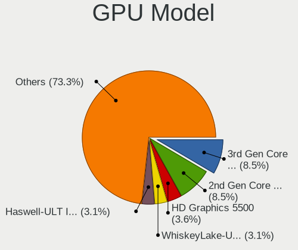

| Model                                                                                    | Notebooks | Percent |
|------------------------------------------------------------------------------------------|-----------|---------|
| Intel 2nd Generation Core Processor Family Integrated Graphics Controller                | 25        | 8.31%   |
| Intel 3rd Gen Core processor Graphics Controller                                         | 24        | 7.97%   |
| Intel HD Graphics 5500                                                                   | 13        | 4.32%   |
| Intel Haswell-ULT Integrated Graphics Controller                                         | 10        | 3.32%   |
| Intel WhiskeyLake-U GT2 [UHD Graphics 620]                                               | 9         | 2.99%   |
| Intel Core Processor Integrated Graphics Controller                                      | 9         | 2.99%   |
| Intel 4th Gen Core Processor Integrated Graphics Controller                              | 9         | 2.99%   |
| Intel UHD Graphics 620                                                                   | 8         | 2.66%   |
| Intel CoffeeLake-H GT2 [UHD Graphics 630]                                                | 8         | 2.66%   |
| AMD Picasso/Raven 2 [Radeon Vega Series / Radeon Vega Mobile Series]                     | 8         | 2.66%   |
| Intel Mobile 4 Series Chipset Integrated Graphics Controller                             | 7         | 2.33%   |
| Intel Skylake GT2 [HD Graphics 520]                                                      | 6         | 1.99%   |
| AMD Stoney [Radeon R2/R3/R4/R5 Graphics]                                                 | 6         | 1.99%   |
| Intel Atom/Celeron/Pentium Processor x5-E8000/J3xxx/N3xxx Integrated Graphics Controller | 5         | 1.66%   |
| Nvidia GP107M [GeForce GTX 1050 Ti Mobile]                                               | 4         | 1.33%   |
| Intel TigerLake-LP GT2 [Iris Xe Graphics]                                                | 4         | 1.33%   |
| Intel Mobile GM965/GL960 Integrated Graphics Controller (secondary)                      | 4         | 1.33%   |
| Intel Mobile GM965/GL960 Integrated Graphics Controller (primary)                        | 4         | 1.33%   |
| Intel HD Graphics 620                                                                    | 4         | 1.33%   |
| Intel HD Graphics 530                                                                    | 4         | 1.33%   |
| Intel Atom Processor Z36xxx/Z37xxx Series Graphics & Display                             | 4         | 1.33%   |
| Nvidia TU117M [GeForce GTX 1650 Mobile / Max-Q]                                          | 3         | 1%      |
| Intel HD Graphics 630                                                                    | 3         | 1%      |
| Intel GeminiLake [UHD Graphics 600]                                                      | 3         | 1%      |
| Intel CometLake-U GT2 [UHD Graphics]                                                     | 3         | 1%      |
| AMD Thames [Radeon HD 7500M/7600M Series]                                                | 3         | 1%      |
| AMD Seymour [Radeon HD 6400M/7400M Series]                                               | 3         | 1%      |
| AMD Renoir                                                                               | 3         | 1%      |
| AMD Raven Ridge [Radeon Vega Series / Radeon Vega Mobile Series]                         | 3         | 1%      |
| AMD Mullins [Radeon R4/R5 Graphics]                                                      | 3         | 1%      |
| AMD Cezanne                                                                              | 3         | 1%      |
| Nvidia GP107M [GeForce GTX 1050 Mobile]                                                  | 2         | 0.66%   |
| Nvidia GP106M [GeForce GTX 1060 Mobile]                                                  | 2         | 0.66%   |
| Nvidia GM107M [GeForce GTX 960M]                                                         | 2         | 0.66%   |
| Nvidia GK104GLM [Quadro K3100M]                                                          | 2         | 0.66%   |
| Nvidia GF119M [GeForce GT 520M]                                                          | 2         | 0.66%   |
| Nvidia GF117M [GeForce 610M/710M/810M/820M / GT 620M/625M/630M/720M]                     | 2         | 0.66%   |
| Nvidia GF108M [GeForce GT 540M]                                                          | 2         | 0.66%   |
| Nvidia GF108GLM [NVS 5200M]                                                              | 2         | 0.66%   |
| Nvidia GA106M [GeForce RTX 3060 Mobile / Max-Q]                                          | 2         | 0.66%   |
| Intel UHD Graphics 615                                                                   | 2         | 0.66%   |
| Intel TigerLake-H GT1 [UHD Graphics]                                                     | 2         | 0.66%   |
| Intel Iris Plus Graphics G7                                                              | 2         | 0.66%   |
| Intel Iris Plus Graphics G1 (Ice Lake)                                                   | 2         | 0.66%   |
| Intel HD Graphics 500                                                                    | 2         | 0.66%   |
| AMD Sun XT [Radeon HD 8670A/8670M/8690M / R5 M330 / M430 / Radeon 520 Mobile]            | 2         | 0.66%   |
| AMD Lexa [Radeon 540X/550X/630 / RX 640 / E9171 MCM]                                     | 2         | 0.66%   |
| Silicon Integrated Systems [SiS] 771/671 PCIE VGA Display Adapter                        | 1         | 0.33%   |
| Nvidia TU117M [GeForce GTX 1650 Ti Mobile]                                               | 1         | 0.33%   |
| Nvidia TU117GLM [T1200 Laptop GPU]                                                       | 1         | 0.33%   |
| Nvidia TU106M [GeForce RTX 2070 Mobile / Max-Q Refresh]                                  | 1         | 0.33%   |
| Nvidia GT218M [NVS 3100M]                                                                | 1         | 0.33%   |
| Nvidia GT218M [GeForce 315M]                                                             | 1         | 0.33%   |
| Nvidia GT218M [GeForce 310M]                                                             | 1         | 0.33%   |
| Nvidia GT216M [GeForce GT 330M]                                                          | 1         | 0.33%   |
| Nvidia GP108M [GeForce MX250]                                                            | 1         | 0.33%   |
| Nvidia GP107M [GeForce GTX 1050 3 GB Max-Q]                                              | 1         | 0.33%   |
| Nvidia GM206GLM [Quadro M2200 Mobile]                                                    | 1         | 0.33%   |
| Nvidia GM204GLM [Quadro M3000M]                                                          | 1         | 0.33%   |
| Nvidia GM108M [GeForce MX130]                                                            | 1         | 0.33%   |

GPU Combo
---------

Combinations of graphics cards

| Name           | Notebooks | Percent |
|----------------|-----------|---------|
| 1 x Intel      | 123       | 52.56%  |
| Intel + Nvidia | 45        | 19.23%  |
| 1 x AMD        | 32        | 13.68%  |
| 1 x Nvidia     | 14        | 5.98%   |
| Intel + AMD    | 12        | 5.13%   |
| 2 x AMD        | 4         | 1.71%   |
| AMD + Nvidia   | 2         | 0.85%   |
| Other          | 1         | 0.43%   |
| 1 x SiS        | 1         | 0.43%   |

GPU Driver
----------

Free vs proprietary

| Driver      | Notebooks | Percent |
|-------------|-----------|---------|
| Free        | 190       | 80.51%  |
| Proprietary | 36        | 15.25%  |
| Unknown     | 10        | 4.24%   |

GPU Memory
----------

Total video memory

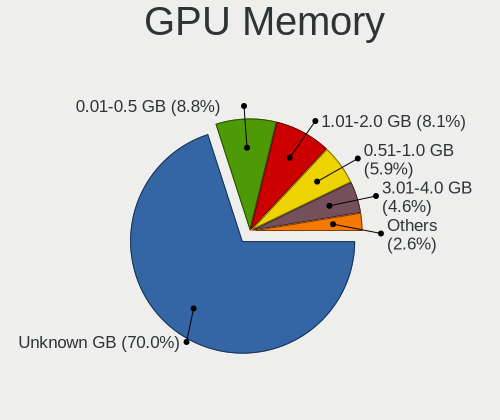

| Size in GB | Notebooks | Percent |
|------------|-----------|---------|
| Unknown    | 155       | 65.96%  |
| 1.01-2.0   | 24        | 10.21%  |
| 0.01-0.5   | 22        | 9.36%   |
| 0.51-1.0   | 16        | 6.81%   |
| 3.01-4.0   | 12        | 5.11%   |
| 2.01-3.0   | 3         | 1.28%   |
| 5.01-6.0   | 2         | 0.85%   |
| 7.01-8.0   | 1         | 0.43%   |

Monitor
-------

Monitor Vendor
--------------

Monitor vendors

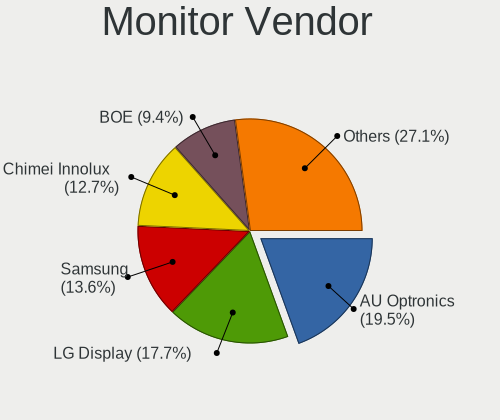

| Vendor                  | Notebooks | Percent |
|-------------------------|-----------|---------|
| AU Optronics            | 56        | 21.62%  |
| LG Display              | 44        | 16.99%  |
| Samsung Electronics     | 36        | 13.9%   |
| Chimei Innolux          | 34        | 13.13%  |
| BOE                     | 21        | 8.11%   |
| Dell                    | 10        | 3.86%   |
| PANDA                   | 6         | 2.32%   |
| Chi Mei Optoelectronics | 6         | 2.32%   |
| LG Philips              | 4         | 1.54%   |
| Lenovo                  | 4         | 1.54%   |
| Goldstar                | 4         | 1.54%   |
| Sharp                   | 3         | 1.16%   |
| Philips                 | 3         | 1.16%   |
| InnoLux Display         | 3         | 1.16%   |
| Hewlett-Packard         | 3         | 1.16%   |
| Apple                   | 3         | 1.16%   |
| Sony                    | 2         | 0.77%   |
| CSO                     | 2         | 0.77%   |
| Ancor Communications    | 2         | 0.77%   |
| Acer                    | 2         | 0.77%   |
| ___                     | 1         | 0.39%   |
| Vizio                   | 1         | 0.39%   |
| Unknown                 | 1         | 0.39%   |
| Seiko/Epson             | 1         | 0.39%   |
| Optoma                  | 1         | 0.39%   |
| MS_ Nvidia              | 1         | 0.39%   |
| LGD                     | 1         | 0.39%   |
| InfoVision              | 1         | 0.39%   |
| Iiyama                  | 1         | 0.39%   |
| CPT                     | 1         | 0.39%   |
| AOC                     | 1         | 0.39%   |

Monitor Model
-------------

Monitor models

| Model                                                                                 | Notebooks | Percent |
|---------------------------------------------------------------------------------------|-----------|---------|
| Samsung Electronics LCD Monitor SEC5441 1366x768 344x194mm 15.5-inch                  | 5         | 1.89%   |
| AU Optronics LCD Monitor AUO21ED 1920x1080 344x194mm 15.5-inch                        | 5         | 1.89%   |
| AU Optronics LCD Monitor AUO22EC 1366x768 344x193mm 15.5-inch                         | 3         | 1.13%   |
| AU Optronics LCD Monitor AUO193C 1366x768 309x173mm 13.9-inch                         | 3         | 1.13%   |
| Samsung Electronics LCD Monitor SEC3052 1366x768 256x144mm 11.6-inch                  | 2         | 0.75%   |
| PANDA LCD Monitor NCP0035 1920x1080 309x174mm 14.0-inch                               | 2         | 0.75%   |
| LG Philips LCD Monitor LPL3B01 1280x800 330x210mm 15.4-inch                           | 2         | 0.75%   |
| LG Display LCD Monitor LGD05E5 1920x1080 344x194mm 15.5-inch                          | 2         | 0.75%   |
| Dell U2412M DELA07A 1920x1200 518x324mm 24.1-inch                                     | 2         | 0.75%   |
| Chimei Innolux LCD Monitor CMN1735 1920x1080 382x215mm 17.3-inch                      | 2         | 0.75%   |
| Chimei Innolux LCD Monitor CMN15F5 1920x1080 344x193mm 15.5-inch                      | 2         | 0.75%   |
| Chimei Innolux LCD Monitor CMN15DB 1366x768 344x193mm 15.5-inch                       | 2         | 0.75%   |
| Chimei Innolux LCD Monitor CMN15C4 1920x1080 344x193mm 15.5-inch                      | 2         | 0.75%   |
| Chimei Innolux LCD Monitor CMN1471 1366x768 309x174mm 14.0-inch                       | 2         | 0.75%   |
| BOE LCD Monitor BOE06A5 1366x768 344x194mm 15.5-inch                                  | 2         | 0.75%   |
| BOE LCD Monitor BOE0687 1920x1080 344x193mm 15.5-inch                                 | 2         | 0.75%   |
| AU Optronics LCD Monitor AUO71EC 1366x768 340x190mm 15.3-inch                         | 2         | 0.75%   |
| AU Optronics LCD Monitor AUO63ED 1920x1080 344x193mm 15.5-inch                        | 2         | 0.75%   |
| AU Optronics LCD Monitor AUO38ED 1920x1080 340x190mm 15.3-inch                        | 2         | 0.75%   |
| AU Optronics LCD Monitor AUO313E 1600x900 309x174mm 14.0-inch                         | 2         | 0.75%   |
| AU Optronics LCD Monitor AUO213E 1600x900 309x174mm 14.0-inch                         | 2         | 0.75%   |
| ___ Monitor ranges (GTF): 48-62Hz V, 14-68kHz H, max dotclock 150MHz ___9000 1440x900 | 1         | 0.38%   |
| Vizio D32f-F1 VIZ1027 1920x1080 698x392mm 31.5-inch                                   | 1         | 0.38%   |
| Unknown LCD TV 9000 1360x768 1600x900mm 72.3-inch                                     | 1         | 0.38%   |
| Sony Nvidia Defaul t Flat Panel MS_0025 1920x1080 531x299mm 24.0-inch                 | 1         | 0.38%   |
| Sony BW8 MS_9001 1600x2560 113x181mm 8.4-inch                                         | 1         | 0.38%   |
| Sharp LCD SHP4200 1920x1080 410x230mm 18.5-inch                                       | 1         | 0.38%   |
| Sharp LCD Monitor SHP148B 3840x2160 294x165mm 13.3-inch                               | 1         | 0.38%   |
| Sharp LCD Monitor SHP144A 3200x1800 294x165mm 13.3-inch                               | 1         | 0.38%   |
| Seiko/Epson LCD Monitor 1440x900                                                      | 1         | 0.38%   |
| Samsung Electronics SyncMaster SAM037C 1680x1050 474x296mm 22.0-inch                  | 1         | 0.38%   |
| Samsung Electronics SMBX2450L SAM0720 1920x1080 521x293mm 23.5-inch                   | 1         | 0.38%   |
| Samsung Electronics SA300/SA350 SAM07D1 1920x1080 477x268mm 21.5-inch                 | 1         | 0.38%   |
| Samsung Electronics S23B300 SAM08AE 1680x1050 510x290mm 23.1-inch                     | 1         | 0.38%   |
| Samsung Electronics LCD Monitor SEC5541 1366x768 344x193mm 15.5-inch                  | 1         | 0.38%   |
| Samsung Electronics LCD Monitor SEC5448 1920x1080 344x194mm 15.5-inch                 | 1         | 0.38%   |
| Samsung Electronics LCD Monitor SEC504B 1600x900 382x215mm 17.3-inch                  | 1         | 0.38%   |
| Samsung Electronics LCD Monitor SEC4F45 1280x800 331x207mm 15.4-inch                  | 1         | 0.38%   |
| Samsung Electronics LCD Monitor SEC4C42 1280x800 303x190mm 14.1-inch                  | 1         | 0.38%   |
| Samsung Electronics LCD Monitor SEC4251 1366x768 344x194mm 15.5-inch                  | 1         | 0.38%   |
| Samsung Electronics LCD Monitor SEC4249 1366x768 309x174mm 14.0-inch                  | 1         | 0.38%   |
| Samsung Electronics LCD Monitor SEC3953 1366x768 256x144mm 11.6-inch                  | 1         | 0.38%   |
| Samsung Electronics LCD Monitor SEC3945 1280x800 331x207mm 15.4-inch                  | 1         | 0.38%   |
| Samsung Electronics LCD Monitor SEC3441 1366x768 309x174mm 14.0-inch                  | 1         | 0.38%   |
| Samsung Electronics LCD Monitor SEC3245 1366x768 344x194mm 15.5-inch                  | 1         | 0.38%   |
| Samsung Electronics LCD Monitor SEC3242 1920x1080 230x130mm 10.4-inch                 | 1         | 0.38%   |
| Samsung Electronics LCD Monitor SEC314B 1680x945 409x230mm 18.5-inch                  | 1         | 0.38%   |
| Samsung Electronics LCD Monitor SEC3047 1366x768 277x156mm 12.5-inch                  | 1         | 0.38%   |
| Samsung Electronics LCD Monitor SDC5344 1920x1080 344x194mm 15.5-inch                 | 1         | 0.38%   |
| Samsung Electronics LCD Monitor SDC4E51 1366x768 340x190mm 15.3-inch                  | 1         | 0.38%   |
| Samsung Electronics LCD Monitor SDC4C51 1366x768 344x194mm 15.5-inch                  | 1         | 0.38%   |
| Samsung Electronics LCD Monitor SDC4C48 1920x1080 409x230mm 18.5-inch                 | 1         | 0.38%   |
| Samsung Electronics LCD Monitor SDC4942 1366x768 309x174mm 14.0-inch                  | 1         | 0.38%   |
| Samsung Electronics LCD Monitor SDC434A 3200x1800 293x165mm 13.2-inch                 | 1         | 0.38%   |
| Samsung Electronics LCD Monitor SDC4141 1366x768 340x190mm 15.3-inch                  | 1         | 0.38%   |
| Samsung Electronics LCD Monitor SDC3854 1920x1080 382x215mm 17.3-inch                 | 1         | 0.38%   |
| Samsung Electronics LCD Monitor SDC3243 1366x768 256x144mm 11.6-inch                  | 1         | 0.38%   |
| Samsung Electronics LCD Monitor SAM07C0 1920x1080 700x390mm 31.5-inch                 | 1         | 0.38%   |
| Samsung Electronics LCD Monitor SAM0470 1920x1080                                     | 1         | 0.38%   |
| Samsung Electronics C27F591 SAM0D38 1920x1080 598x336mm 27.0-inch                     | 1         | 0.38%   |

Monitor Resolution
------------------

Monitor screen resolution

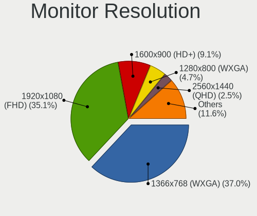

| Resolution         | Notebooks | Percent |
|--------------------|-----------|---------|
| 1920x1080 (FHD)    | 91        | 37.3%   |
| 1366x768 (WXGA)    | 86        | 35.25%  |
| 1600x900 (HD+)     | 22        | 9.02%   |
| 1280x800 (WXGA)    | 12        | 4.92%   |
| 1680x1050 (WSXGA+) | 5         | 2.05%   |
| 1440x900 (WXGA+)   | 5         | 2.05%   |
| 2560x1440 (QHD)    | 4         | 1.64%   |
| 1920x1200 (WUXGA)  | 4         | 1.64%   |
| 3840x2160 (4K)     | 3         | 1.23%   |
| 3200x1800 (QHD+)   | 2         | 0.82%   |
| 2560x1600          | 2         | 0.82%   |
| 1360x768           | 2         | 0.82%   |
| 3440x1440          | 1         | 0.41%   |
| 2880x1800          | 1         | 0.41%   |
| 2160x1440          | 1         | 0.41%   |
| 1680x945           | 1         | 0.41%   |
| 1600x1200          | 1         | 0.41%   |
| 1400x1050          | 1         | 0.41%   |

Monitor Diagonal
----------------

Diagonal size in inches

| Inches  | Notebooks | Percent |
|---------|-----------|---------|
| 15      | 103       | 39.46%  |
| 14      | 35        | 13.41%  |
| 13      | 32        | 12.26%  |
| 17      | 24        | 9.2%    |
| 12      | 10        | 3.83%   |
| 23      | 8         | 3.07%   |
| 21      | 8         | 3.07%   |
| 24      | 6         | 2.3%    |
| 11      | 6         | 2.3%    |
| Unknown | 6         | 2.3%    |
| 27      | 4         | 1.53%   |
| 18      | 4         | 1.53%   |
| 22      | 3         | 1.15%   |
| 20      | 2         | 0.77%   |
| 10      | 2         | 0.77%   |
| 72      | 1         | 0.38%   |
| 49      | 1         | 0.38%   |
| 40      | 1         | 0.38%   |
| 34      | 1         | 0.38%   |
| 29      | 1         | 0.38%   |
| 19      | 1         | 0.38%   |
| 16      | 1         | 0.38%   |
| 8       | 1         | 0.38%   |

Monitor Width
-------------

Physical width

| Width in mm | Notebooks | Percent |
|-------------|-----------|---------|
| 301-350     | 153       | 58.85%  |
| 201-300     | 31        | 11.92%  |
| 351-400     | 29        | 11.15%  |
| 401-500     | 18        | 6.92%   |
| 501-600     | 17        | 6.54%   |
| Unknown     | 6         | 2.31%   |
| 801-900     | 1         | 0.38%   |
| 701-800     | 1         | 0.38%   |
| 601-700     | 1         | 0.38%   |
| 1501-2000   | 1         | 0.38%   |
| 101-200     | 1         | 0.38%   |
| 1001-1500   | 1         | 0.38%   |

Aspect Ratio
------------

Proportional relationship between the width and the height

| Ratio   | Notebooks | Percent |
|---------|-----------|---------|
| 16/9    | 202       | 85.59%  |
| 16/10   | 24        | 10.17%  |
| 3/2     | 4         | 1.69%   |
| Unknown | 3         | 1.27%   |
| 4/3     | 1         | 0.42%   |
| 21/9    | 1         | 0.42%   |
| 0.62    | 1         | 0.42%   |

Monitor Area
------------

Area in inch

| Area in inch | Notebooks | Percent |
|----------------|-----------|---------|
| 101-110        | 102       | 39.08%  |
| 81-90          | 55        | 21.07%  |
| 201-250        | 20        | 7.66%   |
| 121-130        | 19        | 7.28%   |
| 71-80          | 12        | 4.6%    |
| 61-70          | 10        | 3.83%   |
| 51-60          | 6         | 2.3%    |
| Unknown        | 6         | 2.3%    |
| 131-140        | 5         | 1.92%   |
| 301-350        | 4         | 1.53%   |
| 251-300        | 4         | 1.53%   |
| 151-200        | 4         | 1.53%   |
| 141-150        | 4         | 1.53%   |
| More than 1000 | 2         | 0.77%   |
| 351-500        | 2         | 0.77%   |
| 41-50          | 2         | 0.77%   |
| 1-40           | 1         | 0.38%   |
| 111-120        | 1         | 0.38%   |
| 501-1000       | 1         | 0.38%   |
| 91-100         | 1         | 0.38%   |

Pixel Density
-------------

Pixels per inch

| Density       | Notebooks | Percent |
|---------------|-----------|---------|
| 121-160       | 95        | 36.82%  |
| 101-120       | 89        | 34.5%   |
| 51-100        | 45        | 17.44%  |
| 161-240       | 14        | 5.43%   |
| More than 240 | 7         | 2.71%   |
| Unknown       | 6         | 2.33%   |
| 1-50          | 2         | 0.78%   |

Multiple Monitors
-----------------

Total monitors connected

| Total | Notebooks | Percent |
|-------|-----------|---------|
| 1     | 191       | 81.28%  |
| 2     | 34        | 14.47%  |
| 3     | 5         | 2.13%   |
| 0     | 5         | 2.13%   |

Network
-------

Net Controller Vendor
---------------------

Controller vendors

| Vendor                            | Notebooks | Percent |
|-----------------------------------|-----------|---------|
| Intel                             | 125       | 33.78%  |
| Realtek Semiconductor             | 120       | 32.43%  |
| Qualcomm Atheros                  | 63        | 17.03%  |
| Broadcom                          | 24        | 6.49%   |
| Broadcom Limited                  | 9         | 2.43%   |
| Ralink Technology                 | 4         | 1.08%   |
| Ralink                            | 4         | 1.08%   |
| Marvell Technology Group          | 4         | 1.08%   |
| Sierra Wireless                   | 3         | 0.81%   |
| TP-Link                           | 2         | 0.54%   |
| Silicon Integrated Systems [SiS]  | 2         | 0.54%   |
| Ericsson Business Mobile Networks | 2         | 0.54%   |
| Xiaomi                            | 1         | 0.27%   |
| Tenda                             | 1         | 0.27%   |
| Samsung Electronics               | 1         | 0.27%   |
| Qualcomm Atheros Communications   | 1         | 0.27%   |
| Lenovo                            | 1         | 0.27%   |
| Hewlett-Packard                   | 1         | 0.27%   |
| FIBOCOM                           | 1         | 0.27%   |
| Dell                              | 1         | 0.27%   |

Net Controller Model
--------------------

Controller models

| Model                                                              | Notebooks | Percent |
|--------------------------------------------------------------------|-----------|---------|
| Realtek RTL8111/8168/8411 PCI Express Gigabit Ethernet Controller  | 79        | 17.44%  |
| Realtek RTL810xE PCI Express Fast Ethernet controller              | 28        | 6.18%   |
| Intel 82579LM Gigabit Network Connection (Lewisville)              | 20        | 4.42%   |
| Qualcomm Atheros QCA9377 802.11ac Wireless Network Adapter         | 13        | 2.87%   |
| Intel Wireless 7260                                                | 13        | 2.87%   |
| Intel Centrino Advanced-N 6205 [Taylor Peak]                       | 13        | 2.87%   |
| Qualcomm Atheros AR9485 Wireless Network Adapter                   | 11        | 2.43%   |
| Qualcomm Atheros AR9285 Wireless Network Adapter (PCI-Express)     | 11        | 2.43%   |
| Intel Wireless 7265                                                | 11        | 2.43%   |
| Broadcom BCM4313 802.11bgn Wireless Network Adapter                | 10        | 2.21%   |
| Intel Wireless 3165                                                | 9         | 1.99%   |
| Realtek RTL8821CE 802.11ac PCIe Wireless Network Adapter           | 8         | 1.77%   |
| Realtek RTL8153 Gigabit Ethernet Adapter                           | 8         | 1.77%   |
| Qualcomm Atheros QCA9565 / AR9565 Wireless Network Adapter         | 8         | 1.77%   |
| Intel Wireless 8265 / 8275                                         | 8         | 1.77%   |
| Intel Wi-Fi 6 AX200                                                | 8         | 1.77%   |
| Intel Ethernet Connection I217-LM                                  | 8         | 1.77%   |
| Realtek RTL8723BE PCIe Wireless Network Adapter                    | 6         | 1.32%   |
| Intel Ethernet Connection I218-LM                                  | 5         | 1.1%    |
| Intel Ethernet Connection (3) I218-LM                              | 5         | 1.1%    |
| Intel Centrino Ultimate-N 6300                                     | 5         | 1.1%    |
| Intel Centrino Advanced-N 6235                                     | 5         | 1.1%    |
| Intel 82577LM Gigabit Network Connection                           | 5         | 1.1%    |
| Realtek RTL8822BE 802.11a/b/g/n/ac WiFi adapter                    | 4         | 0.88%   |
| Qualcomm Atheros QCA6174 802.11ac Wireless Network Adapter         | 4         | 0.88%   |
| Qualcomm Atheros AR8151 v2.0 Gigabit Ethernet                      | 4         | 0.88%   |
| Intel Ice Lake-LP PCH CNVi WiFi                                    | 4         | 0.88%   |
| Intel Dual Band Wireless-AC 3165 Plus Bluetooth                    | 4         | 0.88%   |
| Intel Comet Lake PCH-LP CNVi WiFi                                  | 4         | 0.88%   |
| Intel Cannon Lake PCH CNVi WiFi                                    | 4         | 0.88%   |
| Qualcomm Atheros Killer E2400 Gigabit Ethernet Controller          | 3         | 0.66%   |
| Qualcomm Atheros AR928X Wireless Network Adapter (PCI-Express)     | 3         | 0.66%   |
| Intel Wi-Fi 6 AX201                                                | 3         | 0.66%   |
| Intel Ethernet Connection I219-V                                   | 3         | 0.66%   |
| Intel Ethernet Connection (4) I219-V                               | 3         | 0.66%   |
| Intel Centrino Wireless-N 1000 [Condor Peak]                       | 3         | 0.66%   |
| Intel Centrino Advanced-N 6200                                     | 3         | 0.66%   |
| Broadcom Limited BCM4352 802.11ac Wireless Network Adapter         | 3         | 0.66%   |
| Broadcom Limited BCM4312 802.11b/g LP-PHY                          | 3         | 0.66%   |
| Silicon Integrated Systems [SiS] 191 Gigabit Ethernet Adapter      | 2         | 0.44%   |
| Sierra Wireless EM7345 4G LTE                                      | 2         | 0.44%   |
| Realtek RTL8187B Wireless 802.11g 54Mbps Network Adapter           | 2         | 0.44%   |
| Ralink RT5370 Wireless Adapter                                     | 2         | 0.44%   |
| Ralink RT5390 Wireless 802.11n 1T/1R PCIe                          | 2         | 0.44%   |
| Qualcomm Atheros Killer E220x Gigabit Ethernet Controller          | 2         | 0.44%   |
| Intel Wireless-AC 9260                                             | 2         | 0.44%   |
| Intel Wireless 8260                                                | 2         | 0.44%   |
| Intel WiFi Link 5100                                               | 2         | 0.44%   |
| Intel Tiger Lake PCH CNVi WiFi                                     | 2         | 0.44%   |
| Intel PRO/Wireless 3945ABG [Golan] Network Connection              | 2         | 0.44%   |
| Intel Gemini Lake PCH CNVi WiFi                                    | 2         | 0.44%   |
| Intel Ethernet Connection (6) I219-V                               | 2         | 0.44%   |
| Intel Dual Band Wireless-AC 3168NGW [Stone Peak]                   | 2         | 0.44%   |
| Intel Cannon Point-LP CNVi [Wireless-AC]                           | 2         | 0.44%   |
| Ericsson Business Mobile Networks H5321 gw Mobile Broadband Driver | 2         | 0.44%   |
| Broadcom BCM43142 802.11b/g/n                                      | 2         | 0.44%   |
| Xiaomi Mi/Redmi series (RNDIS)                                     | 1         | 0.22%   |
| TP-Link TL-WN823N v2/v3 [Realtek RTL8192EU]                        | 1         | 0.22%   |
| TP-Link TL-WN822N Version 4 RTL8192EU                              | 1         | 0.22%   |
| Tenda U12                                                          | 1         | 0.22%   |

Wireless Vendor
---------------

Wireless vendors

| Vendor                          | Notebooks | Percent |
|---------------------------------|-----------|---------|
| Intel                           | 118       | 48.96%  |
| Qualcomm Atheros                | 53        | 21.99%  |
| Realtek Semiconductor           | 28        | 11.62%  |
| Broadcom                        | 18        | 7.47%   |
| Broadcom Limited                | 8         | 3.32%   |
| Ralink Technology               | 4         | 1.66%   |
| Ralink                          | 4         | 1.66%   |
| TP-Link                         | 2         | 0.83%   |
| Tenda                           | 1         | 0.41%   |
| Sierra Wireless                 | 1         | 0.41%   |
| Qualcomm Atheros Communications | 1         | 0.41%   |
| Hewlett-Packard                 | 1         | 0.41%   |
| FIBOCOM                         | 1         | 0.41%   |
| Dell                            | 1         | 0.41%   |

Wireless Model
--------------

Wireless models

| Model                                                                   | Notebooks | Percent |
|-------------------------------------------------------------------------|-----------|---------|
| Qualcomm Atheros QCA9377 802.11ac Wireless Network Adapter              | 13        | 5.39%   |
| Intel Wireless 7260                                                     | 13        | 5.39%   |
| Intel Centrino Advanced-N 6205 [Taylor Peak]                            | 13        | 5.39%   |
| Qualcomm Atheros AR9485 Wireless Network Adapter                        | 11        | 4.56%   |
| Qualcomm Atheros AR9285 Wireless Network Adapter (PCI-Express)          | 11        | 4.56%   |
| Intel Wireless 7265                                                     | 11        | 4.56%   |
| Broadcom BCM4313 802.11bgn Wireless Network Adapter                     | 10        | 4.15%   |
| Intel Wireless 3165                                                     | 9         | 3.73%   |
| Realtek RTL8821CE 802.11ac PCIe Wireless Network Adapter                | 8         | 3.32%   |
| Qualcomm Atheros QCA9565 / AR9565 Wireless Network Adapter              | 8         | 3.32%   |
| Intel Wireless 8265 / 8275                                              | 8         | 3.32%   |
| Intel Wi-Fi 6 AX200                                                     | 8         | 3.32%   |
| Realtek RTL8723BE PCIe Wireless Network Adapter                         | 6         | 2.49%   |
| Intel Centrino Ultimate-N 6300                                          | 5         | 2.07%   |
| Intel Centrino Advanced-N 6235                                          | 5         | 2.07%   |
| Realtek RTL8822BE 802.11a/b/g/n/ac WiFi adapter                         | 4         | 1.66%   |
| Qualcomm Atheros QCA6174 802.11ac Wireless Network Adapter              | 4         | 1.66%   |
| Intel Ice Lake-LP PCH CNVi WiFi                                         | 4         | 1.66%   |
| Intel Dual Band Wireless-AC 3165 Plus Bluetooth                         | 4         | 1.66%   |
| Intel Comet Lake PCH-LP CNVi WiFi                                       | 4         | 1.66%   |
| Intel Cannon Lake PCH CNVi WiFi                                         | 4         | 1.66%   |
| Qualcomm Atheros AR928X Wireless Network Adapter (PCI-Express)          | 3         | 1.24%   |
| Intel Wi-Fi 6 AX201                                                     | 3         | 1.24%   |
| Intel Centrino Wireless-N 1000 [Condor Peak]                            | 3         | 1.24%   |
| Intel Centrino Advanced-N 6200                                          | 3         | 1.24%   |
| Broadcom Limited BCM4352 802.11ac Wireless Network Adapter              | 3         | 1.24%   |
| Broadcom Limited BCM4312 802.11b/g LP-PHY                               | 3         | 1.24%   |
| Realtek RTL8187B Wireless 802.11g 54Mbps Network Adapter                | 2         | 0.83%   |
| Ralink RT5370 Wireless Adapter                                          | 2         | 0.83%   |
| Ralink RT5390 Wireless 802.11n 1T/1R PCIe                               | 2         | 0.83%   |
| Intel Wireless-AC 9260                                                  | 2         | 0.83%   |
| Intel Wireless 8260                                                     | 2         | 0.83%   |
| Intel WiFi Link 5100                                                    | 2         | 0.83%   |
| Intel Tiger Lake PCH CNVi WiFi                                          | 2         | 0.83%   |
| Intel PRO/Wireless 3945ABG [Golan] Network Connection                   | 2         | 0.83%   |
| Intel Gemini Lake PCH CNVi WiFi                                         | 2         | 0.83%   |
| Intel Dual Band Wireless-AC 3168NGW [Stone Peak]                        | 2         | 0.83%   |
| Intel Cannon Point-LP CNVi [Wireless-AC]                                | 2         | 0.83%   |
| Broadcom BCM43142 802.11b/g/n                                           | 2         | 0.83%   |
| TP-Link TL-WN823N v2/v3 [Realtek RTL8192EU]                             | 1         | 0.41%   |
| TP-Link TL-WN822N Version 4 RTL8192EU                                   | 1         | 0.41%   |
| Tenda U12                                                               | 1         | 0.41%   |
| Sierra Wireless EM7455                                                  | 1         | 0.41%   |
| Realtek RTL8822CE 802.11ac PCIe Wireless Network Adapter                | 1         | 0.41%   |
| Realtek RTL8812AU 802.11a/b/g/n/ac 2T2R DB WLAN Adapter                 | 1         | 0.41%   |
| Realtek RTL8723DE Wireless Network Adapter                              | 1         | 0.41%   |
| Realtek RTL8191SEvB Wireless LAN Controller                             | 1         | 0.41%   |
| Realtek RTL8188EE Wireless Network Adapter                              | 1         | 0.41%   |
| Realtek RTL8188CE 802.11b/g/n WiFi Adapter                              | 1         | 0.41%   |
| Realtek RTL8187B Wireless Adapter                                       | 1         | 0.41%   |
| Realtek 802.11ac NIC                                                    | 1         | 0.41%   |
| Ralink RT5572 Wireless Adapter                                          | 1         | 0.41%   |
| Ralink MT7601U Wireless Adapter                                         | 1         | 0.41%   |
| Ralink RT5390 [802.11 b/g/n 1T1R G-band PCI Express Single Chip]        | 1         | 0.41%   |
| Ralink RT3290 Wireless 802.11n 1T/1R PCIe                               | 1         | 0.41%   |
| Qualcomm Atheros AR9271 802.11n                                         | 1         | 0.41%   |
| Qualcomm Atheros AR9462 Wireless Network Adapter                        | 1         | 0.41%   |
| Qualcomm Atheros AR93xx Wireless Network Adapter                        | 1         | 0.41%   |
| Qualcomm Atheros AR242x / AR542x Wireless Network Adapter (PCI-Express) | 1         | 0.41%   |
| Intel Wireless 3160                                                     | 1         | 0.41%   |

Ethernet Vendor
---------------

Ethernet vendors

| Vendor                           | Notebooks | Percent |
|----------------------------------|-----------|---------|
| Realtek Semiconductor            | 114       | 54.81%  |
| Intel                            | 60        | 28.85%  |
| Qualcomm Atheros                 | 15        | 7.21%   |
| Broadcom                         | 7         | 3.37%   |
| Marvell Technology Group         | 4         | 1.92%   |
| Silicon Integrated Systems [SiS] | 2         | 0.96%   |
| Sierra Wireless                  | 2         | 0.96%   |
| Xiaomi                           | 1         | 0.48%   |
| Samsung Electronics              | 1         | 0.48%   |
| Lenovo                           | 1         | 0.48%   |
| Broadcom Limited                 | 1         | 0.48%   |

Ethernet Model
--------------

Ethernet models

| Model                                                             | Notebooks | Percent |
|-------------------------------------------------------------------|-----------|---------|
| Realtek RTL8111/8168/8411 PCI Express Gigabit Ethernet Controller | 79        | 37.62%  |
| Realtek RTL810xE PCI Express Fast Ethernet controller             | 28        | 13.33%  |
| Intel 82579LM Gigabit Network Connection (Lewisville)             | 20        | 9.52%   |
| Realtek RTL8153 Gigabit Ethernet Adapter                          | 8         | 3.81%   |
| Intel Ethernet Connection I217-LM                                 | 8         | 3.81%   |
| Intel Ethernet Connection I218-LM                                 | 5         | 2.38%   |
| Intel Ethernet Connection (3) I218-LM                             | 5         | 2.38%   |
| Intel 82577LM Gigabit Network Connection                          | 5         | 2.38%   |
| Qualcomm Atheros AR8151 v2.0 Gigabit Ethernet                     | 4         | 1.9%    |
| Qualcomm Atheros Killer E2400 Gigabit Ethernet Controller         | 3         | 1.43%   |
| Intel Ethernet Connection I219-V                                  | 3         | 1.43%   |
| Intel Ethernet Connection (4) I219-V                              | 3         | 1.43%   |
| Silicon Integrated Systems [SiS] 191 Gigabit Ethernet Adapter     | 2         | 0.95%   |
| Sierra Wireless EM7345 4G LTE                                     | 2         | 0.95%   |
| Qualcomm Atheros Killer E220x Gigabit Ethernet Controller         | 2         | 0.95%   |
| Intel Ethernet Connection (6) I219-V                              | 2         | 0.95%   |
| Xiaomi Mi/Redmi series (RNDIS)                                    | 1         | 0.48%   |
| Samsung Galaxy series, misc. (tethering mode)                     | 1         | 0.48%   |
| Realtek RTL8125 2.5GbE Controller                                 | 1         | 0.48%   |
| Qualcomm Atheros QCA8171 Gigabit Ethernet                         | 1         | 0.48%   |
| Qualcomm Atheros Killer E2500 Gigabit Ethernet Controller         | 1         | 0.48%   |
| Qualcomm Atheros AR8162 Fast Ethernet                             | 1         | 0.48%   |
| Qualcomm Atheros AR8161 Gigabit Ethernet                          | 1         | 0.48%   |
| Qualcomm Atheros AR8152 v2.0 Fast Ethernet                        | 1         | 0.48%   |
| Qualcomm Atheros AR8131 Gigabit Ethernet                          | 1         | 0.48%   |
| Marvell Group 88E8058 PCI-E Gigabit Ethernet Controller           | 1         | 0.48%   |
| Marvell Group 88E8057 PCI-E Gigabit Ethernet Controller           | 1         | 0.48%   |
| Marvell Group 88E8042 PCI-E Fast Ethernet Controller              | 1         | 0.48%   |
| Marvell Group 88E8039 PCI-E Fast Ethernet Controller              | 1         | 0.48%   |
| Lenovo ThinkPad TBT 3 Dock                                        | 1         | 0.48%   |
| Intel Ethernet Connection I219-LM                                 | 1         | 0.48%   |
| Intel Ethernet Connection (7) I219-V                              | 1         | 0.48%   |
| Intel Ethernet Connection (6) I219-LM                             | 1         | 0.48%   |
| Intel Ethernet Connection (5) I219-LM                             | 1         | 0.48%   |
| Intel Ethernet Connection (4) I219-LM                             | 1         | 0.48%   |
| Intel Ethernet Connection (2) I219-LM                             | 1         | 0.48%   |
| Intel Ethernet Connection (14) I219-LM                            | 1         | 0.48%   |
| Intel 82567LM Gigabit Network Connection                          | 1         | 0.48%   |
| Intel 82566MM Gigabit Network Connection                          | 1         | 0.48%   |
| Broadcom NetXtreme BCM57786 Gigabit Ethernet PCIe                 | 1         | 0.48%   |
| Broadcom NetXtreme BCM57765 Gigabit Ethernet PCIe                 | 1         | 0.48%   |
| Broadcom NetXtreme BCM5764M Gigabit Ethernet PCIe                 | 1         | 0.48%   |
| Broadcom NetXtreme BCM5755M Gigabit Ethernet PCI Express          | 1         | 0.48%   |
| Broadcom NetLink BCM5906M Fast Ethernet PCI Express               | 1         | 0.48%   |
| Broadcom NetLink BCM5787M Gigabit Ethernet PCI Express            | 1         | 0.48%   |
| Broadcom NetLink BCM57785 Gigabit Ethernet PCIe                   | 1         | 0.48%   |
| Broadcom Limited NetLink BCM57780 Gigabit Ethernet PCIe           | 1         | 0.48%   |

Net Controller Kind
-------------------

Ethernet, WiFi or modem

| Kind     | Notebooks | Percent |
|----------|-----------|---------|
| WiFi     | 229       | 52.76%  |
| Ethernet | 203       | 46.77%  |
| Modem    | 2         | 0.46%   |

Used Controller
---------------

Currently used network controller

| Kind     | Notebooks | Percent |
|----------|-----------|---------|
| WiFi     | 211       | 63.75%  |
| Ethernet | 119       | 35.95%  |
| Modem    | 1         | 0.3%    |

NICs
----

Total network controllers on board

| Total | Notebooks | Percent |
|-------|-----------|---------|
| 2     | 187       | 79.57%  |
| 1     | 45        | 19.15%  |
| 0     | 2         | 0.85%   |
| 3     | 1         | 0.43%   |

IPv6
----

IPv6 vs IPv4

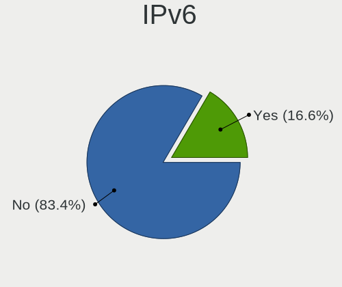

| Used | Notebooks | Percent |
|------|-----------|---------|
| No   | 209       | 88.94%  |
| Yes  | 26        | 11.06%  |

Bluetooth
---------

Bluetooth Vendor
----------------

Controller vendors

| Vendor                          | Notebooks | Percent |
|---------------------------------|-----------|---------|
| Intel                           | 87        | 47.8%   |
| Qualcomm Atheros Communications | 25        | 13.74%  |
| Broadcom                        | 18        | 9.89%   |
| Realtek Semiconductor           | 17        | 9.34%   |
| Dell                            | 9         | 4.95%   |
| Lite-On Technology              | 8         | 4.4%    |
| IMC Networks                    | 7         | 3.85%   |
| Foxconn / Hon Hai               | 3         | 1.65%   |
| Cambridge Silicon Radio         | 3         | 1.65%   |
| ASUSTek Computer                | 2         | 1.1%    |
| Ralink Technology               | 1         | 0.55%   |
| Ralink                          | 1         | 0.55%   |
| Apple                           | 1         | 0.55%   |

Bluetooth Model
---------------

Controller models

| Model                                               | Notebooks | Percent |
|-----------------------------------------------------|-----------|---------|
| Intel Bluetooth wireless interface                  | 39        | 21.43%  |
| Intel Bluetooth Device                              | 29        | 15.93%  |
| Realtek  Bluetooth 4.2 Adapter                      | 8         | 4.4%    |
| Qualcomm Atheros  Bluetooth Device                  | 8         | 4.4%    |
| Realtek Bluetooth Radio                             | 7         | 3.85%   |
| Qualcomm Atheros AR3011 Bluetooth                   | 7         | 3.85%   |
| Intel AX200 Bluetooth                               | 7         | 3.85%   |
| Qualcomm Atheros AR3012 Bluetooth 4.0               | 6         | 3.3%    |
| Intel Centrino Bluetooth Wireless Transceiver       | 6         | 3.3%    |
| Dell DW375 Bluetooth Module                         | 6         | 3.3%    |
| IMC Networks Bluetooth Device                       | 5         | 2.75%   |
| Qualcomm Atheros Bluetooth USB Host Controller      | 4         | 2.2%    |
| Broadcom BCM2070 Bluetooth 2.1 + EDR                | 4         | 2.2%    |
| Lite-On Qualcomm Atheros QCA9377 Bluetooth          | 3         | 1.65%   |
| Cambridge Silicon Radio Bluetooth Dongle (HCI mode) | 3         | 1.65%   |
| Broadcom HP Portable SoftSailing                    | 3         | 1.65%   |
| Broadcom BCM20702 Bluetooth 4.0 [ThinkPad]          | 3         | 1.65%   |
| Broadcom BCM2045B (BDC-2.1)                         | 3         | 1.65%   |
| Realtek RTL8723B Bluetooth                          | 2         | 1.1%    |
| Lite-On Bluetooth Device                            | 2         | 1.1%    |
| Lite-On Atheros AR3012 Bluetooth                    | 2         | 1.1%    |
| Intel Wireless-AC 9260 Bluetooth Adapter            | 2         | 1.1%    |
| Intel Wireless-AC 3168 Bluetooth                    | 2         | 1.1%    |
| Intel Centrino Advanced-N 6230 Bluetooth adapter    | 2         | 1.1%    |
| Foxconn / Hon Hai Bluetooth Device                  | 2         | 1.1%    |
| Dell Broadcom BCM20702A0 Bluetooth                  | 2         | 1.1%    |
| Broadcom BCM43142A0 Bluetooth 4.0                   | 2         | 1.1%    |
| Ralink CSR BS8510                                   | 1         | 0.55%   |
| Ralink RT3290 Bluetooth                             | 1         | 0.55%   |
| Lite-On Broadcom BCM43142A0 Bluetooth Device        | 1         | 0.55%   |
| IMC Networks Bluetooth Radio                        | 1         | 0.55%   |
| IMC Networks BCM20702A0                             | 1         | 0.55%   |
| Foxconn / Hon Hai BCM20702A0                        | 1         | 0.55%   |
| Dell Wireless 370 Bluetooth Mini-card               | 1         | 0.55%   |
| Broadcom HP Portable Valentine                      | 1         | 0.55%   |
| Broadcom BCM20702A0                                 | 1         | 0.55%   |
| Broadcom BCM2045 Bluetooth                          | 1         | 0.55%   |
| ASUS BT-270 Bluetooth Adapter                       | 1         | 0.55%   |
| ASUS Broadcom BCM20702A0 Bluetooth                  | 1         | 0.55%   |
| Apple Bluetooth HCI                                 | 1         | 0.55%   |

Sound
-----

Sound Vendor
------------

Sound card vendors

| Vendor                                         | Notebooks | Percent |
|------------------------------------------------|-----------|---------|
| Intel                                          | 193       | 66.78%  |
| AMD                                            | 40        | 13.84%  |
| Nvidia                                         | 39        | 13.49%  |
| Silicon Integrated Systems [SiS]               | 2         | 0.69%   |
| Realtek Semiconductor                          | 2         | 0.69%   |
| Lenovo                                         | 2         | 0.69%   |
| Sony                                           | 1         | 0.35%   |
| Siemens Information and Communication Products | 1         | 0.35%   |
| Plantronics                                    | 1         | 0.35%   |
| Meizu                                          | 1         | 0.35%   |
| Logitech                                       | 1         | 0.35%   |
| GN Netcom                                      | 1         | 0.35%   |
| Generalplus Technology                         | 1         | 0.35%   |
| FiiO Electronics Technology                    | 1         | 0.35%   |
| Corsair                                        | 1         | 0.35%   |
| CalDigit                                       | 1         | 0.35%   |
| C-Media Electronics                            | 1         | 0.35%   |

Sound Model
-----------

Sound card models

| Model                                                                                             | Notebooks | Percent |
|---------------------------------------------------------------------------------------------------|-----------|---------|
| Intel 6 Series/C200 Series Chipset Family High Definition Audio Controller                        | 29        | 8.17%   |
| Intel 7 Series/C216 Chipset Family High Definition Audio Controller                               | 27        | 7.61%   |
| Intel Sunrise Point-LP HD Audio                                                                   | 23        | 6.48%   |
| AMD Family 17h (Models 10h-1fh) HD Audio Controller                                               | 17        | 4.79%   |
| Intel Wildcat Point-LP High Definition Audio Controller                                           | 14        | 3.94%   |
| Intel Broadwell-U Audio Controller                                                                | 14        | 3.94%   |
| Intel 5 Series/3400 Series Chipset High Definition Audio                                          | 13        | 3.66%   |
| Intel 8 Series/C220 Series Chipset High Definition Audio Controller                               | 11        | 3.1%    |
| AMD Raven/Raven2/Fenghuang HDMI/DP Audio Controller                                               | 11        | 3.1%    |
| Intel Haswell-ULT HD Audio Controller                                                             | 10        | 2.82%   |
| Intel 8 Series HD Audio Controller                                                                | 10        | 2.82%   |
| Intel Xeon E3-1200 v3/4th Gen Core Processor HD Audio Controller                                  | 9         | 2.54%   |
| Intel Cannon Point-LP High Definition Audio Controller                                            | 9         | 2.54%   |
| Intel Cannon Lake PCH cAVS                                                                        | 9         | 2.54%   |
| Intel 82801I (ICH9 Family) HD Audio Controller                                                    | 8         | 2.25%   |
| Nvidia GF108 High Definition Audio Controller                                                     | 7         | 1.97%   |
| AMD High Definition Audio Controller                                                              | 6         | 1.69%   |
| AMD FCH Azalia Controller                                                                         | 6         | 1.69%   |
| AMD Family 15h (Models 60h-6fh) Audio Controller                                                  | 6         | 1.69%   |
| Nvidia GP107GL High Definition Audio Controller                                                   | 5         | 1.41%   |
| Intel 82801H (ICH8 Family) HD Audio Controller                                                    | 5         | 1.41%   |
| AMD SBx00 Azalia (Intel HDA)                                                                      | 5         | 1.41%   |
| AMD Renoir Radeon High Definition Audio Controller                                                | 5         | 1.41%   |
| Intel Tiger Lake-LP Smart Sound Technology Audio Controller                                       | 4         | 1.13%   |
| Intel Ice Lake-LP Smart Sound Technology Audio Controller                                         | 4         | 1.13%   |
| Intel Comet Lake PCH-LP cAVS                                                                      | 4         | 1.13%   |
| Intel CM238 HD Audio Controller                                                                   | 4         | 1.13%   |
| Intel Celeron/Pentium Silver Processor High Definition Audio                                      | 4         | 1.13%   |
| Intel Atom Processor Z36xxx/Z37xxx Series High Definition Audio Controller                        | 4         | 1.13%   |
| Intel 100 Series/C230 Series Chipset Family HD Audio Controller                                   | 4         | 1.13%   |
| AMD Kabini HDMI/DP Audio                                                                          | 4         | 1.13%   |
| Nvidia TU107 GeForce GTX 1650 High Definition Audio Controller                                    | 3         | 0.85%   |
| Nvidia High Definition Audio Controller                                                           | 3         | 0.85%   |
| Nvidia GK107 HDMI Audio Controller                                                                | 3         | 0.85%   |
| Nvidia GK104 HDMI Audio Controller                                                                | 3         | 0.85%   |
| Intel Atom/Celeron/Pentium Processor x5-E8000/J3xxx/N3xxx Series High Definition Audio Controller | 3         | 0.85%   |
| Silicon Integrated Systems [SiS] Azalia Audio Controller                                          | 2         | 0.56%   |
| Realtek Semiconductor USB Audio                                                                   | 2         | 0.56%   |
| Nvidia GP106 High Definition Audio Controller                                                     | 2         | 0.56%   |
| Nvidia GK208 HDMI/DP Audio Controller                                                             | 2         | 0.56%   |
| Nvidia GF119 HDMI Audio Controller                                                                | 2         | 0.56%   |
| Nvidia GF106 High Definition Audio Controller                                                     | 2         | 0.56%   |
| Nvidia Audio device                                                                               | 2         | 0.56%   |
| Intel Tiger Lake-H HD Audio Controller                                                            | 2         | 0.56%   |
| Intel Celeron N3350/Pentium N4200/Atom E3900 Series Audio Cluster                                 | 2         | 0.56%   |
| AMD Wrestler HDMI Audio                                                                           | 2         | 0.56%   |
| AMD RV620 HDMI Audio [Radeon HD 3450/3470/3550/3570]                                              | 2         | 0.56%   |
| AMD Cedar HDMI Audio [Radeon HD 5400/6300/7300 Series]                                            | 2         | 0.56%   |
| Sony DualShock 4 [CUH-ZCT2x]                                                                      | 1         | 0.28%   |
| Siemens Information and Communication Products optiPoint 500                                      | 1         | 0.28%   |
| Plantronics C320-M                                                                                | 1         | 0.28%   |
| Nvidia TU106 High Definition Audio Controller                                                     | 1         | 0.28%   |
| Nvidia stereo controller                                                                          | 1         | 0.28%   |
| Nvidia MCP79 High Definition Audio                                                                | 1         | 0.28%   |
| Nvidia GT216 HDMI Audio Controller                                                                | 1         | 0.28%   |
| Nvidia GM206 High Definition Audio Controller                                                     | 1         | 0.28%   |
| Nvidia GF114 HDMI Audio Controller                                                                | 1         | 0.28%   |
| Nvidia GA104 High Definition Audio Controller                                                     | 1         | 0.28%   |
| Meizu HiFi DAC Headphone Amplifier                                                                | 1         | 0.28%   |
| Logitech Headset H390                                                                             | 1         | 0.28%   |

Memory
------

Memory Vendor
-------------

Memory module vendors

| Vendor                                           | Notebooks | Percent |
|--------------------------------------------------|-----------|---------|
| Samsung Electronics                              | 49        | 24.14%  |
| SK Hynix                                         | 39        | 19.21%  |
| Micron Technology                                | 27        | 13.3%   |
| Kingston                                         | 18        | 8.87%   |
| Unknown                                          | 13        | 6.4%    |
| Crucial                                          | 12        | 5.91%   |
| ELPIDA                                           | 7         | 3.45%   |
| Ramaxel Technology                               | 6         | 2.96%   |
| Nanya Technology                                 | 6         | 2.96%   |
| Smart                                            | 5         | 2.46%   |
| A-DATA Technology                                | 3         | 1.48%   |
| Unknown (ABCD)                                   | 2         | 0.99%   |
| Teikon                                           | 2         | 0.99%   |
| Patriot                                          | 2         | 0.99%   |
| GOODRAM                                          | 2         | 0.99%   |
| Corsair                                          | 2         | 0.99%   |
| Unknown (0x4D342037305435363633515A332D43463720) | 1         | 0.49%   |
| Unknown (0x36345431323830323045444C322E35433220) | 1         | 0.49%   |
| Team                                             | 1         | 0.49%   |
| Qimonda                                          | 1         | 0.49%   |
| Netlist                                          | 1         | 0.49%   |
| G.Skill                                          | 1         | 0.49%   |
| ASint Technology                                 | 1         | 0.49%   |
| Apacer                                           | 1         | 0.49%   |

Memory Model
------------

Memory module models

| Model                                                                                 | Notebooks | Percent |
|---------------------------------------------------------------------------------------|-----------|---------|
| Samsung RAM M471A5244CB0-CTD 4GB SODIMM DDR4 3266MT/s                                 | 6         | 2.76%   |
| SK Hynix RAM HMT351S6CFR8C-PB 4GB SODIMM DDR3 1600MT/s                                | 5         | 2.3%    |
| Micron RAM 16KTF1G64HZ-1G6E1 8GB SODIMM DDR3 1600MT/s                                 | 5         | 2.3%    |
| Samsung RAM M471B5773DH0-CH9 2048MB SODIMM DDR3 1600MT/s                              | 4         | 1.84%   |
| Samsung RAM M471A5244CB0-CRC 4096MB SODIMM DDR4 2667MT/s                              | 3         | 1.38%   |
| Unknown RAM Module 4096MB SODIMM DDR3                                                 | 2         | 0.92%   |
| Unknown RAM Module 2048MB SODIMM DRAM                                                 | 2         | 0.92%   |
| Unknown (ABCD) RAM 123456789012345678 2GB SODIMM LPDDR4 2400MT/s                      | 2         | 0.92%   |
| Smart RAM SH564128FH8NZPHSCG 4GB SODIMM DDR3 1333MT/s                                 | 2         | 0.92%   |
| SK Hynix RAM HMT451S6BFR8A-PB 4GB SODIMM DDR3 1600MT/s                                | 2         | 0.92%   |
| SK Hynix RAM HMT351S6EFR8A-PB 4GB SODIMM DDR3 1600MT/s                                | 2         | 0.92%   |
| SK Hynix RAM HMT351S6CFR8C-H9 4GB SODIMM DDR3 1333MT/s                                | 2         | 0.92%   |
| SK Hynix RAM HMA851S6AFR6N-UH 4096MB SODIMM DDR4 2667MT/s                             | 2         | 0.92%   |
| SK Hynix RAM HMA81GS6CJR8N-XN 8192MB SODIMM DDR4 3200MT/s                             | 2         | 0.92%   |
| Samsung RAM M471B5673FH0-CH9 2GB SODIMM DDR3 1334MT/s                                 | 2         | 0.92%   |
| Samsung RAM M471B5273EB0-CK0 4096MB SODIMM DDR3 4199MT/s                              | 2         | 0.92%   |
| Samsung RAM M471B5273DH0-CH9 4096MB SODIMM DDR3 1334MT/s                              | 2         | 0.92%   |
| Samsung RAM M471B5273CH0-CK0 4GB SODIMM DDR3 1600MT/s                                 | 2         | 0.92%   |
| Samsung RAM M471B5273CH0-CH9 4GB SODIMM DDR3 1334MT/s                                 | 2         | 0.92%   |
| Samsung RAM M471B5173DB0-YK0 4096MB SODIMM DDR3 1600MT/s                              | 2         | 0.92%   |
| Samsung RAM M471B1G73QH0-YK0 8192MB SODIMM DDR3 2667MT/s                              | 2         | 0.92%   |
| Samsung RAM M471A5244CB0-CTD 4GB Row Of Chips DDR4 2667MT/s                           | 2         | 0.92%   |
| Samsung RAM M471A1K43DB1-CWE 8192MB SODIMM DDR4 3200MT/s                              | 2         | 0.92%   |
| Samsung RAM M471A1K43DB1-CTD 8GB SODIMM DDR4 2667MT/s                                 | 2         | 0.92%   |
| Samsung RAM M471A1K43CB1-CRC 8192MB SODIMM DDR4 2667MT/s                              | 2         | 0.92%   |
| Samsung RAM M471A1K43BB1-CRC 8GB SODIMM DDR4 2667MT/s                                 | 2         | 0.92%   |
| Micron RAM MT52L1G32D4PG-093 8GB Row Of Chips LPDDR3 2133MT/s                         | 2         | 0.92%   |
| Micron RAM 8KTF51264HZ-1G6N1 4GB SODIMM DDR3 1600MT/s                                 | 2         | 0.92%   |
| Micron RAM 4ATF51264HZ-2G6E1 4GB SODIMM DDR4 2667MT/s                                 | 2         | 0.92%   |
| Crucial RAM CT51264BF160BJ.M8F 4GB SODIMM DDR3 1600MT/s                               | 2         | 0.92%   |
| Crucial RAM CT51264BF160B.C16F 4GB SODIMM DDR3 1600MT/s                               | 2         | 0.92%   |
| Crucial RAM CT102464BF160B.M16 8GB SODIMM DDR3 1600MT/s                               | 2         | 0.92%   |
| Corsair RAM CMSO4GX3M1A1333C9 4GB SODIMM DDR3 1334MT/s                                | 2         | 0.92%   |
| A-DATA RAM AO1P26KC8T1-BXPS 8GB SODIMM DDR4 2667MT/s                                  | 2         | 0.92%   |
| Unknown RAM Module 4096MB SODIMM LPDDR3 1600MT/s                                      | 1         | 0.46%   |
| Unknown RAM Module 4096MB SODIMM DDR3 1334MT/s                                        | 1         | 0.46%   |
| Unknown RAM Module 4096MB SODIMM DDR3 1066MT/s                                        | 1         | 0.46%   |
| Unknown RAM Module 2048MB SODIMM LPDDR4 2400MT/s                                      | 1         | 0.46%   |
| Unknown RAM Module 2048MB SODIMM DDR3 1333MT/s                                        | 1         | 0.46%   |
| Unknown RAM Module 2048MB SODIMM DDR3                                                 | 1         | 0.46%   |
| Unknown RAM Module 2048MB SODIMM DDR2 800MT/s                                         | 1         | 0.46%   |
| Unknown RAM Module 16384MB SODIMM DDR4 2400MT/s                                       | 1         | 0.46%   |
| Unknown RAM Module 1536MB SODIMM LPDDR4 2133MT/s                                      | 1         | 0.46%   |
| Unknown RAM Module 1024MB SODIMM DRAM                                                 | 1         | 0.46%   |
| Unknown (0x4D342037305435363633515A332D43463720) RAM Module 2048MB SODIMM DDR 800MT/s | 1         | 0.46%   |
| Unknown (0x36345431323830323045444C322E35433220) RAM Module 1024MB SODIMM DDR 800MT/s | 1         | 0.46%   |
| Teikon RAM TMT251S6FR8C-H9HC 4GB SODIMM DDR3 1333MT/s                                 | 1         | 0.46%   |
| Teikon RAM TML251S6EFR8A-PBHC 4GB SODIMM DDR3 1600MT/s                                | 1         | 0.46%   |
| Team RAM TEAMGROUP-SD4-3200 16GB SODIMM DDR4 3200MT/s                                 | 1         | 0.46%   |
| Smart RAM SH564568FH8NZPHSCR 2GB SODIMM DDR3 1333MT/s                                 | 1         | 0.46%   |
| Smart RAM SH564568FH8NWPHSFG 2GB SODIMM DDR3 1333MT/s                                 | 1         | 0.46%   |
| Smart RAM SH5641G8FJ8NWRNSQG 8GB SODIMM DDR3 1600MT/s                                 | 1         | 0.46%   |
| Smart RAM SF4641G8CK8IEHLSBG 8192MB SODIMM DDR4 2667MT/s                              | 1         | 0.46%   |
| SK Hynix RAM Module 2048MB SODIMM DDR3 1066MT/s                                       | 1         | 0.46%   |
| SK Hynix RAM Module 2048MB DIMM DDR3 1066MT/s                                         | 1         | 0.46%   |
| SK Hynix RAM Module 16384MB SODIMM DDR4 2667MT/s                                      | 1         | 0.46%   |
| SK Hynix RAM Module 16384MB SODIMM DDR4 2133MT/s                                      | 1         | 0.46%   |
| SK Hynix RAM HYMP112S64CP6-S6 1GB SODIMM DDR2 800MT/s                                 | 1         | 0.46%   |
| SK Hynix RAM HMT451S6CFR6A-PB 4GB SODIMM DDR3 1600MT/s                                | 1         | 0.46%   |
| SK Hynix RAM HMT451S6BFR8A-PB 4096MB SODIMM DDR3 1600MT/s                             | 1         | 0.46%   |

Memory Kind
-----------

Memory module kinds

| Kind   | Notebooks | Percent |
|--------|-----------|---------|
| DDR3   | 86        | 50.29%  |
| DDR4   | 58        | 33.92%  |
| LPDDR4 | 7         | 4.09%   |
| LPDDR3 | 6         | 3.51%   |
| DDR2   | 6         | 3.51%   |
| SDRAM  | 5         | 2.92%   |
| DRAM   | 2         | 1.17%   |
| DDR    | 1         | 0.58%   |

Memory Form Factor
------------------

Physical design of the memory module

| Name         | Notebooks | Percent |
|--------------|-----------|---------|
| SODIMM       | 156       | 91.76%  |
| Row Of Chips | 11        | 6.47%   |
| Chip         | 2         | 1.18%   |
| DIMM         | 1         | 0.59%   |

Memory Size
-----------

Memory module size

| Size  | Notebooks | Percent |
|-------|-----------|---------|
| 4096  | 75        | 39.68%  |
| 8192  | 56        | 29.63%  |
| 2048  | 33        | 17.46%  |
| 16384 | 15        | 7.94%   |
| 32768 | 5         | 2.65%   |
| 1024  | 4         | 2.12%   |
| 1536  | 1         | 0.53%   |

Memory Speed
------------

Memory module speed

| Speed   | Notebooks | Percent |
|---------|-----------|---------|
| 1600    | 54        | 28.27%  |
| 2667    | 36        | 18.85%  |
| 1334    | 20        | 10.47%  |
| 3200    | 16        | 8.38%   |
| 1333    | 14        | 7.33%   |
| 2400    | 10        | 5.24%   |
| 2133    | 9         | 4.71%   |
| 3266    | 6         | 3.14%   |
| Unknown | 5         | 2.62%   |
| 4199    | 4         | 2.09%   |
| 1067    | 3         | 1.57%   |
| 1066    | 3         | 1.57%   |
| 800     | 3         | 1.57%   |
| 667     | 3         | 1.57%   |
| 4267    | 1         | 0.52%   |
| 2048    | 1         | 0.52%   |
| 1867    | 1         | 0.52%   |
| 975     | 1         | 0.52%   |
| 533     | 1         | 0.52%   |

Printers & scanners
-------------------

Printer Vendor
--------------

Printer device vendors

| Vendor              | Notebooks | Percent |
|---------------------|-----------|---------|
| QinHeng Electronics | 1         | 33.33%  |
| Canon               | 1         | 33.33%  |
| Brother Industries  | 1         | 33.33%  |

Printer Model
-------------

Printer device models

| Model                            | Notebooks | Percent |
|----------------------------------|-----------|---------|
| QinHeng CH340S                   | 1         | 33.33%  |
| Canon PIXMA MG2500 Series        | 1         | 33.33%  |
| Brother DCP-7055 scanner/printer | 1         | 33.33%  |

Scanner Vendor
--------------

Scanner device vendors

| Vendor      | Notebooks | Percent |
|-------------|-----------|---------|
| Seiko Epson | 2         | 100%    |

Scanner Model
-------------

Scanner device models

| Model                                            | Notebooks | Percent |
|--------------------------------------------------|-----------|---------|
| Seiko Epson GT-X900 [Perfection V700/V750 Photo] | 1         | 50%     |
| Seiko Epson ES-D400 [GT-S80]                     | 1         | 50%     |

Camera
------

Camera Vendor
-------------

Camera device vendors

| Vendor                                 | Notebooks | Percent |
|----------------------------------------|-----------|---------|
| Chicony Electronics                    | 63        | 30.43%  |
| Acer                                   | 22        | 10.63%  |
| Microdia                               | 19        | 9.18%   |
| Sunplus Innovation Technology          | 16        | 7.73%   |
| IMC Networks                           | 13        | 6.28%   |
| Realtek Semiconductor                  | 10        | 4.83%   |
| Cheng Uei Precision Industry (Foxlink) | 9         | 4.35%   |
| Ricoh                                  | 8         | 3.86%   |
| Quanta                                 | 8         | 3.86%   |
| Silicon Motion                         | 6         | 2.9%    |
| Lite-On Technology                     | 5         | 2.42%   |
| Syntek                                 | 4         | 1.93%   |
| Suyin                                  | 4         | 1.93%   |
| Logitech                               | 3         | 1.45%   |
| Apple                                  | 3         | 1.45%   |
| Luxvisions Innotech Limited            | 2         | 0.97%   |
| Alcor Micro                            | 2         | 0.97%   |
| Y Media                                | 1         | 0.48%   |
| Samsung Electronics                    | 1         | 0.48%   |
| Ruision                                | 1         | 0.48%   |
| Primax Electronics                     | 1         | 0.48%   |
| Microsoft                              | 1         | 0.48%   |
| Lenovo                                 | 1         | 0.48%   |
| Importek                               | 1         | 0.48%   |
| Generalplus Technology                 | 1         | 0.48%   |
| Cubeternet                             | 1         | 0.48%   |
| Aveo Technology                        | 1         | 0.48%   |

Camera Model
------------

Camera device models

| Model                                            | Notebooks | Percent |
|--------------------------------------------------|-----------|---------|
| Chicony Integrated Camera                        | 17        | 8.17%   |
| Sunplus Integrated_Webcam_HD                     | 8         | 3.85%   |
| Acer Integrated Camera                           | 6         | 2.88%   |
| IMC Networks USB2.0 HD UVC WebCam                | 5         | 2.4%    |
| Acer BisonCam, NB Pro                            | 5         | 2.4%    |
| Ricoh HD Webcam                                  | 4         | 1.92%   |
| Microdia Laptop_Integrated_Webcam_HD             | 4         | 1.92%   |
| Sunplus Laptop_Integrated_Webcam_FHD             | 3         | 1.44%   |
| Realtek Integrated_Webcam_HD                     | 3         | 1.44%   |
| Quanta HD User Facing                            | 3         | 1.44%   |
| Microdia Integrated_Webcam_HD                    | 3         | 1.44%   |
| Microdia Integrated Webcam                       | 3         | 1.44%   |
| Lite-On HP HD Camera                             | 3         | 1.44%   |
| Chicony USB2.0 VGA UVC WebCam                    | 3         | 1.44%   |
| Chicony Integrated Camera (1280x720@30)          | 3         | 1.44%   |
| Chicony HP Wide Vision HD Camera                 | 3         | 1.44%   |
| Chicony HP HD Webcam                             | 3         | 1.44%   |
| Chicony HD Webcam                                | 3         | 1.44%   |
| Cheng Uei Precision Industry (Foxlink) HP Webcam | 3         | 1.44%   |
| Acer Lenovo EasyCamera                           | 3         | 1.44%   |
| Syntek EasyCamera                                | 2         | 0.96%   |
| Silicon Motion WebCam SC-13HDL11939N             | 2         | 0.96%   |
| Silicon Motion 300k Pixel Camera                 | 2         | 0.96%   |
| Ricoh Sony Visual Communication Camera           | 2         | 0.96%   |
| Ricoh Laptop_Integrated_Webcam_FHD               | 2         | 0.96%   |
| Realtek USB Camera                               | 2         | 0.96%   |
| Realtek Lenovo EasyCamera                        | 2         | 0.96%   |
| Quanta VGA WebCam                                | 2         | 0.96%   |
| Quanta Laptop_Integrated_Webcam_2HDM             | 2         | 0.96%   |
| Microdia Laptop_Integrated_Webcam_2M             | 2         | 0.96%   |
| Microdia Dell Integrated HD Webcam               | 2         | 0.96%   |
| IMC Networks USB2.0 VGA UVC WebCam               | 2         | 0.96%   |
| Chicony USB2.0 UVC WebCam                        | 2         | 0.96%   |
| Chicony Lenovo Integrated Camera (0.3MP)         | 2         | 0.96%   |
| Chicony HP Webcam-101                            | 2         | 0.96%   |
| Chicony HP HD Webcam [Fixed]                     | 2         | 0.96%   |
| Chicony HD WebCam (Acer)                         | 2         | 0.96%   |
| Chicony CNF9055 Toshiba Webcam                   | 2         | 0.96%   |
| Cheng Uei Precision Industry (Foxlink) Webcam    | 2         | 0.96%   |
| Y Media USB Camera                               | 1         | 0.48%   |
| Syntek USB Video Device                          | 1         | 0.48%   |
| Syntek Integrated Camera                         | 1         | 0.48%   |
| Suyin Sony Visual Communication Camera           | 1         | 0.48%   |
| Suyin HP TrueVision HD Integrated Webcam         | 1         | 0.48%   |
| Suyin Acer/HP Integrated Webcam [CN0314]         | 1         | 0.48%   |
| Suyin 1.3M HD WebCam                             | 1         | 0.48%   |
| Sunplus Integrated_Webcam_FHD                    | 1         | 0.48%   |
| Sunplus HP Universal Camera                      | 1         | 0.48%   |
| Sunplus HP HD Webcam [Fixed]                     | 1         | 0.48%   |
| Sunplus HD WebCam                                | 1         | 0.48%   |
| Sunplus Dell Integrated Webcam                   | 1         | 0.48%   |
| Silicon Motion WebCam SCB-1100N                  | 1         | 0.48%   |
| Silicon Motion WebCam SC-10HDP12631N             | 1         | 0.48%   |
| Samsung Galaxy A5 (MTP)                          | 1         | 0.48%   |
| Ruision UVC Camera                               | 1         | 0.48%   |
| Realtek HP Truevision HD                         | 1         | 0.48%   |
| Realtek EasyCamera                               | 1         | 0.48%   |
| Realtek Acer 640 x 480 laptop camera             | 1         | 0.48%   |
| Quanta HP HD Camera                              | 1         | 0.48%   |
| Primax HP HD Webcam [Fixed]                      | 1         | 0.48%   |

Security
--------

Fingerprint Vendor
------------------

Fingerprint sensor vendors

| Vendor                     | Notebooks | Percent |
|----------------------------|-----------|---------|
| Validity Sensors           | 20        | 54.05%  |
| Synaptics                  | 9         | 24.32%  |
| Upek                       | 3         | 8.11%   |
| Shenzhen Goodix Technology | 2         | 5.41%   |
| Elan Microelectronics      | 2         | 5.41%   |
| Focal-systems.Corp         | 1         | 2.7%    |

Fingerprint Model
-----------------

Fingerprint sensor models

| Model                                                      | Notebooks | Percent |
|------------------------------------------------------------|-----------|---------|
| Validity Sensors VFS5011 Fingerprint Reader                | 4         | 10.81%  |
| Validity Sensors VFS491                                    | 4         | 10.81%  |
| Validity Sensors VFS 5011 fingerprint sensor               | 4         | 10.81%  |
| Validity Sensors VFS495 Fingerprint Reader                 | 3         | 8.11%   |
| Synaptics Prometheus MIS Touch Fingerprint Reader          | 3         | 8.11%   |
| Upek Biometric Touchchip/Touchstrip Fingerprint Sensor     | 2         | 5.41%   |
| Synaptics  VFS7552 Touch Fingerprint Sensor with PurePrint | 2         | 5.41%   |
| Synaptics Metallica MIS Touch Fingerprint Reader           | 2         | 5.41%   |
| Shenzhen Goodix Fingerprint Reader                         | 2         | 5.41%   |
| Elan ELAN:Fingerprint                                      | 2         | 5.41%   |
| Validity Sensors VFS7500 Touch Fingerprint Sensor          | 1         | 2.7%    |
| Validity Sensors VFS471 Fingerprint Reader                 | 1         | 2.7%    |
| Validity Sensors VFS301 Fingerprint Reader                 | 1         | 2.7%    |
| Validity Sensors Synaptics WBDI                            | 1         | 2.7%    |
| Validity Sensors Swipe Fingerprint Sensor                  | 1         | 2.7%    |
| Upek TCS5B Fingerprint sensor                              | 1         | 2.7%    |
| Synaptics Metallica MOH Touch Fingerprint Reader           | 1         | 2.7%    |
| Focal-systems.Corp FT9201Fingerprint.                      | 1         | 2.7%    |
| Unknown                                                    | 1         | 2.7%    |

Chipcard Vendor
---------------

Chipcard module vendors

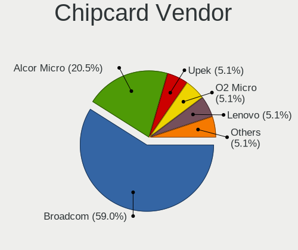

| Vendor                | Notebooks | Percent |
|-----------------------|-----------|---------|
| Broadcom              | 21        | 61.76%  |
| Alcor Micro           | 6         | 17.65%  |
| Upek                  | 2         | 5.88%   |
| Lenovo                | 2         | 5.88%   |
| O2 Micro              | 1         | 2.94%   |
| Gemalto (was Gemplus) | 1         | 2.94%   |
| Advanced Card Systems | 1         | 2.94%   |

Chipcard Model
--------------

Chipcard module models

| Model                                                                        | Notebooks | Percent |
|------------------------------------------------------------------------------|-----------|---------|
| Broadcom BCM5880 Secure Applications Processor                               | 10        | 29.41%  |
| Broadcom BCM5880 Secure Applications Processor with fingerprint swipe sensor | 7         | 20.59%  |
| Alcor Micro AU9540 Smartcard Reader                                          | 6         | 17.65%  |
| Upek TouchChip Fingerprint Coprocessor (WBF advanced mode)                   | 2         | 5.88%   |
| Lenovo Integrated Smart Card Reader                                          | 2         | 5.88%   |
| Broadcom 5880                                                                | 2         | 5.88%   |
| Broadcom 58200                                                               | 2         | 5.88%   |
| O2 Micro OZ776 CCID Smartcard Reader                                         | 1         | 2.94%   |
| Gemalto (was Gemplus) GemPC Key SmartCard Reader                             | 1         | 2.94%   |
| Advanced Card Systems ACR38 SmartCard Reader                                 | 1         | 2.94%   |

Unsupported
-----------

Unsupported Devices
-------------------

Total unsupported devices on board

| Total | Notebooks | Percent |
|-------|-----------|---------|
| 0     | 145       | 60.92%  |
| 1     | 73        | 30.67%  |
| 2     | 17        | 7.14%   |
| 8     | 2         | 0.84%   |
| 3     | 1         | 0.42%   |

Unsupported Device Types
------------------------

Types of unsupported devices

| Type                     | Notebooks | Percent |
|--------------------------|-----------|---------|
| Fingerprint reader       | 37        | 30.33%  |
| Chipcard                 | 32        | 26.23%  |
| Graphics card            | 23        | 18.85%  |
| Storage                  | 8         | 6.56%   |
| Net/wireless             | 6         | 4.92%   |
| Multimedia controller    | 3         | 2.46%   |
| Camera                   | 3         | 2.46%   |
| Bluetooth                | 3         | 2.46%   |
| Sound                    | 2         | 1.64%   |
| Communication controller | 2         | 1.64%   |
| Network                  | 1         | 0.82%   |
| Firewire controller      | 1         | 0.82%   |
| Card reader              | 1         | 0.82%   |

